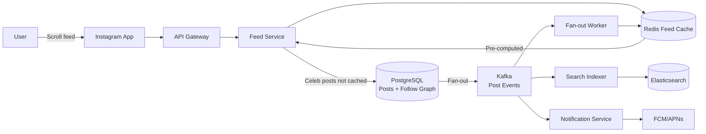
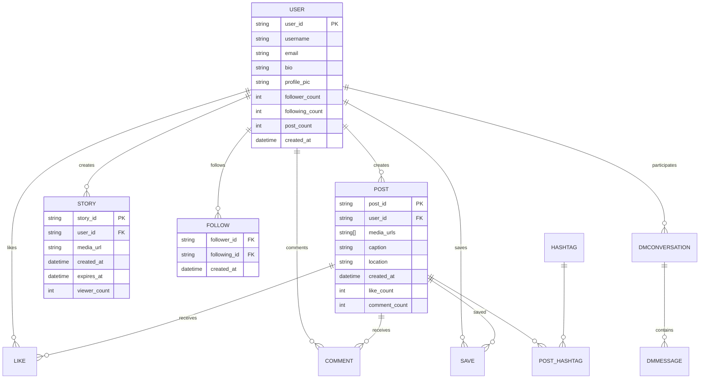

# Design Instagram

## Blogs and websites

## Medium

## Youtube

## Theory

### What Is It?

Instagram is a visual social network that lets users share photos and videos, follow friends/creators, browse a news feed, watch Stories (24-hour ephemeral content), Reels (short videos), and discover content via the Explore page. It also supports direct messaging (DMs) and location/hashtag search. The platform manages petabytes of media at 500M+ daily active users with < 200 ms feed load times.

### Why Does It Exist?

Social media shifted from text-first (Twitter, Facebook status) to visual-first. Instagram solved the "social photo album" problem — making photo and video sharing effortless with filters, and connecting visual content with social interaction (likes, comments, stories).

### What Problem Does It Solve?

* **Visual content sharing**: Efficiently upload, process, and display photos/videos at scale (100M+ uploads/day).
* **Social feed delivery**: Deliver the right posts to hundreds of millions of users in < 200 ms.
* **Stories ephemerality**: Content that auto-deletes after 24 hours — requires expiry and TTL-based cleanup.
* **Content discovery**: Help users find new creators and content beyond their social graph.
* **Direct messaging**: Real-time, scalable messaging between users.
* **Media processing**: Apply filters, resize, transcode videos; moderate content — all asynchronously.

### Important Subtopics

1. News feed generation (fan-out, caching, ranking)
2. Stories architecture (24-hour TTL, ordering, viewers list)
3. Reels (short video, recommendation-driven)
4. Media upload and processing pipeline (filters, transcoding, moderation)
5. Follow graph storage and queries
6. Direct messaging (chat infrastructure)
7. Search (users, hashtags, locations)
8. Content moderation at scale
9. Data consistency (strong for graphs, eventual for feeds)
10. Storage choices (PostgreSQL, Redis, S3, Elasticsearch)

### Problem Statement
Design a photo and video sharing social platform like Instagram supporting uploads, feed, stories, reels, explore, likes, comments, and direct messaging at scale.

### Functional Requirements
- Upload photos/videos with captions and filters
- Follow/unfollow users
- News feed (posts from followed users)
- Stories (24-hour ephemeral content)
- Reels (short-form video)
- Like, comment, share, save posts
- Explore/discover page
- Direct messaging
- Search (users, hashtags, locations)

### Non-Functional Requirements
- **Scale**: 500M+ DAU, 100M+ photos uploaded daily
- **Latency**: Feed loads < 200ms
- **Storage**: Petabytes of media
- **Availability**: 99.99%
- **Consistency**: Eventual for feed/likes, strong for follow graph

### High-Level Architecture

```
┌──────────┐     ┌──────┐     ┌──────────────────────────────┐
│  Mobile  │────▶│  CDN │     │       Service Layer           │
│  App     │     └──┬───┘     │                               │
└────┬─────┘        │         │  ┌──────────┐ ┌────────────┐  │
     │              │         │  │ Post Svc  │ │ Feed Svc   │  │
     ▼              │         │  ├──────────┤ ├────────────┤  │
┌──────────┐        │         │  │ User Svc  │ │ Story Svc  │  │
│  API GW  │────────┼────────▶│  ├──────────┤ ├────────────┤  │
└──────────┘        │         │  │ Media Svc │ │ Search Svc │  │
                    │         │  └─────┬────┘ └─────┬──────┘  │
                    │         └────────┼────────────┼──────────┘
                    │                  │            │
              ┌─────▼─────┐    ┌──────▼───┐  ┌────▼──────┐
              │   Object  │    │ Database │  │ Search    │
              │   Store   │    │ Cluster  │  │ (Elastic) │
              │  (S3)     │    └──────────┘  └───────────┘
              └───────────┘
```

### Media Upload Pipeline

```
Client → Upload Service → S3 (original)
                              │
                              ▼
                    ┌─────────────────┐
                    │  Media Pipeline  │
                    │  (async)         │
                    │  - Resize        │
                    │  - Thumbnails    │
                    │  - Apply filters │
                    │  - Video transcode│
                    │  - Content mod   │
                    └────────┬────────┘
                             │
                    ┌────────▼────────┐
                    │  CDN (multiple  │
                    │  resolutions)   │
                    └─────────────────┘
```

### Feed Generation

**Hybrid fan-out (same as Facebook approach):**
- Regular users (< 50K followers): Fan-out on write → push to followers' feed cache
- Celebrities (50K+ followers): Fan-out on read → merge at query time

```
Feed = merge(
  pre_computed_feed_from_cache,    // pushed by regular friends
  pull_celebrity_posts_on_demand,  // pulled at read time
  sponsored_posts                  // ad injection
)
→ Rank by ML model → Return top N
```

### Data Model

```
Users:     id, username, bio, profile_pic, follower_count, following_count
Posts:     id, user_id, media_urls[], caption, location, created_at
Stories:   id, user_id, media_url, expires_at, created_at
Follows:   follower_id, following_id, created_at
Likes:     post_id, user_id, created_at
Comments:  id, post_id, user_id, text, created_at
```

**Storage choices:**
| Data | Store | Reason |
|------|-------|--------|
| User profiles | PostgreSQL | Relational, ACID |
| Posts metadata | PostgreSQL + Cache | Read-heavy, cacheable |
| Follow graph | Graph DB / Cassandra | High fan-out queries |
| Feed cache | Redis | Fast reads, TTL support |
| Media files | S3 + CDN | Cheap, globally distributed |
| Search index | Elasticsearch | Full-text search |

### Stories Architecture

```
Stories expire after 24 hours:
- Write: Store in Redis with TTL=24h + persist to Cassandra
- Read: Fetch active stories from Redis (fast)
- Cleanup: Cassandra TTL auto-deletes expired stories
- Viewing order: Ranked by recency + engagement + closeness
```

### Scaling Considerations
- **Media**: S3 (unlimited scale) + multi-region CDN
- **Database**: Shard by user_id
- **Feed cache**: Partitioned Redis cluster
- **Upload processing**: Auto-scaling worker fleet (Lambda/K8s)
- **Search**: Elasticsearch cluster with sharded indices

---

## Characteristics

| Characteristic | What it means | Why it matters | How it works |
|---|---|---|---|
| **Visual-first** | Content is primarily photos/videos | Higher engagement than text | Media-first UI design |
| **Follow-based feed** | Posts from accounts you follow | Predictable, social | Fan-out on write/read |
| **Stories (ephemeral)** | 24-hour content that auto-deletes | Encourages casual sharing | Redis TTL + Cassandra TTL |
| **Reels (algorithmic)** | Short videos in Explore, not follow-based | Discovery + creator growth | Recommendation engine |
| **Media processing** | Async resize/filter/transcode/moderate on upload | Fast upload + optimized delivery | Media pipeline + CDN |
| **Strong eventual consistency** | Graph data (follows) is strong; feeds are eventually consistent | Fast reads + data integrity | DB transactions for graph; cache for feeds |

## Components

| Component | Purpose | Responsibilities | Relationship | Real-world Example |
|---|---|---|---|---|
| **Post Service** | Create/read posts | Upload, store, retrieve posts | Media Service ↔ Metadata DB | Instagram's post API |
| **Feed Service** | Serve social feeds | Fan-out posts to followers' feeds | Reads Follow Graph + Post Service | Instagram's feed cache |
| **Story Service** | Manage 24-hour Stories | Upload, serve, auto-expire stories | Redis (TTL) + Cassandra | Instagram Stories |
| **Media Service** | Process media | Resize, apply filters, transcode, moderate | S3 → Media Pipeline → CDN | Instagram's media pipeline |
| **User Service** | Manage profiles | Auth, profile data, sessions | All services | Auth microservice |
| **Search Service** | Search users/hashtags/locations | Full-text + geo search | Elasticsearch | Instagram search |
| **Messaging Service** | Direct messages | Real-time chat between users | WebSocket + Message Queue | Instagram DMs |
| **Content Moderation** | Moderate uploads | ML + human review for policy violations | Media Service → Moderation | Instagram's moderation |
| **Notification Service** | Send notifications | Push notifications for likes, comments, DMs | Kafka → Fan-out service | Instagram notifications |

## Patterns

### Fan-out on Write (with Celebrity Exception)

* **What**: When a user posts, the post is pushed to all followers' feed caches immediately. For celebrities (1M+ followers), use fan-out on read — fetch their posts on demand instead.
* **Problem solved**: Fan-out-on-write makes reads fast (just read from cache) but fanning out to 10M followers is expensive. Hybrid approach: small accounts get fan-out-on-write (fast reads); celebrities get fan-out-on-read (avoid expensive writes).
* **How it works**: (1) User posts → Post Service stores → checks follower count. (2) If < 50K followers: push post to each follower's feed Redis list. (3) If > 50K followers: mark post as "celebrity" → followers see it only when they read their feed (fetch + merge). (4) Feed retrieval merges pre-computed (regular friends) + fetched (celebrity posts) + ads.
* **When to use**: Social news feeds with power-law follower distribution.
* **When not to use**: All users roughly equal followers (no celebrity problem).
* **Advantages**: Fast feed reads; efficient for average users.
* **Disadvantages**: Complex merge logic; celebrity posts have higher read latency.
* **Real-world example**: Instagram's hybrid fan-out, Facebook's EdgeRank.

## Benefits

* **Visual engagement**: Photos and videos get 5-10x more engagement than text posts.
* **Real-time interaction**: Comments, likes, stories create immediate feedback loops.
* **Creator monetization**: Branded content, Reels bonuses, Shopping.
* **Discovery**: Explore page + Reels surface content beyond the social graph.

## Pros

* **High engagement rates**: 4.2% average engagement rate (vs. Facebook's 0.27%).
* **Mobile-optimized**: Designed for phone cameras and social sharing.
* **Rich media**: Stories, Reels, IGTV, Guides — multiple content formats.
* **Creator tools**: Filters, editing, effects, shopping tags.
* **Integrated commerce**: Shop tab + product tags → direct monetization.

## Cons

* **Algorithm dependency**: Feed ranking can hide content from followers.
* **Mental health**: Social comparison, body image issues from filtered perfection.
* **Data privacy**: Facebook/Meta data integration → privacy concerns.
* **Feed saturation**: High posting frequency → followers see less.
* **Copycat culture**: Filters and trends become commoditized.

## Challenges

### Technical Challenges

* **Feed latency**: Must serve personalized feed in < 200 ms from multiple data sources (cache, DB, ads).
* **Stories expiry**: 24-hour TTL cleanup across Redis + Cassandra must not affect active stories.
* **Media processing**: 100M+ uploads/day → resize, filter, transcode, moderate — must scale independently.
* **DM real-time**: End-to-end encrypted messaging with read receipts, typing indicators, media sharing.

### Scalability Challenges

* **Follower fan-out**: Celebrities with 100M+ followers → hybrid fan-out prevents write storms.
* **Media storage**: Petabytes of photos/videos → S3 + multi-region CDN; hot/cold tiering.
* **Search indexing**: Real-time indexing of posts, hashtags, locations → Elasticsearch cluster.
* **Concurrent users**: 500M+ DAU → cache (Redis) partitioned by user_id hash.

### Performance Challenges

* **Feed assembly**: Merge cached feed + celebrity posts + ads + suggested posts in < 200 ms.
* **Image loading**: Progressive loading + lazy loading; different resolutions for different devices.
* **Stories ordering**: Sort by recency + engagement + closeness in real-time.

### Reliability Challenges

* **Cache invalidation**: Follow/unfollow must invalidate fan-out lists — use async fan-out to avoid blocking.
* **Media pipeline failures**: Failed moderation → video stuck → retry with DLQ.
* **Feed inconsistency**: Cache misses → fallback to DB → slower but consistent.

### Maintainability Challenges

* **Feed ranking evolution**: A/B testing 50+ ranking signals; rolling out changes safely.
* **Feature flagging**: Stories, Reels, Shopping → feature flags for gradual rollout.
* **Data migration**: User ID sharding changes → online migration without downtime.

### Operational Challenges

* **Content moderation**: 100M+ images/videos/day → ML + human review pipeline; 150+ content moderators per language.
* **CDN optimization**: Edge cache hit rates; cache invalidation for updated content.
* **Monitoring**: Feed load time, cache hit rate, media processing latency, story viewer count accuracy.

### Security Concerns

* **Data exposure**: Photo/video content must be access-controlled (private accounts).
* **DM encryption**: End-to-end encryption for DMs (Signal Protocol).
* **Content removal**: Honor takedown requests (copyright, DMCA, government requests).
* **Bot detection**: Detect fake accounts and engagement bots.

## Best Practices

* **Hybrid fan-out**: Fan-out on write for regular users (< 10K followers); fan-out on read for celebrities.
* **Cache warming**: Pre-compute feeds for active users during low-traffic hours.
* **Consistent reads**: For follow graph, use strongly consistent DB (PostgreSQL); for feeds, use eventually-consistent cache (Redis).
* **Media pipeline**: Process media asynchronously; serve multiple resolutions; use CDN with proper cache headers.
* **Stories TTL**: Use dual TTL (Redis for hot access, Cassandra for durability with auto-expiry).
* **Search indexing**: Async Elasticsearch indexing; handle partial indexing gracefully.
* **Feature flags**: Gradually roll out features (Reels, Shopping) with kill switches.
* **Monitor engagement**: Track feed CTR, story views, DM delivery rate, upload success rate.

## When to Use

### Appropriate

* When building a visual social platform (photo/video sharing).
* When Stories or ephemeral content is part of the product.
* When creator monetization (branded content, shopping) is needed.
* When real-time social interaction (likes, comments, DMs) is expected.

### Not Appropriate

* For text-first communities (use Facebook-style text feed).
* For professional networking (LinkedIn approach).
* For news/aggregation-focused platforms.

### Alternatives

* **Facebook-style feed**: Text + photo + video; algorithmic ranking; follow-based.
* **Twitter**: Chronological text + images; real-time conversation.
* **Snapchat**: Stories-first; AR filters; ephemeral messaging.
* **Pinterest**: Interest-based discovery; image-centric.

### Decision Factors

* **Content type**: Visual media dominant → Instagram-style.
* **Discovery goals**: Algorithmic discovery → integrate Reels/Explore.
* **Monetization**: Shopping/commerce → integrate product tags.
* **User base**: Mobile-first, younger demographics.

## Use Cases

### Social Media Feed (Instagram)

* **Problem**: Deliver a personalized photo/video feed to 500M DAU in < 200 ms.
* **Solution**: Hybrid fan-out (push for regular users, pull for celebrities) + Redis cache + ranking model.
* **Why suitable**: Instagram's proven approach handles the scale and engagement pattern.
* **How it works**: (1) User posts photo → (2) stored in S3 + metadata in PostgreSQL → (3) fan-out to follower feeds in Redis (if < 50K followers) → (4) when user opens app, fetch from Redis → (5) merge with celebrity posts (fetched on demand) + ads → (6) ranking model orders → (7) serve top 12.
* **Trade-offs**: Cache memory cost (Redis for 500M feeds); celebrity pull adds read latency; ranking model complexity.

### Stories (24-hour Ephemeral Content)

* **Problem**: Store and serve 24-hour content that auto-deletes, ordered by relationship closeness.
* **Solution**: Redis with TTL=86400 (auto-delete) + Cassandra for durability + TTL.
* **Why suitable**: TTL-based expiration eliminates manual cleanup; fast Redis access for active stories.
* **How it works**: (1) User posts story → (2) written to Redis with 24h TTL → (3) replicated to Cassandra (also 24h TTL) → (4) viewers → Redis (fast) → (5) at 24h, Redis auto-deletes; Cassandra TTL handles late reads.
* **Trade-offs**: Double write (Redis + Cassandra) increases complexity; TTL race conditions; Cassandra TTL delay.

## Architecture

Instagram uses a **microservices architecture** with a hybrid data strategy: PostgreSQL for relational data (users, posts, follows), Redis for feed caching and stories, S3 + CDN for media, Elasticsearch for search, and Cassandra for scalable reads. The **feed system** uses hybrid fan-out (push for regular users, pull for celebrities). **Media processing** is fully async — upload → S3 → processing queue → workers (resize, filter, transcode, moderate) → CDN. **Stories** use Redis TTL for fast access + Cassandra TTL for durability. **DMs** use an async message queue with end-to-end encryption.

```mermaid
graph TD
  subgraph "Clients"
    App[Mobile App]
  end
  subgraph "Edge"
    CDN[CDN<br/>Images/Videos]
    APIGW[API Gateway]
  end
  subgraph "Services"
    PostSvc[Post Service]
    FeedSvc[Feed Service]
    StorySvc[Story Service]
    MediaSvc[Media Service]
    UserSvc[User Service]
    SearchSvc[Search Service]
    MsgSvc[Message Service]
    NotifSvc[Notification Service]
  end
  subgraph "Data"
    PG[(PostgreSQL<br/>Users, Posts, Follows)]
    Redis[(Redis<br/>Feed Cache, Stories)]
    S3[(S3<br/>Raw Media)]
    Elastic[(Elasticsearch<br/>Search Index)]
    Cassandra[(Cassandra<br/>Story Dura])
  end
  App -->|Feed/Story/Media| CDN
  App -->|API Calls| APIGW
  APIGW --> PostSvc
  APIGW --> FeedSvc
  APIGW --> StorySvc
  APIGW --> MediaSvc
  APIGW --> UserSvc
  APIGW --> SearchSvc
  APIGW --> MsgSvc
  APIGW --> NotifSvc

  PostSvc --> PG
  FeedSvc --> Redis
  FeedSvc --> PG
  StorySvc --> Redis
  StorySvc --> Cassandra
  MediaSvc --> S3
  MediaSvc --> CDN
  UserSvc --> PG
  SearchSvc --> Elastic
  MsgSvc --> Kafka[(Kafka<br/>Messages)]
  NotifSvc --> Kafka

  MediaSvc -->|Processing| Queue[(Media Queue)]
  Queue --> Workers[FFmpeg Workers]
  Workers -->|Processed| CDN
  Workers -->|Metadata| PG
```

### Architecture Structure

* **Microservice layer**: Independent services for posts, feeds, stories, media, users, search, messaging, notifications.
* **Data layer**: PostgreSQL (relational), Redis (caching + stories), S3 (media), Elasticsearch (search), Cassandra (story durability), Kafka (streaming).
* **Edge layer**: CDN for media; API Gateway for auth + rate limiting.

### Communication

* **Client ↔ Services**: REST/gRPC over HTTPS.
* **Services**: Async events via Kafka (e.g., new post → feed fan-out).
* **Media processing**: Queue-based (Kafka) → worker pool.

### Data Flow

1. **Upload**: User uploads photo → Media Service → S3 (raw) → Media Queue → FFmpeg workers (resize/filter/moderate) → CDN + PostgreSQL (metadata).
2. **Feed**: User posts → Post Service stores → Feed Service fans out to follower Redis caches → Feed API reads from cache.
3. **Story**: User posts story → Story Service → Redis (TTL 24h) + Cassandra (TTL 24h) → Story API.
4. **Search**: New post → Search Service → Elasticsearch index → Search API.

### Scaling Strategy

* **Posts**: PostgreSQL sharded by `user_id` hash; read replicas for serving.
* **Feeds**: Redis cluster partitioned by `follower_id` hash; replicas per shard.
* **Stories**: Redis cluster for active stories; Cassandra for durability.
* **Media**: S3 auto-scaling; CDN edge caching.
* **Search**: Elasticsearch cluster; index per day; hot/warm nodes.

### Failure Handling

* **Cache miss**: Feed Service falls back to DB (slower but consistent).
* **Media processing failure**: Dead-letter queue → manual review; user notified.
* **Search indexing failure**: New posts not searchable until re-index; alert triggered.
* **Story deletion**: Redis TTL ensures auto-deletion; Cassandra TTL handles late expiration.

## High-Level Design



## Deep Dive

The existing file's Theory section contains detailed deep-dive content for:
- **Media Upload Pipeline**: Async processing with FFmpeg workers, content moderation, CDN distribution.
- **Feed Generation**: Hybrid fan-out (push for < 50K followers, pull for celebrities).
- **Stories Architecture**: 24h TTL in Redis + Cassandra.
- **Search Service**: Elasticsearch with sharded indices.
- **Data Model**: Users, Posts, Stories, Follows, Likes, Comments — stored in PostgreSQL + Redis + S3 + Elasticsearch.
- **Scaling**: Media (S3 + CDN), DB (shard by user_id), Feed cache (partitioned Redis), Upload processing (auto-scaling workers), Search (sharded Elasticsearch).

## API Contract

* **API purpose:** Mobile client API for posting, feed browsing, stories, search, interactions.

| Method | Endpoint | Description |
|---|---|---|
| GET | `/api/v1/feed` | Get home feed (posts from followed users) |
| GET | `/api/v1/feed/stories` | Get active stories from followed users |
| POST | `/api/v1/posts` | Create a post (photo/video) |
| POST | `/api/v1/posts/{id}/like` | Like a post |
| POST | `/api/v1/posts/{id}/comment` | Comment on a post |
| POST | `/api/v1/stories` | Create a story |
| GET | `/api/v1/search` | Search users, tags, locations |
| POST | `/api/v1/direct/messages` | Send a direct message |
| POST | `/api/v1/follow/{username}` | Follow a user |
| GET | `/api/v1/user/{id}` | Get user profile + recent posts |

**Authentication**: Bearer token (JWT) in Authorization header.

**Pagination**: `cursor` parameter for feed pagination; `limit` parameter for items count.

**Error responses**:
```json
{"error": "unauthorized", "message": "Invalid access token", "code": 401}
{"error": "not_found", "message": "Post not found", "code": 404}
{"error": "rate_limited", "message": "Too many requests", "code": 429}
```

## Data Modeling

* **Entities**: User, Post, Story, Follow, Like, Comment, Save, Hashtag, Location, DMConversation, DMMessage.



**Storage choices** (from existing content):
| Data | Store | Reason |
|------|-------|--------|
| User profiles | PostgreSQL | Relational, ACID |
| Posts metadata | PostgreSQL + Cache | Read-heavy, cacheable |
| Follow graph | Graph DB / Cassandra | High fan-out queries |
| Feed cache | Redis | Fast reads, TTL support |
| Media files | S3 + CDN | Cheap, globally distributed |
| Search index | Elasticsearch | Full-text search |
| Stories | Redis (TTL) + Cassandra (TTL) | Fast access + durability |

## Java and Spring Boot Implementation

```java
@RestController
@RequestMapping("/api/v1/feed")
@RequiredArgsConstructor
public class FeedController {
    private final FeedService feedService;
    private final StoryService storyService;

    @GetMapping
    public ResponseEntity<FeedResponse> getFeed(
            @AuthenticationPrincipal UserDetails user,
            @RequestParam(defaultValue = "0") String cursor,
            @RequestParam(defaultValue = "12") int limit) {
        
        FeedResponse feed = feedService.getHomeFeed(user.getId(), cursor, limit);
        return ResponseEntity.ok(feed);
    }

    @GetMapping("/stories")
    public ResponseEntity<List<Story>> getStories(
            @AuthenticationPrincipal UserDetails user) {
        List<Story> stories = storyService.getActiveStories(user.getId());
        return ResponseEntity.ok(stories);
    }
}

@Service
public class FeedService {
    private final RedisTemplate<String, Post> redis;
    private final PostRepository postRepository;
    private final FollowRepository followRepository;
    private static final int PUSH_FANOUT_THRESHOLD = 10_000;

    public FeedResponse getHomeFeed(String userId, String cursor, int limit) {
        String cacheKey = "feed:" + userId;
        
        // Try cache first (fan-out on write)
        List<Post> cachedPosts = redis.opsForList().range(cacheKey, 0, limit - 1);
        if (cachedPosts != null && !cachedPosts.isEmpty()) {
            return FeedResponse.builder()
                .posts(cachedPosts)
                .cursor(redis.opsForList().size(cacheKey))
                .build();
        }

        // Fallback: fan-out on read for celebrities
        List<String> following = followRepository.findFollowing(userId);
        List<Post> posts = postRepository.findRecentByAuthors(
            following, cursor, limit);
        
        // Cache for next request
        if (cachedPosts != null) {
            redis.opsForList().leftPushAll(cacheKey, posts);
            redis.expire(cacheKey, Duration.ofHours(1));
        }

        return FeedResponse.builder().posts(posts).build();
    }

    @EventListener
    public void handleNewPost(PostCreatedEvent event) {
        Post post = event.getPost();
        String userId = post.getUserId();
        int followerCount = followRepository.countFollowers(userId);

        if (followerCount < PUSH_FANOUT_THRESHOLD) {
            // Fan-out on write: push to each follower's feed cache
            List<String> followers = followRepository.findFollowers(userId);
            String cacheKey = "feed:" + userId;
            for (String followerId : followers) {
                String followerCacheKey = "feed:" + followerId;
                redis.opsForList().leftPush(followerCacheKey, post);
                redis.expire(followerCacheKey, Duration.ofHours(2));
            }
        }
        // For celebrities (high follower count), do nothing here —
        // posts are fetched on read via the fallback path
    }
}
```

## Real-World Examples

* **Instagram**: 2B+ monthly users, 500M+ DAU. Uses hybrid fan-out (push for < 10K followers, pull for celebrities). Media stored in S3 + Cloudflare CDN. Feeds served from Redis cache. PostgreSQL sharded by user_id. Elasticsearch for search. Cassandra for Stories (TTL-based expiry). Messaging via async queue + end-to-end encryption.
* **Facebook**: Similar hybrid fan-out with EdgeRank algorithm. Facebook's TAO (The Associations and Objects) serves the social graph. News Feed ranking uses 100K+ features.
* **Snapchat**: Stories-first design. All content expires in 24 hours. Geofilters and AR lenses. Uses a custom real-time communication system.

## Interview Preparation

### Beginner Questions

**Q: What is the fan-out problem in social feeds?**
A: When a user with 1M followers posts a photo, you need to deliver it to 1M followers' feeds. Options: (1) Fan-out on write — push the post to 1M caches immediately (write-heavy, expensive for celebrities). (2) Fan-out on read — when each follower opens their feed, fetch the celebrity's recent posts and merge (read-heavy, higher latency for celebrity content). Instagram uses hybrid: push for < 50K followers, pull for celebrities.

**Q: How does Instagram Stories handle 24-hour expiry?**
A: Redis with `EXPIRE` set to 86400 seconds (24 hours) — Redis auto-deletes the key. Cassandra also has TTL on the row. This makes Stories available for ~24 hours; Redis handles fast reads, Cassandra provides durability.

**Q: How do you store and query the follow graph at scale?**
A: Options: (1) Adjacency list in PostgreSQL (sharded by user_id) — `SELECT following FROM follows WHERE follower_id = ?`. (2) Graph database (Neo4j) — efficient for multi-hop queries. (3) Cassandra with composite partition key `(follower_id) + clustering key (following_id)` — scales writes. (4) Redis (set of followers per user) — fast reads but memory-intensive.

### Intermediate Questions

**Q: How does Instagram handle 100M+ uploads/day?**
A: (1) Async media processing — upload → S3 → queue → FFmpeg workers → resize/filter/transcode/moderate → CDN. Each step is independent and scalable. (2) Media stored in S3 + CDN (multi-region). (3) Metadata in PostgreSQL (sharded). (4) Processing workers auto-scale based on queue depth.

**Q: How does Instagram rank content in the feed?**
A: Instagram uses a machine learning model (EdgeRank successor) with hundreds of features: user past interactions (likes, comments, saves, watch time), post information (recency, media type, caption), poster information (relationship to user, past interaction frequency), and device information. The model predicts P(interact) and ranks posts accordingly. The feed shows ~30% feed posts, ~30% Stories, ~30% Reels, ~10% ads.

**Q: What is the difference between Instagram feed and Stories architecture?**
A: Feeds are persistent (posts visible indefinitely); Stories are ephemeral (24-hour TTL). Feeds use fan-out (push to follower caches) + ranking model; Stories use chronological order + TTL-based auto-expiry. Feeds are read-heavy (cached in Redis); Stories need fast write + TTL expiry.

### Advanced Questions

**Q: How would you design Instagram's messaging (DM) system?***
A: (1) **Storage**: Store messages in a distributed log (Kafka/Pulsar) partitioned by conversation_id; replicate for availability. (2) **Delivery**: WebSocket connection to online users; push notification for offline users (FCM/APNs). (3) **End-to-end encryption**: Signal Protocol (double ratchet) — encrypt messages client-side; server can't read content. (4) **Read receipts**: Store last-read message_id per user per conversation. (5) **Offline storage**: Store messages server-side until user comes online; sync on connection. (6) **Ordering**: Sequential message IDs; handle out-of-order delivery via client-side sorting. (7) **Scale**: 5B+ DMs/day; shard by conversation_id hash; use consistent hashing.

**Q: How does Instagram handle content moderation at 100M+ posts/day?**
A: (1) **Automated ML**: Image/video classifiers (nudity, violence, hate symbols) + text classifiers (captions, comments) — make 95%+ of decisions in < 100ms. (2) **Human review**: Edge cases and appeals → 15K+ content reviewers globally. (3) **Feedback loop**: Human review outcomes retrain ML models weekly. (4) **Community reporting**: Users report posts → priority review. (5) **Shadow banning**: Reduce distribution of borderline content without user notification. (6) **Proactive detection**: Detect patterns (new spam campaigns, coordinated inauthentic behavior).

### Senior-Level Questions

**Q: How would you design Instagram's feed system for 1B monthly users with < 200ms latency?****
A: (1) **Hybrid fan-out**: Fan-out on write for < 10K followers (push to Redis); fan-out on read for celebrities (fetch on demand). Store: `feed:{follower_id}` as a Redis sorted set (score=post_time, member=post_data). Use Redis cluster (2000+ shards). (2) **Candidate generation**: From cache (followed users) + DB (celebrity pull) + ads → ~50 candidates. (3) **Ranking**: Lightweight model (GBDT or shallow NN with 10 features) — score in < 50ms; cache top 50 results per user for 10 minutes. (4) **Caching**: 50+ edge PoPs with Redis; pre-warm top 10M most active users' feeds. (5) **Merge**: Merge candidate lists (cache + DB + ads) → rank → return top 12. (6) **Sharding**: By user_id hash → 2000 Redis shards → each handles 500K users. (7) **Monitoring**: Cache hit rate (>80%), feed latency (P99 < 200ms), ranking accuracy.

**Q: How would you handle a feature rollout (e.g., new Reels algorithm) to 500M users?****
A: (1) **Feature flag**: Use a flag service (LaunchDarkly/internal) — 1% of users get new algorithm. (2) **A/B test**: Track watch time, engagement, retention, satisfaction score for new vs. old. (3) **Gradual rollout**: After 24h stability → 5% → 10% → 25% → 50% → 100% over 5-7 days. (4) **Guardrails**: Alert if key metrics drop > 5% (engagement, retention, latency). (5) **Rollback plan**: Kill switch — instant revert to old algorithm. (6) **Canary regions**: Test in specific countries first (lower risk). (7) **Metrics**: Cohort retention, DAU/MAU, video completion rate, time-to-first-scroll, crash rate.

### System Design Questions (Senior)

**Q: Design Instagram Stories for 500M DAU with 24-hour auto-expiry.**

**Approach**:
- **Write path**: User posts story → Media Service (upload + process → S3/CDN) → Story Service → write to Redis (key=`story:{user_id}:{story_id}`, TTL=86400s) + Cassandra (TTL=86400s). Notify followers via Kafka.
- **Read path**: Fetch active stories → Read from Redis (fast) → if cache miss → Cassandra → Redis cache. Sort by relationship closeness + recency.
- **Expiry**: Redis auto-deletes keys at TTL expiry. Cassandra TTL handles late reads. No manual cleanup.
- **Scale**: Redis cluster (500+ shards); Cassandra ring (100+ nodes). Stories partitioned by user_id hash.
- **Ordering**: `stories:{user_id}` = sorted set (score=post_time, member=story_id) → `ZREVRANGE` → top 24h.
- **Viewers list**: For each story, store viewer set (Redis set with TTL=86400) → `SMEMBERS` to get viewers.
- **Stories tray**: `tray:{follower_id}` = list of followed users who have active stories → precomputed via Kafka consumer → updated every 60s.
- **Media**: Stories stored in S3 + CDN; adaptive quality based on device/network.
- **Monitoring**: Story view rate, story creation rate, Redis memory, expiry lag.

**Q: How would you design a content moderation system that handles 100M+ posts/day with 95% automation?**

**Approach**:
- **Pipeline**: Upload → raw store (S3) → moderation queue (Kafka) → ML classifier (parallel) → decision.
- **ML classifiers**: (1) Image classifier (ResNet) for nudity, violence, gore. (2) Video classifier (3D CNN) for the same + deepfake detection. (3) Text classifier (BERT) for captions — hate speech, harassment, misinformation. (4) Audio classifier for voice content. (5) Multimodal classifier (CLIP) combining image + text.
- **Confidence threshold**: If ML confidence > 90% → auto-approve; < 80% → auto-reject; 80-90% → human review.
- **Human review**: 15K+ reviewers across 30 countries; work pulled from low-confidence queue; pay-per-review. Reviewers use a UI with ML suggestions + override capability.
- **Feedback loop**: Human reviews + user reports → labeled dataset → retrain ML weekly.
- **Scale**: 100M posts/day → 700 posts/second → 100+ GPU instances for inference; batch inference (10-50 images per GPU).
- **Appeal system**: Users can request review of rejected content → goes to senior reviewer.
- **Shadow banning**: For borderline content (e.g., borderline misinformation), reduce distribution rather than deleting.
- **Proactive detection**: Detect trending hashtags/patterns that may indicate new spam campaigns → update classifier.
```
