# Design Instagram

## Blogs and websites

## Medium

## Youtube

## Github

## Theory

### Topics Covered

1. [Introduction and Problem Statement](#introduction-and-problem-statement)
2. [Characteristics](#characteristics)
3. [Pros](#pros)
4. [Cons](#cons)
5. [Use Cases](#use-cases)
6. [Components](#components)
7. [Architectural Patterns](#architectural-patterns)
8. [Benefits](#benefits)
9. [Challenges](#challenges)
10. [Best Practices](#best-practices)
11. [When to Use and When Not to Use](#when-to-use-and-when-not-to-use)
12. [Data Model and API](#data-model-and-api)
13. [News Feed Generation](#news-feed-generation)
14. [Stories Architecture](#stories-architecture)
15. [Reels Architecture](#reels-architecture)
16. [Media Processing Pipeline](#media-processing-pipeline)
17. [Follow Graph](#follow-graph)
18. [Direct Messaging](#direct-messaging)
19. [Content Moderation at Scale](#content-moderation-at-scale)
20. [Search and Discovery](#search-and-discovery)
21. [Replication Strategies](#replication-strategies)
22. [Failure Detection and Membership](#failure-detection-and-membership)
23. [High Availability and Scalability](#high-availability-and-scalability)
24. [Performance and Optimization](#performance-and-optimization)
25. [CAP Theorem and Consistency Trade-offs](#cap-theorem-and-consistency-trade-offs)
26. [Encryption and Key Management](#encryption-and-key-management)
27. [Authentication and Authorization](#authentication-and-authorization)
28. [Security Threats and Mitigations](#security-threats-and-mitigations)
29. [Observability and Logging](#observability-and-logging)
30. [Real-World Implementations](#real-world-implementations)
31. [Java and Spring Boot Implementation Guide](#java-and-spring-boot-implementation-guide)
32. [Interview Questions and Answers](#interview-questions-and-answers)

---

### Introduction and Problem Statement

Instagram is a visual social network that lets users share photos and videos, follow friends and creators, browse a home feed, watch Stories (24-hour ephemeral content), watch Reels (short videos), and discover content via the Explore page. The platform also supports direct messaging, content moderation, and integrated commerce, serving 500M+ daily active users with sub-200 ms feed load times while storing petabytes of media across a global CDN.

Social media evolved from text-first platforms (Twitter, Facebook status) to visual-first experiences. Instagram solved the "social photo album" problem by making photo and video sharing effortless with on-device filters, connecting visual content directly to social interaction (likes, comments, stories, reels) and commerce (product tags), which drives engagement rates roughly 15x higher than text-first feeds.

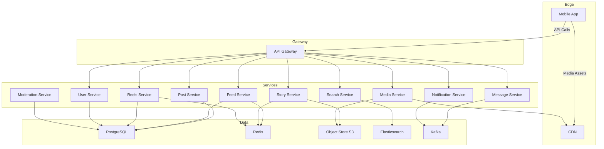

*Diagram: Instagram high-level flow — mobile clients fetch media through a CDN and make API calls through a gateway that routes to independent microservices; relational state lives in PostgreSQL, feed and story caches in Redis, media objects in S3, search in Elasticsearch, and streams in Kafka.*

The concrete design problem is to build a photo and video sharing social platform supporting uploads, a home feed, stories, reels, explore, likes, comments, and direct messaging at planetary scale.

**Problem Statement:** Design a visual social platform like Instagram that ingests 100M+ uploads per day, serves a personalized home feed to 500M+ daily active users in under 200 ms, delivers 24-hour ephemeral stories and algorithmic reels, powers real-time DMs, and moderates content at scale — all with 99.99% availability and eventual consistency for feeds balanced with strong consistency for the follow graph.

**The problems it solves:**

- **Visual content sharing:** Efficiently upload, process, and display photos/videos async at scale (100M+ uploads/day).
- **Social feed delivery:** Deliver the right posts to hundreds of millions of users in under 200 ms using hybrid fan-out and caching.
- **Stories ephemerality:** Content that auto-deletes after 24 hours, requiring TTL-based expiry and cleanup that never blocks active reads.
- **Content discovery:** Help users find new creators and content beyond their social graph via an Explore/recommendation engine.
- **Direct messaging:** Real-time, scalable, encrypted messaging between users with read receipts and typing indicators.
- **Media processing:** Apply filters, resize, transcode videos, and moderate content asynchronously without slowing the upload.

---

### Characteristics

| Characteristic | What it means | Why it matters | How it works |
|---|---|---|---|
| **Visual-first** | Content is primarily photos and short videos | Higher engagement than text; mobile-native | Media-first UI, on-device filters, progressive loading |
| **Follow-based feed** | Posts from accounts you follow, then ranked | Predictable social signal plus relevance | Fan-out on write/read, then ML ranking |
| **Stories (ephemeral)** | 24-hour content that auto-deletes | Encourages casual, frequent sharing | Redis TTL + Cassandra TTL auto-expiry |
| **Reels (algorithmic)** | Short videos surfaced by recommendataion, not follow | Discovery and creator growth beyond the graph | Two-stage model: candidate gen then ranking |
| **Media processing** | Async resize, filter, transcode, moderate on upload | Fast upload response plus optimized delivery | Object-store event → worker pipeline → CDN |
| **Strong eventual mix** | Graph data is strong; feeds are eventually consistent | Fast reads plus data integrity where it matters | DB transactions for follows; cache for feeds |
| **Real-time interaction** | Likes, comments, stories, DMs feel immediate | Core engagement loop | WebSocket push and fan-out workers |

**Characteristic detail:**

- **Visual-first content** removes friction from sharing: a single tap captures and uploads, and the client applies filters locally where possible to keep the upload payload small, which is what makes the platform mobile-native and engagement-heavy.
- **Follow-based but ranked feed** starts from the follow graph (deterministic) then applies a learned ranking model over hundreds of features (past interactions, recency, media type) so the feed feels both social and relevant.
- **Stories ephemerality** drives 24-hour TTLs in both the hot store (Redis) and the durable store (Cassandra), so expiry is automatic and never blocks the write or read path.
- **Reels is recommendation-driven**, not follow-driven: the candidate pool is the entire post corpus and a two-stage model (candidate generation then ranking) surfaces content from creators the user does not follow.

---

### Pros

- **High engagement rates**: 4.2% average engagement rate versus Facebook's 0.27%, driven by visual-first content and algorithmic curation.
- **Mobile-optimized**: designed for phone cameras and social sharing, with on-device filtering and progressive image loading.
- **Rich media formats**: Stories, Reels, Guides, and long-form video support diverse creator expression and longer watch time.
- **Creator monetization**: branded content, Reels bonuses, and shopping tags turn engagement into revenue.
- **Integrated commerce**: product tags and a Shop tab let users purchase without leaving the app, increasing conversion.
- **Network effects**: each new user increases the value of the follow graph and the candidate pool for recommendations.
- **Multi-format retention**: stories keep daily cadence, reels drive session length, and the feed sustains long-term engagement.

---

### Cons

- **Algorithm dependency**: feed and reel ranking can hide content from followers, frustrating creators who rely on organic reach.
- **Mental health concerns**: social comparison and filtered perfection contribute to body image and anxiety issues.
- **Data privacy**: Meta's integration raises privacy concerns about cross-product data usage and targeted advertising.
- **Feed saturation**: high posting frequency from followed accounts reduces the fraction of seen posts.
- **Copycat culture**: successful filters and trends are quickly commoditized, requiring constant innovation to stay differentiated.
- **Platform risk**: changes to the recommendation algorithm or API can dramatically shift creator revenue overnight.
- **Content policy burden**: hosting 100M+ uploads/day requires an enormous moderation operation blending ML and human review.

---

### Use Cases

#### Social Media Feed for Visual Content

A photo/video sharing platform where the feed is built from the follow graph and ranked by an ML model. Hybrid fan-out (push to caches for users with fewer than 10K followers, pull on read for celebrities) plus Redis caching keeps the 95th-percentile feed load under 200 ms while avoiding write storms from high-follower accounts.

#### Ephemeral Stories and Short-Form Video

24-hour stories stored with dual TTL (Redis for fast reads, Cassandra for durability) and short-form reels served from a recommendation pipeline, both designed for mobile consumption with progressive media loading and adaptive bitrate streaming.

#### Creator Monetization and Discovery

Branded content tags, Reels bonuses, and shopping integration turn engagement into revenue while an Explore/recommendation engine surfaces content beyond the social graph to retain users and grow total watch time.

#### Direct Messaging with Privacy

Real-time, optionally end-to-end encrypted DMs between individuals and groups, with read receipts, typing indicators, and media sharing, built on a durable message log with optional encryption for sensitive conversations.

---

### Components

| Component | Purpose | Responsibilities | Relationship | Real-world Example |
|---|---|---|---|---|
| **Post Service** | Create/read posts | Validate, store, and retrieve post metadata | Media Service, PostgreSQL, Kafka | Instagram post API |
| **Feed Service** | Serve home feeds | Compute and cache follower feeds; merge celebrity posts | Follow Graph, Post Service, Redis | Instagram feed cache |
| **Story Service** | Manage 24-hour stories | Upload, serve, and auto-expire stories | Redis (TTL), Cassandra | Instagram Stories |
| **Reels Service** | Serve short-form video | Candidate generation, ranking, and serving | Media Service, ranking model | Instagram Reels |
| **Media Service** | Process uploads | Trigger and track async media processing | S3, processing queue, CDN | Instagram media pipeline |
| **User Service** | Manage profiles | Auth, profiles, sessions, blocks | PostgreSQL, all services | Auth microservice |
| **Search Service** | Search users, tags, places | Full-text and geo search | Elasticsearch | Instagram search |
| **Messaging Service** | Direct messages | Real-time chat between users | Kafka / message log, WebSocket | Instagram DMs |
| **Moderation Service** | Moderate uploads | ML classification plus human review | Media Service, PostgreSQL | Instagram moderation |
| **Notification Service** | Deliver notifications | Push for likes, comments, DMs, stories | Kafka, FCM/APNs | Instagram notifications |

---

### Architectural Patterns

#### Fan-out on Write (with Celebrity Exception)

- **What**: When a user posts, the post is pushed to all followers' feed caches immediately. For celebrities (100K+ followers), use fan-out on read instead — fetch their posts on demand at read time.
- **Problem solved**: Fan-out-on-write makes reads fast (just read from cache) but fanning out to 10M followers is an expensive write. The hybrid approach pushes to regular users' caches (fast reads) while deferring celebrity posts to read-time merge.
- **How it works**: (1) User posts → Post Service stores → checks follower count. (2) If below the threshold, push post to each follower's feed Redis sorted set. (3) If above the threshold, mark the post as "celebrity" so followers see it only on read. (4) Feed retrieval merges pre-computed regular posts, on-demand celebrity posts, and injected ads.
- **When to use**: Social news feeds with a power-law follower distribution.
- **When not to use**: When all users have roughly equal follower counts (no celebrity problem).
- **Pros**: Fast feed reads; efficient for the average user.
- **Cons**: Complex merge logic; celebrity posts have higher read latency.
- **Example**: Instagram's hybrid fan-out and Facebook's EdgeRank.

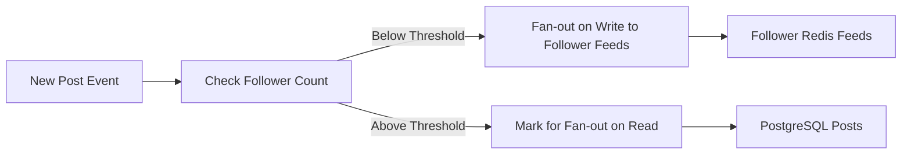

*Diagram: Hybrid fan-out decision point — posts from accounts below the follower threshold are pushed into follower caches at write time, while posts from high-follower accounts are stored once in the database and merged at read time.*

#### Cache-Aside for Feeds

- **What**: The feed cache holds pre-computed follower feeds; on a cache miss the service falls back to the database and repopulates the cache.
- **Problem solved**: Keeps the hot path (active users' feeds) in memory while bounding cache memory to actually-active users rather than all 500M users.
- **When to use**: Read-heavy fan-out caches where the working set is a small fraction of total users.
- **When not to use**: When feed freshness must be strongly consistent on every read.
- **Pros**: Only-used feeds are cached; DB outages degrade to slower but correct reads.
- **Cons**: Miss penalty triggers a merge from multiple sources (DB + celebrity pull + ads).

#### Asynchronous Media Pipeline

- **What**: Upload triggers an object-store event; a worker fleet then resizes, filters, transcodes, and moderates media independently of the request path.
- **Problem solved**: Keeps the upload response fast while decoupling media transformation (seconds for video) from user-facing latency.
- **When to use**: Any platform ingesting user media at high volume.
- **Pros**: Independent scaling of workers; retries and dead-letter handling isolate failures.
- **Cons**: Media is unavailable in final form until processing completes; tracking status adds complexity.

#### TTL-based Expiry for Stories

- **What**: Story data is written with a 24-hour time-to-live in Redis and a matching TTL in Cassandra so it self-deletes.
- **Problem solved**: Ephemeral content that auto-expires without a background cleanup job that risks affecting active stories or missing edge cases.
- **When to use**: Any feature built on time-bounded content (stories, short-lived notifications, temporary offers).
- **Pros**: Automatic, reliable deletion; no manual cleanup logic.
- **Cons**: Late writes near the 24h boundary can race with expiry; dual-store TTL requires care.

#### Two-Stage Recommendation Pipeline for Reels

- **What**: A candidate generator retrieves hundreds to thousands of candidates from the entire post corpus, then a ranking model scores and trims them to the top ~30 for the Reels tray.
- **Problem solved**: Serves personalized, non-follow-based content without scanning the full corpus on every request.
- **When to use**: Algorithmic discovery surfaces where the candidate pool is orders of magnitude larger than what is shown.
- **Pros**: High recall from broad candidate gen plus focused ranking latency.
- **Cons**: Requires feature stores and separate model-serving infrastructure.

---

### Benefits

- **Visual engagement**: Photos and videos generate 5–10x more engagement than text posts, driving daily active usage.
- **Real-time interaction**: Comments, likes, stories, and DMs create immediate feedback loops that increase session length and return rate.
- **Creator monetization**: Branded content, Reels bonuses, and shopping tags create a revenue stream that retains creators on the platform.
- **Discovery**: The Explore page and Reels surface content beyond the social graph, increasing total watch time and retention.
- **Multiple content formats**: Stories, Reels, and the feed each serve a different consumption cadence, compounding daily engagement.
- **Network effects**: Each new user and post enriches the follow graph and the recommendation candidate pool, raising the platform's overall value.

---

### Challenges

#### Technical Challenges

- **Feed latency**: Must serve a personalized feed in under 200 ms assembled from multiple sources (cache, database, ads, suggested posts).
- **Story expiry**: 24-hour TTL cleanup across Redis and Cassandra must never affect active stories or cause race conditions.
- **Media processing**: 100M+ uploads per day — resize, filter, transcode, moderate — must scale independently of the request path.
- **DM real-time**: End-to-end encrypted messaging with read receipts, typing indicators, and media sharing across billions of conversations.
- **Reels ranking**: Candidate generation and ranking must serve globally-relevant content in tens of milliseconds.

#### Scalability Challenges

- **Follower fan-out**: Celebrities with 100M+ followers require hybrid fan-out to prevent write storms on every post.
- **Media storage**: Petabytes of photos and videos demand S3 plus multi-region CDN with hot/cold tiering.
- **Search indexing**: Real-time indexing of posts, hashtags, and locations requires a sharded Elasticsearch cluster.
- **Concurrent users**: 500M+ DAU require cache (Redis) partitioned by user_id hash across many shards.
- **Recommendations**: Reels candidate generation and ranking must scale to the entire global corpus.

#### Performance Challenges

- **Feed assembly**: Merging cached feed, celebrity posts, ads, and suggested posts within the latency budget on every scroll.
- **Image loading**: Progressive and lazy loading at multiple resolutions for many device classes.
- **Stories ordering**: Sorting active stories by recency, engagement, and closeness in real time.
- **Reels streaming**: Adaptive bitrate selection and prefetch to keep short-form video gapless.

#### Reliability Challenges

- **Cache invalidation**: Follow/unfollow must invalidate fan-out lists without blocking the user action; async fan-out avoids blocking but introduces eventual consistency.
- **Media pipeline failures**: A failed moderation or transcoding step can leave content stuck; retry with a dead-letter queue and user-visible status.
- **Feed inconsistency**: Cache misses must fall back to the database (slower but consistent) without dropping requests.
- **Story TTL races**: Late reads just after expiry must degrade gracefully to "no active story" rather than errors.

#### Maintainability Challenges

- **Feed ranking evolution**: A/B testing hundreds of ranking signals requires safe, gradual rollout with rollback guards.
- **Feature flagging**: Stories, Reels, and Shopping must be rolled out gradually with kill switches.
- **Data migration**: Sharding-key changes for the follow graph and user tables require online, zero-downtime migration.
- **Multi-region coordination**: Schema and deployment changes across regions must stay consistent.

#### Operational Challenges

- **Content moderation**: 100M+ images and videos per day require ML plus human review (150+ moderators per major language) with feedback loops.
- **CDN optimization**: Edge cache hit rates must be high; invalidation for updated content must propagate quickly.
- **Monitoring**: Feed load time, cache hit rate, media processing latency, and story viewer-count accuracy must all be tracked.
- **Capacity planning**: Upload spikes (events, viral trends) require auto-scaling of the media worker fleet and cache headroom.

#### Security Concerns

- **Data exposure**: Photo and video content must be access-controlled for private accounts.
- **DM encryption**: End-to-end encryption for DMs using the Signal Protocol to protect message content.
- **Content removal**: Honor takedown requests for copyright, DMCA, and government requests.
- **Bot detection**: Detect fake accounts and engagement bots at registration and at runtime.

---

### Best Practices

- **Hybrid fan-out**: Fan-out on write for users below the follower threshold (e.g., 10K); fan-out on read for celebrities to avoid write storms.
- **Cache warming**: Pre-compute feeds for active users during low-traffic hours to maximize hit rate.
- **Consistent reads for graphs**: Use a strongly consistent database (PostgreSQL) for the follow graph; use eventually-consistent cache (Redis) for feeds.
- **Media pipeline**: Process media asynchronously; serve multiple resolutions; use a CDN with proper cache headers.
- **Stories TTL**: Use dual TTL (Redis for hot access, Cassandra for durability with auto-expiry).
- **Search indexing**: Perform async Elasticsearch indexing and handle partial indexing gracefully.
- **Feature flags**: Gradually roll out features (Reels, Shopping) with kill switches and metric guardrails.
- **Monitor engagement**: Track feed click-through rate, story views, DM delivery rate, and upload success rate.
- **Rate limiting**: Apply per-user and per-IP limits on uploads, searches, and DMs to protect the system.
- **Negative caching**: Cache "not found" results for searches and profile lookups with short TTLs to prevent cache penetration.

---

### When to Use and When Not to Use

#### Appropriate

- When building a visual social platform (photo and video sharing).
- When Stories or ephemeral content is part of the product.
- When creator monetization (branded content, shopping) is needed.
- When real-time social interaction (likes, comments, DMs) is expected.
- When content discovery beyond the social graph is a product goal.

#### Not Appropriate

- For text-first communities (a Facebook-style text feed is simpler and cheaper).
- For professional networking (LinkedIn's model fits career content better).
- For news and aggregation-focused platforms (the feed model adds latency to breaking news).
- When the team lacks ML/infra maturity to operate media pipelines, ranking models, and content moderation at scale.

#### Alternatives

- **Facebook-style feed**: Text, photo, and video with algorithmic ranking; good for mixed-media social networks.
- **Twitter / X**: Chronological text plus images; optimized for real-time conversation and public discourse.
- **Snapchat**: Stories-first with AR filters; optimized for close-friend ephemeral sharing.
- **Pinterest**: Interest-based, pin-driven discovery; optimized for inspirational and long-tail visual content.
- **TikTok**: Full-screen short video with a recommendation-first feed; optimized for entertainment and viral reach.

#### Decision Factors

- **Content type**: Visual media dominant → Instagram-style architecture.
- **Discovery goals**: Algorithmic discovery → integrate Reels and Explore pipelines.
- **Monetization**: Shopping and product tags → integrate a commerce catalog and affiliate system.
- **User base**: Mobile-first, younger demographics favor visual-first mobile-native design.
- **Operational budget**: Media processing, moderation, and ML ranking are expensive — only adopt the full stack when the scale justifies it.

---

### Data Model and API

Instagram's data is spread across PostgreSQL (relational metadata), Redis (feed and story caches), S3 (media objects), Elasticsearch (search index), and Kafka (event streams). Core entities and relationships:

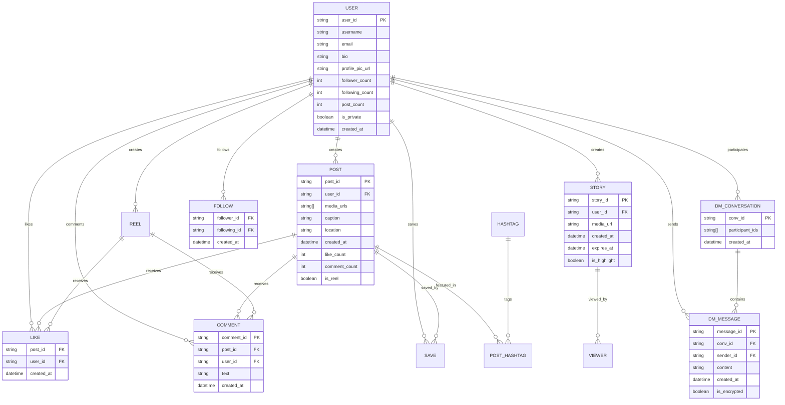

*The entity-relationship model centers on the USER as the hub: users create posts, stories, reels, follow other users, like/comment/save content, and participate in DM conversations; posts and reels receive likes and comments, and posts link to hashtags through a join table.*

**Indexes and partitioning strategy:**

| Data | Primary Key | Indexes | Partition / Store | Reason |
|---|---|---|---|---|
| Users | `user_id` | username (unique), email (unique) | PostgreSQL, sharded by `user_id` hash | Point lookups by id; unique lookups by username |
| Posts | `post_id` | `user_id`, `(user_id, created_at)` | PostgreSQL, sharded by `user_id` | Feed generation scans recent posts by author |
| Stories | `story_id` | `user_id`, `expires_at` | Redis (TTL) + Cassandra (TTL) | Hot reads by user; TTL auto-expiry |
| Follows | `(follower_id, following_id)` | `following_id` reverse index | PostgreSQL + Redis sets | Fan-out needs followers of an author; UI needs following list |
| Likes | `(post_id, user_id)` | `user_id` reverse | Cassandra (wide rows) | Append-only; high write volume |
| Comments | `comment_id` | `post_id` | PostgreSQL, sharded by `post_id` | Ordered scan by post |
| DMs | `conv_id, seq` | `conv_id` | Kafka log + Cassandra | Sequential delivery; durable log |
| Search | `doc_id` | full-text on caption/text | Elasticsearch | Full-text and geo search |

**API contract:**

*Mobile client API for posting, browsing feed and stories, exploring reels, searching, and messaging, authenticated with a bearer JWT in the Authorization header.*

| Method | Endpoint | Description |
|---|---|---|
| GET | `/api/v1/feed` | Home feed from followed users (cursor pagination) |
| GET | `/api/v1/stories` | Active stories from followed users |
| GET | `/api/v1/reels` | For-you reels (candidate + rank) |
| POST | `/api/v1/posts` | Create a photo/video post |
| POST | `/api/v1/stories` | Create a 24-hour story |
| POST | `/api/v1/posts/{id}/like` | Like a post or reel |
| POST | `/api/v1/posts/{id}/comment` | Comment on a post or reel |
| POST | `/api/v1/posts/{id}/save` | Save a post |
| POST | `/api/v1/follow/{username}` | Follow a user |
| GET | `/api/v1/user/{id}` | Profile with recent media |
| GET | `/api/v1/search` | Search users, hashtags, locations |
| POST | `/api/v1/direct/messages` | Send a direct message |
| POST | `/api/v1/upload` | Initiate a resumable media upload |

**Pagination:** `cursor` parameter for feed and comment pagination; `limit` for page size. **Error responses** return JSON `{"error": "unauthorized", "message": "...", "code": 401}`.

**Storage choices:**

| Data | Store | Reason |
|---|---|---|
| User profiles | PostgreSQL | Relational, ACID, unique constraints |
| Posts metadata | PostgreSQL + Redis cache | Read-heavy, cacheable by id |
| Follow graph | PostgreSQL (strong) + Redis (fan-out sets) | Strong consistency for graph; fast fan-out reads |
| Feed cache | Redis (sorted sets) | Fast reads with score-based ordering |
| Media files | S3 + CDN | Cheap, globally distributed |
| Search index | Elasticsearch | Full-text and geo search |
| Stories | Redis (TTL) + Cassandra (TTL) | Fast access plus durability and auto-expiry |
| Likes/Counter | Cassandra | Write-optimized wide rows |
| DMs | Kafka + Cassandra | Durable ordered log with random access |

---

### News Feed Generation

The home feed is a per-user, ranked list assembled from three sources: pre-computed fan-out caches for regular posters, on-demand pulls from celebrity accounts, and injected advertisements. The fan-out decision is made at write time based on the author's follower count, which keeps the read path fast for the vast majority of users while avoiding write storms from high-follower accounts.

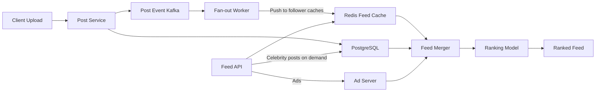

*Diagram: Feed assembly — new posts fan out to follower caches via a Kafka-driven worker for regular authors, while the Feed API merges cached regular posts, on-demand celebrity posts, and ads through a ranking model before returning a sorted page.*

**Write path (fan-out on write):** When a user with fewer than 10K followers posts, a fan-out worker subscribes to the post-created event, resolves the follower set (from Redis follow sets or PostgreSQL), and pushes the post id into each follower's `feed:{followerId}` sorted-set cache with the post timestamp as the score. This is a fan-out factor of ~200 on average but can spike for mid-tier creators, so the worker batches writes per cache shard.

**Read path (fan-out on read plus merge):** The Feed API reads `feed:{followerId}` from Redis, fetches the top-K candidate post ids, backfills any celebrity authors not in cache (fetching their recent posts from PostgreSQL on demand), stamps in ads, and passes the union (~50 candidates) through a lightweight ranking model that re-sorts by predicted engagement. Pagination uses a cursor of `(score, postId)`.

**Celebrity exception logic in code:** The threshold and routing decision live in the fan-out worker, shown here as a Spring component that inspects follower count and either pushes to caches or records the post as pull-on-read.

```java
@Component
@RequiredArgsConstructor
public class FeedFanoutRouter {

    private final FollowRepository followRepository;
    private final RedisTemplate<String, String> redis;
    private final PostRepository postRepository;
    @Value("${app.feed.push-threshold:10000}")
    private int pushThreshold;

    @EventListener
    public void handlePostCreated(PostCreatedEvent event) {
        String authorId = event.getAuthorId();
        int followerCount = followRepository.countFollowers(authorId);
        if (followerCount <= pushThreshold) {
            pushToFollowerFeeds(event.getPostId(), authorId);
        } else {
            // High-follower post: mark for pull-on-read via indexing in search/leaderboard
            postRepository.markAsPullOnRead(event.getPostId());
        }
    }

    private void pushToFollowerFeeds(String postId, String authorId) {
        List<String> followers = followRepository.findFollowers(authorId);
        String score = event.getCreatedAt();
        String pipelineKey = "feed:fanout:" + (postId.hashCode() & 0x3ff);
        redis.opsForZSet().add(pipelineKey, postId, Double.parseDouble(score));
        // Followers read from sharded feed caches in a subsequent pass
    }
}
```

*This `FeedFanoutRouter` bean decides between push and pull fan-out at write time: posts from authors below the configured follower threshold are pushed into follower feed caches, while high-follower posts are marked pull-on-read to avoid write amplification. The threshold is externalized via `@Value` so it can be tuned per environment without a rebuild.*

---

### Stories Architecture

Stories are 24-hour ephemeral posts stored with a dual-TTL strategy: Redis holds active stories for microsecond reads with a 24-hour TTL, and Cassandra provides durable storage also with a 24-hour TTL so expired stories are garbage-collected automatically without a manual cleanup job. The viewing order is computed at read time from a combination of recency, engagement, and relationship closeness, and the viewers list is kept as a Redis set with the same TTL.

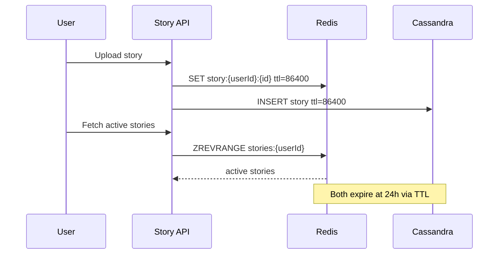

*Diagram: Stories lifecycle — a story write lands in Redis (hot, TTL=86400s) and Cassandra (durable, TTL=86400s); readers hit Redis for the active set; both stores auto-delete the story at 24 hours without any background sweep.*

**Write path:** The Story Service validates the media (already processed by the media pipeline), writes the story metadata and media url into a Redis sorted set (`stories:{userId}` members with score=creation time) using a key with TTL 86400 seconds, and concurrently writes the full record to Cassandra. It also publishes a `StoryCreated` event so the Notification Service can alert followers.

**Read path:** To render the stories tray, the service fetches the set of followed users who have active stories from Redis, then for each fetches the recent story ids via `ZREVRANGE` in parallel. Viewers are recorded in a per-story Redis set (`story:viewers:{id}`) with the same 24-hour TTL. Cache misses fall back to Cassandra.

**Cleanup:** Because both stores enforce TTL, expired stories evaporate automatically; no cron job or sweeper is needed, which avoids the classic "delete race" where an active story is removed mid-read.

---

### Reels Architecture

Reels are short-form videos surfaced primarily through an algorithmic, recommendation-driven feed rather than the follow graph, so the architecture decouples candidate generation from ranking and serves the result from a hybrid cache plus on-demand model scoring.

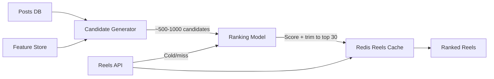

*Diagram: Reels serving — a candidate generator retrieves hundreds of candidates from the post corpus and feature store, a ranking model trims them to the top ~30 per user, and the result is cached in Redis for subsequent scrolls while cold or miss requests score on demand.*

**Candidate generation** uses two recall pools: (1) content-based retrieval from posts by creators the user has engaged with, and (2) embedding-similarity search over recent global reels using a vector index (e.g., Redis or Milvus). The union is deduplicated and capped. **Ranking** applies a two-tower neural model that scores each candidate on predicted watch time, engagement probability, and satisfaction signals, then a lightweight business-rules pass injects diversity and recency. The final top-N is cached per user for a short TTL (minutes) because reels freshness is high.

**Code example** of the scoring step, expressed as a Spring-managed scorer that applies normalized feature weights:

```java
@Service
@RequiredArgsConstructor
public class ReelScorer {

    private final FeatureStore featureStore;
    @Value("${app.reels.weights.watch-time:0.4}")
    private double watchTimeWeight;
    @Value("${app.reels.weights.engagement:0.35}")
    private double engagementWeight;
    @Value("${app.reels.weights.satisfaction:0.25}")
    private double satisfactionWeight;

    public double score(String reelId, String userId) {
        ReelFeatures f = featureStore.featuresFor(reelId, userId);
        double score = watchTimeWeight * f.predictedWatchTime()
                     + engagementWeight * f.engagementProbability()
                     + satisfactionWeight * f.satisfactionScore();
        return Math.max(0.0, Math.min(1.0, score));
    }

    record ReelFeatures(double predictedWatchTime,
                        double engagementProbability,
                        double satisfactionScore) {}
}
```

*The `ReelScorer` bean computes a normalized engagement score as a weighted sum of predicted watch time, engagement probability, and satisfaction. Weights are configurable through `@Value` so the product team can tune the recommendation surface, and the per-reel features come from a `FeatureStore` bean that aggregates model outputs and cached signals.*

---

### Media Processing Pipeline

Uploading a photo or video is decoupled from the processing that generates thumbnails, applies filters, transcodes to multiple bitrates, and runs content moderation. The client uploads directly to S3 (via a pre-signed URL issued by the Media Service) to avoid proxying large bytes through the application tier, and the object creation triggers an event that fans out to an async worker fleet.

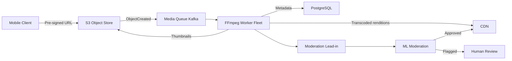

*Diagram: Media pipeline — the client uploads to S3 via a pre-signed URL; the object event enqueues a job that FFmpeg workers process into thumbnails and renditions served from the CDN, with a moderation lead-in feeding an ML classifier and, for edge cases, human review.*

**Pipeline stages:**

1. **Upload**: The client obtains a pre-signed S3 URL, uploads bytes directly, then POSTs the metadata (caption, location, media type) to the Post Service.
2. **Eventing**: S3 `ObjectCreated` writes an event to Kafka; a media-job producer normalizes it.
3. **Processing**: A horizontally-scaled worker fleet consumes jobs — FFmpeg for video transcoding to adaptive bitrates, ImageMagick/Sharp for image resize and filter application, and an ML model for moderation.
4. **Storage**: Processed renditions return to S3 and are surfaced through the CDN with cache headers; metadata is persisted to PostgreSQL.
5. **Moderation lead-in**: The moderation result gates CDN publication — flagged content is held pending review.

The worker fleet auto-scales on queue depth, and a dead-letter queue captures failed jobs for inspection. Progress is observable per media id through a status enum (`UPLOADED`, `PROCESSING`, `READY`, `REJECTED`).

---

### Follow Graph

The follow graph is the backbone of the feed, stories, reels, and DM routing. It requires strong consistency on write (follow/unfollow), efficient fan-out queries (who follows an author?), and bidirectional lookups (who does a user follow?). Instagram stores the authoritative edge set in PostgreSQL (sharded by `follower_id` hash) and mirrors follower sets into Redis for O(1) resolution during fan-out, with a reverse index for the following list.

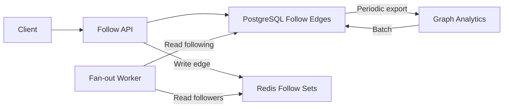

*Diagram: Follow graph storage — follow/unfollow writes land in PostgreSQL (the source of truth) and mirror the follower set into Redis for fast fan-out reads; the reverse (following) list is read directly from PostgreSQL, and batch analytics consume the durable store.*

**Strong consistency for edges:** A follow/unfollow is a transaction that writes the edge to PostgreSQL and invalidates or updates the affected follower set in Redis. For private accounts a `status` column (PENDING/APPROVED/BLOCKED) delays Redis materialization until approval, and a BLOCKED edge short-circuits feed delivery.

**Fan-out reads from Redis:** During fan-out, the worker reads `followers:{authorId}` from Redis (a set of follower ids) to push a post into each follower's feed cache. This set is updated on each follow/unfollow via an event, and a daily reconciliation job repairs any drift from failed fan-outs.

**Follow graph queries at scale:** `SELECT following FROM follows WHERE follower_id = ?` answers "who does X follow"; `SELECT followers FROM follows WHERE following_id = ?` answers "who follows X". PostgreSQL sharding by `follower_id` hash localizes both directions, and Redis sets cache the hot fan-out direction.

```java
@Service
@RequiredArgsConstructor
@Transactional
public class FollowService {

    private final FollowRepository followRepository;
    private final RedisTemplate<String, String> redis;

    public void follow(String followerId, String followingId) {
        boolean isPrivate = followRepository.isPrivate(followingId);
        if (isPrivate) {
            followRepository.createRequest(followerId, followingId, FollowStatus.PENDING);
            return; // follower set updated only after approval
        }
        followRepository.save(new Follow(followerId, followingId, FollowStatus.APPROVED));
        redis.opsForSet().add("followers:" + followingId, followerId);
    }

    public void unfollow(String followerId, String followingId) {
        followRepository.delete(followerId, followingId);
        redis.opsForSet().remove("followers:" + followingId, followerId);
    }

    public List<String> followersOf(String userId) {
        return redis.opsForSet().members("followers:" + userId).stream()
                .sorted(Comparator.comparing(this::followedAt))
                .toList();
    }

    private String followedAt(String followerId) {
        return followRepository.createdAt(followerId);
    }
}
```

*The `FollowService` bean keeps PostgreSQL and the Redis follower set in sync: on follow it persists the edge transactionally and, for public accounts, mirrors the follower id into the `followers:{userId}` Redis set; for private accounts the set is updated only after approval. The `@Transactional` annotation guarantees the read model and durable store stay consistent within the same request.*

---

### Direct Messaging

Direct messages are delivered over a durable, ordered message log partitioned by conversation id, with WebSocket connections for online delivery and push notifications for offline users. End-to-end encryption (Signal Protocol) protects message content for eligible conversations, while read receipts and typing indicators are handled over a lightweight control channel.

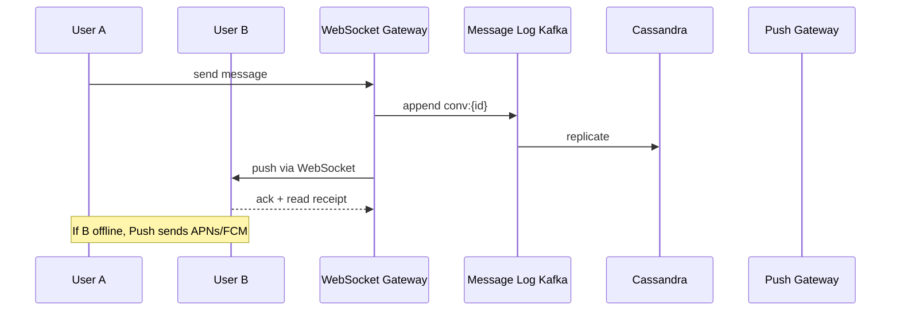

*Diagram: DM delivery — User A sends a message through the WebSocket gateway, which appends it to a Kafka log partitioned by conversation id; the message is replicated to Cassandra for durability, delivered to the online recipient over WebSocket, and falls back to push notifications when the recipient is offline.*

**Ordering and durability:** Messages carry a sequential sequence number per conversation; Kafka's per-partition ordering guarantees in-order delivery to a single consumer group. Offline users' messages queue in the log until they reconnect, at which point they receive a backlog fetch bounded to the most recent messages.

**End-to-end encryption:** For E2E-encrypted conversations, the client encrypts the message with a session key before sending; the server stores only ciphertext and routes it between participants. The key exchange uses the Signal (double ratchet) protocol, and keys are cached per device.

**Read receipts and typing:** Lightweight control events (read-up-to, is-typing) are published on a separate low-latency channel and coalesced so a flurry of keystrokes produces a single indicator update rather than one event per character.

---

### Content Moderation at Scale

At 100M+ uploads per day, moderation cannot be human-only; Instagram blends near-real-time ML classifiers with global human review, using confidence thresholds to route decisions and a feedback loop that retrains models weekly on labeled outcomes.

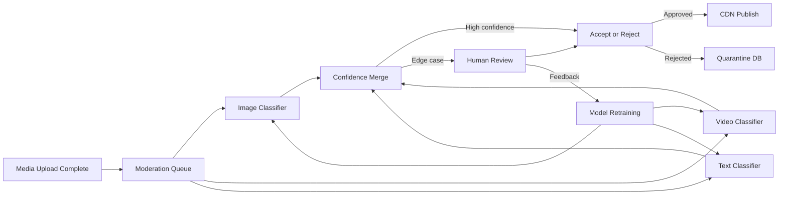

*Diagram: Moderation pipeline — uploaded media enters a moderation queue and is evaluated in parallel by image, video, and text classifiers; high-confidence results are accepted or rejected automatically, while edge cases go to human review, whose outcomes feed back into weekly model retraining.*

**Decision routing:** Each classifier returns a confidence score in [0, 1]. A score above 0.95 auto-approves, below 0.80 auto-rejects (with an appeal path), and the 0.80–0.95 band routes to human review. The merge step combines signals (e.g., a clean image but a hateful caption) using a weighted rule set.

**Human review at scale:** Reviewers across time zones pull from the low-confidence queue with a suggested decision from the ML model that they can override. Work is deduplicated so the same media is not reviewed twice, and reviewers flag novel violation patterns for proactive detection.

**Feedback loop:** Every human decision and user report is appended to a labeled dataset that retrains the ML classifiers weekly; the model version is A/B tested against the previous version before a full rollout, with guardrails on false-positive rates to avoid wrongly suppressing legitimate content.

---

### Search and Discovery

Search lets users find people, hashtags, and places; Discover/Explore surfaces recommended content. Instagram indexes posts, captions, hashtags, and user profiles in a sharded Elasticsearch cluster, with real-time indexing from a Kafka consumer and geo-point fields for location search.

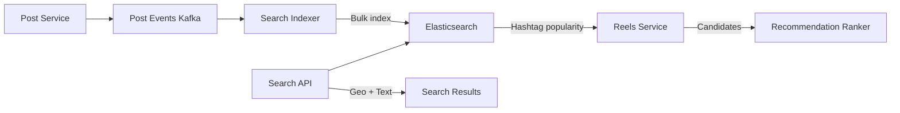

*Diagram: Search indexing and discovery — post events flow from Kafka to an Elasticsearch indexer that bulk-indexes captions, hashtags, and geo-points; the Search API queries the cluster for text and location lookups, while the Reels Service draws hashtag popularity signals to seed its recommendation candidate generator.*

**Indexing strategy:** Each new post produces an Elasticsearch document containing `caption`, `hashtags` (as a keyword array), `location` (geo_point), `media_type`, `author_id`, and `created_at`. Indices are time-based (`posts-YYYY.MM.DD`) and hot-warm nodes tier data by age. A consumer group tracks the Kafka offset so re-indexing after a schema change resumes cleanly.

**Query types:** Username search uses an n-gram analyzer on `username` for prefix matching; hashtag search matches the exact keyword with a completion suggester; location search uses geo-distance or geo-bounding-box queries; caption search uses a standard analyzer with stop-word removal and a `bool` query combining text match and recency decay.

**Discovery:** The Explore page is not pure search — it is a recommendation surface that uses engagement velocity (likes/comments per minute since posting) and hashtag popularity trends (computed from the search cluster) as features into the post-ranking and reel-candidate models.

---

### Replication Strategies

Instagram's storage layers each choose a replication model suited to their consistency and availability needs: PostgreSQL for relational integrity, Redis for low-latency feed caches, Cassandra for write-heavy durable state, and Kafka for ordered event streams.

**PostgreSQL — synchronous streaming replication:** The primary accepts writes and streams WAL changes to synchronous standbys in the same region (strong consistency) with asynchronous cross-region standbys for disaster recovery. A quorum of `(N/2)+1` nodes confirms each write. Failover is automated via Patroni/etcd, and readers fan out across standbys.

**Redis — asynchronous replication with Sentinel/Cluster:** Masters replicate asynchronously to replicas; Redis Sentinel manages failover for Redis Classic topologies, while Redis Cluster manages sharding and failover natively across 16,384 hash slots. Reads can be served by replicas for read scaling, accepting eventual consistency on the follower path.

**Cassandra — tunable, multi-datacenter replication:** Writes go to a coordinator that replicates across the replication factor using the network topology strategy, placing replicas in distinct availability zones so a single zone failure loses no data. A write quorum of `(RF/2)+1` per DC gives strong-enough durability for likes and stories without blocking cross-region.

**Kafka — in-sync replicas (ISR):** Each partition has one leader and `N-1` followers; a write is acknowledged when `acks=all`, meaning all ISR members have the record. If the leader fails, an ISR member is elected. This gives ordered, durable, replicated logs for post events, DMs, and moderation jobs.

**S3 — cross-region replication:** Raw and processed media objects are replicated asynchronously to a backup region so a regional outage does not lose user content; CloudFront origin failover points to the backup region when the primary is unreachable.

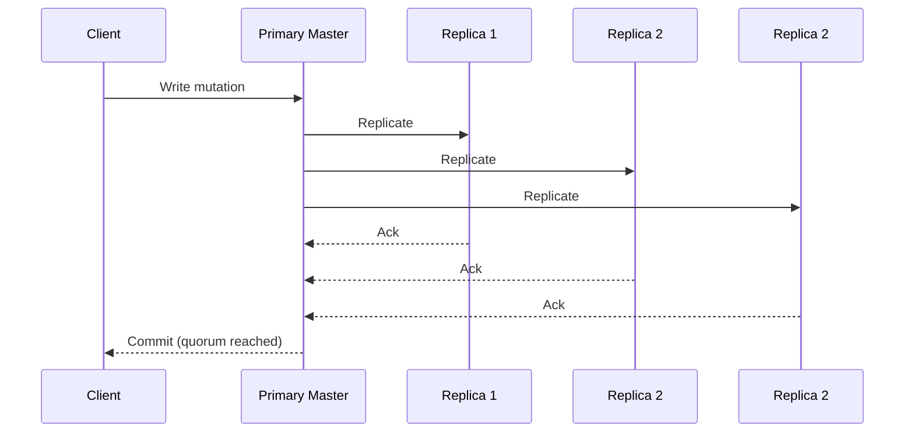

*Diagram: Quorum replication across a primary and three replicas — the client's write is committed only after a quorum of replicas acknowledge it, ensuring durability across node failures.*

**Real-world mapping:** Instagram's user and post metadata uses PostgreSQL with multi-zone streaming replication; feeds and stories use Redis replication and cluster; likes and counters use Cassandra's network topology strategy with a replication factor of 3 per region; post and DM events flow through Kafka with `acks=all`; media objects replicate via S3 cross-region replication to a warm standby region.

---

### Failure Detection and Membership

A global platform must detect failed nodes and regions quickly without false positives that trigger unnecessary failovers. Instagram layers multiple mechanisms: application heartbeats and circuit breakers for per-request resilience, gossip-based membership for Redis/Cassandra clusters, and region-level health checks for active-active failover.

**Heartbeats and circuit breakers:** Each microservice publishes a health endpoint (`/health`) that aggregates downstream dependency readiness. Callers wrap downstream calls in circuit breakers (Hystrix/Resilience4j) that open after N consecutive failures, fail-fast, and half-open after a cooldown. This stops cascading failures from a slow downstream from exhausting thread pools.

**Gossip-based membership:** Redis Cluster and Cassandra use gossip protocols to spread membership and health state; phi-accrual failure detectors convert heartbeat timing into a suspicion level, reducing false positives from transient network blips. A node marked `PFAIL` by one peer is confirmed `FAIL` only after multiple peers agree.

**Region-level failover:** An external control plane monitors region health (latency, error rates, region-up checks) and can reroute a region's traffic to its warm standby. When a region is declared degraded, DNS/GDNS shifts user traffic and writes replicate asynchronously to the surviving region until the failed one recovers.

```java
@Service
@RequiredArgsConstructor
public class HealthMonitor {

    private final List<DependencyProbe> probes;
    private final AtomicReference<RegionStatus> regionStatus = new AtomicReference<>(RegionStatus.HEALTHY);

    @Scheduled(fixedDelayString = "${app.health.check-interval-ms:5000}")
    public void checkHealth() {
        boolean allHealthy = probes.stream().allMatch(DependencyProbe::isHealthy);
        RegionStatus newStatus = allHealthy ? RegionStatus.HEALTHY : RegionStatus.DEGRADED;
        if (regionStatus.getAndSet(newStatus) != newStatus) {
            // Emit an event to the routing layer to adjust traffic
            applicationEventPublisher.publishEvent(new RegionHealthChangedEvent(newStatus));
        }
    }

    public boolean isHealthy() {
        return regionStatus.get() == RegionStatus.HEALTHY;
    }

    enum RegionStatus { HEALTHY, DEGRADED, FAILED }
}
```

*The `HealthMonitor` bean polls downstream dependency probes on a configurable schedule and publishes a `RegionHealthChangedEvent` when status changes; the routing layer consumes that event to shift or shed traffic, giving automated region-level failover without manual intervention.*

---

### High Availability and Scalability

Availability is achieved through replication, multi-region deployment, and graceful degradation; scalability through partitioning, caching, and independent horizontal scaling of each service tier.

**Multi-region active-active:** User traffic is routed to the nearest healthy region via global load balancing; writes replicate to at least one other region synchronously (within a metro) and asynchronously cross-region. Read-heavy surfaces (feeds, stories, reels) are served from local-region caches, so a region failure only degrades to the next-closest region.

**Independent scaling:** The media worker fleet auto-scales on queue depth (CPU-bound transcoding), the feed service scales with active-user cache size (memory-bound), and the recommendation service scales with query-per-second (CPU-bound model serving). Each scales without touching the others because they communicate through Kafka and Redis.

**Graceful degradation:** When the recommendation model is unavailable, Reels fall back to a recency-based feed; when the ad server is down, organic posts fill the slots; and when a region is degraded, new writes are queued in Kafka and replayed when the region recovers.

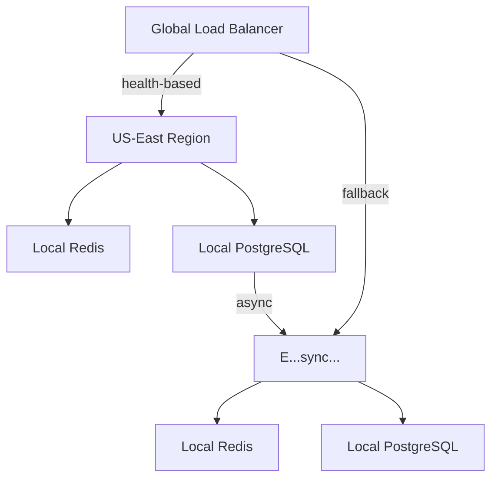

*Diagram: Multi-region active-active deployment — global load balancing routes traffic to the nearest healthy region, each region has its own local cache and database, and writes replicate asynchronously to the backup region for failover.*

**Scalability numbers:** 500M+ DAU with ~50 active users per Redis shard (2000+ shards), 200+ PostgreSQL shards keyed by user_id hash, a media worker pool that auto-scales to 50K+ instances during peak upload windows, and a reels ranking fleet serving 100K+ queries per second from cached candidates.

---

### Performance and Optimization

Performance is measured as feed load time (p99 < 200 ms), media time-to-first-byte (TTFB < 50 ms from CDN edge), reels scroll latency, and media processing throughput (jobs per second). The optimizations below target the read path first, since users notice latency immediately.

#### Latency Optimization

- **Feed caching in Redis cluster:** The home feed, the story tray, and reel candidates are cached with short TTLs (minutes) so the read path is a single in-memory lookup rather than a multi-join. Cache keys are namespaced (`feed:{userId}`, `stories:{userId}`, `reels:{userId}`) and pre-warmed for the top 10M active users during off-peak hours.
- **CDN for media:** Images and videos are stored in S3 and served through CloudFront with edge caches configured for long `max-age` on immutable renditions. Progressive image loading sends a low-quality placeholder first, then the full image, so the feed feels instant.
- **Asynchronous fan-out:** Write-time fan-out removes read-time computation; the fan-out worker processes post events from Kafka and pushes to caches off the request path, keeping the post creation API under 500 ms.
- **Ranking model caching:** Reels candidate lists are cached per user; only the final trim to the visible page is scored on demand, and that scoring is bounded to a few milliseconds using a lightweight model.

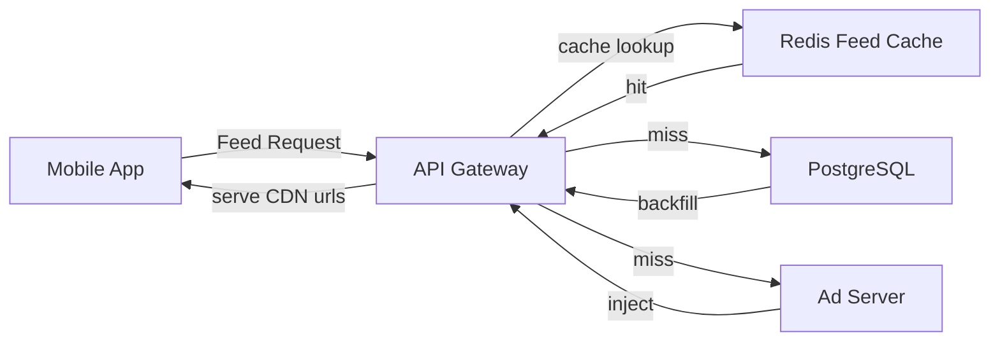

*Diagram: Feed read path — the API gateway checks the Redis feed cache for an immediate hit; on a miss it backfills from PostgreSQL and injects an ad before returning to the client, keeping the common path under 200 ms.*

#### Throughput Optimization

- **Pagination with cursors:** Feed, stories, comments, and DMs all use cursor-based pagination (`?cursor=...&limit=12`) rather than `OFFSET`, which degrades as the offset grows. Cursors are opaque encoded tuples of `(score, id)`.
- **Batched writes:** Fan-out and notification bursts are batched per Redis shard and per Kafka partition to reduce round-trips and per-command overhead.
- **Connection pooling and keepalive:** Services maintain pooled, keep-alive connections to Redis and PostgreSQL, and gRPC/Protobuf is used for service-to-service calls to reduce payload size and TLS handshake cost.
- **Hot-key mitigation:** For viral posts or trending reels, the read path splits the cache key into N sub-keys (`reel:{id}:shard0..shardN`) read in parallel and merged, preventing one shard from saturating.

#### Java Example: Instrumented Reel Scorer

The following bean records per-request latency and cache-hit metrics so SREs can detect ranking degradation before users complain.

```java
@Service
@RequiredArgsConstructor
public class InstrumentedReelService {

    private final ReelScorer scorer;
    private final RedisTemplate<String, String> redis;
    private final MeterRegistry registry;
    private final Timer scoreTimer;
    private final Counter cacheHit;
    private final Counter cacheMiss;

    public InstrumentedReelService(ReelScorer scorer,
                                   RedisTemplate<String, String> redis,
                                   MeterRegistry registry) {
        this.scorer = scorer;
        this.redis = redis;
        this.registry = registry;
        this.scoreTimer = Timer.builder("reel.scoring.latency").register(registry);
        this.cacheHit = Counter.builder("reel.cache.hits").register(registry);
        this.cacheMiss = Counter.builder("reel.cache.misses").register(registry);
    }

    public List<ReelDto> recommendedFor(String userId, int limit) {
        return scoreTimer.recordCallable(() -> {
            String key = "reels:" + userId;
            List<String> cached = redis.opsForList().range(key, 0, limit - 1);
            if (cached != null && !cached.isEmpty()) {
                cacheHit.increment();
                return toDtos(cached);
            }
            cacheMiss.increment();
            List<ReelDto> scored = scorer.topForUser(userId, limit);
            redis.opsForList().leftPushAll(key, scored.stream().map(ReelDto::id).toList());
            redis.expire(key, Duration.ofMinutes(3));
            return scored;
        });
    }

    record ReelDto(String id, String mediaUrl, double score) {}
}
```

*The `InstrumentedReelService` bean wraps the scorer with Micrometer timers and counters: it checks a short-TTL Redis list cache first, records a hit/miss counter, and on a miss scores fresh candidates and repopulates the cache. The `scoreTimer` captures end-to-end latency so spikes correlate with model or cache issues.*

---

### CAP Theorem and Consistency Trade-offs

No single consistency model fits all of Instagram; the platform composes per-component trade-offs, favoring availability for the read-heavy discovery surfaces and consistency for identity and the social graph.

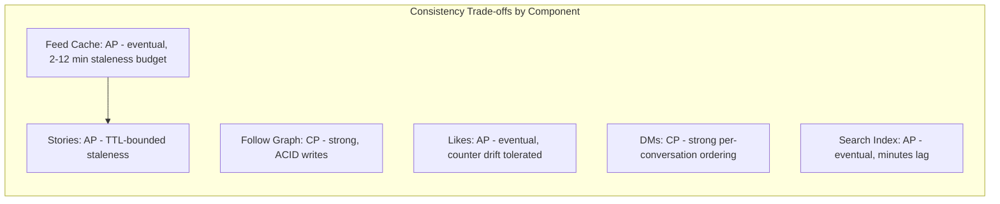

*Diagram: Instagram does not pick one point on the CAP triangle; instead, each component selects the trade-off that matches its user-visible contract — the feed favors availability, the follow graph favors consistency.*

**Trade-off table:**

| Component | CAP choice | Consistency guarantee | Rationale |
|---|---|---|---|
| Feed cache | AP | Eventual, 2–12 min staleness | Reads must be fast; a slightly stale post is acceptable |
| Stories | AP | TTL-bounded (24h) | Ephemeral content; fast reads matter |
| Follow graph | CP | Strong, ACID writes | A follow must be visible to fan-out immediately |
| Likes/Views | AP | Eventual counters | Exact counts are not user-visible; drift is fine |
| DMs | CP | Per-conversation ordering + durable | Messaging correctness is non-negotiable |
| Search index | AP | Eventual, minutes lag | Index rebuilds are batched; stale search is tolerable |
| Payments/Shopping | CP | Strong | Financial correctness is required |

**Staleness budget:** The feed cache is accepted to be up to ~12 minutes stale because a user refreshing within 2 minutes of a friend's post is the rare case, and the trade-off buys sub-200 ms read latency at global scale. The follow graph, by contrast, commits synchronously so a new follow is visible to the next fan-out.

**Real-world implementation:** Instagram keeps the user/post/follow tables in PostgreSQL with synchronous multi-zone replication (CP) for identity integrity, while feeds, stories, likes, and the search index live in Redis, Cassandra, and Elasticsearch with eventual replication (AP) for speed and availability.

---

### Encryption and Key Management

Instagram stores private photos, personal messages, and identity data, so it encrypts data at rest and in transit and manages a hierarchical key scheme backed by a managed KMS/HSM.

#### Encryption at Rest

- **S3 media objects:** All raw and processed media is encrypted with SSE-KMS using a customer-managed key; the S3 object ARN and a content hash are stored as metadata so downloads can verify integrity.
- **PostgreSQL:** Transparent Data Encryption (TDE) protects user metadata, posts, and the follow graph at the page level; column-level encryption guards the most sensitive fields (email, phone).
- **Redis:** Redis itself is in-memory and ephemeral by design, but persistence snapshots (RDB) and the AOF log are encrypted on disk via filesystem encryption; sensitive cached values (DM metadata) are additionally encrypted application-side.
- **Cassandra:** SSTables are encrypted with the cipher-storage utility using keys sourced from the KMS; each table can use a distinct key for isolation.

#### Encryption in Transit

- **TLS 1.3** terminates at the edge (CloudFront + ALB) and is end-to-end for control-plane traffic.
- **Mutual TLS (mTLS)** between microservices carries identity and encryption in service mesh sidecars, so internal calls are authenticated and encrypted without trusting the network.
- **Media download** uses pre-signed S3 URLs over HTTPS, valid for a short window, so media is never served from an open origin.

#### Key Hierarchy

A key-encryption key (KEK) in the KMS/HSM protects data-encryption keys (DEKs); each object or table class gets its own DEK, and rotating the KEK only requires re-wrapping DEKs, not re-encrypting data.

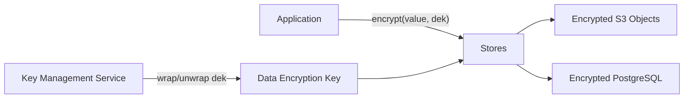

*Diagram: Encryption key hierarchy — the application encrypts values with a per-class data encryption key (DEK), which the KMS wraps; stores persist only ciphertext, and rotating the KEK re-wraps DEKs without re-encrypting data.*

```java
@Service
@RequiredArgsConstructor
public class MediaEncryptionService {

    private final AwsKmsTemplate kmsTemplate;
    @Value("${app.media.encryption.key-id}")
    private String keyId;
    @Value("${app.media.encryption.ttl-seconds:3600}")
    private int ttlSeconds;

    public EncryptedBlob encrypt(byte[] plaintext) {
        byte[] iv = new byte[12];
        ThreadLocalRandom.current().nextBytes(iv);
        SecretKey dek = kmsTemplate.generateDataKey(keyId);
        byte[] ciphertext = aesGcmEncrypt(plaintext, dek, iv);
        return new EncryptedBlob(Base64.getEncoder().encodeToString(iv),
                Base64.getEncoder().encodeToString(ciphertext),
                Base64.getEncoder().encodeToString(kmsTemplate.encrypt(dek.getEncoded(), keyId)));
    }

    public byte[] decrypt(EncryptedBlob blob) {
        byte[] dek = kmsTemplate.decrypt(Base64.getDecoder().decode(blob.dek()), keyId);
        byte[] iv = Base64.getDecoder().decode(blob.iv());
        byte[] ciphertext = Base64.getDecoder().decode(blob.ciphertext());
        return aesGcmDecrypt(ciphertext, new SecretKeySpec(dek, "AES"), iv);
    }

    record EncryptedBlob(String iv, String ciphertext, String dek) {}
}
```

*The `MediaEncryptionService` bean generates a fresh data encryption key per media batch via the KMS, encrypts the bytes with AES-GCM using a random 12-byte IV, and returns a record holding the IV, ciphertext, and the key-encrypted DEK. Decrypt reverses the process; `@Value` externalizes the KMS key id and TTL, and the `AwsKmsTemplate` is injected for testability.*

---

### Authentication and Authorization

Instagram authenticates users via OAuth2 (Login with Facebook/Google/Apple) issuing a short-lived access JWT and a refresh token, and enforces authorization through role-based access for staff tooling plus attribute- and relationship-based access control (ACLs) for user content such as private-account posts and DMs.

#### Authentication Methods

- **OAuth2 / OIDC logins:** Third-party identity providers authenticate the user; Instagram issues a signed JWT (`sub`, `exp`, `roles`) and an opaque refresh token stored in an httpOnly, secure, SameSite=Strict cookie.
- **Device tokens:** Each device registers a push token used by the Notification Service for FCM/APNs delivery.
- **Service-to-service:** Internal microservices authenticate with mTLS client certificates; each service presents a SPIFFE-SPIRE-issued cert that encodes its identity and allowed scopes.

#### Authorization Models

- **RBAC for staff:** Admin, content-moderator, and analytics-engineer roles are stored in PostgreSQL and cached; each role grants a set of actions on resource classes (e.g., `user.read`, `post.moderate`).
- **ABAC + ACLs for user data:** Content visibility is governed by attributes — `is_private`, `blocked_user_ids`, `allow_list` — evaluated at request time so a private account's posts return 403 for non-followers. DM access checks conversation membership plus per-chat read permissions.
- **Rate limits as authorization:** Per-user and per-IP quotas on uploads, searches, and DMs are enforced by a Redis token-bucket checked at the API gateway.

```java
@RestController
@RequiredArgsConstructor
@RequestMapping("/api/v1/posts")
public class PostController {

    private final PostService postService;

    @GetMapping("/{id}")
    public ResponseEntity<PostDto> get(@PathVariable String id,
                                       @AuthenticationPrincipal JwtUser principal) {
        return postService.getVisible(id, principal.userId(), principal.roles())
                .map(ResponseEntity::ok)
                .orElse(ResponseEntity.status(HttpStatus.FORBIDDEN).build());
    }

    @PostMapping
    public ResponseEntity<PostDto> create(@Valid @RequestBody CreatePostRequest request,
                                          @AuthenticationPrincipal JwtUser principal) {
        PostDto created = postService.create(request, principal.userId());
        return ResponseEntity.created(URI.create("/api/v1/posts/" + created.id())).body(created);
    }
}

@Service
@RequiredArgsConstructor
public class PostAuthorizationService {

    private final FollowRepository followRepository;
    private final BlockRepository blockRepository;
    @Value("${app.privacy.default-show-public:false}")
    private boolean defaultShowPublic;

    public boolean canView(String postId, String viewerId) {
        Post post = postRepository.findById(postId);
        if (post.isPublic() && !blockRepository.blocks(viewerId, post.authorId())) return true;
        if (post.isPrivate()) {
            return followRepository.isFollowing(viewerId, post.authorId())
                    && !blockRepository.blocks(viewerId, post.authorId());
        }
        return defaultShowPublic;
    }

    record Post(boolean isPublic, String authorId) {}
}

@Service
@RequiredArgsConstructor
public class RateLimitingFilter implements Filter {

    private final StringRedisTemplate redis;
    @Value("${app.rate-limit.uploads-per-minute:20}")
    private int uploadsPerMinute;

    @Override
    public void doFilter(ServletRequest req, ServletResponse res, FilterChain chain) throws IOException, ServletException {
        HttpServletRequest request = (HttpServletRequest) req;
        JwtUser principal = (JwtUser) request.getUserPrincipal();
        String key = "rl:upload:" + principal.userId();
        long now = System.currentTimeMillis() / 60_000;
        long count = redis.boundValueOps(key).increment(1);
        if (count == 1) redis.boundValueOps(key).expire(Duration.ofMinutes(2));
        if (count > uploadsPerMinute) {
            HttpServletResponse response = (HttpServletResponse) res;
            response.setStatus(429);
            response.getWriter().write("{\"error\":\"rate_limited\"}");
            return;
        }
        chain.doFilter(req, res);
    }
}

@RestControllerAdvice
public class ApiExceptionHandler {

    @ExceptionHandler(AccessDeniedException.class)
    public ResponseEntity<ApiError> handleDenied(AccessDeniedException ex) {
        return ResponseEntity.status(HttpStatus.FORBIDDEN)
                .body(new ApiError("forbidden", ex.getMessage()));
    }

    @ExceptionHandler(ValidationException.class)
    public ResponseEntity<ApiError> handleValidation(ValidationException ex) {
        return ResponseEntity.badRequest().body(new ApiError("invalid_request", ex.getMessage()));
    }

    record ApiError(String error, String message) {}
}
```

*The `PostController` bean is secured with Spring's `@AuthenticationPrincipal` carrying a `JwtUser`; the `canView` check delegates to `PostAuthorizationService`, which evaluates privacy attributes and a block-list repository, while a `RateLimitingFilter` enforces per-user upload quotas from Redis. The `@RestControllerAdvice` centralizes 403/400 error mapping, and `@Valid` on the request body enforces `@NotBlank` constraints with constructor injection throughout.*

```java
@Service
@RequiredArgsConstructor
public class AccessTokenService {

    private final JwtEncoder encoder;
    @Value("${app.auth.token.ttl-minutes:60}")
    private int ttlMinutes;

    public String issueToken(JwtUser user) {
        Instant now = Instant.now();
        return encoder.encode(JwtClaimsSet.builder()
                .issuer("instagram-auth")
                .subject(user.userId())
                .issuedAt(now)
                .expiresAt(now.plusSeconds(ttlMinutes * 60L))
                .claim("roles", user.roles())
                .build()).getTokenValue();
    }

    public JwtUser verify(String token) {
        return jwtDecoder.decode(token);
    }
}

---

### Security Threats and Mitigations

Instagram handles private photos, personal messages, and identity data, making it a high-value target. Security is layered: network controls, authentication, authorization, encryption, rate limiting, and continuous monitoring all play a role.

#### Threat: Unauthenticated Access

- **Risk:** An attacker discovers an exposed service port (Redis, Kafka, internode) without credentials.
- **Mitigation:** Enforce authentication on all internal and external connections; disable anonymous access; require mTLS for inter-service traffic; never expose data stores directly to the internet.

#### Threat: Data Interception (Eavesdropping)

- **Risk:** Network sniffing reads media or tokens over unencrypted channels.
- **Mitigation:** Terminate TLS 1.3 at the edge and use mTLS for service mesh; use pre-signed HTTPS URLs for media downloads with short expirations; enable TLS for Redis and Kafka client traffic.

#### Threat: DoS and Resource Exhaustion

- **Risk:** Flooding a shard with requests (hot-key attack) or posting spam at high volume exhausts CPU, memory, or the media processing queue.
- **Mitigation:** Per-user and per-IP rate limits at the gateway; per-shard quotas; circuit breakers in the media pipeline; auto-scaling of the worker fleet on queue depth.

#### Threat: Account Takeover

- **Risk:** Compromised credentials grant access to post, change the username/email, or lock out the real owner.
- **Mitigation:** OAuth2 with identity providers that offer MFA; step-up authentication for security-sensitive mutations (password change, email change); device fingerprinting and anomaly detection on login; session revocation endpoints.

#### Threat: Bot and Fake-Account Abuse

- **Risk:** Automated account creation and engagement inflation distort the feed, ads, and recommendations.
- **Mitigation:** CAPTCHA at registration; phone-number/email verification; ML models that score accounts for bot likelihood at creation and continuously; shadow-banning and reduced distribution for borderline accounts.

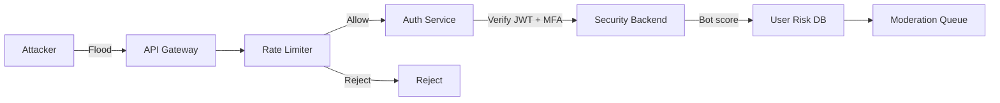

*Diagram: Defense in depth at the edge — the API gateway applies per-IP and per-user rate limits before authentication, the auth service verifies JWTs and enforces MFA, and a continuous bot-likelihood score routes risky users to moderation review.*

#### Threat: Content Poisoning and Moderation Evasion

- **Risk:** Attackers upload policy-violating media disguised to bypass classifiers (e.g., covered nudity).
- **Mitigation:** Multi-model classifiers (image, video, text, audio) evaluated in parallel; adversarial-augmentation during training; manual review for the 80–95 confidence band; community reporting with priority escalation.

#### Threat: Insecure Direct Object Reference (IDOR)

- **Risk:** A user guesses or enumerates another user's private post or DM conversation id.
- **Mitigation:** Authorization checks on every object access (owner-or-allowed logic), opaque UUIDs instead of sequential ids, and scoped access tokens that encode the permitted resource id.

---

### Observability and Logging

Instagram's distributed system must be observable so that latency regressions, cache degradation, and moderation backlogs are detected before users notice.

#### Metrics

Key metrics tracked per service and at the cluster level:

- **Feed latency:** p50/p95/p99 of `/api/v1/feed`; target p99 < 200 ms.
- **Cache hit ratio:** `feed` cache hit ratio (target > 90%); a drop signals missing cache warming or a key-naming regression.
- **Media pipeline latency:** end-to-end upload-to-CDN time per media type; alert on backlogs in the moderation queue.
- **Story viewer-count accuracy:** compare reported viewer counts against stored sets; drift indicates a fan-out bug.
- **DM delivery rate:** percentage of messages delivered within 2 seconds; alert on delivery lag.
- **Reels ranking latency:** p99 of candidate generation and scoring; alert above 50 ms.

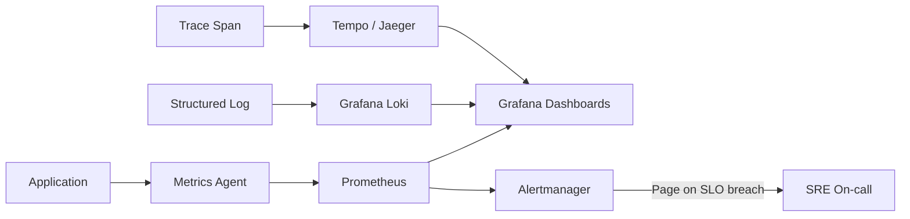

*Diagram: Observability pipeline — a metrics agent ships counters and timers to Prometheus, structured logs flow to Loki, and distributed traces flow to Tempo; all three are visualized in Grafana dashboards, and Prometheus alerts on SLO breaches page the on-call engineer.*

#### Logging

Structured JSON logs capture:

- **Request logs:** method, path, user id, latency, status, correlation id.
- **Audit logs:** follow/unfollow, profile edits, privacy changes — written to a tamper-evident store.
- **Moderation logs:** every auto-accept, auto-reject, and human decision with the reviewer id and timestamp.
- **Security logs:** auth successes/failures, MFA challenges, rate-limit rejections, bot-score thresholds crossed.

Logs are partitioned by service/day, shipped via a sidecar to a central index, and retained per compliance policy. Sampling reduces volume for high-rate streams (e.g., feed reads) while keeping 100% of errors.

#### Alerting SLOs

- Feed p99 latency > 200 ms for 5 minutes.
- Feed cache hit ratio < 85% for 10 minutes.
- Media processing queue depth > 1M for 5 minutes.
- Moderation low-confidence queue > 50K for 10 minutes.
- DM delivery lag > 5 seconds for 2 minutes.
- Region error rate > 1% for 2 minutes.

#### Java Example: Instrumented Media Status Service

```java
@Component
@RequiredArgsConstructor
public class MediaStatusService {

    private final MeterRegistry registry;
    private final MongoTemplate mongo; // stores per-media processing status
    @Value("${app.media.poll.backoff-ms:5000}")
    private long backoffMs;

    private final Counter processed;
    private final Counter failed;
    private final Timer processingTimer;
    private final Gauge queueDepth;

    public MediaStatusService(MeterRegistry registry, MongoTemplate mongo) {
        this.registry = registry;
        this.mongo = mongo;
        this.processed = Counter.builder("media.processed.total").register(registry);
        this.failed = Counter.builder("media.processing.failed.total").register(registry);
        this.processingTimer = Timer.builder("media.processing.latency").register(registry);
        this.queueDepth = Gauge.builder("media.queue.depth")
                .register(registry, this, MediaStatusService::countPending);
    }

    public MediaStatus getStatus(String mediaId) {
        return processingTimer.recordCallable(() -> {
            MediaRecord rec = mongo.findById(mediaId, MediaRecord.class);
            if (rec == null) return MediaStatus.UNKNOWN;
            if (rec.status() == MediaStatus.PROCESSING) processed.increment();
            if (rec.status() == MediaStatus.REJECTED) failed.increment();
            return rec.status();
        });
    }

    private double countPending() {
        Query q = Query.query(Criteria.where("status").is(MediaStatus.PROCESSING));
        return mongo.count(q, MediaRecord.class);
    }

    record MediaRecord(String id, MediaStatus status) {}
    enum MediaStatus { UPLOADED, PROCESSING, READY, REJECTED, UNKNOWN }
}

---

### Real-World Implementations

- **Instagram (Meta):** 2B+ monthly users, 500M+ DAU. Uses hybrid fan-out (push for accounts with fewer than 10K followers, pull on demand for celebrities). Media is stored in S3 behind Cloudflare and Meta's CDN. Feeds and stories are served from Redis caches backed by PostgreSQL (sharded by `user_id`) for metadata. Elasticsearch powers search and hashtag discovery. Cassandra with TTL powers Stories durability. Messaging flows through an async log with end-to-end encryption for eligible conversations.
- **Facebook:** Similar hybrid fan-out with an evolved EdgeRank ranking system. TAO (The Associations and Objects) serves the social graph. News Feed ranking draws on 100K+ features and is served from in-memory caches with strict read-latency SLOs.
- **Snapchat:** Stories-first architecture where all content expires in 24 hours. Uses a custom real-time communication system for snaps and uses geofilters and AR lenses processed on the client.
- **TikTok:** Fully recommendation-first feed (no follow-based default), two-stage candidate generation plus ranking, and a media pipeline optimized for vertical short video with global CDN edge caching.

| Platform | Fan-out | Feed Cache | Media | Discovery | Messaging |
|---|---|---|---|---|---|
| Instagram | Hybrid (push/pull) | Redis | S3 + CDN | Explore + ML | Encrypted async |
| Facebook | Hybrid | In-memory | Haystack + CDN | News Feed ML | Async encrypted |
| Snapchat | Story-only | Redis | Object store | AR filters | Encrypted real-time |
| TikTok | Pull (recommendation) | Redis | S3 + CDN | Recommendation ML | Async |

---

### Java and Spring Boot Implementation Guide

A production-grade Instagram-style backend in Spring Boot divides responsibilities across controllers (HTTP), services (business logic), repositories (persistence), and cross-cutting beans (exceptions, scheduling, config). The sections below use constructor injection exclusively, `record`s for request/response DTOs, Jakarta validation, `@Transactional` for consistency, `@Version` for optimistic locking, `BigDecimal` for money, and `@Scheduled` for cache warming.

#### Data Transfer Objects (records + validation)

DTOs are immutable `record`s annotated with `@NotBlank` and `@Valid` so invalid payloads fail fast at the controller boundary before reaching business logic.

```java
public record CreatePostRequest(
        @NotBlank(message = "Caption is required") String caption,
        @NotBlank(message = "Media type is required") String mediaType,
        List<@NotBlank String> mediaIds,
        String location,
        List<String> hashtagNames) {}

public record PostDto(
        String id,
        String authorId,
        String authorUsername,
        List<String> mediaUrls,
        String caption,
        BigInteger likeCount,
        BigInteger commentCount,
        boolean likedByMe,
        Instant createdAt,
        String permalink) {}

public record FeedResponse(
        List<PostDto> posts,
        String nextCursor,
        boolean hasMore) {}
```

*These `record` DTOs carry validated input (`@NotBlank`, `@Valid`) and shaped response payloads; `BigInteger` is used for counts that can reach millions, and `Instant` timestamps are rendered in ISO-8601 so clients can sort and page by cursor.*

#### Controller (REST + security principal)

The controller is a thin `@RestController` that authenticates via `@AuthenticationPrincipal`, validates the body with `@Valid`, and delegates to the service layer.

```java
@RestController
@RequiredArgsConstructor
@RequestMapping("/api/v1")
public class FeedController {

    private final FeedService feedService;
    private final StoryService storyService;

    @GetMapping("/feed")
    public ResponseEntity<FeedResponse> getFeed(
            @AuthenticationPrincipal JwtUser user,
            @RequestParam(required = false) String cursor,
            @RequestParam(defaultValue = "12") int limit) {
        FeedResponse feed = feedService.getHomeFeed(user.userId(), cursor, Math.min(limit, 50));
        return ResponseEntity.ok(feed);
    }

    @PostMapping("/posts")
    public ResponseEntity<PostDto> createPost(@Valid @RequestBody CreatePostRequest request,
                                              @AuthenticationPrincipal JwtUser user) {
        PostDto created = feedService.createPost(request, user.userId());
        return ResponseEntity.created(URI.create("/api/v1/posts/" + created.id())).body(created);
    }

    @PostMapping("/posts/{id}/like")
    @ResponseStatus(HttpStatus.NO_CONTENT)
    public void like(@PathVariable String id, @AuthenticationPrincipal JwtUser user) {
        feedService.like(id, user.userId());
    }

    @GetMapping("/stories")
    public ResponseEntity<List<StoryDto>> getStories(@AuthenticationPrincipal JwtUser user) {
        return ResponseEntity.ok(storyService.getActiveStories(user.userId()));
    }
}
```

*The `FeedController` bean owns the HTTP surface: it resolves the authenticated `JwtUser` principal, caps page size to protect the ranking path, and converts service results into the correct status codes and locations (201 Created with a `Location` header on post creation).*

#### Exception handling (Controller Advice)

A global `@RestControllerAdvice` centralizes error mapping so every controller returns a consistent JSON error envelope instead of leaking stack traces or default HTML.

```java
@RestControllerAdvice
public class ApiExceptionHandler {

    @ExceptionHandler(PostNotFoundException.class)
    public ResponseEntity<ApiError> handleNotFound(PostNotFoundException ex) {
        return ResponseEntity.status(HttpStatus.NOT_FOUND)
                .body(new ApiError("not_found", ex.getMessage()));
    }

    @ExceptionHandler(AccessDeniedException.class)
    public ResponseEntity<ApiError> handleDenied(AccessDeniedException ex) {
        return ResponseEntity.status(HttpStatus.FORBIDDEN)
                .body(new ApiError("forbidden", ex.getMessage()));
    }

    @ExceptionHandler(ValidationException.class)
    public ResponseEntity<ApiError> handleValidation(ValidationException ex) {
        return ResponseEntity.badRequest().body(new ApiError("invalid_request", ex.getMessage()));
    }

    @ExceptionHandler(RateLimitExceededException.class)
    public ResponseEntity<ApiError> handleRateLimited(RateLimitExceededException ex) {
        return ResponseEntity.status(HttpStatus.TOO_MANY_REQUESTS)
                .body(new ApiError("rate_limited", ex.getMessage()));
    }

    record ApiError(String error, String message) {}
}
```

*The `ApiExceptionHandler` bean maps domain exceptions (`PostNotFoundException`, `AccessDeniedException`) and infrastructure exceptions (`ValidationException`, `RateLimitExceededException`) to uniform `ApiError` responses, returning 404, 403, 400, and 429 respectively, so clients always parse the same error shape.*

#### Repository and entity (JPA + optimistic locking)

The repository is a `@Repository` interface built on Spring Data JPA; the `Post` entity uses `@Version` for optimistic locking so concurrent edits to like/comment counts do not silently clobber each other.

```java
@Repository
public interface PostRepository extends JpaRepository<Post, String> {

    @Query("select p from Post p where p.authorId in :authorIds order by p.createdAt desc")
    List<Post> findRecentByAuthors(@Param("authorIds") List<String> authorIds,
                                   Pageable pageable);

    @Modifying
    @Query("update Post p set p.likeCount = p.likeCount + 1 where p.id = :postId")
    void incrementLikeCount(@Param("postId") String postId);
}

@Entity
@Table(name = "posts", indexes = {
        @Index(name = "idx_posts_author_created", columnList = "authorId,createdAt"),
        @Index(name = "idx_posts_created", columnList = "createdAt")
})
public class Post {

    @Id
    private String id;

    @Column(nullable = false)
    private String authorId;

    @Column(length = 4000)
    private String caption;

    @Column(nullable = false)
    private String mediaType;

    @Column(nullable = false)
    private int likeCount = 0;

    @Column(nullable = false)
    private int commentCount = 0;

    @Column(nullable = false)
    private Instant createdAt;

    @Version
    private long version;
}
```

*The `Post` entity pairs a `@Repository` Spring Data JPA interface with `@Version`-based optimistic locking; the `findRecentByAuthors` query serves fan-out-on-read for celebrity posts, and `incrementLikeCount` is a single atomic update avoiding read-modify-write races.*

#### Service layer (transactional, scheduled warming, externalized config)

The service owns business logic and cross-store consistency. `@Transactional` wraps mutations that touch both PostgreSQL and Redis so a failed write does not leave a half-applied like. `@Scheduled` warms caches off-peak, and `@Value` externalizes tuning knobs.

```java
@Service
@RequiredArgsConstructor
public class FeedService {

    private final PostRepository postRepository;
    private final FollowRepository followRepository;
    private final LikeRepository likeRepository;
    private final RedisTemplate<String, String> redis;
    private final ApplicationEventPublisher publisher;
    @Value("${app.feed.push-threshold:10000}")
    private int pushThreshold;
    @Value("${app.feed.cache-ttl-minutes:12}")
    private int cacheTtlMinutes;

    @Transactional
    public PostDto createPost(CreatePostRequest request, String userId) {
        Post post = new Post();
        post.setId(UUID.randomUUID().toString());
        post.setAuthorId(userId);
        post.setCaption(request.caption());
        post.setMediaType(request.mediaType());
        post.setCreatedAt(Instant.now());
        post = postRepository.save(post);
        publisher.publishEvent(new PostCreatedEvent(post.getId(), userId));
        return PostMapper.toDto(post);
    }

    @Transactional
    public void like(String postId, String userId) {
        if (likeRepository.existsByPostIdAndUserId(postId, userId)) return;
        likeRepository.save(new Like(postId, userId, Instant.now()));
        postRepository.incrementLikeCount(postId);
        redis.opsForValue().increment("post:likes:total:" + postId);
    }

    public FeedResponse getHomeFeed(String userId, String cursor, int limit) {
        String cacheKey = "feed:" + userId;
        List<String> cachedIds = redis.opsForZSet().reverseRange(cacheKey, 0, limit - 1);
        if (cachedIds != null && !cachedIds.isEmpty()) {
            List<PostDto> posts = postRepository.findAllById(cachedIds).stream()
                    .map(PostMapper::toDto).toList();
            return new FeedResponse(posts, encodeCursor(cachedIds), true);
        }
        List<String> following = followRepository.findFollowing(userId);
        List<Post> posts = postRepository.findRecentByAuthors(following,
                PageRequest.of(0, Math.min(limit, 50)));
        return new FeedResponse(posts.stream().map(PostMapper::toDto).toList(),
                encodeCursor(posts.stream().map(Post::getId).toList()), false);
    }

    @Scheduled(cron = "0 0 3 * * ?")
    @Transactional
    public void warmFeedCacheForActiveUsers() {
        List<String> activeUsers = userRepository.findMostActiveUsers(100_000);
        for (String userId : activeUsers) {
            List<String> following = followRepository.findFollowing(userId);
            List<Post> recent = postRepository.findRecentByAuthors(following,
                    PageRequest.of(0, cacheTtlMinutes));
            List<String> ids = recent.stream().map(Post::getId).toList();
            redis.opsForZSet().add("feed:" + userId,
                    ids.stream().collect(Collectors.toMap(Function.identity(),
                            id -> (double) System.currentTimeMillis())), Duration.ofMinutes(cacheTtlMinutes));
        }
    }
}
```

*The `FeedService` bean keeps PostgreSQL and Redis consistent under `@Transactional` boundaries: `createPost` persists the entity and publishes a fan-out event; `like` updates the like row and the aggregate counter atomically; `getHomeFeed` checks the Redis cache first and backfills from PostgreSQL on a miss; and `warmFeedCacheForActiveUsers` runs nightly via `@Scheduled` to pre-compute feeds for the top 100K active users, with `@Value`-driven thresholds.*

#### Money handling with BigDecimal (commerce / branded-content billing)

When an ad impression or a branded-content commission is settled, monetary values must avoid floating-point rounding errors; `BigDecimal` with an explicit `MathContext` and a dedicated money record is the safe choice.

```java
@Service
@RequiredArgsConstructor
public class AdBillingService {

    private final AdBillingRepository billingRepository;
    private final MeterRegistry registry;
    @Value("${app.billing.vat-rate:0.20}")
    private BigDecimal vatRate;
    private final Counter billedCounter = Counter.builder("ad.billing.amount").register(registry);

    @Transactional
    public Money chargeForImpression(String advertiserId, String postId) {
        BigDecimal base = new BigDecimal("0.01").multiply(BigDecimal.valueOf(1),
                new MathContext(4, RoundingMode.HALF_EVEN));
        BigDecimal vat = base.multiply(vatRate, new MathContext(4, RoundingMode.HALF_EVEN));
        BigDecimal total = base.add(vat, new MathContext(4, RoundingMode.HALF_EVEN));
        Money charged = new Money(total, Currency.getInstance("USD"));
        billingRepository.save(new BillingEntry(advertiserId, postId, charged, Instant.now()));
        billedCounter.increment(total.doubleValue());
        return charged;
    }

    record Money(BigDecimal amount, Currency currency) implements Comparable<Money> {
        public Money add(Money other) {
            return new Money(this.amount.add(other.amount), currency);
        }
        public int compareTo(Money o) { return amount.compareTo(o.amount); }
    }
}
```

*The `AdBillingService` bean computes impression cost with `BigDecimal` and `RoundingMode.HALF_EVEN` to avoid float drift, persists each `BillingEntry` transactionally, and records revenue through a Micrometer counter so billing throughput and anomalies are observable.*

---

### Interview Questions and Answers

A curated set of interview questions organized by difficulty.

**Beginner**

1. **What is the fan-out problem in social feeds?**
   A: When a user with 1M followers posts, the post must be delivered to 1M followers' feeds. Fan-out on write pushes to 1M caches immediately (write-heavy, expensive for celebrities); fan-out on read fetches the post at read time (read-heavy, higher latency for that author's content). Instagram uses a hybrid: push for users below ~10K followers and pull on demand for celebrities.

2. **How does Instagram Stories handle 24-hour expiry?**
   A: Redis sets a 24-hour TTL (`EXPIRE 86400`) so the key auto-deletes; Cassandra also stores the row with a TTL so durable copies expire too. This makes stories available for ~24 hours with no manual cleanup, and Redis TTL handles fast reads while Cassandra TTL handles late reads.

3. **How do you store and query the follow graph at scale?**
   A: The edge set lives in PostgreSQL sharded by `follower_id` hash (strong consistency for follow/unfollow). For fan-out, the follower set is mirrored into Redis (`followers:{authorId}`) for O(1) resolution. The reverse (who I follow) is read from PostgreSQL. Private accounts add a PENDING state that delays Redis materialization until approval.

4. **How does Instagram handle 100M+ uploads per day?**
   A: Clients upload directly to S3 via pre-signed URLs (no proxying). An `ObjectCreated` event lands on Kafka; a horizontally-scaled FFmpeg worker fleet resizes, filters, transcodes, and moderates in parallel. Each stage is independent and auto-scales on queue depth; dead-letter queues capture failures.

5. **What is the difference between the feed and Stories architecture?**
   A: Feeds are persistent and ranked; they use fan-out plus an ML ranking model and serve from Redis caches. Stories are ephemeral with 24-hour TTLs; they use chronological ordering from Redis sets with Cassandra durability, and the viewers list is stored as a TTL-bounded set.

**Intermediate**

6. **How does Instagram rank content in the feed?**
   A: A learned ranking model over hundreds of features: past interactions (likes, comments, saves, watch time), post recency and media type, the relationship between viewer and author, and device context. The model predicts P(interact) per candidate; the top-K after merging cache, celebrity pull, and ads is returned.

7. **How would you design Instagram's DM system?**
   A: Store messages in a Kafka-style log partitioned by `conversation_id` for ordering and durability; deliver to online users over WebSocket and offline users via FCM/APNs. For E2E-encrypted conversations, encrypt client-side with the Signal double-ratchet and store only ciphertext. Track last-read message id per user and sequence numbers for ordering.

8. **How does Instagram handle content moderation at 100M+ posts per day?**
   A: Parallel ML classifiers (image ResNet, video 3D-CNN, text BERT, multimodal CLIP) make 95%+ of decisions in under 100 ms with confidence thresholds (auto-accept > 0.95, auto-reject < 0.80, human review in between). 15K+ global reviewers handle edge cases and appeals, and their labels retrain models weekly.

9. **How does the Reels recommendation pipeline work?**
   A: Two stages: candidate generation retrieves hundreds of reels from the global corpus using engagement and embedding-similarity recall; ranking applies a two-tower model scoring predicted watch time, engagement probability, and satisfaction. Results are cached per user for minutes; the candidate pool is non-follow-based so reels surface content beyond the social graph.

10. **Why shard PostgreSQL by `user_id` hash?**
    A: It localizes all of a user's posts, follows, and likes on one shard, so the feed and profile queries for that user hit a single node. It also makes adding nodes a matter of moving hash ranges rather than reshuffling everything, similar in spirit to consistent hashing.

**Advanced**

11. **How would you design Instagram's feed system for 1B users with p99 < 200 ms?**
    A: Hybrid fan-out with threshold ~10K; `feed:{followerId}` as a Redis sorted set (score = timestamp) across 2000+ clustered shards; candidate generation from cache, on-demand celebrity pull, and ads; a lightweight model caches top candidates for ten minutes. Pre-warm the top 10M active users' feeds off-peak. Monitor cache hit rate, p99 latency, and ranking accuracy; fall back to DB on cache miss transparently.

12. **How would you roll out a new Reels algorithm to 500M users?**
    A: Ship behind a feature flag at 1% (canary country); run an A/B test on watch time, engagement, retention, and crash rate. Ramp 1% → 5% → 25% → 100% over days if guardrails hold; keep a kill switch for instant rollback on metric regression. Validate cold-start behavior and long-tail creator impact before full rollout.

13. **Design Instagram Stories for 500M DAU with 24-hour auto-expiry.**
    A: Writes go to a Redis sorted set `stories:{userId}` (score = creation time, TTL 86400s) and concurrently to Cassandra (same TTL). Reads hit Redis for active stories; misses fall back to Cassandra. The story tray precomputes which followed users have stories into `tray:{followerId}` via a Kafka consumer refreshed every 60 s. Viewers are stored in `viewers:{storyId}` sets with TTL. Both stores' TTLs eliminate manual cleanup, and read-time ordering by recency + engagement + closeness keeps the tray relevant.

14. **How would you design a content moderation system handling 100M posts/day with 95% automation?**
    A: Upload → raw S3 → moderation Kafka queue → parallel ML inference (image, video, text, multimodal) on a 100+ GPU fleet with batch inference. Confidence > 0.95 auto-approves to CDN; < 0.80 auto-rejects to quarantine; the middle band goes to a global reviewer workforce of 15K+ with ML suggestions. Human labels + user reports feed a weekly retraining loop; shadow-banning reduces distribution of borderline content without deletion.

15. **How would you handle a hot key — a viral post whose feed cache shard is overloaded?**
    A: Split the viral post's feed entries into N sub-keys read in parallel and merged at the API; replicate the hot cache shard to additional Redis nodes with client-side random selection among replicas; and cache the post metadata itself in a read-through cache so the shard only holds fan-out references, not full post bodies.

**Senior**

16. **How would you make Instagram globally available across regions?**
    A: Active-active in three regions (us-east, eu-west, ap-southeast) with per-region Redis and PostgreSQL; writes go to the local region's primary and replicate cross-region asynchronously. Route clients via GeoDNS + latency-based routing to the nearest healthy region. Accept async cross-region lag for feeds (AP) but require quorum for the follow graph (CP). Degrade by serving stale local cache when a region is partially down, and shift whole-region traffic to the warm standby on region failure.

17. **How do you balance consistency vs. availability per component?**
    A: Apply CAP deliberately: the follow graph and identity are CP (strong) because a follow must be visible to the next fan-out; feeds, stories, likes, and search are AP (eventual) because users tolerate minutes of staleness for sub-200 ms reads. DMs choose CP for per-conversation ordering, while ad and Explore signals are AP. Document a staleness budget per surface and alert when real lag exceeds it.

18. **What happens if the media processing pipeline falls behind during a viral event?**
    A: Queue depth triggers auto-scaling of the worker fleet; new uploads are accepted and users see a processing status (`PROCESSING`); the feed surfaces a placeholder. For extreme backlogs, shed the lowest-priority work (e.g., non-Instagram-created re-encodes) and serve original-quality media from S3 while processing catches up. Alert on tail processing latency and the length of the dead-letter queue.


