# Key Value Store

> Create a distributed key value store use golang and rust for writing different components and use helm for infrastructure using kubernetes stateful set

## Blogs and websites

## Medium

## Youtube

- [DESIGN A KEY-VALUE STORE | Amazon System Design Interview Quest. | HLD of Key-Value DB & DynamoDB](https://www.youtube.com/watch?v=VKNIhztQnbY)

## Github

- [Key Value Store](https://github.com/oryankibandi/key-value-store?tab=readme-ov-file)


## Theory

### Topics Covered

1. [Introduction to Key-Value Stores](#introduction-to-key-value-stores)
2. [Characteristics](#characteristics)
3. [Pros](#pros)
4. [Cons](#cons)
5. [Use Cases](#use-cases)
6. [Key Components](#key-components)
7. [Architectural Patterns](#architectural-patterns)
8. [Benefits](#benefits)
9. [Challenges](#challenges)
10. [Best Practices](#best-practices)
11. [When to Use a Key-Value Store](#when-to-use-a-key-value-store)
12. [Data Model and API](#data-model-and-api)
13. [Storage Engines](#storage-engines)
14. [Replication Strategies](#replication-strategies)
15. [Partitioning and Sharding](#partitioning-and-sharding)
16. [Consistent Hashing](#consistent-hashing)
17. [Quorum, Read Repair and Anti-Entropy](#quorum-read-repair-and-anti-entropy)
18. [Versioning and Vector Clocks](#versioning-and-vector-clocks)
19. [Hinted Handoff and Sloppy Quorum](#hinted-handoff-and-sloppy-quorum)
20. [Write Path and Read Path](#write-path-and-read-path)
21. [Compaction and Bloom Filters](#compaction-and-bloom-filters)
22. [Failure Detection and Membership](#failure-detection-and-membership)
23. [CAP Theorem and Consistency Trade-offs](#cap-theorem-and-consistency-trade-offs)
24. [Encryption and Key Management](#encryption-and-key-management)
25. [Authentication and Authorization](#authentication-and-authorization)
26. [High Availability and Scalability](#high-availability-and-scalability)
27. [Performance and Optimization](#performance-and-optimization)
28. [Security Threats and Mitigations](#security-threats-and-mitigations)
29. [Observability and Logging](#observability-and-logging)
30. [Real-World Implementations](#real-world-implementations)
31. [Java and Spring Boot Implementation Guide](#java-and-spring-boot-implementation-guide)
32. [Interview Questions and Answers](#interview-questions-and-answers)

---

### Introduction to Key-Value Stores

A key-value store is a non-relational database that stores data as a collection of key-value pairs. Every record is identified by a unique key, and the value can be a simple string, number, JSON object, binary blob, or any serializable structure. The store exposes a small set of operations, usually `get(key)`, `put(key, value)`, and `delete(key)`.

The mental model is a giant distributed hash map. Unlike relational databases, there is no fixed schema, no joins, and often no multi-row transactions. This simplicity is what allows key-value stores to scale horizontally and serve requests with extremely low latency.

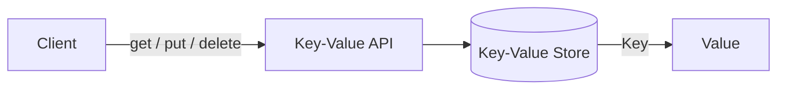

**Why this matters**

- The simple API removes the query planner, join engine, and schema enforcement overhead present in relational databases.
- Because lookups are by key only, the system can use data structures optimized for point lookups.
- Horizontal scaling is easier because data can be partitioned by key.

**Real-life use cases**

- **Session storage**: store a user session token as the key and the session data as the value.
- **Shopping cart**: Redis is often used as a fast cart store where the cart ID is the key.
- **Feature flags**: map a flag name to its configuration.
- **Distributed cache**: cache database query results or rendered pages.
- **Leader election and distributed locks**: etcd and Redis provide key-based primitives.

**Interview questions and answers**

- **Q: What is the difference between a key-value store and a relational database?**
  **A:** A relational database enforces a schema, supports SQL joins and ACID transactions, and is optimized for complex queries. A key-value store has no schema, offers simple key-based access, and is optimized for high-throughput, low-latency point operations and horizontal scalability.

- **Q: Why are key-value stores usually faster than relational databases?**
  **A:** They avoid query parsing, planning, joins, and transaction coordination for most operations. The storage engine can be optimized specifically for point lookups and sequential writes.

- **Q: Give an example where a key-value store is a better fit than SQL.**
  **A:** Caching frequently accessed API responses or session data, where access is always by a known identifier and strong relational constraints are not needed.

---

### Characteristics

Each point is explained in detail below.

- **Simple data model**
  The only relationship is "key maps to value". This removes normalization, foreign keys, and join logic. Applications decide how to structure the value, often by storing JSON or binary data.

- **High performance and low latency**
  Point lookups are usually O(1) or near O(1) through in-memory indexes or optimized on-disk structures. Many implementations keep hot data in memory.

- **Horizontal scalability**
  Data can be distributed across many nodes by hashing or partitioning keys. Adding nodes increases capacity and throughput.

- **High availability**
  Replication and automatic failover allow the system to continue serving reads and writes when individual nodes fail.

- **Schemaless and flexible**
  Different keys can hold different value types and structures. Applications can evolve data without migrations.

- **Tunable consistency**
  Systems such as DynamoDB and Cassandra let you choose between strong consistency, eventual consistency, and quorum-based consistency per operation or per table.

- **Limited query capabilities**
  Most key-value stores do not support arbitrary secondary indexes, joins, or complex `WHERE` clauses. Some add limited secondary index support.

- **Limited transactional support**
  Transactions are usually scoped to a single key or a single partition. Multi-key ACID transactions are rare or expensive.

- **Durability through storage engines**
  Data can be persisted using write-ahead logs, LSM trees, or B-trees, allowing durability and recovery after crashes.

- **TTL support**
  Many stores support time-to-live on keys, which is useful for caches, sessions, and expiring data.

- **Simple API**
  A small API surface makes client libraries easy to implement and reason about.

---

### Pros

- **Fast point reads and writes**
  Since there is no relational overhead, simple operations are measured in sub-millisecond latency in many systems.

- **Easy horizontal scaling**
  Key-based partitioning maps naturally to sharding and consistent hashing.

- **Flexible schema**
  Values can change shape over time, which accelerates development and data evolution.

- **High availability and fault tolerance**
  Replication, hinted handoff, and read repair keep data available during node failures.

- **Low operational complexity for simple workloads**
  The simple data model reduces the need for schema design, migrations, and complex query tuning.

- **Good fit for caching and session workloads**
  Built-in TTL, in-memory storage, and simple access patterns match cache and session use cases exactly.

- **Mature ecosystem**
  Redis, DynamoDB, Cassandra, etcd, RocksDB, and others are widely used, documented, and battle-tested.

- **Predictable performance**
  Point operations avoid the variable performance of multi-table joins and complex SQL.

---

### Cons

- **Weak query capabilities**
  You cannot easily filter, join, aggregate, or perform ad hoc analytical queries.

- **Limited consistency guarantees**
  Many distributed implementations default to eventual consistency, so applications must handle stale reads and conflicts.

- **Data modeling burden moves to the application**
  The application must manage relationships, validation, versioning, and sometimes conflict resolution.

- **Multi-key transactions are difficult**
  Coordinating atomic operations across partitions requires protocols such as two-phase commit or a design that avoids cross-partition transactions.

- **Secondary indexes are limited**
  Supporting indexes often requires additional data structures or separate index components.

- **Storage overhead from replication**
  Replicating data for availability increases storage and network costs.

- **Conflict resolution complexity**
  In leaderless or multi-master systems, concurrent writes can create conflicts that must be resolved with versioning or application logic.

- **Not ideal for complex reporting**
  Analytical workloads with joins and aggregations are better served by SQL or OLAP systems.

---

### Use Cases

Detailed real-world scenarios are described for each use case.

- **Caching**
  Key-value stores cache expensive database queries, API responses, rendered fragments, and computed results. Redis and Memcached are common choices. The cache key is usually derived from the request or query.

- **Session and user profile storage**
  Web applications store session tokens, user preferences, and profile data. The session ID is the key, and the value contains the session state.

- **Shopping carts and e-commerce state**
  A cart can be stored under a cart ID. Values may be JSON serialized. High write throughput and simple retrieval are more important than joins.

- **Feature flags and configuration**
  Feature flag services map a flag key to its rollout rules. Low latency is critical because flag evaluation happens on every request.

- **Rate limiting**
  Counters keyed by client ID or API token can be incremented atomically with TTL windows. Redis `INCR` and `EXPIRE` are commonly used.

- **Leader election and distributed locking**
  Systems such as etcd and Redis provide compare-and-swap, leases, and TTL-based keys to elect leaders and coordinate distributed workers.

- **Metadata and registry services**
  Service discovery systems store service names, endpoints, and health information as key-value records.

- **Real-time counters and leaderboards**
  Sorted sets in Redis and atomic increments enable counters, likes, views, and leaderboards.

- **Event and message deduplication**
  A key based on an event ID can be used with a TTL to detect and drop duplicate events.

- **Graph and recommendation adjacency data**
  Some systems store adjacency lists or precomputed recommendations with entity IDs as keys.

---

### Components

A distributed key-value store is composed of several cooperating components.

- **Client library / SDK**
  Provides `get`, `put`, `delete`, and often batching, retries, and timeout handling. It knows how to route requests to the correct nodes.

- **API layer / coordinator**
  Accepts requests, applies consistency policies, and routes operations to storage nodes. In some designs this is embedded in every node; in others it is a separate proxy.

- **Partitioning / routing layer**
  Decides which node owns a key. This can use consistent hashing, a hash modulo scheme, or range partitioning.

- **Replication manager**
  Copies data to multiple nodes and coordinates quorum reads and writes.

- **Membership and gossip module**
  Tracks which nodes are alive and which partitions they own. Gossip protocols such as SWIM and Cassandra's gossip are common.

- **Failure detector**
  Determines whether a node is down, often using heartbeats, gossip suspicion, and phi accrual.

- **Storage engine**
  Persists and indexes data. Common implementations include hash indexes, B-trees, LSM trees, and SSTables.

- **Write-ahead log (WAL)**
  Records writes durably before they are applied to in-memory structures, enabling crash recovery.

- **Compaction engine**
  Merges and removes obsolete or deleted data in LSM trees to reclaim space and keep reads efficient.

- **Cache layer**
  Keeps frequently accessed data in memory to reduce disk reads.

- **Index structures**
  Additional indexes such as secondary indexes, Bloom filters, and sorted structures support lookups and range scans.

- **Consistency and repair services**
  Read repair, anti-entropy, and hinted handoff work in the background to converge replicas.

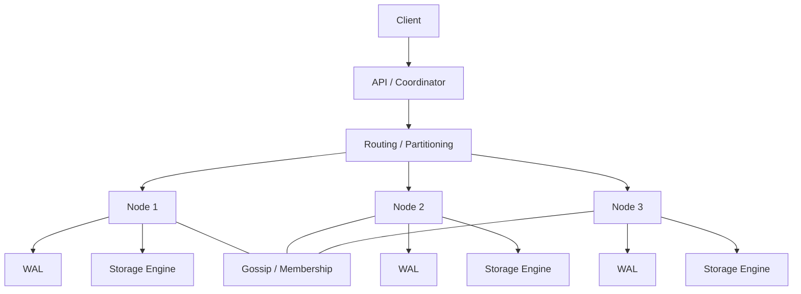

---

### Architectural Patterns

- **Leader-based replication**
  One node accepts writes and replicates them to followers. Reads can be served by followers or only by the leader. This pattern gives strong consistency and simple conflict handling.

- **Leaderless replication**
  Any node can accept writes. Clients write to multiple replicas and read from multiple replicas using quorum rules. DynamoDB and Cassandra use this pattern.

- **Multi-leader replication**
  Multiple nodes accept writes and replicate to each other. This is useful for multi-datacenter setups but introduces conflict resolution challenges.

- **Consistent hashing ring**
  Nodes are placed on a hash ring, and each key maps to the first node clockwise. This minimizes data movement when nodes are added or removed.

- **Quorum-based read and write**
  For N replicas, a write requires W acknowledgements and a read requires R. If `W + R > N`, reads and writes overlap and return the latest value.

- **LSM-tree storage pattern**
  Writes are buffered in memory and flushed to sorted immutable files. Background compaction merges files. This optimizes write throughput.

- **B-tree storage pattern**
  Data is stored in balanced tree pages on disk, supporting efficient range scans and in-place updates.

- **Write-through / write-back cache pattern**
  Caches are integrated with the store to improve latency. Write-through updates the store synchronously, while write-back updates the cache first and persists asynchronously.

- **Read-through / cache-aside pattern**
  The application or cache layer loads a missing key from the backing store and caches it for subsequent reads.

- **Eventual consistency pattern**
  Replicas converge over time through gossip, read repair, and anti-entropy. The system prioritizes availability and partition tolerance.

---

### Benefits

- **Simplicity**
  A small API and data model make the system easier to build, operate, and reason about.

- **Scalability**
  Partitioning by key allows near-linear horizontal scaling.

- **Performance**
  Optimized point operations deliver high throughput and low latency.

- **Flexibility**
  Schemaless values support rapid iteration and varied data shapes.

- **Availability**
  Replication and quorum mechanisms keep the system available during failures.

- **Cost efficiency for simple workloads**
  Simple storage engines and commodity hardware can serve huge workloads without a complex database tier.

- **Operational clarity**
  Fewer query and schema features mean fewer tuning knobs and lower risk of expensive queries.

- **Integration with distributed systems**
  Key-value stores naturally provide primitives for locks, leases, counters, and coordination.

---

### Challenges

- **Consistency vs availability trade-off**
  In a partition, you must choose between returning a possibly stale value or rejecting the request.

- **Conflict resolution**
  Concurrent writes to the same key require vector clocks, last-write-wins, or application-specific merge logic.

- **Hotspots**
  Popular keys can overload a single partition. Mitigations include key splitting, sharding, and caching.

- **Data skew**
  Poor key distribution can make some nodes much larger or busier than others.

- **Limited querying**
  Applications that need ad hoc queries must build secondary indexes or move data to an analytics store.

- **Replication lag**
  Followers or replicas may briefly serve stale data.

- **Storage and compaction overhead**
  LSM trees need background compaction, which competes for I/O and CPU.

- **Operational complexity in large clusters**
  Rebalancing, repairs, and monitoring require careful automation.

- **Security**
  Many key-value stores historically provide minimal built-in authentication and authorization, so network isolation and encryption are important.

---

### Best Practices

- **Design keys for even distribution**
  Use hashed keys or UUIDs rather than monotonically increasing or highly skewed keys.

- **Pick the right consistency level per operation**
  Use strong consistency only where correctness requires it; otherwise use eventual consistency for better performance.

- **Use TTLs for expiring data**
  Sessions, caches, rate-limit counters, and deduplication keys should expire automatically.

- **Version your values**
  Include a schema version or use a format such as JSON/Protobuf so values can evolve safely.

- **Keep values small**
  Large values increase latency, memory pressure, and network cost. Store large blobs in object storage and keep a reference in the key-value store.

- **Replicate for availability**
  Replicate data across at least three nodes or availability zones for production systems.

- **Monitor latency, hit ratio, and partition balance**
  Track hotspot keys, cache hit ratio, node CPU/memory, and read/write latencies.

- **Implement retries with backoff and idempotency**
  Distributed operations can time out; retries should be idempotent.

- **Use compare-and-swap for coordination**
  For locks, counters, and conditional updates, use atomic operations instead of read-modify-write.

- **Test failure modes**
  Simulate node loss, network partitions, and replica lag to verify behavior.

- **Separate hot and cold data**
  Use in-memory stores for hot data and disk-backed stores for durable or less frequently accessed data.

- **Secure the store**
  Enable authentication, TLS, and network policies. Do not expose internal key-value stores publicly.

---

### When to Use a Key-Value Store

- **Use it when** access is always by a known key and you do not need joins or complex queries.
- **Use it when** you need sub-millisecond or single-digit-millisecond latency for point operations.
- **Use it when** you need to scale horizontally to handle high read/write throughput.
- **Use it when** your data model is simple or flexible enough to live without a fixed schema.
- **Use it when** you are building caches, sessions, feature flags, rate limiters, or coordination primitives.
- **Use it when** availability and partition tolerance matter more than strong consistency.

**Avoid it when**

- You need complex joins, aggregations, or ad hoc reporting.
- You need strict multi-record ACID transactions across many entities.
- You have deeply relational data that changes together.
- You need sophisticated secondary indexes and query planners.
- Your workload is analytical rather than operational.

---

### Data Model and API

A key is typically an opaque string or byte array. The value can be a string, number, JSON document, binary blob, list, set, hash, or sorted set depending on the store.

Core operations:

- `get(key)` — return the value or `null`/`not found`.
- `put(key, value)` — insert or overwrite the value.
- `delete(key)` — remove the key.
- `contains(key)` — check existence.
- `putIfAbsent(key, value)` — atomic conditional insert.
- `compareAndSet(key, expected, value)` — atomic compare-and-swap.
- `increment(key, delta)` — atomic counter.
- `expire(key, ttl)` — set a time-to-live.
- `scan(prefix)` — iterate over keys matching a prefix where supported.

**Java example: simple key-value service**

```java
import java.util.Map;
import java.util.Optional;
import java.util.concurrent.ConcurrentHashMap;

public class InMemoryKeyValueStore {

    private final Map<String, String> store = new ConcurrentHashMap<>();

    public Optional<String> get(String key) {
        return Optional.ofNullable(store.get(key));
    }

    public void put(String key, String value) {
        store.put(key, value);
    }

    public Optional<String> delete(String key) {
        return Optional.ofNullable(store.remove(key));
    }

    public boolean putIfAbsent(String key, String value) {
        return store.putIfAbsent(key, value) == null;
    }

    public long increment(String key, long delta) {
        String result = store.merge(key, String.valueOf(delta),
            (oldValue, ignored) -> String.valueOf(Long.parseLong(oldValue) + delta));
        return Long.parseLong(result);
    }
}
```

**Interview questions and answers**

- **Q: What operations does a key-value store usually expose?**
  **A:** `get`, `put`, `delete`, and often conditional writes, TTL, and atomic increments.

- **Q: How do you model a many-to-many relationship in a key-value store?**
  **A:** Use sets or lists keyed by each entity, or denormalize the relationship into both directions of lookup.

- **Q: Why is TTL useful?**
  **A:** It automatically removes expired data, preventing unbounded growth and reducing manual cleanup for caches and sessions.

---

### Storage Engines

A storage engine is the component that persists and retrieves data. Understanding it is key to designing a high-performance key-value store.

#### Hash Index

An in-memory hash map maps each key to its byte offset in an append-only file. Writes append to the file and update the hash map. Reads use the hash map to seek directly to the value.

- **Pros:** simple, fast point reads and writes.
- **Cons:** memory usage grows with the number of keys; range scans are inefficient; the log must be compacted.

**Real-life use:** Bitcask, used by Riak, is a well-known hash index implementation.

#### SSTable and LSM-Tree

An SSTable is a sorted, immutable file of key-value pairs. An LSM tree buffers writes in a memory table, flushes sorted SSTables to disk, and periodically merges them through compaction.

- **Pros:** excellent write throughput, good point reads, efficient range scans.
- **Cons:** background compaction uses I/O and CPU; read may need to check multiple files.

**Real-life use:** RocksDB, LevelDB, Cassandra, and HBase use LSM trees.

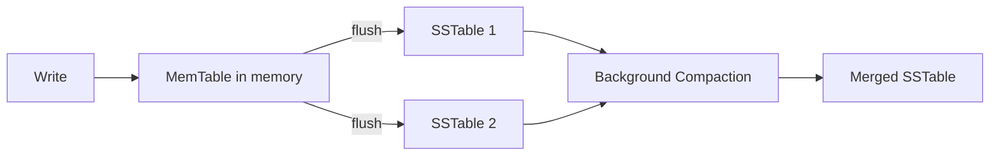

#### B-Tree

A B-tree keeps key-value pairs in balanced tree pages on disk. It supports in-place updates and efficient range scans.

- **Pros:** predictable reads, good for range queries and updates.
- **Cons:** writes can be slower because of random I/O and page splits.

**Real-life use:** InnoDB in MySQL and many embedded databases use B-trees.

#### Write-Ahead Log (WAL)

Before a write is applied to in-memory state, it is appended to a durable log. After a crash, the system replays the WAL to recover committed writes.

**Real-life use:** PostgreSQL, RocksDB, and Redis persistence modes use WAL-like mechanisms.

**Java example: simplified append-only store**

```java
import java.io.*;
import java.nio.charset.StandardCharsets;
import java.util.HashMap;
import java.util.Map;

public class AppendOnlyKeyValueStore implements AutoCloseable {

    private final Map<String, Long> offsets = new HashMap<>();
    private final RandomAccessFile file;

    public AppendOnlyKeyValueStore(String path) throws IOException {
        this.file = new RandomAccessFile(path, "rw");
    }

    public synchronized void put(String key, String value) throws IOException {
        long offset = file.length();
        offsets.put(key, offset);
        byte[] data = (key + "\t" + value + "\n").getBytes(StandardCharsets.UTF_8);
        file.seek(offset);
        file.write(data);
    }

    public synchronized String get(String key) throws IOException {
        Long offset = offsets.get(key);
        if (offset == null) {
            return null;
        }
        file.seek(offset);
        String line = file.readLine();
        if (line == null) {
            return null;
        }
        int separator = line.indexOf('\t');
        return separator >= 0 ? line.substring(separator + 1) : null;
    }

    @Override
    public void close() throws IOException {
        file.close();
    }
}
```

**Interview questions and answers**

- **Q: Compare LSM trees and B-trees.**
  **A:** LSM trees optimize writes by batching and sequential flushing, but reads may check multiple files and compaction consumes background resources. B-trees optimize in-place updates and predictable reads but suffer from random write I/O.

- **Q: What is the purpose of compaction?**
  **A:** Compaction merges SSTables and removes overwritten or deleted values, reducing storage and keeping read paths efficient.

- **Q: Why is a write-ahead log important?**
  **A:** It ensures durability by recording changes before they are applied, allowing recovery from crashes without losing committed writes.

---

### Replication Strategies

Replication keeps copies of data on multiple nodes for availability and durability.

#### Leader-Based Replication

One node is the leader. Writes go to the leader and are replicated to followers. Reads may be served by the leader or followers.

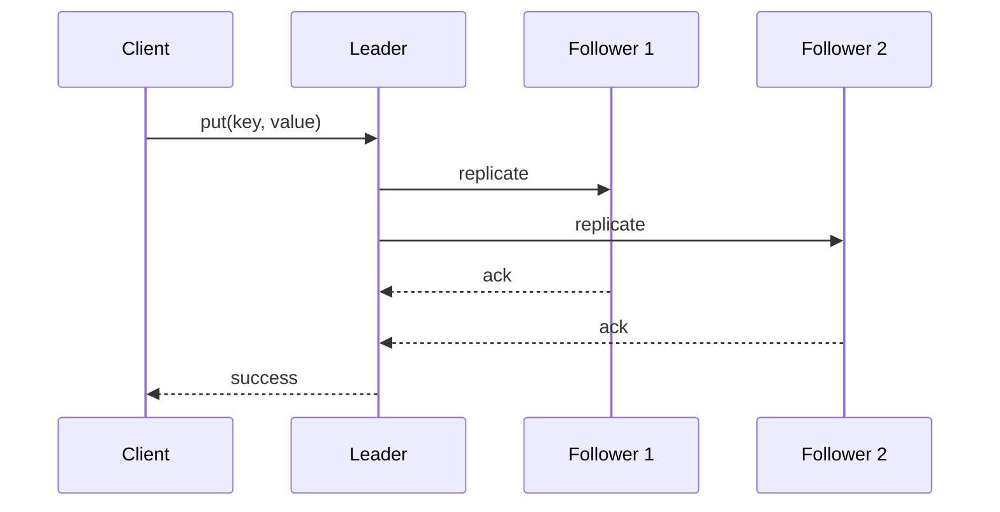

- **Pros:** simple consistency, clear write ordering.
- **Cons:** leader can become a bottleneck or single point of failure; failover is complex.

**Real-life use:** etcd and MongoDB use leader-based replication.

#### Multi-Leader Replication

Multiple nodes accept writes and replicate asynchronously to each other. This is useful for multi-datacenter active-active setups.

- **Pros:** lower write latency locally, survives a whole datacenter failure.
- **Cons:** conflicts between concurrent writes must be resolved.

**Real-life use:** some multi-datacenter databases and collaboration tools.

#### Leaderless Replication

Any replica can accept writes. The client writes to several replicas and reads from several replicas. Quorum rules determine success.

- **Pros:** no leader election, high availability.
- **Cons:** weaker consistency, requires read repair and anti-entropy.

**Real-life use:** DynamoDB, Cassandra, Riak.

**Interview questions and answers**

- **Q: What is a quorum?**
  **A:** For N replicas, a write quorum W is the number of replicas that must acknowledge a write, and a read quorum R is the number that must respond to a read. If `W + R > N`, at least one read replica overlaps with a write replica, so the latest value is visible.

- **Q: Why does leaderless replication need read repair?**
  **A:** Because writes may not reach every replica, reads must detect stale replicas and update them to converge the data.

---

### Partitioning and Sharding

Partitioning divides the keyspace across nodes so no single node holds all data.

- **Hash partitioning:** compute `hash(key) % number_of_nodes`. Simple but causes large data movement when nodes are added or removed.
- **Range partitioning:** assign contiguous key ranges to nodes. Enables efficient range scans but can create hotspots if keys are not evenly distributed.
- **Consistent hashing:** map nodes and keys onto a ring; each key belongs to the next node clockwise. Adding or removing a node moves only a fraction of keys.
- **Virtual nodes:** each physical node owns many points on the ring, improving balance.

**Real-life use:** DynamoDB partitions data using hash keys, Cassandra uses consistent hashing with virtual nodes.

**Interview questions and answers**

- **Q: What is the problem with modulo hashing for sharding?**
  **A:** Changing the number of nodes changes almost every key's mapping, causing massive data movement.

- **Q: How do virtual nodes help consistent hashing?**
  **A:** They distribute each physical node across many ring positions, reducing data skew and allowing proportional capacity assignment.

---

### Consistent Hashing

Consistent hashing maps both nodes and keys to the same hash ring. A key is assigned to the first node whose position is equal to or greater than the key's hash, wrapping around the ring.

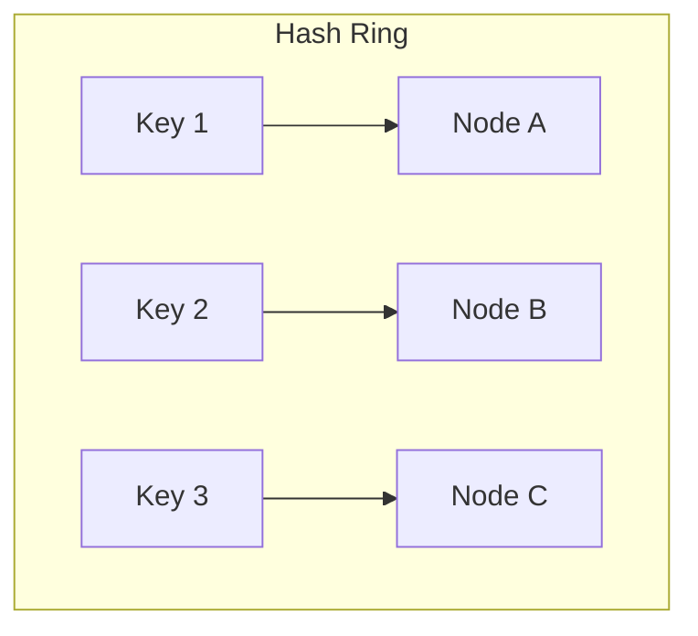

**Java implementation**

```java
import java.util.*;

public class ConsistentHashing {

    private final SortedMap<Integer, String> ring = new TreeMap<>();
    private final int virtualNodes;

    public ConsistentHashing(int virtualNodes, List<String> nodes) {
        this.virtualNodes = virtualNodes;
        for (String node : nodes) {
            addNode(node);
        }
    }

    private int hash(String key) {
        return Math.abs(key.hashCode());
    }

    public void addNode(String node) {
        for (int i = 0; i < virtualNodes; i++) {
            ring.put(hash(node + "#" + i), node);
        }
    }

    public void removeNode(String node) {
        for (int i = 0; i < virtualNodes; i++) {
            ring.remove(hash(node + "#" + i));
        }
    }

    public String getNode(String key) {
        if (ring.isEmpty()) {
            return null;
        }
        int keyHash = hash(key);
        SortedMap<Integer, String> tail = ring.tailMap(keyHash);
        Integer nodeHash = tail.isEmpty() ? ring.firstKey() : tail.firstKey();
        return ring.get(nodeHash);
    }
}
```

**Real-life use:** DynamoDB, Cassandra, Riak, and Akka use consistent hashing for data placement.

**Interview questions and answers**

- **Q: What happens when a node is added to a consistent hash ring?**
  **A:** Only the keys that map to the new node's position are moved from its neighbors; other keys stay on their existing nodes.

- **Q: Why use virtual nodes?**
  **A:** Virtual nodes reduce skew, balance load, and allow nodes with different capacities to own different numbers of virtual nodes.

---

### Quorum, Read Repair and Anti-Entropy

In a replicated store with N replicas, a write is acknowledged after W replicas confirm it, and a read returns after R replicas respond. When `W + R > N`, there is guaranteed overlap.

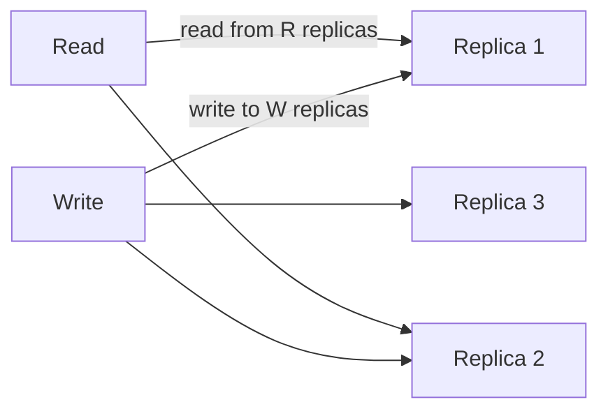

**Read repair:** when a read observes different versions among replicas, it writes the newest version back to stale replicas.

**Anti-entropy:** background processes compare replicas, often using Merkle trees, and synchronize missing or outdated data.

**Real-life use:** DynamoDB uses quorum reads/writes, Cassandra uses read repair and Merkle-tree anti-entropy.

**Interview questions and answers**

- **Q: What is the difference between read repair and anti-entropy?**
  **A:** Read repair happens on the read path when inconsistencies are observed, while anti-entropy runs continuously in the background to synchronize replicas.

- **Q: If N=3, W=2, R=2, can a read see stale data?**
  **A:** No, assuming no clock skew. Since `2 + 2 > 3`, any read set of two replicas overlaps with every write set of two replicas, so the latest write is visible.

---

### Versioning and Vector Clocks

When writes can happen concurrently on different replicas, the system needs to determine causal ordering and detect conflicts.

- **Timestamps** can be used but are unreliable due to clock skew.
- **Version numbers** help detect overwrites.
- **Vector clocks** capture causality by storing a map of `{node -> counter}` for each version.

A vector clock `[A:1, B:2]` means node A has made 1 update and node B has made 2 updates in the observed causal history. Two versions are concurrent if neither vector clock dominates the other.

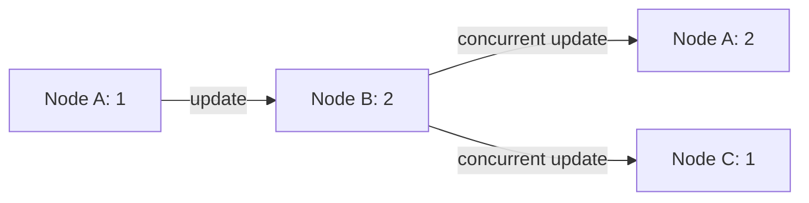

**Real-life use:** Riak uses vector clocks, DynamoDB originally used vector clocks before moving to other conflict-resolution strategies.

**Java example: simplified vector clock**

```java
import java.util.HashMap;
import java.util.Map;

public class VectorClock implements Comparable<VectorClock> {

    private final Map<String, Long> counters = new HashMap<>();

    public void increment(String nodeId) {
        counters.merge(nodeId, 1L, Long::sum);
    }

    public boolean happensBefore(VectorClock other) {
        boolean anyLess = false;
        for (Map.Entry<String, Long> entry : counters.entrySet()) {
            long otherCount = other.counters.getOrDefault(entry.getKey(), 0L);
            if (entry.getValue() > otherCount) {
                return false;
            }
            if (entry.getValue() < otherCount) {
                anyLess = true;
            }
        }
        return anyLess || counters.size() < other.counters.size();
    }

    public boolean isConcurrentWith(VectorClock other) {
        return !happensBefore(other) && !other.happensBefore(this);
    }

    @Override
    public int compareTo(VectorClock other) {
        if (happensBefore(other)) {
            return -1;
        }
        if (other.happensBefore(this)) {
            return 1;
        }
        return 0;
    }
}
```

**Interview questions and answers**

- **Q: Why not use wall-clock timestamps for versioning?**
  **A:** Clocks across nodes can drift, so timestamps cannot reliably order events that happen close together.

- **Q: What does it mean when two vector clocks are concurrent?**
  **A:** Neither version causally precedes the other, meaning the writes happened concurrently and may require conflict resolution.

---

### Hinted Handoff and Sloppy Quorum

If a replica is unavailable, a write can be sent to a different node that is not one of the key's normal replicas. That node stores the write with a "hint" about the intended replica and later forwards it when the original replica recovers.

- **Hinted handoff** improves write availability during temporary failures.
- **Sloppy quorum** counts the temporary node toward the write quorum even though it is not an official replica for that key.

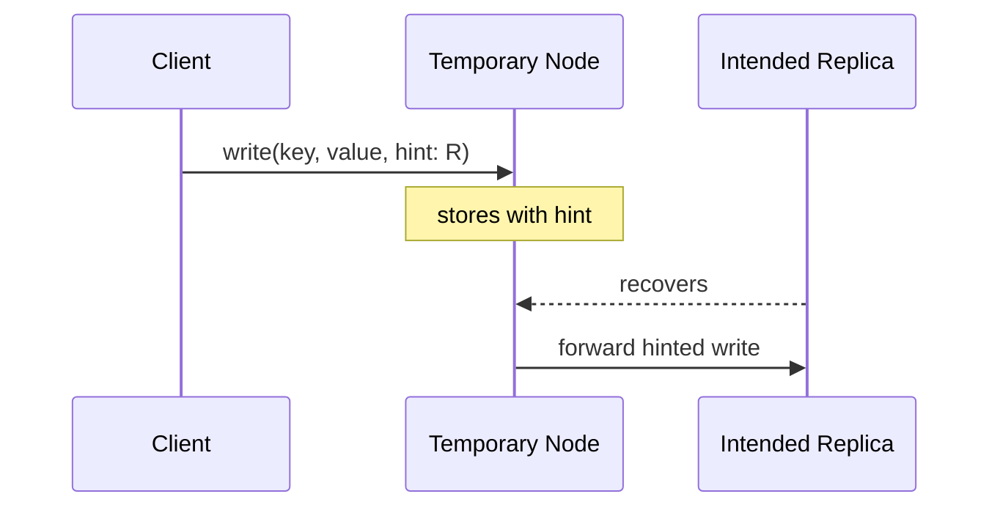

**Real-life use:** DynamoDB and Cassandra use hinted handoff.

**Interview questions and answers**

- **Q: What problem does hinted handoff solve?**
  **A:** It allows writes to succeed even when some replicas are down, improving availability without sacrificing eventual durability.

- **Q: What is the risk of hinted handoff?**
  **A:** If the temporary node fails before forwarding, the write may be lost unless other replicas received it.

---

### Write Path and Read Path

Understanding the read and write paths reveals where latency and durability come from.

#### Write Path

1. Client sends `put(key, value)`.
2. Coordinator hashes the key and selects replicas.
3. Write is appended to the WAL.
4. Value is written to the in-memory table or cache.
5. Replication sends the write to W replicas.
6. Client receives success after W acknowledgements.

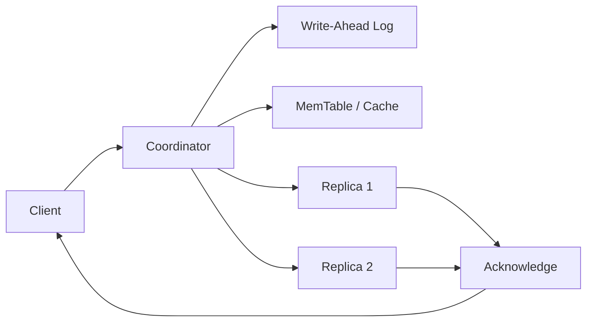

#### Read Path

1. Client sends `get(key)`.
2. Coordinator hashes the key and selects R replicas.
3. Each replica checks its memory table, Bloom filter, and SSTables.
4. Coordinator merges responses and returns the latest version.
5. Read repair may update stale replicas.

**Real-life use:** RocksDB and Cassandra follow similar paths.

**Interview questions and answers**

- **Q: Why is the WAL written before the in-memory table?**
  **A:** To ensure durability; if the node crashes after acknowledging the write, the WAL can replay it during recovery.

- **Q: How does a Bloom filter speed up reads?**
  **A:** It quickly determines whether a key is definitely absent from an SSTable, avoiding unnecessary disk reads.

---

### Compaction and Bloom Filters

**Compaction** merges multiple SSTables into fewer files, discarding obsolete versions and tombstones. It reduces read amplification and reclaims disk space.

Strategies:

- Size-tiered compaction: merge files of similar size.
- Leveled compaction: organize files into levels with bounded overlap.

**Bloom filters** are probabilistic in-memory structures that can quickly answer "key is definitely not here" or "key may be here". They trade a tiny false-positive rate for large memory savings.

**Java example: simple Bloom filter**

```java
import java.util.BitSet;
import java.util.function.ToIntFunction;

public class BloomFilter {

    private final BitSet bits;
    private final int size;
    private final ToIntFunction<String>[] hashes;

    @SafeVarargs
    public BloomFilter(int size, ToIntFunction<String>... hashes) {
        this.bits = new BitSet(size);
        this.size = size;
        this.hashes = hashes;
    }

    public void add(String value) {
        for (ToIntFunction<String> hash : hashes) {
            bits.set(Math.abs(hash.applyAsInt(value)) % size);
        }
    }

    public boolean mightContain(String value) {
        for (ToIntFunction<String> hash : hashes) {
            if (!bits.get(Math.abs(hash.applyAsInt(value)) % size)) {
                return false;
            }
        }
        return true;
    }
}
```

**Real-life use:** RocksDB, Cassandra, and HBase use Bloom filters to reduce disk lookups.

**Interview questions and answers**

- **Q: Can a Bloom filter return false negatives?**
  **A:** No. It never says a present key is absent, but it can return false positives.

- **Q: What happens if compaction removes a key that is still needed?**
  **A:** Correct compaction only removes keys that have been overwritten or explicitly deleted, using tombstones to handle deletes safely.

---

### Failure Detection and Membership

A distributed store must know which nodes are alive and which partitions they own.

- **Heartbeats:** nodes periodically send liveness signals. Missing heartbeats mark a node suspected or failed.
- **Gossip protocol:** nodes exchange membership and state information with random peers. The information spreads through the cluster.
- **Phi accrual failure detector:** computes a suspicion level based on heartbeat arrival times, reducing false positives.
- **SWIM protocol:** a scalable weakly-consistent infection-style membership protocol used by HashiCorp Serf and others.

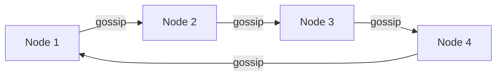

**Real-life use:** Cassandra uses gossip and phi accrual; DynamoDB's internals use gossip-like membership.

**Interview questions and answers**

- **Q: Why is gossip preferred over a central registry in some systems?**
  **A:** It removes a single point of failure and scales well, at the cost of eventual consistency in membership knowledge.

- **Q: What is a false positive in failure detection?**
  **A:** A live node is incorrectly marked dead, which can cause unnecessary data movement or failover.

---

### CAP Theorem and Consistency Trade-offs

The CAP theorem states that during a network partition, a distributed system can provide either consistency or availability, but not both, while still maintaining partition tolerance.

- **Consistency:** every read returns the most recent write.
- **Availability:** every request receives a response, even if some data may be stale.
- **Partition tolerance:** the system continues operating despite network partitions.

Most practical distributed systems choose partition tolerance, then make a trade-off between consistency and availability.

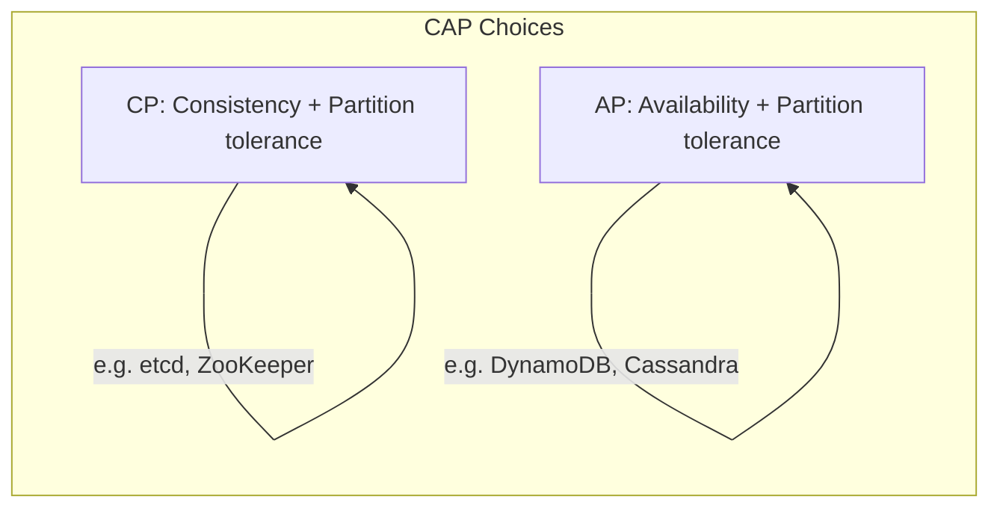

**Real-life mapping**

- **CP systems:** etcd, ZooKeeper, HBase.
- **AP systems:** DynamoDB, Cassandra, Riak.

**Interview questions and answers**

- **Q: Is Redis a CP or AP system?**
  **A:** A single Redis node is neither distributed nor partition-tolerant. Redis Cluster is generally AP in behavior for most configurations, but specific commands and configurations can trade availability for consistency.

- **Q: Can a system be both strongly consistent and highly available during a partition?**
  **A:** No. During a partition, a strongly consistent system must reject some requests to avoid returning stale data, sacrificing availability.

---

### Encryption and Key Management

Encryption protects a key-value store's data at rest and in transit. A production-grade store must consider multiple layers, from disk-level encryption to key rotation policies.

#### Encryption at Rest

Data persisted to disk — data files, WAL entries, SSTables, and index files — must be encrypted so that a compromised disk or backup cannot reveal sensitive data.

- **File-system encryption:** encrypt the entire data directory at the OS level (e.g., dm-crypt on Linux). Transparent but encrypts everything with one key.
- **Application-level encryption:** the storage engine encrypts each value before writing it to disk. This allows per-record keys and fine-grained access control but adds CPU overhead.
- **Key rotation during compaction:** when a key is rotated, old SSTables still hold data encrypted with the previous key. Re-encryption happens lazily during compaction, and the system keeps track of which key encrypted which file so it can decrypt on read.

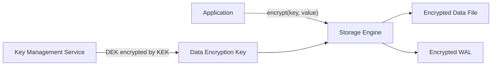
*Encryption layer: the application encrypts values with a data key managed by a KMS before the storage engine writes them to disk.*

**Real-life use:** MongoDB's encrypted storage engine, DynamoDB and Azure Cosmos DB encrypt at rest by default, AWS KMS manages keys, and HashiCorp Vault provides centralized key management for many systems.

#### Encryption in Transit

All client-to-server and inter-node replication traffic must use TLS to protect data from eavesdropping and tampering.

- **Mutual TLS (mTLS):** both the client and each server node present certificates, providing strong authentication for replication traffic where any node can talk to any other node.
- **TLS termination at the load balancer:** the LB terminates TLS and forwards decrypted traffic to backend nodes. Simpler to manage but requires a trusted internal network.
- **Certificate rotation:** certificates should be rotated automatically (e.g., every 30–90 days) and revocation checked via OCSP or CRL.

#### Key Management

Key management is the foundation of encryption. Poor key management negates the benefits of encryption entirely.

- **Key hierarchy:** a key encryption key (KEK) encrypts data encryption keys (DEKs), which encrypt actual data. This allows rotating the KEK without re-encrypting all data — only re-encrypting the DEKs.
- **Hardware Security Module (HSM):** stores the KEK in tamper-resistant hardware. Even the application cannot extract the raw key material.
- **Key rotation policy:** KEKs should be rotated every 6–12 months; DEKs can be rotated per-session or per-file more frequently.
- **Multi-region key management:** for multi-region stores, keys must be available in each region. Cloud KMS services replicate keys across regions automatically.

**Java example: encryption service as a Spring bean**

```java
import org.springframework.beans.factory.annotation.Value;
import org.springframework.stereotype.Service;

import javax.crypto.Cipher;
import javax.crypto.SecretKey;
import javax.crypto.spec.GCMParameterSpec;
import java.nio.charset.StandardCharsets;
import java.security.GeneralSecurityException;
import java.security.SecureRandom;
import java.util.Base64;

@Service
public class DataEncryptionService {

    private static final int GCM_IV_LENGTH = 12;
    private static final int GCM_TAG_LENGTH = 128;
    private final SecretKey dataKey;
    private final SecureRandom random = new SecureRandom();

    public DataEncryptionService(@Value("${app.encryption.data-key-base64}") String keyB64)
            throws GeneralSecurityException {
        byte[] decoded = Base64.getDecoder().decode(keyB64);
        this.dataKey = new javax.crypto.spec.SecretKeySpec(decoded, "AES");
    }

    public String encrypt(String plaintext) throws GeneralSecurityException {
        byte[] iv = new byte[GCM_IV_LENGTH];
        random.nextBytes(iv);
        Cipher cipher = Cipher.getInstance("AES/GCM/NoPadding");
        cipher.init(Cipher.ENCRYPT_MODE, dataKey, new GCMParameterSpec(GCM_TAG_LENGTH, iv));
        byte[] encrypted = cipher.doFinal(plaintext.getBytes(StandardCharsets.UTF_8));
        byte[] output = new byte[iv.length + encrypted.length];
        System.arraycopy(iv, 0, output, 0, iv.length);
        System.arraycopy(encrypted, 0, output, iv.length, encrypted.length);
        return Base64.getEncoder().encodeToString(output);
    }

    public String decrypt(String encoded) throws GeneralSecurityException {
        byte[] input = Base64.getDecoder().decode(encoded);
        byte[] iv = new byte[GCM_IV_LENGTH];
        byte[] ciphertext = new byte[input.length - GCM_IV_LENGTH];
        System.arraycopy(input, 0, iv, 0, GCM_IV_LENGTH);
        System.arraycopy(input, GCM_IV_LENGTH, ciphertext, 0, ciphertext.length);
        Cipher cipher = Cipher.getInstance("AES/GCM/NoPadding");
        cipher.init(Cipher.DECRYPT_MODE, dataKey, new GCMParameterSpec(GCM_TAG_LENGTH, iv));
        byte[] decrypted = cipher.doFinal(ciphertext);
        return new String(decrypted, StandardCharsets.UTF_8);
    }
}
```
*The `DataEncryptionService` bean wraps AES-GCM encryption with a per-message random IV. In production, the data key comes from a KMS or HSM and is rotated automatically.*

**Interview questions and answers**

- **Q: Should you encrypt all data in a key-value store by default?**
  **A:** Not necessarily. Consider the threat model: if the threat is a stolen disk, filesystem-level encryption suffices and is cheaper. If the threat is an attacker who has already gained database access, application-level encryption is needed. The trade-off is CPU overhead and key management complexity.

- **Q: What is the difference between encryption at rest and encryption in transit?**
  **A:** At-rest encryption protects data on disk; in-transit protects data over the network. Both are needed for defense in depth. A breach that exfiltrates encrypted files still requires the attacker to obtain the decryption keys — key separation and rotation make that harder.

---

### Authentication and Authorization

A key-value store must verify who is connecting (authentication) and what they are allowed to do (authorization). In distributed stores where any node can accept requests, authentication and authorization are enforced at each node.

#### Authentication Methods

- **Username and password:** the simplest method. Passwords must be hashed with a strong algorithm (bcrypt, scrypt, or Argon2) and never stored in plaintext.
- **X.509 certificates:** clients present a certificate issued by a trusted CA. This is common for service-to-service communication and inter-node replication.
- **Tokens:** short-lived tokens (JWT, OAuth2 bearer tokens) issued by an identity provider. The node validates the token's signature and claims before accepting the request.
- **SASL (Simple Authentication and Security Layer):** a framework that supports multiple mechanisms (PLAIN, SCRAM, GSSAPI/Kerberos). Redis, Kafka, and Cassandra use SASL for pluggable authentication.

#### Authorization Models

- **Role-Based Access Control (RBAC):** users are assigned roles (e.g., `admin`, `reader`, `writer`), and roles grant permissions on resources (keys or key prefixes).
- **Attribute-Based Access Control (ABAC):** permissions are granted based on attributes of the user, the resource, the action, and the environment (e.g., `user.region == key.region`).
- **Access Control Lists (ACLs):** per-key or per-prefix rules that specify which principals can read or write. Redis uses ACLs to restrict commands and keys per user.

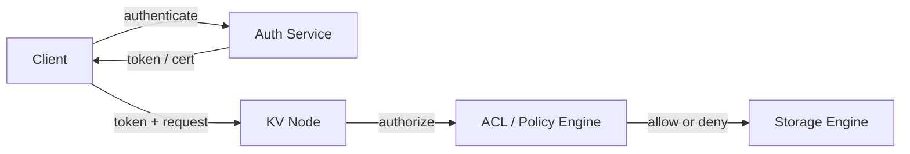
*Authentication verifies identity; authorization checks permissions before the storage engine processes the request.*

#### Real-Life Implementations

- **Redis ACLs:** each user has a set of allowed commands and accessible key patterns.
- **DynamoDB IAM policies:** fine-grained policies control access to tables and items using IAM.
- **Cassandra role-based permissions:** GRANT/REVOKE syntax controls permissions on keyspaces and tables.
- **etcd RBAC:** roles and users control access to key prefixes.

**Java example: RBAC-based authorization service**

```java
import org.springframework.beans.factory.annotation.Value;
import org.springframework.stereotype.Service;

import java.util.List;
import java.util.Map;
import java.util.Set;
import java.util.concurrent.ConcurrentHashMap;

@Service
public class KeyValueAuthorizationService {

    private final Map<String, Set<String>> rolePermissions = new ConcurrentHashMap<>();
    private final Map<String, List<String>> userRoles = new ConcurrentHashMap<>();

    public KeyValueAuthorizationService(@Value("${app.rbac.enabled:true}") boolean enabled) {
        // Bootstrap default roles; in production these come from a database or config service.
        rolePermissions.put("admin", Set.of("read", "write", "delete", "list"));
        rolePermissions.put("reader", Set.of("read", "list"));
        rolePermissions.put("writer", Set.of("read", "write"));
    }

    public boolean isAuthorized(String user, String role, String key, String action) {
        List<String> roles = userRoles.getOrDefault(user, List.of(role));
        for (String r : roles) {
            Set<String> permissions = rolePermissions.getOrDefault(r, Set.of());
            if (permissions.contains(action) && matchesKeyPermission(permissions, key)) {
                return true;
            }
        }
        return false;
    }

    private boolean matchesKeyPermission(Set<String> permissions, String key) {
        // In a real implementation, ACLs would map key prefixes to permissions.
        // This stub grants access if the requested action is in the role's permission set.
        return permissions.contains("admin");
    }
}
```
*The `KeyValueAuthorizationService` bean enforces RBAC: each user is assigned roles, each role grants a set of actions (`read`, `write`, `delete`, `list`), and the service checks whether the principal can perform the requested action on the given key. In production, the permission check would include key-prefix matching against ACL rules.*

**Interview questions and answers**

- **Q: How do you authenticate a client connecting to a distributed key-value store where any node can accept requests?**
  **A:** Each node independently validates the client's credentials (token, certificate, or SASL) before processing the request. The credential store (user table, certificate CA) must be replicated or shared across all nodes so every node can verify identity without coordination.

- **Q: What is the difference between authentication and authorization?**
  **A:** Authentication proves *who* the client is; authorization determines *what* the authenticated client is allowed to do. A common interview trap: conflating the two. A system can authenticate a user but authorize them for nothing (deny by default).

---

### High Availability and Scalability

A key-value store must remain available when nodes fail and must scale to handle growing read and write load. High availability and scalability are achieved through replication, leader election, and horizontal partitioning — concepts already touched on in earlier sections, but here we synthesize them into operational HA patterns.

#### Replication for Availability

- **Multi-replica writes:** each key is stored on N nodes. If the primary replica fails, a secondary continues serving reads and writes.
- **Synchronous vs asynchronous replication:** synchronous replication waits for all replicas (stronger consistency), while asynchronous replication returns success immediately (higher availability, potential data loss on failure).
- **Read replicas:** load can be distributed across replicas for read-heavy workloads. Writes still go to the primary, but reads are served from secondaries.

#### Leader Election and Failover

When the primary replica fails, the cluster must elect a new leader automatically.

- **Raft consensus:** a leader is elected through a majority vote. Raft is widely used (etcd, Consul, ZooKeeper) because it is understandable and provably safe.
- **Gossip-based membership:** nodes exchange health information via gossip. If a node stops responding, others mark it as suspect and trigger failover.
- **Automatic failover:** the cluster detects leader failure and promotes a follower to leader within seconds. Clients are redirected to the new leader.

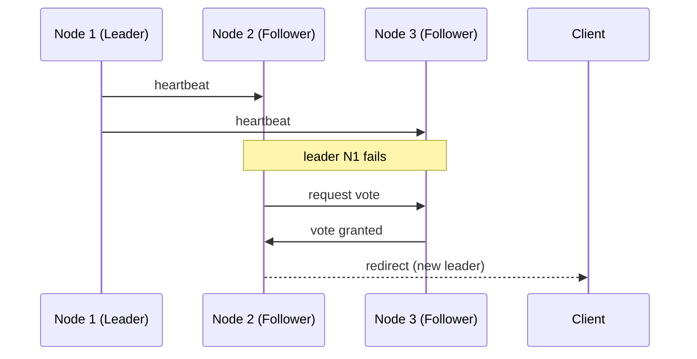
*When the leader fails, followers detect the missing heartbeats, run a new election, and redirect clients to the new leader.*

#### Scaling Strategies

- **Horizontal scaling (scale-out):** add more nodes and rebalance partitions. This is the preferred approach for key-value stores because data is partitioned by key.
- **Vertical scaling (scale-up):** increase the resources (CPU, RAM, disk) of existing nodes. Simpler but hits hardware limits.
- **Sharding-aware clients:** clients can route requests directly to the correct shard using consistent hashing, eliminating the coordinator bottleneck.
- **Elastic scaling:** nodes can be added or removed dynamically. The membership layer triggers rebalancing of partitions across the new cluster topology.

#### Auto-Rebalancing

When nodes are added or removed, partitions must be redistributed to maintain even load.

- **Partition splitting:** if a node holds too many partitions, they are split and some are moved to the new node.
- **Decommissioning:** when a node is removed, its partitions are transferred to other nodes before the node is shut down.
- **Load-based rebalancing:** the cluster monitors load per node and moves hot partitions to underutilized nodes.

**Real-life use:** Kafka Streams uses Raft-like rebalancing; DynamoDB automatically partitions and redistributes data; Cassandra uses consistent hashing with virtual nodes for even distribution.

**Java example: health-based failover trigger**

```java
import org.springframework.beans.factory.annotation.Value;
import org.springframework.scheduling.annotation.Scheduled;
import org.springframework.stereotype.Service;

import java.time.Instant;
import java.util.Map;
import java.util.concurrent.ConcurrentHashMap;

@Service
public class ClusterHealthMonitor {

    record NodeStatus(String nodeId, Instant lastHeartbeat, boolean isLeader) {}

    private final Map<String, NodeStatus> nodes = new ConcurrentHashMap<>();
    private final long failureTimeoutMs;

    public ClusterHealthMonitor(@Value("${app.cluster.failure-timeout-ms:5000}") long failureTimeoutMs) {
        this.failureTimeoutMs = failureTimeoutMs;
    }

    public void updateHeartbeat(String nodeId, boolean isLeader) {
        nodes.put(nodeId, new NodeStatus(nodeId, Instant.now(), isLeader));
    }

    @Scheduled(fixedDelayString = "${app.cluster.heartbeat-check-interval:1000}")
    public void checkFailures() {
        Instant now = Instant.now();
        nodes.values().removeIf(status -> {
            boolean stale = now.toEpochMilli() - status.lastHeartbeat().toEpochMilli() > failureTimeoutMs;
            if (stale && status.isLeader()) {
                triggerFailover();
            }
            return stale;
        });
    }

    private void triggerFailover() {
        // In a real implementation, this would coordinate with the Raft layer
        // to elect a new leader and redirect clients.
        System.out.println("Leader failure detected. Triggering failover...");
    }
}
```
*The `ClusterHealthMonitor` bean tracks heartbeats from each node. If the leader's heartbeat goes stale beyond the configured timeout, `triggerFailover()` is called to initiate leader election. The `@Scheduled` annotation runs the check at a configurable interval.*

**Interview questions and answers**

- **Q: How does a key-value store detect that a node has failed?**
  **A:** Nodes exchange heartbeats via gossip or a membership protocol. If a node's heartbeat stops for a configurable timeout, peers mark it as failed. Phi accrual failure detectors reduce false positives by computing a suspicion level based on heartbeat history.

- **Q: What happens to writes during a failover?**
  **A:** With synchronous replication, writes may be rejected until a new leader is elected. With asynchronous replication, writes to the failed node are lost and will be recovered from replicas that received them. The system should queue or retry writes to handle brief outages gracefully.

---

### Performance and Optimization

Performance in a key-value store is measured by latency (how fast a single request completes) and throughput (how many requests per second the cluster can handle). Different optimizations target different parts of the read and write paths.

#### Latency Optimization

- **In-memory caching:** hot keys are kept in memory so reads don't touch disk. This is why systems like Redis are single-digit-millisecond.
- **Bloom filters:** before checking an SSTable on disk, a Bloom filter quickly determines whether the key *might* be there. False negatives never happen; false positives just trigger a wasted disk read.
- **Batch writes:** small writes are buffered and flushed together, amortizing the cost of WAL fsync and reducing write amplification.
- **Connection pooling:** reusing TCP connections avoids the handshake overhead on every request. Clients maintain a pool of persistent connections to each node.
- **Request coalescing:** if multiple clients request the same key simultaneously, the node can serve them all from a single fetch (read coalescing).

#### Throughput Optimization

- **Pipelining:** clients can send multiple commands without waiting for responses. The server processes them in order and returns all results at once. Redis pipelining can increase throughput by 10x.
- **Multi-threading:** the storage engine can use multiple threads for compaction, flushing, and background tasks. Some engines (e.g., RocksDB) also parallelize compaction across multiple threads.
- **Read replicas:** read-heavy workloads distribute reads across replicas, multiplying read throughput by the number of replicas.
- **Partition-level parallelism:** since keys are partitioned, requests for different partitions can be handled concurrently on different nodes.

#### Caching Strategies

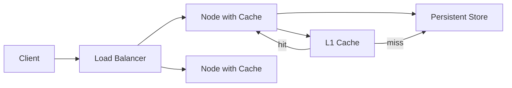
*Two-level caching: an in-memory L1 cache on each node serves hot keys; cache misses fall through to the persistent store. This reduces disk I/O and tail latency.*

#### Write Path Optimization

- **WAL batching:** multiple writes are appended to the WAL in a single fsync call.
- **MemTable sizing:** larger memtables reduce flush frequency but increase recovery time after a crash.
- **Compression:** values and WAL entries can be compressed (Snappy, LZ4, Zstandard) to reduce I/O. CPU is traded for disk bandwidth.

**Real-life use:** Redis pipelining and Lua scripts reduce round-trips; RocksDB's multi-threaded compaction; Cassandra's row-level caching and key cache; DynamoDB's DAX in-memory accelerator.

**Java example: batched write service**

```java
import org.springframework.beans.factory.annotation.Value;
import org.springframework.scheduling.annotation.Scheduled;
import org.springframework.stereotype.Service;

import java.util.List;
import java.util.concurrent.ConcurrentLinkedQueue;

@Service
public class BatchedWriteService {

    private final ConcurrentLinkedQueue<WriteRequest> buffer = new ConcurrentLinkedQueue<>();
    private final int batchSize;
    private final StringRedisTemplate redisTemplate;

    public BatchedWriteService(
            @Value("${app.batch.size:100}") int batchSize,
            StringRedisTemplate redisTemplate) {
        this.batchSize = batchSize;
        this.redisTemplate = redisTemplate;
    }

    public void put(String key, String value) {
        buffer.add(new WriteRequest(key, value));
    }

    @Scheduled(fixedDelayString = "${app.batch.flush-interval-ms:50}")
    public void flush() {
        List<WriteRequest> batch = new java.util.ArrayList<>();
        for (int i = 0; i < batchSize && !buffer.isEmpty(); i++) {
            batch.add(buffer.poll());
        }
        if (!batch.isEmpty()) {
            redisTemplate.executePipelined(ops -> {
                for (WriteRequest req : batch) {
                    ops.opsForValue().set(req.key(), req.value());
                }
                return null;
            });
        }
    }

    record WriteRequest(String key, String value) {}
}
```
*The `BatchedWriteService` bean buffers writes in a lock-free queue and flushes them in batches using Redis pipelining. This reduces network round-trips and fsync calls, dramatically increasing write throughput.*

**Interview questions and answers**

- **Q: How does pipelining improve throughput?**
  **A:** Instead of waiting for a response before sending the next command, the client sends many commands at once. The server processes them in a single pass and returns all responses together, eliminating per-request round-trip latency.

- **Q: When would you use Redis pipelining vs. Redis transactions vs. Redis Lua scripts?**
  **A:** Pipelining maximizes throughput by batching network round-trips but does not guarantee atomicity. Transactions (`MULTI`/`EXEC`) group commands atomically but do not add logic. Lua scripts run atomically on the server — use them for read-modify-write operations that must be atomic. Choose based on whether you need atomicity, not just batching.

---

### Security Threats and Mitigations

A key-value store faces several categories of security threats. Understanding them and applying layered defenses is essential for production deployments.

#### Threat: Unauthenticated Access

- **Risk:** an attacker connects directly to the store's port without credentials.
- **Mitigation:** enforce authentication on all connections. Disable anonymous access. Require TLS client certificates or SASL for all clients.

#### Threat: Data Interception (Eavesdropping)

- **Risk:** an attacker on the network sniffs unencrypted traffic and reads sensitive values.
- **Mitigation:** encrypt all traffic with TLS. Use mTLS for inter-node replication. Never expose the store directly to the internet.

#### Threat: DoS / Resource Exhaustion

- **Risk:** an attacker floods the store with requests, exhausting CPU, memory, or connections.
- **Mitigation:** rate limiting per client. Timeout enforcement. Connection limits. Request size limits. Circuit breakers that shed load when the store is unhealthy.

```mermaid
flowchart LR
    Attacker[Attacker] -->|flood| LB[Load Balancer]
    LB --> RL[Rate Limiter]
    RL -->|allow| Node[Store Node]
    RL -->|reject| Drop[Reject / Throttle]
    Node --> Mem[Memory]
    Node --> Disk[Disk]
    Note over Mem,Disk: monitor for exhaustion
```
*Rate limiting at the load balancer prevents resource exhaustion before it reaches the store nodes.*

#### Threat: Data Tampering

- **Risk:** an attacker modifies data in transit or on disk.
- **Mitigation:** TLS provides integrity (AES-GCM or ChaCha20-Poly1305 include authentication tags). WAL checksums detect disk corruption.

#### Threat: Credential Theft

- **Risk:** passwords or tokens are intercepted or stolen from configuration.
- **Mitigation:** use short-lived tokens. Rotate credentials frequently. Store secrets in a vault (HashiCorp Vault, AWS Secrets Manager), not in config files or environment variables.

#### Threat: Insider Threat / Over-Privileged Access

- **Risk:** a legitimate user or application with broad permissions reads or modifies data they should not.
- **Mitigation:** least-privilege RBAC. Key-prefix scoping. Audit logging of all access. Separate admin and application credentials.

#### Threat: NoSQL Injection

- **Risk:** if values are deserialized without validation, an attacker might inject malicious payloads.
- **Mitigation:** validate and sanitize all inputs. Use safe deserialization (avoid Java `ObjectInputStream`). Store opaque bytes when the application controls serialization.

**Real-life use:** Redis ACL + TLS, Kafka SASL + ACLs, Cassandra role-based permissions + encryption, DynamoDB IAM fine-grained policies.

**Interview questions and answers**

- **Q: What are the most common security pitfalls in key-value store deployments?**
  **A:** (1) Leaving authentication disabled by default — Redis and Elasticsearch have had major incidents this way. (2) Exposing the store to the public internet without TLS. (3) Using weak or hardcoded credentials. (4) Not rotating keys or tokens. (5) Granting overly broad permissions instead of key-prefix scoping.

- **Q: How do you protect against a DoS attack that exhausts connections?**
  **A:** Enforce per-client connection limits at the load balancer and application layer. Use timeouts aggressively. Implement circuit breakers. Scale horizontally so no single node is overwhelmed. Rate-limit by IP or token, not by connection count, to prevent connection-churn attacks.

---

### Observability and Logging

A key-value store must expose metrics, logs, and traces so operators can detect anomalies, diagnose problems, and verify SLAs. Observability is especially critical in distributed stores where failures can be partial and hard to reproduce.

#### Metrics

Key metrics to monitor for every node and at the cluster level:

- **Latency:** p50, p95, p99 for reads and writes. Latency is the most user-visible metric.
- **Throughput:** requests per second, read/write ratio.
- **Error rate:** percentage of failed requests (timeouts, connection errors, internal errors).
- **Cache hit ratio:** percentage of reads served from cache vs. disk.
- **Memory usage:** heap, off-heap, and cache pressure. Triggers eviction or scaling.
- **Disk I/O:** IOPS, throughput, latency, and available disk space.
- **Replication lag:** how far behind a follower is from the leader.
- **Connection count:** active and idle connections; connection churn.
- **Garbage collection:** frequency and duration of GC pauses.

#### Logging

Structured logs should capture:

- **Access logs:** who accessed which keys, with timestamps and outcomes.
- **Audit logs:** configuration changes, permission changes, credential rotations.
- **Error logs:** failed reads/writes, node failures, replication errors.
- **Slow query logs:** operations exceeding a latency threshold.

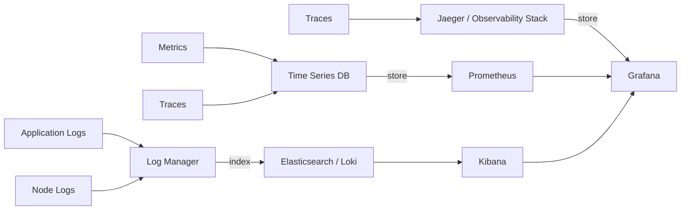
*Observability pipeline: logs flow to a log manager; metrics to a time-series database; traces to a tracing backend. All are visualized in a dashboard.*

#### Tracing

Distributed tracing follows a request as it moves through the system, including the load balancer, the coordinator, and each replica that participates in a quorum read or write.

- **Trace context propagation:** trace IDs and span IDs are passed in headers (W3C Trace Context).
- **Key operations to instrument:** get, put, delete, batch, scan, and internal operations like memtable flush and compaction.
- **Hot path sampling:** sample 100% of slow requests and a small percentage of normal requests to balance detail and overhead.

#### Alerting

Alerts should be actionable and tuned to avoid noise:

- p99 latency exceeds the SLA threshold for 5 minutes.
- Error rate exceeds 1% for 2 minutes.
- Cache hit ratio drops below 80%.
- Replica lag exceeds 30 seconds.
- Disk usage exceeds 85%.
- Memory usage exceeds 90% with increasing GC pressure.
- Unplanned leader elections occur more than once per hour.

**Real-life use:** Prometheus + Grafana for Redis metrics, Datadog for Cassandra observability, OpenTelemetry for tracing, ELK stack for log aggregation.

**Java example: instrumented service with Micrometer**

```java
import io.micrometer.core.instrument.Counter;
import io.micrometer.core.instrument.MeterRegistry;
import io.micrometer.core.instrument.Timer;
import org.springframework.stereotype.Service;

import java.time.Duration;
import java.util.Optional;
import java.util.concurrent.ConcurrentHashMap;

@Service
public class InstrumentedKeyValueService {

    private final ConcurrentHashMap<String, String> store = new ConcurrentHashMap<>();
    private final Counter readCounter;
    private final Counter writeCounter;
    private final Counter errorCounter;
    private final Timer readTimer;
    private final Timer writeTimer;

    public InstrumentedKeyValueService(MeterRegistry meterRegistry) {
        this.readCounter = Counter.builder("kv.requests")
            .tag("operation", "get")
            .register(meterRegistry);
        this.writeCounter = Counter.builder("kv.requests")
            .tag("operation", "put")
            .register(meterRegistry);
        this.errorCounter = Counter.builder("kv.errors")
            .register(meterRegistry);
        this.readTimer = Timer.builder("kv.latency")
            .tag("operation", "get")
            .register(meterRegistry);
        this.writeTimer = Timer.builder("kv.latency")
            .tag("operation", "put")
            .register(meterRegistry);
    }

    public Optional<String> get(String key) {
        return readTimer.recordCallable(() -> {
            readCounter.increment();
            return Optional.ofNullable(store.get(key));
        });
    }

    public void put(String key, String value) {
        writeTimer.record(() -> {
            writeCounter.increment();
            store.put(key, value);
        });
    }
}
```
*The `InstrumentedKeyValueService` bean uses Micrometer to record request counters and latency timers tagged by operation. In production, these metrics feed Prometheus, and alerts are defined in Grafana based on thresholds.*

**Interview questions and answers**

- **Q: Which metric is the best indicator that a key-value store is degrading?**
  **A:** Tail latency (p95/p99) is the first signal users notice. A slow increase in p99 with stable throughput usually indicates resource contention (GC, disk I/O during compaction). Pairing latency with cache hit ratio and memory usage helps pinpoint the root cause.

- **Q: How would you debug a sudden spike in error rates?**
  **A:** (1) Check the error type from logs — are they timeouts, connection refused, or 5xx? (2) Correlate with metrics: did CPU, memory, or disk spike first? (3) Check if the spike correlates with a deployment or configuration change. (4) Examine traces for the failing requests to find which component introduced the error.

---

### Real-World Implementations

- **Redis**
  In-memory data structure store used for caching, sessions, counters, pub/sub, and leaderboards. Supports persistence, replication, and Redis Cluster.

- **DynamoDB**
  Fully managed, serverless key-value and document store by AWS. Provides single-digit-millisecond latency, automatic partitioning, and tunable consistency.

- **Cassandra**
  Distributed wide-column store with leaderless replication, tunable consistency, and LSM-tree storage. Well suited for high-write workloads.

- **Riak**
  Distributed key-value store inspired by the Dynamo paper. Known for strong operational resilience and vector clock conflict resolution.

- **etcd**
  Strongly consistent key-value store built on Raft. Used for service discovery, configuration, and leader election in Kubernetes.

- **RocksDB**
  Embedded LSM-tree storage engine used by many databases and streaming systems. Not a standalone server but the storage layer inside other products.

- **LevelDB**
  Early embedded LSM-tree store by Google, influential in the design of RocksDB.

- **Memcached**
  Simple, fast in-memory cache without persistence or built-in replication. Used for caching frequently accessed data.

---

### Java and Spring Boot Implementation Guide

This section shows how to build a practical key-value service with Spring Boot.

#### 1. In-memory service

```java
import org.springframework.stereotype.Service;

import java.util.Optional;
import java.util.concurrent.ConcurrentHashMap;

@Service
public class KeyValueService {

    private final ConcurrentHashMap<String, String> store = new ConcurrentHashMap<>();

    public Optional<String> get(String key) {
        return Optional.ofNullable(store.get(key));
    }

    public void put(String key, String value) {
        store.put(key, value);
    }

    public boolean putIfAbsent(String key, String value) {
        return store.putIfAbsent(key, value) == null;
    }

    public Optional<String> delete(String key) {
        return Optional.ofNullable(store.remove(key));
    }

    public long increment(String key, long delta) {
        String result = store.merge(key, String.valueOf(delta),
            (oldValue, ignored) -> String.valueOf(Long.parseLong(oldValue) + delta));
        return Long.parseLong(result);
    }
}
```

#### 2. REST controller

```java
import org.springframework.http.ResponseEntity;
import org.springframework.web.bind.annotation.*;

import java.util.Optional;

@RestController
@RequestMapping("/api/kv")
public class KeyValueController {

    private final KeyValueService service;

    public KeyValueController(KeyValueService service) {
        this.service = service;
    }

    @GetMapping("/{key}")
    public ResponseEntity<String> get(@PathVariable String key) {
        return service.get(key)
            .map(ResponseEntity::ok)
            .orElse(ResponseEntity.notFound().build());
    }

    @PutMapping("/{key}")
    public ResponseEntity<Void> put(@PathVariable String key,
                                    @RequestBody String value) {
        service.put(key, value);
        return ResponseEntity.noContent().build();
    }

    @PostMapping("/{key}/increment")
    public ResponseEntity<Long> increment(@PathVariable String key,
                                          @RequestParam(defaultValue = "1") long delta) {
        return ResponseEntity.ok(service.increment(key, delta));
    }

    @DeleteMapping("/{key}")
    public ResponseEntity<Void> delete(@PathVariable String key) {
        return service.delete(key).isPresent()
            ? ResponseEntity.noContent().build()
            : ResponseEntity.notFound().build();
    }
}
```

#### 3. Redis-backed repository

```java
import org.springframework.data.redis.core.StringRedisTemplate;
import org.springframework.stereotype.Repository;

import java.time.Duration;
import java.util.Optional;

@Repository
public class RedisKeyValueRepository {

    private final StringRedisTemplate redisTemplate;

    public RedisKeyValueRepository(StringRedisTemplate redisTemplate) {
        this.redisTemplate = redisTemplate;
    }

    public Optional<String> get(String key) {
        return Optional.ofNullable(redisTemplate.opsForValue().get(key));
    }

    public void put(String key, String value) {
        redisTemplate.opsForValue().set(key, value);
    }

    public void putWithTtl(String key, String value, Duration ttl) {
        redisTemplate.opsForValue().set(key, value, ttl);
    }

    public void delete(String key) {
        redisTemplate.delete(key);
    }

    public Long increment(String key, long delta) {
        return redisTemplate.opsForValue().increment(key, delta);
    }
}
```

#### 4. Consistent hashing ring used by a router

```java
import java.util.*;

public class KeyValueRouter {

    private final ConsistentHashing ring;

    public KeyValueRouter(List<String> nodes) {
        this.ring = new ConsistentHashing(100, nodes);
    }

    public String route(String key) {
        return ring.getNode(key);
    }
}
```

**Interview questions and answers**

- **Q: How would you add persistence to the in-memory Spring Boot store?**
  **A:** Add a storage engine such as Redis, RocksDB, or a database repository behind the service interface, and optionally write through to disk or use a WAL.

- **Q: How do you make the Spring Boot service horizontally scalable?**
  **A:** Deploy multiple stateless instances behind a load balancer and store data in a distributed key-value backend such as Redis Cluster or DynamoDB, or implement a consistent-hashing router across stateful nodes.

- **Q: What is the benefit of keeping the controller thin and using a service interface?**
  **A:** It separates HTTP concerns from storage logic, making it easy to swap in-memory, Redis, or database implementations and to test each layer independently.

---

### Interview Questions and Answers

A curated set of interview questions organized by difficulty. These complement the inline Q&As throughout the document and focus on deeper system-design thinking.

**Beginner**

- **Q: What is a key-value store and what problem does it solve?**
  **A:** A key-value store maps keys to opaque values with simple operations (`get`, `put`, `delete`). It solves the need for fast, scalable point lookups without the overhead of SQL, schemas, or joins. It is ideal for workloads where data is always accessed by a known identifier — sessions, caches, configuration, and counters.

- **Q: What are the core operations a key-value store provides?**
  **A:** At minimum: `get(key)`, `put(key, value)`, and `delete(key)`. Many stores also add `putIfAbsent`, `compareAndSet` (atomic compare-and-swap), `increment` (atomic counter), `expire` (TTL), and `scan` or `prefix` lookups. The simplicity of the API is a design feature, not an accident.

- **Q: How does a key-value store achieve low-latency reads?**
  **A:** By keeping hot data in memory (RAM), using an in-memory index (hash map) for O(1) lookups, employing Bloom filters to avoid unnecessary disk reads, and serving reads from replicas close to the client. The entire read path — from key hash to value retrieval — is optimized to avoid disk I/O on the hot path.

**Intermediate**

- **Q: Explain how consistent hashing solves the data redistribution problem.**
  **A:** With simple modulo hashing (`hash(key) % N`), adding or removing a node changes the denominator and re-maps nearly every key, causing massive data movement. Consistent hashing places both nodes and keys on a ring. A key maps to the next node clockwise. When a node is added, only the keys that fall in the new node's arc move; when a node is removed, only its keys are redistributed. Virtual nodes further improve balance by assigning many ring positions per physical node.

- **Q: What is the difference between strong consistency, eventual consistency, and causal consistency?**
  **A:** Strong consistency means every read sees the most recent write. Eventual consistency means that if no new writes occur, all replicas eventually converge — but reads may return stale data. Causal consistency sits between them: writes that are causally related are seen in order by all nodes, but concurrent writes may be seen in any order. DynamoDB offers both eventual and strongly consistent reads; Cassandra offers tunable consistency from ONE to QUORUM to ALL.

- **Q: How does a Bloom filter reduce disk I/O in a key-value store?**
  **A:** Before checking an SSTable on disk, the store checks the SSTable's Bloom filter — a compact bit array computed from the keys it contains. If the Bloom filter says the key is definitely not in the file (no false negatives), the disk read is skipped entirely. If it says the key might be present (possible false positive), the disk read proceeds. This eliminates a large fraction of unnecessary disk accesses, especially for non-existent keys.

- **Q: What are the trade-offs between leader-based and leaderless replication?**
  **A:** Leader-based replication has a single writer, which simplifies ordering and conflict resolution but creates a write bottleneck and requires failover. Leaderless replication allows any node to accept writes, improving availability and write throughput, but requires quorum coordination (W + R > N) and background repair (read repair, anti-entropy) to converge replicas. Leader-based is simpler; leaderless scales better at the cost of complexity.

- **Q: When would you choose an LSM-tree storage engine over a B-tree, and vice versa?**
  **A:** LSM-trees optimize for write throughput: writes are batched in memory and flushed as sorted immutable files, making sequential writes fast. They are ideal for write-heavy workloads. B-trees maintain balanced tree pages on disk and support efficient in-place updates and range scans. They are better for read-heavy workloads with frequent point updates and range queries. LSM-trees pay a read-amplification and compaction cost; B-trees pay a random-write I/O cost.

**Advanced**

- **Q: How would you design a key-value store to handle 1 million writes per second?**
  **A:** (1) Partition by key using consistent hashing with virtual nodes across many nodes — 1M writes across 100 nodes means 10K writes/node/sec, achievable on commodity hardware. (2) Use an LSM-tree storage engine for high write throughput. (3) Batch writes to reduce fsync pressure. (4) Use asynchronous replication with a low but non-zero quorum (W=2 of N=3) to avoid blocking on every replica. (5) Distribute load with read replicas for the read path. (6) Use connection pooling and pipelining to reduce per-request overhead. (7) Monitor for hotspots and split hot keys.

- **Q: How does quorum (W + R > N) guarantee consistency in a replicated store?**
  **A:** With N replicas, a write is acknowledged after W replicas confirm it, and a read contacts R replicas. If W + R > N, the read and write quorums must overlap by at least one replica. That overlapping replica has seen the latest write, guaranteeing the read returns at least as recent data as the most recent write. For example, with N=3, W=2, R=2: every read set of 2 overlaps with every write set of 2, so the read always sees the latest write.

- **Q: What is vector clock conflict resolution and when do conflicts arise?**
  **A:** In a leaderless system, multiple replicas can accept concurrent writes to the same key. A vector clock tracks a per-node logical counter, capturing causal history. When a read returns multiple conflicting versions (siblings), the client must resolve the conflict — typically by merging or by last-write-wins. Conflicts arise when writes happen concurrently on different replicas without coordination. Vector clocks let the system detect conflicts, but resolution is pushed to the application.

- **Q: What is the purpose of compaction in an LSM-tree, and what are its trade-offs?**
  **A:** Compaction merges multiple SSTables into fewer, sorted files, discarding overwritten values and tombstones (deletion markers). This reduces read amplification (fewer files to check) and reclaims disk space. The trade-off is write amplification: each key may be rewritten multiple times during compaction, consuming I/O and CPU. Size-tiered compaction is I/O-efficient but causes variable read amplification; leveled compaction bounds read amplification but increases write amplification. Compaction also competes with foreground reads for I/O, which must be throttled.

- **Q: How does hinted handoff improve write availability, and what is its risk?**
  **A:** If a replica is temporarily down, the coordinator stores the write on a different node with a "hint" indicating the intended replica. When that replica recovers, the hint is forwarded, and the write is applied. This allows writes to succeed during brief outages. The risk is data loss: if the temporary node holding the hint also fails before forwarding, the write is permanently lost. Sloppy quorum mitigates this by counting temporary nodes in the quorum, but it still introduces a window of vulnerability.

**Senior / System Design**

- **Q: Design a globally distributed key-value store with multi-region replication. What consistency model would you choose and why?**
  **A:** Deploy three regions (us-east, eu-west, ap-southeast), each with its own replica set. Use a leader in the primary region for writes and followers in the other regions for reads. For cross-region writes, use a quorum that requires acknowledgment from at least one replica in two regions (W+ R > N across regions), giving strong consistency with cross-region durability. For maximum availability, offer an eventual-consistency read tier from the local region's read replica with async cross-region replication. Choose the model per use case: session stores favor availability (read from local replica, accept eventual convergence), while financial counters need strong consistency (write to quorum including cross-region). Use consistent hashing for intra-region partitioning and a global routing layer (GeoDNS or latency-based routing) to direct clients to the nearest region.

- **Q: How would you handle hotspots and data skew in a distributed key-value store?**
  **A:** (1) Key design: avoid monotonically increasing or sequential keys that concentrate on one partition. Use hashed or UUID-based keys. (2) Hotkey splitting: if a single key becomes hot (e.g., a leaderboard counter), split it into multiple keys (e.g., `counter:shard1`, `counter:shard2`) and distribute the load. (3) Caching: route hot-key reads to an in-memory cache layer (Redis, CDN, or an L1 cache on the node) to remove load from the storage layer. (4) Load-based rebalancing: the membership layer monitors per-partition load and migrates hot partitions to underutilized nodes. (5) Rate limiting: apply per-key limits to prevent abuse. (6) Virtual nodes: ensure even key distribution across physical nodes.

- **Q: Compare DynamoDB, Cassandra, and Redis for a global session store use case.**
  **A:** Redis is an in-memory store with sub-millisecond latency, ideal when all session data fits in memory and you need pub/sub or atomic operations (e.g., session revocation). It offers replication and Redis Cluster but is not strongly consistent by default. DynamoDB is a fully managed, serverless NoSQL store with single-digit-millisecond latency, automatic scaling, and multi-region replication (Global Tables). It offers tunable consistency and is great when you want zero-ops management. Cassandra is open-source, offers tunable consistency, linear scalability, and multi-datacenter replication, but requires operational expertise. For a global session store: if you can afford to manage it and need sub-ms latency with rich data types, choose Redis. If you want serverless and predictable latency, choose DynamoDB. If you need open-source control and multi-datacenter consistency, choose Cassandra.

- **Q: How would you implement multi-tenancy with isolation in a shared key-value store cluster?**
  **A:** (1) Key prefixing: namespace keys with the tenant ID (`tenant:{id}:key`) so tenants share storage but logically separate data. (2) Access control: enforce tenant-scoped ACLs so a tenant's credentials can only access keys under their prefix. (3) Resource quotas: limit per-tenant throughput, memory, and connection counts to prevent noisy neighbors. (4) Hot-tenant isolation: move a hot tenant to a dedicated partition or cluster to avoid impacting others. (5) Audit logging: record per-tenant access for compliance. The trade-off is between density (shared cluster, lower cost) and isolation (dedicated clusters, higher cost but stronger guarantees). Key-prefix isolation is simple but doesn't prevent resource contention at the storage layer; physical isolation is the strongest but most expensive.

- **Q: A key-value store in production shows increasing p99 latency but stable p50. What do you investigate?**
  **A:** (1) Check for compaction storms — concurrent SSTable merges in LSM-tree stores consume I/O and CPU. (2) Check for GC pauses — long-running GC cycles in JVM-based stores cause tail latency spikes. (3) Check for hotspots — a single hot key or partition overloaded on one node. (4) Check for disk saturation — I/O queue depth. (5) Check for network issues — packet drops or latency spikes between nodes. (6) Review cache hit ratio — a declining ratio pushes more reads to disk. (7) Check replica lag — reads from under-replicated followers may stall. The p99/p50 gap isolates tail-causing events; tracing the slowest requests and correlating with system metrics (CPU, disk I/O, GC, compaction) identifies the root cause.

