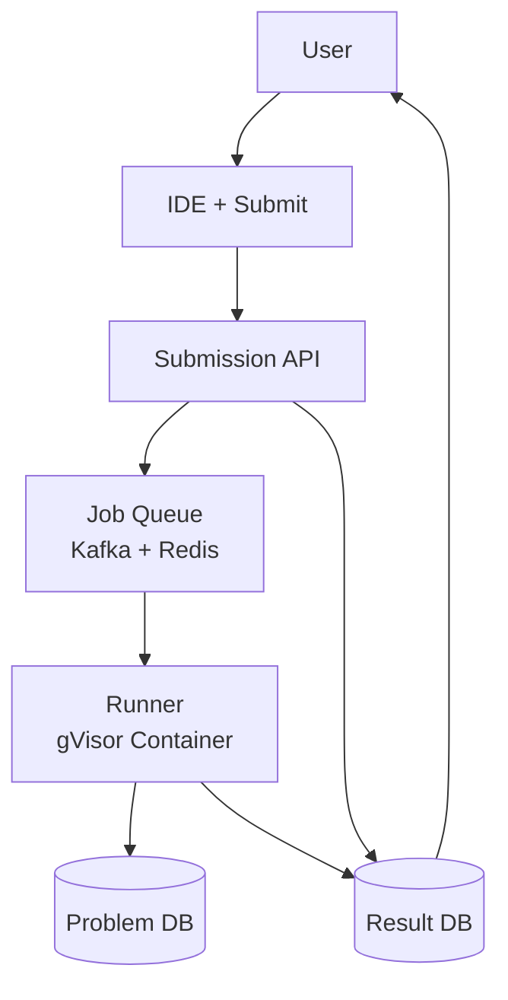
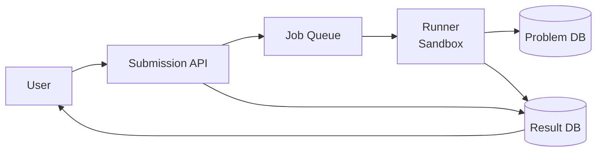
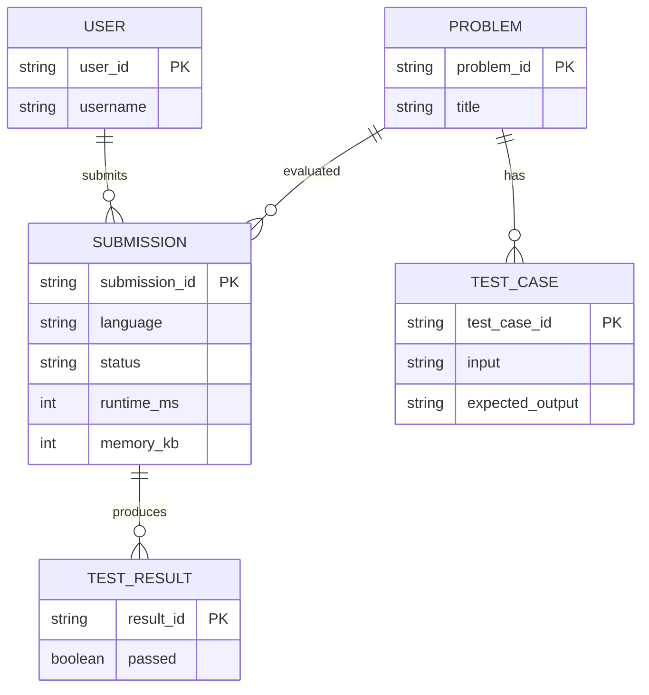

# Leetcode Design

## Blogs and websites

## Medium

## Youtube

- [System Design Interview: Design LeetCode w/ a Google Engineer](https://www.youtube.com/watch?v=hRnJxPeoZyg)
- [System Design Interview: Design LeetCode](https://www.youtube.com/watch?v=yXr_bIl9tos)

- [Design a Code Execution System | System Design](https://www.youtube.com/watch?v=TOyD-5QgpuE)

## Problems

- [Design LeetCode](https://systemdesignschool.io/problems/leetcode)

## Theory

### What Is It?

LeetCode (or any online coding judge) is a platform where users write code to solve algorithmic problems, then submit → code is compiled, executed against hidden test cases, and results (pass/fail + runtime/memory) are returned. The core challenge: **securely execute untrusted code at scale** (millions of submissions) with isolation, multi-language support, and resource Limits.

### Why Does It Exist?

Coding interviews and competitive programming require a system to evaluate code correctness. Manual evaluation doesn't scale. An automated platform must compile code in any language, run it in a sandbox against test cases, prevent cheating/resource Abuse, and return results in seconds.

### What Problem Does It Solve?

* **Code execution sandboxing**: Untrusted user code → must run safely (no file system, network, or resource Abuse).
• **Multi-language**: Support 20+ languages (Python, Java, C++, Go, JavaScript) → language runners.
* **Scalability**: Millions of submissions → distributed queue + worker pool.
• **Resource Limits**: CPU, memory, time (e.g., 2s, 256MB) → container cgroups.
• **Test case management**: Hidden test cases run after visible ones pass.
• **Cheating prevention**: Plagiarism detection; identical code detection.
• **Real-time feedback**: Compile + run + report within seconds.

### Important Subtopics

1. Sandbox isolation (containers, seccomp, namespaces)
2. Multi-language runners (Python VM, JVM, V8, etc.)
3. Resource Limits (CPU time, memory, disk, I/O)
4. Distributed code execution (queue + worker pool)
5. Test case management (visible + hidden)
6. Compile + run pipeline
7. Result aggregation + diff output
8. Plagiarism detection
9. Scaling (Kubernetes jobs, Kueue for job limiting)
10. Security (no network, no file system, timeout kill)

### Problem Statement

Design an online code execution system (like LeetCode) that accepts user code in multiple languages, compiles and runs it in a sandboxed environment against test cases with resource Limits, and returns pass/fail results with runtime and memory usage. The system must handle millions of submissions, prevent malicious code execution, and provide results in seconds.

### Functional Requirements

- Submit code (multi-language: Python, Java, C++, Go, JS, etc.)
- Compile + run in isolated sandbox
- Resource Limits: 2s runtime, 256MB memory
- Test cases (visible + hidden)
- Return: pass/fail + stdout/stderr + runtime/memory
- Plagiarism detection
- Problem + test case management

### Non-Functional Requirements

- **Latency**: Submit → result in < 5s (end-to-end)
- **Isolation**: Zero chance of code escaping sandbox
- **Scale**: 10K+ submissions/sec at peak
- **Availability**: 99.9%
- **Multi-tenancy**: User code isolated (no access to other users/files)
- **Fairness**: Resource Limits prevent Abuse

---

## Characteristics

| Characteristic | What it means | Why it matters |
|---|---|---|
| **Sandboxing** | Isolate untrusted code | Prevent system compromise |
| **Multi-language** | Run 20+ langs | Broad user base |
| **Resource Limits** | CPU/memory/disk caps | Fairness + cost |
| **Queue-based** | Async execution | Scale + backpressure |
| **Stateless workers** | No session affinity | Horizontal scaling |

## Components

| Component | Purpose | Responsibilities | Real-world Example |
|---|---|---|---|
| **Submission API** | Receive code + test cases | Auth, parse, enqueue | FastAPI/Go service |
| **Job Queue** | Distribute jobs | Queue + priority + retry | Kafka + Redis |
| **Runner Pool** | Execute code | Sandbox + compile + run | Docker/k8s pods |
| **Sandbox** | Isolate execution | cgroups, seccomp, namespaces | gVisor |
| **Language Runtimes** | Compile + run code | Python, JVM, V8, GCC | Language images |
| **Result Store** | Persist results | Store output + metrics | PostgreSQL |
| **Plagiarism Detector** | Detect copied code | Compare submissions | Moss |

## Patterns

### Sandboxed Container Execution

* **What**: Each code submission runs in an isolated container with resource Limits and no network/filesystem access.
* **Problem solved**: Prevent malicious code (crypto miners, DDoS) on untrusted code platform.
• **How it works**: Submit code → enqueue → runner → container (gVisor/secrets) → cgroups Limits → seccomp → compile → run → capture output → kill on timeout.
* **When to use**: Any system executing untrusted code (coding judges, CI/CD, FaaS).
• **When not to use**: Trusted code only (overhead unnecessary).
* **Advantages**: Strong isolation; resource control; reproducibility.
* **Disadvantages**: Container overhead; startup Latency.

## Benefits

* **Secure isolation**: Malicious code contained → no system compromise.
• **Fair Resource usage**: CPU/memory Limits → no Abuse.
* **Scalable**: Queue + stateless workers → horizontal scale.

## Pros

* **Strong isolation**: gVisor/seccomp → near-zero escape rate.
• **Fast iteration**: Submit → result in seconds.
• **Multi-language**: 18+ supported languages.

## Cons

* **Container overhead**: Startup + I/O overhead (1–2s).
• **Complex sandboxing**: seccomp + cgroups + namespaces → hard to configure.
• **Cold starts**: First container spawn per language image.

## Challenges

### Technical Challenges
* **Language runtimes**: JVM startup (200ms+); C++ compilation → per-language optimization.
• **Sandbox escape**: Kernel vulns → container breakout; gVisor mitigates.

### Scalability Challenges
* **Concurrent jobs**: 10K+/sec → 1000+ runner nodes; queue backpressure.
• **Image management**: 18+ language images → registry + caching.

### Performance Challenges
* **Cold start + compilation**: Python vs C++ compile/run trade-offs.

### Reliability Challenges
* **Runner crashes**: Container dies → retry + dead-letter.
• **Queue backpressure**: High load → queue overflow.

### Security Concerns
* **Sandbox escape**: gVisor + seccomp + read-only FS + no network.
• **Resource Abuse**: CPU/mem Limits via cgroups.
• **Fork bombs**: PID Limits prevent them.

## Best Practices

* **Container security**: Read-only root fs; tmpfs scratch; no network; seccomp.
• **Resource Limits**: cgroups (CPU 1 core, memory 256MB, 2s timeout).
• **Image hygiene**: Minimal base images; scan CVEs; version pinning.
• **Monitoring**: Escape rate; resource usage; queue depth.

## When to Use

### Appropriate
* Coding interview platforms (HackerRank, CodeSignal).
• Online judges (LeetCode, HackerEarth).
• CI/CD code validation (sandbox untrusted PRs).

### Not Appropriate
* Production web servers (overhead for no benefit).
• Trusted internal code evaluation.

## Use Cases

### Online Coding Judge (LeetCode-style)

* **Problem**: Evaluate user code against test cases, securely and at scale, returning results in seconds.
* **Solution**: User submits code → Submission API → enqueue (Kafka/Redis) → Runner picks → spawn sandboxed container (gVisor) → compile → run tests → result → DB → return.
* **Why suitable**: Sandbox isolation prevents malicious code; queue + stateless workers scale horizontally.
* **How it works**: (1) Submit code + problem ID → API validates → enqueues job. (2) Runner → Docker container (gVisor). (3) Container: read-only FS + no network + cgroups (2s, 256MB). (4) Compile → run tests → diff → metrics. (5) Kill on timeout.
* **Trade-offs**: Container overhead vs security; multi-language complexity.

## Architecture



### Major Components
* **Submission API**: Auth + validate + enqueue to Kafka.
• **Runner Pool**: k8s pods; dequeue → sandbox + compile + run.
* **Sandbox**: gVisor; cgroup Limits (CPU, memory, time).
• **Problem DB**: Test cases + expected output.
• **Result Store**: Run output + pass/fail + metrics.

## High-Level Design



## Deep Dive

### Two Approaches (from scratchpad)

1. **Message queue + worker**: Submit → enqueue → worker container → compile + run → store result. Simpler; but manual resource Limits.
2. **Kubernetes Job**: Submit → spawn k8s Job → Kueue limits concurrency → run code → store result. Native cgroup Limits; but pod startup overhead.

### Resource Limits (cgroups)

CPU: 100% (1 core); memory: 256MB; PID limit: 256; time limit: 2s. cgroup v2 manages all.

## API Contract

| Method | Endpoint | Description |
|---|---|---|
| POST | `/api/v1/submissions` | Submit code for evaluation |
| GET | `/api/v1/submissions/{id}` | Get submission result |
| GET | `/api/v1/problems/{slug}` | Get problem + test cases |

**Submit (POST /submissions)**:
```json
{"problem_id": "two-sum", "language": "python3", "code": "def twoSum..."}
```
**Response**: `{"submission_id": "sub_abc123", "status": "PENDING"}`
**Result (GET)**: `{"status": "ACCEPTED", "runtime_ms": 28, "memory_kb": 12400}`

**Auth**: Bearer token. **Rate limit**: 10/min anonymous; 60/min authed.

## Data Modeling



## Java and Spring Boot Implementation

```java
@RestController
@RequestMapping("/api/v1/submissions")
@RequiredArgsConstructor
public class SubmissionController {
    private final SubmissionService submissionService;

    @PostMapping
    public ResponseEntity<SubmissionResponse> submit(
            @AuthenticationPrincipal UserDetails user,
            @RequestBody SubmitRequest request) {
        Submission sub = submissionService.enqueue(user.getId(), request);
        return ResponseEntity.accepted().body(SubmissionResponse.from(sub));
    }
}

@Service
public class SubmissionService {
    private final KafkaTemplate<String, String> kafka;
    private final SubmissionRepository repo;

    public Submission enqueue(String userId, SubmitRequest req) {
        Submission sub = new Submission(userId, req);
        repo.save(sub);
        // Two approaches: MQ+worker or k8s Job (see Deep Dive)
        Job job = new Job(sub.getId(), req.getLanguage(), req.getCode());
        kafka.send("code-execution", serialize(job));
        return sub;
    }
}
```

## Real-World Examples

* **LeetCode**: 18+ languages; sandboxed; premium + contest.
• **HackerRank**: 40+ languages; enterprise interviews.
• **Codeforces**: Competitive; real-time contests.

## Interview Preparation

### Beginner Questions

**Q: How does a coding judge sandbox user code?**
A: Container with cgroups (CPU, memory, PID), seccomp (block syscalls), read-only FS, no network, hard timeout (SIGKILL).

**Q: How do you support 20+ languages?**
A: Language-specific runner services: Python VM, JVM, V8, GCC — each in own container image.

**Q: What is resource isolation?**
A: CPU (cgroup quota), memory (hard limit → OOM), PIDs (prevents fork bombs), time (timeout → SIGKILL).

### Intermediate Questions

**Q: How do you prevent sandbox escapes?**
A: gVisor (syscall interception), seccomp, read-only FS, no network, cgroups, PID namespace.

**Q: How do you scale to 10K+ submissions/sec?**
A: Kafka (1000 partitions) + Redis → 1000+ k8s pods → each dequeues → gVisor container.

**Q: MQ+worker vs Kubernetes Job?**
A: MQ: simpler, manual limits. K8s: native cgroups, autoscaling, Kueue, gVisor — but pod startup overhead.

### Advanced Questions

**Q: Design a code execution system like LeetCode — 18+ languages, 2s/256MB limits, 10K submissions/sec, no sandbox escapes.**

A: (1) API (50 instances): validate + enqueue Kafka (1000 partitions). (2) Queue: Kafka + Redis. (3) Runner (1000+ k8s pods): dequeue → gVisor container → cgroup limits → compile → run tests → SIGKILL on timeout. (4) Sandbox: gVisor + seccomp + no network. (5) Monitoring: escape rate, latency P99.

### Senior-Level Questions

**Q: How does Kubernetes Kueue help with code execution scaling?**

A: Kueue provides: (1) Admission control — limits concurrent Pods. (2) Queue management — pending Jobs wait. (3) Resource quotas — per-language. (4) Scale-to-zero — save costs. Trade-off: Pod startup overhead (~2s) vs strong isolation.

## Scratchpad

```
for code evaluation service there can be 2 possible ways

1. use a message queue -> code execution worker (n instances) -> pick up the use code and the test cases and run it -> save the results in evaluation database

2. if it is a kubernetes service -> spawn kubernetes job -> use Kubernetes native Kueue to limit the number of jobs to be spawned -> once the jobs are spawned then pick up the use code and the test cases and run it -> save the results in evaluation database


```
