# Leetcode Design

## Blogs and websites

## Medium

## Youtube

- [System Design Interview: Design LeetCode w/ a Google Engineer](https://www.youtube.com/watch?v=hRnJxPeoZyg)
- [System Design Interview: Design LeetCode](https://www.youtube.com/watch?v=yXr_bIl9tos)
- [Design a Code Execution System | System Design](https://www.youtube.com/watch?v=TOyD-5QgpuE)

## Problems

- [Design LeetCode](https://systemdesignschool.io/problems/leetcode)

---

## Theory

### Topics Covered

1. [Introduction / Problem Statement](#introduction--problem-statement)
2. [Characteristics](#characteristics)
3. [Pros](#pros)
4. [Cons](#cons)
5. [Use Cases](#use-cases)
6. [Components](#components)
7. [Architectural Patterns](#architectural-patterns)
8. [Benefits](#benefits)
9. [Challenges](#challenges)
10. [Best Practices](#best-practices)
11. [When to Use / When Not to Use](#when-to-use--when-not-to-use)
12. [Data Model and API](#data-model-and-api)
13. [Online Judge and Code Execution Deep Dive](#online-judge-and-code-execution-deep-dive)
14. [Replication Strategies](#replication-strategies)
15. [Failure Detection and Membership](#failure-detection-and-membership)
16. [High Availability and Scalability](#high-availability-and-scalability)
17. [Performance and Optimization](#performance-and-optimization)
18. [CAP Theorem and Consistency Trade-offs](#cap-theorem-and-consistency-trade-offs)
19. [Encryption and Key Management](#encryption-and-key-management)
20. [Authentication and Authorization](#authentication-and-authorization)
21. [Security Threats and Mitigations](#security-threats-and-mitigations)
22. [Observability and Logging](#observability-and-logging)
23. [Java and Spring Boot Implementation Guide](#java-and-spring-boot-implementation-guide)
24. [Interview Questions and Answers](#interview-questions-and-answers)

---

### Introduction / Problem Statement

### What Is It?

LeetCode (or any online coding judge) is a platform where users write code to solve algorithmic problems, then submit → code is compiled, executed against hidden test cases, and results (pass/fail + runtime/memory) are returned. The core challenge: **securely execute untrusted code at scale** (millions of submissions) with isolation, multi-language support, and resource Limits.

### Why Does It Exist?

Coding interviews and competitive programming require a system to evaluate code correctness. Manual evaluation doesn't scale. An automated platform must compile code in any language, run it in a sandbox against test cases, prevent cheating/resource abuse, and return results in seconds.

### What Problem Does It Solve?

* **Code execution sandboxing**: Untrusted user code → must run safely (no file system, network, or resource abuse).
* **Multi-language support**: Support 20+ languages (Python, Java, C++, Go, JavaScript) → language runners.
* **Scalability**: Millions of submissions → distributed queue + worker pool.
* **Resource Limits**: CPU, memory, time (e.g., 2s, 256MB) → container cgroups.
* **Test case management**: Hidden test cases run after visible ones pass.
* **Cheating prevention**: Plagiarism detection; identical code detection.
* **Real-time feedback**: Compile + run + report within seconds.

### Problem Statement

Design an online code execution system (like LeetCode) that accepts user code in multiple languages, compiles and runs it in a sandboxed environment against test cases with resource limits, and returns pass/fail results with runtime and memory usage. The system must handle millions of submissions, prevent malicious code execution, and provide results in seconds.

### Functional Requirements

- Submit code (multi-language: Python, Java, C++, Go, JS, etc.)
- Compile + run in isolated sandbox
- Resource Limits: 2s runtime, 256MB memory
- Test cases (visible + hidden)
- Return: pass/fail + stdout/stderr + runtime/memory
- Plagiarism detection
- Problem + test case management
- Leaderboard and ranking
- Anti-cheating mechanisms

### Non-Functional Requirements

- **Latency**: Submit → result in < 5s (end-to-end)
- **Isolation**: Zero chance of code escaping sandbox
- **Scale**: 10K+ submissions/sec at peak
- **Availability**: 99.9%
- **Multi-tenancy**: User code isolated (no access to other users/files)
- **Fairness**: Resource limits prevent abuse

---

### Characteristics

| Characteristic | What it means | Why it matters |
|---|---|---|
| **Sandboxing** | Isolate untrusted code | Prevent system compromise |
| **Multi-language** | Run 20+ langs | Broad user base |
| **Resource Limits** | CPU/memory/disk caps | Fairness + cost |
| **Queue-based** | Async execution | Scale + backpressure |
| **Stateless workers** | No session affinity | Horizontal scaling |
| **Plagiarism detection** | Compare submissions | Contest integrity |
| **Hidden test cases** | Secret tests after visible | Prevent hardcoding |
| **Multi-tenancy** | Isolated user execution | Fair resource sharing |

---

### Pros

* **Strong isolation**: gVisor/seccomp → near-zero escape rate.
* **Fast iteration**: Submit → result in seconds.
* **Multi-language**: 18+ supported languages.
* **Fair execution**: Resource limits prevent abuse.
* **Scalable**: Queue + stateless workers → horizontal scale.
* **Secure sandboxing**: Malicious code contained → no system compromise.
* **Plagiarism detection**: Maintains contest and interview integrity.
* **Hidden test cases**: Prevent solutions that hardcode expected outputs.

---

### Cons

* **Container overhead**: Startup + I/O overhead (1–2s).
* **Complex sandboxing**: seccomp + cgroups + namespaces → hard to configure.
* **Cold starts**: First container spawn per language image.
* **VM startup latency**: JVM (~200ms+) and .NET add language-specific overhead.
* **Image management**: 18+ language images → registry + caching overhead.
* **Debugging difficulty**: Sandboxed execution makes reproducing user-reported issues hard.
* **Resource contention**: Peak contest hours can saturate runner pools.

---

### Use Cases

### Online Coding Judge (LeetCode-style)

* **Problem**: Evaluate user code against test cases, securely and at scale, returning results in seconds.
* **Solution**: User submits code → Submission API → enqueue (Kafka/Redis) → Runner picks → spawn sandboxed container (gVisor) → compile → run tests → result → DB → return.
* **Why suitable**: Sandbox isolation prevents malicious code; queue + stateless workers scale horizontally.
* **How it works**: (1) Submit code + problem ID → API validates → enqueues job. (2) Runner → Docker container (gVisor). (3) Container: read-only FS + no network + cgroups (2s, 256MB). (4) Compile → run tests → diff → metrics. (5) Kill on timeout.
* **Trade-offs**: Container overhead vs security; multi-language complexity.

---

### Components

| Component | Purpose | Responsibilities | Real-world Example |
|---|---|---|---|
| **Submission API** | Receive code + test cases | Auth, parse, enqueue | FastAPI/Go service |
| **Job Queue** | Distribute jobs | Queue + priority + retry | Kafka + Redis |
| **Runner Pool** | Execute code | Sandbox + compile + run | Docker/k8s pods |
| **Sandbox** | Isolate execution | cgroups, seccomp, namespaces | gVisor |
| **Language Runtimes** | Compile + run code | Python, JVM, V8, GCC | Language images |
| **Result Store** | Persist results | Store output + metrics | PostgreSQL |
| **Plagiarism Detector** | Detect copied code | Compare submissions | Moss |
| **Problem DB** | Store problems + tests | Test cases, expected output | PostgreSQL |
| **Leaderboard** | Rank submissions | Sorting, ranking algorithms | Redis Sorted Set |
| **Rate Limiter** | Throttle submissions | API rate limiting | Redis + Token Bucket |

---

### Architectural Patterns

#### Sandboxed Container Execution

* **What**: Each code submission runs in an isolated container with resource limits and no network/filesystem access.
* **Problem solved**: Prevent malicious code (crypto miners, DDoS) on untrusted code platform.
* **How it works**: Submit code → enqueue → runner → container (gVisor/seccomp) → cgroups limits → compile → run → capture output → kill on timeout.
* **When to use**: Any system executing untrusted code (coding judges, CI/CD, FaaS).
* **When not to use**: Trusted code only (overhead unnecessary).
* **Pros**: Strong isolation; resource control; reproducibility.
* **Cons**: Container overhead; startup latency.

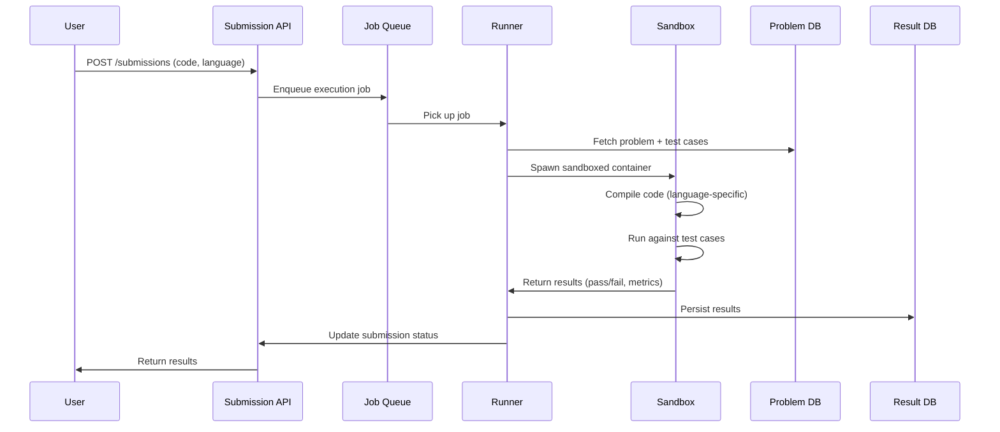

*Submission lifecycle: the user submits code via the API, which enqueues a job; a runner picks it up, fetches test cases from the Problem DB, spawns a gVisor-sandboxed container for compilation and execution, and persists results — all asynchronously with callback-based status updates.*

#### Queue-Based Asynchronous Execution

* **What**: Submissions are enqueued to a distributed message queue (Kafka/Redis) and processed asynchronously by a pool of stateless runner workers.
* **Problem solved**: Decouples submission acceptance from code execution, enabling independent scaling of the API and runner layers, and providing natural backpressure during traffic spikes.
* **How it works**: Submission API validates and writes to the queue → runner workers dequeue → process in sandbox → write results to Result Store → API polls or WebSocket streams the result back.
* **When to use**: High-throughput submission processing where eventual consistency of results is acceptable.
* **When not to use**: Ultra-low-latency (< 100ms) compilation scenarios where synchronous execution is required.
* **Pros**: Backpressure handling; independent scaling; retry semantics; priority queuing.
* **Cons**: Added latency from queue round-trip; complexity of dead-letter handling; ordering challenges.

#### Kubernetes Job Orchestration

* **What**: Each code submission spawns a Kubernetes Job (or uses Kueue for batch scheduling), leveraging native container orchestration for resource limits, scaling, and lifecycle management.
* **Problem solved**: Provides declarative resource management, auto-scaling, health monitoring, and native cgroup enforcement without custom runner infrastructure.
* **How it works**: Submission API creates a Job spec → Kubernetes scheduler places it on a node → container starts with resource limits (cgroups) → runs compilation + tests → writes result to DB → Job terminates.
* **When to use**: Cloud-native environments already running Kubernetes; need for auto-scaling and declarative operations.
* **When not to use**: Environments where pod startup overhead (2–3s) is unacceptable compared to warm-container pools.
* **Pros**: Native resource isolation; auto-scaling; built-in health checks; declarative infrastructure.
* **Cons**: Pod startup latency; scheduling overhead; K8s operational complexity.

---

### Benefits

* **Secure isolation**: Malicious code contained → no system compromise.
* **Fair resource usage**: CPU/memory limits → no abuse.
* **Scalable**: Queue + stateless workers → horizontal scale.
* **Multi-language support**: 18+ languages via language-specific runtimes.
* **Plagiarism detection**: Maintains contest and interview integrity.
* **Cost efficiency**: Container reuse and warm pools reduce per-submission cost.
* **Reliability**: Queue-based processing with retries and dead-letter queues.
* **Developer productivity**: Fast submit-to-result feedback cycle encourages iteration.

---

### Challenges

#### Technical Challenges

* **Language runtimes**: JVM startup (200ms+); C++ compilation → per-language optimization needed.
* **Sandbox escape**: Kernel vulnerabilities → container breakout; gVisor mitigates.
* **Compile caching**: Repeated compilation of similar code wastes CPU; need build caches.
* **Output capture**: Capturing stdout/stderr while preventing resource exhaustion.

#### Scalability Challenges

* **Concurrent jobs**: 10K+/sec → 1000+ runner nodes; queue backpressure management.
* **Image management**: 18+ language images → registry + caching strategy.
* **Plagiarism detection**: O(N²) pairwise comparison → clustering + locality-sensitive hashing.
* **Hidden test case loading**: Securely delivering test cases to runners without exposure.

#### Performance Challenges

* **Cold start + compilation**: Python vs C++ compile/run trade-offs. JVM warm-up cost.
* **Container startup**: Docker/gVisor container creation adds 1–2s per cold start.
* **I/O contention**: Concurrent file system operations in shared runner pools.
* **Queue depth**: Buildup during contest hours → increased end-to-end latency.

#### Reliability Challenges

* **Runner crashes**: Container dies → retry + dead-letter queue.
* **Queue backpressure**: High load → queue overflow → dropped submissions.
* **Result store failures**: Failed DB writes → orphaned submissions → reconciliation.
* **Language runtime failures**: Segfault in compiled code → worker isolation.

#### Security Concerns

* **Sandbox escape**: gVisor + seccomp + read-only FS + no network.
* **Resource abuse**: CPU/mem limits via cgroups.
* **Fork bombs**: PID limits prevent them.
* **Network exfiltration**: Disabled network interfaces in the sandbox.
* **File system access**: Read-only root FS + tmpfs scratch only.
* **Time-limit attacks**: Hard timeout (SIGKILL after 2s) prevents infinite loops.
* **Anti-cheating**: Similarity detection + browser lockdown proctoring.

---

### Best Practices

* **Container security**: Read-only root fs; tmpfs scratch; no network; seccomp profile.
* **Resource limits**: cgroups (CPU 1 core, memory 256MB, 2s timeout).
* **Image hygiene**: Minimal base images; scan CVEs; version pinning.
* **Monitoring**: Escape rate; resource usage; queue depth.
* **Container reuse**: Keep warm pools of pre-pulled images to reduce cold starts.
* **Compile caching**: Cache compilation artifacts (e.g., Maven cache for Java) to skip repeated dependency resolution.
* **Test case isolation**: Deliver hidden test cases via sealed secrets or encrypted payload, never stored in plaintext on ephemeral containers.
* **Plagiarism pre-screening**: Run quick similarity hash (SimHash) before full Moss-style comparison.
* **Graceful degradation**: If a language runtime is down, reject submissions for that language with a clear error instead of failing the entire system.
* **Circuit breaking**: If the runner pool is unhealthy, fail fast on submission acceptance rather than queuing indefinitely.
* **Warm pools**: Pre-pull container images and keep idle runners to eliminate cold-start latency for common languages.

---

### When to Use / When Not to Use

**Use when:**

* You need to evaluate untrusted code in a sandboxed environment (coding interviews, competitive programming, CI/CD untrusted PR validation).
* Multi-language support is required (20+ languages).
* Scale demands async, queue-based processing (10K+ submissions/sec).
* Real-time feedback is expected (results within seconds).

**Avoid when:**

* Code is fully trusted (production web servers — overhead for no benefit).
* Latency requirements are sub-100ms (warm container pools may still add overhead).
* Only a single language is needed (simpler in-process evaluation suffices).

**Alternatives:**

* **In-process execution**: For trusted code only, execute directly in the API process (fastest but no isolation).
* **Static analysis**: For style checking or simple linting, avoid execution entirely.

**Decision factors:**

* **Trust boundary**: If code is untrusted → mandatory sandboxing.
* **Scale**: High throughput → queue + worker pool.
* **Language breadth**: Many languages → per-language container images.
* **Latency budget**: Sub-second feedback → warm pools + compile caching.

---

### Data Model and API

The data model captures users, problems, submissions, test cases, results, and ranking. Submissions are immutable once created; result entries are written once and read many times.

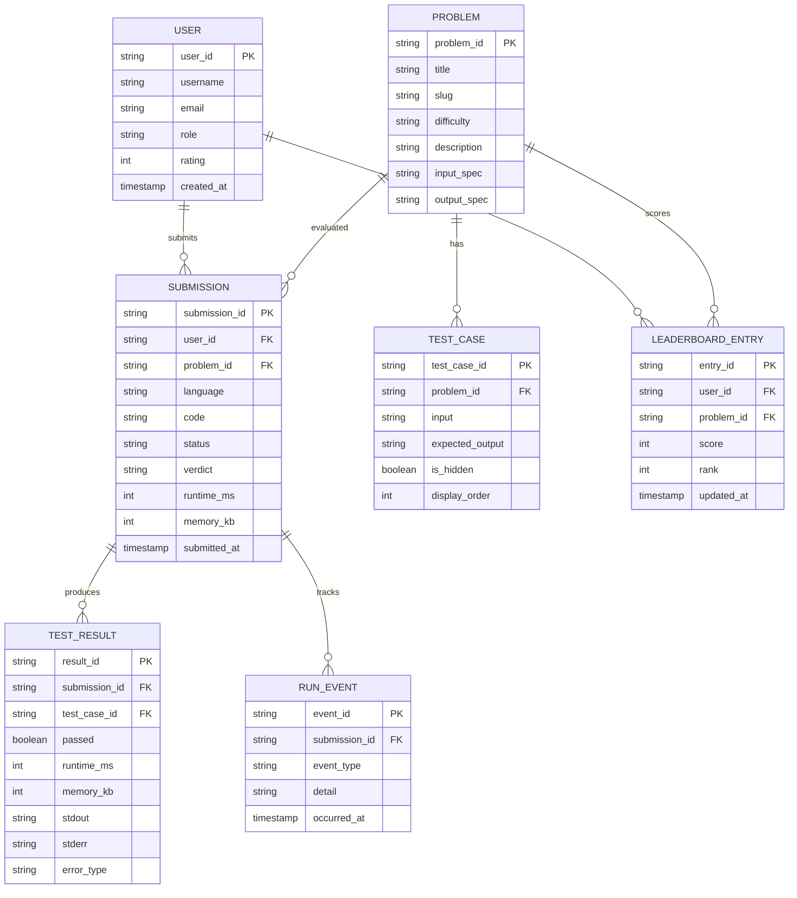

**Entity descriptions:**

* **USER:** Core entity. `user_id` (UUID/BigInt for even distribution), `username` (unique), `email`, `role` (user, contestant, admin), `rating` (Elo-based), `created_at`. Stored in PostgreSQL (durable) with hot profile data cached in Redis.
* **PROBLEM:** Problem definition. `problem_id` (slug), `title`, `difficulty` (Easy/Medium/Hard), `description`, `input_spec`, `output_spec`. Immutable; versioned for contest integrity.
* **TEST_CASE:** Each test case. `test_case_id`, `problem_id` (FK), `input` (JSON or raw text), `expected_output`, `is_hidden` (boolean — visible during development, hidden during evaluation), `display_order` (for visible test cases).
* **SUBMISSION:** One per user code submission. `submission_id` (UUID), `user_id`, `problem_id`, `language`, `code` (stored encrypted at rest), `status` (PENDING, RUNNING, COMPLETED, ERROR), `verdict` (ACCEPTED, WRONG_ANSWER, TIME_LIMIT, MEMORY_LIMIT, RUNTIME_ERROR, COMPILE_ERROR), `runtime_ms`, `memory_kb`, `submitted_at`.
* **TEST_RESULT:** Per test case execution. `result_id` (UUID), `submission_id` (FK), `test_case_id` (FK), `passed` (boolean), `runtime_ms`, `memory_kb`, `stdout` (truncated to 10KB), `stderr`, `error_type` (TimeLimitExceeded, MemoryExceeded, etc.).
* **RUN_EVENT:** Execution lifecycle events (container spawned, compilation started, test case passed, etc.). Enables replay and debugging.
* **LEADERBOARD_ENTRY:** Per-user-per-problem ranking. `entry_id` (UUID), `user_id`, `problem_id`, `score` (based on runtime percentile), `rank`, `updated_at`. Backed by Redis Sorted Set for O(log N) ranking queries.

**Indexes and Constraints:**

* `USER.username` — UNIQUE index (login, no duplicates).
* `USER.email` — UNIQUE index (password reset, verification).
* `PROBLEM.slug` — UNIQUE index (URL routing).
* `TEST_CASE(problem_id, is_hidden, display_order)` — composite index for fetching test cases in display order.
* `SUBMISSION(user_id, submitted_at DESC)` — composite index for user submission history.
* `SUBMISSION(problem_id, status, runtime_ms)` — composite index for leaderboard computation.
* `LEADERBOARD_ENTRY(problem_id, score DESC, user_id)` — composite index for paginated leaderboard.
* `TEST_RESULT(submission_id)` — index for fetching all test results for a submission.

**Partitioning / Sharding:**

* **USER:** Sharded by `user_id` hash (consistent hashing). Users on the same shard are stored together.
* **SUBMISSION:** Sharded by `user_id` hash (most queries are by user). Hot problems (contest hours) sharded with random suffix.
* **TEST_CASE:** Co-located with PROBLEM (small table, full replication).
* **TEST_RESULT:** Sharded by `submission_id` hash.
* **LEADERBOARD_ENTRY:** Sharded by `problem_id` hash. Sorted sets in Redis.

**Scaling strategy:**

* **Submission DB:** PostgreSQL primary-write with read replicas. Sharded by user_id hash ring. Hot shards get additional read replicas.
* **Result Store:** PostgreSQL sharded by submission_id. Results are write-once, read-few — replicated for availability.
* **Leaderboard:** Redis Sorted Set with `problem_id` as the key. O(log N) for insert/update/score lookup. Expired entries via TTL.
* **Queue:** Kafka topic `code-execution` with 1000 partitions. Partition key = `submission_id` hash ensures ordering per submission.

### API Contract

| Method | Endpoint | Description |
|---|---|---|
| POST | `/api/v1/submissions` | Submit code for evaluation |
| GET | `/api/v1/submissions/{id}` | Get submission result + test results |
| GET | `/api/v1/problems/{slug}` | Get problem statement + visible test cases |
| GET | `/api/v1/problems/{slug}/leaderboard` | Get top submissions for a problem |
| POST | `/api/v1/contest/submissions` | Submit code during a contest (anti-cheat enabled) |
| GET | `/api/v1/users/me/submissions` | Get user's submission history |

**Submit (POST /submissions):**
```json
{"problem_id": "two-sum", "language": "python3", "code": "def twoSum..."}
```
**Response:** `{"submission_id": "sub_abc123", "status": "PENDING"}`
**Result (GET):** `{"status": "ACCEPTED", "runtime_ms": 28, "memory_kb": 12400, "test_results": [{"passed": true, "runtime_ms": 28}, ...]}`

**Leaderboard (GET /problems/{slug}/leaderboard):**
```json
{"entries": [{"user_id": "u_123", "score": 95, "runtime_ms": 28, "rank": 1}, ...]}
```

**Auth:** Bearer token. **Rate limit**: 10/min anonymous; 60/min authed; 10/sec for contest submissions.

---

### Online Judge and Code Execution Deep Dive

#### Two Approaches: Message Queue + Workers vs Kubernetes Jobs

1. **Message queue + worker**: Submit → enqueue → worker container → compile + run → save results in evaluation database. Simpler; but manual resource limits.
2. **Kubernetes Job**: Submit → spawn k8s Job → use Kueue to limit the number of jobs → run code → save results in evaluation database. Native cgroup limits; but pod startup overhead (~2s).

#### Resource Limits (cgroups)

CPU: 100% (1 core); memory: 256MB; PID limit: 256; time limit: 2s. cgroup v2 manages all.

#### Compile + Run Pipeline

The compile-and-run pipeline processes each submission through a language-specific runner:

1. **Job dequeue:** Runner picks up a job from Kafka. Submission metadata (language, code, problem_id, test cases) is loaded.
2. **Container spawn:** A fresh or warm container is created with gVisor runtime, read-only filesystem, no network, cgroup limits applied (CPU 1 core, memory 256MB, PID 256, 2s wall-clock timeout).
3. **Code write:** User code is written to a tmpfs scratch directory (never to a persistent volume).
4. **Compilation:** Language-specific compiler (gcc for C++, javac for Java, `python -m py_compile` for Python, `go build` for Go) compiles the code. Compilation errors → COMPILE_ERROR verdict.
5. **Test case execution:** Each test case is fed as stdin. The process runs with a per-test-case timeout enforced by a watchdog thread. Output is captured and compared to expected output.
6. **Result aggregation:** Pass/fail per test case, total runtime (max across test cases), peak memory. The first failing test case's output is returned to the user.
7. **Container teardown:** The container is killed (SIGKILL if still running past timeout) and resources are reclaimed.

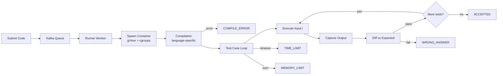

*Compile-and-run pipeline flowchart: submissions flow from the Kafka queue to runner workers, which spawn gVisor-sandboxed containers; code is compiled (errors → COMPILE_ERROR), test cases are executed sequentially with output captured and diffed against expected results, and verdicts propagate through ACCEPTED, WRONG_ANSWER, TIME_LIMIT, or MEMORY_LIMIT paths.*

#### Test Case Management

* **Visible test cases:** Shown to the user during development. Help users debug their solution before submission.
* **Hidden test cases:** Concealed from the user. Run ONLY after all visible test cases pass. Prevent hardcoding expected outputs.
* **Edge cases:** Empty input, maximum input size, duplicate values, negative numbers, overflow conditions, large prime numbers.
* **Delivery mechanism:** Test cases are fetched by the runner from the Problem DB via an authenticated internal API, not embedded in user code. This prevents test case tampering.

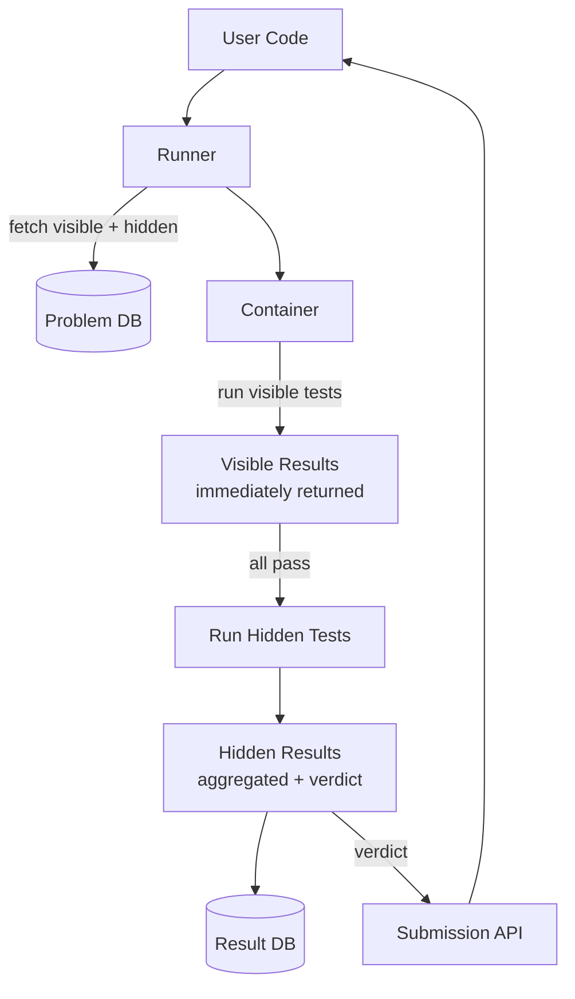

*Test case execution flow: the runner fetches both visible and hidden test cases from the Problem DB; visible tests run first and results are returned immediately; only if all visible tests pass do hidden tests run; the final verdict and all results are persisted to the Result DB and returned to the user.*

#### Multi-Language Runtime Support

| Language | Runtime | Compile command | Run command | Notes |
|---|---|---|---|---|
| Python 3 | python:3.11-slim | N/A (interpreted) | `python3 solution.py` | JIT via PyPy for speed |
| Java | openjdk:17 | `javac Solution.java` | `java Solution` | JVM warmup ~200ms |
| C++ | gcc:12 | `g++ -O2 -std=c++17` | `./solution` | Fastest execution |
| Go | golang:1.21 | `go build -o` | `./solution` | Static binary, fast |
| JavaScript | node:20 | N/A | `node solution.js` | V8, single-threaded |
| C# | mcr/dotnet:6 | `dotnet build` | `dotnet run` | .NET 6+ |
| Rust | rust:1.75 | `rustc -O` | `./solution` | Memory-safe, fast |
| Ruby | ruby:3.2 | N/A | `ruby solution.rb` | Slower than compiled |
| Kotlin | openjdk+17 | `kotlinc` | `kotlin SolutionKt` | JVM-based |
| MySQL | mysql:8.0 | N/A | `mysql -e` | For database problems |
| Bash | bash:5 | N/A | `bash solution.sh` | Sandboxed, limited |

#### Anti-Cheating and Plagiarism Detection

* **Similarity detection:** Submissions are compared pairwise using token-based similarity (Cosine similarity on n-grams). Threshold of 80%+ triggers a flag.
* **Moss integration:** Stanford's Measure of Software Similarity detects copied code across submissions, even with variable renaming.
* **Browser lockdown:** Contest mode uses browser lockdown proctoring — disables copy/paste, alt-tab, and new tab opening.
* **Timing analysis:** Detects suspicious patterns (submissions within seconds of each other with very similar code).
* **Code normalization:** Variables renamed, whitespace stripped, comments removed before comparison.

#### Architecture

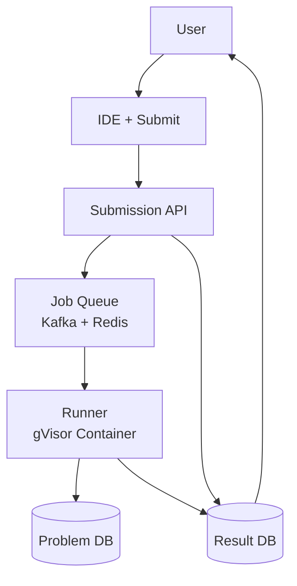

**Major Components:**

* **Submission API:** Auth + validate + enqueue to Kafka.
* **Runner Pool:** k8s pods; dequeue → sandbox + compile + run.
* **Sandbox:** gVisor; cgroup limits (CPU, memory, time).
* **Problem DB:** Test cases + expected output.
* **Result Store:** Run output + pass/fail + metrics.
* **Leaderboard:** Ranked submissions per problem.

#### High-Level Design

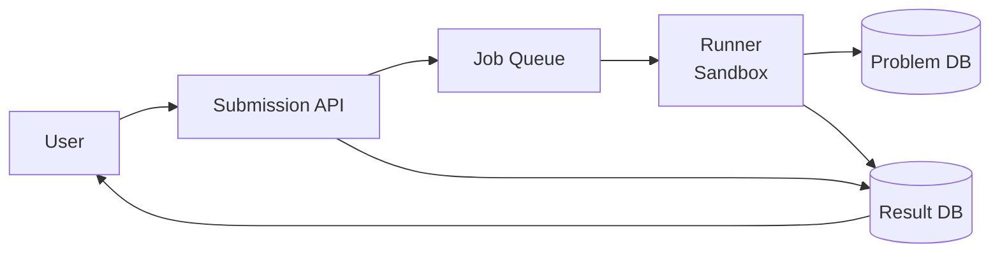

#### Deep Dive: Sandbox Isolation

The sandbox must provide strong isolation while keeping per-submission overhead low. The isolation stack uses multiple layers:

1. **Container runtime (gVisor):** Intercepts all syscalls via a user-space kernel, preventing direct kernel access and container escape.
2. **seccomp profile:** Restricts the set of allowed Linux syscalls (e.g., blocks `clone`, `ptrace`, `mount`, `execve` of arbitrary binaries).
3. **cgroups v2:** Enforces hard limits — CPU quota (100% = 1 core), memory (256MB, OOM-killed), PID count (256, fork bomb prevention), I/O (blkio weight).
4. **Namespaces:** PID namespace (isolated process tree), mount namespace (read-only root fs), network namespace (NO_NETWORK), UTS namespace (isolated hostname).
5. **Read-only filesystem:** Root filesystem is read-only; only a tmpfs scratch directory is writable, destroyed on container exit.
6. **Timeout watchdog:** A separate process outside the container monitors wall-clock time and force-kills (SIGKILL) the container if the submission exceeds the time limit.

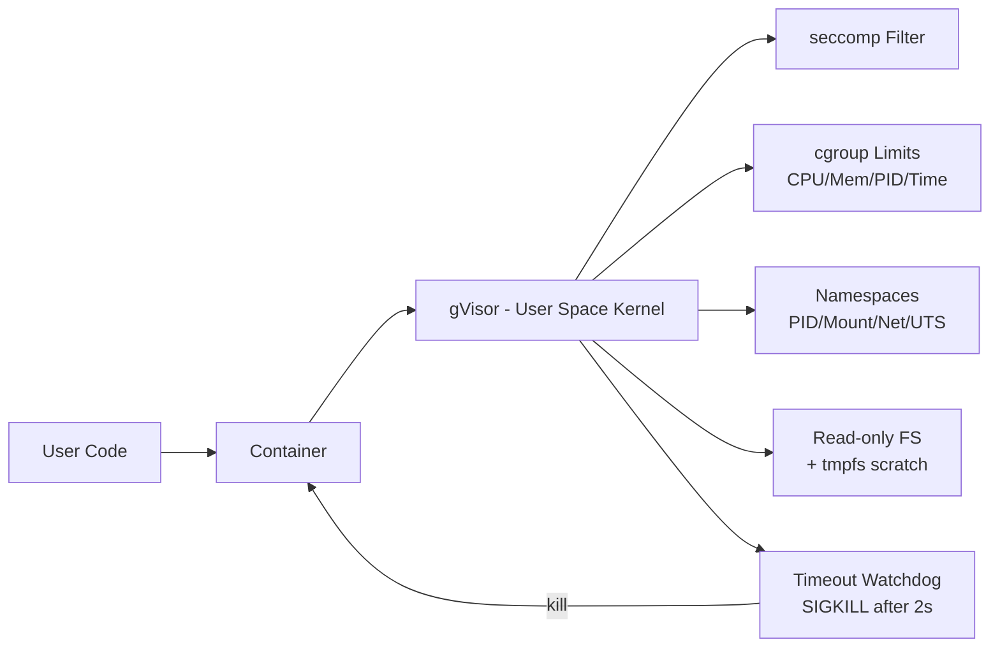

*Multi-layered sandbox isolation: user code runs inside a container with gVisor intercepting syscalls, seccomp filtering dangerous syscalls, cgroups enforcing resource quotas, namespaces isolating process/filesystem/network, a read-only root FS with tmpfs scratch, and an external timeout watchdog that SIGKILLs the container.*

#### Deep Dive: Plagiarism Detection Pipeline

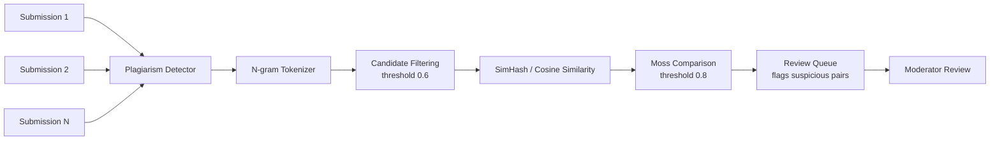

*Plagiarism detection pipeline: submissions are tokenized into n-grams, candidate pairs are filtered by an initial similarity threshold, then SimHash and Moss comparison identify near-duplicate code, which is routed to a moderator review queue.*

#### Deep Dive: Result Aggregation and Output Diffing

After all test cases execute, results are aggregated:

1. **Per-test-case verdicts:** Each test case produces pass/fail, runtime_ms, memory_kb, stdout, stderr.
2. **Overall verdict:** If all pass → ACCEPTED. First failure determines verdict type (WRONG_ANSWER for output mismatch, TIME_LIMIT for timeout, MEMORY_LIMIT for OOM, RUNTIME_ERROR for crash, COMPILE_ERROR for compilation failure).
3. **Runtime reporting:** The maximum runtime across all test cases is reported (conservative worst-case).
4. **Memory reporting:** Peak memory across all test cases is reported.
5. **Output truncation:** stdout is truncated to 10KB for display. The first failing test case's diff is shown to the user.

#### Deep Dive: Leaderboard Computation

Leaderboards rank submissions per problem. Scoring is not just correctness — it uses a runtime-percentile model:

* **Score = 100** for ACCEPTED submissions.
* **Runtime bonus:** Faster submissions get higher scores. Score = 100 - (runtime_ms / max_runtime_ms) * 50, clamped to [50, 100].
* **Tiebreakers:** Fewer submissions submitted by the user for this problem ranks higher.
* **Redis Sorted Set:** `ZADD leaderboard:{problem_id} {score} {user_id}`. O(log N) operations.
* **Real-time updates:** As submissions complete, the sorted set is updated. WebSocket pushes new rankings to subscribed clients.

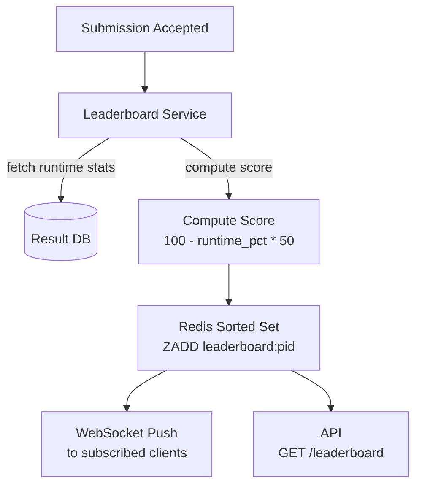

*Leaderboard computation: when a submission is accepted, the Leaderboard Service fetches runtime statistics from the Result DB, computes a score based on the runtime percentile, updates the Redis Sorted Set, pushes new rankings to WebSocket subscribers, and serves leaderboard API requests.*

#### Deep Dive: Hidden Test Case Security

Hidden test cases must never be exposed to the user's code:

* **Encrypted delivery:** Test cases are encrypted with a per-submission key. The runner decrypts them inside the sandbox, never outside.
* **No file system persistence:** Hidden test cases are piped via stdin or in-memory data structures, never written to disk.
* **Memory-only:** The runner loads test cases into process memory; the sandbox has no access to the host filesystem beyond the sandboxed tmpfs.
* **Audit logging:** Every test case fetch is logged with the submission ID and timestamp for security auditing.

#### Real-World Implementations

This deep dive documents the specific technologies and their roles in the online judge architecture:

* **Docker / containerd**: Lightweight containerization for code execution environment isolation. Each submission spawns a fresh container from a pre-built language image.
* **gVisor (runsc)**: User-space kernel that intercepts syscalls, providing an additional security layer beyond standard container isolation. Used by platforms like LeetCode and HackerRank to run untrusted code safely.
* **Kubernetes**: Orchestration platform for scaling runner pods. Kueue manages job queuing and resource allocation, preventing overload during contest spikes.
* **Kafka**: Distributed event streaming platform for the submission queue. 1000 partitions provide parallelism; message ordering is guaranteed per partition.
* **Redis**: In-memory data store for leaderboard rankings (Sorted Set), rate-limiting counters (token bucket), and WebSocket connection state for real-time result delivery.
* **PostgreSQL**: Durable relational database for user accounts, problems, submissions, and test case metadata. Sharded by user_id hash for horizontal scaling.
* **MinIO / S3**: Object storage for code snapshots and build artifacts.
* **Open Policy Agent (OPA)**: Policy enforcement for resource limits per user tier (e.g., premium users get higher CPU quotas).

---

### Replication Strategies

Online judge data is replicated across multiple dimensions: within a region (for availability), across regions (for global latency), and across storage systems (for different access patterns).

#### Leader-Based Replication (Submission + Problem DB)

Submissions and problem test cases are written to a primary PostgreSQL instance and replicated to read replicas. Writes go only to the leader; reads can be served from any replica. This gives strong consistency for submission writes (a returned submission_id means the submission is durably stored) while allowing read scaling for problem retrieval.

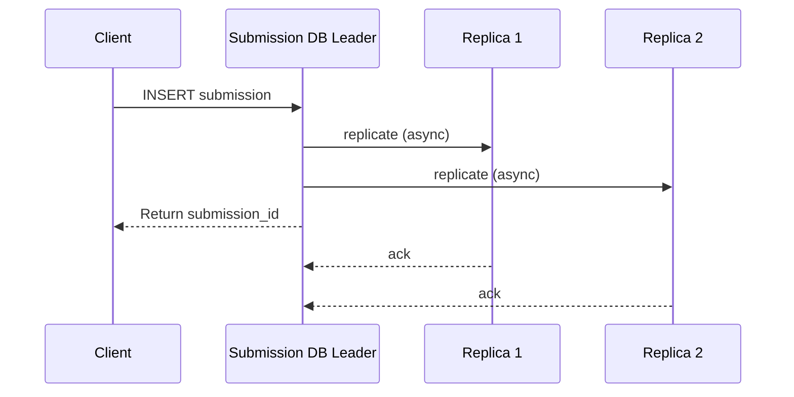

*Leader-based replication for the Submission DB: the client writes a submission to the leader, which asynchronously replicates to read replicas and immediately returns the submission_id. Replicas serve read traffic (problem retrieval, leaderboard), accepting a small replication lag for higher read throughput.*

#### Leaderless Replication (Result Cache — Redis Cluster)

The Result Store (Redis) uses Redis Cluster with hash slots and master/replica pairs. Any master can accept writes; followers serve reads. This provides high availability — if a master fails, a replica is promoted. Result entries can tolerate brief staleness (eventual consistency).

#### Multi-Region Replication

* **Submission DB:** Active-passive — writes go to the primary region; reads from any region's read replica. Cross-region replication lag is typically 1–5 seconds.
* **Result Cache (Redis):** Active-active with CRDT-based conflict resolution for cross-region writes.
* **Problem DB:** Fully replicated to all regions (read-only, small dataset).
* **Leaderboard:** Redis Sorted Sets with per-region leaders, merged at the global API layer.

#### Replication for the Queue (Kafka)

Kafka topics are replicated across regions with MirrorMaker 2 for disaster recovery. The `code-execution` topic has a replication factor of 3 within each region and cross-region mirroring for failover.

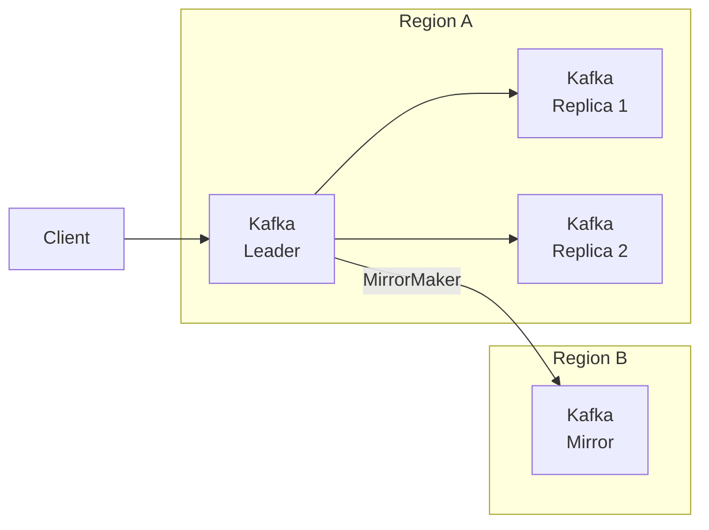

*Multi-region Kafka replication: the primary region replicates the code-execution topic across 3 brokers for fault tolerance; MirrorMaker 2 asynchronously mirrors data to a secondary region for disaster recovery and cross-region failover.*

---

### Failure Detection and Membership

The online judge must detect failed runner nodes, redistribute submission jobs, and continue serving with minimal disruption.

#### Health Checks

* **Liveness probes:** HTTP `/health` endpoint checked every 2 seconds by the orchestrator (Kubernetes). If unhealthy, the pod is restarted or removed from service discovery.
* **Readiness probes:** Checks if the runner can accept jobs (e.g., container runtime available, DB connection healthy). Not-ready pods are drained from the job queue.
* **Business health checks:** Custom checks like "queue depth < 10,000" or "sandbox escape rate < 0.01%" or "container spawn time < 2s".

#### Gossip-Based Membership

Each runner instance periodically exchanges health information with a random subset of peers. This spreads membership changes through the cluster in O(log N) rounds without a central coordinator. Failed runners are removed from the pool, and their queued jobs are reassigned.

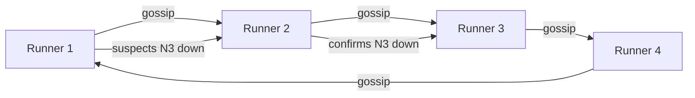

*Gossip-based failure detection in the runner pool: nodes periodically exchange health state with random peers. When a node suspects a peer is down, it propagates the suspicion through gossip; once confirmed by multiple nodes, the peer is removed from the cluster and its queued jobs are reassigned to healthy runners.*

#### Failure Detection Timing

| Component | Check Interval | Timeout | Action |
|---|---|---|---|
| Submission API | 5s | 15s | Retry; failover to replica |
| Runner Pod | 2s | 30s | Restart pod; requeue job |
| Job Queue (Kafka) | 10s | 30s | Reassign partition; consumer rebalance |
| Result Store (Redis) | 2s | 60s | Failover to replica; serve stale |
| Sandbox (gVisor) | 1s | 2s | SIGKILL container; report TIME_LIMIT |

#### Circuit Breakers

Circuit breakers (Resilience4j) wrap calls to the runner pool and result store. If the runner pool fails N consecutive times, the circuit opens and the Submission API fails fast with a 503, queuing submissions for later retry. This prevents cascading failures when the entire runner fleet is unhealthy.

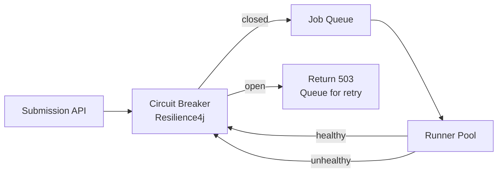

*Circuit breaker pattern: the Submission API wraps queue and runner calls with a Resilience4j circuit breaker. When the runner pool is healthy, jobs flow normally; when it fails repeatedly, the circuit opens and submissions get a 503 with retry-after, preventing cascade failures.*

---

### High Availability and Scalability

The online judge must remain available during node failures, network partitions, and regional outages while scaling to handle global traffic.

#### Multi-Region Deployment

Deploy active services in at least 3 regions (e.g., us-east, eu-west, ap-southeast). Users are routed to the nearest region via GeoDNS or a latency-based load balancer. Each region is self-sufficient for read and write operations, with asynchronous cross-region replication for durability.

* **Active-passive for Submission DB:** Writes go to the primary region; reads can be served from any region's read replica. Cross-region replication lag is typically 1–5 seconds.
* **Active-active for Result Cache (Redis):** Redis with CRDTs or last-write-wins across regions. Users can read and write results from any region.
* **Global CDN:** Static assets (problem descriptions, images) cached at edge locations worldwide, reducing latency to < 50 ms.
* **Regional runner pools:** Each region has its own pool of sandboxed runners to process submissions locally, minimizing cross-region data transfer.

#### Auto-Scaling

* **Stateless services (Submission API, Leaderboard API):** Scale horizontally based on CPU and request latency. Kubernetes HPA adjusts replica count automatically.
* **Stateful services (Job Queue, Result Store):** Scale by adding Kafka partitions or Redis shards. Consumer groups scale automatically with partition count.
* **Runner pools:** Scale based on Kafka consumer lag. If the `code-execution` topic falls behind by >10,000 messages, spin up additional runner pods. Kueue manages concurrency limits per node pool.
* **Sandbox reuse:** Warm pools keep idle containers alive for 30s to handle burst traffic without cold-start penalty.

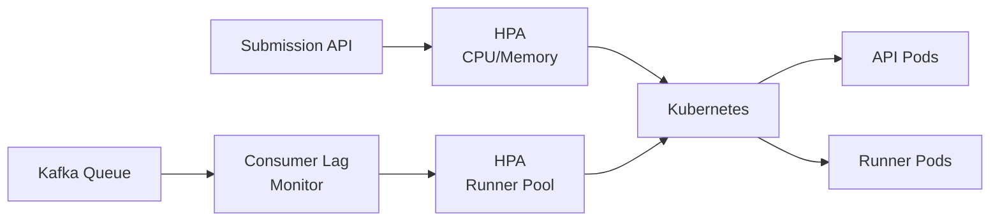

*Auto-scaling triggers: the Submission API scales on CPU/memory via HPA; the runner pool scales on Kafka consumer lag — when lag exceeds a threshold, additional runner pods are spawned to process the backlog.*

#### Graceful Degradation

When a component fails, the system should degrade rather than crash:

* **Runner pool partially down:** New submissions are queued in Kafka with higher priority for active users (e.g., contest participants). Non-critical background re-evaluations are paused.
* **Runner pool fully down:** Return 503 with retry-after for new submissions. Users can still view past results and problem descriptions.
* **Result Store (Redis) down:** Leaderboard updates are queued; API serves stale cached leaderboards. New submission results are persisted to PostgreSQL and synced to Redis when it recovers.
* **Leaderboard cache down:** Serve rankings from PostgreSQL (slower but consistent). Real-time updates temporarily disabled.
* **Problem DB down:** Serve cached problem descriptions from Redis. New submissions from cached problems still proceed; leaderboard lookups use cached data.

#### Horizontal Partitioning

* **Submissions:** Sharded by `user_id` hash across PostgreSQL instances. Each shard owns a subset of users' submissions.
* **Result store:** Redis Cluster with 16,384 hash slots. Each result key is mapped to a slot; slots are distributed across nodes.
* **Job queue:** Kafka partitions by `submission_id` hash. Each partition consumed by one runner ensures no duplicate execution.
* **Leaderboard:** Redis Sorted Set per `problem_id`. Each problem's leaderboard is an independent sorted set.
* **Rate limiter:** Token bucket counters sharded by `user_id`. Each shard independently enforces per-user limits.

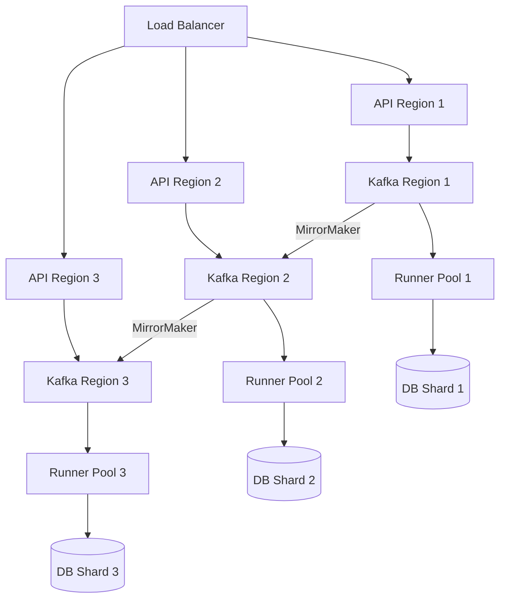

*Three-region deployment with regional API, Kafka, runner pools, and DB shards. Cross-region Kafka mirroring provides disaster recovery. Each region is self-sufficient for processing submissions.*

---

### Performance and Optimization

The performance of an online judge is measured by submission-to-result latency (< 5s SLA) and throughput (10K+ submissions/sec at peak).

#### Latency Optimization

* **Container pooling:** Maintain warm pools of pre-spawned gVisor containers with pre-pulled language images. Eliminates 1–2s of container startup time for common languages.
* **Compile caching:** Cache compilation artifacts (e.g., Maven `.m2` cache for Java, pip cache for Python) across submissions on the same runner. Reduces Java compilation from 3s to <500ms.
* **Warm JVM:** For Java submissions, keep a JVM in ready state (Nailgun protocol or language server style) to avoid 200ms JVM startup per submission.
* **Result caching:** Cache submission results for recently re-submitted solutions (same code + problem + language). Deduplication saves full re-execution.
* **Parallel test execution:** Run independent test cases in parallel threads within the sandbox (where the language supports it). Python and JavaScript are single-threaded but C++ and Java can use multi-threading for parallel test runs.
* **Async result delivery:** Instead of polling, use WebSocket streaming to push results to the user immediately when the runner completes execution.

#### Throughput Optimization

* **Partition parallelism:** Kafka topic `code-execution` has 1000 partitions. 500 runner consumers, each processing one partition, enables 500 concurrent executions.
* **Language-specific pools:** Route Python submissions to Python-capable runners, C++ to C++-capable runners. Prevents resource waste from pulling unnecessary images.
* **Batch problem loading:** Runners fetch test cases in batch from the Problem DB (all test cases for a problem in one query) to reduce DB round-trips.
* **Streamlined sandbox:** Use lightweight container images (Alpine-based) to minimize image pull time. Pre-warm images with `docker pull` on node startup.

#### Caching Strategies

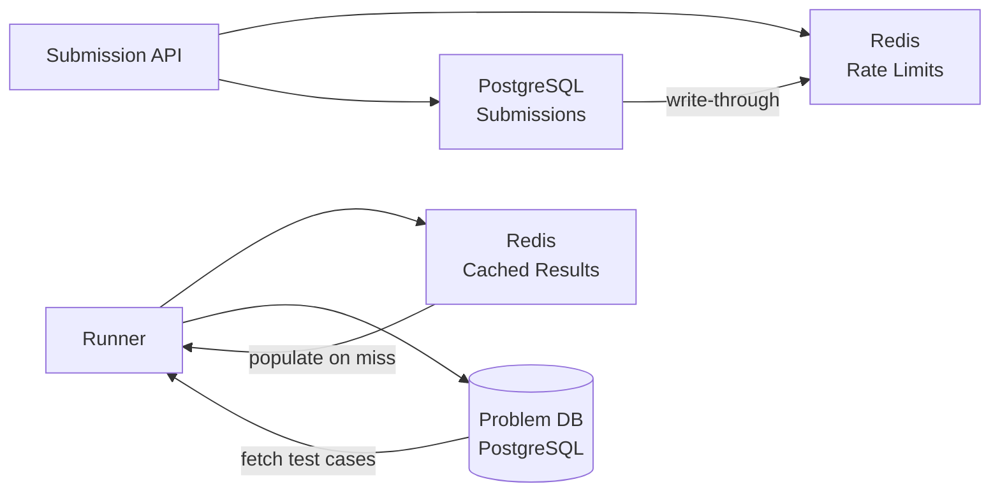

*Multi-tier caching: the Submission API checks Redis for rate-limit counters before accepting submissions; the Result Store caches recent results in Redis (with PostgreSQL as the durable backing store); runners fetch problem test cases from PostgreSQL with caching at the runner level for frequently-accessed problems.*

#### Write Path Optimization

* **Async job enqueue:** Submission API returns 202 Accepted immediately after DB write; execution happens asynchronously via Kafka. API latency < 50ms.
* **Batch result persistence:** Runners batch DB writes (10 results per transaction) to reduce commit overhead.
* **Pipeline execution:** While the sandbox runs test cases, the runner can simultaneously prepare the next test case's input, overlapping I/O with computation.

#### Read Path Optimization

* **Leaderboard ranking:** Redis Sorted Set `ZRANGE` with `LIMIT` provides O(log N) paginated leaderboard queries. Users' own rank looked up via `ZREVRANK`.
* **Submission history:** PostgreSQL index on `(user_id, submitted_at DESC)` enables fast pagination of submission history.
* **Result detail:** Recent results cached in Redis with 5-minute TTL. Older results served from PostgreSQL.

**Real-world use:** LeetCode uses pre-warmed container pools with Kueue for Kubernetes job scheduling; HackerRank uses a custom Docker-based sandbox with compile caching; Codeforces uses lightweight VMs for stronger isolation during contests.

---

### CAP Theorem and Consistency Trade-offs

The CAP theorem states that during a network partition, a distributed system can provide at most two of: Consistency, Availability, and Partition tolerance. Since the online judge operates over networks, partition tolerance is always required.

#### Submission DB — CP (Consistency + Partition Tolerance)

Submission writes require strong consistency: if the API returns a submission_id, the submission must be durably stored. A failed write should not silently return success. The Submission DB uses leader-based replication with synchronous acknowledgment from at least one replica before returning success.

#### Result Cache — AP (Availability + Partition Tolerance)

The Result Cache (Redis) prioritizes availability: if a Redis node fails, result lookups fall back to the PostgreSQL Result Store (slower but consistent). Result entries may be briefly stale (a result appearing 2–3 seconds late is acceptable).

#### Problem DB — CP (Consistency + Partition Tolerance)

Problem test cases require strong consistency — hidden test cases must not be leaked or corrupted. Writes go to the leader; reads from replicas accept minimal lag.

#### Leaderboard — AP with Eventual Consistency

Leaderboard updates are eventually consistent. When a new submission is accepted, the ranking updates within 1–2 seconds. Users may see a slightly stale ranking if they refresh immediately after a submission. This is acceptable because rankings naturally fluctuate.

#### Plagiarism Detection — AP (Availability + Partition Tolerance)

Plagiarism analysis runs asynchronously and can tolerate delays. If the plagiarism service is down, submissions still proceed; analysis runs when the service recovers. Results are backfilled.

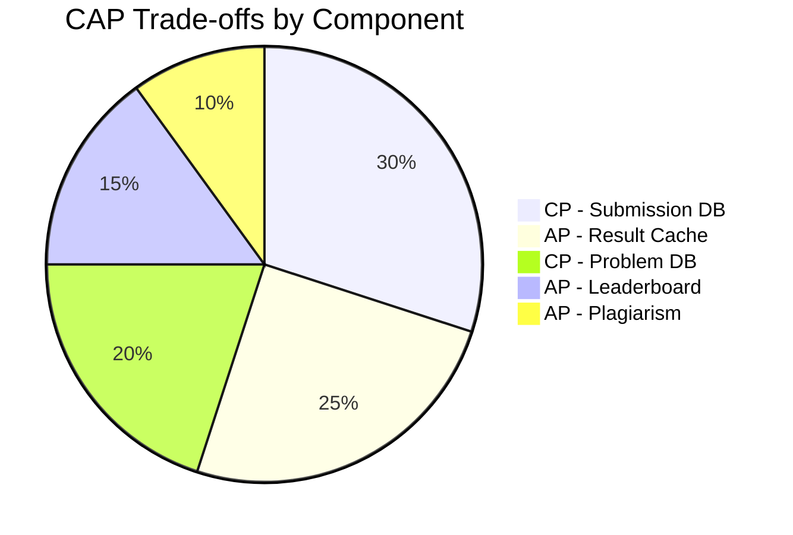

*CAP trade-offs across online judge components: the Submission DB and Problem DB are CP (consistency-first) since writes must be durable and test cases must not be corrupted; the Result Cache, Leaderboard, and Plagiarism Detector are AP (availability-first) since brief staleness is acceptable.*

**Interview question:** *Is an online judge strongly consistent or eventually consistent?*
**Answer:** An online judge uses a nuanced approach: it is strongly consistent for writes that users expect to be immediately visible (submission creation, problem updates) and eventually consistent for reads where slight staleness is acceptable (leaderboard updates, result caching). This pragmatic split — sometimes called "strong-ish consistency" — is the key insight interviewers look for.

---

### Encryption and Key Management

An online judge stores sensitive user data — submitted code, problem statements, contest rankings, and user credentials. Encryption must protect data at rest, in transit, and during processing.

#### Encryption at Rest

* **Code storage:** User-submitted code is encrypted with AES-256-GCM before being persisted to PostgreSQL. The data encryption key (DEK) is generated per-submission and encrypted with a master key managed by AWS KMS or HashiCorp Vault.
* **Problem DB:** Test cases and expected outputs are encrypted at rest. Hidden test cases use a separate DEK that is rotated monthly.
* **Result DB:** Result entries (runtime, memory, verdict) are stored with TDE (Transparent Data Encryption) at the PostgreSQL layer.
* **Result cache (Redis):** Redis in-transit TLS is used; at-rest encryption via Redis Enterprise or disk-level encryption (dm-crypt/LUKS).
* **Container scratch:** The tmpfs scratch directory is in-memory only — never written to disk. When the container exits, all code and outputs are wiped.

#### Encryption in Transit

All client-to-server and server-to-server traffic uses TLS 1.3 (minimum TLS 1.2). Inter-service communication within the data center uses mTLS (mutual TLS) for service-to-service authentication. Runner pods communicate with the Submission API over mTLS-secured Kafka topics.

#### Key Management

* **Key hierarchy:** A master key (in an HSM) encrypts per-submission DEKs. Rotating the master key requires only re-encrypting the DEKs, not the data.
* **Key rotation:** Master keys rotated every 90 days; per-submission DEKs rotated per submission (new key each time).
* **Multi-region KMS:** Keys are available in all deployment regions. Cloud KMS services replicate keys automatically; on-prem deployments use HashiCorp Vault with integrated storage for multi-region HA.
* **Secret injection:** Runner pods receive their execution secrets (test case keys, DEKs) via Kubernetes Secrets mounted as tmpfs, never as environment variables in plaintext.

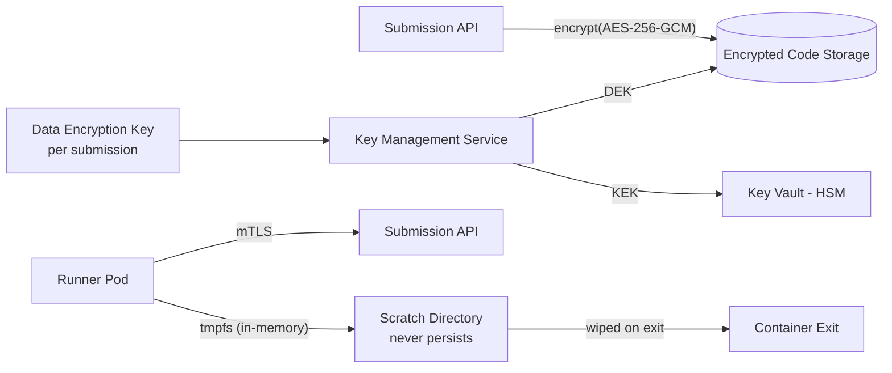

*Encryption at rest and in transit: submitted code is encrypted with per-submission AES-256-GCM DEKs managed by a KMS (backed by an HSM); runner pods connect via mTLS; the sandbox scratch directory is in-memory tmpfs that is wiped on container exit — no code or test output ever persists to disk.*

```java
@Service
@RequiredArgsConstructor
public class CodeEncryptionService {

    @Value("${app.encryption.kms-key-id}")
    private String keyId;

    private final AwsKms kmsClient;

    public EncryptedSubmission encrypt(String plaintext) {
        var dek = kmsClient.generateDataKey(SymmetricEncryptionRequest.builder()
                .keyId(keyId)
                .keySpec(DataKeySpec.AES_256)
                .build());

        var cipher = Cipher.getInstance("AES/GCM/NoPadding");
        cipher.init(Cipher.ENCRYPT_MODE,
                new SecretKeySpec(dek.plaintext(), "AES"),
                new GCMParameterSpec(128, dek.iv()));
        var ciphertext = cipher.doFinal(plaintext.getBytes(StandardCharsets.UTF_8));

        return new EncryptedSubmission(
                ciphertext,
                dek.encryptedDataKey(),
                dek.iv(),
                dek.plaintext().length);
    }

    public String decrypt(EncryptedSubmission encrypted) {
        var dek = kmsClient.decrypt(DecryptRequest.builder()
                .ciphertextblob(encrypted.encryptedDek())
                .build());
        var cipher = Cipher.getInstance("AES/GCM/NoPadding");
        cipher.init(Cipher.DECRYPT_MODE,
                new SecretKeySpec(dek.plaintext(), "AES"),
                new GCMParameterSpec(128, encrypted.iv()));
        return new String(cipher.doFinal(encrypted.ciphertext()),
                StandardCharsets.UTF_8);
    }
}
```

*The `CodeEncryptionService` bean generates a per-submission data encryption key (DEK) via AWS KMS, encrypts the user's code with AES-GCM (which provides both confidentiality and integrity via the authentication tag), and stores the encrypted DEK alongside the ciphertext. The KMS-managed key ID is injected via `@Value`. Only authorized services with KMS decrypt permissions can recover the DEK to decrypt the code.*

---

### Authentication and Authorization

An online judge must verify who is connecting (authentication), determine what they can do (authorization), and enforce anti-cheating controls (who can submit during contests, rate limits).

#### Authentication Methods

* **OAuth 2.0 + JWT:** Users authenticate via a third-party provider (Google, Apple, GitHub) or email/password. The Auth Service issues a short-lived JWT (15 min) and a refresh token (7 days). The JWT contains the user ID, scopes, and expiry.
* **Session tokens:** For web, a server-side session token in an HttpOnly, Secure, SameSite=Strict cookie. The session store (Redis) maps token → user_id and handles revocation.
* **API tokens:** For integration with external IDEs or automated testing, users generate long-lived API tokens scoped to specific permissions.
* **Contest authentication:** During contests, additional verification — IP geolocation locking, camera-based proctoring, browser lockdown — ensures the account belongs to the registered user.

#### Authorization Models

* **Scope-based (OAuth 2.0 scopes):** Each token carries scopes like `submissions:write`, `submissions:read`, `problems:read`, `admin:problems`. The API Gateway enforces scope checks before routing.
* **Role-based (RBAC):** Users have roles (`user`, `premium`, `admin`, `moderator`). Moderators can review plagiarism flags and ban accounts; admins can manage problems and system settings.
* **Resource-level authorization:** A user can only view their own submissions (unless they are an admin or the problem is in a shared contest). Contest submissions are visible only to contest participants and admins.
* **Rate-based authorization:** Anonymous users are limited to 10 submissions/minute. Authenticated users can submit 60/minute. Premium users get 120/minute. Contest participants get 10/second during active contests.

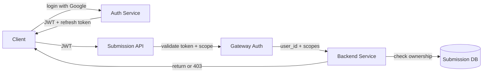

*Authentication and authorization flow: the client logs in via the Auth Service (Google SSO recommended), receives a JWT and refresh token; the API Gateway validates the JWT signature and checks scopes before forwarding to backend services; each service performs resource-level ownership checks against the database before returning data.*

```java
@Service
@RequiredArgsConstructor
@Slf4j
public class SubmissionAuthorizationService {

    private final SubmissionRepository submissionRepository;

    @Transactional(readOnly = true)
    public boolean canViewSubmission(UserPrincipal user, String submissionId) {
        var submission = submissionRepository.findById(submissionId)
                .orElseThrow(() -> new SubmissionNotFoundException(submissionId));

        // Owners can always view their submissions
        if (submission.getUserId().equals(user.getUserId())) {
            return true;
        }

        // Admins can view any submission
        if (user.hasRole("ADMIN")) {
            return true;
        }

        // During an active contest, only participants can see submissions
        if (user.hasScope("contest:read")) {
            return submissionRepository.isInActiveContest(submissionId);
        }

        // Otherwise, submissions are private
        return false;
    }
}
```

*The `SubmissionAuthorizationService` bean enforces resource-level authorization using `@Transactional(readOnly = true)` for safe read-only DB access. It checks three conditions: the user is the submission owner, the user has an admin role, or the user has a valid contest scope and the submission is in an active contest. The method returns a boolean consumed by the controller, which returns 403 Forbidden on denial.*

---

### Security Threats and Mitigations

#### Threat: Sandbox Escape

* **Risk:** An attacker exploits a kernel vulnerability to break out of the gVisor container and gain root on the host machine.
* **Mitigation:** Defense in depth — gVisor (user-space kernel), seccomp (syscall filtering), read-only root FS, no network namespace, PID namespace isolation, cgroups, and regular kernel updates. Run containers as non-root. Monitor escape attempts via audit logs.

#### Threat: Resource Abuse (Crypto Mining, DDoS)

* **Risk:** Malicious code runs crypto miners or DDoS bots inside the sandbox, consuming CPU and bandwidth.
* **Mitigation:** cgroup limits (CPU 1 core, memory 256MB, 2s timeout), no network namespace (blocks all outbound connections), PID limit (256, prevents fork bombs), and per-user rate limiting (max 60 submissions/minute).

#### Threat: Fork Bombs

* **Risk:** A submission creates exponential processes (`fork()` loop), exhausting the PID table and crashing the host.
* **Mitigation:** PID namespace + cgroup PID limit (256 per container). The kernel kills the process group when the PID limit is reached.

#### Threat: Time-Limit Exploitation

* **Risk:** A submission enters an infinite loop, consuming runner resources indefinitely.
* **Mitigation:** Hard wall-clock timeout (2s) enforced by an external watchdog (not the container's own timer). On timeout, SIGKILL is sent to the entire process group, killing all child processes.

#### Threat: Test Case Leakage

* **Risk:** A submission reads hidden test case inputs from the filesystem or network, bypassing the evaluation logic.
* **Mitigation:** No filesystem access to test case files (read-only root FS, no mount of test case volumes); no network; test cases are delivered via encrypted stdin only. The runner fetches test cases from the Problem DB using an internal API key, never exposing them to user code.

#### Threat: Plagiarism During Contests

* **Risk:** Users copy solutions from others during a live contest, invalidating the ranking.
* **Mitigation:** Browser lockdown proctoring (disables copy/paste, alt-tab, new tabs), timing analysis (detects suspicious submission patterns), code similarity detection (SimHash + Moss), and post-contest manual review of flagged submissions.

#### Threat: Submission Spam / DDoS

* **Risk:** An attacker floods the submission API with millions of spam submissions to exhaust the runner pool.
* **Mitigation:** Per-user and per-IP rate limiting (token bucket via Redis), CAPTCHA for anonymous submissions, API Gateway WAF rules, and priority queuing (premium users and contest participants get higher priority).

#### Threat: Code Injection in Admin Panel

* **Risk:** An admin account is compromised, allowing the attacker to modify problem statements or test cases.
* **Mitigation:** MFA for admin accounts, read-only problem storage after contest start, audit logging of all admin actions, and immutable problem versioning.

```mermaid
graph LR
    Attacker[Attacker] -->|"infinite loop"
    TC[Time-Limit Check]
    TC -->|"2s watchdog"| Kill[SIGKILL Container]
    Attacker -->|"fork bomb"
    PID[PID Limit 256]
    PID -->|"cgroup kill"| Kill
    Attacker -->|"network exfil"
    Net[No Network]
    Net -->|"blocked"| Drop[Drop packets]
    Attacker -->|"sandbox escape"
    G[gVisor]
    SC[seccomp]
    G -->|"syscall filter"| Block[Block kernel access]
    SC --> Block
```

*Layered security mitigations: an external 2s watchdog SIGKILLs containers on time-limit violations; cgroup PID limits (256) prevent fork bombs; network namespaces block all outbound connections; gVisor and seccomp jointly prevent syscall-based escapes to the host kernel.*

---

### Observability and Logging

An online judge generates massive telemetry across the submission pipeline, runner pool, sandbox, and leaderboard. Observability must cover the end-to-end submission lifecycle.

#### Key Metrics

* **Submission latency:** p50, p95, p99 for end-to-end submit-to-result time. SLA: p99 < 5s. Track by language (C++ is faster than Java).
* **Queue depth:** Number of pending jobs in Kafka. Alert if > 10,000 (runners can't keep up).
* **Container spawn time:** Average time to spawn a gVisor container. Target: < 500ms with warm pools, < 2s cold.
* **Sandbox escape rate:** Number of containers that triggered security violations. Must be 0. Alert on any non-zero.
* **Compilation success rate:** Percentage of submissions that compile without errors. Low rates may indicate language image issues.
* **Verdict distribution:** ACCEPTED, WRONG_ANSWER, TIME_LIMIT, MEMORY_LIMIT, RUNTIME_ERROR, COMPILE_ERROR rates. Track per problem and per language.
* **Runner utilization:** CPU/memory usage across the runner pool. Target: 70–80% utilization (leaves headroom for spikes).
* **Rate limit hits:** Number of submissions rejected due to rate limiting. Track by user tier.

#### Logging

* **Access logs:** Every API request logged with user ID, endpoint, response code, and latency. Used for audit trails and anomaly detection.
* **Event logs:** All submission lifecycle events (submitted, enqueued, compiling, running, completed) logged as structured JSON for analytics.
* **Security audit logs:** Sandbox violations, escape attempts, privilege escalations, and admin actions logged with full context.
* **Plagiarism logs:** Similarity scores and flagged pairs logged for moderator review.

```mermaid
graph LR
    API[Submission API] -->|"access log"| CL[Central Logger<br/>ELK/Fluentd]
    R[Runner] -->|"event log"| CL
    S[Sandbox] -->|"security audit"| CL
    PD[Plagiarism Detection] -->|"similarity log"| CL
    CL -->|"index + search"| ES[Elasticsearch]
    ES -->|"visualize"| G[Grafana/Loki]
```

*Logging architecture: all services emit structured logs to a central collector (ELK stack or Fluentd); the Submission API logs access events, runners log lifecycle events, the sandbox logs security audits, and the plagiarism detector logs similarity scores — all indexed in Elasticsearch and visualized in Grafana.*

#### Distributed Tracing

Trace every submission across all services — from API Gateway through the Submission API, Kafka queue, runner, sandbox container, and Result DB. Use OpenTelemetry with a trace context header propagated across service boundaries. Key spans to instrument: validation, enqueue, dequeue, container spawn, compilation, test execution, result persistence, and WebSocket push.

```mermaid
graph LR
    App[Client] -->|"trace_id=abc123"| API[Submission API]
    API -->|"X-B3-TraceId: abc123"| K[Kafka Producer]
    K -->|"X-B3-TraceId: abc123"| R[Runner Consumer]
    R -->|"X-B3-TraceId: abc123"| S[Sandbox Container]
    S -->|"X-B3-TraceId: abc123"| RDB[(Result DB)]
    RDB --> TM[Temporal Metrics]
    K --> TM
    R --> TM
    S --> TM
    TM -->|aggregate| Grafana[Grafana Dashboard<br/>+ Tempo/Jaeger]
```

*Distributed tracing flow: each submission carries a trace ID (e.g., `abc123`) propagated across all downstream services (API, Kafka producer, runner, sandbox, DB). Spans are collected by a tracing backend (Tempo/Jaeger) and visualized in Grafana, enabling end-to-end latency analysis of the entire submission lifecycle.*

#### Alerting Strategy

* **Critical (page immediately):** Queue depth > 50,000 for 5 minutes; sandbox escape rate > 0; Submission API p99 > 5s for 10 minutes; Kafka consumer down for 30s; PostgreSQL unavailable.
* **Warning (Slack, no page):** Container spawn time > 2s; compilation success rate < 95%; rate limit rejection rate > 5%; runner CPU utilization > 90% for 15 minutes.
* **Info (dashboard only):** Verdict distribution changes, per-language performance trends, new language image deployment success rate.

```java
@Service
@RequiredArgsConstructor
@Slf4j
public class InstrumentedSubmissionService {

    private final SubmissionRepository submissionRepository;
    private final KafkaTemplate<String, Object> kafkaTemplate;
    private final MeterRegistry meterRegistry;

    public Submission submit(SubmitRequest request, String userId) {
        var sample = Timer.Sample.start(meterRegistry);
        try {
            var submission = createSubmission(request, userId);
            kafkaTemplate.send("code-execution", submission.getId(),
                    Map.of("submissionId", submission.getId(),
                            "language", request.getLanguage(),
                            "problemId", request.getProblemId()));
            sample.stop(Timer.builder("submission.enqueue.latency")
                    .tag("language", request.getLanguage())
                    .register(meterRegistry));
            Counter.builder("submissions.created")
                    .tag("language", request.getLanguage())
                    .tag("source", "api")
                    .register(meterRegistry).increment();
            return submission;
        } catch (Exception e) {
            Counter.builder("submissions.errors")
                    .tag("error_type", e.getClass().getSimpleName())
                    .tag("language", request.getLanguage())
                    .register(meterRegistry).increment();
            log.error("Failed to enqueue submission for user {}", userId, e);
            throw e;
        }
    }
}
```

*The `InstrumentedSubmissionService` bean uses Micrometer to record a timer for enqueue latency (tagged by language) and counters for submissions created and errors (tagged by error type and language). Structured logging via SLF4J captures the full stack trace on failure. These metrics feed into Grafana dashboards and alerting rules.*

---

### Real-World Implementations

- **LeetCode**: Premier interview-prep platform; 300+ problems; 50+ coding languages; contest platform; premium subscription; company-specific question banks. Serves 10M+ monthly active users.
- **HackerRank**: Enterprise-focused; skills assessment; 40+ domains (coding, data science, AI); integrates with hiring pipelines (ATS). Used by 3M+ developers, 2,000+ companies.
- **Codeforces**: Competitive programming; ELO-style rating; weekly contests; 100K+ active participants. Known for algorithmic depth and real-time leaderboard.
- **AtCoder**: Japanese platform; regular contests (ABC, ARC, AGC); clean UI; strong in competitive programming community.
- **HackerEarth**: Coding assessments; coding bootcamps; hiring platform; enterprise challenges. Integrates with LinkedIn, GitHub.
- **CodeSignal**: Interview platform; Certified Assessment; predictive coding tests used by Netflix, Uber, Meta for hiring.

| Platform | Problems | Languages | Monthly Users | Key Feature |
|---|---|---|---|---|
| LeetCode | 300+ | 50+ | 10M+ | Company questions, contests |
| HackerRank | 2000+ | 40+ | 3M+ | Skills assessment, hiring |
| Codeforces | 1000+ | 8+ | 100K+ active | Rating system, contests |
| AtCoder | 500+ | 10+ | 50K+ active | Regular contests, clean UI |
| CodeSignal | 100+ | 10+ | N/A | Predictive hiring assessment |

**Key architectural patterns from production:**
- **Two-phase execution**: Code is first compiled in an isolated environment; if compilation succeeds, the binary is executed against test cases in a separate sandboxed container. This prevents compilation-time resource spikes from affecting runtime.
- **Pre-compiled templates**: Common library templates (e.g., C++ boilerplate) are pre-compiled and cached, reducing per-submission compilation overhead by 50–80%.
- **Distributed judge workers**: CodeForces and LeetCode distribute code execution across thousands of containerized workers (Docker/Kubernetes), sharded by language runtime (C++, Python, Java, Go).
- **Real-time ranking with snapshots**: Codeforces uses ELO rating updates with real-time leaderboard. LeetCode Premium uses periodic snapshots for premium-user rankings to avoid write storms during contests.
- **Anti-cheating via fingerprinting**: Submission fingerprinting — code normalization (strip comments, whitespace), similarity analysis (cosine similarity on AST), and plagiarism detection engines.

---

### Java and Spring Boot Implementation Guide

Spring Boot service for an online coding judge: submission management, code execution, and ranking.

#### 1. DTO Records

```java
public record SubmitSolutionRequest(
        @NotBlank String problemId,
        @NotBlank String code,
        @NotBlank String language,
        String contestId) {}

public record SubmissionResult(
        String submissionId,
        String status,
        int score,
        List<TestCaseResult> testCaseResults,
        long executionTimeMs,
        long memoryUsedKb) {}

public record TestCaseResult(
        String input,
        String expectedOutput,
        String actualOutput,
        String status,
        long runtimeMs) {}

public record RankingEntry(
        String userId,
        int score,
        int penalty,
        Instant lastSubmissionTime) {}

enum SubmissionStatus { PENDING, RUNNING, ACCEPTED, WRONG_ANSWER, TIME_LIMIT_EXCEEDED, MEMORY_LIMIT_EXCEEDED, RUNTIME_ERROR, COMPILATION_ERROR, SYSTEM_ERROR }
```

 *`SubmitSolutionRequest` captures the problem ID, source code, language, and optional contest ID. `SubmissionResult` wraps the evaluation outcome with per-testcase results. `TestCaseResult` includes runtime and memory metrics per test. `RankingEntry` models contest leaderboard entries. `SubmissionStatus` enumerates the full lifecycle.*

#### 2. Entity with Version Locking

```java
@Entity
@Table(name = "submissions", indexes = {
        @Index(name = "idx_user_problem", columnList = "userId,problemId,createdAt"),
        @Index(name = "idx_contest", columnList = "contestId,status"),
        @Index(name = "idx_status", columnList = "status,createdAt")
})
public class Submission {

    @Id
    private String submissionId;

    @Column(name = "user_id", nullable = false)
    private String userId;

    @Column(name = "problem_id", nullable = false)
    private String problemId;

    @Column(length = 65535)
    private String code;

    @Column(nullable = false)
    private String language;

    @Enumerated(EnumType.STRING)
    @Column(nullable = false)
    private SubmissionStatus status = SubmissionStatus.PENDING;

    private int score = 0;

    @Column(name = "execution_time_ms")
    private long executionTimeMs;

    @Column(name = "memory_used_kb")
    private long memoryUsedKb;

    @Column(name = "contest_id")
    private String contestId;

    @Column(name = "created_at", nullable = false)
    private Instant createdAt;

    @Version
    private Long version;

    public void markAccepted(int score) {
        this.status = SubmissionStatus.ACCEPTED;
        this.score = score;
    }

    public void markFailed(SubmissionStatus status) {
        this.status = status;
        this.score = 0;
    }
}
```

*`Submission` entity with composite index on `(userId, problemId, createdAt)` for user history queries and `(contestId, status)` for contest leaderboard computation. `@Version` provides optimistic locking — the status transitions from `PENDING` → `RUNNING` → terminal state atomically. The `contestId` field is nullable for non-contest submissions.*

#### 3. Submission Service with Async Execution

```java
@Service
@RequiredArgsConstructor
@Slf4j
public class SubmissionService {

    private final SubmissionRepository submissionRepository;
    private final JudgeClient judgeClient;
    private final MeterRegistry meterRegistry;

    @Async
    public void processSubmission(String submissionId) {
        Timer.Sample sample = Timer.Sample.start(meterRegistry);
        var submission = submissionRepository.findById(submissionId)
                .orElseThrow(() -> new SubmissionNotFoundException(submissionId));

        try {
            // State transition: PENDING → RUNNING
            submission.setStatus(SubmissionStatus.RUNNING);
            submissionRepository.save(submission);

            // Call the judge for code execution
            var result = judgeClient.execute(
                    submission.getCode(),
                    submission.getLanguage(),
                    submission.getProblemId());

            // State transition: RUNNING → terminal
            if (result.status() == SubmissionStatus.ACCEPTED) {
                submission.markAccepted(result.score());
            } else {
                submission.markFailed(result.status());
            }
            submission.setExecutionTimeMs(result.executionTimeMs());
            submission.setMemoryUsedKb(result.memoryUsedKb());
            submissionRepository.save(submission);

            sample.stop(Timer.builder("submission.execution.duration")
                    .tag("language", submission.getLanguage())
                    .tag("status", submission.getStatus().toString())
                    .register(meterRegistry));

            Counter.builder("submissions.completed")
                    .tag("language", submission.getLanguage())
                    .tag("status", submission.getStatus().toString())
                    .register(meterRegistry).increment();

        } catch (Exception e) {
            submission.markFailed(SubmissionStatus.SYSTEM_ERROR);
            submissionRepository.save(submission);
            Counter.builder("submission.errors")
                    .tag("language", submission.getLanguage())
                    .tag("error", e.getClass().getSimpleName())
                    .register(meterRegistry).increment();
            log.error("Failed to process submission: {}", submissionId, e);
        }
    }

    @Transactional
    public SubmissionResult submit(SubmitSolutionRequest request, String userId) {
        var submission = new Submission();
        submission.setSubmissionId(UUID.randomUUID().toString());
        submission.setUserId(userId);
        submission.setProblemId(request.problemId());
        submission.setCode(request.code());
        submission.setLanguage(request.language());
        submission.setContestId(request.contestId());
        submission.setCreatedAt(Instant.now());
        submissionRepository.save(submission);

        // Async processing via Kafka
        kafkaTemplate.send("submission-queue", submission.getSubmissionId());

        Counter.builder("submissions.submitted")
                .tag("language", request.language())
                .tag("contest", request.contestId() != null ? request.contestId() : "none")
                .register(meterRegistry).increment();

        return new SubmissionResult(submission.getSubmissionId(), "PENDING", 0,
                List.of(), 0L, 0L);
    }
}
```

 *`SubmissionService.submit()` creates a `Submission` record in `PENDING` state, publishes to the `submission-queue` Kafka topic, and returns a pending result immediately (202 Accepted pattern). The `@Async processSubmission()` method consumes the submission, transitions status to `RUNNING` (with optimistic locking), calls the `JudgeClient` for sandboxed code execution, and updates the final status. Micrometer tracks submission latency per language and status, completion rate, and errors by exception type.*

#### 4. REST Controller

```java
@RestController
@RequestMapping("/api/v1")
@RequiredArgsConstructor
public class JudgeController {

    private final SubmissionService submissionService;
    private final RankingService rankingService;

    @PostMapping("/submit")
    public ResponseEntity<SubmissionResult> submit(
            @RequestHeader("Authorization") String bearer,
            @Valid @RequestBody SubmitSolutionRequest request) {

        String userId = authService.getUserId(bearer);
        var result = submissionService.submit(request, userId);
        return ResponseEntity.accepted().body(result);
    }

    @GetMapping("/submission/{id}")
    public ResponseEntity<SubmissionResult> getResult(@PathVariable String id) {
        var submission = submissionService.getById(id);
        return ResponseEntity.ok(submission.toResult());
    }

    @GetMapping("/contest/{contestId}/ranking")
    public ResponseEntity<List<RankingEntry>> getRanking(
            @PathVariable String contestId,
            @RequestParam(defaultValue = "50") int limit) {
        var ranking = rankingService.getContestRanking(contestId, limit);
        return ResponseEntity.ok(ranking);
    }
}

@ControllerAdvice
public class JudgeExceptionHandler {
    @ExceptionHandler(SubmissionNotFoundException.class)
    ResponseEntity<Map<String, String>> handleNotFound(SubmissionNotFoundException ex) {
        return ResponseEntity.status(HttpStatus.NOT_FOUND)
                .body(Map.of("error", "not_found", "message", ex.getMessage()));
    }
}
```

 *`JudgeController` exposes `POST /submit` (returns 202 Accepted with pending result), `GET /submission/{id}` (poll for results), and `GET /contest/{contestId}/ranking` (contest leaderboard). `JudgeExceptionHandler` maps domain exceptions to HTTP status codes.*

---

### Interview Questions and Answers

**Beginner**

1. **How would you design an online judge (like LeetCode)?**
   A: Core components: (1) **Problem Store** — persists problems, test cases, constraints. (2) **Submission Service** — accepts code, enqueues for execution. (3) **Judge Workers** — sandboxed code execution (Docker with memory/CPU limits). (4) **Result Store** — stores verdicts (Accepted, Wrong Answer, etc.) and runtime/memory metrics. (5) **Ranking Service** — computes leaderboard (contest scoring: time + penalty). (6) **API Gateway** — REST endpoints for submission, retrieval, ranking. The key challenge: isolating untrusted code execution and scaling the sandbox workers under load.

2. **How do you securely execute untrusted code?**
   A: Use containerization (Docker) with strict resource limits (memory e.g., 256MB, CPU e.g., 1 core, time limit e.g., 2s). Run containers as non-root. Use seccomp/AppArmor/SELinux profiles. Additional sandbox: `firejail`, `gVisor`, or `nsjail` for stronger isolation. Disable network in containers. Use ephemeral containers (destroy after each run). For multi-language support, pre-build language-specific base images (each with only the interpreter/runtime).

3. **How do you test submissions against hidden test cases?**
   A: Separate the test case execution into: (1) **Sample tests** — visible to users, run immediately after submission. (2) **Hidden tests** — run by the judge after the submission passes sample tests. Hidden tests are stored encrypted and decrypted only in the judge worker. Test results are scored; partial passing is possible (score = passed_tests / total_tests).

4. **How do you compute contest rankings?**
   A: Scoring = `problems_solved × 10 + (total_time + penalty)`. Total time = sum of submission times of accepted solutions (in minutes from contest start). Penalty = 20 min per failed attempt on a problem before the first accepted solution. Sort by score (desc), then by total time (asc). Tie-breaker: last accepted time (earlier wins).

5. **What's the difference between compiling and running a submission?**
   A: **Compilation phase**: source code → binary (or bytecode). Language-specific: C/C++ → `gcc`, Java → `javac`, Python → `python -m py_compile` (bytecode), Go → `go build`. **Execution phase**: binary runs against test cases. Some languages (Python, JavaScript) are interpreted (no explicit compile step but still have an import/parse step). Compilation errors → `COMPILATION_ERROR` verdict. Execution errors → `RUNTIME_ERROR`, `TIME_LIMIT_EXCEEDED`, `MEMORY_LIMIT_EXCEEDED`.

**Intermediate**

6. **How do you scale the judge workers to handle 1M concurrent submissions?**
   A: (1) **Queue-based dispatch**: submissions go to a Kafka/RabbitMQ queue; judge workers pull from it. (2) **Sharding**: shard by language (C++ workers, Java workers, Python workers) — each shard scales independently. (3) **Auto-scaling**: Kubernetes HPA scales judge workers based on queue depth metric. (4) **Priority**: premium users and contest submissions get priority. (5) **Warm pools**: keep pre-warmed containers (language runtime images) to avoid cold start. (6) **Batch execution**: batch test case runs for the same language to reduce per-test overhead. (7) **Spot/preemptible instances**: for non-critical batch evaluation (re-evaluation, re-judging).

7. **How do you handle long-running code (infinite loops)?**
   A: Hard time limit enforced at the container level (Docker `--timeout` or cgroup `cpu.max`). For example, `timeout 2 bash run.sh` inside the container. If the process exceeds the limit, it's killed and marked `TIME_LIMIT_EXCEEDED`. Additional: CPU quota enforcement ensures one runaway container doesn't starve others.

8. **How do you prevent cheating/plagiarism in contests?**
   A: (1) **Code normalization**: strip whitespace, comments, rename variables, normalize imports → detect structurally identical code. (2) **Similarity analysis**: compute pairwise similarity (cosine similarity on tokenized AST or normalized code). Flag pairs > 80% similar. (3) **Submission pattern analysis**: detect simultaneous submissions from different accounts on the same problem. (4) **Browser monitoring**: during contests, capture browser focus/blur events — switching tabs during submission is suspicious. (5) **Rate limiting**: limit submissions per problem per user (e.g., 10/hour for contests, unlimited for practice but slower priority).

9. **How do you handle multiple test cases per problem?**
   A: (1) **Test case batching**: the judge runs all test cases in a single container lifecycle (compile once, run many). (2) **Parallel test execution**: run test cases in parallel within the container (if the language supports threads). (3) **Score aggregation**: score = (passed_test_cases / total_test_cases) × max_score. Partial scoring for problems that allow it. (4) **Edge case generation**: fuzz testing to generate additional edge cases. (5) **Test case ordering**: easy-to-hard ordering — if the solution TLEs on the easy case, we kill it early without running hard cases.

10. **How do you implement real-time ranking during contests?**
    A: (1) **Event-driven**: each accepted submission produces a scoring event (user_id, problem_id, timestamp, penalty). (2) **Stream processing**: Kafka + Flink/Storm consumes scoring events and updates the leaderboard in real-time. (3) **Leaderboard store**: Redis sorted set (score = -computed_score, tiebreaker = submission_time). ZADD updates the score; ZREVRANGE retrieves top N. (4) **Push updates**: WebSocket pushes ranking updates to connected clients. (5) **Snapshot fallback**: if the stream processor fails, fall back to periodic batch computation from the submission DB.

**Advanced / System Design**

11. **Design an online judge handling 10M submissions/day with 50 languages, 5s median execution time, and a 99th-percentile latency under 30s. How do you handle a Codeforces-style contest with 100K participants?**
    A: **Submission ingestion**: API Gateway → Submission Service (stateless, 100 instances) → Kafka (`submissions` topic, 1000 partitions, key = submission_id). Median latency: the Submission Service returns 202 Accepted immediately (enqueue); the actual execution happens async. 10M submissions/day = ~115/sec avg, ~1000/sec peak during contests.
    **Judge architecture**: Language-sharded pools — a C++ judge pool (500 containers), Java judge pool (300 containers, JVM warmup), Python judge pool (200 containers, interpreter startup ~50ms), etc. Each pool is a Kubernetes Deployment with HPA based on queue depth per language.
    **Code execution**: Each judge worker runs in a Docker container with: `--memory=256m --cpus=1`, `--network=none` (no network), `--security-opt=no-new-privileges`, seccomp profile, ephemeral filesystem (no persistence). Time limit enforced by `timeout 2s`. Containers are recycled per submission (or per batch of 5 for warm pools).
    **Result storage**: Kafka → Flink → Result Store (PostgreSQL sharded by problem_id). 100ms p99 write latency with connection pooling. Redis cache for recent results (10-min TTL) — 99% of result lookups hit Redis.
    **Contest scenario (100K participants, 5 problems, 2h)**:
    - Peak submission rate: 100K participants × 5 problems × ~5 submissions each ÷ 2h = ~3500 submissions/hour = ~1000/sec.
    - Judge scaling: auto-scale to 2000 judge workers (proportional across languages). Queue backlog bounded by 30s (Kafka retention 5 min).
    - Ranking: Flink processes submission → verdict → scoring events; updates Redis sorted sets per contest. WebSocket pushes leaderboard updates every 5s (not every submission, to reduce load). Peak: 100K concurrent WebSocket connections per contest.
    - Anti-abuse: rate limit 10 submissions/problem/min; similarity detection runs in a post-contest batch job (not real-time).
    - Capacity: 2000 judge workers × 0.3 submissions/sec/container = ~600 submissions/sec throughput (6x headroom). Kafka: 1000 partitions × 1 MB/s = 1 GB/s ingest. PostgreSQL: 10K writes/sec (with partitioning by hour). Redis: 100K sorted-set updates/sec (ZADD pipeline).
