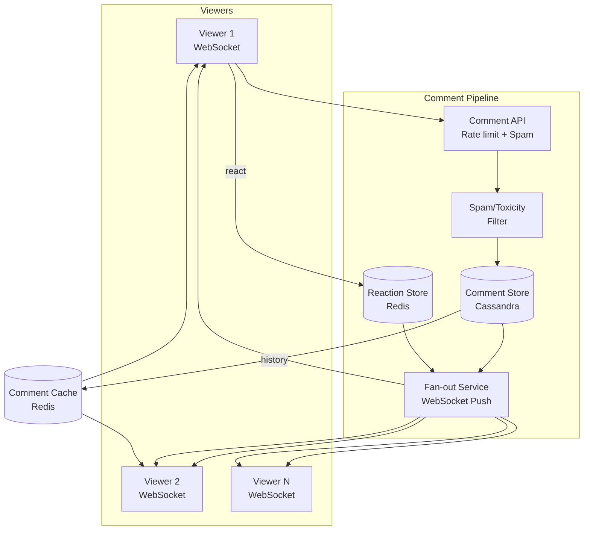
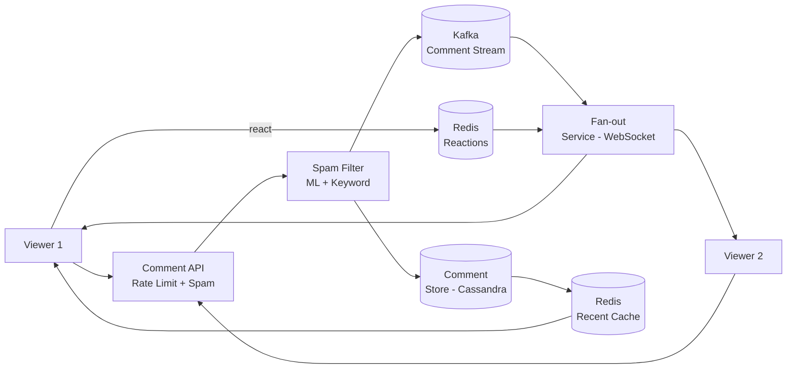

# Design FB Live comments

## Blogs and websites

## Medium

## Youtube

- [Design FB Live Comments: Hello Interview Mock](https://www.youtube.com/watch?v=tgSe27eoBG0)

---

## Theory

### What Is It?

FB Live comments is a real-time comment system synchronized with a live video stream — viewers post messages (text + emoji) during a live broadcast and see comments from other viewers in near real-time. The system must handle high write rates (thousands of comments/second), fan-out to all viewers in the stream, ordering, spam filtering, and live reactions.

### Why Does It Exist?

Live video without interaction is passive. Comments + reactions enable community engagement during broadcasts — questions, reactions, shared experience. This drives viewer retention on live platforms (Facebook Live, Twitch, YouTube Live, Instagram Live).

### What Problem Does It Solve?

* **High write rate**: Comments arrive at high velocity during popular streams.
* **Fan-out**: Each comment must reach all N viewers in the stream simultaneously.
* **Ordering**: Comments must appear in chronological order (or causal order).
* **Spam/Toxicity**: Filter abusive content in real time.
• **Low latency**: Comments appear within 100–500ms of posting.
* **Durability**: Comments must not be lost if servers restart.
* **Reactions**: Emoji reactions (like, heart, etc.) are high-frequency but low-complexity.

### Important Subtopics

1. Fan-out on write vs fan-out on read
2. Real-time delivery (WebSocket, SSE, push)
3. Comment ordering (timestamp-based, causal)
4. Spam + toxicity filtering (automated + manual)
5. Like/react counters (idempotent increments)
6. Pagination + history
7. Rate limiting (anti-spam)
8. Scaling to millions of concurrent viewers

### Problem Statement

Design a real-time comment system for live video streams (like Facebook Live comments). The system must handle high write rates during popular streams, fan-out comments to all viewers in near real-time, handle spam/toxicity filtering, support likes/reactions, and paginate comment history. Keep all data within the stream context (no cross-stream data needed).

### Functional Requirements

- Post comments (text + emoji) during a live stream
- View comments in real-time as they arrive
- Like/react to comments (emoji reactions)
- Paginated history of past comments (last N minutes)
- Spam and toxicity filtering
- Rate limiting per user (anti-spam)
- Viewer count (optional)

### Non-Functional Requirements

- **Latency**: < 200ms comment delivery to all viewers
- **Scale**: 10K comments/sec per stream; millions of concurrent viewers across streams
- **Availability**: 99.9% uptime
- **Consistency**: Comments appear in order; no loss
- **Durability**: Comments persisted for replay/history

---

## Characteristics

| Characteristic | What it means | Why it matters | How it works |
|---|---|---|---|
| **High write rate** | 10K+ comments/sec during popular streams | System must handle burst | Fan-out on write; sharding |
| **Fan-out** | One comment → all N viewers instantly | Real-time engagement | WebSocket + pub/sub |
| **Ordering** | Comments appear in chronological order | Coherence | Timestamp + sort key |
| **Low latency** | < 200ms delivery | Real-time feel | WebSocket (persistent) |
| **Reactions** | Emoji likes (high volume, low complexity) | Engagement | Counter increments |
| **Spam filtering** | Block spam/offensive | User experience | ML + keyword + rate limit |

## Components

| Component | Purpose | Responsibilities | Relationship | Real-world Example |
|---|---|---|---|---|
| **Comment API** | Accept comments | Validate, rate-limit, queue | Client ↔ Comment Service | REST/gRPC |
| **Comment Service** | Process + fan-out | Persist + distribute | API ↔ Fan-out | Node/Go microservice |
| **Fan-out Service** | Push to viewers | WebSocket connections, pub/sub | Comment Service ↔ Viewers | Socket.IO, Pusher |
| **WebSocket Server** | Real-time delivery | Maintain connections, push | Fan-out ↔ Client | ws://, wss:// |
| **Comment Store** | Persist comments | Append-only, sharded | Comment Service | Cassandra, DynamoDB |
| **Spam Filter** | Detect spam | Keyword + ML + rate limit | Comment Service | Moderation ML |
| **Reaction Store** | Track likes | Counter increments | Comment Service | Redis |
| **Comment Cache** | Recent history | Paginated fetch | Comment Service | Redis/ElastiCache |

## Patterns

### Fan-out on Write (Push)

* **What**: When a comment is posted → immediately fan-out (push) to all WebSocket connections of viewers in that stream.
* **Problem solved**: Read path is trivial (connections already connected); new comments arrive instantly.
* **How it works**: (1) Comment posted → Comment Service → persist. (2) Fan-out Service: iterate WebSocket connections for stream_id → push message to each. (3) For large streams (100K+ viewers) → shard fan-out across 50+ Fan-out nodes. (4) Each node handles a subset of connections (consistent hashing by viewer_id).
* **When to use**: Live comments (viewers actively watching → connected); moderate audience (under 100K).
* **When not to use**: Very large audience (1M+); fan-out on read more efficient; offline replay needed.
* **Advantages**: Instant delivery; simple read path; low-latency.
* **Disadvantages**: Fan-out cost scales with viewer count; memory (WebSocket connections) per stream.
* **Java/Spring Boot example**:
```java
@Component
public class FanoutService {
    private final Map<String, Set<WebSocketSession>> streamSessions;

    public void fanoutComment(String streamId, Comment comment) {
        Set<WebSocketSession> sessions = streamSessions.get(streamId);
        if (sessions != null) {
            CompletableFuture.runAsync(() -> {
                sessions.parallelStream().forEach(session -> {
                    try {
                        session.sendMessage(TextMessage.valueOf(JSON.toJSONString(comment)));
                    } catch (IOException e) {
                        // remove dead connection
                    }
                });
            });
        }
    }
}
```

### Fan-out on Read (Pull)

* **What**: Comments are stored in a shared store. Viewers pull (poll or subscribe to stream) rather than being pushed.
* **Problem solved**: Avoids fan-out cost at write time; scales writes independently of viewers.
* **How it works**: (1) Comment stored in Kafka/Cassandra. (2) Viewer connects via SSE/WebSocket → streams new comments from store. (3) Viewer polls or subscribes to stream topic → receives new messages.
* **When to use**: Very large audiences; when write rate >> fan-out cost is prohibitive.
* **When not to use**: Low-latency requirement; interactive chats.
* **Advantages**: Write path simple; scales writes independently.
* **Disadvantages**: Higher latency (pull delay); complex cursor-based pagination.

## Benefits

* **Real-time engagement**: Comments appear instantly → active community.
* **Moderation**: Filter spam → safe environment.
• **Scalability**: Fan-out on write for moderate audiences; fan-out on read for massive.
• **Interactivity**: Reactions + comments → deeper engagement.

## Pros

* **Sub-200ms delivery**: WebSocket fan-out is fast.
• **Spam protection**: Real-time + proactive filtering.
• **Reactions**: High-volume, low-latency engagement.
• **Paginated history**: Recent comments available on reconnect.
• **Decoupled architecture**: Comment store + fan-out independent.

## Cons

* **Fan-out cost**: Scales with viewer count × comment rate.
• **WebSocket memory**: Each connection ~1KB; 1M = 1GB per server.
• **Ordering**: Cross-region → hard to guarantee strict ordering.
• **Hot stream**: Popular stream → massive fan-out → shard required.
• **Offline**: Viewers who joined late → load history from store.

## Challenges

### Technical Challenges
* **WebSocket scale**: Millions of connections → 500+ WebSocket servers; sticky sessions (stream_id → server).
* **Fan-out sharding**: 100K viewers on one stream → shard fan-out across 10+ nodes (consistent hashing by viewer_id).

### Scalability Challenges
* **Connections**: 10M concurrent → 1000+ WebSocket servers (10K connections each); Redis adapter for cross-instance pub/sub.
• **Write rate**: 10K comments/sec → Kafka (ingest) + Cassandra (store).

### Performance Challenges
* **Latency**: < 200ms → WebSocket (persistent connection); no polling.
• **Hot stream**: Popular stream → fan-out bottleneck → shard + load balance.

### Reliability Challenges
* **Comment loss**: Ack + retry; idempotent comment posting.
* **Connection drops**: Reconnect + replay recent comments from cache.
• **Server crash**: Redis adapter + Kafka replay → no comment loss.

### Maintainability Challenges
* **Spam filter updates**: Model updates + A/B testing; false positive rate monitoring.
• **WebSocket servers**: Rolling updates + sticky session support.

### Security Concerns
* **Spam/bots**: Rate limiting (comments/minute/user); CAPTCHA; ML moderation.
* **Toxicity**: NLP-based filtering; keyword filters; user reporting.
• **Data exfiltration**: Comments are public within stream; PII in comments → moderation.

## Best Practices

* **Fan-out on write** for < 50K viewers; fan-out on read for millions.
• **Consistent hashing**: Shard fan-out by viewer_id → even distribution.
• **Ack + retry**: Comment persistence + retry on failure → no loss.
• **WebSocket sticky**: Route stream → same WebSocket server (by stream_id hash) → fewer servers needed.
• **Rate limiting**: Per-user comments/second → prevent spam.
• **Moderation**: Automated (ML + keyword) + manual review queue.
• **Monitor**: Comment delivery latency (< 200ms); WebSocket connection count; spam detection rate; fan-out queue depth.

## When to Use

### Appropriate
* Live video platforms (Facebook Live, Twitch, YouTube Live).
• Webinars + live education (Q&A).
• Live sports/events (fan reactions).
• Auctions/live shopping (real-time chat).

### Not Appropriate
* Offline chat (email-style).
• Private 1:1 messaging.
• Low-interaction content.

### Decision Factors
* Audience size; latency requirements; moderation needs; interactivity level.

## Use Cases

### Facebook Live Comments

* **Problem**: Millions of users comment during live streams; comments must reach all viewers within 200ms; spam must be filtered; reactions (emoji) in high volume.
* **Solution**: Comment → API Gateway → Comment Service (persist to Cassandra) → Fan-out Service (WebSocket push to all viewers). Spam filter (keyword + ML) + rate limiting. Reactions (counter in Redis).
* **Why suitable**: WebSocket fan-out; Cassandra for durability; Redis for reactions + recent history; spam filter.
* **How it works**: (1) Viewer posts comment → API → rate limit check → spam filter → persist to Cassandra + Kafka. (2) Fan-out Service: get WebSocket connections for stream → push comment to each (sharded for > 50K viewers). (3) Viewer sees comment < 200ms. (4) Reaction: viewer clicks ❤️ → Redis INCR(reaction_key) → broadcast count to viewers. (5) Reconnect: recent comments from Redis cache. (6) Spam: comment → spam filter (ML) → blocked if score > threshold.
* **Trade-offs**: Fan-out cost at scale; WebSocket memory; cross-region latency (comments visible with 100–500ms delay).

## Architecture



### Architecture Structure
* **API layer**: Comment API (REST/gRPC) → rate limit + spam filter.
• **Storage**: Cassandra (durable comments), Redis (reactions + recent cache).
• **Fan-out**: WebSocket push to all viewers; sharded for large streams.
• **Moderation**: Spam + toxicity filter.

### Communication
* **Client ↔ API**: HTTP/HTTPS (REST or gRPC).
• **Fan-out → Viewer**: WebSocket (persistent, bidirectional).
• **Comment Service ↔ Store**: Async (Kafka → Cassandra).
• **Fan-out ↔ WebSocket**: Redis adapter (cross-instance pub/sub).

### Data Flow
1. **Post comment**: Viewer → API → rate limit → spam filter → Cassandra (persist) + Kafka (stream).
2. **Fan-out**: Kafka → Fan-out Service → get WebSocket connections for stream → push to each (sharded).
3. **Reaction**: Viewer → API → Redis INCR → broadcast count to viewers.
4. **Reconnect**: Viewer reconnects → fetch recent comments from Redis cache → subscribe to new.

### Scaling Strategy
* **WebSocket**: 500+ servers (10K connections each); consistent hashing by stream_id; Redis adapter.
• **Fan-out**: Sharded by stream_id; 10 nodes for 50K+ viewers on hot stream.
• **Store**: Cassandra sharded by stream_id; Redis cluster for reactions.

### Failure Handling
* **Fan-out failure**: Comment persisted → retry push from Kafka.
• **WebSocket drop**: Reconnect + replay recent from Redis cache.
• **Spam filter down**: Allow all + flag for delayed review.
• **Store failure**: Write to Kafka only → replay when store recovers.

## High-Level Design



## Deep Dive

### Fan-out Strategies

The existing file's content covers: fan-out on write (push to all WebSocket connections synchronously) vs. fan-out on read (store + let viewers pull). For Facebook Live scale (millions), hybrid: fan-out on write for recent comments + cache for reconnect.

### Ordering and Deduplication

(Existing content covers: comments sorted by timestamp in Cassandra (clustering key). Idempotent posting: comment_id = UUID → dedup on retry. Cross-region eventual consistency — comments may arrive 100–500ms late, acceptable for live comments.)

## API Contract

* **API purpose**: Post comments, retrieve history, send reactions during live stream.

| Method | Endpoint | Description |
|---|---|---|
| POST | `/api/v1/streams/{id}/comments` | Post a comment |
| GET | `/api/v1/streams/{id}/comments?before={ts}&limit=N` | Get paginated history |
| POST | `/api/v1/comments/{id}/reactions` | Send a reaction (like/love/etc.) |
| GET | `/api/v1/comments/{id}/reactions` | Get reaction counts |
| WS | `/ws/streams/{id}/comments` | Live WebSocket comment stream |

**Post comment (POST /comments)**:
```json
{"text": "Amazing stream!", "emoji": true}
```
**Response**:
```json
{
  "comment_id": "cmt_123",
  "stream_id": "str_abc",
  "user_id": "usr_456",
  "text": "Amazing stream!",
  "timestamp": 1723456789000,
  "reaction_counts": {"like": 0, "love": 0}
}
```

**Error responses**:
```json
{"error": "rate_limited", "message": "Too many comments", "code": 429}
{"error": "spam_blocked", "message": "Comment flagged as spam", "code": 403}
{"error": "invalid_comment", "message": "Comment text required", "code": 400}
```

**Authentication**: JWT + stream access check.
**Rate limiting**: 10 comments/minute per user per stream.

## Data Modeling

```mermaid
erDiagram
    STREAM ||--o{ COMMENT : "has"
    USER ||--o{ COMMENT : "posts"
    COMMENT ||--o{ REACTION : "receives"
    USER ||--o{ REACTION : "gives"

    STREAM {
      string stream_id PK
      string title
      datetime started_at
      string status active_ended
    }
    COMMENT {
      string comment_id PK
      string stream_id FK
      string user_id FK
      string text
      bigint timestamp
      int react_count
    }
    REACTION {
      string reaction_id PK
      string comment_id FK
      string user_id FK
      string type like_love_care
      datetime created_at
    }
```

**Partitioning**: Comments sharded by stream_id + timestamp; reactions by comment_id.

## Java and Spring Boot Implementation

```java
@RestController
@RequestMapping("/api/v1/streams/{streamId}")
@RequiredArgsConstructor
public class LiveCommentController {
    private final CommentService commentService;
    private final SpamFilter spamFilter;

    @PostMapping("/comments")
    public ResponseEntity<Comment> postComment(
            @PathVariable String streamId,
            @AuthenticationPrincipal UserDetails user,
            @RequestBody CommentRequest request) {
        
        // Rate limit check
        if (!rateLimiter.allow(user.getId(), streamId)) {
            throw new RateLimitExceededException();
        }

        // Spam check
        if (spamFilter.isSpam(request.getText())) {
            throw new SpamBlockedException();
        }

        Comment comment = commentService.post(streamId, user.getId(), request.getText());
        return ResponseEntity.ok(comment);
    }

    @GetMapping("/comments")
    public ResponseEntity<List<Comment>> getComments(
            @PathVariable String streamId,
            @RequestParam(required = false) Long before,
            @RequestParam(defaultValue = "50") int limit) {
        return ResponseEntity.ok(commentService.getRecent(streamId, before, limit));
    }
}
```

## Real-World Examples

* **Facebook Live**: WebSocket comments; fan-out on write for recent + Cassandra history; ML spam filter; Redis for reactions.
* **Twitch**: WebSocket chat; IRC protocol; channel-based fan-out; AutoMod spam + moderation.
• **YouTube Live**: WebSocket chat; Super Chat (paid) + reactions; ML moderation.
* **Twitter Live**: Real-time comments; tweet-as-comment integration.

## Interview Preparation

### Beginner Questions

**Q: How do you design a real-time comment system for live video?**
A: Viewer posts → API → rate limit → spam filter → persist (Cassandra) → fan-out via WebSocket to all viewers in stream → displayed in < 200ms. Reactions via Redis counter. Reconnect → load recent from cache.

**Q: What is fan-out on write vs fan-out on read?**
A: Fan-out on write = push comment to all viewers at write time (good for < 50K viewers). Fan-out on read = store comment → viewers pull (good for 1M+ viewers). Facebook uses hybrid.

**Q: How do you handle spam in live comments?**
A: Rate limiting (per-user) + automated (keyword blocklist + ML model) + manual moderation + user reporting. Blocked comments don't reach other viewers but are logged.

### Intermediate Questions

**Q: How do you scale WebSocket connections to millions?**
A: (1) WebSocket servers (500+ nodes, 10K connections each). (2) Consistent hashing by stream_id → viewer connects to server responsible for that stream. (3) Redis adapter (pub/sub) for cross-server fan-out. (4) Load balancer with sticky sessions (stream_id → server). (5) Connection count monitoring.

**Q: How do you handle ordering + deduplication for comments?**
A: (1) comment_id = UUIDv7 (timestamp-ordered) → natural ordering. (2) Cassandra with clustering key = timestamp. (3) Idempotent: UUID → dedup on retry. (4) Cross-region: eventual consistency (acceptable for live comments — 100–500ms delay OK).

**Q: How do you handle reactions (likes) at high volume?**
A: (1) Redis INCR/DECR (atomic) → counter per comment. (2) Fan-out reaction count update to viewers via WebSocket. (3) Persist periodically (batch write to Cassandra). (4) Counter drift → daily reconciliation.

### Advanced Questions

**Q: Design a live comment system for 1M concurrent viewers on a single stream, < 200ms delivery, with spam filtering.**

A: (1) **Ingest**: API Gateway → 50+ Comment API instances → rate limit (10 comments/user/min) → spam filter (keyword + ML model, 5ms). (2) **Store**: Comments → Cassandra (sharded by stream_id + timestamp); async via Kafka (durability buffer). (3) **Fan-out**: 50+ Fan-out Service instances → WebSocket connections; sharded by viewer_id (consistent hashing); each instance handles 20K connections. 1M viewers → 50 instances. (4) **Redis adapter**: Cross-instance pub/sub for fan-out. (5) **Reconnect**: Comments cached in Redis (last 5 min) → fast on reconnect. (6) **Spam**: ML model (trained on comment text) → score > 0.9 → blocked; 0.7–0.9 → held for review. (7) **Scale**: 1M WebSocket connections → 50 fan-out instances (20K connections each) → Redis adapter (20 nodes) → Cassandra (100 nodes, 50 shards). (8) **Monitoring**: Delivery latency P99 < 200ms; WebSocket connections (1M); spam block rate; fan-out queue depth; comment throughput (10K/sec).

### Senior-Level Questions

**Q: How does Facebook/Twitch implement live comments at planet scale?**

A: Facebook Live comments: (1) **Fan-out**: Comments pushed to WebSocket connections; sharded by stream_id; Redis adapter for cross-instance broadcast; up to 1M concurrent viewers/stream → 50+ fan-out servers. (2) **Storage**: Cassandra (comments, sharded by stream_id + timestamp); Redis (recent cache for reconnect). (3) **Spam**: Proactively — rate limit + keyword blocklist + ML model (comment text classification) → block or hold. (4) **Reactions**: Redis counter per comment (INCR); broadcast count update; periodic batch write to Cassandra. (5) **Ordering**: UUIDv7 (timestamp-ordered) + Cassandra clustering key. (6) **Reconnect**: Recent comments from Redis cache (last 5 min) → subscribe to new. (7) **History**: Beyond cache → Cassandra (paginated).

Twitch chat: (1) Uses IRC protocol (Twitch IRC) → WebSocket bridge. (2) Per-channel rooms → sharded by channel. (3) AutoMod: ML + rules for spam/offensive. (4) 5–7 badges per message (subscriber, moderator). (5) Bits (cheering) → revenue tracking. (6) Scale: 30M daily active users → 500K+ concurrent chat channels.

**Q: What are the trade-offs of fan-out on write vs fan-out on read for live comments?**

A: This is a classic system design trade-off decision:

**Fan-out on Write (Push)**:
* **How**: Commenter posts → Comment Service → push to all N viewer WebSocket connections synchronously (or near-synchronously via fan-out workers).
* **Write cost**: O(N) — write once, push N times.
* **Read cost**: O(1) — viewer already connected, receives immediately.
* **Latency**: Sub-200ms (push latency = fan-out cost).
* **When to use**: Moderate audience (100–50K viewers); interactive chat (need instant delivery).
* **Scaling**: Hot stream (50K+ viewers) → shard fan-out across 10+ workers (consistent hashing by viewer_id).
* **Memory**: Each connection ~1KB in WebSocket server; 50K viewers = 50MB per stream server.

**Fan-out on Read (Pull)**:
* **How**: Comment stored once (Cassandra/Kafka) → each viewer pulls (polls or streams via SSE/WebSocket subscription).
* **Write cost**: O(1) — store once.
* **Read cost**: O(N) — N viewers each pull.
* **Latency**: Higher (pull interval: 1–5s; or push from Kafka → viewer).
* **When to use**: Massive audience (100K+ viewers); historical replay needed; write-heavy.
* **Scaling**: Writes trivial (store once); reads scale with viewer count.
* **Memory**: Minimal per connection.

**Hybrid approach**:
* Fan-out on write for recent comments (real-time feel).
* Fan-out on read for reconnect/replay (viewer reconnects → fetch recent from store).
* Decision boundary: if viewers > 50K → switch to fan-out on read (or hybrid with sharded fan-out).
* Facebook uses: fan-out on write (for instant delivery) + Cassandra history (for reconnect) + Redis cache (for sub-500ms reconnect).

### Common Mistakes

- Fan-out on write for massive audiences → write amplification; use fan-out on read.
- No rate limiting → comment spam/abuse.
- No spam filter → toxic comments ruin experience.
- No reconnect/replay → viewers miss comments when connection drops.
- Cross-region latency → comments arrive out of order (acceptable for live).
- WebSocket memory → 10K connections/server → scale servers.
- No idempotency → duplicate comments on retry.
- Reaction counter race → lost increments; use Redis INCR (atomic).
- No pagination for history → memory blowup.
- Spam filter too aggressive → false positives block legit comments.
- No monitoring on fan-out queue → delayed delivery silently.
