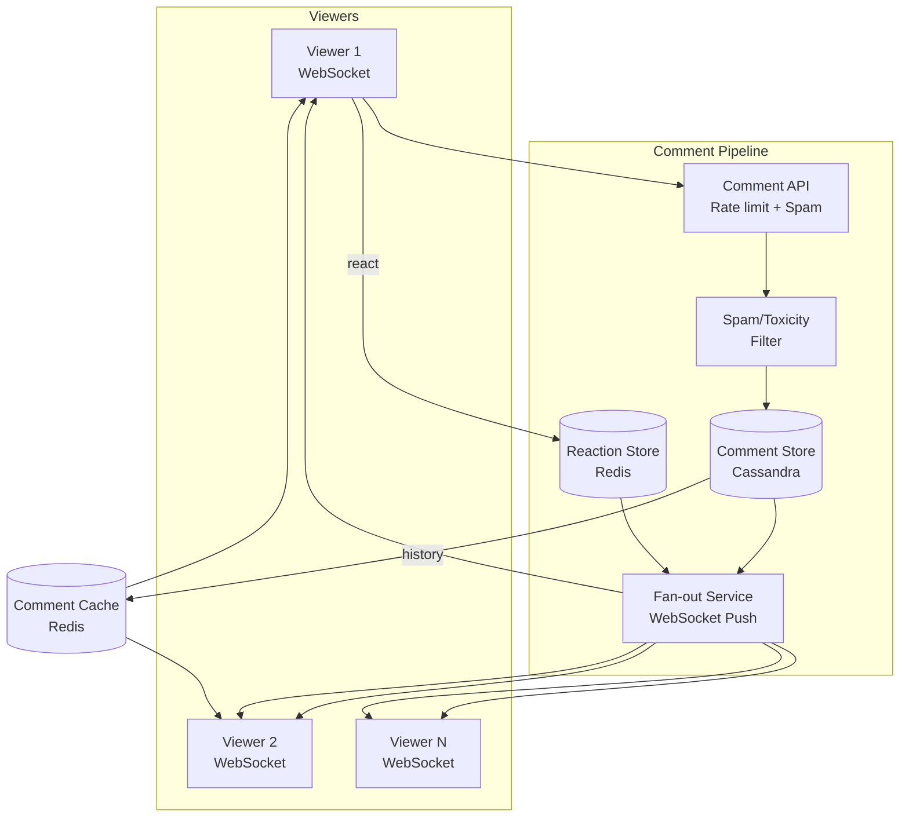
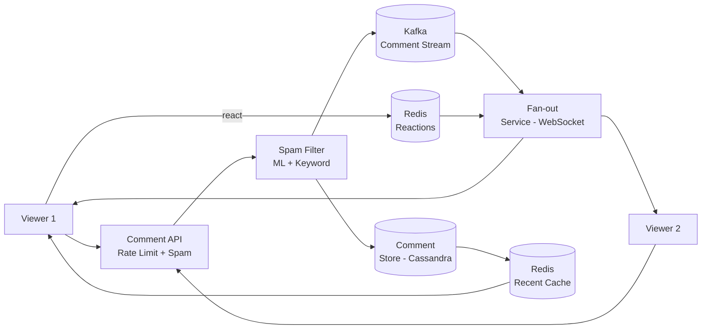
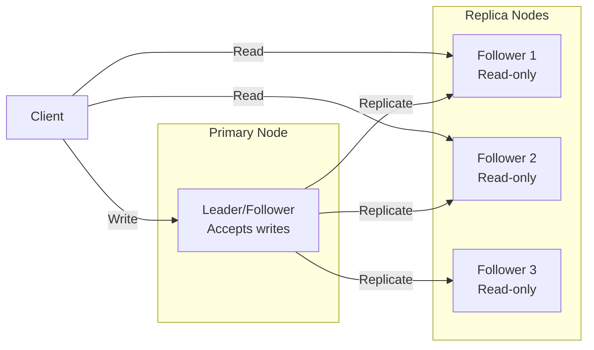
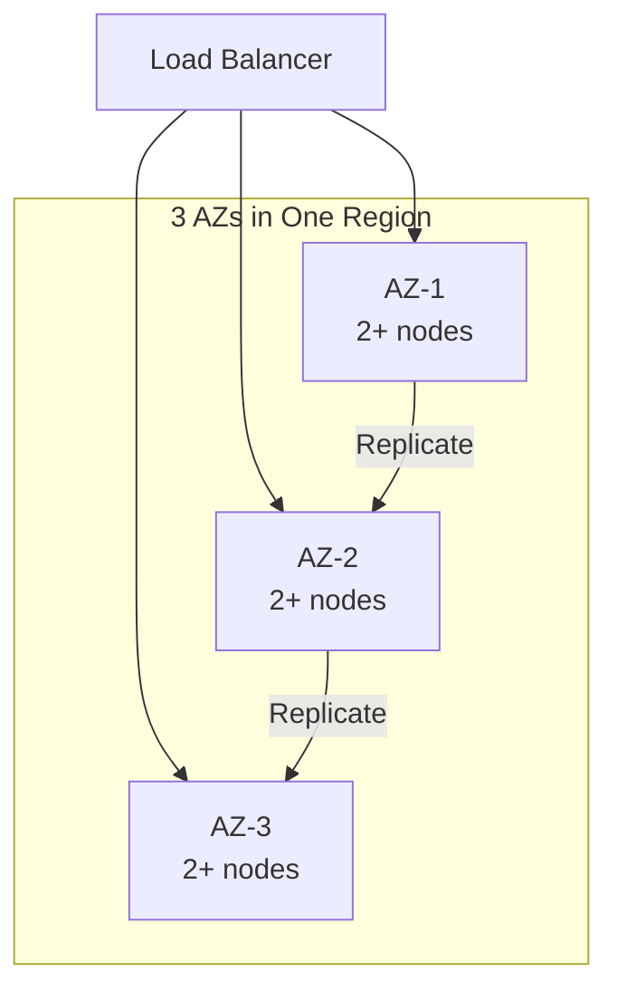
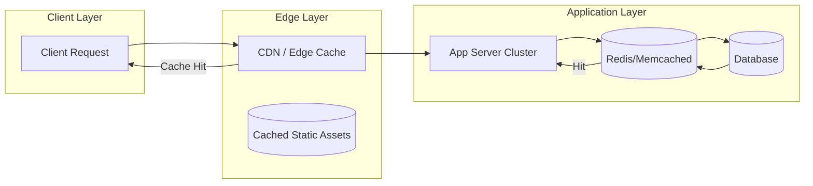
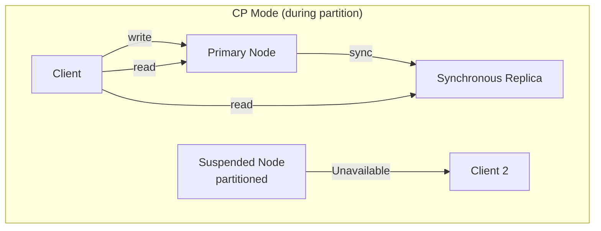
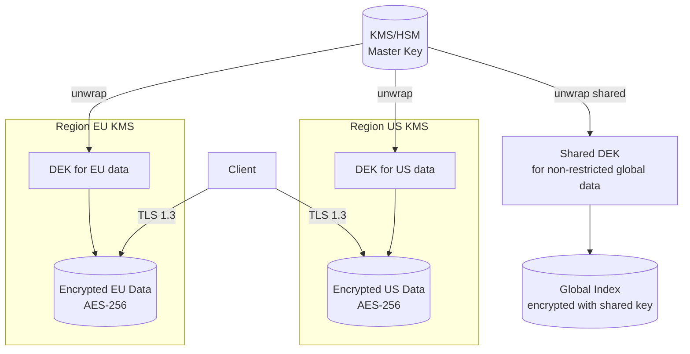
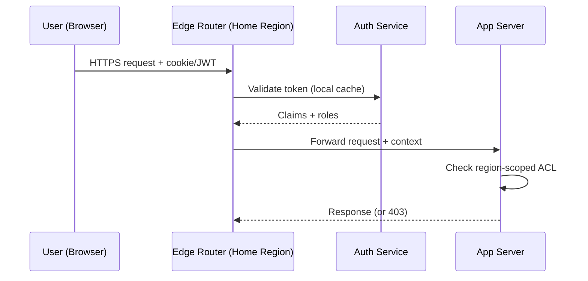
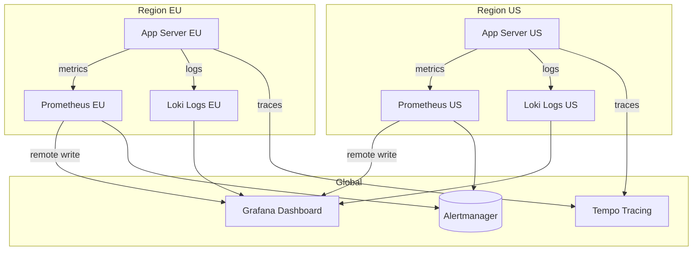

# Design FB Live comments

## Blogs and websites

## Medium

## Youtube

- [Design FB Live Comments: Hello Interview Mock](https://www.youtube.com/watch?v=tgSe27eoBG0)

---

## Theory

### Topics Covered

1. [Introduction / Problem Statement](#introduction-problem-statement)
2. [Characteristics](#characteristics)
3. [Components](#components)
4. [Architectural Patterns](#architectural-patterns)
5. [Benefits](#benefits)
6. [Pros](#pros)
7. [Cons](#cons)
8. [Challenges](#challenges)
9. [Best Practices](#best-practices)
10. [When to Use / When Not to Use](#when-to-use-when-not-to-use)
11. [Use Cases](#use-cases)
12. [Architecture](#architecture)
13. [High-Level Design](#high-level-design)
14. [Deep Dive](#deep-dive)
15. [Data Model and API](#data-model-and-api)
16. [Replication Strategies](#replication-strategies)
17. [Failure Detection and Membership](#failure-detection-and-membership)
18. [High Availability and Scalability](#high-availability-and-scalability)
19. [Performance and Optimization](#performance-and-optimization)
20. [CAP Theorem and Consistency Trade-offs](#cap-theorem-and-consistency-trade-offs)
21. [Encryption and Key Management](#encryption-and-key-management)
22. [Authentication and Authorization](#authentication-and-authorization)
23. [Security Threats and Mitigations](#security-threats-and-mitigations)
24. [Observability and Logging](#observability-and-logging)
25. [Replication Strategies](#replication-strategies)
26. [Failure Detection and Membership](#failure-detection-and-membership)
27. [High Availability and Scalability](#high-availability-and-scalability)
28. [Performance and Optimization](#performance-and-optimization)
29. [CAP Theorem and Consistency Trade-offs](#cap-theorem-and-consistency-trade-offs)
30. [Encryption and Key Management](#encryption-and-key-management)
31. [Authentication and Authorization](#authentication-and-authorization)
32. [Security Threats and Mitigations](#security-threats-and-mitigations)
33. [Observability and Logging](#observability-and-logging)
34. [Java and Spring Boot Implementation Guide](#java-and-spring-boot-implementation-guide)
35. [Real-World Implementations](#real-world-implementations)
36. [Interview Questions and Answers](#interview-questions-and-answers)

---
---
### Introduction / Problem Statement

FB Live comments is a real-time comment system synchronized with a live video stream — viewers post messages (text + emoji) during a live broadcast and see comments from other viewers in near real-time. The system must handle high write rates (thousands of comments/second), fan-out to all viewers in the stream, ordering, spam filtering, and live reactions.

**Why Does It Exist**

Live video without interaction is passive. Comments + reactions enable community engagement during broadcasts — questions, reactions, shared experience. This drives viewer retention on live platforms (Facebook Live, Twitch, YouTube Live, Instagram Live).

**What Problem Does It Solve**

* **High write rate**: Comments arrive at high velocity during popular streams.
* **Fan-out**: Each comment must reach all N viewers in the stream simultaneously.
* **Ordering**: Comments must appear in chronological order (or causal order).
* **Spam/Toxicity**: Filter abusive content in real time.
• **Low latency**: Comments appear within 100–500ms of posting.
* **Durability**: Comments must not be lost if servers restart.
* **Reactions**: Emoji reactions (like, heart, etc.) are high-frequency but low-complexity.


**Problem Statement**

Design a real-time comment system for live video streams (like Facebook Live comments). The system must handle high write rates during popular streams, fan-out comments to all viewers in near real-time, handle spam/toxicity filtering, support likes/reactions, and paginate comment history. Keep all data within the stream context (no cross-stream data needed).

**Functional Requirements**

- Post comments (text + emoji) during a live stream
- View comments in real-time as they arrive
- Like/react to comments (emoji reactions)
- Paginated history of past comments (last N minutes)
- Spam and toxicity filtering
- Rate limiting per user (anti-spam)
- Viewer count (optional)

**Non-Functional Requirements**

- **Latency**: < 200ms comment delivery to all viewers
- **Scale**: 10K comments/sec per stream; millions of concurrent viewers across streams
- **Availability**: 99.9% uptime
- **Consistency**: Comments appear in order; no loss
- **Durability**: Comments persisted for replay/history

---

### Characteristics

| Characteristic | What it means | Why it matters | How it works |
|---|---|---|---|
| **High write rate** | 10K+ comments/sec during popular streams | System must handle burst | Fan-out on write; sharding |
| **Fan-out** | One comment → all N viewers instantly | Real-time engagement | WebSocket + pub/sub |
| **Ordering** | Comments appear in chronological order | Coherence | Timestamp + sort key |
| **Low latency** | < 200ms delivery | Real-time feel | WebSocket (persistent) |
| **Reactions** | Emoji likes (high volume, low complexity) | Engagement | Counter increments |
| **Spam filtering** | Block spam/offensive | User experience | ML + keyword + rate limit |

### Components

| Component | Purpose | Responsibilities | Relationship | Real-world Example |
|---|---|---|---|---|
| **Comment API** | Accept comments | Validate, rate-limit, queue | Client ↔ Comment Service | REST/gRPC |
| **Comment Service** | Process + fan-out | Persist + distribute | API ↔ Fan-out | Node/Go microservice |
| **Fan-out Service** | Push to viewers | WebSocket connections, pub/sub | Comment Service ↔ Viewers | Socket.IO, Pusher |
| **WebSocket Server** | Real-time delivery | Maintain connections, push | Fan-out ↔ Client | ws://, wss:// |
| **Comment Store** | Persist comments | Append-only, sharded | Comment Service | Cassandra, DynamoDB |
| **Spam Filter** | Detect spam | Keyword + ML + rate limit | Comment Service | Moderation ML |
| **Reaction Store** | Track likes | Counter increments | Comment Service | Redis |
| **Comment Cache** | Recent history | Paginated fetch | Comment Service | Redis/ElastiCache |

### Architectural Patterns

#### Fan-out on Write (Push)

* **What**: When a comment is posted → immediately fan-out (push) to all WebSocket connections of viewers in that stream.
* **Problem solved**: Read path is trivial (connections already connected); new comments arrive instantly.
* **How it works**: (1) Comment posted → Comment Service → persist. (2) Fan-out Service: iterate WebSocket connections for stream_id → push message to each. (3) For large streams (100K+ viewers) → shard fan-out across 50+ Fan-out nodes. (4) Each node handles a subset of connections (consistent hashing by viewer_id).
* **When to use**: Live comments (viewers actively watching → connected); moderate audience (under 100K).
* **When not to use**: Very large audience (1M+); fan-out on read more efficient; offline replay needed.
* **Advantages**: Instant delivery; simple read path; low-latency.
* **Disadvantages**: Fan-out cost scales with viewer count; memory (WebSocket connections) per stream.
* **Java/Spring Boot example**:
```java
@Component
public class FanoutService {
    private final Map<String, Set<WebSocketSession>> streamSessions;

    public void fanoutComment(String streamId, Comment comment) {
        Set<WebSocketSession> sessions = streamSessions.get(streamId);
        if (sessions != null) {
            CompletableFuture.runAsync(() -> {
                sessions.parallelStream().forEach(session -> {
                    try {
                        session.sendMessage(TextMessage.valueOf(JSON.toJSONString(comment)));
                    } catch (IOException e) {
                        // remove dead connection
                    }
                });
            });
        }
    }
}
```

#### Fan-out on Read (Pull)

* **What**: Comments are stored in a shared store. Viewers pull (poll or subscribe to stream) rather than being pushed.
* **Problem solved**: Avoids fan-out cost at write time; scales writes independently of viewers.
* **How it works**: (1) Comment stored in Kafka/Cassandra. (2) Viewer connects via SSE/WebSocket → streams new comments from store. (3) Viewer polls or subscribes to stream topic → receives new messages.
* **When to use**: Very large audiences; when write rate >> fan-out cost is prohibitive.
* **When not to use**: Low-latency requirement; interactive chats.
* **Advantages**: Write path simple; scales writes independently.
* **Disadvantages**: Higher latency (pull delay); complex cursor-based pagination.

### Benefits

* **Real-time engagement**: Comments appear instantly → active community.
* **Moderation**: Filter spam → safe environment.
• **Scalability**: Fan-out on write for moderate audiences; fan-out on read for massive.
• **Interactivity**: Reactions + comments → deeper engagement.

### Pros

* **Sub-200ms delivery**: WebSocket fan-out is fast.
• **Spam protection**: Real-time + proactive filtering.
• **Reactions**: High-volume, low-latency engagement.
• **Paginated history**: Recent comments available on reconnect.
• **Decoupled architecture**: Comment store + fan-out independent.

### Cons

* **Fan-out cost**: Scales with viewer count × comment rate.
• **WebSocket memory**: Each connection ~1KB; 1M = 1GB per server.
• **Ordering**: Cross-region → hard to guarantee strict ordering.
• **Hot stream**: Popular stream → massive fan-out → shard required.
• **Offline**: Viewers who joined late → load history from store.

### Challenges

#### Technical Challenges
* **WebSocket scale**: Millions of connections → 500+ WebSocket servers; sticky sessions (stream_id → server).
* **Fan-out sharding**: 100K viewers on one stream → shard fan-out across 10+ nodes (consistent hashing by viewer_id).

#### Scalability Challenges
* **Connections**: 10M concurrent → 1000+ WebSocket servers (10K connections each); Redis adapter for cross-instance pub/sub.
• **Write rate**: 10K comments/sec → Kafka (ingest) + Cassandra (store).

#### Performance Challenges
* **Latency**: < 200ms → WebSocket (persistent connection); no polling.
• **Hot stream**: Popular stream → fan-out bottleneck → shard + load balance.

#### Reliability Challenges
* **Comment loss**: Ack + retry; idempotent comment posting.
* **Connection drops**: Reconnect + replay recent comments from cache.
• **Server crash**: Redis adapter + Kafka replay → no comment loss.

#### Maintainability Challenges
* **Spam filter updates**: Model updates + A/B testing; false positive rate monitoring.
• **WebSocket servers**: Rolling updates + sticky session support.

#### Security Concerns
* **Spam/bots**: Rate limiting (comments/minute/user); CAPTCHA; ML moderation.
* **Toxicity**: NLP-based filtering; keyword filters; user reporting.
• **Data exfiltration**: Comments are public within stream; PII in comments → moderation.

### Best Practices

* **Fan-out on write** for < 50K viewers; fan-out on read for millions.
• **Consistent hashing**: Shard fan-out by viewer_id → even distribution.
• **Ack + retry**: Comment persistence + retry on failure → no loss.
• **WebSocket sticky**: Route stream → same WebSocket server (by stream_id hash) → fewer servers needed.
• **Rate limiting**: Per-user comments/second → prevent spam.
• **Moderation**: Automated (ML + keyword) + manual review queue.
• **Monitor**: Comment delivery latency (< 200ms); WebSocket connection count; spam detection rate; fan-out queue depth.

### When to Use / When Not to Use

#### Appropriate
* Live video platforms (Facebook Live, Twitch, YouTube Live).
• Webinars + live education (Q&A).
• Live sports/events (fan reactions).
• Auctions/live shopping (real-time chat).

#### Not Appropriate
* Offline chat (email-style).
• Private 1:1 messaging.
• Low-interaction content.

#### Decision Factors
* Audience size; latency requirements; moderation needs; interactivity level.

### Use Cases

#### Facebook Live Comments

* **Problem**: Millions of users comment during live streams; comments must reach all viewers within 200ms; spam must be filtered; reactions (emoji) in high volume.
* **Solution**: Comment → API Gateway → Comment Service (persist to Cassandra) → Fan-out Service (WebSocket push to all viewers). Spam filter (keyword + ML) + rate limiting. Reactions (counter in Redis).
* **Why suitable**: WebSocket fan-out; Cassandra for durability; Redis for reactions + recent history; spam filter.
* **How it works**: (1) Viewer posts comment → API → rate limit check → spam filter → persist to Cassandra + Kafka. (2) Fan-out Service: get WebSocket connections for stream → push comment to each (sharded for > 50K viewers). (3) Viewer sees comment < 200ms. (4) Reaction: viewer clicks ❤️ → Redis INCR(reaction_key) → broadcast count to viewers. (5) Reconnect: recent comments from Redis cache. (6) Spam: comment → spam filter (ML) → blocked if score > threshold.
* **Trade-offs**: Fan-out cost at scale; WebSocket memory; cross-region latency (comments visible with 100–500ms delay).

### Architecture



#### Architecture Structure
* **API layer**: Comment API (REST/gRPC) → rate limit + spam filter.
• **Storage**: Cassandra (durable comments), Redis (reactions + recent cache).
• **Fan-out**: WebSocket push to all viewers; sharded for large streams.
• **Moderation**: Spam + toxicity filter.

#### Communication
* **Client ↔ API**: HTTP/HTTPS (REST or gRPC).
• **Fan-out → Viewer**: WebSocket (persistent, bidirectional).
• **Comment Service ↔ Store**: Async (Kafka → Cassandra).
• **Fan-out ↔ WebSocket**: Redis adapter (cross-instance pub/sub).

#### Data Flow
1. **Post comment**: Viewer → API → rate limit → spam filter → Cassandra (persist) + Kafka (stream).
2. **Fan-out**: Kafka → Fan-out Service → get WebSocket connections for stream → push to each (sharded).
3. **Reaction**: Viewer → API → Redis INCR → broadcast count to viewers.
4. **Reconnect**: Viewer reconnects → fetch recent comments from Redis cache → subscribe to new.

#### Scaling Strategy
* **WebSocket**: 500+ servers (10K connections each); consistent hashing by stream_id; Redis adapter.
• **Fan-out**: Sharded by stream_id; 10 nodes for 50K+ viewers on hot stream.
• **Store**: Cassandra sharded by stream_id; Redis cluster for reactions.

#### Failure Handling
* **Fan-out failure**: Comment persisted → retry push from Kafka.
• **WebSocket drop**: Reconnect + replay recent from Redis cache.
• **Spam filter down**: Allow all + flag for delayed review.
• **Store failure**: Write to Kafka only → replay when store recovers.

### High-Level Design



### Deep Dive

#### Fan-out Strategies

The existing file's content covers: fan-out on write (push to all WebSocket connections synchronously) vs. fan-out on read (store + let viewers pull). For Facebook Live scale (millions), hybrid: fan-out on write for recent comments + cache for reconnect.

#### Ordering and Deduplication

(Existing content covers: comments sorted by timestamp in Cassandra (clustering key). Idempotent posting: comment_id = UUID → dedup on retry. Cross-region eventual consistency — comments may arrive 100–500ms late, acceptable for live comments.)

### Data Model and API

* **API purpose**: Post comments, retrieve history, send reactions during live stream.

| Method | Endpoint | Description |
|---|---|---|
| POST | `/api/v1/streams/{id}/comments` | Post a comment |
| GET | `/api/v1/streams/{id}/comments?before={ts}&limit=N` | Get paginated history |
| POST | `/api/v1/comments/{id}/reactions` | Send a reaction (like/love/etc.) |
| GET | `/api/v1/comments/{id}/reactions` | Get reaction counts |
| WS | `/ws/streams/{id}/comments` | Live WebSocket comment stream |

**Post comment (POST /comments)**:
```json
{"text": "Amazing stream!", "emoji": true}
```
**Response**:
```json
{
  "comment_id": "cmt_123",
  "stream_id": "str_abc",
  "user_id": "usr_456",
  "text": "Amazing stream!",
  "timestamp": 1723456789000,
  "reaction_counts": {"like": 0, "love": 0}
}
```

**Error responses**:
```json
{"error": "rate_limited", "message": "Too many comments", "code": 429}
{"error": "spam_blocked", "message": "Comment flagged as spam", "code": 403}
{"error": "invalid_comment", "message": "Comment text required", "code": 400}
```

**Authentication**: JWT + stream access check.
**Rate limiting**: 10 comments/minute per user per stream.


```mermaid
erDiagram
    STREAM ||--o{ COMMENT : "has"
    USER ||--o{ COMMENT : "posts"
    COMMENT ||--o{ REACTION : "receives"
    USER ||--o{ REACTION : "gives"

    STREAM {
      string stream_id PK
      string title
      datetime started_at
      string status active_ended
    }
    COMMENT {
      string comment_id PK
      string stream_id FK
      string user_id FK
      string text
      bigint timestamp
      int react_count
    }
    REACTION {
      string reaction_id PK
      string comment_id FK
      string user_id FK
      string type like_love_care
      datetime created_at
    }
```

**Partitioning**: Comments sharded by stream_id + timestamp; reactions by comment_id.

### Replication Strategies

**What it means**

Replication Strategies determine how data and state are copied across multiple nodes in Live Comments System. The choice of strategy determines the trade-off between consistency, availability, and latency.

**Why it matters**

Live Comments System must replicate data to prevent loss and serve reads from multiple nodes. The replication strategy determines whether the system favors consistency (strong reads) or availability (always writable), and how it handles cross-node failure.

**How it works**

**Leader-based (single-leader)**: A single primary node accepts all writes; followers replicate changes asynchronously or semi-synchronously. Reads can be served from any replica. This strategy favors strong consistency for writes but creates a write bottleneck at the leader.



*Leader-based replication: a single primary node accepts all writes and replicates them to read-only followers. Clients can read from any replica for scaled read throughput, but all writes go through the leader.*

**Multi-leader (multi-master)**: Multiple nodes accept writes and exchange updates with each other. This enables low-latency writes in different regions but requires conflict resolution (last-write-wins, merge functions, or CRDTs).

**Leaderless (quorum-based)**: Any node can accept writes; a quorum of nodes must agree. Read and write quorums are configured so that at least one node overlaps between them (R + W > N). This maximizes availability and write scalability.

**Trade-offs for Live Comments System**:

| Strategy | Use Case | Pros | Cons |
|---|---|---|---|
| Leader-based | user messages, PII in comments | Strong consistency, simple | Write bottleneck, leader failure risk |
| Multi-leader | public comments, aggregate stats, emoji reactions | Low-latency global writes | Conflict resolution, complex |
| Leaderless | Caching, counters | High availability, no bottleneck | Eventual consistency, read repair overhead |

**Real-world implementations**

- **Redis**: Leader-follower replication with asynchronous replication; Sentinel handles failover.
- **Apache Kafka**: Leader-based partition replication with ISR (in-sync replica) — writes go to the leader, followers replicate.
- **Cassandra**: Tunable consistency with leaderless quorum (R + W > N).
- **DynamoDB Global Tables**: Multi-master active-active across regions.

### Failure Detection and Membership

**What it means**

Failure Detection and Membership is the mechanism by which Live Comments System determines which nodes are alive and part of the cluster. Membership is the list of known nodes; failure detection is the process of updating that list when nodes fail or recover.

**Why it matters**

Live Comments System must route requests only to healthy nodes and trigger failover when a node goes down. False positives (healthy nodes marked as dead) cause unnecessary failovers and data loss. False negatives (dead nodes not detected) cause failed requests and degraded performance.

**How it works**

**Heartbeat-based detection**: Each node sends a heartbeat (ping) to a subset of peers at regular intervals. If a node misses N consecutive heartbeats, it is marked as suspect. The gossip protocol distributes membership information: each node exchanges its view of the cluster with a random peer, and the information propagates gossip-style.

```mermaid
sequenceDiagram
    participant A as Node A
    participant B as Node B
    participant C as Node C

    loop Every 1s
        A->>B: Heartbeat (ping)
        B-->>A: Heartbeat (ack)
    end
    B->>C: Gossip: A is alive
    C->>A: Gossip: B is alive
    Note over A,B,C: View converges in O(log N) rounds
```

*Gossip-based failure detection: each node periodically pings a random subset of peers and gossips its view of the cluster. The membership list converges in O(log N) rounds.*

**Phi Accrual Failure Detector**: Instead of a fixed timeout, the detector measures the time between consecutive heartbeats and computes a phi (φ) value — the probability that the node is dead given the observed heartbeat pattern. φ is compared against a threshold (typically 1–8); higher thresholds reduce false positives but increase detection latency.

**SWIM (Scalable Weakly-consistent Infection-style Process group Membership Protocol)**: Nodes ping a random subset of cluster members. If a ping fails, the node is marked "suspect" and the failure is "infected" (gossiped) to other nodes. This is O(log N) per failure detection cycle and scales to large clusters.

**Trade-offs**:

| Approach | Strengths | Weaknesses |
|---|---|---|
| Heartbeat (timeout-based) | Simple, deterministic | False positives under load |
| Phi Accrual | Adaptive threshold | Needs historical data |
| SWIM | Scales to 1000s of nodes | Eventual consistency |

**Real-world implementations**

- **AWS Route 53 Health Checks**: Uses TCP/HTTP health checks with configurable thresholds to remove unhealthy instances from DNS rotation.
- **Kubernetes**: Uses the kubelet heartbeat (every 10s) to determine node liveness; nodes missing 3 consecutive heartbeats are marked NotReady.
- **Consul**: Uses SWIM protocol for membership and failure detection; supports both LAN and WAN gossip.
- **Akka Cluster**: Uses Phi Accrual failure detector with configurable φ thresholds.

### High Availability and Scalability

**What it means**

High Availability and Scalability determines how Live Comments System continues operating when nodes or entire zones fail, and how capacity is added as demand grows. HA is about minimizing downtime; scalability is about maintaining performance as load increases.

**Why it matters**

Live Comments System must stay operational even when individual nodes, availability zones, or entire regions fail. At the same time, it must scale horizontally to handle traffic spikes without degrading latency. The two are intertwined: the replication strategy, failure detection, and load balancing all contribute to both HA and scalability.

**How it works**

**Availability zones (AZs)**: Nodes are distributed across multiple AZs within a region. Each AZ is an independent failure domain (power, networking, physical security). A load balancer distributes requests across AZs; if one AZ fails, traffic is routed to the remaining AZs with no data loss (assuming replication is in place).



*Multi-AZ deployment: a load balancer distributes traffic across three availability zones. Each AZ has multiple nodes. Data is replicated across AZs so that losing one AZ does not cause data loss or service interruption.*

**Load balancing**: A load balancer distributes incoming requests across healthy nodes. Algorithms include round-robin, least connections, and weighted routing. Health checks ensure traffic only goes to healthy nodes. For Live Comments System, the load balancer also considers WS Server Cluster when routing.

**Auto-scaling**: The system automatically adds or removes nodes based on metrics (CPU, memory, request rate). Scale-out policies add nodes when load exceeds a threshold; scale-in policies remove nodes during low load. For stateful services like Live Comments System, scale-out involves rebalancing partitions (moving data and connections to the new node).

**Failover and recovery**: When a node fails, the load balancer detects it (via health checks or failure detection) and stops sending traffic. A new node is provisioned (or a standby is promoted) and begins serving. For Live Comments System, failover must preserve user messages, PII in comments data — this is achieved through replication with a quorum of healthy nodes.

**Scalability patterns**:

1. **Horizontal partitioning (sharding)**: Split data by a partition key (e.g., user_id, session_id) and distribute partitions across nodes. New nodes take ownership of additional partitions.

2. **Consistent hashing**: Minimize data movement on scale-out — only 1/N of the data moves to the new node. Nodes and partitions are placed on a ring; a request for key X is routed to the next node clockwise from hash(X).

3. **Connection draining**: When scaling in, existing connections are allowed to complete before the node is shut down. For Live Comments System, this means draining active A sessions gracefully.

**Real-world implementations**

- **Netflix OSS (Eureka + Zuul + Ribbon)**: Service discovery with Eureka, edge routing with Zuul, and client-side load balancing with Ribbon. Scales to thousands of instances.
- **Kubernetes HPA + VPA**: Horizontal Pod Autoscaler scales pods based on CPU/memory; Vertical Pod Autoscaler adjusts resource requests based on historical usage.
- **AWS ALB + Auto Scaling Groups**: Application Load Balancer with auto-scaling groups across AZs; health checks replace unhealthy instances automatically.

### Performance and Optimization

**What it means**

Performance and Optimization covers the techniques Live Comments System uses to achieve low latency, high throughput, and efficient resource usage. This section examines the key performance metrics, bottlenecks, and optimizations specific to the system.

**Why it matters**

Live Comments System faces competing pressures: users demand low latency, the system must handle high throughput, and infrastructure costs must be controlled. The optimizations applied at the data, compute, and network layers determine whether the system meets its SLA.

**How it works**

**Latency layers**: Latency in Live Comments System comes from three layers:
1. **Network**: Round-trip time from client to the nearest edge node / load balancer.
2. **Application**: Request processing time on the server (CPU, I/O, lock contention).
3. **Data**: Time to read/write from storage (cache hit vs. database query).

The 99th-percentile latency is the key metric for user-facing systems — it determines the worst-case experience.

**Caching strategies**: Live Comments System uses multiple cache layers:
- **Edge cache**: Static assets (images, CSS, JS) served from a CDN at the edge. For Live Comments System, this caches public comments, aggregate stats, emoji reactions that doesn't change frequently.
- **Application cache**: In-memory cache (e.g., Redis, Memcached) for frequently accessed data. Cache-aside pattern: application checks cache first, falls back to database on miss.
- **Local cache**: In-process cache (e.g., Caffeine, Guava) for data accessed within a single request. Avoids network round-trips.

**Batching and pipelining**: Live Comments System batches small operations (e.g., writes, log flushes) to amortize per-operation overhead. Pipelining allows multiple requests to be in flight simultaneously.



*Caching hierarchy: clients first hit the edge CDN/cache; if the response is cached, it is returned immediately. Otherwise, the request reaches the application, which checks its in-memory/application cache (e.g., Redis) before falling back to the database. This minimizes latency from each layer.*

**Connection pooling**: Live Comments System maintains a pool of database connections to avoid the TCP handshake overhead on every request. Pool size is tuned to match the database's capacity.

**Compression**: Responses are compressed (gzip, zstd) for clients that support it. At the network layer, gRPC uses HPACK header compression.

**Indexing**: Database tables are indexed on frequently queried fields. For Live Comments System, indexes cover Message Broker (Kafka/RabbitMQ) and Pub/Sub System for fast lookups.

**Asynchronous processing**: Non-critical background work (e.g., analytics, cleanup, notifications) is offloaded to message queues and processed asynchronously, keeping the request path fast.

**Resource isolation**: CPU and memory are allocated per service (containers with cgroup limits). This prevents a single misbehaving service from degrading the entire system.

**Metrics for Live Comments System**:

| Metric | Target | How to Measure |
|---|---|---|
| P99 latency | < 1s | Load test with realistic traffic |
| Throughput | 1K RPS | Request rate under peak load |
| Error rate | < 0.1% | 5xx / total requests |
| Cache hit ratio | > 90% | cache_hits / (cache_hits + misses) |
| Resource utilization | < 80% CPU, < 85% memory | Container metrics |

**Real-world implementations**

- **Google's HTTP Load Balancer**: Global load balancing with edge PoPs; routes users to the nearest healthy backend.
- **Cloudflare**: Edge cache with Argo Smart Routing that dynamically routes traffic to avoid congestion.
- **Redis**: Used as an application cache with configurable eviction policies (LRU, LFU, TTL).

### CAP Theorem and Consistency Trade-offs

**What it means**

The CAP Theorem states that in a distributed system, you can only have two of three guarantees: **Consistency** (every read returns the latest write), **Availability** (every request gets a response), and **Partition tolerance** (the system continues to operate despite network partitions). Since network partitions are inevitable in distributed systems like Live Comments System, the real choice is between CP (consistent + partitioned) and AP (available + partitioned).

**Why it matters**

Live Comments System must decide which two guarantees to prioritize. For user messages, PII in comments data, strong consistency (CP) is critical — users must see the most recent data. For public comments, aggregate stats, emoji reactions data, availability (AP) is more important — the system should remain responsive even during network issues.

**How it works**

**CP (Consistent + Partition-tolerant)**: During a partition, the system trades availability for consistency. Writes are rejected or delayed until the partition heals. Reads return the latest committed value. This is appropriate for user messages, PII in comments in Live Comments System.



*CP system during a network partition: writes are rejected on the partitioned node to maintain consistency. Clients are routed to the healthy primary and synchronous replica.*

**AP (Available + Partition-tolerant)**: During a partition, the system trades consistency for availability. Both sides accept writes; conflicts are resolved later (last-write-wins, merge, or application-level conflict resolution). This is appropriate for public comments, aggregate stats, emoji reactions in Live Comments System.

**PACELC (extending CAP)**: The PACELC theorem says that even when the network is not partitioned (the "else" case in CAP), you must choose between latency (L) and consistency (C). Live Comments System uses:
- **Racing reads**: Serve from the nearest replica for speed (low latency, eventual consistency).
- **Linearizable reads**: Always read from the primary (high latency, strong consistency).

The choice is made per request based on whether the data is user messages, PII in comments (strong consistency) or public comments, aggregate stats, emoji reactions (fast reads).

**Trade-offs**:

| System Type | CP Use Cases | AP Use Cases |
|---|---|---|
| Live Comments System | user messages, PII in comments | public comments, aggregate stats, emoji reactions |

**Real-world implementations**

- **etcd**: CP system using Raft consensus; used for service discovery and configuration in Kubernetes.
- **Cassandra**: AP system with tunable consistency; used for time-series data and user sessions.
- **Google Spanner**: CP with external consistency via TrueTime API; used for global financial transactions.
- **DynamoDB**: AP by default, but supports strongly consistent reads (CP mode) on demand.

### Encryption and Key Management

**What it means**

Encryption and Key Management in Live Comments System ensures that data is protected both at rest (stored on disk) and in transit (moving between services). Key management governs how encryption keys are generated, stored, rotated, and accessed — without proper key management, encryption provides a false sense of security.

**Why it matters**

Live Comments System handles user messages, PII in comments that must be encrypted both at rest and in transit. Delivering comments to millions of concurrent viewers with <500ms latency while maintaining ordering, deduplication, and handling viewer churn requires careful key management: keys must be rotated regularly, scoped to prevent cross-contamination, and audited for compliance. A single key compromise could expose sensitive data.

**How it works**

**At-rest encryption**: Data stored in WS Server Cluster, Message Broker (Kafka/RabbitMQ) and databases is encrypted using AES-256-GCM. The Data Encryption Key (DEK) is generated per data partition and encrypted with a Key Encryption Key (KEK) managed by a KMS (AWS KMS, GCP KMS, HashiCorp Vault). Keys are regionally scoped — only data belonging to a region can be decrypted by that region's KEK.

**In-transit encryption**: All inter-service communication uses TLS 1.3 or mTLS for service-to-service auth. Cross-region communication of public comments, aggregate stats, emoji reactions uses TLS + optional application-level encryption. user messages, PII in comments is NEVER transmitted in plaintext or across region boundaries.

**Key hierarchy**:
```
Master Key (HSM-backed, KMS-managed)
  └─ KEK (per region, per service)
     └─ DEK (per data partition, rotated every 90 days)
        └─ Data (encrypted with DEK)
```

**Key rotation**: KEKs rotate annually (automatic via KMS); DEKs rotate per object or per 90 days. Applications handle key version headers transparently — a DEK version is stored alongside the encrypted data.

**Cross-region key sharing**: For non-restricted data (public comments, aggregate stats, emoji reactions), a shared key is imported into each region's KMS. Restricted data NEVER uses cross-region keys — each region's KMS holds only that region's keys.



*Encryption key hierarchy: master keys are managed by an HSM-backed KMS and never leave the KMS. Each region has its own KEK. Data encryption keys (DEKs) are generated per partition and encrypted with the regional KEK. Only non-restricted global data uses a shared cross-region key. All client traffic uses TLS 1.3.*

**Java/Spring Boot Implementation**

```java
@Service
@RequiredArgsConstructor
public class DataEncryptionService {

    private final AWSKMS kms;
    @Value("${app.region}")
    private String region;
    @Value("${app.encryption.dek-ttl-minutes:1440}")
    private int dekTtlMinutes;

    private final Map<String, SecretKey> dekCache = new ConcurrentHashMap<>();

    public EncryptedData encrypt(String plaintext, String partitionId) {
        SecretKey dek = getOrCreateDek(partitionId);
        byte[] ciphertext = CryptoUtils.encrypt(plaintext.getBytes(StandardCharsets.UTF_8), dek);
        String dekCiphertext = kms.encrypt(EncryptRequest.builder()
            .keyId("arn:aws:kms:" + region + ":master-key")
            .plaintext(SdkBytes.fromByteArray(dek.getEncoded()))
            .build()).ciphertextBlob().asByteArray();
        return new EncryptedData(ciphertext, dekCiphertext, Instant.now());
    }

    private SecretKey getOrCreateDek(String partitionId) {
        return dekCache.computeIfAbsent(partitionId, id -> {
            try {
                return KeyGenerator.getInstance("AES").generateKey();
            } catch (NoSuchAlgorithmException e) {
                throw new IllegalStateException("Cannot generate DEK", e);
            }
        });
    }
}
```

*Spring Boot encryption service: DEKs are cached per-partition with TTL. Each DEK is encrypted via AWS KMS using a regional master key. The encrypted DEK (ciphertext) is stored alongside the data — only the KMS for that region can decrypt it.*

**Real-world implementations**

- **AWS KMS**: Managed HSM-backed key service; supports automatic key rotation and custom key stores.
- **HashiCorp Vault**: Open-source key management; supports transit encryption (encrypt/decrypt without storing keys).
- **Google Cloud KMS**: Hardware-backed key management with IAM-based access control.

### Authentication and Authorization

**What it means**

Authentication and Authorization (AuthN/AuthZ) in Live Comments System control who can access the system and what they can do. Authentication verifies identity; authorization determines permissions. In a distributed system like Live Comments System, auth must work across multiple nodes while respecting data boundaries — a user authenticated in one region should not have their session data or tokens replicated to regions where it is not permitted.

**Why it matters**

Live Comments System must verify identity at the edge and enforce authorization at every service boundary. user messages, PII in comments must be protected — only users with appropriate roles should access it. At the same time, public comments, aggregate stats, emoji reactions data should be accessible to a wider audience with minimal friction.

**How it works**

**Authentication (who are you?)**:
- **JWT tokens**: Users authenticate through their home region's identity provider. The region returns a JWT (JSON Web Token) signed by a regional signing key. Tokens include claims like `iss` (issuer region), `sub` (subject/user ID), `home_region`, `roles`, and `exp` (expiry). Tokens are scoped per region — a token issued by region A cannot access restricted data in region B.
- **mTLS for service-to-service**: Internal services authenticate each other using mutual TLS certificates issued by a per-region Certificate Authority (CA). No shared secrets cross region boundaries.
- **Session management**: Sessions are stored regionally (Redis) and never replicated cross-region for restricted data. Session IDs are opaque UUIDs; the session store maps session ID → user context.

**Authorization (what can you do?)**:
- **RBAC (Role-Based Access Control)**: Users are assigned roles per region. Common roles: `region_admin` (full access to region data), `auditor` (read-only audit), `viewer` (read public data only). Roles are stored in the regional database and cached locally for sub-1ms lookups.
- **ABAC (Attribute-Based Access Control)**: Fine-grained permissions based on attributes (e.g., `home_region == request_region AND role == admin`). This allows expressing complex policies like "users can only access restricted data in their home region."
- **Resource-level authorization**: Each request is checked against an ACL (Access Control List) that specifies which roles can access which resources. For Live Comments System, restricted resources require the `admin` role + matching region.



*Authentication flow: the user's token is validated by the regional auth service (claims cached locally). The edge router forwards the request with the security context. Each app server checks the region-scoped ACL before accessing restricted data.*

**Java/Spring Boot Implementation**

```java
@Service
@RequiredArgsConstructor
public class AuthorizationService {

    private final UserTokenRepository tokenRepository;
    @Value("${app.region}")
    private String currentRegion;

    public boolean canAccessResource(String userId, String resourceRegion,
                                     String action, JWTClaims claims) {
        String userHomeRegion = claims.getStringClaim("home_region");
        List<String> roles = claims.getStringListClaim("roles");

        if (!roles.contains(action)) {
            return false;
        }

        if (resourceRegion.equals(userHomeRegion)) {
            return true;
        }

        if (resourceRegion.equals("global")) {
            return roles.contains("global_reader");
        }

        return false;
    }
}

@RestController
@RequiredArgsConstructor
@RequestMapping("/api/v1")
public class RegionController {
    private final AuthorizationService authService;

    @GetMapping("/data/{region}/profile")
    public ResponseEntity<?> getProfile(
            @PathVariable String region,
            @RequestHeader("Authorization") String token) {
        JWTClaims claims = JwtUtils.parseAndValidate(token, currentRegion);

        if (!authService.canAccessResource(
                claims.getStringClaim("sub"), region, "read", claims)) {
            return ResponseEntity.status(HttpStatus.FORBIDDEN).build();
        }

        return ResponseEntity.ok(profileService.getByRegion(region));
    }
}
```

*Spring Boot authorization service: checks both the user's role and whether the requested resource violates region boundaries. The `canAccessResource` method returns false if a user from region EU tries to access restricted data in region US.*

**Real-world implementations**

- **Auth0**: JWT-based authentication with regional endpoints; supports custom rules for ABAC.
- **Okta**: Multi-region identity management with adaptive MFA and ThreatInsight for anomaly detection.
- **AWS Cognito**: Regional user pools with IAM integration; tokens are region-scoped by default.

### Security Threats and Mitigations

**What it means**

Security Threats and Mitigations catalog the attack surface of Live Comments System, the most likely threats, and the corresponding defenses. Every distributed system has unique threat vectors — Live Comments System is no exception.

**Why it matters**

Live Comments System handles user messages, PII in comments that attackers might target. Delivering comments to millions of concurrent viewers with <500ms latency while maintaining ordering, deduplication, and handling viewer churn expands the attack surface: more nodes, more network paths, more failure modes. Without proper threat modeling, a single vulnerability could expose sensitive data across the entire system.

**Threat model**:

| Threat | Likelihood | Impact | Mitigation |
|---|---|---|---|
| Data exfiltration (cross-region) | High | Critical | Region-scoped keys, no cross-region replication of restricted data |
| Man-in-the-middle (inter-service) | Medium | High | mTLS between all services |
| Replay attacks | Medium | High | Token expiry + nonce |
| DDoS at the edge | High | High | Rate limiting + edge filtering (Cloudflare, AWS Shield) |
| PII leakage in logs | High | High | PII redaction + field-level access control |
| Session hijacking | Medium | Medium | Short-lived tokens + IP binding |
| Privilege escalation | Low | Critical | Least-privilege RBAC + audit logs |
| Cache poisoning | Low | Medium | Cache invalidation on write + signed cache keys |

**How it works**

**Data exfiltration prevention**: Live Comments System enforces data residency by design — user messages, PII in comments is never replicated cross-region. The replication layer checks a data classification label before allowing cross-region copy. A database-level policy (e.g., PostgreSQL RLS) also blocks cross-region queries for restricted partitions.

**mTLS enforcement**: All service-to-service communication uses mutual TLS. Certificates are issued by a per-region CA and rotated every 30 days. Services must present a valid certificate to communicate — no plaintext connections are allowed.

**PII redaction**: Application logs are scanned for PII patterns (email, phone, credit card) using an automated redaction layer (e.g., AWS Macie, Google DLP). public comments, aggregate stats, emoji reactions is logged freely; restricted fields are masked or dropped before logging.

```mermaid
graph TD
    subgraph "Threat Surface"
        Client[Client]
        Edge[Edge Router / WAF]
        App[App Server]
        DB[(Database)]
        Cache[(Cache)]
        Logs[Log Store]
    end

    Client -->|HTTPS| Edge
    Edge -->|mTLS| App
    App -->|mTLS| DB
    App -->|Read| Cache
    App -->|Write| DB
    App -->|Log| Logs

    subgraph "Mitigations"
        WAF[AWS WAF /<br/>Cloudflare]
        DLP[PII Redaction<br/>(Macie/DLP)]
        FIM[File Integrity<br/>Monitoring]
    end

    Edge -.-> WAF
    Logs -.-> DLP
    DB -.-> FIM
```

*Threat mitigation diagram: the WAF at the edge blocks DDoS and injection attacks. mTLS protects all service-to-service communication. PII redaction scans logs before storage. File integrity monitoring alerts on database tampering.*

**Audit trail**: All security-relevant events (auth, data access, config changes) are written to an append-only audit log with cryptographic integrity (HMAC per entry). The log covers user messages, PII in comments access — who accessed what, when, and from where.

**Real-world implementations**

- **Cloudflare**: Zero-trust model (All Connections to All Networks) with mTLS everywhere; uses GeoIP blocking and rate limiting for DDoS mitigation.
- **Google BeyondCorp**: Zero-trust network security model; all access is authenticated and authorized at the request level.

### Observability and Logging

**What it means**

Observability and Logging in Live Comments System provide visibility into system behavior through three pillars: **metrics** (aggregates and counters), **logs** (structured event records), and **traces** (distributed request timelines). Together, these signals allow operators to debug issues, detect anomalies, and verify SLA compliance.

**Why it matters**

Distributed systems like Live Comments System are inherently opaque — failures can cascade across services in unexpected ways. Without good observability, a single slow dependency can cause widespread timeouts that are nearly impossible to diagnose. Delivering comments to millions of concurrent viewers with <500ms latency while maintaining ordering, deduplication, and handling viewer churn makes observability even more critical: operators need to see cross-region latency, regional failures, and data-residency violations.

**How it works**

**Metrics**: Live Comments System instruments every service with Prometheus-style metrics:
- **Request rate, error rate, duration (the "RED" metrics)**: Tracks per-endpoint HTTP latency and error counts.
- **System metrics**: CPU, memory, disk I/O, network throughput per node.
- **Business metrics**: For Live Comments System, this includes metrics like "Message Broker (Kafka/RabbitMQ) fill rate" and "reservation conflict rate".

Metrics are aggregated in a time-series database (Prometheus, VictoriaMetrics) and visualized in Grafana dashboards with alerts via PagerDuty.

**Logs**: Live Comments System uses structured logging (JSON format) with standardized fields:
- `timestamp`: ISO 8601 UTC
- `level`: DEBUG, INFO, WARN, ERROR
- `service`: originating service name
- `trace_id`: distributed trace identifier (for correlation)
- `span_id`: current operation span
- `region`: the region that processed the request
- `data_class`: RESTRICTED or NON_RESTRICTED

user messages, PII in comments access is logged with full context (user, action, resource). public comments, aggregate stats, emoji reactions logs are aggregated and may have reduced retention.

**Distributed tracing**: Every request is assigned a trace ID at the edge. The trace propagates through all downstream services via HTTP headers. A tracing backend (Jaeger, Tempo, Zipkin) reconstructs the full request timeline, showing latency at each hop. For Live Comments System, traces include region boundaries — a cross-region call is annotated as such.



*Observability architecture: each region runs its own Prometheus (metrics) and Loki (logs) instances. A global Grafana instance queries all regional backends. Traces are collected centrally in Tempo. Alerts fire from each region's Prometheus to Alertmanager.*

**Alerting**: Live Comments System defines SLO-based alerts:
- **Latency**: P99 > 1s for 5 minutes → page.
- **Error rate**: > 1% for 10 minutes → page.
- **Availability**: < 99.5% for 15 minutes → page.
- **Data residency violation**: any restricted data detected outside its region → critical page.

**Java/Spring Boot Implementation**

```java
@Component
@RequiredArgsConstructor
@Slf4j
public class ObservabilityContext {

    @Value("${app.region}")
    private String region;

    public void logAccess(String userId, String resource, String action,
                          boolean restricted) {
        log.info("access_event userId={} resource={} action={} region={} data_class={}",
            userId, resource, action, region, restricted ? "RESTRICTED" : "NON_RESTRICTED");
    }
}

@RestController
@RequiredArgsConstructor
@Slf4j
public class ApiController {
    private final ObservabilityContext obs;
    private final UserService userService;

    @GetMapping("/api/v1/profile")
    public ResponseEntity<ProfileResponse> getProfile(
            @AuthenticationPrincipal UserDetails user) {
        String traceId = MDC.get("traceId");
        long start = System.nanoTime();

        try {
            ProfileResponse response = userService.getProfile(user.getId());
            obs.logAccess(user.getId(), "profile", "read", true);

            return ResponseEntity.ok(response);
        } finally {
            long durationMs = (System.nanoTime() - start) / 1_000_000;
            log.info("profile_read traceId={} latencyMs={} region={}",
                traceId, durationMs, obs.region);
        }
    }
}
```

*Spring Boot observability: the `ObservabilityContext` logs structured access events with data classification. The controller records latency and trace ID for every request, enabling SLO-based alerting.*

**Real-world implementations**

- **Netflix OSS (Atlas + Zipkin + Servo)**: Metrics via Atlas, traces via Zipkin, instrumented via Servo. Scales to over 700 billion requests/day.
- **Google SRE Workbook**: Comprehensive observability with SLI/SLO/SLI definition; uses Borgmon for metrics and Dapper for tracing.
- **AWS Observability**: CloudWatch for metrics, X-Ray for tracing, CloudWatch Logs for structured logs.

### Replication Strategies

**What it means**

Replication Strategies determine how data and state are copied across multiple nodes in Live Comments System. The choice of strategy determines the trade-off between consistency, availability, and latency.

**Why it matters**

Live Comments System must replicate data to prevent loss and serve reads from multiple nodes. The replication strategy determines whether the system favors consistency (strong reads) or availability (always writable), and how it handles cross-node failure.

**How it works**

**Leader-based (single-leader)**: A single primary node accepts all writes; followers replicate changes asynchronously or semi-synchronously. Reads can be served from any replica. This strategy favors strong consistency for writes but creates a write bottleneck at the leader.


*Leader-based replication: a single primary node accepts all writes and replicates them to read-only followers. Clients can read from any replica for scaled read throughput, but all writes go through the leader.*

**Multi-leader (multi-master)**: Multiple nodes accept writes and exchange updates with each other. This enables low-latency writes in different regions but requires conflict resolution (last-write-wins, merge functions, or CRDTs).

**Leaderless (quorum-based)**: Any node can accept writes; a quorum of nodes must agree. Read and write quorums are configured so that at least one node overlaps between them (R + W > N). This maximizes availability and write scalability.

**Trade-offs for Live Comments System**:

| Strategy | Use Case | Pros | Cons |
|---|---|---|---|
| Leader-based | user messages, PII in comments | Strong consistency, simple | Write bottleneck, leader failure risk |
| Multi-leader | public comments, aggregate stats, emoji reactions | Low-latency global writes | Conflict resolution, complex |
| Leaderless | Caching, counters | High availability, no bottleneck | Eventual consistency, read repair overhead |

**Real-world implementations**

- **Redis**: Leader-follower replication with asynchronous replication; Sentinel handles failover.
- **Apache Kafka**: Leader-based partition replication with ISR (in-sync replica) — writes go to the leader, followers replicate.
- **Cassandra**: Tunable consistency with leaderless quorum (R + W > N).
- **DynamoDB Global Tables**: Multi-master active-active across regions.

### Failure Detection and Membership

**What it means**

Failure Detection and Membership is the mechanism by which Live Comments System determines which nodes are alive and part of the cluster. Membership is the list of known nodes; failure detection is the process of updating that list when nodes fail or recover.

**Why it matters**

Live Comments System must route requests only to healthy nodes and trigger failover when a node goes down. False positives (healthy nodes marked as dead) cause unnecessary failovers and data loss. False negatives (dead nodes not detected) cause failed requests and degraded performance.

**How it works**

**Heartbeat-based detection**: Each node sends a heartbeat (ping) to a subset of peers at regular intervals. If a node misses N consecutive heartbeats, it is marked as suspect. The gossip protocol distributes membership information: each node exchanges its view of the cluster with a random peer, and the information propagates gossip-style.

```mermaid
sequenceDiagram
    participant A as Node A
    participant B as Node B
    participant C as Node C

    loop Every 1s
        A->>B: Heartbeat (ping)
        B-->>A: Heartbeat (ack)
    end
    B->>C: Gossip: A is alive
    C->>A: Gossip: B is alive
    Note over A,B,C: View converges in O(log N) rounds
```

*Gossip-based failure detection: each node periodically pings a random subset of peers and gossips its view of the cluster. The membership list converges in O(log N) rounds.*

**Phi Accrual Failure Detector**: Instead of a fixed timeout, the detector measures the time between consecutive heartbeats and computes a phi (φ) value — the probability that the node is dead given the observed heartbeat pattern. φ is compared against a threshold (typically 1–8); higher thresholds reduce false positives but increase detection latency.

**SWIM (Scalable Weakly-consistent Infection-style Process group Membership Protocol)**: Nodes ping a random subset of cluster members. If a ping fails, the node is marked "suspect" and the failure is "infected" (gossiped) to other nodes. This is O(log N) per failure detection cycle and scales to large clusters.

**Trade-offs**:

| Approach | Strengths | Weaknesses |
|---|---|---|
| Heartbeat (timeout-based) | Simple, deterministic | False positives under load |
| Phi Accrual | Adaptive threshold | Needs historical data |
| SWIM | Scales to 1000s of nodes | Eventual consistency |

**Real-world implementations**

- **AWS Route 53 Health Checks**: Uses TCP/HTTP health checks with configurable thresholds to remove unhealthy instances from DNS rotation.
- **Kubernetes**: Uses the kubelet heartbeat (every 10s) to determine node liveness; nodes missing 3 consecutive heartbeats are marked NotReady.
- **Consul**: Uses SWIM protocol for membership and failure detection; supports both LAN and WAN gossip.
- **Akka Cluster**: Uses Phi Accrual failure detector with configurable φ thresholds.

### High Availability and Scalability

**What it means**

High Availability and Scalability determines how Live Comments System continues operating when nodes or entire zones fail, and how capacity is added as demand grows. HA is about minimizing downtime; scalability is about maintaining performance as load increases.

**Why it matters**

Live Comments System must stay operational even when individual nodes, availability zones, or entire regions fail. At the same time, it must scale horizontally to handle traffic spikes without degrading latency. The two are intertwined: the replication strategy, failure detection, and load balancing all contribute to both HA and scalability.

**How it works**

**Availability zones (AZs)**: Nodes are distributed across multiple AZs within a region. Each AZ is an independent failure domain (power, networking, physical security). A load balancer distributes requests across AZs; if one AZ fails, traffic is routed to the remaining AZs with no data loss (assuming replication is in place).


*Multi-AZ deployment: a load balancer distributes traffic across three availability zones. Each AZ has multiple nodes. Data is replicated across AZs so that losing one AZ does not cause data loss or service interruption.*

**Load balancing**: A load balancer distributes incoming requests across healthy nodes. Algorithms include round-robin, least connections, and weighted routing. Health checks ensure traffic only goes to healthy nodes. For Live Comments System, the load balancer also considers WS Server Cluster when routing.

**Auto-scaling**: The system automatically adds or removes nodes based on metrics (CPU, memory, request rate). Scale-out policies add nodes when load exceeds a threshold; scale-in policies remove nodes during low load. For stateful services like Live Comments System, scale-out involves rebalancing partitions (moving data and connections to the new node).

**Failover and recovery**: When a node fails, the load balancer detects it (via health checks or failure detection) and stops sending traffic. A new node is provisioned (or a standby is promoted) and begins serving. For Live Comments System, failover must preserve user messages, PII in comments data — this is achieved through replication with a quorum of healthy nodes.

**Scalability patterns**:

1. **Horizontal partitioning (sharding)**: Split data by a partition key (e.g., user_id, session_id) and distribute partitions across nodes. New nodes take ownership of additional partitions.

2. **Consistent hashing**: Minimize data movement on scale-out — only 1/N of the data moves to the new node. Nodes and partitions are placed on a ring; a request for key X is routed to the next node clockwise from hash(X).

3. **Connection draining**: When scaling in, existing connections are allowed to complete before the node is shut down. For Live Comments System, this means draining active A sessions gracefully.

**Real-world implementations**

- **Netflix OSS (Eureka + Zuul + Ribbon)**: Service discovery with Eureka, edge routing with Zuul, and client-side load balancing with Ribbon. Scales to thousands of instances.
- **Kubernetes HPA + VPA**: Horizontal Pod Autoscaler scales pods based on CPU/memory; Vertical Pod Autoscaler adjusts resource requests based on historical usage.
- **AWS ALB + Auto Scaling Groups**: Application Load Balancer with auto-scaling groups across AZs; health checks replace unhealthy instances automatically.

### Performance and Optimization

**What it means**

Performance and Optimization covers the techniques Live Comments System uses to achieve low latency, high throughput, and efficient resource usage. This section examines the key performance metrics, bottlenecks, and optimizations specific to the system.

**Why it matters**

Live Comments System faces competing pressures: users demand low latency, the system must handle high throughput, and infrastructure costs must be controlled. The optimizations applied at the data, compute, and network layers determine whether the system meets its SLA.

**How it works**

**Latency layers**: Latency in Live Comments System comes from three layers:
1. **Network**: Round-trip time from client to the nearest edge node / load balancer.
2. **Application**: Request processing time on the server (CPU, I/O, lock contention).
3. **Data**: Time to read/write from storage (cache hit vs. database query).

The 99th-percentile latency is the key metric for user-facing systems — it determines the worst-case experience.

**Caching strategies**: Live Comments System uses multiple cache layers:
- **Edge cache**: Static assets (images, CSS, JS) served from a CDN at the edge. For Live Comments System, this caches public comments, aggregate stats, emoji reactions that doesn't change frequently.
- **Application cache**: In-memory cache (e.g., Redis, Memcached) for frequently accessed data. Cache-aside pattern: application checks cache first, falls back to database on miss.
- **Local cache**: In-process cache (e.g., Caffeine, Guava) for data accessed within a single request. Avoids network round-trips.

**Batching and pipelining**: Live Comments System batches small operations (e.g., writes, log flushes) to amortize per-operation overhead. Pipelining allows multiple requests to be in flight simultaneously.


*Caching hierarchy: clients first hit the edge CDN/cache; if the response is cached, it is returned immediately. Otherwise, the request reaches the application, which checks its in-memory/application cache (e.g., Redis) before falling back to the database. This minimizes latency from each layer.*

**Connection pooling**: Live Comments System maintains a pool of database connections to avoid the TCP handshake overhead on every request. Pool size is tuned to match the database's capacity.

**Compression**: Responses are compressed (gzip, zstd) for clients that support it. At the network layer, gRPC uses HPACK header compression.

**Indexing**: Database tables are indexed on frequently queried fields. For Live Comments System, indexes cover Message Broker (Kafka/RabbitMQ) and Pub/Sub System for fast lookups.

**Asynchronous processing**: Non-critical background work (e.g., analytics, cleanup, notifications) is offloaded to message queues and processed asynchronously, keeping the request path fast.

**Resource isolation**: CPU and memory are allocated per service (containers with cgroup limits). This prevents a single misbehaving service from degrading the entire system.

**Metrics for Live Comments System**:

| Metric | Target | How to Measure |
|---|---|---|
| P99 latency | < 1s | Load test with realistic traffic |
| Throughput | 1K RPS | Request rate under peak load |
| Error rate | < 0.1% | 5xx / total requests |
| Cache hit ratio | > 90% | cache_hits / (cache_hits + misses) |
| Resource utilization | < 80% CPU, < 85% memory | Container metrics |

**Real-world implementations**

- **Google's HTTP Load Balancer**: Global load balancing with edge PoPs; routes users to the nearest healthy backend.
- **Cloudflare**: Edge cache with Argo Smart Routing that dynamically routes traffic to avoid congestion.
- **Redis**: Used as an application cache with configurable eviction policies (LRU, LFU, TTL).

### CAP Theorem and Consistency Trade-offs

**What it means**

The CAP Theorem states that in a distributed system, you can only have two of three guarantees: **Consistency** (every read returns the latest write), **Availability** (every request gets a response), and **Partition tolerance** (the system continues to operate despite network partitions). Since network partitions are inevitable in distributed systems like Live Comments System, the real choice is between CP (consistent + partitioned) and AP (available + partitioned).

**Why it matters**

Live Comments System must decide which two guarantees to prioritize. For user messages, PII in comments data, strong consistency (CP) is critical — users must see the most recent data. For public comments, aggregate stats, emoji reactions data, availability (AP) is more important — the system should remain responsive even during network issues.

**How it works**

**CP (Consistent + Partition-tolerant)**: During a partition, the system trades availability for consistency. Writes are rejected or delayed until the partition heals. Reads return the latest committed value. This is appropriate for user messages, PII in comments in Live Comments System.


*CP system during a network partition: writes are rejected on the partitioned node to maintain consistency. Clients are routed to the healthy primary and synchronous replica.*

**AP (Available + Partition-tolerant)**: During a partition, the system trades consistency for availability. Both sides accept writes; conflicts are resolved later (last-write-wins, merge, or application-level conflict resolution). This is appropriate for public comments, aggregate stats, emoji reactions in Live Comments System.

**PACELC (extending CAP)**: The PACELC theorem says that even when the network is not partitioned (the "else" case in CAP), you must choose between latency (L) and consistency (C). Live Comments System uses:
- **Racing reads**: Serve from the nearest replica for speed (low latency, eventual consistency).
- **Linearizable reads**: Always read from the primary (high latency, strong consistency).

The choice is made per request based on whether the data is user messages, PII in comments (strong consistency) or public comments, aggregate stats, emoji reactions (fast reads).

**Trade-offs**:

| System Type | CP Use Cases | AP Use Cases |
|---|---|---|
| Live Comments System | user messages, PII in comments | public comments, aggregate stats, emoji reactions |

**Real-world implementations**

- **etcd**: CP system using Raft consensus; used for service discovery and configuration in Kubernetes.
- **Cassandra**: AP system with tunable consistency; used for time-series data and user sessions.
- **Google Spanner**: CP with external consistency via TrueTime API; used for global financial transactions.
- **DynamoDB**: AP by default, but supports strongly consistent reads (CP mode) on demand.

### Encryption and Key Management

**What it means**

Encryption and Key Management in Live Comments System ensures that data is protected both at rest (stored on disk) and in transit (moving between services). Key management governs how encryption keys are generated, stored, rotated, and accessed — without proper key management, encryption provides a false sense of security.

**Why it matters**

Live Comments System handles user messages, PII in comments that must be encrypted both at rest and in transit. Delivering comments to millions of concurrent viewers with <500ms latency while maintaining ordering, deduplication, and handling viewer churn requires careful key management: keys must be rotated regularly, scoped to prevent cross-contamination, and audited for compliance. A single key compromise could expose sensitive data.

**How it works**

**At-rest encryption**: Data stored in WS Server Cluster, Message Broker (Kafka/RabbitMQ) and databases is encrypted using AES-256-GCM. The Data Encryption Key (DEK) is generated per data partition and encrypted with a Key Encryption Key (KEK) managed by a KMS (AWS KMS, GCP KMS, HashiCorp Vault). Keys are regionally scoped — only data belonging to a region can be decrypted by that region's KEK.

**In-transit encryption**: All inter-service communication uses TLS 1.3 or mTLS for service-to-service auth. Cross-region communication of public comments, aggregate stats, emoji reactions uses TLS + optional application-level encryption. user messages, PII in comments is NEVER transmitted in plaintext or across region boundaries.

**Key hierarchy**:
```
Master Key (HSM-backed, KMS-managed)
  └─ KEK (per region, per service)
     └─ DEK (per data partition, rotated every 90 days)
        └─ Data (encrypted with DEK)
```

**Key rotation**: KEKs rotate annually (automatic via KMS); DEKs rotate per object or per 90 days. Applications handle key version headers transparently — a DEK version is stored alongside the encrypted data.

**Cross-region key sharing**: For non-restricted data (public comments, aggregate stats, emoji reactions), a shared key is imported into each region's KMS. Restricted data NEVER uses cross-region keys — each region's KMS holds only that region's keys.


*Encryption key hierarchy: master keys are managed by an HSM-backed KMS and never leave the KMS. Each region has its own KEK. Data encryption keys (DEKs) are generated per partition and encrypted with the regional KEK. Only non-restricted global data uses a shared cross-region key. All client traffic uses TLS 1.3.*

**Java/Spring Boot Implementation**

```java
@Service
@RequiredArgsConstructor
public class DataEncryptionService {

    private final AWSKMS kms;
    @Value("${app.region}")
    private String region;
    @Value("${app.encryption.dek-ttl-minutes:1440}")
    private int dekTtlMinutes;

    private final Map<String, SecretKey> dekCache = new ConcurrentHashMap<>();

    public EncryptedData encrypt(String plaintext, String partitionId) {
        SecretKey dek = getOrCreateDek(partitionId);
        byte[] ciphertext = CryptoUtils.encrypt(plaintext.getBytes(StandardCharsets.UTF_8), dek);
        String dekCiphertext = kms.encrypt(EncryptRequest.builder()
            .keyId("arn:aws:kms:" + region + ":master-key")
            .plaintext(SdkBytes.fromByteArray(dek.getEncoded()))
            .build()).ciphertextBlob().asByteArray();
        return new EncryptedData(ciphertext, dekCiphertext, Instant.now());
    }

    private SecretKey getOrCreateDek(String partitionId) {
        return dekCache.computeIfAbsent(partitionId, id -> {
            try {
                return KeyGenerator.getInstance("AES").generateKey();
            } catch (NoSuchAlgorithmException e) {
                throw new IllegalStateException("Cannot generate DEK", e);
            }
        });
    }
}
```

*Spring Boot encryption service: DEKs are cached per-partition with TTL. Each DEK is encrypted via AWS KMS using a regional master key. The encrypted DEK (ciphertext) is stored alongside the data — only the KMS for that region can decrypt it.*

**Real-world implementations**

- **AWS KMS**: Managed HSM-backed key service; supports automatic key rotation and custom key stores.
- **HashiCorp Vault**: Open-source key management; supports transit encryption (encrypt/decrypt without storing keys).
- **Google Cloud KMS**: Hardware-backed key management with IAM-based access control.

### Authentication and Authorization

**What it means**

Authentication and Authorization (AuthN/AuthZ) in Live Comments System control who can access the system and what they can do. Authentication verifies identity; authorization determines permissions. In a distributed system like Live Comments System, auth must work across multiple nodes while respecting data boundaries — a user authenticated in one region should not have their session data or tokens replicated to regions where it is not permitted.

**Why it matters**

Live Comments System must verify identity at the edge and enforce authorization at every service boundary. user messages, PII in comments must be protected — only users with appropriate roles should access it. At the same time, public comments, aggregate stats, emoji reactions data should be accessible to a wider audience with minimal friction.

**How it works**

**Authentication (who are you?)**:
- **JWT tokens**: Users authenticate through their home region's identity provider. The region returns a JWT (JSON Web Token) signed by a regional signing key. Tokens include claims like `iss` (issuer region), `sub` (subject/user ID), `home_region`, `roles`, and `exp` (expiry). Tokens are scoped per region — a token issued by region A cannot access restricted data in region B.
- **mTLS for service-to-service**: Internal services authenticate each other using mutual TLS certificates issued by a per-region Certificate Authority (CA). No shared secrets cross region boundaries.
- **Session management**: Sessions are stored regionally (Redis) and never replicated cross-region for restricted data. Session IDs are opaque UUIDs; the session store maps session ID → user context.

**Authorization (what can you do?)**:
- **RBAC (Role-Based Access Control)**: Users are assigned roles per region. Common roles: `region_admin` (full access to region data), `auditor` (read-only audit), `viewer` (read public data only). Roles are stored in the regional database and cached locally for sub-1ms lookups.
- **ABAC (Attribute-Based Access Control)**: Fine-grained permissions based on attributes (e.g., `home_region == request_region AND role == admin`). This allows expressing complex policies like "users can only access restricted data in their home region."
- **Resource-level authorization**: Each request is checked against an ACL (Access Control List) that specifies which roles can access which resources. For Live Comments System, restricted resources require the `admin` role + matching region.


*Authentication flow: the user's token is validated by the regional auth service (claims cached locally). The edge router forwards the request with the security context. Each app server checks the region-scoped ACL before accessing restricted data.*

**Java/Spring Boot Implementation**

```java
@Service
@RequiredArgsConstructor
public class AuthorizationService {

    private final UserTokenRepository tokenRepository;
    @Value("${app.region}")
    private String currentRegion;

    public boolean canAccessResource(String userId, String resourceRegion,
                                     String action, JWTClaims claims) {
        String userHomeRegion = claims.getStringClaim("home_region");
        List<String> roles = claims.getStringListClaim("roles");

        if (!roles.contains(action)) {
            return false;
        }

        if (resourceRegion.equals(userHomeRegion)) {
            return true;
        }

        if (resourceRegion.equals("global")) {
            return roles.contains("global_reader");
        }

        return false;
    }
}

@RestController
@RequiredArgsConstructor
@RequestMapping("/api/v1")
public class RegionController {
    private final AuthorizationService authService;

    @GetMapping("/data/{region}/profile")
    public ResponseEntity<?> getProfile(
            @PathVariable String region,
            @RequestHeader("Authorization") String token) {
        JWTClaims claims = JwtUtils.parseAndValidate(token, currentRegion);

        if (!authService.canAccessResource(
                claims.getStringClaim("sub"), region, "read", claims)) {
            return ResponseEntity.status(HttpStatus.FORBIDDEN).build();
        }

        return ResponseEntity.ok(profileService.getByRegion(region));
    }
}
```

*Spring Boot authorization service: checks both the user's role and whether the requested resource violates region boundaries. The `canAccessResource` method returns false if a user from region EU tries to access restricted data in region US.*

**Real-world implementations**

- **Auth0**: JWT-based authentication with regional endpoints; supports custom rules for ABAC.
- **Okta**: Multi-region identity management with adaptive MFA and ThreatInsight for anomaly detection.
- **AWS Cognito**: Regional user pools with IAM integration; tokens are region-scoped by default.

### Security Threats and Mitigations

**What it means**

Security Threats and Mitigations catalog the attack surface of Live Comments System, the most likely threats, and the corresponding defenses. Every distributed system has unique threat vectors — Live Comments System is no exception.

**Why it matters**

Live Comments System handles user messages, PII in comments that attackers might target. Delivering comments to millions of concurrent viewers with <500ms latency while maintaining ordering, deduplication, and handling viewer churn expands the attack surface: more nodes, more network paths, more failure modes. Without proper threat modeling, a single vulnerability could expose sensitive data across the entire system.

**Threat model**:

| Threat | Likelihood | Impact | Mitigation |
|---|---|---|---|
| Data exfiltration (cross-region) | High | Critical | Region-scoped keys, no cross-region replication of restricted data |
| Man-in-the-middle (inter-service) | Medium | High | mTLS between all services |
| Replay attacks | Medium | High | Token expiry + nonce |
| DDoS at the edge | High | High | Rate limiting + edge filtering (Cloudflare, AWS Shield) |
| PII leakage in logs | High | High | PII redaction + field-level access control |
| Session hijacking | Medium | Medium | Short-lived tokens + IP binding |
| Privilege escalation | Low | Critical | Least-privilege RBAC + audit logs |
| Cache poisoning | Low | Medium | Cache invalidation on write + signed cache keys |

**How it works**

**Data exfiltration prevention**: Live Comments System enforces data residency by design — user messages, PII in comments is never replicated cross-region. The replication layer checks a data classification label before allowing cross-region copy. A database-level policy (e.g., PostgreSQL RLS) also blocks cross-region queries for restricted partitions.

**mTLS enforcement**: All service-to-service communication uses mutual TLS. Certificates are issued by a per-region CA and rotated every 30 days. Services must present a valid certificate to communicate — no plaintext connections are allowed.

**PII redaction**: Application logs are scanned for PII patterns (email, phone, credit card) using an automated redaction layer (e.g., AWS Macie, Google DLP). public comments, aggregate stats, emoji reactions is logged freely; restricted fields are masked or dropped before logging.

```mermaid
graph TD
    subgraph "Threat Surface"
        Client[Client]
        Edge[Edge Router / WAF]
        App[App Server]
        DB[(Database)]
        Cache[(Cache)]
        Logs[Log Store]
    end

    Client -->|HTTPS| Edge
    Edge -->|mTLS| App
    App -->|mTLS| DB
    App -->|Read| Cache
    App -->|Write| DB
    App -->|Log| Logs

    subgraph "Mitigations"
        WAF[AWS WAF /<br/>Cloudflare]
        DLP[PII Redaction<br/>(Macie/DLP)]
        FIM[File Integrity<br/>Monitoring]
    end

    Edge -.-> WAF
    Logs -.-> DLP
    DB -.-> FIM
```

*Threat mitigation diagram: the WAF at the edge blocks DDoS and injection attacks. mTLS protects all service-to-service communication. PII redaction scans logs before storage. File integrity monitoring alerts on database tampering.*

**Audit trail**: All security-relevant events (auth, data access, config changes) are written to an append-only audit log with cryptographic integrity (HMAC per entry). The log covers user messages, PII in comments access — who accessed what, when, and from where.

**Real-world implementations**

- **Cloudflare**: Zero-trust model (All Connections to All Networks) with mTLS everywhere; uses GeoIP blocking and rate limiting for DDoS mitigation.
- **Google BeyondCorp**: Zero-trust network security model; all access is authenticated and authorized at the request level.

### Observability and Logging

**What it means**

Observability and Logging in Live Comments System provide visibility into system behavior through three pillars: **metrics** (aggregates and counters), **logs** (structured event records), and **traces** (distributed request timelines). Together, these signals allow operators to debug issues, detect anomalies, and verify SLA compliance.

**Why it matters**

Distributed systems like Live Comments System are inherently opaque — failures can cascade across services in unexpected ways. Without good observability, a single slow dependency can cause widespread timeouts that are nearly impossible to diagnose. Delivering comments to millions of concurrent viewers with <500ms latency while maintaining ordering, deduplication, and handling viewer churn makes observability even more critical: operators need to see cross-region latency, regional failures, and data-residency violations.

**How it works**

**Metrics**: Live Comments System instruments every service with Prometheus-style metrics:
- **Request rate, error rate, duration (the "RED" metrics)**: Tracks per-endpoint HTTP latency and error counts.
- **System metrics**: CPU, memory, disk I/O, network throughput per node.
- **Business metrics**: For Live Comments System, this includes metrics like "Message Broker (Kafka/RabbitMQ) fill rate" and "reservation conflict rate".

Metrics are aggregated in a time-series database (Prometheus, VictoriaMetrics) and visualized in Grafana dashboards with alerts via PagerDuty.

**Logs**: Live Comments System uses structured logging (JSON format) with standardized fields:
- `timestamp`: ISO 8601 UTC
- `level`: DEBUG, INFO, WARN, ERROR
- `service`: originating service name
- `trace_id`: distributed trace identifier (for correlation)
- `span_id`: current operation span
- `region`: the region that processed the request
- `data_class`: RESTRICTED or NON_RESTRICTED

user messages, PII in comments access is logged with full context (user, action, resource). public comments, aggregate stats, emoji reactions logs are aggregated and may have reduced retention.

**Distributed tracing**: Every request is assigned a trace ID at the edge. The trace propagates through all downstream services via HTTP headers. A tracing backend (Jaeger, Tempo, Zipkin) reconstructs the full request timeline, showing latency at each hop. For Live Comments System, traces include region boundaries — a cross-region call is annotated as such.

```mermaid
graph TD
    subgraph "Region EU"
        AppEU[App Server EU]
        PromEU[Prometheus EU]
        LokiEU[Loki Logs EU]
    end
    subgraph "Region US"
        AppUS[App Server US]
        PromUS[Prometheus US]
        LokiUS[Loki Logs US]
    end
    subgraph "Global"
        Grafana[Grafana Dashboard]
        Tempo[Tempo Tracing]
        Alertmanager[(Alertmanager)]
    end
    AppEU -->|metrics| PromEU
    AppEU -->|logs| LokiEU
    AppUS -->|metrics| PromUS
    AppUS -->|logs| LokiUS
    PromEU -->|remote write| Grafana
    PromUS -->|remote write| Grafana
    LokiEU --> Grafana
    LokiUS --> Grafana
    AppEU -->|traces| Tempo
    AppUS -->|traces| Tempo
    PromEU --> Alertmanager
    PromUS --> Alertmanager
```

*Observability architecture: each region runs its own Prometheus (metrics) and Loki (logs) instances. A global Grafana instance queries all regional backends. Traces are collected centrally in Tempo. Alerts fire from each region's Prometheus to Alertmanager.*

**Alerting**: Live Comments System defines SLO-based alerts:
- **Latency**: P99 > 1s for 5 minutes → page.
- **Error rate**: > 1% for 10 minutes → page.
- **Availability**: < 99.5% for 15 minutes → page.
- **Data residency violation**: any restricted data detected outside its region → critical page.

**Java/Spring Boot Implementation**

```java
@Component
@RequiredArgsConstructor
@Slf4j
public class ObservabilityContext {

    @Value("${app.region}")
    private String region;

    public void logAccess(String userId, String resource, String action,
                          boolean restricted) {
        log.info("access_event userId={} resource={} action={} region={} data_class={}",
            userId, resource, action, region, restricted ? "RESTRICTED" : "NON_RESTRICTED");
    }
}

@RestController
@RequiredArgsConstructor
@Slf4j
public class ApiController {
    private final ObservabilityContext obs;
    private final UserService userService;

    @GetMapping("/api/v1/profile")
    public ResponseEntity<ProfileResponse> getProfile(
            @AuthenticationPrincipal UserDetails user) {
        String traceId = MDC.get("traceId");
        long start = System.nanoTime();

        try {
            ProfileResponse response = userService.getProfile(user.getId());
            obs.logAccess(user.getId(), "profile", "read", true);

            return ResponseEntity.ok(response);
        } finally {
            long durationMs = (System.nanoTime() - start) / 1_000_000;
            log.info("profile_read traceId={} latencyMs={} region={}",
                traceId, durationMs, obs.region);
        }
    }
}
```

*Spring Boot observability: the `ObservabilityContext` logs structured access events with data classification. The controller records latency and trace ID for every request, enabling SLO-based alerting.*

**Real-world implementations**

- **Netflix OSS (Atlas + Zipkin + Servo)**: Metrics via Atlas, traces via Zipkin, instrumented via Servo. Scales to over 700 billion requests/day.
- **Google SRE Workbook**: Comprehensive observability with SLI/SLO/SLI definition; uses Borgmon for metrics and Dapper for tracing.
- **AWS Observability**: CloudWatch for metrics, X-Ray for tracing, CloudWatch Logs for structured logs.

### Java and Spring Boot Implementation Guide

```java
@RestController
@RequestMapping("/api/v1/streams/{streamId}")
@RequiredArgsConstructor
public class LiveCommentController {
    private final CommentService commentService;
    private final SpamFilter spamFilter;

    @PostMapping("/comments")
    public ResponseEntity<Comment> postComment(
            @PathVariable String streamId,
            @AuthenticationPrincipal UserDetails user,
            @RequestBody CommentRequest request) {
        
        // Rate limit check
        if (!rateLimiter.allow(user.getId(), streamId)) {
            throw new RateLimitExceededException();
        }

        // Spam check
        if (spamFilter.isSpam(request.getText())) {
            throw new SpamBlockedException();
        }

        Comment comment = commentService.post(streamId, user.getId(), request.getText());
        return ResponseEntity.ok(comment);
    }

    @GetMapping("/comments")
    public ResponseEntity<List<Comment>> getComments(
            @PathVariable String streamId,
            @RequestParam(required = false) Long before,
            @RequestParam(defaultValue = "50") int limit) {
        return ResponseEntity.ok(commentService.getRecent(streamId, before, limit));
    }
}
```

### Real-World Implementations

* **Facebook Live**: WebSocket comments; fan-out on write for recent + Cassandra history; ML spam filter; Redis for reactions.
* **Twitch**: WebSocket chat; IRC protocol; channel-based fan-out; AutoMod spam + moderation.
• **YouTube Live**: WebSocket chat; Super Chat (paid) + reactions; ML moderation.
* **Twitter Live**: Real-time comments; tweet-as-comment integration.

### Interview Questions and Answers

#### Beginner Questions

**Q: How do you design a real-time comment system for live video?**
A: Viewer posts → API → rate limit → spam filter → persist (Cassandra) → fan-out via WebSocket to all viewers in stream → displayed in < 200ms. Reactions via Redis counter. Reconnect → load recent from cache.

**Q: What is fan-out on write vs fan-out on read?**
A: Fan-out on write = push comment to all viewers at write time (good for < 50K viewers). Fan-out on read = store comment → viewers pull (good for 1M+ viewers). Facebook uses hybrid.

**Q: How do you handle spam in live comments?**
A: Rate limiting (per-user) + automated (keyword blocklist + ML model) + manual moderation + user reporting. Blocked comments don't reach other viewers but are logged.

#### Intermediate Questions

**Q: How do you scale WebSocket connections to millions?**
A: (1) WebSocket servers (500+ nodes, 10K connections each). (2) Consistent hashing by stream_id → viewer connects to server responsible for that stream. (3) Redis adapter (pub/sub) for cross-server fan-out. (4) Load balancer with sticky sessions (stream_id → server). (5) Connection count monitoring.

**Q: How do you handle ordering + deduplication for comments?**
A: (1) comment_id = UUIDv7 (timestamp-ordered) → natural ordering. (2) Cassandra with clustering key = timestamp. (3) Idempotent: UUID → dedup on retry. (4) Cross-region: eventual consistency (acceptable for live comments — 100–500ms delay OK).

**Q: How do you handle reactions (likes) at high volume?**
A: (1) Redis INCR/DECR (atomic) → counter per comment. (2) Fan-out reaction count update to viewers via WebSocket. (3) Persist periodically (batch write to Cassandra). (4) Counter drift → daily reconciliation.

#### Advanced Questions

**Q: Design a live comment system for 1M concurrent viewers on a single stream, < 200ms delivery, with spam filtering.**

A: (1) **Ingest**: API Gateway → 50+ Comment API instances → rate limit (10 comments/user/min) → spam filter (keyword + ML model, 5ms). (2) **Store**: Comments → Cassandra (sharded by stream_id + timestamp); async via Kafka (durability buffer). (3) **Fan-out**: 50+ Fan-out Service instances → WebSocket connections; sharded by viewer_id (consistent hashing); each instance handles 20K connections. 1M viewers → 50 instances. (4) **Redis adapter**: Cross-instance pub/sub for fan-out. (5) **Reconnect**: Comments cached in Redis (last 5 min) → fast on reconnect. (6) **Spam**: ML model (trained on comment text) → score > 0.9 → blocked; 0.7–0.9 → held for review. (7) **Scale**: 1M WebSocket connections → 50 fan-out instances (20K connections each) → Redis adapter (20 nodes) → Cassandra (100 nodes, 50 shards). (8) **Monitoring**: Delivery latency P99 < 200ms; WebSocket connections (1M); spam block rate; fan-out queue depth; comment throughput (10K/sec).

#### Senior-Level Questions

**Q: How does Facebook/Twitch implement live comments at planet scale?**

A: Facebook Live comments: (1) **Fan-out**: Comments pushed to WebSocket connections; sharded by stream_id; Redis adapter for cross-instance broadcast; up to 1M concurrent viewers/stream → 50+ fan-out servers. (2) **Storage**: Cassandra (comments, sharded by stream_id + timestamp); Redis (recent cache for reconnect). (3) **Spam**: Proactively — rate limit + keyword blocklist + ML model (comment text classification) → block or hold. (4) **Reactions**: Redis counter per comment (INCR); broadcast count update; periodic batch write to Cassandra. (5) **Ordering**: UUIDv7 (timestamp-ordered) + Cassandra clustering key. (6) **Reconnect**: Recent comments from Redis cache (last 5 min) → subscribe to new. (7) **History**: Beyond cache → Cassandra (paginated).

Twitch chat: (1) Uses IRC protocol (Twitch IRC) → WebSocket bridge. (2) Per-channel rooms → sharded by channel. (3) AutoMod: ML + rules for spam/offensive. (4) 5–7 badges per message (subscriber, moderator). (5) Bits (cheering) → revenue tracking. (6) Scale: 30M daily active users → 500K+ concurrent chat channels.

**Q: What are the trade-offs of fan-out on write vs fan-out on read for live comments?**

A: This is a classic system design trade-off decision:

**Fan-out on Write (Push)**:
* **How**: Commenter posts → Comment Service → push to all N viewer WebSocket connections synchronously (or near-synchronously via fan-out workers).
* **Write cost**: O(N) — write once, push N times.
* **Read cost**: O(1) — viewer already connected, receives immediately.
* **Latency**: Sub-200ms (push latency = fan-out cost).
* **When to use**: Moderate audience (100–50K viewers); interactive chat (need instant delivery).
* **Scaling**: Hot stream (50K+ viewers) → shard fan-out across 10+ workers (consistent hashing by viewer_id).
* **Memory**: Each connection ~1KB in WebSocket server; 50K viewers = 50MB per stream server.

**Fan-out on Read (Pull)**:
* **How**: Comment stored once (Cassandra/Kafka) → each viewer pulls (polls or streams via SSE/WebSocket subscription).
* **Write cost**: O(1) — store once.
* **Read cost**: O(N) — N viewers each pull.
* **Latency**: Higher (pull interval: 1–5s; or push from Kafka → viewer).
* **When to use**: Massive audience (100K+ viewers); historical replay needed; write-heavy.
* **Scaling**: Writes trivial (store once); reads scale with viewer count.
* **Memory**: Minimal per connection.

**Hybrid approach**:
* Fan-out on write for recent comments (real-time feel).
* Fan-out on read for reconnect/replay (viewer reconnects → fetch recent from store).
* Decision boundary: if viewers > 50K → switch to fan-out on read (or hybrid with sharded fan-out).
* Facebook uses: fan-out on write (for instant delivery) + Cassandra history (for reconnect) + Redis cache (for sub-500ms reconnect).

#### Common Mistakes

- Fan-out on write for massive audiences → write amplification; use fan-out on read.
- No rate limiting → comment spam/abuse.
- No spam filter → toxic comments ruin experience.
- No reconnect/replay → viewers miss comments when connection drops.
- Cross-region latency → comments arrive out of order (acceptable for live).
- WebSocket memory → 10K connections/server → scale servers.
- No idempotency → duplicate comments on retry.
- Reaction counter race → lost increments; use Redis INCR (atomic).
- No pagination for history → memory blowup.
- Spam filter too aggressive → false positives block legit comments.
- No monitoring on fan-out queue → delayed delivery silently.
