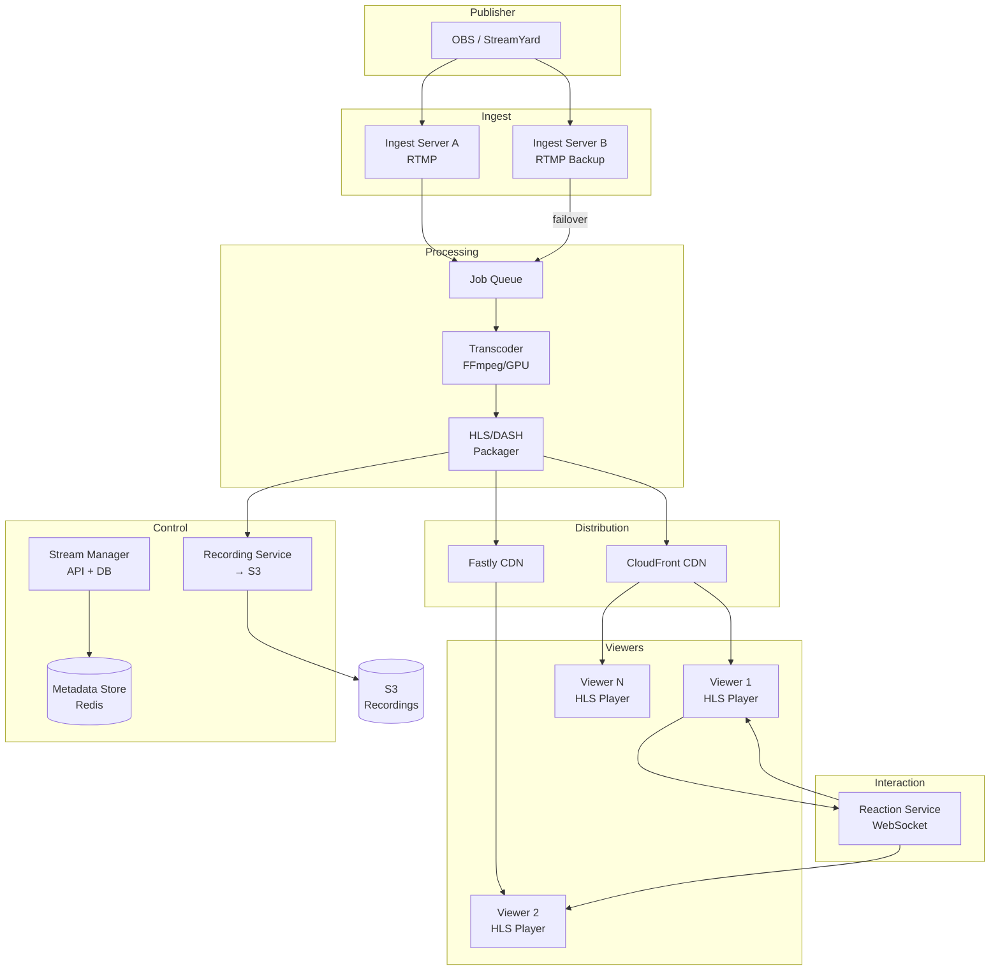
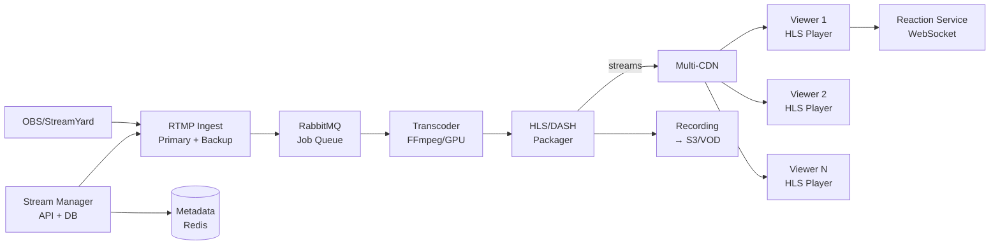
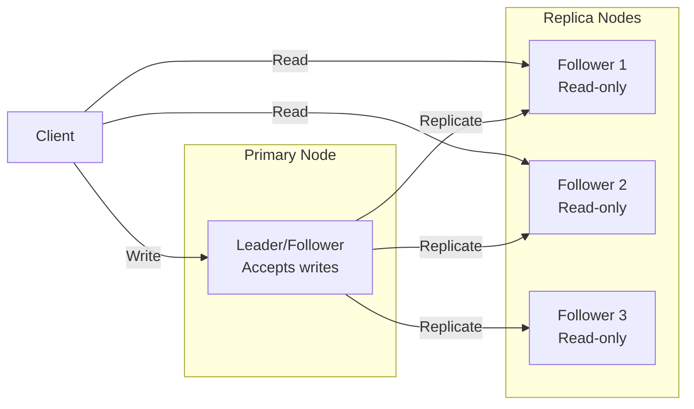
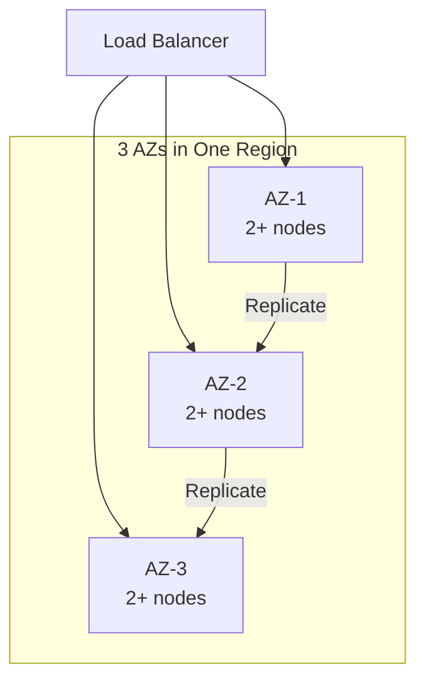
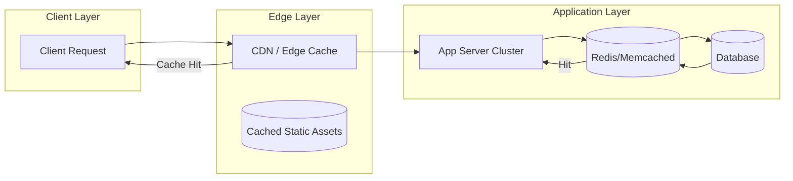
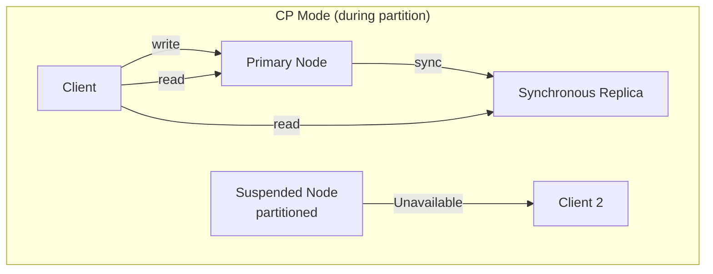
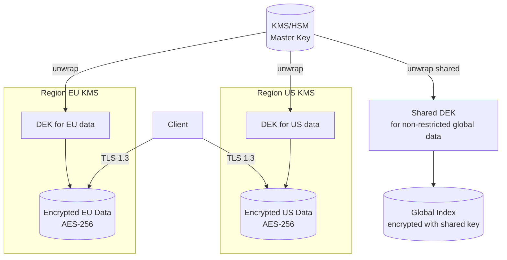
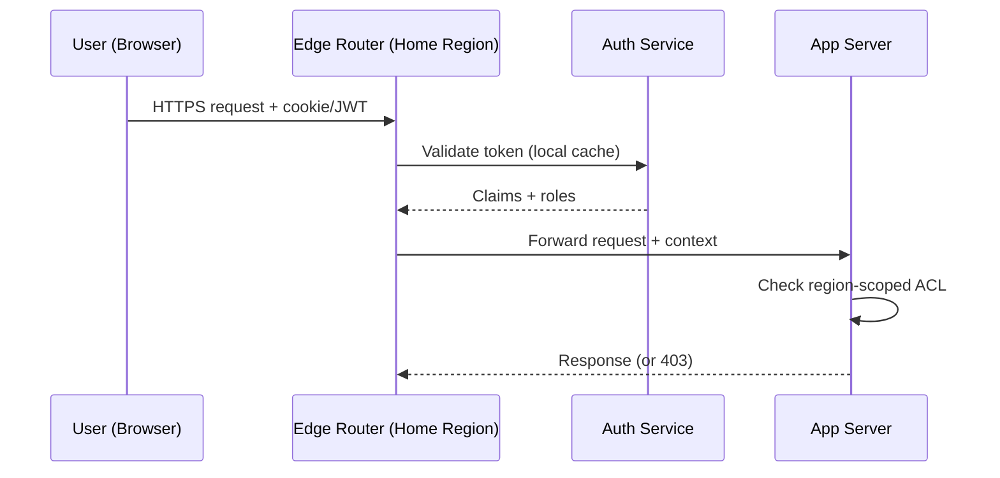
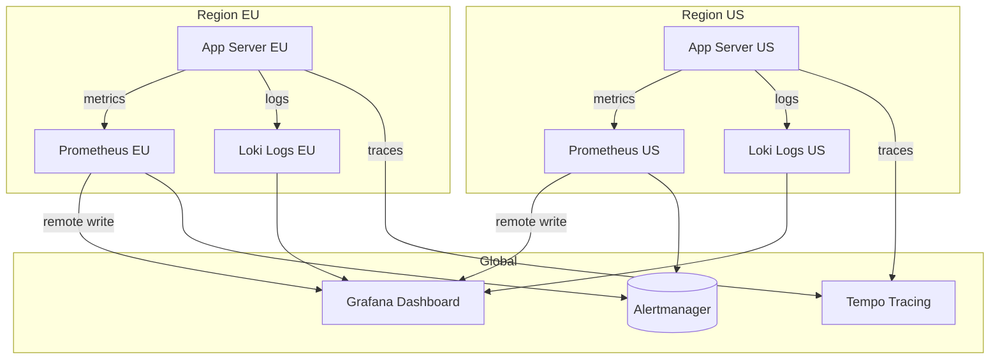

# StreamYard Clone

## Blogs and websites

## Medium

## Youtube

- [I Built StreamYard Clone | Code Along - Live Streaming RTMP Application](https://www.youtube.com/watch?v=JwZiO5p-NAE)

## Theory

### Topics Covered

1. [Introduction / Problem Statement](#introduction-problem-statement)
2. [Characteristics](#characteristics)
3. [Components](#components)
4. [Architectural Patterns](#architectural-patterns)
5. [Benefits](#benefits)
6. [Pros](#pros)
7. [Cons](#cons)
8. [Challenges](#challenges)
9. [Best Practices](#best-practices)
10. [When to Use / When Not to Use](#when-to-use-when-not-to-use)
11. [Use Cases](#use-cases)
12. [Architecture](#architecture)
13. [High-Level Design](#high-level-design)
14. [Deep Dive](#deep-dive)
15. [Data Model and API](#data-model-and-api)
16. [Replication Strategies](#replication-strategies)
17. [Failure Detection and Membership](#failure-detection-and-membership)
18. [High Availability and Scalability](#high-availability-and-scalability)
19. [Performance and Optimization](#performance-and-optimization)
20. [CAP Theorem and Consistency Trade-offs](#cap-theorem-and-consistency-trade-offs)
21. [Encryption and Key Management](#encryption-and-key-management)
22. [Authentication and Authorization](#authentication-and-authorization)
23. [Security Threats and Mitigations](#security-threats-and-mitigations)
24. [Observability and Logging](#observability-and-logging)
25. [Replication Strategies](#replication-strategies)
26. [Failure Detection and Membership](#failure-detection-and-membership)
27. [High Availability and Scalability](#high-availability-and-scalability)
28. [Performance and Optimization](#performance-and-optimization)
29. [CAP Theorem and Consistency Trade-offs](#cap-theorem-and-consistency-trade-offs)
30. [Encryption and Key Management](#encryption-and-key-management)
31. [Authentication and Authorization](#authentication-and-authorization)
32. [Security Threats and Mitigations](#security-threats-and-mitigations)
33. [Observability and Logging](#observability-and-logging)
34. [Java and Spring Boot Implementation Guide](#java-and-spring-boot-implementation-guide)
35. [Real-World Implementations](#real-world-implementations)
36. [Interview Questions and Answers](#interview-questions-and-answers)

---
---
RTMP server
This streaming works on TCP — live video travels from the publisher (camera/OBS) to viewers via TCP-based RTMP ingest, then gets transcoded and repackaged into HTTP-based HLS/DASH for CDN distribution. The ingest server (Real-Time Messaging Protocol) receives video from the publisher, then the rest of the pipeline handles the broadcast.

### Introduction / Problem Statement

A live-streaming platform (StreamYard, Twitch, YouTube Live, Zoom Live) broadcasts video/audio from a single source (publisher) to many concurrent viewers (subscribers) in real time. The data flows: publisher encodes video → RTMP/SRT ingest server → transcoder → packager → CDN → viewers play via HLS/DASH/WebRTC.

**Why Does It Exist**

Before live streaming, content consumption was entirely on-demand (Netflix, YouTube recordings). Live streaming enables real-time interaction: live gaming, live news, live education, live shopping, live talk shows — anyone can become a broadcaster with just a camera and internet.

**What Problem Does It Solve**

* **One-to-many delivery**: Single publisher → thousands of concurrent viewers → scale-out via CDN.
* **Variable viewer count**: Viewers join/leave constantly; system must handle 1 viewer or 1M viewers.
* **Multiple bitrates**: Different viewers have different bandwidth → adaptive bitrate transcoding.
* **Low latency**: Interaction (chat, reactions) needs sub-second latency; traditional HLS has 10–30s delay.
• **Reliability**: Ingest failure → recover; CDN failure → failover; transcoder crash → restart.
* **Interactive features**: Live chat, polls, Q&A — these are additional real-time data streams alongside video.


**Problem Statement**

Design a live-streaming platform (StreamYard Clone) that allows users to broadcast live video to an audience. The system must handle video ingest via RTMP, transcode to multiple bitrates, package as HLS, distribute via CDN, and support live reactions from viewers. Keep all data within the stream context.

**Functional Requirements**

- Ingest live video/audio via RTMP from broadcasting software (OBS, StreamYard, Wirecast)
- Transcode to multiple bitrates (240p, 360p, 480p, 720p, 1080p)
- Package as HLS segments for adaptive playback
- Distribute via CDN to global viewers
- Live reactions (emoji) synchronized with stream
- Stream recording + DVR (rewind live)
- Stream management (start/stop, title, tags)
- Viewer count in real-time

**Non-Functional Requirements**

- **Latency**: 3–30s for standard HLS
- **Scale**: 100K concurrent viewers per stream
- **Availability**: 99.9% uptime
- **Throughput**: 10 Gbps aggregate ingest
- **Durability**: No video loss; 7-day retention for recordings

---

### Characteristics

| Characteristic | What it means | Why it matters | How it works |
|---|---|---|---|
| **One-to-many** | Single publisher → N viewers | Efficient distribution | Ingest → transcoder → CDN → players |
| **Low latency** | 3–30s delay | Real-time feel | HLS (or WebRTC for < 3s) |
| **Adaptive bitrate** | Multiple quality variants | Handle varying bandwidth | Transcode to 240p–1080p; HLS manifest |
| **Real-time reactions** | Emoji reactions during stream | Engagement | WebSocket/SSE to viewers |
| **Scalable viewers** | From 1 to 100K+ viewers | Popular stream handling | CDN with edge caching |
| **Stream recording** | Durable video archive | On-demand replay | Segments stored in S3 |
| **DVR/time-shift** | Rewind live within buffer window | Better UX | HLS sliding window playlist |

### Components

| Component | Purpose | Responsibilities | Relationship | Real-world Example |
|---|---|---|---|---|
| **Ingest Server** | Receive publisher stream | Accept RTMP; validate; queue | Publisher ↔ Transcoder | Nginx RTMP, Media Server |
| **Transcoder** | Re-encode to multiple bitrates | Decode + encode; audio normalization | Ingest → Packager | FFmpeg, AWS MediaConvert |
| **Packager** | Segment + manifest | Create HLS (.m3u8); segments | Transcoder → CDN | Wowza, AWS MediaPackage |
| **CDN** | Distribute to viewers | Edge cache; global PoPs | Packager → Player | CloudFront, Fastly, Akamai |
| **Player** | Client-side playback | HLS/DASH; adaptive switching | CDN → Viewer | Video.js, hls.js |
| **Reaction Service** | Live reactions | WebSocket; fan-out; rate limiting | Ingest → WebSocket | Socket.IO, Pusher |
| **Stream Manager** | Orchestrate stream lifecycle | Create/destroy; metadata; health | All components | API + DB |
| **Recording Service** | Archive to durable storage | Upload segments; S3 lifecycle | Packager → S3 | S3 + Glacier |
| **Metadata Store** | Track stream state | Viewer count, status, health | All components | DynamoDB/Redis |

### Architectural Patterns

#### HLS (HTTP Live Streaming) Packaging

* **What**: Apple's adaptive streaming protocol — video split into 2–10s segments (.ts); manifest (.m3u8) lists available bitrates; player switches quality based on bandwidth.
* **Problem solved**: Adaptive playback; CDN-friendly (HTTP); broad device support.
* **How it works**: (1) Encode to 240p/360p/480p/720p/1080p. (2) Segment each variant into 4s chunks. (3) Generate master playlist + media playlists. (4) CDN caches segments + playlists. (5) Player fetches master → choose bitrate → fetch segments → ABR.
* **When to use**: Broad compatibility, on-demand + live, non-critical latency.
* **When not to use**: Sub-second latency → WebRTC.
* **Advantages**: CDN-friendly; adaptive; broad support.
* **Disadvantages**: 10–30s latency; manifest reload overhead.

#### RTMP Ingest

* **What**: Real-Time Messaging Protocol — persistent TCP connection from publisher to ingest server.
* **Problem solved**: Reliable ingest from broadcasting software (OBS, StreamYard).
* **How it works**: Publisher sends RTMP to ingest URL (primary + backup) → validate stream key → queue → transcoder. TCP ensures no chunk loss.
* **When to use**: Reliable ingest for professional broadcasting.
* **Advantages**: Reliable (TCP); widely supported by OBS/StreamYard.
* **Disadvantages**: Not for direct viewer delivery (needs transcoding).

### Benefits

* **Real-time broadcast**: Anyone can stream live to global audience.
• **Adaptive quality**: Multiple bitrates → smooth playback for all.
• **Global reach**: CDN → worldwide distribution.
• **Recordings**: Live → VOD automatically.

### Pros

* **Broad compatibility**: HLS works on all browsers/devices.
• **Adaptive streaming**: Seamless quality switching.
• **Scalable**: CDN handles unlimited viewers.
• **Interactive**: Live reactions + chat.
• **Durable**: Recordings auto-saved to S3.

### Cons

* **High cost**: Transcoding (GPU) + CDN (bandwidth) — significant operational expense.
• **Complexity**: Ingest + transcode + package + CDN + reactions = many moving parts.
• **Latency**: Standard HLS = 10–30s; WebRTC = < 3s but limited scale.
• **Hot streams**: 100K+ viewers on one stream → CDN + load management.
• **Encoding failures**: Affect all viewers if ingest/transcode fails.

### Challenges

#### Technical Challenges
* **Video processing**: Transcoding (FFmpeg, GPU encoding); multiple bitrates; audio normalization.
• **Protocol support**: RTMP ingest + HLS/DASH output + WebRTC for low-latency option.

#### Scalability Challenges
* **Concurrent viewers**: 100K per stream → CDN with 100+ PoPs; edge cache hit ratio > 90%.
• **Transcoding**: GPU instances (NVIDIA A10); cost scales with resolution × bitrate × viewers.

#### Performance Challenges
* **Latency**: HLS = 10–30s (segment + manifest + buffer). WebRTC = sub-500ms.
• **Bitrate switching**: Player must switch smoothly without rebuffering.

#### Reliability Challenges
* **Ingest failure**: Primary ingest down → backup ingest (5s failover).
• **Transcoder crash**: Restart from queue; lose current segment.
* **CDN failure**: Multi-CDN → DNS failover to next; player retries manifest.

#### Maintainability Challenges
* **Codec/DRM evolution**: New codecs (AV1) → player + packaging updates.
• **Pipeline complexity**: 10+ microservices; monitoring across all stages.

#### Security Concerns
* **Stream hijacking**: Unauthorized publisher → ingest authentication (stream keys).
• **Piracy**: Viewer redistribution → watermarking + forensic tracking.
• **Reaction abuse**: Bot reactions → rate limiting + CAPTCHA.

### Best Practices

* **Primary + backup ingest**: Two RTMP endpoints → failover if primary dies.
• **Multi-CDN**: DNS-based routing to least-loaded CDN.
• **Transcoder autoscaling**: GPU instances scaled by ingest bitrate + resolution.
• **Segment caching**: CDN edge cache → 90%+ hit ratio.
• **Monitoring**: Ingest health; transcode queue; CDN hit ratio; player errors; reaction spam rate.
• **Recordings**: Always record segments to S3 → VOD archive.

### When to Use / When Not to Use

#### Appropriate
* Live broadcasting (Twitch, YouTube Live, Zoom Live).
• Live gaming, live news, live education, live shopping.
• Events requiring real-time audience interaction.
• Content that benefits from "being there" (concerts, launches).

#### Not Appropriate
* One-time recorded content (use VOD).
• Static content (no streaming needed).
• Small, private audiences (use Zoom/Teams).
* Content that doesn't benefit from real-time delivery.

#### Decision Factors
* Audience size; latency requirements; budget (transcode + CDN cost); device support; interactivity needs.

### Use Cases

#### Live Gaming Stream (Twitch-style)

* **Problem**: A streamer broadcasts gameplay live to thousands of viewers who react with emoji and cheers; streamer earns from subscriptions + donations.
* **Solution**: OBS → RTMP ingest (primary + backup) → transcoder (5 bitrates: 360p–1080p) → HLS package → CDN. Reactions via WebSocket. Recording to S3.
* **Why suitable**: RTMP ingest works with OBS; HLS + CDN scales to unlimited viewers; reactions over WebSocket are real-time; auto-recording for VOD.
* **How it works**: (1) OBS encodes 1080p60 → RTMP to ingest (primary: ingest-a.twitch.com; backup: ingest-b). (2) Ingest → transcoder → FFmpeg → 5 bitrates → 4s HLS segments + master playlist. (3) Segments → CDN (CloudFront); DNS routes viewer to edge. (4) Viewer → HLS player → fetch playlist → play → ABR. (5) Reactions: viewer clicks ❤️ → WebSocket → Reaction Service → fan-out to viewers in same stream. (6) Recording: segments → S3 → VOD catalog.
* **Trade-offs**: HLS latency (10–30s) vs WebRTC (< 3s but limited scale); CDN cost ($10K–100K/month); transcode cost (GPU); reaction rate limiting.

### Architecture



#### Architecture Structure
* **Ingest**: RTMP servers (primary + backup); stream key auth; active-passive.
• **Processing**: Transcoder (FFmpeg/GPU) → multiple bitrates; Packager → HLS/DASH.
• **Distribution**: Multi-CDN (CloudFront + Fastly); edge cache.
• **Interaction**: WebSocket for reactions.
• **Control**: Stream manager + recorder + metadata store.

#### Communication
* **Publisher → Ingest**: RTMP over TCP.
• **Ingest → Transcoder**: Internal queue (Kafka/RabbitMQ).
• **Packager → CDN**: HTTP (segments + playlists).
• **Viewer → CDN**: HTTP/HTTPS.
• **Reactions**: WebSocket (persistent, bidirectional).

#### Data Flow
1. **Publish**: OBS → RTMP ingest → validate stream key → queue.
2. **Transcode**: Transcoder → FFmpeg → 5 bitrates → segment (4s HLS).
3. **Package**: Segments + playlist → CDN edge.
4. **Play**: Viewer → DNS → best CDN → HLS player → fetch playlist → play → ABR.
5. **Reactions**: Viewer → WebSocket → Reaction Service → fan-out to viewers.
6. **Record**: Segments → S3 → VOD catalog.

#### Scaling Strategy
* **Ingest**: 20+ ingest servers; RTMP; TCP-based; active-passive failover.
• **Transcoder**: GPU instances (NVIDIA A10); auto-scale by ingest bitrate; 100+ per region.
• **Packager**: Stateless; auto-scale by segment count.
• **CDN**: Multi-CDN; edge cache; 100+ PoPs.

#### Failure Handling
* **Ingest failure**: Backup ingest (5s failover).
• **Transcoder crash**: Restart from queue; lose current segment only.
* **CDN failure**: DNS failover to next CDN; player retries.
* **Reaction failure**: Falls back to HTTP polling.

### High-Level Design



### Deep Dive

#### HLS Packaging

The existing Theory section notes: live streaming uses RTMP ingest (TCP-based); transcodes to HLS packages. Standard HLS = 10–30s latency (2 × segment duration + playlist reload + 3-segment buffer). For sub-second: WebRTC (P2P via SFU) or LL-HLS (partial segments, blocking reload).

#### Transcoding Pipeline

(Existing content covers: receive encoded video → transcode to multiple bitrates (240p–1080p) → package as HLS segments (4s) → serve via CDN; latency types: contribution (publisher→ingest), processing (transcode), playback (CDN+player); scaling via GPU instances auto-scaled by ingest bitrate.)

### Data Model and API

* **API purpose**: Stream management, stream status, live reactions.

| Method | Endpoint | Description |
|---|---|---|
| POST | `/api/v1/streams` | Create a new stream (returns ingest URL + key) |
| GET | `/api/v1/streams/{id}` | Get stream status + viewer count |
| DELETE | `/api/v1/streams/{id}` | Stop stream |
| GET | `/api/v1/streams/{id}/playlist.m3u8` | Get HLS master playlist |
| GET | `/api/v1/streams/{id}/segments/{seq}.ts` | Get video segment |
| POST | `/api/v1/streams/{id}/reactions` | Send a reaction (emoji) |
| WS | `/ws/streams/{id}/reactions` | Live WebSocket reactions |

**Create stream (POST /streams)**:
```json
{"title": "My Live Stream", "category": "gaming"}
```
**Response**:
```json
{
  "stream_id": "str_abc123",
  "ingest_url": "rtmp://ingest-a.live.example.com/app",
  "stream_key": "abc123-key-xyz",
  "backup_ingest_url": "rtmp://ingest-b.live.example.com/app"
}
```

**Authentication**: Stream key for ingest; JWT for API.


```mermaid
erDiagram
    STREAM ||--o{ SEGMENT : "has"
    STREAM ||--o{ REACTION : "has"
    USER ||--o{ REACTION : "sends"

    STREAM {
      string stream_id PK
      string user_id FK
      string title
      string status active_ended
      datetime started_at
      datetime ended_at
      int viewer_count
      string ingest_url
      string stream_key
    }
    SEGMENT {
      string segment_id PK
      string stream_id FK
      string variant_360p_720p_1080p
      bigint byte_size
      int duration_sec
      datetime created_at
    }
    REACTION {
      string reaction_id PK
      string stream_id FK
      string user_id FK
      string emoji_type
      datetime sent_at
    }
```

**Partitioning**: Segments sharded by stream_id + timestamp.

### Replication Strategies

**What it means**

Replication Strategies determine how data and state are copied across multiple nodes in Live Streaming System. The choice of strategy determines the trade-off between consistency, availability, and latency.

**Why it matters**

Live Streaming System must replicate data to prevent loss and serve reads from multiple nodes. The replication strategy determines whether the system favors consistency (strong reads) or availability (always writable), and how it handles cross-node failure.

**How it works**

**Leader-based (single-leader)**: A single primary node accepts all writes; followers replicate changes asynchronously or semi-synchronously. Reads can be served from any replica. This strategy favors strong consistency for writes but creates a write bottleneck at the leader.



*Leader-based replication: a single primary node accepts all writes and replicates them to read-only followers. Clients can read from any replica for scaled read throughput, but all writes go through the leader.*

**Multi-leader (multi-master)**: Multiple nodes accept writes and exchange updates with each other. This enables low-latency writes in different regions but requires conflict resolution (last-write-wins, merge functions, or CRDTs).

**Leaderless (quorum-based)**: Any node can accept writes; a quorum of nodes must agree. Read and write quorums are configured so that at least one node overlaps between them (R + W > N). This maximizes availability and write scalability.

**Trade-offs for Live Streaming System**:

| Strategy | Use Case | Pros | Cons |
|---|---|---|---|
| Leader-based | viewer data, chat messages, content takedown requests | Strong consistency, simple | Write bottleneck, leader failure risk |
| Multi-leader | public stream metadata, aggregate view counts, system metrics | Low-latency global writes | Conflict resolution, complex |
| Leaderless | Caching, counters | High availability, no bottleneck | Eventual consistency, read repair overhead |

**Real-world implementations**

- **Redis**: Leader-follower replication with asynchronous replication; Sentinel handles failover.
- **Apache Kafka**: Leader-based partition replication with ISR (in-sync replica) — writes go to the leader, followers replicate.
- **Cassandra**: Tunable consistency with leaderless quorum (R + W > N).
- **DynamoDB Global Tables**: Multi-master active-active across regions.

### Failure Detection and Membership

**What it means**

Failure Detection and Membership is the mechanism by which Live Streaming System determines which nodes are alive and part of the cluster. Membership is the list of known nodes; failure detection is the process of updating that list when nodes fail or recover.

**Why it matters**

Live Streaming System must route requests only to healthy nodes and trigger failover when a node goes down. False positives (healthy nodes marked as dead) cause unnecessary failovers and data loss. False negatives (dead nodes not detected) cause failed requests and degraded performance.

**How it works**

**Heartbeat-based detection**: Each node sends a heartbeat (ping) to a subset of peers at regular intervals. If a node misses N consecutive heartbeats, it is marked as suspect. The gossip protocol distributes membership information: each node exchanges its view of the cluster with a random peer, and the information propagates gossip-style.

```mermaid
sequenceDiagram
    participant A as Node A
    participant B as Node B
    participant C as Node C

    loop Every 1s
        A->>B: Heartbeat (ping)
        B-->>A: Heartbeat (ack)
    end
    B->>C: Gossip: A is alive
    C->>A: Gossip: B is alive
    Note over A,B,C: View converges in O(log N) rounds
```

*Gossip-based failure detection: each node periodically pings a random subset of peers and gossips its view of the cluster. The membership list converges in O(log N) rounds.*

**Phi Accrual Failure Detector**: Instead of a fixed timeout, the detector measures the time between consecutive heartbeats and computes a phi (φ) value — the probability that the node is dead given the observed heartbeat pattern. φ is compared against a threshold (typically 1–8); higher thresholds reduce false positives but increase detection latency.

**SWIM (Scalable Weakly-consistent Infection-style Process group Membership Protocol)**: Nodes ping a random subset of cluster members. If a ping fails, the node is marked "suspect" and the failure is "infected" (gossiped) to other nodes. This is O(log N) per failure detection cycle and scales to large clusters.

**Trade-offs**:

| Approach | Strengths | Weaknesses |
|---|---|---|
| Heartbeat (timeout-based) | Simple, deterministic | False positives under load |
| Phi Accrual | Adaptive threshold | Needs historical data |
| SWIM | Scales to 1000s of nodes | Eventual consistency |

**Real-world implementations**

- **AWS Route 53 Health Checks**: Uses TCP/HTTP health checks with configurable thresholds to remove unhealthy instances from DNS rotation.
- **Kubernetes**: Uses the kubelet heartbeat (every 10s) to determine node liveness; nodes missing 3 consecutive heartbeats are marked NotReady.
- **Consul**: Uses SWIM protocol for membership and failure detection; supports both LAN and WAN gossip.
- **Akka Cluster**: Uses Phi Accrual failure detector with configurable φ thresholds.

### High Availability and Scalability

**What it means**

High Availability and Scalability determines how Live Streaming System continues operating when nodes or entire zones fail, and how capacity is added as demand grows. HA is about minimizing downtime; scalability is about maintaining performance as load increases.

**Why it matters**

Live Streaming System must stay operational even when individual nodes, availability zones, or entire regions fail. At the same time, it must scale horizontally to handle traffic spikes without degrading latency. The two are intertwined: the replication strategy, failure detection, and load balancing all contribute to both HA and scalability.

**How it works**

**Availability zones (AZs)**: Nodes are distributed across multiple AZs within a region. Each AZ is an independent failure domain (power, networking, physical security). A load balancer distributes requests across AZs; if one AZ fails, traffic is routed to the remaining AZs with no data loss (assuming replication is in place).



*Multi-AZ deployment: a load balancer distributes traffic across three availability zones. Each AZ has multiple nodes. Data is replicated across AZs so that losing one AZ does not cause data loss or service interruption.*

**Load balancing**: A load balancer distributes incoming requests across healthy nodes. Algorithms include round-robin, least connections, and weighted routing. Health checks ensure traffic only goes to healthy nodes. For Live Streaming System, the load balancer also considers Ingest Server (RTMP) when routing.

**Auto-scaling**: The system automatically adds or removes nodes based on metrics (CPU, memory, request rate). Scale-out policies add nodes when load exceeds a threshold; scale-in policies remove nodes during low load. For stateful services like Live Streaming System, scale-out involves rebalancing partitions (moving data and connections to the new node).

**Failover and recovery**: When a node fails, the load balancer detects it (via health checks or failure detection) and stops sending traffic. A new node is provisioned (or a standby is promoted) and begins serving. For Live Streaming System, failover must preserve viewer data, chat messages, content takedown requests data — this is achieved through replication with a quorum of healthy nodes.

**Scalability patterns**:

1. **Horizontal partitioning (sharding)**: Split data by a partition key (e.g., user_id, session_id) and distribute partitions across nodes. New nodes take ownership of additional partitions.

2. **Consistent hashing**: Minimize data movement on scale-out — only 1/N of the data moves to the new node. Nodes and partitions are placed on a ring; a request for key X is routed to the next node clockwise from hash(X).

3. **Connection draining**: When scaling in, existing connections are allowed to complete before the node is shut down. For Live Streaming System, this means draining active A sessions gracefully.

**Real-world implementations**

- **Netflix OSS (Eureka + Zuul + Ribbon)**: Service discovery with Eureka, edge routing with Zuul, and client-side load balancing with Ribbon. Scales to thousands of instances.
- **Kubernetes HPA + VPA**: Horizontal Pod Autoscaler scales pods based on CPU/memory; Vertical Pod Autoscaler adjusts resource requests based on historical usage.
- **AWS ALB + Auto Scaling Groups**: Application Load Balancer with auto-scaling groups across AZs; health checks replace unhealthy instances automatically.

### Performance and Optimization

**What it means**

Performance and Optimization covers the techniques Live Streaming System uses to achieve low latency, high throughput, and efficient resource usage. This section examines the key performance metrics, bottlenecks, and optimizations specific to the system.

**Why it matters**

Live Streaming System faces competing pressures: users demand low latency, the system must handle high throughput, and infrastructure costs must be controlled. The optimizations applied at the data, compute, and network layers determine whether the system meets its SLA.

**How it works**

**Latency layers**: Latency in Live Streaming System comes from three layers:
1. **Network**: Round-trip time from client to the nearest edge node / load balancer.
2. **Application**: Request processing time on the server (CPU, I/O, lock contention).
3. **Data**: Time to read/write from storage (cache hit vs. database query).

The 99th-percentile latency is the key metric for user-facing systems — it determines the worst-case experience.

**Caching strategies**: Live Streaming System uses multiple cache layers:
- **Edge cache**: Static assets (images, CSS, JS) served from a CDN at the edge. For Live Streaming System, this caches public stream metadata, aggregate view counts, system metrics that doesn't change frequently.
- **Application cache**: In-memory cache (e.g., Redis, Memcached) for frequently accessed data. Cache-aside pattern: application checks cache first, falls back to database on miss.
- **Local cache**: In-process cache (e.g., Caffeine, Guava) for data accessed within a single request. Avoids network round-trips.

**Batching and pipelining**: Live Streaming System batches small operations (e.g., writes, log flushes) to amortize per-operation overhead. Pipelining allows multiple requests to be in flight simultaneously.



*Caching hierarchy: clients first hit the edge CDN/cache; if the response is cached, it is returned immediately. Otherwise, the request reaches the application, which checks its in-memory/application cache (e.g., Redis) before falling back to the database. This minimizes latency from each layer.*

**Connection pooling**: Live Streaming System maintains a pool of database connections to avoid the TCP handshake overhead on every request. Pool size is tuned to match the database's capacity.

**Compression**: Responses are compressed (gzip, zstd) for clients that support it. At the network layer, gRPC uses HPACK header compression.

**Indexing**: Database tables are indexed on frequently queried fields. For Live Streaming System, indexes cover Transcoder (FFmpeg) and Segmenter (HLS) for fast lookups.

**Asynchronous processing**: Non-critical background work (e.g., analytics, cleanup, notifications) is offloaded to message queues and processed asynchronously, keeping the request path fast.

**Resource isolation**: CPU and memory are allocated per service (containers with cgroup limits). This prevents a single misbehaving service from degrading the entire system.

**Metrics for Live Streaming System**:

| Metric | Target | How to Measure |
|---|---|---|
| P99 latency | < 1s | Load test with realistic traffic |
| Throughput | 1K RPS | Request rate under peak load |
| Error rate | < 0.1% | 5xx / total requests |
| Cache hit ratio | > 90% | cache_hits / (cache_hits + misses) |
| Resource utilization | < 80% CPU, < 85% memory | Container metrics |

**Real-world implementations**

- **Google's HTTP Load Balancer**: Global load balancing with edge PoPs; routes users to the nearest healthy backend.
- **Cloudflare**: Edge cache with Argo Smart Routing that dynamically routes traffic to avoid congestion.
- **Redis**: Used as an application cache with configurable eviction policies (LRU, LFU, TTL).

### CAP Theorem and Consistency Trade-offs

**What it means**

The CAP Theorem states that in a distributed system, you can only have two of three guarantees: **Consistency** (every read returns the latest write), **Availability** (every request gets a response), and **Partition tolerance** (the system continues to operate despite network partitions). Since network partitions are inevitable in distributed systems like Live Streaming System, the real choice is between CP (consistent + partitioned) and AP (available + partitioned).

**Why it matters**

Live Streaming System must decide which two guarantees to prioritize. For viewer data, chat messages, content takedown requests data, strong consistency (CP) is critical — users must see the most recent data. For public stream metadata, aggregate view counts, system metrics data, availability (AP) is more important — the system should remain responsive even during network issues.

**How it works**

**CP (Consistent + Partition-tolerant)**: During a partition, the system trades availability for consistency. Writes are rejected or delayed until the partition heals. Reads return the latest committed value. This is appropriate for viewer data, chat messages, content takedown requests in Live Streaming System.



*CP system during a network partition: writes are rejected on the partitioned node to maintain consistency. Clients are routed to the healthy primary and synchronous replica.*

**AP (Available + Partition-tolerant)**: During a partition, the system trades consistency for availability. Both sides accept writes; conflicts are resolved later (last-write-wins, merge, or application-level conflict resolution). This is appropriate for public stream metadata, aggregate view counts, system metrics in Live Streaming System.

**PACELC (extending CAP)**: The PACELC theorem says that even when the network is not partitioned (the "else" case in CAP), you must choose between latency (L) and consistency (C). Live Streaming System uses:
- **Racing reads**: Serve from the nearest replica for speed (low latency, eventual consistency).
- **Linearizable reads**: Always read from the primary (high latency, strong consistency).

The choice is made per request based on whether the data is viewer data, chat messages, content takedown requests (strong consistency) or public stream metadata, aggregate view counts, system metrics (fast reads).

**Trade-offs**:

| System Type | CP Use Cases | AP Use Cases |
|---|---|---|
| Live Streaming System | viewer data, chat messages, content takedown requests | public stream metadata, aggregate view counts, system metrics |

**Real-world implementations**

- **etcd**: CP system using Raft consensus; used for service discovery and configuration in Kubernetes.
- **Cassandra**: AP system with tunable consistency; used for time-series data and user sessions.
- **Google Spanner**: CP with external consistency via TrueTime API; used for global financial transactions.
- **DynamoDB**: AP by default, but supports strongly consistent reads (CP mode) on demand.

### Encryption and Key Management

**What it means**

Encryption and Key Management in Live Streaming System ensures that data is protected both at rest (stored on disk) and in transit (moving between services). Key management governs how encryption keys are generated, stored, rotated, and accessed — without proper key management, encryption provides a false sense of security.

**Why it matters**

Live Streaming System handles viewer data, chat messages, content takedown requests that must be encrypted both at rest and in transit. Achieving sub-3-second latency at global scale while handling variable network conditions, supporting multiple bitrates, and minimizing compute costs for transcoding requires careful key management: keys must be rotated regularly, scoped to prevent cross-contamination, and audited for compliance. A single key compromise could expose sensitive data.

**How it works**

**At-rest encryption**: Data stored in Ingest Server (RTMP), Transcoder (FFmpeg) and databases is encrypted using AES-256-GCM. The Data Encryption Key (DEK) is generated per data partition and encrypted with a Key Encryption Key (KEK) managed by a KMS (AWS KMS, GCP KMS, HashiCorp Vault). Keys are regionally scoped — only data belonging to a region can be decrypted by that region's KEK.

**In-transit encryption**: All inter-service communication uses TLS 1.3 or mTLS for service-to-service auth. Cross-region communication of public stream metadata, aggregate view counts, system metrics uses TLS + optional application-level encryption. viewer data, chat messages, content takedown requests is NEVER transmitted in plaintext or across region boundaries.

**Key hierarchy**:
```
Master Key (HSM-backed, KMS-managed)
  └─ KEK (per region, per service)
     └─ DEK (per data partition, rotated every 90 days)
        └─ Data (encrypted with DEK)
```

**Key rotation**: KEKs rotate annually (automatic via KMS); DEKs rotate per object or per 90 days. Applications handle key version headers transparently — a DEK version is stored alongside the encrypted data.

**Cross-region key sharing**: For non-restricted data (public stream metadata, aggregate view counts, system metrics), a shared key is imported into each region's KMS. Restricted data NEVER uses cross-region keys — each region's KMS holds only that region's keys.



*Encryption key hierarchy: master keys are managed by an HSM-backed KMS and never leave the KMS. Each region has its own KEK. Data encryption keys (DEKs) are generated per partition and encrypted with the regional KEK. Only non-restricted global data uses a shared cross-region key. All client traffic uses TLS 1.3.*

**Java/Spring Boot Implementation**

```java
@Service
@RequiredArgsConstructor
public class DataEncryptionService {

    private final AWSKMS kms;
    @Value("${app.region}")
    private String region;
    @Value("${app.encryption.dek-ttl-minutes:1440}")
    private int dekTtlMinutes;

    private final Map<String, SecretKey> dekCache = new ConcurrentHashMap<>();

    public EncryptedData encrypt(String plaintext, String partitionId) {
        SecretKey dek = getOrCreateDek(partitionId);
        byte[] ciphertext = CryptoUtils.encrypt(plaintext.getBytes(StandardCharsets.UTF_8), dek);
        String dekCiphertext = kms.encrypt(EncryptRequest.builder()
            .keyId("arn:aws:kms:" + region + ":master-key")
            .plaintext(SdkBytes.fromByteArray(dek.getEncoded()))
            .build()).ciphertextBlob().asByteArray();
        return new EncryptedData(ciphertext, dekCiphertext, Instant.now());
    }

    private SecretKey getOrCreateDek(String partitionId) {
        return dekCache.computeIfAbsent(partitionId, id -> {
            try {
                return KeyGenerator.getInstance("AES").generateKey();
            } catch (NoSuchAlgorithmException e) {
                throw new IllegalStateException("Cannot generate DEK", e);
            }
        });
    }
}
```

*Spring Boot encryption service: DEKs are cached per-partition with TTL. Each DEK is encrypted via AWS KMS using a regional master key. The encrypted DEK (ciphertext) is stored alongside the data — only the KMS for that region can decrypt it.*

**Real-world implementations**

- **AWS KMS**: Managed HSM-backed key service; supports automatic key rotation and custom key stores.
- **HashiCorp Vault**: Open-source key management; supports transit encryption (encrypt/decrypt without storing keys).
- **Google Cloud KMS**: Hardware-backed key management with IAM-based access control.

### Authentication and Authorization

**What it means**

Authentication and Authorization (AuthN/AuthZ) in Live Streaming System control who can access the system and what they can do. Authentication verifies identity; authorization determines permissions. In a distributed system like Live Streaming System, auth must work across multiple nodes while respecting data boundaries — a user authenticated in one region should not have their session data or tokens replicated to regions where it is not permitted.

**Why it matters**

Live Streaming System must verify identity at the edge and enforce authorization at every service boundary. viewer data, chat messages, content takedown requests must be protected — only users with appropriate roles should access it. At the same time, public stream metadata, aggregate view counts, system metrics data should be accessible to a wider audience with minimal friction.

**How it works**

**Authentication (who are you?)**:
- **JWT tokens**: Users authenticate through their home region's identity provider. The region returns a JWT (JSON Web Token) signed by a regional signing key. Tokens include claims like `iss` (issuer region), `sub` (subject/user ID), `home_region`, `roles`, and `exp` (expiry). Tokens are scoped per region — a token issued by region A cannot access restricted data in region B.
- **mTLS for service-to-service**: Internal services authenticate each other using mutual TLS certificates issued by a per-region Certificate Authority (CA). No shared secrets cross region boundaries.
- **Session management**: Sessions are stored regionally (Redis) and never replicated cross-region for restricted data. Session IDs are opaque UUIDs; the session store maps session ID → user context.

**Authorization (what can you do?)**:
- **RBAC (Role-Based Access Control)**: Users are assigned roles per region. Common roles: `region_admin` (full access to region data), `auditor` (read-only audit), `viewer` (read public data only). Roles are stored in the regional database and cached locally for sub-1ms lookups.
- **ABAC (Attribute-Based Access Control)**: Fine-grained permissions based on attributes (e.g., `home_region == request_region AND role == admin`). This allows expressing complex policies like "users can only access restricted data in their home region."
- **Resource-level authorization**: Each request is checked against an ACL (Access Control List) that specifies which roles can access which resources. For Live Streaming System, restricted resources require the `admin` role + matching region.



*Authentication flow: the user's token is validated by the regional auth service (claims cached locally). The edge router forwards the request with the security context. Each app server checks the region-scoped ACL before accessing restricted data.*

**Java/Spring Boot Implementation**

```java
@Service
@RequiredArgsConstructor
public class AuthorizationService {

    private final UserTokenRepository tokenRepository;
    @Value("${app.region}")
    private String currentRegion;

    public boolean canAccessResource(String userId, String resourceRegion,
                                     String action, JWTClaims claims) {
        String userHomeRegion = claims.getStringClaim("home_region");
        List<String> roles = claims.getStringListClaim("roles");

        if (!roles.contains(action)) {
            return false;
        }

        if (resourceRegion.equals(userHomeRegion)) {
            return true;
        }

        if (resourceRegion.equals("global")) {
            return roles.contains("global_reader");
        }

        return false;
    }
}

@RestController
@RequiredArgsConstructor
@RequestMapping("/api/v1")
public class RegionController {
    private final AuthorizationService authService;

    @GetMapping("/data/{region}/profile")
    public ResponseEntity<?> getProfile(
            @PathVariable String region,
            @RequestHeader("Authorization") String token) {
        JWTClaims claims = JwtUtils.parseAndValidate(token, currentRegion);

        if (!authService.canAccessResource(
                claims.getStringClaim("sub"), region, "read", claims)) {
            return ResponseEntity.status(HttpStatus.FORBIDDEN).build();
        }

        return ResponseEntity.ok(profileService.getByRegion(region));
    }
}
```

*Spring Boot authorization service: checks both the user's role and whether the requested resource violates region boundaries. The `canAccessResource` method returns false if a user from region EU tries to access restricted data in region US.*

**Real-world implementations**

- **Auth0**: JWT-based authentication with regional endpoints; supports custom rules for ABAC.
- **Okta**: Multi-region identity management with adaptive MFA and ThreatInsight for anomaly detection.
- **AWS Cognito**: Regional user pools with IAM integration; tokens are region-scoped by default.

### Security Threats and Mitigations

**What it means**

Security Threats and Mitigations catalog the attack surface of Live Streaming System, the most likely threats, and the corresponding defenses. Every distributed system has unique threat vectors — Live Streaming System is no exception.

**Why it matters**

Live Streaming System handles viewer data, chat messages, content takedown requests that attackers might target. Achieving sub-3-second latency at global scale while handling variable network conditions, supporting multiple bitrates, and minimizing compute costs for transcoding expands the attack surface: more nodes, more network paths, more failure modes. Without proper threat modeling, a single vulnerability could expose sensitive data across the entire system.

**Threat model**:

| Threat | Likelihood | Impact | Mitigation |
|---|---|---|---|
| Data exfiltration (cross-region) | High | Critical | Region-scoped keys, no cross-region replication of restricted data |
| Man-in-the-middle (inter-service) | Medium | High | mTLS between all services |
| Replay attacks | Medium | High | Token expiry + nonce |
| DDoS at the edge | High | High | Rate limiting + edge filtering (Cloudflare, AWS Shield) |
| PII leakage in logs | High | High | PII redaction + field-level access control |
| Session hijacking | Medium | Medium | Short-lived tokens + IP binding |
| Privilege escalation | Low | Critical | Least-privilege RBAC + audit logs |
| Cache poisoning | Low | Medium | Cache invalidation on write + signed cache keys |

**How it works**

**Data exfiltration prevention**: Live Streaming System enforces data residency by design — viewer data, chat messages, content takedown requests is never replicated cross-region. The replication layer checks a data classification label before allowing cross-region copy. A database-level policy (e.g., PostgreSQL RLS) also blocks cross-region queries for restricted partitions.

**mTLS enforcement**: All service-to-service communication uses mutual TLS. Certificates are issued by a per-region CA and rotated every 30 days. Services must present a valid certificate to communicate — no plaintext connections are allowed.

**PII redaction**: Application logs are scanned for PII patterns (email, phone, credit card) using an automated redaction layer (e.g., AWS Macie, Google DLP). public stream metadata, aggregate view counts, system metrics is logged freely; restricted fields are masked or dropped before logging.

```mermaid
graph TD
    subgraph "Threat Surface"
        Client[Client]
        Edge[Edge Router / WAF]
        App[App Server]
        DB[(Database)]
        Cache[(Cache)]
        Logs[Log Store]
    end

    Client -->|HTTPS| Edge
    Edge -->|mTLS| App
    App -->|mTLS| DB
    App -->|Read| Cache
    App -->|Write| DB
    App -->|Log| Logs

    subgraph "Mitigations"
        WAF[AWS WAF /<br/>Cloudflare]
        DLP[PII Redaction<br/>(Macie/DLP)]
        FIM[File Integrity<br/>Monitoring]
    end

    Edge -.-> WAF
    Logs -.-> DLP
    DB -.-> FIM
```

*Threat mitigation diagram: the WAF at the edge blocks DDoS and injection attacks. mTLS protects all service-to-service communication. PII redaction scans logs before storage. File integrity monitoring alerts on database tampering.*

**Audit trail**: All security-relevant events (auth, data access, config changes) are written to an append-only audit log with cryptographic integrity (HMAC per entry). The log covers viewer data, chat messages, content takedown requests access — who accessed what, when, and from where.

**Real-world implementations**

- **Cloudflare**: Zero-trust model (All Connections to All Networks) with mTLS everywhere; uses GeoIP blocking and rate limiting for DDoS mitigation.
- **Google BeyondCorp**: Zero-trust network security model; all access is authenticated and authorized at the request level.

### Observability and Logging

**What it means**

Observability and Logging in Live Streaming System provide visibility into system behavior through three pillars: **metrics** (aggregates and counters), **logs** (structured event records), and **traces** (distributed request timelines). Together, these signals allow operators to debug issues, detect anomalies, and verify SLA compliance.

**Why it matters**

Distributed systems like Live Streaming System are inherently opaque — failures can cascade across services in unexpected ways. Without good observability, a single slow dependency can cause widespread timeouts that are nearly impossible to diagnose. Achieving sub-3-second latency at global scale while handling variable network conditions, supporting multiple bitrates, and minimizing compute costs for transcoding makes observability even more critical: operators need to see cross-region latency, regional failures, and data-residency violations.

**How it works**

**Metrics**: Live Streaming System instruments every service with Prometheus-style metrics:
- **Request rate, error rate, duration (the "RED" metrics)**: Tracks per-endpoint HTTP latency and error counts.
- **System metrics**: CPU, memory, disk I/O, network throughput per node.
- **Business metrics**: For Live Streaming System, this includes metrics like "Transcoder (FFmpeg) fill rate" and "reservation conflict rate".

Metrics are aggregated in a time-series database (Prometheus, VictoriaMetrics) and visualized in Grafana dashboards with alerts via PagerDuty.

**Logs**: Live Streaming System uses structured logging (JSON format) with standardized fields:
- `timestamp`: ISO 8601 UTC
- `level`: DEBUG, INFO, WARN, ERROR
- `service`: originating service name
- `trace_id`: distributed trace identifier (for correlation)
- `span_id`: current operation span
- `region`: the region that processed the request
- `data_class`: RESTRICTED or NON_RESTRICTED

viewer data, chat messages, content takedown requests access is logged with full context (user, action, resource). public stream metadata, aggregate view counts, system metrics logs are aggregated and may have reduced retention.

**Distributed tracing**: Every request is assigned a trace ID at the edge. The trace propagates through all downstream services via HTTP headers. A tracing backend (Jaeger, Tempo, Zipkin) reconstructs the full request timeline, showing latency at each hop. For Live Streaming System, traces include region boundaries — a cross-region call is annotated as such.



*Observability architecture: each region runs its own Prometheus (metrics) and Loki (logs) instances. A global Grafana instance queries all regional backends. Traces are collected centrally in Tempo. Alerts fire from each region's Prometheus to Alertmanager.*

**Alerting**: Live Streaming System defines SLO-based alerts:
- **Latency**: P99 > 1s for 5 minutes → page.
- **Error rate**: > 1% for 10 minutes → page.
- **Availability**: < 99.5% for 15 minutes → page.
- **Data residency violation**: any restricted data detected outside its region → critical page.

**Java/Spring Boot Implementation**

```java
@Component
@RequiredArgsConstructor
@Slf4j
public class ObservabilityContext {

    @Value("${app.region}")
    private String region;

    public void logAccess(String userId, String resource, String action,
                          boolean restricted) {
        log.info("access_event userId={} resource={} action={} region={} data_class={}",
            userId, resource, action, region, restricted ? "RESTRICTED" : "NON_RESTRICTED");
    }
}

@RestController
@RequiredArgsConstructor
@Slf4j
public class ApiController {
    private final ObservabilityContext obs;
    private final UserService userService;

    @GetMapping("/api/v1/profile")
    public ResponseEntity<ProfileResponse> getProfile(
            @AuthenticationPrincipal UserDetails user) {
        String traceId = MDC.get("traceId");
        long start = System.nanoTime();

        try {
            ProfileResponse response = userService.getProfile(user.getId());
            obs.logAccess(user.getId(), "profile", "read", true);

            return ResponseEntity.ok(response);
        } finally {
            long durationMs = (System.nanoTime() - start) / 1_000_000;
            log.info("profile_read traceId={} latencyMs={} region={}",
                traceId, durationMs, obs.region);
        }
    }
}
```

*Spring Boot observability: the `ObservabilityContext` logs structured access events with data classification. The controller records latency and trace ID for every request, enabling SLO-based alerting.*

**Real-world implementations**

- **Netflix OSS (Atlas + Zipkin + Servo)**: Metrics via Atlas, traces via Zipkin, instrumented via Servo. Scales to over 700 billion requests/day.
- **Google SRE Workbook**: Comprehensive observability with SLI/SLO/SLI definition; uses Borgmon for metrics and Dapper for tracing.
- **AWS Observability**: CloudWatch for metrics, X-Ray for tracing, CloudWatch Logs for structured logs.

### Replication Strategies

**What it means**

Replication Strategies determine how data and state are copied across multiple nodes in Live Streaming System. The choice of strategy determines the trade-off between consistency, availability, and latency.

**Why it matters**

Live Streaming System must replicate data to prevent loss and serve reads from multiple nodes. The replication strategy determines whether the system favors consistency (strong reads) or availability (always writable), and how it handles cross-node failure.

**How it works**

**Leader-based (single-leader)**: A single primary node accepts all writes; followers replicate changes asynchronously or semi-synchronously. Reads can be served from any replica. This strategy favors strong consistency for writes but creates a write bottleneck at the leader.


*Leader-based replication: a single primary node accepts all writes and replicates them to read-only followers. Clients can read from any replica for scaled read throughput, but all writes go through the leader.*

**Multi-leader (multi-master)**: Multiple nodes accept writes and exchange updates with each other. This enables low-latency writes in different regions but requires conflict resolution (last-write-wins, merge functions, or CRDTs).

**Leaderless (quorum-based)**: Any node can accept writes; a quorum of nodes must agree. Read and write quorums are configured so that at least one node overlaps between them (R + W > N). This maximizes availability and write scalability.

**Trade-offs for Live Streaming System**:

| Strategy | Use Case | Pros | Cons |
|---|---|---|---|
| Leader-based | viewer data, chat messages, content takedown requests | Strong consistency, simple | Write bottleneck, leader failure risk |
| Multi-leader | public stream metadata, aggregate view counts, system metrics | Low-latency global writes | Conflict resolution, complex |
| Leaderless | Caching, counters | High availability, no bottleneck | Eventual consistency, read repair overhead |

**Real-world implementations**

- **Redis**: Leader-follower replication with asynchronous replication; Sentinel handles failover.
- **Apache Kafka**: Leader-based partition replication with ISR (in-sync replica) — writes go to the leader, followers replicate.
- **Cassandra**: Tunable consistency with leaderless quorum (R + W > N).
- **DynamoDB Global Tables**: Multi-master active-active across regions.

### Failure Detection and Membership

**What it means**

Failure Detection and Membership is the mechanism by which Live Streaming System determines which nodes are alive and part of the cluster. Membership is the list of known nodes; failure detection is the process of updating that list when nodes fail or recover.

**Why it matters**

Live Streaming System must route requests only to healthy nodes and trigger failover when a node goes down. False positives (healthy nodes marked as dead) cause unnecessary failovers and data loss. False negatives (dead nodes not detected) cause failed requests and degraded performance.

**How it works**

**Heartbeat-based detection**: Each node sends a heartbeat (ping) to a subset of peers at regular intervals. If a node misses N consecutive heartbeats, it is marked as suspect. The gossip protocol distributes membership information: each node exchanges its view of the cluster with a random peer, and the information propagates gossip-style.

```mermaid
sequenceDiagram
    participant A as Node A
    participant B as Node B
    participant C as Node C

    loop Every 1s
        A->>B: Heartbeat (ping)
        B-->>A: Heartbeat (ack)
    end
    B->>C: Gossip: A is alive
    C->>A: Gossip: B is alive
    Note over A,B,C: View converges in O(log N) rounds
```

*Gossip-based failure detection: each node periodically pings a random subset of peers and gossips its view of the cluster. The membership list converges in O(log N) rounds.*

**Phi Accrual Failure Detector**: Instead of a fixed timeout, the detector measures the time between consecutive heartbeats and computes a phi (φ) value — the probability that the node is dead given the observed heartbeat pattern. φ is compared against a threshold (typically 1–8); higher thresholds reduce false positives but increase detection latency.

**SWIM (Scalable Weakly-consistent Infection-style Process group Membership Protocol)**: Nodes ping a random subset of cluster members. If a ping fails, the node is marked "suspect" and the failure is "infected" (gossiped) to other nodes. This is O(log N) per failure detection cycle and scales to large clusters.

**Trade-offs**:

| Approach | Strengths | Weaknesses |
|---|---|---|
| Heartbeat (timeout-based) | Simple, deterministic | False positives under load |
| Phi Accrual | Adaptive threshold | Needs historical data |
| SWIM | Scales to 1000s of nodes | Eventual consistency |

**Real-world implementations**

- **AWS Route 53 Health Checks**: Uses TCP/HTTP health checks with configurable thresholds to remove unhealthy instances from DNS rotation.
- **Kubernetes**: Uses the kubelet heartbeat (every 10s) to determine node liveness; nodes missing 3 consecutive heartbeats are marked NotReady.
- **Consul**: Uses SWIM protocol for membership and failure detection; supports both LAN and WAN gossip.
- **Akka Cluster**: Uses Phi Accrual failure detector with configurable φ thresholds.

### High Availability and Scalability

**What it means**

High Availability and Scalability determines how Live Streaming System continues operating when nodes or entire zones fail, and how capacity is added as demand grows. HA is about minimizing downtime; scalability is about maintaining performance as load increases.

**Why it matters**

Live Streaming System must stay operational even when individual nodes, availability zones, or entire regions fail. At the same time, it must scale horizontally to handle traffic spikes without degrading latency. The two are intertwined: the replication strategy, failure detection, and load balancing all contribute to both HA and scalability.

**How it works**

**Availability zones (AZs)**: Nodes are distributed across multiple AZs within a region. Each AZ is an independent failure domain (power, networking, physical security). A load balancer distributes requests across AZs; if one AZ fails, traffic is routed to the remaining AZs with no data loss (assuming replication is in place).


*Multi-AZ deployment: a load balancer distributes traffic across three availability zones. Each AZ has multiple nodes. Data is replicated across AZs so that losing one AZ does not cause data loss or service interruption.*

**Load balancing**: A load balancer distributes incoming requests across healthy nodes. Algorithms include round-robin, least connections, and weighted routing. Health checks ensure traffic only goes to healthy nodes. For Live Streaming System, the load balancer also considers Ingest Server (RTMP) when routing.

**Auto-scaling**: The system automatically adds or removes nodes based on metrics (CPU, memory, request rate). Scale-out policies add nodes when load exceeds a threshold; scale-in policies remove nodes during low load. For stateful services like Live Streaming System, scale-out involves rebalancing partitions (moving data and connections to the new node).

**Failover and recovery**: When a node fails, the load balancer detects it (via health checks or failure detection) and stops sending traffic. A new node is provisioned (or a standby is promoted) and begins serving. For Live Streaming System, failover must preserve viewer data, chat messages, content takedown requests data — this is achieved through replication with a quorum of healthy nodes.

**Scalability patterns**:

1. **Horizontal partitioning (sharding)**: Split data by a partition key (e.g., user_id, session_id) and distribute partitions across nodes. New nodes take ownership of additional partitions.

2. **Consistent hashing**: Minimize data movement on scale-out — only 1/N of the data moves to the new node. Nodes and partitions are placed on a ring; a request for key X is routed to the next node clockwise from hash(X).

3. **Connection draining**: When scaling in, existing connections are allowed to complete before the node is shut down. For Live Streaming System, this means draining active A sessions gracefully.

**Real-world implementations**

- **Netflix OSS (Eureka + Zuul + Ribbon)**: Service discovery with Eureka, edge routing with Zuul, and client-side load balancing with Ribbon. Scales to thousands of instances.
- **Kubernetes HPA + VPA**: Horizontal Pod Autoscaler scales pods based on CPU/memory; Vertical Pod Autoscaler adjusts resource requests based on historical usage.
- **AWS ALB + Auto Scaling Groups**: Application Load Balancer with auto-scaling groups across AZs; health checks replace unhealthy instances automatically.

### Performance and Optimization

**What it means**

Performance and Optimization covers the techniques Live Streaming System uses to achieve low latency, high throughput, and efficient resource usage. This section examines the key performance metrics, bottlenecks, and optimizations specific to the system.

**Why it matters**

Live Streaming System faces competing pressures: users demand low latency, the system must handle high throughput, and infrastructure costs must be controlled. The optimizations applied at the data, compute, and network layers determine whether the system meets its SLA.

**How it works**

**Latency layers**: Latency in Live Streaming System comes from three layers:
1. **Network**: Round-trip time from client to the nearest edge node / load balancer.
2. **Application**: Request processing time on the server (CPU, I/O, lock contention).
3. **Data**: Time to read/write from storage (cache hit vs. database query).

The 99th-percentile latency is the key metric for user-facing systems — it determines the worst-case experience.

**Caching strategies**: Live Streaming System uses multiple cache layers:
- **Edge cache**: Static assets (images, CSS, JS) served from a CDN at the edge. For Live Streaming System, this caches public stream metadata, aggregate view counts, system metrics that doesn't change frequently.
- **Application cache**: In-memory cache (e.g., Redis, Memcached) for frequently accessed data. Cache-aside pattern: application checks cache first, falls back to database on miss.
- **Local cache**: In-process cache (e.g., Caffeine, Guava) for data accessed within a single request. Avoids network round-trips.

**Batching and pipelining**: Live Streaming System batches small operations (e.g., writes, log flushes) to amortize per-operation overhead. Pipelining allows multiple requests to be in flight simultaneously.


*Caching hierarchy: clients first hit the edge CDN/cache; if the response is cached, it is returned immediately. Otherwise, the request reaches the application, which checks its in-memory/application cache (e.g., Redis) before falling back to the database. This minimizes latency from each layer.*

**Connection pooling**: Live Streaming System maintains a pool of database connections to avoid the TCP handshake overhead on every request. Pool size is tuned to match the database's capacity.

**Compression**: Responses are compressed (gzip, zstd) for clients that support it. At the network layer, gRPC uses HPACK header compression.

**Indexing**: Database tables are indexed on frequently queried fields. For Live Streaming System, indexes cover Transcoder (FFmpeg) and Segmenter (HLS) for fast lookups.

**Asynchronous processing**: Non-critical background work (e.g., analytics, cleanup, notifications) is offloaded to message queues and processed asynchronously, keeping the request path fast.

**Resource isolation**: CPU and memory are allocated per service (containers with cgroup limits). This prevents a single misbehaving service from degrading the entire system.

**Metrics for Live Streaming System**:

| Metric | Target | How to Measure |
|---|---|---|
| P99 latency | < 1s | Load test with realistic traffic |
| Throughput | 1K RPS | Request rate under peak load |
| Error rate | < 0.1% | 5xx / total requests |
| Cache hit ratio | > 90% | cache_hits / (cache_hits + misses) |
| Resource utilization | < 80% CPU, < 85% memory | Container metrics |

**Real-world implementations**

- **Google's HTTP Load Balancer**: Global load balancing with edge PoPs; routes users to the nearest healthy backend.
- **Cloudflare**: Edge cache with Argo Smart Routing that dynamically routes traffic to avoid congestion.
- **Redis**: Used as an application cache with configurable eviction policies (LRU, LFU, TTL).

### CAP Theorem and Consistency Trade-offs

**What it means**

The CAP Theorem states that in a distributed system, you can only have two of three guarantees: **Consistency** (every read returns the latest write), **Availability** (every request gets a response), and **Partition tolerance** (the system continues to operate despite network partitions). Since network partitions are inevitable in distributed systems like Live Streaming System, the real choice is between CP (consistent + partitioned) and AP (available + partitioned).

**Why it matters**

Live Streaming System must decide which two guarantees to prioritize. For viewer data, chat messages, content takedown requests data, strong consistency (CP) is critical — users must see the most recent data. For public stream metadata, aggregate view counts, system metrics data, availability (AP) is more important — the system should remain responsive even during network issues.

**How it works**

**CP (Consistent + Partition-tolerant)**: During a partition, the system trades availability for consistency. Writes are rejected or delayed until the partition heals. Reads return the latest committed value. This is appropriate for viewer data, chat messages, content takedown requests in Live Streaming System.


*CP system during a network partition: writes are rejected on the partitioned node to maintain consistency. Clients are routed to the healthy primary and synchronous replica.*

**AP (Available + Partition-tolerant)**: During a partition, the system trades consistency for availability. Both sides accept writes; conflicts are resolved later (last-write-wins, merge, or application-level conflict resolution). This is appropriate for public stream metadata, aggregate view counts, system metrics in Live Streaming System.

**PACELC (extending CAP)**: The PACELC theorem says that even when the network is not partitioned (the "else" case in CAP), you must choose between latency (L) and consistency (C). Live Streaming System uses:
- **Racing reads**: Serve from the nearest replica for speed (low latency, eventual consistency).
- **Linearizable reads**: Always read from the primary (high latency, strong consistency).

The choice is made per request based on whether the data is viewer data, chat messages, content takedown requests (strong consistency) or public stream metadata, aggregate view counts, system metrics (fast reads).

**Trade-offs**:

| System Type | CP Use Cases | AP Use Cases |
|---|---|---|
| Live Streaming System | viewer data, chat messages, content takedown requests | public stream metadata, aggregate view counts, system metrics |

**Real-world implementations**

- **etcd**: CP system using Raft consensus; used for service discovery and configuration in Kubernetes.
- **Cassandra**: AP system with tunable consistency; used for time-series data and user sessions.
- **Google Spanner**: CP with external consistency via TrueTime API; used for global financial transactions.
- **DynamoDB**: AP by default, but supports strongly consistent reads (CP mode) on demand.

### Encryption and Key Management

**What it means**

Encryption and Key Management in Live Streaming System ensures that data is protected both at rest (stored on disk) and in transit (moving between services). Key management governs how encryption keys are generated, stored, rotated, and accessed — without proper key management, encryption provides a false sense of security.

**Why it matters**

Live Streaming System handles viewer data, chat messages, content takedown requests that must be encrypted both at rest and in transit. Achieving sub-3-second latency at global scale while handling variable network conditions, supporting multiple bitrates, and minimizing compute costs for transcoding requires careful key management: keys must be rotated regularly, scoped to prevent cross-contamination, and audited for compliance. A single key compromise could expose sensitive data.

**How it works**

**At-rest encryption**: Data stored in Ingest Server (RTMP), Transcoder (FFmpeg) and databases is encrypted using AES-256-GCM. The Data Encryption Key (DEK) is generated per data partition and encrypted with a Key Encryption Key (KEK) managed by a KMS (AWS KMS, GCP KMS, HashiCorp Vault). Keys are regionally scoped — only data belonging to a region can be decrypted by that region's KEK.

**In-transit encryption**: All inter-service communication uses TLS 1.3 or mTLS for service-to-service auth. Cross-region communication of public stream metadata, aggregate view counts, system metrics uses TLS + optional application-level encryption. viewer data, chat messages, content takedown requests is NEVER transmitted in plaintext or across region boundaries.

**Key hierarchy**:
```
Master Key (HSM-backed, KMS-managed)
  └─ KEK (per region, per service)
     └─ DEK (per data partition, rotated every 90 days)
        └─ Data (encrypted with DEK)
```

**Key rotation**: KEKs rotate annually (automatic via KMS); DEKs rotate per object or per 90 days. Applications handle key version headers transparently — a DEK version is stored alongside the encrypted data.

**Cross-region key sharing**: For non-restricted data (public stream metadata, aggregate view counts, system metrics), a shared key is imported into each region's KMS. Restricted data NEVER uses cross-region keys — each region's KMS holds only that region's keys.


*Encryption key hierarchy: master keys are managed by an HSM-backed KMS and never leave the KMS. Each region has its own KEK. Data encryption keys (DEKs) are generated per partition and encrypted with the regional KEK. Only non-restricted global data uses a shared cross-region key. All client traffic uses TLS 1.3.*

**Java/Spring Boot Implementation**

```java
@Service
@RequiredArgsConstructor
public class DataEncryptionService {

    private final AWSKMS kms;
    @Value("${app.region}")
    private String region;
    @Value("${app.encryption.dek-ttl-minutes:1440}")
    private int dekTtlMinutes;

    private final Map<String, SecretKey> dekCache = new ConcurrentHashMap<>();

    public EncryptedData encrypt(String plaintext, String partitionId) {
        SecretKey dek = getOrCreateDek(partitionId);
        byte[] ciphertext = CryptoUtils.encrypt(plaintext.getBytes(StandardCharsets.UTF_8), dek);
        String dekCiphertext = kms.encrypt(EncryptRequest.builder()
            .keyId("arn:aws:kms:" + region + ":master-key")
            .plaintext(SdkBytes.fromByteArray(dek.getEncoded()))
            .build()).ciphertextBlob().asByteArray();
        return new EncryptedData(ciphertext, dekCiphertext, Instant.now());
    }

    private SecretKey getOrCreateDek(String partitionId) {
        return dekCache.computeIfAbsent(partitionId, id -> {
            try {
                return KeyGenerator.getInstance("AES").generateKey();
            } catch (NoSuchAlgorithmException e) {
                throw new IllegalStateException("Cannot generate DEK", e);
            }
        });
    }
}
```

*Spring Boot encryption service: DEKs are cached per-partition with TTL. Each DEK is encrypted via AWS KMS using a regional master key. The encrypted DEK (ciphertext) is stored alongside the data — only the KMS for that region can decrypt it.*

**Real-world implementations**

- **AWS KMS**: Managed HSM-backed key service; supports automatic key rotation and custom key stores.
- **HashiCorp Vault**: Open-source key management; supports transit encryption (encrypt/decrypt without storing keys).
- **Google Cloud KMS**: Hardware-backed key management with IAM-based access control.

### Authentication and Authorization

**What it means**

Authentication and Authorization (AuthN/AuthZ) in Live Streaming System control who can access the system and what they can do. Authentication verifies identity; authorization determines permissions. In a distributed system like Live Streaming System, auth must work across multiple nodes while respecting data boundaries — a user authenticated in one region should not have their session data or tokens replicated to regions where it is not permitted.

**Why it matters**

Live Streaming System must verify identity at the edge and enforce authorization at every service boundary. viewer data, chat messages, content takedown requests must be protected — only users with appropriate roles should access it. At the same time, public stream metadata, aggregate view counts, system metrics data should be accessible to a wider audience with minimal friction.

**How it works**

**Authentication (who are you?)**:
- **JWT tokens**: Users authenticate through their home region's identity provider. The region returns a JWT (JSON Web Token) signed by a regional signing key. Tokens include claims like `iss` (issuer region), `sub` (subject/user ID), `home_region`, `roles`, and `exp` (expiry). Tokens are scoped per region — a token issued by region A cannot access restricted data in region B.
- **mTLS for service-to-service**: Internal services authenticate each other using mutual TLS certificates issued by a per-region Certificate Authority (CA). No shared secrets cross region boundaries.
- **Session management**: Sessions are stored regionally (Redis) and never replicated cross-region for restricted data. Session IDs are opaque UUIDs; the session store maps session ID → user context.

**Authorization (what can you do?)**:
- **RBAC (Role-Based Access Control)**: Users are assigned roles per region. Common roles: `region_admin` (full access to region data), `auditor` (read-only audit), `viewer` (read public data only). Roles are stored in the regional database and cached locally for sub-1ms lookups.
- **ABAC (Attribute-Based Access Control)**: Fine-grained permissions based on attributes (e.g., `home_region == request_region AND role == admin`). This allows expressing complex policies like "users can only access restricted data in their home region."
- **Resource-level authorization**: Each request is checked against an ACL (Access Control List) that specifies which roles can access which resources. For Live Streaming System, restricted resources require the `admin` role + matching region.


*Authentication flow: the user's token is validated by the regional auth service (claims cached locally). The edge router forwards the request with the security context. Each app server checks the region-scoped ACL before accessing restricted data.*

**Java/Spring Boot Implementation**

```java
@Service
@RequiredArgsConstructor
public class AuthorizationService {

    private final UserTokenRepository tokenRepository;
    @Value("${app.region}")
    private String currentRegion;

    public boolean canAccessResource(String userId, String resourceRegion,
                                     String action, JWTClaims claims) {
        String userHomeRegion = claims.getStringClaim("home_region");
        List<String> roles = claims.getStringListClaim("roles");

        if (!roles.contains(action)) {
            return false;
        }

        if (resourceRegion.equals(userHomeRegion)) {
            return true;
        }

        if (resourceRegion.equals("global")) {
            return roles.contains("global_reader");
        }

        return false;
    }
}

@RestController
@RequiredArgsConstructor
@RequestMapping("/api/v1")
public class RegionController {
    private final AuthorizationService authService;

    @GetMapping("/data/{region}/profile")
    public ResponseEntity<?> getProfile(
            @PathVariable String region,
            @RequestHeader("Authorization") String token) {
        JWTClaims claims = JwtUtils.parseAndValidate(token, currentRegion);

        if (!authService.canAccessResource(
                claims.getStringClaim("sub"), region, "read", claims)) {
            return ResponseEntity.status(HttpStatus.FORBIDDEN).build();
        }

        return ResponseEntity.ok(profileService.getByRegion(region));
    }
}
```

*Spring Boot authorization service: checks both the user's role and whether the requested resource violates region boundaries. The `canAccessResource` method returns false if a user from region EU tries to access restricted data in region US.*

**Real-world implementations**

- **Auth0**: JWT-based authentication with regional endpoints; supports custom rules for ABAC.
- **Okta**: Multi-region identity management with adaptive MFA and ThreatInsight for anomaly detection.
- **AWS Cognito**: Regional user pools with IAM integration; tokens are region-scoped by default.

### Security Threats and Mitigations

**What it means**

Security Threats and Mitigations catalog the attack surface of Live Streaming System, the most likely threats, and the corresponding defenses. Every distributed system has unique threat vectors — Live Streaming System is no exception.

**Why it matters**

Live Streaming System handles viewer data, chat messages, content takedown requests that attackers might target. Achieving sub-3-second latency at global scale while handling variable network conditions, supporting multiple bitrates, and minimizing compute costs for transcoding expands the attack surface: more nodes, more network paths, more failure modes. Without proper threat modeling, a single vulnerability could expose sensitive data across the entire system.

**Threat model**:

| Threat | Likelihood | Impact | Mitigation |
|---|---|---|---|
| Data exfiltration (cross-region) | High | Critical | Region-scoped keys, no cross-region replication of restricted data |
| Man-in-the-middle (inter-service) | Medium | High | mTLS between all services |
| Replay attacks | Medium | High | Token expiry + nonce |
| DDoS at the edge | High | High | Rate limiting + edge filtering (Cloudflare, AWS Shield) |
| PII leakage in logs | High | High | PII redaction + field-level access control |
| Session hijacking | Medium | Medium | Short-lived tokens + IP binding |
| Privilege escalation | Low | Critical | Least-privilege RBAC + audit logs |
| Cache poisoning | Low | Medium | Cache invalidation on write + signed cache keys |

**How it works**

**Data exfiltration prevention**: Live Streaming System enforces data residency by design — viewer data, chat messages, content takedown requests is never replicated cross-region. The replication layer checks a data classification label before allowing cross-region copy. A database-level policy (e.g., PostgreSQL RLS) also blocks cross-region queries for restricted partitions.

**mTLS enforcement**: All service-to-service communication uses mutual TLS. Certificates are issued by a per-region CA and rotated every 30 days. Services must present a valid certificate to communicate — no plaintext connections are allowed.

**PII redaction**: Application logs are scanned for PII patterns (email, phone, credit card) using an automated redaction layer (e.g., AWS Macie, Google DLP). public stream metadata, aggregate view counts, system metrics is logged freely; restricted fields are masked or dropped before logging.

```mermaid
graph TD
    subgraph "Threat Surface"
        Client[Client]
        Edge[Edge Router / WAF]
        App[App Server]
        DB[(Database)]
        Cache[(Cache)]
        Logs[Log Store]
    end

    Client -->|HTTPS| Edge
    Edge -->|mTLS| App
    App -->|mTLS| DB
    App -->|Read| Cache
    App -->|Write| DB
    App -->|Log| Logs

    subgraph "Mitigations"
        WAF[AWS WAF /<br/>Cloudflare]
        DLP[PII Redaction<br/>(Macie/DLP)]
        FIM[File Integrity<br/>Monitoring]
    end

    Edge -.-> WAF
    Logs -.-> DLP
    DB -.-> FIM
```

*Threat mitigation diagram: the WAF at the edge blocks DDoS and injection attacks. mTLS protects all service-to-service communication. PII redaction scans logs before storage. File integrity monitoring alerts on database tampering.*

**Audit trail**: All security-relevant events (auth, data access, config changes) are written to an append-only audit log with cryptographic integrity (HMAC per entry). The log covers viewer data, chat messages, content takedown requests access — who accessed what, when, and from where.

**Real-world implementations**

- **Cloudflare**: Zero-trust model (All Connections to All Networks) with mTLS everywhere; uses GeoIP blocking and rate limiting for DDoS mitigation.
- **Google BeyondCorp**: Zero-trust network security model; all access is authenticated and authorized at the request level.

### Observability and Logging

**What it means**

Observability and Logging in Live Streaming System provide visibility into system behavior through three pillars: **metrics** (aggregates and counters), **logs** (structured event records), and **traces** (distributed request timelines). Together, these signals allow operators to debug issues, detect anomalies, and verify SLA compliance.

**Why it matters**

Distributed systems like Live Streaming System are inherently opaque — failures can cascade across services in unexpected ways. Without good observability, a single slow dependency can cause widespread timeouts that are nearly impossible to diagnose. Achieving sub-3-second latency at global scale while handling variable network conditions, supporting multiple bitrates, and minimizing compute costs for transcoding makes observability even more critical: operators need to see cross-region latency, regional failures, and data-residency violations.

**How it works**

**Metrics**: Live Streaming System instruments every service with Prometheus-style metrics:
- **Request rate, error rate, duration (the "RED" metrics)**: Tracks per-endpoint HTTP latency and error counts.
- **System metrics**: CPU, memory, disk I/O, network throughput per node.
- **Business metrics**: For Live Streaming System, this includes metrics like "Transcoder (FFmpeg) fill rate" and "reservation conflict rate".

Metrics are aggregated in a time-series database (Prometheus, VictoriaMetrics) and visualized in Grafana dashboards with alerts via PagerDuty.

**Logs**: Live Streaming System uses structured logging (JSON format) with standardized fields:
- `timestamp`: ISO 8601 UTC
- `level`: DEBUG, INFO, WARN, ERROR
- `service`: originating service name
- `trace_id`: distributed trace identifier (for correlation)
- `span_id`: current operation span
- `region`: the region that processed the request
- `data_class`: RESTRICTED or NON_RESTRICTED

viewer data, chat messages, content takedown requests access is logged with full context (user, action, resource). public stream metadata, aggregate view counts, system metrics logs are aggregated and may have reduced retention.

**Distributed tracing**: Every request is assigned a trace ID at the edge. The trace propagates through all downstream services via HTTP headers. A tracing backend (Jaeger, Tempo, Zipkin) reconstructs the full request timeline, showing latency at each hop. For Live Streaming System, traces include region boundaries — a cross-region call is annotated as such.

```mermaid
graph TD
    subgraph "Region EU"
        AppEU[App Server EU]
        PromEU[Prometheus EU]
        LokiEU[Loki Logs EU]
    end
    subgraph "Region US"
        AppUS[App Server US]
        PromUS[Prometheus US]
        LokiUS[Loki Logs US]
    end
    subgraph "Global"
        Grafana[Grafana Dashboard]
        Tempo[Tempo Tracing]
        Alertmanager[(Alertmanager)]
    end
    AppEU -->|metrics| PromEU
    AppEU -->|logs| LokiEU
    AppUS -->|metrics| PromUS
    AppUS -->|logs| LokiUS
    PromEU -->|remote write| Grafana
    PromUS -->|remote write| Grafana
    LokiEU --> Grafana
    LokiUS --> Grafana
    AppEU -->|traces| Tempo
    AppUS -->|traces| Tempo
    PromEU --> Alertmanager
    PromUS --> Alertmanager
```

*Observability architecture: each region runs its own Prometheus (metrics) and Loki (logs) instances. A global Grafana instance queries all regional backends. Traces are collected centrally in Tempo. Alerts fire from each region's Prometheus to Alertmanager.*

**Alerting**: Live Streaming System defines SLO-based alerts:
- **Latency**: P99 > 1s for 5 minutes → page.
- **Error rate**: > 1% for 10 minutes → page.
- **Availability**: < 99.5% for 15 minutes → page.
- **Data residency violation**: any restricted data detected outside its region → critical page.

**Java/Spring Boot Implementation**

```java
@Component
@RequiredArgsConstructor
@Slf4j
public class ObservabilityContext {

    @Value("${app.region}")
    private String region;

    public void logAccess(String userId, String resource, String action,
                          boolean restricted) {
        log.info("access_event userId={} resource={} action={} region={} data_class={}",
            userId, resource, action, region, restricted ? "RESTRICTED" : "NON_RESTRICTED");
    }
}

@RestController
@RequiredArgsConstructor
@Slf4j
public class ApiController {
    private final ObservabilityContext obs;
    private final UserService userService;

    @GetMapping("/api/v1/profile")
    public ResponseEntity<ProfileResponse> getProfile(
            @AuthenticationPrincipal UserDetails user) {
        String traceId = MDC.get("traceId");
        long start = System.nanoTime();

        try {
            ProfileResponse response = userService.getProfile(user.getId());
            obs.logAccess(user.getId(), "profile", "read", true);

            return ResponseEntity.ok(response);
        } finally {
            long durationMs = (System.nanoTime() - start) / 1_000_000;
            log.info("profile_read traceId={} latencyMs={} region={}",
                traceId, durationMs, obs.region);
        }
    }
}
```

*Spring Boot observability: the `ObservabilityContext` logs structured access events with data classification. The controller records latency and trace ID for every request, enabling SLO-based alerting.*

**Real-world implementations**

- **Netflix OSS (Atlas + Zipkin + Servo)**: Metrics via Atlas, traces via Zipkin, instrumented via Servo. Scales to over 700 billion requests/day.
- **Google SRE Workbook**: Comprehensive observability with SLI/SLO/SLI definition; uses Borgmon for metrics and Dapper for tracing.
- **AWS Observability**: CloudWatch for metrics, X-Ray for tracing, CloudWatch Logs for structured logs.

### Java and Spring Boot Implementation Guide

```java
@RestController
@RequestMapping("/api/v1/streams")
@RequiredArgsConstructor
public class StreamController {
    private final StreamService streamService;

    @PostMapping
    public ResponseEntity<StreamResponse> createStream(
            @AuthenticationPrincipal UserDetails user,
            @RequestBody CreateStreamRequest request) {
        Stream stream = streamService.createStream(user.getId(), request.getTitle());
        return ResponseEntity.ok(StreamResponse.from(stream));
    }

    @GetMapping("/{id}")
    public ResponseEntity<StreamStatus> getStream(@PathVariable String id) {
        return ResponseEntity.ok(streamService.getStatus(id));
    }
}

@Service
public class ReactionService {
    private final RedisTemplate<String, String> redis;

    public void broadcastReaction(String streamId, String emoji) {
        // Fan-out via Redis pub/sub to WebSocket servers
        redis.convertAndSend("reactions:" + streamId, emoji);
    }
}
```

### Real-World Implementations

* **Twitch**: RTMP ingest; 5–8 bitrates; HLS + Low-Latency HLS; 3M+ concurrent viewers peak; chat WebSocket; Bits (cheering) + subscriptions.
• **YouTube Live / StreamYard**: RTMP ingest; StreamYard web-based; HLS + WebRTC; recording to S3.
• **Facebook Live**: RTMPS ingest; adaptive bitrate; global CDN; reactions + comments.

### Interview Questions and Answers

#### Beginner Questions

**Q: What are the main protocols used in live streaming?**
A: RTMP (ingest — publisher to server), HLS/DASH (distribution — server to viewers). RTMP uses TCP (reliable ingest). HLS segments video into .ts + .m3u8 playlist. For sub-second latency → WebRTC.

**Q: Why does live streaming use TCP?**
A: RTMP ingest uses TCP — reliable delivery ensures no video chunks are lost from publisher. (UDP might lose frames.) WebRTC can use UDP for lower latency.

**Q: What is adaptive bitrate streaming?**
A: Video encoded at multiple qualities (240p–1080p). Player monitors bandwidth → switches quality in real time. HLS manifest lists all variants. CDN caches all variants.

#### Intermediate Questions

**Q: How do you handle 100K concurrent viewers on one stream?**
A: (1) Single transcode → multiple bitrates → CDN edge cache (90%+ hit ratio). (2) Multi-CDN (CloudFront + Fastly) → DNS routing. (3) Edge PoPs (100+) → serve globally. (4) Player ABR → bandwidth-based quality. (5) Scale CDN (300+ PoPs).

**Q: What is the latency breakdown in live streaming?**
A: (1) Encoding (OBS): 200–500ms. (2) Ingest (RTMP): 50–200ms. (3) Transcode: 500–1000ms. (4) Segment (HLS): 2–10s. (5) CDN: 100–500ms. (6) Player buffer: 3–10s. Total: 5–30s (HLS). For WebRTC: < 500ms.

#### Advanced Questions

**Q: Design a live-streaming platform supporting 100K concurrent viewers per stream, < 3s latency, with live reactions.**

A: (1) **Ingest**: RTMP servers (20+ per region; primary + backup); stream key auth. (2) **Transcode**: GPU instances (NVIDIA A10) → FFmpeg → 8 bitrates; auto-scale by ingest bitrate. (3) **Package**: HLS + LL-HLS (partial segments, blocking reload); packager auto-scales. (4) **CDN**: Multi-CDN (CloudFront + Fastly); DNS routing; 200+ PoPs; edge cache. (5) **Player**: hls.js with LL-HLS config → sub-3s latency; ABR. (6) **Reactions**: WebSocket → fan-out per stream → sharded by viewer_id; Redis pub/sub cross-instance. (7) **Scale**: 100K viewers → 50 WebSocket servers (2K connections each); transcoder cluster (100 GPU nodes); CDN (300 PoPs). (8) **Monitoring**: Latency (P99 < 3s); CDN hit ratio (> 90%); transcode queue (< 5s); reaction latency (< 100ms).

#### Senior-Level Questions

**Q: Compare HLS, LL-HLS, and WebRTC for live streaming latency and scalability.**

A: Trade-off analysis:

| Protocol | Latency | Scalability | Use Case |
|---|---|---|---|
| **HLS** | 10–30s | Millions (CDN) | Standard live, VOD |
| **LL-HLS** | 2–4s | Millions (CDN) | Live sports, news |
| **WebRTC** | < 500ms | ~200 viewers (SFU) | Interactive (gaming, auctions) |

**When to use each**:
* **HLS**: Broad compatibility; broadcast-style; non-critical latency (e.g., Twitch chat is delayed but that's OK).
• **LL-HLS**: Want low latency but still need CDN scale (e.g., live sports, auctions).
* **WebRTC**: Sub-second critical (interactive gaming, live auctions, remote control); small audience.

**Implementation notes**:
* HLS: Segment (4–10s) + manifest + 3-segment player buffer.
• LL-HLS: Partial segments (200ms) + blocking reload + part-infos + skip boundary markers.
• WebRTC: SFU (Selective Forwarding Unit) → P2P via SFU; ~200 viewers max without simulcast.

#### Common Mistakes

- Single CDN → no failover; use multi-CDN + DNS health checks.
- No backup ingest → stream lost on primary failure.
- No segment caching → CDN cost explosion (cache misses).
- WebRTC for > 200 viewers → SFU overload; use HLS for scale.
- No reaction rate limiting → spam/flood.
- No DVR → viewers can't rewind.
- No recording → lose content; always record to S3.
- LL-HLS misconfigured → latency not actually reduced.
- No player ABR tuning → buffering or excessive quality.
- Stream key exposed → unauthorized broadcast (hijacking).
- No ingest validation → corrupted streams.
