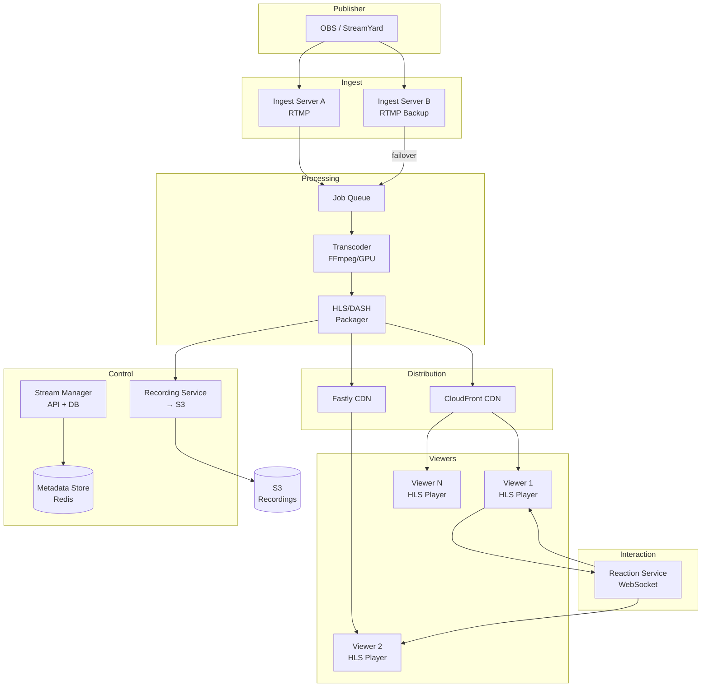
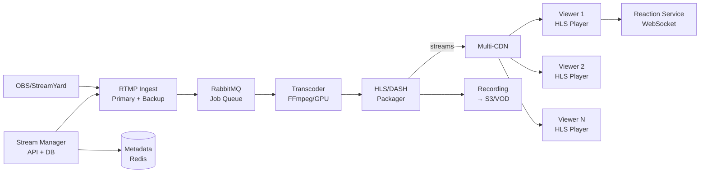

# StreamYard Clone

## Blogs and websites

## Medium

## Youtube

- [I Built StreamYard Clone | Code Along - Live Streaming RTMP Application](https://www.youtube.com/watch?v=JwZiO5p-NAE)

## Theory

RTMP server
This streaming works on TCP — live video travels from the publisher (camera/OBS) to viewers via TCP-based RTMP ingest, then gets transcoded and repackaged into HTTP-based HLS/DASH for CDN distribution. The ingest server (Real-Time Messaging Protocol) receives video from the publisher, then the rest of the pipeline handles the broadcast.

### What Is It?

A live-streaming platform (StreamYard, Twitch, YouTube Live, Zoom Live) broadcasts video/audio from a single source (publisher) to many concurrent viewers (subscribers) in real time. The data flows: publisher encodes video → RTMP/SRT ingest server → transcoder → packager → CDN → viewers play via HLS/DASH/WebRTC.

### Why Does It Exist?

Before live streaming, content consumption was entirely on-demand (Netflix, YouTube recordings). Live streaming enables real-time interaction: live gaming, live news, live education, live shopping, live talk shows — anyone can become a broadcaster with just a camera and internet.

### What Problem Does It Solve?

* **One-to-many delivery**: Single publisher → thousands of concurrent viewers → scale-out via CDN.
* **Variable viewer count**: Viewers join/leave constantly; system must handle 1 viewer or 1M viewers.
* **Multiple bitrates**: Different viewers have different bandwidth → adaptive bitrate transcoding.
* **Low latency**: Interaction (chat, reactions) needs sub-second latency; traditional HLS has 10–30s delay.
• **Reliability**: Ingest failure → recover; CDN failure → failover; transcoder crash → restart.
* **Interactive features**: Live chat, polls, Q&A — these are additional real-time data streams alongside video.

### Important Subtopics

1. Ingest protocols (RTMP, SRT, WebRTC, RTSP)
2. Transcoding (re-encoding to multiple bitrates/resolutions)
3. Packaging (HLS, DASH, CMAF)
4. Low-latency streaming (WebRTC, LL-HLS, LL-DASH)
5. CDN distribution (edge caching, live-prefetch)
6. Live chat and interactive features
7. DVR (time-shift/Delayed replay)
8. Stream metadata (viewer count, bitrate, health)
9. Failover and redundancy (primary/backup ingest, CDN failover)

### Problem Statement

Design a live-streaming platform (StreamYard Clone) that allows users to broadcast live video to an audience. The system must handle video ingest via RTMP, transcode to multiple bitrates, package as HLS, distribute via CDN, and support live reactions from viewers. Keep all data within the stream context.

### Functional Requirements

- Ingest live video/audio via RTMP from broadcasting software (OBS, StreamYard, Wirecast)
- Transcode to multiple bitrates (240p, 360p, 480p, 720p, 1080p)
- Package as HLS segments for adaptive playback
- Distribute via CDN to global viewers
- Live reactions (emoji) synchronized with stream
- Stream recording + DVR (rewind live)
- Stream management (start/stop, title, tags)
- Viewer count in real-time

### Non-Functional Requirements

- **Latency**: 3–30s for standard HLS
- **Scale**: 100K concurrent viewers per stream
- **Availability**: 99.9% uptime
- **Throughput**: 10 Gbps aggregate ingest
- **Durability**: No video loss; 7-day retention for recordings

---

## Characteristics

| Characteristic | What it means | Why it matters | How it works |
|---|---|---|---|
| **One-to-many** | Single publisher → N viewers | Efficient distribution | Ingest → transcoder → CDN → players |
| **Low latency** | 3–30s delay | Real-time feel | HLS (or WebRTC for < 3s) |
| **Adaptive bitrate** | Multiple quality variants | Handle varying bandwidth | Transcode to 240p–1080p; HLS manifest |
| **Real-time reactions** | Emoji reactions during stream | Engagement | WebSocket/SSE to viewers |
| **Scalable viewers** | From 1 to 100K+ viewers | Popular stream handling | CDN with edge caching |
| **Stream recording** | Durable video archive | On-demand replay | Segments stored in S3 |
| **DVR/time-shift** | Rewind live within buffer window | Better UX | HLS sliding window playlist |

## Components

| Component | Purpose | Responsibilities | Relationship | Real-world Example |
|---|---|---|---|---|
| **Ingest Server** | Receive publisher stream | Accept RTMP; validate; queue | Publisher ↔ Transcoder | Nginx RTMP, Media Server |
| **Transcoder** | Re-encode to multiple bitrates | Decode + encode; audio normalization | Ingest → Packager | FFmpeg, AWS MediaConvert |
| **Packager** | Segment + manifest | Create HLS (.m3u8); segments | Transcoder → CDN | Wowza, AWS MediaPackage |
| **CDN** | Distribute to viewers | Edge cache; global PoPs | Packager → Player | CloudFront, Fastly, Akamai |
| **Player** | Client-side playback | HLS/DASH; adaptive switching | CDN → Viewer | Video.js, hls.js |
| **Reaction Service** | Live reactions | WebSocket; fan-out; rate limiting | Ingest → WebSocket | Socket.IO, Pusher |
| **Stream Manager** | Orchestrate stream lifecycle | Create/destroy; metadata; health | All components | API + DB |
| **Recording Service** | Archive to durable storage | Upload segments; S3 lifecycle | Packager → S3 | S3 + Glacier |
| **Metadata Store** | Track stream state | Viewer count, status, health | All components | DynamoDB/Redis |

## Patterns

### HLS (HTTP Live Streaming) Packaging

* **What**: Apple's adaptive streaming protocol — video split into 2–10s segments (.ts); manifest (.m3u8) lists available bitrates; player switches quality based on bandwidth.
* **Problem solved**: Adaptive playback; CDN-friendly (HTTP); broad device support.
* **How it works**: (1) Encode to 240p/360p/480p/720p/1080p. (2) Segment each variant into 4s chunks. (3) Generate master playlist + media playlists. (4) CDN caches segments + playlists. (5) Player fetches master → choose bitrate → fetch segments → ABR.
* **When to use**: Broad compatibility, on-demand + live, non-critical latency.
* **When not to use**: Sub-second latency → WebRTC.
* **Advantages**: CDN-friendly; adaptive; broad support.
* **Disadvantages**: 10–30s latency; manifest reload overhead.

### RTMP Ingest

* **What**: Real-Time Messaging Protocol — persistent TCP connection from publisher to ingest server.
* **Problem solved**: Reliable ingest from broadcasting software (OBS, StreamYard).
* **How it works**: Publisher sends RTMP to ingest URL (primary + backup) → validate stream key → queue → transcoder. TCP ensures no chunk loss.
* **When to use**: Reliable ingest for professional broadcasting.
* **Advantages**: Reliable (TCP); widely supported by OBS/StreamYard.
* **Disadvantages**: Not for direct viewer delivery (needs transcoding).

## Benefits

* **Real-time broadcast**: Anyone can stream live to global audience.
• **Adaptive quality**: Multiple bitrates → smooth playback for all.
• **Global reach**: CDN → worldwide distribution.
• **Recordings**: Live → VOD automatically.

## Pros

* **Broad compatibility**: HLS works on all browsers/devices.
• **Adaptive streaming**: Seamless quality switching.
• **Scalable**: CDN handles unlimited viewers.
• **Interactive**: Live reactions + chat.
• **Durable**: Recordings auto-saved to S3.

## Cons

* **High cost**: Transcoding (GPU) + CDN (bandwidth) — significant operational expense.
• **Complexity**: Ingest + transcode + package + CDN + reactions = many moving parts.
• **Latency**: Standard HLS = 10–30s; WebRTC = < 3s but limited scale.
• **Hot streams**: 100K+ viewers on one stream → CDN + load management.
• **Encoding failures**: Affect all viewers if ingest/transcode fails.

## Challenges

### Technical Challenges
* **Video processing**: Transcoding (FFmpeg, GPU encoding); multiple bitrates; audio normalization.
• **Protocol support**: RTMP ingest + HLS/DASH output + WebRTC for low-latency option.

### Scalability Challenges
* **Concurrent viewers**: 100K per stream → CDN with 100+ PoPs; edge cache hit ratio > 90%.
• **Transcoding**: GPU instances (NVIDIA A10); cost scales with resolution × bitrate × viewers.

### Performance Challenges
* **Latency**: HLS = 10–30s (segment + manifest + buffer). WebRTC = sub-500ms.
• **Bitrate switching**: Player must switch smoothly without rebuffering.

### Reliability Challenges
* **Ingest failure**: Primary ingest down → backup ingest (5s failover).
• **Transcoder crash**: Restart from queue; lose current segment.
* **CDN failure**: Multi-CDN → DNS failover to next; player retries manifest.

### Maintainability Challenges
* **Codec/DRM evolution**: New codecs (AV1) → player + packaging updates.
• **Pipeline complexity**: 10+ microservices; monitoring across all stages.

### Security Concerns
* **Stream hijacking**: Unauthorized publisher → ingest authentication (stream keys).
• **Piracy**: Viewer redistribution → watermarking + forensic tracking.
• **Reaction abuse**: Bot reactions → rate limiting + CAPTCHA.

## Best Practices

* **Primary + backup ingest**: Two RTMP endpoints → failover if primary dies.
• **Multi-CDN**: DNS-based routing to least-loaded CDN.
• **Transcoder autoscaling**: GPU instances scaled by ingest bitrate + resolution.
• **Segment caching**: CDN edge cache → 90%+ hit ratio.
• **Monitoring**: Ingest health; transcode queue; CDN hit ratio; player errors; reaction spam rate.
• **Recordings**: Always record segments to S3 → VOD archive.

## When to Use

### Appropriate
* Live broadcasting (Twitch, YouTube Live, Zoom Live).
• Live gaming, live news, live education, live shopping.
• Events requiring real-time audience interaction.
• Content that benefits from "being there" (concerts, launches).

### Not Appropriate
* One-time recorded content (use VOD).
• Static content (no streaming needed).
• Small, private audiences (use Zoom/Teams).
* Content that doesn't benefit from real-time delivery.

### Decision Factors
* Audience size; latency requirements; budget (transcode + CDN cost); device support; interactivity needs.

## Use Cases

### Live Gaming Stream (Twitch-style)

* **Problem**: A streamer broadcasts gameplay live to thousands of viewers who react with emoji and cheers; streamer earns from subscriptions + donations.
* **Solution**: OBS → RTMP ingest (primary + backup) → transcoder (5 bitrates: 360p–1080p) → HLS package → CDN. Reactions via WebSocket. Recording to S3.
* **Why suitable**: RTMP ingest works with OBS; HLS + CDN scales to unlimited viewers; reactions over WebSocket are real-time; auto-recording for VOD.
* **How it works**: (1) OBS encodes 1080p60 → RTMP to ingest (primary: ingest-a.twitch.com; backup: ingest-b). (2) Ingest → transcoder → FFmpeg → 5 bitrates → 4s HLS segments + master playlist. (3) Segments → CDN (CloudFront); DNS routes viewer to edge. (4) Viewer → HLS player → fetch playlist → play → ABR. (5) Reactions: viewer clicks ❤️ → WebSocket → Reaction Service → fan-out to viewers in same stream. (6) Recording: segments → S3 → VOD catalog.
* **Trade-offs**: HLS latency (10–30s) vs WebRTC (< 3s but limited scale); CDN cost ($10K–100K/month); transcode cost (GPU); reaction rate limiting.

## Architecture



### Architecture Structure
* **Ingest**: RTMP servers (primary + backup); stream key auth; active-passive.
• **Processing**: Transcoder (FFmpeg/GPU) → multiple bitrates; Packager → HLS/DASH.
• **Distribution**: Multi-CDN (CloudFront + Fastly); edge cache.
• **Interaction**: WebSocket for reactions.
• **Control**: Stream manager + recorder + metadata store.

### Communication
* **Publisher → Ingest**: RTMP over TCP.
• **Ingest → Transcoder**: Internal queue (Kafka/RabbitMQ).
• **Packager → CDN**: HTTP (segments + playlists).
• **Viewer → CDN**: HTTP/HTTPS.
• **Reactions**: WebSocket (persistent, bidirectional).

### Data Flow
1. **Publish**: OBS → RTMP ingest → validate stream key → queue.
2. **Transcode**: Transcoder → FFmpeg → 5 bitrates → segment (4s HLS).
3. **Package**: Segments + playlist → CDN edge.
4. **Play**: Viewer → DNS → best CDN → HLS player → fetch playlist → play → ABR.
5. **Reactions**: Viewer → WebSocket → Reaction Service → fan-out to viewers.
6. **Record**: Segments → S3 → VOD catalog.

### Scaling Strategy
* **Ingest**: 20+ ingest servers; RTMP; TCP-based; active-passive failover.
• **Transcoder**: GPU instances (NVIDIA A10); auto-scale by ingest bitrate; 100+ per region.
• **Packager**: Stateless; auto-scale by segment count.
• **CDN**: Multi-CDN; edge cache; 100+ PoPs.

### Failure Handling
* **Ingest failure**: Backup ingest (5s failover).
• **Transcoder crash**: Restart from queue; lose current segment only.
* **CDN failure**: DNS failover to next CDN; player retries.
* **Reaction failure**: Falls back to HTTP polling.

## High-Level Design



## Deep Dive

### HLS Packaging

The existing Theory section notes: live streaming uses RTMP ingest (TCP-based); transcodes to HLS packages. Standard HLS = 10–30s latency (2 × segment duration + playlist reload + 3-segment buffer). For sub-second: WebRTC (P2P via SFU) or LL-HLS (partial segments, blocking reload).

### Transcoding Pipeline

(Existing content covers: receive encoded video → transcode to multiple bitrates (240p–1080p) → package as HLS segments (4s) → serve via CDN; latency types: contribution (publisher→ingest), processing (transcode), playback (CDN+player); scaling via GPU instances auto-scaled by ingest bitrate.)

## API Contract

* **API purpose**: Stream management, stream status, live reactions.

| Method | Endpoint | Description |
|---|---|---|
| POST | `/api/v1/streams` | Create a new stream (returns ingest URL + key) |
| GET | `/api/v1/streams/{id}` | Get stream status + viewer count |
| DELETE | `/api/v1/streams/{id}` | Stop stream |
| GET | `/api/v1/streams/{id}/playlist.m3u8` | Get HLS master playlist |
| GET | `/api/v1/streams/{id}/segments/{seq}.ts` | Get video segment |
| POST | `/api/v1/streams/{id}/reactions` | Send a reaction (emoji) |
| WS | `/ws/streams/{id}/reactions` | Live WebSocket reactions |

**Create stream (POST /streams)**:
```json
{"title": "My Live Stream", "category": "gaming"}
```
**Response**:
```json
{
  "stream_id": "str_abc123",
  "ingest_url": "rtmp://ingest-a.live.example.com/app",
  "stream_key": "abc123-key-xyz",
  "backup_ingest_url": "rtmp://ingest-b.live.example.com/app"
}
```

**Authentication**: Stream key for ingest; JWT for API.

## Data Modeling

```mermaid
erDiagram
    STREAM ||--o{ SEGMENT : "has"
    STREAM ||--o{ REACTION : "has"
    USER ||--o{ REACTION : "sends"

    STREAM {
      string stream_id PK
      string user_id FK
      string title
      string status active_ended
      datetime started_at
      datetime ended_at
      int viewer_count
      string ingest_url
      string stream_key
    }
    SEGMENT {
      string segment_id PK
      string stream_id FK
      string variant_360p_720p_1080p
      bigint byte_size
      int duration_sec
      datetime created_at
    }
    REACTION {
      string reaction_id PK
      string stream_id FK
      string user_id FK
      string emoji_type
      datetime sent_at
    }
```

**Partitioning**: Segments sharded by stream_id + timestamp.

## Java and Spring Boot Implementation

```java
@RestController
@RequestMapping("/api/v1/streams")
@RequiredArgsConstructor
public class StreamController {
    private final StreamService streamService;

    @PostMapping
    public ResponseEntity<StreamResponse> createStream(
            @AuthenticationPrincipal UserDetails user,
            @RequestBody CreateStreamRequest request) {
        Stream stream = streamService.createStream(user.getId(), request.getTitle());
        return ResponseEntity.ok(StreamResponse.from(stream));
    }

    @GetMapping("/{id}")
    public ResponseEntity<StreamStatus> getStream(@PathVariable String id) {
        return ResponseEntity.ok(streamService.getStatus(id));
    }
}

@Service
public class ReactionService {
    private final RedisTemplate<String, String> redis;

    public void broadcastReaction(String streamId, String emoji) {
        // Fan-out via Redis pub/sub to WebSocket servers
        redis.convertAndSend("reactions:" + streamId, emoji);
    }
}
```

## Real-World Examples

* **Twitch**: RTMP ingest; 5–8 bitrates; HLS + Low-Latency HLS; 3M+ concurrent viewers peak; chat WebSocket; Bits (cheering) + subscriptions.
• **YouTube Live / StreamYard**: RTMP ingest; StreamYard web-based; HLS + WebRTC; recording to S3.
• **Facebook Live**: RTMPS ingest; adaptive bitrate; global CDN; reactions + comments.

## Interview Preparation

### Beginner Questions

**Q: What are the main protocols used in live streaming?**
A: RTMP (ingest — publisher to server), HLS/DASH (distribution — server to viewers). RTMP uses TCP (reliable ingest). HLS segments video into .ts + .m3u8 playlist. For sub-second latency → WebRTC.

**Q: Why does live streaming use TCP?**
A: RTMP ingest uses TCP — reliable delivery ensures no video chunks are lost from publisher. (UDP might lose frames.) WebRTC can use UDP for lower latency.

**Q: What is adaptive bitrate streaming?**
A: Video encoded at multiple qualities (240p–1080p). Player monitors bandwidth → switches quality in real time. HLS manifest lists all variants. CDN caches all variants.

### Intermediate Questions

**Q: How do you handle 100K concurrent viewers on one stream?**
A: (1) Single transcode → multiple bitrates → CDN edge cache (90%+ hit ratio). (2) Multi-CDN (CloudFront + Fastly) → DNS routing. (3) Edge PoPs (100+) → serve globally. (4) Player ABR → bandwidth-based quality. (5) Scale CDN (300+ PoPs).

**Q: What is the latency breakdown in live streaming?**
A: (1) Encoding (OBS): 200–500ms. (2) Ingest (RTMP): 50–200ms. (3) Transcode: 500–1000ms. (4) Segment (HLS): 2–10s. (5) CDN: 100–500ms. (6) Player buffer: 3–10s. Total: 5–30s (HLS). For WebRTC: < 500ms.

### Advanced Questions

**Q: Design a live-streaming platform supporting 100K concurrent viewers per stream, < 3s latency, with live reactions.**

A: (1) **Ingest**: RTMP servers (20+ per region; primary + backup); stream key auth. (2) **Transcode**: GPU instances (NVIDIA A10) → FFmpeg → 8 bitrates; auto-scale by ingest bitrate. (3) **Package**: HLS + LL-HLS (partial segments, blocking reload); packager auto-scales. (4) **CDN**: Multi-CDN (CloudFront + Fastly); DNS routing; 200+ PoPs; edge cache. (5) **Player**: hls.js with LL-HLS config → sub-3s latency; ABR. (6) **Reactions**: WebSocket → fan-out per stream → sharded by viewer_id; Redis pub/sub cross-instance. (7) **Scale**: 100K viewers → 50 WebSocket servers (2K connections each); transcoder cluster (100 GPU nodes); CDN (300 PoPs). (8) **Monitoring**: Latency (P99 < 3s); CDN hit ratio (> 90%); transcode queue (< 5s); reaction latency (< 100ms).

### Senior-Level Questions

**Q: Compare HLS, LL-HLS, and WebRTC for live streaming latency and scalability.**

A: Trade-off analysis:

| Protocol | Latency | Scalability | Use Case |
|---|---|---|---|
| **HLS** | 10–30s | Millions (CDN) | Standard live, VOD |
| **LL-HLS** | 2–4s | Millions (CDN) | Live sports, news |
| **WebRTC** | < 500ms | ~200 viewers (SFU) | Interactive (gaming, auctions) |

**When to use each**:
* **HLS**: Broad compatibility; broadcast-style; non-critical latency (e.g., Twitch chat is delayed but that's OK).
• **LL-HLS**: Want low latency but still need CDN scale (e.g., live sports, auctions).
* **WebRTC**: Sub-second critical (interactive gaming, live auctions, remote control); small audience.

**Implementation notes**:
* HLS: Segment (4–10s) + manifest + 3-segment player buffer.
• LL-HLS: Partial segments (200ms) + blocking reload + part-infos + skip boundary markers.
• WebRTC: SFU (Selective Forwarding Unit) → P2P via SFU; ~200 viewers max without simulcast.

### Common Mistakes

- Single CDN → no failover; use multi-CDN + DNS health checks.
- No backup ingest → stream lost on primary failure.
- No segment caching → CDN cost explosion (cache misses).
- WebRTC for > 200 viewers → SFU overload; use HLS for scale.
- No reaction rate limiting → spam/flood.
- No DVR → viewers can't rewind.
- No recording → lose content; always record to S3.
- LL-HLS misconfigured → latency not actually reduced.
- No player ABR tuning → buffering or excessive quality.
- Stream key exposed → unauthorized broadcast (hijacking).
- No ingest validation → corrupted streams.
