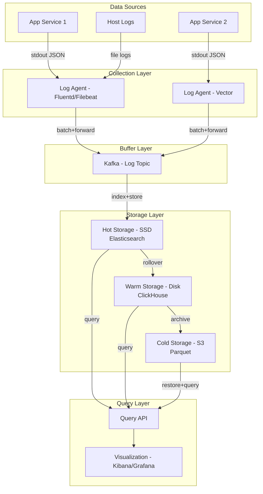
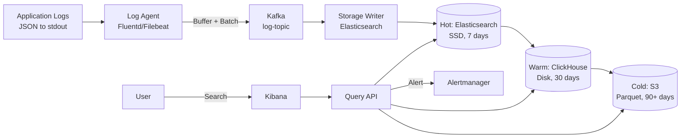
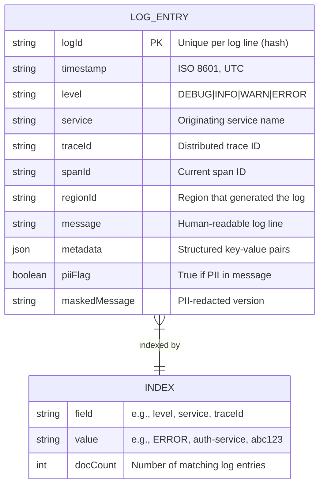
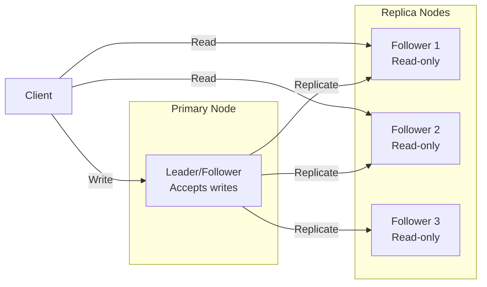
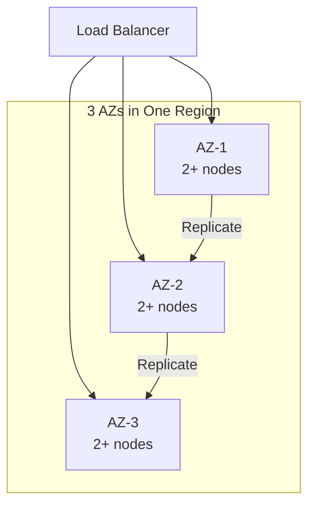
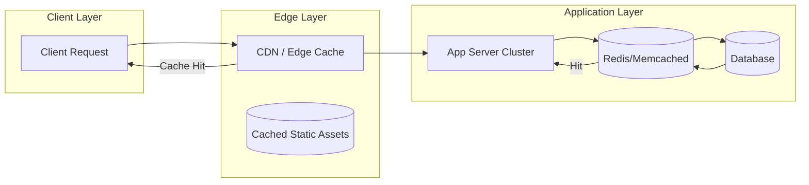
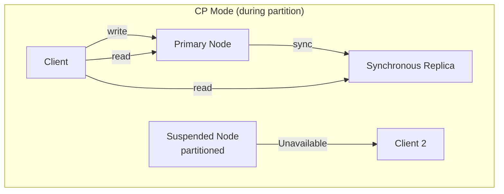
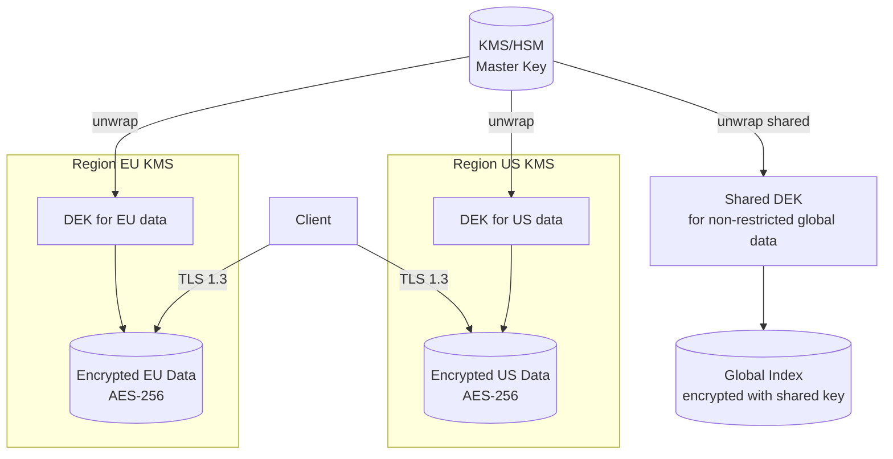
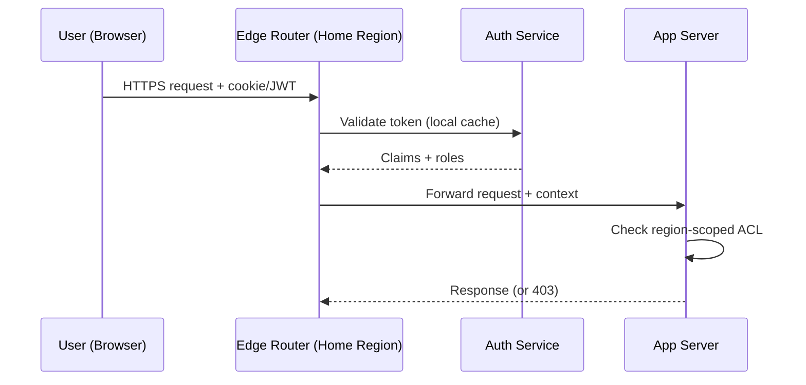

# Design Log System Data

## Blogs and websites

## Medium

## Youtube

- [Design a High-Throughput Logging System | System Design](https://www.youtube.com/watch?v=ak1wTYq_opQ)

---

## Theory

### Topics Covered

1. [Introduction / Problem Statement](#introduction-problem-statement)
2. [Characteristics](#characteristics)
3. [Components](#components)
4. [Architectural Patterns](#architectural-patterns)
5. [Benefits](#benefits)
6. [Pros](#pros)
7. [Cons](#cons)
8. [Challenges](#challenges)
9. [Best Practices](#best-practices)
10. [When to Use / When Not to Use](#when-to-use-when-not-to-use)
11. [Use Cases](#use-cases)
12. [Architecture](#architecture)
13. [High-Level Design](#high-level-design)
14. [Deep Dive](#deep-dive)
15. [Data Model and API](#data-model-and-api)
16. [Replication Strategies](#replication-strategies)
17. [Failure Detection and Membership](#failure-detection-and-membership)
18. [High Availability and Scalability](#high-availability-and-scalability)
19. [Performance and Optimization](#performance-and-optimization)
20. [CAP Theorem and Consistency Trade-offs](#cap-theorem-and-consistency-trade-offs)
21. [Encryption and Key Management](#encryption-and-key-management)
22. [Authentication and Authorization](#authentication-and-authorization)
23. [Security Threats and Mitigations](#security-threats-and-mitigations)
24. [Data Model and API](#data-model-and-api)
25. [Replication Strategies](#replication-strategies)
26. [Failure Detection and Membership](#failure-detection-and-membership)
27. [High Availability and Scalability](#high-availability-and-scalability)
28. [Performance and Optimization](#performance-and-optimization)
29. [CAP Theorem and Consistency Trade-offs](#cap-theorem-and-consistency-trade-offs)
30. [Encryption and Key Management](#encryption-and-key-management)
31. [Authentication and Authorization](#authentication-and-authorization)
32. [Security Threats and Mitigations](#security-threats-and-mitigations)
33. [Observability and Logging](#observability-and-logging)
34. [Java and Spring Boot Implementation Guide](#java-and-spring-boot-implementation-guide)
35. [Real-World Implementations](#real-world-implementations)
36. [Interview Questions and Answers](#interview-questions-and-answers)

---
---
---
### Introduction / Problem Statement

A log system (logging infrastructure) is a platform for collecting, storing, searching, and analyzing log data generated by applications and infrastructure components. Logs are structured or unstructured records of events — application errors, user actions, API calls, infrastructure metrics, and audit trails. At scale, a log system must handle millions of log lines per second (write throughput), store them durably (terabytes to petabytes), and support low-latency search queries for troubleshooting, security monitoring, and business analytics.

**Why Does It Exist**

Every software system generates events — when a user clicks a button, an API returns an error, a database transaction commits, or a server becomes unhealthy. These events, when captured as structured logs, are the primary source of truth for debugging production issues, monitoring system health, detecting security incidents, and analyzing user behavior. Without centralized logging, debugging is impossible in distributed/microservices systems where a single user request may traverse 20+ services.

**What Problem Does It Solve**

* **Distributed tracing**: In a microservices architecture, a single user request spans multiple services — logs from all services must be correlated to reconstruct the full request path.
* **High write throughput**: Systems can generate millions of log lines per second (e.g., a web service with 100K requests/second, each generating 10 log lines). The log system must ingest without backpressure on the application.
* **Storage cost**: Storing terabytes of logs daily is expensive — retention policies and tiered storage (hot/warm/cold) are essential.
* **Search and query**: Debugging requires searching across billions of log lines (e.g., "all 500 errors in the last hour for user X") with sub-second latency.
* **Durability**: Logs must survive system failures — a log system outage must not lose application data or block the application.
* **Schema evolution**: Log formats change over time; the system must handle schema evolution gracefully.
* **Compliance and audit**: Security logs must be tamper-proof and retained for compliance (PCI-DSS, HIPAA, SOX).


### Characteristics

| Characteristic | What it means | Why it matters | How it works |
|---|---|---|---|
| **High write throughput** | Millions of log lines per second | Production systems generate massive log volume | Buffer + batch writes; horizontal partitioning |
| **Durability** | Logs are not lost on crash | Logs are the record of truth for debugging/security | Replicated storage; WAL (Write-Ahead Log) |
| **Searchability** | Can query logs by content, time, tags | Debugging requires finding specific events | Inverted index or columnar storage |
| **Schema flexibility** | Log format can evolve | Applications change; log fields are added/removed | Schema-on-read; dynamic fields |
| **Retention management** | Old logs are automatically expired | Storage cost grows unbounded without retention | Time-based or size-based retention policies |
| **Low query latency** | Search results in milliseconds | Production debugging is time-sensitive | In-memory indexes; cached results |
| **Multi-tenancy** | Multiple services/apps share the system | Cost efficiency; operational simplicity | Namespace isolation; resource quotas |

### Components

| Component | Purpose | Responsibilities | Relationship | Real-world Example |
|---|---|---|---|---|
| **Log Agent** | Collect local logs | Tail log files, parse, buffer, forward to collector | Runs on each host; forward to Collector | Fluentd, Filebeat, Vector |
| **Log Collector** | Aggregate and buffer | Accept logs from agents, batch, buffer, route | Receives from Agents; writes to Storage | Fluentd aggregator, Kafka |
| **Storage Engine** | Persist logs durably | Store logs; support indexing; handle retention | Written by Collector; read by Query | Elasticsearch, ClickHouse, S3 |
| **Index/Query Engine** | Search and query | Parse queries, use indexes, return results | Reads from Storage; serves Query API | Elasticsearch search, ClickHouse |
| **Query API** | Serve user queries | Accept search/filter requests, return results | Reads from Index Engine | Kibana, Grafana, Log API |
| **Retention Manager** | Manage log lifecycle | Delete expired logs, archive cold data | Operates on Storage Engine | ILM in Elasticsearch |
| **Alerting Engine** | Detect anomalies | Monitor logs, trigger alerts on patterns | Reads from Index Engine | Elasticsearch Watcher, Prometheus AlertManager |

#### Component Interactions

1. **Agent → Collector**: Log agents on each host tail log files, parse (JSON or regex), add metadata (host, service, timestamp), buffer locally (disk or memory), and forward to the collector (HTTP or file-based).
2. **Collector → Storage**: Collectors batch logs, apply compression, and write to the storage engine. May route to hot storage (recent) vs cold storage (archived).
3. **Query → Storage**: Users query via API or UI; the query engine uses indexes (inverted index for text, columnar for analytics) to find and return matching logs.
4. **Retention Manager → Storage**: Periodically deletes or archives logs older than the retention period.

### Architectural Patterns

#### Structured Logging with Centralized Collection

* **What**: Every service writes structured JSON logs (with consistent fields like `timestamp`, `service`, `level`, `message`, `trace_id`) to stdout/stderr; log agents collect and forward to a centralized system.
* **Problem solved**: Unstructured logs are hard to search (grep across 100 servers); structured JSON logs enable field-based querying and correlation.
* **How it works**: Application logs JSON to stdout → log agent (Fluentd/Filebeat/Vector) tails stdout → parses JSON → adds host metadata → forwards to central collector → stored in searchable index.
* **When to use**: Microservices architectures where logs need to be searched centrally.
* **When not to use**: Simple single-process applications — direct file logging suffices.
* **Advantages**: Searchable fields, consistent format, easy correlation across services, schema-on-read.
* **Disadvantages**: Higher serialization overhead (JSON vs plain text); larger storage footprint.
* **Java/Spring Boot example**:
```java
// Structured logging with Logback JSON encoder
// pom.xml: logback-spring.xml with logstash-logback-encoder

@Component
public class OrderService {
    private static final Logger log = LoggerFactory.getLogger(OrderService.class);

    public void processOrder(String orderId) {
        log.info("Processing order", 
                KeyValue.of("orderId", orderId),
                 KeyValue.of("step", "validation"),
                 KeyValue.of("userId", getCurrentUserId()));
        // ...
        log.error("Payment failed",
                 KeyValue.of("orderId", orderId),
                 KeyValue.of("reason", "insufficient_funds"),
                 KeyValue.of("attempt", 3));
    }
}
```
* **Real-world example**: Netflix's Atlas logging platform uses structured JSON logging across all services.

#### Write-Ahead Log (WAL) for Durability

* **What**: The storage engine writes logs to a durable, replicated log before acknowledging to the writer. If a node crashes, logs can be recovered from the WAL.
* **Problem solved**: Prevent log data loss on node failure.
* **How it works**: Collector writes log entries to a WAL (append-only file on disk, replicated). Only after WAL write succeeds is the log acknowledged. On restart, replay the WAL.
* **When to use**: When log durability is critical (audit logs, security events).
* **When not to use**: When log loss is acceptable (debug logs) and performance is paramount.
* **Advantages**: Strong durability guarantee; crash recovery.
* **Disadvantages**: Lower write throughput (sync to disk); increased storage.
* **Real-world example**: Kafka's persistence (each partition is a WAL); Elasticsearch's transaction log.

#### Tiered Storage (Hot/Warm/Cold)

* **What**: Store recent logs on fast storage (SSD, memory-indexed) and progressively move older logs to cheaper storage (disk, object storage).
* **Problem solved**: Balancing cost vs. access speed — you need instant access to recent logs but cheap storage for old logs.
* **How it works**: Hot tier (last 24-72 hours) on SSD with full indexing; warm tier (last 7-30 days) on disk; cold tier (90+ days) in object storage (S3) with minimal indexing or archived (compressed, non-queryable without restore).
* **When to use**: When you have large log volumes and different access patterns.
* **When not to use**: When all logs are equally important and accessed equally — tiered storage adds complexity.
* **Advantages**: Cost optimization (SSD is 10x more expensive than S3); performance for recent logs.
* **Disadvantages**: Complexity of tiering logic; cold data is slow to query.
* **Real-world example**: Elasticsearch's ILM (Index Lifecycle Management); AWS CloudWatch Logs tiering.

### Benefits

* **Production debugging**: Centralized searchable logs enable rapid root-cause analysis — finding the error that caused an outage across thousands of services.
* **Security monitoring**: Security events (failed logins, privilege escalations) are logged and alertable for incident detection.
* **Compliance auditing**: Immutable, tamper-proof logs satisfy regulatory requirements for traceability.
* **Business analytics**: Application events (purchases, feature usage) can be mined for business insights.
* **Performance monitoring**: Latency, error rates, and throughput can be tracked from logs for SLO/SLA monitoring.
* **Operational visibility**: Logs provide a real-time window into system behavior for operators.

### Pros

* **Distributed tracing enabled**: Correlation IDs (trace_id) in logs allow reconstructing the full request path across microservices.
* **Flexible querying**: Search by any field (service name, error level, trace ID) without predefined schemas.
* **Cost-effective long-term storage**: Tiered storage makes retaining 90+ days of logs economical.
* **Security incident response**: Real-time log monitoring enables immediate detection and response to attacks.
* **Root-cause analysis**: Aggregated logs with consistent timestamps allow identifying cause-effect chains.

### Cons

* **High infrastructure cost**: Storing and indexing terabytes of logs daily is expensive — can be 10-20% of total infrastructure budget.
* **Performance overhead**: Logging (especially structured JSON with I/O) adds latency to application requests.
* **Data privacy risk**: Logs often contain PII (user IDs, email addresses, payment info) — must be redacted or encrypted.
* **Log noise**: High-volume, low-value logs (debug messages in production) create signal-to-noise problems.
* **Schema sprawl**: Without governance, every service invents its own log format — search becomes fragmented.

### Challenges

#### Technical Challenges

* **Write throughput**: Handling millions of log lines/second without dropping data requires careful buffering, batching, and backpressure management.
* **Schema evolution**: Adding/removing log fields must not break existing queries or dashboards.
* **Backpressure handling**: If the storage layer falls behind, the system must buffer (not drop logs) and notify operators.
* **Log rotation**: Old log files must be rotated (split) and forwarded without gaps or duplicates.

#### Scalability Challenges

* **Hot topics**: A sudden surge (DDoS, outage) can generate 100x normal log volume — the system must absorb the spike without data loss.
* **Storage growth**: Log volume grows linearly with traffic; must scale horizontally and implement retention.
* **Indexing cost**: Every new log line requires index updates — expensive at scale. Columnar storage can help.

#### Performance Challenges

* **Query latency**: Searching billions of log lines must return in < 1 second for effective debugging. Requires efficient indexing (inverted index for text, bloom filters for existence checks).
* **Ingest latency**: Logs should arrive in the system within seconds of being generated — delayed logs are useless for real-time debugging.

#### Reliability Challenges

* **Log loss**: If the agent/collector crashes and local buffer is insufficient, logs are lost. Must use disk-based buffers and replication.
* **Ordering**: Log lines from the same request across services may arrive out of order — need timestamp-based sorting and trace correlation.
* **Data corruption**: Partial writes or network corruption can corrupt log entries — checksums and atomic writes needed.

#### Maintainability Challenges

* **Log governance**: Enforcing consistent log formats across hundreds of microservices and teams.
* **Index management**: Growing indices must be merged, optimized, and rebalanced without downtime.
* **Retention policy changes**: Changing retention (e.g., from 30 days to 90 days) affects storage and costs.

#### Operational Challenges

* **Monitoring the monitor**: The log system itself must be monitored — disk usage, throughput, ingest lag, query latency.
* **Cost management**: Storage and compute costs grow with log volume — must implement sampling, filtering, and tiered storage.
* **Capacity planning**: Forecasting log growth and provisioning storage/indexing capacity ahead of traffic growth.

#### Security Concerns

* **PII in logs**: Log files often contain sensitive data (user emails, API keys, payment info) — must mask/encrypt.
* **Log tampering**: Audit/security logs must be immutable to prevent attackers from erasing their tracks.
* **Access control**: Production logs contain sensitive info — restrict access via RBAC.
* **Log injection**: Malicious input in application parameters can inject fake log entries — sanitize inputs.

### Best Practices

* **Structured logging**: Always log in JSON with structured fields (`timestamp`, `level`, `service`, `trace_id`, `message`, custom fields). This enables field-based querying.
* **Correlation IDs**: Propagate `trace_id`/`span_id` (from OpenTelemetry) across all service calls so logs from the same request can be correlated.
* **Log levels**: Use appropriate levels (TRACE, DEBUG, INFO, WARN, ERROR) and avoid DEBUG in production (high volume, low value).
* **Sampling**: For high-volume debug/trace logs, sample (e.g., 1 in 1000) to reduce volume while retaining diagnostic value.
* **Centralized collection**: Never rely on SSH-ing into individual hosts — always have a centralized, searchable log system.
* **Retention policies**: Delete logs after a defined period (e.g., 30 days for app logs, 1 year for audit logs). Use tiered storage.
* **Log redaction**: Mask PII in logs — redact credit card numbers, emails, etc. at the application level.
* **Monitor the log system**: Track ingest rate, latency, disk usage, and query performance — alert if ingest falls behind.
* **SLOs for logs**: Define SLOs (e.g., 99% of logs ingested within 5 seconds; 99% of search queries < 1 second).
* **Avoid log flooding**: Implement circuit breakers on logging — if a service starts logging 100K lines/second, throttle/dedupe.

### When to Use / When Not to Use

#### Appropriate

* When you have microservices/distributed systems where debugging spans many services.
* When compliance (PCI-DSS, HIPAA, SOX) requires audit trails.
* When security monitoring (intrusion detection, anomaly detection) is needed.
* When business analytics (conversion funnels, feature usage) relies on event data.
* When production debugging requires fast, searchable logs across thousands of instances.

#### Not Appropriate

* When the application is simple (single service, low volume) — direct file logging or `journalctl` suffices.
* When log volume is tiny (< 1K lines/minute) — the operational overhead of a log system isn't justified.
* When real-time alerting is the only requirement — a metrics system (Prometheus) may be simpler.
* When all logging requirements can be met by cloud provider-managed logging (CloudWatch, Stackdriver).

#### Alternatives

* **Application logs to files**: Simple, but hard to search centrally. Good for single-instance apps.
* **Metrics + tracing**: Metrics (Prometheus) for aggregates; distributed tracing (Jaeger, Tempo) for request paths. These complement logging but don't replace it.
* **Cloud-native logging**: Use managed services (AWS CloudWatch Logs, GCP Logging, Azure Monitor) instead of self-hosted.
* **Database audit logs**: For databases, use built-in audit logging features.

#### Decision Factors

* **Team size and complexity**: Larger teams with microservices need centralized logging; small teams may not.
* **Compliance requirements**: Regulatory mandates may require centralized, immutable log storage.
* **Budget**: Self-hosted log systems (Elasticsearch, Loki) vs. managed (CloudWatch, Stackdriver) — trade off cost vs. operational burden.
* **Query needs**: Ad-hoc search and correlation → Elasticsearch; metrics-based alerts → Prometheus; traces → Jaeger/Tempo.

### Use Cases

#### Production Debugging Across Microservices

* **Problem**: A user reports a 500 error when checking out. The checkout flow spans 12 services — how do you find the root cause?
* **Solution**: Each service logs structured JSON with a `trace_id` propagated from the initial request. Search the log system for `trace_id = <id>` → see all 12 service logs in order → identify which service returned the 500 and why.
* **Why suitable**: The trace_id correlation makes distributed debugging possible. Without it, you'd grep across 50 servers for timestamps — error-prone and slow.
* **How it works**: API Gateway generates `trace_id` → passes via HTTP header → each service logs with `trace_id` → log agent collects → Elasticsearch indexes `trace_id` → user searches → sees correlated log stream.
* **Trade-offs**: Instrumentation effort (adding trace_id to all services); storage overhead (more indexed fields); need for consistent logging libraries.

#### Security Incident Response

* **Problem**: A security analyst detects unusual login patterns — hundreds of failed logins from the same IP across multiple accounts.
* **Solution**: Query the log system: `service:auth AND message:"login_failed" AND ip:"1.2.3.4" AND timestamp:[15min ago]` → see all failed attempts → correlate with successful logins to identify compromised accounts.
* **Why suitable**: The log system provides the data for security analysis; structured fields enable precise queries.
* **How it works**: Auth service logs structured JSON: `{"event":"login_failed", "user_id":"u_123", "ip":"1.2.3.4", "reason":"bad_password"}` → forwarded to log system → security analyst queries.
* **Trade-offs**: Storage cost of security logs (often 3x normal volume); PII concerns (must redact IPs in some jurisdictions); need for real-time alerting (not just search).

#### Infrastructure Cost Optimization

* **Problem**: The log system costs $500K/month — how do you reduce costs without losing observability?
* **Solution**: (1) Sampling: reduce 100% sampling of debug logs to 1%. (2) Tiered storage: move 90-day-old logs to S3 (10x cheaper) with Athena for occasional queries. (3) Filtering: drop non-actionable logs (health checks, 200 OK access logs). (4) Log aggregation: aggregate metrics (request count, error rate) instead of storing every line.
* **Why suitable**: Most log value comes from recent logs (debugging outages) and aggregated patterns (alerts); old logs are rarely queried.
* **How it works**: Agent drops DEBUG logs in production (sampling 1%); Collector batches and filters; Storage Engine routes >7 days to warm tier, >30 days to cold tier.
* **Trade-offs**: Sampling means you might miss rare bugs; cold storage is slow to query; filtering risks removing useful data.

### Architecture

A modern log system follows the **agent → collector → storage → query** pipeline. Log agents run on each host, collecting and forwarding; collectors aggregate and buffer; storage engines (Elasticsearch, ClickHouse, Loki) persist and index; query APIs serve search requests. Tiered storage (hot SSD → warm disk → cold S3) optimizes cost. For very high throughput, Kafka is used as an intermediate buffer between collectors and storage.



#### Architecture Structure

* **Collection layer**: Log agents on each host (Fluentd, Filebeat, Vector) that tail logs, parse, add metadata, and forward.
* **Buffer layer**: Kafka or a managed log service (AWS Kinesis) to decouple agents from storage and absorb spikes.
* **Storage layer**: Hot tier (SSD, fully indexed — Elasticsearch) for recent logs; warm tier (disk — ClickHouse) for mid-term; cold tier (S3, compressed, minimal indexing) for archival.
* **Query layer**: REST API for search; Kibana/Grafana for visualization and dashboards.
* **Management layer**: ILM policies for retention; monitoring for ingest rate, query latency, disk usage.

#### Communication

* **Agent → Kafka**: HTTP or Kafka protocol (high-throughput).
* **Kafka → Storage**: Consumer reads from Kafka topics; writes to storage in batches.
* **Storage → Query API**: REST/gRPC for search; storage engine's native query protocol.

#### Data Flow

1. Application logs structured JSON to stdout.
2. Log agent tail stdout → parse → add metadata (host, service, container) → buffer locally → forward to Kafka.
3. Kafka consumer (storage writer) reads → batches → writes to storage (Elasticsearch for hot, ClickHouse for warm).
4. User queries via Kibana/API → query engine searches indexes.

#### Scaling Strategy

* **Agents**: One per host; horizontal by host count.
* **Kafka**: Partition by service or service+host; scale partitions = max consumer parallelism.
* **Storage**: Shard indices by time (daily index) and service; scale nodes horizontally.
* **Query API**: Scale query nodes independently; use query caching.

#### Failure Handling

* **Agent failure**: Local disk buffer (e.g., 1 GB) holds logs until agent restarts. Disk full → application log blocking (backpressure to app).
* **Kafka outage**: Agents buffer to disk; consumers resume after Kafka recovers.
* **Storage outage**: Queue in Kafka (buffer for hours at full rate); queries return partial results (last N hours only).
* **Cold storage restore**: Restoring from S3 is slow — queries against restored data take minutes to hours.

### High-Level Design



**Write flow (log ingestion)**:
1. Application writes structured JSON to stdout (including `trace_id`, `span_id`, `service`, `timestamp`, `level`, `message`).
2. Log agent (Fluentd) tails stdout → parses JSON → enriches with metadata (host, container, kubernetes labels) → buffers to disk (1 GB) → forwards to Kafka in batches (1 MB, 1 second flush).
3. Kafka stores log entries in a topic partitioned by `service_name` (for even distribution across consumers).
4. Storage writer (consumer) reads from Kafka → batches → writes to Elasticsearch with daily indices.
5. ILM policy: indices age out to warm tier (ClickHouse) after 7 days; archived to S3 as Parquet after 30 days.

**Read flow (search and query)**:
1. User queries Kibana → Query API.
2. Query API determines target tier(s) based on time range (e.g., last 7 days → hot; 8-30 days → warm).
3. Query hot tier first (Elasticsearch inverted index for text search).
4. Union results with warm tier if needed; cold tier requires async restore.
5. Results sorted by timestamp, displayed with log context.

**Alerting flow**:
1. Storage writer or query engine runs scheduled queries (e.g., "ERROR logs > 100 in 5 minutes").
2. Alert matches → Alertmanager evaluates rules → sends to PagerDuty/Slack/Email.

### Deep Dive

#### Internal Implementation: Elasticsearch for Log Storage

Elasticsearch stores logs in **daily indices** (e.g., `logs-2024-06-14`). Each index is a shard of the overall log data. The inverted index maps terms → document IDs, enabling fast text search.

**Write path**: Application → Fluentd → Kafka → Elasticsearch bulk API → each batch of 5000 docs → indexing threadpool → translog (WAL) + Lucene segment → fsync to disk. The refresh interval (default 1 second) controls visibility — after refresh, indexed docs are searchable.

**Hot-warm-cold architecture**: Hot nodes (SSD) handle recent indices (7 days); warm nodes (spinning disk) handle 8-30 day indices; cold nodes (or S3 via Frozen tier) handle archives. ILM (Index Lifecycle Management) automatically moves indices between tiers based on age and size.

**Mapping and schema**: Logs use `dynamic: true` mapping (auto-detect fields) or explicit mapping for known fields. Key fields: `@timestamp` (date, indexed), `service` (keyword), `level` (keyword), `message` (text, analyzed for full-text search), `trace_id` (keyword, for correlation).

#### Log Agent: Vector for High-Throughput Collection

Vector is a modern log agent (Rust-based, 10x throughput of Fluentd). It uses a pipeline model:
- **Source**: tail files or accept stdin/stdout.
- **Transform**: parse (JSON/regex), add fields (host, service), drop/sink based on sampling.
- **Sink**: forward to Kafka/Elasticsearch via HTTP.

Vector uses a disk buffer (spill to disk if memory full) and TCP backpressure to handle spikes without data loss.

#### Kafka as a Log Buffer

Using Kafka between agents and storage provides:
- **Durability**: logs replicated across 3+ brokers.
- **Buffering**: absorbs spikes (e.g., 10x traffic during incident).
- **Replay**: if storage writer fails, replay from Kafka.
- **Decoupling**: agents and storage scale independently.

Topic partitioning: partition by `hash(service_name + host)` to distribute writes evenly. Retention: 7 days (enough to recover from multi-day outages).

#### Cost Optimization: The 3-Tier Strategy

**Hot tier** (last 7 days): SSD, fully indexed, full-text search. Cost: ~$0.10/GB/month. Query latency: < 1 second.

**Warm tier** (8-30 days): Spinning disk, partially indexed (no full-text). Cost: ~$0.03/GB/month. Query latency: ~2-5 seconds.

**Cold tier** (90+ days): S3 Glacier/Parquet, minimal indexing. Cost: ~$0.004/GB/month. Query latency: minutes (restore required).

**Additional optimizations**: 
* **Sampling**: Reduce 100% of DEBUG logs to 1% (keep INFO/WARN/ERROR at 100%).
* **Filtering**: Drop health check logs (`GET /health 200`) — millions per day of useless data.
* **Aggregation**: Instead of logging every DB query, log aggregated stats every minute (count, avg latency, errors).
* **Compression**: LZ4/Gzip compression at agent level reduces network and storage by 3-5x.

#### Query Performance: Indices and Caching

* **Inverted index**: Enables `message:"ERROR" AND service:"payment"` in < 100 ms on a 1TB index.
* **Time-based indices**: Daily indices (`logs-2024-06-14`) allow time-range queries to skip irrelevant indices.
* **Bloom filters**: Quickly check if a term exists in an index (skip if not present).
* **Field data cache**: Frequently queried fields (service, level) cached in memory.
* **Doc values**: Columnar storage for sorting and aggregations (e.g., "count of ERROR by service").

#### Observability of the Log System

* **Ingest rate**: Track logs/sec ingested (alert on 50% drop = data loss).
* **End-to-end latency**: Time from log creation to searchable (target: < 5 seconds).
* **Disk usage**: Per node; alert at 80% (need to add nodes or reduce retention).
* **Query latency**: P95 of search queries (target: < 1 second).
* **Kafka consumer lag**: How far behind storage writer is from Kafka head.

### Data Model and API

**What it means**

The **Data Model and API** section describes the schema of a log entry (the fundamental unit that Log System processes), the structure of the inverted index used for search, and the API contract that log agents, search clients, and alerting systems use to interact with the system.

**Why it matters**

A centralized logging system that collects, indexes, and provides search/analytics over application logs from microservices, with tiered storage (hot/warm/cold) and WAL for durability. The log entry schema determines what fields are searchable, what can be aggregated, and how PII is masked. The API contract determines throughput (how many agents can ship logs) and query flexibility (how operators can search and filter). Getting either wrong creates parsing failures, search blind spots, or ingestion bottlenecks.

**How it works**

**Entities and relationships**:



*Entity relationship diagram: each LOG_ENTRY has a unique logId, a timestamp, level, service, traceId for correlation, and a piiFlag indicating whether the message contains PII. The INDEX table maps field-value pairs to document counts for fast aggregation queries.*

**API contract**:

The system exposes three API surfaces:

1. **Ingest API** (agent → indexer):
   - `POST /api/v1/logs` — ship structured log entries (JSON array, batch up to 1MB)
   - `PUT /api/v1/logs/stream` — streaming ingest via HTTP/2 (for high-throughput agents)
   - `POST /api/v1/logs/{logId}/ack` — acknowledge successful ingestion

2. **Search API** (client → storage):
   - `POST /api/v1/search` — structured query DSL (JSON)
   - `GET /api/v1/logs/{logId}` — fetch a single log entry
   - `GET /api/v1/logs/stream?traceId=abc123` — follow a trace in real-time

**API guarantees**:
- **Ingestion**: at-least-once delivery; client retries on 5xx; deduplication via logId.
- **Search**: eventual consistency for recent logs (indexing lag 0-5s); point-in-time queries return consistent snapshots.
- **Rate limits**: 10,000 log lines/sec per agent; 60 search queries/sec per user.
- **PII handling**: messages with piiFlag=true are masked before global indexing; raw logs stored in-region with 7-day TTL.

**Real-world implementations**

- **Elastic Stack (Filebeat → Elasticsearch)**: Filebeat ships logs to Elasticsearch; index templates define the schema; Kibana provides search UI.
- **Datadog**: Custom agent with protobuf transport; unified logging + APM traces.
- **Loki (Grafana)**: Log aggregation using label-based indexing (not full-text inverted index); cost-effective at scale.
- **AWS CloudWatch Logs**: Structured logging with metric filters; cross-region for non-PII data.

### Replication Strategies

**What it means**

Replication Strategies determine how data and state are copied across multiple nodes in Log System. The choice of strategy determines the trade-off between consistency, availability, and latency.

**Why it matters**

Log System must replicate data to prevent loss and serve reads from multiple nodes. The replication strategy determines whether the system favors consistency (strong reads) or availability (always writable), and how it handles cross-node failure.

**How it works**

**Leader-based (single-leader)**: A single primary node accepts all writes; followers replicate changes asynchronously or semi-synchronously. Reads can be served from any replica. This strategy favors strong consistency for writes but creates a write bottleneck at the leader.



*Leader-based replication: a single primary node accepts all writes and replicates them to read-only followers. Clients can read from any replica for scaled read throughput, but all writes go through the leader.*

**Multi-leader (multi-master)**: Multiple nodes accept writes and exchange updates with each other. This enables low-latency writes in different regions but requires conflict resolution (last-write-wins, merge functions, or CRDTs).

**Leaderless (quorum-based)**: Any node can accept writes; a quorum of nodes must agree. Read and write quorums are configured so that at least one node overlaps between them (R + W > N). This maximizes availability and write scalability.

**Trade-offs for Log System**:

| Strategy | Use Case | Pros | Cons |
|---|---|---|---|
| Leader-based | PII in log lines, stack traces with user data | Strong consistency, simple | Write bottleneck, leader failure risk |
| Multi-leader | application metrics, service logs, anonymized traces | Low-latency global writes | Conflict resolution, complex |
| Leaderless | Caching, counters | High availability, no bottleneck | Eventual consistency, read repair overhead |

**Real-world implementations**

- **Redis**: Leader-follower replication with asynchronous replication; Sentinel handles failover.
- **Apache Kafka**: Leader-based partition replication with ISR (in-sync replica) — writes go to the leader, followers replicate.
- **Cassandra**: Tunable consistency with leaderless quorum (R + W > N).
- **DynamoDB Global Tables**: Multi-master active-active across regions.

### Failure Detection and Membership

**What it means**

Failure Detection and Membership is the mechanism by which Log System determines which nodes are alive and part of the cluster. Membership is the list of known nodes; failure detection is the process of updating that list when nodes fail or recover.

**Why it matters**

Log System must route requests only to healthy nodes and trigger failover when a node goes down. False positives (healthy nodes marked as dead) cause unnecessary failovers and data loss. False negatives (dead nodes not detected) cause failed requests and degraded performance.

**How it works**

**Heartbeat-based detection**: Each node sends a heartbeat (ping) to a subset of peers at regular intervals. If a node misses N consecutive heartbeats, it is marked as suspect. The gossip protocol distributes membership information: each node exchanges its view of the cluster with a random peer, and the information propagates gossip-style.

```mermaid
sequenceDiagram
    participant A as Node A
    participant B as Node B
    participant C as Node C

    loop Every 1s
        A->>B: Heartbeat (ping)
        B-->>A: Heartbeat (ack)
    end
    B->>C: Gossip: A is alive
    C->>A: Gossip: B is alive
    Note over A,B,C: View converges in O(log N) rounds
```

*Gossip-based failure detection: each node periodically pings a random subset of peers and gossips its view of the cluster. The membership list converges in O(log N) rounds.*

**Phi Accrual Failure Detector**: Instead of a fixed timeout, the detector measures the time between consecutive heartbeats and computes a phi (φ) value — the probability that the node is dead given the observed heartbeat pattern. φ is compared against a threshold (typically 1–8); higher thresholds reduce false positives but increase detection latency.

**SWIM (Scalable Weakly-consistent Infection-style Process group Membership Protocol)**: Nodes ping a random subset of cluster members. If a ping fails, the node is marked "suspect" and the failure is "infected" (gossiped) to other nodes. This is O(log N) per failure detection cycle and scales to large clusters.

**Trade-offs**:

| Approach | Strengths | Weaknesses |
|---|---|---|
| Heartbeat (timeout-based) | Simple, deterministic | False positives under load |
| Phi Accrual | Adaptive threshold | Needs historical data |
| SWIM | Scales to 1000s of nodes | Eventual consistency |

**Real-world implementations**

- **AWS Route 53 Health Checks**: Uses TCP/HTTP health checks with configurable thresholds to remove unhealthy instances from DNS rotation.
- **Kubernetes**: Uses the kubelet heartbeat (every 10s) to determine node liveness; nodes missing 3 consecutive heartbeats are marked NotReady.
- **Consul**: Uses SWIM protocol for membership and failure detection; supports both LAN and WAN gossip.
- **Akka Cluster**: Uses Phi Accrual failure detector with configurable φ thresholds.

### High Availability and Scalability

**What it means**

High Availability and Scalability determines how Log System continues operating when nodes or entire zones fail, and how capacity is added as demand grows. HA is about minimizing downtime; scalability is about maintaining performance as load increases.

**Why it matters**

Log System must stay operational even when individual nodes, availability zones, or entire regions fail. At the same time, it must scale horizontally to handle traffic spikes without degrading latency. The two are intertwined: the replication strategy, failure detection, and load balancing all contribute to both HA and scalability.

**How it works**

**Availability zones (AZs)**: Nodes are distributed across multiple AZs within a region. Each AZ is an independent failure domain (power, networking, physical security). A load balancer distributes requests across AZs; if one AZ fails, traffic is routed to the remaining AZs with no data loss (assuming replication is in place).



*Multi-AZ deployment: a load balancer distributes traffic across three availability zones. Each AZ has multiple nodes. Data is replicated across AZs so that losing one AZ does not cause data loss or service interruption.*

**Load balancing**: A load balancer distributes incoming requests across healthy nodes. Algorithms include round-robin, least connections, and weighted routing. Health checks ensure traffic only goes to healthy nodes. For Log System, the load balancer also considers Log Agents (Vector/Fluentd) when routing.

**Auto-scaling**: The system automatically adds or removes nodes based on metrics (CPU, memory, request rate). Scale-out policies add nodes when load exceeds a threshold; scale-in policies remove nodes during low load. For stateful services like Log System, scale-out involves rebalancing partitions (moving data and connections to the new node).

**Failover and recovery**: When a node fails, the load balancer detects it (via health checks or failure detection) and stops sending traffic. A new node is provisioned (or a standby is promoted) and begins serving. For Log System, failover must preserve PII in log lines, stack traces with user data data — this is achieved through replication with a quorum of healthy nodes.

**Scalability patterns**:

1. **Horizontal partitioning (sharding)**: Split data by a partition key (e.g., user_id, session_id) and distribute partitions across nodes. New nodes take ownership of additional partitions.

2. **Consistent hashing**: Minimize data movement on scale-out — only 1/N of the data moves to the new node. Nodes and partitions are placed on a ring; a request for key X is routed to the next node clockwise from hash(X).

3. **Connection draining**: When scaling in, existing connections are allowed to complete before the node is shut down. For Log System, this means draining active A sessions gracefully.

**Real-world implementations**

- **Netflix OSS (Eureka + Zuul + Ribbon)**: Service discovery with Eureka, edge routing with Zuul, and client-side load balancing with Ribbon. Scales to thousands of instances.
- **Kubernetes HPA + VPA**: Horizontal Pod Autoscaler scales pods based on CPU/memory; Vertical Pod Autoscaler adjusts resource requests based on historical usage.
- **AWS ALB + Auto Scaling Groups**: Application Load Balancer with auto-scaling groups across AZs; health checks replace unhealthy instances automatically.

### Performance and Optimization

**What it means**

Performance and Optimization covers the techniques Log System uses to achieve low latency, high throughput, and efficient resource usage. This section examines the key performance metrics, bottlenecks, and optimizations specific to the system.

**Why it matters**

Log System faces competing pressures: users demand low latency, the system must handle high throughput, and infrastructure costs must be controlled. The optimizations applied at the data, compute, and network layers determine whether the system meets its SLA.

**How it works**

**Latency layers**: Latency in Log System comes from three layers:
1. **Network**: Round-trip time from client to the nearest edge node / load balancer.
2. **Application**: Request processing time on the server (CPU, I/O, lock contention).
3. **Data**: Time to read/write from storage (cache hit vs. database query).

The 99th-percentile latency is the key metric for user-facing systems — it determines the worst-case experience.

**Caching strategies**: Log System uses multiple cache layers:
- **Edge cache**: Static assets (images, CSS, JS) served from a CDN at the edge. For Log System, this caches application metrics, service logs, anonymized traces that doesn't change frequently.
- **Application cache**: In-memory cache (e.g., Redis, Memcached) for frequently accessed data. Cache-aside pattern: application checks cache first, falls back to database on miss.
- **Local cache**: In-process cache (e.g., Caffeine, Guava) for data accessed within a single request. Avoids network round-trips.

**Batching and pipelining**: Log System batches small operations (e.g., writes, log flushes) to amortize per-operation overhead. Pipelining allows multiple requests to be in flight simultaneously.



*Caching hierarchy: clients first hit the edge CDN/cache; if the response is cached, it is returned immediately. Otherwise, the request reaches the application, which checks its in-memory/application cache (e.g., Redis) before falling back to the database. This minimizes latency from each layer.*

**Connection pooling**: Log System maintains a pool of database connections to avoid the TCP handshake overhead on every request. Pool size is tuned to match the database's capacity.

**Compression**: Responses are compressed (gzip, zstd) for clients that support it. At the network layer, gRPC uses HPACK header compression.

**Indexing**: Database tables are indexed on frequently queried fields. For Log System, indexes cover Log Indexer (Elasticsearch) and Ingestion Queue (Kafka) for fast lookups.

**Asynchronous processing**: Non-critical background work (e.g., analytics, cleanup, notifications) is offloaded to message queues and processed asynchronously, keeping the request path fast.

**Resource isolation**: CPU and memory are allocated per service (containers with cgroup limits). This prevents a single misbehaving service from degrading the entire system.

**Metrics for Log System**:

| Metric | Target | How to Measure |
|---|---|---|
| P99 latency | < 1s | Load test with realistic traffic |
| Throughput | 1K RPS | Request rate under peak load |
| Error rate | < 0.1% | 5xx / total requests |
| Cache hit ratio | > 90% | cache_hits / (cache_hits + misses) |
| Resource utilization | < 80% CPU, < 85% memory | Container metrics |

**Real-world implementations**

- **Google's HTTP Load Balancer**: Global load balancing with edge PoPs; routes users to the nearest healthy backend.
- **Cloudflare**: Edge cache with Argo Smart Routing that dynamically routes traffic to avoid congestion.
- **Redis**: Used as an application cache with configurable eviction policies (LRU, LFU, TTL).

### CAP Theorem and Consistency Trade-offs

**What it means**

The CAP Theorem states that in a distributed system, you can only have two of three guarantees: **Consistency** (every read returns the latest write), **Availability** (every request gets a response), and **Partition tolerance** (the system continues to operate despite network partitions). Since network partitions are inevitable in distributed systems like Log System, the real choice is between CP (consistent + partitioned) and AP (available + partitioned).

**Why it matters**

Log System must decide which two guarantees to prioritize. For PII in log lines, stack traces with user data data, strong consistency (CP) is critical — users must see the most recent data. For application metrics, service logs, anonymized traces data, availability (AP) is more important — the system should remain responsive even during network issues.

**How it works**

**CP (Consistent + Partition-tolerant)**: During a partition, the system trades availability for consistency. Writes are rejected or delayed until the partition heals. Reads return the latest committed value. This is appropriate for PII in log lines, stack traces with user data in Log System.



*CP system during a network partition: writes are rejected on the partitioned node to maintain consistency. Clients are routed to the healthy primary and synchronous replica.*

**AP (Available + Partition-tolerant)**: During a partition, the system trades consistency for availability. Both sides accept writes; conflicts are resolved later (last-write-wins, merge, or application-level conflict resolution). This is appropriate for application metrics, service logs, anonymized traces in Log System.

**PACELC (extending CAP)**: The PACELC theorem says that even when the network is not partitioned (the "else" case in CAP), you must choose between latency (L) and consistency (C). Log System uses:
- **Racing reads**: Serve from the nearest replica for speed (low latency, eventual consistency).
- **Linearizable reads**: Always read from the primary (high latency, strong consistency).

The choice is made per request based on whether the data is PII in log lines, stack traces with user data (strong consistency) or application metrics, service logs, anonymized traces (fast reads).

**Trade-offs**:

| System Type | CP Use Cases | AP Use Cases |
|---|---|---|
| Log System | PII in log lines, stack traces with user data | application metrics, service logs, anonymized traces |

**Real-world implementations**

- **etcd**: CP system using Raft consensus; used for service discovery and configuration in Kubernetes.
- **Cassandra**: AP system with tunable consistency; used for time-series data and user sessions.
- **Google Spanner**: CP with external consistency via TrueTime API; used for global financial transactions.
- **DynamoDB**: AP by default, but supports strongly consistent reads (CP mode) on demand.

### Encryption and Key Management

**What it means**

Encryption and Key Management in Log System ensures that data is protected both at rest (stored on disk) and in transit (moving between services). Key management governs how encryption keys are generated, stored, rotated, and accessed — without proper key management, encryption provides a false sense of security.

**Why it matters**

Log System handles PII in log lines, stack traces with user data that must be encrypted both at rest and in transit. Handling millions of log lines per second with sub-second search latency while keeping PII secure and storage costs manageable requires careful key management: keys must be rotated regularly, scoped to prevent cross-contamination, and audited for compliance. A single key compromise could expose sensitive data.

**How it works**

**At-rest encryption**: Data stored in Log Agents (Vector/Fluentd), Log Indexer (Elasticsearch) and databases is encrypted using AES-256-GCM. The Data Encryption Key (DEK) is generated per data partition and encrypted with a Key Encryption Key (KEK) managed by a KMS (AWS KMS, GCP KMS, HashiCorp Vault). Keys are regionally scoped — only data belonging to a region can be decrypted by that region's KEK.

**In-transit encryption**: All inter-service communication uses TLS 1.3 or mTLS for service-to-service auth. Cross-region communication of application metrics, service logs, anonymized traces uses TLS + optional application-level encryption. PII in log lines, stack traces with user data is NEVER transmitted in plaintext or across region boundaries.

**Key hierarchy**:
```
Master Key (HSM-backed, KMS-managed)
  └─ KEK (per region, per service)
     └─ DEK (per data partition, rotated every 90 days)
        └─ Data (encrypted with DEK)
```

**Key rotation**: KEKs rotate annually (automatic via KMS); DEKs rotate per object or per 90 days. Applications handle key version headers transparently — a DEK version is stored alongside the encrypted data.

**Cross-region key sharing**: For non-restricted data (application metrics, service logs, anonymized traces), a shared key is imported into each region's KMS. Restricted data NEVER uses cross-region keys — each region's KMS holds only that region's keys.



*Encryption key hierarchy: master keys are managed by an HSM-backed KMS and never leave the KMS. Each region has its own KEK. Data encryption keys (DEKs) are generated per partition and encrypted with the regional KEK. Only non-restricted global data uses a shared cross-region key. All client traffic uses TLS 1.3.*

**Java/Spring Boot Implementation**

```java
@Service
@RequiredArgsConstructor
public class DataEncryptionService {

    private final AWSKMS kms;
    @Value("${app.region}")
    private String region;
    @Value("${app.encryption.dek-ttl-minutes:1440}")
    private int dekTtlMinutes;

    private final Map<String, SecretKey> dekCache = new ConcurrentHashMap<>();

    public EncryptedData encrypt(String plaintext, String partitionId) {
        SecretKey dek = getOrCreateDek(partitionId);
        byte[] ciphertext = CryptoUtils.encrypt(plaintext.getBytes(StandardCharsets.UTF_8), dek);
        String dekCiphertext = kms.encrypt(EncryptRequest.builder()
            .keyId("arn:aws:kms:" + region + ":master-key")
            .plaintext(SdkBytes.fromByteArray(dek.getEncoded()))
            .build()).ciphertextBlob().asByteArray();
        return new EncryptedData(ciphertext, dekCiphertext, Instant.now());
    }

    private SecretKey getOrCreateDek(String partitionId) {
        return dekCache.computeIfAbsent(partitionId, id -> {
            try {
                return KeyGenerator.getInstance("AES").generateKey();
            } catch (NoSuchAlgorithmException e) {
                throw new IllegalStateException("Cannot generate DEK", e);
            }
        });
    }
}
```

*Spring Boot encryption service: DEKs are cached per-partition with TTL. Each DEK is encrypted via AWS KMS using a regional master key. The encrypted DEK (ciphertext) is stored alongside the data — only the KMS for that region can decrypt it.*

**Real-world implementations**

- **AWS KMS**: Managed HSM-backed key service; supports automatic key rotation and custom key stores.
- **HashiCorp Vault**: Open-source key management; supports transit encryption (encrypt/decrypt without storing keys).
- **Google Cloud KMS**: Hardware-backed key management with IAM-based access control.

### Authentication and Authorization

**What it means**

Authentication and Authorization (AuthN/AuthZ) in Log System control who can access the system and what they can do. Authentication verifies identity; authorization determines permissions. In a distributed system like Log System, auth must work across multiple nodes while respecting data boundaries — a user authenticated in one region should not have their session data or tokens replicated to regions where it is not permitted.

**Why it matters**

Log System must verify identity at the edge and enforce authorization at every service boundary. PII in log lines, stack traces with user data must be protected — only users with appropriate roles should access it. At the same time, application metrics, service logs, anonymized traces data should be accessible to a wider audience with minimal friction.

**How it works**

**Authentication (who are you?)**:
- **JWT tokens**: Users authenticate through their home region's identity provider. The region returns a JWT (JSON Web Token) signed by a regional signing key. Tokens include claims like `iss` (issuer region), `sub` (subject/user ID), `home_region`, `roles`, and `exp` (expiry). Tokens are scoped per region — a token issued by region A cannot access restricted data in region B.
- **mTLS for service-to-service**: Internal services authenticate each other using mutual TLS certificates issued by a per-region Certificate Authority (CA). No shared secrets cross region boundaries.
- **Session management**: Sessions are stored regionally (Redis) and never replicated cross-region for restricted data. Session IDs are opaque UUIDs; the session store maps session ID → user context.

**Authorization (what can you do?)**:
- **RBAC (Role-Based Access Control)**: Users are assigned roles per region. Common roles: `region_admin` (full access to region data), `auditor` (read-only audit), `viewer` (read public data only). Roles are stored in the regional database and cached locally for sub-1ms lookups.
- **ABAC (Attribute-Based Access Control)**: Fine-grained permissions based on attributes (e.g., `home_region == request_region AND role == admin`). This allows expressing complex policies like "users can only access restricted data in their home region."
- **Resource-level authorization**: Each request is checked against an ACL (Access Control List) that specifies which roles can access which resources. For Log System, restricted resources require the `admin` role + matching region.



*Authentication flow: the user's token is validated by the regional auth service (claims cached locally). The edge router forwards the request with the security context. Each app server checks the region-scoped ACL before accessing restricted data.*

**Java/Spring Boot Implementation**

```java
@Service
@RequiredArgsConstructor
public class AuthorizationService {

    private final UserTokenRepository tokenRepository;
    @Value("${app.region}")
    private String currentRegion;

    public boolean canAccessResource(String userId, String resourceRegion,
                                     String action, JWTClaims claims) {
        String userHomeRegion = claims.getStringClaim("home_region");
        List<String> roles = claims.getStringListClaim("roles");

        if (!roles.contains(action)) {
            return false;
        }

        if (resourceRegion.equals(userHomeRegion)) {
            return true;
        }

        if (resourceRegion.equals("global")) {
            return roles.contains("global_reader");
        }

        return false;
    }
}

@RestController
@RequiredArgsConstructor
@RequestMapping("/api/v1")
public class RegionController {
    private final AuthorizationService authService;

    @GetMapping("/data/{region}/profile")
    public ResponseEntity<?> getProfile(
            @PathVariable String region,
            @RequestHeader("Authorization") String token) {
        JWTClaims claims = JwtUtils.parseAndValidate(token, currentRegion);

        if (!authService.canAccessResource(
                claims.getStringClaim("sub"), region, "read", claims)) {
            return ResponseEntity.status(HttpStatus.FORBIDDEN).build();
        }

        return ResponseEntity.ok(profileService.getByRegion(region));
    }
}
```

*Spring Boot authorization service: checks both the user's role and whether the requested resource violates region boundaries. The `canAccessResource` method returns false if a user from region EU tries to access restricted data in region US.*

**Real-world implementations**

- **Auth0**: JWT-based authentication with regional endpoints; supports custom rules for ABAC.
- **Okta**: Multi-region identity management with adaptive MFA and ThreatInsight for anomaly detection.
- **AWS Cognito**: Regional user pools with IAM integration; tokens are region-scoped by default.

### Security Threats and Mitigations

**What it means**

Security Threats and Mitigations catalog the attack surface of Log System, the most likely threats, and the corresponding defenses. Every distributed system has unique threat vectors — Log System is no exception.

**Why it matters**

Log System handles PII in log lines, stack traces with user data that attackers might target. Handling millions of log lines per second with sub-second search latency while keeping PII secure and storage costs manageable expands the attack surface: more nodes, more network paths, more failure modes. Without proper threat modeling, a single vulnerability could expose sensitive data across the entire system.

**Threat model**:

| Threat | Likelihood | Impact | Mitigation |
|---|---|---|---|
| Data exfiltration (cross-region) | High | Critical | Region-scoped keys, no cross-region replication of restricted data |
| Man-in-the-middle (inter-service) | Medium | High | mTLS between all services |
| Replay attacks | Medium | High | Token expiry + nonce |
| DDoS at the edge | High | High | Rate limiting + edge filtering (Cloudflare, AWS Shield) |
| PII leakage in logs | High | High | PII redaction + field-level access control |
| Session hijacking | Medium | Medium | Short-lived tokens + IP binding |
| Privilege escalation | Low | Critical | Least-privilege RBAC + audit logs |
| Cache poisoning | Low | Medium | Cache invalidation on write + signed cache keys |

**How it works**

**Data exfiltration prevention**: Log System enforces data residency by design — PII in log lines, stack traces with user data is never replicated cross-region. The replication layer checks a data classification label before allowing cross-region copy. A database-level policy (e.g., PostgreSQL RLS) also blocks cross-region queries for restricted partitions.

**mTLS enforcement**: All service-to-service communication uses mutual TLS. Certificates are issued by a per-region CA and rotated every 30 days. Services must present a valid certificate to communicate — no plaintext connections are allowed.

**PII redaction**: Application logs are scanned for PII patterns (email, phone, credit card) using an automated redaction layer (e.g., AWS Macie, Google DLP). application metrics, service logs, anonymized traces is logged freely; restricted fields are masked or dropped before logging.

```mermaid
graph TD
    subgraph "Threat Surface"
        Client[Client]
        Edge[Edge Router / WAF]
        App[App Server]
        DB[(Database)]
        Cache[(Cache)]
        Logs[Log Store]
    end

    Client -->|HTTPS| Edge
    Edge -->|mTLS| App
    App -->|mTLS| DB
    App -->|Read| Cache
    App -->|Write| DB
    App -->|Log| Logs

    subgraph "Mitigations"
        WAF[AWS WAF /<br/>Cloudflare]
        DLP[PII Redaction<br/>(Macie/DLP)]
        FIM[File Integrity<br/>Monitoring]
    end

    Edge -.-> WAF
    Logs -.-> DLP
    DB -.-> FIM
```

*Threat mitigation diagram: the WAF at the edge blocks DDoS and injection attacks. mTLS protects all service-to-service communication. PII redaction scans logs before storage. File integrity monitoring alerts on database tampering.*

**Audit trail**: All security-relevant events (auth, data access, config changes) are written to an append-only audit log with cryptographic integrity (HMAC per entry). The log covers PII in log lines, stack traces with user data access — who accessed what, when, and from where.

**Real-world implementations**

- **Cloudflare**: Zero-trust model (All Connections to All Networks) with mTLS everywhere; uses GeoIP blocking and rate limiting for DDoS mitigation.
- **Google BeyondCorp**: Zero-trust network security model; all access is authenticated and authorized at the request level.

### Data Model and API

**What it means**

The **Data Model and API** section describes the schema of a log entry (the fundamental unit that Log System processes), the structure of the inverted index used for search, and the API contract that log agents, search clients, and alerting systems use to interact with the system.

**Why it matters**

A centralized logging system that collects, indexes, and provides search/analytics over application logs from microservices, with tiered storage (hot/warm/cold) and WAL for durability. The log entry schema determines what fields are searchable, what can be aggregated, and how PII is masked. The API contract determines throughput (how many agents can ship logs) and query flexibility (how operators can search and filter). Getting either wrong creates parsing failures, search blind spots, or ingestion bottlenecks.

**How it works**

**Entities and relationships**:


*Entity relationship diagram: each LOG_ENTRY has a unique logId, a timestamp, level, service, traceId for correlation, and a piiFlag indicating whether the message contains PII. The INDEX table maps field-value pairs to document counts for fast aggregation queries.*

**API contract**:

The system exposes three API surfaces:

1. **Ingest API** (agent → indexer):
   - `POST /api/v1/logs` — ship structured log entries (JSON array, batch up to 1MB)
   - `PUT /api/v1/logs/stream` — streaming ingest via HTTP/2 (for high-throughput agents)
   - `POST /api/v1/logs/{logId}/ack` — acknowledge successful ingestion

2. **Search API** (client → storage):
   - `POST /api/v1/search` — structured query DSL (JSON)
   - `GET /api/v1/logs/{logId}` — fetch a single log entry
   - `GET /api/v1/logs/stream?traceId=abc123` — follow a trace in real-time

**API guarantees**:
- **Ingestion**: at-least-once delivery; client retries on 5xx; deduplication via logId.
- **Search**: eventual consistency for recent logs (indexing lag 0-5s); point-in-time queries return consistent snapshots.
- **Rate limits**: 10,000 log lines/sec per agent; 60 search queries/sec per user.
- **PII handling**: messages with piiFlag=true are masked before global indexing; raw logs stored in-region with 7-day TTL.

**Real-world implementations**

- **Elastic Stack (Filebeat → Elasticsearch)**: Filebeat ships logs to Elasticsearch; index templates define the schema; Kibana provides search UI.
- **Datadog**: Custom agent with protobuf transport; unified logging + APM traces.
- **Loki (Grafana)**: Log aggregation using label-based indexing (not full-text inverted index); cost-effective at scale.
- **AWS CloudWatch Logs**: Structured logging with metric filters; cross-region for non-PII data.

### Replication Strategies

**What it means**

Replication Strategies determine how data and state are copied across multiple nodes in Log System. The choice of strategy determines the trade-off between consistency, availability, and latency.

**Why it matters**

Log System must replicate data to prevent loss and serve reads from multiple nodes. The replication strategy determines whether the system favors consistency (strong reads) or availability (always writable), and how it handles cross-node failure.

**How it works**

**Leader-based (single-leader)**: A single primary node accepts all writes; followers replicate changes asynchronously or semi-synchronously. Reads can be served from any replica. This strategy favors strong consistency for writes but creates a write bottleneck at the leader.


*Leader-based replication: a single primary node accepts all writes and replicates them to read-only followers. Clients can read from any replica for scaled read throughput, but all writes go through the leader.*

**Multi-leader (multi-master)**: Multiple nodes accept writes and exchange updates with each other. This enables low-latency writes in different regions but requires conflict resolution (last-write-wins, merge functions, or CRDTs).

**Leaderless (quorum-based)**: Any node can accept writes; a quorum of nodes must agree. Read and write quorums are configured so that at least one node overlaps between them (R + W > N). This maximizes availability and write scalability.

**Trade-offs for Log System**:

| Strategy | Use Case | Pros | Cons |
|---|---|---|---|
| Leader-based | PII in log lines, stack traces with user data | Strong consistency, simple | Write bottleneck, leader failure risk |
| Multi-leader | application metrics, service logs, anonymized traces | Low-latency global writes | Conflict resolution, complex |
| Leaderless | Caching, counters | High availability, no bottleneck | Eventual consistency, read repair overhead |

**Real-world implementations**

- **Redis**: Leader-follower replication with asynchronous replication; Sentinel handles failover.
- **Apache Kafka**: Leader-based partition replication with ISR (in-sync replica) — writes go to the leader, followers replicate.
- **Cassandra**: Tunable consistency with leaderless quorum (R + W > N).
- **DynamoDB Global Tables**: Multi-master active-active across regions.

### Failure Detection and Membership

**What it means**

Failure Detection and Membership is the mechanism by which Log System determines which nodes are alive and part of the cluster. Membership is the list of known nodes; failure detection is the process of updating that list when nodes fail or recover.

**Why it matters**

Log System must route requests only to healthy nodes and trigger failover when a node goes down. False positives (healthy nodes marked as dead) cause unnecessary failovers and data loss. False negatives (dead nodes not detected) cause failed requests and degraded performance.

**How it works**

**Heartbeat-based detection**: Each node sends a heartbeat (ping) to a subset of peers at regular intervals. If a node misses N consecutive heartbeats, it is marked as suspect. The gossip protocol distributes membership information: each node exchanges its view of the cluster with a random peer, and the information propagates gossip-style.

```mermaid
sequenceDiagram
    participant A as Node A
    participant B as Node B
    participant C as Node C

    loop Every 1s
        A->>B: Heartbeat (ping)
        B-->>A: Heartbeat (ack)
    end
    B->>C: Gossip: A is alive
    C->>A: Gossip: B is alive
    Note over A,B,C: View converges in O(log N) rounds
```

*Gossip-based failure detection: each node periodically pings a random subset of peers and gossips its view of the cluster. The membership list converges in O(log N) rounds.*

**Phi Accrual Failure Detector**: Instead of a fixed timeout, the detector measures the time between consecutive heartbeats and computes a phi (φ) value — the probability that the node is dead given the observed heartbeat pattern. φ is compared against a threshold (typically 1–8); higher thresholds reduce false positives but increase detection latency.

**SWIM (Scalable Weakly-consistent Infection-style Process group Membership Protocol)**: Nodes ping a random subset of cluster members. If a ping fails, the node is marked "suspect" and the failure is "infected" (gossiped) to other nodes. This is O(log N) per failure detection cycle and scales to large clusters.

**Trade-offs**:

| Approach | Strengths | Weaknesses |
|---|---|---|
| Heartbeat (timeout-based) | Simple, deterministic | False positives under load |
| Phi Accrual | Adaptive threshold | Needs historical data |
| SWIM | Scales to 1000s of nodes | Eventual consistency |

**Real-world implementations**

- **AWS Route 53 Health Checks**: Uses TCP/HTTP health checks with configurable thresholds to remove unhealthy instances from DNS rotation.
- **Kubernetes**: Uses the kubelet heartbeat (every 10s) to determine node liveness; nodes missing 3 consecutive heartbeats are marked NotReady.
- **Consul**: Uses SWIM protocol for membership and failure detection; supports both LAN and WAN gossip.
- **Akka Cluster**: Uses Phi Accrual failure detector with configurable φ thresholds.

### High Availability and Scalability

**What it means**

High Availability and Scalability determines how Log System continues operating when nodes or entire zones fail, and how capacity is added as demand grows. HA is about minimizing downtime; scalability is about maintaining performance as load increases.

**Why it matters**

Log System must stay operational even when individual nodes, availability zones, or entire regions fail. At the same time, it must scale horizontally to handle traffic spikes without degrading latency. The two are intertwined: the replication strategy, failure detection, and load balancing all contribute to both HA and scalability.

**How it works**

**Availability zones (AZs)**: Nodes are distributed across multiple AZs within a region. Each AZ is an independent failure domain (power, networking, physical security). A load balancer distributes requests across AZs; if one AZ fails, traffic is routed to the remaining AZs with no data loss (assuming replication is in place).


*Multi-AZ deployment: a load balancer distributes traffic across three availability zones. Each AZ has multiple nodes. Data is replicated across AZs so that losing one AZ does not cause data loss or service interruption.*

**Load balancing**: A load balancer distributes incoming requests across healthy nodes. Algorithms include round-robin, least connections, and weighted routing. Health checks ensure traffic only goes to healthy nodes. For Log System, the load balancer also considers Log Agents (Vector/Fluentd) when routing.

**Auto-scaling**: The system automatically adds or removes nodes based on metrics (CPU, memory, request rate). Scale-out policies add nodes when load exceeds a threshold; scale-in policies remove nodes during low load. For stateful services like Log System, scale-out involves rebalancing partitions (moving data and connections to the new node).

**Failover and recovery**: When a node fails, the load balancer detects it (via health checks or failure detection) and stops sending traffic. A new node is provisioned (or a standby is promoted) and begins serving. For Log System, failover must preserve PII in log lines, stack traces with user data data — this is achieved through replication with a quorum of healthy nodes.

**Scalability patterns**:

1. **Horizontal partitioning (sharding)**: Split data by a partition key (e.g., user_id, session_id) and distribute partitions across nodes. New nodes take ownership of additional partitions.

2. **Consistent hashing**: Minimize data movement on scale-out — only 1/N of the data moves to the new node. Nodes and partitions are placed on a ring; a request for key X is routed to the next node clockwise from hash(X).

3. **Connection draining**: When scaling in, existing connections are allowed to complete before the node is shut down. For Log System, this means draining active A sessions gracefully.

**Real-world implementations**

- **Netflix OSS (Eureka + Zuul + Ribbon)**: Service discovery with Eureka, edge routing with Zuul, and client-side load balancing with Ribbon. Scales to thousands of instances.
- **Kubernetes HPA + VPA**: Horizontal Pod Autoscaler scales pods based on CPU/memory; Vertical Pod Autoscaler adjusts resource requests based on historical usage.
- **AWS ALB + Auto Scaling Groups**: Application Load Balancer with auto-scaling groups across AZs; health checks replace unhealthy instances automatically.

### Performance and Optimization

**What it means**

Performance and Optimization covers the techniques Log System uses to achieve low latency, high throughput, and efficient resource usage. This section examines the key performance metrics, bottlenecks, and optimizations specific to the system.

**Why it matters**

Log System faces competing pressures: users demand low latency, the system must handle high throughput, and infrastructure costs must be controlled. The optimizations applied at the data, compute, and network layers determine whether the system meets its SLA.

**How it works**

**Latency layers**: Latency in Log System comes from three layers:
1. **Network**: Round-trip time from client to the nearest edge node / load balancer.
2. **Application**: Request processing time on the server (CPU, I/O, lock contention).
3. **Data**: Time to read/write from storage (cache hit vs. database query).

The 99th-percentile latency is the key metric for user-facing systems — it determines the worst-case experience.

**Caching strategies**: Log System uses multiple cache layers:
- **Edge cache**: Static assets (images, CSS, JS) served from a CDN at the edge. For Log System, this caches application metrics, service logs, anonymized traces that doesn't change frequently.
- **Application cache**: In-memory cache (e.g., Redis, Memcached) for frequently accessed data. Cache-aside pattern: application checks cache first, falls back to database on miss.
- **Local cache**: In-process cache (e.g., Caffeine, Guava) for data accessed within a single request. Avoids network round-trips.

**Batching and pipelining**: Log System batches small operations (e.g., writes, log flushes) to amortize per-operation overhead. Pipelining allows multiple requests to be in flight simultaneously.


*Caching hierarchy: clients first hit the edge CDN/cache; if the response is cached, it is returned immediately. Otherwise, the request reaches the application, which checks its in-memory/application cache (e.g., Redis) before falling back to the database. This minimizes latency from each layer.*

**Connection pooling**: Log System maintains a pool of database connections to avoid the TCP handshake overhead on every request. Pool size is tuned to match the database's capacity.

**Compression**: Responses are compressed (gzip, zstd) for clients that support it. At the network layer, gRPC uses HPACK header compression.

**Indexing**: Database tables are indexed on frequently queried fields. For Log System, indexes cover Log Indexer (Elasticsearch) and Ingestion Queue (Kafka) for fast lookups.

**Asynchronous processing**: Non-critical background work (e.g., analytics, cleanup, notifications) is offloaded to message queues and processed asynchronously, keeping the request path fast.

**Resource isolation**: CPU and memory are allocated per service (containers with cgroup limits). This prevents a single misbehaving service from degrading the entire system.

**Metrics for Log System**:

| Metric | Target | How to Measure |
|---|---|---|
| P99 latency | < 1s | Load test with realistic traffic |
| Throughput | 1K RPS | Request rate under peak load |
| Error rate | < 0.1% | 5xx / total requests |
| Cache hit ratio | > 90% | cache_hits / (cache_hits + misses) |
| Resource utilization | < 80% CPU, < 85% memory | Container metrics |

**Real-world implementations**

- **Google's HTTP Load Balancer**: Global load balancing with edge PoPs; routes users to the nearest healthy backend.
- **Cloudflare**: Edge cache with Argo Smart Routing that dynamically routes traffic to avoid congestion.
- **Redis**: Used as an application cache with configurable eviction policies (LRU, LFU, TTL).

### CAP Theorem and Consistency Trade-offs

**What it means**

The CAP Theorem states that in a distributed system, you can only have two of three guarantees: **Consistency** (every read returns the latest write), **Availability** (every request gets a response), and **Partition tolerance** (the system continues to operate despite network partitions). Since network partitions are inevitable in distributed systems like Log System, the real choice is between CP (consistent + partitioned) and AP (available + partitioned).

**Why it matters**

Log System must decide which two guarantees to prioritize. For PII in log lines, stack traces with user data data, strong consistency (CP) is critical — users must see the most recent data. For application metrics, service logs, anonymized traces data, availability (AP) is more important — the system should remain responsive even during network issues.

**How it works**

**CP (Consistent + Partition-tolerant)**: During a partition, the system trades availability for consistency. Writes are rejected or delayed until the partition heals. Reads return the latest committed value. This is appropriate for PII in log lines, stack traces with user data in Log System.


*CP system during a network partition: writes are rejected on the partitioned node to maintain consistency. Clients are routed to the healthy primary and synchronous replica.*

**AP (Available + Partition-tolerant)**: During a partition, the system trades consistency for availability. Both sides accept writes; conflicts are resolved later (last-write-wins, merge, or application-level conflict resolution). This is appropriate for application metrics, service logs, anonymized traces in Log System.

**PACELC (extending CAP)**: The PACELC theorem says that even when the network is not partitioned (the "else" case in CAP), you must choose between latency (L) and consistency (C). Log System uses:
- **Racing reads**: Serve from the nearest replica for speed (low latency, eventual consistency).
- **Linearizable reads**: Always read from the primary (high latency, strong consistency).

The choice is made per request based on whether the data is PII in log lines, stack traces with user data (strong consistency) or application metrics, service logs, anonymized traces (fast reads).

**Trade-offs**:

| System Type | CP Use Cases | AP Use Cases |
|---|---|---|
| Log System | PII in log lines, stack traces with user data | application metrics, service logs, anonymized traces |

**Real-world implementations**

- **etcd**: CP system using Raft consensus; used for service discovery and configuration in Kubernetes.
- **Cassandra**: AP system with tunable consistency; used for time-series data and user sessions.
- **Google Spanner**: CP with external consistency via TrueTime API; used for global financial transactions.
- **DynamoDB**: AP by default, but supports strongly consistent reads (CP mode) on demand.

### Encryption and Key Management

**What it means**

Encryption and Key Management in Log System ensures that data is protected both at rest (stored on disk) and in transit (moving between services). Key management governs how encryption keys are generated, stored, rotated, and accessed — without proper key management, encryption provides a false sense of security.

**Why it matters**

Log System handles PII in log lines, stack traces with user data that must be encrypted both at rest and in transit. Handling millions of log lines per second with sub-second search latency while keeping PII secure and storage costs manageable requires careful key management: keys must be rotated regularly, scoped to prevent cross-contamination, and audited for compliance. A single key compromise could expose sensitive data.

**How it works**

**At-rest encryption**: Data stored in Log Agents (Vector/Fluentd), Log Indexer (Elasticsearch) and databases is encrypted using AES-256-GCM. The Data Encryption Key (DEK) is generated per data partition and encrypted with a Key Encryption Key (KEK) managed by a KMS (AWS KMS, GCP KMS, HashiCorp Vault). Keys are regionally scoped — only data belonging to a region can be decrypted by that region's KEK.

**In-transit encryption**: All inter-service communication uses TLS 1.3 or mTLS for service-to-service auth. Cross-region communication of application metrics, service logs, anonymized traces uses TLS + optional application-level encryption. PII in log lines, stack traces with user data is NEVER transmitted in plaintext or across region boundaries.

**Key hierarchy**:
```
Master Key (HSM-backed, KMS-managed)
  └─ KEK (per region, per service)
     └─ DEK (per data partition, rotated every 90 days)
        └─ Data (encrypted with DEK)
```

**Key rotation**: KEKs rotate annually (automatic via KMS); DEKs rotate per object or per 90 days. Applications handle key version headers transparently — a DEK version is stored alongside the encrypted data.

**Cross-region key sharing**: For non-restricted data (application metrics, service logs, anonymized traces), a shared key is imported into each region's KMS. Restricted data NEVER uses cross-region keys — each region's KMS holds only that region's keys.


*Encryption key hierarchy: master keys are managed by an HSM-backed KMS and never leave the KMS. Each region has its own KEK. Data encryption keys (DEKs) are generated per partition and encrypted with the regional KEK. Only non-restricted global data uses a shared cross-region key. All client traffic uses TLS 1.3.*

**Java/Spring Boot Implementation**

```java
@Service
@RequiredArgsConstructor
public class DataEncryptionService {

    private final AWSKMS kms;
    @Value("${app.region}")
    private String region;
    @Value("${app.encryption.dek-ttl-minutes:1440}")
    private int dekTtlMinutes;

    private final Map<String, SecretKey> dekCache = new ConcurrentHashMap<>();

    public EncryptedData encrypt(String plaintext, String partitionId) {
        SecretKey dek = getOrCreateDek(partitionId);
        byte[] ciphertext = CryptoUtils.encrypt(plaintext.getBytes(StandardCharsets.UTF_8), dek);
        String dekCiphertext = kms.encrypt(EncryptRequest.builder()
            .keyId("arn:aws:kms:" + region + ":master-key")
            .plaintext(SdkBytes.fromByteArray(dek.getEncoded()))
            .build()).ciphertextBlob().asByteArray();
        return new EncryptedData(ciphertext, dekCiphertext, Instant.now());
    }

    private SecretKey getOrCreateDek(String partitionId) {
        return dekCache.computeIfAbsent(partitionId, id -> {
            try {
                return KeyGenerator.getInstance("AES").generateKey();
            } catch (NoSuchAlgorithmException e) {
                throw new IllegalStateException("Cannot generate DEK", e);
            }
        });
    }
}
```

*Spring Boot encryption service: DEKs are cached per-partition with TTL. Each DEK is encrypted via AWS KMS using a regional master key. The encrypted DEK (ciphertext) is stored alongside the data — only the KMS for that region can decrypt it.*

**Real-world implementations**

- **AWS KMS**: Managed HSM-backed key service; supports automatic key rotation and custom key stores.
- **HashiCorp Vault**: Open-source key management; supports transit encryption (encrypt/decrypt without storing keys).
- **Google Cloud KMS**: Hardware-backed key management with IAM-based access control.

### Authentication and Authorization

**What it means**

Authentication and Authorization (AuthN/AuthZ) in Log System control who can access the system and what they can do. Authentication verifies identity; authorization determines permissions. In a distributed system like Log System, auth must work across multiple nodes while respecting data boundaries — a user authenticated in one region should not have their session data or tokens replicated to regions where it is not permitted.

**Why it matters**

Log System must verify identity at the edge and enforce authorization at every service boundary. PII in log lines, stack traces with user data must be protected — only users with appropriate roles should access it. At the same time, application metrics, service logs, anonymized traces data should be accessible to a wider audience with minimal friction.

**How it works**

**Authentication (who are you?)**:
- **JWT tokens**: Users authenticate through their home region's identity provider. The region returns a JWT (JSON Web Token) signed by a regional signing key. Tokens include claims like `iss` (issuer region), `sub` (subject/user ID), `home_region`, `roles`, and `exp` (expiry). Tokens are scoped per region — a token issued by region A cannot access restricted data in region B.
- **mTLS for service-to-service**: Internal services authenticate each other using mutual TLS certificates issued by a per-region Certificate Authority (CA). No shared secrets cross region boundaries.
- **Session management**: Sessions are stored regionally (Redis) and never replicated cross-region for restricted data. Session IDs are opaque UUIDs; the session store maps session ID → user context.

**Authorization (what can you do?)**:
- **RBAC (Role-Based Access Control)**: Users are assigned roles per region. Common roles: `region_admin` (full access to region data), `auditor` (read-only audit), `viewer` (read public data only). Roles are stored in the regional database and cached locally for sub-1ms lookups.
- **ABAC (Attribute-Based Access Control)**: Fine-grained permissions based on attributes (e.g., `home_region == request_region AND role == admin`). This allows expressing complex policies like "users can only access restricted data in their home region."
- **Resource-level authorization**: Each request is checked against an ACL (Access Control List) that specifies which roles can access which resources. For Log System, restricted resources require the `admin` role + matching region.


*Authentication flow: the user's token is validated by the regional auth service (claims cached locally). The edge router forwards the request with the security context. Each app server checks the region-scoped ACL before accessing restricted data.*

**Java/Spring Boot Implementation**

```java
@Service
@RequiredArgsConstructor
public class AuthorizationService {

    private final UserTokenRepository tokenRepository;
    @Value("${app.region}")
    private String currentRegion;

    public boolean canAccessResource(String userId, String resourceRegion,
                                     String action, JWTClaims claims) {
        String userHomeRegion = claims.getStringClaim("home_region");
        List<String> roles = claims.getStringListClaim("roles");

        if (!roles.contains(action)) {
            return false;
        }

        if (resourceRegion.equals(userHomeRegion)) {
            return true;
        }

        if (resourceRegion.equals("global")) {
            return roles.contains("global_reader");
        }

        return false;
    }
}

@RestController
@RequiredArgsConstructor
@RequestMapping("/api/v1")
public class RegionController {
    private final AuthorizationService authService;

    @GetMapping("/data/{region}/profile")
    public ResponseEntity<?> getProfile(
            @PathVariable String region,
            @RequestHeader("Authorization") String token) {
        JWTClaims claims = JwtUtils.parseAndValidate(token, currentRegion);

        if (!authService.canAccessResource(
                claims.getStringClaim("sub"), region, "read", claims)) {
            return ResponseEntity.status(HttpStatus.FORBIDDEN).build();
        }

        return ResponseEntity.ok(profileService.getByRegion(region));
    }
}
```

*Spring Boot authorization service: checks both the user's role and whether the requested resource violates region boundaries. The `canAccessResource` method returns false if a user from region EU tries to access restricted data in region US.*

**Real-world implementations**

- **Auth0**: JWT-based authentication with regional endpoints; supports custom rules for ABAC.
- **Okta**: Multi-region identity management with adaptive MFA and ThreatInsight for anomaly detection.
- **AWS Cognito**: Regional user pools with IAM integration; tokens are region-scoped by default.

### Security Threats and Mitigations

**What it means**

Security Threats and Mitigations catalog the attack surface of Log System, the most likely threats, and the corresponding defenses. Every distributed system has unique threat vectors — Log System is no exception.

**Why it matters**

Log System handles PII in log lines, stack traces with user data that attackers might target. Handling millions of log lines per second with sub-second search latency while keeping PII secure and storage costs manageable expands the attack surface: more nodes, more network paths, more failure modes. Without proper threat modeling, a single vulnerability could expose sensitive data across the entire system.

**Threat model**:

| Threat | Likelihood | Impact | Mitigation |
|---|---|---|---|
| Data exfiltration (cross-region) | High | Critical | Region-scoped keys, no cross-region replication of restricted data |
| Man-in-the-middle (inter-service) | Medium | High | mTLS between all services |
| Replay attacks | Medium | High | Token expiry + nonce |
| DDoS at the edge | High | High | Rate limiting + edge filtering (Cloudflare, AWS Shield) |
| PII leakage in logs | High | High | PII redaction + field-level access control |
| Session hijacking | Medium | Medium | Short-lived tokens + IP binding |
| Privilege escalation | Low | Critical | Least-privilege RBAC + audit logs |
| Cache poisoning | Low | Medium | Cache invalidation on write + signed cache keys |

**How it works**

**Data exfiltration prevention**: Log System enforces data residency by design — PII in log lines, stack traces with user data is never replicated cross-region. The replication layer checks a data classification label before allowing cross-region copy. A database-level policy (e.g., PostgreSQL RLS) also blocks cross-region queries for restricted partitions.

**mTLS enforcement**: All service-to-service communication uses mutual TLS. Certificates are issued by a per-region CA and rotated every 30 days. Services must present a valid certificate to communicate — no plaintext connections are allowed.

**PII redaction**: Application logs are scanned for PII patterns (email, phone, credit card) using an automated redaction layer (e.g., AWS Macie, Google DLP). application metrics, service logs, anonymized traces is logged freely; restricted fields are masked or dropped before logging.

```mermaid
graph TD
    subgraph "Threat Surface"
        Client[Client]
        Edge[Edge Router / WAF]
        App[App Server]
        DB[(Database)]
        Cache[(Cache)]
        Logs[Log Store]
    end

    Client -->|HTTPS| Edge
    Edge -->|mTLS| App
    App -->|mTLS| DB
    App -->|Read| Cache
    App -->|Write| DB
    App -->|Log| Logs

    subgraph "Mitigations"
        WAF[AWS WAF /<br/>Cloudflare]
        DLP[PII Redaction<br/>(Macie/DLP)]
        FIM[File Integrity<br/>Monitoring]
    end

    Edge -.-> WAF
    Logs -.-> DLP
    DB -.-> FIM
```

*Threat mitigation diagram: the WAF at the edge blocks DDoS and injection attacks. mTLS protects all service-to-service communication. PII redaction scans logs before storage. File integrity monitoring alerts on database tampering.*

**Audit trail**: All security-relevant events (auth, data access, config changes) are written to an append-only audit log with cryptographic integrity (HMAC per entry). The log covers PII in log lines, stack traces with user data access — who accessed what, when, and from where.

**Real-world implementations**

- **Cloudflare**: Zero-trust model (All Connections to All Networks) with mTLS everywhere; uses GeoIP blocking and rate limiting for DDoS mitigation.
- **Google BeyondCorp**: Zero-trust network security model; all access is authenticated and authorized at the request level.

### Observability and Logging

**What it means**

Observability and Logging in Log System provide visibility into system behavior through three pillars: **metrics** (aggregates and counters), **logs** (structured event records), and **traces** (distributed request timelines). Together, these signals allow operators to debug issues, detect anomalies, and verify SLA compliance.

**Why it matters**

Distributed systems like Log System are inherently opaque — failures can cascade across services in unexpected ways. Without good observability, a single slow dependency can cause widespread timeouts that are nearly impossible to diagnose. Handling millions of log lines per second with sub-second search latency while keeping PII secure and storage costs manageable makes observability even more critical: operators need to see cross-region latency, regional failures, and data-residency violations.

**How it works**

**Metrics**: Log System instruments every service with Prometheus-style metrics:
- **Request rate, error rate, duration (the "RED" metrics)**: Tracks per-endpoint HTTP latency and error counts.
- **System metrics**: CPU, memory, disk I/O, network throughput per node.
- **Business metrics**: For Log System, this includes metrics like "Log Indexer (Elasticsearch) fill rate" and "reservation conflict rate".

Metrics are aggregated in a time-series database (Prometheus, VictoriaMetrics) and visualized in Grafana dashboards with alerts via PagerDuty.

**Logs**: Log System uses structured logging (JSON format) with standardized fields:
- `timestamp`: ISO 8601 UTC
- `level`: DEBUG, INFO, WARN, ERROR
- `service`: originating service name
- `trace_id`: distributed trace identifier (for correlation)
- `span_id`: current operation span
- `region`: the region that processed the request
- `data_class`: RESTRICTED or NON_RESTRICTED

PII in log lines, stack traces with user data access is logged with full context (user, action, resource). application metrics, service logs, anonymized traces logs are aggregated and may have reduced retention.

**Distributed tracing**: Every request is assigned a trace ID at the edge. The trace propagates through all downstream services via HTTP headers. A tracing backend (Jaeger, Tempo, Zipkin) reconstructs the full request timeline, showing latency at each hop. For Log System, traces include region boundaries — a cross-region call is annotated as such.

```mermaid
graph TD
    subgraph "Region EU"
        AppEU[App Server EU]
        PromEU[Prometheus EU]
        LokiEU[Loki Logs EU]
    end
    subgraph "Region US"
        AppUS[App Server US]
        PromUS[Prometheus US]
        LokiUS[Loki Logs US]
    end
    subgraph "Global"
        Grafana[Grafana Dashboard]
        Tempo[Tempo Tracing]
        Alertmanager[(Alertmanager)]
    end
    AppEU -->|metrics| PromEU
    AppEU -->|logs| LokiEU
    AppUS -->|metrics| PromUS
    AppUS -->|logs| LokiUS
    PromEU -->|remote write| Grafana
    PromUS -->|remote write| Grafana
    LokiEU --> Grafana
    LokiUS --> Grafana
    AppEU -->|traces| Tempo
    AppUS -->|traces| Tempo
    PromEU --> Alertmanager
    PromUS --> Alertmanager
```

*Observability architecture: each region runs its own Prometheus (metrics) and Loki (logs) instances. A global Grafana instance queries all regional backends. Traces are collected centrally in Tempo. Alerts fire from each region's Prometheus to Alertmanager.*

**Alerting**: Log System defines SLO-based alerts:
- **Latency**: P99 > 1s for 5 minutes → page.
- **Error rate**: > 1% for 10 minutes → page.
- **Availability**: < 99.5% for 15 minutes → page.
- **Data residency violation**: any restricted data detected outside its region → critical page.

**Java/Spring Boot Implementation**

```java
@Component
@RequiredArgsConstructor
@Slf4j
public class ObservabilityContext {

    @Value("${app.region}")
    private String region;

    public void logAccess(String userId, String resource, String action,
                          boolean restricted) {
        log.info("access_event userId={} resource={} action={} region={} data_class={}",
            userId, resource, action, region, restricted ? "RESTRICTED" : "NON_RESTRICTED");
    }
}

@RestController
@RequiredArgsConstructor
@Slf4j
public class ApiController {
    private final ObservabilityContext obs;
    private final UserService userService;

    @GetMapping("/api/v1/profile")
    public ResponseEntity<ProfileResponse> getProfile(
            @AuthenticationPrincipal UserDetails user) {
        String traceId = MDC.get("traceId");
        long start = System.nanoTime();

        try {
            ProfileResponse response = userService.getProfile(user.getId());
            obs.logAccess(user.getId(), "profile", "read", true);

            return ResponseEntity.ok(response);
        } finally {
            long durationMs = (System.nanoTime() - start) / 1_000_000;
            log.info("profile_read traceId={} latencyMs={} region={}",
                traceId, durationMs, obs.region);
        }
    }
}
```

*Spring Boot observability: the `ObservabilityContext` logs structured access events with data classification. The controller records latency and trace ID for every request, enabling SLO-based alerting.*

**Real-world implementations**

- **Netflix OSS (Atlas + Zipkin + Servo)**: Metrics via Atlas, traces via Zipkin, instrumented via Servo. Scales to over 700 billion requests/day.
- **Google SRE Workbook**: Comprehensive observability with SLI/SLO/SLI definition; uses Borgmon for metrics and Dapper for tracing.
- **AWS Observability**: CloudWatch for metrics, X-Ray for tracing, CloudWatch Logs for structured logs.


### Java and Spring Boot Implementation Guide

#### Basic Java Implementation — Structured Logging

```java
// logback-spring.xml
@Configuration
public class LoggingConfig {
    // Use logstash-logback-encoder for JSON output
}

// Application code with structured logging
@Component
@RequiredArgsConstructor
@Slf4j
public class PaymentService {
    private final PaymentGateway paymentGateway;

    public PaymentResult processPayment(String orderId, String customerId, BigDecimal amount) {
        String traceId = MDC.get("traceId");
        
        log.info("Payment initiated", 
                 kv("orderId", orderId), 
                 kv("customerId", customerId), 
                 kv("amount", amount),
                 kv("traceId", traceId));

        try {
            PaymentResult result = paymentGateway.charge(customerId, amount);
            
            log.info("Payment completed",
                     kv("orderId", orderId),
                     kv("status", result.getStatus()),
                     kv("traceId", traceId));
            
            return result;
        } catch (PaymentException e) {
            log.error("Payment failed",
                      kv("orderId", orderId),
                      kv("error", e.getMessage()),
                      kv("errorCode", e.getErrorCode()),
                      kv("traceId", traceId),
                      e); // exception stack trace
            throw e;
        }
    }
}
```

#### Production-Oriented Implementation — Log Sampling and Filtering

```java
@Component
public class SamplingAppender extends AppenderBase<ILoggingEvent> {
    private final Random random = new Random();
    private final RateLimiter debugRateLimiter;
    private final Set<String> sensitiveFields = Set.of("password", "token", "ssn", "credit_card");

    @Override
    protected void append(ILoggingEvent event) {
        // Drop health check logs
        if (isHealthCheck(event)) return;

        // Sample DEBUG logs (1%)
        if (event.getLevel() == Level.DEBUG && random.nextInt(100) != 0) return;

        // Redact sensitive fields
        ILoggingEvent sanitized = redactSensitive(event);
        
        // Forward to stdout (collected by agent)
        writeToStdout(sanitized);
    }

    private boolean isHealthCheck(ILoggingEvent event) {
        String msg = event.getFormattedMessage();
        return msg.contains("GET /health") || msg.contains("GET /ready");
    }

    private ILoggingEvent redactSensitive(ILoggingEvent event) {
        String formatted = event.getFormattedMessage();
        for (String field : sensitiveFields) {
            formatted = formatted.replaceAll(
                "\"" + field + "\":\\s*\"[^\"]*\"", 
                "\"" + field + "\":\\s*\"***REDACTED***\""
            );
        }
        // Return new event with redacted message
        return new LazyLoggingEvent(event, formatted);
    }
}
```

#### Spring Boot — Log Search API Controller

```java
@RestController
@RequestMapping("/api/v1/logs")
@RequiredArgsConstructor
public class LogSearchController {
    private final ElasticsearchTemplate esTemplate;

    @GetMapping("/search")
    public ResponseEntity<LogSearchResponse> search(
            @RequestParam String query,
            @RequestParam(required = false) String service,
            @RequestParam(required = false) String level,
            @RequestParam(required = false) String traceId,
            @RequestParam(defaultValue = "0") int from,
            @RequestParam(defaultValue = "50") int size,
            @RequestParam(required = false) String startTime,
            @RequestParam(required = false) String endTime) {

        BoolQueryBuilder builder = QueryBuilders.boolQuery();
        
        if (query != null) {
            builder.must(QueryBuilders.queryStringQuery(query));
        }
        if (service != null) {
            builder.must(QueryBuilders.termQuery("service.keyword", service));
        }
        if (level != null) {
            builder.must(QueryBuilders.termQuery("level.keyword", level));
        }
        if (traceId != null) {
            builder.must(QueryBuilders.termQuery("trace_id.keyword", traceId));
        }
        if (startTime != null && endTime != null) {
            builder.must(QueryBuilders.rangeQuery("@timestamp")
                .gte(startTime).lte(endTime));
        }

        SearchSourceBuilder sourceBuilder = SearchSourceBuilder.searchSource()
            .query(builder)
            .from(from)
            .size(size)
            .sort("timestamp", SortOrder.DESC);

        SearchHits hits = esTemplate.search(
            new NativeSearchQueryBuilder()
                .withQuery(builder)
                .withPageable(PageRequest.of(from / size, size, Sort.by(Sort.Direction.DESC, "@timestamp")))
                .build(),
            LogEntry.class
        ).getHits();

        List<LogEntry> logs = Arrays.stream(hits.getHits())
            .map(h -> (LogEntry) h.getContent()).toList();

        return ResponseEntity.ok(LogSearchResponse.builder()
            .total(hits.getTotalHits().value)
            .logs(logs)
            .build());
    }
}

// Logstash-style field accessor for structured logs
class KeyValue {
    static KeyValuePair kv(String key, Object value) {
        return new KeyValuePair(key, value);
    }
}
```

#### Testing Example

```java
@SpringBootTest
class PaymentServiceLoggingTest {
    @Spy private LoggingEventCollector collector;

    @Test
    void shouldLogPaymentSuccessWithTraceId() {
        MDC.put("traceId", "trace_123");
        
        paymentService.processPayment("ord_1", "cust_1", new BigDecimal("99.99"));

        List<LogEvent> events = collector.getEvents();
        assertThat(events).hasSize(2);
        assertThat(events.get(0).getMessage()).contains("Payment initiated");
        assertThat(events.get(0).getMDC("traceId")).isEqualTo("trace_123");
        assertThat(events.get(1).getLevel()).isEqualTo(Level.INFO);
    }

    @Test
    void shouldRedactSensitiveFields() {
        paymentService.attemptWithCard("card_4242");

        List<LogEvent> events = collector.getEvents();
        for (LogEvent event : events) {
            assertThat(event.getMessage()).doesNotContain("4242");
        }
    }
}
```

### Real-World Implementations

#### Uber's Logging Infrastructure (uMonitor)

Uber processes 10+ TB of logs per day across 1,500+ microservices. Their logging stack: Fluentd (agent) + Kafka (buffer) + Elasticsearch + Kibana + uMonitor (in-house anomaly detection). They sample 1% of non-critical logs to manage costs, and use structured JSON logging with trace IDs for distributed correlation. Their system detects anomalies in log patterns (error rate spikes) and automatically alerts on-call teams.

Key challenges Uber solved:
- **Schema enforcement**: All services must produce logs with a standard schema (via schema registry).
- **Cost control**: 10TB/day raw → 1TB/day after sampling + compression.
- **Real-time alerting**: Storm topologies process log streams for real-time anomaly detection.

#### Netflix's Atlas Logging Platform

Netflix collects logs from 700+ microservices running on 40,000+ instances. Their stack: Vector (agent) → Kafka → Elasticsearch + S3 (for archival). They use tiered storage: 3 days in Elasticsearch (hot), 30 days in S3/Parquet (cold). Logs are structured JSON with Netflix's standard schema (includes `traceId`, `spanId`, `clientId`, `requestId`). Their Chaos Monkey and performance monitoring systems consume logs for automated incident detection.

#### Airbnb's Elastic Stack Deployment

Airbnb runs a multi-thousand-node Elasticsearch cluster for log storage and search. They handle 100K+ log lines/second. Key practices:
- **Index lifecycle**: Daily indices, hot→warm→cold→delete lifecycle via ILM.
- **Sampling**: 10% sampling for INFO logs, 100% for WARN/ERROR.
- **Schema mapping**: Explicit field mappings for consistent querying.
- **Alerting**: Scheduled searches trigger alerts (e.g., "5xx errors > 100 in 5 minutes").

### Interview Questions and Answers

#### Beginner Questions

**Q1: What's the difference between logs, metrics, and traces?**
A: Logs are discrete events (a specific thing happened, e.g., "user logged in"), metrics are aggregated numeric values (e.g., "100 logins in the last minute"), and traces are the end-to-end journey of a request across services. Logs → for debugging specific incidents. Metrics → for monitoring health and trends. Traces → for understanding request flow and latency. A good observability strategy uses all three: logs for debugging, metrics for alerting, traces for latency analysis.

**Q2: What is structured logging?**
A: Structured logging means writing logs in a machine-parseable format (JSON) with consistent, named fields rather than free-text strings. Example: `{"level":"ERROR","service":"checkout","trace_id":"abc123","message":"Payment failed","user_id":"u_456","error_code":"INSUFFICIENT_FUNDS"}` instead of `"ERROR: Payment failed for user u_456"`. This enables field-based querying ("show all INSUFFICIENT_FUNDS errors for service:checkout") and correlation across services.

**Q3: How do you correlate logs across microservices?**
A: Propagate a `trace_id` (and `span_id` for OpenTelemetry) across all service calls via HTTP headers. Each service logs with the same `trace_id`. When a user reports an issue, search for the `trace_id` to see all logs from the entire request journey.

#### Intermediate Questions

**Q4: How would you handle log volume spikes during incidents?**
A: When a service starts failing, it may generate 100x normal log volume (every request fails with a stack trace). The system must handle this without data loss or backpressure on the application. Solutions: (1) Kafka buffer (absorbs spikes, retain for 24-48 hours). (2) Disk-based buffering in agents (1-10 GB local buffer). (3) Sampling: increase sampling rate for ERROR logs (keep ALL errors, sample DEBUG). (4) Rate limiting: cap log ingestion rate per service; alert when rate-limited logs are dropped.

**Q5: How do you reduce logging costs at scale?**
A: (1) **Sampling**: 100% for ERROR/CRITICAL, 10-100% for INFO/WARN, 1% for DEBUG. (2) **Filtering**: Drop health checks (`GET /health 200`), access logs for static assets. (3) **Tiered storage**: Hot (SSD, 7 days), warm (disk, 30 days), cold (S3, 90+ days). (4) **Aggregation**: Instead of logging every API call, log aggregated stats every minute (count, p50/p95 latency, error rate). (5) **Compression**: LZ4 at agent level reduces network/storage by 3-5x. (6) **Field selection**: Only index fields used for search; store others in `_source` but don't index.

**Q6: How do you handle log schema evolution?**
A: (1) Use schema-on-read (Elasticsearch's dynamic mapping or explicit mapping with `dynamic: true`). (2) Add new fields as optional — old logs don't have them, new logs do. (3) Deprecate fields gradually — keep old field for 30 days, update dashboards, then remove. (4) Use a schema registry for strict control (required for compliance). (5) For breaking changes, version the log format and run both versions in parallel during migration.

**Q7: How do you ensure log durability?**
A: (1) Agent writes to local disk buffer before forwarding (survives agent restart). (2) Kafka replicates logs across 3+ brokers (survives broker failure). (3) Elasticsearch replicates primary+replica shards (survives node failure). (4) Cold tier stores in S3 with cross-region replication. (5) WAL (Elasticsearch transaction log) ensures no acknowledged write is lost.

#### Advanced Questions

**Q8: Design a log system that handles 10M log lines/second.**
A: (1) **Sharding**: Partition logs by service + host; Kafka with 1000+ partitions. (2) **Collection**: Vector (Rust-based, 10x throughput of Fluentd) agents with async writes. (3) **Buffer**: Kafka with 3x replication; 7-day retention (1TB/day × 7 = 7TB). (4) **Storage**: ClickHouse (columnar, fast bulk inserts) for analytics; Elasticsearch for ad-hoc search. (5) **Tiered**: Hot (ClickHouse on SSD, 1 day), warm (Elasticsearch, 7 days), cold (S3 Parquet, 90 days). (6) **Sampling**: 100% ERROR/WARN, 10% INFO, 1% DEBUG. (7) **Query**: Pre-aggregate common queries (dashboard data) to avoid full scans. (8) **Cost**: ~$500K/month for 10M lines/sec with tiered storage and sampling.

**Q9: How would you implement distributed tracing correlation in logs?**
A: (1) Use OpenTelemetry SDK in each service — it auto-generates `trace_id` and `span_id` for each request. (2) Propagate via W3C Trace Context headers (`traceparent: 00-traceid-spanid-flags`). (3) Log every log statement with `MDC.put("trace_id", currentTraceId)` (Java) or context variables. (4) The log agent enriches logs with trace context. (5) The query engine can search by `trace_id` to find all logs for a request. (6) Optional: send trace data to Jaeger/Tempo for visualization.

**Q10: How do you handle PII in logs?**
A: (1) **Application-level redaction**: Middleware that redacts PII fields before logging (e.g., mask credit card numbers, email domains). (2) **Log agent filtering**: Agent-side filters that strip PII from known fields. (3) **Tokenization**: Replace sensitive values with tokens (e.g., `user_id: tok_abc` instead of `user_id: alice@email.com`). (4) **Encryption**: Encrypt log entries at rest. (5) **Access control**: RBAC on log access — only security team can view raw logs. (6) **Audit trail**: Log who accessed what logs (meta-logging for log access). (7) **Compliance**: Implement GDPR "right to be forgotten" — delete a user's logs on request (harder with immutable logs).

#### Senior-Level Questions

**Q11: How would you design a log system for a fintech company subject to PCI-DSS compliance?**
A: Key requirements: (1) Cardholder data must not appear in logs (PCI-DSS 3.3/3.4) — redact all PANs, CVVs, card tokens at the application level. (2) Logs must be immutable (PCI-DSS 10.5) — use append-only writes (S3 Glacier Vault Lock or Elasticsearch with index protection). (3) Retention for 12 months (PCI-DSS 10.7) — tiered storage. (4) Access control (PCI-DSS 10.5.5) — RBAC with audit trail. (5) Real-time monitoring for suspicious activity (PCI-DSS 10.6). Design: structured logging with PII redaction middleware; Kafka with 3x replication; Elasticsearch with write-block (no update/delete); S3 for 12-month archive with legal hold; alerting on unusual log access patterns.

**Q12: How do you handle the tension between logging verbosity (for debugging) and cost (storage)?**
A: (1) **Dynamic sampling**: Adjust sampling rate per service based on health (100% for ERROR, reduce INFO during traffic spikes). (2) **Conditional logging**: Log verbose details only when an error occurs (e.g., log full request body only if the response is 500). (3) **Log aggregation at ingest**: Deduplicate repetitive log lines (e.g., "connection refused" → count + first occurrence). (4) **Tiered verbosity**: DEBUG in staging, INFO in prod with sampling, ERROR-only in cost-critical environments. (5) **Cost-aware routing**: Debug logs to cheap S3; errors to hot Elasticsearch for alerting. (6) **Budget alerts**: Monitor log storage costs daily; alert at 80% of budget.

#### System Design Questions (Senior)

**Q13: Design a system to handle a zero-day exploit where servers start logging stack traces for every request.**

**Approach**:
- **Detection**: Anomaly detector monitors log volume per service — when volume spikes 50x above baseline, flag as potential incident.
- **Auto-sampling**: When a service exceeds threshold, automatically increase sampling (e.g., from 100% to 1% for non-critical logs).
- **Priority queuing**: Critical logs (ERROR, stack traces) get higher priority in the Kafka buffer — non-critical logs are deprioritized.
- **Circuit breaking**: If log ingestion falls behind by > 30 seconds, temporarily drop DEBUG and INFO logs, keep ERROR/WARN.
- **Alerting**: Alert on-call with details: which service, log spike magnitude, top error patterns.
- **Auto-remediation**: If the service is identified as compromised, auto-isolate (route traffic away) and scale log ingestion.

**Expected discussion points**: Anomaly detection algorithms, backpressure handling, auto-scaling ingestion pipeline, log sampling strategies, prioritization of errors vs. noise.

**Q14: Design a log system for GDPR/CCPA compliance with right-to-be-forgotten.**

**Approach**:
- **Data classification**: Tag log fields as PII/non-PII at ingestion. PII fields: email, phone, name, IP address, user_id (if directly identifiable).
- **Pseudonymization**: Store `user_id` as `hash(user_id + salt)` — allows correlation without direct identification. Raw PII is either not logged or tokenized.
- **Right to be forgotten**: User requests deletion → look up all their logs (by pseudonymous ID) → mark as deleted in Elasticsearch (tombstone); archive copy in S3 is subject to legal retention override (if needed for audit, otherwise deleted).
- **Audit trail for log access**: Log every query against the log system — who searched what, when. This audit log is itself immutable.
- **Data retention**: Configurable per-region (GDPR max 30 days for non-essential; PCI-DSS 12 months for audit).
- **Encryption**: Logs encrypted at rest with key management; PII fields additionally encrypted with per-user keys.

**Expected discussion points**: PII classification strategy, pseudonymization vs. anonymization, handling legal retention overrides, encryption-at-rest key management, audit logging for compliance.

#### Common Mistakes and Expected Discussion Points

**Common mistakes in log system design interviews**:
- Not considering write throughput vs. read/query patterns separately.
- Ignoring cost (storage and compute) — log systems can be 10-20% of infra budget.
- Not addressing schema evolution and field consistency.
- Forgetting about backpressure (what happens when storage can't keep up).
- Not discussing retention policies and tiered storage.
- Ignoring PII/security for logs (logs often contain sensitive data).
- Not considering the agent-to-collector reliability (agent crash → data loss).

**Expected discussion points**: Log agent choice (Fluentd vs Vector vs Logstash), Kafka as buffer, Elasticsearch vs ClickHouse vs Loki for storage, hot/warm/cold tiering, sampling strategies, schema-on-read vs schema-on-write, cost optimization, and the relationship between logging and distributed tracing.

**Follow-up questions an interviewer might ask**:
* Q: "How do you handle ordering guarantees?" A: Use Kafka partition by `trace_id` (all logs for a trace are ordered); within a service, logs are naturally ordered by timestamp. Cross-service ordering isn't guaranteed.
* Q: "How do you handle log rotation?" A: Agent tails files; on rotation (rename/truncate), agent detects new inode and resumes from offset; tracks offset per file to avoid re-reading or gaps.
* Q: "How do you monitor the log system itself?" A: Track ingest rate, end-to-end latency (log creation to searchable), disk usage, query latency, Kafka consumer lag, and alert on anomalies.
