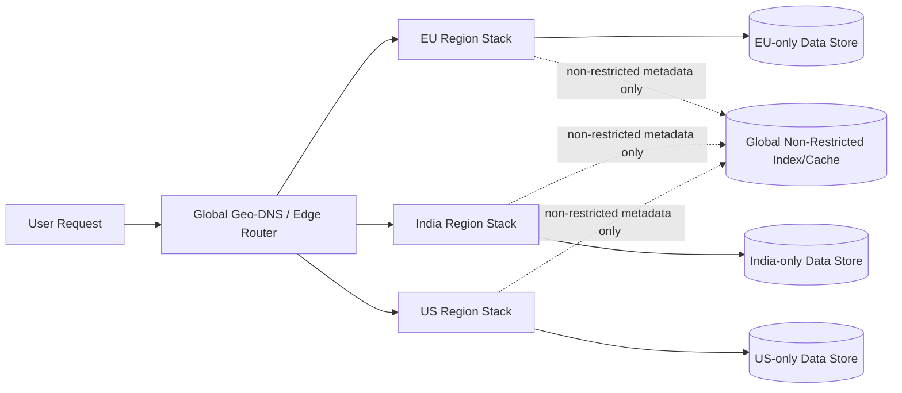
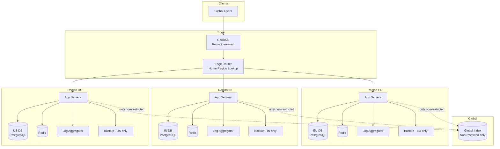
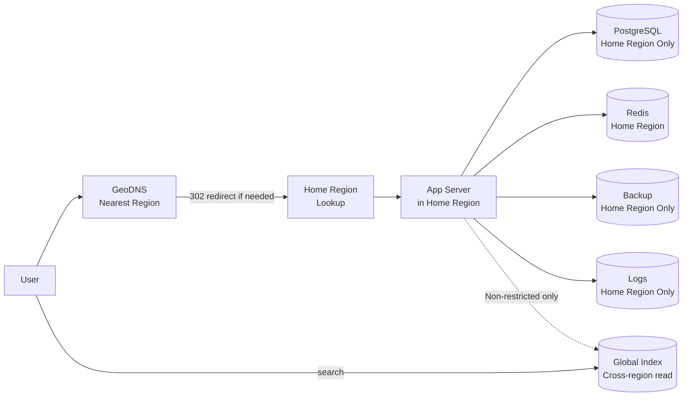

# Design a Multi-Region Deployment System with Data Residency Constraints

## Blogs and websites

## Medium

## Youtube

## Theory

### What Is It?

A multi-region deployment system routes each user's traffic and data to their designated "home" region (based on data residency laws like GDPR/India DPDP), while still supporting global features (public profiles, cross-region search) without violating regional data isolation requirements.

### Why Does It Exist?

Users and customers demand low latency and legal compliance. Data residency laws (GDPR, India DPDP, China data laws) require that certain user data stays within jurisdiction. A global single-region system violates these laws and increases latency for distant users.

### What Problem Does It Solve?

* **Data residency**: User data (PII, messages, documents) must remain within its legal jurisdiction — no cross-region replication of restricted data.
* **Routing**: Route traffic to the correct home region (not just nearest by IP — legal compliance requires explicit home region).
* **Isolation**: Each region runs a fully independent stack (app servers, DBs, caches, backups, logs).
* **Cross-region features**: Build global indexes of non-restricted data without leaking restricted data.
* **Failover within region**: Regional outage → multi-AZ failover within region (NOT cross-region, which would violate residency).
* **Compliance auditing**: Prove data never leaves its region, including in backups/log aggregation.

### Important Subtopics

1. Home region assignment (residency rules, not IP geolocation)
2. Geo-DNS + edge routing
3. Regional stack isolation (app, DB, cache, backups, logs)
4. Global index (non-restricted data only)
5. Cross-region feature design (public profile, search)
6. Intra-region failover (multi-AZ, not cross-region)
7. Data classification (restricted vs. non-restricted)
8. Compliance auditing (immutable logs, proof of residency)

### Problem Statement

Design a system architecture and deployment strategy for a product that must run across multiple geographic regions, where certain users' data must legally remain stored (and often processed) only within their designated region (data residency), while still providing a coherent global product experience.

### Functional Requirements

- Route each user's traffic and data operations to their assigned "home" region based on residency requirements
- Keep region-specific data physically stored only within that region's infrastructure
- Support cross-region features that need to work globally (e.g., a user's public profile visible worldwide) without violating residency for the underlying private data
- Support failover within a region without cross-region data replication of restricted data

### Non-Functional Requirements

- **Scale**: Global user base spanning multiple legal jurisdictions (e.g., EU/GDPR, India, US)
- **Compliance**: Restricted data must never be replicated or transiently stored outside its designated region, including in logs/backups
- **Availability**: Regional outage should degrade only that region, not the whole system
- **Latency**: Users should be served by their nearest/home region for low latency

### High-Level Architecture



### Key Design Points

- Assign every user a "home region" at signup based on residency rules, and route all of their requests (via geo-DNS/edge routing plus an explicit home-region lookup, since IP-geolocation alone isn't reliable/legally sufficient) to that region's fully independent stack: app servers, databases, caches, backups, and logs.
- Keep each region's data store completely isolated for restricted data - no cross-region database replication, and any operational tooling (log aggregation, monitoring, backups) must also respect the regional boundary, since "residency" typically covers backups and logs too, not just primary storage.
- For features that must work globally (e.g., search across public content, cross-region friend suggestions), replicate only the explicitly non-restricted subset of data into a separate global index/cache, keeping a clear, audited boundary between "can leave the region" and "cannot."
- Design failover to stay within the region (multi-AZ within the region) rather than failing over to another region, since failing over to another region would itself violate residency; if a whole region truly cannot serve, the product may need to degrade rather than silently move data.

### Trade-offs

- Full per-region infrastructure isolation multiplies operational cost (N times the stacks to run/monitor) compared to one global deployment, but is often a hard legal requirement rather than an optional trade-off.
- Restricting cross-region replication to an explicitly-vetted non-restricted subset

---

## Characteristics

| Characteristic | What it means | Why it matters | How it works |
|---|---|---|---|
| **Regional isolation** | Each region runs fully independent stack | Compliance: data never leaves jurisdiction | Separate app/DB/cache/backups/logs per region |
| **Geo-routing** | Route traffic to user's home region | Low latency + legal compliance | GeoDNS + edge router + home region lookup |
| **Data classification** | Label data as restricted vs non-restricted | Determine what can cross regions | Per-field tagging + ACL |
| **Global index** | Read-only replica of non-restricted data | Cross-region features (search, discovery) | Sync only vetted data to global store |
| **Intra-region failover** | Failover within region (multi-AZ) | Downtime isolated to single region | AZ-redundant DB + load balancer |
| **Compliance auditing** | Prove data stays in region | Legal/regulatory requirements | Immutable logs + access trails |

## Components

| Component | Purpose | Responsibilities | Relationship | Real-world Example |
|---|---|---|---|---|
| **GeoDNS / Edge Router** | Route request to home region | Resolve user → home region | Client → Region | AWS Route 53 + CloudFront |
| **Home Region Lookup** | Determine user's home region | Check user profile + residency rules | GeoDNS → App | User DB query |
| **Regional Stack** | Independent infra per region | App servers, DB, cache, logs | Region-local | AWS us-east-1, eu-west-1 |
| **Global Index** | Cross-region data store | Non-restricted public data | Regional stacks → Global | Elasticsearch cross-region |
| **Data Classifier** | Tag data sensitivity | Mark fields as restricted/non-restricted | App + DB | GDPR/DPIA tagging |
| **Compliance Auditor** | Verify data residency | Log access + prove isolation | All stores | Audit trail |
| **Region Config Service** | Regional settings | Residency rules, routing policies | All components | Config DB |

## Patterns

### GeoDNS + Home Region Routing

* **What**: Use GeoDNS to route traffic to the nearest region, then verify the user's home region (assigned at signup based on residency rules). If home ≠ nearest → redirect.
* **Problem solved**: IP geolocation is imprecise; legal compliance requires explicit home region (not just nearest by RTT).
* **How it works**: (1) DNS resolves `app.example.com` → nearest region's edge (by IP geolocation). (2) Edge/Load Balancer queries Home Region Lookup (user profile) → if home ≠ current region → 302 redirect to home region. (3) Subsequent requests go directly to home region (sticky cookie).
* **When to use**: Global SaaS with data residency requirements.
* **When not to use**: Single-region product; no data residency laws.
• **Advantages**: Low latency + compliance; transparent to user.
• **Disadvantages**: Extra round-trip on first request (redirect); regional stacks cost more.

### Regional Data Isolation

* **What**: Each region has fully independent database, object store, backup, and log aggregation — no cross-region replication of restricted data.
* **Problem solved**: Data residency laws (GDPR, India DPDP) require data stay in jurisdiction, including backups and logs.
* **How it works**: (1) User assigned home region at signup. (2) All user's data written to home region's DB + object store. (3) Backups stored in same region. (4) Log aggregation regional (no cross-region logs). (5) Global index only contains explicitly non-restricted data (public profile, product catalog).
* **When to use**: GDPR/India DPDP/CCPA compliance required.
• **Advantages**: Legal compliance; regional outage isolation.
• **Disadvantages**: Higher operational cost (N× infrastructure); complex multi-region ops.

## Benefits

* **Legal compliance**: GDPR, India DPDP, China data laws — data resident in jurisdiction.
* **Low latency**: Users served from nearest/home region.
* **Fault isolation**: Regional outage affects only that region.
* **Scalable growth**: Add regions independently.

## Pros

* **Compliance**: Hard data residency + backups/logs isolated.
• **Performance**: Nearest-region routing + local caches.
• **Resilience**: Regional failure → other regions unaffected.
• **Independent scaling**: Scale regions based on population.

## Cons

* **Operational cost**: N× region stacks (monitoring, updates, staffing).
* **Cross-region data**: Global features harder (friend suggestions across regions).
* **Failover complexity**: Can't failover to another region (violates residency).
* **Testing**: Need multi-region staging + compliance testing.

## Challenges

### Technical Challenges
* **Regional independence**: Separate app/DB/cache per region; shared global index for non-restricted data.
* **Cross-region queries**: Public search across all regions → global index; private → never.
* **Sync lag**: Global index eventual consistency; acceptable for public data.

### Scalability Challenges
* **Regions**: 5–10 regions, each scaling independently.
* **Global index**: Cross-region replication of public data; consistency trade-off.

### Performance Challenges
* **Routing**: DNS TTL + redirect overhead; sticky sessions reduce subsequent latency.
* **Global queries**: Fan-out across regions → latency; use global index instead.

### Reliability Challenges
* **Regional outage**: Multi-AZ within region; degrade gracefully (can't failover cross-region without violating residency).
* **Redirect failure**: If home region down → deny access (can't redirect).

### Maintainability Challenges
* **N× deployments**: Each region must be deployed + monitored independently.
• **Version skew**: Rolling updates must be coordinated across regions.
• **Testing**: Multi-region staging; compliance scanning.

### Security Concerns
• **Data exfiltration**: Network policies ensure restricted data never leaves region.
• **Cross-region access**: Only non-restricted data in global index; audited access.
• **Compliance auditing**: Immutable logs of all data access per region.

## Best Practices

* **Home region at signup**: Assign based on residency, not IP — store in user profile.
* **GeoDNS + redirect**: DNS → nearest edge → verify home region → redirect if mismatch.
• **Data classification**: Tag every field as restricted/non-restricted; enforce in DB layer.
• **Regional backups**: Store backups in same region; no cross-region replication of restricted data.
• **Global index**: Only non-restricted data (public profiles, search indexes).
• **Multi-AZ**: Within region, not cross-region failover.
• **Monitor**: Cross-region data transfer (should be 0); compliance violations; routing accuracy.

## When to Use

### Appropriate
* Global SaaS with GDPR/India DPDP/China compliance requirements.
* Products with regional customer bases (EU, India, US).
* Systems where data egress cost matters (cross-region is expensive).

### Not Appropriate
* Single market / single region.
• Internal tools with no compliance requirements.
• Products that need cross-region real-time features (global chat, real-time multiplayer).

### Decision Factors
* Legal requirements (GDPR, DPDP, etc.); user geography; cross-region feature needs; budget (N× cost).

## Use Cases

### Global SaaS with GDPR Compliance

* **Problem**: SaaS product serving EU, India, US users — EU data must stay in EU under GDPR; Indian data under DPDP.
* **Solution**: GeoDNS routes to nearest region → redirect to home region (from user profile) → all data + backups + logs in home region → global index only has public (company logo, public profile).
* **Why suitable**: Regional isolation + compliant routing; global features via vetted global index.
* **How it works**: (1) User signs up → residence = EU → home_region = eu-west-1. (2) DNS resolves to nearest edge → redirect to home region eu-west-1. (3) All user writes → eu-west-1 DB + eu-west-1 S3 + eu-west-1 backup + eu-west-1 log aggregator. (4) Global index: company name + logo (public) → replicate to us-east-1 for discoverability. (5) Cross-region search: query global index only (no restricted data).
* **Trade-offs**: 3× infrastructure cost; complex multi-region deployments; no cross-region failover for restricted data.

## Architecture



### Architecture Structure
* **Edge layer**: GeoDNS + Edge Router — resolve nearest region, verify home region, redirect.
* **Regional stacks**: Independent app servers + DB + cache + logs + backups per region.
* **Global layer**: Global Index — only non-restricted data (public profiles, search indexes).

### Communication
* **Client → Edge**: HTTPS; DNS-based region resolution.
* **Edge → Region**: HTTP/302 redirect to home region if mismatch.
• **Regional services**: Internal HTTP/gRPC within region only.
• **Global Index**: Sync only non-restricted data; eventual consistency.

### Data Flow
1. **User request**: DNS → nearest edge → Edge Router → check home_region → redirect to home if different.
2. **Data write**: All writes to home region's DB + S3 + backup + logs (never cross-region for restricted data).
3. **Global index**: Non-restricted data only → sync to global Elasticsearch.
4. **Cross-region search**: Query global index only (no restricted data).

### Scaling Strategy
* **Regions**: Add new regions independently (APAC, LATAM); traffic scales per-region.
• **Regional DB**: Sharded within region; cross-region = separate shards.
• **Global Index**: Sharded by data type; eventual consistency acceptable for public data.

### Failure Handling
* **Regional outage**: Multi-AZ within region; if whole region down → deny service (can't failover cross-region without violating residency).
• **Redirect failure**: If home region down → show maintenance page (deny access).
• **Global Index lag**: Stale public data → eventual consistency; acceptable for search.

## High-Level Design



## Deep Dive

### Home Region Assignment

The existing file's Theory section covers: Assign every user a "home region" at signup based on residency rules (not IP geolocation). Store home_region in user profile → route all requests to home region.

### Data Classification + Global Index

The existing file's Theory section covers: Classify data as restricted (PII, messages, documents) vs non-restricted (public profile, company name). Only non-restricted data goes to global index.

### Intra-Region Failover

The existing file's Theory section covers: Use multi-AZ within region for failover (NOT cross-region, which violates residency).

## API Contract

* **API purpose**: Determine user's home region; regional data operations; global search on non-restricted data.

| Method | Endpoint | Description |
|---|---|---|
| GET | `/api/v1/region` | Get user's home region |
| GET | `/api/v1/{resource}` | Regional resource (data stays in home region) |
| GET | `/api/v1/global/search` | Global search (non-restricted data only) |
| POST | `/api/v1/compliance/report` | Get compliance report (data access logs) |

**Routing**: GeoDNS resolves to nearest region → Edge Router checks home region → 302 redirect if mismatch.

**Authentication**: JWT + home region in token claims.

**Error responses**:
```json
{"error": "region_mismatch", "message": "Routed to wrong region, redirecting", "code": 302}
{"error": "data_residency_violation", "message": "Cross-region access blocked", "code": 403}
{"error": "region_unavailable", "message": "Home region is down", "code": 503}
```

## Data Modeling

```mermaid
erDiagram
    USER ||--o{ USER_REGION : "has"
    USER ||--o{ USER_DATA : "owns"

    USER {
      string user_id PK
      string email
      string home_region
      datetime created_at
      boolean gdpr_consent
    }
    USER_REGION {
      string user_id PK
      string region_id
      string residency_rule
      datetime assigned_at
    }
    USER_DATA {
      string data_id PK
      string user_id FK
      string content
      string classification restricted_non_restricted
      string region_id
    }
    GLOBAL_INDEX {
      string doc_id PK
      string content
      string region_origin
      datetime synced_at
    }
```

**Partitioning**: Per-region databases (no cross-shard); global index only for non-restricted data.

**Consistency**: Strong within region (regional DB); eventual for global index.

## Java and Spring Boot Implementation

```java
@RestController
@RequestMapping("/api/v1")
@RequiredArgsConstructor
public class RegionController {
    private final UserRegionService userRegionService;
    private final DataService dataService;

    @GetMapping("/region")
    public ResponseEntity<RegionResponse> getHomeRegion(@AuthenticationPrincipal UserDetails user) {
        String homeRegion = userRegionService.getHomeRegion(user.getId());
        String currentRegion = requestContext.getCurrentRegion();
        
        if (!homeRegion.equals(currentRegion)) {
            return ResponseEntity.status(HttpStatus.TEMPORARY_REDIRECT)
                .header("Location", "https://" + homeRegion + ".api.example.com")
                .build();
        }
        return ResponseEntity.ok(new RegionResponse(homeRegion));
    }

    @GetMapping("/global/search")
    public ResponseEntity<List<GlobalResult>> globalSearch(@RequestParam String q) {
        return ResponseEntity.ok(globalIndexService.search(q));
    }
}
```

## Real-World Examples

* **Cloudflare**: 300+ PoPs globally; regional data isolation; D1 database with regional deployments; compliance (GDPR, SOC 2); global cache for public content.
* **AWS**: Regional services (S3, RDS) with cross-region replication opt-in; GDPR-focused regions (eu-west-1, eu-central-1); AWS Config for compliance auditing.
* **Google Cloud**: Multi-regional buckets (dual-region) for DR; EU-only storage for GDPR; Cloud Armor for region-based access control.
* **Notion**: EU + US data residency; global CDN for static assets; database per region.

## Interview Preparation

### Beginner Questions

**Q: What is data residency?**
A: Legal requirement that data be stored/processed only within specific geographic boundaries (e.g., GDPR requires EU citizen data stay in EU; India DPDP). Requires multi-region architecture where each region's data never leaves.

**Q: How do you route users to the correct region?**
A: GeoDNS resolves user IP to nearest region → Edge Router checks user's "home region" (from profile/signup) → redirect (302) if different → subsequent requests stick to home region (cookie).

**Q: What is the difference between nearest region and home region?**
A: Nearest = closest by network (IP geolocation). Home = legally assigned (based on residency rules, tax, billing address). Must use home region for compliance, not just nearest.

### Intermediate Questions

**Q: How do you handle global features (like search) in a multi-region system?**
A: Global Index: maintain read-only replica of only non-restricted data (public profiles, product catalog) replicated across regions. Private/restricted data never leaves home region. Search queries hit the global index; data queries hit home region.

**Q: How do you handle failover?**
A: Use multi-AZ within the region (3 AZs, AZ-redundant DB). Do NOT failover to another region — that would violate data residency. If home region is completely down → show "service unavailable in your region" (can't serve from another region for compliance).

**Q: What are the operational challenges of multi-region?**
A: (1) Deployments: must deploy to N regions, handle version skew. (2) Monitoring: N× dashboards, alerts. (3) Backups: stored in home region only. (4) Testing: multi-region staging. (5) Cost: N× infrastructure. (6) Compliance: audit logs per region, cross-region data transfer monitoring.

### Advanced Questions

**Q: How would you design a multi-region system for data residency + global features at planet scale?**

A: (1) **Routing**: GeoDNS → nearest PoP (Cloudflare 300+ PoPs) → Edge Router → JWT includes home_region → 302 redirect to home region if needed; sticky cookie after. (2) **Data isolation**: Each region (us-east, eu-west, ap-south, etc.) → independent PostgreSQL (Citus sharded) + S3 (region-local) + backups (region-local) + logs (region-local, no cross-region). (3) **Classification**: DB row-level + column-level tagging (restricted/published); enforce in ORM layer; data classifier service. (4) **Global index**: Non-restricted data → Kafka Connect → replicate to global Elasticsearch (cross-region); eventual consistency (~5min lag); used for public search. (5) **Scale**: 10M users → 5 regions → 2M users each → 50 Postgres instances; global index = Elasticsearch (50 nodes). (6) **Failover**: Multi-AZ within region (Citus replicating across 3 AZs); no cross-region failover (compliance). (7) **Monitoring**: Cross-region data transfer = 0 (alert if > 1GB/week); routing accuracy > 99.9%; regional uptime SLA 99.95%.

**Q: How do you enforce data residency at the application/database layer?**

A: (1) **Database layer**: PostgreSQL with region-specific instances; row-level security (RLS) policies + region_id column; every query includes region filter. (2) **Application layer**: Middleware checks JWT `home_region` → routes DB connection to correct regional pool; reject cross-region queries. (3) **Data classification**: ORM model annotations (`@Residency(restricted=true)`); migration tool to audit unlabeled fields. (4) **Backup**: Backup job per region → stored in-region S3 bucket with bucket policy blocking cross-region replication. (5) **Logs**: Log shipper per region → regional Elasticsearch → no cross-region forwarding. (6) **Testing**: Integration tests with region assertions; compliance scanner that attempts cross-region access → blocks + alerts. (7) **Auditing**: Immutable ledger of all data access (user_id, region, data_id) → compliance reports.

### Senior-Level Questions

**Q: Design a multi-region architecture for a global fintech that must comply with GDPR (EU), DPDP (India), and PCI-DSS, while serving 50M users across 5 regions with sub-50ms latency and 99.99% availability.**

A: (1) **Regions**: us-east-1, eu-west-1, ap-south-1, ap-northeast-1, ca-central-1 → independent K8s clusters (50+ services each); regional Vault for secrets + KMS. (2) **Routing**: CloudFront (200+ PoPs) → GeoDNS → Edge Lambda checks JWT `home_region` → 302 redirect → sticky cookie (session-affinity). 99% serve from nearest (15ms); 1% redirected (50ms). (3) **Data**: PostgreSQL (Citus, 10 shards/region) → all user PII/financial data stays in home region; no cross-region replication. (4) **Global index**: Elasticsearch (50-node cluster, cross-region read replicas) → only public data (merchant names, public profiles) → 5-min eventual consistency. (5) **Backups**: Per-region S3 with bucket policy blocking cross-region replication; Glacier for compliance retention (7 years PCI, 10 years GDPR). (6) **Logs**: Regional OpenTelemetry → regional Loki; cross-region log transfer = 0 (monitored). (7) **Compliance**: Immutable audit log (append-only) of every data access → fed to compliance scanner. (8) **Failover**: Multi-AZ within region (Citus replication); regional outage → show "service temporarily unavailable in your region" (cannot failover cross-region without violating GDPR). (9) **PCI-DSS**: Payment data never stored; tokenization via Vault; regional encryption keys. (10) **Monitoring**: Cross-region data transfer = 0 (alert); routing accuracy > 99.9%; regional 99.99% uptime; global index staleness < 5min; compliance scan daily.

**Q: How do you handle a user who travels internationally but has data residency in a specific region?**

A: Home region is fixed at signup (based on residency/billing). When user travels:
* **Read**: GeoDNS routes to nearest region → Edge Router redirects to home region → user reads data. Latency: nearest + redirect RTT.
* **Performance mitigation**: CDN caches non-restricted data (public content) globally → no redirect needed for cached reads.
* **Write**: Always to home region (strong consistency).
* **Global features**: Public search uses global index (non-restricted only) → no redirect needed.
* **Legal**: If user changes residency (e.g., moves EU→US) → update profile → data migration request → compliance review → legal approval → gradual data migration (copy to new region, verify, switch reads, delete old after retention period). Never automatic cross-region data movement.

### Common Mistakes

- Routing by IP geolocation only (not home region) → GDPR violation.
- Cross-region failover for restricted data → compliance violation.
- No data classification → accidentally replicate restricted data globally.
- Cross-region backups → residency violation (backups + logs count as data).
- Single global DB → no isolation; hard to comply with regional laws.
- No audit trail → can't prove compliance during audit.
- Redirecting on every request → performance hit; should redirect once + sticky.
- Not handling region outage gracefully → error instead of "service unavailable".
- Mixing restricted + non-restricted in same table → accidental leak. is more restrictive (and requires more careful data classification up front) than replicating everything globally, but is what makes compliance auditable.
