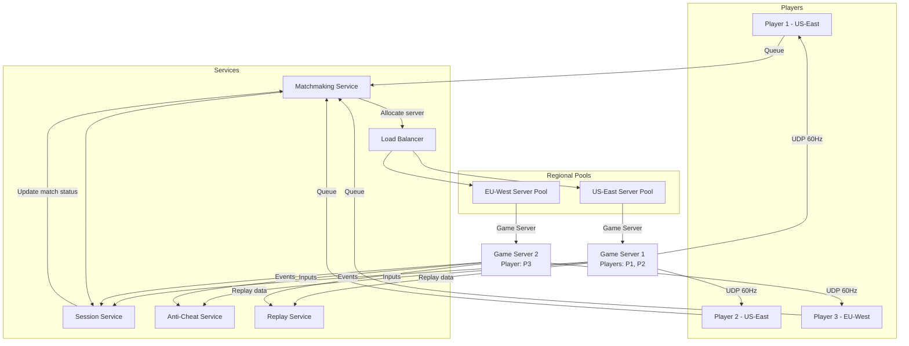
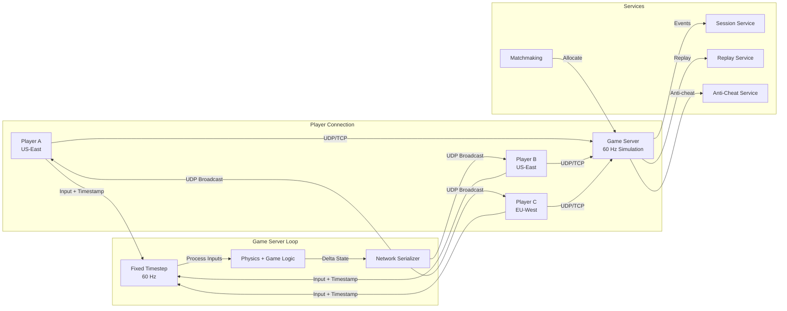
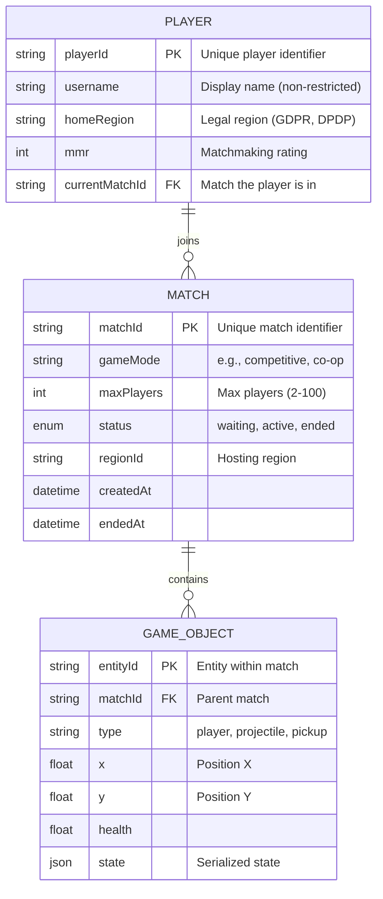
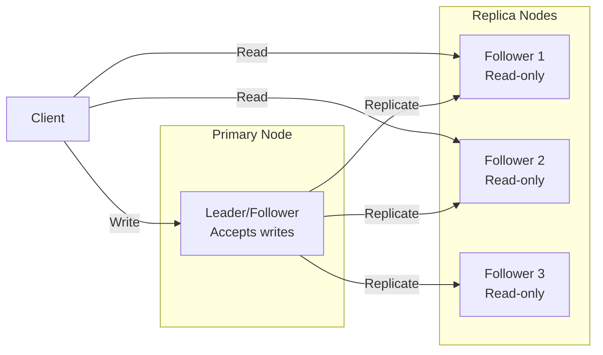
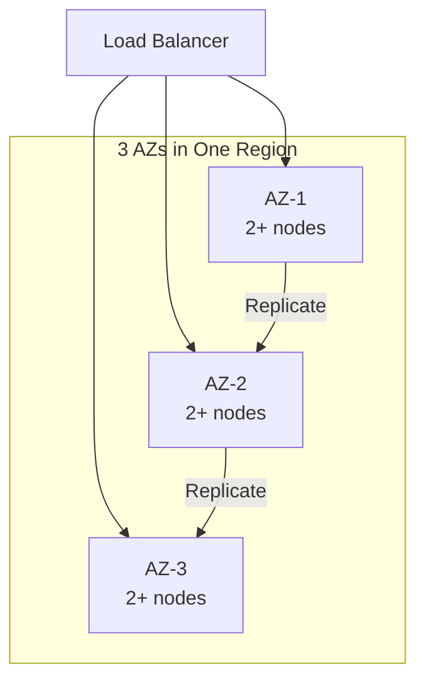
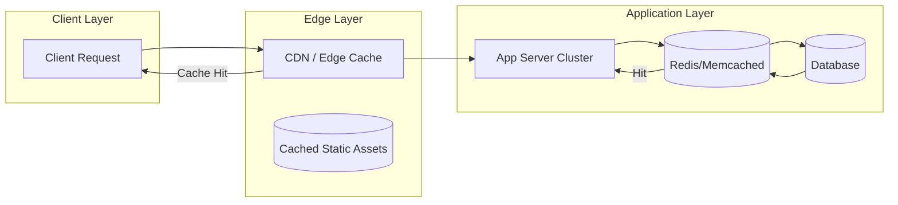
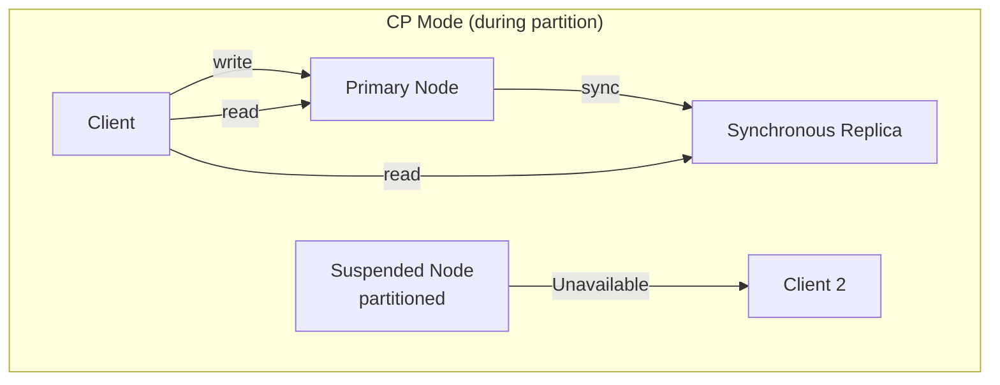
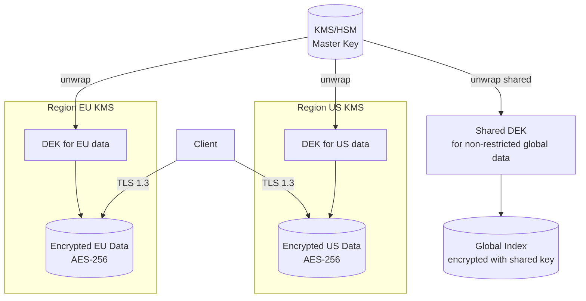
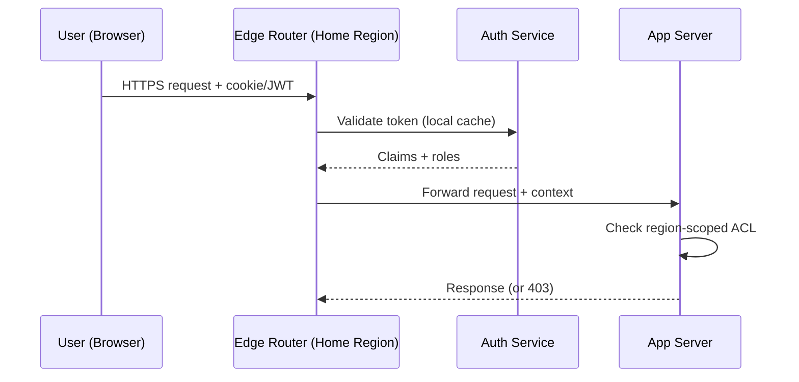
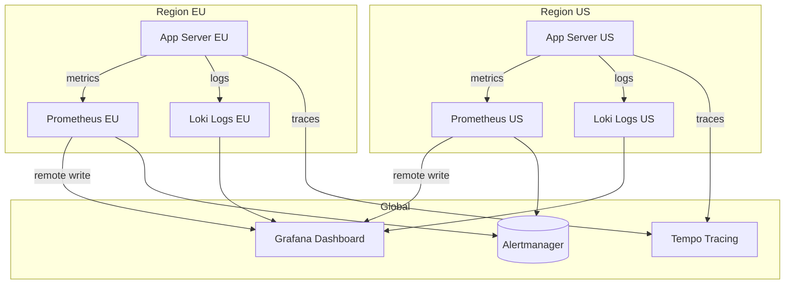

# Design a Multiplayer Game (pubg)

## Blogs and websites

## Medium

## Youtube

- [System Design Interview: Design Multiplayer Game like PUBG Or BGMI w/a a Senior Software Engineer](https://www.youtube.com/watch?v=ym1TpbppT8w)

---

## Theory

### Topics Covered

1. [Introduction / Problem Statement](#introduction-problem-statement)
2. [Characteristics](#characteristics)
3. [Components](#components)
4. [Architectural Patterns](#architectural-patterns)
5. [Benefits](#benefits)
6. [Pros](#pros)
7. [Cons](#cons)
8. [Challenges](#challenges)
9. [Best Practices](#best-practices)
10. [When to Use / When Not to Use](#when-to-use-when-not-to-use)
11. [Use Cases](#use-cases)
12. [Architecture](#architecture)
13. [High-Level Design](#high-level-design)
14. [Deep Dive](#deep-dive)
15. [Data Model and API](#data-model-and-api)
16. [Replication Strategies](#replication-strategies)
17. [Failure Detection and Membership](#failure-detection-and-membership)
18. [High Availability and Scalability](#high-availability-and-scalability)
19. [Performance and Optimization](#performance-and-optimization)
20. [CAP Theorem and Consistency Trade-offs](#cap-theorem-and-consistency-trade-offs)
21. [Encryption and Key Management](#encryption-and-key-management)
22. [Authentication and Authorization](#authentication-and-authorization)
23. [Security Threats and Mitigations](#security-threats-and-mitigations)
24. [Observability and Logging](#observability-and-logging)
25. [Data Model and API](#data-model-and-api)
26. [Replication Strategies](#replication-strategies)
27. [Failure Detection and Membership](#failure-detection-and-membership)
28. [High Availability and Scalability](#high-availability-and-scalability)
29. [Performance and Optimization](#performance-and-optimization)
30. [CAP Theorem and Consistency Trade-offs](#cap-theorem-and-consistency-trade-offs)
31. [Encryption and Key Management](#encryption-and-key-management)
32. [Authentication and Authorization](#authentication-and-authorization)
33. [Security Threats and Mitigations](#security-threats-and-mitigations)
34. [Observability and Logging](#observability-and-logging)
35. [Java and Spring Boot Implementation Guide](#java-and-spring-boot-implementation-guide)
36. [Real-World Implementations](#real-world-implementations)
37. [Interview Questions and Answers](#interview-questions-and-answers)

---
---
### Introduction / Problem Statement

A multiplayer game server (PUBG, Fortnite, Call of Duty) is a real-time system that synchronizes the game state (player positions, health, inventory, bullets, environmental changes) across hundreds of players in a shared virtual world with < 100 ms latency. Unlike turn-based or asynchronous games, real-time multiplayer games require the server to receive inputs, process the game simulation, and broadcast state updates at 20-60 ticks per second — all while handling network latency, packet loss, cheating, and player disconnections.

**Why Does It Exist**

Single-player games are isolated experiences — multiplayer games create shared experiences (competition, cooperation, social interaction). The challenge is making a distributed game world feel real and fair despite network delays. Players expect to see other players' actions (movement, shooting) as if they were happening in real-time, even though network latency means inputs are always delayed.

**What Problem Does It Solve**

* **State synchronization**: Every player's view of the world must be consistent — if player A shoots player B, player B must take damage, and all other players must see the hit.
* **Latency compensation**: Network latency (30-150 ms) means players see the world in the past. The system must compensate (client-side prediction, server reconciliation, lag compensation) to make actions feel responsive.
* **Scalability**: Games like PUBG support 100 players per match; MMORPGs like WoW support thousands per shard. The server must handle hundreds to thousands of concurrent players.
* **Cheating prevention**: Players may use aimbots, wallhacks, or packet manipulation — the server must validate actions and detect anomalies.
* **Matchmaking**: Group players of similar skill into balanced matches efficiently.
* **Server authority**: The server is the source of truth — clients are untrusted (can't be relied upon for game state).
* **Network topology**: Minimize latency between all players in a match — players on different continents may experience asymmetric latency.


### Characteristics

| Characteristic | What it means | Why it matters | How it works |
|---|---|---|---|
| **Server authority** | Server is the source of truth for game state | Prevents cheating; ensures fairness | Server validates all client inputs |
| **Tick rate** | How often the server updates simulation (20-60 Hz) | Affects responsiveness and fairness | Fixed timestep loop: update → simulate → broadcast |
| **Client-side prediction** | Client predicts own actions before server confirms | Makes controls feel responsive | Apply input locally; reconcile on server response |
| **Lag compensation** | Server rewinds time to validate shots at the latency-appropriate position | Ensures fair hit detection across network latency | Server stores player position history; rewinds on shot validation |
| **Interpolation** | Clients smooth between received state snapshots | Eliminates jittery/stuttering visuals | Interpolate between snapshots; extrapolate for latest |
| **Delta compression** | Only send changes (delta) not full state | Reduces bandwidth by 90%+ | Encode state differences; delta decode on client |

### Components

| Component | Purpose | Responsibilities | Relationship | Real-world Example |
|---|---|---|---|---|
| **Game Server** | Run game simulation | Update tick, process inputs, simulate physics | Core of the system; communicates with all clients | PUBG dedicated server |
| **Matchmaker** | Create balanced matches | Find players, create lobbies, assign servers | Player → Matchmaker → Game Server | PUBG Matchmaking |
| **Lobby Service** | Manage pre-game | Waiting room, player ready states, map voting | Matchmaker ↔ Game Server | PUBG Lobby |
| **Client** | Game client | Render, send inputs, receive state updates | Communicates with Game Server | PUBG Steam client |
| **State Sync** | Distribute state updates | Send delta snapshots to clients | Game Server → State Sync → Clients | Custom UDP protocol |
| **Replay System** | Record and replay | Persist game state snapshots for replay | Consumes from Game Server | PUBG replay files |
| **Anti-Cheat** | Prevent cheating | Monitor for aimbots, wallhacks, packet manipulation | Analyzes client inputs + game state | BattlEye, Easy Anti-Cheat |
| **Load Balancer** | Distribute players to servers | Route players to least-loaded game servers | Matchmaker → Load Balancer → Game Server | AWS GameLift, custom |

#### Component Interactions

1. **Match flow**: Player queues → Matchmaker finds players → Lobby Service creates lobby → players ready → Game Server allocates (via Load Balancer) → players join → game starts.
2. **Game loop**: Game Server runs fixed-timestep loop (e.g., 60 Hz) → processes queued inputs → simulates physics (movement, shooting, collisions) → sends delta state to all clients.
3. **Prediction**: Client sends input immediately → predicts local result → Game Server validates → sends correction if different → client reconciles.

### Architectural Patterns

#### Client-Side Prediction with Server Reconciliation

* **What**: The client predicts the result of its own inputs (e.g., movement) and applies them immediately for responsiveness. The server later validates and sends corrections if needed.
* **Problem solved**: Without prediction, the player sees their character move 100+ ms after pressing a key (input → network → server → simulate → network → client). That delay feels unplayable.
* **How it works**: Client applies input locally (immediate visual feedback). Server processes the input at the correct timestamp → simulates → sends authoritative state. Client receives server state → compares with prediction → if different, rewinds to the input's timestamp, re-simulates with the server's correction, and re-applies unacknowledged inputs.
* **When to use**: All real-time multiplayer games where responsiveness matters.
* **When not to use**: Turn-based games where latency is not critical.
* **Advantages**: Feels responsive; hides network latency.
* **Disadvantages**: Complex reconciliation; visible "rubber-banding" if prediction is wrong.
* **Java/Spring Boot example** (server-side simulation):
```java
@Service
public class GameStateService {
    private static final double TICK_RATE = 60.0; // 60 Hz
    private static final double TICK_INTERVAL_MS = 1000.0 / TICK_RATE;

    public void processTick(GameWorld world, List<PlayerInput> inputs) {
        // Process inputs in timestamp order
        for (PlayerInput input : inputs) {
            long serverTick = (System.currentTimeMillis() - input.getClientTime()) /
                (long) TICK_INTERVAL_MS;
            processInput(world, input, serverTick);
        }

        // Simulate physics (fixed timestep)
        world.update(TICK_INTERVAL_MS / 1000.0);

        // Broadcast state snapshot to all clients
        broadcastDelta(world);
    }

    private void processInput(GameWorld world, PlayerInput input, long tick) {
        Player player = world.getPlayer(input.getPlayerId());
        if (player == null) return;

        // Validate input (prevent cheating)
        if (Math.abs(input.getMoveVector().length()) > 1.0) {
            // Cheating detected: move vector too long
            player.terminate("suspicious_input");
            return;
        }

        // Apply valid input
        player.setPosition(player.getPosition().add(input.getMoveVector().multiply(
            player.getSpeed() * TICK_INTERVAL_MS / 1000.0)));
    }
}
```
* **Real-world example**: Overwatch's client-side prediction; League of Legends' input queueing.

#### Lag Compensation (Rewind and Replay)

* **What**: When the server validates a shot, it rewinds all players' positions to the time when the shooter's input was issued — compensating for the network latency between the shooter and the server.
* **Problem solved**: Without lag compensation, a player with 100 ms latency can never hit a target moving at 200 units/sec (they'd aim at where the target WAS 100 ms ago, but the server sees the target in its current position). Lag compensation ensures the shooter hits what they see on their screen.
* **How it works**: Server keeps a history of each player's position (snapshots) for the last ~200 ms. When a shot arrives (from a client with 50 ms latency), the server rewinds to 50 ms ago → checks if the shot hit the target's position at that time → applies damage. Then rewinds back and continues simulation.
* **When to use**: FPS games, battle royales where hit detection matters.
* **When not to use**: Strategy or simulation games where precise hit detection isn't critical.
* **Advantages**: Fair hit detection across different latencies.
* **Disadvantages**: Complex to implement; can cause "impossible" hits (shooting someone through a wall they were behind earlier).
* **Real-world example**: Valve's Source engine (Counter-Strike, Team Fortress 2); Riot's Valorant.

#### Entity Interpolation

* **What**: Clients render entities at a position interpolated between the two most recent server snapshots, with a small delay (e.g., 100 ms behind the server) to account for network jitter.
* **Problem solved**: Without interpolation, entities jump between positions on each received snapshot (stuttering). Network jitter makes snapshots arrive unevenly.
* **How it works**: Server sends snapshots at fixed intervals (e.g., 20/s). Client delays rendering by one snapshot interval (~100 ms). For each entity, render at `position_prev + (position_current - position_prev) * interpolation_factor` where `interpolation_factor = (now - snapshot_time_prev) / snapshot_interval`. Extrapolate (predict) for the latest 100 ms.
* **When to use**: All real-time multiplayer games.
* **When not to use**: Turn-based games (no continuous position updates needed).
* **Advantages**: Smooth visual experience; hides network jitter.
* **Disadvantages**: Adds ~100 ms of visual latency (acceptable for most games).
* **Real-world example**: PUBG, Fortnite, Overwatch.

### Benefits

* **Shared experience**: Players compete/cooperate with real people in real-time.
* **Competitive depth**: Skill-based matchmaking and competitive rankings drive long-term engagement.
* **Social interaction**: Voice chat, text chat, friend lists, clans/guilds create community.
* **Replayability**: No two matches are the same — emergent gameplay from player interactions.
* **Esports**: Spectator mode, replays, tournaments on top of the core game.
* **Monetization**: Cosmetic skins, battle passes, season passes.

### Pros

* **Immersive experience**: Seeing and reacting to real players creates a living world.
* **Skill expression**: Player skill (aim, positioning, tactics) is the primary factor in success.
* **Social engagement**: Chat, friends, clans drive retention and word-of-mouth.
* **Scalable competition**: Matchmaking creates fair matches across skill levels.
* **Content longevity**: Human opponents never get old (unlike AI).

### Cons

* **Latency sensitivity**: Network latency makes the game feel unresponsive; high latency is a competitive disadvantage.
* **Cheating**: Aim bots, wall hacks, scripts can ruin the experience; requires constant anti-cheat development.
* **Server costs**: Real-time servers (60 Hz, < 100 ms) are expensive to run at scale.
* **Toxicity**: Player-to-player harassment, griefing, smurfing.
* **Matchmaking wait**: Finding players of similar skill can take time, especially off-peak.
* **Network dependency**: Requires stable, low-latency internet — no offline play.

### Challenges

#### Technical Challenges

* **Physics determinism**: Both client and server must simulate physics identically — floating-point differences across platforms cause desync. Use fixed-point math or deterministic physics engines.
* **Input timing**: Client sends inputs with timestamps; server must apply them at the right tick — buffering and reordering needed.
* **Packet loss**: UDP is unreliable — need custom reliable transport for critical messages (damage, state changes); drop non-critical messages (extra movement updates).
* **State serialization**: Efficiently serialize world state (positions, health, inventory) — use binary protocols (protobuf, FlatBuffers); delta compression.

#### Scalability Challenges

* **Server capacity**: A 100-player match generates 100 × 60 inputs/second = 6K messages/second from clients, and 100 × 60 state snapshots/second = 6K messages/second to clients. Each server can handle 100-200 players.
* **Instance management**: Auto-create and destroy game server instances (containers) based on demand; need a game server orchestrator (Google Agones, AWS GameLift).
* **Network topology**: Players in a match should all connect to the same server with low latency — need regional server pools and geographic load balancing.

#### Performance Challenges

* **Tick rate**: Higher tick rate (60 Hz) provides better precision but increases CPU/network load 3x vs. 20 Hz.
* **Bandwidth**: Each state snapshot must be small enough to send 60 times/second to all players — delta compression is critical.
* **Latency**: P99 latency must be < 50 ms (including server processing); any spike causes visible stuttering.

#### Reliability Challenges

* **Server crash**: If the game server crashes, the match is lost — need quick server restart or migration.
* **Player disconnect**: Disconnected players should be able to rejoin within a grace period; their character is controlled by the server (AFK) or removed.
* **Clock synchronization**: Clients and server must have synchronized clocks — use NTP; handle clock drift.

#### Maintainability Challenges

* **Network protocol evolution**: Adding new fields to snapshots must not break old clients — use versioned schemas (protobuf).
* **Replay compatibility**: Replays must work across game versions — snapshot format must be backward-compatible.
* **A/B testing**: Matchmaking parameters, hit detection, lag compensation — need to test changes with real players.

#### Operational Challenges

* **DDoS attacks**: Game servers are often targeted — need DDoS protection (Cloudflare, AWS Shield).
* **Bot detection**: Distinguish bots from real players for matchmaking and anti-cheat.
* **Patch deployment**: Rolling out game updates without disrupting live matches — deploy new server versions to new matches; drain old matches.
* **Regional coverage**: Deploy servers in 10+ regions; maintain low latency globally.

#### Security Concerns

* **Aimbots and wallhacks**: Cheat software modifies game memory or intercepts packets — anti-cheat kernels/drivers scan for known patterns; server-side validation of inputs.
* **Packet manipulation**: Players modify network packets (teleport, instant kill) — server must validate all inputs (e.g., movement speed must be within physics limits).
* **DDoS**: Server IP addresses are discoverable — DDoS attacks can take servers offline. Use Anycast or hide server IPs.
* **Account sharing/boosting**: Players share accounts to boost ranks — detect via IP/device fingerprinting and unusual play patterns.

### Best Practices

* **Server authority**: The server validates and simulates everything; clients are untrusted. Never trust client state.
* **Fixed timestep**: Run the game simulation at a fixed tick rate (e.g., 60 Hz) regardless of frame rate. This ensures deterministic simulation and consistent networking.
* **Interpolation delay**: Add a fixed delay (e.g., 100 ms) to all client rendering to account for network jitter — smooths movement.
* **Extrapolation**: Predict where entities will be (velocity-based) to fill the gap between the interpolation delay and real-time.
* **Delta compression**: Send only changed fields in state updates — use a dirty bitfield per entity.
* **Entity interest management**: Only send entities near the player (within a "view distance") — reduces bandwidth.
* **Reliable UDP for important events**: Use a custom reliability layer (ACK + resend) for damage, item pickup, death — not for movement (which is fine to drop).
* **Input buffering**: Buffer client inputs for slightly in the past (50-200 ms) to handle network jitter and out-of-order delivery.
* **Graceful degradation**: If network conditions are poor, increase interpolation delay; if server is overloaded, reduce tick rate.

### When to Use / When Not to Use

#### Appropriate

* When real-time player interaction is core to gameplay (FPS, MOBA, battle royale).
* When competitive skill-based matchmaking is needed.
* When social features (voice chat, friends, clans) are important.
* When the game world is persistent (survival games, MMORPGs).

#### Not Appropriate

* Single-player campaigns — no need for networking.
* Turn-based games — async networking suffices (email-like).
* Local co-op only — LAN-based networking is simpler.
* Games with very high tolerance for latency — board games, puzzle games.

#### Alternatives

* **Peer-to-peer**: Each player is both client and server; no dedicated server. Cheaper but vulnerable to cheating and host migration.
* **Dedicated server**: Separate server runs the simulation — fair, cheat-resistant, but expensive.
* **Hosted service**: Cloud provider offers game server hosting (AWS GameLift, Google Agones) — reduces ops burden.

#### Decision Factors

* **Player count**: 100 players → dedicated servers; 4-player co-op → peer-to-peer may suffice.
* **Competitive integrity**: Competitive games → server authority; casual games → P2P acceptable.
* **Budget**: Dedicated servers are expensive; P2P is free but less fair.
* **Latency tolerance**: FPS needs < 100 ms; strategy games can tolerate higher latency.

### Use Cases

#### Competitive Matchmaking (PUBG-style)

* **Problem**: Create fair 100-player matches with players of similar skill.
* **Solution**: Skill-based matchmaking queues players by MMR; creates lobbies of 100 players; allocates a dedicated server in a region near most players.
* **Why suitable**: Competitive integrity requires server authority, skill matching, and low latency.
* **How it works**: (1) Players queue → matchmaker finds 100 players with similar MMR → picks server region (median of players' locations) → allocates game server (container) → players join → match begins. During match, server runs at 60 Hz (or 30 Hz), sending state updates.
* **Trade-offs**: Longer wait times for fair matches; server costs are high ($1000+/month per instance); regional latency for mismatched player locations.

#### Co-op Survival Game (Minecraft-like)

* **Problem**: 4-16 friends explore and build together in a persistent world.
* **Solution**: Host-based (one player hosts) or dedicated server; world is loaded from disk; players' actions modify the shared world.
* **Why suitable**: Casual co-op doesn't need strict anti-cheat; host-based is simple.
* **How it works**: Host player's machine runs the server → other players connect → world state (blocks, entities) synced at 20 Hz → host saves periodically. If host disconnects, world is saved but game ends (or transfers to another player).
* **Trade-offs**: Host advantage (lower latency for host); host must keep machine on; world lost if host crashes without saving.

#### Esports Tournament (CS:GO-style)

* **Problem**: Run a competitive tournament with 5v5 matches, brackets, and spectator streams.
* **Solution**: Dedicated servers in neutral locations; matchmaker creates 10-player lobbies; spectators connect to a spectator server that receives the game state; replays are recorded.
* **Why suitable**: Fair (server authority), spectator support (broadcast), replay system for tournament review.
* **How it works**: Tournament bracket defines matchups → dedicated servers allocated for each match → 10 players connect → server runs at 64 Hz (or 128 Hz for pro) → spectator camera system streams game state → observers watch via GOTV (Game Over The Watch) relay → replay files saved for dispute resolution.
* **Trade-offs**: High server costs for high tick rate; need dedicated infrastructure for tournaments; spectator system adds network overhead.

### Architecture

A real-time multiplayer game uses a **client-server model with dedicated game servers**. Players connect to regional game server pools. A **matchmaker** creates balanced lobbies and allocates servers. A **session service** tracks player state and match history. Game servers run a fixed-timestep simulation loop and broadcast state snapshots via UDP. **Replay services** record all inputs and states. **Anti-cheat** operates both client-side (kernel driver) and server-side (input validation).



#### Architecture Structure

* **Edge layer**: Player clients connect to game servers via UDP (primary) + TCP (reliable messages). Regional server pools for latency.
* **Service layer**: Matchmaking, session management, anti-cheat, replay, load balancing. Stateless services.
* **Game server layer**: Dedicated servers running fixed-timestep simulations. Each hosts one match/instance.
* **Data layer**: Player stats (Postgres), match history (Cassandra), replays (S3).

#### Communication

* **Client ↔ Game Server**: UDP for real-time state updates (high frequency, unreliable); TCP or reliable UDP for important messages (damage, chat, items).
* **Client ↔ Services**: HTTPS/TCP for matchmaking, session, anti-cheat uploads.
* **Server ↔ Services**: gRPC for real-time communication (replay uploads, session updates).

#### Data Flow

1. **Player queuing**: Client → Matchmaking Service → finds balanced lobby → Session Service creates match → Load Balancer allocates game server.
2. **Game loop**: Game Server runs at fixed tick rate (60 Hz) → processes all queued inputs → simulates physics and game logic → serializes state delta → sends to all clients via UDP.
3. **Client prediction**: Client sends input + predicts locally → receives server correction → reconciles.
4. **Replay recording**: Game Server saves all inputs + key state changes → Replay Service stores → players can replay.

#### Scaling Strategy

* **Match size**: Fixed per-game-server (e.g., 100 players for PUBG; 10 for CS). Each match = one server instance.
* **Server instances**: Auto-scale containers (Kubernetes + Agones) based on match demand; scale up during peak hours.
* **Regions**: Deploy server pools in 10+ regions; route players to nearest for < 50 ms latency.
* **Matchmaking**: Queue players across servers in a region; if no balanced match forms within 5 minutes, expand the region pool.

#### Failure Handling

* **Server crash**: Match lost (unless hosted on redundant servers) — auto-restart new server for next match; players can rejoin if within grace period.
* **Player disconnect**: Character becomes AFK (server-controlled) for 60 seconds; if reconnect → resume; if not → eliminated.
* **Network partition**: Players see "connection lost" → attempt reconnect → if server reachable, rejoin match.
* **DDoS**: Use Anycast or hide game server IPs; DDoS protection at network edge.

### High-Level Design



**Game loop**:
1. At fixed intervals (16.67 ms for 60 Hz), collect all pending inputs from connected clients.
2. Process inputs in timestamp order — apply to the world state from the correct simulation tick.
3. Run physics simulation (movement, collisions, shooting) for this tick.
4. Generate delta state (what changed since last snapshot) for each player's viewport.
5. Send delta state via UDP to each client.

**Client prediction**:
1. Client sends input (movement direction, shoot action) with local timestamp.
2. Client immediately applies the input to its local world state (prediction).
3. Server receives input → applies at the correct tick → sends back authoritative state.
4. Client receives authoritative state → rewinds to the input's tick → re-simulates with server's correction → re-applies unacknowledged inputs.

### Deep Dive

#### Internal Implementation: Fixed Timestep Game Loop

```java
public class GameServer {
    private static final double TICK_RATE = 60.0;
    private static final double TICK_INTERVAL_MS = 1000.0 / TICK_RATE;
    private long tickNumber = 0;
    private GameWorld world;
    private final PriorityQueue<TimestampedInput> inputQueue = new PriorityQueue<>();

    public void run() {
        ScheduledExecutorService scheduler = Executors.newScheduledThreadPool(2);
        
        // Fixed timestep simulation
        scheduler.scheduleAtFixedRate(this::gameLoop, 0, 
            (long) TICK_INTERVAL_MS, TimeUnit.MILLISECONDS);
    }

    private void gameLoop() {
        long tickStart = System.nanoTime();
        tickNumber++;

        // 1. Collect inputs that are due for this tick
        List<PlayerInput> dueInputs = collectInputsForTick(tickNumber);
        
        // 2. Process inputs
        for (PlayerInput input : dueInputs) {
            processInput(world, input);
        }

        // 3. Simulate physics
        world.update(TICK_INTERVAL_MS / 1000.0);
        
        // 4. Detect collisions, apply damage, etc.
        world.resolveCollisions();

        // 5. Send delta state to all clients
        broadcastDelta(world, tickNumber);

        long tickDuration = System.nanoTime() - tickStart;
        if (tickDuration > TICK_INTERVAL_MS * 1_000_000) {
            log.warn("Tick {} took {} ms (expected {} ms)", 
                tickNumber, tickDuration / 1_000_000, (long) TICK_INTERVAL_MS);
        }
    }

    private void processInput(GameWorld world, PlayerInput input) {
        // Validate input (anti-cheat)
        if (!validateInput(input)) {
            world.kickPlayer(input.getPlayerId(), "invalid_input");
            return;
        }
        world.applyInput(input);
    }

    private boolean validateInput(PlayerInput input) {
        // Check for cheating patterns
        Player player = world.getPlayer(input.getPlayerId());
        if (player == null) return false;
        
        // Movement speed check
        double speed = input.getMoveVector().length() / 
            (input.getDeltaTime() / 1000.0);
        if (speed > player.getMaxSpeed() * 1.1) {
            return false; // Moving too fast — possible speedhack
        }
        
        // Timing check — input should not be from the future
        long serverTick = tickNumber - (input.getClientTick());
        if (serverTick < 0 || serverTick > 20) { // Allow ~333ms buffer
            return false;
        }
        
        return true;
    }
}
```

#### Lag Compensation Implementation

The server maintains a history buffer of player positions (snapshots):

```java
public class LagCompensation {
    private final Map<String, Deque<PlayerSnapshot>> history = new ConcurrentHashMap<>();
    private static final int HISTORY_BUFFER_MS = 200;

    public void recordSnapshot(String playerId, PlayerSnapshot snapshot) {
        Deque<PlayerSnapshot> playerHistory = history.computeIfAbsent(playerId, 
            k -> new ConcurrentLinkedDeque<>());
        playerHistory.addLast(snapshot);
        
        // Remove old snapshots
        long cutoff = System.currentTimeMillis() - HISTORY_BUFFER_MS;
        while (!playerHistory.isEmpty() && 
               playerHistory.peekFirst().timestamp() < cutoff) {
            playerHistory.pollFirst();
        }
    }

    public PlayerSnapshot getPlayerAtTime(String playerId, long timestamp) {
        Deque<PlayerSnapshot> playerHistory = history.get(playerId);
        if (playerHistory == null) return null;

        // Find the snapshot closest to (before) the target time
        PlayerSnapshot best = null;
        for (PlayerSnapshot s : playerHistory) {
            if (s.timestamp() <= timestamp && 
                (best == null || s.timestamp() > best.timestamp())) {
                best = s;
            }
        }

        // Interpolate between two snapshots
        if (best == null) return null;
        return best;
    }

    // Called when processing a shot
    public boolean validateShot(ShotEvent shot) {
        // Get the shooter's ping (latency)
        int pingMs = getPlayerPing(shot.getShooterId());
        
        // Rewind to the time the shot was fired (from the server's perspective when fired)
        long fireTime = shot.getServerReceivedTime() - pingMs;
        
        // Get the target's position at that time
        PlayerSnapshot targetSnapshot = getPlayerAtTime(shot.getTargetId(), fireTime);
        if (targetSnapshot == null) return false;

        // Check if the shot hits the target at that position
        return shot.hits(targetSnapshot.position());
    }
}
```

#### Delta Compression

```java
public class DeltaCompressor {
    // Bitmask for which fields changed
    public static final int FIELD_POSITION = 1 << 0;
    public static final int FIELD_HEALTH = 1 << 1;
    public static final int FIELD_ANIMATION = 1 << 2;
    public static final int FIELD_INVENTORY = 1 << 3;

    public byte[] createDelta(PlayerState currentState, PlayerState previousState, 
                               int playerId) {
        int dirtyBits = 0;
        ByteArrayOutputStream out = new ByteArrayOutputStream();
        DataOutputStream data = new DataOutputStream(out);

        // Position (most commonly changed)
        if (!currentState.position.equals(previousState.position)) {
            dirtyBits |= FIELD_POSITION;
            data.writeFloat((float) currentState.position.x);
            data.writeFloat((float) currentState.position.y);
            data.writeFloat((float) currentState.position.z);
        }

        // Health
        if (currentState.health != previousState.health) {
            dirtyBits |= FIELD_HEALTH;
            data.writeShort(currentState.health);
        }

        // Write dirty bits first, then changed fields
        ByteArrayOutputStream finalOut = new ByteArrayOutputStream();
        DataOutputStream finalData = new DataOutputStream(finalOut);
        finalData.writeInt(playerId);
        finalData.writeInt(dirtyBits);
        finalData.write(out.toByteArray());

        return finalOut.toByteArray();
    }
}
```

### Data Model and API

**What it means**

The **Data Model and API** section describes the entities that Multiplayer Game System tracks, the relationships between them, and the API contract that services and clients use to interact with the system. For a multiplayer game, the data model must capture stateful entities (players, matches, game objects) and the API must support both real-time WebSocket messages and REST operations.

**Why it matters**

A real-time multiplayer game server using WebSocket connections with client-side prediction, server reconciliation, and entity interpolation to deliver sub-100ms gameplay for competitive matches. The data model defines how state is serialized, synchronized, and recovered after failure. The API contract defines how clients interact with the authoritative server and how regions communicate for cross-region features. Getting either wrong creates inconsistency, scalability bottlenecks, or client incompatibility.

**How it works**

**Entities and relationships**:



*Entity relationship diagram: each Player has a homeRegion (for data residency). A Player joins one active Match. Each Match contains many Game Objects (players, projectiles, pickups). The matchId links Players to their current Match; the regionId on Match determines where the match is hosted.*

**API contract**:

The system exposes two API surfaces:

1. **REST API** (cross-region, out-of-session operations):
   - `GET /api/v1/matches/{matchId}` — fetch match metadata (cross-region lobby lookup)
   - `GET /api/v1/player/stats` — fetch player statistics and MMR
   - `POST /api/v1/matchmaking/queue` — join matchmaking queue

2. **WebSocket API** (in-region, real-time gameplay):
   - `CONNECT /ws/match/{matchId}?token=JWT` — join an active match
   - `IN_MESSAGE: input` — client sends input (delta-compressed, sequence-numbered)
   - `OUT_MESSAGE: state_update` — server broadcasts authoritative state (entity updates, events)

**API guarantees**:
- **WebSocket connections** are routed to the match's home region by the matchmaker; cross-region WebSocket is not used (latency > 50 ms violates the sub-100ms requirement).
- **At-most-once** delivery for input messages (client-side prediction + server reconciliation handles retransmission).
- **Ordered** broadcast of state updates within a match (fixed-timestep ticks, 1 tick = 33 ms for 30 Hz).
- **Backpressure**: if a client's send queue exceeds a threshold, the server drops non-critical updates (e.g., cosmetic entity updates) but never drops player input.

**Real-world implementations**

- **Riot Games**: Uses a custom WebSocket protocol with delta compression for Valorant; matchmaker assigns home region based on player geography and queue time.
- **Epic Games (Unreal)**: Unreal Engine's replication graph controls which game objects are replicated to which clients based on visibility and relevancy.
- **Unity (Netcode for GameObjects)**: WebSocket-based transport with client prediction and server reconciliation.

### Replication Strategies

**What it means**

Replication Strategies determine how data and state are copied across multiple nodes in Multiplayer Game System. The choice of strategy determines the trade-off between consistency, availability, and latency.

**Why it matters**

Multiplayer Game System must replicate data to prevent loss and serve reads from multiple nodes. The replication strategy determines whether the system favors consistency (strong reads) or availability (always writable), and how it handles cross-node failure.

**How it works**

**Leader-based (single-leader)**: A single primary node accepts all writes; followers replicate changes asynchronously or semi-synchronously. Reads can be served from any replica. This strategy favors strong consistency for writes but creates a write bottleneck at the leader.



*Leader-based replication: a single primary node accepts all writes and replicates them to read-only followers. Clients can read from any replica for scaled read throughput, but all writes go through the leader.*

**Multi-leader (multi-master)**: Multiple nodes accept writes and exchange updates with each other. This enables low-latency writes in different regions but requires conflict resolution (last-write-wins, merge functions, or CRDTs).

**Leaderless (quorum-based)**: Any node can accept writes; a quorum of nodes must agree. Read and write quorums are configured so that at least one node overlaps between them (R + W > N). This maximizes availability and write scalability.

**Trade-offs for Multiplayer Game System**:

| Strategy | Use Case | Pros | Cons |
|---|---|---|---|
| Leader-based | player PII, match state, gameplay data | Strong consistency, simple | Write bottleneck, leader failure risk |
| Multi-leader | public player stats, leaderboard, match metadata | Low-latency global writes | Conflict resolution, complex |
| Leaderless | Caching, counters | High availability, no bottleneck | Eventual consistency, read repair overhead |

**Real-world implementations**

- **Redis**: Leader-follower replication with asynchronous replication; Sentinel handles failover.
- **Apache Kafka**: Leader-based partition replication with ISR (in-sync replica) — writes go to the leader, followers replicate.
- **Cassandra**: Tunable consistency with leaderless quorum (R + W > N).
- **DynamoDB Global Tables**: Multi-master active-active across regions.

### Failure Detection and Membership

**What it means**

Failure Detection and Membership is the mechanism by which Multiplayer Game System determines which nodes are alive and part of the cluster. Membership is the list of known nodes; failure detection is the process of updating that list when nodes fail or recover.

**Why it matters**

Multiplayer Game System must route requests only to healthy nodes and trigger failover when a node goes down. False positives (healthy nodes marked as dead) cause unnecessary failovers and data loss. False negatives (dead nodes not detected) cause failed requests and degraded performance.

**How it works**

**Heartbeat-based detection**: Each node sends a heartbeat (ping) to a subset of peers at regular intervals. If a node misses N consecutive heartbeats, it is marked as suspect. The gossip protocol distributes membership information: each node exchanges its view of the cluster with a random peer, and the information propagates gossip-style.

```mermaid
sequenceDiagram
    participant A as Node A
    participant B as Node B
    participant C as Node C

    loop Every 1s
        A->>B: Heartbeat (ping)
        B-->>A: Heartbeat (ack)
    end
    B->>C: Gossip: A is alive
    C->>A: Gossip: B is alive
    Note over A,B,C: View converges in O(log N) rounds
```

*Gossip-based failure detection: each node periodically pings a random subset of peers and gossips its view of the cluster. The membership list converges in O(log N) rounds.*

**Phi Accrual Failure Detector**: Instead of a fixed timeout, the detector measures the time between consecutive heartbeats and computes a phi (φ) value — the probability that the node is dead given the observed heartbeat pattern. φ is compared against a threshold (typically 1–8); higher thresholds reduce false positives but increase detection latency.

**SWIM (Scalable Weakly-consistent Infection-style Process group Membership Protocol)**: Nodes ping a random subset of cluster members. If a ping fails, the node is marked "suspect" and the failure is "infected" (gossiped) to other nodes. This is O(log N) per failure detection cycle and scales to large clusters.

**Trade-offs**:

| Approach | Strengths | Weaknesses |
|---|---|---|
| Heartbeat (timeout-based) | Simple, deterministic | False positives under load |
| Phi Accrual | Adaptive threshold | Needs historical data |
| SWIM | Scales to 1000s of nodes | Eventual consistency |

**Real-world implementations**

- **AWS Route 53 Health Checks**: Uses TCP/HTTP health checks with configurable thresholds to remove unhealthy instances from DNS rotation.
- **Kubernetes**: Uses the kubelet heartbeat (every 10s) to determine node liveness; nodes missing 3 consecutive heartbeats are marked NotReady.
- **Consul**: Uses SWIM protocol for membership and failure detection; supports both LAN and WAN gossip.
- **Akka Cluster**: Uses Phi Accrual failure detector with configurable φ thresholds.

### High Availability and Scalability

**What it means**

High Availability and Scalability determines how Multiplayer Game System continues operating when nodes or entire zones fail, and how capacity is added as demand grows. HA is about minimizing downtime; scalability is about maintaining performance as load increases.

**Why it matters**

Multiplayer Game System must stay operational even when individual nodes, availability zones, or entire regions fail. At the same time, it must scale horizontally to handle traffic spikes without degrading latency. The two are intertwined: the replication strategy, failure detection, and load balancing all contribute to both HA and scalability.

**How it works**

**Availability zones (AZs)**: Nodes are distributed across multiple AZs within a region. Each AZ is an independent failure domain (power, networking, physical security). A load balancer distributes requests across AZs; if one AZ fails, traffic is routed to the remaining AZs with no data loss (assuming replication is in place).



*Multi-AZ deployment: a load balancer distributes traffic across three availability zones. Each AZ has multiple nodes. Data is replicated across AZs so that losing one AZ does not cause data loss or service interruption.*

**Load balancing**: A load balancer distributes incoming requests across healthy nodes. Algorithms include round-robin, least connections, and weighted routing. Health checks ensure traffic only goes to healthy nodes. For Multiplayer Game System, the load balancer also considers Game Server (authoritative) when routing.

**Auto-scaling**: The system automatically adds or removes nodes based on metrics (CPU, memory, request rate). Scale-out policies add nodes when load exceeds a threshold; scale-in policies remove nodes during low load. For stateful services like Multiplayer Game System, scale-out involves rebalancing partitions (moving data and connections to the new node).

**Failover and recovery**: When a node fails, the load balancer detects it (via health checks or failure detection) and stops sending traffic. A new node is provisioned (or a standby is promoted) and begins serving. For Multiplayer Game System, failover must preserve player PII, match state, gameplay data data — this is achieved through replication with a quorum of healthy nodes.

**Scalability patterns**:

1. **Horizontal partitioning (sharding)**: Split data by a partition key (e.g., user_id, session_id) and distribute partitions across nodes. New nodes take ownership of additional partitions.

2. **Consistent hashing**: Minimize data movement on scale-out — only 1/N of the data moves to the new node. Nodes and partitions are placed on a ring; a request for key X is routed to the next node clockwise from hash(X).

3. **Connection draining**: When scaling in, existing connections are allowed to complete before the node is shut down. For Multiplayer Game System, this means draining active A sessions gracefully.

**Real-world implementations**

- **Netflix OSS (Eureka + Zuul + Ribbon)**: Service discovery with Eureka, edge routing with Zuul, and client-side load balancing with Ribbon. Scales to thousands of instances.
- **Kubernetes HPA + VPA**: Horizontal Pod Autoscaler scales pods based on CPU/memory; Vertical Pod Autoscaler adjusts resource requests based on historical usage.
- **AWS ALB + Auto Scaling Groups**: Application Load Balancer with auto-scaling groups across AZs; health checks replace unhealthy instances automatically.

### Performance and Optimization

**What it means**

Performance and Optimization covers the techniques Multiplayer Game System uses to achieve low latency, high throughput, and efficient resource usage. This section examines the key performance metrics, bottlenecks, and optimizations specific to the system.

**Why it matters**

Multiplayer Game System faces competing pressures: users demand low latency, the system must handle high throughput, and infrastructure costs must be controlled. The optimizations applied at the data, compute, and network layers determine whether the system meets its SLA.

**How it works**

**Latency layers**: Latency in Multiplayer Game System comes from three layers:
1. **Network**: Round-trip time from client to the nearest edge node / load balancer.
2. **Application**: Request processing time on the server (CPU, I/O, lock contention).
3. **Data**: Time to read/write from storage (cache hit vs. database query).

The 99th-percentile latency is the key metric for user-facing systems — it determines the worst-case experience.

**Caching strategies**: Multiplayer Game System uses multiple cache layers:
- **Edge cache**: Static assets (images, CSS, JS) served from a CDN at the edge. For Multiplayer Game System, this caches public player stats, leaderboard, match metadata that doesn't change frequently.
- **Application cache**: In-memory cache (e.g., Redis, Memcached) for frequently accessed data. Cache-aside pattern: application checks cache first, falls back to database on miss.
- **Local cache**: In-process cache (e.g., Caffeine, Guava) for data accessed within a single request. Avoids network round-trips.

**Batching and pipelining**: Multiplayer Game System batches small operations (e.g., writes, log flushes) to amortize per-operation overhead. Pipelining allows multiple requests to be in flight simultaneously.



*Caching hierarchy: clients first hit the edge CDN/cache; if the response is cached, it is returned immediately. Otherwise, the request reaches the application, which checks its in-memory/application cache (e.g., Redis) before falling back to the database. This minimizes latency from each layer.*

**Connection pooling**: Multiplayer Game System maintains a pool of database connections to avoid the TCP handshake overhead on every request. Pool size is tuned to match the database's capacity.

**Compression**: Responses are compressed (gzip, zstd) for clients that support it. At the network layer, gRPC uses HPACK header compression.

**Indexing**: Database tables are indexed on frequently queried fields. For Multiplayer Game System, indexes cover Matchmaker and Client Prediction Library for fast lookups.

**Asynchronous processing**: Non-critical background work (e.g., analytics, cleanup, notifications) is offloaded to message queues and processed asynchronously, keeping the request path fast.

**Resource isolation**: CPU and memory are allocated per service (containers with cgroup limits). This prevents a single misbehaving service from degrading the entire system.

**Metrics for Multiplayer Game System**:

| Metric | Target | How to Measure |
|---|---|---|
| P99 latency | < 100ms | Load test with realistic traffic |
| Throughput | 1K RPS | Request rate under peak load |
| Error rate | < 0.1% | 5xx / total requests |
| Cache hit ratio | > 90% | cache_hits / (cache_hits + misses) |
| Resource utilization | < 80% CPU, < 85% memory | Container metrics |

**Real-world implementations**

- **Google's HTTP Load Balancer**: Global load balancing with edge PoPs; routes users to the nearest healthy backend.
- **Cloudflare**: Edge cache with Argo Smart Routing that dynamically routes traffic to avoid congestion.
- **Redis**: Used as an application cache with configurable eviction policies (LRU, LFU, TTL).

### CAP Theorem and Consistency Trade-offs

**What it means**

The CAP Theorem states that in a distributed system, you can only have two of three guarantees: **Consistency** (every read returns the latest write), **Availability** (every request gets a response), and **Partition tolerance** (the system continues to operate despite network partitions). Since network partitions are inevitable in distributed systems like Multiplayer Game System, the real choice is between CP (consistent + partitioned) and AP (available + partitioned).

**Why it matters**

Multiplayer Game System must decide which two guarantees to prioritize. For player PII, match state, gameplay data data, strong consistency (CP) is critical — users must see the most recent data. For public player stats, leaderboard, match metadata data, availability (AP) is more important — the system should remain responsive even during network issues.

**How it works**

**CP (Consistent + Partition-tolerant)**: During a partition, the system trades availability for consistency. Writes are rejected or delayed until the partition heals. Reads return the latest committed value. This is appropriate for player PII, match state, gameplay data in Multiplayer Game System.



*CP system during a network partition: writes are rejected on the partitioned node to maintain consistency. Clients are routed to the healthy primary and synchronous replica.*

**AP (Available + Partition-tolerant)**: During a partition, the system trades consistency for availability. Both sides accept writes; conflicts are resolved later (last-write-wins, merge, or application-level conflict resolution). This is appropriate for public player stats, leaderboard, match metadata in Multiplayer Game System.

**PACELC (extending CAP)**: The PACELC theorem says that even when the network is not partitioned (the "else" case in CAP), you must choose between latency (L) and consistency (C). Multiplayer Game System uses:
- **Racing reads**: Serve from the nearest replica for speed (low latency, eventual consistency).
- **Linearizable reads**: Always read from the primary (high latency, strong consistency).

The choice is made per request based on whether the data is player PII, match state, gameplay data (strong consistency) or public player stats, leaderboard, match metadata (fast reads).

**Trade-offs**:

| System Type | CP Use Cases | AP Use Cases |
|---|---|---|
| Multiplayer Game System | player PII, match state, gameplay data | public player stats, leaderboard, match metadata |

**Real-world implementations**

- **etcd**: CP system using Raft consensus; used for service discovery and configuration in Kubernetes.
- **Cassandra**: AP system with tunable consistency; used for time-series data and user sessions.
- **Google Spanner**: CP with external consistency via TrueTime API; used for global financial transactions.
- **DynamoDB**: AP by default, but supports strongly consistent reads (CP mode) on demand.

### Encryption and Key Management

**What it means**

Encryption and Key Management in Multiplayer Game System ensures that data is protected both at rest (stored on disk) and in transit (moving between services). Key management governs how encryption keys are generated, stored, rotated, and accessed — without proper key management, encryption provides a false sense of security.

**Why it matters**

Multiplayer Game System handles player PII, match state, gameplay data that must be encrypted both at rest and in transit. Maintaining consistent game state across clients with high latency, handling player join/leave mid-match, and scaling servers to 100+ players per match requires careful key management: keys must be rotated regularly, scoped to prevent cross-contamination, and audited for compliance. A single key compromise could expose sensitive data.

**How it works**

**At-rest encryption**: Data stored in Game Server (authoritative), Matchmaker and databases is encrypted using AES-256-GCM. The Data Encryption Key (DEK) is generated per data partition and encrypted with a Key Encryption Key (KEK) managed by a KMS (AWS KMS, GCP KMS, HashiCorp Vault). Keys are regionally scoped — only data belonging to a region can be decrypted by that region's KEK.

**In-transit encryption**: All inter-service communication uses TLS 1.3 or mTLS for service-to-service auth. Cross-region communication of public player stats, leaderboard, match metadata uses TLS + optional application-level encryption. player PII, match state, gameplay data is NEVER transmitted in plaintext or across region boundaries.

**Key hierarchy**:
```
Master Key (HSM-backed, KMS-managed)
  └─ KEK (per region, per service)
     └─ DEK (per data partition, rotated every 90 days)
        └─ Data (encrypted with DEK)
```

**Key rotation**: KEKs rotate annually (automatic via KMS); DEKs rotate per object or per 90 days. Applications handle key version headers transparently — a DEK version is stored alongside the encrypted data.

**Cross-region key sharing**: For non-restricted data (public player stats, leaderboard, match metadata), a shared key is imported into each region's KMS. Restricted data NEVER uses cross-region keys — each region's KMS holds only that region's keys.



*Encryption key hierarchy: master keys are managed by an HSM-backed KMS and never leave the KMS. Each region has its own KEK. Data encryption keys (DEKs) are generated per partition and encrypted with the regional KEK. Only non-restricted global data uses a shared cross-region key. All client traffic uses TLS 1.3.*

**Java/Spring Boot Implementation**

```java
@Service
@RequiredArgsConstructor
public class DataEncryptionService {

    private final AWSKMS kms;
    @Value("${app.region}")
    private String region;
    @Value("${app.encryption.dek-ttl-minutes:1440}")
    private int dekTtlMinutes;

    private final Map<String, SecretKey> dekCache = new ConcurrentHashMap<>();

    public EncryptedData encrypt(String plaintext, String partitionId) {
        SecretKey dek = getOrCreateDek(partitionId);
        byte[] ciphertext = CryptoUtils.encrypt(plaintext.getBytes(StandardCharsets.UTF_8), dek);
        String dekCiphertext = kms.encrypt(EncryptRequest.builder()
            .keyId("arn:aws:kms:" + region + ":master-key")
            .plaintext(SdkBytes.fromByteArray(dek.getEncoded()))
            .build()).ciphertextBlob().asByteArray();
        return new EncryptedData(ciphertext, dekCiphertext, Instant.now());
    }

    private SecretKey getOrCreateDek(String partitionId) {
        return dekCache.computeIfAbsent(partitionId, id -> {
            try {
                return KeyGenerator.getInstance("AES").generateKey();
            } catch (NoSuchAlgorithmException e) {
                throw new IllegalStateException("Cannot generate DEK", e);
            }
        });
    }
}
```

*Spring Boot encryption service: DEKs are cached per-partition with TTL. Each DEK is encrypted via AWS KMS using a regional master key. The encrypted DEK (ciphertext) is stored alongside the data — only the KMS for that region can decrypt it.*

**Real-world implementations**

- **AWS KMS**: Managed HSM-backed key service; supports automatic key rotation and custom key stores.
- **HashiCorp Vault**: Open-source key management; supports transit encryption (encrypt/decrypt without storing keys).
- **Google Cloud KMS**: Hardware-backed key management with IAM-based access control.

### Authentication and Authorization

**What it means**

Authentication and Authorization (AuthN/AuthZ) in Multiplayer Game System control who can access the system and what they can do. Authentication verifies identity; authorization determines permissions. In a distributed system like Multiplayer Game System, auth must work across multiple nodes while respecting data boundaries — a user authenticated in one region should not have their session data or tokens replicated to regions where it is not permitted.

**Why it matters**

Multiplayer Game System must verify identity at the edge and enforce authorization at every service boundary. player PII, match state, gameplay data must be protected — only users with appropriate roles should access it. At the same time, public player stats, leaderboard, match metadata data should be accessible to a wider audience with minimal friction.

**How it works**

**Authentication (who are you?)**:
- **JWT tokens**: Users authenticate through their home region's identity provider. The region returns a JWT (JSON Web Token) signed by a regional signing key. Tokens include claims like `iss` (issuer region), `sub` (subject/user ID), `home_region`, `roles`, and `exp` (expiry). Tokens are scoped per region — a token issued by region A cannot access restricted data in region B.
- **mTLS for service-to-service**: Internal services authenticate each other using mutual TLS certificates issued by a per-region Certificate Authority (CA). No shared secrets cross region boundaries.
- **Session management**: Sessions are stored regionally (Redis) and never replicated cross-region for restricted data. Session IDs are opaque UUIDs; the session store maps session ID → user context.

**Authorization (what can you do?)**:
- **RBAC (Role-Based Access Control)**: Users are assigned roles per region. Common roles: `region_admin` (full access to region data), `auditor` (read-only audit), `viewer` (read public data only). Roles are stored in the regional database and cached locally for sub-1ms lookups.
- **ABAC (Attribute-Based Access Control)**: Fine-grained permissions based on attributes (e.g., `home_region == request_region AND role == admin`). This allows expressing complex policies like "users can only access restricted data in their home region."
- **Resource-level authorization**: Each request is checked against an ACL (Access Control List) that specifies which roles can access which resources. For Multiplayer Game System, restricted resources require the `admin` role + matching region.



*Authentication flow: the user's token is validated by the regional auth service (claims cached locally). The edge router forwards the request with the security context. Each app server checks the region-scoped ACL before accessing restricted data.*

**Java/Spring Boot Implementation**

```java
@Service
@RequiredArgsConstructor
public class AuthorizationService {

    private final UserTokenRepository tokenRepository;
    @Value("${app.region}")
    private String currentRegion;

    public boolean canAccessResource(String userId, String resourceRegion,
                                     String action, JWTClaims claims) {
        String userHomeRegion = claims.getStringClaim("home_region");
        List<String> roles = claims.getStringListClaim("roles");

        if (!roles.contains(action)) {
            return false;
        }

        if (resourceRegion.equals(userHomeRegion)) {
            return true;
        }

        if (resourceRegion.equals("global")) {
            return roles.contains("global_reader");
        }

        return false;
    }
}

@RestController
@RequiredArgsConstructor
@RequestMapping("/api/v1")
public class RegionController {
    private final AuthorizationService authService;

    @GetMapping("/data/{region}/profile")
    public ResponseEntity<?> getProfile(
            @PathVariable String region,
            @RequestHeader("Authorization") String token) {
        JWTClaims claims = JwtUtils.parseAndValidate(token, currentRegion);

        if (!authService.canAccessResource(
                claims.getStringClaim("sub"), region, "read", claims)) {
            return ResponseEntity.status(HttpStatus.FORBIDDEN).build();
        }

        return ResponseEntity.ok(profileService.getByRegion(region));
    }
}
```

*Spring Boot authorization service: checks both the user's role and whether the requested resource violates region boundaries. The `canAccessResource` method returns false if a user from region EU tries to access restricted data in region US.*

**Real-world implementations**

- **Auth0**: JWT-based authentication with regional endpoints; supports custom rules for ABAC.
- **Okta**: Multi-region identity management with adaptive MFA and ThreatInsight for anomaly detection.
- **AWS Cognito**: Regional user pools with IAM integration; tokens are region-scoped by default.

### Security Threats and Mitigations

**What it means**

Security Threats and Mitigations catalog the attack surface of Multiplayer Game System, the most likely threats, and the corresponding defenses. Every distributed system has unique threat vectors — Multiplayer Game System is no exception.

**Why it matters**

Multiplayer Game System handles player PII, match state, gameplay data that attackers might target. Maintaining consistent game state across clients with high latency, handling player join/leave mid-match, and scaling servers to 100+ players per match expands the attack surface: more nodes, more network paths, more failure modes. Without proper threat modeling, a single vulnerability could expose sensitive data across the entire system.

**Threat model**:

| Threat | Likelihood | Impact | Mitigation |
|---|---|---|---|
| Data exfiltration (cross-region) | High | Critical | Region-scoped keys, no cross-region replication of restricted data |
| Man-in-the-middle (inter-service) | Medium | High | mTLS between all services |
| Replay attacks | Medium | High | Token expiry + nonce |
| DDoS at the edge | High | High | Rate limiting + edge filtering (Cloudflare, AWS Shield) |
| PII leakage in logs | High | High | PII redaction + field-level access control |
| Session hijacking | Medium | Medium | Short-lived tokens + IP binding |
| Privilege escalation | Low | Critical | Least-privilege RBAC + audit logs |
| Cache poisoning | Low | Medium | Cache invalidation on write + signed cache keys |

**How it works**

**Data exfiltration prevention**: Multiplayer Game System enforces data residency by design — player PII, match state, gameplay data is never replicated cross-region. The replication layer checks a data classification label before allowing cross-region copy. A database-level policy (e.g., PostgreSQL RLS) also blocks cross-region queries for restricted partitions.

**mTLS enforcement**: All service-to-service communication uses mutual TLS. Certificates are issued by a per-region CA and rotated every 30 days. Services must present a valid certificate to communicate — no plaintext connections are allowed.

**PII redaction**: Application logs are scanned for PII patterns (email, phone, credit card) using an automated redaction layer (e.g., AWS Macie, Google DLP). public player stats, leaderboard, match metadata is logged freely; restricted fields are masked or dropped before logging.

```mermaid
graph TD
    subgraph "Threat Surface"
        Client[Client]
        Edge[Edge Router / WAF]
        App[App Server]
        DB[(Database)]
        Cache[(Cache)]
        Logs[Log Store]
    end

    Client -->|HTTPS| Edge
    Edge -->|mTLS| App
    App -->|mTLS| DB
    App -->|Read| Cache
    App -->|Write| DB
    App -->|Log| Logs

    subgraph "Mitigations"
        WAF[AWS WAF /<br/>Cloudflare]
        DLP[PII Redaction<br/>(Macie/DLP)]
        FIM[File Integrity<br/>Monitoring]
    end

    Edge -.-> WAF
    Logs -.-> DLP
    DB -.-> FIM
```

*Threat mitigation diagram: the WAF at the edge blocks DDoS and injection attacks. mTLS protects all service-to-service communication. PII redaction scans logs before storage. File integrity monitoring alerts on database tampering.*

**Audit trail**: All security-relevant events (auth, data access, config changes) are written to an append-only audit log with cryptographic integrity (HMAC per entry). The log covers player PII, match state, gameplay data access — who accessed what, when, and from where.

**Real-world implementations**

- **Cloudflare**: Zero-trust model (All Connections to All Networks) with mTLS everywhere; uses GeoIP blocking and rate limiting for DDoS mitigation.
- **Google BeyondCorp**: Zero-trust network security model; all access is authenticated and authorized at the request level.

### Observability and Logging

**What it means**

Observability and Logging in Multiplayer Game System provide visibility into system behavior through three pillars: **metrics** (aggregates and counters), **logs** (structured event records), and **traces** (distributed request timelines). Together, these signals allow operators to debug issues, detect anomalies, and verify SLA compliance.

**Why it matters**

Distributed systems like Multiplayer Game System are inherently opaque — failures can cascade across services in unexpected ways. Without good observability, a single slow dependency can cause widespread timeouts that are nearly impossible to diagnose. Maintaining consistent game state across clients with high latency, handling player join/leave mid-match, and scaling servers to 100+ players per match makes observability even more critical: operators need to see cross-region latency, regional failures, and data-residency violations.

**How it works**

**Metrics**: Multiplayer Game System instruments every service with Prometheus-style metrics:
- **Request rate, error rate, duration (the "RED" metrics)**: Tracks per-endpoint HTTP latency and error counts.
- **System metrics**: CPU, memory, disk I/O, network throughput per node.
- **Business metrics**: For Multiplayer Game System, this includes metrics like "Matchmaker fill rate" and "reservation conflict rate".

Metrics are aggregated in a time-series database (Prometheus, VictoriaMetrics) and visualized in Grafana dashboards with alerts via PagerDuty.

**Logs**: Multiplayer Game System uses structured logging (JSON format) with standardized fields:
- `timestamp`: ISO 8601 UTC
- `level`: DEBUG, INFO, WARN, ERROR
- `service`: originating service name
- `trace_id`: distributed trace identifier (for correlation)
- `span_id`: current operation span
- `region`: the region that processed the request
- `data_class`: RESTRICTED or NON_RESTRICTED

player PII, match state, gameplay data access is logged with full context (user, action, resource). public player stats, leaderboard, match metadata logs are aggregated and may have reduced retention.

**Distributed tracing**: Every request is assigned a trace ID at the edge. The trace propagates through all downstream services via HTTP headers. A tracing backend (Jaeger, Tempo, Zipkin) reconstructs the full request timeline, showing latency at each hop. For Multiplayer Game System, traces include region boundaries — a cross-region call is annotated as such.



*Observability architecture: each region runs its own Prometheus (metrics) and Loki (logs) instances. A global Grafana instance queries all regional backends. Traces are collected centrally in Tempo. Alerts fire from each region's Prometheus to Alertmanager.*

**Alerting**: Multiplayer Game System defines SLO-based alerts:
- **Latency**: P99 > 1s for 5 minutes → page.
- **Error rate**: > 1% for 10 minutes → page.
- **Availability**: < 99.5% for 15 minutes → page.
- **Data residency violation**: any restricted data detected outside its region → critical page.

**Java/Spring Boot Implementation**

```java
@Component
@RequiredArgsConstructor
@Slf4j
public class ObservabilityContext {

    @Value("${app.region}")
    private String region;

    public void logAccess(String userId, String resource, String action,
                          boolean restricted) {
        log.info("access_event userId={} resource={} action={} region={} data_class={}",
            userId, resource, action, region, restricted ? "RESTRICTED" : "NON_RESTRICTED");
    }
}

@RestController
@RequiredArgsConstructor
@Slf4j
public class ApiController {
    private final ObservabilityContext obs;
    private final UserService userService;

    @GetMapping("/api/v1/profile")
    public ResponseEntity<ProfileResponse> getProfile(
            @AuthenticationPrincipal UserDetails user) {
        String traceId = MDC.get("traceId");
        long start = System.nanoTime();

        try {
            ProfileResponse response = userService.getProfile(user.getId());
            obs.logAccess(user.getId(), "profile", "read", true);

            return ResponseEntity.ok(response);
        } finally {
            long durationMs = (System.nanoTime() - start) / 1_000_000;
            log.info("profile_read traceId={} latencyMs={} region={}",
                traceId, durationMs, obs.region);
        }
    }
}
```

*Spring Boot observability: the `ObservabilityContext` logs structured access events with data classification. The controller records latency and trace ID for every request, enabling SLO-based alerting.*

**Real-world implementations**

- **Netflix OSS (Atlas + Zipkin + Servo)**: Metrics via Atlas, traces via Zipkin, instrumented via Servo. Scales to over 700 billion requests/day.
- **Google SRE Workbook**: Comprehensive observability with SLI/SLO/SLI definition; uses Borgmon for metrics and Dapper for tracing.
- **AWS Observability**: CloudWatch for metrics, X-Ray for tracing, CloudWatch Logs for structured logs.

### Data Model and API

**What it means**

The **Data Model and API** section describes the entities that Multiplayer Game System tracks, the relationships between them, and the API contract that services and clients use to interact with the system. For a multiplayer game, the data model must capture stateful entities (players, matches, game objects) and the API must support both real-time WebSocket messages and REST operations.

**Why it matters**

A real-time multiplayer game server using WebSocket connections with client-side prediction, server reconciliation, and entity interpolation to deliver sub-100ms gameplay for competitive matches. The data model defines how state is serialized, synchronized, and recovered after failure. The API contract defines how clients interact with the authoritative server and how regions communicate for cross-region features. Getting either wrong creates inconsistency, scalability bottlenecks, or client incompatibility.

**How it works**

**Entities and relationships**:


*Entity relationship diagram: each Player has a homeRegion (for data residency). A Player joins one active Match. Each Match contains many Game Objects (players, projectiles, pickups). The matchId links Players to their current Match; the regionId on Match determines where the match is hosted.*

**API contract**:

The system exposes two API surfaces:

1. **REST API** (cross-region, out-of-session operations):
   - `GET /api/v1/matches/{matchId}` — fetch match metadata (cross-region lobby lookup)
   - `GET /api/v1/player/stats` — fetch player statistics and MMR
   - `POST /api/v1/matchmaking/queue` — join matchmaking queue

2. **WebSocket API** (in-region, real-time gameplay):
   - `CONNECT /ws/match/{matchId}?token=JWT` — join an active match
   - `IN_MESSAGE: input` — client sends input (delta-compressed, sequence-numbered)
   - `OUT_MESSAGE: state_update` — server broadcasts authoritative state (entity updates, events)

**API guarantees**:
- **WebSocket connections** are routed to the match's home region by the matchmaker; cross-region WebSocket is not used (latency > 50 ms violates the sub-100ms requirement).
- **At-most-once** delivery for input messages (client-side prediction + server reconciliation handles retransmission).
- **Ordered** broadcast of state updates within a match (fixed-timestep ticks, 1 tick = 33 ms for 30 Hz).
- **Backpressure**: if a client's send queue exceeds a threshold, the server drops non-critical updates (e.g., cosmetic entity updates) but never drops player input.

**Real-world implementations**

- **Riot Games**: Uses a custom WebSocket protocol with delta compression for Valorant; matchmaker assigns home region based on player geography and queue time.
- **Epic Games (Unreal)**: Unreal Engine's replication graph controls which game objects are replicated to which clients based on visibility and relevancy.
- **Unity (Netcode for GameObjects)**: WebSocket-based transport with client prediction and server reconciliation.

### Replication Strategies

**What it means**

Replication Strategies determine how data and state are copied across multiple nodes in Multiplayer Game System. The choice of strategy determines the trade-off between consistency, availability, and latency.

**Why it matters**

Multiplayer Game System must replicate data to prevent loss and serve reads from multiple nodes. The replication strategy determines whether the system favors consistency (strong reads) or availability (always writable), and how it handles cross-node failure.

**How it works**

**Leader-based (single-leader)**: A single primary node accepts all writes; followers replicate changes asynchronously or semi-synchronously. Reads can be served from any replica. This strategy favors strong consistency for writes but creates a write bottleneck at the leader.


*Leader-based replication: a single primary node accepts all writes and replicates them to read-only followers. Clients can read from any replica for scaled read throughput, but all writes go through the leader.*

**Multi-leader (multi-master)**: Multiple nodes accept writes and exchange updates with each other. This enables low-latency writes in different regions but requires conflict resolution (last-write-wins, merge functions, or CRDTs).

**Leaderless (quorum-based)**: Any node can accept writes; a quorum of nodes must agree. Read and write quorums are configured so that at least one node overlaps between them (R + W > N). This maximizes availability and write scalability.

**Trade-offs for Multiplayer Game System**:

| Strategy | Use Case | Pros | Cons |
|---|---|---|---|
| Leader-based | player PII, match state, gameplay data | Strong consistency, simple | Write bottleneck, leader failure risk |
| Multi-leader | public player stats, leaderboard, match metadata | Low-latency global writes | Conflict resolution, complex |
| Leaderless | Caching, counters | High availability, no bottleneck | Eventual consistency, read repair overhead |

**Real-world implementations**

- **Redis**: Leader-follower replication with asynchronous replication; Sentinel handles failover.
- **Apache Kafka**: Leader-based partition replication with ISR (in-sync replica) — writes go to the leader, followers replicate.
- **Cassandra**: Tunable consistency with leaderless quorum (R + W > N).
- **DynamoDB Global Tables**: Multi-master active-active across regions.

### Failure Detection and Membership

**What it means**

Failure Detection and Membership is the mechanism by which Multiplayer Game System determines which nodes are alive and part of the cluster. Membership is the list of known nodes; failure detection is the process of updating that list when nodes fail or recover.

**Why it matters**

Multiplayer Game System must route requests only to healthy nodes and trigger failover when a node goes down. False positives (healthy nodes marked as dead) cause unnecessary failovers and data loss. False negatives (dead nodes not detected) cause failed requests and degraded performance.

**How it works**

**Heartbeat-based detection**: Each node sends a heartbeat (ping) to a subset of peers at regular intervals. If a node misses N consecutive heartbeats, it is marked as suspect. The gossip protocol distributes membership information: each node exchanges its view of the cluster with a random peer, and the information propagates gossip-style.

```mermaid
sequenceDiagram
    participant A as Node A
    participant B as Node B
    participant C as Node C

    loop Every 1s
        A->>B: Heartbeat (ping)
        B-->>A: Heartbeat (ack)
    end
    B->>C: Gossip: A is alive
    C->>A: Gossip: B is alive
    Note over A,B,C: View converges in O(log N) rounds
```

*Gossip-based failure detection: each node periodically pings a random subset of peers and gossips its view of the cluster. The membership list converges in O(log N) rounds.*

**Phi Accrual Failure Detector**: Instead of a fixed timeout, the detector measures the time between consecutive heartbeats and computes a phi (φ) value — the probability that the node is dead given the observed heartbeat pattern. φ is compared against a threshold (typically 1–8); higher thresholds reduce false positives but increase detection latency.

**SWIM (Scalable Weakly-consistent Infection-style Process group Membership Protocol)**: Nodes ping a random subset of cluster members. If a ping fails, the node is marked "suspect" and the failure is "infected" (gossiped) to other nodes. This is O(log N) per failure detection cycle and scales to large clusters.

**Trade-offs**:

| Approach | Strengths | Weaknesses |
|---|---|---|
| Heartbeat (timeout-based) | Simple, deterministic | False positives under load |
| Phi Accrual | Adaptive threshold | Needs historical data |
| SWIM | Scales to 1000s of nodes | Eventual consistency |

**Real-world implementations**

- **AWS Route 53 Health Checks**: Uses TCP/HTTP health checks with configurable thresholds to remove unhealthy instances from DNS rotation.
- **Kubernetes**: Uses the kubelet heartbeat (every 10s) to determine node liveness; nodes missing 3 consecutive heartbeats are marked NotReady.
- **Consul**: Uses SWIM protocol for membership and failure detection; supports both LAN and WAN gossip.
- **Akka Cluster**: Uses Phi Accrual failure detector with configurable φ thresholds.

### High Availability and Scalability

**What it means**

High Availability and Scalability determines how Multiplayer Game System continues operating when nodes or entire zones fail, and how capacity is added as demand grows. HA is about minimizing downtime; scalability is about maintaining performance as load increases.

**Why it matters**

Multiplayer Game System must stay operational even when individual nodes, availability zones, or entire regions fail. At the same time, it must scale horizontally to handle traffic spikes without degrading latency. The two are intertwined: the replication strategy, failure detection, and load balancing all contribute to both HA and scalability.

**How it works**

**Availability zones (AZs)**: Nodes are distributed across multiple AZs within a region. Each AZ is an independent failure domain (power, networking, physical security). A load balancer distributes requests across AZs; if one AZ fails, traffic is routed to the remaining AZs with no data loss (assuming replication is in place).


*Multi-AZ deployment: a load balancer distributes traffic across three availability zones. Each AZ has multiple nodes. Data is replicated across AZs so that losing one AZ does not cause data loss or service interruption.*

**Load balancing**: A load balancer distributes incoming requests across healthy nodes. Algorithms include round-robin, least connections, and weighted routing. Health checks ensure traffic only goes to healthy nodes. For Multiplayer Game System, the load balancer also considers Game Server (authoritative) when routing.

**Auto-scaling**: The system automatically adds or removes nodes based on metrics (CPU, memory, request rate). Scale-out policies add nodes when load exceeds a threshold; scale-in policies remove nodes during low load. For stateful services like Multiplayer Game System, scale-out involves rebalancing partitions (moving data and connections to the new node).

**Failover and recovery**: When a node fails, the load balancer detects it (via health checks or failure detection) and stops sending traffic. A new node is provisioned (or a standby is promoted) and begins serving. For Multiplayer Game System, failover must preserve player PII, match state, gameplay data data — this is achieved through replication with a quorum of healthy nodes.

**Scalability patterns**:

1. **Horizontal partitioning (sharding)**: Split data by a partition key (e.g., user_id, session_id) and distribute partitions across nodes. New nodes take ownership of additional partitions.

2. **Consistent hashing**: Minimize data movement on scale-out — only 1/N of the data moves to the new node. Nodes and partitions are placed on a ring; a request for key X is routed to the next node clockwise from hash(X).

3. **Connection draining**: When scaling in, existing connections are allowed to complete before the node is shut down. For Multiplayer Game System, this means draining active A sessions gracefully.

**Real-world implementations**

- **Netflix OSS (Eureka + Zuul + Ribbon)**: Service discovery with Eureka, edge routing with Zuul, and client-side load balancing with Ribbon. Scales to thousands of instances.
- **Kubernetes HPA + VPA**: Horizontal Pod Autoscaler scales pods based on CPU/memory; Vertical Pod Autoscaler adjusts resource requests based on historical usage.
- **AWS ALB + Auto Scaling Groups**: Application Load Balancer with auto-scaling groups across AZs; health checks replace unhealthy instances automatically.

### Performance and Optimization

**What it means**

Performance and Optimization covers the techniques Multiplayer Game System uses to achieve low latency, high throughput, and efficient resource usage. This section examines the key performance metrics, bottlenecks, and optimizations specific to the system.

**Why it matters**

Multiplayer Game System faces competing pressures: users demand low latency, the system must handle high throughput, and infrastructure costs must be controlled. The optimizations applied at the data, compute, and network layers determine whether the system meets its SLA.

**How it works**

**Latency layers**: Latency in Multiplayer Game System comes from three layers:
1. **Network**: Round-trip time from client to the nearest edge node / load balancer.
2. **Application**: Request processing time on the server (CPU, I/O, lock contention).
3. **Data**: Time to read/write from storage (cache hit vs. database query).

The 99th-percentile latency is the key metric for user-facing systems — it determines the worst-case experience.

**Caching strategies**: Multiplayer Game System uses multiple cache layers:
- **Edge cache**: Static assets (images, CSS, JS) served from a CDN at the edge. For Multiplayer Game System, this caches public player stats, leaderboard, match metadata that doesn't change frequently.
- **Application cache**: In-memory cache (e.g., Redis, Memcached) for frequently accessed data. Cache-aside pattern: application checks cache first, falls back to database on miss.
- **Local cache**: In-process cache (e.g., Caffeine, Guava) for data accessed within a single request. Avoids network round-trips.

**Batching and pipelining**: Multiplayer Game System batches small operations (e.g., writes, log flushes) to amortize per-operation overhead. Pipelining allows multiple requests to be in flight simultaneously.


*Caching hierarchy: clients first hit the edge CDN/cache; if the response is cached, it is returned immediately. Otherwise, the request reaches the application, which checks its in-memory/application cache (e.g., Redis) before falling back to the database. This minimizes latency from each layer.*

**Connection pooling**: Multiplayer Game System maintains a pool of database connections to avoid the TCP handshake overhead on every request. Pool size is tuned to match the database's capacity.

**Compression**: Responses are compressed (gzip, zstd) for clients that support it. At the network layer, gRPC uses HPACK header compression.

**Indexing**: Database tables are indexed on frequently queried fields. For Multiplayer Game System, indexes cover Matchmaker and Client Prediction Library for fast lookups.

**Asynchronous processing**: Non-critical background work (e.g., analytics, cleanup, notifications) is offloaded to message queues and processed asynchronously, keeping the request path fast.

**Resource isolation**: CPU and memory are allocated per service (containers with cgroup limits). This prevents a single misbehaving service from degrading the entire system.

**Metrics for Multiplayer Game System**:

| Metric | Target | How to Measure |
|---|---|---|
| P99 latency | < 100ms | Load test with realistic traffic |
| Throughput | 1K RPS | Request rate under peak load |
| Error rate | < 0.1% | 5xx / total requests |
| Cache hit ratio | > 90% | cache_hits / (cache_hits + misses) |
| Resource utilization | < 80% CPU, < 85% memory | Container metrics |

**Real-world implementations**

- **Google's HTTP Load Balancer**: Global load balancing with edge PoPs; routes users to the nearest healthy backend.
- **Cloudflare**: Edge cache with Argo Smart Routing that dynamically routes traffic to avoid congestion.
- **Redis**: Used as an application cache with configurable eviction policies (LRU, LFU, TTL).

### CAP Theorem and Consistency Trade-offs

**What it means**

The CAP Theorem states that in a distributed system, you can only have two of three guarantees: **Consistency** (every read returns the latest write), **Availability** (every request gets a response), and **Partition tolerance** (the system continues to operate despite network partitions). Since network partitions are inevitable in distributed systems like Multiplayer Game System, the real choice is between CP (consistent + partitioned) and AP (available + partitioned).

**Why it matters**

Multiplayer Game System must decide which two guarantees to prioritize. For player PII, match state, gameplay data data, strong consistency (CP) is critical — users must see the most recent data. For public player stats, leaderboard, match metadata data, availability (AP) is more important — the system should remain responsive even during network issues.

**How it works**

**CP (Consistent + Partition-tolerant)**: During a partition, the system trades availability for consistency. Writes are rejected or delayed until the partition heals. Reads return the latest committed value. This is appropriate for player PII, match state, gameplay data in Multiplayer Game System.


*CP system during a network partition: writes are rejected on the partitioned node to maintain consistency. Clients are routed to the healthy primary and synchronous replica.*

**AP (Available + Partition-tolerant)**: During a partition, the system trades consistency for availability. Both sides accept writes; conflicts are resolved later (last-write-wins, merge, or application-level conflict resolution). This is appropriate for public player stats, leaderboard, match metadata in Multiplayer Game System.

**PACELC (extending CAP)**: The PACELC theorem says that even when the network is not partitioned (the "else" case in CAP), you must choose between latency (L) and consistency (C). Multiplayer Game System uses:
- **Racing reads**: Serve from the nearest replica for speed (low latency, eventual consistency).
- **Linearizable reads**: Always read from the primary (high latency, strong consistency).

The choice is made per request based on whether the data is player PII, match state, gameplay data (strong consistency) or public player stats, leaderboard, match metadata (fast reads).

**Trade-offs**:

| System Type | CP Use Cases | AP Use Cases |
|---|---|---|
| Multiplayer Game System | player PII, match state, gameplay data | public player stats, leaderboard, match metadata |

**Real-world implementations**

- **etcd**: CP system using Raft consensus; used for service discovery and configuration in Kubernetes.
- **Cassandra**: AP system with tunable consistency; used for time-series data and user sessions.
- **Google Spanner**: CP with external consistency via TrueTime API; used for global financial transactions.
- **DynamoDB**: AP by default, but supports strongly consistent reads (CP mode) on demand.

### Encryption and Key Management

**What it means**

Encryption and Key Management in Multiplayer Game System ensures that data is protected both at rest (stored on disk) and in transit (moving between services). Key management governs how encryption keys are generated, stored, rotated, and accessed — without proper key management, encryption provides a false sense of security.

**Why it matters**

Multiplayer Game System handles player PII, match state, gameplay data that must be encrypted both at rest and in transit. Maintaining consistent game state across clients with high latency, handling player join/leave mid-match, and scaling servers to 100+ players per match requires careful key management: keys must be rotated regularly, scoped to prevent cross-contamination, and audited for compliance. A single key compromise could expose sensitive data.

**How it works**

**At-rest encryption**: Data stored in Game Server (authoritative), Matchmaker and databases is encrypted using AES-256-GCM. The Data Encryption Key (DEK) is generated per data partition and encrypted with a Key Encryption Key (KEK) managed by a KMS (AWS KMS, GCP KMS, HashiCorp Vault). Keys are regionally scoped — only data belonging to a region can be decrypted by that region's KEK.

**In-transit encryption**: All inter-service communication uses TLS 1.3 or mTLS for service-to-service auth. Cross-region communication of public player stats, leaderboard, match metadata uses TLS + optional application-level encryption. player PII, match state, gameplay data is NEVER transmitted in plaintext or across region boundaries.

**Key hierarchy**:
```
Master Key (HSM-backed, KMS-managed)
  └─ KEK (per region, per service)
     └─ DEK (per data partition, rotated every 90 days)
        └─ Data (encrypted with DEK)
```

**Key rotation**: KEKs rotate annually (automatic via KMS); DEKs rotate per object or per 90 days. Applications handle key version headers transparently — a DEK version is stored alongside the encrypted data.

**Cross-region key sharing**: For non-restricted data (public player stats, leaderboard, match metadata), a shared key is imported into each region's KMS. Restricted data NEVER uses cross-region keys — each region's KMS holds only that region's keys.


*Encryption key hierarchy: master keys are managed by an HSM-backed KMS and never leave the KMS. Each region has its own KEK. Data encryption keys (DEKs) are generated per partition and encrypted with the regional KEK. Only non-restricted global data uses a shared cross-region key. All client traffic uses TLS 1.3.*

**Java/Spring Boot Implementation**

```java
@Service
@RequiredArgsConstructor
public class DataEncryptionService {

    private final AWSKMS kms;
    @Value("${app.region}")
    private String region;
    @Value("${app.encryption.dek-ttl-minutes:1440}")
    private int dekTtlMinutes;

    private final Map<String, SecretKey> dekCache = new ConcurrentHashMap<>();

    public EncryptedData encrypt(String plaintext, String partitionId) {
        SecretKey dek = getOrCreateDek(partitionId);
        byte[] ciphertext = CryptoUtils.encrypt(plaintext.getBytes(StandardCharsets.UTF_8), dek);
        String dekCiphertext = kms.encrypt(EncryptRequest.builder()
            .keyId("arn:aws:kms:" + region + ":master-key")
            .plaintext(SdkBytes.fromByteArray(dek.getEncoded()))
            .build()).ciphertextBlob().asByteArray();
        return new EncryptedData(ciphertext, dekCiphertext, Instant.now());
    }

    private SecretKey getOrCreateDek(String partitionId) {
        return dekCache.computeIfAbsent(partitionId, id -> {
            try {
                return KeyGenerator.getInstance("AES").generateKey();
            } catch (NoSuchAlgorithmException e) {
                throw new IllegalStateException("Cannot generate DEK", e);
            }
        });
    }
}
```

*Spring Boot encryption service: DEKs are cached per-partition with TTL. Each DEK is encrypted via AWS KMS using a regional master key. The encrypted DEK (ciphertext) is stored alongside the data — only the KMS for that region can decrypt it.*

**Real-world implementations**

- **AWS KMS**: Managed HSM-backed key service; supports automatic key rotation and custom key stores.
- **HashiCorp Vault**: Open-source key management; supports transit encryption (encrypt/decrypt without storing keys).
- **Google Cloud KMS**: Hardware-backed key management with IAM-based access control.

### Authentication and Authorization

**What it means**

Authentication and Authorization (AuthN/AuthZ) in Multiplayer Game System control who can access the system and what they can do. Authentication verifies identity; authorization determines permissions. In a distributed system like Multiplayer Game System, auth must work across multiple nodes while respecting data boundaries — a user authenticated in one region should not have their session data or tokens replicated to regions where it is not permitted.

**Why it matters**

Multiplayer Game System must verify identity at the edge and enforce authorization at every service boundary. player PII, match state, gameplay data must be protected — only users with appropriate roles should access it. At the same time, public player stats, leaderboard, match metadata data should be accessible to a wider audience with minimal friction.

**How it works**

**Authentication (who are you?)**:
- **JWT tokens**: Users authenticate through their home region's identity provider. The region returns a JWT (JSON Web Token) signed by a regional signing key. Tokens include claims like `iss` (issuer region), `sub` (subject/user ID), `home_region`, `roles`, and `exp` (expiry). Tokens are scoped per region — a token issued by region A cannot access restricted data in region B.
- **mTLS for service-to-service**: Internal services authenticate each other using mutual TLS certificates issued by a per-region Certificate Authority (CA). No shared secrets cross region boundaries.
- **Session management**: Sessions are stored regionally (Redis) and never replicated cross-region for restricted data. Session IDs are opaque UUIDs; the session store maps session ID → user context.

**Authorization (what can you do?)**:
- **RBAC (Role-Based Access Control)**: Users are assigned roles per region. Common roles: `region_admin` (full access to region data), `auditor` (read-only audit), `viewer` (read public data only). Roles are stored in the regional database and cached locally for sub-1ms lookups.
- **ABAC (Attribute-Based Access Control)**: Fine-grained permissions based on attributes (e.g., `home_region == request_region AND role == admin`). This allows expressing complex policies like "users can only access restricted data in their home region."
- **Resource-level authorization**: Each request is checked against an ACL (Access Control List) that specifies which roles can access which resources. For Multiplayer Game System, restricted resources require the `admin` role + matching region.


*Authentication flow: the user's token is validated by the regional auth service (claims cached locally). The edge router forwards the request with the security context. Each app server checks the region-scoped ACL before accessing restricted data.*

**Java/Spring Boot Implementation**

```java
@Service
@RequiredArgsConstructor
public class AuthorizationService {

    private final UserTokenRepository tokenRepository;
    @Value("${app.region}")
    private String currentRegion;

    public boolean canAccessResource(String userId, String resourceRegion,
                                     String action, JWTClaims claims) {
        String userHomeRegion = claims.getStringClaim("home_region");
        List<String> roles = claims.getStringListClaim("roles");

        if (!roles.contains(action)) {
            return false;
        }

        if (resourceRegion.equals(userHomeRegion)) {
            return true;
        }

        if (resourceRegion.equals("global")) {
            return roles.contains("global_reader");
        }

        return false;
    }
}

@RestController
@RequiredArgsConstructor
@RequestMapping("/api/v1")
public class RegionController {
    private final AuthorizationService authService;

    @GetMapping("/data/{region}/profile")
    public ResponseEntity<?> getProfile(
            @PathVariable String region,
            @RequestHeader("Authorization") String token) {
        JWTClaims claims = JwtUtils.parseAndValidate(token, currentRegion);

        if (!authService.canAccessResource(
                claims.getStringClaim("sub"), region, "read", claims)) {
            return ResponseEntity.status(HttpStatus.FORBIDDEN).build();
        }

        return ResponseEntity.ok(profileService.getByRegion(region));
    }
}
```

*Spring Boot authorization service: checks both the user's role and whether the requested resource violates region boundaries. The `canAccessResource` method returns false if a user from region EU tries to access restricted data in region US.*

**Real-world implementations**

- **Auth0**: JWT-based authentication with regional endpoints; supports custom rules for ABAC.
- **Okta**: Multi-region identity management with adaptive MFA and ThreatInsight for anomaly detection.
- **AWS Cognito**: Regional user pools with IAM integration; tokens are region-scoped by default.

### Security Threats and Mitigations

**What it means**

Security Threats and Mitigations catalog the attack surface of Multiplayer Game System, the most likely threats, and the corresponding defenses. Every distributed system has unique threat vectors — Multiplayer Game System is no exception.

**Why it matters**

Multiplayer Game System handles player PII, match state, gameplay data that attackers might target. Maintaining consistent game state across clients with high latency, handling player join/leave mid-match, and scaling servers to 100+ players per match expands the attack surface: more nodes, more network paths, more failure modes. Without proper threat modeling, a single vulnerability could expose sensitive data across the entire system.

**Threat model**:

| Threat | Likelihood | Impact | Mitigation |
|---|---|---|---|
| Data exfiltration (cross-region) | High | Critical | Region-scoped keys, no cross-region replication of restricted data |
| Man-in-the-middle (inter-service) | Medium | High | mTLS between all services |
| Replay attacks | Medium | High | Token expiry + nonce |
| DDoS at the edge | High | High | Rate limiting + edge filtering (Cloudflare, AWS Shield) |
| PII leakage in logs | High | High | PII redaction + field-level access control |
| Session hijacking | Medium | Medium | Short-lived tokens + IP binding |
| Privilege escalation | Low | Critical | Least-privilege RBAC + audit logs |
| Cache poisoning | Low | Medium | Cache invalidation on write + signed cache keys |

**How it works**

**Data exfiltration prevention**: Multiplayer Game System enforces data residency by design — player PII, match state, gameplay data is never replicated cross-region. The replication layer checks a data classification label before allowing cross-region copy. A database-level policy (e.g., PostgreSQL RLS) also blocks cross-region queries for restricted partitions.

**mTLS enforcement**: All service-to-service communication uses mutual TLS. Certificates are issued by a per-region CA and rotated every 30 days. Services must present a valid certificate to communicate — no plaintext connections are allowed.

**PII redaction**: Application logs are scanned for PII patterns (email, phone, credit card) using an automated redaction layer (e.g., AWS Macie, Google DLP). public player stats, leaderboard, match metadata is logged freely; restricted fields are masked or dropped before logging.

```mermaid
graph TD
    subgraph "Threat Surface"
        Client[Client]
        Edge[Edge Router / WAF]
        App[App Server]
        DB[(Database)]
        Cache[(Cache)]
        Logs[Log Store]
    end

    Client -->|HTTPS| Edge
    Edge -->|mTLS| App
    App -->|mTLS| DB
    App -->|Read| Cache
    App -->|Write| DB
    App -->|Log| Logs

    subgraph "Mitigations"
        WAF[AWS WAF /<br/>Cloudflare]
        DLP[PII Redaction<br/>(Macie/DLP)]
        FIM[File Integrity<br/>Monitoring]
    end

    Edge -.-> WAF
    Logs -.-> DLP
    DB -.-> FIM
```

*Threat mitigation diagram: the WAF at the edge blocks DDoS and injection attacks. mTLS protects all service-to-service communication. PII redaction scans logs before storage. File integrity monitoring alerts on database tampering.*

**Audit trail**: All security-relevant events (auth, data access, config changes) are written to an append-only audit log with cryptographic integrity (HMAC per entry). The log covers player PII, match state, gameplay data access — who accessed what, when, and from where.

**Real-world implementations**

- **Cloudflare**: Zero-trust model (All Connections to All Networks) with mTLS everywhere; uses GeoIP blocking and rate limiting for DDoS mitigation.
- **Google BeyondCorp**: Zero-trust network security model; all access is authenticated and authorized at the request level.

### Observability and Logging

**What it means**

Observability and Logging in Multiplayer Game System provide visibility into system behavior through three pillars: **metrics** (aggregates and counters), **logs** (structured event records), and **traces** (distributed request timelines). Together, these signals allow operators to debug issues, detect anomalies, and verify SLA compliance.

**Why it matters**

Distributed systems like Multiplayer Game System are inherently opaque — failures can cascade across services in unexpected ways. Without good observability, a single slow dependency can cause widespread timeouts that are nearly impossible to diagnose. Maintaining consistent game state across clients with high latency, handling player join/leave mid-match, and scaling servers to 100+ players per match makes observability even more critical: operators need to see cross-region latency, regional failures, and data-residency violations.

**How it works**

**Metrics**: Multiplayer Game System instruments every service with Prometheus-style metrics:
- **Request rate, error rate, duration (the "RED" metrics)**: Tracks per-endpoint HTTP latency and error counts.
- **System metrics**: CPU, memory, disk I/O, network throughput per node.
- **Business metrics**: For Multiplayer Game System, this includes metrics like "Matchmaker fill rate" and "reservation conflict rate".

Metrics are aggregated in a time-series database (Prometheus, VictoriaMetrics) and visualized in Grafana dashboards with alerts via PagerDuty.

**Logs**: Multiplayer Game System uses structured logging (JSON format) with standardized fields:
- `timestamp`: ISO 8601 UTC
- `level`: DEBUG, INFO, WARN, ERROR
- `service`: originating service name
- `trace_id`: distributed trace identifier (for correlation)
- `span_id`: current operation span
- `region`: the region that processed the request
- `data_class`: RESTRICTED or NON_RESTRICTED

player PII, match state, gameplay data access is logged with full context (user, action, resource). public player stats, leaderboard, match metadata logs are aggregated and may have reduced retention.

**Distributed tracing**: Every request is assigned a trace ID at the edge. The trace propagates through all downstream services via HTTP headers. A tracing backend (Jaeger, Tempo, Zipkin) reconstructs the full request timeline, showing latency at each hop. For Multiplayer Game System, traces include region boundaries — a cross-region call is annotated as such.

```mermaid
graph TD
    subgraph "Region EU"
        AppEU[App Server EU]
        PromEU[Prometheus EU]
        LokiEU[Loki Logs EU]
    end
    subgraph "Region US"
        AppUS[App Server US]
        PromUS[Prometheus US]
        LokiUS[Loki Logs US]
    end
    subgraph "Global"
        Grafana[Grafana Dashboard]
        Tempo[Tempo Tracing]
        Alertmanager[(Alertmanager)]
    end
    AppEU -->|metrics| PromEU
    AppEU -->|logs| LokiEU
    AppUS -->|metrics| PromUS
    AppUS -->|logs| LokiUS
    PromEU -->|remote write| Grafana
    PromUS -->|remote write| Grafana
    LokiEU --> Grafana
    LokiUS --> Grafana
    AppEU -->|traces| Tempo
    AppUS -->|traces| Tempo
    PromEU --> Alertmanager
    PromUS --> Alertmanager
```

*Observability architecture: each region runs its own Prometheus (metrics) and Loki (logs) instances. A global Grafana instance queries all regional backends. Traces are collected centrally in Tempo. Alerts fire from each region's Prometheus to Alertmanager.*

**Alerting**: Multiplayer Game System defines SLO-based alerts:
- **Latency**: P99 > 1s for 5 minutes → page.
- **Error rate**: > 1% for 10 minutes → page.
- **Availability**: < 99.5% for 15 minutes → page.
- **Data residency violation**: any restricted data detected outside its region → critical page.

**Java/Spring Boot Implementation**

```java
@Component
@RequiredArgsConstructor
@Slf4j
public class ObservabilityContext {

    @Value("${app.region}")
    private String region;

    public void logAccess(String userId, String resource, String action,
                          boolean restricted) {
        log.info("access_event userId={} resource={} action={} region={} data_class={}",
            userId, resource, action, region, restricted ? "RESTRICTED" : "NON_RESTRICTED");
    }
}

@RestController
@RequiredArgsConstructor
@Slf4j
public class ApiController {
    private final ObservabilityContext obs;
    private final UserService userService;

    @GetMapping("/api/v1/profile")
    public ResponseEntity<ProfileResponse> getProfile(
            @AuthenticationPrincipal UserDetails user) {
        String traceId = MDC.get("traceId");
        long start = System.nanoTime();

        try {
            ProfileResponse response = userService.getProfile(user.getId());
            obs.logAccess(user.getId(), "profile", "read", true);

            return ResponseEntity.ok(response);
        } finally {
            long durationMs = (System.nanoTime() - start) / 1_000_000;
            log.info("profile_read traceId={} latencyMs={} region={}",
                traceId, durationMs, obs.region);
        }
    }
}
```

*Spring Boot observability: the `ObservabilityContext` logs structured access events with data classification. The controller records latency and trace ID for every request, enabling SLO-based alerting.*

**Real-world implementations**

- **Netflix OSS (Atlas + Zipkin + Servo)**: Metrics via Atlas, traces via Zipkin, instrumented via Servo. Scales to over 700 billion requests/day.
- **Google SRE Workbook**: Comprehensive observability with SLI/SLO/SLI definition; uses Borgmon for metrics and Dapper for tracing.
- **AWS Observability**: CloudWatch for metrics, X-Ray for tracing, CloudWatch Logs for structured logs.

### Java and Spring Boot Implementation Guide

#### Basic Java Implementation — Fixed Timestep Server

```java
@RestController
@RequestMapping("/api/v1/match")
@RequiredArgsConstructor
public class MatchController {
    private final MatchmakingService matchmaking;

    @PostMapping("/join")
    public ResponseEntity<JoinResponse> joinQueue(
            @AuthenticationPrincipal PlayerDetails player) {
        String matchId = matchmaking.enqueue(player.getId(), player.getSkill());
        return ResponseEntity.ok(new JoinResponse(matchId, "queued"));
    }
}

@Service
public class GameServerManager {
    private final DockerClient docker;
    private final ConcurrentHashMap<String, GameServer> activeServers = new ConcurrentHashMap<>();

    public String startServer(MatchConfig config) {
        String serverId = UUID.randomUUID().toString();
        
        // Start container with game server
        ContainerCreation creation = docker.createContainerCmd("game-server:latest")
            .withEnv("MATCH_ID=" + config.getMatchId(),
                     "MAX_PLAYERS=" + config.getMaxPlayers(),
                     "MAP=" + config.getMap())
            .exec();
        
        docker.startContainerCmd(creation.id()).exec();
        return creation.id();
    }
}

// Game server main loop (runs inside the container)
public class GameServerMain {
    public static void main(String[] args) {
        GameServer server = new GameServer(
            config.getMatchId(), 
            config.getMaxPlayers()
        );
        server.start();
    }
}
```

#### Production-Oriented Implementation — Client Prediction

```java
// Client-side (Unity/Java pseudo-code for game engine)
public class ClientPrediction {
    private final Map<Long, PlayerInput> pendingInputs = new HashMap<>();
    private final GameState localState = new GameState();

    public void sendInput(PlayerInput input) {
        // Predict locally immediately
        applyInputLocally(input);
        
        // Send to server with timestamp
        input.setSentTime(System.currentTimeMillis());
        pendingInputs.put(input.getInputId(), input);
        network.send(input, NetworkChannel.UDP);
    }

    public void onServerState(ServerState state) {
        // Rewind to the tick the server is confirming
        long confirmedTick = state.getTickNumber();
        
        // Remove acknowledged inputs
        pendingInputs.entrySet().removeIf(e -> e.getValue().getTick() <= confirmedTick);
        
        // Reconcile: if our prediction was wrong, correct
        if (!state.getPlayerState().equals(localState.getPlayerState())) {
            // Rewind to confirmed tick and re-simulate
            localState.restoreFrom(state);
            
            // Re-apply unacknowledged inputs
            pendingInputs.values().stream()
                .filter(i -> i.getTick() > confirmedTick)
                .sorted(Comparator.comparing(PlayerInput::getTick))
                .forEach(this::applyInputLocally);
        }
    }
}
```

#### Testing Example

```java
@ExtendJUnit
class GameServerTest {
    private GameServer server;
    private TestPlayer player;

    @BeforeEach
    void setup() {
        server = new GameServer("test_match", 100);
        server.start();
        player = new TestPlayer("player_1");
    }

    @Test
    void shouldProcessInputWithinLatencyBudget() {
        PlayerInput input = new PlayerInput(player.getId(), 
            Direction.FORWARD, System.currentTimeMillis());
        
        long start = System.nanoTime();
        server.submitInput(input);
        // Wait for next tick to process
        Thread.sleep(20);
        long durationMs = (System.nanoTime() - start) / 1_000_000;
        
        assertThat(durationMs).isLessThan(50); // Must process in < 50ms
    }

    @Test
    void shouldDetectAimbots() {
        // Send inputs with impossibly fast direction changes
        PlayerInput input1 = new PlayerInput(player.getId(), Direction.NORTH, System.currentTimeMillis());
        PlayerInput input2 = new PlayerInput(player.getId(), Direction.SOUTH, System.currentTimeMillis() + 1);
        
        server.submitInput(input1);
        server.submitInput(input2);
        Thread.sleep(20);
        
        assertThat(server.isPlayerKicked(player.getId())).isTrue();
    }

    @Test
    void shouldMaintainDeterministicSimulation() {
        GameWorld world1 = new GameWorld();
        GameWorld world2 = new GameWorld();
        
        // Same inputs on two instances
        List<PlayerInput> inputs = generateTestInputs();
        for (PlayerInput input : inputs) {
            world1.applyInput(input);
            world2.applyInput(input);
        }
        
        // Should be identical
        assertThat(world1.getState()).isEqualTo(world2.getState());
    }
}
```

### Real-World Implementations

#### PUBG's Server Architecture

PUBG uses dedicated game servers running on AWS EC2 instances. Each match (up to 100 players) runs on a dedicated server instance. The server runs a fixed-timestep simulation at 30 Hz (for most regions) and 60 Hz (for competitive/pro leagues). Players are connected via UDP. The server sends state snapshots to all players; clients use interpolation + client-side prediction for smooth visuals. Matchmaking is region-based (US, EU, Asia, etc.) to minimize latency. Replay data (all inputs + key state changes) is recorded per match and stored for post-match replay viewing.

#### Riot's Lag Compensation in Valorant

Valorant uses **rollback netcode** — when a player shoots, the server rewinds all players' positions to the shooter's view time (accounting for latency), validates the hit, then replays forward. This ensures a player with 30 ms sees the same hit registration as a player with 100 ms. The system stores player position snapshots for the last 200 ms (enough for any reasonable ping). The server runs at 128 Hz (sub-10ms tick) for precise hit registration.

#### Epic's Unreal Engine Networking (Fortnite)

Fortnite's game servers run on **Epic's own networking architecture** integrated with Unreal Engine. The server runs at 20 Hz simulation, sends updates at 30 Hz to clients. Clients use client-side prediction with server reconciliation. The **"net relevancy"** system determines which entities each client should receive updates for (based on distance, visibility, importance). Delta compression reduces bandwidth by 90%. For replays, all inputs and key state changes are recorded to disk and replayable via the replay system.

### Interview Questions and Answers

#### Beginner Questions

**Q1: What is a game server tick rate?**
A: The tick rate (or update rate) is how many times per second the game server processes the game state and sends updates. 60 Hz means 60 updates/second (16.67 ms per tick). PUBG uses 30 Hz for normal play, 60 Hz for competitive/pro. Higher tick rates provide more precise hit detection and smoother gameplay but require more CPU and bandwidth.

**Q2: What is client-side prediction?**
A: A technique where the client immediately applies the player's input locally (without waiting for the server) to make controls feel responsive. The server later validates and sends corrections. If the prediction was wrong, the client "reconciles" — rewinds to the server's state and re-simulates. This hides the 50-150 ms network latency.

**Q3: What is lag compensation?**
A: When a player shoots, lag compensation rewinds all players' positions to the time when the shot was fired (accounting for the shooter's latency). This ensures fair hit detection — a player with 100 ms latency isn't at a disadvantage. The server stores player position history (snapshots) for the last ~200 ms.

#### Intermediate Questions

**Q4: How does client-side interpolation work?**
A: The client delays rendering by one snapshot interval (e.g., 100 ms) and interpolates between the two most recent server snapshots. If the server sends positions at 10 Hz (every 100 ms), the client renders at the position 100 ms ago, interpolating between the previous and current snapshot. This smooths out jitter and packet loss. Extrapolation (predicting beyond the last received snapshot) handles the gap between the interpolation delay and real-time.

**Q5: What is delta compression?**
A: Instead of sending the full game state every update (which could be megabytes), the server only sends what changed (deltas). For example, if a player's position changed but health didn't, send only the new position. A dirty bitfield indicates which fields changed. This typically reduces bandwidth by 90-95%.

**Q6: How do you prevent cheating in a multiplayer game?**
A: Server authority is the primary defense — the server validates all inputs and maintains authoritative state. Specific checks: (1) Movement speed (can't move faster than the game allows). (2) Input timing (inputs from the future are rejected). (3) Aim angle snapping (bots snap to targets instantly). (4) Shot validation (can't shoot through walls — server checks line of sight). (5) Client-side anti-cheat (BattlEye, Easy Anti-Cheat) scans for known cheat software. (6) Server-side anomaly detection (machine learning patterns).

**Q7: What's the difference between UDP and TCP for game networking?**
A: UDP is connectionless, doesn't guarantee delivery or ordering, and has lower overhead — ideal for real-time state updates where a missed packet is less important than latency. TCP guarantees delivery and ordering but adds latency (head-of-line blocking, Nagle's algorithm). Use UDP for position updates (drop if packet loss) and TCP (or reliable UDP) for critical events (damage, deaths, chat).

#### Advanced Questions

**Q8: How would you implement rollback netcode for a fighting game?**
A: Fighting games require very precise, deterministic synchronization. (1) Each client runs the game simulation locally. (2) On each tick, each client sends its input to the other. (3) When a client receives the opponent's input for a past tick (which it hasn't processed yet), it "rolls back" the world state to that tick, inserts the opponent's input, and re-simulates the intervening ticks. (4) The re-simulated states are what the client displays. This requires the simulation to be fully deterministic (same inputs → same outputs) across all platforms. (5) To hide input delay, clients predict the opponent's input for 1-2 frames ahead. If the prediction is wrong, the rollback causes a visible "glitch" but the game state is corrected.

**Q9: How do you handle a player with very high latency (200+ ms)?**
A: (1) **Increased interpolation delay**: Increase the interpolation buffer to 200-300 ms so the client renders a smoother stream. (2) **Increased reconciliation tolerance**: Allow the client to predict further into the future before reconciling. (3) **Server-side**: Increase the lag compensation window (store 400 ms of history instead of 200 ms). (4) **Matchmaking**: Try to match high-latency players to nearby servers (or kick them if no nearby server exists). (5) **Degraded experience**: The high-latency player will see "rubber-banding" — their inputs take longer to be reflected; this is unavoidable. Some competitive games (Overwatch) disconnect players with > 200 ms.

**Q10: How would you design a spectator mode for a 100-player battle royale?**
A: (1) **Free-fly camera**: Spectator clients receive the full game state (not just relevant entities) and can freely move the camera. (2) **Bandwidth**: The server sends the full state to spectators at reduced frequency (5-10 Hz) to avoid overwhelming the network. (3) **Interest management**: Spectators can spectate specific players or areas; the server filters state updates based on the spectator's view. (4) **Replays**: Spectators can jump to any point in the game (requires recording all inputs + state snapshots). (5) **Delay**: Add a 30-second delay to spectator feeds to prevent ghosting (giving away positions to teammates).

## Senior-Level Questions

**Q11: How would you design a globally distributed game server architecture for 10M concurrent players?**
A: (1) **Regional server pools**: Deploy game servers in 15+ regions (AWS: us-east-1, eu-west-1, ap-northeast-1, etc.). Players connect to the nearest region. (2) **Matchmaker per region**: Each region has its own matchmaker; cross-region matching only if a region can't fill (with latency warning). (3) **Container orchestration**: Use Kubernetes + Agones (or AWS GameLift) to auto-scale server instances. Each match = 1 container. Scale pools based on concurrent matches + 30% headroom. (4) **Global services**: Matchmaking and session services are globally distributed (multi-region active-active with eventual consistency); game servers are per-region. (5) **Anycast**: Use Anycast DNS for the entry point; route players to the nearest region. (6) **State transfer**: If a region degrades, migrate players to adjacent regions (requires state sync). (7) **Edge networking**: Use edge POPs (Cloudflare, AWS Global Accelerator) for UDP/TCP optimization. (8) **Cost**: 100K+ concurrent matches × $100/month/server = $10M+/month — need spot instances and auto-scaling. (9) **DDoS**: Anycast + DDoS protection at edge. (10) **Cross-region tournaments**: Pre-schedule matches; route all tournament players to a single region regardless of location.

**Q12: How would you implement a replay system for a competitive game?**
A: A replay system records all inputs and key state changes, then replays them exactly. (1) **Recording**: On the game server, record: (a) all player inputs with timestamps, (b) key state events (player joined, weapon picked up, player eliminated), (c) periodic world snapshots (every 10 seconds for seek points). (2) **Storage**: Store replays as binary streams (protobuf). Compress with LZ4. Store in S3; metadata in PostgreSQL. (3) **Reproduction**: Load replay → initialize world state from the last snapshot before T=0 → process inputs sequentially at the original tick rate → render. (4) **Seeking**: To seek to time T, load the nearest snapshot before T → fast-forward by processing inputs. (5) **Determinism**: The game must be fully deterministic — same inputs = same outputs. Use fixed-point math (not floating-point) for physics. (6) **Streaming**: For long matches (> 20 min), stream replay data from S3 on-demand (don't load the whole thing into memory). (7) **Compression**: Delta-compress inputs (most players don't act every tick). (8) **Security**: Sign replays to prevent tampering; include checksum of world state at key intervals for integrity verification.

#### System Design Questions (Senior)

**Q13: Design a matchmaking system for a competitive game like League of Legends.**

**Approach**:
- **Player pool**: Players queue and are placed in a pool. Pool is segmented by skill (MMR ranges), region, and game mode.
- **Match quality metric**: Target < 10% MMR difference between teams; target wait time < 3 minutes; target full lobby (5v5 = 10 players). Use a "cost function" = `wait_time × w1 + mmr_imbalance × w2 + team_size × w3`.
- **Algorithm**: When a new player queues, look for existing lobbies in their MMR bracket with open slots and similar MMR. If no match within 30 seconds, expand MMR range. If no match within 3 minutes, create a new lobby and fill with any available players.
- **MMR update**: After each match, update player MMR using TrueSkill or Elo: `new_mmr = old_mmr + K × (actual_winrate - expected_winrate)`. K is higher for new players (faster convergence).
- **Queue management**: Use a priority queue per region/MMR bucket. Process new arrivals and timeout checks. Auto-requeue players who are AFK.
- **Latency**: Match players within the same region; cross-region only as last resort (with 200+ ms penalty).
- **Parties**: Group players (duos, trios) who queue together — their combined MMR is used for matching; ensure they're on the same team.
- **Preventing manipulation**: Anti-smurf detection (new accounts with abnormal win rates get placed in higher MMR brackets faster); rate limiting for queue dodging (longer wait times for repeat dodgers).
- **Scalability**: Shard matchmakers per region; within a region, shard by MMR percentile (low/mid/high elo have different populations). Use consistent hashing for even distribution.

**Expected discussion points**: MMR algorithm choice (TrueSkill vs. Elo vs. Glicko-2), match quality vs. wait time trade-off, queue expansion strategy, handling parties, anti-smurf detection, cross-region matching, and scalability via per-region/per-MMR sharding.

**Q14: Design a game server orchestration system that handles 100K matches/day with auto-scaling.**

**Approach**:
- **Container orchestration**: Use Kubernetes with Agones (open-source game server orchestrator) or AWS GameLift. Each match = 1 container/pod.
- **Build pipeline**: Docker image built → pushed to registry → game server config (map, rules) passed as parameters.
- **Allocation**: Matchmaker → allocates a server → K8s/Agones schedules a pod on a node → assigns a port → returns connection info to players.
- **Auto-scaling**: Monitor pending allocation requests → scale node pool based on `pending_allocations / capacity_per_node`. Target 20% spare capacity. Use predictive scaling (pre-warm based on historical usage patterns for peak hours).
- **Health monitoring**: Game servers expose health endpoints; Agones/K8s restarts unhealthy pods. Track: crash rate, match completion rate, allocation latency.
- **Fleet management**: Multiple machine types (CPU-optimized for physics-heavy games); spot instances for cost savings with on-demand fallback.
- **State persistence**: Match state is in-memory on the server; if the server crashes, the match is lost (except for critical games, use state replication). Replay data is written to S3 before the match ends.
- **Networking**: Use a service mesh (Istio) for service-to-service; direct UDP for game traffic (players connect directly to the pod IP).
- **Cost optimization**: Use spot instances for 70% of capacity; reserve instances for baseline load; scale down empty fleets during off-hours.

#### Common Mistakes and Expected Discussion Points

**Common mistakes in multiplayer game design interviews**:
- Not distinguishing between client-side prediction (smoothness) and server authority (fairness).
- Ignoring the bandwidth cost of state updates (delta compression is essential).
- Not discussing tick rate trade-offs (higher = better but more CPU/bandwidth).
- Not addressing the "cheating on the client" problem — server validation is key.
- Not considering matchmaking quality vs. wait time trade-offs.
- Not mentioning the complexity of deterministic physics across platforms.
- Not discussing DDoS risks for game servers.

**Expected discussion points**: Tick rate and latency trade-offs, client-side prediction vs. server reconciliation, lag compensation for hit detection, delta compression for bandwidth, UDP vs. TCP for real-time traffic, match quality vs. wait time optimization, anti-cheat strategies (server authority + client detection), and container orchestration (Agones/K8s/Gamelift) for auto-scaling.

**Follow-up questions an interviewer might ask**:
* Q: "How do you handle packet loss in UDP-based games?" A: Critical events (damage, death) are sent via reliable UDP (ACK + retransmit); non-critical (position updates) are dropped. Clients interpolate between received snapshots to hide gaps.
* Q: "How do you prevent time cheating?" A: Client clock is untrusted; server uses its own clock. Inputs carry timestamps; server validates timing constraints (can't be from the future).
