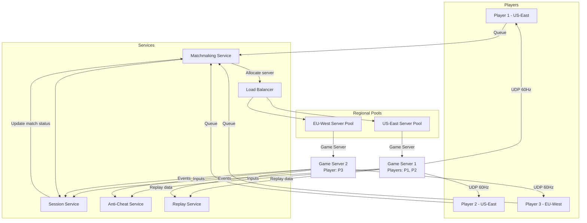
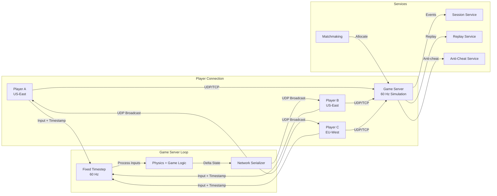

# Design a Multiplayer Game (pubg)

## Blogs and websites

## Medium

## Youtube

- [System Design Interview: Design Multiplayer Game like PUBG Or BGMI w/a a Senior Software Engineer](https://www.youtube.com/watch?v=ym1TpbppT8w)

---

## Theory

### What Is It?

A multiplayer game server (PUBG, Fortnite, Call of Duty) is a real-time system that synchronizes the game state (player positions, health, inventory, bullets, environmental changes) across hundreds of players in a shared virtual world with < 100 ms latency. Unlike turn-based or asynchronous games, real-time multiplayer games require the server to receive inputs, process the game simulation, and broadcast state updates at 20-60 ticks per second — all while handling network latency, packet loss, cheating, and player disconnections.

### Why Does It Exist?

Single-player games are isolated experiences — multiplayer games create shared experiences (competition, cooperation, social interaction). The challenge is making a distributed game world feel real and fair despite network delays. Players expect to see other players' actions (movement, shooting) as if they were happening in real-time, even though network latency means inputs are always delayed.

### What Problem Does It Solve?

* **State synchronization**: Every player's view of the world must be consistent — if player A shoots player B, player B must take damage, and all other players must see the hit.
* **Latency compensation**: Network latency (30-150 ms) means players see the world in the past. The system must compensate (client-side prediction, server reconciliation, lag compensation) to make actions feel responsive.
* **Scalability**: Games like PUBG support 100 players per match; MMORPGs like WoW support thousands per shard. The server must handle hundreds to thousands of concurrent players.
* **Cheating prevention**: Players may use aimbots, wallhacks, or packet manipulation — the server must validate actions and detect anomalies.
* **Matchmaking**: Group players of similar skill into balanced matches efficiently.
* **Server authority**: The server is the source of truth — clients are untrusted (can't be relied upon for game state).
* **Network topology**: Minimize latency between all players in a match — players on different continents may experience asymmetric latency.

### Important Subtopics

1. Client-server architecture and server authority
2. Tick rate and fixed timestep simulation
3. Client-side prediction and server reconciliation
4. Lag compensation (rewinding player positions)
5. Entity interpolation and extrapolation
6. Delta compression (sending only changes)
7. Network protocols (UDP vs TCP, reliable UDP)
8. Matchmaking and lobby systems
9. World sharding and instance management
10. Anti-cheat mechanisms
11. Bandwidth optimization and interpolation buffers
12. Spectator and replay systems

## Characteristics

| Characteristic | What it means | Why it matters | How it works |
|---|---|---|---|
| **Server authority** | Server is the source of truth for game state | Prevents cheating; ensures fairness | Server validates all client inputs |
| **Tick rate** | How often the server updates simulation (20-60 Hz) | Affects responsiveness and fairness | Fixed timestep loop: update → simulate → broadcast |
| **Client-side prediction** | Client predicts own actions before server confirms | Makes controls feel responsive | Apply input locally; reconcile on server response |
| **Lag compensation** | Server rewinds time to validate shots at the latency-appropriate position | Ensures fair hit detection across network latency | Server stores player position history; rewinds on shot validation |
| **Interpolation** | Clients smooth between received state snapshots | Eliminates jittery/stuttering visuals | Interpolate between snapshots; extrapolate for latest |
| **Delta compression** | Only send changes (delta) not full state | Reduces bandwidth by 90%+ | Encode state differences; delta decode on client |

## Components

| Component | Purpose | Responsibilities | Relationship | Real-world Example |
|---|---|---|---|---|
| **Game Server** | Run game simulation | Update tick, process inputs, simulate physics | Core of the system; communicates with all clients | PUBG dedicated server |
| **Matchmaker** | Create balanced matches | Find players, create lobbies, assign servers | Player → Matchmaker → Game Server | PUBG Matchmaking |
| **Lobby Service** | Manage pre-game | Waiting room, player ready states, map voting | Matchmaker ↔ Game Server | PUBG Lobby |
| **Client** | Game client | Render, send inputs, receive state updates | Communicates with Game Server | PUBG Steam client |
| **State Sync** | Distribute state updates | Send delta snapshots to clients | Game Server → State Sync → Clients | Custom UDP protocol |
| **Replay System** | Record and replay | Persist game state snapshots for replay | Consumes from Game Server | PUBG replay files |
| **Anti-Cheat** | Prevent cheating | Monitor for aimbots, wallhacks, packet manipulation | Analyzes client inputs + game state | BattlEye, Easy Anti-Cheat |
| **Load Balancer** | Distribute players to servers | Route players to least-loaded game servers | Matchmaker → Load Balancer → Game Server | AWS GameLift, custom |

### Component Interactions

1. **Match flow**: Player queues → Matchmaker finds players → Lobby Service creates lobby → players ready → Game Server allocates (via Load Balancer) → players join → game starts.
2. **Game loop**: Game Server runs fixed-timestep loop (e.g., 60 Hz) → processes queued inputs → simulates physics (movement, shooting, collisions) → sends delta state to all clients.
3. **Prediction**: Client sends input immediately → predicts local result → Game Server validates → sends correction if different → client reconciles.

## Patterns

### Client-Side Prediction with Server Reconciliation

* **What**: The client predicts the result of its own inputs (e.g., movement) and applies them immediately for responsiveness. The server later validates and sends corrections if needed.
* **Problem solved**: Without prediction, the player sees their character move 100+ ms after pressing a key (input → network → server → simulate → network → client). That delay feels unplayable.
* **How it works**: Client applies input locally (immediate visual feedback). Server processes the input at the correct timestamp → simulates → sends authoritative state. Client receives server state → compares with prediction → if different, rewinds to the input's timestamp, re-simulates with the server's correction, and re-applies unacknowledged inputs.
* **When to use**: All real-time multiplayer games where responsiveness matters.
* **When not to use**: Turn-based games where latency is not critical.
* **Advantages**: Feels responsive; hides network latency.
* **Disadvantages**: Complex reconciliation; visible "rubber-banding" if prediction is wrong.
* **Java/Spring Boot example** (server-side simulation):
```java
@Service
public class GameStateService {
    private static final double TICK_RATE = 60.0; // 60 Hz
    private static final double TICK_INTERVAL_MS = 1000.0 / TICK_RATE;

    public void processTick(GameWorld world, List<PlayerInput> inputs) {
        // Process inputs in timestamp order
        for (PlayerInput input : inputs) {
            long serverTick = (System.currentTimeMillis() - input.getClientTime()) /
                (long) TICK_INTERVAL_MS;
            processInput(world, input, serverTick);
        }

        // Simulate physics (fixed timestep)
        world.update(TICK_INTERVAL_MS / 1000.0);

        // Broadcast state snapshot to all clients
        broadcastDelta(world);
    }

    private void processInput(GameWorld world, PlayerInput input, long tick) {
        Player player = world.getPlayer(input.getPlayerId());
        if (player == null) return;

        // Validate input (prevent cheating)
        if (Math.abs(input.getMoveVector().length()) > 1.0) {
            // Cheating detected: move vector too long
            player.terminate("suspicious_input");
            return;
        }

        // Apply valid input
        player.setPosition(player.getPosition().add(input.getMoveVector().multiply(
            player.getSpeed() * TICK_INTERVAL_MS / 1000.0)));
    }
}
```
* **Real-world example**: Overwatch's client-side prediction; League of Legends' input queueing.

### Lag Compensation (Rewind and Replay)

* **What**: When the server validates a shot, it rewinds all players' positions to the time when the shooter's input was issued — compensating for the network latency between the shooter and the server.
* **Problem solved**: Without lag compensation, a player with 100 ms latency can never hit a target moving at 200 units/sec (they'd aim at where the target WAS 100 ms ago, but the server sees the target in its current position). Lag compensation ensures the shooter hits what they see on their screen.
* **How it works**: Server keeps a history of each player's position (snapshots) for the last ~200 ms. When a shot arrives (from a client with 50 ms latency), the server rewinds to 50 ms ago → checks if the shot hit the target's position at that time → applies damage. Then rewinds back and continues simulation.
* **When to use**: FPS games, battle royales where hit detection matters.
* **When not to use**: Strategy or simulation games where precise hit detection isn't critical.
* **Advantages**: Fair hit detection across different latencies.
* **Disadvantages**: Complex to implement; can cause "impossible" hits (shooting someone through a wall they were behind earlier).
* **Real-world example**: Valve's Source engine (Counter-Strike, Team Fortress 2); Riot's Valorant.

### Entity Interpolation

* **What**: Clients render entities at a position interpolated between the two most recent server snapshots, with a small delay (e.g., 100 ms behind the server) to account for network jitter.
* **Problem solved**: Without interpolation, entities jump between positions on each received snapshot (stuttering). Network jitter makes snapshots arrive unevenly.
* **How it works**: Server sends snapshots at fixed intervals (e.g., 20/s). Client delays rendering by one snapshot interval (~100 ms). For each entity, render at `position_prev + (position_current - position_prev) * interpolation_factor` where `interpolation_factor = (now - snapshot_time_prev) / snapshot_interval`. Extrapolate (predict) for the latest 100 ms.
* **When to use**: All real-time multiplayer games.
* **When not to use**: Turn-based games (no continuous position updates needed).
* **Advantages**: Smooth visual experience; hides network jitter.
* **Disadvantages**: Adds ~100 ms of visual latency (acceptable for most games).
* **Real-world example**: PUBG, Fortnite, Overwatch.

## Benefits

* **Shared experience**: Players compete/cooperate with real people in real-time.
* **Competitive depth**: Skill-based matchmaking and competitive rankings drive long-term engagement.
* **Social interaction**: Voice chat, text chat, friend lists, clans/guilds create community.
* **Replayability**: No two matches are the same — emergent gameplay from player interactions.
* **Esports**: Spectator mode, replays, tournaments on top of the core game.
* **Monetization**: Cosmetic skins, battle passes, season passes.

## Pros

* **Immersive experience**: Seeing and reacting to real players creates a living world.
* **Skill expression**: Player skill (aim, positioning, tactics) is the primary factor in success.
* **Social engagement**: Chat, friends, clans drive retention and word-of-mouth.
* **Scalable competition**: Matchmaking creates fair matches across skill levels.
* **Content longevity**: Human opponents never get old (unlike AI).

## Cons

* **Latency sensitivity**: Network latency makes the game feel unresponsive; high latency is a competitive disadvantage.
* **Cheating**: Aim bots, wall hacks, scripts can ruin the experience; requires constant anti-cheat development.
* **Server costs**: Real-time servers (60 Hz, < 100 ms) are expensive to run at scale.
* **Toxicity**: Player-to-player harassment, griefing, smurfing.
* **Matchmaking wait**: Finding players of similar skill can take time, especially off-peak.
* **Network dependency**: Requires stable, low-latency internet — no offline play.

## Challenges

### Technical Challenges

* **Physics determinism**: Both client and server must simulate physics identically — floating-point differences across platforms cause desync. Use fixed-point math or deterministic physics engines.
* **Input timing**: Client sends inputs with timestamps; server must apply them at the right tick — buffering and reordering needed.
* **Packet loss**: UDP is unreliable — need custom reliable transport for critical messages (damage, state changes); drop non-critical messages (extra movement updates).
* **State serialization**: Efficiently serialize world state (positions, health, inventory) — use binary protocols (protobuf, FlatBuffers); delta compression.

### Scalability Challenges

* **Server capacity**: A 100-player match generates 100 × 60 inputs/second = 6K messages/second from clients, and 100 × 60 state snapshots/second = 6K messages/second to clients. Each server can handle 100-200 players.
* **Instance management**: Auto-create and destroy game server instances (containers) based on demand; need a game server orchestrator (Google Agones, AWS GameLift).
* **Network topology**: Players in a match should all connect to the same server with low latency — need regional server pools and geographic load balancing.

### Performance Challenges

* **Tick rate**: Higher tick rate (60 Hz) provides better precision but increases CPU/network load 3x vs. 20 Hz.
* **Bandwidth**: Each state snapshot must be small enough to send 60 times/second to all players — delta compression is critical.
* **Latency**: P99 latency must be < 50 ms (including server processing); any spike causes visible stuttering.

### Reliability Challenges

* **Server crash**: If the game server crashes, the match is lost — need quick server restart or migration.
* **Player disconnect**: Disconnected players should be able to rejoin within a grace period; their character is controlled by the server (AFK) or removed.
* **Clock synchronization**: Clients and server must have synchronized clocks — use NTP; handle clock drift.

### Maintainability Challenges

* **Network protocol evolution**: Adding new fields to snapshots must not break old clients — use versioned schemas (protobuf).
* **Replay compatibility**: Replays must work across game versions — snapshot format must be backward-compatible.
* **A/B testing**: Matchmaking parameters, hit detection, lag compensation — need to test changes with real players.

### Operational Challenges

* **DDoS attacks**: Game servers are often targeted — need DDoS protection (Cloudflare, AWS Shield).
* **Bot detection**: Distinguish bots from real players for matchmaking and anti-cheat.
* **Patch deployment**: Rolling out game updates without disrupting live matches — deploy new server versions to new matches; drain old matches.
* **Regional coverage**: Deploy servers in 10+ regions; maintain low latency globally.

### Security Concerns

* **Aimbots and wallhacks**: Cheat software modifies game memory or intercepts packets — anti-cheat kernels/drivers scan for known patterns; server-side validation of inputs.
* **Packet manipulation**: Players modify network packets (teleport, instant kill) — server must validate all inputs (e.g., movement speed must be within physics limits).
* **DDoS**: Server IP addresses are discoverable — DDoS attacks can take servers offline. Use Anycast or hide server IPs.
* **Account sharing/boosting**: Players share accounts to boost ranks — detect via IP/device fingerprinting and unusual play patterns.

## Best Practices

* **Server authority**: The server validates and simulates everything; clients are untrusted. Never trust client state.
* **Fixed timestep**: Run the game simulation at a fixed tick rate (e.g., 60 Hz) regardless of frame rate. This ensures deterministic simulation and consistent networking.
* **Interpolation delay**: Add a fixed delay (e.g., 100 ms) to all client rendering to account for network jitter — smooths movement.
* **Extrapolation**: Predict where entities will be (velocity-based) to fill the gap between the interpolation delay and real-time.
* **Delta compression**: Send only changed fields in state updates — use a dirty bitfield per entity.
* **Entity interest management**: Only send entities near the player (within a "view distance") — reduces bandwidth.
* **Reliable UDP for important events**: Use a custom reliability layer (ACK + resend) for damage, item pickup, death — not for movement (which is fine to drop).
* **Input buffering**: Buffer client inputs for slightly in the past (50-200 ms) to handle network jitter and out-of-order delivery.
* **Graceful degradation**: If network conditions are poor, increase interpolation delay; if server is overloaded, reduce tick rate.

## When to Use

### Appropriate

* When real-time player interaction is core to gameplay (FPS, MOBA, battle royale).
* When competitive skill-based matchmaking is needed.
* When social features (voice chat, friends, clans) are important.
* When the game world is persistent (survival games, MMORPGs).

### Not Appropriate

* Single-player campaigns — no need for networking.
* Turn-based games — async networking suffices (email-like).
* Local co-op only — LAN-based networking is simpler.
* Games with very high tolerance for latency — board games, puzzle games.

### Alternatives

* **Peer-to-peer**: Each player is both client and server; no dedicated server. Cheaper but vulnerable to cheating and host migration.
* **Dedicated server**: Separate server runs the simulation — fair, cheat-resistant, but expensive.
* **Hosted service**: Cloud provider offers game server hosting (AWS GameLift, Google Agones) — reduces ops burden.

### Decision Factors

* **Player count**: 100 players → dedicated servers; 4-player co-op → peer-to-peer may suffice.
* **Competitive integrity**: Competitive games → server authority; casual games → P2P acceptable.
* **Budget**: Dedicated servers are expensive; P2P is free but less fair.
* **Latency tolerance**: FPS needs < 100 ms; strategy games can tolerate higher latency.

## Use Cases

### Competitive Matchmaking (PUBG-style)

* **Problem**: Create fair 100-player matches with players of similar skill.
* **Solution**: Skill-based matchmaking queues players by MMR; creates lobbies of 100 players; allocates a dedicated server in a region near most players.
* **Why suitable**: Competitive integrity requires server authority, skill matching, and low latency.
* **How it works**: (1) Players queue → matchmaker finds 100 players with similar MMR → picks server region (median of players' locations) → allocates game server (container) → players join → match begins. During match, server runs at 60 Hz (or 30 Hz), sending state updates.
* **Trade-offs**: Longer wait times for fair matches; server costs are high ($1000+/month per instance); regional latency for mismatched player locations.

### Co-op Survival Game (Minecraft-like)

* **Problem**: 4-16 friends explore and build together in a persistent world.
* **Solution**: Host-based (one player hosts) or dedicated server; world is loaded from disk; players' actions modify the shared world.
* **Why suitable**: Casual co-op doesn't need strict anti-cheat; host-based is simple.
* **How it works**: Host player's machine runs the server → other players connect → world state (blocks, entities) synced at 20 Hz → host saves periodically. If host disconnects, world is saved but game ends (or transfers to another player).
* **Trade-offs**: Host advantage (lower latency for host); host must keep machine on; world lost if host crashes without saving.

### Esports Tournament (CS:GO-style)

* **Problem**: Run a competitive tournament with 5v5 matches, brackets, and spectator streams.
* **Solution**: Dedicated servers in neutral locations; matchmaker creates 10-player lobbies; spectators connect to a spectator server that receives the game state; replays are recorded.
* **Why suitable**: Fair (server authority), spectator support (broadcast), replay system for tournament review.
* **How it works**: Tournament bracket defines matchups → dedicated servers allocated for each match → 10 players connect → server runs at 64 Hz (or 128 Hz for pro) → spectator camera system streams game state → observers watch via GOTV (Game Over The Watch) relay → replay files saved for dispute resolution.
* **Trade-offs**: High server costs for high tick rate; need dedicated infrastructure for tournaments; spectator system adds network overhead.

## Architecture

A real-time multiplayer game uses a **client-server model with dedicated game servers**. Players connect to regional game server pools. A **matchmaker** creates balanced lobbies and allocates servers. A **session service** tracks player state and match history. Game servers run a fixed-timestep simulation loop and broadcast state snapshots via UDP. **Replay services** record all inputs and states. **Anti-cheat** operates both client-side (kernel driver) and server-side (input validation).



### Architecture Structure

* **Edge layer**: Player clients connect to game servers via UDP (primary) + TCP (reliable messages). Regional server pools for latency.
* **Service layer**: Matchmaking, session management, anti-cheat, replay, load balancing. Stateless services.
* **Game server layer**: Dedicated servers running fixed-timestep simulations. Each hosts one match/instance.
* **Data layer**: Player stats (Postgres), match history (Cassandra), replays (S3).

### Communication

* **Client ↔ Game Server**: UDP for real-time state updates (high frequency, unreliable); TCP or reliable UDP for important messages (damage, chat, items).
* **Client ↔ Services**: HTTPS/TCP for matchmaking, session, anti-cheat uploads.
* **Server ↔ Services**: gRPC for real-time communication (replay uploads, session updates).

### Data Flow

1. **Player queuing**: Client → Matchmaking Service → finds balanced lobby → Session Service creates match → Load Balancer allocates game server.
2. **Game loop**: Game Server runs at fixed tick rate (60 Hz) → processes all queued inputs → simulates physics and game logic → serializes state delta → sends to all clients via UDP.
3. **Client prediction**: Client sends input + predicts locally → receives server correction → reconciles.
4. **Replay recording**: Game Server saves all inputs + key state changes → Replay Service stores → players can replay.

### Scaling Strategy

* **Match size**: Fixed per-game-server (e.g., 100 players for PUBG; 10 for CS). Each match = one server instance.
* **Server instances**: Auto-scale containers (Kubernetes + Agones) based on match demand; scale up during peak hours.
* **Regions**: Deploy server pools in 10+ regions; route players to nearest for < 50 ms latency.
* **Matchmaking**: Queue players across servers in a region; if no balanced match forms within 5 minutes, expand the region pool.

### Failure Handling

* **Server crash**: Match lost (unless hosted on redundant servers) — auto-restart new server for next match; players can rejoin if within grace period.
* **Player disconnect**: Character becomes AFK (server-controlled) for 60 seconds; if reconnect → resume; if not → eliminated.
* **Network partition**: Players see "connection lost" → attempt reconnect → if server reachable, rejoin match.
* **DDoS**: Use Anycast or hide game server IPs; DDoS protection at network edge.

## High-Level Design



**Game loop**:
1. At fixed intervals (16.67 ms for 60 Hz), collect all pending inputs from connected clients.
2. Process inputs in timestamp order — apply to the world state from the correct simulation tick.
3. Run physics simulation (movement, collisions, shooting) for this tick.
4. Generate delta state (what changed since last snapshot) for each player's viewport.
5. Send delta state via UDP to each client.

**Client prediction**:
1. Client sends input (movement direction, shoot action) with local timestamp.
2. Client immediately applies the input to its local world state (prediction).
3. Server receives input → applies at the correct tick → sends back authoritative state.
4. Client receives authoritative state → rewinds to the input's tick → re-simulates with server's correction → re-applies unacknowledged inputs.

## Deep Dive

### Internal Implementation: Fixed Timestep Game Loop

```java
public class GameServer {
    private static final double TICK_RATE = 60.0;
    private static final double TICK_INTERVAL_MS = 1000.0 / TICK_RATE;
    private long tickNumber = 0;
    private GameWorld world;
    private final PriorityQueue<TimestampedInput> inputQueue = new PriorityQueue<>();

    public void run() {
        ScheduledExecutorService scheduler = Executors.newScheduledThreadPool(2);
        
        // Fixed timestep simulation
        scheduler.scheduleAtFixedRate(this::gameLoop, 0, 
            (long) TICK_INTERVAL_MS, TimeUnit.MILLISECONDS);
    }

    private void gameLoop() {
        long tickStart = System.nanoTime();
        tickNumber++;

        // 1. Collect inputs that are due for this tick
        List<PlayerInput> dueInputs = collectInputsForTick(tickNumber);
        
        // 2. Process inputs
        for (PlayerInput input : dueInputs) {
            processInput(world, input);
        }

        // 3. Simulate physics
        world.update(TICK_INTERVAL_MS / 1000.0);
        
        // 4. Detect collisions, apply damage, etc.
        world.resolveCollisions();

        // 5. Send delta state to all clients
        broadcastDelta(world, tickNumber);

        long tickDuration = System.nanoTime() - tickStart;
        if (tickDuration > TICK_INTERVAL_MS * 1_000_000) {
            log.warn("Tick {} took {} ms (expected {} ms)", 
                tickNumber, tickDuration / 1_000_000, (long) TICK_INTERVAL_MS);
        }
    }

    private void processInput(GameWorld world, PlayerInput input) {
        // Validate input (anti-cheat)
        if (!validateInput(input)) {
            world.kickPlayer(input.getPlayerId(), "invalid_input");
            return;
        }
        world.applyInput(input);
    }

    private boolean validateInput(PlayerInput input) {
        // Check for cheating patterns
        Player player = world.getPlayer(input.getPlayerId());
        if (player == null) return false;
        
        // Movement speed check
        double speed = input.getMoveVector().length() / 
            (input.getDeltaTime() / 1000.0);
        if (speed > player.getMaxSpeed() * 1.1) {
            return false; // Moving too fast — possible speedhack
        }
        
        // Timing check — input should not be from the future
        long serverTick = tickNumber - (input.getClientTick());
        if (serverTick < 0 || serverTick > 20) { // Allow ~333ms buffer
            return false;
        }
        
        return true;
    }
}
```

### Lag Compensation Implementation

The server maintains a history buffer of player positions (snapshots):

```java
public class LagCompensation {
    private final Map<String, Deque<PlayerSnapshot>> history = new ConcurrentHashMap<>();
    private static final int HISTORY_BUFFER_MS = 200;

    public void recordSnapshot(String playerId, PlayerSnapshot snapshot) {
        Deque<PlayerSnapshot> playerHistory = history.computeIfAbsent(playerId, 
            k -> new ConcurrentLinkedDeque<>());
        playerHistory.addLast(snapshot);
        
        // Remove old snapshots
        long cutoff = System.currentTimeMillis() - HISTORY_BUFFER_MS;
        while (!playerHistory.isEmpty() && 
               playerHistory.peekFirst().timestamp() < cutoff) {
            playerHistory.pollFirst();
        }
    }

    public PlayerSnapshot getPlayerAtTime(String playerId, long timestamp) {
        Deque<PlayerSnapshot> playerHistory = history.get(playerId);
        if (playerHistory == null) return null;

        // Find the snapshot closest to (before) the target time
        PlayerSnapshot best = null;
        for (PlayerSnapshot s : playerHistory) {
            if (s.timestamp() <= timestamp && 
                (best == null || s.timestamp() > best.timestamp())) {
                best = s;
            }
        }

        // Interpolate between two snapshots
        if (best == null) return null;
        return best;
    }

    // Called when processing a shot
    public boolean validateShot(ShotEvent shot) {
        // Get the shooter's ping (latency)
        int pingMs = getPlayerPing(shot.getShooterId());
        
        // Rewind to the time the shot was fired (from the server's perspective when fired)
        long fireTime = shot.getServerReceivedTime() - pingMs;
        
        // Get the target's position at that time
        PlayerSnapshot targetSnapshot = getPlayerAtTime(shot.getTargetId(), fireTime);
        if (targetSnapshot == null) return false;

        // Check if the shot hits the target at that position
        return shot.hits(targetSnapshot.position());
    }
}
```

### Delta Compression

```java
public class DeltaCompressor {
    // Bitmask for which fields changed
    public static final int FIELD_POSITION = 1 << 0;
    public static final int FIELD_HEALTH = 1 << 1;
    public static final int FIELD_ANIMATION = 1 << 2;
    public static final int FIELD_INVENTORY = 1 << 3;

    public byte[] createDelta(PlayerState currentState, PlayerState previousState, 
                               int playerId) {
        int dirtyBits = 0;
        ByteArrayOutputStream out = new ByteArrayOutputStream();
        DataOutputStream data = new DataOutputStream(out);

        // Position (most commonly changed)
        if (!currentState.position.equals(previousState.position)) {
            dirtyBits |= FIELD_POSITION;
            data.writeFloat((float) currentState.position.x);
            data.writeFloat((float) currentState.position.y);
            data.writeFloat((float) currentState.position.z);
        }

        // Health
        if (currentState.health != previousState.health) {
            dirtyBits |= FIELD_HEALTH;
            data.writeShort(currentState.health);
        }

        // Write dirty bits first, then changed fields
        ByteArrayOutputStream finalOut = new ByteArrayOutputStream();
        DataOutputStream finalData = new DataOutputStream(finalOut);
        finalData.writeInt(playerId);
        finalData.writeInt(dirtyBits);
        finalData.write(out.toByteArray());

        return finalOut.toByteArray();
    }
}
```

## Java and Spring Boot Implementation

### Basic Java Implementation — Fixed Timestep Server

```java
@RestController
@RequestMapping("/api/v1/match")
@RequiredArgsConstructor
public class MatchController {
    private final MatchmakingService matchmaking;

    @PostMapping("/join")
    public ResponseEntity<JoinResponse> joinQueue(
            @AuthenticationPrincipal PlayerDetails player) {
        String matchId = matchmaking.enqueue(player.getId(), player.getSkill());
        return ResponseEntity.ok(new JoinResponse(matchId, "queued"));
    }
}

@Service
public class GameServerManager {
    private final DockerClient docker;
    private final ConcurrentHashMap<String, GameServer> activeServers = new ConcurrentHashMap<>();

    public String startServer(MatchConfig config) {
        String serverId = UUID.randomUUID().toString();
        
        // Start container with game server
        ContainerCreation creation = docker.createContainerCmd("game-server:latest")
            .withEnv("MATCH_ID=" + config.getMatchId(),
                     "MAX_PLAYERS=" + config.getMaxPlayers(),
                     "MAP=" + config.getMap())
            .exec();
        
        docker.startContainerCmd(creation.id()).exec();
        return creation.id();
    }
}

// Game server main loop (runs inside the container)
public class GameServerMain {
    public static void main(String[] args) {
        GameServer server = new GameServer(
            config.getMatchId(), 
            config.getMaxPlayers()
        );
        server.start();
    }
}
```

### Production-Oriented Implementation — Client Prediction

```java
// Client-side (Unity/Java pseudo-code for game engine)
public class ClientPrediction {
    private final Map<Long, PlayerInput> pendingInputs = new HashMap<>();
    private final GameState localState = new GameState();

    public void sendInput(PlayerInput input) {
        // Predict locally immediately
        applyInputLocally(input);
        
        // Send to server with timestamp
        input.setSentTime(System.currentTimeMillis());
        pendingInputs.put(input.getInputId(), input);
        network.send(input, NetworkChannel.UDP);
    }

    public void onServerState(ServerState state) {
        // Rewind to the tick the server is confirming
        long confirmedTick = state.getTickNumber();
        
        // Remove acknowledged inputs
        pendingInputs.entrySet().removeIf(e -> e.getValue().getTick() <= confirmedTick);
        
        // Reconcile: if our prediction was wrong, correct
        if (!state.getPlayerState().equals(localState.getPlayerState())) {
            // Rewind to confirmed tick and re-simulate
            localState.restoreFrom(state);
            
            // Re-apply unacknowledged inputs
            pendingInputs.values().stream()
                .filter(i -> i.getTick() > confirmedTick)
                .sorted(Comparator.comparing(PlayerInput::getTick))
                .forEach(this::applyInputLocally);
        }
    }
}
```

### Testing Example

```java
@ExtendJUnit
class GameServerTest {
    private GameServer server;
    private TestPlayer player;

    @BeforeEach
    void setup() {
        server = new GameServer("test_match", 100);
        server.start();
        player = new TestPlayer("player_1");
    }

    @Test
    void shouldProcessInputWithinLatencyBudget() {
        PlayerInput input = new PlayerInput(player.getId(), 
            Direction.FORWARD, System.currentTimeMillis());
        
        long start = System.nanoTime();
        server.submitInput(input);
        // Wait for next tick to process
        Thread.sleep(20);
        long durationMs = (System.nanoTime() - start) / 1_000_000;
        
        assertThat(durationMs).isLessThan(50); // Must process in < 50ms
    }

    @Test
    void shouldDetectAimbots() {
        // Send inputs with impossibly fast direction changes
        PlayerInput input1 = new PlayerInput(player.getId(), Direction.NORTH, System.currentTimeMillis());
        PlayerInput input2 = new PlayerInput(player.getId(), Direction.SOUTH, System.currentTimeMillis() + 1);
        
        server.submitInput(input1);
        server.submitInput(input2);
        Thread.sleep(20);
        
        assertThat(server.isPlayerKicked(player.getId())).isTrue();
    }

    @Test
    void shouldMaintainDeterministicSimulation() {
        GameWorld world1 = new GameWorld();
        GameWorld world2 = new GameWorld();
        
        // Same inputs on two instances
        List<PlayerInput> inputs = generateTestInputs();
        for (PlayerInput input : inputs) {
            world1.applyInput(input);
            world2.applyInput(input);
        }
        
        // Should be identical
        assertThat(world1.getState()).isEqualTo(world2.getState());
    }
}
```

## Real-World Examples

### PUBG's Server Architecture

PUBG uses dedicated game servers running on AWS EC2 instances. Each match (up to 100 players) runs on a dedicated server instance. The server runs a fixed-timestep simulation at 30 Hz (for most regions) and 60 Hz (for competitive/pro leagues). Players are connected via UDP. The server sends state snapshots to all players; clients use interpolation + client-side prediction for smooth visuals. Matchmaking is region-based (US, EU, Asia, etc.) to minimize latency. Replay data (all inputs + key state changes) is recorded per match and stored for post-match replay viewing.

### Riot's Lag Compensation in Valorant

Valorant uses **rollback netcode** — when a player shoots, the server rewinds all players' positions to the shooter's view time (accounting for latency), validates the hit, then replays forward. This ensures a player with 30 ms sees the same hit registration as a player with 100 ms. The system stores player position snapshots for the last 200 ms (enough for any reasonable ping). The server runs at 128 Hz (sub-10ms tick) for precise hit registration.

### Epic's Unreal Engine Networking (Fortnite)

Fortnite's game servers run on **Epic's own networking architecture** integrated with Unreal Engine. The server runs at 20 Hz simulation, sends updates at 30 Hz to clients. Clients use client-side prediction with server reconciliation. The **"net relevancy"** system determines which entities each client should receive updates for (based on distance, visibility, importance). Delta compression reduces bandwidth by 90%. For replays, all inputs and key state changes are recorded to disk and replayable via the replay system.

## Interview Preparation

### Beginner Questions

**Q1: What is a game server tick rate?**
A: The tick rate (or update rate) is how many times per second the game server processes the game state and sends updates. 60 Hz means 60 updates/second (16.67 ms per tick). PUBG uses 30 Hz for normal play, 60 Hz for competitive/pro. Higher tick rates provide more precise hit detection and smoother gameplay but require more CPU and bandwidth.

**Q2: What is client-side prediction?**
A: A technique where the client immediately applies the player's input locally (without waiting for the server) to make controls feel responsive. The server later validates and sends corrections. If the prediction was wrong, the client "reconciles" — rewinds to the server's state and re-simulates. This hides the 50-150 ms network latency.

**Q3: What is lag compensation?**
A: When a player shoots, lag compensation rewinds all players' positions to the time when the shot was fired (accounting for the shooter's latency). This ensures fair hit detection — a player with 100 ms latency isn't at a disadvantage. The server stores player position history (snapshots) for the last ~200 ms.

### Intermediate Questions

**Q4: How does client-side interpolation work?**
A: The client delays rendering by one snapshot interval (e.g., 100 ms) and interpolates between the two most recent server snapshots. If the server sends positions at 10 Hz (every 100 ms), the client renders at the position 100 ms ago, interpolating between the previous and current snapshot. This smooths out jitter and packet loss. Extrapolation (predicting beyond the last received snapshot) handles the gap between the interpolation delay and real-time.

**Q5: What is delta compression?**
A: Instead of sending the full game state every update (which could be megabytes), the server only sends what changed (deltas). For example, if a player's position changed but health didn't, send only the new position. A dirty bitfield indicates which fields changed. This typically reduces bandwidth by 90-95%.

**Q6: How do you prevent cheating in a multiplayer game?**
A: Server authority is the primary defense — the server validates all inputs and maintains authoritative state. Specific checks: (1) Movement speed (can't move faster than the game allows). (2) Input timing (inputs from the future are rejected). (3) Aim angle snapping (bots snap to targets instantly). (4) Shot validation (can't shoot through walls — server checks line of sight). (5) Client-side anti-cheat (BattlEye, Easy Anti-Cheat) scans for known cheat software. (6) Server-side anomaly detection (machine learning patterns).

**Q7: What's the difference between UDP and TCP for game networking?**
A: UDP is connectionless, doesn't guarantee delivery or ordering, and has lower overhead — ideal for real-time state updates where a missed packet is less important than latency. TCP guarantees delivery and ordering but adds latency (head-of-line blocking, Nagle's algorithm). Use UDP for position updates (drop if packet loss) and TCP (or reliable UDP) for critical events (damage, deaths, chat).

### Advanced Questions

**Q8: How would you implement rollback netcode for a fighting game?**
A: Fighting games require very precise, deterministic synchronization. (1) Each client runs the game simulation locally. (2) On each tick, each client sends its input to the other. (3) When a client receives the opponent's input for a past tick (which it hasn't processed yet), it "rolls back" the world state to that tick, inserts the opponent's input, and re-simulates the intervening ticks. (4) The re-simulated states are what the client displays. This requires the simulation to be fully deterministic (same inputs → same outputs) across all platforms. (5) To hide input delay, clients predict the opponent's input for 1-2 frames ahead. If the prediction is wrong, the rollback causes a visible "glitch" but the game state is corrected.

**Q9: How do you handle a player with very high latency (200+ ms)?**
A: (1) **Increased interpolation delay**: Increase the interpolation buffer to 200-300 ms so the client renders a smoother stream. (2) **Increased reconciliation tolerance**: Allow the client to predict further into the future before reconciling. (3) **Server-side**: Increase the lag compensation window (store 400 ms of history instead of 200 ms). (4) **Matchmaking**: Try to match high-latency players to nearby servers (or kick them if no nearby server exists). (5) **Degraded experience**: The high-latency player will see "rubber-banding" — their inputs take longer to be reflected; this is unavoidable. Some competitive games (Overwatch) disconnect players with > 200 ms.

**Q10: How would you design a spectator mode for a 100-player battle royale?**
A: (1) **Free-fly camera**: Spectator clients receive the full game state (not just relevant entities) and can freely move the camera. (2) **Bandwidth**: The server sends the full state to spectators at reduced frequency (5-10 Hz) to avoid overwhelming the network. (3) **Interest management**: Spectators can spectate specific players or areas; the server filters state updates based on the spectator's view. (4) **Replays**: Spectators can jump to any point in the game (requires recording all inputs + state snapshots). (5) **Delay**: Add a 30-second delay to spectator feeds to prevent ghosting (giving away positions to teammates).

## Senior-Level Questions

**Q11: How would you design a globally distributed game server architecture for 10M concurrent players?**
A: (1) **Regional server pools**: Deploy game servers in 15+ regions (AWS: us-east-1, eu-west-1, ap-northeast-1, etc.). Players connect to the nearest region. (2) **Matchmaker per region**: Each region has its own matchmaker; cross-region matching only if a region can't fill (with latency warning). (3) **Container orchestration**: Use Kubernetes + Agones (or AWS GameLift) to auto-scale server instances. Each match = 1 container. Scale pools based on concurrent matches + 30% headroom. (4) **Global services**: Matchmaking and session services are globally distributed (multi-region active-active with eventual consistency); game servers are per-region. (5) **Anycast**: Use Anycast DNS for the entry point; route players to the nearest region. (6) **State transfer**: If a region degrades, migrate players to adjacent regions (requires state sync). (7) **Edge networking**: Use edge POPs (Cloudflare, AWS Global Accelerator) for UDP/TCP optimization. (8) **Cost**: 100K+ concurrent matches × $100/month/server = $10M+/month — need spot instances and auto-scaling. (9) **DDoS**: Anycast + DDoS protection at edge. (10) **Cross-region tournaments**: Pre-schedule matches; route all tournament players to a single region regardless of location.

**Q12: How would you implement a replay system for a competitive game?**
A: A replay system records all inputs and key state changes, then replays them exactly. (1) **Recording**: On the game server, record: (a) all player inputs with timestamps, (b) key state events (player joined, weapon picked up, player eliminated), (c) periodic world snapshots (every 10 seconds for seek points). (2) **Storage**: Store replays as binary streams (protobuf). Compress with LZ4. Store in S3; metadata in PostgreSQL. (3) **Reproduction**: Load replay → initialize world state from the last snapshot before T=0 → process inputs sequentially at the original tick rate → render. (4) **Seeking**: To seek to time T, load the nearest snapshot before T → fast-forward by processing inputs. (5) **Determinism**: The game must be fully deterministic — same inputs = same outputs. Use fixed-point math (not floating-point) for physics. (6) **Streaming**: For long matches (> 20 min), stream replay data from S3 on-demand (don't load the whole thing into memory). (7) **Compression**: Delta-compress inputs (most players don't act every tick). (8) **Security**: Sign replays to prevent tampering; include checksum of world state at key intervals for integrity verification.

### System Design Questions (Senior)

**Q13: Design a matchmaking system for a competitive game like League of Legends.**

**Approach**:
- **Player pool**: Players queue and are placed in a pool. Pool is segmented by skill (MMR ranges), region, and game mode.
- **Match quality metric**: Target < 10% MMR difference between teams; target wait time < 3 minutes; target full lobby (5v5 = 10 players). Use a "cost function" = `wait_time × w1 + mmr_imbalance × w2 + team_size × w3`.
- **Algorithm**: When a new player queues, look for existing lobbies in their MMR bracket with open slots and similar MMR. If no match within 30 seconds, expand MMR range. If no match within 3 minutes, create a new lobby and fill with any available players.
- **MMR update**: After each match, update player MMR using TrueSkill or Elo: `new_mmr = old_mmr + K × (actual_winrate - expected_winrate)`. K is higher for new players (faster convergence).
- **Queue management**: Use a priority queue per region/MMR bucket. Process new arrivals and timeout checks. Auto-requeue players who are AFK.
- **Latency**: Match players within the same region; cross-region only as last resort (with 200+ ms penalty).
- **Parties**: Group players (duos, trios) who queue together — their combined MMR is used for matching; ensure they're on the same team.
- **Preventing manipulation**: Anti-smurf detection (new accounts with abnormal win rates get placed in higher MMR brackets faster); rate limiting for queue dodging (longer wait times for repeat dodgers).
- **Scalability**: Shard matchmakers per region; within a region, shard by MMR percentile (low/mid/high elo have different populations). Use consistent hashing for even distribution.

**Expected discussion points**: MMR algorithm choice (TrueSkill vs. Elo vs. Glicko-2), match quality vs. wait time trade-off, queue expansion strategy, handling parties, anti-smurf detection, cross-region matching, and scalability via per-region/per-MMR sharding.

**Q14: Design a game server orchestration system that handles 100K matches/day with auto-scaling.**

**Approach**:
- **Container orchestration**: Use Kubernetes with Agones (open-source game server orchestrator) or AWS GameLift. Each match = 1 container/pod.
- **Build pipeline**: Docker image built → pushed to registry → game server config (map, rules) passed as parameters.
- **Allocation**: Matchmaker → allocates a server → K8s/Agones schedules a pod on a node → assigns a port → returns connection info to players.
- **Auto-scaling**: Monitor pending allocation requests → scale node pool based on `pending_allocations / capacity_per_node`. Target 20% spare capacity. Use predictive scaling (pre-warm based on historical usage patterns for peak hours).
- **Health monitoring**: Game servers expose health endpoints; Agones/K8s restarts unhealthy pods. Track: crash rate, match completion rate, allocation latency.
- **Fleet management**: Multiple machine types (CPU-optimized for physics-heavy games); spot instances for cost savings with on-demand fallback.
- **State persistence**: Match state is in-memory on the server; if the server crashes, the match is lost (except for critical games, use state replication). Replay data is written to S3 before the match ends.
- **Networking**: Use a service mesh (Istio) for service-to-service; direct UDP for game traffic (players connect directly to the pod IP).
- **Cost optimization**: Use spot instances for 70% of capacity; reserve instances for baseline load; scale down empty fleets during off-hours.

### Common Mistakes and Expected Discussion Points

**Common mistakes in multiplayer game design interviews**:
- Not distinguishing between client-side prediction (smoothness) and server authority (fairness).
- Ignoring the bandwidth cost of state updates (delta compression is essential).
- Not discussing tick rate trade-offs (higher = better but more CPU/bandwidth).
- Not addressing the "cheating on the client" problem — server validation is key.
- Not considering matchmaking quality vs. wait time trade-offs.
- Not mentioning the complexity of deterministic physics across platforms.
- Not discussing DDoS risks for game servers.

**Expected discussion points**: Tick rate and latency trade-offs, client-side prediction vs. server reconciliation, lag compensation for hit detection, delta compression for bandwidth, UDP vs. TCP for real-time traffic, match quality vs. wait time optimization, anti-cheat strategies (server authority + client detection), and container orchestration (Agones/K8s/Gamelift) for auto-scaling.

**Follow-up questions an interviewer might ask**:
* Q: "How do you handle packet loss in UDP-based games?" A: Critical events (damage, death) are sent via reliable UDP (ACK + retransmit); non-critical (position updates) are dropped. Clients interpolate between received snapshots to hide gaps.
* Q: "How do you prevent time cheating?" A: Client clock is untrusted; server uses its own clock. Inputs carry timestamps; server validates timing constraints (can't be from the future).
