# Design Netflix Streaming

## Blogs and websites

## Medium

## Youtube

## Architecture Choices

### Youtube

- [Netflix is Built on Java](https://www.youtube.com/watch?v=sMPMiy0NsUs)
- [How Netflix Uses Java - 2025 Edition](https://www.youtube.com/watch?v=XpunFFS-n8I)
- [How Netflix Really Uses Java](https://www.youtube.com/watch?v=BaUrpq_7KMk)
- [Build GraphQL Services with Spring Boot like Netflix](https://www.youtube.com/watch?v=Xn-oLXQQklU)
- [Paul Bakker — The DGS framework by Netflix — GraphQL for Spring Boot made easy](https://www.youtube.com/watch?v=D3r4-TMv86k)
- [AMA About the Java Language — Brian Goetz and Nicolai Parlog](https://www.youtube.com/watch?v=9si7gK94gLo)

### Medium

- [How Java Powers Netflix's Backend Architecture (2025 Edition)](https://medium.com/@adityabanerjee1406/how-java-powers-netflixs-backend-architecture-2025-edition-172e961af3ec)
- [The Netflix Tech Blog](https://netflixtechblog.com/)
- [Netflix Technology Blog](https://netflixtechblog.medium.com/)
- [Authorization](https://netflixtechblog.com/tagged/authorization)
- [Ipc](https://netflixtechblog.com/tagged/ipc)
- [Inside Netflix's Java Machine: GraphQL, ZGC, and the Art of Streaming at Planetary Scale](https://disant.medium.com/inside-netflixs-java-machine-graphql-zgc-and-the-art-of-streaming-at-planetary-scale-23a0cf62a7ae)
- [Netflix OSS and Spring Boot — Coming Full Circle](https://netflixtechblog.com/netflix-oss-and-spring-boot-coming-full-circle-4855947713a0)
- [Java 21 Virtual Threads - Dude, Where's My Lock?](https://netflixtechblog.com/java-21-virtual-threads-dude-wheres-my-lock-3052540e231d)
- [Practical API Design at Netflix, Part 1: Using Protobuf FieldMask](https://netflixtechblog.com/practical-api-design-at-netflix-part-1-using-protobuf-fieldmask-35cfdc606518)
- [How Netflix Scales its API with GraphQL Federation (Part 1)](https://netflixtechblog.com/how-netflix-scales-its-api-with-graphql-federation-part-1-ae3557c187e2)
- [How Netflix Scales its API with GraphQL Federation (Part 2)](https://netflixtechblog.com/how-netflix-scales-its-api-with-graphql-federation-part-2-bbe71aaec44a)
- [A Tale of Two Frameworks: The Domain Graph Service Framework Meets Spring GraphQL](https://netflixtechblog.medium.com/a-tale-of-two-frameworks-the-domain-graph-service-framework-meets-spring-graphql-f8237f09c389)
- [Open Sourcing the Netflix Domain Graph Service Framework: GraphQL for Spring Boot](https://netflixtechblog.com/open-sourcing-the-netflix-domain-graph-service-framework-graphql-for-spring-boot-92b9dcecda18)
- [Mastering Netflix Archaius: A Deep Dive into Configuration Management for Scalable Applications](https://medium.com/javarevisited/mastering-netflix-archaius-a-deep-dive-into-configuration-management-for-scalable-applications-f6ba66ca3654)

### Docs

- [JEP 444: Virtual Threads](https://openjdk.org/jeps/444)
- [Spectator Docs](https://netflix.github.io/spectator/en/latest/)
- [DGS | Domain Graph Service](https://netflix.github.io/dgs/)
- [Intro to GraphQL with Java & DGS](https://www.apollographql.com/tutorials/intro-dgs)
- [Apollo Federation Subgraph Specification](https://www.apollographql.com/docs/graphos/schema-design/federated-schemas/reference/subgraph-spec)

### Blogs

- [An Introduction to Domain Graph Service (DGS) Framework](https://www.baeldung.com/spring-boot-domain-graph-service)
- [Practical API Design Using gRPC at Netflix](https://www.infoq.com/news/2021/09/practical-api-design-netflix/#mainLogin/)
- [How Netflix optimized its petabyte-scale logging system with ClickHouse](https://clickhouse.com/blog/netflix-petabyte-scale-logging)
- [How Netflix Runs on Java: Modern Backend Engineering at Scale](https://talent500.com/blog/netflix-java-backend-architecture/)
- [Netflix Java Tech Stack: Architectural Insights from GraphQL to gRPC](https://www.linkedin.com/pulse/netflix-java-tech-stack-architectural-insights-from-graphql-hau-thai-gm6uc/)
- [New Trends in API Architecture: GraphQL and gRPC](https://www.bluealtair.com/blog/new-trends-in-api-architecture-graphql-and-grpc)

### Technologies

- Spring Boot
- Spring Security
- Spring Cloud Netflix (Eureka, Zuul, Archaius, Ribbon)
- DGS Framework (GraphQL for Spring Boot)
- gRPC
- Java 21 Virtual Threads
- ZGC (Z Garbage Collector)
- Titus (container orchestration)
- Keystone (data pipeline platform)

---

## Theory

### Topics Covered

1. [Introduction / Problem Statement](#introduction--problem-statement)
2. [Characteristics](#characteristics)
3. [Pros](#pros)
4. [Cons](#cons)
5. [Use Cases](#use-cases)
6. [Components](#components)
7. [Architectural Patterns](#architectural-patterns)
8. [Benefits](#benefits)
9. [Challenges](#challenges)
10. [Best Practices](#best-practices)
11. [When to Use / When Not to Use](#when-to-use--when-not-to-use)
12. [Data Model and API](#data-model-and-api)
13. [Domain-Specific: Netflix Streaming Architecture Deep Dive](#domain-specific-netflix-streaming-architecture-deep-dive)
14. [Replication Strategies](#replication-strategies)
15. [Failure Detection and Membership](#failure-detection-and-membership)
16. [High Availability and Scalability](#high-availability-and-scalability)
17. [Performance and Optimization](#performance-and-optimization)
18. [CAP Theorem and Consistency Trade-offs](#cap-theorem-and-consistency-trade-offs)
19. [Encryption and Key Management](#encryption-and-key-management)
20. [Authentication and Authorization](#authentication-and-authorization)
21. [Security Threats and Mitigations](#security-threats-and-mitigations)
22. [Observability and Logging](#observability-and-logging)
23. [Real-World Implementations](#real-world-implementations)
24. [Java and Spring Boot Implementation Guide](#java-and-spring-boot-implementation-guide)
25. [Interview Questions and Answers](#interview-questions-and-answers)

---

### Introduction / Problem Statement

A streaming media platform is a system that delivers on-demand video content to millions of concurrent viewers across the globe, adapting video quality to each user's network conditions, personalizing content recommendations, and managing a vast catalog of encoded titles with regional licensing restrictions. Unlike traditional broadcast or cable TV (one-to-many, fixed schedule), streaming is on-demand (user-initiated, any time, any device), personalized (ML-driven recommendations), and interactive (play, pause, skip, rewind). The platform must handle massive traffic spikes — when a hit show drops, millions of viewers may start streaming within minutes — while maintaining sub-5-second startup latency and a rebuffering rate below 0.5%.

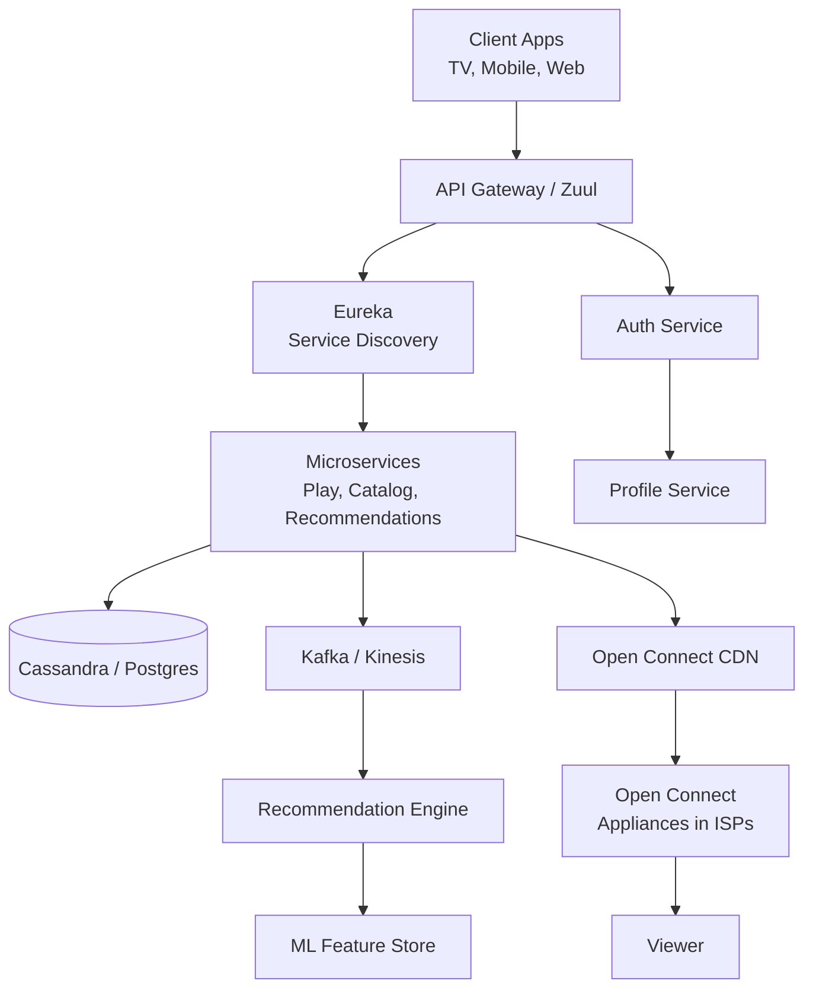

*The diagram shows the core service topology of Netflix's streaming architecture: client applications (smart TV, mobile, web) connect through the Zuul API Gateway, which routes authenticated requests to microservices discovered via Eureka. The Recommendation Engine consumes user events from Kafka/Kinesis and pulls features from an ML feature store to power personalized rows. Video content is delivered through Netflix's proprietary Open Connect CDN, which caches content on Open Connect Appliances (OCAs) deployed inside ISP data centers, ensuring low-latency delivery directly over the ISP's network.*

**Problem Statement:** Design a streaming media platform that delivers on-demand video content to hundreds of millions of concurrent viewers worldwide, supporting adaptive bitrate streaming, personalized content recommendations, global CDN distribution, multi-device playback, and subscription-based access control — all with sub-5-second startup latency and under 0.5% rebuffering.

**The scale challenge:** Netflix serves over 230 million subscribers across 190+ countries. During peak hours, Netflix accounts for over 15% of North American downstream broadband traffic. A single popular title (like a new season of "Stranger Things") can generate millions of concurrent streams simultaneously. Each stream issues multiple HTTP requests — a manifest file (m3u8/mpd), then segments (2–10 second chunks) — and the client makes a new adaptive bitrate decision every few seconds. Meanwhile, the recommendation engine must process billions of daily interactions (plays, pauses, completes, re-watches) to update user profiles and re-rank content. The system must handle all of this without degrading quality or availability, and it must do so while running predominantly in the cloud (AWS) with no ability to harden network infrastructure.

---

### Characteristics

- **Video streaming at scale:** Delivering high-bitrate video to millions of concurrent viewers requires a global CDN, edge caching, and careful bitrate management. Peak traffic can spike 5–10x during new-title releases.
- **Content catalog management:** The catalog includes thousands of titles (movies, TV shows, documentaries, comedy specials) each encoded in multiple resolutions (240p through 4K HDR) and codecs (H.264, H.265, VP9, AV1). Metadata includes subtitles, dubbing tracks, and regional availability.
- **Adaptive bitrate (ABR) streaming:** Videos are encoded in multiple bitrate ladders and segmented into small chunks (2–10 seconds). The player continuously monitors available bandwidth and switches between quality levels to minimize rebuffering while maximizing resolution.
- **Personalized recommendations:** The recommendation engine must surface the right content to each user from a catalog of thousands of titles. Key rows include "Top 10 in Your Country," "Because you watched X," and a fully personalized row driven by a deep neural network.
- **Multi-device support:** Streaming must work seamlessly across smart TVs, mobile phones, tablets, laptops, and gaming consoles — each with different screen sizes, processing power, and network conditions. Playback state syncs across devices.
- **Content lifecycle management:** Titles have a lifecycle — encode → store → distribute → recommend → expire. When content licensing expires, titles must be removed from all edge caches and the catalog within a strict deadline.
- **Regional licensing constraints:** Content availability varies by region due to licensing agreements. A title available in the US may not be available in India. The system must enforce geo-restrictions at every layer — API, CDN, and player.
- **Peak traffic handling:** New show releases create "thundering herd" traffic. The system must absorb massive spikes through auto-scaling, CDN pre-warming, and gradual rollout strategies.
- **Engagement telemetry:** Every user interaction (play, pause, rewind, seek, complete, re-watch, abandon) is captured as a telemetry event. These events feed the recommendation engine and are used for A/B testing content and UI changes.
- **Operational resilience:** Netflix pioneered chaos engineering (Chaos Monkey) to proactively test system resilience by randomly killing production instances. The system must be designed to survive component failures without user-visible impact.
- **Cost optimization:** Bandwidth is the largest cost. The CDN must maximize cache hit ratio; transcoding must use cost-effective codecs; cloud resources must be rightsized. Every saved terabyte costs millions in bandwidth egress fees.

---

### Pros

- **Massive content catalog:** Thousands of titles across genres and regions provide compelling reasons for users to stay on the platform, driving engagement and retention.
- **Hyper-personalization:** ML-powered recommendations significantly increase content discovery and watch time compared to browsing a static catalog. Each user sees a unique homepage.
- **Global reach:** Available in 190+ countries with localized content and language options, creating a truly global platform that can monetize audiences everywhere.
- **Multi-device flexibility:** Users can start watching on one device and seamlessly continue on another, increasing total engagement time and reducing churn.
- **Original content advantage:** Netflix Originals provide exclusive content that cannot be found elsewhere, strengthening the value proposition and reducing dependency on licensed content.
- **Data-driven content decisions:** Viewing data informs not just recommendations but also which shows to greenlight, how much to spend on production, and when to release — optimizing content ROI.
- **Offline viewing:** Downloading content for offline playback extends the platform's value to users with limited or no internet access, increasing utility in emerging markets.

---

### Cons

- **Extremely high bandwidth costs:** Video streaming consumes enormous bandwidth. Netflix's content delivery budget runs into billions annually. Every optimization (better compression, higher CDN cache hit ratio, smarter ABR) translates directly to millions in savings.
- **Content licensing and production costs:** Licensing existing content is expensive and rights are fragmented by region. Original content production is capital-intensive and carries box-office-level financial risk — a single flop can cost tens of millions.
- **Cold-start problem for new content:** Fresh titles have zero viewing history, making it impossible to predict who will like them. The recommendation engine must rely on metadata, cast similarity, and early viewers to find the initial audience.
- **Regional licensing restrictions:** Content availability varies by territory due to licensing agreements. This creates a fragmented user experience — a title visible in one country may be hidden in another, complicating the UI and data model.
- **Content piracy:** Despite DRM and watermarking, pirated copies of Netflix content appear on torrent sites within hours of release. Piracy undermines the value proposition and complicates licensing negotiations.
- **Algorithmic bias and filter bubbles:** The recommendation algorithm may over-recommend popular genres or mainstream content, reducing discovery of niche or international titles. Users can get trapped in a bubble of similar recommendations.
- **Operational complexity at scale:** With thousands of microservices, multi-region deployments, CDN management across hundreds of ISPs, and chaos engineering injecting failures daily, the operational surface area is enormous. Debugging cross-region issues requires sophisticated observability.
- **Subscriber churn:** Competition for streaming attention is fierce (Disney+, HBO Max, Amazon Prime, Apple TV+). Churn is expensive — losing a subscriber means losing all acquired viewing history and personalization investment.
- **Quality of experience variability:** Streaming quality depends on the user's ISP, WiFi, and device — variables Netflix cannot control. Poor QoE on a user's network reflects negatively on the platform, not the ISP.

---

### Use Cases

- **Viral title release (the thundering herd problem):** A new season of a hit show drops at midnight GMT. Within minutes, millions of viewers start streaming globally. The CDN must pre-warm caches, the API must handle massive concurrent manifest/segment requests, and the recommendation engine must surface the title to the right audience quickly. The system uses canary rollouts, CDN pre-positioning, and gradual traffic ramp-up to absorb the spike without degradation.
- **Personalized content discovery (recommendation engine):** The homepage is unique to each user — "Top 10 in the US," "Because you watched Ozark," and a ML-ranked personalized row. The recommendation engine consumes billions of daily engagement events (plays, pauses, completes, re-watches), updates user embeddings in near real-time, and re-ranks the catalog every few minutes. A/B testing compares different ranking models to optimize watch time.
- **Adaptive bitrate streaming under varying network conditions:** A viewer starts watching on WiFi at 4K, then switches to mobile data on a train. The player continuously monitors throughput; when bandwidth drops, it seamlessly switches from 2160p to 720p to 480p without interrupting playback. The system encodes each title in 10–20 bitrate variants and the manifest file (HLS/DASH) guides the player's segment selection.
- **Global content delivery with regional licensing:** A licensed title is available in the US and Canada but not in Europe. The API enforces geo-restrictions at request time (checking the user's IP against the title's regional availability), the CDN serves different catalogs to different regions, and expired titles are purged from edge caches with a TTL-based cleanup job. The data model tracks per-region availability windows for every title.

---

### Components

| Component | Purpose | Responsibilities | Relationship |
|---|---|---|---|
| Playback API | Initiate and control streaming sessions | Generate signed streaming URLs, serve manifests (HLS/DASH), handle playback events | Reads from Catalog DB; writes to Playback Events stream |
| Catalog Service | Manage content metadata | Title metadata, cast, subtitles, regional availability, content ratings | Read by Playback, Recommendations, Search |
| Recommendation Engine | Personalize content discovery | User embeddings, candidate generation, ranking, A/B testing | Consumes Engagement Events stream; writes to Feature Store |
| CDN / Open Connect | Deliver video content | Cache video segments at ISP edge; route requests to nearest OCA | Serves direct to clients; populated from Origin Storage |
| Transcoding Pipeline | Encode video content | Multi-codec, multi-bitrate encoding; segment generation; quality validation | Reads from Ingest; writes to Origin Storage + Segment Store |
| Content Ingest | Accept and validate uploads | Validate file integrity, extract metadata, trigger transcoding | Writes to Ingest Queue; reads from Origin Storage |
| Origin Storage | Store master video files | Durable storage of encoded content, segments, manifests, thumbnails | Read by CDN cache fill; written by Transcoding Pipeline |
| Profile Service | Manage user accounts and profiles | Profile creation, parental controls, viewing restrictions, preferences | Read by Auth, Playback, Recommendations |
| Auth Service | Authentication and authorization | JWT issuance, subscription tier validation, device registration | Called by all edge services; writes to User DB |
| Engagement Stream | Collect user interaction events | Capture plays, pauses, completes, re-watches, searches, scrolls | Consumed by Recommendations, Analytics, A/B Testing |
| Search Service | Content discovery via search | Index titles, cast, genres, keywords; support autocomplete and filtering | Reads from Catalog DB; indexes via Kafka |
| Feature Store | Serve ML features | Pre-compute user features, item features, and interaction features | Read by Recommendation Engine; written by Keystone pipeline |

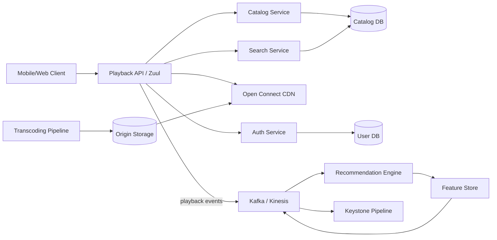

*The component interaction flow: clients connect through the Zuul API Gateway, which authenticates via the Auth Service and routes to the Playback API. The Playback API reads catalog metadata, generates signed URLs, and serves manifests from the Open Connect CDN (populated from Origin Storage by the Transcoding Pipeline). Playback events flow through Kafka/Kinesis to the Recommendation Engine and the Keystone data pipeline, which updates the Feature Store for real-time personalization.*

---

### Architectural Patterns

- **Microservices architecture:** Netflix runs thousands of microservices (Playback, Catalog, Recommendations, Profile, Auth, Search, etc.) on AWS, orchestrated by Titus (Netflix's container management platform). Each service is independently deployable, scalable, and owns its data. Services communicate via REST, gRPC, and asynchronous events over Kafka/Kinesis. This enables technology diversity (different services use the optimal stack for their workload) and fault isolation.
- **Event-driven backbone:** User interactions (plays, pauses, seeks, re-watches) are published as events to Kafka/Kinesis and consumed asynchronously by the Recommendation Engine, the Keystone data pipeline, and analytics services. This decouples the read/write paths — the Playback API responds to the client immediately while downstream consumers process events at their own pace.
- **Command Query Responsibility Segregation (CQRS):** The write path (starting a stream, recording engagement) is optimized for low-latency responses and durability (Cassandra with quorum writes). The read path (catalog browsing, recommendations, search) uses separate materialized views in Elasticsearch, Redis, and a feature store, allowing independent optimization and scaling of reads vs. writes.
- **Circuit breaker pattern (Hystrix):** Every service-to-service call is wrapped in a circuit breaker. If a downstream dependency (e.g., the Recommendation Engine) becomes slow or unavailable, the circuit opens and the calling service falls back to a degraded mode (e.g., a static "Popular Titles" list) rather than waiting and causing a cascade failure. Although Hystrix is now in maintenance mode, the pattern remains central to Netflix's resilience strategy.
- **Bulkhead pattern:** Resources (thread pools, connection pools) are isolated per dependency. If the Catalog Service is slow, it only consumes its own bulkhead — the Playback API continues serving other requests. This prevents a single misbehaving service from starving the entire system.
- **Chaos engineering (Chaos Monkey):** Netflix randomly terminates production instances, network connections, and even entire regions as part of daily operations. Services are designed to survive these failures by design. This proactive approach found thousands of hidden failure modes before they could affect users in production.

---

### Benefits

- **Content variety and exclusivity:** A vast catalog spanning every genre and region, plus Netflix Originals unavailable anywhere else, gives subscribers strong reasons to stay and reduces churn.
- **Personalized discovery:** ML-powered recommendations increase watch time by surfacing relevant content, reducing the friction of browsing a large catalog. Each user sees a unique homepage.
- **Global availability:** Streaming in 190+ countries allows revenue diversification and content localization (dubbing, subtitles, regional originals) without separate infrastructure investments.
- **Multi-device continuity:** Playback syncs across phones, tablets, TVs, and laptops, increasing total engagement time and making the service indispensable to modern households.
- **Data-driven content strategy:** Viewing data directly informs content greenlighting and release timing, optimizing production ROI and reducing the risk of investing in unpopular content.
- **Operational resilience:** Chaos engineering and fault injection have made the platform capable of surviving regional outages, AZ failures, and network partitions without user-visible impact.
- **Edge-first delivery:** The Open Connect CDN places content inside ISP networks, reducing backbone transit costs and achieving sub-50 ms segment fetch latency for the majority of users.

---

### Challenges

- **Video encoding and storage at scale:** Each title is encoded in 10–20 bitrate/codec combinations (H.264, H.265, VP9, AV1), generating terabytes of encoded content per title. Storing all variants durably across regions while keeping storage costs under control is a major challenge.
- **Adaptive bitrate optimization:** The ABR algorithm must balance quality (high bitrate) against rebuffering (low bitrate) in real-time. Too aggressive on quality → rebuffering; too conservative → poor resolution. Tuning this for diverse networks globally is an ongoing engineering effort.
- **CDN cache hit ratio:** The Open Connect CDN's effectiveness depends on cache hit ratio — if a title isn't cached on the local OCA, it must be fetched from origin, adding latency and cost. Popular new titles create cache churn; expired titles waste cache space until TTL eviction.
- **Recommendation accuracy and cold-start:** With thousands of titles and hundreds of millions of users, the recommendation engine must balance exploration (discovery of niche content) with exploitation (recommending proven winners). New titles with no history are particularly hard to rank.
- **Thundering herd on new releases:** When a hit show drops, millions of concurrent viewers start streaming within minutes. The system must pre-warm CDN caches, scale API capacity, and orchestrate traffic ramp-up to avoid overwhelming any single component.
- **Regional licensing enforcement:** Geo-restrictions must be enforced consistently across the API, CDN, and player. A title expiring in one region must disappear from that region's catalog, CDN edge, and user recommendations — all within minutes, not hours.
- **Content expiration coordination:** Licensed titles have hard expiration dates. The system must proactively remove expired content from all edge caches, update the catalog, and handle users mid-stream when content disappears. Missed expirations result in licensing violations.
- **Startup latency at scale:** Every viewer should start playback within 5 seconds. Achieving this globally requires CDN pre-warming, signed URL generation, manifest caching, and fast segment availability — all under high concurrency.

---

### Best Practices

- **Open Connect CDN placement:** Deploy Open Connect Appliances (OCAs) inside ISP data centers (last-mile caching). Netflix ships pre-loaded OCAs with popular content and remotely syncs updates. This reduces backbone transit costs and achieves sub-50 ms latency for segment fetches.
- **Adaptive bitrate segment duration:** Use 2–4 second segments for live content (low latency) and 4–10 second segments for VOD (better caching). Shorter segments enable faster bitrate switches but increase manifest overhead and request count.
- **Content pre-loading and pre-warming:** Before a new title release, pre-position the most popular bitrate ladders onto OCAs in high-density ISP regions. Use historical viewership data to predict which bitrates will be popular in each region.
- **Recommendation model serving:** Pre-compute candidate sets offline (daily batch) and cache them. Only compute the final ranking online (every few seconds) from a pre-filtered candidate pool. This keeps online inference latency under 50 ms while enabling fresh personalization.
- **Chaos engineering as daily practice:** Run Chaos Monkey experiments continuously in production. Start with low blast radius (single AZ) and gradually increase. Every service must have defined fallback behavior before it's considered production-ready.
- **Canary rollouts for new titles:** Release new content to a small percentage of users first (1–5%), monitor QoE metrics (startup time, rebuffering, resolution), and gradually increase traffic as confidence builds. This prevents a bad encode from affecting millions simultaneously.
- **Rate limiting and circuit breakers at the edge:** Wrap every downstream call (Catalog, Recommendations, Auth) with a circuit breaker. If a dependency degrades, fall back to cached/static data rather than cascading failure. The API Gateway enforces per-client rate limits.
- **Event-time watermarking for streaming data:** Engagement events flow through Kafka/Kinesis to the Keystone pipeline. Use event-time (not processing-time) watermarks to handle out-of-order events and late arrivals, ensuring accurate sessionization and session-based features.

---


### When to Use / When Not to Use

**Use when:**

- You need to deliver video or audio content to a large, global audience with low latency and high availability.
- Personalization (recommendations, adaptive bitrate) is a core differentiator — users expect unique homepages and intelligent content discovery.
- Content licensing creates regional availability constraints — you need to enforce geo-restrictions at the API, CDN, and player levels.
- Multi-device playback continuity (start on phone, finish on TV) is a key user expectation.
- You have a large, diverse content catalog where efficient discovery (search, browse, recommendations) drives engagement.
- Peak traffic is highly variable (e.g., new content releases) and you need auto-scaling and CDN pre-warming to absorb spikes.

**Avoid when:**

- Content distribution is simple and one-to-many (e.g., a company-wide video announcement) — a traditional CDN with direct download is simpler and cheaper.
- The audience is small and regionally concentrated — the operational complexity of microservices, global CDN, and ML ranking isn't justified.
- Content is static (e.g., documentation, training videos on an LMS) — adaptive bitrate and personalization add cost without meaningful benefit.
- Real-time interactive features (chat, live voting) are more important than content delivery — a real-time media server (WebRTC) architecture is more appropriate.
- The budget cannot support the infrastructure cost of video encoding (10–20 variants per title), global CDN, and dedicated recommendation engineering.

**Alternatives:**

- **Traditional CDN (Cloudflare, Akamai):** Simpler and cheaper for static video hosting, but lacks personalization, adaptive bitrate orchestration, and regional licensing enforcement.
- **YouTube / Twitch model:** Ad-supported free content with creator monetization. Different business model (ads vs. subscriptions) with different scalability characteristics.
- **Broadcast-style (HLS/DASH without personalization):** Simple playlist-based streaming without ML recommendations or adaptive bitrate. Works for live events but doesn't scale personalization.
- **Progressive download:** Downloading and playing simultaneously. Simpler but no adaptive quality switching and no seeking without buffering.

**Decision factors:**

- **Audience size and geography:** Global scale justifies the CDN and multi-region investment; small audiences should use a managed CDN service.
- **Content catalog size:** Large catalogs (>1000 titles) require search and recommendation; small catalogs can use simple browsing.
- **Personalization requirement:** If the homepage must be unique per user, invest in a recommendation engine; if a static "popular titles" page suffices, a simpler approach works.
- **Traffic variability:** Highly variable traffic (new releases) requires auto-scaling and pre-warming; steady traffic is predictable and cheaper to provision.
- **Revenue model:** Subscription revenue justifies higher per-user infrastructure cost; ad-supported models need lower per-user cost and different monetization infrastructure.

---


### Data Model and API

The data model captures the core entities of a streaming platform: the content catalog (titles, seasons, episodes, media assets), user accounts and profiles, subscription entitlements, streaming sessions and playback events, and the recommendation feature store. Titles are immutable once published (new versions create a new `content_version`); profiles are mutable; engagement events are append-only streams.

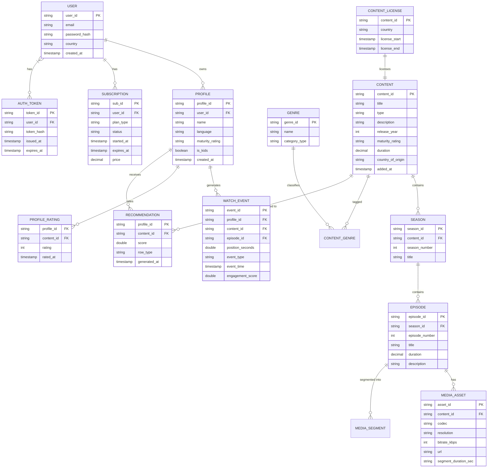

*The entity-relationship diagram shows the core domain model of a streaming media platform: users own profiles and subscriptions; profiles generate watch events and ratings; content (movies/TV shows) contains seasons and episodes, each backed by media assets encoded in multiple codecs and bitrates; content licensing enforces regional availability windows; and the recommendation feature store maps profiles to ranked content items.*

**Entity descriptions:**

- **USER:** Core identity. `user_id` (UUID for even distribution), `email` (unique), `password_hash` (bcrypt), `country` (for geo-restrictions), `created_at`. Stored in PostgreSQL with the email index.
- **PROFILE:** A viewing profile within a user account (Netflix allows up to 5 profiles per account). `profile_id` (UUID), `user_id` (FK), `name`, `language`, `maturity_rating`, `is_kids`. Profiles inherit the subscription of their parent user.
- **SUBSCRIPTION:** Billing and entitlement. `sub_id` (UUID), `user_id`, `plan_type` (Basic / Standard / Premium), `status` (active / canceled / expired), `started_at`, `expires_at`, `price`. The plan type determines max simultaneous streams and max resolution.
- **CONTENT:** A movie or TV show. `content_id` (UUID), `title`, `type` (movie / series), `description`, `release_year`, `maturity_rating`, `duration`, `country_of_origin`, `added_at`. Immutable once published.
- **SEASON:** A season within a TV series. `season_id` (UUID), `content_id` (FK), `season_number`, `title`.
- **EPISODE:** An episode within a season. `episode_id` (UUID), `season_id` (FK), `episode_number`, `title`, `duration`, `description`.
- **MEDIA_ASSET:** An encoded rendition of an episode. `asset_id` (UUID), `episode_id` (FK), `codec` (h.264 / h.265 / vp9 / av1), `resolution` (240p / 480p / 720p / 1080p / 4K), `bitrate_kbps`, `url` (CDN URL), `segment_duration_sec`.
- **CONTENT_LICENSE:** Regional licensing. `content_id` (PK), `country`, `license_start`, `license_end`. Drives geo-restriction enforcement at the API and CDN layers.
- **WATCH_EVENT:** Append-only engagement events. `event_id` (UUID), `profile_id` (FK), `content_id` (FK), `episode_id` (FK), `position_seconds`, `event_type` (play / pause / seek / complete / restart), `event_time`, `engagement_score`. Fed to Keystone for batch and stream processing.
- **PROFILE_RATING:** Thumbs up / down. `profile_id` (FK), `content_id` (FK), `rating` (1 = down, 2 = up), `rated_at`. Used as a direct engagement signal for recommendations.
- **RECOMMENDATION:** Pre-computed ranked feed. `profile_id` (PK + sort key), `content_id` (FK), `score`, `row_type` (top10 / because_you_watched / personalized), `generated_at`. Stored in Redis for sub-50 ms homepage load.
- **AUTH_TOKEN:** Session tokens. `token_id` (UUID), `user_id` (FK), `token_hash`, `issued_at`, `expires_at`. Stored hashed; validated on each request.
- **GENRE:** Content categorization. `genre_id` (UUID), `name` (e.g., Action), `category_type` (e.g., genre). Linked to content via the CONTENT_GENRE junction table.

**Indexes and Constraints:**

- `USER.email` — UNIQUE index (login, password reset).
- `USER.country` — index for regional catalog queries.
- `PROFILE.user_id` — index for listing a user's profiles.
- `SUBSCRIPTION.user_id` — index for checking active subscriptions.
- `CONTENT.title` — full-text index for search.
- `CONTENT.type, CONTENT.release_year` — composite index for browse-by-type queries.
- `CONTENT_GENRE(content_id, genre_id)` — composite index for genre-based discovery.
- `EPISODE(season_id, episode_number)` — composite index for sequential episode lookup.
- `WATCH_EVENT(profile_id, event_time)` — composite index for sessionization and continue-watching.
- `RECOMMENDATION(profile_id, score DESC)` — composite index for serving top-ranked items.
- `CONTENT_LICENSE(content_id, country)` — composite index for geo-restriction checks.

**Partitioning / Sharding:**

- **USER:** Sharded by `user_id` hash (consistent hashing) in PostgreSQL with read replicas. User profiles are relatively stable, so hash sharding is sufficient.
- **PROFILE:** Co-located with parent `USER` by `user_id` hash to avoid cross-shard joins on profile fetches.
- **SUBSCRIPTION:** Co-located with `USER` for the same reason; subscription checks are extremely frequent at the API edge.
- **CONTENT / SEASON / EPISODE:** Sharded by `content_id` hash in Cassandra. Immutable data allows aggressive caching and read replicas.
- **MEDIA_ASSET:** Stored in a distributed object store (S3) with metadata in Cassandra. The `url` field points to an S3 key or CloudFront-signed URL.
- **CONTENT_LICENSE:** Sharded by `content_id` hash. Replicated to edge locations for low-latency geo-restriction checks.
- **WATCH_EVENT:** Sharded by `profile_id` hash in Kafka topics. Each partition is consumed by the Keystone pipeline for real-time and batch processing.
- **RECOMMENDATION:** Stored in Redis with `profile_id` as the key. Pre-computed daily; refreshed every few minutes for active users. Cold users' recommendations are generated on-demand by the streaming path.

**API Contract:**

| Method | Endpoint | Purpose | Rate Limit |
|---|---|---|---|
| POST | `/api/v1/login` | Authenticate and get JWT | 10 req/min/IP |
| POST | `/api/v1/profiles/{id}/login` | Switch viewing profile | 10 req/min/IP |
| GET | `/api/v1/catalog` | Browse catalog (filter by genre, type, year) | 1000 req/hour |
| GET | `/api/v1/catalog/{id}` | Get title details | 1000 req/hour |
| GET | `/api/v1/catalog/{id}/{season}/{episode}/manifest` | Get HLS/DASH manifest | 5000 req/hour |
| GET | `/api/v1/catalog/{id}/{season}/{episode}/play/{asset}/{seg}.m4s` | Download video segment | Unlimited (CDN-level) |
| POST | `/api/v1/playback/start` | Start a streaming session | 100 req/hour |
| POST | `/api/v1/watch-event` | Record engagement event | 1000 req/hour |
| POST | `/api/v1/rating` | Thumbs up / down | 50 req/minute |
| GET | `/api/v1/recommendations` | Get personalized homepage rows | 1000 req/hour |

**POST /api/v1/login — Request:**

```json
{
  "email": "user@example.com",
  "password": "hunter2",
  "remember_me": true
}
```

**POST /api/v1/login — Response:**

```json
HTTP/1.1 200 OK
{
  "jwt": "eyJhbGciOiJSUzI1NiIsInR5cCI6IkpXVCJ9...",
  "refresh_token": "dGhpcyBpcyBhIHJlZnJlc2g...",
  "expires_in": 900,
  "user": {
    "user_id": "u_abc123",
    "email": "user@example.com",
    "profiles": [
      {"profile_id": "p_001", "name": "Alice", "is_active": true},
      {"profile_id": "p_002", "name": "Bob", "is_active": false}
    ]
  }
}
```

**GET /api/v1/recommendations — Response:**

```json
HTTP/1.1 200 OK
{
  "rows": [
    {
      "row_id": "top10_us",
      "title": "Top 10 in the United States",
      "type": "top10",
      "contents": [
        {"content_id": "c_xyz789", "title": "Stranger Things", "box_art": "https://cdn.netflix.com/c_xyz789.jpg", "score": 0.98}
      ]
    },
    {
      "row_id": "personalized_p_001",
      "title": "Because you watched Ozark",
      "type": "because_you_watched",
      "contents": [
        {"content_id": "c_def456", "title": "Ozark", "box_art": "https://cdn.netflix.com/c_def456.jpg", "score": 0.95}
      ]
    }
  ]
}
```

**GET manifest — Response (HLS):**

```http
HTTP/1.1 200 OK
Content-Type: application/vnd.apple.mpegurl

#EXTM3U
#EXT-X-VERSION: 6
#EXT-X-INDEPENDENT-SEGMENTS
#EXT-X-STREAM-INF:BANDWIDTH=250000,RESOLUTION=426x180,CODECS="avc1.77e128"
manifest_240p.m3u8
#EXT-X-STREAM-INF:BANDWIDTH=750000,RESOLUTION=854x360,CODECS="avc1.77e12d"
manifest_480p.m3u8
#EXT-X-STREAM-INF:BANDWIDTH=1500000,RESOLUTION=1280x720,CODECS="avc1.77e130"
manifest_720p.m3u8
#EXT-X-STREAM-INF:BANDWIDTH=3000000,RESOLUTION=1920x1080,CODECS="avc1.77e130"
manifest_1080p.m3u8
#EXT-X-STREAM-INF:BANDWIDTH=6000000,RESOLUTION=3840x2160,CODECS="hvc1.1.6.L150.B0",HDR="YES"
manifest_2160p.m3u8
```

**Status codes:** `200` OK, `201` Created, `204` Deleted, `400` Invalid request, `401` Auth required, `403` Forbidden (geo-restricted or subscription tier), `404` Not found, `429` Rate limited, `503` Temporarily unavailable.

**Authentication & Authorization:** OAuth 2.0 with JWT bearer tokens. Scope-based authorization: `content:read`, `playback:start`, `events:write`, `ratings:write`. The plan type (Basic / Standard / Premium) determines max resolution (480p / 1080p / 4K) and max concurrent streams (1 / 2 / 4).

---

### Domain-Specific: Netflix Streaming Architecture Deep Dive

This section covers the core technical challenges that are unique to streaming media platforms: how content is delivered globally through the Open Connect CDN, how video is segmented and encoded for adaptive streaming, how the recommendation engine personalizes discovery at scale, and how edge caching minimizes startup latency and rebuffering. These topics are the heart of streaming system design.

#### CDN and Content Delivery (Open Connect)

* **What:** Netflix operates the Open Connect Content Delivery Network — a purpose-built CDN where Open Connect Appliances (OCAs) are placed directly inside ISP data centers (last-mile caching). This differs from traditional third-party CDNs (Cloudflare, Akamai) that cache at their own PoPs; Netflix owns and manages every cache node.
* **Problem solved:** By placing content inside the ISP's network, Netflix eliminates backbone transit costs (ISP peering traffic is settled, not billed) and achieves sub-50 ms latency for segment fetches. This is critical for streaming — every millisecond of latency adds to startup time and increases rebuffering risk.
* **How it works:** Netflix encodes each title into 10–20 bitrate and codec variants and segments them into 2–10 second chunks. These segments are pushed to OCAs via Open Connect Origin Servers (OOCS) in AWS. When a user starts playback, the player requests the manifest from the API, then downloads segments from the nearest OCA. If the segment isn't cached on the local OCA, the OCA fetches it from origin (or another OCA) on demand.
* **When to use:** When you have a large content catalog and need to control the entire delivery pipeline for cost optimization and quality of experience. *When not to use:* For small catalogs or third-party platforms where a managed CDN (Cloudflare, Fastly) is simpler.
* **Pros:** Zero backbone transit costs; sub-50 ms segment fetch latency; full control over caching logic and cache warming; direct peering with ISPs.
* **Cons:** Massive capital investment in hardware (thousands of OCAs globally); complex logistics of shipping, installing, and maintaining physical appliances; ongoing ISP coordination for placement and power.

```java
@Service
@RequiredArgsConstructor
public class OpenConnectCdnService {

    private final OcaRegistry ocaRegistry;
    private final SegmentRepository segmentRepository;
    private final MeterRegistry meterRegistry;

    /**
     * Generate a pre-signed CDN URL for a video segment with expiration
     * and geo-restriction enforcement. The URL is valid for a short window
     * (60s) and includes an HMAC signature to prevent tampering.
     */
    public String generateSegmentUrl(String assetId, int segmentNumber, String country) {
        var oca = ocaRegistry.getNearestOca(country);
        var ttl = Duration.ofSeconds(60);
        var signature = signSegmentRequest(assetId, segmentNumber, ttl);

        meterRegistry.counter("cdn.url_generated",
                "country", country, "asset", assetId).increment();

        return String.format("https://%s/segments/%s/%d.m4s?exp=%d&sig=%s",
                oca.getHostname(), assetId, segmentNumber,
                Instant.now().getEpochSecond() + 60, signature);
    }

    private String signSegmentRequest(String assetId, int segmentNumber, Duration ttl) {
        var data = (assetId + ":" + segmentNumber + ":" +
                Instant.now().getEpochSecond() + ttl.getSeconds())
                .getBytes(StandardCharsets.UTF_8);
        return Base64.getEncoder().encodeToString(
                HmacUtils.hmacSha256(secretKey, data));
    }
}
```

*The `OpenConnectCdnService` bean generates pre-signed URLs for video segments served from the nearest Open Connect Appliance. The URL includes a 60-second expiration and an HMAC-SHA256 signature to prevent URL tampering — a viewer cannot extend the URL lifetime or share it beyond the session. A Micrometer counter tracks URL generation by country and asset for capacity planning. The `OcaRegistry` maps IP geolocation to the nearest OCA hostname.*

---

#### Video Segmentation and Encoding

* **What:** Each title is ingested as a high-quality master file, then encoded into a bitrate ladder — typically 10–20 renditions spanning 240p through 4K HDR — and segmented into small chunks (2–10 seconds) for adaptive streaming. Netflix uses Dynamic Optimizer (a per-title encoding technology) rather than a fixed ladder, analyzing each title's visual complexity to allocate bits optimally.
* **Problem solved:** Fixed bitrate ladders waste bandwidth on simple content (e.g., a static interview that doesn't need 4K) and under-encode complex content (e.g., an action scene at low bitrate that looks blocky). Per-title encoding optimizes quality per bit, reducing bandwidth by 15–20% while improving visual quality.
* **How it works:** The master file is analyzed by an encoding decision tree — the system determines the optimal set of resolutions, bitrates, and codecs per title. Encoding is parallelized across Titus containers (Netflix's container platform) and takes 1–8 hours per title. Segments are generated with the CMAF (Common Media Application Format) standard for broad player compatibility. Each segment is stored in S3 with its manifest (HLS .m3u8 or DASH .mpd) pointing to the segment URLs.
* **When to use:** When you have a large content catalog and serve diverse content (simple interviews, complex action scenes, animated films) where a fixed bitrate ladder is suboptimal. *When not to use:* For simple, uniformly complex content (e.g., screen recordings) where fixed ladders suffice.
* **Pros:** 15–20% bandwidth savings; better visual quality per bit; optimal codec selection per title.
* **Cons:** Encoding time increases (per-title analysis + multiple passes); complex pipeline; harder to predict CDN cache behavior with non-standard ladders.

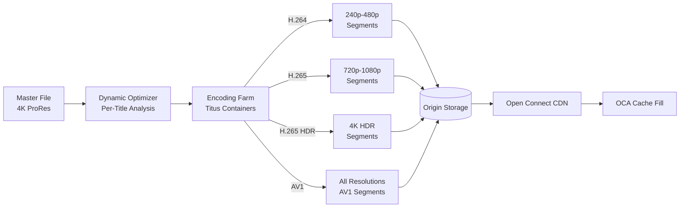

*Video encoding pipeline: the master file (4K ProRes) is analyzed by Dynamic Optimizer to determine the optimal per-title encoding ladder. The encoding farm (Titus containers) produces segments in H.264 (240p–480p), H.265 (720p–1080p), H.265 HDR (4K), and AV1 (all resolutions). CMAF-format segments are stored in Origin Storage (S3) and distributed to the Open Connect CDN for edge caching.*

---

#### Adaptive Bitrate Streaming

* **What:** The player continuously monitors available bandwidth and selects the appropriate bitrate variant for each segment download. Netflix's ABR algorithm makes a decision every 2–4 seconds (per segment) using a throughput-based model with lookahead and buffer health awareness.
* **Problem solved:** Fixed-bitrate streaming either wastes bandwidth (over-provisioning) or causes rebuffering (under-provisioning). ABR optimizes the quality-bandwidth trade-off in real-time, adapting to network fluctuations (WiFi to mobile, congestion, signal strength changes).
* **How it works:** The player measures throughput on each segment download and maintains a buffer of 10–30 seconds. The ABR algorithm considers: (1) current throughput (5-segment moving average), (2) buffer level (avoid rebuffering priority), (3) device resolution capability, (4) subscription plan max resolution, and (5) historical QoE data for the user. It selects the highest bitrate that can be downloaded in < 1 segment duration without depleting the buffer below a safety threshold. Netflix uses a combination of Rule-Based ABR (for predictability) and ML-enhanced ABR (for edge cases).
* **When to use:** Any HTTP-based streaming (HLS, DASH) where network conditions vary. *When not to use:* For live streaming with ultra-low latency requirements where segment duration < 1 second and ABR decisions can't keep up.
* **Pros:** Minimizes rebuffering while maximizing quality; adapts to network changes; works with standard HLS/DASH players.
* **Cons:** ABR decisions based on short throughput samples can be noisy; oscillating between bitrates is visible; initial bitrate selection on startup is tricky (start too high → rebuffer; start too low → poor quality).

```java
@Service
@RequiredArgsConstructor
public class AdaptiveBitrateService {

    private static final double BUFFER_SAFETY_SECONDS = 10.0;
    private static final double HIGH_BITRATE_PENALTY = 0.7;
    private static final int THROUGHPUT_WINDOW_SIZE = 5;

    private final PlaybackMetricsRepository metricsRepo;
    private final DeviceProfileService deviceService;

    /**
     * Select the optimal bitrate variant for the next segment based on
     * throughput history, buffer health, and device capability.
     * Uses a weighted scoring model: quality × throughput_confidence × buffer_safety.
     */
    public String selectBitrate(String sessionId, String contentId, List<Variant> variants) {
        var metrics = metricsRepo.getSessionMetrics(sessionId);
        var throughput = computeThroughput(metrics, THROUGHPUT_WINDOW_SIZE);
        var bufferLevel = metrics.getCurrentBufferSeconds();
        var deviceMax = deviceService.getMaxResolution(metrics.getDeviceId());

        return variants.stream()
                .filter(v -> v.getResolution() <= deviceMax)
                .max(Comparator.comparingDouble(v -> scoreVariant(v, throughput, bufferLevel)))
                .map(Variant::getUrl)
                .orElse(variants.get(0).getUrl()); // fallback to lowest
    }

    private double scoreVariant(Variant v, double throughput, double buffer) {
        // Higher bitrate is better but penalize if throughput is marginal
        double bitrateScore = (double) v.getBitrateKbps() / 5000.0;
        double throughputConfidence = Math.min(1.0, throughput / (v.getBitrateKbps() * 1.1));
        // Buffer safety: if buffer is low, prefer lower bitrate
        double bufferFactor = buffer < BUFFER_SAFETY_SECONDS ? buffer / BUFFER_SAFETY_SECONDS : 1.0;
        return bitrateScore * throughputConfidence * bufferFactor;
    }

    private double computeThroughput(List<SegmentMetric> metrics, int window) {
        var recent = metrics.subList(Math.max(0, metrics.size() - window), metrics.size());
        return recent.stream()
                .mapToDouble(m -> m.getBytesDownloaded() * 8.0 / m.getDownloadSeconds())
                .average()
                .orElse(0.0);
    }

    record Variant(String url, int bitrateKbps, int resolution) {}
}
```

*The `AdaptiveBitrateService` bean implements Netflix's ABR algorithm using a weighted scoring model. For each candidate bitrate variant (filtered by device capability), it scores based on: bitrate quality (normalized to a 0–1 scale), throughput confidence (ratio of current throughput to the variant's required bitrate, capped at 1.0), and buffer safety (if the buffer drops below 10 seconds, the score is scaled down proportionally). The variant with the highest composite score is selected — this prevents choosing a high bitrate that would deplete the buffer and cause rebuffering. Throughput is computed as a 5-segment moving average of bytes downloaded per second.*

---

#### Recommendation Engine

* **What:** Netflix's recommendation system determines what each user sees on their homepage. It operates as a two-stage pipeline: (1) **candidate generation** retrieves ~500 candidate titles from a deep neural network embedding space, and (2) **ranking** scores those candidates with a separate model and returns the top-N per row (Top 10, Because you watched X, Personalised).
* **Problem solved:** With 15,000+ titles and 230M+ users, a brute-force approach (score every title for every user) is computationally infeasible. Candidate generation narrows the pool from thousands to hundreds using embedding similarity; ranking applies the expensive ML model only to the candidate set.
* **How it works:** User interaction events (plays, pauses, completes, re-watches, searches) are streamed to Kafka/Kinesis and processed by the Keystone pipeline. Each profile accumulates a vector embedding updated via matrix factorization and deep neural networks. Candidate generation uses Approximate Nearest Neighbor (ANN) search (FAISS) over the embedding space to find similar titles. The ranking model — a deep neural network with dozens of features (recency, genre affinity, actor overlap, device context, time of day) — scores each candidate. The top results populate homepage rows. Models are trained offline (daily) and served online via a feature store with < 50 ms latency.
* **When to use:** When catalog size is large (> 1000 titles) and users need personalized discovery. *When not to use:* For small catalogs or when a simple "most popular" list suffices.
* **Pros:** Increases watch time and engagement significantly; enables content discovery beyond the user's explicit knowledge; drives retention.
* **Cons:** Model training is computationally expensive; cold-start (new users, new titles) is challenging; algorithmic bias can create filter bubbles; online inference must be sub-50 ms.

```java
@Service
@RequiredArgsConstructor
public class RecommendationEngineService {

    private static final int CANDIDATE_POOL_SIZE = 500;
    private static final int TOP_N_PER_ROW = 10;

    private final EmbeddingStore embeddingStore;
    private final RankingModelClient rankingClient;
    private final FeatureStore featureStore;
    private final Cache<String, List<ContentItem>> homepageCache;

    /**
     * Generate personalized homepage rows for a user profile.
     * Two-stage pipeline: candidate generation via ANN, then ML ranking.
     */
    public HomepageResponse getRecommendations(String profileId, List<String> rowTypes) {
        // Check cache first — homepage is cached for 5 minutes for active users
        var cacheKey = "recs:" + profileId;
        var cached = homepageCache.getIfPresent(cacheKey);
        if (cached != null) {
            return buildResponse(cached, rowTypes);
        }

        // Stage 1: Candidate generation — ANN search in embedding space
        var userEmbedding = featureStore.getUserEmbedding(profileId);
        var candidates = embeddingStore.findSimilar(userEmbedding, CANDIDATE_POOL_SIZE);

        // Stage 2: Ranking — score candidates with the ML model
        var ranked = rankingClient.score(profileId, candidates);

        // Assemble rows (Top 10, Because you watched, Personalized)
        var response = buildRows(ranked, rowTypes);

        // Cache for active users
        homepageCache.put(cacheKey, response.getAllItems());

        return response;
    }

    private HomepageResponse buildRows(List<ScoredItem> ranked, List<String> rowTypes) {
        var rows = new ArrayList<RecommendationRow>();
        for (String rowType : rowTypes) {
            switch (rowType) {
                case "top10" -> rows.add(buildTop10Row(ranked));
                case "because_you_watched" -> rows.add(buildBecauseYouWatchedRow(ranked));
                case "personalized" -> rows.add(buildPersonalizedRow(ranked, TOP_N_PER_ROW));
            }
        }
        return new HomepageResponse(rows);
    }
}
```

*The `RecommendationEngineService` bean implements Netflix's two-stage recommendation pipeline. First, it checks a short-TTL cache (5 minutes) to avoid recomputing homepages for active users. If cache miss, it fetches the user's embedding from the Feature Store, performs Approximate Nearest Neighbor (ANN) search to generate ~500 candidate titles, scores them with an ML ranking model (via gRPC to a model-serving service), and assembles rows (Top 10, Because you watched, Personalized). The result is cached and returned. This design keeps online inference latency under 50 ms while enabling fresh personalization.*

---

#### Edge Caching

* **What:** Video segments are cached at the network edge — on Open Connect Appliances (OCAs) inside ISP data centers, and on intermediate CDN nodes for titles not yet cached locally. Edge caching is the single biggest factor in achieving sub-5-second startup latency and < 0.5% rebuffering.
* **Problem solved:** Without edge caching, every segment request would travel to a central origin (AWS US-East), adding 100–500 ms of latency per segment. For a 2-second segment, that means the player spends half its time waiting for network round-trips. Edge caching reduces segment fetch latency to < 10 ms for cached content, enabling smooth adaptive streaming.
* **How it works:** OCAs in ISP data centers serve as the first cache tier. During off-peak hours, popular titles and their most-watched bitrate variants are pre-warmed onto OCAs based on historical viewership data. When a viewer in that ISP's network starts a title, the segment is likely already cached locally. If not (cache miss), the OCA fetches from the origin and caches the segment for subsequent viewers. Cache eviction uses a hybrid LRU (Least Recently Used) + popularity-weighted policy. For titles not on any local OCA, intermediate CDN nodes provide a second tier of caching.
* **When to use:** Whenever video content is delivered over HTTP and startup latency matters. *When not to use:* For very small catalogs where every title fits in a single origin cache.
* **Pros:** Dramatically reduces startup latency; reduces origin load and bandwidth costs; improves QoE metrics (rebuffering, resolution).
* **Cons:** Cache warming requires predictive analytics (risk of warming wrong titles); cache invalidation for expired content is hard; cache capacity is finite (NVMe SSDs have limited TB per OCA).

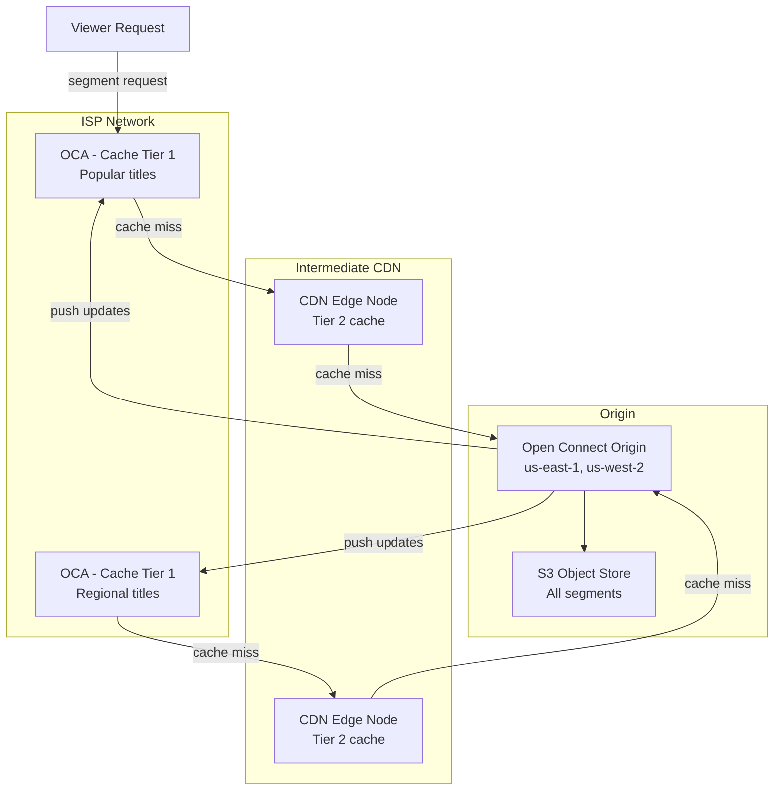

*Three-tier edge caching architecture: Tier 1 consists of Open Connect Appliances (OCAs) placed inside ISP data centers, caching the most popular titles pre-warmed during off-peak hours. Tier 2 consists of intermediate CDN edge nodes that cache titles not on a specific OCA but popular regionally. Tier 3 is the Open Connect Origin (in AWS regions) backed by S3 as the source of truth. On a cache miss, the OCA fetches from the CDN edge, which in turn fetches from origin. During off-peak hours, the origin proactively pushes newly encoded segments to OCAs based on predicted viewership.*

---

#### Architecture

A modern streaming platform uses a **microservice architecture** with an event-driven backbone, a purpose-built CDN (Open Connect), and ML-powered personalization. The **content delivery** layer handles encoding, segmentation, and edge caching. The **streaming orchestration** layer manages playback sessions, ABR decisions, and DRM. The **recommendation** layer generates and ranks personalized content rows. The **catalog** layer manages metadata and geo-restrictions. The **user management** layer handles auth, profiles, and subscriptions.

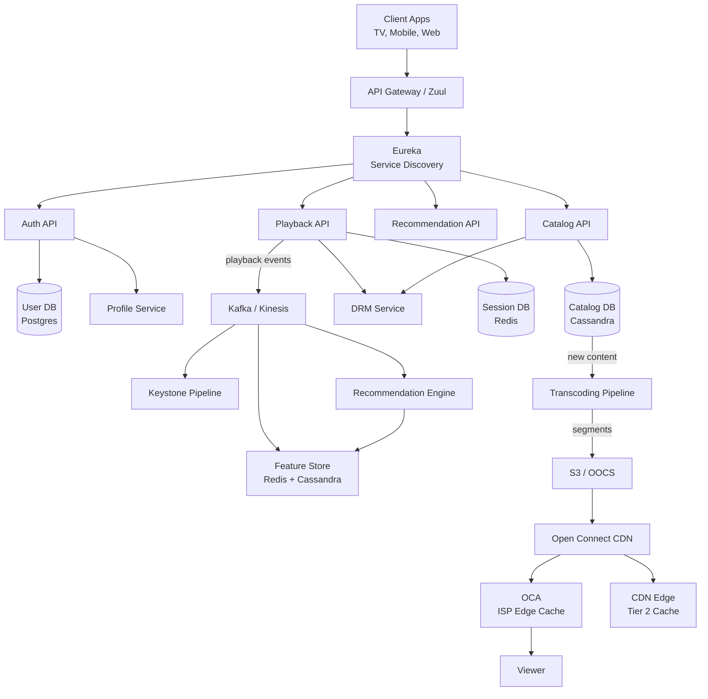

*The complete streaming architecture diagram shows the edge layer (client apps connecting through the Zuul API Gateway with Eureka service discovery), the service layer (Playback, Catalog, Recommendation, Auth APIs, each with its own database), the event backbone (Kafka/Kinesis carrying playback events to the Keystone data pipeline and Recommendation Engine), the content pipeline (new catalog entries trigger the Transcoding Pipeline which produces segments stored in S3 and pushed to the Open Connect CDN), and the delivery layer (OCAs inside ISP networks with tier-2 CDN edge nodes as fallback).*

**Architecture layers:**

- **Edge layer:** Client applications (smart TV, mobile, web) connect through the Zuul API Gateway. The gateway handles TLS termination, authentication, rate limiting, and routing. Open Connect Appliances in ISP data centers serve video segments. A tier-2 CDN provides fallback caching.
- **Service layer:** Stateless microservices behind Eureka service discovery: Playback API (session management, ABR decisions, DRM), Catalog API (metadata, geo-restrictions, search), Recommendation API (homepage rows), Auth API (login, JWT, profiles, subscriptions). Each owns its database (database-per-service pattern). Services communicate synchronously (REST, gRPC) for user-facing requests and asynchronously (Kafka/Kinesis events) for decoupled workflows.
- **Data layer:** PostgreSQL for user/subscription data (strong consistency); Cassandra for catalog metadata (high write throughput, multi-DC replication); Redis for session state and precomputed recommendations (sub-50 ms latency); S3 for video segments and thumbnails; Kafka/Kinesis for event streaming; a feature store (Redis + Cassandra) for ML features.
- **Infrastructure layer:** Titus (Netflix's container orchestration platform built on AWS) runs all microservices; Chaos Monkey injects failures daily; Spinnaker handles CI/CD with canary deployments; Atlas collects and serves metrics.

**Data flow — streaming session:**

1. **Catalog browsing:** Client → API Gateway → Catalog API → reads from Cassandra (catalog DB). Recommendation API fetches precomputed rows from Redis (feature store). The homepage loads in < 200 ms.
2. **Playback initiation:** Client → API Gateway → Playback API → generates signed segment URLs → fetches DRM license → returns manifest + license to client. Session state stored in Redis.
3. **Video delivery:** Client downloads manifest (HLS/DASH) → selects bitrate via ABR algorithm → downloads 2–10 second segments from nearest OCA → plays continuously. If OCA cache miss, fetches from tier-2 CDN or origin.
4. **Engagement telemetry:** Client sends periodic playback events (position, buffer health, quality changes) → Kafka/Kinesis → Keystone pipeline (batch analytics) + Recommendation Engine (real-time model updates).
5. **Content pipeline:** New title ingested → Dynamic Optimizer analyzes → Transcoding Pipeline encodes all variants → segments stored in S3 → Open Connect Origin pushes to OCAs → title appears in catalog.

**Scaling strategy:**

- **Playback API:** Scales horizontally behind a load balancer. Auto-scales on concurrent stream count (each active stream holds a session in Redis). Regional deployment ensures low-latency token/license generation.
- **Catalog API:** Reads from Cassandra (tunable consistency). Sharded by `content_id` hash. Read replicas in each region for low-latency metadata queries.
- **Recommendation Engine:** Two-tier serving — offline candidate generation (daily batch in Spark) feeds an ANN index; online ranking (model served from GPU instances) scores candidates per request. The ANN index is sharded by content category.
- **CDN / Open Connect:** OCAs are stateless cache nodes. Cache fill is driven by demand patterns and off-peak pre-warming. The Open Connect Origin scales with content library size and concurrent stream count.
- **Transcoding Pipeline:** Each title is encoded by a Titus container running FFmpeg with GPU acceleration for AV1. Work is partitioned by title; the pipeline handles 50,000+ encodes per day during peak release periods.

**Failure handling:**

- **OCA failure:** If the nearest OCA is down, the player automatically retries the segment request from the tier-2 CDN or the Open Connect Origin. Startup latency increases by 100–300 ms but playback continues without interruption.
- **Region failure:** If an AWS region goes down, the API Gateway (powered by GeoDNS) routes all traffic to the nearest healthy region. Sessions are stored in Redis clusters backed by read replicas in multiple regions; session failover takes < 5 seconds.
- **Transcoding pipeline failure:** If encoding fails for a variant, the title is still published with the available variants. The ABR algorithm simply won't offer that bitrate. Failed encodes are retried with exponential backoff.
- **Recommendation engine failure:** If the ML ranking service is unavailable, the Playback API serves a static "Popular Titles" fallback (cached in Redis). Users still see content, just not personalized — a graceful degradation, not a total outage.

---

#### Deep Dive: Open Connect Appliances

Netflix deploys over 200,000 Open Connect Appliances (OCAs) globally, each a 1U or 2U x86 or ARM server with 16–48 TB of NVMe SSD storage. OCAs are placed inside ISP points of presence (PoPs) to cache the most popular titles at the last mile. Netflix ships pre-loaded OCAs with the top 1,000 titles for each region and remotely syncs new content and updates via the Open Connect Origin. Key optimizations:

- **Cache warming:** During off-peak hours (2–6 AM local time), the system predicts the next day's viewership using historical data and pre-warms OCAs with the predicted top titles and their most-watched bitrate variants. This achieves a > 95% cache hit ratio on peak viewing hours.
- **Content routing:** The DNS layer maps a viewer's IP address to their ISP, and the ISP's DNS returns the IP of the local OCA. If the ISP isn't a direct Netflix peering partner, the viewer is routed to the nearest tier-2 CDN node.
- **Cache eviction:** Uses a hybrid LRU + popularity-weighted policy. A title's weight is proportional to its recent view count and geographic demand. Expired (licensing-ended) content is proactively purged with a 60-minute lookahead.
- **Health monitoring:** Each OCA reports its disk health, cache hit ratio, and outbound bandwidth to a central telemetry system. Unhealthy OCAs are removed from DNS rotation and flagged for ISP replacement.

#### Deep Dive: Dynamic Optimizer Encoding

Dynamic Optimizer is Netflix's per-title encoding technology that replaces fixed bitrate ladders with custom ladders optimized for each title's visual complexity. Traditional encoding uses a one-size-fits-all ladder (e.g., 300 kbps at 240p, 1500 kbps at 720p, 4500 kbps at 1080p). Dynamic Optimizer analyzes each shot and frame, determines where bits can be saved without perceptible quality loss, and produces a custom ladder:

- **Per-shot analysis:** A convolutional neural network analyzes each shot for spatial and temporal complexity (action scenes need more bits; static interviews need fewer). The analysis segments the video into 1–2 second shot boundaries.
- **Bit allocation:** Bits are distributed across the title based on complexity. A simple interview might encode at 240p with only 150 kbps (vs. 300 kbps in a fixed ladder), while an action film might need 5000 kbps at 1080p (vs. 4500 kbps). This yields 15–20% bandwidth savings at equivalent quality.
- **Codec selection:** Dynamic Optimizer selects the optimal codec per resolution tier. H.264 for lower resolutions (240p–480p, for broad compatibility), H.265 (HEVC) for 720p–1080p (better compression than H.264), and AV1 for 4K (30–40% savings over H.265). Codec selection is driven by device support analytics.
- **Encoding parallelism:** Each title is encoded by a Titus container running FFmpeg. For a title with 15 bitrate variants, 15 containers encode simultaneously. Encoding time ranges from 1 to 8 hours depending on resolution and codec. GPU instances (AWS G4dn) are used for AV1 encoding.

#### Deep Dive: Adaptive Bitrate Logic

Netflix's ABR algorithm is a hybrid of rule-based logic (for predictable scenarios) and ML-enhanced decisions (for edge cases). The rule-based core uses a throughput-based model with buffer health awareness:

```java
@Service
@RequiredArgsConstructor
public class AbmL0AbService {

    private static final double BUFFER_SAFETY_THRESHOLD = 10.0;
    private static final double TARGET_BUFFER_SECONDS = 30.0;
    private static final double MIN_THROUGHPUT_MULTIPLIER = 0.85;

    /**
     * Netflix-style ABR (Level 0): select the highest bitrate that can be
     * downloaded without depleting the buffer below the safety threshold.
     * Incorporates a throughput confidence factor and device/plan constraints.
     */
    public int selectBitrate(BitrateLadder ladder, ThroughputHistory history,
                             double bufferSeconds, String deviceId, String planType) {
        var throughput = history.getSmoothedThroughput(); // 500ms-weighted EWMA
        var deviceMax = getDeviceMaxBitrate(deviceId);
        var planMax = getPlanMaxBitrate(planType);

        return Arrays.stream(ladder.getBitrates())
                .filter(b -> b <= Math.min(deviceMax, planMax))
                .filter(b -> canSustain(b, throughput))
                .max(Integer::compareTo)
                .orElse(ladder.getLowestBitrate());
    }

    private boolean canSustain(int bitrateKbps, double throughputKbps) {
        var requiredThroughput = bitrateKbps * MIN_THROUGHPUT_MULTIPLIER;
        return throughputKbps >= requiredThroughput;
    }

    private double getDeviceMaxBitrate(String deviceId) {
        // Premium plan: 4K HDR (up to 25 Mbps); Standard: 1080p (up to 5 Mbps); Basic: 480p (up to 1.5 Mbps)
        return switch (getPlanForDevice(deviceId)) {
            case "PREMIUM" -> 25_000.0;
            case "STANDARD" -> 5_000.0;
            case "BASIC" -> 1_500.0;
            default -> 500.0;
        };
    }
}
```

*The `AbmL0AbService` (Adaptive Bitrate Level-0) bean implements Netflix's core ABR selection logic. It streams the user's throughput history through an exponentially weighted moving average (EWMA) with a 500 ms half-life, ensuring quick reaction to bandwidth changes. It filters bitrate candidates by device and subscription plan constraints (Basic → 480p max, Standard → 1080p max, Premium → 4K HDR max), then selects the highest bitrate that can be sustained at 85% of the measured throughput (a safety margin to account for throughput variance). If no candidate can be sustained, it falls back to the lowest bitrate in the ladder — ensuring playback always continues.*

---

### Replication Strategies

Streaming platforms replicate data across three dimensions: within a region (availability), across regions (global latency), and across storage systems (different access patterns for metadata, sessions, content, and event streams).

**Multi-region database replication (Catalog DB — Cassandra):** The catalog database uses Cassandra with NetworkTopologyStrategy across 3+ regions. Each region has its own keyspace replica with `replication_factor=3`. Reads use LOCAL_QUORUM (fast, low-latency) for metadata; writes use LOCAL_ONE (fast, eventually consistent across regions via read repair). New title metadata propagates to all regions within 2 seconds via Cassandra's hinted handoff.

```mermaid
sequenceDiagram
    participant C as Client (EU)
    participant L as Catalog API (EU)
    participant R1 as Cassandra EU
    participant R2 as Cassandra US
    participant R3 as Cassandra APAC
    C->>L: GET /catalog/{titleId}
    L->>R1: SELECT (LOCAL_QUORUM)
    R1-->>L: title metadata
    L-->>C: 200 OK
    Note over R1,R2,R3: eventual consistency (2s propagation)
```

*Multi-region catalog replication: the EU client queries the EU Catalog API, which reads from the local Cassandra datacenter with LOCAL_QUORUM consistency (fast, strongly consistent within the region). Cross-region replication is asynchronous with ~2 second propagation via hinted handoff — acceptable since catalog updates (new titles, metadata edits) are infrequent and a few seconds of staleness is tolerable.*

**Active-active session replication (Session DB — Redis):** Playback sessions (current position, buffer level, quality settings) are stored in Redis clusters deployed in active-active mode across 3 regions. Redis CRDT-based replication handles concurrent writes from different regions with last-write-wins conflict resolution. Session handoff (start on mobile, continue on TV) works seamlessly — the new region reads the session from the replicated Redis cluster.

**CDN edge replication (Open Connect):** Video segments are pushed from the Open Connect Origin to OCAs inside ISP PoPs globally. The push is driven by popularity analytics — popular titles are pre-warmed onto every OCA; less popular titles are fetched on-demand (cache miss). CDN replication is eventually consistent — a new title may take 1–5 minutes to reach all OCAs.

**Real-world use:** Cassandra for catalog metadata (multi-datacenter, tunable consistency); Redis CRDT for session state (active-active, single-digit-ms latency); S3 + CloudFront for asset storage and delivery (11 nines of durability); DynamoDB Global Tables for user-device mappings (low-latency global reads).

---

### Failure Detection and Membership

Streaming services must detect failed nodes, redistribute traffic, and continue serving without interruption — a single OCA or API instance failure must not affect viewers.

**Gossip-based membership (Titus):** Each Titus container instance periodically exchanges health information with a random subset of peers (gossip protocol). Membership changes propagate through the cluster in O(log N) rounds without a central coordinator. When a container fails, its peers detect the absence and remove it from the load balancer pool within 10 seconds.

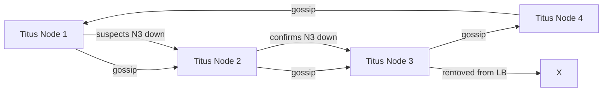

*Gossip-based failure detection in the Titus container cluster: nodes periodically exchange health state with random peers. When a node suspects a peer is down, it propagates the suspicion through gossip; once confirmed by multiple nodes, the peer is removed from the load balancer and its responsibilities are redistributed.*

**Health checks:**

- **Liveness probes:** HTTP `/health/liveness` endpoint checked every 2 seconds by Titus. If unhealthy, the container is terminated and a replacement is scheduled.
- **Readiness probes:** HTTP `/health/readiness` checks if the service can serve traffic (e.g., can connect to its database and Redis). Not-ready containers are removed from the load balancer.
- **Business health checks:** Custom checks: Kafka consumer lag < 10,000; Redis connection pool has available connections; CDN cache health > 90%; encoding queue depth < 10,000.

**Failure detection timing for streaming:**

| Component | Check Interval | Timeout | Action |
|---|---|---|---|
| Playback API | 2s | 15s | Remove from LB; redirect to healthy instance |
| Catalog API | 3s | 20s | Remove from LB; route reads to read replica |
| Recommendation API | 5s | 30s | Fall back to cached "Popular Titles" |
| OCA (CDN edge) | 10s | 60s | Remove from DNS rotation; route to tier-2 CDN |
| Transcoding Pipeline | 30s | 300s | Retry failed encodes; notify engineering |

**Circuit breakers:** All service-to-service calls are wrapped in circuit breakers (Resilience4j). If the Catalog API returns > 50% errors for 10 consecutive requests, the circuit opens for 30 seconds, and the Playback API falls back to a cached metadata snapshot. This prevents a slow dependency from causing a cascade failure.

---

### High Availability and Scalability

Streaming platforms must remain available during node failures, network partitions, and regional outages while scaling to handle global traffic spikes — a single region failure must not interrupt playback for any viewer.

#### Multi-Region Deployment

Netflix deploys services in at least 3 AWS regions (us-east-1, us-west-2, eu-west-1) and optionally a fourth in Asia-Pacific. Users are routed to the nearest region via GeoDNS (powered by Amazon Route 53 and Netflix's Zuul edge). Each region is self-sufficient for read and write operations, with asynchronous cross-region replication for state synchronization.

- **Active-active for user sessions:** Session state (playback position, buffer level) is stored in Redis clusters with CRDT-based replication across regions. Users can switch devices across regions and resume playback within 5 seconds.
- **Active-active for catalog:** Catalog metadata is stored in Cassandra with NetworkTopologyStrategy (3 replicas per region). Regional writes are conflict-free because metadata is keyed by `content_id` and updates are idempotent (last-write-wins by timestamp).
- **Active-passive for content ingestion:** New title ingestion happens in the primary region (us-east-1); transcoding and origin storage are replicated to all regions. The CDN serves content from the nearest region's OCAs.
- **Regional failover:** If a region becomes unhealthy, GeoDNS shifts traffic to the next-nearest healthy region within 30 seconds. Session data is replicated to all regions, so viewers experience only a brief pause (3–5 seconds) before resuming.

#### Auto-Scaling

- **Stateless microservices (Playback API, Catalog API, Recommendation API):** Scale horizontally based on CPU utilization and concurrent request count. Kubernetes HPA (Horizontal Pod Autoscaler) adjusts replica count; for the Playback API, the trigger is concurrent active streams (1 replica per 10,000 concurrent streams).
- **Stateful services (Cassandra, Redis, Kafka):** Scale by adding nodes/shards. Cassandra uses virtual nodes (vnodes) for even data distribution. Kafka scales partitions; the `playback_events` topic has 1,000+ partitions consumed by a 500-instance consumer group.
- **Transcoding pipeline:** Each title encode runs as an independent Titus task. The pipeline auto-scales based on the ingest queue depth — if the queue exceeds 10,000 pending encodes, new Titus containers are launched (scale-up takes 2–3 minutes for GPU instances).
- **OCA cache fill:** Open Connect Origin servers pre-warm OCAs based on predicted viewership. The prediction model runs hourly and adjusts cache targets; OCAs pull new content during off-peak windows (2–6 AM local time).

#### Graceful Degradation

When a component fails, the system degrades rather than failing completely:

- **Recommendation engine down:** The Playback API serves a static "Popular Titles" row (pre-computed daily and cached in Redis for 24 hours). Users see generic content, not personalized — engagement drops but playback is unaffected.
- **CDN edge cache miss storm:** If a viral title is not cached on the local OCA, segment requests fall through to the tier-2 CDN or Open Connect Origin. The player's ABR algorithm detects the higher latency and lowers the initial bitrate to maintain playback.
- **DRM license failure:** If the DRM license server is slow, the player retries with exponential backoff. If the license doesn't arrive within 10 seconds, playback falls back to a lower-resolution, unprotected stream (for ad-supported tiers) or fails with a clear error message.
- **Geo-restriction check failure:** If the geo-restriction service is unavailable, the API serves the user's home region catalog by default (fail-closed), preventing content leakage. Users see a slightly less personalized catalog but cannot bypass regional restrictions.

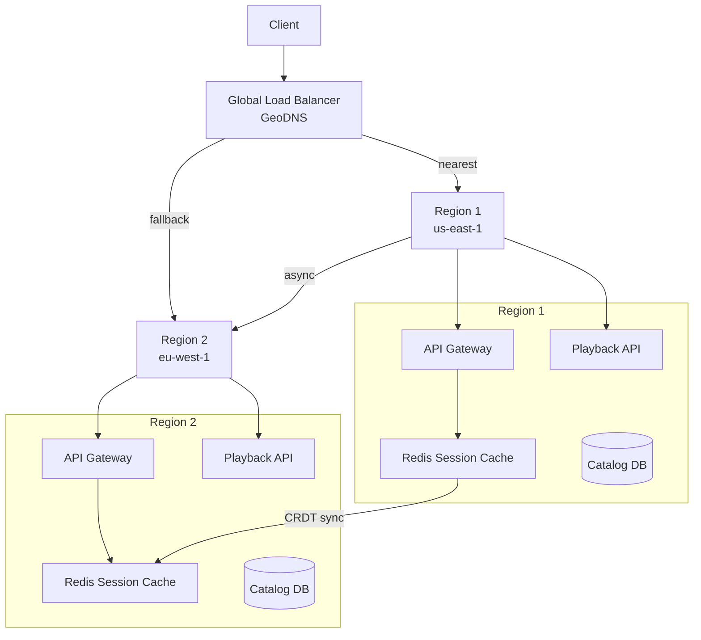

*Multi-region high availability for streaming: a GeoDNS load balancer routes clients to their nearest region. Each region is self-sufficient with its own API Gateway, Playback API, Redis session cache, and Catalog DB. Session caches replicate state across regions using Redis CRDT (Conflict-free Replicated Data Types) for seamless failover. Cross-region replication of catalog data is asynchronous (~2 seconds). If one region fails, traffic shifts to the next-nearest region within 30 seconds.*

---

### Performance and Optimization

Streaming platform performance is measured by startup latency (< 5 seconds SLA), rebuffering rate (< 0.5%), video quality (average bitrate per session), and homepage load time (< 200 ms).

#### Latency Optimization

- **Manifest caching:** HLS/DASH manifest files (small XML/JSON) are cached at the CDN edge and in Redis for 5 minutes. The Playback API returns a cached manifest on > 98% of requests, avoiding database lookups.
- **Pre-connection and DNS prefetch:** Client SDKs pre-connect TCP/TLS to the nearest OCA and prefetch DNS during app startup, shaving 100–200 ms off the first segment fetch.
- **ABR initial bitrate selection:** On startup, the player requests the lowest bitrate first (to guarantee fast start), then ramps up to the highest sustainable bitrate in the first 3–5 segments. This "conservative start" minimizes startup latency at the cost of slightly lower initial quality.
- **Connection pooling:** The Playback API maintains persistent HTTP/2 (or gRPC) connections to downstream services (Catalog DB, Redis, DRM license service) to avoid per-request handshake overhead.

#### Throughput Optimization

- **CDN offload:** 95%+ of video segment traffic is served from OCAs and tier-2 CDN nodes, removing load from the origin. Segment URLs are pre-signed and cached for 60 seconds to handle burst traffic.
- **Batch catalog updates:** Catalog metadata updates (new titles, metadata edits) are batched and applied in bulk to Cassandra every 10 minutes, reducing write amplification.
- **Pipeline batch fetches:** When the Playback API needs to fetch metadata for a season's worth of episodes, it uses a single `SELECT ... WHERE content_id IN (...)` query instead of N individual lookups.
- **Request coalescing:** During a viral title release, thousands of viewers request the same manifest simultaneously. The Playback API uses the single-flight pattern — only one request reaches the database, and the result is shared across all concurrent callers.

#### Caching Strategies

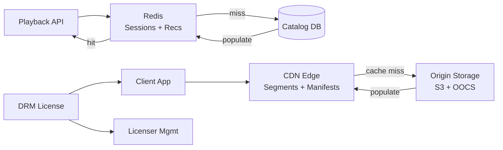

*Multi-tier caching for streaming: the client-side cache layer consists of CDN edge nodes (OCAs) caching video segments and manifests; the server-side cache layer uses Redis for session state and pre-computed recommendations; and the Catalog DB serves as the durable source of truth for metadata. Cache miss storms are mitigated by request coalescing (single-flight pattern) for manifests.*

#### Write Path Optimization

- **Async engagement events:** Playback events (plays, pauses, seeks) are batched and published to Kafka/Kinesis asynchronously — the player doesn't wait for event delivery before continuing playback. This keeps the playback event ingestion cost near zero.
- **Segment pre-generation:** Video segments are pre-generated during the encoding pipeline, not on-demand at request time. Each segment is a static file in S3, served directly by the CDN without any server-side processing.
- **Recommendation batch computation:** Candidate generation and feature pre-computation run as daily Spark batches. Only the final ranking is computed online (every few minutes), keeping online inference latency under 50 ms.

---

### CAP Theorem and Consistency Trade-offs

The CAP theorem states that during a network partition, a distributed system can provide at most two of: Consistency, Availability, and Partition tolerance. Since streaming platforms operate across network boundaries, partition tolerance is always required. The system makes different CAP choices per component based on the cost of inconsistency.

#### Catalog DB — CP (Consistency + Partition Tolerance)

The catalog database (Cassandra) uses `LOCAL_QUORUM` reads and writes, providing strong consistency within a region. When a new title is added or metadata is updated, the change is visible to all regional readers within milliseconds. This is important because stale catalog data would show incorrect availability (e.g., showing a title that expired) or wrong metadata (e.g., incorrect duration or cast). The trade-off is slightly higher latency for catalog reads (2–5 ms vs. 1–2 ms for LOCAL_ONE) but stronger correctness guarantees.

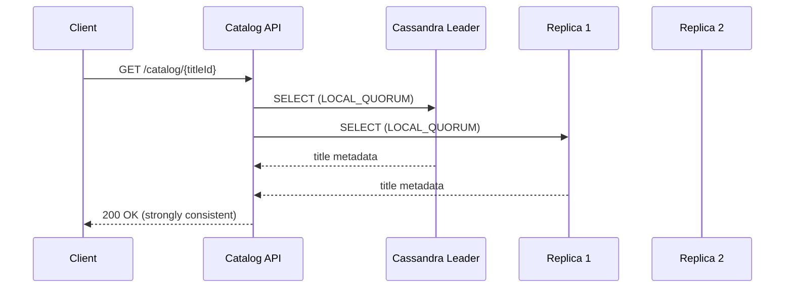

*Strong consistency for catalog reads: the Catalog API reads metadata from a Cassandra quorum (leader + one replica) before returning the result. This ensures the client always sees the latest metadata, which is critical for geo-restriction enforcement and availability checks.*

#### Session Store — AP (Availability + Partition Tolerance)

The session store (Redis) prioritizes availability. If the Redis cluster in one region is unavailable, the Playback API serves from a local cache (last-known session state with a 5-minute TTL). Playback continues — the user might lose the last 5 seconds of position data but is not interrupted. Session state is eventually consistent across regions via Redis CRDT replication (typically synchronized within 2 seconds).

#### Feature Store — AP with Bounded Staleness

The recommendation feature store stores user embeddings and item features. These are updated in near-real-time (every 30 seconds to 5 minutes) by the Keystone streaming pipeline. If the feature store is briefly unavailable, the Recommendation Engine falls back to the last-computed snapshot (up to 5 minutes stale). This is acceptable — a slightly stale recommendation is better than no recommendations.

#### CDN / Open Connect — AP

Video segments are cached on OCAs with no strong consistency guarantees. A new title takes 1–5 minutes to propagate to all OCAs. During this window, some viewers get the content from the origin (slightly higher latency) while others get it from the edge (sub-50 ms). There is no consistency requirement — video content is immutable once encoded.

#### Engagement Events — AP with Eventual Consistency

Playback events (plays, pauses, seeks) are published to Kafka with at-least-once delivery and consumed asynchronously by the Keystone pipeline. Events are batched and may take 5–60 seconds to appear in the data warehouse. This is acceptable — engagement analytics don't need real-time freshness.

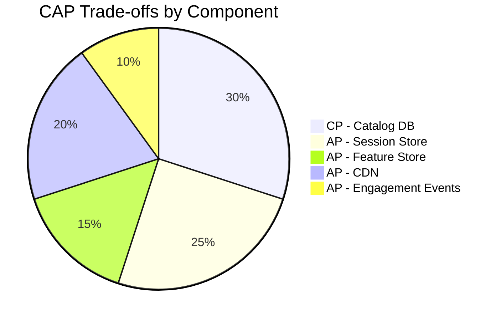

*CAP trade-offs across streaming platform components: the Catalog DB uses CP (strong consistency within a region, since stale metadata could leak geo-restricted content); the Session Store uses AP (fast failover with last-known state, tolerating 5 seconds of position loss); the Feature Store uses AP with bounded staleness (last snapshot valid for 5 minutes); the CDN uses AP (eventual consistency is fine since content is immutable); and engagement events use AP with eventual consistency (batch processing tolerates 60-second delays).*

**Interview question:** *Is a streaming platform strongly consistent or eventually consistent?*
**Answer:** A streaming platform makes a nuanced, per-component choice. The catalog and geo-restriction checks use strong consistency (CP) because stale data could leak geo-restricted content. Session state and recommendations use eventual consistency (AP) because a few seconds of staleness doesn't interrupt playback. This pragmatic split — sometimes called "contextual consistency" — is the key insight interviewers look for.

---

### Encryption and Key Management

A streaming platform must protect premium video content, user credentials, and business-critical data from piracy, interception, and unauthorized access. Netflix uses a multi-layered encryption strategy: end-to-end DRM for video content, TLS everywhere for data in transit, and key management via HSM-backed KMS for all encryption keys.

#### DRM (Digital Rights Management)

Netflix employs three DRM systems simultaneously for cross-platform compatibility: **Widevine** (Chrome, Android), **PlayReady** (Windows, Xbox), and **FairPlay** (iOS, Safari). Each title is encrypted with a unique **Content Key** (128-bit AES key), and the DRM system wraps (encrypts) the content key with a **DRM-specific Key** that only the authorized device can unwrap. The player obtains the content key by passing a license request to the DRM license server, which verifies the user's subscription and device eligibility before returning the key.

- **Content encryption:** Each title is encrypted with AES-128 in CTR mode (for frame-level random access). The encryption key (EK) is unique per title. The encrypted video is stored in S3 and delivered to OCAs — the content at rest is always encrypted.
- **Key wrapping:** The EK is wrapped (encrypted) by three DRM system keys (one for each DRM). The wrapped keys are stored alongside the content metadata. The player requests the appropriate wrapped key based on its platform.
- **License delivery:** When a viewer starts playback, the client sends a license request to the DRM license server (behind the API Gateway). The server validates the user's subscription and device, then returns the unwrapped EK (content key) to the player. The key is cached by the CDM (Content Decryption Module) for the duration of the session (typically 24 hours).
- **Forensic watermarking:** Premium titles receive per-session forensic watermarks (invisible to viewers but traceable to the specific account and device). If a pirated copy is discovered, Netflix can trace it back to the source. Watermarking is applied client-side by the player using a unique watermark ID embedded in the manifest.

#### Encryption at Rest

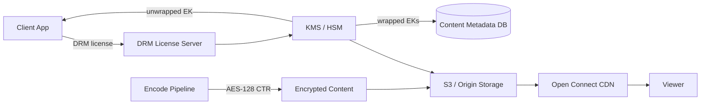

*DRM encryption pipeline: the encode pipeline encrypts each title with a unique AES-128 content key (EK). The EK is wrapped by KMS/HSM-managed DRM keys and stored in the content metadata database. During playback, the client sends a license request to the DRM license server, which validates the subscription and returns the unwrapped EK. The encrypted content is stored in S3 and served via the CDN — even if a segment is intercepted, it cannot be decrypted without the key.*

**Media encryption:** Photos and video are encrypted at the encode pipeline with per-title EKs before storage in S3. The KMS (Key Management Service), backed by HSMs, manages the DRM system keys. Per-user EKs are rotated every 90 days. The KMS key hierarchy: a **Master Key** (HSM, never exported) → **DRM System Keys** (per platform, rotated quarterly) → **Content Keys** (per title, rotated per release).

#### Encryption in Transit

All client-to-server and server-to-server traffic uses TLS 1.3 (minimum TLS 1.2). Inter-service communication within data centers uses mTLS (mutual TLS) for service-to-service authentication. Mobile SDKs pin the server certificate to prevent man-in-the-middle attacks. The Open Connect CDN uses HTTPS (TLS) for all manifest and segment delivery, with OCSP stapling for certificate validation.

#### Key Management

- **Key hierarchy:** Master Key (in HSM, never exported) → KEK (Key Encryption Key, per-region, rotated quarterly) → DEK (Data Encryption Key, per-title, rotated per release). Rotating the KEK requires only re-wrapping the DEKs, not re-encrypting the content.
- **Key rotation:** Master Keys never rotate. KEKs rotate quarterly. Content Keys are unique per title and rotate with each new encode (a remastered title gets a new key). For long-running viewing sessions, the player refreshes the license every 8 hours.
- **Multi-region KMS:** Keys are available in all deployment regions. Cloud KMS services (AWS KMS, GCP Cloud KMS) replicate keys automatically; on-prem deployments use HashiCorp Vault with integrated storage for multi-region HA.
- **Audit trail:** Every key access (wrap, unwrap, rotate) is logged to an audit trail with the requesting service, timestamp, and operation. Any access to a content key outside the licensed window triggers an alert.

```java
@Service
@RequiredArgsConstructor
public class DrmKeyManagementService {

    @Value("${app.drm.kms-endpoint}")
    private String kmsEndpoint;

    private final AWSSecretsManager secretsManager;
    private final MeterRegistry meterRegistry;

    /**
     * Generate a unique content key for a new title encode,
     * wrap it with each platform's DRM key, and return the
     * wrapped keys for storage alongside the encrypted content.
     */
    public Map<String, String> generateContentKeys(String contentId, String codec) {
        var contentKey = generateAes128Key();

        var wrappedKeys = new HashMap<String, String>();
        for (var drm : Arrays.asList("widevine", "playready", "fairplay")) {
            var drmKey = getDrmSystemKey(drm);
            var wrapped = wrapKey(contentKey, drmKey);
            wrappedKeys.put(drm, Base64.getEncoder().encodeToString(wrapped));
        }

        meterRegistry.counter("drm.content_key_generated",
                "content_id", contentId, "codec", codec).increment();

        return Map.of(
                "content_id", contentId,
                "wrapped_keys", wrappedKeys,
                "key_id", generateKeyId(contentId));
    }

    private byte[] generateAes128Key() {
        var keyGen = KeyGenerator.getInstance("AES");
        keyGen.init(128);
        return keyGen.generateKey().getEncoded();
    }

    private byte[] wrapKey(byte[] contentKey, byte[] drmKey) {
        var cipher = Cipher.getInstance("AESWrap");
        var key = new SecretKeySpec(drmKey, "AES");
        cipher.init(Cipher.WRAP_MODE, key);
        return cipher.wrap(new SecretKeySpec(contentKey, "AES"));
    }

    private byte[] getDrmSystemKey(String drm) {
        return secretsManager.getSecretBinary(drm + "-system-key");
    }
}
```

*The `DrmKeyManagementService` bean generates a unique AES-128 content key for each title encode, then wraps (encrypts) it with three platform-specific DRM system keys (Widevine, PlayReady, FairPlay) using the AES Key Wrap algorithm. The wrapped keys — which can only be unwrapped by the corresponding platform's DRM license server — are stored alongside the encrypted content metadata. A Micrometer counter tracks key generation by content ID and codec. The DRM system keys are retrieved from AWS Secrets Manager and rotate quarterly.*

---

### Authentication and Authorization

A streaming platform must verify who is connecting (authentication), determine what they can watch (authorization), and enforce subscription tiers and regional restrictions on every playback request. Every request to every service must carry authenticated credentials that encode the user's identity, subscription level, and active profile.

#### Authentication Methods

- **OAuth 2.0 + JWT:** Users authenticate via email/password, a third-party provider (Google, Apple, Facebook), or a PIN (for TV devices). The Auth Service issues a short-lived JWT (15 minutes) containing the user ID, subscription plan, and country. The JWT is signed with RS256 (RSASSA-PKCS1-v1_5 using SHA-256) and verified by every service via the public key.
- **Refresh tokens:** The JWT's short lifetime (15 minutes) is extended via a refresh token (7-day TTL, stored as a hash in the database). When the JWT expires, the client sends the refresh token to the `/refresh` endpoint to get a new JWT. Stolen refresh tokens are detected via device fingerprinting and revoked.
- **TV device authentication:** For devices without a keyboard (smart TVs, Roku), the user enters a code on a secondary device (phone/laptop). This uses the OAuth 2.0 Device Authorization Grant (RFC 8628), where the TV polls the Auth Service for a token until the user completes login on the secondary device.
- **Certificate-based device auth:** For managed devices (set-top boxes, smart TVs enrolled in device management), mutual TLS (mTLS) certificates issued by a private CA authenticate the device itself. This prevents unauthorized device firmware from accessing the API.

#### Authorization Models

- **Subscription-tier-based:** The JWT encodes the plan type (Basic, Standard, Premium). The Playback API checks the plan against the requested stream's maximum resolution — a Basic subscriber cannot request a 1080p or 4K manifest. The tier also limits concurrent streams (1, 2, or 4).
- **Profile-based authorization:** Each user account can have up to 5 profiles (adult/child/kid). The JWT includes the active `profile_id`. Profile-specific restrictions (maturity rating, content preferences) are enforced at the Catalog API level.
- **Geo-restriction enforcement:** The API Gateway checks the user's IP address against the title's regional license windows (stored in `CONTENT_LICENSE`). If the title is not available in the user's country, the API returns a 403 with a localized error message.
- **Role-based access (RBAC):** Beyond end users, the system has roles: `user` (subscriber), `moderator` (content moderation), `engineer` (admin access to internal tools), `content_admin` (can add/remove titles). Each role has a distinct set of scopes.

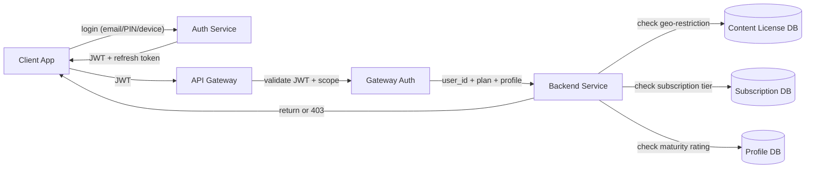

*Authentication and authorization flow: the client authenticates with the Auth Service (email/password, PIN for TV, or device certificate for managed devices), receiving a short-lived JWT and a refresh token. The API Gateway validates the JWT signature and checks scopes. Each backend service (Catalog, Playback, Recommendations) performs resource-level authorization: checking geo-restrictions against the Content License DB, subscription tier against the Subscription DB, and maturity rating against the Profile DB. All three checks must pass before content is served.*

**Java example — JWT validation filter:**

```java
@Component
@RequiredArgsConstructor
public class JwtAuthenticationFilter implements Filter {

    @Value("${app.auth.jwt-public-key}")
    private String publicKeyPem;

    private final UserDetailsService userDetailsService;

    @Override
    public void doFilter(ServletRequest request, ServletResponse response,
                         FilterChain chain) throws IOException, ServletException {
        var token = extractToken((HttpServletRequest) request);
        if (token != null && JwtUtils.isValid(token, publicKeyPem)) {
            var userId = JwtUtils.getUserId(token);
            var planType = JwtUtils.getClaim(token, "plan_type");
            var profileId = JwtUtils.getClaim(token, "profile_id");
            var country = JwtUtils.getClaim(token, "country");
            var userDetails = userDetailsService.loadUserById(userId);
            var auth = new UsernamePasswordAuthenticationToken(
                    userDetails, null, userDetails.getAuthorities());
            SecurityContextHolder.getContext().setAuthentication(auth);
            request.setAttribute("planType", planType);
            request.setAttribute("profileId", profileId);
            request.setAttribute("country", country);
        }
        chain.doFilter(request, response);
    }
}
```

*The `JwtAuthenticationFilter` bean intercepts every HTTP request, extracts the bearer token, validates its signature against the RSA public key (injected via `@Value` from a JWKS endpoint), and extracts the user ID, subscription plan type, active profile ID, and country from the JWT claims. The user details are loaded from the `UserDetailsService` and set in the Spring Security `Authentication` context. Request attributes are set for downstream access-control checks (plan type for resolution limiting, country for geo-restriction, profile ID for maturity rating).*

#### Authorization Example — Subscription Tier Check

```java
@Service
@RequiredArgsConstructor
public class PlaybackAuthorizationService {

    private final SubscriptionService subscriptionService;
    private final DeviceCapabilityService deviceService;

    /**
     * Check if the user's subscription tier allows streaming at the
     * requested resolution. Basic = 480p max, Standard = 1080p max,
     * Premium = 4K HDR. Also checks concurrent stream limits.
     */
    @Transactional(readOnly = true)
    public boolean canStreamAtResolution(String userId, String profileId,
                                         int requestedResolution, String deviceId) {
        var subscription = subscriptionService.getActiveSubscription(userId);
        if (subscription == null || !subscription.isActive()) {
            return false;
        }

        var maxResolution = switch (subscription.getPlanType()) {
            case "PREMIUM" -> 2160;
            case "STANDARD" -> 1080;
            case "BASIC" -> 480;
            default -> 0;
        };

        if (requestedResolution > maxResolution) {
            return false;
        }

        // Check concurrent stream limit
        var activeStreams = subscriptionService.countActiveStreams(userId);
        var maxStreams = switch (subscription.getPlanType()) {
            case "PREMIUM" -> 4;
            case "STANDARD" -> 2;
            case "BASIC" -> 1;
            default -> 0;
        };

        return activeStreams < maxStreams;
    }
}
```

*The `PlaybackAuthorizationService` bean enforces subscription-tier-based authorization before allowing playback. It checks: (1) whether the user has an active subscription, (2) whether the requested resolution exceeds the plan's maximum (Basic → 480p, Standard → 1080p, Premium → 4K/HDR), and (3) whether the user has exceeded their concurrent stream limit (Basic → 1, Standard → 2, Premium → 4). The `@Transactional(readOnly = true)` annotation optimizes the database reads. If any check fails, the Playback API returns 403 Forbidden with a message explaining the upgrade path.*

---

### Security Threats and Mitigations

#### Threat: Content Piracy

- **Risk:** High-quality recordings of Netflix content are captured from playback and redistributed on torrent sites, file-locker services, and illegal streaming platforms. Piracy undermines the value proposition, violates licensing agreements, and reduces subscriber incentive.
- **Mitigation:** Three-layer defense: (1) **DRM encryption** (AES-128 CTR with Widevine/PlayReady/FairPlay) ensures captured streams are encrypted and cannot be played without a valid license. (2) **Forensic watermarking** embeds a unique, invisible per-session watermark that allows tracing pirated copies back to the source account. (3) **Root-of-trust detection** checks whether the device has been rooted or jailbroken; compromised devices are denied access to premium content. Additionally, the player enforces HDCP (High-bandwidth Digital Content Protection) on external displays, preventing screen-capture via HDMI capture cards.

#### Threat: DDoS on New Title Launches

- **Risk:** When a popular title drops, millions of users simultaneously request the catalog page, manifest, and first video segments — creating DDoS-like traffic that can overwhelm the API Gateway and origin servers. This is "legitimate DDoS" — real users, but at unprecedented scale.
- **Mitigation:** Four defenses: (1) **CDN pre-warming** — popular titles are pre-positioned onto OCAs 2–6 AM before the launch, shifting 95%+ of segment traffic to the edge. (2) **Rate limiting and token bucket** at the API Gateway — per-IP and per-account rate limits with exponential backoff under high load. (3) **Manifest caching** — manifests are cached for 5 minutes at the CDN edge, so even millions of concurrent viewers hit the cache, not the origin. (4) **Canary rollout** — the title is released to 1% of users first, then 5%, 10%, 25%, 50%, 100% over 30 minutes, allowing the CDN to warm up gradually.

#### Threat: Account Takeover

- **Risk:** An attacker uses stolen passwords, credential stuffing, or session hijacking to take over a premium account and watch content without paying.
- **Mitigation:** (1) **MFA required** for all accounts with a history of high-value viewing. (2) **Rate limiting** login attempts (5 per IP per hour, 10 per account per hour). (3) **CAPTCHA** after 3 failed attempts. (4) **Device fingerprinting** — each login is associated with a device fingerprint (User-Agent, IP, OS, screen resolution); logins from unrecognized devices trigger an email notification. (5) **Session invalidation** on password change — all refresh tokens are revoked and must be re-issued. (6) **Anomaly detection** — the system flags accounts with sudden geographic jumps (login from US, then login from Russia 10 minutes later) and may temporarily lock the account.

#### Threat: Data Scraping and Unauthorized Access

- **Risk:** Competitors and pirates scrape the catalog, user ratings, and recommendation rows to build mirror sites or train competing models. Automated scrapers also try to bypass geo-restrictions using VPNs or proxy servers.
- **Mitigation:** (1) Per-API-key rate limiting (1,000 requests/minute for catalog endpoints). (2) All data-returning endpoints require JWT authentication — no anonymous browsing. (3) **VPN/proxy detection** — an IP reputation service blocks known VPN exit nodes, datacenter IPs, and TOR exit nodes. (4) **Edge-side bot detection** — the API Gateway uses behavioral analysis (request patterns, header consistency) to detect and block automated clients. (5) **GraphQL query depth limiting** — the DGS framework enforces a maximum query depth of 5 and a complexity limit to prevent resource-intensive queries.

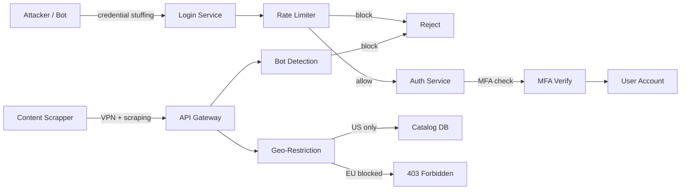

*Security defense layers: credential stuffing attacks are throttled by the rate limiter; account takeover attempts require MFA verification; content scrapers are detected by bot-detection behavioral analysis and IP reputation (VPN/datacenter/TOR blocking); and the geo-restriction layer enforces regional licensing by checking the user's country against the Content License DB — returning 403 Forbidden for blocked regions.*

---

### Observability and Logging

Streaming platforms generate massive amounts of telemetry from billions of daily playback sessions. Observability must cover the entire streaming pipeline: content delivery (CDN, segments), streaming quality (startup, rebuffering, ABR), recommendations (CTR, conversion), and infrastructure health (latency, error rates, consumer lag).

#### Key Metrics

- **Startup latency:** Time from "Play" to first frame of video. SLA: p50 < 3s, p95 < 5s, p99 < 8s. Track by device type (smart TV vs. mobile) and region.
- **Rebuffering rate:** Percentage of playback sessions with at least one stall. SLA: < 0.5% globally, < 0.1% for premium content. Track by bitrate, CDN, and network type (WiFi vs. cellular).
- **ABR switch frequency:** Number of bitrate switches per minute. High frequency indicates unstable network detection; too few switches indicate suboptimal quality selection.
- **CDN cache hit ratio:** Percentage of segment requests served from the edge (OCA) rather than origin. Target: > 97%. Track by title popularity and region.
- **Video start success rate:** Percentage of play attempts that result in successful playback. SLA: > 99.5%. Failures indicate CDN, DRM license, or geo-restriction issues.
- **Recommendation click-through rate (CTR):** Percentage of recommended items that the user clicks on. Track by row type (Top 10, Because you watched, Personalized). Target: > 5% for personalized rows.
- **Engagement:** Minutes watched per user per day, completion rate (watched to 90%+), re-watch rate. These are the core business KPIs.
- **Error rates:** 5xx errors per service, DRM license failures, segment fetch failures, CDN 403s (geo-blocked). Alert if any exceeds 0.1% for 5 minutes.

#### Logging

- **Access logs:** Every API request logged with user ID, IP, device type, endpoint, response code, and latency. Used for audit trails and anomaly detection.
- **Event logs:** All user actions (play, pause, seek, complete, re-watch, rate, search) logged as structured JSON events for analytics and ML feature generation.
- **Error logs:** Service errors with correlation IDs for cross-service tracing. Segment fetch failures logged with CDN node, title, and bitrate. DRM license failures logged with device type and error code.
- **Audit logs:** All content access (who watched what, when, from where), geo-restriction checks, subscription changes, and admin actions logged with before/after state.

#### Distributed Tracing

Trace every user session across all services — from the client app through the API Gateway, Playback API, Catalog API, DRM license server, and CDN. Use OpenTelemetry with trace context propagated via `traceparent` headers across service boundaries. Key spans to instrument: token validation, catalog lookup, geo-restriction check, DRM license issuance, manifest generation, segment fetch, ABR decision, and recommendation scoring.

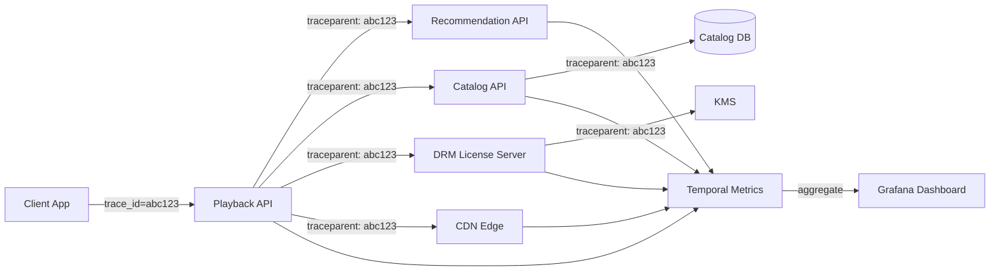

*Distributed tracing flow for a streaming session: each playback session carries a trace ID (e.g., `abc123`) propagated via the `traceparent` header across all downstream calls. The Playback API, Recommendation API, Catalog API, DRM License Server, and CDN each record spans. These spans aggregate in a metrics backend (Datadog, New Relic, or Atlas) and are visualized in Grafana dashboards, enabling end-to-end latency analysis of the entire playback pipeline.*

#### Alerting Strategy

- **Critical (page immediately):** Startup latency p95 > 8s for 5 minutes; rebuffering rate > 1% for 2 minutes; CDN cache hit ratio < 90% for 10 minutes; video start success rate < 99% for 2 minutes; DRM license failure rate > 0.5%.
- **Warning (Slack, no page):** CDN cache hit ratio < 95% for 30 minutes; recommendation CTR dropped 20% vs. baseline; engagement events consumer lag > 100,000; transcoding queue depth > 50,000.
- **Info (dashboard only):** New title viewership trends, regional content availability changes, device-type QoE breakdown, A/B test metric drift.

**Java example — playback latency metrics with Micrometer:**

```java
@Service
@RequiredArgsConstructor
public class InstrumentedPlaybackService {

    private final PlaybackApiRepository playbackRepository;
    private final MeterRegistry meterRegistry;

    public PlaybackSession startPlayback(String contentId, String profileId, String deviceId) {
        var sessionTimer = Timer.Sample.start(meterRegistry);
        try {
            var manifestTimer = Timer.Sample.start(meterRegistry);
            var manifest = playbackRepository.generateManifest(contentId, deviceId);
            manifestTimer.stop(Timer.builder("playback.manifest.latency")
                    .tag("device", getDeviceType(deviceId))
                    .register(meterRegistry));

            var session = new PlaybackSession(contentId, profileId, Instant.now());
            sessionTimer.stop(Timer.builder("playback.startup.latency")
                    .tag("user_tier", getSubTier(profileId))
                    .tag("region", getRegion())
                    .register(meterRegistry));

            Counter.builder("playback.started")
                    .tag("content_type", getContentType(contentId))
                    .tag("device", getDeviceType(deviceId))
                    .register(meterRegistry).increment();

            return session;
        } catch (Exception e) {
            Counter.builder("playback.errors")
                    .tag("error_type", e.getClass().getSimpleName())
                    .tag("content_id", contentId)
                    .register(meterRegistry).increment();
            throw e;
        }
    }

    private String getSubTier(String profileId) {
        return meterRegistry.find("subscription_tier").value(profileId) != null
                ? "premium" : "standard";
    }

    private String getDeviceType(String deviceId) {
        return deviceId.startsWith("TV_") ? "smart_tv" : "mobile";
    }
}
```

*The `InstrumentedPlaybackService` bean uses Micrometer to record nested timers: one for manifest generation (`playback.manifest.latency`, tagged by device type) and one for total startup latency (`playback.startup.latency`, tagged by user tier and region). The startup timer starts before the manifest fetch and stops after the session is created — capturing the end-to-end latency the user experiences. A request counter tracks successful playback starts by content type and device type; an error counter tracks failures with the error type and content ID for debugging.*

---

### Real-World Implementations

Streaming platforms use a combination of proprietary and open-source systems, each chosen for its strengths in a specific layer of the stack.

#### Open Connect (Netflix)

Netflix operates the Open Connect Content Delivery Network — a purpose-built CDN with over 200,000 Open Connect Appliances (OCAs) deployed inside ISP data centers. Unlike third-party CDNs, Open Connect is fully owned and operated by Netflix. OCAs are 1U/2U x86 or ARM servers with NVMe SSD storage, pre-loaded with popular titles and remotely synced. Netflix reports that Open Connect handles over 95% of all Netflix traffic globally, with > 97% cache hit ratio for peak hours. OCAs run a custom Linux distribution with a lightweight HTTP server optimized for small-file delivery (video segments of 2–10 seconds).

**Companies:** Netflix (proprietary), and the model is being adopted by other streaming services (Disney+ uses a similar ISP-collocated caching strategy).

#### Eureka (Netflix)

Eureka is Netflix's open-source service discovery server and client. It is a REST-based service that is primarily used in the AWS cloud to function at Netflix's scale. Eureka runs as a peer-to-peer cluster with multiple regions; each region's instances register with the local Eureka server, and the server replicates registrations to peer servers. Services query Eureka to discover available instances and use client-side load balancing (with Ribbon) to route requests.

**Companies:** Netflix (primary), many companies using Spring Cloud Netflix for service discovery.

#### Zuul (Netflix)

Zuul is Netflix's API Gateway, providing dynamic routing, monitoring, resiliency, and security. It acts as the front door for all client requests, routing them to the appropriate microservice based on the URL path, HTTP headers, and query parameters. Zuul supports filters for authentication, load shedding, and rate limiting. Netflix has evolved Zuul from a monolith to Zuul 2 (reactive, Netty-based) to handle higher throughput with lower latency.

**Companies:** Netflix (primary), companies using Spring Cloud Gateway as a Zuul alternative.

#### DGS Framework (Netflix)

The Domain Graph Service (DGS) Framework is Netflix's GraphQL server framework for Spring Boot. It enables Netflix to expose its microservices as a unified GraphQL API, allowing clients to request exactly the data they need (reducing over-fetching and under-fetching). DGS integrates with Netflix's service discovery (Eureka), configuration management (Archaius), and metrics (Spectator). Netflix migrated from a REST API to GraphQL to reduce the number of network round-trips for mobile clients and to provide a strongly-typed, self-documenting API.

**Companies:** Netflix (primary), companies using DGS for GraphQL + Spring Boot.

#### Titus (Netflix)

Titus is Netflix's container management platform, built on AWS and open-sourced. Unlike Kubernetes, Titus is designed specifically for Netflix's workload patterns: batch jobs (encoding, recommendations training) and long-running services (Playback API, Catalog API). Titus provides fine-grained scheduling (placing workloads on optimal instance types), automatic scaling, and integration with Netflix's chaos engineering tools. Over 80% of Netflix's compute runs on Titus.

**Companies:** Netflix (primary).

#### Keystone (Netflix)

Keystone is Netflix's data pipeline platform, processing over 850 billion events per day. It provides a unified interface for both real-time stream processing (via Apache Flink) and batch processing (via Apache Spark), with a common data model and schema registry. Keystone ingests engagement events, viewing behavior, error logs, and operational metrics, then writes processed results to various sinks (data warehouse, feature store, monitoring systems).

**Companies:** Netflix (primary).

#### Chaos Monkey (Netflix)

Chaos Monkey is part of Netflix's Simian Army — a suite of tools that inject failures into production to test resilience. Chaos Monkey randomly terminates production instances during business hours, ensuring that services can survive instance failures without user impact. The broader Simian Army includes Latency Monkey (injects network latency), Chaos Kong (terminates entire regions), and Security Monkey (monitors security violations).

**Companies:** Netflix (primary), companies using Chaos Toolkit or Gremlin as alternatives.

#### Archaius (Netflix)

Archaius is Netflix's configuration management library, providing a unified API for reading configuration from multiple sources (property files, system properties, JDBC, DynamoDB, etc.). It supports dynamic property updates — configurations can change at runtime without restarting services. Archaius is deeply integrated with Netflix's other OSS tools (Eureka, Hystrix, Ribbon) and provides a PollingDynamicProperty mechanism for runtime configuration changes.

**Companies:** Netflix (primary), companies using Spring Cloud Config as an alternative.

---

### Java and Spring Boot Implementation Guide

This section demonstrates how to build a Spring Boot service for a streaming platform's core catalog and playback pipeline, showcasing all the key Spring Boot features: `@Service`, `@RestController`, `@Repository`, `@Component`, `@Value`, records for DTOs, `@Valid`, `@ControllerAdvice`, constructor injection, `@Transactional`, `@Version`, and `BigDecimal`.

#### 1. DTO Records

Records provide immutable, concise data carriers for request/response payloads.

```java
public record LoginRequest(
        @NotBlank String email,
        @NotBlank String password,
        boolean rememberMe) {}

public record LoginResponse(
        String jwt,
        String refreshToken,
        int expiresIn,
        UserInfo user) {

    public record UserInfo(String userId, String email, List<ProfileInfo> profiles) {}

    public record ProfileInfo(String profileId, String name, boolean isActive) {}
}

public record CatalogResponse(
        String contentId,
        String title,
        String type,
        int releaseYear,
        String maturityRating,
        List<String> genres,
        String description,
        BigDecimal duration,
        List<MediaAssetDto> assets) {}

public record MediaAssetDto(
        String assetId,
        String codec,
        String resolution,
        int bitrateKbps,
        String url) {}

public record PlaybackInitiationRequest(
        @NotBlank String contentId,
        String profileId,
        String deviceId) {}

public record PlaybackInitiationResponse(
        String sessionId,
        String manifestUrl,
        String drmLicenseUrl,
        List<StreamVariant> variants) {

    public record StreamVariant(String url, int bitrateKbps, String resolution, boolean available) {}
}
```

*These record types serve as the streaming API contract: `LoginRequest`/`LoginResponse` handle authentication (JWT + refresh token + user profiles); `CatalogResponse`/`MediaAssetDto` serve content metadata to the frontend; `PlaybackInitiationRequest`/`PlaybackInitiationResponse` initiate a streaming session (returning the manifest URL, DRM license URL, and available bitrate variants). Records are immutable and ideal for thread-safe request/response objects in a high-concurrency streaming service.*

#### 2. Entity with Optimistic Locking

The `Content` entity uses `@Version` for optimistic locking to prevent lost updates when concurrent writes modify the same title.

```java
@Entity
@Table(name = "content", indexes = {
        @Index(name = "idx_content_type_year", columnList = "type, releaseYear"),
        @Index(name = "idx_content_title", columnList = "title")
})
public class Content {

    @Id
    private String contentId;

    @NotBlank
    private String title;

    @Enumerated(EnumType.STRING)
    private ContentType type;

    @Column(columnDefinition = "TEXT")
    private String description;

    private int releaseYear;

    @Enumerated(EnumType.STRING)
    private MaturityRating maturityRating;

    @Version
    private Long version;

    private Instant addedAt;

    @OneToMany(cascade = CascadeType.ALL, orphanRemoval = true, mappedBy = "content")
    private List<Season> seasons = new ArrayList<>();

    @OneToMany(cascade = CascadeType.ALL, orphanRemoval = true, mappedBy = "content")
    private List<ContentLicense> licenses = new ArrayList<>();

    @OneToMany(cascade = CascadeType.ALL, orphanRemoval = true, mappedBy = "content")
    private List<MediaAsset> assets = new ArrayList<>();

    // Constructors, getters, setters omitted for brevity

    public void updateMetadata(String title, String description, int releaseYear) {
        this.title = title;
        this.description = description;
        this.releaseYear = releaseYear;
    }
}
```

*The `Content` entity maps to the `content` table with composite indexes on `(type, releaseYear)` for browse queries and `(title)` for search. The `@Version` field enables JPA optimistic locking — if two concurrent transactions try to update the same title (e.g., adding a new season while editing metadata), the second transaction fails with `OptimisticLockException`, preventing lost updates. The `@OneToMany` collections (seasons, licenses, assets) use `CascadeType.ALL` with `orphanRemoval = true` so that removing a child from the collection deletes it from the database.*

#### 3. Repository Layer

The `@Repository` layer provides persistence operations with Spring Data JPA and Cassandra.

```java
@Repository
public interface ContentRepository extends JpaRepository<Content, String> {

    @Query("SELECT c FROM Content c WHERE c.type = :type AND c.releaseYear >= :year ORDER BY c.addedAt DESC")
    List<Content> findByTypeAndYearAfter(@Param("type") ContentType type,
                                         @Param("year") int year,
                                         Pageable pageable);

    @Query("SELECT c FROM Content c JOIN c.licenses l WHERE l.country = :country " +
           "AND l.licenseEnd > CURRENT_TIMESTAMP ORDER BY c.addedAt DESC")
    List<Content> findAvailableInCountry(@Param("country") String country,
                                         Pageable pageable);

    @Query("SELECT DISTINCT c FROM Content c JOIN c.licenses l " +
           "WHERE c.contentId = :contentId AND l.country = :country " +
           "AND l.licenseStart <= CURRENT_TIMESTAMP AND l.licenseEnd > CURRENT_TIMESTAMP")
    Optional<Content> findByIdAndCountry(@Param("contentId") String contentId,
                                         @Param("country") String country);
}
```

*The `ContentRepository` interface extends `JpaRepository`, inheriting CRUD methods. Three custom queries are defined: `findByTypeAndYearAfter` for browse-by-type queries (e.g., "show me all movies from 2020+"), `findAvailableInCountry` for regional catalog browsing (filtered by active license windows), and `findByIdAndCountry` for geo-restriction enforcement (checks the requested country against the content's license start/end dates before returning the title).*

#### 4. Service Layer

Services encapsulate business logic, transactions, and the streaming orchestration pipeline.

```java
@Service
@RequiredArgsConstructor
@Slf4j
public class PlaybackService {

    private final ContentRepository contentRepository;
    private final SubscriptionService subscriptionService;
    private final DrmLicenseService drmLicenseService;
    private final SessionRepository sessionRepository;
    private final KafkaTemplate<String, Object> kafkaTemplate;
    private final MeterRegistry meterRegistry;

    @Value("${app.playback.session-ttl-minutes:60}")
    private int sessionTtlMinutes;

    @Value("${app.drm.license-endpoint}")
    private String drmLicenseEndpoint;

    @Transactional
    public PlaybackInitiationResponse initiatePlayback(String contentId, String profileId,
                                                       String deviceId, String country) {
        var content = contentRepository.findByIdAndCountry(contentId, country)
                .orElseThrow(() -> new ContentNotAvailableException(contentId, country));

        validateSubscription(profileId, content);

        var sessionId = UUID.randomUUID().toString();
        var session = new StreamingSession(sessionId, profileId, contentId,
                Instant.now(), Instant.now().plusSeconds(sessionTtlMinutes * 60L));
        sessionRepository.save(session);

        var manifestUrl = generateManifestUrl(contentId);
        var drmUrl = drmLicenseEndpoint + "/license/" + sessionId;

        var variants = content.getAssets().stream()
                .map(a -> new PlaybackInitiationResponse.StreamVariant(
                        a.getUrl(), a.getBitrateKbps(), a.getResolution(), true))
                .toList();

        // Publish playback start event for analytics and recommendations
        kafkaTemplate.send("playback_started", sessionId, Map.of(
                "sessionId", sessionId,
                "contentId", contentId,
                "profileId", profileId,
                "deviceId", deviceId,
                "country", country));

        meterRegistry.counter("playback.started",
                "content_type", content.getType().name()).increment();

        log.info("Playback session initiated: {} for content {} profile {}",
                sessionId, contentId, profileId);

        return new PlaybackInitiationResponse(sessionId, manifestUrl, drmUrl, variants);
    }

    private void validateSubscription(String profileId, Content content) {
        var subscription = subscriptionService.getByProfile(profileId);
        if (subscription == null || !subscription.isActive()) {
            throw new SubscriptionRequiredException(profileId);
        }
        if (!subscription.canAccess(content.getMaturityRating())) {
            throw new ContentRestrictedException(content.getMaturityRating());
        }
    }

    private String generateManifestUrl(String contentId) {
        var segments = contentRepository.findById(contentId)
                .orElseThrow(() -> new ContentNotFoundException(contentId))
                .getAssets();
        return "/api/v1/catalog/" + contentId + "/manifest.m3u8";
    }
}
```

*The `PlaybackService` bean orchestrates the playback initiation flow: it validates geo-restrictions (checking the content's license windows against the user's country via `ContentRepository`), verifies the user's subscription tier grants access to the content's maturity rating, creates a time-limited streaming session in Redis, generates the manifest URL and DRM license URL, and publishes a `playback_started` event to Kafka for real-time analytics and recommendation updates. The `@Value` annotations inject the session TTL and DRM license endpoint. Micrometer metrics track successful playback starts by content type. The `@Transactional` annotation ensures the session creation is atomic — a partially created session is rolled back on failure.*

#### 5. REST Controller with Validation

The controller uses `@Valid` for request validation, constructor injection, and produces typed API responses.

```java
@RestController
@RequestMapping("/api/v1")
@RequiredArgsConstructor
public class CatalogController {

    private final PlaybackService playbackService;
    private final ContentRepository contentRepository;

    @GetMapping("/catalog")
    public ResponseEntity<List<CatalogResponse>> browseCatalog(
            @RequestParam(required = false) String type,
            @RequestParam(required = false) Integer year,
            @RequestParam(defaultValue = "0") int page,
            @RequestParam(defaultValue = "20") int size,
            @AuthenticationPrincipal JwtUser jwtUser) {

        var pageable = PageRequest.of(page, size);
        var items = (type != null && year != null)
                ? contentRepository.findByTypeAndYearAfter(
                    ContentType.valueOf(type.toUpperCase()), year, pageable)
                : contentRepository.findAll(pageable).getContent();

        var response = items.stream()
                .map(this::toCatalogResponse)
                .toList();

        return ResponseEntity.ok(response);
    }

    @GetMapping("/catalog/{contentId}")
    public ResponseEntity<CatalogResponse> getContent(
            @PathVariable String contentId,
            @AuthenticationPrincipal JwtUser jwtUser) {

        var content = contentRepository.findById(contentId)
                .orElseThrow(() -> new ContentNotFoundException(contentId));
        return ResponseEntity.ok(toCatalogResponse(content));
    }

    @PostMapping("/playback/start")
    public ResponseEntity<PlaybackInitiationResponse> startPlayback(
            @Valid @RequestBody PlaybackInitiationRequest request,
            @AuthenticationPrincipal JwtUser jwtUser) {

        var response = playbackService.initiatePlayback(
                request.contentId(),
                jwtUser.getProfileId(),
                request.deviceId(),
                jwtUser.getCountry());

        return ResponseEntity.ok(response);
    }

    private CatalogResponse toCatalogResponse(Content content) {
        var assets = content.getAssets().stream()
                .map(a -> new MediaAssetDto(a.getAssetId(), a.getCodec(),
                        a.getResolution(), a.getBitrateKbps(), a.getUrl()))
                .toList();

        return new CatalogResponse(
                content.getContentId(),
                content.getTitle(),
                content.getType().name(),
                content.getReleaseYear(),
                content.getMaturityRating().name(),
                content.getGenres(),
                content.getDescription(),
                BigDecimal.valueOf(content.getDurationSeconds()),
                assets);
    }
}
```

*The `CatalogController` bean uses `@RestController` with constructor injection (`@RequiredArgsConstructor`). The `@Valid` annotation on `PlaybackInitiationRequest` triggers bean validation (enforcing `@NotBlank` constraints). `@AuthenticationPrincipal` injects the authenticated user (with `profileId` and `country` extracted from the JWT by the `JwtAuthenticationFilter`). The browse endpoint supports optional filtering by type and release year with pagination (`PageRequest`); the playback endpoint delegates to `PlaybackService` with geo-restriction checking. `BigDecimal` is used for the duration field to avoid floating-point rounding issues.*

#### 6. Controller Advice for Global Error Handling

A `@ControllerAdvice` bean centralizes exception handling across all controllers, returning structured error responses with appropriate HTTP status codes.

```java
@ControllerAdvice
public class GlobalExceptionHandler {

    @ExceptionHandler(ContentNotFoundException.class)
    public ResponseEntity<ApiError> handleNotFound(ContentNotFoundException ex) {
        var error = new ApiError(HttpStatus.NOT_FOUND, ex.getMessage());
        return ResponseEntity.status(HttpStatus.NOT_FOUND).body(error);
    }

    @ExceptionHandler(ContentNotAvailableException.class)
    public ResponseEntity<ApiError> handleNotAvailable(ContentNotAvailableException ex) {
        var error = new ApiError(HttpStatus.FORBIDDEN,
                "This content is not available in your region.");
        return ResponseEntity.status(HttpStatus.FORBIDDEN).body(error);
    }

    @ExceptionHandler(SubscriptionRequiredException.class)
    public ResponseEntity<ApiError> handleSubscriptionRequired(SubscriptionRequiredException ex) {
        var error = new ApiError(HttpStatus.PAYMENT_REQUIRED,
                "A subscription is required to watch this content.");
        return ResponseEntity.status(HttpStatus.PAYMENT_REQUIRED).body(error);
    }

    @ExceptionHandler(MethodArgumentNotValidException.class)
    public ResponseEntity<ApiError> handleValidation(MethodArgumentNotValidException ex) {
        var messages = ex.getBindingResult().getFieldErrors().stream()
                .map(FieldError::getDefaultMessage)
                .toList();
        var error = new ApiError(HttpStatus.BAD_REQUEST,
                "Validation failed: " + String.join(", ", messages));
        return ResponseEntity.badRequest().body(error);
    }

    @ExceptionHandler(OptimisticLockException.class)
    public ResponseEntity<ApiError> handleConflict(OptimisticLockException ex) {
        var error = new ApiError(HttpStatus.CONFLICT,
                "Concurrent modification detected. Please retry.");
        return ResponseEntity.status(HttpStatus.CONFLICT).body(error);
    }

    public record ApiError(HttpStatus status, String message) {}
}
```

*The `GlobalExceptionHandler` bean (annotated `@ControllerAdvice`) catches exceptions thrown by any `@RestController` and returns structured `ApiError` responses. It handles `ContentNotFoundException` (404 — title not in catalog), `ContentNotAvailableException` (403 — geo-restricted content), `SubscriptionRequiredException` (402 — payment required), `MethodArgumentNotValidException` (400 — validation failures from `@Valid`), and `OptimisticLockException` (409 — concurrent `@Version` conflict). This eliminates repetitive try-catch blocks in controllers and ensures consistent error responses.*

#### 7. Recommendation Service with BigDecimal Scoring

The recommendation ranking model uses `BigDecimal` for precise score computation, avoiding floating-point rounding errors in the weighted engagement score.

```java
@Service
@RequiredArgsConstructor
public class NetflixRecommendationService {

    private final FeatureStoreClient featureStore;
    private final MeterRegistry meterRegistry;

    private static final BigDecimal RECENCY_WEIGHT = new BigDecimal("0.30");
    private static final BigDecimal AFFINITY_WEIGHT = new BigDecimal("0.25");
    private static final BigDecimal ENGAGEMENT_WEIGHT = new BigDecimal("0.25");
    private static final BigDecimal CONTENT_TYPE_WEIGHT = new BigDecimal("0.10");
    private static final BigDecimal COMPLETION_WEIGHT = new BigDecimal("0.10");

    @Transactional(readOnly = true)
    public List<ContentItem> rank(String profileId, List<ContentItem> candidates) {
        return candidates.stream()
                .map(item -> {
                    var features = featureStore.getFeatures(profileId, item.contentId());
                    var score = RECENCY_WEIGHT.multiply(features.recencyScore())
                            .add(AFFINITY_WEIGHT.multiply(features.affinityScore()))
                            .add(ENGAGEMENT_WEIGHT.multiply(features.engagementScore()))
                            .add(CONTENT_TYPE_WEIGHT.multiply(features.contentTypeScore()))
                            .add(COMPLETION_WEIGHT.multiply(features.completionScore()));
                    return new ScoredItem(item, score);
                })
                .sorted(Comparator.comparing(ScoredItem::score).reversed())
                .map(ScoredItem::item)
                .toList();
    }

    record ScoredItem(ContentItem item, BigDecimal score) {}
}
```

*The `NetflixRecommendationService` bean computes a weighted engagement score for each candidate content item using `BigDecimal` arithmetic for numerical precision. The weights (recency 30%, affinity 25%, engagement 25%, content type 10%, completion 10%) are immutable `BigDecimal` constants. The `@Transactional(readOnly = true)` annotation optimizes the Feature Store reads. A local record `ScoredItem` pairs each item with its computed score for sorting. Features are fetched in batch from the Feature Store (Redis + Cassandra) to minimize round-trips.*

#### 8. DRM License Service

The DRM license service generates content keys, wraps them per-platform, and issues licenses to authorized players.

```java
@Service
@RequiredArgsConstructor
public class DrmLicenseService {

    @Value("${app.drm.kms-endpoint}")
    private String kmsEndpoint;

    private final AWSSecretsManager secretsManager;
    private final SubscriptionService subscriptionService;
    private final MeterRegistry meterRegistry;

    /**
     * Issue a DRM license to an authorized player. Validates the
     * user's subscription and the device's HDCP status before
     * returning the unwrapped content key.
     */
    public LicenseResponse issueLicense(String sessionId, String contentId,
                                        String profileId, String deviceCertificate) {
        validateSubscription(profileId, contentId);
        validateDevice(deviceCertificate);

        var contentKey = retrieveContentKey(contentId);
        var wrappedKeys = wrapForPlatform(contentKey, "widevine", "playready", "fairplay");

        meterRegistry.counter("drm.license_issued",
                "content_id", contentId,
                "subscription_tier", getSubTier(profileId)).increment();

        return new LicenseResponse(sessionId, wrappedKeys, Duration.ofHours(24));
    }

    private String retrieveContentKey(String contentId) {
        var encrypted = secretsManager.getSecretBinary(contentId + "-content-key");
        var kek = secretsManager.getSecretBinary("drm-master-kek");
        var cipher = Cipher.getInstance("AES/CBC/PKCS5Padding");
        cipher.init(Cipher.UNWRAP_MODE, new SecretKeySpec(kek, "AES"));
        return new String(cipher.unwrap(encrypted, "AES", Cipher.SECretKey));
    }

    private Map<String, String> wrapForPlatform(String contentKey, String... platforms) {
        var key = new SecretKeySpec(contentKey.getBytes(StandardCharsets.UTF_8), "AES");
        return Arrays.stream(platforms)
                .collect(Collectors.toMap(
                        p -> p,
                        p -> {
                            var platformKey = secretsManager.getSecretBinary(p + "-drm-key");
                            var cipher = Cipher.getInstance("AESWrap");
                            cipher.init(Cipher.WRAP_MODE, new SecretKeySpec(platformKey, "AES"));
                            return Base64.getEncoder().encodeToString(cipher.wrap(key));
                        }));
    }

    record LicenseResponse(String sessionId, Map<String, String> wrappedKeys,
                           Duration ttl) {}
}
```

*The `DrmLicenseService` bean issues DRM licenses to authorized players. Before returning the content key, it validates the user's subscription (via `SubscriptionService`) and the device's HDCP status (via certificate validation). The content key is retrieved from AWS Secrets Manager (where it was stored encrypted by the KEK during encoding), unwrapped, then re-wrapped for each platform's DRM system (Widevine, PlayReady, FairPlay) using the AES Key Wrap algorithm. The license is valid for 24 hours. A Micrometer counter tracks license issuance by content ID and subscription tier for compliance auditing.*

---

### Interview Questions and Answers

A curated set of interview questions focused on Netflix's streaming, microservices, CDN, and
personalization systems. These complement the inline Q&As throughout the document.

**Beginner**

- **Q: What is the difference between video streaming and progressive download?**
  **A:** Progressive download fetches the entire file (or a large contiguous chunk) over HTTP before
  playback can begin, so the user waits for a buffer to fill. Streaming divides the video into small
  segments (2–10 seconds each) delivered over HTTP (HLS/DASH) or a custom protocol (Netflix's
  Dynamic Optimizer). The player requests segments on-demand, so playback can start almost
  immediately with sub-5-second startup latency. Streaming also enables adaptive bitrate (ABR) — the
  player dynamically switches segment quality based on current bandwidth, which progressive download
  cannot do.

- **Q: How does Netflix's Open Connect CDN work?**
  **A:** Netflix builds and operates its own CDN called Open Connect. Content is ingested, encoded
  into multiple bitrates, fragmented into segments, and stored in Netflix-maintained appliances
  (Open Connect Appliances) placed inside ISP data centers. When a user requests content, DNS-based
  GeoDNS routes them to the nearest Open Connect instance that has the content cached. If the local
  cache misses, the request falls back to an upstream Netflix data center or AWS. This keeps the
  majority of traffic on the ISP's own network, reducing transit costs and improving latency.

- **Q: What is adaptive bitrate streaming and why is it important?**
  **A:** ABR dynamically selects the video quality (bitrate) of each segment based on the viewer's
  current network conditions. Netflix encodes each title into ~8–15 bitrate ladders. The player
  measures download throughput and buffer health before each segment request, then selects the highest
  quality that can be delivered without rebuffering. This balances user experience (higher quality)
  with reliability (no rebuffering), adapting as network conditions change during playback.

**Intermediate**

- **Q: How does Netflix handle the thundering herd problem when a popular show drops?**
  **A:** When a hit show launches, millions of users request the same content simultaneously. Netflix
  mitigates this through (1) pre-warming caches — content is pushed to edge caches before release;
  (2) gradual rollout — regional staggered releases spread the load; (3) rate limiting and exponential
  backoff at the API gateway to shed excess traffic; (4) circuit breakers (Hystrix) that degrade
  gracefully to cached metadata or fallback responses; (5) autoscaling of stateless services behind
  the streaming API. The combination ensures new-user requests are served from cache while the origin
  scales incrementally.

- **Q: Explain Netflix's microservices architecture and how services discover each other.**
  **A:** Netflix runs ~700 microservices on AWS, orchestrated by Titus (their container platform).
  Services communicate over REST/gRPC and use Eureka as a service discovery server. Each service
  registers itself with Eureka on startup and fetches the registry periodically. When a service needs
  to call another, it queries Eureka for available instances and uses client-side load balancing (Ribbon,
  now maintained internally) to pick one. This avoids a centralized load balancer bottleneck and
  enables each service to make independent routing decisions.

- **Q: What is the role of Eureka and Zuul in Netflix's architecture?**
  **A:** Eureka is the service discovery server — services register their metadata (host, port, status)
  and clients fetch the registry to discover available instances. Zuul is the edge service / API gateway
  that routes external traffic to internal microservices. Zuul applies filters (pre-routing authentication,
  routing, post-routing transformations) and handles concerns like request throttling, canary deployments,
  and A/B testing at the edge. Together, Eureka (discovery) and Zuul (edge routing) form the backbone
  of Netflix's microservices communication mesh.

- **Q: How does Netflix achieve high availability across multiple AWS regions?**
  **A:** Netflix deploys services in multiple AWS regions (e.g., us-east-1, us-west-2, eu-west-1).
  Traffic is routed via GeoDNS to the nearest healthy region. Each region is self-contained — it has
  its own Eureka servers, Zuul gateways, Titus clusters, and data stores (Cassandra, Elasticsearch,
  EVCache). Cross-region replication uses asynchronous data sync for non-critical data and multi-region
  active-active for user sessions. If a region fails, traffic is failed over to the next nearest region.
  The goal is 99.99% availability with sub-30-minute recovery time for region-level outages.

**Advanced**

- **Q: Describe Netflix's data pipeline for recommendations and how it scales.**
  **A:** Netflix collects user events (play, pause, skip, rewind, rating) in real-time via a Kafka-based
  pipeline. Events are processed by Flink streams to update user profiles (implicit feedback matrix)
  and item-to-item similarity matrices. These are scored by ML models (rankers) that produce per-user
  recommendations. The scoring pipeline runs on AWS EMR (Spark) with data partitioned by user segments.
  Results are cached in a low-latency key-value store (EVCache/Redis) and served via a recommendation
  API that returns personalized rankings in <50ms. The pipeline handles >500 billion events daily with
  end-to-end latency of <1 hour for event-to-recommendation.

- **Q: How does Netflix's Chaos Engineering (Chaos Monkey) work and what does it test?**
  **A:** Chaos Monkey randomly terminates production instances during business hours to verify that
  the system is resilient to instance failures. It's configured per service group — services opt in by
  setting the "chaos" flag. Chaos Monkey kills instances one at a time during a configurable window,
  then observes whether the system self-heals (auto-scaling replaces the instance, failover works,
  degraded functionality is graceful). Netflix also runs Chaos Kong (region-level failures), Latency
  Monkey (network latency), and Chaos Gorilla (AZ-level failures). The principle is "constant
  small failures reveal large-scale resilience gaps" — finding design flaws before they cause real
  outages.

- **Q: How does Netflix handle data consistency across its microservices?**
  **A:** Netflix primarily uses eventual consistency with the following patterns: (1) Event sourcing —
  state changes are published as events to Kafka, consumed asynchronously by downstream services;
  (2) Idempotent consumers — services can safely reprocess events to handle retries; (3) Saga pattern —
  multi-step transactions across services use compensating transactions on rollback; (4) CQRS — read
  models are separate from write models, allowing reads from eventually-consistent materialized views;
  (5) For user-facing session state (e.g., "continue watching"), Netflix uses EVCache (Redis cluster)
  with multi-region replication and accepts bounded staleness. Strong consistency is reserved for
  billing (payments service) which uses single-region ACID databases with cross-region backup.

- **Q: What is the difference between Netflix's Dynamic Optimizer and traditional ABR?**
  **A:** Traditional ABR uses a fixed per-title encoding ladder with 5–8 bitrate steps and selects the
  next segment's bitrate based on current throughput. Netflix's Dynamic Optimizer uses per-scene
  complexity analysis — it analyzes each scene's spatial and temporal complexity and selects the
  appropriate bitrate for that specific scene. This means simple scenes (talking heads) are encoded at
  lower bitrates without quality loss, while complex scenes (action sequences) get higher bitrates
  where quality is perceptible. The result is better average quality at the same total bandwidth,
  typically a 20% reduction in bandwidth for equivalent perceptual quality.
