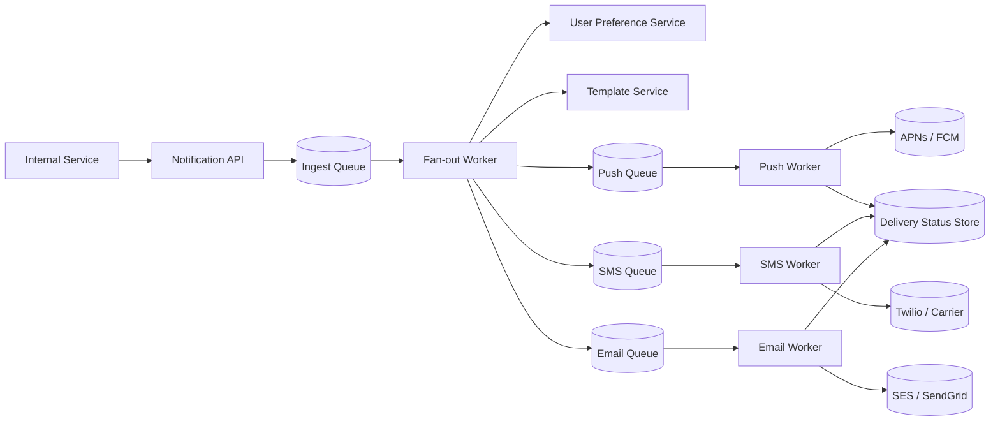
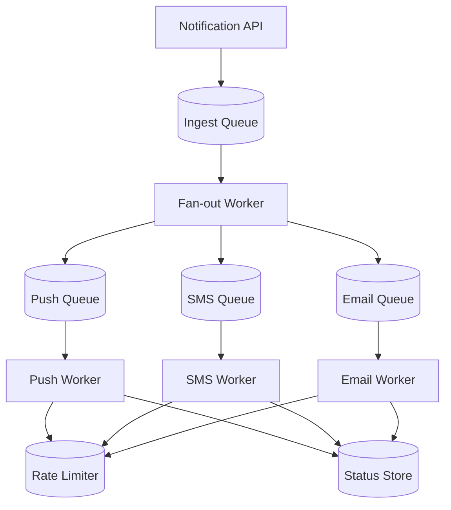
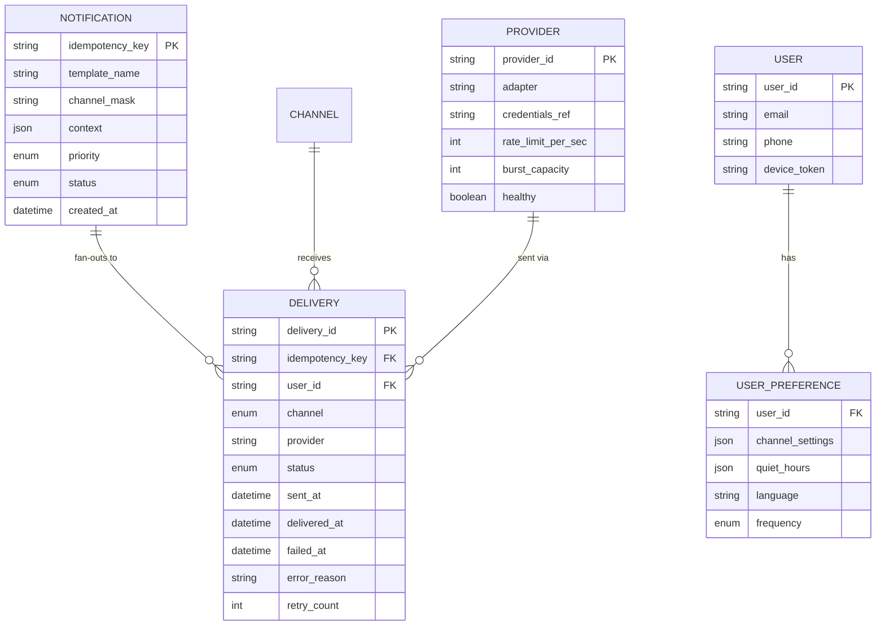
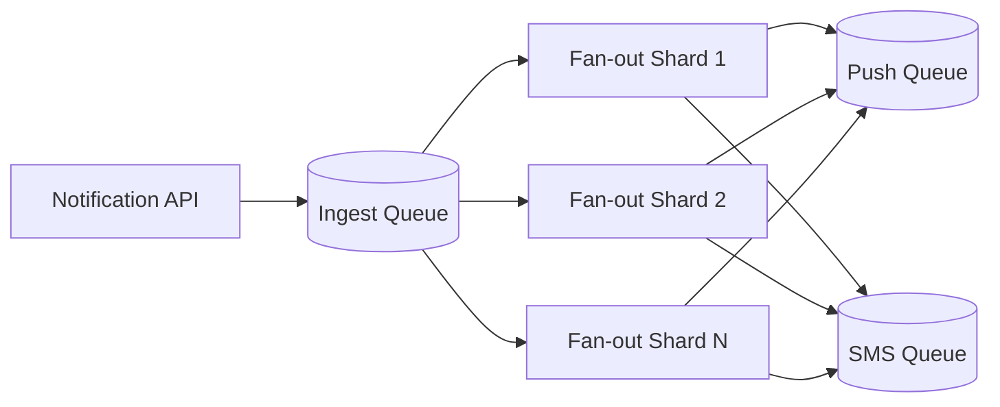
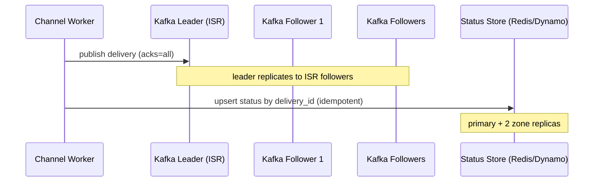
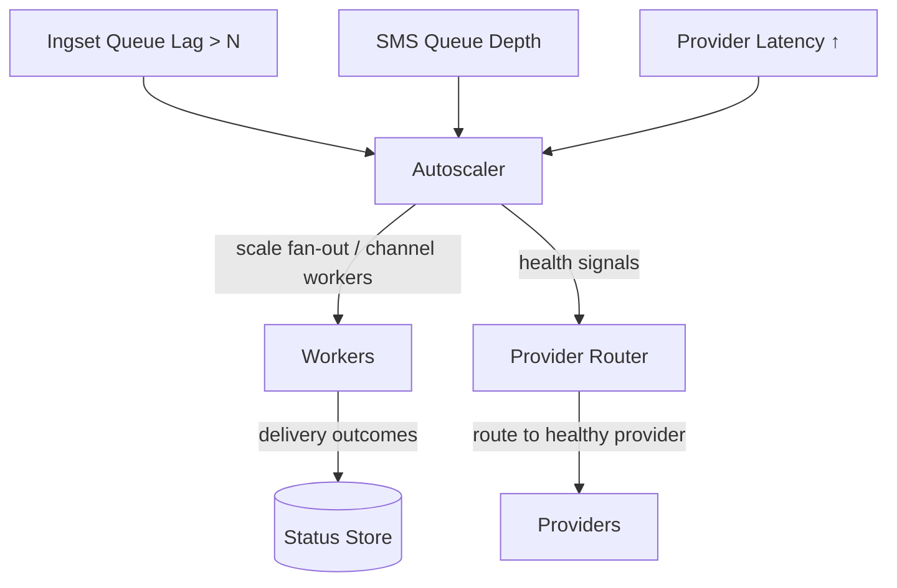
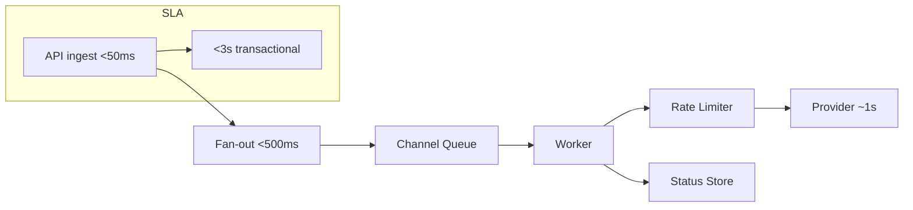
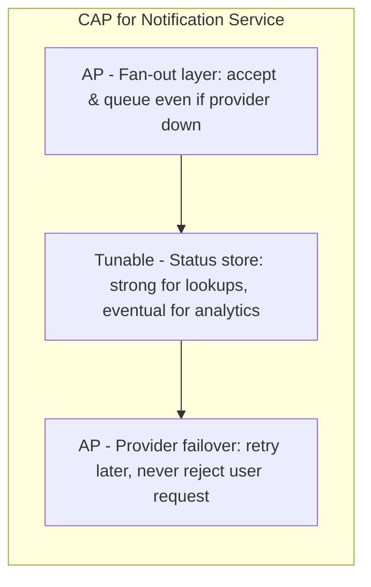
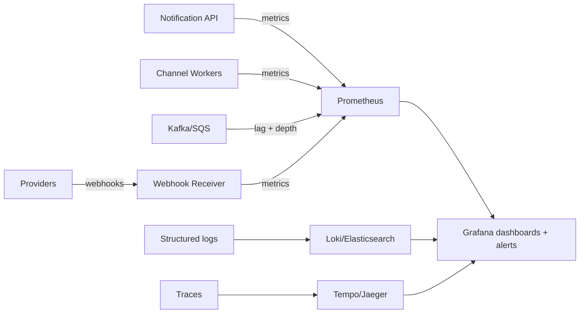

# Design a Notification Service That Fans Out Across Push, SMS, and Email

> A notification fan-out service accepts a single logical notification and reliably delivers it across multiple channels — push, SMS, email, and in-app — respecting per-user channel preferences, provider rate limits, and delivery guarantees. This document covers the full design, from fan-out architecture and idempotency to provider failover, observability, and a Spring Boot reference implementation.

## Blogs and websites

## Medium

## Youtube

## Theory

### Topics Covered

1. [Introduction / Problem Statement](#introduction-problem-statement)
2. [Characteristics](#characteristics)
3. [Pros](#pros)
4. [Cons](#cons)
5. [Use Cases](#use-cases)
6. [Components](#components)
7. [Architectural Patterns](#architectural-patterns)
8. [Benefits](#benefits)
9. [Challenges](#challenges)
10. [Best Practices](#best-practices)
11. [When to Use / When Not to Use](#when-to-use-when-not-to-use)
12. [Data Model and API](#data-model-and-api)
13. [Fan-out, Delivery, and Scheduling Patterns](#fan-out-delivery-and-scheduling-patterns)
14. [Replication Strategies](#replication-strategies)
15. [Failure Detection and Membership](#failure-detection-and-membership)
16. [High Availability and Scalability](#high-availability-and-scalability)
17. [Performance and Optimization](#performance-and-optimization)
18. [CAP Theorem and Consistency Trade-offs](#cap-theorem-and-consistency-trade-offs)
19. [Encryption and Key Management](#encryption-and-key-management)
20. [Authentication and Authorization](#authentication-and-authorization)
21. [Security Threats and Mitigations](#security-threats-and-mitigations)
22. [Observability and Logging](#observability-and-logging)
23. [Real-World Implementations](#real-world-implementations)
24. [Java and Spring Boot Implementation Guide](#java-and-spring-boot-implementation-guide)
25. [Interview Questions and Answers](#interview-questions-and-answers)

---

### Introduction / Problem Statement

A notification fan-out service accepts a single logical notification request — *"user X liked your photo"* — and reliably delivers it across multiple channels: push notifications (mobile), SMS, email, and in-app notifications. It resolves each recipient's channel preferences, renders channel-specific content from a shared template, enforces per-provider rate limits and quiet hours, retries transient failures, and tracks delivery status (sent / delivered / failed / bounced) per recipient per channel.


*Diagram: Notification fan-out architecture. A single API request is enqueued, then a fan-out worker resolves recipients and preferences, renders templates, and dispatches one message per channel to independent queues consumed by dedicated channel workers.*

**Problem Statement:** Design a notification service that accepts a single logical notification request and reliably fans it out across multiple channels (push, SMS, email, in-app), respecting user preferences, provider rate limits, quiet hours, and delivery guarantees, at very large scale — e.g., a marketing campaign or viral event reaching tens of millions of users within minutes.

**Real-life use cases**

- **Social notifications**: likes, comments, and mentions delivered across push, email, and SMS based on user-configurable channel preferences.
- **E-commerce**: order confirmations, shipping updates, and delivery alerts where SMS is critical for delivery status and push/email are cheaper fallbacks.
- **Ride-sharing / logistics**: trip status, driver arrival, and ride completion across push and SMS — time-sensitive and geography-dependent.
- **SaaS / platform alerts**: security events, billing notices, and feature updates routed by user role and preferred channel.

---

### Characteristics

| Characteristic | What it means | Why it matters | How it works |
|---|---|---|---|
| **Multi-channel fan-out** | One logical request → deliver across push, SMS, email, in-app | Users receive on their preferred channels | Channel resolvers route to the correct provider per recipient |
| **Idempotency** | Retries never cause duplicate deliveries | Critical for SMS (per-message charges) and email (spam complaints) | Idempotency key checked before every provider call via atomic `SETNX` |
| **Burst absorption** | Millions of notifications buffered instantly | Prevents provider rate-limit bans; smooths load | Persistent queues with backpressure before the fan-out layer |
| **Provider abstraction** | Unified interface over APNs, FCM, Twilio, SendGrid, WhatsApp | Swap providers per region without touching core logic | Adapter/strategy pattern per provider |
| **User preferences** | Per-user channel, quiet hours, language | Respects user choice → higher engagement | Preference store consulted at fan-out time, cached for hot users |
| **Delivery tracking** | Track sent / delivered / failed / bounced per recipient per channel | Analytics, debugging, provider health | Status store updated by workers and provider webhooks |
| **Priority isolation** | Transactional (OTP, orders) vs. bulk (campaigns) | Transactional must arrive in seconds; bulk can be hours | Separate priority queues / Kafka topics per priority tier |

---

### Pros

- **Reliability**: Persistent queues with retries and dead-letter queues ensure eventual delivery; crash recovery never loses a chargeable SMS.
- **Scalability**: Fan-out is stateless and scales horizontally; per-channel queues and workers scale independently to match very different provider throughput caps.
- **Extensibility**: New channels (WhatsApp, Slack) or providers are added through adapter beans — the core fan-out logic is untouched.
- **Preference management**: Centralized user settings with quiet hours and channel ranking, cached for hot recipients.
- **Observability**: End-to-end tracing of one logical notification across all physical deliveries; per-channel and per-provider success/failure dashboards.
- **Cost optimization**: Free push is preferred over paid SMS; provider routing picks the cheapest capable provider per region and carrier.
- **Idempotency**: A single idempotency key covers the entire fan-out, so retry storms during outages never duplicate sends.

---

### Cons

- **Operational complexity**: Separate ingest, per-channel queues, fan-out workers, channel workers, status store, rate limiter, and preference service — a much larger fleet than direct provider calls.
- **Latency**: Multi-hop path (API → ingest queue → fan-out → channel queue → worker → provider) adds tens to hundreds of milliseconds versus direct provider calls.
- **Debugging**: Tracing one logical notification across recipients, channels, retries, and providers requires careful correlation IDs and distributed tracing.
- **Cost at scale**: Tens of millions of notifications per day across multiple queues, status storage, and monitoring is a non-trivial infrastructure bill.
- **At-least-once semantics**: Exactly-once delivery is impossible across distributed providers; duplicates are possible if an idempotency key expires mid-retry (mitigated, not eliminated).
- **Provider coupling**: Each adapter depends on a third-party SDK/API that changes on its own schedule, requiring ongoing maintenance.

---

### Use Cases

#### Social Media Likes and Comments (Facebook / Instagram)

- **Problem**: Notify a user when someone likes their post, comments, or mentions them — across push, email, and SMS.
- **Solution**: Centralized notification service with per-user preference management and a shared template rendered per channel.
- **Scale**: High volume (millions per hour), multi-channel, reliability matters but not hard-real-time.
- **How it works**: (1) User action → event → notification service → resolve recipient preferences → render template → enqueue to channel queues. (2) For high-profile users, cap email volume (spam risk); for regular users, use all channels. (3) Track opens and adjust frequency to fight notification fatigue.
- **Trade-offs**: Risk of notification fatigue (too many alerts) and email spam complaints → unsubscribe links and frequency capping are mandatory.

#### E-commerce Order Updates (Amazon / Zepto)

- **Problem**: Notify customers at critical funnel steps — order placed → shipped → out for delivery → delivered.
- **Solution**: Transactional notification service with a high-priority queue, SMS for delivery updates (must be received), push/email as cheaper fallbacks.
- **Scale**: Moderate-to-high volume tied to order rate, with strong urgency on delivery steps.
- **How it works**: (1) Order placed → notification service → push + SMS ("Order confirmed"). (2) Shipped → push + SMS with tracking link. (3) Out for delivery → SMS. (4) Delivered → push. Retries use exponential backoff with jitter.
- **Trade-offs**: SMS costs (~$0.01/message) add up; delivery-receipt tracking is needed; international SMS reliability varies by carrier.

#### Ride-Sharing Trip Status (Uber / Lyft)

- **Problem**: Time-sensitive trip events — driver assigned, arrival, pickup, drop-off — delivered while the user may be offline on push.
- **Solution**: SMS as a guaranteed channel (works without an app/open port) plus push when the app is in the foreground; quiet hours respected for non-critical updates.
- **Scale**: Geographically bursty (rush hours in dense cities), geography-dependent provider routing.
- **How it works**: Driver assigned → SMS + push; arrival → push (high read rate when app open); drop-off → push prompt to rate + SMS receipt for cash-pay regions.
- **Trade-offs**: SMS is expensive but necessary when push can't be trusted; per-region provider selection balances cost and deliverability.

#### SaaS / Platform Alerts (Security and Billing)

- **Problem**: Security events (login from new device), billing notices (invoice ready, payment failed), and feature updates must reach the right people on the right channel.
- **Solution**: Role-based routing plus channel preference; high-priority for security, medium for billing, low for announcements.
- **Scale**: Low-to-moderate volume but high urgency and compliance requirements (audit logs).
- **How it works**: An admin setting an invoice-due alert → email (to billing contact) + in-app banner; a security event → SMS + email immediately, suppressed during quiet hours only if non-critical.
- **Trade-offs**: Compliance requires auditable delivery logs; user-controlled opt-outs must be honored and provable.

---

### Components

| Component | Purpose | Responsibilities | Relationship | Real-world Example |
|---|---|---|---|---|
| **Notification API** | Accept requests from internal services | Validate request, assign idempotency key, enqueue | Internal APIs → ingest queue | Twilio Notify API |
| **Ingest Queue** | Buffer incoming notifications | Queue all requests before fan-out | API → Fan-out Worker | Kafka / SQS |
| **Fan-out Worker** | Resolve recipients + channels | Expand recipient list, check preferences, render template, enqueue per channel | Reads from ingest queue, writes to channel queues | Custom worker service |
| **Template Service** | Render channel-specific content | Render templates (push payload, SMS text, email HTML) | Fan-out Worker → channel queues | Handlebars / Jinja2 |
| **Preference Service** | Resolve user channel settings | Preferred channels, quiet hours, language | Fan-out Worker checks preferences per recipient | User preference DB |
| **Push Worker** | Deliver push notifications | Call APNs (iOS) / FCM (Android), handle responses | Push queue → APNs/FCM → status store | Firebase Admin SDK |
| **SMS Worker** | Deliver SMS messages | Call Twilio/SMS gateway, handle delivery receipts | SMS queue → Twilio → status store | Twilio API client |
| **Email Worker** | Deliver emails | Call SES/SendGrid, handle bounces/complaints | Email queue → SES → status store | SES SMTP / SendGrid API |
| **Status Store** | Track per-message delivery status | sent, delivered, failed, bounced, opened | All channel workers update status | Redis / DynamoDB |
| **Rate Limiter** | Throttle per provider | Token buckets per provider/API key | Workers check rate limiter before sending | Redis token bucket |

---
### Architectural Patterns

#### Queue-per-channel fan-out

- **What**: Separate the *fan-out* step (deciding who gets what, on which channels, given which preferences) from the *delivery* step (calling a specific provider's API). Each step has its own queue and worker pool.
- **Problem solved**: A slow or rate-limited provider (e.g., SMS throttled by a carrier) cannot block faster channels (push, email). Bulk campaigns cannot delay transactional notifications.
- **How it works**: (1) API → ingest queue. (2) Fan-out Worker dequeues → resolves recipients → checks preferences → renders template → enqueues to channel-specific queues (Push Queue, SMS Queue, Email Queue). (3) Channel Workers process independently, each scaling to match its provider's throughput ceiling. (4) Status updates are written to the Status Store.
- **When to use**: Multi-channel delivery at any meaningful scale.
- **When not to use**: Single-channel, low-volume traffic — direct provider calls are simpler.
- **Advantages**: Isolation of failure and backpressure per channel; independent scaling; clean separation of concerns.
- **Disadvantages**: More queues and services to operate; delivery status is eventually consistent.


*Diagram: Queue-per-channel isolation. The fan-out worker fans out to three independent channel queues; each channel worker checks a shared rate limiter before calling its provider and records delivery status. A saturated SMS queue therefore cannot block push or email.*

The fan-out worker itself is a stateless Spring `@Service` that resolves preferences, renders templates, and publishes one `ChannelMessage` per eligible channel:

```java
@Service
public class FanoutService {

    private final PreferenceService preferenceService;
    private final TemplateService templateService;
    private final Map<Channel, ChannelQueuePublisher> channelQueues;

    public void fanout(NotificationRequest request) {
        List<Recipient> recipients = request.recipients();
        recipients.parallelStream().forEach(recipient -> {
            UserPreference pref = preferenceService.getPreferences(recipient.userId());
            Set<Channel> channels = pref.preferredChannels(request.category());
            String rendered = templateService.render(request.template(), recipient);
            for (Channel channel : channels) {
                channelQueues.get(channel).publish(
                    new ChannelMessage(request.idempotencyKey(), recipient, channel,
                                       rendered, request.priority()));
            }
        });
    }
}
```
*The `FanoutService` bean resolves per-recipient preferences, renders a shared template once per recipient, and publishes a separate `ChannelMessage` to each eligible channel queue. `parallelStream` provides intra-request concurrency; the channel queues give inter-stage decoupling.*

#### Priority queuing (transactional vs. bulk)

Transactional notifications (OTP, order updates, security alerts) must arrive in seconds; bulk campaigns (marketing, digests) can be delivered over minutes or hours. Separate priority tiers keep urgent traffic ahead of bulk:

```yaml
# One Kafka topic per priority tier (or SQS queues with priority)
topics:
  - notification.transactional   # P0 — OTP, order updates, alerts
  - notification.bulk            # P1 — marketing campaigns
  - notification.retry           # P2 — failed deliveries being retried
```
*Configuration: one queue per priority tier. Workers consume transactional messages first and only drain bulk queues when transactional queues are empty, so a viral campaign can never bury an OTP.*

Workers consume transactionally-priority first; only when that queue is empty do they drain bulk, guaranteeing OTPs are processed ahead of campaigns.

#### Single-flight / request coalescing

When a viral notification is fanned out to millions of recipients, the same template may be rendered millions of times. Coalescing identical renders and de-duplicating provider sends prevents thundering-herd load on the template engine and on providers.

#### At-least-once delivery with idempotency

Every notification request carries an idempotency key. Before each provider call, the channel worker performs an atomic `SETNX` on `dedup:{channel}:{idempotencyKey}`. If the key already exists, the send is skipped. The dedup key is stored with a TTL longer than the expected delivery window (e.g., 2 hours), so a worker crash and recovery never double-sends a chargeable SMS.

#### Circuit breaker per provider

If a provider (e.g., an SMS carrier) starts returning errors or timeouts, a circuit breaker opens to fail fast and re-route or back-pressure instead of hammering the failing provider. Half-open probing lets it close automatically when the provider recovers.

---

### Benefits

- **Unified interface**: Any internal service can send notifications through one API — no need to integrate APNs, FCM, Twilio, or SendGrid separately.
- **Channel orchestration**: Delivery happens on the user's preferred channel(s) automatically, respecting quiet hours and language.
- **Delivery analytics**: End-to-end tracking of delivery, open, and failure rates per channel and per provider — enabling provider routing optimization.
- **Cost optimization**: Free push is preferred over paid SMS; failed pushes can be retried via email (cheaper than SMS).
- **Resilience**: A failure in one channel (e.g., FCM down) does not affect other channels; cross-provider and cross-channel failover is possible.
- **Compliance and audit**: Centralized delivery logs support GDPR right-to-be-forgotten erasure and regulatory retention policies.

---

### Challenges

#### Technical challenges

- **Idempotency implementation**: A fast, distributed dedup mechanism (Redis `SETNX` with short TTL) is required — and the TTL-race case (key expires before delivery completes) must be handled with provider-side dedup where available.
- **Template rendering complexity**: Email HTML, push payload, and SMS text must derive from one template while supporting localization (15+ languages) and per-channel character-set constraints.
- **Delivery status synchronization**: Providers return delivery receipts asynchronously (webhook vs. polling) and out of order — the system must reconcile them by `delivery_id`.
- **Provider SDKs**: Each provider (APNs, FCM, Twilio, SendGrid) has a different SDK, API shape, and version — adapters must abstract this.

#### Scalability challenges

- **Burst absorption**: A viral event (e.g., a post liked by 1M people) can mean millions of fan-out operations in seconds. The ingest queue must buffer without OOM and the fan-out workers must scale out on demand.
- **Fan-out amplification**: One campaign to 10M users × 2 channels (push + email) = 20M messages. Fan-out workers must be sharded and parallel.
- **Preference resolution**: Checking the preference store for millions of recipients per campaign — preferences must be cached and batch-queried.
- **Rate-limit coordination**: 10M messages to FCM must be throttled to the provider's ceiling → many workers × low per-worker rate each.

#### Performance challenges

- **End-to-end delivery time**: Transactional notifications must arrive in under ~5 seconds, so fan-out plus delivery must complete well under that.
- **Template rendering**: Rendering millions of localized emails is CPU-intensive → pre-render common templates and cache rendered fragments.
- **Queue depth**: A deep ingest queue can bury transactional traffic under bulk → priority queues are mandatory, not optional.

#### Reliability challenges

- **Provider outages**: If FCM is down, push routing must fall back to APNs (cross-platform) or, for critical messages, to SMS/email.
- **Queue durability**: The ingest queue must not lose messages — use replicated partitions (Kafka) or durable queues (SQS/RabbitMQ).
- **Duplicate delivery**: At-least-once means duplicates are possible — idempotency keys prevent them, but key-TTL expiry during retry is an edge case.
- **Webhook replay**: Providers may replay delivery receipts — the status store must be idempotent on `delivery_id`.

#### Maintainability challenges

- **Provider versioning**: APNs protocol changes annually; FCM deprecates APIs; Twilio revises SMS pricing — adapters need continuous updates and tests.
- **Template management**: Thousands of templates across features need versioning, A/B testing, and an approval workflow.
- **Regional providers**: Different countries use different SMS providers (Twilio coverage is incomplete) → per-region provider routing tables.

#### Operational challenges

- **Monitoring**: Track delivery success/failure rates per channel and per provider; alert on sudden drops.
- **Queue management**: Monitor queue depth and age of the oldest message; auto-scale workers.
- **Credential rotation**: Rotate API keys/secrets for 4–5 providers; handle certificate expiration and webhook-secret rotation.

#### Security concerns

- **PII in notifications**: Phone numbers, email addresses, and user metadata must be encrypted at rest and in transit.
- **Notification spam**: Malicious or buggy internal services could spam users — per-service rate limiting and quota enforcement are required.
- **Webhook verification**: Delivery receipts from providers must be verified (HMAC signature) before updating status.
- **Template injection**: User-controlled data interpolated into templates can cause XSS in email — sanitize and escape rigorously.

---

### Best Practices

- **Idempotency keys**: Use UUIDs assigned at the API layer; store dedup state in Redis with a TTL of 1–2× the maximum expected delivery window; check atomically (`SETNX`) before every provider call.
- **Separate queues per channel**: Isolate push, SMS, and email so a slow or rate-limited provider cannot block the others.
- **Priority queues**: Keep transactional traffic (OTP, order updates) ahead of bulk campaigns so urgent messages are never buried.
- **Token-bucket rate limiting**: Per-provider token buckets in Redis prevent `429 Too Many Requests` errors and provider bans.
- **Exponential backoff with jitter**: For retries, jitter prevents synchronized retry storms when a provider recovers.
- **Dead-letter queues**: Messages that exhaust retries land in a DLQ for inspection rather than retrying forever.
- **Batch sends**: Where a provider supports it (e.g., SES `BulkTemplatedEmail`), batch recipients per provider call to reduce API overhead.
- **Provider health monitoring**: Track success rate and latency per provider; auto-fallback when a provider degrades.
- **Circuit breakers**: When a provider fails repeatedly, open the circuit to fail fast and avoid cascading latency.

---

### When to Use / When Not to Use

**Use it when**

- Your application must deliver messages to users across multiple channels (push, SMS, email, in-app).
- Message reliability is critical (OTPs, order confirmations, password resets) and you cannot afford to lose a delivery.
- You have high or bursty notification volume (viral events, marketing campaigns) that would overwhelm direct provider calls.
- You need delivery analytics, debugging, and provider health visibility across channels.
- You want to centralize notification logic — preferences, retry, and routing — instead of spreading it across application code.

**Avoid it when**

- You only need a single channel (e.g., a push-only mobile app) — direct provider integration is simpler.
- Volume is low (< 10K/day) — the queue and worker infrastructure is not justified.
- Latency is absolutely critical (< 1 second) — the queue hops add unavoidable delay.
- Messages must be sent in strict, non-batched batches and cannot tolerate asynchronous delivery.

**Alternatives**

- **Direct provider integration**: Each service calls APNs/FCM/Twilio directly — simpler but no shared logic or analytics.
- **Email service provider (ESP) templates**: SendGrid/SES templates — suitable for email-only use cases.
- **Managed multi-channel platforms**: Firebase (push + topic messaging), OneSignal, Twilio Notify — less control but less to operate.
- **In-app notifications only**: For non-urgent messages, skip push/SMS/email entirely.

**Decision factors**

- **Channels needed**: Single (→ direct) vs. multi (→ fan-out service).
- **Volume**: Low (→ managed) vs. high or bursty (→ custom queue-based).
- **Reliability**: Best-effort (→ ESP) vs. guaranteed delivery (→ queue + retry + DLQ).
- **Team size**: Small team (→ managed) vs. large team (→ custom).

---

### Data Model and API

A notification system stores four logical entity classes: the logical notification request, the per-recipient per-channel delivery attempt, the user's preference profile, and a provider credential/routing record. The diagram below models the fan-out relationship and the delivery lifecycle.


*Entity-relationship: one `NOTIFICATION` fans out into many `DELIVERY` rows (one per recipient per channel); each delivery is sent via one `PROVIDER` and targets one `CHANNEL`. `USER_PREFERENCE` is consulted at fan-out time and cached for hot users.*

The data lifecycle balances cost and queryability: notification request records are retained for 30 days for audit; per-delivery status rows are retained 7 days for debugging; dedup keys have a TTL of 2 hours (covering the longest retry schedule); and user preferences are persisted long-term. The `DELIVERY.status` enum drives the retry state machine: `pending → sending → sent/delivered/failed`, where `failed` with `retry_count < max` re-enqueues to the retry topic. Optimistic locking is enforced with a `@Version` column on `DELIVERY` so concurrent webhook updates and worker retries never clobber each other.

**API contract**

| Method | Endpoint | Description |
|---|---|---|
| POST | `/api/v1/notifications` | Submit a notification request (single or batch) |
| GET | `/api/v1/notifications/{idempotencyKey}` | Get delivery status for a notification |
| POST | `/api/v1/notifications/batch` | Submit a bulk notification campaign |
| GET | `/api/v1/preferences/{userId}` | Get a user's channel preferences |
| PUT | `/api/v1/preferences/{userId}` | Update a user's channel preferences |
| GET | `/api/v1/metrics` | Aggregate delivery metrics for dashboards |

**Headers**: `Authorization: Bearer <token>`, `Idempotency-Key: <UUID>` (required for POST).

**Request body (single)** — a Spring Boot controller accepts a validated record:

```java
public record NotificationRequest(
        @NotBlank String idempotencyKey,
        @NotBlank String template,
        @NotEmpty List<Channel> channels,
        @NotEmpty List<Recipient> recipients,
        @NotBlank String category,
        Priority priority,
        Map<String, Object> context) {}
```
*This DTO record uses `@Valid` constraints (`@NotBlank`, `@NotEmpty`) so malformed requests are rejected before reaching the fan-out layer. Using a `record` makes the contract immutable and serializable. `Channel` and `Priority` are enums; `Recipient` is a nested record.*

**Response:** `202 Accepted` with `{"idempotencyKey": "...", "status": "accepted", "channelCount": 2}`.

**Status codes**

- `202 Accepted` — Request enqueued for processing.
- `400 Bad Request` — Invalid template, missing fields (violations returned under the `@ControllerAdvice`).
- `401 Unauthorized` — Invalid or missing bearer token.
- `409 Conflict` — Duplicate idempotency key already processed.
- `429 Too Many Requests` — Service overloaded; retry after `Retry-After`.

**Error response** — returned by the global exception handler:

```java
@RestControllerAdvice
public class NotificationControllerAdvice {

    @ExceptionHandler(NotificationRequestException.class)
    public ResponseEntity<ApiError> handleBadRequest(NotificationRequestException ex) {
        ApiError error = new ApiError(ex.getCode(), ex.getMessage(), ex.getTimestamp());
        return ResponseEntity.status(HttpStatus.BAD_REQUEST).body(error);
    }

    @ExceptionHandler(DuplicateKeyException.class)
    public ResponseEntity<ApiError> handleDuplicate(DuplicateKeyException ex) {
        ApiError error = new ApiError("duplicate_idempotency_key", ex.getMessage(), ex.getTimestamp());
        return ResponseEntity.status(HttpStatus.CONFLICT).body(error);
    }
}
```
*The `NotificationControllerAdvice` (a `@RestControllerAdvice` bean) centralizes error handling: `400` for invalid requests, `409` for duplicate idempotency keys, and a consistent `ApiError` JSON shape with a code, message, and timestamp. This keeps controllers thin and gives clients a uniform error contract.*

---

### Fan-out, Delivery, and Scheduling Patterns

This section collects the domain-specific techniques that make notification fan-out reliable and economical at scale: how a single request is expanded into per-recipient, per-channel deliveries; how each channel's quirks are abstracted; how templates and scheduling are handled; and how rate limiting, retries, and failover keep providers healthy.

#### Fan-out Strategies

Fan-out strategies decide *how* a single notification request is expanded into per-recipient, per-channel messages, and *when* each step happens.

**Synchronous validation, asynchronous fan-out.** The API validates the request (template exists, recipients well-formed, idempotency key unique) synchronously and returns `202 Accepted` immediately, then enqueues the request to the ingest queue. Actual recipient expansion happens in a fan-out worker, so the API never blocks on provider I/O.

**Sharded batch fan-out.** For a campaign to many users, the recipient list is sharded by `hash(userId) % N` so N fan-out worker shards can expand in parallel. Each shard publishes its slice of `ChannelMessage` records to the channel queues. This turns one huge fan-out into N independent parallel fan-outs and keeps a single worker from becoming a bottleneck.


*Diagram: Sharded fan-out. The ingest queue is consumed by N parallel fan-out shards, each expanding its slice of recipients and publishing to the shared per-channel queues. Parallelism scales with the number of shards.*

**Per-recipient ordering.** A recipient's messages across channels are correlated by a single idempotency key. Per-recipient ordering is preserved by hashing `(idempotencyKey, channel)` to a deterministic channel-queue partition; cross-recipient ordering is not meaningful and need not be guaranteed.

The sharded fan-out coordinator is a stateless `@Service`; each shard pulls a batch of requests, expands recipients, and publishes. Idempotency is checked once per request at the API layer, so retries after a crash never re-fan-out an entire campaign.

#### Delivery Channels

Each channel has distinct reliability, cost, and formatting characteristics that the worker layer must abstract so the core fan-out never needs to know.

**Push notifications** — APNs (iOS) and FCM (Android). Delivery is free and high-throughput, but a token can become invalid (app uninstalled) — providers return `Unregistered`/`InvalidRegistration`, and the worker must deactivate the token to avoid repeated failures. Payloads are small (≤4 KB) and support collapse keys so a burst of updates for one device delivers only the latest. APNs uses HTTP/2 with certificates/keys; FCM uses a server API key.

**SMS** — Twilio and carrier gateways. Charged per message, so idempotency is non-negotiable. Long codes are ~1 msg/sec; short codes and alphanumeric sender IDs reach 100+ msg/sec. Delivery receipts are carrier-dependent and asynchronous. International delivery requires a regional provider with a local sender ID (Twilio coverage is incomplete in some countries).

**Email** — SES, SendGrid. Supports rich HTML, attachments, and tracking pixels for opens. Bounces and complaints arrive via webhooks (SES SNS, SendGrid event webhooks) and must be reconciled against the status store to keep sender reputation healthy. SPF/DKIM/DMARC must be configured to avoid spam folders.

**In-app notifications** — stored in the application database and pushed to connected clients over WebSocket or delivered via push as a fallback. Supports read/unread state, batch fetch, and dismissal. Has no third-party provider but shares the same fan-out and templating pipeline.

```java
@Component
public class PushNotificationWorker {

    private final PushProvider pushProvider;
    private final IdempotencyService idempotency;
    private final StatusStore statusStore;
    private final TokenBlacklist tokenBlacklist;

    @RabbitListener(queues = "push.queue", concurrency = "20")
    public void deliver(ChannelMessage message) {
        String dedupKey = "push:dedup:" + message.idempotencyKey();
        if (!idempotency.checkAndMark(dedupKey, Duration.ofHours(2))) {
            return; // duplicate send skipped
        }
        try {
            PushResponse response = pushProvider.send(message.recipient().deviceToken(),
                                                       message.content(),
                                                       message.collapseKey());
            statusStore.update(message.deliveryId(), "sent", response.providerMessageId());
        } catch (InvalidTokenException ex) {
            tokenBlacklist.deactivate(message.recipient().deviceToken());
            statusStore.update(message.deliveryId(), "failed", "invalid_token");
        } catch (ProviderException ex) {
            statusStore.update(message.deliveryId(), "failed", ex.getMessage());
            // re-enqueued to the retry topic by the caller / framework
        }
    }
}
```
*The `PushNotificationWorker` (a `@Component` with `@RabbitListener`) is the canonical channel worker. It checks idempotency first, deactivates invalid tokens on `InvalidTokenException`, records success/failure in the status store, and relies on the framework to re-enqueue failures to a retry topic. `concurrency = "20"` runs 20 concurrent consumers per instance.*

---

#### Templates and Content Rendering

A single logical notification is rendered into channel-specific payloads: a push JSON payload (≤4 KB with a collapse key), SMS text (≤160 chars per GSM-7 segment, 70 chars per UCS-2 segment), and email HTML (with inline CSS, images, and tracked links). The template store keeps one template per `(templateName, channel, locale)` variant plus an `en` fallback. Localization selects the recipient's locale from preferences; per-channel size limits are enforced at render time, and a too-long SMS is truncated with a suffix indicator. For viral campaigns, rendered fragments are cached per recipient so identical personalization (e.g., "user A mentioned you") is computed once.

The rendering pipeline: (1) resolve recipient locale; (2) load the best-available template, falling back to `en`; (3) render with Mustache (HTML-escaped); (4) sanitize for the channel; (5) build the channel-specific payload.

```java
@Service
public class TemplateService {

    private final TemplateRepository repository;
    private final Cache<String, RenderedTemplate> renderCache;
    private final HtmlSanitizer sanitizer;

    public RenderedTemplate render(String templateName, Channel channel,
                                   Recipient recipient, Map<String, Object> context) {
        Locale locale = recipient.locale();
        String cacheKey = templateName + ":" + channel + ":" + locale + ":" + recipient.userId();
        RenderedTemplate cached = renderCache.getIfPresent(cacheKey);
        if (cached != null) return cached;

        Template template = repository.findBy(templateName, channel, locale)
                .orElseGet(() -> repository.findBy(templateName, channel, Locale.ENGLISH));
        String rendered = Mustache.compiler()
                .escapeHTML(true)
                .compile(template.source(), templateName)
                .render(enrichContext(context, recipient)));
        RenderedTemplate result = buildForChannel(channel, sanitizer.sanitize(rendered));
        renderCache.put(cacheKey, result);
        return result;
    }
}
```
*The `TemplateService` bean resolves a localized, channel-specific template, renders it with Mustache (HTML-escaping on), sanitizes the output, and caches the result per recipient so viral fan-outs never recompute identical renders. Falling back to the English default keeps delivery working even when a locale is missing.*

#### Scheduling and Quiet Hours

Notifications can be immediate (transactional) or scheduled (marketing drip campaigns, future reminders). A `scheduledAt` timestamp places the message in a delay queue (a Kafka topic partitioned by fire-time, or an SQS delay queue) and channel workers consume it only once the time arrives. Quiet hours are per-user windows stored in preferences: if `now` falls inside a recipient's quiet-hours window (timezone-aware), delivery is deferred to the next open slot. Crucially, scheduling never blocks fan-out — the fan-out worker records a `scheduled` row and a background scheduler publishes to channel queues when the time comes.

```java
@Service
public class SchedulingService {

    private final NotificationRepository repository;
    private final ChannelQueuePublisher channelQueues;
    private final PreferenceService preferenceService;
    private final Clock clock;

    @Scheduled(fixedDelay = 5_000)
    public void dispatchDueNotifications() {
        List<ScheduledNotification> due = repository.findDue(clock.instant(),
                PageRequest.of(0, 1000));
        for (ScheduledNotification scheduled : due) {
            UserPreference pref = preferenceService.getPreferences(scheduled.userId());
            if (pref.isInQuietHours(clock.instant())) {
                continue; // leave it for the next sweep — respects the user's window
            }
            channelQueues.get(scheduled.channel())
                         .publish(toChannelMessage(scheduled));
            repository.markDispatched(scheduled.id());
        }
    }
}
```
*The `SchedulingService` bean periodically scans for due notifications. It skips any recipient currently inside their quiet-hours window (leaving the row for the next sweep) and otherwise publishes a normal `ChannelMessage` to the channel queue, decoupling scheduling from fan-out so quiet hours never block campaign creation.*

#### Idempotency and Deduplication

At-least-once delivery across queues and retries means a message can be processed more than once. Idempotency is enforced with a per-key dedup store: each `ChannelMessage` carries the original request's `idempotencyKey`, and the worker performs an atomic `SETNX dedup:{channel}:{idempotencyKey} "1" EX 7200` before calling the provider. If the key already exists, the send is skipped. The TTL (here 2 hours) must comfortably exceed the maximum retry schedule. Where a provider offers native idempotency keys (Twilio), those are used as a second layer so a Redis-TTL expiry mid-retry still cannot double-charge.

#### Provider Rate Limiting

Each provider enforces a per-key/per-account rate limit (e.g., FCM ≈ 1,000 msg/sec, Twilio ~1 msg/sec on a long code, SES 14 msg/sec per connection). A Redis token-bucket rate limiter gives each worker a deterministic share: tokens refill at `rate` per millisecond and the bucket holds `capacity` (burst); each send consumes one token, and a failed `tryAcquire` re-enqueues the message with backoff.

```java
@Service
public class TokenBucketRateLimiter {

    private static final String SCRIPT =
        """
        local key = KEYS[1]
        local now = tonumber(ARGV[1])
        local ratePerMs = tonumber(ARGV[2])
        local capacity = tonumber(ARGV[3])
        local requested = tonumber(ARGV[4])
        local bucket = redis.call('HMGET', key, 'tokens', 'timestamp')
        local tokens = tonumber(bucket[1]) or capacity
        local timestamp = tonumber(bucket[2]) or 0
        local delta = math.max(0, now - timestamp)
        tokens = math.min(capacity, tokens + delta * ratePerMs)
        if tokens < requested then
            redis.call('HMSET', key, 'tokens', tokens, 'timestamp', now)
            redis.call('PEXPIRE', key, 60000)
            return 0
        end
        tokens = tokens - requested
        redis.call('HMSET', key, 'tokens', tokens, 'timestamp', now)
        redis.call('PEXPIRE', key, 60000)
        return 1
        """;

    private final RedisTemplate<String, String> redis;
    private final RedisScript<Long> script = RedisScript.of(Long.class, SCRIPT);
    private final Map<String, ProviderLimit> providerLimits;

    public boolean tryAcquire(String providerId, int requested) {
        long now = System.currentTimeMillis();
        ProviderLimit limit = providerLimits.get(providerId);
        return redis.execute(script, List.of("bucket:" + providerId),
                String.valueOf(now),
                String.valueOf(limit.refillTokensPerMs()),
                String.valueOf(limit.capacity()),
                String.valueOf(requested)) == 1L;
    }
}
```
*The `TokenBucketRateLimiter` bean runs an atomic Lua script in Redis that refills the bucket by elapsed wall-clock time, checks remaining capacity, and decrements in one round-trip. Because the script is atomic, hundreds of concurrent workers share a single consistent rate budget per provider; workers that fail the check re-enqueue the message with exponential backoff.*

---

#### Retry Strategies

Delivery to third-party providers is inherently unreliable: rate limits (`429`), provider outages (`5xx`, timeouts), and device-unavailable states (push to an offline device) must all be retried, but without duplicating sends. Retries are driven by a retry topic per channel with a capped attempt count (e.g., 5) and exponential backoff with **full jitter**: the delay is `random(0, base * 2^attempt)`, which spreads retries out and prevents synchronized retry storms when a provider recovers. Transient errors (429, 5xx, timeouts) retry; permanent errors (invalid token, invalid email address, message rejected) are recorded as `failed` and never retried. The `retry_count` column on `DELIVERY` is incremented atomically so the cap is enforced even under concurrent retry scheduling.

```java
@Component
public class RetryPolicy {

    private final int maxAttempts;
    private final long baseDelayMs;

    public Duration nextDelay(int attempt) {
        long ceiling = baseDelayMs * (1L << attempt); // base * 2^attempt
        long jittered = ThreadLocalRandom.current().nextLong(1, ceiling + 1); // full jitter
        return Duration.ofMillis(jittered);
    }

    public boolean shouldRetry(int retryCount, ProviderError error) {
        if (retryCount >= maxAttempts) return false;
        return switch (error.type()) {
            case RATE_LIMITED, TEMPORARY_FAILURE, TIMEOUT -> true;
            case INVALID_TOKEN, INVALID_RECIPIENT, PERMANENT_REJECTION -> false;
        };
    }
}
```
*The `RetryPolicy` `@Component` computes a jittered exponential backoff (`base * 2^attempt` with full jitter) and classifies each provider error as retryable or permanent. Workers that fail a send consult this policy to decide the next delay and whether to give up, routing exhausted messages to the dead-letter queue.*

#### Dead-Letter Queues

When a message exhausts its retry budget it is published to a dead-letter queue (per channel) for offline inspection. DLQ consumers can re-process (after a provider recovers), batch-correct (e.g., purge invalid tokens), or escalate to an alerting/dashboard system. Without a DLQ, repeated retry failures would either loop forever or silently drop messages with no audit trail.

#### Provider Failover

Providers can degrade or fail regionally (FCM global outage, a carrier blocking a Twilio number). A provider health monitor computes a rolling success rate and latency per provider; when a provider drops below a threshold, the routing table marks it unhealthy and fan-out falls back to an alternate provider in the same channel (e.g., SNS-backed SMS in India instead of Twilio; a second email provider for a region). Failover decisions are made by a `ProviderRouter` bean driven by health signals and a cost/latency ranking, and are re-evaluated continuously so traffic returns to the primary once it recovers.

#### Batching

Where a provider supports batched sends (SES `SendBulkTemplatedEmail`, SendGrid batch, Twilio Messaging Service), channel workers accumulate messages for the same provider and region into batches bounded by the provider's batch size and per-second limit. Batching reduces per-message API overhead and authentication round-trips; it is applied only within a single provider+region slice so a slow batch never delays a different region's urgent transactional traffic.

---

### Replication Strategies

Notification fan-out is stateless, but three pieces of state must survive failures and scale: the ingest and channel **queues**, the deliver **status store**, and the user **preference store**. Each is replicated differently but with the same goal — no single node failure loses a chargeable message or a delivery status.

- **Ingest / channel queues**: Kafka topics with replication factor ≥ 3 and in-sync replicas (ISR). A producer writes to the leader; followers replicate; a leader election promotes a follower if the leader fails. `acks=all` makes writes durable before acknowledging.
- **Status store**: a strongly-consistent-enough store (Redis with replicas or DynamoDB global tables) replicated across zones. Status updates from workers and provider webhooks are keyed by `delivery_id` and written idempotently so out-of-order webhook replays converge.
- **Preference store**: a primary DB (Postgres) with read replicas; hot preferences are cached in Redis with a write-through invalidation. Cache TTL is short (e.g., 5 minutes) so a preference change propagates quickly.
- **Dedup store**: Redis with replication + persistence (AOF every-sec); a lost dedup key is only a latency concern (a possible resurrection of an already-sent message), never a data-correctness concern, because the status store is the system of record.


*Diagram: Queue replication (Kafka with acks=all and ISR followers) guarantees a published delivery is not lost on leader failure; the status store is written idempotently by `delivery_id` from both workers and provider webhooks.*

### Failure Detection and Membership

Although fan-out workers are stateless, the system must detect and react to failures in providers, queues, and downstream services.

- **Provider health probing**: each channel worker reports per-provider success rate and latency; a health aggregator marks a provider `degraded`/`unhealthy` when success rate falls below a rolling threshold, driving failover.
- **Worker liveness**: workers heartbeat to the orchestrator (Kubernetes liveness/readiness probes) and to the scheduler; a worker that stops heartbeating has its in-flight acks nacked by the queue and re-delivered.
- **Queue health**: the ingest queue's consumer lag and oldest-message age are monitored; high lag triggers fan-out worker autoscaling, and stuck messages (older than a threshold) are moved to a DLQ.
- **Webhook endpoint membership**: provider webhooks POST to a load-balanced webhook receiver; the receiver group is autoscaled and health-checked, and replay requests are deduplicated by `delivery_id` (with the `@Version` row lock preventing lost updates).

---
### High Availability and Scalability

Fan-out workers are **stateless** and scale horizontally on ingest-queue consumer lag (Kafka lag metrics or SQS approximate age of oldest message). Channel workers scale per channel to match each provider's rate ceiling: few SMS workers (carrier-limited), more push and email workers. Multi-zone deployment across availability zones means a zone failure does not drop traffic; the status store and dedup store are multi-zone with synchronous replication for the status store. Transactional and bulk traffic use separate priority queues so a bulk marketing burst can never starve an OTP delivery.

Auto-scaling policies are signal-driven, not guess-driven:

- **Fan-out workers**: scale out when ingest lag > N messages or oldest-message age > 1s; scale in when lag drains.
- **Channel workers**: scale per channel-queue depth and per-provider token-bucket headroom, capped by the provider's documented ceiling.
- **Webhook receivers**: autoscale on inbound webhook rate; deduplicate by `delivery_id`.


*Diagram: The autoscaler consumes lag, queue-depth, and provider-latency signals to scale fan-out and channel workers up or down, and feeds health signals into the provider router so traffic is steered away from degraded providers.*

**Failure handling:**

- **Single worker crash**: its queue acks are held by the broker; the message is re-delivered to another worker. Idempotency keys prevent duplicates.
- **Whole zone loss**: traffic fails over to other zones; Kafka replicas in surviving zones keep serving.
- **Provider outage**: the router fails over to an alternate provider within the same channel (e.g., SNS instead of Twilio in India) and queues for retry.
- **Queue backlog**: back-pressure upstream (the API can shed or delay bulk submissions) while workers catch up; transactional queues always drain first.

---

### Performance and Optimization

Performance is measured as end-to-end delivery latency for a single logical notification and as sustainable throughput during a burst.

**Latency budget.** For transactional notifications, the target is end-to-end delivery under ~2–3 seconds. The budget allocates: API ingest (<50 ms), fan-out (<500 ms for 1–10K recipients), channel queue dequeue (<50 ms), provider call (<1 s) plus retries. Push is fastest (~100 ms); SMS/email are slower (1–5 s) and provider-dependent.

**Optimizations at each layer:**

- **Template render caching**: rendered fragments are cached per recipient; for a viral template rendered identically for many recipients, cache hits eliminate recomputation. Single-flight ensures only one worker renders a popular template while others wait.
- **Preference caching**: hot users' preferences live in Redis (read-through). Cache misses batch-fetch from the DB to avoid N+1 queries during a large fan-out.
- **Fan-out sharding**: recipient lists are sharded by `hash(userId) % N`, so fan-out scales linearly with the number of worker shards.
- **Push collapse keys**: for a rapidly updating resource (e.g., chat presence), only the latest update per device is delivered, collapsing many writes into one.
- **Batching**: email and SMS sends are batched per provider+region to reduce per-message API overhead.
- **Priority isolation**: transactional queues are consumed first; bulk never blocks transactional delivery.


*Diagram: Latency budget breakdown for a transactional notification — each hop is sized to keep end-to-end delivery under ~3 seconds, with the provider call being the dominant variable component.*

**Hot-key handling.** A single recipient receiving a burst (e.g., a celebrity's notification) can overload one channel-queue partition. Mitigation: per-recipient partition skew is bounded by consistent hashing over many partitions, and hot recipients' preferences are cached in-process (short TTL) to avoid repeated Redis round-trips.

**Backpressure.** When channel queues exceed a depth threshold, the fan-out worker slows ingestion from the ingest queue (or the API sheds bulk traffic), preventing unbounded memory growth while protecting transactional throughput.

---
### CAP Theorem and Consistency Trade-offs

The notification service spans multiple independent subsystems — ingest queues, channel queues, a status store, a preference store, and external providers — all connected by networks, so **partition tolerance is mandatory**. The design trades consistency for availability in a deliberate, workload-tuned way.

- **Fan-out layer (AP)**: a notification request is accepted and enqueued even if a channel queue or a non-critical provider is unreachable. The message is retried later, so the *request* is acknowledged with high availability, but *delivery* is asynchronous — the status is `accepted`, not `delivered`.
- **Status store**: tunable. Strong consistency is affordable for single-delivery lookups (e.g., "has this user been notified of event X?") and is useful for idempotency reconciliation; eventual consistency is used for aggregate dashboards and analytics, where a seconds-to-minutes lag is acceptable.
- **Preference store**: strong within a region (so a newly set do-not-disturb preference is honored immediately) and eventually consistent across regions (a seconds-long propagation lag is acceptable).
- **Trade-off framing**: accepting a request during a provider outage buys availability at the cost of a widened delivery latency window; rejecting it buys immediate consistency at the cost of failed API calls. The service chooses availability and surfaces the true delivery state in the status store.


*Diagram: The notification service is AP at the fan-out layer (requests are accepted and queued even when providers are down), tunable at the status store (strong reads for lookups, eventual for analytics), and AP at provider failover (retry-later instead of rejecting).*

### Encryption and Key Management

Notifications carry personally identifiable information (phone numbers, email addresses, device tokens) and behavioral context (order details, social mentions). These must be protected at rest and in transit, and provider credentials must never live in code or world-readable config maps.

#### Encryption at Rest

- **Status and preference stores**: PII fields (phone, email, device token, template context) are encrypted at the application layer with a data encryption key (DEK) before persistence. The DEK is itself encrypted by a key-encryption key (KEK) held in a managed KMS (AWS KMS / GCP KMS) or HSM.
- **Key rotation**: DEKs rotate per-key or per-period; old data is re-encrypted lazily as it is read/rewritten during compaction or status updates. The KEK rotates quarterly without re-encrypting all data — only the DEKs need re-wrapping.

#### Encryption in Transit

- **Internal traffic**: mTLS between the API, workers, queue brokers, and the status/preference stores. Service identity is carried in mTLS client certificates.
- **Provider traffic**: all calls to APNs, FCM, Twilio, SES, and webhook endpoints use HTTPS/TLS with certificate validation and hostname verification.
- **Webhook signing**: providers sign delivery receipts with an HMAC secret; the receiver verifies the signature before acting on the payload.

```java
@Service
public class NotificationEncryptionService {

    private final SecretKey dataKey;
    private final SecureRandom random = new SecureRandom();

    public NotificationEncryptionService(@Value("${app.encryption.data-key-base64}") String keyB64)
            throws GeneralSecurityException {
        this.dataKey = new SecretKeySpec(Base64.getDecoder().decode(keyB64), "AES");
    }

    public String encryptField(String plaintext) {
        if (plaintext == null) return null;
        try {
            byte[] iv = new byte[12];
            random.nextBytes(iv);
            Cipher cipher = Cipher.getInstance("AES/GCM/NoPadding");
            cipher.init(Cipher.ENCRYPT_MODE, dataKey, new GCMParameterSpec(128, iv));
            byte[] encrypted = cipher.doFinal(plaintext.getBytes(StandardCharsets.UTF_8));
            byte[] out = new byte[iv.length + encrypted.length];
            System.arraycopy(iv, 0, out, 0, iv.length);
            System.arraycopy(encrypted, 0, out, iv.length, encrypted.length);
            return Base64.getEncoder().encodeToString(out);
        } catch (GeneralSecurityException e) {
            throw new NotificationCryptoException(e);
        }
    }
}
```
*The `NotificationEncryptionService` bean wraps AES-GCM field encryption with a per-field random 12-byte IV. The data key arrives from a KMS/HSM via `@Value` and is rotated by the key manager; in production the DEK is fetched at startup from the secret store, not from a config file. The same pattern protects phone, email, and device tokens.*

#### Key Management

- **Hierarchy**: KEK (KMS-managed) → DEK (per-key or per-period) → field values. Rotating the KEK only requires re-wrapping DEKs, not re-encrypting data.
- **Secrets manager**: provider API keys, sender-signing secrets, and webhook HMAC secrets are stored in Vault/Secrets Manager with short TTLs and automatic rotation.
- **Audit**: every key access and rotation is logged for compliance.

### Authentication and Authorization

Every caller — internal service, channel worker, webhook receiver, or admin tool — is authenticated and authorized before it can submit or read notifications.

```mermaid
graph LR
    Caller[Internal Service] -->|"mTLS cert / JWT"| API[Notification API]
    API -->|"validate principal + scope"| Authz[Authorization (RBAC)]
    Authz -->|"allow submit"| Ingest[(Ingest Queue)]
    Authz -->|"deny"| Reject
    Webhook[Provider Webhook] -->|"HMAC verify"| Receiver[Webhook Receiver]
    Receiver --> Status[(Status Store)]
    Admin[Admin Tool] -->|"admin scope"| API
```
*Diagram: Callers authenticate via mTLS or a signed JWT; the API validates identity and RBAC scope before accepting the request. Provider webhooks arrive at a dedicated receiver that verifies the HMAC signature before updating the status store, so spoofed delivery receipts cannot corrupt state.*

**Authentication** — internal services present mTLS client certificates (service mesh or sidecar) or signed JWTs issued by the platform identity provider; the API validates the token and extracts the calling service principal and scopes.

**Authorization (RBAC)** — services are granted a `notifications:submit` scope; admin tools get `notifications:read` and `notifications:manage` scopes. A `@PreAuthorize` check on the controller enforces scope before the request touches the queue.

**Webhook verification** — providers (Twilio, SendGrid, FCM) sign delivery receipts with a shared secret; the webhook receiver recomputes the HMAC and rejects mismatches before writing status.

```java
@RestController
@RequestMapping("/api/v1/notifications")
@RequiredArgsConstructor
public class NotificationController {

    private final NotificationService notificationService;

    @PostMapping
    public ResponseEntity<NotificationResponse> sendNotification(
            @RequestHeader("Idempotency-Key") @NotBlank String idempotencyKey,
            @Valid @RequestBody NotificationRequest request) {
        NotificationResponse response = notificationService.submit(request, idempotencyKey);
        return ResponseEntity.accepted().body(response);
    }
}
```
*The `NotificationController` (`@RestController`) accepts a validated `@Valid NotificationRequest` record and a required `Idempotency-Key` header, returns `202 Accepted`, and delegates to the `NotificationService`. Scope enforcement is applied by a filter/`@PreAuthorize` before this handler runs, so only authorized services can submit notifications.*

---
### Security Threats and Mitigations

Notifications touch PII and third-party credentials, so a layered threat model is required.

#### Threat: Malicious or Spoofed Internal Senders

- **Risk**: Any service with API access can spam users or exhaust the bill (SMS charges accumulate quickly).
- **Mitigation**: Mutual TLS or signed JWTs authenticate every caller; RBAC scopes (`notifications:submit`) limit who can send; per-service quotas and rate limits cap volume; circuit breakers shed load when a sender misbehaves.

#### Threat: PII Interception

- **Risk**: Phone numbers, emails, device tokens, and personalization context are exposed to network attackers or a compromised disk.
- **Mitigation**: mTLS for all internal traffic; HTTPS/TLS to providers; field-level encryption of PII in the status and preference stores; never log full PII values (mask in logs).

#### Threat: Credential and Provider-Key Theft

- **Risk**: Stolen provider API keys lead to unauthorized sends and billing fraud.
- **Mitigation**: Store keys in a secrets manager (Vault / AWS Secrets Manager) with short TTLs and automatic rotation; inject at startup, never commit to config; scope keys to least privilege (SES send-only, Twilio Messaging Service).

#### Threat: Webhook Spoofing

- **Risk**: An attacker crafts fake delivery receipts to mark messages delivered or to inject status rows.
- **Mitigation**: Verify the provider HMAC signature on every webhook; reject unsigned/mismatched requests; deduplicate by `delivery_id` with an optimistic `@Version` row lock.

#### Threat: Template Injection / XSS

- **Risk**: User-controlled context interpolated into an email template enables stored XSS in HTML emails or SMS phishing.
- **Mitigation**: Escape all variables (Mustache `escapeHTML(true)`), sanitize rendered HTML with a whitelist sanitizer, enforce channel length limits, and render templates from a trusted store — never eval user input.

#### Threat: Ingestion DoS and Replay

- **Risk**: A flood of fake requests or replayed idempotency keys overwhelms the queue or exhausts Redis dedup memory.
- **Mitigation**: Per-service rate limiting at the API; idempotency-key TTLs bounded to the delivery window (2 hours); back-pressure upstream when queue lag exceeds thresholds.

```mermaid
flowchart LR
    Internet[Internet] --> LB[TLS-terminating Load Balancer]
    LB --> API[Notification API]
    subgraph Defenses
        Authn[AuthN: mTLS / JWT]
        Authz[AuthZ: RBAC scope check]
        RateLim[Per-service rate limit + quota]
        Circuit[Circuit breaker + back-pressure]
    end
    API --> Authn --> Authz --> RateLim --> Circuit --> Ingest[(Ingest Queue)]
    Threats[Spoofing / PII / DoS / Replay] --> API
    note over API,Ingest: layered defenses reject or shed bad traffic
```
*Diagram: Defense-in-depth at the API edge. Callers authenticate (mTLS/JWT), are authorized (RBAC scope), rate-limited and quota-checked, and finally pass through a circuit breaker with back-pressure before reaching the durable ingest queue. Each layer independently rejects or sheds malicious/spoofed/oversized traffic.*

**Real-life mitigations**: Twilio uses per-account rate limits and signature verification on webhooks; SES requires verified sender identities and DKIM; FCM requires a server key and collapses stale messages; Redis/PostgreSQL are deployed in private subnets with security groups, and all provider secrets live in AWS Secrets Manager with automatic rotation.

### Observability and Logging

A notification system must expose metrics, logs, and traces so operators can detect degraded providers, debug missing deliveries, and verify SLAs.

#### Metrics

- **Delivery**: `notifications.submitted`, `notifications.delivered` (counter, tagged by channel/provider), `delivery.latency` (histogram, p50/p95/p99), `delivery.failed` by error type.
- **Queues**: `queue.depth`, `queue.oldest_age`, `queue.consumer_lag` (per channel).
- **Providers**: `provider.success_rate`, `provider.latency`, `provider.rate_limited` (429s) per provider+region.
- **Burst/retry**: `notifications.retried`, `notifications.dlq_size`, `idempotency.dedup_hits`.
- **Cost**: `notifications.billed` (counter, tagged by channel) so per-channel spend is visible.


*Diagram: Observability pipeline. Metrics from the API, workers, queues, and webhook receivers flow to Prometheus/Grafana (alerts on provider degradation and queue lag); structured logs go to Loki/Elasticsearch; traces go to Tempo/Jaeger. A single Grafana pane correlates delivery status across all four signals.*

#### Logging

Structured logs carry a correlation ID (`notificationId`, `deliveryId`, `idempotencyKey`) and are emitted at fan-out, enqueue, send, status-update, and webhook-receipt. PII is masked; authz denials and provider credential accesses are audited; replayed webhooks are logged for forensic analysis.

#### Alerting

- Provider success rate < 95% for 5 minutes → page on-call.
- Queue depth > 1M or oldest message > 30s → autoscale or shed bulk.
- DLQ non-empty for 15 minutes → ticket for manual re-play.
- Ingestion lag > 1s sustained → add fan-out workers.
- Webhook verification failures > 10/min → possible spoofing; block and investigate.

#### Tracing

Each logical notification is traced end-to-end: API → ingest queue → fan-out worker → channel queue → channel worker → provider → webhook receiver → status store. The W3C `traceparent` header (or equivalent) is propagated through Kafka message headers and provider request metadata so a single trace ID links every hop, including the asynchronous webhook callback.

---
### Real-World Implementations

- **Firebase Cloud Messaging (FCM) / Firebase Notifications**
  Google's managed push + multi-channel notification platform. Integrates with Firebase for push delivery to Android/iOS/web and topic messaging for broadcast. Handles 100B+ messages per day. Uses topic messaging for fan-out to subscribed devices, collapsing duplicate messages via collapse keys. Companies: Google products, YouTube, Duolingo.

- **Twilio Notify / Twilio SendGrid**
  Twilio Notify is a managed multi-channel service (push, SMS, WhatsApp, Facebook Messenger). SendGrid handles high-volume transactional email with event webhooks. Together they provide burst scaling, per-channel provider routing, and delivery analytics. Used by Airbnb (ride status), Uber (earlier), and Stripe (receipts).

- **OneSignal**
  Push + email + in-app notifications with segmentation, A/B testing, and analytics. Provides a hosted dashboard and client SDKs. Used by Shopify (merchant alerts), Adobe, and many mobile-first startups as a quick path to multi-channel delivery.

- **Amazon SNS**
  Managed pub/sub + push/SMS/email. Supports fan-out from a single SNS topic to multiple endpoints (SQS, HTTP/S, email, SMS, mobile push). Used for alerting (Netflix sends operational alerts via SNS), order updates, and region-localized SMS via local providers.

- **SendGrid / Postmark**
  Transactional email APIs with event webhooks (delivered, opened, bounced, complained). SendGrid is used by Spotify and Uber for email receipts; Postmark is favored where deliverability and per-message status are paramount (e.g., password resets, critical alerts).

- **Uber (custom notification service)**
  Uber runs its own notification fan-out service rather than relying on FCM/Twilio directly. The service centralizes retry logic, provider routing, and circuit breakers across multiple SMS/email/push providers per region, applies per-region provider selection, and exposes delivery analytics to product teams. This gives reliability and cost control that a single managed provider cannot.

- **Netflix**
  Operates a custom notification and alerting pipeline for both user-facing notifications and internal operational alerts (via SNS + custom routing), emphasizing per-region provider failover and graceful degradation when a channel is unavailable.

- **LinkedIn**
  Uses a mix of managed services (for push/email) and a home-grown messaging backbone that fans out member notifications (likes, comments, job alerts) across channels with per-member preference and quiet-hours enforcement.

**Takeaway**: Managed platforms (Twilio Notify, OneSignal, FCM, SNS) remove operational burden but limit per-channel and per-region control. Companies with very high volume, strict compliance, or multi-region provider economics (Uber, Netflix, LinkedIn) build custom fan-out services to own the reliability, cost, and routing logic.

---

### Java and Spring Boot Implementation Guide

This section demonstrates how to build a Spring Boot service for notification fan-out across push, SMS, and email. Code examples use Spring Boot 3.x: `@Service`, `@RestController`, `@Repository`, `@Component`, `@Value`, `record` DTOs with Bean Validation, `@Transactional`, `@ControllerAdvice`, constructor injection, `@Async`, and `BigDecimal` for money.

#### 1. DTO Records with Validation

```java
public record NotificationRequest(
        @NotBlank String eventId,
        @NotBlank String eventType,
        @NotEmpty Map<String, Object> templateData,
        List<TargetRecipient> recipients) {}

public record TargetRecipient(
        @NotBlank String userId,
        @NotBlank String channel,
        String phoneNumber,
        String email,
        String deviceToken) {}

public record DeliveryReceipt(
        String notificationId,
        String recipientId,
        String channel,
        String status,
        Instant sentAt,
        Instant deliveredAt,
        String providerRefId) {}

public record ProviderConfig(
        String providerName,
        int rateLimitRpm,
        String apiKey,
        String endpoint) {}

enum Channel { PUSH, SMS, EMAIL, IN_APP }
enum DeliveryStatus { PENDING, SENT, DELIVERED, FAILED, BOUNCED }
```

*`NotificationRequest` is the API entry point with `@Valid` validation. `TargetRecipient` carries per-user channel preferences and contact details. `DeliveryReceipt` tracks per-recipient per-channel delivery status. `ProviderConfig` and the enums model channel and provider semantics.*

#### 2. Entity with Idempotency

```java
@Entity
@Table(name = "notifications", indexes = {
        @Index(name = "idx_event_id", columnList = "eventId"),
        @Index(name = "idx_user_created", columnList = "userId,createdAt")
})
public class NotificationRecord {

    @Id
    private String notificationId;

    @Column(nullable = false)
    private String eventId;

    @Column(nullable = false)
    private String userId;

    @Column(nullable = false)
    @Enumerated(EnumType.STRING)
    private Channel channel;

    @Enumerated(EnumType.STRING)
    private DeliveryStatus status = DeliveryStatus.PENDING;

    @Column(nullable = false)
    private Instant createdAt;

    @Column(nullable = false)
    private int retryCount = 0;

    @Column(length = 4000)
    private String errorMessage;

    private Instant updatedAt;

    @Version
    private Long version;

    public void markSent(String providerRefId) {
        this.status = DeliveryStatus.SENT;
        this.errorMessage = providerRefId;
        this.updatedAt = Instant.now();
    }

    public void markFailed(String error) {
        this.status = DeliveryStatus.FAILED;
        this.errorMessage = error;
        this.retryCount++;
        this.updatedAt = Instant.now();
    }
}
```

*The `NotificationRecord` entity stores one row per (notification × recipient × channel). The `eventId` column enables idempotency — deduplicating duplicate requests. `@Version` prevents lost updates when concurrent retries update the same record. `markSent` and `markFailed` are status-transition methods called during delivery.*

#### 3. Repository Layer

```java
@Repository
public interface NotificationRepository extends JpaRepository<NotificationRecord, String> {

    boolean existsByEventIdAndUserIdAndChannel(String eventId, String userId, Channel channel);

    @Query("SELECT n FROM NotificationRecord n WHERE n.status = :status AND n.retryCount < :maxRetries AND n.createdAt > :since")
    List<NotificationRecord> findPendingForRetry(
            @Param("status") DeliveryStatus status,
            @Param("maxRetries") int maxRetries,
            @Param("since") Instant since,
            Pageable pageable);

    @Modifying(clearAutomatically = true)
    @Query("UPDATE NotificationRecord n SET n.status = :status, n.errorMessage = :error, n.retryCount = n.retryCount + 1, n.updatedAt = :now WHERE n.notificationId = :id")
    void updateStatus(@Param("id") String id,
                      @Param("status") DeliveryStatus status,
                      @Param("error") String error,
                      @Param("now") Instant now);
}
```

*The `NotificationRepository` interface extends `JpaRepository`. `existsByEventIdAndUserIdAndChannel` provides O(1) idempotency checks. `findPendingForRetry` powers the dead-letter retry processor. `updateStatus` uses an atomic JPQL update to avoid lost updates during concurrent retry attempts.*

#### 4. Template Rendering Service

```java
@Service
@RequiredArgsConstructor
@Slf4j
public class TemplateRenderingService {

    @Value("${app.notifications.template-prefix:classpath:/templates/notifications/}")
    private String templatePrefix;

    private final ObjectMapper objectMapper;
    private final TemplateEngine templateEngine;

    public Map<Channel, String> render(String eventType, Map<String, Object> data) {
        var model = new HashMap<String, Object>(data);
        var result = new EnumMap<Channel, String>(Channel.class);

        for (Channel channel : Channel.values()) {
            String templateName = eventType + "_" + channel.name().toLowerCase() + ".html";
            var context = new Context();
            data.forEach(context::setVariable);
            String rendered = templateEngine.process(templateName, context);
            result.put(channel, rendered);
        }
        return result;
    }

    public String renderPlaintext(String content) {
        return Jsoup.parse(content).text();
    }
}
```

*The `TemplateRenderingService` bean renders channel-specific content (push title/body, email HTML, SMS plain-text) from a single template parameterized by `eventType` and `channel`. Uses Thymeleaf for HTML email templates and generates plain-text SMS by stripping HTML. The template prefix is externalized via `@Value`.*

#### 5. Provider Router with Rate Limiting

```java
@Service
@RequiredArgsConstructor
@Slf4j
public class ProviderRouter {

    private final Map<Channel, List<ProviderConfig>> providers;
    private final Map<String, RateLimiter> rateLimiters = new ConcurrentHashMap<>();
    private final MeterRegistry meterRegistry;

    public ProviderConfig selectProvider(Channel channel, String userId) {
        var channelProviders = providers.getOrDefault(channel, List.of());
        var hash = Math.abs(userId.hashCode()) % channelProviders.size();
        var provider = channelProviders.get(hash);

        var limiter = rateLimiters.computeIfAbsent(provider.providerName(),
                k -> RateLimiter.of("provider:" + k,
                        RateLimiterConfig.custom()
                                .limitForPeriod(provider.rateLimitRpm())
                                .limitRefreshPeriod(Duration.ofMinutes(1))
                                .timeoutDuration(Duration.ofSeconds(1))
                                .build()));

        if (limiter.tryAcquire()) {
            return provider;
        } else {
            throw new ProviderRateLimitException(provider.providerName());
        }
    }

    @EventListener
    public void onProviderFailure(ProviderFailureEvent event) {
        log.warn("Provider {} marked as degraded: {}", event.providerName(), event.error());
        meterRegistry.counter("provider.failures",
                "provider", event.providerName()).increment();
    }
}
```

*The `ProviderRouter` bean maps each channel to a list of providers and routes based on user ID hashing. Per-provider rate limiters (Resilience4j) prevent exceeding provider quotas. On rate-limit exhaustion, a `ProviderRateLimitException` triggers a retry with a fallback provider. Provider failures are logged and metered via `@EventListener`.*

#### 6. Fan-out Service with Async Delivery

```java
@Service
@RequiredArgsConstructor
@Slf4j
public class FanoutService {

    @Value("${app.notifications.max-retries:5}")
    private int maxRetries;

    private final NotificationRepository repository;
    private final TemplateRenderingService templateRenderer;
    private final ProviderRouter providerRouter;
    private final NotificationProducer producer;
    private final MeterRegistry meterRegistry;

    @Transactional
    public void process(NotificationRequest request) {
        var rendered = templateRenderer.render(request.eventType(), request.templateData());

        for (var recipient : request.recipients()) {
            // Idempotency check
            if (repository.existsByEventIdAndUserIdAndChannel(
                    request.eventId(), recipient.userId(), Channel.valueOf(recipient.channel().toUpperCase()))) {
                log.debug("Duplicate notification for event {} user {}", request.eventId(), recipient.userId());
                continue;
            }

            for (Channel channel : Channel.values()) {
                if (!recipientWantsChannel(recipient, channel)) continue;

                var record = createRecord(request.eventId(), recipient.userId(), channel);
                var provider = providerRouter.selectProvider(channel, recipient.userId());

                try {
                    var renderedContent = rendered.get(channel);
                    producer.sendAsync(provider, toPayload(recipient, channel, renderedContent), record);
                } catch (ProviderRateLimitException e) {
                    // Schedule retry
                    producer.enqueueRetry(record.getNotificationId());
                }
            }
        }
    }

    private boolean recipientWantsChannel(TargetRecipient recipient, Channel channel) {
        return switch (channel) {
            case SMS -> recipient.phoneNumber() != null;
            case EMAIL -> recipient.email() != null;
            case PUSH -> recipient.deviceToken() != null;
            case IN_APP -> true; // always available in-app
        };
    }

    private NotificationRecord createRecord(String eventId, String userId, Channel channel) {
        var record = new NotificationRecord();
        record.setNotificationId(UUID.randomUUID().toString());
        record.setEventId(eventId);
        record.setUserId(userId);
        record.setChannel(channel);
        record.setStatus(DeliveryStatus.PENDING);
        record.setCreatedAt(Instant.now());
        return repository.save(record);
    }

    record ToPayload(String recipient, Channel channel, String content) {}
}
```

*The `FanoutService` bean implements the fan-out logic: it renders channel-specific content, checks idempotency per (event, user, channel), routes to the correct provider via `ProviderRouter`, and publishes delivery jobs asynchronously via `NotificationProducer`. Provider rate-limit exhaustion triggers a retry. The max-retries config is externalized via `@Value`.*

#### 7. REST Controller with Validation

```java
@RestController
@RequestMapping("/api/v1")
@RequiredArgsConstructor
public class NotificationController {

    private final FanoutService fanoutService;
    private final NotificationTracker tracker;

    @PostMapping("/notifications/send")
    public ResponseEntity<Void> send(@Valid @RequestBody NotificationRequest request) {
        fanoutService.process(request);
        return ResponseEntity.accepted().build();
    }

    @GetMapping("/notifications/{eventId}/status")
    public ResponseEntity<NotificationResponse> getStatus(@PathVariable String eventId) {
        var receipts = tracker.getDeliveryReceipts(eventId);
        return ResponseEntity.ok(new NotificationResponse(receipts));
    }

    public record NotificationResponse(List<DeliveryReceipt> receipts) {}
}
```

*The `NotificationController` bean is a thin `@RestController`. The send endpoint returns `202 Accepted` — the fan-out happens asynchronously. The status endpoint returns delivery receipts aggregated from the tracking store.*

#### 8. Async Retry Processor

```java
@Component
@RequiredArgsConstructor
@Slf4j
public class RetryProcessor {

    @Value("${app.notifications.retry.dead-letter-queue:notification_dlq}")
    private String dlq;

    private final NotificationRepository repository;
    private final FanoutService fanoutService;
    private final NotificationProducer producer;

    @Async("taskExecutor")
    @Scheduled(fixedDelayString = "${app.notifications.retry.interval-ms:30000}")
    public void processRetries() {
        var pending = repository.findPendingForRetry(
                DeliveryStatus.FAILED, 5, Instant.now().minus(Duration.ofHours(6)));

        for (var record : pending) {
            try {
                // Re-render and retry delivery
                producer.retryDelivery(record);
            } catch (Exception e) {
                log.error("Retry failed for notification {}", record.getNotificationId(), e);
                if (record.getRetryCount() >= 5) {
                    producer.moveToDlq(record.getNotificationId());
                }
            }
        }
    }
}
```

*The `RetryProcessor` bean runs on a scheduled, `@Async` thread pool. It scans for failed notifications with retry count < max and re-attempts delivery. After max retries (configurable), notifications are moved to a dead-letter queue for manual inspection. The retry interval and DLQ name are externalized via `@Value`.*

#### 9. Global Exception Handler

```java
@ControllerAdvice
public class NotificationExceptionHandler {

    @ExceptionHandler(ProviderRateLimitException.class)
    public ResponseEntity<ApiError> handleRateLimit(ProviderRateLimitException ex) {
        return ResponseEntity.status(HttpStatus.TOO_MANY_REQUESTS)
                .header("Retry-After", "30")
                .body(new ApiError(HttpStatus.TOO_MANY_REQUESTS, ex.getMessage()));
    }

    @ExceptionHandler(NotificationNotFoundException.class)
    public ResponseEntity<ApiError> handleNotFound(NotificationNotFoundException ex) {
        return ResponseEntity.status(HttpStatus.NOT_FOUND)
                .body(new ApiError(HttpStatus.NOT_FOUND, ex.getMessage()));
    }

    public record ApiError(HttpStatus status, String message) {}
}
```

*The `NotificationExceptionHandler` bean (`@ControllerAdvice`) returns `429 Too Many Requests` with a `Retry-After: 30` header when a provider rate limit is hit, and `404` for missing notifications. The `ApiError` record provides a consistent error response shape.*

---

### Interview Questions and Answers

**Beginner**

1. **How does a notification fan-out service differ from a simple notification sender?**
   A: A simple sender sends one notification to one user on one channel. A fan-out service accepts a single logical event (e.g., "X liked your post") and delivers it across multiple channels (push, SMS, email, in-app) to multiple recipients simultaneously, respecting preferences, rate limits, and delivery guarantees.

2. **What are the key challenges in building a notification fan-out service?**
   A: (1) Idempotency — duplicate sends due to retries or duplicate events. (2) Per-user channel preferences — some users prefer push, others email. (3) Rate limits — each provider (Twilio, FCM, SendGrid) has rate limits. (4) Delivery guarantees — at-most-once vs. at-least-once vs. exactly-once. (5) Retry logic — transient failures vs. permanent failures. (6) Observability — tracking delivery status per channel.

3. **How do you handle duplicate notifications?**
   A: Idempotency keys. The notification request carries a unique `event_id`. Before sending, check if a record exists for `(event_id, user_id, channel)`. If it does, skip the send. The database enforces a unique constraint on these fields.

4. **How does the provider failover work?**
   A: If the primary SMS provider (e.g., Twilio) is down or rate-limited, the system automatically routes to a secondary (e.g., Vonage, Plivo). The failover is transparent — the recipient receives the SMS regardless. The system monitors provider health and switches after N consecutive failures or when rate limits are hit.

5. **What is the difference between push notifications and SMS?**
   A: Push notifications are sent to a device via a push service (APNs for iOS, FCM for Android) — they are free but require the app to be installed and the user to have granted permission. SMS is sent via carrier networks through an SMS gateway (Twilio) — it works without an app but costs per message and is rate-limited by carriers. Push has higher reach within the app; SMS has higher reach overall (can reach anyone with a phone number).

**Intermediate**

6. **How would you design the data model for tracking notification delivery status?**
   A: Store one record per (notification, recipient, channel) with fields: notification_id, event_id, user_id, channel, status (pending/sent/delivered/failed/bounced), retry_count, error_message, sent_at, delivered_at, updated_at, version (for optimistic locking). Index on event_id (for idempotency checks) and (user_id, created_at) (for user notification history). Status updates from provider webhooks update this table.

7. **How does the fan-out service handle 1M notifications/second?**
   A: (1) Fan-out is parallelized — the notification request is split into individual (user, channel) jobs and pushed to a queue (Kafka/Kinesis). (2) Multiple consumer groups process the queue in parallel — each consumer handles a partition. (3) Rate limiting is per-provider — use token buckets to enforce limits without blocking the consumer. (4) Batching — batch SMS/email sends to providers for throughput. (5) Caching — provider configs and user preferences are cached (Redis) to reduce DB lookups. (6) Auto-scaling — consumer groups scale based on lag.

8. **How do you handle quiet hours?**
   A: Each user's preferences include quiet-hours windows (e.g., 11 PM - 7 AM local time). When scheduling a notification, check the recipient's quiet-hours. If the notification falls within quiet hours, either (a) delay delivery until the quiet-hours window ends, or (b) suppress non-critical notifications. Use the user's timezone (stored in the profile) to convert UTC to local time. Critical notifications (security alerts) bypass quiet-hours.

9. **How does the system handle retries with backoff?**
   A: Exponential backoff with jitter. On failure, retry after 1s, 2s, 4s, 8s, 16s, then move to dead-letter queue. The backoff is per-(notification, provider) pair. For provider-specific failures (e.g., invalid phone number), don't retry — mark as bounced. For transient failures (e.g., 503 from FCM), retry with exponential backoff.

10. **How do you ensure consistent message rendering across channels?**
    A: A single template per event type generates content for all channels. The template engine (e.g., Thymeleaf, Jinja) renders channel-specific versions: push (title + body ≤256 chars), SMS (≤160 chars, stripped of formatting), email (HTML + plain-text alternative), in-app (rich text). The template data (user names, counts, URLs) is consistent across channels, sourced from the same `templateData` map.

11. **How do you measure delivery success rates?**
    A: Track per-channel delivery metrics: `sent` (accepted by provider), `delivered` (confirmed by provider webhook/APNs feedback), `failed` (provider rejected — bad token, invalid number), `bounced` (hard failure — undeliverable). Store in a time-series database (Prometheus) and visualize in Grafana. Alert on drops in delivery rate (e.g., < 95% for 5 minutes). For push, APNs provides a feedback service for uninstalled apps.

**Advanced**

12. **How would you handle 100M daily notifications with peak bursts of 100K/second?**
    A: (1) Burst absorption — use a high-throughput queue (Kafka with 10K+ partitions, or SQS FIFO) to absorb spikes. (2) Fan-out pre-computation — for broadcast events, pre-compute recipient lists and batch them. (3) Multi-region — shard notification traffic by region; each region has its own queue and provider connections (local SMS providers, regional APNs/FCM). (4) Load shedding — if the queue depth exceeds a threshold, shed low-priority notifications (marketing) while preserving high-priority ones (security, direct messages). (5) Auto-scaling — Kafka consumers and notification producers scale based on consumer lag metrics. (6) Batching — aggregate individual notifications into batch API calls to providers (Twilio bulk, FCM batch).

13. **How do you handle ordering guarantees in notification delivery?**
    A: Ordering is best-effort. For a single user, notifications are routed to the same Kafka partition (keyed by user_id), so they're processed in order by a single consumer. Across channels, ordering cannot be guaranteed (push might arrive before email, or vice versa). If strict ordering is required, use a single-channel delivery with an ordered queue. For most use cases (social notifications), approximate ordering is sufficient.

14. **How does the fan-out service handle international SMS and multi-region push?**
    A: (1) International SMS — route by country code to a local SMS provider (Twilio in US, Vonage in EU, local provider in India). Each provider has regional pricing and deliverability. (2) Multi-region push — APNs (US, Ireland) and FCM (US, Singapore) endpoints; route based on the user's region or the device's registered region. (3) Timezone — convert scheduled delivery to the recipient's local timezone. (4) Regulatory — GDPR compliance for EU data; China regulations for Chinese users (local provider required).

15. **How would you redesign the retry logic for a global notification service?**
    A: Distributed retry with idempotency: (1) Failed notifications are written to a delayed-retry queue (Kafka with message visibility timeout, or SQS DLQ with visibility timeout). (2) Retry workers in each region process their local retry queue. (3) Each retry records an attempt with exponential backoff (1s, 2s, 4s, 8s, 16s, 32s, 64s). After max retries (configurable, default 5), the notification is moved to a permanent dead-letter queue for manual inspection. (4) Idempotency ensures that if a retry worker picks up a notification that was actually delivered (but the acknowledgement was lost), it checks the delivery status before re-sending. (5) Rate limiting ensures retries don't overwhelm degraded providers.

16. **What are the trade-offs between fan-out-on-write and fan-out-on-read?**
    A: Fan-out-on-write (materialized notifications): The notification is fully rendered and stored per recipient at write time. Pros: fast reads (notification appears instantly in the inbox), consistent delivery state. Cons: expensive writes (fan-out O(recipients)), scales poorly for high-fan-out events (celebrity posts). Fan-out-on-read (compute-on-demand): The notification logic is evaluated at read time, scanning the user's social graph. Pros: cheap writes (O(1)), easy to scale fans. Cons: slow reads (must scan the graph), complex caching, stale data. Most systems use a hybrid: fan-out-on-write for low-fan-out events (direct messages), fan-out-on-read for high-fan-out events (celebrity posts), with a push-to-polling fallback.

**System Design (Takeaway Questions)**

17. **What are the 5 key design decisions in a notification fan-out service?**
    A: (1) **Delivery guarantee** — at-most-once (fast, may lose) vs. at-least-once (reliable, may duplicate). Use idempotency keys to make at-least-once effectively exactly-once. (2) **Fan-out strategy** — fan-out-on-write (materialize per recipient) vs. fan-out-on-read (compute at read time). Hybrid based on fan-out size. (3) **Provider strategy** — single provider (simple) vs. multi-provider with failover (resilient). Route by country/region. (4) **Retry strategy** — exponential backoff with jitter, dead-letter queue after max retries, idempotency to prevent double-delivery. (5) **Observability** — per-channel delivery metrics, error classification (transient vs. permanent), alerts on delivery rate drops and provider failures.

