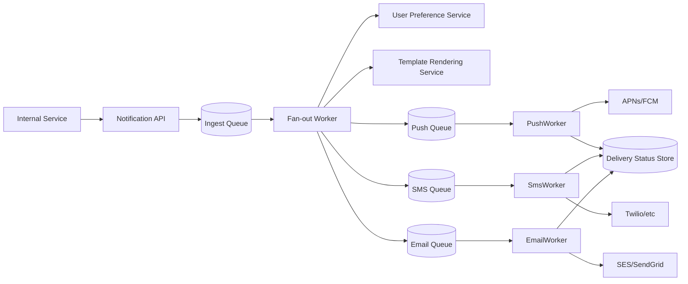
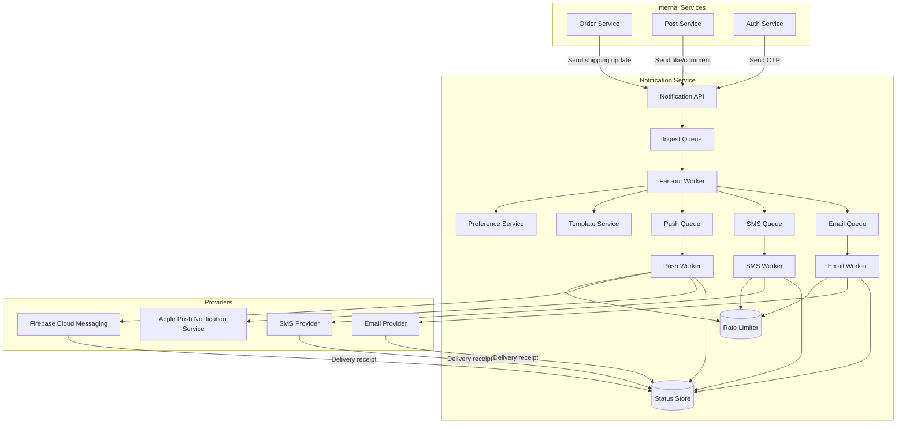
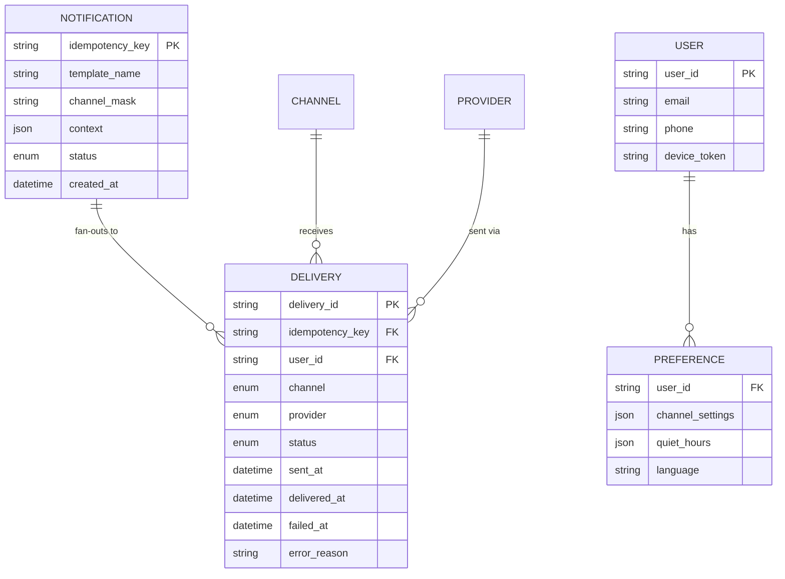

# Design a Notification Service That Fans Out Across Push, SMS, and Email

## Blogs and websites

## Medium

## Youtube

## Theory

### What Is It?

A notification fan-out service accepts a single logical notification request (e.g., "user X liked your photo") and reliably delivers it across multiple channels — push notifications (mobile), SMS, and email — respecting per-user channel preferences, provider rate limits, and delivery guarantees. Used by social platforms, e-commerce, ride-sharing, and SaaS products to keep users engaged and informed.

### Why Does It Exist?

Applications need to communicate with users through multiple channels. Building separate integrations (APNs, FCM, Twilio, SendGrid) per application is repetitive and error-prone. A centralized notification service abstracts channel routing, provider management, retries, and user preference enforcement — enabling any internal service to send notifications with a single API call.

### What Problem Does It Solve?

* **Multi-channel delivery**: A single logical notification (e.g., order shipped) needs to go to push, SMS, and/or email — based on user preferences.
* **Burst scale**: Marketing campaigns or viral events may trigger tens of millions of notifications at once — the system must fan out without overwhelming providers.
* **Provider rate limiting**: Each provider (FCM, Twilio, SendGrid) has rate limits — the system must queue and throttle.
* **Delivery guarantees**: At-least-once delivery per channel; idempotency to prevent duplicates.
* **Provider failures**: If FCM is down, route to APNs; if Twilio is rate-limited, queue for retry.
* **Channel preference**: Users configure which channels they accept (e.g., push for social, email for receipts).
* **Extensibility**: New channels (Slack, WhatsApp) or providers can be added without touching the core fan-out logic.

### Important Subtopics

1. Fan-out architecture (decoupling recipient resolution from channel delivery)
2. Idempotency and deduplication (idempotency keys, dedup before provider calls)
3. Provider rate limiting (token buckets per provider)
4. Retry strategies (exponential backoff, dead-letter queues)
5. User preference management (channel selection, quiet hours)
6. Transactional vs. bulk notification handling (priority queues, separate workers)
7. Delivery status tracking (sent, delivered, failed, bounced)
8. Content rendering (channel-specific templates from shared templates)
9. At-least-once vs. exactly-once delivery semantics
10. Queue and worker architecture per channel

### Problem Statement

Design a notification service that accepts a single logical notification request and reliably fans it out across multiple channels (push, SMS, email), respecting user preferences, provider rate limits, and delivery guarantees, at very large scale (e.g., a marketing campaign to tens of millions of users).

### Functional Requirements

- Accept a notification request (template + recipients + channels) from internal services
- Resolve each recipient's channel preferences and contact details
- Render channel-specific content (push payload, SMS text, email HTML) from a shared template
- Deliver via the appropriate third-party provider per channel, with retries on transient failure
- Track delivery status (sent/delivered/failed/bounced) per recipient per channel

### Non-Functional Requirements

- **Scale**: Bursts of tens of millions of notifications for a single campaign, plus a steady stream of transactional (order update, OTP) notifications
- **Latency**: Transactional notifications should be delivered within seconds; bulk/marketing notifications can be delivered over minutes-to-hours
- **Reliability**: At-least-once delivery per channel with idempotent processing (no duplicate charges/SMS due to retries)
- **Extensibility**: New channels/providers can be added without touching the core fan-out logic

### High-Level Architecture



### Key Design Points

- Split "fan-out" (deciding who gets what, on which channels, using which preferences) from per-channel "delivery" (talking to a specific provider's API), each with its own queue and worker pool, so a slow/rate-limited provider (e.g., SMS) doesn't block push or email delivery.
- Give every notification request an idempotency key, and have each channel worker deduplicate against it before calling the provider, so retries after a crash never result in duplicate sends.
- Respect per-user channel preferences and quiet hours at fan-out time, and respect per-provider rate limits at the channel-worker level (token bucket per provider) to avoid getting throttled or banned.
- Use separate, independently scalable queues per channel so a bulk marketing campaign (huge fan-out) doesn't delay urgent transactional notifications - or run transactional and bulk traffic through entirely separate queues/priorities.

### Trade-offs

- Per-channel queues and workers add operational surface area (more queues/services to run) compared to a single monolithic sender, but isolate failure/backpressure per channel and let each channel scale independently to match very different provider throughput limits.
- At-least-once delivery with idempotency keys is simpler to build than exactly-once delivery and is sufficient in practice as long as every downstream provider call is deduplicated.

---

## Characteristics

| Characteristic | What it means | Why it matters | How it works |
|---|---|---|---|
| **Multi-channel fan-out** | One logical request → deliver across push, SMS, email | Users get notifications on their preferred channels | Channel resolvers route to appropriate provider |
| **Idempotency** | Retries don't cause duplicate notifications | Critical for SMS (charges) and email (spam) | Idempotency key checked before each provider call |
| **Burst absorption** | Spikes of millions of notifications → buffered | Prevents provider rate-limit bans; smooths load | Queue-based architecture with backpressure |
| **Provider abstraction** | Unified interface over APNs, FCM, Twilio, SendGrid | Swap providers without touching core logic | Adapter pattern for each provider |
| **User preferences** | Per-user channel + quiet hours + language | Respects user choice → higher engagement | Preference service consulted at fan-out time |
| **Delivery tracking** | Track sent/delivered/failed/bounced per recipient | Analytics, debugging, provider health | Status store (Redis or Postgres) updated per message |
| **Transactional priority** | Urgent notifications (OTP, order updates) vs. bulk (campaigns) | Transactional must arrive in seconds; bulk can be hours | Separate queues/priorities for transactional vs. bulk |

## Components

| Component | Purpose | Responsibilities | Relationship | Real-world Example |
|---|---|---|---|---|
| **Notification API** | Accept requests from internal services | Validate request, assign idempotency key, enqueue | Internal APIs → ingest queue | Twilio Notify API |
| **Ingest Queue** | Buffer incoming notifications | Queue all requests before fan-out | API → Fan-out Worker | Kafka / SQS |
| **Fan-out Worker** | Resolve recipients + channels | Expand recipient list, check preferences, enqueue per channel | Reads from ingest queue, writes to channel queues | Custom worker service |
| **Template Service** | Render channel-specific content | Render templates (push payload, SMS text, email HTML) | Fan-out Worker → Template Service → channel queues | Handlebars / Jinja2 |
| **Preference Service** | Resolve user channel settings | User's preferred channels, quiet hours, language | Fan-out Worker checks preferences per recipient | User preference DB |
| **Push Worker** | Deliver push notifications | Call APNs (iOS) / FCM (Android), handle responses | Push queue → APNs/FCM → status store | Firebase Admin SDK |
| **SMS Worker** | Deliver SMS messages | Call Twilio/SMS gateway, handle delivery receipts | SMS queue → Twilio → status store | Twilio API client |
| **Email Worker** | Deliver emails | Call SES/SendGrid, handle bounces/complaints | Email queue → SES → status store | SES SMTP / SendGrid API |
| **Status Store** | Track per-message delivery status | sent, delivered, failed, bounced, opened | All channel workers update status | Redis / DynamoDB |
| **Rate Limiter** | Throttle per provider | Token buckets per provider/API key | Workers check rate limiter before sending | Redis token bucket |

## Patterns

### Fan-out Architecture

* **What**: Separate the "fan-out" step (deciding who gets what, on which channels, with which preferences) from the "delivery" step (calling a specific provider's API). Each step has its own queue and worker pool.
* **Problem solved**: A slow provider (e.g., SMS throttled by carrier) doesn't block faster channels (push, email). Bulk campaigns don't delay transactional notifications.
* **How it works**: (1) API → ingest queue. (2) Fan-out Worker dequeue → resolve recipients + preferences → render template → enqueue to channel-specific queues (Push Queue, SMS Queue, Email Queue). (3) Channel Workers process independently, scaling per channel. (4) Status updates written to Status Store.
* **When to use**: Multi-channel notification delivery at scale.
* **When not to use**: Single channel only (e.g., push-only app); very low volume.
* **Advantages**: Isolation of failure/backpressure per channel; independent scaling; clean separation of concerns.
* **Disadvantages**: More queues/services to manage; eventual consistency on delivery status.
* **Java/Spring Boot example**:
```java
// Fan-out logic
@Service
public class FanoutService {
    private final PreferenceService preferenceService;
    private final TemplateService templateService;
    private final ChannelQueuePublisher queuePublisher;

    public void fanout(NotificationRequest request) {
        List<Recipient> recipients = request.getRecipients();
        recipients.parallelStream().forEach(recipient -> {
            UserPreference pref = preferenceService.getPreferences(recipient.getUserId());
            Set<Channel> channels = pref.getPreferredChannels(request.getCategory());
            String rendered = templateService.render(request.getTemplate(), recipient);

            for (Channel channel : channels) {
                channelQueues.get(channel).publish(
                    ChannelMessage.builder()
                        .recipient(recipient)
                        .content(rendered)
                        .idempotencyKey(request.getIdempotencyKey())
                        .build());
            }
        });
    }
}

// Per-channel worker
@Component
public class PushNotificationWorker implements MessageListener {
    @RabbitListener(queues = "push.queue")
    public void handle(ChannelMessage message) {
        String dedupKey = "push:dedup:" + message.getIdempotencyKey();
        if (redisTemplate.hasKey(dedupKey)) return; // Already sent
        redisTemplate.opsForValue().set(dedupKey, "1", Duration.ofHours(1));

        pushProvider.send(message.getRecipient().getDeviceToken(), message.getContent());
        statusStore.update(message.getIdempotencyKey(), "sent");
    }
}
```

### Provider Rate Limiting with Token Buckets

* **What**: Each provider has rate limits (e.g., FCM = 1000/sec, Twilio = 100/sec). Use per-provider token buckets to ensure no provider is overwhelmed.
* **Problem solved**: Avoid 429 Too Many Requests errors from providers; prevent bans.
* **How it works**: A Redis-backed token bucket per provider. Tokens refill at rate R (provider's rate limit). Each send consumes 1 token. If no tokens → queue message → retry after backoff.
* **When to use**: Calling third-party APIs with strict rate limits.
* **Advantages**: Predictable throughput; prevents provider throttling.
* **Disadvantages**: Adds latency during bursts; requires distributed rate limiting state.

## Benefits

* **Unified interface**: Any internal service can send notifications via one API — no need to integrate APNs/Twilio/SendGrid separately.
* **Channel orchestration**: Automatically deliver via the right channel(s) based on user preferences.
* **Delivery analytics**: Track delivery, open, failure rates per channel + provider — optimize provider routing.
* **Cost optimization**: Route SMS (expensive) to push (free) when possible; retry failed pushes via email (cheaper than SMS).
* **Resilience**: Provider failures don't affect other channels — failover within the same channel type.

## Pros

* **Reliability**: Persistent queues + retries ensure eventual delivery.
* **Scalability**: Fan-out workers scale independently per channel.
* **Extensibility**: New channels/providers added via adapter pattern — no core logic changes.
* **Preference management**: Centralized user settings.
* **Observability**: End-to-end tracking of delivery status across all channels.
* **Idempotency**: Crash recovery never causes duplicate sends (chargeable for SMS).

## Cons

* **Operational complexity**: 3-4x the infrastructure (ingest queue, 3 channel queues, 3 worker types, status store, rate limiter).
* **Latency**: Multi-hop (API → queue → worker → provider) adds 50-200ms vs. direct provider calls.
* **Debugging**: Tracing a single notification across channels is harder.
* **Cost at scale**: 50M notifications/day × 3 queues × monitoring = significant infra cost.
* **At-least-once semantics**: Can still lead to duplicates if idempotency key collision occurs.

## Challenges

### Technical Challenges

* **Idempotency implementation**: Need a fast, distributed dedup mechanism (Redis with short TTL) — must handle the case where the key expires between retries.
* **Template rendering complexity**: Email HTML + push payload + SMS text must come from one template; supporting localization (15+ languages).
* **Delivery status synchronization**: Providers return delivery receipts asynchronously (webhook vs. polling) — must reconcile.
* **Provider SDKs**: Each provider (APNs, FCM, Twilio, SendGrid) has a different SDK/API/version.

### Scalability Challenges

* **Burst absorption**: A viral event (e.g., "Your post was liked by 1M people") → 3M notifications. Must buffer without OOM.
* **Fan-out amplification**: 1 campaign to 10M users × 2 channels (push + email) = 20M messages.
* **Per-user preference resolution**: Checking preference DB for 10M recipients per campaign — cache preferences + batch lookups.
* **Rate limit coordination**: 10M messages to FCM must be rate-limited to 1000/sec → 100 workers × 10/sec each.

### Performance Challenges

* **End-to-end delivery time**: Transactional notifications must arrive in < 5 seconds → fan-out + delivery must be < 2 seconds.
* **Template rendering**: Rendering 10M templates/second (email HTML is expensive) → pre-render + cache.
* **Queue depth**: Deep ingest queue → transactional notifications buried behind bulk → must use priority queues.

### Reliability Challenges

* **Provider outages**: FCM down → route push to APNs (if cross-platform)? Or skip push and fall back to email/SMS?
* **Queue durability**: Ingest queue must not lose messages — use replicated partitions (Kafka) or queue with persistence (SQS/RabbitMQ).
* **Duplicate delivery**: At-least-once means duplicates → idempotency keys prevent this, but key TTL race conditions can cause edge failures.

### Maintainability Challenges

* **Provider versioning**: APNs protocol changes yearly; FCM deprecates APIs; Twilio changes SMS pricing — must test + update adapters.
* **Template management**: 1000+ templates across features → versioning, A/B testing, approval workflow.
* **Regional providers**: Different countries → different SMS providers (Twilio doesn't cover everywhere) → provider routing logic.

### Operational Challenges

* **Monitoring**: Track delivery success/failure rates per channel + provider; alert on drops.
* **Queue management**: Monitor queue depth, age of oldest message; auto-scale workers.
* **Provider credentials**: Rotate API keys/secrets for 4-5 providers; handle certificate expiration.

### Security Concerns

* **PII in notifications**: Phone numbers, email addresses, user metadata — must be encrypted at rest + in transit.
* **Notification spam**: Malicious internal services could spam users — rate-limit per-service.
* **Webhook verification**: Delivery receipts from providers must be verified (HMAC signature).
* **Template injection**: User-controlled data in templates → XSS in email → must sanitize.

## Best Practices

* **Idempotency keys**: Use UUIDs; store dedup state in Redis with short TTL (1-2x expected delivery time); check before provider call.
* **Separate queues per channel**: Isolate push, SMS, email queues so a slow provider doesn't block others.
* **Priority queues**: Transactional notifications (OTP, order updates) get priority over bulk campaigns.
* **Token bucket rate limiting**: Per-provider token buckets (Redis) to prevent 429 errors.
* **Exponential backoff + jitter**: For retries; jitter prevents thundering herd when provider recovers.
* **Dead-letter queues**: Messages that exhaust retries → DLQ → manual intervention.
* **Batch sends**: When possible (e.g., email), batch messages to the same provider → reduce API calls.
* **Provider health monitoring**: Track success rate + latency per provider; auto-fallback if degraded.
* **Circuit breakers**: If a provider fails repeatedly, open circuit → fail fast → prevent cascade.

## When to Use

### Appropriate

* When your application needs to deliver messages to users across multiple channels (push, SMS, email).
* When message reliability is critical (e.g., OTPs, order confirmations, password resets).
* When you have high notification volume with occasional bursts (e.g., viral features).
* When you need delivery analytics and debugging across channels.
* When you want to centralize notification logic away from application code.

### Not Appropriate

* When you only need a single channel (e.g., push-only mobile app) — simpler to integrate directly.
* For low-volume applications (< 1000/day) — the infrastructure overhead isn't justified.
* When latency is absolutely critical (< 1 second) — the queue hop adds latency.
* For time-sensitive alerts where batching is harmful.

### Alternatives

* **Direct provider integration**: Each service calls APNs/FCM/Twilio directly — simpler but no shared logic.
* **Email service provider (ESP)**: SendGrid/SES templates — for email-only use cases.
* **Full-service notification platform**: Firebase (push + topic messaging), OneSignal, Twilio Notify — managed service; less control.
* **In-app notifications**: For non-urgent messages (no push/SMS/email needed) — simpler stack.

### Decision Factors

* **Channels needed**: Single (→ direct) vs. multi (→ fan-out service).
* **Volume**: Low (< 10K/day → managed service) vs. high (> 1M/day → custom) vs. bursty (→ queue-based).
* **Reliability requirements**: Best-effort (→ ESP) vs. guaranteed delivery (→ queue + retry + DLQ).
* **Team size**: Small team (→ managed) vs. large team (→ custom).

## Use Cases

### Social Media Likes/Comments (Facebook/Instagram)

* **Problem**: Notify a user when someone likes their photo, comments, or mentions them — across push, email, and SMS.
* **Solution**: Central notification service with per-user preference management.
* **Why suitable**: High volume (millions/hour), multi-channel, reliability matters (but not critical-time).
* **How it works**: (1) User action → event → notification service → check recipient's preferences → enqueue to channel queues → deliver. (2) For high-profile users, limit email (spam); for regular users, all channels. (3) Track opens → adjust frequency.
* **Trade-offs**: Risk of notification fatigue (too many); spam complaints from email → unsubscribe.

### E-commerce Order Updates (Amazon/Zepto)

* **Problem**: Notify customers at critical funnel steps (order placed → shipped → out for delivery → delivered).
* **Solution**: Transactional notification service with priority queues; SMS for delivery updates (must be received).
* **Why suitable**: Critical path — customer needs timely updates. SMS is expensive but high-read-rate.
* **How it works**: (1) Order placed → notification service → push + SMS ("Order confirmed") → push + SMS ("Order shipped, tracking link") → SMS at delivery. (2) SMS provider (Twilio) for guaranteed delivery; push for free. (3) Retry with exponential backoff for failures.
* **Trade-offs**: SMS costs ($0.01/message); delivery receipt tracking; international SMS reliability varies.

## Architecture



### Architecture Structure

* **Edge/API layer**: Notification API (REST) — internal services post notification requests.
* **Fan-out layer**: Fan-out workers resolve recipients + preferences + templates → enqueue to channel-specific queues.
* **Delivery layer**: Channel workers (Push, SMS, Email) — each calls its provider(s).
* **State layer**: Status store (delivery tracking), preference store (user settings), rate limiter (token buckets).

### Communication

* **Internal services → API**: HTTPS/REST or gRPC.
* **Fan-out → channel queues**: Kafka topics or SQS queues.
* **Workers → providers**: HTTPS (APNs, FCM, Twilio, SES REST APIs).
* **Providers → webhook**: Delivery receipts → webhook → Status Store.

### Data Flow

1. **Notification request**: Internal service → API → idempotency-key check → ingest queue.
2. **Fan-out**: Fan-out worker dequeue → resolve preferences per recipient → render template → enqueue to channel queues (Push, SMS, Email).
3. **Delivery**: Channel worker dequeue → check rate limiter → call provider → store result in status store.
4. **Receipt**: Provider webhook → status store update.

### Scaling Strategy

* **Fan-out workers**: Scale by ingest queue depth; sharded by notification type (transactional, bulk, marketing).
* **Channel workers**: Scale independently per channel; SMS workers fewer (limited by provider throughput), push/email workers more.
* **Queues**: Partition by hash of recipient_id → ensures ordering per user.
* **Rate limiter**: Redis token bucket per provider; distributed across instances.

### Failure Handling

* **Provider failure**: Retry with exponential backoff → DLQ after max retries → alert.
* **Queue failure**: Use replicated queues (Kafka replication) or durable queues (SQS).
* **Idempotency expiry**: If dedup key expires before provider confirms → potential duplicate; use longer TTL + provider-side dedup (idempotency keys where supported).
* **Fan-out worker crash**: Unacked messages → re-delivered; dedup key prevents duplicates.

## High-Level Design

```mermaid
flowchart LM
  Svc[Internal Service] -->|POST /notifications| API[Notification API]
  API -->|enqueue| IngestQ[(Ingest Queue)]
  IngestQ --> Fanout[Fan-out Worker]
  Fanout -->|push messages| PushQ[(Push Queue)]
  Fanout -->|sms messages| SmsQ[(SMS Queue)]
  Fanout -->|email messages| EmailQ[(Email Queue)]
  PushQ --> PushW[Push Worker]
  SmsQ --> SmsW[SMS Worker]
  EmailQ --> EmailW[Email Worker]
  PushW --> FCM[FCM / APNs]
  SmsW --> Twilio[Twilio]
  EmailW --> SES[SES / SendGrid]
  PushW -->|status| StatusStore[(Status Store)]
  SmsW -->|status| StatusStore
  EmailW -->|status| StatusStore
```

## Deep Dive

### Idempotency Implementation

To prevent duplicates during retries:
```java
@Service
public class IdempotencyService {
    private static final String DEDUP_PREFIX = "dedup:";

    public boolean checkAndMark(String idempotencyKey, Duration ttl) {
        String key = DEDUP_PREFIX + idempotencyKey;
        // SETNX returns 1 if key didn't exist (first time), 0 if it did (duplicate)
        Boolean isFirst = redisTemplate.opsForValue()
            .setIfAbsent(key, "sent", ttl);
        return Boolean.TRUE.equals(isFirst);
    }
}

// In PushWorker:
public void handle(ChannelMessage message) {
    String dedupKey = "push:dedup:" + message.getIdempotencyKey();
    if (!idempotencyService.checkAndMark(message.getIdempotencyKey(), Duration.ofHours(1))) {
        return; // Duplicate — skip
    }
    pushProvider.send(message.getRecipient().getToken(), message.getContent());
}
```

### Burst Handling with Priority Queues

Transactional notifications (OTP, order updates) must arrive in < 5 seconds; bulk campaigns can be delayed. Use priority queues:
```yaml
# Kafka topic per priority
topics:
  - notification.transactional  # P0 — OTP, order updates
  - notification.bulk           # P1 — marketing campaigns
  - notification.replay         # P2 — retry of failed deliveries
```

Workers consume from transactional first; only check bulk when transactional is empty. During burst, bulk is delayed but transactional remains < 5s.

### Rate Limiting with Token Bucket

```java
@Service
public class TokenBucketRateLimiter {
    private static final String BUCKET_KEY = "ratelimit:";

    public boolean tryAcquire(String providerId, int tokens, Duration window) {
        String key = BUCKET_KEY + providerId;
        int capacity = getProviderRateLimit(providerId);
        
        // Atomic check-and-decrement using Lua script
        String script = """
            local tokens = redis.call('GET', KEYS[1])
            if tokens and tonumber(tokens) >= ARGV[1] then
              redis.call('DECRBY', KEYS[1], ARGV[1])
              return 1
            elseif not tokens then
              redis.call('SET', KEYS[1], capacity - ARGV[1], 'EX', ARGV[2])
              return 1
            else
              return 0
            end
            """;
        
        return redisTemplate.execute(
            new DefaultRedisScript<>(script, Boolean.class),
            List.of(key), String.valueOf(tokens), String.valueOf(window.getSeconds())
        );
    }
}
```

## API Contract

* **API purpose**: Internal REST API for services to submit notification requests and query delivery status.

| Method | Endpoint | Description |
|---|---|---|
| POST | `/api/v1/notifications` | Submit a notification request (single or batch) |
| GET | `/api/v1/notifications/{idempotencyKey}` | Get delivery status for a notification |
| POST | `/api/v1/notifications/batch` | Submit bulk notification campaign |
| GET | `/api/v1/preferences/{userId}` | Get user channel preferences |
| PUT | `/api/v1/preferences/{userId}` | Update user channel preferences |
| GET | `/api/v1/metrics` | Aggregate delivery metrics (for dashboards) |

**Headers**: `Authorization: Bearer <token>`, `Idempotency-Key: <UUID>` (required for POST).

**Request body (single)**:
```json
{
  "idempotencyKey": "uuid-123",
  "template": "order_shipped",
  "channels": ["push", "email", "sms"],
  "recipients": [
    {"userId": "u123", "preferredChannels": ["push", "email"]}
  ],
  "context": {"trackingNumber": "1Z999AA1234567890", "eta": "2025-01-15T10:00:00Z"}
}
```

**Response**:
```json
{"idempotencyKey": "uuid-123", "status": "accepted", "channelCount": 2}
```

**Status codes**:
- `202 Accepted`: Request enqueued for processing.
- `400 Bad Request`: Invalid template, missing fields.
- `401 Unauthorized`: Invalid/missing API key.
- `409 Conflict`: Duplicate idempotency key (already processed).
- `429 Too Many Requests`: Service overloaded — retry after `Retry-After` header.

**Error response**:
```json
{"error": "invalid_template", "message": "Template 'order_shipped_v2' not found", "code": 400}
```

## Data Modeling



**Data lifecycle**: Notification records kept 30 days; delivery status kept 7 days (for debugging); dedup keys TTL 2 hours; user preference: persistent.

## Java and Spring Boot Implementation

```java
@RestController
@RequestMapping("/api/v1/notifications")
@RequiredArgsConstructor
public class NotificationController {
    private final NotificationService notificationService;

    @PostMapping
    public ResponseEntity<NotificationResponse> sendNotification(
            @RequestHeader("Idempotency-Key") String idempotencyKey,
            @RequestBody NotificationRequest request) {
        NotificationResponse response = notificationService.submit(request, idempotencyKey);
        return ResponseEntity.accepted().body(response);
    }
}

@Service
public class NotificationService {
    private final NotificationRepository repository;
    private final RedisTemplate<String, String> redis;
    private final RabbitTemplate rabbit;
    private final PreferenceService preferenceService;
    private final TemplateService templateService;

    @Transactional
    public NotificationResponse submit(NotificationRequest request, String idempotencyKey) {
        // Idempotency check
        String dedupKey = "notif:" + idempotencyKey;
        if (redis.hasKey(dedupKey)) {
            return repository.findByIdempotencyKey(idempotencyKey)
                .map(r -> NotificationResponse.builder().idempotencyKey(idempotencyKey).status("duplicate").build())
                .orElse(NotificationResponse.builder().idempotencyKey(idempotencyKey).status("accepted").build());
        }

        NotificationEntity entity = NotificationEntity.builder()
            .idempotencyKey(idempotencyKey)
            .templateName(request.getTemplate())
            .channelMask(request.getChannels())
            .context(request.getContext())
            .status("accepted")
            .createdAt(Instant.now())
            .build();
        repository.save(entity);
        redis.opsForValue().set(dedupKey, "1", Duration.ofHours(2));

        // Enqueue for fan-out
        rabbit.convertAndSend("notification-exchange", "ingest", request);

        return NotificationResponse.builder()
            .idempotencyKey(idempotencyKey)
            .status("accepted")
            .channelCount(request.getChannels().size())
            .build();
    }
}
```

## Real-World Examples

* **Firebase Cloud Messaging (FCM)**: Google's managed push + notification service. Integrates with Firebase for multi-channel delivery (push, SMS, email via partners). Handles 100B+ messages/day. Uses topic messaging for broadcast.
* **Twilio Notify**: Managed multi-channel notification service (push, SMS, WhatsApp, Facebook Messenger). Handles burst scaling, provider routing, and delivery analytics. Used by Uber, Airbnb.
* **OneSignal**: Push + email + in-app notifications with A/B testing, segmentation, and analytics. Used by Shopify, Adobe.
* **Amazon SNS**: Managed pub/sub + push/SMS/email. Fan-out from SNS to SQS/SNS/HTTP. Used by Netflix (alerts), Airbnb (notifications).
* **Uber**: Uses a custom notification fan-out service (not FCM directly) for reliability — custom retry logic, multiple SMS/email providers per region, circuit breakers for providers.

## Interview Preparation

### Beginner Questions

**Q: What is idempotency in the context of notifications?**
A: If a notification request is retried after a network timeout, the same SMS/email/push shouldn't be sent twice. Solution: assign a UUID idempotency key on the request; check Redis (SETNX) before calling the provider; store the key with a TTL (1-2x the max delivery time). If the key exists → skip.

**Q: What are the delivery guarantees for push/SMS/email?**
A: All are at-least-once — the provider may deliver 0, 1, or many copies. Email is most reliable; push can fail if the device is offline; SMS can fail if the carrier is down. Always treat as at-least-once and design for duplicates.

**Q: Why separate fan-out from delivery?**
A: If delivery to a slow provider blocks fan-out, all channels stall. By separating, a slow SMS provider (carrier rate limit) doesn't delay push/email delivery.

### Intermediate Questions

**Q: How do you handle provider rate limits?**
A: Use a token bucket per provider in Redis. Each send consumes a token. If no tokens, queue the message and retry after a backoff. Use circuit breakers — if a provider fails repeatedly, stop sending temporarily.

**Q: How do you handle transactional vs. bulk notifications?**
A: Use priority queues (or Kafka partitions). Transactional (OTP, order updates) go to a high-priority queue consumed by dedicated workers; bulk campaigns go to a separate queue. Transactional is always processed first — even during a burst of bulk notifications.

**Q: How do you track delivery status?**
A: Store in a fast key-value store (Redis) for recent status (last 24 hours) + durable store (Postgres/Cassandra) for audit. Providers send delivery receipts via webhooks → update status. Polling as fallback for providers without webhooks.

**Q: What's the difference between at-most-once, at-least-once, and exactly-once delivery?**
A: At-most-once: best effort, no retries (push notification when device is offline). At-least-once: retries until ACK (SMS — provider may charge for duplicates). Exactly-once: exactly one delivery (impossible in practice for distributed systems; approximated with idempotency).

### Advanced Questions

**Q: How would you design a notification service for 100M users with 1B notifications/day?**

A: (1) **Fan-out**: Async fan-out workers consuming from Kafka (sharded by region/user-type). Each worker handles 100K notifications/second. (2) **Sharding**: Recipient list sharded by user_id hash → 1000 partitions → 100 workers. (3) **Caching**: User preferences cached in Redis (100M entries, 30% hit rate → 50M cache lookups saved). (4) **Template rendering**: Pre-render common templates; batch rendering for bulk. (5) **Rate limiting**: 50 Redis token-bucket instances per provider; 100 worker instances per channel. (6) **Batching**: Batch emails (up to 50) per API call to SES → reduce API calls by 50x. (7) **Monitoring**: P99 end-to-end latency < 5s; per-provider success rate > 95%; alert on queue depth > 10K. (8) **Infrastructure**: 500 fan-out workers, 200 push workers, 50 SMS workers (SMS is rate-limited by carriers), 100 email workers.

**Q: How would you handle the "thundering herd" problem when a provider recovers?**

A: (1) **Jittered backoff**: When retrying failed messages, use exponential backoff with jitter (random delay within the backoff window) — prevents synchronized retries. (2) **Rate limiter**: Even if 100K messages are queued, the rate limiter ensures we only send to FCM at 1000/sec → smooth ramp-up. (3) **Circuit breaker**: Half-open state — test with 1 message; if success, close circuit → gradual ramp-up. (4) **Warm-up**: When circuit closes, start at 10% capacity → increase 10% every 5 minutes. (5) **Metrics**: Monitor provider success rate + queue depth to detect and prevent herd.

### Senior-Level Questions

**Q: Design a notification service for a global social platform (1B users) with push, SMS, email, and WhatsApp channels, handling viral events (10M likes/second burst).**

A: (1) **Architecture**: Notification API → Kafka (3 topics: transactional, viral, bulk) → Fan-out Service (2000 instances, sharded by region + notification type) → Per-channel queues (Push Q, SMS Q, Email Q, WhatsApp Q) → Channel workers (200 push, 50 SMS, 200 email, 30 WhatsApp) → Providers. (2) **Burst handling**: During viral event (10M likes/sec), ingest queue must handle 10M/sec → Kafka partitions (100K partitions) → fan-out workers scale to 5000 instances (auto-scaling on CPU + queue depth). (3) **Provider mapping**: Users in India → WhatsApp + SMS; US → push + email; EU → email + push. Route based on user's country + preferred channels in profile. (4) **Rate limiting**: Per-region token buckets; India SMS via local providers (not Twilio → lower cost + better reliability). (5) **Cost optimization**: Push is free → prefer push; email ~$0.0001; SMS ~$0.01; WhatsApp ~$0.005. Route expensive channels only for critical notifications. (6) **Idempotency**: 48-hour TTL for dedup keys; handle edge where TTL expires mid-retry. (7) **Monitoring**: Alert on provider success rate < 90%, queue depth > 1M, delivery latency > 30s. (8) **Regional failover**: If FCM is down → route push to APNs (cross-platform) or fall back to SMS for critical messages.

### System Design Questions (Senior)

**Q: Design a notification fan-out service for 500M users where 1M users can receive the same notification simultaneously (viral event).**

**Approach**:
- **Fan-out**: 1M notifications → ingest queue → 100 fan-out workers (each handles 10K/sec). Each worker: resolve 10K recipients → check preferences → render template → enqueue to channel queues.
- **Channels**: Push (free) → primary for viral; SMS (expensive, $0.01 each) → only for critical (order updates); Email → marketing.
- **Preference resolution**: Cache user preferences in Redis (100M entries) → 90% cache hit. For cache miss → DB batch query (100 IDs at once).
- **Rate limiting**: FCM rate limit = 1000/sec → 20 push workers × 50/sec each. Use Redis token bucket per provider.
- **Batching**: For email/SMS, batch messages to same provider (up to 50 per batch) → reduce API calls.
- **Monitoring**: Queue depth, worker latency, provider success rate, dedup hit rate.
- **Cost**: 1M pushes (free) + 10K SMS ($100) + 100K email ($10). Total ~$110 per viral notification.

**Q: How do you handle the case where the idempotency key TTL expires before delivery completes (risk of duplicate)?**

A: Two approaches: (1) **Longer TTL**: Set TTL = 2× expected delivery window (e.g., 2 hours for SMS). Trade-off: more Redis memory. (2) **Provider-side dedup**: Use provider idempotency keys where supported (Twilio supports it, FCM doesn't for all cases). (3) **Accept risk**: For push (free), duplicates are acceptable; for SMS (chargable), use provider-side dedup + longer TTL. (4) **Hybrid**: For SMS, use provider dedup + longer TTL; for push/email, use Redis TTL. Monitor duplicate rate → alert if > 0.1%.

### Common Mistakes

- Not implementing idempotency → duplicate SMS charges.
- Mixing transactional + bulk in the same queue → transactional delayed by bulk bursts.
- Not caching user preferences → N+1 database queries per fan-out.
- Not rate limiting per provider → 429 errors → provider bans.
- Using at-most-once for critical notifications (SMS fails silently).
- Not handling webhook replay → status store inconsistency.
- Forgetting to use separate queues per channel → slow provider blocks all channels.
```
