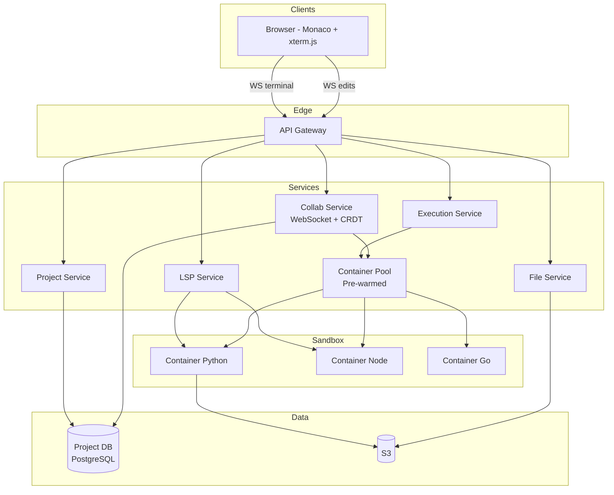
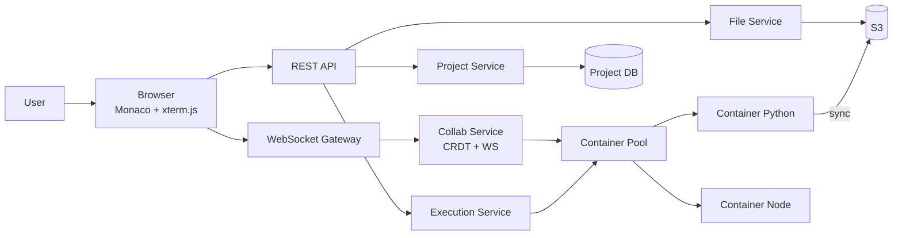

# Design Online Code Editor

## Blogs and websites

## Medium

## Youtube

## Theory

### What Is It?

An online collaborative code editor (Replit, CodeSandbox, VS Code for Web) enables writing, running, and debugging code in multiple languages with real-time collaborative editing, terminal access, and file sharing — all in the browser.

### Why Does It Exist?

Local dev setup is tedious (install runtimes, configure tools). A cloud-based editor lets you code instantly from anywhere. Real-time collaboration enables pair programming and interview scenarios.

### What Problem Does It Solve?

* **Language sandboxing**: Execute arbitrary user code safely (Python, JS, Go, Java, etc.) — complete isolation.
* **Real-time collaboration**: Multiple users editing the same file with correct conflict resolution.
* **Multi-language support**: Support 10+ runtimes in shared infrastructure — container per session.
* **Low-latency editing**: Keystrokes must propagate < 50 ms (CRDT/OT).
* **Instant start**: Cold-start containers take seconds → need warm pools per language.
* **Persistent storage**: User files must persist across container restarts.

### Important Subtopics

1. Code execution sandbox (Firecracker/gVisor, resource limits)
2. Real-time collaboration (CRDT/Yjs, WebSocket, sticky sessions)
3. Language Server Protocol (LSP) for IDE features
4. Container orchestration and pooling
5. File storage and sync
6. Monaco editor (VS Code's editor component)
7. Terminal/PTY in browser
8. Version history and snapshots

### Problem Statement
Design an online collaborative code editor like Replit, CodeSandbox, or VS Code for the Web that supports writing, running, and debugging code in multiple languages with real-time collaboration.

### Functional Requirements
- Create projects with file/folder structure
- Edit code with syntax highlighting, autocompletion, linting
- Run code in multiple languages (Python, JS, Go, Java, etc.)
- Real-time collaborative editing (multiple cursors)
- Terminal access
- File management (create, rename, delete, upload)
- Share projects with a URL
- Version history / snapshots

### Non-Functional Requirements
- **Latency**: Keystrokes < 50ms, code execution start < 2s
- **Scale**: 1M+ concurrent coding sessions
- **Security**: Code execution must be fully sandboxed
- **Availability**: 99.9%
- **Isolation**: One user's code cannot affect another's environment

### High-Level Architecture

```
┌──────────┐      WebSocket       ┌─────────────────────────────┐
│  Browser  │◀══════════════════▶│      Service Layer           │
│  (Monaco  │                     │                              │
│  Editor)  │                     │  ┌────────────────────────┐  │
└───────────┘                     │  │ Collaboration Service   │  │
                                  │  │ Project Service         │  │
                                  │  │ Execution Service       │  │
                                  │  │ Language Server (LSP)   │  │
                                  │  └───────────┬────────────┘  │
                                  └──────────────┼───────────────┘
                                                 │
                              ┌──────────────────┼──────────────────┐
                              ▼                  ▼                  ▼
                       ┌────────────┐     ┌────────────┐    ┌────────────┐
                       │  Project   │     │ Container  │    │  File      │
                       │  Store DB  │     │ Orchestrator│   │  Storage   │
                       └────────────┘     └────────────┘    └────────────┘
```

### Code Execution Sandbox

```
Each user session gets an isolated container:

┌─────────────────────────────────────┐
│  Container (per session)            │
│  ┌───────────────────────────────┐  │
│  │  Language runtime (Python 3)  │  │
│  │  User's code files            │  │
│  │  Terminal (PTY)               │  │
│  └───────────────────────────────┘  │
│                                     │
│  Resource limits:                   │
│    CPU: 0.5 cores                   │
│    Memory: 512MB                    │
│    Disk: 1GB                        │
│    Network: restricted (no egress   │
│    to internal services)            │
│    Time: 30s max execution          │
│                                     │
│  Technology: gVisor / Firecracker   │
│  → Kernel-level isolation           │
│  → Syscall filtering                │
└─────────────────────────────────────┘

Container lifecycle:
  User opens project → warm container from pool
  User idle > 10min → snapshot + hibernate
  User returns → restore from snapshot (fast resume)
```

### Real-Time Collaboration

```
Uses same approach as Google Docs:
  OT (Operational Transformation) or CRDT

Client edits → send ops via WebSocket → server transforms
  → broadcast to all collaborators

Presence:
  - Cursor positions with user colors
  - Selection highlights
  - Active file indicator per user

Session management:
  - Document partitioned by project_id
  - All collaborators connect to same server (sticky sessions)
  - Operation log for undo/redo across users
```

### Language Server Protocol (LSP)

```
Each container runs a language server:
  Python → Pylance/Pyright
  JS/TS → tsserver
  Go → gopls

Browser editor ↔ WebSocket ↔ LSP Proxy ↔ Container LSP

Features powered by LSP:
  - Autocomplete
  - Go to definition
  - Find references
  - Inline errors/warnings
  - Hover documentation
```

### Key Design Decisions

| Decision | Choice | Reason |
|----------|--------|--------|
| Editor | Monaco (VS Code's editor) | Industry standard, extensible |
| Sandbox | Firecracker microVMs | Strong isolation, fast boot (~125ms) |
| Collaboration | CRDT (Yjs) | Offline-capable, no central bottleneck |
| File storage | Object store (S3) + local container FS | Persist + fast access |
| Container pool | Pre-warmed containers per language | Instant project open |
| LSP | Per-container language server | Full IDE intelligence |

### Scaling Considerations
- **Container scheduling**: Kubernetes + custom scheduler for bin-packing
- **Warm pool**: Maintain ready containers per language (scale with demand)
- **File sync**: Background sync from container FS → S3 (every few seconds)
- **Global**: Multi-region deployment, route user to nearest region
- **Cost**: Hibernate idle containers, resume on demand

---

## Characteristics

| Characteristic | What it means | Why it matters | How it works |
|---|---|---|---|
| **Real-time collaboration** | Multiple users edit simultaneously | Pair programming, interviews | CRDT via WebSocket |
| **Sandboxed execution** | Untrusted code runs safely | Security | Firecracker/gVisor, resource limits |
| **Multi-language** | 10+ language runtimes | Broad use cases | Container per runtime |
| **File persistence** | Code saved across sessions | Don't lose work | S3 + container FS |
| **Instant start** | First keystroke < 2s after open | UX | Warm container pool |
| **Terminal access** | Shell in browser | Full dev environment | PTY → WebSocket |

## Components

| Component | Purpose | Responsibilities | Relationship | Real-world Example |
|---|---|---|---|---|
| **Editor** | Code editing UI | Syntax highlighting, autocomplete, linting | Monaco (VS Code) | VS Code Web |
| **Collab Service** | Real-time sync | Conflict-free edits, presence | WebSocket + CRDT | Yjs |
| **Project Service** | File/folder mgmt | CRUD files, permissions | DB + S3 | Replit project API |
| **Execution Service** | Run code safely | Spawn sandbox, forward I/O | Container orchestrator | Docker/K8s |
| **Container Pool** | Pre-warmed sandboxes | Idle containers per language | Container orchestrator | Firecracker |
| **LSP Service** | IDE intelligence | Autocomplete, lint, go-to-def | Per-container LSP server | Pylance/tsserver |
| **File Storage** | Persist files | Upload/download, versioning | S3 | S3 |
| **Terminal Service** | Browser terminal | PTY I/O → WebSocket | Container PTY | xterm.js |

## Patterns

### CRDT for Conflict-Free Collaboration

* **What**: Conflict-free Replicated Data Type — converges to same state on all clients regardless of concurrent edit order.
* **Problem solved**: OT (Operational Transformation) — used by Google Docs; requires complex transformation of concurrent operations (insert/delete at same position).
* **How it works**: Each edit operation has unique ID (Lamport timestamp + client_id). Operations applied locally → broadcast → converge automatically. Works offline. Yjs is popular JS CRDT library.
* **When to use**: Real-time collaborative editing (docs, code editors).
* **When not to use**: Single-user apps.
* **Advantages**: No central conflict resolver; offline-capable; converges automatically.
* **Disadvantages**: Higher memory overhead; large operation history.

## Benefits

* **No local setup**: Code instantly from any device with a browser.
* **Collaboration**: Real-time pair programming, code interviews.
* **Reproducibility**: Shared environment → no "works on my machine."
* **Accessibility**: Low-end devices can code.

## Pros

* **Instant**: Code in browser immediately, no install.
* **Collaborative**: Real-time multi-user editing.
* **Portable**: Any OS with a browser.
* **Sandboxed**: Secure code execution.
* **Integrated**: Editor + terminal + files + DB in one UI.

## Cons

* **Latency**: Keystroke → server → clients → visible delay.
* **Sandbox cost**: Container per execution → infrastructure cost.
* **Network dependency**: Need good internet.
• **Language limits**: Each language needs container image.

## Challenges

### Technical Challenges
* **Sandbox**: Arbitrary code must not escape → gVisor/Firecracker.
* **Collaboration sync**: CRDT implementation; WebSocket latency.
• **Cold start**: 1–5s per container → warm pool needed.
• **Terminal**: PTY → WebSocket → xterm.js.

### Scalability Challenges
* 1M+ sessions → 500+ GB RAM per region; 1000+ WebSocket servers.

### Performance Challenges
* Editing latency < 50ms; cold start < 2s; LSP on every keystroke (debounce).

### Reliability Challenges
* Container crash → restart; recover from S3.
* Network loss → CRDT preserved; resume on reconnect.

### Maintainability Challenges
* 10+ language runtimes to maintain; container image CVE scanning.

### Security Concerns
* Firecracker/gVisor isolation; no network egress; resource limits; non-root; seccomp profiles.

## Best Practices

* **CRDT (Yjs)**: Conflict-free, offline-capable collaboration.
* **Warm container pool**: 100+ per language → < 2s cold start.
* **Firecracker**: MicroVMs for secure isolation.
* **Resource limits**: 512MB RAM, 0.5 CPU, 30s timeout.
* **File sync**: Every 3–5s → S3.
* **Sticky sessions**: WebSocket pinned to same server.
* **Monitor**: Keystroke latency, cold start time, reconnect rate.

## When to Use

### Appropriate
* Online coding platforms (interview prep, education).
* Collaborative development.
* Browser-based IDEs (Codespaces, Gitpod).
* Sandboxed code execution (coding challenges).

### Not Appropriate
* High-performance compute (ML training, large builds).
* Offline development needs.
* Native OS access required.

### Decision Factors
* Collaboration needs; security (untrusted code); performance; cost.

## Use Cases

### Coding Interview Platform (HackerRank)

* **Problem**: Run candidate code safely, compare output, prevent cheating.
* **Solution**: Container per submission (Firecracker) → 512MB RAM, 30s limit → compile + run.
* **How it works**: Submit → Execution Service → microVM (pre-warmed) → compile → run test cases → compare output → destroy. Anti-cheat: browser lockdown, tab visibility.
* **Trade-offs**: Container warm-up (2–5s); 50K concurrent containers.

### Collaborative Coding (Replit)

* **Problem**: Multiple developers editing + running shared environment.
* **Solution**: CRDT (Yjs); WebSocket; Docker containers.
* **How it works**: Open project → Yjs CRDT state via WebSocket. Edit → CRDT op → broadcast. Run → container → stdout via WebSocket. Sync to S3 every 3s.
* **Trade-offs**: Container cost; CRDT memory; network latency.

## Architecture



## Design

* **Collaboration**: Yjs CRDT — state sync via WebSocket; presence (cursors) via same channel.
* **Sandboxing**: Firecracker microVMs; 512MB RAM, 0.5 CPU, 30s timeout, no egress.
* **Container pool**: 100+ per language; autoscale; hibernate after 10min idle.
• **File sync**: Container FS → S3 every 3s; restore from S3 on start.
* **LSP**: Per-container language server → gRPC bridge to editor.
* **Cold start**: Pre-warm 30% of languages; cache images; lazy-load rare languages.

## High-Level Design



## Deep Dive

### CRDT-Based Collaboration

Client edits → send ops via WebSocket → server transforms → broadcast to collaborators. Yjs CRDT or OT (Operational Transformation). Presence: cursor positions, selections. Session: partitioned by project_id; sticky sessions; operation log.

### Code Execution Sandbox

Container per session: 0.5 CPU, 512MB RAM, 1GB disk, restricted network, 30s max. Firecracker/gVisor isolation. Lifecycle: open → warm container; idle > 10min → snapshot + hibernate; return → restore.

### LSP Integration

Each container runs a language server (tsserver for JS/TS, Pylance for Python, gopls for Go). Editor ↔ WebSocket ↔ LSP Proxy ↔ Container LSP. Features: autocomplete, go-to-definition, inline errors, hover docs.

## API Contract

| Method | Endpoint | Description |
|---|---|---|
| POST | `/api/v1/projects` | Create a project |
| GET | `/api/v1/projects/{id}` | Get project + file tree |
| GET | `/api/v1/projects/{id}/files/{path}` | Read file |
| PUT | `/api/v1/projects/{id}/files/{path}` | Write file |
| POST | `/api/v1/projects/{id}/run` | Execute code |
| GET | `/ws/projects/{id}/terminal` | WebSocket terminal |

WebSocket: `wss://api.example.com/ws/edit/{project_id}` for collaboration. JWT auth. Rate limiting.

## Data Modeling

```mermaid
erDiagram
  USER ||--o{ PROJECT : "owns"
  PROJECT ||--o{ FILE : "contains"
  PROJECT ||--o{ EXECUTION : "runs"

  USER { string user_id PK; string email }
  PROJECT { string project_id PK; string owner_id FK; string name; string language }
  FILE { string file_id PK; string project_id FK; string path; string content }
  EXECUTION { string exec_id PK; string project_id FK; string container_id; int exit_code; string stdout }
```

Sharding by project_id hash. Files in S3; metadata in PostgreSQL.

## Java and Spring Boot Implementation

```java
@RestController
@RequestMapping("/api/v1/projects")
@RequiredArgsConstructor
public class ProjectController {
    private final ProjectService projectService;

    @PostMapping("/{projectId}/run")
    public ResponseEntity<RunResponse> runCode(
            @AuthenticationPrincipal UserDetails user,
            @PathVariable String projectId,
            @RequestBody RunRequest request) {
        RunResult result = projectService.executeCode(projectId, request);
        return ResponseEntity.ok(RunResponse.from(result));
    }
}

@Service
public class ExecutionService {
    private final ContainerPoolManager pool;

    public RunResult execute(String projectId, RunRequest request) {
        Container container = pool.acquire(request.getLanguage());
        try {
            container.setResourceLimit(ResourceLimit.builder()
                .cpuShares(512).memoryMB(512).timeoutSeconds(30).build());
            container.copyFiles(projectId, request.getFiles());
            ExecResult result = container.execute(request.getCommand(), request.getArgs());
            return RunResult.builder()
                .stdout(result.getStdout())
                .stderr(result.getStderr())
                .exitCode(result.getExitCode())
                .build();
        } finally {
            pool.release(container);
        }
    }
}
```

## Real-World Examples

* **Replit**: Monaco editor + Yjs CRDT; Docker containers (Firecracker isolation); LSP per container; file sync to S3 every 3s.
* **CodeSandbox**: Monaco + isomorphic TS; iframe sandboxes; CRDT.
* **Gitpod**: VS Code (Theia); Kubernetes pods; 30-min free tier.
* **GitHub Codespaces**: Full VS Code; Linux containers; 120-core machines.

## Interview Preparation

### Beginner Questions

**Q: How do you implement real-time collaborative editing?**
A: CRDT (Yjs) — operations converge automatically, works offline, no central conflict resolver. OT (Google Docs) — needs central server to transform operations. CRDT simpler for distributed.

**Q: How do you sandbox code execution?**
A: Docker container with: resource limits (CPU, RAM 512MB, timeout 30s); no network egress; read-only FS; non-root user; seccomp profile. For stronger isolation: Firecracker microVM or gVisar.

**Q: What is the cold start problem?**
A: First container creation takes 1–5s (image pull + startup). Solution: pre-warm container pool (100+ per language); hibernate idle > 10 min.

### Intermediate Questions

**Q: How does the Monaco editor work?**
A: VS Code's web port — compiled to JS. Syntax highlighting via TextMate; LSP client; extensions; theming. All client-side. Collaboration layered via WebSocket (CRDT).

**Q: How do you sync files between browser and container?**
A: Open → File Service → S3 → container FS. Edit → Monaco → CRDT → broadcast. Container syncs to S3 every 3s. Conflict: last-write-wins or merge.

**Q: What is LSP?**
A: Language Server Protocol — standard for IDE features (autocomplete, go-to-def, lint). Each language has LSP server (tsserver, Pylance, gopls). Editor sends changes → LSP responds.

### Advanced Questions

**Q: Design online IDE for 10M concurrent users, 15 languages?**
A: Monaco frontend (CDN). Yjs CRDT via WebSocket cluster (200+ servers). 15 language images → 500+ instances each (7500+ total). Firecracker for isolation. S3 for files + 500 WS servers. Spot instances; 50K WS reconnect rate < 1/sec; CRDT sync 50ms P99. $20k/mo.

**Q: How do you secure arbitrary code execution?**
A: Firecracker (kernel isolation) + cgroup limits + no egress. Seccomp + AppArmor. Non-root. 30s timeout. Monitor for abuse. CVE scan images. No secrets injected.

### Senior-Level Questions

**Q: Design browser-based IDE for 500K DAU, 50K concurrent executions, 15 languages?**

A: (1) **Frontend**: Monaco + xterm.js; CDN. (2) **Collab**: Yjs CRDT via WebSocket; 200 servers (2500 connections each). (3) **Containers**: 15 language images → 100+ instances each; pre-warm 30%; autoscale. (4) **Execution**: Firecracker; 512MB, 0.5 CPU, 30s hard kill. (5) **Storage**: S3 + 5s sync; PostgreSQL sharded by project_id. (6) **LSP**: Per-container (tsserver, Pylance) via LSP proxy. (7) **Scale**: 50K execution sessions; 500K DAU → 200 WS servers. (8) **Cost**: $20k/month; spot for execution; hibernate idle.

**Q: How do you optimize cold start to < 2s for 15 languages?**

A: Pre-warm 30% idle pool per language (ML demand forecast). Distroless images (100MB). Firecracker snapshots (100ms restore). Lazy-load rare languages (Go, Rust). Stargate (compute/storage separated). Parallel LSP + file restore. Spot for non-interactive; 500+ containers; cold start P99 < 5s; warm < 0.5s.

### Common Mistakes

- No sandbox → escape → system compromise.
- No resource limits → fork bomb.
- No pre-warming → 5–10s cold start.
- OT instead of CRDT → complexity.
- No file sync → work lost on crash.
- Shared containers → security.
- No timeout → infinite loops.
- No network isolation → internal access.
- Not supporting offline.
- Ignoring image CVEs.
