# Design Online Code Editor

## Blogs and websites

- [Firecracker: Lightweight Virtualization for Serverless Applications](https://aws.amazon.com/blogs/storage/firecracker-lightweight-virtualization-for-serverless-applications/) — AWS blog on microVMs for secure code execution
- [How Replit Built a Multiplayer Code Editor](https://blog.replit.com/) — Replit's engineering blog on CRDT-based collaboration and container pooling
- [Monaco Editor: Under the Hood](https://code.visualstudio.com/blogs/editor/command-palette) — VS Code's web editor internals and architecture
- [Building CodeSandbox](https://codesandbox.io/blog) — CodeSandbox's approach to browser-based development environments
- [Operational Transformation vs. CRDT](https://martinfowler.com/articles/collaborative-editing.html) — Martin Fowler's analysis of collaborative editing models

## Medium

- [Designing a Real-Time Collaborative Code Editor](https://medium.com/@systemdesign/designing-a-real-time-collaborative-code-editor-b1a5b3e9d3a7) — Architecture of cloud-based IDEs
- [CRDT vs OT: Which One to Use?](https://medium.com/@systemdesign/crdt-vs-ot-which-one-to-use-for-real-time-editing-8c3e6e87ea57) — Comparative analysis of conflict resolution strategies
- [Building a Secure Code Execution Sandbox](https://medium.com/@systemdesign/building-a-secure-code-execution-sandbox-c0c2c568a8c4) — Isolation and security for untrusted code execution

## Youtube

- [How to Design a Code Editor Like Replit — System Design](https://www.youtube.com/watch?v=QkzarAFu7ZM)
- [Firecracker: Unikernel-based Containers for Secure Multi-Tenant](https://www.youtube.com/watch?v=o2vC7fF6j0M)
- [Building a Collaborative Code Editor with CRDTs](https://www.youtube.com/watch?v=4vrIrlNn7bM)
- [Operational Transformation Explained](https://www.youtube.com/watch?v=v9kmR3J2X6I)

---

## Theory

### Topics Covered

1. [Introduction / Problem Statement](#introduction--problem-statement)
2. [Characteristics](#characteristics)
3. [Pros](#pros)
4. [Cons](#cons)
5. [Use Cases](#use-cases)
6. [Components](#components)
7. [Architectural Patterns](#architectural-patterns)
8. [Benefits](#benefits)
9. [Challenges](#challenges)
10. [Best Practices](#best-practices)
11. [When to Use / When Not to Use](#when-to-use--when-not-to-use)
12. [Data Model and API](#data-model-and-api)
13. [Collaborative Editing Deep Dive](#collaborative-editing-deep-dive)
14. [Replication Strategies](#replication-strategies)
15. [Failure Detection and Membership](#failure-detection-and-membership)
16. [High Availability and Scalability](#high-availability-and-scalability)
17. [Performance and Optimization](#performance-and-optimization)
18. [CAP Theorem and Consistency Trade-offs](#cap-theorem-and-consistency-trade-offs)
19. [Encryption and Key Management](#encryption-and-key-management)
20. [Authentication and Authorization](#authentication-and-authorization)
21. [Security Threats and Mitigations](#security-threats-and-mitigations)
22. [Observability and Logging](#observability-and-logging)
23. [Real-World Implementations](#real-world-implementations)
24. [Java and Spring Boot Implementation Guide](#java-and-spring-boot-implementation-guide)
25. [Interview Questions and Answers](#interview-questions-and-answers)

---

### Introduction / Problem Statement

An online collaborative code editor (Replit, CodeSandbox, VS Code for Web, GitHub Codespaces) enables writing, running, and debugging code in multiple languages with real-time collaborative editing, terminal access, and file sharing — all in the browser.

**Why does it exist?**

Local dev setup is tedious (install runtimes, configure tools). A cloud-based editor lets you code instantly from anywhere. Real-time collaboration enables pair programming and interview scenarios. The browser is the universal platform — any device with a modern browser can become a full development environment.

**What problem does it solve?**

* **Language sandboxing**: Execute arbitrary user code safely (Python, JS, Go, Java, etc.) — complete isolation.
* **Real-time collaboration**: Multiple users editing the same file with correct conflict resolution.
* **Multi-language support**: Support 10+ runtimes in shared infrastructure — container per session.
* **Low-latency editing**: Keystrokes must propagate < 50 ms (CRDT/OT).
* **Instant start**: Cold-start containers take seconds → need warm pools per language.
* **Persistent storage**: User files must persist across container restarts.

**Important subtopics:**

1. Code execution sandbox (Firecracker/gVisor, resource limits)
2. Real-time collaboration (CRDT/Yjs, WebSocket, sticky sessions)
3. Language Server Protocol (LSP) for IDE features
4. Container orchestration and pooling
5. File storage and sync
6. Monaco editor (VS Code's editor component)
7. Terminal/PTY in browser
8. Version history and snapshots

**Problem Statement:** Design an online collaborative code editor like Replit, CodeSandbox, or VS Code for the Web that supports writing, running, and debugging code in multiple languages with real-time collaboration.

**Functional Requirements:**

- Create projects with file/folder structure
- Edit code with syntax highlighting, autocompletion, linting
- Run code in multiple languages (Python, JS, Go, Java, etc.)
- Real-time collaborative editing (multiple cursors)
- Terminal access
- File management (create, rename, delete, upload)
- Share projects with a URL
- Version history / snapshots

**Non-Functional Requirements:**

- **Latency**: Keystrokes < 50ms, code execution start < 2s
- **Scale**: 1M+ concurrent coding sessions
- **Security**: Code execution must be fully sandboxed
- **Availability**: 99.9%
- **Isolation**: One user's code cannot affect another's environment

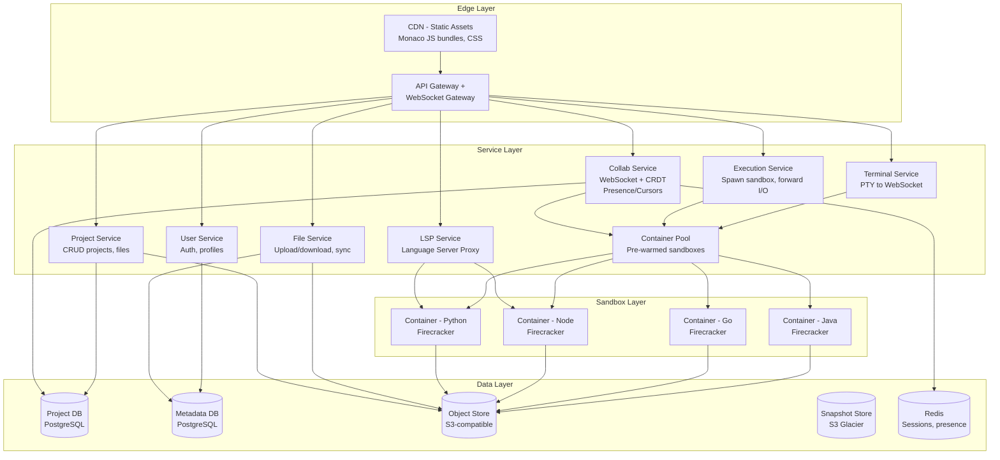

*The high-level architecture shows a browser-based Monaco editor connecting through an API Gateway and WebSocket Gateway to a suite of microservices. Each service owns its database (database-per-service). The sandbox layer uses Firecracker microVMs per language runtime, each syncing files to object storage. Redis handles session state and real-time presence.*

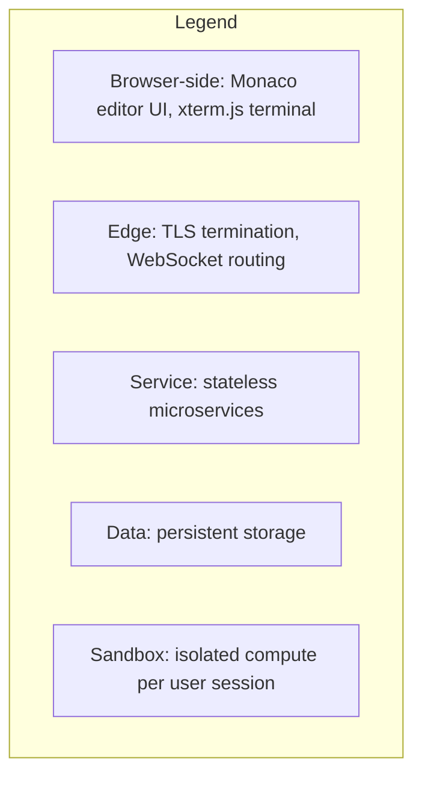

*The architecture flows from browser (Monaco + xterm.js) through edge (CDN + Gateway) to services (Collab, Project, Execution, LSP, File, Terminal, User) backed by data stores (PostgreSQL, S3, Redis), with the sandbox layer running Firecracker microVMs per language runtime.*

---

### Characteristics

- **Real-time collaboration**: Multiple users edit simultaneously. CRDT (Yjs) or OT ensures convergence. Presence shows cursors, selections, and active files per user.
- **Sandboxed execution**: Untrusted user code runs in isolated microVMs (Firecracker/gVisor) with resource limits — CPU, memory, disk, network, and time caps.
- **Multi-language support**: 10+ language runtimes, each in a container image. Container per session per language.
- **Persistent file storage**: User files persist across container restarts. S3 for durability; container FS for fast access.
- **Instant start**: Warm container pool per language for sub-2s project open; hibernate idle containers after 10 min.
- **Terminal access**: PTY (pseudo-terminal) streamed to browser via WebSocket to xterm.js.
- **IDE intelligence**: Language Server Protocol (LSP) provides autocomplete, go-to-definition, inline errors, hover docs, and linting.
- **Multi-region deployment**: Users routed to nearest region; containers and file storage replicated globally.
- **High write throughput**: Millions of keystroke operations per minute; WebSocket infrastructure must handle this.
- **Skewed access patterns**: Popular languages (JS, Python) have more containers; rare languages (Rust, Go) use lazy provisioning.
- **Eventual consistency**: Collaboration state converges within seconds; file changes may briefly lag.
- **Multi-modal interaction**: Code editing, terminal I/O, linting, debugging — each with different latency and consistency requirements.

---

### Pros

- **Instant**: Code in browser immediately, no install required.
- **Collaborative**: Real-time multi-user editing with multiple cursors and presence.
- **Portable**: Any OS with a browser.
- **Sandboxed**: Secure code execution via microVMs and resource limits.
- **Integrated**: Editor + terminal + files + database in one UI.
- **Reproducible**: Shared environment eliminates "works on my machine" issues.
- **Accessible**: Low-end devices can code without local runtimes.
- **Version control**: Built-in git integration and snapshot history.

---

### Cons

- **Latency**: Keystroke → server → clients → visible delay (though CRDTs aim for < 50ms).
- **Sandbox cost**: Container per execution → infrastructure cost scales with active sessions.
- **Network dependency**: Need good internet for editing and running code.
- **Language limits**: Each language needs its own container image and runtime maintenance.
- **Cold start**: Even with warm pools, rare languages may require 5–10s provisioning.
- **Debugging complexity**: Remote debugging in browsers is harder than local IDEs.

---

### Use Cases

#### Coding Interview Platform (HackerRank)

* **Problem**: Run candidate code safely, compare output, prevent cheating.
* **Solution**: Container per submission (Firecracker) → 512MB RAM, 30s limit → compile + run.
* **How it works**: Submit → Execution Service → microVM (pre-warmed) → compile → run test cases → compare output → destroy. Anti-cheat: browser lockdown, tab visibility.
* **Trade-offs**: Container warm-up (2–5s); 50K concurrent containers.

#### Collaborative Coding (Replit)

* **Problem**: Multiple developers editing + running shared environment.
* **Solution**: CRDT (Yjs); WebSocket; Docker containers.
* **How it works**: Open project → Yjs CRDT state via WebSocket. Edit → CRDT op → broadcast. Run → container → stdout via WebSocket. Sync to S3 every 3s.
* **Trade-offs**: Container cost; CRDT memory; network latency.

#### Educational Platform (freeCodeCamp, Codecademy)

* **Problem**: Teach programming in the browser with instant feedback.
* **Solution**: Pre-built starter templates; sandboxed execution; automated test runner.
* **How it works**: Student writes code → Execution Service runs against hidden test cases → results displayed inline. No setup needed.
* **Trade-offs**: Limited to curriculum languages; test suite maintenance.

#### Rapid Prototyping (CodeSandbox, StackBlitz)

* **Problem**: Quickly spin up a web app with dependencies, see live preview.
* **Solution**: Browser-based bundler (esbuild); iframe preview; dependency resolution from npm.
* **How it works**: Editor → bundler → bundle → iframe. No server containers needed for frontend.
* **Trade-offs**: Limited to web/frontend; complex backend integrations require server containers.

---

### Components

| Component | Purpose | Responsibilities | Relationship | Real-world Example |
|---|---|---|---|---|
| **Editor** | Code editing UI | Syntax highlighting, autocomplete, linting, multiple cursors | Monaco (VS Code) | VS Code Web, CodeSandbox |
| **Collab Service** | Real-time sync | CRDT/OT conflict resolution, cursor/selection presence, WebSocket broadcast | WebSocket + Yjs/CRDT | Replit's multiplayer engine |
| **Project Service** | File/folder mgmt | CRUD files, permissions, project metadata | DB + S3 | Replit project API |
| **Execution Service** | Run code safely | Spawn sandbox container, enforce limits, forward I/O streams | Container orchestrator | Docker/K8s + Firecracker |
| **Container Pool** | Pre-warmed sandboxes | Idle containers per language, hibernate/restore lifecycle | Container orchestrator | Firecracker pool |
| **LSP Service** | IDE intelligence | Bridge Monaco LSP client to container language servers | Per-container LSP server | Pylance/tsserver |
| **File Storage** | Persist files | Upload/download, versioning, cross-region sync | S3-compatible | AWS S3, GCS |
| **Terminal Service** | Browser terminal | PTY I/O to WebSocket to xterm.js | Container PTY | xterm.js |
| **User Service** | Identity and auth | JWT issuance, session management, profiles | Auth service | Auth0, Cognito |
| **Snapshot Service** | Version history | Periodic snapshots, incremental diff storage | S3 + event log | Replit snapshots |

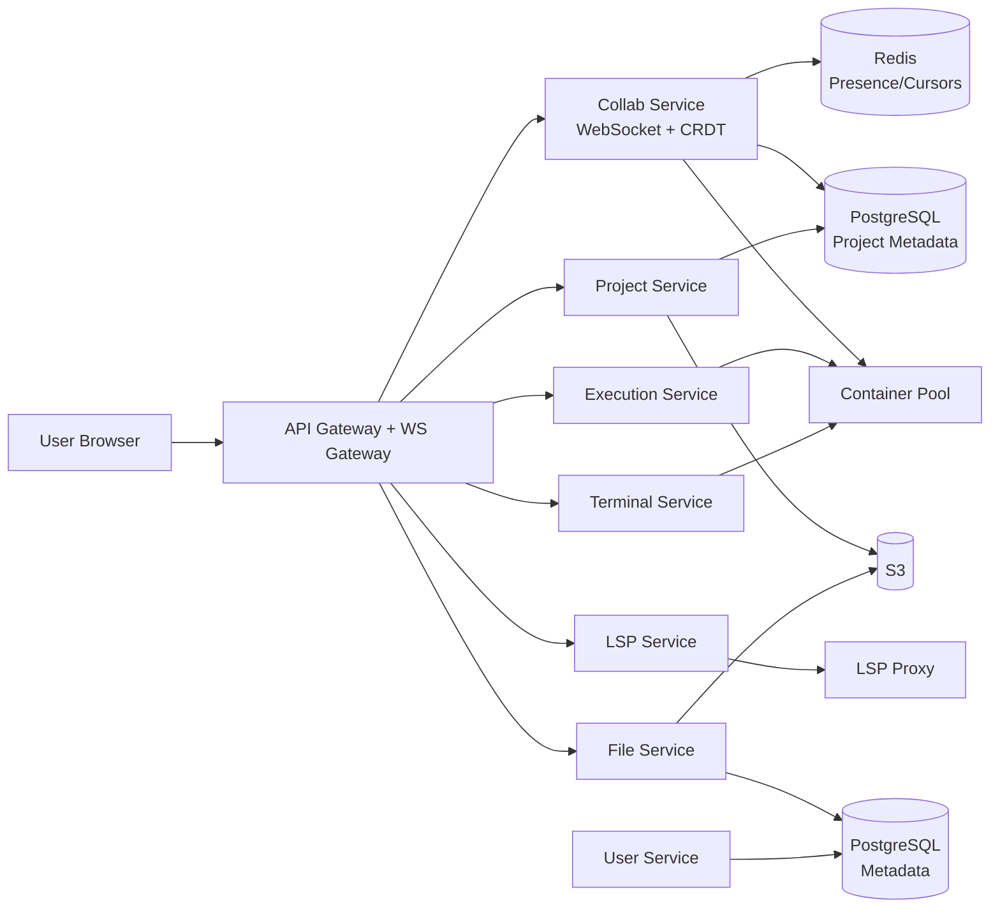

---

### Architectural Patterns

#### CRDT for Conflict-Free Collaboration

* **What**: Conflict-free Replicated Data Type — converges to same state on all clients regardless of concurrent edit order.
* **Problem solved**: OT (Operational Transformation) — used by Google Docs; requires complex transformation of concurrent operations (insert/delete at same position). CRDT eliminates this complexity.
* **How it works**: Each edit operation has a unique ID (Lamport timestamp + client_id). Operations applied locally to broadcast to converge automatically. Works offline. Yjs is a popular JS CRDT library.
* **When to use**: Real-time collaborative editing (docs, code editors).
* **When not to use**: Single-user apps.
* **Advantages**: No central conflict resolver; offline-capable; converges automatically.
* **Disadvantages**: Higher memory overhead; large operation history.

#### MicroVMs for Secure Code Execution

* **What**: Use Firecracker microVMs (or gVisor) to run untrusted user code with kernel-level isolation.
* **Problem solved**: Running arbitrary code from multiple users on shared infrastructure without one user escaping to affect another.
* **How it works**: Each user session gets a Firecracker microVM. The microVM boots in about 125ms, has its own kernel namespace, seccomp profiles, and cgroup resource limits. The Execution Service manages the lifecycle: acquire from pool, inject code, execute, capture output, return to pool or destroy.
* **When to use**: Any system executing untrusted code (online judges, coding playgrounds, CI runners).
* **When not to use**: Trusted code execution in controlled environments.
* **Pros**: Strong isolation; fast startup; minimal attack surface.
* **Cons**: Slight overhead vs. containers; more complex than process-level isolation.

```java
@Service
@RequiredArgsConstructor
public class SandboxService {

    private final ContainerPoolManager pool;
    private final SecurityProfileRepository securityRepo;

    public ExecResult executeSecure(String language, String code, long timeoutMs) {
        Container container = pool.acquire(language);
        try {
            var profile = securityRepo.getProfile(language);
            container.applyProfile(profile);
            container.setResourceLimit(ResourceLimit.builder()
                .cpuShares(512)
                .memoryMB(512)
                .diskMB(1024)
                .timeoutSeconds((int) (timeoutMs / 1000))
                .networkBlocked(true)
                .build());
            return container.execute(code);
        } finally {
            pool.release(container);
        }
    }
}
```

*The `SandboxService` Spring bean acquires a pre-warmed container from the pool, applies a language-specific security profile (resource limits, seccomp filters, network blocking), executes the user code with a timeout, and returns the result. The container is always returned to the pool in the finally block.*

#### Database-per-Service Architecture

* **What**: Each microservice owns its database; services communicate via well-defined APIs or events, not shared tables.
* **Problem solved**: Coupling between services through shared databases leads to cascading failures and deployment coupling.
* **How it works**: The Project Service uses PostgreSQL for project metadata; the File Service uses S3; the Collab Service uses Redis for ephemeral presence state; the User Service uses PostgreSQL for auth. Changes propagate via Kafka events.
* **When to use**: Microservices architectures where services evolve independently.
* **When not to use**: Monolithic applications or prototypes where simplicity matters.
* **Pros**: Independent scaling, technology diversity, fault isolation.
* **Cons**: Distributed transactions are hard; eventual consistency.

#### Warm Pool Pattern for Container Provisioning

* **What**: Pre-warm containers (with runtime images already loaded) so user code can start immediately.
* **Problem solved**: Cold starts (pulling images, initializing runtimes) take 1 to 5 seconds, unacceptable for interactive coding.
* **How it works**: Per language, maintain N idle containers. When a user opens a project, acquire from pool. When idle more than 10 minutes, hibernate (snapshot and stop). Scale pool size with demand forecasts.
* **When to use**: Interactive environments where users expect instant start.
* **When not to use**: Batch processing where start latency is acceptable.
* **Pros**: Sub-2s cold start; predictable performance.
* **Cons**: Resource waste on idle containers; scaling prediction needed.

#### LSP Bridge Pattern

* **What**: Bridge the browser-based Monaco editor's LSP client to language servers running inside containers.
* **Problem solved**: Language servers (tsserver, Pylance, gopls) run as native processes — they need to be reached from the browser.
* **How it works**: Monaco LSP client to WebSocket to LSP Proxy (server-side) to Container LSP server. The proxy translates JSON-RPC over WebSocket to the language server's stdio protocol.
* **When to use**: Browser-based IDEs that need full IDE intelligence.
* **When not to use**: Simple text editors without autocomplete and linting needs.
* **Pros**: Full IDE features in the browser.
* **Cons**: Extra latency; proxy complexity.

#### Key Design Decisions

| Decision | Choice | Reason |
|---|---|---|
| Editor | Monaco (VS Code's editor) | Industry standard, extensible, LSP support |
| Sandbox | Firecracker microVMs | Strong isolation, fast boot (about 125ms) |
| Collaboration | CRDT (Yjs) | Offline-capable, no central bottleneck |
| File storage | Object store (S3) + local container FS | Persist plus fast access |
| Container pool | Pre-warmed containers per language | Instant project open |
| LSP | Per-container language server | Full IDE intelligence |
| Terminal | PTY to WebSocket to xterm.js | Browser terminal emulation |
| Collaboration transport | WebSocket (sticky sessions) | Low-latency bidirectional |
| Container runtime | Firecracker | MicroVM for multi-tenant security |

---

### Benefits

- **No local setup**: Code instantly from any device with a browser.
- **Collaboration**: Real-time pair programming, code interviews.
- **Reproducibility**: Shared environment eliminates "works on my machine."
- **Accessibility**: Low-end devices can code with just a browser.
- **Integration**: Editor + terminal + files + database in one UI.
- **Version control**: Built-in git and snapshot history.
- **Security**: Sandboxed execution prevents code escape.
- **Portability**: Cross-platform — Windows, macOS, Linux, mobile browsers.

---

### Challenges

#### Technical Challenges

- **Sandbox escape**: Arbitrary code must not escape the microVM to container — Firecracker/gVisor, seccomp, cgroups.
- **Collaboration sync**: CRDT implementation complexity; WebSocket latency; client-side state reconciliation.
- **Cold start**: 1 to 5 seconds per container to warm pool needed; image caching; parallel pulls.
- **Terminal**: PTY to WebSocket to xterm.js — handling binary data, resize events, and signal forwarding.
- **LSP latency**: Every keystroke may trigger LSP; debounce and incremental updates needed.
- **Multi-language**: Each language needs container image, LSP server, and runtime — image sprawl.

#### Scalability Challenges

- 1M+ sessions to 500+ GB RAM per region; 1000+ WebSocket servers.
- Container pool scaling: thousands of microVMs per region, each consuming about 100MB RAM when idle.
- WebSocket connection limits: about 50K connections per server; need load balancing and sticky sessions.
- Collaboration document sharding: partition by project_id; route to correct server.

#### Performance Challenges

- Editing latency less than 50ms; cold start less than 2s; LSP on every keystroke (debounce).
- Network RTT dominates for global users; edge deployment helps.
- CRDT state size grows with document length; need compaction.
- Container I/O for file sync to S3; batching and async writes.

#### Reliability Challenges

- Container crash to restart; recover from S3 snapshots.
- Network loss to CRDT preserved; resume on reconnect.
- MicroVM crash to new container from pool; restore files from S3.
- WebSocket disconnect to buffered ops; replay on reconnect.

#### Maintainability Challenges

- 10+ language runtimes to maintain; container image CVE scanning.
- LSP server version compatibility per language.
- Firecracker/gVisor version upgrades across fleet.
- Monaco plugin and extension compatibility.

#### Security Concerns

- Firecracker/gVisor isolation; no network egress; resource limits; non-root; seccomp profiles.
- JWT token theft to short-lived tokens, rotation.
- WebSocket injection to input validation, frame size limits.
- File upload abuse to virus scanning, content-type validation.
- Cross-user data leakage to encryption at rest, per-user namespaces.

---

### Best Practices

- **CRDT (Yjs)**: Conflict-free, offline-capable collaboration.
- **Warm container pool**: 100+ per language to less than 2s cold start.
- **Firecracker**: MicroVMs for secure isolation.
- **Resource limits**: 512MB RAM, 0.5 CPU, 30s timeout.
- **File sync**: Every 3 to 5 seconds to S3; restore from S3 on start.
- **sticky sessions**: WebSocket pinned to same server via session affinity.
- **Debounce LSP**: Only trigger linter and autocomplete after 200 to 300ms of inactivity.
- **Snapshot compaction**: Periodically snapshot CRDT state; prune old ops.
- **Monitor**: Keystroke latency, cold start time, reconnect rate, container health.
- **Health checks**: Container liveness probe; gateway WebSocket ping and pong.
- **Image hardening**: Minimal base images; run as non-root; read-only filesystem.
- **Rate limiting**: Per-user WebSocket message rate; per-IP connection rate.

---

### When to Use / When Not to Use

**Use when:**

- Online coding platforms (interview prep, education).
- Collaborative development (pair programming, remote teams).
- Browser-based IDEs (Codespaces, Gitpod).
- Sandboxed code execution (coding challenges, playgrounds).
- Teaching programming in a browser (Codecademy, freeCodeCamp).
- Rapid web app prototyping with live preview.

**Avoid when:**

- High-performance compute (ML training, large builds).
- Offline development needs.
- Native OS access required.
- Low-level system programming (kernel modules, device drivers).
- Applications requiring custom IDE configurations not expressible in Monaco.

**Decision factors:**

- Collaboration needs; security (untrusted code); performance; cost; target languages.

---

### Data Model and API

The data model captures users, projects, files, execution sessions, and collaboration state. Projects are immutable once created; files are versioned; execution results are ephemeral.

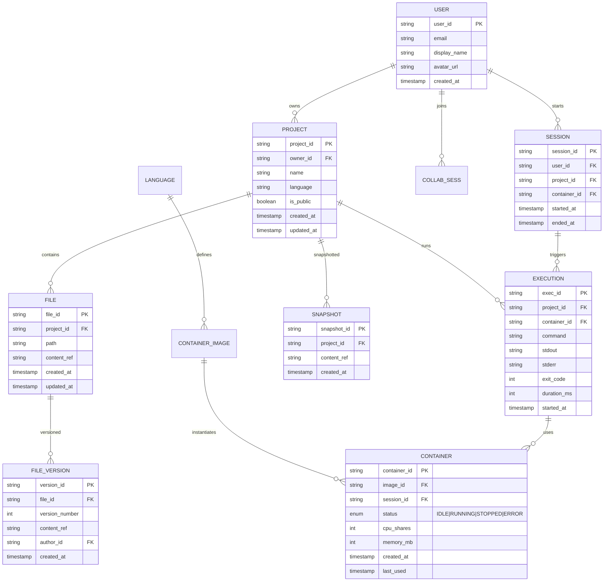

*Entity-relationship diagram showing the core data model: users own projects, projects contain files and trigger executions, files are versioned, sessions map users to containers, and snapshots preserve project state. Containers are tied to language images and sessions.*

**Sharding:** Sharding by `project_id` hash for project metadata, session, and execution tables. Files in S3 (keyed by `project_id/file_path`); metadata in PostgreSQL sharded by project_id. Container pool is per-region; registry in Redis (keyed by `session:{session_id}`).

**API Contract:**

| Method | Endpoint | Description |
|---|---|---|
| POST | `/api/v1/projects` | Create a project |
| GET | `/api/v1/projects/{id}` | Get project plus file tree |
| GET | `/api/v1/projects/{id}/files/{path}` | Read file content |
| PUT | `/api/v1/projects/{id}/files/{path}` | Write file |
| DELETE | `/api/v1/projects/{id}/files/{path}` | Delete file |
| POST | `/api/v1/projects/{id}/run` | Execute code |
| GET | `/api/v1/projects/{id}/snapshots` | List snapshots |
| POST | `/api/v1/projects/{id}/snapshot` | Create snapshot |
| POST | `/api/v1/projects/{id}/share` | Share project with users |
| GET | `/api/v1/projects/{id}/sessions` | List active sessions |

**WebSocket:** `wss://api.example.com/ws/edit/{project_id}` for collaboration (CRDT ops, cursor presence). Authentication via JWT in query string or `Authorization` header during handshake.

**WebSocket collaboration protocol:**

```json
{
  "type": "edit",
  "docId": "project_abc",
  "clientId": "user_xyz",
  "operation": { "type": "insert", "position": 42, "text": "hello" }
}
{
  "type": "presence",
  "docId": "project_abc",
  "selections": [{ "clientId": "user_xyz", "range": [10, 15] }]
}
{
  "type": "cursor",
  "docId": "project_abc",
  "cursor": { "clientId": "user_xyz", "position": 42, "color": "#ff0000" }
}
```

**Status codes:** `200` OK, `201` Created, `400` Invalid request, `401` Auth required, `403` Forbidden (not shared), `404` Not found, `429` Rate limited, `503` Temporarily unavailable.

---

### Collaborative Editing Deep Dive

This section covers the core technical challenges unique to collaborative code editing: conflict resolution (OT vs CRDT), real-time sync architecture, cursor tracking and presence, WebSocket connection management at scale, sandboxed code execution, and LSP integration. Each sub-topic is a major interview theme in its own right.

#### OT vs. CRDT: Conflict Resolution Strategies

The core challenge in collaborative editing is that multiple users may edit the same document at the same position simultaneously. Without conflict resolution, the documents diverge. Two approaches exist:

**Operational Transformation (OT)** was pioneered by Google Docs. Each edit is an operation (insert, delete, retain). When two users edit concurrently, the server transforms each operation against the other to maintain convergence.

```
User A: insert("X", pos=5)
User B: delete(pos=3)  concurrently

If B's delete is applied first, A's insert position shifts:
  A.transform(B) to insert("X", pos=4)  // shifted left by 1

Server assigns global operation order and transforms each op
against all concurrent ops it hasn't seen yet.
```

*OT requires a central server to maintain global ordering and perform transformations. Clients queue pending operations and transform them when concurrent operations arrive.*

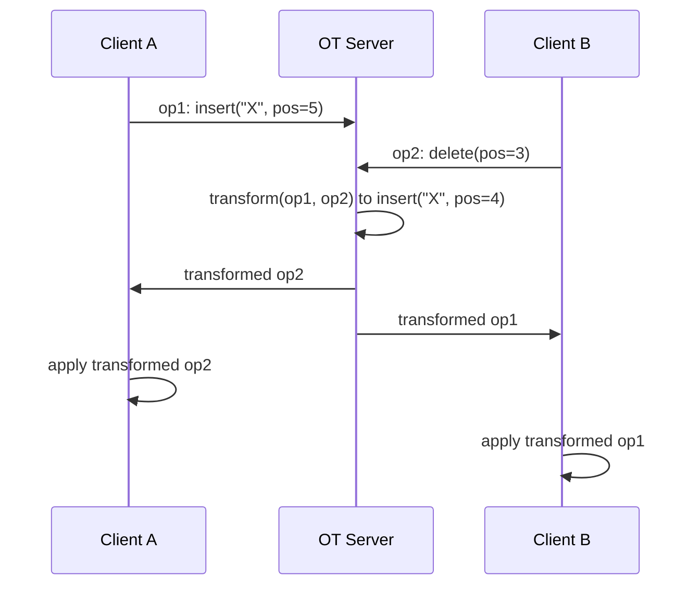

*OT server receives operations from all clients, assigns global ordering, transforms each operation against concurrent operations, and broadcasts the transformed versions back to all clients. Both clients apply the transformed operations to converge to the same state.*

**CRDT (Conflict-free Replicated Data Type)** eliminates the need for a central transformation server. Each operation carries a unique ID (typically a Lamport timestamp plus client identifier). Operations converge automatically regardless of order — no central authority is needed.

| Aspect | OT | CRDT |
|---|---|---|
| Central server | Required (transformation authority) | Not required (peer-to-peer possible) |
| Complexity | High (transformation logic, concurrency control) | Lower (merge is automatic by construction) |
| Offline support | Limited (must sync with server to transform) | Full (client can edit offline, merge later) |
| Bandwidth | Lower (only ops sent) | Higher (unique IDs add overhead) |
| Memory | Lower (server stores ops) | Higher (each client stores full state or op history) |
| Used by | Google Docs, early collaborative editors | Yjs, Figma, Replit, Notion, modern editors |

**When to use OT:** If you have a single central server that can act as the transformation authority and offline support is not a priority.

**When to use CRDT:** If you want offline support, decentralized collaboration, or want to avoid the complexity of OT transformation logic.

#### Real-Time Sync Architecture

The synchronization layer ensures every collaborator's document converges to the same state with minimal latency.

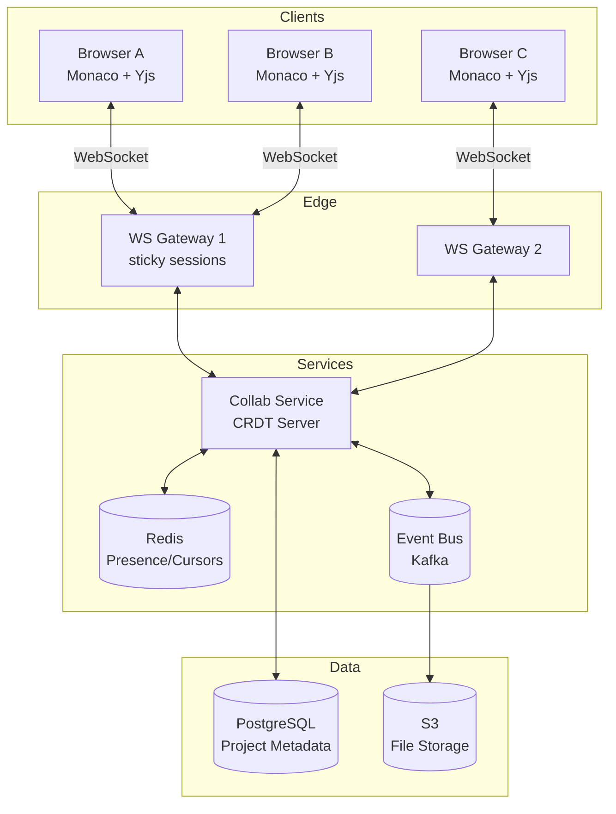

*Three browser clients (Monaco plus Yjs) connect via WebSocket gateways with sticky sessions to the Collab Service. The Collab Service broadcasts CRDT operations between clients, tracks presence in Redis, and persists document state. An event bus handles async file synchronization to S3.*

**Sync flow:**

1. User A types a character in Monaco to Yjs to generate an operation.
2. Operation is applied locally (instant feedback) and queued.
3. Operation sent over WebSocket to the Collab Service.
4. Collab Service broadcasts to all other collaborators (B, C).
5. Each client applies the remote operation to converge the document.
6. Background: periodic snapshots synced to S3.

#### WebSocket Connection Management

WebSocket connection management is critical for real-time collaboration at scale. The system must handle millions of long-lived connections with authentication, sticky routing, heartbeats, and graceful recovery.

**Connection lifecycle at the gateway:**

1. **Handshake plus auth**: The client opens a WebSocket with a JWT in the query string or Authorization header. The gateway validates the token, establishes identity, and registers the session.
2. **Heartbeat tracking**: The gateway sends periodic ping frames; missing two consecutive pongs marks the connection suspect. A local grace period handles flaky networks before deregistration.
3. **Frame handling**: Frames are decoded, validated against the schema, routed to the Collab Service for sends or dispatched to the local client for deliveries.
4. **Backpressure**: Outbound frame buffers are bounded per connection; slow consumers spill to disk or are marked offline.
5. **Reconnection**: On reconnect, the client presents a session ID; the gateway re-registers and the client syncs from its last cursor via the REST sync API.

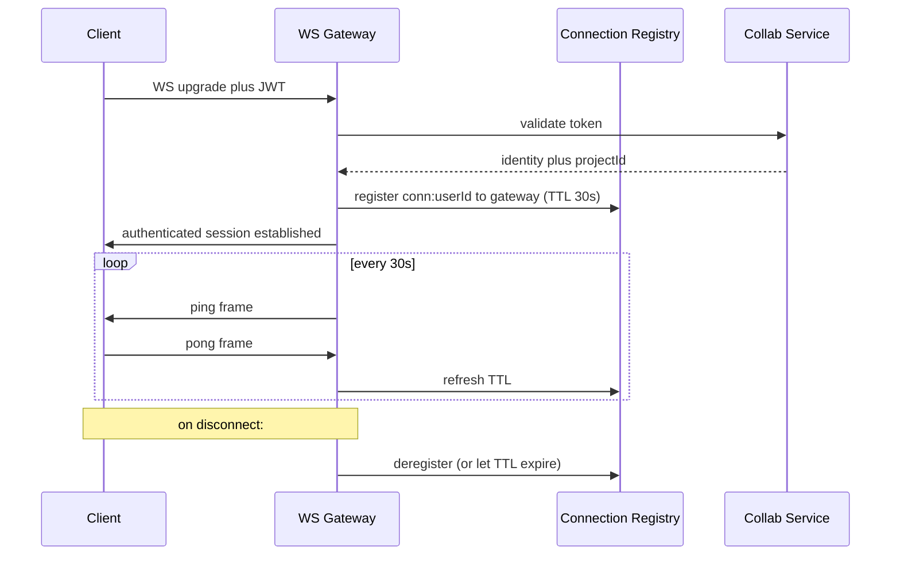

**Java example: WebSocket handshake interceptor**

```java
@Component
public class CollabHandshakeInterceptor implements HandshakeInterceptor {

    private final JwtTokenValidator tokenValidator;

    public CollabHandshakeInterceptor(JwtTokenValidator tokenValidator) {
        this.tokenValidator = tokenValidator;
    }

    @Override
    public boolean beforeHandshake(ServerHttpRequest request,
                                   ServerHttpResponse response,
                                   WebSocketHandler wsHandler,
                                   Map<String, Object> attributes) {
        String token = extractToken(request);
        return tokenValidator.validate(token)
            .map(principal -> {
                attributes.put("principal", principal);
                attributes.put("projectId", extractProjectId(request));
                return true;
            })
            .orElse(false);
    }

    @Override
    public void afterHandshake(ServerHttpRequest request,
                               ServerHttpResponse response,
                               WebSocketHandler wsHandler,
                               Exception exception) {
        // No cleanup needed after successful handshake.
    }

    private String extractToken(ServerHttpRequest request) {
        String header = request.getHeaders().getFirst("Authorization");
        return header != null && header.startsWith("Bearer ")
            ? header.substring(7) : "";
    }

    private String extractProjectId(ServerHttpRequest request) {
        String uri = request.getURL().getPath();
        return uri.substring(uri.lastIndexOf("/") + 1);
    }
}
```

*The `CollabHandshakeInterceptor` bean runs during the WebSocket upgrade, extracts and validates the JWT bearer token, and stores the authenticated principal and project ID in session attributes. The `TokenValidator` dependency is injected via constructor injection — a Spring Boot best practice that makes the bean testable and its dependencies explicit.*

#### Cursor Tracking and Presence

Presence includes two real-time signals: cursor positions (where each user is typing) and selection ranges (what each user has highlighted). These are ephemeral — they are not persisted and expire shortly after the user disconnects.

**Presence protocol:**

```json
{
  "type": "cursor",
  "docId": "project_abc",
  "position": 42,
  "selectionStart": 10,
  "selectionEnd": 15,
  "color": "#FF0000",
  "userId": "user_xyz"
}
```

**Implementation:**

- Cursor positions are sent on every keystroke (low overhead, about 50 bytes per message).
- Selection ranges are sent on mouse drag or shift-plus-arrow.
- Cursors are stored in Redis as `cursor:{projectId}` hash of `userId` to `{position, selectionStart, selectionEnd, color}`.
- TTL of 30 seconds; refreshed on each cursor update.
- When a cursor expires (user disconnects without cleanup), it is removed from the presence set.
- The Collab Service broadcasts cursor updates to all other collaborators on the same document.

```java
@Service
@RequiredArgsConstructor
public class PresenceService {

    private final StringRedisTemplate redisTemplate;
    private final WebSocketBroadcaster broadcaster;

    private static final Duration CURSOR_TTL = Duration.ofSeconds(30);

    public void updateCursor(String projectId, String userId, CursorPosition cursor) {
        var key = "cursor:" + projectId;
        var value = serializeCursor(cursor);
        redisTemplate.opsForHash().put(key, userId, value);
        redisTemplate.expire(key, CURSOR_TTL);
        broadcaster.broadcastToProject(projectId, createPresenceMessage(userId, cursor, true));
    }

    public void removeCursor(String projectId, String userId) {
        var key = "cursor:" + projectId;
        redisTemplate.opsForHash().delete(key, userId);
        broadcaster.broadcastToProject(projectId, createPresenceMessage(userId, null, false));
    }

    public List<CursorPosition> getAllCursors(String projectId) {
        var key = "cursor:" + projectId;
        var entries = redisTemplate.opsForHash().entries(key);
        return entries.values().stream()
            .map(this::deserializeCursor)
            .filter(Objects::nonNull)
            .toList();
    }

    record CursorPosition(int position, int selectionStart, int selectionEnd,
                          String color, String userId) {}

    private String serializeCursor(CursorPosition cursor) {
        return cursor.position() + ":" + cursor.selectionStart() + ":" +
               cursor.selectionEnd() + ":" + cursor.color();
    }

    private CursorPosition deserializeCursor(Object value) {
        if (value == null) return null;
        String[] parts = ((String) value).split(":");
        return new CursorPosition(
            Integer.parseInt(parts[0]),
            Integer.parseInt(parts[1]),
            Integer.parseInt(parts[2]),
            parts[3], null);
    }

    private String createPresenceMessage(String userId, CursorPosition cursor, boolean isActive) {
        return "{\"type\":\"presence\",\"userId\":\"" + userId +
               "\",\"active\":" + isActive +
               (cursor != null ? ",\"cursor\":" + serializeCursor(cursor) : "") + "}";
    }
}
```

*The `PresenceService` Spring bean manages cursor and presence state. It stores cursor positions in Redis with a 30-second TTL (refreshed on each update), broadcasts presence changes to all project collaborators via `WebSocketBroadcaster`, and provides methods to query all active cursors. The `CursorPosition` record carries position, selection range, user color, and user ID.*

#### Code Execution Sandbox

Each user session gets an isolated container. The sandbox must enforce strict resource limits and network restrictions.

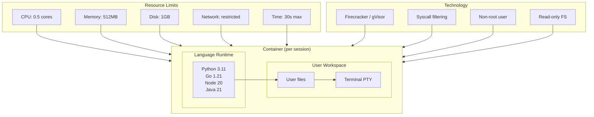

*Container sandbox architecture: each user session runs in an isolated microVM with language runtime (Python, Go, Node, Java), user workspace (files and PTY), strict resource limits (0.5 CPU, 512MB RAM, 1GB disk, restricted network, 30s timeout), and security hardening (Firecracker isolation, syscall filtering, non-root user, read-only filesystem).*

**Container lifecycle:**

```
User opens project to warm container from pool
User idle more than 10min to snapshot plus hibernate
User returns to restore from snapshot (fast resume)
```

#### LSP Integration

Each container runs a language server. The Monaco editor acts as the LSP client; the LSP Service on the server acts as a proxy between the browser and the container's language server.

```
Browser editor to WebSocket to LSP Proxy to Container LSP

Features powered by LSP:
  - Autocomplete
  - Go to definition
  - Find references
  - Inline errors/warnings
  - Hover documentation
```

**Language server mapping:**

| Language | LSP Server |
|---|---|
| JavaScript/TypeScript | tsserver |
| Python | Pylance / Pyright |
| Go | gopls |
| Java | java-language-server |
| Rust | rust-analyzer |
| C/C++ | clangd |

---

### Replication Strategies

Online code editors replicate data across multiple dimensions: collaboration state (for multi-instance redundancy), container state (for fast recovery), file storage (for durability), and metadata (for availability).

#### CRDT State Replication (Multi-Master)

The collaboration state (CRDT document) can be replicated across multiple Collab Service instances using active-active replication. Since CRDTs converge automatically, any instance can accept edits and the state will converge.

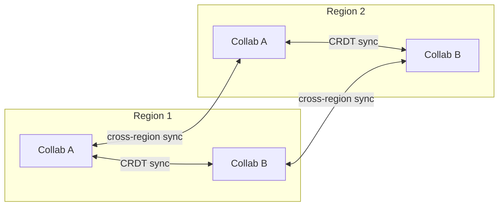

*CRDT documents are replicated across Collab Service instances within and across regions. Since CRDTs converge automatically, active-active replication is straightforward — no central transformation authority is needed. Cross-region replication adds latency but ensures availability.*

- **Pros**: No single point of failure for collaboration; clients can connect to any instance.
- **Cons**: Cross-region replication adds latency; requires conflict-free data structures (CRDT, not OT).

#### Container State Replication

Container state (the file system within a running sandbox) is replicated via snapshot and restore.

- **Leader-based snapshot**: The running container periodically snapshots its filesystem to S3. If the container crashes, a new container is spawned and restored from the latest snapshot.
- **Cross-region restore**: Snapshots are replicated to S3 in all regions. On failover, a container is spawned in the backup region and restored from the replicated snapshot.
- **Active-passive container pools**: Warm container pools exist in each region. On regional failure, pools in other regions handle the load (with cold starts for languages not pre-warmed there).

#### File Storage Replication (S3)

File storage uses S3 plus built-in cross-region replication.

- **Multi-region buckets**: S3 replicates objects to multiple regions.
- **Durability**: 99.999999999% (11 nines) within a single region; cross-region replication provides disaster recovery.
- **Read replicas**: File reads can be served from any region's S3 bucket.

#### Database Replication (PostgreSQL)

Project metadata uses leader-based replication with read replicas.

- **Primary region**: Writes go to the primary PostgreSQL instance.
- **Read replicas**: Each region has a read replica for low-latency metadata reads.
- **Cross-region sync**: Logical replication to a secondary region for disaster recovery (async, about 1 to 5s lag).

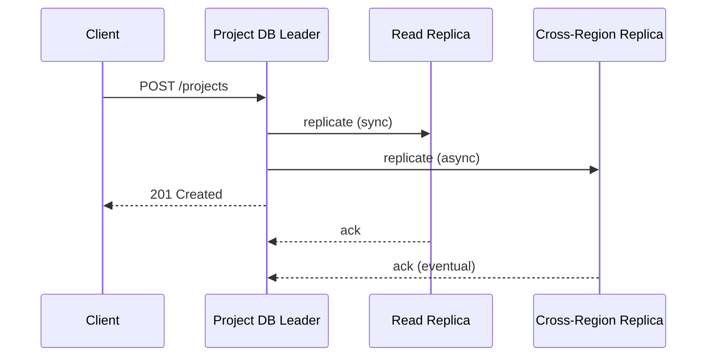

*Leader-based replication for project metadata: the client writes to the leader, which synchronously replicates to the local read replica and asynchronously replicates to the cross-region replica. The client receives 201 Created immediately, accepting brief eventual consistency for cross-region reads.*

---

### Failure Detection and Membership

At scale, the online code editor must detect failed containers, gateways, and service instances, and redistribute work without disrupting active sessions.

#### Gossip-Based Membership

Each service instance periodically exchanges health information with a random subset of peers using a gossip protocol. This spreads membership changes through the cluster in logarithmic rounds without a central coordinator.

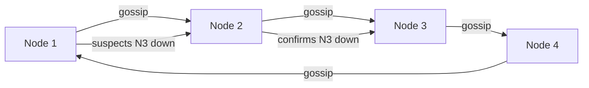

*Gossip-based failure detection: nodes periodically exchange health state with random peers. When a node suspects a peer is down, the suspicion propagates through gossip until confirmed by multiple nodes, then the peer is removed from the cluster and its responsibilities are redistributed.*

#### Health Checks

- **Liveness probes**: HTTP `/health` endpoint checked every 5 seconds by the orchestrator (Kubernetes). If unhealthy, the pod is restarted.
- **Readiness probes**: Checks if the service can serve traffic (e.g., can connect to its database and message broker). Not-ready pods are removed from the load balancer.
- **Container health**: Each sandbox container exposes a health endpoint. The Container Pool Manager pings containers every 30 seconds; unresponsive containers are destroyed and replaced.

| Component | Check Interval | Timeout | Action |
|---|---|---|---|
| Collab Service | 5s | 15s | Remove from load balancer; reroute sessions |
| Execution Service | 5s | 10s | Drain active executions; failover to backup |
| Container (sandbox) | 30s | 60s | Destroy; reschedule in new container |
| Gateway | 5s | 10s | Connection drain; reroute WebSocket |
| Project DB | 10s | 30s | Failover to read replica; alert |

#### WebSocket Connection Health

- **Ping and pong**: The WebSocket gateway sends a ping frame every 25 seconds. Missing two consecutive pongs (50 seconds total) marks the connection as dead.
- **Jitter**: Reconnect delays use exponential backoff with jitter (0 to 5s) to prevent reconnect storms after network disruptions.
- **Graceful drain**: When a gateway is taken down for deploy, it sends a going-away close frame to all connected clients. Clients reconnect to a healthy gateway and sync from their last known state.

---

### High Availability and Scalability

An online code editor must remain available during node failures, network partitions, and regional outages while scaling to handle global traffic.

#### Multi-Region Deployment

Deploy active services in at least 3 regions (for example, us-east, eu-west, ap-southeast). Users are routed to the nearest region via GeoDNS or a latency-based load balancer. Each region is self-sufficient for read and write operations, with asynchronous cross-region replication for durability.

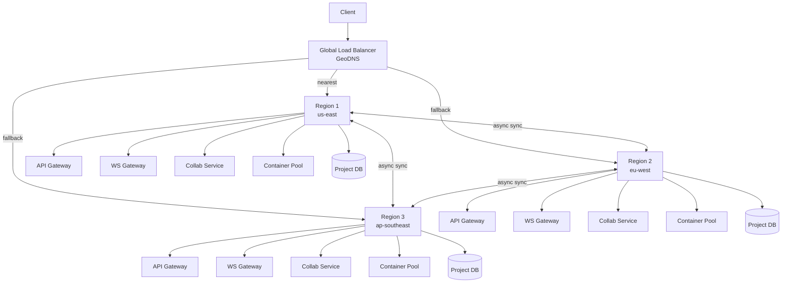

*Multi-region deployment: a global load balancer routes clients to their nearest region via GeoDNS. Each region runs a full stack: API Gateway, WebSocket Gateway, Collab Service, Container Pool, and Project DB. Cross-region async replication keeps data synchronized. If one region fails, the load balancer routes traffic to the other regions.*

#### Auto-Scaling

- **Stateless services (API Gateway, Execution Service, Project Service)**: Scale horizontally based on CPU and request latency. Kubernetes HPA adjusts replica count automatically.
- **Collab Service plus WebSocket Gateway**: Scale by concurrent WebSocket connection count. Each gateway handles 50K to 100K concurrent connections (JVM tuned or use off-heap).
- **Container Pool**: Scale idle containers per language based on demand forecasts. Hibernate idle containers after 10 minutes of inactivity.
- **Firecracker**: Scale microVM creation rate; pre-warm AMIs; use Firecracker snapshots for sub-100ms restore.

#### Graceful Degradation

- **Collab Service down**: Clients fall back to offline mode (Yjs stores ops locally); sync when the service recovers.
- **Container Pool exhausted**: Queue execution requests with a spinner; scale up new containers (may take 5 to 10s for cold start).
- **LSP Service down**: Editor still works for basic editing; autocomplete and linting disabled with a warning.
- **File Storage (S3) down**: Use in-container filesystem as fallback; sync to S3 when it recovers.
- **Database down**: Read-only mode for existing sessions; new project creation disabled.

#### Scaling Numbers

- **1M concurrent coding sessions** to 500+ GB RAM per region (containers plus collaboration state).
- **1000+ WebSocket gateways** at 50K connections each.
- **15 language runtimes** to 500+ container instances per language for warm pools.
- **50K concurrent container executions** for code runs.

---

### Performance and Optimization

The performance of an online code editor is measured by editing latency (sub-50ms keystroke-to-screen), cold start time (sub-2s project open), and execution latency (sub-500ms for typical code runs).

#### Latency Optimization

- **CRDT state sync**: On join, send a compact snapshot (not full document) using incremental encoding. Only send operations that the client hasn't seen (using a watermark and client vector).
- **Cursor presence**: Send cursor updates at most every 50ms (client-side throttling) to avoid WebSocket flooding. Batch multiple cursor updates into a single frame.
- **LSP debounce**: Debounce LSP requests (autocomplete, linting) to 250ms after the last keystroke. Cache results for identical documents.
- **Gateway co-location**: Deploy WebSocket gateways in the same region as the Collab Service and Container Pool to minimize hop latency.
- **Connection pooling**: Reuse WebSocket connections between gateway and Collab Service. Maintain persistent HTTP and gRPC connections between services.

#### Throughput Optimization

- **CRDT document sharding**: Partition collaboration documents by `project_id` hash across Collab Service instances. Each instance handles a disjoint set of projects.
- **Operation compression**: Compress CRDT operations using delta compression (only send changes from the previous state). Yjs supports an encoding format for smaller payloads.
- **Batch broadcast**: When multiple operations arrive within a 5ms window, batch them into a single broadcast frame to reduce per-message overhead.

#### Caching Strategies

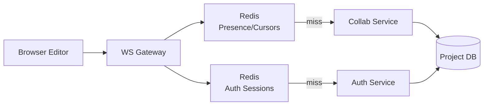

*Multi-tier caching: the WebSocket gateway caches presence and cursor state and auth sessions in Redis. On a cache hit, no round-trip to the Collab or Auth Service is needed — the request is served from Redis in microseconds. Cache misses fall through to the backing service and database.*

#### Cold Start Optimization

- **Pre-warming**: Maintain 30 to 50 percent idle pool of containers per language during peak hours. Use ML to forecast demand.
- **Image optimization**: Use distroless or minimal base images (100 to 200MB). Pre-cache images on the container host.
- **Firecracker snapshots**: Save microVM snapshots after boot. Restore takes about 100ms instead of about 252ms for a full boot.
- **Lazy language loading**: Rare languages (Rust, Swift) are provisioned on-demand with longer wait times communicated to the user.
- **Stargate pattern**: Separate compute (containers) from storage (S3). The container is stateless; files are mounted from S3 on startup.

#### Container I/O Optimization

- **File sync batching**: Instead of syncing every file change immediately, batch changes every 3 to 5 seconds and send diffs (not full files).
- **Read-only filesystem**: Make the container filesystem read-only except for a `/workspace` mount point. Prevents attacks and reduces I/O.
- **Overlay filesystem**: Use overlay filesystems for efficient copy-on-write between the base image and the user's workspace.

---

### CAP Theorem and Consistency Trade-offs

The CAP theorem states that during a network partition, a distributed system can provide at most two of: Consistency, Availability, and Partition tolerance. Since network partitions are inevitable in distributed systems, the choice is between consistency (C) and availability (A) during a partition.

#### Collaboration State — AP (Availability plus Partition Tolerance)

The collaboration state (CRDT document) prioritizes availability: if a Collab Service instance is partitioned from others, users connected to it can still edit and receive sync from other connected users. The CRDT converges when the partition heals. Brief divergence (a few seconds of unsynced edits) is acceptable for a code editor.

- **Trade-off**: A user might see a slight delay in remote edits appearing, but local editing is never blocked.
- **Why**: Real-time collaboration is latency-sensitive. Blocking edits during a partition would degrade UX more than a brief divergence that auto-resolves.

#### File Storage — CP (Consistency plus Partition Tolerance)

File storage (S3) uses consistency for critical operations: when a user saves a file, the write must be durable before the system reports success. S3 provides strong read-after-write consistency within a region. Cross-region replication is asynchronous (eventual consistency), but this is acceptable since users are routed to their nearest region.

- **Trade-off**: Cross-region reads may be slightly stale (seconds), but within-region reads are immediately consistent.
- **Why**: Users expect "save" to mean their work is persisted. Losing a save due to availability-prioritized failure is unacceptable.

#### Container Pool — AP (Availability)

The container pool prioritizes availability: if a container dies, a new one is immediately provisioned from the pool (or a new one is created). The user's work is preserved because files are synced to S3. A brief interruption (2 to 5s to spin up a replacement container) is acceptable.

- **Trade-off**: A dead container means the user loses in-memory state (unsaved changes since the last 3 to 5s sync). This is mitigated by frequent file sync.
- **Why**: Availability is more important than consistency for compute resources — users should always be able to run code.

#### Project Metadata — CP (Consistency)

Project metadata (ownership, permissions, file tree) uses consistency: when a user shares a project, the permission change must be immediately visible to all services. PostgreSQL with leader-based replication provides strong consistency within a region.

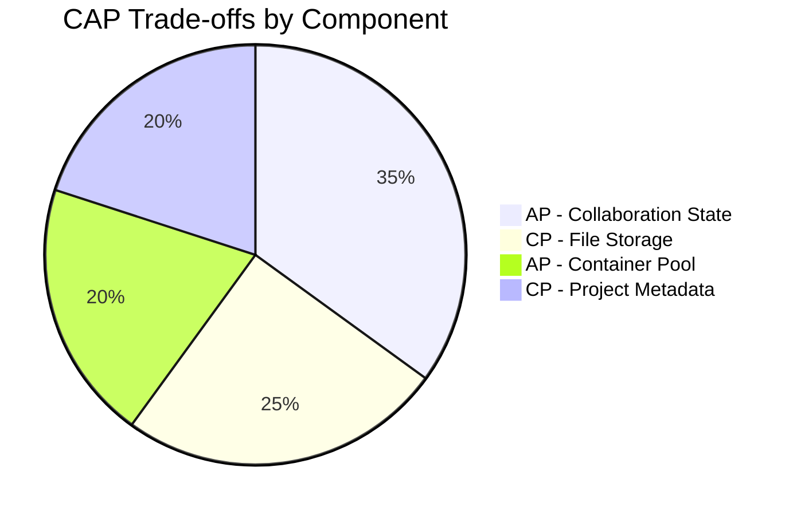

*CAP trade-offs across online code editor components: collaboration state is AP (availability-first for low-latency editing); file storage is CP (consistency-first for durability); container pool is AP (availability-first for uninterrupted execution); project metadata is CP (consistency-first for correct permissions).*

**Interview question:** *Is an online code editor strongly consistent or eventually consistent?*
**Answer:** It is a composite. Collaboration state is eventually consistent (CRDTs converge over seconds, which is acceptable for concurrent editing). File storage and project metadata are strongly consistent (within-region) because users expect saves to be immediately durable. Container state is best-effort (containers are ephemeral; files are restored from S3). This pragmatic split is the key insight interviewers look for.

---

### Encryption and Key Management

An online code editor stores sensitive data: user source code, project files, terminal session output, and potentially secrets and keys embedded in the code. Encryption must protect data at rest, in transit, and during processing within containers.

#### Encryption at Rest

**File storage (S3):** All objects are encrypted with SSE-S3 (S3-managed keys) or SSE-KMS (customer-managed keys via AWS KMS). Each project's files can also be encrypted with a project-specific DEK for multi-tenant isolation.

**Container filesystem:** Firecracker microVMs use encryption-at-rest for their root filesystem. Container-local ephemeral storage is encrypted with a per-VM key.

**Database:** Project metadata in PostgreSQL uses TDE (Transparent Data Encryption) at the disk level.

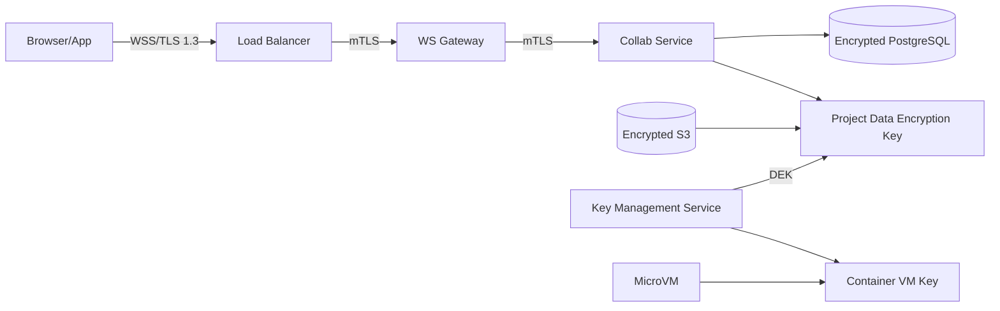

*Encryption at rest architecture: project files in S3 are encrypted with a project-specific DEK; project metadata in PostgreSQL uses TDE. The KMS manages all DEKs. Container microVMs use per-VM keys. TLS and mTLS protect all data in transit.*

#### Encryption in Transit

All client-to-server and inter-service traffic uses TLS 1.3 (minimum TLS 1.2). WebSocket connections are upgraded over HTTPS (WSS). Inter-service communication uses mTLS (mutual TLS) for service-to-service authentication.

- **TLS termination**: Terminate TLS at the edge load balancer. Use TLS pass-through to WebSocket gateways for WSS upgrades.
- **mTLS for service mesh**: A service mesh (Istio, Linkerd) provides mTLS between Collab Service, Execution Service, and Container Pool without application changes.
- **Certificate rotation**: Certificates rotated automatically every 30 to 90 days via automated ACME or cloud KMS integration.

#### Key Management

- **Key hierarchy**: A KEK (Key Encryption Key) in an HSM (AWS KMS, HashiCorp Vault) encrypts per-object DEKs. Rotating the KEK requires only re-encrypting the DEKs, not the data.
- **Key rotation**: KEKs rotated every 90 days. Project DEKs rotated every 365 days. Container VM keys rotated per boot.
- **Multi-region KMS**: Keys are available in all deployment regions. Cloud KMS replicates keys automatically; on-prem deployments use HashiCorp Vault with integrated storage for multi-region HA.

```java
@Service
@RequiredArgsConstructor
public class FileEncryptionService {

    @Value("${app.encryption.project-key-id}")
    private String keyId;

    private final AwsKms kmsClient;

    public EncryptedFile encrypt(byte[] plaintext, String projectId) {
        var dek = kmsClient.generateDataKey(keyId);
        var cipher = Cipher.getInstance("AES/GCM/NoPadding");
        cipher.init(Cipher.ENCRYPT_MODE,
            new SecretKeySpec(dek.plaintext(), "AES"),
            new GCMParameterSpec(128, dek.iv()));
        var ciphertext = cipher.doFinal(plaintext);
        return new EncryptedFile(ciphertext, dek.encryptedKey(), dek.iv(), projectId);
    }

    public byte[] decrypt(EncryptedFile encrypted) {
        var dek = kmsClient.decrypt(encrypted.encryptedKey(), encrypted.iv());
        var cipher = Cipher.getInstance("AES/GCM/NoPadding");
        cipher.init(Cipher.DECRYPT_MODE,
            new SecretKeySpec(dek.plaintext(), "AES"),
            new GCMParameterSpec(128, encrypted.iv()));
        return cipher.doFinal(encrypted.ciphertext());
    }

    record EncryptedFile(byte[] ciphertext, byte[] encryptedKey,
                         byte[] iv, String projectId) {}
}
```

*The `FileEncryptionService` Spring bean generates a per-project data encryption key (DEK) via AWS KMS, encrypts file content with AES-GCM (which provides both confidentiality and integrity via authentication tags), and stores the encrypted DEK alongside the ciphertext. The KMS-managed key ID is injected via `@Value`. Only authorized services with KMS decrypt permissions can recover the DEK to decrypt project files.*

#### Secrets Management

User secrets (API keys, database passwords, environment variables) are stored encrypted in the project metadata database. The Encryption Service encrypts secrets with a project-level DEK before persistence. At runtime, secrets are injected into the container's environment — never written to disk in plaintext.

- **Vault integration**: HashiCorp Vault or AWS Secrets Manager for service-level secrets (database passwords, API keys for third-party integrations).
- **Ephemeral secrets**: Container-specific secrets are generated per-execution and never persisted.
- **No secrets in images**: Container images never contain secrets; they are injected at runtime.

---

### Authentication and Authorization

A code editor must verify who is connecting (authentication), determine what they can do on a project (authorization), and enforce sharing permissions (who can view, edit, or execute code on a shared project). Every WebSocket connection and HTTP request must carry authenticated credentials.

#### Authentication Methods

- **OAuth 2.0 plus JWT**: Users authenticate via a third-party provider (Google, GitHub, GitLab) or email and password. The auth service issues a short-lived JWT (15 min) and a refresh token (7 days). The JWT contains the user ID, scopes, and expiry.
- **Session tokens**: For web, a server-side session token in an HttpOnly, Secure, SameSite=Strict cookie. The session store (Redis) maps token to user_id and handles revocation.
- **MFA (Multi-Factor Authentication)**: Required for sensitive operations (project deletion, team member management, payment changes). TOTP via authenticator app or SMS backup.
- **API tokens**: For programmatic access (CI and CD integrations, CLI tools). Scoped tokens with expiration and audit logging.

#### Authorization Models

- **Scope-based (OAuth 2.0 scopes)**: Each token carries scopes like `projects:read`, `projects:write`, `executables:run`, `collaboration:edit`. The API Gateway enforces scope checks before routing.
- **Role-based (RBAC) for teams**: Within a team or workspace, users have roles (`owner`, `admin`, `editor`, `viewer`). Owners manage billing and team membership; admins manage projects; editors can edit and run; viewers can only view.
- **Resource-level permissions**: Each project has explicit permissions. `view` (read files), `edit` (modify files plus collaborate), `execute` (run code), `admin` (manage permissions, delete project). These can be granted per-user or per-team.
- **Share links**: Projects can be shared via a URL with a specific permission level (view-only, edit, or full access). Share links can be time-limited and password-protected.

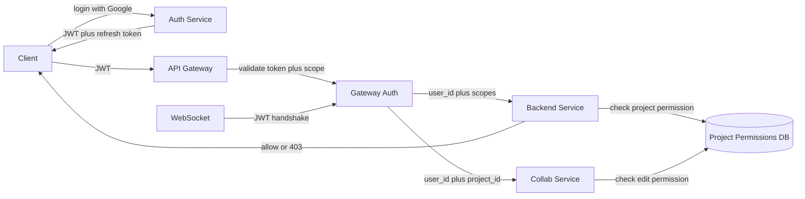

*Authentication and authorization flow: the client logs in via the auth service (Google SSO recommended), receives a JWT and refresh token; the API Gateway validates the JWT signature and checks scopes before forwarding to backend services; each service checks resource-level project permissions. WebSocket connections authenticate during the handshake with the same JWT.*

```java
@Service
@RequiredArgsConstructor
public class ProjectPermissionService {

    private final ProjectPermissionRepository permissionRepository;

    public enum Permission {
        VIEW, EDIT, EXECUTE, ADMIN
    }

    @Transactional(readOnly = true)
    public boolean hasPermission(String userId, String projectId, Permission permission) {
        var perm = permissionRepository.findByUserIdAndProjectId(userId, projectId);
        if (perm == null) {
            return false;
        }
        return switch (permission) {
            case VIEW -> perm.getLevel() >= PermissionLevel.VIEW.getValue();
            case EDIT -> perm.getLevel() >= PermissionLevel.EDIT.getValue();
            case EXECUTE -> perm.getLevel() >= PermissionLevel.EXECUTE.getValue();
            case ADMIN -> perm.getLevel() >= PermissionLevel.ADMIN.getValue();
        };
    }

    @Transactional
    public void shareProject(String userId, String projectId,
                             String targetUserId, Permission permission) {
        if (!hasPermission(userId, projectId, Permission.ADMIN)) {
            throw new SecurityException("Only project admins can share projects");
        }
        var level = switch (permission) {
            case VIEW -> PermissionLevel.VIEW;
            case EDIT -> PermissionLevel.EDIT;
            case EXECUTE -> PermissionLevel.EXECUTE;
            case ADMIN -> PermissionLevel.ADMIN;
        };
        permissionRepository.grant(targetUserId, projectId, level);
    }

    enum PermissionLevel {
        VIEW(1), EDIT(2), EXECUTE(3), ADMIN(4);
        private final int value;
        PermissionLevel(int value) { this.value = value; }
        public int getValue() { return value; }
    }
}
```

*The `ProjectPermissionService` Spring bean enforces per-project RBAC. The `hasPermission` method checks if a user has the required permission level (ordinal-based: VIEW equals 1, EDIT equals 2, EXECUTE equals 3, ADMIN equals 4). The `shareProject` method requires ADMIN permission and grants the specified permission level to the target user. The `@Transactional(readOnly = true)` annotation optimizes read-only permission checks.*

---

### Security Threats and Mitigations

#### Threat: Sandbox Escape

- **Risk**: Malicious code escapes the microVM or container and gains access to the host or other users' environments.
- **Mitigation**: Use Firecracker microVMs (hardware virtualization) instead of containers for strong isolation. Apply seccomp profiles to filter syscalls. Run as non-root. Restrict network egress (no outbound traffic except to approved endpoints). Set cgroup limits (CPU, memory, disk, max processes). Use read-only root filesystem with a writable overlay for the workspace only.

#### Threat: Resource Exhaustion (Fork Bomb)

- **Risk**: Malicious or buggy code consumes all CPU, memory, or disk in a container, affecting other users.
- **Mitigation**: cgroup limits (0.5 CPU, 512MB RAM, 1GB disk, 10K max processes). Hard timeout (30s) enforced by the kernel. Network bandwidth limits. Kill containers that exceed limits.

#### Threat: Code Injection and XSS in Editor

- **Risk**: Malicious file content rendered in the Monaco editor contains XSS payloads that execute in the context of the user's browser.
- **Mitigation**: Content Security Policy (CSP) headers. Sanitize all file content rendered in the editor. Monaco sanitizes HTML content by default; custom extensions must also sanitize. Use subresource integrity (SRI) for all loaded scripts.

#### Threat: Data Exfiltration via Terminal

- **Risk**: A user runs code that exfiltrates data to external servers via the network (the container has network access for package downloads).
- **Mitigation**: Restrict network egress to package registries (npm, PyPI, Maven) only. Block all other outbound traffic. Use a transparent proxy for egress that inspects and filters traffic. Log all network connections.

#### Threat: Container Image Vulnerabilities

- **Risk**: Base container images have known CVEs that could be exploited.
- **Mitigation**: Regular CVE scanning (Trivy, Clair). Auto-patch base images weekly. Use distroless or minimal base images. Pin dependency versions. Use a private registry with vulnerability scanning gates.

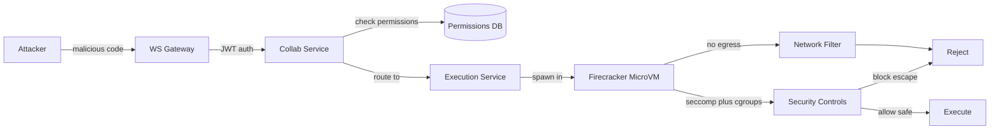

*Security pipeline: an authenticated client submits code for execution. The Execution Service spawns it in a Firecracker microVM with seccomp filters, cgroup limits, and network egress restrictions. The network filter blocks all outbound traffic except to approved package registries. Security controls prevent container escape and resource exhaustion.*

**Common mistakes:**

- **No sandbox** → code escape → system compromise.
- **No resource limits** → fork bomb, disk fill, or memory exhaustion affecting other users.
- **No pre-warming** → 5–10s cold start for every project open.
- **OT instead of CRDT** → complexity in conflict resolution and transformation logic.
- **No file sync** → work lost on container crash or restart.
- **Shared containers** → cross-user data leakage or security.
- **No timeout** → infinite loops consuming compute indefinitely.
- **No network isolation** → internal service access from user containers.
- **Not supporting offline** → poor UX on flaky networks; CRDT can work offline.
- **Ignoring image CVEs** → known vulnerabilities in production containers.
- **Leaving WebSocket open without JWT validation** → unauthorized collaboration.
- **Hardcoded secrets in container images** → credential theft.
- **No rate limiting on execution** → denial of service via compute exhaustion.

---

### Observability and Logging

An online code editor generates massive telemetry across collaboration, execution, and user interaction. Observability must cover editing latency, container health, execution performance, and error rates.

#### Key Metrics

- **Editing latency**: Keystroke-to-screen time (p50 less than 25ms, p99 less than 50ms). CRDT op broadcast latency. Reconnect latency.
- **Container metrics**: Active containers per language, cold start time (p50 less than 2s, p99 less than 5s), container uptime, resource utilization (CPU, memory, disk).
- **Execution metrics**: Code run start latency, execution time (per language), exit codes, stdout and stderr volume, timeout rate.
- **Collaboration metrics**: Active collaboration sessions, concurrent editors per document, conflict rate (CRDT merge conflicts), cursor update rate.
- **Gateway metrics**: Active WebSocket connections, ping and pong latency, message rate, reconnect rate, connection churn.
- **Error rates**: 5xx errors per service, execution failures, container crashes, WebSocket disconnects.
- **Business metrics**: Daily active users, project creation rate, code execution volume, premium feature adoption.

#### Logging

- **Access logs**: Every HTTP request and WebSocket connection logged with user ID, endpoint, response code, and latency. Used for audit trails and abuse detection.
- **Event logs**: All user actions (project create, file edit, code run, share) logged as structured events for analytics and ML feature generation.
- **Error logs**: Service errors with correlation IDs for cross-service tracing. Execution failures logged with container ID and exit code.
- **Security logs**: Auth failures, permission denials, sandbox escape attempts, rate limit hits, suspicious patterns.

#### Distributed Tracing

Trace every user request across all services — from browser WebSocket through the gateway, Collab Service, Execution Service, Container Pool, and back. Use OpenTelemetry with a trace context header propagated across service boundaries. Key spans to instrument: CRDT op broadcast, container acquire, code execution, LSP response, file sync.

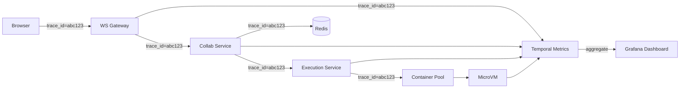

*Distributed tracing: each user action carries a trace ID propagated across all downstream service calls. The WS Gateway, Collab Service, Execution Service, Container Pool, and the running microVM each record spans. These spans aggregate in a metrics backend and are visualized in Grafana dashboards, enabling end-to-end latency analysis.*

#### Alerting Strategy

- **Critical (page immediately)**: Container crash rate above 5 percent for 5 minutes; execution service unavailable; Collab Service p99 latency above 100ms for 2 minutes; gateway connection churn above 20 percent per minute.
- **Warning (Slack, no page)**: Cold start p99 above 5s; container pool utilization above 90 percent; execution timeout rate above 1 percent; CRDT conflict rate above 0.1 percent.
- **Info (dashboard only)**: User trends, feature adoption, container image pull latency.

```java
@Service
@RequiredArgsConstructor
public class InstrumentedExecutionService {

    private final ExecutionService executionService;
    private final MeterRegistry meterRegistry;

    public ExecResult execute(String projectId, String language, String code) {
        var timer = Timer.Sample.start(meterRegistry);
        try {
            var result = executionService.execute(projectId, language, code);
            timer.stop(Timer.builder("execution.latency")
                .tag("language", language)
                .tag("exit_code", String.valueOf(result.exitCode()))
                .register(meterRegistry));
            Counter.builder("execution.requests")
                .tag("language", language)
                .tag("status", result.success() ? "success" : "failure")
                .register(meterRegistry).increment();
            return result;
        } catch (Exception e) {
            Counter.builder("execution.errors")
                .tag("language", language)
                .tag("error_type", e.getClass().getSimpleName())
                .register(meterRegistry).increment();
            timer.stop(Timer.builder("execution.latency")
                .tag("language", language)
                .tag("error", "true")
                .register(meterRegistry));
            throw e;
        }
    }

    record ExecResult(String stdout, String stderr, int exitCode, boolean success) {}
}
```

*The `InstrumentedExecutionService` bean wraps the core `ExecutionService` with Micrometer instrumentation. It records a timer for execution latency (tagged by language and exit code) and counters for successful and failed executions and errors (tagged by language and error type). All metrics are registered through the constructor-injected `MeterRegistry`. The `ExecResult` record is an immutable return type.*

---

### Real-World Implementations

Online code editors leverage a combination of open-source and proprietary systems, each chosen for its strengths in a specific layer of the stack.

#### Monaco Editor

Used for: the browser-based code editor UI. Syntax highlighting via TextMate grammars; LSP client; extensibility via custom providers; theming. All client-side JavaScript.

**Companies:** Microsoft (VS Code Web), Replit, CodeSandbox, GitHub Codespaces.

#### Yjs (CRDT Library)

Used for: real-time collaborative editing. Yjs implements a conflict-free replicated data type for shared document state. Provides providers for WebSocket, WebRTC, and IndexedDB (for offline persistence).

**Companies:** Replit (collaboration engine), CodeSandbox (shared editing), Notion (document collaboration), Figma (design collaboration).

#### Firecracker

Used for: secure multi-tenant code execution. MicroVMs with hardware virtualization provide stronger isolation than containers. Boot time about 125ms. Used for running untrusted user code.

**Companies:** AWS Lambda (infrastructure), AWS Fargate, Replit (sandbox), CodeSandbox (sandbox), Google Cloud Run (some configurations).

#### Docker and Kubernetes

Used for: container orchestration and pooling. Kubernetes manages the container lifecycle; custom operators manage the warm pool. Docker images contain language runtimes and pre-installed dependencies.

**Companies:** GitHub Codespaces, Gitpod, Replit, AWS CodeBuild.

#### Redis

Used for: WebSocket session state, cursor and presence tracking, auth session cache, container pool metadata. Redis Cluster provides sharding via hash slots.

**Companies:** Replit (presence), CodeSandbox (session state), virtually all online editors.

#### PostgreSQL

Used for: project metadata, user accounts, permissions, sharing configurations. Leader-based replication with read replicas for read scaling.

**Companies:** All cloud code editors (persistent metadata).

#### S3 or Object Store

Used for: project files, container snapshots, terminal session recordings, build artifacts. Direct-to-S3 uploads via presigned URLs for large files.

**Companies:** Replit (file storage), CodeSandbox (sandbox state), GitHub Codespaces (workspace snapshots).

#### Language Server Protocol (LSP) Servers

Used for: IDE intelligence (autocomplete, go-to-definition, linting, hover docs). Each language has a dedicated LSP server running inside the container.

**Companies:** tsserver (JS and TS), Pylance and Pyright (Python), gopls (Go), rust-analyzer (Rust), java-language-server (Java).

---

### Java and Spring Boot Implementation Guide

This section demonstrates how to build a Spring Boot service for an online code editor's core execution and collaboration pipeline, showcasing all the key Spring Boot features: `@Service`, `@RestController`, `@Repository`, `@Component`, `@Value`, records for DTOs, `@Valid`, `@ControllerAdvice`, constructor injection, `@Transactional`, and `@Version`.

#### 1. DTO Records

Records provide immutable, concise data carriers for request and response payloads.

```java
public record CreateProjectRequest(
        @jakarta.validation.constraints.NotBlank String name,
        @jakarta.validation.constraints.NotBlank String language,
        boolean isPublic) {}

public record ProjectResponse(
        String projectId,
        String ownerId,
        String name,
        String language,
        boolean isPublic,
        java.time.Instant createdAt,
        java.time.Instant updatedAt) {}

public record RunRequest(
        @jakarta.validation.constraints.NotBlank String filePath,
        @jakarta.validation.constraints.NotBlank String language,
        @jakarta.validation.constraints.Size(max = 10000) String code,
        java.util.List<String> args,
        int timeoutSeconds) {}

public record RunResponse(
        String execId,
        String stdout,
        String stderr,
        int exitCode,
        int durationMs,
        java.time.Instant startedAt) {}

public record FileResponse(
        String fileId,
        String path,
        String content,
        java.time.Instant updatedAt) {}
```

*Five record types serve as the API contract: `CreateProjectRequest` is the POST body with `@NotBlank` validation annotations (enforced by `@Valid` at the controller layer); `ProjectResponse` is the project DTO returned to clients; `RunRequest` carries the file path, language, code (with `@Size` max 10,000 chars), args, and timeout; `RunResponse` carries the execution output; `FileResponse` carries file metadata and content.*

#### 2. Entity with Optimistic Locking

The `Project` entity uses `@Version` for optimistic locking to prevent lost updates when concurrent writes modify the same project.

```java
@Entity
@Table(name = "projects", indexes = {
        @Index(name = "idx_owner_created", columnList = "ownerId, createdAt")
})
public class Project {

    @Id
    private String projectId;

    private String ownerId;
    private String name;
    private String language;

    @Column(name = "is_public")
    private boolean isPublic;

    @Column(name = "created_at")
    private Instant createdAt;

    @Column(name = "updated_at")
    private Instant updatedAt;

    @Version
    private Long version;

    @OneToMany(cascade = CascadeType.ALL, orphanRemoval = true)
    @MapKey(name = "path")
    private Map<String, File> files = new HashMap<>();

    // Constructors, getters, setters omitted for brevity

    public void updateFile(String path, String content) {
        File file = files.get(path);
        if (file != null) {
            file.setContent(content);
            file.setUpdatedAt(Instant.now());
        } else {
            files.put(path, new File(projectId, path, content, Instant.now()));
        }
    }
}
```

*The `Project` entity maps to the `projects` table with a composite index on `(ownerId, createdAt)` for efficient queries by owner. The `@Version` field enables JPA optimistic locking — if two concurrent transactions try to update the same project, the second one fails with `OptimisticLockException`, preventing lost updates. The `@OneToMany` files collection uses a map keyed by file path.*

#### 3. Repository Layer

The `@Repository` layer provides persistence operations with Spring Data JPA.

```java
@Repository
public interface ProjectRepository extends JpaRepository<Project, String> {

    @Query("SELECT p FROM Project p WHERE p.ownerId = :ownerId ORDER BY p.createdAt DESC")
    List<Project> findRecentByOwner(@Param("ownerId") String ownerId, Pageable pageable);

    @Query("SELECT p FROM Project p JOIN FETCH p.files WHERE p.projectId = :projectId")
    Optional<Project> findByIdWithFiles(@Param("projectId") String projectId);
}

@Repository
public interface ExecutionRepository extends JpaRepository<Execution, String> {

    @Query("SELECT e FROM Execution e WHERE e.projectId = :projectId ORDER BY e.startedAt DESC")
    List<Execution> findRecentByProject(@Param("projectId") String projectId, Pageable pageable);
}
```

*The `ProjectRepository` interface extends `JpaRepository`, inheriting CRUD methods. Two custom queries are defined: `findRecentByOwner` for fetching a user's recent projects (used in dashboard views), and `findByIdWithFiles` for loading a project with its files in a single query. The `ExecutionRepository` provides query methods for execution history.*

#### 4. Service Layer

Services encapsulate business logic, transactions, and the execution pipeline.

```java
@Service
@RequiredArgsConstructor
@Slf4j
public class ExecutionService {

    private final ContainerPoolManager pool;
    private final ExecutionRepository executionRepository;
    private final ProjectRepository projectRepository;
    private final MeterRegistry meterRegistry;

    @Value("${app.execution.default-timeout-seconds:30}")
    private int defaultTimeoutSeconds;

    @Transactional
    public RunResponse executeCode(String projectId, RunRequest request) {
        Timer.Sample timer = Timer.start(meterRegistry);
        var project = projectRepository.findById(projectId)
            .orElseThrow(() -> new ProjectNotFoundException(projectId));

        Container container = pool.acquire(request.language());
        try {
            container.setResourceLimit(ResourceLimit.builder()
                .cpuShares(512)
                .memoryMB(512)
                .diskMB(1024)
                .timeoutSeconds(request.timeoutSeconds() > 0
                    ? request.timeoutSeconds() : defaultTimeoutSeconds)
                .networkBlocked(true)
                .build());
            container.copyFiles(projectId, project.getFiles());
            ExecResult result = container.execute(request.filePath(), request.args());

            var execution = Execution.builder()
                .executionId(UUID.randomUUID().toString())
                .projectId(projectId)
                .containerId(container.getId())
                .command(request.filePath())
                .stdout(result.stdout())
                .stderr(result.stderr())
                .exitCode(result.exitCode())
                .durationMs(result.durationMs())
                .startedAt(Instant.now())
                .build();
            executionRepository.save(execution);

            timer.stop(Timer.builder("execution.duration")
                .tag("language", request.language())
                .tag("exit_code", String.valueOf(result.exitCode()))
                .register(meterRegistry));

            Counter.builder("execution.count")
                .tag("language", request.language())
                .tag("status", result.exitCode() == 0 ? "success" : "failure")
                .register(meterRegistry).increment();

            return RunResponse.from(execution);
        } finally {
            pool.release(container);
        }
    }

    public java.util.List<Project> getRecentProjects(String ownerId, int limit) {
        return projectRepository.findRecentByOwner(ownerId, Pageable.ofSize(limit));
    }
}
```

*The `ExecutionService` bean uses constructor injection (`@RequiredArgsConstructor`) for all dependencies. The `@Transactional` annotation ensures atomicity: it loads the project, acquires a container, sets resource limits, copies files, executes code, persists the execution result, and records metrics — all within a single transaction. The `@Value` annotation injects the default timeout. The `finally` block ensures the container is always returned to the pool. Micrometer timers and counters track execution latency and success rates.*

#### 5. REST Controller with Validation

The controller uses `@Valid` for request validation and constructor injection.

```java
@RestController
@RequestMapping("/api/v1/projects")
@RequiredArgsConstructor
public class ProjectController {

    private final ProjectService projectService;
    private final ExecutionService executionService;

    @PostMapping("/{projectId}/run")
    public ResponseEntity<RunResponse> runCode(
            @AuthenticationPrincipal UserDetails user,
            @PathVariable String projectId,
            @Valid @RequestBody RunRequest request) {

        if (!projectService.canAccess(user.getUsername(), projectId)) {
            throw new AccessDeniedException("You do not have access to this project");
        }

        RunResponse response = executionService.executeCode(projectId, request);
        return ResponseEntity.ok(response);
    }

    @GetMapping("/{projectId}/executions")
    public ResponseEntity<List<RunResponse>> getExecutionHistory(
            @AuthenticationPrincipal UserDetails user,
            @PathVariable String projectId) {

        if (!projectService.canAccess(user.getUsername(), projectId)) {
            throw new AccessDeniedException("You do not have access to this project");
        }

        var history = executionService.getHistory(projectId, 50);
        return ResponseEntity.ok(history);
    }
}
```

*The `ProjectController` uses `@RestController` to combine `@Controller` and `@ResponseBody`. The `@Valid` annotation on `RunRequest` triggers bean validation. `@AuthenticationPrincipal` injects the authenticated user from the security context. Constructor injection via `@RequiredArgsConstructor` makes dependencies explicit and non-nullable. The `canAccess` check ensures the user has permission before executing code or viewing history.*

#### 6. Controller Advice for Global Error Handling

A `@ControllerAdvice` bean centralizes exception handling across all controllers.

```java
@ControllerAdvice
public class GlobalExceptionHandler {

    @ExceptionHandler(ProjectNotFoundException.class)
    public ResponseEntity<ApiError> handleNotFound(ProjectNotFoundException ex) {
        var error = new ApiError(HttpStatus.NOT_FOUND, ex.getMessage());
        return ResponseEntity.status(HttpStatus.NOT_FOUND).body(error);
    }

    @ExceptionHandler(AccessDeniedException.class)
    public ResponseEntity<ApiError> handleForbidden(AccessDeniedException ex) {
        var error = new ApiError(HttpStatus.FORBIDDEN, ex.getMessage());
        return ResponseEntity.status(HttpStatus.FORBIDDEN).body(error);
    }

    @ExceptionHandler(MethodArgumentNotValidException.class)
    public ResponseEntity<ApiError> handleValidation(MethodArgumentNotValidException ex) {
        var messages = ex.getBindingResult().getFieldErrors().stream()
                .map(FieldError::getDefaultMessage)
                .toList();
        var error = new ApiError(HttpStatus.BAD_REQUEST,
                "Validation failed: " + String.join(", ", messages));
        return ResponseEntity.badRequest().body(error);
    }

    @ExceptionHandler(OptimisticLockException.class)
    public ResponseEntity<ApiError> handleConflict(OptimisticLockException ex) {
        var error = new ApiError(HttpStatus.CONFLICT,
                "Concurrent modification detected. Please retry.");
        return ResponseEntity.status(HttpStatus.CONFLICT).body(error);
    }

    public record ApiError(HttpStatus status, String message) {}
}
```

*The `GlobalExceptionHandler` bean (annotated `@ControllerAdvice`) catches exceptions thrown by any `@RestController` and returns structured `ApiError` responses. It handles `ProjectNotFoundException` (404), `AccessDeniedException` (403), `MethodArgumentNotValidException` (400 with field-level messages from `@Valid`), and `OptimisticLockException` (409 Conflict — which occurs when `@Version` detects a concurrent write). This avoids repetitive try-catch blocks in controllers.*

#### 7. WebSocket Configuration for Collaboration

Spring Boot configuration for the WebSocket collaboration endpoint.

```java
@Configuration
@EnableWebSocket
public class WebSocketConfig implements WebSocketConfigurer {

    private final CollabHandshakeInterceptor authInterceptor;
    private final CollaborationWebSocketHandler webSocketHandler;

    public WebSocketConfig(CollabHandshakeInterceptor authInterceptor,
                           CollaborationWebSocketHandler webSocketHandler) {
        this.authInterceptor = authInterceptor;
        this.webSocketHandler = webSocketHandler;
    }

    @Override
    public void registerWebSocketHandlers(WebSocketHandlerRegistry registry) {
        registry.addHandler(webSocketHandler, "/ws/edit/{projectId}")
            .addInterceptors(authInterceptor)
            .setAllowedOrigins("https://app.example.com");
    }
}
```

*The `WebSocketConfig` class is annotated with `@Configuration` and `@EnableWebSocket`. The `CollabHandshakeInterceptor` and `CollaborationWebSocketHandler` are injected via constructor injection. The handler is registered at `/ws/edit/{projectId}` with the auth interceptor applied. CORS is restricted to the application origin for security.*

#### 8. Container Pool Manager

Manages pre-warmed Firecracker containers per language.

```java
@Service
@RequiredArgsConstructor
@Slf4j
public class ContainerPoolManager {

    @Value("${app.pool.min-idle:30}")
    private int minIdle;

    @Value("${app.pool.max-idle:100}")
    private int maxIdle;

    @Value("${app.pool.hibernate-after-minutes:10}")
    private int hibernateAfterMinutes;

    private final FirecrackerClient firecrackerClient;
    private final ContainerImageRepository imageRepository;

    private final Map<String, BlockingQueue<Container>> pools = new ConcurrentHashMap<>();
    private final ScheduledExecutorService scheduler = Executors.newScheduledThreadPool(4);

    @PostConstruct
    public void initializePools() {
        for (var image : imageRepository.findAllActive()) {
            pools.put(image.getLanguage(), new ArrayBlockingQueue<>(maxIdle));
            // Pre-warm initial containers
            for (int i = 0; i < minIdle; i++) {
                warmContainer(image.getLanguage());
            }
            // Schedule periodic pool maintenance
            scheduler.scheduleAtFixedRate(
                () -> maintainPool(image.getLanguage()),
                1, 5, TimeUnit.MINUTES);
        }
    }

    public Container acquire(String language) {
        var pool = pools.get(language);
        if (pool == null) {
            log.warn("No pool for language {}, creating on-demand", language);
            return createContainer(language);
        }

        Container container = pool.poll();
        if (container == null) {
            log.info("Pool exhausted for {}, creating on-demand", language);
            return createContainer(language);
        }

        if (container.isHealthy() && !container.isExpired()) {
            return container;
        } else {
            container.destroy();
            return createContainer(language);
        }
    }

    public void release(Container container) {
        var pool = pools.get(container.getLanguage());
        if (pool != null && pool.offer(container)) {
            container.reset(); // Clean workspace
            return;
        }
        // Pool full, destroy container
        container.destroy();
    }

    private void warmContainer(String language) {
        try {
            var container = createContainer(language);
            pools.get(language).offer(container);
        } catch (Exception e) {
            log.error("Failed to warm container for {}", language, e);
        }
    }

    private void maintainPool(String language) {
        var pool = pools.get(language);
        if (pool == null) return;

        // Evict stale containers
        var temp = new ArrayList<Container>();
        while (pool.size() > minIdle) {
            var c = pool.poll();
            if (c != null) {
                if (Duration.between(c.getLastUsed(), Instant.now()).toMinutes() > hibernateAfterMinutes) {
                    c.hibernate(); // Snapshot and stop
                } else {
                    temp.add(c);
                }
            }
        }
        temp.forEach(pool::offer);

        // Top up to minIdle
        while (pool.size() < minIdle) {
            warmContainer(language);
        }
    }

    private Container createContainer(String language) {
        var image = imageRepository.findByLanguage(language);
        return firecrackerClient.createMicroVM(image.getImageId());
    }
}
```

*The `ContainerPoolManager` Spring bean manages pre-warmed Firecracker containers per language. On startup (`@PostConstruct`), it initializes pools for each active language image, pre-warms `minIdle` containers, and schedules periodic pool maintenance. The `acquire` method retrieves a healthy, non-expired container from the pool or creates one on-demand if the pool is exhausted. The `release` method resets the container workspace and returns it to the pool, or destroys it if the pool is full. The `maintainPool` method evicts stale containers (hibernating those idle too long) and tops up to `minIdle`. All configuration is injected via `@Value`.*

---

### Interview Questions and Answers

A curated set of interview questions organized by difficulty, focused on online code editor platform design.

**Beginner**

1. **Q: How do you implement real-time collaborative editing?**
   **A:** CRDT (Yjs) — operations converge automatically, works offline, no central conflict resolver. OT (Google Docs) — needs a central server to transform operations. CRDT is simpler for distributed systems.

2. **Q: How do you sandbox code execution?**
   **A:** Firecracker microVMs or Docker containers with resource limits (512MB RAM, 0.5 CPU, 30s timeout); no network egress; read-only filesystem; non-root user; seccomp profiles. For stronger isolation: Firecracker microVM or gVisor.

3. **Q: What is the cold start problem?**
   **A:** First container creation takes 1 to 5 seconds (image pull plus startup). Solution: pre-warm a container pool (100+ per language); hibernate idle containers for more than 10 minutes.

4. **Q: How does Monaco editor work?**
   **A:** VS Code's web port — compiled to JavaScript. Syntax highlighting via TextMate grammars; LSP client; extensions; theming. All client-side. Collaboration is layered via WebSocket using CRDT.

5. **Q: What is LSP?**
   **A:** Language Server Protocol — a standard for IDE features (autocomplete, go-to-definition, linting). Each language has an LSP server (tsserver, Pylance, gopls). The editor sends changes; the LSP server responds with completions, errors, and definitions.

**Intermediate**

6. **Q: How does Yjs CRDT work for code collaboration?**
   **A:** Yjs creates a shared CRDT data type (Y.Text for code). Each keystroke creates a CRDT operation with a unique client ID and logical clock. Operations are applied locally immediately, then broadcast via WebSocket. Due to CRDT properties, all clients converge to the same document state regardless of operation order. Yjs also supports offline persistence via IndexedDB.

7. **Q: How do you sync files between browser and container?**
   **A:** On project open, the File Service downloads files from S3 to the container filesystem. Edits in Monaco update the CRDT state; the Collab Service persists file changes to S3 every 3 to 5 seconds. On container restart, files are restored from S3. Conflicts are resolved via last-write-wins on the file level, with the CRDT handling intra-file edits.

8. **Q: How do you handle WebSocket connection scaling?**
   **A:** Use a WebSocket gateway tier with sticky sessions (cookie or source-IP affinity). Each gateway handles 50K to 100K concurrent connections. Use a connection registry (Redis) to track which gateway holds each user's connection. For broadcasts, the gateway only delivers to local connections; cross-gateway messages use Redis pub/sub.

9. **Q: How do you prevent sandbox escape?**
   **A:** Use Firecracker microVMs (hardware virtualization) instead of plain containers. Apply seccomp profiles to filter syscalls. Run as non-root user. Set cgroup limits (CPU, memory, disk, PIDs). Disable network egress. Use a read-only root filesystem. Scan container images for CVEs before deployment.

10. **Q: How do you optimize cold starts for 15 languages?**
    **A:** Pre-warm 30 percent of idle containers per language during peak hours. Use ML to forecast demand. Use distroless minimal images (100MB). Use Firecracker snapshots for 100ms restoration. Lazy-load rare languages (Go, Rust) with longer wait communicated to the user. Separate compute from storage (Stargate pattern) so containers start without waiting for file sync.

**Advanced**

11. **Q: Design an online IDE for 10 million concurrent users across 15 languages.**
    **A:** (1) **Frontend**: Monaco plus xterm.js; CDN for static assets. (2) **Collab**: Yjs CRDT via WebSocket cluster (200+ gateway servers, 500+ Collab Service instances); Redis for presence; consistent hashing by project_id for document routing. (3) **Containers**: 15 language images to 500+ instances each (7,500+ total); Firecracker microVMs; pre-warm 30 percent; hibernate idle after 10 minutes. (4) **Execution**: 0.5 CPU, 512MB RAM, 30s timeout, no egress; 100K concurrent executions. (5) **Storage**: S3 with multi-region replication; PostgreSQL sharded by project_id hash. (6) **LSP**: Per-container language servers via LSP proxy; debounced. (7) **Scale**: 500 WebSocket gateways at 50K connections each; 200 Collab Service instances; 5 regions. (8) **Cost**: Spot instances for execution; hibernate idle containers; $200K/month.

12. **Q: How do you secure arbitrary code execution at scale?**
    **A:** Firecracker microVMs (kernel isolation) plus cgroup limits (0.5 CPU, 512MB, 30s timeout) plus no network egress plus seccomp profiles plus non-root user plus read-only root filesystem. Image CVE scanning (Trivy) weekly. No secrets injected into containers. Rate limiting per user (max 10 executions per minute). Monitor for abuse patterns (fork bombs, crypto miners). Use a job queue for execution to control concurrency. Quarantine suspicious executions for analysis.

13. **Q: How do you handle CRDT conflicts and document consistency?**
    **A:** Yjs CRDTs converge automatically by mathematical design — there are no true conflicts. However, practical issues arise: (1) Document size grows with operation history — use Yjs snapshots plus update pruning. (2) Network partitions can cause temporary divergence — clients buffer locally and sync on reconnect. (3) Cursor/selection conflicts are resolved by last-writer-wins in Redis. (4) File-level conflicts (two users editing the same file) are resolved by the CRDT for in-file content; file rename/delete conflicts use last-write-wins with vector clocks.

14. **Q: How do you design the container pool for multi-region deployment?**
    **A:** Each region maintains its own warm container pool per language. Cross-region replication of container images via a global image registry (e.g., ECR Replication or Harbor with multi-region). On failover, users are routed to the next-nearest region; the pool there handles the load (with cold starts for non-pre-warmed languages). Use Firecracker snapshots replicated to all regions for fast restore. Pool sizing: 30 percent idle minimum per language, scaled by ML demand forecasting per region.

**Advanced / Senior-Level**

15. **Q: Design a browser-based IDE for 500K DAU, 50K concurrent executions, 15 languages. How do you handle global distribution and failover?**
    **A:** (1) **Frontend**: Monaco plus xterm.js; CDN with edge functions for auth. (2) **Collab**: Yjs CRDT via WebSocket cluster (200 servers at 2,500 connections each); sticky sessions via Redis-backed session affinity; consistent hashing by project_id for document shard routing; cross-region CRDT sync via async merge for offline recovery. (3) **Containers**: 15 language images to 100+ instances each (1,500+ total); Firecracker; pre-warm 30 percent; hibernate after 10 minutes idle; Stargate pattern for compute-storage separation. (4) **Execution**: 512MB, 0.5 CPU, 30s hard kill; rate-limited per user (10/min); job queue with priority for interactive vs background. (5) **Storage**: S3 with multi-region replication plus 5s sync; PostgreSQL sharded by project_id hash plus read replicas per region. (6) **LSP**: Per-container language servers via LSP proxy; debounced; cached completions. (7) **Scale**: 200 WS servers at 2,500 connections each = 500K concurrent sessions; 50K concurrent executions; 3 regions (us-east, eu-west, ap-southeast); global load balancer with latency-based routing. (8) **Failover**: On region failure, GeoDNS routes to next-nearest region; container pools there spin up from replicated snapshots (100ms Firecracker restore); CRDT state syncs from Redis replication; file sync from S3 cross-region. (9) **Cost**: $20K/month; spot instances for execution; hibernate idle containers; $5K/month per region for 50K concurrent executions.

16. **Q: How do you achieve sub-50ms editing latency at global scale with 1M concurrent sessions?**
    **A:** (1) **Edge deployment**: Deploy WebSocket gateways at 50+ edge PoPs (Cloudflare Workers, AWS Lambda@Edge for auth). Users connect to the nearest PoP. (2) **CRDT local-first**: Yjs applies edits locally immediately (0ms perceived latency) and syncs in the background. (3) **Operation compression**: Delta encoding; batch multiple ops into a single frame (max 5ms coalescing window). (4) **Gateway optimization**: Off-heap connection state; zero-copy frame forwarding; in-process session cache (no Redis round-trip for same-gateway delivery). (5) **CRDT state sync**: On join, send compact snapshot (not full document) using Yjs encodeStateAsUpdateV2. (6) **Cursor presence**: Throttle to 50ms; batch presence updates. (7) **Network optimization**: TCP_NODELAY; WebSocket permessage-deflate for op compression; direct peering between edge PoPs and regional Collab Services. (8) **Monitoring**: p99 < 50ms requires 99.9 percent of ops to meet the target; alert on cross-PoP relay latency above 10ms.

17. **Q: How do you handle the security vs. functionality trade-off in sandboxed code execution?**
    **A:** (1) **Layered isolation**: Firecracker microVM (kernel-level) as the outer boundary; container (cgroup, seccomp) as the inner boundary; language runtime sandbox (e.g., seccomp-bpf for Python sandboxing) as the innermost. (2) **Capability-based permissions**: By default, containers have no network, no write to filesystem except workspace, no device access. Users can request additional permissions (network, elevated CPU) that require re-authentication. (3) **Audit trail**: All code executions logged with full command line, container image, and exit code. Suspicious patterns trigger automated alerts. (4) **Image verification**: All container images signed with Sigstore/cosign; images verified at pull time. (5) **Runtime monitoring**: eBPF-based syscall monitoring for anomaly detection (unexpected network connections, file access outside workspace, process spawning). (6) **Time-based limits**: Hard 30s timeout enforced by the kernel (not just the application). (7) **Resource limits**: Hard cgroup limits (0.5 CPU, 512MB RAM, 1GB disk, 10K PIDs). (8) **Network proxy**: Transparent proxy for egress that allows only package registry domains (npm registry, PyPI, Maven Central); all other connections blocked; proxy logs all attempts.

18. **Q: How do you build a system that survives regional outages with zero data loss?**
    **A:** (1) **File storage**: S3 with cross-region replication (CRR) — every write replicated to 2+ backup regions within 1 minute. (2) **Database**: PostgreSQL with synchronous multi-region replication using Spanner or CockroachDB for strong consistency across regions; or leader-based replication with async cross-region (RPO < 1 minute). (3) **Collaboration state**: CRDT is by design multi-master — each region's Collab Service accepts edits independently; on region recovery, CRDT merge resolves any conflicts. (4) **Container state**: Stateless — containers are ephemeral; all state is in S3 or the database. (5) **Connection registry**: Redis with active-active replication (Redis Enterprise or KeyDB) across regions; TTL-based entries auto-expire. (6) **Failover automation**: Global load balancer with health checks; automatic failover within 30 seconds; clients reconnect with session recovery (JWT + project_id). (7) **Recovery validation**: Weekly chaos drills — kill a region, verify failover, measure data lag, validate zero document loss. (8) **Backup strategy**: Daily full backups of PostgreSQL to S3; 7-day retention; point-in-time recovery enabled.

---

## Real-World Examples

### Replit

* **Problem**: Provide an instant, collaborative coding environment for education and development, accessible from any browser.
* **Solution**: Monaco editor; Yjs CRDT for real-time collaboration; Firecracker microVMs for secure code execution; Docker-based container pools with pre-warming; LSP per container (tsserver, Pylance); file sync to S3 every 3s.
* **How it works**: User opens a repl (project) to the Collab Service streams Yjs CRDT state over WebSocket. Edits are applied locally and broadcast to collaborators. Running code to Execution Service acquires a pre-warmed Firecracker container, injects project files, executes, and streams stdout/stderr back via WebSocket. Files are synced to S3 every 3 seconds.
* **Architecture**: Edge (CDN + WebSocket gateway) to Services (Collab, Project, Execution, LSP, File, Terminal) to Data (PostgreSQL, S3, Redis) to Sandbox (Firecracker microVMs per language).
* **Scale**: Hundreds of thousands of concurrent sessions; 15+ language runtimes; sub-100ms collaboration latency.
* **Trade-offs**: Container cost per active session; CRDT memory overhead; cold start latency for rare languages.

### CodeSandbox

* **Problem**: Browser-based web development with instant previews and dependency management.
* **Solution**: Monaco editor; isomorphic TypeScript (browser plus server share the same compiler); iframe sandboxes for preview; CRDT (Yjs) for collaboration; browser-native bundler (esbuild).
* **How it works**: Editor writes code to a virtual filesystem in the browser. A server-side bundler compiles the project. The result is served as a signed URL to an iframe. Dependencies are resolved from npm. Collaboration uses Yjs CRDT over WebSocket.
* **Architecture**: Browser (Monaco + virtual FS + esbuild) to Server ( bundler, dependency resolution, LSP) to Data (PostgreSQL, Redis, S3).
* **Trade-offs**: Browser-based bundling has memory limits; complex backend integrations need server sandboxes; iframe isolation is weaker than Firecracker.

### GitHub Codespaces

* **Problem**: Full VS Code in the cloud with enterprise-grade security and compliance.
* **Solution**: Full VS Code (Theia-based web client or VS Code desktop connecting remotely); Linux containers on GitHub-hosted VMs; 120-core machines available; pre-built dev containers; integrated GitHub authentication.
* **How it works**: User creates a codespace to GitHub provisions a Linux VM with the project's devcontainer.json. VS Code connects via a remote tunnel. The VM has the full project, dependencies, and tools pre-installed. Git operations happen directly against GitHub.
* **Architecture**: Browser/VS Code to GitHub Codespaces service to Azure VMs with pre-built containers and GitHub storage.
* **Trade-offs**: Higher cost (full VM vs. microVM); longer cold start (VM boot time); but full IDE fidelity and GitHub integration.

### Gitpod

* **Problem**: Automated dev environments for GitHub/GitLab with pre-built workspaces.
* **Solution**: Kubernetes-based workspace pods; Theia/VS Code web; pre-built Docker images per repository; automated workspace startup from .gitpod.yml; integrated with GitHub and GitLab.
* **How it works**: User opens a workspace on a PR/branch; Gitpod reads .gitpod.yml to determine the build steps; a Kubernetes pod is spun up with the pre-built image and the code checked out; VS Code web connects via Theia.
* **Architecture**: Kubernetes orchestration with per-repo Docker images, Theia IDE, and Git integration.
* **Trade-offs**: Kubernetes overhead; image build time; but powerful automation and GitOps integration.

### StackBlitz

* **Problem**: Fastest browser-based web development with zero-configuration.
* **Solution**: WebContainers API (runs a Node.js filesystem in the browser via WASM); Monaco editor; in-browser bundler; instant previews without server round-trips.
* **How it works**: Entire toolchain (npm, bundler, dev server) runs in the browser via WebAssembly. Files are in an in-memory filesystem. No server containers needed for frontend development.
* **Architecture**: Pure browser (Monaco + WebContainers WASM + esbuild) plus backend for user data and sharing.
* **Trade-offs**: Limited to web/Node.js development; no native language support; WASM performance overhead.


