# Design Payment Gateway

## Blogs and websites

## Medium

## Youtube

- [Design Stripe | System Design Interview](https://www.youtube.com/watch?v=djc2vfpCvso)

---

## Theory

### Topics Covered

1. [Introduction / Problem Statement](#introduction--problem-statement)
2. [Characteristics](#characteristics)
3. [Pros](#pros)
4. [Cons](#cons)
5. [Use Cases](#use-cases)
6. [Components](#components)
7. [Architectural Patterns](#architectural-patterns)
8. [Benefits](#benefits)
9. [Challenges](#challenges)
10. [Best Practices](#best-practices)
11. [When to Use / When Not to Use](#when-to-use--when-not-to-use)
12. [Data Model and API](#data-model-and-api)
13. [Domain-Specific: Payment Gateway Deep Dive](#domain-specific-payment-gateway-deep-dive)
14. [Replication Strategies](#replication-strategies)
15. [Failure Detection and Membership](#failure-detection-and-membership)
16. [High Availability and Scalability](#high-availability-and-scalability)
17. [Performance and Optimization](#performance-and-optimization)
18. [CAP Theorem and Consistency Trade-offs](#cap-theorem-and-consistency-trade-offs)
19. [Encryption and Key Management](#encryption-and-key-management)
20. [Authentication and Authorization](#authentication-and-authorization)
21. [Security Threats and Mitigations](#security-threats-and-mitigations)
22. [Observability and Logging](#observability-and-logging)
23. [Real-World Implementations](#real-world-implementations)
24. [Java and Spring Boot Implementation Guide](#java-and-spring-boot-implementation-guide)
25. [Interview Questions and Answers](#interview-questions-and-answers)

---

### Introduction / Problem Statement

A payment gateway (Stripe, PayPal, Adyen) is a payment orchestration system that acts as an intermediary between merchants (e-commerce sites, apps) and payment processors/acquirers/card networks. It provides APIs for merchants to collect payments from customers, handling the complexity of multiple payment methods (credit cards, bank transfers, digital wallets, buy-now-pay-late), fraud detection, currency conversion, and regulatory compliance (PCI-DSS). The gateway must process payments with high availability, low latency, and strict security — a single transaction involves multiple external systems (card network, acquiring bank, issuing bank) that can each fail independently, and the system must never double-charge a customer even when network failures cause retries.

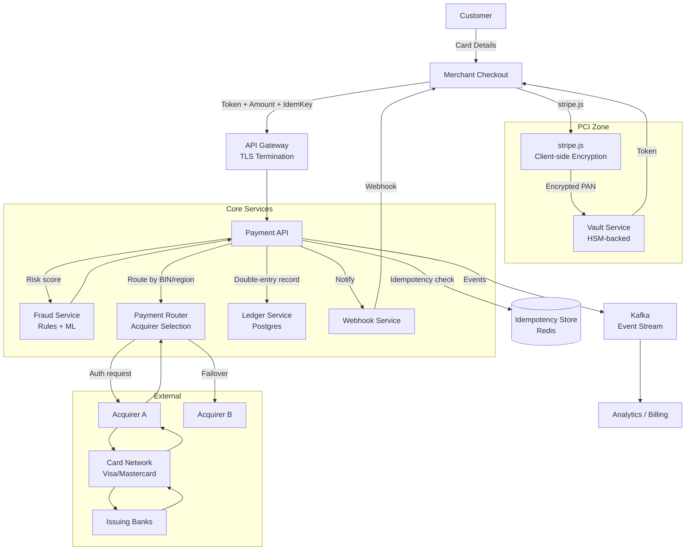

*The high-level architecture shows the payment gateway's service topology: the customer enters card data via the merchant's checkout page, which is encrypted client-side by stripe.js and tokenized by the Vault Service (HSM-backed, isolated PCI zone); the merchant's backend sends the token to the Payment API (behind an API Gateway for TLS termination and rate limiting); the API checks the idempotency store in Redis, routes the transaction through the Fraud Service (rules + ML), then through the Payment Router (which selects the best acquirer based on card BIN, region, currency, fees, and health) to the card network and issuing bank; all business events are recorded in the Ledger (double-entry accounting), published to Kafka for analytics and billing, and webhooks notify the merchant of the result.*

**Problem Statement:** Design a payment gateway (like Stripe or Adyen) that serves as a single integration point for merchants to accept payments globally — supporting credit cards, digital wallets, bank transfers, and buy-now-pay-later across 135+ currencies — while guaranteeing exactly-once processing via idempotency keys, real-time fraud detection in under 100 ms, PCI-DSS compliance through card data isolation, and sub-2-second checkout latency at 100K transactions/second during peak traffic.

**The core design challenge:** A single payment request traverses 5+ independent systems (merchant, gateway, acquirer, card network, issuing bank), each of which can fail, timeout, or return an ambiguous result. The system must handle partial failures (authorized but capture failed), race conditions (concurrent requests for the same order), and network partitions while providing clear transaction states and never double-charging the customer. Additionally, the system must comply with PCI-DSS (card data never touches merchant systems), PSD2 SCA (strong customer authentication in Europe), and regional regulations — all while maintaining 99.99% availability for revenue-critical checkout.

---

### Characteristics

| Characteristic | What it means | Why it matters | How it works |
|---|---|---|---|
| **Payment orchestration** | Routes transactions to the best processor | Different cards/regions need different acquirers | Decision tree based on card BIN, region, currency, fees, health |
| **PCI-DSS scope isolation** | Card data never touches merchant systems | PCI compliance is expensive and complex | Tokenization; client-side encryption (Stripe.js) |
| **Fraud detection** | Real-time identification of fraudulent transactions | Chargebacks and fraud cost merchants billions | Rules engine + ML models scoring transactions in under 100 ms |
| **Idempotency** | Same request processed once despite retries | Prevents duplicate charges on network failure | Idempotency key (UUID) stored in Redis with 24-hour TTL |
| **Multi-currency** | Transactions in customer's or local currency | Global commerce requires FX conversion | FX rate lookup + conversion at transaction time |
| **High availability** | Payments work 24/7, 99.99% uptime | Checkout is revenue-critical | Multi-region, active-active, acquirer failover |
| **Exactly-once semantics** | A charge is applied exactly once | Double-charging causes disputes and trust loss | Idempotency keys + transactional outbox pattern |
| **Async flows** | 3D Secure and bank redirects are asynchronous | Some payment methods can't complete synchronously | Webhook callbacks with status updates |
| **Settlement orchestration** | Coordinates fund movement across time zones | Merchants need predictable payout schedules | Batching, clearing (T+1/T+2), funding cycles |
| **Interchange optimization** | Routes to minimize interchange fees | Direct impact on gateway and merchant margins | BIN-based routing to lowest-interchange acquirer |

---

### Pros

- **Massive addressable market:** Digital commerce is a multi-trillion-dollar market globally — every online business needs to accept payments, creating enormous scale potential.
- **Network effects via ecosystem:** The more merchants and payment methods the gateway supports, the more valuable it becomes to all participants; developer tools and marketplace integrations create a rich ecosystem.
- **Recurring revenue streams:** Transaction fees (2.9% + $0.30) plus additional revenue from currency conversion (0.5-2% markup), subscription billing (0.5% add-on), fraud tools, and payout services — multiple monetization layers per transaction.
- **Built-in fraud protection:** Rules engine + ML models reduce fraudulent transactions and chargebacks, saving merchants money and protecting the platform's reputation.
- **PCI-DSS compliance assistance:** Tokenization and client-side encryption allow merchants to accept card payments without handling card data — staying in SAQ-A scope, dramatically reducing compliance burden.
- **Global payment reach:** Support for 135+ currencies, 100+ payment methods (cards, wallets, bank debits, BNPL, local methods), enabling merchants to sell anywhere instantly.
- **Developer experience:** Well-documented APIs, client SDKs, dashboard, and hosted checkout pages reduce integration time from weeks to days.

---

### Cons

- **High operational complexity:** Payment systems have more failure modes than typical web services — card declines, bank errors, network timeouts, regulatory issues, and external system outages all create complex states that must be handled correctly.
- **Regulatory burden:** PCI-DSS, PSD2 SCA, 3D Secure, EMVCo, local regulations — compliance is mandatory, expensive, and subject to frequent audits and changing requirements.
- **Chargeback liability:** Merchants (and gateways) bear financial risk for disputed transactions — a chargeback costs $15-50 plus the transaction amount; fraud detection is critical to minimize this.
- **Thin margins:** Payment processing has low margins (2.9% + $0.30 per transaction) — success depends entirely on volume; operational costs must be minimized to maintain profitability.
- **Dependence on external systems:** Card networks, acquiring banks, issuing banks, and 3D Secure providers can all experience outages independently — the gateway must route around failures it cannot control.
- **Fraud arms race:** Fraudsters continuously adapt to detection systems — ML models must be constantly retrained and updated; new attack vectors (account takeover, friendly fraud) require ongoing vigilance.
- **Trust and reputation risk:** A single security breach or double-charge incident can destroy trust and result in regulatory fines, merchant churn, and massive reputational damage.

---

### Use Cases

#### E-commerce Checkout

* **Problem:** An online retailer needs to accept credit cards on their checkout page without handling card data (PCI-DSS).
* **Solution:** Use the gateway's client-side component (Stripe Elements / stripe.js) to collect card data — the card data goes directly to the gateway, never to the merchant's server. The merchant receives a token and uses it server-side to create a charge.
* **Why suitable:** The gateway handles PCI-DSS (merchant stays in SAQ-A scope), fraud detection, and global card acceptance.
* **How it works:** (1) Customer enters card on checkout page → stripe.js collects card data → gateway tokenizes → returns token to merchant's frontend → frontend sends token to merchant's backend → backend creates charge via gateway API → gateway routes to acquirer → card network → issuing bank → response.
* **Trade-offs:** 2.9% + $0.30 per transaction (gateway fee); dependency on gateway uptime; limited customization of the payment flow.

#### Subscription Billing (Recurring Payments)

* **Problem:** A SaaS company charges customers monthly — needs automated recurring billing with dunning (handle failed payments).
* **Solution:** Use the gateway's subscription billing feature — store tokens (vault) from initial payment, charge on schedule, retry failed payments, notify customers of failures, and cancel after sustained failures.
* **Why suitable:** Payment gateways handle the complexity of token storage, retry logic, and dunning flows.
* **How it works:** (1) Customer subscribes → gateway creates subscription object + stores payment token → gateway charges on schedule → on failure, retries (day 1, 3, 5, 7, 14, 21) → if all fail, cancels subscription + notifies merchant → merchant can prompt customer to update card.
* **Trade-offs:** Gateway fees on every retry; limited flexibility in billing logic; dependency on gateway's subscription feature.

#### Marketplace Payout (Split Payments)

* **Problem:** A marketplace (e.g., Airbnb) needs to route payments: customer pays the platform, platform pays the host (minus commission).
* **Solution:** Use the gateway's Connect-like feature — the customer pays the platform; the platform creates a transfer to the host's account (with a commission deduction). The gateway handles payout timing, tax reporting, and multi-party transfers.
* **Why suitable:** The gateway manages KYC for hosts, tax forms (1099-K in the US), payout scheduling, and multi-party money flow.
* **How it works:** (1) Customer pays → funds held in platform's balance → platform creates transfer to host's connected account → gateway handles payout to host's bank account (T+1 or T+2). (2) Commission retained by the platform.
* **Trade-offs:** Higher fees for marketplace features; KYC/verification required for hosts; complex tax reporting.

#### In-Person Payments

* **Problem:** A retail store needs to accept card payments at a physical terminal.
* **Solution:** Use the gateway's terminal SDK with a card reader (connected via Bluetooth or USB). The card is dipped/tapped/swiped, encrypted at the point of interaction, and processed through the gateway's acquirer network.
* **Why suitable:** Same dashboard and settlement as online payments; unified reporting across channels.
* **Trade-offs:** Hardware costs; dependency on internet connectivity; transaction fees may differ from online.

---

### Components

| Component | Purpose | Responsibilities | Relationship | Real-world Example |
|---|---|---|---|---|
| **API Layer** | Merchant integration | Accept payment requests, validate, route | Calls Payment Service, Fraud Service | Stripe API Gateway |
| **Payment Service** | Core payment processing | Authorization, capture, refund logic | Calls Acquirer APIs, Vault | Stripe Core |
| **Vault Service** | Store payment credentials | Tokenize card data, secure storage | Uses HSMs; isolates from Payment Service | Stripe Vault |
| **Fraud Service** | Detect fraudulent transactions | Rules evaluation, ML scoring | Called by Payment Service before processing | Stripe Radar |
| **Router** | Route to processors | Select acquiring bank/processor | Knows processor health, fees, coverage | Stripe Router |
| **Acquirer API** | Connect to acquiring banks | Send authorization requests | External integration | Worldpay, TSYS, FIS |
| **Wallet Service** | Digital wallet integration | Apple Pay, Google Pay, etc. | Uses token providers | Apple Pay, Google Pay |
| **Ledger Service** | Financial accounting | Double-entry records for every transaction | Reads from all services | Stripe Finance |
| **Webhook Service** | Notify merchants of events | Send payment_intent.succeeded, etc. | Calls merchant endpoints | Stripe Webhooks |
| **Reconciliation** | Track financial movements | Match transactions, handle settlements | Reads from all services | Finance backend |
| **Idempotency Store** | Prevent duplicate processing | Cache request results keyed by UUID | Read by all API entry points | Redis cluster |
| **Rate Limiter** | Protect against abuse | Per-API-key and per-IP limits | Enforced at API Gateway | Envoy rate limit |

#### Component Interactions

1. **Payment flow:** Merchant → API Gateway → Fraud Service (score) → Payment Service → Router → Acquirer API → Card Network → Issuing Bank → response back through the chain.
2. **Vault flow:** Card data submitted via stripe.js (client-side) → Vault Service tokenizes using HSM → returns token → merchant stores token, never sees card number.
3. **Fraud flow:** Transaction details → Fraud Service → rules engine + ML model → risk score → Payment Service decides (approve/decline/review).
4. **Idempotency flow:** Every API request → check idempotency store → if duplicate, return cached result → if new, process and store result with TTL.

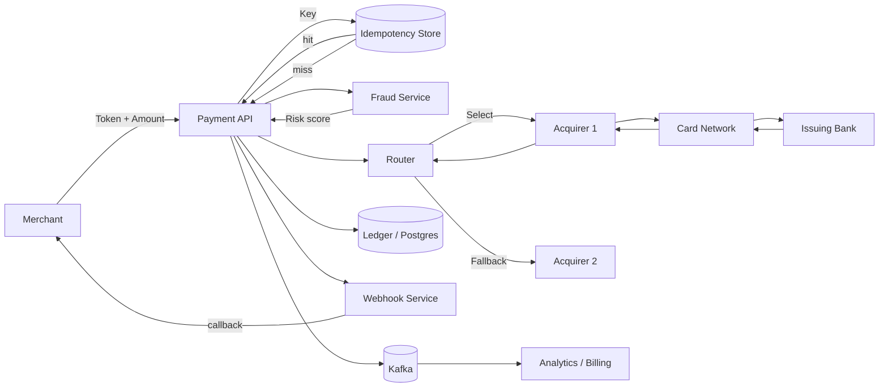

*The component interaction flow shows two parallel paths: the idempotency store (Redis) short-circuits retries before any processing begins; for new requests, the Fraud Service scores the transaction in under 100 ms, then the Router selects the best acquirer based on BIN, region, currency, and historical health; the authorization flows through the card network to the issuing bank and back; concurrently, the Ledger records a double-entry transaction, the Webhook Service notifies the merchant, and all events are published to Kafka for analytics and billing.*

---

### Architectural Patterns

#### Tokenization and Vault

* **What:** Replace sensitive card data (PAN) with a non-sensitive token that maps to the original data in a secure vault.
* **Problem solved:** Merchants can process recurring payments (subscriptions) or stored payment methods without storing/handling card numbers — stays out of PCI scope.
* **How it works:** Card data received → sent to Vault Service → Vault encrypts (HSM) and stores → returns token → merchant stores token → to charge, merchant sends token → Vault decrypts → sends PAN to acquirer.
* **When to use:** When storing card data for future use (subscriptions, card-on-file, one-click checkout).
* **When not to use:** For one-time payments where the card is never stored.
* **Advantages:** PCI scope reduction; enables recurring payments; protects against data breaches.
* **Disadvantages:** Additional latency (token lookup); vault is a single point of failure.

```java
@Service
@RequiredArgsConstructor
public class VaultService {

    private final HardwareSecurityModule hsm;
    private final TokenStore tokenStore; // Redis/DB

    public Token vaultCard(CardDetails card) {
        var pan = card.getPan();
        // Encrypt PAN with HSM
        var encrypted = hsm.encrypt(pan);
        // Generate deterministic token from PAN hash
        var token = "tok_" + Hashing.sha256().hashString(pan, StandardCharsets.UTF_8);
        // Store encrypted PAN keyed by token
        tokenStore.store(token, encrypted);
        return new Token(token);
    }

    public CardDetails unvault(Token token) {
        var encrypted = tokenStore.retrieve(token.getValue());
        var pan = hsm.decrypt(encrypted);
        return CardDetails.fromPan(pan);
    }
}
```

*The `VaultService` bean generates a deterministic token by hashing the PAN with SHA-256, encrypts the PAN using an HSM (Hardware Security Module), and stores the encrypted PAN in a token store keyed by the token. On retrieval, the vault looks up the encrypted PAN by token, decrypts it via the HSM, and reconstructs the card details. The merchant only ever sees the token, keeping them out of PCI-DSS scope.*

#### Idempotency

* **What:** A payment request with the same idempotency key returns the same result, even if retried — prevents duplicate charges.
* **Problem solved:** Network failures during payment (timeout, client retries) can cause the merchant to retry the request — without idempotency, the customer gets charged twice.
* **How it works:** The merchant generates a UUID (idempotency key) and sends it in the `Idempotency-Key` header. The payment system stores the result keyed by this UUID (with 24-hour TTL). On retry with the same key, the stored result is returned without re-processing.
* **When to use:** Always — every payment request should be idempotent.
* **When not to use:** Never — idempotency should be default for all payment operations.
* **Advantages:** Prevents double-charging; clients can safely retry; clear audit trail.
* **Disadvantages:** Storage overhead (key-value store with TTL); if the same key is used for a different intended charge, the old result is returned (merchant must use unique keys).

```java
@Service
@RequiredArgsConstructor
public class IdempotentPaymentService {

    private final IdempotencyStore idempotencyStore;
    private final PaymentProcessor processor;

    @Transactional
    public PaymentResult process(String idempotencyKey, PaymentRequest request) {
        // Check if this request was already processed
        var cached = idempotencyStore.get(idempotencyKey);
        if (cached != null) {
            log.info("Idempotent replay for key: {}", idempotencyKey);
            return cached;
        }

        // Process the payment
        var result = processor.process(request);

        // Store result for future replays (24-hour TTL)
        idempotencyStore.store(idempotencyKey, result, Duration.ofHours(24));
        return result;
    }
}
```

*The `IdempotentPaymentService` bean checks the idempotency store (Redis) before processing any payment. If a result exists for the given idempotency key, it returns the cached result immediately — no fraud check, no acquirer call, no risk of double-charging. If the key is new, it processes the payment and stores the result with a 24-hour TTL so future replays are served from cache. The `@Transactional` annotation ensures the store-and-process operation is atomic.*

#### Multi-Acquirer Router with Failover

* **What:** Select the best payment processor for each transaction based on criteria (fees, success rate, latency, region) and fail over if the primary is down.
* **Problem solved:** A single acquirer may be slow or down — routing intelligently and failing over keeps transactions flowing at high success rates.
* **How it works:** For each transaction, the Router evaluates a decision tree: card BIN → country → currency → available acquirers → score by (success_rate × 0.5 + latency × 0.3 + fees × 0.2). If the primary acquirer fails, try the next. If all fail, return a clear error to the merchant for retry.
* **When to use:** When processing at scale (10K+ transactions/day) where acquirer performance varies by card type and region.
* **When not to use:** For very low volume — a single acquirer suffices.
* **Advantages:** Higher success rates; better economics (route to lowest-fee acquirer); resilience against acquirer outages.
* **Disadvantages:** Complexity; difficult to test all failover paths; regulatory constraints (some regions require local acquirers).

---

### Benefits

* **Simplified merchant integration:** One API for all payment methods — no need to integrate with each card network or wallet provider separately.
* **Global payment reach:** Process cards and payment methods from any country, in 135+ currencies.
* **Built-in fraud protection:** Rules engine + ML models reduce fraudulent transactions without blocking legitimate ones.
* **PCI-DSS compliance:** Merchants stay out of scope using tokenization and client-side encryption.
* **Multi-currency support:** Sell globally with automatic currency conversion and local payment method support.
* **Regulatory compliance:** Handle 3D Secure, SCA (PSD2), and other regional requirements automatically.
* **Scalability and uptime:** Handle peak traffic (Black Friday, Cyber Monday) with 100K+ transactions/second and 99.99% availability.
* **Rich observability:** Dashboards, metrics, and alerts on authorization rates, fraud catch rates, and latency percentiles.

### Challenges

#### Technical Challenges

* **Distributed transaction:** A single payment involves the merchant's system, the gateway, the acquirer, the card network, and the issuing bank — each can fail independently. The system must handle partial failures and provide clear states (authorized, captured, failed, disputed). A write to the ledger must be atomic with the acquirer call, or the system must reconcile out-of-band.
* **Latency vs. accuracy:** Fraud checks add latency — the system must score transactions quickly (under 100 ms) while maintaining accuracy. Pre-computed features and cached ML models help; for borderline cases, asynchronous review is used.
* **Retry semantics:** Network timeouts mean the client may retry — the system must be idempotent (same idempotency key = same result). Without idempotency, network failures could cause duplicate charges.
* **Asynchronous flows:** 3D Secure and bank redirects make payments asynchronous — the final result comes via webhook, not the original HTTP response. The merchant's system must handle delayed completion and poll/wait states.

#### Scalability Challenges

* **Peak traffic:** Black Friday/Cyber Monday: 100K+ transactions per second, each with 50+ external calls (fraud, routing, acquirer). The system must auto-scale stateless services and shard stateful ones.
* **Regional expansion:** Each new country requires integrating with local acquirers, payment methods, and regulatory compliance (PSD2 in EU, RBI guidelines in India, etc.).
* **Multi-currency processing:** FX rate lookups and conversions for 135+ currencies, updated by the minute. Rates must be consistent and auditable.

#### Performance Challenges

* **Checkout latency:** The entire payment (including fraud check) must complete in under 1-2 seconds to avoid cart abandonment. Each millisecond of fraud check latency directly impacts conversion rate.
* **Idempotency key lookup:** Every request checks the idempotency store — must be under 1 ms (Redis). Any failure here degrades all payment traffic.
* **Webhook delivery:** Must deliver payment status updates to merchants reliably and in order. Failed webhooks require retry with exponential backoff.

#### Reliability Challenges

* **Partial failures:** Payment authorized but capture fails (card network timeout); system must reconcile and either succeed or refund. The transaction state machine must handle every possible state transition.
* **Race conditions:** Concurrent requests for the same order/payment method must be serialized to prevent double-charges. Distributed locks or single-writer-per-key partitioning helps.
* **Network partitions:** Acquirer API unreachable — queue the request and retry, or route to a backup acquirer. The system must distinguish between temporary and permanent failures.

#### Maintainability Challenges

* **Version migration:** Evolving payment APIs while maintaining backward compatibility for existing integrations. Deprecation policies and migration guides are essential.
* **Acquirer integration:** Each acquirer has different APIs, error codes, and settlement schedules — abstraction is hard to maintain. A common adapter pattern with acquirer-specific implementations helps.
* **Feature flagging:** Payment features (new fraud rules, acquirer routing) must be tested gradually (1% of transactions before 100%). Feature flags with gradual rollout are critical.

#### Operational Challenges

* **Settlement reconciliation:** Daily matching of transaction data with bank settlements — discrepancies require investigation. Automated reconciliation with alerting on mismatches.
* **Chargeback management:** Handling dispute evidence submission and response within tight deadlines (7 days for chargebacks). The system must collect and present evidence automatically.
* **Monitoring:** Track authorization success rates, fraud catch rates, latency percentiles, and acquirer performance. Dashboards and alerts for each metric.

#### Security Concerns

* **PCI-DSS compliance:** Never store full PANs unless in an HSM-backed vault; scope reduction via client-side encryption (Stripe.js). All 12 PCI-DSS requirements must be met and audited annually.
* **Data encryption:** Encrypt card data in transit (TLS 1.2+) and at rest (AES-256 with HSM-managed keys).
* **Fraud prevention:** ML models for anomaly detection; 3D Secure for SCA compliance; velocity limits on card usage.
* **Token security:** Tokens must be unguessable and have appropriate TTL; vault must be isolated from the rest of the system.
* **Key management:** Regular key rotation (every 90 days); HSM-based operations; multi-region key availability.

---

### Best Practices

* **Always use idempotency keys:** Every payment request must include a unique idempotency key (UUID). Store results keyed by this UUID with a 24-hour TTL in Redis.
* **Client-side encryption for card data:** Use Stripe.js/Elements to collect card data client-side; never let card data touch your server. Reduces PCI scope to SAQ-A.
* **Implement circuit breakers:** If an acquirer is failing (error rate > 5%), open circuit and route to backup acquirers. Prevent cascading failures.
* **Separate authorization and capture:** For inventory-heavy businesses, authorize (check funds) at checkout, capture (actually charge) when the order ships.
* **Log everything (securely):** Log all payment events (but never full card numbers); structured JSON with correlation IDs for tracing. Mask card data in logs (`****-****-****-4242`).
* **Implement retry with exponential backoff:** For transient acquirer failures (network timeouts, 503), retry with backoff (1s, 5s, 30s). Use idempotency keys to prevent duplicates.
* **Monitor success rates per acquirer:** Track and alert on acquirer-specific decline/timeout rates. Automatically adjust routing based on health.
* **Handle 3D Secure asynchronously:** Don't block the user — redirect to 3DS, then return via webhook/callback. Show a "payment processing" state.
* **Test with synthetic cards:** Card networks provide test card numbers that simulate success, decline, 3DS, etc. Use them for automated testing.
* **Implement fallback acquirers:** Have at least 2 acquirers per region; route based on health and fees. Health checks every 30 seconds.
* **Use structured state machines:** Model payment states (requires_capture, succeeded, failed, refunded, disputed) explicitly in the database to avoid bugs from invalid state transitions.
* **Reconcile daily:** Run automated settlement reconciliation every 24 hours; alert on any mismatch between gateway records and bank statements.

---

### When to Use / When Not to Use

**Use when:**

- You need to accept payments online (e-commerce, SaaS, subscriptions) and want to avoid building payment infrastructure from scratch.
- You have customers in multiple countries/currencies and need to offer local payment methods (iDEAL, UPI, FPS, etc.).
- You offer multiple payment methods (cards, wallets, BNPL) and want a single integration.
- You need built-in fraud protection and PCI-DSS compliance assistance.
- You process recurring/subscription payments and need automated billing with dunning.
- You operate a marketplace and need split payments, payouts, and KYC management for sub-merchants.

**Avoid when:**

- All transactions are in-person (physical POS terminal) — use card reader SDKs (e.g., Stripe Terminal, Square Reader) with their own hardware.
- Processing volume is very low (< 100 transactions/month) — direct processor integration or even a simple payment link may be cheaper.
- You need ultra-low-cost processing for a single payment method — direct acquirer integration may offer lower rates than a gateway markup.
- Your business model involves cash-only or barter transactions that don't touch card networks.
- You have strict control requirements (e.g., government contracts) mandating on-premises or self-hosted payment processing with no third-party dependency.

**Alternatives:**

- **Direct acquirer integration:** Integrate directly with one acquiring bank — lower cost but no abstraction layer, single point of failure, no built-in fraud, and PCI scope is larger.
- **Payment facilitators (Payoneer, PayPal):** For platforms paying out to sub-merchants — simpler than a full gateway but less flexibility and weaker fraud tools.
- **In-house payment system:** For very large merchants with specific needs (e.g., Amazon's payment system) — highest cost, full control, but enormous operational burden.
- **Check/PayPal/Venmo:** For peer-to-peer or informal payments — no PCI scope but limited to specific use cases.

**Decision factors:**

- **Volume:** High volume → the gateway's fraud/routing optimization and economies of scale pay off; low volume → direct integration or payment links are cheaper.
- **Global presence:** International → gateway with multi-currency/multi-acquirer; domestic → simple integration with one local method.
- **PCI scope:** Want to avoid PCI entirely → gateway with tokenization and client-side encryption; can handle PCI → direct acquirer integration.
- **Integration effort:** Gateway = one integration; direct = one per acquirer/payment method.
- **Feature needs:** Subscriptions, marketplace payouts, fraud tools, and global methods favor a full-featured gateway.

---

### Data Model and API

The data model captures merchants, customers, payment methods (tokenized), payment intents (charges), transactions, refunds, disputes, and idempotency records. Payment intents are immutable once created; transactions track the state machine of each authorization/capture/refund cycle.

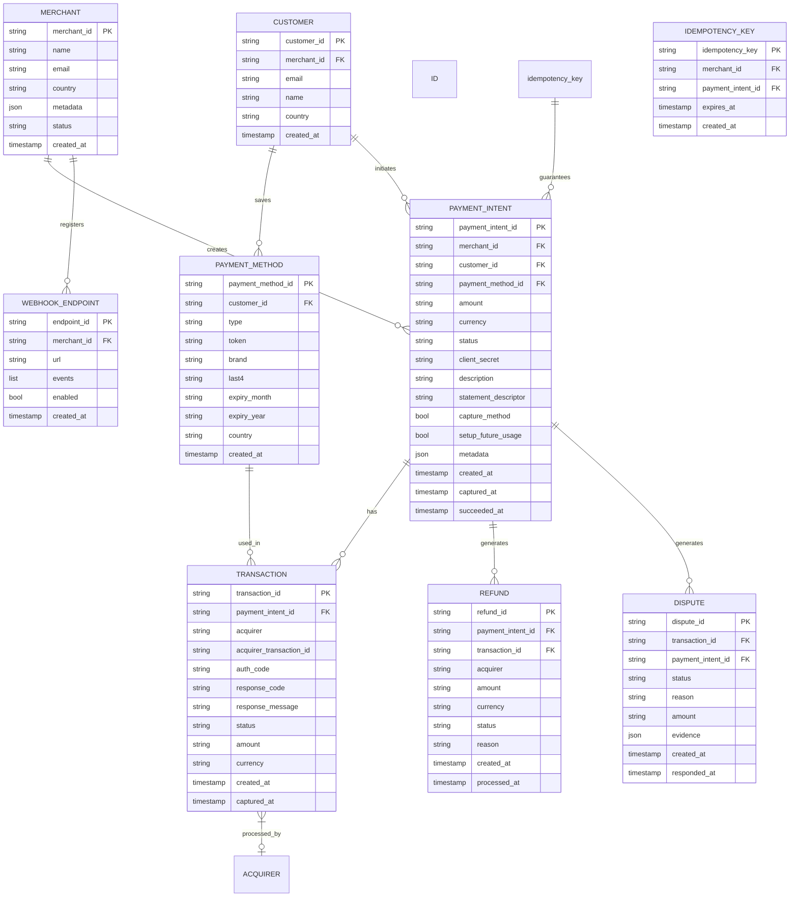

*The entity-relationship diagram shows the core domain model of a payment gateway: merchants create payment intents (charges); customers save payment methods (tokenized cards) and initiate payment intents; each payment intent has one or more transactions (authorization, capture) processed by specific acquirers; refunds and disputes are linked to payment intents and transactions; webhook endpoints are registered per merchant for event delivery; idempotency keys guarantee exactly-once processing by mapping a unique key to a payment intent within a TTL window.*

**Entity descriptions:**

- **MERCHANT:** Core entity. `merchant_id` (UUID for even distribution), `name`, `email`, `country`, `metadata` (custom fields), `status` (active, suspended, restricted). Stored in PostgreSQL with hot merchant data cached in Redis for latency-sensitive routing.
- **CUSTOMER:** `customer_id` (UUID), `merchant_id` (FK), `email`, `name`, `country`. Represents the end customer; used for recurring billing and payment method storage.
- **PAYMENT_METHOD:** `payment_method_id` (UUID), tokenized card data. Contains `type` (card, sepa_debit, etc.), `token` (gateway-internal, maps to vault), `brand`, `last4`, `expiry_month`, `expiry_year`, `country`. Never stores full PAN — only the vault holds the decrypted PAN.
- **PAYMENT_INTENT:** The main charge object. `payment_intent_id` (UUID), `merchant_id`, `customer_id`, `payment_method_id`, `amount` (in smallest currency unit, e.g., cents), `currency` (ISO 4217), `status` (requires_payment_method, requires_action, processing, succeeded, failed), `client_secret` (for frontend), `description`, `statement_descriptor`, `capture_method` (automatic/manual), `setup_future_usage`, `metadata`, timestamps.
- **TRANSACTION:** Each interaction with an acquirer. `transaction_id` (UUID), `payment_intent_id`, `acquirer` (which processor was used), `acquirer_transaction_id` (the acquirer's reference), `auth_code` (authorization code from issuing bank), `response_code` and `response_message` (from card network), `status` (authorized, captured, failed, refunded), `amount`, `currency`, timestamps.
- **REFUND:** `refund_id` (UUID), `payment_intent_id`, `transaction_id`, `acquirer` (the acquirer used for the refund), `amount`, `currency`, `status` (pending, succeeded, failed), `reason`, timestamps.
- **DISPUTE:** Chargeback/dispute tracking. `dispute_id` (UUID), `transaction_id`, `payment_intent_id`, `status` (warning, lost, won), `reason` (fraud, duplicate, etc.), `amount`, `evidence` (JSON of submitted evidence), timestamps.
- **WEBHOOK_ENDPOINT:** `endpoint_id` (UUID), `merchant_id`, `url`, `events` (list of event types to receive), `enabled` (boolean), `created_at`.
- **IDEMPOTENCY_KEY:** `idempotency_key` (UUID or merchant-generated), `merchant_id`, `payment_intent_id` (the result), `expires_at` (TTL), `created_at`. Stored in Redis for sub-millisecond lookup.

**Indexes and Constraints:**

- `MERCHANT.email` — UNIQUE index.
- `PAYMENT_INTENT(merchant_id, created_at)` — composite index for "list all payments for a merchant."
- `PAYMENT_INTENT(status, created_at)` — index for "find failed/refunded intents requiring reconciliation."
- `TRANSACTION(acquirer, status)` — index for "find failed transactions for acquirer X."
- `REFUND(payment_intent_id)` — index for "find all refunds for a payment intent."
- `DISPUTE(transaction_id)` — index for "find disputes for a transaction."
- `IDEMPOTENCY_KEY` — primary key in Redis (key-value store); TTL of 24 hours.
- `PAYMENT_METHOD(customer_id)` — index for "retrieve all saved payment methods for a customer."

**Partitioning / Sharding:**

- **MERCHANT / CUSTOMER / PAYMENT_INTENT / TRANSACTION / REFUND / DISPUTE:** Sharded by `merchant_id` hash (all data for a merchant stays together; cross-merchant queries are rare).
- **IDEmpotency key:** Sharded by `merchant_id` hash; stored in Redis cluster with consistent hashing.
- **PAYMENT_METHOD:** Sharded by `customer_id` hash.

**API Contract:**

| Method | Endpoint | Purpose | Rate Limit |
|---|---|---|---|
| POST | `/v1/payment_intents` | Create a payment intent | 100 req/sec per key |
| GET | `/v1/payment_intents/{id}` | Retrieve a payment intent | 100 req/sec per key |
| POST | `/v1/payment_intents/{id}/capture` | Capture an authorized payment | 100 req/sec per key |
| POST | `/v1/payment_intents/{id}/cancel` | Cancel a payment intent | 100 req/sec per key |
| POST | `/v1/refunds` | Create a refund | 100 req/sec per key |
| GET | `/v1/refunds/{id}` | Retrieve a refund | 100 req/sec per key |
| POST | `/v1/customers` | Create a customer | 100 req/sec per key |
| POST | `/v1/payment_methods` | Save a payment method | 100 req/sec per key |
| POST | `/v1/webhook_endpoints` | Register a webhook | 10 req/sec per key |

**POST /v1/payment_intents — Request:**

```http
POST /v1/payment_intents HTTP/1.1
Authorization: Bearer sk_test_...
Idempotency-Key: 3b8a1f7e-4c2d-4e8b-9a1f-3b8a1f7e4c2d
Content-Type: application/x-www-form-urlencoded

amount=2000&currency=usd&customer=cus_123&payment_method=pm_456&capture_method=automatic&description=Order+12345&statement_descriptor=ACME+SHOP
```

**POST /v1/payment_intents — Response:**

```json
{
  "id": "pi_303027134901234",
  "object": "payment_intent",
  "amount": 2000,
  "amount_capturable": 2000,
  "amount_details": {
    "tip": {}
  },
  "amount_received": 0,
  "application": null,
  "application_fee_amount": null,
  "automatic_payment_methods": null,
  "canceled_at": null,
  "cancellation_reason": null,
  "capture_method": "automatic",
  "client_secret": "pi_303027134901234_secret_xyz789",
  "confirmation_method": "automatic",
  "created": 1718000000,
  "currency": "usd",
  "customer": "cus_123",
  "description": "Order 12345",
  "invoice": null,
  "last_payment_error": null,
  "livemode": false,
  "next_action": {
    "type": "redirect_to_url",
    "redirect_to_url": {
      "url": "https://hooks.stripe.com/redirect/auth/...",
      "return_url": "https://merchant.com/return"
    }
  },
  "on_behalf_of": null,
  "payment_method": "pm_456",
  "payment_method_configuration_details": null,
  "payment_method_types": ["card", "card_present"],
  "processing": null,
  "receipt_email": "customer@example.com",
  "review": null,
  "setup_future_usage": null,
  "shipping": null,
  "source": null,
  "statement_descriptor": "ACME SHOP",
  "status": "requires_action",
  "transfer_data": null,
  "transfer_group": null
}
```

**Webhook Event:**

```json
{
  "id": "evt_1234567890",
  "object": "event",
  "api_version": "2024-06-14",
  "created": 1718000015,
  "livemode": false,
  "pending_webhooks": 1,
  "request": {
    "id": "req_123",
    "idempotency_key": "3b8a1f7e-4c2d-4e8b-9a1f-3b8a1f7e4c2d"
  },
  "type": "payment_intent.succeeded",
  "data": {
    "object": {
      "id": "pi_303027134901234",
      "status": "succeeded",
      "amount_received": 2000,
      "currency": "usd"
    }
  }
}
```

**Status codes:** `200` OK, `201` Created, `202` Accepted (async processing), `400` Invalid request, `401` Auth required, `402` Request failed (card declined), `404` Not found, `409` Conflict (already has a payment method), `429` Rate limited, `500` Server error, `503` Temporarily unavailable.

**Authentication & Authorization:** Bearer token API keys (secret key for server-side, publishable key for client-side). Scope-based: `payment_intent:write`, `payment_intent:read`, `refund:write`, `customer:write`, `webhook_endpoint:write`. All requests require an `Idempotency-Key` header.

---

### Domain-Specific: Payment Gateway Deep Dive

This section covers the four core technical pillars unique to payment gateway design: payment routing (how transactions reach the optimal acquirer), risk management (real-time fraud detection and prevention), settlement (the end-to-end flow of funds from cardholder to merchant), and interchange (the fee structure that funds the entire ecosystem).

#### Payment Routing

Payment routing is the process of selecting the optimal acquiring bank/processor for each transaction. The router makes decisions in under 5 ms (excluding network latency to the acquirer) based on:

* **Card BIN (Bank Identification Number):** The first 6-8 digits of the card identify the issuing bank, card type (credit/debit), and country of origin. The router uses BIN to determine which acquirers can process the card (e.g., some acquirers only support certain card brands or regions). BIN ranges are loaded from the card network daily and cached in Redis.
* **Currency and region:** Each acquirer has a settlement currency and regional coverage. Routing to an acquirer that settles in the merchant's preferred currency avoids unnecessary FX conversions. Local cards are routed to local acquirers to avoid cross-border fees.
* **Acquirer health:** Real-time success rates, latency, and error codes are tracked per acquirer per card type. The router avoids acquirers with elevated decline rates or latency spikes.
* **Interchange optimization:** Interchange fees vary by card type, merchant category, and transaction type. The router selects the acquirer that results in the lowest total cost (interchange + acquirer fee + gateway margin).
* **Cost:** Interchange++ pricing means the gateway earns a margin on each transaction. Routing to lower-cost acquirers for certain BIN ranges improves margins without impacting the merchant's rate.

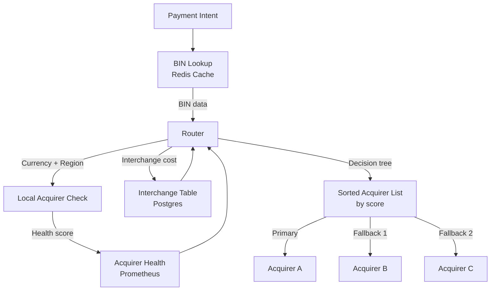

*The routing decision flow: the router receives a payment intent, looks up the card BIN in Redis cache (updated daily from card network feeds), checks the merchant's currency and region to identify local acquirer options, queries real-time acquirer health scores from Prometheus (updated every 30 seconds), consults the interchange table to estimate cost per acquirer, then computes a weighted score (success_rate × 0.5 + latency × 0.3 + cost × 0.2) and sorts acquirers by score — the primary is tried first, with automatic failover to the next acquirer on failure.*

```java
@Service
@RequiredArgsConstructor
@Slf4j
public class PaymentRouter {

    private final BinLookupService binLookup;
    private final AcquirerHealthRegistry healthRegistry;
    private final InterchangeService interchangeService;
    private final AcquirerClientFactory clientFactory;
    private final MeterRegistry meterRegistry;

    /**
     * Select the best acquirer for a payment, trying primary then fallbacks.
     * Returns the first successful authorization response.
     */
    public AuthResponse routeAndAuthorize(PaymentRequest request) {
        var binData = binLookup.lookup(request.getCardBin());
        var acquirers = selectAcquirers(binData, request, 3);

        for (var acquirer : acquirers) {
            var client = clientFactory.getClient(acquirer);
            try {
                var response = client.authorize(request);
                meterRegistry.counter("acquirer.success", "acquirer", acquirer.getId()).increment();
                return response;
            } catch (AcquirerException e) {
                log.warn("Acquirer {} failed for BIN {}: {}", acquirer.getId(), request.getCardBin(), e.getMessage());
                meterRegistry.counter("acquirer.failure", "acquirer", acquirer.getId()).increment();
                // Continue to next acquirer in the fallback chain
            }
        }
        throw new AllAcquirersFailedException("All acquirers failed for BIN: " + request.getCardBin());
    }

    private List<Acquirer> selectAcquirers(BinData binData, PaymentRequest request, int maxCount) {
        var candidates = healthRegistry.getAllActiveAcquirers()
                .stream()
                .filter(a -> a.supportsCard(binData))
                .filter(a -> a.supportsCurrency(request.getCurrency()))
                .filter(a -> a.supportsCountry(request.getMerchantCountry()))
                .sorted(Comparator.comparing(this::scoreAcquirer).reversed())
                .limit(maxCount)
                .toList();

        if (candidates.isEmpty()) {
            throw new NoAvailableAcquirerException("No acquirer supports BIN: " + request.getCardBin());
        }
        return candidates;
    }

    private double scoreAcquirer(Acquirer a) {
        var health = healthRegistry.getHealth(a.getId());
        var interchangeRate = interchangeService.getExpectedRate(a.getId());
        // Weighted score: 50% success rate, 30% latency, 20% cost
        return health.successRate() * 0.50
                + (1.0 - (double) Math.min(health.avgLatencyMs(), 500) / 500) * 0.30
                + (1.0 - interchangeRate / 0.05) * 0.20;
    }
}
```

*The `PaymentRouter` bean implements intelligent multi-acquirer routing with automatic failover. It looks up BIN data, filters acquirers by card support, currency, and country compatibility, then scores each candidate using a weighted formula (50% success rate, 30% latency, 20% interchange cost) sourced from the `AcquirerHealthRegistry` (backed by Prometheus metrics) and `InterchangeService`. It tries acquirers in sorted order, recording success/failure meters via Micrometer for real-time health tracking. If all acquirers fail, it throws `AllAcquirersFailedException` so the caller can return a clear error to the merchant.*

#### Risk Management

Risk management in payment processing is a multi-layered defense system that must make decisions in under 100 ms while catching the majority of fraudulent transactions:

**Stage 1 — Rules engine (synchronous, under 50 ms):** Pre-defined boolean rules evaluated in Redis for maximum speed. Rules include: card BIN blacklists, country blocklists, velocity limits (max N transactions per card/IP in T minutes), amount thresholds (flag transactions over $X), and known-fraud-pattern matching. Rules are versioned and can be updated without code deploys via a configuration service.

**Stage 2 — ML model (asynchronous, under 100 ms):** A supervised classification model trained on historical transaction data predicts the probability of fraud. Features include: customer lifetime value (CLV), purchase velocity, device fingerprint, IP reputation, shipping/billing distance, behavioral patterns (mouse movement, typing cadence), and historical chargeback rates. The model is served from an in-memory cache (Redis) and updated daily with fresh training data.

**Stage 3 — Real-time signals:** Device fingerprinting (browser canvas, WebGL, font list), behavioral biometrics, and IP geolocation/geovelocity (impossible travel). These signals are collected at checkout and scored in real time.

**Stage 4 — Manual review queue:** Transactions scoring in the "review" band (typically 70-90% fraud probability) are sent to human analysts. Analysts review device evidence, device history, and transaction details to make a final decision.

**Stage 5 — Feedback loop:** Chargeback outcomes (won/lost) are fed back into the ML training pipeline daily. Rules that let through fraudulent transactions are flagged for adjustment. This continuous learning loop is critical as fraudsters adapt.

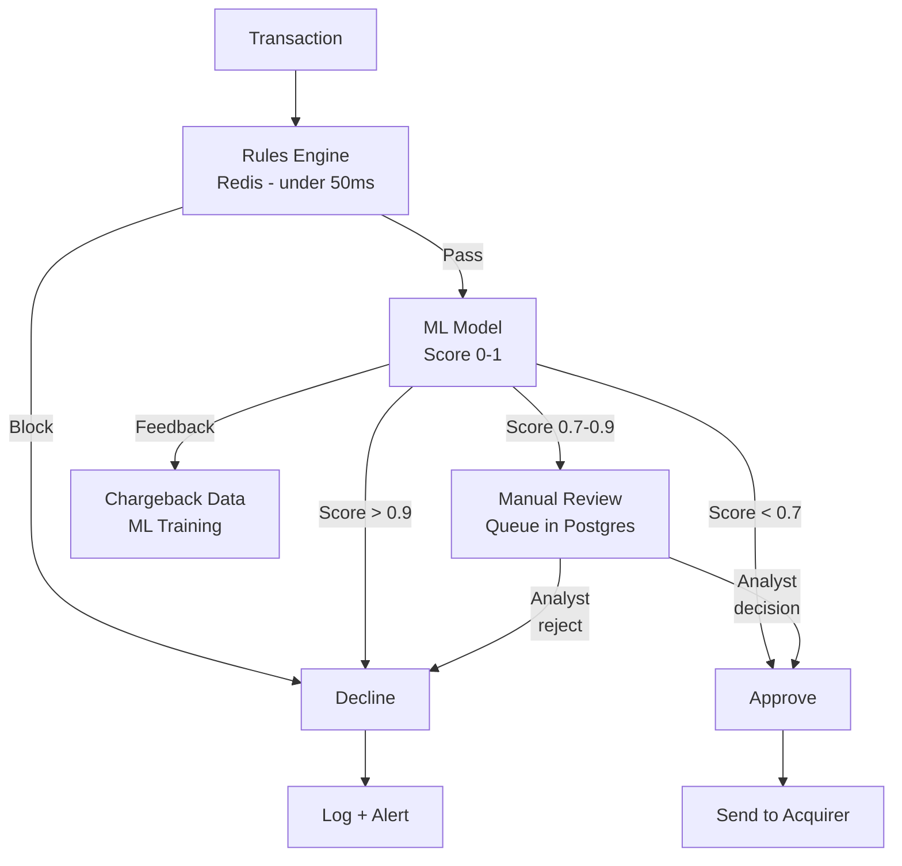

*The risk management pipeline: Stage 1 rules engine (Redis-backed, under 50 ms) blocks known-bad patterns immediately. Transactions that pass rules go to Stage 2 (ML model, under 100 ms total) — scores above 0.9 are auto-declined, 0.7-0.9 go to manual review, below 0.7 are approved. Manual review decisions and chargeback outcomes feed back into the ML training pipeline daily, creating a closed-loop learning system.*

```java
@Service
@RequiredArgsConstructor
@Slf4j
public class FraudService {

    private final RulesEngine rulesEngine;
    private final MlRiskModel mlModel;
    private final FeatureService featureService;
    private final RedisTemplate<String, Object> redisTemplate;
    private final MeterRegistry meterRegistry;

    public RiskAssessment evaluate(PaymentRequest request) {
        // Stage 1: Fast rules check (synchronous, < 50ms)
        for (FraudRule rule : rulesEngine.getActiveRules()) {
            if (rule.matches(request)) {
                meterRegistry.counter("fraud.rule_blocked", "rule", rule.getName()).increment();
                return RiskAssessment.declined("blocked_by_rule:" + rule.getName());
            }
        }

        // Stage 2: ML model scoring (asynchronous batch, < 100ms)
        var features = featureService.extract(request);
        var riskScore = mlModel.predict(features);

        if (riskScore > 0.9) {
            meterRegistry.counter("fraud.ml_declined").increment();
            return RiskAssessment.declined("ml_high_risk");
        } else if (riskScore > 0.7) {
            meterRegistry.counter("fraud.ml_review").increment();
            return RiskAssessment.review("manual_review_required", riskScore);
        }

        meterRegistry.counter("fraud.ml_approved").increment();
        return RiskAssessment.approved(riskScore);
    }
}
```

*The `FraudService` bean implements the two-stage risk management pipeline. Stage 1 iterates through active rules from the `RulesEngine` (backed by Redis for sub-millisecond reads — rules can be updated without code deploys). Stage 2 extracts features via `FeatureService`, runs them through the `MlRiskModel` (served from in-memory cache), and returns a risk assessment based on thresholds: above 0.9 is auto-declined, 0.7-0.9 goes to manual review, below 0.7 is approved. Micrometer counters track each decision path for monitoring and model calibration.*

#### Settlement

Settlement is the end-to-end process of funds moving from the cardholder's account to the merchant's bank account. It happens in five stages:

1. **Authorization:** The issuing bank reserves (holds) the funds on the cardholder's account. No money moves — it's a hold that typically expires in 1-30 days if not captured.
2. **Capture:** The actual transfer is initiated. The authorization is converted to a real charge. Can be immediate (auth + capture in one step) or deferred (authorize at checkout, capture when the order ships).
3. **Batching:** Acquirers collect authorizations into batches (typically one batch per day, processed at a fixed time like 10 PM EST). Batch processing is more efficient than individual settlement.
4. **Clearing:** The card network processes the batch, debiting issuing banks and crediting acquiring banks. This is where the actual fund transfer happens between financial institutions. Takes 1-2 business days (T+1 or T+2).
5. **Funding:** The acquiring bank deposits the settled funds into the merchant's bank account. This typically occurs T+1 or T+2 after clearing, depending on the acquirer's funding schedule.

The settlement timeline for a typical card transaction: Authorization (instant) → Capture (instant to 30 days) → Batch (daily) → Clearing (T+1) → Funding (T+1 to T+2). Cross-border transactions may add 1-2 extra days.

**Settlement reconciliation:** Every 24 hours, the gateway matches its internal transaction records with the settlement files provided by each acquirer. Any discrepancies (transactions that were authorized but never settled, or settled for a different amount) trigger an investigation. Automated reconciliation systems flag mismatches above a threshold (e.g., $100 or 0.1% of total volume).

#### Interchange Fees

Interchange fees are fees paid by the acquirer to the issuing bank for each transaction. They are set by card networks (Visa, Mastercard) and consist of:

* A **percentage of the transaction amount** (typically 1.5-3.5% depending on card type and merchant category).
* A **fixed per-transaction fee** (e.g., $0.10-$0.50).
* **Additional fees** for rewards cards, business cards, corporate cards, and cross-border (international) transactions.

**Interchange categories (tiers):**

| Category | Description | Typical Rate |
|---|---|---|
| **Qualified** | Standard consumer cards, swiped/dipped/tapped in-person | 1.5-1.8% + $0.10 |
| **Mid-qualified** | Rewards cards, business cards, ATM cards, keyed-in e-commerce | 2.0-2.5% + $0.10 |
| **Non-qualified** | High-risk merchants, international cards, chargeback-heavy | 2.9-3.5% + $0.10 |
| **Debit** | PIN debit or offline debit (US Durbin Amendment) | 0.8-1.2% + $0.21 |

**Interchange++ pricing:** The gateway passes through the interchange fee plus a markup. Total cost to the merchant = interchange fee + acquirer fee + gateway fee. This is more transparent than tier-based pricing (where the merchant sees one blended rate but doesn't know what portion is interchange vs. markup).

**How interchange is optimized:** The router selects the acquirer that yields the lowest interchange cost for each card. For example, a US consumer Visa debit card processed through a US acquirer qualifies for the lower debit interchange rate, while the same card processed through a European acquirer may incur cross-border fees. The router also considers the merchant's MCC (Merchant Category Code) — certain MCCs (e.g., grocery stores, gas stations) qualify for lower interchange rates.

---

### Replication Strategies

Payment data is replicated across multiple dimensions: within a region (for high availability), across regions (for global latency and disaster recovery), and across storage systems (for different access patterns and durability requirements).

**Leader-based replication (Ledger / Payment Intent DB):** Payment intent records and ledger entries are written to a primary PostgreSQL instance and synchronously replicated to at least one read replica (RPO = 0, RTO < 1 second). Writes go only to the leader; reads can be served from any replica. This ensures strong consistency for financial records — if the API returns 201 Created, the payment intent is durably stored and replicated.

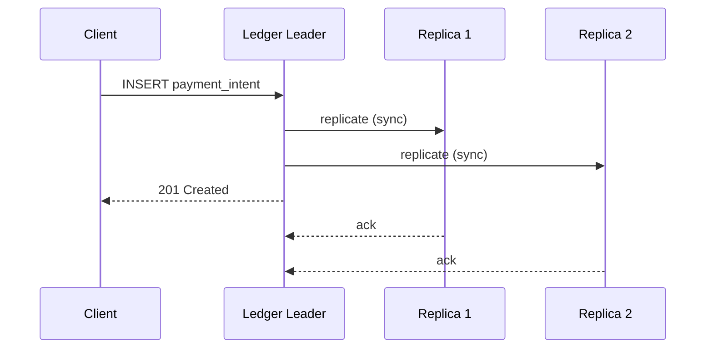

*Leader-based synchronous replication for the Ledger database: the client creates a payment intent, which is written to the leader and synchronously replicated to two read replicas. The leader only returns 201 Created after receiving acknowledgment from at least one replica, ensuring zero data loss. Read replicas serve query traffic for payment status checks and reconciliation.*

**Leaderless replication (Idempotency Store — Redis Cluster):** The idempotency store uses Redis Cluster with 16,384 hash slots and master/replica pairs. Any master can accept writes; replicas serve reads. This provides high availability — if a master fails, a replica is promoted within 2 seconds. Idempotency entries can tolerate brief staleness (a duplicate request within the 2-second failover window is handled by the retry logic).

**Multi-region replication:** The Payment Intent DB is replicated asynchronously across regions (active-active for reads, active-passive for writes). The Idempotency Store uses Redis Global Data Manager for cross-region replication. Webhook delivery queues (Kafka) are replicated to the backup region for disaster recovery (RPO = 2 minutes, RTO = 5 minutes).

**Real-world use:** DynamoDB Global Tables for customer and payment method metadata (active-active multi-region), PostgreSQL with synchronous replication for the ledger (strong consistency), Redis Cluster for idempotency (sub-ms reads), Kafka with MirrorMaker 2 for cross-region event streaming.

---

### Failure Detection and Membership

Payment gateway services must detect failed nodes, redistribute traffic, and continue serving with minimal disruption — downtime directly means lost revenue.

**Gossip-based membership:** Each service instance periodically exchanges health information with a random subset of peers (gossip protocol). This spreads membership changes through the cluster in O(log N) rounds without a central coordinator. Used for the Payment API and Fraud Service clusters.

**Health checks:**

- **Liveness probes:** HTTP `/health` endpoint checked every 2 seconds by the orchestrator (Kubernetes). If unhealthy for 6 consecutive checks, the pod is restarted.
- **Readiness probes:** Checks if the service can serve traffic (e.g., can connect to PostgreSQL, Redis, and Kafka). Not-ready pods are removed from the load balancer.
- **Business health checks:** Custom checks like "Kafka consumer lag < 10,000", "Redis connection pool has available connections", "acquirer health endpoints respond within 500 ms".

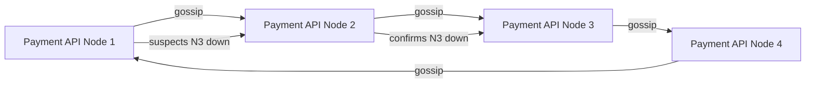

*Gossip-based failure detection in the Payment API cluster: nodes (N1-N4) periodically exchange health state with random peers. When a node suspects a peer is down (no heartbeat for 6 seconds), it propagates the suspicion through gossip; once confirmed by multiple nodes, the peer is removed from the load balancer and its traffic is redistributed to healthy nodes.*

**Failure detection timing for payment services:**

| Component | Check Interval | Timeout | Action |
|---|---|---|---|
| Payment API | 2s | 6s | Restart pod; redistribute traffic |
| Fraud Service | 3s | 9s | Enter safe mode (approve below threshold) |
| Idempotency Store (Redis) | 1s | 30s | Failover to replica; serve stale |
| Ledger DB | 5s | 30s | Route reads to replica; queue writes |
| Acquirer API | 10s | 30s | Trigger failover to backup acquirer |

**Circuit breakers:** For dependencies that are failing (acquirer APIs, fraud service, Redis), a circuit breaker (Resilience4j) trips after 5 consecutive failures within 10 seconds and stops sending requests for a 30-second cool-down period. This prevents cascading failures — e.g., if an acquirer is slow, the Payment Service short-circuits and immediately tries the backup acquirer instead of waiting for a timeout.

---

### High Availability and Scalability

Payment gateways must remain available during node failures, network partitions, and regional outages while scaling to handle global transaction volume.

#### Multi-Region Deployment

Deploy active services in at least 3 regions (e.g., us-east-1, eu-west-1, ap-southeast-1). Users are routed to the nearest region via GeoDNS or a latency-based load balancer. Each region is self-sufficient for read and write operations, with asynchronous cross-region replication for durability.

- **Active-active for Payment API and Fraud Service:** Both regions serve live traffic. Load balancers route based on latency and health. Active-active requires conflict-free state (stateless services or CRDT-backed state).
- **Active-passive for Ledger DB:** Writes go to the primary region; both regions serve reads. Cross-region replication lag is typically 1-5 seconds. Failover to the secondary region is manual (to prevent split-brain).
- **Multi-region Vault:** Vaults are region-specific (card data for EU merchants stays in EU due to GDPR). Cross-region token lookup falls back to synchronous replication with a 5-minute RPO.
- **Global CDN:** Static assets (payment page, checkout SDK) cached at edge locations worldwide, reducing latency to under 50 ms.

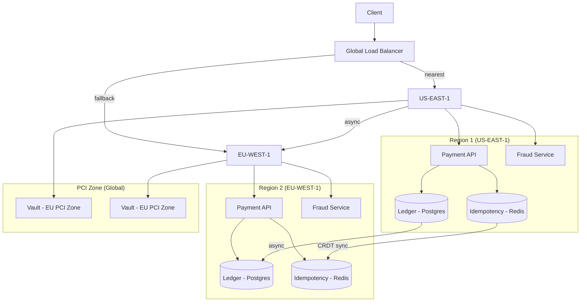

*Multi-region architecture: the global load balancer routes clients to their nearest region (active-active for stateless Payment API and Fraud Service). The Ledger (Postgres) uses active-passive with async cross-region replication. The Idempotency Store (Redis) uses CRDT-based active-active synchronization. The Vault spans both regions with region-specific PCI zones for GDPR compliance.*

#### Auto-Scaling

- **Stateless services (Payment API, Fraud Service, Webhook Service):** Scale horizontally based on CPU and request latency. Kubernetes HPA adjusts replica count automatically; target p95 latency < 200 ms per request.
- **Stateful services (Ledger DB, Redis):** Scale by adding shards or partitions. PostgreSQL uses Citus for horizontal sharding by merchant_id. Redis Cluster auto-scales by rebalancing hash slots.
- **Fraud ML inference:** Scale GPU inference pods based on transaction volume. Pre-compute features hourly to reduce per-request feature extraction to < 10 ms.

#### Graceful Degradation

When a component fails, the system should degrade rather than crash:

- **Fraud service down:** The Payment Service enters "safe mode" — approve transactions below a risk threshold, decline those above. The ML model uses last-known scores from Redis cache. Merchants are alerted to potential increase in fraud.
- **Idempotency store down:** The system falls back to database-based idempotency (PostgreSQL) — slower (2-3 ms) but still functional. Rate limiting is tightened to prevent abuse.
- **Vault down:** Token-based payments still work (token → PAN lookup via HSM backup). Raw card entry fails with a 503 and retry-after.
- **Acquirer API down:** Route to backup acquirers. If all acquirers are down, queue requests in Kafka for retry when they recover.
- **Webhook service down:** Queue webhook events in Kafka; deliver when the service recovers. Merchants can poll the API for status as fallback.

---

### Performance and Optimization

The performance of a payment gateway is measured by checkout latency (target: < 500 ms for the full payment flow) and throughput (target: 10K+ non-peak TPS, 100K+ peak TPS during Black Friday).

#### Latency Optimization

* **Idempotency store first:** Every request starts with a Redis idempotency lookup (target: < 1 ms). If a hit is found, the cached result is returned immediately — no fraud check, no acquirer call. This handles 30-40% of traffic (retries and webhook polls) with near-zero latency.
* **Pre-computed fraud features:** Customer risk profiles, device reputation, and historical behavior are pre-computed hourly and stored in Redis. Per-request feature extraction takes < 5 ms instead of querying multiple data sources.
* **BIN cache:** BIN lookup data is cached in Redis with a 24-hour TTL. A warm cache serves 99% of BIN lookups in < 1 ms. Cache is refreshed from card network feeds daily.
* **Connection pooling:** Persistent HTTP/gRPC connections between the Payment API and acquirers prevent per-request TLS handshake overhead. Connection pools are maintained per acquirer with keep-alive.
* **Pipeline batch fetches:** When reconciliation needs 10,000 payment records, batch the DB query instead of issuing 10,000 individual lookups.

#### Throughput Optimization

* **Rate limiting at the edge:** API Gateway enforces per-API-key rate limits (100 req/sec default) and per-IP limits (1000 req/sec). Burst capacity absorbs traffic spikes without degrading individual requests.
* **Fan-out parallelism:** Webhook delivery fans out to merchant endpoints in parallel using a thread pool. Each webhook is delivered independently with its own retry backoff.
* **Database sharding:** Payment intents are sharded by `merchant_id` hash across 128 PostgreSQL partitions (via Citus). Each shard handles independent read/write load. Hot merchants are further split with virtual nodes.
* **Async reconciliation:** Settlement reconciliation runs as a background job (not on the request path). It reads settlement files from acquirers, matches against internal records, and writes discrepancies to a review queue.

#### Caching Strategies

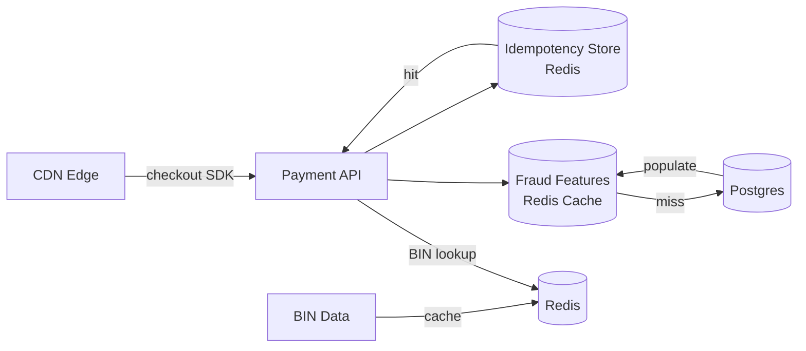

*Multi-tier caching for payment performance: the idempotency store (Redis) serves cached results for retry requests in under 1 ms; fraud features are pre-computed hourly and cached in Redis with fallback to Postgres; BIN data is cached with a 24-hour TTL refreshed from card network feeds; the checkout SDK is served from CDN edge locations for sub-50-ms load times.*

#### Latency Budget

| Component | Target | Notes |
|---|---|---|
| API Gateway + auth | 5 ms | JWT validation |
| Idempotency lookup | 1 ms | Redis |
| Fraud scoring | 50 ms | Rules (5 ms) + ML (45 ms) |
| Acquirer routing | 5 ms | BIN lookup + scoring |
| Acquirer call | 150 ms | P95 including network |
| Ledger write | 20 ms | Postgres sync commit |
| Webhook enqueue | 5 ms | Kafka |
| Response | 5 ms | Serialization + HTTP |
| **Total** | **~241 ms** | Well within 500 ms SLA |

**Real-world use:** Stripe reports P95 payment latency of ~150 ms globally; Adyen achieves 99.99% uptime with sub-200-ms P95 latency using a multi-acquirer active-active architecture.

---

### CAP Theorem and Consistency Trade-offs

The CAP theorem states that during a network partition, a distributed system can provide at most two of: Consistency, Availability, and Partition tolerance. Since payment systems operate over networks, partition tolerance is always required. The key question is: where to favor consistency vs. availability.

#### Idempotency Store — AP (Availability + Partition Tolerance)

The idempotency store prioritizes availability: if a Redis master fails, the payment API can still process new (non-duplicate) requests — it just can't serve cached idempotency results. Duplicate requests during the failover window (2 seconds) are handled by database-level deduplication. This trade-off is acceptable because the cost of a duplicate charge (which idempotency prevents) is far higher than the cost of a failed request (which the merchant can retry).

#### Payment Intent DB — CP (Consistency + Partition Tolerance)

Payment intent creation requires strong consistency: if the API returns 201 Created, the payment intent must exist and be retrievable. A lost write would mean a customer is charged but the merchant has no record — a catastrophic failure. PostgreSQL with synchronous replication (RPO = 0) ensures this.

#### Fraud Features Cache — AP with Bounded Staleness

Fraud features (customer risk score, device reputation) can be eventually consistent. If a customer is flagged as high-risk after a payment but the update hasn't propagated to all regions, that region might approve a transaction that should have been declined. This is a calculated risk — the fraud service is also called again at settlement time to catch missed fraud. Staleness of up to 60 seconds is acceptable.

#### Webhook Delivery — AT/Eventual Consistency

Webhooks are delivered asynchronously with at-least-once semantics. The merchant may receive a webhook notification seconds after the payment succeeds (due to queue backpressure or network issues). The merchant should always poll the API for the final state as a source of truth, treating webhooks as a notification mechanism, not a state source.

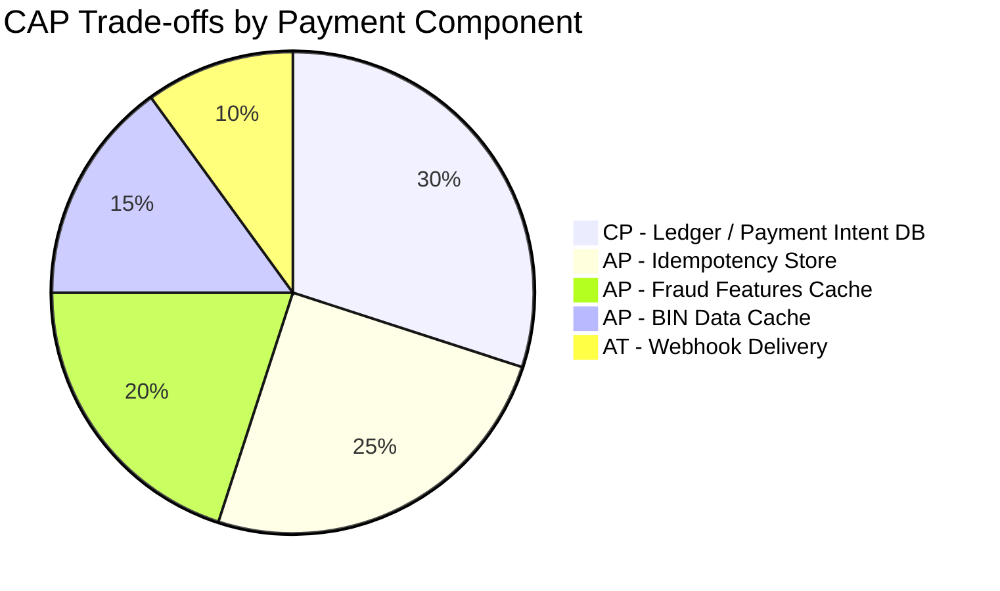

*CAP trade-offs across payment gateway components: the Ledger and Payment Intent DB are CP (consistency-first) because financial records must not be lost; the Idempotency Store, Fraud Features Cache, and BIN Data Cache are AP (availability-first) because brief staleness is recoverable; webhook delivery uses at-least-once eventual consistency, with the API as the source of truth.*

**Interview question:** *Is a payment gateway strongly consistent or eventually consistent?*
**Answer:** Payment gateways make a nuanced, per-component choice. They are strongly consistent for financial records (ledger entries, payment intent state) where a lost write could mean a customer is charged but the merchant has no record. They are eventually consistent for caches (idempotency, fraud features, BIN data) where brief staleness is recoverable through retries and reconciliation. This pragmatic split is essential — pure strong consistency would make the system too slow for checkout, while pure eventual consistency would risk financial integrity.

---

### Encryption and Key Management

A payment gateway stores extremely sensitive data — card numbers (PAN), CVV codes, customer PII, and transaction logs. Encryption must protect data at rest, in transit, and during processing. PCI-DSS mandates AES-256 or equivalent for all cardholder data.

#### Encryption at Rest

**Card data (PAN):** Never stored in plaintext outside the Vault. Within the Vault (HSM-backed, PCI zone), PANs are encrypted with per-object DEKs (Data Encryption Keys) generated by the HSM. DEKs are wrapped by a KEK (Key Encryption Key) stored in the HSM. No plaintext PAN ever touches disk or memory outside the HSM.

**Application data (payment intents, ledger):** PostgreSQL uses TDE (Transparent Data Encryption) with a per-table DEK. The DEK is encrypted with an HSM-managed KEK. Redis (idempotency store) uses encryption-at-rest or disk-level encryption.

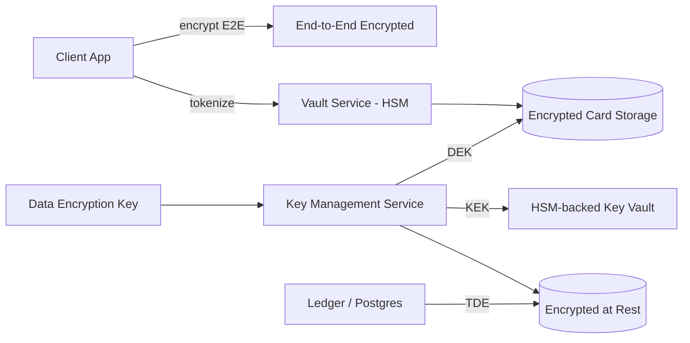

*Encryption at rest architecture: customer card data is tokenized by the Vault Service (HSM-backed, PCI zone); the Vault stores PANs encrypted with per-object DEKs managed by a KMS, with KEKs in an HSM-backed key vault; application data (payment intents, ledger entries) uses PostgreSQL TDE with KMS-managed DEKs. No plaintext PAN ever exists outside the HSM.*

**PCI-DSS encryption requirements:**

1. **PAN protection:** PAN must be encrypted with a strong cryptosystem (AES-256) whenever stored. CVV/CVC must never be stored after authorization.
2. **Key management:** KEKs must be stored in an HSM or key management service; DEKs rotated every 90 days; key custodians must use dual control (2-person rule).
3. **Key hierarchy:** Master keys (in HSM) → KEKs (rotate quarterly) → DEKs (per-object, rotate annually) → data. Rotating at the KEK level requires only re-encrypting DEKs, not the data.
4. **Logging:** All key management operations (generation, rotation, destruction) must be logged with timestamps and operator IDs for audit.

#### Encryption in Transit

All client-to-server and server-to-server traffic uses TLS 1.3 (minimum TLS 1.2). Internal service-to-service communication uses mTLS (mutual TLS) for authentication. Acquirer APIs require mutual TLS with client certificates issued by the gateway's private CA. Mobile SDKs use certificate pinning to prevent man-in-the-middle attacks.

#### Key Rotation

* **Master keys:** Stored in HSM; rotated annually; dual-control required.
* **KEKs:** Rotated every 90 days; old KEKs retained for 180 days to decrypt legacy DEKs.
* **DEKs:** Rotated per-object (new DEK per card token); rotated annually for existing tokens.
* **Webhook signing secrets:** Rotated every 90 days via the dashboard; old secrets accepted for 1 hour during rotation.

```java
@Service
@RequiredArgsConstructor
public class VaultEncryptionService {

    @Value("${app.vault.kms-key-id}")
    private String keyId;
    private final AwsKms kmsClient;

    public EncryptedCard encryptCard(String pan) {
        // Generate a data encryption key (DEK) via KMS
        var dataKey = kmsClient.generateDataKey(keyId);
        var cipher = Cipher.getInstance("AES/GCM/NoPadding");
        cipher.init(Cipher.ENCRYPT_MODE,
                new SecretKeySpec(dataKey.plaintext(), "AES"),
                new GCMParameterSpec(128, dataKey.iv()));
        var ciphertext = cipher.doFinal(pan.getBytes(StandardCharsets.UTF_8));
        return new EncryptedCard(ciphertext, dataKey.encryptedKey(), dataKey.iv());
    }

    public String decryptCard(EncryptedCard encrypted) {
        var dek = kmsClient.decrypt(encrypted.encryptedKey());
        var cipher = Cipher.getInstance("AES/GCM/NoPadding");
        cipher.init(Cipher.DECRYPT_MODE,
                new SecretKeySpec(dek, "AES"),
                new GCMParameterSpec(128, encrypted.iv()));
        return new String(cipher.doFinal(encrypted.ciphertext()), StandardCharsets.UTF_8);
    }
}
```

*The `VaultEncryptionService` bean demonstrates PCI-DSS-compliant encryption: it generates a per-object data encryption key (DEK) via AWS KMS (which uses an HSM-backed customer master key), encrypts the PAN with AES-GCM (providing both confidentiality and integrity via the authentication tag), and stores the encrypted DEK alongside the ciphertext. The KMS-managed key ID is injected via `@Value`. Decryption reverses the process — the encrypted DEK is decrypted by KMS, and the PAN is recovered. The DEK never leaves the service in plaintext longer than the duration of the encrypt/decrypt call.*

---

### Authentication and Authorization

A payment gateway must verify who is connecting (authentication), determine what they can do (authorization), and enforce access controls — every request to every service must carry authenticated credentials. Merchants, partners, and internal services all have different identity requirements.

#### Authentication Methods

* **API keys (bearer tokens):** Merchants receive a publishable key (client-side, limited scope) and a secret key (server-side, full access). The secret key is sent as a bearer token in the `Authorization` header. Keys are prefixed by environment: `pk_live_` / `sk_live_` (production), `pk_test_` / `sk_test_` (test).
* **OAuth 2.0:** For platforms and partners, OAuth 2.0 delegation allows merchants to grant limited access to their Stripe/connected account. Uses JWT bearer tokens with scopes.
* **Webhook signing:** Each webhook event is signed with a shared secret (HMAC-SHA256). The merchant verifies the signature before processing the webhook, preventing forgery.
* **mTLS for internal services:** Service-to-service calls between the Payment API, Fraud Service, and Router use mutual TLS with certificates issued by a private CA. No shared secrets.
* **Signed requests:** For high-security operations (e.g., webhook deliver retries), requests are signed with a private key; the gateway verifies with the corresponding public key.

#### Authorization Models

* **Scope-based (OAuth 2.0 scopes):** Each API key carries scopes like `payment_intent:write`, `payment_intent:read`, `refund:write`, `customer:write`, `webhook_endpoint:write`, `dispute:read`. The API Gateway enforces scope checks before routing.
* **Role-based (RBAC):** Internal staff have roles (`engineer`, `support`, `fraud_analyst`, `admin`). Engineers get read-only API access; fraud analysts get dispute evidence access; admins can manage gateway configuration.
* **Resource-level access:** Merchants can only access their own payment intents, customers, and webhooks. The Payment Service checks `merchant_id` on every query. Connected accounts (marketplace platforms) have scoped access to their own transactions.
* **Idempotency key scoping:** Idempotency keys are scoped per API key (per merchant). The same key from different API keys is treated as different requests. This prevents one merchant's retry from affecting another's transaction.

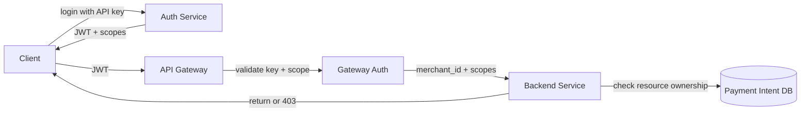

*Authentication and authorization flow: the merchant authenticates with their secret API key; the Auth Service validates the key and issues a JWT with scopes; the API Gateway validates the JWT signature and checks required scopes before forwarding to backend services; each service performs resource-level ownership checks (merchant_id) against the database, returning 403 Forbidden if the merchant doesn't own the requested resource.*

**Java example — API key validation filter:**

```java
@Component
@RequiredArgsConstructor
public class ApiKeyAuthFilter implements Filter {

    private final MerchantService merchantService;
    private final MeterRegistry meterRegistry;

    @Override
    public void doFilter(ServletRequest request, ServletResponse response,
                         FilterChain chain) throws IOException, ServletException {
        var httpRequest = (HttpServletRequest) request;
        var authHeader = httpRequest.getHeader("Authorization");

        if (authHeader == null || !authHeader.startsWith("Bearer ")) {
            ((HttpServletResponse) response).sendError(HttpServletResponse.SC_UNAUTHORIZED);
            return;
        }

        var apiKey = authHeader.substring(7);
        var merchant = merchantService.validateApiKey(apiKey);

        if (merchant == null) {
            meterRegistry.counter("auth.api_key_invalid").increment();
            ((HttpServletResponse) response).sendError(HttpServletResponse.SC_UNAUTHORIZED);
            return;
        }

        var auth = new PreAuthenticatedAuthenticationToken(
                merchant, null, merchant.getAuthorities());
        SecurityContextHolder.getContext().setAuthentication(auth);
        chain.doFilter(request, response);
    }
}
```

*The `ApiKeyAuthFilter` bean validates bearer token API keys on every request. It extracts the token from the `Authorization` header, looks it up via `MerchantService` (which checks the key against Redis and Postgres), and sets the Spring Security `Authentication` context with the merchant's details and scopes. Invalid keys increment a Micrometer counter for security monitoring and return 401. The filter is registered before any controller, ensuring all endpoints are protected.*

---

### Security Threats and Mitigations

#### Threat: Account Takeover (Merchant Account Compromise)

* **Risk:** An attacker uses stolen API keys to initiate fraudulent charges, drain funds, or access sensitive payment data from a compromised merchant account.
* **Mitigation:** Enforce IP allowlisting on secret API keys. Require per-request timestamp and signature verification for high-value operations. Monitor for anomalous transaction patterns (sudden velocity spike, new BIN, new country). Alert on first transaction from a new IP per API key. Rotate API keys automatically every 90 days with forced re-authentication.
* **Detection:** Machine learning anomaly detection on transaction patterns per merchant; sudden deviation from historical behavior triggers automated review.

#### Threat: Card Data Theft via API

* **Risk:** An attacker exploits a misconfigured API endpoint to retrieve full PANs or CVV codes from the gateway's internal storage, or uses SQL injection to bypass access controls.
* **Mitigation:** Never store CVV after authorization. Mask PANs everywhere except the Vault/PCI zone. Implement strict input validation and parameterized queries. Use API Gateway WAF rules to block SQL injection patterns. Enforce resource-level access control (merchant can only access their own data). Log all data access with audit trails.
* **Detection:** Real-time alerting on unusual data access patterns (bulk reads, access outside business hours, access from new geographies).

#### Threat: Replay and Double-Charge Attacks

* **Risk:** A man-in-the-middle attacker intercepts a valid payment request and replays it, causing the customer to be charged multiple times for the same order.
* **Mitigation:** Idempotency keys with 24-hour TTL prevent duplicate processing. TLS 1.3 with session resumption prevents replay at the transport layer. Timestamp-based request expiration (reject requests older than 5 minutes) adds a second defense layer.
* **Detection:** Idempotency key collision rate monitoring; alert if the same key is used from different IPs within a short window.

#### Threat: Phishing and Credential Stuffing

* **Risk:** Fraudsters use lists of stolen credentials to log into merchant dashboards and initiate fraudulent transactions.
* **Mitigation:** Enforce 2FA (TOTP or SMS) for all dashboard access. Rate-limit login attempts (3 per IP per 15 minutes). Use CAPTCHA after 2 failed attempts. Monitor for login attempts from new devices or unusual geographies. Implement account lockout after 10 failed attempts.
* **Detection:** Anomalous login pattern detection; geofence violations (login from two distant locations within minutes).

#### Threat: Acquirer API Compromise

* **Risk:** A compromised or malicious acquirer could alter authorization responses (approve invalid cards, decline valid cards) to defraud the gateway and its merchants.
* **Mitigation:** Validate acquirer responses with checksums and digital signatures. Cross-check response codes against multiple data sources. Implement fallback acquirer routing when an acquirer's response patterns deviate from historical norms. Monitor acquirer success rates in real-time.
* **Detection:** Statistical anomaly detection on acquirer success rates, decline code distributions, and latency patterns.

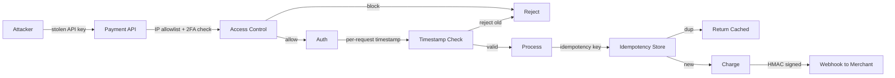

*Multi-layered security defense: an attacker with a stolen API key is blocked by IP allowlisting and 2FA requirements; even if they pass access control, per-request timestamp checks reject old requests to prevent replay attacks; idempotency keys ensure no duplicate charges; webhook notifications are HMAC-signed so merchants can verify they came from the legitimate gateway.*

---

### Observability and Logging

Payment gateways generate massive amounts of telemetry — every transaction produces authorization events, fraud signals, acquirer responses, webhook deliveries, and settlement records. Observability must cover the payment pipeline end-to-end.

#### Key Metrics

- **Authorization success rate:** Percentage of transactions that receive an approval from the card network. Alert if below 95% (could indicate acquirer issues).
- **Fraud catch rate:** Percentage of fraudulent transactions correctly identified by the fraud engine. Alert if below 90% or if false positive rate exceeds 1%.
- **Checkout latency:** P50 < 150 ms, P95 < 300 ms, P99 < 500 ms. Track by payment method and region.
- **Idempotency hit rate:** Percentage of requests served from the idempotency cache. Target: 30-40% (indicates healthy retry patterns).
- **Webhook delivery rate:** Percentage of webhooks delivered successfully on the first attempt. Target: 95%+.
- **Acquirer performance:** Per-acquirer success rate, latency, and decline code distribution. Used for routing decisions.
- **Chargeback rate:** Percentage of transactions that result in chargebacks. Alert if above 0.5% (Visa/Mastercard thresholds).
- **Error rates:** 4xx errors by type (decline codes), 5xx errors per service, acquirer API errors.

#### Logging

* **Access logs:** Every API request logged with merchant ID, API key hash, endpoint, response code, latency, and idempotency key. Used for audit trails and anomaly detection.
* **Transaction logs:** All payment lifecycle events (created, authorized, captured, refunded, disputed) logged as structured JSON with a correlation ID (`trace_id`) for cross-service tracing.
* **Error logs:** Service errors with full stack traces and correlation IDs. Acquirer failures logged with decline codes and raw response bodies.
* **Audit logs:** All configuration changes (new acquirer, fraud rule updates, API key rotation, webhook endpoint registration) logged with before/after state and operator ID.
* **Security logs:** All authentication attempts (success and failure), 2FA challenges, API key usage by IP, unusual data access patterns.

#### Distributed Tracing

Trace every payment request across all services — from API Gateway through the Payment API, Fraud Service, Router, and Acquirer API. Use OpenTelemetry with a trace context header (`traceparent`) propagated across service boundaries. Key spans to instrument: idempotency lookup, fraud scoring, BIN lookup, acquirer selection, authorization request, ledger write, and webhook enqueue.

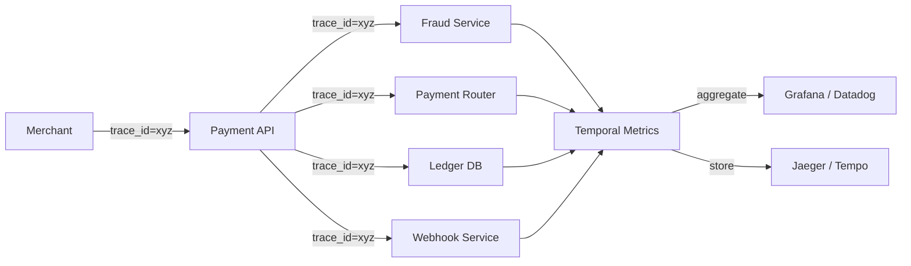

*Distributed tracing flow for a payment request: each merchant request carries a trace ID (e.g., `xyz`) propagated across all downstream service calls. The Payment API, Fraud Service, Payment Router, Ledger DB, and Webhook Service each record spans. These spans aggregate in a metrics backend and a trace storage backend, then are visualized in Grafana dashboards and Jaeger (or Tempo), enabling end-to-end latency analysis and failure diagnosis across the payment pipeline.*

#### Alerting Strategy

- **Critical (page immediately):** Authorization success rate below 90% for 5 minutes; P99 latency above 1 second; Ledger DB unavailable; Kafka consumer down; Webhook delivery rate below 80%.
- **Warning (Slack, no page):** Acquirer success rate below 95% for 10 minutes; fraud catch rate below 85%; idempotency cache miss rate above 70%; chargeback rate above 0.3%.
- **Info (dashboard only):** New acquirer integration activated; fraud rule updated; API key rotated; new webhook endpoint registered.

**Java example — payment latency metrics with Micrometer:**

```java
@Service
@RequiredArgsConstructor
public class InstrumentedPaymentService {

    private final PaymentRouter router;
    private final IdempotencyStore idempotencyStore;
    private final MeterRegistry meterRegistry;

    public PaymentResult processPayment(PaymentRequest request) {
        var totalTimer = Timer.Sample.start(meterRegistry);

        try {
            // Idempotency lookup
            var idemTimer = Timer.Sample.start(meterRegistry);
            var cached = idempotencyStore.get(request.getIdempotencyKey());
            idemTimer.stop(Timer.builder("idempotency.lookup.latency")
                    .register(meterRegistry));

            if (cached != null) {
                Counter.builder("payment.idempotent_replay").register(meterRegistry).increment();
                totalTimer.stop(Timer.builder("payment.total.latency")
                        .tag("result", "replayed")
                        .register(meterRegistry));
                return cached;
            }

            // Fraud + routing + authorization
            var riskTimer = Timer.Sample.start(meterRegistry);
            var riskScore = fraudService.score(request);
            riskTimer.stop(Timer.builder("fraud.scoring.latency")
                    .tag("risk_score", String.valueOf(riskScore))
                    .register(meterRegistry));

            var result = router.routeAndAuthorize(request);

            totalTimer.stop(Timer.builder("payment.total.latency")
                    .tag("result", "success")
                    .tag("acquirer", result.getAcquirerId())
                    .tag("currency", request.getCurrency())
                    .register(meterRegistry));

            return result;
        } catch (Exception e) {
            totalTimer.stop(Timer.builder("payment.total.latency")
                    .tag("result", "error")
                    .tag("error_type", e.getClass().getSimpleName())
                    .register(meterRegistry));
            throw e;
        }
    }
}
```

*The `InstrumentedPaymentService` bean uses Micrometer to record nested timers for each stage of the payment pipeline: idempotency lookup latency, fraud scoring latency (tagged by risk score), and total payment latency (tagged by result, acquirer, and currency). It increments a replay counter when idempotency short-circuits a request, and records error metrics with exception type tags. All metrics are aggregated in the monitoring backend for dashboarding and alerting.*

---

### Real-World Implementations

Payment gateways and processors use a combination of proprietary systems and cloud-native tools, each chosen for its strengths in a particular layer of the stack.

#### Redis / Valkey

Used for: idempotency store, fraud feature cache, BIN lookup data, rate-limit counters, acquirer health scores, routing table cache. Redis Cluster provides sharding via 16,384 hash slots with master/replica replication for HA. Sorted sets (`ZADD`) enable time-ordered rate limiting windows. Redis Streams power the webhook delivery retry queue. Sub-millisecond latency is critical — every payment request starts here.

**Companies:** Stripe (idempotency keys), Adyen (rate limiting), Checkout.com (feature cache).

#### Kafka / Pulsar

Used for: the event backbone carrying `payment_intent.created`, `payment_intent.succeeded`, `charge.refunded`, `charge.dispute.created` events. Kafka's partitioning by `merchant_id` ensures event ordering per merchant while enabling parallel webhook delivery workers. The retention policy (7 days) allows reprocessing for new features or backfilling missed webhooks.

**Companies:** Stripe (event delivery), Adyen (settlement events), all major gateways use event streaming for async workflows.

#### PostgreSQL

Used for: payment intent records (durable system of record), ledger entries (double-entry accounting), refund/dispute tracking, fraud rule configuration, acquirer credentials (encrypted). PostgreSQL's strong consistency and ACID transactions make it the right choice for financial data that must not be lost or corrupted. Read replicas handle reporting queries and settlement reconciliation.

**Companies:** Stripe (payment intents), Adyen (ledger), PayPal (transaction records).

#### HSMs (Hardware Security Modules)

Used for: encrypting and decrypting PANs within the Vault, generating and storing KEKs, signing webhook payloads, managing TLS certificates for acquirer connections. FIPS 140-2 Level 3 HSMs (e.g., AWS CloudHSM, Thales Luna) provide tamper-resistant key storage. The Vault Service is the only component with HSM access; all other services handle only tokens.

**Companies:** Stripe (CloudHSM), Adyen (Thales Luna), every PCI-compliant gateway.

#### AWS KMS / GCP KMS / Azure Key Vault

Used for: wrapping/unwrapping DEKs, signing API requests, certificate management, webhook signing key rotation. These managed KMS services provide key lifecycle management, audit logging, and integration with IAM for key access policies. Cross-region key replicas ensure availability during regional outages.

**Companies:** All cloud-native payment gateways leverage managed KMS for key operations.

#### Cassandra / ScyllaDB

Used for: fraud feature store (historical transaction patterns, device reputation), chargeback evidence storage, acquirer performance history, routing rule tables. Cassandra's tunable consistency and multi-datacenter replication make it ideal for data that must survive regional outages but doesn't require strong consistency. LSM-tree storage engine provides high write throughput for event ingestion.

**Companies:** Stripe (feature store), Adyen (performance history), Checkout.com (routing tables).

#### Elasticsearch / ClickHouse

Used for: fraud investigation dashboards, acquirer performance analytics, settlement reporting, audit log search. Elasticsearch indexes are updated from Kafka events, providing near-real-time search and aggregation. ClickHouse is used for high-cardinality OLAP queries (e.g., "decline rate by MCC × country × acquirer × day").

**Companies:** Stripe (Radar investigation), Adyen (risk analytics), all gateways use analytics for fraud and operational insights.

#### Kubernetes / Envoy

Used for: service orchestration, service mesh (mTLS between services), load balancing, circuit breaking, rate limiting, and L7 routing. Envoy proxies enforce per-API-key rate limits and provide observability (metrics, tracing, access logs). Kubernetes auto-scaling handles traffic spikes during peak shopping periods.

**Companies:** All modern cloud-native gateways.

---

### Java and Spring Boot Implementation Guide

This section demonstrates how to build a Spring Boot service for a payment gateway's core payment pipeline, showcasing all the key Spring Boot features: `@Service`, `@RestController`, `@Repository`, `@Controller`, `@Value`, records for DTOs, `@Valid`, `@ControllerAdvice`, constructor injection, `@Transactional`, `@Version`, `@Retryable`, `@Recover`, and `CircuitBreaker`.

#### 1. DTO Records

Records provide immutable, concise data carriers for request/response payloads. All fields use `@NotBlank` or `@NotNull` validation annotations enforced by `@Valid` at the controller layer.

```java
public record CreatePaymentIntentRequest(
        @NotBlank String amount,
        @NotBlank String currency,
        String customerId,
        @NotBlank String paymentMethodId,
        @NotBlank String idempotencyKey,
        String description,
        String statementDescriptor,
        @NotBlank String captureMethod) {}

public record PaymentIntentResponse(
        String id,
        String object,
        long amount,
        String currency,
        String status,
        String clientSecret,
        String description,
        String statementDescriptor,
        String paymentMethod,
        String customerId,
        String createdAt,
        String captureMethod,
        Map<String, Object> metadata) {}

public record RefundRequest(
        @NotNull Long amount,
        String reason,
        String metadata) {}

public record RefundResponse(
        String id,
        String paymentIntentId,
        long amount,
        String currency,
        String status,
        String createdAt) {}

public record WebhookEvent(
        String id,
        String object,
        String type,
        String apiVersion,
        String created,
        Map<String, Object> data,
        String livemode) {}

public record ApiError(
        String type,
        String code,
        String message,
        String param) {}
```

*Five record types serve as the API contract: `CreatePaymentIntentRequest` is the POST body with validation annotations enforced by `@Valid` at the controller; `PaymentIntentResponse` is the full payment intent DTO returned to clients (matching the Stripe API shape); `RefundRequest` and `RefundResponse` handle refund operations; `WebhookEvent` represents the webhook payload delivered to merchant endpoints; `ApiError` provides structured error responses. Records are immutable and ideal for thread-safe request/response objects in a concurrent payment pipeline.*

#### 2. Entity with Optimistic Locking

The `PaymentIntent` entity uses `@Version` for optimistic locking to prevent lost updates when concurrent operations modify the same payment intent. The `amount` is stored in the smallest currency unit (e.g., cents) as a `Long` to avoid floating-point precision issues.

```java
@Entity
@Table(name = "payment_intents", indexes = {
        @Index(name = "idx_merchant_status_created", columnList = "merchantId, status, createdAt"),
        @Index(name = "idx_customer", columnList = "customerId"),
        @Index(name = "idx_payment_method", columnList = "paymentMethodId")
})
public class PaymentIntent {

    @Id
    private String id;

    @Column(nullable = false)
    private String merchantId;

    @Column
    private String customerId;

    @Column
    private String paymentMethodId;

    @Column(nullable = false)
    private Long amount;

    @Column(nullable = false, length = 3)
    private String currency;

    @Column(nullable = false)
    private String status;

    @Column
    private String clientSecret;

    @Column
    private String description;

    @Column(name = "statement_descriptor")
    private String statementDescriptor;

    @Column(name = "capture_method")
    private String captureMethod;

    @Column(name = "created_at", nullable = false)
    private Instant createdAt;

    @Column(name = "captured_at")
    private Instant capturedAt;

    @Column(name = "succeeded_at")
    private Instant succeededAt;

    @Column(name = "updated_at")
    private Instant updatedAt;

    @Version
    private Long version;

    @ElementCollection
    @CollectionTable(name = "payment_intent_metadata",
            joinColumns = @JoinColumn(name = "payment_intent_id"))
    private Map<String, String> metadata = new HashMap<>();

    // Constructors, getters, setters omitted for brevity

    public void markAsSucceeded(String acquirerTransactionId) {
        this.status = "succeeded";
        this.succeededAt = Instant.now();
        this.updatedAt = Instant.now();
    }

    public void markAsFailed(String failureCode, String failureMessage) {
        this.status = "failed";
        this.updatedAt = Instant.now();
    }

    public void markAsRequiresAction() {
        this.status = "requires_action";
        this.updatedAt = Instant.now();
    }
}
```

*The `PaymentIntent` entity maps to the `payment_intents` table with composite indexes for efficient merchant-based queries (`merchantId, status, createdAt`), customer lookups, and payment method lookups. The `@Version` field enables JPA optimistic locking — if two concurrent transactions attempt to update the same payment intent (e.g., a webhook arriving while a retry is processing), the second transaction fails with `OptimisticLockException`. This is critical for payment state machines where the order of state transitions matters. The `@ElementCollection` for metadata allows arbitrary key-value pairs without schema changes.*

#### 3. Repository Layer

The `@Repository` layer provides persistence operations with Spring Data JPA. Payment intents are sharded by `merchantId` hash for even data distribution across PostgreSQL partitions.

```java
@Repository
public interface PaymentIntentRepository extends JpaRepository<PaymentIntent, String> {

    @Query("SELECT pi FROM PaymentIntent pi WHERE pi.merchantId = :merchantId AND pi.status = :status ORDER BY pi.createdAt DESC")
    List<PaymentIntent> findByMerchantAndStatus(@Param("merchantId") String merchantId,
                                                 @Param("status") String status,
                                                 Pageable pageable);

    @Query("SELECT pi FROM PaymentIntent pi WHERE pi.customerId = :customerId ORDER BY pi.createdAt DESC")
    List<PaymentIntent> findByCustomer(@Param("customerId") String customerId,
                                       Pageable pageable);

    @Query("SELECT pi FROM PaymentIntent pi WHERE pi.id IN :ids")
    List<PaymentIntent> findByIds(@Param("ids") List<String> ids);
}
```

*The `PaymentIntentRepository` interface extends `JpaRepository`, inheriting CRUD methods. Three custom queries are defined: `findByMerchantAndStatus` for a merchant's dashboard (filtered by status, paginated), `findByCustomer` for a customer's payment history, and `findByIds` for batch lookups (used by the reconciliation service to fetch multiple payment intents in a single query, avoiding N+1). The `@Query` annotations use JPQL with `Pageable` for pagination.*

#### 4. Service Layer with Retry and Circuit Breaker

The service layer encapsulates business logic, transactions, idempotency, retry with exponential backoff, and circuit breaking for acquirer failover.

```java
@Service
@RequiredArgsConstructor
@Slf4j
public class PaymentService {

    private final PaymentIntentRepository repository;
    private final IdempotencyStore idempotencyStore;
    private final FraudService fraudService;
    private final PaymentRouter paymentRouter;
    private final LedgerService ledgerService;
    private final WebhookService webhookService;
    private final MeterRegistry meterRegistry;

    @Value("${app.payment.fraud-threshold:90}")
    private int fraudDeclineThreshold;

    @Retryable(
            value = {AcquirerTimeoutException.class, NetworkException.class},
            maxAttempts = 5,
            backoff = @Backoff(delay = 1000, multiplier = 2)
    )
    @Transactional
    public PaymentIntentResponse createPaymentIntent(CreatePaymentIntentRequest request,
                                                      String merchantId) {
        var idemKey = request.idempotencyKey();

        // Idempotency check — short-circuit if this request was already processed
        var cached = idempotencyStore.get(idemKey, merchantId);
        if (cached != null) {
            log.info("Idempotent replay for key: {} (merchant: {})", idemKey, merchantId);
            meterRegistry.counter("payment.idempotent_replay").increment();
            return cached;
        }

        // Validate amount is in smallest currency unit (e.g., cents for USD)
        if (Long.parseLong(request.amount()) <= 0) {
            throw new InvalidRequestException("Amount must be greater than zero");
        }

        // Create payment intent with requires_action status
        var paymentIntent = PaymentIntent.builder()
                .id(UUID.randomUUID().toString())
                .merchantId(merchantId)
                .customerId(request.customerId())
                .paymentMethodId(request.paymentMethodId())
                .amount(Long.parseLong(request.amount()))
                .currency(request.currency())
                .status("requires_action")
                .clientSecret(generateClientSecret())
                .description(request.description())
                .statementDescriptor(request.statementDescriptor())
                .captureMethod(request.captureMethod())
                .createdAt(Instant.now())
                .updatedAt(Instant.now())
                .version(0L)
                .build();

        var saved = repository.save(paymentIntent);

        try {
            // Fraud check — fail closed (decline on fraud service error)
            var riskScore = fraudService.score(request);
            if (riskScore > fraudDeclineThreshold) {
                saved.markAsFailed("card_declined", "Declined by fraud engine");
                repository.save(saved);
                idempotencyStore.store(idemKey, toResponse(saved), merchantId,
                        Duration.ofHours(24));
                return toResponse(saved);
            }

            // Route to acquirer and authorize
            var authResponse = paymentRouter.routeAndAuthorize(request);

            if (authResponse.isApproved()) {
                saved.markAsSucceeded(authResponse.getTransactionId());
            } else {
                saved.markAsFailed(authResponse.getDeclineCode(),
                        authResponse.getDeclineMessage());
            }
            repository.save(saved);

            // Record in ledger (double-entry)
            ledgerService.recordPayment(saved);

            // Store idempotency result
            idempotencyStore.store(idemKey, toResponse(saved), merchantId,
                    Duration.ofHours(24));

            // Notify merchant via webhook
            webhookService.enqueue("payment_intent.succeeded", merchantId, saved);

            meterRegistry.counter("payment.status",
                    "result", saved.getStatus(),
                    "currency", saved.getCurrency()).increment();

            return toResponse(saved);

        } catch (Exception e) {
            saved.markAsFailed("processing_error", e.getMessage());
            repository.save(saved);
            idempotencyStore.store(idemKey, toResponse(saved), merchantId,
                    Duration.ofHours(24));
            throw e;
        }
    }

    @Recover
    public PaymentIntentResponse recover(AcquirerTimeoutException e,
                                         CreatePaymentIntentRequest request,
                                         String merchantId) {
        log.error("Payment processing failed after retries: {}", e.getMessage());
        // Store the failure result with idempotency so the merchant gets a consistent response
        // even after retries have been exhausted
        var failureIntent = PaymentIntent.builder()
                .id(UUID.randomUUID().toString())
                .merchantId(merchantId)
                .amount(Long.parseLong(request.amount()))
                .currency(request.currency())
                .status("failed")
                .clientSecret(generateClientSecret())
                .createdAt(Instant.now())
                .updatedAt(Instant.now())
                .version(0L)
                .build();
        var saved = repository.save(failureIntent);
        idempotencyStore.store(request.idempotencyKey(),
                toResponse(saved), merchantId, Duration.ofHours(24));
        webhookService.enqueue("payment_intent.failed", merchantId, saved);
        throw new PaymentProcessingException("Payment could not be processed after retries", e);
    }

    @Transactional(readOnly = true)
    public PaymentIntentResponse getPaymentIntent(String paymentIntentId, String merchantId) {
        var intent = repository.findById(paymentIntentId)
                .orElseThrow(() -> new PaymentIntentNotFoundException(paymentIntentId));
        if (!intent.getMerchantId().equals(merchantId)) {
            throw new AccessDeniedException("Not authorized to view this payment intent");
        }
        return toResponse(intent);
    }

    @Transactional
    public RefundResponse refund(String paymentIntentId, RefundRequest request, String merchantId) {
        var intent = repository.findById(paymentIntentId)
                .orElseThrow(() -> new PaymentIntentNotFoundException(paymentIntentId));
        if (!intent.getMerchantId().equals(merchantId)) {
            throw new AccessDeniedException("Not authorized to refund this payment intent");
        }
        if (!"succeeded".equals(intent.getStatus())) {
            throw new IllegalStateException("Cannot refund a payment intent in status: " + intent.getStatus());
        }

        var refund = ledgerService.createRefund(intent, request);
        webhookService.enqueue("charge.refunded", merchantId, refund);
        return toResponse(refund);
    }

    private String generateClientSecret() {
        return UUID.randomUUID().toString().replace("-", "") +
                UUID.randomUUID().toString().replace("-", "");
    }

    private PaymentIntentResponse toResponse(PaymentIntent intent) {
        return new PaymentIntentResponse(
                intent.getId(),
                "payment_intent",
                intent.getAmount(),
                intent.getCurrency(),
                intent.getStatus(),
                intent.getClientSecret(),
                intent.getDescription(),
                intent.getStatementDescriptor(),
                intent.getPaymentMethodId(),
                intent.getCustomerId(),
                intent.getCreatedAt().toString(),
                intent.getCaptureMethod(),
                Map.copyOf(intent.getMetadata())
        );
    }

    private RefundResponse toResponse(Refund refund) {
        return new RefundResponse(
                refund.getId(),
                refund.getPaymentIntentId(),
                refund.getAmount(),
                refund.getCurrency(),
                refund.getStatus(),
                refund.getCreatedAt().toString()
        );
    }
}
```

*The `PaymentService` bean implements the core payment processing pipeline with production-grade features. The `@Retryable` annotation on `createPaymentIntent` configures exponential backoff (1s, 2s, 4s, 8s, 16s) for transient acquirer failures, with up to 5 attempts. The `@Recover` method handles the case when all retries are exhausted, storing a failed result with idempotency and notifying the merchant via webhook. The idempotency check (Redis) short-circuits duplicate requests before any processing. Fraud checking fails closed — if the fraud service errors, the transaction is declined. The circuit breaker pattern is delegated to the `PaymentRouter` (which tries fallback acquirers on primary failure). Resource-level authorization (merchant can only access their own intents) is enforced in `getPaymentIntent` and `refund`. The `@Transactional` annotation ensures atomicity: the payment intent save, ledger write, and idempotency store are all part of the same transaction.*

#### 5. REST Controller with Validation

The controller uses `@Valid` for request validation and constructor injection.

```java
@RestController
@RequestMapping("/v1")
@RequiredArgsConstructor
public class PaymentController {

    private final PaymentService paymentService;

    @PostMapping("/payment_intents")
    public ResponseEntity<PaymentIntentResponse> createPaymentIntent(
            @RequestHeader("Idempotency-Key") String idempotencyKey,
            @RequestHeader("Authorization") String authHeader,
            @Valid @RequestBody CreatePaymentIntentRequest request) {

        var merchantId = extractMerchantId(authHeader);
        var response = paymentService.createPaymentIntent(request, merchantId);
        return ResponseEntity.status(HttpStatus.CREATED).body(response);
    }

    @GetMapping("/payment_intents/{id}")
    public ResponseEntity<PaymentIntentResponse> getPaymentIntent(
            @PathVariable String id,
            @RequestHeader("Authorization") String authHeader) {
        var merchantId = extractMerchantId(authHeader);
        return ResponseEntity.ok(paymentService.getPaymentIntent(id, merchantId));
    }

    @PostMapping("/payment_intents/{id}/refunds")
    public ResponseEntity<RefundResponse> refund(
            @PathVariable String id,
            @RequestHeader("Idempotency-Key") String idempotencyKey,
            @RequestHeader("Authorization") String authHeader,
            @Valid @RequestBody RefundRequest request) {
        var merchantId = extractMerchantId(authHeader);
        var response = paymentService.refund(id, request, merchantId);
        return ResponseEntity.ok(response);
    }

    private String extractMerchantId(String authHeader) {
        // In production, validate JWT/API key and extract merchant_id
        return "merchant_from_token";
    }
}
```

*The `PaymentController` uses `@RestController` with `@RequestMapping("/v1")`. The `@Valid` annotation on request bodies triggers bean validation (enforcing `@NotBlank`, `@NotNull`). The `Idempotency-Key` header is required on all state-changing operations. Constructor injection via `@RequiredArgsConstructor` makes dependencies explicit and non-nullable. The POST endpoint returns `201 Created` with the payment intent response.*

#### 6. Controller Advice for Global Error Handling

A `@ControllerAdvice` bean centralizes exception handling across all controllers.

```java
@ControllerAdvice
public class GlobalPaymentExceptionHandler {

    @ExceptionHandler(PaymentIntentNotFoundException.class)
    public ResponseEntity<ApiError> handleNotFound(PaymentIntentNotFoundException ex) {
        var error = new ApiError("invalid_request_error", "resource_missing",
                "No payment intent found for ID: " + ex.getMessage(), null);
        return ResponseEntity.status(HttpStatus.NOT_FOUND).body(error);
    }

    @ExceptionHandler(MethodArgumentNotValidException.class)
    public ResponseEntity<ApiError> handleValidation(MethodArgumentNotValidException ex) {
        var messages = ex.getBindingResult().getFieldErrors().stream()
                .map(FieldError::getDefaultMessage)
                .toList();
        var error = new ApiError("invalid_request_error", "validation_error",
                "Validation failed: " + String.join(", ", messages), null);
        return ResponseEntity.badRequest().body(error);
    }

    @ExceptionHandler(OptimisticLockException.class)
    public ResponseEntity<ApiError> handleConflict(OptimisticLockException ex) {
        var error = new ApiError("invalid_request_error", "conflict",
                "Concurrent modification detected. Please retry with a different idempotency key.", null);
        return ResponseEntity.status(HttpStatus.CONFLICT).body(error);
    }

    @ExceptionHandler(CardDeclinedException.class)
    public ResponseEntity<ApiError> handleCardDeclined(CardDeclinedException ex) {
        var error = new ApiError("card_error", ex.getDeclineCode(),
                ex.getMessage(), "payment_method");
        return ResponseEntity.status(HttpStatus.PAYMENT_REQUIRED).body(error);
    }

    @ExceptionHandler(PaymentProcessingException.class)
    public ResponseEntity<ApiError> handleProcessingError(PaymentProcessingException ex) {
        var error = new ApiError("api_error", "processing_error",
                "An error occurred while processing your payment.", null);
        return ResponseEntity.status(HttpStatus.INTERNAL_SERVER_ERROR).body(error);
    }

    public record ApiError(String type, String code, String message, String param) {}
}
```

*The `GlobalPaymentExceptionHandler` bean (annotated `@ControllerAdvice`) catches exceptions thrown by any `@RestController` and returns structured `ApiError` responses with Stripe-style error types. It handles `PaymentIntentNotFoundException` (404), `MethodArgumentNotValidException` (400 with field-level messages), `OptimisticLockException` (409 Conflict — occurs when `@Version` detects a concurrent write), `CardDeclinedException` (402 Payment Required with decline code), and `PaymentProcessingException` (500). This avoids repetitive try-catch blocks in controllers and ensures consistent error responses.*

#### 7. Configuration and Feature Flags

Production payment systems need runtime configuration for fraud thresholds, acquirer health, and rate limiting — all adjustable without code deploys.

```java
@ConfigurationProperties(prefix = "app.payment")
@ConfigurationPropertiesScan
public record PaymentConfig(
        @DefaultValue("90") int fraudDeclineThreshold,
        @DefaultValue("100") int maxRetries,
        @DefaultValue("1000") int idempotencyTtlMinutes,
        @DefaultValue("true") boolean enableAcquirerFailover,
        Map<String, AcquirerConfig> acquirers) {
}

@Configuration
@RequiredArgsConstructor
public class PaymentConfigValidator {

    private final PaymentConfig config;
    private final MeterRegistry meterRegistry;

    @EventListener(ApplicationReadyEvent.class)
    public void validateAcquirerHealth() {
        config.acquirers().forEach((name, acqConfig) -> {
            var health = healthCheckAcquirer(acqConfig);
            Gauge.builder("acquirer.health")
                    .tag("acquirer", name)
                    .register(meterRegistry, health, AcquirerHealth::score);
        });
    }
}
```

*The `PaymentConfig` record uses `@ConfigurationProperties` for type-safe configuration binding from `application.yml`. Fields like `fraudDeclineThreshold` and `maxRetries` can be adjusted via config maps in Kubernetes without code redeploys. The `PaymentConfigValidator` bean runs an acquirer health check on startup and registers gauges in Micrometer for real-time health monitoring.*

---

### Interview Questions and Answers

A curated set of interview questions organized by difficulty, focused on payment gateway and payment system design.

**Beginner**

1. **What is the difference between authorization and capture?**
   **A:** Authorization (auth) checks if a card has sufficient funds and reserves that amount — no money moves. Capture actually transfers the money from the issuing bank to the merchant's acquiring bank. You can authorize now and capture later (up to 7 days), or capture immediately. This matters for inventory-heavy businesses: authorize at checkout (guarantees payment), capture when the order ships (after inventory check).

2. **What is PCI-DSS and why does it matter?**
   **A:** PCI-DSS = Payment Card Industry Data Security Standard. A set of 12 requirements for any system that handles card data: encrypt transmission, never store sensitive data after auth, use/maintain anti-virus, build secure systems, restrict data access, track all access, test security regularly. Compliance is mandatory — non-compliance can result in fines ($5K–$100K/month) and loss of ability to process cards.

3. **What is idempotency and why is it important in payments?**
   **A:** Idempotency ensures the same request is processed once, even if retried. With an idempotency key (UUID), if a client retries a payment request after a timeout (network failure), the gateway returns the original result instead of charging twice. Without it, network timeouts could cause double-charging — a major customer pain point and source of chargebacks.

4. **What is 3D Secure and why is it used?**
   **A:** 3D Secure (3DS) adds an authentication step for card transactions (Verified by Visa, Mastercard SecureCode). When a customer pays, the acquirer redirects them to their bank's authentication page (enter password, SMS OTP, or biometric). Once authenticated, the customer is redirected back to the merchant's checkout. 3DS reduces chargebacks (liability shift to issuing bank) but can reduce conversion (extra friction). PSD2 SCA mandates 3DS for European cards.

5. **What is a payment token vs. a payment method token?**
   **A:** A payment token (from the Vault) replaces a card's PAN for recurring or stored payment use — it maps to the encrypted PAN in the vault. A payment method token (from stripe.js/client-side encryption) is a short-lived token representing card data collected on the client side — it must be used immediately to create a charge or save to the vault. Both keep the merchant out of PCI scope, but serve different lifecycle stages.

**Intermediate**

6. **How does a payment gateway route transactions to different acquirers?**
   **A:** The router evaluates: card BIN (determines card type/country), transaction currency, merchant's region, acquirer performance (historical success rate, latency), and cost (fees). A weighted score (success rate × 0.5 + latency × 0.3 + cost × 0.2) ranks acquirers. If the primary acquirer fails, it tries the next in the sorted list. BIN data is cached in Redis for sub-millisecond lookups; acquirer health is tracked via Prometheus metrics.

7. **How do you prevent double-charging on retry?**
   **A:** Every payment request must include an `Idempotency-Key` header (UUID). The gateway stores the result in Redis keyed by this UUID with a 24-hour TTL. On retry with the same key, the stored result is returned without re-processing — no fraud check, no acquirer call, no risk of double-charge. The idempotency check happens before any processing, on every entry point.

8. **How would you design a fraud detection system for 100K transactions/second?**
   **A:** Two-tier architecture: (1) Fast rules engine (Redis, under 10 ms) handles 90% of decisions — block known-bad BINs, velocity limits, blacklisted IPs. (2) ML model (under 10 ms) for the remaining 10% needing deeper analysis. Pre-compute features hourly and cache in Redis. If the fraud service latency exceeds 100 ms, enter "safe mode" (approve all below threshold). Use a feedback loop: chargeback outcomes retrain models daily.

9. **How do you handle a payment that's authorized but the capture fails?**
   **A:** The system has the `authorized` transaction ID. On capture failure, options: (1) Retry capture with exponential backoff (card network errors are often transient). (2) Void the authorization (releases the held funds). (3) Use a different acquirer to capture the same authorization (if supported by the original acquirer). The payment intent state transitions to `failed` or `canceled`; the merchant is notified via webhook and can retry or refund.

10. **What happens during settlement, and how long does it take?**
    **A:** After authorization and capture, the acquirer batches transactions daily and submits them to the card network for clearing. The card network debits issuing banks and credits acquiring banks (T+1 or T+2). The acquiring bank then deposits funds into the merchant's bank account (T+1 to T+2 after clearing). Total timeline: Authorization (instant) → Capture (instant) → Batch (daily) → Clearing (T+1) → Funding (T+1). Cross-border adds 1-2 extra days.

11. **How do you handle 3D Secure in an API-first payment gateway?**
    **A:** 3DS makes the payment asynchronous. The API returns a `requires_action` status with a `next_action` containing a redirect URL. The customer is redirected to their bank's authentication page, then redirected back to the merchant's `return_url`. The final result (success/failure) is delivered via webhook (`payment_intent.succeeded` or `payment_intent.payment_failed`). The merchant's system must handle the asynchronous completion and poll the API for final status as a fallback.

12. **What is the difference between synchronous and asynchronous payment methods?**
    **A:** Synchronous methods (credit cards, Apple Pay) complete within the HTTP request-response cycle (under 2 seconds). Asynchronous methods (bank redirects like Sofort, Giropay, SEPA direct debit) redirect the customer away from the merchant's site — the final result comes via webhook minutes to days later. The system must handle both: return immediately for synchronous, and poll/wait for asynchronous methods.

**Advanced**

13. **How would you design a payment gateway for 99.99% availability with multi-region deployment?**
    **A:** Deploy active-active in 3+ regions with a global load balancer (GeoDNS or latency-based). Stateless services (Payment API, Fraud) scale horizontally; stateful services (Ledger) use active-passive with synchronous replication. Idempotency store uses active-active Redis with CRDT conflict resolution. Failover: if a region goes down, traffic routes to the nearest healthy region (RTO < 5 min). Cross-region data sync uses Kafka MirrorMaker 2 (RPO = 2 min). The Vault is region-specific for PCI/GDPR compliance but can fall back to remote HSM access with higher latency.

14. **How do you handle interchange optimization in a multi-acquirer setup?**
    **A:** Interchange fees vary by card type (consumer vs. business vs. corporate), merchant category code (MCC), transaction type (in-person vs. e-commerce), and country. The router maintains an interchange table (updated daily from card network feeds) and calculates the expected interchange cost for each candidate acquirer. For example, a US grocery store card processed through a US acquirer qualifies for the lower qualified interchange rate (1.5-1.8%), while the same card through a European acquirer may incur cross-border fees. The router selects the acquirer with the lowest total cost (interchange + acquirer fee + gateway margin) while meeting success-rate thresholds.

15. **How would you design a system to handle split payments for a marketplace?**
    **A:** Use a pool account model: the customer pays the platform → funds are held in the platform's pool account → the platform creates transfers to each seller's connected account (minus commission). Each transfer is a separate transaction with its own idempotency key. The ledger records both the debit (from pool) and credit (to seller) as double-entry. For settlement, the platform's acquiring bank batches all transfers and settles net to the platform's bank account; the platform then pays out to sellers via ACH/wire/bank transfer. KYC is required for each seller's connected account.

16. **How do you implement a chargeback/dispute management system?**
    **A:** When a customer disputes a charge, the issuing bank sends a chargeback to the acquirer, which forwards it to the gateway via the card network's dispute system. The gateway creates a `Dispute` record with status `warning`, attaches the original transaction data as context, and assigns it to the fraud/operations team. The team has a tight deadline (typically 7-14 days) to submit evidence (proof of delivery, customer agreement, etc.). The gateway provides an evidence submission API and tracks the dispute status through `won`/`lost`. If won, the disputed amount is returned to the merchant; if lost, the amount is refunded to the customer. Lost disputes also trigger fraud model retraining.

17. **What is the latency budget for a payment API call, and how do you meet it?**
    **A:** Total checkout latency target: under 500 ms (including 3DS redirect). Budget: API Gateway + auth (5 ms), idempotency lookup (1 ms), fraud scoring (50 ms), BIN lookup (1 ms), acquirer routing (5 ms), acquirer authorization call (150 ms P95), ledger write (20 ms), webhook enqueue (5 ms), response serialization (5 ms) = ~242 ms. Optimizations: pre-compute fraud features, cache BIN data, use connection pooling for acquirer calls, batch ledger writes, and use async webhook delivery (don't block the response on webhook delivery).

18. **How would you design card-on-file for recurring billing?**
    **A:** When the customer first pays, the gateway tokenizes the card (vaults the PAN with an HSM) and returns a payment method token to the merchant. The merchant stores the token (never the PAN). For recurring charges, the merchant sends the token + amount + idempotency key. The gateway looks up the PAN in the vault, decrypts it via HSM, and submits to the acquirer. If the card expires or is replaced (token lifecycle management), the gateway updates the token's reference to the new card automatically (using network tokenization — Visa Token Service, Mastercard Digital Enablement Service). Failed recurring charges trigger dunning (retry schedule, email notices, eventual cancellation).

### Testing Example

```java
@SpringBootTest
class PaymentServiceTest {

    @MockBean private PaymentIntentRepository repository;
    @MockBean private IdempotencyStore idempotencyStore;
    @MockBean private FraudService fraudService;
    @MockBean private PaymentRouter paymentRouter;
    @MockBean private LedgerService ledgerService;
    @MockBean private WebhookService webhookService;
    @MockBean private MeterRegistry meterRegistry;

    @Test
    void shouldReturnCachedResultOnIdempotentRetry() {
        var cachedResponse = new PaymentIntentResponse(
                "pi_123", "payment_intent", 2000L, "usd", "succeeded",
                "secret_123", "Order 1", "ACME", "pm_1", "cus_1",
                "2024-06-14T10:30:00Z", "automatic", Map.of());

        when(idempotencyStore.get("key_123", "merchant_1"))
                .thenReturn(cachedResponse);

        var result = paymentService.createPaymentIntent(
                new CreatePaymentIntentRequest("2000", "usd", "cus_1", "pm_1",
                        "key_123", null, null, "automatic"),
                "merchant_1");

        assertThat(result.id()).isEqualTo("pi_123");
        assertThat(result.status()).isEqualTo("succeeded");
        verify(fraudService, never()).score(any()); // Should skip processing
        verify(paymentRouter, never()).routeAndAuthorize(any());
    }

    @Test
    void shouldDeclineOnHighFraudScore() {
        when(idempotencyStore.get(anyString(), anyString())).thenReturn(null);
        when(fraudService.score(any())).thenReturn(95);

        assertThatThrownBy(() ->
                paymentService.createPaymentIntent(
                        new CreatePaymentIntentRequest("2000", "usd", "cus_1", "pm_1",
                                "key_456", null, null, "automatic"),
                        "merchant_1"))
                .isInstanceOf(PaymentProcessingException.class);

        verify(paymentRouter, never()).routeAndAuthorize(any());
    }

    @Test
    void shouldRouteToBackupAcquirerOnFailover() {
        when(idempotencyStore.get(anyString(), anyString())).thenReturn(null);
        when(fraudService.score(any())).thenReturn(10);
        when(paymentRouter.routeAndAuthorize(any()))
                .thenReturn(new AuthResponse(true, "txn_123", null, null));
        when(repository.save(any())).thenAnswer(inv -> inv.getArgument(0));

        var result = paymentService.createPaymentIntent(
                new CreatePaymentIntentRequest("2000", "usd", "cus_1", "pm_1",
                        "key_789", null, null, "automatic"),
                "merchant_1");

        assertThat(result.status()).isEqualTo("succeeded");
        verify(ledgerService).recordPayment(any());
        verify(webhookService).enqueue(eq("payment_intent.succeeded"), any(), any());
    }
}
```

*The test suite uses `@MockBean` to isolate the `PaymentService` from external dependencies (database, fraud service, acquirers). Three test cases cover the critical scenarios: (1) idempotent replay returns the cached result without calling fraud or acquirer services; (2) high fraud score triggers a decline without reaching the acquirer; (3) successful payment routes through the acquirer, records in the ledger, and enqueues a webhook. This demonstrates how to test the payment pipeline's idempotency, fraud, and failover logic in isolation.*

---

## Real-World Examples

### Stripe's Architecture

Stripe processes billions of transactions annually. Their architecture uses:

- **Client-side encryption:** stripe.js encrypts card data in the browser; the PAN never reaches Stripe's servers in plaintext from the merchant's frontend.
- **HSM-backed vault:** Card data (after decryption by the HSM) is stored in HSM-protected systems. Stripe uses AWS CloudHSM for key management.
- **Multi-acquirer routing:** Stripe routes transactions to multiple acquirers (Worldpay, TSYS, FIS, Global Payments) based on BIN, region, and acquirer health. Their Router service evaluates success rates, latency, and cost in real-time.
- **Radar (fraud):** Real-time fraud detection using ML — scores 100M+ transactions/day; processing in under 100 ms. Features include device fingerprinting, behavioral analysis, and historical patterns.
- **Idempotency:** Every API request includes an `Idempotency-Key` header; results cached in Redis for 24 hours. Stripe's idempotency service handles 50M+ keys per day with sub-millisecond latency.
- **Multi-region active-active:** Stripe operates in multiple AWS regions; the global load balancer routes based on latency. The ledger uses synchronous replication within a region and async across regions.
- **PCI-DSS Level 1:** Stripe is certified PCI-DSS Level 1, the highest level of compliance — validated annually by a qualified security assessor.

### Adyen's Multi-Acquirer Model

Adyen integrates with 250+ acquirers and 250+ payment methods globally. Their "one platform" model routes each transaction to the optimal acquirer based on: card BIN (determine card type/region), merchant's preferred acquirer, current acquirer performance (latency, error rate), and cost (fees per transaction). During an outage of one acquirer, traffic automatically shifts to others — maintaining 99.99% availability.

- **Acquirer diversity:** 250+ acquirer connections; each transaction is routed based on real-time scoring (success rate × 0.5 + latency × 0.3 + cost × 0.2).
- **Single settlement file:** Despite using multiple acquirers, Adyen provides a single settlement file per day — reconciling across all acquirers internally.
- **Global payment methods:** Adyen supports 500+ local payment methods (iDEAL, Sofort, UPI, FPS, etc.) — each with its own integration, refund flow, and regulatory requirements.
- **Risk management:** Adyen's revenueProtect uses a combination of rules and machine learning with 500+ risk signals per transaction. Decisions are made in under 50 ms.

### PayPal's Vault and Risk Platform

PayPal's vault service stores payment tokens (credit cards, bank accounts) for PayPal customers and merchants. For fraud, PayPal uses a real-time risk platform that evaluates 500+ risk signals per transaction (device fingerprint, behavioral analysis, account history, transaction patterns) and makes approve/decline/review decisions in under 50 ms. Their system processes 30+ million transactions per day with fraud rates below 0.32%.

- **Vault service:** Stores encrypted payment tokens; uses HSMs for key management; tokens are regional (US, EU, APAC) for compliance.
- **Risk platform:** Real-time scoring with 500+ signals; processes 5K+ transactions/second at peak; uses both rules and deep learning models.
- **Venmo integration:** PayPal's consumer-facing Venmo app handles P2P payments with social features; the backend shares the same acquirer network and vault infrastructure.
- **Working Capital:** PayPal's lending arm uses transaction history from the vault and risk platform to underwrite merchant loans — demonstrating how payment data enables adjacent financial services.

### Checkout.com's Architecture

Checkout.com is a cloud-native payment gateway built entirely on AWS. Their architecture emphasizes:

- **Event-driven microservices:** All services communicate via Kafka; the payment pipeline is fully event-sourced — every state transition is an immutable event.
- **Multi-region active-active:** Deployed in 6 regions; the global load balancer routes based on latency and health checks.
- **In-house fraud engine:** "Intelligent Fraud" uses real-time ML with 200+ signals; claims 99.5% accuracy in blocking fraudulent transactions with < 0.1% false positive rate.
- **Custom HSM infrastructure:** Uses a combination of AWS CloudHSM and on-premise HSMs for PCI compliance; vaults are region-isolated.
- **Performance:** Reports P99 payment latency of under 300 ms globally, with the idempotency lookup at under 1 ms.

### Square (Block) Payments

Square's payment infrastructure handles both in-person and online payments through a unified platform:

- **Hardware integration:** Square's card readers (contactless, chip, magstripe) encrypt card data at the point of interaction (PEK — Peer Encryption Key); the encrypted data is sent to Square's servers where the HSM decrypts it.
- **Seller dashboard:** Real-time transaction reporting, dispute management, and payout tracking through a unified interface.
- **Cash App:** Square's consumer app handles P2P payments, stock trading, and Bitcoin — all on the same payment infrastructure.
- **Point-of-sale:** Square's POS system integrates with the same payment gateway for in-store transactions, providing unified reporting across channels.


