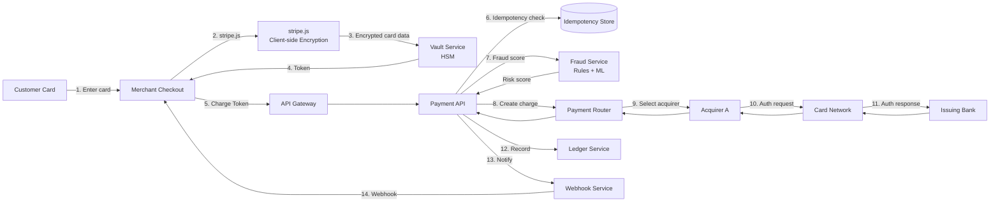

# Design Payment Gateway

## Blogs and websites

## Medium

## Youtube

- [Design Stripe | System Design Interview](https://www.youtube.com/watch?v=djc2vfpCvso)

---

## Theory

### What Is It?

A payment gateway (Stripe, PayPal, Adyen) is a payment orchestration system that acts as an intermediary between merchants (e-commerce sites, apps) and payment processors/acquirers/card networks. It provides APIs for merchants to collect payments from customers, handling the complexity of multiple payment methods (credit cards, bank transfers, digital wallets, buy-now-pay-later), fraud detection, currency conversion, and regulatory compliance (PCI-DSS). The gateway must process payments with high availability, low latency, and strict security — a single transaction involves multiple external systems (card network, acquiring bank, issuing bank) that can each fail.

### Why Does It Exist?

Merchants cannot directly process credit card payments — they need PCI-DSS compliance, relationships with acquiring banks, and integration with card networks (Visa, Mastercard). A payment gateway abstracts all this complexity: the merchant integrates with one API, and the gateway handles routing to the appropriate processor, currency conversion, fraud checks, and compliance. This enables global commerce without each merchant needing their own payment infrastructure.

### What Problem Does It Solve?

* **Payment method abstraction**: Customers pay with credit cards, debit cards, Apple Pay, Google Pay, bank transfers, buy-now-pay-later — each with different integration requirements. The gateway normalizes all into one API.
* **Global payment routing**: A transaction from a customer in Japan with a German card buying from a US merchant requires routing through the correct acquiring bank, currency conversion, and local payment rails.
* **Fraud prevention**: Payment fraud (stolen cards, friendly fraud, account takeover) costs merchants billions. The gateway must detect and block fraudulent transactions in real-time.
* **Idempotency and reliability**: Network failures can cause duplicate charges. The gateway must guarantee "exactly-once" execution using idempotency keys.
* **PCI-DSS compliance**: Card data handling is heavily regulated. The gateway must isolate card data (tokenization, vaulting) so merchants never touch PCI scope.
* **Reconciliation and settlement**: Every transaction must be tracked for accounting, tax, and reconciliation. The gateway provides tools for dispute handling (chargebacks).
* **High availability and low latency**: Checkout must complete in < 2 seconds; payments must process 24/7 with < 0.1% failure rate for legitimate transactions.

### Important Subtopics

1. Payment request lifecycle (authorization, capture, settlement, refund)
2. PCI-DSS compliance and card data isolation
3. Fraud detection and prevention (rules, ML models)
4. Idempotency and retry semantics
5. Multi-acquirer routing and failover
6. Currency conversion and multi-currency processing
7. Chargeback and dispute handling
8. Vault/tokenization for card-on-file
9. Payment method types (cards, wallets, bank debits, BNPL)
10. Regulatory compliance (PCI-DSS, PSD2 SCA, 3D Secure)

## Characteristics

| Characteristic | What it means | Why it matters | How it works |
|---|---|---|---|
| **Payment orchestration** | Routes transactions to the right processor | Different cards/regions need different processors | Decision tree based on card BIN, region, currency |
| **PCI-DSS scope isolation** | Card data never touches merchant systems | PCI compliance is expensive and complex | Tokenization; client-side encryption (Stripe.js) |
| **Fraud detection** | Real-time identification of fraudulent transactions | Chargebacks and fraud cost merchants | Rules engine + ML models scoring transactions |
| **Idempotency** | Same request processed once despite retries | Prevents double-charging customers | Idempotency key (UUID) on every request |
| **Multi-currency** | Transactions in customer's/local currency | Global commerce requires currency conversion | FX rate lookup + conversion at transaction time |
| **High availability** | Payments work 24/7 | Checkout is revenue-critical | Multi-region, active-active, failover routing |

## Components

| Component | Purpose | Responsibilities | Relationship | Real-world Example |
|---|---|---|---|---|
| **API Layer** | Merchant integration | Accept payment requests, validate, route | Calls Payment Service, Fraud Service | Stripe API |
| **Payment Service** | Core payment processing | Authorization, capture, refund logic | Calls Acquirer APIs, Vault | Stripe Core |
| **Vault Service** | Store payment credentials | Tokenize card data, secure storage | Uses HSMs; isolates from Payment Service | Stripe Vault |
| **Fraud Service** | Detect fraudulent transactions | Rules evaluation, ML scoring | Called by Payment Service before processing | Stripe Radar |
| **Router** | Route to processors | Select acquiring bank/processor | Knows processor health, fees, coverage | Stripe Router |
| **Acquirer API** | Connect to acquiring banks | Send authorization requests | External integration | Worldpay, Adyen, TSYS |
| **Wallet Service** | Digital wallet integration | Apple Pay, Google Pay, etc. | Uses token providers | Apple Pay, Google Pay |
| **Reconciliation** | Track financial movements | Match transactions, handle settlements | Reads from all services | Finance backend |
| **Webhook Service** | Notify merchants of events | Send payment_intent.succeeded, etc. | Calls merchant endpoints | Stripe Webhooks |

### Component Interactions

1. **Payment flow**: Merchant → API Layer → Fraud Service (score) → Payment Service → Router → Acquirer API → Card Network → Issuing Bank → response back through the chain.
2. **Vault flow**: Card data submitted via Stripe.js (client-side) → Vault Service tokenizes using HSM → returns token → merchant stores token, never sees card number.
3. **Fraud flow**: Transaction details → Fraud Service → rules engine + ML model → risk score → Payment Service decides (approve/decline/review).

## Patterns

### Tokenization and Vault

* **What**: Replace sensitive card data (PAN) with a non-sensitive token that maps to the original data in a secure vault.
* **Problem solved**: Merchants can process recurring payments (subscriptions) or stored payment methods without storing/handling card numbers — stays out of PCI scope.
* **How it works**: Card data received → sent to Vault Service → Vault encrypts (HSM) and stores → returns a token → merchant stores token → to charge, merchant sends token → Vault decrypts → sends PAN to acquirer.
* **When to use**: When storing card data for future use (subscriptions, card-on-file, one-click checkout).
* **When not to use**: For one-time payments where the card is never stored.
* **Advantages**: PCI scope reduction; enables recurring payments; protects against data breaches.
* **Disadvantages**: Additional latency (token lookup); vault is a single point of failure.
* **Java/Spring Boot example**:
```java
@Service
public class VaultService {
    private final HardwareSecurityModule hsm;
    private final TokenStore tokenStore; // Redis/DB

    public Token vaultCard(CardDetails card) {
        String pan = card.getPan();
        // Encrypt PAN with HSM
        EncryptedPan encrypted = hsm.encrypt(pan);
        // Generate deterministic token from PAN hash
        String token = "tok_" + Hashing.sha256().hashString(pan, StandardCharsets.UTF_8);
        // Store encrypted PAN keyed by token
        tokenStore.store(token, encrypted);
        return new Token(token);
    }

    public CardDetails unvault(Token token) {
        EncryptedPan encrypted = tokenStore.retrieve(token.getValue());
        String pan = hsm.decrypt(encrypted);
        return CardDetails.fromPan(pan);
    }
}
```
* **Real-world example**: Stripe's tokens, Braintree's vault, Adyen's token service.

### Idempotency

* **What**: A payment request with the same idempotency key returns the same result, even if retried — prevents duplicate charges.
* **Problem solved**: Network failures during payment (timeout, client retries) can cause the merchant to retry the request — without idempotency, the customer gets charged twice.
* **How it works**: The merchant generates a UUID (idempotency key) and sends it in the `Idempotency-Key` header. The payment system stores the result keyed by this UUID (with TTL). On retry with the same key, the stored result is returned without re-processing.
* **When to use**: Always — every payment request should be idempotent.
* **When not to use**: Never — idempotency should be default for all payment operations.
* **Advantages**: Prevents double-charging; clients can safely retry; clear audit trail.
* **Disadvantages**: Storage overhead (key-value store with TTL); if the same key is used for a different intended charge, the old result is returned (merchant must use unique keys).
* **Real-world example**: Stripe's `Idempotency-Key` header; HTTP semantics for safe retries.

### Multi-Acquirer Router with Failover

* **What**: Select the best payment processor for each transaction based on criteria (fees, success rate, latency, region) and fail over if the primary is down.
* **Problem solved**: A single acquirer may be slow or down — routing intelligently and failing over keeps transactions flowing.
* **How it works**: For each transaction, the Router evaluates a decision tree: card BIN → country → currency → available acquirers → score by (success_rate × 0.5 + latency × 0.3 + fees × 0.2). If the primary acquirer fails, try the next. If all fail, try card networks directly (Visa/Mastercard fallback).
* **When to use**: When processing at scale (10K+ transactions/day) where acquirer performance varies.
* **When not to use**: For very low volume — single acquirer suffices.
* **Advantages**: Higher success rates; better economics (route to lowest-fee acquirer); resilience.
* **Disadvantages**: Complexity; difficult to test all failover paths; regulatory constraints (some regions require local acquirers).
* **Real-world example**: Stripe's payment rails; Adyen's multi-acquirer setup.

## Benefits

* **Simplified merchant integration**: One API for all payment methods — no need to integrate with each card network or wallet provider separately.
* **Global payment reach**: Process cards and payment methods from any country.
* **Fraud protection**: Built-in fraud detection saves merchants from chargeback losses.
* **PCI-DSS compliance**: Merchants stay out of scope using tokenization and client-side encryption.
* **Multi-currency support**: Sell globally with automatic currency conversion.
* **Regulatory compliance**: Handle 3D Secure, SCA (PSD2), and other regional requirements.

## Pros

* **Omnichannel payment support**: Credit cards, debit cards, digital wallets (Apple Pay, Google Pay), bank debits, buy-now-pay-later (Klarna, Afterpay), and local payment methods (UPI, iDebit, FPS).
* **Global reach**: Process payments in 135+ currencies, with local payment rails in each region.
* **Built-in fraud protection**: Rules engine + ML models reduce fraudulent transactions without blocking legitimate ones.
* **Developer experience**: Well-documented APIs, SDKs, and dashboards for integration, testing, and monitoring.
* **Scalable infrastructure**: Handle peak (Black Friday, Cyber Monday) with 100K+ transactions/second.
* **Idempotency**: Guaranteed exactly-once processing with idempotency keys.

## Cons

* **High operational complexity**: Payment systems have more failure modes than typical web services (card declines, bank errors, network timeouts, regulatory issues).
* **Regulatory burden**: PCI-DSS, PSD2 SCA, 3D Secure, EMVCo — compliance is mandatory and expensive.
* **Chargeback liability**: Merchants (and gateways) bear financial risk for disputed transactions; fraud detection is critical.
* **Thin margins**: Payment processing has low margins (2.9% + $0.30 per transaction) — volume is essential.
* **Dependence on external systems**: Card networks, acquiring banks, and issuing banks can all experience outages.
* **Fraud arms race**: Fraudsters continuously adapt; detection models must evolve.

## Challenges

### Technical Challenges

* **Distributed transaction**: A single payment involves the merchant's system, the gateway, the acquirer, the card network, and the issuing bank — each can fail independently. The system must handle partial failures and provide clear states (authorized, captured, failed, disputed).
* **Latency vs. accuracy**: Fraud checks add latency — the system must score transactions quickly (< 100 ms) while maintaining accuracy.
* **Retry semantics**: Network timeouts mean the client may retry — the system must be idempotent (same idempotency key = same result).
* **Asynchronous flows**: 3D Secure and bank redirects make payments asynchronous — the final result comes via webhook, not the original HTTP response.

### Scalability Challenges

* **Peak traffic**: Black Friday/Cyber Monday: 100K+ transactions per second, each with 50+ external calls (fraud, routing, acquirer).
* **Regional expansion**: Each new country requires integrating with local acquirers, payment methods, and regulatory compliance.
* **Multi-currency processing**: FX rate lookups and conversions for 135+ currencies, updated by the minute.

### Performance Challenges

* **Checkout latency**: The entire payment (including fraud check) must complete in < 1-2 seconds to avoid cart abandonment.
* **Idempotency key lookup**: Every request checks the idempotency store — must be < 1 ms (Redis).
* **Webhook delivery**: Must deliver payment status updates to merchants reliably and in order.

### Reliability Challenges

* **Partial failures**: Payment authorized but capture fails (card network timeout); system must reconcile and either succeed or refund.
* **Race conditions**: Concurrent requests for the same order/payment method must be serialized to prevent double-charges.
* **Network partitions**: Acquirer API unreachable — queue the request and retry, or route to a backup acquirer.

### Maintainability Challenges

* **Version migration**: Evolving payment APIs while maintaining backward compatibility for existing integrations.
* **Acquirer integration**: Each acquirer has different APIs, error codes, and settlement schedules — abstraction is hard to maintain.
* **Feature flagging**: Payment features (new fraud rules, acquirer routing) must be tested gradually (1% of transactions before 100%).

### Operational Challenges

* **Settlement reconciliation**: Daily matching of transaction data with bank settlements — discrepancies require investigation.
* **Chargeback management**: Handling dispute evidence submission and response within tight deadlines (7 days for chargebacks).
* **Monitoring**: Track authorization success rates, fraud catch rates, latency percentiles, and acquirer performance.

### Security Concerns

* **PCI-DSS compliance**: Never store full PANs unless in an HSM-backed vault; scope reduction via client-side encryption (Stripe.js).
* **Data encryption**: Encrypt card data in transit (TLS 1.2+) and at rest (AES-256).
* **Fraud prevention**: ML models for anomaly detection; 3D Secure for SCA compliance.
* **Token security**: Tokens must be unguessable and have appropriate TTL; vault must be isolated.
* **Key management**: Regular key rotation; HSM-based operations.

## Best Practices

* **Always use idempotency keys**: Every payment request must include a unique idempotency key (UUID). Store results keyed by this UUID with a 24-hour TTL.
* **Client-side encryption for card data**: Use Stripe.js/Elements to collect card data client-side; never let card data touch your server. Reduces PCI scope to SAQ-A.
* **Implement circuit breakers**: If an acquirer is failing (error rate > 5%), open circuit and route to backup acquirers.
* **Separate authorization and capture**: For inventory-heavy businesses, authorize (check funds) at checkout, capture (actually charge) when the order ships.
* **Log everything (securely)**: Log all payment events (but never full card numbers); structured JSON with trace_id for correlation.
* **Implement retry with exponential backoff**: For transient acquirer failures (network timeouts, 503), retry with backoff (1s, 5s, 30s). Use idempotency keys to prevent duplicates.
* **Monitor success rates per acquirer**: Track and alert on acquirer-specific decline/timeout rates.
* **Handle 3D Secure asynchronously**: Don't block the user — redirect to 3DS, then return via webhook/callback.
* **Test with synthetic cards**: Card networks provide test card numbers that simulate success, decline, 3DS, etc.
* **Implement fallback acquirers**: Have at least 2 acquirers per region; route based on health and fees.

## When to Use

### Appropriate

* When you need to accept payments online (e-commerce, SaaS, subscriptions).
* When you have customers in multiple countries/currencies.
* When you offer multiple payment methods (cards, wallets, BNPL).
* When you need built-in fraud protection and PCI-DSS compliance assistance.
* When you process recurring/subscription payments.

### Not Appropriate

* When all transactions are in-person (physical POS terminal) — use card reader SDKs instead.
* When processing is very low volume (< 100 transactions/month) — direct processor integration may be cheaper.
* When you need ultra-low-cost processing for a single payment method — direct acquirer integration may offer lower rates.

### Alternatives

* **Direct acquirer integration**: Integrate directly with one acquiring bank — lower cost but no abstraction layer, single point of failure, no built-in fraud.
* **Payment facilitators (Payoneer, PayPal)**: For platforms paying out to sub-merchants.
* **In-house payment system**: For very large merchants with specific needs (e.g., Amazon's payment system).

### Decision Factors

* **Volume**: High volume → gateway's fraud/routing optimization pays off; low volume → direct integration is cheaper.
* **Global presence**: International → gateway with multi-currency/multi-acquirer; domestic → simple.
* **PCI scope**: Want to avoid PCI → gateway with tokenization; can handle PCI → direct integration.
* **Integration effort**: Gateway = one integration; direct = one per acquirer/payment method.

## Use Cases

### E-commerce Checkout (Stripe-like)

* **Problem**: An online retailer needs to accept credit cards on their checkout page without handling card data (PCI-DSS).
* **Solution**: Use a payment gateway's client-side component (Stripe Elements) to collect card data — the card data goes directly to the gateway, never to the merchant's server. The merchant receives a token and uses it server-side to create a charge.
* **Why suitable**: The gateway handles PCI-DSS (merchant stays in SAQ-A scope), fraud detection, and global card acceptance.
* **How it works**: (1) Customer enters card on checkout page → Stripe.js collects card data → gateway tokenizes → returns token to merchant's frontend → frontend sends token to merchant's backend → backend creates charge via gateway API → gateway routes to acquirer → card network → issuing bank → response.
* **Trade-offs**: 2.9% + $0.30 per transaction (gateway fee); dependency on gateway uptime; limited customization of the payment flow.

### Subscription Billing (Recurring Payments)

* **Problem**: A SaaS company charges customers monthly — needs automated recurring billing with dunning (handle failed payments).
* **Solution**: Use the gateway's subscription billing feature — store tokens (vault) from initial payment, charge on schedule, retry failed payments, notify customers of failures, and cancel after sustained failures.
* **Why suitable**: Payment gateways handle the complexity of token storage, retry logic, and dunning flows.
* **How it works**: (1) Customer subscribes → gateway creates subscription object + stores payment token → gateway charges on schedule → on failure, retries (day 1, 3, 5, 7, 14, 21) → if all fail, cancels subscription + notifies merchant → merchant can retry via different card.
* **Trade-offs**: Gateway fees on every retry; limited flexibility in billing logic; dependency on gateway's subscription feature.

### Marketplace Payout (Split Payments)

* **Problem**: A marketplace (e.g., Airbnb) needs to route payments: customer pays the platform, platform pays the host (minus commission).
* **Solution**: Use the gateway's Connect/Connect-like feature — the customer pays the platform; the platform creates a transfer to the host's account (with a commission deduction). The gateway handles payout timing, tax reporting, and multi-party transfers.
* **Why suitable**: The gateway manages KYC for hosts, tax forms (1099-K in the US), payout scheduling, and multi-party money flow.
* **How it works**: (1) Customer pays → funds held in platform's balance → platform creates transfer to host's connected account → gateway handles payout to host's bank account (T+1 or T+2). (2) Commission retained by the platform.
* **Trade-offs**: Higher fees for marketplace features; KYC/verification required for hosts; complex tax reporting.

## Architecture

A payment gateway uses an **event-driven microservices architecture** with strict security isolation. The **API Layer** handles merchant requests; the **Vault Service** isolates card data (uses HSM, separate network/VPC). The **Router** selects the best acquirer (based on BIN, region, currency, health, fees); the **Fraud Service** scores transactions in real-time using rules + ML. Card data flows through a separate, isolated data path (PCI-compliant subnet). All business events are logged for audit/reconciliation.

```mermaid
graph TD
  subgraph "Merchant"
    Merchant[Merchant App]
  end
  subgraph "Edge"
    APIGW[API Gateway<br/>TLS Termination]
    StripeJS[stripe.js<br/>Client-side]
  end
  subgraph "PCI Zone"
    Vault[Vault Service<br/>HSM, Token Storage]
    Tokenizer[Tokenizer<br/>Client-side Encryption]
  end
  subgraph "Core Services"
    API[Payment API]
    Fraud[Fraud Service<br/>Rules + ML]
    Router[Router<br/>Acquirer Selection]
    Webhook[Webhook Service]
    Ledger[Ledger Service<br/>Double-entry]
  end
  subgraph "External"
    Acquirer1[Acquirer API 1]
    Acquirer2[Acquirer API 2]
    CardNet[Card Network<br/>Visa/Mastercard]
    Bank[Issuing Banks]
  end
  Merchant -->|Card data| StripeJS
  StripeJS -->|Encrypted| Vault
  Vault -->|Token| API
  Merchant -->|Token| API
  API --> Fraud
  Fraud --> Router
  API --> Ledger
  Router -->|Auth request| Acquirer1
  Acquirer1 -->|Auth response| Router
  Router -->|Fallback| Acquirer2
  Acquirer1 --> CardNet
  CardNet --> Bank
  API -->|Event| Webhook
  Webhook -->|Notify| Merchant
  API -->|Events| Kafka[Kafka]
  Kafka --> Analytics[Analytics/Billing]
```

### Architecture Structure

* **Edge layer**: API Gateway with TLS termination, rate limiting, DDoS protection. stripe.js runs in the merchant's browser (client-side encryption).
* **Control plane**: Payment API, Fraud Service, Router, Webhook Service, Ledger Service. All business logic.
* **PCI zone**: Vault Service (isolated subnet, HSM-backed, air-gapped from internet). Card data never leaves this zone.
* **Data layer**: Idempotency store (Redis), event stream (Kafka), ledger DB (Postgres), acquirer credentials (Vault/HSM).
* **External integrations**: Acquiring banks, card networks, 3D Secure providers.

### Communication

* **Merchant ↔ API**: HTTPS with authentication (bearer token, signed requests).
* **Client ↔ Vault**: stripe.js in browser → token request; card data encrypted client-side; vault is PCI-compliant.
* **Services ↔ Acquirer**: HTTPS with mutual TLS; acquirer credentials in HSM.
* **Internal**: Async events via Kafka for ledger, webhooks, analytics.

### Data Flow

1. **Payment**: Merchant collects card via stripe.js → vault tokenizes → merchant backend charges token → Fraud Service scores → Router selects acquirer → acquirer → card network → issuing bank → response → Webhook notifies merchant.
2. **Token storage**: Card data encrypted client-side → Vault decrypts/stores (HSM) → returns token.
3. **Idempotency**: Every request checked against idempotency store before processing.
4. **Reconciliation**: All events written to ledger (double-entry) → Kafka → finance reconciliation.

### Scaling Strategy

* **API Layer**: Stateless horizontal scaling; per-region deployment.
* **Vault**: HSM-bound; shard tokens by hash for scaling.
* **Router**: Cache healthy acquirer list; scale by region/currency.
* **Fraud**: Pre-compute features; ML inference on GPU clusters; rules engine on Redis.

### Failure Handling

* **Acquirer timeout**: Retry with backoff; route to backup acquirer.
* **Card declined**: Return decline response; merchant can retry with different card.
* **Vault unavailable**: Token-based payments still work; raw card entry fails.
* **Webhook delivery failure**: Retry with exponential backoff; alert after max retries.

## High-Level Design



**Payment flow**:
1. Customer enters card on merchant checkout page → stripe.js encrypts card data in browser → sends to Vault (PCI zone) → Vault returns a token.
2. Merchant backend receives token → calls Payment API with token + amount + idempotency key.
3. Payment API → checks idempotency store (Redis) → if duplicate, returns cached result.
4. API → Fraud Service (rules + ML) → risk score (0-100).
5. If score < threshold → Router → selects acquirer (based on BIN, region, health) → sends authorization request.
6. Acquirer → card network → issuing bank → approves/declines.
7. Response → Payment API → Ledger (double-entry record) → Webhook (notify merchant).
8. If acquirer declines or times out → Router tries backup acquirer.

**Refund flow**:
1. Merchant initiates refund → Payment API → idempotency check → Router → sends refund to the same acquiring bank (using original transaction reference).
2. If original acquirer is down, route through backup but track for reconciliation.

## Deep Dive

### Internal Implementation: Payment Authorization and Capture

The payment lifecycle has four distinct stages:

1. **Authorization**: Check if the card has sufficient funds → reserve the amount (holds funds but doesn't transfer). Returns: `authorized`, `declined`, or `error`.
2. **Capture**: Transfer the authorized amount → funds move from issuing bank to acquiring bank → settlement. Can capture partial amounts.
3. **Settlement**: The acquirer batches authorizations and sends them to the card network for final settlement → funds settle to the merchant's bank account (T+1 or T+2).
4. **Refund**: Reverse a captured transaction → sends funds back to the customer's card.

```java
@Service
public class PaymentService {
    @Transactional
    public PaymentResult processPayment(PaymentRequest request) {
        String idemKey = request.getIdempotencyKey();
        
        // 1. Idempotency check
        PaymentResult cached = idempotencyStore.get(idemKey);
        if (cached != null) return cached;
        
        // 2. Fraud check
        RiskScore risk = fraudService.score(request);
        if (risk.isDeclined()) {
            throw new CardDeclinedException(risk.getReason());
        }
        
        // 3. Select acquirer
        Acquirer acquirer = router.selectAcquirer(request);
        
        // 4. Authorize
        AuthResponse auth = acquirer.authorize(
            request.getAmount(),
            request.getCurrency(),
            request.getCardToken(),
            request.getTraceId()
        );
        
        if (!auth.isApproved()) {
            throw new AuthorizationException(auth.getDeclineCode());
        }
        
        // 5. Capture (immediate or deferred)
        CaptureResponse capture = acquirer.capture(auth.getTransactionId(), request.getAmount());
        
        // 6. Record in ledger (double-entry)
        ledger.recordPayment(
            request.getMerchantId(),
            request.getAmount(),
            capture.getTransactionId(),
            request.getCurrency()
        );
        
        PaymentResult result = PaymentResult.success(capture.getTransactionId());
        idempotencyStore.store(idemKey, result, Duration.ofHours(24));
        
        // 7. Notify merchant
        webhookService.send("charge.succeeded", request.getMerchantId(), result);
        
        return result;
    }
}
```

### Fraud Detection Pipeline

The fraud service runs a two-stage check:

**Stage 1 — Rules engine (synchronous, < 50 ms)**:
- Block cards from high-risk countries.
- Flag transactions > $X (configurable per merchant).
- Velocity check: > N transactions from same customer in 1 hour.
- Check against a real-time blocklist (stolen cards, known bots).

**Stage 2 — ML model (asynchronous, < 100 ms)**:
Features include: customer lifetime value, purchase velocity, device fingerprint, IP reputation, shipping/billing distance, behavioral patterns (mouse movement, typing). The model outputs a risk score (0-100). If score > threshold, the transaction is reviewed (manual or automated rules).

```java
@Service
public class FraudService {
    public RiskScore score(PaymentRequest request) {
        // Fast rule-based blocking (synchronous)
        for (FraudRule rule : rules) {
            if (rule.matches(request)) {
                return RiskScore.declined(rule.getName());
            }
        }

        // ML model (async, cached)
        Features features = featureService.extract(request);
        double mlScore = mlModel.predict(features);
        
        if (mlScore > 0.9) return RiskScore.declined("ML fraud score high");
        if (mlScore > 0.7) return RiskScore.review("Manual review needed");
        
        return RiskScore.approved();
    }
}
```

### PCI-DSS Compliance Architecture

PCI-DSS scope is minimized by:
1. **Client-side encryption**: stripe.js encrypts card data in the browser → Vault never sees PAN in plaintext.
2. **Network isolation**: Vault runs in a PCI zone (isolated VPC, HSM-backed).
3. **No card data in core services**: The Payment API only handles tokens — card data never touches merchant servers or non-PCI gateways.
4. **Logging redaction**: Card data is masked in logs (`****-****-****-4242`).
5. **Access control**: Vault access requires multi-factor auth and is logged.

## Java and Spring Boot Implementation

### Basic Java Implementation — Payment Controller

```java
@RestController
@RequestMapping("/api/v1/payments")
@RequiredArgsConstructor
public class PaymentController {
    private final PaymentService paymentService;

    @PostMapping("/charges")
    public ResponseEntity<PaymentResponse> createCharge(
            @RequestHeader("Idempotency-Key") String idempotencyKey,
            @RequestBody CreateChargeRequest request,
            @AuthenticationPrincipal MerchantDetails merchant) {

        PaymentRequest paymentRequest = PaymentRequest.builder()
            .merchantId(merchant.getId())
            .amount(request.getAmount())
            .currency(request.getCurrency())
            .cardToken(request.getCardToken())
            .idempotencyKey(idempotencyKey)
            .build();

        PaymentResult result = paymentService.processPayment(paymentRequest);
        return ResponseEntity.status(HttpStatus.CREATED)
            .body(PaymentResponse.success(result));
    }

    @PostMapping("/charges/{chargeId}/refunds")
    public ResponseEntity<RefundResponse> refund(
            @PathVariable String chargeId,
            @RequestBody RefundRequest request,
            @RequestHeader("Idempotency-Key") String idempotencyKey) {
        RefundResult result = paymentService.refund(chargeId, request.getAmount(), idempotencyKey);
        return ResponseEntity.ok(RefundResponse.success(result));
    }
}
```

### Production-Oriented Implementation — Payment Service

```java
@Service
@Slf4j
public class PaymentService {
    private final FraudService fraudService;
    private final AcquirerRouter router;
    private final IdempotencyStore idempotencyStore;
    private final LedgerService ledgerService;
    private final WebhookService webhookService;

    @Retryable(
        value = {AcquirerTimeoutException.class},
        maxAttempts = 5,
        backoff = @Backoff(delay = 1000, multiplier = 2)
    )
    public PaymentResult processPayment(PaymentRequest request) {
        String idemKey = request.getIdempotencyKey();

        // Idempotency check
        PaymentResult cached = idempotencyStore.get(idemKey);
        if (cached != null) {
            log.info("Idempotent replay for key: {}", idemKey);
            return cached;
        }

        // Validate
        validateRequest(request);

        // Fraud check (fail closed — decline on fraud service error)
        RiskAssessment risk = fraudService.evaluate(request);
        if (risk.shouldDecline()) {
            throw new CardDeclinedException(risk.getDeclineReason());
        }

        // Route to best acquirer
        Acquirer acquirer = router.selectBestAcquirer(request);

        // Authorize + capture
        PaymentResult result;
        try {
            result = acquirer.process(request);
        } catch (AcquirerException e) {
            // Failover to backup
            acquirer = router.selectBackupAcquirer(request);
            result = acquirer.process(request);
        }

        // Record in ledger
        ledgerService.recordPayment(request.getMerchantId(), request.getAmount(), 
            result.getTransactionId(), request.getCurrency());

        // Persist idempotency
        idempotencyStore.store(idemKey, result, Duration.ofHours(24));

        // Notify merchant
        webhookService.enqueue("charge.succeeded", request.getMerchantId(), result);

        return result;
    }

    @Recover
    public PaymentResult recover(AcquirerTimeoutException e, PaymentRequest request) {
        log.error("Payment failed after retries: {}", e.getMessage());
        idempotencyStore.store(request.getIdempotencyKey(), 
            PaymentResult.failed("acquirer_timeout"), Duration.ofHours(24));
        webhookService.enqueue("charge.failed", request.getMerchantId(), 
            Map.of("error", "acquirer_timeout"));
        throw new PaymentProcessingException("Payment could not be processed");
    }
}
```

### Testing Example

```java
@SpringBootTest
class PaymentServiceTest {
    @MockBean private IdempotencyStore idempotencyStore;
    @MockBean private FraudService fraudService;
    @MockBean private AcquirerRouter router;
    @MockBean private LedgerService ledgerService;
    @MockBean private WebhookService webhookService;

    @Test
    void shouldReturnCachedResultOnIdempotentRetry() {
        // Same idempotency key
        when(idempotencyStore.get("key_123"))
            .thenReturn(PaymentResult.success("txn_abc"));

        PaymentResult result = paymentService.processPayment(
            PaymentRequest.builder().idempotencyKey("key_123").build());

        assertThat(result.isSuccessful()).isTrue();
        verify(fraudService, never()).evaluate(any()); // Should skip processing
    }

    @Test
    void shouldDeclineOnFraud() {
        when(fraudService.evaluate(any())).thenReturn(
            RiskAssessment.declined("stolen_card"));

        assertThatThrownBy(() -> paymentService.processPayment(
            testPaymentRequest()))
            .isInstanceOf(CardDeclinedException.class);
    }
}
```

## Real-World Examples

### Stripe's Architecture

Stripe processes billions of transactions annually. Their architecture uses:
- **Client-side encryption**: stripe.js encrypts card data in the browser; the PAN never reaches Stripe's servers in plaintext.
- **HSM-backed vault**: Card data (post-decryption) is stored in HSM-protected systems.
- **Multi-acquirer routing**: Stripe routes transactions to multiple acquirers (Worldpay, TSYS, etc.) based on BIN, region, and acquirer health.
- **Radar (fraud)**: Real-time fraud detection using ML — scores 100Ms transactions/day; processes in < 100 ms.
- **Idempotency**: Every API request includes an `Idempotency-Key` header; results cached in Redis for 24 hours.

### Adyen's Multi-Acquirer Model

Adyen integrates with 250+ acquirers and 250+ payment methods globally. Their "one platform" model routes each transaction to the optimal acquirer based on: card BIN (determine card type/region), merchant's preferred acquirer, current acquirer performance (latency, error rate), and cost (fees per transaction). During an outage of one acquirer, traffic automatically shifts to others — maintaining 99.99% availability.

### PayPal's Vault and Risk Platform

PayPal's vault service stores payment tokens (credit cards, bank accounts) for PayPal customers and merchants. For fraud, PayPal uses a real-time risk platform that evaluates 500+ risk signals per transaction (device fingerprint, behavioral analysis, account history, transaction patterns) and makes approve/decline/review decisions in < 50 ms. Their system processes 30+ million transactions per day with fraud rates < 0.32%.

## Interview Preparation

### Beginner Questions

**Q1: What is the difference between authorization and capture?**
A: Authorization (auth) checks if a card has sufficient funds and reserves that amount — no money moves. Capture actually transfers the money from the issuing bank to the merchant's acquiring bank. You can authorize now and capture later (up to 7 days), or capture immediately. This matters for inventory-heavy businesses: authorize at checkout (guarantees payment), capture when the order ships (after inventory check).

**Q2: What is PCI-DSS and why does it matter?**
A: PCI-DSS = Payment Card Industry Data Security Standard. A set of 12 requirements for any system that handles card data: encrypt transmission, never store sensitive data after auth, use/maintain anti-virus, build secure systems, restrict data access, track all access, test security regularly. Compliance is mandatory — non-compliance can result in fines ($5K-$100K/month) and loss of ability to process cards.

**Q3: What is idempotency and why is it important in payments?**
A: Idempotency ensures the same request is processed once, even if retried. With an idempotency key (UUID), if a client retries a payment request after a timeout (network failure), the gateway returns the original result instead of charging twice. Without it, network timeouts could cause double-charging — a major customer pain point and a source of chargebacks.

### Intermediate Questions

**Q4: How does 3D Secure work?**
A: 3D Secure (3DS) adds an authentication step for card transactions (Verified by Visa, Mastercard SecureCode). When a customer pays, the acquirer redirects them to their bank's authentication page (enter password, SMS OTP, or biometric). Once authenticated, the customer is redirected back to the merchant's checkout to complete the payment. 3DS reduces chargebacks (liability shift to issuing bank) but can reduce conversion (extra friction). PSD2 SCA mandates 3DS for European cards.

**Q5: How do you handle a payment that's authorized but the capture fails?**
A: The system has the `authorized` transaction ID. On capture failure, options: (1) Retry capture with backoff (card network errors are often transient). (2) Void the authorization (releases the held funds). (3) Use a different acquirer to capture the same authorization (if supported). The order state should reflect this — and the merchant should be notified. The key is that the system knows the authorization succeeded and can reconcile it.

**Q6: How do you route payments to the best acquirer?**
A: Use a decision engine that evaluates: card BIN (determines card type and country), transaction currency, merchant's preference, acquirer performance (historical success rate, latency), and cost (fees). Cache healthy acquirer list; failover to backup acquirers on errors. Some gateways use machine learning to predict the best acquirer per transaction type.

**Q7: How do you detect and prevent payment fraud?**
A: Multi-layered approach: (1) Rules engine (block high-risk BINs, velocity limits, blacklisted IPs). (2) ML model scoring (500+ signals: device fingerprint, behavioral patterns, historical data). (3) Real-time decisions (approve/decline/review) within < 100 ms. (4) Manual review queue for borderline cases. (5) Feedback loop: use chargeback outcomes to retrain the model. (6) 3D Secure as fallback for high-risk transactions.

### Advanced Questions

**Q8: How would you design a payment system for multiple marketplaces with split payments?**
A* Approach: Use a **pool account** model. The platform collects payment from the customer → holds funds in a pool account → disburses to marketplace sellers (minus platform commission) on a schedule (daily/weekly). The pool account is a single entity in the payment gateway; payouts to sellers use the gateway's payout functionality (Stripe Connect, PayPal Payouts). Each marketplace has separate payout rules. Use the gateway's `transfer` API to move funds from the platform's balance to the seller's connected account.
* **Double-entry ledger**: Every transaction is recorded as debit + credit (e.g., customer pays $100 → debit pool +100, credit customer liability -100; payout $95 to seller → debit seller liability -95, credit pool -95, platform keeps $5).
* **Escrow**: For disputed orders, hold funds in escrow until resolution.
* **Regulatory**: Each seller needs KYC (Know Your Customer) for payouts in their country.

**Q9: How do you handle cross-border payments with currency conversion?**
A: (1) **Multi-currency accounts**: Platform holds balances in multiple currencies; convert at the market rate (updated every minute with a markup). (2) **Local payment methods**: Offer region-specific methods (UPI in India, iDEAL in Netherlands, FPS in HK). (3) **FX hedging**: For large platforms, hedge currency exposure using forward contracts. (4) **Pricing strategy**: Markup FX rate by 1-2% for revenue. (5) **Settlement**: Settle in the merchant's preferred currency; the gateway handles the conversion and settlement timing.

### Senior-Level Questions

**Q10: How would you design a fraud detection system that processes 100K transactions/second?**
A: (1) **Two-tier architecture**: Fast rules engine (Redis, < 10 ms) handles 90% of decisions; ML model (10 ms) handles the remaining 10% needing deeper analysis. (2) **Pre-computed features**: User risk scores, device reputation, historical patterns — pre-computed hourly and cached. (3) **Stream processing**: Kafka Streams or Flink process events in real-time; features updated in < 1 second. (4) **Feature store**: Centralized feature store (Redis) for consistent features across rules and ML. (5) **Circuit breaker**: If fraud service latency > 100 ms, enter "safe mode" (approve all below threshold). (6) **Sampling**: For training data, sample 100% of declines and 1% of approvals. (7) **Feedback loop**: Use chargeback outcomes to retrain models daily.

### System Design Questions (Senior)

**Q11: Design a payment gateway that handles 1M transactions/day with < 1 second latency and 99.99% availability.**

**Approach**:
- **Multi-region active-active**: Deploy in US-EAST, US-WEST, EU-WEST; route based on latency; any region can handle full load if others fail.
- **Acquirer diversity**: Integrate with 3+ acquirers per major card brand; health-check every 30 seconds; auto-switch.
- **Idempotency**: Redis cluster (10 shards) for idempotency key lookup; 24-hour TTL.
- **Fraud**: Rules engine (Redis, 5 ms) + ML model (in-memory, 10 ms) — target < 15 ms total fraud check.
- **Vault**: HSM-backed; tokenize before storage; client-side encryption via stripe.js; vault isolated in PCI zone.
- **Routing**: Decision tree: card BIN → region → best acquirer (based on historical success rate + latency + cost).
- **Database**: PostgreSQL for ledger (strong consistency, ACID); sharded by merchant_id for scale.
- **Caching**: Hot acquirer configs, fraud rules, routing tables in Redis (1-second refresh).
- **Monitoring**: Track auth success rate, fraud hit rate, latency percentiles; alert on drop.
- **Disaster recovery**: If region fails, route to backup region with async replication of idempotency store (2-minute RPO).
- **Latency budget**: Auth (issuer) 300 ms + Fraud 15 ms + Routing 1 ms + Idempotency 5 ms + Ledger 50 ms = ~400 ms total (well within 1 second).
- **Availability**: Multi-acquirer failover (eliminates single acquirer outage); multi-region (eliminates DC outage); load shedding during overload.

**Expected discussion points**: Multi-region deployment strategy, acquirer failover logic, idempotency store design and TTL tradeoffs, fraud detection latency constraints, PCI zone isolation, and handling partial failures.

**Q12: How would you design a billing/invoicing system for a SaaS company with monthly subscriptions, trials, and proration?**

**Approach**:
- **Subscriptions**: Each customer has a subscription object with plan, billing cycle, status (active/trialing/past_due/canceled). Store in Postgres.
- **Scheduling**: Bill daily at 0:00 UTC → determine which subscriptions need invoicing → batch generate invoices (100 per batch) → charge customers.
- **Trials**: New subscriptions start in trial state; no charge during trial; transition to active (billable) on trial end.
- **Proration**: When plan changes mid-cycle: compute unused time on old plan (refund) + used time on new plan (charge). Formula: `proration = (days_remaining / days_in_cycle) * (new_price - old_price)`.
- **Invoice lifecycle**: Draft → open (sent) → paid → paid (full) → void. Track payment status per invoice.
- **Payment retries**: Failed payments retried at day 1, 3, 5, 7, 14; if all fail, subscription enters past_due → cancel after 21 days.
- **Dunning**: Send email reminders at day 1, 3, 7 of delinquency; offer alternate payment methods.
- **Tax**: Integrate with tax calculation service (Avalara) — compute tax per jurisdiction per invoice line.
- **Currency**: Store amounts in the smallest currency unit (e.g., cents) as integers to avoid floating-point errors.

### Common Mistakes and Expected Discussion Points

**Common mistakes in payment gateway interviews**:
- Not covering PCI-DSS scope reduction (critical for any payment system).
- Ignoring idempotency — proposing solutions that double-charge on retry.
- Not discussing 3D Secure and SCA (regulatory requirement in Europe).
- Overlooking chargeback management and dispute handling.
- Not considering the full payment lifecycle (auth → capture → settle → refund).
- Treating all acquirers as equal (ignoring BIN-based routing).
- Not discussing fraud detection architecture (rules + ML).

**Expected discussion points**: Idempotency key implementation and TTL tradeoffs, PCI-DSS scope reduction strategies, acquirer failover and health checking, fraud detection architecture (rules + ML), 3D Secure flow and SCA compliance, payment lifecycle (authorize, capture, settle, refund), and chargeback management.

**Follow-up questions an interviewer might ask**:
* Q: "How do you handle a card that's been stolen?" A: The issuing bank will decline the authorization or issue a chargeback. The gateway should return a decline code; repeated declines from the same merchant may trigger fraud review; chargebacks are handled via the dispute process (merchant submits evidence, issuing bank decides).
* Q: "What happens if the payment gateway is down but the card network is working?" A: If the gateway's API is down, merchants can't process payments → revenue loss. Mitigate with multi-region (if one region is down, route to another); if the acquirer integration is down, failover to a backup acquirer.
