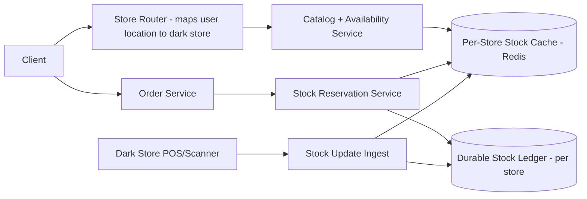
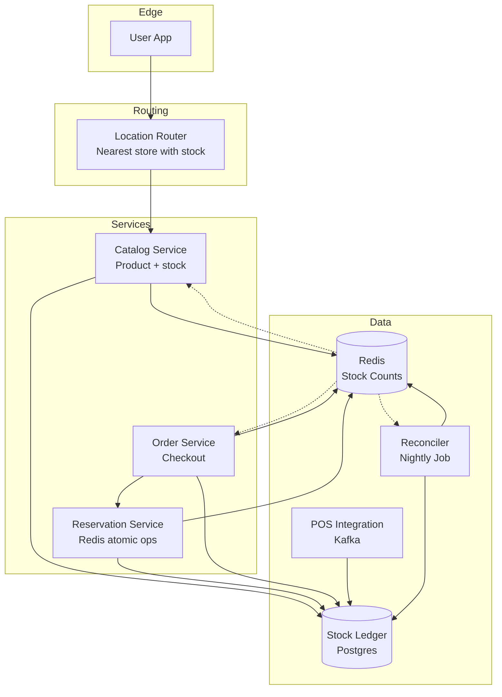
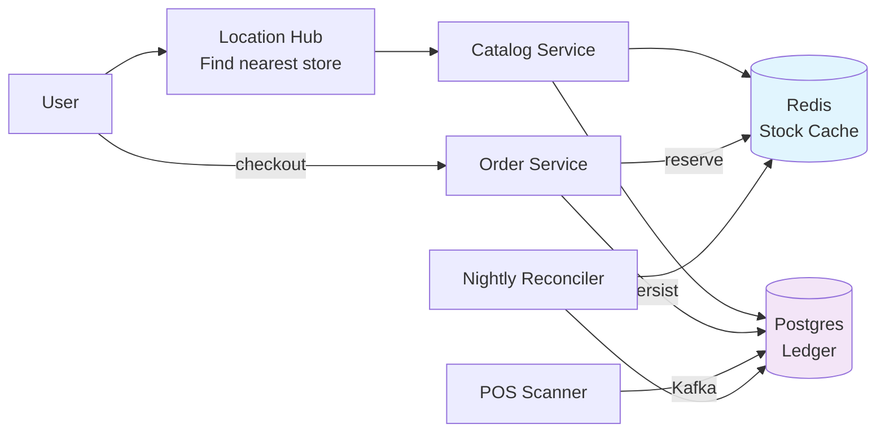

# Design a Real-Time Inventory System for a Quick-Commerce App (like Zepto)

## Blogs and websites

## Medium

## Youtube

## Theory

### What Is It?

A quick-commerce inventory system tracks stock levels per item per store (dark store/warehouse) in real-time, enabling 10-20 minute deliveries. Unlike traditional e-commerce (stock centrally located in a few warehouses), quick commerce has hundreds of small local stores, each with independent, rapidly changing inventory that must be accurate to the second.

### Why Does It Exist?

Traditional e-commerce accepts 1-2 day delivery windows because inventory is centralized and shipping takes time to consolidate. Quick commerce (Zepto, Blinkit, Instacart) promises delivery within 10-20 minutes — but this requires inventory to be already stored in hyperlocal micro-fulfillment centers near customers, with real-time stock accuracy to avoid overselling.

### What Problem Does It Solve?

* **Per-store inventory accuracy**: Each dark store is a separate inventory unit — stock levels must be tracked individually and updated instantly as items are sold, restocked, damaged, or reserved.
* **Reservation consistency**: When a customer places an order, stock must be reserved before payment — atomic decrement to prevent overselling.
* **Location-based availability**: Show only items available at the customer's designated dark store; route orders to open dark stores near the customer.
* **Abandoned cart recovery**: Reserve stock at cart-add time, release automatically when the reservation expires (no manual cleanup job).
* **Read-heavy workload**: Every app view triggers dozens of availability checks — must be sub-50ms; writes (sales) are lower volume and can afford slightly higher latency.
* **Physical-digital reconciliation**: Actual shelf stock (from POS/scanner) must match digital records — periodic physical counts + event-driven updates.

### Important Subtopics

1. Per-store inventory partitioning (sharding by store_id)
2. Stock reservation (atomic decrement with TTL, at cart add time)
3. Read path optimization (cache-aside for availability checks)
4. Write path consistency (no overselling — strong consistency)
5. Reservation expiry (TTL-based release of abandoned cart reservations)
6. Physical reconciliation (POS/scanner events → inventory update)
7. Location routing (customer → nearest open dark store)
8. Event sourcing (ledger of all stock changes for audit + cache rebuild)
9. Data store choices (Redis for cache, durable store for ledger)
10. Handling edge cases (damaged goods, partial shipments, mis-picks)

### Problem Statement

Design a real-time inventory system for a quick-commerce app that promises 10-20 minute deliveries from many small local "dark stores." Stock levels per store must be accurate to the second, since overselling an item that a store doesn't actually have breaks the delivery promise.

### Functional Requirements

- Track per-SKU stock at each dark store, updated in real time as items are received, sold, reserved (in-cart), or damaged
- Show only in-stock (and deliverable-in-time) items to a customer based on their location's serving dark store
- Reserve stock the moment an order is placed (before payment) and release the reservation on cancellation/timeout
- Reconcile stock via periodic physical counts

### Non-Functional Requirements

- **Scale**: Thousands of dark stores, tens of millions of SKU-store combinations, extremely high read QPS (every app view checks availability) with lower write QPS
- **Latency**: Availability check < 50ms; stock decrement/reservation < 100ms
- **Consistency**: Strong consistency for decrement/reservation (no overselling); eventual consistency acceptable for catalog-browse-level "in stock" badges

### High-Level Architecture



### Key Design Points

- Partition stock data by `store_id` (each dark store is an independent shard) so hot SKUs at one store don't contend with unrelated stores, and stock operations for a single store can be served by a single Redis key/hash with atomic `DECR`/Lua scripts.
- Use a short-lived reservation (e.g., hold stock for 5-10 minutes) at "add to cart"/checkout time, backed by a TTL in Redis, so abandoned carts automatically release stock without a manual cleanup job.
- Keep the durable ledger (event log of every stock change: received, sold, reserved, released, damaged) in a per-store append-only store, replaying into the Redis cache; this makes the cache rebuildable and stock changes auditable.
- Push catalog "in-stock" visibility updates to clients via a fast cache read rather than the durable DB, since availability is read on nearly every screen and can tolerate a few seconds of staleness for *display* (not for the actual decrement, which must be atomic).

### Trade-offs

- Strong consistency on the decrement path (Redis atomic ops + durable ledger) versus eventual consistency on the display/browse path trades a small "stock shown but sold out at checkout" risk for far higher read throughput; the decrement itself never oversells because it's checked atomically regardless of what was displayed.
- Sharding by store simplifies scaling almost linearly

---

## Characteristics

| Characteristic | What it means | Why it matters | How it works |
|---|---|---|---|
| **Per-store stock** | Inventory tracked at store-level granularity | 10-min delivery requires exact store stock | Shard by store_id |
| **Real-time reads** | Stock levels read at sub-100ms | Show accurate inventory to users | Cache-aside (Redis) |
| **Real-time writes** | Stock decrements are strongly consistent | Prevent overselling | Redis atomic ops + durable ledger |
| **Reservation system** | Reserve stock before order placement | Avoid race between browse + checkout | Reservation with TTL |
| **Read-heavy write-bursty** | 10x more reads than writes; spike at order time | Optimize for read path + bursty writes | Read-through cache, write-batched |
| **TTL expiry** | Reserved stock expires if not checked out | Return stock to pool automatically | Redis TTL |
| **Location-based** | Stock tied to specific store location | Deliver from nearest store with stock | Store-level inventory + location routing |

## Components

| Component | Purpose | Responsibilities | Relationship | Real-world Example |
|---|---|---|---|---|
| **Location Router** | Route user to nearest store with stock | Store assignment, proximity | Client ↔ Store Router | Zepto location service |
| **Catalog Service** | Product metadata + store stock | Serve product info + stock lookup | Router ↔ Catalog | Catalog DB |
| **Stock Cache** | Fast stock level reads | Store stock counts in memory | Catalog, Reservation | Redis (store_id → sku → count) |
| **Reservation Service** | Reserve stock for order | Atomic decrement, TTL, expiry | Catalog, Order | Redis atomic ops |
| **Stock Ledger** | Durable stock record | Persist decrements/restocks; source of truth | Reservation | Postgres/Cassandra |
| **POS Integration** | Sync with physical store POS | Real stock counts from scanner | Stock Ledger | POS → Kafka |
| **Inventory Reconciler** | Fix cache vs ledger drift | Periodic reconciliation | Stock Ledger ↔ Stock Cache | Cron job |

## Patterns

### Cache-Aside with Store-Level Sharding

* **What**: Stock levels cached in Redis (keyed by store_id + sku). Reads hit cache → miss → load from DB + populate cache. Writes (reservation) update Redis atomically + async-write DB.
* **Problem solved**: DB can't handle 10K reads/sec per store; cache provides sub-ms latency.
* **How it works**: (1) Read stock → Redis GET(store:sku) → if miss → SELECT count → Redis SET(store:sku, count). (2) Reserve stock → Redis DECRBY(store:sku, qty) → if result < 0 → restore (overflow) + return insufficient. (3) Async: write reservation to DB (Stock Ledger). (4) Reconciliation: nightly compare Redis vs DB → fix drift.
* **When to use**: High-read, frequent-update data (inventory, counters).
* **When not to use**: When data changes less than cache TTL; when strong consistency is needed on every read.
* **Advantages**: Sub-ms reads; DB offload; cache hit ratio > 99%.
* **Disadvantages**: Cache invalidation complexity; stale reads acceptable for browse; reconciliation overhead.

### Reservation with TTL

* **What**: When user views cart/checkout → stock reserved atomically (Redis DECRBY) with TTL (e.g., 10 min). If checkout completes → convert reservation to order. If timeout → stock restored (Redis INCRBY).
* **Problem solved**: Avoid race between browsing + checkout; prevent stock being held indefinitely by abandoned carts.
* **How it works**: (1) Checkout → Reservation Service → Redis DECRBY(store:sku, qty) atomically → set TTL 10 min. (2) If Redis returns < 0 → restore overflow (INCRBY) + return insufficient stock. (3) On checkout completion → persist order + delete reservation key. (4) On TTL expiry → Redis deletes key → Reservation Service detects + restock (INCRBY).
* **When to use**: Quick-commerce inventory; high-value limited stock.
* **Disadvantages**: TTL expiry can cause stock to disappear mid-checkout; race if restock + new reservation simultaneous.

## Benefits

* **Accurate inventory**: Per-store stock → precise availability for 10-min delivery.
* **No overselling**: Atomic reservation prevents more reservations than stock.
• **Fast checkout**: Reservation completes in < 50ms → smooth UX.
• **Abandoned cart recovery**: TTL returns stock automatically → no manual cleanup.

## Pros

* **Real-time**: Sub-100ms stock reads via Redis.
• **Strong consistency**: No overselling on decrement path.
• **Store-specific**: Exact stock per store → reliable fulfillment.
• **Auto-recovery**: TTL + reconciler fix drift automatically.

## Cons

* **Complexity**: Multi-system coordination (Redis + DB + POS).
• **Cache drift**: Redis + DB can diverge → reconciliation needed.
• **Reservation contention**: Popular SKUs → Redis bottleneck.
• **TTL race**: Customer loses reserved stock if checkout slow.
• **Operational**: 1000+ stores → 1000x DB shards.

## Challenges

### Technical Challenges
* **Atomic operations**: Redis DECRBY atomicity + overflow handling.
• **Cache invalidation**: When POS updates stock → invalidate Redis.
• **Race conditions**: Concurrent reserves → Redis atomic ops prevent double-reserve.

### Scalability Challenges
* **Stores**: Thousands of stores → DB sharded by store_id.
• **Stock reads**: Millions of concurrent → Redis cluster, consistent hashing.
• **Reservation hot keys**: Popular SKUs → Redis hot-key mitigation (split counters).

### Performance Challenges
* **Sub-100ms reads**: Cache-aside pattern; Redis in same AZ as app server.
• **Burst at checkout**: 1000x spike → reservation queue + rate limiting.
• **Reconciliation**: Millions of SKUs × stores → parallel nightly jobs.

### Reliability Challenges
* **Cache failure**: Redis down → fallback to DB (slower, 500ms).
* **POS downtime**: Physical sales not reflected → stock drift → reconciliation.
• **Reservation expiry**: Customer loses reserved item if checkout takes > TTL.

### Maintainability Challenges
* **Shard management**: Adding/removing stores → resharding + rebalancing.
• **Reconciliation**: False positives (cache vs DB diffs) → noisy alerts.

### Security Concerns
* **Stock manipulation**: APIs must validate store context; no cross-store stock access.
• **Reservation hijacking**: Reservation key must be tied to user session + short TTL.

## Best Practices

* **Store-level sharding**: Shard DB by store_id (not product) → independent scaling.
• **Cache-aside**: Redis GET → miss → DB → cache; TTL 5 min for reads.
• **Atomic reservation**: Redis DECRBY + overflow check + TTL in one operation.
• **Reconciliation**: Nightly compare Redis vs DB → auto-fix + alert on persistent drift.
• **Circuit breakers**: Redis failover → degrade to DB reads (slower).
• **Idempotency**: Reservation creation idempotent (key = session_id + sku).
• **Monitor**: Cache hit ratio (> 95%); stock drift; reservation expiry rate; DB latency.

## When to Use

### Appropriate
* Quick-commerce (10-20 min delivery).
* Multi-store retail with per-store inventory.
• E-commerce with stock reservations.
* Any system where overselling is unacceptable.

### Not Appropriate
• Single-warehouse fulfillment (no store-level stock).
• Non-perishable goods with flexible fulfillment.
• Low-traffic stores (cache overhead > benefit).

### Decision Factors
* Delivery speed requirements; store count; oversell tolerance; traffic volume.

## Use Cases

### Quick-Commerce Stock Reservation

* **Problem**: Zepto/Blinkit style quick-commerce — users see "In stock" but cart items may have sold out at checkout because another user bought the last unit. Need to reserve stock atomically before checkout.
* **Solution**: When user clicks "Checkout" → Reservation Service → Redis DECRBY atomically → set TTL (10 min). If stock becomes negative → restore overflow + return "out of stock". If checkout completes → decrement permanent stock in DB. If TTL expires → Redis auto-restores stock; reconcile with DB.
* **Why suitable**: Redis atomic ops prevent race conditions; TTL auto-recovers abandoned carts; store-level sharding supports 10-min delivery radius.
* **How it works**: (1) User selects SKU at store S → Catalog Service → Redis GET(S:sku) → if > 0 → show "In stock". (2) Checkout → Reservation → Redis DECRBY(S:sku, qty) atomically → Redis returns new value; if < 0 → INCRBY to restore + return error. (3) Redis SETEX(reservation_key, 600, qty) → TTL 10 min. (4) Checkout completes → DB transaction → insert order + update permanent stock. (5) Redis DEL(reservation_key). (6) TTL expiry → Redis deletes key → reconciler detects + restocks.
* **Trade-offs**: TTL race (customer loses item if checkout slow); Redis as source of truth (downtime → stale reads); reconciliation overhead.

## Architecture



### Architecture Structure
* **Edge**: Location router → assign nearest store with stock.
* **Services**: Catalog (product + stock info), Reservation (atomic stock hold), Order (checkout).
* **Data**: Redis (hot stock counts), PostgreSQL (durable ledger), POS integration (Kafka for physical sales), Reconciler (nightly drift detection).

### Communication
* **User → Router**: HTTP (location lookup).
• **Router → Catalog**: HTTP/gRPC.
• **Catalog → Cache/ledger**: Redis + PostgreSQL.
• **Reservation → Cache**: Redis atomic commands (DECRBY, INCRBY, SETEX).
• **Order → all**: gRPC + DB transaction.

### Data Flow
1. **Browse**: User → Location Router → nearest store → Catalog Service → Redis GET(store:sku) → return stock.
2. **Reserve**: Checkout → Reservation → Redis DECRBY atomically → TTL 10 min → async write to Ledger.
3. **Order**: Order Service → if reservation valid → DB transaction (create order + update stock) → DEL reservation key.
4. **POS sync**: Physical store scanner → Kafka → Ledger (real stock changes).
5. **Reconcile**: Nightly → compare Redis vs Ledger → fix drift + alert.

### Scaling Strategy
* **Cache**: Redis cluster (50 nodes) — consistent hashing by store_id.
• **Ledger**: PostgreSQL sharded by store_id (1000 shards).
• **Reservation**: Single Redis command per reserve; hot keys mitigated by splitting counters.
* **Router**: Edge (Cloudflare Workers or Lambda@Edge) → 10ms.

### Failure Handling
* **Redis down**: Circuit breaker → serve from PostgreSQL + cache warm (slower; 500ms).
• **Ledger DB down**: Reject writes; queue to Kafka → replay.
• **POS downtime**: Physical sales not synced → daily reconciliation catches drift.
• **TTL race**: Customer loses reserved stock → UI shows "still available" check + re-reserve.

## High-Level Design



## Deep Dive

### Reservation with TTL

(Existing ## Theory section covers: stock reservation via Redis atomic DECRBY with TTL; if Redis goes negative → restore overflow + return; expiry returns stock to pool; reconcile with persistent ledger periodically.)

### Cache-Aside Store-Level Sharding

(Existing ## Theory section covers: Redis cache keyed by store_id + sku; cache-aside for reads; async-write for reservations; nightly reconciliation.)

### Real-time vs Eventual Consistency Trade-off

(Existing ## Theory section covers: strong consistency for stock display — reads must show accurate stock; real-time writes for reservations; event-driven updates from POS.)

## API Contract

* **API purpose**: Check stock availability, reserve stock, confirm reservation (convert to order), release reservation.

| Method | Endpoint | Description |
|---|---|---|
| GET | `/api/v1/stores/nearest` | Find nearest store with stock (lat, lng) |
| GET | `/api/v1/stock/{storeId}/{sku}` | Check available stock for SKU at store |
| POST | `/api/v1/stock/reserve` | Reserve stock (idempotent) |
| POST | `/api/v1/stock/release` | Release reservation (cancel/timeout) |
| POST | `/api/v1/orders` | Place order (converts reservation) |

**Reserve request (POST /stock/reserve)**:
```json
{
  "store_id": "store_mumbai_01",
  "sku": "SKU_12345",
  "quantity": 2,
  "session_id": "sess_abc123"
}
```

**Reserve response**:
```json
{
  "reservation_id": "res_789",
  "status": "reserved",
  "expires_at": "2024-01-15T14:10:00Z",
  "remaining_stock": 3
}
```

**Error responses**:
```json
{"error": "insufficient_stock", "message": "Only 0 units available", "code": 409}
{"error": "reservation_conflict", "message": "SKU already reserved in this session", "code": 409}
```

**Authentication**: JWT + store context (prevent cross-store reservation).
**Idempotency**: `Idempotency-Key` header → same key returns same reservation.
**Rate limiting**: 100 reserve requests/sec per store (prevent thundering herd).

## Data Modeling

```mermaid
erDiagram
    STORE ||--o{ SKU_STOCK : "has"
    SKU ||--o{ SKU_STOCK : "has"
    SKU ||--o{ RESERVATION : "reserved by"
    ORDER }|..|{ SKU_STOCK : "decrements"

    STORE {
      string store_id PK
      string location lat_lng
      string address
      datetime created_at
    }
    SKU {
      string sku_id PK
      string product_name
      string description
      decimal weight
    }
    SKU_STOCK {
      string store_id FK
      string sku_id FK
      int available_count
      int reserved_count
      int physical_count
      datetime last_updated
    }
    RESERVATION {
      string reservation_id PK
      string store_id FK
      string sku_id FK
      string session_id
      int quantity
      datetime created_at
      datetime expires_at
    }
    ORDER {
      string order_id PK
      string store_id FK
      string user_id
      datetime created_at
      string status
    }
```

**Partitioning**: SKU_STOCK sharded by store_id; RESERVATION sharded by store_id; ORDER sharded by store_id.

**Consistency**: Redis (eventual for reads, atomic for reserves) + Postgres (strong for ledger). Reconciliation nightly.

## Java and Spring Boot Implementation

```java
@RestController
@RequestMapping("/api/v1/stocks")
@RequiredArgsConstructor
public class StockController {
    private final StockService stockService;

    @PostMapping("/{storeId}/{sku}/reserve")
    public ResponseEntity<ReservationResponse> reserveStock(
            @PathVariable String storeId,
            @PathVariable String sku,
            @RequestBody ReserveRequest request,
            @RequestHeader("Idempotency-Key") String idemKey) {
        
        Reservation reservation = stockService.reserve(storeId, sku, request.getQuantity(), idemKey);
        return ResponseEntity.ok(ReservationResponse.from(reservation));
    }

    @GetMapping("/{storeId}/{sku}")
    public ResponseEntity<StockResponse> getStock(
            @PathVariable String storeId,
            @PathVariable String sku) {
        StockLevel level = stockService.getStockLevel(storeId, sku);
        return ResponseEntity.ok(StockResponse.from(level));
    }
}

@Service
public class StockService {
    private final RedisTemplate<String, String> redis;
    private final StockLedgerRepository ledgerRepo;

    public Reservation reserve(String storeId, String sku, int qty, String idemKey) {
        String key = "stock:" + storeId + ":" + sku;
        
        // Atomic decrement
        Long current = redis.boundValueOps(key).increment(-qty);
        
        if (current < 0) {
            // Overflow — restore and reject
            redis.boundValueOps(key).increment(qty);
            throw new InsufficientStockException("Only " + (current + qty) + " available");
        }
        
        // Set TTL on reservation key
        String resvKey = "reservation:" + idemKey;
        redis.boundValueOps(resvKey).set(String.valueOf(qty), Duration.ofMinutes(10));
        
        // Async write to ledger
        ledgerRepo.saveAsync(new ReservationRecord(storeId, sku, qty, idemKey));
        
        return new Reservation(resvKey, qty, Instant.now().plusSeconds(600));
    }
}
```

## Real-World Examples

* **Zepto**: Per-store inventory; Redis for hot stock counts; reservation with TTL; location router finds nearest store with stock; 10-min delivery promise.
* **Blinkit (formerly Grofers)**: Store-level sharding; real-time stock sync from POS; reservation system; hyperlocal delivery.
* **Instacart**: Per-store (retailer) inventory; real-time stock counts; reservation for order prep; integration with POS + e-commerce.
• **Amazon Fresh**: Per-facility inventory; real-time availability; reservation for pickup/delivery; inventory transfer between facilities.

## Interview Preparation

### Beginner Questions

**Q: What is stock reservation in e-commerce?**
A: When a customer starts checkout → temporarily reserve stock (deduct from available count) for a short period (e.g., 10 min). If checkout completes → permanent decrement. If timeout → stock returned. Prevents race conditions where two customers try to buy the last item.

**Q: How do you prevent overselling?**
A: Use Redis atomic DECRBY (decrement) → if result < 0 → restore (INCRBY) + return out of stock. Atomic operation prevents two concurrent reserves from both succeeding.

**Q: What is the cache-aside pattern?**
A: Read: Redis GET → miss → load from DB → Redis SET. Write: Update DB → invalidate cache (Redis DEL). For stock: Redis stores count; DB is source of truth; cache-aside for fast reads.

### Intermediate Questions

**Q: How do you handle TTL expiry and stock recovery?**
A: Redis SETEX with TTL (e.g., 600s). On TTL expiry → Redis deletes key automatically. Reservation Service monitors keyspace notifications (expired events) → detects expired reservation → restock (INCRBY). On reconnect after Redis failure → reconciliation compares Redis vs DB.

**Q: How do you shard inventory by store?**
A: Hash store_id → DB shard. Each store's SKU_STOCK lives in its shard. Query by store_id always routes to same shard → no cross-shard queries. Redis key prefix: `stock:{store_id}:{sku}` → Redis cluster hashes consistently.

**Q: What are the consistency trade-offs?**
A: Strong consistency on decrement (no overselling). Eventual consistency on browse reads (stock may be slightly stale → user sees "In stock" but checkout fails → retry recommended store). Reconciliation fixes drift nightly.

### Advanced Questions

**Q: Design a real-time inventory system for quick-commerce supporting 1000 stores, 1M SKUs each, 50K reads/sec, 5K writes/sec, with < 100ms reads and < 50ms writes.**

A: (1) **Cache**: Redis cluster (50 nodes) — key = `stock:{store_id}:{sku}`; DECRBY for reservation (atomic); SETEX for TTL; hot-key mitigation (split counter for > 1000 concurrent reserves). (2) **Ledger**: PostgreSQL sharded by store_id (1000 shards) — stores permanent stock + reservations; write-optimized (batch inserts). (3) **Reconciler**: Flink job → every 5 min compare Redis vs Ledger → fix drift + alert. (4) **Router**: Location hub (GeoIP + store with stock) → edge (Cloudflare Workers) → < 10ms. (5) **Scale**: 1000 stores × 1M SKUs = 1B keys in Redis (50 nodes × 20M keys each); reads = Redis GET (sub-ms); writes = Redis DECRBY (sub-ms) + async DB. (6) **Monitoring**: Cache hit ratio > 95%; stock drift < 0.01%; reservation latency P99 < 50ms; read latency P99 < 100ms; hot-key alerts.

### Senior-Level Questions

**Q: How would you design a stock management system for a quick-commerce platform handling 5000 cities, each with 100+ stores, 2M SKUs per store, 100K orders/sec peak, with < 50ms stock reservation latency and zero overselling?**

A: (1) **Cache**: Redis cluster (200 nodes, 64GB each) → 200M keys per node (500K stores × 2M SKUs = 1T keys → 200 nodes × 5M keys each... wait, total 1T keys → 200 nodes × 5B keys each is too much. Actually: 5000 cities × 100 stores = 500K stores × 2M SKUs = 1T total SKU-store combinations. But only active SKUs per store are in cache. Assume 10K active SKUs per store → 500K stores × 10K = 5B keys → 200 Redis nodes × 25M keys each). Key format: `stock:{store_id}:{sku_id}`. Reservation: Redis DECRBY (atomic) + SETEX TTL 600s (10 min). (2) **Ledger**: Cassandra sharded by store_id (10K nodes, 500K stores → 50 stores/node) → append-only stock events; async write from Redis. (3) **Hot-key mitigation**: Popular SKU → split counter (stock:store:sku:0..9 → Redis hash with 10 shards → SUM at read time). (4) **Reservation flow**: User checkout → Gateway → Reservation Service → Redis LUA script: DECRBY + check overflow + SETEX → return; if < 0 → restore + reject. Latency: < 1ms (Redis in same AZ). (5) **Race handling**: Redis atomic script prevents double-reserve; Redis WATCH/MULTI for multi-SKU atomicity. (6) **Failover**: Redis cluster → replica promotion (1s); circuit breaker → serve stale from Cassandra (500ms). (7) **Reconciliation**: Flink job every 5 min → Redis vs Cassandra → auto-fix small drift, alert large → 50 Flink task managers. (8) **Scale**: 100K orders/sec peak → 200 Redis nodes (each 500 ops/sec write) → 100K ops/sec; 10K Reservation Service instances. (9) **Monitoring**: Reservation latency P99 < 50ms; stock drift < 0.001%; cache hit ratio > 99%; hot-key count < 1% of SKUs; reconciliation error rate < 0.01%.

### Common Mistakes

- Not using atomic operations → double-reserve → negative stock.
- No TTL → stock held forever by abandoned carts.
- Cache + DB drift → no reconciliation → phantom stock.
- No hot-key mitigation → Redis bottleneck on popular SKUs.
- No circuit breaker → Redis outage = full checkout failure.
- Cross-shard queries → latency + complexity.
- Reservation too long → stock locked unnecessarily.
• Not monitoring stock drift → silent overselling.
• No idempotency → duplicate reservation from retry. with store count but requires the location-routing layer to always know the correct store for a request.
