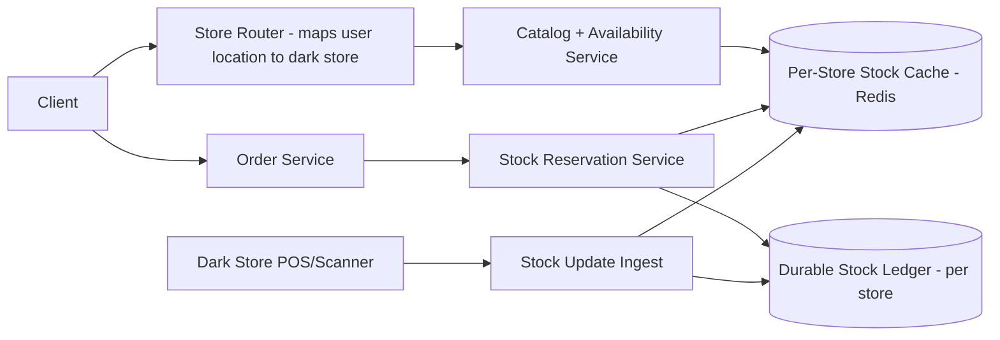
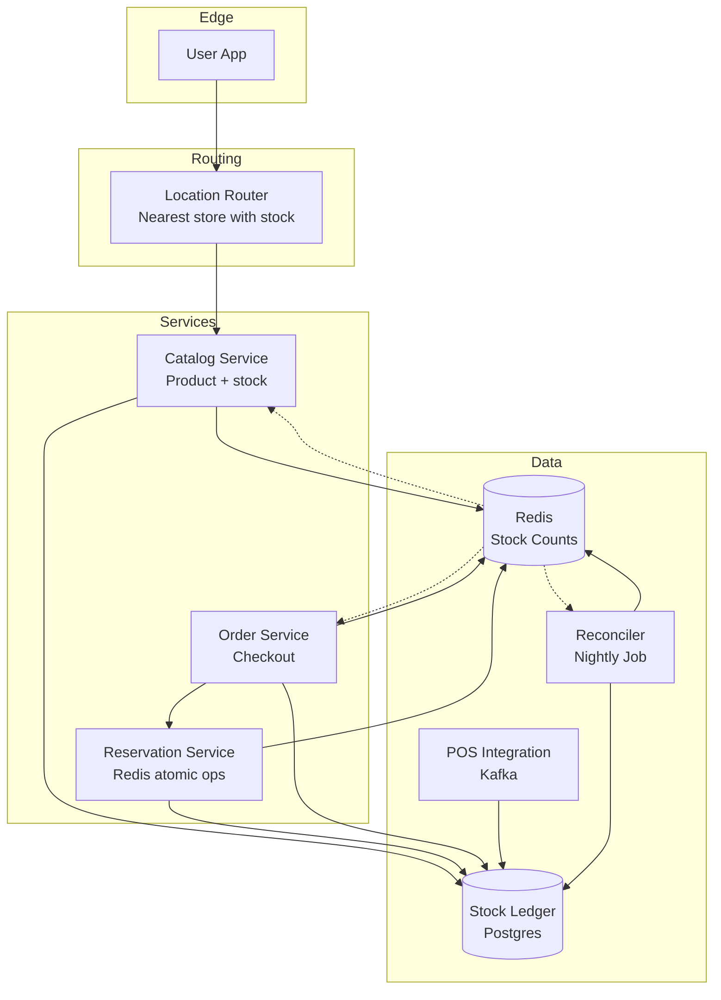
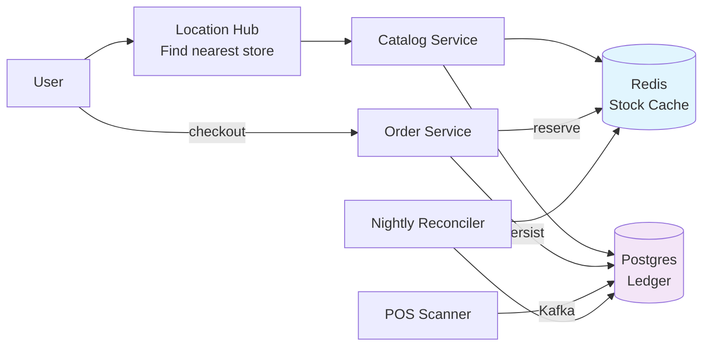
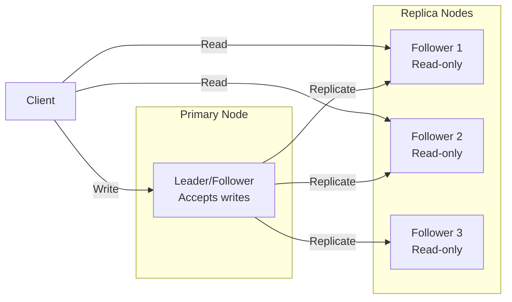
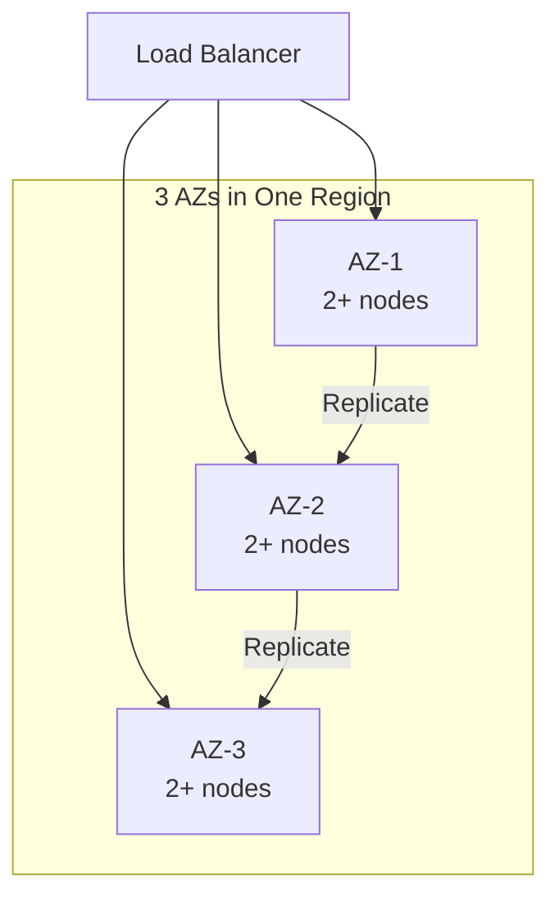
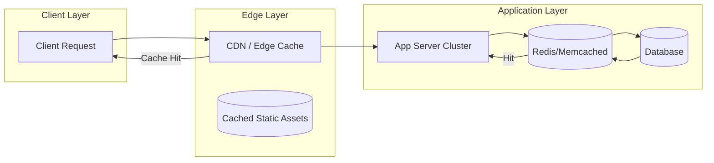
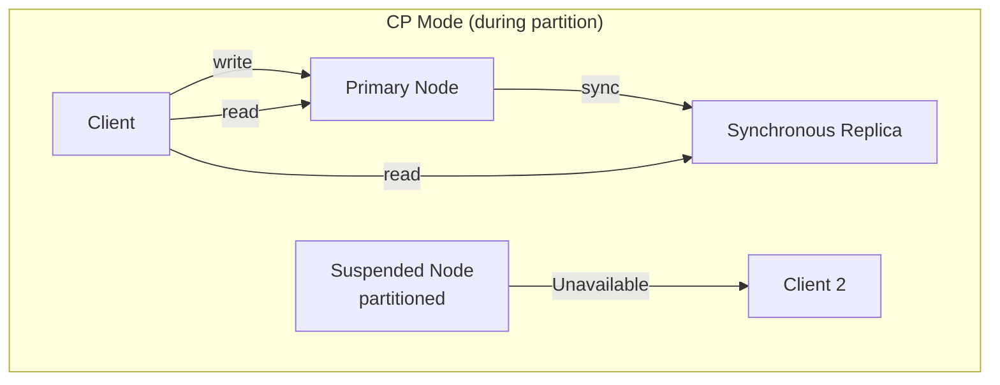
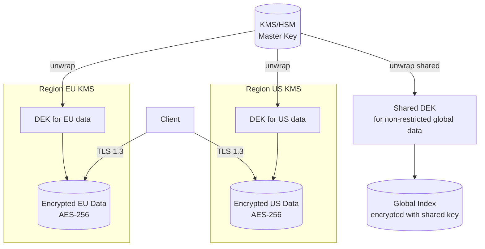
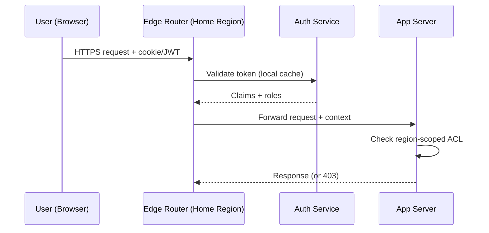
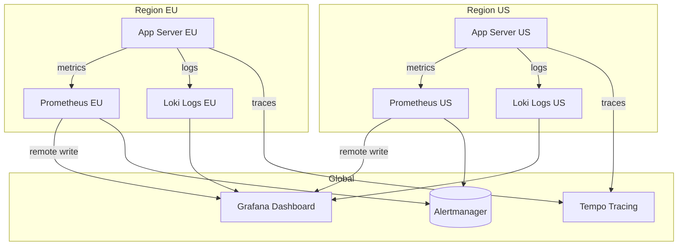

# Design a Real-Time Inventory System for a Quick-Commerce App (like Zepto)

## Blogs and websites

## Medium

## Youtube

## Theory

### Topics Covered

1. [Introduction / Problem Statement](#introduction-problem-statement)
2. [Characteristics](#characteristics)
3. [Components](#components)
4. [Architectural Patterns](#architectural-patterns)
5. [Benefits](#benefits)
6. [Pros](#pros)
7. [Cons](#cons)
8. [Challenges](#challenges)
9. [Best Practices](#best-practices)
10. [When to Use / When Not to Use](#when-to-use-when-not-to-use)
11. [Use Cases](#use-cases)
12. [Architecture](#architecture)
13. [High-Level Design](#high-level-design)
14. [Deep Dive](#deep-dive)
15. [Data Model and API](#data-model-and-api)
16. [Replication Strategies](#replication-strategies)
17. [Failure Detection and Membership](#failure-detection-and-membership)
18. [High Availability and Scalability](#high-availability-and-scalability)
19. [Performance and Optimization](#performance-and-optimization)
20. [CAP Theorem and Consistency Trade-offs](#cap-theorem-and-consistency-trade-offs)
21. [Encryption and Key Management](#encryption-and-key-management)
22. [Authentication and Authorization](#authentication-and-authorization)
23. [Security Threats and Mitigations](#security-threats-and-mitigations)
24. [Observability and Logging](#observability-and-logging)
25. [Replication Strategies](#replication-strategies)
26. [Failure Detection and Membership](#failure-detection-and-membership)
27. [High Availability and Scalability](#high-availability-and-scalability)
28. [Performance and Optimization](#performance-and-optimization)
29. [CAP Theorem and Consistency Trade-offs](#cap-theorem-and-consistency-trade-offs)
30. [Encryption and Key Management](#encryption-and-key-management)
31. [Authentication and Authorization](#authentication-and-authorization)
32. [Security Threats and Mitigations](#security-threats-and-mitigations)
33. [Observability and Logging](#observability-and-logging)
34. [Java and Spring Boot Implementation Guide](#java-and-spring-boot-implementation-guide)
35. [Real-World Implementations](#real-world-implementations)
36. [Interview Questions and Answers](#interview-questions-and-answers)

---
---
### Introduction / Problem Statement

A quick-commerce inventory system tracks stock levels per item per store (dark store/warehouse) in real-time, enabling 10-20 minute deliveries. Unlike traditional e-commerce (stock centrally located in a few warehouses), quick commerce has hundreds of small local stores, each with independent, rapidly changing inventory that must be accurate to the second.

**Why Does It Exist**

Traditional e-commerce accepts 1-2 day delivery windows because inventory is centralized and shipping takes time to consolidate. Quick commerce (Zepto, Blinkit, Instacart) promises delivery within 10-20 minutes — but this requires inventory to be already stored in hyperlocal micro-fulfillment centers near customers, with real-time stock accuracy to avoid overselling.

**What Problem Does It Solve**

* **Per-store inventory accuracy**: Each dark store is a separate inventory unit — stock levels must be tracked individually and updated instantly as items are sold, restocked, damaged, or reserved.
* **Reservation consistency**: When a customer places an order, stock must be reserved before payment — atomic decrement to prevent overselling.
* **Location-based availability**: Show only items available at the customer's designated dark store; route orders to open dark stores near the customer.
* **Abandoned cart recovery**: Reserve stock at cart-add time, release automatically when the reservation expires (no manual cleanup job).
* **Read-heavy workload**: Every app view triggers dozens of availability checks — must be sub-50ms; writes (sales) are lower volume and can afford slightly higher latency.
* **Physical-digital reconciliation**: Actual shelf stock (from POS/scanner) must match digital records — periodic physical counts + event-driven updates.


**Problem Statement**

Design a real-time inventory system for a quick-commerce app that promises 10-20 minute deliveries from many small local "dark stores." Stock levels per store must be accurate to the second, since overselling an item that a store doesn't actually have breaks the delivery promise.

**Functional Requirements**

- Track per-SKU stock at each dark store, updated in real time as items are received, sold, reserved (in-cart), or damaged
- Show only in-stock (and deliverable-in-time) items to a customer based on their location's serving dark store
- Reserve stock the moment an order is placed (before payment) and release the reservation on cancellation/timeout
- Reconcile stock via periodic physical counts

**Non-Functional Requirements**

- **Scale**: Thousands of dark stores, tens of millions of SKU-store combinations, extremely high read QPS (every app view checks availability) with lower write QPS
- **Latency**: Availability check < 50ms; stock decrement/reservation < 100ms
- **Consistency**: Strong consistency for decrement/reservation (no overselling); eventual consistency acceptable for catalog-browse-level "in stock" badges

**High-Level Architecture**



**Key Design Points**

- Partition stock data by `store_id` (each dark store is an independent shard) so hot SKUs at one store don't contend with unrelated stores, and stock operations for a single store can be served by a single Redis key/hash with atomic `DECR`/Lua scripts.
- Use a short-lived reservation (e.g., hold stock for 5-10 minutes) at "add to cart"/checkout time, backed by a TTL in Redis, so abandoned carts automatically release stock without a manual cleanup job.
- Keep the durable ledger (event log of every stock change: received, sold, reserved, released, damaged) in a per-store append-only store, replaying into the Redis cache; this makes the cache rebuildable and stock changes auditable.
- Push catalog "in-stock" visibility updates to clients via a fast cache read rather than the durable DB, since availability is read on nearly every screen and can tolerate a few seconds of staleness for *display* (not for the actual decrement, which must be atomic).

**Trade-offs**

- Strong consistency on the decrement path (Redis atomic ops + durable ledger) versus eventual consistency on the display/browse path trades a small "stock shown but sold out at checkout" risk for far higher read throughput; the decrement itself never oversells because it's checked atomically regardless of what was displayed.
- Sharding by store simplifies scaling almost linearly

---

### Characteristics

| Characteristic | What it means | Why it matters | How it works |
|---|---|---|---|
| **Per-store stock** | Inventory tracked at store-level granularity | 10-min delivery requires exact store stock | Shard by store_id |
| **Real-time reads** | Stock levels read at sub-100ms | Show accurate inventory to users | Cache-aside (Redis) |
| **Real-time writes** | Stock decrements are strongly consistent | Prevent overselling | Redis atomic ops + durable ledger |
| **Reservation system** | Reserve stock before order placement | Avoid race between browse + checkout | Reservation with TTL |
| **Read-heavy write-bursty** | 10x more reads than writes; spike at order time | Optimize for read path + bursty writes | Read-through cache, write-batched |
| **TTL expiry** | Reserved stock expires if not checked out | Return stock to pool automatically | Redis TTL |
| **Location-based** | Stock tied to specific store location | Deliver from nearest store with stock | Store-level inventory + location routing |

### Components

| Component | Purpose | Responsibilities | Relationship | Real-world Example |
|---|---|---|---|---|
| **Location Router** | Route user to nearest store with stock | Store assignment, proximity | Client ↔ Store Router | Zepto location service |
| **Catalog Service** | Product metadata + store stock | Serve product info + stock lookup | Router ↔ Catalog | Catalog DB |
| **Stock Cache** | Fast stock level reads | Store stock counts in memory | Catalog, Reservation | Redis (store_id → sku → count) |
| **Reservation Service** | Reserve stock for order | Atomic decrement, TTL, expiry | Catalog, Order | Redis atomic ops |
| **Stock Ledger** | Durable stock record | Persist decrements/restocks; source of truth | Reservation | Postgres/Cassandra |
| **POS Integration** | Sync with physical store POS | Real stock counts from scanner | Stock Ledger | POS → Kafka |
| **Inventory Reconciler** | Fix cache vs ledger drift | Periodic reconciliation | Stock Ledger ↔ Stock Cache | Cron job |

### Architectural Patterns

#### Cache-Aside with Store-Level Sharding

* **What**: Stock levels cached in Redis (keyed by store_id + sku). Reads hit cache → miss → load from DB + populate cache. Writes (reservation) update Redis atomically + async-write DB.
* **Problem solved**: DB can't handle 10K reads/sec per store; cache provides sub-ms latency.
* **How it works**: (1) Read stock → Redis GET(store:sku) → if miss → SELECT count → Redis SET(store:sku, count). (2) Reserve stock → Redis DECRBY(store:sku, qty) → if result < 0 → restore (overflow) + return insufficient. (3) Async: write reservation to DB (Stock Ledger). (4) Reconciliation: nightly compare Redis vs DB → fix drift.
* **When to use**: High-read, frequent-update data (inventory, counters).
* **When not to use**: When data changes less than cache TTL; when strong consistency is needed on every read.
* **Advantages**: Sub-ms reads; DB offload; cache hit ratio > 99%.
* **Disadvantages**: Cache invalidation complexity; stale reads acceptable for browse; reconciliation overhead.

#### Reservation with TTL

* **What**: When user views cart/checkout → stock reserved atomically (Redis DECRBY) with TTL (e.g., 10 min). If checkout completes → convert reservation to order. If timeout → stock restored (Redis INCRBY).
* **Problem solved**: Avoid race between browsing + checkout; prevent stock being held indefinitely by abandoned carts.
* **How it works**: (1) Checkout → Reservation Service → Redis DECRBY(store:sku, qty) atomically → set TTL 10 min. (2) If Redis returns < 0 → restore overflow (INCRBY) + return insufficient stock. (3) On checkout completion → persist order + delete reservation key. (4) On TTL expiry → Redis deletes key → Reservation Service detects + restock (INCRBY).
* **When to use**: Quick-commerce inventory; high-value limited stock.
* **Disadvantages**: TTL expiry can cause stock to disappear mid-checkout; race if restock + new reservation simultaneous.

### Benefits

* **Accurate inventory**: Per-store stock → precise availability for 10-min delivery.
* **No overselling**: Atomic reservation prevents more reservations than stock.
• **Fast checkout**: Reservation completes in < 50ms → smooth UX.
• **Abandoned cart recovery**: TTL returns stock automatically → no manual cleanup.

### Pros

* **Real-time**: Sub-100ms stock reads via Redis.
• **Strong consistency**: No overselling on decrement path.
• **Store-specific**: Exact stock per store → reliable fulfillment.
• **Auto-recovery**: TTL + reconciler fix drift automatically.

### Cons

* **Complexity**: Multi-system coordination (Redis + DB + POS).
• **Cache drift**: Redis + DB can diverge → reconciliation needed.
• **Reservation contention**: Popular SKUs → Redis bottleneck.
• **TTL race**: Customer loses reserved stock if checkout slow.
• **Operational**: 1000+ stores → 1000x DB shards.

### Challenges

#### Technical Challenges
* **Atomic operations**: Redis DECRBY atomicity + overflow handling.
• **Cache invalidation**: When POS updates stock → invalidate Redis.
• **Race conditions**: Concurrent reserves → Redis atomic ops prevent double-reserve.

#### Scalability Challenges
* **Stores**: Thousands of stores → DB sharded by store_id.
• **Stock reads**: Millions of concurrent → Redis cluster, consistent hashing.
• **Reservation hot keys**: Popular SKUs → Redis hot-key mitigation (split counters).

#### Performance Challenges
* **Sub-100ms reads**: Cache-aside pattern; Redis in same AZ as app server.
• **Burst at checkout**: 1000x spike → reservation queue + rate limiting.
• **Reconciliation**: Millions of SKUs × stores → parallel nightly jobs.

#### Reliability Challenges
* **Cache failure**: Redis down → fallback to DB (slower, 500ms).
* **POS downtime**: Physical sales not reflected → stock drift → reconciliation.
• **Reservation expiry**: Customer loses reserved item if checkout takes > TTL.

#### Maintainability Challenges
* **Shard management**: Adding/removing stores → resharding + rebalancing.
• **Reconciliation**: False positives (cache vs DB diffs) → noisy alerts.

#### Security Concerns
* **Stock manipulation**: APIs must validate store context; no cross-store stock access.
• **Reservation hijacking**: Reservation key must be tied to user session + short TTL.

### Best Practices

* **Store-level sharding**: Shard DB by store_id (not product) → independent scaling.
• **Cache-aside**: Redis GET → miss → DB → cache; TTL 5 min for reads.
• **Atomic reservation**: Redis DECRBY + overflow check + TTL in one operation.
• **Reconciliation**: Nightly compare Redis vs DB → auto-fix + alert on persistent drift.
• **Circuit breakers**: Redis failover → degrade to DB reads (slower).
• **Idempotency**: Reservation creation idempotent (key = session_id + sku).
• **Monitor**: Cache hit ratio (> 95%); stock drift; reservation expiry rate; DB latency.

### When to Use / When Not to Use

#### Appropriate
* Quick-commerce (10-20 min delivery).
* Multi-store retail with per-store inventory.
• E-commerce with stock reservations.
* Any system where overselling is unacceptable.

#### Not Appropriate
• Single-warehouse fulfillment (no store-level stock).
• Non-perishable goods with flexible fulfillment.
• Low-traffic stores (cache overhead > benefit).

#### Decision Factors
* Delivery speed requirements; store count; oversell tolerance; traffic volume.

### Use Cases

#### Quick-Commerce Stock Reservation

* **Problem**: Zepto/Blinkit style quick-commerce — users see "In stock" but cart items may have sold out at checkout because another user bought the last unit. Need to reserve stock atomically before checkout.
* **Solution**: When user clicks "Checkout" → Reservation Service → Redis DECRBY atomically → set TTL (10 min). If stock becomes negative → restore overflow + return "out of stock". If checkout completes → decrement permanent stock in DB. If TTL expires → Redis auto-restores stock; reconcile with DB.
* **Why suitable**: Redis atomic ops prevent race conditions; TTL auto-recovers abandoned carts; store-level sharding supports 10-min delivery radius.
* **How it works**: (1) User selects SKU at store S → Catalog Service → Redis GET(S:sku) → if > 0 → show "In stock". (2) Checkout → Reservation → Redis DECRBY(S:sku, qty) atomically → Redis returns new value; if < 0 → INCRBY to restore + return error. (3) Redis SETEX(reservation_key, 600, qty) → TTL 10 min. (4) Checkout completes → DB transaction → insert order + update permanent stock. (5) Redis DEL(reservation_key). (6) TTL expiry → Redis deletes key → reconciler detects + restocks.
* **Trade-offs**: TTL race (customer loses item if checkout slow); Redis as source of truth (downtime → stale reads); reconciliation overhead.

### Architecture



#### Architecture Structure
* **Edge**: Location router → assign nearest store with stock.
* **Services**: Catalog (product + stock info), Reservation (atomic stock hold), Order (checkout).
* **Data**: Redis (hot stock counts), PostgreSQL (durable ledger), POS integration (Kafka for physical sales), Reconciler (nightly drift detection).

#### Communication
* **User → Router**: HTTP (location lookup).
• **Router → Catalog**: HTTP/gRPC.
• **Catalog → Cache/ledger**: Redis + PostgreSQL.
• **Reservation → Cache**: Redis atomic commands (DECRBY, INCRBY, SETEX).
• **Order → all**: gRPC + DB transaction.

#### Data Flow
1. **Browse**: User → Location Router → nearest store → Catalog Service → Redis GET(store:sku) → return stock.
2. **Reserve**: Checkout → Reservation → Redis DECRBY atomically → TTL 10 min → async write to Ledger.
3. **Order**: Order Service → if reservation valid → DB transaction (create order + update stock) → DEL reservation key.
4. **POS sync**: Physical store scanner → Kafka → Ledger (real stock changes).
5. **Reconcile**: Nightly → compare Redis vs Ledger → fix drift + alert.

#### Scaling Strategy
* **Cache**: Redis cluster (50 nodes) — consistent hashing by store_id.
• **Ledger**: PostgreSQL sharded by store_id (1000 shards).
• **Reservation**: Single Redis command per reserve; hot keys mitigated by splitting counters.
* **Router**: Edge (Cloudflare Workers or Lambda@Edge) → 10ms.

#### Failure Handling
* **Redis down**: Circuit breaker → serve from PostgreSQL + cache warm (slower; 500ms).
• **Ledger DB down**: Reject writes; queue to Kafka → replay.
• **POS downtime**: Physical sales not synced → daily reconciliation catches drift.
• **TTL race**: Customer loses reserved stock → UI shows "still available" check + re-reserve.

### High-Level Design



### Deep Dive

#### Reservation with TTL

(Existing ## Theory section covers: stock reservation via Redis atomic DECRBY with TTL; if Redis goes negative → restore overflow + return; expiry returns stock to pool; reconcile with persistent ledger periodically.)

#### Cache-Aside Store-Level Sharding

(Existing ## Theory section covers: Redis cache keyed by store_id + sku; cache-aside for reads; async-write for reservations; nightly reconciliation.)

#### Real-time vs Eventual Consistency Trade-off

(Existing ## Theory section covers: strong consistency for stock display — reads must show accurate stock; real-time writes for reservations; event-driven updates from POS.)

### Data Model and API

* **API purpose**: Check stock availability, reserve stock, confirm reservation (convert to order), release reservation.

| Method | Endpoint | Description |
|---|---|---|
| GET | `/api/v1/stores/nearest` | Find nearest store with stock (lat, lng) |
| GET | `/api/v1/stock/{storeId}/{sku}` | Check available stock for SKU at store |
| POST | `/api/v1/stock/reserve` | Reserve stock (idempotent) |
| POST | `/api/v1/stock/release` | Release reservation (cancel/timeout) |
| POST | `/api/v1/orders` | Place order (converts reservation) |

**Reserve request (POST /stock/reserve)**:
```json
{
  "store_id": "store_mumbai_01",
  "sku": "SKU_12345",
  "quantity": 2,
  "session_id": "sess_abc123"
}
```

**Reserve response**:
```json
{
  "reservation_id": "res_789",
  "status": "reserved",
  "expires_at": "2024-01-15T14:10:00Z",
  "remaining_stock": 3
}
```

**Error responses**:
```json
{"error": "insufficient_stock", "message": "Only 0 units available", "code": 409}
{"error": "reservation_conflict", "message": "SKU already reserved in this session", "code": 409}
```

**Authentication**: JWT + store context (prevent cross-store reservation).
**Idempotency**: `Idempotency-Key` header → same key returns same reservation.
**Rate limiting**: 100 reserve requests/sec per store (prevent thundering herd).


```mermaid
erDiagram
    STORE ||--o{ SKU_STOCK : "has"
    SKU ||--o{ SKU_STOCK : "has"
    SKU ||--o{ RESERVATION : "reserved by"
    ORDER }|..|{ SKU_STOCK : "decrements"

    STORE {
      string store_id PK
      string location lat_lng
      string address
      datetime created_at
    }
    SKU {
      string sku_id PK
      string product_name
      string description
      decimal weight
    }
    SKU_STOCK {
      string store_id FK
      string sku_id FK
      int available_count
      int reserved_count
      int physical_count
      datetime last_updated
    }
    RESERVATION {
      string reservation_id PK
      string store_id FK
      string sku_id FK
      string session_id
      int quantity
      datetime created_at
      datetime expires_at
    }
    ORDER {
      string order_id PK
      string store_id FK
      string user_id
      datetime created_at
      string status
    }
```

**Partitioning**: SKU_STOCK sharded by store_id; RESERVATION sharded by store_id; ORDER sharded by store_id.

**Consistency**: Redis (eventual for reads, atomic for reserves) + Postgres (strong for ledger). Reconciliation nightly.

### Replication Strategies

**What it means**

Replication Strategies determine how data and state are copied across multiple nodes in Quick-Commerce Inventory System. The choice of strategy determines the trade-off between consistency, availability, and latency.

**Why it matters**

Quick-Commerce Inventory System must replicate data to prevent loss and serve reads from multiple nodes. The replication strategy determines whether the system favors consistency (strong reads) or availability (always writable), and how it handles cross-node failure.

**How it works**

**Leader-based (single-leader)**: A single primary node accepts all writes; followers replicate changes asynchronously or semi-synchronously. Reads can be served from any replica. This strategy favors strong consistency for writes but creates a write bottleneck at the leader.



*Leader-based replication: a single primary node accepts all writes and replicates them to read-only followers. Clients can read from any replica for scaled read throughput, but all writes go through the leader.*

**Multi-leader (multi-master)**: Multiple nodes accept writes and exchange updates with each other. This enables low-latency writes in different regions but requires conflict resolution (last-write-wins, merge functions, or CRDTs).

**Leaderless (quorum-based)**: Any node can accept writes; a quorum of nodes must agree. Read and write quorums are configured so that at least one node overlaps between them (R + W > N). This maximizes availability and write scalability.

**Trade-offs for Quick-Commerce Inventory System**:

| Strategy | Use Case | Pros | Cons |
|---|---|---|---|
| Leader-based | customer orders, payment info, delivery addresses | Strong consistency, simple | Write bottleneck, leader failure risk |
| Multi-leader | product catalog, stock counts, public inventory levels | Low-latency global writes | Conflict resolution, complex |
| Leaderless | Caching, counters | High availability, no bottleneck | Eventual consistency, read repair overhead |

**Real-world implementations**

- **Redis**: Leader-follower replication with asynchronous replication; Sentinel handles failover.
- **Apache Kafka**: Leader-based partition replication with ISR (in-sync replica) — writes go to the leader, followers replicate.
- **Cassandra**: Tunable consistency with leaderless quorum (R + W > N).
- **DynamoDB Global Tables**: Multi-master active-active across regions.

### Failure Detection and Membership

**What it means**

Failure Detection and Membership is the mechanism by which Quick-Commerce Inventory System determines which nodes are alive and part of the cluster. Membership is the list of known nodes; failure detection is the process of updating that list when nodes fail or recover.

**Why it matters**

Quick-Commerce Inventory System must route requests only to healthy nodes and trigger failover when a node goes down. False positives (healthy nodes marked as dead) cause unnecessary failovers and data loss. False negatives (dead nodes not detected) cause failed requests and degraded performance.

**How it works**

**Heartbeat-based detection**: Each node sends a heartbeat (ping) to a subset of peers at regular intervals. If a node misses N consecutive heartbeats, it is marked as suspect. The gossip protocol distributes membership information: each node exchanges its view of the cluster with a random peer, and the information propagates gossip-style.

```mermaid
sequenceDiagram
    participant A as Node A
    participant B as Node B
    participant C as Node C

    loop Every 1s
        A->>B: Heartbeat (ping)
        B-->>A: Heartbeat (ack)
    end
    B->>C: Gossip: A is alive
    C->>A: Gossip: B is alive
    Note over A,B,C: View converges in O(log N) rounds
```

*Gossip-based failure detection: each node periodically pings a random subset of peers and gossips its view of the cluster. The membership list converges in O(log N) rounds.*

**Phi Accrual Failure Detector**: Instead of a fixed timeout, the detector measures the time between consecutive heartbeats and computes a phi (φ) value — the probability that the node is dead given the observed heartbeat pattern. φ is compared against a threshold (typically 1–8); higher thresholds reduce false positives but increase detection latency.

**SWIM (Scalable Weakly-consistent Infection-style Process group Membership Protocol)**: Nodes ping a random subset of cluster members. If a ping fails, the node is marked "suspect" and the failure is "infected" (gossiped) to other nodes. This is O(log N) per failure detection cycle and scales to large clusters.

**Trade-offs**:

| Approach | Strengths | Weaknesses |
|---|---|---|
| Heartbeat (timeout-based) | Simple, deterministic | False positives under load |
| Phi Accrual | Adaptive threshold | Needs historical data |
| SWIM | Scales to 1000s of nodes | Eventual consistency |

**Real-world implementations**

- **AWS Route 53 Health Checks**: Uses TCP/HTTP health checks with configurable thresholds to remove unhealthy instances from DNS rotation.
- **Kubernetes**: Uses the kubelet heartbeat (every 10s) to determine node liveness; nodes missing 3 consecutive heartbeats are marked NotReady.
- **Consul**: Uses SWIM protocol for membership and failure detection; supports both LAN and WAN gossip.
- **Akka Cluster**: Uses Phi Accrual failure detector with configurable φ thresholds.

### High Availability and Scalability

**What it means**

High Availability and Scalability determines how Quick-Commerce Inventory System continues operating when nodes or entire zones fail, and how capacity is added as demand grows. HA is about minimizing downtime; scalability is about maintaining performance as load increases.

**Why it matters**

Quick-Commerce Inventory System must stay operational even when individual nodes, availability zones, or entire regions fail. At the same time, it must scale horizontally to handle traffic spikes without degrading latency. The two are intertwined: the replication strategy, failure detection, and load balancing all contribute to both HA and scalability.

**How it works**

**Availability zones (AZs)**: Nodes are distributed across multiple AZs within a region. Each AZ is an independent failure domain (power, networking, physical security). A load balancer distributes requests across AZs; if one AZ fails, traffic is routed to the remaining AZs with no data loss (assuming replication is in place).



*Multi-AZ deployment: a load balancer distributes traffic across three availability zones. Each AZ has multiple nodes. Data is replicated across AZs so that losing one AZ does not cause data loss or service interruption.*

**Load balancing**: A load balancer distributes incoming requests across healthy nodes. Algorithms include round-robin, least connections, and weighted routing. Health checks ensure traffic only goes to healthy nodes. For Quick-Commerce Inventory System, the load balancer also considers Inventory DB (Postgres) when routing.

**Auto-scaling**: The system automatically adds or removes nodes based on metrics (CPU, memory, request rate). Scale-out policies add nodes when load exceeds a threshold; scale-in policies remove nodes during low load. For stateful services like Quick-Commerce Inventory System, scale-out involves rebalancing partitions (moving data and connections to the new node).

**Failover and recovery**: When a node fails, the load balancer detects it (via health checks or failure detection) and stops sending traffic. A new node is provisioned (or a standby is promoted) and begins serving. For Quick-Commerce Inventory System, failover must preserve customer orders, payment info, delivery addresses data — this is achieved through replication with a quorum of healthy nodes.

**Scalability patterns**:

1. **Horizontal partitioning (sharding)**: Split data by a partition key (e.g., user_id, session_id) and distribute partitions across nodes. New nodes take ownership of additional partitions.

2. **Consistent hashing**: Minimize data movement on scale-out — only 1/N of the data moves to the new node. Nodes and partitions are placed on a ring; a request for key X is routed to the next node clockwise from hash(X).

3. **Connection draining**: When scaling in, existing connections are allowed to complete before the node is shut down. For Quick-Commerce Inventory System, this means draining active An sessions gracefully.

**Real-world implementations**

- **Netflix OSS (Eureka + Zuul + Ribbon)**: Service discovery with Eureka, edge routing with Zuul, and client-side load balancing with Ribbon. Scales to thousands of instances.
- **Kubernetes HPA + VPA**: Horizontal Pod Autoscaler scales pods based on CPU/memory; Vertical Pod Autoscaler adjusts resource requests based on historical usage.
- **AWS ALB + Auto Scaling Groups**: Application Load Balancer with auto-scaling groups across AZs; health checks replace unhealthy instances automatically.

### Performance and Optimization

**What it means**

Performance and Optimization covers the techniques Quick-Commerce Inventory System uses to achieve low latency, high throughput, and efficient resource usage. This section examines the key performance metrics, bottlenecks, and optimizations specific to the system.

**Why it matters**

Quick-Commerce Inventory System faces competing pressures: users demand low latency, the system must handle high throughput, and infrastructure costs must be controlled. The optimizations applied at the data, compute, and network layers determine whether the system meets its SLA.

**How it works**

**Latency layers**: Latency in Quick-Commerce Inventory System comes from three layers:
1. **Network**: Round-trip time from client to the nearest edge node / load balancer.
2. **Application**: Request processing time on the server (CPU, I/O, lock contention).
3. **Data**: Time to read/write from storage (cache hit vs. database query).

The 99th-percentile latency is the key metric for user-facing systems — it determines the worst-case experience.

**Caching strategies**: Quick-Commerce Inventory System uses multiple cache layers:
- **Edge cache**: Static assets (images, CSS, JS) served from a CDN at the edge. For Quick-Commerce Inventory System, this caches product catalog, stock counts, public inventory levels that doesn't change frequently.
- **Application cache**: In-memory cache (e.g., Redis, Memcached) for frequently accessed data. Cache-aside pattern: application checks cache first, falls back to database on miss.
- **Local cache**: In-process cache (e.g., Caffeine, Guava) for data accessed within a single request. Avoids network round-trips.

**Batching and pipelining**: Quick-Commerce Inventory System batches small operations (e.g., writes, log flushes) to amortize per-operation overhead. Pipelining allows multiple requests to be in flight simultaneously.



*Caching hierarchy: clients first hit the edge CDN/cache; if the response is cached, it is returned immediately. Otherwise, the request reaches the application, which checks its in-memory/application cache (e.g., Redis) before falling back to the database. This minimizes latency from each layer.*

**Connection pooling**: Quick-Commerce Inventory System maintains a pool of database connections to avoid the TCP handshake overhead on every request. Pool size is tuned to match the database's capacity.

**Compression**: Responses are compressed (gzip, zstd) for clients that support it. At the network layer, gRPC uses HPACK header compression.

**Indexing**: Database tables are indexed on frequently queried fields. For Quick-Commerce Inventory System, indexes cover Cache (Redis) and Reservation Engine for fast lookups.

**Asynchronous processing**: Non-critical background work (e.g., analytics, cleanup, notifications) is offloaded to message queues and processed asynchronously, keeping the request path fast.

**Resource isolation**: CPU and memory are allocated per service (containers with cgroup limits). This prevents a single misbehaving service from degrading the entire system.

**Metrics for Quick-Commerce Inventory System**:

| Metric | Target | How to Measure |
|---|---|---|
| P99 latency | < 1s | Load test with realistic traffic |
| Throughput | 1K RPS | Request rate under peak load |
| Error rate | < 0.1% | 5xx / total requests |
| Cache hit ratio | > 90% | cache_hits / (cache_hits + misses) |
| Resource utilization | < 80% CPU, < 85% memory | Container metrics |

**Real-world implementations**

- **Google's HTTP Load Balancer**: Global load balancing with edge PoPs; routes users to the nearest healthy backend.
- **Cloudflare**: Edge cache with Argo Smart Routing that dynamically routes traffic to avoid congestion.
- **Redis**: Used as an application cache with configurable eviction policies (LRU, LFU, TTL).

### CAP Theorem and Consistency Trade-offs

**What it means**

The CAP Theorem states that in a distributed system, you can only have two of three guarantees: **Consistency** (every read returns the latest write), **Availability** (every request gets a response), and **Partition tolerance** (the system continues to operate despite network partitions). Since network partitions are inevitable in distributed systems like Quick-Commerce Inventory System, the real choice is between CP (consistent + partitioned) and AP (available + partitioned).

**Why it matters**

Quick-Commerce Inventory System must decide which two guarantees to prioritize. For customer orders, payment info, delivery addresses data, strong consistency (CP) is critical — users must see the most recent data. For product catalog, stock counts, public inventory levels data, availability (AP) is more important — the system should remain responsive even during network issues.

**How it works**

**CP (Consistent + Partition-tolerant)**: During a partition, the system trades availability for consistency. Writes are rejected or delayed until the partition heals. Reads return the latest committed value. This is appropriate for customer orders, payment info, delivery addresses in Quick-Commerce Inventory System.



*CP system during a network partition: writes are rejected on the partitioned node to maintain consistency. Clients are routed to the healthy primary and synchronous replica.*

**AP (Available + Partition-tolerant)**: During a partition, the system trades consistency for availability. Both sides accept writes; conflicts are resolved later (last-write-wins, merge, or application-level conflict resolution). This is appropriate for product catalog, stock counts, public inventory levels in Quick-Commerce Inventory System.

**PACELC (extending CAP)**: The PACELC theorem says that even when the network is not partitioned (the "else" case in CAP), you must choose between latency (L) and consistency (C). Quick-Commerce Inventory System uses:
- **Racing reads**: Serve from the nearest replica for speed (low latency, eventual consistency).
- **Linearizable reads**: Always read from the primary (high latency, strong consistency).

The choice is made per request based on whether the data is customer orders, payment info, delivery addresses (strong consistency) or product catalog, stock counts, public inventory levels (fast reads).

**Trade-offs**:

| System Type | CP Use Cases | AP Use Cases |
|---|---|---|
| Quick-Commerce Inventory System | customer orders, payment info, delivery addresses | product catalog, stock counts, public inventory levels |

**Real-world implementations**

- **etcd**: CP system using Raft consensus; used for service discovery and configuration in Kubernetes.
- **Cassandra**: AP system with tunable consistency; used for time-series data and user sessions.
- **Google Spanner**: CP with external consistency via TrueTime API; used for global financial transactions.
- **DynamoDB**: AP by default, but supports strongly consistent reads (CP mode) on demand.

### Encryption and Key Management

**What it means**

Encryption and Key Management in Quick-Commerce Inventory System ensures that data is protected both at rest (stored on disk) and in transit (moving between services). Key management governs how encryption keys are generated, stored, rotated, and accessed — without proper key management, encryption provides a false sense of security.

**Why it matters**

Quick-Commerce Inventory System handles customer orders, payment info, delivery addresses that must be encrypted both at rest and in transit. Maintaining accurate stock levels during flash sales with high concurrent reservation rates, handling overbooking while keeping cache and DB consistent requires careful key management: keys must be rotated regularly, scoped to prevent cross-contamination, and audited for compliance. A single key compromise could expose sensitive data.

**How it works**

**At-rest encryption**: Data stored in Inventory DB (Postgres), Cache (Redis) and databases is encrypted using AES-256-GCM. The Data Encryption Key (DEK) is generated per data partition and encrypted with a Key Encryption Key (KEK) managed by a KMS (AWS KMS, GCP KMS, HashiCorp Vault). Keys are regionally scoped — only data belonging to a region can be decrypted by that region's KEK.

**In-transit encryption**: All inter-service communication uses TLS 1.3 or mTLS for service-to-service auth. Cross-region communication of product catalog, stock counts, public inventory levels uses TLS + optional application-level encryption. customer orders, payment info, delivery addresses is NEVER transmitted in plaintext or across region boundaries.

**Key hierarchy**:
```
Master Key (HSM-backed, KMS-managed)
  └─ KEK (per region, per service)
     └─ DEK (per data partition, rotated every 90 days)
        └─ Data (encrypted with DEK)
```

**Key rotation**: KEKs rotate annually (automatic via KMS); DEKs rotate per object or per 90 days. Applications handle key version headers transparently — a DEK version is stored alongside the encrypted data.

**Cross-region key sharing**: For non-restricted data (product catalog, stock counts, public inventory levels), a shared key is imported into each region's KMS. Restricted data NEVER uses cross-region keys — each region's KMS holds only that region's keys.



*Encryption key hierarchy: master keys are managed by an HSM-backed KMS and never leave the KMS. Each region has its own KEK. Data encryption keys (DEKs) are generated per partition and encrypted with the regional KEK. Only non-restricted global data uses a shared cross-region key. All client traffic uses TLS 1.3.*

**Java/Spring Boot Implementation**

```java
@Service
@RequiredArgsConstructor
public class DataEncryptionService {

    private final AWSKMS kms;
    @Value("${app.region}")
    private String region;
    @Value("${app.encryption.dek-ttl-minutes:1440}")
    private int dekTtlMinutes;

    private final Map<String, SecretKey> dekCache = new ConcurrentHashMap<>();

    public EncryptedData encrypt(String plaintext, String partitionId) {
        SecretKey dek = getOrCreateDek(partitionId);
        byte[] ciphertext = CryptoUtils.encrypt(plaintext.getBytes(StandardCharsets.UTF_8), dek);
        String dekCiphertext = kms.encrypt(EncryptRequest.builder()
            .keyId("arn:aws:kms:" + region + ":master-key")
            .plaintext(SdkBytes.fromByteArray(dek.getEncoded()))
            .build()).ciphertextBlob().asByteArray();
        return new EncryptedData(ciphertext, dekCiphertext, Instant.now());
    }

    private SecretKey getOrCreateDek(String partitionId) {
        return dekCache.computeIfAbsent(partitionId, id -> {
            try {
                return KeyGenerator.getInstance("AES").generateKey();
            } catch (NoSuchAlgorithmException e) {
                throw new IllegalStateException("Cannot generate DEK", e);
            }
        });
    }
}
```

*Spring Boot encryption service: DEKs are cached per-partition with TTL. Each DEK is encrypted via AWS KMS using a regional master key. The encrypted DEK (ciphertext) is stored alongside the data — only the KMS for that region can decrypt it.*

**Real-world implementations**

- **AWS KMS**: Managed HSM-backed key service; supports automatic key rotation and custom key stores.
- **HashiCorp Vault**: Open-source key management; supports transit encryption (encrypt/decrypt without storing keys).
- **Google Cloud KMS**: Hardware-backed key management with IAM-based access control.

### Authentication and Authorization

**What it means**

Authentication and Authorization (AuthN/AuthZ) in Quick-Commerce Inventory System control who can access the system and what they can do. Authentication verifies identity; authorization determines permissions. In a distributed system like Quick-Commerce Inventory System, auth must work across multiple nodes while respecting data boundaries — a user authenticated in one region should not have their session data or tokens replicated to regions where it is not permitted.

**Why it matters**

Quick-Commerce Inventory System must verify identity at the edge and enforce authorization at every service boundary. customer orders, payment info, delivery addresses must be protected — only users with appropriate roles should access it. At the same time, product catalog, stock counts, public inventory levels data should be accessible to a wider audience with minimal friction.

**How it works**

**Authentication (who are you?)**:
- **JWT tokens**: Users authenticate through their home region's identity provider. The region returns a JWT (JSON Web Token) signed by a regional signing key. Tokens include claims like `iss` (issuer region), `sub` (subject/user ID), `home_region`, `roles`, and `exp` (expiry). Tokens are scoped per region — a token issued by region A cannot access restricted data in region B.
- **mTLS for service-to-service**: Internal services authenticate each other using mutual TLS certificates issued by a per-region Certificate Authority (CA). No shared secrets cross region boundaries.
- **Session management**: Sessions are stored regionally (Redis) and never replicated cross-region for restricted data. Session IDs are opaque UUIDs; the session store maps session ID → user context.

**Authorization (what can you do?)**:
- **RBAC (Role-Based Access Control)**: Users are assigned roles per region. Common roles: `region_admin` (full access to region data), `auditor` (read-only audit), `viewer` (read public data only). Roles are stored in the regional database and cached locally for sub-1ms lookups.
- **ABAC (Attribute-Based Access Control)**: Fine-grained permissions based on attributes (e.g., `home_region == request_region AND role == admin`). This allows expressing complex policies like "users can only access restricted data in their home region."
- **Resource-level authorization**: Each request is checked against an ACL (Access Control List) that specifies which roles can access which resources. For Quick-Commerce Inventory System, restricted resources require the `admin` role + matching region.



*Authentication flow: the user's token is validated by the regional auth service (claims cached locally). The edge router forwards the request with the security context. Each app server checks the region-scoped ACL before accessing restricted data.*

**Java/Spring Boot Implementation**

```java
@Service
@RequiredArgsConstructor
public class AuthorizationService {

    private final UserTokenRepository tokenRepository;
    @Value("${app.region}")
    private String currentRegion;

    public boolean canAccessResource(String userId, String resourceRegion,
                                     String action, JWTClaims claims) {
        String userHomeRegion = claims.getStringClaim("home_region");
        List<String> roles = claims.getStringListClaim("roles");

        if (!roles.contains(action)) {
            return false;
        }

        if (resourceRegion.equals(userHomeRegion)) {
            return true;
        }

        if (resourceRegion.equals("global")) {
            return roles.contains("global_reader");
        }

        return false;
    }
}

@RestController
@RequiredArgsConstructor
@RequestMapping("/api/v1")
public class RegionController {
    private final AuthorizationService authService;

    @GetMapping("/data/{region}/profile")
    public ResponseEntity<?> getProfile(
            @PathVariable String region,
            @RequestHeader("Authorization") String token) {
        JWTClaims claims = JwtUtils.parseAndValidate(token, currentRegion);

        if (!authService.canAccessResource(
                claims.getStringClaim("sub"), region, "read", claims)) {
            return ResponseEntity.status(HttpStatus.FORBIDDEN).build();
        }

        return ResponseEntity.ok(profileService.getByRegion(region));
    }
}
```

*Spring Boot authorization service: checks both the user's role and whether the requested resource violates region boundaries. The `canAccessResource` method returns false if a user from region EU tries to access restricted data in region US.*

**Real-world implementations**

- **Auth0**: JWT-based authentication with regional endpoints; supports custom rules for ABAC.
- **Okta**: Multi-region identity management with adaptive MFA and ThreatInsight for anomaly detection.
- **AWS Cognito**: Regional user pools with IAM integration; tokens are region-scoped by default.

### Security Threats and Mitigations

**What it means**

Security Threats and Mitigations catalog the attack surface of Quick-Commerce Inventory System, the most likely threats, and the corresponding defenses. Every distributed system has unique threat vectors — Quick-Commerce Inventory System is no exception.

**Why it matters**

Quick-Commerce Inventory System handles customer orders, payment info, delivery addresses that attackers might target. Maintaining accurate stock levels during flash sales with high concurrent reservation rates, handling overbooking while keeping cache and DB consistent expands the attack surface: more nodes, more network paths, more failure modes. Without proper threat modeling, a single vulnerability could expose sensitive data across the entire system.

**Threat model**:

| Threat | Likelihood | Impact | Mitigation |
|---|---|---|---|
| Data exfiltration (cross-region) | High | Critical | Region-scoped keys, no cross-region replication of restricted data |
| Man-in-the-middle (inter-service) | Medium | High | mTLS between all services |
| Replay attacks | Medium | High | Token expiry + nonce |
| DDoS at the edge | High | High | Rate limiting + edge filtering (Cloudflare, AWS Shield) |
| PII leakage in logs | High | High | PII redaction + field-level access control |
| Session hijacking | Medium | Medium | Short-lived tokens + IP binding |
| Privilege escalation | Low | Critical | Least-privilege RBAC + audit logs |
| Cache poisoning | Low | Medium | Cache invalidation on write + signed cache keys |

**How it works**

**Data exfiltration prevention**: Quick-Commerce Inventory System enforces data residency by design — customer orders, payment info, delivery addresses is never replicated cross-region. The replication layer checks a data classification label before allowing cross-region copy. A database-level policy (e.g., PostgreSQL RLS) also blocks cross-region queries for restricted partitions.

**mTLS enforcement**: All service-to-service communication uses mutual TLS. Certificates are issued by a per-region CA and rotated every 30 days. Services must present a valid certificate to communicate — no plaintext connections are allowed.

**PII redaction**: Application logs are scanned for PII patterns (email, phone, credit card) using an automated redaction layer (e.g., AWS Macie, Google DLP). product catalog, stock counts, public inventory levels is logged freely; restricted fields are masked or dropped before logging.

```mermaid
graph TD
    subgraph "Threat Surface"
        Client[Client]
        Edge[Edge Router / WAF]
        App[App Server]
        DB[(Database)]
        Cache[(Cache)]
        Logs[Log Store]
    end

    Client -->|HTTPS| Edge
    Edge -->|mTLS| App
    App -->|mTLS| DB
    App -->|Read| Cache
    App -->|Write| DB
    App -->|Log| Logs

    subgraph "Mitigations"
        WAF[AWS WAF /<br/>Cloudflare]
        DLP[PII Redaction<br/>(Macie/DLP)]
        FIM[File Integrity<br/>Monitoring]
    end

    Edge -.-> WAF
    Logs -.-> DLP
    DB -.-> FIM
```

*Threat mitigation diagram: the WAF at the edge blocks DDoS and injection attacks. mTLS protects all service-to-service communication. PII redaction scans logs before storage. File integrity monitoring alerts on database tampering.*

**Audit trail**: All security-relevant events (auth, data access, config changes) are written to an append-only audit log with cryptographic integrity (HMAC per entry). The log covers customer orders, payment info, delivery addresses access — who accessed what, when, and from where.

**Real-world implementations**

- **Cloudflare**: Zero-trust model (All Connections to All Networks) with mTLS everywhere; uses GeoIP blocking and rate limiting for DDoS mitigation.
- **Google BeyondCorp**: Zero-trust network security model; all access is authenticated and authorized at the request level.

### Observability and Logging

**What it means**

Observability and Logging in Quick-Commerce Inventory System provide visibility into system behavior through three pillars: **metrics** (aggregates and counters), **logs** (structured event records), and **traces** (distributed request timelines). Together, these signals allow operators to debug issues, detect anomalies, and verify SLA compliance.

**Why it matters**

Distributed systems like Quick-Commerce Inventory System are inherently opaque — failures can cascade across services in unexpected ways. Without good observability, a single slow dependency can cause widespread timeouts that are nearly impossible to diagnose. Maintaining accurate stock levels during flash sales with high concurrent reservation rates, handling overbooking while keeping cache and DB consistent makes observability even more critical: operators need to see cross-region latency, regional failures, and data-residency violations.

**How it works**

**Metrics**: Quick-Commerce Inventory System instruments every service with Prometheus-style metrics:
- **Request rate, error rate, duration (the "RED" metrics)**: Tracks per-endpoint HTTP latency and error counts.
- **System metrics**: CPU, memory, disk I/O, network throughput per node.
- **Business metrics**: For Quick-Commerce Inventory System, this includes metrics like "Cache (Redis) fill rate" and "reservation conflict rate".

Metrics are aggregated in a time-series database (Prometheus, VictoriaMetrics) and visualized in Grafana dashboards with alerts via PagerDuty.

**Logs**: Quick-Commerce Inventory System uses structured logging (JSON format) with standardized fields:
- `timestamp`: ISO 8601 UTC
- `level`: DEBUG, INFO, WARN, ERROR
- `service`: originating service name
- `trace_id`: distributed trace identifier (for correlation)
- `span_id`: current operation span
- `region`: the region that processed the request
- `data_class`: RESTRICTED or NON_RESTRICTED

customer orders, payment info, delivery addresses access is logged with full context (user, action, resource). product catalog, stock counts, public inventory levels logs are aggregated and may have reduced retention.

**Distributed tracing**: Every request is assigned a trace ID at the edge. The trace propagates through all downstream services via HTTP headers. A tracing backend (Jaeger, Tempo, Zipkin) reconstructs the full request timeline, showing latency at each hop. For Quick-Commerce Inventory System, traces include region boundaries — a cross-region call is annotated as such.



*Observability architecture: each region runs its own Prometheus (metrics) and Loki (logs) instances. A global Grafana instance queries all regional backends. Traces are collected centrally in Tempo. Alerts fire from each region's Prometheus to Alertmanager.*

**Alerting**: Quick-Commerce Inventory System defines SLO-based alerts:
- **Latency**: P99 > 1s for 5 minutes → page.
- **Error rate**: > 1% for 10 minutes → page.
- **Availability**: < 99.5% for 15 minutes → page.
- **Data residency violation**: any restricted data detected outside its region → critical page.

**Java/Spring Boot Implementation**

```java
@Component
@RequiredArgsConstructor
@Slf4j
public class ObservabilityContext {

    @Value("${app.region}")
    private String region;

    public void logAccess(String userId, String resource, String action,
                          boolean restricted) {
        log.info("access_event userId={} resource={} action={} region={} data_class={}",
            userId, resource, action, region, restricted ? "RESTRICTED" : "NON_RESTRICTED");
    }
}

@RestController
@RequiredArgsConstructor
@Slf4j
public class ApiController {
    private final ObservabilityContext obs;
    private final UserService userService;

    @GetMapping("/api/v1/profile")
    public ResponseEntity<ProfileResponse> getProfile(
            @AuthenticationPrincipal UserDetails user) {
        String traceId = MDC.get("traceId");
        long start = System.nanoTime();

        try {
            ProfileResponse response = userService.getProfile(user.getId());
            obs.logAccess(user.getId(), "profile", "read", true);

            return ResponseEntity.ok(response);
        } finally {
            long durationMs = (System.nanoTime() - start) / 1_000_000;
            log.info("profile_read traceId={} latencyMs={} region={}",
                traceId, durationMs, obs.region);
        }
    }
}
```

*Spring Boot observability: the `ObservabilityContext` logs structured access events with data classification. The controller records latency and trace ID for every request, enabling SLO-based alerting.*

**Real-world implementations**

- **Netflix OSS (Atlas + Zipkin + Servo)**: Metrics via Atlas, traces via Zipkin, instrumented via Servo. Scales to over 700 billion requests/day.
- **Google SRE Workbook**: Comprehensive observability with SLI/SLO/SLI definition; uses Borgmon for metrics and Dapper for tracing.
- **AWS Observability**: CloudWatch for metrics, X-Ray for tracing, CloudWatch Logs for structured logs.

### Replication Strategies

**What it means**

Replication Strategies determine how data and state are copied across multiple nodes in Quick-Commerce Inventory System. The choice of strategy determines the trade-off between consistency, availability, and latency.

**Why it matters**

Quick-Commerce Inventory System must replicate data to prevent loss and serve reads from multiple nodes. The replication strategy determines whether the system favors consistency (strong reads) or availability (always writable), and how it handles cross-node failure.

**How it works**

**Leader-based (single-leader)**: A single primary node accepts all writes; followers replicate changes asynchronously or semi-synchronously. Reads can be served from any replica. This strategy favors strong consistency for writes but creates a write bottleneck at the leader.


*Leader-based replication: a single primary node accepts all writes and replicates them to read-only followers. Clients can read from any replica for scaled read throughput, but all writes go through the leader.*

**Multi-leader (multi-master)**: Multiple nodes accept writes and exchange updates with each other. This enables low-latency writes in different regions but requires conflict resolution (last-write-wins, merge functions, or CRDTs).

**Leaderless (quorum-based)**: Any node can accept writes; a quorum of nodes must agree. Read and write quorums are configured so that at least one node overlaps between them (R + W > N). This maximizes availability and write scalability.

**Trade-offs for Quick-Commerce Inventory System**:

| Strategy | Use Case | Pros | Cons |
|---|---|---|---|
| Leader-based | customer orders, payment info, delivery addresses | Strong consistency, simple | Write bottleneck, leader failure risk |
| Multi-leader | product catalog, stock counts, public inventory levels | Low-latency global writes | Conflict resolution, complex |
| Leaderless | Caching, counters | High availability, no bottleneck | Eventual consistency, read repair overhead |

**Real-world implementations**

- **Redis**: Leader-follower replication with asynchronous replication; Sentinel handles failover.
- **Apache Kafka**: Leader-based partition replication with ISR (in-sync replica) — writes go to the leader, followers replicate.
- **Cassandra**: Tunable consistency with leaderless quorum (R + W > N).
- **DynamoDB Global Tables**: Multi-master active-active across regions.

### Failure Detection and Membership

**What it means**

Failure Detection and Membership is the mechanism by which Quick-Commerce Inventory System determines which nodes are alive and part of the cluster. Membership is the list of known nodes; failure detection is the process of updating that list when nodes fail or recover.

**Why it matters**

Quick-Commerce Inventory System must route requests only to healthy nodes and trigger failover when a node goes down. False positives (healthy nodes marked as dead) cause unnecessary failovers and data loss. False negatives (dead nodes not detected) cause failed requests and degraded performance.

**How it works**

**Heartbeat-based detection**: Each node sends a heartbeat (ping) to a subset of peers at regular intervals. If a node misses N consecutive heartbeats, it is marked as suspect. The gossip protocol distributes membership information: each node exchanges its view of the cluster with a random peer, and the information propagates gossip-style.

```mermaid
sequenceDiagram
    participant A as Node A
    participant B as Node B
    participant C as Node C

    loop Every 1s
        A->>B: Heartbeat (ping)
        B-->>A: Heartbeat (ack)
    end
    B->>C: Gossip: A is alive
    C->>A: Gossip: B is alive
    Note over A,B,C: View converges in O(log N) rounds
```

*Gossip-based failure detection: each node periodically pings a random subset of peers and gossips its view of the cluster. The membership list converges in O(log N) rounds.*

**Phi Accrual Failure Detector**: Instead of a fixed timeout, the detector measures the time between consecutive heartbeats and computes a phi (φ) value — the probability that the node is dead given the observed heartbeat pattern. φ is compared against a threshold (typically 1–8); higher thresholds reduce false positives but increase detection latency.

**SWIM (Scalable Weakly-consistent Infection-style Process group Membership Protocol)**: Nodes ping a random subset of cluster members. If a ping fails, the node is marked "suspect" and the failure is "infected" (gossiped) to other nodes. This is O(log N) per failure detection cycle and scales to large clusters.

**Trade-offs**:

| Approach | Strengths | Weaknesses |
|---|---|---|
| Heartbeat (timeout-based) | Simple, deterministic | False positives under load |
| Phi Accrual | Adaptive threshold | Needs historical data |
| SWIM | Scales to 1000s of nodes | Eventual consistency |

**Real-world implementations**

- **AWS Route 53 Health Checks**: Uses TCP/HTTP health checks with configurable thresholds to remove unhealthy instances from DNS rotation.
- **Kubernetes**: Uses the kubelet heartbeat (every 10s) to determine node liveness; nodes missing 3 consecutive heartbeats are marked NotReady.
- **Consul**: Uses SWIM protocol for membership and failure detection; supports both LAN and WAN gossip.
- **Akka Cluster**: Uses Phi Accrual failure detector with configurable φ thresholds.

### High Availability and Scalability

**What it means**

High Availability and Scalability determines how Quick-Commerce Inventory System continues operating when nodes or entire zones fail, and how capacity is added as demand grows. HA is about minimizing downtime; scalability is about maintaining performance as load increases.

**Why it matters**

Quick-Commerce Inventory System must stay operational even when individual nodes, availability zones, or entire regions fail. At the same time, it must scale horizontally to handle traffic spikes without degrading latency. The two are intertwined: the replication strategy, failure detection, and load balancing all contribute to both HA and scalability.

**How it works**

**Availability zones (AZs)**: Nodes are distributed across multiple AZs within a region. Each AZ is an independent failure domain (power, networking, physical security). A load balancer distributes requests across AZs; if one AZ fails, traffic is routed to the remaining AZs with no data loss (assuming replication is in place).


*Multi-AZ deployment: a load balancer distributes traffic across three availability zones. Each AZ has multiple nodes. Data is replicated across AZs so that losing one AZ does not cause data loss or service interruption.*

**Load balancing**: A load balancer distributes incoming requests across healthy nodes. Algorithms include round-robin, least connections, and weighted routing. Health checks ensure traffic only goes to healthy nodes. For Quick-Commerce Inventory System, the load balancer also considers Inventory DB (Postgres) when routing.

**Auto-scaling**: The system automatically adds or removes nodes based on metrics (CPU, memory, request rate). Scale-out policies add nodes when load exceeds a threshold; scale-in policies remove nodes during low load. For stateful services like Quick-Commerce Inventory System, scale-out involves rebalancing partitions (moving data and connections to the new node).

**Failover and recovery**: When a node fails, the load balancer detects it (via health checks or failure detection) and stops sending traffic. A new node is provisioned (or a standby is promoted) and begins serving. For Quick-Commerce Inventory System, failover must preserve customer orders, payment info, delivery addresses data — this is achieved through replication with a quorum of healthy nodes.

**Scalability patterns**:

1. **Horizontal partitioning (sharding)**: Split data by a partition key (e.g., user_id, session_id) and distribute partitions across nodes. New nodes take ownership of additional partitions.

2. **Consistent hashing**: Minimize data movement on scale-out — only 1/N of the data moves to the new node. Nodes and partitions are placed on a ring; a request for key X is routed to the next node clockwise from hash(X).

3. **Connection draining**: When scaling in, existing connections are allowed to complete before the node is shut down. For Quick-Commerce Inventory System, this means draining active An sessions gracefully.

**Real-world implementations**

- **Netflix OSS (Eureka + Zuul + Ribbon)**: Service discovery with Eureka, edge routing with Zuul, and client-side load balancing with Ribbon. Scales to thousands of instances.
- **Kubernetes HPA + VPA**: Horizontal Pod Autoscaler scales pods based on CPU/memory; Vertical Pod Autoscaler adjusts resource requests based on historical usage.
- **AWS ALB + Auto Scaling Groups**: Application Load Balancer with auto-scaling groups across AZs; health checks replace unhealthy instances automatically.

### Performance and Optimization

**What it means**

Performance and Optimization covers the techniques Quick-Commerce Inventory System uses to achieve low latency, high throughput, and efficient resource usage. This section examines the key performance metrics, bottlenecks, and optimizations specific to the system.

**Why it matters**

Quick-Commerce Inventory System faces competing pressures: users demand low latency, the system must handle high throughput, and infrastructure costs must be controlled. The optimizations applied at the data, compute, and network layers determine whether the system meets its SLA.

**How it works**

**Latency layers**: Latency in Quick-Commerce Inventory System comes from three layers:
1. **Network**: Round-trip time from client to the nearest edge node / load balancer.
2. **Application**: Request processing time on the server (CPU, I/O, lock contention).
3. **Data**: Time to read/write from storage (cache hit vs. database query).

The 99th-percentile latency is the key metric for user-facing systems — it determines the worst-case experience.

**Caching strategies**: Quick-Commerce Inventory System uses multiple cache layers:
- **Edge cache**: Static assets (images, CSS, JS) served from a CDN at the edge. For Quick-Commerce Inventory System, this caches product catalog, stock counts, public inventory levels that doesn't change frequently.
- **Application cache**: In-memory cache (e.g., Redis, Memcached) for frequently accessed data. Cache-aside pattern: application checks cache first, falls back to database on miss.
- **Local cache**: In-process cache (e.g., Caffeine, Guava) for data accessed within a single request. Avoids network round-trips.

**Batching and pipelining**: Quick-Commerce Inventory System batches small operations (e.g., writes, log flushes) to amortize per-operation overhead. Pipelining allows multiple requests to be in flight simultaneously.


*Caching hierarchy: clients first hit the edge CDN/cache; if the response is cached, it is returned immediately. Otherwise, the request reaches the application, which checks its in-memory/application cache (e.g., Redis) before falling back to the database. This minimizes latency from each layer.*

**Connection pooling**: Quick-Commerce Inventory System maintains a pool of database connections to avoid the TCP handshake overhead on every request. Pool size is tuned to match the database's capacity.

**Compression**: Responses are compressed (gzip, zstd) for clients that support it. At the network layer, gRPC uses HPACK header compression.

**Indexing**: Database tables are indexed on frequently queried fields. For Quick-Commerce Inventory System, indexes cover Cache (Redis) and Reservation Engine for fast lookups.

**Asynchronous processing**: Non-critical background work (e.g., analytics, cleanup, notifications) is offloaded to message queues and processed asynchronously, keeping the request path fast.

**Resource isolation**: CPU and memory are allocated per service (containers with cgroup limits). This prevents a single misbehaving service from degrading the entire system.

**Metrics for Quick-Commerce Inventory System**:

| Metric | Target | How to Measure |
|---|---|---|
| P99 latency | < 1s | Load test with realistic traffic |
| Throughput | 1K RPS | Request rate under peak load |
| Error rate | < 0.1% | 5xx / total requests |
| Cache hit ratio | > 90% | cache_hits / (cache_hits + misses) |
| Resource utilization | < 80% CPU, < 85% memory | Container metrics |

**Real-world implementations**

- **Google's HTTP Load Balancer**: Global load balancing with edge PoPs; routes users to the nearest healthy backend.
- **Cloudflare**: Edge cache with Argo Smart Routing that dynamically routes traffic to avoid congestion.
- **Redis**: Used as an application cache with configurable eviction policies (LRU, LFU, TTL).

### CAP Theorem and Consistency Trade-offs

**What it means**

The CAP Theorem states that in a distributed system, you can only have two of three guarantees: **Consistency** (every read returns the latest write), **Availability** (every request gets a response), and **Partition tolerance** (the system continues to operate despite network partitions). Since network partitions are inevitable in distributed systems like Quick-Commerce Inventory System, the real choice is between CP (consistent + partitioned) and AP (available + partitioned).

**Why it matters**

Quick-Commerce Inventory System must decide which two guarantees to prioritize. For customer orders, payment info, delivery addresses data, strong consistency (CP) is critical — users must see the most recent data. For product catalog, stock counts, public inventory levels data, availability (AP) is more important — the system should remain responsive even during network issues.

**How it works**

**CP (Consistent + Partition-tolerant)**: During a partition, the system trades availability for consistency. Writes are rejected or delayed until the partition heals. Reads return the latest committed value. This is appropriate for customer orders, payment info, delivery addresses in Quick-Commerce Inventory System.


*CP system during a network partition: writes are rejected on the partitioned node to maintain consistency. Clients are routed to the healthy primary and synchronous replica.*

**AP (Available + Partition-tolerant)**: During a partition, the system trades consistency for availability. Both sides accept writes; conflicts are resolved later (last-write-wins, merge, or application-level conflict resolution). This is appropriate for product catalog, stock counts, public inventory levels in Quick-Commerce Inventory System.

**PACELC (extending CAP)**: The PACELC theorem says that even when the network is not partitioned (the "else" case in CAP), you must choose between latency (L) and consistency (C). Quick-Commerce Inventory System uses:
- **Racing reads**: Serve from the nearest replica for speed (low latency, eventual consistency).
- **Linearizable reads**: Always read from the primary (high latency, strong consistency).

The choice is made per request based on whether the data is customer orders, payment info, delivery addresses (strong consistency) or product catalog, stock counts, public inventory levels (fast reads).

**Trade-offs**:

| System Type | CP Use Cases | AP Use Cases |
|---|---|---|
| Quick-Commerce Inventory System | customer orders, payment info, delivery addresses | product catalog, stock counts, public inventory levels |

**Real-world implementations**

- **etcd**: CP system using Raft consensus; used for service discovery and configuration in Kubernetes.
- **Cassandra**: AP system with tunable consistency; used for time-series data and user sessions.
- **Google Spanner**: CP with external consistency via TrueTime API; used for global financial transactions.
- **DynamoDB**: AP by default, but supports strongly consistent reads (CP mode) on demand.

### Encryption and Key Management

**What it means**

Encryption and Key Management in Quick-Commerce Inventory System ensures that data is protected both at rest (stored on disk) and in transit (moving between services). Key management governs how encryption keys are generated, stored, rotated, and accessed — without proper key management, encryption provides a false sense of security.

**Why it matters**

Quick-Commerce Inventory System handles customer orders, payment info, delivery addresses that must be encrypted both at rest and in transit. Maintaining accurate stock levels during flash sales with high concurrent reservation rates, handling overbooking while keeping cache and DB consistent requires careful key management: keys must be rotated regularly, scoped to prevent cross-contamination, and audited for compliance. A single key compromise could expose sensitive data.

**How it works**

**At-rest encryption**: Data stored in Inventory DB (Postgres), Cache (Redis) and databases is encrypted using AES-256-GCM. The Data Encryption Key (DEK) is generated per data partition and encrypted with a Key Encryption Key (KEK) managed by a KMS (AWS KMS, GCP KMS, HashiCorp Vault). Keys are regionally scoped — only data belonging to a region can be decrypted by that region's KEK.

**In-transit encryption**: All inter-service communication uses TLS 1.3 or mTLS for service-to-service auth. Cross-region communication of product catalog, stock counts, public inventory levels uses TLS + optional application-level encryption. customer orders, payment info, delivery addresses is NEVER transmitted in plaintext or across region boundaries.

**Key hierarchy**:
```
Master Key (HSM-backed, KMS-managed)
  └─ KEK (per region, per service)
     └─ DEK (per data partition, rotated every 90 days)
        └─ Data (encrypted with DEK)
```

**Key rotation**: KEKs rotate annually (automatic via KMS); DEKs rotate per object or per 90 days. Applications handle key version headers transparently — a DEK version is stored alongside the encrypted data.

**Cross-region key sharing**: For non-restricted data (product catalog, stock counts, public inventory levels), a shared key is imported into each region's KMS. Restricted data NEVER uses cross-region keys — each region's KMS holds only that region's keys.


*Encryption key hierarchy: master keys are managed by an HSM-backed KMS and never leave the KMS. Each region has its own KEK. Data encryption keys (DEKs) are generated per partition and encrypted with the regional KEK. Only non-restricted global data uses a shared cross-region key. All client traffic uses TLS 1.3.*

**Java/Spring Boot Implementation**

```java
@Service
@RequiredArgsConstructor
public class DataEncryptionService {

    private final AWSKMS kms;
    @Value("${app.region}")
    private String region;
    @Value("${app.encryption.dek-ttl-minutes:1440}")
    private int dekTtlMinutes;

    private final Map<String, SecretKey> dekCache = new ConcurrentHashMap<>();

    public EncryptedData encrypt(String plaintext, String partitionId) {
        SecretKey dek = getOrCreateDek(partitionId);
        byte[] ciphertext = CryptoUtils.encrypt(plaintext.getBytes(StandardCharsets.UTF_8), dek);
        String dekCiphertext = kms.encrypt(EncryptRequest.builder()
            .keyId("arn:aws:kms:" + region + ":master-key")
            .plaintext(SdkBytes.fromByteArray(dek.getEncoded()))
            .build()).ciphertextBlob().asByteArray();
        return new EncryptedData(ciphertext, dekCiphertext, Instant.now());
    }

    private SecretKey getOrCreateDek(String partitionId) {
        return dekCache.computeIfAbsent(partitionId, id -> {
            try {
                return KeyGenerator.getInstance("AES").generateKey();
            } catch (NoSuchAlgorithmException e) {
                throw new IllegalStateException("Cannot generate DEK", e);
            }
        });
    }
}
```

*Spring Boot encryption service: DEKs are cached per-partition with TTL. Each DEK is encrypted via AWS KMS using a regional master key. The encrypted DEK (ciphertext) is stored alongside the data — only the KMS for that region can decrypt it.*

**Real-world implementations**

- **AWS KMS**: Managed HSM-backed key service; supports automatic key rotation and custom key stores.
- **HashiCorp Vault**: Open-source key management; supports transit encryption (encrypt/decrypt without storing keys).
- **Google Cloud KMS**: Hardware-backed key management with IAM-based access control.

### Authentication and Authorization

**What it means**

Authentication and Authorization (AuthN/AuthZ) in Quick-Commerce Inventory System control who can access the system and what they can do. Authentication verifies identity; authorization determines permissions. In a distributed system like Quick-Commerce Inventory System, auth must work across multiple nodes while respecting data boundaries — a user authenticated in one region should not have their session data or tokens replicated to regions where it is not permitted.

**Why it matters**

Quick-Commerce Inventory System must verify identity at the edge and enforce authorization at every service boundary. customer orders, payment info, delivery addresses must be protected — only users with appropriate roles should access it. At the same time, product catalog, stock counts, public inventory levels data should be accessible to a wider audience with minimal friction.

**How it works**

**Authentication (who are you?)**:
- **JWT tokens**: Users authenticate through their home region's identity provider. The region returns a JWT (JSON Web Token) signed by a regional signing key. Tokens include claims like `iss` (issuer region), `sub` (subject/user ID), `home_region`, `roles`, and `exp` (expiry). Tokens are scoped per region — a token issued by region A cannot access restricted data in region B.
- **mTLS for service-to-service**: Internal services authenticate each other using mutual TLS certificates issued by a per-region Certificate Authority (CA). No shared secrets cross region boundaries.
- **Session management**: Sessions are stored regionally (Redis) and never replicated cross-region for restricted data. Session IDs are opaque UUIDs; the session store maps session ID → user context.

**Authorization (what can you do?)**:
- **RBAC (Role-Based Access Control)**: Users are assigned roles per region. Common roles: `region_admin` (full access to region data), `auditor` (read-only audit), `viewer` (read public data only). Roles are stored in the regional database and cached locally for sub-1ms lookups.
- **ABAC (Attribute-Based Access Control)**: Fine-grained permissions based on attributes (e.g., `home_region == request_region AND role == admin`). This allows expressing complex policies like "users can only access restricted data in their home region."
- **Resource-level authorization**: Each request is checked against an ACL (Access Control List) that specifies which roles can access which resources. For Quick-Commerce Inventory System, restricted resources require the `admin` role + matching region.


*Authentication flow: the user's token is validated by the regional auth service (claims cached locally). The edge router forwards the request with the security context. Each app server checks the region-scoped ACL before accessing restricted data.*

**Java/Spring Boot Implementation**

```java
@Service
@RequiredArgsConstructor
public class AuthorizationService {

    private final UserTokenRepository tokenRepository;
    @Value("${app.region}")
    private String currentRegion;

    public boolean canAccessResource(String userId, String resourceRegion,
                                     String action, JWTClaims claims) {
        String userHomeRegion = claims.getStringClaim("home_region");
        List<String> roles = claims.getStringListClaim("roles");

        if (!roles.contains(action)) {
            return false;
        }

        if (resourceRegion.equals(userHomeRegion)) {
            return true;
        }

        if (resourceRegion.equals("global")) {
            return roles.contains("global_reader");
        }

        return false;
    }
}

@RestController
@RequiredArgsConstructor
@RequestMapping("/api/v1")
public class RegionController {
    private final AuthorizationService authService;

    @GetMapping("/data/{region}/profile")
    public ResponseEntity<?> getProfile(
            @PathVariable String region,
            @RequestHeader("Authorization") String token) {
        JWTClaims claims = JwtUtils.parseAndValidate(token, currentRegion);

        if (!authService.canAccessResource(
                claims.getStringClaim("sub"), region, "read", claims)) {
            return ResponseEntity.status(HttpStatus.FORBIDDEN).build();
        }

        return ResponseEntity.ok(profileService.getByRegion(region));
    }
}
```

*Spring Boot authorization service: checks both the user's role and whether the requested resource violates region boundaries. The `canAccessResource` method returns false if a user from region EU tries to access restricted data in region US.*

**Real-world implementations**

- **Auth0**: JWT-based authentication with regional endpoints; supports custom rules for ABAC.
- **Okta**: Multi-region identity management with adaptive MFA and ThreatInsight for anomaly detection.
- **AWS Cognito**: Regional user pools with IAM integration; tokens are region-scoped by default.

### Security Threats and Mitigations

**What it means**

Security Threats and Mitigations catalog the attack surface of Quick-Commerce Inventory System, the most likely threats, and the corresponding defenses. Every distributed system has unique threat vectors — Quick-Commerce Inventory System is no exception.

**Why it matters**

Quick-Commerce Inventory System handles customer orders, payment info, delivery addresses that attackers might target. Maintaining accurate stock levels during flash sales with high concurrent reservation rates, handling overbooking while keeping cache and DB consistent expands the attack surface: more nodes, more network paths, more failure modes. Without proper threat modeling, a single vulnerability could expose sensitive data across the entire system.

**Threat model**:

| Threat | Likelihood | Impact | Mitigation |
|---|---|---|---|
| Data exfiltration (cross-region) | High | Critical | Region-scoped keys, no cross-region replication of restricted data |
| Man-in-the-middle (inter-service) | Medium | High | mTLS between all services |
| Replay attacks | Medium | High | Token expiry + nonce |
| DDoS at the edge | High | High | Rate limiting + edge filtering (Cloudflare, AWS Shield) |
| PII leakage in logs | High | High | PII redaction + field-level access control |
| Session hijacking | Medium | Medium | Short-lived tokens + IP binding |
| Privilege escalation | Low | Critical | Least-privilege RBAC + audit logs |
| Cache poisoning | Low | Medium | Cache invalidation on write + signed cache keys |

**How it works**

**Data exfiltration prevention**: Quick-Commerce Inventory System enforces data residency by design — customer orders, payment info, delivery addresses is never replicated cross-region. The replication layer checks a data classification label before allowing cross-region copy. A database-level policy (e.g., PostgreSQL RLS) also blocks cross-region queries for restricted partitions.

**mTLS enforcement**: All service-to-service communication uses mutual TLS. Certificates are issued by a per-region CA and rotated every 30 days. Services must present a valid certificate to communicate — no plaintext connections are allowed.

**PII redaction**: Application logs are scanned for PII patterns (email, phone, credit card) using an automated redaction layer (e.g., AWS Macie, Google DLP). product catalog, stock counts, public inventory levels is logged freely; restricted fields are masked or dropped before logging.

```mermaid
graph TD
    subgraph "Threat Surface"
        Client[Client]
        Edge[Edge Router / WAF]
        App[App Server]
        DB[(Database)]
        Cache[(Cache)]
        Logs[Log Store]
    end

    Client -->|HTTPS| Edge
    Edge -->|mTLS| App
    App -->|mTLS| DB
    App -->|Read| Cache
    App -->|Write| DB
    App -->|Log| Logs

    subgraph "Mitigations"
        WAF[AWS WAF /<br/>Cloudflare]
        DLP[PII Redaction<br/>(Macie/DLP)]
        FIM[File Integrity<br/>Monitoring]
    end

    Edge -.-> WAF
    Logs -.-> DLP
    DB -.-> FIM
```

*Threat mitigation diagram: the WAF at the edge blocks DDoS and injection attacks. mTLS protects all service-to-service communication. PII redaction scans logs before storage. File integrity monitoring alerts on database tampering.*

**Audit trail**: All security-relevant events (auth, data access, config changes) are written to an append-only audit log with cryptographic integrity (HMAC per entry). The log covers customer orders, payment info, delivery addresses access — who accessed what, when, and from where.

**Real-world implementations**

- **Cloudflare**: Zero-trust model (All Connections to All Networks) with mTLS everywhere; uses GeoIP blocking and rate limiting for DDoS mitigation.
- **Google BeyondCorp**: Zero-trust network security model; all access is authenticated and authorized at the request level.

### Observability and Logging

**What it means**

Observability and Logging in Quick-Commerce Inventory System provide visibility into system behavior through three pillars: **metrics** (aggregates and counters), **logs** (structured event records), and **traces** (distributed request timelines). Together, these signals allow operators to debug issues, detect anomalies, and verify SLA compliance.

**Why it matters**

Distributed systems like Quick-Commerce Inventory System are inherently opaque — failures can cascade across services in unexpected ways. Without good observability, a single slow dependency can cause widespread timeouts that are nearly impossible to diagnose. Maintaining accurate stock levels during flash sales with high concurrent reservation rates, handling overbooking while keeping cache and DB consistent makes observability even more critical: operators need to see cross-region latency, regional failures, and data-residency violations.

**How it works**

**Metrics**: Quick-Commerce Inventory System instruments every service with Prometheus-style metrics:
- **Request rate, error rate, duration (the "RED" metrics)**: Tracks per-endpoint HTTP latency and error counts.
- **System metrics**: CPU, memory, disk I/O, network throughput per node.
- **Business metrics**: For Quick-Commerce Inventory System, this includes metrics like "Cache (Redis) fill rate" and "reservation conflict rate".

Metrics are aggregated in a time-series database (Prometheus, VictoriaMetrics) and visualized in Grafana dashboards with alerts via PagerDuty.

**Logs**: Quick-Commerce Inventory System uses structured logging (JSON format) with standardized fields:
- `timestamp`: ISO 8601 UTC
- `level`: DEBUG, INFO, WARN, ERROR
- `service`: originating service name
- `trace_id`: distributed trace identifier (for correlation)
- `span_id`: current operation span
- `region`: the region that processed the request
- `data_class`: RESTRICTED or NON_RESTRICTED

customer orders, payment info, delivery addresses access is logged with full context (user, action, resource). product catalog, stock counts, public inventory levels logs are aggregated and may have reduced retention.

**Distributed tracing**: Every request is assigned a trace ID at the edge. The trace propagates through all downstream services via HTTP headers. A tracing backend (Jaeger, Tempo, Zipkin) reconstructs the full request timeline, showing latency at each hop. For Quick-Commerce Inventory System, traces include region boundaries — a cross-region call is annotated as such.

```mermaid
graph TD
    subgraph "Region EU"
        AppEU[App Server EU]
        PromEU[Prometheus EU]
        LokiEU[Loki Logs EU]
    end
    subgraph "Region US"
        AppUS[App Server US]
        PromUS[Prometheus US]
        LokiUS[Loki Logs US]
    end
    subgraph "Global"
        Grafana[Grafana Dashboard]
        Tempo[Tempo Tracing]
        Alertmanager[(Alertmanager)]
    end
    AppEU -->|metrics| PromEU
    AppEU -->|logs| LokiEU
    AppUS -->|metrics| PromUS
    AppUS -->|logs| LokiUS
    PromEU -->|remote write| Grafana
    PromUS -->|remote write| Grafana
    LokiEU --> Grafana
    LokiUS --> Grafana
    AppEU -->|traces| Tempo
    AppUS -->|traces| Tempo
    PromEU --> Alertmanager
    PromUS --> Alertmanager
```

*Observability architecture: each region runs its own Prometheus (metrics) and Loki (logs) instances. A global Grafana instance queries all regional backends. Traces are collected centrally in Tempo. Alerts fire from each region's Prometheus to Alertmanager.*

**Alerting**: Quick-Commerce Inventory System defines SLO-based alerts:
- **Latency**: P99 > 1s for 5 minutes → page.
- **Error rate**: > 1% for 10 minutes → page.
- **Availability**: < 99.5% for 15 minutes → page.
- **Data residency violation**: any restricted data detected outside its region → critical page.

**Java/Spring Boot Implementation**

```java
@Component
@RequiredArgsConstructor
@Slf4j
public class ObservabilityContext {

    @Value("${app.region}")
    private String region;

    public void logAccess(String userId, String resource, String action,
                          boolean restricted) {
        log.info("access_event userId={} resource={} action={} region={} data_class={}",
            userId, resource, action, region, restricted ? "RESTRICTED" : "NON_RESTRICTED");
    }
}

@RestController
@RequiredArgsConstructor
@Slf4j
public class ApiController {
    private final ObservabilityContext obs;
    private final UserService userService;

    @GetMapping("/api/v1/profile")
    public ResponseEntity<ProfileResponse> getProfile(
            @AuthenticationPrincipal UserDetails user) {
        String traceId = MDC.get("traceId");
        long start = System.nanoTime();

        try {
            ProfileResponse response = userService.getProfile(user.getId());
            obs.logAccess(user.getId(), "profile", "read", true);

            return ResponseEntity.ok(response);
        } finally {
            long durationMs = (System.nanoTime() - start) / 1_000_000;
            log.info("profile_read traceId={} latencyMs={} region={}",
                traceId, durationMs, obs.region);
        }
    }
}
```

*Spring Boot observability: the `ObservabilityContext` logs structured access events with data classification. The controller records latency and trace ID for every request, enabling SLO-based alerting.*

**Real-world implementations**

- **Netflix OSS (Atlas + Zipkin + Servo)**: Metrics via Atlas, traces via Zipkin, instrumented via Servo. Scales to over 700 billion requests/day.
- **Google SRE Workbook**: Comprehensive observability with SLI/SLO/SLI definition; uses Borgmon for metrics and Dapper for tracing.
- **AWS Observability**: CloudWatch for metrics, X-Ray for tracing, CloudWatch Logs for structured logs.

### Java and Spring Boot Implementation Guide

```java
@RestController
@RequestMapping("/api/v1/stocks")
@RequiredArgsConstructor
public class StockController {
    private final StockService stockService;

    @PostMapping("/{storeId}/{sku}/reserve")
    public ResponseEntity<ReservationResponse> reserveStock(
            @PathVariable String storeId,
            @PathVariable String sku,
            @RequestBody ReserveRequest request,
            @RequestHeader("Idempotency-Key") String idemKey) {
        
        Reservation reservation = stockService.reserve(storeId, sku, request.getQuantity(), idemKey);
        return ResponseEntity.ok(ReservationResponse.from(reservation));
    }

    @GetMapping("/{storeId}/{sku}")
    public ResponseEntity<StockResponse> getStock(
            @PathVariable String storeId,
            @PathVariable String sku) {
        StockLevel level = stockService.getStockLevel(storeId, sku);
        return ResponseEntity.ok(StockResponse.from(level));
    }
}

@Service
public class StockService {
    private final RedisTemplate<String, String> redis;
    private final StockLedgerRepository ledgerRepo;

    public Reservation reserve(String storeId, String sku, int qty, String idemKey) {
        String key = "stock:" + storeId + ":" + sku;
        
        // Atomic decrement
        Long current = redis.boundValueOps(key).increment(-qty);
        
        if (current < 0) {
            // Overflow — restore and reject
            redis.boundValueOps(key).increment(qty);
            throw new InsufficientStockException("Only " + (current + qty) + " available");
        }
        
        // Set TTL on reservation key
        String resvKey = "reservation:" + idemKey;
        redis.boundValueOps(resvKey).set(String.valueOf(qty), Duration.ofMinutes(10));
        
        // Async write to ledger
        ledgerRepo.saveAsync(new ReservationRecord(storeId, sku, qty, idemKey));
        
        return new Reservation(resvKey, qty, Instant.now().plusSeconds(600));
    }
}
```

### Real-World Implementations

* **Zepto**: Per-store inventory; Redis for hot stock counts; reservation with TTL; location router finds nearest store with stock; 10-min delivery promise.
* **Blinkit (formerly Grofers)**: Store-level sharding; real-time stock sync from POS; reservation system; hyperlocal delivery.
* **Instacart**: Per-store (retailer) inventory; real-time stock counts; reservation for order prep; integration with POS + e-commerce.
• **Amazon Fresh**: Per-facility inventory; real-time availability; reservation for pickup/delivery; inventory transfer between facilities.

### Interview Questions and Answers

#### Beginner Questions

**Q: What is stock reservation in e-commerce?**
A: When a customer starts checkout → temporarily reserve stock (deduct from available count) for a short period (e.g., 10 min). If checkout completes → permanent decrement. If timeout → stock returned. Prevents race conditions where two customers try to buy the last item.

**Q: How do you prevent overselling?**
A: Use Redis atomic DECRBY (decrement) → if result < 0 → restore (INCRBY) + return out of stock. Atomic operation prevents two concurrent reserves from both succeeding.

**Q: What is the cache-aside pattern?**
A: Read: Redis GET → miss → load from DB → Redis SET. Write: Update DB → invalidate cache (Redis DEL). For stock: Redis stores count; DB is source of truth; cache-aside for fast reads.

#### Intermediate Questions

**Q: How do you handle TTL expiry and stock recovery?**
A: Redis SETEX with TTL (e.g., 600s). On TTL expiry → Redis deletes key automatically. Reservation Service monitors keyspace notifications (expired events) → detects expired reservation → restock (INCRBY). On reconnect after Redis failure → reconciliation compares Redis vs DB.

**Q: How do you shard inventory by store?**
A: Hash store_id → DB shard. Each store's SKU_STOCK lives in its shard. Query by store_id always routes to same shard → no cross-shard queries. Redis key prefix: `stock:{store_id}:{sku}` → Redis cluster hashes consistently.

**Q: What are the consistency trade-offs?**
A: Strong consistency on decrement (no overselling). Eventual consistency on browse reads (stock may be slightly stale → user sees "In stock" but checkout fails → retry recommended store). Reconciliation fixes drift nightly.

#### Advanced Questions

**Q: Design a real-time inventory system for quick-commerce supporting 1000 stores, 1M SKUs each, 50K reads/sec, 5K writes/sec, with < 100ms reads and < 50ms writes.**

A: (1) **Cache**: Redis cluster (50 nodes) — key = `stock:{store_id}:{sku}`; DECRBY for reservation (atomic); SETEX for TTL; hot-key mitigation (split counter for > 1000 concurrent reserves). (2) **Ledger**: PostgreSQL sharded by store_id (1000 shards) — stores permanent stock + reservations; write-optimized (batch inserts). (3) **Reconciler**: Flink job → every 5 min compare Redis vs Ledger → fix drift + alert. (4) **Router**: Location hub (GeoIP + store with stock) → edge (Cloudflare Workers) → < 10ms. (5) **Scale**: 1000 stores × 1M SKUs = 1B keys in Redis (50 nodes × 20M keys each); reads = Redis GET (sub-ms); writes = Redis DECRBY (sub-ms) + async DB. (6) **Monitoring**: Cache hit ratio > 95%; stock drift < 0.01%; reservation latency P99 < 50ms; read latency P99 < 100ms; hot-key alerts.

#### Senior-Level Questions

**Q: How would you design a stock management system for a quick-commerce platform handling 5000 cities, each with 100+ stores, 2M SKUs per store, 100K orders/sec peak, with < 50ms stock reservation latency and zero overselling?**

A: (1) **Cache**: Redis cluster (200 nodes, 64GB each) → 200M keys per node (500K stores × 2M SKUs = 1T keys → 200 nodes × 5M keys each... wait, total 1T keys → 200 nodes × 5B keys each is too much. Actually: 5000 cities × 100 stores = 500K stores × 2M SKUs = 1T total SKU-store combinations. But only active SKUs per store are in cache. Assume 10K active SKUs per store → 500K stores × 10K = 5B keys → 200 Redis nodes × 25M keys each). Key format: `stock:{store_id}:{sku_id}`. Reservation: Redis DECRBY (atomic) + SETEX TTL 600s (10 min). (2) **Ledger**: Cassandra sharded by store_id (10K nodes, 500K stores → 50 stores/node) → append-only stock events; async write from Redis. (3) **Hot-key mitigation**: Popular SKU → split counter (stock:store:sku:0..9 → Redis hash with 10 shards → SUM at read time). (4) **Reservation flow**: User checkout → Gateway → Reservation Service → Redis LUA script: DECRBY + check overflow + SETEX → return; if < 0 → restore + reject. Latency: < 1ms (Redis in same AZ). (5) **Race handling**: Redis atomic script prevents double-reserve; Redis WATCH/MULTI for multi-SKU atomicity. (6) **Failover**: Redis cluster → replica promotion (1s); circuit breaker → serve stale from Cassandra (500ms). (7) **Reconciliation**: Flink job every 5 min → Redis vs Cassandra → auto-fix small drift, alert large → 50 Flink task managers. (8) **Scale**: 100K orders/sec peak → 200 Redis nodes (each 500 ops/sec write) → 100K ops/sec; 10K Reservation Service instances. (9) **Monitoring**: Reservation latency P99 < 50ms; stock drift < 0.001%; cache hit ratio > 99%; hot-key count < 1% of SKUs; reconciliation error rate < 0.01%.

#### Common Mistakes

- Not using atomic operations → double-reserve → negative stock.
- No TTL → stock held forever by abandoned carts.
- Cache + DB drift → no reconciliation → phantom stock.
- No hot-key mitigation → Redis bottleneck on popular SKUs.
- No circuit breaker → Redis outage = full checkout failure.
- Cross-shard queries → latency + complexity.
- Reservation too long → stock locked unnecessarily.
• Not monitoring stock drift → silent overselling.
• No idempotency → duplicate reservation from retry. with store count but requires the location-routing layer to always know the correct store for a request.
