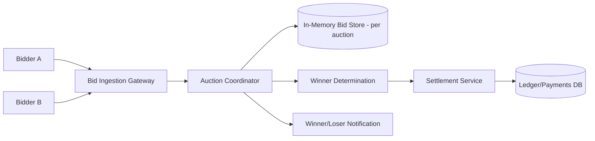
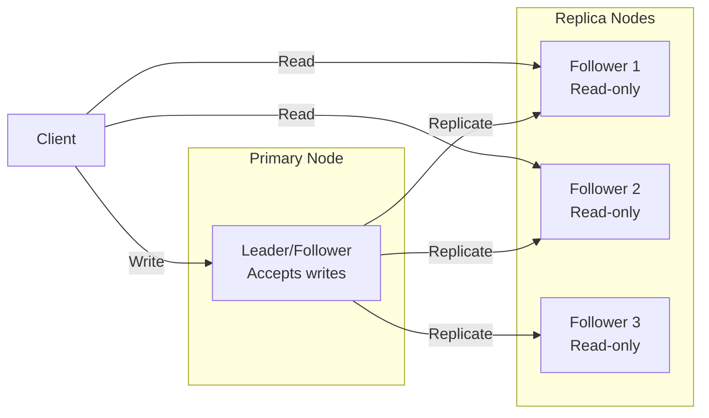
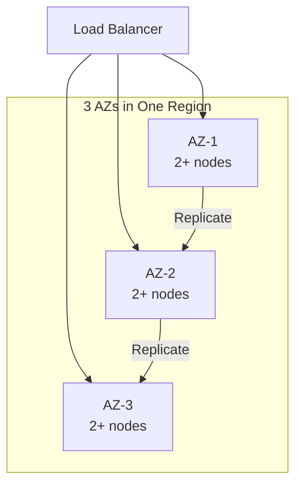
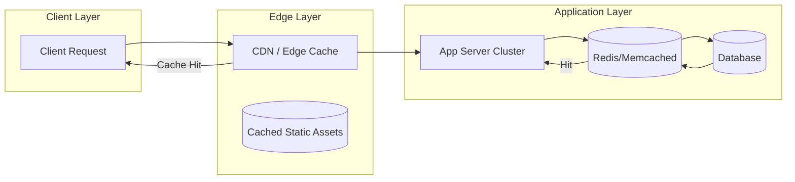
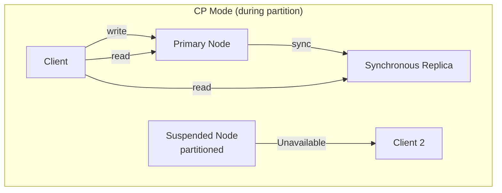
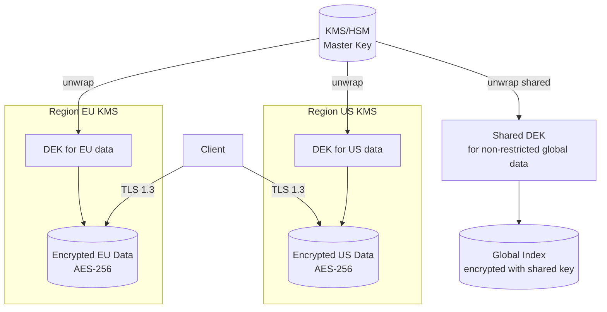
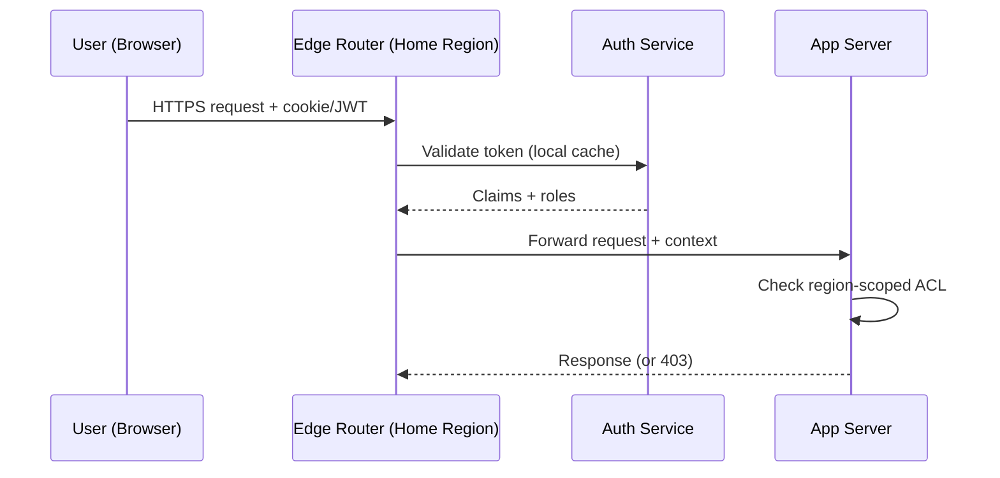
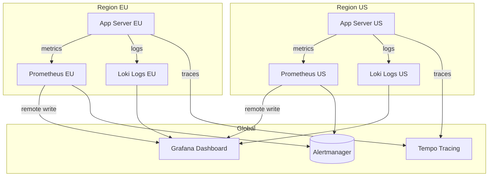

# Design a Real-Time Bidding / Auction System

## Blogs and websites

## Medium

## Youtube

## Theory

### Topics Covered

1. [Introduction / Problem Statement](#introduction-problem-statement)
2. [Characteristics](#characteristics)
3. [Components](#components)
4. [Architectural Patterns](#architectural-patterns)
5. [Benefits](#benefits)
6. [Pros](#pros)
7. [Cons](#cons)
8. [Challenges](#challenges)
9. [Best Practices](#best-practices)
10. [When to Use / When Not to Use](#when-to-use-when-not-to-use)
11. [Use Cases](#use-cases)
12. [Architecture](#architecture)
13. [High-Level Design](#high-level-design)
14. [Deep Dive](#deep-dive)
15. [Data Model and API](#data-model-and-api)
16. [Replication Strategies](#replication-strategies)
17. [Failure Detection and Membership](#failure-detection-and-membership)
18. [High Availability and Scalability](#high-availability-and-scalability)
19. [Performance and Optimization](#performance-and-optimization)
20. [CAP Theorem and Consistency Trade-offs](#cap-theorem-and-consistency-trade-offs)
21. [Encryption and Key Management](#encryption-and-key-management)
22. [Authentication and Authorization](#authentication-and-authorization)
23. [Security Threats and Mitigations](#security-threats-and-mitigations)
24. [Observability and Logging](#observability-and-logging)
25. [Replication Strategies](#replication-strategies)
26. [Failure Detection and Membership](#failure-detection-and-membership)
27. [High Availability and Scalability](#high-availability-and-scalability)
28. [Performance and Optimization](#performance-and-optimization)
29. [CAP Theorem and Consistency Trade-offs](#cap-theorem-and-consistency-trade-offs)
30. [Encryption and Key Management](#encryption-and-key-management)
31. [Authentication and Authorization](#authentication-and-authorization)
32. [Security Threats and Mitigations](#security-threats-and-mitigations)
33. [Observability and Logging](#observability-and-logging)
34. [Java and Spring Boot Implementation Guide](#java-and-spring-boot-implementation-guide)
35. [Real-World Implementations](#real-world-implementations)
36. [Interview Questions and Answers](#interview-questions-and-answers)

---
---
### Introduction / Problem Statement

A real-time bidding/auction system accepts bids for an item or impression within a strict time window (milliseconds for ad exchanges, seconds-to-minutes for item auctions), determines the winner using auction rules (first-price or second-price/Vickrey), settles payment, and does all of this with strong fairness and consistency guarantees.

**Why Does It Exist**

Digital advertising is sold in real time via automated auctions — every webpage view triggers a 100ms auction between dozens of advertisers. Without real-time bidding, human traders can't evaluate millions of auctions per second. Similarly, live item auctions (eBay live, gaming items) need fast, fair winner determination.

**What Problem Does It Solve**

* **Sealed bids**: Bidders submit bids without seeing others' bids until the auction closes (prevents last-look manipulation).
* **Winner determination**: Apply auction rules (first-price, second-price/Vickrey) to determine winner.
* **Strict latency**: Ad exchanges must resolve within < 100ms end-to-end.
* **Consistency**: Exactly one winner; no bid lost or double-counted.
* **Settlement**: Charge winner, notify all bidders of outcome.
* **Scale**: Tens of thousands of concurrent auctions/second (ad exchanges).


**Problem Statement**

Design a real-time bidding/auction system (e.g., an online ad exchange or a live item auction) where multiple bidders compete for an item/impression within a strict, very short time window, and the system must determine and settle the winner fairly and quickly.

**Functional Requirements**

- Accept bids for an active auction/impression within a fixed time window (milliseconds for ad exchanges, seconds-to-minutes for item auctions)
- Determine the winning bid using the auction's rules (first-price, second-price/Vickrey)
- Notify the winner and settle payment/allocation; notify losers
- Prevent bid manipulation (e.g., a bidder seeing others' bids before the window closes)

**Non-Functional Requirements**

- **Scale**: For ad exchanges, tens of thousands of concurrent auctions/sec, each resolved in single-digit milliseconds; for item auctions, thousands of concurrent auctions with many bidders each
- **Latency**: Ad-exchange style auctions must resolve within a strict SLA (often < 100ms end-to-end including network)
- **Consistency**: Exactly one winner per auction; no bid should be lost or double-counted
- **Fairness**: Bids must not be visible to other bidders until the auction closes

**High-Level Architecture**



**Key Design Points**

- Keep bids for an active auction sealed: bidders submit to a gateway that forwards to a coordinator, but never broadcasts current bids back to other participants until the auction closes, preventing last-look manipulation.
- Use an in-memory, low-latency store keyed by auction ID to accumulate bids during the (often very short) bidding window, and finalize/persist the outcome to durable storage only once the auction closes - this keeps the hot path fast while still guaranteeing durability of the final result.
- For ad-exchange-style auctions, run the entire bid-collect-and-resolve cycle within a single request/response cycle per impression (bidders respond to a bid request with a timeout, the exchange picks the winner as soon as the timeout expires or all bidders respond).
- Make the winner-determination step deterministic and auditable (e.g., log all received bids with timestamps) so outcomes can be verified after the fact in case of disputes.

**Trade-offs**

- Keeping the bid window strictly sealed (no visibility into others' bids) is essential for fairness but means bidders can't react to competing bids mid-auction, unlike open-outcry auctions - the trade is intentional for exchanges needing deterministic, gameable-resistant outcomes.
- In-memory bid accumulation is far faster

---

### Characteristics

| Characteristic | What it means | Why it matters | How it works |
|---|---|---|---|
| **Sealed bids** | Bidders can't see others' bids until auction closes | Fairness; prevents last-look manipulation | Gateway validates; no bid broadcasting |
| **Auction rules** | First-price or second-price (Vickrey) winner selection | Fairness + bidder strategy | Winner determiner applies rules |
| **In-memory store** | Bids kept in RAM during auction window | Millisecond latency | Per-auction hash map in memory |
| **Deterministic winner** | Same bids always yield same winner | Auditability + fairness | Sort by bid amount + timestamp |
| **Strict latency** | < 100ms auction resolution | Ad exchange SLA | All logic in single request/response cycle |
| **Sealed from observers** | External parties can't infer bids | Prevents gaming | No bid counts/progress exposed |

### Components

| Component | Purpose | Responsibilities | Relationship | Real-world Example |
|---|---|---|---|---|
| **Bid Gateway** | Accept bids | Validate bidder credentials, accept bids, timestamp | Bidder ↔ Coordinator | NGINX/Kong |
| **Auction Coordinator** | Manage auction lifecycle | Start/close auction, collect bids, trigger winner | Gateway ↔ Store | Exchange orchestrator |
| **Bid Store** | Accumulate bids (in-memory) | Store bids per auction in RAM | Coordinator ↔ Store | Redis/ConcurrentHashMap |
| **Winner Determiner** | Select winner | Apply auction rules (first/second price) | Coordinator | Selection logic |
| **Settlement Service** | Charge winner + notify | Process payment, settle | Determiner | Payment processor |
| **Ledger** | Durable outcome record | Log finalized auctions + winners | Settlement | DB |
| **Notification Service** | Inform bidders | Notify winner + losers | Settlement | Webhook |
| **Clock Sync** | Synchronize auction timing | NTP + logical clocks | All | Chrony |

### Architectural Patterns

#### First-Price vs. Second-Price (Vickrey) Auction

* **What**: In first-price auctions, the highest bidder wins and pays their bid. In second-price (Vickrey) auctions, the highest bidder wins but pays the second-highest bid.
* **Problem solved**: First-price causes bid shading (bidders underbid due to winner's curse). Second-price eliminates shading → bidders bid true valuation → simpler, fairer.
* **How it works**: (1) All bids collected during window. (2) Sort bids descending. (3) **First-price**: winner = top bid; pays = top bid. **Second-price**: winner = top bid; pays = 2nd highest bid. (4) In ad tech, most exchanges use second-price (with modifications like "bid-cube").
* **When to use**: Ad exchanges (second-price standard); general auctions (first-price common; second-price for fairness).
* **When not to use**: When you need predictable revenue (first-price is simpler to model).
• **Advantages**: Second-price → truthful bidding; first-price → simpler.
• **Disadvantages**: Second-price → winner's curse (winner may overpay in some edge cases); first-price → bid shading.
* **Real-world example**: Google AdX uses modified second-price; eBay uses proxy bidding (similar to Vickrey).

#### Sealed-Bid Collection

* **What**: Bidders submit bids during a window, but no bidder can see others' bids or bid counts until the auction closes.
* **Problem solved**: Prevents last-look manipulation (bidders raising bids based on seeing others' bids at the last moment).
* **How it works**: (1) Auction opens → window starts. (2) Bidders submit bids to Gateway (with timestamp). (3) Gateway never reveals bid values or counts mid-auction. (4) Window closes → Coordinator freezes bids → Winner Determiner selects winner → results published simultaneously to all.
• **When to use**: Ad exchanges; sealed-bid art/item auctions.
• **When not to use**: Open outcry / English auctions (where bidding is visible).
* **Advantages**: Fairness; prevents winner's curse manipulation.
* **Disadvantages**: Bidders can't react to competition → less engagement; requires strict timing.

### Benefits

* **Revenue maximization**: Multiple bidders → highest value wins.
* **Market efficiency**: Price discovery through competition.
• **Automation**: Programmatic, no human intervention.
* **Fairness**: Sealed bids → no last-second manipulation.

### Pros

* **Speed**: < 100ms resolution for ad exchange.
• **Scale**: 10K+ auctions/sec.
* **Fairness**: Sealed bids + deterministic winner.
* **Auditability**: All bids logged with timestamps.
• **Flexibility**: Configurable auction rules (first/second price).

### Cons

* **Complexity**: Timing + sealed bid + winner determination edge cases.
• **Bid manipulation**: Sybil attacks, shill bidding (in item auctions).
• **Network latency variance**: Latency = unfair advantage → need fair queuing.
• **Tie-breaking**: Equal bids → need deterministic tie-breaker.
• **Audit overhead**: Must log all bids for replay + verification.

### Challenges

#### Technical Challenges
* **Latency budget**: < 100ms includes network + computation → no DB writes on hot path.
• **Bid timing**: Strict window closing; clock sync (NTP/PTP).
• **Tie-breaking**: Deterministic (timestamp + bidder_id).
• **Bid store capacity**: Millions of concurrent auctions → partitioned key-value store.

#### Scalability Challenges
* **Auctions/sec**: 50K auctions/sec → 50K bid stores in memory → sharded by auction_id.
• **Bidder connections**: 1000+ bidders → connection pooling + streaming.
• **Winner determination**: Parallel across auctions; CPU-bound (sorting).

#### Performance Challenges
* **Sub-millisecond scoring**: In-memory only; no disk I/O on hot path.
• **Clock sync**: All coordinators within 1ms → PTP/NTP; logical clocks.
• **Serialization**: Binary protocol (protobuf) for bid ingest.

#### Reliability Challenges
* **Coordinator crash mid-auction**: Replicate bid store → failover; lost bids = fairness violation.
• **Bid durability**: In-memory → crash loses bids → replicate to KV store.
• **Winner re-determination**: Must be reproducible from bid log.

#### Maintainability Challenges
* **Rule changes**: New auction rules → backward-compatible bid logging.
• **A/B testing**: Different auction rules to different auction pools.
• **Bidder integration**: New bidders → adapter for their bidding protocol.

#### Security Concerns
* **Bid manipulation**: Sybil accounts, shill bidding, collusion detection.
• **Timing attacks**: Latency as unfair advantage → fair queuing + latency normalization.
• **Bid sniping**: Last-second bidding → extended window or anti-snipe.
• **Replay attacks**: Nonce per bid + timestamp validation.

### Best Practices

* **In-memory bid store**: No DB writes during auction window → sub-ms latency.
* **Clock synchronization**: PTP/NTP + logical clocks; monitor drift.
• **Deterministic tie-breaking**: Sort by (bid_amount DESC, timestamp ASC, bidder_id).
• **Bid replication**: Replicate in-memory store → survive coordinator crash.
• **Sealed collection**: Never reveal bid counts or values during window.
• **Audit log**: All bids → durable store (async, off critical path).
• **Rate limiting**: Per bidder → prevent spam.
• **Monitoring**: Auction resolution time, bidder timeout rate, tie rates, bidder latency distribution.

### When to Use / When Not to Use

#### Appropriate
* Ad exchanges (programmatic advertising).
• Live item auctions (eBay live, gaming items).
• Spectrum auctions (government).
* Online ad placement (Google/Facebook ads).

#### Not Appropriate
• Simple fixed-price sales (no bidding).
• Offline auctions (live auction house).
• Low-volume sales (too much complexity).

#### Decision Factors
* Auction volume; latency requirements; fairness needs; bidder count; regulatory requirements.

### Use Cases

#### Ad Exchange (Google AdX, Xandr)

* **Problem**: Sell ad impressions via 100ms real-time auctions between 50+ advertisers, determine winner, bill advertiser, pay publisher.
* **Solution**: Bid Request → HTTP/gRPC → 50+ DSPs (parallel, timeout 80ms) → collect bids → Winner Determiner (second-price) → auction result → settle.
* **Why suitable**: RTB protocol (OpenRTB); sub-100ms; sealed bids; second-price.
* **How it works**: (1) Publisher ad slot → ad server generates Bid Request (OpenRTB JSON). (2) Fan-out to 50+ DSPs in parallel (gRPC, 80ms timeout). (3) DSPs respond with bid (CPM, creative) → Bid Gateway. (4) Coordinator collects → Bid Store (in-memory). (5) At 100ms → Winner Determiner: sort by CPM → second-price winner. (6) Winner notified → serve creative → bill advertiser (net) → pay publisher (gross - fee). (7) All bids → audit log.
* **Trade-offs**: 50+ parallel calls → timeout handling; second-price → bid shading; latency variability → fair queuing.

### Architecture

```mermaid
graph TD
  subgraph "Bidders"
    DSP1[DSP A]
    DSP2[DSP B]
    DSP3[DSP C]
    DSPN[DSP N]
  end
  subgraph "Exchange"
    BidGW[Bid Ingestion Gateway]
    Coord[Auction Coordinator]
    BidStore[(In-Memory Bid Store)]
    WinnerDet[Winner Determiner]
    Settle[SetauthService]
    Audit[Audit Log]
  end
  subgraph "External"
    LedgerDB[(Ledger<br/>PostgreSQL)]
  end
  DSP1 -->|Bid Request| BidGW
  DSP2 -->|Bid Request| BidGW
  DSP3 -->|Bid Request| BidGW
  DSPN -->|Bid Request| BidGW
  BidGW --> Coord
  Coord --> BidStore
  Coord -->|close| WinnerDet
  WinnerDet --> Settle
  WinnerDet --> Audit
  BidStore -->|(replicated)| RS[(Replicated Store<br/>Redis)]
  Settle --> LedgerDB
  Settle -->|notify| DSP1
  Settle -->|notify| DSP2
  Settle -->|notify| DSP3
  Settle -->|notify| DSPN
```

#### Architecture Structure
* **Bid layer**: DSPs submit bids via HTTP/gRPC (OpenRTB protocol).
* **Coordinator**: Auction lifecycle (open → collect → close → determine).
* **Bid store**: In-memory (Redis/clustered ConcurrentHashMap) for speed; replicated for durability.
* **Settlement**: Winner charge + notification.
* **Audit**: All bids + outcomes → durable store.

#### Communication
* **Bidder ↔ Gateway**: HTTP/gRPC (OpenRTB protocol); TLS; timeout 80ms.
• **Coordinator ↔ Store**: In-process (ConcurrentHashMap) or Redis for large auctions.
* **Settlement**: Sync API to payment + async to webhook.
* **Audit**: Async to Kafka + DB.

#### Data Flow
1. **Auction open**: Coordinator creates auction entry in Bid Store (in-memory).
2. **Bid collection**: Bid Gateway → Coordinator → adds bid to Bid Store (with timestamp).
3. **Auction close**: Clock hits deadline → Coordinator freezes bids.
4. **Winner**: Winner Determiner sorts bids → applies auction rule → selects winner.
5. **Settlement**: Charge winner → persist to Ledger DB → notify all bidders.
6. **Audit**: All bids + winner → durable log (async).

#### Scaling Strategy
* **Coordination**: Sharded by auction_id → 100 auction servers.
* **Bid store**: Partitioned key-value store (Redis cluster); each auction → hash slot.
• **Bidders**: 10K+ → connection pooling + streaming; bid request fan-out per auction.

#### Failure Handling
* **Coordinator crash**: Replicate Bid Store → failover → re-determine winner from bid log.
• **Bidder timeout**: Exclude bids after 80ms timeout → still resolve auction.
• **Settlement failure**: Retry payment → DLQ → manual follow-up.
• **Lost bid**: Durable log → replay → re-determination.

### High-Level Design

```mermaid
flowchart LR
  BidReq[Bid Request<br/>(ad slot)] --> Gateway[Bid Gateway]
  Gateway -->|fan-out| DSP1[DSP A]
  Gateway -->|fan-out| DSP2[DSP B]
  Gateway -->|fan-out| DSPN[DSP N]
  DSP1 -->|bid| Gateway
  DSP2 -->|bid| Gateway
  DSPN -->|bid| Gateway
  Gateway --> Coord[Auction Coordinator]
  Coord --> Store[(Bid Store<br/>In-Memory)]
  Coord -->|80ms timer| Winner[Winner<br/>Determination]
  Winner --> Payout[SetauthService]
  Payout --> DSP1
  Payout --> DSP2
  Payout --> DSPN
  Winner --> Audit[Audit Log]
```

### Deep Dive

#### Sealed-Bid Collection

The existing file's Theory section covers: Bidders submit to gateway → forwards to coordinator → no bid values broadcast until close.

#### Winner Determination

The existing file's Theory section covers: In-memory bid accumulation → winner selection using auction rules (first-price, second-price/Vickrey).

#### In-Memory Bid Store

The existing file's Theory section covers: Low-latency in-memory store keyed by auction ID → persist to durable storage after auction close.

#### Clock Synchronization

The existing file's Theory section mentions: Strict time window (e.g., 100ms for ad exchanges) → critical. Uses NTP + logical timestamps → all bids within window accepted, outside rejected.

### Data Model and API

* **API purpose**: Submit bids; receive bid requests; get auction results.

| Method | Endpoint | Description |
|---|---|---|
| POST | `/rtb/v1/bid` | Submit a bid (OpenRTB protocol) |
| GET | `/rtb/v1/auction/{id}` | Get auction result (winner only) |
| POST | `/rtb/v1/settle` | Settlement notification webhook |

**Bid Request (POST /bid)**:
```json
{
  "auction_id": "auc_123",
  "bidder_id": "dsp_a",
  "bid_price_cpm": 2.50,
  "creative_id": "creative_456",
  "timestamp_ms": 1723456789012,
  "expiry_ms": 80
}
```

**Auction Result (GET /auction/{id})**:
```json
{
  "auction_id": "auc_123",
  "winning_bid": {"bidder_id": "dsp_b", "bid_price_cpm": 3.20, "paid_cpm": 2.50},
  "all_bids": [{"bidder": "dsp_a", "bid": 2.50}, {"bidder": "dsp_b", "bid": 3.20}]
}
```

**Authentication**: HMAC-signed bid requests (OpenRTB); bidder credentials + API key.

**Error responses**:
```json
{"error": "auction_closed", "message": "Bid submitted after auction closed", "code": 410}
{"error": "timeout", "message": "Bidder response timeout", "code": 408}
{"error": "invalid_bid", "message": "Bid below minimum or invalid", "code": 400}
```


```mermaid
erDiagram
    AUCTION ||--o{ BID : "receives"
    BIDDER ||--o{ BID : "places"
    AUCTION ||--o{ AUCTION_RESULT : "produces"

    AUCTION {
      string auction_id PK
      string item_id
      datetime start_time
      datetime end_time
      int winning_bid_id
      string status open_closed_settled
    }
    BID {
      string bid_id PK
      string auction_id FK
      string bidder_id FK
      decimal bid_price
      string currency
      datetime timestamp
      string creative_id
    }
    BIDDER {
      string bidder_id PK
      string name
      string api_endpoint
      string auth_token
    }
    AUCTION_RESULT {
      string auction_id PK
      string winning_bid_id FK
      decimal paid_amount
      datetime settled_at
    }
```

**Partitioning**: Auctions sharded by auction_id; bids co-located with auction.

**Durability**: In-memory during auction → persisted to DB after close.

### Replication Strategies

**What it means**

Replication Strategies determine how data and state are copied across multiple nodes in Real-Time Bidding Auction System. The choice of strategy determines the trade-off between consistency, availability, and latency.

**Why it matters**

Real-Time Bidding Auction System must replicate data to prevent loss and serve reads from multiple nodes. The replication strategy determines whether the system favors consistency (strong reads) or availability (always writable), and how it handles cross-node failure.

**How it works**

**Leader-based (single-leader)**: A single primary node accepts all writes; followers replicate changes asynchronously or semi-synchronously. Reads can be served from any replica. This strategy favors strong consistency for writes but creates a write bottleneck at the leader.



*Leader-based replication: a single primary node accepts all writes and replicates them to read-only followers. Clients can read from any replica for scaled read throughput, but all writes go through the leader.*

**Multi-leader (multi-master)**: Multiple nodes accept writes and exchange updates with each other. This enables low-latency writes in different regions but requires conflict resolution (last-write-wins, merge functions, or CRDTs).

**Leaderless (quorum-based)**: Any node can accept writes; a quorum of nodes must agree. Read and write quorums are configured so that at least one node overlaps between them (R + W > N). This maximizes availability and write scalability.

**Trade-offs for Real-Time Bidding Auction System**:

| Strategy | Use Case | Pros | Cons |
|---|---|---|---|
| Leader-based | user profiles, bidding histories, advertiser budgets | Strong consistency, simple | Write bottleneck, leader failure risk |
| Multi-leader | public ad creative metadata, campaign stats, anonymized win rates | Low-latency global writes | Conflict resolution, complex |
| Leaderless | Caching, counters | High availability, no bottleneck | Eventual consistency, read repair overhead |

**Real-world implementations**

- **Redis**: Leader-follower replication with asynchronous replication; Sentinel handles failover.
- **Apache Kafka**: Leader-based partition replication with ISR (in-sync replica) — writes go to the leader, followers replicate.
- **Cassandra**: Tunable consistency with leaderless quorum (R + W > N).
- **DynamoDB Global Tables**: Multi-master active-active across regions.

### Failure Detection and Membership

**What it means**

Failure Detection and Membership is the mechanism by which Real-Time Bidding Auction System determines which nodes are alive and part of the cluster. Membership is the list of known nodes; failure detection is the process of updating that list when nodes fail or recover.

**Why it matters**

Real-Time Bidding Auction System must route requests only to healthy nodes and trigger failover when a node goes down. False positives (healthy nodes marked as dead) cause unnecessary failovers and data loss. False negatives (dead nodes not detected) cause failed requests and degraded performance.

**How it works**

**Heartbeat-based detection**: Each node sends a heartbeat (ping) to a subset of peers at regular intervals. If a node misses N consecutive heartbeats, it is marked as suspect. The gossip protocol distributes membership information: each node exchanges its view of the cluster with a random peer, and the information propagates gossip-style.

```mermaid
sequenceDiagram
    participant A as Node A
    participant B as Node B
    participant C as Node C

    loop Every 1s
        A->>B: Heartbeat (ping)
        B-->>A: Heartbeat (ack)
    end
    B->>C: Gossip: A is alive
    C->>A: Gossip: B is alive
    Note over A,B,C: View converges in O(log N) rounds
```

*Gossip-based failure detection: each node periodically pings a random subset of peers and gossips its view of the cluster. The membership list converges in O(log N) rounds.*

**Phi Accrual Failure Detector**: Instead of a fixed timeout, the detector measures the time between consecutive heartbeats and computes a phi (φ) value — the probability that the node is dead given the observed heartbeat pattern. φ is compared against a threshold (typically 1–8); higher thresholds reduce false positives but increase detection latency.

**SWIM (Scalable Weakly-consistent Infection-style Process group Membership Protocol)**: Nodes ping a random subset of cluster members. If a ping fails, the node is marked "suspect" and the failure is "infected" (gossiped) to other nodes. This is O(log N) per failure detection cycle and scales to large clusters.

**Trade-offs**:

| Approach | Strengths | Weaknesses |
|---|---|---|
| Heartbeat (timeout-based) | Simple, deterministic | False positives under load |
| Phi Accrual | Adaptive threshold | Needs historical data |
| SWIM | Scales to 1000s of nodes | Eventual consistency |

**Real-world implementations**

- **AWS Route 53 Health Checks**: Uses TCP/HTTP health checks with configurable thresholds to remove unhealthy instances from DNS rotation.
- **Kubernetes**: Uses the kubelet heartbeat (every 10s) to determine node liveness; nodes missing 3 consecutive heartbeats are marked NotReady.
- **Consul**: Uses SWIM protocol for membership and failure detection; supports both LAN and WAN gossip.
- **Akka Cluster**: Uses Phi Accrual failure detector with configurable φ thresholds.

### High Availability and Scalability

**What it means**

High Availability and Scalability determines how Real-Time Bidding Auction System continues operating when nodes or entire zones fail, and how capacity is added as demand grows. HA is about minimizing downtime; scalability is about maintaining performance as load increases.

**Why it matters**

Real-Time Bidding Auction System must stay operational even when individual nodes, availability zones, or entire regions fail. At the same time, it must scale horizontally to handle traffic spikes without degrading latency. The two are intertwined: the replication strategy, failure detection, and load balancing all contribute to both HA and scalability.

**How it works**

**Availability zones (AZs)**: Nodes are distributed across multiple AZs within a region. Each AZ is an independent failure domain (power, networking, physical security). A load balancer distributes requests across AZs; if one AZ fails, traffic is routed to the remaining AZs with no data loss (assuming replication is in place).



*Multi-AZ deployment: a load balancer distributes traffic across three availability zones. Each AZ has multiple nodes. Data is replicated across AZs so that losing one AZ does not cause data loss or service interruption.*

**Load balancing**: A load balancer distributes incoming requests across healthy nodes. Algorithms include round-robin, least connections, and weighted routing. Health checks ensure traffic only goes to healthy nodes. For Real-Time Bidding Auction System, the load balancer also considers Bidder (DSP adapter) when routing.

**Auto-scaling**: The system automatically adds or removes nodes based on metrics (CPU, memory, request rate). Scale-out policies add nodes when load exceeds a threshold; scale-in policies remove nodes during low load. For stateful services like Real-Time Bidding Auction System, scale-out involves rebalancing partitions (moving data and connections to the new node).

**Failover and recovery**: When a node fails, the load balancer detects it (via health checks or failure detection) and stops sending traffic. A new node is provisioned (or a standby is promoted) and begins serving. For Real-Time Bidding Auction System, failover must preserve user profiles, bidding histories, advertiser budgets data — this is achieved through replication with a quorum of healthy nodes.

**Scalability patterns**:

1. **Horizontal partitioning (sharding)**: Split data by a partition key (e.g., user_id, session_id) and distribute partitions across nodes. New nodes take ownership of additional partitions.

2. **Consistent hashing**: Minimize data movement on scale-out — only 1/N of the data moves to the new node. Nodes and partitions are placed on a ring; a request for key X is routed to the next node clockwise from hash(X).

3. **Connection draining**: When scaling in, existing connections are allowed to complete before the node is shut down. For Real-Time Bidding Auction System, this means draining active A sessions gracefully.

**Real-world implementations**

- **Netflix OSS (Eureka + Zuul + Ribbon)**: Service discovery with Eureka, edge routing with Zuul, and client-side load balancing with Ribbon. Scales to thousands of instances.
- **Kubernetes HPA + VPA**: Horizontal Pod Autoscaler scales pods based on CPU/memory; Vertical Pod Autoscaler adjusts resource requests based on historical usage.
- **AWS ALB + Auto Scaling Groups**: Application Load Balancer with auto-scaling groups across AZs; health checks replace unhealthy instances automatically.

### Performance and Optimization

**What it means**

Performance and Optimization covers the techniques Real-Time Bidding Auction System uses to achieve low latency, high throughput, and efficient resource usage. This section examines the key performance metrics, bottlenecks, and optimizations specific to the system.

**Why it matters**

Real-Time Bidding Auction System faces competing pressures: users demand low latency, the system must handle high throughput, and infrastructure costs must be controlled. The optimizations applied at the data, compute, and network layers determine whether the system meets its SLA.

**How it works**

**Latency layers**: Latency in Real-Time Bidding Auction System comes from three layers:
1. **Network**: Round-trip time from client to the nearest edge node / load balancer.
2. **Application**: Request processing time on the server (CPU, I/O, lock contention).
3. **Data**: Time to read/write from storage (cache hit vs. database query).

The 99th-percentile latency is the key metric for user-facing systems — it determines the worst-case experience.

**Caching strategies**: Real-Time Bidding Auction System uses multiple cache layers:
- **Edge cache**: Static assets (images, CSS, JS) served from a CDN at the edge. For Real-Time Bidding Auction System, this caches public ad creative metadata, campaign stats, anonymized win rates that doesn't change frequently.
- **Application cache**: In-memory cache (e.g., Redis, Memcached) for frequently accessed data. Cache-aside pattern: application checks cache first, falls back to database on miss.
- **Local cache**: In-process cache (e.g., Caffeine, Guava) for data accessed within a single request. Avoids network round-trips.

**Batching and pipelining**: Real-Time Bidding Auction System batches small operations (e.g., writes, log flushes) to amortize per-operation overhead. Pipelining allows multiple requests to be in flight simultaneously.



*Caching hierarchy: clients first hit the edge CDN/cache; if the response is cached, it is returned immediately. Otherwise, the request reaches the application, which checks its in-memory/application cache (e.g., Redis) before falling back to the database. This minimizes latency from each layer.*

**Connection pooling**: Real-Time Bidding Auction System maintains a pool of database connections to avoid the TCP handshake overhead on every request. Pool size is tuned to match the database's capacity.

**Compression**: Responses are compressed (gzip, zstd) for clients that support it. At the network layer, gRPC uses HPACK header compression.

**Indexing**: Database tables are indexed on frequently queried fields. For Real-Time Bidding Auction System, indexes cover Auction Server and Ad Exchange for fast lookups.

**Asynchronous processing**: Non-critical background work (e.g., analytics, cleanup, notifications) is offloaded to message queues and processed asynchronously, keeping the request path fast.

**Resource isolation**: CPU and memory are allocated per service (containers with cgroup limits). This prevents a single misbehaving service from degrading the entire system.

**Metrics for Real-Time Bidding Auction System**:

| Metric | Target | How to Measure |
|---|---|---|
| P99 latency | < 1s | Load test with realistic traffic |
| Throughput | 10K RPS | Request rate under peak load |
| Error rate | < 0.1% | 5xx / total requests |
| Cache hit ratio | > 90% | cache_hits / (cache_hits + misses) |
| Resource utilization | < 80% CPU, < 85% memory | Container metrics |

**Real-world implementations**

- **Google's HTTP Load Balancer**: Global load balancing with edge PoPs; routes users to the nearest healthy backend.
- **Cloudflare**: Edge cache with Argo Smart Routing that dynamically routes traffic to avoid congestion.
- **Redis**: Used as an application cache with configurable eviction policies (LRU, LFU, TTL).

### CAP Theorem and Consistency Trade-offs

**What it means**

The CAP Theorem states that in a distributed system, you can only have two of three guarantees: **Consistency** (every read returns the latest write), **Availability** (every request gets a response), and **Partition tolerance** (the system continues to operate despite network partitions). Since network partitions are inevitable in distributed systems like Real-Time Bidding Auction System, the real choice is between CP (consistent + partitioned) and AP (available + partitioned).

**Why it matters**

Real-Time Bidding Auction System must decide which two guarantees to prioritize. For user profiles, bidding histories, advertiser budgets data, strong consistency (CP) is critical — users must see the most recent data. For public ad creative metadata, campaign stats, anonymized win rates data, availability (AP) is more important — the system should remain responsive even during network issues.

**How it works**

**CP (Consistent + Partition-tolerant)**: During a partition, the system trades availability for consistency. Writes are rejected or delayed until the partition heals. Reads return the latest committed value. This is appropriate for user profiles, bidding histories, advertiser budgets in Real-Time Bidding Auction System.



*CP system during a network partition: writes are rejected on the partitioned node to maintain consistency. Clients are routed to the healthy primary and synchronous replica.*

**AP (Available + Partition-tolerant)**: During a partition, the system trades consistency for availability. Both sides accept writes; conflicts are resolved later (last-write-wins, merge, or application-level conflict resolution). This is appropriate for public ad creative metadata, campaign stats, anonymized win rates in Real-Time Bidding Auction System.

**PACELC (extending CAP)**: The PACELC theorem says that even when the network is not partitioned (the "else" case in CAP), you must choose between latency (L) and consistency (C). Real-Time Bidding Auction System uses:
- **Racing reads**: Serve from the nearest replica for speed (low latency, eventual consistency).
- **Linearizable reads**: Always read from the primary (high latency, strong consistency).

The choice is made per request based on whether the data is user profiles, bidding histories, advertiser budgets (strong consistency) or public ad creative metadata, campaign stats, anonymized win rates (fast reads).

**Trade-offs**:

| System Type | CP Use Cases | AP Use Cases |
|---|---|---|
| Real-Time Bidding Auction System | user profiles, bidding histories, advertiser budgets | public ad creative metadata, campaign stats, anonymized win rates |

**Real-world implementations**

- **etcd**: CP system using Raft consensus; used for service discovery and configuration in Kubernetes.
- **Cassandra**: AP system with tunable consistency; used for time-series data and user sessions.
- **Google Spanner**: CP with external consistency via TrueTime API; used for global financial transactions.
- **DynamoDB**: AP by default, but supports strongly consistent reads (CP mode) on demand.

### Encryption and Key Management

**What it means**

Encryption and Key Management in Real-Time Bidding Auction System ensures that data is protected both at rest (stored on disk) and in transit (moving between services). Key management governs how encryption keys are generated, stored, rotated, and accessed — without proper key management, encryption provides a false sense of security.

**Why it matters**

Real-Time Bidding Auction System handles user profiles, bidding histories, advertiser budgets that must be encrypted both at rest and in transit. Making auction decisions in under 10ms while processing bid requests from multiple ad exchanges and handling bidder timeouts requires careful key management: keys must be rotated regularly, scoped to prevent cross-contamination, and audited for compliance. A single key compromise could expose sensitive data.

**How it works**

**At-rest encryption**: Data stored in Bidder (DSP adapter), Auction Server and databases is encrypted using AES-256-GCM. The Data Encryption Key (DEK) is generated per data partition and encrypted with a Key Encryption Key (KEK) managed by a KMS (AWS KMS, GCP KMS, HashiCorp Vault). Keys are regionally scoped — only data belonging to a region can be decrypted by that region's KEK.

**In-transit encryption**: All inter-service communication uses TLS 1.3 or mTLS for service-to-service auth. Cross-region communication of public ad creative metadata, campaign stats, anonymized win rates uses TLS + optional application-level encryption. user profiles, bidding histories, advertiser budgets is NEVER transmitted in plaintext or across region boundaries.

**Key hierarchy**:
```
Master Key (HSM-backed, KMS-managed)
  └─ KEK (per region, per service)
     └─ DEK (per data partition, rotated every 90 days)
        └─ Data (encrypted with DEK)
```

**Key rotation**: KEKs rotate annually (automatic via KMS); DEKs rotate per object or per 90 days. Applications handle key version headers transparently — a DEK version is stored alongside the encrypted data.

**Cross-region key sharing**: For non-restricted data (public ad creative metadata, campaign stats, anonymized win rates), a shared key is imported into each region's KMS. Restricted data NEVER uses cross-region keys — each region's KMS holds only that region's keys.



*Encryption key hierarchy: master keys are managed by an HSM-backed KMS and never leave the KMS. Each region has its own KEK. Data encryption keys (DEKs) are generated per partition and encrypted with the regional KEK. Only non-restricted global data uses a shared cross-region key. All client traffic uses TLS 1.3.*

**Java/Spring Boot Implementation**

```java
@Service
@RequiredArgsConstructor
public class DataEncryptionService {

    private final AWSKMS kms;
    @Value("${app.region}")
    private String region;
    @Value("${app.encryption.dek-ttl-minutes:1440}")
    private int dekTtlMinutes;

    private final Map<String, SecretKey> dekCache = new ConcurrentHashMap<>();

    public EncryptedData encrypt(String plaintext, String partitionId) {
        SecretKey dek = getOrCreateDek(partitionId);
        byte[] ciphertext = CryptoUtils.encrypt(plaintext.getBytes(StandardCharsets.UTF_8), dek);
        String dekCiphertext = kms.encrypt(EncryptRequest.builder()
            .keyId("arn:aws:kms:" + region + ":master-key")
            .plaintext(SdkBytes.fromByteArray(dek.getEncoded()))
            .build()).ciphertextBlob().asByteArray();
        return new EncryptedData(ciphertext, dekCiphertext, Instant.now());
    }

    private SecretKey getOrCreateDek(String partitionId) {
        return dekCache.computeIfAbsent(partitionId, id -> {
            try {
                return KeyGenerator.getInstance("AES").generateKey();
            } catch (NoSuchAlgorithmException e) {
                throw new IllegalStateException("Cannot generate DEK", e);
            }
        });
    }
}
```

*Spring Boot encryption service: DEKs are cached per-partition with TTL. Each DEK is encrypted via AWS KMS using a regional master key. The encrypted DEK (ciphertext) is stored alongside the data — only the KMS for that region can decrypt it.*

**Real-world implementations**

- **AWS KMS**: Managed HSM-backed key service; supports automatic key rotation and custom key stores.
- **HashiCorp Vault**: Open-source key management; supports transit encryption (encrypt/decrypt without storing keys).
- **Google Cloud KMS**: Hardware-backed key management with IAM-based access control.

### Authentication and Authorization

**What it means**

Authentication and Authorization (AuthN/AuthZ) in Real-Time Bidding Auction System control who can access the system and what they can do. Authentication verifies identity; authorization determines permissions. In a distributed system like Real-Time Bidding Auction System, auth must work across multiple nodes while respecting data boundaries — a user authenticated in one region should not have their session data or tokens replicated to regions where it is not permitted.

**Why it matters**

Real-Time Bidding Auction System must verify identity at the edge and enforce authorization at every service boundary. user profiles, bidding histories, advertiser budgets must be protected — only users with appropriate roles should access it. At the same time, public ad creative metadata, campaign stats, anonymized win rates data should be accessible to a wider audience with minimal friction.

**How it works**

**Authentication (who are you?)**:
- **JWT tokens**: Users authenticate through their home region's identity provider. The region returns a JWT (JSON Web Token) signed by a regional signing key. Tokens include claims like `iss` (issuer region), `sub` (subject/user ID), `home_region`, `roles`, and `exp` (expiry). Tokens are scoped per region — a token issued by region A cannot access restricted data in region B.
- **mTLS for service-to-service**: Internal services authenticate each other using mutual TLS certificates issued by a per-region Certificate Authority (CA). No shared secrets cross region boundaries.
- **Session management**: Sessions are stored regionally (Redis) and never replicated cross-region for restricted data. Session IDs are opaque UUIDs; the session store maps session ID → user context.

**Authorization (what can you do?)**:
- **RBAC (Role-Based Access Control)**: Users are assigned roles per region. Common roles: `region_admin` (full access to region data), `auditor` (read-only audit), `viewer` (read public data only). Roles are stored in the regional database and cached locally for sub-1ms lookups.
- **ABAC (Attribute-Based Access Control)**: Fine-grained permissions based on attributes (e.g., `home_region == request_region AND role == admin`). This allows expressing complex policies like "users can only access restricted data in their home region."
- **Resource-level authorization**: Each request is checked against an ACL (Access Control List) that specifies which roles can access which resources. For Real-Time Bidding Auction System, restricted resources require the `admin` role + matching region.



*Authentication flow: the user's token is validated by the regional auth service (claims cached locally). The edge router forwards the request with the security context. Each app server checks the region-scoped ACL before accessing restricted data.*

**Java/Spring Boot Implementation**

```java
@Service
@RequiredArgsConstructor
public class AuthorizationService {

    private final UserTokenRepository tokenRepository;
    @Value("${app.region}")
    private String currentRegion;

    public boolean canAccessResource(String userId, String resourceRegion,
                                     String action, JWTClaims claims) {
        String userHomeRegion = claims.getStringClaim("home_region");
        List<String> roles = claims.getStringListClaim("roles");

        if (!roles.contains(action)) {
            return false;
        }

        if (resourceRegion.equals(userHomeRegion)) {
            return true;
        }

        if (resourceRegion.equals("global")) {
            return roles.contains("global_reader");
        }

        return false;
    }
}

@RestController
@RequiredArgsConstructor
@RequestMapping("/api/v1")
public class RegionController {
    private final AuthorizationService authService;

    @GetMapping("/data/{region}/profile")
    public ResponseEntity<?> getProfile(
            @PathVariable String region,
            @RequestHeader("Authorization") String token) {
        JWTClaims claims = JwtUtils.parseAndValidate(token, currentRegion);

        if (!authService.canAccessResource(
                claims.getStringClaim("sub"), region, "read", claims)) {
            return ResponseEntity.status(HttpStatus.FORBIDDEN).build();
        }

        return ResponseEntity.ok(profileService.getByRegion(region));
    }
}
```

*Spring Boot authorization service: checks both the user's role and whether the requested resource violates region boundaries. The `canAccessResource` method returns false if a user from region EU tries to access restricted data in region US.*

**Real-world implementations**

- **Auth0**: JWT-based authentication with regional endpoints; supports custom rules for ABAC.
- **Okta**: Multi-region identity management with adaptive MFA and ThreatInsight for anomaly detection.
- **AWS Cognito**: Regional user pools with IAM integration; tokens are region-scoped by default.

### Security Threats and Mitigations

**What it means**

Security Threats and Mitigations catalog the attack surface of Real-Time Bidding Auction System, the most likely threats, and the corresponding defenses. Every distributed system has unique threat vectors — Real-Time Bidding Auction System is no exception.

**Why it matters**

Real-Time Bidding Auction System handles user profiles, bidding histories, advertiser budgets that attackers might target. Making auction decisions in under 10ms while processing bid requests from multiple ad exchanges and handling bidder timeouts expands the attack surface: more nodes, more network paths, more failure modes. Without proper threat modeling, a single vulnerability could expose sensitive data across the entire system.

**Threat model**:

| Threat | Likelihood | Impact | Mitigation |
|---|---|---|---|
| Data exfiltration (cross-region) | High | Critical | Region-scoped keys, no cross-region replication of restricted data |
| Man-in-the-middle (inter-service) | Medium | High | mTLS between all services |
| Replay attacks | Medium | High | Token expiry + nonce |
| DDoS at the edge | High | High | Rate limiting + edge filtering (Cloudflare, AWS Shield) |
| PII leakage in logs | High | High | PII redaction + field-level access control |
| Session hijacking | Medium | Medium | Short-lived tokens + IP binding |
| Privilege escalation | Low | Critical | Least-privilege RBAC + audit logs |
| Cache poisoning | Low | Medium | Cache invalidation on write + signed cache keys |

**How it works**

**Data exfiltration prevention**: Real-Time Bidding Auction System enforces data residency by design — user profiles, bidding histories, advertiser budgets is never replicated cross-region. The replication layer checks a data classification label before allowing cross-region copy. A database-level policy (e.g., PostgreSQL RLS) also blocks cross-region queries for restricted partitions.

**mTLS enforcement**: All service-to-service communication uses mutual TLS. Certificates are issued by a per-region CA and rotated every 30 days. Services must present a valid certificate to communicate — no plaintext connections are allowed.

**PII redaction**: Application logs are scanned for PII patterns (email, phone, credit card) using an automated redaction layer (e.g., AWS Macie, Google DLP). public ad creative metadata, campaign stats, anonymized win rates is logged freely; restricted fields are masked or dropped before logging.

```mermaid
graph TD
    subgraph "Threat Surface"
        Client[Client]
        Edge[Edge Router / WAF]
        App[App Server]
        DB[(Database)]
        Cache[(Cache)]
        Logs[Log Store]
    end

    Client -->|HTTPS| Edge
    Edge -->|mTLS| App
    App -->|mTLS| DB
    App -->|Read| Cache
    App -->|Write| DB
    App -->|Log| Logs

    subgraph "Mitigations"
        WAF[AWS WAF /<br/>Cloudflare]
        DLP[PII Redaction<br/>(Macie/DLP)]
        FIM[File Integrity<br/>Monitoring]
    end

    Edge -.-> WAF
    Logs -.-> DLP
    DB -.-> FIM
```

*Threat mitigation diagram: the WAF at the edge blocks DDoS and injection attacks. mTLS protects all service-to-service communication. PII redaction scans logs before storage. File integrity monitoring alerts on database tampering.*

**Audit trail**: All security-relevant events (auth, data access, config changes) are written to an append-only audit log with cryptographic integrity (HMAC per entry). The log covers user profiles, bidding histories, advertiser budgets access — who accessed what, when, and from where.

**Real-world implementations**

- **Cloudflare**: Zero-trust model (All Connections to All Networks) with mTLS everywhere; uses GeoIP blocking and rate limiting for DDoS mitigation.
- **Google BeyondCorp**: Zero-trust network security model; all access is authenticated and authorized at the request level.

### Observability and Logging

**What it means**

Observability and Logging in Real-Time Bidding Auction System provide visibility into system behavior through three pillars: **metrics** (aggregates and counters), **logs** (structured event records), and **traces** (distributed request timelines). Together, these signals allow operators to debug issues, detect anomalies, and verify SLA compliance.

**Why it matters**

Distributed systems like Real-Time Bidding Auction System are inherently opaque — failures can cascade across services in unexpected ways. Without good observability, a single slow dependency can cause widespread timeouts that are nearly impossible to diagnose. Making auction decisions in under 10ms while processing bid requests from multiple ad exchanges and handling bidder timeouts makes observability even more critical: operators need to see cross-region latency, regional failures, and data-residency violations.

**How it works**

**Metrics**: Real-Time Bidding Auction System instruments every service with Prometheus-style metrics:
- **Request rate, error rate, duration (the "RED" metrics)**: Tracks per-endpoint HTTP latency and error counts.
- **System metrics**: CPU, memory, disk I/O, network throughput per node.
- **Business metrics**: For Real-Time Bidding Auction System, this includes metrics like "Auction Server fill rate" and "reservation conflict rate".

Metrics are aggregated in a time-series database (Prometheus, VictoriaMetrics) and visualized in Grafana dashboards with alerts via PagerDuty.

**Logs**: Real-Time Bidding Auction System uses structured logging (JSON format) with standardized fields:
- `timestamp`: ISO 8601 UTC
- `level`: DEBUG, INFO, WARN, ERROR
- `service`: originating service name
- `trace_id`: distributed trace identifier (for correlation)
- `span_id`: current operation span
- `region`: the region that processed the request
- `data_class`: RESTRICTED or NON_RESTRICTED

user profiles, bidding histories, advertiser budgets access is logged with full context (user, action, resource). public ad creative metadata, campaign stats, anonymized win rates logs are aggregated and may have reduced retention.

**Distributed tracing**: Every request is assigned a trace ID at the edge. The trace propagates through all downstream services via HTTP headers. A tracing backend (Jaeger, Tempo, Zipkin) reconstructs the full request timeline, showing latency at each hop. For Real-Time Bidding Auction System, traces include region boundaries — a cross-region call is annotated as such.



*Observability architecture: each region runs its own Prometheus (metrics) and Loki (logs) instances. A global Grafana instance queries all regional backends. Traces are collected centrally in Tempo. Alerts fire from each region's Prometheus to Alertmanager.*

**Alerting**: Real-Time Bidding Auction System defines SLO-based alerts:
- **Latency**: P99 > 1s for 5 minutes → page.
- **Error rate**: > 1% for 10 minutes → page.
- **Availability**: < 99.5% for 15 minutes → page.
- **Data residency violation**: any restricted data detected outside its region → critical page.

**Java/Spring Boot Implementation**

```java
@Component
@RequiredArgsConstructor
@Slf4j
public class ObservabilityContext {

    @Value("${app.region}")
    private String region;

    public void logAccess(String userId, String resource, String action,
                          boolean restricted) {
        log.info("access_event userId={} resource={} action={} region={} data_class={}",
            userId, resource, action, region, restricted ? "RESTRICTED" : "NON_RESTRICTED");
    }
}

@RestController
@RequiredArgsConstructor
@Slf4j
public class ApiController {
    private final ObservabilityContext obs;
    private final UserService userService;

    @GetMapping("/api/v1/profile")
    public ResponseEntity<ProfileResponse> getProfile(
            @AuthenticationPrincipal UserDetails user) {
        String traceId = MDC.get("traceId");
        long start = System.nanoTime();

        try {
            ProfileResponse response = userService.getProfile(user.getId());
            obs.logAccess(user.getId(), "profile", "read", true);

            return ResponseEntity.ok(response);
        } finally {
            long durationMs = (System.nanoTime() - start) / 1_000_000;
            log.info("profile_read traceId={} latencyMs={} region={}",
                traceId, durationMs, obs.region);
        }
    }
}
```

*Spring Boot observability: the `ObservabilityContext` logs structured access events with data classification. The controller records latency and trace ID for every request, enabling SLO-based alerting.*

**Real-world implementations**

- **Netflix OSS (Atlas + Zipkin + Servo)**: Metrics via Atlas, traces via Zipkin, instrumented via Servo. Scales to over 700 billion requests/day.
- **Google SRE Workbook**: Comprehensive observability with SLI/SLO/SLI definition; uses Borgmon for metrics and Dapper for tracing.
- **AWS Observability**: CloudWatch for metrics, X-Ray for tracing, CloudWatch Logs for structured logs.

### Replication Strategies

**What it means**

Replication Strategies determine how data and state are copied across multiple nodes in Real-Time Bidding Auction System. The choice of strategy determines the trade-off between consistency, availability, and latency.

**Why it matters**

Real-Time Bidding Auction System must replicate data to prevent loss and serve reads from multiple nodes. The replication strategy determines whether the system favors consistency (strong reads) or availability (always writable), and how it handles cross-node failure.

**How it works**

**Leader-based (single-leader)**: A single primary node accepts all writes; followers replicate changes asynchronously or semi-synchronously. Reads can be served from any replica. This strategy favors strong consistency for writes but creates a write bottleneck at the leader.


*Leader-based replication: a single primary node accepts all writes and replicates them to read-only followers. Clients can read from any replica for scaled read throughput, but all writes go through the leader.*

**Multi-leader (multi-master)**: Multiple nodes accept writes and exchange updates with each other. This enables low-latency writes in different regions but requires conflict resolution (last-write-wins, merge functions, or CRDTs).

**Leaderless (quorum-based)**: Any node can accept writes; a quorum of nodes must agree. Read and write quorums are configured so that at least one node overlaps between them (R + W > N). This maximizes availability and write scalability.

**Trade-offs for Real-Time Bidding Auction System**:

| Strategy | Use Case | Pros | Cons |
|---|---|---|---|
| Leader-based | user profiles, bidding histories, advertiser budgets | Strong consistency, simple | Write bottleneck, leader failure risk |
| Multi-leader | public ad creative metadata, campaign stats, anonymized win rates | Low-latency global writes | Conflict resolution, complex |
| Leaderless | Caching, counters | High availability, no bottleneck | Eventual consistency, read repair overhead |

**Real-world implementations**

- **Redis**: Leader-follower replication with asynchronous replication; Sentinel handles failover.
- **Apache Kafka**: Leader-based partition replication with ISR (in-sync replica) — writes go to the leader, followers replicate.
- **Cassandra**: Tunable consistency with leaderless quorum (R + W > N).
- **DynamoDB Global Tables**: Multi-master active-active across regions.

### Failure Detection and Membership

**What it means**

Failure Detection and Membership is the mechanism by which Real-Time Bidding Auction System determines which nodes are alive and part of the cluster. Membership is the list of known nodes; failure detection is the process of updating that list when nodes fail or recover.

**Why it matters**

Real-Time Bidding Auction System must route requests only to healthy nodes and trigger failover when a node goes down. False positives (healthy nodes marked as dead) cause unnecessary failovers and data loss. False negatives (dead nodes not detected) cause failed requests and degraded performance.

**How it works**

**Heartbeat-based detection**: Each node sends a heartbeat (ping) to a subset of peers at regular intervals. If a node misses N consecutive heartbeats, it is marked as suspect. The gossip protocol distributes membership information: each node exchanges its view of the cluster with a random peer, and the information propagates gossip-style.

```mermaid
sequenceDiagram
    participant A as Node A
    participant B as Node B
    participant C as Node C

    loop Every 1s
        A->>B: Heartbeat (ping)
        B-->>A: Heartbeat (ack)
    end
    B->>C: Gossip: A is alive
    C->>A: Gossip: B is alive
    Note over A,B,C: View converges in O(log N) rounds
```

*Gossip-based failure detection: each node periodically pings a random subset of peers and gossips its view of the cluster. The membership list converges in O(log N) rounds.*

**Phi Accrual Failure Detector**: Instead of a fixed timeout, the detector measures the time between consecutive heartbeats and computes a phi (φ) value — the probability that the node is dead given the observed heartbeat pattern. φ is compared against a threshold (typically 1–8); higher thresholds reduce false positives but increase detection latency.

**SWIM (Scalable Weakly-consistent Infection-style Process group Membership Protocol)**: Nodes ping a random subset of cluster members. If a ping fails, the node is marked "suspect" and the failure is "infected" (gossiped) to other nodes. This is O(log N) per failure detection cycle and scales to large clusters.

**Trade-offs**:

| Approach | Strengths | Weaknesses |
|---|---|---|
| Heartbeat (timeout-based) | Simple, deterministic | False positives under load |
| Phi Accrual | Adaptive threshold | Needs historical data |
| SWIM | Scales to 1000s of nodes | Eventual consistency |

**Real-world implementations**

- **AWS Route 53 Health Checks**: Uses TCP/HTTP health checks with configurable thresholds to remove unhealthy instances from DNS rotation.
- **Kubernetes**: Uses the kubelet heartbeat (every 10s) to determine node liveness; nodes missing 3 consecutive heartbeats are marked NotReady.
- **Consul**: Uses SWIM protocol for membership and failure detection; supports both LAN and WAN gossip.
- **Akka Cluster**: Uses Phi Accrual failure detector with configurable φ thresholds.

### High Availability and Scalability

**What it means**

High Availability and Scalability determines how Real-Time Bidding Auction System continues operating when nodes or entire zones fail, and how capacity is added as demand grows. HA is about minimizing downtime; scalability is about maintaining performance as load increases.

**Why it matters**

Real-Time Bidding Auction System must stay operational even when individual nodes, availability zones, or entire regions fail. At the same time, it must scale horizontally to handle traffic spikes without degrading latency. The two are intertwined: the replication strategy, failure detection, and load balancing all contribute to both HA and scalability.

**How it works**

**Availability zones (AZs)**: Nodes are distributed across multiple AZs within a region. Each AZ is an independent failure domain (power, networking, physical security). A load balancer distributes requests across AZs; if one AZ fails, traffic is routed to the remaining AZs with no data loss (assuming replication is in place).


*Multi-AZ deployment: a load balancer distributes traffic across three availability zones. Each AZ has multiple nodes. Data is replicated across AZs so that losing one AZ does not cause data loss or service interruption.*

**Load balancing**: A load balancer distributes incoming requests across healthy nodes. Algorithms include round-robin, least connections, and weighted routing. Health checks ensure traffic only goes to healthy nodes. For Real-Time Bidding Auction System, the load balancer also considers Bidder (DSP adapter) when routing.

**Auto-scaling**: The system automatically adds or removes nodes based on metrics (CPU, memory, request rate). Scale-out policies add nodes when load exceeds a threshold; scale-in policies remove nodes during low load. For stateful services like Real-Time Bidding Auction System, scale-out involves rebalancing partitions (moving data and connections to the new node).

**Failover and recovery**: When a node fails, the load balancer detects it (via health checks or failure detection) and stops sending traffic. A new node is provisioned (or a standby is promoted) and begins serving. For Real-Time Bidding Auction System, failover must preserve user profiles, bidding histories, advertiser budgets data — this is achieved through replication with a quorum of healthy nodes.

**Scalability patterns**:

1. **Horizontal partitioning (sharding)**: Split data by a partition key (e.g., user_id, session_id) and distribute partitions across nodes. New nodes take ownership of additional partitions.

2. **Consistent hashing**: Minimize data movement on scale-out — only 1/N of the data moves to the new node. Nodes and partitions are placed on a ring; a request for key X is routed to the next node clockwise from hash(X).

3. **Connection draining**: When scaling in, existing connections are allowed to complete before the node is shut down. For Real-Time Bidding Auction System, this means draining active A sessions gracefully.

**Real-world implementations**

- **Netflix OSS (Eureka + Zuul + Ribbon)**: Service discovery with Eureka, edge routing with Zuul, and client-side load balancing with Ribbon. Scales to thousands of instances.
- **Kubernetes HPA + VPA**: Horizontal Pod Autoscaler scales pods based on CPU/memory; Vertical Pod Autoscaler adjusts resource requests based on historical usage.
- **AWS ALB + Auto Scaling Groups**: Application Load Balancer with auto-scaling groups across AZs; health checks replace unhealthy instances automatically.

### Performance and Optimization

**What it means**

Performance and Optimization covers the techniques Real-Time Bidding Auction System uses to achieve low latency, high throughput, and efficient resource usage. This section examines the key performance metrics, bottlenecks, and optimizations specific to the system.

**Why it matters**

Real-Time Bidding Auction System faces competing pressures: users demand low latency, the system must handle high throughput, and infrastructure costs must be controlled. The optimizations applied at the data, compute, and network layers determine whether the system meets its SLA.

**How it works**

**Latency layers**: Latency in Real-Time Bidding Auction System comes from three layers:
1. **Network**: Round-trip time from client to the nearest edge node / load balancer.
2. **Application**: Request processing time on the server (CPU, I/O, lock contention).
3. **Data**: Time to read/write from storage (cache hit vs. database query).

The 99th-percentile latency is the key metric for user-facing systems — it determines the worst-case experience.

**Caching strategies**: Real-Time Bidding Auction System uses multiple cache layers:
- **Edge cache**: Static assets (images, CSS, JS) served from a CDN at the edge. For Real-Time Bidding Auction System, this caches public ad creative metadata, campaign stats, anonymized win rates that doesn't change frequently.
- **Application cache**: In-memory cache (e.g., Redis, Memcached) for frequently accessed data. Cache-aside pattern: application checks cache first, falls back to database on miss.
- **Local cache**: In-process cache (e.g., Caffeine, Guava) for data accessed within a single request. Avoids network round-trips.

**Batching and pipelining**: Real-Time Bidding Auction System batches small operations (e.g., writes, log flushes) to amortize per-operation overhead. Pipelining allows multiple requests to be in flight simultaneously.


*Caching hierarchy: clients first hit the edge CDN/cache; if the response is cached, it is returned immediately. Otherwise, the request reaches the application, which checks its in-memory/application cache (e.g., Redis) before falling back to the database. This minimizes latency from each layer.*

**Connection pooling**: Real-Time Bidding Auction System maintains a pool of database connections to avoid the TCP handshake overhead on every request. Pool size is tuned to match the database's capacity.

**Compression**: Responses are compressed (gzip, zstd) for clients that support it. At the network layer, gRPC uses HPACK header compression.

**Indexing**: Database tables are indexed on frequently queried fields. For Real-Time Bidding Auction System, indexes cover Auction Server and Ad Exchange for fast lookups.

**Asynchronous processing**: Non-critical background work (e.g., analytics, cleanup, notifications) is offloaded to message queues and processed asynchronously, keeping the request path fast.

**Resource isolation**: CPU and memory are allocated per service (containers with cgroup limits). This prevents a single misbehaving service from degrading the entire system.

**Metrics for Real-Time Bidding Auction System**:

| Metric | Target | How to Measure |
|---|---|---|
| P99 latency | < 1s | Load test with realistic traffic |
| Throughput | 10K RPS | Request rate under peak load |
| Error rate | < 0.1% | 5xx / total requests |
| Cache hit ratio | > 90% | cache_hits / (cache_hits + misses) |
| Resource utilization | < 80% CPU, < 85% memory | Container metrics |

**Real-world implementations**

- **Google's HTTP Load Balancer**: Global load balancing with edge PoPs; routes users to the nearest healthy backend.
- **Cloudflare**: Edge cache with Argo Smart Routing that dynamically routes traffic to avoid congestion.
- **Redis**: Used as an application cache with configurable eviction policies (LRU, LFU, TTL).

### CAP Theorem and Consistency Trade-offs

**What it means**

The CAP Theorem states that in a distributed system, you can only have two of three guarantees: **Consistency** (every read returns the latest write), **Availability** (every request gets a response), and **Partition tolerance** (the system continues to operate despite network partitions). Since network partitions are inevitable in distributed systems like Real-Time Bidding Auction System, the real choice is between CP (consistent + partitioned) and AP (available + partitioned).

**Why it matters**

Real-Time Bidding Auction System must decide which two guarantees to prioritize. For user profiles, bidding histories, advertiser budgets data, strong consistency (CP) is critical — users must see the most recent data. For public ad creative metadata, campaign stats, anonymized win rates data, availability (AP) is more important — the system should remain responsive even during network issues.

**How it works**

**CP (Consistent + Partition-tolerant)**: During a partition, the system trades availability for consistency. Writes are rejected or delayed until the partition heals. Reads return the latest committed value. This is appropriate for user profiles, bidding histories, advertiser budgets in Real-Time Bidding Auction System.


*CP system during a network partition: writes are rejected on the partitioned node to maintain consistency. Clients are routed to the healthy primary and synchronous replica.*

**AP (Available + Partition-tolerant)**: During a partition, the system trades consistency for availability. Both sides accept writes; conflicts are resolved later (last-write-wins, merge, or application-level conflict resolution). This is appropriate for public ad creative metadata, campaign stats, anonymized win rates in Real-Time Bidding Auction System.

**PACELC (extending CAP)**: The PACELC theorem says that even when the network is not partitioned (the "else" case in CAP), you must choose between latency (L) and consistency (C). Real-Time Bidding Auction System uses:
- **Racing reads**: Serve from the nearest replica for speed (low latency, eventual consistency).
- **Linearizable reads**: Always read from the primary (high latency, strong consistency).

The choice is made per request based on whether the data is user profiles, bidding histories, advertiser budgets (strong consistency) or public ad creative metadata, campaign stats, anonymized win rates (fast reads).

**Trade-offs**:

| System Type | CP Use Cases | AP Use Cases |
|---|---|---|
| Real-Time Bidding Auction System | user profiles, bidding histories, advertiser budgets | public ad creative metadata, campaign stats, anonymized win rates |

**Real-world implementations**

- **etcd**: CP system using Raft consensus; used for service discovery and configuration in Kubernetes.
- **Cassandra**: AP system with tunable consistency; used for time-series data and user sessions.
- **Google Spanner**: CP with external consistency via TrueTime API; used for global financial transactions.
- **DynamoDB**: AP by default, but supports strongly consistent reads (CP mode) on demand.

### Encryption and Key Management

**What it means**

Encryption and Key Management in Real-Time Bidding Auction System ensures that data is protected both at rest (stored on disk) and in transit (moving between services). Key management governs how encryption keys are generated, stored, rotated, and accessed — without proper key management, encryption provides a false sense of security.

**Why it matters**

Real-Time Bidding Auction System handles user profiles, bidding histories, advertiser budgets that must be encrypted both at rest and in transit. Making auction decisions in under 10ms while processing bid requests from multiple ad exchanges and handling bidder timeouts requires careful key management: keys must be rotated regularly, scoped to prevent cross-contamination, and audited for compliance. A single key compromise could expose sensitive data.

**How it works**

**At-rest encryption**: Data stored in Bidder (DSP adapter), Auction Server and databases is encrypted using AES-256-GCM. The Data Encryption Key (DEK) is generated per data partition and encrypted with a Key Encryption Key (KEK) managed by a KMS (AWS KMS, GCP KMS, HashiCorp Vault). Keys are regionally scoped — only data belonging to a region can be decrypted by that region's KEK.

**In-transit encryption**: All inter-service communication uses TLS 1.3 or mTLS for service-to-service auth. Cross-region communication of public ad creative metadata, campaign stats, anonymized win rates uses TLS + optional application-level encryption. user profiles, bidding histories, advertiser budgets is NEVER transmitted in plaintext or across region boundaries.

**Key hierarchy**:
```
Master Key (HSM-backed, KMS-managed)
  └─ KEK (per region, per service)
     └─ DEK (per data partition, rotated every 90 days)
        └─ Data (encrypted with DEK)
```

**Key rotation**: KEKs rotate annually (automatic via KMS); DEKs rotate per object or per 90 days. Applications handle key version headers transparently — a DEK version is stored alongside the encrypted data.

**Cross-region key sharing**: For non-restricted data (public ad creative metadata, campaign stats, anonymized win rates), a shared key is imported into each region's KMS. Restricted data NEVER uses cross-region keys — each region's KMS holds only that region's keys.


*Encryption key hierarchy: master keys are managed by an HSM-backed KMS and never leave the KMS. Each region has its own KEK. Data encryption keys (DEKs) are generated per partition and encrypted with the regional KEK. Only non-restricted global data uses a shared cross-region key. All client traffic uses TLS 1.3.*

**Java/Spring Boot Implementation**

```java
@Service
@RequiredArgsConstructor
public class DataEncryptionService {

    private final AWSKMS kms;
    @Value("${app.region}")
    private String region;
    @Value("${app.encryption.dek-ttl-minutes:1440}")
    private int dekTtlMinutes;

    private final Map<String, SecretKey> dekCache = new ConcurrentHashMap<>();

    public EncryptedData encrypt(String plaintext, String partitionId) {
        SecretKey dek = getOrCreateDek(partitionId);
        byte[] ciphertext = CryptoUtils.encrypt(plaintext.getBytes(StandardCharsets.UTF_8), dek);
        String dekCiphertext = kms.encrypt(EncryptRequest.builder()
            .keyId("arn:aws:kms:" + region + ":master-key")
            .plaintext(SdkBytes.fromByteArray(dek.getEncoded()))
            .build()).ciphertextBlob().asByteArray();
        return new EncryptedData(ciphertext, dekCiphertext, Instant.now());
    }

    private SecretKey getOrCreateDek(String partitionId) {
        return dekCache.computeIfAbsent(partitionId, id -> {
            try {
                return KeyGenerator.getInstance("AES").generateKey();
            } catch (NoSuchAlgorithmException e) {
                throw new IllegalStateException("Cannot generate DEK", e);
            }
        });
    }
}
```

*Spring Boot encryption service: DEKs are cached per-partition with TTL. Each DEK is encrypted via AWS KMS using a regional master key. The encrypted DEK (ciphertext) is stored alongside the data — only the KMS for that region can decrypt it.*

**Real-world implementations**

- **AWS KMS**: Managed HSM-backed key service; supports automatic key rotation and custom key stores.
- **HashiCorp Vault**: Open-source key management; supports transit encryption (encrypt/decrypt without storing keys).
- **Google Cloud KMS**: Hardware-backed key management with IAM-based access control.

### Authentication and Authorization

**What it means**

Authentication and Authorization (AuthN/AuthZ) in Real-Time Bidding Auction System control who can access the system and what they can do. Authentication verifies identity; authorization determines permissions. In a distributed system like Real-Time Bidding Auction System, auth must work across multiple nodes while respecting data boundaries — a user authenticated in one region should not have their session data or tokens replicated to regions where it is not permitted.

**Why it matters**

Real-Time Bidding Auction System must verify identity at the edge and enforce authorization at every service boundary. user profiles, bidding histories, advertiser budgets must be protected — only users with appropriate roles should access it. At the same time, public ad creative metadata, campaign stats, anonymized win rates data should be accessible to a wider audience with minimal friction.

**How it works**

**Authentication (who are you?)**:
- **JWT tokens**: Users authenticate through their home region's identity provider. The region returns a JWT (JSON Web Token) signed by a regional signing key. Tokens include claims like `iss` (issuer region), `sub` (subject/user ID), `home_region`, `roles`, and `exp` (expiry). Tokens are scoped per region — a token issued by region A cannot access restricted data in region B.
- **mTLS for service-to-service**: Internal services authenticate each other using mutual TLS certificates issued by a per-region Certificate Authority (CA). No shared secrets cross region boundaries.
- **Session management**: Sessions are stored regionally (Redis) and never replicated cross-region for restricted data. Session IDs are opaque UUIDs; the session store maps session ID → user context.

**Authorization (what can you do?)**:
- **RBAC (Role-Based Access Control)**: Users are assigned roles per region. Common roles: `region_admin` (full access to region data), `auditor` (read-only audit), `viewer` (read public data only). Roles are stored in the regional database and cached locally for sub-1ms lookups.
- **ABAC (Attribute-Based Access Control)**: Fine-grained permissions based on attributes (e.g., `home_region == request_region AND role == admin`). This allows expressing complex policies like "users can only access restricted data in their home region."
- **Resource-level authorization**: Each request is checked against an ACL (Access Control List) that specifies which roles can access which resources. For Real-Time Bidding Auction System, restricted resources require the `admin` role + matching region.


*Authentication flow: the user's token is validated by the regional auth service (claims cached locally). The edge router forwards the request with the security context. Each app server checks the region-scoped ACL before accessing restricted data.*

**Java/Spring Boot Implementation**

```java
@Service
@RequiredArgsConstructor
public class AuthorizationService {

    private final UserTokenRepository tokenRepository;
    @Value("${app.region}")
    private String currentRegion;

    public boolean canAccessResource(String userId, String resourceRegion,
                                     String action, JWTClaims claims) {
        String userHomeRegion = claims.getStringClaim("home_region");
        List<String> roles = claims.getStringListClaim("roles");

        if (!roles.contains(action)) {
            return false;
        }

        if (resourceRegion.equals(userHomeRegion)) {
            return true;
        }

        if (resourceRegion.equals("global")) {
            return roles.contains("global_reader");
        }

        return false;
    }
}

@RestController
@RequiredArgsConstructor
@RequestMapping("/api/v1")
public class RegionController {
    private final AuthorizationService authService;

    @GetMapping("/data/{region}/profile")
    public ResponseEntity<?> getProfile(
            @PathVariable String region,
            @RequestHeader("Authorization") String token) {
        JWTClaims claims = JwtUtils.parseAndValidate(token, currentRegion);

        if (!authService.canAccessResource(
                claims.getStringClaim("sub"), region, "read", claims)) {
            return ResponseEntity.status(HttpStatus.FORBIDDEN).build();
        }

        return ResponseEntity.ok(profileService.getByRegion(region));
    }
}
```

*Spring Boot authorization service: checks both the user's role and whether the requested resource violates region boundaries. The `canAccessResource` method returns false if a user from region EU tries to access restricted data in region US.*

**Real-world implementations**

- **Auth0**: JWT-based authentication with regional endpoints; supports custom rules for ABAC.
- **Okta**: Multi-region identity management with adaptive MFA and ThreatInsight for anomaly detection.
- **AWS Cognito**: Regional user pools with IAM integration; tokens are region-scoped by default.

### Security Threats and Mitigations

**What it means**

Security Threats and Mitigations catalog the attack surface of Real-Time Bidding Auction System, the most likely threats, and the corresponding defenses. Every distributed system has unique threat vectors — Real-Time Bidding Auction System is no exception.

**Why it matters**

Real-Time Bidding Auction System handles user profiles, bidding histories, advertiser budgets that attackers might target. Making auction decisions in under 10ms while processing bid requests from multiple ad exchanges and handling bidder timeouts expands the attack surface: more nodes, more network paths, more failure modes. Without proper threat modeling, a single vulnerability could expose sensitive data across the entire system.

**Threat model**:

| Threat | Likelihood | Impact | Mitigation |
|---|---|---|---|
| Data exfiltration (cross-region) | High | Critical | Region-scoped keys, no cross-region replication of restricted data |
| Man-in-the-middle (inter-service) | Medium | High | mTLS between all services |
| Replay attacks | Medium | High | Token expiry + nonce |
| DDoS at the edge | High | High | Rate limiting + edge filtering (Cloudflare, AWS Shield) |
| PII leakage in logs | High | High | PII redaction + field-level access control |
| Session hijacking | Medium | Medium | Short-lived tokens + IP binding |
| Privilege escalation | Low | Critical | Least-privilege RBAC + audit logs |
| Cache poisoning | Low | Medium | Cache invalidation on write + signed cache keys |

**How it works**

**Data exfiltration prevention**: Real-Time Bidding Auction System enforces data residency by design — user profiles, bidding histories, advertiser budgets is never replicated cross-region. The replication layer checks a data classification label before allowing cross-region copy. A database-level policy (e.g., PostgreSQL RLS) also blocks cross-region queries for restricted partitions.

**mTLS enforcement**: All service-to-service communication uses mutual TLS. Certificates are issued by a per-region CA and rotated every 30 days. Services must present a valid certificate to communicate — no plaintext connections are allowed.

**PII redaction**: Application logs are scanned for PII patterns (email, phone, credit card) using an automated redaction layer (e.g., AWS Macie, Google DLP). public ad creative metadata, campaign stats, anonymized win rates is logged freely; restricted fields are masked or dropped before logging.

```mermaid
graph TD
    subgraph "Threat Surface"
        Client[Client]
        Edge[Edge Router / WAF]
        App[App Server]
        DB[(Database)]
        Cache[(Cache)]
        Logs[Log Store]
    end

    Client -->|HTTPS| Edge
    Edge -->|mTLS| App
    App -->|mTLS| DB
    App -->|Read| Cache
    App -->|Write| DB
    App -->|Log| Logs

    subgraph "Mitigations"
        WAF[AWS WAF /<br/>Cloudflare]
        DLP[PII Redaction<br/>(Macie/DLP)]
        FIM[File Integrity<br/>Monitoring]
    end

    Edge -.-> WAF
    Logs -.-> DLP
    DB -.-> FIM
```

*Threat mitigation diagram: the WAF at the edge blocks DDoS and injection attacks. mTLS protects all service-to-service communication. PII redaction scans logs before storage. File integrity monitoring alerts on database tampering.*

**Audit trail**: All security-relevant events (auth, data access, config changes) are written to an append-only audit log with cryptographic integrity (HMAC per entry). The log covers user profiles, bidding histories, advertiser budgets access — who accessed what, when, and from where.

**Real-world implementations**

- **Cloudflare**: Zero-trust model (All Connections to All Networks) with mTLS everywhere; uses GeoIP blocking and rate limiting for DDoS mitigation.
- **Google BeyondCorp**: Zero-trust network security model; all access is authenticated and authorized at the request level.

### Observability and Logging

**What it means**

Observability and Logging in Real-Time Bidding Auction System provide visibility into system behavior through three pillars: **metrics** (aggregates and counters), **logs** (structured event records), and **traces** (distributed request timelines). Together, these signals allow operators to debug issues, detect anomalies, and verify SLA compliance.

**Why it matters**

Distributed systems like Real-Time Bidding Auction System are inherently opaque — failures can cascade across services in unexpected ways. Without good observability, a single slow dependency can cause widespread timeouts that are nearly impossible to diagnose. Making auction decisions in under 10ms while processing bid requests from multiple ad exchanges and handling bidder timeouts makes observability even more critical: operators need to see cross-region latency, regional failures, and data-residency violations.

**How it works**

**Metrics**: Real-Time Bidding Auction System instruments every service with Prometheus-style metrics:
- **Request rate, error rate, duration (the "RED" metrics)**: Tracks per-endpoint HTTP latency and error counts.
- **System metrics**: CPU, memory, disk I/O, network throughput per node.
- **Business metrics**: For Real-Time Bidding Auction System, this includes metrics like "Auction Server fill rate" and "reservation conflict rate".

Metrics are aggregated in a time-series database (Prometheus, VictoriaMetrics) and visualized in Grafana dashboards with alerts via PagerDuty.

**Logs**: Real-Time Bidding Auction System uses structured logging (JSON format) with standardized fields:
- `timestamp`: ISO 8601 UTC
- `level`: DEBUG, INFO, WARN, ERROR
- `service`: originating service name
- `trace_id`: distributed trace identifier (for correlation)
- `span_id`: current operation span
- `region`: the region that processed the request
- `data_class`: RESTRICTED or NON_RESTRICTED

user profiles, bidding histories, advertiser budgets access is logged with full context (user, action, resource). public ad creative metadata, campaign stats, anonymized win rates logs are aggregated and may have reduced retention.

**Distributed tracing**: Every request is assigned a trace ID at the edge. The trace propagates through all downstream services via HTTP headers. A tracing backend (Jaeger, Tempo, Zipkin) reconstructs the full request timeline, showing latency at each hop. For Real-Time Bidding Auction System, traces include region boundaries — a cross-region call is annotated as such.

```mermaid
graph TD
    subgraph "Region EU"
        AppEU[App Server EU]
        PromEU[Prometheus EU]
        LokiEU[Loki Logs EU]
    end
    subgraph "Region US"
        AppUS[App Server US]
        PromUS[Prometheus US]
        LokiUS[Loki Logs US]
    end
    subgraph "Global"
        Grafana[Grafana Dashboard]
        Tempo[Tempo Tracing]
        Alertmanager[(Alertmanager)]
    end
    AppEU -->|metrics| PromEU
    AppEU -->|logs| LokiEU
    AppUS -->|metrics| PromUS
    AppUS -->|logs| LokiUS
    PromEU -->|remote write| Grafana
    PromUS -->|remote write| Grafana
    LokiEU --> Grafana
    LokiUS --> Grafana
    AppEU -->|traces| Tempo
    AppUS -->|traces| Tempo
    PromEU --> Alertmanager
    PromUS --> Alertmanager
```

*Observability architecture: each region runs its own Prometheus (metrics) and Loki (logs) instances. A global Grafana instance queries all regional backends. Traces are collected centrally in Tempo. Alerts fire from each region's Prometheus to Alertmanager.*

**Alerting**: Real-Time Bidding Auction System defines SLO-based alerts:
- **Latency**: P99 > 1s for 5 minutes → page.
- **Error rate**: > 1% for 10 minutes → page.
- **Availability**: < 99.5% for 15 minutes → page.
- **Data residency violation**: any restricted data detected outside its region → critical page.

**Java/Spring Boot Implementation**

```java
@Component
@RequiredArgsConstructor
@Slf4j
public class ObservabilityContext {

    @Value("${app.region}")
    private String region;

    public void logAccess(String userId, String resource, String action,
                          boolean restricted) {
        log.info("access_event userId={} resource={} action={} region={} data_class={}",
            userId, resource, action, region, restricted ? "RESTRICTED" : "NON_RESTRICTED");
    }
}

@RestController
@RequiredArgsConstructor
@Slf4j
public class ApiController {
    private final ObservabilityContext obs;
    private final UserService userService;

    @GetMapping("/api/v1/profile")
    public ResponseEntity<ProfileResponse> getProfile(
            @AuthenticationPrincipal UserDetails user) {
        String traceId = MDC.get("traceId");
        long start = System.nanoTime();

        try {
            ProfileResponse response = userService.getProfile(user.getId());
            obs.logAccess(user.getId(), "profile", "read", true);

            return ResponseEntity.ok(response);
        } finally {
            long durationMs = (System.nanoTime() - start) / 1_000_000;
            log.info("profile_read traceId={} latencyMs={} region={}",
                traceId, durationMs, obs.region);
        }
    }
}
```

*Spring Boot observability: the `ObservabilityContext` logs structured access events with data classification. The controller records latency and trace ID for every request, enabling SLO-based alerting.*

**Real-world implementations**

- **Netflix OSS (Atlas + Zipkin + Servo)**: Metrics via Atlas, traces via Zipkin, instrumented via Servo. Scales to over 700 billion requests/day.
- **Google SRE Workbook**: Comprehensive observability with SLI/SLO/SLI definition; uses Borgmon for metrics and Dapper for tracing.
- **AWS Observability**: CloudWatch for metrics, X-Ray for tracing, CloudWatch Logs for structured logs.

### Java and Spring Boot Implementation Guide

```java
@RestController
@RequestMapping("/rtb/v1")
@RequiredArgsConstructor
public class BiddingController {
    private final AuctionCoordinator coordinator;

    @PostMapping("/bid")
    public ResponseEntity<BidResponse> submitBid(
            @RequestHeader("X-Bidder-ID") String bidderId,
            @RequestBody BidRequest request) {
        
        BidResponse response = coordinator.submitBid(request);
        return ResponseEntity.ok(response);
    }

    @GetMapping("/auction/{auctionId}")
    public ResponseEntity<AuctionResult> getResult(@PathVariable String auctionId) {
        return coordinator.getResult(auctionId)
            .map(ResponseEntity::ok)
            .orElse(ResponseEntity.notFound().build());
    }
}

@Service
public class AuctionCoordinator {
    private final ConcurrentHashMap<String, Auction> activeAuctions;
    private final ScheduledExecutorService scheduler;

    public BidResponse submitBid(BidRequest request) {
        Auction auction = activeAuctions.get(request.getAuctionId());
        if (auction == null || auction.isClosed()) {
            throw new AuctionClosedException();
        }
        
        Bid bid = Bid.builder()
            .bidId(UUID.randomUUID().toString())
            .auctionId(request.getAuctionId())
            .bidderId(request.getBidderId())
            .bidPrice(request.getBidPriceCpm())
            .timestamp(System.currentTimeMillis())
            .build();

        auction.addBid(bid);
        return BidResponse.builder().accepted(true).build();
    }

    public AuctionResult closeAuction(String auctionId) {
        Auction auction = activeAuctions.remove(auctionId);
        auction.close();
        
        List<Bid> bids = auction.getBidsSortedByPrice();
        if (bids.isEmpty()) return createNoBidResult(auctionId);

        Bid winner = bids.get(0);
        BigDecimal paidPrice = auction.getAuctionType() == AuctionType.SECOND_PRICE 
            ? Math.max(bids.get(1).getBidPrice(), auction.getReservePrice())
            : winner.getBidPrice();

        return AuctionResult.builder()
            .auctionId(auctionId)
            .winningBidder(winner.getBidderId())
            .paidPrice(paidPrice)
            .build();
    }
}
```

### Real-World Implementations

* **Google AdX**: Real-time auction per ad impression (~100ms); 100+ DSPs bid via OpenRTB; second-price (with bid-cube); 50K+ auctions/sec.
* **eBay**: Proxy bidding (auto-bid up to max → similar to Vickrey); sealed bids until close.
* **Xandr (_AT&T)**: Server-side header bidding; real-time auctions; 10K+ QPS; second-price.
* **Facebook Ads**: Real-time auction; first-price; 10ms latency budget; billions of auctions/day.

### Interview Questions and Answers

#### Beginner Questions

**Q: What is real-time bidding (RTB)?**
A: Programmatic ad buying — when a webpage loads, an auction runs in ~100ms between 50+ advertisers (DSPs). Each DSP submits a bid (CPM). Winner pays + displays ad. Entire lifecycle: user visits page → ad request → 100ms auction → winner's ad displayed.

**Q: What is the difference between first-price and second-price auctions?**
A: First-price: highest bidder wins + pays their bid. Second-price (Vickrey): highest bidder wins + pays the second-highest bid. Second-price encourages truthful bidding (no shading); first-price is simpler but bidders shade bids. Most ad exchanges historically used second-price (now shifting to first-price).

**Q: Why must auctions be sealed-bid?**
A: If bidders could see others' bids mid-auction → last-second bid shading → gaming. Sealed bids ensure fairness + deterministic outcome.

#### Intermediate Questions

**Q: How do you handle the latency budget (< 100ms) for RTB?**
A: (1) In-memory bid store (no DB writes on hot path). (2) Parallel bid requests to 50+ DSPs via HTTP/2 or gRPC. (3) 80ms timeout → drop slow bidders. (4) Pre-compute auction metadata (reserve price, floors). (5) Binary protocol (protobuf) for serialization. (6) Co-locate bidders + exchange in same data center.

**Q: How do you prevent bid manipulation?**
A: (1) Sealed bids — no visibility during auction. (2) Authentication: HMAC-signed bid requests; bidder credentials. (3) Rate limiting per bidder. (4) Anti-sybil: require verified bidder accounts. (5) Nonce per bid + timestamp → prevent replay. (6) Latency normalization: account for bidder RTT (don't penalize distant bidders).

**Q: How do you handle tie-breaking when two bidders submit identical bids?**
A: Sort by (bid_amount DESC, timestamp ASC, bidder_id ASC) → deterministic winner. Or use second-price to break tie (both pay second price? No — need clear rule). Most systems: highest bidder wins; tie → earliest timestamp; further tie → deterministic hash of bidder_id.

#### Advanced Questions

**Q: Design a real-time bidding system handling 100K auctions/sec with < 50ms resolution?**

A: (1) **Architecture**: Bid Gateway (100+ NGINX/Envoy) → Auction Coordinator (sharded by auction_id, 1000+ coordinators) → In-Memory Bid Store (Redis cluster, 500 nodes). (2) **Bid collection**: 50+ DSPs per auction → parallel fan-out (async HTTP/2, 40ms timeout). (3) **Storage**: HashMap per auction (in memory); replicated to Redis for durability. (4) **Winner determination**: At 45ms timeout → sort bids by CPM → second-price winner (paid = 2nd highest). (5) **Scale**: 100K auctions/sec → 1000 coordinators (100/sec each); 50K DSP connections (connection pooling); 500 Redis nodes (sharded by auction_id). (6) **Latency**: Network RTT (data center colocation): 0.1ms; bid processing: < 1ms; winner determination: < 0.5ms; total: 25ms. (7) **Clock sync**: PTP (precision time) → all coordinators within 100μs; logical clocks for ordering. (8) **Failure**: Coordinator crash → Redis replica → replay bid log → re-determine. (9) **Monitoring**: P99 auction resolution < 50ms; timeout rate < 1%; bidder latency distribution.

**Q: How do you handle clock synchronization for sealed-bid auctions?**

A: Precision matters — bids submitted 1μs before close vs. 1μs after changes outcome. (1) **Physical clocks**: Use PTP (Precision Time Protocol, ±100ns accuracy) not NTP (±1-5ms). Deploy PTP grandmaster in data center. (2) **Logical clocks**: Lamport timestamps for ordering within each auction — ensures total order even with clock drift. (3) **Grace window**: 1ms buffer before official close — bids in grace window processed; strict after. (4) **Coordinator clock**: Single coordinator per auction → single clock source → no inter-coordinator drift. (5) **Bid timestamps**: Each bid includes coordinator-assigned timestamp (not bidder timestamp — bidders can manipulate). (6) **Monitoring**: Clock drift alerts if > 500μs between coordinator and PTP source.

#### Senior-Level Questions

**Q: Design a real-time bidding exchange handling 1M auctions/sec, 500+ bidders, < 20ms resolution, with anti-fraud and auditability.**

A: (1) **Bid Gateway**: 500+ NGINX/Envoy nodes → load-balanced; TLS termination; per-bidder rate limiting + HMAC auth; async (reactive) → 200K req/s/node. (2) **Coordinator**: 5000+ auction coordinators (Go, async); sharded by auction_id (hash); each handles 200 auctions/sec. In-memory HashMap per auction; 50ms window. (3) **Bid Store**: In-memory (Go map) → after close, async-write to Kafka (auction_id → partition). Kafka (2000 brokers) for durability + audit replay. (4) **Bidder fan-out**: For each auction → 500 HTTP/2 streams to DSPs (multiplexed) → 30ms timeout. Use gRPC + keep-alive + connection pooling. (5) **Winner**: At 15ms → sort bids by CPM → second-price (paid = 2nd CPM, floor = reserve). Deterministic: (CPM desc, timestamp asc, bidder_id). (6) **Anti-fraud**: (a) Identity: HMAC + bidder certificate; (b) Bid validation: schema + minimum CPM; (c) Sybil detection: correlation analysis (same IP/subnet bidders → anomaly); (d) Bid shading detection: statistical outlier analysis; (e) Latency normalization: exclude bids > 2× median RTT. (7) **Scale**: 1M auctions/sec → 5000 coordinators (200 each) → 500 Gateway nodes → 50K concurrent DSP connections. (8) **Cost**: ~$500K/month (500 Gateway, 5000 Coordinators, 2000 Kafka brokers). (9) **Monitoring**: P99 < 20ms (network 0.1ms + processing < 0.5ms + fan-out < 10ms + winner < 1ms); bidder timeout rate < 1%; fraud detect rate; auction log completeness (replay integrity). (10) **Audit**: All bids → Kafka (immutable) → Parquet on S3 → Athena queries.

**Q: How would you implement anti-fraud detection in a real-time bidding system?**

A: Multi-layer approach:
* **Identity & auth**: Each bidder authenticated via HMAC + mTLS + API key; certificate pinning; rate limit per bidder_id (10K req/s max).
* **Bid validation**: Schema check (bid_amount > reserve, creative_id valid, timestamp within window ±5ms — reject if outside).
* **Traffic anomaly**: (a) Sybil detection — multiple bidder_ids from same IP/subnet → cluster + flag; (b) Bot detection — identical bids across auctions → pattern analysis; (c) Shill bidding — same bidder_id + same DSP → detect via correlation.
* **Latency normalization**: Bidders have different RTTs (data center distance). Normalize: score = bid_CPM / max(1, RTT/median_RTT). Don't disadvantage distant bidders.
* **Statistical fraud**: (a) Bid shading analysis — bidders consistently bidding 0.01 below winner → suspect collusion; (b) Win rate analysis — bidder wins 0% or 100% → investigate; (c) Price ladder analysis — bids at exact reserve + 0.01 → bot pattern.
* **Anti-sniping**: Extend auction by 100ms if bid received in last 100ms → prevent sniper advantage.
* **Audit trail**: All bids (bidder_id, CPM, timestamp, IP, user_agent) → Kafka → BigQuery → ML model training + real-time scoring.
* **ML models**: Train anomaly detection model on historical bid patterns → real-time scoring (5ms budget) → flag suspicious auctions for delayed settlement.
* **Enforcement**: Flagged bidder → temporary suspension + manual review; confirmed fraud → permanent ban + blacklist.

#### Common Mistakes

- No clock synchronization → bids accepted after close → unfair.
- Broadcast bids mid-auction → shill bidding + sniping.
- No bidder authentication → spoofed bids.
- In-memory only → crash loses all bids → unfair auction outcome.
- No deterministic tie-breaker → non-reproducible results.
- No audit log → can't investigate disputes.
- No latency normalization → geographically distant bidders disadvantaged.
- Bidder can see bid count → gaming the auction.
- No reserve price → revenue loss.
- First-price without bid shading model → bidders underbid significantly. than writing every bid to durable storage synchronously, at the cost of needing careful failure handling (e.g., replication of the in-memory store) so a coordinator crash mid-auction doesn't lose bids.
