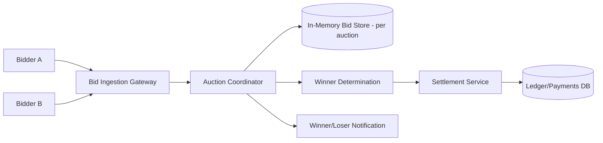

# Design a Real-Time Bidding / Auction System

## Blogs and websites

## Medium

## Youtube

## Theory

### What Is It?

A real-time bidding/auction system accepts bids for an item or impression within a strict time window (milliseconds for ad exchanges, seconds-to-minutes for item auctions), determines the winner using auction rules (first-price or second-price/Vickrey), settles payment, and does all of this with strong fairness and consistency guarantees.

### Why Does It Exist?

Digital advertising is sold in real time via automated auctions — every webpage view triggers a 100ms auction between dozens of advertisers. Without real-time bidding, human traders can't evaluate millions of auctions per second. Similarly, live item auctions (eBay live, gaming items) need fast, fair winner determination.

### What Problem Does It Solve?

* **Sealed bids**: Bidders submit bids without seeing others' bids until the auction closes (prevents last-look manipulation).
* **Winner determination**: Apply auction rules (first-price, second-price/Vickrey) to determine winner.
* **Strict latency**: Ad exchanges must resolve within < 100ms end-to-end.
* **Consistency**: Exactly one winner; no bid lost or double-counted.
* **Settlement**: Charge winner, notify all bidders of outcome.
* **Scale**: Tens of thousands of concurrent auctions/second (ad exchanges).

### Important Subtopics

1. Sealed-bid auction mechanics (no bid visibility until close)
2. First-price vs. second-price (Vickrey) auction rules
3. In-memory bid accumulation (latency-critical hot path)
4. Winner determination (deterministic, auditable)
5. Settlement and payment
6. Bidder notification (winner + losers)
7. Clock synchronization (auction start/close timing)
8. Dispute resolution and audit trail

### Problem Statement

Design a real-time bidding/auction system (e.g., an online ad exchange or a live item auction) where multiple bidders compete for an item/impression within a strict, very short time window, and the system must determine and settle the winner fairly and quickly.

### Functional Requirements

- Accept bids for an active auction/impression within a fixed time window (milliseconds for ad exchanges, seconds-to-minutes for item auctions)
- Determine the winning bid using the auction's rules (first-price, second-price/Vickrey)
- Notify the winner and settle payment/allocation; notify losers
- Prevent bid manipulation (e.g., a bidder seeing others' bids before the window closes)

### Non-Functional Requirements

- **Scale**: For ad exchanges, tens of thousands of concurrent auctions/sec, each resolved in single-digit milliseconds; for item auctions, thousands of concurrent auctions with many bidders each
- **Latency**: Ad-exchange style auctions must resolve within a strict SLA (often < 100ms end-to-end including network)
- **Consistency**: Exactly one winner per auction; no bid should be lost or double-counted
- **Fairness**: Bids must not be visible to other bidders until the auction closes

### High-Level Architecture



### Key Design Points

- Keep bids for an active auction sealed: bidders submit to a gateway that forwards to a coordinator, but never broadcasts current bids back to other participants until the auction closes, preventing last-look manipulation.
- Use an in-memory, low-latency store keyed by auction ID to accumulate bids during the (often very short) bidding window, and finalize/persist the outcome to durable storage only once the auction closes - this keeps the hot path fast while still guaranteeing durability of the final result.
- For ad-exchange-style auctions, run the entire bid-collect-and-resolve cycle within a single request/response cycle per impression (bidders respond to a bid request with a timeout, the exchange picks the winner as soon as the timeout expires or all bidders respond).
- Make the winner-determination step deterministic and auditable (e.g., log all received bids with timestamps) so outcomes can be verified after the fact in case of disputes.

### Trade-offs

- Keeping the bid window strictly sealed (no visibility into others' bids) is essential for fairness but means bidders can't react to competing bids mid-auction, unlike open-outcry auctions - the trade is intentional for exchanges needing deterministic, gameable-resistant outcomes.
- In-memory bid accumulation is far faster

---

## Characteristics

| Characteristic | What it means | Why it matters | How it works |
|---|---|---|---|
| **Sealed bids** | Bidders can't see others' bids until auction closes | Fairness; prevents last-look manipulation | Gateway validates; no bid broadcasting |
| **Auction rules** | First-price or second-price (Vickrey) winner selection | Fairness + bidder strategy | Winner determiner applies rules |
| **In-memory store** | Bids kept in RAM during auction window | Millisecond latency | Per-auction hash map in memory |
| **Deterministic winner** | Same bids always yield same winner | Auditability + fairness | Sort by bid amount + timestamp |
| **Strict latency** | < 100ms auction resolution | Ad exchange SLA | All logic in single request/response cycle |
| **Sealed from observers** | External parties can't infer bids | Prevents gaming | No bid counts/progress exposed |

## Components

| Component | Purpose | Responsibilities | Relationship | Real-world Example |
|---|---|---|---|---|
| **Bid Gateway** | Accept bids | Validate bidder credentials, accept bids, timestamp | Bidder ↔ Coordinator | NGINX/Kong |
| **Auction Coordinator** | Manage auction lifecycle | Start/close auction, collect bids, trigger winner | Gateway ↔ Store | Exchange orchestrator |
| **Bid Store** | Accumulate bids (in-memory) | Store bids per auction in RAM | Coordinator ↔ Store | Redis/ConcurrentHashMap |
| **Winner Determiner** | Select winner | Apply auction rules (first/second price) | Coordinator | Selection logic |
| **Settlement Service** | Charge winner + notify | Process payment, settle | Determiner | Payment processor |
| **Ledger** | Durable outcome record | Log finalized auctions + winners | Settlement | DB |
| **Notification Service** | Inform bidders | Notify winner + losers | Settlement | Webhook |
| **Clock Sync** | Synchronize auction timing | NTP + logical clocks | All | Chrony |

## Patterns

### First-Price vs. Second-Price (Vickrey) Auction

* **What**: In first-price auctions, the highest bidder wins and pays their bid. In second-price (Vickrey) auctions, the highest bidder wins but pays the second-highest bid.
* **Problem solved**: First-price causes bid shading (bidders underbid due to winner's curse). Second-price eliminates shading → bidders bid true valuation → simpler, fairer.
* **How it works**: (1) All bids collected during window. (2) Sort bids descending. (3) **First-price**: winner = top bid; pays = top bid. **Second-price**: winner = top bid; pays = 2nd highest bid. (4) In ad tech, most exchanges use second-price (with modifications like "bid-cube").
* **When to use**: Ad exchanges (second-price standard); general auctions (first-price common; second-price for fairness).
* **When not to use**: When you need predictable revenue (first-price is simpler to model).
• **Advantages**: Second-price → truthful bidding; first-price → simpler.
• **Disadvantages**: Second-price → winner's curse (winner may overpay in some edge cases); first-price → bid shading.
* **Real-world example**: Google AdX uses modified second-price; eBay uses proxy bidding (similar to Vickrey).

### Sealed-Bid Collection

* **What**: Bidders submit bids during a window, but no bidder can see others' bids or bid counts until the auction closes.
* **Problem solved**: Prevents last-look manipulation (bidders raising bids based on seeing others' bids at the last moment).
* **How it works**: (1) Auction opens → window starts. (2) Bidders submit bids to Gateway (with timestamp). (3) Gateway never reveals bid values or counts mid-auction. (4) Window closes → Coordinator freezes bids → Winner Determiner selects winner → results published simultaneously to all.
• **When to use**: Ad exchanges; sealed-bid art/item auctions.
• **When not to use**: Open outcry / English auctions (where bidding is visible).
* **Advantages**: Fairness; prevents winner's curse manipulation.
* **Disadvantages**: Bidders can't react to competition → less engagement; requires strict timing.

## Benefits

* **Revenue maximization**: Multiple bidders → highest value wins.
* **Market efficiency**: Price discovery through competition.
• **Automation**: Programmatic, no human intervention.
* **Fairness**: Sealed bids → no last-second manipulation.

## Pros

* **Speed**: < 100ms resolution for ad exchange.
• **Scale**: 10K+ auctions/sec.
* **Fairness**: Sealed bids + deterministic winner.
* **Auditability**: All bids logged with timestamps.
• **Flexibility**: Configurable auction rules (first/second price).

## Cons

* **Complexity**: Timing + sealed bid + winner determination edge cases.
• **Bid manipulation**: Sybil attacks, shill bidding (in item auctions).
• **Network latency variance**: Latency = unfair advantage → need fair queuing.
• **Tie-breaking**: Equal bids → need deterministic tie-breaker.
• **Audit overhead**: Must log all bids for replay + verification.

## Challenges

### Technical Challenges
* **Latency budget**: < 100ms includes network + computation → no DB writes on hot path.
• **Bid timing**: Strict window closing; clock sync (NTP/PTP).
• **Tie-breaking**: Deterministic (timestamp + bidder_id).
• **Bid store capacity**: Millions of concurrent auctions → partitioned key-value store.

### Scalability Challenges
* **Auctions/sec**: 50K auctions/sec → 50K bid stores in memory → sharded by auction_id.
• **Bidder connections**: 1000+ bidders → connection pooling + streaming.
• **Winner determination**: Parallel across auctions; CPU-bound (sorting).

### Performance Challenges
* **Sub-millisecond scoring**: In-memory only; no disk I/O on hot path.
• **Clock sync**: All coordinators within 1ms → PTP/NTP; logical clocks.
• **Serialization**: Binary protocol (protobuf) for bid ingest.

### Reliability Challenges
* **Coordinator crash mid-auction**: Replicate bid store → failover; lost bids = fairness violation.
• **Bid durability**: In-memory → crash loses bids → replicate to KV store.
• **Winner re-determination**: Must be reproducible from bid log.

### Maintainability Challenges
* **Rule changes**: New auction rules → backward-compatible bid logging.
• **A/B testing**: Different auction rules to different auction pools.
• **Bidder integration**: New bidders → adapter for their bidding protocol.

### Security Concerns
* **Bid manipulation**: Sybil accounts, shill bidding, collusion detection.
• **Timing attacks**: Latency as unfair advantage → fair queuing + latency normalization.
• **Bid sniping**: Last-second bidding → extended window or anti-snipe.
• **Replay attacks**: Nonce per bid + timestamp validation.

## Best Practices

* **In-memory bid store**: No DB writes during auction window → sub-ms latency.
* **Clock synchronization**: PTP/NTP + logical clocks; monitor drift.
• **Deterministic tie-breaking**: Sort by (bid_amount DESC, timestamp ASC, bidder_id).
• **Bid replication**: Replicate in-memory store → survive coordinator crash.
• **Sealed collection**: Never reveal bid counts or values during window.
• **Audit log**: All bids → durable store (async, off critical path).
• **Rate limiting**: Per bidder → prevent spam.
• **Monitoring**: Auction resolution time, bidder timeout rate, tie rates, bidder latency distribution.

## When to Use

### Appropriate
* Ad exchanges (programmatic advertising).
• Live item auctions (eBay live, gaming items).
• Spectrum auctions (government).
* Online ad placement (Google/Facebook ads).

### Not Appropriate
• Simple fixed-price sales (no bidding).
• Offline auctions (live auction house).
• Low-volume sales (too much complexity).

### Decision Factors
* Auction volume; latency requirements; fairness needs; bidder count; regulatory requirements.

## Use Cases

### Ad Exchange (Google AdX, Xandr)

* **Problem**: Sell ad impressions via 100ms real-time auctions between 50+ advertisers, determine winner, bill advertiser, pay publisher.
* **Solution**: Bid Request → HTTP/gRPC → 50+ DSPs (parallel, timeout 80ms) → collect bids → Winner Determiner (second-price) → auction result → settle.
* **Why suitable**: RTB protocol (OpenRTB); sub-100ms; sealed bids; second-price.
* **How it works**: (1) Publisher ad slot → ad server generates Bid Request (OpenRTB JSON). (2) Fan-out to 50+ DSPs in parallel (gRPC, 80ms timeout). (3) DSPs respond with bid (CPM, creative) → Bid Gateway. (4) Coordinator collects → Bid Store (in-memory). (5) At 100ms → Winner Determiner: sort by CPM → second-price winner. (6) Winner notified → serve creative → bill advertiser (net) → pay publisher (gross - fee). (7) All bids → audit log.
* **Trade-offs**: 50+ parallel calls → timeout handling; second-price → bid shading; latency variability → fair queuing.

## Architecture

```mermaid
graph TD
  subgraph "Bidders"
    DSP1[DSP A]
    DSP2[DSP B]
    DSP3[DSP C]
    DSPN[DSP N]
  end
  subgraph "Exchange"
    BidGW[Bid Ingestion Gateway]
    Coord[Auction Coordinator]
    BidStore[(In-Memory Bid Store)]
    WinnerDet[Winner Determiner]
    Settle[SetauthService]
    Audit[Audit Log]
  end
  subgraph "External"
    LedgerDB[(Ledger<br/>PostgreSQL)]
  end
  DSP1 -->|Bid Request| BidGW
  DSP2 -->|Bid Request| BidGW
  DSP3 -->|Bid Request| BidGW
  DSPN -->|Bid Request| BidGW
  BidGW --> Coord
  Coord --> BidStore
  Coord -->|close| WinnerDet
  WinnerDet --> Settle
  WinnerDet --> Audit
  BidStore -->|(replicated)| RS[(Replicated Store<br/>Redis)]
  Settle --> LedgerDB
  Settle -->|notify| DSP1
  Settle -->|notify| DSP2
  Settle -->|notify| DSP3
  Settle -->|notify| DSPN
```

### Architecture Structure
* **Bid layer**: DSPs submit bids via HTTP/gRPC (OpenRTB protocol).
* **Coordinator**: Auction lifecycle (open → collect → close → determine).
* **Bid store**: In-memory (Redis/clustered ConcurrentHashMap) for speed; replicated for durability.
* **Settlement**: Winner charge + notification.
* **Audit**: All bids + outcomes → durable store.

### Communication
* **Bidder ↔ Gateway**: HTTP/gRPC (OpenRTB protocol); TLS; timeout 80ms.
• **Coordinator ↔ Store**: In-process (ConcurrentHashMap) or Redis for large auctions.
* **Settlement**: Sync API to payment + async to webhook.
* **Audit**: Async to Kafka + DB.

### Data Flow
1. **Auction open**: Coordinator creates auction entry in Bid Store (in-memory).
2. **Bid collection**: Bid Gateway → Coordinator → adds bid to Bid Store (with timestamp).
3. **Auction close**: Clock hits deadline → Coordinator freezes bids.
4. **Winner**: Winner Determiner sorts bids → applies auction rule → selects winner.
5. **Settlement**: Charge winner → persist to Ledger DB → notify all bidders.
6. **Audit**: All bids + winner → durable log (async).

### Scaling Strategy
* **Coordination**: Sharded by auction_id → 100 auction servers.
* **Bid store**: Partitioned key-value store (Redis cluster); each auction → hash slot.
• **Bidders**: 10K+ → connection pooling + streaming; bid request fan-out per auction.

### Failure Handling
* **Coordinator crash**: Replicate Bid Store → failover → re-determine winner from bid log.
• **Bidder timeout**: Exclude bids after 80ms timeout → still resolve auction.
• **Settlement failure**: Retry payment → DLQ → manual follow-up.
• **Lost bid**: Durable log → replay → re-determination.

## High-Level Design

```mermaid
flowchart LR
  BidReq[Bid Request<br/>(ad slot)] --> Gateway[Bid Gateway]
  Gateway -->|fan-out| DSP1[DSP A]
  Gateway -->|fan-out| DSP2[DSP B]
  Gateway -->|fan-out| DSPN[DSP N]
  DSP1 -->|bid| Gateway
  DSP2 -->|bid| Gateway
  DSPN -->|bid| Gateway
  Gateway --> Coord[Auction Coordinator]
  Coord --> Store[(Bid Store<br/>In-Memory)]
  Coord -->|80ms timer| Winner[Winner<br/>Determination]
  Winner --> Payout[SetauthService]
  Payout --> DSP1
  Payout --> DSP2
  Payout --> DSPN
  Winner --> Audit[Audit Log]
```

## Deep Dive

### Sealed-Bid Collection

The existing file's Theory section covers: Bidders submit to gateway → forwards to coordinator → no bid values broadcast until close.

### Winner Determination

The existing file's Theory section covers: In-memory bid accumulation → winner selection using auction rules (first-price, second-price/Vickrey).

### In-Memory Bid Store

The existing file's Theory section covers: Low-latency in-memory store keyed by auction ID → persist to durable storage after auction close.

### Clock Synchronization

The existing file's Theory section mentions: Strict time window (e.g., 100ms for ad exchanges) → critical. Uses NTP + logical timestamps → all bids within window accepted, outside rejected.

## API Contract

* **API purpose**: Submit bids; receive bid requests; get auction results.

| Method | Endpoint | Description |
|---|---|---|
| POST | `/rtb/v1/bid` | Submit a bid (OpenRTB protocol) |
| GET | `/rtb/v1/auction/{id}` | Get auction result (winner only) |
| POST | `/rtb/v1/settle` | Settlement notification webhook |

**Bid Request (POST /bid)**:
```json
{
  "auction_id": "auc_123",
  "bidder_id": "dsp_a",
  "bid_price_cpm": 2.50,
  "creative_id": "creative_456",
  "timestamp_ms": 1723456789012,
  "expiry_ms": 80
}
```

**Auction Result (GET /auction/{id})**:
```json
{
  "auction_id": "auc_123",
  "winning_bid": {"bidder_id": "dsp_b", "bid_price_cpm": 3.20, "paid_cpm": 2.50},
  "all_bids": [{"bidder": "dsp_a", "bid": 2.50}, {"bidder": "dsp_b", "bid": 3.20}]
}
```

**Authentication**: HMAC-signed bid requests (OpenRTB); bidder credentials + API key.

**Error responses**:
```json
{"error": "auction_closed", "message": "Bid submitted after auction closed", "code": 410}
{"error": "timeout", "message": "Bidder response timeout", "code": 408}
{"error": "invalid_bid", "message": "Bid below minimum or invalid", "code": 400}
```

## Data Modeling

```mermaid
erDiagram
    AUCTION ||--o{ BID : "receives"
    BIDDER ||--o{ BID : "places"
    AUCTION ||--o{ AUCTION_RESULT : "produces"

    AUCTION {
      string auction_id PK
      string item_id
      datetime start_time
      datetime end_time
      int winning_bid_id
      string status open_closed_settled
    }
    BID {
      string bid_id PK
      string auction_id FK
      string bidder_id FK
      decimal bid_price
      string currency
      datetime timestamp
      string creative_id
    }
    BIDDER {
      string bidder_id PK
      string name
      string api_endpoint
      string auth_token
    }
    AUCTION_RESULT {
      string auction_id PK
      string winning_bid_id FK
      decimal paid_amount
      datetime settled_at
    }
```

**Partitioning**: Auctions sharded by auction_id; bids co-located with auction.

**Durability**: In-memory during auction → persisted to DB after close.

## Java and Spring Boot Implementation

```java
@RestController
@RequestMapping("/rtb/v1")
@RequiredArgsConstructor
public class BiddingController {
    private final AuctionCoordinator coordinator;

    @PostMapping("/bid")
    public ResponseEntity<BidResponse> submitBid(
            @RequestHeader("X-Bidder-ID") String bidderId,
            @RequestBody BidRequest request) {
        
        BidResponse response = coordinator.submitBid(request);
        return ResponseEntity.ok(response);
    }

    @GetMapping("/auction/{auctionId}")
    public ResponseEntity<AuctionResult> getResult(@PathVariable String auctionId) {
        return coordinator.getResult(auctionId)
            .map(ResponseEntity::ok)
            .orElse(ResponseEntity.notFound().build());
    }
}

@Service
public class AuctionCoordinator {
    private final ConcurrentHashMap<String, Auction> activeAuctions;
    private final ScheduledExecutorService scheduler;

    public BidResponse submitBid(BidRequest request) {
        Auction auction = activeAuctions.get(request.getAuctionId());
        if (auction == null || auction.isClosed()) {
            throw new AuctionClosedException();
        }
        
        Bid bid = Bid.builder()
            .bidId(UUID.randomUUID().toString())
            .auctionId(request.getAuctionId())
            .bidderId(request.getBidderId())
            .bidPrice(request.getBidPriceCpm())
            .timestamp(System.currentTimeMillis())
            .build();

        auction.addBid(bid);
        return BidResponse.builder().accepted(true).build();
    }

    public AuctionResult closeAuction(String auctionId) {
        Auction auction = activeAuctions.remove(auctionId);
        auction.close();
        
        List<Bid> bids = auction.getBidsSortedByPrice();
        if (bids.isEmpty()) return createNoBidResult(auctionId);

        Bid winner = bids.get(0);
        BigDecimal paidPrice = auction.getAuctionType() == AuctionType.SECOND_PRICE 
            ? Math.max(bids.get(1).getBidPrice(), auction.getReservePrice())
            : winner.getBidPrice();

        return AuctionResult.builder()
            .auctionId(auctionId)
            .winningBidder(winner.getBidderId())
            .paidPrice(paidPrice)
            .build();
    }
}
```

## Real-World Examples

* **Google AdX**: Real-time auction per ad impression (~100ms); 100+ DSPs bid via OpenRTB; second-price (with bid-cube); 50K+ auctions/sec.
* **eBay**: Proxy bidding (auto-bid up to max → similar to Vickrey); sealed bids until close.
* **Xandr (_AT&T)**: Server-side header bidding; real-time auctions; 10K+ QPS; second-price.
* **Facebook Ads**: Real-time auction; first-price; 10ms latency budget; billions of auctions/day.

## Interview Preparation

### Beginner Questions

**Q: What is real-time bidding (RTB)?**
A: Programmatic ad buying — when a webpage loads, an auction runs in ~100ms between 50+ advertisers (DSPs). Each DSP submits a bid (CPM). Winner pays + displays ad. Entire lifecycle: user visits page → ad request → 100ms auction → winner's ad displayed.

**Q: What is the difference between first-price and second-price auctions?**
A: First-price: highest bidder wins + pays their bid. Second-price (Vickrey): highest bidder wins + pays the second-highest bid. Second-price encourages truthful bidding (no shading); first-price is simpler but bidders shade bids. Most ad exchanges historically used second-price (now shifting to first-price).

**Q: Why must auctions be sealed-bid?**
A: If bidders could see others' bids mid-auction → last-second bid shading → gaming. Sealed bids ensure fairness + deterministic outcome.

### Intermediate Questions

**Q: How do you handle the latency budget (< 100ms) for RTB?**
A: (1) In-memory bid store (no DB writes on hot path). (2) Parallel bid requests to 50+ DSPs via HTTP/2 or gRPC. (3) 80ms timeout → drop slow bidders. (4) Pre-compute auction metadata (reserve price, floors). (5) Binary protocol (protobuf) for serialization. (6) Co-locate bidders + exchange in same data center.

**Q: How do you prevent bid manipulation?**
A: (1) Sealed bids — no visibility during auction. (2) Authentication: HMAC-signed bid requests; bidder credentials. (3) Rate limiting per bidder. (4) Anti-sybil: require verified bidder accounts. (5) Nonce per bid + timestamp → prevent replay. (6) Latency normalization: account for bidder RTT (don't penalize distant bidders).

**Q: How do you handle tie-breaking when two bidders submit identical bids?**
A: Sort by (bid_amount DESC, timestamp ASC, bidder_id ASC) → deterministic winner. Or use second-price to break tie (both pay second price? No — need clear rule). Most systems: highest bidder wins; tie → earliest timestamp; further tie → deterministic hash of bidder_id.

### Advanced Questions

**Q: Design a real-time bidding system handling 100K auctions/sec with < 50ms resolution?**

A: (1) **Architecture**: Bid Gateway (100+ NGINX/Envoy) → Auction Coordinator (sharded by auction_id, 1000+ coordinators) → In-Memory Bid Store (Redis cluster, 500 nodes). (2) **Bid collection**: 50+ DSPs per auction → parallel fan-out (async HTTP/2, 40ms timeout). (3) **Storage**: HashMap per auction (in memory); replicated to Redis for durability. (4) **Winner determination**: At 45ms timeout → sort bids by CPM → second-price winner (paid = 2nd highest). (5) **Scale**: 100K auctions/sec → 1000 coordinators (100/sec each); 50K DSP connections (connection pooling); 500 Redis nodes (sharded by auction_id). (6) **Latency**: Network RTT (data center colocation): 0.1ms; bid processing: < 1ms; winner determination: < 0.5ms; total: 25ms. (7) **Clock sync**: PTP (precision time) → all coordinators within 100μs; logical clocks for ordering. (8) **Failure**: Coordinator crash → Redis replica → replay bid log → re-determine. (9) **Monitoring**: P99 auction resolution < 50ms; timeout rate < 1%; bidder latency distribution.

**Q: How do you handle clock synchronization for sealed-bid auctions?**

A: Precision matters — bids submitted 1μs before close vs. 1μs after changes outcome. (1) **Physical clocks**: Use PTP (Precision Time Protocol, ±100ns accuracy) not NTP (±1-5ms). Deploy PTP grandmaster in data center. (2) **Logical clocks**: Lamport timestamps for ordering within each auction — ensures total order even with clock drift. (3) **Grace window**: 1ms buffer before official close — bids in grace window processed; strict after. (4) **Coordinator clock**: Single coordinator per auction → single clock source → no inter-coordinator drift. (5) **Bid timestamps**: Each bid includes coordinator-assigned timestamp (not bidder timestamp — bidders can manipulate). (6) **Monitoring**: Clock drift alerts if > 500μs between coordinator and PTP source.

### Senior-Level Questions

**Q: Design a real-time bidding exchange handling 1M auctions/sec, 500+ bidders, < 20ms resolution, with anti-fraud and auditability.**

A: (1) **Bid Gateway**: 500+ NGINX/Envoy nodes → load-balanced; TLS termination; per-bidder rate limiting + HMAC auth; async (reactive) → 200K req/s/node. (2) **Coordinator**: 5000+ auction coordinators (Go, async); sharded by auction_id (hash); each handles 200 auctions/sec. In-memory HashMap per auction; 50ms window. (3) **Bid Store**: In-memory (Go map) → after close, async-write to Kafka (auction_id → partition). Kafka (2000 brokers) for durability + audit replay. (4) **Bidder fan-out**: For each auction → 500 HTTP/2 streams to DSPs (multiplexed) → 30ms timeout. Use gRPC + keep-alive + connection pooling. (5) **Winner**: At 15ms → sort bids by CPM → second-price (paid = 2nd CPM, floor = reserve). Deterministic: (CPM desc, timestamp asc, bidder_id). (6) **Anti-fraud**: (a) Identity: HMAC + bidder certificate; (b) Bid validation: schema + minimum CPM; (c) Sybil detection: correlation analysis (same IP/subnet bidders → anomaly); (d) Bid shading detection: statistical outlier analysis; (e) Latency normalization: exclude bids > 2× median RTT. (7) **Scale**: 1M auctions/sec → 5000 coordinators (200 each) → 500 Gateway nodes → 50K concurrent DSP connections. (8) **Cost**: ~$500K/month (500 Gateway, 5000 Coordinators, 2000 Kafka brokers). (9) **Monitoring**: P99 < 20ms (network 0.1ms + processing < 0.5ms + fan-out < 10ms + winner < 1ms); bidder timeout rate < 1%; fraud detect rate; auction log completeness (replay integrity). (10) **Audit**: All bids → Kafka (immutable) → Parquet on S3 → Athena queries.

**Q: How would you implement anti-fraud detection in a real-time bidding system?**

A: Multi-layer approach:
* **Identity & auth**: Each bidder authenticated via HMAC + mTLS + API key; certificate pinning; rate limit per bidder_id (10K req/s max).
* **Bid validation**: Schema check (bid_amount > reserve, creative_id valid, timestamp within window ±5ms — reject if outside).
* **Traffic anomaly**: (a) Sybil detection — multiple bidder_ids from same IP/subnet → cluster + flag; (b) Bot detection — identical bids across auctions → pattern analysis; (c) Shill bidding — same bidder_id + same DSP → detect via correlation.
* **Latency normalization**: Bidders have different RTTs (data center distance). Normalize: score = bid_CPM / max(1, RTT/median_RTT). Don't disadvantage distant bidders.
* **Statistical fraud**: (a) Bid shading analysis — bidders consistently bidding 0.01 below winner → suspect collusion; (b) Win rate analysis — bidder wins 0% or 100% → investigate; (c) Price ladder analysis — bids at exact reserve + 0.01 → bot pattern.
* **Anti-sniping**: Extend auction by 100ms if bid received in last 100ms → prevent sniper advantage.
* **Audit trail**: All bids (bidder_id, CPM, timestamp, IP, user_agent) → Kafka → BigQuery → ML model training + real-time scoring.
* **ML models**: Train anomaly detection model on historical bid patterns → real-time scoring (5ms budget) → flag suspicious auctions for delayed settlement.
* **Enforcement**: Flagged bidder → temporary suspension + manual review; confirmed fraud → permanent ban + blacklist.

### Common Mistakes

- No clock synchronization → bids accepted after close → unfair.
- Broadcast bids mid-auction → shill bidding + sniping.
- No bidder authentication → spoofed bids.
- In-memory only → crash loses all bids → unfair auction outcome.
- No deterministic tie-breaker → non-reproducible results.
- No audit log → can't investigate disputes.
- No latency normalization → geographically distant bidders disadvantaged.
- Bidder can see bid count → gaming the auction.
- No reserve price → revenue loss.
- First-price without bid shading model → bidders underbid significantly. than writing every bid to durable storage synchronously, at the cost of needing careful failure handling (e.g., replication of the in-memory store) so a coordinator crash mid-auction doesn't lose bids.
