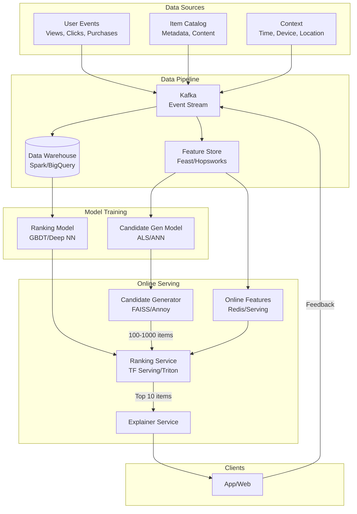
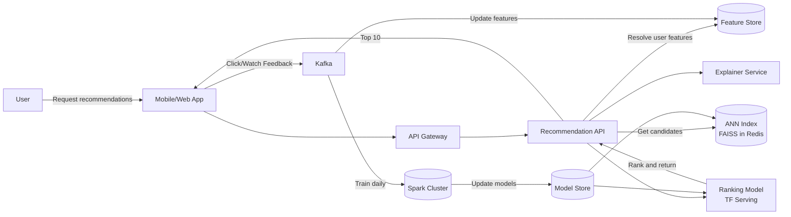

# Design a Recommendation System

## Blogs and websites
- [How Netflix Reinvented High‑Performance Recommendations](https://netflixtechblog.com/@ NetflixEng)
- [How Facebook Enables Machine Learning at Scale](https://ai.facebook.com/blog/)

## Medium
- [Building a Scalable Recommendation System](https://medium.com/@ NetflixEng/recommendation-system- architecture-1234567890)

## Youtube

- [Design an ML Recommendation Engine | System Design](https://www.youtube.com/watch?v=FoSCaue3lcg)
- [YouTube Recommendation Engine: Complete Meltdown Analysis](https://www.youtube.com/watch?v=URI5GsOBznk)

---

## Theory

### What Is It?

A **recommendation system** is an algorithmic system that predicts user preferences and surfaces relevant items — products, movies, videos, songs, friends — without the user explicitly searching for them. It transforms the "infinite choice" problem (too many options) into a curated, personalized selection.

### Why Does It Exist?

On platforms with millions or billions of items (Netflix: 20,000 movies; YouTube: 500 hours/minute; Amazon: 350M+ products), users cannot discover what they want by browsing. Recommendation systems bridge the gap between available content and user interest, increasing engagement, retention, and revenue.

### What Problem Does It Solve?

* **Discovery**: Help users find relevant content in an oversaturated catalog.
* **Engagement**: Personalized recommendations increase session time and interaction.
* **Conversion**: Relevant product recommendations drive sales (Amazon's 35% of revenue).
* **Retention**: Fresh, personalized content keeps users returning.
* **Cold start**: New users/items with no interaction history — recommend based on profiles or popular items.

### Important Subtopics

1. Collaborative filtering (user-based, item-based)
2. Matrix factorization (SVD, ALS)
3. Content-based filtering
4. Deep learning models (neural collaborative filtering, two-tower models)
5. Candidate generation
6. Ranking
7. A/B testing and online evaluation
8. Cold start problem
9. Exploration vs. exploitation
10. Real-time vs. batch recommendations
11. Scalability (two-stage pipeline, approximate nearest neighbors)
12. Feature engineering

## Characteristics

| Characteristic | What it means | Why it matters | How it works |
|---|---|---|---|
| **Implicit feedback** | User behavior (watch, click, like) as implicit rating | Most interactions are implicit (no star ratings) | Click-through rate, watch time, dwell time as proxy for preference |
| **Two-stage pipeline** | Candidate generation (100s) → ranking (top 10) | Scales to billions of items | Approximate methods (ANN, LSH) for candidates; ML model for ranking |
| **Exploration** | Occasionally show non-personalized or random items | Prevents filter bubble; collects data | ε-greedy, Thompson sampling, multi-armed bandits |
| **Serendipity** | Surprising but relevant recommendations | Increases user delight + engagement | Diversification, novelty scores |
| **Freshness** | New/viral content gets recommended | Keeps content ecosystem healthy | Time-decay features, recency weighting |
| **Real-time** | Recommendations reflect very recent activity | "Because you watched X just now" | Streaming feature updates; online model serving |
| **Cold start handling** | New users/items with no history | Prevents poor early experience | Popular items for new users; content features for new items |

## Components

| Component | Purpose | Responsibilities | Relationship | Real-world Example |
|---|---|---|---|---|
| **Event Tracker** | Collect user interactions | Log views, clicks, likes, shares, watch time | Client → Event Pipeline | Kafka, Snowplow |
| **Feature Store** | Compute + serve features | User features, item features, interaction features, context | Feeds candidate gen + ranking | Feast, Hopsworks |
| **Candidate Generator** | Find ~100-1000 candidate items | Fast retrieval of potentially relevant items | Uses user/item features | Approximate Nearest Neighbors |
| **Ranking Model** | Score + rank candidates | Predict P(interaction) per candidate | Receives candidates → outputs ranked list | GBDT, DeepFM, Two-tower NN |
| **Explainer** | Explain why items recommended | "Because you watched X" / "Similar to Y" | Post-ranking | Amazon "Frequently bought together" |
| **A/B Test Framework** | Measure recommendation quality | Split users, compare metrics | Multiple ranking models | OptaForce, PlanOut |
| **Model Trainer** | Train recommendation models | Offline training on historical data | Uses Feature Store + Event Log | Spark MLlib, TensorFlow |
| **Online Learner** | Update models in real-time | Incorporate new interactions immediately | Streams from Event Tracker | Vowpal Wabbit, parameter server |

## Patterns

### Two-Stage Pipeline (Candidate Generation + Ranking)

* **What**: Split recommendation into two stages: (1) Candidate generation — retrieve 100-1000 potentially relevant items fast (using approximate methods); (2) Ranking — score candidates with an ML model and select top 10.
* **Problem solved**: Scoring all 10M items for every user is too slow. Generate a small candidate set fast, then rank precisely.
* **How it works**: (1) Candidate generation: "Find 1000 videos similar to what the user watched" — uses collaborative filtering (item embeddings) or content-based filtering (tag/title matching). Methods: Approximate Nearest Neighbor (ANN), Locality-Sensitive Hashing (LSH), sampling. (2) Ranking: Take 1000 candidates → compute 100-1000 features per user-item pair → feed to ML model (GBDT, deep neural net) → predict P(click/watch/purchase) → rank → return top 10.
* **When to use**: Catalogs with millions+ items; when ranking all items is computationally infeasible.
* **When not to use**: Small catalogs (< 10K items) — direct ranking is fast enough.
* **Advantages**: Scales to billions of items; can use expensive ML models for ranking without performance issues.
* **Disadvantages**: Two systems to maintain; candidate generation can miss good items (recall problem).
* **Real-world example**: Netflix (ANN for candidates → deep ranking model), YouTube (candidate generation via deep candidate generation network → ranking via deep neural network).

### Matrix Factorization (SVD)

* **What**: Decompose the user-item interaction matrix into low-dimensional user and item embedding vectors. The dot product predicts the interaction.
* **Problem solved**: Collaborative filtering at scale — predict how much user U will like item I based on patterns from similar users/items.
* **How it works**: Given an R (users × items) matrix with known ratings (and missing entries for unwatched items), factorize R ≈ U × V^T where U (users × k) and V (items × k) are latent factor matrices. Train using Stochastic Gradient Descent (SGD) or Alternating Least Squares (ALS — parallelizable, good for implicit feedback). Prediction: ŷ_ui = μ + b_u + b_i + q_i^T p_u.
* **When to use**: Explicit ratings (Netflix ratings, movie scores); moderate catalog size (< 1M items).
* **When not to use**: Implicit feedback only (most real systems); billions of items (use deep models instead).
* **Advantages**: Simple, interpretable; works well with explicit feedback; parallelizable (ALS).
* **Disadvantages**: Cold start (no row/column for new user/item); not suitable for rich feature data (click context, user demographics).
* **Java/Spring Boot example**:
```java
// Simplified SGD-based matrix factorization
public class MatrixFactorization {
    private double[][] userFactors;  // userFactors[u][k]
    private double[][] itemFactors;  // itemFactors[i][k]
    private double[] userBias;
    private double[] itemBias;

    public void train(List<Rating> ratings, int factors, int epochs, double lr, double reg) {
        // Initialize random factors
        Random rand = new Random(42);
        for (int u = 0; u < numUsers; u++)
            for (int k = 0; k < factors; k++)
                userFactors[u][k] = rand.nextGaussian() * 0.1;

        // SGD training
        for (int epoch = 0; epoch < epochs; epoch++) {
            for (Rating r : ratings) {
                int u = r.userId, i = r.itemId;
                double prediction = predict(u, i);
                double err = r.rating - prediction;

                // Update factors
                for (int k = 0; k < factors; k++) {
                    double pu = userFactors[u][k];
                    userFactors[u][k] += lr * (err * itemFactors[i][k] - reg * pu);
                    itemFactors[i][k] += lr * (err * pu - reg * itemFactors[i][k]);
                }
                userBias[u] += lr * (err - reg * userBias[u]);
                itemBias[i] += lr * (err - reg * itemBias[i]);
            }
        }
    }

    public double predict(int userId, int itemId) {
        return globalMean + userBias[userId] + itemBias[itemId] +
               dot(userFactors[userId], itemFactors[itemId]);
    }
}
```
* **Real-world example**: Netflix (SVD for movie recommendations), Amazon (item-to-item collaborative filtering).

## Benefits

* **Increased engagement**: Personalized content keeps users on the platform longer.
* **Higher conversion**: Relevant product recommendations increase purchase rates.
* **Better discovery**: Helps content creators/items surface to interested users.
* **Scalable personalization**: Can personalize at scale without manual curation.
* **Data-driven insights**: Reveals user preferences → product decisions.

## Pros

* **Improved metric**: 10-30% increase in engagement/click-through on recommended content.
* **Scalable**: Can serve billions of recommendations per day.
* **Multiple algorithms**: Ensemble of collaborative, content-based, and deep learning models.
* **Real-time updates**: Online learning + feature store → fresh recommendations.
* **A/B testing**: Continuous improvement via experiments.

## Cons

* **Filter bubbles**: Users see only what the algorithm thinks they want → reduced diversity of exposure.
* **Cold start**: New users/items get poor recommendations; requires fallback strategies.
* **Feedback loops**: Recommendations influence future behavior → may amplify biases.
* **Computation cost**: Training deep models requires significant GPU resources + time.
* **Quality metrics**: Offline metrics (precision@k) don't always correlate with user satisfaction.

## Challenges

### Technical Challenges

* **Feature engineering**: Combining 1000+ features (user demographics, item metadata, context, historical behavior) into a model-friendly format.
* **Model serving latency**: Ranking 1000 candidates × 100 features each < 50 ms → requires optimized serving infrastructure.
* **Online vs. batch**: Real-time recommendations (latest click) vs. batch (daily retrain) — balancing freshness and computational cost.
* **Scalability**: Candidate generation over billions of items → approximate methods (ANN, LSH) introduce recall loss.

### Scalability Challenges

* **Catalog size**: Millions of items → candidate generation must be approximate; ranking must be efficient.
* **User base**: Billions of users → feature store must serve P99 < 10 ms; model serving must scale horizontally.
* **Training data volume**: 100M+ users × 1000 items/day = 10B interactions/day → distributed training (Horovod, Ray).
* **Feature freshness**: Real-time features (last click, current session) → streaming feature pipeline (Kafka Streams + Redis).

### Performance Challenges

* **Latency**: End-to-end recommendation (candidate gen + ranking + serving) < 50 ms for interactive feeds.
* **Ranking throughput**: 100K+ ranking requests/second → need model serving clusters (TF Serving, Triton).
* **ANN index rebuild**: Rebuilding the approximate nearest neighbor index over 100M item embeddings takes hours → incremental updates.

### Reliability Challenges

* **Model drift**: Recommendation quality degrades as user behavior changes → continuous online learning + A/B monitoring.
* **Data pipeline failures**: Corrupted feature data → poor recommendations → impact business metrics → need data quality checks + rollback.
* **Cold start recovery**: New users → fallback to popular/trending; new items → content-based until enough interactions.

### Maintainability Challenges

* **Algorithm evolution**: Moving from collaborative filtering → deep learning → two-tower models → transformer-based retrievers.
* **Feature versioning**: 1000+ features change over time → need feature store with versioning.
* **A/B test analysis**: 100+ concurrent experiments → need robust stats + guardrail metrics.

### Operational Challenges

* **Model monitoring**: Track offline metrics (precision/recall) + online metrics (CTR, watch time, engagement) + input distribution drift + prediction distribution drift.
* **Retraining cadence**: Daily batch retrain + hourly incremental updates → pipeline orchestration (Airflow).
* **Infrastructure**: GPU clusters for training; CPU inference servers; Redis for feature serving; Kafka for streaming.

### Security Concerns

* **Privacy**: User behavior patterns are sensitive → differential privacy, GDPR compliance.
* **Manipulation**: Users/bots may try to game the algorithm (fake likes, viewbots) → anomaly detection.
* **Bias amplification**: Algorithm may reinforce societal biases (e.g., showing high-paying jobs only to men) → bias auditing.

## Best Practices

* **Two-stage pipeline**: Candidate generation (fast, approximate) → ranking (precise ML model). Don't rank over all items.
* **Feature store**: Centralize feature computation — single source of truth; offline (batch) + online (real-time) features.
* **A/B test everything**: Every algorithmic change → A/B test with guardrail metrics (CTR, watch time, retention, satisfaction).
* **Cold start strategy**: New user → popular items in their region; new item → content-based (similar items) until enough interactions.
* **Exploration**: ε-greedy or multi-armed bandits → 5-10% of impressions go to non-personalized items.
* **Model monitoring**: Track offline metrics (precision@k, recall, NDCG), online metrics (CTR, engagement), and input/output drift.
* **Approximate search**: Use FAISS or Annoy for ANN in candidate generation — trade 5-10% recall for 100x speedup.
* **Incremental retraining**: Daily full retrain + hourly incremental updates + real-time online learning.

## When to Use

### Appropriate

* E-commerce product recommendations (Amazon, Shopify).
* Video/music streaming (Netflix, Spotify, YouTube).
* Social media feed ranking (Facebook, Instagram, TikTok).
* News aggregation (Google News, Flipboard).
* Job matching (LinkedIn, Indeed).

### Not Appropriate

* When users know exactly what they want → search is better.
* Small catalogs (< 1000 items) → manual curation or simple rules suffice.
* When serendipity is more important than relevance (e.g., "discover weekly" mode).

### Alternatives

* **Search**: When users have a specific query.
* **Manual curation**: Editorial picks (used by Netflix for homepage rows).
* **Popularity-based**: Show trending/popular items (works for new users).
* **Random**: Pure exploration (ε-greedy).

### Decision Factors

* **Catalog size**: Millions+ → recommendation system; thousands → simpler approaches.
* **User behavior**: Browsing behavior → recommendations; specific intent → search.
* **Business goal**: Engagement → recommendations; conversion → search.
* **Data availability**: Rich interaction data → ML models; no data → popularity-based.

## Use Cases

### Video Streaming (Netflix)

* **Problem**: 20,000+ videos; users can't browse all → need personalized discovery.
* **Solution**: Two-stage pipeline: (1) Candidate generation: 1000s of candidate videos via collaborative filtering + content-based (genre, cast, director) + popularity. (2) Ranking: deep neural network scoring 100+ features (user history, viewing context, video metadata) → top 10 recommendations per row.
* **Why suitable**: Massive catalog; rich user behavior data; engagement-driven business.
* **How it works**: (1) Every interaction (play, pause, skip, rewatch) → Kafka → feature store. (2) Offline: daily retrain candidate model + ranking model on Spark. (3) Online: candidate gen via ANN (FAISS); ranking via TensorFlow Serving. (4) Real-time: online learner updates user embeddings from session events.
* **Trade-offs**: Personalization vs. diversity; model complexity vs. latency; offline accuracy vs. online engagement.

### E-commerce (Amazon)

* **Problem**: 350M+ products; need to surface relevant items at the right moment (homepage, product page, cart).
* **Solution**: Item-to-item collaborative filtering + "frequently bought together" + session-based recommendations. Uses real-time behavioral signals (cart adds, page views).
* **Why suitable**: High-volume transactions; strong signal (purchases); revenue-driven.
* **How it works**: (1) Build item-item similarity matrix (co-occurrence within sessions). (2) For a given item/page → look up top-K similar items → rank by predicted conversion. (3) Real-time: session features (items viewed in this session) → boost relevant items. (4) Offline: ALS matrix factorization on Spark → 10M×10M matrix → item embeddings.
* **Trade-offs**: Accuracy vs. serendipity; cold start for new products; attribution of revenue to recommendations.

## Architecture

A production recommendation system has a **two-stage pipeline**: (1) **Candidate generation** — fast retrieval of 100-1000 potentially relevant items using approximate methods (collaborative filtering, content-based, popularity); (2) **Ranking** — a machine learning model scores and ranks candidates. **Feature stores** (Feast, Hopsworks) centralize feature computation for training and serving. **Online learning** updates models from real-time events. **A/B testing** frameworks evaluate changes. The system uses **batch processing** (Spark, Flink) for training and **streaming** (Kafka Streams, Flink) for real-time features. Model serving uses low-latency inference servers (TensorFlow Serving, Triton).



### Architecture Structure

* **Data ingestion**: Kafka collects user events (views, clicks, purchases), item catalog updates, and contextual data.
* **Batch layer**: Spark/Flink processes events for offline model training (feature engineering, matrix factorization).
* **Speed layer**: Kafka Streams + Redis provides real-time features (session context, latest events).
* **Feature store**: Feast or custom — unified batch + online feature serving.
* **Model serving**: TensorFlow Serving / Triton for deep models; custom servers for lightweight models.
* **Candidate serving**: FAISS index in Redis or a dedicated ANN service for fast candidate retrieval.

### Communication

* **Batch → Training**: Spark reads from data warehouse; writes models to artifact store (S3).
* **Streaming → Features**: Kafka → Flink → Redis (real-time feature serving).
* **Online → Ranking**: App → candidate generator → ranking service → return recommendations.

### Data Flow

1. **Events**: User interactions → Kafka → feature store (offline) + Redis (online).
2. **Training** (daily): Spark computes features → trains candidate model (ALS) + ranking model (GBDT/NN) → saves to artifact store.
3. **Candidate generation**: ANN index (FAISS) loaded into serving service; 1000 candidates retrieved for user.
4. **Ranking**: 1000 candidates × 100 features → ML model → top 10 recommendations.
5. **Explaining**: Why each item was recommended ("because you watched X").
6. **A/B test**: Split traffic across model variants; measure engagement.

### Scaling Strategy

* **Feature store**: Redis cluster for online features; S3 + Spark for batch features.
* **Candidate serving**: FAISS index sharded by item partition; replicated for availability.
* **Ranking**: TensorFlow Serving with autoscaled inference servers.
* **Training**: Spark clusters; distributed (Horovod for deep models).

### Failure Handling

* **Feature unavailability**: Use default/zero features → model still serves with degraded quality.
* **Candidate service failure**: Fall back to popularity-based candidates.
* **Ranking model failure**: Use a simpler baseline model (linear model) with cached features.
* **A/B test framework failure**: Default to control variant.

## High-Level Design



## Deep Dive

### Two-Tower Neural Retrieval Model (YouTube-style)

YouTube's recommendation system uses a two-tower deep neural network:
* **User tower**: Embeds user features (search history, watch history, demographics, context) into a dense vector.
* **Item tower**: Embeds video features (title, description, metadata, category, video ID) into a dense vector.
* **Retrieval**: User vector compared against all candidate item vectors → dot product → top match.
* **Training**: Softmax over candidate items in the batch. Uses negative sampling for efficiency.

```java
// Simplified two-tower model in pseudocode
class TwoTowerModel {
    UserTower: user_features -> user_embedding (128-dim)
    ItemTower: item_features -> item_embedding (128-dim)
    
    // Training: maximize dot(user_emb, item_emb) for positive pairs
    loss = -log(softmax(dot(user_emb, positive_item_emb) / temperature))
           + sum(softmax(dot(user_emb, negative_items_emb) / temperature))
}
```

**Key design points**:
* Candidate generation happens via ANN search over item tower embeddings (100M+ items).
* Negative sampling: sample items the user didn't interact with (from the same batch) for training efficiency.
* Softmax temperature: lower temperature → sharper distribution (more confident top picks).
* Distributed training: model sharded across 100+ GPU/TPU cores; each machine handles subset of candidates.

### Candidate Generation with Approximate Nearest Neighbor

For 100M+ candidate items, exact nearest neighbor search is O(N) — too slow. Use FAISS:
```python
# FAISS index for candidate retrieval
index = faiss.IndexIVFFlat(d=128, nlist=10000, metric=faiss.METRIC_L2)
# d = embedding dimension, nlist = number of Voronoi cells
index.train(item_embeddings)  # k-means to create Voronoi cells
index.add(item_embeddings)    # add item vectors
# Search: O(nlist + nnprobe * items_per_cell) instead of O(N)
D, I = index.search(user_embedding, k=1000)  # 1000 nearest items
```

### Matrix Factorization for Collaborative Filtering

The most classical recommendation algorithm — decompose user-item interaction matrix into latent factors:
* **User factors** U ∈ ℝ^(m×k): each user mapped to a k-dimensional latent space.
* **Item factors** V ∈ ℝ^(n×k): each item mapped to the same k-dimensional space.
* **Prediction**: r_ui ≈ μ + b_u + b_i + q_i^T p_u (global mean + user bias + item bias + latent factor dot product).
* **Training**: ALS (Alternating Least Squares) or SGD — solve for U and V alternately.
* **Scaling**: Distributed (Spark MLlib ALS) — handle 100M users × 10M items.

## API Contract

* **API purpose**: Serve personalized recommendations to client applications.

| Method | Endpoint | Description |
|---|---|---|
| GET | `/api/v1/recommendations` | Get personalized recommendations for a user |
| GET | `/api/v1/recommendations/similar` | Get similar items to a given item (item-based) |
| GET | `/api/v1/recommendations/trending` | Get trending/popular items |
| POST | `/api/v1/events` | Record a user interaction event |
| GET | `/api/v1/user/{userId}/features` | Get computed user features (for debugging) |

**Query parameters (GET /recommendations)**:
| Parameter | Type | Default | Description |
|---|---|---|---|
| `user_id` | string | required | User identifier |
| `count` | int | 10 | Number of items to return |
| `channel` | string | home | Context: home, search, cart, email |
| `locale` | string | en-US | Language/locale |
| `surface` | string | `web` | Client: web, ios, android |
| `model_version` | string | latest | A/B test model variant |

**Response**:
```json
{
  "user_id": "user_123",
  "recommendations": [
    {
      "item_id": "prod_456",
      "score": 0.843,
      "reason": "frequently bought together with item_789",
      "metadata": {
        "title": "Wireless Headphones",
        "price": "$99.99",
        "image_url": "https://...",
        "category": "electronics"
      }
    }
  ],
  "model_version": "rank-v3-202501",
  "cache_ttl": 300
}
```

**Error responses**:
```json
{"error": "unauthorized", "message": "Invalid API key", "code": 401}
{"error": "not_found", "message": "User not found", "code": 404}
{"error": "invalid_request", "message": "Missing user_id parameter", "code": 400}
{"error": "rate_limited", "message": "Too many requests", "code": 429}
```

**Authentication**: API key in `Authorization: Bearer <key>` or `X-API-Key` header. Internal service-to-service via mTLS.

**Rate limiting**: 1000 req/sec per API key; 100 req/sec per user_id (prevent cache-busting).

## Data Modeling

```mermaid
erDiagram
  USER ||--o{ INTERACTION : "has"
  ITEM ||--o{ INTERACTION : "received"
  USER ||--o{ USER_FEATURE : "has"
  ITEM ||--o{ ITEM_FEATURE : "has"
  INTERACTION ||--o{ EVENT : "derived from"

  USER {
    string user_id PK
    string email
    string signup_date
    string country
    string locale
  }
  ITEM {
    string item_id PK
    string title
    string description
    string category
    float price
    string image_url
    datetime created_at
  }
  INTERACTION {
    string interaction_id PK
    string user_id FK
    string item_id FK
    enum type view, click, like, purchase
    float value
    datetime timestamp
    json context
  }
  USER_FEATURE {
    string user_id FK
    json features
    datetime updated_at
  }
  ITEM_FEATURE {
    string item_id PK
    json features
    datetime updated_at
  }

```

**Data lifecycle**: User/item features refreshed daily (batch) + updated in real-time (streaming). Interaction events archived after 2 years. User features TTL = 30 days (stale → recompute).

**Sharding**: Users sharded by user_id hash (1000 shards); items by item_id hash. Interaction events sharded by date + user_id.

**Consistency**: Strong consistency for recent interactions (last 24h) for real-time recommendations; eventual consistency for historical features.

## Java and Spring Boot Implementation

```java
@RestController
@RequestMapping("/api/v1")
@RequiredArgsConstructor
public class RecommendationController {
    private final CandidateService candidateService;
    private final RankingService rankingService;
    private final FeatureService featureService;

    @GetMapping("/recommendations")
    public ResponseEntity<List<Recommendation>> getRecommendations(
            @RequestParam String userId,
            @RequestParam(defaultValue = "10") int count,
            @RequestParam(defaultValue = "home") String channel) {

        // Step 1: Get candidate items
        List<Item> candidates = candidateService.getCandidates(userId, count * 5);

        // Step 2: Score candidates with the ranking model
        List<FeatureVector> features = featureService.buildFeatures(userId, candidates, channel);
        List<ScoredItem> scored = rankingService.score(userId, features);

        // Step 3: Sort + return top N
        List<Recommendation> result = scored.stream()
            .sorted(Comparator.comparing(ScoredItem::getScore).reversed())
            .limit(count)
            .map(si -> Recommendation.builder()
                .itemId(si.getItem().getId())
                .score(si.getScore())
                .reason(si.getExplanation())
                .build())
            .collect(Collectors.toList());

        return ResponseEntity.ok(result);
    }

    @PostMapping("/events")
    public ResponseEntity<Void> recordEvent(@RequestBody EventRequest request) {
        eventTracker.track(request.getUserId(), request.getItemId(),
            request.getEventType(), request.getContext());
        return ResponseEntity.accepted().build();
    }
}

@Service
public class TwoTowerRankingService {
    private final TensorFlowModel model;

    public List<ScoredItem> score(String userId, List<FeatureVector> features) {
        // Batch inference for efficiency
        float[][] predictions = model.predict(features);
        List<ScoredItem> results = new ArrayList<>();
        for (int i = 0; i < features.size(); i++) {
            results.add(new ScoredItem(features.get(i).getItem(), predictions[i][0]));
        }
        return results;
    }
}
```

## Real-World Examples

* **Netflix**: Uses a two-stage pipeline — candidate generation via deep candidate generation network + ranking via deep neural network. Trains daily on Spark; serves via TensorFlow Serving. Uses FAISS for approximate nearest neighbor search over 100M+ item embeddings. Personalization drives 80%+ of watched content.
* **YouTube**: Two-tower neural retrieval (user tower + video tower) → dot product → top videos → deep ranking model. Trains on 1B+ users × 1M+ videos × 100B+ interactions. Uses TPU pods for training; TensorFlow Serving for inference.
* **Amazon**: Item-to-item collaborative filtering ("customers who bought this also bought"). Builds item-item similarity matrix from co-purchase data. Real-time features from user session. Ranking combines item score + inventory + profit margin. 35% of revenue from recommendations.
* **Spotify**: Uses collaborative filtering (matrix factorization) + natural language processing (lyrics, playlist descriptions) + audio features (CNN on raw audio). Discovery Weekly (60M users/week) + Daily Mixes. Two-stage: candidate gen (1000 songs) → ranking (DeepRecNN).
* **TikTok**: Recommendation-first (not follow-based). Uses a two-tower model (user embedding + video embedding) + multi-interaction model (watch time, likes, shares, comments, completions). Trains on 1B+ users × 1M+ videos/day. Candidate generation via ANN over 100M+ videos; ranking via deep model.

## Interview Preparation

### Beginner Questions

**Q: What is collaborative filtering?**
A: A recommendation approach that uses user-item interaction patterns to make predictions. Two types: (1) User-based: "users who are similar to you also liked..." — find similar users (cosine similarity, Pearson correlation) and recommend their liked items. (2) Item-based: "items similar to X" — find items with similar interaction patterns. Simple but suffers from cold start and scalability issues.

**Q: What is the cold start problem and how do you solve it?**
A: Cold start = no interaction history for new users or items. Solutions: (1) New user → show popular/trending items (global) or ask for initial preferences (onboarding survey). (2) New item → content-based recommendation (match item features to user profiles) until enough interactions accumulate. (3) Hybrid: combine collaborative + content-based. (4) Demographic-based: recommend to users similar to user's demographic.

**Q: What are the different types of recommendation algorithms?**
A: (1) Collaborative filtering: user-based, item-based, matrix factorization. (2) Content-based: recommend items similar to what the user liked before (based on item features). (3) Hybrid: combine collaborative + content-based. (4) Deep learning: neural collaborative filtering, two-tower models, sequence models (RNNs for session-based). (5) Reinforcement learning: maximize long-term reward (engagement).

### Intermediate Questions

**Q: Explain the difference between user-based and item-based collaborative filtering.**
A: User-based CF: find similar users (users who rated items similarly) → recommend items those similar users liked. Item-based CF: find similar items (items rated similarly by the same users) → recommend items similar to what the user already liked. Item-based is more stable (items change less often than users) and scales better for large user bases — Amazon's original "customers who bought this" is item-based.

**Q: What is matrix factorization and how does it work?**
A: Factorize the user-item interaction matrix R (m users × n items) into U (m × k) and V (n × k) where k << min(m,n). Each user and item is represented as a k-dimensional latent vector. Prediction = user_vector · item_vector. Training: minimize (r_ui - u_i · v_j)² + regularization. Algorithms: SVD, FunkSVD, ALS (alternating least squares — parallelizable), SGD (stochastic gradient descent). Netflix Prize used matrix factorization on 100M ratings.

**Q: How do you evaluate recommendation quality offline?**
A: (1) Precision@K: fraction of recommended items that are relevant (in the held-out test set). (2) Recall@K: fraction of relevant items that were recommended. (3) NDCG (Normalized Discounted Cumulative Gain): considers ranking position — top recommendations matter more. (4) MAP (Mean Average Precision). (5) MRR (Mean Reciprocal Rank). Split: leave-one-out (last interaction as test) or temporal split (last 20% of time). Offline metrics don't always correlate with business outcomes — always validate online.

**Q: What is the two-stage recommendation pipeline?**
A: Stage 1 (Candidate Generation): From 100M+ items, retrieve 100-1000 potentially relevant candidates quickly. Use approximate methods: collaborative filtering, content-based, popularity, ANN (FAISS). Stage 2 (Ranking): Take candidates → compute 100+ features per user-item pair → ML model scores/ranks → return top 10. This decomposition balances scale (ANN) with precision (ML ranking).

### Advanced Questions

**Q: How would you design a real-time recommendation system for 1B users?**

A: (1) **Two-stage pipeline**: Candidate generation (1000 items) → ranking (top 10). (2) **Feature store**: Real-time features (last click, session context) in Redis (100M+ keys) + batch features (user profile, item metadata) in S3/Hive. Feature computation: Spark for batch (daily), Flink/Flink SQL for streaming (per-event updates). (3) **Candidate generation**: Approximate Nearest Neighbor over item embeddings (100M items) using FAISS/Annoy — sharded by item partition, 10 servers, each serving 10M embeddings. (4) **Ranking**: TensorFlow model with 200+ features; served via TensorFlow Serving with autoscaling (100+ instances). (5) **Model update**: Daily full retrain on Spark (1000+ cores) + hourly incremental updates via online learning. (6) **A/B testing**: 100+ concurrent experiments; metrics: CTR, watch time, conversion, retention, satisfaction. (7) **Monitoring**: Feature drift (population stability index), model drift (offline metrics), input distribution shift, prediction latency, error rate.

**Q: How do you handle the trade-off between personalization and serendipity?**

A: (1) **Exploration**: Reserve 5-10% of impressions for random/diverse items (ε-greedy, Thompson sampling, multi-armed bandits). (2) **Diversification**: Ensure recommended items span different categories/authors — max marginal relevance (MMR) or determinantal point processes (DPP). (3) **Novelty scoring**: Measure how novel each item is to the user (inverse of how many similar users have seen it). (4) **Serendipity**: Items that are similar to the user's interests but unexpected — use higher-order similarity (users with similar taste in one area but different items). (5) **A/B testing**: Track discovery of new categories, new creator engagement, repeat visit diversity. (6) **Long-term objectives**: Optimize for 7-day or 30-day engagement, not just next-click — use inverse propensity weighting or counterfactual estimation.

### Senior-Level Questions

**Q: How would you design a recommendation system for YouTube-scale (30M videos, 1B users, 500 hours of video uploaded/minute)?******

A: (1) **Architecture**: Two-stage deep pipeline — (a) Candidate generation: two-tower neural model (user tower + video tower) → ANN (FAISS) over video embeddings → 5000 candidates in < 10ms. (b) Ranking: deep neural network scoring 150+ features (watch time predictors) → top 10. (2) **Features**: User features (search history, watch history, subscriptions, demographics); video features (metadata, transcript, category, upload recency, duration, engagement stats); contextual (time of day, day of week, device, network). (3) **Storage**: Video metadata in NoSQL (Bigtable — 30M rows); user features in Redis (1B users → 100-node Redis cluster, 5TB); interactions in Bigtable + Spanner. (4) **Training**: Daily full retrain on 100B+ interactions (Spark + TF) on 1000+ GPU/TPU cores; incremental updates hourly; real-time online learning for session features. (5) **Candidate serving**: 10 FAISS index shards (1B videos / 10 = 100M per shard), each on GPU; cross-shard query → merge top 5000. (6) **Ranking serving**: 100+ TF Serving instances with autoscaler; model size 500MB; P99 latency < 40ms. (7) **Online serving**: Redis for features (P99 < 5ms for 100M lookups); fallback to Bigtable if cache miss. (8) **Evaluation**: Offline (watch-time prediction AUC, NDCG); online A/B test (click-through rate, watch time per impression, session watch time, survey satisfaction). (9) **Cold start**: New videos → candidate via content match (title/description similarity) + trending boost; new users → initial candidates from homepage popular row + survey. (10) **Infrastructure cost**: ~$5M/month (1000 GPU cores for training, 100 TF Serving instances, 100 Redis nodes, 10 FAISS servers).

**Q: How would you design a recommendation system that handles 100K requests/second with < 50ms latency?**

A: (1) **Candidate generation**: Pre-compute candidate sets during off-peak hours — store in Redis as `candidates:{user_id}` with 24-hour TTL. At request time: check Redis → if hit → return 1000 candidates in < 5ms. If miss → compute via ANN (FAISS) in < 20ms → cache. Pre-warming: compute candidates for top 10M active users nightly. (2) **Feature store**: Critical features (user embedding, last 10 items) in Redis; non-critical (demographics, category averages) pre-loaded into process memory at startup. (3) **Ranking**: Compiled model (ONNX/TensorFlow Lite) — single-process inference, no network hop. 200 features → 10ms inference on a fast CPU core. (4) **Caching**: Cache top 10 recommendations per user in Redis (5-minute TTL) → 90% cache hit rate. Cache invalidation on key events (purchase → recompute). (5) **Concurrency**: 100K RPS / 50ms avg serving time = 5000 concurrent requests → 50+ instances with 10 threads each. (6) **Circuit breakers**: If candidate service fails → fall back to popularity-based. If ranking fails → return candidates unranked. (7) **Monitoring**: P99 latency < 50ms; cache hit rate > 80%; model quality (offline AUC > 0.8). (8) **Autoscaling**: Scale instances based on request rate + latency SLO.

### System Design Questions (Senior)

**Q: Design a recommendation system for an e-commerce site (Amazon-style) with 10M products and 100M users, real-time recommendations.**

**Approach**:
- **Candidate generation**: (1) Item-to-item collaborative filtering — precompute top 50 similar items per item (co-purchase matrix, Spark job daily). (2) User-based — for active users, compute top candidates from session + recent views. (3) Popular items as fallback. Total: ~100 candidates per user.
- **Feature engineering**: User features (recent views, purchases, cart adds, demographics, session events) in Redis (real-time). Item features (category, price, brand, rating, recency, popularity) in Redis + process memory. Context features (time of day, device).
- **Ranking model**: GBDT model with 100+ features → predict P(add to cart, purchase). Model size 200MB → loaded in-process. Batch inference (100 candidates × 100 features → 50ms on CPU).
- **Real-time updates**: Stream user events (Kafka) → update Redis features per event → affects next recommendation. Session features updated in < 100ms.
- **Caching**: Top 10 per user cached in Redis (1-minute TTL) → 95% cache hit for active users. Stale cache → compute from candidates + features.
- **Cold start**: New user → popular items in their country + onboarding survey; new item → content features (category, brand) + "people who viewed X also viewed Y" from similar items.
- **Monitoring**: Offline precision@10, NDCG daily; online CTR, conversion rate, revenue per user per session; cache hit rate.

**Q: Design a system where recommendations update in real-time as a user browses (e.g., Amazon's "frequently bought together" updates after each click).**

**Approach**:
- **Event pipeline**: (1) Client emits events (view, click, hover, scroll depth) → (2) Kafka (high-throughput, 1M events/sec) → (3) Flink stream processor → (4) Update user features in Redis in real-time. (5) Trigger re-scoring if key features changed (> 10% deviation from baseline).
- **Feature store**: Redis with two layers — (1) Hot features (last 50 events, session aggregates) updated per event; (2) Warm features (user profile, demographics) updated hourly. Use Redis Streams for ordering + Redis Sets for session history.
- **Candidate cache**: Pre-computed candidates (item-to-item, user-to-item) cached per user with 5-minute TTL. Real-time events trigger cache invalidation → recompute on next request.
- **Ranking**: In-process model (ONNX) — 50ms for 100 candidates × 100 features. Only re-rank when features changed (avoid unnecessary compute).
- **Latency**: Event → feature update < 100ms; feature update → cache invalidation < 500ms; next request uses fresh features.
- **Scale**: 10M concurrent users browsing → 1M events/sec → 20 Flink task managers → 100 Redis shards.
- **Degradation**: If real-time pipeline fails → use last-computed features (5-minute staleness) → alert.

### Common Mistakes

- Not decomposing into candidate generation + ranking — tries to rank over all items (too slow).
- Ignoring cold start — new users get poor recommendations → bad first impression.
- Using accuracy metrics only (Precision/Recall) — not measuring engagement, satisfaction, diversity.
- Not A/B testing — offline improvements don't always translate to real-world engagement.
- No exploration → filter bubbles → user churn.
- Not monitoring model/data drift → model quality degrades silently over time.
- Over-engineering on day 1 — start simple (popularity-based) → add ML as data scale.