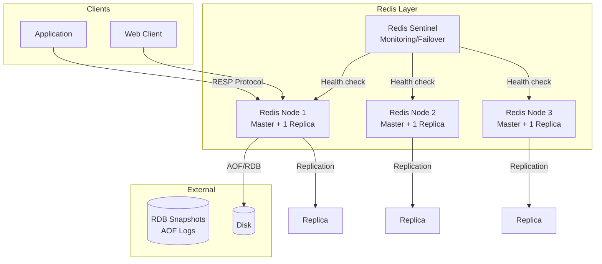
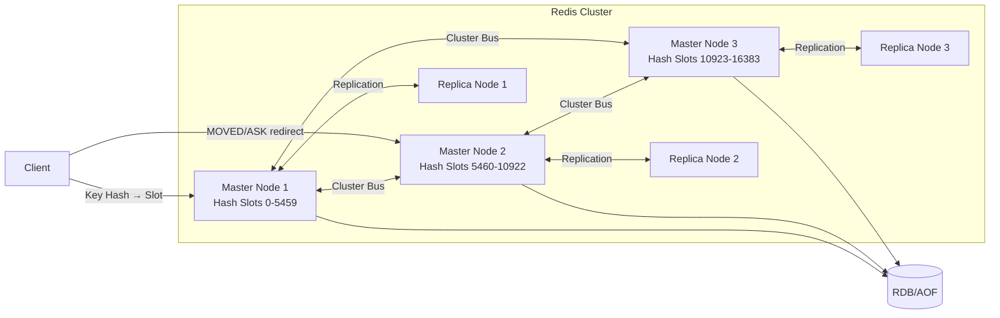

# Build Your Own Redis

## Blogs and websites

## Medium

## Youtube

- [Build Your Own Redis](https://www.youtube.com/watch?v=B2JoBjrW-xA)

---

## Theory

### What Is It?

Redis is an in-memory data structure store that serves as a database, cache, message broker, and streaming engine. It implements rich data structures (strings, hashes, lists, sets, sorted sets, bitmaps, hyperloglogs, Bloom filters) with atomic operations, persistence (RDB snapshots and AOF logs), replication, sharding (Redis Cluster), and pub/sub messaging. Redis is prized for its simplicity, performance (millions of ops/second from a single instance), and atomic operations on complex data structures.

### Why Does It Exist?

Traditional disk-based databases (MySQL, PostgreSQL) are too slow for use cases requiring sub-millisecond latency — caching layers, session stores, leaderboards, counters, pub/sub messaging, and real-time analytics. Redis provides an in-memory alternative with persistent durability, enabling developers to build high-performance applications without complex database tuning. It fills the gap between application memory (volatile) and disk databases (durable but slow).

### What Problem Does It Solve?

* **Sub-millisecond latency**: Cache reads/writes in < 1 ms, enabling real-time user experiences (social media feeds, gaming leaderboards, session storage).
* **Rich data structures**: Unlike simple key-value stores, Redis supports sets, sorted sets, lists, hashes — enabling complex operations (set intersection, sorted range queries, atomic increments) in a single round-trip.
* **Atomic operations**: All operations on a key are atomic (single-threaded execution) — no explicit locking needed for counters, leaderboards, or distributed locks.
* **Pub/Sub messaging**: Built-in publish/subscribe for real-time messaging (chat, notifications, event broadcasting).
* **Durability without sacrifice**: RDB (point-in-time snapshots) and AOF (append-only log) persistence — optional durability without sacrificing performance.
* **Horizontal scaling**: Redis Cluster shards data across nodes, enabling horizontal scaling beyond single-instance memory limits.
* **Distributed primitives**: Redlock algorithm for distributed locks, HyperLogLog for cardinality estimation, Bloom filters for membership testing.

### Important Subtopics

1. Data structures (strings, hashes, lists, sets, sorted sets) and their operations
2. Single-threaded event loop and performance characteristics
3. Persistence: RDB snapshots and AOF (Append-Only File)
4. Replication and replication lag
5. Redis Cluster (sharding, hash slots, failover)
6. Memory management and eviction policies
7. Pub/Sub messaging patterns
8. Lua scripting for atomicity
9. Redis as a cache (TTL, eviction)
10. Redis as a message broker (streams, consumer groups)
11. Distributed locks (Redlock algorithm)
12. Monitoring and performance tuning

## Characteristics

| Characteristic | What it means | Why it matters | How it works |
|---|---|---|---|
| **In-memory storage** | Data stored in RAM, not disk | Sub-millisecond latency | All data in memory; persistence is optional |
| **Single-threaded** | Command execution is single-threaded | Eliminates locking complexity; atomic operations | Event loop processes one command at a time |
| **Rich data structures** | Beyond key-value: sets, zsets, hashes, bitmaps | Enables complex operations atomically | Each data type implemented as a specialized C structure |
| **Atomic operations** | Each command executes atomically | Simplifies concurrent programming | Single-threaded + atomic commands (no race conditions) |
| **Persistence options** | RDB snapshots, AOF logging, or neither | Trade-off between durability and performance | RDB = periodic snapshots; AOF = every write logged |
| **Replication** | Async master-slave replication | High availability, read scaling | Master sends command stream to replicas |
| **Clustering** | Sharded data across nodes (Redis Cluster) | Horizontal scaling beyond single-node memory | 16384 hash slots distributed across nodes |

## Components

| Component | Purpose | Responsibilities | Relationship | Real-world Example |
|---|---|---|---|---|
| **Event Loop** | Process commands | Accept connections, parse commands, execute, respond | Core of Redis; single-threaded | Redis aio/single-threaded |
| **Data Structure Layer** | Store typed values | Strings (SDS), Hash Tables, Ziplist, Intsets, Skiplists, HyperLogLog | Used by all commands | Redis object system |
| **Network Layer** | Handle client connections | Event-driven I/O (epoll/kqueue); protocol parsing (RESP) | Clients ↔ Event Loop | hiredis, anet.c |
| **Persistence Engine** | Save data to disk | RDB snapshotting; AOF logging; AOF rewriting | Event Loop triggers; forks child processes | Redis bgsave |
| **Replication Manager** | Replicate data | Send command stream to replicas; handle reconnections | Master ↔ Replicas | Redis replication |
| **Cluster Manager** | Shard data | Hash slot assignment; node discovery; failover | Coordinates with all nodes | Redis Cluster / Sentinel |
| **Memory Manager** | Track and evict memory | LRU/LFU/TTL; maxmemory configuration | Works with all data structures | Redis eviction policies |

### Component Interactions

1. **Command execution**: Client sends command → Network Layer → Event Loop → Data Structure Layer executes → responds → Persistence Engine logs if AOF enabled.
2. **Replication**: Master executes command → writes to AOF → sends command to replica connection → replicas replay.
3. **Clustering**: Key → CRC16 → hash slot (0-16383) → node lookup → route to correct node.
4. **Persistence**: BGSAVE forks a child → child writes RDB snapshot to disk → parent continues serving.

## Patterns

### LRU Cache with TTL

* **What**: Redis as an LRU cache with time-to-live (TTL) — automatically evicts least recently used keys when memory is full or keys expire.
* **Problem solved**: Caching frequently-accessed data with automatic eviction; no manual cache invalidation needed for time-bound data.
* **How it works**: `SET key value EX 3600` (expire in 1 hour); `SET key value` with `MAXMEMORY LRU` eviction policy. When memory is full, Redis removes the least recently used key. TTL keys are also expired lazily (on access) and periodically (active expiry sampling).
* **When to use**: Caching database query results, session storage, rate limiting counters.
* **When not to use**: When data must persist permanently — Redis is an in-memory store (persistence is optional/secondary).
* **Advantages**: Automatic eviction; no manual management; sub-millisecond access.
* **Disadvantages**: Data loss risk on restart (if no persistence); OOM errors if misconfigured.
* **Java/Spring Boot example**:
```java
@Configuration
public class RedisCacheConfig {
    @Bean
    public RedisTemplate<String, Object> redisTemplate(RedisConnectionFactory factory) {
        RedisTemplate<String, Object> template = new RedisTemplate<>();
        template.setConnectionFactory(factory);
        template.setDefaultSerializer(new GenericJackson2JsonRedisSerializer());
        return template;
    }
}

@Service
public class UserService {
    private final RedisTemplate<String, User> redis;
    private final UserRepository userRepository;

    public User getUser(String userId) {
        String key = "user:" + userId;
        User user = redis.opsForValue().get(key);
        if (user == null) {
            user = userRepository.findById(userId);
            redis.opsForValue().set(key, user, Duration.ofHours(1)); // 1-hour TTL
        }
        return user;
    }

    public void invalidateUser(String userId) {
        redis.delete("user:" + userId);
    }
}
```
* **Real-world example**: GitHub uses Redis as a cache for database queries; Twitter uses it for timeline caching.

### Sorted Set for Real-Time Leaderboards

* **What**: Redis sorted sets (zset) map members to scores, supporting range queries, ranking, and atomic score updates — ideal for leaderboards, rate limiting, and priority queues.
* **Problem solved**: Maintaining a real-time leaderboard where players' scores update frequently and rankings must be queried efficiently (top-N, rank-by-score).
* **How it works**: Store player as member, score as the value. `ZADD leaderboard 100 "player1"`. `ZREVRANGE leaderboard 0 9` returns top 10. `ZADD` atomically updates scores. `ZRANK/ZREVRANK` gives a player's rank.
* **When to use**: Leaderboards, real-time analytics dashboards, priority queues, rate limiting (sliding window).
* **When not to use**: When full ranking history is needed (Redis doesn't store historical scores).
* **Advantages**: O(log N) updates and range queries; atomic operations; in-memory speed.
* **Disadvantages**: No historical data; memory usage grows with members.
* **Real-world example**: Game leaderboards, Stack Overflow reputation ranking.

### Redlock Distributed Lock

* **What**: A distributed locking algorithm using Redis that provides mutual exclusion across multiple processes/servers.
* **Problem solved**: Coordinating access to a shared resource in a distributed system (e.g., preventing double-charging a user, leader election, critical section protection).
* **How it works**: Acquire the lock on a majority (3/5) of independent Redis nodes simultaneously using `SET key value NX PX 10000` (set-if-not-exists with 10-second TTL). If successful on majority, the lock is acquired. Release by evaluating a Lua script that deletes the key only if its value matches (prevents deleting another process's lock). Uses fencing tokens (a monotonically increasing token passed to the resource as proof of lock ownership).
* **When to use**: Distributed mutex for critical sections in microservices; leader election; preventing duplicate processing.
* **When not to use**: When strong consistency is needed (Redlock provides best-effort; use etcd/ZooKeeper for strong consistency).
* **Advantages**: Simple to implement with Redis; works across multiple nodes.
* **Disadvantages**: Not fault-tolerant if a majority of Redis nodes fail; clock drift can cause issues; fencing tokens needed for correctness.
* **Java/Spring Boot example**:
```java
@Service
public class DistributedLock {
    private final RedissonClient redisson;

    public <T> T executeWithLock(String lockKey, Supplier<T> action) {
        RLock lock = redisson.getLock(lockKey);
        try {
            if (lock.tryLock(10, 30, TimeUnit.SECONDS)) {
                return action.get();
            }
            throw new IllegalStateException("Could not acquire lock");
        } finally {
            lock.unlock();
        }
    }
}
```
* **Real-world example**: Redlock algorithm (used by many distributed systems for coordination); Redisson client.

## Benefits

* **Extreme performance**: Single-threaded design achieves 100K-500K ops/second per instance with sub-millisecond latency.
* **Rich operations**: Complex data structures with atomic operations reduce round-trips vs. multiple DB calls.
* **Versatility**: Can serve as cache, database, message broker, streaming platform (Redis Streams).
* **Simplicity**: Single binary, minimal configuration, well-documented commands.
* **Ecosystem**: Client libraries for 100+ languages; Redis modules (RedisJSON, RediSearch, RedisGraph, RedisTimeSeries).

## Pros

* **Sub-millisecond latency**: All data in memory — perfect for caching and real-time applications.
* **Atomic operations on rich types**: `SINTER`, `ZUNIONSTORE`, `HINCRBY` execute atomically — no explicit locking.
* **Pub/Sub at scale**: Built-in pub/sub with pattern matching; also streams with consumer groups (Kafka-like).
* **Multiple persistence options**: RDB (snapshot) for backups; AOF (write log) for durability; can use both.
* **Clustering and replication**: Redis Cluster for sharding; master-replica for read scaling.
* **Lua scripting**: Server-side scripting enables complex atomic operations.

## Cons

* **Memory limitations**: All data is in memory — limited by RAM; swapping destroys performance.
* **Single-threaded**: CPU-bound operations (slow commands like `KEYS`) block all other clients.
* **No built-in access control**: All clients with network access can read/write (in older versions; Redis 6+ supports ACLs).
* **Single point of failure (without clustering)**: A single instance failure means downtime/data loss (if no persistence).
* **Operational complexity**: Clustering, replication failover, and persistence tuning require expertise.

## Challenges

### Technical Challenges

* **Blocking commands**: Commands like `KEYS`, `SORT`, `LRANGE` on large data sets block the single-threaded event loop — must use alternatives (`SCAN`, streaming).
* **Memory fragmentation**: Over time, memory fragmentation can waste 30%+ of allocated memory — need `MEMORY PURGE`.
* **Persistence overhead**: AOF rewrite is CPU-intensive (forks child); RDB snapshot pauses can cause latency spikes.

### Scalability Challenges

* **Memory ceiling**: Single instance is limited by RAM. Clustering (16384 hash slots) shards data but adds complexity (cross-slot operations not atomic).
* **Replication lag**: Asynchronous replication means replicas can lag by seconds; stale reads possible.
* **Cluster rebalancing**: Adding/removing nodes requires hash slot migration — can be slow for hot keys.

### Performance Challenges

* **Tail latency**: Slow commands (large `ZUNIONSTORE`, `SORT`) cause tail latency spikes — must design around slow ops.
* **CPU vs. memory**: Lua scripts, AOF rewriting, and child process (fork) compete for CPU/memory.
* **Network overhead**: Large values (> 1MB) cause network and serialization overhead; pipeline or batch.

### Reliability Challenges

* **Master failure**: Without Redis Sentinel or Cluster, master failure = downtime. Data loss if persistence disabled.
* **Split-brain**: Network partition can cause data divergence between master and replica.
* **OOM events**: When memory is exhausted, Redis may crash (depending on eviction policy) or return errors.

### Maintainability Challenges

* **Slow log analysis**: Identifying slow queries (`SLOWLOG`) to optimize — common culprits are `KEYS`, large `SORT`, or unbounded sets.
* **Persistence tuning**: Balancing RDB frequency, AOF fsync interval (always/everysec/no), and disk I/O.
* **Cluster management**: Adding/removing nodes, handling failover, rebalancing hash slots.

### Operational Challenges

* **Backup and restore**: RDB snapshots are point-in-time backups; AOF logs allow point-in-time recovery. But restore can take hours for large datasets.
* **Monitoring**: Track memory usage, evicted keys, connected clients, CPU% (single-threaded → should be < 100% per core), replication lag, slow log.
* **Capacity planning**: Memory + 50% headroom for fragmentation; plan for peak connections; consider persistence I/O impact.

### Security Concerns

* **No authentication by default (older versions)**: Redis binds to all interfaces with no password by default — critical vulnerability. Use `requirepass` or ACLs.
* **Network exposure**: Redis should be in a private network, not publicly accessible. Use VPC/firewall rules.
* **Data exposure**: Redis stores data in plaintext; encryption-at-rest is not built-in (use disk encryption or Redis Enterprise).
* **Command injection**: `EVAL`/`EVALSHA` with untrusted input is dangerous — validate input; disable dangerous commands (`FLUSHALL`, `KEYS`).

## Best Practices

* **Use connection pooling**: Reuse TCP connections (Redis connections are not free).
* **Avoid blocking commands**: Never use `KEYS` on production; use `SCAN` with a cursor.
* **Set maxmemory policy**: Configure `maxmemory` and an eviction policy (`allkeys-lru`, `volatile-lru`, `volatile-ttl`) to prevent OOM.
* **Use Redis Sentinel or Cluster**: For high availability and failover.
* **Pipeline writes**: Batch multiple commands in one round-trip using pipelining.
* **Lua scripts for atomicity**: Use `EVAL` for multi-step atomic operations.
* **Monitor SLOWLOG**: Regularly check slow queries.
* **Disable dangerous commands**: `RENAME COMMAND CONFIG` → `""`, etc.
* **Use ACLs (Redis 6+)**: Create separate users with granular command and key permissions.
* **Enable persistence for data**: RDB for backups; AOF for durability (don't use `no-appendfsync-on-rewrite`).

## When to Use

### Appropriate

* When you need sub-millisecond latency (caching, session storage, leaderboards).
* When you need rich data structures (sets for tagging, sorted sets for ranking, hashes for objects).
* When you need atomic operations on complex data types.
* When you need pub/sub or message streaming.
* When you need distributed locks (with Redlock).
* When you need fast counting/hyperloglog/cardinality estimation.

### Not Appropriate

* When data size exceeds available RAM.
* When strong consistency is required (Redis Cluster is eventually consistent; use etcd/ZooKeeper).
* When data is mostly cold (infrequently accessed — Redis evicts under memory pressure).
* When the use case is simple key-value (a simpler store like memcached might suffice).

### Alternatives

* **Memcached**: Simpler, multi-threaded, no persistence — good for pure caching.
* **Aerospike**: Hybrid memory/disk, tunable consistency.
* **etcd/ZooKeeper**: Strong consistency, used for configuration; not for caching.
* **Apache Ignite**: Distributed SQL + key-value with persistence and compute.

### Decision Factors

* **Data volatility**: Hot data → Redis; cold data → disk-based DB with Redis cache layer.
* **Consistency needs**: Strong consistency → etcd; eventual is fine → Redis.
* **Data size**: If fits in RAM → Redis; if exceeds RAM → Redis with disk (Redis on Flash) or another DB.
* **Operation type**: Rich operations needed → Redis; simple get/set → memcached.

## Use Cases

### Web Session Storage

* **Problem**: Store user sessions (authentication tokens, cart contents) with fast access and automatic expiration.
* **Solution**: Use Redis with `SETEX` (set + expire) — sessions expire automatically. Single-threaded atomic operations prevent race conditions.
* **Why suitable**: Sub-millisecond access; TTL eviction; atomic operations (no concurrent modification issues).
* **How it works**: After login, store `session:{uuid}` → `{user_id, cart_items, preferences}` with 30-minute TTL. Each request refreshes TTL. Logout deletes the key.
* **Trade-offs**: Data loss risk on restart (if no persistence); must handle Redis failure (sessions lost → users re-login).

### Real-Time Leaderboard (Gaming)

* **Problem**: Show the top 100 players by score, updated in real-time as scores change.
* **Solution**: Use a Redis sorted set — `ZADD leaderboard {score} {player_id}`. `ZREVRANGE leaderboard 0 99 WITHSCORES` returns the top 100. Score updates are atomic.
* **Why suitable**: O(log N) updates; O(log N + M) range queries; atomic operations.
* **How it works**: Player scores an action → `ZINCRBY leaderboard 10 player_12345` (atomic increment). Leaderboard page → `ZREVRANGE leaderboard 0 99` → cached for 5 seconds. Player's rank → `ZREVRANK leaderboard player_12345`.
* **Trade-offs**: No historical leaderboard snapshots (need separate storage); memory usage grows with player count; global leaderboard doesn't support regional filtering.

### Rate Limiting (API Quotas)

* **Problem**: Limit each API client to N requests per minute.
* **Solution**: Use Redis with a sliding window or fixed window counter. `INCR rate_limit:{client_id} → if > N, reject → EXPIRE key in 60 seconds`.
* **Why suitable**: Atomic increment; TTL auto-expires the window.
* **How it works**: Each API request → `MULTI INCR rate_limit:{client_id}; EXPIRE rate_limit:{client_id} 60; EXEC` → if result > 100, return 429. On window expiry, the key auto-deletes.
* **Trade-offs**: Fixed window allows a burst at the boundary (100 at 59s + 100 at 0s = 200 in 2 seconds); sliding window (using sorted sets) is more accurate but more complex.

## Architecture



### Architecture Structure

* **Redis nodes**: Each node is a single-threaded instance with a master and replica(s). Data is in memory; persistence is on disk.
* **Sentinel layer**: Monitors Redis nodes; handles automatic failover if a master goes down (promotes a replica).
* **Persistence**: RDB (periodic snapshot, compact, good for backups); AOF (append-only, every write, good for durability). Can use both.

### Communication

* **Client ↔ Redis**: RESP (REdis Serialization Protocol) over TCP.
* **Master ↔ Replica**: Replication stream (command replay).
* **Sentinel ↔ Redis**: Health checks + failover coordination.

### Data Flow

1. **Write**: Client → Master → executes command (in-memory) → writes to AOF → replicates to replicas.
2. **Read**: Client → (Master or Replica) → executes command → returns result.
3. **Persistence**: Background save (BGSAVE) forks a child → child writes RDB/AOF → parent continues serving.
4. **Failover**: Sentinel detects master down → promotes replica → notifies clients to reconnect to new master.

### Scaling Strategy

* **Vertical**: More RAM and CPU per instance.
* **Horizontal**: Redis Cluster (16384 hash slots across nodes); client uses hash slot to route.
* **Read scaling**: Multiple replicas per master for read traffic.

### Failure Handling

* **Master failure**: Sentinel detects (3+ sentinels agree) → promotes replica → update config → clients reconnect.
* **Network partition**: Cluster or Sentinel decides which side is master; minority side stops accepting writes.
* **Persistence failure**: AOF rewrite fails → log to stderr; RDB save fails → continues in-memory.

## High-Level Design



**Command execution flow**:
1. Client computes `CRC16(key) % 16384` → gets hash slot → looks up which node owns that slot (from cluster config).
2. If redirected (MOVED), client retries with the correct node.
3. Node executes command on its single-threaded event loop → responds.
4. Write also logged to AOF and replicated to replica.

**Cluster failover**:
1. Master node fails → remaining masters detect via gossip protocol.
2. A replica is promoted to master for that node's slots.
3. Cluster config updated → clients redirected.

## Deep Dive

### Internal Implementation: Single-Threaded Event Loop

Redis uses a **single-threaded event loop** (using `ae.h`/`ae.c`). Despite being single-threaded, it handles 100K+ ops/second because:

1. **Most commands are O(1) or O(log N)**: Hash lookups, set operations, zset operations use efficient data structures.
2. **I/O multiplexing**: `epoll` (Linux) or `kqueue` (BSD/macOS) allows handling thousands of connections on a single thread.
3. **No context switching**: No thread synchronization overhead, GIL contention (which Redis avoids since it is single-threaded).
4. **In-memory data**: No disk I/O for reads.

The event loop:
```
while (!stop) {
    // Process pending commands from active clients
    numevents = aeProcessEvents(...);
    // Handle time-based events (e.g., key expiration, persistence)
    // Handle file events (readable/writable sockets)
}
```

### Data Structures

Redis implements specialized data structures for each type:
* **String (SDS - Simple Dynamic String)**: Pre-allocated buffer with length tracking — O(1) append and length operations. Used for values, keys, client buffers.
* **Hash Table**: Used for the primary key space (dictionary of key→object). Uses chaining with 4M bucket size. Incremental rehashing (`dictRehash`) to avoid pause.
* **Skiplist + Hash Table**: Sorted sets (zset) use a hash table (member→score) for O(1) lookup + a skiplist (score→member) for O(log N) range queries.
* **Ziplist (now called Listpack)**: Compact list-like structure for small hashes/lists/zsets — saves memory for small collections (auto-converts to hash table/skiplist when size exceeds threshold).
* **HyperLogLog**: Probabilistic cardinality estimation — 12KB per register, ~0.81% standard error.
* **Intset**: Compact integer set — stores integers as 16/32/64-bit depending on max value.

### Persistence: RDB and AOF

**RDB (Redis Database Backup)**: Periodic point-in-time snapshots (`BGSAVE`). Forks a child process → child writes all key-value pairs to disk as a binary dump. The child uses copy-on-write (COW) — the parent continues serving while the child writes (pages shared until the child modifies them). RDB files are compact, good for backups and replication. But you can lose up to the snapshot interval of data.

**AOF (Append-Only File)**: Every write command is appended to a file. On restart, Redis replays all commands to rebuild the dataset. AOF provides better durability than RDB. `fsync` policies:
- `always`: fsync after every write (slowest, safest).
- `everysec`: fsync every second (Redis's default — good balance).
- `no`: let OS decide (fastest, least safe).

**AOF Rewrite**: Over time AOF files grow huge (every write = one line). BGREWRITEAOF forks a child → child writes only the current state (like an RDB) → replaces AOF with the compacted version. This runs automatically when AOF size > threshold (100% growth by default).

### Redis Cluster

Redis Cluster uses **16384 hash slots**. Each key is hashed (CRC16) → mapped to a slot (0-16383) → assigned to a node. Moving a slot from one node to another (resharding) requires:
1. `ASKING` command on the target node.
2. `MOVED` redirect — client retries on the correct node.

For multi-key operations spanning slots (e.g., `MSET key1{v} key2{v}` — hash tags ensure both go to the same slot), the client must handle redirection. Cross-slot operations require application-level coordination (transactions across slots are not atomic).

### Memory Eviction

When `maxmemory` is set and reached, Redis evicts keys based on the policy:
- `noeviction`: Return errors on writes (default for data stores).
- `allkeys-lru`: Evict least recently used keys.
- `allkeys-lfu`: Evict least frequently used keys.
- `allkeys-random`: Evict random keys.
- `volatile-lru`: Evict least recently used keys with TTL set.
- `volatile-lfu`: Evict least frequently used keys with TTL.
- `volatile-ttl`: Evict keys with shortest TTL first.

`allkeys-lru` is common for caches; `noeviction` is common for databases.

### Lua Scripting

Lua scripts execute atomically (no other command runs during script execution). This enables multi-step operations to be atomic:

```lua
-- Atomic stock decrement with minimum check
local current = redis.call('GET', KEYS[1])
if tonumber(current) >= tonumber(ARGV[1]) then
    return redis.call('DECRBY', KEYS[1], ARGV[1])
else
    return redis.error_reply('insufficient_stock')
end
```

### Cluster Bus and Gossip

Redis Cluster nodes communicate via a **gossip protocol** over the cluster bus (port +10000). Messages include: `PING`/`PONG` (node liveness), `MEET` (add new node), `FAILOVER` (replica takeover), `SLOTSRANGEDLT` (slot migration). This gossip-based membership is simpler than consensus (Raft) but less strongly consistent.

## Java and Spring Boot Implementation

### Basic Java Implementation — Rate Limiter

```java
@Component
public class RedisRateLimiter {
    private final RedisTemplate<String, String> redis;
    private static final int MAX_REQUESTS = 100;
    private static final int WINDOW_SECONDS = 60;

    public boolean isAllowed(String clientId) {
        String key = "rate_limit:" + clientId;
        String luaScript = 
            "local current = redis.call('INCR', KEYS[1])\n" +
            "if current == 1 then\n" +
            "  redis.call('EXPIRE', KEYS[1], ARGV[1])\n" +
            "end\n" +
            "return tonumber(current) <= tonumber(ARGV[2])";

        Long result = redis.execute(
            new DefaultRedisScript<>(luaScript, Long.class),
            Collections.singletonList(key),
            String.valueOf(WINDOW_SECONDS),
            String.valueOf(MAX_REQUESTS)
        );

        return result == 1;
    }
}

@RestController
public class ApiController {
    private final RedisRateLimiter rateLimiter;

    @GetMapping("/api/data")
    public ResponseEntity<?> getData(@RequestHeader("X-API-Key") String apiKey) {
        if (!rateLimiter.isAllowed(apiKey)) {
            return ResponseEntity.status(HttpStatus.TOO_MANY_REQUESTS)
                .header("Retry-After", "60")
                .body("Rate limit exceeded");
        }
        // Process request
        return ResponseEntity.ok(processRequest());
    }
}
```

### Production-Oriented Implementation — Distributed Lock

```java
@Service
@Slf4j
public class RedisDistributedLock {
    private final RedissonClient redisson;

    public <T> T executeWithLock(String lockKey, long timeoutSeconds, Supplier<T> action) {
        RLock lock = redisson.getLock(lockKey);
        boolean acquired = false;
        try {
            acquired = lock.tryLock(timeoutSeconds, timeoutSeconds * 2, TimeUnit.SECONDS);
            if (!acquired) {
                throw new LockAcquisitionException("Could not acquire lock: " + lockKey);
            }
            return action.get();
        } finally {
            if (acquired) {
                try {
                    lock.unlock();
                } catch (Exception e) {
                    log.warn("Failed to release lock: {}", lockKey, e);
                }
            }
        }
    }
}

// Usage
@Service
public class InventoryService {
    private final RedisDistributedLock lock;

    public void reserveStock(String productId, int quantity) {
        lock.executeWithLock("stock:" + productId, 30, () -> {
            int currentStock = redis.opsForValue().get("stock:" + productId);
            if (currentStock < quantity) {
                throw new InsufficientStockException();
            }
            redis.boundValueOps("stock:" + productId).decrement(quantity);
            return null;
        });
    }
}
```

### Spring Boot — Redis Configuration

```java
@Configuration
@EnableCaching
public class RedisConfig {
    @Bean
    public LettuceConnectionFactory redisConnectionFactory() {
        RedisClusterConfiguration config = new RedisClusterConfiguration(
            List.of("redis-node-1:6379", "redis-node-2:6379", "redis-node-3:6379"));
        return new LettuceConnectionFactory(config);
    }

    @Bean
    public RedisTemplate<String, Object> redisTemplate(RedisConnectionFactory factory) {
        RedisTemplate<String, Object> template = new RedisTemplate<>();
        template.setConnectionFactory(factory);
        template.setKeySerializer(new StringRedisSerializer());
        template.setValueSerializer(new GenericJackson2JsonRedisSerializer());
        template.setEnableTransactionSupport(true);
        return template;
    }
}
```

### Testing Example

```java
@SpringBootTest
@RedisTestContainer // Testcontainers with Redis
class RedisRateLimiterTest {
    @Autowired private RedisRateLimiter rateLimiter;
    @Autowired private RedisTemplate<String, String> redis;

    @Test
    void shouldAllowRequestsUnderLimit() {
        String clientId = "client_test";
        for (int i = 0; i < 100; i++) {
            assertTrue(rateLimiter.isAllowed(clientId));
        }
    }

    @Test
    void shouldBlockRequestsOverLimit() {
        String clientId = "client_limit";
        for (int i = 0; i < 100; i++) {
            assertTrue(rateLimiter.isAllowed(clientId));
        }
        // 101st request should be blocked
        assertFalse(rateLimiter.isAllowed(clientId));
    }

    @Test
    void shouldResetAfterWindowExpiry() throws InterruptedException {
        // Note: this test would require time manipulation (e.g., Redis mock with time control)
    }
}
```

## Real-World Examples

### Twitter's Redis Usage

Twitter uses Redis extensively:
- **Timeline cache**: Pre-computed timelines stored in Redis; 99% of feed reads served from Redis.
- **User sessions**: Session storage with TTL-based expiration.
- **Rate limiting**: Per-API endpoint rate limits using Redis counters with sliding windows.
- **Distributed locks**: Coordination for background jobs (e.g., tweet processing).
- **Pub/Sub**: Real-time notification delivery pipeline.

### Stack Overflow's Tag Engine

Stack Overflow uses Redis for tag-based question indexing:
- Each tag maps to a sorted set of question IDs (score = creation timestamp).
- `ZREVRANGE tag:java 0 49` returns the 50 most recent Java questions.
- When a question is tagged, `ZADD tag:{tag} {timestamp} {question_id}`.
- Related tags computed from set intersections.

### GitHub's Cache Layer

GitHub uses Redis as a cache layer in front of MySQL:
- Repository metadata, issue comments, user profiles cached in Redis with TTL.
- Cache keys are versioned (e.g., `repo:v3:{id}`) for safe invalidation.
- On cache miss, fetch from DB and populate cache.
- Redis Sentinel manages failover.

## Interview Preparation

### Beginner Questions

**Q1: What data structures does Redis support?**
A: Strings, Hashes, Lists, Sets, Sorted Sets, Bitmaps, HyperLogLogs, Bloom Filters (via modules), Streams. Each is a first-class data type with specialized commands: `GET/SET` for strings, `HGET/HSET` for hashes, `LPUSH/LPOP` for lists, `SADD/SINTER` for sets, `ZADD/ZRANGE` for sorted sets. This makes Redis more powerful than a simple key-value store.

**Q2: Why is Redis single-threaded and is it a performance problem?**
A: Redis uses a single thread for command execution to eliminate race conditions and simplify the data structure implementations. Since all commands are atomic on a single thread, no locking is needed. It's NOT a performance problem because: (1) most commands are O(1) or O(log N), (2) I/O multiplexing (epoll/kqueue) handles thousands of connections, (3) data is in memory. Redis achieves 100K-500K ops/sec on a single core — which is often more than the network can deliver.

**Q3: What is the difference between RDB and AOF persistence?**
A: RDB (Redis Database Backup) takes point-in-time snapshots periodically — compact, great for backups and replication, but you can lose up to the snapshot interval of data. AOF (Append-Only File) logs every write operation — better durability (can configure to fsync every second), but the file is larger and can grow unbounded (requires periodic rewrite). Many production setups use both: AOF for durability + RDB for backups.

### Intermediate Questions

**Q4: What are Redis hash slots and how does clustering work?**
A: Redis Cluster shards data into 16384 hash slots. Each key is hashed (CRC16) and assigned to a slot (0–16383). Each node in the cluster is responsible for a subset of slots. When a client requests a key, it computes the slot and routes the request to the correct node. If the key has moved (during resharding), the node responds with `MOVED` and the client retries on the correct node. This allows horizontal scaling — add nodes and rebalance slots.

**Q5: What is the Redlock algorithm and is it correct?**
A: Redlock is a distributed lock algorithm using multiple (5+) independent Redis nodes. To acquire a lock, the client tries to set a key with `SET key value NX PX 10000` (set-if-not-exists, 10-second TTL) on all nodes. If it succeeds on a majority (3/5), the lock is acquired. The client gets a fencing token (monotonically increasing) to pass to downstream systems. It's controversial — the original Redlock paper was criticized for clock drift issues. In practice, Redlock is sufficient for many use cases (job scheduling, cache locks) but not for mission-critical mutual exclusion. For strong guarantees, use etcd/ZooKeeper with Raft.

**Q6: How do you prevent the thundering herd problem with Redis?**
A: When a hot key expires or is evicted, many clients simultaneously try to recompute/fetch it, overwhelming the backend. Solutions: (1) **Lazy expiration with jitter** — add random TTL variance. (2) **Cache-aside with locking** — use a distributed lock to ensure only one client recomputes; others wait or serve stale data. (3) **Background refresh** — refresh cache before TTL expiry (e.g., refresh at 90% of TTL). (4) **Probabilistic early expiration** — randomly expire keys slightly before their TTL.

**Q7: How does Redis handle memory when it runs out?**
A: When `maxmemory` is set and the limit is reached, Redis evicts keys based on the configured policy: `allkeys-lru` (evict least recently used), `allkeys-lfu` (least frequently used), `allkeys-random`, `volatile-lru/lfu/ttl` (only keys with TTL), or `noeviction` (return errors). Without a policy (`noeviction` is default), Redis returns errors on writes when memory is full. For caches, `allkeys-lru` is common; for databases, `noeviction` is safer.

### Advanced Questions

**Q8: How would you design a distributed lock service with Redis that handles failover correctly?**
A: (1) Use Redlock with 5+ independent Redis nodes (or Sentinel-managed). Acquire on majority. (2) Use fencing tokens — the lock holder passes a monotonically increasing token to the resource; the resource rejects tokens lower than the current one. (3) Set appropriate TTL (longer than max expected operation time + clock drift). (4) Renew the lock periodically (extend TTL before expiry). (5) On crash, let TTL expire (the lock auto-releases). (6) Use Redisson client (handles Redlock, automatic renewal, and fencing). (7) Monitor lock hold times and alert if too long. For strong guarantees, consider etcd with leases instead.

**Q9: How do you handle Redis at 500M keys with 50GB memory?**
A: (1) **Sharding**: Redis Cluster with 16384 slots across N nodes — distribute keys evenly. (2) **Memory optimization**: Use Redis objects efficiently (intsets for integer sets, ziplists for small collections, shared objects for small strings); configure maxmemory and eviction policy. (3) **Cold data tiering**: Use Redis on Flash (swap less-frequently-used values to disk); or offload cold data to a DB and cache hot data. (4) **Key design**: Avoid large keys and hashes; prefer many small keys. (5) **Persistence tuning**: AOF with `everysec` is faster than `always`; RDB only at off-peak hours. (6) **Monitoring**: track hit rate, evicted keys, memory fragmentation.

### Senior-Level Questions

**Q10: How would you design Redis for a system that needs strong consistency (not eventual)?**
A: Standard Redis replication is asynchronous (eventual consistency). For strong consistency:
- **Redis Sentinel with sync replication**: Not available in open-source Redis.
- **Redis Enterprise**: Offers active-active replication with CRDT conflict resolution (stronger than async but not strict consistency).
- **Redis with RAFT**: Use RedisRaft module for consensus-based replication (strong leader, write to majority).
- **Alternative**: Use Redis for caching with a strongly-consistent backend (etcd/PostgreSQL) for the source of truth — Redis is cache (cache-aside pattern), backend is source of truth.

**Q11: How would you handle Redis memory fragmentation and OOM at scale?**
A: (1) **Fragmentation monitoring**: `INFO memory` shows `mem_fragmentation_ratio` — if > 1.5, consider restart or `MEMORY PURGE`. (2) **Overcommit memory**: Set `vm.overcommit_memory=1` to avoid OOM crashes. (3) **Memory policy**: `allkeys-lru` for caches (evict rather than OOM); `noeviction` for DBs (error rather than silently losing data). (4) **Active expiration**: Tune `hz` (expiration frequency) — default 10/sec; increase to 100 for many TTL keys. (5) **Jemalloc tuning**: Use jemalloc (default in Redis 4+); configure `MALLOC_CONF` for arena count. (6) **Memory analysis**: Use `MEMORY USAGE` and `MEMORY STATS` to find large keys. (7) **Scaling**: Use Redis Cluster to distribute memory across nodes; each node handles a fraction of total data. (8) **Alerting**: Alert when memory usage > 80% or fragmentation > 2x.

### System Design Questions (Senior)

**Q12: Design a rate limiter for an API gateway handling 1M requests/second.**

**Approach**:
- **Algorithm**: Sliding window log vs. fixed window vs. token bucket. Fixed window counter is simplest: `INCR rate_key; EXPIRE rate_key 60; reject if > threshold`. Sliding window is more accurate but complex. For 1M RPS, use **token bucket** (simple, allows bursts): bucket capacity = 1M, refill rate = 800K/s, allows 200K burst.
- **Redis sharding**: Rate limit keys per client/API-key are hot keys during attacks — use Redis Cluster; shard by `hash(api_key) % N` for even distribution. Or use a global rate limit counter + per-client counters.
- **Distributed**: Use Redis `INCR` with TTL or Lua scripts for atomic check-and-increment. Or use a custom counter service (Go + in-memory with periodic sync to Redis).
- **Local caching**: Cache rate limit decisions locally (e.g., each API gateway instance allows 80% of the rate limit locally, checks Redis for the remaining 20%) — reduces Redis load but allows slight over-limiting.
- **Anti-abuse**: Combine rate limiting with bot detection (WAF, CAPTCHA for repeated 429s). Implement IP-based + API-key-based + global rate limits.
- **Burst handling**: Token bucket allows short bursts up to bucket capacity. During DDoS, shed load by increasing the threshold for authenticated APIs and dropping unauthenticated traffic.
- **Monitoring**: Track 429 rate per API key, per IP, globally; alert on sudden spikes (>50% of traffic being rate-limited).

**Expected discussion points**: Fixed window vs. sliding window trade-offs, Redis sharding for hot keys, local caching vs. global accuracy, token bucket vs. leaky bucket, and DDoS mitigation integration.

**Q13: Design a Redis-based distributed lock service for coordinating 10K microservices.**

**Approach**:
- **Redlock with 5 nodes**: Each lock attempt goes to all 5 Redis nodes; need 3+ success + TTL + fencing token.
- **Key format**: `lock:{resource_name}`; value = `{uuid}:{timestamp}{fencing_token}` for safe release.
- **Fencing tokens**: Monotonically increasing token passed to downstream resource (database, file system) — resource rejects operations with stale tokens.
- **Automatic renewal**: Long-running tasks auto-renew the lock (extend TTL) every 10 seconds via background thread.
- **Lock granularity**: Fine-grained locks (`lock:user:123`) for user-level operations; coarse-grained (`lock:import_job`) for batch jobs.
- **Deadlock prevention**: TTL on all locks (auto-release); detect circular dependencies.
- **Retry with backoff**: Failed lock acquisition retries with exponential backoff (10ms, 50ms, 250ms, 1s).
- **Monitoring**: Track lock acquisition rate, lock hold time distribution, failed acquisition rate, deadlock detection.
- **Fallback**: If Redis is down, fail gracefully (deny critical operations rather than risk inconsistency).

### Common Mistakes and Expected Discussion Points

**Common mistakes in Redis interviews**:
- Not knowing that Redis is single-threaded and why that's OK.
- Confusing RDB and AOF persistence.
- Not understanding hash slots and how clustering works.
- Overlooking the Redlock controversy (clock drift, fencing tokens).
- Not knowing common Redis pitfalls (KEYS command blocking, large keys, noauth by default).
- Not mentioning `maxmemory` and eviction policies.
- Not discussing cache-aside vs. read-through/write-through patterns.

**Expected discussion points**: Single-threaded design rationale, persistence options (RDB vs AOF vs none), Redis Cluster hash slots, Redlock algorithm and its criticisms, memory management and eviction policies, pipeline vs. transaction differences, and Redis as cache vs. database vs. message broker.

**Follow-up questions an interviewer might ask**:
* Q: "How do you handle Redis connection storms?" A: Use connection pooling; set `maxclients`; implement circuit breakers if Redis is slow; use Redis Cluster to spread load.
* Q: "What's the difference between Redis pipeline and transaction?" A: Pipeline batches commands for network efficiency (single round-trip); transaction (MULTI/EXEC) ensures atomic execution of all commands in the batch. Pipeline doesn't guarantee atomicity.
