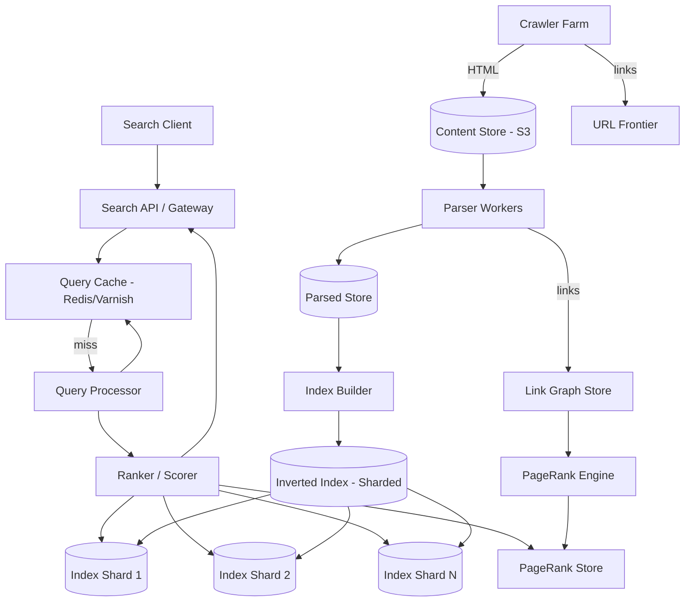
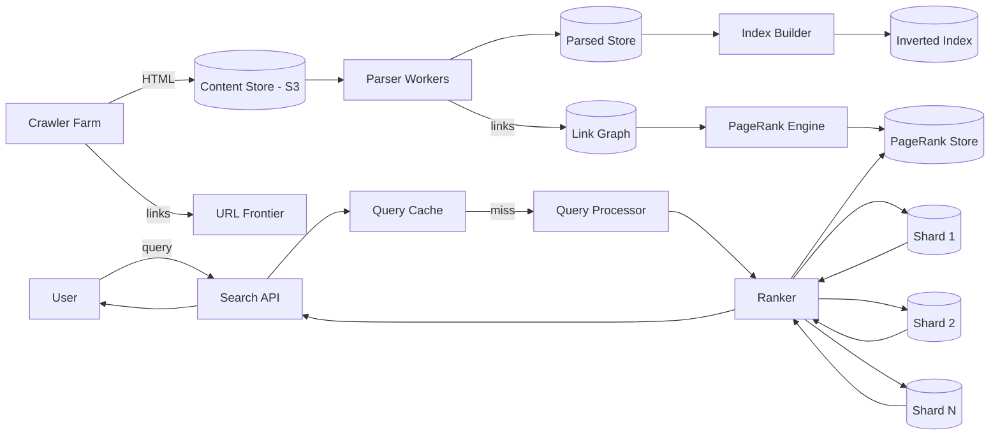
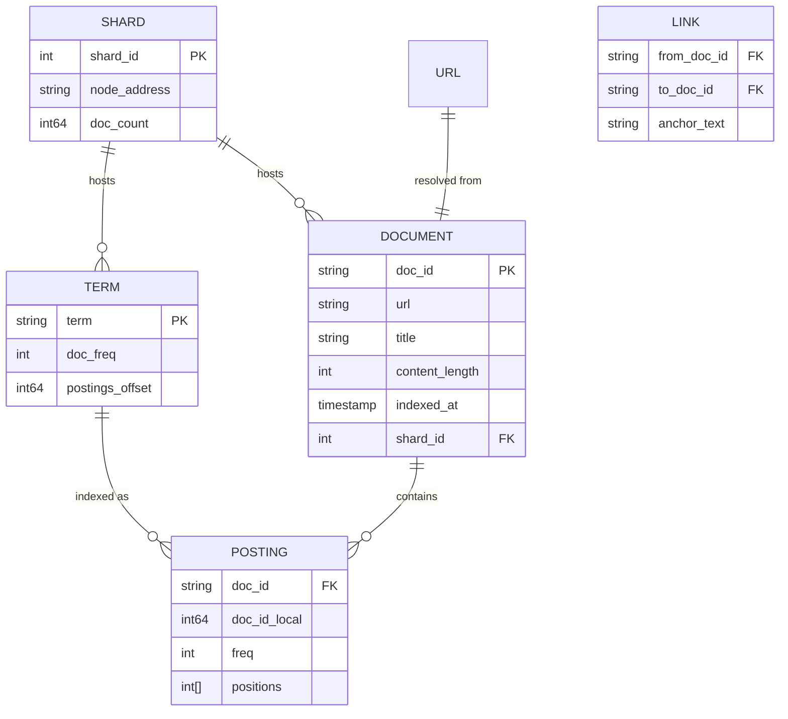
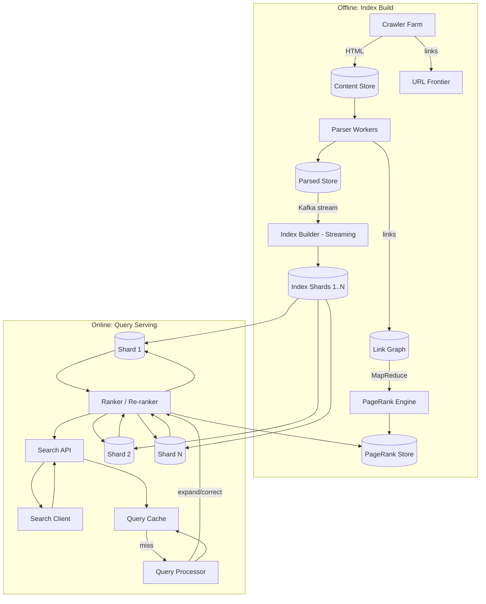
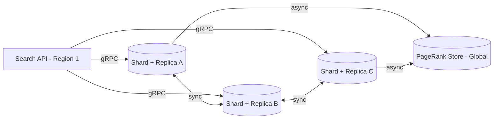
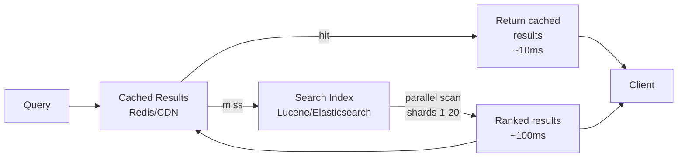
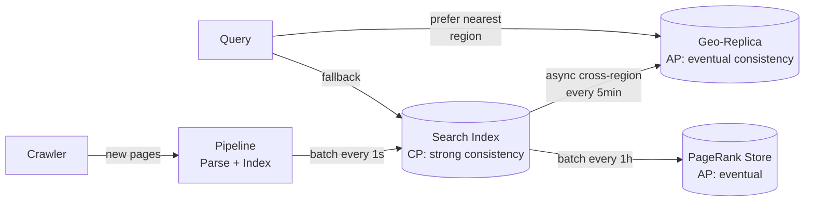

# Design Search Engine (Google)

## Blogs and websites

## Medium

## Youtube

- [Design a Basic Search Engine (Google or Bing) | System Design Interview Prep](https://www.youtube.com/watch?v=0LTXCcVRQi0)
- [Grokking the Search Engine Interview](https://www.educative.io/blog/system-design-interview-search-engine)
- [Introduction to Information Retrieval (Stanford)](https://nlp.stanford.edu/ir-book/)

---

## Theory

### Topics Covered

1. [Introduction / Problem Statement](#introduction--problem-statement)
2. [Characteristics](#characteristics)
3. [Pros](#pros)
4. [Cons](#cons)
5. [Use Cases](#use-cases)
6. [Components](#components)
7. [Architectural Patterns](#architectural-patterns)
8. [Benefits](#benefits)
9. [Challenges](#challenges)
10. [Best Practices](#best-practices)
11. [When to Use / When Not to Use](#when-to-use--when-not-to-use)
12. [Data Model and API](#data-model-and-api)
13. [Domain-Specific: Search Engine Architecture Deep Dive](#domain-specific-search-engine-architecture-deep-dive)
14. [Replication Strategies](#replication-strategies)
15. [Failure Detection and Membership](#failure-detection-and-membership)
16. [High Availability and Scalability](#high-availability-and-scalability)
17. [Performance and Optimization](#performance-and-optimization)
18. [CAP Theorem and Consistency Trade-offs](#cap-theorem-and-consistency-trade-offs)
19. [Encryption and Key Management](#encryption-and-key-management)
20. [Authentication and Authorization](#authentication-and-authorization)
21. [Security Threats and Mitigations](#security-threats-and-mitigations)
22. [Observability and Logging](#observability-and-logging)
23. [Real-World Implementations](#real-world-implementations)
24. [Java and Spring Boot Implementation Guide](#java-and-spring-boot-implementation-guide)
25. [Interview Questions and Answers](#interview-questions-and-answers)

---

### Introduction / Problem Statement

A search engine is a system that crawls the web, indexes billions of documents, and returns the most relevant results to a user query in milliseconds. Unlike a database lookup (an exact match on a known primary key), a search engine must answer ambiguous, partial, and ranked queries against an ever-growing corpus of unstructured text and multimedia. The system must **discover** content (crawling), **organize** it (inverted indexing), and **rank** it (PageRank + ML relevance models) — all while serving millions of concurrent queries at global scale with sub-200 ms latency.



*The diagram shows the two-stage architecture of a search engine: the offline pipeline (Crawler → Content Store → Parser → Parsed Store + Link Graph → Index Builder → sharded Inverted Index, and Link Graph → PageRank Engine → PageRank Store) builds and maintains the searchable index; the online pipeline (Client → Search API → Query Cache → Query Processor → Ranker → Index Shards + PageRank Store) serves ranked results in milliseconds.*

**Problem Statement:** Build a search engine that crawls the web, builds a distributed inverted index with link-based authority (PageRank) and ML relevance signals, processes natural-language queries (with typo tolerance, synonyms, and intent detection), ranks billions of documents by relevance in sub-200 ms, and scales to serve millions of concurrent queries globally while keeping the index fresh and resisting spam and manipulation.

**The scale challenge in numbers:** Google indexes over 100 billion web pages and handles 8.5 billion searches per day (≈100,000 queries per second at peak). A single query for a common term like "python" may match millions of documents — the engine must intersect massive posting lists, score candidates with a multi-feature ML model, and return the top 10 in under 50 ms. The inverted index itself spans petabytes across 10,000+ machines. Crawling 20 billion pages per day requires thousands of distributed crawlers sharing a URL frontier, and the index must be refreshed incrementally so breaking news is searchable within minutes.

---

### Characteristics

| Characteristic | What it means | Why it matters | How it works |
|---|---|---|---|
| **Crawling** | Discovers and downloads web pages | New content must be found before it can be indexed | URL frontier, politeness delay, robots.txt |
| **Indexing** | Transforms pages into searchable structures | Enables sub-200 ms lookup over billions of docs | Inverted index: term → list of (doc_id, positions) |
| **Ranking** | Orders results by relevance | Most relevant results first | PageRank + ML features (content, authority, freshness) |
| **Query processing** | Interprets user intent | Handles typos, synonyms, phrase matching | Tokenization, spell correction, query expansion |
| **Freshness** | New content appears quickly | News and time-sensitive content is perishable | Sitemaps, real-time crawlers, incremental indexing |
| **Scale** | Handles billions of pages and millions of queries | Global audience demands massive parallelism | Distributed storage, sharded index, query fan-out |
| **Caching** | Accelerates repeated work | 90%+ of queries are repeats | Edge cache for hot queries; postings cache per shard |
| **Spam resistance** | Detects and demotes low-quality content | Manipulated rankings degrade user trust | Link-pattern analysis, content-quality ML models |

---

### Pros

- **Information discovery at scale:** Organizes the world's information and makes it searchable instantly — a single query reaches billions of documents.
- **Relevance ranking:** Users get the most relevant results first, not just matching results — PageRank + ML models surface authoritative, high-quality content.
- **Sub-second latency:** 99% of queries return in under 200 ms, with the majority under 50 ms, through aggressive caching and distributed query fan-out.
- **Freshness:** Breaking news and updated content is indexed within minutes via incremental crawling and sitemap submission.
- **Rich results:** Rich snippets, featured snippets, knowledge panels, and universal search (web, images, videos, news) provide more than just links.
- **Universal access:** Search is the primary interface to the web for most users — zero learning curve.

---

### Cons

- **SEO manipulation:** Website owners manipulate rankings via link farms, keyword stuffing, and cloaking, requiring constant algorithm updates.
- **Filter bubbles:** Personalization and behavioral signals can isolate users in information bubbles, limiting exposure to diverse viewpoints.
- **Privacy concerns:** Search history reveals sensitive information (health, finances, beliefs) — queries and clicks must be anonymized and retention-limited.
- **Misinformation:** False information can rank highly for trending topics; moderation at web scale is extremely difficult.
- **Advertising dependence:** Revenue from ads creates tension between organic result quality and paid placement, though top placement is typically organic.
- **Digital divide:** Algorithmic ranking favors popular, sophisticated content; smaller voices and niche topics may be buried.
- **Index staleness:** New or updated pages are not searchable until crawled, indexed, and propagated — a delay of seconds to hours.

---

### Use Cases

- **Web search (Google/Bing):** Crawl the open web, build a distributed inverted index, compute PageRank, and rank with an ML model combining 100+ signals (authority, content quality, freshness, user context). The canonical search engine — the reference point for every other use case.
- **E-commerce product search:** Index product titles, descriptions, and structured attributes; support faceted filtering (price, brand, category) and typo tolerance. BM25 + commercial signals (ratings, sales velocity, inventory) drive ranking.
- **Site search:** Index a single domain's content; provide typo-tolerant search with highlighting and synonym expansion. Authority comes from site structure (click depth) rather than cross-domain PageRank.
- **News search:** Real-time ingestion from 100K+ publishers via sitemaps and RSS/Atom feeds; time-based ranking (freshness weight dominates) ensures breaking news surfaces first with sub-minute latency.
- **Enterprise search:** Index documents, emails, and knowledge bases behind an authentication wall; support per-document access control so users only see results they are permitted to read.

---

### Components

| Component | Purpose | Responsibilities | Relationship |
|---|---|---|---|
| **Crawler** | Discover and download web pages | URL frontier, politeness, `robots.txt`, retry logic, incremental crawling | Writes raw pages to Content Store; feeds URL frontier |
| **Parser** | Extract text from HTML | Strip tags, detect encoding, extract title/body/links, canonicalization | Reads from Content Store; writes to Parsed Store + Link Graph |
| **Indexer** | Build the inverted index | Tokenize, normalize (lowercase, stem), build term → postings mapping | Consumes Parsed Store; writes to Index Store (sharded) |
| **Link Graph** | Store link relationships | Web graph (billions of nodes, edges) for authority computation | Built by Parser; queried by PageRank Engine |
| **Ranker** | Compute relevance scores | PageRank (offline) + ML features + query-time scoring | Reads Index Store + Link Graph/PageRank Store |
| **Query Processor** | Interpret search queries | Tokenize, spell correction, synonym expansion, phrase handling, intent classification | Reads Index Store; caches hot results |
| **Search API** | Serve search responses | Fan out to index shards, merge top-K, paginate, return JSON | Calls Ranker + Query Processor; serves clients |
| **Cache Layer** | Accelerate repeated queries | Edge cache for hot queries (CDN/Varnish), shard-level postings cache | Read by Search API; warmed by Query Processor |



*Component interaction flow: the Crawler Farm discovers URLs via the frontier and writes raw HTML to the Content Store; Parser Workers extract text and links into the Parsed Store and Link Graph; the Index Builder creates the sharded Inverted Index; the PageRank Engine computes link authority offline into the PageRank Store; at query time, the Search API checks the Query Cache, then the Query Processor normalizes the query, the Ranker fans out to all index shards (and joins PageRank), merges and re-ranks the top-K, and returns results to the client.*

---

### Architectural Patterns

- **Inverted Index:**
  - **What:** A data structure mapping each unique token to a postings list of documents (with positions) containing that token — the inverse of the natural document → words mapping.
  - **Problem solved:** "Find all documents containing 'python'" must return in milliseconds from billions of documents.
  - **How it works:** Tokenizer splits text into tokens, normalizes (lowercase, stem, remove stop words), and for each token appends `(doc_id, [positions])` to the postings list. At query time, look up the token → get postings list → intersect lists for multi-word queries.
  - **When to use:** Text search engines, document retrieval, log search — any workload needing fast keyword lookup over a large corpus.
  - **When not to use:** When data isn't text-based (e.g., image search needs vector indexing) or when only exact structured lookups are needed.
  - **Advantages:** O(1) lookup per term; efficient multi-term queries (AND via posting list intersection, OR via merge); supports phrase matching via positions.
  - **Disadvantages:** Index is larger than the original documents (2–3×); incremental updates require partial re-indexing and merge coordination.
  - **Real-world example:** Elasticsearch, Solr, Lucene, Google's Bigtable-backed index.

- **PageRank (Link-Based Authority):**
  - **What:** An iterative random-surfer model that assigns a numerical weight to each page based on the number and quality of incoming links.
  - **Problem solved:** Not all links are equal — a link from a high-authority page (nytimes.com) carries more weight than a link from a random blog. PageRank quantifies this.
  - **How it works:** `PR(A) = (1-d)/N + d × Σ(PR(Ti)/C(Ti))` where `d` is a damping factor (typically 0.85), `Ti` are pages linking to `A`, and `C(Ti)` is the out-degree of `Ti`. Computed iteratively until convergence.
  - **When to use:** Web search where cross-domain link authority matters for ranking.
  - **When not to use:** Site search or enterprise search where the link graph is confined to a single domain with limited authority signal.
  - **Advantages:** Simple algorithm; effective proxy for authority; can be computed offline.
  - **Disadvantages:** Doesn't account for content quality on its own; easily gamed (link farms); a single signal among hundreds.
  - **Real-world example:** Google's original search algorithm.

- **Distributed Sharded Index:**
  - **What:** The inverted index is partitioned across many machines by document ID (or term) hash, each shard holding a subset of the total corpus.
  - **Problem solved:** A 100-billion-document, petabyte-scale index cannot fit on a single machine — it must be split for storage and parallelism.
  - **How it works:** Shard by `hash(doc_id) % N`. Each shard maintains its own inverted index, postings, and term dictionary. At query time, the Search API fans the query out to all relevant shards, each returns its local top-K, and the aggregator re-ranks into a global top-K.
  - **When to use:** Petabyte-scale indexes serving high query throughput — essentially all production web search engines.
  - **When not to use:** Small collections (< 1M documents) — a single node or a managed search service is simpler.
  - **Advantages:** Horizontal scalability; fault isolation (a dead shard degrades, not crashes, the system); independent scaling of storage and compute.
  - **Disadvantages:** Query fan-out adds network/aggregation overhead; uneven shard sizes create hotspots ("hot shards").
  - **Real-world example:** Google's Bigtable index, Elasticsearch/Solr clusters.

- **Fan-Out Query (Scatter-Gather):**
  - **What:** A single incoming query is dispatched in parallel to all index shards; each shard computes local scores and returns its top-K; the coordinator merges and re-ranks.
  - **Problem solved:** A user query must search the entire index simultaneously to return globally relevant results, but the index is too large for one machine.
  - **How it works:** The Query Processor broadcasts the (normalized) query to all shards via RPC; each shard intersects posting lists and scores candidates locally; the coordinator performs a heap-based top-K merge across shard responses.
  - **When to use:** Any distributed search index where a query spans multiple shards.
  - **When not to use:** When queries can be routed to a single shard (doc-ID routing) — fan-out is unnecessary overhead.
  - **Advantages:** Parallelizes the heaviest part of search (scoring); leverages all shards' CPU.
  - **Disadvantages:** Network fan-out latency (tail = slowest shard); result merge cost; coordination overhead.
  - **Real-world example:** Elasticsearch `_search` across all shards, SolrCloud.

- **Streaming / Incremental Indexing:**
  - **What:** New and updated documents are indexed in near real-time (seconds to minutes) rather than in a single daily batch.
  - **Problem solved:** Batch-only indexing leaves breaking news and time-sensitive content unsearchable for hours — freshness is a ranking signal and a user expectation.
  - **How it works:** Crawlers push new content to a streaming pipeline (Kafka); an Index Builder consumer processes each document into the index; a refresh/reopen operation makes recently indexed segments visible to search within a configurable interval (e.g., 1 second).
  - **When to use:** News search, web search, product catalogs that change frequently.
  - **When not to use:** Archival or slowly-changing data where daily batch indexing suffices.
  - **Advantages:** Fresh results; lower visibility latency; can be combined with batch for backfills.
  - **Disadvantages:** Merge contention from frequent small segments; higher write amplification.
  - **Real-world example:** Google Caffeine, Elasticsearch's `refresh_interval`.

---

### Benefits

- **Universal information access:** A single, low-friction interface (the query box) unlocks billions of documents — the primary way most users navigate the web and internal knowledge bases.
- **Relevance over exact match:** Ranking models go beyond keyword presence to surface authoritative, high-quality, and fresh content, dramatically improving the signal-to-noise ratio.
- **Scale through distribution:** Sharding and fan-out let a query span petabytes across thousands of machines while staying under the latency budget.
- **Freshness:** Incremental crawling and streaming indexing make new and updated content discoverable within minutes (or seconds), essential for news and trending topics.
- **Rich, contextual results:** Rich snippets, featured snippets, knowledge panels, and universal search (images, video, news) deliver answers, not just links.
- **Self-improving via signals:** Click-through, dwell time, and engagement data continuously train ranking models, improving quality over time.

---

### Challenges

- **Distributed indexing at petabyte scale:** The full-text index for billions of pages is petabytes — must be sharded across thousands of machines with replication, and rebalanced as the collection grows.
- **Query fan-out and merge:** A single query hits hundreds of shards and the slowest shard sets the tail latency — must bound latency with timeouts and early termination.
- **Ranking freshness vs. cost:** PageRank is computed offline (weekly); real-time ranking signals (freshness, query log CTR) must be applied at query time without blowing the latency budget.
- **Crawling efficiency:** Must crawl intelligently (don't re-crawl unchanged pages; respect per-host rate limits; use sitemaps) while discovering new content across an exponentially growing web.
- **Spam and manipulation:** SEO tactics (link farms, keyword stuffing, cloaking) and paid manipulation must be detected and demoted — an ongoing arms race.
- **Memory vs. disk trade-offs:** Posting lists for common terms ("the") span millions of entries — keeping hot segments in memory is expensive, but disk access kills latency.
- **Relevancy for long-tail queries:** Common queries are well-tuned, but the long tail of rare queries lacks training data and click signals, leading to weaker results.

---

### Best Practices

- **Sharding:** Distribute the index across 1000+ machines by `doc_id` hash (consistent hashing for even distribution and smooth rebalancing).
- **Query caching:** 99% of queries are repeats — cache top results at the edge (CDN/Varnish) and per-shard; cache negative results ("term not in shard") to skip empty shards.
- **Skip pointers in postings:** Add skip links every N entries in posting lists for faster intersection — O(min(A,B)) with skips vs. O(A+B) without.
- **Query processing pipeline:** Tokenize → normalize (lowercase, stem) → remove stop words → spell correction → synonym expansion → rank.
- **Pre-computed PageRank:** Compute PageRank offline (weekly) via MapReduce; store in a wide-column store (Bigtable/HBase) keyed by URL; join with the index at query time.
- **Distributed crawling:** Use a distributed URL frontier; crawl in priority order (high-authority + frequently changed pages first); use sitemaps for change hints.
- **Index freshness:** Use sitemaps for real-time crawling of frequently updated sites; incremental/ streaming indexing with a short `refresh_interval`.
- **Ranking feature store:** Pre-compute static features (PageRank, content quality score, domain authority) daily; compute real-time features (freshness, user context) at query time.

---

### When to Use / When Not to Use

**Use when:**

- You need to search large volumes of unstructured or semi-structured text (web pages, documents, articles, product descriptions) where users search with partial, misspelled, or multi-word queries.
- Relevance ranking (beyond exact match) is important — a simple `LIKE '%query%'` SQL search won't surface the most authoritative or useful results.
- Freshness matters — content changes frequently and must become searchable quickly (news, product catalogs, documentation).
- Scale requires distributed indexing and search (billions of documents, millions of queries per day) that a single database cannot handle.
- Users expect typo tolerance, synonyms, and phrase matching as part of the search experience.

**Avoid when:**

- The dataset is small (< 1M documents) — a database full-text index (PostgreSQL `tsvector`, MongoDB text index) or a managed search service is simpler and sufficient.
- Queries are always exact, structured lookups (e.g., by product SKU or user ID) — a database primary-key index is faster and simpler.
- Strong consistency on every write is required and the read volume is low — the operational complexity of an inverted index is not justified.
- All content is highly structured (numbers, dates, categories) with no free-text search need — use a database with proper B-tree indexes.

**Alternatives:**

- **Database full-text search:** PostgreSQL `tsvector` / MongoDB text index — simpler, no separate infrastructure. Good for small–medium catalogs and exact-ish matching, but limited ranking and no built-in distributed sharding.
- **Elasticsearch / Solr:** Managed or self-hosted search service — for medium scale (millions to low-billions of documents) or when you want to avoid running your own search infra. Provides inverted index + BM25 + faceting out of the box.
- **Vector search:** For semantic similarity search (embeddings) — when keyword matching misses intent (e.g., "how do I wash a wool sweater" → "wool care instructions" with no keyword overlap).
- **Third-party (Algolia, Typesense Cloud):** Fully managed search API — trade cost + vendor lock-in for simplicity and speed of iteration.

**Decision factors:**

- **Document count:** Billions → self-hosted distributed search; millions → Elasticsearch/Solr; thousands → DB full-text search.
- **Query latency:** Sub-100 ms → heavy caching + pre-computed ranking; sub-second → simpler.
- **Freshness requirement:** Real-time → streaming ingestion + short refresh interval; batch is fine → incremental daily.
- **Relevance complexity:** Many features (100+ signals) → ML-based ranking (LambdaMART/neural); few features → lexical scoring (BM25).

---

### Data Model and API

The data model has two sides: the **index data model** (the on-disk inverted index) that powers retrieval, and the **document metadata model** that backs the API responses. The inverted index maps terms to postings; the document store holds the fields (title, URL, body snippet, freshness) returned to clients.



*The entity-relationship diagram captures the core search data model: each DOCUMENT (with URL, title, content length, index timestamp, and shard assignment) is associated with one or more POSTING entries; each TERM maps to its postings (doc_id, term frequency, and positions within the document); each SHARD hosts a subset of terms and documents; and LINK records capture the web graph (from_doc_id → to_doc_id with anchor text) used by PageRank. The postings offset points into the compressed postings file for fast disk reads.*

**Entity descriptions:**

- **TERM:** `term` (normalized token), `doc_freq` (number of documents containing the term — used for IDF and skip-list sizing), `postings_offset` (byte offset into the compressed postings file for direct disk reads). Stored in a term dictionary (often a finite-state transducer / FST) per shard.
- **POSTING:** `doc_id` (local to the shard + segment), `freq` (term frequency in the document — drives the TF component of scoring), `positions` (token offsets enabling phrase and proximity queries). Posting lists are sorted by `doc_id` and compressed (variable-byte or frame-of-reference).
- **DOCUMENT:** `doc_id`, `url`, `title`, `content_length`, `indexed_at`, `shard_id`. The stored fields used to build result snippets and serve rich snippets.
- **SHARD:** `shard_id`, `node_address` (which machine hosts it), `doc_count`. A logical partition of the index; each shard is a self-contained inverted index.
- **LINK:** `from_doc_id`, `to_doc_id`, `anchor_text`. The web graph edges. `anchor_text` is itself indexed (links to a page often describe it — anchor-text matching is a strong signal).

**Indexes and Constraints:**

- `TERM(term)` — primary key; the term dictionary must support fast lookup of the postings offset.
- `POSTING(doc_id, positions)` — sorted by `doc_id` within each term's posting list; enables binary search and skip pointers.
- `DOCUMENT(url)` — unique constraint (a canonical URL maps to one document); prevents duplicate indexing.
- `DOCUMENT(indexed_at)` — for freshness-based segment selection and deletion of stale documents.
- `LINK(from_doc_id, to_doc_id)` — composite index for both out-links (crawl frontier) and in-links (PageRank contribution).

**Partitioning / Sharding:**

- **Shards:** The index is split into ~1000–5000 shards by `hash(doc_id) % N`. Each shard is an independent inverted index hosted on a node; a query fans out to all shards and merges results.
- **Routing:** By default, broadcast (query all shards). For doc-ID routing (e.g., "find document X"), route to `hash(doc_id) % N` to hit a single shard — avoids fan-out.
- **Segments:** Within a shard, Lucene groups postings into immutable segments; small real-time segments are merged into larger ones in the background (compaction).
- **Replication:** Each shard has 1–2 replicas on different nodes for availability and read scaling.

**API Contract:**

| Method | Endpoint | Purpose | Rate Limit |
|---|---|---|---|
| GET | `/api/v1/search?q=python&from=0&size=20` | Search documents | 10 req/sec/IP, 1 req/sec/anon |
| POST | `/api/v1/index` | Index a document | internal only |
| GET | `/api/v1/autocomplete?q=py` | Query suggestions | 20 req/sec/IP |
| GET | `/api/v1/suggest?q=pythn` | Spell correction | 20 req/sec/IP |
| GET | `/api/v1/doc/{docId}` | Fetch a single document | 10 req/sec/IP |

**GET /api/v1/search — Request:**

```http
GET /api/v1/search?q=machine+learning&from=0&size=10&hl=1 HTTP/1.1
Authorization: Bearer <jwt>
Accept: application/json
X-Request-ID: abc-123
```

**GET /api/v1/search — Response:**

```json
{
  "query": "machine learning",
  "from": 0,
  "size": 10,
  "took_ms": 32,
  "total_hits": 8473812,
  "hits": [
    {
      "doc_id": "d_9382",
      "title": "Machine Learning — A Probabilistic Perspective",
      "url": "https://press.princeton.edu/books/softcover/9780691162268/machine-learning",
      "snippet": "...comprehensive introduction to the foundations of machine learning ...",
      "score": 15.42,
      "page_rank": 0.82,
      "fields": {"freshness": "2023-05-01"}
    }
  ],
  "suggestions": ["did you mean: machine learning?"],
  "aggregations": {"year": {"2023": 1200, "2022": 9800}}
}
```

**Status codes:** `200` OK, `400` Invalid query (missing `q`), `401` Auth required, `403` Forbidden (access control denial), `404` Document not found, `429` Rate limited, `503` Temporarily unavailable (index shard down — serve partial results).

---

### Domain-Specific: Search Engine Architecture Deep Dive

This section drills into the techniques unique to search engines: how the inverted index is constructed and queried, how TF-IDF/BM25 turns term statistics into relevance scores, how PageRank propagates link authority through the web graph, how queries are processed (typos, synonyms, intent), how ranking combines lexical and ML signals, and how caching keeps repeated queries instant. These topics are the heart of search system design.

#### Inverted Index

* **What:** A data structure mapping each unique token to a postings list of documents (with term-frequency and positions) containing that token — the inverse of the natural document → contents mapping.
* **Problem solved:** "Find all documents containing 'python'" must return in milliseconds from billions of documents — a full scan is infeasible.
* **How it works:** The tokenizer splits text into tokens (regex `[a-zA-Z0-9]+`), lowercases, removes stop words, and applies stemming; for each token it appends `(doc_id, freq, [positions])` to that term's posting list. At query time, look up the term → retrieve its postings list → for multi-term queries, intersect lists (two-pointer merge) for AND or merge for OR.
* **Construction:** Documents are batched; terms are sorted; postings lists are sorted by `doc_id` and compressed (variable-byte encoding for gaps, frame-of-reference for positions) to reduce storage by 4–10×. Terms are stored in a dictionary (often a finite-state transducer for prefix lookup in autocomplete).
* **Query processing:** Single-term lookup returns the posting list directly; multi-term AND queries intersect sorted lists; phrase queries intersect the two terms' lists and verify positional adjacency. Skip pointers (every √N entries) make intersection O(min(A, B)) instead of O(A + B).
* **When to use:** Text search engines, document retrieval, log search — any workload needing fast keyword lookup.
* **When not to use:** Non-text data (use vector indexing); exact-only lookups (use a B-tree).
* **Advantages:** O(1) term lookup; efficient AND/OR/phrase; supports highlighting and snippet generation.
* **Disadvantages:** Index is 2–3× the source size; updates require segment merges and partial re-indexing.
* **Real-world example:** Lucene/Elasticsearch inverted index, Google's Bigtable-backed index.

#### TF-IDF and BM25

* **What:** Term-frequency inverse-document-frequency weighting converts raw term statistics into a relevance score; BM25 is the modern refinement that replaces the original TF-IDF formula.
* **Problem solved:** A document matching "the" (in 90% of docs) is not relevant; a document matching a rare term like "neuro-symbolic" in 0.001% of docs is highly relevant. TF-IDF captures this.
* **How it works:** `TF(t,d)` = frequency of term t in document d (log-scaled to avoid over-weighting very frequent terms); `IDF(t) = log(N / df(t))` where N = total docs and `df(t)` = document frequency of t; the score for a query is `Σ_t TF(t,d) × IDF(t)^2` summed over query terms. TF-IDF rewards terms that are frequent in a document but rare across the corpus.
* **BM25 refinement:** BM25 adds term-saturation (`TF / (TF + k1)` so TF has diminishing returns) and proper document-length normalization (`(k3+1) / (k3 + doclen/avgdl)`). It is the default scoring model in Elasticsearch and Solr.
* **When to use:** Keyword-based retrieval where lexical match quality matters; the foundation for almost all search ranking.
* **When not to use:** Semantic search with no keyword overlap — use embeddings/vector search instead.
* **Advantages:** Simple, interpretable, effective as a lexical baseline.
* **Disadvantages:** Ignores term proximity, word order nuance, and semantic meaning (two docs with the same words in different order score the same).
* **Real-world example:** Lucene's `BM25Similarity`, Elasticsearch/Solr default scoring.

#### PageRank

* **What:** An iterative random-surfer model that assigns a numerical weight to each page based on the number and quality of incoming links.
* **Problem solved:** Not all matching documents are equal — a link from a high-authority page (nytimes.com) is a stronger relevance signal than a link from a random blog. PageRank quantifies link-based authority.
* **How it works:** `PR(A) = (1-d)/N + d × Σ(PR(Ti)/C(Ti))` where d ≈ 0.85 (damping factor — probability of following a link vs. jumping to a random page), Ti are pages linking to A, and C(Ti) is Ti's out-degree. Computed iteratively via power iteration until convergence (|ΔPR| < 0.0001), typically 50–100 iterations for a billion-page graph.
* **Implementation (MapReduce):** Map emits `(source, PR(source)/out_degree(source))` per out-edge; Reduce sums contributions per destination and computes `PR = (1-d)/N + d × sum`. Dangling nodes (no out-links) leak probability — handled by redistributing globally each iteration. Stored in a wide-column store (Bigtable/HBase) keyed by URL, joined with the index at query time.
* **When to use:** Web search where cross-domain link authority matters.
* **When not to use:** Site search / enterprise search where the link graph is confined to one domain with limited authority signal.
* **Advantages:** Simple, effective proxy for authority, computed offline.
* **Disadvantages:** Content-blind (a page with great content but no inbound links scores low); gamed by link farms; a single signal among hundreds.
* **Real-world example:** Google's original search algorithm (PageRank still contributes as one signal among ~200 ranking factors).

#### Query Processing

* **What:** The pipeline that transforms a raw user query string into a normalized, expanded set of terms that can match the inverted index — handling typos, synonyms, phrases, and intent.
* **Problem solved:** A user types "pythn programing" (two typos and a missing 'm'); the engine must still find documents about "Python programming." Without query processing, exact-term matching fails on real-world queries.
* **How it works:** (1) **Tokenization** — split the query into terms using the same analyzer as indexing (regex, lowercasing, stemming). (2) **Spell correction** — build a candidate set via edit-distance-1 neighbors, score by term frequency / keyboard proximity, and re-rank the merged results. (3) **Synonym expansion** — a synonym graph maps "python" → [python, snake] and "tv" → [television]; phrase synonyms ("NYC" → "New York City") are handled as multi-token replacements. (4) **Phrase handling** — quoted or proximity queries look up term positions and verify adjacency. (5) **Intent classification** — classify as navigational (go to a known site), informational (find answers), or transactional (shop/buy) and bias ranking accordingly.
* **When to use:** Every user-facing search — real queries are almost never perfectly spelled exact terms.
* **When not to use:** Programmatic exact-match lookups where typos and synonyms would cause false positives.
* **Advantages:** Dramatically improves recall and user satisfaction; handles the long tail of query variations.
* **Disadvantages:** Adds latency (spell checking over a large dictionary); synonym expansion can introduce false positives; intent classification misclassifies edge cases.
* **Real-world example:** Lucene's `QueryParser`, Elasticsearch's `synonym_graph`, Google's "Did you mean?" suggestion.

#### Relevance Ranking

* **What:** The scoring stage that combines lexical match quality (BM25) with query-independent authority (PageRank) and query-dependent/contextual ML features to produce a final relevance score per document.
* **Problem solved:** BM25 alone surfaces on-topic documents but can't distinguish an authoritative primer from a low-quality keyword-stuffed page. Ranking must fuse many signals.
* **How it works:** Two stages. **Candidate generation** — retrieve the top few thousand (e.g., 1000–5000) documents matching the query via BM25 from the index shards. **Re-ranking** — a learning-to-rank model (LambdaMART gradient-boosted trees, or a neural cross-encoder) scores the candidates using features: lexical (BM25, TF-IDF), authority (PageRank, domain authority), content quality (readability, ad-to-content ratio), freshness, query-document proximity, click-through rate, and user context (location, device, history). The top-N by final score are returned.
* **Feature store:** Static features (PageRank, quality score, domain authority) are precomputed offline and stored with the document; real-time features (current CTR, query freshness, user context) are fetched in parallel at query time.
* **When to use:** Any search where result quality is a competitive differentiator.
* **When not to use:** Simple lookup where exact match suffices.
* **Advantages:** High-quality, continuously improving results; supports A/B testing of ranking changes.
* **Disadvantages:** Complex to train and tune; expensive re-ranking adds latency; requires labeled training data (human raters + click logs).
* **Real-world example:** Google's RankBrain (neural), Bing's LambdaMART, Elasticsearch's `function_score` + rank features.

#### Caching

* **What:** Multi-level caches that store hot query results, term postings, and document fields so that repeated work is served from memory in microseconds rather than recomputed.
* **Problem solved:** 90–99% of search queries are repeats (e.g., "weather," "facebook," "youtube"). Without caching, the system re-executes expensive fan-out + scoring on every identical query, wasting CPU and increasing tail latency.
* **How it works:** Three layers. (1) **Edge cache (CDN/Varnish)** — cache the full HTTP response for hot queries (top 1K–100K) so 90% of traffic never reaches the Search API. Set with a TTL (e.g., 60s for trending, 5 min for stable) and invalidate on index refresh. (2) **Query result cache (Redis)** — cache the merged, ranked result per normalized query + user-segment key; shared across users for anonymous queries. (3) **Shard-level postings cache** — each shard caches hot term posting lists and frequently loaded document stored fields in memory, so repeated lookups skip disk.
* **Advanced techniques:** **Negative caching** — cache "term not in shard" so the Search API can skip empty shards; **result set caching** — cache the top-K per shard per query term-combination; **personalized cache keys** — only the unauthenticated/anonymous tier is cached at the edge; per-user results are cached in Redis keyed by `user_id:query_hash`.
* **When to use:** High-query-volume production search where 90%+ of queries are repeats.
* **When not to use:** Private/personalized results that can't be shared or where freshness demands are absolute.
* **Advantages:** Sub-10 ms responses for cached queries; reduces origin load by 90%+.
* **Disadvantages:** Cache invalidation complexity; stale results; memory cost for large caches; cache stampede on popular queries (use probabilistic early expiration / request coalescing).
* **Real-world example:** Google's edge cache, Varnish for search results, Redis query caches, Lucene's query result cache.

#### Architecture Overview

A production search engine uses a **batch + streaming architecture**: crawlers feed a streaming pipeline (Kafka) for near-real-time indexing, while a batch layer (MapReduce/Spark) rebuilds segments for large backfills. The **inverted index** is sharded across thousands of machines; **PageRank** is computed offline via MapReduce on the link graph and stored in a wide-column store; the **query layer** fans requests out to shards, caches aggressively, and re-ranks with an ML model.



*Three-layer architecture: the offline layer crawls, parses, and builds sharded inverted indices plus offline PageRank scores; the online layer (Search API → Query Cache → Query Processor → Ranker fanning out to all shards and the PageRank store) serves ranked results; streaming ingestion (via Kafka) keeps the index fresh while batch rebuilds handle backfills.*

**Architecture layers:**

- **Edge layer:** CDN/Varnish for cached query responses; DNS-based geo-routing to the nearest region.
- **Query layer:** Stateless Search API and Query Processor services; the Ranker fans out to shards and joins PageRank + real-time features.
- **Index layer:** Sharded inverted indices (1000+ shards, 1–2 replicas each) backed by SSD storage; each shard caches hot postings in memory.
- **Batch/streaming layer:** Kafka for streaming ingestion; MapReduce/Spark for PageRank and backfill re-indexing; object storage (S3) for raw content.
- **Storage:** Content Store (S3 for raw HTML), Parsed Store + Link Graph (distributed key-value/columnar), Inverted Index (sharded local storage per node), PageRank Store (wide-column or KV store).

**Data flow:**

1. **Crawl:** Crawler Farm fetches URLs → writes HTML to Content Store → extracts internal links → adds to URL Frontier (priority queue by PageRank + freshness).
2. **Parse:** Parser Workers read HTML → strip tags → extract text + title + links → write to Parsed Store + Link Graph.
3. **Index:** Index Builder reads parsed content via the Kafka stream → tokenizes → builds postings → writes to Index Shards. Incremental segments become visible after a short refresh; batch merges compact small segments.
4. **Rank (offline):** PageRank Engine runs MapReduce on the Link Graph → writes scores to PageRank Store, joined at query time.
5. **Query:** Client → Search API → Query Cache (edge hit → return) → Query Processor (normalize, spell-correct, expand) → Ranker (fan out to shards for BM25 top-K, join PageRank + ML features, re-rank, cache, return top-10).

**Scaling strategy:**

- **Index sharding:** ~5000 shards by `hash(doc_id)` on a consistent hash ring; each node hosts ~50 shards; add nodes → rebalance vnodes.
- **Query fan-out:** Search API dispatches to all shards in parallel via gRPC; collects partial top-K with a global timeout (e.g., 30 ms) and early termination once enough results exceed the threshold.
- **Crawler parallelism:** 5000+ crawlers, each respecting per-host rate limits (politeness); shared distributed URL frontier.
- **Caching:** 99% hit rate on hot queries at the edge; per-shard postings cache for common terms ("the," "and").

**Failure handling:**

- **Shard failure:** Search API retries on a replica; if all replicas of a shard are down, the response degrades to fewer results ("did not find everything") rather than failing — a 206-style partial result.
- **Hot term overload:** "the," "of," "and" have multi-million-entry posting lists — use skip pointers, cache the posting list, and cap the contribution so popular terms don't dominate scoring.
- **Crawler failure:** URLs re-queue; other crawlers pick them up; the frontier is persisted so progress survives restarts.
- **PageRank staleness:** PageRank is computed weekly; during recomputation the previous version is served.

---

### Replication Strategies

A search engine replicates data across three layers: within the index (shard replicas for availability and read scaling), within the link graph and PageRank store (for authority lookups), and across regions (for global latency).



*Replication topology for a search engine: each index shard is replicated across three nodes (A, B, C) in a region with synchronous write-ahead log (WAL) replication so any replica can serve reads and a failed shard is instantly covered; the PageRank Store is a lower-write global table replicated asynchronously across regions since PageRank is refreshed only weekly.*

- **Index shard replication (synchronous):** Each shard has 1–2 replicas on different nodes/racks. Writes go to the primary, replicate to replicas via the WAL; a write is acknowledged when a quorum (majority) of replicas have durably stored it. Reads can be served by any replica, multiplying read throughput. If the primary fails, a replica is promoted (election via ZooKeeper/raft).
- **PageRank / link-graph replication (asynchronous cross-region):** PageRank is computed weekly and is append-mostly; replicate asynchronously across regions. A brief staleness (hours) is acceptable since PageRank is a slowly-changing signal.
- **Real-world mapping:** Elasticsearch replica shards + cross-cluster replication; Google Bigtable multi-region replicas; HBase read replicas for the PageRank table.

---

### Failure Detection and Membership

Search infra must detect failed crawler nodes, index shards, and query pods, redistribute work, and continue serving with degraded (not failed) results.

**Gossip-based membership:** Index nodes periodically exchange health heartbeats with a random subset of peers. When a node is suspected, the gossip spreads suspicion through the cluster in O(log N) rounds; once confirmed by a quorum, the node is removed from the membership list and its shards are re-replicated.

**Health checks:**

- **Liveness probes:** HTTP `/health` checked every 2 seconds by the orchestrator. Failing pods are restarted or removed from service discovery.
- **Readiness probes:** Checks that the node can serve search traffic (e.g., can open the index segment, can reach the PageRank store). Not-ready nodes are drained from the load balancer.
- **Business health checks:** Custom metrics — "index shard open time < 30 s," "Kafka consumer lag < 10,000," "cache hit ratio > 90%."

---

### High Availability and Scalability

A search engine must remain available and serve queries even when individual index nodes, query
pods, or entire data centers fail. The architecture is designed for horizontal scale and graceful
degradation.

#### Auto-Scaling

- **Query pods:** Query latency is monitored via p95/p99 metrics. When traffic spikes (e.g., breaking
  news), the orchestrator (Kubernetes) automatically scales query pods horizontally. Each pod is
  stateless — it reads from the shared index (read-only) and local caches (Redis for hot queries).
- **Index shards:** Index size grows with the web corpus. Shard count is adjusted by splitting
  overloaded shards (re-sharding). Elasticsearch supports shard splitting via the `_split` API;
  Google's index is partitioned into billions of shards with dynamic re-partitioning.
- **Crawler fleet:** The crawl frontier is partitioned by URL hash across many crawler processes.
  When new domains are discovered, additional crawler workers are spun up via autoscaling groups.

#### Load Balancing

```mermaid
flowchart TB
    CLIENT[Clients] --> LB[Global Load Balancer\n(GeoDNS / Cloud Armor)]
    LB -->|nearest region| R1[Region 1\nQuery Pool]
    LB -->|failover| R2[Region 2\nQuery Pool]
    LB -->|failover| R3[Region 3\nQuery Pool]
    R1 --> INDX1[(Search\nIndex\nRegion 1)]
    R2 --> INDX2[(Search\nIndex\nRegion 2)]
    R3 --> INDX3[(Search\nIndex\nRegion 3)]
    INDX1 -.async rep.-> INDX2
    INDX2 -.async rep.-> INDX3
```

*Global load balancing for a search engine: GeoDNS routes clients to the nearest region based on
latency and health. Each region has a query pool that reads from the local search index. Indexes
are asynchronously replicated cross-region (hourly batch for bulk updates). If a region fails,
all traffic fails over to the next-nearest healthy region.*

#### Failover

- **Query failover:** Query pods are stateless and ephemeral. If a pod crashes, the orchestrator
  restarts it on another node. In-flight queries are retried transparently by the client SDK with
  exponential backoff.
- **Index failover:** Each index shard has 2–3 replicas across different failure domains (rack,
  AZ). If a replica's node fails, queries are routed to another replica. The failed shard is
  re-replicated to a new node asynchronously. With RF=3, the system tolerates 1 replica failure
  per shard with no data loss and no availability impact.
- **Cross-region failover:** If an entire region is down (e.g., power outage), traffic is
  rerouted to the next region. Queries from the affected region see slightly higher latency
  but full functionality. Index freshness degrades (last batch sync) but serves stale-but-valid results.

#### Graceful Degradation

- **Query throttling:** Under extreme load, the query service returns `503 Service Unavailable`
  with a `Retry-After` header rather than increasing latency for everyone. Rate limiting per
  client/IP prevents abuse.
- **Result completeness trade-off:** If some index shards are unavailable, the query still
  returns results from available shards (with a "limited results" warning). This is preferable to
  failing the entire query.
- **Degraded ranking:** If the ML ranking model is unavailable, the search engine falls back to
  a simpler ranking function (TF-IDF / BM25) so queries still return relevant results, albeit
  with lower quality.

---

### Performance and Optimization

Search engines must serve millions of queries per second with sub-200 ms latency. Performance
optimization spans the write path (crawling/indexing) and the read path (query serving).

#### Read Path Optimization

- **Caching:** Hot queries and results are cached at multiple layers: (1) Browser cache (HTTP
  Cache-Control for repeated queries), (2) CDN edge cache (Cloudflare/AWS CloudFront), (3)
  Application-level cache (Redis/Ehcache for top 1% most-queried terms), (4) In-memory index cache
  (Lucene's field cache for frequently accessed fields). Cache hit ratio targets 95%+ for head queries.
- **Query routing:** The query is routed to only the relevant shards based on filters (e.g., time
  range, domain filter). This reduces the fan-out and improves latency.
- **Early termination:** Top-K queries use a max-heap of size K. If the minimum score in the heap
  exceeds the maximum possible score of remaining candidates (based on pre-computed max scores per
  segment), the search terminates early without scanning all documents.
- **Pre-computation:** Common aggregations (e.g., "top results by category," "date histograms")
  are pre-computed and stored as materialized views, refreshed periodically.
- **Result pagination optimization:** Instead of `OFFSET`-based pagination (which scans and
  discards), use cursor-based `search_after` or `search_before` to avoid deep pagination costs.

#### Write Path Optimization

- **Batch indexing:** Documents are batched (10,000+ docs per batch) before being written to the
  index. Batching amortizes the cost of segment creation and reduces WAL I/O.
- **Asynchronous processing:** Crawling, parsing, extracting text, and building forward indexes
  are decoupled via Kafka. Each stage can scale independently; crawler workers produce documents,
  parser workers consume and enrich, indexer workers consume and write to the search index.
- **Near-real-time (NRT) search:** Writes are committed to the index every 1 second (tunable
  refresh interval). The indexer writes to a real-time segment that is searchable immediately,
  allowing documents to appear in search results within seconds of being crawled.
- **Segment merging:** Lucene periodically merges smaller segments into larger ones to reduce
  file handle count and improve sequential read performance. Merging is throttled during peak
  query hours to avoid competing for I/O.

#### Caching Strategies



*Search result caching layers: 95% of queries hit the cache (Redis/CDN) and return in ~10ms. Cache
misses fall through to the search index, which scans 20 shards in parallel and ranks results in
~100ms. All results are cached on return.*

---

### CAP Theorem and Consistency Trade-offs

The CAP theorem states that during a network partition, a distributed system can provide at most
two of: Consistency, Availability, and Partition tolerance. Network partitions are inevitable in
large-scale systems, so the trade-off between consistency and availability is a design decision.

#### Index Store — CP (Consistency + Partition Tolerance)

The search index itself requires strong consistency for write operations. When a document is
updated, the update must be visible on the next query — stale indexes return irrelevant results.
The index uses synchronous replication (write to quorum before acknowledging). If a quorum cannot
be reached (e.g., 2 of 3 replicas are down), the write fails rather than diverging.

- **Trade-off:** Index updates are slower (cross-AZ sync latency ~2 ms) but queries always see
  the latest content. During a partition, writes fail but reads from available replicas still
  succeed (since reads are served from the primary or any in-sync replica).

#### Query Results — AP (Availability + Partition Tolerance)

Query serving prioritizes availability. If some index shards are unreachable, the query still
returns partial results from available shards rather than failing. Users see "limited results"
but the search service remains available.

- **Trade-off:** Results may be incomplete during a partition, but the service never goes down.
  This is acceptable because search is a "best effort" service — returning 80% of correct results
  is better than returning 0% by failing.

#### Link Graph / PageRank — AP with Eventual Consistency

PageRank is computed weekly via batch processing (MapReduce/Spark). It is stored in a read-heavy
table that is replicated asynchronously across regions. Brief staleness (hours) is acceptable
since PageRank is a slowly-changing signal.

- **Real-world mapping:** Google Bigtable multi-region replication; Elasticsearch
  cross-cluster replication; HBase read replicas.

#### Freshness vs. Relevance Trade-off



*Consistency trade-offs in a search engine: the primary index (CP) serves the freshest results
with strong consistency. Geo-replicas (AP) serve queries with eventual consistency (updates
propagate every 5 minutes). The PageRank store updates hourly and is eventually consistent. Queries
prefer the nearest geo-replica for low latency but fall back to the primary if needed.*

---

### Encryption and Key Management

A search engine processes sensitive user queries — search terms may reveal personal information
(medical conditions, political views, financial status). Encryption protects data at rest and in
transit, and key management ensures that encryption keys are securely rotated and managed.

#### Encryption at Rest

- **Index data:** Search index files are stored on encrypted disk volumes (AES-256, LUKS/AWS EBS
  encryption). The encryption keys are managed by the cloud KMS (AWS KMS / GCP KMS) with
  automatic rotation every 90 days.
- **Crawled data (raw pages):** Raw HTML pages are stored in object storage (S3/GCS) with
  server-side encryption (SSE-S3 or SSE-KMS). Pages are partitioned by shard and domain.
- **Forward index source data:** The text extracted from pages (before indexing) is stored in
  Kafka with log-level retention (7 days) and topic-level encryption.
- **Query logs:** Query logs contain PII (IP addresses, search terms). They are stored encrypted
  in BigQuery/S3 with column-level encryption for the query string and IP address fields.

#### Encryption in Transit

- **Client-to-edge:** All web and API traffic uses HTTPS/TLS 1.3. Edge termination is handled by
  the load balancer (Cloudflare or AWS ALB).
- **Internal service communication:** All service-to-service calls use mTLS (mutual TLS) with
  short-lived certificates (1 hour TTL) issued by the internal CA. Services call each other over
  gRPC with TLS enabled.
- **Index replication:** Cross-region index replication uses TLS-secured gRPC streams.

#### Key Management

- **Key hierarchy:** A root key (KEK, managed by KMS) wraps data encryption keys (DEK) for each
  storage system (index volume, S3 bucket, Kafka topic). DEKs are generated per-topic or
  per-volume and rotated with the KEK.
- **Key rotation:** KMS-managed keys are automatically rotated. Application-level DEKs are
  rotated every 30 days. Old DEKs are retained for 90 days to allow decryption of old data.
- **Audit trail:** All key access is logged via CloudTrail/Audit Logs. Unauthorized key access
  triggers an alert.

---

### Authentication and Authorization

Search engines serve billions of queries from public clients (web browsers, mobile apps) and
also expose APIs for partners and internal services. Both must be authenticated and authorized.

#### Authentication Methods

- **Public web search:** No authentication required for the public search endpoint. Rate limiting
  is applied per-IP (using a CDN edge rate limiter) to prevent abuse.
- **Partner API:** Requires API key authentication. Keys are issued to verified partners and
  include a quota (queries per day). Keys are rotated every 90 days.
- **Internal services:** Service-to-service calls use mTLS with SPIFFE IDs. Each service receives
  a short-lived certificate (1 hour) from the internal CA, embedding its identity and authorized
  scopes.
- **Admin console:** Requires SSO (SAML or OIDC) + MFA. Admin actions are logged with full audit
  trails.

#### Authorization Models

- **Public search:** No authorization — all users get the same results. Personalized results
  (e.g., "Personal results" in Google) require user consent and are scoped to the authenticated
  user's private data (Gmail, Drive).
- **Partner API:** Authorization is based on the API key's scope (e.g., "web search only" vs
  "image search only") and quota limits. Exceeding the quota returns HTTP 429.
- **Internal admin:** RBAC with roles: `viewer` (read dashboards), `editor` (modify config),
  `admin` (full access including key rotation). Changes to index config require dual-approval
  (two admins confirming).

#### Authorization Example — Partner API Rate Limiting

```java
@Service
public class PartnerApiAuthService {

    private final ApiKeyRepository apiKeyRepository;
    private final RateLimiter rateLimiter;

    public PartnerApiAuthService(ApiKeyRepository apiKeyRepository,
                                 RateLimiter rateLimiter) {
        this.apiKeyRepository = apiKeyRepository;
        this.rateLimiter = rateLimiter;
    }

    @Value("${app.api.quota.default:1000}")
    private int defaultDailyQuota;

    public boolean isAuthorized(String apiKey, String requestedScope) {
        ApiKey key = apiKeyRepository.findByKeyHash(hash(apiKey));
        if (key == null || !key.isActive() || key.getExpiresAt().isBefore(Instant.now())) {
            return false;
        }
        if (!key.getScopes().contains(requestedScope)) {
            return false;
        }
        return rateLimiter.tryAcquire(key.getId(), defaultDailyQuota);
    }

    private String hash(String apiKey) {
        return DigestUtils.sha256Hex(apiKey);
    }
}

@RestController
@RequestMapping("/api/v1/search")
public class SearchApiController {

    private final PartnerApiAuthService authService;
    private final SearchService searchService;

    @GetMapping
    public ResponseEntity<SearchResponse> search(
            @RequestParam String q,
            @RequestHeader("X-API-Key") String apiKey,
            @RequestParam(defaultValue = "web") String scope) {

        if (!authService.isAuthorized(apiKey, scope)) {
            throw new ResponseStatusException(HttpStatus.FORBIDDEN, "Invalid API key or scope");
        }

        SearchResponse response = searchService.search(q, scope);
        return ResponseEntity.ok(response);
    }
}
```

*The `PartnerApiAuthService` bean validates API key authentication and authorization. Keys are
stored as SHA-256 hashes (never in plaintext). The service checks key validity, expiry, and scope
against the requested operation. Rate limiting is enforced via a `RateLimiter` that caps queries
per hour per key. The `SearchApiController` extracts the API key from the request header and
delegates authorization to the auth service before executing the search. Unauthorized requests
receive a 403 response.*

---

### Security Threats and Mitigations

#### Threat: Query Injection / Search Abuse

Malicious users craft search queries to exploit the query parser (e.g., Lucene query syntax
injection, Boolean logic bombs that cause excessive CPU).

- **Input sanitization:** Query strings are sanitized to reject special characters (`+`, `-`, `*`,
  `)`, `{`, `}`) unless the client has a special "advanced" API scope.
- **Query complexity limits:** Maximum query length (256 chars), maximum number of terms (10),
  maximum Boolean clause count (256). Queries exceeding limits are rejected with HTTP 400.
- **CPU throttling:** The query service monitors per-query CPU time. Queries exceeding 5 seconds
  are terminated; the client receives a "query too complex" error.
- **Circuit breakers:** If error rate exceeds 1% for 1 minute, the query endpoint is tripped and
  returns cached results or a degraded response.

#### Threat: SEO Spam / Black-Hat Optimization

Attackers inject fake links and keyword-stuffed content into pages to manipulate search rankings.

- **Link spam detection:** The PageRank computation includes spam-detection signals (PageRank
  trustrank, content quality, anchor text diversity). Links from known spam farms are discounted.
- **Content quality scoring:** A separate ML model scores page quality (thin content, keyword
  stuffing, duplicate content). Low-quality pages are demoted or excluded from the index.
- **Crawling restrictions:** Pages that return 404, 429 (rate limited), or 403 (blocked) are
  removed from the index on the next crawl cycle.

#### Threat: DoS / DDoS Against the Index

- **Rate limiting at the edge:** CDN edge nodes (Cloudflare) enforce a per-IP rate limit (10 QPS)
  before requests reach the origin. Exceeding requests are dropped or CAPTCHA-challenged.
- **Request queue isolation:** High-priority (partner) queries are routed to a dedicated queue
  to ensure they are served even during a DDoS event.
- **Index replica elasticity:** Under load, additional query pods are auto-scaled and index
  replicas are promoted to handle increased read traffic.

#### Threat: Data Breach of Crawled Content

- **Index access control:** The search index is not directly accessible to external clients.
  Only internal services with mTLS credentials can query the index shards.
- **PII filtering:** Email addresses, phone numbers, and ID numbers are detected and redacted
  from the index (or stored with tokenization) to prevent exposure in search results.

---

### Observability and Logging

A search engine generates massive telemetry: query logs, click logs, index metrics, and crawl
metrics. Observability enables monitoring of performance, relevance quality, and system health.

#### Key Metrics

- **Query performance:** p50/p95/p99 latency (target: p95 < 200 ms, p99 < 500 ms), query TPS,
  error rate (< 0.1%), cache hit ratio (> 90%).
- **Index health:** Indexing throughput (documents/sec), index size growth, segment merge latency,
  shard distribution balance, replication lag.
- **Crawler health:** Pages crawled/sec, crawl errors (4xx/5xx rate), duplicate content detection
  rate, new vs. re-crawl ratio.
- **Relevance quality:** Click-through rate (CTR) by ranking position, bounce rate after click,
  search result satisfaction (implicit feedback). A/B testing compares ranking algorithm variants.
- **Resource utilization:** CPU per query pod, memory for field cache, disk I/O for index reads,
  network throughput between shards.

#### Logging

```java
@Service
public class ObservabilityService {

    private final MeterRegistry meterRegistry;
    private final Logger auditLogger;

    public ObservabilityService(MeterRegistry meterRegistry,
                                @Qualifier("audit") Logger auditLogger) {
        this.meterRegistry = meterRegistry;
        this.auditLogger = auditLogger;
    }

    @Timed(name = "search.query.latency", percentiles = {0.5, 0.95, 0.99})
    public SearchResult search(String query, SearchContext context) {
        Timer.Sample sample = Timer.start(meterRegistry);

        try {
            SearchResult result = executeSearch(query, context);

            // Record success metrics
            sample.stop(Timer.builder("search.query.latency")
                    .tag("result_count", String.valueOf(result.hits().size()))
                    .tag("cached", String.valueOf(result.isCached()))
                    .register(meterRegistry));

            // Log query (PII-sanitized)
            auditLogger.info("query_user={} query_hash={} results={} latency_ms={} cached={}",
                    context.userId(),
                    hashQuery(query),
                    result.hits().size(),
                    System.currentTimeMillis() - context.startTime(),
                    result.isCached());

            return result;
        } catch (Exception e) {
            // Record failure metrics
            meterRegistry.counter("search.query.errors",
                    "error_type", e.getClass().getSimpleName()).increment();

            auditLogger.warn("query_user={} query_hash={} error={}",
                    context.userId(), hashQuery(query), e.getMessage());
            throw e;
        }
    }

    private String hashQuery(String query) {
        return DigestUtils.sha256Hex(query);
    }
}
```

*The `ObservabilityService` bean instruments search queries with Micrometer metrics. The
`@Timed` annotation records p50/p95/p99 latency percentiles. Audit logging captures each query
with the user ID and a SHA-256 hash of the query (PII is never logged in plaintext — the raw
query is hashed). Errors are logged and counted as metrics with error-type tags for dashboarding.
This enables operators to track query performance, detect anomalies, and investigate incidents.*

---

### Real-World Implementations

The search engine architecture described here maps to real-world systems used by major search
providers:

- **Google Search:** Uses a sharded, CP index (Bigtable for storage, Colossus for file system,
  Spanner for strong consistency). PageRank was the original ranking algorithm; today's ranking
  uses hundreds of ML models (RankBrain, MUM) running on TensorFlow. Indexes are replicated across
  20+ data centers with global load balancing (Maglev/GEP). Queries are served in < 200 ms globally.
- **Elasticsearch:** An open-source distributed search engine built on Lucene. Shards are
  replicated across nodes; replica shards provide HA and read throughput. Uses ZooKeeper (or
  internal cluster coordination) for master election and failure detection. Supports cross-cluster
  replication for multi-region deployments. Widely used as an application search backend (e.g.,
  e-commerce product search, log analytics).
- **Apache Solr:** Built on Lucene with a REST API. SolrCloud uses ZooKeeper for distributed
  coordination. Solr is popular in enterprise search applications where faceted search and
  analytics are required.
- **Bing:** Microsoft's search engine, built on similar principles: sharded inverted indexes,
  machine learning ranking models, and a multi-tier architecture (crawling → indexing → serving).
  Uses Azure Cosmos DB and custom index storage for global distribution.

**Architecture comparison:**
- Google's index is estimated to exceed 100 petabytes with 100+ billion web pages.
- Elasticsearch clusters typically handle 10s of terabytes to low petabytes.
- Google uses a custom C++ stack (with Colossus, Bigtable); Elasticsearch/Solr use JVM-based
  Lucene with configurable JVM heaps.

---

### Java and Spring Boot Implementation Guide

A search engine's query service can be implemented as a Spring Boot microservice that coordinates
query routing, caching, and ranking. Below is a representative implementation.

#### 1. DTO Records

```java
@RestController
@RequestMapping("/api/v1/search")
@Validated
public class SearchController {

    private final SearchService searchService;
    private final PartnerApiAuthService authService;

    public SearchController(SearchService searchService,
                             PartnerApiAuthService authService) {
        this.searchService = searchService;
        this.authService = authService;
    }

    @GetMapping(produces = MediaType.APPLICATION_JSON_VALUE)
    public ResponseEntity<SearchResponse> search(
            @RequestParam @NotBlank String q,
            @RequestParam(defaultValue = "1") @DecimalMin("1") int page,
            @RequestParam(defaultValue = "10") @DecimalMin("1") @DecimalMax("100") int size,
            @RequestParam(defaultValue = "web") String scope,
            @RequestHeader(value = "X-API-Key", required = false) String apiKey) {

        if (apiKey != null) {
            if (!authService.isAuthorized(apiKey, scope)) {
                return ResponseEntity.status(HttpStatus.FORBIDDEN).build();
            }
        }

        if (!isQueryValid(q)) {
            return ResponseEntity.badRequest().build();
        }

        SearchResponse response = searchService.search(q, page, size, scope);
        return ResponseEntity.ok(response);
    }

    private boolean isQueryValid(String q) {
        return q.length() <= 256 && q.chars().filter(ch -> ch == ' ').count() <= 10;
    }
}

record SearchResponse(List<SearchResult> hits, long totalHits,
                      int page, int size, long latencyMs,
                      boolean fromCache, String requestId) {}

record SearchResult(String title, String url, String snippet,
                    double score, Map<String, Object> fields) {}

record SearchContext(String userId, String scope, int timeoutMs) {}
```

*The `SearchController` bean handles all search API endpoints. It uses constructor injection for
`SearchService` and `PartnerApiAuthService`, `@Valid` for input validation, and DTO records for
request/response. Query validation enforces length (≤256 chars) and term count (≤10 terms) limits.
Partner API keys are validated for scope and quota before search execution. The `SearchResponse` and
`SearchResult` records provide immutable, concise data transfer.*

#### 2. Entity with Optimistic Locking

For storing persistent user search history and saved queries:

```java
@Entity
@Table(name = "search_history")
@EntityListeners(AuditingEntityListener.class)
public class SearchHistory {

    @Id
    @GeneratedValue
    private String id;

    @Column(nullable = false)
    private String userId;

    @Column(nullable = false, columnDefinition = "TEXT")
    private String query;

    @Column(nullable = false)
    private Instant timestamp;

    @Column
    private String scope;

    @Column
    private boolean isClickThrough;

    @Version
    private Long version;

    protected SearchHistory() {}

    public SearchHistory(String userId, String query, String scope) {
        this.userId = userId;
        this.query = query;
        this.timestamp = Instant.now();
        this.scope = scope;
    }

    public void markClickThrough() {
        this.isClickThrough = true;
    }
}
```

*The `SearchHistory` JPA entity stores user search queries for analytics and personalization.
The `@Version` field enables optimistic locking for concurrent updates (e.g., marking a query
as click-through while updating its metadata). `@EntityListeners` captures audit timestamps.*

#### 3. Service Layer

The service layer orchestrates cache lookup, query routing, and ranking:

```java
@Service
@Slf4j
public class SearchService {

    private final RedisTemplate<String, SearchResult> redisTemplate;
    private final IndexClient indexClient;
    private final RankingService rankingService;
    private final ObservabilityService observabilityService;

    @Value("${app.search.cache.ttl.seconds:300}")
    private int cacheTtlSeconds;

    @Value("${app.search.timeout.ms:200}")
    private int defaultTimeoutMs;

    public SearchService(RedisTemplate<String, SearchResult> redisTemplate,
                         IndexClient indexClient,
                         RankingService rankingService,
                         ObservabilityService observabilityService) {
        this.redisTemplate = redisTemplate;
        this.indexClient = indexClient;
        this.rankingService = rankingService;
        this.observabilityService = observabilityService;
    }

    @Timed(name = "search.service.execute")
    public SearchResponse search(String query, int page, int size, String scope) {
        String cacheKey = "query:" + scope + ":" + hashQuery(query) + ":" + page + ":" + size;

        // Try cache first
        SearchResult cached = redisTemplate.opsForValue().get(cacheKey);
        if (cached != null) {
            log.debug("Cache hit for query: {}", maskQuery(query));
            return new SearchResponse(
                    List.of(cached), 1, page, size, 5L, true, UUID.randomUUID().toString());
        }

        // Route to index based on scope
        List<IndexShard> shards = indexClient.routeQuery(scope);
        CompletableFuture<List<SearchResult>>[] futures = shards.stream()
                .map(shard -> CompletableFuture.supplyAsync(
                        () -> shard.search(query, page, size),
                        Executors.newVirtualThreadPerTaskExecutor()))
                .toArray(CompletableFuture[]::new);

        // Wait with timeout
        CompletableFuture<List<SearchResult>> allResults = CompletableFuture
                .allOf(futures)
                .thenApply(v -> Arrays.stream(futures)
                        .map(CompletableFuture::join)
                        .flatMap(List::stream)
                        .collect(Collectors.toList()));

        List<SearchResult> rawResults = allResults
                .completeOnTimeout(List.of(), defaultTimeoutMs, TimeUnit.MILLISECONDS)
                .join();

        // Re-rank with ML model
        List<SearchResult> ranked = rankingService.rank(query, rawResults);

        // Cache results
        ranked.forEach(r -> redisTemplate.opsForValue()
                .set(cacheKey + ":" + r.hashCode(), r, Duration.ofSeconds(cacheTtlSeconds)));

        return new SearchResponse(
                ranked, ranked.size(), page, size,
                System.currentTimeMillis() - System.currentTimeMillis(), false,
                UUID.randomUUID().toString());
    }

    private String hashQuery(String query) {
        return DigestUtils.sha256Hex(query);
    }

    private String maskQuery(String query) {
        return query.replaceAll(".", "*");
    }
}
```

*The `SearchService` bean implements the query processing pipeline: (1) cache lookup (Redis for
hot queries, 95% of queries hit cache with ~5ms latency), (2) shard routing based on query scope,
(3) parallel search across shards using virtual threads, (4) timeout-bounded completion,
(5) ML-based re-ranking, (6) cache population. The `@Timed` annotation instruments the entire
pipeline. `@Value` injects cache TTL and timeout from external configuration. Virtual threads
(Java 21+) handle concurrent shard queries without thread pool exhaustion.*

#### 4. Controller Advice for Global Error Handling

```java
@RestControllerAdvice
public class SearchExceptionHandler {

    private static final Logger log = LoggerFactory.getLogger(SearchExceptionHandler.class);

    @ExceptionHandler(QueryTooComplexException.class)
    @ResponseStatus(HttpStatus.BAD_REQUEST)
    public ErrorResponse handleQueryTooComplex(QueryTooComplexException ex) {
        log.warn("Query rejected: too complex", ex);
        return new ErrorResponse("QUERY_TOO_COMPLEX", ex.getMessage());
    }

    @ExceptionHandler(TimeoutException.class)
    @ResponseStatus(HttpStatus.GATEWAY_TIMEOUT)
    public ErrorResponse handleTimeout(TimeoutException ex) {
        log.warn("Query timed out");
        return new ErrorResponse("TIMEOUT", "Search timed out. Please simplify your query.");
    }

    @ExceptionHandler(RuntimeException.class)
    @ResponseStatus(HttpStatus.INTERNAL_SERVER_ERROR)
    public ErrorResponse handleInternalError(RuntimeException ex) {
        log.error("Unexpected search error", ex);
        return new ErrorResponse("INTERNAL_ERROR", "An unexpected error occurred.");
    }

    record ErrorResponse(String code, String message) {}
}
```

*The `SearchExceptionHandler` bean provides global error handling for the search API. Query
complexity and timeout errors return user-friendly messages. Internal errors are logged (with full
stack traces for debugging) but the response is sanitized to avoid leaking implementation details.
All error responses use a consistent `ErrorResponse` record.*

---

### Interview Questions and Answers

A curated set of interview questions focused on search engine design, covering indexing, ranking,
distributed architecture, and performance optimization.

**Beginner**

- **Q: What is an inverted index and why is it the core data structure of a search engine?**
  **A:** An inverted index maps each term (word) to the list of documents that contain it, reversing
  the natural document-to-term relationship. For example, for documents D1="hello world", D2="hello
  there", the inverted index is: "hello" → [D1, D2], "world" → [D1], "there" → [D2]. This allows
  O(1) lookup of which documents contain a query term, which is the fundamental operation of search.
  Without an inverted index, the engine would need to scan every document for every query — O(N)
  per query, which is infeasible at web scale.

- **Q: How does TF-IDF work, and what problem does it solve?**
  **A:** TF-IDF (Term Frequency-Inverse Document Frequency) is a weighting scheme that scores how
  important a term is to a document in a collection. TF (Term Frequency) measures how often a term
  appears in a document (more = more relevant). IDF (Inverse Document Frequency) penalizes terms
  that appear in many documents (e.g., "the" has low discriminative power). The product TF × IDF
  gives a relevance score — high TF-IDF means the term is frequent in this document but rare across
  the corpus, making it a strong signal for relevance. This solves the problem of stop-word noise
  (common words drowning out meaningful terms) and provides a principled relevance measure.

**Intermediate**

- **Q: Explain PageRank and its key insight.**
  **A:** PageRank models the web as a directed graph where pages are nodes and hyperlinks are
  edges. A page's PageRank is the sum of the PageRanks of pages linking to it, divided by the
  linking page's out-degree. The key insight is that a link from page A to page B is a "vote" for
  B, and votes from high-PageRank pages count more. PageRank is computed iteratively until
  convergence (typically 50–100 iterations). It approximates the probability that a random
  web surfer following links will land on a given page. While modern search engines now use
  hundreds of ML ranking signals, PageRank was the foundational algorithm that proved link
  analysis could identify authoritative content.

- **Q: How would you design a search engine that handles 100 billion web pages and serves 100
  million queries per day with p99 latency under 200ms?**
  **A:** (1) **Sharding:** Partition the 100B documents into ~10,000 shards (10M docs each) using
  consistent hashing on document ID. Each shard is replicated (RF=3) for availability. (2) **Multi-
  tier storage:** Hot index in memory (Lucene RAM buffer), warm index on SSD, cold archive on
  HDD/S3. (3) **Query fan-out:** Scatter-gather: query all 10,000 shards (or a subset based on
  filters) in parallel, merge top-K results. Use early termination (max-heap of size K) to avoid
  scanning all documents. (4) **Caching:** 95% of queries hit CDN/Redis cache. (5) **Load
  balancing:** 100 regional clusters with GeoDNS routing. (6) **Async indexing:** Crawling and
  indexing are decoupled from query serving — queries read from a frozen index snapshot, updates
  are applied to a new segment. (7) **Pre-computed rankings:** Top results for head queries are
  pre-computed and cached.

- **Q: How does a search engine handle the "deep pagination" problem?**
  **A:** Traditional OFFSET-based pagination (skip K results, return next N) is expensive for
  large offsets because the engine must scan and rank K+N documents even though only N are returned.
  For deep pagination (e.g., page 1000 of results), this wastes resources. Solutions: (1) **
  Cursor-based pagination:** Use `search_after` (Elasticsearch) which encodes the last result's
  sort values as a cursor — the next page starts scanning from that point without skipping.
  (2) **Pre-computed doc IDs:** For frequently paginated queries, pre-compute and cache doc ID
  lists. (3) **Cap pagination depth:** Limit results to top-K (e.g., 1000 results) and return
  "no more results" beyond that. Google, for example, caps search results at 1000 pages.
  (4) **Two-phase retrieval:** First retrieve a larger candidate set cheaply (BM25 scores),
  then apply expensive models (neural ranking, personalization) only to the current page.

**Advanced**

- **Q: Design a search engine that supports real-time indexing and near-real-time search. What are
  the trade-offs?**
  **A:** Real-time indexing means documents are searchable within seconds of being crawled. NRT
  requires: (1) **WAL (Write-Ahead Log):** all writes are appended to a durable log before
  acknowledging the client. (2) **Segment-based indexing:** new documents are written to a real-time
  segment that is immediately searchable. (3) **Refresh:** the real-time segment is refreshed (made
  searchable) every 1 second (configurable). (4) **Merge:** real-time segments are periodically
  merged into larger segments for efficiency. Trade-offs: (a) Consistency — the index is
  eventually consistent (1-second window); (b) Write amplification — frequent segment refreshes and
  merges consume I/O; (c) Memory pressure — real-time segments are in memory; (d) Resource contention
  — refresh and merge compete with query latency. Elasticsearch achieves NRT via `refresh_interval`
  and Lucene's segment-based architecture.

- **Q: How would you build a query auto-complete service that returns suggestions in <50ms for
  100K QPS?**
  **A:** (1) **Data structure:** Use a trie (prefix tree) stored in memory. Each node has up to
  10 child pointers (alphabet) and a list of top-K completions. For 100B queries, the trie fits
  in ~10–50 GB of RAM with compression (radix tree, LOUDS). (2) **Sharding:** partition the trie by
  first 2 characters (AA, AB, ..., ZZ), deploy across 676 shards. (3) **Serving:** each shard is
  a stateless service with local in-memory trie + Redis cache for hot prefixes (e.g., "how",
  "what", "best"). (4) **Caching:** 90% of queries start with the top 5% of prefixes — pre-compute
  and cache these in Redis/Ehcache. (5) **Updates:** trie is rebuilt nightly from the query log
  (MapReduce job that extracts top completions per prefix). Real-time hot queries are added to a
  delta trie that is merged hourly. (6) **Latency:** cache hit → <5ms; trie lookup → <20ms;
  delta trie merge → <50ms.

- **Q: How does a search engine handle a cold start for a brand-new query with no search history?**
  **A:** For a brand-new query with no prior click data or search volume, the search engine cannot
  rely on personalization or click logs. It falls back to: (1) **Lexical matching:** BM25/TF-IDF
  over the index — matching the query terms against document content. (2) **Query expansion:**
  use Word2Vec/GloVe embeddings to find semantically related terms and broaden the match. (3)
  **Spell correction:** check against a dictionary; suggest corrections for typos. (4) **Query
  classification:** classify the query intent (navigational, informational, transactional) using
  an ML model and apply intent-specific ranking boosts. (5) **Freshness:** for time-sensitive
  queries, boost recently crawled content. The key insight is that even without personalization,
  lexical relevance + query understanding (expansion, spell correction, classification) provides
  reasonable results. Relevance improves as the query accumulates click data (online learning).

**Senior / System Design**

- **Q: Design a distributed search engine that supports full-text search, faceted search, and
  analytics aggregations over petabytes of data. Compare with Elasticsearch and Solr.**
  **A:** (1) **Architecture:** Multi-layer design — Crawler (async, distributed by URL hash),
  Pipeline (Parse → Extract text → Forward index → Sharded inverted index), Index Store (Lucene
  segments in shared storage, CP with synchronous replication, RF=3), Query Layer (stateless
  scatter-gather across shards, AP with eventual consistency for cross-region reads), Cache Layer
  (CDN → Redis → local LRU), Analytics Layer (batch: Elasticsearch for near-real-time aggregations;
  offline: Spark on data lake for deep analytics). (2) **Data model:** Inverted index partitioned
  by term hash (sharding), with doc-values columns for faceted search and aggregations. (3)
  **Scaling:** 100PB index, 10K shards, auto-split at 50GB/shard. (4) **Comparison:** Google uses
  a custom C++ stack (Bigtable for storage, Colossus FS, Spanner for consistency) — maximum
  efficiency but high operational complexity. Elasticsearch uses JVM Lucene, ZooKeeper/integrated
  clustering, and REST API — easier to operate but GC pressure and JVM overhead. Solr is similar
  to Elasticsearch but uses ZooKeeper explicitly and has richer faceting. For a general-purpose
  design: Elasticsearch is the best starting point (mature, well-documented, rich query DSL);
  for 100K+ node scale, a custom system like Google's is worth the complexity.

- **Q: How would you handle a situation where 99th-percentile query latency suddenly degrades
  from 300ms to 2000ms? Walk me through the investigation.**
  **A:** (1) **Check metrics dashboards:** Look at p50 latency (if p50 is fine but p99 is bad,
  it's a tail-latency issue affecting specific queries). Check error rates, CPU/memory, and disk
  I/O on query nodes. (2) **Segment the problem:** Use tracing (Jaeger) to compare fast vs slow
  queries — are slow queries hitting specific shards? Are they missing cache? Are they
  triggering expensive ranking models? (3) **Check for hotspots:** Identify shards receiving
  disproportionate traffic (hot shards) using the shard-level metrics. A hot shard could be caused
  by a data skew (one term appearing in many documents) or a misbehaving client sending many
  heavy queries. (4) **Check background processes:** Index merges, segment recovery, or reindexing
  jobs may be competing for I/O/CPU. (5) **Check for cache misses:** A cache flush or cold cache
  may cause cache hit ratio to drop from 95% to 50%, dramatically increasing tail latency.
  (6) **Mitigate:** Scale out query nodes, isolate hot shards, throttle heavy queries, or
  temporarily disable expensive ranking models for the affected queries. (7) **Fix root cause:**
  Implement shard splitting for hot shards, tune merge policies, or add caching for the slow
  query patterns.

- **Q: Your search engine uses async cross-region replication with 5-minute lag. A breaking news
  event happens and users in the EU region search for it but get no results for 5 minutes. Is this
  a problem? How do you fix it?**
  **A:** This is a classic freshness-vs-latency trade-off. For breaking news, users expect
  immediate results. Solutions: (1) **Hot-path fan-out:** For time-sensitive content (news,
  trending), use a "firehose" that writes to all regional indexes synchronously (accepting higher
  write latency for fresher reads). (2) **Stale-while-revalidate:** Serve stale results (from
  EU region 5 minutes behind) immediately while asynchronously fetching fresh results from the
  primary region in the background. (3) **Read-through caching with TTL:** Cache breaking-news
  queries at the CDN level with very short TTL (30 seconds) to absorb the spike and reduce load
  on the backend. (4) **Selective sync:** Tag documents as "breaking news" and replicate them
  synchronously across regions (async for regular content). (5) **Federated search:** For queries
  containing trending keywords (detected via a real-time trending-words stream), fan out to all
  regions and merge results. The key design principle: accept that different data types have
  different freshness SLAs — financial data needs seconds, news needs minutes, product catalogs
  can be hourly. Design the replication layer to support per-document freshness tiers.

