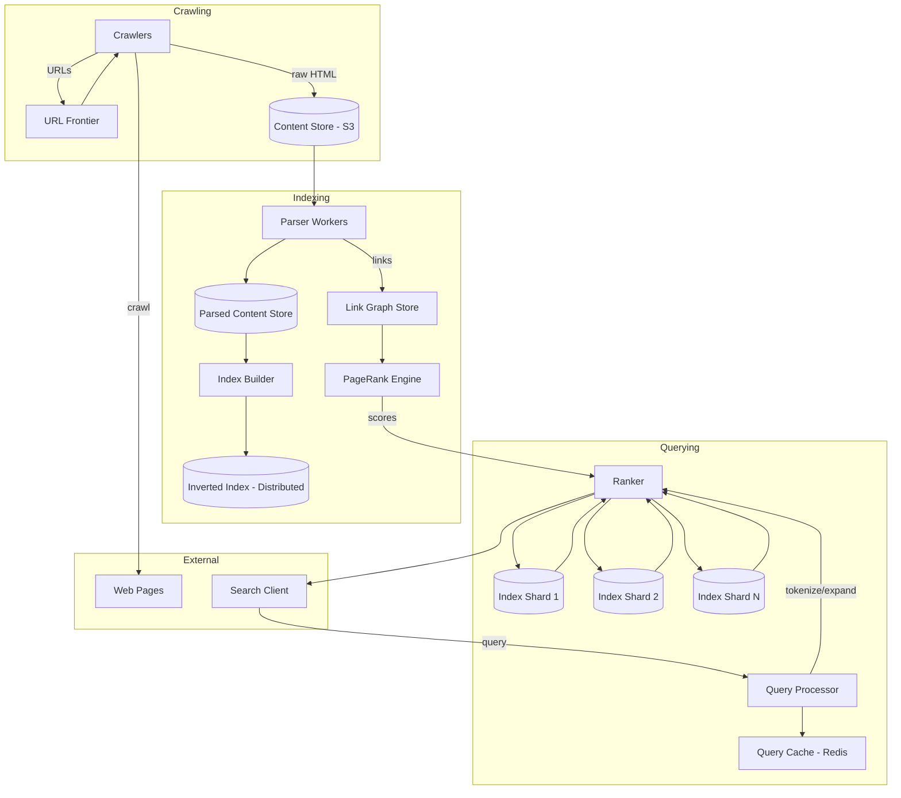
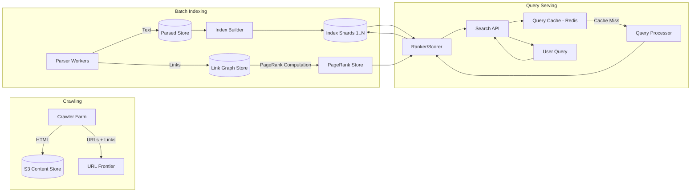

# Design Search Engine (Google)

## Blogs and websites

## Medium

## Youtube

- [Design a Basic Search Engine (Google or Bing) | System Design Interview Prep](https://www.youtube.com/watch?v=0LTXCcVRQi0)

---

## Theory

### What Is It?

A search engine (Google, Bing) is a system that crawls the web, indexes web pages, and serves relevant search results in response to user queries in milliseconds. The system must process billions of web pages, handle millions of concurrent queries, and rank results by relevance using dozens of ranking signals (content quality, authority, freshness, user context). Beyond web search, modern search engines power site search, product search, and enterprise search with similar infrastructure.

### Why Does It Exist?

The web has billions of pages — users can't browse them all. A search engine organizes the web's information and makes it discoverable through a simple query. It exists to solve the information overload problem: when you need to know something, type a query and get the most relevant answers, ranked by quality and authority.

### What Problem Does It Solve?

* **Web crawling**: Discover and download billions of web pages, handling dynamic content, rate limits, and robots.txt policies.
* **Indexing**: Transform raw HTML pages into searchable structures (inverted index) that support fast lookup.
* **Relevance ranking**: When a user searches "python", determine which of the millions of matching pages are most relevant — a Python tutorial, the official Python docs, or a news article mentioning Python.
* **Query processing**: Handle typos, synonyms, phrase matching, proximity, and intent classification (navigational vs informational vs transactional).
* **Scale**: Billions of pages × terabytes of content × millions of queries per second.
* **Freshness**: New pages (breaking news) must be indexed and searchable within minutes, while old pages are retained.
* **Spam detection**: Identify and demote low-quality, manipulative, or malicious pages.

### Important Subtopics

1. Web crawling and politeness
2. HTML parsing and content extraction
3. Tokenization and text normalization
4. Inverted index construction
5. PageRank and link-based authority
6. TF-IDF and term scoring
7. Query processing (typos, synonyms, phrases)
8. Relevance ranking models (lexical + ML)
9. Distributed search and sharding
10. Caching and query performance
11. Freshness (sitemaps, real-time crawling)
12. Spam and quality signals

## Characteristics

| Characteristic | What it means | Why it matters | How it works |
|---|---|---|---|
| **Crawling** | Discovers and downloads web pages | New content must be found to be indexed | URL frontier, politeness delay, robots.txt |
| **Indexing** | Transforms pages into searchable structures | Enables fast lookup | Inverted index: word → list of (doc_id, positions) |
| **Ranking** | Orders results by relevance | Most relevant results first | PageRank + ML features (content, authority, freshness) |
| **Query processing** | Interprets user intent | Handles typos, synonyms, intent | Tokenization, spell correction, query expansion |
| **Freshness** | New content appears quickly | News and time-sensitive content | Sitemap submission, real-time crawlers |
| **Scale** | Handles billions of pages and millions of queries | Global audience, large index | Distributed storage and search |

## Components

| Component | Purpose | Responsibilities | Relationship | Real-world Example |
|---|---|---|---|---|
| **Crawler** | Download web pages | URL frontier, politeness, robots.txt, retry logic | Writes raw pages to Content Store | Googlebot |
| **Parser** | Extract text from HTML | Strip tags, extract content, detect encoding | Reads from Content Store | Google's HTML parser |
| **Indexer** | Build inverted index | Tokenize, normalize, build word → docs mapping | Consumes parsed content; writes to Index Store | Google's indexing pipeline |
| **Link Graph** | Store link relationships | Build web graph for PageRank | Extracted by Parser; used by PageRank | Google's web graph (cca 1 trillion URLs) |
| **Ranker** | Compute relevance scores | PageRank + ML features | Uses Index Store + Link Graph | Google's ranking pipeline |
| **Query Processor** | Interpret search queries | Tokenization, spell correction, query expansion | Reads Index Store; writes to Query Cache | Google's query processing |
| **Search API** | Serve results | Fetch top-K ranked docs, paginate | Calls Ranker; returns to client | Google Search API |
| **Cache Layer** | Accelerate repeated queries | Cache top query results | Read by Search API | Google's frontend cache |

### Component Interactions

1. **Crawling**: Crawler → fetches pages → writes raw HTML to Content Store. Extracts internal links → adds to URL frontier.
2. **Parsing**: Parser → reads raw HTML → strips tags → extracts text, title, links → writes to Parsed Content Store.
3. **Indexing**: Indexer → reads parsed content → tokenizes, normalizes → builds inverted index → writes to Index Store. Also feeds Link Graph.
4. **Ranking**: PageRank processor → reads Link Graph → computes PageRank scores offline → writes to Rank Store.
5. **Querying**: Search API → Query Processor (interpret query) → Ranker (fetch matching docs + compute relevance) → returns top-K.
6. **Caching**: Hot queries cached at the edge for instant response.

## Patterns

### Inverted Index

* **What**: A data structure mapping each word (term) to a list of documents (postings) containing that word, with positions for phrase matching.
* **Problem solved**: "Find all documents containing 'python'" must return in milliseconds from billions of documents.
* **How it works**: Tokenizer splits text into tokens (words), normalizes (lowercase, stem, remove stop words), and for each token, appends (doc_id, [positions]) to the postings list. At query time, look up the token → get postings list → intersect postings for multi-word queries.
* **When to use**: Text search engines, document retrieval, log search.
* **When not to use**: When data isn't text-based (e.g., image search needs vector indexing).
* **Advantages**: O(1) lookup per term; efficient multi-term query (AND via posting list intersection, OR via merge).
* **Disadvantages**: Index is larger than original documents (2x-3x); updates require partial re-indexing.
* **Java/Spring Boot example**:
```java
@Service
public class SearchEngine {
    // Inverted index: word -> list of (docId, positions)
    private final Map<String, List<Posting>> invertedIndex = new ConcurrentHashMap<>();

    public void indexDocument(String docId, String content) {
        List<String> tokens = tokenize(content);
        Map<String, List<Integer>> positions = new HashMap<>();
        
        for (int i = 0; i < tokens.size(); i++) {
            String token = tokens.get(i);
            positions.computeIfAbsent(token, k -> new ArrayList<>()).add(i);
        }
        
        for (Map.Entry<String, List<Integer>> entry : positions.entrySet()) {
            Posting posting = new Posting(docId, entry.getValue());
            invertedIndex.computeIfAbsent(entry.getKey(), k -> new ArrayList<>())
                .add(posting);
        }
    }

    public List<String> search(String query) {
        List<String> terms = tokenize(query);
        if (terms.isEmpty()) return Collections.emptyList();

        List<Posting> postings = invertedIndex.get(terms.get(0));
        for (int i = 1; i < terms.size(); i++) {
            postings = intersect(postings, invertedIndex.get(terms.get(i)));
        }

        return postings.stream()
            .sorted(Comparator.comparing(Posting::getScore).reversed())
            .limit(10)
            .map(Posting::getDocId)
            .toList();
    }
}
```
* **Real-world example**: Elasticsearch, Solr, Lucene.

### PageRank Algorithm

* **What**: An iterative algorithm that assigns a numerical weight to each page based on the number and quality of links pointing to it.
* **Problem solved**: Not all links are equal — a link from a high-authority page (nytimes.com) carries more weight than a link from a random blog. PageRank quantifies this.
* **How it works**: PR(A) = (1-d) + d × (PR(T1)/C(T1) + PR(T2)/C(T2) + ...) where d is a damping factor (typically 0.85), T1..Tn are pages linking to A, and C(Ti) is the out-degree of Ti. Computed iteratively until convergence.
* **When to use**: Web search where link authority matters for ranking.
* **When not to use**: Site search where all pages are within a single site (link graph is limited).
* **Advantages**: Simple algorithm; effective proxy for authority; can be computed offline.
* **Disadvantages**: Doesn't account for content quality; easily gamed (link farms); not a complete ranking signal.
* **Real-world example**: Google's original search algorithm.

## Benefits

* **Information discovery**: Billions of web pages made searchable instantly.
* **Relevance**: Users get the most relevant results first, not just matching results.
* **Scale**: Can index and serve billions of pages to millions of concurrent users.
* **Freshness**: New content (breaking news) indexed quickly.
* **Rich results**: Rich snippets, featured snippets, knowledge panels provide more than just links.
* **Universal access**: Search is the primary interface to the web for most users.

## Pros

* **Massive scale**: Google indexes over 100 billion web pages; handles 8.5 billion searches per day.
* **Sub-second latency**: 99% of searches return in < 200 ms; most in < 50 ms.
* **Relevance**: Sophisticated ranking combines PageRank, content analysis, user behavior, and ML models.
* **Freshness**: Breaking news appears in search within minutes via real-time crawling.
* **Spam resistance**: Sophisticated algorithms detect and demote low-quality content.
* **Universal search**: Web, images, videos, news, maps all integrated.

## Cons

* **SEO manipulation**: Website owners manipulate rankings via link farms, keyword stuffing, cloaking.
* **Filter bubbles**: Personalization can isolate users in information bubbles.
* **Privacy concerns**: Search history reveals sensitive information (health, beliefs, habits).
* **Misinformation**: False information can rank highly; difficult to moderate at scale.
* **Advertising dependence**: Search quality may be influenced by ad revenue (less so with Google's separation, but still a concern).
* **Digital divide**: Search favors popular/sophisticated content; smaller voices may be buried.

## Challenges

### Technical Challenges

* **Distributed indexing**: Billions of documents can't fit on one machine — must shard the index across thousands of servers.
* **Query latency**: Multi-word queries require intersecting postings lists that could have millions of entries each — must optimize (skip pointers, early termination).
* **Ranking freshness**: PageRank is computed offline (weekly) — real-time ranking signals (click-through, freshness) must be applied at query time.
* **Crawling efficiency**: Must crawl intelligently (don't re-crawl unchanged pages; respect rate limits; use sitemaps).

### Scalability Challenges

* **Index size**: The full-text inverted index for 100B+ pages is petabytes — must be sharded across thousands of machines with replication.
* **Query fan-out**: A single query may need to hit hundreds of index shards → aggregate and merge results.
* **Crawling at scale**: 20B+ pages crawled per day → need 1000+ parallel crawlers; distributed URL frontier; distributed storage.

### Performance Challenges

* **Result latency**: Must return results in < 200 ms even when querying a distributed index across hundreds of shards.
* **Ranking computation**: ML models must score documents in < 100 ms; pre-compute features where possible.
* **Caching**: 90% of queries are repeats — cache aggressively at edge; cache per-user personalization separately.

### Reliability Challenges

* **Crawler failure**: If crawlers crash, the web index becomes stale — need robust retry and scheduling.
* **Index corruption**: A corrupted shard must be rebuilt from replicas or re-indexed.
* **Stale results**: New pages not yet crawled appear in search with a delay.

### Maintainability Challenges

* **Index updates**: Real-time updates (new pages, changed content) must not disrupt ongoing queries.
* **Ranking algorithm changes**: A small change can affect billions of queries — extensive A/B testing required.
* **Spam detection evolution**: Spammers adapt — algorithms must continuously evolve.

### Operational Challenges

* **Crawling politeness**: Don't overload websites with requests — respect rate limits and robots.txt.
* **Duplicate content**: Different URLs for the same content (e.g., ?sort=price) must be deduplicated.
* **Crawl budget**: Prioritize which URLs to crawl (important pages first) given finite crawl resources.

### Security Concerns

* **Search result manipulation**: SEO spam, fake reviews, keyword stuffing to manipulate rankings.
* **Data exposure**: Search queries reveal sensitive user information (health, finances); must be anonymized.
* **Bot detection**: Differentiate human queries from automated scraping.

## Best Practices

* **Sharding**: Distribute the index across many shards; each shard handles a subset of documents. Use consistent hashing for even distribution.
* **Caching**: Cache the top 1000 query results at the edge (CDN); cache per-user recent queries.
* **Skip pointers in postings**: For posting list intersection, use skip pointers to jump ahead — O(min(A, B)) instead of O(A + B).
* **Query processing pipeline**: Tokenize → normalize (lowercase, stem) → remove stop words → spell correction → synonym expansion → rank.
* **Pre-computed PageRank**: Compute PageRank offline (weekly); store in a key-value store (BigTable/HBase) — join with index at query time.
* **Distributed crawling**: Use a distributed URL frontier; crawl in priority order (high-authority URLs first).
* **Index freshness**: Use sitemaps for real-time crawling of frequently updated sites; incremental indexing.
* **Ranking feature store**: Pre-compute static features (PageRank, content quality score) daily; compute real-time features (freshness, user context) at query time.

## When to Use

### Appropriate

* When searching large volumes of unstructured text documents.
* When relevance ranking (beyond exact match) is important.
* When users search with partial or misspelled queries.
* When scale requires distributed indexing and search (billions of documents).
* When freshness matters (news, product catalogs).

### Not Appropriate

* When the data set is small (< 1M documents) — a simple SQL LIKE query or Elasticsearch suffices.
* When exact match is all that's needed — no ranking required.
* When real-time ranking with hundreds of features is overkill.
* When data is structured (numbers, dates) rather than text — use a database with proper indexing.

### Alternatives

* **Database full-text search**: PostgreSQL/Groonga/MongoDB text index — simpler, no separate infrastructure. Good for small-medium catalogs.
* **Elasticsearch/Solr**: Managed search service — for medium-scale (thousands to millions of documents) or when you want to avoid running your own search infra.
* **Vector search**: For semantic similarity search (embeddings), not keyword-based.
* **Third-party (Algolia)**: Fully managed search API — trade cost + vendor lock-in for simplicity.

### Decision Factors

* **Document count**: Billions → self-hosted distributed search; millions → Elasticsearch; thousands → DB full-text search.
* **Query latency**: Sub-100 ms → heavy caching + pre-computed ranking; sub-second → simpler.
* **Freshness requirement**: Real-time → stream-based indexing; batch is fine → incremental.
* **Relevance complexity**: Many features → ML-based ranking; few features → lexical scoring (TF-IDF/ BM25).

## Use Cases

### Web Search (Google-like)

* **Problem**: Users search the web for information — need relevant results from billions of pages in < 200 ms.
* **Solution**: Crawl the web, build a distributed inverted index, compute PageRank, rank with ML model combining 100+ signals (PageRank, content quality, freshness, user context).
* **Why suitable**: Distributed indexing at Google scale; PageRank for authority; ML for relevance.
* **How it works**: (1) Googlebot crawls 20B+ pages/day → (2) content stored + parsed → (3) inverted index built across 10000+ machines → (4) PageRank computed weekly → (5) user query → distributed search → per-shard scoring → merge → rank → serve.
* **Trade-offs**: Infrastructure cost (10000+ servers); crawling politeness; spam detection arms race.

### E-commerce Product Search

* **Problem**: An e-commerce site with 10M products needs search that understands user intent ("red shoes size 8" → red shoes in size 8).
* **Solution**: Inverted index on product title, description, and metadata + faceted search (filter by price, brand, size). Use Elasticsearch with BM25 scoring + synonym expansion.
* **Why suitable**: Structured product data (attributes, price) + text search (descriptions) + faceted filtering.
* **How it works**: (1) Products indexed with title, description, and structured attributes → (2) query parsed → tokens matched against text + filters applied → (3) results ranked by BM25 + commercial signals (sales, ratings).
* **Trade-offs**: Product data is structured — pure keyword search misses intent; need query understanding.

### Site Search

* **Problem**: A company's website needs internal search — find documentation pages, blog posts, product info.
* **Solution**: Crawl the site → build inverted index → serve with query highlighting and typo tolerance.
* **Why suitable**: Simpler than web search (single domain); no PageRank needed (site structure provides authority).
* **How it works**: (1) Crawler visits all site pages → (2) extracts text + metadata → (3) builds inverted index → (4) user searches → match + rank by TF-IDF.
* **Trade-offs**: Small site (< 10K pages) → Elasticsearch or even DB full-text search suffices; huge site → need full distributed infra.

### News Search

* **Problem**: Aggregate news articles from 100K+ publishers, with breaking news appearing in < 1 minute.
* **Solution**: Real-time crawling of news sitemaps → low-latency indexing → time-based ranking (freshness weight).
* **Why suitable**: Freshness is critical — a different architecture (streaming ingestion, micro-batch indexing) is needed vs. web search.
* **How it works**: (1) RSS/sitemap subscribers → (2) real-time ingestion → (3) index in < 30 seconds → (4) rank by recency + authority.
* **Trade-offs**: Freshness vs. quality (breaking news is often low-quality); duplicate detection across publishers.

## Architecture

A modern search engine uses a **batch + streaming architecture** with distributed indexing. Crawlers write raw pages to a **Content Store** (object storage). Parsers extract text → Indexers build inverted indices → sharded across many machines. **PageRank** (computed offline via MapReduce on the link graph) is joined with the index at query time. Real-time crawlers index breaking news with lower latency. The **Query Processor** handles tokenization, spell correction, and query expansion; the **Search API** orchestrates distributed search (fan-out to index shards, merge results, apply ranking).



### Architecture Structure

* **Crawling layer**: High-performance crawlers (thousands in parallel); distributed URL frontier (priority queue); Content Store for raw pages.
* **Indexing layer**: Parser workers strip HTML → text; Index builder creates inverted indices → shards across machines; PageRank engine (MapReduce) computes link authority.
* **Query layer**: Query Processor normalizes queries, handles typos/synonyms; Search API fans out to index shards, merges results, applies ML ranking.
* **Storage layer**: Content Store (S3), Inverted Index (shard storage), Link Graph (graph database), Cache (Redis/Varnish).

### Communication

* **Crawler → Content Store**: HTTP + storage API.
* **Parser ↔ Indexer**: Message queue (Kafka) for work distribution.
* **Client → Search API**: HTTP/REST with JSON.
* **Ranker ↔ Index shards**: RPC (gRPC/Thrift) for distributed search.
- **Link Graph ↔ PageRank**: Batch processing (MapReduce).

### Data Flow

1. **Crawl**: Crawler fetches URLs → writes HTML to Content Store → extracts + queues new URLs to Frontier.
2. **Parse**: Parser → reads HTML → extracts text + links → writes to Parsed Content Store + Link Graph.
3. **Index**: Indexer → reads parsed content → tokenizes → builds postings → writes to Index Store (sharded).
4. **Query**: Client → Search API → Query Processor (normalize, expand) → fan out to Index shards → merge results → Ranker (ML model + PageRank) → return top-K.

### Scaling Strategy

* **Index sharding**: Distribute index across 1000+ machines (shard by doc_id hash); each handles ~1M docs.
* **Query fan-out**: Search API sends query to all relevant shards (or a subset based on doc routing) → merges results.
* **Crawler parallelism**: 1000+ crawlers, each respecting per-host rate limits.
* **Caching**: 99% of queries are repeats — cache top 100K queries at the edge.

### Failure Handling

* **Crawler failure**: URLs re-queued; other crawlers pick them up.
* **Indexer failure**: Un-indexed pages remain missing until re-indexed; backlog in queue.
* **Shard failure**: Search API retries on a replica; if all replicas down, return partial results.
* **PageRank staleness**: PageRank computed weekly; during recomputation, use previous version.

## High-Level Design



**Crawling flow**: Crawler farm (1000s of instances) fetches URLs → writes HTML to Content Store (S3) → extracts internal links → adds to URL Frontier (priority queue, prioritized by PageRank + freshness).

**Indexing flow**: Parser workers read HTML → strip tags → extract text + links → write to Parsed Store → feed links to Link Graph → Index Builder tokenizes → builds inverted index → sharded across N nodes.

**Query flow**: User query → Search API → cache check (Redis) → if miss → Query Processor (tokenize, spell check, query expansion) → fan out to all index shards → merge results → Ranker applies PageRank + ML features → return top 10.

## Deep Dive

### Internal Implementation: Inverted Index

An inverted index maps each unique token to a **postings list** — the set of documents containing that token, with positions for phrase matching:

```
token "python" → [(doc_id=123, positions=[5, 142]), (doc_id=456, positions=[30]), ...]
```

**Construction**:
1. Tokenize: Split text into tokens (regex: `[a-zA-Z0-9]+`), lowercase, remove stop words.
2. For each token, append `(doc_id, [position])` to the postings list.
3. Sort postings lists by doc_id for fast intersection.
4. Compress postings lists (variable-byte encoding, frame-of-reference) to reduce storage.

**Query processing**:
- **Single-term**: Look up token → return postings list.
- **AND query**: Intersect postings lists (two-pointer merge).
- **OR query**: Merge postings lists.
- **Phrase query** ("python programming"): Look up both tokens → intersect → check positions are adjacent.

**Optimizations**:
- **Skip pointers**: Add skip links in postings lists (every N entries) for faster intersection: O(min(A, B)) with skips vs. O(A + B) without.
- **Early termination**: Stop evaluating if a document's score can't reach the current top-K threshold.
- **Caching**: Cache frequently-queried terms' postings in memory.

### PageRank Implementation

PageRank is computed via **power iteration** on the web graph (billions of nodes, hundreds of billions of edges). Implemented as a MapReduce job (or Pregel-style vertex-centric computation):

```
PR(A) = (1-d)/N + d * Σ(PR(Ti)/C(Ti))
```

Where:
- N = total number of pages
- d = damping factor (0.85 — probability of following a link vs. jumping to a random page)
- Ti = pages linking to A
- C(Ti) = number of out-links of Ti

**MapReduce**:
- **Map**: For each edge (source → dest), emit (source, contribution) pairs. Contribution = PR(source) / out_degree(source).
- **Reduce**: Sum all contributions to each destination; compute new PR = (1-d)/N + d × sum.

**Convergence**: Run 50-100 iterations (or until PR changes < 0.1%). Store final PR scores in a wide-column store (BigTable) keyed by URL.

### Distributed Search

A query must hit multiple index shards and merge results:

```java
@Service
public class DistributedSearch {
    public SearchResult search(String query, int limit) {
        // 1. Fan out to all shards
        List<CompletableFuture<ShardResult>> futures = shards.stream()
            .map(shard -> CompletableFuture.supplyAsync(() -> 
                shard.search(query, limit)))
            .toList();

        // 2. Wait for all results (with timeout)
        List<ShardResult> results = futures.stream()
            .map(f -> f.orTimeout(50, TimeUnit.MILLISECONDS).join())
            .toList();

        // 3. Merge and re-rank
        PriorityQueue<Document> merged = merge(results, limit);

        // 4. Apply relevance ranking
        List<Document> ranked = ranker.rescore(merged, query);

        return SearchResult.builder()
            .hits(ranked.subList(0, Math.min(limit, ranked.size())))
            .totalDocs(results.stream().mapToInt(ShardResult::getTotalHits).sum())
            .build();
    }
}
```

### Web Crawling Strategy

Google crawls 20B+ pages/day using thousands of distributed crawlers. The **URL frontier** is a priority queue:
- **Priority**: Based on PageRank (high-authority pages crawled more frequently), freshness (updated pages re-crawled sooner), and crawl budget.
- **Politeness**: Per-host rate limiting (don't send > 1 request/second to any single host).
- **Sitemaps**: Sites submit sitemaps (XML) with last-modified dates → prioritize recently-changed pages.
- **Incremental crawling**: Compare checksums (content hash) — if unchanged, don't re-index.
- **Real-time crawling**: For news sites, use PubSubHubbub or RSS for real-time notification of new content.

## Java and Spring Boot Implementation

### Basic Java Implementation — Inverted Index

```java
@Service
public class InvertedIndex {
    private final Map<String, List<Posting>> index = new ConcurrentHashMap<>();
    private final ReadWriteLock lock = new ReentrantReadWriteLock();

    public void indexDocument(String docId, String content) {
        List<String> tokens = tokenize(content);
        Map<String, List<Integer>> termPositions = new HashMap<>();

        for (int i = 0; i < tokens.size(); i++) {
            termPositions.computeIfAbsent(tokens.get(i), k -> new ArrayList<>()).add(i);
        }

        lock.writeLock().lock();
        try {
            for (Map.Entry<String, List<Integer>> entry : termPositions.entrySet()) {
                index.computeIfAbsent(entry.getKey(), k -> new ArrayList<>())
                    .add(new Posting(docId, entry.getValue()));
            }
        } finally {
            lock.writeLock().unlock();
        }
    }

    public SearchResult search(String queryString) {
        Set<String> terms = new HashSet<>(tokenize(queryString));
        if (terms.isEmpty()) return SearchResult.empty();

        lock.readLock().lock();
        try {
            List<List<Posting>> postingLists = terms.stream()
                .map(index::get)
                .filter(Objects::nonNull)
                .toList();

            List<Posting> results = intersectAll(postingLists);
            return new SearchResult(results);
        } finally {
            lock.readLock().unlock();
        }
    }

    private List<String> tokenize(String text) {
        return Pattern.compile("\\p{L}\\p{N}+").matcher(
            text.toLowerCase(Locale.ROOT)).results()
            .map(MatchResult::group)
            .filter(token -> token.length() > 2)
            .toList();
    }

    private List<Posting> intersectAll(List<List<Posting>> postingLists) {
        if (postingLists.isEmpty()) return Collections.emptyList();
        List<Posting> result = postingLists.get(0);
        for (int i = 1; i < postingLists.size(); i++) {
            result = intersect(result, postingLists.get(i));
        }
        return result;
    }
}
```

### Spring Boot — Search Controller

```java
@RestController
@RequestMapping("/api/v1/search")
@RequiredArgsConstructor
public class SearchController {
    private final SearchService searchService;
    private final IndexService indexService;

    @PostMapping("/index")
    public ResponseEntity<Void> indexDocument(@RequestBody IndexRequest request) {
        indexService.index(request.getDocumentId(), request.getContent());
        return ResponseEntity.ok().build();
    }

    @GetMapping
    public ResponseEntity<SearchResponse> search(
            @RequestParam String q,
            @RequestParam(defaultValue = "0") int from,
            @RequestParam(defaultValue = "20") int size,
            @RequestParam(required = false) String[] filters) {

        SearchResult result = searchService.search(q, from, size, filters);
        return ResponseEntity.ok(SearchResponse.from(result));
    }
}

@Service
public class SearchService {
    private final InvertedIndex index;
    private final PageRankStore pageRank;
    private final Cache<String, SearchResult> cache;

    public SearchResult search(String query, int from, int size, String[] filters) {
        String cacheKey = query + "|" + from + "|" + size;
        SearchResult cached = cache.getIfPresent(cacheKey);
        if (cached != null) return cached;

        List<ScoredDocument> docs = index.search(query);
        docs = docs.stream()
            .map(doc -> doc.withScore(doc.getScore() * pageRank.get(doc.getDocId())))
            .sorted(Comparator.comparing(ScoredDocument::getScore).reversed())
            .skip(from)
            .limit(size)
            .toList();

        SearchResult result = new SearchResult(docs);
        cache.put(cacheKey, result);
        return result;
    }
}
```

### Production-Oriented Implementation — Sharded Index

```java
@Service
public class ShardedSearchEngine {
    private final List<IndexShard> shards;
    private final int shardCount;

    public SearchResult search(String query, int limit) {
        // Fan out to all shards
        List<CompletableFuture<List<ScoredDoc>>> futures = IntStream.range(0, shardCount)
            .mapToObj(i -> CompletableFuture.supplyAsync(() -> 
                shards.get(i).search(query, limit)))
            .toList();

        // Collect results (with timeout)
        List<List<ScoredDoc>> shardResults = futures.stream()
            .map(f -> f.orTimeout(50, TimeUnit.MILLISECONDS).join())
            .toList();

        // Merge: use a heap for top-K
        PriorityQueue<ScoredDoc> merged = new PriorityQueue<>(Comparator.comparing(ScoredDoc::getScore));
        for (List<ScoredDoc> results : shardResults) {
            merged.addAll(results);
        }

        List<ScoredDoc> topResults = new ArrayList<>();
        for (int i = 0; i < Math.min(limit, merged.size()); i++) {
            topResults.add(merged.poll());
        }

        return new SearchResult(topResults, shardResults.size());
    }
}
```

### Testing Example

```java
@SpringBootTest
class InvertedIndexTest {
    private final InvertedIndex index = new InvertedIndex();

    @Test
    void shouldIndexAndSearchSingleTerm() {
        index.indexDocument("doc1", "The quick brown fox");
        index.indexDocument("doc2", "The lazy fox");

        SearchResult result = index.search("fox");
        assertThat(result.getDocIds()).containsExactly("doc1", "doc2");
    }

    @Test
    void shouldIntersectMultiTermQuery() {
        index.indexDocument("doc1", "quick brown fox");
        index.indexDocument("doc2", "lazy fox");
        index.indexDocument("doc3", "quick fox");

        SearchResult result = index.search("quick fox");
        assertThat(result.getDocIds()).containsExactly("doc1", "doc3");
    }

    @Test
    void shouldNotMatchPartialWords() {
        index.indexDocument("doc1", "running jumps");
        SearchResult result = index.search("run");
        assertThat(result.getDocIds()).isEmpty();
    }
}
```

## Real-World Examples

### Google's Search Infrastructure

Google's search infrastructure is a marvel of distributed systems engineering:
- **Storage**: The entire web index is stored across 10,000+ machines using Google's BigTable (column-family store) with Colossus (Google File System successor) as the file system.
- **Crawling**: Googlebot crawls 20B+ pages/day; uses a distributed URL frontier with priority based on PageRank, change frequency, and crawl budget.
- **Indexing**: MapReduce jobs parse, tokenize, and build inverted indices; stored in Bigtable sorted by term.
- **Ranking**: PageRank computed weekly via MapReduce; real-time ranking uses 100+ ML signals including content relevance, anchor text, user behavior, freshness, and mobile-friendliness.
- **Serving**: Query processing fans out to 100+ index shards; results merged and ranked in < 200 ms; top 1K queries cached at the edge.

### Elasticsearch at Shopify

Shopify uses Elasticsearch for site search across millions of products. Key challenges:
- **Multi-tenant**: Each store has its own index; shards distributed across a 50-node cluster.
- **Relevance**: Uses BM25 scoring + custom features (popularity, recency, product rating).
- **Autosuggest**: Completion suggester for real-time autocomplete.
- **Scaling**: Each store's index is sharded; cross-store search uses an aggregate search.
- **Performance**: Query caching; pre-computed suggestion lists.

### Bing's Web Graph

Bing computes PageRank-like algorithms on a graph of 10+ billion web pages. The computation uses a distributed graph processing framework (Pregel-like): each page vertex computes its rank based on incoming links from other vertices. The computation runs in waves — each wave propagates PageRank values, and after ~20 waves, values converge. Bing stores the graph in memory across a 1000-node cluster for fast iteration.

## Interview Preparation

### Beginner Questions

**Q1: What is an inverted index?**
A: An inverted index maps each word (term) to the list of documents (postings) that contain that word. For example: "cat" → [doc1, doc5, doc12]. This is the inverse of the natural mapping (document → words it contains). Inverted indexes enable fast keyword search — look up "cats" → get all documents with "cats" → return. The postings lists are sorted by doc_id and compressed (variable-byte encoding) for storage efficiency.

**Q2: What is PageRank?**
A: PageRank is an algorithm that assigns a numerical weight to each web page based on the number and quality of incoming links. The core idea: a page is important if other important pages link to it. Formula: PR(A) = (1-d)/N + d × Σ(PR(Ti)/C(Ti)). It's a random walk model — a user randomly clicks links (probability d) or jumps to a random page (probability 1-d). Computed iteratively until convergence.

**Q3: How does a search engine handle typos?**
A: (1) **Edit distance**: Compute Levenshtein distance between the query and dictionary words; suggest "did you mean" results. (2) **BK-tree**: Data structure for fast edit-distance lookup. (3) **N-gram analysis**: Index character n-grams; match queries to indexed n-grams even with typos. (4) **Phonetic algorithms**: Soundex/Metaphone for phonetically similar matches. (5) **Statistical**: Use query logs to identify common typos and their corrections.

### Intermediate Questions

**Q4: How do you distribute the inverted index across machines?**
A: Shard by term hash (e.g., `hash(term) % N_shards`). Each shard holds a subset of terms and their posting lists. At query time, the Search API sends the query to all shards (or uses a term-to-shard mapping to send to only relevant ones) and merges results. Each shard returns its top-K; the aggregator re-ranks and returns the global top-K. Cross-shard queries require careful optimization (skip empty shards, cache term-to-shard mapping).

**Q5: How do you keep the web index fresh?**
A: (1) **Crawl scheduling**: Prioritize pages by change frequency (news sites crawled every minute, static pages monthly). (2) **Sitemaps**: Sites submit XML sitemaps with `lastmod` timestamps → crawl recently changed pages first. (3) **Incremental indexing**: Only re-index pages that changed (compare content hash or last-modified header). (4) **Real-time crawling**: PubSubHubbub/WebSub for real-time notification of new content from news feeds. (5) **Change detection**: Compare checksums; if unchanged, don't re-index.

**Q6: How do you handle a query that matches millions of documents?**
A: (1) **Early termination**: If a document's score can't possibly make it into the top-K, stop scoring it. (2) **Posting list skipping**: Use skip pointers to jump ahead in long posting lists. (3) **Caching**: Cache the top results of popular queries — 99% of queries are repeats. (4) **Max-score optimization**: If the max possible score for remaining documents < current top-K threshold, terminate early. (5) **Sampling**: For exploratory queries, return a sample + estimated total count instead of exact results.

**Q7: How do you implement search result ranking?**
A: Modern search uses ML-based ranking combining many features: (1) **Static features**: PageRank, content length, URL depth, content freshness, site authority. (2) **Query-dependent features**: TF-IDF, BM25 score, query-document similarity, anchor text. (3) **User behavior features**: Click-through rate, dwell time, bounce rate. (4) **Context features**: Device type, location, search history. (5) **Ranker model**: Gradient-boosted decision trees (LambdaMART) or neural networks trained on human-rated relevance judgments.

### Advanced Questions

**Q8: How does Google's Caffeine search update work?**
A: Google Caffeine (announced 2010) replaced the batch-based MapReduce indexing with a streaming, incremental approach. Instead of waiting for a full crawl → index batch, pages are indexed as soon as they're crawled. The **web document processing pipeline** (WDP) processes pages in real-time: (1) new content is ingested into a "live" index (in-memory), (2) periodically flushed to the main Bigtable-based index, (3) old version is replaced. This reduced indexing latency from days to minutes and allowed Google to handle the exponentially growing web.

**Q9: How would you build a real-time search system (like Twitter search)?**
A: (1) **Real-time ingestion**: Use a streaming pipeline (Kafka + Flink/Storm) to process tweets → extract text → index into Elasticsearch/Solr in real-time (1-5 second latency). (2) **Index refresh**: Configure Elasticsearch `refresh_interval=1s` so new tweets are searchable within 1 second. (3) **Fan-out**: Distribute across index shards by tweet_id hash; replicate for availability. (4) **Ranking**: Real-time ranking uses freshness + engagement (retweets/likes) as key signals. (5) **Caching**: Cache top popular queries (e.g., trending hashtags) in Redis. (6) **Scale**: 6K+ tweets/second → 10+ Elasticsearch nodes → fan out queries across shards.

### Senior-Level Questions

**Q10: How would you design a distributed search system that handles 1M queries/second with < 100ms latency?**
A: (1) **Index sharding**: 1000+ index shards; each handles ~1000 QPS. Use term-hash sharding for even distribution. (2) **Query caching**: 99% of queries are repeats — cache top 1M query results at the edge (CDN/Varnish). Cache per-shard results. (3) **Query fan-out optimization**: Use a query router that sends to only relevant shards (based on term presence); cache "empty shard" results (terms not in a shard). (4) **Early termination**: Top-K aggregation with max-heap; stop scoring when current doc can't beat the threshold. (5) **Hardware**: SSD-based index storage; CPU for ranking models. (6) **Multi-tier**: Warm index (last 7 days) on fast storage; cold index (older) on slower storage. 7) **Pre-computation**: For popular queries (top 10K), pre-compute results hourly. (8) **Async ranking**: Return lexical results in < 20ms; apply ML ranking in < 100ms asynchronously (update cache for next query).

**Q11: How would you handle multi-lingual search at global scale?**
A: (1) **Language detection**: Detect query language (cld3 or fastText); if ambiguous, search multiple language indices. (2) **Separate indices per language**: Easier to tune analyzers, stemmers, stop words per language. (3) **Translation**: Use neural machine translation for cross-lingual search — translate the query to the document's language. (4) **Mixed-language content**: A document may contain multiple languages — index with per-field language analyzers (Elasticsearch multi-field). (5) **Stemming**: Language-specific stemmers (Snowball, ICU) — "running" → "run". (6) **Stop words**: Language-specific stop word lists. (7) **Normalization**: Unicode normalization (NFKC) for consistent handling of accented characters. (8) **Ranking**: Language-specific ranking models; weight matches in the user's preferred language higher.

### System Design Questions (Senior)

**Q12: Design a search system for an e-commerce site with 10M products, supporting faceted search, autocomplete, and typo tolerance.**

**Approach**:
- **Index**: Elasticsearch with 10 primary shards (1 replica each); products indexed with title, description, brand, category, price, rating, and structured attributes.
- **Faceted search**: Use Elasticsearch aggregations (terms on category, histogram on price, stats on rating) — computed alongside search.
- **Autocomplete**: Use `completion` field type for fast prefix matching; store top 100K popular queries.
- **Typo tolerance**: Enable fuzziness (`fuzziness: AUTO`) for title/description search; synonyms for brand names.
- **Relevance**: BM25 scoring + function score (boost by rating, popularity, recency).
- **Query flow**: (1) Parse query → tokens + filters → (2) Search Elasticsearch → (3) Apply aggregations for facets → (4) Return hits + facets + suggestions.
- **Caching**: Cache facet results (categories, brands, price ranges) for 1 hour; cache popular autocomplete results.
- **Scale**: 10M products → index size ~5-10 GB; 10 shards of ~500MB each; query load distributed across 5+ query nodes.
- **Autosuggest**: `GET /products/_search` with `suggest` query → returns "Did you mean?" suggestions.
- **Monitoring**: Track query latency, cache hit rate, shard health, and error rate.

**Expected discussion points**: Index sharding strategy, faceted aggregation performance, autocomplete data structures (trie vs. completion field), typo tolerance (fuzzy vs. n-gram), relevance scoring (BM25 + function score), and cache invalidation strategy.

**Q13: Design a search ranking system that combines lexical matching (inverted index) with neural/semantic matching (embeddings).**

**Approach**:
- **Lexical**: Traditional inverted index + BM25 scoring for keyword matching. Handles exact-term queries well.
- **Neural**: Use a dense vector embedding model (e.g., SBERT, ColBERT) to encode queries and documents into vectors; compute dot-product/cosine similarity for semantic matching. Handles "what is the capital of France" → "Paris" (no keyword overlap).
- **Hybrid architecture**: (1) **Candidate generation**: Get top 1000 candidates from lexical (BM25) + top 1000 from neural (vector similarity) → union. (2) **Re-ranking**: Train a cross-encoder model that takes (query, document) pairs and outputs a relevance score → re-rank the top 100 from the union.
- **Storage**: Lexical index in Elasticsearch/PostgreSQL; vector index in FAISS/Weaviate/Pinecone (HNSW for approximate nearest neighbor).
- **Freshness**: Neural embeddings are expensive to compute — pre-compute document embeddings offline; use cached query embeddings for repeated queries.
- **Latency budget**: Lexical (< 10ms) + vector ANN (< 5ms) + cross-encoder re-rank (< 20ms) = < 50ms total; cache results.
- **Training**: Use human-rated query-document pairs for supervised fine-tuning; use click-through data for weak supervision.
- **A/B testing**: Compare hybrid vs. lexical-only vs. neural-only; measure NDCG (normalized discounted cumulative gain) and user engagement.

### Common Mistakes and Expected Discussion Points

**Common mistakes in search engine interviews**:
- Not understanding the difference between indexing (batch) and querying (real-time) — different scaling challenges.
- Ignoring the fan-out problem (query hits all 1000 shards → merge bottleneck).
- Not discussing cache-aside pattern for popular queries.
- Overlooking the importance of PageRank freshness vs. index freshness.
- Not considering typos/fuzziness for real-world query quality.
- Ignoring the cross-lingual and multi-language content challenge.
- Not mentioning compression (variable-byte, frame-of-reference) for postings lists.

**Expected discussion points**: Inverted index structure (term → postings list), PageRank computation (power iteration, damping factor), query fan-out and merge (sharding, caching), typo handling (edit distance, n-gram, phonetic), multi-lingual search (per-language analyzers, translation), and the hybrid lexical + neural ranking approach.

**Follow-up questions an interviewer might ask**:
* Q: "How do you handle a term that appears in 90% of documents (like 'the')?" A: It's essentially a stop word — either remove it during tokenization or it naturally ranks poorly (low TF-IDF since it's in most documents). Use collection frequency to detect and down-weight.
* Q: "What's the difference between TF-IDF and BM25?" A: TF-IDF is the original scoring formula (term frequency × inverse document frequency). BM25 is a modern refinement that handles term saturation (TF doesn't grow linearly forever — diminishing returns) and document length normalization more effectively.
