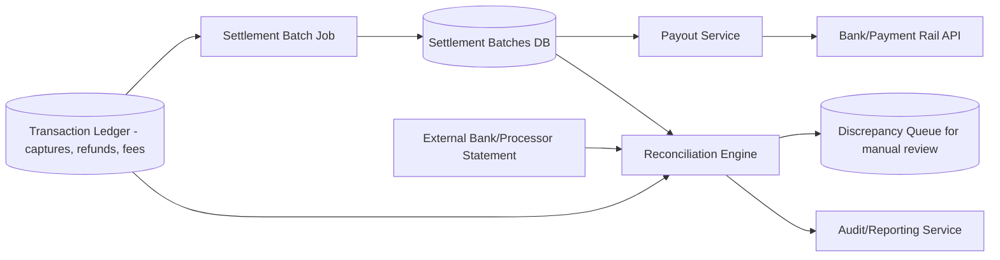
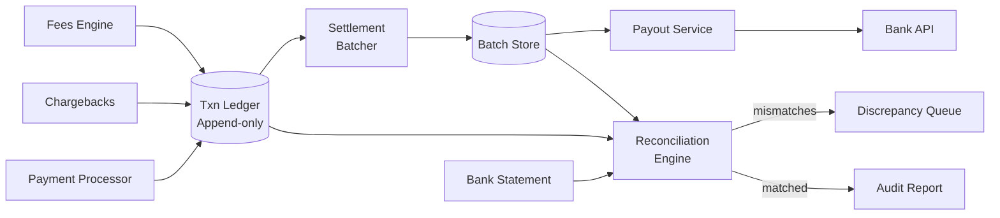
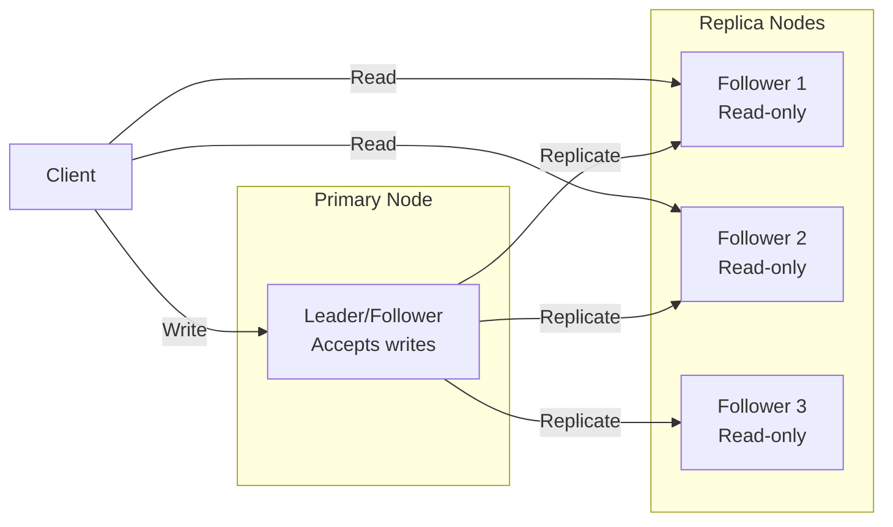
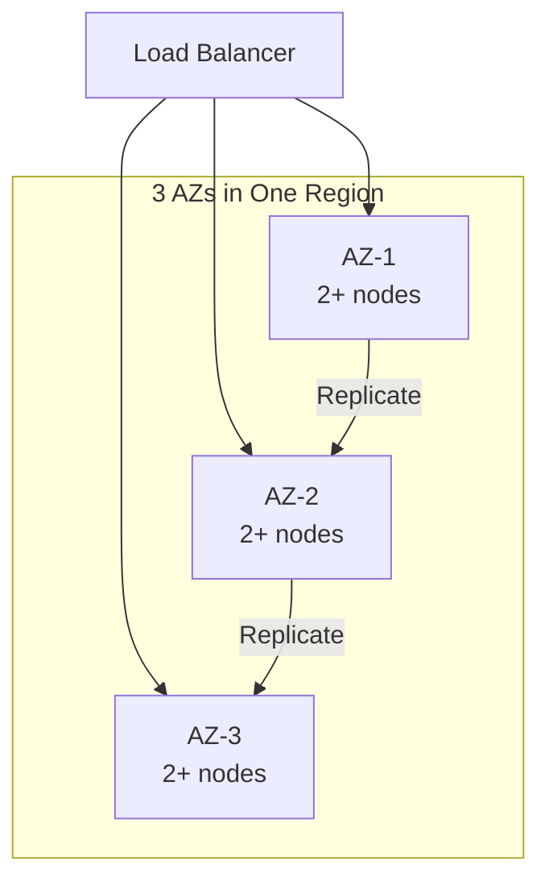
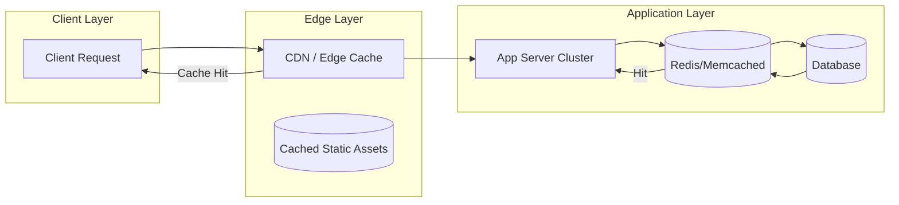
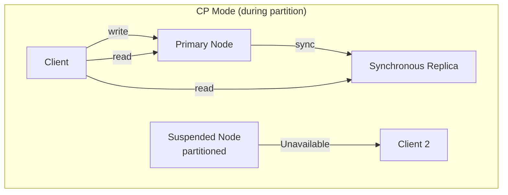
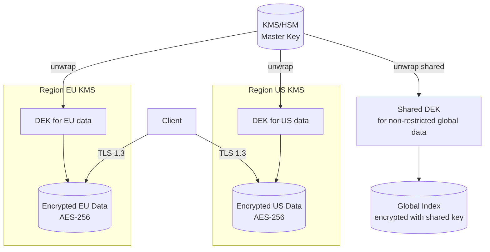
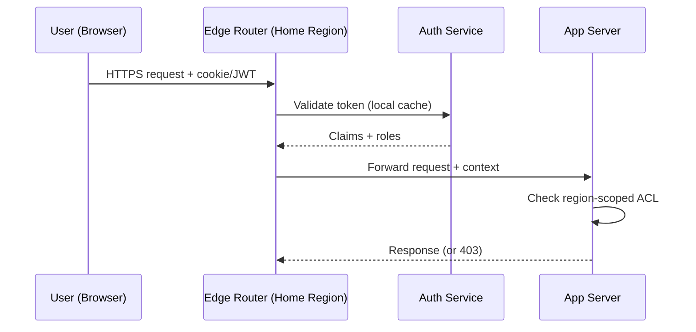
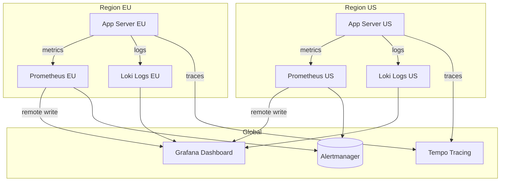

# Design a Settlement and Reconciliation System for Payments

## Blogs and websites

## Medium

## Youtube

## Theory

### Topics Covered

1. [Introduction / Problem Statement](#introduction-problem-statement)
2. [Characteristics](#characteristics)
3. [Components](#components)
4. [Architectural Patterns](#architectural-patterns)
5. [Benefits](#benefits)
6. [Pros](#pros)
7. [Cons](#cons)
8. [Challenges](#challenges)
9. [Best Practices](#best-practices)
10. [When to Use / When Not to Use](#when-to-use-when-not-to-use)
11. [Use Cases](#use-cases)
12. [Architecture](#architecture)
13. [High-Level Design](#high-level-design)
14. [Deep Dive](#deep-dive)
15. [Data Model and API](#data-model-and-api)
16. [Replication Strategies](#replication-strategies)
17. [Failure Detection and Membership](#failure-detection-and-membership)
18. [High Availability and Scalability](#high-availability-and-scalability)
19. [Performance and Optimization](#performance-and-optimization)
20. [CAP Theorem and Consistency Trade-offs](#cap-theorem-and-consistency-trade-offs)
21. [Encryption and Key Management](#encryption-and-key-management)
22. [Authentication and Authorization](#authentication-and-authorization)
23. [Security Threats and Mitigations](#security-threats-and-mitigations)
24. [Observability and Logging](#observability-and-logging)
25. [Replication Strategies](#replication-strategies)
26. [Failure Detection and Membership](#failure-detection-and-membership)
27. [High Availability and Scalability](#high-availability-and-scalability)
28. [Performance and Optimization](#performance-and-optimization)
29. [CAP Theorem and Consistency Trade-offs](#cap-theorem-and-consistency-trade-offs)
30. [Encryption and Key Management](#encryption-and-key-management)
31. [Authentication and Authorization](#authentication-and-authorization)
32. [Security Threats and Mitigations](#security-threats-and-mitigations)
33. [Observability and Logging](#observability-and-logging)
34. [Java and Spring Boot Implementation Guide](#java-and-spring-boot-implementation-guide)
35. [Real-World Implementations](#real-world-implementations)
36. [Interview Questions and Answers](#interview-questions-and-answers)

---
---
### Introduction / Problem Statement

A settlement and reconciliation system aggregates individual payment transactions into net settlement batches (per merchant/payout cycle) and continuously reconciles internal ledgers against external bank/processor statements to detect and resolve discrepancies — ensuring every cent is accounted for.

**Why Does It Exist**

Payment platforms process millions of transactions daily across thousands of merchants. Settlement (netting) reduces payout volume + fees; reconciliation (comparing internal vs. external records) ensures correctness and regulatory compliance — missed discrepancies lead to silent revenue leakage.

**What Problem Does It Solve**

* **Settlement batching**: Aggregate thousands of micro-transactions per merchant into a single net payout (T+1, T+2).
* **Fee/refund/chargeback netting**: Net fees, refunds, chargebacks against gross captures to compute true payable amount.
* **Reconciliation**: 3-way match — internal ledger vs. internal settlements vs. external bank statements.
* **Discrepancy detection**: Flag unmatched items for manual review (never auto-resolve money mismatches).
* **Auditability**: Immutable record of every settlement + reconciliation for compliance.
* **Idempotency**: Retried batch jobs never double-pay a merchant.


**Problem Statement**

Design a settlement and reconciliation system that periodically aggregates individual payment transactions (captured throughout the day by a payment gateway) into net settlement batches to merchants/banks, and continuously reconciles the platform's internal ledger against external bank/processor statements to detect and resolve discrepancies.

**Functional Requirements**

- Aggregate authorized/captured transactions into settlement batches per merchant/payout cycle (e.g., daily, T+2)
- Net out refunds, chargebacks, and fees against gross transaction amounts to compute the payable amount
- Initiate payouts to merchant bank accounts and track payout status
- Reconcile internal ledger records against external bank statements/processor reports, flagging mismatches for manual review
- Provide auditable reports of every settlement and reconciliation outcome

**Non-Functional Requirements**

- **Scale**: Millions of transactions per settlement cycle across many merchants
- **Correctness**: Every rupee/cent must be accounted for; discrepancies must be surfaced, never silently dropped
- **Durability & Auditability**: Settlement and reconciliation history must be retained and immutable for compliance/audits
- **Timeliness**: Settlement batches must complete within the committed payout SLA (e.g., T+2 days)

**High-Level Architecture**



**Key Design Points**

- Treat the transaction ledger as the immutable source of truth (double-entry, append-only) and compute settlement batches as a derived, re-runnable aggregation job over a fixed time window per merchant, so a bug in batching can be fixed and safely re-run without corrupting the underlying ledger.
- Net fees, refunds, and chargebacks against gross captures within the same settlement computation so the payout amount sent to the bank API is always the true net figure, with each component individually itemized in the settlement record for auditability.
- Run reconciliation as a three-way match: internal ledger vs. internal settlement batch vs. external bank/processor statement; any transaction present in one but not the other two is automatically routed to a discrepancy queue rather than being auto-resolved, since financial mismatches should always have a human or a well-tested automated rule confirm the resolution.
- Make settlement batch creation and payout initiation idempotent per `(merchant_id, cycle_date)` so a retried batch job or a duplicate payout API call can never double-pay a merchant.

**Trade-offs**

- Making settlement a re-runnable derived computation (rather than mutating the ledger directly) trades some storage/compute (recomputing aggregates) for the much stronger guarantee that the ledger is never touched by a batching bug.
- Routing all statement/ledger mismatches to manual review

---

### Characteristics

| Characteristic | What it means | Why it matters | How it works |
|---|---|---|---|
| **Batch settlement** | Aggregate transactions into net payouts | Reduce payout volume + fees | Group by merchant + cycle |
| **Netting** | Gross - refunds - fees - chargebacks = payable | Correct payout amount | Per-transaction accounting |
| **3-way reconciliation** | Match internal ledger vs. batch vs. external statement | Detect discrepancies | Set operations on transaction IDs |
| **Idempotency** | Retried operations don't double-execute | Safe retries | Idempotency key (merchant_id + cycle_date) |
| **Audit trail** | Immutable record of every action | Compliance + dispute | Append-only event log |
| **Manual review** | Discrepancies flagged for human review | Financial accuracy | Queue + UI for investigation |

### Components

| Component | Purpose | Responsibilities | Relationship | Real-world Example |
|---|---|---|---|---|
| **Transaction Ledger** | Source of truth for all transactions | Append-only; captures, refunds, fees | Upstream payment processor | Stripe ledger |
| **Settlement Batcher** | Create settlement batches | Group by merchant + cycle, net amounts | Ledger → Batch Store | Nightly batch job |
| **Batch Store** | Persist settlement batches | Store batch status, items, net amounts | Batcher | Settlement DB |
| **Payout Service** | Initiate bank transfers | Call bank APIs, track status | Batch Store → Bank API | Payout to merchant bank |
| **Statement Importer** | Ingest external bank/processor statements | Parse, normalize, store | Bank API → Reconciliation | CAMT, MT940 |
| **Reconciliation Engine** | 3-way matching | Compare ledger vs. batch vs. statement | All three data stores | Auto-recon |
| **Discrepancy Queue** | Hold mismatched items | Manual review + resolution | Reconciliation → Reviewer | Case management |
| **Audit/Reporting** | Generate compliance reports | Settlement + reconciliation reports | All stores | Audit trail |

### Architectural Patterns

#### Idempotent Settlement

* **What**: Settlement batch creation and payout initiation are idempotent per `(merchant_id, cycle_date)` — retrying the batch job or duplicate payout API calls never double-pay.
* **Problem solved**: Batch jobs may run twice (retry, crash recovery); payout API may be called twice (network retry) — must not process the same settlement twice.
* **How it works**: (1) Settlement batch keyed by `(merchant_id, cycle_date)`. (2) DB unique constraint on this key → duplicate insert fails. (3) Payout API: idempotency-key header → dedup in Redis or DB. (4) State machine: created → processing → paid → reconciled. (5) If batch already exists → skip; if payout already initiated → return existing status.
* **When to use**: Any financial operation with retry semantics (payments, settlements, payouts).
* **When not to use**: Non-financial operations where duplicate execution is harmless.
* **Advantages**: Prevents double-payments; enables safe retries; simplifies recovery from failures.
* **Disadvantages**: Requires idempotency key design; extra storage for tracking; complexity in state management.
* **Java/Spring Boot example**:
```java
@Service
public class PayoutService {
    public PayoutResult initiatePayout(String merchantId, String cycleDate, String idempotencyKey) {
        if (payoutRepository.existsByIdempotencyKey(idempotencyKey)) {
            return payoutRepository.findByIdempotencyKey(idempotencyKey).toResult();
        }
        SettlementBatch batch = settleBatcher.getOrCreate(merchantId, cycleDate);
        Payout payout = bankClient.initiate(batch);
        payout.setIdempotencyKey(idempotencyKey);
        payoutRepository.save(payout);
        return payout.toResult();
    }
}
```

#### Re-runnable Settlement Computation

* **What**: Settlement batches are computed as a derived aggregation over the immutable transaction ledger — the ledger is never mutated by batching; if a bug is found, fix the batch logic and re-run safely.
* **Problem solved**: If settlement logic has a bug, fixing it must not corrupt the underlying ledger (which is the auditable source of truth).
* **How it works**: (1) Ledger is append-only (double-entry). (2) Settlement batch = `SELECT SUM(amount) FROM ledger WHERE merchant=m AND date=c GROUP BY transaction_type`. (3) Batch stored separately with its own version. (4) Bug fix → recompute batch → compare with previous → if different → flag for review. (5) Payout uses the latest (correct) batch.
* **When to use**: Financial systems where auditability + correctness are paramount.
* **Advantages**: Ledger integrity always preserved; bugs fixable without data loss.
* **Disadvantages**: Higher storage (ledger + derived batches); re-computation cost.

### Benefits

* **Revenue protection**: 3-way reconciliation catches discrepancies before they cause losses.
* **Operational efficiency**: Netting reduces payout volume (1000 transactions → 1 payout).
* **Compliance**: Immutable audit trail for regulators + auditors.
* **Trust**: Merchants see exact breakdown of transactions, fees, refunds.

### Pros

* **Net payout reduction**: Fewer bank transactions → lower fees.
* **Full traceability**: Per-transaction audit trail.
* **Idempotent**: Safe retries without double-payment.
* **Flexible cycles**: Daily, T+1, T+2, weekly — configurable per merchant.
* **Multi-currency**: Convert and payout in merchant's currency.

### Cons

* **Complexity**: 3-way matching, state machines, idempotency.
* **Reconciliation lag**: External statements arrive hours/days after → window of unreconciled state.
* **Manual work**: Discrepancies require human review → slow.
* **Currency conversion**: FX rates + timing → discrepancies.
* **Chargeback timing**: Chargebacks arrive late → need to reverse settled amounts.

### Challenges

#### Technical Challenges
* **Large batch data**: Millions of transactions → batch aggregation; partitioning by merchant + date.
• **3-way matching**: Efficiently comparing sets (ledger vs. batch vs. statement) at scale.
• **Currency handling**: FX rates + rounding; per-transaction currency tracking.
• **Idempotency**: Key design (merchant_id + cycle_date); Redis/DB dedup.

#### Scalability Challenges
* **Transactions**: Millions per batch → parallel processing; partition by merchant_id.
* **Reconciliation**: Thousands of merchants × daily → parallel reconciliation engine.
• **Payouts**: Concurrent bank API calls → rate limiting + pooling.

#### Performance Challenges
* **Batch creation**: < 5 min for 1M transactions per merchant.
• **Reconciliation**: < 10 min for millions of statement items.
• **Payout**: Initiation within 1 min of batch closure.

#### Reliability Challenges
* **Bank API downtime**: Retry with exponential backoff; mark payout as pending.
• **Statement delays**: Statement arrives late → mark settled → reconcile later.
• **Data corruption**: 3-way mismatch → flag, don't auto-resolve.

#### Maintainability Challenges
• **Rule evolution**: Settlement rules change (tax, fees, cycles) → versioning + migration.
• **Audit queries**: Slow queries for investigation → pre-compute indexes (merchant_date, batch_id).

#### Security Concerns
* **Financial data**: Encryption at rest; PCI-DSS; access logs.
• **Audit trail**: Immutable logs; tamper-evident; retention.
• **Payout authorization**: Dual-control MFA for large payouts.

### Best Practices

* **Idempotency keys**: Per `(merchant_id, cycle_date)`; unique constraint in DB.
* **3-way reconciliation**: Never auto-resolve mismatches → manual review.
* **Immutable ledger**: Append-only; never update/delete settled transactions.
* **Batch versioning**: Each batch version stored separately → re-runnable.
* **Audit logging**: Every settlement + reconciliation decision logged.
* **Monitoring**: Mismatch rate, payout latency, statement-to-ledger gap, batch creation duration.

### When to Use / When Not to Use

#### Appropriate
* Payment platforms (Stripe, PayPal, Adyen).
* E-commerce marketplaces with merchant payouts.
* Banking reconciliation systems.
• Any system where financial accuracy is critical.

#### Not Appropriate
• Non-financial systems (no money).
• One-off transfers (no aggregation needed).
• Systems with low compliance requirements.

#### Decision Factors
* Transaction volume; payout frequency; regulatory requirements; currency complexity.

### Use Cases

#### Payment Platform Settlement (Stripe-style)

* **Problem**: Aggregate millions of card captures/charges per merchant/day → net payout; match against bank statement; flag discrepancies.
* **Solution**: Transaction Ledger (immutable) → Batcher → Payout API → Bank. Concurrent Statement Importer → Reconciliation Engine (3-way match).
* **Why suitable**: Idempotent batches; re-runnable computation; 3-way reconciliation; audit trail.
* **How it works**: (1) Day's transactions → batcher computes per merchant → SUM(gross) - SUM(fees) - SUM(refunds) - SUM(chargebacks) = net payout. (2) Payout Service → bank API → track status. (3) Bank statement (next day) → Statement Importer → Reconciliation Engine matches ledger vs. batch vs. statement → mismatches → discrepancy queue. (4) Manual review resolves mismatches → payout adjusted in next cycle.
* **Trade-offs**: Reconciliation lag (statement arrives late); manual review cost; currency conversion complexity.

### Architecture

```mermaid
graph TD
  subgraph "Event Sources"
    Payments[Payment Processor<br/>Captures/Refbacks]
    Chargebacks[Chargeback Feed]
    Fees[Fees Engine]
    BankStmt[Bank Statement<br/>Import]
  end
  subgraph "Processing"
    Ledger[(Transaction Ledger)<br/>Append-only]
    Batcher[Settlement Batcher<br/>Nightly job]
    BatchDB[(Batch Store)]
    Reconcile[Reconciliation<br/>Engine]
    Discrep[Discrepancy Queue]
    Payout[Payout Service<br/>Bank API]
    Report[Audit Report<br/>Service]
  end
  Payments --> Ledger
  Chargebacks --> Ledger
  Fees --> Ledger
  BankStmt --> Reconcile
  Ledger --> Batcher
  Batcher --> BatchDB
  Ledger --> Reconcile
  BatchDB --> Reconcile
  Reconcile --> Discrep
  BatchDB --> Payout
  Payout --> BankAPI[Bank/Payment Rail]
  Reconcile --> Report
```

#### Architecture Structure
* **Event ingestion**: Payment processor → Transaction Ledger (immutable, append-only).
* **Batch computation**: Settlement Batcher → computes net amount per merchant per cycle.
* **Reconciliation**: 3-way match against ledger + batch + external statement.
* **Payout**: Bank API integration with idempotency.

#### Communication
* **Ledger writes**: Async (Kafka/message queue); idempotent event consumption.
* **Batcher → Ledger**: Read-only aggregate query.
* **Payout → Bank API**: Synchronous HTTP + webhook for status; idempotent.
* **Reconciliation**: Runs every few hours; compares 3 data sources.

#### Data Flow
1. **Transaction**: Payment → Ledger (append). 2. **Batch creation** (nightly): Query ledger → group by merchant → compute net → store batch. 3. **Payout**: Batch Store → Payout Service → Bank API → track status. 4. **Statement import**: Bank → Parser → Reconciliation Engine. 5. **Recon**: Compare Ledger vs. Batch vs. Statement → match → mismatches → Discrepancy Queue.

#### Scaling Strategy
* **Ledger**: Sharded by merchant_id; append-only → write-optimized (Cassandra/S3).
* **Batcher**: Parallel per merchant; 100 batch workers.
* **Reconciliation**: Parallel per merchant; 50 recon workers.
* **Payout**: Rate-limited bank API calls (100 concurrent).

#### Failure Handling
* **Payout failure**: Retry 3x → DLQ → manual retry + notify merchant.
* **Statement delay**: Mark pending → reconcile when statement arrives.
• **Double-batch**: Idempotency key (merchant_id + cycle_date) → dedup.
• **Mismatched data**: Don't auto-resolve → Discrepancy Queue + alert.

### High-Level Design



### Deep Dive

#### Settlement Batch Aggregation

The existing file's Theory section covers: Batch computation aggregates per merchant (SUM of captures, subtract refunds + fees + chargebacks) for a cycle (daily/T+1/T+2). Netting reduces 1000 transactions to 1 payout. Batch is re-runnable (derived from immutable ledger, never mutates ledger). Result written to a batch DB with idempotency key.

#### Three-Way Reconciliation

The existing file's Theory section covers: Reconciliation Engine compares three datasets: internal ledger (all transactions), internal settlement batch (what was sent to bank), and external bank statement (what bank received). Uses a 3-way set match on transaction IDs + amounts. Any item in one set but not all three → discrepancy → manual review queue. Never auto-resolve money mismatches.

#### Idempotent Payout

The existing file's Theory section covers: Payout initiation is idempotent per (merchant_id, cycle_date) via idempotency key + DB unique constraint. If payout already exists → return existing status.

### Data Model and API

* **API purpose**: Retrieve settlement batch status, payout status, reconciliation results, discrepancy queue.

| Method | Endpoint | Description |
|---|---|---|
| POST | `/api/v1/settlements/batch` | Create/re-run settlement batch (idempotent) |
| GET | `/api/v1/settlements/{merchantId}` | Get batch status + net amount for date |
| POST | `/api/v1/payouts` | Initiate payout (idempotent) |
| GET | `/api/v1/payouts/{id}` | Get payout status |
| GET | `/api/v1/reconciliation/{merchantId}` | Get recon results |
| GET | `/api/v1/discrepancies` | List flagged discrepancies |

**Authentication**: Service-to-service (mTLS) or JWT bearer token.

**Idempotency**: Header `Idempotency-Key: {merchantId}:{cycleDate}` on batch creation and payout initiation.

**Error responses**:
```json
{"error": "payout_duplicate", "message": "Payout already initiated", "code": 409}
{"error": "reconciliation_mismatch", "message": "Discrepancy found, requires review", "code": 200}
{"error": "batch_in_progress", "message": "Batch already being computed", "code": 409}
```


```mermaid
erDiagram
    TRANSACTION ||--o{ SETTLEMENT_ITEM : "included in"
    SETTLEMENT_BATCH ||--o{ SETTLEMENT_ITEM : "aggregates"
    SETTLEMENT_BATCH ||--o{ PAYOUT : "triggers"
    MERCHANT ||--o{ SETTLEMENT_BATCH : "receives"
    BANK_STATEMENT ||--o{ STATEMENT_ITEM : "contains"

    TRANSACTION {
      string txn_id PK
      string merchant_id FK
      string type capture_refund_fee_chargeback
      decimal amount
      datetime created_at
      string settlement_id FK
    }
    SETTLEMENT_BATCH {
      string batch_id PK
      string merchant_id FK
      string cycle_date
      decimal gross_amount
      decimal net_amount
      string idempotency_key
      enum status pending_processing_paid_reconciled
    }
    SETTLEMENT_ITEM {
      string batch_id FK
      string txn_id FK
      decimal amount
    }
    PAYOUT {
      string payout_id PK
      string batch_id FK
      string bank_ref
      enum status pending_initiated_paid_failed
      string idempotency_key
    }
    BANK_STATEMENT {
      string statement_id PK
      string merchant_id FK
      date statement_date
      string format CAMT_MT940
    }
```

**Partitioning**: Ledger sharded by merchant_id; batches by (merchant_id + cycle_date); payouts by merchant_id.

### Replication Strategies

**What it means**

Replication Strategies determine how data and state are copied across multiple nodes in Settlement and Reconciliation System. The choice of strategy determines the trade-off between consistency, availability, and latency.

**Why it matters**

Settlement and Reconciliation System must replicate data to prevent loss and serve reads from multiple nodes. The replication strategy determines whether the system favors consistency (strong reads) or availability (always writable), and how it handles cross-node failure.

**How it works**

**Leader-based (single-leader)**: A single primary node accepts all writes; followers replicate changes asynchronously or semi-synchronously. Reads can be served from any replica. This strategy favors strong consistency for writes but creates a write bottleneck at the leader.



*Leader-based replication: a single primary node accepts all writes and replicates them to read-only followers. Clients can read from any replica for scaled read throughput, but all writes go through the leader.*

**Multi-leader (multi-master)**: Multiple nodes accept writes and exchange updates with each other. This enables low-latency writes in different regions but requires conflict resolution (last-write-wins, merge functions, or CRDTs).

**Leaderless (quorum-based)**: Any node can accept writes; a quorum of nodes must agree. Read and write quorums are configured so that at least one node overlaps between them (R + W > N). This maximizes availability and write scalability.

**Trade-offs for Settlement and Reconciliation System**:

| Strategy | Use Case | Pros | Cons |
|---|---|---|---|
| Leader-based | transaction data, account numbers, PII, settlement amounts | Strong consistency, simple | Write bottleneck, leader failure risk |
| Multi-leader | aggregate settlement reports, public transaction counts | Low-latency global writes | Conflict resolution, complex |
| Leaderless | Caching, counters | High availability, no bottleneck | Eventual consistency, read repair overhead |

**Real-world implementations**

- **Redis**: Leader-follower replication with asynchronous replication; Sentinel handles failover.
- **Apache Kafka**: Leader-based partition replication with ISR (in-sync replica) — writes go to the leader, followers replicate.
- **Cassandra**: Tunable consistency with leaderless quorum (R + W > N).
- **DynamoDB Global Tables**: Multi-master active-active across regions.

### Failure Detection and Membership

**What it means**

Failure Detection and Membership is the mechanism by which Settlement and Reconciliation System determines which nodes are alive and part of the cluster. Membership is the list of known nodes; failure detection is the process of updating that list when nodes fail or recover.

**Why it matters**

Settlement and Reconciliation System must route requests only to healthy nodes and trigger failover when a node goes down. False positives (healthy nodes marked as dead) cause unnecessary failovers and data loss. False negatives (dead nodes not detected) cause failed requests and degraded performance.

**How it works**

**Heartbeat-based detection**: Each node sends a heartbeat (ping) to a subset of peers at regular intervals. If a node misses N consecutive heartbeats, it is marked as suspect. The gossip protocol distributes membership information: each node exchanges its view of the cluster with a random peer, and the information propagates gossip-style.

```mermaid
sequenceDiagram
    participant A as Node A
    participant B as Node B
    participant C as Node C

    loop Every 1s
        A->>B: Heartbeat (ping)
        B-->>A: Heartbeat (ack)
    end
    B->>C: Gossip: A is alive
    C->>A: Gossip: B is alive
    Note over A,B,C: View converges in O(log N) rounds
```

*Gossip-based failure detection: each node periodically pings a random subset of peers and gossips its view of the cluster. The membership list converges in O(log N) rounds.*

**Phi Accrual Failure Detector**: Instead of a fixed timeout, the detector measures the time between consecutive heartbeats and computes a phi (φ) value — the probability that the node is dead given the observed heartbeat pattern. φ is compared against a threshold (typically 1–8); higher thresholds reduce false positives but increase detection latency.

**SWIM (Scalable Weakly-consistent Infection-style Process group Membership Protocol)**: Nodes ping a random subset of cluster members. If a ping fails, the node is marked "suspect" and the failure is "infected" (gossiped) to other nodes. This is O(log N) per failure detection cycle and scales to large clusters.

**Trade-offs**:

| Approach | Strengths | Weaknesses |
|---|---|---|
| Heartbeat (timeout-based) | Simple, deterministic | False positives under load |
| Phi Accrual | Adaptive threshold | Needs historical data |
| SWIM | Scales to 1000s of nodes | Eventual consistency |

**Real-world implementations**

- **AWS Route 53 Health Checks**: Uses TCP/HTTP health checks with configurable thresholds to remove unhealthy instances from DNS rotation.
- **Kubernetes**: Uses the kubelet heartbeat (every 10s) to determine node liveness; nodes missing 3 consecutive heartbeats are marked NotReady.
- **Consul**: Uses SWIM protocol for membership and failure detection; supports both LAN and WAN gossip.
- **Akka Cluster**: Uses Phi Accrual failure detector with configurable φ thresholds.

### High Availability and Scalability

**What it means**

High Availability and Scalability determines how Settlement and Reconciliation System continues operating when nodes or entire zones fail, and how capacity is added as demand grows. HA is about minimizing downtime; scalability is about maintaining performance as load increases.

**Why it matters**

Settlement and Reconciliation System must stay operational even when individual nodes, availability zones, or entire regions fail. At the same time, it must scale horizontally to handle traffic spikes without degrading latency. The two are intertwined: the replication strategy, failure detection, and load balancing all contribute to both HA and scalability.

**How it works**

**Availability zones (AZs)**: Nodes are distributed across multiple AZs within a region. Each AZ is an independent failure domain (power, networking, physical security). A load balancer distributes requests across AZs; if one AZ fails, traffic is routed to the remaining AZs with no data loss (assuming replication is in place).



*Multi-AZ deployment: a load balancer distributes traffic across three availability zones. Each AZ has multiple nodes. Data is replicated across AZs so that losing one AZ does not cause data loss or service interruption.*

**Load balancing**: A load balancer distributes incoming requests across healthy nodes. Algorithms include round-robin, least connections, and weighted routing. Health checks ensure traffic only goes to healthy nodes. For Settlement and Reconciliation System, the load balancer also considers Ledger (transaction records) when routing.

**Auto-scaling**: The system automatically adds or removes nodes based on metrics (CPU, memory, request rate). Scale-out policies add nodes when load exceeds a threshold; scale-in policies remove nodes during low load. For stateful services like Settlement and Reconciliation System, scale-out involves rebalancing partitions (moving data and connections to the new node).

**Failover and recovery**: When a node fails, the load balancer detects it (via health checks or failure detection) and stops sending traffic. A new node is provisioned (or a standby is promoted) and begins serving. For Settlement and Reconciliation System, failover must preserve transaction data, account numbers, PII, settlement amounts data — this is achieved through replication with a quorum of healthy nodes.

**Scalability patterns**:

1. **Horizontal partitioning (sharding)**: Split data by a partition key (e.g., user_id, session_id) and distribute partitions across nodes. New nodes take ownership of additional partitions.

2. **Consistent hashing**: Minimize data movement on scale-out — only 1/N of the data moves to the new node. Nodes and partitions are placed on a ring; a request for key X is routed to the next node clockwise from hash(X).

3. **Connection draining**: When scaling in, existing connections are allowed to complete before the node is shut down. For Settlement and Reconciliation System, this means draining active A sessions gracefully.

**Real-world implementations**

- **Netflix OSS (Eureka + Zuul + Ribbon)**: Service discovery with Eureka, edge routing with Zuul, and client-side load balancing with Ribbon. Scales to thousands of instances.
- **Kubernetes HPA + VPA**: Horizontal Pod Autoscaler scales pods based on CPU/memory; Vertical Pod Autoscaler adjusts resource requests based on historical usage.
- **AWS ALB + Auto Scaling Groups**: Application Load Balancer with auto-scaling groups across AZs; health checks replace unhealthy instances automatically.

### Performance and Optimization

**What it means**

Performance and Optimization covers the techniques Settlement and Reconciliation System uses to achieve low latency, high throughput, and efficient resource usage. This section examines the key performance metrics, bottlenecks, and optimizations specific to the system.

**Why it matters**

Settlement and Reconciliation System faces competing pressures: users demand low latency, the system must handle high throughput, and infrastructure costs must be controlled. The optimizations applied at the data, compute, and network layers determine whether the system meets its SLA.

**How it works**

**Latency layers**: Latency in Settlement and Reconciliation System comes from three layers:
1. **Network**: Round-trip time from client to the nearest edge node / load balancer.
2. **Application**: Request processing time on the server (CPU, I/O, lock contention).
3. **Data**: Time to read/write from storage (cache hit vs. database query).

The 99th-percentile latency is the key metric for user-facing systems — it determines the worst-case experience.

**Caching strategies**: Settlement and Reconciliation System uses multiple cache layers:
- **Edge cache**: Static assets (images, CSS, JS) served from a CDN at the edge. For Settlement and Reconciliation System, this caches aggregate settlement reports, public transaction counts that doesn't change frequently.
- **Application cache**: In-memory cache (e.g., Redis, Memcached) for frequently accessed data. Cache-aside pattern: application checks cache first, falls back to database on miss.
- **Local cache**: In-process cache (e.g., Caffeine, Guava) for data accessed within a single request. Avoids network round-trips.

**Batching and pipelining**: Settlement and Reconciliation System batches small operations (e.g., writes, log flushes) to amortize per-operation overhead. Pipelining allows multiple requests to be in flight simultaneously.



*Caching hierarchy: clients first hit the edge CDN/cache; if the response is cached, it is returned immediately. Otherwise, the request reaches the application, which checks its in-memory/application cache (e.g., Redis) before falling back to the database. This minimizes latency from each layer.*

**Connection pooling**: Settlement and Reconciliation System maintains a pool of database connections to avoid the TCP handshake overhead on every request. Pool size is tuned to match the database's capacity.

**Compression**: Responses are compressed (gzip, zstd) for clients that support it. At the network layer, gRPC uses HPACK header compression.

**Indexing**: Database tables are indexed on frequently queried fields. For Settlement and Reconciliation System, indexes cover Settlement Engine and Reconciliation Engine for fast lookups.

**Asynchronous processing**: Non-critical background work (e.g., analytics, cleanup, notifications) is offloaded to message queues and processed asynchronously, keeping the request path fast.

**Resource isolation**: CPU and memory are allocated per service (containers with cgroup limits). This prevents a single misbehaving service from degrading the entire system.

**Metrics for Settlement and Reconciliation System**:

| Metric | Target | How to Measure |
|---|---|---|
| P99 latency | < 1s | Load test with realistic traffic |
| Throughput | 1K RPS | Request rate under peak load |
| Error rate | < 0.1% | 5xx / total requests |
| Cache hit ratio | > 90% | cache_hits / (cache_hits + misses) |
| Resource utilization | < 80% CPU, < 85% memory | Container metrics |

**Real-world implementations**

- **Google's HTTP Load Balancer**: Global load balancing with edge PoPs; routes users to the nearest healthy backend.
- **Cloudflare**: Edge cache with Argo Smart Routing that dynamically routes traffic to avoid congestion.
- **Redis**: Used as an application cache with configurable eviction policies (LRU, LFU, TTL).

### CAP Theorem and Consistency Trade-offs

**What it means**

The CAP Theorem states that in a distributed system, you can only have two of three guarantees: **Consistency** (every read returns the latest write), **Availability** (every request gets a response), and **Partition tolerance** (the system continues to operate despite network partitions). Since network partitions are inevitable in distributed systems like Settlement and Reconciliation System, the real choice is between CP (consistent + partitioned) and AP (available + partitioned).

**Why it matters**

Settlement and Reconciliation System must decide which two guarantees to prioritize. For transaction data, account numbers, PII, settlement amounts data, strong consistency (CP) is critical — users must see the most recent data. For aggregate settlement reports, public transaction counts data, availability (AP) is more important — the system should remain responsive even during network issues.

**How it works**

**CP (Consistent + Partition-tolerant)**: During a partition, the system trades availability for consistency. Writes are rejected or delayed until the partition heals. Reads return the latest committed value. This is appropriate for transaction data, account numbers, PII, settlement amounts in Settlement and Reconciliation System.



*CP system during a network partition: writes are rejected on the partitioned node to maintain consistency. Clients are routed to the healthy primary and synchronous replica.*

**AP (Available + Partition-tolerant)**: During a partition, the system trades consistency for availability. Both sides accept writes; conflicts are resolved later (last-write-wins, merge, or application-level conflict resolution). This is appropriate for aggregate settlement reports, public transaction counts in Settlement and Reconciliation System.

**PACELC (extending CAP)**: The PACELC theorem says that even when the network is not partitioned (the "else" case in CAP), you must choose between latency (L) and consistency (C). Settlement and Reconciliation System uses:
- **Racing reads**: Serve from the nearest replica for speed (low latency, eventual consistency).
- **Linearizable reads**: Always read from the primary (high latency, strong consistency).

The choice is made per request based on whether the data is transaction data, account numbers, PII, settlement amounts (strong consistency) or aggregate settlement reports, public transaction counts (fast reads).

**Trade-offs**:

| System Type | CP Use Cases | AP Use Cases |
|---|---|---|
| Settlement and Reconciliation System | transaction data, account numbers, PII, settlement amounts | aggregate settlement reports, public transaction counts |

**Real-world implementations**

- **etcd**: CP system using Raft consensus; used for service discovery and configuration in Kubernetes.
- **Cassandra**: AP system with tunable consistency; used for time-series data and user sessions.
- **Google Spanner**: CP with external consistency via TrueTime API; used for global financial transactions.
- **DynamoDB**: AP by default, but supports strongly consistent reads (CP mode) on demand.

### Encryption and Key Management

**What it means**

Encryption and Key Management in Settlement and Reconciliation System ensures that data is protected both at rest (stored on disk) and in transit (moving between services). Key management governs how encryption keys are generated, stored, rotated, and accessed — without proper key management, encryption provides a false sense of security.

**Why it matters**

Settlement and Reconciliation System handles transaction data, account numbers, PII, settlement amounts that must be encrypted both at rest and in transit. Reconciling millions of transactions across multiple providers daily, handling partial settlements, and ensuring no double-payments or missed payouts requires careful key management: keys must be rotated regularly, scoped to prevent cross-contamination, and audited for compliance. A single key compromise could expose sensitive data.

**How it works**

**At-rest encryption**: Data stored in Ledger (transaction records), Settlement Engine and databases is encrypted using AES-256-GCM. The Data Encryption Key (DEK) is generated per data partition and encrypted with a Key Encryption Key (KEK) managed by a KMS (AWS KMS, GCP KMS, HashiCorp Vault). Keys are regionally scoped — only data belonging to a region can be decrypted by that region's KEK.

**In-transit encryption**: All inter-service communication uses TLS 1.3 or mTLS for service-to-service auth. Cross-region communication of aggregate settlement reports, public transaction counts uses TLS + optional application-level encryption. transaction data, account numbers, PII, settlement amounts is NEVER transmitted in plaintext or across region boundaries.

**Key hierarchy**:
```
Master Key (HSM-backed, KMS-managed)
  └─ KEK (per region, per service)
     └─ DEK (per data partition, rotated every 90 days)
        └─ Data (encrypted with DEK)
```

**Key rotation**: KEKs rotate annually (automatic via KMS); DEKs rotate per object or per 90 days. Applications handle key version headers transparently — a DEK version is stored alongside the encrypted data.

**Cross-region key sharing**: For non-restricted data (aggregate settlement reports, public transaction counts), a shared key is imported into each region's KMS. Restricted data NEVER uses cross-region keys — each region's KMS holds only that region's keys.



*Encryption key hierarchy: master keys are managed by an HSM-backed KMS and never leave the KMS. Each region has its own KEK. Data encryption keys (DEKs) are generated per partition and encrypted with the regional KEK. Only non-restricted global data uses a shared cross-region key. All client traffic uses TLS 1.3.*

**Java/Spring Boot Implementation**

```java
@Service
@RequiredArgsConstructor
public class DataEncryptionService {

    private final AWSKMS kms;
    @Value("${app.region}")
    private String region;
    @Value("${app.encryption.dek-ttl-minutes:1440}")
    private int dekTtlMinutes;

    private final Map<String, SecretKey> dekCache = new ConcurrentHashMap<>();

    public EncryptedData encrypt(String plaintext, String partitionId) {
        SecretKey dek = getOrCreateDek(partitionId);
        byte[] ciphertext = CryptoUtils.encrypt(plaintext.getBytes(StandardCharsets.UTF_8), dek);
        String dekCiphertext = kms.encrypt(EncryptRequest.builder()
            .keyId("arn:aws:kms:" + region + ":master-key")
            .plaintext(SdkBytes.fromByteArray(dek.getEncoded()))
            .build()).ciphertextBlob().asByteArray();
        return new EncryptedData(ciphertext, dekCiphertext, Instant.now());
    }

    private SecretKey getOrCreateDek(String partitionId) {
        return dekCache.computeIfAbsent(partitionId, id -> {
            try {
                return KeyGenerator.getInstance("AES").generateKey();
            } catch (NoSuchAlgorithmException e) {
                throw new IllegalStateException("Cannot generate DEK", e);
            }
        });
    }
}
```

*Spring Boot encryption service: DEKs are cached per-partition with TTL. Each DEK is encrypted via AWS KMS using a regional master key. The encrypted DEK (ciphertext) is stored alongside the data — only the KMS for that region can decrypt it.*

**Real-world implementations**

- **AWS KMS**: Managed HSM-backed key service; supports automatic key rotation and custom key stores.
- **HashiCorp Vault**: Open-source key management; supports transit encryption (encrypt/decrypt without storing keys).
- **Google Cloud KMS**: Hardware-backed key management with IAM-based access control.

### Authentication and Authorization

**What it means**

Authentication and Authorization (AuthN/AuthZ) in Settlement and Reconciliation System control who can access the system and what they can do. Authentication verifies identity; authorization determines permissions. In a distributed system like Settlement and Reconciliation System, auth must work across multiple nodes while respecting data boundaries — a user authenticated in one region should not have their session data or tokens replicated to regions where it is not permitted.

**Why it matters**

Settlement and Reconciliation System must verify identity at the edge and enforce authorization at every service boundary. transaction data, account numbers, PII, settlement amounts must be protected — only users with appropriate roles should access it. At the same time, aggregate settlement reports, public transaction counts data should be accessible to a wider audience with minimal friction.

**How it works**

**Authentication (who are you?)**:
- **JWT tokens**: Users authenticate through their home region's identity provider. The region returns a JWT (JSON Web Token) signed by a regional signing key. Tokens include claims like `iss` (issuer region), `sub` (subject/user ID), `home_region`, `roles`, and `exp` (expiry). Tokens are scoped per region — a token issued by region A cannot access restricted data in region B.
- **mTLS for service-to-service**: Internal services authenticate each other using mutual TLS certificates issued by a per-region Certificate Authority (CA). No shared secrets cross region boundaries.
- **Session management**: Sessions are stored regionally (Redis) and never replicated cross-region for restricted data. Session IDs are opaque UUIDs; the session store maps session ID → user context.

**Authorization (what can you do?)**:
- **RBAC (Role-Based Access Control)**: Users are assigned roles per region. Common roles: `region_admin` (full access to region data), `auditor` (read-only audit), `viewer` (read public data only). Roles are stored in the regional database and cached locally for sub-1ms lookups.
- **ABAC (Attribute-Based Access Control)**: Fine-grained permissions based on attributes (e.g., `home_region == request_region AND role == admin`). This allows expressing complex policies like "users can only access restricted data in their home region."
- **Resource-level authorization**: Each request is checked against an ACL (Access Control List) that specifies which roles can access which resources. For Settlement and Reconciliation System, restricted resources require the `admin` role + matching region.



*Authentication flow: the user's token is validated by the regional auth service (claims cached locally). The edge router forwards the request with the security context. Each app server checks the region-scoped ACL before accessing restricted data.*

**Java/Spring Boot Implementation**

```java
@Service
@RequiredArgsConstructor
public class AuthorizationService {

    private final UserTokenRepository tokenRepository;
    @Value("${app.region}")
    private String currentRegion;

    public boolean canAccessResource(String userId, String resourceRegion,
                                     String action, JWTClaims claims) {
        String userHomeRegion = claims.getStringClaim("home_region");
        List<String> roles = claims.getStringListClaim("roles");

        if (!roles.contains(action)) {
            return false;
        }

        if (resourceRegion.equals(userHomeRegion)) {
            return true;
        }

        if (resourceRegion.equals("global")) {
            return roles.contains("global_reader");
        }

        return false;
    }
}

@RestController
@RequiredArgsConstructor
@RequestMapping("/api/v1")
public class RegionController {
    private final AuthorizationService authService;

    @GetMapping("/data/{region}/profile")
    public ResponseEntity<?> getProfile(
            @PathVariable String region,
            @RequestHeader("Authorization") String token) {
        JWTClaims claims = JwtUtils.parseAndValidate(token, currentRegion);

        if (!authService.canAccessResource(
                claims.getStringClaim("sub"), region, "read", claims)) {
            return ResponseEntity.status(HttpStatus.FORBIDDEN).build();
        }

        return ResponseEntity.ok(profileService.getByRegion(region));
    }
}
```

*Spring Boot authorization service: checks both the user's role and whether the requested resource violates region boundaries. The `canAccessResource` method returns false if a user from region EU tries to access restricted data in region US.*

**Real-world implementations**

- **Auth0**: JWT-based authentication with regional endpoints; supports custom rules for ABAC.
- **Okta**: Multi-region identity management with adaptive MFA and ThreatInsight for anomaly detection.
- **AWS Cognito**: Regional user pools with IAM integration; tokens are region-scoped by default.

### Security Threats and Mitigations

**What it means**

Security Threats and Mitigations catalog the attack surface of Settlement and Reconciliation System, the most likely threats, and the corresponding defenses. Every distributed system has unique threat vectors — Settlement and Reconciliation System is no exception.

**Why it matters**

Settlement and Reconciliation System handles transaction data, account numbers, PII, settlement amounts that attackers might target. Reconciling millions of transactions across multiple providers daily, handling partial settlements, and ensuring no double-payments or missed payouts expands the attack surface: more nodes, more network paths, more failure modes. Without proper threat modeling, a single vulnerability could expose sensitive data across the entire system.

**Threat model**:

| Threat | Likelihood | Impact | Mitigation |
|---|---|---|---|
| Data exfiltration (cross-region) | High | Critical | Region-scoped keys, no cross-region replication of restricted data |
| Man-in-the-middle (inter-service) | Medium | High | mTLS between all services |
| Replay attacks | Medium | High | Token expiry + nonce |
| DDoS at the edge | High | High | Rate limiting + edge filtering (Cloudflare, AWS Shield) |
| PII leakage in logs | High | High | PII redaction + field-level access control |
| Session hijacking | Medium | Medium | Short-lived tokens + IP binding |
| Privilege escalation | Low | Critical | Least-privilege RBAC + audit logs |
| Cache poisoning | Low | Medium | Cache invalidation on write + signed cache keys |

**How it works**

**Data exfiltration prevention**: Settlement and Reconciliation System enforces data residency by design — transaction data, account numbers, PII, settlement amounts is never replicated cross-region. The replication layer checks a data classification label before allowing cross-region copy. A database-level policy (e.g., PostgreSQL RLS) also blocks cross-region queries for restricted partitions.

**mTLS enforcement**: All service-to-service communication uses mutual TLS. Certificates are issued by a per-region CA and rotated every 30 days. Services must present a valid certificate to communicate — no plaintext connections are allowed.

**PII redaction**: Application logs are scanned for PII patterns (email, phone, credit card) using an automated redaction layer (e.g., AWS Macie, Google DLP). aggregate settlement reports, public transaction counts is logged freely; restricted fields are masked or dropped before logging.

```mermaid
graph TD
    subgraph "Threat Surface"
        Client[Client]
        Edge[Edge Router / WAF]
        App[App Server]
        DB[(Database)]
        Cache[(Cache)]
        Logs[Log Store]
    end

    Client -->|HTTPS| Edge
    Edge -->|mTLS| App
    App -->|mTLS| DB
    App -->|Read| Cache
    App -->|Write| DB
    App -->|Log| Logs

    subgraph "Mitigations"
        WAF[AWS WAF /<br/>Cloudflare]
        DLP[PII Redaction<br/>(Macie/DLP)]
        FIM[File Integrity<br/>Monitoring]
    end

    Edge -.-> WAF
    Logs -.-> DLP
    DB -.-> FIM
```

*Threat mitigation diagram: the WAF at the edge blocks DDoS and injection attacks. mTLS protects all service-to-service communication. PII redaction scans logs before storage. File integrity monitoring alerts on database tampering.*

**Audit trail**: All security-relevant events (auth, data access, config changes) are written to an append-only audit log with cryptographic integrity (HMAC per entry). The log covers transaction data, account numbers, PII, settlement amounts access — who accessed what, when, and from where.

**Real-world implementations**

- **Cloudflare**: Zero-trust model (All Connections to All Networks) with mTLS everywhere; uses GeoIP blocking and rate limiting for DDoS mitigation.
- **Google BeyondCorp**: Zero-trust network security model; all access is authenticated and authorized at the request level.

### Observability and Logging

**What it means**

Observability and Logging in Settlement and Reconciliation System provide visibility into system behavior through three pillars: **metrics** (aggregates and counters), **logs** (structured event records), and **traces** (distributed request timelines). Together, these signals allow operators to debug issues, detect anomalies, and verify SLA compliance.

**Why it matters**

Distributed systems like Settlement and Reconciliation System are inherently opaque — failures can cascade across services in unexpected ways. Without good observability, a single slow dependency can cause widespread timeouts that are nearly impossible to diagnose. Reconciling millions of transactions across multiple providers daily, handling partial settlements, and ensuring no double-payments or missed payouts makes observability even more critical: operators need to see cross-region latency, regional failures, and data-residency violations.

**How it works**

**Metrics**: Settlement and Reconciliation System instruments every service with Prometheus-style metrics:
- **Request rate, error rate, duration (the "RED" metrics)**: Tracks per-endpoint HTTP latency and error counts.
- **System metrics**: CPU, memory, disk I/O, network throughput per node.
- **Business metrics**: For Settlement and Reconciliation System, this includes metrics like "Settlement Engine fill rate" and "reservation conflict rate".

Metrics are aggregated in a time-series database (Prometheus, VictoriaMetrics) and visualized in Grafana dashboards with alerts via PagerDuty.

**Logs**: Settlement and Reconciliation System uses structured logging (JSON format) with standardized fields:
- `timestamp`: ISO 8601 UTC
- `level`: DEBUG, INFO, WARN, ERROR
- `service`: originating service name
- `trace_id`: distributed trace identifier (for correlation)
- `span_id`: current operation span
- `region`: the region that processed the request
- `data_class`: RESTRICTED or NON_RESTRICTED

transaction data, account numbers, PII, settlement amounts access is logged with full context (user, action, resource). aggregate settlement reports, public transaction counts logs are aggregated and may have reduced retention.

**Distributed tracing**: Every request is assigned a trace ID at the edge. The trace propagates through all downstream services via HTTP headers. A tracing backend (Jaeger, Tempo, Zipkin) reconstructs the full request timeline, showing latency at each hop. For Settlement and Reconciliation System, traces include region boundaries — a cross-region call is annotated as such.



*Observability architecture: each region runs its own Prometheus (metrics) and Loki (logs) instances. A global Grafana instance queries all regional backends. Traces are collected centrally in Tempo. Alerts fire from each region's Prometheus to Alertmanager.*

**Alerting**: Settlement and Reconciliation System defines SLO-based alerts:
- **Latency**: P99 > 1s for 5 minutes → page.
- **Error rate**: > 1% for 10 minutes → page.
- **Availability**: < 99.5% for 15 minutes → page.
- **Data residency violation**: any restricted data detected outside its region → critical page.

**Java/Spring Boot Implementation**

```java
@Component
@RequiredArgsConstructor
@Slf4j
public class ObservabilityContext {

    @Value("${app.region}")
    private String region;

    public void logAccess(String userId, String resource, String action,
                          boolean restricted) {
        log.info("access_event userId={} resource={} action={} region={} data_class={}",
            userId, resource, action, region, restricted ? "RESTRICTED" : "NON_RESTRICTED");
    }
}

@RestController
@RequiredArgsConstructor
@Slf4j
public class ApiController {
    private final ObservabilityContext obs;
    private final UserService userService;

    @GetMapping("/api/v1/profile")
    public ResponseEntity<ProfileResponse> getProfile(
            @AuthenticationPrincipal UserDetails user) {
        String traceId = MDC.get("traceId");
        long start = System.nanoTime();

        try {
            ProfileResponse response = userService.getProfile(user.getId());
            obs.logAccess(user.getId(), "profile", "read", true);

            return ResponseEntity.ok(response);
        } finally {
            long durationMs = (System.nanoTime() - start) / 1_000_000;
            log.info("profile_read traceId={} latencyMs={} region={}",
                traceId, durationMs, obs.region);
        }
    }
}
```

*Spring Boot observability: the `ObservabilityContext` logs structured access events with data classification. The controller records latency and trace ID for every request, enabling SLO-based alerting.*

**Real-world implementations**

- **Netflix OSS (Atlas + Zipkin + Servo)**: Metrics via Atlas, traces via Zipkin, instrumented via Servo. Scales to over 700 billion requests/day.
- **Google SRE Workbook**: Comprehensive observability with SLI/SLO/SLI definition; uses Borgmon for metrics and Dapper for tracing.
- **AWS Observability**: CloudWatch for metrics, X-Ray for tracing, CloudWatch Logs for structured logs.

### Replication Strategies

**What it means**

Replication Strategies determine how data and state are copied across multiple nodes in Settlement and Reconciliation System. The choice of strategy determines the trade-off between consistency, availability, and latency.

**Why it matters**

Settlement and Reconciliation System must replicate data to prevent loss and serve reads from multiple nodes. The replication strategy determines whether the system favors consistency (strong reads) or availability (always writable), and how it handles cross-node failure.

**How it works**

**Leader-based (single-leader)**: A single primary node accepts all writes; followers replicate changes asynchronously or semi-synchronously. Reads can be served from any replica. This strategy favors strong consistency for writes but creates a write bottleneck at the leader.


*Leader-based replication: a single primary node accepts all writes and replicates them to read-only followers. Clients can read from any replica for scaled read throughput, but all writes go through the leader.*

**Multi-leader (multi-master)**: Multiple nodes accept writes and exchange updates with each other. This enables low-latency writes in different regions but requires conflict resolution (last-write-wins, merge functions, or CRDTs).

**Leaderless (quorum-based)**: Any node can accept writes; a quorum of nodes must agree. Read and write quorums are configured so that at least one node overlaps between them (R + W > N). This maximizes availability and write scalability.

**Trade-offs for Settlement and Reconciliation System**:

| Strategy | Use Case | Pros | Cons |
|---|---|---|---|
| Leader-based | transaction data, account numbers, PII, settlement amounts | Strong consistency, simple | Write bottleneck, leader failure risk |
| Multi-leader | aggregate settlement reports, public transaction counts | Low-latency global writes | Conflict resolution, complex |
| Leaderless | Caching, counters | High availability, no bottleneck | Eventual consistency, read repair overhead |

**Real-world implementations**

- **Redis**: Leader-follower replication with asynchronous replication; Sentinel handles failover.
- **Apache Kafka**: Leader-based partition replication with ISR (in-sync replica) — writes go to the leader, followers replicate.
- **Cassandra**: Tunable consistency with leaderless quorum (R + W > N).
- **DynamoDB Global Tables**: Multi-master active-active across regions.

### Failure Detection and Membership

**What it means**

Failure Detection and Membership is the mechanism by which Settlement and Reconciliation System determines which nodes are alive and part of the cluster. Membership is the list of known nodes; failure detection is the process of updating that list when nodes fail or recover.

**Why it matters**

Settlement and Reconciliation System must route requests only to healthy nodes and trigger failover when a node goes down. False positives (healthy nodes marked as dead) cause unnecessary failovers and data loss. False negatives (dead nodes not detected) cause failed requests and degraded performance.

**How it works**

**Heartbeat-based detection**: Each node sends a heartbeat (ping) to a subset of peers at regular intervals. If a node misses N consecutive heartbeats, it is marked as suspect. The gossip protocol distributes membership information: each node exchanges its view of the cluster with a random peer, and the information propagates gossip-style.

```mermaid
sequenceDiagram
    participant A as Node A
    participant B as Node B
    participant C as Node C

    loop Every 1s
        A->>B: Heartbeat (ping)
        B-->>A: Heartbeat (ack)
    end
    B->>C: Gossip: A is alive
    C->>A: Gossip: B is alive
    Note over A,B,C: View converges in O(log N) rounds
```

*Gossip-based failure detection: each node periodically pings a random subset of peers and gossips its view of the cluster. The membership list converges in O(log N) rounds.*

**Phi Accrual Failure Detector**: Instead of a fixed timeout, the detector measures the time between consecutive heartbeats and computes a phi (φ) value — the probability that the node is dead given the observed heartbeat pattern. φ is compared against a threshold (typically 1–8); higher thresholds reduce false positives but increase detection latency.

**SWIM (Scalable Weakly-consistent Infection-style Process group Membership Protocol)**: Nodes ping a random subset of cluster members. If a ping fails, the node is marked "suspect" and the failure is "infected" (gossiped) to other nodes. This is O(log N) per failure detection cycle and scales to large clusters.

**Trade-offs**:

| Approach | Strengths | Weaknesses |
|---|---|---|
| Heartbeat (timeout-based) | Simple, deterministic | False positives under load |
| Phi Accrual | Adaptive threshold | Needs historical data |
| SWIM | Scales to 1000s of nodes | Eventual consistency |

**Real-world implementations**

- **AWS Route 53 Health Checks**: Uses TCP/HTTP health checks with configurable thresholds to remove unhealthy instances from DNS rotation.
- **Kubernetes**: Uses the kubelet heartbeat (every 10s) to determine node liveness; nodes missing 3 consecutive heartbeats are marked NotReady.
- **Consul**: Uses SWIM protocol for membership and failure detection; supports both LAN and WAN gossip.
- **Akka Cluster**: Uses Phi Accrual failure detector with configurable φ thresholds.

### High Availability and Scalability

**What it means**

High Availability and Scalability determines how Settlement and Reconciliation System continues operating when nodes or entire zones fail, and how capacity is added as demand grows. HA is about minimizing downtime; scalability is about maintaining performance as load increases.

**Why it matters**

Settlement and Reconciliation System must stay operational even when individual nodes, availability zones, or entire regions fail. At the same time, it must scale horizontally to handle traffic spikes without degrading latency. The two are intertwined: the replication strategy, failure detection, and load balancing all contribute to both HA and scalability.

**How it works**

**Availability zones (AZs)**: Nodes are distributed across multiple AZs within a region. Each AZ is an independent failure domain (power, networking, physical security). A load balancer distributes requests across AZs; if one AZ fails, traffic is routed to the remaining AZs with no data loss (assuming replication is in place).


*Multi-AZ deployment: a load balancer distributes traffic across three availability zones. Each AZ has multiple nodes. Data is replicated across AZs so that losing one AZ does not cause data loss or service interruption.*

**Load balancing**: A load balancer distributes incoming requests across healthy nodes. Algorithms include round-robin, least connections, and weighted routing. Health checks ensure traffic only goes to healthy nodes. For Settlement and Reconciliation System, the load balancer also considers Ledger (transaction records) when routing.

**Auto-scaling**: The system automatically adds or removes nodes based on metrics (CPU, memory, request rate). Scale-out policies add nodes when load exceeds a threshold; scale-in policies remove nodes during low load. For stateful services like Settlement and Reconciliation System, scale-out involves rebalancing partitions (moving data and connections to the new node).

**Failover and recovery**: When a node fails, the load balancer detects it (via health checks or failure detection) and stops sending traffic. A new node is provisioned (or a standby is promoted) and begins serving. For Settlement and Reconciliation System, failover must preserve transaction data, account numbers, PII, settlement amounts data — this is achieved through replication with a quorum of healthy nodes.

**Scalability patterns**:

1. **Horizontal partitioning (sharding)**: Split data by a partition key (e.g., user_id, session_id) and distribute partitions across nodes. New nodes take ownership of additional partitions.

2. **Consistent hashing**: Minimize data movement on scale-out — only 1/N of the data moves to the new node. Nodes and partitions are placed on a ring; a request for key X is routed to the next node clockwise from hash(X).

3. **Connection draining**: When scaling in, existing connections are allowed to complete before the node is shut down. For Settlement and Reconciliation System, this means draining active A sessions gracefully.

**Real-world implementations**

- **Netflix OSS (Eureka + Zuul + Ribbon)**: Service discovery with Eureka, edge routing with Zuul, and client-side load balancing with Ribbon. Scales to thousands of instances.
- **Kubernetes HPA + VPA**: Horizontal Pod Autoscaler scales pods based on CPU/memory; Vertical Pod Autoscaler adjusts resource requests based on historical usage.
- **AWS ALB + Auto Scaling Groups**: Application Load Balancer with auto-scaling groups across AZs; health checks replace unhealthy instances automatically.

### Performance and Optimization

**What it means**

Performance and Optimization covers the techniques Settlement and Reconciliation System uses to achieve low latency, high throughput, and efficient resource usage. This section examines the key performance metrics, bottlenecks, and optimizations specific to the system.

**Why it matters**

Settlement and Reconciliation System faces competing pressures: users demand low latency, the system must handle high throughput, and infrastructure costs must be controlled. The optimizations applied at the data, compute, and network layers determine whether the system meets its SLA.

**How it works**

**Latency layers**: Latency in Settlement and Reconciliation System comes from three layers:
1. **Network**: Round-trip time from client to the nearest edge node / load balancer.
2. **Application**: Request processing time on the server (CPU, I/O, lock contention).
3. **Data**: Time to read/write from storage (cache hit vs. database query).

The 99th-percentile latency is the key metric for user-facing systems — it determines the worst-case experience.

**Caching strategies**: Settlement and Reconciliation System uses multiple cache layers:
- **Edge cache**: Static assets (images, CSS, JS) served from a CDN at the edge. For Settlement and Reconciliation System, this caches aggregate settlement reports, public transaction counts that doesn't change frequently.
- **Application cache**: In-memory cache (e.g., Redis, Memcached) for frequently accessed data. Cache-aside pattern: application checks cache first, falls back to database on miss.
- **Local cache**: In-process cache (e.g., Caffeine, Guava) for data accessed within a single request. Avoids network round-trips.

**Batching and pipelining**: Settlement and Reconciliation System batches small operations (e.g., writes, log flushes) to amortize per-operation overhead. Pipelining allows multiple requests to be in flight simultaneously.


*Caching hierarchy: clients first hit the edge CDN/cache; if the response is cached, it is returned immediately. Otherwise, the request reaches the application, which checks its in-memory/application cache (e.g., Redis) before falling back to the database. This minimizes latency from each layer.*

**Connection pooling**: Settlement and Reconciliation System maintains a pool of database connections to avoid the TCP handshake overhead on every request. Pool size is tuned to match the database's capacity.

**Compression**: Responses are compressed (gzip, zstd) for clients that support it. At the network layer, gRPC uses HPACK header compression.

**Indexing**: Database tables are indexed on frequently queried fields. For Settlement and Reconciliation System, indexes cover Settlement Engine and Reconciliation Engine for fast lookups.

**Asynchronous processing**: Non-critical background work (e.g., analytics, cleanup, notifications) is offloaded to message queues and processed asynchronously, keeping the request path fast.

**Resource isolation**: CPU and memory are allocated per service (containers with cgroup limits). This prevents a single misbehaving service from degrading the entire system.

**Metrics for Settlement and Reconciliation System**:

| Metric | Target | How to Measure |
|---|---|---|
| P99 latency | < 1s | Load test with realistic traffic |
| Throughput | 1K RPS | Request rate under peak load |
| Error rate | < 0.1% | 5xx / total requests |
| Cache hit ratio | > 90% | cache_hits / (cache_hits + misses) |
| Resource utilization | < 80% CPU, < 85% memory | Container metrics |

**Real-world implementations**

- **Google's HTTP Load Balancer**: Global load balancing with edge PoPs; routes users to the nearest healthy backend.
- **Cloudflare**: Edge cache with Argo Smart Routing that dynamically routes traffic to avoid congestion.
- **Redis**: Used as an application cache with configurable eviction policies (LRU, LFU, TTL).

### CAP Theorem and Consistency Trade-offs

**What it means**

The CAP Theorem states that in a distributed system, you can only have two of three guarantees: **Consistency** (every read returns the latest write), **Availability** (every request gets a response), and **Partition tolerance** (the system continues to operate despite network partitions). Since network partitions are inevitable in distributed systems like Settlement and Reconciliation System, the real choice is between CP (consistent + partitioned) and AP (available + partitioned).

**Why it matters**

Settlement and Reconciliation System must decide which two guarantees to prioritize. For transaction data, account numbers, PII, settlement amounts data, strong consistency (CP) is critical — users must see the most recent data. For aggregate settlement reports, public transaction counts data, availability (AP) is more important — the system should remain responsive even during network issues.

**How it works**

**CP (Consistent + Partition-tolerant)**: During a partition, the system trades availability for consistency. Writes are rejected or delayed until the partition heals. Reads return the latest committed value. This is appropriate for transaction data, account numbers, PII, settlement amounts in Settlement and Reconciliation System.


*CP system during a network partition: writes are rejected on the partitioned node to maintain consistency. Clients are routed to the healthy primary and synchronous replica.*

**AP (Available + Partition-tolerant)**: During a partition, the system trades consistency for availability. Both sides accept writes; conflicts are resolved later (last-write-wins, merge, or application-level conflict resolution). This is appropriate for aggregate settlement reports, public transaction counts in Settlement and Reconciliation System.

**PACELC (extending CAP)**: The PACELC theorem says that even when the network is not partitioned (the "else" case in CAP), you must choose between latency (L) and consistency (C). Settlement and Reconciliation System uses:
- **Racing reads**: Serve from the nearest replica for speed (low latency, eventual consistency).
- **Linearizable reads**: Always read from the primary (high latency, strong consistency).

The choice is made per request based on whether the data is transaction data, account numbers, PII, settlement amounts (strong consistency) or aggregate settlement reports, public transaction counts (fast reads).

**Trade-offs**:

| System Type | CP Use Cases | AP Use Cases |
|---|---|---|
| Settlement and Reconciliation System | transaction data, account numbers, PII, settlement amounts | aggregate settlement reports, public transaction counts |

**Real-world implementations**

- **etcd**: CP system using Raft consensus; used for service discovery and configuration in Kubernetes.
- **Cassandra**: AP system with tunable consistency; used for time-series data and user sessions.
- **Google Spanner**: CP with external consistency via TrueTime API; used for global financial transactions.
- **DynamoDB**: AP by default, but supports strongly consistent reads (CP mode) on demand.

### Encryption and Key Management

**What it means**

Encryption and Key Management in Settlement and Reconciliation System ensures that data is protected both at rest (stored on disk) and in transit (moving between services). Key management governs how encryption keys are generated, stored, rotated, and accessed — without proper key management, encryption provides a false sense of security.

**Why it matters**

Settlement and Reconciliation System handles transaction data, account numbers, PII, settlement amounts that must be encrypted both at rest and in transit. Reconciling millions of transactions across multiple providers daily, handling partial settlements, and ensuring no double-payments or missed payouts requires careful key management: keys must be rotated regularly, scoped to prevent cross-contamination, and audited for compliance. A single key compromise could expose sensitive data.

**How it works**

**At-rest encryption**: Data stored in Ledger (transaction records), Settlement Engine and databases is encrypted using AES-256-GCM. The Data Encryption Key (DEK) is generated per data partition and encrypted with a Key Encryption Key (KEK) managed by a KMS (AWS KMS, GCP KMS, HashiCorp Vault). Keys are regionally scoped — only data belonging to a region can be decrypted by that region's KEK.

**In-transit encryption**: All inter-service communication uses TLS 1.3 or mTLS for service-to-service auth. Cross-region communication of aggregate settlement reports, public transaction counts uses TLS + optional application-level encryption. transaction data, account numbers, PII, settlement amounts is NEVER transmitted in plaintext or across region boundaries.

**Key hierarchy**:
```
Master Key (HSM-backed, KMS-managed)
  └─ KEK (per region, per service)
     └─ DEK (per data partition, rotated every 90 days)
        └─ Data (encrypted with DEK)
```

**Key rotation**: KEKs rotate annually (automatic via KMS); DEKs rotate per object or per 90 days. Applications handle key version headers transparently — a DEK version is stored alongside the encrypted data.

**Cross-region key sharing**: For non-restricted data (aggregate settlement reports, public transaction counts), a shared key is imported into each region's KMS. Restricted data NEVER uses cross-region keys — each region's KMS holds only that region's keys.


*Encryption key hierarchy: master keys are managed by an HSM-backed KMS and never leave the KMS. Each region has its own KEK. Data encryption keys (DEKs) are generated per partition and encrypted with the regional KEK. Only non-restricted global data uses a shared cross-region key. All client traffic uses TLS 1.3.*

**Java/Spring Boot Implementation**

```java
@Service
@RequiredArgsConstructor
public class DataEncryptionService {

    private final AWSKMS kms;
    @Value("${app.region}")
    private String region;
    @Value("${app.encryption.dek-ttl-minutes:1440}")
    private int dekTtlMinutes;

    private final Map<String, SecretKey> dekCache = new ConcurrentHashMap<>();

    public EncryptedData encrypt(String plaintext, String partitionId) {
        SecretKey dek = getOrCreateDek(partitionId);
        byte[] ciphertext = CryptoUtils.encrypt(plaintext.getBytes(StandardCharsets.UTF_8), dek);
        String dekCiphertext = kms.encrypt(EncryptRequest.builder()
            .keyId("arn:aws:kms:" + region + ":master-key")
            .plaintext(SdkBytes.fromByteArray(dek.getEncoded()))
            .build()).ciphertextBlob().asByteArray();
        return new EncryptedData(ciphertext, dekCiphertext, Instant.now());
    }

    private SecretKey getOrCreateDek(String partitionId) {
        return dekCache.computeIfAbsent(partitionId, id -> {
            try {
                return KeyGenerator.getInstance("AES").generateKey();
            } catch (NoSuchAlgorithmException e) {
                throw new IllegalStateException("Cannot generate DEK", e);
            }
        });
    }
}
```

*Spring Boot encryption service: DEKs are cached per-partition with TTL. Each DEK is encrypted via AWS KMS using a regional master key. The encrypted DEK (ciphertext) is stored alongside the data — only the KMS for that region can decrypt it.*

**Real-world implementations**

- **AWS KMS**: Managed HSM-backed key service; supports automatic key rotation and custom key stores.
- **HashiCorp Vault**: Open-source key management; supports transit encryption (encrypt/decrypt without storing keys).
- **Google Cloud KMS**: Hardware-backed key management with IAM-based access control.

### Authentication and Authorization

**What it means**

Authentication and Authorization (AuthN/AuthZ) in Settlement and Reconciliation System control who can access the system and what they can do. Authentication verifies identity; authorization determines permissions. In a distributed system like Settlement and Reconciliation System, auth must work across multiple nodes while respecting data boundaries — a user authenticated in one region should not have their session data or tokens replicated to regions where it is not permitted.

**Why it matters**

Settlement and Reconciliation System must verify identity at the edge and enforce authorization at every service boundary. transaction data, account numbers, PII, settlement amounts must be protected — only users with appropriate roles should access it. At the same time, aggregate settlement reports, public transaction counts data should be accessible to a wider audience with minimal friction.

**How it works**

**Authentication (who are you?)**:
- **JWT tokens**: Users authenticate through their home region's identity provider. The region returns a JWT (JSON Web Token) signed by a regional signing key. Tokens include claims like `iss` (issuer region), `sub` (subject/user ID), `home_region`, `roles`, and `exp` (expiry). Tokens are scoped per region — a token issued by region A cannot access restricted data in region B.
- **mTLS for service-to-service**: Internal services authenticate each other using mutual TLS certificates issued by a per-region Certificate Authority (CA). No shared secrets cross region boundaries.
- **Session management**: Sessions are stored regionally (Redis) and never replicated cross-region for restricted data. Session IDs are opaque UUIDs; the session store maps session ID → user context.

**Authorization (what can you do?)**:
- **RBAC (Role-Based Access Control)**: Users are assigned roles per region. Common roles: `region_admin` (full access to region data), `auditor` (read-only audit), `viewer` (read public data only). Roles are stored in the regional database and cached locally for sub-1ms lookups.
- **ABAC (Attribute-Based Access Control)**: Fine-grained permissions based on attributes (e.g., `home_region == request_region AND role == admin`). This allows expressing complex policies like "users can only access restricted data in their home region."
- **Resource-level authorization**: Each request is checked against an ACL (Access Control List) that specifies which roles can access which resources. For Settlement and Reconciliation System, restricted resources require the `admin` role + matching region.


*Authentication flow: the user's token is validated by the regional auth service (claims cached locally). The edge router forwards the request with the security context. Each app server checks the region-scoped ACL before accessing restricted data.*

**Java/Spring Boot Implementation**

```java
@Service
@RequiredArgsConstructor
public class AuthorizationService {

    private final UserTokenRepository tokenRepository;
    @Value("${app.region}")
    private String currentRegion;

    public boolean canAccessResource(String userId, String resourceRegion,
                                     String action, JWTClaims claims) {
        String userHomeRegion = claims.getStringClaim("home_region");
        List<String> roles = claims.getStringListClaim("roles");

        if (!roles.contains(action)) {
            return false;
        }

        if (resourceRegion.equals(userHomeRegion)) {
            return true;
        }

        if (resourceRegion.equals("global")) {
            return roles.contains("global_reader");
        }

        return false;
    }
}

@RestController
@RequiredArgsConstructor
@RequestMapping("/api/v1")
public class RegionController {
    private final AuthorizationService authService;

    @GetMapping("/data/{region}/profile")
    public ResponseEntity<?> getProfile(
            @PathVariable String region,
            @RequestHeader("Authorization") String token) {
        JWTClaims claims = JwtUtils.parseAndValidate(token, currentRegion);

        if (!authService.canAccessResource(
                claims.getStringClaim("sub"), region, "read", claims)) {
            return ResponseEntity.status(HttpStatus.FORBIDDEN).build();
        }

        return ResponseEntity.ok(profileService.getByRegion(region));
    }
}
```

*Spring Boot authorization service: checks both the user's role and whether the requested resource violates region boundaries. The `canAccessResource` method returns false if a user from region EU tries to access restricted data in region US.*

**Real-world implementations**

- **Auth0**: JWT-based authentication with regional endpoints; supports custom rules for ABAC.
- **Okta**: Multi-region identity management with adaptive MFA and ThreatInsight for anomaly detection.
- **AWS Cognito**: Regional user pools with IAM integration; tokens are region-scoped by default.

### Security Threats and Mitigations

**What it means**

Security Threats and Mitigations catalog the attack surface of Settlement and Reconciliation System, the most likely threats, and the corresponding defenses. Every distributed system has unique threat vectors — Settlement and Reconciliation System is no exception.

**Why it matters**

Settlement and Reconciliation System handles transaction data, account numbers, PII, settlement amounts that attackers might target. Reconciling millions of transactions across multiple providers daily, handling partial settlements, and ensuring no double-payments or missed payouts expands the attack surface: more nodes, more network paths, more failure modes. Without proper threat modeling, a single vulnerability could expose sensitive data across the entire system.

**Threat model**:

| Threat | Likelihood | Impact | Mitigation |
|---|---|---|---|
| Data exfiltration (cross-region) | High | Critical | Region-scoped keys, no cross-region replication of restricted data |
| Man-in-the-middle (inter-service) | Medium | High | mTLS between all services |
| Replay attacks | Medium | High | Token expiry + nonce |
| DDoS at the edge | High | High | Rate limiting + edge filtering (Cloudflare, AWS Shield) |
| PII leakage in logs | High | High | PII redaction + field-level access control |
| Session hijacking | Medium | Medium | Short-lived tokens + IP binding |
| Privilege escalation | Low | Critical | Least-privilege RBAC + audit logs |
| Cache poisoning | Low | Medium | Cache invalidation on write + signed cache keys |

**How it works**

**Data exfiltration prevention**: Settlement and Reconciliation System enforces data residency by design — transaction data, account numbers, PII, settlement amounts is never replicated cross-region. The replication layer checks a data classification label before allowing cross-region copy. A database-level policy (e.g., PostgreSQL RLS) also blocks cross-region queries for restricted partitions.

**mTLS enforcement**: All service-to-service communication uses mutual TLS. Certificates are issued by a per-region CA and rotated every 30 days. Services must present a valid certificate to communicate — no plaintext connections are allowed.

**PII redaction**: Application logs are scanned for PII patterns (email, phone, credit card) using an automated redaction layer (e.g., AWS Macie, Google DLP). aggregate settlement reports, public transaction counts is logged freely; restricted fields are masked or dropped before logging.

```mermaid
graph TD
    subgraph "Threat Surface"
        Client[Client]
        Edge[Edge Router / WAF]
        App[App Server]
        DB[(Database)]
        Cache[(Cache)]
        Logs[Log Store]
    end

    Client -->|HTTPS| Edge
    Edge -->|mTLS| App
    App -->|mTLS| DB
    App -->|Read| Cache
    App -->|Write| DB
    App -->|Log| Logs

    subgraph "Mitigations"
        WAF[AWS WAF /<br/>Cloudflare]
        DLP[PII Redaction<br/>(Macie/DLP)]
        FIM[File Integrity<br/>Monitoring]
    end

    Edge -.-> WAF
    Logs -.-> DLP
    DB -.-> FIM
```

*Threat mitigation diagram: the WAF at the edge blocks DDoS and injection attacks. mTLS protects all service-to-service communication. PII redaction scans logs before storage. File integrity monitoring alerts on database tampering.*

**Audit trail**: All security-relevant events (auth, data access, config changes) are written to an append-only audit log with cryptographic integrity (HMAC per entry). The log covers transaction data, account numbers, PII, settlement amounts access — who accessed what, when, and from where.

**Real-world implementations**

- **Cloudflare**: Zero-trust model (All Connections to All Networks) with mTLS everywhere; uses GeoIP blocking and rate limiting for DDoS mitigation.
- **Google BeyondCorp**: Zero-trust network security model; all access is authenticated and authorized at the request level.

### Observability and Logging

**What it means**

Observability and Logging in Settlement and Reconciliation System provide visibility into system behavior through three pillars: **metrics** (aggregates and counters), **logs** (structured event records), and **traces** (distributed request timelines). Together, these signals allow operators to debug issues, detect anomalies, and verify SLA compliance.

**Why it matters**

Distributed systems like Settlement and Reconciliation System are inherently opaque — failures can cascade across services in unexpected ways. Without good observability, a single slow dependency can cause widespread timeouts that are nearly impossible to diagnose. Reconciling millions of transactions across multiple providers daily, handling partial settlements, and ensuring no double-payments or missed payouts makes observability even more critical: operators need to see cross-region latency, regional failures, and data-residency violations.

**How it works**

**Metrics**: Settlement and Reconciliation System instruments every service with Prometheus-style metrics:
- **Request rate, error rate, duration (the "RED" metrics)**: Tracks per-endpoint HTTP latency and error counts.
- **System metrics**: CPU, memory, disk I/O, network throughput per node.
- **Business metrics**: For Settlement and Reconciliation System, this includes metrics like "Settlement Engine fill rate" and "reservation conflict rate".

Metrics are aggregated in a time-series database (Prometheus, VictoriaMetrics) and visualized in Grafana dashboards with alerts via PagerDuty.

**Logs**: Settlement and Reconciliation System uses structured logging (JSON format) with standardized fields:
- `timestamp`: ISO 8601 UTC
- `level`: DEBUG, INFO, WARN, ERROR
- `service`: originating service name
- `trace_id`: distributed trace identifier (for correlation)
- `span_id`: current operation span
- `region`: the region that processed the request
- `data_class`: RESTRICTED or NON_RESTRICTED

transaction data, account numbers, PII, settlement amounts access is logged with full context (user, action, resource). aggregate settlement reports, public transaction counts logs are aggregated and may have reduced retention.

**Distributed tracing**: Every request is assigned a trace ID at the edge. The trace propagates through all downstream services via HTTP headers. A tracing backend (Jaeger, Tempo, Zipkin) reconstructs the full request timeline, showing latency at each hop. For Settlement and Reconciliation System, traces include region boundaries — a cross-region call is annotated as such.

```mermaid
graph TD
    subgraph "Region EU"
        AppEU[App Server EU]
        PromEU[Prometheus EU]
        LokiEU[Loki Logs EU]
    end
    subgraph "Region US"
        AppUS[App Server US]
        PromUS[Prometheus US]
        LokiUS[Loki Logs US]
    end
    subgraph "Global"
        Grafana[Grafana Dashboard]
        Tempo[Tempo Tracing]
        Alertmanager[(Alertmanager)]
    end
    AppEU -->|metrics| PromEU
    AppEU -->|logs| LokiEU
    AppUS -->|metrics| PromUS
    AppUS -->|logs| LokiUS
    PromEU -->|remote write| Grafana
    PromUS -->|remote write| Grafana
    LokiEU --> Grafana
    LokiUS --> Grafana
    AppEU -->|traces| Tempo
    AppUS -->|traces| Tempo
    PromEU --> Alertmanager
    PromUS --> Alertmanager
```

*Observability architecture: each region runs its own Prometheus (metrics) and Loki (logs) instances. A global Grafana instance queries all regional backends. Traces are collected centrally in Tempo. Alerts fire from each region's Prometheus to Alertmanager.*

**Alerting**: Settlement and Reconciliation System defines SLO-based alerts:
- **Latency**: P99 > 1s for 5 minutes → page.
- **Error rate**: > 1% for 10 minutes → page.
- **Availability**: < 99.5% for 15 minutes → page.
- **Data residency violation**: any restricted data detected outside its region → critical page.

**Java/Spring Boot Implementation**

```java
@Component
@RequiredArgsConstructor
@Slf4j
public class ObservabilityContext {

    @Value("${app.region}")
    private String region;

    public void logAccess(String userId, String resource, String action,
                          boolean restricted) {
        log.info("access_event userId={} resource={} action={} region={} data_class={}",
            userId, resource, action, region, restricted ? "RESTRICTED" : "NON_RESTRICTED");
    }
}

@RestController
@RequiredArgsConstructor
@Slf4j
public class ApiController {
    private final ObservabilityContext obs;
    private final UserService userService;

    @GetMapping("/api/v1/profile")
    public ResponseEntity<ProfileResponse> getProfile(
            @AuthenticationPrincipal UserDetails user) {
        String traceId = MDC.get("traceId");
        long start = System.nanoTime();

        try {
            ProfileResponse response = userService.getProfile(user.getId());
            obs.logAccess(user.getId(), "profile", "read", true);

            return ResponseEntity.ok(response);
        } finally {
            long durationMs = (System.nanoTime() - start) / 1_000_000;
            log.info("profile_read traceId={} latencyMs={} region={}",
                traceId, durationMs, obs.region);
        }
    }
}
```

*Spring Boot observability: the `ObservabilityContext` logs structured access events with data classification. The controller records latency and trace ID for every request, enabling SLO-based alerting.*

**Real-world implementations**

- **Netflix OSS (Atlas + Zipkin + Servo)**: Metrics via Atlas, traces via Zipkin, instrumented via Servo. Scales to over 700 billion requests/day.
- **Google SRE Workbook**: Comprehensive observability with SLI/SLO/SLI definition; uses Borgmon for metrics and Dapper for tracing.
- **AWS Observability**: CloudWatch for metrics, X-Ray for tracing, CloudWatch Logs for structured logs.

### Java and Spring Boot Implementation Guide

```java
@Service
public class SettlementBatchService {
    public SettlementBatch createBatch(String merchantId, LocalDate cycleDate) {
        String idempotencyKey = merchantId + ":" + cycleDate;
        
        if (batchRepository.existsByIdempotencyKey(idempotencyKey)) {
            return batchRepository.findByIdempotencyKey(idempotencyKey);
        }

        // Re-runnable: recompute from immutable ledger
        BigDecimal gross = ledger.sumCaptures(merchantId, cycleDate);
        BigDecimal refunds = ledger.sumRefunds(merchantId, cycleDate);
        BigDecimal fees = ledger.sumFees(merchantId, cycleDate);
        BigDecimal chargebacks = ledger.sumChargebacks(merchantId, cycleDate);
        BigDecimal net = gross.subtract(refunds).subtract(fees).subtract(chargebacks);

        SettlementBatch batch = SettlementBatch.builder()
            .idempotencyKey(idempotencyKey)
            .merchantId(merchantId)
            .cycleDate(cycleDate)
            .grossAmount(gross)
            .netAmount(net)
            .status(BatchStatus.PENDING)
            .build();

        return batchRepository.save(batch);
    }

    @Transactional
    public Payout initiatePayout(SettlementBatch batch, String idemKey) {
        if (payoutRepository.existsByIdempotencyKey(idemKey)) {
            throw new DuplicatePayoutException();
        }
        PayoutResult result = bankClient.initiate(batch);
        Payout payout = Payout.builder()
            .batchId(batch.getBatchId())
            .bankRef(result.getBankRef())
            .status(PayoutStatus.PROCESSING)
            .idempotencyKey(idemKey)
            .build();
        return payoutRepository.save(payout);
    }
}
```

### Real-World Implementations

* **Stripe**: Transaction ledger (immutable); settlement batches computed nightly per merchant (T+2); payout via ACH/Wire; reconciliation against bank statements. Handles 10M+ transactions/day.
* **PayPal**: Daily settlement batches; 3-way reconciliation (internal ledger vs. batch vs. PayPal's external acquirer); discrepancy queue for mismatches; PCI-DSS compliant.
* **Adyen**: Settlement file processing; automatic reconciliation; dispute management; multi-acquirer setup.

### Interview Questions and Answers

#### Beginner Questions

**Q: What is settlement in payments?**
A: After payment processing, settlement aggregates individual transactions into a net payout. E.g., 100 charges of $10 = $1000 gross, minus $50 fees, $10 refunds = $940 net → single bank transfer to merchant. Reduces payout volume + fees.

**Q: What is the difference between settlement and reconciliation?**
A: Settlement = aggregation (compute how much to pay). Reconciliation = comparison (check if what we paid matches what the bank received). Settlement creates the payout; reconciliation verifies it.

**Q: Why is idempotency important for payouts?**
A: Payout APIs may be called twice (network retry, crash recovery). Without idempotency → double payment → financial loss. With idempotency key (merchant_id + cycle_date) → duplicate calls return existing result.

#### Intermediate Questions

**Q: How do you design a reconciliation system?**
A: Three-way match: (1) Internal ledger — all transactions (captures, refunds, fees, chargebacks). (2) Settlement batch — what was sent to bank (net amount). (3) External bank statement — what bank received. Compare sets → matches = OK; mismatches → flag for review. Never auto-resolve money mismatches.

**Q: How do you handle chargebacks in settlement?**
A: Chargeback arrives after settlement → subtract from next cycle's batch → adjust payout amount → communicate with merchant. Store chargeback as negative transaction in ledger → affects future settlement.

**Q: What are the challenges of multi-currency settlement?**
A: Each transaction in different currency → convert to merchant's payout currency → FX rate at time of batch creation vs. bank statement date → rate differences → discrepancies. Store transaction currency + FX rate + conversion timestamp.

#### Advanced Questions

**Q: How do you design a settlement system handling 1M merchants, 100M transactions/day?**

A: (1) **Ledger**: Transaction Ledger = append-only, sharded by merchant_id (1000 shards); Cassandra for write-optimized ingestion (10K writes/sec). (2) **Batcher**: Nightly batch job → 100 batch workers (parallel per merchant) → each queries ledger → computes net → writes batch to Postgres (partitioned by date). (3) **Payout**: Payout Service → 50 concurrent bank API calls (rate-limited) → idempotency-key dedup via Redis. (4) **Reconciliation**: Bank statements (1M/day) → Statement Importer → Reconciliation Engine (200 workers) → 3-way match → mismatches → Discrepancy Queue. (5) **Scale**: 1M merchants → 1000 shards → 50 batch workers → 200 recon workers → 10 Redis shards. (6) **Monitoring**: Daily settlement completion rate (> 99%), payout latency (< 5min), recon match rate (> 95%), discrepancy queue backlog.

**Q: How do you ensure no money is lost or double-paid during retries?**

A: Two layers of protection: (1) **Database constraints**: Unique constraint on `(merchant_id, cycle_date)` → duplicate batch insert fails. Unique constraint on `idempotency_key` → duplicate payout fails. (2) **State machine**: SettlementBatch: `created → processing → paid → reconciled` — only `created` → `processing` transition allowed (atomic UPDATE ... WHERE status = 'created'). (3) **Idempotency keys**: Every payout API call includes key → Redis SETNX → if exists → return existing payout. (4) **Reconciliation**: Daily 3-way match catches any missed/duplicate payouts → discrepancy queue. (5) **Audit trail**: Every state change + payout logged → forensic investigation possible.

#### Senior-Level Questions

**Q: Design a settlement and reconciliation platform for a global payment processor handling 500M transactions/day across 5M merchants, with T+1 settlement, multi-currency payouts, and regulatory compliance (PCI-DSS, SOX).**

A: (1) **Transaction Ledger**: Append-only event log (Kafka → Cassandra sharded by merchant_hash, 5000 partitions) → captures, refunds, fees, chargebacks. Immutable + 7-year retention (SOX). 500M txns/day = 6000 writes/sec → 50 Kafka brokers + 50 Cassandra nodes. (2) **Settlement Batcher**: Spark job — group by merchant_id + settlement_date → SUM(gross) - SUM(refunds) - SUM(fees) - SUM(chargebacks) = net_amount. Currency conversion using FX rate valid at batch creation time (stored with batch). 5M merchants → 500 Spark executors (~10K merchants each); runs for 4 hours nightly. Batch key = (merchant_id, cycle_date, currency) — unique constraint. (3) **Payout Service**: Multi-currency → route to correct payment rail (ACH for USD, SEPA for EUR, UPI for INR); idempotency-key (merchant_id + cycle_date + currency) + Redis SETNX; bank API rate limiting + circuit breaker. (4) **Statement Import**: Bank statements (MT940/CAMT) → parse + normalize → store → Reconciliation Engine. (5) **Reconciliation**: 3-way match per merchant per cycle_date: Ledger (all txns) vs. Batch (payout amount) vs. Bank (received amount). Exact match → settled; mismatch (±0.01 due to FX) → within tolerance OK; large mismatch → Discrepancy Queue + alert. (6) **Audit**: Every batch + payout + reconciliation decision → immutable log (Elasticsearch + S3); SOX-compliant audit trail. (7) **Monitoring**: Daily batch completion ≥ 99.9%; payout success ≥ 99.5%; recon match rate ≥ 97%; discrepancy queue < 1000 backlogged; PCI-DSS audit monthly. (8) **DR**: Multi-region (primary + secondary); active-passive; ledger replicated via Kafka MirrorMaker; batch results cross-region; payout can failover. (9) **Cost**: ~$2M/month (5000 Cassandra nodes, 500 Spark executors, 50 Kafka brokers, 5M merchant payouts).

#### Common Mistakes

- Not idempotent → double-payout on retry.
- Auto-resolving discrepancies → silent money loss.
- Mutating the ledger during settlement → audit trail compromised.
- Not handling chargeback timing → negative balances.
- Ignoring currency conversion → reconciliation mismatches.
- No tolerance band → tiny FX differences → false discrepancies.
- Not archiving old statements → compliance violation.
- Single-region → regulatory violation (cross-border data transfer). (rather than auto-resolving them) is slower operationally but is the safer default for money-movement systems, where an incorrect automated "fix" is far more costly than a delayed payout.
