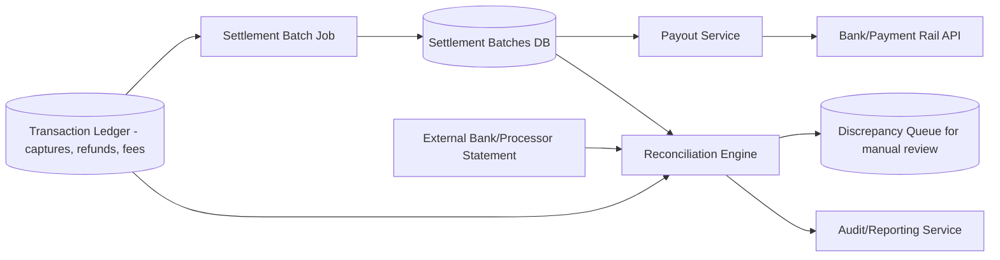
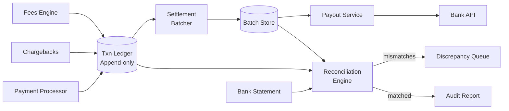

# Design a Settlement and Reconciliation System for Payments

## Blogs and websites

## Medium

## Youtube

## Theory

### What Is It?

A settlement and reconciliation system aggregates individual payment transactions into net settlement batches (per merchant/payout cycle) and continuously reconciles internal ledgers against external bank/processor statements to detect and resolve discrepancies — ensuring every cent is accounted for.

### Why Does It Exist?

Payment platforms process millions of transactions daily across thousands of merchants. Settlement (netting) reduces payout volume + fees; reconciliation (comparing internal vs. external records) ensures correctness and regulatory compliance — missed discrepancies lead to silent revenue leakage.

### What Problem Does It Solve?

* **Settlement batching**: Aggregate thousands of micro-transactions per merchant into a single net payout (T+1, T+2).
* **Fee/refund/chargeback netting**: Net fees, refunds, chargebacks against gross captures to compute true payable amount.
* **Reconciliation**: 3-way match — internal ledger vs. internal settlements vs. external bank statements.
* **Discrepancy detection**: Flag unmatched items for manual review (never auto-resolve money mismatches).
* **Auditability**: Immutable record of every settlement + reconciliation for compliance.
* **Idempotency**: Retried batch jobs never double-pay a merchant.

### Important Subtopics

1. Settlement batching (group by merchant, payout cycle)
2. Netting (gross captures - refunds - fees - chargebacks = payable)
3. Settlement batch creation (re-runnable derived computation)
4. Payout initiation (bank API integration)
5. Reconciliation (3-way match: ledger vs. batch vs. statement)
6. Discrepancy handling (manual review queue)
7. Idempotency (per merchant_id + cycle_date)
8. Audit trail (immutable, compliant retention)

### Problem Statement

Design a settlement and reconciliation system that periodically aggregates individual payment transactions (captured throughout the day by a payment gateway) into net settlement batches to merchants/banks, and continuously reconciles the platform's internal ledger against external bank/processor statements to detect and resolve discrepancies.

### Functional Requirements

- Aggregate authorized/captured transactions into settlement batches per merchant/payout cycle (e.g., daily, T+2)
- Net out refunds, chargebacks, and fees against gross transaction amounts to compute the payable amount
- Initiate payouts to merchant bank accounts and track payout status
- Reconcile internal ledger records against external bank statements/processor reports, flagging mismatches for manual review
- Provide auditable reports of every settlement and reconciliation outcome

### Non-Functional Requirements

- **Scale**: Millions of transactions per settlement cycle across many merchants
- **Correctness**: Every rupee/cent must be accounted for; discrepancies must be surfaced, never silently dropped
- **Durability & Auditability**: Settlement and reconciliation history must be retained and immutable for compliance/audits
- **Timeliness**: Settlement batches must complete within the committed payout SLA (e.g., T+2 days)

### High-Level Architecture



### Key Design Points

- Treat the transaction ledger as the immutable source of truth (double-entry, append-only) and compute settlement batches as a derived, re-runnable aggregation job over a fixed time window per merchant, so a bug in batching can be fixed and safely re-run without corrupting the underlying ledger.
- Net fees, refunds, and chargebacks against gross captures within the same settlement computation so the payout amount sent to the bank API is always the true net figure, with each component individually itemized in the settlement record for auditability.
- Run reconciliation as a three-way match: internal ledger vs. internal settlement batch vs. external bank/processor statement; any transaction present in one but not the other two is automatically routed to a discrepancy queue rather than being auto-resolved, since financial mismatches should always have a human or a well-tested automated rule confirm the resolution.
- Make settlement batch creation and payout initiation idempotent per `(merchant_id, cycle_date)` so a retried batch job or a duplicate payout API call can never double-pay a merchant.

### Trade-offs

- Making settlement a re-runnable derived computation (rather than mutating the ledger directly) trades some storage/compute (recomputing aggregates) for the much stronger guarantee that the ledger is never touched by a batching bug.
- Routing all statement/ledger mismatches to manual review

---

## Characteristics

| Characteristic | What it means | Why it matters | How it works |
|---|---|---|---|
| **Batch settlement** | Aggregate transactions into net payouts | Reduce payout volume + fees | Group by merchant + cycle |
| **Netting** | Gross - refunds - fees - chargebacks = payable | Correct payout amount | Per-transaction accounting |
| **3-way reconciliation** | Match internal ledger vs. batch vs. external statement | Detect discrepancies | Set operations on transaction IDs |
| **Idempotency** | Retried operations don't double-execute | Safe retries | Idempotency key (merchant_id + cycle_date) |
| **Audit trail** | Immutable record of every action | Compliance + dispute | Append-only event log |
| **Manual review** | Discrepancies flagged for human review | Financial accuracy | Queue + UI for investigation |

## Components

| Component | Purpose | Responsibilities | Relationship | Real-world Example |
|---|---|---|---|---|
| **Transaction Ledger** | Source of truth for all transactions | Append-only; captures, refunds, fees | Upstream payment processor | Stripe ledger |
| **Settlement Batcher** | Create settlement batches | Group by merchant + cycle, net amounts | Ledger → Batch Store | Nightly batch job |
| **Batch Store** | Persist settlement batches | Store batch status, items, net amounts | Batcher | Settlement DB |
| **Payout Service** | Initiate bank transfers | Call bank APIs, track status | Batch Store → Bank API | Payout to merchant bank |
| **Statement Importer** | Ingest external bank/processor statements | Parse, normalize, store | Bank API → Reconciliation | CAMT, MT940 |
| **Reconciliation Engine** | 3-way matching | Compare ledger vs. batch vs. statement | All three data stores | Auto-recon |
| **Discrepancy Queue** | Hold mismatched items | Manual review + resolution | Reconciliation → Reviewer | Case management |
| **Audit/Reporting** | Generate compliance reports | Settlement + reconciliation reports | All stores | Audit trail |

## Patterns

### Idempotent Settlement

* **What**: Settlement batch creation and payout initiation are idempotent per `(merchant_id, cycle_date)` — retrying the batch job or duplicate payout API calls never double-pay.
* **Problem solved**: Batch jobs may run twice (retry, crash recovery); payout API may be called twice (network retry) — must not process the same settlement twice.
* **How it works**: (1) Settlement batch keyed by `(merchant_id, cycle_date)`. (2) DB unique constraint on this key → duplicate insert fails. (3) Payout API: idempotency-key header → dedup in Redis or DB. (4) State machine: created → processing → paid → reconciled. (5) If batch already exists → skip; if payout already initiated → return existing status.
* **When to use**: Any financial operation with retry semantics (payments, settlements, payouts).
* **When not to use**: Non-financial operations where duplicate execution is harmless.
* **Advantages**: Prevents double-payments; enables safe retries; simplifies recovery from failures.
* **Disadvantages**: Requires idempotency key design; extra storage for tracking; complexity in state management.
* **Java/Spring Boot example**:
```java
@Service
public class PayoutService {
    public PayoutResult initiatePayout(String merchantId, String cycleDate, String idempotencyKey) {
        if (payoutRepository.existsByIdempotencyKey(idempotencyKey)) {
            return payoutRepository.findByIdempotencyKey(idempotencyKey).toResult();
        }
        SettlementBatch batch = settleBatcher.getOrCreate(merchantId, cycleDate);
        Payout payout = bankClient.initiate(batch);
        payout.setIdempotencyKey(idempotencyKey);
        payoutRepository.save(payout);
        return payout.toResult();
    }
}
```

### Re-runnable Settlement Computation

* **What**: Settlement batches are computed as a derived aggregation over the immutable transaction ledger — the ledger is never mutated by batching; if a bug is found, fix the batch logic and re-run safely.
* **Problem solved**: If settlement logic has a bug, fixing it must not corrupt the underlying ledger (which is the auditable source of truth).
* **How it works**: (1) Ledger is append-only (double-entry). (2) Settlement batch = `SELECT SUM(amount) FROM ledger WHERE merchant=m AND date=c GROUP BY transaction_type`. (3) Batch stored separately with its own version. (4) Bug fix → recompute batch → compare with previous → if different → flag for review. (5) Payout uses the latest (correct) batch.
* **When to use**: Financial systems where auditability + correctness are paramount.
* **Advantages**: Ledger integrity always preserved; bugs fixable without data loss.
* **Disadvantages**: Higher storage (ledger + derived batches); re-computation cost.

## Benefits

* **Revenue protection**: 3-way reconciliation catches discrepancies before they cause losses.
* **Operational efficiency**: Netting reduces payout volume (1000 transactions → 1 payout).
* **Compliance**: Immutable audit trail for regulators + auditors.
* **Trust**: Merchants see exact breakdown of transactions, fees, refunds.

## Pros

* **Net payout reduction**: Fewer bank transactions → lower fees.
* **Full traceability**: Per-transaction audit trail.
* **Idempotent**: Safe retries without double-payment.
* **Flexible cycles**: Daily, T+1, T+2, weekly — configurable per merchant.
* **Multi-currency**: Convert and payout in merchant's currency.

## Cons

* **Complexity**: 3-way matching, state machines, idempotency.
* **Reconciliation lag**: External statements arrive hours/days after → window of unreconciled state.
* **Manual work**: Discrepancies require human review → slow.
* **Currency conversion**: FX rates + timing → discrepancies.
* **Chargeback timing**: Chargebacks arrive late → need to reverse settled amounts.

## Challenges

### Technical Challenges
* **Large batch data**: Millions of transactions → batch aggregation; partitioning by merchant + date.
• **3-way matching**: Efficiently comparing sets (ledger vs. batch vs. statement) at scale.
• **Currency handling**: FX rates + rounding; per-transaction currency tracking.
• **Idempotency**: Key design (merchant_id + cycle_date); Redis/DB dedup.

### Scalability Challenges
* **Transactions**: Millions per batch → parallel processing; partition by merchant_id.
* **Reconciliation**: Thousands of merchants × daily → parallel reconciliation engine.
• **Payouts**: Concurrent bank API calls → rate limiting + pooling.

### Performance Challenges
* **Batch creation**: < 5 min for 1M transactions per merchant.
• **Reconciliation**: < 10 min for millions of statement items.
• **Payout**: Initiation within 1 min of batch closure.

### Reliability Challenges
* **Bank API downtime**: Retry with exponential backoff; mark payout as pending.
• **Statement delays**: Statement arrives late → mark settled → reconcile later.
• **Data corruption**: 3-way mismatch → flag, don't auto-resolve.

### Maintainability Challenges
• **Rule evolution**: Settlement rules change (tax, fees, cycles) → versioning + migration.
• **Audit queries**: Slow queries for investigation → pre-compute indexes (merchant_date, batch_id).

### Security Concerns
* **Financial data**: Encryption at rest; PCI-DSS; access logs.
• **Audit trail**: Immutable logs; tamper-evident; retention.
• **Payout authorization**: Dual-control MFA for large payouts.

## Best Practices

* **Idempotency keys**: Per `(merchant_id, cycle_date)`; unique constraint in DB.
* **3-way reconciliation**: Never auto-resolve mismatches → manual review.
* **Immutable ledger**: Append-only; never update/delete settled transactions.
* **Batch versioning**: Each batch version stored separately → re-runnable.
* **Audit logging**: Every settlement + reconciliation decision logged.
* **Monitoring**: Mismatch rate, payout latency, statement-to-ledger gap, batch creation duration.

## When to Use

### Appropriate
* Payment platforms (Stripe, PayPal, Adyen).
* E-commerce marketplaces with merchant payouts.
* Banking reconciliation systems.
• Any system where financial accuracy is critical.

### Not Appropriate
• Non-financial systems (no money).
• One-off transfers (no aggregation needed).
• Systems with low compliance requirements.

### Decision Factors
* Transaction volume; payout frequency; regulatory requirements; currency complexity.

## Use Cases

### Payment Platform Settlement (Stripe-style)

* **Problem**: Aggregate millions of card captures/charges per merchant/day → net payout; match against bank statement; flag discrepancies.
* **Solution**: Transaction Ledger (immutable) → Batcher → Payout API → Bank. Concurrent Statement Importer → Reconciliation Engine (3-way match).
* **Why suitable**: Idempotent batches; re-runnable computation; 3-way reconciliation; audit trail.
* **How it works**: (1) Day's transactions → batcher computes per merchant → SUM(gross) - SUM(fees) - SUM(refunds) - SUM(chargebacks) = net payout. (2) Payout Service → bank API → track status. (3) Bank statement (next day) → Statement Importer → Reconciliation Engine matches ledger vs. batch vs. statement → mismatches → discrepancy queue. (4) Manual review resolves mismatches → payout adjusted in next cycle.
* **Trade-offs**: Reconciliation lag (statement arrives late); manual review cost; currency conversion complexity.

## Architecture

```mermaid
graph TD
  subgraph "Event Sources"
    Payments[Payment Processor<br/>Captures/Refbacks]
    Chargebacks[Chargeback Feed]
    Fees[Fees Engine]
    BankStmt[Bank Statement<br/>Import]
  end
  subgraph "Processing"
    Ledger[(Transaction Ledger)<br/>Append-only]
    Batcher[Settlement Batcher<br/>Nightly job]
    BatchDB[(Batch Store)]
    Reconcile[Reconciliation<br/>Engine]
    Discrep[Discrepancy Queue]
    Payout[Payout Service<br/>Bank API]
    Report[Audit Report<br/>Service]
  end
  Payments --> Ledger
  Chargebacks --> Ledger
  Fees --> Ledger
  BankStmt --> Reconcile
  Ledger --> Batcher
  Batcher --> BatchDB
  Ledger --> Reconcile
  BatchDB --> Reconcile
  Reconcile --> Discrep
  BatchDB --> Payout
  Payout --> BankAPI[Bank/Payment Rail]
  Reconcile --> Report
```

### Architecture Structure
* **Event ingestion**: Payment processor → Transaction Ledger (immutable, append-only).
* **Batch computation**: Settlement Batcher → computes net amount per merchant per cycle.
* **Reconciliation**: 3-way match against ledger + batch + external statement.
* **Payout**: Bank API integration with idempotency.

### Communication
* **Ledger writes**: Async (Kafka/message queue); idempotent event consumption.
* **Batcher → Ledger**: Read-only aggregate query.
* **Payout → Bank API**: Synchronous HTTP + webhook for status; idempotent.
* **Reconciliation**: Runs every few hours; compares 3 data sources.

### Data Flow
1. **Transaction**: Payment → Ledger (append). 2. **Batch creation** (nightly): Query ledger → group by merchant → compute net → store batch. 3. **Payout**: Batch Store → Payout Service → Bank API → track status. 4. **Statement import**: Bank → Parser → Reconciliation Engine. 5. **Recon**: Compare Ledger vs. Batch vs. Statement → match → mismatches → Discrepancy Queue.

### Scaling Strategy
* **Ledger**: Sharded by merchant_id; append-only → write-optimized (Cassandra/S3).
* **Batcher**: Parallel per merchant; 100 batch workers.
* **Reconciliation**: Parallel per merchant; 50 recon workers.
* **Payout**: Rate-limited bank API calls (100 concurrent).

### Failure Handling
* **Payout failure**: Retry 3x → DLQ → manual retry + notify merchant.
* **Statement delay**: Mark pending → reconcile when statement arrives.
• **Double-batch**: Idempotency key (merchant_id + cycle_date) → dedup.
• **Mismatched data**: Don't auto-resolve → Discrepancy Queue + alert.

## High-Level Design



## Deep Dive

### Settlement Batch Aggregation

The existing file's Theory section covers: Batch computation aggregates per merchant (SUM of captures, subtract refunds + fees + chargebacks) for a cycle (daily/T+1/T+2). Netting reduces 1000 transactions to 1 payout. Batch is re-runnable (derived from immutable ledger, never mutates ledger). Result written to a batch DB with idempotency key.

### Three-Way Reconciliation

The existing file's Theory section covers: Reconciliation Engine compares three datasets: internal ledger (all transactions), internal settlement batch (what was sent to bank), and external bank statement (what bank received). Uses a 3-way set match on transaction IDs + amounts. Any item in one set but not all three → discrepancy → manual review queue. Never auto-resolve money mismatches.

### Idempotent Payout

The existing file's Theory section covers: Payout initiation is idempotent per (merchant_id, cycle_date) via idempotency key + DB unique constraint. If payout already exists → return existing status.

## API Contract

* **API purpose**: Retrieve settlement batch status, payout status, reconciliation results, discrepancy queue.

| Method | Endpoint | Description |
|---|---|---|
| POST | `/api/v1/settlements/batch` | Create/re-run settlement batch (idempotent) |
| GET | `/api/v1/settlements/{merchantId}` | Get batch status + net amount for date |
| POST | `/api/v1/payouts` | Initiate payout (idempotent) |
| GET | `/api/v1/payouts/{id}` | Get payout status |
| GET | `/api/v1/reconciliation/{merchantId}` | Get recon results |
| GET | `/api/v1/discrepancies` | List flagged discrepancies |

**Authentication**: Service-to-service (mTLS) or JWT bearer token.

**Idempotency**: Header `Idempotency-Key: {merchantId}:{cycleDate}` on batch creation and payout initiation.

**Error responses**:
```json
{"error": "payout_duplicate", "message": "Payout already initiated", "code": 409}
{"error": "reconciliation_mismatch", "message": "Discrepancy found, requires review", "code": 200}
{"error": "batch_in_progress", "message": "Batch already being computed", "code": 409}
```

## Data Modeling

```mermaid
erDiagram
    TRANSACTION ||--o{ SETTLEMENT_ITEM : "included in"
    SETTLEMENT_BATCH ||--o{ SETTLEMENT_ITEM : "aggregates"
    SETTLEMENT_BATCH ||--o{ PAYOUT : "triggers"
    MERCHANT ||--o{ SETTLEMENT_BATCH : "receives"
    BANK_STATEMENT ||--o{ STATEMENT_ITEM : "contains"

    TRANSACTION {
      string txn_id PK
      string merchant_id FK
      string type capture_refund_fee_chargeback
      decimal amount
      datetime created_at
      string settlement_id FK
    }
    SETTLEMENT_BATCH {
      string batch_id PK
      string merchant_id FK
      string cycle_date
      decimal gross_amount
      decimal net_amount
      string idempotency_key
      enum status pending_processing_paid_reconciled
    }
    SETTLEMENT_ITEM {
      string batch_id FK
      string txn_id FK
      decimal amount
    }
    PAYOUT {
      string payout_id PK
      string batch_id FK
      string bank_ref
      enum status pending_initiated_paid_failed
      string idempotency_key
    }
    BANK_STATEMENT {
      string statement_id PK
      string merchant_id FK
      date statement_date
      string format CAMT_MT940
    }
```

**Partitioning**: Ledger sharded by merchant_id; batches by (merchant_id + cycle_date); payouts by merchant_id.

## Java and Spring Boot Implementation

```java
@Service
public class SettlementBatchService {
    public SettlementBatch createBatch(String merchantId, LocalDate cycleDate) {
        String idempotencyKey = merchantId + ":" + cycleDate;
        
        if (batchRepository.existsByIdempotencyKey(idempotencyKey)) {
            return batchRepository.findByIdempotencyKey(idempotencyKey);
        }

        // Re-runnable: recompute from immutable ledger
        BigDecimal gross = ledger.sumCaptures(merchantId, cycleDate);
        BigDecimal refunds = ledger.sumRefunds(merchantId, cycleDate);
        BigDecimal fees = ledger.sumFees(merchantId, cycleDate);
        BigDecimal chargebacks = ledger.sumChargebacks(merchantId, cycleDate);
        BigDecimal net = gross.subtract(refunds).subtract(fees).subtract(chargebacks);

        SettlementBatch batch = SettlementBatch.builder()
            .idempotencyKey(idempotencyKey)
            .merchantId(merchantId)
            .cycleDate(cycleDate)
            .grossAmount(gross)
            .netAmount(net)
            .status(BatchStatus.PENDING)
            .build();

        return batchRepository.save(batch);
    }

    @Transactional
    public Payout initiatePayout(SettlementBatch batch, String idemKey) {
        if (payoutRepository.existsByIdempotencyKey(idemKey)) {
            throw new DuplicatePayoutException();
        }
        PayoutResult result = bankClient.initiate(batch);
        Payout payout = Payout.builder()
            .batchId(batch.getBatchId())
            .bankRef(result.getBankRef())
            .status(PayoutStatus.PROCESSING)
            .idempotencyKey(idemKey)
            .build();
        return payoutRepository.save(payout);
    }
}
```

## Real-World Examples

* **Stripe**: Transaction ledger (immutable); settlement batches computed nightly per merchant (T+2); payout via ACH/Wire; reconciliation against bank statements. Handles 10M+ transactions/day.
* **PayPal**: Daily settlement batches; 3-way reconciliation (internal ledger vs. batch vs. PayPal's external acquirer); discrepancy queue for mismatches; PCI-DSS compliant.
* **Adyen**: Settlement file processing; automatic reconciliation; dispute management; multi-acquirer setup.

## Interview Preparation

### Beginner Questions

**Q: What is settlement in payments?**
A: After payment processing, settlement aggregates individual transactions into a net payout. E.g., 100 charges of $10 = $1000 gross, minus $50 fees, $10 refunds = $940 net → single bank transfer to merchant. Reduces payout volume + fees.

**Q: What is the difference between settlement and reconciliation?**
A: Settlement = aggregation (compute how much to pay). Reconciliation = comparison (check if what we paid matches what the bank received). Settlement creates the payout; reconciliation verifies it.

**Q: Why is idempotency important for payouts?**
A: Payout APIs may be called twice (network retry, crash recovery). Without idempotency → double payment → financial loss. With idempotency key (merchant_id + cycle_date) → duplicate calls return existing result.

### Intermediate Questions

**Q: How do you design a reconciliation system?**
A: Three-way match: (1) Internal ledger — all transactions (captures, refunds, fees, chargebacks). (2) Settlement batch — what was sent to bank (net amount). (3) External bank statement — what bank received. Compare sets → matches = OK; mismatches → flag for review. Never auto-resolve money mismatches.

**Q: How do you handle chargebacks in settlement?**
A: Chargeback arrives after settlement → subtract from next cycle's batch → adjust payout amount → communicate with merchant. Store chargeback as negative transaction in ledger → affects future settlement.

**Q: What are the challenges of multi-currency settlement?**
A: Each transaction in different currency → convert to merchant's payout currency → FX rate at time of batch creation vs. bank statement date → rate differences → discrepancies. Store transaction currency + FX rate + conversion timestamp.

### Advanced Questions

**Q: How do you design a settlement system handling 1M merchants, 100M transactions/day?**

A: (1) **Ledger**: Transaction Ledger = append-only, sharded by merchant_id (1000 shards); Cassandra for write-optimized ingestion (10K writes/sec). (2) **Batcher**: Nightly batch job → 100 batch workers (parallel per merchant) → each queries ledger → computes net → writes batch to Postgres (partitioned by date). (3) **Payout**: Payout Service → 50 concurrent bank API calls (rate-limited) → idempotency-key dedup via Redis. (4) **Reconciliation**: Bank statements (1M/day) → Statement Importer → Reconciliation Engine (200 workers) → 3-way match → mismatches → Discrepancy Queue. (5) **Scale**: 1M merchants → 1000 shards → 50 batch workers → 200 recon workers → 10 Redis shards. (6) **Monitoring**: Daily settlement completion rate (> 99%), payout latency (< 5min), recon match rate (> 95%), discrepancy queue backlog.

**Q: How do you ensure no money is lost or double-paid during retries?**

A: Two layers of protection: (1) **Database constraints**: Unique constraint on `(merchant_id, cycle_date)` → duplicate batch insert fails. Unique constraint on `idempotency_key` → duplicate payout fails. (2) **State machine**: SettlementBatch: `created → processing → paid → reconciled` — only `created` → `processing` transition allowed (atomic UPDATE ... WHERE status = 'created'). (3) **Idempotency keys**: Every payout API call includes key → Redis SETNX → if exists → return existing payout. (4) **Reconciliation**: Daily 3-way match catches any missed/duplicate payouts → discrepancy queue. (5) **Audit trail**: Every state change + payout logged → forensic investigation possible.

### Senior-Level Questions

**Q: Design a settlement and reconciliation platform for a global payment processor handling 500M transactions/day across 5M merchants, with T+1 settlement, multi-currency payouts, and regulatory compliance (PCI-DSS, SOX).**

A: (1) **Transaction Ledger**: Append-only event log (Kafka → Cassandra sharded by merchant_hash, 5000 partitions) → captures, refunds, fees, chargebacks. Immutable + 7-year retention (SOX). 500M txns/day = 6000 writes/sec → 50 Kafka brokers + 50 Cassandra nodes. (2) **Settlement Batcher**: Spark job — group by merchant_id + settlement_date → SUM(gross) - SUM(refunds) - SUM(fees) - SUM(chargebacks) = net_amount. Currency conversion using FX rate valid at batch creation time (stored with batch). 5M merchants → 500 Spark executors (~10K merchants each); runs for 4 hours nightly. Batch key = (merchant_id, cycle_date, currency) — unique constraint. (3) **Payout Service**: Multi-currency → route to correct payment rail (ACH for USD, SEPA for EUR, UPI for INR); idempotency-key (merchant_id + cycle_date + currency) + Redis SETNX; bank API rate limiting + circuit breaker. (4) **Statement Import**: Bank statements (MT940/CAMT) → parse + normalize → store → Reconciliation Engine. (5) **Reconciliation**: 3-way match per merchant per cycle_date: Ledger (all txns) vs. Batch (payout amount) vs. Bank (received amount). Exact match → settled; mismatch (±0.01 due to FX) → within tolerance OK; large mismatch → Discrepancy Queue + alert. (6) **Audit**: Every batch + payout + reconciliation decision → immutable log (Elasticsearch + S3); SOX-compliant audit trail. (7) **Monitoring**: Daily batch completion ≥ 99.9%; payout success ≥ 99.5%; recon match rate ≥ 97%; discrepancy queue < 1000 backlogged; PCI-DSS audit monthly. (8) **DR**: Multi-region (primary + secondary); active-passive; ledger replicated via Kafka MirrorMaker; batch results cross-region; payout can failover. (9) **Cost**: ~$2M/month (5000 Cassandra nodes, 500 Spark executors, 50 Kafka brokers, 5M merchant payouts).

### Common Mistakes

- Not idempotent → double-payout on retry.
- Auto-resolving discrepancies → silent money loss.
- Mutating the ledger during settlement → audit trail compromised.
- Not handling chargeback timing → negative balances.
- Ignoring currency conversion → reconciliation mismatches.
- No tolerance band → tiny FX differences → false discrepancies.
- Not archiving old statements → compliance violation.
- Single-region → regulatory violation (cross-border data transfer). (rather than auto-resolving them) is slower operationally but is the safer default for money-movement systems, where an incorrect automated "fix" is far more costly than a delayed payout.
