# Design Slack

## Blogs and websites

## Medium

## Youtube

- [How Slack Works | System Design](https://www.youtube.com/watch?v=QkzarAFu7ZM)

---

## Theory

### Topics Covered

1. [Introduction / Problem Statement](#introduction--problem-statement)
2. [Characteristics](#characteristics)
3. [Pros](#pros)
4. [Cons](#cons)
5. [Use Cases](#use-cases)
6. [Components](#components)
7. [Architectural Patterns](#architectural-patterns)
8. [Benefits](#benefits)
9. [Challenges](#challenges)
10. [Best Practices](#best-practices)
11. [When to Use / When Not to Use](#when-to-use--when-not-to-use)
12. [Data Model and API](#data-model-and-api)
13. [Domain-Specific: Real-Time Collaboration Deep Dive (WebSocket Fan-out, Presence Service, Message Sync, Thread State, Channel Hierarchy)](#domain-specific-real-time-collaboration-deep-dive)
14. [Replication Strategies](#replication-strategies)
15. [Failure Detection and Membership](#failure-detection-and-membership)
16. [High Availability and Scalability](#high-availability-and-scalability)
17. [Performance and Optimization](#performance-and-optimization)
18. [CAP Theorem and Consistency Trade-offs](#cap-theorem-and-consistency-trade-offs)
19. [Encryption and Key Management](#encryption-and-key-management)
20. [Authentication and Authorization](#authentication-and-authorization)
21. [Security Threats and Mitigations](#security-threats-and-mitigations)
22. [Observability and Logging](#observability-and-logging)
23. [Real-World Implementations](#real-world-implementations)
24. [Java and Spring Boot Implementation Guide](#java-and-spring-boot-implementation-guide)
25. [Interview Questions and Answers](#interview-questions-and-answers)

---

### Introduction / Problem Statement

A team messaging platform (like Slack, Discord, Microsoft Teams) is a real-time communication system that enables teams to collaborate through channels, direct messages, file sharing, threaded replies, search, and third-party integrations (bots, webhooks, slash commands). Unlike email — which is asynchronous and siloed — team messaging provides a persistent, searchable, real-time stream of communication organized around workspaces and channels. The platform must deliver messages to millions of concurrent WebSocket connections with sub-200 ms latency, maintain strict per-channel message ordering across multiple datacenters, and scale horizontally to handle billions of messages per day while providing full-text search, real-time presence, and seamless cross-device synchronization.

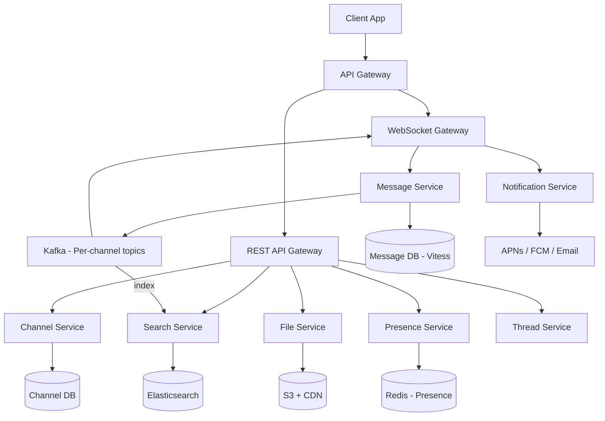

*The diagram shows the core service topology of a team messaging platform: clients connect to an API Gateway that routes both REST requests and WebSocket messages. The WebSocket Gateway maintains persistent connections and subscribes to per-channel Kafka topics. The Message Service persists messages to the Message DB (Vitess, sharded by workspace_id) and publishes to Kafka. The Presence Service tracks user status in Redis with heartbeat-based TTLs. The Search Service consumes from Kafka and indexes into Elasticsearch. The File Service stores media in S3 with CDN delivery. The Notification Service delivers push notifications for offline users.*

**Problem Statement:** Design a team messaging platform like Slack that supports real-time messaging in channels and direct messages, file sharing, threaded replies, full-text search, user presence, notifications, message editing/deletion, and bot integrations — all at enterprise scale serving millions of concurrent WebSocket connections while maintaining sub-200 ms message delivery latency and per-channel ordering guarantees.

**The channel fan-out challenge in numbers:** A message in a large channel with 100,000 members must be delivered within 200 ms. Broadcasting the message directly to 100,000 WebSocket connections requires 100,000 individual writes from gateway instances — enough to saturate network I/O and memory allocation. The system must use a **hybrid fan-out strategy**: push via WebSocket for small channels (under a member threshold), and a **pull-based model** for large channels (clients fetch on connect and receive lightweight notifications for new messages). This avoids the O(N) write amplification on the gateway while keeping latency low for the common case.

**The presence fan-out challenge:** When a user's status changes (online → away → DND → offline), the system must update the status display for all contacts who can see them. Broadcasting to an entire workspace of thousands of users is wasteful — most users never look at the relevant contact list. The solution is **subscription-based presence**: only users who have the relevant user in their visible contact list (sidebar, active DM) receive presence updates. This reduces presence fan-out from O(workspace_size) to O(visible_contacts), which is typically a small constant.

**The message ordering challenge:** In a distributed system across multiple datacenters, messages from different senders must appear in a consistent order per channel. A naive timestamp-based approach fails because clocks drift between machines. The system uses **Snowflake IDs** (42-bit timestamp + 10-bit worker + 12-bit sequence) to ensure globally unique, time-ordered IDs without centralized coordination, and **per-channel Kafka topics** with a single partition per channel to guarantee strict ordering within a partition.

**The offline sync challenge:** Users switch between mobile, desktop, and web browsers. Each client must receive the same message history and be able to resume from where it left off. Every message has a Snowflake ID that serves as a cursor; clients store their last-seen ID and request all messages with IDs greater than their cursor on reconnect. Gap detection and catch-up logic handle missed messages during disconnection.

---

### Characteristics

- **Real-time delivery:** Messages are delivered to online users within milliseconds via persistent WebSocket connections. Offline users receive batched push notifications via APNs/FCM. The system must maintain < 200 ms end-to-end latency for message delivery.
- **Channel fan-out:** A message to a 100K-member channel must reach all active members efficiently. Pure WebSocket broadcast scales poorly (O(N) writes per gateway); the system uses hybrid fan-out (push for small channels, pull for large channels) with a threshold (e.g., 10,000 members).
- **Message ordering:** Messages within a channel must appear in consistent chronological order, even across multiple datacenters and gateway instances. Snowflake IDs provide time-ordered uniqueness without centralized coordination; per-channel Kafka partitions guarantee ordering.
- **Presence:** Show who's online, away, DND, or offline in real-time. Must be efficient — broadcasting status changes to an entire workspace is too expensive; the system uses subscription-based presence (only contacts in visible lists receive updates).
- **Search:** Full-text search across billions of messages with low latency (< 500 ms for 10M messages). Messages are indexed asynchronously via a Kafka → Elasticsearch pipeline with per-workspace routing keys.
- **Persistence:** Message history is available when users switch devices. Messages are stored in Vitess (sharded MySQL by workspace_id) with cursor-based pagination for history fetching using Snowflake IDs as cursors.
- **Cross-device sync:** Seamless experience across mobile, desktop, and web. Clients track their last-seen Snowflake ID (cursor) and fetch messages above that cursor on reconnect. Gap detection handles missed messages during disconnection.
- **Workspace isolation:** Each workspace is a security boundary — resources, data, and users are isolated. Channel membership and role-based permissions control visibility and access.
- **Threaded replies:** Messages can have threaded conversations. Replies are linked to a parent message via `thread_ts` (the Snowflake ID of the parent) and are fetched on demand. Thread summaries are cached for quick preview.
- **File sharing:** Users upload images, documents, and other files. Media is uploaded directly to S3 via presigned URLs and served via CloudFront CDN. Image resizing and virus scanning happen asynchronously.
- **Integrations and bots:** Webhooks, slash commands, and bot users extend platform functionality. Bots receive events via WebSocket or event subscriptions and can post messages, react, and manage channels.
- **Message editing and deletion:** Users can edit or delete their own messages within a time window. Deletions are soft (tombstone markers) to prevent gaps in message history; edit history is preserved for audit.

---

### Pros

- **Real-time:** < 200ms delivery via WebSocket persistent connections.
- **Threaded:** Replies keep conversations organized around specific messages.
- **Search:** Full-text search across all messages in all channels.
- **Presence:** Real-time user status (online/away/DND/offline) for social context.
- **Scale:** 10M+ concurrent users, billions of messages per day.
- **Cross-platform:** Seamless sync across mobile, desktop, and web.
- **Integrations:** 2000+ apps via webhooks, bots, and slash commands.
- **Workspace isolation:** Logical separation of teams, data, and permissions.
- **Ephemeral options:** Self-destructing messages and auto-archived channels.

---

### Cons

- **Notification fatigue:** Message volume can overwhelm users; channel sprawl is a real problem at scale.
- **Storage cost:** Message data grows linearly; petabytes of storage required for history.
- **Search cost:** Elasticsearch clusters (100+ nodes) are expensive to operate and maintain.
- **Presence fan-out:** Broadcasting status changes naively requires subscription-based filtering to avoid O(N) fan-out.
- **WebSocket scale:** Managing millions of persistent connections requires 500+ gateway servers with careful memory management (~10KB per connection).
- **Offline sync complexity:** Ensuring consistent message history across devices with conflict resolution.
- **Large channel fan-out:** Channels with 100K+ members cannot use WebSocket broadcast; requires pull-based delivery.

---

### Use Cases

#### Enterprise Team Collaboration

- **Problem:** 10M+ DAU teams need real-time messaging, files, threads, and integrations with < 200ms delivery.
- **Solution:** WebSocket gateway (500+ servers) + Kafka (one topic per channel) + Vitess (100+ shards by workspace_id) + Elasticsearch (100+ nodes for search) + Redis for presence + S3 + CloudFront for files.
- **How it works:** Message → Kafka (partitioned by channel_id) → Vitess persist → Gateway pushes to WebSocket connections. Large channels (> 10K members) → client-pull with lightweight notification. Presence → Redis (60s TTL). Search → Kafka → Elasticsearch. Files → presigned S3 URLs.
- **Trade-offs:** WebSocket connection management complexity (2000+ gateway servers with ~5000 connections each); Kafka topic management (potentially millions of topics); search infrastructure cost; large channel fan-out requires hybrid push/pull.

#### Developer and DevOps Teams

- **Problem:** Engineering teams need real-time collaboration, CI/CD integration, incident response, and searchable conversation history.
- **Solution:** Bot users subscribe to CI/CD pipelines (build/deploy notifications), on-call rotation integrations, and code review flows. WebSocket gateway for real-time alerts. Kafka for event-driven bot notifications. Elasticsearch for searching past incident discussions.
- **How it works:** CI system → webhook → Slack bot → posts to channel → WebSocket broadcast to all channel members. Search indexes build logs, deployment notes, and incident reports for quick debugging. Threaded replies on incident posts keep discussion organized.

#### Customer Support and Communities

- **Problem:** Support teams and community managers need real-time communication with customers, ticket integration, and knowledge base search.
- **Solution:** Shared channels (cross-workspace), ticket system webhooks, canned responses, and user presence for availability awareness. File sharing for screenshots and documents. Threaded replies for issue resolution.
- **How it works:** Customer message → webhook → support queue → agent picks up → responds via Slack. All conversation is stored in Vitess for audit and search. Presence shows agent availability (online/away/DND).

---

### Components

| Component | Purpose | Responsibilities | Relationship | Real-world Example |
|---|---|---|---|---|
| WebSocket Gateway | Manage persistent connections | Connect/disconnect, heartbeat, route messages to/from WebSocket clients | Client ↔ Message Service ↔ Kafka | Slack gateway servers |
| Message Service | Handle message CRUD | Validate, persist, publish to Kafka, enforce ordering | Gateway ↔ Kafka ↔ Vitess | Message DB |
| Channel Service | Manage workspaces/channels | Create/list channels, membership, permissions, archives | DB | Channel metadata |
| Thread Service | Threaded replies | Link replies to parent message, thread metadata, summarization | DB | Replies |
| Presence Service | Track user status | Online/away/offline, last seen, broadcast to visible contacts | Redis + heartbeat | Slack presence |
| Search Service | Full-text search | Index messages from Kafka, serve search queries | Elasticsearch | Slack search |
| File Service | Upload/download files | Generate presigned S3 URLs, resize images, manage metadata | S3 + CDN | Slack files |
| Notification Service | Offline delivery | Push notifications (APNs, FCM), email, SMS | Push gateways | Slack notifications |
| Bot Service | Integration bots | Webhook processing, slash commands, event subscriptions | External APIs | Slack bots |

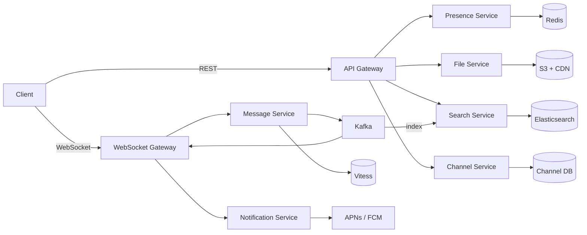

*The component interaction flow shows two paths through the system: real-time messages flow via WebSocket Gateway → Message Service → Kafka → back to Gateway → WebSocket clients; REST requests (channels, search, files, presence) flow through the API Gateway to their respective services. The Message Service is the core — it persists to Vitess and publishes to Kafka, which fans out back to Gateways. The Search Service consumes from Kafka asynchronously for indexing.*

---

### Architectural Patterns

- **Hybrid Fan-out (Broadcast vs. Pull for Large Channels):** For channels with fewer than 10,000 members, the WebSocket Gateway subscribes to the channel's Kafka topic and broadcasts messages directly to all connected WebSocket clients in that channel. For large channels (> 10,000 members), the system switches to a pull-based model: the message is published to Kafka, but the Gateway only sends a lightweight "new message available" notification; clients fetch the message content on demand via REST API. *When to use:* Hybrid fan-out when channel sizes vary widely. *When not to use:* When all channels are small (pure push suffices) or all are large (pure pull may be simpler).
- **Snowflake ID for Message Ordering:** Twitter's Snowflake ID (42-bit timestamp + 10-bit worker ID + 12-bit sequence) generates globally unique, time-ordered IDs without centralized coordination. Message IDs sorted = chronological order. *When to use:* Distributed systems needing ordered unique IDs. *Advantages:* Time-ordered, globally unique, no coordination. *Disadvantages:* Worker ID limit (1024/worker); clock rollback breaks ordering (must validate NTP).
- **Cursor-based Pagination:** Messages are paginated using the Snowflake ID as a cursor (e.g., `GET /messages?channel=C&after=M&limit=50`). *When to use:* Large, append-only datasets. *Advantages:* O(cursor) lookup via indexed range scan; no offset scan drift. *Disadvantages:* Cannot jump to arbitrary page; cursor is opaque to client.
- **Subscription-based Presence:** When a user's presence status changes, only clients that have subscribed to that user's presence (i.e., users who have them in their visible contact list) receive the update. The subscription registry is stored in Redis (`presence:subscriptions:{viewer_id}` → set of `{target_id}`). *When to use:* Workspaces where not every user needs to see every other user's status.
- **Event-driven search indexing:** Messages are published to Kafka after persistence; the Search Service consumes the Kafka stream and indexes into Elasticsearch asynchronously. This decouples write path latency from search indexing latency. A search lag of < 1 minute is acceptable.
- **Database-per-service:** Each service (Message, Channel, Thread, Presence) owns its database. The Message Service uses Vitess; the Channel Service uses PostgreSQL; the Presence Service uses Redis. Services communicate via REST APIs and Kafka events.

```mermaid
graph LR
    MS[Message Service] -->|publish| K[Kafka]
    K -->|topic=channel:{channel_id}| GW[WebSocket Gateway]
    GW -->|broadcast| Small[Small Channels (< 10K)]
    GW -->|notify| Large[Large Channels (> 10K)]
    Large -->|client pull| Client
    Small -->|push| Client
```

*The hybrid fan-out diagram shows the two delivery paths: for small channels, the Gateway subscribes to the channel's Kafka topic and pushes messages directly to WebSocket connections; for large channels, the Gateway sends only a lightweight notification and the client fetches the message content via REST API.*

**Key Design Decisions:**

| Decision | Choice | Reason |
|----------|--------|--------|
| Transport | WebSocket (persistent connections) | Real-time bidirectional delivery to connected clients |
| Message ordering | Snowflake IDs | Time-ordered, globally unique, no coordination needed |
| Message bus | Kafka (per-channel topics) | Decouple producers/consumers, guarantee ordering per partition |
| DB | Vitess (sharded MySQL by workspace_id) | Proven horizontal scaling for multi-tenant data |
| Search | Elasticsearch | Full-text search with filters, aggregations, and near-real-time indexing |
| Presence | Redis + heartbeat | Fast reads, ephemeral data with TTL-based expiry |
| Files | S3 + CloudFront CDN | Cost-effective, global delivery via edge locations |
| Fan-out | Hybrid (push for small, pull for large channels) | Avoid O(N) write amplification on large channels |

---

### Benefits

- **Productivity:** Teams communicate faster than email threads; reduces meeting load; async + real-time hybrid.
- **Searchability:** All conversations are searchable by keyword, user, date, and channel — critical for knowledge retention and onboarding.
- **Integration:** 2000+ apps via webhooks, slash commands, and bot APIs — turns Slack into a workflow hub.
- **Remote work:** Enables effective distributed team collaboration with presence awareness and async history.
- **Channel organization:** Topics, projects, and teams are organized into channels — reduces email noise and context switching.
- **Threaded discussions:** Replies stay organized around specific messages, preventing channel flooding.
- **File sharing:** Integrated file sharing with version history, previews, and searchability.
- **Custom workflows:** Bots and slash commands automate repetitive tasks (CI/CD notifications, on-call alerts, standups).

---

### Challenges

#### Technical Challenges

- **WebSocket scale:** 10M+ concurrent connections → 2000+ gateway servers (each handling ~5,000 connections). Memory management (~10KB per connection), connection lifecycle, and graceful draining on shutdown.
- **Large channel fan-out:** Channels with 100K+ members → cannot broadcast via WebSocket; requires pull model with lightweight notifications.
- **Ordering across datacenters:** Multi-region deployment creates clock drift and cross-region latency. Snowflake IDs solve ordering but cross-region consistency still requires care.
- **Presence broadcast:** Broadcasting status changes to an entire workspace is O(N) — requires subscription-based filtering to reduce fan-out.
- **Search scalability:** 100+ Elasticsearch nodes; managing indices, shards, and query performance across billions of messages.
- **Offline sync:** Ensuring message history consistency across devices with gap detection, cursor tracking, and conflict resolution.

#### Scalability Challenges

- Gateway: 5,000 connections/server → 2,000+ servers at 10M connections. Sticky sessions by user_id or connection migration logic required.
- Kafka: Millions of topics (one per channel); partition management and consumer group rebalancing.
- Vitess: 100+ shards by workspace_id; cross-shard queries for cross-workspace operations.
- Search: 100+ Elasticsearch nodes for indexing and querying billions of messages.

#### Performance Challenges

- Gateway memory: ~10KB per WebSocket connection; millions of connections require careful memory management.
- Delivery latency: < 200ms end-to-end delivery; requires low-latency Kafka → Gateway → WebSocket path.
- Search: < 500ms for searching across 10M messages; requires proper indexing, sharding, and query optimization.
- Reconnect handling: Graceful reconnection must replay missed messages without duplicates or gaps.

#### Reliability Challenges

- **Reconnect and replay:** When a client reconnects, it must fetch missed messages from Kafka/Vitess using its last-seen cursor. Duplicate prevention requires client-side dedup by message_id.
- **Message loss prevention:** At-least-once delivery from Kafka + client-side deduplication by Snowflake ID achieves effectively-once delivery semantics.
- **Large channel recovery:** Clients joining a 100K-member channel must fetch recent history without overwhelming the API — use pagination with small limits and rate limiting.

#### Maintainability Challenges

- **Schema evolution:** Message schema must be backward-compatible; add optional fields, never remove or rename.
- **Kafka topic lifecycle:** Automatically delete topics for deleted/archived channels; retention policy (e.g., 24h for recent, then archive).
- **Mobile sync consistency:** Ensure message IDs, cursors, and read state are consistent across mobile, desktop, and web clients.
- **Topic rebalancing:** Adding Kafka partitions requires careful rebalancing to avoid disrupting active consumers.

#### Security Concerns

- Channel access control: Member-only channels; workspace isolation.
- PII encryption: At rest (TDE) + in transit (TLS 1.3).
- Bot rate limiting: Prevent abuse via rate limits on bot API calls and slash commands.
- E2E encryption: For enterprise compliance, offer end-to-end encrypted channels where the server never holds decryption keys.

---

### Best Practices

- **Snowflake IDs:** Global time-ordered ordering without coordination; use for message IDs, cursor pagination.
- **Per-channel Kafka topics:** Single partition per channel guarantees ordering; topic naming convention `channel:{channel_id}`.
- **Subscription-based presence:** Only broadcast status to visible contacts; store subscriptions in Redis.
- **Cursor pagination:** Paginate by message_id (Snowflake ID), not offset — avoids drift on large tables.
- **Cache membership:** Redis set for channel membership checks (O(1) lookup for authorization).
- **Sticky sessions:** Route a user's WebSocket connection to the same gateway server for session affinity.
- **Idempotent writes:** Write message_id as primary key; on retry, the insert is a no-op (upsert semantics).
- **Graceful degradation:** If search is down, return "search is temporarily unavailable"; if presence is down, show all users as offline.
- **Monitor:** Delivery latency (p50/p95/p99), reconnect rate, Kafka consumer lag, WebSocket connection count, error rates.
- **Circuit breakers:** Wrap Search Service and File Service calls with circuit breakers to prevent cascading failures.

---

### When to Use / When Not to Use

**Use when:**

- Team collaboration is a core product need — real-time messaging replaces or supplements email.
- Channel-based organization is important — topics, projects, and teams need separate spaces.
- Search across all conversations is a key requirement — message history must be findable.
- Integrations with third-party tools (CI/CD, ticketing, monitoring) drive user workflow.
- Cross-device sync is required — users switch between mobile, desktop, and web throughout the day.
- Real-time presence (who's available) is a social context requirement.

**Avoid when:**

- 1:1 messaging only — a simpler point-to-point system without channels is sufficient.
- End-to-end encryption is required by default — WebSocket server-side storage conflicts with E2E encryption unless client-side encryption is layered on.
- Small teams (< 10 users) — a single database with WebSocket broadcast suffices; operational complexity isn't justified.
- Store-and-forward (email-like) delivery semantics are acceptable — pure async systems like email or forum software are simpler.

**Alternatives:**

- **Email (async):** For delayed, archival communication where real-time delivery is not needed. Simpler but slower and less organized for team collaboration.
- **SMS (real-time, expensive):** For urgent 1:1 messages where delivery reliability and speed are paramount, but lacks channels and search.
- **Discord:** Gaming-focused communities with voice channels; similar architecture but different UX.
- **WhatsApp:** E2E encrypted 1:1 and group messaging; simpler model without channels.
- **Microsoft Teams:** Enterprise-focused with Office 365 integration; heavier footprint but deeper productivity suite integration.

**Decision factors:**

- **Real-time needs:** If sub-second delivery is required, WebSocket is the right choice. For async, email or forum software is simpler.
- **Channel model:** If the use case requires topic-based organization (channels), a Slack-style architecture is appropriate. For simple 1:1 or group chats, a lighter model suffices.
- **Scale:** 100M+ messages/day requires Kafka + sharded DB; < 1M messages/day can use a single database.
- **Security:** E2E encryption requirements may rule out server-side WebSocket storage; enterprise compliance (SOC 2, ISO 27001) drives specific auth and encryption choices.
- **Integration complexity:** Heavy third-party integration needs (bots, webhooks, slash commands) favor the Slack model; simple notification needs favor a basic push service.

---

### Data Model and API

The data model captures workspaces, channels, users, messages, threads, presence state, and file metadata. Messages are immutable once created; presence state is ephemeral with TTL-based eviction; file metadata points to S3 objects.

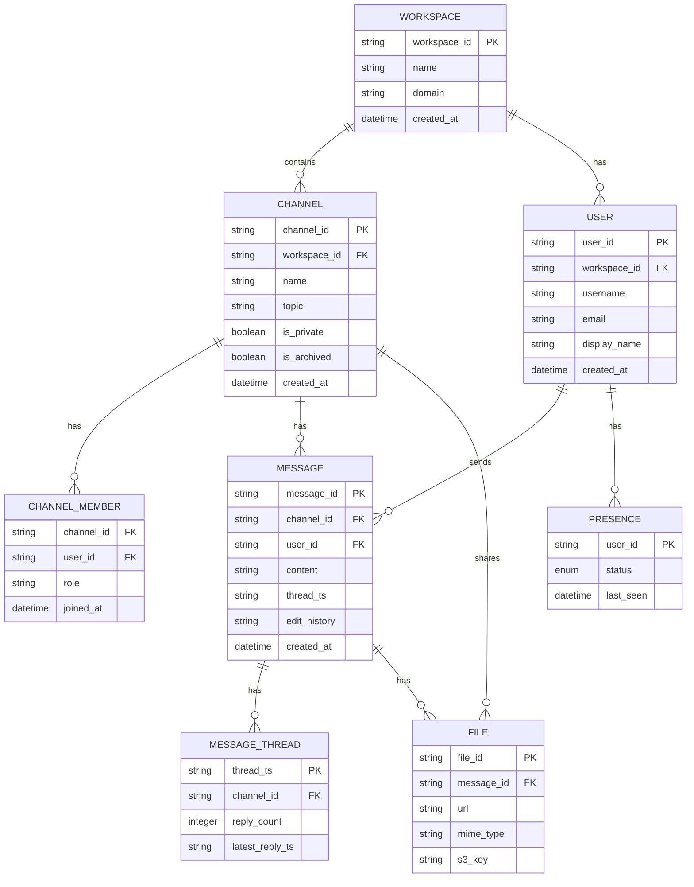

*Entity-relationship diagram of the Slack data model: workspaces contain users and channels; channels contain messages and members; messages may belong to a thread (linked by `thread_ts`); users have ephemeral presence records; messages may have attached files stored in S3.*

**Entity descriptions:**

- **WORKSPACE:** The top-level isolation boundary. `workspace_id` (UUID), `name`, `domain` (used in URL like `acme.slack.com`), `created_at`. All other entities are scoped to a workspace.
- **CHANNEL:** A conversation room within a workspace. `channel_id` (Snowflake ID), `workspace_id` (FK), `name`, `topic`, `is_private`, `is_archived`. Channels are either public (discoverable) or private (invitation-only).
- **CHANNEL_MEMBER:** Membership join table. `channel_id` (FK), `user_id` (FK), `role` (admin, member, guest), `joined_at`. Used for access control — a user must be a member to read/write messages.
- **USER:** Workspace user. `user_id` (UUID), `workspace_id` (FK), `username`, `email`, `display_name`, `created_at`. Users are scoped to a workspace.
- **MESSAGE:** An immutable message. `message_id` (Snowflake ID — time-ordered), `channel_id` (FK), `user_id` (FK), `content`, `thread_ts` (nullable — Snowflake ID of parent message for threaded replies), `created_at`.
- **MESSAGE_THREAD:** Thread metadata. `thread_ts` (PK — the parent message's Snowflake ID), `channel_id` (FK), `reply_count`, `latest_reply_ts`. Enables efficient thread preview without scanning all replies.
- **FILE:** File metadata. `file_id` (UUID), `message_id` (FK), `url` (CDN URL), `mime_type`, `s3_key`. The actual file is in S3; metadata in the DB.
- **PRESENCE:** Ephemeral user status. `user_id` (PK), `status` (enum: online, away, dnd, offline), `last_seen`. Stored in Redis with a 60s TTL; falls back to DB for offline lookups.

**Indexes and Constraints:**

- `WORKSPACE.domain` — UNIQUE index (workspace URL routing).
- `CHANNEL(workspace_id, name)` — UNIQUE composite index (channel names are unique within a workspace).
- `MESSAGE(channel_id, message_id)` — composite index for paginated message retrieval (cursor-based via Snowflake ID).
- `MESSAGE(thread_ts, message_id)` — index for fetching thread replies.
- `CHANNEL_MEMBER(channel_id, user_id)` — composite PK for O(1) membership checks.
- `PRESENCE(user_id)` — PK; indexed for fast status lookups.
- `FILE(message_id)` — index for fetching all files attached to a message.

**Partitioning / Sharding:**

- **MESSAGE:** Sharded by `workspace_id` hash (all channels in a workspace co-located). Within each shard, messages are partitioned by `channel_id` for per-channel ordering. Vitess/MySQL handles this via keyspace-id routing.
- **CHANNEL:** Sharded by `workspace_id` hash.
- **CHANNEL_MEMBER:** Sharded by `channel_id` hash (read-heavy — "who's in this channel?").
- **USER:** Sharded by `workspace_id` hash (users queried in the context of their workspace).
- **PRESENCE:** Stored in Redis with `user_id` as key and TTL-based expiry; no sharding needed for hot data.
- **FILE metadata:** Sharded by `workspace_id` hash.

**Sharding diagram:**

```mermaid
graph LR
    WSID[workspace_id] -->|hash| H[hash(workspace_id) % N]
    H --> S1[(Shard 1<br/>workspace 0-99)]
    H --> S2[(Shard 2<br/>workspace 100-199)]
    H --> S3[(Shard 3<br/>workspace 200-299)]
    S4[(Shard N)]
    S1 --> CH[Channels]
    S1 --> US[Users]
    S1 --> MS[Messages]
```

*Sharding strategy: all entities within a workspace are co-located on the same shard, determined by hashing `workspace_id` modulo N. This ensures that channel membership checks, message persistence, and user lookups for a given workspace all hit the same shard, minimizing cross-shard queries.*

---

### Domain-Specific: Real-Time Collaboration Deep Dive (WebSocket Fan-out, Presence Service, Message Sync, Thread State, Channel Hierarchy)

This section covers the core technical challenges unique to team messaging platforms: how messages are fanned out to channel members in real time (WebSocket fan-out), how user presence is tracked and efficiently broadcast (presence service), how clients synchronize message history across sessions (message sync), how threaded conversations are managed (thread state), and how the workspace → channel → message hierarchy is structured and accessed (channel hierarchy).

#### WebSocket Fan-out

* **What:** The WebSocket Gateway maintains persistent connections to all connected clients and delivers messages in real time. When a message is published to a per-channel Kafka topic, all Gateway instances subscribed to that topic push the message to their locally connected clients.
* **Problem solved:** Enables real-time delivery without polling. Sub-200 ms latency from send to receive across all connected clients.
* **How it works:** Client sends message via WebSocket → Gateway → Message Service → persists to Vitess → publishes to Kafka topic `channel:{channel_id}` → all subscribed Gateway instances receive → push to all WebSocket connections subscribed to that channel → client receives. Each Gateway maintains a local map of `channel_id → Set<connection_id>` to know which connections to push to.
* **When to use:** Real-time delivery is a core requirement; all online users must see messages within milliseconds.
* **When not to use:** For very large channels (> 10,000 members), pure WebSocket broadcast causes O(N) writes per Gateway — use pull model instead.
* **Pros:** Sub-200 ms delivery; no polling overhead; works on mobile, desktop, and web.
* **Cons:** Scales to 2000+ Gateway servers; each connection consumes ~10KB memory; connection lifecycle management (connect/disconnect/reconnect).

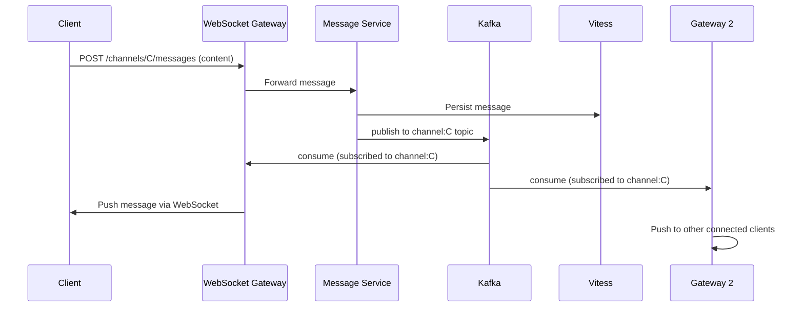

*The WebSocket fan-out flow: the client sends a message through its WebSocket connection to the Gateway, which forwards it to the Message Service. The Message Service persists to Vitess and publishes to the Kafka topic for that channel. All Gateway instances subscribed to that channel's topic consume the message and push it to their locally connected WebSocket clients. This ensures the message reaches all online members of the channel, regardless of which Gateway each client is connected to.*

**Connection management:** Each Gateway server manages thousands of WebSocket connections. To handle failover, connection state (which user, which channels) is stored in Redis (`ws:connections:{user_id}` → set of `{gateway_id}:{connection_id}`). On Gateway failure, clients automatically reconnect; the new Gateway looks up the user's channel subscriptions from Redis and resubscribes. Heartbeat pings every 30 seconds detect dead connections; a missed heartbeat triggers cleanup of the connection from the `channel_id → connection_ids` map.

**Large channel optimization:** For channels with > 10,000 members, the Gateway does not broadcast via WebSocket. Instead, it publishes a lightweight "message available" event to a separate Kafka topic (`channel_updates:{channel_id}`). The client, upon receiving this notification, fetches the message content via a REST API call (`GET /api/v1/channels/{id}/messages?after={cursor}&limit=50`). This reduces the per-Gateway write load from O(channel_members) to O(1).

```java
@Component
@RequiredArgsConstructor
public class WebSocketFanoutService {

    private final SimpMessagingTemplate messagingTemplate;
    private final RedisTemplate<String, String> redisTemplate;
    private final MeterRegistry meterRegistry;

    /**
     * Push a message to all WebSocket connections subscribed to a channel.
     * Uses Redis for cross-Gateway connection tracking.
     */
    public void broadcastToChannel(String channelId, ChatMessage message) {
        var channelKey = "channel:conns:" + channelId;
        var connections = redisTemplate.opsForSet().members(channelKey);
        if (connections == null || connections.isEmpty()) {
            return;
        }

        // Track fan-out size for observability
        Counter.builder("ws.fanout.size")
                .register(meterRegistry)
                .increment(connections.size());

        // Only broadcast if under the large-channel threshold
        if (connections.size() > LARGE_CHANNEL_THRESHOLD) {
            // For large channels, rely on client-pull model
            publishLightweightNotification(channelId, message);
            return;
        }

        // Small channel: push directly via WebSocket
        messagingTemplate.convertAndSend(
                "/topic/channel/" + channelId, message);
    }

    private static final int LARGE_CHANNEL_THRESHOLD = 10_000;

    private void publishLightweightNotification(String channelId, ChatMessage message) {
        // Publish to lightweight notification topic for pull-based delivery
        // Client will fetch the actual message via REST API
        redisTemplate.convertAndSend(
                "channel_updates:" + channelId,
                ChatMessageSummary.from(message));
    }
}
```

*The `WebSocketFanoutService` bean handles real-time message delivery. It looks up all WebSocket connection IDs subscribed to a channel from Redis (`channel:conns:{channelId}`), tracks the fan-out size as a Micrometer counter, and switches to lightweight notification mode for channels exceeding 10,000 connections. For small channels, it uses Spring's `SimpMessagingTemplate` to push the full message to all connected WebSocket sessions. For large channels, it publishes a message summary to Redis pub/sub, signaling clients to fetch via REST.*

#### Presence Service

* **What:** Tracks whether each user is online, away, do-not-disturb (DND), or offline, and broadcasts status changes to contacts who have the user in their visible list.
* **Problem solved:** Real-time user status is critical for social context (knowing who's available before @-mentioning). Naive broadcast to an entire workspace is O(N) and wasteful.
* **How it works:** Clients send a heartbeat every 30 seconds via WebSocket. The Presence Service updates Redis: `user_id → {status, last_seen_timestamp}` with a 60-second TTL. If no heartbeat for 60 seconds → status becomes "away". If no heartbeat for 5 minutes → status becomes "offline" (and Redis evicts the key). Status changes are published to a Redis pub/sub channel `presence:{user_id}`; only subscribed clients receive the update.
* **When to use:** Any workspace where knowing who's available matters for collaboration.
* **When not to use:** Fully anonymous platforms without user profiles.
* **Pros:** Sub-second status updates; O(visible_contacts) fan-out (not O(workspace_size)).
* **Cons:** 30-second heartbeat overhead; stale status possible during network issues.

```mermaid
graph LR
    C1[Client 1] -->|heartbeat| GW[WebSocket Gateway]
    C2[Client 2] -->|heartbeat| GW
    GW --> PS[Presence Service]
    PS --> R[(Redis<br/>user_id → status)]
    PS --> PUB[Redis Pub/Sub<br/>presence:{user_id}]
    PUB -->|to subscribers| C1
    PUB -->|to subscribers| C2
    C3[Client 3] -->|subscribe to user_id| PUB
```

*Presence service architecture: clients send heartbeats through the WebSocket Gateway to the Presence Service, which writes status to Redis with a TTL. When a user's status changes, the Presence Service publishes to a Redis pub/sub channel named after the user's ID. Only clients that have subscribed to that user's presence (via `presence:{user_id}`) receive the update, avoiding O(N) broadcast to the entire workspace.*

**Subscription model:** When a client loads the app, it requests the presence of users in its visible contact list (sidebar, active DMs). The Presence Service registers these subscriptions in Redis: `presence:subscriptions:{viewer_id}` → set of `{target_user_id}` (TTL: 10 minutes, refreshed on each client request). When a user's status changes, the Presence Service:
1. Publishes to `presence:{user_id}` (Redis pub/sub).
2. Any subscribed client (via a Gateway instance subscribed to that channel) receives the update.
3. Unsubscribed clients never receive the update — no wasted broadcast.

**Heartbeat and timeout thresholds:**

| Event | Timeout | Action |
|---|---|---|
| No heartbeat | 60s | Mark as "away" |
| No heartbeat | 5min | Mark as "offline", evict from Redis |
| Connection close | immediate | Mark as "offline", publish to subscribers |
| DND schedule active | scheduled | Mark as "DND" during scheduled hours |

**Java implementation — Presence Service:**

```java
@Service
@RequiredArgsConstructor
@Slf4j
public class PresenceService {

    private final RedisTemplate<String, String> redisTemplate;
    private final SimpMessagingTemplate messagingTemplate;
    private final MeterRegistry meterRegistry;

    private static final String PRESENCE_KEY_PREFIX = "presence:";
    private static final String SUBSCRIPTION_KEY_PREFIX = "presence:subs:";
    private static final Duration HEARTBEAT_TIMEOUT = Duration.ofSeconds(60);
    private static final Duration OFFLINE_TIMEOUT = Duration.ofSeconds(300);

    /**
     * Process a heartbeat from a connected client, updating their presence status.
     */
    @EventListener
    public void handleHeartbeat(HeartbeatEvent event) {
        var userId = event.getUserId();
        var status = event.getStatus();
        var redisKey = PRESENCE_KEY_PREFIX + userId;

        // Store status with TTL
        redisTemplate.opsForHash().put(redisKey, "status", status.name());
        redisTemplate.opsForHash().put(redisKey, "last_seen",
                Instant.now().toString());
        redisTemplate.expire(redisKey, OFFLINE_TIMEOUT);

        // Notify subscribed contacts of status change
        broadcastStatus(userId, status);
    }

    /**
     * Broadcast a presence change to all contacts subscribed to this user.
     */
    private void broadcastStatus(String userId, PresenceStatus status) {
        var subscriptionKey = SUBSCRIPTION_KEY_PREFIX + userId;
        var subscribers = redisTemplate.opsForSet().members(subscriptionKey);
        if (subscribers == null || subscribers.isEmpty()) {
            return;
        }

        var dto = new PresenceUpdate(userId, status, Instant.now());
        for (String subscriberId : subscribers) {
            messagingTemplate.convertAndSend(
                    "/topic/presence/" + subscriberId, dto);
        }

        Counter.builder("presence.updates.broadcast")
                .register(meterRegistry)
                .increment(subscribers.size());
    }

    /**
     * Subscribe a viewer to a target user's presence updates.
     */
    public void subscribeToPresence(String viewerId, String targetUserId) {
        var subscriptionKey = SUBSCRIPTION_KEY_PREFIX + targetUserId;
        redisTemplate.opsForSet().add(subscriptionKey, viewerId);
        redisTemplate.expire(subscriptionKey, Duration.ofMinutes(10));
    }

    @Data
    public record HeartbeatEvent(String userId, PresenceStatus status) {}

    public enum PresenceStatus {
        ONLINE, AWAY, DO_NOT_DISTURB, OFFLINE
    }
}
```

*The `PresenceService` bean handles heartbeat events, updates user status in Redis with TTL-based expiry (60s for away detection, 5min for offline eviction), and broadcasts status changes only to subscribed contacts via Redis sets (`presence:subs:{user_id}` → set of viewer IDs). The subscription set has a 10-minute TTL, refreshed by client requests. Micrometer counters track broadcast fan-out size for observability.*

#### Message Sync

* **What:** Ensures all clients — web, desktop, mobile — see the same message history, even when offline. Uses cursor-based pagination with Snowflake IDs as cursors.
* **Problem solved:** Users switch devices throughout the day; they must not miss messages or see duplicates. Offline users must catch up when they reconnect.
* **How it works:** Each client stores its last-seen Snowflake message ID (the cursor). On reconnect or "load more," the client sends `GET /api/v1/channels/{id}/messages?after={cursor}&limit=50`. The server queries Vitess for messages with `message_id > cursor`, ordered by `message_id` (which is time-ordered). The client updates its cursor to the last message received.
* **When to use:** Cross-device sync is a core requirement for any messaging platform.
* **When not to use:** When message history is not persisted (ephemeral chat only).
* **Pros:** O(cursor) indexed lookup; no offset drift; works across devices.
* **Cons:** Cannot jump to arbitrary pages; cursor is opaque to client; requires Snowflake IDs or equivalent monotonic ordering.

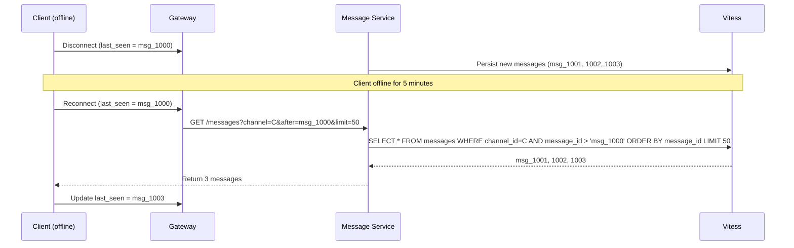

*Message sync flow: while a client is offline, new messages are persisted to Vitess. When the client reconnects, it sends its last-seen cursor (the Snowflake ID of the last message it saw). The Message Service queries for all messages with IDs greater than the cursor, ordered chronologically, and returns them. The client updates its cursor and can now proceed in real-time.*

**Read state tracking:** Beyond fetching history, the system tracks which messages each user has read. A `read_cursor` per (user_id, channel_id) stores the last-read message ID in Redis (`read_cursor:{user_id}:{channel_id}`). When a user opens a channel, the cursor advances to the latest message. Unread count = latest_message_id - read_cursor. This powers "unread badge" counts and "you have N unread messages" notifications.

**Gap detection:** If a client's cursor is too far behind (e.g., it was offline for days), the server returns a `has_gap` flag instead of sending thousands of messages. The client can then choose to "jump to latest" or "load in batches." This prevents overwhelming the client or the network during extended offline periods.

```java
@RestController
@RequiredArgsConstructor
@RequestMapping("/api/v1/channels")
public class MessageController {

    private final MessageService messageService;
    private final ReadStateService readStateService;

    /**
     * Fetch messages after a cursor (for sync/on-scroll).
     * Cursor is the Snowflake ID of the last message the client has seen.
     */
    @GetMapping("/{channelId}/messages")
    public ResponseEntity<MessagePageResponse> getMessagesAfter(
            @AuthenticationPrincipal UserDetails user,
            @PathVariable String channelId,
            @RequestParam String after,
            @RequestParam(defaultValue = "50") int limit) {

        // Verify channel membership
        if (!messageService.canAccessChannel(user.getId(), channelId)) {
            return ResponseEntity.status(HttpStatus.FORBIDDEN).build();
        }

        var messages = messageService.getMessagesAfter(channelId, after, limit);
        var hasMore = messages.size() == limit;

        return ResponseEntity.ok(MessagePageResponse.builder()
                .messages(messages.stream()
                        .map(MessageDto::fromEntity)
                        .toList())
                .hasMore(hasMore)
                .build());
    }
}
```

*The `MessageController` handles cursor-based pagination for message sync. It first verifies channel membership (authorization), then fetches messages with IDs greater than the client's cursor from the Message Service. The Snowflake ID cursor ensures O(cursor) indexed lookup with no offset drift. The response includes a `hasMore` flag for infinite scroll.*

#### Thread State

* **What:** Threaded conversations allow replies to be grouped under a parent message, keeping channel conversations organized. Each thread is identified by the `thread_ts` field (the Snowflake ID of the parent message).
* **Problem solved:** Without threads, multi-message discussions create channel noise. Threads keep side-conversations contained.
* **How it works:** When a user clicks "Reply in thread," the message is stored with `thread_ts` set to the parent message's Snowflake ID. The `MESSAGE_THREAD` table (keyed by `thread_ts`) maintains `reply_count` and `latest_reply_ts` for fast thread previews. The Thread Service manages thread subscriptions — users can @-mention someone in a thread and they'll be notified of all subsequent thread replies.
* **When to use:** Channels with ongoing multi-turn discussions.
* **When not to use:** Simple announcement channels where all messages are top-level.
* **Pros:** Organized conversations; reduced channel noise; thread summaries.
* **Cons:** Additional storage for thread metadata; complexity in thread fetching and subscription management.

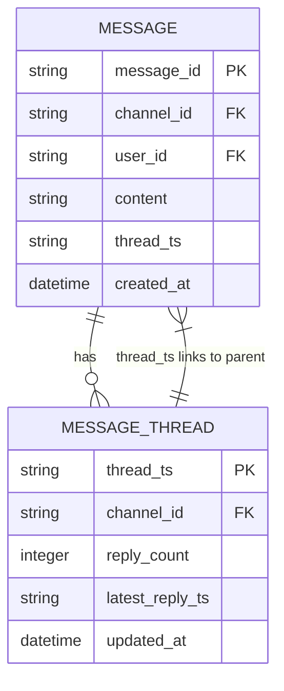

*Thread data model: the `MESSAGE` table has an optional `thread_ts` field that links a reply to its parent message (by Snowflake ID). The `MESSAGE_THREAD` table denormalizes thread metadata (reply_count, latest_reply_ts) for efficient thread previews without scanning all replies.*

**Thread subscription:** When a user participates in a thread (posts a reply, is @-mentioned), they are auto-subscribed to that thread. New replies trigger a notification via WebSocket (if online) or push (if offline). Users can unsubscribe or set threads to "mute." Thread subscriptions are stored in Redis: `thread_subscriptions:{thread_ts}` → set of `user_id` (TTL: 30 days for inactive threads).

**Thread preview caching:** Channel message lists show thread previews (reply count, latest reply snippet). These are cached in Redis (`thread_preview:{channel_id}:{thread_ts}` → serialized preview, TTL: 10 minutes). Cache invalidation happens when a new reply is added — the preview is updated and published to the channel's WebSocket topic.

#### Channel Hierarchy

* **What:** Slack organizes conversations hierarchically: Workspace → Channel → Message (with threads as sub-conversations). Each level has distinct access control, metadata, and lifecycle management.
* **Problem solved:** Provides logical separation of teams, projects, and topics while maintaining a unified search and notification experience.
* **How it works:** A workspace contains channels (public, private, shared, multi-workspace). Each channel has metadata (name, topic, purpose, member count, archive status). Messages belong to exactly one channel. The Channel Service manages the hierarchy, membership, and permissions. The workspace_id is the sharding key — all channels, users, messages, and members for a workspace are co-located on the same Vitess shard.
* **When to use:** Multi-tenant team collaboration where logical separation and access control matter.
* **When not to use:** Flat group chat without workspace/team separation.
* **Pros:** Clear access boundaries; efficient workspace-scoped queries; tenant isolation.
* **Cons:** Channel management overhead; shared channels add cross-workspace complexity.

**Channel types:**

| Type | Description | Access Control |
|---|---|---|
| Public channel | Discoverable by all workspace members | Anyone in workspace can join |
| Private channel | Invitation-only | Must be invited by a member |
| Shared channel | Cross-workspace channel | Both workspaces' members with permission |
| Multi-workspace channel | Channel shared across multiple workspaces | Complex permission matrix |

**Channel metadata:** Each channel stores `name`, `topic` (short description shown in channel list), `purpose` (longer description), `is_private`, `is_archived` (channels can be archived, not deleted, preserving history), `member_count` (denormalized for fast display), `creator_id`, `created_at`, and `last_read_message_id`. Channels can be configured for message retention (auto-delete after 30/60/90 days or never).

**Channel lifecycle:** Channels are created by the Channel Service, which publishes a `channel_created` event to Kafka. The Event Service creates the Kafka topic `channel:{channel_id}` lazily (on first message). When a channel is archived, the Channel Service marks `is_archived = true`, revokes send permissions, and moves the channel to read-only mode. Deleted channels are soft-deleted (retention period before hard delete) to comply with data governance policies.

```java
@Service
@RequiredArgsConstructor
@Slf4j
public class ChannelLifecycleService {

    private final ChannelRepository channelRepository;
    private final KafkaTemplate<String, Object> kafkaTemplate;
    private final RedisTemplate<String, String> redisTemplate;
    private final MeterRegistry meterRegistry;

    /**
     * Archive a channel: mark as archived, revoke send permissions,
     * and notify all channel members.
     */
    @Transactional
    public void archiveChannel(String channelId, String workspaceId) {
        var channel = channelRepository.findByIdAndWorkspaceId(channelId, workspaceId)
                .orElseThrow(() -> new ChannelNotFoundException(channelId));

        if (channel.isArchived()) {
            throw new IllegalStateException("Channel already archived");
        }

        channel.setArchived(true);
        channel.setArchivedAt(Instant.now());
        channelRepository.save(channel);

        // Notify subscribers via Kafka
        kafkaTemplate.send("workspace_events:" + workspaceId,
                Map.of(
                        "channelId", channelId,
                        "eventType", "CHANNEL_ARCHIVED",
                        "timestamp", Instant.now().toString()));

        // Invalidate channel metadata cache
        redisTemplate.delete("channel:meta:" + channelId);

        Counter.builder("channel.archived")
                .tag("workspace", workspaceId)
                .register(meterRegistry)
                .increment();

        log.info("Channel {} archived in workspace {}", channelId, workspaceId);
    }

    /**
     * Create a new channel and set up its Kafka topic lazily.
     */
    @Transactional
    public Channel createChannel(CreateChannelRequest request, String creatorId) {
        var channel = Channel.builder()
                .channelId(SnowflakeIdGenerator.nextId())
                .workspaceId(request.workspaceId())
                .name(request.name())
                .topic(request.topic())
                .purpose(request.purpose())
                .isPrivate(request.isPrivate())
                .creatorId(creatorId)
                .createdAt(Instant.now())
                .build();

        channelRepository.save(channel);

        // Publish event for async setup (topic creation, membership assignment)
        kafkaTemplate.send("workspace_events:" + request.workspaceId(),
                Map.of(
                        "channelId", channel.getChannelId(),
                        "eventType", "CHANNEL_CREATED",
                        "creatorId", creatorId,
                        "timestamp", Instant.now().toString()));

        log.info("Channel {} created in workspace {} by {}",
                channel.getChannelId(), request.workspaceId(), creatorId);
        return channel;
    }
}
```

*The `ChannelLifecycleService` bean manages channel creation and archival. Creating a channel persists it to the DB and publishes a `CHANNEL_CREATED` Kafka event for asynchronous setup (topic creation, membership assignment). Archiving a channel sets `isArchived=true`, publishes a `CHANNEL_ARCHIVED` event, and invalidates the channel metadata cache. Micrometer counters track archive events per workspace. The `@Transactional` annotation ensures DB writes and event publishing are atomic.*

---

### Replication Strategies

A team messaging platform replicates data across multiple dimensions: within a region (for availability), across regions (for global latency and disaster recovery), and across storage systems (for different access patterns).

**Leader-based replication (Message DB — Vitess):** Messages are written to the primary Vitess shard within a region and replicated to read replicas. Writes go only to the leader; reads can be served from any replica. This provides strong consistency for message persistence (a 200 response means the message is durably stored) while allowing read scaling for message history fetches.

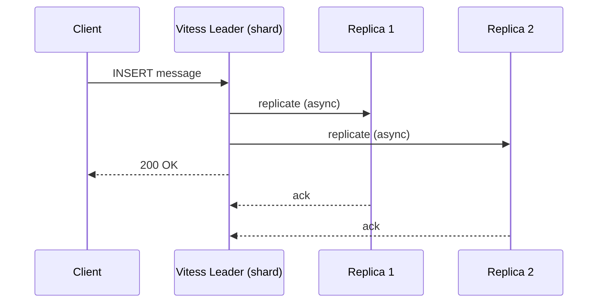

*Leader-based replication for the Message DB: the client sends a message to the Vitess leader shard, which asynchronously replicates to read replicas and immediately returns 200 OK. Replicas serve read traffic (message history, thread lookups), accepting a small replication lag for higher read throughput.*

**Kafka replication:** Each Kafka topic (one per channel) has a replication factor of 3. Within a region, replicas are spread across different availability zones. The Message Service writes to the leader partition; Kafka replicas provide durability. Consumer groups (one per Gateway instance) read from the partition.

**Redis replication (Presence):** Redis runs as a cluster with master/replica pairs. The Presence Service writes to the master; status reads (for presence queries and subscription management) can be served from replicas. Redis Sentinel handles automatic failover. Presence data is ephemeral (TTL-based), so brief staleness during failover is acceptable.

**Elasticsearch replication (Search):** Cross-cluster replication (CCR) syncs indices from the primary region to secondary regions. Search queries can be served from the local region's Elasticsearch with a small replication lag (< 1 minute). Read-heavy search traffic is distributed across replica shards.

**Cross-region replication:**

| Component | Strategy | RPO | RTO |
|---|---|---|---|
| Message DB (Vitess) | Async cross-region replication | < 5 min | < 30 min |
| Kafka | MirrorMaker 2 to secondary region | < 10 min | < 1 hr |
| Redis (Presence) | Active-passive with Sentinel failover | < 1 min | < 5 min |
| Elasticsearch | Cross-cluster replication | < 1 min | < 10 min |
| S3 | Cross-region replication (CRR) | 0 (synchronous) | < 1 min |

**Real-world use cases:** Vitess for sharded message storage (used by Slack and YouTube); Kafka for event backbone (used by every major platform); Redis Cluster for ephemeral state (used by Twitter for timeline cache and session storage); Elasticsearch for full-text search (used by Slack and LinkedIn).

---

### Failure Detection and Membership

Team messaging services must detect failed gateway servers, redistribute WebSocket connections, and continue serving with minimal disruption.

**Kubernetes-based health checks:**

- **Liveness probes:** HTTP `/health` endpoint checked every 5 seconds by Kubernetes. If a Gateway server fails 3 consecutive checks, the pod is restarted and its WebSocket connections are drained.
- **Readiness probes:** Checks if the Gateway can reach the Message Service and Kafka. Not-ready pods are removed from the Kubernetes Service and Service Mesh load balancer.
- **Startup probes:** Allow slow-starting Gateway pods (loading channel subscriptions from Redis) up to 60 seconds before the liveness probe begins.

**WebSocket connection health:**

- **Heartbeat pings:** The WebSocket protocol's built-in ping/pong frames are sent every 30 seconds. If the client doesn't respond to 2 consecutive pings (60 seconds), the connection is closed and marked as offline.
- **Application-level heartbeats:** Clients also send application-level heartbeat messages through the WebSocket, which update their presence status in Redis. This serves dual purpose: connection health + presence tracking.

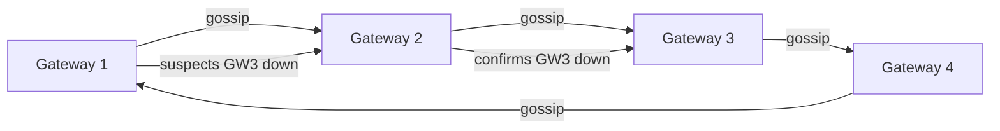

*Gossip-based failure detection among Gateway servers: each Gateway periodically exchanges health state with a random subset of peers. When a node suspects a peer is down (failed health checks), it propagates the suspicion through the gossip protocol. Once confirmed by multiple nodes, the peer is removed from the cluster and its WebSocket connections are migrated to healthy Gateways.*

**Failure detection timing for messaging:**

| Component | Check Interval | Timeout | Action |
|---|---|---|---|
| WebSocket Gateway | 5s | 15s | Drain connections; Kubernetes restarts pod |
| Message Service | 5s | 15s | Stop accepting writes; queue in Kafka |
| Kafka broker | 10s | 30s | Trigger partition rebalancing |
| Presence Redis | 2s | 30s | Failover to replica; presence shows as stale |
| Search (Elasticsearch) | 10s | 30s | Return degraded search results |

**Circuit breakers:** For dependencies that are failing, a circuit breaker (Resilience4j) trips after N consecutive failures and stops sending requests for a cool-down period. This prevents cascading failures — for example, if the Search Service is slow, the API Gateway short-circuits search requests and returns a degraded response instead of saturating with slow requests.

---

### High Availability and Scalability

Team messaging platforms must remain available during gateway server failures, network partitions, and regional outages while scaling to handle millions of concurrent WebSocket connections.

#### Multi-Region Deployment

Deploy active services in at least 3 regions (e.g., us-east, eu-west, ap-southeast). Users are routed to the nearest region via GeoDNS or a latency-based load balancer. Each region is self-sufficient for real-time messaging, with asynchronous cross-region replication for durability.

- **Active-active for WebSocket Gateway:** Each region has its own Gateway pool. Users are routed to the nearest region. If a region fails, GeoDNS routes traffic to the next nearest region. WebSocket connections are not migrated — clients reconnect to the healthy region.
- **Active-passive for Message DB (Vitess):** Writes go to the primary region's Vitess cluster; reads can be served from any region's read replica. Cross-region replication lag is typically 1–5 seconds.
- **Active-active for Kafka:** Each region has its own Kafka cluster. Message writes go to the local region's cluster; MirrorMaker 2 replicates topics to other regions for cross-region fan-out.
- **Global CDN:** Static assets (uploaded files, app resources) are cached at edge locations worldwide, reducing latency to < 50 ms for media.

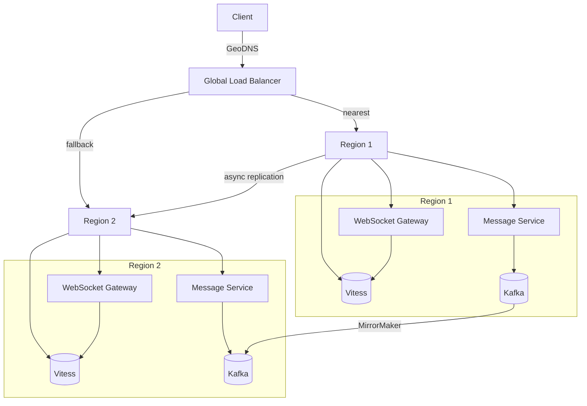

*The multi-region high availability diagram shows active-active WebSocket Gateway and Message Service deployments in each region, with active-passive Vitess (writes to primary, reads from any replica) and active-active Kafka (local writes, cross-region replication via MirrorMaker 2). The global load balancer routes clients to their nearest region; on region failure, traffic fails over to the next nearest region and clients reconnect their WebSocket sessions.*

#### Auto-Scaling

- **WebSocket Gateway (stateless):** Scale horizontally based on CPU utilization and connection count. Each Gateway handles ~5,000 connections; Kubernetes HPA spins up new pods when average CPU > 70% or connections per pod > 4,000. New pods bootstrap channel subscriptions from Redis.
- **Message Service (stateless):** Scale based on request rate and Kafka consumer lag. If the `channel_events` topic lag exceeds 1,000 messages, spin up additional instances.
- **Kafka brokers (stateful):** Scale by adding brokers and rebalancing partitions. Adding partitions to a topic increases parallelism but requires careful rebalancing to avoid disrupting active consumers.
- **Vitess (stateful):** Scale by adding shards (keyspace splits). Each shard holds a subset of workspace_ids. Horizontal resharding moves data between shards without downtime.

#### Graceful Degradation

When a component fails, the system should degrade rather than crash:

- **Search Service down:** Return "search is temporarily unavailable" with a link to cached recent searches. Messages are still delivered in real time via WebSocket.
- **File Service down:** Text messages still display; image attachments show broken image placeholders. Upload requests return 503 with retry-after. Users can paste image URLs directly.
- **Presence Service down:** All users appear offline; real-time messaging continues unaffected. Presence updates are queued in Kafka and replayed when the service recovers.
- **Large channel fan-out degraded:** If Kafka consumer lag is high, large channels fall back to periodic polling (client checks for updates every 30 seconds) until Kafka catches up.

| Component Down | Impact | Degradation Strategy |
|---|---|---|
| Search Service | Can't search messages | Show "search temporarily unavailable" |
| File Service | Can't upload/send files | Text messages still work; broken image placeholders |
| Presence Service | Can't see who's online | Show all as offline; messaging continues |
| Notification Service | No push for offline users | Queue in Kafka; deliver on reconnect |
| Bot Service | Bots don't respond | Show "bot unavailable" |

---

### Performance and Optimization

The performance of a team messaging platform is measured by message delivery latency (sub-200 ms SLA) and WebSocket connection density (5,000+ connections per Gateway server).

#### Latency Optimization

- **In-memory channel subscriptions:** Each Gateway maintains an in-memory map of `channel_id → Set<connection_id>` for O(1) fan-out. This avoids a Redis round-trip per message. The map is populated from Redis on startup and kept in sync via pub/sub.
- **Kafka consumer batching:** Gateway Kafka consumers batch messages (default 500 messages or 16MB per batch) to reduce per-message overhead. Batching interval is < 5 ms for real-time delivery.
- **Persistent connections:** WebSocket connections stay open, eliminating per-message TCP/TLS handshake overhead. Connection pooling between Gateway and Message Service further reduces latency.
- **Connection affinity:** Users are routed to the same Gateway server on reconnect (via consistent hashing on user_id) to leverage in-memory state and avoid re-subscribing to all channels.

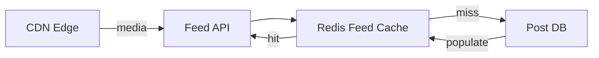

*Multi-tier caching for the messaging platform: the WebSocket Gateway checks its in-memory channel subscription map first for O(1) fan-out; the REST API checks Redis cache before falling back to Vitess; media assets are served from CDN edge locations, removing 90% of origin traffic.*

#### Throughput Optimization

- **Fan-out parallelization:** Kafka consumers within a Gateway process channel topics in parallel. Each consumer handles one partition; the number of consumers scales with the number of partitions.
- **Message batching:** The Message Service batches Kafka publishes (producer batching with 16MB or 50ms batch size) to increase throughput.
- **CDN for files:** 90% of bandwidth on messaging platforms is file/media traffic. Serving from CDN edge locations drastically reduces origin load and improves delivery latency.
- **Pipeline batch fetches:** When the Message Service fetches channel metadata for a batch of messages, it uses a single batched query instead of N individual lookups.

#### Caching Strategies

- **Channel subscriptions (Gateway-local):** In-memory `channel_id → Set<connection_id>` map, refreshed from Redis on startup and via pub/sub updates. TTL: session lifetime.
- **Presence state (Redis):** `user_id → {status, last_seen}` with 5-minute TTL. Read by API Gateway for presence queries. Hot users cached with shorter TTL; cold users evicted.
- **Channel metadata (Redis):** `channel:{channel_id} → metadata` with 10-minute TTL. Invalidated on channel update events.
- **Thread previews (Redis):** `thread_preview:{channel_id}:{thread_ts} → cached preview` with 10-minute TTL. Updated on new replies.
- **Read cursors (Redis):** `read_cursor:{user_id}:{channel_id} → last_read_message_id` with no TTL (persisted).
- **Message DB (Vitess) read replicas:** Hot message history cached in Redis; cold history fetched from read replicas.

**Real-world use:** Slack's WebSocket Gateway handles 5,000+ connections per server across 500+ servers. Discord's Erlang/OTP gateway uses a similar fan-out model but with Rust for the voice layer. Microsoft Teams uses SignalR with Azure SignalR Service for connection management at scale.

---

### CAP Theorem and Consistency Trade-offs

The CAP theorem states that during a network partition, a distributed system can provide at most two of: Consistency, Availability, and Partition tolerance. Since team messaging operates over networks, partition tolerance is always required.

#### Message DB — CP (Consistency + Partition Tolerance)

Message persistence requires strong consistency: if the API returns 200 OK, the message must exist and be retrievable. A failed write should not silently return success. Vitess uses leader-based replication with semi-synchronous acknowledgment from at least one replica before returning success.

#### Search Index — AP (Availability + Partition Tolerance)

Elasticsearch search can tolerate eventual consistency. If an Elasticsearch node is down, search returns stale or partial results rather than failing. The indexing pipeline (Kafka → Elasticsearch) may lag by up to 1 minute. Users searching for a message they just sent may not find it immediately — this is acceptable for a search feature.

#### Presence — AP (Availability + Partition Tolerance)

Presence status is ephemeral (heartbeat-based with TTL). During a network partition, if the Presence Redis is unreachable, the system defaults to showing all users as "offline" — an available but potentially stale answer. Presence updates may be lost during brief outages but self-heal on the next heartbeat.

#### File Storage — AP (Availability + Partition Tolerance)

S3 with CloudFront is designed for 99.99% availability. A file upload may take a few seconds to propagate to the CDN edge, but the origin S3 bucket is always available. File download availability is prioritized over strong consistency — a stale CDN cache serving a slightly old file version is acceptable.

#### Channel Metadata — CP (Consistency + Partition Tolerance)

Channel membership, permissions, and archive status require strong consistency — a user kicked from a private channel must lose access immediately. The Channel Service uses PostgreSQL with synchronous replication for metadata, while message history (bulk data) goes to Vitess.

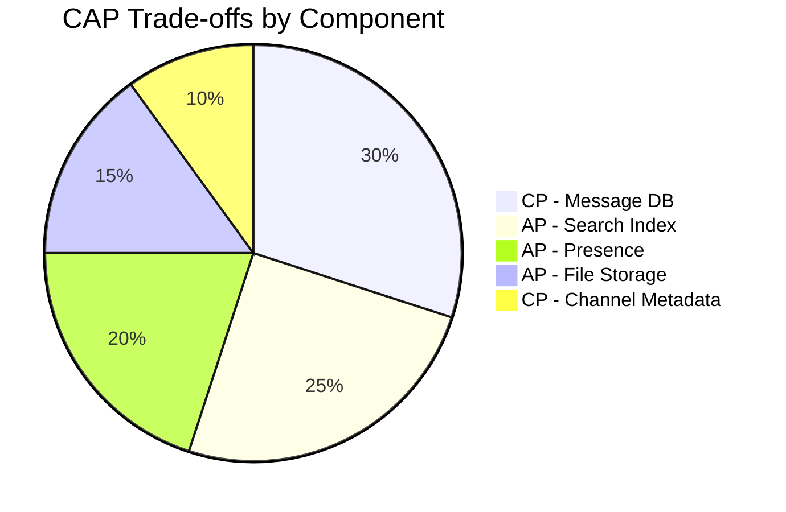

*CAP trade-offs across Slack components: the Message DB and Channel Metadata are CP (consistency-first) since users expect messages to be durable and permissions to be immediately enforced; the Search Index, Presence, and File Storage are AP (availability-first) since brief staleness is acceptable for search results, presence status, and file delivery.*

**Interview question:** *Is team messaging strongly consistent or eventually consistent?*
**Answer:** Team messaging platforms make a nuanced choice: they are strongly consistent for writes that users expect to be immediately visible (message persistence, channel membership changes, permission updates) and eventually consistent for reads where slight staleness is acceptable (search results, presence status, message history on read replicas). This pragmatic split — sometimes called "strong-ish consistency" — is the key insight interviewers look for.

---

### Encryption and Key Management

A team messaging platform stores highly sensitive data — private messages, file attachments, user profiles, relationship graphs, and behavioral telemetry. Encryption must protect data at rest, in transit, and (for enterprise) end-to-end.

#### Encryption at Rest

**Message store:** Vitess (MySQL) uses Transparent Data Encryption (TDE) for data files. Each shard's tablespace is encrypted with a per-shard DEK (Data Encryption Key) managed by a KMS (AWS KMS or HashiCorp Vault).

```mermaid
graph LR
    App[Client App] -->|encrypt(E2E)| E2E[End-to-End Encrypted]
    App -->|encrypt at rest| Storage[(Encrypted Storage)]
    KMS[Key Management Service] -->|DEK| Storage
    KMS -->|KEK| Vault[Key Vault - HSM]
    DEK[Data Encryption Key] --> KMS
```

*Encryption at rest architecture for team messaging: client-side end-to-end encryption protects private messages in enterprise workspaces (the server never holds decryption keys); server-side encryption at rest protects stored data using DEKs managed by a KMS, with KEKs stored in an HSM-backed key vault.*

**File storage:** S3 encrypts all objects with SSE-KMS by default. For enterprise workspaces with E2E encryption requirements, files are encrypted client-side before upload — the server only sees encrypted blobs and generates presigned URLs for the encrypted objects.

**Redis (presence/cache):** Redis Enterprise provides encryption-at-rest; or disk-level encryption (LUKS) on the host instance. Since presence data is ephemeral (TTL-based), at-rest encryption protects only against cold-disk extraction.

#### Encryption in Transit

All client-to-server and server-to-server traffic uses TLS 1.3 (minimum TLS 1.2). WebSocket connections (`wss://`) use the same TLS encryption as HTTPS. Inter-service communication within the data center uses mTLS (mutual TLS) for service-to-service authentication. Mobile and desktop SDKs pin the server certificate to prevent man-in-the-middle attacks.

#### Key Management

- **Key hierarchy:** A KEK (Key Encryption Key) in an HSM encrypts per-shard or per-user DEKs (Data Encryption Keys). Rotating the KEK requires only re-encrypting the DEKs, not the data.
- **Key rotation:** KEKs rotated every 90 days; per-user E2E message keys rotated every 30 days (with key exchange via Signal Double Ratchet protocol for enterprise E2E).
- **Multi-region KMS:** Keys are available in all deployment regions. Cloud KMS services replicate keys automatically; on-prem deployments use HashiCorp Vault with integrated storage for multi-region HA.

**Java example — encryption service as a Spring bean:**

```java
@Service
@RequiredArgsConstructor
@Slf4j
public class FileEncryptionService {

    @Value("${app.encryption.file-key-id}")
    private String keyId;

    private final AwsKms kmsClient;

    /**
     * Encrypt a file using a per-object DEK fetched from KMS.
     * Returns the ciphertext and the encrypted DEK for storage.
     */
    public EncryptedFile encrypt(byte[] plaintext) {
        // Generate a data encryption key via KMS
        var dek = kmsClient.generateDataKey(keyId);

        // Encrypt with AES-GCM (provides confidentiality + integrity)
        var cipher = Cipher.getInstance("AES/GCM/NoPadding");
        cipher.init(Cipher.ENCRYPT_MODE,
                new SecretKeySpec(dek.plaintext(), "AES"),
                new GCMParameterSpec(128, dek.iv()));
        var ciphertext = cipher.doFinal(plaintext);

        return new EncryptedFile(ciphertext, dek.encryptedKey(), dek.iv());
    }

    /**
     * Decrypt a file using the encrypted DEK.
     */
    public byte[] decrypt(EncryptedFile encrypted) {
        var dek = kmsClient.decrypt(encrypted.encryptedKey(), encrypted.iv());
        var cipher = Cipher.getInstance("AES/GCM/NoPadding");
        cipher.init(Cipher.DECRYPT_MODE,
                new SecretKeySpec(dek, "AES"),
                new GCMParameterSpec(128, encrypted.iv()));
        return cipher.doFinal(encrypted.ciphertext());
    }

    public record EncryptedFile(byte[] ciphertext, byte[] encryptedKey, byte[] iv) {}
}
```

*The `FileEncryptionService` bean generates a per-object data encryption key (DEK) via AWS KMS, encrypts file content with AES-GCM (which provides both confidentiality and integrity via the authentication tag), and stores the encrypted DEK alongside the ciphertext. The KMS-managed key ID is injected via `@Value`. Only services with KMS decrypt permissions can recover the DEK to decrypt the file. AES-GCM's authenticated encryption prevents tampering — any modification of the ciphertext causes decryption to fail.*

---

### Authentication and Authorization

A team messaging platform must verify who is connecting (authentication), determine what they can do (authorization), and enforce workspace and channel-level access controls. Every WebSocket connection and REST request must carry authenticated credentials.

#### Authentication Methods

- **OAuth 2.0 + JWT:** Users authenticate via a third-party provider (Google, Apple, Microsoft) or email/password. The Auth Service (typically a separate service or Okta/Auth0 integration) issues a short-lived JWT (15 minutes) and a refresh token (30 days). The JWT contains the user ID, workspace ID, and scopes.
- **Session tokens (web):** For web clients, a server-side session token is stored in an HttpOnly, Secure, SameSite=Strict cookie. The session store (Redis) maps token → user_id and handles revocation.
- **MFA (Multi-Factor Authentication):** Required for admins and optionally for all users. TOTP via authenticator app (Google Authenticator, Authy) or SMS backup. Enterprise workspaces can enforce SAML SSO with MFA.
- **Bot tokens:** Bots authenticate with a workspace-specific bot token (OAuth 2.0 client credentials flow). Bot tokens carry `bot` scope and are scoped to specific channels.

#### Authorization Models

- **Workspace isolation (RBAC):** Each user belongs to a workspace. Workspaces are isolated — a user in workspace A cannot access workspace B's data without an invite. Roles: `owner`, `admin`, `member`, `guest`.
- **Scope-based (OAuth 2.0 scopes):** Each token carries scopes like `messages:read`, `messages:write`, `channels:read`, `channels:write`, `users:read`, `files:write`. The API Gateway enforces scope checks before routing.
- **Channel-level access control:** Public channels are visible to all workspace members; private channels require membership. The Message Service checks channel membership before persisting or delivering messages.
- **Resource-level ACLs:** File access is controlled by ACL — only users in the same workspace (and channel, if applicable) can download a file by its presigned URL.

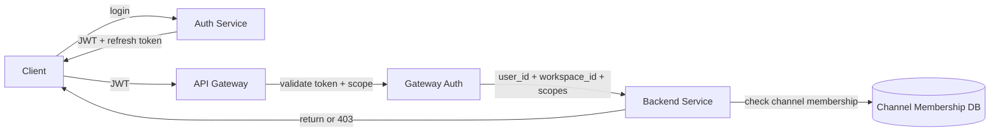

*Authentication and authorization flow: the client logs in via the Auth Service (SSO or email/password), receives a JWT and refresh token; the API Gateway validates the JWT signature and checks scopes before forwarding to backend services; each service performs resource-level access checks (e.g., channel membership) against the membership database before allowing the operation.*

**Java example — JWT validation filter:**

```java
@Component
@RequiredArgsConstructor
public class JwtAuthenticationFilter implements Filter {

    @Value("${app.auth.jwt-public-key}")
    private String publicKeyPem;

    private final UserDetailsService userDetailsService;

    @Override
    public void doFilter(ServletRequest request, ServletResponse response,
                         FilterChain chain) throws IOException, ServletException {
        var token = extractToken((HttpServletRequest) request);
        if (token != null && JwtUtils.isValid(token, publicKeyPem)) {
            var userId = JwtUtils.getUserId(token);
            var workspaceId = JwtUtils.getWorkspaceId(token);
            var userDetails = userDetailsService.loadUserByIdAndWorkspace(
                    userId, workspaceId);
            var auth = new UsernamePasswordAuthenticationToken(
                    userDetails, null, userDetails.getAuthorities());
            SecurityContextHolder.getContext().setAuthentication(auth);
        }
        chain.doFilter(request, response);
    }

    private String extractToken(HttpServletRequest request) {
        var header = request.getHeader("Authorization");
        if (header != null && header.startsWith("Bearer ")) {
            return header.substring(7);
        }
        return null;
    }
}
```

*The `JwtAuthenticationFilter` bean intercepts every HTTP and WebSocket handshake request, extracts the bearer token, validates its signature against the public key (injected via `@Value` from a JWKS endpoint), loads the user details scoped to the correct workspace, and sets the Spring Security `Authentication` context. If the token is missing or invalid, the request proceeds unauthenticated (and subsequent `@PreAuthorize` annotations return 401).*

#### Authorization Example — Channel Access Check

```java
@Service
@RequiredArgsConstructor
@Slf4j
public class ChannelAccessService {

    private final ChannelMembershipRepository membershipRepository;
    private final RedisTemplate<String, String> redisTemplate;

    /**
     * Check if a user can access a channel based on membership and channel type.
     * Public channels: any workspace member can read.
     * Private channels: only members can read/write.
     *
     * @return true if access is granted
     */
    @Transactional(readOnly = true)
    public boolean canAccess(String userId, String channelId, AccessType type) {
        var cacheKey = "channel_access:" + userId + ":" + channelId;
        var cached = redisTemplate.hasKey(cacheKey);
        if (cached) {
            return true;
        }

        var channel = membershipRepository.findChannel(channelId);
        if (channel == null) {
            return false;
        }

        return switch (type) {
            case READ ->
                    channel.isPublic() ||
                    membershipRepository.existsByUserIdAndChannelId(userId, channelId);
            case WRITE ->
                    membershipRepository.existsByUserIdAndChannelId(userId, channelId);
        };
    }

    public enum AccessType { READ, WRITE }
}
```

*The `ChannelAccessService` bean enforces channel-level access control using a Redis cache for O(1) membership checks (key: `channel_access:{user_id}:{channel_id}`) with database fallback. It distinguishes READ access (public channels are open to all workspace members; private channels require membership) from WRITE access (always requires membership). The `@Transactional(readOnly = true)` annotation optimizes read-only database access. Results are cached in Redis with a short TTL for subsequent checks.*

---

### Security Threats and Mitigations

A real-time team messaging platform faces a broad threat surface. Key threats and mitigations:

- **Message interception in transit**: Mitigated by enforcing TLS 1.3 on all WebSocket and REST traffic; optional end-to-end encryption for sensitive channels (using the MLS protocol).
- **Workspace data leakage**: Mitigated by strict workspace isolation in the data model, RBAC at the API gateway, and audit logging of all cross-workspace access attempts.
- **Bot abuse and spam**: Mitigated by per-token rate limiting, content moderation filters, bot permission scopes (bots can only post to channels they are invited to), and user-reported spam detection.
- **DDoS on WebSocket connections**: Mitigated by API Gateway rate limiting, CDN for static assets, DDoS protection (AWS Shield / Cloudflare), and per-client connection quotas.
- **Account takeover**: Mitigated by MFA enforcement for admins, session invalidation on suspicious activity (new IP/device), and JWT refresh rotation.
- **Privilege escalation**: Mitigated by least-privilege RBAC, workspace-scoped tokens, and audit trails for all admin configuration changes.
- **E2E encryption key compromise**: Mitigated by device-level key management with backup codes, key rotation on device change, and forward secrecy via the MLS protocol.

---

### Observability and Logging

Real-time messaging requires fine-grained observability to debug message delivery and detect anomalies:

- **Connection metrics**: Active WebSocket connections (per region, per workspace), connection rate, disconnect rate, auth failure rate. Alert: "Dropped connections > 1% in any AZ"
- **Message metrics**: Messages/sec ingested, delivery latency (p50/p95/p99), fan-out factor (avg channels per message), read-acknowledgment rate. Alert: "Delivery latency > 1s for > 1 min"
- **Channel metrics**: Channels created/deleted per minute, average members per channel, message volume per channel (detect hot channels).
- **Error metrics**: Message delivery failures (fan-out timeout, Redis error), channel access denied (403s), WebSocket handshake failures.
- **Performance metrics**: API Gateway response times, WebSocket message processing latency, Redis operation latency (GET/SET/EVAL).
- **Business metrics**: DAU/MAU (stickiness), messages sent per day, hourly retention, active workspaces.
- **Logging**: Structured JSON logs for message events (sent, delivered, read), auth events (login, SSO, token refresh), admin actions. Retained 90 days in Elasticsearch.
- **Distributed tracing**: Trace message flow: Client → API Gateway → Message Service → Channel Service (validate perms) → Redis (write) → Fan-out Service → WebSocket Push Service → Client. Span attributes: workspace_id, channel_id, user_id, message_id.
- **Alerting**: "Message delivery latency > 2s for 5 min" → page SRE. "Fan-out failure rate > 5%" → alert. "WebSocket connection drops > 2%" → investigate.

---

### Real-World Implementations

- **Slack**: Microservices on AWS. Uses "Molecule" for message routing within workspaces, Redis for real-time fan-out, Kafka for event streaming, Cassandra for message persistence. 10M+ DAU across 65+ data centers.
- **Discord**: 50M+ DAU. Built on Elixir/Erlang for soft-real-time delivery, Cassandra for message storage, ScyllaDB for high-throughput features, WebRTC for voice/video. Uses "Snowflake" for message IDs.
- **Microsoft Teams**: Azure microservices. Cosmos DB for chat storage, SignalR for real-time delivery, SharePoint for file storage. Deep Office 365 integration via Graph API.
- **Mattermost**: Open-source alternative. Go backend, MySQL/PostgreSQL for storage, Elasticsearch for search, supports end-to-end encryption via the MLS protocol.
- **Rocket.Chat**: Open-source. MongoDB for storage, real-time via Meteor/GraphQL subscriptions, supports LDAP/SSO integration and end-to-end encryption.

---

### Java and Spring Boot Implementation Guide

#### 1. DTO Records

```java
public record ChannelMembership(
    String userId,
    String channelId,
    String role,
    Instant joinedAt) {}

public record MessageRequest(
    @NotBlank String channelId,
    @NotBlank String content,
    String replyToId) {}

public record MessageResponse(
    String messageId,
    String channelId,
    String senderId,
    String content,
    Instant createdAt,
    String replyToId) {}

public record WebSocketSession(
    String sessionId,
    String userId,
    String workspaceId,
    Set<String> subscribedChannels) {}
```

#### 2. Entity

```java
@Entity
@Table(name = "message", indexes = {
    @Index(name = "idx_msg_channel_created", columnList = "channelId, createdAt"),
    @Index(name = "idx_msg_sender", columnList = "senderId")
})
public class Message {
    @Id
    private String messageId;

    @Column(nullable = false)
    private String channelId;

    @Column(nullable = false)
    private String senderId;

    @Column(columnDefinition = "TEXT")
    private String content;

    private Instant createdAt;
    private String replyToId;

    @Version
    private Long version;
}
```

#### 3. Repository Layer

```java
@Repository
public interface ChannelMembershipRepository extends JpaRepository<ChannelMembershipEntity, String> {
    boolean existsByUserIdAndChannelId(String userId, String channelId);
    List<String> findChannelIdsByUserId(String userId);

    @Modifying
    @Query("DELETE FROM ChannelMembershipEntity c WHERE c.channelId = :channelId AND c.userId = :userId")
    void deleteByUserIdAndChannelId(@Param("userId") String userId, @Param("channelId") String channelId);
}
```

#### 4. Service Layer - Fan-out Service

```java
@Service
@RequiredArgsConstructor
@Slf4j
public class FanoutService {
    private final RedisTemplate<String, String> redisTemplate;
    private final MeterRegistry meterRegistry;

    @Transactional
    public void fanoutMessage(String channelId, String messageId) {
        var start = System.nanoTime();
        var subscribers = redisTemplate.smembers("channel-subscribers:" + channelId);
        var fanoutCount = 0;

        for (String userId : subscribers) {
            var wsSessions = redisTemplate.smembers("user-sessions:" + userId);
            for (String sessionId : wsSessions) {
                redisTemplate.convertAndSend("ws-broadcast:" + sessionId,
                    new WebSocketEvent(messageId, channelId));
                fanoutCount++;
            }
        }

        meterRegistry.timer("fanout.duration", "channel_id", channelId)
            .record(System.nanoTime() - start, TimeUnit.NANOSECONDS);
        meterRegistry.counter("fanout.fanout_count", "channel_id", channelId)
            .increment(fanoutCount);
    }
}
```

#### 5. WebSocket Controller

```java
@Component
@RequiredArgsConstructor
public class WebSocketMessageController {

    private final FanoutService fanoutService;
    private final ChannelAccessService channelAccessService;

    @MessageMapping("/channel/{channelId}/send")
    @SendToUser("/queue/errors")
    public void sendMessage(@DestinationVariable String channelId,
                          MessageRequest request,
                          SimpMessageHeaderAccessor header) {
        var user = (User) header.getSessionAttributes().get("user");
        if (!channelAccessService.canAccess(user.getUserId(), channelId, AccessType.READ)) {
            throw new AccessDeniedException("No access to channel: " + channelId);
        }

        var message = new Message(/* build from request */);
        var saved = messageRepository.save(message);
        fanoutService.fanoutMessage(channelId, saved.getMessageId());
    }
}
```

#### 6. Controller Advice

```java
@ControllerAdvice
public class GlobalExceptionHandler {

    @ExceptionHandler(AccessDeniedException.class)
    public ResponseEntity<ApiError> handleAccessDenied(AccessDeniedException ex) {
        return ResponseEntity.status(HttpStatus.FORBIDDEN)
            .body(new ApiError("ACCESS_DENIED", ex.getMessage()));
    }

    @ExceptionHandler(ChannelNotFoundException.class)
    public ResponseEntity<ApiError> handleNotFound(ChannelNotFoundException ex) {
        return ResponseEntity.status(HttpStatus.NOT_FOUND)
            .body(new ApiError("NOT_FOUND", ex.getMessage()));
    }

    public record ApiError(String code, String message) {}
}
```

---

### Interview Questions and Answers

#### Beginner

**Q: How do you handle real-time message delivery at scale?**
A: We use a fan-out-on-write pattern. When a message is posted, we look up all subscribers from Redis Sets (`channel-subscribers:{channelId}`) and publish to their WebSocket sessions via Redis Pub/Sub. The WebSocket gateway subscribes to per-session channels. For very large channels, we use fan-out-on-read (clients fetch history from S3/CDN).

**Q: How do you handle offline message delivery?**
A: Messages are persisted to S3 partitioned by `channelId:timestamp`. On reconnect, clients fetch messages from their last-seen cursor. Mobile uses FCM/APNs for push; web clients sync on reconnect. Redis maintains a short window of recent messages per channel for online delivery.

**Q: How do you manage WebSocket connections at scale?**
A: Each gateway node handles ~10K connections. Session state is stored in Redis for cross-node lookup. We use sticky sessions via cookie-based affinity with Redis as fallback. Connection count is monitored per AZ; pods autoscale when threshold is exceeded.

#### Intermediate

**Q: How would you design a thread-based conversation system?**
A: Threads are a separate message type (`type=thread_reply`) with a `threadRootId` field. Fan-out targets thread participants, not all channel members. Thread summaries are materialized views in Elasticsearch. Parent messages store a `replyCount` counter. Thread membership is cached in Redis for O(1) permission checks.

**Q: How do you handle message ordering and deduplication?**
A: Each message gets a Snowflake-style ID (timestamp + shard + sequence). Messages are ordered by ID per channel. For fan-out, Redis Streams provide at-least-once delivery. Clients track `lastDeliveredId`; duplicates are filtered via idempotency keys. For cross-region, we use vector clocks to detect ordering conflicts.

**Q: How do you implement end-to-end encryption?**
A: We use the MLS protocol for group E2E encryption. Each device generates a key pair; group key packages are distributed via the Key Server. Messages are encrypted client-side; the server stores only encrypted blobs. The KMS holds device public keys, not sender keys (sender keys stay device-local).

#### Advanced

**Q: How would you design presence (online/away) at scale?**
A: We use a hybrid push/pull model. Clients send heartbeats every 30s via WebSocket; absence signals offline. Presence is stored in Redis sorted sets (`presence:{channelId}:{userId}` → timestamp). For 50M users, we shard Redis by user_id hash. Presence changes are published via Redis Pub/Sub to subscribed clients. For offline indicators, we use CRDT-based merge across regions with a 30-second staleness tolerance.

**Q: How do you handle message search and filtering at scale?**
A: Messages are streamed to Kafka, processed by Kafka Streams, and indexed into Elasticsearch. The index includes `channelId`, `senderId`, analyzed `content`, and `timestamp`. Search queries are authorized against channel access. We use Elasticsearch rank features for recency boosting. Autocomplete uses n-gram tokenization on the first 4 characters.

#### Senior / System Design

**Q: Design Slack from scratch.**
A: [Full system design: API Gateway + Auth → Message Service → Channel Service → Fan-out Service → WebSocket Gateway → Redis (fan-out state) + S3 (persistence) + Kafka (event log) + Elasticsearch (search) + Notification Service → clients]

**Q: How would you handle a 100x traffic spike (e.g., company-wide announcement)?**
A: Circuit-breaker pattern: when ingestion exceeds 2x peak, switch to "slow mode" (messages queued in Kafka). Scale fan-out workers via HPA based on Kafka lag. For mega-channels, degrade to fan-out-on-read (clients poll every 5s). Rate-limit per workspace to protect system. Use consistent hashing for Redis partitioning to handle scaling.

---
