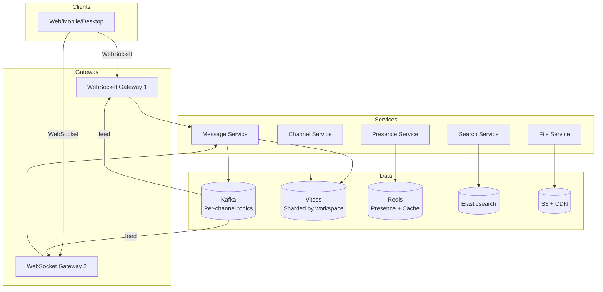
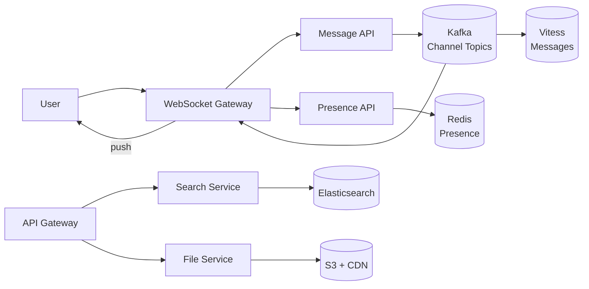

# Design Slack

## Blogs and websites

## Medium

## Youtube

## Theory

### What Is It?

A team messaging platform (Slack, Discord, Microsoft Teams) that supports real-time messaging in channels and DMs, file sharing, threaded replies, search, integrations, and bots. Must deliver messages to millions of concurrent users with < 200 ms latency.

### Why Does It Exist?

Email is too slow for team collaboration. Slack replaced internal email with real-time, searchable, channel-based messaging — keeping teams in sync.

### What Problem Does It Solve?

* **Real-time delivery**: Messages must reach all online users < 200 ms via persistent WebSocket connections.
* **Message ordering**: In a channel, messages must appear in the correct order even across multiple datacenters.
* **Channel fan-out**: A message to a 100K-member channel must reach all members efficiently (not via per-user push).
* **Offline sync**: Users switching devices must see consistent message history.
* **Search**: Full-text search across billions of messages with low latency.
* **Presence**: Show who's online/away/dnd in real-time; must be efficient (don't broadcast to entire workspace).

### Important Subtopics

1. WebSocket gateway and connection management
2. Message ordering (Snowflake IDs, per-channel Kafka topics)
3. Fan-out strategies (broadcast vs. pull for large channels)
4. Presence system (heartbeat + Redis)
5. Search indexing (Elasticsearch, change data capture)
6. File sharing and storage
7. Real-time collaboration (threads)
8. Data model (sharded by workspace_id)

### Problem Statement
Design a team messaging platform like Slack that supports real-time messaging in channels and DMs, file sharing, threads, search, and integrations at enterprise scale.

### Functional Requirements
- Workspaces with channels (public/private) and direct messages
- Real-time messaging (text, emoji, reactions)
- Threaded replies
- File/image sharing
- Message search (full-text)
- User presence (online/away/DND)
- Notifications (push, email, desktop)
- Message editing and deletion
- Integrations and bots (webhooks, slash commands)

### Non-Functional Requirements
- **Latency**: Message delivery < 200ms
- **Scale**: 10M+ concurrent users, 1B+ messages/day
- **Availability**: 99.99%
- **Storage**: Petabytes of messages and files
- **Ordering**: Messages must appear in correct order per channel
- **Sync**: Seamless across mobile, desktop, web

### High-Level Architecture

```
┌──────────┐     WebSocket      ┌────────────────────────────────┐
│  Client  │◀══════════════════▶│       Gateway Service           │
│  (Web/   │                    │  (WebSocket connection manager) │
│  Mobile) │                    └────────────┬───────────────────┘
└──────────┘                                 │
                                             ▼
                              ┌──────────────────────────────┐
                              │       Service Layer           │
                              │                               │
                              │  ┌─────────────────────────┐  │
                              │  │ Channel Service          │  │
                              │  │ Message Service          │  │
                              │  │ Presence Service         │  │
                              │  │ Search Service           │  │
                              │  │ File Service             │  │
                              │  │ Notification Service     │  │
                              │  └──────────┬──────────────┘  │
                              └─────────────┼─────────────────┘
                                            │
                        ┌───────────────────┼───────────────────┐
                        ▼                   ▼                   ▼
                 ┌────────────┐      ┌────────────┐     ┌────────────┐
                 │ Message DB │      │ Search     │     │  File      │
                 │ (Vitess/   │      │ (Elastic-  │     │  Store     │
                 │  CockroachDB)│    │  search)   │     │  (S3)      │
                 └────────────┘      └────────────┘     └────────────┘
```

### Real-Time Message Delivery

```
Send message flow:
  1. Client sends message via WebSocket → Gateway
  2. Gateway → Message Service
  3. Message Service:
     a. Validate (permissions, rate limit)
     b. Persist to Message DB
     c. Publish to channel's Kafka topic
  4. Gateway subscribes to channels for all connected users
  5. Gateway pushes message to all online members via WebSocket
  6. Offline members → queue for push notification

Channel subscription model:
  Each Gateway server maintains:
    channel_id → Set<connection_ids>
  
  On message publish:
    → Kafka consumer on each Gateway server
    → Check local connections for that channel
    → Push to matching WebSocket connections
```

### Message Storage & Ordering

```
Schema (sharded by workspace_id):
  messages:
    id (Snowflake ID — time-ordered)
    channel_id
    thread_ts (nullable — for threaded replies)
    user_id
    content (text)
    attachments (JSON array)
    edited_at
    created_at

Ordering: Snowflake IDs ensure global time ordering
  → No need for sequence numbers per channel
  → ID = timestamp(41 bits) + worker(10 bits) + sequence(12 bits)

Pagination: Load messages by channel_id + cursor (message_id)
  → "Load more" fetches older messages
```

### Presence System

```
User states: online, away, DND, offline

Heartbeat approach:
  - Client sends heartbeat every 30 seconds via WebSocket
  - Presence Service updates Redis: user_id → {status, last_seen}
  - If no heartbeat for 60s → mark as away
  - If no heartbeat for 5min → mark as offline

Broadcasting presence:
  - Don't broadcast to entire workspace (too expensive)
  - Only broadcast to users who have the "away" user visible
  - Client requests presence for visible users in sidebar
  - Subscribe to presence changes for those users only
```

### Search

```
Messages → Kafka → Elasticsearch indexing pipeline

Index fields:
  - content (full-text, analyzed)
  - channel_id (filter)
  - user_id (filter)
  - workspace_id (routing key for sharding)
  - timestamp (sort/filter)
  - file names and content (attachments)

Query: "deployment failed" in:#engineering from:@alice
  → Parse into structured query
  → ES query with filters + full-text match
  → Return ranked results with context snippets
```

### Key Design Decisions

| Decision | Choice | Reason |
|----------|--------|--------|
| Transport | WebSocket (persistent connections) | Real-time bidirectional |
| Message ordering | Snowflake IDs | Time-ordered, globally unique |
| Message bus | Kafka (topic per channel group) | Decouple producers/consumers |
| DB | Vitess (sharded MySQL) | Proven at Slack's scale |
| Search | Elasticsearch | Full-text + filters |
| Presence | Redis + heartbeat | Fast reads, ephemeral data |
| Files | S3 + CDN | Cost-effective, global delivery |

### Scaling Considerations
- **Gateway**: Horizontally scale WebSocket servers, sticky by user
- **Message DB**: Shard by workspace_id (all channels in a workspace co-located)
- **Kafka**: Partition by channel_id for ordering guarantees
- **Search**: Shard ES by workspace_id, replicate for read scale
- **Large channels**: Channels with 10K+ members → fan-out via Kafka, not WebSocket broadcast

---

## Characteristics

| Characteristic | What it means | Why it matters | How it works |
|---|---|---|---|
| **Real-time delivery** | Messages delivered to online users within ms | UX — no manual refresh | WebSocket persistent connection |
| **Channel fan-out** | Message to N members efficiently | Large channels can't broadcast per-user | Pull model for large channels |
| **Message ordering** | Messages appear in chronological order | Correctness | Snowflake IDs (time-ordered) |
| **Presence** | Online/away/DND status | Social context | Heartbeat + Redis + TTL |
| **Search** | Full-text search across messages | Find past context | Elasticsearch |
| **Persistence** | Message history available | Users switch devices | Vitess (sharded MySQL) |
| **Sync** | Seamless web/mobile/desktop | Use any client | Cursor/cursor position sync |

## Components

| Component | Purpose | Responsibilities | Relationship | Real-world Example |
|---|---|---|---|---|
| **WebSocket Gateway** | Manage connections | Connect/disconnect, heartbeat, route messages | Client ↔ Services | Slack gateway |
| **Message Service** | Handle message CRUD | Validate, persist, publish | Gateway ↔ Kafka ↔ DB | Message DB |
| **Presence Service** | Track user status | Online/away/offline, last seen | Redis + heartbeat | Slack presence |
| **Channel Service** | Manage channels/teams | Create/list channels, membership | DB | Channel metadata |
| **Search Service** | Full-text search | Index + query messages | Elasticsearch | Slack search |
| **File Service** | Upload/download files | Store, resize, serve | S3 + CDN | Slack files |
| **Thread Service** | Threaded replies | Link replies, thread metadata | DB | Replies |
| **Notification Service** | Push/email/mobile | Send notifications | FCM/APNs/SES | Slack notifications |

## Patterns

### Hybrid Fan-out (Broadcast vs. Pull for Large Channels)

* **What**: For channels < 1000 members, broadcast message to all WebSocket connections. For large channels (> 10K), write to Kafka → clients fetch on connect (pull model).
* **Problem solved**: Broadcasting to 50K WebSocket connections = 50K writes → too expensive.
* **How it works**: Message → Kafka (partitioned by channel_id). Gateway: small channels → push to WebSocket; large channels → notify lightweight event; client fetches from API.

### Snowflake ID for Message Ordering

* **What**: Twitter's Snowflake ID (42-bit timestamp + 10-bit worker + 12-bit sequence) for globally time-ordered unique message IDs.
* **Problem solved**: Distributed ordering across datacenters without centralized clock.
* **How it works**: IDs are monotonically increasing → messages sorted by ID = chronological.
* **When to use**: Distributed systems needing ordered unique IDs.
* **Advantages**: Time-ordered, globally unique, no coordination.
* **Disadvantages**: Worker ID limit (1024/worker); clock rollback breaks ordering.

## Benefits

* **Productivity**: Teams communicate faster vs. email threads.
* **Searchability**: All conversations searchable.
* **Integration**: 2000+ apps via webhooks.
* **Remote work**: Async + real-time hybrid.

## Pros

* **Real-time**: < 200ms delivery.
* **Threaded**: Replies keep conversations organized.
* **Search**: Full-text across all messages.
* **Presence**: Real-time user status.
* **Scale**: 10M+ users, billions of messages.

## Cons

* **Notification fatigue**: Volume can overwhelm users.
* **Storage cost**: Data grows linearly.
* **Search cost**: Elasticsearch (100+ nodes) is expensive.
* **Presence fan-out**: Broadcasting status → subscription model needed.

## Challenges

### Technical Challenges
* **WebSocket scale**: 10M+ connections → 500+ gateway servers.
* **Large channel fan-out**: 100K-member channel → Kafka pull model.
* **Ordering**: Across datacenters → Snowflake IDs + per-channel Kafka.
* **Presence broadcast**: Subscription-based (only visible contacts).

### Scalability Challenges
* 5000 connections/server → 2000+ servers; millions of Kafka topics.
* 100+ Elasticsearch nodes for search; sharded DB.

### Performance Challenges
* Gateway memory (~10KB/connection); < 200ms delivery.
* Search < 500ms for 10M messages.

### Reliability Challenges
* Reconnect → replay from Kafka.
* Message loss prevention (at-least-once + client dedup).

### Maintainability Challenges
* Schema evolution (backward compatible).
* Kafka topic cleanup (delete old channels).
* Mobile sync consistency.

### Security Concerns
* Channel access control (member-only); workspace isolation.
* PII encryption (at rest + in transit).
* Bot rate limiting.
* E2E encryption for enterprise.

## Best Practices

* **Snowflake IDs**: Global ordering without coordination.
* **Per-channel Kafka topics**: Ordering guaranteed.
* **Subscription-based presence**: Only visible contacts.
* **Cursor pagination**: By message_id, not offset.
* **Cache membership**: Redis for fast access checks.
* **Sticky sessions**: Same gateway per user.
* **Monitor**: Delivery latency, reconnect rate, Kafka lag.

## When to Use

### Appropriate
* Team collaboration platforms.
* Community platforms with channels.
* Enterprise communication.

### Not Appropriate
* 1:1 messaging only.
* E2E encrypted by default.
* Small teams (< 10).

### Alternatives
* Email (async), SMS (real-time but expensive), Discord (gaming), WhatsApp (E2E).

### Decision Factors
* Real-time needs, channel model, scale, security.

## Use Cases

### Enterprise Team Collaboration

* **Problem**: 10M+ DAU teams need real-time messaging + files + integrations.
* **Solution**: WebSocket gateway + Kafka + Vitess (sharded MySQL).
* **How it works**: Message → Kafka → Vitess persist → Gateway pushes to WebSocket. Large channels → pull model. Presence → Redis (60s TTL). Search → Kafka → Elasticsearch.
* **Trade-offs**: WebSocket management (2000+ servers); Kafka topic management (millions); search cost.

## Architecture



## Design

* **Fan-out strategy**: Small channels (< 5000) → WebSocket push via Gateway subscribing to Kafka; large channels (> 10K) → client-pull with lightweight notification.
* **Message ordering**: Snowflake IDs (42-bit timestamp + 10-bit worker + 12-bit sequence).
* **Presence**: Heartbeat every 30s; 60s = away; 5min = offline; broadcast only to visible contacts.
* **Pagination**: Cursor-based (message_id), not offset.
* **Sharding**: Workspace_id → Vitess shard; channel_id → Kafka partition.
* **Consistency**: Strong for messages (ordered Kafka); eventual for search (ES lag < 1min).

## High-Level Design



## Deep Dive

### Real-Time Message Delivery

Message Service persists to DB → publishes to Kafka (topic=channel_id). Gateway subscribes to channel topics → pushes to WebSocket connections. Large channels (> 10K members) use pull model. Snowflake IDs ensure global ordering.

### Presence System

Heartbeat every 30s → Presence Service updates Redis (user_id → status, TTL 60s). Status: 60s = away, 5min = offline. Broadcast only to contacts in sidebar (subscription-based). Reduces fan-out from O(N) to O(visible contacts).

### Message Storage & Ordering

Snowflake IDs for global time ordering. Sharded by workspace_id; cursor-based pagination (message_id).

### Search Indexing

Messages → Kafka → Elasticsearch. Index fields: content (full-text), channel_id, user_id, workspace_id (routing key). Query parsing: "deployment failed" in:#engineering from:@alice.

## API Contract

| Method | Endpoint | Description |
|---|---|---|
| POST | `/api/v1/messages` | Send a message to a channel |
| GET | `/api/v1/channels/{id}/messages` | Get messages (cursor-based) |
| POST | `/api/v1/channels` | Create a channel |
| POST | `/api/v1/channels/{id}/members` | Add member to channel |
| GET | `/api/v1/presence` | Get presence of contacts |
| POST | `/api/v1/files` | Upload a file |
| GET | `/api/v1/search` | Search messages |

WebSocket: `wss://gateway.slack.com/ws` for real-time delivery. JWT auth. Rate limiting per user.

## Data Modeling

```mermaid
erDiagram
    WORKSPACE ||--o{ CHANNEL : "contains"
    CHANNEL ||--o{ MESSAGE : "has"
    USER ||--o{ CHANNEL_MEMBER : "member of"
    USER ||--o{ MESSAGE : "sends"
    USER ||--o{ PRESENCE : "has"

    WORKSPACE { string workspace_id PK; string name; string domain }
    CHANNEL { string channel_id PK; string workspace_id FK; string name; datetime created_at }
    MESSAGE { string message_id PK; string channel_id FK; string user_id FK; string content; datetime created_at }
    CHANNEL_MEMBER { string channel_id FK; string user_id FK; datetime joined_at }
    PRESENCE { string user_id PK; enum status; datetime updated_at }
```

Sharding by workspace_id. Strong consistency for messages; eventual for search.

## Java and Spring Boot Implementation

```java
@RestController
@RequestMapping("/api/v1/channels")
@RequiredArgsConstructor
public class ChannelController {
    private final MessageService messageService;

    @PostMapping("/{channelId}/messages")
    public ResponseEntity<Message> sendMessage(
            @AuthenticationPrincipal UserDetails user,
            @PathVariable String channelId,
            @RequestBody SendMessageRequest request) {
        Message msg = messageService.send(channelId, user.getId(), request.getContent());
        return ResponseEntity.ok(msg);
    }

    @GetMapping("/{channelId}/messages")
    public ResponseEntity<List<Message>> getMessages(
            @PathVariable String channelId,
            @RequestParam(required = false) String after,
            @RequestParam(defaultValue = "50") int limit) {
        List<Message> messages = messageService.getMessages(channelId, after, limit);
        return ResponseEntity.ok(messages);
    }
}

@Service
public class MessageService {
    private final SnowflakeIdGenerator idGenerator;
    private final KafkaTemplate<String, Object> kafkaTemplate;

    public Message send(String channelId, String userId, String content) {
        Message msg = Message.builder()
            .messageId(idGenerator.nextId())
            .channelId(channelId)
            .userId(userId)
            .content(content)
            .createdAt(Instant.now())
            .build();
        messageRepository.save(msg);
        kafkaTemplate.send("channel:" + channelId, msg);
        return msg;
    }
}
```

## Real-World Examples

* **Slack**: 12M+ DAU; WebSocket gateway (500+ servers); Kafka (one topic per channel); Vitess (100+ shards); Elasticsearch; Redis presence; S3 + CloudFront for files.
* **Discord**: 250M+ users, 15M+ concurrent; Erlang/OTP gateway; Cassandra for messages; Rust for gateway. Voice + text channels; guild sharding.
* **Microsoft Teams**: 145M+ DAU; Office 365 integration; SharePoint storage; Azure Service Bus; SignalR.

## Interview Preparation

### Beginner Questions

**Q: How do you implement real-time messaging?**
A: WebSocket (persistent bidirectional) between client and server. When User A sends → server receives via WebSocket → persists → broadcasts to all connected clients in channel. WebSocket preferred over polling (no connection overhead).

**Q: How do you ensure message ordering?**
A: Snowflake IDs (timestamp + worker + sequence) sorted → chronological order. Alternative: per-channel logical clock.

**Q: How do you scale WebSocket connections?**
A: 5000 connections/server → 2000+ servers. Sticky sessions by user_id; load balancer with sticky or reconnect to correct server.

### Intermediate Questions

**Q: How does presence work at scale?**
A: Heartbeat every 30s → Redis (TTL 60s). 60s = away; 5min = offline. Only broadcast to visible contacts (sidebar). Reduces fan-out from O(N) to O(visible contacts).

**Q: How do you handle 100K-member channels?**
A: Don't broadcast via WebSocket. Messages → Kafka → client fetches recent on join. New messages → lightweight notification → client fetches.

**Q: How do you handle offline sync?**
A: Messages in DB (Vitess). Client tracks last-seen message_id (cursor). On reconnect → fetch messages > cursor. Gap → fetch from last_seen.

### Advanced Questions

**Q: Design Slack for 10M concurrent WebSocket connections?**
A: 5000 connections/server → 2000+ servers. Sticky by user_id. Kafka (topic per channel). Vitess sharded by workspace. Redis for presence (60s TTL). Search: 100+ ES nodes. Monitoring: connection count, reconnect rate, P99 latency, Kafka lag.

**Q: How do you handle message deduplication?**
A: UUID per message; Redis SETNX (if exists → duplicate). Cursor-based delivery tracking in Redis; client-side dedup by message_id. At-least-once + client dedup → effectively once.

### Senior-Level Questions

**Q: Design messaging for 100K-member channels, < 200ms delivery, 1B messages/day?**
A: Small channels (< 5000) → WebSocket broadcast (Kafka → Gateway → WS). Large channels → Kafka pull model (client fetches). Vitess sharded by workspace. 12K msg/sec avg + 100K bursts. 2000+ gateway servers, 50 Kafka brokers, 500 Vitess shards, 100 ES nodes. Monitoring: delivery latency, Kafka lag, Vitess write latency.

**Q: How do you achieve effectively-once delivery?**
A: UUID + Redis SETNX (dedup); idempotency; Snowflake IDs (ordering); WebSocket reconnect with last_id → replay; Kafka consumer groups (at-least-once + client dedup). 24h retention; cursor tracking in Redis.

### Common Mistakes
- No Snowflake IDs → ordering issues.
- Broadcasting large channels → O(N) writes.
- Presence broadcast to workspace → fan-out explosion.
- Storing messages in Redis → memory explosion.
- No TTL on presence → stale status.
- Offset pagination on huge tables.
- No reconnect handling → duplicate messages.
