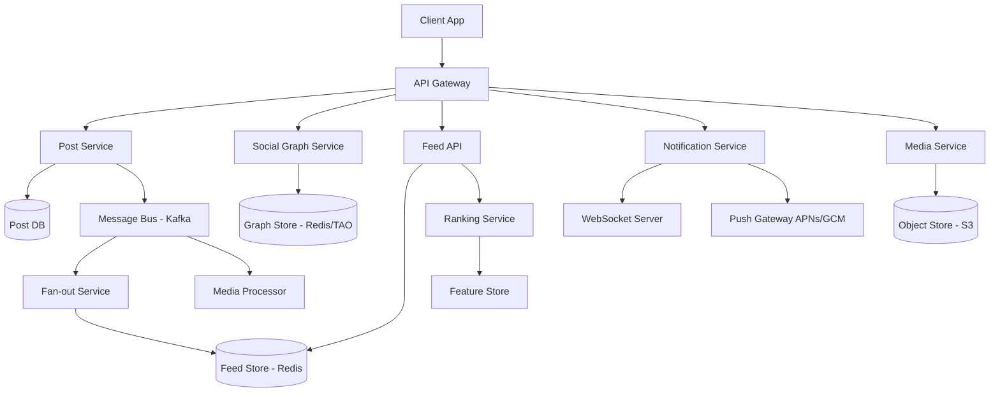
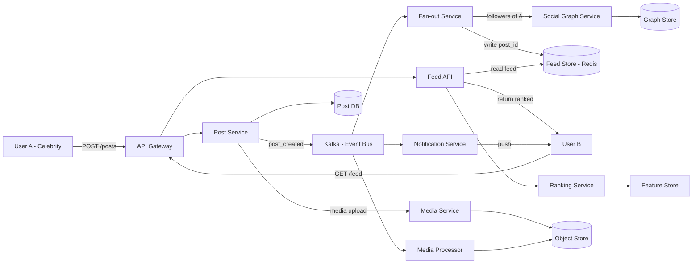
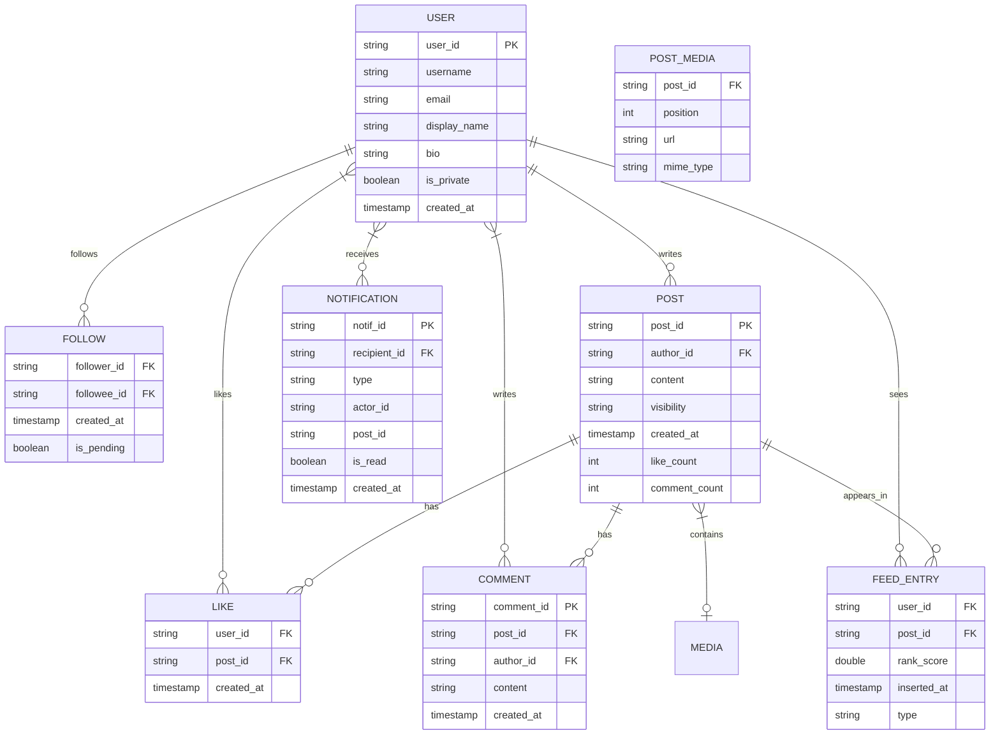

# Design Social Media

## Blogs and websites

## Medium

## Youtube

- [Design a Low-Latency Social Media Platform | System Design](https://www.youtube.com/watch?v=QkzarAFu7ZM)

---

## Theory

### What Is It?

A social media platform is a system that lets users create profiles, share content (text, images, videos), connect with others (follow/friend relationships), and consume a personalized feed of content from their network. Unlike content platforms (YouTube, Spotify), social media is relationship-driven: the value of the feed depends on who you follow. Key operations include posting content, building and querying the social graph, generating feeds (news feed, timeline), and delivering real-time notifications. The defining challenge is the **fan-out problem**: when a user with millions of followers posts, how do you efficiently deliver that content to all followers' feeds without overwhelming the system.

### Why Does It Exist?

Social media platforms exist to connect people and enable the sharing of thoughts, experiences, and media at scale. Traditional media (newspapers, TV) is one-to-many broadcasting; social media enables many-to-many communication — every user can both publish and consume. The platforms capture engagement data (likes, comments, shares) that creates powerful network effects: the more people join and interact, the more valuable the platform becomes to each individual user.

### What Problem Does It Solve?

* **Fan-out at scale**: A celebrity with 10M followers posts a tweet — the system must make it visible to 10M followers' feeds. Naive fan-out-on-write would require 10M writes; fan-out-on-read would require 10M reads per timeline view. The system must find an efficient middle ground.
* **Social graph storage and queries**: Store billions of follow relationships and answer queries like "who should see this post?", "do these users share connections?", "suggest friends" — all in milliseconds.
* **Real-time feed updates**: When someone you follow posts, you should see it in your feed "now", not after a batch job runs. This requires real-time event propagation.
* **Feed ranking**: Not every post from your network is worth showing; the system must rank by relevance (recency, engagement, relationship strength) within a tight latency budget (< 200 ms for the API response).
* **Hot keys**: Popular posts or trending hashtags generate massive read/write traffic on specific keys (e.g., the post ID or hashtag counter), creating hotspots that can overwhelm a single shard.
* **Consistency vs. latency**: When a user posts, should followers see it immediately (strong consistency) or eventually (async fan-out)? Social media typically prioritizes availability and latency over strong consistency.

### Important Subtopics

1. Fan-out strategies: fan-out on write vs fan-out on read vs hybrid
2. Social graph storage and query patterns
3. Feed ranking algorithms (chronological vs ML-ranked)
4. Hot key mitigation (trending topics, celebrity posts)
5. Real-time delivery and push notifications
6. Newsfeed caching and personalization
7. Media storage (photos, videos) at scale

## Characteristics

| Characteristic | What it means | Why it matters | How it works |
|---|---|---|---|
| **Fan-out** | Distributing a post to all followers' feeds | Determines write amplification and timeline latency | Write-time fan-out (pre-compute) vs Read-time fan-out (compute at read) |
| **Social graph** | The network of follow/friend relationships | Dictates content visibility and recommendation | Stored as edge table, indexed by user ID and followee ID |
| **Real-time delivery** | Followers see new posts within seconds | User engagement depends on seeing fresh content | Push via WebSocket, message queue, or polling |
| **Feed ranking** | Ordering posts by relevance | A chronological feed is suboptimal for engagement | ML model scores posts, or simple heuristics (recency × engagement) |
| **Media richness** | Support for text, photos, videos, links | Drives engagement but increases storage and delivery complexity | Media uploaded to object store, served via CDN |
| **Global scale** | Serving billions of users across the world | Latency must be low everywhere | Multi-region deployment with data replication |
| **High write throughput** | Millions of posts per minute | The ingest path is the bottleneck | Distributed write queue, sharded databases |

## Components

| Component | Purpose | Responsibilities | Relationship | Real-world Example |
|---|---|---|---|---|
| **Post Service** | Create/retrieve posts | Accept post content, store in DB, publish to message bus | Feeds Fan-out Service, Media Service | Twitter Post Service |
| **Social Graph Service** | Manage relationships | Store follow/unfollow, check if A follows B, find mutual connections | Queried by Fan-out Service, Feed Service | Facebook TAO |
| **Fan-out Service** | Distribute posts | For each follower, write the post ID to their feed cache | Reads from Graph Service, writes to Feed Store | Twitter Fanout Service |
| **Feed Store** | Store precomputed feeds | Fast retrieval of a user's feed | Read by Feed API; written by Fanout Service | Redis, Cassandra |
| **Feed API** | Serve feeds | Paginate a user's timeline, apply ranking | Reads from Feed Store + Ranking Service | Twitter Timeline API |
| **Ranking Service** | Order posts by relevance | Apply ML model or heuristics to rank posts | Consumes engagement signals, feeds Feed API | Facebook Feed Ranker |
| **Notification Service** | Push real-time updates | Deliver notifications (likes, comments, follows) | Listens to event bus, pushes via WebSocket/APNs/GCM | Pusher, Firebase |
| **Media Service** | Handle uploads | Accept media files, store in object store, generate thumbnails | Called by Post Service; serves CDN URLs | Instagram Media Service |
| **Message Bus** | Event propagation | Decouple services; carry post_created, user_followed events | Used by all services for async communication | Kafka, RabbitMQ |
| **Search Service** | Discover content | Index posts and users for search | Consumes events from Message Bus | Elasticsearch |

### Component Interactions

1. **Post lifecycle**: User posts → Post Service stores in DB → publishes `post_created` event → Fan-out Service consumes event → for each follower, writes post_id to their Feed Store entry → Feed API retrieves and ranks.
2. **Social graph**: User follows someone → Social Graph Service writes edge → publishes `user_followed` event → Fan-out Service consumes and backfills recent posts to the new follower's feed.
3. **Real-time**: Notification Service listens to events → pushes to WebSocket connections (or APNs/GCM for mobile) → client updates feed in real-time.

## Patterns

### Fan-out on Write (Push Model)

* **What**: When a user posts, the system immediately writes the post to every follower's precomputed feed.
* **Problem solved**: Feed reads are fast (just read the precomputed feed). Best for users with many followers (celebrities) — their posts are written once to followers' feeds at post time.
* **How it works**: Publish `post_created` event → Fan-out Service looks up all followers → for each follower, write post_id to their feed store entry. Uses a distributed fan-out worker pool.
* **When to use**: When feed reads far outnumber writes (typical social media — users read much more than they post). Best for celebrity-heavy platforms (Twitter).
* **When not to use**: When users have massive follower counts (10M+) — fan-out-on-write requires 10M writes per post, which is too expensive.
* **Advantages**: Fast feed reads (O(1) lookup); offline users catch up when they come online.
* **Disadvantages**: Expensive writes for high-follower users; feed storage grows with followers × posts.
* **Java/Spring Boot example**:
```java
@Service
public class FanoutService {
    private final SocialGraphClient graphClient;
    private final FeedStore feedStore;
    private final ExecutorService executor = Executors.newFixedThreadPool(50);

    public void fanoutPost(String postId, String authorId) {
        List<String> followers = graphClient.getFollowers(authorId);
        // Batch followers to avoid memory explosion
        List<List<String>> batches = Lists.partition(followers, 1000);
        for (List<String> batch : batches) {
            executor.submit(() -> {
                for (String followerId : batch) {
                    feedStore.writeToFeed(followerId, postId, Instant.now());
                }
            });
        }
    }
}
```
* **Real-world example**: Twitter's fan-out service.

### Fan-out on Read (Pull Model)

* **What**: Don't precompute feeds; at read time, fetch posts from followed users and merge.
* **Problem solved**: Extremely high fan-out counts (celebrity with millions of followers) become read-time cost, not write-time cost. Write is O(following), read is O(following × posts).
* **How it works**: User requests feed → Feed API queries Social Graph for followed user IDs → fetches recent posts from Post Store for each followed user → merges/sorts by timestamp → applies ranking.
* **When to use**: When a small number of users have very large follower counts (celebrity problem) and reads can tolerate higher latency.
* **When not to use**: When users follow many people — read cost is O(following). Most social platforms have users following 100–1000 accounts, making this expensive.
* **Advantages**: Cheap writes; no precomputation storage; naturally handles new follows (immediately see their posts).
* **Disadvantages**: Expensive reads (N+1 query problem); complex merge/sort logic; higher latency.
* **Real-world example**: Facebook's reverse-chronological feed (historically used pull model for some features).

### Hybrid Fan-out (Twitter's Approach)

* **What**: Use fan-out-on-write for most users, but fan-out-on-read for power users (celebrities with millions of followers).
* **Problem solved**: Get the write-time efficiency for normal users, the read-time scalability for celebrities.
* **How it works**: Classify users as "normal" or "celebrity" based on follower count threshold (e.g., 10,000). For normal users, push their posts to followers' feeds at write time. For celebrity users, store their posts in Post Store and merge into feeds at read time.
* **When to use**: Platforms with a mix of normal users and celebrity accounts with millions of followers.
* **When not to use**: If all users are roughly equal in follower count — the complexity isn't justified.
* **Advantages**: Optimizes both writes and reads; handles the celebrity problem.
* **Disadvantages**: Complex to implement and debug; two code paths; threshold tuning required.
* **Real-world example**: Twitter's fanout strategy evolved from pure push to hybrid when celebrity accounts caused write overload.

## Benefits

* **Network effects**: The value of the platform increases with the number of users — more users means more content, more interactions, and more network connections.
* **Real-time engagement**: Users can see new posts, comments, and reactions from their network within seconds, driving ongoing engagement.
* **Personalized discovery**: ML-powered feed ranking surfaces content that each user is most likely to engage with, increasing time-on-platform.
* **Content creation tools**: Easy posting (text, photos, video, stories) with rich editing and filters drives content generation.
* **Community building**: Following, commenting, sharing, and group features help users form communities around shared interests.
* **Multi-device sync**: Content and state sync across mobile, web, and desktop for a consistent experience.
* **Viral growth**: Features like shares, mentions, and trending topics create viral discovery loops.

## Pros

* **Massive network effects**: More users = more content = more value = more users (viral loop).
* **Real-time interaction**: Likes, comments, shares, and notifications create immediate feedback loops that drive engagement.
* **Rich media support**: Text, photos, videos, GIFs, links, and stories provide diverse expression tools.
* **Personalized feeds**: ML ranking can significantly increase engagement vs. chronological feeds.
* **Cross-platform presence**: Available on mobile, web, and embedded — users can engage anywhere.
* **Social graph insights**: Understanding who-influences-whom is valuable for marketing, recommendations, and ad targeting.

## Cons

* **Addiction and mental health concerns**: Infinite scroll, notification dopamine loops, and social comparison can negatively affect mental health, especially for younger users.
* **Misinformation and echo chambers**: Algorithmic feeds can amplify false information and create filter bubbles that reinforce existing beliefs.
* **Privacy concerns**: Extensive data collection (interactions, location, relationships) raises privacy issues and regulatory risks (GDPR, CCPA).
* **Content moderation at scale**: Billions of posts need automated moderation (hate speech, harassment, spam) — accuracy is hard, and false positives/negatives both cause problems.
* **High infrastructure cost**: Real-time delivery, media storage, and feed ranking require significant computing resources.
* **Regulatory and compliance risk**: Government regulation of content, data handling, and algorithmic transparency is increasing.

## Challenges

### Technical Challenges

* **Fan-out scaling**: A single celebrity post can trigger millions of write operations (fan-out-on-write). Partitioning fan-out workers and managing backpressure is critical.
* **Feed ranking latency**: The feed API must return ranked results in < 200 ms — ranking models must be fast (cached features, low-dimensional embeddings).
* **Timeline consistency**: If user A follows user B, posts from B should appear in A's feed. With fan-out-on-write, this is eventually consistent (seconds of delay).
* **Media processing**: Photos and videos need transcoding, thumbnail generation, content moderation (AI scanning) — all asynchronously.

### Scalability Challenges

* **Hot keys**: Trending hashtags, viral posts, or celebrity accounts generate massive traffic to specific keys (e.g., the hashtag counter or the post ID). These require special sharding strategies (composite keys with random suffixes).
* **Fan-out fan-in**: Reading a feed means fetching from all followed users — if a user follows 1000 accounts, that's 1000 DB queries to merge. Solutions: cache pre-computed feeds, or limit following count.
* **Write amplification**: Fan-out-on-write turns 1 post into N writes (N = followers). For users with millions of followers, this is millions of writes per post.

### Performance Challenges

* **Feed read latency**: Must serve a ranked feed of ~50 posts in < 200 ms. This means the ranking service must respond in < 100 ms after the feed store read.
* **Real-time propagation**: New posts should appear in followers' feeds within seconds, not minutes. This requires low-latency event processing.
* **Cache hit rate**: For 500M users, caching every user's feed is impossible. Must use smart caching (hot users cached, cold users read from DB) and LRU eviction.

### Reliability Challenges

* **Feed loss**: If the fan-out service crashes mid-fanout, some followers may not see the post. Need idempotent fan-out (write post_id, not the full content) and replay via dead-letter queue.
* **Duplicate delivery**: Retries can cause duplicate posts in feeds. Use deduplication (post_id as primary key — upsert semantics).
* **Partial fanout**: If fan-out times out for some followers, they'll see the post later (eventual consistency). Acceptable for social feeds.

### Maintainability Challenges

* **Data migrations**: The social graph schema evolves (new relationship types, group memberships). Migrations must be done without downtime.
* **Algorithm changes**: A/B testing feed ranking requires careful rollout and rollback. Changes can significantly affect user engagement.
* **Cross-service dependencies**: The feed depends on Post Service, Social Graph, Ranking, Media, Notifications — debugging issues spanning all is hard.

### Operational Challenges

* **Monitoring fanout lag**: How far behind is the fan-out service compared to post creation? Alert if lag exceeds 10 seconds for normal users.
* **Handling storms**: A breaking news event or celebrity post causes a sudden spike in fan-out and feed reads. Need auto-scaling and load shedding.
* **Content moderation at scale**: Automated systems must flag inappropriate content. Manual review queues must scale during spikes.

### Security Concerns

* **Account takeovers**: Attackers compromise accounts to post spam or harvest data. Need 2FA, rate limiting on auth, suspicious login detection.
* **Data scraping**: Public content can be scraped for training data or surveillance. Need rate limiting, CAPTCHA, bot detection.
* **DDoS on hot content**: A viral post can generate DDoS-like traffic. Rate limiting and CDN caching help.
* **Privacy leaks**: Accidental exposure of private posts, location data, or relationship graphs is a serious incident.

## Best Practices

* **Hybrid fan-out**: Use fan-out-on-write for normal users and fan-out-on-read for power users (celebrities). This is Twitter's approach.
* **Idempotent fan-out**: Write post IDs (not content) to feeds. If fan-out retries, the same post_id is written twice — upsert handles this.
* **Fan-out workers**: Use a pool of fan-out workers consuming from a partition of the post-created event stream. Each partition handles posts for a subset of users.
* **Fan-out rate limiting**: Throttle fan-out for high-follower accounts to prevent overwhelming the feed store. Queue the fan-out and process gradually.
* **Feed caching**: Cache the feed for active users (last 10 minutes of posts) in Redis. Cold users read from the database on demand.
* **Ranking feature caching**: Pre-compute ranking features (recency, engagement score, relationship strength) and store in the feed metadata. Real-time ranking adjusts the order.
* **Hot key mitigation**: For trending hashtags, use a sharded counter (e.g., hashtag_123_0, hashtag_123_1) and aggregate. For viral posts, rate-limit read fan-out.
* **Graceful degradation**: If ranking is down, serve chronological feeds. If notifications are down, batch-deliver when the service recovers.

## When to Use

### Appropriate

* When you need to connect users via relationships (social graph).
* When real-time content delivery to a network is a core feature.
* When engagement (likes, comments, shares) drives the business model.
* When personalization and feed ranking are key differentiators.
* When content is user-generated (not professionally produced).

### Not Appropriate

* When content is one-to-many broadcasting (better served by a CDN or broadcast system).
* When the relationship graph is minimal (e.g., a forum where users primarily read, not follow).
* When strong consistency is required (e.g., financial transactions — social media can tolerate eventual consistency).
* When the user base is small (< 10K users) — a simple chronological feed in a single database suffices.

### Alternatives

* **Chronological feed in single DB**: For small communities, store posts in a single table, order by timestamp. Simple, strongly consistent, but doesn't scale.
* **Hybrid social + algorithmic (subreddit-style)**: Reddit-style upvoting and community moderation rather than social graph.
* **Static content platform**: If content is mostly static (blog, wiki), a CDN + simple DB suffices without social features.

### Decision Factors

* **Follower distribution**: If a few users have millions of followers (celebrity problem), need hybrid fan-out. If followers are evenly distributed, pure fan-out-on-write works.
* **Read-to-write ratio**: Social media reads >> writes, so optimizing for reads (push model) is usually correct.
* **Latency requirements**: Real-time delivery requires push infrastructure (WebSocket, FCM); batch delivery is simpler but less engaging.
* **Engagement strategy**: ML-ranked feeds increase engagement but add complexity; chronological feeds are simpler and perceived as fairer.

## Use Cases

### Celebrity Post Delivery (Celebrity Problem)

* **Problem**: A celebrity with 50M followers tweets — fan-out-on-write would require 50M writes, which is too expensive.
* **Solution**: Use the hybrid model. Classify accounts with > 10K followers as "power users" — their posts are stored in a dedicated Post Store and merged into feeds at read time. Normal users' posts are push-fanned-out.
* **Why suitable**: Avoids 50M writes per tweet while keeping push-based fan-out for the vast majority of users.
* **How it works**: Post Service stores the celebrity's tweet → publishes `post_created` event with `is_power_user=true` flag → Fan-out Service skips pre-computing for this post → Feed API, when serving a celebrity follower, merges the celebrity's recent posts with the pre-computed feed.
* **Trade-offs**: Slightly higher feed-read latency for celebrity followers; extra read logic in Feed API; threshold tuning required.

### Real-Time Notification System

* **Problem**: Users want to see likes, comments, and new posts from followed users in real-time.
* **Solution**: Notification Service listens to the event bus (likes, comments, new posts) and pushes updates via WebSocket (web) or APNs/GCM (mobile).
* **Why suitable**: Push-based delivery provides the lowest latency for important updates (new followers, comments on your posts).
* **How it works**: Event bus → Notification Service filters events by recipient → groups notifications (batch "5 new likes" vs individual) → pushes via WebSocket (connected users) or APNs/GCM (disconnected). Client renders notifications and optionally updates the feed.
* **Trade-offs**: WebSocket connections are stateful (need sticky sessions or connection routing); APNs/GCM are rate-limited and unreliable (best-effort delivery); batching trades latency for efficiency.

### Feed Ranking Personalization

* **Problem**: A chronological feed shows every post from followed users — too much content, low signal-to-noise ratio.
* **Solution**: ML ranking model scores each post by predicted engagement probability, then displays the top-N.
* **Why suitable**: Increases engagement (time-on-feed, likes, comments) compared to pure chronological.
* **How it works**: Post → Fan-out Service writes post_id + ranking features (recency, author affinity, past engagement rate) to Feed Store → Feed API retrieves candidates → Ranking Service applies ML model (weights: recency 30%, author affinity 25%, engagement 25%, content type 20%) → returns top 30.
* **Trade-offs**: ML model adds ~50 ms latency to feed reads; cold-start problem for new posts (no engagement data); algorithmic bias can create echo chambers.

### Media Upload and Processing

* **Problem**: Users upload millions of photos and videos per hour — these need to be processed (transcoded, thumbnail, moderate) and served efficiently.
* **Solution**: Media Service accepts uploads → stores in object store (S3/GCS) → publishes `media_uploaded` event → Media Processor workers transcode (FFmpeg), generate thumbnails, run AI moderation → update Post Service with CDN URLs.
* **Why suitable**: Decouples upload acceptance (fast response) from processing (async, slow).
* **How it works**: Client uploads directly to S3 presigned URL → S3 → triggers `media_uploaded` event → Media Processor pulls from S3, transcodes to multiple resolutions, runs AI moderation → writes thumbnails and transcoded versions to CDN → updates post with media URLs → Notification Service pushes "new post" event.
* **Trade-offs**: Eventual consistency (post appears without media initially); processing backlog during peaks; storage cost for multiple resolutions.

## Architecture

A modern social media platform uses a **microservice architecture** with a service mesh for inter-service communication. The **social graph** is stored in a highly available, low-latency key-value store (like Facebook's TAO/Redis). **Feed storage** uses a hybrid approach: precomputed feeds in Redis for normal users, on-demand merge for power users. An **event-driven backbone** (Kafka) decouples all services. **Real-time delivery** uses WebSocket connections for web and push notifications for mobile.



### Architecture Structure

* **Edge layer**: CDN for static assets (images, videos); WebSocket for real-time; API Gateway for all dynamic requests.
* **Service layer**: Stateless microservices behind the API Gateway; each owns its database (database-per-service).
* **Data layer**: Redis for hot data (social graph, recent feeds); Cassandra/Postgres for durable storage; Kafka for event streaming; S3 for media.
* **Infrastructure layer**: Kubernetes for orchestration; service mesh (Istio/Linkerd) for mTLS, retries, observability.

### Communication

* **Synchronous**: Client → API Gateway → services (REST/gRPC). Used for user-facing requests with latency requirements.
* **Asynchronous**: Services publish events to Kafka; consumers (fan-out, notifications, analytics) process asynchronously. This decouples services and provides resilience.
* **Real-time**: WebSocket for connected web clients; APNs/GCM for mobile push notifications.

### Data Flow

1. **Post creation**: Client → Post Service → DB write + Kafka event → Fan-out Service consumes → writes post_id to followers' Feed Store entries.
2. **Feed reading**: Client → Feed API → reads from Feed Store → Ranking Service scores posts → returns ranked list.
3. **Real-time notification**: Event → Notification Service → WebSocket push (or push notification).
4. **Media upload**: Client → Media Service (presigned URL to S3) → Kafka event → Media Processor → CDN.

### Scaling Strategy

* **Social graph**: Shard by user ID; each shard stores a subset of edges. Use a consistent hash ring.
* **Fan-out**: Partition the post-created event stream; each partition processed by one fan-out worker; distribute work by author ID hash.
* **Feed Store**: Use Redis with LRU eviction; cache hot feeds (active users); cold users read from DB.
* **Ranking**: Pre-compute features; model inference served from in-memory cache; only real-time scores for fresh posts.

### Failure Handling

* **Fan-out lag**: If fan-out falls behind, users see a delay in new posts. Queue the fan-out work and process with backpressure.
* **Fan-out failure**: Use idempotent writes (upsert by post_id); retry via DLQ.
* **Feed inconsistency**: Acceptable — eventual consistency within seconds is fine for social feeds.
* **Notification loss**: Push notifications are best-effort; fall back to in-app notifications; batch undelivered notifications on reconnect.

## High-Level Design



**Write flow (posting)**:
1. User A creates a post → API Gateway → Post Service.
2. Post Service stores in Post DB + publishes `post_created` event to Kafka.
3. Fan-out Service consumes the event → queries Social Graph Service for followers of A → writes post_id to each follower's feed entry in Redis.
4. For power users (A is a celebrity), skip fan-out-on-write; Feed API merges at read time.

**Read flow (feed generation)**:
1. User B requests feed → API Gateway → Feed API.
2. Feed API reads User B's precomputed feed entries from Redis (post IDs + features).
3. Ranking Service applies ML model to score posts.
4. Feed API returns top-N ranked posts.

**Real-time**: Notification Service listens to events → pushes new post/comment/like notifications to User B via WebSocket or push notification.

## Deep Dive

### Internal Implementation: Hybrid Fan-out

The key challenge in social feed design is the "celebrity problem" — a user with millions of followers. Pure fan-out-on-write would require millions of Redis writes per post. The hybrid approach uses a threshold (e.g., 10,000 followers):

```java
@Service
public class HybridFanoutService {
    private static final int POWER_USER_THRESHOLD = 10_000;

    public void handlePostCreated(PostCreatedEvent event) {
        String authorId = event.getAuthorId();
        int followerCount = graphService.getFollowerCount(authorId);

        if (followerCount <= POWER_USER_THRESHOLD) {
            // Fan-out on write
            fanoutToFollowers(event);
        }
        // Power users (> threshold): skip fan-out-on-write; 
        // Feed API handles read-time merge
    }
}
```

For read-time merge of power user posts:
```java
@Service
public class FeedService {
    public List<Post> getUserFeed(String userId, int limit) {
        // 1. Get precomputed feed (normal users' posts)
        List<String> postIds = feedStore.getFeed(userId, limit * 2);
        
        // 2. Get followed power users' recent posts
        List<String> powerUsers = graphService.getFollowedPowerUsers(userId);
        for (String powerUserId : powerUsers) {
            postIds.addAll(postStore.getRecentPosts(powerUserId, 5));
        }
        
        // 3. Deduplicate and rank
        return rankingService.rank(userId, dedupe(postIds), limit);
    }
}
```

### Social Graph Storage

Facebook's TAO (The Associations and Objects) is a graph store built on MySQL. Edges (follows, likes) are stored in a sharded MySQL cluster. Each shard holds edges for a range of user IDs (consistent hashing). Reads are served from RAM cache (hot edges) with DB fallback. Writes go to DB first (durable), then invalidate cache.

Key optimizations:
- **Edge direction**: Store both `(user → followee)` and `(user → follower)` — fan-out reads need follower lists, social proof needs followee lists.
- **Lazy loading**: Don't load all edges at once; paginate (limit 1000 per page).
- **Denormalization**: Cache "mutual friends" count, "recently interacted" lists.

### Hot Key Mitigation

When a post goes viral (e.g., trending hashtag), reads spike on that post's ID. Solutions:
- **Read-through caching**: Cache post content in Redis for its lifetime (TTL = 24 hours for viral posts).
- **Fan-out throttling**: If a post exceeds a read threshold, automatically distribute reads across cache replicas.
- **Hashtag sharding**: For trending hashtags, use `hashtag:123:shard:0`, `hashtag:123:shard:1`, etc. and aggregate.

### Feed Ranking

The ranking model typically takes features:
* **Recency** (time since post) — weight decreases over hours.
* **User affinity** (how often you interact with this poster).
* **Engagement prediction** (how many likes/comments the post will get).
* **Content type** (photo posts rank differently than text).
* **Relationship strength** (close friends > acquaintances).

A simple linear model: `score = 0.3 * recency + 0.25 * affinity + 0.25 * engagement_pred + 0.1 * content_type + 0.1 * relationship`.

### Data Consistency

Social feeds use **eventual consistency**: when you follow someone, their recent posts backfill into your feed asynchronously (fan-out takes seconds to minutes). When someone posts, followers see it in "real-time" (within seconds via fan-out-on-write). This is acceptable because social feeds are inherently time-ordered — a few seconds delay doesn't matter.

**Strong consistency** is used only where needed: financial transactions (if applicable), or immediate social proofs (e.g., showing "X is now following you" immediately).

## API Contract

### Social API

| Method | Endpoint | Purpose | Rate Limit |
|---|---|---|---|
| POST | `/api/v1/posts` | Create a post | 300 req/hour |
| GET | `/api/v1/feed` | Get user's timeline | 1000 req/hour |
| POST | `/api/v1/follow/{userId}` | Follow a user | 1000 req/hour |
| DELETE | `/api/v1/follow/{userId}` | Unfollow a user | 1000 req/hour |
| GET | `/api/v1/users/{userId}/followers` | List followers | 500 req/hour |
| GET | `/api/v1/users/{userId}/following` | List following | 500 req/hour |
| POST | `/api/v1/posts/{postId}/like` | Like a post | 1000 req/hour |
| POST | `/api/v1/posts/{postId}/comments` | Comment on a post | 500 req/hour |
| GET | `/api/v1/feed` | Paginated timeline | See above |

### Real-Time API (WebSocket)

| Event | Direction | Payload |
|---|---|---|
| subscribe | Client → Server | `{"type": "subscribe", "channels": ["feed:user_123", "notifications:user_123"]}` |
| new_post | Server → Client | `{"type": "new_post", "post_id": "p_456", "feed": "feed:user_123"}` |
| like_update | Server → Client | `{"type": "like_update", "post_id": "p_456", "count": 42}` |
| new_notification | Server → Client | `{"type": "notification", "data": {...}}` |

### GET /api/v1/feed — Request

```http
GET /api/v1/feed?limit=20&cursor=eyJfb2Zmc2V0IjozMH0=&ranked=true HTTP/1.1
Authorization: Bearer <jwt>
Accept: application/json
```

### GET /api/v1/feed — Response

```json
{
  "posts": [
    {
      "post_id": "p_456",
      "author_id": "u_123",
      "author_name": "Alice",
      "content": "Having an amazing time at the beach!",
      "media": [{"type": "photo", "url": "https://cdn.example.com/p_456.jpg"}],
      "created_at": "2024-06-14T10:30:00Z",
      "like_count": 42,
      "comment_count": 5,
      "user_liked": false,
      "rank_score": 0.92
    }
  ],
  "cursor": "eyJfb2Zmc2V0IjoxMDB9=",
  "has_more": true,
  "total_count": 500
}
```

### POST /api/v1/posts — Request

```json
{
  "content": "Having an amazing time at the beach!",
  "media_ids": ["media_abc"],
  "visibility": "public",
  "location": {"lat": 37.78, "lng": -122.41}
}
```

### POST /api/v1/posts — Response

```json
HTTP/1.1 201 Created
{
  "post_id": "p_456",
  "status": "published",
  "created_at": "2024-06-14T10:30:00Z",
  "fanout_status": "processing"
}
```

### Status Codes

| Code | Meaning |
|---|---|
| 200 | Success |
| 201 | Post/follow created |
| 204 | Deleted (unfollow) |
| 400 | Invalid request |
| 401 | Authentication required |
| 403 | Forbidden (private profile) |
| 404 | User/post not found |
| 409 | Conflict (already following) |
| 429 | Rate limited |
| 503 | Service temporarily unavailable |

### Authentication & Authorization

* OAuth 2.0 with JWT bearer tokens.
* Scope-based authorization: `posts:read`, `posts:write`, `follows:write`, `notifications:read`.

### Pagination

* Cursor-based pagination for feed (`cursor` param) to handle infinite scrolling efficiently.
* Page size capped at 100 to limit memory.

### Versioning

* URL versioning: `/api/v1/`, `/api/v2/`.

### Rate Limiting

* Per-user rate limits: posts (300/hour), feed reads (1000/hour), follows (1000/hour).
* Response includes `X-RateLimit-Limit`, `X-RateLimit-Remaining`, `X-RateLimit-Reset` headers.

## Data Modeling



### Entities and Attributes

* **USER**: The core entity. `user_id` (UUID), `username` (unique, indexed), `email` (indexed, verified), `display_name`, `bio`, `is_private` (visibility), `created_at`. Stored in Postgres (durable) with hot data cached in Redis.
* **FOLLOW**: An edge in the social graph. `follower_id`, `followee_id` (composite primary key, indexed both ways), `created_at`, `is_pending` (for private accounts requiring approval). Stored in a graph database or MySQL sharded by follower_id.
* **POST**: Content created by a user. `post_id` (UUID), `author_id` (FK to USER), `content` (text, up to 280 chars), `visibility` (public/friends/private), `created_at`, `like_count` and `comment_count` (denormalized for fast reads).
* **POST_MEDIA**: Attached media (photos, videos). `post_id` (FK), `position` (ordering), `url` (CDN URL), `mime_type`.
* **LIKE**: A like interaction. `user_id`, `post_id` (composite PK, indexed), `created_at`. Used for engagement signals.
* **COMMENT**: Comments on posts. `comment_id` (UUID), `post_id` (indexed), `author_id`, `content`, `created_at`. Can be threaded (parent_comment_id FK → self).
* **FEED_ENTRY**: A precomputed entry in a user's feed. `user_id` (indexed — this is the partition key), `post_id`, `rank_score` (precomputed), `inserted_at`, `type` (post/recommended). Stored in Redis (fast read); expired after the post is no longer relevant.

### Relationships

* USER → FOLLOW (1:N — one user follows many): indexed by `follower_id` for "who am I following?" and by `followee_id` for "who follows me?".
* USER → POST (1:N): indexed by `author_id`.
* POST → LIKE (1:N), POST → COMMENT (1:N): indexed by `post_id`.
* USER → LIKE (1:N), USER → COMMENT (1:N): indexed by `user_id`.
* POST → FEED_ENTRY (1:N): a post appears in many feeds (fan-out writes).
* USER → FEED_ENTRY (1:N): a user's feed is composed of many entries (fan-out reads from Redis).

### Indexes and Constraints

* USER.username: UNIQUE index (login).
* USER.email: UNIQUE index (password reset, uniqueness).
* FOLLOW(follower_id, followee_id): composite PRIMARY KEY (prevents duplicates); INDEX on (followee_id, follower_id) for reverse lookups.
* POST.author_id + POST.created_at: composite index for "user's recent posts."
* FEED_ENTRY.user_id + inserted_at: composite index for "paginated feed retrieval."
* FEED_ENTRY.post_id: index for "remove this post from all feeds" (deletion).

### Primary/Foreign Keys

* All IDs are UUIDs (for uniform distribution and no enumeration).
* Foreign keys enforced at the application level (social media often relaxes DB-level FK constraints for performance and to allow soft deletes).

### Partitioning/Sharding

* USER: sharded by `user_id` hash (consistent hashing). Users with the same shard are stored together.
* FOLLOW: sharded by `follower_id` hash (write-heavy — fan-out reads follower list by follower_id).
* POST: sharded by `author_id` hash.
* FEED_ENTRY: sharded by `user_id` hash. Hot feeds (celebrity users) may be further split.
* LIKE/COMMENT: sharded by `post_id` hash (read-heavy — "get likes for post X").

### Normalization/Denormalization

* Normalized: user profile, follow edges, post content (avoid duplication, ensure referential integrity).
* Denormalized: `like_count` and `comment_count` on POST (read frequently, updated asynchronously); feed entry pre-computation (trades write cost for read speed).

### Data Lifecycle

* Posts are immutable once created.
* Feed entries are ephemeral (TTL 7 days in Redis; re-computed on read if missing).
* Like/comment data retained indefinitely (for engagement signals).
* Users can delete their account — soft delete (mark deleted_at, hide from feeds) then hard delete after 30 days.

### Consistency Considerations

* Strong consistency for posts (a post that returns 201 Created must be immediately visible to followers using fan-out-on-write).
* Eventual consistency for feed entries (new follows backfill over seconds/minutes).
* Eventual consistency for like counts (denormalized, may lag by a few seconds).

## Java and Spring Boot Implementation

### Basic Java Implementation — Fan-out Service

```java
@RestController
@RequestMapping("/api/v1/posts")
@RequiredArgsConstructor
public class PostController {
    private final PostService postService;
    private final FanoutService fanoutService;

    @PostMapping
    public ResponseEntity<PostResponse> createPost(
            @RequestBody CreatePostRequest request,
            @AuthenticationPrincipal UserDetails user) {
        Post post = postService.createPost(user.getId(), request);
        fanoutService.fanoutAsync(post.getId(), post.getAuthorId());
        return ResponseEntity.status(HttpStatus.CREATED)
                .body(PostResponse.from(post));
    }
}

@Service
public class FanoutService {
    private final SocialGraphClient graphClient;
    private final FeedStore feedStore;
    private final ExecutorService fanoutPool = Executors.newFixedThreadPool(100);

    @Async
    public void fanoutAsync(String postId, String authorId) {
        List<String> followers = graphClient.getFollowers(authorId);
        List<List<String>> batches = Lists.partition(followers, 500);
        
        List<CompletableFuture<Void>> futures = batches.stream()
            .map(batch -> CompletableFuture.runAsync(() ->
                fanoutBatch(postId, batch), fanoutPool))
            .toList();
        
        CompletableFuture.allOf(futures.toArray(new CompletableFuture[0])).join();
    }

    private void fanoutBatch(String postId, List<String> followerBatch) {
        String timestamp = String.valueOf(System.currentTimeMillis());
        for (String followerId : followerBatch) {
            feedStore.zadd("feed:" + followerId, timestamp, postId);
        }
    }
}
```

### Production-Oriented Implementation — Hybrid Fanout

```java
@Service
@Slf4j
public class HybridFanoutService {
    private static final int POWER_USER_THRESHOLD = 10_000;
    private final RedisTemplate<String, String> redisTemplate;
    private final KafkaTemplate<String, Object> kafkaTemplate;

    public void handlePostCreated(PostCreatedEvent event) {
        String authorId = event.getAuthorId();
        String postId = event.getPostId();
        
        int followerCount = graphService.getFollowerCount(authorId);
        
        if (followerCount <= POWER_USER_THRESHOLD) {
            // Fan-out on write: push to all followers' feeds
            fanoutOnWrite(postId, authorId, followerCount);
        } else {
            // Power user: store post separately, merge at read time
            storePowerUserPost(postId, authorId);
        }
    }
}
```

### Spring Boot — Feed API Controller

```java
@RestController
@RequestMapping("/api/v1/feed")
@RequiredArgsConstructor
public class FeedController {
    private final FeedService feedService;
    private final RankingService rankingService;

    @GetMapping
    public ResponseEntity<FeedResponse> getFeed(
            @AuthenticationPrincipal UserDetails user,
            @RequestParam(defaultValue = "20") int limit,
            @RequestParam(required = false) String cursor) {
        
        List<FeedEntry> entries = feedService.getFeed(user.getId(), limit, cursor);
        List<RankedPost> ranked = rankingService.rank(user.getId(), entries);
        
        return ResponseEntity.ok(FeedResponse.builder()
                .posts(ranked.stream().map(RankedPost::toDto).toList())
                .cursor(paginationCursor(entries))
                .hasMore(entries.size() == limit)
                .build());
    }
}
```

### Testing Example — Fanout Service

```java
@SpringBootTest
class FanoutServiceTest {
    @MockBean private SocialGraphClient graphClient;
    @MockBean private FeedStore feedStore;

    @Test
    void shouldFanoutToAllFollowers() {
        when(graphClient.getFollowers("user_1")).thenReturn(
            List.of("user_2", "user_3", "user_4"));

        fanoutService.fanoutAsync("post_1", "user_1");
        
        verify(feedStore).zadd("feed:user_2", anyString(), eq("post_1"));
        verify(feedStore).zadd("feed:user_3", anyString(), eq("post_1"));
        verify(feedStore).zadd("feed:user_4", anyString(), eq("post_1"));
    }

    @Test
    void shouldHandleLargeFollowerBatches() {
        when(graphClient.getFollowers("user_1")).thenReturn(
            IntStream.range(0, 2500).mapToObj(i -> "user_" + i).toList());

        fanoutService.fanoutAsync("post_1", "user_1");
        
        // Should batch into 500s
        verify(feedStore, times(5)).zadd(anyString(), anyString(), eq("post_1"));
    }
}
```

## Real-World Examples

### Twitter's Fan-out Evolution

Twitter originally used pure fan-out-on-write: when a user posted, the system wrote to every follower's timeline in Redis. When celebrities with millions of followers joined, this broke — a single tweet from a celebrity (e.g., Elon Musk with 150M followers) would require 150M Redis writes in under a second, saturating the cluster. Twitter evolved to a **hybrid approach**: normal users' posts are push-fanned-out; power users' posts are stored in a separate "out of band" store and merged into timelines at read time. The threshold for "power user" is dynamic, based on follower count and posting frequency.

### Facebook's TAO (The Associations and Objects)

Facebook's social graph (likes, comments, friendships, page follows — over 1 trillion edges) is stored in TAO, a custom graph store built on MySQL. TAO caches hot data in RAM (memcached) and falls back to MySQL for misses. Reads are extremely fast (sub-millisecond for cached edges) because the social graph is one of the most-read pieces of data in Facebook. Writes go to MySQL first (for durability) then invalidate cache. TAO uses "lazy loading" — only loads edges when specifically requested, not the entire graph for a user.

### Instagram's Feed at 500M Users

Instagram's feed uses fan-out-on-write (push model) backed by Cassandra. When you post, the post ID is written to the feeds of all your followers via a fan-out service. The feed is stored in Cassandra keyed by `user_id + timestamp`. When you open the app, the Feed API reads the latest 20 post IDs from Cassandra, then fetches the full post content (photos, captions) from a photo store. The ranking model (recency × relationship strength × predicted engagement) scores posts and sorts them before sending to the client. Instagram also uses "edge rank" — posts that got lots of engagement in early followers' feeds are boosted for others.

## Interview Preparation

### Beginner Questions

**Q1: What is the fan-out problem in social media?**
A: When a user with many followers posts content, the system must deliver that content to all followers. Fan-out-on-write means writing the post to each follower's feed at post time. Fan-out-on-read means fetching the post at each follower's read time. The "celebrity problem" is when a user has millions of followers — fan-out-on-write requires millions of writes, fan-out-on-read requires millions of reads per timeline view. The hybrid approach (push for normal users, pull for celebrities) is the standard solution.

**Q2: How would you store the social graph?**
A: The social graph is a set of "follow" edges: (follower_id, followee_id). Store as an edge table with indexes on both follower_id and followee_id. For scale, shard by follower_id hash. Use a graph database (Neo4j) or a key-value store (Redis) for hot edges with DB as the system of record. For very large graphs, use a distributed system (Facebook's TAO) with RAM caching.

**Q3: How do you generate a user's news feed?**
A: Two approaches: (1) Fan-out on write — when a user posts, write the post_id to each follower's feed in a fast store (Redis). At read time, just read the feed entries. (2) Fan-out on read — at read time, look up all followed users, fetch their recent posts, merge and sort. The write approach is faster at read time but expensive at write time; the read approach is the opposite.

### Intermediate Questions

**Q4: How do you handle a user with millions of followers?**
A: Classify users with > N followers (e.g., 10,000) as "power users" or "celebrities." For power users, DON'T fan-out-on-write — store their posts in a separate Post Store. At read time, the Feed API reads the user's precomputed feed (from normal users) AND merges in recent posts from followed power users. This avoids the write amplification while keeping the read path efficient.

**Q5: How would you handle real-time feed updates?**
A: Use a push-based system: WebSocket connections to web clients, APNs/GCM for mobile. When a new post is created, the system publishes an event; the notification service pushes it to connected followers. For offline users, batch notifications and deliver via push when they reconnect. For very active feeds, group notifications ("5 new posts from people you follow").

**Q6: How do you prevent duplicate posts in feeds?**
A: Fan-out writes are idempotent — the feed entry is keyed by `post_id`, so writing the same post_id twice is an upsert (no duplicate). If the fan-out service retries after a crash, it writes the same entries again, which are deduplicated by the key. This is much simpler than trying to track which followers have been fanned-out to.

**Q7: What's the latency budget for feed generation?**
A: End-to-end feed read should be < 200 ms. Of that: API routing ~20 ms, feed store read ~30 ms (Redis), ranking ~80 ms, media URL resolution ~20 ms, serialization/response ~20 ms. The ranking service (ML model inference) is the main bottleneck — pre-compute features and use low-dimensional embeddings to keep inference < 50 ms.

### Advanced Questions

**Q8: How would you design Instagram Stories?**
A: Stories are ephemeral (24-hour expiry) vertical content. Key components: (1) Story ingestion (upload → CDN → store), (2) Story fan-out (push to followers' story trays — like feed fan-out), (3) Story tray retrieval (read stories from followed users, ordered by recency), (4) Expiration service (cron job to delete after 24 hours), (5) Highlights (persistent stories pinned by user). Use Redis sorted set for story tray (score=timestamp), TTL auto-delete after 24 hours. The 24-hour expiry makes cache invalidation trivial (just let TTL expire).

**Q9: How do you do A/B testing on feed ranking?**
A: Split users into cohorts (A: chronological, B: ML-ranked, C: engagement-boosted). Each cohort sees a different ranking model. Measure engagement metrics (time spent, scroll depth, likes/comments). Use a "switchback" design — alternate cohorts over time to reduce temporal bias. The ranking model outputs a score per post; the cohort determines which model is used. Track model performance over time and retrain when AUC drops.

**Q10: How would you handle the "explore" page?**
A: The Explore page shows trending content from outside the user's network. (1) Content selection: use engagement velocity (likes/shares per minute) to detect trending posts. (2) Deduplication: don't show posts the user already saw. (3) Personalization: weight by the user's interests (based on past engagement). (4) Freshness: prefer recent posts. (5) Diversity: ensure mix of content types (photos, videos, text, from different creators). Use a separate ranking model for Explore vs. the regular feed.

### Senior-Level Questions

**Q11: How would you redesign the feed architecture if you had to support 5x user growth (from 500M to 2.5B users)?**
A: Key challenges: (1) Fan-out storage — 2.5B users means 6.25B feed entries per post at peak; need a massively sharded store (Cassandra with 1000s of partitions). (2) Hot keys — use consistent hashing with virtual nodes to distribute load evenly; add read replicas for celebrity feeds. (3) Cross-region replication — deploy regional clusters with async replication; handle conflicts with CRDTs or last-write-wins. (4) Ranking at scale — pre-compute rankings offline; cache top-N per user category. (5) Cost management — use tiered storage (hot cache for active users, cold storage for inactive). Consider a federated model (like Mastodon) for regions that prefer local data residency.

**Q12: How would you implement a "mute" feature (hide a user's posts without unfollowing)?**

A: Two approaches: (1) Server-side filtering — store a `muted_user_ids` set per user; when generating the feed, filter out posts from muted users. This is correct but adds a filter step to every feed read (latency). (2) Client-side filtering — deliver all posts but mark muted ones; client hides them. This is simpler but wastes bandwidth and battery. For a production system: use server-side filtering with a Redis Bloom Filter (probabilistic membership test, ~1% false positive rate, negligible memory) for hot users, and a database set for cold users. Cache the muted set per user for 5 minutes to reduce DB lookups.

### System Design Questions (Senior)

**Q13: Design a system to handle a breaking news event where thousands of users post about the same topic simultaneously.**

**Approach**:
- **Fan-out throttling**: Detect trending topics (posting rate > threshold) → enable read-through mode for that topic (skip fan-out-on-write, merge at read time). This prevents fan-out overload.
- **Rate limiting per user**: Temporarily limit posting rate per user (5 posts/minute) during spikes.
- **Trending topic shards**: Create dedicated partitions for trending topics with higher capacity.
- **Content collapsing**: Group posts by topic in the feed ("10,000 posts about #BreakingNews — show top 3 + link to full view").
- **Caching**: Cache the trending topic's post IDs in Redis; all users read from the same cached post list with personalized ranking applied.

**Expected discussion points**: Fan-out throttling strategy, rate limiting fairness, cache hit rate optimization for trending content, ranking model adaptation for trending topics, database write scaling under burst.

**Q14: Design a "find friends" feature that suggests people you may know.**

**Approach**:
- **Data sources**: uploaded phone contacts, email contacts, Facebook/Instagram friends, workplace/school info, location proximity.
- **Matching algorithm**: Hash all phone numbers/emails into a lookup table (SHA-256 with salt for privacy). When a user uploads contacts, hash them and look up in the table. For location proximity, geohash the user's location and find nearby users.
- **Candidate generation**: Union of all matched users → score by relationship strength (phone contact > email > location proximity).
- **Privacy**: Never store raw phone numbers/emails. Use one-way hash. Allow users to opt out. GDPR/CCPA compliance.
- **Scaling**: Hash lookup is O(1); geohash lookup requires a spatial index (Redis GEO or Elasticsearch). Cache "people you may know" per user (refresh daily).
- **Anti-abuse**: Don't expose whether someone else has your phone number (prevents stalking). Only show suggestions if both users have similar networks (mutual contacts).

## Common Mistakes & Expected Discussion Points

**Common mistakes in social media design interviews**:
- Ignoring the celebrity/power user problem (assuming uniform follower distribution).
- Not discussing idempotent fan-out (duplicate posts from retries).
- Overlooking the cold-start problem for new posts (no engagement data for ranking).
- Treating all posts equally — not distinguishing viral vs. normal content.
- Not considering the read-to-write ratio (reads >> writes, optimize for reads).
- Ignoring privacy concerns (who can see posts, data scraping).
- Not discussing eventual consistency implications.

**Expected discussion points**: Trade-offs between push and pull fan-out, hot-key strategies for trending topics, ranking model latency budgets, CDN strategy for media, GDPR/privacy compliance, and the business metrics that drive feed design (engagement rate, time-on-feed, conversion).
