# Design Social Media

## Blogs and websites

## Medium

## Youtube

- [Design a Low-Latency Social Media Platform | System Design](https://www.youtube.com/watch?v=QkzarAFu7ZM)

---

## Theory

### Topics Covered

1. [Introduction / Problem Statement](#introduction--problem-statement)
2. [Characteristics](#characteristics)
3. [Pros](#pros)
4. [Cons](#cons)
5. [Use Cases](#use-cases)
6. [Components](#components)
7. [Architectural Patterns](#architectural-patterns)
8. [Benefits](#benefits)
9. [Challenges](#challenges)
10. [Best Practices](#best-practices)
11. [When to Use / When Not to Use](#when-to-use--when-not-to-use)
12. [Data Model and API](#data-model-and-api)
13. [Domain-Specific: Feed Fan-out, Social Graph, Real-Time Updates, and News Feed Ranking](#domain-specific-feed-fan-out-social-graph-real-time-updates-and-news-feed-ranking)
14. [Replication Strategies](#replication-strategies)
15. [Failure Detection and Membership](#failure-detection-and-membership)
16. [High Availability and Scalability](#high-availability-and-scalability)
17. [Performance and Optimization](#performance-and-optimization)
18. [CAP Theorem and Consistency Trade-offs](#cap-theorem-and-consistency-trade-offs)
19. [Encryption and Key Management](#encryption-and-key-management)
20. [Authentication and Authorization](#authentication-and-authorization)
21. [Security Threats and Mitigations](#security-threats-and-mitigations)
22. [Observability and Logging](#observability-and-logging)
23. [Real-World Implementations](#real-world-implementations)
24. [Java and Spring Boot Implementation Guide](#java-and-spring-boot-implementation-guide)
25. [Interview Questions and Answers](#interview-questions-and-answers)

---

### Introduction / Problem Statement

A social media platform is a system that lets users create profiles, share content (text, images, videos), connect with others (follow/friend relationships), and consume a personalized feed of content from their network. Unlike content platforms (YouTube, Spotify) that are broadcaster-to-consumer, social media is relationship-driven: the value of the feed depends on who you follow and how you engage. Key operations include posting content, building and querying the social graph, generating feeds (news feed, timeline), and delivering real-time notifications. The defining challenge is the **fan-out problem**: when a user with millions of followers posts a single update, the system must deliver that content to all followers' feeds efficiently without overwhelming any single component or creating write amplification that makes posting prohibitively expensive.

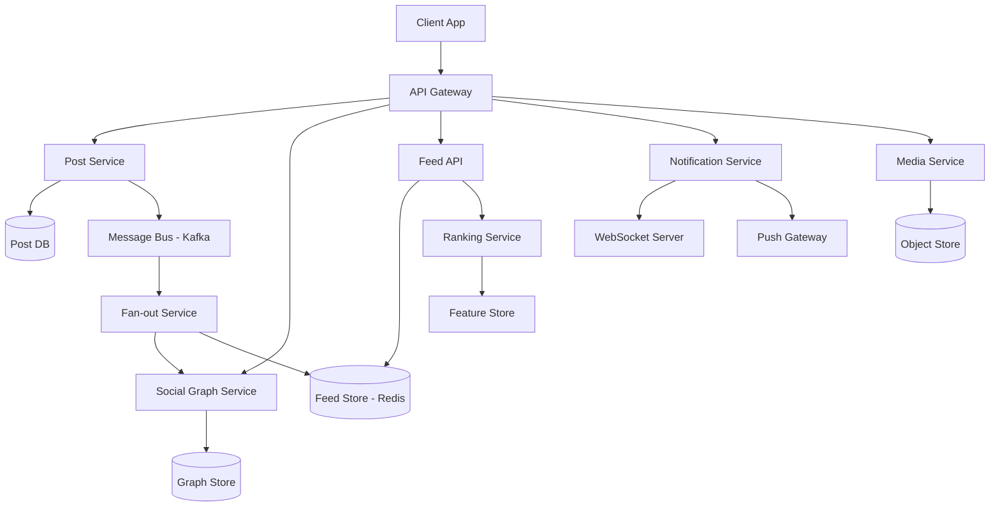

*The diagram shows the core service topology of a social media platform: the Post Service accepts content and publishes events to Kafka, the Fan-out Service consults the Social Graph to write post IDs into each follower's precomputed feed in Redis, the Feed API reads those feeds and sends them through the Ranking Service, and the Notification Service pushes real-time updates over WebSocket or mobile push gateways.*

**Problem Statement:** Design a social media platform that supports user profiles, posts, likes/comments, a social graph, real-time updates, content discovery, and media sharing — all at global scale serving billions of users while maintaining sub-200 ms feed read latency and near real-time delivery of new content to followers.

**The fan-out challenge in numbers:** A celebrity with 10 million followers posts a single update. Naive fan-out-on-write requires 10 million writes to follower feeds — enough to saturate an entire Redis cluster in seconds. Fan-out-on-read would require 10 million reads every time any of those followers opens their timeline. The system must use a hybrid approach: push for normal users (millions of small fan-outs), pull for power users (millions of followers read at their own pace), with careful backpressure, rate limiting, and idempotency.

---

### Characteristics

- **Fan-out at scale:** Distributing a post to all followers' feeds determines write amplification and timeline latency. Write-time fan-out (pre-compute) is fast at read but expensive at write; read-time fan-out shifts cost to the reader.
- **Social graph:** The network of follow/friend relationships dictates content visibility and recommendation. Stored as an edge table indexed by both follower and followee IDs for bidirectional queries.
- **Real-time delivery:** Followers see new posts within seconds via push through WebSocket for connected web clients and APNs/GCM for mobile. Offline users receive batched notifications on reconnect.
- **Feed ranking:** Ordering posts by relevance is critical for engagement. A purely chronological feed is suboptimal; ML models or heuristics (recency × engagement × affinity) score and sort posts.
- **Media richness:** Support for text, photos, videos, GIFs, links, and stories drives engagement but increases storage, processing, and delivery complexity.
- **Global scale:** Serving billions of users across regions requires multi-region deployment, data replication, and latency-sensitive routing (GeoDNS, edge computing).
- **High write throughput:** Millions of posts, likes, and comments per minute make the ingest path the primary bottleneck, requiring distributed queues and sharded databases.
- **Skewed access patterns:** A small fraction of users (celebrities, viral posts, trending hashtags) generate disproportionate traffic, creating hot keys that require composite sharding keys with random suffixes.
- **Eventual consistency:** Feeds converge within seconds; strict global ordering across all users is infeasible and unnecessary for social content where recency dominates.
- **Multi-modal interaction:** Text posts, photos, videos, stories, live streams, polls, and emojis each have different storage, processing, and delivery requirements — the system must handle heterogeneous payloads efficiently.
- **Time-sensitive relevance:** A post's relevance decays rapidly (minutes to hours). The system must score, rank, and surface content while it is still fresh.

---

### Pros

- **Massive network effects:** Platform value increases super-linearly with user count — more users generate more content, driving more engagement, attracting more users in a virtuous cycle.
- **Real-time engagement:** Likes, comments, shares, and notifications create immediate feedback loops that increase session length and retention.
- **Rich media support:** Text, photos, videos, GIFs, links, and stories provide diverse self-expression tools that drive content creation.
- **Personalized feeds:** ML-powered ranking can significantly increase engagement compared to pure chronological feeds by surfacing the content each user is most likely to interact with.
- **Cross-platform presence:** Available on mobile, web, and embedded — users can engage anywhere, increasing total engagement time.
- **Social graph insights:** Understanding who-influences-whom is valuable for recommendations, ad targeting, and content discovery.
- **Viral growth mechanisms:** Shares, mentions, trending topics, and algorithmic amplification create organic discovery loops that reduce customer acquisition cost.

---

### Cons

- **Addiction and mental health concerns:** Infinite scroll, notification dopamine loops, and social comparison can negatively affect mental health, especially for younger users — platforms face regulatory and reputational risk.
- **Misinformation and echo chambers:** Algorithmic feeds can amplify false information and create filter bubbles that reinforce existing beliefs, requiring expensive content moderation.
- **Privacy concerns:** Extensive data collection (interactions, location, relationships, content) raises regulatory risk under GDPR, CCPA, and emerging AI regulations.
- **Content moderation at scale:** Billions of posts need automated AI moderation (hate speech, harassment, spam) — accuracy is challenging and false positives/negatives both cause problems.
- **High infrastructure cost:** Real-time delivery, media storage and transcoding, feed ranking, and global replication require significant computing resources — cost scales with engagement.
- **Regulatory and compliance risk:** Increasing government regulation of content, data handling, algorithmic transparency, and child safety creates ongoing compliance burden.
- **Cold-start problem:** New users and new posts have no engagement history, making feed ranking and recommendation less effective until sufficient interaction data accumulates.
- **Complexity of hybrid systems:** Mixing push and pull fan-out, multiple storage systems, and real-time event processing creates operational complexity and many failure modes.

---

### Use Cases

- **Celebrity post delivery (the fan-out problem):** A celebrity with millions of followers posts content. The system avoids 10M synchronous writes by using hybrid fan-out — push for normal users, pull for power users above a follower-count threshold. Posts from power users are stored in a separate store and merged into feeds at read time.
- **Real-time notification system:** Users see likes, comments, follows, and new posts from followed users within seconds. Push via WebSocket for connected web clients and APNs/GCM for mobile, with batching and grouping (e.g., "5 new posts from people you follow") to reduce push volume during spikes.
- **Personalized feed ranking:** A chronological feed shows every post unfiltered — an ML-ranked feed scores each post by predicted engagement probability (recency, affinity, historical engagement) and returns the top-N, increasing time-on-feed and overall engagement.
- **Media upload and processing pipeline:** Users upload millions of photos and videos per hour. Media is uploaded directly to object storage via presigned URLs, processed asynchronously (transcoding, thumbnail generation, AI content moderation), and served globally via CDN.

---

### Components

| Component | Purpose | Responsibilities | Relationship |
|---|---|---|---|
| Post Service | Create/retrieve posts | Store post content, publish `post_created` events to the bus | Feeds Fan-out Service, Media Service |
| Social Graph Service | Manage relationships | Store follow/unfollow edges, check if A follows B, find mutual connections | Queried by Fan-out and Feed services |
| Fan-out Service | Distribute posts | For each follower, write `post_id` to their feed cache; handles power-user routing | Reads from Graph; writes to Feed Store |
| Feed Store | Store precomputed feeds | Fast retrieval of a user's feed (post IDs ordered by time) | Read by Feed API; written by Fan-out |
| Feed API | Serve feeds | Paginate timeline, merge power-user posts, apply ranking, return JSON | Reads from Feed Store and Post DB |
| Ranking Service | Order posts by relevance | Apply ML model or heuristics (recency × affinity × engagement) to score posts | Consumes engagement signals from stores |
| Notification Service | Push real-time updates | Deliver likes, comments, new posts to connected followers | Listens to event bus; pushes via WS/APNs |
| Media Service | Handle uploads | Accept media, store in object store, generate thumbnails, trigger processing | Called by Post Service; serves CDN URLs |
| Message Bus | Event propagation | Decouple services; carry `post_created`, `user_followed`, `like_added` events | Used by all services for async comms |
| Search Service | Discover content | Index posts and users for keyword and hashtag search | Consumes events from the bus |

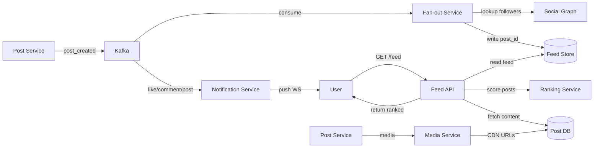

*Component interaction flow: the Post Service writes a post and publishes a `post_created` event to Kafka; the Fan-out Service consumes the event, looks up followers in the Social Graph, and writes the `post_id` to each follower's feed in Redis; on read, the Feed API retrieves precomputed feed entries, fetches full post content, and applies ranking before returning the sorted, paginated response; concurrently, the Notification Service pushes real-time updates to connected followers.*

---

### Architectural Patterns

- **Fan-out on Write (Push Model):** When a post is created, the system immediately writes the post ID to every follower's precomputed feed in the Feed Store. Read is O(1) (just read the feed); write is O(followers). Best for normal users with moderate follower counts. *When to use*: read-heavy workloads where reads vastly outnumber writes. *When not to use*: power users with millions of followers where write fan-out is infeasible.
- **Fan-out on Read (Pull Model):** At read time, fetch posts from all followed users and merge-sort them. Write is O(1); read is O(following × posts_per_user). Best for power users whose write fan-out would be too expensive. *When to use*: users with very large follower counts (celebrities). *When not to use*: users following many accounts (read cost becomes high).
- **Hybrid Fan-out (Twitter's Approach):** Push fan-out for normal users (below a follower-count threshold, e.g., 10,000), pull fan-out for power users above the threshold. The Feed API merges precomputed feeds with on-demand pulls from power users at read time. *When to use*: platforms with a mix of normal and celebrity users. *When not to use*: uniform follower distributions where the complexity isn't justified.
- **Event sourcing:** All state changes (posts, likes, follows) are stored as an immutable event log in Kafka. Read models (feed store, ranking features) are built by consuming the event stream. Provides auditability, replayability, and decoupling. *Trade-off*: higher storage cost and read-side eventual consistency.
- **Command Query Responsibility Segregation (CQRS):** Writes (posting, liking) go to a write-optimized model; reads (feed generation, search) use a separate read-optimized model. The two models synchronize asynchronously via the event bus. *Trade-off*: added complexity but enables independent scaling and optimization of read and write paths.
- **Microservice architecture:** Each component (Post, Graph, Fan-out, Feed, Ranking, Notification) is a separate independently deployable service with its own database. Loose coupling via Kafka enables technology diversity and independent scaling of bottlenecks.

---

### Benefits

- **Network effects:** Platform value increases super-linearly with user count — more users generate more content, driving more engagement, attracting more users in a virtuous cycle.
- **Real-time engagement:** Likes, comments, shares, and notifications create immediate feedback loops that increase session length and retention.
- **Rich media support:** Text, photos, videos, GIFs, links, and stories provide diverse self-expression tools that drive content creation.
- **Personalized feeds:** ML-powered ranking can significantly increase engagement compared to pure chronological feeds by surfacing the content each user is most likely to interact with.
- **Cross-platform presence:** Available on mobile, web, and embedded — users can engage anywhere, increasing total engagement time.
- **Social graph insights:** Understanding who-influences-whom is valuable for recommendations, ad targeting, and content discovery.
- **Viral growth mechanisms:** Shares, mentions, trending topics, and algorithmic amplification create organic discovery loops that reduce customer acquisition cost.

---

### Challenges

- **Fan-out scaling:** A single celebrity post can trigger millions of write operations (fan-out-on-write). Partitioning fan-out workers and managing backpressure is critical.
- **Feed ranking latency:** The feed API must return ranked results in < 200 ms — ranking models must be fast (cached features, low-dimensional embeddings).
- **Timeline consistency:** With fan-out-on-write, new posts propagate to followers within seconds (eventual consistency). Balancing latency vs. consistency is an ongoing trade-off.
- **Media processing:** Photos and videos need transcoding, thumbnail generation, and AI moderation — all asynchronously, with retry and error handling.
- **Hot keys:** Trending hashtags, viral posts, or celebrity accounts generate massive traffic on specific keys. Requires composite sharding keys with random suffixes.
- **Write amplification:** Fan-out-on-write turns 1 post into N writes (N = followers). For users with millions of followers, this is millions of writes per post.
- **Feed cache hit rate:** For 500M users, caching every user's feed is impossible. Must use smart caching (hot users cached, cold users from DB) with LRU eviction.
- **Real-time propagation:** New posts should appear in followers' feeds within seconds, not minutes. Requires low-latency event processing and a well-tuned message bus.
- **Feed loss and duplicates:** Fan-out service crashes can cause missed posts; retries can cause duplicates. Idempotent fan-out (writing post IDs, not content) with upsert semantics prevents both.
- **Data migrations:** The social graph schema evolves over time. Migrations must happen without downtime using dual-write or backward-compatible approaches.
- **Algorithm changes:** A/B testing feed ranking requires careful rollout and rollback. Changes significantly affect user engagement metrics.
- **Cross-service debugging:** Feed depends on Post, Graph, Ranking, Media, and Notifications — debugging failures that span services requires distributed tracing.

---

### Best Practices

- **Hybrid fan-out:** Use fan-out-on-write for normal users and fan-out-on-read for power users (celebrities). This is Twitter's approach and avoids write amplification for high-follower accounts.
- **Idempotent fan-out:** Write post IDs (not full content) to feeds. Retries produce the same `post_id`, so upsert semantics handle duplicates without special deduplication logic.
- **Fan-out worker pools:** Consume the `post_created` event stream with a pool of workers. Partition the stream by author ID hash so each partition handles a disjoint set of users, enabling horizontal scaling of fan-out.
- **Fan-out rate limiting:** Throttle fan-out for high-follower accounts to prevent overwhelming the Feed Store. Queue the fan-out and process gradually, with backpressure signals to the producer.
- **Feed caching with TTL:** Cache feeds for active users in Redis with a short TTL (e.g., 10 minutes). Cold users read from the database on demand. TTL naturally bounds memory and handles fan-out lag.
- **Ranking feature pre-computation:** Pre-compute ranking features (recency, engagement rate, relationship strength) offline and store them alongside the feed entry. Only compute real-time engagement signals for very fresh posts.
- **Hot key mitigation:** For trending hashtags, use sharded counters (`hashtag:123:0`, `hashtag:123:1`) and aggregate at read time. For viral posts, rate-limit read fan-out and serve stale data when the ranking service is slow.
- **Graceful degradation:** If ranking is down, serve chronological feeds. If notifications are down, batch-deliver on reconnect. If the Feed Store is unavailable, fall back to a database read of recent posts from followed users.
- **Circuit breakers on dependencies:** Wrap calls to the Social Graph, Ranking Service, and Post DB with circuit breakers so a slow dependency degrades the feed rather than cascading into a full outage.
- **Fan-out lag monitoring:** Measure the delay between post creation and feed availability. Alert if lag exceeds a threshold (e.g., 5 seconds for normal users) so the fan-out team can scale workers.

---

### When to Use / When Not to Use

**Use when:**

- You need to connect users via relationships (social graph) where content visibility depends on who you follow.
- Real-time content delivery to a network is a core feature — users expect to see new posts from followed users within seconds.
- Engagement (likes, comments, shares) drives the business model or user retention metric.
- Personalization and feed ranking are key differentiators — a chronological feed doesn't surface the most relevant content.
- Content is user-generated at high volume and velocity, not professionally produced or static.

**Avoid when:**

- Content is one-to-many broadcasting (e.g., news publishing, product announcements) — a CDN or broadcast system is simpler and cheaper.
- The relationship graph is minimal (e.g., a forum where users primarily read, not follow).
- Strong consistency is required on every read (e.g., financial balances) — social feeds tolerate eventual consistency.
- The user base is small (< 10K users) — a single database with chronological ordering suffices; the operational cost of fan-out services isn't justified.

**Alternatives:**

- **Chronological feed in single DB:** For small communities, store posts in a single table ordered by timestamp. Simple, strongly consistent, but doesn't scale beyond a few million posts or followers.
- **Subreddit-style (Reddit model):** Community-driven upvoting and moderation rather than social graph following. Content discovery happens through communities, not personal networks.
- **Static content platform:** If content is mostly static (blog, wiki), a CDN plus a simple database suffices without social features.

**Decision factors:**

- **Follower distribution:** If a few users have millions of followers (the celebrity problem), the hybrid fan-out pattern is essential. If followers are evenly distributed, pure push fan-out works.
- **Read-to-write ratio:** Social media reads vastly outnumber writes, so optimizing for read latency (push model) is the correct default.
- **Latency requirements:** Real-time delivery requires push infrastructure (WebSocket, FCM); batch delivery is simpler but less engaging.
- **Engagement strategy:** ML-ranked feeds increase engagement but add complexity; chronological feeds are simpler and perceived as fairer by users.

---

### Data Model and API

The data model captures users, their relationships, the content they create, and the interactions (likes, comments) on that content. Posts are immutable once created; feed entries are ephemeral and precomputed.

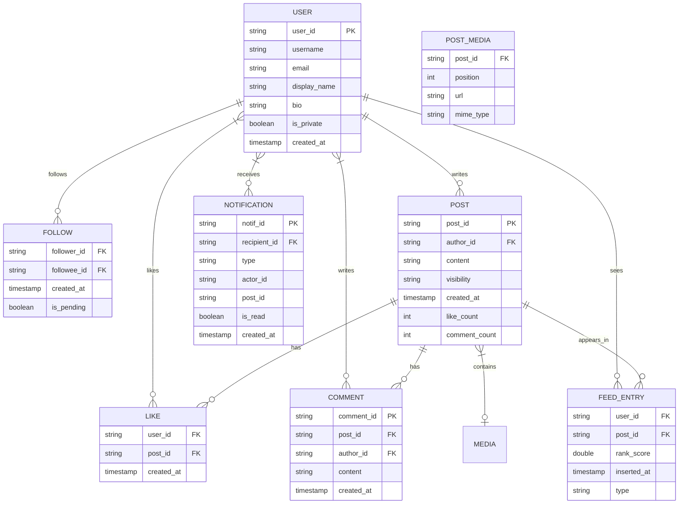

*The entity-relationship diagram shows the core domain model of a social media platform: users follow each other (FOLLOW edges), users write posts, posts contain media and receive likes and comments, posts are pre-computed into follower feed entries, and notifications are generated for relevant interactions.*

**Entity descriptions:**

- **USER:** Core entity. `user_id` (UUID for even distribution), `username` (unique), `email`, `display_name`, `bio`, `is_private` (visibility for follower requests). Stored in PostgreSQL (durable) with hot profile data cached in Redis.
- **FOLLOW:** Edge in the social graph. `follower_id`, `followee_id` (composite PK, indexed both ways). `is_pending` for private accounts. Stored in a sharded store or graph database.
- **POST:** Immutable content. `post_id` (UUID), `author_id`, `content`, `visibility`, `created_at`, denormalized `like_count` and `comment_count` for fast reads.
- **POST_MEDIA:** Attached media. `post_id`, `position`, `url` (CDN URL), `mime_type`. Stored in object storage; metadata in DB.
- **LIKE:** `user_id`, `post_id` (composite PK). Used for engagement signals and ranking.
- **COMMENT:** `comment_id` (UUID), `post_id`, `author_id`, `content`, `created_at`. Supports threading via `parent_comment_id`.
- **FEED_ENTRY:** Precomputed entry. `user_id` (partition key), `post_id`, `rank_score`, `inserted_at`. Stored in Redis (fast read); TTL of 7 days.
- **NOTIFICATION:** `notif_id` (UUID), `recipient_id`, `type`, `actor_id`, `post_id`. Stored in DB with Redis for unread counts.

**Indexes and Constraints:**

- `USER.username` — UNIQUE index (login, no duplicates).
- `USER.email` — UNIQUE index (password reset, verification).
- `FOLLOW(follower_id, followee_id)` — composite PK prevents duplicate follows; reverse index on `(followee_id, follower_id)` for follower lookups.
- `POST(author_id, created_at)` — composite index for "user's recent posts."
- `FEED_ENTRY(user_id, inserted_at)` — composite index for paginated feed retrieval.
- `FEED_ENTRY(post_id)` — index for "remove this post from all feeds" on deletion.
- `LIKE(user_id, post_id)` — composite PK for idempotent likes.

**Partitioning / Sharding:**

- **USER:** Sharded by `user_id` hash (consistent hashing). Users on the same shard are stored together.
- **FOLLOW:** Sharded by `follower_id` hash (write-heavy — fan-out reads follower list by `follower_id`).
- **POST:** Sharded by `author_id` hash.
- **FEED_ENTRY:** Sharded by `user_id` hash. Hot feeds (celebrity followers) may be further split.
- **LIKE / COMMENT:** Sharded by `post_id` hash (read-heavy — "get likes for post X").

**API Contract:**

| Method | Endpoint | Purpose | Rate Limit |
|---|---|---|---|
| POST | `/api/v1/posts` | Create a post | 300 req/hour |
| GET | `/api/v1/feed` | Get user's timeline | 1000 req/hour |
| POST | `/api/v1/follow/{userId}` | Follow a user | 1000 req/hour |
| DELETE | `/api/v1/follow/{userId}` | Unfollow a user | 1000 req/hour |
| GET | `/api/v1/users/{userId}/followers` | List followers | 500 req/hour |
| GET | `/api/v1/users/{userId}/following` | List following | 500 req/hour |
| POST | `/api/v1/posts/{postId}/like` | Like a post | 1000 req/hour |
| POST | `/api/v1/posts/{postId}/comments` | Comment on a post | 500 req/hour |

**GET /api/v1/feed — Request:**

```http
GET /api/v1/feed?limit=20&cursor=eyJfb2Zmc2V0IjozMH0=&ranked=true HTTP/1.1
Authorization: Bearer <jwt>
Accept: application/json
```

**GET /api/v1/feed — Response:**

```json
{
  "posts": [
    {
      "post_id": "p_456",
      "author_id": "u_123",
      "author_name": "Alice",
      "content": "Having an amazing time at the beach!",
      "media": [{"type": "photo", "url": "https://cdn.example.com/p_456.jpg"}],
      "created_at": "2024-06-14T10:30:00Z",
      "like_count": 42,
      "comment_count": 5,
      "user_liked": false,
      "rank_score": 0.92
    }
  ],
  "cursor": "eyJfb2Zmc2V0IjoxMDB9=",
  "has_more": true,
  "total_count": 500
}
```

**POST /api/v1/posts — Request:**

```json
{
  "content": "Having an amazing time at the beach!",
  "media_ids": ["media_abc"],
  "visibility": "public"
}
```

**POST /api/v1/posts — Response:**

```json
HTTP/1.1 201 Created
{
  "post_id": "p_456",
  "status": "published",
  "created_at": "2024-06-14T10:30:00Z",
  "fanout_status": "processing"
}
```

**Real-Time WebSocket API:**

| Event | Direction | Payload |
|---|---|---|
| subscribe | Client → Server | `{"type": "subscribe", "channels": ["feed:user_123"]}` |
| new_post | Server → Client | `{"type": "new_post", "post_id": "p_456"}` |
| like_update | Server → Client | `{"type": "like_update", "post_id": "p_456", "count": 42}` |

**Status codes:** `200` OK, `201` Created, `204` Deleted, `400` Invalid request, `401` Auth required, `403` Forbidden, `404` Not found, `409` Conflict (already following), `429` Rate limited, `503` Temporarily unavailable.

**Authentication & Authorization:** OAuth 2.0 with JWT bearer tokens. Scope-based authorization: `posts:read`, `posts:write`, `follows:write`, `notifications:read`.

---

### Domain-Specific: Feed Fan-out, Social Graph, Real-Time Updates, and News Feed Ranking

This section covers the core technical challenges that are unique to social media platforms: how to efficiently distribute a post to followers (fan-out), how to store and query the social graph at scale, how to deliver real-time updates, and how to rank feeds for personalization. These topics are the heart of social media system design.

#### Fan-out on Write (Push Model)

* **What:** When a post is created, write the post ID to every follower's precomputed feed immediately at write time.
* **Problem solved:** Feed reads become O(1) — just read the precomputed list of post IDs from the user's feed cache. Ideal for platforms where reads vastly outnumber writes.
* **How it works:** Post Service stores the post → publishes a `post_created` event to Kafka → Fan-out Service consumes the event → queries the Social Graph Service for the follower list → writes the `post_id` to each follower's Redis feed entry (as a sorted set member with timestamp score).
* **When to use:** Normal users with moderate follower counts (up to ~10,000 followers). Read-heavy workloads where sub-100 ms feed reads are required.
* **When not to use:** Power users with millions of followers — write fan-out becomes millions of Redis writes per post, saturating the cluster.
* **Pros:** Fast feed reads; offline users' feeds are pre-populated.
* **Cons:** Expensive writes for high-follower users; feed storage grows with followers × posts.

```java
@Service
public class FanoutService {

    private final SocialGraphClient graphClient;
    private final FeedRepository feedRepository;
    private final ExecutorService fanoutPool = Executors.newFixedThreadPool(50);

    public void fanoutPost(String postId, String authorId) {
        var followers = graphClient.getFollowers(authorId);
        var batches = Lists.partition(followers, 1000);
        for (List<String> batch : batches) {
            fanoutPool.submit(() -> fanoutBatch(postId, batch));
        }
    }

    private void fanoutBatch(String postId, List<String> followerBatch) {
        var timestamp = String.valueOf(System.currentTimeMillis());
        for (String followerId : followerBatch) {
            feedRepository.writeToFeed(followerId, postId, timestamp);
        }
    }
}
```

*The `FanoutService` bean fetches the author's follower list from the Social Graph Service, partitions it into batches of 1,000 to bound memory, and submits each batch to a fixed thread pool for parallel fan-out writes. Each follower's feed (a Redis sorted set) receives the post ID with a timestamp score for chronological ordering.*

#### Fan-out on Read (Pull Model)

* **What:** At read time, fetch recent posts from every followed user and merge-sort them into the timeline.
* **Problem solved:** Eliminates write amplification entirely. A celebrity with 10M followers has zero extra writes; the cost is deferred to read time.
* **How it works:** Feed API queries the Social Graph for followed user IDs → issues parallel `GET /posts?author=X&limit=10` requests to the Post Service for each followed user → merges all post lists by timestamp → paginates and applies ranking.
* **When to use:** Power users with millions of followers; platforms where a small number of accounts produce disproportionate follower counts.
* **When not to use:** Users who follow many accounts (e.g., 500+) — read cost is O(following × posts_per_user), which can exceed the latency budget.
* **Pros:** Cheap writes; no precomputation; new follows see posts immediately.
* **Cons:** Expensive reads (N+1 query problem); requires fan-in merge logic; higher tail latency.

#### Hybrid Fan-out (Twitter's Approach)

* **What:** Classify users by follower count threshold (e.g., 10,000). Normal users use fan-out-on-write; power users use fan-out-on-read. The Feed API merges both sources at read time.
* **Problem solved:** Gets the write-time efficiency of push for the vast majority of users and the read-time scalability of pull for the celebrity problem.
* **How it works:** Post Service stores every post and publishes `post_created` → Fan-out Service checks the author's follower count against the threshold → if below threshold, pushes to follower feeds (write path) → if above threshold, does nothing at write time (read path merges at Feed API).

```java
@Service
@Slf4j
public class HybridFanoutService {

    static final int POWER_USER_THRESHOLD = 10_000;

    private final SocialGraphService graphService;
    private final FeedRepository feedRepository;
    private final PostRepository postRepository;
    private final KafkaTemplate<String, Object> kafkaTemplate;
    private final ExecutorService fanoutPool = Executors.newFixedThreadPool(100);

    @Transactional
    public void handlePostCreated(PostCreatedEvent event) {
        var authorId = event.getAuthorId();
        var postId = event.getPostId();
        var followerCount = graphService.getFollowerCount(authorId);

        if (followerCount <= POWER_USER_THRESHOLD) {
            fanoutOnWrite(postId, authorId);
        } else {
            // Power user: skip write-time fan-out; Feed API merges at read time.
            postRepository.markAsPowerUserPost(postId, authorId);
            log.info("Post {} from power user {} deferred to read-time merge", postId, authorId);
        }
        kafkaTemplate.send("feed_events", postId, event);
    }

    private void fanoutOnWrite(String postId, String authorId) {
        var followers = graphService.getFollowers(authorId);
        var batches = Lists.partition(followers, 500);
        var futures = batches.stream()
                .map(batch -> CompletableFuture.runAsync(
                        () -> fanoutBatch(postId, batch), fanoutPool))
                .toList();
        CompletableFuture.allOf(futures.toArray(CompletableFuture[]::new)).join();
    }

    private void fanoutBatch(String postId, List<String> followerBatch) {
        var ts = String.valueOf(System.currentTimeMillis());
        for (String followerId : followerBatch) {
            feedRepository.writeToFeed(followerId, postId, ts);
        }
    }
}
```

*The `HybridFanoutService` bean implements Twitter's hybrid approach: it checks the author's follower count against a 10,000 threshold. Below the threshold, it performs push fan-out using a parallel worker pool. Above the threshold, it marks the post as a power-user post and delegates read-time merging to the Feed API. The `@Transactional` annotation ensures the post-marking write is atomic. A record is logged for observability of deferred fan-out.*

**Feed API with read-time merge:**

```java
@RestController
@RequestMapping("/api/v1/feed")
@RequiredArgsConstructor
public class FeedController {

    private final FeedRepository feedRepository;
    private final PostRepository postRepository;
    private final RankingService rankingService;
    private final SocialGraphService graphService;

    @GetMapping
    public ResponseEntity<FeedResponse> getFeed(
            @AuthenticationPrincipal UserDetails user,
            @RequestParam(defaultValue = "20") int limit,
            @RequestParam(defaultValue = "true") boolean ranked) {

        // 1. Read precomputed feed (normal users' posts) from Redis
        var postIds = feedRepository.getFeed(user.getUsername(), limit * 2L);

        // 2. Merge power-user posts (read-time fan-out)
        var powerUsers = graphService.getFollowedPowerUsers(user.getUsername());
        for (String powerUserId : powerUsers) {
            postIds.addAll(postRepository.getRecentPosts(powerUserId, 5));
        }

        // 3. Deduplicate, fetch full posts, and rank
        var uniqueIds = postIds.stream().distinct().toList();
        var posts = postRepository.findByIds(uniqueIds);
        var rankedPosts = ranked
                ? rankingService.rank(user.getUsername(), posts)
                : posts;

        return ResponseEntity.ok(FeedResponse.builder()
                .posts(rankedPosts.stream().map(PostDto::fromPost).toList())
                .hasMore(rankedPosts.size() == limit * 2)
                .build());
    }
}
```

*The `FeedController` (annotated `@RestController` with constructor injection via `@RequiredArgsConstructor`) implements the read path: it first reads precomputed feed entries from the Feed Store (Redis), then fetches recent posts from followed power users for read-time merge, deduplicates by post ID, loads full post content, and applies ML ranking only when requested. This demonstrates the hybrid approach where push-based feeds and pull-based feeds are merged at read time.*

#### Social Graph Storage

Facebook's TAO (The Associations and Objects) is a graph store built on MySQL for storing billions of follow/like/comment edges. Key design decisions:

- **Edge direction:** Store both `(user → followee)` for "who am I following?" and `(user → follower)` for "who follows me?" — fan-out needs the follower list, social proof needs the followee list.
- **Lazy loading:** Don't load all edges at once; paginate with `LIMIT 1000`. Hot edges are cached in memcached (RAM); cold edges fall back to MySQL.
- **Sharding:** Edges are sharded by `follower_id` hash (for fan-out reads). Each shard holds a subset of the edge space; cross-shard queries require scatter-gather.
- **Denormalization:** Cache precomputed lists like "mutual friends" count, "recently interacted" users, and "suggested friends" to avoid expensive multi-hop graph traversals at query time.

```java
@Repository
public class SocialGraphRepository {

    private final RedisTemplate<String, String> redisTemplate;
    private final JdbcClient jdbcClient;

    @Value("${app.graph.cache-ttl-seconds:300}")
    private int cacheTtlSeconds;

    /**
     * Get the list of followers for a user, with Redis cache fallback to MySQL.
     * Returns up to `limit` follower IDs ordered by follow time (newest first).
     */
    public List<String> getFollowers(String userId, int limit) {
        var cacheKey = "graph:followers:" + userId;
        var cached = redisTemplate.opsForList().range(cacheKey, 0, limit - 1);
        if (cached != null && !cached.isEmpty()) {
            return cached;
        }

        // Cache miss: fall back to MySQL
        var followers = jdbcClient.sql(
                "SELECT follower_id FROM follows WHERE followee_id = ? " +
                "ORDER BY created_at DESC LIMIT ?")
                .param(userId).param(limit)
                .query(String.class);

        // Populate cache with TTL
        if (!followers.isEmpty()) {
            redisTemplate.opsForList().leftPushAll(cacheKey, followers);
            redisTemplate.expire(cacheKey, Duration.ofSeconds(cacheTtlSeconds));
        }
        return followers;
    }

    /**
     * Check if followerId follows followeeId — O(1) cache lookup.
     */
    public boolean follows(String followerId, String followeeId) {
        var cacheKey = "graph:edge:" + followeeId + ":" + followerId;
        var cached = redisTemplate.hasKey(cacheKey);
        if (cached) {
            return true;
        }
        var count = jdbcClient.sql(
                "SELECT COUNT(*) FROM follows WHERE follower_id = ? AND followee_id = ?")
                .param(followerId).param(followeeId)
                .query(Integer.class);
        if (count > 0) {
            redisTemplate.opsForValue().set(cacheKey, "1",
                    Duration.ofSeconds(cacheTtlSeconds));
        }
        return count > 0;
    }
}
```

*The `SocialGraphRepository` bean demonstrates the TAO pattern of cache-first reads with database fallback. Follower lists are cached as Redis lists with a configurable TTL (injected via `@Value`), while edge existence checks use a Redis set membership test. Cache misses fall through to a sharded MySQL backend via `JdbcClient`. This is the `database-per-service` pattern applied to the Social Graph Service.*

#### Hot Key Mitigation

When a post goes viral or a hashtag trends, traffic concentrates on a single key. Solutions:

- **Read-through caching:** Cache the post content in Redis for its lifetime (TTL = 24h for viral posts). All reads hit cache; only cache misses hit the DB.
- **Hashtag sharding:** For trending hashtags, use `hashtag:123:0`, `hashtag:123:1`, ... `hashtag:123:N` and aggregate at read time. The write path increments a random shard; the read path fetches all shards and sums.
- **Rate-limit read fan-out:** If a post exceeds a read threshold, redirect excess reads to a cached copy or temporarily degrade to serving stale data.

#### Feed Ranking

The ranking model scores each post by predicted engagement probability:

- **Recency** (time since post) — weight decreases over hours. A post from 2 hours ago scores lower than one from 2 minutes.
- **User affinity** (how often you interact with this poster) — if you frequently like Alice's posts, her content ranks higher.
- **Engagement prediction** (how many likes/comments the post is predicted to get) — based on the poster's historical engagement rate and early signals.
- **Content type** (photo posts rank differently than text) — platform data shows certain content types drive more engagement.
- **Relationship strength** (close friends > acquaintances > strangers you barely follow) — weighted by interaction frequency and mutual connections.

A simple linear model: `score = 0.3 × recency + 0.25 × affinity + 0.25 × engagement_pred + 0.1 × content_type + 0.1 × relationship_strength`.

#### Data Consistency

Social feeds use **eventual consistency:** when you follow someone, their recent posts backfill into your feed asynchronously (fan-out takes seconds). When someone posts, followers see it in "real time" (within seconds via fan-out-on-write). This is acceptable because social feeds are inherently time-ordered — a few seconds delay doesn't matter for engagement.

**Strong consistency** is used only where needed: post creation (a 201 Created must be immediately visible), payment transactions (if the platform has monetization), and immediate social proofs (e.g., showing "X is now following you" immediately to the followed user).

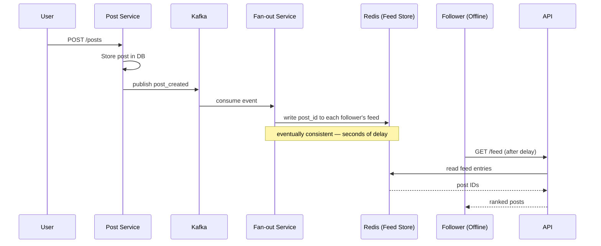

*Eventual consistency timeline: the Post Service stores the post and publishes a `post_created` event; the Fan-out Service consumes the event asynchronously and writes the post ID to each follower's feed in Redis — followers see the post within seconds, not instantly. When the follower later requests their feed, the Feed API reads the precomputed entries from Redis and returns ranked posts.*

---

#### Architecture

A modern social media platform uses a **microservice architecture** with an event-driven backbone. The **social graph** is stored in a highly available, low-latency key-value store. **Feed storage** uses a hybrid approach: precomputed feeds in Redis for normal users, on-demand merge for power users. An **event-driven backbone** (Kafka) decouples all services. **Real-time delivery** uses WebSocket connections for web and push notifications for mobile.

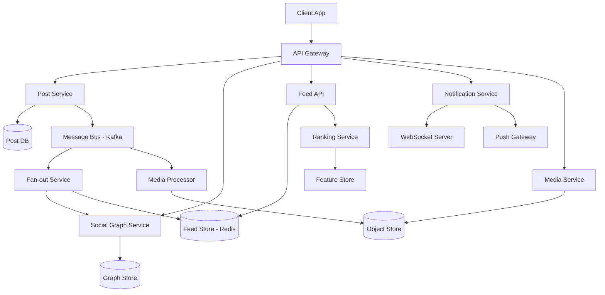

*The complete architecture diagram shows the edge layer (API Gateway + CDN), the service layer (Post, Graph, Feed API, Ranking, Notification, Media, Fan-out), the data layer (Post DB, Graph Store, Feed Store in Redis, Object Store, Kafka, Feature Store), and the real-time layer (WebSocket Server, Push Gateway). Media processing is decoupled via the event bus for asynchronous transcoding and moderation.*

**Architecture layers:**

- **Edge layer:** CDN for static assets (images, videos, CSS, JS); WebSocket server for real-time; API Gateway for all dynamic requests (authentication, rate limiting, routing).
- **Service layer:** Stateless microservices behind the API Gateway; each owns its database (database-per-service pattern). Services communicate synchronously (REST/gRPC) for user-facing requests and asynchronously (Kafka events) for decoupled workflows.
- **Data layer:** Redis for hot data (social graph edges, recent feeds); PostgreSQL/Cassandra for durable storage; Kafka for event streaming; S3 for media; a feature store for pre-computed ranking signals.
- **Infrastructure layer:** Kubernetes for orchestration; service mesh (Istio) for mTLS, retries, and observability; cloud load balancers for traffic distribution.

**Data flow:**

1. **Post creation:** Client → API Gateway → Post Service → writes to Post DB + publishes `post_created` event to Kafka → Fan-out Service consumes → queries Social Graph for followers → writes post_id to each follower's feed in Redis → Notification Service pushes to WebSocket/Push.
2. **Feed reading:** Client → API Gateway → Feed API → reads precomputed feed from Redis → merges power-user posts from Post DB → Ranking Service scores posts → returns ranked, paginated list.
3. **Real-time notification:** Kafka event → Notification Service → filters by recipient → pushes via WebSocket (connected) or APNs/GCM (mobile).
4. **Media upload:** Client → Media Service (presigned S3 URL) → S3 triggers event → Media Processor → transcodes, generates thumbnails, runs AI moderation → writes CDN URLs back to Post DB.

**Scaling strategy:**

- **Social graph:** Shard by follower_id hash on a consistent hash ring. Each shard owns a subset of edges.
- **Fan-out:** Partition the `post_created` Kafka topic by author_id hash. Each partition is consumed by one fan-out worker, ensuring no duplicate fan-out and enabling parallel processing.
- **Feed Store:** Redis with LRU eviction. Cache hot feeds (active users) with short TTLs; cold users read from Post DB on demand.
- **Ranking:** Pre-compute features offline (daily); model inference served from in-memory cache. Only real-time engagement signals computed for fresh posts (< 5 minutes old).

**Failure handling:**

- **Fan-out lag:** If fan-out falls behind, users see a delay in new posts. Queue the fan-out work with backpressure; scale workers automatically based on Kafka consumer lag.
- **Fan-out failure:** Idempotent writes (post_id as sorted set member — duplicate writes are no-ops). Retry via Kafka DLQ (dead-letter queue) for poison messages.
- **Feed inconsistency:** Acceptable — posts appear within seconds. For critical posts (e.g., safety announcements), the Post Service can do synchronous fan-out with a timeout.
- **Notification loss:** Push notifications are best-effort. Fall back to in-app notifications; batch-undelivered notifications on reconnect.

#### Deep Dive: Hybrid Fan-out Implementation

The threshold for "power user" is dynamic — based on follower count and posting frequency. A user with 50K followers who never posts is not a problem; a user with 5K followers who goes viral is. The system continuously monitors fan-out throughput per author and can temporarily reclassify a user as "power" if their post fan-out exceeds a rate threshold, even if their follower count is below the static threshold.

```java
@Service
@RequiredArgsConstructor
public class DynamicFanoutService {

    private final SocialGraphService graphService;
    private final FanoutThresholdRegistry thresholdRegistry;
    private final MeterRegistry meterRegistry;

    private static final int DEFAULT_THRESHOLD = 10_000;
    private static final int RATE_LIMIT_THRESHOLD = 50_000;

    public FanoutStrategy determineStrategy(String authorId, String postId) {
        var followerCount = graphService.getFollowerCount(authorId);
        var threshold = thresholdRegistry.getThresholdFor(authorId);

        if (followerCount > threshold) {
            meterRegistry.counter("fanout.power_user", "author", authorId).increment();
            return FanoutStrategy.READ_TIME_MERGE;
        }
        return FanoutStrategy.WRITE_TIME_FANOUT;
    }

    public enum FanoutStrategy {
        WRITE_TIME_FANOUT,
        READ_TIME_MERGE
    }
}
```

*The `DynamicFanoutService` bean determines the fan-out strategy per post. It checks the author's follower count against a configurable threshold (default 10,000, but can be dynamically adjusted per user via `FanoutThresholdRegistry`). If the follower count exceeds the threshold, it uses read-time merge; otherwise it uses write-time fan-out. A Micrometer counter tracks power-user fan-out events for observability. The strategy is evaluated per-post, allowing dynamic reclassification.*

#### Deep Dive: Social Graph Storage

Facebook's TAO stores over 1 trillion edges across MySQL shards. Each shard holds ~10 billion edges. Key optimizations:

- **Edge compression:** Edges are stored as 64-bit integers (user IDs) in sorted order, with delta encoding for sequential IDs. This reduces storage by 4-5x compared to naive UUID storage.
- **Column-family design:** TAO stores edges in wide-column tables with `user_id` as the row key and `edge_type` as the column family. A single row can hold millions of edges (all friends of a user).
- **Multi-level caching:** L1 cache in the application process (local heap, 10K entries); L2 cache in memcached (distributed, 1M entries). Cache misses hit MySQL. Cache keys are tagged by entity type and user ID for targeted invalidation.
- **Read path:** Hot edges are served from L1/L2 cache (sub-millisecond). Cold edges fall back to MySQL (2-5 ms). TAO uses "lazy loading" — it only loads edges when specifically requested, not the entire graph for a user.
- **Write path:** Writes go to MySQL first (durable), then invalidate the cache. This ensures durability — if the cache is lost, edges can be reloaded from MySQL.

#### Deep Dive: Hot Key Mitigation

When a post goes viral (millions of reads per minute), the `post_id` key in Redis or the database becomes a hot key. Additional mitigations:

- **Fan-out read replicas:** Store the same post content on multiple cache nodes. Clients pick a random replica for reads, spreading the load.
- **CDN layer for viral content:** Once a post reaches a read threshold, push its content to the CDN edge. All subsequent reads come from the CDN (hundreds of ms → microseconds).
- **Probabilistic caching:** For extremely hot posts, cache at the API gateway layer using `Vary: Accept-Encoding` headers so all clients behind the same edge get the same cached response.

#### Deep Dive: Feed Ranking

The ranking service must score ~1000 candidate posts in < 80 ms (to meet the 200 ms feed API SLA). Architecture:

- **Candidate generation:** Feed API sends ~100–200 candidate post IDs (recent posts from the precomputed feed + power-user merge).
- **Feature serving:** Features (recency, affinity, engagement signals) are pre-computed and stored in a feature store (Redis or Cassandra). Real-time features (current like count) are fetched in parallel.
- **Model inference:** A low-latency model (typically a gradient-boosted decision tree or a small neural net) scores each candidate. The model is served in-process or via a low-latency RPC.
- **Post-filtering:** Remove posts from blocked users, apply diversity constraints (no more than 30% from one author), and enforce any user preferences.
- **Re-ranking:** Sort by score, apply business rules (promote sponsored content), and return the top-N.

#### Deep Dive: Data Consistency

Social feeds use **eventual consistency** with a bounded staleness window (typically 1–5 seconds for push fan-out, up to 60 seconds during high load). The system provides **read-your-writes consistency** for the user's own posts — when a user posts, they immediately see their post in their own feed (it's written to the user's own feed synchronously before returning 201 Created). Other users see it within seconds via fan-out.

For **strong consistency** requirements (e.g., payment features in social commerce), the system uses a separate strongly consistent store (Spanner, CockroachDB) or synchronous replication with `R=W=N`.

#### Deep Dive: Real-Time Updates and Push Notifications

Real-time delivery is what makes social media feel alive. When someone you follow posts, likes your content, or comments, you want to know within seconds — even if your app is in the background.

**WebSocket delivery (connected clients):**

The Notification Service maintains a WebSocket connection per active user. When an event arrives on Kafka, the service looks up the recipient's connection and pushes the payload immediately. Connection state (which users are connected, which channels they're subscribed to) is stored in Redis so any Notification Service instance can route to the correct connection.

```java
@Component
@RequiredArgsConstructor
public class WebSocketPushService {

    private final SimpMessagingTemplate messagingTemplate;
    private final RedisTemplate<String, String> redisTemplate;

    public void pushLikeNotification(String recipientId, LikeNotificationDto dto) {
        // Record unread count for when user reconnects
        redisTemplate.opsForValue().increment("notifications:unread:" + recipientId);
        // Push immediately if connected
        messagingTemplate.convertAndSend(
                "/topic/notifications/" + recipientId, dto);
    }
}
```

*The `WebSocketPushService` bean pushes like notifications to connected clients via Spring's `SimpMessagingTemplate`. It also increments an unread-count counter in Redis so the notification badge is accurate even when the user is offline — the count is read on reconnect and cleared after the client fetches the full notification list.*

**Mobile push (offline or background clients):**

For mobile users without an active WebSocket connection, the Notification Service sends APNs (iOS) or FCM (Android) push notifications. These are best-effort — the platform may throttle or reorder them. To improve reliability, notifications are grouped ("5 people liked your post") and enriched with a deep link to the app.

**Connection routing:**

With thousands of Notification Service instances, the system must route a push to the specific instance holding the user's WebSocket connection. Redis pub/sub is used: each instance subscribes to a channel named `ws:user:{userId}`; when a notification event arrives, any instance can publish to that channel and the correct instance receives it.

---

### Replication Strategies

Social media platforms replicate data across multiple dimensions: within a region (for availability), across regions (for global latency), and across storage systems (for different access patterns).

**Leader-based replication (Post DB):** Posts are written to a primary PostgreSQL instance and replicated to read replicas. Writes go only to the leader; reads can be served from any replica. This gives strong consistency for post creation (a 201 response means the post is durably stored) while allowing read scaling.

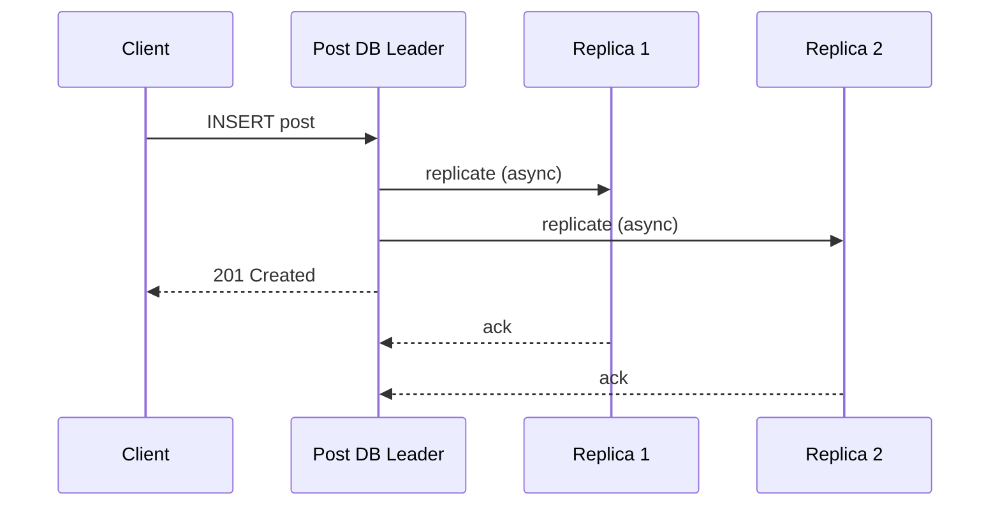

*Leader-based replication for the Post DB: the client writes a post to the leader, which asynchronously replicates to read replicas and immediately returns 201 Created. Replicas serve read traffic (feed content fetch), accepting a small replication lag for higher read throughput.*

**Leaderless replication (Feed Store — Redis Cluster):** The Feed Store uses Redis Cluster with hash slots and master/replica pairs. Any master can accept writes; followers serve reads. This provides high availability — if a master fails, a replica is promoted. Feed entries can tolerate brief staleness (eventual consistency).

**Multi-region replication:** Post DB is replicated synchronously within a region and asynchronously across regions. The Feed Store (Redis) uses active-active replication across regions with last-write-wins conflict resolution. Social graph edges are replicated to all regions for low-latency reads.

**Real-world use:** DynamoDB Global Tables for user profiles (active-active multi-region), Cassandra for engagement data (tunable consistency), Redis Cluster for feeds (master/replica with failover).

---

### Failure Detection and Membership

Social media services must detect failed nodes, redistribute work, and continue serving with minimal disruption.

**Gossip-based membership:** Each service instance periodically exchanges health information with a random subset of peers (gossip protocol). This spreads membership changes through the cluster in O(log N) rounds without a central coordinator.

**Health checks:**

- **Liveness probes:** HTTP `/health` endpoint checked every 2 seconds by the orchestrator (Kubernetes). If unhealthy, the pod is restarted or removed from service discovery.
- **Readiness probes:** Checks if the service can serve traffic (e.g., can connect to its database). Not ready pods are removed from the load balancer.
- **Business health checks:** Custom checks like "Kafka consumer lag < 10,000" or "Redis connection pool has available connections."

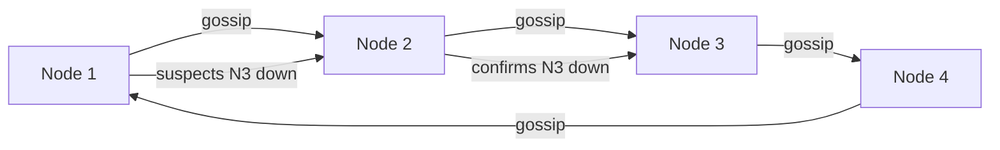

*Gossip-based failure detection in a social media service mesh: nodes periodically exchange health state with random peers. When a node suspects a peer is down, it propagates the suspicion through gossip; once confirmed by multiple nodes, the peer is removed from the cluster and its responsibilities are redistributed.*

**Failure detection timing for social media:**

| Component | Check Interval | Timeout | Action |
|---|---|---|---|
| Post Service | 5s | 15s | Retry write; queue locally |
| Feed Store (Redis) | 2s | 30s | Failover to replica; serve stale |
| Notification Service | 5s | 10s | Reconnect WebSocket; buffer notifications |
| Social Graph | 3s | 15s | Route to replica; cache recent edges |
| Kafka | 10s | 30s | Trigger consumer rebalancing |

**Circuit breakers:** For dependencies that are failing, a circuit breaker (Hystrix, Resilience4j) trips after N consecutive failures and stops sending requests for a cool-down period. This prevents cascading failures — e.g., if the Social Graph Service is slow, the Fan-out Service short-circuits and queues the work for later instead of saturating with slow requests.

---

### High Availability and Scalability

Social media platforms must remain available during node failures, network partitions, and regional outages while scaling to handle global traffic.

#### Multi-Region Deployment

Deploy active services in at least 3 regions (e.g., us-east, eu-west, ap-southeast). Users are routed to the nearest region via GeoDNS or a latency-based load balancer. Each region is self-sufficient for read and write operations, with asynchronous cross-region replication for durability.

- **Active-passive for Post DB:** Writes go to the primary region; reads can be served from any region's read replica. Cross-region replication lag is typically 1–5 seconds.
- **Active-active for Feed Store:** Redis with CRDTs or last-write-wins across regions. Users can read and write feeds from any region.
- **Global CDN:** Static assets (images, videos) are cached at edge locations worldwide, reducing latency to < 50 ms for media.

#### Auto-Scaling

- **Stateless services (API Gateway, Feed API, Ranking):** Scale horizontally based on CPU and request latency. Kubernetes HPA adjusts replica count automatically.
- **Stateful services (Post DB, Redis Cluster):** Scale by adding shards or partitions. Kafka partitions scale consumer groups automatically.
- **Fan-out workers:** Scale based on Kafka consumer lag. If the `post_created` topic falls behind by >10,000 messages, spin up additional fan-out workers.

#### Graceful Degradation

When a component fails, the system should degrade rather than crash:

- **Ranking Service down:** Feed API serves chronological feeds (precomputed timestamps) instead of ML-ranked feeds. Users see posts in reverse-chronological order.
- **Notification Service down:** Queue notifications in Kafka; deliver when the service recovers. Users may see a delayed "5 new likes" instead of real-time updates.
- **Media Service down:** Posts without media still display; broken image placeholders shown for missing media. Upload requests return 503 with retry-after.
- **Search Service down:** Search returns empty results with a "search is temporarily unavailable" message; users can still browse their feed.

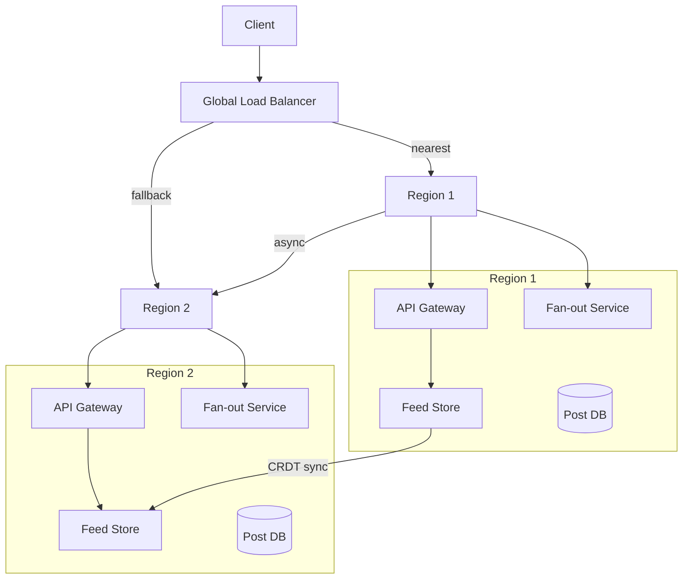

*Multi-region high availability: a global load balancer routes clients to their nearest region. Each region is self-sufficient with its own API Gateway, Fan-out Service, Feed Store, and Post DB. Cross-region replication keeps data synchronized asynchronously. If one region fails, the load balancer routes traffic to the other region.*

---

### Performance and Optimization

The performance of a social media platform is measured by feed read latency (sub-200 ms SLA) and the freshness of real-time delivery (seconds, not minutes).

#### Latency Optimization

- **Feed caching:** Cache the top 50 posts for active users in Redis. Cold users read from Post DB on demand. Cache hit ratio target: 95%+ for active users.
- **Ranking pre-computation:** Pre-score posts at fan-out time using cached features. Only re-rank the top candidates at read time, reducing the number of posts the ML model must score.
- **Connection pooling:** Maintain persistent HTTP/gRPC connections between services (e.g., Feed API → Post DB, Feed API → Ranking Service) to avoid per-request handshake overhead.
- **Pipeline batch fetches:** When the Feed API needs to fetch 50 posts' content, batch the DB queries instead of issuing 50 individual queries.

#### Throughput Optimization

- **Fan-out parallelization:** Fan-out workers process Kafka partitions in parallel. Each worker handles one partition; the number of workers scales with the number of partitions.
- **Read replicas:** Feed content reads are served from Post DB read replicas, multiplying database read throughput.
- **CDN for media:** 90% of traffic on social platforms is media (images, videos). Serving from CDN edge locations drastically reduces origin load.
- **Request coalescing:** When multiple followers simultaneously request a viral post's content, only one DB query is issued and the result is shared across requests (single-flight pattern).

#### Caching Strategies

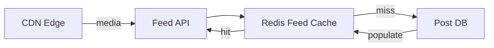

*Multi-tier caching: the Feed API checks the Redis feed cache first; on a miss, it falls back to the Post DB and populates the cache. Media assets are served from CDN edge locations, removing 90% of origin traffic.*

#### Write Path Optimization

- **Async fan-out:** Post creation returns 201 Created immediately after DB write; fan-out happens asynchronously via Kafka. This keeps the post API latency < 50 ms.
- **Batch fan-out:** Fan-out workers batch Redis ZADD operations (pipeline 100 writes per pipeline) to reduce per-write overhead.
- **Fan-out deferral:** Power-user posts skip fan-out entirely; the Feed API merges them at read time.

**Real-world use:** Instagram's feed uses Cassandra for precomputed feed entries with a Redis cache layer; TikTok's "For You" feed uses pre-ranking at ingest time with real-time re-ranking at read time.

---

### CAP Theorem and Consistency Trade-offs

The CAP theorem states that during a network partition, a distributed system can provide at most two of: Consistency, Availability, and Partition tolerance. Since social media operates over networks, partition tolerance is always required.

#### Feed Store — AP (Availability + Partition Tolerance)

The Feed Store prioritizes availability: if a Redis node fails, followers' feeds are still served from replicas or fall back to chronological reconstruction from the Post DB. Feed entries may be briefly stale (a post appearing 2–3 seconds late is acceptable). This trade is justified because social feeds are inherently time-ordered and users tolerate slight delays.

#### Post DB — CP (Consistency + Partition Tolerance)

Post creation requires strong consistency: if the API returns 201 Created, the post must exist and be retrievable. A failed write should not silently return success. The Post DB uses leader-based replication with synchronous acknowledgment from at least one replica before returning success.

#### Social Graph — AP with Bounded Staleness

Graph edges (follows) can be eventually consistent. If user A follows B but the edge hasn't propagated to all regions, A might not see B's posts for a few seconds. This is acceptable. However, the unfollow action must take effect immediately (or appear immediate) for privacy reasons — the system uses a "negative cache" with short TTL to handle unfollows promptly.

#### Engagement Data — Tunable Consistency

Likes and comments use tunable consistency (Cassandra-style). A like with consistency level ONE is fast but may not be immediately visible to all readers; a like with QUORUM is slower but visible to subsequent strong reads. The platform offers both: "fire and forget" likes (async, fast) and "confirmed" likes (sync, slower) for cases where immediate visibility matters.

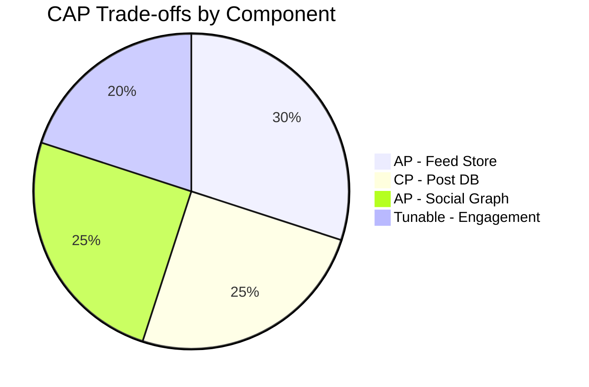

*CAP trade-offs across social media components: the Feed Store and Social Graph are AP (availability-first) since brief staleness is acceptable; the Post DB is CP (consistency-first) since a returned 201 must mean the post is durable; engagement data uses tunable consistency to balance speed and visibility.*

**Interview question:** *Is social media strongly consistent or eventually consistent?*
**Answer:** Social media platforms make a nuanced choice: they are strongly consistent for writes that users expect to be immediately visible (post creation, unfollows, privacy changes) and eventually consistent for reads where slight staleness is acceptable (feed updates, like counts). This pragmatic split — sometimes called "strong-ish consistency" — is the key insight interviewers look for.

---

### Encryption and Key Management

A social media platform stores highly sensitive user data — private messages, photos, relationship graphs, location history, and behavioral profiles. Encryption must protect data at rest, in transit, and during processing.

#### Encryption at Rest

**Media and content storage:** Object storage (S3, GCS) encrypts all objects with SSE-S3 or SSE-KMS by default. User profile data in PostgreSQL uses TDE (Transparent Data Encryption). Redis feed store uses encryption-at-rest (Redis Enterprise) or disk-level encryption.

**User-to-user messages:** End-to-end encrypted messages (like WhatsApp or Signal) are encrypted on the client device with a key the server never sees. The server stores only encrypted blobs.

```mermaid
graph LR
    App[Client App] -->|encrypt(E2E)| E2E[End-to-End Encrypted]
    App -->|encrypt at rest| Storage[(Encrypted Storage)]
    KMS[Key Management Service] -->|DEK| Storage
    KMS -->|KEK| Vault[Key Vault - HSM]
    DEK[Data Encryption Key] --> KMS
```

*Encryption at rest architecture for social media: client-side end-to-end encryption protects private messages (the server never holds decryption keys); server-side encryption at rest protects stored data using DEKs managed by a KMS, with KEKs stored in an HSM-backed key vault.*

**Media encryption:** Photos and videos uploaded by users are encrypted with per-object DEKs before storage. For platforms with content moderation (AI scanning), the server decrypts media in a secure, isolated environment for analysis but never retains plaintext on disk.

#### Encryption in Transit

All client-to-server and server-to-server traffic uses TLS 1.3 (minimum TLS 1.2). Inter-service communication within the data center uses mTLS (mutual TLS) for service-to-service authentication. Mobile SDKs pin the server certificate to prevent man-in-the-middle attacks.

#### Key Management

- **Key hierarchy:** A KEK (Key Encryption Key) in an HSM encrypts per-object or per-user DEKs (Data Encryption Keys). Rotating the KEK requires only re-encrypting the DEKs, not the data.
- **Key rotation:** KEKs rotated every 90 days; per-user message keys rotated every 30 days (with key exchange via Signal protocol for E2E).
- **Multi-region KMS:** Keys are available in all deployment regions. Cloud KMS services replicate keys automatically; on-prem deployments use HashiCorp Vault with integrated storage for multi-region HA.

**Java example — encryption service as a Spring bean:**

```java
@Service
@RequiredArgsConstructor
public class MediaEncryptionService {

    @Value("${app.encryption.media-key-id}")
    private String keyId;

    private final AwsKms kmsClient;

    public EncryptedMedia encrypt(byte[] plaintext) {
        var dek = kmsClient.generateDataKey(keyId);
        var cipher = Cipher.getInstance("AES/GCM/NoPadding");
        cipher.init(Cipher.ENCRYPT_MODE,
                new SecretKeySpec(dek.plaintext(), "AES"),
                new GCMParameterSpec(128, dek.iv()));
        var ciphertext = cipher.doFinal(plaintext);
        return new EncryptedMedia(ciphertext, dek.encryptedKey(), dek.iv());
    }
}
```

*The `MediaEncryptionService` bean generates a per-object data encryption key (DEK) via AWS KMS, encrypts the media blob with AES-GCM (which provides both confidentiality and integrity via the authentication tag), and stores the encrypted DEK alongside the ciphertext. The KMS-managed key ID is injected via `@Value`. Only authorized users with KMS decrypt permissions can recover the DEK to decrypt the media.*

---

### Authentication and Authorization

A social media platform must verify who is connecting (authentication), determine what they can do (authorization), and enforce privacy controls (who can see whose content). Every request to every service must carry authenticated credentials.

#### Authentication Methods

- **OAuth 2.0 + JWT:** Users authenticate via a third-party provider (Google, Apple, Facebook) or email/password. The Auth Service issues a short-lived JWT (15 min) and a refresh token (7 days). The JWT contains the user ID, scopes, and expiry.
- **Session tokens:** For web, a server-side session token in an HttpOnly, Secure, SameSite=Strict cookie. The session store (Redis) maps token → user_id and handles revocation.
- **MFA (Multi-Factor Authentication):** Required for high-privilege actions (password change, email update, monetization setup). TOTP via authenticator app or SMS backup.
- **Certificate-based auth:** For service-to-service communication, mTLS certificates issued by a private CA. No shared secrets.

#### Authorization Models

- **Scope-based (OAuth 2.0 scopes):** Each token carries scopes like `posts:read`, `posts:write`, `follows:write`, `notifications:read`. The API Gateway enforces scope checks before routing.
- **Role-based (RBAC):** Users have roles (`user`, `moderator`, `admin`). Moderators can delete posts and ban users; admins can manage platform settings.
- **Resource-level privacy:** Each post has a visibility setting (`public`, `friends_only`, `private`, `custom`). The Feed Service checks the viewer's relationship to the author before including the post. Private account posts require the viewer to be an approved follower.
- **Content moderation flags:** Posts flagged by AI or users are held for review. Moderators have a separate scope (`moderation:read`) to access the moderation queue.

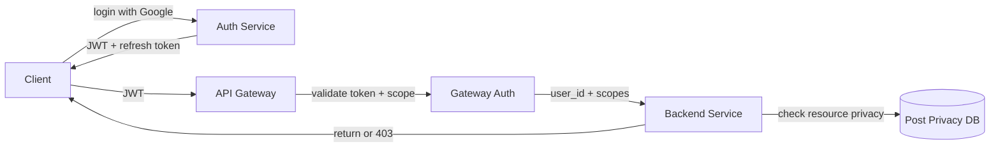

*Authentication and authorization flow: the client logs in via the Auth Service (Google SSO recommended), receives a JWT and refresh token; the API Gateway validates the JWT signature and checks scopes before forwarding to backend services; each service performs resource-level privacy checks against the user's relationship to the content owner.*

**Java example — JWT validation filter:**

```java
@Component
@RequiredArgsConstructor
public class JwtAuthenticationFilter implements Filter {

    @Value("${app.auth.jwt-public-key}")
    private String publicKeyPem;

    private final UserDetailsService userDetailsService;

    @Override
    public void doFilter(ServletRequest request, ServletResponse response,
                         FilterChain chain) throws IOException, ServletException {
        var token = extractToken((HttpServletRequest) request);
        if (token != null && JwtUtils.isValid(token, publicKeyPem)) {
            var userId = JwtUtils.getUserId(token);
            var userDetails = userDetailsService.loadUserById(userId);
            var auth = new UsernamePasswordAuthenticationToken(
                    userDetails, null, userDetails.getAuthorities());
            SecurityContextHolder.getContext().setAuthentication(auth);
        }
        chain.doFilter(request, response);
    }
}
```

*The `JwtAuthenticationFilter` bean intercepts every HTTP request, extracts the bearer token, validates its signature against the public key (injected via `@Value` from a JWKS endpoint), loads the user details, and sets the Spring Security `Authentication` context. If the token is missing or invalid, the request proceeds unauthenticated (and subsequent authorization annotations return 401).*

#### Authorization Example — Post Privacy Check

```java
@Service
@RequiredArgsConstructor
public class PrivacyService {

    private final SocialGraphRepository graphRepository;

    /**
     * Check if a viewer can see a post based on visibility and relationship.
     * Returns true for public posts, friends-only posts (if viewer is following),
     * and private posts (only the author).
     */
    @Transactional(readOnly = true)
    public boolean canView(User viewer, Post post) {
        return switch (post.getVisibility()) {
            case PUBLIC -> true;
            case FRIENDS_ONLY ->
                graphRepository.follows(viewer.getUserId(), post.getAuthorId());
            case PRIVATE ->
                viewer.getUserId().equals(post.getAuthorId());
            case CUSTOM ->
                checkCustomPrivacy(viewer, post);
        };
    }
}
```

*The `PrivacyService` bean enforces post-level visibility using `@Transactional(readOnly = true)` for safe read-only DB access. It uses a Java switch expression over the post's visibility enum: public posts are always visible; friends-only posts require a follow relationship (checked via `SocialGraphRepository`); private posts are visible only to the author. The method returns a boolean consumed by the controller, which returns 403 Forbidden on denial.*

---

### Security Threats and Mitigations

#### Threat: Account Takeover

- **Risk:** An attacker uses stolen passwords, credential stuffing, or session hijacking to take over a user's account and post malicious content.
- **Mitigation:** Enforce 2FA for all users with >1,000 followers. Rate-limit login attempts (5 per IP per hour). Use CAPTCHA after 3 failed attempts. Invalidate all sessions on password change. Monitor for anomalous login patterns (new device, new location, unusual time).

#### Threat: Data Scraping

- **Risk:** Bots scrape public content, user lists, follower graphs, and profile data for surveillance, training data, or competitive intelligence.
- **Mitigation:** Per-API-key rate limiting (e.g., 1,000 requests/minute). Require authentication for all endpoints that return user data. Use a Bloom filter to cache recently requested keys and reject repeated misses from the same client. Block known scraping user agents.

#### Threat: DDoS on Hot Content

- **Risk:** A viral post or trending hashtag generates DDoS-like traffic that overwhelms cache shards or origin servers.
- **Mitigation:** CDN caching for all media. Rate limiting per IP and per user. Key splitting for counters (e.g., `post:456:views:0` through `post:456:views:99` with random shard selection). Circuit breakers on the Feed API to shed load when the Post DB is slow.

#### Threat: Content Poisoning

- **Risk:** An attacker compromises an account and posts malicious content (hate speech, misinformation, phishing links).
- **Mitigation:** AI moderation on every post at upload time. Flag accounts with sudden behavioral changes (posting frequency spike, new content type). Require approval for new accounts' first posts. Implement content versioning so harmful posts can be quickly rolled back.

#### Threat: Privacy Violations

- **Risk:** Accidental exposure of private posts, location data, or the full follower graph. A misconfigured API endpoint leaks another user's private data.
- **Mitigation:** Defense-in-depth: every service checks resource-level privacy (not just the API Gateway). Audit logs of every data access. Data minimization (don't return fields the user doesn't need). Regular penetration testing of API endpoints.

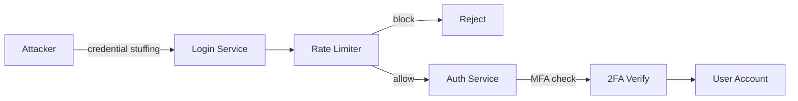

*Account takeover protection: the attacker attempts credential stuffing against the login service; the rate limiter blocks IPs exceeding the threshold; if the attempt passes rate limiting, the auth service requires 2FA verification before granting access. This layered defense (rate limiting + MFA) protects even accounts with compromised passwords.*

---

### Observability and Logging

Social media platforms generate massive amounts of telemetry. Observability must cover the fan-out pipeline, feed serving, real-time delivery, and engagement signals.

#### Key Metrics

- **Fan-out lag:** Milliseconds between post creation and feed availability. Alert if lag > 5s for normal users, > 30s for power users.
- **Feed read latency:** p50 < 100 ms, p95 < 200 ms, p99 < 500 ms. Track by user tier (active vs. cold).
- **Cache hit ratio:** Feed Store hit ratio > 95% for active users. Post DB hit ratio > 90% for content fetch.
- **Notification delivery rate:** Percentage of real-time notifications delivered within 5 seconds. Track by channel (WebSocket vs. push).
- **Engagement metrics:** Likes/comments/shares per post, impressions per feed, click-through rate on media. These are the business KPIs.
- **Error rates:** 5xx errors per service, Kafka consumer errors, Redis connection failures.

#### Logging

- **Access logs:** Every API request logged with user ID, endpoint, response code, and latency. Used for audit trails and anomaly detection.
- **Event logs:** All user actions (post, like, comment, follow, share) logged as structured events for analytics and ML feature generation.
- **Error logs:** Service errors with correlation IDs for cross-service tracing. Fan-out failures logged with follower count for capacity planning.
- **Audit logs:** All privacy changes (making a post public/private), account settings changes, and admin actions logged with before/after state.

#### Distributed Tracing

Trace every user request across all services — from API Gateway through Feed API, Ranking Service, Post DB, and Social Graph. Use OpenTelemetry with a trace context header (`traceparent`) propagated across service boundaries. Key spans to instrument: feed assembly, ranking inference, fan-out batch processing, privacy check, and media URL resolution.

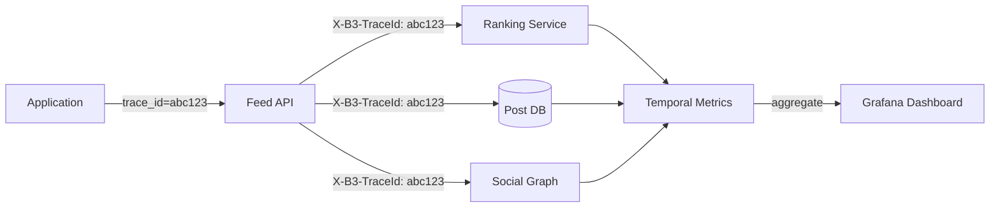

*Distributed tracing flow: each user request carries a trace ID (e.g., `abc123`) propagated across all downstream service calls. The Feed API, Ranking Service, Post DB, and Social Graph each record spans. These spans aggregate in a metrics backend (Temporal Metrics, Jaeger, or Datadog) and are visualized in Grafana dashboards, enabling end-to-end latency analysis.*

#### Alerting Strategy

- **Critical (page immediately):** Feed API p99 > 500 ms for 5 minutes; fan-out lag > 60s; Post DB unavailable; Kafka consumer down.
- **Warning (Slack, no page):** Cache hit ratio < 90%; notification delivery rate < 95%; error rate > 1% for 10 minutes; Kafka lag > 10,000.
- **Info (dashboard only):** Engagement metric anomalies, new user growth trends, media processing queue depth.

**Java example — feed latency metrics with Micrometer:**

```java
@Service
@RequiredArgsConstructor
public class InstrumentedFeedService {

    private final FeedRepository feedRepository;
    private final MeterRegistry meterRegistry;

    public List<PostDto> getFeed(String userId, int limit) {
        var timer = Timer.Sample.start(meterRegistry);
        try {
            var entryTimer = Timer.Sample.start(meterRegistry);
            var entries = feedRepository.getFeedEntries(userId, limit);
            entryTimer.stop(Timer.builder("feed.store.latency")
                    .register(meterRegistry));

            var posts = feedRepository.getPosts(entries);
            timer.stop(Timer.builder("feed.api.latency")
                    .tag("user_tier", getUserTier(userId))
                    .register(meterRegistry));

            Counter.builder("feed.requests")
                    .tag("user_tier", getUserTier(userId))
                    .register(meterRegistry).increment();

            return posts;
        } catch (Exception e) {
            Counter.builder("feed.errors")
                    .tag("error_type", e.getClass().getSimpleName())
                    .register(meterRegistry).increment();
            throw e;
        }
    }

    private String getUserTier(String userId) {
        return meterRegistry.get("feed.requests").tag("user_tier", "active").count() > 1000
                ? "active" : "normal";
    }
}
```

*The `InstrumentedFeedService` bean uses Micrometer to record two nested timers: one for the Feed Store read (`feed.store.latency`) and one for the total API latency (`feed.api.latency`, tagged by user tier). It increments a request counter per successful call and an error counter on failures. The user tier tag separates metrics for high-traffic users (who may have different SLA expectations) from normal users.*

---

### Real-World Implementations

Social media platforms use a combination of proprietary and open-source systems, each chosen for its strengths in a particular layer of the stack.

#### Redis

Used for: feed store (precomputed timelines), social graph hot edges, session tokens, unread notification counts, rate-limit counters. Redis Cluster provides sharding via 16,384 hash slots with master/replica replication for HA. Sorted sets (`ZADD`) enable time-ordered feeds. Redis Streams power the notification delivery pipeline.

**Companies:** Twitter (historically), Instagram (feed entries), TikTok (session and rate limiting), LinkedIn (social graph edges).

#### Cassandra

Used for: durable feed entries (Instagram's timeline), engagement data (likes, comments, shares), and audit logs. Cassandra's tunable consistency and multi-datacenter replication make it ideal for data that must survive regional outages. LSM-tree storage engine provides high write throughput for engagement events.

**Companies:** Instagram (feed), Twitter (user archives), Netflix (viewing history for recommendations).

#### Kafka

Used for: the event backbone carrying `post_created`, `user_followed`, `like_added`, `comment_added` events. Kafka's partitioning by user ID ensures event ordering per user while enabling parallel fan-out workers. The retention policy (7 days) allows reprocessing for new features.

**Companies:** Every major platform — LinkedIn (originally developed Kafka), Twitter, Facebook, Uber.

#### PostgreSQL

Used for: user profiles (durable system of record), post metadata, and payment/financial data. PostgreSQL's strong consistency and ACID transactions make it the right choice for data that must not be lost or corrupted. Read replicas handle read scaling for profile lookups.

**Companies:** Instagram (user metadata before migration to Cassandra), Slack (user data), Stripe (for social commerce payments).

#### S3 / CloudFront

Used for: photo and video storage, CDN distribution, and backup. Direct-to-S3 uploads via presigned URLs offload media from the application tier. CloudFront edge locations cache popular media for sub-50 ms delivery globally.

**Companies:** All platforms leverage cloud object storage for media.

#### TAO (Facebook)

Facebook's The Associations and Objects is a custom graph store built on MySQL, serving over 1 trillion edges. It caches hot edges in RAM (memcached) and falls back to MySQL for cold edges. TAO's API supports associative lookups (get friends-of-friends), making it powerful for social features but requiring careful query planning.

**Companies:** Facebook (Instagram, WhatsApp, Oculus).

#### DynamoDB

Used for: user-to-user messaging metadata, real-time counters (live viewer counts), and notification routing tables. DynamoDB's single-digit-millisecond latency and serverless scaling handle unpredictable traffic spikes (e.g., breaking news events).

**Companies:** Snapchat (stories metadata), some startups building on AWS.

#### Elasticsearch

Used for: search (posts, users, hashtags), content discovery, and "Explore" page ranking. Elasticsearch indexes are updated from Kafka events, providing near-real-time search. Aggregations power trending topics and hashtag analytics.

**Companies:** Twitter (search), Instagram (search and Explore), Reddit (search).

---

### Java and Spring Boot Implementation Guide

This section demonstrates how to build a Spring Boot service for a social media platform's core posting and feed pipeline, showcasing all the key Spring Boot features: `@Service`, `@RestController`, `@Repository`, `@Component`, `@Value`, records for DTOs, `@Valid`, `@ControllerAdvice`, constructor injection, `BigDecimal`, `@Transactional`, and `@Version`.

#### 1. DTO Records

Records provide immutable, concise data carriers for request/response payloads.

```java
public record CreatePostRequest(
        @NotBlank String content,
        List<String> mediaIds,
        @NotBlank String visibility) {}

public record PostResponse(
        String postId,
        String authorId,
        String authorName,
        String content,
        List<MediaDto> media,
        Instant createdAt,
        int likeCount,
        int commentCount,
        boolean userLiked) {}

public record FeedResponse(
        List<PostResponse> posts,
        String cursor,
        boolean hasMore,
        int totalCount) {}

public record MediaDto(String type, String url) {}
```

*Four record types serve as the API contract: `CreatePostRequest` is the POST body with `@NotBlank` validation annotations (enforced by `@Valid` at the controller layer); `PostResponse` is the enriched post DTO returned to clients; `FeedResponse` wraps the paginated list with a cursor token; `MediaDto` carries media type and CDN URL. Records are immutable and ideal for thread-safe request/response objects.*

#### 2. Entity with Optimistic Locking

The `Post` entity uses `@Version` for optimistic locking to prevent lost updates when concurrent writes (likes, comments) modify the same post.

```java
@Entity
@Table(name = "posts", indexes = {
        @Index(name = "idx_author_created", columnList = "authorId, createdAt")
})
public class Post {

    @Id
    private String postId;

    private String authorId;
    private String content;
    private String visibility;
    private Instant createdAt;

    @Version
    private Long version;

    @OneToMany(cascade = CascadeType.ALL, orphanRemoval = true)
    @MapKey(name = "position")
    private Map<Integer, PostMedia> media = new HashMap<>();

    @Column(name = "like_count")
    private int likeCount = 0;

    @Column(name = "comment_count")
    private int commentCount = 0;

    // Constructors, getters, setters omitted for brevity

    public void incrementLikeCount() {
        this.likeCount++;
    }

    public void incrementCommentCount() {
        this.commentCount++;
    }
}
```

*The `Post` entity maps to the `posts` table with a composite index on `(authorId, createdAt)` for efficient timeline queries. The `@Version` field enables JPA optimistic locking — if two concurrent transactions try to update the same post, the second one fails with `OptimisticLockException`, preventing lost updates on like/comment counts. The `@OneToMany` media collection uses a map keyed by display position.*

#### 3. Repository Layer

The `@Repository` layer provides persistence operations with Spring Data JPA.

```java
@Repository
public interface PostRepository extends JpaRepository<Post, String> {

    @Query("SELECT p FROM Post p WHERE p.authorId = :authorId ORDER BY p.createdAt DESC")
    List<Post> findRecentByAuthor(@Param("authorId") String authorId, Pageable pageable);

    @Query("SELECT p FROM Post p JOIN FETCH p.media WHERE p.postId IN :postIds")
    List<Post> findByIdsWithMedia(@Param("postIds") List<String> postIds);
}
```

*The `PostRepository` interface extends `JpaRepository`, inheriting CRUD methods. Two custom queries are defined: `findRecentByAuthor` for fetching a user's recent posts (used in power-user read-time merge and profile views), and `findByIdsWithMedia` for batch-fetching post content with media in a single query (used by the Feed API to avoid N+1 queries).*

#### 4. Service Layer

Services encapsulate business logic, transactions, and the fan-out pipeline.

```java
@Service
@RequiredArgsConstructor
@Slf4j
public class PostService {

    private final PostRepository postRepository;
    private final SocialGraphService graphService;
    private final KafkaTemplate<String, Object> kafkaTemplate;

    @Value("${app.post.media-max-count:10}")
    private int maxMediaPerPost;

    @Transactional
    public PostResponse createPost(String authorId, CreatePostRequest request) {
        validateMediaCount(request.mediaIds());

        var post = Post.builder()
                .postId(UUID.randomUUID().toString())
                .authorId(authorId)
                .content(request.content())
                .visibility(request.visibility())
                .createdAt(Instant.now())
                .version(0L)
                .build();

        var saved = postRepository.save(post);

        // Publish event for async fan-out and notifications
        kafkaTemplate.send("post_created", saved.getPostId(),
                Map.of("postId", saved.getPostId(), "authorId", authorId));

        return toResponse(saved);
    }

    @Transactional
    public PostResponse likePost(String postId, String userId) {
        var post = postRepository.findById(postId)
                .orElseThrow(() -> new PostNotFoundException(postId));
        post.incrementLikeCount();
        // Publish like event for notification service
        kafkaTemplate.send("post_liked", postId,
                Map.of("postId", postId, "userId", userId));
        return toResponse(post);
    }

    @Transactional(readOnly = true)
    public List<PostResponse> getFeed(List<String> postIds) {
        return postRepository.findByIdsWithMedia(postIds)
                .stream()
                .map(this::toResponse)
                .toList();
    }

    private void validateMediaCount(List<String> mediaIds) {
        if (mediaIds != null && mediaIds.size() > maxMediaPerPost) {
            throw new IllegalArgumentException(
                    "Too many media items: max is " + maxMediaPerPost);
        }
    }
}
```

*The `PostService` bean uses constructor injection (`@RequiredArgsConstructor`) for all dependencies. The `@Transactional` annotation ensures atomicity: `createPost` writes to the DB and publishes to Kafka within a single transaction; `likePost` increments the like count (with `@Version`-based optimistic locking) and publishes a like event; `getFeed` is read-only for DB query optimization. The `@Value` annotation injects the media count limit. Kafka events decouple the write path from fan-out and notification processing.*

#### 5. REST Controller with Validation

The controller uses `@Valid` for request validation and constructor injection.

```java
@RestController
@RequestMapping("/api/v1/posts")
@RequiredArgsConstructor
public class PostController {

    private final PostService postService;

    @PostMapping
    public ResponseEntity<PostResponse> createPost(
            @AuthenticationPrincipal UserDetails user,
            @Valid @RequestBody CreatePostRequest request) {
        var response = postService.createPost(user.getUsername(), request);
        return ResponseEntity.status(HttpStatus.CREATED).body(response);
    }

    @PostMapping("/{postId}/like")
    public ResponseEntity<PostResponse> likePost(
            @AuthenticationPrincipal UserDetails user,
            @PathVariable String postId) {
        var response = postService.likePost(postId, user.getUsername());
        return ResponseEntity.ok(response);
    }
}
```

*The `PostController` uses `@RestController` to combine `@Controller` and `@ResponseBody`. The `@Valid` annotation on `CreatePostRequest` triggers bean validation (enforcing `@NotBlank` constraints). `@AuthenticationPrincipal` injects the authenticated user from the security context. Constructor injection via `@RequiredArgsConstructor` makes dependencies explicit and non-nullable. The POST endpoint returns `201 Created` with the response body.*

#### 6. Controller Advice for Global Error Handling

A `@ControllerAdvice` bean centralizes exception handling across all controllers.

```java
@ControllerAdvice
public class GlobalExceptionHandler {

    @ExceptionHandler(PostNotFoundException.class)
    public ResponseEntity<ApiError> handleNotFound(PostNotFoundException ex) {
        var error = new ApiError(HttpStatus.NOT_FOUND, ex.getMessage());
        return ResponseEntity.status(HttpStatus.NOT_FOUND).body(error);
    }

    @ExceptionHandler(MethodArgumentNotValidException.class)
    public ResponseEntity<ApiError> handleValidation(MethodArgumentNotValidException ex) {
        var messages = ex.getBindingResult().getFieldErrors().stream()
                .map(FieldError::getDefaultMessage)
                .toList();
        var error = new ApiError(HttpStatus.BAD_REQUEST,
                "Validation failed: " + String.join(", ", messages));
        return ResponseEntity.badRequest().body(error);
    }

    @ExceptionHandler(OptimisticLockException.class)
    public ResponseEntity<ApiError> handleConflict(OptimisticLockException ex) {
        var error = new ApiError(HttpStatus.CONFLICT,
                "Concurrent modification detected. Please retry.");
        return ResponseEntity.status(HttpStatus.CONFLICT).body(error);
    }

    public record ApiError(HttpStatus status, String message) {}
}
```

*The `GlobalExceptionHandler` bean (annotated `@ControllerAdvice`) catches exceptions thrown by any `@RestController` and returns structured `ApiError` responses. It handles `PostNotFoundException` (404), `MethodArgumentNotValidException` (400 with field-level messages from `@Valid`), and `OptimisticLockException` (409 Conflict — which occurs when `@Version` detects a concurrent write). This avoids repetitive try-catch blocks in controllers.*

#### 7. Ranking Service with BigDecimal Scoring

Feed ranking uses `BigDecimal` for precise score computation, avoiding floating-point rounding issues.

```java
@Service
@RequiredArgsConstructor
public class RankingService {

    private final FeatureStoreClient featureStore;
    private final MeterRegistry meterRegistry;

    private static final BigDecimal RECENCY_WEIGHT = new BigDecimal("0.30");
    private static final BigDecimal AFFINITY_WEIGHT = new BigDecimal("0.25");
    private static final BigDecimal ENGAGEMENT_WEIGHT = new BigDecimal("0.25");
    private static final BigDecimal CONTENT_TYPE_WEIGHT = new BigDecimal("0.10");
    private static final BigDecimal RELATIONSHIP_WEIGHT = new BigDecimal("0.10");

    @Transactional(readOnly = true)
    public List<PostResponse> rank(String userId, List<PostResponse> candidates) {
        return candidates.stream()
                .map(post -> {
                    var features = featureStore.getFeatures(userId, post);
                    var score = RECENCY_WEIGHT.multiply(features.recencyScore())
                            .add(AFFINITY_WEIGHT.multiply(features.affinityScore()))
                            .add(ENGAGEMENT_WEIGHT.multiply(features.engagementScore()))
                            .add(CONTENT_TYPE_WEIGHT.multiply(features.contentTypeScore()))
                            .add(RELATIONSHIP_WEIGHT.multiply(features.relationshipScore()));
                    return new ScoredPost(post, score);
                })
                .sorted(Comparator.comparing(ScoredPost::score).reversed())
                .map(ScoredPost::post)
                .toList();
    }

    record ScoredPost(PostResponse post, BigDecimal score) {}
}
```

*The `RankingService` bean computes a weighted engagement score for each candidate post using `BigDecimal` arithmetic for numerical precision. The weights (recency 30%, affinity 25%, engagement 25%, content type 10%, relationship 10%) are immutable `BigDecimal` constants. The `@Transactional(readOnly = true)` annotation optimizes the Feature Store reads. A local record `ScoredPost` pairs each post with its computed score for sorting.*

---

### Interview Questions and Answers

A curated set of interview questions organized by difficulty, focused on social media platform design.

**Beginner**

1. **What is the fan-out problem in social media, and why is it hard?**
   **A:** When a user posts, their content must reach all followers' feeds. Fan-out-on-write writes the post to every follower's feed at post time (fast reads, expensive writes). Fan-out-on-read fetches the post from followed users at timeline view time (cheap writes, expensive reads). The "celebrity problem" — a user with millions of followers makes pure fan-out-on-write infeasible (10M writes per post). The standard solution is hybrid fan-out.

2. **How would you store the social graph?**
   **A:** The social graph is a set of (follower_id, followee_id) edges. Store as an edge table sharded by follower_id hash for fan-out reads. Cache hot edges in Redis (membership check is O(1) SETEX). For scale, use a dedicated graph store like Facebook's TAO (MySQL-backed with memcached L1/L2 caching) or Redis with adjacency sets. Index both directions: by follower_id (who do I follow?) and by followee_id (who follows me?).

3. **How do you generate a user's news feed?**
   **A:** Two approaches: (1) Fan-out on write — when a user posts, write the post_id to each follower's feed in Redis (a sorted set with timestamp score). At read time, just `ZRANGE feed:userId 0 50`. (2) Fan-out on read — at read time, look up followed user IDs, fetch their recent posts from the Post DB, merge and sort by timestamp. Writes favor push; reads favor pull; production uses hybrid.

4. **What is the difference between a chronological feed and an ML-ranked feed?**
   **A:** A chronological feed simply displays posts in reverse-chronological order — simple, predictable, and perceived as fair. An ML-ranked feed scores each post by predicted engagement probability (recency, affinity, engagement history, content type) and displays the top-N. Ranked feeds increase engagement but add latency and can create filter bubbles or amplify harmful content.

**Intermediate**

5. **How do you handle a user with millions of followers?**
   **A:** Classify users above a follower-count threshold (e.g., 10,000) as "power users." Their posts skip write-time fan-out and are stored in a Post DB. At read time, the Feed API merges the user's precomputed feed (from normal users) with recent posts from followed power users. This avoids millions of writes per celebrity post while keeping the read path efficient (fetch ~5 posts per power user, not millions).

6. **How would you prevent duplicate posts in feeds during fan-out retries?**
   **A:** Fan-out writes the `post_id` as a Redis sorted set member (or a Cassandra row keyed by `(user_id, post_id)`). Writing the same post_id twice is an idempotent upsert — no duplicate. The Fan-out Service retries failed batches via Kafka's at-least-once delivery; the idempotent write ensures no duplicates even on retry. The Feed API also deduplicates at read time as a safety net.

7. **What is the latency budget for feed generation, and how do you meet it?**
   **A:** End-to-end feed read should be < 200 ms. Breakdown: API routing ~20 ms, Redis feed read ~30 ms (O(log N) ZRANGE), parallel Post DB fetch for ~50 posts ~50 ms, ranking model inference ~80 ms, response serialization ~20 ms. Key optimizations: pre-compute ranking features, use low-dimensional model embeddings, batch database queries, and cache the final ranked result for hot users.

8. **How do you mitigate hot keys for viral posts or trending hashtags?**
   **A:** Four techniques: (1) Shard the key — for trending hashtags, use `hashtag:123:0` through `hashtag:123:99` and write to a random shard; aggregate at read time. (2) Cache aggressively — cache the post content in Redis for 24 hours; cache the hashtag counter with read replicas. (3) Rate limiting — apply per-IP and per-user rate limits to prevent abuse. (4) CDN for media — serve viral media from edge locations to remove origin load.

9. **How do you handle the "N+1 query problem" in fan-out-on-read?**
   **A:** Two solutions: (1) Batch fetching — collect all followed user IDs, then issue a single `SELECT ... WHERE author_id IN (...)` query to the Post DB instead of N individual queries. (2) Merge at the store level — store posts in a sorted set keyed by `(user_id, timestamp)` and use `ZRANGEBYSCORE` with a limit to fetch all candidates in one call. For further optimization, pre-warm the cache for known power users.

10. **What is fan-out lag and how do you monitor it?**
    **A:** Fan-out lag is the delay between post creation and the post appearing in all followers' feeds. Monitor it by embedding a timestamp in the `post_created` Kafka event and comparing it to the time the Feed Store write completes. Alert if lag exceeds 5 seconds for normal users or 30 seconds for power users. Scale fan-out workers based on Kafka consumer group lag (if `current_offset - committed_offset > threshold`, add workers).

**Advanced**

11. **How would you design Instagram Stories (24-hour ephemeral content)?**
    **A:** Stories follow a similar fan-out model but with aggressive TTL expiration. Upload → S3 → Kafka event → Fan-out Service writes story_id to follower story trays (Redis ZSET with `score=timestamp`). The Story Tray API reads the ZSET and fetches story metadata from the Story DB. A background cron deletes stories older than 24 hours. For 500M users, shard story trays by `user_id % N` and use Redis `EXPIRE` for automatic cleanup. Highlights (persistent stories) are stored separately without TTL.

12. **How do you A/B test feed ranking algorithms?**
    **A:** Assign users to cohorts at login time (A: chronological, B: engagement-based ML, C: affinity-based). Cohorts are stored in a user properties service and cached. Each cohort sees a different ranking model. Measure engagement metrics (time-on-feed, scroll depth, likes/comments per session). Use "switchback" design — alternate cohorts over time windows to reduce temporal bias (e.g., morning vs. evening engagement patterns). Re-train models when AUC (Area Under the Curve for click prediction) drops below a threshold.

13. **How do you handle a breaking news event where thousands of users post about the same topic simultaneously?**
    **A:** Three-pronged approach: (1) Fan-out throttling — detect trending topics by monitoring post_rate per hashtag; when it exceeds a threshold, switch to read-time merge for that topic's posts (skip fan-out-on-write to prevent pipeline stall). (2) Rate limiting — temporarily limit posting rate per user (5 posts/minute) during spikes, with priority for verified accounts. (3) Content collapsing in the feed — group posts by topic ("10,000 posts about #BreakingNews — show top 3 + link to full view"). Cache the trending topic's post IDs in Redis for all users to read from the same cached list.

**Senior / System Design**

14. **How would you redesign the feed architecture to support 5x user growth (500M to 2.5B users)?**
    **A:** Key challenges: (1) Fan-out storage — 2.5B users means 6.25B feed entries per post at peak; need Cassandra with 1000+ partitions and virtual nodes for even distribution. (2) Hot keys — use consistent hashing with virtual nodes (200 vnodes per physical node) to distribute load; add read replicas for celebrity feeds. (3) Cross-region replication — deploy regional clusters with async replication; handle conflicts with CRDTs for last-write-wins on engagement counts. (4) Ranking at scale — pre-compute rankings offline (daily batch) and cache top-N per user category (sports, tech, etc.); only re-rank the top 20 at read time. (5) Cost management — tiered storage (hot Redis cache for active users, cold Cassandra for inactive); lazy backfill for new follows.

15. **How would you implement a "mute" feature (hide a user's posts without unfollowing)?**
    **A:** Server-side filtering: store a `muted_user_ids` set per user in Redis (TTL: 7 days, refreshed on access). When generating the feed, the Feed API does a `SINTER` between the candidate post authors and the user's muted set — muted posts are filtered out. For better performance, use a Bloom filter for hot users (high follow counts) where the muted set is large; for cold users, query the Redis set. The muted set is populated by a `user_muted` event from the event bus. Trade-off: server-side filtering adds latency to every feed read; client-side filtering wastes bandwidth and battery. For privacy, ensure muted users don't see "you were muted" indicators.

---

## Real-World Examples

### Twitter's Fan-out Evolution

Twitter originally used pure fan-out-on-write: when a user posted, the system wrote to every follower's timeline in Redis. When celebrities with millions of followers joined, this broke — a single tweet from a celebrity (e.g., Elon Musk with 150M followers) required 150M Redis writes in under a second, saturating the cluster. Twitter evolved to a **hybrid approach**: normal users' posts are push-fanned-out immediately; power users' posts (above a dynamic threshold) are stored in a separate "out of band" store and merged into timelines at read time. The threshold is dynamic, based on follower count and posting frequency.

### Facebook's TAO (The Associations and Objects)

Facebook's social graph (likes, comments, friendships, page follows — over 1 trillion edges) is stored in TAO, a custom graph store built on MySQL. TAO caches hot data in RAM (memcached) and falls back to MySQL for misses. Reads are extremely fast (sub-millisecond for cached edges) because the social graph is one of the most-read pieces of data in Facebook. Writes go to MySQL first (for durability) then invalidate cache. TAO uses "lazy loading" — only loads edges when specifically requested, not the entire graph for a user.

### Instagram's Feed at 500M Users

Instagram's feed uses fan-out-on-write (push model) backed by Cassandra. When you post, the post ID is written to the feeds of all your followers via a fan-out service. The feed is stored in Cassandra keyed by `user_id + timestamp`. When you open the app, the Feed API reads the latest 20 post IDs from Cassandra, then fetches the full post content (photos, captions) from a photo store. The ranking model (recency × relationship strength × predicted engagement) scores posts and sorts them before sending to the client. Instagram also uses "edge rank" — posts that got lots of engagement in early followers' feeds are boosted for others.

### TikTok's For You Page

TikTok's "For You" feed uses a two-stage recommendation pipeline: (1) candidate generation — retrieve ~500 videos from the graph neural network (GNN) embeddings of user interactions, and (2) ranking — score candidates with a deep neural network that considers user-video affinity, engagement prediction, device performance, and content quality. Unlike traditional social feeds, TikTok's feed is not purely social (based on who you follow) — it heavily weights content-based recommendations. The entire pipeline runs in < 100 ms at the edge.

---


