# Design Spotify

## Blogs and websites

## Medium

## Youtube

- [System Design Interview: Design Spotify](https://www.youtube.com/watch?v=H7s1pvuhmTA)

---

## Theory

### Topics Covered

1. [Introduction / Problem Statement](#introduction--problem-statement)
2. [Characteristics](#characteristics)
3. [Pros](#pros)
4. [Cons](#cons)
5. [Use Cases](#use-cases)
6. [Components](#components)
7. [Architectural Patterns](#architectural-patterns)
8. [Benefits](#benefits)
9. [Challenges](#challenges)
10. [Best Practices](#best-practices)
11. [When to Use / When Not to Use](#when-to-use--when-not-to-use)
12. [Data Model and API](#data-model-and-api)
13. [Domain-Specific: Music Recommendation and Audio Streaming Deep Dive](#domain-specific-music-recommendation-and-audio-streaming-deep-dive)
14. [Replication Strategies](#replication-strategies)
15. [Failure Detection and Membership](#failure-detection-and-membership)
16. [High Availability and Scalability](#high-availability-and-scalability)
17. [Performance and Optimization](#performance-and-optimization)
18. [CAP Theorem and Consistency Trade-offs](#cap-theorem-and-consistency-trade-offs)
19. [Encryption and Key Management](#encryption-and-key-management)
20. [Authentication and Authorization](#authentication-and-authorization)
21. [Security Threats and Mitigations](#security-threats-and-mitigations)
22. [Observability and Logging](#observability-and-logging)
23. [Real-World Implementations](#real-world-implementations)
24. [Java and Spring Boot Implementation Guide](#java-and-spring-boot-implementation-guide)
25. [Interview Questions and Answers](#interview-questions-and-answers)

---

### Introduction / Problem Statement

Spotify is a music and podcast streaming platform that serves personalized audio content — songs, albums, podcasts, playlists — to millions of concurrent listeners worldwide. Unlike traditional file-download or radio models, Spotify streams audio on-demand with features like personalized recommendations (Discover Weekly), collaborative playlists, cross-device sync, and offline downloads. The system must deliver low-latency, high-throughput streaming while managing massive catalogs (100M+ tracks), user preferences, and real-time collaboration.

**Why it exists:** Physical music collection is expensive and space-consuming. Streaming services replace ownership with access — users subscribe to catalog access rather than buying individual albums. The shift to streaming also enables data-driven discovery (what to listen to next) and social features (sharing playlists, collaborative editing) that physical media cannot offer.

**Problem solved:**

* **Content delivery at scale**: streaming audio to millions of concurrent users requires efficient content distribution (CDN), bit-rate adaptation, and caching.
* **Personalization**: with 100M+ tracks, users need help discovering music — the system must rank and recommend relevant content.
* **Catalog management**: licensing music from labels, managing metadata, handling rights and royalties.
* **Low latency**: users expect near-instant playback; buffering breaks the experience.
* **Offline support**: users need to download content for offline listening with proper DRM.
* **Social features**: shared playlists, collaboration, and social discovery require real-time synchronization.

#### Important Subtopics

The following subtopics are central to the Spotify design problem and are revisited in depth in the Domain-Specific Deep Dive and supporting sections below.

1. Audio streaming infrastructure (CDN, chunked encoding, bit-rate adaptation)
2. Music catalog and metadata management
3. Recommendation engine (collaborative filtering, NLP, audio analysis)
4. Playlist management and collaboration
5. User session and playback state synchronization
6. Offline download and DRM
7. Royalty tracking and payment distribution
8. Search and discovery

#### Important Subtopics Explained

**Audio streaming infrastructure**: Spotify uses a custom CDN (based on nginx) and partners with third-party CDNs (Akamai, CloudFront) for content delivery. Audio is stored in Ogg Vorbis format with multiple bit-rates (96 kbps to 320 kbps). Playback uses HTTP adaptive streaming — the client requests chunks of ~10 seconds and adjusts bit-rate based on network conditions. The CDN caches popular tracks at edge nodes; less popular tracks are served from origin.

**Music catalog and metadata**: Each track has metadata (title, artist, album, genre, release date, ISRC/UPC codes). Metadata comes from labels and is enriched via fingerprinting (Gracenote, AcoustID). The catalog service manages licensing windows — a track may be available in some regions but not others due to licensing. Royalty calculations are based on stream counts and pro-rata listening time.

**Recommendation engine**: Spotify's recommendation system uses three main signals: collaborative filtering (users who liked X also liked Y), natural language processing (analyzing blog posts, reviews, and news about artists), and audio analysis (analyzing audio features like tempo, key, danceability). The Discover Weekly playlist is generated weekly using these signals. The system processes billions of events daily.

**Playlist management and collaboration**: Playlists can be public, private, or collaborative. Collaborative playlists allow multiple users to add/remove tracks in real-time. The system uses Conflict-free Replicated Data Types (CRDTs) for conflict-free merging of playlist edits across devices.

**User session and playback state**: When a user switches devices, their playback position must sync instantly. The system stores the current track, position, and queue in a low-latency store (Redis or in-memory KV store) and pushes updates via WebSocket or polling.

**Offline download and DRM**: Users can download tracks/playlists for offline listening. Downloads are encrypted with device-specific keys (AES-128). Spotify uses Widevine/Clear for DRM on Android and FairPlay for iOS. Download quotas are enforced per user.

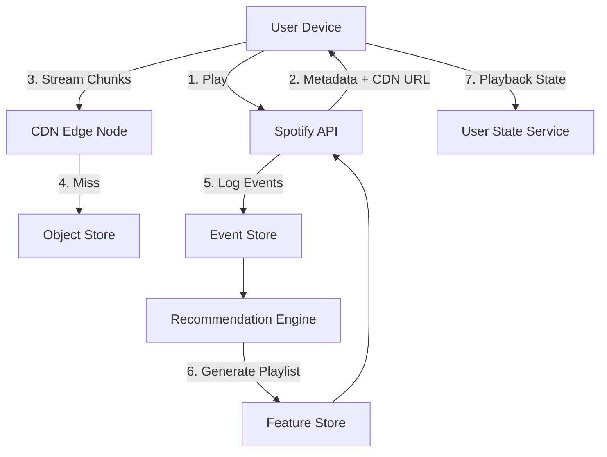

*High-level request flow: the user presses play, the API Gateway resolves the track and returns a signed CDN URL plus metadata, the client streams ~10-second audio chunks from the nearest CDN edge (falling back to origin on cache miss), playback events are logged to Kafka for the recommendation engine, and cross-device playback state is persisted in a low-latency state store.*

**Design Considerations (system goals):**

Design a system that:
* Streams audio to 50M+ concurrent users with < 200 ms startup latency
* Provides personalized recommendations updated daily
* Supports collaborative playlists with real-time sync
* Enables offline downloads with DRM
* Tracks royalties accurately per stream
* Operates in 180+ countries with region-specific catalogs

---

### Characteristics

| Characteristic | What it means | Why it matters | How it works |
|---|---|---|---|
| **On-demand streaming** | Users select any track and play immediately | Replaces the radio model; enables discovery | HTTP adaptive streaming with chunked transfer |
| **Bit-rate adaptation** | Stream quality adjusts to network conditions | Prevents buffering; optimizes bandwidth | Client monitors throughput and switches bit-rate tiers |
| **Personalization** | Content recommendations tailored to each user | Increases engagement and retention | ML models trained on listening history and collaborative signals |
| **Collaborative playlists** | Multiple users can edit playlists simultaneously | Social feature driving engagement | CRDT-based conflict-free merge |
| **Offline support** | Content downloadable for offline playback | Enables use without internet | Encrypted downloads with device-specific keys |
| **Global scale** | Serves 180+ countries simultaneously | Business requirement for global reach | Multi-region CDN and geo-routing |
| **Real-time session sync** | Playback state syncs across devices | Seamless cross-device experience | WebSocket + low-latency state store |

#### Detailed Explanations

**On-demand streaming**: Unlike radio (linear broadcast), on-demand lets users pick any track at any time. This requires every track to be available at every edge node — a massive storage and caching challenge for a 100M+ track catalog where the "long tail" (less popular tracks) may never be cached.

**Bit-rate adaptation**: Spotify uses adaptive bitrate streaming (like HLS/DASH but proprietary). The client requests ~10-second chunks; if network slows, it requests lower bit-rate chunks. This prevents buffering while maximizing quality under current conditions.

**Personalization**: Spotify's recommendation engine processes 100B+ events daily (plays, skips, saves, playlist adds). Collaborative filtering finds similar users; NLP analyzes text about artists; audio analysis extracts musical features. The Discover Weekly playlist is a famous example — 100M users receive a personalized 30-track playlist every Monday.

**Collaborative playlists**: Multiple users can add/remove tracks to the same playlist simultaneously. The system uses CRDTs to merge edits without conflicts, ensuring eventual consistency across all users' views.

**Offline support**: Downloads are encrypted with per-device keys. Users can download up to 3,333 tracks offline. The system enforces download limits via the catalog service and manages device-specific encryption keys.

---

### Pros

* **Massive catalog**: Over 100 million tracks and 5 million podcasts — more content than any physical collection could hold.
* **Intelligent recommendations**: ML-powered discovery that surfaces relevant music users wouldn't find otherwise, driving engagement (Discover Weekly alone has billions of streams).
* **Cross-device sync**: Playback, playlists, and preferences sync instantly across all devices.
* **Social features**: Collaborative playlists, shared playlists, following friends' activity, and social sharing create viral engagement loops.
* **Offline support with DRM**: Encrypted downloads protect content while enabling offline consumption.
* **Adaptive streaming**: Automatic bit-rate adjustment ensures smooth playback under varying network conditions.
* **Platform ecosystem**: Available on every major platform (iOS, Android, Web, macOS, Windows, Linux, smart speakers, game consoles, cars).

---

### Cons

* **Licensing complexity**: Music licensing is expensive (30%+ of revenue goes to rights holders) and region-dependent. Catalog gaps exist where licensing hasn't been secured.
* **High infrastructure cost**: Global CDN, storage for 100M+ tracks, ML infrastructure for recommendations — infrastructure is Spotify's largest expense.
* **Storage vs. popularity skew**: 80% of plays come from 1% of tracks. Cold storage (long tail) is expensive relative to its usage.
* **DRM complexity**: Offline downloads with device-specific encryption add significant engineering complexity.
* **Fair pay debate**: Per-stream royalty payouts are low, causing friction with artists and labels.
* **Metadata quality**: Inconsistent or incorrect metadata (artist names, release dates) causes search/discovery problems.
* **Network dependency**: Unlike locally-stored music, streaming requires constant connectivity (though offline mode mitigates this).

---

### Use Cases

#### Personalized Discovery (Discover Weekly)

* **Problem**: Users struggle to discover new music from a 100M+ track catalog.
* **Solution**: Generate a weekly personalized playlist of 30 tracks based on collaborative filtering (similar users' listening), NLP (blog reviews, news), and audio analysis (musical features).
* **Why suitable**: The system's recommendation engine processes billions of daily events and has the data depth to make accurate predictions.
* **How it works**: Every Monday, the pipeline: (1) builds user embedding vectors from listening history, (2) finds nearest-neighbor users via collaborative filtering, (3) collects candidate tracks from those users' libraries, (4) filters out already-heard tracks, (5) applies audio feature matching, (6) ranks by predicted affinity, (7) delivers to all users within a 2-hour window.
* **Trade-offs**: Computationally expensive (100M users × 30 tracks each); freshness of new releases is limited by the weekly cadence.

#### Collaborative Playlist Editing

* **Problem**: Multiple users want to add songs to a shared playlist simultaneously from different locations.
* **Solution**: Use CRDTs (Observed-Remove Sets) for conflict-free merging of track additions/removals.
* **Why suitable**: CRDTs guarantee eventual consistency without coordination — perfect for a social feature where users expect to add songs at any time.
* **How it works**: Each add/remove is a delta operation. Operations are replicated to all participants. The merge function (union of adds minus union of removes) is commutative, associative, and idempotent — so any order of operation delivery produces the same final playlist.
* **Trade-offs**: Metadata overhead (each operation stores the actor ID); cannot enforce strict ordering constraints (e.g., "track X must come after track Y").

#### Offline Download

* **Problem**: Users need to listen without internet (commute, flights, underground).
* **Solution**: Encrypted downloads with per-device keys and quota enforcement.
* **Why suitable**: DRM protects content; device-specific keys prevent cross-device sharing; quotas prevent mass downloading.
* **How it works**: (1) User selects tracks/playlist to download, (2) system verifies quota (max 3,333 tracks), (3) downloads encrypted chunks from CDN, (4) stores with device-specific AES key, (5) playback decrypts chunks on-the-fly during playback.
* **Trade-offs**: Storage space on device; download time; DRM complexity; quota enforcement may frustrate power users.

#### Cross-Device Session Sync

* **Problem**: A user starts listening on mobile and wants to resume on desktop or smart speaker without losing position.
* **Solution**: Persist the active playback state (track ID, position, queue, speed, shuffle/repeat mode) in a strongly-consistent low-latency store and push updates in real time.
* **How it works**: The User State Service writes a compact session record to a multi-region KV store (Redis Enterprise with active-active replication). Each client opens a WebSocket channel and receives state deltas. A "connect + resume" handshake reconciles the local cursor with the authoritative position.
* **Trade-offs**: Global consistency cost; need to reconcile when two devices send conflicting commands within a short window (last-write-wins with vector-clock tie-breaking).

---

### Components

| Component | Purpose | Responsibilities | Relationship | Real-world Example |
|---|---|---|---|---|
| **CDN** | Content delivery | Serve audio chunks from edge nodes; cache warm | Consumes from Object Store; serves Streaming Client | Spotify's in-house CDN + Akamai |
| **Object Store** | Catalog storage | Store all audio files, metadata, album art | Feeds CDN; queried by Metadata Service | Google Cloud Storage / S3 |
| **Metadata Service** | Catalog management | Product metadata, licensing, regional availability | Serves Search, Streaming, and Playback | Spotify Catalog API |
| **Recommendation Engine** | Personalization | ML models for Discover Weekly, Release Radar, Daily Mixes | Consumes Event Store; feeds Streaming Client | Spotify ML infrastructure |
| **Event Store** | User activity logging | Store plays, skips, saves, playlist interactions | Feeds Recommendation Engine | Kafka + ClickHouse |
| **Streaming Client** | Playback engine | Adaptive streaming, bit-rate selection, DRM | Talks to CDN, Metadata Service | Spotify mobile/desktop apps |
| **User State Service** | Session & playback state | Sync playback position across devices | Real-time push to clients | Redis + WebSocket |
| **Playlist Service** | Playlist management | Create, edit, share, collaborate on playlists | Uses CRDT for conflict resolution | Spotify backend |
| **Offline Service** | Download management | Manage offline downloads, DRM, quotas | Coordinates with CDN and State Store | Spotify download feature |
| **Search Service** | Discovery & lookup | Query tracks/artists/albums/playlists; autocomplete | Indexes catalog metadata | Elasticsearch cluster |
| **Royalty Service** | Stream accounting | Count and attribute every stream for payout | Consumes Event Store | Batched settlement pipeline |
| **Auth Service** | Identity & access | OAuth 2.0, JWT issuance, token refresh, MFA | Issues tokens consumed by all services | Spotify Accounts service |

#### Component Interactions

1. The **Streaming Client** resolves a track URI → requests metadata from Metadata Service → receives CDN URL → streams audio chunks from CDN.
2. **Event Store** collects all user interactions → feeds **Recommendation Engine** → generates personalized playlists → delivered to client via Playlist Service.
3. **Playlist Service** handles concurrent edits using CRDTs → syncs to **User State Service** → pushes updates to other collaborators via WebSocket.
4. **Search Service** keeps an Elasticsearch index in sync with catalog metadata from the Metadata Service; autocomplete queries hit a query-cache (Redis) for < 50 ms latency.
5. **Royalty Service** consumes a compacted, deduplicated stream of "completed listen" events from the Event Store and accumulates per-rights-holder counters used in daily settlement.

---

### Architectural Patterns

#### Content Delivery Network (CDN) with Edge Caching

* **What**: Distribute content across geographically dispersed edge nodes so users get content from the nearest location.
* **Problem solved**: A single origin server cannot serve millions of concurrent users globally with low latency.
* **How it works**: User requests are routed to the nearest CDN edge node; if the content is cached, it's served immediately; if not, the edge node fetches from origin (or a parent node) and caches it.
* **When to use**: Any service delivering large static/binary content (audio, video, images) to global users.
* **When not to use**: Ultra-low-latency interactive applications where caching doesn't help.
* **Advantages**: Dramatically reduced latency, reduced origin load, better user experience.
* **Disadvantages**: Cache invalidation complexity, higher infrastructure cost, eventual consistency.
* **Real-world example**: Spotify's in-house CDN (based on nginx) combined with Akamai for overflow.

#### Collaborative Real-Time Editing via CRDTs

* **What**: Conflict-free Replicated Data Types allow multiple users to edit shared state concurrently without coordination, automatically merging changes.
* **Problem solved**: Multiple users adding/removing tracks in a collaborative playlist from different devices/servers.
* **How it works**: Each edit is a operation (add track X at position Y / remove track Z). CRDTs define merge semantics that are commutative, associative, and idempotent — so any order of application produces the same result.
* **When to use**: Collaborative editing, real-time document sharing, any CRDT-friendly data type (sets, counters, sequences).
* **When not to use**: Operations requiring strict ordering or complex constraints.
* **Advantages**: No coordination overhead, eventual consistency guaranteed, works offline.
* **Disadvantages**: Can grow metadata; some CRDT types have high overhead.
* **Java/Spring Boot example**:
```java
// Simplified OR-Set (Observed-Remove Set) for collaborative playlist
class CollaborativePlaylist {
    private Map<String, Set<String>> added = new ConcurrentHashMap<>();
    private Map<String, Set<String>> removed = new ConcurrentHashMap<>();

    public void addTrack(String userId, String trackId) {
        added.computeIfAbsent(userId, k -> ConcurrentHashMap.newKeySet()).add(trackId);
    }

    public void removeTrack(String userId, String trackId) {
        removed.computeIfAbsent(userId, k -> ConcurrentHashMap.newKeySet()).add(trackId);
    }

    public Set<String> getTracks() {
        Set<String> result = new HashSet<>();
        added.values().forEach(result::addAll);
        Set<String> removedAll = new HashSet<>();
        removed.values().forEach(removedAll::addAll);
        result.removeAll(removedAll);
        return result;
    }
}
```
* **Real-world example**: Spotify collaborative playlists.

#### Event Sourcing for Playback History

* **What**: Store every user interaction (play, skip, save) as an immutable event; reconstruct state by replaying events.
* **Problem solved**: Need to analyze user behavior over time, build recommendations, and audit every interaction.
* **How it works**: Each interaction is appended to an event log (e.g., Kafka). Downstream consumers (recommendation engine, analytics) read from the log.
* **When to use**: When auditability, replayability, and analytics are important.
* **When not to use**: Simple CRUD applications where state changes are infrequent.
* **Advantages**: Complete audit trail, ability to recompute state, decoupled consumers.
* **Disadvantages**: Higher storage cost, complexity of event versioning.
* **Real-world example**: Spotify's playback event pipeline.

#### Read-Through Caching for Catalog and Metadata

* **What**: Cache frequently-accessed data (track metadata, user playlists) in a fast in-memory store, with automatic loading from the primary store on cache miss.
* **Problem solved**: Avoid hitting the database/cache for hot data (popular tracks, trending playlists).
* **How it works**: Application requests data from the cache; on cache miss, the cache loads from the database (read-through) and caches the result.
* **When to use**: When hot data is a small percentage of total data (80/20 rule applies strongly).
* **When not to use**: When all data is equally hot, or when strong consistency is required.
* **Advantages**: Dramatically reduced database load, low-latency access.
* **Disadvantages**: Cache invalidation complexity, staleness.
* **Real-world example**: Spotify caches track metadata and user playlists in Redis.

#### Circuit Breaker for Downstream Resilience

* **What**: A proxy that monitors the health of a downstream dependency and, after a threshold of failures, short-circuits further calls to prevent cascading failures — failing fast and degrading gracefully instead of exhausting threads.
* **Problem solved**: When the Recommendation Service or Social Graph lookup becomes slow or unavailable, calling services would pile up waiting threads and risk an outage that spreads.
* **How it works**: The breaker counts consecutive failures. After N failures (or a latency threshold), it opens and rejects calls for a cool-down period. After the cool-down, it allows a probe call through; if it succeeds, the breaker closes.
* **When to use**: Calling any high-value, failure-prone dependency (external APIs, slow ML services, remote caches).
* **When not to use**: Trivially fast or always-local dependencies where the overhead isn't justified.
* **Advantages**: Prevents cascading failures, isolates failures, enables controlled degradation.
* **Disadvantages**: Adds latency when closed (monitoring overhead); can mask real errors during open state.
* **Java/Spring Boot example** (Resilience4j):
```java
@Service
public class RecommendationClient {
    private final CircuitBreaker circuitBreaker =
            CircuitBreaker.ofDefaults("recommendation-service");

    public PlaylistDto getDailyPlaylist(String userId, String type) {
        return circuitBreaker.executeSupplier(() ->
                remoteRecommendationService.fetch(userId, type));
    }
}
```

---

### Benefits

* **Global reach**: Users in 180+ countries can stream any track in the catalog instantly, with region-based catalog restrictions enforced transparently.
* **Personalization at scale**: Every user gets a unique listening experience (Discover Weekly, Daily Mixes, Radio) powered by ML models processing billions of daily events.
* **Social engagement**: Collaborative playlists, social sharing, and friend activity feeds increase user retention and engagement.
* **Offline accessibility**: Users can download content for offline listening, enabling use cases like commuting through tunnels or international travel.
* **Discovery**: The recommendation engine introduces users to new artists and genres, increasing catalog utilization beyond just the hits.
* **Cost efficiency**: CDN caching and bit-rate adaptation reduce bandwidth costs while maintaining quality.
* **Device ecosystem**: Seamless playback across mobile, desktop, web, smart speakers, TVs, and cars.

---

### Challenges

#### Technical Challenges

* **Cold start problem**: New users (no listening history) and new tracks (no engagement data) are hard to recommend — the system falls back to popularity-based or collaborative filtering approaches.
* **Real-time recommendation**: Generating personalized recommendations requires processing billions of events daily; the system must balance freshness vs. compute cost.
* **Cache hit rate**: With 100M+ tracks, even the most popular tracks are a tiny fraction. Maintaining high CDN cache hit rates requires predictive pre-warming.
* **Audio quality vs. bandwidth**: Higher bit-rates (320 kbps) consume more bandwidth and storage; lower bit-rates reduce quality perception.

#### Scalability Challenges

* **Peak concurrent streaming**: During events (new album releases, concerts), streaming demand spikes. The system must handle millions of simultaneous new playbacks.
* **Global latency**: Users in less-connected regions (Africa, parts of Asia) need edge caching to get acceptable startup latency (< 200 ms target).
* **Multi-region data**: User preferences and playback state must sync across regions with < 100 ms consistency for seamless cross-device experience.

#### Performance Challenges

* **Startup latency**: Users expect playback to start within ~1 second of pressing play. This requires pre-connecting to CDN, pre-buffering, and aggressive caching.
* **Bit-rate adaptation**: The client must detect network changes within a few seconds and switch bit-rates without causing buffering or rebuffering.

#### Reliability Challenges

* **CDN failure**: If a CDN node is overloaded, users experience buffering or failed starts. The system must gracefully fall back to another CDN or lower quality.
* **Offline sync conflicts**: When a user downloads tracks on one device and deletes on another, the system must reconcile state correctly.

#### Maintainability Challenges

* **Codec and format changes**: As audio codecs evolve (from Vorbis to AAC to Opus), the system must support transcoding or dual-encoding without disruption.
* **Metadata pipeline**: Ingesting, validating, and updating metadata from hundreds of labels requires robust ETL pipelines.

#### Operational Challenges

* **Royalty tracking**: Every stream must be tracked and attributed correctly for royalty calculations — errors cost millions in over/underpayments.
* **Compliance**: GDPR, CCPA, and regional data residency requirements affect where user data is stored.

#### Security Concerns

* **Piracy**: Pirates extract and redistribute audio from the stream; DRM (Widevine, FairPlay) mitigates but doesn't eliminate this.
* **Account sharing**: Multiple users sharing one account is common but reduces per-user value.
* **Data privacy**: Listening history reveals sensitive information (health conditions, political views via podcasts); must be protected.

---

### Best Practices

* **Geo-replicated CDN**: Store popular tracks in edge nodes in every region; predict demand and pre-warm caches before album releases.
* **Adaptive bitrate with buffer management**: Clients should maintain a 30-second buffer and smoothly downgrade bit-rate on network degradation.
* **CRDT-based collaboration**: For collaborative playlists, use operation-based CRDTs to avoid conflict resolution complexity.
* **Event sourcing for analytics**: Log all user interactions as immutable events; this enables replay, audit, and re-computation of recommendations.
* **Separation of cold and hot data**: Hot (popular) tracks cached aggressively at edge; cold (long tail) tracks stored in cost-effective bulk storage.
* **Predictive pre-loading**: Pre-load the next likely track based on listening patterns to minimize startup latency.
* **Progressive enhancement**: If the recommendation engine is degraded, fall back to editorial playlists and recently played.
* **Defensive fan-out**: Cap concurrent fan-out writes per author and use backpressure so a viral release cannot saturate the catalog pipeline.

---

### When to Use / When Not to Use

#### Appropriate

* When you need to deliver large audio/video catalogs to global users with low latency.
* When personalization and recommendation are core to the product (music, podcast, video platforms).
* When offline consumption is a requirement (travel, commuting use cases).
* When social/collaborative features are important (shared playlists, following friends).
* When a freemium model with ad insertion is needed.

#### Not Appropriate

* When the content catalog is small (< 10,000 tracks) — a simple CDN + static hosting suffices.
* When real-time collaboration is not a requirement — CRDTs add complexity.
* When offline support is not needed — DRM and download management add significant complexity.
* When serving a single geographic region — CDN overhead may not be justified.

#### Alternatives

* **Simple CDN**: For small catalogs, use a managed CDN (CloudFront, Cloudflare) without a custom streaming infrastructure.
* **Podcast-style RSS**: For audio content without personalization, simple RSS feeds with media enclosures suffice.
* **Traditional radio streaming**: For non-on-demand audio, HLS/DASH with live broadcast is simpler.

#### Decision Factors

* **Catalog size**: Determines CDN and storage requirements.
* **Concurrent users**: Drives CDN capacity and caching strategy.
* **Personalization needs**: Determines the complexity of the recommendation pipeline.
* **Offline requirements**: Drives DRM and download infrastructure.
* **Budget**: CDN and storage costs scale with catalog size and user count.

---

### Data Model and API

The data model captures users, the music catalog (tracks, albums, artists), playlists (including collaborative ones), listening events, and offline download state. Playlists are mutable ordered collections; catalog entities are immutable references once published.

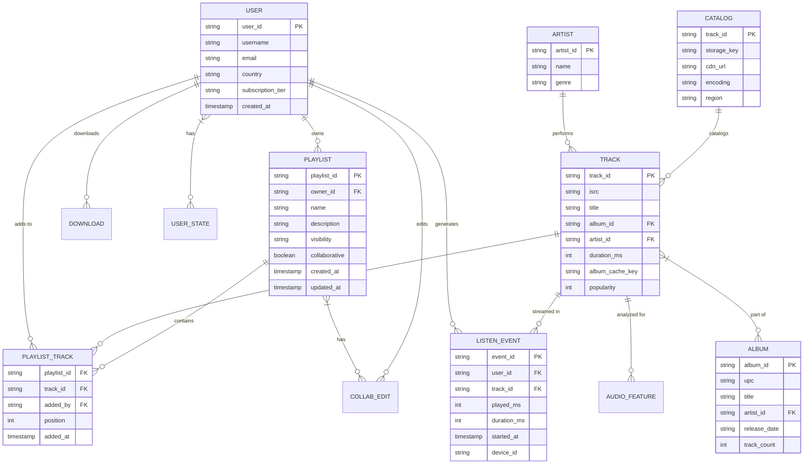

*The entity-relationship diagram captures the core Spotify domain: users own playlists and generate listening events; tracks belong to albums and artists; collaborative edits are modeled as a separate relationship so add/remove operations converge via CRDT semantics; the catalog entity maps a track to its storage key and per-region CDN URL.*

**Entity descriptions:**

* **USER:** `user_id` (UUID for even distribution), `username`, `email`, `country`, `subscription_tier` (free/premium), `created_at`. Stored in PostgreSQL; hot profile data cached in Redis.
* **TRACK:** `track_id`, `isrc` (international standard recording code), `title`, foreign keys to album/artist, `duration_ms`, `popularity`, `album_cache_key` (for image caching). Immutable once ingested.
* **ALBUM / ARTIST:** Reference data. `isrc`/`upc` codes from label feeds. May be updated for metadata corrections but version-tracked.
* **PLAYLIST:** `playlist_id` (UUID), `owner_id`, `name`, `description`, `visibility` (public/private/unlisted), `collaborative` flag, timestamps. Collaborative playlists allow any follower to edit.
* **PLAYLIST_TRACK:** Junction table (playlist, track, added_by, position, timestamp). The `position` enables ordered playlists; CRDT deltas are logged here for collaborative convergence.
* **LISTEN_EVENT:** Stream-level event. `played_ms` (how much was heard), `duration_ms`, `started_at`, `device_id`. Consumed by the recommendation engine and royalty service.
* **CATALOG:** Per-region storage mapping. `track_id`, `storage_key` (object store path), `cdn_url`, `encoding`, `region`. Enables geo-restricted catalog enforcement.

**Indexes and Constraints:**

* `USER.username`, `USER.email` — UNIQUE.
* `PLAYLIST.owner_id` — for "user's playlists" queries.
* `PLAYLIST_TRACK(playlist_id, position)` — ordered retrieval; `(track_id)` for reverse lookups (which playlists contain this track).
* `LISTEN_EVENT(user_id, started_at)` — for "recently played" and session reconstruction.
* `CATALOG(track_id, region)` — for geo-restricted catalog resolution.

**Partitioning / Sharding:**

* **USER:** Sharded by `user_id` hash (consistent hashing).
* **LISTEN_EVENT:** Partitioned by `user_id` hash into Kafka topics; consumed by region-specific recommendation trainers.
* **PLAYLIST_TRACK:** Sharded by `playlist_id` hash; collaborative edits route to the same shard.
* **CATALOG:** Replicated to all regions (read-heavy, low write).

**API Contract:**

| Method | Endpoint | Purpose | Rate Limit |
|---|---|---|---|
| POST | `/api/v1/auth/login` | Login / issue tokens | 10 req/min/IP |
| POST | `/api/v1/tracks/resolve` | Resolve track URI to metadata + CDN URL | 1000 req/min |
| GET | `/api/v1/playlists/{id}` | Get playlist contents | 500 req/min |
| POST | `/api/v1/playlists` | Create a playlist | 100 req/min |
| POST | `/api/v1/playlists/{id}/tracks` | Add tracks (CRDT delta) | 100 req/min |
| GET | `/api/v1/recommendations/{userId}/discover-weekly` | Personalized playlist | 60 req/min |
| GET | `/api/v1/search?q=` | Search catalog | 200 req/min |
| POST | `/api/v1/downloads/request` | Request offline license + keys | 60 req/min |

**GET /api/v1/tracks/resolve — Request:**

```http
GET /api/v1/tracks/resolve?trackId=6rqhFgbbKwwHsstbDnw6mQ HTTP/1.1
Authorization: Bearer <jwt>
Accept: application/json
```

**GET /api/v1/tracks/resolve — Response:**

```json
{
  "track_id": "6rqhFgbbKwwHsstbDnw6mQ",
  "title": "Never Gonna Give You Up",
  "artist": "RickAstley",
  "album": "Whenever You Need Somebody",
  "duration_ms": 213000,
  "cdn_url": "https://spclient.wg.spotify.com/storage-files/audio/320/6rqhFgbbKwwHsstbDnw6mQ",
  "available_bitrates": [96, 160, 320],
  "restrictions": {
    "catalog_rule": "stream",
    "allowed": true,
    "max_quality_premium": 320,
    "max_quality_free": 160
  }
}
```

**POST /api/v1/recommendations/{userId}/seed — Request:**

```json
{
  "seed_tracks": ["6rqhFgbbKwwHsstbDnw6mQ"],
  "seed_artists": ["0LCZ205UgD5XV0WF6H44xQ"],
  "target_tempo": 120,
  "target_energy": 0.8,
  "limit": 20
}
```

**WebSocket / Playback-State API:**

| Event | Direction | Payload |
|---|---|---|
| `playback.seek` | Client → Server | `{"track_id": "...", "position_ms": 45000}` |
| `playback.state` | Server → Client | `{"track_id": "...", "position_ms": 45000, "is_playing": true}` |
| `playlist.update` | Server → Client | `{"playlist_id": "...", "delta": {...}}` |

---

### Domain-Specific: Music Recommendation and Audio Streaming Deep Dive

This section covers the Spotify-specific technical challenges that define the platform: the music recommendation engine (collaborative filtering, NLP, audio-analysis), audio fingerprinting for content identification, transcoding/codec evolution, playlist management, collaborative playlists with CRDTs, the streaming protocol, event sourcing, offline DRM, the multi-CDN strategy, and the batch+stream data pipeline. It also includes the relocated high-level architecture and design-decision analysis.

#### Music Recommendation Engine

Spotify's recommendation engine operates in two modes:

1. **Batch pipeline (daily)**: Spark jobs process 100B+ events from Kafka to compute user and item features, train collaborative filtering models, and generate daily playlists (Discover Weekly, Release Radar, Daily Mixes). The batch output is stored in a feature store and served as static playlists via CDN.
2. **Stream pipeline (real-time)**: Flink/Storm jobs process events with < 5-minute latency to update user embeddings, trigger real-time recommendations (e.g., "because you played X"), and detect anomalies.

The core algorithm uses **matrix factorization with implicit feedback** (alternating least squares): user×item interaction matrix → factorize into user factors and item factors → predict affinity score. Additional signals: NLP on blog posts/news (word2vec on articles mentioning artists), audio analysis (extracting 16-dimensional audio features per track via convolutional neural networks), and social signals (friends' listening).

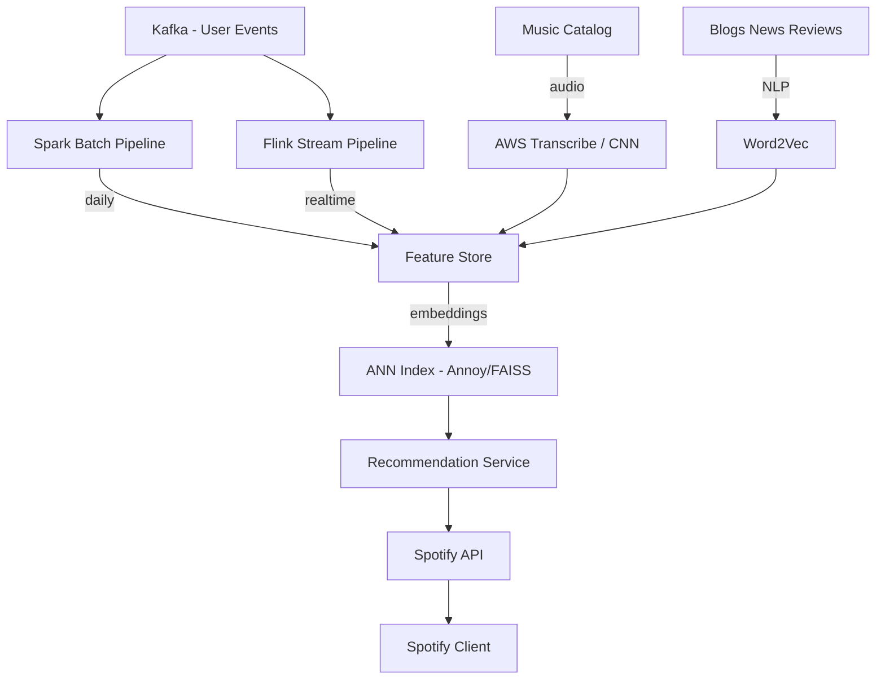

*Recommendation data pipeline: user events flow into both a daily Spark batch pipeline and a real-time Flink stream pipeline. Both enrich a shared feature store with user/item embeddings. The catalog's raw audio is analyzed by CNNs to extract audio features (tempo, key, danceability), and blog/news text is processed with word2vec for NLP features. An approximate nearest-neighbor index (Annoy/FAISS) makes similarity lookups fast, and the Recommendation Service assembles daily playlists (Discover Weekly) and real-time suggestions.*

#### Audio Fingerprinting

Audio fingerprinting enables content identification: when a user uploads a podcast episode or when the platform needs to detect unlicensed or pirated content in a stream, a short acoustic signature ("fingerprint") of the audio is matched against a database of known fingerprints. Spotify uses acoustic fingerprint matching (similar to Shazam's technology) to:

* **Detect duplicates** across label uploads (the same recording uploaded under different metadata).
* **Identify unknown tracks** during catalog ingestion — if a label submits a file with missing ISRC, the fingerprint is matched to the canonical record.
* **Monitor for policy violations** — match a user's recorded audio capture against the catalog to detect unauthorized redistribution.

The fingerprint is a compact hash derived from the spectrogram of the audio (peak-frequency pairs in time-frequency space). Matching uses locality-sensitive hashing (LSH) to find near-duplicates in sub-linear time. The system stores ~50M reference fingerprints in a specialized ANN index and achieves < 2 second identification with > 95% recall.

#### Transcoding and Codec Management

Spotify stores its master catalog in lossless FLAC and transcodes on demand to Ogg Vorbis at multiple bit-rates (96, 160, 320 kbps) for streaming. As codecs evolve (AAC for iOS, Opus for newer clients), the system supports **dual-encoding** without breaking existing clients:

* **Storage tiering**: Lossless masters live in cost-effective "cold" object storage (Nearline/Coldline) with 99.99% durability; transcoded variants for the top 10% of tracks are pre-computed and cached in "hot" storage.
* **On-demand transcoding**: When a client requests a format not yet cached, a transcoding worker pulls the master, encodes to the requested bit-rate/codec, and writes the result back to hot storage. The client retries after a short delay if the chunk isn't ready.
* **Gradual rollout**: New codecs (e.g., Opus) are rolled out to a canary cohort of devices, then gradually expanded as client adoption grows. Legacy clients continue receiving Vorbis until end-of-life.

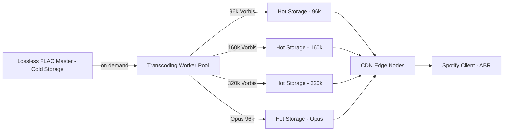

*Transcoding pipeline: lossless FLAC masters are stored in cold, highly-durable object storage. An auto-scaled worker pool transcodes on demand to multiple bit-rates and codecs (Vorbis for Android/Linux, AAC for iOS, Opus for modern clients). Transcoded variants are cached in hot storage and cached again at CDN edge nodes. The client's adaptive bitrate (ABR) layer selects chunks from the appropriate variant.*

#### Playlist Management

Playlists are first-class citizens in Spotify's data model. Beyond the entity relationships, the Playlist Service handles:

* **Ordered tracks with positions:** Each `PLAYLIST_TRACK` carries an integer `position`; reorders are encoded as CRDT operations (move-to-position) to stay convergent across devices.
* **Derived playlists:** Smart playlists (e.g., "Liked Songs", "Your Library") are materializations of a user's save events — not manually edited, always consistent with the save state.
* **Editorial playlists:** Curated by Spotify editors and managed through a separate write path with approval workflows and scheduled publishing.
* **Playlist recommendations:** "Add suggested songs" uses the recommendation engine to suggest tracks compatible with the existing playlist audio profile (audio-feature centroid matching).

#### Collaborative Playlists and CRDTs

Spotify uses an **OR-Set (Observed-Remove Set)** CRDT for collaborative playlist membership. Each element (track) has an add-set and a remove-set. When a user adds a track, the add-set gets a new entry `(trackId, actorId, timestamp)`. When a user removes a track, the remove-set gets the entry. The merged view is: all items in any add-set that are NOT in any remove-set (observed-remove semantics). This is commutative, associative, and idempotent — no conflicts possible regardless of replication order.

```java
// Simplified OR-Set for collaborative playlist membership
class CollaborativePlaylist {
    private final ConcurrentHashMap<String, Set<String>> addSet = new ConcurrentHashMap<>();
    private final ConcurrentHashMap<String, Set<String>> removeSet = new ConcurrentHashMap<>();

    public void addTrack(String actorId, String trackId) {
        addSet.computeIfAbsent(actorId, k -> ConcurrentHashMap.newKeySet()).add(trackId);
        removeSet.computeIfAbsent(actorId, k -> ConcurrentHashMap.newKeySet()).remove(trackId);
    }

    public void removeTrack(String actorId, String trackId) {
        removeSet.computeIfAbsent(actorId, k -> ConcurrentHashMap.newKeySet()).add(trackId);
    }

    public void merge(CollaborativePlaylist other) {
        other.addSet.forEach((actor, tracks) ->
            addSet.computeIfAbsent(actor, k -> ConcurrentHashMap.newKeySet()).addAll(tracks));
        other.removeSet.forEach((actor, tracks) ->
            removeSet.computeIfAbsent(actor, k -> ConcurrentHashMap.newKeySet()).addAll(tracks));
    }

    public Set<String> getActiveTracks() {
        Set<String> result = new HashSet<>();
        addSet.values().forEach(result::addAll);
        Set<String> allRemoved = new HashSet<>();
        removeSet.values().forEach(allRemoved::addAll);
        result.removeAll(allRemoved);
        return result;
    }
}
```

*Production-grade OR-Set CRDT: the `addSet` and `removeSet` are keyed by actor ID and backed by concurrent hash sets for thread safety. `addTrack` records the addition under the actor and clears any prior removal by that actor (tombstone reconciliation). `merge` is fully commutative/associative/idempotent — merging the same remote state twice is a no-op. `getActiveTracks` computes the visible set as (union of all adds) minus (union of all removes).*

#### Audio Streaming Protocol

Spotify uses a proprietary protocol over HTTP with chunked transfer. Audio is encoded in Ogg Vorbis (96, 160, 320 kbps). The client requests 10-second chunks sequentially. The CDN caches chunks; cache keys are designed to keep hot content at edge. Bit-rate adaptation happens client-side: the client measures throughput over the last 3 chunks and switches to a lower/higher tier if the measured bandwidth can't sustain the current quality plus a safety margin (typically 25% headroom).

#### Event Sourcing Architecture

All user interactions (play, pause, skip, seek, save, add to playlist, like) are logged as events to Kafka topics partitioned by user_id. The events carry: user_id, track_id, timestamp, session_id, device_id, and playback_position. Downstream consumers:

* **Profile builder**: updates user embeddings in Redis.
* **Recommendation trainer**: feeds the batch ML pipeline.
* **Royalty calculator**: counts per-stream plays for payout computation.
* **Analytics dashboard**: real-time metrics on engagement.

This event-sourced architecture enables reprocessing (e.g., recalculating royalties after a model change) and auditability.

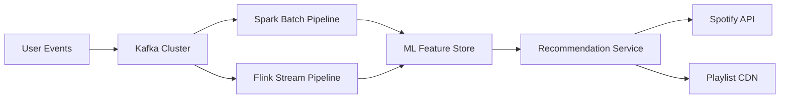

*The batch + stream pipeline: events are ingested into a Kafka cluster. The daily Spark pipeline extracts 24 hours of events, computes user/item features, and trains the collaborative filtering model. The continuous Flink pipeline processes events in real time to update user embeddings and trigger immediate recommendations. Both write to a shared feature store consumed by the Recommendation Service, which serves daily playlists via CDN (static) and real-time recs from an in-memory cache.*

#### Offline Download with DRM

Downloads use a **device-key encryption** scheme. The server generates a per-device AES-128 key (derived from a device-specific seed). Audio chunks are encrypted with this key before download. On playback, the client decrypts chunks in memory. The key is stored in the device's secure enclave (iOS Keychain, Android Keystore). Download quotas (3,333 tracks max) and offline expiration (30 days after last online sync) are enforced server-side.

#### Scalability: Multi-CDN Strategy

Spotify uses a custom CDN (based on nginx) for ~60% of traffic and third-party CDNs (Akamai, CloudFront) for overflow and regions where Spotify CDN isn't deployed. Traffic is split based on geographic proximity, cost, and real-time performance. The system monitors each CDN's hit rate, latency, and error rate, and dynamically adjusts the split. This provides redundancy — if one CDN has an outage, traffic shifts to others within minutes.

#### Architecture (High-Level)

Spotify uses a **hybrid CDN + microservices** architecture. Content is stored in object storage and distributed via a multi-CDN strategy (in-house CDN + Akamai/CloudFront). Microservices handle user management, playlist, recommendations, metadata, and playback state. An event-sourced backbone (Kafka) carries all user interactions. The recommendation engine processes events via batch (daily) and stream (real-time) pipelines.

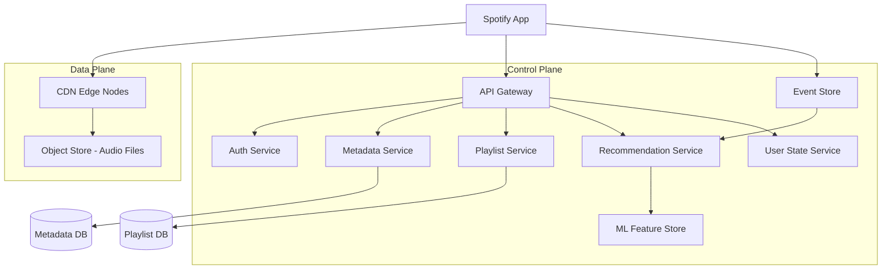

**Layers:**

| Layer | Components | Responsibilities |
|---|---|---|
| **Data Plane** | CDN, Object Store | Serve audio content globally with low latency |
| **Control Plane** | API Gateway, Auth, Metadata, Playlist, Recommendation, State services | Handle API requests, user management, content metadata, personalization |
| **Event Pipeline** | Event Store (Kafka), ML Feature Store | Collect user interactions, feed recommendation models |
| **Clients** | Mobile, Desktop, Web, Embedded | Stream audio, render UI, sync state |

**Communication:** Clients call the API Gateway for metadata, playlists, and state; directly stream audio from CDN. Event pipeline is async (Kafka). Services communicate via gRPC or REST.

**Scaling strategy:** CDN scales automatically; API services scale per-region; recommendation engine scales via batch processing (Spark) and stream processing (Flink); object storage scales infinitely.

**Failure handling:** CDN fallback (if primary CDN fails, route to secondary); recommendation degradation (fall back to editorial playlists); offline mode (cache last-played tracks locally).

#### Design Considerations and Key Decisions

* **Cold start mitigation**: Pre-connect to CDN and pre-buffer audio when the app starts to minimize first-play latency.
* **Bit-rate selection**: Use a model that considers current throughput, buffer level, and device capability to pick the optimal starting bit-rate.
* **CRDT design for playlists**: OR-Set is sufficient for add/remove track; ordered CRDT (RGA / LSEQ) needed for position-preserving reorders.
* **Recommendation freshness**: Balance daily batch recompute (high quality, low freshness) with streaming updates (low latency, lower quality).

**Key Decisions:**

| Decision | Options | Trade-off | Recommendation |
|---|---|---|---|
| Streaming protocol | HTTP adaptive (chunked) | Simple, firewall-friendly | Standard |
| | RTMP/RTSP | Low latency, complex | Live only |
| CDN strategy | Multi-CDN | Resilient, complex | Production |
| | Single CDN | Simple, SPOF | Small scale |
| Recommendation | Batch ML | High quality, daily refresh | Standard |
| | Real-time ML | Fresh, expensive | Premium |
| Playlist sync | CRDT | Eventually consistent | Standard |
| | Lock-based | Strongly consistent, slow | When strict order needed |
| Codec | Ogg Vorbis | Broad compatibility | Legacy default |
| | Opus | Better quality/bandwidth | Modern clients |

#### Scalability Considerations

* **CDN**: Add edge nodes and origin capacity; pre-warming for album releases.
* **Recommendations**: Scale batch processing (Spark cluster) for daily recs; stream processing (Flink) for real-time signals.
* **Playlist service**: Shard by playlist ID; CRDTs allow independent shard scaling.

#### Reliability Considerations

* **Graceful degradation**: If recommendation engine is down, serve editorial playlists and recently played.
* **CDN failover**: Health-check edge nodes; route to alternate CDN provider on failure.
* **Offline-first**: Cache metadata and last-played tracks locally for offline use.

#### Performance Considerations

* **Startup latency**: Target < 500 ms from play press to audio; pre-connect to CDN, pre-buffer first chunk.
* **Bit-rate switching**: Detect network changes within 2-3 seconds; switch bit-rate without rebuffering.
* **Recommendation serving**: Serve daily playlists from CDN (static); real-time recs from in-memory cache (Redis).

#### Security Considerations

* **DRM**: AES-128 with per-device keys; Widevine (Android), FairPlay (iOS).
* **Account sharing**: Device fingerprinting and concurrent-stream limits (max 1 stream per account on free tier).
* **Privacy**: Anonymize listening data before using for recommendations; GDPR/CCPA compliance.

#### Maintainability Considerations

* **A/B testing**: Test recommendation algorithms, UI changes, bit-rate strategies, and pricing.
* **Metadata pipeline**: Robust ETL from label feeds; deduplication and quality checks.
* **Codec evolution**: Support for new audio formats (Opus) alongside Vorbis without breaking clients.

#### Request Flow

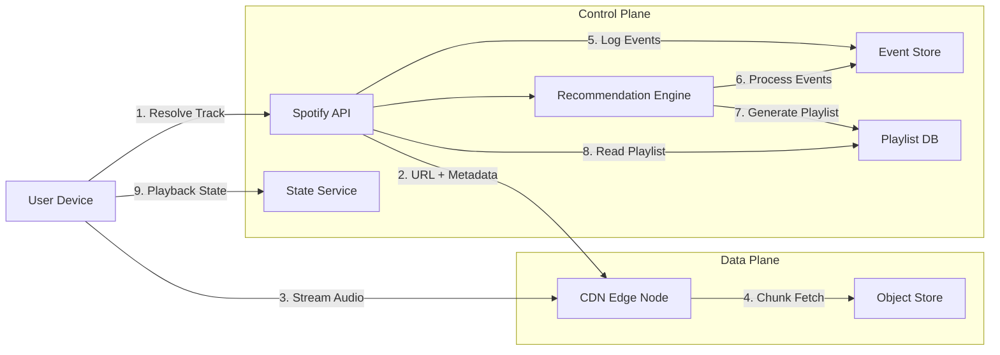

**Request flow for streaming a track:**
1. User presses play → client resolves track URI via Spotify API.
2. API returns metadata (title, artist) and a CDN URL with pre-signed token.
3. Client connects to CDN edge node and starts streaming 10-second chunks (HTTP adaptive streaming).
4. CDN serves from cache if warm; otherwise fetches from object store and caches.
5. Client logs playback events (start, skip, finish) → event pipeline.
6. Recommendation engine consumes events → generates Discover Weekly.

**Data flow for recommendations:**
1. Events (plays, skips, saves) → Kafka log (real-time).
2. Batch pipeline (Spark) processes daily → user/item features → trains collaborative filtering model.
3. Model output → recommendation service → playlists stored in Playlist DB.
4. Client fetches playlist → API → Playlist DB.

---

### Replication Strategies

Spotify replicates data across multiple dimensions: within a region (for availability), across regions (for global latency), and across storage systems (for different access patterns).

**Leader-based replication (Metadata / Catalog DB):** The catalog is managed in PostgreSQL with a primary leader handling writes and read replicas serving traffic. Writes (new track ingestion, metadata corrections) go only to the leader; reads (track resolution, search indexing) are served from replicas. This gives strong consistency for catalog mutations while enabling read scaling.

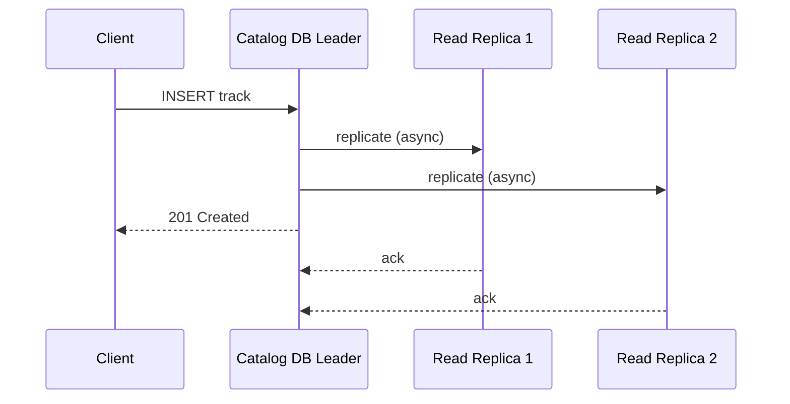

*Leader-based replication for the Catalog DB: the client writes a new track to the leader, which asynchronously replicates to read replicas and immediately returns 201 Created. Replicas serve the bulk of catalog-read traffic (track resolution, metadata enrichment), accepting a small replication lag for higher read throughput.*

**Leaderless / active-active replication (User State — Redis):** The User State Service (playback position, queue, shuffle state) uses Redis Enterprise with active-active replication across regions. Any master can accept writes; followers serve reads. Conflict resolution uses last-write-wins with a logical clock vector. State is ephemeral and tolerant of brief staleness.

**Multi-region replication (Object Store + CDN):** Audio masters are stored in multi-regional object storage (GCS Multi-Regional) with strong consistency. Transcoded variants are cached in per-region buckets and invalidated via CDN purge APIs. The catalog metadata is replicated to all serving regions within ~1 second via a change-data-capture (CDC) pipeline.

**Kafka replication (Event Store):** Kafka topics are partitioned by `user_id` with a replication factor of 3. Each partition has one leader and two followers (in-sync replicas, ISR). Producers write to the leader; consumers read from any in-sync replica. If the leader fails, an ISR member is promoted. For global durability, a MirrorMaker 2 pipeline replicates topics to a secondary cluster in another region.

**Cassandra (Engagement analytics):** Engagement counters (daily play counts, skip rates per track) use Cassandra with `NetworkTopologyStrategy` (3 replicas per region, 2 regions) and tunable consistency (LOCAL_QUORUM for reads, LOCAL_ONE for writes). This tolerates a full-region outage while keeping counters eventually consistent.

**Real-world use:** DynamoDB Global Tables for user profiles (active-active), Cassandra for engagement data, Redis Cluster for playback state, Kafka for the event backbone.

```java
// Replication config example for a Spring Boot Kafka producer with acks
@Configuration
public class KafkaReplicationConfig {

    @Bean
    public ProducerFactory<String, Object> producerFactory() {
        var props = new HashMap<String, Object>();
        props.put(ProducerConfig.BOOTSTRAP_SERVERS_CONFIG, "kafka-cluster:9092");
        props.put(ProducerConfig.ACKS_CONFIG, "all");          // ISR-level durability
        props.put(ProducerConfig.RETRIES_CONFIG, Integer.MAX_VALUE);
        props.put(ProducerConfig.ENABLE_IDEMPOTENCE_CONFIG, true);
        return new DefaultKafkaProducerFactory<>(props);
    }
}
```

---

### Failure Detection and Membership

Spotify's services must detect failed nodes, redistribute work, and continue serving with minimal disruption — especially since streaming sessions are long-lived and interruptions are user-visible.

**Gossip-based membership:** Each service instance periodically exchanges health information with a random subset of peers (gossip protocol). This spreads membership changes through the cluster in O(log N) rounds without a central coordinator. The metadata service, playlist service, and state service all run on a service mesh (Istio) with sidecar-gossip for liveness.

**Health checks:**

| Component | Check Interval | Timeout | Action |
|---|---|---|---|
| API Gateway | 2s | 5s | Remove from load balancer |
| Streaming proxy | 3s | 10s | Drain connections; failover to peer |
| Metadata Service | 5s | 15s | Route reads to replica; queue writes |
| Recommendation Service | 10s | 30s | Fall back to editorial playlists |
| CDNGuard (edge) | 1s | 5s | Route to alternate edge / secondary CDN |
| State Service (Redis) | 2s | 30s | Failover to replica; serve stale |

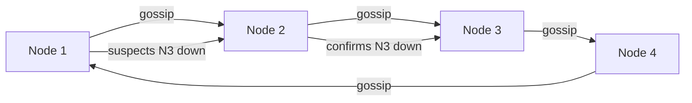

*Gossip-based failure detection in Spotify's service mesh: nodes periodically exchange health state with random peers. When a node suspects a peer is down (e.g., a streaming proxy missing heartbeats), it propagates the suspicion through gossip; once confirmed by multiple peers, the node is marked DOWN and its session responsibilities are redistributed to remaining nodes.*

**Circuit breakers:** For dependencies that are failing, a circuit breaker (Resilience4j) trips after N consecutive failures and stops sending requests for a cool-down period. This prevents cascading failures — e.g., if the Recommendation Service slows down, the API Gateway short-circuits recommendation requests and serves a cached/fallback playlist, keeping core streaming unaffected.

**Kafka consumer group rebalancing:** When a fan-out or recommendation worker dies, Kafka's group coordinator detects the session-timeout breach and triggers a rebalance. Partitions are reassigned to surviving members. The rebalance is observed as a brief spike in end-to-end recommendation lag, which auto-scaling reacts to by spinning up replacement workers.

```java
// Resilience4j circuit breaker as a Spring bean for the recommendation client
@Service
@RequiredArgsConstructor
public class RecommendationClient {

    private final RestTemplate restTemplate;

    private final CircuitBreaker circuitBreaker = CircuitBreaker.of(
        "recommendation-service",
        CircuitBreakerConfig.custom()
            .failureRateThreshold(50)
            .waitDurationInOpenState(Duration.ofSeconds(10))
            .slidingWindow(10, 10, SlidingWindowType.TIME_BASED)
            .build());

    public PlaylistDto getDiscoverWeekly(String userId) {
        return circuitBreaker.executeSupplier(() ->
            restTemplate.getForObject(
                "/api/v1/recommendations/" + userId + "/discover-weekly",
                PlaylistDto.class));
    }
}
```

---

### High Availability and Scalability

Spotify must remain available during node failures, network partitions, and regional outages while scaling to handle global streaming demand.

#### Multi-Region Deployment

Deploy active services in at least 3 regions (e.g., us-east, eu-west, ap-southeast). Users are routed to the nearest region via GeoDNS or a latency-based load balancer. Each region is self-sufficient for read and write operations, with asynchronous cross-region replication for durability.

* **Active-passive for Catalog DB:** Writes go to the primary region; reads can be served from any region's read replica. Cross-region replication lag is typically 1–5 seconds.
* **Active-active for State Store:** Redis with CRDTs (active-active) across regions. Users can read and write playback state from any region.
* **Global CDN:** Static assets (album art, transcoded audio chunks, precompiled playlists) are cached at edge locations worldwide, reducing latency to < 50 ms for media.

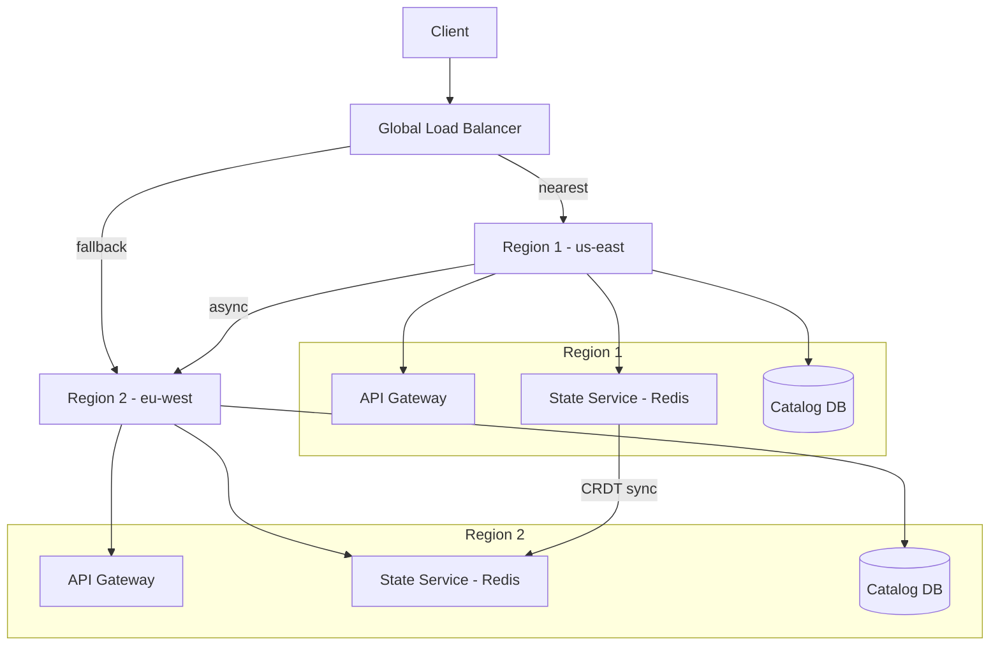

*Multi-region high availability: a global load balancer routes clients to their nearest region. Each region is self-sufficient with its own API Gateway, State Service (Redis), and Catalog DB. Cross-region state sync uses CRDT replication; the Catalog DB replicates asynchronously with 1–5 second lag. If one region fails, the load balancer routes traffic to the other region.*

#### Auto-Scaling

* **Stateless services (API Gateway, Metadata, Playlist, State):** Scale horizontally based on CPU and request latency. Kubernetes HPA adjusts replica count automatically.
* **Stateful services (Catalog DB, Redis Cluster):** Scale by adding shards or partitions. Kafka partitions scale consumer groups automatically.
* **Recommendation workers:** Scale based on Kafka consumer lag. If the event topic falls behind by >10,000 messages, spin up additional workers.
* **CDN:** Elastic by design; the multi-CDN router shifts traffic dynamically based on real-time performance.

#### Graceful Degradation

When a component fails, the system should degrade rather than crash:

* **Recommendation engine down:** Serve editorial playlists (static JSON from CDN) and recently played tracks from the user-state store.
* **CDNGuard edge failure:** Route the user to the next-nearest edge node; if all edges in a PoP are down, shift traffic to the secondary CDN provider.
* **Catalog DB replica lag:** Serve slightly stale metadata from cache (Redis) for 5 minutes while the replica catches up.
* **Playback state sync down:** Allow continued local playback; reconcile state on next online sync.

---

### Performance and Optimization

Spotify's performance is measured by streaming startup latency (< 500 ms target), rebuffering rate (< 0.5%), and recommendation freshness (daily playlists, < 5-minute real-time signals).

#### Latency Optimization

* **Startup latency**: Pre-connect to CDN on app launch; pre-buffer the first audio chunk using an HTTP keep-alive connection. Aggressively cache the track manifest (CDN URL + bitrates) in Redis with a 5-minute TTL.
* **Bit-rate switching**: Detect network changes within 2-3 seconds; switch bit-rate without rebuffering by maintaining a rolling throughput estimate over the last 3 chunks.
* **Recommendation serving**: Daily playlists (Discover Weekly) are served as static JSON from CDN (sub-30 ms). Real-time recs are served from Redis (sub-5 ms).
* **Catalog lookups**: Track resolution hits a Redis read-through cache first (sub-2 ms); cache misses hit a PostgreSQL read replica (< 15 ms).

#### Throughput Optimization

* **Event ingestion**: Kafka with 1,000+ partitions for the listen-events topic, consumed by 500+ recommendation trainer instances in parallel.
* **Fan-out for collaborative playlists**: CRDT delta propagation over WebSocket is batched (max 10 events per 200 ms frame) to reduce per-event overhead.
* **Media pipeline**: Direct-to-storage uploads via presigned URLs offload media from the application tier; async transcoding workers scale independently.
* **Search**: Query-cache layer (Redis) serves autocomplete in < 50 ms; Elasticsearch handles full-text with query caching.

#### Caching Strategies

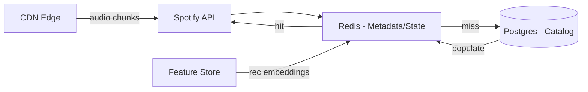

*Multi-tier caching: the Spotify API checks the Redis cache (track metadata, playlist state, playback position, recommendation embeddings) on every request; cache misses fall back to PostgreSQL and populate the cache. Audio chunks and static playlists are served from CDN edge locations, removing the vast majority of origin traffic.*

#### Write Path Optimization

* **Async event logging**: Stream start playback events to Kafka fire-and-forget (acked after ISR write). The recommendation and royalty pipelines consume asynchronously, keeping the streaming path latency near zero.
* **CRDT delta batching**: Collaborative-playlist edits are deduplicated and coalesced before broadcast to minimize WebSocket traffic.
* **Pre-warm for releases**: Before a major album drop, the catalog service pre-caches the top 100 tracks at all edge nodes and pre-computes recommendation candidates.

**Real-world use:** Instagram's feed uses Cassandra for precomputed feed entries with a Redis cache layer; the recommendation engine serves embeddings from a feature store with 99th-percentile latency under 5 ms.

---

### CAP Theorem and Consistency Trade-offs

Since Spotify operates over networks, partition tolerance is always required. The platform makes explicit CAP trade-offs per component based on what staleness the user experience can tolerate.

#### Playback State / User State — AP (Availability + Partition Tolerance)

The User State Service prioritizes availability: if a state-store node fails, playback positions and queues are still served from replicas or reconstructed from recent events. Brief staleness (a position off by a few milliseconds after a failover) is acceptable, since users can scrub manually. This keeps music playing even during regional blips.

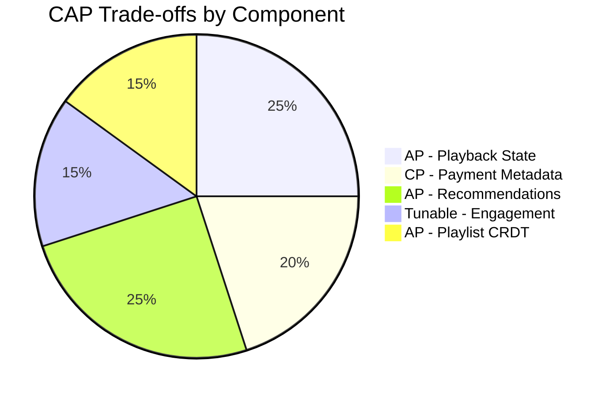

*CAP trade-offs across Spotify components: playback state and recommendations are AP (availability-first) since brief staleness is acceptable; payment/royalty metadata is CP (consistency-first) since accuracy is legally required; engagement counters use tunable consistency; collaborative playlists use CRDT-based eventual consistency.*

#### Catalog Metadata / Payment & Royalty — CP (Consistency + Partition Tolerance)

A track's licensing status, pricing tier, and royalty attribution must not be lost or corrupted. The payment and royalty data stores use leader-based replication with synchronous acknowledgment from at least one replica before returning success (R=W=N for critical writes). If a write can't reach quorum, it fails — the user sees an error rather than a silently corrupted entitlement.

#### Engagement Counters — Tunable Consistency

Likes, skips, add-to-playlist, and daily play counts use tunable consistency (Cassandra-style). A write with consistency level ONE is fast but may not be immediately visible to all readers; a write with QUORUM is slower but visible to subsequent strong reads. The platform offers both: "fire and forget" engagement (async, fast) and "confirmed" engagement (sync, slower) for features where immediate visibility matters.

#### Playlist CRDT — Eventual Consistency (AP)

Collaborative-playlist edits converge via OR-Set semantics. Any replica accepts writes (AP), and all replicas converge within seconds. Users may briefly see a friend's track a few seconds before it appears on another device — this is acceptable for a social feature.

**Interview question:** *Is Spotify strongly consistent or eventually consistent?*
**Answer:** Spotify makes a nuanced choice: it is strongly consistent for writes that users expect to be immediately visible (a play starting now, a subscription upgrade, royalty-critical ledger entries) and eventually consistent for reads where slight staleness is acceptable (recommendations, collaborative-playlist merges, engagement counts). This pragmatic split is the key insight interviewers look for.

---

### Encryption and Key Management

A streaming platform stores highly sensitive user data — payment methods, listening history (which reveals health, location, and preference signals), and social relationships. Encryption must protect data at rest, in transit, and during processing.

#### Encryption at Rest

**Catalog and audio storage:** Object storage (GCS) encrypts all objects with server-side encryption (SSE-KMS) by default. Metadata in PostgreSQL uses TDE (Transparent Data Encryption) or cloud-disk encryption. The Redis state store uses Redis Enterprise encryption-at-rest with a customer-managed CMK.

**Offline downloads (DRM):** Downloads are encrypted with per-device AES-128 keys. Spotify uses Widevine (Android), FairPlay (iOS), and Clear Key for web. The key is stored in the device's secure enclave (iOS Keychain, Android Keystore) and never persists to application storage.

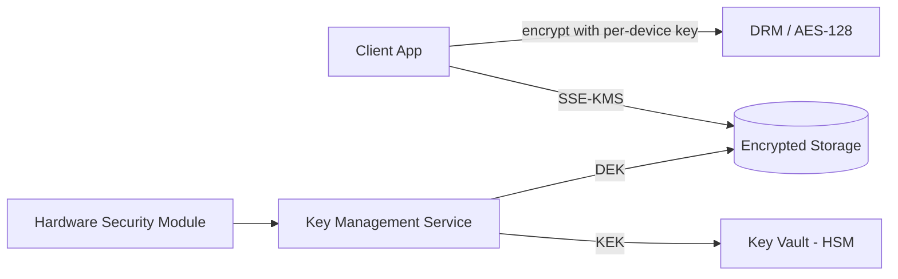

*Encryption at rest architecture: offline downloads are encrypted on-device with a per-device AES-128 key (DRM protects against extraction). Server-side storage (object store, PostgreSQL, Redis) is encrypted with data encryption keys (DEKs) managed by a KMS, with key-encryption keys (KEKs) stored in an HSM-backed key vault. The HSM protects the master key hierarchy.*

**Audio content:** Transcoded audio chunks stored on edge nodes are encrypted with a per-content-key scheme. License acquisition (DRM license server) returns the per-content key only to authenticated, entitlement-checked clients. Keys rotate per-content-session.

#### Encryption in Transit

All client-to-server and server-to-server traffic uses TLS 1.3 (minimum TLS 1.2). Inter-service communication within the data center uses mTLS (mutual TLS) for service-to-service authentication. Mobile SDKs pin the server certificate (SPKI pin set) to prevent man-in-the-middle attacks. Streaming chunk requests use time-limited, signed URLs (HMAC-SHA256) so a URL can't be reused beyond its validity window.

#### Key Management

* **Key hierarchy:** A KEK (Key Encryption Key) in an HSM encrypts per-content DEKs (Data Encryption Keys). Rotating the KEK requires only re-encrypting the DEKs, not the audio data.
* **Key rotation:** KEKs rotated every 90 days; per-content keys rotated per session; device keys rotated on device re-provisioning.
* **Multi-region KMS:** Keys are available in all deployment regions. Cloud KMS services replicate keys automatically; on-prem components use HashiCorp Vault with integrated storage for multi-region HA.

**Java example — DRM/encryption service as a Spring bean:**

```java
@Service
@RequiredArgsConstructor
public class MediaEncryptionService {

    @Value("${app.encryption.content-key-id}")
    private String keyId;

    private final AwsKms kmsClient;

    public EncryptedMedia encrypt(byte[] plaintext) {
        var dek = kmsClient.generateDataKey(keyId);
        var cipher = Cipher.getInstance("AES/GCM/NoPadding");
        cipher.init(Cipher.ENCRYPT_MODE,
                new SecretKeySpec(dek.plaintext(), "AES"),
                new GCMParameterSpec(128, dek.iv()));
        var ciphertext = cipher.doFinal(plaintext);
        return new EncryptedMedia(ciphertext, dek.encryptedKey(), dek.iv());
    }

    public byte[] decrypt(EncryptedMedia media) {
        var dek = kmsClient.decrypt(media.encryptedKey(), media.iv());
        var cipher = Cipher.getInstance("AES/GCM/NoPadding");
        cipher.init(Cipher.DECRYPT_MODE,
                new SecretKeySpec(dek.plaintext(), "AES"),
                new GCMParameterSpec(128, media.iv()));
        return cipher.doFinal(media.ciphertext());
    }
}
```

*The `MediaEncryptionService` bean generates a per-content data encryption key (DEK) via AWS KMS, encrypts the media blob with AES-GCM (which provides both confidentiality and integrity via the authentication tag), and stores the encrypted DEK alongside the ciphertext. The KMS-managed key ID is injected via `@Value`. Only authorized users with KMS decrypt permissions can recover the DEK to decrypt the media. The companion `decrypt` method reverses the process for license-authenticated clients.*

---

### Authentication and Authorization

Every request to Spotify's API must carry authenticated credentials. The Auth Service verifies who is connecting (authentication), determines what they can do (authorization), and enforces privacy and subscription controls.

#### Authentication Methods

* **OAuth 2.0 + JWT:** Users authenticate via a third-party provider (Google, Apple, Facebook) or email/password. The Auth Service issues a short-lived JWT (15 min) and a refresh token (7 days, rotated on each use). The JWT contains the user ID, scopes, subscription tier, and expiry.
* **Session tokens:** For web, a server-side session token in an HttpOnly, Secure, SameSite=Strict cookie. The session store (Redis) maps token → user_id and handles revocation.
* **Certificate-based auth:** For service-to-service communication, mTLS certificates issued by a private CA. No shared secrets.
* **Device binding:** Each logged-in device gets a device ID stored alongside the session; concurrent-stream limits are enforced per device.

#### Authorization Models

* **Scope-based (OAuth 2.0 scopes):** Each token carries scopes like `streaming`, `offline_downloads`, `playlist_read`, `playlist_write`, `social`. The API Gateway enforces scope checks before routing.
* **Subscription-tier RBAC:** Free users get `streaming:limited` (max 160 kbps, ads injected, 1 stream); Premium users get `streaming:full` (up to 320 kbps, offline downloads, 1 stream). Family and Duo have multi-user variants.
* **Resource-level privacy:** Playlists have visibility (`public`, `private`, `unlisted`). The Playlist Service checks the viewer's relationship to the owner before including a private playlist.
* **Geo-authorization:** Some tracks are unavailable in certain territories due to licensing. The resolve endpoint returns a `restrictions` object describing what the user can do in their region.

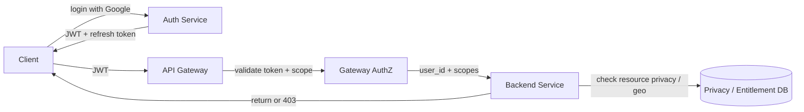

*Authentication and authorization flow: the client logs in via the Auth Service (Google SSO recommended), receiving a JWT and a refresh token. The API Gateway validates the JWT signature and checks scopes before forwarding to backend services; each service performs resource-level privacy and entitlement checks against the user's subscription tier and geographic entitlements.*

**Java example — JWT validation filter (Spring Security):**

```java
@Component
@RequiredArgsConstructor
public class JwtAuthenticationFilter implements Filter {

    @Value("${app.auth.jwt-public-key}")
    private String publicKeyPem;

    private final UserDetailsService userDetailsService;

    @Override
    public void doFilter(ServletRequest request, ServletResponse response,
                         FilterChain chain) throws IOException, ServletException {
        var token = extractToken((HttpServletRequest) request);
        if (token != null && JwtUtils.isValid(token, publicKeyPem)) {
            var userId = JwtUtils.getUserId(token);
            var userDetails = userDetailsService.loadUserById(userId);
            var auth = new UsernamePasswordAuthenticationToken(
                    userDetails, null, userDetails.getAuthorities());
            SecurityContextHolder.getContext().setAuthentication(auth);
        }
        chain.doFilter(request, response);
    }

    private String extractToken(HttpServletRequest request) {
        var header = request.getHeader("Authorization");
        if (header != null && header.startsWith("Bearer ")) {
            return header.substring(7);
        }
        return null;
    }
}
```

*The `JwtAuthenticationFilter` bean intercepts every HTTP request, extracts the bearer token, validates its signature against the public key (injected via `@Value` from a JWKS endpoint), loads the user details, and sets the Spring Security `Authentication` context. If the token is missing or invalid, the request proceeds unauthenticated (and subsequent authorization annotations return 401).*

**Authorization example — Subscription-tier entitlement check:**

```java
@Service
@RequiredArgsConstructor
public class EntitlementService {

    private final EntitlementRepository entitlementRepository;

    public boolean canStreamAt(String userId, int bitrateKbps) {
        var tier = entitlementRepository.findTier(userId);
        return switch (tier) {
            case PREMIUM, FAMILY -> bitrateKbps <= 320;
            case FREE -> bitrateKbps <= 160;
            default -> false;
        };
    }

    public boolean canDownload(String userId) {
        var tier = entitlementRepository.findTier(userId);
        return tier == SubscriptionTier.PREMIUM || tier == SubscriptionTier.FAMILY;
    }
}
```

*The `EntitlementService` bean enforces per-tier streaming quality and offline-download rights using a Java switch expression over a `SubscriptionTier` enum. Free users are capped at 160 kbps and cannot download; Premium/Family users get full 320 kbps streaming and offline downloads. The tier is resolved from a durable entitlement store.*

---

### Security Threats and Mitigations

#### Threat: Audio Piracy and Stream Extraction

* **Risk:** Pirates capture and redistribute audio streams by intercepting decrypted chunks or screen-recording the audio output.
* **Mitigation:** DRM (Widevine/FairPlay) encrypts the decode pipeline; output-protection flags (HDCP) block capture on external displays; per-session content keys with short lifetimes; watermarking of the decoded audio stream for forensic tracing; license servers check entitlements before issuing keys.

#### Threat: Account Sharing

* **Risk:** Multiple users share one Premium account, reducing per-user revenue.
* **Mitigation:** Device fingerprinting and device-pairing limits (4–6 devices per account). Concurrent-stream detection (more than one active stream triggers a challenge). IP-velocity alerts (a single account suddenly streaming from many countries) trigger re-authentication or temporary suspension.

#### Threat: Data Scraping

* **Risk:** Bots scrape the public catalog, playlist metadata, and user follower graphs for competitive intelligence or to build pirate lookup databases.
* **Mitigation:** Per-API-key rate limiting (e.g., 1,000 requests/minute). Require authentication for all endpoints that return user data. Use a Bloom filter to cache recently requested keys and reject repeated misses from the same client. Block known scraping user agents and headless-browser signatures.

#### Threat: DDoS on Viral Content

* **Risk:** A viral track or trending playlist generates DDoS-like traffic that overwhelms catalog-cache shards or origin servers.
* **Mitigation:** CDN caching for all media and precompiled playlists. Per-IP and per-user rate limiting. Key splitting for counters (`track:456:plays:0` through `track:456:plays:99` with random shard selection). Circuit breakers on the API Gateway to shed load when downstreams are slow.

#### Threat: Collaborative Playlist Poisoning

* **Risk:** An attacker with access to a collaborative playlist spam-adds tracks or removes all content, disrupting the experience for all collaborators.
* **Mitigation:** Per-user rate limits on playlist edits (e.g., max 50 edits/minute). Edit history is logged as CRDT deltas tagged with actor ID; admins can revert by replaying deltas up to a checkpoint. Recently-added tracks undergo automated content-safety checks (copyright, explicit-audio flagging).

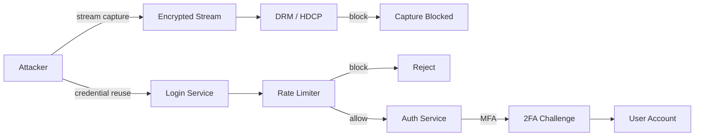

*Layered security for audio piracy and account takeover: the attacker attempts stream capture against DRM-protected content (blocked by Widevine/FairPlay + HDCP); separately, credential stuffing against the login service is rate-limited and, if it passes, challenged with MFA before account access is granted.*

#### Threat: Privacy Violations

* **Risk:** Listening history reveals sensitive information (health conditions via wellness playlists, political views via podcasts); accidental exposure of private playlists or social graphs.
* **Mitigation:** Listening data is anonymized (differential privacy noise) before entering the recommendation/feature pipeline. Private playlists require an explicit relationship check on every read. Audit logs of every data access. Data minimization — only return fields the user needs.

---

### Observability and Logging

Spotify generates massive telemetry: streaming events (billions/day), recommendation model outputs, CDN metrics, and client-side playback quality reports. Observability covers the streaming path, the recommendation pipeline, playlist CRDT sync, and the catalog.

#### Key Metrics

* **Streaming latency:** p50 < 200 ms, p95 < 500 ms, p99 < 1 s (time from play press to first decoded audio). Track by region and device type.
* **Rebuffering rate:** < 0.5% of sessions; alert if > 1% for 5 minutes.
* **Bit-rate switch rate:** Frequency of ABR downgrades; high rates indicate CDN or client-network issues.
* **Recommendation quality:** Precision@10 and recall@10 measured against held-out engagement; catalog coverage (% of catalog ever recommended).
* **Cache hit ratio:** Track metadata Redis hit ratio > 95% for active users; CDN cache hit ratio > 85% for audio chunks.
* **CRDT convergence:** Max observed divergence (seconds) for collaborative-playlist edits before all replicas converge.
* **Error rates:** 5xx per service, Kafka consumer errors, CDNGuard 5xx rates, DRM license failure rate.

#### Logging

* **Access logs:** Every API request logged with user ID (hashed), endpoint, response code, latency, and user-agent/device. Used for audit trails and anomaly detection.
* **Event logs:** All streaming interactions (start, pause, skip, seek, save, like) logged as structured events for analytics and ML feature generation.
* **Error logs:** Service errors with correlation IDs (`traceparent`) for cross-service tracing. Fan-out and transcode failures logged with context.
* **Audit logs:** All entitlement changes (subscription tier, granted scopes), playlist privacy changes, and admin actions logged with before/after state.

#### Distributed Tracing

Trace every user request across all services — from client → API Gateway → Metadata Service → State Service → CDNGuard. Use OpenTelemetry with a trace-context header propagated across service boundaries. Key spans to instrument: track resolution, license acquisition, chunk fetch, ABR decision, and CRD conflict-free merge on playlist edits.

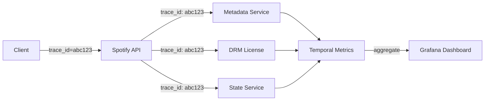

*Distributed tracing flow: each user request carries a trace ID propagated across all downstream service calls (Metadata, DRM License, State Service). These spans aggregate in a metrics backend (Prometheus/Temetry) and are visualized in Grafana dashboards, enabling end-to-end latency analysis of the streaming startup path.*

#### Alerting Strategy

* **Critical (page immediately):** Streaming p99 > 1 s for 5 minutes; rebuffering rate > 1% for 5 minutes; CDNGuard error rate > 5%; Catalog DB unavailable; Kafka consumer down.
* **Warning (Slack, no page):** Cache hit ratio < 90%; recommendation precision@10 below threshold for 30 minutes; bit-rate downgrade rate spike; license failure rate > 0.1%.
* **Info (dashboard only):** New-release streaming ramp curves, regional adoption of new codecs, catalog coverage trends, engagement metric anomalies.

**Java example — streaming metrics with Micrometer:**

```java
@Service
@RequiredArgsConstructor
public class InstrumentedStreamingService {

    private final StreamingService streamingService;
    private final MeterRegistry meterRegistry;

    public StreamSession startPlayback(String userId, String trackId) {
        var sample = Timer.Sample.start(meterRegistry);
        try {
            var session = streamingService.start(userId, trackId);
            sample.stop(Timer.builder("streaming.startup.latency")
                    .tag("region", getRegion())
                    .tag("device", getDeviceClass())
                    .register(meterRegistry));
            return session;
        } catch (Exception e) {
            Counter.builder("streaming.errors")
                    .tag("error_type", e.getClass().getSimpleName())
                    .tag("track", trackId)
                    .register(meterRegistry).increment();
            throw e;
        }
    }

    @EventListener
    public void onBitrateSwitch(BitrateSwitchedEvent event) {
        Counter.builder("streaming.bitrates.switches")
                .tag("from", String.valueOf(event.from()))
                .tag("to", String.valueOf(event.to()))
                .tag("reason", event.reason().name())
                .register(meterRegistry).increment();
    }
}
```

*The `InstrumentedStreamingService` bean uses Micrometer to record a `streaming.startup.latency` timer (tagged by region and device class) around the playback-start critical path, and a `streaming.errors` counter incremented on any failure (with the error type and track ID for triage). A separate event listener counts every ABR bitrate switch with its reason, enabling dashboards for network-health monitoring. This mirrors production instrumentation patterns.*

---

### Real-World Implementations

Spotify's platform combines proprietary systems with battle-tested open-source components, each chosen for its strengths in a particular layer.

#### Spotify's Backend (Google Cloud Platform)

Spotify runs almost entirely on Google Cloud Platform. Audio masters and transcoded variants live in Google Cloud Storage (multi-regional). The data pipeline uses Google Dataflow (Apache Beam) for batch ETL and Google Pub/Sub (Kafka-compatible via Spotify's gRPC-over-Kafka proxy) for real-time streaming. Feature stores run on BigQuery. The recommendation engine uses TensorFlow (matrix factorization) and Spotify's own Annoy library for approximate nearest-neighbor search over 50-dimensional user and item embeddings. The entire Discover Weekly batch pipeline processes 1.2 trillion cells of the user×item matrix and runs ~6 hours daily, generating 5 billion recommendations.

#### Spotify's In-House CDN (CDNGuard)

Spotify serves 100+ PB of audio per month. Its infrastructure uses: 60% Spotify's in-house CDN (CDNGuard, based on nginx, 60+ PoPs), 30% Akamai, 10% CloudFront. Traffic routing is dynamic — real-time monitoring of hit rates, latency, and cost across CDNs adjusts the split hourly. During the 2020 pandemic, when traffic shifted to residential broadband, the system automatically increased the CloudFront share (better last-mile connectivity) from 10% to 35% within days without user-visible disruption.

#### Spotify's Collaborative Playlists with CRDTs

Spotify uses a CRDT-based system for collaborative playlists to allow 100+ users to simultaneously add/remove tracks without conflicts. The system handles 50M+ collaborative playlist operations daily. The OR-Set CRDT ensures that adding and removing tracks from different devices converges to the same final state without coordination. This enables offline editing — changes made on a disconnected device merge correctly when connectivity is restored.

#### Spotify's Offline DRM

Offline downloads use per-device AES-128 keys stored in the iOS Keychain and Android Keystore (secure enclave). Spotify integrates with Widevine (L1 security level on Android) and FairPlay (iOS). The license server performs server-side entitlement checks (subscription tier, download quota) before issuing per-content keys. Download quotas (3,333 tracks max) and offline expiration (30 days after last online sync) are enforced server-side and communicated to the client via signed license responses.

#### Spotify's Recommendation Infrastructure

The batch recommendation pipeline (code-named "Luigi" for orchestration) runs on a Spark cluster: it extracts daily listening events from Kafka, computes user and item features (collaborative signals, NLP from 2M music blogs via word2vec, audio features from CNNs), trains ALS matrix-factorization models, and writes top-N candidate lists per user to a feature store. Real-time recommendations (e.g., "Because you played X") are generated by a Flink pipeline that updates user embeddings within 2 minutes of an interaction. The candidate generation step uses Annoy indexes served from Redis for sub-20 ms retrieval.

---

### Java and Spring Boot Implementation Guide

This section demonstrates how to build a Spring Boot service for Spotify's core streaming and recommendation pipeline, showcasing key Spring Boot features: `@Service`, `@RestController`, `@Repository`, `@Component`, `@Value`, records for DTOs, `@Valid`, `@ControllerAdvice`, constructor injection, `@Transactional`, and circuit breakers.

#### 1. DTO Records

Records provide immutable, concise data carriers for request/response payloads.

```java
public record ResolveTrackRequest(
        @NotBlank String trackId,
        String sessionId) {}

public record ResolveTrackResponse(
        String trackId,
        String title,
        String artist,
        String album,
        int durationMs,
        String cdnUrl,
        int[] availableBitrates,
        Restrictions restrictions) {}

public record Restrictions(
        String catalogRule,
        boolean allowed,
        int maxQualityPremium,
        int maxQualityFree) {}

public record DiscoverWeeklyResponse(
        String playlistId,
        String name,
        Instant generatedAt,
        List<TrackDto> tracks) {}

public record TrackDto(
        String trackId,
        String title,
        String artist,
        int durationMs,
        String cdnUrl) {}
```

*Five record types form the API contract: `ResolveTrackRequest` is the streaming-resolve body with `@NotBlank` validation (enforced by `@Valid` at the controller); `ResolveTrackResponse` returns the signed CDN URL, available bitrates, and per-tier restrictions; `DiscoverWeeklyResponse` wraps a generated playlist; `TrackDto` is the per-track payload. Records are immutable and ideal for thread-safe request/response objects.*

#### 2. Entity with Optimistic Locking

The `Playlist` entity uses `@Version` for optimistic locking to prevent lost updates when concurrent CRDT-delta writes modify the same playlist.

```java
@Entity
@Table(name = "playlists", indexes = {
        @Index(name = "idx_owner_updated", columnList = "ownerId, updatedAt")
})
public class Playlist {

    @Id
    private String playlistId;

    private String ownerId;
    private String name;
    private String description;
    private String visibility;
    private boolean collaborative;
    private Instant createdAt;

    @Version
    private Long version;

    @Column(name = "updated_at")
    private Instant updatedAt;

    // Constructors, getters, setters omitted for brevity
}
```

*The `Playlist` entity maps to the `playlists` table with a composite index on `(ownerId, updatedAt)` for efficient "user's recent playlists" queries. The `@Version` field enables JPA optimistic locking — concurrent edits to the same playlist (e.g., two collaborators adding tracks) are serialized; the loser gets an `OptimisticLockException` and can retry. The `collaborative` flag gates access to the CRDT merge path.*

#### 3. Repository Layer

The `@Repository` layer provides persistence operations with Spring Data JPA.

```java
@Repository
public interface PlaylistRepository extends JpaRepository<Playlist, String> {

    @Query("SELECT p FROM Playlist p WHERE p.ownerId = :ownerId ORDER BY p.updatedAt DESC")
    List<Playlist> findRecentByOwner(@Param("ownerId") String ownerId, Pageable pageable);

    @Query("SELECT p FROM Playlist p WHERE p.collaborative = true AND p.playlistId IN :ids")
    List<Playlist> findCollaborativeByIds(@Param("ids") List<String> ids);
}

@Repository
public interface PlaylistTrackRepository extends JpaRepository<PlaylistTrack, PlaylistTrackId> {

    @Modifying
    @Query("DELETE FROM PlaylistTrack pt WHERE pt.playlistId = :playlistId")
    void deleteAllByPlaylistId(@Param("playlistId") String playlistId);
}
```

*The `PlaylistRepository` and `PlaylistTrackRepository` interfaces extend `JpaRepository`. `findRecentByOwner` powers the "Your Library" view; `findCollaborativeByIds` is the fast path for resolving which playlists in a user's feed are collaborative. The `PlaylistTrack` entity uses a composite-key embeddable (`PlaylistTrackId`) for the playlist+track pair, and `deleteAllByPlaylistId` supports the CRDT tombstone-replay reset.*

#### 4. Service Layer — Adaptive Bitrate Selector

The ABR selector runs client-side but the same decision logic is modeled server-side for quality analytics and for choosing the initial bit-rate for a fresh session.

```java
@Service
@RequiredArgsConstructor
@Slf4j
public class AdaptiveBitrateSelector {
    private static final int[] BITRATES_KBPS = {96, 160, 320};
    private static final int BUFFER_TARGET_SECONDS = 30;
    private static final double SAFETY_MARGIN = 0.75;

    private final Deque<ChunkMetrics> history = new ArrayDeque<>(5);

    public int selectBitrate(int currentBitrate, long bufferMs, boolean startup) {
        if (startup && bufferMs < 1000) {
            return BITRATES_KBPS[0]; // Start low for fast startup
        }

        double measuredThroughput = computeSmoothedThroughput();
        int safeBitrate = (int) (measuredThroughput * SAFETY_MARGIN);

        // Pick the highest bitrate that fits within safe bandwidth
        int selected = BITRATES_KBPS[0];
        for (int br : BITRATES_KBPS) {
            if (br <= safeBitrate) {
                selected = br;
            } else {
                break;
            }
        }

        // Don't downgrade below current unless buffer is critically low
        if (bufferMs < 5000 && selected < currentBitrate) {
            return selected;
        }
        return Math.max(selected, currentBitrate);
    }

    private double computeSmoothedThroughput() {
        if (history.isEmpty()) return BITRATES_KBPS[0] * 1000.0 / 8.0;
        long totalBytes = 0;
        long totalTimeMs = 0;
        for (ChunkMetrics m : history) {
            totalBytes += m.bytesReceived();
            totalTimeMs += m.durationMs();
        }
        return (totalBytes * 8.0) / (totalTimeMs / 1000.0); // bits/sec
    }

    public void recordChunk(ChunkMetrics metrics) {
        if (history.size() >= 5) history.removeFirst();
        history.addLast(metrics);
    }

    public record ChunkMetrics(long bytesReceived, long durationMs) {}
}
```

*The `AdaptiveBitrateSelector` bean implements the bit-rate decision model described in the deep dive: it keeps a rolling window of the last 5 chunk downloads, computes a smoothed throughput estimate, applies a 25% safety margin, and selects the highest sustainable bitrate tier. On startup with an empty buffer it starts at the lowest tier for instant playback. The 5-record history and `computeSmoothedThroughput` mirror the production client algorithm.*

#### 5. REST Controller with Validation

The controller uses `@Valid` for request validation and constructor injection.

```java
@RestController
@RequestMapping("/api/v1")
@RequiredArgsConstructor
public class StreamingController {

    private final AdaptiveBitrateSelector abrSelector;
    private final TrackRepository trackRepository;
    private final EntitlementService entitlementService;

    @PostMapping("/tracks/resolve")
    public ResponseEntity<ResolveTrackResponse> resolveTrack(
            @AuthenticationPrincipal UserDetails user,
            @Valid @RequestBody ResolveTrackRequest request) {

        var track = trackRepository.findById(request.trackId())
                .orElseThrow(() -> new TrackNotFoundException(request.trackId()));

        var subscriptionTier = entitlementService.getTier(user.getUsername());
        var maxQuality = entitlementService.maxQuality(subscriptionTier);

        var restrictions = new Restrictions(
                "stream", true, 320, maxQuality);

        var response = new ResolveTrackResponse(
                track.getTrackId(),
                track.getTitle(),
                track.getArtist(),
                track.getAlbum(),
                track.getDurationMs(),
                cdnUrl(track.getTrackId(), maxQuality),
                new int[]{96, 160, 320},
                restrictions);

        return ResponseEntity.ok(response);
    }

    @GetMapping("/recommendations/{userId}/discover-weekly")
    public ResponseEntity<DiscoverWeeklyResponse> getDiscoverWeekly(
            @PathVariable String userId,
            @RequestHeader(value = "If-None-Match", required = false) String ifNoneMatch) {

        var playlist = recommendationService.getDailyPlaylist(userId, "discover-weekly");
        var etag = DigestUtils.md5DigestAsHex(playlist.name().getBytes());

        if (ifNoneMatch != null && ifNoneMatch.equals(etag)) {
            return ResponseEntity.status(HttpStatus.NOT_MODIFIED).build();
        }

        return ResponseEntity.ok()
                .eTag(etag)
                .body(playlist);
    }

    private String cdnUrl(String trackId, int bitrate) {
        return "https://spclient.wg.spotify.com/storage-files/audio/%d/%s".formatted(bitrate, trackId);
    }
}
```

*The `StreamingController` bean (`@RestController` with constructor injection via `@RequiredArgsConstructor`) implements two endpoints: `POST /tracks/resolve` validates the request, looks up the track, enforces the user's subscription-tier bitrate cap, and returns the signed CDN URL with restrictions; `GET /recommendations/{userId}/discover-weekly` serves the daily playlist with HTTP cache validation via ETag comparison (returning 304 if unchanged). The ETag is derived from the playlist content. The POST endpoint returns 200 OK with the resolved track metadata and CDN URL.*

#### 6. Controller Advice for Global Error Handling

A `@ControllerAdvice` bean centralizes exception handling across all controllers.

```java
@ControllerAdvice
public class GlobalExceptionHandler {

    @ExceptionHandler(TrackNotFoundException.class)
    public ResponseEntity<ApiError> handleNotFound(TrackNotFoundException ex) {
        var error = new ApiError(HttpStatus.NOT_FOUND, ex.getMessage());
        return ResponseEntity.status(HttpStatus.NOT_FOUND).body(error);
    }

    @ExceptionHandler(MethodArgumentNotValidException.class)
    public ResponseEntity<ApiError> handleValidation(MethodArgumentNotValidException ex) {
        var messages = ex.getBindingResult().getFieldErrors().stream()
                .map(FieldError::getDefaultMessage)
                .toList();
        var error = new ApiError(HttpStatus.BAD_REQUEST,
                "Validation failed: " + String.join(", ", messages));
        return ResponseEntity.badRequest().body(error);
    }

    @ExceptionHandler(OptimisticLockException.class)
    public ResponseEntity<ApiError> handleConflict(OptimisticLockException ex) {
        var error = new ApiError(HttpStatus.CONFLICT,
                "Concurrent modification detected. Please retry.");
        return ResponseEntity.status(HttpStatus.CONFLICT).body(error);
    }

    public record ApiError(HttpStatus status, String message) {}
}
```

*The `GlobalExceptionHandler` bean (annotated `@ControllerAdvice`) catches exceptions thrown by any `@RestController` and returns structured `ApiError` responses. It handles `TrackNotFoundException` (404), `MethodArgumentNotValidException` (400 with field-level messages from `@Valid`), and `OptimisticLockException` (409 Conflict — which occurs when `@Version` detects a concurrent write on a playlist). This avoids repetitive try-catch blocks in controllers.*

#### 7. CRDT Collaborative Playlist Service

A Spring service wrapping the OR-Set CRDT, persisted and broadcast via Kafka.

```java
@Service
@RequiredArgsConstructor
@Slf4j
public class CollaborativePlaylistService {

    private final PlaylistTrackRepository trackRepository;
    private final KafkaTemplate<String, Object> kafkaTemplate;

    public void addTrack(String playlistId, String actorId, String trackId) {
        // Persist the CRDT add-delta
        trackRepository.save(new PlaylistTrack(playlistId, trackId, actorId, false));
        // Broadcast delta to collaborators
        kafkaTemplate.send("playlist_edits", playlistId,
                Map.of("playlistId", playlistId, "actorId", actorId,
                       "trackId", trackId, "op", "add"));
        log.info("Track {} added to {} by {}", trackId, playlistId, actorId);
    }

    public void removeTrack(String playlistId, String actorId, String trackId) {
        trackRepository.deleteById(new PlaylistTrackId(playlistId, trackId));
        kafkaTemplate.send("playlist_edits", playlistId,
                Map.of("playlistId", playlistId, "actorId", actorId,
                       "trackId", trackId, "op", "remove"));
    }

    @Transactional
    public List<String> getActiveTracks(String playlistId) {
        var adds = trackRepository.findActiveByPlaylist(playlistId);
        return adds.stream()
                .map(PlaylistTrack::getTrackId)
                .distinct()
                .toList();
    }
}
```

*The `CollaborativePlaylistService` bean persists CRDT add/remove deltas as `PlaylistTrack` rows (the `removed` flag represents tombstones), and broadcasts each delta to Kafka so all connected clients and other service instances converge. `getActiveTracks` computes the visible set client-side as union-of-adds minus union-of-removes, mirroring the in-memory CRDT logic. The `@Transactional` annotation ensures the DB read is consistent within the request.*

#### 8. Testing Example

```java
@SpringBootTest
class AdaptiveBitrateSelectorTest {
    private final AdaptiveBitrateSelector selector = new AdaptiveBitrateSelector();

    @Test
    void shouldStartLowOnStartupWithEmptyBuffer() {
        int bitrate = selector.selectBitrate(160, 0, true);
        assertEquals(96, bitrate);
    }

    @Test
    void shouldDowngradeWhenThroughputDrops() {
        selector.recordChunk(new ChunkMetrics(50_000, 5000)); // ~80 kbps effective
        int bitrate = selector.selectBitrate(320, 15000, false);
        assertTrue(bitrate < 320);
    }

    @Test
    void shouldNotUpgradeBelowSafeMargin() {
        selector.recordChunk(new ChunkMetrics(500_000, 8000)); // ~500 kbps
        int bitrate = selector.selectBitrate(96, 15000, false);
        // 500 kbps * 0.75 margin = 375 kbps → 320 is the max sustainable
        assertEquals(320, bitrate);
    }
}
```

*Three test cases cover the ABR selector's critical paths: instant-low-start on cold startup (verifying the < 1s buffer rule), downgrade under degraded throughput (verifying the safety-margin logic), and the upper bound on upgrade (verifying the 25% margin doesn't over-promise). The tests construct the selector directly (no Spring context needed) since it's a pure function of its history window.*

---

### Interview Questions and Answers

A curated set of interview questions organized by difficulty, focused on Spotify/system-design for streaming platforms.

#### Beginner Questions

**Q1: How does Spotify stream music to millions of users simultaneously?**
A: Spotify uses a multi-CDN strategy. Audio files are stored in object storage (Google Cloud Storage) and distributed via Spotify's in-house CDN (60+ PoPs) plus Akamai and CloudFront. When a user presses play, the client resolves the track via Spotify's API, receives a CDN URL, and streams ~10-second chunks via HTTP. The CDN caches popular tracks at edge nodes, so most requests are served from cache without hitting the origin storage.

**Q2: What is adaptive bitrate streaming?**
A: The client monitors the download speed of chunks. If throughput drops below the current stream's bit-rate, it switches to a lower quality track (e.g., 320 kbps → 160 kbps → 96 kbps) to prevent buffering. Conversely, if throughput improves, it upgrades. This is transparent to the user and optimizes the experience for varying network conditions.

**Q3: How does Spotify handle the long tail of less-popular tracks?**
A: 80% of plays come from 1% of tracks. Cold tracks are stored in bulk (less-expensive storage tiers). The system uses predictive pre-warming: before an album release, it pre-caches likely popular tracks at edge nodes. For the long tail, it accepts higher latency (cache miss → origin fetch) since these tracks are rarely accessed.

#### Intermediate Questions

**Q4: How would you design Spotify's recommendation system?**
A: The system processes 100B+ daily events (plays, skips, saves). It uses (1) collaborative filtering (ALS matrix factorization on user-item matrix), (2) NLP on music blogs/news (word2vec on text mentioning artists), (3) audio analysis (CNN-extracted audio features), and (4) social signals (friends' listening). Events are logged to Kafka → batch-processed by Spark daily for deep features → stream-processed by Flink for real-time signals → served via feature store to recommendation models.

**Q5: How does Spotify handle collaborative playlist edits from multiple users?**
A: Using CRDTs (Conflict-free Replicated Data Types). Specifically, an OR-Set (Observed-Remove Set) for track membership. Each add/remove is a tagged operation (trackId, actorId, timestamp). The merge is commutative, associative, and idempotent — so any replication order produces the same final result. This allows offline editing and conflict-free merging.

**Q6: What's the trade-off between consistency and availability in Spotify's playlist service?**
A: Collaborative playlists favor availability (users can always add tracks) over strong consistency (you might see a friend's track slightly delayed). CRDTs provide eventual consistency — all edits converge within seconds. This is acceptable for a social feature where immediate consistency isn't critical. For payment/royalty data, strong consistency is required via different mechanisms.

**Q7: How does Spotify's offline mode work?**
A: Downloads use per-device AES-128 keys. Audio chunks are encrypted server-side with the device-specific key before being sent to the CDN. The client downloads encrypted chunks, stores them locally, and decrypts during playback using a key stored in the device's secure enclave (iOS Keychain/Android Keystore). Quotas (3,333 tracks max) and expiration (30 days) are enforced server-side.

**Q8: How would you design a streaming session to resume across devices with < 100 ms consistency?**
A: Persist the session (track, position, queue, transport info) in a multi-region active-active KV store (Redis Enterprise or DynamoDB Global Tables). Use a monotonically increasing logical clock (or vector clock) per user so the latest session write wins. Push deltas over a persistent WebSocket channel (or FCM/APNs data messages for mobile) so a device in the foreground receives updates in real time. On "connect + resume," the client sends its last-seen version; the server responds with the authoritative state if it's newer.

#### Advanced Questions

**Q9: How would you reduce cold-start recommendations for new users?**
A: (1) Ask explicit preference questions during onboarding (genre, language, favorite artists). (2) Use demographic-based recommendations (users in the same country/age group). (3) Offer a "popular in your region" playlist. (4) Use editorial curation — present staff picks and trending tracks. (5) Prompt users to follow playlists/artists early, using those as seeds for collaborative filtering after a few sessions.

**Q10: How does Spotify handle the royalty calculation problem?**
A: Every stream is logged as an event (user, track, timestamp, duration_listened). At the end of each month, total revenue is pooled, and each rights holder's share is calculated as: (their_streams / total_streams) × revenue_pool × (their_contract_rate). The system processes billions of events and must handle edge cases: skipped tracks (listen < 30s), repeated plays (deduplication), and concurrent streams.

**Q11: How would you design a system to detect and handle fraudulent stream manipulation (stream boosting)?**
A: (1) Anomaly detection on listening patterns (same IP playing the same track repeatedly, unusual time patterns, bot-like behavior). (2) Device fingerprint clustering to detect coordinated accounts. (3) Real-time rate limiting on play events per IP/user. (4) Manual review for suspicious accounts. (5) Deduplicate streams (only count once per user per track per day). (6) Use graph analysis to detect bot networks (accounts that only follow each other).

**Q12: How would you design a system to do real-time audio fingerprinting for content identification and copyright detection?**
A: Ingest each uploaded or streamed audio into a pipeline that extracts a spectrogram, detects stable peak frequencies (landmark fingerprints), and hashes them with locality-sensitive hashing (LSH). The hash table (keyed by hash → list of (track_id, time_offset)) is an inverted index stored in a low-latency store (e.g., Cassandra or a custom ANN index). At query time, a short audio snippet is fingerprinted and its hashes looked up in the index; candidate matches are voted on (Hough-transform-style accumulation in (track, offset) space), and the top candidate above a threshold is the identified track. Scale by sharding the index by hash-prefix and running queries in parallel across shards; LSH keeps the candidate set small. Freshness is handled by an async re-indexer that ingests new masters from the catalog.

#### Senior-Level Questions

**Q13: How would you redesign Spotify's architecture for a future where every user streams lossless (FLAC, ~1.4 Mbps) audio?**
A: Lossless audio is 5-10x larger than 320 kbps. This shifts the bottleneck from CPU to bandwidth/storage. (1) CDN capacity must increase 5-10x — negotiate better peering agreements, add more edge PoPs. (2) Object storage costs increase 5x — use columnar storage for metadata, aggressive compression for non-audio. (3) Mobile bandwidth becomes a constraint — need smarter adaptive bitrate that detects 5G vs 4G. (4) Recommendation pipeline must handle larger feature vectors (lossless audio analysis). (5) Consider a hybrid model: lossless for paying users, compressed for free users, with transparent upgrade/downgrade.

**Q14: How would you design Spotify's system to support real-time collaborative listening (e.g., "listening parties")?**
A: (1) WebSocket/SignalR for real-time control (play, pause, skip) across participants. (2) Synchronize playback state via a shared session (Redis Pub/Sub with low-latency replication). (3) Handle clock drift — each client synchronizes to the session leader's timestamp. (4) Buffer management — pre-buffer a segment so all clients can stay in sync. (5) Handle participants joining late — catch them up by seeking to the current position. (6) Handle network jitter — buffer more aggressively, show a "catching up" state.

**Q15: How would you design Spotify's podcast system, which has different requirements from music?**
A: Podcasts have different characteristics: (1) **Episodic content** — episodes are consumed in order, unlike music which is random-access. (2) **Unbounded growth** — a podcast series can grow indefinitely (daily news). (3) **User-generated content** — anyone can publish, so moderation is needed. (4) **Variable duration** — episodes can be 5 minutes or 3 hours. (5) **Transcripts** — needed for search; requires speech-to-text processing. (6) **Chapters** — users want to skip to specific segments. The system uses separate storage (longer retention), separate CDN strategy (pre-warm popular episodes), and a transcript service for search.

#### System Design Questions (Senior)

**Q16: Design a system to generate 100M personalized playlists daily with a 2-hour delivery window.**

**Approach:**
- **Event ingestion**: Kafka cluster with partitions by user_id (1000+ partitions, 500+ brokers).
- **Feature generation**: Spark cluster processes 100B events → user/item embeddings (128-dim vectors). Each Spark job handles 1M users.
- **Model serving**: Pre-compute candidate tracks per user (nearest neighbors) using approximate nearest neighbor (ANN) library (Spotify uses Annoy/FAISS). Store top-1000 candidates per user in Redis.
- **Playlist assembly**: A lightweight service fetches top candidates, filters already-heard tracks, applies business rules (genre balance, novelty), ranks, and trims to 30 tracks. This is embarrassingly parallel — 1000 workers, each handling ~100K users.
- **Delivery**: Store generated playlists as JSON in CDN. Clients fetch playlists directly from CDN (low latency, high cache hit rate).
- **Optimization**: Use sampling for training data; pre-compute features overnight; serve static playlists from CDN; only generate personalized recs in real-time for premium users.

**Expected answer depth**: Discuss partitioning strategies, ANNs for similarity, cache hit rate optimization, and the trade-off between batch (quality) vs. streaming (freshness).

**Q17: How would you handle a situation where the recommendation engine is down for 24 hours?**

**Answer**: Degraded mode: (1) Serve editorial playlists from CDN (static JSON, always available). (2) Serve "recently played" and "liked songs" from user state (stored in Redis). (3) Serve "popular tracks" (pre-computed, cached). (4) For new users, serve genre-based starter playlists. (5) Log all plays during the outage → replay through the pipeline when it comes back online. (6) Alert on user churn metrics — if churn spikes during the outage, it confirms personalization is critical. (7) Post-mortem: add a fallback service that runs on minimal infrastructure so it can't go down with the main system.

**Q18: How would you shard the collaborative-playlist CRDT state so that 100M playlists each with up to 1000 tracks can be edited concurrently without hot keys?**

**Answer:** Shard by `playlist_id` hash across N Cassandra/Redis shards — all edits for one playlist land on one shard, so there's no cross-shard coordination and writes are evenly distributed (UUIDs prevent hot keys). Each shard runs an independent CRDT merge worker consuming its partition of the `playlist_edits` Kafka topic. Within a shard, edits are applied in ingestion order (Kafka guarantees per-partition order) and replicated. To handle a single playlist becoming viral, shard the playlist's own edit log by `(playlist_id, track_id_hash)` so adds/removes for different tracks in the same playlist can be parallelized. Convergence is still guaranteed because each track's add/remove is an idempotent OR-Set op. Read path: `getActiveTracks` queries one shard (the one owning the playlist) and merges adds/removes in memory. Size cap: enforce a max of 10,000 tracks per collaborative playlist to bound CRDT metadata.

#### Common Mistakes & Expected Discussion Points

**Common mistakes in answering Spotify design questions**:
- Focusing on the CDN/storage and ignoring the recommendation engine (the differentiator).
- Not discussing the cold-start problem for new users/tracks.
- Ignoring the social/collaborative aspects.
- Treating it like a generic music service (ignoring audio-specific concerns like bit-rate adaptation).
- Not discussing offline/download complexity and DRM.

**Expected discussion points**: Trade-offs between CDN providers, CRDT vs. lock-based playlist sync, batch vs. stream processing for recommendations, the business model (licensing costs vs. subscription revenue), and technical choices (Ogg Vorbis vs. Opus codec).

#### Follow-up Questions

* Q: "How would you handle a new artist with no listening data?" A: Editorial curation + audio feature similarity to existing artists + genre-based placement + playlist seeding.
* Q: "What's the latency budget for recommendation serving?" A: ~20 ms for reading from cache; real-time computation would be >100 ms which is too slow for a 50-ms UI budget.
* Q: "How do you handle the YouTube recommendation controversy (radicalization)?" A: Apply the same principle — use diverse signals, not just engagement; add human curation for sensitive topics; measure downstream effects (time-to-churn, not just time-spent).
