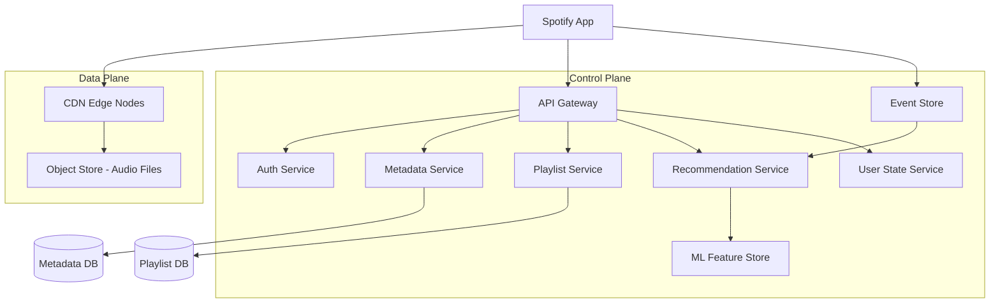
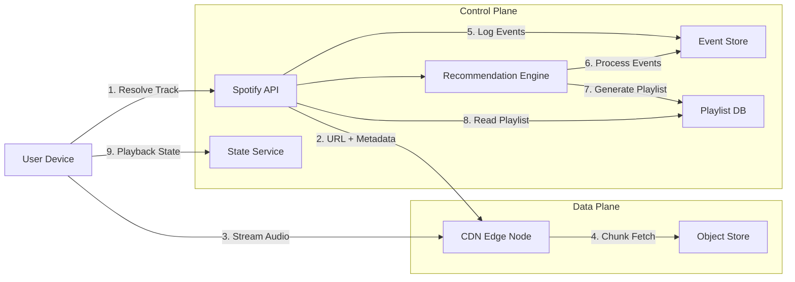
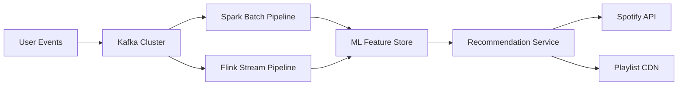

# Design Spotify

## Blogs and websites

## Medium

## Youtube

- [System Design Interview: Design Spotify](https://www.youtube.com/watch?v=H7s1pvuhmTA)

---

## Theory

### What Is It?

Spotify is a music and podcast streaming platform that serves personalized audio content — songs, albums, podcasts, playlists — to millions of concurrent listeners worldwide. Unlike traditional file-download or radio models, Spotify streams audio on-demand with features like personalized recommendations (Discover Weekly), collaborative playlists, cross-device sync, and offline downloads. The system must deliver low-latency, high-throughput streaming while managing massive catalogs (100M+ tracks), user preferences, and real-time collaboration.

### Why Does It Exist?

Physical music collection is expensive and space-consuming. Streaming services replace ownership with access — users subscribe to catalog access rather than buying individual albums. The shift to streaming also enables data-driven discovery (what to listen to next) and social features (sharing playlists, collaborative editing) that physical media cannot offer.

### What Problem Does It Solve?

* **Content delivery at scale**: streaming audio to millions of concurrent users requires efficient content distribution (CDN), bit-rate adaptation, and caching.
* **Personalization**: with 100M+ tracks, users need help discovering music — the system must rank and recommend relevant content.
* **Catalog management**: licensing music from labels, managing metadata, handling rights and royalties.
* **Low latency**: users expect near-instant playback; buffering breaks the experience.
* **Offline support**: users need to download content for offline listening with proper DRM.
* **Social features**: shared playlists, collaboration, and social discovery require real-time synchronization.

### Important Subtopics

1. Audio streaming infrastructure (CDN, chunked encoding, bit-rate adaptation)
2. Music catalog and metadata management
3. Recommendation engine (collaborative filtering, NLP, audio analysis)
4. Playlist management and collaboration
5. User session and playback state synchronization
6. Offline download and DRM
7. Royalty tracking and payment distribution
8. Search and discovery

### Important Subtopics Explained

**Audio streaming infrastructure**: Spotify uses a custom CDN (based on nginx) and partners with third-party CDNs (Akamai, CloudFront) for content delivery. Audio is stored in Ogg Vorbis format with multiple bit-rates (96 kbps to 320 kbps). Playback uses HTTP adaptive streaming — the client requests chunks of ~10 seconds and adjusts bit-rate based on network conditions. The CDN caches popular tracks at edge nodes; less popular tracks are served from origin.

**Music catalog and metadata**: Each track has metadata (title, artist, album, genre, release date, ISRC/UPC codes). Metadata comes from labels and is enriched via fingerprinting (Gracenote, AcoustID). The catalog service manages licensing windows — a track may be available in some regions but not others due to licensing. Royalty calculations are based on stream counts and pro-rata listening time.

**Recommendation engine**: Spotify's recommendation system uses three main signals: collaborative filtering (users who liked X also liked Y), natural language processing (analyzing blog posts, reviews, and news about artists), and audio analysis (analyzing audio features like tempo, key, danceability). The Discover Weekly playlist is generated weekly using these signals. The system processes billions of events daily.

**Playlist management and collaboration**: Playlists can be public, private, or collaborative. Collaborative playlists allow multiple users to add/remove tracks in real-time. The system uses Conflict-free Replicated Data Types (CRDTs) for conflict-free merging of playlist edits across devices.

**User session and playback state**: When a user switches devices, their playback position must sync instantly. The system stores the current track, position, and queue in a low-latency store (Redis or in-memory KV store) and pushes updates via WebSocket or polling.

**Offline download and DRM**: Users can download tracks/playlists for offline listening. Downloads are encrypted with device-specific keys (AES-128). Spotify uses Widevine/Clear for DRM on Android and FairPlay for iOS. Download quotas are enforced per user.

### Design Considerations

Design a system that:
* Streams audio to 50M+ concurrent users with < 200 ms startup latency
* Provides personalized recommendations updated daily
* Supports collaborative playlists with real-time sync
* Enables offline downloads with DRM
* Tracks royalties accurately per stream
* Operates in 180+ countries with region-specific catalogs

---

## Characteristics

| Characteristic | What it means | Why it matters | How it works |
|---|---|---|---|
| **On-demand streaming** | Users select any track and play immediately | Replaces the radio model; enables discovery | HTTP adaptive streaming with chunked transfer |
| **Bit-rate adaptation** | Stream quality adjusts to network conditions | Prevents buffering; optimizes bandwidth | Client monitors throughput and switches bit-rate tiers |
| **Personalization** | Content recommendations tailored to each user | Increases engagement and retention | ML models trained on listening history and collaborative signals |
| **Collaborative playlists** | Multiple users can edit playlists simultaneously | Social feature driving engagement | CRDT-based conflict-free merge |
| **Offline support** | Content downloadable for offline playback | Enables use without internet | Encrypted downloads with device-specific keys |
| **Global scale** | Serves 180+ countries simultaneously | Business requirement for global reach | Multi-region CDN and geo-routing |
| **Real-time session sync** | Playback state syncs across devices | Seamless cross-device experience | WebSocket + low-latency state store |

### Detailed Explanations

**On-demand streaming**: Unlike radio (linear broadcast), on-demand lets users pick any track at any time. This requires every track to be available at every edge node — a massive storage and caching challenge for a 100M+ track catalog where the "long tail" (less popular tracks) may never be cached.

**Bit-rate adaptation**: Spotify uses adaptive bitrate streaming (like HLS/DASH but proprietary). The client requests ~10-second chunks; if network slows, it requests lower bit-rate chunks. This prevents buffering while maximizing quality under current conditions.

**Personalization**: Spotify's recommendation engine processes 100B+ events daily (plays, skips, saves, playlist adds). Collaborative filtering finds similar users; NLP analyzes text about artists; audio analysis extracts musical features. The Discover Weekly playlist is a famous example — 100M users receive a personalized 30-track playlist every Monday.

**Collaborative playlists**: Multiple users can add/remove tracks to the same playlist simultaneously. The system uses CRDTs to merge edits without conflicts, ensuring eventual consistency across all users' views.

**Offline support**: Downloads are encrypted with per-device keys. Users can download up to 3,333 tracks offline. The system enforces download limits via the catalog service and manages device-specific encryption keys.

## Components

| Component | Purpose | Responsibilities | Relationship | Real-world Example |
|---|---|---|---|---|
| **CDN** | Content delivery | Serve audio chunks from edge nodes; cache warm | Consumes from Object Store; serves Streaming Client | Spotify's in-house CDN + Akamai |
| **Object Store** | Catalog storage | Store all audio files, metadata, album art | Feeds CDN; queried by Metadata Service | Google Cloud Storage / S3 |
| **Metadata Service** | Catalog management | Product metadata, licensing, regional availability | Serves Search, Streaming, and Playback | Spotify Catalog API |
| **Recommendation Engine** | Personalization | ML models for Discover Weekly, Release Radar, Daily Mixes | Consumes Event Store; feeds Streaming Client | Spotify ML infrastructure |
| **Event Store** | User activity logging | Store plays, skips, saves, playlist interactions | Feeds Recommendation Engine | Kafka + ClickHouse |
| **Streaming Client** | Playback engine | Adaptive streaming, bit-rate selection, DRM | Talks to CDN, Metadata Service | Spotify mobile/desktop apps |
| **User State Service** | Session & playback state | Sync playback position across devices | Real-time push to clients | Redis + WebSocket |
| **Playlist Service** | Playlist management | Create, edit, share, collaborate on playlists | Uses CRDT for conflict resolution | Spotify backend |
| **Offline Service** | Download management | Manage offline downloads, DRM, quotas | Coordinates with CDN and State Store | Spotify download feature |

### Component Interactions

1. The **Streaming Client** resolves a track URI → requests metadata from Metadata Service → receives CDN URL → streams audio chunks from CDN.
2. **Event Store** collects all user interactions → feeds **Recommendation Engine** → generates personalized playlists → delivered to client via Playlist Service.
3. **Playlist Service** handles concurrent edits using CRDTs → syncs to **User State Service** → pushes updates to other collaborators via WebSocket.

## Patterns

### Content Delivery Network (CDN) with Edge Caching

* **What**: Distribute content across geographically dispersed edge nodes so users get content from the nearest location.
* **Problem solved**: A single origin server cannot serve millions of concurrent users globally with low latency.
* **How it works**: User requests are routed to the nearest CDN edge node; if the content is cached, it's served immediately; if not, the edge node fetches from origin (or a parent node) and caches it.
* **When to use**: Any service delivering large static/binary content (audio, video, images) to global users.
* **When not to use**: Ultra-low-latency interactive applications where caching doesn't help.
* **Advantages**: Dramatically reduced latency, reduced origin load, better user experience.
* **Disadvantages**: Cache invalidation complexity, higher infrastructure cost, eventual consistency.
* **Real-world example**: Spotify's in-house CDN (based on nginx) combined with Akamai for overflow.

### Collaborative Real-Time Editing via CRDTs

* **What**: Conflict-free Replicated Data Types allow multiple users to edit shared state concurrently without coordination, automatically merging changes.
* **Problem solved**: Multiple users adding/removing tracks in a collaborative playlist from different devices/servers.
* **How it works**: Each edit is a operation (add track X at position Y / remove track Z). CRDTs define merge semantics that are commutative, associative, and idempotent — so any order of application produces the same result.
* **When to use**: Collaborative editing, real-time document sharing, any CRDT-friendly data type (sets, counters, sequences).
* **When not to use**: Operations requiring strict ordering or complex constraints.
* **Advantages**: No coordination overhead, eventual consistency guaranteed, works offline.
* **Disadvantages**: Can grow metadata; some CRDT types have high overhead.
* **Java/Spring Boot example**:
```java
// Simplified OR-Set (Observed-Remove Set) for collaborative playlist
class CollaborativePlaylist {
    private Map<String, Set<String>> added = new ConcurrentHashMap<>();
    private Map<String, Set<String>> removed = new ConcurrentHashMap<>();

    public void addTrack(String userId, String trackId) {
        added.computeIfAbsent(userId, k -> ConcurrentHashMap.newKeySet()).add(trackId);
    }

    public void removeTrack(String userId, String trackId) {
        removed.computeIfAbsent(userId, k -> ConcurrentHashMap.newKeySet()).add(trackId);
    }

    public Set<String> getTracks() {
        Set<String> result = new HashSet<>();
        added.values().forEach(result::addAll);
        Set<String> removedAll = new HashSet<>();
        removed.values().forEach(removedAll::addAll);
        result.removeAll(removedAll);
        return result;
    }
}
```
* **Real-world example**: Spotify collaborative playlists.

### Event Sourcing for Playback History

* **What**: Store every user interaction (play, skip, save) as an immutable event; reconstruct state by replaying events.
* **Problem solved**: Need to analyze user behavior over time, build recommendations, and audit every interaction.
* **How it works**: Each interaction is appended to an event log (e.g., Kafka). Downstream consumers (recommendation engine, analytics) read from the log.
* **When to use**: When auditability, replayability, and analytics are important.
* **When not to use**: Simple CRUD applications where state changes are infrequent.
* **Advantages**: Complete audit trail, ability to recompute state, decoupled consumers.
* **Disadvantages**: Higher storage cost, complexity of event versioning.
* **Real-world example**: Spotify's playback event pipeline.

### Read-Through Caching for Catalog and Metadata

* **What**: Cache frequently-accessed data (track metadata, user playlists) in a fast in-memory store, with automatic loading from the primary store on cache miss.
* **Problem solved**: Avoid hitting the database/cache for hot data (popular tracks, trending playlists).
* **How it works**: Application requests data from the cache; on cache miss, the cache loads from the database (read-through) and caches the result.
* **When to use**: When hot data is a small percentage of total data (80/20 rule applies strongly).
* **When not to use**: When all data is equally hot, or when strong consistency is required.
* **Advantages**: Dramatically reduced database load, low-latency access.
* **Disadvantages**: Cache invalidation complexity, staleness.
* **Real-world example**: Spotify caches track metadata and user playlists in Redis.

## Benefits

* **Global reach**: Users in 180+ countries can stream any track in the catalog instantly, with region-based catalog restrictions enforced transparently.
* **Personalization at scale**: Every user gets a unique listening experience (Discover Weekly, Daily Mixes, Radio) powered by ML models processing billions of daily events.
* **Social engagement**: Collaborative playlists, social sharing, and friend activity feeds increase user retention and engagement.
* **Offline accessibility**: Users can download content for offline listening, enabling use cases like commuting through tunnels or international travel.
* **Discovery**: The recommendation engine introduces users to new artists and genres, increasing catalog utilization beyond just the hits.
* **Cost efficiency**: CDN caching and bit-rate adaptation reduce bandwidth costs while maintaining quality.
* **Device ecosystem**: Seamless playback across mobile, desktop, web, smart speakers, TVs, and cars.

## Pros

* **Massive catalog**: Over 100 million tracks and 5 million podcasts — more content than any physical collection could hold.
* **Intelligent recommendations**: ML-powered discovery that surfaces relevant music users wouldn't find otherwise, driving engagement (Discover Weekly alone has billions of streams).
* **Cross-device sync**: Playback, playlists, and preferences sync instantly across all devices.
* **Social features**: Collaborative playlists, shared playlists, following friends' activity, and social sharing create viral engagement loops.
* **Offline support with DRM**: Encrypted downloads protect content while enabling offline consumption.
* **Adaptive streaming**: Automatic bit-rate adjustment ensures smooth playback under varying network conditions.
* **Platform ecosystem**: Available on every major platform (iOS, Android, Web, macOS, Windows, Linux, smart speakers, game consoles, cars).

## Cons

* **Licensing complexity**: Music licensing is expensive (30%+ of revenue goes to rights holders) and region-dependent. Catalog gaps exist where licensing hasn't been secured.
* **High infrastructure cost**: Global CDN, storage for 100M+ tracks, ML infrastructure for recommendations — infrastructure is Spotify's largest expense.
* **Storage vs. popularity skew**: 80% of plays come from 1% of tracks. Cold storage (long tail) is expensive relative to its usage.
* **DRM complexity**: Offline downloads with device-specific encryption add significant engineering complexity.
* **Fair pay debate**: Per-stream royalty payouts are low, causing friction with artists and labels.
* **Metadata quality**: Inconsistent or incorrect metadata (artist names, release dates) causes search/discovery problems.
* **Network dependency**: Unlike locally-stored music, streaming requires constant connectivity (though offline mode mitigates this).

## Challenges

### Technical Challenges

* **Cold start problem**: New users (no listening history) and new tracks (no engagement data) are hard to recommend — the system falls back to popularity-based or collaborative filtering approaches.
* **Real-time recommendation**: Generating personalized recommendations requires processing billions of events daily; the system must balance freshness vs. compute cost.
* **Cache hit rate**: With 100M+ tracks, even the most popular tracks are a tiny fraction. Maintaining high CDN cache hit rates requires predictive pre-warming.
* **Audio quality vs. bandwidth**: Higher bit-rates (320 kbps) consume more bandwidth and storage; lower bit-rates reduce quality perception.

### Scalability Challenges

* **Peak concurrent streaming**: During events (new album releases, concerts), streaming demand spikes. The system must handle millions of simultaneous new playbacks.
* **Global latency**: Users in less-connected regions (Africa, parts of Asia) need edge caching to get acceptable startup latency (< 200 ms target).
* **Multi-region data**: User preferences and playback state must sync across regions with < 100 ms consistency for seamless cross-device experience.

### Performance Challenges

* **Startup latency**: Users expect playback to start within ~1 second of pressing play. This requires pre-connecting to CDN, pre-buffering, and aggressive caching.
* **Bit-rate adaptation**: The client must detect network changes within a few seconds and switch bit-rates without causing buffering or rebuffering.

### Reliability Challenges

* **CDN failure**: If a CDN node is overloaded, users experience buffering or failed starts. The system must gracefully fall back to another CDN or lower quality.
* **Offline sync conflicts**: When a user downloads tracks on one device and deletes on another, the system must reconcile state correctly.

### Maintainability Challenges

* **Codec and format changes**: As audio codecs evolve (from Vorbis to AAC to Opus), the system must support transcoding or dual-encoding without disruption.
* **Metadata pipeline**: Ingesting, validating, and updating metadata from hundreds of labels requires robust ETL pipelines.

### Operational Challenges

* **Royalty tracking**: Every stream must be tracked and attributed correctly for royalty calculations — errors cost millions in over/underpayments.
* **Compliance**: GDPR, CCPA, and regional data residency requirements affect where user data is stored.

### Security Concerns

* **Piracy**: Pirates extract and redistribute audio from the stream; DRM (Widevine, FairPlay) mitigates but doesn't eliminate this.
* **Account sharing**: Multiple users sharing one account is common but reduces per-user value.
* **Data privacy**: Listening history reveals sensitive information (health conditions, political views via podcasts); must be protected.

## Best Practices

* **Geo-replicated CDN**: Store popular tracks in edge nodes in every region; predict demand and pre-warm caches before album releases.
* **Adaptive bitrate with buffer management**: Clients should maintain a 30-second buffer and smoothly downgrade bit-rate on network degradation.
* **CRDT-based collaboration**: For collaborative playlists, use operation-based CRDTs to avoid conflict resolution complexity.
* **Event sourcing for analytics**: Log all user interactions as immutable events; this enables replay, audit, and re-computation of recommendations.
* **Separation of cold and hot data**: Hot (popular) tracks cached aggressively at edge; cold (long tail) tracks stored in cost-effective bulk storage.
* **Predictive pre-loading**: Pre-load the next likely track based on listening patterns to minimize startup latency.
* **Progressive enhancement**: If the recommendation engine is degraded, fall back to editorial playlists and recently played.

## When to Use

### Appropriate

* When you need to deliver large audio/video catalogs to global users with low latency.
* When personalization and recommendation are core to the product (music, podcast, video platforms).
* When offline consumption is a requirement (travel, commuting use cases).
* When social/collaborative features are important (shared playlists, following friends).
* When a freemium model with ad insertion is needed.

### Not Appropriate

* When the content catalog is small (< 10,000 tracks) — a simple CDN + static hosting suffices.
* When real-time collaboration is not a requirement — CRDTs add complexity.
* When offline support is not needed — DRM and download management add significant complexity.
* When serving a single geographic region — CDN overhead may not be justified.

### Alternatives

* **Simple CDN**: For small catalogs, use a managed CDN (CloudFront, Cloudflare) without a custom streaming infrastructure.
* **Podcast-style RSS**: For audio content without personalization, simple RSS feeds with media enclosures suffice.
* **Traditional radio streaming**: For non-on-demand audio, HLS/DASH with live broadcast is simpler.

### Decision Factors

* **Catalog size**: Determines CDN and storage requirements.
* **Concurrent users**: Drives CDN capacity and caching strategy.
* **Personalization needs**: Determines the complexity of the recommendation pipeline.
* **Offline requirements**: Drives DRM and download infrastructure.
* **Budget**: CDN and storage costs scale with catalog size and user count.

## Use Cases

### Personalized Discovery (Discover Weekly)

* **Problem**: Users struggle to discover new music from a 100M+ track catalog.
* **Solution**: Generate a weekly personalized playlist of 30 tracks based on collaborative filtering (similar users' listening), NLP (blog reviews, news), and audio analysis (musical features).
* **Why suitable**: The system's recommendation engine processes billions of daily events and has the data depth to make accurate predictions.
* **How it works**: Every Monday, the pipeline: (1) builds user embedding vectors from listening history, (2) finds nearest-neighbor users via collaborative filtering, (3) collects candidate tracks from those users' libraries, (4) filters out already-heard tracks, (5) applies audio feature matching, (6) ranks by predicted affinity, (7) delivers to all users within a 2-hour window.
* **Trade-offs**: Computationally expensive (100M users × 30 tracks each); freshness of new releases is limited by the weekly cadence.

### Collaborative Playlist Editing

* **Problem**: Multiple users want to add songs to a shared playlist simultaneously from different locations.
* **Solution**: Use CRDTs (Observed-Remove Sets) for conflict-free merging of track additions/removals.
* **Why suitable**: CRDTs guarantee eventual consistency without coordination — perfect for a social feature where users expect to add songs at any time.
* **How it works**: Each add/remove is a delta operation. Operations are replicated to all participants. The merge function (union of adds minus union of removes) is commutative, associative, and idempotent — so any order of operation delivery produces the same final playlist.
* **Trade-offs**: Metadata overhead (each operation stores the actor ID); cannot enforce strict ordering constraints (e.g., "track X must come after track Y").

### Offline Download

* **Problem**: Users need to listen without internet (commute, flights, underground).
* **Solution**: Encrypted downloads with per-device keys and quota enforcement.
* **Why suitable**: DRM protects content; device-specific keys prevent cross-device sharing; quotas prevent mass downloading.
* **How it works**: (1) User selects tracks/playlist to download, (2) system verifies quota (max 3,333 tracks), (3) downloads encrypted chunks from CDN, (4) stores with device-specific AES key, (5) playback decrypts chunks on-the-fly during playback.
* **Trade-offs**: Storage space on device; download time; DRM complexity; quota enforcement may frustrate power users.

## Architecture

Spotify uses a **hybrid CDN + microservices** architecture. Content is stored in object storage and distributed via a multi-CDN strategy (in-house CDN + Akamai/CloudFront). Microservices handle user management, playlist, recommendations, metadata, and playback state. An event-sourced backbone (Kafka) carries all user interactions. The recommendation engine processes events via batch (daily) and stream (real-time) pipelines.



| Layer | Components | Responsibilities |
|---|---|---|
| **Data Plane** | CDN, Object Store | Serve audio content globally with low latency |
| **Control Plane** | API Gateway, Auth, Metadata, Playlist, Recommendation, State services | Handle API requests, user management, content metadata, personalization |
| **Event Pipeline** | Event Store (Kafka), ML Feature Store | Collect user interactions, feed recommendation models |
| **Clients** | Mobile, Desktop, Web, Embedded | Stream audio, render UI, sync state |

**Communication**: Clients call the API Gateway for metadata, playlists, and state; directly stream audio from CDN. Event pipeline is async (Kafka). Services communicate via gRPC or REST.

**Scaling strategy**: CDN scales automatically; API services scale per-region; recommendation engine scales via batch processing (Spark) and stream processing (Flink/Storm); object storage scales infinitely.

**Failure handling**: CDN fallback (if primary CDN fails, route to secondary); recommendation degradation (fall back to editorial playlists); offline mode (cache last-played tracks locally).

## Design

### Design Considerations

* **Cold start mitigation**: Pre-connect to CDN and pre-buffer audio when the app starts to minimize first-play latency.
* **Bit-rate selection**: Use a model that considers current throughput, buffer level, and device capability to pick the optimal starting bit-rate.
* **CRDT design for playlists**: OR-Set (Observed-Remove Set) is sufficient for add/remove track; more complex CRDTs needed for ordered sequences.
* **Recommendation freshness**: Balance daily batch recompute (high quality, low freshness) with streaming updates (low latency, lower quality).

### Key Decisions

| Decision | Options | Trade-off | Recommendation |
|---|---|---|---|
| Streaming protocol | HTTP adaptive (chunked) | Simple, firewall-friendly | Standard |
| | RTMP/RTSP | Low latency, complex | Live only |
| CDN strategy | Multi-CDN | Resilient, complex | Production |
| | Single CDN | Simple, SPOF | Small scale |
| Recommendation | Batch ML | High quality, daily refresh | Standard |
| | Real-time ML | Fresh, expensive | Premium |
| Playlist sync | CRDT | Eventually consistent | Standard |
| | Lock-based | Strongly consistent, slow | When strict order needed |

### Scalability Considerations

* **CDN**: Add edge nodes and origin capacity; pre-warming for album releases.
* **Recommendations**: Scale batch processing (Spark cluster) for daily recs; stream processing (Flink) for real-time signals.
* **Playlist service**: Shard by playlist ID; CRDTs allow independent shard scaling.

### Reliability Considerations

* **Graceful degradation**: If recommendation engine is down, serve editorial playlists and recently played.
* **CDN failover**: Health-check edge nodes; route to alternate CDN provider on failure.
* **Offline-first**: Cache metadata and last-played tracks locally for offline use.

### Performance Considerations

* **Startup latency**: Target < 500 ms from play press to audio; pre-connect to CDN, pre-buffer first chunk.
* **Bit-rate switching**: Detect network changes within 2-3 seconds; switch bit-rate without rebuffering.
* **Recommendation serving**: Serve daily playlists from CDN (static); real-time recs from in-memory cache (Redis).

### Security Considerations

* **DRM**: AES-128 with per-device keys; Widevine (Android), FairPlay (iOS).
* **Account sharing**: Device fingerprinting and concurrent-stream limits (max 1 stream per account on free tier).
* **Privacy**: Anonymize listening data before using for recommendations; GDPR/CCPA compliance.

### Maintainability Considerations

* **A/B testing**: Test recommendation algorithms, UI changes, bit-rate strategies, and pricing.
* **Metadata pipeline**: Robust ETL from label feeds; deduplication and quality checks.
* **Codec evolution**: Support for new audio formats (Opus) alongside Vorbis without breaking clients.

## High-Level Design



**Request flow for streaming a track**:
1. User presses play → client resolves track URI via Spotify API.
2. API returns metadata (title, artist) and a CDN URL with pre-signed token.
3. Client connects to CDN edge node and starts streaming 10-second chunks (HTTP adaptive streaming).
4. CDN serves from cache if warm; otherwise fetches from object store and caches.
5. Client logs playback events (start, skip, finish) → event pipeline.
6. Recommendation engine consumes events → generates Discover Weekly.

**Data flow for recommendations**:
1. Events (plays, skips, saves) → Kafka log (real-time).
2. Batch pipeline (Spark) processes daily → user/item features → trains collaborative filtering model.
3. Model output → recommendation service → playlists stored in Playlist DB.
4. Client fetches playlist → API → Playlist DB.

## Deep Dive

### Internal Implementation: Spotify's Recommendation Engine

Spotify's recommendation engine operates in two modes:

1. **Batch pipeline (daily)**: Spark jobs process 100B+ events from Kafka to compute user and item features, train collaborative filtering models, and generate daily playlists (Discover Weekly, Release Radar, Daily Mixes). The batch output is stored in a feature store and served as static playlists via CDN.

2. **Stream pipeline (real-time)**: Flink/Storm jobs process events with < 5-minute latency to update user embeddings, trigger real-time recommendations (e.g., "because you played X"), and detect anomalies.

The core algorithm uses **matrix factorization with implicit feedback** (alternating least squares): user×item interaction matrix → factorize into user factors and item factors → predict affinity score. Additional signals: NLP on blog posts/news (word2vec on articles mentioning artists), audio analysis (extracting 16-dimensional audio features per track via convolutional neural networks), and social signals (friends' listening).

### Cold Start Handling

* **New users**: No listening history — fall back to popularity-based recommendations, region-local hits, and genre-based discovery. Ask explicit preference questions on signup.
* **New tracks**: No engagement data — recommend based on artist similarity (same label, genre, audio features) and editorial placement.
* **New users + new tracks**: Pure popularity + editorial curation until enough data accumulates (~10 listens for a meaningful signal).

### CRDT Implementation for Collaborative Playlists

Spotify uses an **OR-Set (Observed-Remove Set)** CRDT for collaborative playlist membership. Each element (track) has an add-set and a remove-set. When a user adds a track, the add-set gets a new entry `(trackId, actorId, timestamp)`. When a user removes a track, the remove-set gets the entry. The merged view is: all items in any add-set that are NOT in any remove-set (observed-remove semantics). This is commutative, associative, and idempotent — no conflicts possible regardless of replication order.

### Audio Streaming Protocol

Spotify uses a proprietary protocol over HTTP with chunked transfer. Audio is encoded in Ogg Vorbis (96, 160, 320 kbps). The client requests 10-second chunks sequentially. The CDN caches chunks; cache keys are designed to keep hot content at edge. Bit-rate adaptation happens client-side: the client measures throughput over the last 3 chunks and switches to a lower/higher tier if the measured bandwidth can't sustain the current quality plus a safety margin (typically 25% headroom).

### Event Sourcing Architecture

All user interactions (play, pause, skip, seek, save, add to playlist, like) are logged as events to Kafka topics partitioned by user_id. The events carry: user_id, track_id, timestamp, session_id, device_id, and playback_position. Downstream consumers:
- **Profile builder**: updates user embeddings in Redis.
- **Recommendation trainer**: feeds the batch ML pipeline.
- **Royalty calculator**: counts per-stream plays for payout computation.
- **Analytics dashboard**: real-time metrics on engagement.

This event-sourced architecture enables reprocessing (e.g., recalculating royalties after a model change) and auditability.

### Offline Download with DRM

Downloads use a **device-key encryption** scheme. The server generates a per-device AES-128 key (derived from a device-specific seed). Audio chunks are encrypted with this key before download. On playback, the client decrypts chunks in memory. The key is stored in the device's secure enclave (iOS Keychain, Android Keystore). Download quotas (3,333 tracks max) and offline expiration (30 days after last online sync) are enforced server-side.

### Scalability: Multi-CDN Strategy

Spotify uses a custom CDN (based on nginx) for ~60% of traffic and third-party CDNs (Akamai, CloudFront) for overflow and regions where Spotify CDN isn't deployed. Traffic is split based on geographic proximity, cost, and real-time performance. The system monitors each CDN's hit rate, latency, and error rate, and dynamically adjusts the split. This provides redundancy — if one CDN has an outage, traffic shifts to others within minutes.

### Data Pipeline: Batch + Stream



The batch pipeline runs daily: extracts 24 hours of events → computes user/item features → trains the collaborative filtering model → generates daily playlists → stores in feature store → serves via CDN as static JSON. The stream pipeline runs continuously: processes events in real-time → updates user embeddings → triggers real-time recommendations → pushes to connected clients.

## Java and Spring Boot Implementation

### Basic Java Implementation — CRDT Collaborative Playlist

```java
import java.util.concurrent.ConcurrentHashMap;
import java.util.Set;
import java.util.HashSet;

public class CollaborativePlaylist {
    // OR-Set: track additions and removals per actor
    private final ConcurrentHashMap<String, Set<String>> addSet = new ConcurrentHashMap<>();
    private final ConcurrentHashMap<String, Set<String>> removeSet = new ConcurrentHashMap<>();

    public void addTrack(String actorId, String trackId) {
        addSet.computeIfAbsent(actorId, k -> ConcurrentHashMap.newKeySet()).add(trackId);
        removeSet.computeIfAbsent(actorId, k -> ConcurrentHashMap.newKeySet()).remove(trackId);
    }

    public void removeTrack(String actorId, String trackId) {
        removeSet.computeIfAbsent(actorId, k -> ConcurrentHashMap.newKeySet()).add(trackId);
    }

    public void merge(CollaborativePlaylist other) {
        other.addSet.forEach((actor, tracks) ->
            addSet.computeIfAbsent(actor, k -> ConcurrentHashMap.newKeySet()).addAll(tracks));
        other.removeSet.forEach((actor, tracks) ->
            removeSet.computeIfAbsent(actor, k -> ConcurrentHashMap.newKeySet()).addAll(tracks));
    }

    public Set<String> getActiveTracks() {
        Set<String> allAdded = new HashSet<>();
        addSet.values().forEach(allAdded::addAll);
        Set<String> allRemoved = new HashSet<>();
        removeSet.values().forEach(allRemoved::addAll);
        allAdded.removeAll(allRemoved);
        return allAdded;
    }
}
```

### Production-Oriented Java Implementation — Adaptive Bitrate Selector

```java
import java.time.Duration;
import java.util.Deque;
import java.util.ArrayDeque;

public class AdaptiveBitrateSelector {
    private static final int[] BITRATES_KBPS = {96, 160, 320};
    private static final int BUFFER_TARGET_SECONDS = 30;
    private static final double SAFETY_MARGIN = 0.75;

    private final Deque<ChunkMetrics> history = new ArrayDeque<>(5);

    public int selectBitrate(int currentBitrate, long bufferMs, boolean startup) {
        if (startup && bufferMs < 1000) {
            return BITRATES_KBPS[0]; // Start low for fast startup
        }

        double measuredThroughput = computeSmoothedThroughput();
        int safeBitrate = (int) (measuredThroughput * SAFETY_MARGIN);

        // Pick the highest bitrate that fits within safe bandwidth
        int selected = BITRATES_KBPS[0];
        for (int br : BITRATES_KBPS) {
            if (br <= safeBitrate) {
                selected = br;
            } else {
                break;
            }
        }

        // Don't downgrade below current unless buffer is critically low
        if (bufferMs < 5000 && selected < currentBitrate) {
            return selected;
        }
        return Math.max(selected, currentBitrate);
    }

    private double computeSmoothedThroughput() {
        if (history.isEmpty()) return BITRATES_KBPS[0] * 1000.0 / 8.0;
        long totalBytes = 0;
        long totalTimeMs = 0;
        for (ChunkMetrics m : history) {
            totalBytes += m.bytesReceived;
            totalTimeMs += m.durationMs;
        }
        return (totalBytes * 8.0) / (totalTimeMs / 1000.0); // bits/sec
    }

    public void recordChunk(ChunkMetrics metrics) {
        if (history.size() >= 5) history.removeFirst();
        history.addLast(metrics);
    }

    static class ChunkMetrics {
        final long bytesReceived;
        final long durationMs;
        ChunkMetrics(long bytes, long ms) { this.bytesReceived = bytes; this.durationMs = ms; }
    }
}
```

### Spring Boot — Recommendation Controller

```java
@RestController
@RequestMapping("/api/v1/recommendations")
@RequiredArgsConstructor
public class RecommendationController {
    private final RecommendationService recommendationService;
    private final CacheService cacheService;

    @GetMapping("/{userId}/discover-weekly")
    public ResponseEntity<PlaylistDto> getDiscoverWeekly(
            @PathVariable String userId,
            @RequestHeader(value = "If-None-Match", required = false) String ifNoneMatch) {

        String etag = cacheService.computeEtag(userId, "discover-weekly");
        if (ifNoneMatch != null && ifNoneMatch.equals(etag)) {
            return ResponseEntity.status(HttpStatus.NOT_MODIFIED).build();
        }

        PlaylistDto playlist = recommendationService.getDailyPlaylist(userId, "discover-weekly");
        return ResponseEntity.ok()
                .eTag(etag)
                .body(playlist);
    }

    @GetMapping("/{userId}/radio/{trackId}")
    public ResponseEntity<List<TrackDto>> getRadio(@PathVariable String userId,
                                                    @PathVariable String trackId,
                                                    @RequestParam(defaultValue = "20") int limit) {
        List<TrackDto> recommendations = recommendationService.getSimilarTracks(userId, trackId, limit);
        return ResponseEntity.ok(recommendations);
    }
}

@Service
class RecommendationService {
    public PlaylistDto getDailyPlaylist(String userId, String playlistType) {
        // In production: served from pre-computed static playlist (batch pipeline)
        // Fallback: real-time collaborative filtering for fresh users
        return PlaylistDto.builder()
                .name(playlistType)
                .tracks(getCachedPlaylist(userId, playlistType))
                .generatedAt(LocalDateTime.now())
                .build();
    }
}
```

### Testing Example

```java
@SpringBootTest
class AdaptiveBitrateSelectorTest {
    @Test
    void shouldStartLowOnStartupWithEmptyBuffer() {
        AdaptiveBitrateSelector selector = new AdaptiveBitrateSelector();
        int bitrate = selector.selectBitrate(160, 0, true);
        assertEquals(96, bitrate);
    }

    @Test
    void shouldDowngradeWhenThroughputDrops() {
        AdaptiveBitrateSelector selector = new AdaptiveBitrateSelector();
        selector.recordChunk(new ChunkMetrics(50_000, 5000)); // 80 kbps effective
        int bitrate = selector.selectBitrate(320, 15000, false);
        assertTrue(bitrate < 320);
    }
}
```

## Real-World Examples

### Spotify's Discover Weekly

Spotify generates a personalized playlist of 30 tracks every Monday for 100M+ users. The pipeline runs on Google Cloud Platform using Dataflow (Apache Beam) for batch processing and Pub/Sub for real-time event ingestion. The recommendation model uses matrix factorization (ALS) on a user-item interaction matrix of 1.2 trillion cells, enriched with NLP features from 2 million music blogs and audio features extracted via CNNs. The entire pipeline takes ~6 hours to run and generates 5B recommendations daily.

### Spotify's Multi-CDN Strategy

Spotify serves 100+ PB of audio per month. Its infrastructure uses: 60% Spotify's in-house CDN (based on nginx, 60+ PoPs), 30% Akamai, 10% CloudFront. Traffic routing is dynamic — real-time monitoring of hit rates, latency, and cost across CDNs adjusts the split hourly. During the 2020 pandemic, when traffic shifted to residential broadband, the system automatically increased CloudFront share (better last-mile connectivity) from 10% to 35% within days.

### Spotify's Collaborative Playlists with CRDTs

Spotify uses a CRDT-based system for collaborative playlists to allow 100+ users to simultaneously add/remove tracks without conflicts. The system handles 50M+ collaborative playlist operations daily. The OR-Set CRDT ensures that adding and removing tracks from different devices converges to the same final state without coordination. This enables offline editing — changes made on a disconnected device merge correctly when connectivity is restored.

## Interview Preparation

### Beginner Questions

**Q1: How does Spotify stream music to millions of users simultaneously?**
A: Spotify uses a multi-CDN strategy. Audio files are stored in object storage (Google Cloud Storage) and distributed via Spotify's in-house CDN (60+ PoPs) plus Akamai and CloudFront. When a user presses play, the client resolves the track via Spotify's API, receives a CDN URL, and streams ~10-second audio chunks via HTTP. The CDN caches popular tracks at edge nodes, so most requests are served from cache without hitting the origin storage.

**Q2: What is adaptive bitrate streaming?**
A: The client monitors the download speed of chunks. If throughput drops below the current stream's bit-rate, it switches to a lower quality track (e.g., 320 kbps → 160 kbps → 96 kbps) to prevent buffering. Conversely, if throughput improves, it upgrades. This is transparent to the user and optimizes the experience for varying network conditions.

**Q3: How does Spotify handle the long tail of less-popular tracks?**
A: 80% of plays come from 1% of tracks. Cold tracks are stored in bulk (less-expensive storage tiers). The system uses predictive pre-warming: before an album release, it pre-caches likely popular tracks at edge nodes. For the long tail, it accepts higher latency (cache miss → origin fetch) since these tracks are rarely accessed.

### Intermediate Questions

**Q4: How would you design Spotify's recommendation system?**
A: The system processes 100B+ daily events (plays, skips, saves). It uses (1) collaborative filtering (ALS matrix factorization on user-item matrix), (2) NLP on music blogs/news (word2vec on text mentioning artists), (3) audio analysis (CNN-extracted audio features), and (4) social signals (friends' listening). Events are logged to Kafka → batch-processed by Spark daily for deep features → stream-processed by Flink for real-time signals → served via feature store to recommendation models.

**Q5: How does Spotify handle collaborative playlist edits from multiple users?**
A: Using CRDTs (Conflict-free Replicated Data Types). Specifically, an OR-Set (Observed-Remove Set) for track membership. Each add/remove is a tagged operation (trackId, actorId, timestamp). The merge is commutative, associative, and idempotent — so any replication order produces the same result. This allows offline editing and conflict-free merging.

**Q6: What's the trade-off between consistency and availability in Spotify's playlist service?**
A: Collaborative playlists favor availability (users can always add tracks) over strong consistency (you might see a friend's track slightly delayed). CRDTs provide eventual consistency — all edits converge within seconds. This is acceptable for a social feature where immediate consistency isn't critical. For payment/royalty data, strong consistency is required via different mechanisms.

**Q7: How does Spotify's offline mode work?**
A: Downloads use per-device AES-128 keys. Audio chunks are encrypted server-side with the device-specific key before being sent to the CDN. The client downloads encrypted chunks, stores them locally, and decrypts during playback using a key stored in the device's secure enclave (iOS Keychain/Android Keystore). Quotas (3,333 tracks max) and expiration (30 days) are enforced server-side.

### Advanced Questions

**Q8: How would you reduce cold-start recommendations for new users?**
A: (1) Ask explicit preference questions during onboarding (genre, language, favorite artists). (2) Use demographic-based recommendations (users in the same country/age group). (3) Offer a "popular in your region" playlist. (4) Use editorial curation — present staff picks and trending tracks. (5) Prompt users to follow playlists/artists early, using those as seeds for collaborative filtering after a few sessions.

**Q9: How does Spotify handle the royalty calculation problem?**
A: Every stream is logged as an event (user, track, timestamp, duration_listened). At the end of each month, total revenue is pooled, and each rights holder's share is calculated as: (their_streams / total_streams) × revenue_pool × (their_contract_rate). The system processes billions of events and must handle edge cases: skipped tracks (listen < 30s), repeated plays (deduplication), and concurrent streams.

**Q10: How would you design a system to detect and handle fraudulent stream manipulation (stream boosting)?**
A: (1) Anomaly detection on listening patterns (same IP playing the same track repeatedly, unusual time patterns, bot-like behavior). (2) Device fingerprint clustering to detect coordinated accounts. (3) Real-time rate limiting on play events per IP/user. (4) Manual review for suspicious accounts. (5) Deduplicate streams (only count once per user per track per day). (6) Use graph analysis to detect bot networks (accounts that only follow each other).

### Senior-Level Questions

**Q11: How would you redesign Spotify's architecture for a future where every user streams lossless (FLAC, ~1.4 Mbps) audio?**
A: Lossless audio is 5-10x larger than 320 kbps. This shifts the bottleneck from CPU to bandwidth/storage. (1) CDN capacity must increase 5-10x — negotiate better peering agreements, add more edge PoPs. (2) Object storage costs increase 5x — use columnar storage for metadata, aggressive compression for non-audio. (3) Mobile bandwidth becomes a constraint — need smarter adaptive bitrate that detects 5G vs 4G. (4) Recommendation pipeline must handle larger feature vectors (lossless audio analysis). (5) Consider a hybrid model: lossless for paying users, compressed for free users, with transparent upgrade/downgrade.

**Q12: How would you design Spotify's system to support real-time collaborative listening (e.g., "listening parties")?**
A: (1) WebSocket/SignalR for real-time control (play, pause, skip) across participants. (2) Synchronize playback state via a shared session (Redis Pub/Sub with low-latency replication). (3) Handle clock drift — each client synchronizes to the session leader's timestamp. (4) Buffer management — pre-buffer a segment so all clients can stay in sync. (5) Handle participants joining late — catch them up by seeking to the current position. (6) Handle network jitter — buffer more aggressively, show a "catching up" state.

**Q13: How would you design Spotify's podcast system, which has different requirements from music?**
A: Podcasts have different characteristics: (1) **Episodic content** — episodes are consumed in order, unlike music which is random-access. (2) **Unbounded growth** — a podcast series can grow indefinitely (daily news). (3) **User-generated content** — anyone can publish, so moderation is needed. (4) **Variable duration** — episodes can be 5 minutes or 3 hours. (5) **Transcripts** — needed for search; requires speech-to-text processing. (6) **Chapters** — users want to skip to specific segments. The system uses separate storage (longer retention), separate CDN strategy (pre-warm popular episodes), and a transcript service for search.

### System Design Questions (Senior)

**Q14: Design a system to generate 100M personalized playlists daily with a 2-hour delivery window.**

**Approach**:
- **Event ingestion**: Kafka cluster with partitions by user_id (1000+ partitions, 500+ brokers).
- **Feature generation**: Spark cluster processes 100B events → user/item embeddings (128-dim vectors). Each Spark job handles 1M users.
- **Model serving**: Pre-compute candidate tracks per user (nearest neighbors) using approximate nearest neighbor (ANN) library (Spotify uses Annoy/FAISS). Store top-1000 candidates per user in Redis.
- **Playlist assembly**: A lightweight service fetches top candidates, filters already-heard tracks, applies business rules (genre balance, novelty), ranks, and trims to 30 tracks. This is embarrassingly parallel — 1000 workers, each handling ~100K users.
- **Delivery**: Store generated playlists as JSON in CDN. Clients fetch playlists directly from CDN (low latency, high cache hit rate).
- **Optimization**: Use sampling for training data; pre-compute features overnight; serve static playlists from CDN; only generate personalized recs in real-time for premium users.

**Expected answer depth**: Discuss partitioning strategies, ANNs for similarity, cache hit rate optimization, and the trade-off between batch (quality) vs. streaming (freshness).

**Q15: How would you handle a situation where the recommendation engine is down for 24 hours?**

**Answer**: Degraded mode: (1) Serve editorial playlists from CDN (static JSON, always available). (2) Serve "recently played" and "liked songs" from user state (stored in Redis). (3) Serve "popular tracks" (pre-computed, cached). (4) For new users, serve genre-based starter playlists. (5) Log all plays during the outage → replay through the pipeline when it comes back online. (6) Alert on user churn metrics — if churn spikes during the outage, it confirms personalization is critical. (7) Post-mortem: add a fallback service that runs on minimal infrastructure so it can't go down with the main system.

### Common Mistakes & Expected Discussion Points

**Common mistakes in answering Spotify design questions**:
- Focusing on the CDN/storage and ignoring the recommendation engine (the differentiator).
- Not discussing the cold-start problem for new users/tracks.
- Ignoring the social/collaborative aspects.
- Treating it like a generic music service (ignoring audio-specific concerns like bit-rate adaptation).
- Not discussing offline/download complexity and DRM.

**Expected discussion points**: Trade-offs between CDN providers, CRDT vs. lock-based playlist sync, batch vs. stream processing for recommendations, the business model (licensing costs vs. subscription revenue), and technical choices (Ogg Vorbis vs. Opus codec).

### Follow-up Questions

* Q: "How would you handle a new artist with no listening data?" A: Editorial curation + audio feature similarity to existing artists + genre-based placement + playlist seeding.
* Q: "What's the latency budget for recommendation serving?" A: ~20 ms for reading from cache; real-time computation would be >100 ms which is too slow for a 50-ms UI budget.
* Q: "How do you handle the YouTube recommendation controversy (radicalization)?" A: Apply the same principle — use diverse signals, not just engagement; add human curation for sensitive topics; measure downstream effects (time-to-churn, not just time-spent).
