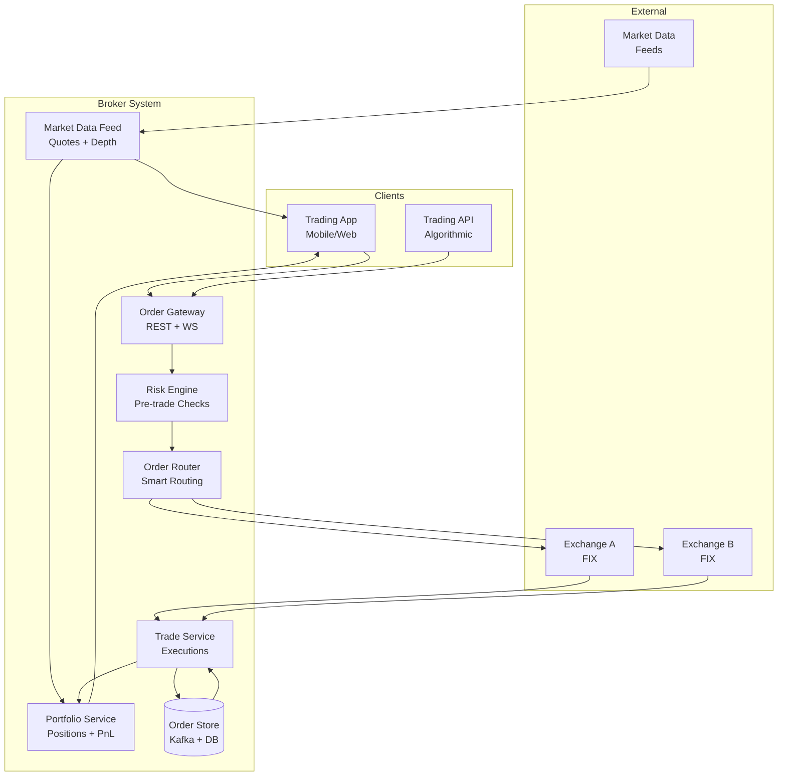
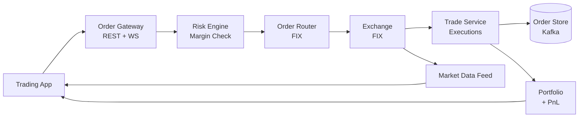
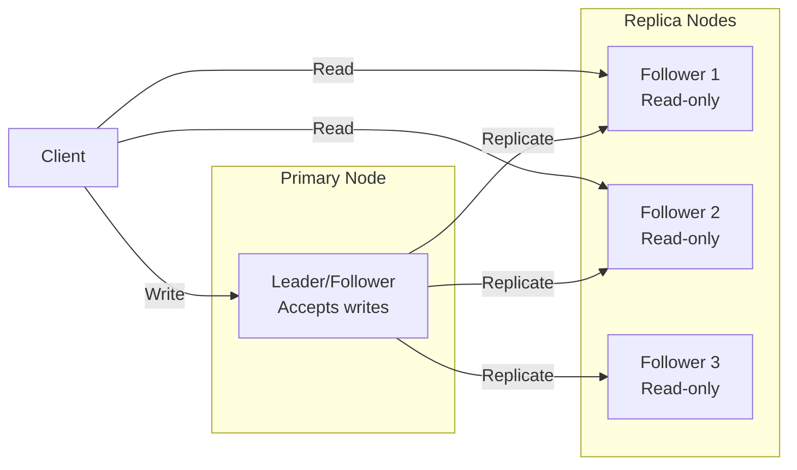
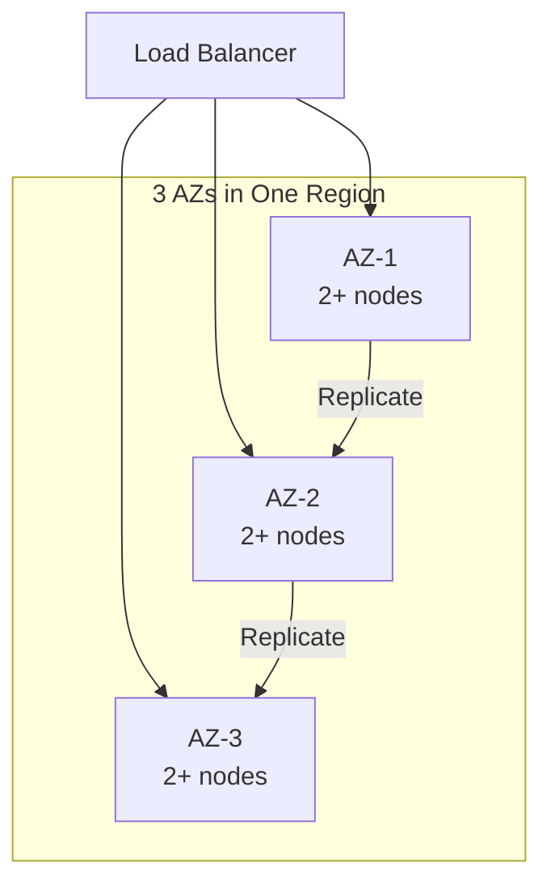
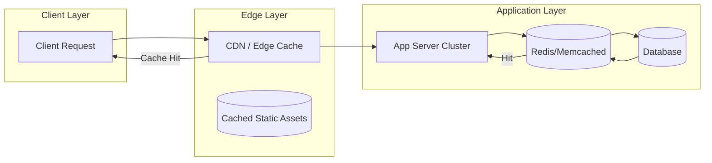
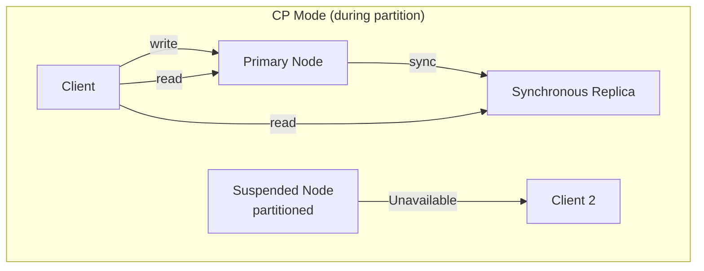
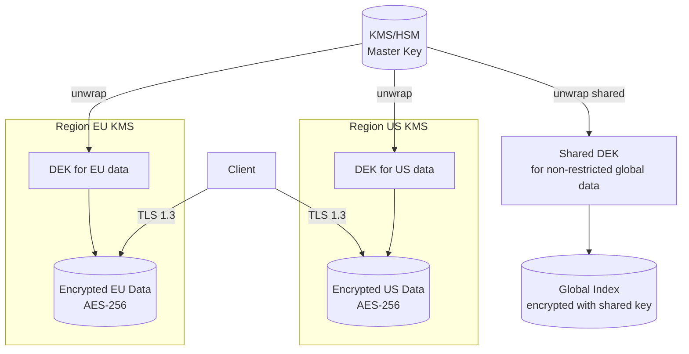
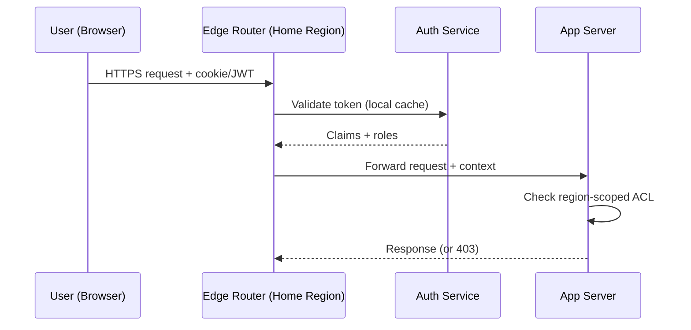
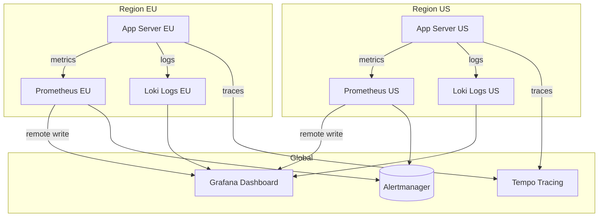

# Stock Broker System(Zerodha)

## Blogs and websites

## Medium

## Youtube

- [Stock Trading App System Design Interview | Meta System Design](https://www.youtube.com/watch?v=a5rABvMQ53U)
- [Zerodha Stock Broker System Design with @KeertiPurswani](https://www.youtube.com/watch?v=DH2-vDPFiE4)
- [Zerodha Stock Broker System Design (in Hindi)](https://www.youtube.com/watch?v=bdBCdrrAwkg)
- [System Design 12: Design Stock Broker Trading Application like Zerodha | Grow | Upstox | HLD | LLD](https://www.youtube.com/watch?v=W5FJnSywmLE)
- [Machine Coding Interview Round | Design and Code Zerodha like Stock Broker App LIVE-Low Level Design](https://www.youtube.com/watch?v=OVkxdFJLgwE)
- [Designing Zerodha | Mock Interview | Shreyansh Goyal | System Design #Zerodha | SG OG Ep 1](https://www.youtube.com/watch?v=rmva6BjKsp4)
- [I coded Zerodha's Trading Algorithm in 1 hour](https://www.youtube.com/watch?v=aEMBp9Bqfwc)

## Others

- [Building & Deploying an Order Book for Stock Exchanges](https://unacademy.com/class/building-deploying-an-order-book-for-stock-exchanges/NWSMCAHY)

---

## Theory

### Topics Covered

1. [Introduction / Problem Statement](#introduction-problem-statement)
2. [Characteristics](#characteristics)
3. [Components](#components)
4. [Architectural Patterns](#architectural-patterns)
5. [Benefits](#benefits)
6. [Pros](#pros)
7. [Cons](#cons)
8. [Challenges](#challenges)
9. [Best Practices](#best-practices)
10. [When to Use / When Not to Use](#when-to-use-when-not-to-use)
11. [Use Cases](#use-cases)
12. [Architecture](#architecture)
13. [High-Level Design](#high-level-design)
14. [Deep Dive](#deep-dive)
15. [Data Model and API](#data-model-and-api)
16. [Replication Strategies](#replication-strategies)
17. [Failure Detection and Membership](#failure-detection-and-membership)
18. [High Availability and Scalability](#high-availability-and-scalability)
19. [Performance and Optimization](#performance-and-optimization)
20. [CAP Theorem and Consistency Trade-offs](#cap-theorem-and-consistency-trade-offs)
21. [Encryption and Key Management](#encryption-and-key-management)
22. [Authentication and Authorization](#authentication-and-authorization)
23. [Security Threats and Mitigations](#security-threats-and-mitigations)
24. [Observability and Logging](#observability-and-logging)
25. [Replication Strategies](#replication-strategies)
26. [Failure Detection and Membership](#failure-detection-and-membership)
27. [High Availability and Scalability](#high-availability-and-scalability)
28. [Performance and Optimization](#performance-and-optimization)
29. [CAP Theorem and Consistency Trade-offs](#cap-theorem-and-consistency-trade-offs)
30. [Encryption and Key Management](#encryption-and-key-management)
31. [Authentication and Authorization](#authentication-and-authorization)
32. [Security Threats and Mitigations](#security-threats-and-mitigations)
33. [Observability and Logging](#observability-and-logging)
34. [Java and Spring Boot Implementation Guide](#java-and-spring-boot-implementation-guide)
35. [Real-World Implementations](#real-world-implementations)
36. [Interview Questions and Answers](#interview-questions-and-answers)

---
---
### Introduction / Problem Statement

A stock broker system is an online trading platform that lets retail investors buy/sell stocks and other financial instruments through a digital interface. It connects to stock exchanges via brokers/clearing houses, provides real-time market data, executes orders, manages risk, and tracks positions/portfolios. Modern brokers (Zerodha, Upstox, Interactive Brokers) offer low-cost, zero-commission trading with powerful APIs.

**Why Does It Exist**

Traditional stock trading required phone calls to brokers + manual order entry — slow, expensive, error-prone. Online broker systems democratized access: self-service trading, real-time data, algorithmic ordering, at a fraction of the cost.

**What Problem Does It Solve**

* **Order management**: Users place buy/sell orders → routed to exchange.
• **Matching engine**: Buy (bid) + sell (ask) orders matched by price-time priority.
* **Risk management**: Pre-trade checks (margin, position limits, exposure).
• **Market data**: Real-time prices, depth (order book), news feeds.
* **Real-time PnL**: Portfolio value + profit/loss computed live.
• **Regulatory compliance**: Audit trail; order logs; position limits.
• **Low latency**: Millisecond-scale order-to-trade for competitive advantage.
• **Scalability**: Thousands of concurrent traders; millions of orders/day.


**Problem Statement**

Design a stock broker system (like Zerodha) that allows retail investors to search for stocks, view real-time market data, place buy/sell orders, track positions and PnL, and receive real-time execution reports. The system must handle order placement with risk checks, support multiple order types, match orders via a price-time priority engine, and provide real-time market data.

**Functional Requirements**

- Stock search + real-time quotes (price, depth)
- Place buy/sell orders (market, limit, stop-loss, IOC, FOK)
- Pre-trade risk checks (margin, position limits, exposure)
- Order tracking (new → pending → filled → done)
- Real-time execution reports (fills)
- Portfolio tracking (positions, holdings, cash)
- Real-time PnL (unrealized + realized)
- Trade history
- Market data feed (websocket)

**Non-Functional Requirements**

- **Latency**: Order-to-trade < 5ms (co-located); API < 50ms (retail)
- **Scale**: 100K concurrent traders; 1M orders/sec at peak
- **Availability**: 99.99% (market hours) — market downtime ≠ system downtime
- **Consistency**: Strong consistency for orders (ACID); eventual for market data
- **Durability**: Orders persisted before ack; no order loss

---

### Characteristics

| Characteristic | What it means | Why it matters | How it works |
|---|---|---|---|
| **Order types** | Market, limit, stop, IOC, FOK | Different trading strategies | Order router + matching engine |
| **Pre-trade risk** | Check before sending to exchange | Prevent losses, regulatory | Risk engine (margin, exposure) |
| **Real-time market data** | Live quotes + depth (order book) | Informed trading decisions | Market data feed (websocket) |
| **Price-time priority** | Higher price wins; tie = earlier time | Fair matching; regulatory | Sorting in order book |
| **Low latency** | Millisecond order-to-trade | Competitive advantage | Co-location, lock-free queues |
| **Audit trail** | All orders + trades logged | Regulatory (exchanges, SEBI) | Immutable event log |
| **Position tracking** | Holdings + PnL in real-time | Portfolio management | Portfolio service + market data |

### Components

| Component | Purpose | Responsibilities | Relationship | Real-world Example |
|---|---|---|---|---|
| **Order Gateway** | Receive client orders | Auth, rate limit, parse, validate schema | Client ↔ Order Router | REST/WebSocket + FIX |
| **Order Router** | Route orders to exchange | Select venue, apply routing rules | Gateway ↔ Exchange | Smart order router |
| **Risk Engine** | Pre-trade risk checks | Margin check, position limits, exposure | Order Router ↔ User DB | Real-time risk rules |
| **Matching Engine** | Price-time priority matching | Maintain order book, match orders | Exchange ↔ Orders | Order book + matching |
| **Market Data Feed** | Real-time quotes + depth | Broadcast prices, order book changes | Exchange ↔ Clients | WebSocket + UDP |
| **Portfolio Service** | Positions + cash accounting | Track holdings, cash, PnL | Trade Service ↔ Market Data | Real-time PnL |
| **Trade Service** | Execute + record trades | Persist fills, generate trade confirmation | Matching Engine | Trade ledger |
| **Exchange Connector** | Connect to exchanges | FIX/FIXML protocol, session management | Order Router | FIX engine |
| **Order Store** | Persist all orders + state | Audit trail, order recovery | All services | Kafka + DB |

### Architectural Patterns

#### Price-Time Priority Matching

* **What**: Order book where buy orders (bids) and sell orders (asks) match by price (higher bid / lower ask wins) and time (earlier order at same price wins).
* **Problem solved**: Fair, deterministic, regulatory-compliant order matching.
* **How it works**: (1) Buy orders sorted descending by price → bid side. (2) Sell orders sorted ascending by price → ask side. (3) New order → top of book: if bid ≥ ask → match → trade at ask price. (4) Remaining → added to book. (5) Time priority within same price level (FIFO).
* **When to use**: Stock/futures exchanges; any marketplace with fair matching.
• **When not to use**: Auction-style (uniform price); or when not fair matching needed.
* **Advantages**: Fair; deterministic; regulatory compliance; simple to reason about.
* **Disadvantages**: Not optimal for liquidity (pro-rata might be better); gaming (penny jumping).

### Benefits

* **Fair matching**: Price-time priority → transparent, regulatory compliant.
• **Risk management**: Pre-trade checks → prevent over-leveraged positions.
• **Real-time data**: Quotes + depth → informed decision making.
• **Fast execution**: Sub-5ms order-to-trade → competitive edge.
• **Audit trail**: All orders + trades logged → compliance + forensic analysis.

### Pros

* **Regulatory compliance**: SEBI, exchange order logs + audit trails.
• **Pre-trade risk**: Margin + position limits checked before exchange.
• **Fast matching**: C++ order book; lock-free queues; < 1ms matching.
• **Multi-exchange**: Smart order router → best execution.
• **Real-time portfolio**: Live positions + PnL.

### Cons

* **Complexity**: Order routing, risk, matching, market data = complex system.
• **Cost**: Exchange co-location + market data feeds (expensive).
• **Latency arms race**: Nanosecond advantage → constant infrastructure upgrades.
• **Regulatory overhead**: Extensive logging, order retention (5+ years).
• **Market risk**: Flash crashes, volatility → system limits needed.

### Challenges

#### Technical Challenges
* **Matching engine**: C++ for < 1ms latency; lock-free data structures; order book (price levels + FIFO).
• **FIX protocol**: Parse + generate FIX messages; session management (logon, heartbeat, test).
• **Market data**: Real-time multicast; UDP for speed; A/B feeds (primary/backup).

#### Scalability Challenges
* **Orders/sec**: 1M+ → sharded exchange connectors; Kafka for order ingestion.
• **Market data**: 10K+ symbols × 100+ updates/sec → multicast UDP + compression.

#### Performance Challenges
* **Latency**: Co-location at exchange; kernel bypass (DPDK); avoid GC pauses (C++/Rust).
• **Order hot key**: Popular stock → high order rate → sharding by stock_id.

#### Reliability Challenges
* **Exchange disconnect**: FIX session recovery → resend + replay.
• **Order loss**: Persist order before ack → Kafka + DB (no loss).
• **Circuit breakers**: Market volatility → system-wide trading pause.

#### Maintainability Challenges
* **FIX versions**: FIX 4.2/4.4/5.0 SP2 → version compatibility.
• **Exchange API changes**: Each exchange has custom protocol + rules.
• **Regulatory changes**: Continuous compliance updates.

#### Security Concerns
* **Account takeover**: 2FA; session management.
• **Order injection**: AuthN + authZ on every order.
• **Market manipulation**: Wash trading detection; spoofing detection.
• **Data privacy**: PII; trading history; market data licensing.

### Best Practices

* **Co-location**: Place servers at exchange (0–1ms round-trip).
• **Lock-free queues**: Avoid GC pauses; use C++/Rust for matching engine.
• **FIX session management**: Heartbeats + sequence numbers + resend logic.
• **Pre-trade risk**: Check margin + position limits before routing.
• **Audit trail**: Immutable event log (Kafka) + DB; 5+ year retention.
• **Circuit breakers**: Max order size, price bands, volatility pause.
• **Multi-exchange**: Smart order router → best execution + failover.

### When to Use / When Not to Use

#### Appropriate
* Retail online trading platforms (Zerodha, Upstox, E*TRADE).
• Algorithmic trading (API-based strategies).
• Market-making platforms.
• Exchange backends (matching engines).

#### Not Appropriate
* Manual trading (phone-based brokers).
• Private markets (no continuous market).
• When latency/throughput requirements are low.

#### Decision Factors
* Exchange connectivity; required latency; order volume; regulatory jurisdiction.

### Use Cases

#### Retail Stock Trading Platform (Zerodha-style)

* **Problem**: Build a self-service stock trading app for retail investors with real-time quotes, order placement (multiple types), risk checks, and portfolio tracking.
* **Solution**: User app → Order Gateway (REST + WebSocket) → Risk Engine (pre-trade checks) → Order Router → Exchange (FIX protocol). Market data from exchange → real-time quotes + depth → push to clients. Portfolio service tracks positions + PnL. All orders persisted for audit trail.
* **Why suitable**: Modular design (risk, routing, matching, data separate); FIX for exchange connectivity; real-time PnL.
* **How it works**: (1) User searches stock → Market Data Feed → real-time quote + depth. (2) Place order (market/limit/SL/IOC/FOK) → Order Gateway → Risk Engine (check margin + position limits). (3) If pass → Order Router → FIX to exchange. (4) Exchange → matches → execution report → Order Store + Trade Service. (5) Portfolio Service: updates positions + cash → real-time PnL. (6) Market data pushed to client via WebSocket.
* **Trade-offs**: Latency vs. features (co-location = cost); compliance overhead (audit logs); exchange fees; market risk (circuit breakers needed).

### Architecture



#### Architecture Structure
* **Gateway**: REST + WebSocket (orders + market data).
• **Risk Engine**: Real-time margin + position limit checks.
• **Order Router**: Smart routing to best venue (FIX).
• **Market Data**: Real-time quotes + depth from exchanges.
• **Portfolio**: Position accounting + real-time PnL.
* **Order Store**: Immutable audit trail (Kafka + DB).

#### Communication
* **Client ↔ Gateway**: HTTPS (REST) + WebSocket (market data).
• **Internal**: gRPC + Kafka (high-throughput).
• **Exchange ↔ Router**: FIX protocol (over TCP).

#### Data Flow
1. **Quote**: Exchange → Market Data Feed → Portfolio Service → push to WebSocket clients.
2. **Order**: Client → Gateway → Risk Engine (check) → Order Router → FIX exchange.
3. **Execution**: Exchange → Trade Service → persist to Order Store → update Portfolio → push fills to client.
4. **Audit**: All orders + executions → Kafka → DB (immutable log).

#### Scaling Strategy
* **Gateway**: 100+ instances; WebSocket sharded by user_id.
• **Matching/Risk**: In-memory + Redis.
• **Order Store**: Kafka (1M msgs/sec) + sharded DB.
• **Market Data**: Multicast UDP + compression.

#### Failure Handling
* **Exchange disconnect**: FIX sequence reset + resend; queue orders.
• **Order loss**: Persist before ack (Kafka); recover from log.
• **Market data delay**: Stale quote detection; client timeout.

### High-Level Design



### Deep Dive

#### Order Book Matching (Price-Time Priority)

The existing ## Theory content describes the order lifecycle and matching mechanics: orders enter → risk check → exchange → matching engine → order book (bids sorted desc, asks sorted asc) → price-time priority (higher price wins; tie = earlier time). This ensures fair, deterministic matching.

#### Risk Checks

The existing ## Theory covers pre-trade checks: margin verification (sufficient collateral), position limits (per stock), exposure limits (sector/concentration), and circuit breakers (max order size, price bands). These prevent catastrophic losses.

#### Market Data Distribution

The existing ## Theory notes real-time quotes + depth (order book) distributed via WebSocket/multicast. Clients receive level-1 (best bid/ask) + level-2 (full depth) updates. Updates compressed + multicast for efficiency.

### Data Model and API

* **API purpose**: Place/cancel/modify orders, get market data, view portfolio.

| Method | Endpoint | Description |
|---|---|---|
| POST | `/api/v1/orders` | Place new order |
| DELETE | `/api/v1/orders/{id}` | Cancel order |
| PATCH | `/api/v1/orders/{id}` | Modify order (price/qty) |
| GET | `/api/v1/orders/{id}` | Get order status |
| GET | `/api/v1/quotes/{symbol}` | Get real-time quote |
| GET | `/api/v1/portfolio` | Get portfolio + PnL |

**Place order (POST /orders)**:
```json
{
  "symbol": "RELIANCE.NS",
  "side": "BUY",
  "type": "LIMIT",
  "quantity": 10,
  "price": 2450.00,
  "order_type": "DAY",
  "exchange": "NSE"
}
```
**Response**:
```json
{
  "order_id": "ord_123",
  "symbol": "RELIANCE.NS",
  "status": "PENDING",
  "filled_qty": 0,
  "avg_price": 0
}
```

**WebSocket market data**: `wss://ws.api.example.com/marketdata`
```json
{"type": "quote", "symbol": "RELIANCE.NS", "bid": 2449.5, "ask": 2450.0, "timestamp": 1723456789000}
```

**Authentication**: JWT + API key.
**Rate limiting**: 1000 orders/sec; 10K market-data subscriptions.


```mermaid
erDiagram
    USER ||--o{ ORDER : "places"
    USER ||--o{ POSITION : "holds"
    ORDER ||--o{ TRADE : "generates"
    STOCK ||--o{ ORDER : "traded"
    STOCK ||--o{ POSITION : "held"

    USER {
      string user_id PK
      string username
      string email
      decimal cash_balance
    }
    ORDER {
      string order_id PK
      string user_id FK
      string stock_id FK
      string side BUY_SELL
      string type MARKET_LIMIT_STOP
      int quantity
      decimal price
      string status NEW_PART_FILLED_DONE_CANCELLED
      datetime created_at
    }
    TRADE {
      string trade_id PK
      string order_id FK
      int filled_qty
      decimal price
      datetime created_at
    }
    STOCK {
      string stock_id PK
      string symbol
      string exchange
      decimal current_price
    }
    POSITION {
      string position_id PK
      string user_id FK
      string stock_id FK
      int quantity
      decimal avg_price
      decimal unrealized_pnl
    }
```

**Partitioning**: Orders by user_id + date; Trades by stock_id.

### Replication Strategies

**What it means**

Replication Strategies determine how data and state are copied across multiple nodes in Stock Broker System. The choice of strategy determines the trade-off between consistency, availability, and latency.

**Why it matters**

Stock Broker System must replicate data to prevent loss and serve reads from multiple nodes. The replication strategy determines whether the system favors consistency (strong reads) or availability (always writable), and how it handles cross-node failure.

**How it works**

**Leader-based (single-leader)**: A single primary node accepts all writes; followers replicate changes asynchronously or semi-synchronously. Reads can be served from any replica. This strategy favors strong consistency for writes but creates a write bottleneck at the leader.



*Leader-based replication: a single primary node accepts all writes and replicates them to read-only followers. Clients can read from any replica for scaled read throughput, but all writes go through the leader.*

**Multi-leader (multi-master)**: Multiple nodes accept writes and exchange updates with each other. This enables low-latency writes in different regions but requires conflict resolution (last-write-wins, merge functions, or CRDTs).

**Leaderless (quorum-based)**: Any node can accept writes; a quorum of nodes must agree. Read and write quorums are configured so that at least one node overlaps between them (R + W > N). This maximizes availability and write scalability.

**Trade-offs for Stock Broker System**:

| Strategy | Use Case | Pros | Cons |
|---|---|---|---|
| Leader-based | trading accounts, transaction history, PII | Strong consistency, simple | Write bottleneck, leader failure risk |
| Multi-leader | public market prices, aggregate volumes, company fundamentals | Low-latency global writes | Conflict resolution, complex |
| Leaderless | Caching, counters | High availability, no bottleneck | Eventual consistency, read repair overhead |

**Real-world implementations**

- **Redis**: Leader-follower replication with asynchronous replication; Sentinel handles failover.
- **Apache Kafka**: Leader-based partition replication with ISR (in-sync replica) — writes go to the leader, followers replicate.
- **Cassandra**: Tunable consistency with leaderless quorum (R + W > N).
- **DynamoDB Global Tables**: Multi-master active-active across regions.

### Failure Detection and Membership

**What it means**

Failure Detection and Membership is the mechanism by which Stock Broker System determines which nodes are alive and part of the cluster. Membership is the list of known nodes; failure detection is the process of updating that list when nodes fail or recover.

**Why it matters**

Stock Broker System must route requests only to healthy nodes and trigger failover when a node goes down. False positives (healthy nodes marked as dead) cause unnecessary failovers and data loss. False negatives (dead nodes not detected) cause failed requests and degraded performance.

**How it works**

**Heartbeat-based detection**: Each node sends a heartbeat (ping) to a subset of peers at regular intervals. If a node misses N consecutive heartbeats, it is marked as suspect. The gossip protocol distributes membership information: each node exchanges its view of the cluster with a random peer, and the information propagates gossip-style.

```mermaid
sequenceDiagram
    participant A as Node A
    participant B as Node B
    participant C as Node C

    loop Every 1s
        A->>B: Heartbeat (ping)
        B-->>A: Heartbeat (ack)
    end
    B->>C: Gossip: A is alive
    C->>A: Gossip: B is alive
    Note over A,B,C: View converges in O(log N) rounds
```

*Gossip-based failure detection: each node periodically pings a random subset of peers and gossips its view of the cluster. The membership list converges in O(log N) rounds.*

**Phi Accrual Failure Detector**: Instead of a fixed timeout, the detector measures the time between consecutive heartbeats and computes a phi (φ) value — the probability that the node is dead given the observed heartbeat pattern. φ is compared against a threshold (typically 1–8); higher thresholds reduce false positives but increase detection latency.

**SWIM (Scalable Weakly-consistent Infection-style Process group Membership Protocol)**: Nodes ping a random subset of cluster members. If a ping fails, the node is marked "suspect" and the failure is "infected" (gossiped) to other nodes. This is O(log N) per failure detection cycle and scales to large clusters.

**Trade-offs**:

| Approach | Strengths | Weaknesses |
|---|---|---|
| Heartbeat (timeout-based) | Simple, deterministic | False positives under load |
| Phi Accrual | Adaptive threshold | Needs historical data |
| SWIM | Scales to 1000s of nodes | Eventual consistency |

**Real-world implementations**

- **AWS Route 53 Health Checks**: Uses TCP/HTTP health checks with configurable thresholds to remove unhealthy instances from DNS rotation.
- **Kubernetes**: Uses the kubelet heartbeat (every 10s) to determine node liveness; nodes missing 3 consecutive heartbeats are marked NotReady.
- **Consul**: Uses SWIM protocol for membership and failure detection; supports both LAN and WAN gossip.
- **Akka Cluster**: Uses Phi Accrual failure detector with configurable φ thresholds.

### High Availability and Scalability

**What it means**

High Availability and Scalability determines how Stock Broker System continues operating when nodes or entire zones fail, and how capacity is added as demand grows. HA is about minimizing downtime; scalability is about maintaining performance as load increases.

**Why it matters**

Stock Broker System must stay operational even when individual nodes, availability zones, or entire regions fail. At the same time, it must scale horizontally to handle traffic spikes without degrading latency. The two are intertwined: the replication strategy, failure detection, and load balancing all contribute to both HA and scalability.

**How it works**

**Availability zones (AZs)**: Nodes are distributed across multiple AZs within a region. Each AZ is an independent failure domain (power, networking, physical security). A load balancer distributes requests across AZs; if one AZ fails, traffic is routed to the remaining AZs with no data loss (assuming replication is in place).



*Multi-AZ deployment: a load balancer distributes traffic across three availability zones. Each AZ has multiple nodes. Data is replicated across AZs so that losing one AZ does not cause data loss or service interruption.*

**Load balancing**: A load balancer distributes incoming requests across healthy nodes. Algorithms include round-robin, least connections, and weighted routing. Health checks ensure traffic only goes to healthy nodes. For Stock Broker System, the load balancer also considers Order Book when routing.

**Auto-scaling**: The system automatically adds or removes nodes based on metrics (CPU, memory, request rate). Scale-out policies add nodes when load exceeds a threshold; scale-in policies remove nodes during low load. For stateful services like Stock Broker System, scale-out involves rebalancing partitions (moving data and connections to the new node).

**Failover and recovery**: When a node fails, the load balancer detects it (via health checks or failure detection) and stops sending traffic. A new node is provisioned (or a standby is promoted) and begins serving. For Stock Broker System, failover must preserve trading accounts, transaction history, PII data — this is achieved through replication with a quorum of healthy nodes.

**Scalability patterns**:

1. **Horizontal partitioning (sharding)**: Split data by a partition key (e.g., user_id, session_id) and distribute partitions across nodes. New nodes take ownership of additional partitions.

2. **Consistent hashing**: Minimize data movement on scale-out — only 1/N of the data moves to the new node. Nodes and partitions are placed on a ring; a request for key X is routed to the next node clockwise from hash(X).

3. **Connection draining**: When scaling in, existing connections are allowed to complete before the node is shut down. For Stock Broker System, this means draining active A sessions gracefully.

**Real-world implementations**

- **Netflix OSS (Eureka + Zuul + Ribbon)**: Service discovery with Eureka, edge routing with Zuul, and client-side load balancing with Ribbon. Scales to thousands of instances.
- **Kubernetes HPA + VPA**: Horizontal Pod Autoscaler scales pods based on CPU/memory; Vertical Pod Autoscaler adjusts resource requests based on historical usage.
- **AWS ALB + Auto Scaling Groups**: Application Load Balancer with auto-scaling groups across AZs; health checks replace unhealthy instances automatically.

### Performance and Optimization

**What it means**

Performance and Optimization covers the techniques Stock Broker System uses to achieve low latency, high throughput, and efficient resource usage. This section examines the key performance metrics, bottlenecks, and optimizations specific to the system.

**Why it matters**

Stock Broker System faces competing pressures: users demand low latency, the system must handle high throughput, and infrastructure costs must be controlled. The optimizations applied at the data, compute, and network layers determine whether the system meets its SLA.

**How it works**

**Latency layers**: Latency in Stock Broker System comes from three layers:
1. **Network**: Round-trip time from client to the nearest edge node / load balancer.
2. **Application**: Request processing time on the server (CPU, I/O, lock contention).
3. **Data**: Time to read/write from storage (cache hit vs. database query).

The 99th-percentile latency is the key metric for user-facing systems — it determines the worst-case experience.

**Caching strategies**: Stock Broker System uses multiple cache layers:
- **Edge cache**: Static assets (images, CSS, JS) served from a CDN at the edge. For Stock Broker System, this caches public market prices, aggregate volumes, company fundamentals that doesn't change frequently.
- **Application cache**: In-memory cache (e.g., Redis, Memcached) for frequently accessed data. Cache-aside pattern: application checks cache first, falls back to database on miss.
- **Local cache**: In-process cache (e.g., Caffeine, Guava) for data accessed within a single request. Avoids network round-trips.

**Batching and pipelining**: Stock Broker System batches small operations (e.g., writes, log flushes) to amortize per-operation overhead. Pipelining allows multiple requests to be in flight simultaneously.



*Caching hierarchy: clients first hit the edge CDN/cache; if the response is cached, it is returned immediately. Otherwise, the request reaches the application, which checks its in-memory/application cache (e.g., Redis) before falling back to the database. This minimizes latency from each layer.*

**Connection pooling**: Stock Broker System maintains a pool of database connections to avoid the TCP handshake overhead on every request. Pool size is tuned to match the database's capacity.

**Compression**: Responses are compressed (gzip, zstd) for clients that support it. At the network layer, gRPC uses HPACK header compression.

**Indexing**: Database tables are indexed on frequently queried fields. For Stock Broker System, indexes cover Matching Engine and Risk Check Service for fast lookups.

**Asynchronous processing**: Non-critical background work (e.g., analytics, cleanup, notifications) is offloaded to message queues and processed asynchronously, keeping the request path fast.

**Resource isolation**: CPU and memory are allocated per service (containers with cgroup limits). This prevents a single misbehaving service from degrading the entire system.

**Metrics for Stock Broker System**:

| Metric | Target | How to Measure |
|---|---|---|
| P99 latency | < 1s | Load test with realistic traffic |
| Throughput | 1K RPS | Request rate under peak load |
| Error rate | < 0.1% | 5xx / total requests |
| Cache hit ratio | > 90% | cache_hits / (cache_hits + misses) |
| Resource utilization | < 80% CPU, < 85% memory | Container metrics |

**Real-world implementations**

- **Google's HTTP Load Balancer**: Global load balancing with edge PoPs; routes users to the nearest healthy backend.
- **Cloudflare**: Edge cache with Argo Smart Routing that dynamically routes traffic to avoid congestion.
- **Redis**: Used as an application cache with configurable eviction policies (LRU, LFU, TTL).

### CAP Theorem and Consistency Trade-offs

**What it means**

The CAP Theorem states that in a distributed system, you can only have two of three guarantees: **Consistency** (every read returns the latest write), **Availability** (every request gets a response), and **Partition tolerance** (the system continues to operate despite network partitions). Since network partitions are inevitable in distributed systems like Stock Broker System, the real choice is between CP (consistent + partitioned) and AP (available + partitioned).

**Why it matters**

Stock Broker System must decide which two guarantees to prioritize. For trading accounts, transaction history, PII data, strong consistency (CP) is critical — users must see the most recent data. For public market prices, aggregate volumes, company fundamentals data, availability (AP) is more important — the system should remain responsive even during network issues.

**How it works**

**CP (Consistent + Partition-tolerant)**: During a partition, the system trades availability for consistency. Writes are rejected or delayed until the partition heals. Reads return the latest committed value. This is appropriate for trading accounts, transaction history, PII in Stock Broker System.



*CP system during a network partition: writes are rejected on the partitioned node to maintain consistency. Clients are routed to the healthy primary and synchronous replica.*

**AP (Available + Partition-tolerant)**: During a partition, the system trades consistency for availability. Both sides accept writes; conflicts are resolved later (last-write-wins, merge, or application-level conflict resolution). This is appropriate for public market prices, aggregate volumes, company fundamentals in Stock Broker System.

**PACELC (extending CAP)**: The PACELC theorem says that even when the network is not partitioned (the "else" case in CAP), you must choose between latency (L) and consistency (C). Stock Broker System uses:
- **Racing reads**: Serve from the nearest replica for speed (low latency, eventual consistency).
- **Linearizable reads**: Always read from the primary (high latency, strong consistency).

The choice is made per request based on whether the data is trading accounts, transaction history, PII (strong consistency) or public market prices, aggregate volumes, company fundamentals (fast reads).

**Trade-offs**:

| System Type | CP Use Cases | AP Use Cases |
|---|---|---|
| Stock Broker System | trading accounts, transaction history, PII | public market prices, aggregate volumes, company fundamentals |

**Real-world implementations**

- **etcd**: CP system using Raft consensus; used for service discovery and configuration in Kubernetes.
- **Cassandra**: AP system with tunable consistency; used for time-series data and user sessions.
- **Google Spanner**: CP with external consistency via TrueTime API; used for global financial transactions.
- **DynamoDB**: AP by default, but supports strongly consistent reads (CP mode) on demand.

### Encryption and Key Management

**What it means**

Encryption and Key Management in Stock Broker System ensures that data is protected both at rest (stored on disk) and in transit (moving between services). Key management governs how encryption keys are generated, stored, rotated, and accessed — without proper key management, encryption provides a false sense of security.

**Why it matters**

Stock Broker System handles trading accounts, transaction history, PII that must be encrypted both at rest and in transit. Processing millions of orders per second with microsecond latency while maintaining strict price-time priority ordering and preventing risk violations requires careful key management: keys must be rotated regularly, scoped to prevent cross-contamination, and audited for compliance. A single key compromise could expose sensitive data.

**How it works**

**At-rest encryption**: Data stored in Order Book, Matching Engine and databases is encrypted using AES-256-GCM. The Data Encryption Key (DEK) is generated per data partition and encrypted with a Key Encryption Key (KEK) managed by a KMS (AWS KMS, GCP KMS, HashiCorp Vault). Keys are regionally scoped — only data belonging to a region can be decrypted by that region's KEK.

**In-transit encryption**: All inter-service communication uses TLS 1.3 or mTLS for service-to-service auth. Cross-region communication of public market prices, aggregate volumes, company fundamentals uses TLS + optional application-level encryption. trading accounts, transaction history, PII is NEVER transmitted in plaintext or across region boundaries.

**Key hierarchy**:
```
Master Key (HSM-backed, KMS-managed)
  └─ KEK (per region, per service)
     └─ DEK (per data partition, rotated every 90 days)
        └─ Data (encrypted with DEK)
```

**Key rotation**: KEKs rotate annually (automatic via KMS); DEKs rotate per object or per 90 days. Applications handle key version headers transparently — a DEK version is stored alongside the encrypted data.

**Cross-region key sharing**: For non-restricted data (public market prices, aggregate volumes, company fundamentals), a shared key is imported into each region's KMS. Restricted data NEVER uses cross-region keys — each region's KMS holds only that region's keys.



*Encryption key hierarchy: master keys are managed by an HSM-backed KMS and never leave the KMS. Each region has its own KEK. Data encryption keys (DEKs) are generated per partition and encrypted with the regional KEK. Only non-restricted global data uses a shared cross-region key. All client traffic uses TLS 1.3.*

**Java/Spring Boot Implementation**

```java
@Service
@RequiredArgsConstructor
public class DataEncryptionService {

    private final AWSKMS kms;
    @Value("${app.region}")
    private String region;
    @Value("${app.encryption.dek-ttl-minutes:1440}")
    private int dekTtlMinutes;

    private final Map<String, SecretKey> dekCache = new ConcurrentHashMap<>();

    public EncryptedData encrypt(String plaintext, String partitionId) {
        SecretKey dek = getOrCreateDek(partitionId);
        byte[] ciphertext = CryptoUtils.encrypt(plaintext.getBytes(StandardCharsets.UTF_8), dek);
        String dekCiphertext = kms.encrypt(EncryptRequest.builder()
            .keyId("arn:aws:kms:" + region + ":master-key")
            .plaintext(SdkBytes.fromByteArray(dek.getEncoded()))
            .build()).ciphertextBlob().asByteArray();
        return new EncryptedData(ciphertext, dekCiphertext, Instant.now());
    }

    private SecretKey getOrCreateDek(String partitionId) {
        return dekCache.computeIfAbsent(partitionId, id -> {
            try {
                return KeyGenerator.getInstance("AES").generateKey();
            } catch (NoSuchAlgorithmException e) {
                throw new IllegalStateException("Cannot generate DEK", e);
            }
        });
    }
}
```

*Spring Boot encryption service: DEKs are cached per-partition with TTL. Each DEK is encrypted via AWS KMS using a regional master key. The encrypted DEK (ciphertext) is stored alongside the data — only the KMS for that region can decrypt it.*

**Real-world implementations**

- **AWS KMS**: Managed HSM-backed key service; supports automatic key rotation and custom key stores.
- **HashiCorp Vault**: Open-source key management; supports transit encryption (encrypt/decrypt without storing keys).
- **Google Cloud KMS**: Hardware-backed key management with IAM-based access control.

### Authentication and Authorization

**What it means**

Authentication and Authorization (AuthN/AuthZ) in Stock Broker System control who can access the system and what they can do. Authentication verifies identity; authorization determines permissions. In a distributed system like Stock Broker System, auth must work across multiple nodes while respecting data boundaries — a user authenticated in one region should not have their session data or tokens replicated to regions where it is not permitted.

**Why it matters**

Stock Broker System must verify identity at the edge and enforce authorization at every service boundary. trading accounts, transaction history, PII must be protected — only users with appropriate roles should access it. At the same time, public market prices, aggregate volumes, company fundamentals data should be accessible to a wider audience with minimal friction.

**How it works**

**Authentication (who are you?)**:
- **JWT tokens**: Users authenticate through their home region's identity provider. The region returns a JWT (JSON Web Token) signed by a regional signing key. Tokens include claims like `iss` (issuer region), `sub` (subject/user ID), `home_region`, `roles`, and `exp` (expiry). Tokens are scoped per region — a token issued by region A cannot access restricted data in region B.
- **mTLS for service-to-service**: Internal services authenticate each other using mutual TLS certificates issued by a per-region Certificate Authority (CA). No shared secrets cross region boundaries.
- **Session management**: Sessions are stored regionally (Redis) and never replicated cross-region for restricted data. Session IDs are opaque UUIDs; the session store maps session ID → user context.

**Authorization (what can you do?)**:
- **RBAC (Role-Based Access Control)**: Users are assigned roles per region. Common roles: `region_admin` (full access to region data), `auditor` (read-only audit), `viewer` (read public data only). Roles are stored in the regional database and cached locally for sub-1ms lookups.
- **ABAC (Attribute-Based Access Control)**: Fine-grained permissions based on attributes (e.g., `home_region == request_region AND role == admin`). This allows expressing complex policies like "users can only access restricted data in their home region."
- **Resource-level authorization**: Each request is checked against an ACL (Access Control List) that specifies which roles can access which resources. For Stock Broker System, restricted resources require the `admin` role + matching region.



*Authentication flow: the user's token is validated by the regional auth service (claims cached locally). The edge router forwards the request with the security context. Each app server checks the region-scoped ACL before accessing restricted data.*

**Java/Spring Boot Implementation**

```java
@Service
@RequiredArgsConstructor
public class AuthorizationService {

    private final UserTokenRepository tokenRepository;
    @Value("${app.region}")
    private String currentRegion;

    public boolean canAccessResource(String userId, String resourceRegion,
                                     String action, JWTClaims claims) {
        String userHomeRegion = claims.getStringClaim("home_region");
        List<String> roles = claims.getStringListClaim("roles");

        if (!roles.contains(action)) {
            return false;
        }

        if (resourceRegion.equals(userHomeRegion)) {
            return true;
        }

        if (resourceRegion.equals("global")) {
            return roles.contains("global_reader");
        }

        return false;
    }
}

@RestController
@RequiredArgsConstructor
@RequestMapping("/api/v1")
public class RegionController {
    private final AuthorizationService authService;

    @GetMapping("/data/{region}/profile")
    public ResponseEntity<?> getProfile(
            @PathVariable String region,
            @RequestHeader("Authorization") String token) {
        JWTClaims claims = JwtUtils.parseAndValidate(token, currentRegion);

        if (!authService.canAccessResource(
                claims.getStringClaim("sub"), region, "read", claims)) {
            return ResponseEntity.status(HttpStatus.FORBIDDEN).build();
        }

        return ResponseEntity.ok(profileService.getByRegion(region));
    }
}
```

*Spring Boot authorization service: checks both the user's role and whether the requested resource violates region boundaries. The `canAccessResource` method returns false if a user from region EU tries to access restricted data in region US.*

**Real-world implementations**

- **Auth0**: JWT-based authentication with regional endpoints; supports custom rules for ABAC.
- **Okta**: Multi-region identity management with adaptive MFA and ThreatInsight for anomaly detection.
- **AWS Cognito**: Regional user pools with IAM integration; tokens are region-scoped by default.

### Security Threats and Mitigations

**What it means**

Security Threats and Mitigations catalog the attack surface of Stock Broker System, the most likely threats, and the corresponding defenses. Every distributed system has unique threat vectors — Stock Broker System is no exception.

**Why it matters**

Stock Broker System handles trading accounts, transaction history, PII that attackers might target. Processing millions of orders per second with microsecond latency while maintaining strict price-time priority ordering and preventing risk violations expands the attack surface: more nodes, more network paths, more failure modes. Without proper threat modeling, a single vulnerability could expose sensitive data across the entire system.

**Threat model**:

| Threat | Likelihood | Impact | Mitigation |
|---|---|---|---|
| Data exfiltration (cross-region) | High | Critical | Region-scoped keys, no cross-region replication of restricted data |
| Man-in-the-middle (inter-service) | Medium | High | mTLS between all services |
| Replay attacks | Medium | High | Token expiry + nonce |
| DDoS at the edge | High | High | Rate limiting + edge filtering (Cloudflare, AWS Shield) |
| PII leakage in logs | High | High | PII redaction + field-level access control |
| Session hijacking | Medium | Medium | Short-lived tokens + IP binding |
| Privilege escalation | Low | Critical | Least-privilege RBAC + audit logs |
| Cache poisoning | Low | Medium | Cache invalidation on write + signed cache keys |

**How it works**

**Data exfiltration prevention**: Stock Broker System enforces data residency by design — trading accounts, transaction history, PII is never replicated cross-region. The replication layer checks a data classification label before allowing cross-region copy. A database-level policy (e.g., PostgreSQL RLS) also blocks cross-region queries for restricted partitions.

**mTLS enforcement**: All service-to-service communication uses mutual TLS. Certificates are issued by a per-region CA and rotated every 30 days. Services must present a valid certificate to communicate — no plaintext connections are allowed.

**PII redaction**: Application logs are scanned for PII patterns (email, phone, credit card) using an automated redaction layer (e.g., AWS Macie, Google DLP). public market prices, aggregate volumes, company fundamentals is logged freely; restricted fields are masked or dropped before logging.

```mermaid
graph TD
    subgraph "Threat Surface"
        Client[Client]
        Edge[Edge Router / WAF]
        App[App Server]
        DB[(Database)]
        Cache[(Cache)]
        Logs[Log Store]
    end

    Client -->|HTTPS| Edge
    Edge -->|mTLS| App
    App -->|mTLS| DB
    App -->|Read| Cache
    App -->|Write| DB
    App -->|Log| Logs

    subgraph "Mitigations"
        WAF[AWS WAF /<br/>Cloudflare]
        DLP[PII Redaction<br/>(Macie/DLP)]
        FIM[File Integrity<br/>Monitoring]
    end

    Edge -.-> WAF
    Logs -.-> DLP
    DB -.-> FIM
```

*Threat mitigation diagram: the WAF at the edge blocks DDoS and injection attacks. mTLS protects all service-to-service communication. PII redaction scans logs before storage. File integrity monitoring alerts on database tampering.*

**Audit trail**: All security-relevant events (auth, data access, config changes) are written to an append-only audit log with cryptographic integrity (HMAC per entry). The log covers trading accounts, transaction history, PII access — who accessed what, when, and from where.

**Real-world implementations**

- **Cloudflare**: Zero-trust model (All Connections to All Networks) with mTLS everywhere; uses GeoIP blocking and rate limiting for DDoS mitigation.
- **Google BeyondCorp**: Zero-trust network security model; all access is authenticated and authorized at the request level.

### Observability and Logging

**What it means**

Observability and Logging in Stock Broker System provide visibility into system behavior through three pillars: **metrics** (aggregates and counters), **logs** (structured event records), and **traces** (distributed request timelines). Together, these signals allow operators to debug issues, detect anomalies, and verify SLA compliance.

**Why it matters**

Distributed systems like Stock Broker System are inherently opaque — failures can cascade across services in unexpected ways. Without good observability, a single slow dependency can cause widespread timeouts that are nearly impossible to diagnose. Processing millions of orders per second with microsecond latency while maintaining strict price-time priority ordering and preventing risk violations makes observability even more critical: operators need to see cross-region latency, regional failures, and data-residency violations.

**How it works**

**Metrics**: Stock Broker System instruments every service with Prometheus-style metrics:
- **Request rate, error rate, duration (the "RED" metrics)**: Tracks per-endpoint HTTP latency and error counts.
- **System metrics**: CPU, memory, disk I/O, network throughput per node.
- **Business metrics**: For Stock Broker System, this includes metrics like "Matching Engine fill rate" and "reservation conflict rate".

Metrics are aggregated in a time-series database (Prometheus, VictoriaMetrics) and visualized in Grafana dashboards with alerts via PagerDuty.

**Logs**: Stock Broker System uses structured logging (JSON format) with standardized fields:
- `timestamp`: ISO 8601 UTC
- `level`: DEBUG, INFO, WARN, ERROR
- `service`: originating service name
- `trace_id`: distributed trace identifier (for correlation)
- `span_id`: current operation span
- `region`: the region that processed the request
- `data_class`: RESTRICTED or NON_RESTRICTED

trading accounts, transaction history, PII access is logged with full context (user, action, resource). public market prices, aggregate volumes, company fundamentals logs are aggregated and may have reduced retention.

**Distributed tracing**: Every request is assigned a trace ID at the edge. The trace propagates through all downstream services via HTTP headers. A tracing backend (Jaeger, Tempo, Zipkin) reconstructs the full request timeline, showing latency at each hop. For Stock Broker System, traces include region boundaries — a cross-region call is annotated as such.



*Observability architecture: each region runs its own Prometheus (metrics) and Loki (logs) instances. A global Grafana instance queries all regional backends. Traces are collected centrally in Tempo. Alerts fire from each region's Prometheus to Alertmanager.*

**Alerting**: Stock Broker System defines SLO-based alerts:
- **Latency**: P99 > 1s for 5 minutes → page.
- **Error rate**: > 1% for 10 minutes → page.
- **Availability**: < 99.5% for 15 minutes → page.
- **Data residency violation**: any restricted data detected outside its region → critical page.

**Java/Spring Boot Implementation**

```java
@Component
@RequiredArgsConstructor
@Slf4j
public class ObservabilityContext {

    @Value("${app.region}")
    private String region;

    public void logAccess(String userId, String resource, String action,
                          boolean restricted) {
        log.info("access_event userId={} resource={} action={} region={} data_class={}",
            userId, resource, action, region, restricted ? "RESTRICTED" : "NON_RESTRICTED");
    }
}

@RestController
@RequiredArgsConstructor
@Slf4j
public class ApiController {
    private final ObservabilityContext obs;
    private final UserService userService;

    @GetMapping("/api/v1/profile")
    public ResponseEntity<ProfileResponse> getProfile(
            @AuthenticationPrincipal UserDetails user) {
        String traceId = MDC.get("traceId");
        long start = System.nanoTime();

        try {
            ProfileResponse response = userService.getProfile(user.getId());
            obs.logAccess(user.getId(), "profile", "read", true);

            return ResponseEntity.ok(response);
        } finally {
            long durationMs = (System.nanoTime() - start) / 1_000_000;
            log.info("profile_read traceId={} latencyMs={} region={}",
                traceId, durationMs, obs.region);
        }
    }
}
```

*Spring Boot observability: the `ObservabilityContext` logs structured access events with data classification. The controller records latency and trace ID for every request, enabling SLO-based alerting.*

**Real-world implementations**

- **Netflix OSS (Atlas + Zipkin + Servo)**: Metrics via Atlas, traces via Zipkin, instrumented via Servo. Scales to over 700 billion requests/day.
- **Google SRE Workbook**: Comprehensive observability with SLI/SLO/SLI definition; uses Borgmon for metrics and Dapper for tracing.
- **AWS Observability**: CloudWatch for metrics, X-Ray for tracing, CloudWatch Logs for structured logs.

### Replication Strategies

**What it means**

Replication Strategies determine how data and state are copied across multiple nodes in Stock Broker System. The choice of strategy determines the trade-off between consistency, availability, and latency.

**Why it matters**

Stock Broker System must replicate data to prevent loss and serve reads from multiple nodes. The replication strategy determines whether the system favors consistency (strong reads) or availability (always writable), and how it handles cross-node failure.

**How it works**

**Leader-based (single-leader)**: A single primary node accepts all writes; followers replicate changes asynchronously or semi-synchronously. Reads can be served from any replica. This strategy favors strong consistency for writes but creates a write bottleneck at the leader.


*Leader-based replication: a single primary node accepts all writes and replicates them to read-only followers. Clients can read from any replica for scaled read throughput, but all writes go through the leader.*

**Multi-leader (multi-master)**: Multiple nodes accept writes and exchange updates with each other. This enables low-latency writes in different regions but requires conflict resolution (last-write-wins, merge functions, or CRDTs).

**Leaderless (quorum-based)**: Any node can accept writes; a quorum of nodes must agree. Read and write quorums are configured so that at least one node overlaps between them (R + W > N). This maximizes availability and write scalability.

**Trade-offs for Stock Broker System**:

| Strategy | Use Case | Pros | Cons |
|---|---|---|---|
| Leader-based | trading accounts, transaction history, PII | Strong consistency, simple | Write bottleneck, leader failure risk |
| Multi-leader | public market prices, aggregate volumes, company fundamentals | Low-latency global writes | Conflict resolution, complex |
| Leaderless | Caching, counters | High availability, no bottleneck | Eventual consistency, read repair overhead |

**Real-world implementations**

- **Redis**: Leader-follower replication with asynchronous replication; Sentinel handles failover.
- **Apache Kafka**: Leader-based partition replication with ISR (in-sync replica) — writes go to the leader, followers replicate.
- **Cassandra**: Tunable consistency with leaderless quorum (R + W > N).
- **DynamoDB Global Tables**: Multi-master active-active across regions.

### Failure Detection and Membership

**What it means**

Failure Detection and Membership is the mechanism by which Stock Broker System determines which nodes are alive and part of the cluster. Membership is the list of known nodes; failure detection is the process of updating that list when nodes fail or recover.

**Why it matters**

Stock Broker System must route requests only to healthy nodes and trigger failover when a node goes down. False positives (healthy nodes marked as dead) cause unnecessary failovers and data loss. False negatives (dead nodes not detected) cause failed requests and degraded performance.

**How it works**

**Heartbeat-based detection**: Each node sends a heartbeat (ping) to a subset of peers at regular intervals. If a node misses N consecutive heartbeats, it is marked as suspect. The gossip protocol distributes membership information: each node exchanges its view of the cluster with a random peer, and the information propagates gossip-style.

```mermaid
sequenceDiagram
    participant A as Node A
    participant B as Node B
    participant C as Node C

    loop Every 1s
        A->>B: Heartbeat (ping)
        B-->>A: Heartbeat (ack)
    end
    B->>C: Gossip: A is alive
    C->>A: Gossip: B is alive
    Note over A,B,C: View converges in O(log N) rounds
```

*Gossip-based failure detection: each node periodically pings a random subset of peers and gossips its view of the cluster. The membership list converges in O(log N) rounds.*

**Phi Accrual Failure Detector**: Instead of a fixed timeout, the detector measures the time between consecutive heartbeats and computes a phi (φ) value — the probability that the node is dead given the observed heartbeat pattern. φ is compared against a threshold (typically 1–8); higher thresholds reduce false positives but increase detection latency.

**SWIM (Scalable Weakly-consistent Infection-style Process group Membership Protocol)**: Nodes ping a random subset of cluster members. If a ping fails, the node is marked "suspect" and the failure is "infected" (gossiped) to other nodes. This is O(log N) per failure detection cycle and scales to large clusters.

**Trade-offs**:

| Approach | Strengths | Weaknesses |
|---|---|---|
| Heartbeat (timeout-based) | Simple, deterministic | False positives under load |
| Phi Accrual | Adaptive threshold | Needs historical data |
| SWIM | Scales to 1000s of nodes | Eventual consistency |

**Real-world implementations**

- **AWS Route 53 Health Checks**: Uses TCP/HTTP health checks with configurable thresholds to remove unhealthy instances from DNS rotation.
- **Kubernetes**: Uses the kubelet heartbeat (every 10s) to determine node liveness; nodes missing 3 consecutive heartbeats are marked NotReady.
- **Consul**: Uses SWIM protocol for membership and failure detection; supports both LAN and WAN gossip.
- **Akka Cluster**: Uses Phi Accrual failure detector with configurable φ thresholds.

### High Availability and Scalability

**What it means**

High Availability and Scalability determines how Stock Broker System continues operating when nodes or entire zones fail, and how capacity is added as demand grows. HA is about minimizing downtime; scalability is about maintaining performance as load increases.

**Why it matters**

Stock Broker System must stay operational even when individual nodes, availability zones, or entire regions fail. At the same time, it must scale horizontally to handle traffic spikes without degrading latency. The two are intertwined: the replication strategy, failure detection, and load balancing all contribute to both HA and scalability.

**How it works**

**Availability zones (AZs)**: Nodes are distributed across multiple AZs within a region. Each AZ is an independent failure domain (power, networking, physical security). A load balancer distributes requests across AZs; if one AZ fails, traffic is routed to the remaining AZs with no data loss (assuming replication is in place).


*Multi-AZ deployment: a load balancer distributes traffic across three availability zones. Each AZ has multiple nodes. Data is replicated across AZs so that losing one AZ does not cause data loss or service interruption.*

**Load balancing**: A load balancer distributes incoming requests across healthy nodes. Algorithms include round-robin, least connections, and weighted routing. Health checks ensure traffic only goes to healthy nodes. For Stock Broker System, the load balancer also considers Order Book when routing.

**Auto-scaling**: The system automatically adds or removes nodes based on metrics (CPU, memory, request rate). Scale-out policies add nodes when load exceeds a threshold; scale-in policies remove nodes during low load. For stateful services like Stock Broker System, scale-out involves rebalancing partitions (moving data and connections to the new node).

**Failover and recovery**: When a node fails, the load balancer detects it (via health checks or failure detection) and stops sending traffic. A new node is provisioned (or a standby is promoted) and begins serving. For Stock Broker System, failover must preserve trading accounts, transaction history, PII data — this is achieved through replication with a quorum of healthy nodes.

**Scalability patterns**:

1. **Horizontal partitioning (sharding)**: Split data by a partition key (e.g., user_id, session_id) and distribute partitions across nodes. New nodes take ownership of additional partitions.

2. **Consistent hashing**: Minimize data movement on scale-out — only 1/N of the data moves to the new node. Nodes and partitions are placed on a ring; a request for key X is routed to the next node clockwise from hash(X).

3. **Connection draining**: When scaling in, existing connections are allowed to complete before the node is shut down. For Stock Broker System, this means draining active A sessions gracefully.

**Real-world implementations**

- **Netflix OSS (Eureka + Zuul + Ribbon)**: Service discovery with Eureka, edge routing with Zuul, and client-side load balancing with Ribbon. Scales to thousands of instances.
- **Kubernetes HPA + VPA**: Horizontal Pod Autoscaler scales pods based on CPU/memory; Vertical Pod Autoscaler adjusts resource requests based on historical usage.
- **AWS ALB + Auto Scaling Groups**: Application Load Balancer with auto-scaling groups across AZs; health checks replace unhealthy instances automatically.

### Performance and Optimization

**What it means**

Performance and Optimization covers the techniques Stock Broker System uses to achieve low latency, high throughput, and efficient resource usage. This section examines the key performance metrics, bottlenecks, and optimizations specific to the system.

**Why it matters**

Stock Broker System faces competing pressures: users demand low latency, the system must handle high throughput, and infrastructure costs must be controlled. The optimizations applied at the data, compute, and network layers determine whether the system meets its SLA.

**How it works**

**Latency layers**: Latency in Stock Broker System comes from three layers:
1. **Network**: Round-trip time from client to the nearest edge node / load balancer.
2. **Application**: Request processing time on the server (CPU, I/O, lock contention).
3. **Data**: Time to read/write from storage (cache hit vs. database query).

The 99th-percentile latency is the key metric for user-facing systems — it determines the worst-case experience.

**Caching strategies**: Stock Broker System uses multiple cache layers:
- **Edge cache**: Static assets (images, CSS, JS) served from a CDN at the edge. For Stock Broker System, this caches public market prices, aggregate volumes, company fundamentals that doesn't change frequently.
- **Application cache**: In-memory cache (e.g., Redis, Memcached) for frequently accessed data. Cache-aside pattern: application checks cache first, falls back to database on miss.
- **Local cache**: In-process cache (e.g., Caffeine, Guava) for data accessed within a single request. Avoids network round-trips.

**Batching and pipelining**: Stock Broker System batches small operations (e.g., writes, log flushes) to amortize per-operation overhead. Pipelining allows multiple requests to be in flight simultaneously.


*Caching hierarchy: clients first hit the edge CDN/cache; if the response is cached, it is returned immediately. Otherwise, the request reaches the application, which checks its in-memory/application cache (e.g., Redis) before falling back to the database. This minimizes latency from each layer.*

**Connection pooling**: Stock Broker System maintains a pool of database connections to avoid the TCP handshake overhead on every request. Pool size is tuned to match the database's capacity.

**Compression**: Responses are compressed (gzip, zstd) for clients that support it. At the network layer, gRPC uses HPACK header compression.

**Indexing**: Database tables are indexed on frequently queried fields. For Stock Broker System, indexes cover Matching Engine and Risk Check Service for fast lookups.

**Asynchronous processing**: Non-critical background work (e.g., analytics, cleanup, notifications) is offloaded to message queues and processed asynchronously, keeping the request path fast.

**Resource isolation**: CPU and memory are allocated per service (containers with cgroup limits). This prevents a single misbehaving service from degrading the entire system.

**Metrics for Stock Broker System**:

| Metric | Target | How to Measure |
|---|---|---|
| P99 latency | < 1s | Load test with realistic traffic |
| Throughput | 1K RPS | Request rate under peak load |
| Error rate | < 0.1% | 5xx / total requests |
| Cache hit ratio | > 90% | cache_hits / (cache_hits + misses) |
| Resource utilization | < 80% CPU, < 85% memory | Container metrics |

**Real-world implementations**

- **Google's HTTP Load Balancer**: Global load balancing with edge PoPs; routes users to the nearest healthy backend.
- **Cloudflare**: Edge cache with Argo Smart Routing that dynamically routes traffic to avoid congestion.
- **Redis**: Used as an application cache with configurable eviction policies (LRU, LFU, TTL).

### CAP Theorem and Consistency Trade-offs

**What it means**

The CAP Theorem states that in a distributed system, you can only have two of three guarantees: **Consistency** (every read returns the latest write), **Availability** (every request gets a response), and **Partition tolerance** (the system continues to operate despite network partitions). Since network partitions are inevitable in distributed systems like Stock Broker System, the real choice is between CP (consistent + partitioned) and AP (available + partitioned).

**Why it matters**

Stock Broker System must decide which two guarantees to prioritize. For trading accounts, transaction history, PII data, strong consistency (CP) is critical — users must see the most recent data. For public market prices, aggregate volumes, company fundamentals data, availability (AP) is more important — the system should remain responsive even during network issues.

**How it works**

**CP (Consistent + Partition-tolerant)**: During a partition, the system trades availability for consistency. Writes are rejected or delayed until the partition heals. Reads return the latest committed value. This is appropriate for trading accounts, transaction history, PII in Stock Broker System.


*CP system during a network partition: writes are rejected on the partitioned node to maintain consistency. Clients are routed to the healthy primary and synchronous replica.*

**AP (Available + Partition-tolerant)**: During a partition, the system trades consistency for availability. Both sides accept writes; conflicts are resolved later (last-write-wins, merge, or application-level conflict resolution). This is appropriate for public market prices, aggregate volumes, company fundamentals in Stock Broker System.

**PACELC (extending CAP)**: The PACELC theorem says that even when the network is not partitioned (the "else" case in CAP), you must choose between latency (L) and consistency (C). Stock Broker System uses:
- **Racing reads**: Serve from the nearest replica for speed (low latency, eventual consistency).
- **Linearizable reads**: Always read from the primary (high latency, strong consistency).

The choice is made per request based on whether the data is trading accounts, transaction history, PII (strong consistency) or public market prices, aggregate volumes, company fundamentals (fast reads).

**Trade-offs**:

| System Type | CP Use Cases | AP Use Cases |
|---|---|---|
| Stock Broker System | trading accounts, transaction history, PII | public market prices, aggregate volumes, company fundamentals |

**Real-world implementations**

- **etcd**: CP system using Raft consensus; used for service discovery and configuration in Kubernetes.
- **Cassandra**: AP system with tunable consistency; used for time-series data and user sessions.
- **Google Spanner**: CP with external consistency via TrueTime API; used for global financial transactions.
- **DynamoDB**: AP by default, but supports strongly consistent reads (CP mode) on demand.

### Encryption and Key Management

**What it means**

Encryption and Key Management in Stock Broker System ensures that data is protected both at rest (stored on disk) and in transit (moving between services). Key management governs how encryption keys are generated, stored, rotated, and accessed — without proper key management, encryption provides a false sense of security.

**Why it matters**

Stock Broker System handles trading accounts, transaction history, PII that must be encrypted both at rest and in transit. Processing millions of orders per second with microsecond latency while maintaining strict price-time priority ordering and preventing risk violations requires careful key management: keys must be rotated regularly, scoped to prevent cross-contamination, and audited for compliance. A single key compromise could expose sensitive data.

**How it works**

**At-rest encryption**: Data stored in Order Book, Matching Engine and databases is encrypted using AES-256-GCM. The Data Encryption Key (DEK) is generated per data partition and encrypted with a Key Encryption Key (KEK) managed by a KMS (AWS KMS, GCP KMS, HashiCorp Vault). Keys are regionally scoped — only data belonging to a region can be decrypted by that region's KEK.

**In-transit encryption**: All inter-service communication uses TLS 1.3 or mTLS for service-to-service auth. Cross-region communication of public market prices, aggregate volumes, company fundamentals uses TLS + optional application-level encryption. trading accounts, transaction history, PII is NEVER transmitted in plaintext or across region boundaries.

**Key hierarchy**:
```
Master Key (HSM-backed, KMS-managed)
  └─ KEK (per region, per service)
     └─ DEK (per data partition, rotated every 90 days)
        └─ Data (encrypted with DEK)
```

**Key rotation**: KEKs rotate annually (automatic via KMS); DEKs rotate per object or per 90 days. Applications handle key version headers transparently — a DEK version is stored alongside the encrypted data.

**Cross-region key sharing**: For non-restricted data (public market prices, aggregate volumes, company fundamentals), a shared key is imported into each region's KMS. Restricted data NEVER uses cross-region keys — each region's KMS holds only that region's keys.


*Encryption key hierarchy: master keys are managed by an HSM-backed KMS and never leave the KMS. Each region has its own KEK. Data encryption keys (DEKs) are generated per partition and encrypted with the regional KEK. Only non-restricted global data uses a shared cross-region key. All client traffic uses TLS 1.3.*

**Java/Spring Boot Implementation**

```java
@Service
@RequiredArgsConstructor
public class DataEncryptionService {

    private final AWSKMS kms;
    @Value("${app.region}")
    private String region;
    @Value("${app.encryption.dek-ttl-minutes:1440}")
    private int dekTtlMinutes;

    private final Map<String, SecretKey> dekCache = new ConcurrentHashMap<>();

    public EncryptedData encrypt(String plaintext, String partitionId) {
        SecretKey dek = getOrCreateDek(partitionId);
        byte[] ciphertext = CryptoUtils.encrypt(plaintext.getBytes(StandardCharsets.UTF_8), dek);
        String dekCiphertext = kms.encrypt(EncryptRequest.builder()
            .keyId("arn:aws:kms:" + region + ":master-key")
            .plaintext(SdkBytes.fromByteArray(dek.getEncoded()))
            .build()).ciphertextBlob().asByteArray();
        return new EncryptedData(ciphertext, dekCiphertext, Instant.now());
    }

    private SecretKey getOrCreateDek(String partitionId) {
        return dekCache.computeIfAbsent(partitionId, id -> {
            try {
                return KeyGenerator.getInstance("AES").generateKey();
            } catch (NoSuchAlgorithmException e) {
                throw new IllegalStateException("Cannot generate DEK", e);
            }
        });
    }
}
```

*Spring Boot encryption service: DEKs are cached per-partition with TTL. Each DEK is encrypted via AWS KMS using a regional master key. The encrypted DEK (ciphertext) is stored alongside the data — only the KMS for that region can decrypt it.*

**Real-world implementations**

- **AWS KMS**: Managed HSM-backed key service; supports automatic key rotation and custom key stores.
- **HashiCorp Vault**: Open-source key management; supports transit encryption (encrypt/decrypt without storing keys).
- **Google Cloud KMS**: Hardware-backed key management with IAM-based access control.

### Authentication and Authorization

**What it means**

Authentication and Authorization (AuthN/AuthZ) in Stock Broker System control who can access the system and what they can do. Authentication verifies identity; authorization determines permissions. In a distributed system like Stock Broker System, auth must work across multiple nodes while respecting data boundaries — a user authenticated in one region should not have their session data or tokens replicated to regions where it is not permitted.

**Why it matters**

Stock Broker System must verify identity at the edge and enforce authorization at every service boundary. trading accounts, transaction history, PII must be protected — only users with appropriate roles should access it. At the same time, public market prices, aggregate volumes, company fundamentals data should be accessible to a wider audience with minimal friction.

**How it works**

**Authentication (who are you?)**:
- **JWT tokens**: Users authenticate through their home region's identity provider. The region returns a JWT (JSON Web Token) signed by a regional signing key. Tokens include claims like `iss` (issuer region), `sub` (subject/user ID), `home_region`, `roles`, and `exp` (expiry). Tokens are scoped per region — a token issued by region A cannot access restricted data in region B.
- **mTLS for service-to-service**: Internal services authenticate each other using mutual TLS certificates issued by a per-region Certificate Authority (CA). No shared secrets cross region boundaries.
- **Session management**: Sessions are stored regionally (Redis) and never replicated cross-region for restricted data. Session IDs are opaque UUIDs; the session store maps session ID → user context.

**Authorization (what can you do?)**:
- **RBAC (Role-Based Access Control)**: Users are assigned roles per region. Common roles: `region_admin` (full access to region data), `auditor` (read-only audit), `viewer` (read public data only). Roles are stored in the regional database and cached locally for sub-1ms lookups.
- **ABAC (Attribute-Based Access Control)**: Fine-grained permissions based on attributes (e.g., `home_region == request_region AND role == admin`). This allows expressing complex policies like "users can only access restricted data in their home region."
- **Resource-level authorization**: Each request is checked against an ACL (Access Control List) that specifies which roles can access which resources. For Stock Broker System, restricted resources require the `admin` role + matching region.


*Authentication flow: the user's token is validated by the regional auth service (claims cached locally). The edge router forwards the request with the security context. Each app server checks the region-scoped ACL before accessing restricted data.*

**Java/Spring Boot Implementation**

```java
@Service
@RequiredArgsConstructor
public class AuthorizationService {

    private final UserTokenRepository tokenRepository;
    @Value("${app.region}")
    private String currentRegion;

    public boolean canAccessResource(String userId, String resourceRegion,
                                     String action, JWTClaims claims) {
        String userHomeRegion = claims.getStringClaim("home_region");
        List<String> roles = claims.getStringListClaim("roles");

        if (!roles.contains(action)) {
            return false;
        }

        if (resourceRegion.equals(userHomeRegion)) {
            return true;
        }

        if (resourceRegion.equals("global")) {
            return roles.contains("global_reader");
        }

        return false;
    }
}

@RestController
@RequiredArgsConstructor
@RequestMapping("/api/v1")
public class RegionController {
    private final AuthorizationService authService;

    @GetMapping("/data/{region}/profile")
    public ResponseEntity<?> getProfile(
            @PathVariable String region,
            @RequestHeader("Authorization") String token) {
        JWTClaims claims = JwtUtils.parseAndValidate(token, currentRegion);

        if (!authService.canAccessResource(
                claims.getStringClaim("sub"), region, "read", claims)) {
            return ResponseEntity.status(HttpStatus.FORBIDDEN).build();
        }

        return ResponseEntity.ok(profileService.getByRegion(region));
    }
}
```

*Spring Boot authorization service: checks both the user's role and whether the requested resource violates region boundaries. The `canAccessResource` method returns false if a user from region EU tries to access restricted data in region US.*

**Real-world implementations**

- **Auth0**: JWT-based authentication with regional endpoints; supports custom rules for ABAC.
- **Okta**: Multi-region identity management with adaptive MFA and ThreatInsight for anomaly detection.
- **AWS Cognito**: Regional user pools with IAM integration; tokens are region-scoped by default.

### Security Threats and Mitigations

**What it means**

Security Threats and Mitigations catalog the attack surface of Stock Broker System, the most likely threats, and the corresponding defenses. Every distributed system has unique threat vectors — Stock Broker System is no exception.

**Why it matters**

Stock Broker System handles trading accounts, transaction history, PII that attackers might target. Processing millions of orders per second with microsecond latency while maintaining strict price-time priority ordering and preventing risk violations expands the attack surface: more nodes, more network paths, more failure modes. Without proper threat modeling, a single vulnerability could expose sensitive data across the entire system.

**Threat model**:

| Threat | Likelihood | Impact | Mitigation |
|---|---|---|---|
| Data exfiltration (cross-region) | High | Critical | Region-scoped keys, no cross-region replication of restricted data |
| Man-in-the-middle (inter-service) | Medium | High | mTLS between all services |
| Replay attacks | Medium | High | Token expiry + nonce |
| DDoS at the edge | High | High | Rate limiting + edge filtering (Cloudflare, AWS Shield) |
| PII leakage in logs | High | High | PII redaction + field-level access control |
| Session hijacking | Medium | Medium | Short-lived tokens + IP binding |
| Privilege escalation | Low | Critical | Least-privilege RBAC + audit logs |
| Cache poisoning | Low | Medium | Cache invalidation on write + signed cache keys |

**How it works**

**Data exfiltration prevention**: Stock Broker System enforces data residency by design — trading accounts, transaction history, PII is never replicated cross-region. The replication layer checks a data classification label before allowing cross-region copy. A database-level policy (e.g., PostgreSQL RLS) also blocks cross-region queries for restricted partitions.

**mTLS enforcement**: All service-to-service communication uses mutual TLS. Certificates are issued by a per-region CA and rotated every 30 days. Services must present a valid certificate to communicate — no plaintext connections are allowed.

**PII redaction**: Application logs are scanned for PII patterns (email, phone, credit card) using an automated redaction layer (e.g., AWS Macie, Google DLP). public market prices, aggregate volumes, company fundamentals is logged freely; restricted fields are masked or dropped before logging.

```mermaid
graph TD
    subgraph "Threat Surface"
        Client[Client]
        Edge[Edge Router / WAF]
        App[App Server]
        DB[(Database)]
        Cache[(Cache)]
        Logs[Log Store]
    end

    Client -->|HTTPS| Edge
    Edge -->|mTLS| App
    App -->|mTLS| DB
    App -->|Read| Cache
    App -->|Write| DB
    App -->|Log| Logs

    subgraph "Mitigations"
        WAF[AWS WAF /<br/>Cloudflare]
        DLP[PII Redaction<br/>(Macie/DLP)]
        FIM[File Integrity<br/>Monitoring]
    end

    Edge -.-> WAF
    Logs -.-> DLP
    DB -.-> FIM
```

*Threat mitigation diagram: the WAF at the edge blocks DDoS and injection attacks. mTLS protects all service-to-service communication. PII redaction scans logs before storage. File integrity monitoring alerts on database tampering.*

**Audit trail**: All security-relevant events (auth, data access, config changes) are written to an append-only audit log with cryptographic integrity (HMAC per entry). The log covers trading accounts, transaction history, PII access — who accessed what, when, and from where.

**Real-world implementations**

- **Cloudflare**: Zero-trust model (All Connections to All Networks) with mTLS everywhere; uses GeoIP blocking and rate limiting for DDoS mitigation.
- **Google BeyondCorp**: Zero-trust network security model; all access is authenticated and authorized at the request level.

### Observability and Logging

**What it means**

Observability and Logging in Stock Broker System provide visibility into system behavior through three pillars: **metrics** (aggregates and counters), **logs** (structured event records), and **traces** (distributed request timelines). Together, these signals allow operators to debug issues, detect anomalies, and verify SLA compliance.

**Why it matters**

Distributed systems like Stock Broker System are inherently opaque — failures can cascade across services in unexpected ways. Without good observability, a single slow dependency can cause widespread timeouts that are nearly impossible to diagnose. Processing millions of orders per second with microsecond latency while maintaining strict price-time priority ordering and preventing risk violations makes observability even more critical: operators need to see cross-region latency, regional failures, and data-residency violations.

**How it works**

**Metrics**: Stock Broker System instruments every service with Prometheus-style metrics:
- **Request rate, error rate, duration (the "RED" metrics)**: Tracks per-endpoint HTTP latency and error counts.
- **System metrics**: CPU, memory, disk I/O, network throughput per node.
- **Business metrics**: For Stock Broker System, this includes metrics like "Matching Engine fill rate" and "reservation conflict rate".

Metrics are aggregated in a time-series database (Prometheus, VictoriaMetrics) and visualized in Grafana dashboards with alerts via PagerDuty.

**Logs**: Stock Broker System uses structured logging (JSON format) with standardized fields:
- `timestamp`: ISO 8601 UTC
- `level`: DEBUG, INFO, WARN, ERROR
- `service`: originating service name
- `trace_id`: distributed trace identifier (for correlation)
- `span_id`: current operation span
- `region`: the region that processed the request
- `data_class`: RESTRICTED or NON_RESTRICTED

trading accounts, transaction history, PII access is logged with full context (user, action, resource). public market prices, aggregate volumes, company fundamentals logs are aggregated and may have reduced retention.

**Distributed tracing**: Every request is assigned a trace ID at the edge. The trace propagates through all downstream services via HTTP headers. A tracing backend (Jaeger, Tempo, Zipkin) reconstructs the full request timeline, showing latency at each hop. For Stock Broker System, traces include region boundaries — a cross-region call is annotated as such.

```mermaid
graph TD
    subgraph "Region EU"
        AppEU[App Server EU]
        PromEU[Prometheus EU]
        LokiEU[Loki Logs EU]
    end
    subgraph "Region US"
        AppUS[App Server US]
        PromUS[Prometheus US]
        LokiUS[Loki Logs US]
    end
    subgraph "Global"
        Grafana[Grafana Dashboard]
        Tempo[Tempo Tracing]
        Alertmanager[(Alertmanager)]
    end
    AppEU -->|metrics| PromEU
    AppEU -->|logs| LokiEU
    AppUS -->|metrics| PromUS
    AppUS -->|logs| LokiUS
    PromEU -->|remote write| Grafana
    PromUS -->|remote write| Grafana
    LokiEU --> Grafana
    LokiUS --> Grafana
    AppEU -->|traces| Tempo
    AppUS -->|traces| Tempo
    PromEU --> Alertmanager
    PromUS --> Alertmanager
```

*Observability architecture: each region runs its own Prometheus (metrics) and Loki (logs) instances. A global Grafana instance queries all regional backends. Traces are collected centrally in Tempo. Alerts fire from each region's Prometheus to Alertmanager.*

**Alerting**: Stock Broker System defines SLO-based alerts:
- **Latency**: P99 > 1s for 5 minutes → page.
- **Error rate**: > 1% for 10 minutes → page.
- **Availability**: < 99.5% for 15 minutes → page.
- **Data residency violation**: any restricted data detected outside its region → critical page.

**Java/Spring Boot Implementation**

```java
@Component
@RequiredArgsConstructor
@Slf4j
public class ObservabilityContext {

    @Value("${app.region}")
    private String region;

    public void logAccess(String userId, String resource, String action,
                          boolean restricted) {
        log.info("access_event userId={} resource={} action={} region={} data_class={}",
            userId, resource, action, region, restricted ? "RESTRICTED" : "NON_RESTRICTED");
    }
}

@RestController
@RequiredArgsConstructor
@Slf4j
public class ApiController {
    private final ObservabilityContext obs;
    private final UserService userService;

    @GetMapping("/api/v1/profile")
    public ResponseEntity<ProfileResponse> getProfile(
            @AuthenticationPrincipal UserDetails user) {
        String traceId = MDC.get("traceId");
        long start = System.nanoTime();

        try {
            ProfileResponse response = userService.getProfile(user.getId());
            obs.logAccess(user.getId(), "profile", "read", true);

            return ResponseEntity.ok(response);
        } finally {
            long durationMs = (System.nanoTime() - start) / 1_000_000;
            log.info("profile_read traceId={} latencyMs={} region={}",
                traceId, durationMs, obs.region);
        }
    }
}
```

*Spring Boot observability: the `ObservabilityContext` logs structured access events with data classification. The controller records latency and trace ID for every request, enabling SLO-based alerting.*

**Real-world implementations**

- **Netflix OSS (Atlas + Zipkin + Servo)**: Metrics via Atlas, traces via Zipkin, instrumented via Servo. Scales to over 700 billion requests/day.
- **Google SRE Workbook**: Comprehensive observability with SLI/SLO/SLI definition; uses Borgmon for metrics and Dapper for tracing.
- **AWS Observability**: CloudWatch for metrics, X-Ray for tracing, CloudWatch Logs for structured logs.

### Java and Spring Boot Implementation Guide

```java
@RestController
@RequestMapping("/api/v1/orders")
@RequiredArgsConstructor
public class OrderController {
    private final OrderService orderService;

    @PostMapping
    public ResponseEntity<OrderResponse> placeOrder(
            @AuthenticationPrincipal UserDetails user,
            @RequestBody PlaceOrderRequest request) {

        // Pre-trade risk check
        orderService.validateRisk(user.getId(), request);

        Order order = orderService.placeOrder(user.getId(), request);
        return ResponseEntity.accepted().body(OrderResponse.from(order));
    }

    @DeleteMapping("/{orderId}")
    public ResponseEntity<Void> cancelOrder(
            @PathVariable String orderId,
            @RequestHeader("X-Cancel-Token") String token) {

        orderService.cancelOrder(orderId, token);
        return ResponseEntity.ok().build();
    }
}

@Service
@Transactional
public class OrderService {
    private final OrderRepository orderRepo;
    private final RiskEngine riskEngine;
    private final ExchangeConnector exchangeConnector;

    public Order placeOrder(String userId, PlaceOrderRequest req) {
        // Validate
        if (!riskEngine.checkMargin(userId, req)) {
            throw new RiskViolationException("Insufficient margin");
        }

        // Create order (not yet sent to exchange)
        Order order = new Order(userId, req);
        orderRepo.save(order);

        // Send to exchange asynchronously
        exchangeConnector.submitOrder(order);

        return order;
    }
}
```

### Real-World Implementations

* **Zerodha**: Flat ~0 fees; Kite API; co-located; C++ matching; risk engine pre-trade.
• **Upstox**: API-first; low-latency; multi-exchange connector.
• **Interactive Brokers**: Global markets; low cost; API.
• **E*TRADE**: US; consumer + pro APIs.

### Interview Questions and Answers

#### Beginner Questions

**Q: What are the main order types in stock trading?**
A: **Market** (execute immediately at best price), **Limit** (execute at specified price only), **Stop-loss** (trigger at price → market), **Stop-limit** (trigger → limit), **IOC** (Immediate-or-Cancel: fill now, cancel rest), **FOK** (Fill-or-Kill: all-or-nothing now).

**Q: What is price-time priority?**
A: Order matching rule: highest bid matches lowest ask; at the same price, earlier order (time) gets priority. Ensures fair, deterministic matching. Required by most exchanges.

**Q: What is pre-trade risk management?**
A: Checks BEFORE sending an order to exchange: (1) Margin check (enough collateral), (2) Position limits (max exposure per stock), (3) Exposure limits (sector/concentration), (4) Order limits (max order size). Prevents catastrophic losses.

#### Intermediate Questions

**Q: Design a matching engine for a stock exchange.**
A: (1) Order book: bids (sorted desc by price) + asks (sorted asc by price). (2) New order: top of book → if bid ≥ ask → match → trade at ask price → remaining → book. (3) Price-time: same price → FIFO (timestamp). (4) Data structure: HashMap<price_level, LinkedList<orders>> (C++ STL map); lock-free for speed. (5) Latency: < 1ms for match; co-located; no GC (C++). (6) Matching output: trade + execution report → Order Store + Client (WebSocket).

**Q: How do you handle real-time market data distribution?**
A: (1) Exchange → multicast UDP feed (A/B feeds for redundancy). (2) Parse + normalize → Market Data Service. (3) Level-1 (best bid/ask) + Level-2 (full depth) updates. (4) Push to clients via WebSocket; compressed + delta updates. (5) 100K+ updates/sec → multicast + aggregation. (6) Clients: subscribe to symbols; unsubscribe when leaving.

**Q: What is FIX protocol?**
A: Financial Information eXchange — standard messaging protocol for real-time financial transactions (orders, executions, market data). Uses tag=value format. Session layer manages logon/heartbeat/sequence/resend. Standard for exchange connectivity.

#### Advanced Questions

**Q: Design a stock trading system handling 1M orders/sec with < 5ms order-to-trade, pre-trade risk, real-time market data, and audit trail.**

A: (1) **API**: REST (orders) + WebSocket (market data); 50 instances; JWT + API key auth; rate limit. (2) **Risk Engine**: In-memory (Redis) + real-time rules (margin, position limits); 20 instances; check in < 1ms. (3) **Order Router**: Smart order router (SOR) → pick venue (best price + latency); 10 instances; FIX connections to 5 exchanges. (4) **Matching**: C++ order book (HashMap + LinkedList); lock-free; < 1ms match. (5) **Market Data**: Multicast UDP (exchange feeds) → normalize → WebSocket to clients; 100K symbols + 1M updates/sec. (6) **Order Store**: Kafka (immutable log, 5-year retention) + PostgreSQL (query). (7) **Portfolio**: Real-time positions + PnL; in-memory + async DB write. (8) **Scale**: 1M orders/sec → 100 Order Router instances → FIX to exchanges. (9) **Monitoring**: Order latency P99 < 5ms; risk check < 1ms; market data lag < 100ms; order throughput. (10) **Failure**: FIX session recovery (resend logic); order persist-before-ack (Kafka); circuit breaker.

#### Senior-Level Questions

**Q: How would you handle a flash crash scenario in your trading system?**

A: A flash crash is a rapid, deep, and temporary market decline caused by high-frequency trading or algorithmic selling cascades.

**Detection**:
1. **Price bands**: Set dynamic price bands (±5% from reference price) → if breached → halt trading → circuit breaker.
2. **Volatility monitoring**: Track price changes/sec; > 10% in 5 min → trigger pause.
3. **Order rate anomaly**: Sudden spike in order rate → flag + throttling.
4. **Correlation analysis**: If all orders are same type (market sell) → anomaly.

**Mitigation**:
1. **Circuit breakers**: (a) Individual security pause (5 min); (b) Market-wide pause (15 min); (c) All-market halt (remainder of day).
2. **Kill switches**: Auto-cancel non-marketable orders; switch to limit-only.
3. **Rate limiting**: Cap order rate per user/exchange.
4. **Cooling period**: After circuit breaker → gradual resume (auction).
5. **Audit + analysis**: Log all orders + trades; post-event forensic.

**Design implications**:
* Risk engine checks price bands before routing.
• Matching engine supports pause/cancel-all.
• Exchange connector monitors for disconnects.
• Portfolio service pauses PnL updates during halt.
* All events logged for forensics.
