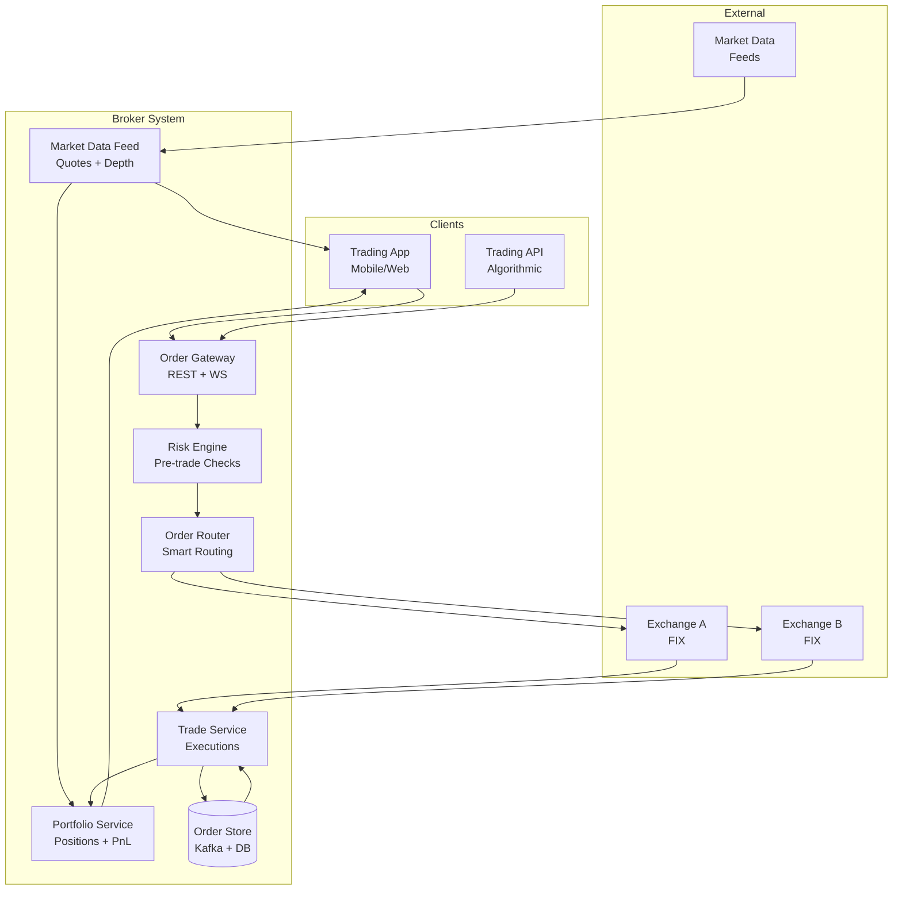
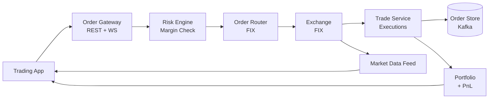

# Stock Broker System(Zerodha)

## Blogs and websites

## Medium

## Youtube

- [Stock Trading App System Design Interview | Meta System Design](https://www.youtube.com/watch?v=a5rABvMQ53U)
- [Zerodha Stock Broker System Design with @KeertiPurswani](https://www.youtube.com/watch?v=DH2-vDPFiE4)
- [Zerodha Stock Broker System Design (in Hindi)](https://www.youtube.com/watch?v=bdBCdrrAwkg)
- [System Design 12: Design Stock Broker Trading Application like Zerodha | Grow | Upstox | HLD | LLD](https://www.youtube.com/watch?v=W5FJnSywmLE)
- [Machine Coding Interview Round | Design and Code Zerodha like Stock Broker App LIVE-Low Level Design](https://www.youtube.com/watch?v=OVkxdFJLgwE)
- [Designing Zerodha | Mock Interview | Shreyansh Goyal | System Design #Zerodha | SG OG Ep 1](https://www.youtube.com/watch?v=rmva6BjKsp4)
- [I coded Zerodha's Trading Algorithm in 1 hour](https://www.youtube.com/watch?v=aEMBp9Bqfwc)

## Others

- [Building & Deploying an Order Book for Stock Exchanges](https://unacademy.com/class/building-deploying-an-order-book-for-stock-exchanges/NWSMCAHY)

---

## Theory

### What Is It?

A stock broker system is an online trading platform that lets retail investors buy/sell stocks and other financial instruments through a digital interface. It connects to stock exchanges via brokers/clearing houses, provides real-time market data, executes orders, manages risk, and tracks positions/portfolios. Modern brokers (Zerodha, Upstox, Interactive Brokers) offer low-cost, zero-commission trading with powerful APIs.

### Why Does It Exist?

Traditional stock trading required phone calls to brokers + manual order entry — slow, expensive, error-prone. Online broker systems democratized access: self-service trading, real-time data, algorithmic ordering, at a fraction of the cost.

### What Problem Does It Solve?

* **Order management**: Users place buy/sell orders → routed to exchange.
• **Matching engine**: Buy (bid) + sell (ask) orders matched by price-time priority.
* **Risk management**: Pre-trade checks (margin, position limits, exposure).
• **Market data**: Real-time prices, depth (order book), news feeds.
* **Real-time PnL**: Portfolio value + profit/loss computed live.
• **Regulatory compliance**: Audit trail; order logs; position limits.
• **Low latency**: Millisecond-scale order-to-trade for competitive advantage.
• **Scalability**: Thousands of concurrent traders; millions of orders/day.

### Important Subtopics

1. Order types (market, limit, stop-loss, IOC, FOK)
2. Matching engine (order book, price-time priority)
3. Risk management (pre-trade checks, position limits)
4. Market data feed (real-time quotes + depth)
5. Order lifecycle (new → ack → fill → done)
6. Portfolio + PnL (real-time position tracking)
7. Regulatory compliance (audit trail, order logs)
8. Low-latency architecture (co-location, lock-free queues)
9. Exchange connectivity (FIX protocol, OUCH)
10. Post-trade (settlement, clearing)

### Problem Statement

Design a stock broker system (like Zerodha) that allows retail investors to search for stocks, view real-time market data, place buy/sell orders, track positions and PnL, and receive real-time execution reports. The system must handle order placement with risk checks, support multiple order types, match orders via a price-time priority engine, and provide real-time market data.

### Functional Requirements

- Stock search + real-time quotes (price, depth)
- Place buy/sell orders (market, limit, stop-loss, IOC, FOK)
- Pre-trade risk checks (margin, position limits, exposure)
- Order tracking (new → pending → filled → done)
- Real-time execution reports (fills)
- Portfolio tracking (positions, holdings, cash)
- Real-time PnL (unrealized + realized)
- Trade history
- Market data feed (websocket)

### Non-Functional Requirements

- **Latency**: Order-to-trade < 5ms (co-located); API < 50ms (retail)
- **Scale**: 100K concurrent traders; 1M orders/sec at peak
- **Availability**: 99.99% (market hours) — market downtime ≠ system downtime
- **Consistency**: Strong consistency for orders (ACID); eventual for market data
- **Durability**: Orders persisted before ack; no order loss

---

## Characteristics

| Characteristic | What it means | Why it matters | How it works |
|---|---|---|---|
| **Order types** | Market, limit, stop, IOC, FOK | Different trading strategies | Order router + matching engine |
| **Pre-trade risk** | Check before sending to exchange | Prevent losses, regulatory | Risk engine (margin, exposure) |
| **Real-time market data** | Live quotes + depth (order book) | Informed trading decisions | Market data feed (websocket) |
| **Price-time priority** | Higher price wins; tie = earlier time | Fair matching; regulatory | Sorting in order book |
| **Low latency** | Millisecond order-to-trade | Competitive advantage | Co-location, lock-free queues |
| **Audit trail** | All orders + trades logged | Regulatory (exchanges, SEBI) | Immutable event log |
| **Position tracking** | Holdings + PnL in real-time | Portfolio management | Portfolio service + market data |

## Components

| Component | Purpose | Responsibilities | Relationship | Real-world Example |
|---|---|---|---|---|
| **Order Gateway** | Receive client orders | Auth, rate limit, parse, validate schema | Client ↔ Order Router | REST/WebSocket + FIX |
| **Order Router** | Route orders to exchange | Select venue, apply routing rules | Gateway ↔ Exchange | Smart order router |
| **Risk Engine** | Pre-trade risk checks | Margin check, position limits, exposure | Order Router ↔ User DB | Real-time risk rules |
| **Matching Engine** | Price-time priority matching | Maintain order book, match orders | Exchange ↔ Orders | Order book + matching |
| **Market Data Feed** | Real-time quotes + depth | Broadcast prices, order book changes | Exchange ↔ Clients | WebSocket + UDP |
| **Portfolio Service** | Positions + cash accounting | Track holdings, cash, PnL | Trade Service ↔ Market Data | Real-time PnL |
| **Trade Service** | Execute + record trades | Persist fills, generate trade confirmation | Matching Engine | Trade ledger |
| **Exchange Connector** | Connect to exchanges | FIX/FIXML protocol, session management | Order Router | FIX engine |
| **Order Store** | Persist all orders + state | Audit trail, order recovery | All services | Kafka + DB |

## Patterns

### Price-Time Priority Matching

* **What**: Order book where buy orders (bids) and sell orders (asks) match by price (higher bid / lower ask wins) and time (earlier order at same price wins).
* **Problem solved**: Fair, deterministic, regulatory-compliant order matching.
* **How it works**: (1) Buy orders sorted descending by price → bid side. (2) Sell orders sorted ascending by price → ask side. (3) New order → top of book: if bid ≥ ask → match → trade at ask price. (4) Remaining → added to book. (5) Time priority within same price level (FIFO).
* **When to use**: Stock/futures exchanges; any marketplace with fair matching.
• **When not to use**: Auction-style (uniform price); or when not fair matching needed.
* **Advantages**: Fair; deterministic; regulatory compliance; simple to reason about.
* **Disadvantages**: Not optimal for liquidity (pro-rata might be better); gaming (penny jumping).

## Benefits

* **Fair matching**: Price-time priority → transparent, regulatory compliant.
• **Risk management**: Pre-trade checks → prevent over-leveraged positions.
• **Real-time data**: Quotes + depth → informed decision making.
• **Fast execution**: Sub-5ms order-to-trade → competitive edge.
• **Audit trail**: All orders + trades logged → compliance + forensic analysis.

## Pros

* **Regulatory compliance**: SEBI, exchange order logs + audit trails.
• **Pre-trade risk**: Margin + position limits checked before exchange.
• **Fast matching**: C++ order book; lock-free queues; < 1ms matching.
• **Multi-exchange**: Smart order router → best execution.
• **Real-time portfolio**: Live positions + PnL.

## Cons

* **Complexity**: Order routing, risk, matching, market data = complex system.
• **Cost**: Exchange co-location + market data feeds (expensive).
• **Latency arms race**: Nanosecond advantage → constant infrastructure upgrades.
• **Regulatory overhead**: Extensive logging, order retention (5+ years).
• **Market risk**: Flash crashes, volatility → system limits needed.

## Challenges

### Technical Challenges
* **Matching engine**: C++ for < 1ms latency; lock-free data structures; order book (price levels + FIFO).
• **FIX protocol**: Parse + generate FIX messages; session management (logon, heartbeat, test).
• **Market data**: Real-time multicast; UDP for speed; A/B feeds (primary/backup).

### Scalability Challenges
* **Orders/sec**: 1M+ → sharded exchange connectors; Kafka for order ingestion.
• **Market data**: 10K+ symbols × 100+ updates/sec → multicast UDP + compression.

### Performance Challenges
* **Latency**: Co-location at exchange; kernel bypass (DPDK); avoid GC pauses (C++/Rust).
• **Order hot key**: Popular stock → high order rate → sharding by stock_id.

### Reliability Challenges
* **Exchange disconnect**: FIX session recovery → resend + replay.
• **Order loss**: Persist order before ack → Kafka + DB (no loss).
• **Circuit breakers**: Market volatility → system-wide trading pause.

### Maintainability Challenges
* **FIX versions**: FIX 4.2/4.4/5.0 SP2 → version compatibility.
• **Exchange API changes**: Each exchange has custom protocol + rules.
• **Regulatory changes**: Continuous compliance updates.

### Security Concerns
* **Account takeover**: 2FA; session management.
• **Order injection**: AuthN + authZ on every order.
• **Market manipulation**: Wash trading detection; spoofing detection.
• **Data privacy**: PII; trading history; market data licensing.

## Best Practices

* **Co-location**: Place servers at exchange (0–1ms round-trip).
• **Lock-free queues**: Avoid GC pauses; use C++/Rust for matching engine.
• **FIX session management**: Heartbeats + sequence numbers + resend logic.
• **Pre-trade risk**: Check margin + position limits before routing.
• **Audit trail**: Immutable event log (Kafka) + DB; 5+ year retention.
• **Circuit breakers**: Max order size, price bands, volatility pause.
• **Multi-exchange**: Smart order router → best execution + failover.

## When to Use

### Appropriate
* Retail online trading platforms (Zerodha, Upstox, E*TRADE).
• Algorithmic trading (API-based strategies).
• Market-making platforms.
• Exchange backends (matching engines).

### Not Appropriate
* Manual trading (phone-based brokers).
• Private markets (no continuous market).
• When latency/throughput requirements are low.

### Decision Factors
* Exchange connectivity; required latency; order volume; regulatory jurisdiction.

## Use Cases

### Retail Stock Trading Platform (Zerodha-style)

* **Problem**: Build a self-service stock trading app for retail investors with real-time quotes, order placement (multiple types), risk checks, and portfolio tracking.
* **Solution**: User app → Order Gateway (REST + WebSocket) → Risk Engine (pre-trade checks) → Order Router → Exchange (FIX protocol). Market data from exchange → real-time quotes + depth → push to clients. Portfolio service tracks positions + PnL. All orders persisted for audit trail.
* **Why suitable**: Modular design (risk, routing, matching, data separate); FIX for exchange connectivity; real-time PnL.
* **How it works**: (1) User searches stock → Market Data Feed → real-time quote + depth. (2) Place order (market/limit/SL/IOC/FOK) → Order Gateway → Risk Engine (check margin + position limits). (3) If pass → Order Router → FIX to exchange. (4) Exchange → matches → execution report → Order Store + Trade Service. (5) Portfolio Service: updates positions + cash → real-time PnL. (6) Market data pushed to client via WebSocket.
* **Trade-offs**: Latency vs. features (co-location = cost); compliance overhead (audit logs); exchange fees; market risk (circuit breakers needed).

## Architecture



### Architecture Structure
* **Gateway**: REST + WebSocket (orders + market data).
• **Risk Engine**: Real-time margin + position limit checks.
• **Order Router**: Smart routing to best venue (FIX).
• **Market Data**: Real-time quotes + depth from exchanges.
• **Portfolio**: Position accounting + real-time PnL.
* **Order Store**: Immutable audit trail (Kafka + DB).

### Communication
* **Client ↔ Gateway**: HTTPS (REST) + WebSocket (market data).
• **Internal**: gRPC + Kafka (high-throughput).
• **Exchange ↔ Router**: FIX protocol (over TCP).

### Data Flow
1. **Quote**: Exchange → Market Data Feed → Portfolio Service → push to WebSocket clients.
2. **Order**: Client → Gateway → Risk Engine (check) → Order Router → FIX exchange.
3. **Execution**: Exchange → Trade Service → persist to Order Store → update Portfolio → push fills to client.
4. **Audit**: All orders + executions → Kafka → DB (immutable log).

### Scaling Strategy
* **Gateway**: 100+ instances; WebSocket sharded by user_id.
• **Matching/Risk**: In-memory + Redis.
• **Order Store**: Kafka (1M msgs/sec) + sharded DB.
• **Market Data**: Multicast UDP + compression.

### Failure Handling
* **Exchange disconnect**: FIX sequence reset + resend; queue orders.
• **Order loss**: Persist before ack (Kafka); recover from log.
• **Market data delay**: Stale quote detection; client timeout.

## High-Level Design



## Deep Dive

### Order Book Matching (Price-Time Priority)

The existing ## Theory content describes the order lifecycle and matching mechanics: orders enter → risk check → exchange → matching engine → order book (bids sorted desc, asks sorted asc) → price-time priority (higher price wins; tie = earlier time). This ensures fair, deterministic matching.

### Risk Checks

The existing ## Theory covers pre-trade checks: margin verification (sufficient collateral), position limits (per stock), exposure limits (sector/concentration), and circuit breakers (max order size, price bands). These prevent catastrophic losses.

### Market Data Distribution

The existing ## Theory notes real-time quotes + depth (order book) distributed via WebSocket/multicast. Clients receive level-1 (best bid/ask) + level-2 (full depth) updates. Updates compressed + multicast for efficiency.

## API Contract

* **API purpose**: Place/cancel/modify orders, get market data, view portfolio.

| Method | Endpoint | Description |
|---|---|---|
| POST | `/api/v1/orders` | Place new order |
| DELETE | `/api/v1/orders/{id}` | Cancel order |
| PATCH | `/api/v1/orders/{id}` | Modify order (price/qty) |
| GET | `/api/v1/orders/{id}` | Get order status |
| GET | `/api/v1/quotes/{symbol}` | Get real-time quote |
| GET | `/api/v1/portfolio` | Get portfolio + PnL |

**Place order (POST /orders)**:
```json
{
  "symbol": "RELIANCE.NS",
  "side": "BUY",
  "type": "LIMIT",
  "quantity": 10,
  "price": 2450.00,
  "order_type": "DAY",
  "exchange": "NSE"
}
```
**Response**:
```json
{
  "order_id": "ord_123",
  "symbol": "RELIANCE.NS",
  "status": "PENDING",
  "filled_qty": 0,
  "avg_price": 0
}
```

**WebSocket market data**: `wss://ws.api.example.com/marketdata`
```json
{"type": "quote", "symbol": "RELIANCE.NS", "bid": 2449.5, "ask": 2450.0, "timestamp": 1723456789000}
```

**Authentication**: JWT + API key.
**Rate limiting**: 1000 orders/sec; 10K market-data subscriptions.

## Data Modeling

```mermaid
erDiagram
    USER ||--o{ ORDER : "places"
    USER ||--o{ POSITION : "holds"
    ORDER ||--o{ TRADE : "generates"
    STOCK ||--o{ ORDER : "traded"
    STOCK ||--o{ POSITION : "held"

    USER {
      string user_id PK
      string username
      string email
      decimal cash_balance
    }
    ORDER {
      string order_id PK
      string user_id FK
      string stock_id FK
      string side BUY_SELL
      string type MARKET_LIMIT_STOP
      int quantity
      decimal price
      string status NEW_PART_FILLED_DONE_CANCELLED
      datetime created_at
    }
    TRADE {
      string trade_id PK
      string order_id FK
      int filled_qty
      decimal price
      datetime created_at
    }
    STOCK {
      string stock_id PK
      string symbol
      string exchange
      decimal current_price
    }
    POSITION {
      string position_id PK
      string user_id FK
      string stock_id FK
      int quantity
      decimal avg_price
      decimal unrealized_pnl
    }
```

**Partitioning**: Orders by user_id + date; Trades by stock_id.

## Java and Spring Boot Implementation

```java
@RestController
@RequestMapping("/api/v1/orders")
@RequiredArgsConstructor
public class OrderController {
    private final OrderService orderService;

    @PostMapping
    public ResponseEntity<OrderResponse> placeOrder(
            @AuthenticationPrincipal UserDetails user,
            @RequestBody PlaceOrderRequest request) {

        // Pre-trade risk check
        orderService.validateRisk(user.getId(), request);

        Order order = orderService.placeOrder(user.getId(), request);
        return ResponseEntity.accepted().body(OrderResponse.from(order));
    }

    @DeleteMapping("/{orderId}")
    public ResponseEntity<Void> cancelOrder(
            @PathVariable String orderId,
            @RequestHeader("X-Cancel-Token") String token) {

        orderService.cancelOrder(orderId, token);
        return ResponseEntity.ok().build();
    }
}

@Service
@Transactional
public class OrderService {
    private final OrderRepository orderRepo;
    private final RiskEngine riskEngine;
    private final ExchangeConnector exchangeConnector;

    public Order placeOrder(String userId, PlaceOrderRequest req) {
        // Validate
        if (!riskEngine.checkMargin(userId, req)) {
            throw new RiskViolationException("Insufficient margin");
        }

        // Create order (not yet sent to exchange)
        Order order = new Order(userId, req);
        orderRepo.save(order);

        // Send to exchange asynchronously
        exchangeConnector.submitOrder(order);

        return order;
    }
}
```

## Real-World Examples

* **Zerodha**: Flat ~0 fees; Kite API; co-located; C++ matching; risk engine pre-trade.
• **Upstox**: API-first; low-latency; multi-exchange connector.
• **Interactive Brokers**: Global markets; low cost; API.
• **E*TRADE**: US; consumer + pro APIs.

## Interview Preparation

### Beginner Questions

**Q: What are the main order types in stock trading?**
A: **Market** (execute immediately at best price), **Limit** (execute at specified price only), **Stop-loss** (trigger at price → market), **Stop-limit** (trigger → limit), **IOC** (Immediate-or-Cancel: fill now, cancel rest), **FOK** (Fill-or-Kill: all-or-nothing now).

**Q: What is price-time priority?**
A: Order matching rule: highest bid matches lowest ask; at the same price, earlier order (time) gets priority. Ensures fair, deterministic matching. Required by most exchanges.

**Q: What is pre-trade risk management?**
A: Checks BEFORE sending an order to exchange: (1) Margin check (enough collateral), (2) Position limits (max exposure per stock), (3) Exposure limits (sector/concentration), (4) Order limits (max order size). Prevents catastrophic losses.

### Intermediate Questions

**Q: Design a matching engine for a stock exchange.**
A: (1) Order book: bids (sorted desc by price) + asks (sorted asc by price). (2) New order: top of book → if bid ≥ ask → match → trade at ask price → remaining → book. (3) Price-time: same price → FIFO (timestamp). (4) Data structure: HashMap<price_level, LinkedList<orders>> (C++ STL map); lock-free for speed. (5) Latency: < 1ms for match; co-located; no GC (C++). (6) Matching output: trade + execution report → Order Store + Client (WebSocket).

**Q: How do you handle real-time market data distribution?**
A: (1) Exchange → multicast UDP feed (A/B feeds for redundancy). (2) Parse + normalize → Market Data Service. (3) Level-1 (best bid/ask) + Level-2 (full depth) updates. (4) Push to clients via WebSocket; compressed + delta updates. (5) 100K+ updates/sec → multicast + aggregation. (6) Clients: subscribe to symbols; unsubscribe when leaving.

**Q: What is FIX protocol?**
A: Financial Information eXchange — standard messaging protocol for real-time financial transactions (orders, executions, market data). Uses tag=value format. Session layer manages logon/heartbeat/sequence/resend. Standard for exchange connectivity.

### Advanced Questions

**Q: Design a stock trading system handling 1M orders/sec with < 5ms order-to-trade, pre-trade risk, real-time market data, and audit trail.**

A: (1) **API**: REST (orders) + WebSocket (market data); 50 instances; JWT + API key auth; rate limit. (2) **Risk Engine**: In-memory (Redis) + real-time rules (margin, position limits); 20 instances; check in < 1ms. (3) **Order Router**: Smart order router (SOR) → pick venue (best price + latency); 10 instances; FIX connections to 5 exchanges. (4) **Matching**: C++ order book (HashMap + LinkedList); lock-free; < 1ms match. (5) **Market Data**: Multicast UDP (exchange feeds) → normalize → WebSocket to clients; 100K symbols + 1M updates/sec. (6) **Order Store**: Kafka (immutable log, 5-year retention) + PostgreSQL (query). (7) **Portfolio**: Real-time positions + PnL; in-memory + async DB write. (8) **Scale**: 1M orders/sec → 100 Order Router instances → FIX to exchanges. (9) **Monitoring**: Order latency P99 < 5ms; risk check < 1ms; market data lag < 100ms; order throughput. (10) **Failure**: FIX session recovery (resend logic); order persist-before-ack (Kafka); circuit breaker.

### Senior-Level Questions

**Q: How would you handle a flash crash scenario in your trading system?**

A: A flash crash is a rapid, deep, and temporary market decline caused by high-frequency trading or algorithmic selling cascades.

**Detection**:
1. **Price bands**: Set dynamic price bands (±5% from reference price) → if breached → halt trading → circuit breaker.
2. **Volatility monitoring**: Track price changes/sec; > 10% in 5 min → trigger pause.
3. **Order rate anomaly**: Sudden spike in order rate → flag + throttling.
4. **Correlation analysis**: If all orders are same type (market sell) → anomaly.

**Mitigation**:
1. **Circuit breakers**: (a) Individual security pause (5 min); (b) Market-wide pause (15 min); (c) All-market halt (remainder of day).
2. **Kill switches**: Auto-cancel non-marketable orders; switch to limit-only.
3. **Rate limiting**: Cap order rate per user/exchange.
4. **Cooling period**: After circuit breaker → gradual resume (auction).
5. **Audit + analysis**: Log all orders + trades; post-event forensic.

**Design implications**:
* Risk engine checks price bands before routing.
• Matching engine supports pause/cancel-all.
• Exchange connector monitors for disconnects.
• Portfolio service pauses PnL updates during halt.
* All events logged for forensics.
