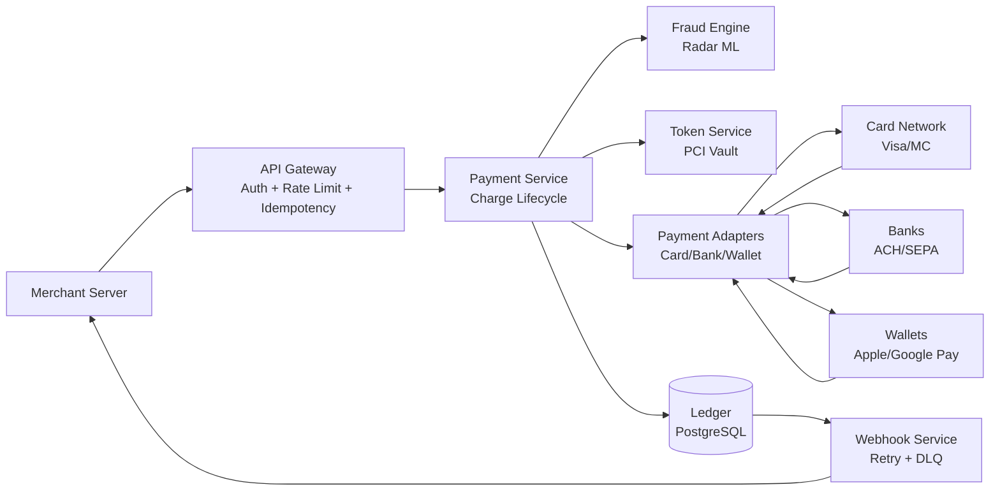
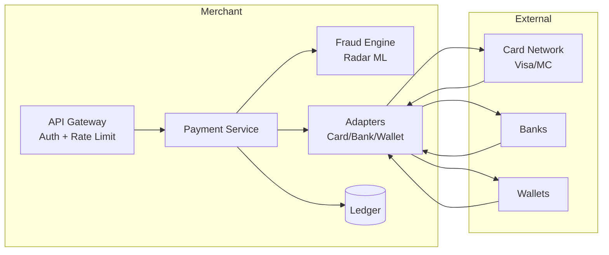
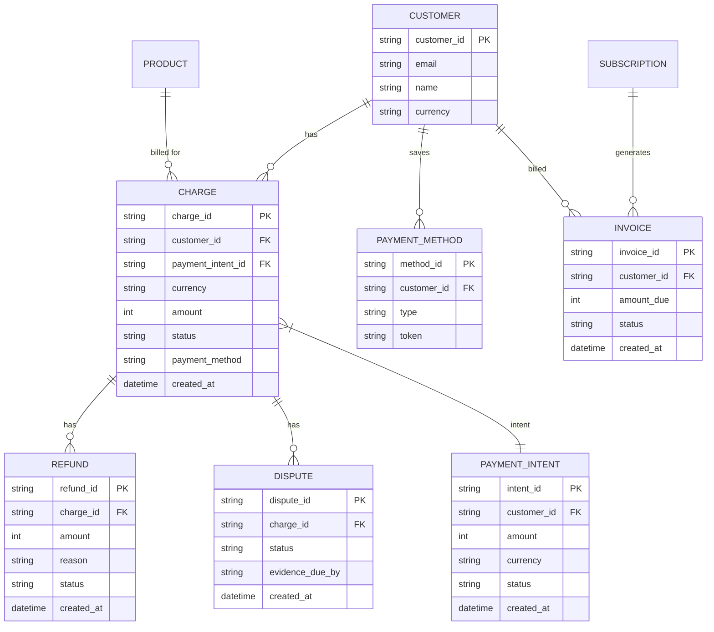
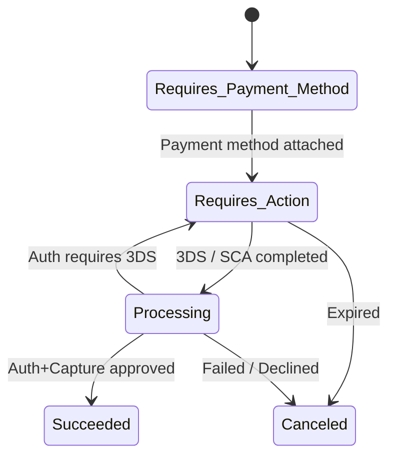
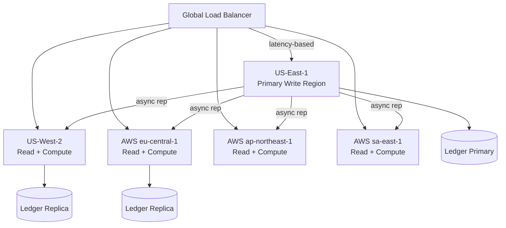
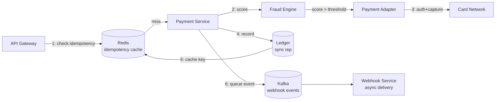
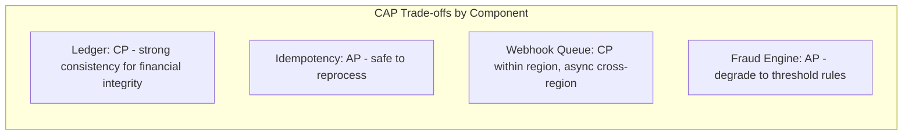

# Stripe System Design

> Design a payment processing platform (like Stripe) that allows businesses to accept payments via API with idempotency, fraud detection, PCI-DSS compliance, refunds, disputes, multi-currency, and webhooks.

## Blogs and websites

## Medium

- [The Stripe System Design Question That Separates Senior From Staff Engineers](https://medium.com/codetodeploy/the-stripe-system-design-question-that-separates-senior-from-staff-engineers-b39f1f1a05cf)

## Youtube

## Theory

### Topics Covered

1. [Introduction / Problem Statement](#introduction--problem-statement)
2. [Characteristics](#characteristics)
3. [Pros](#pros)
4. [Cons](#cons)
5. [Use Cases](#use-cases)
6. [Components](#components)
7. [Architectural Patterns](#architectural-patterns)
8. [Benefits](#benefits)
9. [Challenges](#challenges)
10. [Best Practices](#best-practices)
11. [When to Use / When Not to Use](#when-to-use--when-not-to-use)
12. [Data Model and API](#data-model-and-api)
13. [Payment Orchestration and Idempotency](#payment-orchestration-and-idempotency)
14. [Replication Strategies](#replication-strategies)
15. [Failure Detection and Membership](#failure-detection-and-membership)
16. [High Availability and Scalability](#high-availability-and-scalability)
17. [Performance and Optimization](#performance-and-optimization)
18. [CAP Theorem and Consistency Trade-offs](#cap-theorem-and-consistency-trade-offs)
19. [Encryption and Key Management](#encryption-and-key-management)
20. [Authentication and Authorization](#authentication-and-authorization)
21. [Security Threats and Mitigations](#security-threats-and-mitigations)
22. [Observability and Logging](#observability-and-logging)
23. [Real-World Implementations](#real-world-implementations)
24. [Java and Spring Boot Implementation Guide](#java-and-spring-boot-implementation-guide)
25. [Interview Questions and Answers](#interview-questions-and-answers)

---

### Introduction / Problem Statement

Stripe is a payment infrastructure-as-a-service platform — it provides APIs and SDKs that let businesses accept payments (credit cards, bank transfers, wallets) over the internet without building their own connections to card networks (Visa, Mastercard) or banks. Stripe abstracts away the complexity of payment flow orchestration: authentication (3D Secure), fraud detection, payouts, refunds, chargebacks, and compliance (PCI-DSS).

Before Stripe, businesses had to integrate directly with acquiring banks and card networks — a months-long, expensive process requiring PCI-DSS compliance, fraud infrastructure, and regulatory licensing. Stripe's value proposition: a developer-friendly API that handles all payment complexity, turning "accept money" into a few lines of code.



*The payment processing flow: a merchant sends a charge via the API Gateway (auth, rate limiting, idempotency); the Payment Service orchestrates the lifecycle consulting the Fraud Engine for scoring, the Token Service for PCI vaulting, and Payment Adapters to reach card networks, banks, and wallets; the Ledger records double-entry accounting; the Webhook Service delivers async events.*

---

### Characteristics

| Characteristic | What it means | Why it matters | How it works |
|---|---|---|---|
| **Idempotency** | Repeated requests with same key = single execution | Network retries must not double-charge | Idempotency-Key header → dedup |
| **PCI-DSS** | Card data never touches merchant servers | Compliance (Level 1) | Tokenization + client-side elements |
| **Multi-method** | Cards + bank + wallets via one API | Global coverage | Payment method-specific adapters |
| **Multi-currency** | Accept any currency; FX at wholesale rate | International business | Currency conversion at settlement |
| **Fraud protection** | Automated fraud detection + blocking | Prevent losses | ML model (Stripe Radar) scoring |
| **Durability** | Every payment is recorded before ack | Financial integrity | Write-ahead log + replicated ledger |
| **Synchronous** | Auth+capture in single API call | User expects instant response | Direct call to card network |

---

### Pros

- **Universal payment API**: One integration → all payment methods globally.
- **Built-in fraud**: Stripe Radar ML model → 53% average fraud reduction.
- **PCI compliance**: SAQ-A (simplest) → card data never on merchant server.
- **Reliability**: Retry + idempotency → safe network retries.
- **Ecosystem**: Billing, Connect (marketplaces), Issuing (cards), etc.
- **Global reach**: 135+ currencies; local payment methods (iDEAL, SEPA).

---

### Cons

- **Costs**: 2.9% + $0.30 per transaction (plus FX fees).
- **Blackbox**: Fraud/model decisions opaque (hard to debug false positives).
- **Vendor lock-in**: Deep integration → migration difficult.
- **Rate limits**: 100 reqs/sec default → may throttle high-volume merchants.
- **Chargeback fees**: Additional fees for disputes even if won.

---

### Use Cases

#### E-commerce Checkout

- **Problem**: An online store needs to accept credit card payments securely without handling PCI-DSS compliance.
- **Solution**: Stripe Elements (client-side card form) → tokenizes card → server receives token → creates charge via Stripe API with idempotency key → webhook on success → fulfill order.
- **Why suitable**: PCI-compliant tokenization; simple API; idempotency; built-in fraud.
- **How it works**: (1) Frontend: Stripe.js Elements → card input → `stripe.createToken(card)` → token. (2) Backend: POST /charges with token + amount + currency + Idempotency-Key. (3) Stripe: auth (100ms) + capture → ledger entry. (4) Webhook: payment_succeeded → backend → fulfill order. (5) Network timeout → client retries → idempotency key → same response.
- **Trade-offs**: 2.9% + $0.30 fee; chargeback liability; vendor lock-in.

#### Marketplace Split Payments

- **Problem**: A marketplace (e.g., Airbnb) needs to collect a payment from a buyer and split it across multiple sellers with different commission rates.
- **Solution**: Stripe Connect with Application Fee API — the platform collects the full amount, then distributes to connected accounts (sellers) minus a platform fee.
- **Why suitable**: Built-in destination charges and transfer API; handles payouts; supports 135+ currencies.
- **How it works**: (1) Buyer → charge on platform account. (2) Platform sets `application_fee_amount` → deducted from charge. (3) Remaining amount → transferred to seller's connected account. (4) Seller receives payout via bank transfer (2-7 day schedule). (5) Platform handles tax reporting (1099-K).
- **Trade-offs**: Complex payout schedule; tax compliance; fee structure varies by region.

#### Subscription Billing

- **Problem**: SaaS company needs recurring billing with trial periods, upgrades/downgrades, proration, and dunning management.
- **Solution**: Stripe Billing — creates subscriptions with recurring prices, handles proration on plan changes, retries failed payments (dunning), and sends webhook events.
- **Why suitable**: Built-in subscription lifecycle; metered billing; usage-based pricing; automated dunning.
- **How it works**: (1) Create customer → create subscription (plan + quantity). (2) Stripe charges the saved payment method on each billing cycle. (3) On plan change → prorate the difference (bill or credit). (4) Failed payment → Stripe retries with exponential backoff (up to 8 attempts over ~7 days). (5) After max retries → cancel subscription → webhook `customer.subscription.deleted`. (6) Customer updates card → webhook `invoice.payment_failed` → redirect to update payment method.
- **Trade-offs**: 0.5% platform fee on top of payment fees; limited customization vs. built billing.

---

### Components

| Component | Purpose | Responsibilities | Relationship | Real-world Example |
|---|---|---|---|---|
| **API Gateway** | Expose REST + webhook endpoints | Routing, auth, rate limiting | Client ↔ Services | Stripe API Gateway |
| **Payment Service** | Core payment orchestration | Create charge, manage state | Gateway ↔ Adapters | Charge controller |
| **Payment Adapters** | Connect to external rails | Card networks, bank APIs, wallets | Payment Service | Stripe Sigma |
| **Fraud Engine** | Detect fraudulent transactions | Scoring, rules, Radar | Payment Service | Stripe Radar, Sift |
| **Token Service** | PCI-compliant card storage | Tokenize cards, vault | Client ↔ Payment Service | Vault API |
| **Ledger** | Double-entry accounting | Track money movement + audit | All services | Cassandra/PostgreSQL |
| **Webhook Service** | Async event delivery | Event → webhook endpoint | Payment Service | Webhooks API |
| **Payout Service** | Transfer funds to bank | Batch payouts, schedule | Ledger | Payout engine |
| **Dispute Service** | Handle chargebacks | Evidence submission, representment | Ledger | Disputes API |

---

### Architectural Patterns

#### Idempotency Key

- **What**: Each write request (e.g., create charge) includes an `Idempotency-Key` header (UUID). The system stores request → response mapping keyed by idempotency key.
- **Problem solved**: Prevent duplicate charges when clients retry due to network timeout.
- **How it works**: (1) Client sends POST /charges with Idempotency-Key: uuid-123. (2) API Gateway checks Redis: key exists? → return cached response. (3) If new → process charge → store (key → response) with TTL (24h). (4) Replay: same key → return same response.
- **When to use**: Any distributed write prone to client retry (payments, reservations, orders).
- **When not to use**: Read-heavy; idempotent operations (GET).
- **Pros**: Prevents duplicate execution; client-safe retry; no side effects.
- **Cons**: Storage overhead (key → response for 24h); cache invalidation.

#### Saga Pattern for Payment + Order

- **What**: A distributed transaction pattern where each step has a compensating action. For payments: charge → order → fulfillment. If any step fails, the preceding steps are rolled back via compensations (refund, cancel order, release inventory).
- **Problem solved**: Ensures consistency across services that can't use a two-phase commit (payment service, order service, inventory service).
- **How it works**: (1) Payment Service creates charge (PENDING). (2) Order Service creates order (PENDING). (3) Inventory Service reserves stock. (4) If all succeed → mark all as CONFIRMED. (5) If any fails → trigger compensations: refund charge, cancel order, release reservation. Each compensation is itself idempotent.
- **When to use**: When you need atomicity across multiple independent services.
- **When not to use**: Single-service operations; operations that are naturally idempotent.
- **Pros**: No single point of failure; each service owns its data; compensations handle partial failures.
- **Cons**: Compensation logic is complex; eventual consistency during the saga; monitoring is harder.

#### Card Network Authorization Flow

- **What**: The three-stage payment lifecycle: **Authorization** (reserve funds), **Capture** (transfer funds), **Settlement** (batch process to move money from issuer to acquirer).
- **Problem solved**: Decouples the instant user experience (auth + capture) from the batch financial reconciliation (settlement), and allows partial captures and voids.
- **How it works**: (1) Customer presents card → Merchant sends auth request (amount) → Card network routes to issuing bank → Bank reserves funds and returns auth code. (2) Capture: Merchant submits capture → Network routes to bank → Funds earmarked for transfer. (3) Settlement: Card network batches captures periodically (usually daily) → Funds move from issuing bank to acquiring bank → Merchant's bank deposits funds.
- **When to use**: Credit/debit card payments at any scale.
- **When not to use**: Direct bank transfers (no card network); cash.
- **Pros**: Standardized; interoperable across issuers/acquirers; supports partial capture and voids.
- **Cons**: Auth can expire (7 days for cards) if not captured; settlement lag (2-3 business days); multiple failure points.



*Stripe's internal architecture: the API Gateway authenticates merchants and enforces rate limits and idempotency; the Payment Service orchestrates the charge lifecycle (auth → capture → settle); the Fraud Engine scores each transaction in real time; Payment Adapters translate to card network, bank, and wallet APIs; the Ledger is the source of truth via double-entry accounting.*

---

### Benefits

- **Developer experience**: Simple API → accept payments in minutes.
- **Fraud protection**: Stripe Radar → reduced chargeback losses.
- **Global reach**: Multi-currency + local payment methods.
- **Compliance**: PCI-DSS handled by Stripe → merchants don't need to.
- **Async events**: Webhooks → update merchant systems on state changes.

---

### Challenges

#### Technical Challenges

- **Distributed transactions**: Payment → order → fulfillment; need saga pattern (compensations).
- **PCI-DSS**: Multi-layered security; no card data in logs/caches.
- **Multi-rail**: Cards, ACH, SEPA, wallets → adapter per method.

#### Scalability Challenges

- **Throughput**: 100K+ charges/sec → sharded payment service + Redis cluster for idempotency.
- **Idempotency store**: Billions of keys/day → Redis with 24h TTL + compaction.
- **Webhook delivery**: Millions of webhooks → queue-based delivery with retry.

#### Performance Challenges

- **Authorization latency**: Card auth = 100–500ms (network round-trip to card network).
- **Webhook delivery**: Async → retry with exponential backoff + dead-letter.

#### Reliability Challenges

- **Partial failures**: Auth succeeds → capture fails → compensation (void/refund).
- **Network partitions**: Idempotency key protects against duplicates.
- **Fraud false positives**: Legitimate transactions blocked → revenue loss.

#### Maintainability Challenges

- **Adapter explosion**: Each payment method → custom adapter + lifecycle.
- **Compliance**: Annual PCI audits; changing standards.

#### Security Concerns

- **Card data**: Never touch merchant servers (tokenization).
- **Fraud**: ML + rules; false positive rate monitoring.
- **Chargebacks**: Evidence submission; representment workflow.
- **Webhooks**: HMAC signature verification; replay attack protection.

---

### Best Practices

- **Idempotency**: All mutating API calls use idempotency key (client-generated UUID).
- **Tokenization**: Card data → client-side → Stripe token → never touches server.
- **Webhook verification**: HMAC-SHA256 signature; retry with exponential backoff.
- **3D Secure**: Exemption APIs to minimize friction; handle fallback.
- **Fraud tuning**: Adjust Radar rules based on business type; monitor false-positive rate.
- **Error handling**: Parse error codes (card_declined, insufficient_funds, etc.) for actionable UX.
- **Multi-provider**: Don't rely on a single PSP — fallback for resilience.

---

### When to Use / When Not to Use

#### Appropriate

- E-commerce (online stores, marketplaces).
- SaaS (subscription billing).
- Platforms needing multi-currency + global methods.
- Marketplaces (Stripe Connect).

#### Not Appropriate

- Cash-only businesses.
- Systems with no internet connectivity.
- When you have direct bank licensing (lower cost).

#### Alternatives

- Adyen, PayPal, Braintree, Razorpay (regional).
- Building your own: only when you have direct acquiring licenses and high volume (>100M/month).

#### Decision Factors

- **Volume**: < $1M/month → managed PSP (Stripe). > $100M/year → custom or hybrid (Stripe Atlas + own stack).
- **Geography**: Use local providers in India (Razorpay), China (Ping++), Europe (Adyen).
- **Control**: Need custom fraud rules? Build vs. use managed.
- **Cost**: Stripe 2.9% + $0.30. Custom can get to ~0.1% + cents.

---

### Data Model and API

#### Entities



*Data model for a payment platform: CUSTOMER is the hub — customers own charges, payment methods, and invoices; charges are linked to payment intents, refunds, and disputes; subscriptions generate invoices. This captures the core payment lifecycle from customer → intent → charge → settlement, plus ancillary objects (refunds, disputes, payment methods).*

**Partitioning**: Charges sharded by customer_id + date. Payment intents by merchant_id. Ledger by accounting period + region. Idempotency keys stored in Redis with 24h TTL. Webhooks queued by customer_id for ordering.

#### API Contract

| Method | Endpoint | Description |
|---|---|---|
| POST | `/v1/charges` | Create a charge (with Idempotency-Key) |
| GET | `/v1/charges/{id}` | Retrieve a charge |
| POST | `/v1/charges/{id}/refund` | Refund a charge (full or partial) |
| POST | `/v1/customers` | Create a customer |
| GET | `/v1/customers/{id}` | Retrieve a customer |
| POST | `/v1/payment_intents` | Create a payment intent |
| GET | `/v1/payment_intents/{id}` | Retrieve a payment intent |
| POST | `/v1/invoices` | Create an invoice |
| POST | `/v1/subscriptions` | Create a subscription |
| POST | `/v1/transfers` | Transfer funds to a connected account |

**POST `/v1/charges` Request:**

```http
POST /v1/charges
Authorization: Bearer sk_live_...
Idempotency-Key: 550e8400-e29b-41d4-a716-446655440000
Content-Type: application/x-www-form-urlencoded

amount=2000&currency=usd&source=tok_visa&description=Example charge&receipt_email=user@example.com
```

**POST `/v1/charges` Response:**

```json
{
  "id": "ch_3Nn2u5LiWYK01",
  "object": "charge",
  "amount": 2000,
  "currency": "usd",
  "status": "succeeded",
  "paid": true,
  "refunded": false,
  "captured": true,
  "balance_transaction": "txn_1Nn2u5LiWYK01",
  "customer": "cus_Nn2u5LiWYK01",
  "payment_method": "card_1Nn2u5LiWYK01",
  "created": 1663747200,
  "outcome": {"network_status": "approved_by_network", "reason": null}
}
```

**Webhook event payload:**

```json
{
  "id": "evt_1Nn2u5LiWYK01",
  "object": "event",
  "api_version": "2020-08-27",
  "created": 1663747200,
  "livemode": false,
  "pending_webhooks": 1,
  "request": {"id": "req_1Nn2u5LiWYK01", "idempotency_key": "550e8400-..."},
  "type": "charge.succeeded",
  "data": {
    "object": {
      "id": "ch_3Nn2u5LiWYK01",
      "amount": 2000,
      "currency": "usd",
      "status": "succeeded"
    }
  }
}
```

**Error responses:**

```json
{"error": {"message": "Your card was declined.", "type": "card_error", "code": "card_declined", "decline_code": "insufficient_funds", "charge": "ch_3Nn2u5LiWYK01"}}
{"error": {"message": "Missing idempotency key.", "type": "invalid_request_error", "param": "idempotency_key"}}
```

---

### Payment Orchestration and Idempotency

This is Stripe's core technical challenge: ensuring that every monetary operation is executed exactly once, even when networks fail, clients retry, or partial failures occur. The system combines idempotency keys, state machines, and compensating transactions (sagas) to provide financial-grade correctness at 100K+ TPS.



*Payment Intent state machine: a payment intent starts in `requires_payment_method`, transitions through `requires_action` (for 3D Secure/3DS authentication) and `processing` (authorization), and ends in `succeeded` or `canceled`. The state machine ensures only valid transitions are allowed, and each state is persisted in the Ledger before the client is notified.*

#### Idempotency Key Storage

- Each write request includes an `Idempotency-Key: UUIDv4` header.
- Before processing, the API Gateway checks Redis (or Cassandra for persistence): `GET idempotency:{key}`.
- If found → return cached response (status code + body).
- If not found → process request → store `(key → response)` with 24h TTL.
- **Key insight**: The idempotency check and the processing must be atomic — if the process crashes after computing the response but before storing it, the next retry re-processes (which is fine since the operation is idempotent at the card network level).

**Redis schema**:

```redis
SET idempotency:550e8400... "{status: 200, body: {...}}" EX 86400
KEYS *idempotency:* → scan for cleanup
```

**Edge cases**:
- **Different body, same key**: Stripe returns 409 Conflict — the idempotency key is bound to the original request.
- **TTL expiry**: After 24h, a new request with the same key is treated as a new request (may create a duplicate charge).
- **Concurrent requests**: A distributed lock on the key ensures only one request is processed; others wait for the cached response.

#### Charge State Machine

```java
public enum ChargeStatus {
    PENDING,      // Awaiting authorization
    PROCESSING,   // Auth requested, awaiting response
    SUCCEEDED,    // Funds captured
    FAILED,       // Auth or capture declined
    REFUNDED,     // Partially or fully refunded
    VOIDED,       // Canceled before capture
    DISPUTED      // Chargeback initiated
}
```

*The charge lifecycle has 7 states. Transitions are guarded: `PENDING` → `PROCESSING` (auth request sent) → `SUCCEEDED`/`FAILED` (response received) → `REFUNDED` (customer refunded) / `DISPUTED` (chargeback filed) / `VOIDED` (canceled pre-capture).*

#### Webhook Delivery Reliability

- Webhooks are delivered from the Webhook Service with exponential backoff: 3 seconds, 30 seconds, 3 minutes, 30 minutes, 3 hours, then dead-letter queue.
- Each webhook event has a unique signature: `Stripe-Signature` header with a timestamp and a HMAC-SHA256 of the payload using the endpoint's secret.
- Endpoints that consistently fail (HTTP 5xx or timeouts) are marked as disabled after 3 consecutive failures.
- Replay protection: the `id` field in the event payload is checked against a recently-delivered set (Redis, 7-day window).

---

### Replication Strategies

- **Ledger (PostgreSQL)**: Synchronous multi-zone replication within a region (strong consistency for financial correctness). Cross-region replication is asynchronous (for disaster recovery; acceptable to lose a few seconds of transactions in a regional outage). Quorum: `(N/2)+1` nodes confirm each write.
- **Idempotency Store (Redis)**: Primary + replicas per region; replication is asynchronous (best-effort). If a Redis node fails, idempotency keys may be lost — but this only risks duplicate processing, which is caught by the card network's own idempotency.
- **Webhook Event Queue (Kafka)**: Each partition has one leader and `N-1` followers. A write is acknowledged when all ISR (in-sync replica) members have the record. If the leader fails, an ISR member is elected. This gives ordered, durable, replicated event delivery.
- **Object Store (S3)**: Video/PDF receipts and card images are stored in S3 with SSE-KMS encryption and cross-region replication for DR.

```mermaid
sequenceDiagram
    Client->>+Gateway: POST /charges + Idempotency-Key
    Gateway->>Redis: GET idempotency:{key}
    alt Key exists
        Redis-->>-Gateway: Return cached response
        Gateway-->>Client: 200 (same response)
    else Key does not exist
        Gateway->>PS: Process charge
        PS->>PA: Auth via card network
        PA->>CN: Visa/MC API
        CN-->>PA: Auth response
        PA-->>PS: Result
        PS->>LD: INSERT charge (sync rep)
        LD-->>PS: Ack
        PS->>Redis: SET idempotency:{key} (24h TTL)
        Redis-->>PS: OK
        PS-->>Gateway: Response
        Gateway-->>Client: 200 (success)
    end
```

*Idempotency and replication: the API Gateway checks the idempotency key in Redis first (fast path — avoids reprocessing on retry); if absent, the charge is processed, recorded in the Ledger with synchronous replication, and the idempotency key is cached in Redis for 24h. Card network calls and Ledger writes happen before the idempotency key is set, so a crash between steps results in safe reprocessing.*

---

### Failure Detection and Membership

- **PostgreSQL**: Uses Patroni/etcd for leader election. If the leader fails, a replica is promoted within ~10 seconds. Health checks (`/health`) verify quorum availability.
- **Redis**: Redis Sentinel handles failover. If the master fails, Sentinel elects a replica within ~30 seconds. During failover, idempotency may briefly be unavailable → clients experience retries (safe due to idempotency keys).
- **Kafka**: Uses ZooKeeper (or KRaft in newer versions) for broker membership. Failed brokers are removed from the ISR; partition leadership is transferred. Consumer group rebalancing handles partition reassignment.
- **Webhook Service**: Circuit breaker pattern — if a merchant's endpoint fails 3 times in a row, it's marked as disabled and webhooks are dead-lettered for manual replay.

```java
@Service
@RequiredArgsConstructor
public class CircuitBreakerService {

    @Value("${app.circuitbreaker.failure-threshold:3}")
    private int failureThreshold;

    @Value("${app.circuitbreaker.recovery-timeout:30000}")
    private long recoveryTimeoutMs;

    private final Map<String, CircuitBreaker> breakers = new ConcurrentHashMap<>();

    public <T> T execute(String key, Supplier<T> operation) {
        var breaker = breakers.computeIfAbsent(key, k ->
                CircuitBreaker.ofDefaults(key));
        return breaker.executeSupplier(operation);
    }

    public void recordFailure(String key) {
        var breaker = breakers.get(key);
        if (breaker != null) breaker.onError(1, TimeUnit.SECONDS,
                new RuntimeException("endpoint returned 5xx"));
    }

    public void recordSuccess(String key) {
        var breaker = breakers.get(key);
        if (breaker != null) breaker.onSuccess(1, TimeUnit.SECONDS);
    }
}
```

*The `CircuitBreakerService` bean uses Resilience4j's `CircuitBreaker` to protect webhook delivery endpoints. The failure threshold and recovery timeout are externalized via `@Value`. Each merchant endpoint gets its own circuit breaker keyed by endpoint ID. After consecutive failures, the circuit opens — further calls fail fast until the cooldown expires.*

---

### High Availability and Scalability

Stripe operates 5 regions (us-east, us-west, eu-central, ap-northeast, sa-east) with active-active deployment for most services and active-passive for the ledger (primary region for writes).

**Multi-region deployment**:
- API Gateway: Global load balancing (Cloudflare + Stripe's own load balancer) routes users to the nearest region. All regions serve reads and writes (except ledger writes which route to the primary).
- Payment Service: Stateful — sharded by `hash(merchant_id) % 256` across 5 regions. Each shard handles its own merchants.
- Fraud Engine: Stateless — scaled horizontally in each region, with ML models replicated.
- Idempotency Store: Redis cluster in each region, with async cross-region replication for DR.
- Ledger: Primary region for writes (us-east); other regions have read replicas. Cross-region replication lag is targeted at < 5 seconds.

**Auto-scaling**:
- API Gateway: Scales based on request rate (target 500 req/sec per instance).
- Payment Service: Shards auto-split at 50K req/sec per shard.
- Fraud Engine: Scales based on ML inference latency (target p99 < 20ms).
- Webhook Service: Scales based on queue depth (Kafka consumer lag).

**Graceful degradation**:
- If the Fraud Engine is down: transactions above a fraud threshold are held for manual review; below threshold → auto-approved (accept higher fraud risk temporarily).
- If cross-region replication fails: continue in the affected region; data syncs when the link recovers.
- If the Ledger is down: queue writes and replay (limited by idempotency key TTL — 24h).



*Multi-region deployment: the global load balancer routes users to the nearest region; US-East is the primary write region with the Ledger; other regions serve reads and compute; cross-region replication is asynchronous (target lag < 5 seconds).*

---

### Performance and Optimization

**Key metrics (SLOs):**
- Charge API: P99 latency < 200ms (target).
- Fraud scoring: P99 < 20ms (model inference).
- Webhook delivery: 99% delivered within 30 seconds of event creation.
- Idempotency cache hit ratio: > 90%.

**Latency budget** (200ms total):
- API Gateway: ~10ms (rate limit + idempotency check in Redis).
- Fraud Engine: ~20ms (ML model inference).
- Payment Adapter: ~100-300ms (network RTT to card network — the dominant cost).
- Ledger write: ~5ms (synchronous replication within region).
- Response assembly: ~5ms.

**Optimizations:**
- **Connection pooling**: HTTP connection pools to card network APIs.
- **Circuit breakers**: If the card network is slow, fail fast with a decline.
- **Caching**: Idempotency responses cached in Redis for 24h; fraud models cached in-process.
- **Batching**: Settlement happens in batches (not per-charge) to reduce card network API calls.
- **Async webhook delivery**: Webhooks are queued and delivered asynchronously.



*Payment processing pipeline with latency annotations: the API Gateway first checks the idempotency cache (fast path); on a miss, the Payment Service scores the transaction via the Fraud Engine; if approved, the Payment Adapter calls the card network (the slowest step); the Ledger records the charge with synchronous replication; the idempotency key is cached; and a webhook event is queued for asynchronous delivery.*

---

### CAP Theorem and Consistency Trade-offs

A payment platform is partition-tolerant by assumption (global deployment), so the CAP trade-off is C vs. A per component.

**Ledger (PostgreSQL) — CP**: Financial correctness requires strong consistency. Within a region, writes are synchronously replicated to a quorum before acknowledgment. Cross-region replication is asynchronous (acceptable to lose a few seconds of transactions).

**Idempotency Store (Redis) — AP**: If Redis fails, idempotency checks miss → re-processing occurs. This is safe because card network operations are themselves idempotent (duplicate auth attempts return the same auth code).

**Webhook Queue (Kafka) — CP within region, async cross-region**: ISR-based replication within a region; cross-region replication is asynchronous for DR. Event ordering is preserved per partition.

**Fraud Engine — AP**: If the fraud engine is down, the system degrades to threshold-based blocking (allow below $X, block above $Y). The fraud model is QoS, not a consistency requirement.



*Per-component CAP trade-offs: the Ledger requires strong consistency for financial correctness; the Idempotency Store favors availability (safe to reprocess); the Webhook Queue is CP within a region and async cross-region; the Fraud Engine degrades to threshold rules when unavailable.*

---

### Encryption and Key Management

Payments involve sensitive data: card numbers (PAN), bank account details, personal information, and API credentials. Stripe uses defense-in-depth encryption.

**Encryption at Rest:**
- Card PAN: Never stored in plaintext. Encrypted with per-shard DEKs wrapped by a KEK in an HSM.
- Ledger: PostgreSQL TDE with AES-256; PII columns additionally encrypted at the application level.
- Idempotency cache: Redis data encrypted at the filesystem level (dm-crypt). No card data stored.
- API keys: Stored as SHA-256 hash; raw key never persisted.
- Webhook secrets: HMAC-SHA256 keys stored in a KMS-backed secrets service.

**Encryption in Transit:**
- TLS 1.3 for all API traffic.
- mTLS between internal services (certificates from private CA).
- Card data flows only through Token Service and Payment Adapters (network segmentation).

```mermaid
graph LR
    App[Application] -->|"AES-GCM encrypt"| Data[Encrypted Data]
    KMS[HSM / KMS<br/>KEK (master)] -->|"wrap/unwrap"| DEK[Data Encryption Key<br/>per shard/service]
    DEK -->|"encrypt"| Data
    Vault[PCI Vault<br/>HSM-backed] -->|"wrap"| PAN[PAN encryption key]
    PAN -->|"encrypt"| Cards[Encrypted card data]
```

*Key hierarchy: application data is encrypted with per-shard/service data encryption keys (DEKs), which are wrapped by a key-encryption key (KEK) in an HSM/KMS; card PANs are encrypted with a separate HSM-backed key.*

---

### Authentication and Authorization

Authentication verifies the caller's identity (is this merchant authorized to use this API key?); authorization determines what actions they can perform.

- **API keys**: Each merchant gets publishable and secret keys. Secret keys (sk_live_...) authenticate writes. Keys are SHA-256 hashed and stored with permission scopes.
- **OAuth 2.0**: Connected accounts (Stripe Connect) authenticate via OAuth — the platform obtains an access token to act on behalf of the connected account.
- **Webhook signatures**: Webhook events are signed with HMAC-SHA256 using a secret known to both Stripe and the merchant endpoint.
- **Scope-based authorization**: API keys carry scopes (charges:create, refunds:create, etc.) enforced at the gateway.

```java
@Service
@RequiredArgsConstructor
public class ApiKeyAuthService {

    @Value("${app.security.api-key-hash-algorithm:SHA-256}")
    private String hashAlgorithm;

    private final ApiKeyRepository apiKeyRepo;
    private final MeterRegistry meterRegistry;

    public Optional<ApiKey> validate(String apiKey) {
        String keyHash = Hashing.sha256().hashString(apiKey, StandardCharsets.UTF_8).toString();
        return apiKeyRepo.findByKeyHash(keyHash)
                .filter(ApiKey::isActive)
                .filter(key -> !key.isExpired());
    }
}
```

*The `ApiKeyAuthService` bean validates incoming API keys by hashing the raw key (SHA-256) and looking up the hash in the database. Keys are checked for active status and expiry. Micrometer tracks validation results.*

---

### Security Threats and Mitigations

- **Threat: Card data theft**: If an attacker breaches the PCI Vault, encrypted PANs can't be decrypted without the HSM-wrapped DEK.
- **Threat: API key compromise**: An attacker steals an API key → makes unauthorized charges. Mitigation: keys are scoped (charges:create vs. charges:read); rate limiting; monitoring for unusual patterns; key rotation.
- **Threat: Webhook replay**: An attacker captures a webhook event and replays it. Mitigation: HMAC signature verification; timestamp included in signature; events have unique IDs checked for replay.
- **Threat: Man-in-the-middle**: Attacker intercepts API traffic. Mitigation: TLS 1.3 enforced; HSTS; mTLS for internal services.
- **Threat: Fraud**: An attacker uses a stolen card to make a charge. Mitigation: Stripe Radar ML model + rules; velocity checks; manual review for high-risk.
- **Threat: Chargeback fraud**: A customer files a false chargeback. Mitigation: evidence submission (receipts, IP logs); representment workflow; chargeback prevention alerts.

---

### Observability and Logging

**Metrics:**
- `charge.success_rate`: fraction of charges that succeed (target > 99%).
- `charge.latency.p99`: P99 of charge API latency (target < 200ms).
- `webhook.delivery.success_rate`: fraction of webhooks delivered within SLA.
- `fraud.blocks`: number of transactions blocked by Radar.
- `idempotency.hit_ratio`: fraction of requests served from cache (target > 90%).

**Logs:**
- Every API request logged with API key hash, endpoint, response code, latency.
- Every charge logged with amount, currency, outcome, fraud score.
- Webhook delivery attempts logged with status code and retry count.

**Distributed tracing:**
Trace each charge through: API Gateway → Payment Service → Fraud Engine → Payment Adapter → Card Network → Ledger → Webhook Service. Correlate with trace IDs in logs.

---

### Real-World Implementations

- **Stripe**: Global payment platform (135+ currencies); API-first; Stripe Radar for fraud; PCI-DSS Level 1; webhooks. Processes $1.5T+ annually across 5 data regions.
- **Braintree** (PayPal): Venmo integration, advanced fraud tools, recurring billing. Used by Uber, Airbnb.
- **Adyen**: Enterprise; single API; global acquiring; in-house risk engine. Used by Spotify, Microsoft.
- **Razorpay** (India): Multi-method (UPI, cards, wallets); local payment methods; regulatory compliance for India.
- **Checkout.com**: Global acquiring; multi-acquirer routing; real-time FX. Used by Revolut, Delivery Hero.

| Platform | Fraud Detection | PCI Scope | Multi-currency | Webhooks | Key Feature |
|---|---|---|---|---|---|
| Stripe | Radar ML + rules | SAQ-A | Yes | Yes | Developer experience |
| Braintree | Kount + rules | SAQ-A | Yes | Yes | PayPal/Venmo integration |
| Adyen | Risk Engine | SAQ-A | Yes | Yes | Single API, global acquiring |
| Razorpay | Fraud detection | SAQ-A | Yes | Yes | India-local methods (UPI) |
| Checkout.com | Risk Engine | SAQ-A | Yes | Yes | Multi-acquirer routing |

**Architecture patterns from production:**
- **Idempotency**: Redis for 24h cache; Cassandra for persistent storage during replay.
- **Ledger**: Event-sourced double-entry; every financial action is an immutable event.
- **Webhook delivery**: At-least-once with HMAC signature; retry (3s → 30s → 3min → 30min → 3h → 24h); dead-letter queue.
- **Fraud engine**: Real-time scoring at ~5ms p99; online learning from chargeback feedback.

---

### Java and Spring Boot Implementation Guide

Spring Boot service for a payment platform: idempotency keys, charge state machine, fraud scoring, and webhook delivery with retry.

#### 1. DTO Records with Validation

```java
public record CreateChargeRequest(
        @NotBlank String amount,
        @NotBlank String currency,
        @NotBlank String source,
        String description,
        String receiptEmail) {}

public record ChargeResponse(
        String chargeId,
        String status,
        int amount,
        String currency,
        String paymentMethod,
        Instant createdAt) {}

public record RefundRequest(
        @Positive Integer amount,
        String reason) {}

enum ChargeStatus { PENDING, PROCESSING, SUCCEEDED, FAILED, REFUNDED, VOIDED, DISPUTED }
```

*`CreateChargeRequest` is the charge creation body with `@Valid` validation. `ChargeResponse` wraps the result. `RefundRequest` supports partial refunds with `@Positive` validation. `ChargeStatus` enumerates the charge lifecycle.*

#### 2. Entity with Idempotency Guard

```java
@Entity
@Table(name = "charges", indexes = {
        @Index(name = "idx_merchant_created", columnList = "merchantId,createdAt"),
        @Index(name = "idx_status", columnList = "status")
})
public class Charge {

    @Id
    private String chargeId;

    @Column(nullable = false)
    private String merchantId;

    @Column(nullable = false)
    private BigDecimal amount;

    @Column(nullable = false, length = 3)
    private String currency;

    @Column(nullable = false)
    @Enumerated(EnumType.STRING)
    private ChargeStatus status = ChargeStatus.PENDING;

    @Column(name = "idempotency_key_hash")
    private String idempotencyKeyHash;

    @Column(length = 4000)
    private String failureMessage;

    @Column(nullable = false)
    private Instant createdAt;

    @Version
    private Long version;

    public void markSucceeded() {
        this.status = ChargeStatus.SUCCEEDED;
    }

    public void markFailed(String message) {
        this.status = ChargeStatus.FAILED;
        this.failureMessage = message;
    }
}
```

*The `Charge` entity maps to the `charges` table with indexes on `(merchantId, createdAt)` and `status`. The `idempotency_key_hash` column enforces deduplication. `@Version` guards against concurrent updates. `BigDecimal` is used for monetary amounts.*

#### 3. Service Layer — Idempotency + Fraud Scoring

```java
@Service
@RequiredArgsConstructor
@Slf4j
public class ChargeService {

    @Value("${app.charges.fraud-score-threshold:50}")
    private int fraudScoreThreshold;

    private final ChargeRepository chargeRepository;
    private final PaymentAdapter paymentAdapter;
    private final FraudEngine fraudEngine;
    private final LedgerService ledgerService;
    private final WebhookService webhookService;
    private final MeterRegistry meterRegistry;

    @Transactional
    public ChargeResponse createCharge(CreateChargeRequest request,
                                       String merchantId, String idempotencyKey) {
        var timer = Timer.Sample.start(meterRegistry);
        try {
            // Idempotency check
            if (idempotencyKey != null) {
                String keyHash = Hashing.sha256()
                        .hashString(idempotencyKey, StandardCharsets.UTF_8).toString();
                var existing = chargeRepository.findByIdempotencyKeyHash(keyHash);
                if (existing.isPresent()) {
                    meterRegistry.counter("charges.idempotent_replay").increment();
                    return ChargeResponse.from(existing.get());
                }
            }

            // Fraud scoring
            int score = fraudEngine.score(request, merchantId);
            if (score > fraudScoreThreshold) {
                meterRegistry.counter("charges.fraud_blocked").increment();
                throw new FraudBlockedException("High fraud risk");
            }

            // Process payment
            PaymentResult result = paymentAdapter.charge(request);

            // Record in ledger + charge table
            var charge = new Charge();
            charge.setChargeId(UUID.randomUUID().toString());
            charge.setMerchantId(merchantId);
            charge.setAmount(new BigDecimal(request.amount()));
            charge.setCurrency(request.currency());
            charge.setIdempotencyKeyHash(keyHash);

            if (result.success()) {
                charge.markSucceeded();
                ledgerService.recordCharge(charge);
            } else {
                charge.markFailed(result.errorMessage());
            }
            chargeRepository.save(charge);

            // Queue webhook
            webhookService.enqueue("charge." + (result.success() ? "succeeded" : "failed"),
                    Map.of("chargeId", charge.getChargeId(),
                           "amount", charge.getAmount().toString()));

            timer.stop(Timer.builder("charges.api.latency").register(meterRegistry));
            return ChargeResponse.from(charge);
        } catch (Exception e) {
            meterRegistry.counter("charges.api.errors").increment();
            throw e;
        } finally {
            timer.stop(Timer.builder("charges.api.latency").register(meterRegistry));
        }
    }
}
```

*`ChargeService` implements the charge lifecycle: idempotency key check (SHA-256 hash lookup), fraud scoring via `FraudEngine`, payment processing via `PaymentAdapter`, ledger recording, and webhook queuing. The `fraudScoreThreshold` is configurable. Micrometer tracks idempotent replays, fraud blocks, and API latency/errors.*

#### 4. REST Controller with Rate Limiting

```java
@RestController
@RequestMapping("/api/v1")
@RequiredArgsConstructor
public class PaymentController {

    private final ChargeService chargeService;

    @PostMapping("/charges")
    public ResponseEntity<ChargeResponse> createCharge(
            @RequestHeader("Authorization") String apiKey,
            @RequestHeader(value = "Idempotency-Key", required = false) String idemKey,
            @Valid @RequestBody CreateChargeRequest request) {

        String merchantId = extractMerchant(apiKey);
        var response = chargeService.createCharge(request, merchantId, idemKey);
        return ResponseEntity.ok(response);
    }

    @PostMapping("/{chargeId}/refunds")
    public ResponseEntity<RefundResponse> refund(
            @RequestHeader("Idempotency-Key") String idemKey,
            @PathVariable String chargeId,
            @Valid @RequestBody RefundRequest request) {
        var refund = chargeService.refund(chargeId, request, idemKey);
        return ResponseEntity.ok(refund);
    }

    private String extractMerchant(String apiKey) {
        return apiKey.replace("sk_live_", "").split("_")[0];
    }
}
```

*`PaymentController` is a thin `@RestController`. The `createCharge` endpoint accepts the idempotency key header (optional), validates the request body with `@Valid`, extracts the merchant ID from the API key, and delegates to `ChargeService`. The `refund` endpoint returns `200 OK` with the refund details.*

#### 5. Global Exception Handler

```java
@ControllerAdvice
public class PaymentExceptionHandler {

    @ExceptionHandler(FraudBlockedException.class)
    ResponseEntity<Map<String, String>> handleFraud() {
        return ResponseEntity.status(HttpStatus.PAYMENT_REQUIRED)
                .body(Map.of("error", "payment_requires_review"));
    }

    @ExceptionHandler(ChargeNotFoundException.class)
    ResponseEntity<Map<String, String>> handleNotFound(ChargeNotFoundException ex) {
        return ResponseEntity.status(HttpStatus.NOT_FOUND)
                .body(Map.of("error", "charge_not_found", "message", ex.getMessage()));
    }
}
```

*`PaymentExceptionHandler` returns `422 Unprocessable Entity` for fraud blocks and `404` for missing charges.*

---

### Interview Questions and Answers

**Beginner**

1. **What is idempotency and why does Stripe need it?**
   A: Idempotency ensures that repeating the same request has the same effect as executing once. In payments, network timeouts cause clients to retry — without idempotency, this creates duplicate charges. Stripe uses an `Idempotency-Key` header: the first request processes and stores the response; retries with the same key return the cached response.

2. **What are the three stages of a credit card transaction?**
   A: (1) **Authorization**: Verify card + reserve funds (100–500ms). (2) **Capture**: Transfer funds from issuer to acquirer. (3) **Settlement**: Batch processing — card network moves funds from issuer to acquirer (daily, 2–3 business days).

3. **What is PCI-DSS?**
   A: Payment Card Industry Data Security Standard — requirements for systems handling card data. Level 1 requires annual audits, encryption, access controls, network segmentation. Tokenizing cards client-side keeps merchants at SAQ-A (simplest).

4. **What's the difference between auth and capture?**
   A: Authorization reserves funds on the card. Capture transfers funds. They can be separate (authorize now, capture later) or combined. Authorized funds expire in ~7 days if not captured.

5. **How does Stripe handle refunds?**
   A: POST `/refunds` with charge ID + amount (partial/full) + Idempotency-Key. Stripe reverses funds to the original method. Takes 5–10 business days. Ledger records the reversal.

**Intermediate**

6. **How would you implement idempotency in a distributed system?**
   A: Store `(key → response)` in Redis with TTL (24h). Before processing: check key exists → return cached. If new → process → store → return. Edge cases: different body+same key → 409; concurrent → distributed lock; TTL expiry → re-process.

7. **How does the Fraud Engine (Radar) work?**
   A: ML model scores transactions (0–100) based on 100+ features (card velocity, IP, device, history). Rules layer on top (block > threshold). Feedback: chargebacks labeled as negatives for retraining. False-positive tuning per merchant.

8. **How does Stripe Connect work?**
   A: Platform creates connected accounts for sellers. Buyer pays → Stripe takes full amount → deducts platform fee → transfers remainder to seller. Standard (seller signs up), Express (Stripe-hosted), Custom (platform control). Payouts on schedule (e.g., 2-day rolling).

9. **What happens during a card network outage?**
   A: Payment Adapter fails → return decline. Merchant can retry or try a different card/network. Stripe has redundancy across multiple processors (TSYS, First Data). Fallback to ACH or different acquirer.

10. **How do you handle 3D Secure?**
    A: Payment Intents API: Stripe checks if 3DS required (amount, region, exemption rules). If required → `requires_action` → frontend redirects to issuer's 3DS → authenticated → Stripe completes → `succeeded`. Exemptions allow frictionless flow.

**Advanced**

11. **Design a payment system handling 100K charges/sec.**
    A: API Gateway (100 instances, rate limit, idempotency) → Payment Service (256 shards by merchant_id) → Fraud Engine (50 instances, 5ms p99) → Payment Adapters (gRPC, circuit breaker) → Ledger (PostgreSQL sharded by merchant+date, sync rep) → Idempotency Store (Redis 20-node cluster). Webhook: Kafka → 50 consumers → HMAC signed; retry 3s→30s→3min→30min→3h→24h; dead-letter. PCI Vault: HSM + per-shard DEKs. Monitoring: charge latency P99<200ms; webhook SLO 99%; idempotency hit ratio >90%.

12. **What are the edge cases in idempotency key handling?**
    A: (a) Concurrent same key → distributed lock. (b) Different body+same key → 409. (c) TTL expiry → duplicate. (d) Partial failure → cached error; client must GET to check. (e) Cross-region → eventual consistency window.

13. **How does Stripe make money?**
    A: Per-transaction fees (2.9% + $0.30), FX markup (~1%), PCI costs, and premium products (Billing, Connect, Radar, Atlas, Issuing, Terminal). Core processing is near-commodity; value is in DX, reliability, ecosystem.

14. **How do you prevent chargebacks?**
    A: Prevention: Radar ML, 3D Secure (shifts liability), AVS, CVV verification. When chargeback → Dispute Service notifies merchant via webhook → collect evidence (receipts, IP, shipping) → representment within 7-14 days → submit to network → ~80-90% recovery with proper evidence.

**Senior / System Design**

15. **Design the fraud detection pipeline for a global payment platform.**
    A: Stream: payment events → Kafka (100 partitions by merchant region). Processing: Flink + Redis feature store for real-time features (velocity 1min/5min/1hr, device fingerprint, IP geolocation). Models: online scoring (5ms p99) with lightweight model; batch retraining daily with XGBoost/LightGBM. Feedback: chargebacks within 60 days labeled as negatives. A/B testing: shadow mode → lift testing. Alerting: false-positive rate by segment; model drift (KL divergence); chargeback anomalies. Governance: every decision logged with score + features + rules for audit.

16. **Argue against using Stripe: when would you build your own?**
    A: Build when: (1) Cost — at $1B+ volume, Stripe's 2.9% = $29M/year; custom can reach 0.3% = $3M. (2) Control — custom acquirer routing, custom fraud rules. (3) Regulatory — need to be a regulated entity (banks, neobanks). (4) Specialized needs — crypto on-ramps, unsupported local methods. Counter: Stripe's 1000+ engineer team vs. your 5; PCI compliance; global reach. Decision: build if >$50M annual volume with dedicated payments team; otherwise use Stripe.


