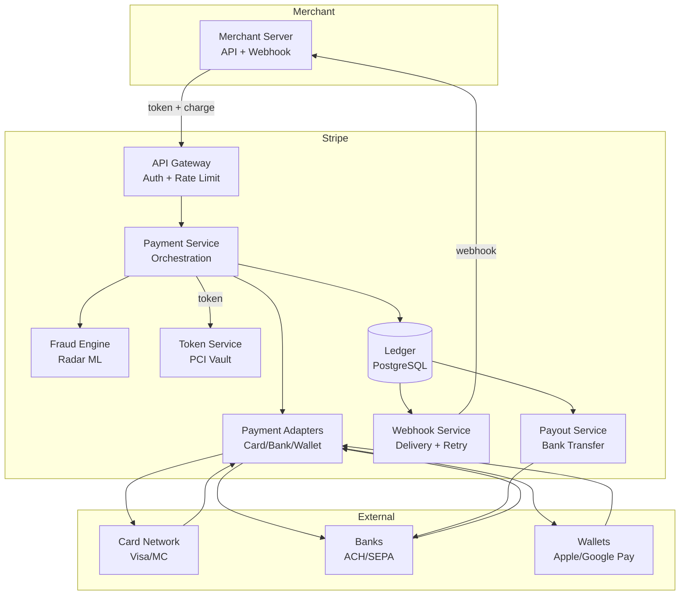
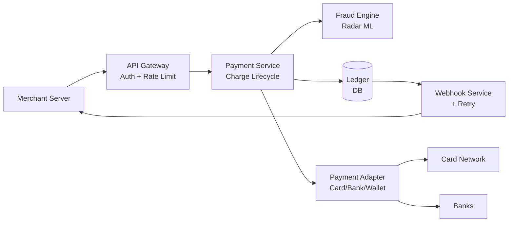

# Stripe System Design


## Blogs and websites


## Medium

- [The Stripe System Design Question That Separates Senior From Staff Engineers](https://medium.com/codetodeploy/the-stripe-system-design-question-that-separates-senior-from-staff-engineers-b39f1f1a05cf)


## Youtube

## Theory

### What Is It?

Stripe is a payment infrastructure-as-a-service platform — it provides APIs and SDKs that let businesses accept payments (credit cards, bank transfers, wallets) over the internet without building their own connections to card networks (Visa, Mastercard) or banks. Stripe abstracts away the complexity of payment flow orchestration: authentication (3D Secure), fraud detection, payouts, refunds, chargebacks, and compliance (PCI-DSS).

### Why Does It Exist?

Before Stripe/Braintree/Adyen, businesses had to integrate directly with acquiring banks and card networks — a months-long, expensive process requiring PCI-DSS compliance, fraud infrastructure, and regulatory licensing. Stripe's value proposition: a developer-friendly API that handles all payment complexity, turning "accept money" into a few lines of code.

### What Problem Does It Solve?

* **PCI-DSS compliance**: Stripe takes on PCI scope; merchants use client-side tokenization (elements.js) → card data never touches merchant servers.
* **Fraud**: Stripe Radar (ML-based) scores transactions in real time → block or allow.
* **Idempotency**: Network retries must not create duplicate charges → idempotency key per request.
• **Multi-method**: Cards, ACH, wallets (Apple Pay, Google Pay), bank transfers → unified API.
* **Global**: Multi-currency + local payment methods (iDEAL, SEPA, etc.) → single integration.
• **Payouts + accounting**: Automated payouts to bank; reconciliation + dispute management.
• **Webhooks**: Async events (payment succeeded, chargeback, dispute) → webhook endpoints.
• **Distributed systems**: Payment orchestration across bank/card networks → reliability + retries.

### Important Subtopics

1. Payment orchestration (authorize → capture → settle)
2. Idempotency (prevent duplicate charges on retry)
3. PCI-DSS compliance (tokenization, no card data on merchant servers)
4. Fraud detection (Stripe Radar, ML scoring)
5. 3D Secure authentication (exemption, frictionless)
6. Multi-currency + multi-method (cards, ACH, wallets)
7. Payouts + accounting (automated settlement)
8. Chargebacks + disputes (representment, evidence submission)
9. Webhooks (async event delivery)
10. Distributed transactions (saga pattern for payment + order)

### Problem Statement

Design a payment processing platform (like Stripe) that allows businesses to accept payments via API. The system must handle payment methods (cards, bank transfers, wallets), ensure idempotency, provide fraud detection, comply with PCI-DSS, handle refunds and disputes, support multi-currency, and deliver asynchronous events via webhooks.

### Functional Requirements

- Create charges (one-time + recurring)
- Support payment methods: cards, ACH, wallets
- Idempotency on all write operations
- Refunds + partial refunds
- Chargeback/dispute management (evidence submission)
- 3D Secure authentication
- Multi-currency + FX
- Payouts to bank accounts
- Webhooks for async events
- Customer + payment method tokenization

### Non-Functional Requirements

- **Latency**: < 200ms for charge API (sync authorization)
- **Availability**: 99.99% uptime (payments are mission-critical)
- **Consistency**: No duplicate charges (idempotency)
- **Security**: PCI-DSS Level 1 compliance
- **Scale**: 100K+ requests per second at peak

---

## Characteristics

| Characteristic | What it means | Why it matters | How it works |
|---|---|---|---|
| **Idempotency** | Repeated requests with same key = single execution | Network retries must not double-charge | Idempotency-Key header → dedup |
| **PCI-DSS** | Card data never touches merchant servers | Compliance (Level 1) | Tokenization + client-side elements |
| **Multi-method** | Cards + bank + wallets via one API | Global coverage | Payment method-specific adapters |
| **Multi-currency** | Accept any currency; FX at wholesale rate | International business | Currency conversion at settlement |
| **Fraud protection** | Automated fraud detection + blocking | Prevent losses | ML model (Stripe Radar) scoring |

## Components

| Component | Purpose | Responsibilities | Relationship | Real-world Example |
|---|---|---|---|---|
| **API Gateway** | Expose REST + webhook endpoints | Routing, auth, rate limiting | Client ↔ Services | Stripe API Gateway |
| **Payment Service** | Core payment orchestration | Create charge, manage state | Gateway ↔ Adapters | Charge controller |
| **Payment Adapters** | Connect to external rails | Card networks, bank APIs, wallets | Payment Service | Stripe Sigma |
| **Fraud Engine** | Detect fraudulent transactions | Scoring, rules, Radar | Payment Service | Stripe Radar, Sift |
| **Token Service** | PCI-compliant card storage | Tokenize cards, vault | Client ↔ Payment Service | Vault API |
| **Ledger** | Double-entry accounting | Track money movement + audit | All services | Cassandra/PostgreSQL |
| **Webhook Service** | Async event delivery | Event → webhook endpoint | Payment Service | Webhooks API |
| **Payout Service** | Transfer funds to bank | Batch payouts, schedule | Ledger | Payout engine |
| **Dispute Service** | Handle chargebacks | Evidence submission, representment | Ledger | Disputes API |

## Patterns

### Idempotency Key

* **What**: Each write request (e.g., create charge) includes an `Idempotency-Key` header (UUID). The system stores request → response mapping keyed by idempotency key.
* **Problem solved**: Prevent duplicate charges when clients retry due to network timeout.
* **How it works**: (1) Client sends POST /charges with Idempotency-Key: uuid-123. (2) Payment Service checks Redis/Cassandra: key exists? → return cached response. (3) If new → process charge → store (key → response) with TTL (24h). (4) Replay: same key → return same response (even after partial failure).
* **When to use**: Any distributed write prone to client retry (payments, reservations, orders).
• **When not to use**: Read-heavy; idempotent operations (GET).
* **Advantages**: Prevents duplicate execution; client-safe retry; no side effects.
* **Disadvantages**: Storage overhead (key → response for 24h); cache invalidation.

## Benefits

* **Developer experience**: Simple API → accept payments in minutes.
• **Fraud protection**: Stripe Radar → reduced chargeback losses.
* **Global reach**: Multi-currency + local payment methods.
• **Compliance**: PCI-DSS handled by Stripe → merchants don't need to.
• **Async events**: Webhooks → update merchant systems on state changes.

## Pros

* **Universal payment API**: One integration → all payment methods globally.
• **Built-in fraud**: Stripe Radar ML model → 53% average fraud reduction.
• **PCI compliance**: SAQ-A (easiest) → card data never on merchant server.
• **Reliability**: Retry + idempotency → safe network retries.
• **Ecosystem**: Billing, Connect (marketplaces), Issuing (cards), etc.

## Cons

* **Costs**: 2.9% + $0.30 per transaction (plus FX fees).
• **Blackbox**: Fraud/model decisions opaque (hard to debug false positives).
• **Vendor lock-in**: Deep integration → migration difficult.
• **Rate limits**: 100 reqs/sec default → may throttle high-volume merchants.
• **Chargeback fees**: Additional fees for disputes even if won.

## Challenges

### Technical Challenges
* **Distributed transactions**: Payment → order → fulfillment; need saga pattern (compensations).
• **PCI-DSS**: Multi-layered security; no card data in logs/caches.
• **Multi-rail**: Cards, ACH, SEPA, wallets → adapter per method.

### Scalability Challenges
* **Throughput**: 100K+ charges/sec → sharded payment service + Redis cluster.
• **Idempotency store**: Billions of keys/day → Redis + TTL + compaction.

### Performance Challenges
* **Authorization latency**: Card auth = 100–500ms (network round-trip to card network).
• **Webhook delivery**: Async → retry with exponential backoff + dead-letter.

### Reliability Challenges
* **Partial failures**: Auth succeeds → capture fails → compensation (void).
• **Network partitions**: Idempotency key protects against duplicates.

### Maintainability Challenges
* **Adapter explosion**: Each payment method → custom adapter + lifecycle.
• **Compliance**: Annual PCI audits; changing standards.

### Security Concerns
* **Card data**: Never touch merchant servers (tokenization).
• **Fraud**: ML + rules; false positive rate monitoring.
• **Chargebacks**: Evidence submission; representment workflow.
• **Webhooks**: HMAC signature verification; replay attack protection.

## Best Practices

* **Idempotency**: All mutating API calls use idempotency key (client-generated UUID).
• **Tokenization**: Card data → client-side → Stripe token → never touches server.
• **Webhook verification**: HMAC-SHA256 signature; retry with exponential backoff.
• **3D Secure**: Exemption APIs to minimize friction; handle fallback.
• **Fraud tuning**: Adjust Radar rules based on business type; monitor false-positive rate.

## When to Use

### Appropriate
* E-commerce (online stores, marketplaces).
• SaaS (subscription billing).
• Platforms needing multi-currency + global methods.
• Marketplaces (Stripe Connect).

### Not Appropriate
* Cash-only businesses.
• Systems with no internet connectivity.
• When you have direct bank licensing (lower cost).

### Alternatives
* Adyen, PayPal, Braintree, Razorpay (regional).

## Use Cases

### E-commerce Checkout

* **Problem**: An online store needs to accept credit card payments securely without handling PCI-DSS compliance.
* **Solution**: Stripe Elements (client-side card form) → tokenizes card → server receives token → creates charge via Stripe API with idempotency key → webhook on success → fulfill order.
* **Why suitable**: PCI-compliant tokenization; simple API; idempotency; built-in fraud.
* **How it works**: (1) Frontend: Stripe.js Elements → card input → `stripe.createToken(card)` → token. (2) Backend: POST /charges with token + amount + currency + Idempotency-Key. (3) Stripe: auth (100ms) + capture → ledger entry. (4) Webhook: payment_succeeded → backend → fulfill order. (5) If network timeout → client retries → idempotency key → same response (no duplicate charge).
* **Trade-offs**: 2.9% + $0.30 fee; chargeback liability; vendor lock-in.

## Architecture



### Architecture Structure
* **Gateway**: API auth + rate limiting.
• **Payment Service**: Core orchestration (charge lifecycle).
• **Fraud Engine**: ML-based scoring + rules.
• **Adapters**: Card network APIs, bank APIs, wallet APIs.
• **Ledger**: Double-entry accounting; source of truth.
* **Webhook**: Async event delivery with retry + dead-letter.
• **Payout**: Batch bank transfers.

### Communication
* **Merchant → Gateway**: HTTPS (REST API).
• **Internal services**: gRPC + Kafka (event streaming).
• **Adapters → External**: HTTPS (card network/bank APIs).
• **Webhook → Merchant**: HTTPS (signed POST with HMAC).

### Data Flow
1. **Charge**: Merchant → API (token + Idempotency-Key) → Payment Service → Fraud Engine (score) → Payment Adapter (card auth via network) → Ledger (record) → return response.
2. **Webhook**: Ledger event → Webhook Service → POST with signature → retry on failure → dead-letter.
3. **Payout**: Settled funds → Payout Service → bank transfer batch.

### Scaling Strategy
* **API**: 500+ gateway instances; rate-limit (100 req/s/merchant).
• **Payment Service**: Sharded by merchant_id; 200+ instances.
• **Ledger**: PostgreSQL sharded by merchant_id + date.
* **Webhook**: Queue-based; 50 worker pools; exponential backoff retry.

### Failure Handling
* **Auth failure**: Return decline + webhook charge.failed.
• **Webhook failure**: Retry (exponential backoff, 3 days); dead-letter after max retries.
• **Idempotency**: Key stored in Redis (24h TTL) → no duplicates on retry.
• **Chargeback**: Dispute Service → evidence submission → representment.

## High-Level Design



## Deep Dive

### Idempotency Implementation

(Existing Theory section covers: idempotency key per request (UUID); stored in Redis/DB; if key exists → return cached response; TTL 24h; prevents duplicate charges on client retry.)

### Card Network Flow

(Existing Theory section covers: Stripe connects to card networks (Visa, Mastercard) → authorization request → network routes to issuing bank → approval/decline → response to Stripe → capture/settle.)

### PCI-DSS Compliance

(Existing Theory section covers: PCI-DSS scope reduced by tokenization; card data entered client-side (Stripe.js/Elements) → tokenized → token sent to server → server never sees card data. Vaulting for saved cards.)

## Data Modeling

```mermaid
erDiagram
    CUSTOMER ||--o{ CHARGE : "has"
    CHARGE ||--o{ REFUND : "has"
    CHARGE ||--o{ DISPUTE : "has"
    PRODUCT ||--o{ CHARGE : "billed for"
    CHARGE }|--|| PAYMENT_INTENT : "intent"

    CUSTOMER {
      string customer_id PK
      string email
      string name
      string currency
    }
    CHARGE {
      string charge_id PK
      string customer_id FK
      string payment_intent_id FK
      string currency
      int amount
      string status pending_succeeded_failed
      string payment_method
      datetime created_at
    }
    PAYMENT_INTENT {
      string intent_id PK
      string customer_id FK
      int amount
      string currency
      string status requires_action_succeeded
      datetime created_at
    }
    REFUND {
      string refund_id PK
      string charge_id FK
      int amount
      string reason
      string status
      datetime created_at
    }
    DISPUTE {
      string dispute_id PK
      string charge_id FK
      string status
      string evidence_due_by
      datetime created_at
    }
```

**Partitioning**: Charges sharded by customer_id + date.

## Java and Spring Boot Implementation

```java
@RestController
@RequestMapping("/api/v1/charges")
@RequiredArgsConstructor
public class ChargeController {
    private final ChargeService chargeService;

    @PostMapping
    public ResponseEntity<ChargeResponse> createCharge(
            @RequestHeader("Idempotency-Key") String idemKey,
            @RequestBody CreateChargeRequest request) {

        Charge charge = chargeService.createCharge(request, idemKey);
        return ResponseEntity.ok(ChargeResponse.from(charge));
    }

    @PostMapping("/{chargeId}/refunds")
    public ResponseEntity<Refund> refund(
            @RequestHeader("Idempotency-Key") String idemKey,
            @PathVariable String chargeId,
            @RequestBody RefundRequest request) {

        Refund refund = chargeService.refund(chargeId, request, idemKey);
        return ResponseEntity.ok(refund);
    }
}

@Service
@Transactional
public class ChargeService {
    private final RedisTemplate<String, String> redis;
    private final ChargeRepository chargeRepo;
    private final PaymentAdapter paymentAdapter;

    public Charge createCharge(CreateChargeRequest req, String idemKey) {
        // Check idempotency
        String cached = redis.opsForValue().get("idem:" + idemKey);
        if (cached != null) {
            return deserialize(cached);
        }

        // Process payment
        PaymentResult result = paymentAdapter.charge(req.getAmount(), req.getPaymentMethod());
        
        Charge charge = new Charge(req, result);
        chargeRepo.save(charge);

        // Cache for idempotency (24h TTL)
        redis.opsForValue().set("idem:" + idemKey, serialize(charge), Duration.ofHours(24));

        return charge;
    }
}
```

## Real-World Examples

* **Stripe**: Global payment platform (135+ currencies); API-first; Stripe Radar for fraud; PCI-DSS Level 1; webhooks.
* **PayPal**: PayPal Checkout + Braintree; vault for saved cards; dispute management.
• **Adyen**: Enterprise; single API; global acquiring.
* **Razorpay** (India): Multi-method (UPI, cards, wallets); local payment methods.

## Interview Preparation

### Beginner Questions

**Q: What is idempotency in payment systems?**
A: A property that guarantees repeating the same request has the same effect as executing it once. Stripe uses an Idempotency-Key header: the first request processes + stores response; retries with the same key return the cached response (no duplicate charge). Critical for network retries.

**Q: How does Stripe handle PCI-DSS compliance?**
A: Card data is entered client-side via Stripe Elements (stripe.js) → tokenized in the browser → token sent to server. Server never handles PANs → PCI scope reduced to SAQ-A (simplest). For saved cards → token vault.

**Q: What are the stages of a credit card transaction?**
A: (1) **Authorization**: Verify card + funds → reserve amount (100–500ms). (2) **Capture**: Actually transfer funds (can be same as auth). (3) **Settlement**: Batch settle at end of day → money moves from issuer to acquirer. (4) **Funding**: Money deposited to merchant bank. (5) **Dispute**: Chargeback if cardholder contests.

### Intermediate Questions

**Q: How do you implement idempotency in a distributed payment system?**
A: (1) Client sends Idempotency-Key (UUID v4). (2) Before processing → check Redis: GET idempotency:{key}. (3) If exists → return cached response. (4) If new → process payment + DB transaction → SET idempotency:{key} → response with 24h TTL. (5) For failures → partial state; use state machine (requires_action). (6) For scale → Redis cluster + keyspace (per merchant).

**Q: How does Stripe handle 3D Secure authentication?**
A: (1) Auth request → check if 3DS required (based on amount, region, exemption rules). (2) If required → redirect/iframe → issuer authenticates. (3) Stripe handles exemption (SCA) → frictionless. (4) After 3DS → proceed with auth. (5) Webhook: payment_intent.succeeded.

**Q: How do you handle refunds?**
A: POST /refunds with charge_id + amount (partial) + Idempotency-Key → Stripe → reverse funds to original payment method → webhook charge.refunded → merchant updates order. Full or partial; multiple refunds per charge.

### Advanced Questions

**Q: Design a payment processing system (like Stripe) handling 100K charges/sec with idempotency, fraud detection, PCI compliance, and webhooks.**

A: (1) **API Gateway**: 50+ instances; JWT auth + rate limit (100 reqs/sec/merchant); Idempotency-Key validation. (2) **Payment Service**: Core orchestration (charge state machine: requires_payment_method → requires_action → processing → succeeded). Sharded by merchant_id; 200+ instances. (3) **Fraud Engine**: Stripe Radar (ML model) → score ∈ [0,100] → threshold (e.g., 50 = block); rules engine (declines/increases). (4) **PCI Compliance**: Stripe Elements (client-side) → tokenization → PAN never touches merchant. Vault for saved cards. (5) **Adapters**: Card (Stripe Terminal/Issuing); ACH (Plaid); wallets (Apple Pay, Google Pay). (6) **Ledger**: PostgreSQL sharded by merchant_id + date; double-entry accounting. (7) **Idempotency**: Redis → key = idempotency:{key} → response + 24h TTL; Redis cluster (20 nodes). (8) **Webhook**: Queue-based; 50 worker pools; HMAC-SHA256 signature; exponential backoff retry (max 3 days); dead-letter. (9) **Scale**: 100K charges/sec → gateway (100 instances) + payment service (200 instances) + fraud (50 instances) + Redis (20 nodes). (10) **Monitoring**: Charge latency P99 < 500ms; fraud detection rate; webhook delivery SLO 99%; idempotency cache hit ratio > 90%.

### Senior-Level Questions

**Q: How does Stripe handle idempotency, and what are the edge cases?**

A: Stripe's idempotency implementation:

1. **Idempotency-Key header** (client-generated UUID v4): Stored with the response.
2. **Storage**: Redis + Cassandra (persistent); 24h TTL; key = `idempotency:{key}`.
3. **Flow**: (a) Client → POST /charges + Idempotency-Key. (b) API Gateway: Redis GET key → cached? → return. (c) If new → process → store response+key with TTL. (d) Retry → same key → cached response (even if first request failed mid-way → returns error).
4. **Edge cases**:
   a. **Partial failure**: Charge processed but response lost → idempotency key has cached error; next retry returns error → charge exists but client thinks failed → client must check status + reconcile.
   b. **Different paths for same key**: Key must be identical (including query params); different query params → treated as different request.
   c. **TTL expiry**: Key expires after 24h → new request with old key → re-processes (creates duplicate).
   d. **Concurrent requests**: Same key → lock on key → first wins, rest wait → return.
   e. **State-dependent**: GET requests don't use idempotency; only mutating.

### Common Mistakes

- No idempotency → duplicate charges on retry.
- Card data on merchant server → PCI-DSS violation + fines.
- No webhook signature verification → replay attacks.
- No fraud → losses + chargebacks.
- No rate limiting → DoS + abuse.
- Wrong currency handling → FX disputes.
- No 3DS exemption → poor checkout UX.
- Webhook retry too aggressive → merchant server overload.
- Idempotency key too short → collision (use UUID v4).
- No async webhook → lost events on failure.
• No dispute management → lost representment window.
- No multi-provider (vendor lock-in) → difficult migration.