# Design TikTok

> Design a short-form video platform like TikTok that supports video creation, a personalized algorithmic "For You" feed, likes/comments/shares/duets/stitches, real-time interactions, live streaming, creator monetization, and content moderation at global scale (1B+ MAU).

## Blogs and websites

## Medium

## Youtube

- [How TikTok Is Changing the Way We Create and Share Video](https://www.youtube.com/watch?v=dQw4w9WgXcQ)
- [The Algorithm Behind TikTok's For You Page](https://www.youtube.com/watch?v=5gOQNjyqgPc)

## Github

## Theory

### Topics Covered

1. [Introduction / Problem Statement](#introduction--problem-statement)
2. [Characteristics](#characteristics)
3. [Pros](#pros)
4. [Cons](#cons)
5. [Use Cases](#use-cases)
6. [Components](#components)
7. [Architectural Patterns](#architectural-patterns)
8. [Benefits](#benefits)
9. [Challenges](#challenges)
10. [Best Practices](#best-practices)
11. [When to Use / When Not to Use](#when-to-use--when-not-to-use)
12. [Data Model and API](#data-model-and-api)
13. [Video Processing Pipeline](#video-processing-pipeline)
14. [Two-Stage Recommendation Engine](#two-stage-recommendation-engine)
15. [Replication Strategies](#replication-strategies)
16. [Failure Detection and Membership](#failure-detection-and-membership)
17. [High Availability and Scalability](#high-availability-and-scalability)
18. [Performance and Optimization](#performance-and-optimization)
19. [CAP Theorem and Consistency Trade-offs](#cap-theorem-and-consistency-trade-offs)
20. [Encryption and Key Management](#encryption-and-key-management)
21. [Authentication and Authorization](#authentication-and-authorization)
22. [Security Threats and Mitigations](#security-threats-and-mitigations)
23. [Observability and Logging](#observability-and-logging)
24. [Real-World Implementations](#real-world-implementations)
25. [Java and Spring Boot Implementation Guide](#java-and-spring-boot-implementation-guide)
26. [Interview Questions and Answers](#interview-questions-and-answers)

---

### Introduction / Problem Statement

TikTok is a short-form vertical video platform where users create, edit, and share videos (15 seconds to 10 minutes) enhanced with music, filters, effects, and AI-powered editing tools. Its defining feature is the **"For You" feed** — a personalized, algorithmically-driven recommendation stream that surfaces content primarily based on predicted user interest rather than who the user follows. Unlike follow-based feeds (Instagram, Facebook), TikTok's feed can surface content from creators the user has never heard of, if the model predicts they will engage.

The core design challenge is **recommendation at planetary scale**: serving 500M+ daily active users with a feed generated in under 200 ms, where the candidate pool is the entire global video corpus and the ranking model must evaluate 100+ features per candidate. This demands a two-stage funnel (candidate generation → ranking), a feature store updated in real-time from 50B+ daily interaction events, and media processing pipelines that handle 1M+ uploads per day with sub-second first-frame latency.

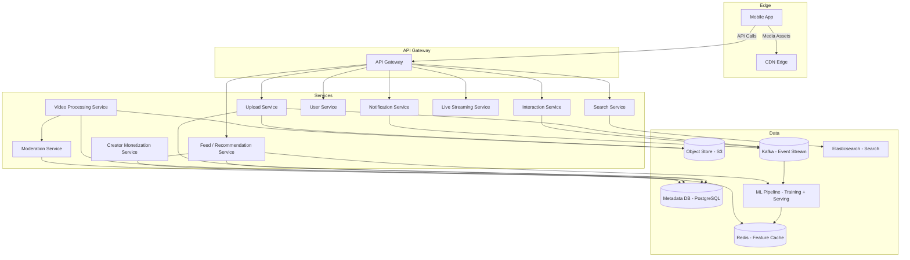

*The high-level architecture of TikTok: clients fetch media through a CDN edge and make API calls through a gateway. The Upload Service writes raw video to S3 and publishes events to Kafka; the Video Processing Service transcodes and moderates asynchronously. The Recommendation Service draws on ML models and a Redis feature cache to generate the personalized For You feed. User interactions stream through Kafka to continuously update model features.*

**Problem Statement:** Design a short-form vertical video platform that ingests 1M+ uploads per day, serves a personalized "For You" feed to 500M+ daily active users in under 200 ms, supports real-time interactions (likes, comments, shares, duets, stitches), live streaming, creator monetization, and content moderation at planetary scale — all with 99.99% availability.

**What problem does it solve?**

- **Content discovery**: surfaces the right video to the right user from millions of uploads per hour via a deep learning recommendation system using 100+ signals.
- **Short attention spans**: 15–60 second videos fit modern attention spans and mobile scrolling behavior.
- **Video creation simplicity**: one-tap recording, auto-captions, filters, and a music library make content creation accessible to non-experts.
- **Viral distribution**: the "For You" feed gives new creators a chance to go viral based on content quality, not follower count.
- **Mobile-first performance**: fast video loading and smooth scrolling on mobile devices with variable network conditions via adaptive bitrate streaming.

---

### Characteristics

| Characteristic | What it means | Why it matters | How it works |
|---|---|---|---|
| **Recommendation-driven feed** | Content discovery is primarily algorithmic (For You), not follow-based | Drives user engagement; virality for new creators | Deep learning model with 100+ features |
| **Short-form vertical video** | 15s to 10min vertical videos designed for mobile scroll | Fits modern attention spans; mobile-native | Client-side recording + editor |
| **Real-time interactivity** | Likes, comments, shares, duets/stitches happen live | Social engagement drives retention | Event streaming + fan-out |
| **Viral distribution** | Videos can go viral regardless of follower count | Creator economy; user growth | For You feed algorithm |
| **Mobile-first** | Designed from the ground up for mobile touch | 95% of users are on mobile | Native iOS/Android apps |
| **Creator economy** | Tools for content creation and monetization | Drives platform value (UGC) | Effects, sounds, monetization tools |

**Characteristic detail:**

- **Recommendation-driven feed** diverges fundamentally from social-graph feeds: the candidate pool is the entire global corpus, not just followed creators. This means the system must retrieve relevant candidates from billions of videos in milliseconds — a database scan is impossible, so ANN indexes and pre-computed candidate pools are used.
- **Real-time interactivity** requires a fan-out path for each interaction: a like must update the creator's like count, the interaction feature store (for the recommendation model), and notify the creator — all within seconds. A Kafka-style log partitioned by video or user ID handles this, with stream processors updating real-time features.
- **Mobile-first performance** is non-negotiable: the first frame of a video must appear in under 1 second. This requires progressive download (or adaptive streaming), CDN edge caching with enough replicas, and pre-warming caches for trending content.

---

### Pros

- **Massive engagement**: 1B+ MAU with 955+ average minutes/month (vs. 405 for Instagram, 290 for YouTube among US users).
- **Viral distribution**: Algorithm-driven feed gives everyone equal opportunity for discovery based on content quality, not follower count.
- **Low creation barrier**: 15-second videos, built-in effects, music library, auto-captions lower the barrier to content creation.
- **Mobile-native**: Optimized for vertical full-screen viewing on mobile with gesture-based scrolling.
- **Rich effects ecosystem**: Thousands of AR filters, beauty effects, transitions, text overlays.
- **Music integration**: Licensed music library; sounds can go viral independently of the videos using them.
- **Creator monetization**: Creator Fund, live-stream gifts, brand partnerships turn engagement into revenue, retaining creators on the platform.

---

### Cons

- **Addictive by design**: Infinite scroll + algorithmic recommendation can cause excessive usage (mental health concerns).
- **Privacy concerns**: Extensive data collection for personalization (location, contacts, browsing behavior) raises GDPR/CCPA compliance risk.
- **Misinformation**: False information spreads quickly through the viral feed — requires massive moderation investment.
- **Creator dependency**: Algorithm changes can dramatically shift creator income overnight; lack of transparency in the algorithm.
- **Short attention spans**: Content designed for quick consumption may reduce deep engagement with complex topics.
- **Regulatory scrutiny**: Banned/suspended in several countries (India, EU investigations); data security and content safety under constant government review.
- **Content moderation at scale**: 1M+ videos per day require ML + human review (150+ moderators per major language) — false positives and negatives both cause problems.

---

### Use Cases

#### Viral Content Distribution System

- **Problem**: Help new creators go viral based on content quality, not follower count.
- **Solution**: For You feed with recommendation algorithm; content judged purely on predicted engagement.
- **Why suitable**: TikTok's core innovation — feed gives everyone equal opportunity.
- **How it works**: (1) New video uploaded → (2) processed → (3) metadata + features (visual, audio, text) extracted → (4) candidate generation model decides whether to include in some users' feeds (exploration) → (5) if it performs well (high watch time, likes, shares), ranking model pushes to more feeds → (6) viral growth if sustained.
- **Trade-offs**: Creator livelihood depends on opaque algorithm; manipulation risk; misinformation can go viral.

#### Creator Monetization Platform

- **Problem**: Enable content creators to earn revenue from their videos.
- **Solution**: Creator Fund (per-view payments), live streaming gifts, brand partnerships, affiliate marketing.
- **Why suitable**: Built on top of the recommendation engine — creators who get views get revenue.
- **How it works**: (1) Creator meets eligibility (18+, 10K+ followers, 100K+ views in 10 days) → (2) enrolled in Creator Fund → (3) videos that pass moderation and community guidelines are eligible → (4) revenue calculated per view (varies by ad revenue, ~$0.02-0.04/view) → (5) paid monthly. Also: live gifts (virtual items purchased by viewers → converted to diamonds → withdrawn as revenue).
- **Trade-offs**: Low payout per view; algorithm changes affect income; high dependency on platform.

#### Short-Form Video as a Service

- **Problem**: Other platforms need a short-form vertical video experience embedded in their product.
- **Solution**: White-label SDK providing the upload UI, editing effects, music library, and a recommendation widget.
- **Why suitable**: TikTok's tech stack is reusable as a service layer.
- **How it works**: (1) Partner app integrates the TikTok Kit SDK → (2) video is uploaded through TikTok's edge → (3) processed and served through TikTok's CDN → (4) recommendation widget embedded in the partner app.
- **Trade-offs**: Revenue sharing; brand safety control; data ownership.

---

### Components

| Component | Purpose | Responsibilities | Relationship | Real-world Example |
|---|---|---|---|---|
| **Video Upload Service** | Handle video ingest | Accept uploads, chunking, validation | Calls Object Store, Processing Queue | TikTok's upload microservice |
| **Video Processor** | Process uploaded videos | Transcode to multiple resolutions, generate thumbnails, extract audio | Reads from queue; writes to CDN | FFmpeg workers |
| **Object Store** | Store raw and processed video | Durable, scalable video storage | Video Upload ↔ Processor ↔ CDN | S3 with multi-region replication |
| **CDN** | Distribute videos globally | Edge caching, adaptive bitrate streaming | Serves video content to clients | Akamai, Aliyun CDN |
| **Metadata DB** | Store video/user metadata | Video details, creator info, relationships | Read by Recommendation Service | PostgreSQL sharded by region |
| **Recommendation Service** | Generate For You feed | Candidate generation + ranking | Reads events; calls ML model | TikTok's two-stage recommender |
| **ML Model Service** | Serve recommendation models | Inference at low latency | Called by Recommendation Service | TensorFlow Serving, PaddlePaddle |
| **Interaction Service** | Handle social actions | Process likes, comments, shares, duets | Writes to Kafka; updates feeds | Like/comment microservice |
| **Content Moderation** | Moderate uploads | Automated ML + human review | Consumes from processing queue | AI + human team |
| **User Service** | Manage profiles | User data, authentication, sessions | Read by all services | Auth microservice |
| **Notification Service** | Send alerts | Push notifications for interactions | Reads from Kafka | Firebase, APNs |
| **Live Streaming Service** | Handle live video | Real-time broadcast, comments, gifts | WebRTC, CDN | Live-stream microservice |
| **Creator Monetization Service** | Manage creator revenue | Creator Fund, gifts, brand partnerships | PostgreSQL, payment gateway | Monetization microservice |

---

### Architectural Patterns

#### Two-Stage Recommendation (Candidate Generation + Ranking)

- **What**: First stage generates ~1000 candidate videos from millions using fast methods; second stage uses a deep ML model to rank candidates precisely and select the top 8-15 for the feed.
- **Problem solved**: Scoring every video (millions) for every user is computationally infeasible. Two-stage narrows to a manageable set for precise scoring.
- **How it works**: (1) Candidate generation: 4+ models (collaborative filtering, content-based, user-video similarity, popularity) each produce ~250 candidates → merge to 1000. (2) Ranking: Deep neural network with 100+ features (user features, video features, historical CTR, real-time signals) → scores each → top 15. (3) Re-ranking: Apply diversity rules (avoid same creator twice), content policy, cold-start injection.
- **When to use**: Content platforms with large catalogs and personalized feeds.
- **When not to use**: Small catalogs (all items can be scored directly).
- **Pros**: Scales to billions of videos; high precision; multiple retrieval methods improve recall.
- **Cons**: Items not in candidates can't be ranked; candidate generation quality is critical.
- **Real-world example**: TikTok's recommendation, YouTube's recommendation, Facebook's feed ranking.

```mermaid
flowchart LR
    Candidates[Candidate Generation<br/>~1000 videos from millions] --> Features[Feature Store<br/>100+ signals]
    Features --> Ranker[Ranking Model<br/>Deep NN - predict P(watch)]
    Ranker --> Rerank[Reranking<br/>Diversity + Policy + Cold-start]
    Rerank --> Cache[Feed Cache<br/>Redis]
    Cache --> FeedAPI[Feed API]
    FeedAPI --> Client[Client]
    Events[Interaction Events<br/>Kafka] -->|real-time updates| Features
    Batch[Spark Batch Pipeline] -->|daily training| Ranker
```

*The two-stage recommendation funnel: candidate generation recalls ~1000 videos from millions using fast approximate methods; a feature store supplies 100+ real-time and batch signals; a deep neural ranker scores candidates for predicted watch time; a re-ranking pass applies diversity, policy, and cold-start injection before caching.*

#### Asynchronous Video Processing Pipeline

- **What**: Upload triggers an object-store event; a worker fleet then resizes, filters, transcodes, and moderates media independently of the request path.
- **Problem solved**: Keeps the upload response fast while decoupling media transformation (seconds for video) from user-facing latency.
- **How it works**: User uploads video → chunks uploaded to Object Store → Processing Queue (Kafka/RabbitMQ) receives job → Worker pool (FFmpeg) processes in parallel (transcode, thumbnail, moderation) → processed video → CDN → metadata DB updated. Each step is independent and can be scaled.
- **When to use**: Any video platform with user-generated content.
- **When not to use**: Simple static content (images, text) — no processing pipeline needed.
- **Pros**: Asynchronous (doesn't block upload), scalable (add workers), fault-tolerant (retries).
- **Cons**: Complexity; eventual consistency (video not immediately playable); error handling for corrupt uploads.
- **Real-world example**: TikTok's video pipeline, YouTube's video processing, Instagram's media processing.

```mermaid
flowchart LR
    Upload[Mobile Upload] --> Chunk[Chunked Upload]
    Chunk --> S3[S3 Object Store (raw)]
    S3 -->|ObjectCreated| Queue[Processing Queue - Kafka]
    Queue --> W1[FFmpeg Worker 1]
    Queue --> W2[FFmpeg Worker 2]
    Queue --> WN[FFmpeg Worker N]
    W1 -->|Transcoded| CDN[CDN Edge]
    W1 -->|Thumbnails| CDN
    W1 -->|Metadata| MetaDB[(Metadata DB)]
    W1 -->|Moderation| ModSvc[Moderation Service]
    Queue -->|Auto-scale| Autoscaler[Worker Autoscaler<br/>based on queue depth]
```

*Video processing pipeline: a mobile client uploads in chunks to S3; the object creation event lands on a Kafka processing queue consumed by a pool of FFmpeg workers that transcode, generate thumbnails, and run moderation in parallel; outputs go to the CDN and metadata DB. Workers auto-scale on queue depth.*

#### Real-Time Event Streaming

- **What**: Every user interaction (like, comment, share, view, watch-time) is streamed through a distributed log (Kafka) partitioned by user or video ID, with stream processors updating real-time features for the recommendation model.
- **Problem solved**: The recommendation model needs features that reflect the user's most recent behavior (e.g., "this user just liked 3 dance videos"). Batch-only features would be stale by hours.
- **How it works**: Interaction → Kafka topic (partitioned by `hash(videoId) % N`) → Flink/Stream Processor → real-time feature store (Redis, 1-5 second TTL) + batch feature store (Spark → BigQuery, hourly). The recommendation service reads from the real-time store for fresh features.
- **When to use**: Any system where user behavior must influence recommendations within seconds.
- **When not to use**: Batch-only analytics where staleness of hours is acceptable.
- **Pros**: Fresh features; decoupled processing; replayable for debugging.
- **Cons**: Operational complexity of stream processing; requires careful watermarking and late-event handling.
- **Real-world example**: TikTok's Flink pipeline, LinkedIn's Samza, Netflix's Keystone.

#### Fan-Out for Social Interactions

- **What**: When a creator posts or goes live, the notification and feed systems must fan out the event to all followers. For power creators (10M+ followers), naive fan-out causes write amplification.
- **Problem solved**: Decouples the creator action from follower notification; scales fan-out to millions of recipients.
- **How it works**: Creator post → Kafka event → Fan-out Service (sharded by `hash(creatorId) % N`) → writes to per-follower notification queues or Redis sorted sets. For power creators, followers are notified on pull (read-time) rather than push.
- **When to use**: Any platform with fan-out-on-write semantics for social features.
- **When not to use**: Small-scale systems where broadcast is cheap.
- **Pros**: Scales to millions of followers; backpressure handling.
- **Cons**: Eventual consistency; complexity in handling unfollow/dead accounts.

---

### Benefits

- **User engagement**: 955+ average minutes/month (vs. 405 for Instagram, 290 for YouTube among US users).
- **Creator monetization**: Creator Fund, live gifts, brand partnerships, affiliate marketing create a revenue stream that retains creators on the platform.
- **Viral content distribution**: New creators can go viral based on content quality, not follower count.
- **Mobile-first experience**: Vertical video optimized for touch + one hand scroll.
- **AI-powered creativity**: Filters, effects, sounds, auto-captions lower creation barriers.
- **Network effects**: Each new user enriches the data pool for the recommendation model, improving quality for all.
- **Cross-platform**: Short-form video format extends to web, smart TVs, and embedded widgets.

---

### Challenges

#### Technical Challenges

- **Real-time recommendation at scale**: 500M+ users each opening the app 80+ times/day → 40M+ feed generations per hour, each requiring 100+ feature lookups and model inference in < 200 ms.
- **Video processing pipeline**: Millions of uploads/day → must transcode to 4-8 resolutions simultaneously → auto-scaling workers; handling corrupt uploads.
- **Content moderation**: 1M+ videos/day → must be checked for nudity, violence, misinformation, copyright before appearing in feeds.
- **Live streaming at scale**: Real-time video broadcast with sub-second comment latency requires WebRTC + CDN and careful bitrate adaptation.
- **Duet/Stitch coordination**: Two or more videos must be synchronized and composited in real-time for the viewer.

#### Scalability Challenges

- **Feed serving**: 1B+ MAU, DAU ~ 500M, each generating 30-80 feed requests/day = 15B-40B feed generations/day = 200K+/second peak. Requires 1000+ recommendation servers.
- **Video delivery**: 100M+ uploads/day, 20B+ video views/day → CDN serving 1M+ concurrent streams; multi-region storage.
- **Event processing**: 50B+ daily interactions (likes, comments, shares, views) → real-time pipeline updating recommendations.
- **Feature store**: 100+ features per user × 500M users → real-time store must serve millions of QPS with sub-10ms latency.

#### Performance Challenges

- **Feed latency**: Feed generation must complete in < 200 ms (1000 candidates × 100+ features × model inference).
- **Video start time**: First frame must appear in < 1 second (instant playback expectation).
- **Recommendation freshness**: Model must reflect real-time events (a trending sound should influence recommendations within minutes).
- **Cold start**: New users and new creators have no interaction history — must bootstrap recommendations from content features.

#### Reliability Challenges

- **Upload processing failures**: Video stuck in queue → delayed availability → user frustration.
- **Moderation bypass**: Bad content slips through → potential brand safety issues; manual review needed.
- **Feed outage**: If the recommendation system is down, users see no content → massive drop in engagement.
- **Region failover**: A region outage must not drop 1/4 of users' traffic; need warm standby and cross-region replication.
- **Model serving failures**: ML model crashes must degrade to popularity-based or cached feed, not zero results.

#### Maintainability Challenges

- **Model versioning**: 20+ ML models (candidate generators, ranker, video quality, content moderation) → deployment and rollback complexity.
- **Data quality**: Missing/corrupted events → degraded recommendations; must monitor data drift.
- **A/B testing**: Thousands of experiments per year → need robust experiment infrastructure.
- **Feature store parity**: Training features must exactly match serving features — skew silently degrades launches.

#### Operational Challenges

- **Peak traffic**: New app releases, viral challenges → 10x traffic spikes → auto-scaling game days.
- **Cross-region deployment**: 50+ countries → compliance (data residency), local content policies.
- **Creator tools**: Managing effect/sound copyright, creator payouts, analytics.
- **Infrastructure cost**: ML training on GPU clusters, media processing, CDN egress — cost scales with engagement.
- **Content policy**: Community guidelines must be enforced consistently across languages and cultures.

#### Security Concerns

- **Data privacy**: User behavior, contacts, location → GDPR/CCPA compliance.
- **Content safety**: Age-inappropriate content, misinformation, copyrighted material → ML moderation + human review.
- **Account security**: SIM swap attacks to take over accounts; phone number verification.
- **DDoS on viral content**: A viral video can generate 1M+ views/minute → CDN + rate limiting needed.
- **Copyright infringement**: Users uploading copyrighted music/videos → content ID fingerprinting + takedown.

---

### Best Practices

- **Mobile optimization**: Video must be encoded in multiple bitrates (adaptive streaming); thumbnails generated for preview; progressive loading with low-quality image placeholder (LQIP).
- **Async processing**: Video upload doesn't block — user gets a progress indicator; processing happens in background. A polling or push mechanism notifies the user when the video is ready.
- **Recommendation freshness**: Real-time event processing (Kafka + Flink) updates user/item features every few seconds. Batch pipeline (Spark) trains models daily.
- **Multi-model recommendation**: Don't rely on one signal (watch time) — use 100+ features (likes, shares, comments, rewatch, scroll velocity, completion rate, re-watches).
- **Diversity and exploration**: Force diverse content in the feed (different creators, topics) — avoid filter bubbles. Use ε-greedy or softmax exploration for cold-start content.
- **Content moderation at scale**: Combine ML (95% of decisions) with human review (edge cases + appeals). Multi-model classifiers (image, video, text, audio, multimodal).
- **Graceful degradation**: If the recommendation system degrades, serve popular/trending content as fallback — never show an empty feed.
- **Monitor for manipulation**: Detect bot accounts, fake engagement, and coordinated inauthentic behavior using anomaly detection on traffic patterns.
- **Cold-start handling**: New users get population-average or contextual priors; new videos get injected into a small percentage of feeds for exploration.
- **Feature store parity**: Ensure training features exactly match serving features — use a single feature-definition codebase compiled to both Flink and Spark.

---

### When to Use / When Not to Use

#### Appropriate

- When building a social content platform where **discovery** is key (not just following known accounts).
- When serving short-form vertical video content.
- When you have the data scale (millions of users, millions of videos) to benefit from ML recommendations.
- When mobile-first experience is the primary goal.
- When creator monetization (live gifts, ad revenue share) is part of the business model.

#### Not Appropriate

- For long-form content (lectures, documentaries) — users search rather than scroll.
- For small user bases (< 10K) — recommendation algorithms need data.
- When content is editorially curated (news, education) — quality control matters more than virality.
- When the team lacks ML/infra maturity to operate media pipelines, recommendation models, and content moderation at scale.
- For text-first communities — a simpler forum platform is cheaper and more appropriate.

#### Alternatives

- **YouTube Shorts**: Same recommendation architecture but integrated into YouTube's existing infrastructure.
- **Instagram Reels**: Integrated into Instagram's follow-based feed with algorithmic suggestions.
- **Snapchat Spotlight**: Stories-first with AR filters; recommendation-driven but with a smaller corpus.
- **Traditional CMS**: For publisher-controlled content (no algorithm).
- **Reddit-style**: Community-driven upvoting and text-first content.

#### Decision Factors

- **Content type**: UGC (good for TikTok-style) vs. professional content (YouTube/Long-form).
- **Audience**: Young, mobile-first (good) vs. professional, desktop (less so).
- **Data scale**: Millions of daily active users needed for ML recommendations to be effective.
- **Monetization**: Ad-supported (need engagement) vs. subscription (need retention).
- **Team size**: Requires ML engineers, data engineers, and SREs — not a solo-founder project.

---

### Data Model and API

#### Entities

- **User**: User profiles, device tokens, preferences.
- **Video**: Video metadata (title, creator, duration, resolution, status, view count, like count).
- **Follower**: Follow relationship (who follows whom).
- **Interaction**: Likes, comments, shares, views (real-time signals for recommendations).
- **Hashtag**: Hashtag metadata (name, view count, trending score).
- **Sound**: Music/audio metadata (title, artist, duration, play count).
- **Comment**: Comments on videos (with threading via parent_comment_id).
- **Duet/Stitch**: Metadata for split-screen or stitched videos.

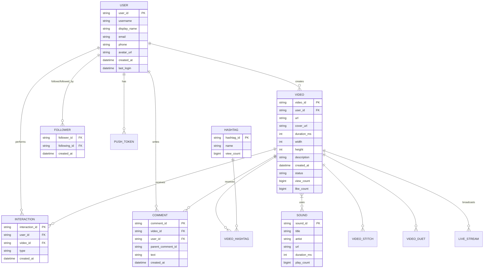

*The entity-relationship model centers on USER as the hub: users create videos, write comments, perform interactions, follow other users, and own device tokens. Videos receive interactions, comments, hashtags, and sounds. The follow graph (FOLLOWER) drives the "Following" feed, while the For You feed is recommendation-driven.*

#### Partitioning / Sharding

- **User table**: Shard by `hash(user_id) % 1024` → 1024 shards across 8 regions.
- **Video table**: Shard by `hash(video_id) % 2048` — separate from user shard (different access patterns).
- **Interactions**: Shard by `hash(video_id) % 1024` — written/read by video ID.
- **Comments**: Shard by `hash(video_id) % 512`.
- **Event data**: Kafka topics partitioned by `hash(user_id) % 1024`.

#### API Contract

*Mobile client API for video feed, upload, interactions, and user management.*

| Method | Endpoint | Description |
|---|---|---|
| GET | `/api/v1/feed` | Get For You feed (personalized) |
| GET | `/api/v1/feed/following` | Get following feed |
| POST | `/api/v1/video/upload` | Initiate video upload (get URL) |
| POST | `/api/v1/video` | Submit video metadata after upload |
| POST | `/api/v1/interaction/like` | Like a video |
| POST | `api/v1/interaction/comment` | Comment on a video |
| POST | `/api/v1/interaction/share` | Share a video |
| POST | `/api/v1/interaction/view` | Record a view |
| GET | `/api/v1/video/{id}/comments` | Get comments (paginated) |
| GET | `/api/v1/user/{id}` | Get user profile |
| POST | `/api/v1/user/follow` | Follow a user |
| GET | `/api/v1/live/{userId}` | Get live stream URL |
| POST | `/api/v1/gifts/send` | Send a virtual gift during live |

**GET `/api/v1/feed` Request:**

```http
GET /api/v1/feed?count=8&cursor=abc123&feed_type=foryou
Authorization: Bearer <access_token>
Device-ID: <device_id>
App-Version: 32.5.0
```

- `count`: number of videos (default 8)
- `cursor`: pagination cursor
- `feed_type`: `foryou` | `following`

**GET `/api/v1/feed` Response:**

```json
{
  "videos": [
    {
      "id": "video_12345",
      "author": {
        "id": "user_67890",
        "username": "creator_name",
        "avatar": "https://cdn.tiktok.com/avatar.jpg"
      },
      "video": {
        "url": "https://cdn.tiktok.com/video_12345_720p.mp4",
        "cover": "https://cdn.tiktok.com/video_12345_cover.jpg",
        "duration": 45,
        "width": 1080,
        "height": 1920
      },
      "stats": {
        "likes": 123456,
        "comments": 7890,
        "shares": 4567,
        "views": 2345678
      },
      "music": {
        "id": "music_999",
        "title": "Song Title",
        "duration": 30
      },
      "hashtags": ["#fyp", "#dance"]
    }
  ],
  "cursor": "next_cursor_cursor",
  "has_more": true
}
```

**Error Responses:**

```json
{"error": "rate_limit_exceeded", "message": "Too many requests", "retry_after": 60}
{"error": "invalid_request", "message": "Invalid cursor"}
{"error": "server_error", "message": "Internal server error"}
```

**Status codes**: `200` OK, `400` Bad Request, `401` Unauthorized, `429` Rate Limited, `500` Internal Server Error.

---

### Video Processing Pipeline

This section covers TikTok's domain-specific video processing: chunked upload, multi-resolution transcoding, adaptive bitrate streaming, thumbnail generation, audio extraction, content moderation, and CDN distribution — all at 1M+ uploads/day.

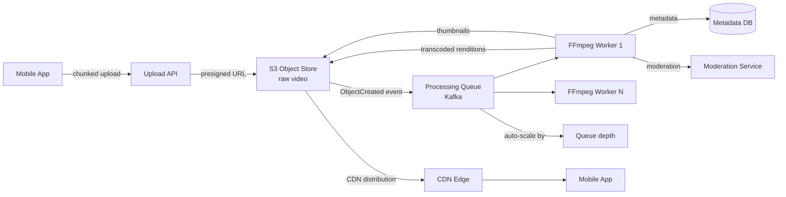

*Video processing pipeline: a chunked upload lands in S3, triggering a Kafka event consumed by a pool of FFmpeg workers that transcode to multiple resolutions, extract thumbnails and audio, and run moderation — all asynchronously, scaling with queue depth.*

#### Upload (Chunked + Resume)

- **Chunked upload**: Large videos are split into chunks (5-50 MB) and uploaded in parallel to improve reliability and speed.
- **Resume support**: If a chunk upload fails, the client resumes from the last successful checkpoint — the S3 multipart upload API supports this natively.
- **Pre-signed URLs**: The Upload API issues time-limited pre-signed S3 URLs so the client uploads directly to S3, bypassing the application tier entirely.

#### Processing Stages

1. **Transcode**: Each video is transcoded to 5+ resolutions (360p, 480p, 720p, 1080p, 4K) using FFmpeg workers. Workers auto-scale based on queue depth.
2. **Adaptive bitrate (HLS/DASH)**: Videos are packaged into HLS/DASH manifests so the player can switch quality based on network conditions.
3. **Thumbnail generation**: Key frames are extracted and scored (brightness, face coverage, motion) to select the best thumbnail.
4. **Audio extraction**: Audio is extracted for music detection (fingerprinting) and for the "use this sound" feature.
5. **Content moderation**: Each video is checked by ML classifiers (nudity, violence, copyright, misinformation) before publication.

```java
@Service
@RequiredArgsConstructor
public class VideoProcessingService {

    @Value("${app.video.processing.max-retries:3}")
    private int maxRetries;

    @Value("${app.video.processing.timeout-minutes:5}")
    private int timeoutMinutes;

    private final VideoProcessingQueue processingQueue;
    private final ObjectStoreClient s3Client;
    private final MeterRegistry meterRegistry;

    @TransactionalEventHandler(phase = TransactionPhase.AFTER_COMMIT)
    public void onVideoUploaded(VideoUploadedEvent event) {
        var timer = Timer.Sample.start(meterRegistry);
        try {
            var job = VideoJob.builder()
                    .videoId(event.videoId())
                    .s3Key(event.s3Key())
                    .status(ProcessingStatus.QUEUED)
                    .maxRetries(maxRetries)
                    .timeout(Duration.ofMinutes(timeoutMinutes))
                    .build();
            processingQueue.enqueue(job);
            meterRegistry.counter("video.processing.queued").increment();
        } finally {
            timer.stop(Timer.builder("video.upload.to.queue")
                    .register(meterRegistry));
        }
    }
}
```

*The `VideoProcessingService` bean listens for `VideoUploadedEvent` (an `@TransactionalEventListener` that fires after the DB commit), creates a `VideoJob` record, and enqueues it for FFmpeg workers. `@Value`-injected config controls retry count and timeout. Micrometer tracks queue-to-process latency.*

---

### Two-Stage Recommendation Engine

This is TikTok's core technical differentiator. Unlike social-graph feeds (Instagram, Facebook) that show posts from followed accounts, TikTok's "For You" feed is recommendation-driven — the candidate pool is the entire global video corpus. The system uses a two-stage funnel: candidate generation recalls ~1000 videos from billions, then a deep neural network scores each to produce the final ranked feed.

```mermaid
flowchart LR
    DB[Posts DB] --> Cand[Candidate Generator<br/>~1000 candidates from millions]
    Feat[Feature Store<br/>100+ signals] --> Cand
    Cand -->|~1000 candidates| Rank[Ranking Model<br/>Deep NN - predict P(watch)]
    Rank -->|Score + trim to top 30| Cache[Redis Reels Cache]
    API[Feed API] --> Cache
    API -->|Cold/miss| Rank
    Cache --> Response[Ranked Feed]
    Events[Interaction Events<br/>Kafka] -->|real-time updates| Feat
    Batch[Spark Batch Pipeline] -->|daily training| Rank
```

*The two-stage recommendation funnel: a candidate generator retrieves hundreds of candidates from the post corpus and feature store using fast approximate methods; a ranking model (deep neural network) scores candidates using 100+ real-time and batch features; the top-N are cached per user for subsequent scrolls while cold/miss requests score on demand. Interaction events from Kafka update the feature store in real time; the batch pipeline retrains models daily.*

#### Data Collection

Signal inventory — each user action produces multiple features:

- **User features**: device type, location, account age, past interactions (engagement history).
- **Video features**: description (caption), hashtags, sounds used, display orientation, creator info.
- **Interaction features**: watch time (most important — did the user watch to the end? replay?), likes, comments, shares, saves, scroll velocity, completion rate.
- **Negative signals**: skips, "not interested", reports, re-watches (watch time divided by duration).
- **Creator features**: upload frequency, engagement rate, account age, verification status.

#### Candidate Generation

Four recall sources, each producing ~250 candidates:

1. **User-video collaborative filtering**: Videos that users with similar watch history engaged with.
2. **Content-based retrieval**: Videos similar to the user's recent watch history (embedding similarity via vector search).
3. **User-user collaborative filtering**: Videos that similar users engaged with.
4. **Popularity**: Trending videos (recent + high engagement rate).

Each source is computed in batch (daily) and some in real-time (last 24h interactions). The union is deduplicated and capped at ~1000 candidates.

```java
@Service
@RequiredArgsConstructor
public class RecommendationEngine {

    private final CandidateGenerator candidateGenerator;
    private final Ranker ranker;
    private final FeatureStore featureStore;

    private static final int CANDIDATES_SIZE = 1000;
    private static final int RESULT_SIZE = 8;

    public List<Video> generateForYouFeed(String userId) {
        // Stage 1: Candidate generation
        List<String> candidates = candidateGenerator.generate(userId, CANDIDATES_SIZE);

        // Stage 2: Feature retrieval
        List<VideoFeatures> features = featureStore.batchGet(userId, candidates);

        // Stage 3: Ranking (deep neural network)
        List<ScoredVideo> ranked = ranker.score(userId, candidates, features);

        // Stage 4: Re-ranking (diversity, policy, cold-start)
        List<Video> result = applyPostFilters(ranked, userId);

        return result.stream().limit(RESULT_SIZE).toList();
    }

    private List<Video> applyPostFilters(List<ScoredVideo> ranked, String userId) {
        // Ensure creator diversity (no more than 1 video per creator)
        // Ensure content type balance (sounds, effects, etc.)
        // Inject cold-start/new user content
        // Apply content policy (no duplicate topics)

        Map<String, List<ScoredVideo>> byCreator = ranked.stream()
                .collect(Collectors.groupingBy(ScoredVideo::getCreatorId));

        List<Video> result = new ArrayList<>();
        int maxPerCreator = 1;

        for (ScoredVideo video : ranked) {
            long creatorCount = result.stream()
                    .filter(v -> v.getCreatorId().equals(video.getCreatorId()))
                    .count();
            if (creatorCount < maxPerCreator) {
                result.add(video.getVideo());
            }
            if (result.size() >= RESULT_SIZE) break;
        }
        return result;
    }

    record VideoFeatures(double predictedWatchTime,
                        double engagementProbability,
                        double satisfactionScore) {}
}
```

*The `RecommendationEngine` bean implements the full four-stage pipeline: candidate generation (recalls ~1000 videos), feature retrieval (100+ signals from the feature store), deep neural network ranking (predicts watch probability), and post-filtering (creator diversity, cold-start injection, policy). The `VideoFeatures` record holds the model's raw outputs.*

#### Ranking

A deep neural network (multiple towers + feature interaction layers) scores each candidate with 100+ features → assigns a watch-time prediction score. The loss function is based on actual watch time and engagement (not just clicks). The model is served via TensorFlow Serving or PaddlePaddle serving with sub-10ms inference latency.

#### Re-ranking

Post-ranking adjustments:
- **Deduplication**: prevent near-identical videos from the same creator.
- **Diversity injection**: ensure variety in creators, content types, sounds.
- **Cold-start**: inject new creators' videos into a small percentage of feeds.
- **Content policy**: filter out content that violates community guidelines.
- **Exploration**: ε-greedy allocation gives under-exposed videos a chance to prove themselves.

---

### Replication Strategies

TikTok replicates data across three axes: within a region (for availability), across regions (for global latency), and across storage systems (for different access patterns).

**Metadata DB (PostgreSQL) — synchronous streaming replication:** The primary accepts writes and streams WAL changes to synchronous standbys in the same region (strong consistency) with asynchronous cross-region standbys for disaster recovery. A quorum of `(N/2)+1` nodes confirms each write. Failover is automated via Patroni/etcd.

**Object Store (S3) — cross-region replication:** Raw and processed video objects are replicated asynchronously to a backup region so a regional outage does not lose user content. CloudFront origin failover points to the backup region when the primary is unreachable.

**Kafka — in-sync replicas (ISR):** Each partition has one leader and `N-1` followers; a write is acknowledged when `acks=all`, meaning all ISR members have the record. If the leader fails, an ISR member is elected. This gives ordered, durable, replicated logs for video events, interactions, and moderation jobs.

**Redis — asynchronous replication + cluster:** Used for the feature store and feed cache. Redis Cluster manages sharding across 16,384 hash slots with master/replica replication for HA. Reads can be served by replicas for read scaling.

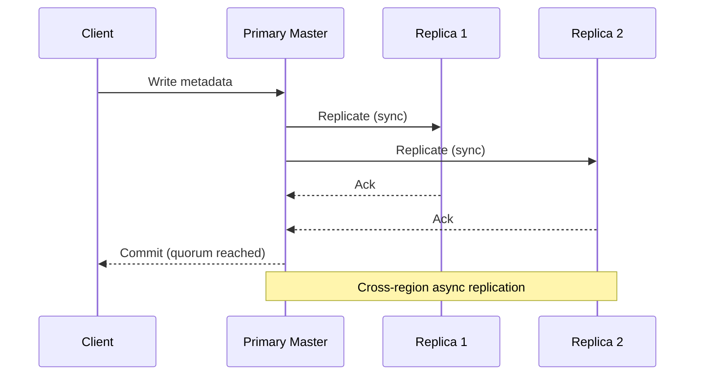

*Replication across layers: a client write to the PostgreSQL primary is synchronously replicated to in-region replicas before acknowledgment; cross-region replication is asynchronous for disaster recovery. Kafka uses ISR-based acknowledgment for event durability. S3 objects replicate to a warm standby region via cross-region replication.*

---

### Failure Detection and Membership

With 1B+ users across 50+ countries, TikTok's infrastructure must detect failed nodes, regions, and dependencies quickly without false positives that trigger unnecessary failovers.

**Application heartbeats and circuit breakers:** Each microservice publishes a `/health` endpoint checked by Kubernetes liveness/readiness probes. Callers wrap downstream calls in circuit breakers (Resilience4j) that open after N consecutive failures, fail-fast, and half-open after a cooldown — preventing cascading failures.

**Kafka consumer group management:** If a recommendation server dies, its Kafka partitions are reassigned to surviving members within seconds. Consumer lag metrics trigger alerts if rebalance takes too long.

**Gossip-based membership:** Redis Cluster and Kafka brokers use gossip protocols to spread membership and health state. Phi-accrual failure detectors convert heartbeat timing into a suspicion level, reducing false positives from transient network blips.

```java
@Service
@RequiredArgsConstructor
public class HealthMonitor {

    private final List<DependencyProbe> probes;
    private final ApplicationEventPublisher publisher;
    private final AtomicReference<RegionStatus> regionStatus = new AtomicReference<>(RegionStatus.HEALTHY);

    @Value("${app.health.check-interval-ms:5000}")
    private long checkIntervalMs;

    @Scheduled(fixedDelayString = "${app.health.check-interval-ms:5000}")
    public void checkHealth() {
        boolean allHealthy = probes.stream().allMatch(DependencyProbe::isHealthy);
        RegionStatus newStatus = allHealthy ? RegionStatus.HEALTHY : RegionStatus.DEGRADED;
        if (regionStatus.getAndSet(newStatus) != newStatus) {
            publisher.publishEvent(new RegionHealthChangedEvent(newStatus));
        }
    }

    public boolean isHealthy() {
        return regionStatus.get() == RegionStatus.HEALTHY;
    }

    enum RegionStatus { HEALTHY, DEGRADED, FAILED }
}
```

*The `HealthMonitor` bean polls downstream dependency probes on a configurable schedule and publishes a `RegionHealthChangedEvent` when status changes; the routing layer consumes that event to shift or shed traffic. The check interval is externalized via `@Value`.*

---

### High Availability and Scalability

Availability is achieved through replication, multi-region deployment, and graceful degradation; scalability through partitioning, caching, and independent horizontal scaling of each service tier.

#### Multi-Region Deployment

Deploy active services in at least 3 regions (e.g., us-east, eu-west, ap-southeast). Users are routed to the nearest region via a global load balancer. Each region is self-sufficient for read and write operations, with asynchronous cross-region replication for durability.

- **Active-active for metadata**: User and video metadata replicated across regions (active-active or active-passive with async failover).
- **Active-active for feed cache**: Redis with CRDTs or last-write-wins across regions.
- **Global CDN**: Video content cached at edge locations worldwide, reducing latency to < 50 ms for media.
- **Feature store per region**: Each region has its own feature store synced from Kafka, so recommendation quality doesn't degrade during cross-region latency.

#### Auto-Scaling

- **Stateless services (API Gateway, Feed Service, Interaction Service)**: Scale horizontally based on CPU and request latency. Kubernetes HPA adjusts replica count.
- **Video processors**: Auto-scale on Kafka queue depth — if the processing queue exceeds a threshold, spin up more FFmpeg workers.
- **Recommendation servers**: Scale based on feed-generation QPS. Each server caches candidate sets; cold starts are amortized by pre-computing popular feeds.
- **Live streaming**: Scale origin servers based on concurrent live streams; use SFU (Selective Forwarding Unit) for viewer distribution.

#### Graceful Degradation

When a component fails, the system degrades rather than crashes:

- **Recommendation model down**: Serve a popularity-based feed (most-liked videos in the last 24 hours) from cache. Users still see content, just less personalized.
- **Video processing backlog**: Newly uploaded videos show as "processing" — users see their video in their profile once processed. Feed assembly skips unprocessed videos.
- **Moderation service down**: Videos are held in a "pending moderation" state and not published to the feed. Already-published videos remain live.
- **Search service down**: Search returns empty results with a retry message; users can still browse their feed.

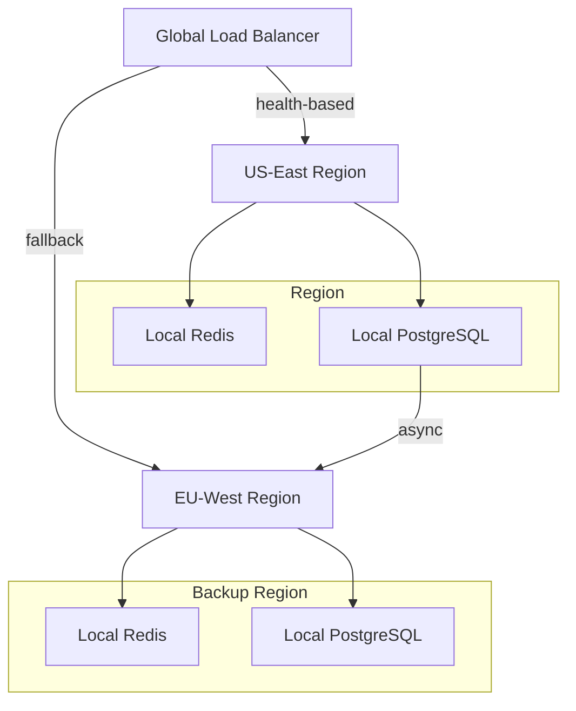

*Multi-region deployment: global load balancing routes users to the nearest healthy region. Each region is self-sufficient with its own Redis cache, PostgreSQL metadata store, and recommendation servers. Cross-region replication is asynchronous for disaster recovery.*

---

### Performance and Optimization

Performance is measured as feed generation latency (p99 < 200 ms), video time-to-first-frame (< 1 second), recommendation freshness (model reflects real-time events within minutes), and throughput (200K+ feed generations per second at peak).

#### Latency Optimization

- **Feed caching**: Cache the top 10 candidates per user in Redis for 3-5 minutes. Cold users fall back to the DB. Cache hit ratio target: 95%+.
- **Candidate pre-computation**: Pre-compute candidate sets for popular users during off-peak hours.
- **Model serving optimization**: Use quantized models (INT8) and vectorized inference (ONNX Runtime) for sub-5ms scoring latency per request.
- **Feature store caching**: Cache hot features in Redis with 1-5 second TTL; cold features in Cassandra with 1-hour TTL.

#### Throughput Optimization

- **Video processing**: FFmpeg workers scale to 10,000+ instances during peak upload windows. Queue-based distribution (Kafka) ensures even load.
- **Interaction fan-out**: Likes/comments/views stream through Kafka partitioned by `hash(video_id) % N` — 2000+ partitions for parallel processing.
- **Feed assembly**: Merge cached candidates, power-user posts, and ads in parallel using async I/O.
- **Database sharding**: PostgreSQL sharded by `hash(user_id) % 1024` across 8 regions → 8192 total shards. Cassandra for interactions with `hash(video_id) % 1024`.

#### Caching Strategies

- **L1 cache (process-local)**: Top 100 most-recent videos for each user, stored in the recommendation server's heap.
- **L2 cache (Redis)**: Candidate sets and feature vectors, TTL 3-5 minutes for active users.
- **CDN**: Video segments and thumbnails cached at edge PoPs with 24-hour TTL for popular content.
- **Result cache**: Fully assembled feeds cached for 2-3 minutes for repeated requests from the same user.

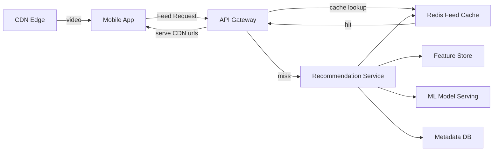

*Multi-tier caching: the API gateway checks the Redis feed cache first; on a miss, the recommendation service assembles the feed from the feature store, ML model, and metadata DB, then caches the result. Video segments are served from CDN edge locations.*

#### Video Delivery Optimization

- **Adaptive bitrate (ABR)**: Videos encoded in 5+ resolutions; the player selects the appropriate bitrate based on measured bandwidth.
- **Preloading**: The next video in the feed starts downloading (HTTP range request) while the user watches the current one.
- **Thumbnails + LQIP**: A low-quality image placeholder is sent first (10% of original size), then the full image loads progressively.
- **Bitrate switching**: If the user's bandwidth drops, the player seamlessly switches to a lower bitrate without rebuffering.

---

### CAP Theorem and Consistency Trade-offs

A platform operating across 50+ countries is partition-tolerant by assumption, so the CAP trade-off is C vs. A per component. TikTok makes different choices for different surfaces.

**Metadata (User, Video, Follow graph) — CP (Consistency + Partition Tolerance)**

User profiles, video metadata, and the follow graph must be consistent: a new follow should be visible immediately (within the same region), and a user profile update should not silently lose data. PostgreSQL with synchronous multi-zone replication enforces this — writes go to the leader and are confirmed by a quorum of replicas before acknowledgement. Cross-region replication is asynchronous (for disaster recovery) and accepts a seconds-level lag.

**Feed cache — AP (Availability + Partition Tolerance)**

The For You feed is cached in Redis with short TTLs (3-5 minutes). If a Redis node fails, followers' feeds are served from replicas or reconstructed from the metadata DB with reduced personalization. Brief staleness (a few minutes) is acceptable — users won't notice if a post appears 3 minutes later.

**Interactions (likes, comments, views) — AP with bounded staleness**

Engagement signals feed into the recommendation model. They're written to Kafka (durable, ordered) and materialized into the feature store (Redis). A few seconds of lag between a like and the model seeing it is acceptable. The system uses read-committed isolation for the like counter (no lost updates) but eventual consistency for the recommendation features.

**Live streaming — AP with best-effort delivery**

Live video is inherently lossy — packet loss and buffering are expected. The SFU prioritizes low latency over perfect delivery. If the stream degrades or the broadcaster's connection drops, viewers see reduced quality or a "connecting" state, not a complete outage.

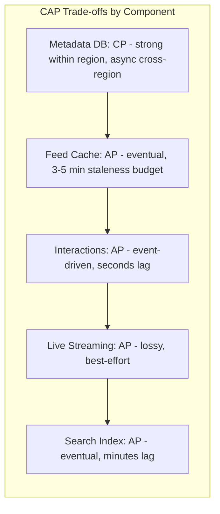

*TikTok's CAP trade-offs: metadata is CP (strong consistency for identity and relationships), while feeds, interactions, live streams, and search are AP (high availability with bounded staleness). This per-component approach allows each layer to optimize for its user-visible contract.*

**Real-world implementation:** PostgreSQL with synchronous multi-zone replication (CP) for user/video/follow data; Redis cluster (AP) for feed caches; Kafka (CP within region, async cross-region) for interaction events; CDN (AP) for video delivery; Elasticsearch (AP) for search.

---

### Encryption and Key Management

TikTok stores deeply personal user data — videos of children, private DMs, location history, browsing behavior, and biometric data (faces in videos for recommendations). With bans in multiple countries over data security concerns, encryption must be comprehensive and auditable.

#### Encryption at Rest

- **S3 media objects**: All raw and processed video is encrypted with SSE-KMS using customer-managed keys. The S3 object ARN and a content hash are stored as metadata for integrity verification.
- **PostgreSQL**: Transparent Data Encryption (TDE) protects user metadata and the follow graph at the page level. Column-level encryption guards the most sensitive fields (email, phone, location history).
- **Redis**: Redis Enterprise encrypts data on disk (AES-256). For open-source Redis, filesystem-level encryption (dm-crypt) is used since Redis is primarily in-memory.
- **Kafka**: Kafka records are encrypted in transit (TLS) and can be encrypted at rest via the broker's log encryption (AES-256).
- **Feature store (Redis/Cassandra)**: Behavioral features are encrypted with application-level AES-GCM before persistence, as they encode sensitive user preferences and demographics.

#### Encryption in Transit

- **TLS 1.3** terminates at the edge (Cloudflare/Akamai + ALB) and is end-to-end for control-plane traffic.
- **Mutual TLS (mTLS)** between microservices carries identity and encryption. Service mesh sidecars handle mTLS termination.
- **Media download** uses pre-signed S3 URLs over HTTPS with short expirations.
- **Video streaming** uses HTTPS (DASH/HLS over TLS) from the CDN edge.

#### Key Hierarchy

A KEK (Key Encryption Key) in a managed KMS/HSM encrypts per-service DEKs (Data Encryption Keys). Rotating the KEK requires only re-encrypting the DEKs, not the data. TikTok uses a multi-region KMS for global key availability.

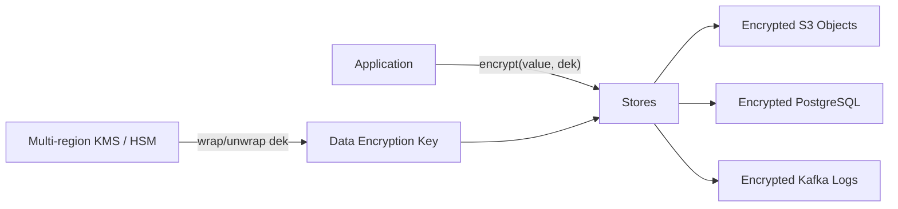

*Encryption key hierarchy for TikTok: the application encrypts values with per-service data encryption keys (DEKs), which are wrapped by a key-encryption key (KEK) in a multi-region KMS/HSM. Stores persist only ciphertext; rotating the KEK re-wraps DEKs without re-encrypting data.*

**Java example — content encryption for user-uploaded videos:**

```java
@Service
@RequiredArgsConstructor
public class VideoEncryptionService {

    @Value("${app.video.encryption.key-id}")
    private String keyId;

    private final AwsKms kmsClient;
    private final MeterRegistry meterRegistry;

    public EncryptedVideo encrypt(byte[] plaintext) {
        var timer = Timer.Sample.start(meterRegistry);
        try {
            var dek = kmsClient.generateDataKey(keyId);
            var cipher = Cipher.getInstance("AES/GCM/NoPadding");
            var iv = new byte[12];
            new SecureRandom().nextBytes(iv);
            cipher.init(Cipher.ENCRYPT_MODE,
                    new SecretKeySpec(dek.plaintext(), "AES"),
                    new GCMParameterSpec(128, iv));
            var ciphertext = cipher.doFinal(plaintext);
            var combined = new byte[iv.length + ciphertext.length];
            System.arraycopy(iv, 0, combined, 0, iv.length);
            System.arraycopy(ciphertext, 0, combined, iv.length, ciphertext.length);
            return new EncryptedVideo(
                    Base64.getEncoder().encodeToString(combined),
                    Base64.getEncoder().encodeToString(kmsClient.encrypt(dek.getEncoded(), keyId)));
        } catch (GeneralSecurityException e) {
            throw new EncryptionException(e);
        } finally {
            timer.stop(Timer.builder("video.encryption.latency")
                    .register(meterRegistry));
        }
    }

    record EncryptedVideo(String encryptedData, String encryptedDek) {}
}
```

*The `VideoEncryptionService` bean generates a fresh data encryption key per video via AWS KMS (key ID injected via `@Value`), encrypts the video bytes with AES-GCM using a random 12-byte IV, and returns a record holding the ciphertext+IV and the KMS-wrapped DEK. Micrometer records encryption latency.*

---

### Authentication and Authorization

Every API request, user action, and internal service call must be authenticated and authorized. TikTok uses a layered approach: OAuth 2.0 + JWT for client authentication, mTLS for service-to-service, and RBAC/ABAC for authorization.

#### Authentication Methods

- **OAuth 2.0 + JWT**: Users authenticate via phone number (SMS OTP) or third-party login (Google, Apple, Facebook). The Auth Service issues a short-lived JWT (15 min) and a refresh token (30 days, stored in an HttpOnly, Secure, SameSite=Strict cookie). The JWT contains `sub`, `exp`, `scope`, and `roles` claims.
- **mTLS client certificates**: For service-to-service communication, each microservice presents a certificate issued by TikTok's private CA. Certificates encode the service identity and allowed scopes.
- **Device fingerprinting**: Each device registers a unique token. The token is used for push notifications and for detecting suspicious login patterns (new device, new location).
- **Multi-Factor Authentication (MFA)**: Required for creator accounts with monetization, admin tools, and high-risk actions (changing payout method, email, password).

#### Authorization Models

- **Scope-based (OAuth 2.0 scopes)**: Each JWT carries scopes like `feed:read`, `video:create`, `interaction:write`, `live:stream`. The API Gateway enforces scope checks.
- **Role-based (RBAC)**: Users have roles (`user`, `creator`, `moderator`, `admin`). Moderators can delete videos and ban users; admins manage platform settings.
- **Content-level visibility**: Each video has a visibility setting (`public`, `friends`, `private`, `custom`). The recommendation service checks the viewer's relationship to the creator before surfacing the video.
- **Age-gated content**: Videos with mature content are only visible to users 18+. The recommendation model filters age-gated candidates based on the viewer's declared age.

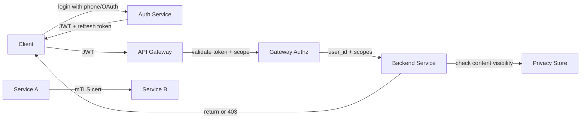

*Authentication and authorization flow: the client logs in via phone/OAuth, receives a JWT + refresh token; the API Gateway validates the JWT and checks scopes before forwarding to backend services; each service enforces content-level visibility; internal service calls use mTLS.*

**Java example — JWT validation filter:**

```java
@Component
@RequiredArgsConstructor
public class JwtAuthenticationFilter implements Filter {

    @Value("${app.auth.jwt-public-key}")
    private String publicKeyPem;

    private final UserDetailsService userDetailsService;

    @Override
    public void doFilter(ServletRequest request, ServletResponse response,
                         FilterChain chain) throws IOException, ServletException {
        var token = extractToken((HttpServletRequest) request);
        if (token != null && JwtUtils.isValid(token, publicKeyPem)) {
            var userId = JwtUtils.getUserId(token);
            var userDetails = userDetailsService.loadUserById(userId);
            var auth = new UsernamePasswordAuthenticationToken(
                    userDetails, null, userDetails.getAuthorities());
            SecurityContextHolder.getContext().setAuthentication(auth);
        }
        chain.doFilter(request, response);
    }

    private String extractToken(HttpServletRequest request) {
        var header = request.getHeader("Authorization");
        if (header != null && header.startsWith("Bearer ")) {
            return header.substring(7);
        }
        return null;
    }
}
```

*The `JwtAuthenticationFilter` bean intercepts every HTTP request, extracts the bearer token from the `Authorization` header, validates its signature against the public key (injected via `@Value` from a JWKS endpoint), loads the user details, and sets the Spring Security `Authentication` context. If the token is missing or invalid, the request proceeds unauthenticated and subsequent authorization annotations return 401.*

---

### Security Threats and Mitigations

TikTok's massive scale, global reach, and handling of sensitive personal data (including minors) make it a prime target for sophisticated attacks.

#### Threat: Data Exfiltration

- **Risk**: A compromised employee with database access could exfiltrate user videos, DMs, or engagement data.
- **Mitigation**: Zero-trust network segmentation; database access requires just-in-time approval with audit logging; data is encrypted at rest (employee cannot read without decrypting via KMS); egress monitoring detects anomalous data transfers.

#### Threat: Recommendation Algorithm Manipulation

- **Risk**: Creators use bots, fake accounts, or engagement farms to inflate their video's metrics, gaming the recommendation algorithm to appear in more feeds.
- **Mitigation**: Bot detection via ML models on account creation patterns and engagement behavior; rate-limiting per account/IP; downranking accounts with suspicious activity; shadow-banning accounts that violate norms.

#### Threat: Content Policy Violations

- **Risk**: Age-inappropriate content, misinformation, copyrighted material, and illegal content uploaded by users.
- **Mitigation**: Multi-layer moderation: automated ML classifiers (95%+ of decisions) + human review for edge cases; content fingerprinting (music, video) for copyright detection; community reporting; proactive trend monitoring.

#### Threat: Account Takeover

- **Risk**: Attackers use credential stuffing, SIM swapping, or phishing to take over creator accounts and steal monetization revenue.
- **Mitigation**: OAuth2 with identity providers offering MFA; rate-limiting login attempts; CAPTCHA after 3 failed attempts; invalidating sessions on password change; device fingerprinting and anomaly detection.

#### Threat: DDoS on Viral Content

- **Risk**: A viral video generating 1M+ views/minute can overwhelm a single CDN edge or origin server.
- **Mitigation**: CDN with origin shielding; per-object sharding across multiple cache nodes; rate limiting per IP/user; caching video segments at the edge with long TTLs.

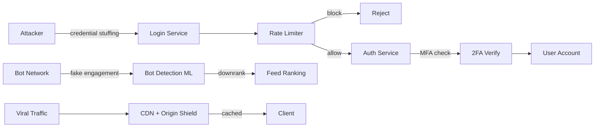

*Defensive layers for TikTok's threat model: the login service rate-limits credential-stuffing attempts and requires MFA; a bot-detection ML model scores accounts and downranks suspicious engagement before it reaches the feed; viral traffic is absorbed by CDN edge caching and origin shielding.*

#### Threat: Underage User Safety

- **Risk**: The platform may expose underage users to inappropriate content or adult contact.
- **Mitigation**: Age gating with phone/SMS verification; restricted mode for users under 16 (limited data collection, no DMs); parent/guardian supervision tools; automated detection of age-inappropriate content; reporting tools.

#### Threat: Live-Stream Abuse

- **Risk**: Broadcasters use live streams for illegal activity, hate speech, or to bypass pre-upload moderation.
- **Mitigation**: Real-time moderation AI monitoring live streams for policy violations; delay buffer (5-10 seconds) allowing moderators to cut the stream; real-time comment filtering; user reporting with immediate action.

#### Threat: Copyright / DMCA

- **Risk**: Users upload copyrighted music/videos, exposing the platform to legal liability.
- **Mitigation**: Content fingerprinting (audio/video) at upload time; rights-holder database matching; automatic muting/replacement of unlicensed audio; DMCA takedown system.

---

### Observability and Logging

With 1B+ users and real-time video processing, observability must cover the upload pipeline, recommendation engine, live streaming, moderation, and creator monetization.

#### Key Metrics

| Category | Metric | Target |
|---|---|---|
| **Feed** | `feed.generation.latency` p50/p95/p99 | p99 < 200 ms |
| **Video** | `video.time_to_first_frame` p99 | p99 < 1 second |
| **Processing** | `video.processing.avg_duration` | < 60 seconds per minute of video |
| **Upload** | `video.upload.success_rate` | > 99.5% |
| **Recommendation** | `feed.engagement_rate` (likes/comments/shares per impression) | Platform baseline |
| **Live** | `live.stream.latency` p99 | p99 < 3 seconds |
| **Moderation** | `moderation.auto_approve_rate` | > 95% |
| **Errors** | `api.error_rate` (5xx) | < 0.1% |
| **Cache** | `feature_store.hit_ratio` | > 95% |

#### Logging

- **Request logs**: Every API request logged with user ID, endpoint, response code, and latency. Used for audit trails and anomaly detection.
- **Event logs**: All user actions (post, like, comment, follow, share, view, watch time) logged as structured events for analytics and ML feature generation.
- **Processing logs**: Video upload, transcoding, moderation decisions, and CDN delivery logged with correlation IDs for debugging.
- **Moderation logs**: Every auto-accept, auto-reject, and human decision logged with reviewer ID and timestamp.
- **Security logs**: Auth successes/failures, MFA challenges, rate-limit rejections, bot-score thresholds crossed.

#### Distributed Tracing

Trace every user request across all services — from API Gateway through Feed Service, Recommendation Service, Model Serving, Metadata DB, and Feature Store. Use OpenTelemetry with a trace context header (`traceparent`) propagated across service boundaries. Key spans to instrument: feed generation, candidate generation, model inference, feature fetching, and video metadata resolution.

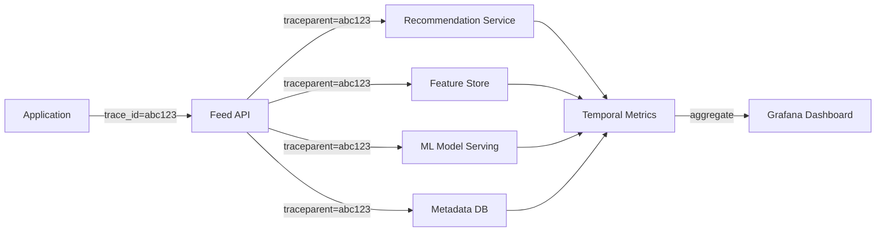

*Distributed tracing for feed generation: each user request carries a trace ID propagated across all downstream service calls — the Feed API, Recommendation Service, Feature Store, ML Model Serving, and Metadata DB each record spans. Spans aggregate in a metrics backend (Prometheus, Jaeger, or Datadog) and are visualized in Grafana dashboards, enabling end-to-end latency analysis.*

#### Alerting Strategy

- **Critical**: Feed p99 > 200 ms for 2 minutes; video processing queue depth > 1M for 5 minutes; live stream latency > 10 seconds for 1 minute.
- **Warning**: Model serving p99 > 50 ms for 5 minutes; bot detection hit rate < 1%; moderation queue > 100K for 10 minutes.
- **Info**: Engagement metric anomalies, new user growth trends, feature store cache hit degradation.

**Java example — instrumented recommendation service:**

```java
@Service
@RequiredArgsConstructor
public class InstrumentedRecommendationService {

    private final RecommendationEngine engine;
    private final MeterRegistry meterRegistry;

    private final Timer feedTimer;
    private final Counter errorCounter;

    public InstrumentedRecommendationService(RecommendationEngine engine,
                                             MeterRegistry meterRegistry) {
        this.engine = engine;
        this.meterRegistry = meterRegistry;
        this.feedTimer = Timer.builder("feed.generation.latency")
                .publishPercentileHistogram()
                .tag("tier", "foryou")
                .register(meterRegistry);
        this.errorCounter = Counter.builder("feed.errors")
                .register(meterRegistry);
    }

    public List<ScoredVideo> generateFeed(String userId, int count) {
        return feedTimer.recordCallable(() -> {
            try {
                return engine.generateForYouFeed(userId);
            } catch (Exception e) {
                errorCounter.increment();
                throw e;
            }
        });
    }
}
```

*The `InstrumentedRecommendationService` bean uses Micrometer to record feed generation latency (with percentile histograms for SLO monitoring) and an error counter. The `feedTimer.recordCallable()` wrapper captures end-to-end generation time, and tags allow segmenting by feed tier (For You vs. Following).*

---

### Real-World Implementations

- **TikTok**: 1B+ MAU, 955+ minutes/month average. Recommendation-driven feed with 1000+ servers. Video processing pipeline handles 1M+ uploads/day. Uses a two-stage recommendation system (candidate generation + deep neural ranking) with 100+ features. Live streaming uses WebRTC for sub-3-second latency.
- **Instagram Reels**: Meta's response to TikTok — integrated into Instagram's existing infrastructure. Uses similar recommendation principles but with a hybrid follow + algorithmic feed.
- **YouTube Shorts**: Google's TikTok competitor — leverages YouTube's recommendation infrastructure and two-stage funnel (candidate generation + ranking). Uses Google's TPU pods for model serving.
- **Snapchat Spotlight**: Recommendation-driven short video feed with creator payouts. Uses Snap's Bitmoji and AR lens ecosystem.
- **Triller**: Short-form video with music. Smaller scale but uses a similar asynchronous processing pipeline.

| Platform | Feed Model | Candidate Gen | Ranking Model | Video Processing | Live Streaming |
|---|---|---|---|---|---|
| TikTok | Recommendation-driven | 4+ recall sources | Deep NN (100+ features) | FFmpeg + auto-scale | WebRTC + SFU |
| Instagram Reels | Hybrid (follow + algo) | Embedding similarity | GBDT + NN | Media pipeline | RTMP + CDN |
| YouTube Shorts | Recommendation-driven | Collaborative filtering | Two-tower NN | Media CDN | WebRTC (Premier) |
| Snapchat Spotlight | Recommendation-driven | Content-based | GBDT | Snapchat pipeline | Snap Camera |
| Triller | Recommendation-driven | Popularity | Simple ML | FFmpeg | RTMP |

**TikTok's tech stack (publicly known components):**
- **Video processing**: Custom FFmpeg-based pipeline with GPU acceleration; 8+ transcoding profiles per video.
- **Data stores**: MySQL (user/video metadata, sharded by `hash(user_id)`), Redis (feature cache, feed cache), Kafka (event streaming), HDFS (offline features, batch processing).
- **ML infrastructure**: Custom two-tower deep learning models; TensorFlow/PaddlePaddle for training; in-house model serving system for inference.
- **CDN**: Multi-CDN strategy (Akamai, Level 3, domestic Chinese CDNs) with edge caching for video.
- **Infrastructure**: Kubernetes-based orchestration across multiple cloud providers and custom data centers; 50+ regions.

---

### Java and Spring Boot Implementation Guide

This section demonstrates how to build a Spring Boot service for TikTok's core posting and recommendation pipeline. Code examples use Spring Boot 3.x: `@Service`, `@RestController`, `@Repository`, `@Component`, `@Value`, `record` DTOs with Bean Validation, `@Transactional`, `@ControllerAdvice`, constructor injection, and `BigDecimal` for money.

#### 1. DTO Records with Validation

Records provide immutable, concise data carriers for request/response payloads.

```java
public record CreateVideoRequest(
        @NotBlank String title,
        @NotBlank String description,
        @NotEmpty List<String> tags,
        String musicId,
        @NotBlank String visibility) {}

public record FeedResponse(
        List<VideoDto> videos,
        String cursor,
        boolean hasMore) {}

public record VideoDto(
        String videoId,
        String creatorId,
        String caption,
        String coverUrl,
        String videoUrl,
        int durationSeconds,
        BigInteger viewCount,
        BigInteger likeCount,
        Instant createdAt) {}

public record InteractionRequest(
        @NotBlank String videoId,
        @NotBlank String userId,
        @NotBlank String interactionType) {}
```

*Four record types serve as the API contract: `CreateVideoRequest` is the upload body with `@NotBlank`/`@NotEmpty` validation (enforced by `@Valid`); `FeedResponse` wraps the paginated video list; `VideoDto` carries video metadata for display; `InteractionRequest` records likes, comments, shares, and views.*

#### 2. Entity with Optimistic Locking

```java
@Entity
@Table(name = "videos", indexes = {
        @Index(name = "idx_creator_created", columnList = "creatorId,createdAt"),
        @Index(name = "idx_created", columnList = "createdAt")
})
public class Video {

    @Id
    private String videoId;

    @Column(nullable = false)
    private String creatorId;

    @Column(length = 4000)
    private String caption;

    @Column(nullable = false)
    private String visibility;

    @Column(nullable = false)
    private Instant createdAt;

    @Column(name = "view_count")
    private BigInteger viewCount = BigInteger.ZERO;

    @Column(name = "like_count")
    private BigInteger likeCount = BigInteger.ZERO;

    @Column(name = "status")
    private String status = "PROCESSING";

    @Version
    private Long version;

    public void incrementViewCount() {
        this.viewCount = this.viewCount.add(BigInteger.ONE);
    }

    public void incrementLikeCount() {
        this.likeCount = this.likeCount.add(BigInteger.ONE);
    }
}
```

*The `Video` entity maps to the `videos` table with composite indexes on `(creatorId, createdAt)` for creator-profile queries and `(createdAt)` for trending/recent queries. `@Version` enables optimistic locking for concurrent view/like count updates. `BigInteger` is used for counts that reach billions.*

#### 3. Repository Layer

```java
@Repository
public interface VideoRepository extends JpaRepository<Video, String> {

    @Query("SELECT v FROM Video v WHERE v.visibility = 'PUBLIC' ORDER BY v.createdAt DESC")
    List<Video> findRecentPublic(Pageable pageable);

    @Query("SELECT v FROM Video v WHERE v.creatorId = :creatorId ORDER BY v.createdAt DESC")
    List<Video> findByCreator(@Param("creatorId") String creatorId, Pageable pageable);

    @Modifying(clearAutomatically = true)
    @Query("UPDATE Video v SET v.viewCount = v.viewCount + 1 WHERE v.videoId = :videoId")
    void incrementViewCount(@Param("videoId") String videoId);

    @Modifying(clearAutomatically = true)
    @Query("UPDATE Video v SET v.likeCount = v.likeCount + 1 WHERE v.videoId = :videoId")
    void incrementLikeCount(@Param("videoId") String videoId);
}
```

*The `VideoRepository` interface extends `JpaRepository`. `findRecentPublic` powers the trending feed; `findByCreator` serves creator profiles; the `incrementViewCount` and `incrementLikeCount` methods use atomic JPQL updates to avoid read-modify-write races on high-volume counters.*

#### 4. Service Layer — Video Upload + Async Processing

```java
@Service
@RequiredArgsConstructor
@Slf4j
public class VideoUploadService {

    @Value("${app.video.upload.max-size-mb:287}")
    private long maxUploadSizeMb;

    @Value("${app.video.processing.timeout-minutes:10}")
    private int processingTimeoutMinutes;

    private final VideoRepository videoRepository;
    private final KafkaTemplate<String, Object> kafkaTemplate;
    private final ObjectStoreClient s3Client;

    @Transactional
    public VideoDto upload(CreateVideoRequest request, String creatorId) {
        validateRequest(request);

        var video = new Video();
        video.setVideoId(UUID.randomUUID().toString());
        video.setCreatorId(creatorId);
        video.setCaption(request.description());
        video.setVisibility(request.visibility());
        video.setCreatedAt(Instant.now());
        video.setStatus("PROCESSING");

        var saved = videoRepository.save(video);

        // Publish event for async processing
        kafkaTemplate.send("video_uploaded", saved.getVideoId(),
                Map.of("videoId", saved.getVideoId(),
                       "creatorId", creatorId,
                       "s3Key", "raw/" + saved.getVideoId()));

        log.info("Video {} uploaded, processing started", saved.getVideoId());
        return toDto(saved);
    }

    @Transactional
    @EventListener
    public void onView(InteractionEvent event) {
        if ("view".equals(event.type())) {
            videoRepository.incrementViewCount(event.videoId());
            // Also publish to Kafka for real-time feature updates
            kafkaTemplate.send("video_interactions", event.videoId(),
                    Map.of("videoId", event.videoId(),
                           "userId", event.userId(),
                           "type", "view",
                           "timestamp", Instant.now()));
        }
    }

    private void validateRequest(CreateVideoRequest request) {
        if (request.tags().size() > 100) {
            throw new IllegalArgumentException("Too many tags: max is 100");
        }
    }
}
```

*The `VideoUploadService` bean uses constructor injection for all dependencies. `@Transactional` wraps the upload: it persists the video metadata and publishes a `video_uploaded` event to Kafka — the actual transcoding happens asynchronously in FFmpeg workers. The `@EventListener` method handles view events by atomically incrementing the view counter (via the repository's atomic update) and publishing the interaction to Kafka for the feature store.*

#### 5. REST Controller with Validation

```java
@RestController
@RequestMapping("/api/v1")
@RequiredArgsConstructor
public class FeedController {

    private final VideoUploadService videoUploadService;
    private final RecommendationService recommendationService;

    @PostMapping("/video/upload")
    public ResponseEntity<String> initiateUpload(
            @AuthenticationPrincipal JwtUser user,
            @Valid @RequestBody CreateVideoRequest request) {
        var uploadUrl = s3Client.generatePresignedUrl("raw/" + UUID.randomUUID());
        return ResponseEntity.ok(uploadUrl);
    }

    @PostMapping("/video")
    public ResponseEntity<VideoDto> createVideo(
            @AuthenticationPrincipal JwtUser user,
            @Valid @RequestBody CreateVideoRequest request) {
        var dto = videoUploadService.upload(request, user.userId());
        return ResponseEntity.status(HttpStatus.CREATED).body(dto);
    }

    @GetMapping("/feed")
    public ResponseEntity<FeedResponse> getFeed(
            @AuthenticationPrincipal JwtUser user,
            @RequestParam(defaultValue = "8") int count,
            @RequestParam(defaultValue = "foryou") String feedType) {
        FeedResponse feed = recommendationService.generateFeed(
                user.userId(), feedType, Math.min(count, 50));
        return ResponseEntity.ok(feed);
    }

    @PostMapping("/interaction/like")
    @ResponseStatus(HttpStatus.NO_CONTENT)
    public void like(@Valid @RequestBody InteractionRequest request) {
        videoUploadService.onView(request); // reuses the @EventListener method
    }
}
```

*The `FeedController` bean is a thin `@RestController` using constructor injection. `@Valid` on request bodies enforces `@NotBlank`/`@NotEmpty` constraints. `@AuthenticationPrincipal` injects the authenticated user. The POST video endpoint returns `201 Created`; the like endpoint returns `204 No Content`.*

#### 6. Global Exception Handler

```java
@ControllerAdvice
public class GlobalExceptionHandler {

    @ExceptionHandler(VideoNotFoundException.class)
    public ResponseEntity<ApiError> handleNotFound(VideoNotFoundException ex) {
        return ResponseEntity.status(HttpStatus.NOT_FOUND)
                .body(new ApiError(HttpStatus.NOT_FOUND, ex.getMessage()));
    }

    @ExceptionHandler(MethodArgumentNotValidException.class)
    public ResponseEntity<ApiError> handleValidation(MethodArgumentNotValidException ex) {
        var messages = ex.getBindingResult().getFieldErrors().stream()
                .map(FieldError::getDefaultMessage)
                .toList();
        return ResponseEntity.badRequest()
                .body(new ApiError(HttpStatus.BAD_REQUEST,
                        "Validation failed: " + String.join(", ", messages)));
    }

    @ExceptionHandler(OptimisticLockException.class)
    public ResponseEntity<ApiError> handleConflict(OptimisticLockException ex) {
        return ResponseEntity.status(HttpStatus.CONFLICT)
                .body(new ApiError(HttpStatus.CONFLICT,
                        "Concurrent modification detected. Please retry."));
    }

    public record ApiError(HttpStatus status, String message) {}
}
```

*The `GlobalExceptionHandler` bean (annotated `@ControllerAdvice`) catches exceptions thrown by any `@RestController` and returns structured `ApiError` responses. It handles `VideoNotFoundException` (404), `MethodArgumentNotValidException` (400 with field-level messages), and `OptimisticLockException` (409 — which occurs when `@Version` detects a concurrent write).*

#### 7. Recommendation Service with Caching

```java
@Service
@RequiredArgsConstructor
@Slf4j
public class RecommendationService {

    @Value("${app.recommendation.cache-ttl-seconds:180}")
    private int cacheTtlSeconds;

    @Value("${app.recommendation.candidate-pool-size:1000}")
    private int candidatePoolSize;

    private final CandidateGenerator candidateGenerator;
    private final RankingModel rankingModel;
    private final FeatureStoreClient featureStore;
    private final RedisTemplate<String, String> redis;
    private final MeterRegistry meterRegistry;

    @Transactional(readOnly = true)
    public FeedResponse generateFeed(String userId, String feedType, int count) {
        var timer = Timer.Sample.start(meterRegistry);
        try {
            String cacheKey = "feed:" + feedType + ":" + userId;
            var cached = redis.opsForValue().get(cacheKey);
            if (cached != null) {
                return objectMapper.readValue(cached, FeedResponse.class);
            }

            List<String> candidates = candidateGenerator.generate(userId, candidatePoolSize);
            FeatureMatrix features = featureStore.fetchBatch(candidates, userId);
            List<ScoredVideo> ranked = rankingModel.score(candidates, features);
            List<VideoDto> topVideos = ranked.stream()
                    .limit(count)
                    .map(ScoredVideo::toDto)
                    .toList();

            FeedResponse response = new FeedResponse(topVideos, encodeCursor(topVideos), true);
            redis.opsForValue().set(cacheKey,
                    objectMapper.writeValueAsString(response),
                    Duration.ofSeconds(cacheTtlSeconds));

            timer.stop(Timer.builder("feed.generation.latency")
                    .tag("feed_type", feedType)
                    .register(meterRegistry));
            return response;
        } catch (Exception e) {
            meterRegistry.counter("feed.errors").increment();
            log.error("Failed to generate feed for user {}", userId, e);
            throw e;
        }
    }
}
```

*The `RecommendationService` bean implements the two-stage funnel with caching: it checks a Redis feed cache first, and on a miss, runs candidate generation → feature fetch → model ranking → cache the result. The cache TTL and candidate pool size are externalized via `@Value`. `@Transactional(readOnly = true)` optimizes database reads. Micrometer records generation latency (tagged by feed type) and error count.*

---

### Interview Questions and Answers

A curated set of interview questions for TikTok-style short-form video platform design.

**Beginner**

1. **What is the difference between TikTok's For You feed and Instagram's home feed?**
   A: TikTok's For You is primarily recommendation-driven — you see content mostly from accounts you DON'T follow, selected by an algorithm predicting what you'll watch. Instagram's home feed is primarily follow-based — you see content from accounts you follow, with some algorithmic suggestions mixed in. TikTok's algorithm considers 100+ signals (watch time, likes, shares, comments, re-watches, scroll velocity); Instagram's prioritizes your social graph.

2. **How does TikTok's recommendation algorithm work?**
   A: Four stages: (1) Data collection (user features, video features, interaction signals). (2) Candidate generation (4+ recall sources each producing ~250 candidates → ~1000 total). (3) Feed ranking (deep neural network with 100+ features → watch-time prediction score). (4) Personalized optimization (post-processing for content balance and new user experience).

3. **How does TikTok handle 1B+ users generating feeds in real-time?**
   A: The system uses a two-stage approach: candidate generation (fast, approximate, ~1000 candidates) and deep ranking (~100 features, deep NN, selects top 8-15). Candidates are cached; popular users' feeds are cached. Real-time features (recent likes, views) are stored in a feature store (Redis) updated via Kafka. The batch pipeline (Spark) trains models daily.

4. **How is video processing scaled?**
   A: Asynchronous via Kafka → worker pool of FFmpeg instances. Auto-scaling based on queue depth. Videos are chunked during upload for parallel transfer. Workers independently produce multiple resolutions. CDN caches the final output at edge locations.

5. **How does content moderation work at TikTok's scale?**
   A: Three layers: (1) Automated ML classifiers (95%+ of decisions) — check for nudity, violence, copyright, misinformation. (2) Human review — for edge cases, appeals, and ML-flagged uncertain content. (3) Proactive detection — trend monitoring, coordinated inauthentic behavior detection.

**Intermediate**

6. **How would you design the real-time feature store for TikTok's recommendation engine?**
   A: Key challenge: 50B+ events/day must update user/item features within seconds. Architecture: Kafka (event stream) → Flink (stream processing, windowed aggregations) → Redis (online feature store, 1-5s TTL for real-time features, persistent for user profiles). Features: 7-day watch time, 24-hour like rate, recent interactions. Batch: Spark jobs hourly → BigQuery (offline features for model training). Consistency: online (Redis) and offline (BigQuery) must agree on features used in training vs. serving — use a feature store (Feast or internal) that enforces this.

7. **How do you prevent recommendation filter bubbles?**
   A: Exploration-exploitation balance: ε-greedy allocation gives a small percentage of feed slots to cold/unfamiliar content; diversity injection ensures different creators and topics; "not interested" feedback is weighted heavily to break cycles. Regular A/B testing measures filter-bubble metrics (content variety, new creator exposure).

8. **How does TikTok handle the cold-start problem for new users?**
   A: New users get a default feed of popular/trending content for their region/language, plus a quick interest-selection survey. The system rapidly collects signals from the first 5-10 videos (watch time, rewatches, skips) and personalizes within minutes. New creators' videos get injected into a small percentage of feeds via exploration for cold-start discovery.

9. **How would you shard the metadata database at TikTok's scale?**
   A: Shard by `hash(user_id) % 1024` — this localizes all of a user's data (profile, videos) on one shard. Videos can be sharded by `hash(video_id) % 2048` separately for different access patterns. Cross-shard queries (e.g., global trending) use a separate analytics store (Spark + data lake). Shard count increases gradually by splitting ranges, never reshuffling everything.

10. **What happens if the recommendation model crashes?**
    A: Graceful degradation: serve a cached feed for 5-10 minutes, then fall back to a popularity-based feed (most-liked videos trending in the last 24 hours by region). New uploads are queued for processing but not surfaced in the feed until the model recovers. The cache should be warm enough to sustain users through brief outages.

**Advanced**

11. **How would you scale TikTok to 5B users?**
    A: Key challenges: (1) Feed serving — 5B users × 80 scrolls/day = 400B feed generations/day = 5M QPS peak. Need 5000+ recommendation servers with pre-computed candidate sets. (2) Video processing — 50M+ uploads/day. Need 50K+ FFmpeg workers with GPU acceleration. (3) Feature store — 500B events/day. Need 5000+ Flink tasks with 10ms inference budget. (4) Cross-region replication — 100+ regions, each with local caches and async sync. (5) Cost — $5B+ annually in CDN + compute. Solution: tiered caching, edge computing, model quantization, and aggressive caching for inactive users.

12. **How would you design live streaming at 100M concurrent viewers?**
    A: A single RTMP ingest per broadcaster → SFU (Selective Forwarding Unit) fans out to viewers. The SFU uses CDN pull with 10-second latency (not real-time WebRTC, too expensive at this scale). For interactivity (comments, gifts), use a separate low-latency WebSocket channel (1-3 second latency). Regional SFUs with cross-region cascading for global events. CDN with 1000+ edge PoPs caches the HLS/DASH segments. For sub-second interactivity at smaller scale, use WebRTC with an SFU and a fallback to HLS.

13. **How does TikTok's content fingerprinting work for copyright detection?**
    A: At upload, the audio track is fingerprinted (chroma/AcoustID-like) and compared against a rights-holder database (10M+ reference tracks) in parallel — a locality-sensitive hashing (LSH) index retrieves candidates in < 1 second. Video frames are also fingerprinted for visual copyright (logos, clips). If a match exceeds a confidence threshold, the content is either muted (audio replaced with a licensed alternative), blocked, or revenue-shared with the rights holder. The check is part of the media processing pipeline, so the video is not published until moderation passes.

14. **How would you A/B test a new recommendation model affecting 500M users?**
    A: Layered rollout: (1) Train and validate offline (NDCG, AUC against held-out data). (2) Shadow mode — run the new model alongside the old one, log predictions, compare to actual outcomes without serving to users. (3) Canary — 1% of users (single region) see new model, measure engagement, retention, watch time. (4) Ramp — 1% → 5% → 25% → 100% over days, with automated rollback if guardrails breach (e.g., 5% drop in watch time, 10% increase in errors). (5) Long-term monitoring — track 30-day retention and revenue impact, as feed changes have compounding effects.

**Senior / System Design**

15. **How would you redesign TikTok's feed architecture for zero recommendation-latency?**
    A: Pre-compute the entire feed offline: a batch pipeline (Spark) generates the top-50 video IDs per user daily, scores them, and stores them in Redis (TTL 24 hours). The online path just reads `feed:{userId}` from Redis — O(1), sub-millisecond. For real-time signals (a user just liked something), a stream processor (Flink) updates a small "delta" cache that the Feed API merges with the precomputed feed. This trades personalization freshness for speed — acceptable because most users' interests don't change minute-to-minute. For breaking trends, a separate hot-store updates the precomputed feeds for affected user segments.

16. **How do you balance data localization vs. global recommendation quality?**
    A: Store user data in the user's region (GDPR, China regulations), but train global models on anonymized, federated features. Regional feature stores feed local recommendation servers, but the model weights are global. For cross-border content discovery (a US trend going viral in India), the feature store sends anonymized engagement signals to a global aggregation layer that re-ranks for the target region. This preserves data sovereignty while benefiting from global signal — a key challenge in markets like India, the EU, and Southeast Asia.

17. **How would you handle a coordinated disinformation campaign on TikTok?**
    A: Multi-layer defense: (1) Source detection — identify bot farms by behavioral fingerprints (IP clusters, posting patterns, engagement timing). (2) Content detection — multimodal classifiers (text, image, audio) flag misinformation with confidence scores. (3) Network analysis — detect coordinated inauthentic behavior by clustering accounts with shared IPs, contacts, or behavioral signatures. (4) Distribution throttling — reduce recommendation weight for flagged content rather than immediate removal (preserves freedom of expression while limiting reach). (5) Human review escalation — for high-impact borderline cases. (6) Transparency — public transparency reports and content moderation APIs for researchers. The key tension: false positives (suppressing legitimate content) vs. false negatives (allowing misinformation to spread).


