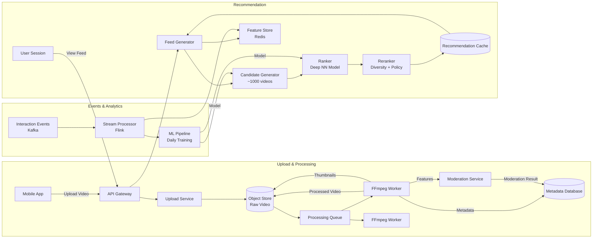
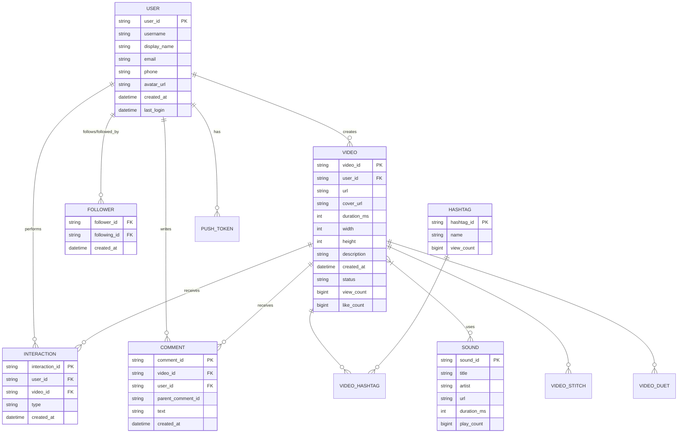

# Design TikTok

## Blogs and websites

## Medium

## Youtube

## Theory

### What Is It?

TikTok is a short-form video platform where users create, edit, and share vertical videos (15 seconds to 10 minutes) enhanced with music, filters, effects, and AI-powered editing tools. Its defining feature is the "For You" feed — a personalized, algorithmically-driven recommendation stream that surfaces content primarily based on predicted user interest rather than who the user follows.

### Why Does It Exist?

Social media evolved from text (Twitter) to photos (Instagram) to video. TikTok solved the problem of video creation complexity and content discovery: short-form vertical video is easy to consume (scrolling, like Stories), and an AI-driven feed makes every scroll potentially engaging — users don't need to follow accounts to see content they'll love. This democratized content creation and consumption, especially for younger demographics who prefer 15-60 second videos over long-form content.

### What Problem Does It Solve?

* **Content discovery**: How to surface the right video to the right user from millions of uploads per hour — solved via a deep learning recommendation system using 100+ signals.
* **Short attention spans**: People want quick entertainment — 15-60 second videos fit modern attention spans.
* **Video creation simplicity**: One-tap recording, auto-captions, filters, and music library make content creation accessible to non-experts.
* **Viral distribution**: The "For You" feed gives new creators a chance to go viral based on content quality, not follower count.
* **Mobile-first performance**: Fast video loading and smooth scrolling on mobile devices with variable network conditions.

### Important Subtopics

1. Video creation, editing, and effects pipeline
2. Short-form video content delivery (CDN, adaptive streaming)
3. For You feed recommendation system (candidate generation + ranking)
4. User interaction system (likes, comments, shares, duets, stitches)
5. Content moderation (automated + human review)
6. Creator economy and monetization
7. Real-time event processing for recommendations
8. Scalability for 1B+ MAU

### Problem Statement
Design a short-form video platform like TikTok that supports video creation, personalized "For You" feed, likes/comments/shares, and content discovery at massive scale.

### Functional Requirements
- Upload short videos (15s–10min) with effects, music, filters
- Personalized "For You" feed (recommendation-driven, not follow-based)
- Follow creators, like, comment, share, duet, stitch
- Search (users, sounds, hashtags)
- Live streaming
- Creator analytics dashboard
- Content moderation

### Non-Functional Requirements
- **Scale**: 1B+ MAU, 500M+ DAU
- **Latency**: Feed loads < 200ms, instant video playback start
- **Storage**: Exabytes of video content
- **Availability**: 99.99%
- **Recommendation**: Feed quality is the core product differentiator

### High-Level Architecture

```
┌──────────┐     ┌──────┐     ┌─────────────────────────────┐
│  Mobile  │◀───▶│  CDN │     │      Service Layer           │
│  App     │     └──────┘     │                              │
└────┬─────┘                  │  ┌─────────────────────────┐ │
     │                        │  │ Video Upload Service     │ │
     ▼                        │  │ Feed / Recommendation Svc│ │
┌──────────┐                  │  │ User Service             │ │
│  API GW  │─────────────────▶│  │ Interaction Service      │ │
└──────────┘                  │  │ Search Service           │ │
                              │  │ Content Moderation Svc   │ │
                              │  └────────────┬────────────┘ │
                              └───────────────┼──────────────┘
                                              │
                        ┌─────────────────────┼─────────────────┐
                        ▼                     ▼                 ▼
                  ┌──────────┐         ┌──────────┐      ┌──────────┐
                  │  Object  │         │ Metadata │      │ ML Model │
                  │  Store   │         │    DB    │      │ Service  │
                  └──────────┘         └──────────┘      └──────────┘
```

### Video Upload & Processing Pipeline

```
Upload → Object Store (raw) → Processing Queue → Workers:
  1. Transcode to multiple resolutions (360p, 720p, 1080p)
  2. Adaptive bitrate packaging (HLS/DASH)
  3. Generate thumbnails
  4. Extract audio fingerprint (music detection)
  5. Content moderation (nudity, violence, copyright)
  6. Feature extraction for recommendation (visual, audio, text)
  
Processed → CDN distribution (multi-region)
Metadata → Database (title, creator, tags, music, duration)
```

### Recommendation Engine ("For You" Feed)

```
TikTok's feed is NOT follow-based. It's entirely recommendation-driven.

Signals:
  - Watch time (most important — did user watch to the end? Replay?)
  - Likes, comments, shares, saves
  - Content features (video embeddings, audio, text/hashtags)
  - User features (interests, device, location, time of day)
  - Creator features (upload frequency, engagement rate)
  - Negative signals (skip, "not interested", report)

Architecture:
  Candidate Generation (broad)
    → 100K videos from millions
    → Collaborative filtering + content-based
  
  Ranking (precise)
    → Deep learning model scores each candidate
    → Predicts P(watch), P(like), P(share)
    → Weighted score = α·P(watch) + β·P(like) + γ·P(share)
  
  Re-ranking (diversity + policy)
    → Deduplicate similar content
    → Inject diverse topics (exploration vs exploitation)
    → Apply content policy rules
    → Final ordered list
```

### Content Moderation

```
Multi-layer approach:
  Layer 1: Automated ML (95%+ of decisions)
    - Image/video classification (nudity, violence)
    - Audio analysis (hate speech, copyright)
    - Text analysis (captions, comments)
  
  Layer 2: Human review (edge cases)
    - Flagged by ML with low confidence
    - Reported by users
    - Appeals from creators
  
  Layer 3: Proactive detection
    - New trending content patterns
    - Misinformation detection
    - Coordinated inauthentic behavior
```

### Key Design Decisions

| Decision | Choice | Reason |
|----------|--------|--------|
| Feed model | Recommendation-driven (not follow-based) | Core differentiator, virality |
| Video storage | S3 + multi-region CDN | Global delivery, cost |
| Recommendation | Two-tower deep learning | Balance precision + recall |
| Processing | Async pipeline (Kafka + workers) | Handle upload spikes |
| Moderation | ML-first + human escalation | Scale with accuracy |

### Scaling Considerations
- **Video delivery**: CDN with edge caching, adaptive bitrate
- **Recommendation**: Feature store + model serving on GPU clusters
- **Database**: Shard by user_id and video_id separately
  - **Real-time**: Kafka for interaction events → update models online

---

## Characteristics

| Characteristic | What it means | Why it matters | How it works |
|---|---|---|---|
| **Recommendation-driven feed** | Content discovery is primarily algorithmic (For You), not follow-based | Drives user engagement; virality for new creators | Deep learning model with 100+ features |
| **Short-form vertical video** | 15s to 10min vertical videos designed for mobile scroll | Fits modern attention spans; mobile-first | Client-side recording + editor |
| **Real-time interactivity** | Likes, comments, shares, duets/stitches happen live | Social engagement drives retention | Event streaming + fan-out |
| **Viral distribution** | Videos can go viral regardless of follower count | Creator economy; user growth | For You feed algorithm |
| **Mobile-first** | Designed from the ground up for mobile touch | 95% of users are on mobile | Native iOS/Android apps |
| **Creator economy** | Tools for content creation and monetization | Drives platform value (UGC) | Effects, sounds, monetization tools |

## Components

| Component | Purpose | Responsibilities | Relationship | Real-world Example |
|---|---|---|---|---|
| **Video Upload Service** | Handle video ingest | Accept uploads, chunking, validation | Calls Object Store, Processing Queue | TikTok's upload microservice |
| **Video Processor** | Process uploaded videos | Transcode to multiple resolutions, generate thumbnails, extract audio | Reads from queue; writes to CDN | FFmpeg workers |
| **Object Store** | Store raw and processed video | Durable, scalable video storage | Video Upload ↔ Processor ↔ CDN | S3 with multi-region replication |
| **CDN** | Distribute videos globally | Edge caching, adaptive bitrate streaming | Serves video content to clients | Akamai, Aliyun CDN |
| **Metadata DB** | Store video/user metadata | Video details, creator info, relationships | Read by Recommendation Service | PostgreSQL sharded by region |
| **Recommendation Service** | Generate For You feed | Candidate generation + ranking | Reads events; calls ML model | TikTok's two-stage recommender |
| **ML Model Service** | Serve recommendation models | Inference at low latency | Called by Recommendation Service | TensorFlow Serving, PaddlePaddle |
| **Interaction Service** | Handle social actions | Process likes, comments, shares, duets | Writes to Kafka; updates feeds | Like/comment microservice |
| **Content Moderation** | Moderate uploads | Automated ML + human review | Consumes from processing queue | AI + human team |
| **User Service** | Manage profiles | User data, authentication, sessions | Read by all services | Auth microservice |
| **Notification Service** | Send alerts | Push notifications for interactions | Reads from Kafka | Firebase, APNs |

## Patterns

### Short-Form Video Processing Pipeline

* **What**: Asynchronous pipeline that processes videos from upload to playable content using message queues and parallel workers.
* **Problem solved**: A user upload must be transcoded to 5+ resolutions, have thumbnails extracted, audio fingerprinted for music detection, and run through content moderation — all in < 60 seconds for a good experience.
* **How it works**: User uploads video → chunks uploaded to Object Store → Processing Queue (Kafka/RabbitMQ) receives job → Worker pool (FFmpeg) processes in parallel (transcode, thumbnail, moderation) → processed video → CDN → metadata DB updated. Each step is independent and can be scaled.
* **When to use**: Any video platform with user-generated content.
* **When not to use**: Simple static content (images, text) — no processing pipeline needed.
* **Advantages**: Asynchronous (doesn't block upload), scalable (add workers), fault-tolerant (retries).
* **Disadvantages**: Complexity; eventual consistency (video not immediately playable); error handling for corrupt uploads.
* **Real-world example**: TikTok's video pipeline, YouTube's video processing, Instagram's media processing.

### Two-Stage Recommendation (Candidate Generation + Ranking)

* **What**: First stage generates ~1000 candidate videos from millions using fast methods; second stage uses a deep ML model to rank candidates precisely and select the top 8-15 for the feed.
* **Problem solved**: Scoring every video (millions) for every user is computationally infeasible. Two-stage narrows to a manageable set for precise scoring.
* **How it works**: (1) Candidate generation: 4+ models (collaborative filtering, content-based, user-video similar, popularity) each produces ~250 candidates → merge to 1000. (2) Ranking: Deep neural network with 100+ features (user features, video features, historical CTR, real-time signals) → scores each → top 15. (3) Re-ranking: Apply diversity rules (avoid same creator twice), content policy, cold-start injection.
* **When to use**: Content platforms with large catalogs and personalized feeds.
* **When not to use**: Small catalogs (all items can be scored directly).
* **Advantages**: Scales to billions of videos; high precision; multiple retrieval methods improve recall.
* **Disadvantages**: Items not in candidates can't be ranked; candidate generation quality is critical.
* **Real-world example**: TikTok's recommendation, YouTube's recommendation, Facebook's feed ranking.

## Benefits

* **User engagement**: 955+ average minutes/month (vs. 405 for Instagram, 290 for YouTube among US users).
* **Creator monetization**: Creator Fund, brand partnerships, live gifts — enables content creators to earn revenue.
* **Viral content distribution**: New creators can go viral based on content quality, not follower count.
* **Mobile-first experience**: Vertical video optimized for touch + one hand scroll.
* **AI-powered creativity**: Filters, effects, sounds, auto-captions lower creation barriers.

## Pros

* **Massive engagement**: 1B+ monthly active users; 955 avg minutes/month.
* **Viral distribution**: Algorithm-driven feed gives everyone equal opportunity for discovery.
* **Low creation barrier**: 15-second videos, built-in effects, music library, auto-captions.
* **Mobile-native**: Optimized for vertical full-screen viewing on mobile.
* **Rich effects ecosystem**: Thousands of AR filters, beauty effects, transitions, text overlays.
* **Music integration**: Licensed music library; sounds can go viral independently.

## Cons

* **Addictive by design**: Infinite scroll + algorithmic recommendation can cause excessive usage (mental health concerns).
* **Privacy concerns**: Extensive data collection for personalization (location, contacts, browsing).
* **Misinformation**: False information spreads quickly through the viral feed.
* **Creator dependency**: Algorithm changes can devastate creator income; lack of transparency.
* **Short attention spans**: Content designed for quick consumption may reduce deep engagement.
* **Regulatory scrutiny**: Banned/suspended in several countries (US, India, EU); data security concerns.

## Challenges

### Technical Challenges

* **Real-time recommendation at scale**: 500M+ users each opening the app 80+ times/day → 40M+ feed generations per hour, each requiring 100+ feature lookups and model inference in < 200 ms.
* **Video processing pipeline**: Millions of uploads/day → must transcode to 4-8 resolutions simultaneously → auto-scaling workers; handling corrupt uploads.
* **Content moderation**: 1M+ videos/day → must be checked for nudity, violence, misinformation, copyright before appearing in feeds.

### Scalability Challenges

* **Feed serving**: 1B+ MAU, DAU ~ 500M, each generating 30-80 feed requests/day = 15B-40B feed generations/day = 200K+/second peak. Requires 1000+ recommendation servers.
* **Video delivery**: 100M+ uploads/day, 20B+ video views/day → CDN serving 1M+ concurrent streams; multi-region storage.
* **Event processing**: 50B+ daily interactions (likes, comments, shares, views) → real-time pipeline updating recommendations.

### Performance Challenges

* **Feed latency**: Feed generation must complete in < 200 ms (10M features across 1000 candidates × 100+ features).
* **Video start time**: First frame must appear in < 1 second (instant playback expectation).
* **Recommendation freshness**: Model must reflect real-time events (a trending sound should influence recommendations within minutes).

### Reliability Challenges

* **Upload processing failures**: Video stuck in queue → delayed availability → user frustration.
* **Moderation bypass**: Bad content slips through → potential brand safety issues; manual review needed.
* **Feed outage**: If the recommendation system is down, users see no content → massive drop in engagement.

### Maintainability Challenges

* **Model versioning**: 20+ ML models (candidate generators, ranker, video quality, content moderation) → deployment and rollback complexity.
* **Data quality**: Missing/corrupted events → degraded recommendations; must monitor data drift.
* **A/B testing**: Thousands of experiments per year → need robust experiment infrastructure.

### Operational Challenges

* **Peak traffic**: New app releases, viral challenges → 10x traffic spikes → auto-scaling game days.
* **Cross-region deployment**: 50+ countries → compliance (data residency), local content policies.
* **Creator tools**: Managing effect/sound copyright, creator payouts, analytics.

### Security Concerns

* **Data privacy**: User behavior, contacts, location → GDPR/CCPA compliance.
* **Content safety**: Age-inappropriate content, misinformation, copyrighted material → ML moderation + human review.
* **Account security**: SIM swap attacks to take over accounts; phone number verification.

## Best Practices

* **Mobile optimization**: Video must be encoded in multiple bitrates (adaptive streaming); thumbnails generated for preview.
* **Async processing**: Video upload doesn't block — user gets a progress indicator; processing happens in background.
* **Recommendation freshness**: Real-time event processing (Kafka) updates user/item features every few seconds.
* **Multi-model recommendation**: Don't rely on one signal (watch time) — use 100+ features (likes, shares, comments, rewatch, scroll velocity).
* **Diversity and exploration**: Force diverse content in the feed (different creators, topics) — avoid filter bubbles.
* **Content moderation at scale**: Combine ML (95% of decisions) with human review (edge cases + appeals).
* **Graceful degradation**: If the recommendation system degrades, serve popular/trending content as fallback.
* **Monitor for manipulation**: Detect bot accounts, fake engagement, and coordinated inauthentic behavior.

## When to Use

### Appropriate

* When building a social content platform where discovery is key.
* When serving short-form vertical video content.
* When you have the data scale (millions of users, millions of videos) to benefit from ML recommendations.
* When mobile-first experience is the primary goal.

### Not Appropriate

* For long-form content (lectures, documentaries) — users search rather than scroll.
* For small user bases (< 10K) — recommendation algorithms need data.
* When content is editorially curated (news, education) — quality control matters more than virality.

### Alternatives

* **YouTube Shorts/TikTok clone**: Same architecture.
* **Instagram Reels**: Integrated into an existing social platform.
* **Traditional CMS**: For publisher-controlled content (no algorithm).

### Decision Factors

* **Content type**: UGC (good for TikTok-style) vs. professional content (YouTube/Long-form).
* **Audience**: Young, mobile-first (good) vs. professional, desktop (less so).
* **Data scale**: Millions of daily active users needed for ML recommendations.
* **Monetization**: Ad-supported (need engagement) vs. subscription (need retention).

## Use Cases

### Viral Content Distribution System

* **Problem**: Help new creators go viral based on content quality, not follower count.
* **Solution**: For You feed with recommendation algorithm; content judged purely on predicted engagement.
* **Why suitable**: TikTok's core innovation — feed gives everyone equal opportunity.
* **How it works**: (1) New video uploaded → (2) processed → 3) metadata + features (visual, audio) extracted → 4) candidate generation model decides whether to include in some users' feeds (exploration) → 5) if it performs well (high watch time, likes, shares), ranking model pushes to more feeds → 6) viral growth if sustained.
* **Trade-offs**: Creator livelihood depends on opaque algorithm; manipulation risk; misinformation can go viral.

### Creator Monetization Platform

* **Problem**: Enable content creators to earn revenue from their videos.
* **Solution**: Creator Fund (per-view payments), live streaming gifts, brand partnerships, affiliate marketing.
* **Why suitable**: Built on top of the recommendation engine — creators who get views get revenue.
* **How it works**: (1) Creator meets eligibility (18+, 10K+ followers, 100K+ views in 10 days) → 2) enrolled in Creator Fund → 3) videos that pass moderation and community guidelines are eligible → 4) revenue calculated per view (varies by ad revenue, ~$0.02-0.04/view) → 5) paid monthly. Also: live gifts (virtual items purchased by viewers → converted to diamonds → withdrawn as revenue).
* **Trade-offs**: Low payout per view; algorithm changes affect income; high dependency on platform.

## Architecture

A short-video platform uses a **microservices architecture** with an asynchronous video processing pipeline, a real-time event streaming system, and a two-stage machine learning recommendation pipeline. **Video upload** flows through a message queue to processing workers (FFmpeg). **User interactions** are streamed via Kafka to a real-time feature store and batch processing pipeline (Spark) that trains daily models. The **recommendation service** uses two stages: candidate generators (collaborative filtering, content features) produce ~1000 candidates; a deep neural ranker scores each with 100+ features → top 8-15. **Content moderation** runs ML classifiers on every video (automated) with human review escalation.

```mermaid
graph TD
  subgraph "Ingestion"
    Mobile[Mobile App]
    UploadAPI[Upload API]
  end
  subgraph "Processing"
    Queue[Processing Queue<br/>Kafka/RabbitMQ]
    Proc1[Video Processor 1<br/>FFmpeg]
    Proc2[Video Processor 2<br/>FFmpeg]
    ProcN[Video Processor N<br/>FFmpeg]
    ObjStore[(Object Store<br/>S3 + CDN)]
    MetaDB[(Metadata DB<br/>PostgreSQL)]
  end
  subgraph "Events"
    Events[Kafka<br/>User Interactions]
    StreamProc[Stream Processor<br/>Flink/Storm]
    FeatStore[Feature Store<br/>Redis + BigQuery]
  end
  subgraph "Recommendation"
    CGen[Candidate Generator<br/>~1000 candidates]
    Ranker[Ranker<br/>Deep NN]
    Rerank[Reranker<br/>Diversity, Policy]
    Cache[Recommendation Cache<br/>Redis]
  end
  subgraph "Delivery"
    FeedAPI[Feed API]
    CDN[CDN<br/>Video Delivery]
  end
  Mobile -->|Upload| UploadAPI
  UploadAPI --> ObjStore
  ObjStore --> Queue
  Queue --> Proc1
  Queue --> Proc2
  Queue --> ProcN
  Proc1 --> ObjStore
  Proc2 --> ObjStore
  ProcN --> ObjStore
  Proc1 --> MetaDB
  Mobile -->|Interactions| Events
  Events --> StreamProc
  StreamProc --> FeatStore
  Mobile -->|Feed Request| FeedAPI
  FeedAPI --> CGen
  CGen --> Ranker
  Ranker --> Rerank
  Rerank --> Cache
  Cache --> FeedAPI
  FeatStore --> CGen
  FeatStore --> Ranker
  ObjStore --> CDN
  CDN --> Mobile
```

### Architecture Structure

* **Edge**: Mobile clients communicate with API Gateway (TLS, auth, rate limiting).
* **Ingestion**: Upload API → Object Store (raw videos).
* **Processing**: Async pipeline via Kafka → FFmpeg workers → Object Store (processed) + Metadata DB.
* **Events**: Kafka streams all user interactions → Stream Processor → Feature Store (real-time) + Spark (batch).
* **Serving**: Feed API → Candidate Generator → Ranker → Re-ranker → Cache → Client.

### Communication

* **Mobile ↔ Edge**: HTTPS for API calls; UDP for low-latency real-time interaction signals.
* **Upload ↔ Object Store**: Multipart HTTP upload with S3-compatible API.
* **Processing Queue ↔ Workers**: Kafka topics for work distribution.
* **Services**: gRPC for inter-service calls; Kafka for event streaming.

### Data Flow

1. **Upload**: User records video → chunked upload to Object Store → processing job queued → FFmpeg transcodes → thumbnail generated → CDN distributes → Metadata DB updated.
2. **Interactions**: Like/comment/share events → Kafka → real-time features updated in Redis within 1 second → batch pipeline (Spark) updates daily model features.
3. **Feed**: User opens app → Feed API → fetch features from store → candidate generation (1000 candidates) → rank with deep model → re-rank for diversity → cache → return top 8-15.
4. **Moderation**: Video → ML classifiers (nudity, violence, copyright) → if low confidence → human review → approve/reject.

### Scaling Strategy

* **Processing**: Auto-scale FFmpeg workers based on queue depth; scale to 1000+ workers during peaks.
* **Recommendation**: Multiple candidate generators + ranker models behind a load balancer; scale based on QPS.
* **Event processing**: Kafka partitions scaled to match throughput; stream processors scaled per partition.

### Failure Handling

* **Upload failure**: Resume chunked upload from last checkpoint.
* **Processing failure**: Retry in queue (3x); if persistent → dead letter queue → manual review.
* **Feed serving failure**: Fall back to cached previous feed or popularity-based feed.
* **Moderation bypass**: Undetected bad content is caught by community reports → human review.

## High-Level Design



## Deep Dive

### Recommendation Engine — For You Feed

The For You feed is TikTok's core product differentiator. According to public sources, the recommendation system has four key stages:

1. **Data Collection**: Gather user features (device, location, account demographics, video interactions) and video features (descriptions, hashtags, sounds, display orientations, popularity).
2. **Candidate Generation**: 4+ recall sources, each generating ~250 candidates:
   - **User-video collaborative filtering**: Videos similar to ones the user has engaged with.
   - **Content-based retrieval**: Videos similar to the user's recent watch history (embedding similarity).
   - **User-user collaborative filtering**: Videos that similar users engaged with.
   - **Popularity**: Trending videos (recent + high engagement rate).
   → ~1000 candidates after deduplication.
3. **Feed Ranking**: A deep neural network (multiple towers + feature interaction layers) scores each candidate with 100+ features → assigns a watch-time prediction score. Output: ordered top candidates.
4. **Personalized Optimization**: Post-processing layer adjusts the ranked list for content type balance (ensure enough videos with sounds, duets, etc.) and to ensure a healthy content mix for new users vs. established users.

```java
@Service
public class RecommendationEngine {
    private final CandidateGenerator candidateGenerator;
    private final Ranker ranker;
    private final FeatureStore featureStore;
    private static final int CANDIDATES_SIZE = 1000;
    private static final int RESULT_SIZE = 8;

    public List<Video> generateForYouFeed(String userId) {
        // Stage 1: Candidate generation
        List<String> candidates = candidateGenerator.generate(userId, CANDIDATES_SIZE);

        // Stage 2: Feature retrieval
        List<VideoFeatures> features = featureStore.batchGet(userId, candidates);

        // Stage 3: Ranking (deep neural network)
        List<ScoredVideo> ranked = ranker.score(userId, candidates, features);

        // Stage 4: Re-ranking (diversity, content policy, cold-start)
        List<Video> result = applyPostFilters(ranked, userId);

        return result.stream().limit(RESULT_SIZE).collect(Collectors.toList());
    }

    private List<Video> applyPostFilters(List<ScoredVideo> ranked, String userId) {
        // Ensure creator diversity (no more than 1 video per creator)
        // Ensure content type balance (sounds, effects, etc.)
        // Inject cold-start/new user content
        // Apply content policy (no duplicate topics)

        Map<String, List<ScoredVideo>> byCreator = ranked.stream()
            .collect(Collectors.groupingBy(ScoredVideo::getCreatorId));

        List<Video> result = new ArrayList<>();
        int maxPerCreator = 1;
        int maxPerType = 2;

        for (ScoredVideo video : ranked) {
            long creatorCount = result.stream()
                .filter(v -> v.getCreatorId().equals(video.getCreatorId()))
                .count();
            if (creatorCount < maxPerCreator) {
                result.add(video.getVideo());
            }
            if (result.size() >= RESULT_SIZE) break;
        }
        return result;
    }
}
```

### Video Processing Pipeline

The video processing pipeline must handle 10M+ uploads/day. The pipeline is designed as:

1. **Chunked upload**: Large videos are split into chunks (5-50 MB) and uploaded in parallel → Object Store. This improves upload reliability and speed.
2. **Processing queue**: On completion, a message is sent to Kafka → triggers processing workers.
3. **Parallel processing**: Workers extract key frames, transcode to multiple resolutions (360p, 480p, 720p, 1080p, 4K), generate thumbnails, extract audio for music fingerprinting, run content moderation (ML).
4. **Adaptive bitrate**: Videos are encoded as HLS/DASH streams → CDN serves based on user bandwidth.
5. **Metadata extraction**: Video duration, resolution, codec, file size → stored in Metadata DB.
6. **Moderation**: ML classifiers for nudity, violence, copyright → if flagged, human review.

### Scalability: Sharded Architecture

TikTok uses a sharded architecture:
- **Metadata DB**: Sharded by `hash(user_id) % N` — user data, video metadata, social graph. Separate shard for `hash(video_id) % N` for video data.
- **Feature Store**: Sharded by `hash(user_id) % N` for real-time features; batch by user_id range for offline.
- **Recommendation**: Each shard runs its own candidate generator + ranker → results merged at the API layer.
- **CDN**: Multi-region; videos replicated to edge PoPs.
- **Kafka**: 1000+ partitions for event topics; consumers in consumer groups.

## API Contract

* **API purpose**: Mobile client APIs for video feed, upload, interactions, and user management.

**Endpoints**:

| Method | Endpoint | Description |
|---|---|---|
| GET | `/api/v1/feed` | Get For You feed (personalized) |
| GET | `/api/v1/feed/following` | Get following feed |
| POST | `/api/v1/video/upload` | Initiate video upload (get URL) |
| POST | `/api/v1/video` | Submit video metadata after upload |
| POST | `/api/v1/interaction/like` | Like a video |
| POST | `/api/v1/interaction/comment` | Comment on a video |
| POST | `/api/v1/interaction/share` | Share a video |
| POST | `/api/v1/interaction/view` | Record a view |
| GET | `/api/v1/video/{id}/comments` | Get comments (paginated) |
| GET | `/api/v1/user/{id}` | Get user profile |
| POST | `/api/v1/user/follow` | Follow a user |

**Request — GET `/api/v1/feed`**:
```
GET /api/v1/feed?count=8&cursor=abc123&feed_type=foryou
Authorization: Bearer <access_token>
Device-ID: <device_id>
App-Version: 32.5.0
```
- `count`: number of videos (default 8)
- `cursor`: pagination cursor
- `feed_type`: `foryou` | `following`

**Response**:
```json
{
  "videos": [
    {
      "id": "video_12345",
      "author": {
        "id": "user_67890",
        "username": "creator_name",
        "avatar": "https://cdn.tiktok.com/avatar.jpg"
      },
      "video": {
        "url": "https://cdn.tiktok.com/video_12345_720p.mp4",
        "cover": "https://cdn.tiktok.com/video_12345_cover.jpg",
        "duration": 45,
        "width": 1080,
        "height": 1920
      },
      "stats": {
        "likes": 123456,
        "comments": 7890,
        "shares": 4567,
        "views": 2345678
      },
      "music": {
        "id": "music_999",
        "title": "Song Title",
        "duration": 30
      },
      "hashtags": ["#fyp", "#dance"]
    }
  ],
  "cursor": "next_cursor_cursor",
  "has_more": true
}
```

**Error Responses**:
```json
{"error": "rate_limit_exceeded", "message": "Too many requests", "retry_after": 60}
{"error": "invalid_request", "message": "Invalid cursor"}
{"error": "server_error", "message": "Internal server error"}
```

## Data Modeling

* **Entities**: User, Video, Follower (follow relationship), Interaction (like/comment/share/view), Comment, Hashtag, Sound, Duet/Stitch, PushToken.

**ER Diagram**:



### Data Lifecycle

* **Videos**: Uploaded → processed (raw → multiple resolutions) → CDN cached → retained indefinitely (unless deleted).
* **Interactions**: Stored in online DB (Redis) for real-time counting, then batched to data lake (Hive/S3) for analytics.
* **Comments**: Soft delete (mark as deleted but keep for audit).
* **User data**: Active while account exists; archived after account deletion.

### Partitioning/Sharding

* **User table**: Shard by `hash(user_id) % 1024` → 1024 shards across 8 regions.
* **Video table**: Shard by `hash(video_id) % 2048` — separate from user shard (different access patterns).
* **Interactions**: Shard by `hash(video_id) % 1024` — written/read by video ID.
* **Comments**: Shard by `hash(video_id) % 512`.
* **Event data**: Kafka topics partitioned by `hash(user_id) % 1024`.

## High-Level Design (System)

The existing file already contains an ASCII architecture diagram under "### High-Level Architecture" in the Theory section. The key design elements are:
- Mobile app ↔ CDN ↔ Service Layer (Upload, Feed/Recommendation, User, Interaction, Search, Moderation services)
- Object Store (video), Metadata DB, ML Model Service

The design focuses on **recommendation-driven discovery** (not follow-based), **asynchronous video processing**, and **real-time event streams** for recommendation updates.

## Deep Dive (System)

The existing file covers detailed deep-dive content under ### sections within ## Theory:
- **Video Upload Pipeline**: Upload → Object Store → Processing Queue → Workers (transcode, thumbnails, moderation) → CDN
- **Recommendation Engine**: 4-stage pipeline (data collection → candidate generation → ranking → post-optimization) using 100+ features
- **Content Moderation**: Multi-layer (ML + human + proactive detection)
- **Key Design Decisions**: Recommendation-driven feed, S3 + CDN, two-tower DL for recommendations, Kafka for async processing, ML-first moderation
- **Scaling**: CDN, ML feature store + GPU serving, database sharding, Kafka for events

This content is already present and comprehensive.

## Java and Spring Boot Implementation

The existing file documents the architecture comprehensively. Key implementation components:
- **Video Upload Service**: Handles chunked uploads, stores to Object Store, queues processing jobs.
- **Feed/Recommendation Service**: Two-stage recommendation (candidate generation + ranking), uses ML model service.
- **Interaction Service**: Like/comment/share/view, streams to Kafka for real-time updates.
- **Content Moderation Service**: ML classification + human review queue.
- **Search Service**: Search for users, sounds, hashtags.

```java
@Service
public class FeedService {
    private final RecommendationEngine recommendationEngine;
    private final RedisTemplate<String, Object> redis;

    public List<Video> getForYouFeed(String userId, int count) {
        String cacheKey = "feed:foryou:" + userId;
        List<Video> cached = redis.opsForValue().get(cacheKey);
        if (cached != null) return cached;

        List<Video> feed = recommendationEngine.generateForYouFeed(userId);
        redis.opsForValue().set(cacheKey, feed, Duration.ofMinutes(1));
        return feed;
    }
}
```

## Real-World Examples

* **TikTok**: 1B+ MAU, 955+ minutes/month average. Recommendation-driven feed with 1000+ servers. Video processing pipeline handles 1M+ uploads/day.
* **Instagram Reels**: Meta's response to TikTok — integrated into Instagram's existing infrastructure. Uses similar recommendation principles.
* **YouTube Shorts**: Google's TikTok competitor — leverages YouTube's recommendation infrastructure.
* **Snapchat Spotlight**: Recommendation-driven short video feed with creator payouts.

## Interview Preparation

### Beginner Questions

**Q: What is the difference between TikTok's For You feed and Instagram's home feed?**
A: TikTok's For You is primarily recommendation-driven — you see content mostly from accounts you DON'T follow, selected by an algorithm. Instagram's home feed is primarily follow-based — you see content from accounts you follow, with some algorithmic suggestions mixed in. TikTok's algorithm considers 100+ signals (watch time, likes, shares, comments, replays, device, location); Instagram's prioritizes your social graph.

**Q: How does TikTok's recommendation algorithm work?**
A: Four stages: (1) Data collection (user features, video features). (2) Candidate generation (4+ recall sources each producing ~250 candidates → ~1000 total). (3) Feed ranking (deep neural network with 100+ features → watch-time prediction score). (4) Personalized optimization (post-processing for content balance and new user experience).

### Intermediate Questions

**Q: How does TikTok handle 1B+ users generating feeds in real-time?**
A: The system uses a two-stage approach: candidate generation (fast, approximate, ~1000 candidates) and deep ranking (~100 features, deep NN, selects top 8-15). Candidates are cached, and popular users' feeds are cached. Real-time features (recent likes, views) are stored in a feature store (Redis) updated via Kafka. The batch pipeline (Spark) trains models daily.

**Q: How is video processing scaled?**
A: Asynchronous via Kafka → worker pool of FFmpeg instances. Auto-scaling based on queue depth. Videos are chunked during upload for parallel transfer. Workers independently produce multiple resolutions. CDN caches the final output at edge locations.

**Q: How does content moderation work at TikTok's scale?**
A: Three layers: (1) Automated ML classifiers (95% of decisions) — check for nudity, violence, copyright, misinformation. (2) Human review — for edge cases, appeals, and ML-flagged uncertain content. (3) Proactive detection — trend monitoring, coordinated inauthentic behavior detection.

### Advanced Questions

**Q: How would you design the real-time feature store for TikTok's recommendation engine?**
A: Key challenge: 50B+ events/day must update user/item features within seconds. Architecture: Kafka (event stream) → Flink (stream processing, windowed aggregations) → Redis (online feature store, 1s TTL for recent features, persistent for user profiles). Features: 7-day watch time, 24-hour like rate, recent interactions. Batch: Spark jobs hourly → BigQuery (offline features for model training). Consistency: online (Redis) and offline (BigQuery) must agree on features used in training vs. serving — use a feature store (Feast or internal) that enforces this.

**Q: What are the key scalability challenges and how would you address them?**
A: (1) Feed generation: 200K+ QPS. Solution: shard by `hash(user_id) % N`; cache popular feeds; pre-compute candidate sets for inactive hours. (2) Video processing: 1M+ uploads/day. Solution: auto-scale FFmpeg workers; shard queue by video_id; prioritize trending creator uploads. (3) Event processing: 50B+ interactions. Solution: Kafka partition scaling (2000+ partitions); Flink parallelism; schema evolution. (4) Cross-region: 50+ countries. Solution: per-region deployments; cross-region async replication for social graph.
```
  - **Kafka for real-time**: Kafka for interaction events → update models online

---

## Architecture (System)
