# Design Twitter

## Blogs and websites

## Medium

## Youtube

- [System Design for Twitter (Timeline, Live Updates, Tweeting) | System Design Interview Prep](https://www.youtube.com/watch?v=_QqpDpbppT8w)

---

## Theory

### Topics Covered

1. [Introduction / Problem Statement](#introduction--problem-statement)
2. [Characteristics](#characteristics)
3. [Pros](#pros)
4. [Cons](#cons)
5. [Use Cases](#use-cases)
6. [Components](#components)
7. [Architectural Patterns](#architectural-patterns)
8. [Benefits](#benefits)
9. [Challenges](#challenges)
10. [Best Practices](#best-practices)
11. [When to Use / When Not to Use](#when-to-use--when-not-to-use)
12. [Data Model and API](#data-model-and-api)
13. [Domain-Specific: Tweet and Timeline Deep Dive](#domain-specific-tweet-and-timeline-deep-dive)
14. [Replication Strategies](#replication-strategies)
15. [Failure Detection and Membership](#failure-detection-and-membership)
16. [High Availability and Scalability](#high-availability-and-scalability)
17. [Performance and Optimization](#performance-and-optimization)
18. [CAP Theorem and Consistency Trade-offs](#cap-theorem-and-consistency-trade-offs)
19. [Encryption and Key Management](#encryption-and-key-management)
20. [Authentication and Authorization](#authentication-and-authorization)
21. [Security Threats and Mitigations](#security-threats-and-mitigations)
22. [Observability and Logging](#observability-and-logging)
23. [Real-World Implementations](#real-world-implementations)
24. [Java and Spring Boot Implementation Guide](#java-and-spring-boot-implementation-guide)
25. [Interview Questions and Answers](#interview-questions-and-answers)

---

### Introduction / Problem Statement

Twitter is a microblogging and social networking platform where users post short messages (tweets, up to 280 characters), follow other users, and consume a real-time timeline of tweets from their network. Unlike general social platforms, Twitter's core value is real-time public conversation — breaking news, live events, trending topics, and public discourse. The system must handle massive write throughput (millions of tweets per minute during events), fan-out to millions of followers, and real-time delivery with low latency.

Twitter exists to enable real-time public conversation at global scale. Unlike traditional media (newspapers, TV) which broadcast on fixed schedules, Twitter allows anyone to publish instantly and for others to see it immediately. The platform serves as a real-time information network — breaking news, emergency alerts, live event commentary — where speed and breadth of distribution matter more than polish.

The problems Twitter solves are uniquely challenging at scale:

* **Real-time fan-out**: When a user tweets, the system must make it visible to millions of followers within seconds. The fan-out problem is acute on Twitter because power users (celebrities, news accounts) have massive follower counts.
* **Timeline generation**: A user's home timeline must merge tweets from all followed accounts in reverse-chronological order, fast and at scale.
* **High write throughput**: During live events (sports, elections, breaking news), millions of tweets are posted per minute — the write path must scale horizontally.
* **Trending topics**: Detect and surface what's being discussed globally in real-time, with spam/manipulation resistance.
* **Hashtag indexing**: Tweets with the same hashtag must be grouped and searchable.
* **Tweet storage and retrieval**: Tweets are immutable but must be served fast to millions of concurrent timeline readers.

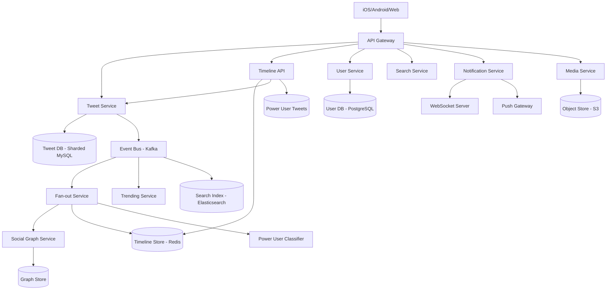

*Twitter's service topology: the API Gateway routes requests to the Tweet Service (write path), Timeline API (read path), and supporting services. The Tweet Service stores tweets in a sharded MySQL cluster and publishes events to Kafka. The Fan-out Service consumes events, consults the Social Graph for follower lists, and writes to the Timeline Store (Redis sorted sets). Power users bypass fan-out-on-write and their tweets are merged at read time via the Power User Classifier.*

**Problem Statement:** Design Twitter's core write and read pipelines — from tweet creation through real-time delivery to followers' timelines — at a scale of 500M+ daily active users, millions of tweets per minute during peak events, and fan-out to accounts with tens of millions of followers, while maintaining sub-100 ms tweet-posting latency, < 100 ms home-timeline read latency, and eventual consistency bounded to under 5 seconds.

**The fan-out challenge in numbers:** A power user with 50 million followers tweets once. Naive fan-out-on-write requires 50 million Redis writes in under a second — enough to saturate an entire Redis cluster. Fan-out-on-read would require 50 million reads every time any of those followers opens their timeline. The system must use a hybrid approach: push for normal users (millions of small fan-outs totaling hundreds of millions of writes per minute), pull for power users (tens of millions of followers read at their own pace), with careful backpressure, rate limiting, and idempotency.

---

### Characteristics

| Characteristic | What it means | Why it matters | How it works |
|---|---|---|---|
| **Real-time timeline** | Followers see new tweets within seconds of posting | Twitter's value is real-time information | Fan-out service writes tweet_id to each follower's timeline |
| **Microblogging** | Short-form content (280 characters) | Encourages frequent posting; easy to consume quickly | Fixed-length text + optional media |
| **Asymmetric following** | Users can follow without mutual consent | Enables influencer/follower model | Directed edges in social graph |
| **Public by default** | Tweets are public unless protected | Enables discovery and viral content | Public search index |
| **Hashtags** | Topic-based grouping via #tag | Enables content discovery by topic | Inverted index on hashtags |
| **Trending topics** | Real-time popular discussion topics | Drives engagement and news discovery | Sliding-window count over hashtag/tweet frequency |
| **High write throughput** | Millions of tweets per minute during events | Must not lose tweets or delay delivery | Sharded tweet service, async fan-out |
| **Snowflake IDs** | 64-bit globally unique tweet IDs | No cross-datacenter coordination needed | Timestamp + machine ID + sequence number |
| **Hot key mitigation** | Viral tweets/hashtags concentrate traffic | Prevents cache/database overload | Sharded counters, key splitting, CDN |
| **Eventual consistency** | Tweets appear in timelines within seconds, not instantly | Acceptable for social feeds; enables scale | Async Kafka-driven fan-out pipeline |
| **Rate limiting** | API quotas per user and IP | Prevents abuse and service overload | Token bucket or leaky bucket algorithms |

---

### Pros

* **Real-time information**: Breaking news and live events are visible within seconds to millions of followers.
* **Public conversation**: Unlike private social networks, Twitter's public-by-default model enables discovery and discourse.
* **Hashtag-driven discovery**: Topics are organized and discoverable via hashtags, enabling content surfacing beyond the social graph.
* **Viral content potential**: Any tweet can go viral, reaching millions who don't follow the author — driving engagement and platform value.
* **Live event coverage**: Sports, concerts, news events are covered in real-time by both professional and citizen journalists.
* **Influencer economy**: Asymmetric following enables influencer/follower relationships that drive business models.
* **Searchable firehose**: Full-text search across all public tweets enables information discovery and research.
* **Low-latency fan-out**: Tweets are typically delivered to most followers within 1–2 seconds of posting.
* **Global real-time**: Users worldwide see breaking news simultaneously.

---

### Cons

* **Information overload**: The firehose of tweets is overwhelming; users must curate their feeds carefully.
* **Misinformation**: False information spreads faster than truth (6x faster, studies show).
* **Echo chambers**: Algorithms can reinforce existing beliefs, limiting exposure to diverse viewpoints.
* **Harassment and abuse**: Public platform enables trolling, harassment, and coordinated harassment campaigns.
* **Rate limits**: API rate limits (300 tweets/3-hour window per user) can frustrate power users and researchers.
* **Platform manipulation**: Astroturfing, bot networks, and coordinated inauthentic behavior are persistent problems.
* **Read-heavy asymmetry**: Timeline reads vastly outnumber writes, making read-path optimization critical but complex.
* **Operational complexity**: Hybrid fan-out (push + pull), multiple storage systems, and real-time event processing create many failure modes.

---

### Use Cases

#### Breaking News Distribution

* **Problem**: A major news event breaks — how do millions of users learn about it within seconds?
* **Solution**: Journalists and news orgs tweet; their tweets fan out to millions of followers; trending algorithms surface the hashtag. The firehose of real-time updates keeps users informed as the story develops.
* **Why suitable**: Twitter's real-time delivery, asymmetric following, and trending topics are purpose-built for breaking news.
* **How it works**: News account tweets → fan-out service writes to millions of followers' timelines → users see tweet in timeline within 1-2 seconds → hashtag trends → non-followers discover via search/explore.
* **Trade-offs**: Speed vs. accuracy — initial reports may be wrong (retweets of misinformation); the platform must balance speed with fact-checking.

#### Live Event Coverage

* **Problem**: During a sports game or award show, millions want real-time commentary and reactions.
* **Solution**: Hashtag-based conversation (#SuperBowl, #Oscars). Users tweet reactions; these fan out to followers; the hashtag creates a shared timeline of the event.
* **Why suitable**: Twitter's real-time timeline and hashtag grouping make it the natural platform for live event commentary.
* **How it works**: During the event, tweet volume spikes → fan-out service handles burst → trending detection surfaces the event hashtag → users discover the conversation via search/trends.
* **Trade-offs**: Server load during peaks; spam/bot activity spikes during popular events; moderation challenges at scale.

#### Influencer Marketing

* **Problem**: Brands want to reach targeted audiences through influencers' authentic content.
* **Solution**: Brands partner with influencers who tweet about products; tweets reach the influencer's followers (who trust their recommendations). Hashtags create campaign tracking.
* **Why suitable**: Twitter's asymmetric following model enables influencer/follower relationships; real-time delivery ensures fresh content; public nature enables hashtag tracking.
* **How it works**: Influencer tweets about product (with #sponsored, campaign hashtag) → fan-out to followers → engagement (likes, RTs, comments) → brand measures success via hashtag tracking and UTM links.
* **Trade-offs**: ROI measurement is imprecise (engagement ≠ sales); influencer fraud (fake followers); platform algorithm changes can reduce organic reach.

#### Trending Hashtag Campaign

* **Problem**: A brand wants to create a trending hashtag campaign that reaches users beyond their followers.
* **Solution**: Launch a hashtag with clear creative briefs, coordinate influencer seeding, and leverage Twitter's trending algorithm to surface the hashtag in the "For You" / Trends panel.
* **Why suitable**: Twitter's trending detection (velocity-based scoring over a 10-minute sliding window) surfaces topics with rapidly increasing usage. Hashtag sharding allows counting millions of uses per minute without hot keys.
* **How it works**: Campaign hashtag launched → users tweet with it → hashtag counter shards increment → Trending Service detects velocity spike → hashtag appears in Trends panel → non-followers discover and engage → campaign amplifies organically.
* **Trade-offs**: Organic trending is not guaranteed; paid promotion may be needed; spam/bot detection may filter legitimate campaign tweets; trending placement costs money via Twitter Ads.

---

### Components

| Component | Purpose | Responsibilities | Relationship | Real-world Example |
|---|---|---|---|---|
| **Tweet Service** | Create/retrieve tweets | Store tweet content, handle writes, enforce limits, Snowflake ID generation | Publishes to fan-out; stores in Tweet Store | Twitter Tweet Service |
| **Fan-out Service** | Distribute tweets to followers | Write tweet_id to each follower's timeline; power-user classification | Consumes from Event Bus; writes to Timeline Store | Twitter Fanout Service |
| **Timeline Store** | Precompute follower timelines | Fast retrieval of home timeline | Written by Fanout Service; read by Timeline API | Redis sorted sets |
| **Social Graph Service** | Follow/unfollow relationships | Store and query follower/followee edges; power-user classification | Queried by Fanout Service | Twitter Relations |
| **Search Service** | Hashtag and tweet search | Index tweets, handle hashtag queries, full-text search | Consumes from Event Bus | Elasticsearch |
| **Trending Service** | Detect trending topics | Count tweet/hashtag frequency over sliding window; velocity scoring | Consumes from Event Bus | Twitter Heron/Storm |
| **Notification Service** | Push real-time updates | Deliver new tweets, likes, follows to users via WebSocket/push | Consumes from Event Bus; pushes via WebSocket/APNs | Twitter Push Service |
| **Media Service** | Handle photos/videos | Upload, process, serve media attachments | Stores in Object Store, CDN URLs in tweets | Twitter Media Service |
| **User Service** | User profiles | Store and serve user info, authentication | Queried by all services | Twitter User Service |
| **Event Bus** | Event streaming | Decouple services; carry tweet_created, user_followed, liked events | Used by all event-driven services | Kafka |
| **Power User Classifier** | Identify celebrity accounts | Maintain follower-count threshold; route tweets to pull-mode | Queried by Fan-out Service | Twitter Power User Service |

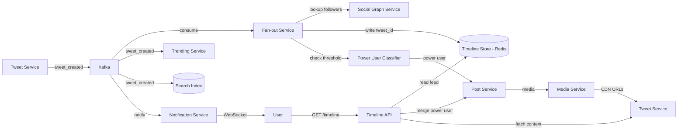

*Component interaction flow: the Tweet Service stores a tweet, generates a Snowflake ID, and publishes a `tweet_created` event to Kafka; the Fan-out Service consumes the event, checks the Power User Classifier for follower count, queries the Social Graph for followers, and writes the tweet_id to each follower's Redis sorted-set timeline; the Timeline API reads precomputed feeds, merges in power-user tweets, and fetches content; the Trending Service and Search Service independently consume the event stream.*

**Component interactions:**

1. **Tweet posted**: Tweet Service stores tweet → publishes `tweet_created` event → Fan-out Service consumes → queries Social Graph for followers → writes `tweet_id` + timestamp to each follower's Timeline Store entry.
2. **Timeline read**: User opens app → Timeline API reads from Timeline Store → fetches full tweet content (content may be cached or fetched from Tweet Store) → merges power-user tweets → applies basic ranking → returns.
3. **Trending detection**: Event Bus → Trending Service → sliding 10-minute window → count hashtags + nouns → rank by velocity → surface top trends.
4. **Real-time delivery**: Notification Service → WebSocket push to connected users.

---

### Architectural Patterns

#### Fan-out on Write (Push Model)

* **What**: When a user tweets, write the tweet_id to every follower's timeline in a fast store (Redis/Cassandra).
* **Problem solved**: Home timeline reads are O(1) — just read the user's precomputed timeline. This is critical because reads >> writes on Twitter.
* **How it works**: Tweet Service writes tweet to DB + publishes event → Fan-out Service consumes → queries Social Graph Service for follower list → writes `ZADD timeline:{follower_id} {timestamp} {tweet_id}` for each follower.
* **When to use**: When follower counts are moderate (most users have < 10K followers). Twitter uses this for 99% of users.
* **When not to use**: For celebrities with millions of followers — 50M writes per tweet is too expensive.
* **Advantages**: Fast read (O(1) timeline lookup); offline users see tweet when they come back.
* **Disadvantages**: Expensive write (O(followers)); timeline storage = followers × tweets.

```java
@Service
public class FanoutService {
    public void fanoutTweet(String tweetId, String authorId) {
        List<String> followers = graphService.getFollowers(authorId);
        String ts = String.valueOf(System.currentTimeMillis());
        for (String follower : followers) {
            redisTemplate.opsForZSet().add("timeline:" + follower, tweetId, ts);
        }
    }
}
```

*Spring Boot `FanoutService` bean: fetches the author's follower list from the Social Graph Service, then writes the tweet ID into each follower's Redis sorted-set timeline. The timestamp from `System.currentTimeMillis()` serves as the ZSET score for chronological ordering. In production, this is parallelized with batching.*

#### Fan-out on Read (Pull Model for Power Users)

* **What**: For users with massive follower counts (celebrities), don't push their tweets to followers' timelines. Instead, at read time, query their recent tweets and merge.
* **Problem solved**: Avoids fan-out storms when a celebrity tweets — no writes needed at tweet time.
* **How it works**: Tweet Service stores the tweet and tags the author as a "power user." Timeline API, when reading a user's timeline, reads the precomputed feed (from normal users) AND fetches recent tweets from followed power users, then merges by timestamp.
* **When to use**: When a small fraction of users have very large follower counts (Pareto distribution).
* **When not to use**: When all users have similar follower counts — read-time merging adds latency to every read.
* **Advantages**: Cheap tweets for power users; no write amplification.
* **Disadvantages**: Higher read latency; complex merge logic in Timeline API.

#### Fan-out on Write with Fan-out Throttling

* **What**: Even for regular users, if they suddenly go viral (tweet goes trending), the fan-out can spike. Use dynamic throttling — if fan-out rate exceeds threshold, switch to pull mode temporarily.
* **Problem solved**: Prevent fan-out storms from unexpected viral content.
* **How it works**: Monitor fan-out queue depth; if a tweet's fan-out exceeds N (e.g., 100K), abort fan-out-on-write and mark the tweet for read-time merge instead.
* **Real-world example**: Twitter's strategy for viral tweets from mid-tier accounts.

#### Event Sourcing

All state changes (tweets, likes, follows, retweets) are stored as an immutable event log in Kafka. Read models (timeline store, trend counters, search index) are built by consuming the event stream. Provides auditability, replayability, and decoupling. *Trade-off*: higher storage cost and read-side eventual consistency.

#### Command Query Responsibility Segregation (CQRS)

Writes (posting tweets, liking) go to a write-optimized model; reads (timeline generation, search) use a separate read-optimized model. The two models synchronize asynchronously via the event bus. *Trade-off*: added complexity but enables independent scaling and optimization of read and write paths.

#### Microservice Architecture

Each component (Tweet, Graph, Fan-out, Timeline API, Search, Trending, Notification, Media) is a separate independently deployable service with its own database. Loose coupling via Kafka enables technology diversity and independent scaling of bottlenecks.

---

### Benefits

* **Real-time information**: Breaking news and live events are visible within seconds to millions of followers.
* **Public conversation**: Unlike private social networks, Twitter's public-by-default model enables discovery and discourse.
* **Hashtag-driven discovery**: Topics are organized and discoverable via hashtags, enabling content surfacing beyond the social graph.
* **Viral content potential**: Any tweet can go viral, reaching millions who don't follow the author — driving engagement and platform value.
* **Live event coverage**: Sports, concerts, news events are covered in real-time by both professional and citizen journalists.
* **Influencer economy**: Asymmetric following enables influencer/follower relationships that drive business models.
* **Searchable firehose**: Full-text search across all public tweets enables information discovery and research.
* **Global reach**: Users worldwide see breaking news simultaneously through multi-region fan-out and CDN.

---

### Challenges

#### Technical Challenges

* **Fan-out storms**: A celebrity tweet triggers millions of fan-out writes. Requires power-user classification and pull-mode fallback.
* **Timeline consistency**: A tweet may appear in some followers' timelines before others (eventual consistency). Acceptable for Twitter, but must be bounded (< 5 seconds).
* **Hot keys**: Trending hashtags or viral tweets create hot keys (e.g., the hashtag's counter or the tweet's like count). Need sharded counters.
* **Timeline storage size**: Each user's timeline grows with their follow count × tweet rate. Need eviction policies (keep last N tweets, TTL).

#### Scalability Challenges

* **Write throughput**: During breaking news or live events, tweets per second can spike 10x. The Tweet Service must scale horizontally and buffer during bursts.
* **Fan-out parallelization**: Fan-out for 10M followers requires massive parallelism. Partition followers into batches and process across a worker pool.
* **Read throughput**: Timeline reads happen much more frequently than writes. Must serve 100K+ reads/second from cache.
* **Cross-region delivery**: A tweet from the US must reach followers in Asia within seconds — requires multi-region fan-out.

#### Performance Challenges

* **Feed read latency**: Home timeline must load in < 100 ms. Fan-out writes must complete in < 2 seconds.
* **Tweet composition latency**: Posting a tweet (including fan-out) should return to the user within 100–200 ms, even for users with many followers. Use async fan-out (return immediately, fan-out in background).
* **Search latency**: Hashtag search must return results in < 200 ms, even for trending topics with millions of tweets.

#### Reliability Challenges

* **Lost fan-out**: If the fan-out service crashes after a tweet is stored but before fan-out completes, some followers won't see the tweet. Need idempotent fan-out with replay.
* **Duplicate delivery**: Retries may cause duplicate timeline entries — use tweet_id as a set member (deduplication) in the timeline store.
* **Partial fan-out**: If fan-out times out for some followers, they'll see the tweet later. Acceptable; monitor fan-out lag.

#### Maintainability Challenges

* **Fan-out worker management**: Thousands of fan-out workers consuming from a queue. Need to handle scaling, failure detection, and work redistribution.
* **Timeline store schema evolution**: As features change (e.g., adding "quoted tweet" support), the timeline entry format must evolve without downtime.
* **Ranking model changes**: Timeline ranking changes affect user experience significantly; need careful A/B testing and rollback.

#### Operational Challenges

* **Monitoring fan-out lag**: Alert if the fan-out queue depth exceeds threshold or if fan-out latency > 5 seconds.
* **Celebrity account management**: Known power users must be pre-classified so their tweets use pull mode. New viral accounts must be dynamically detected.
* **Hashtag spam**: Trending hashtags can be gamed. Need real-time spam detection on hashtag usage patterns.

#### Security Concerns

* **Bot detection**: Millions of bot accounts tweet spam. Need ML-based anomaly detection on posting patterns.
* **API abuse**: Scraping and rate-limit circumvention via multiple API keys. Need IP-based and behavioral rate limiting.
* **Doxxing and harassment**: Public platform enables targeted harassment campaigns. Need content moderation and user blocking.
* **Data scraping**: Public tweets can be scraped for training data or surveillance. Need rate limiting, CAPTCHA, and API access controls.

---

### Best Practices

* **Async fan-out**: Return success to the user immediately after storing the tweet; fan-out happens in the background. This keeps tweet composition fast regardless of follower count.
* **Power user classification**: Pre-identify users with > N followers (e.g., 10K) and use pull mode for them. Dynamically detect viral content and switch to pull mode mid-fanout.
* **Idempotent fan-out**: Tweet_id is unique; use set semantics (Redis ZADD) to prevent duplicates. If fan-out retries, same tweet_id is written again — no duplicate.
* **Timeline eviction**: Each user's timeline has a max size (e.g., 800 latest tweets). Evict oldest entries. TTL of 30 days for inactive users.
* **Caching**: Cache tweet content (not just IDs) in Redis to avoid DB round-trips for hot tweets. Cache timelines for active users.
* **Hashtag sharding**: Use sharded counters for hashtag counts (e.g., `hashtag:covid:0`, `hashtag:covid:1` — sum for total).
* **Read repair**: If a timeline entry is missing tweet content (cache miss), fetch from Tweet Store and populate cache.
* **Graceful degradation**: If fan-out is behind, serve older tweets from DB; if search is down, return empty results for new queries.
* **Fan-out partitioning**: Partition the `tweet_created` Kafka topic by `hash(author_id) % N_partitions` so each fan-out worker handles a disjoint set of authors.
* **Backpressure**: Use circuit breakers on Redis/Timeline Store calls; if the store is slow, slow down fan-out workers rather than queuing indefinitely.

---

### When to Use / When Not to Use

#### Appropriate

* When real-time information distribution is critical (news, live events, public discourse).
* When the follower model is asymmetric (influencers and followers).
* When content is short-form and consumable quickly.
* When public discovery (hashtags, search) is a key feature.
* When viral content and trending topics are core to the product.

#### Not Appropriate

* When content is long-form (articles, books) — better served by a CMS or newsletter platform.
* When the social graph is symmetric (Facebook friends) — Twitter's asymmetric model isn't ideal.
* When privacy is the top concern (private networks) — Twitter's public-by-default model conflicts.
* When real-time delivery isn't needed (weekly digests, batched content).

#### Alternatives

* **Facebook-style feed**: Symmetric friendship model with algorithmic ranking. Better for personal content.
* **LinkedIn feed**: Professional content with weak-tie recommendations.
* **Reddit**: Topic-based communities (subreddits) rather than personal followers.

#### Decision Factors

* **Follower distribution**: If a small % of users have many followers (Pareto), use hybrid fan-out.
* **Read/write ratio**: Twitter reads >> writes; optimize for low-latency timeline reads.
* **Public vs. private**: Public content enables search/discovery; private content requires stronger access control.
* **Virality requirements**: If viral content distribution is key, design for broadcast (not just social graph).

---

### Data Model and API

The data model captures users, their relationships, the content they create, and the interactions (likes, retweets, replies) on that content. Tweets are immutable once created; timeline entries are ephemeral and precomputed.

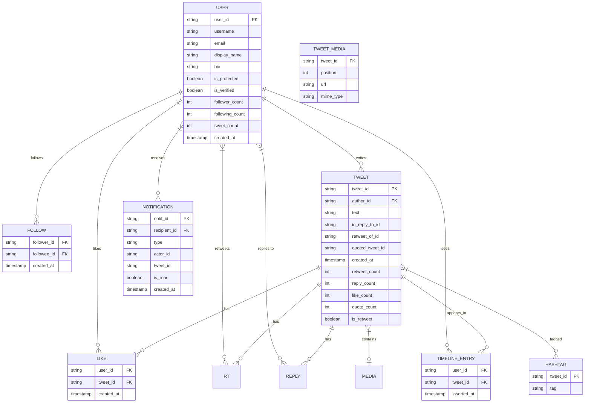

*Entity-relationship diagram for Twitter: users follow each other (FOLLOW edges), users write tweets (which may be retweets, replies, or quotes), tweets receive likes and replies, tweets are pre-computed into follower timeline entries, hashtags link to tweets, and notifications are generated for relevant interactions.*

**Entity descriptions:**

- **USER:** Core entity. `user_id` (64-bit Snowflake ID), `username` (unique), `email`, `display_name`, `bio`, `is_protected` (privacy for follower requests), `is_verified` (blue check), `follower_count`, `following_count`, `tweet_count` (denormalized for fast reads). Stored in PostgreSQL (durable) with hot profile data cached in Redis.
- **FOLLOW:** Edge in the social graph. `follower_id`, `followee_id` (composite PK, indexed both ways). Stored in a sharded store.
- **TWEET:** Immutable content. `tweet_id` (Snowflake ID), `author_id`, `text` (280 chars max), `in_reply_to_id` (nullable, for replies), `retweet_of_id` (nullable, for retweets), `quoted_tweet_id` (nullable, for quote tweets), `created_at`, denormalized `retweet_count`, `reply_count`, `like_count`, `quote_count`. Stored in sharded MySQL (Vitess).
- **TWEET_MEDIA:** Attached media. `tweet_id`, `position`, `url` (CDN URL), `mime_type`. Stored in object storage; metadata in DB.
- **LIKE:** `user_id`, `tweet_id` (composite PK). Used for engagement signals and ranking.
- **TIMELINE_ENTRY:** Precomputed entry. `user_id` (partition key), `tweet_id`, `inserted_at` (timestamp, ZSET score). Stored in Redis (fast read); TTL of 7 days.
- **HASHTAG:** `tweet_id`, `tag`. Inverted index stored in Elasticsearch.
- **NOTIFICATION:** `notif_id` (UUID), `recipient_id`, `type` (mention, like, rt, follow, reply), `actor_id`, `tweet_id`. Stored in DB with Redis for unread counts.

**Indexes and Constraints:**

- `USER.username` — UNIQUE index (login, no duplicates).
- `USER.email` — UNIQUE index (password reset, verification).
- `FOLLOW(follower_id, followee_id)` — composite PK prevents duplicate follows; reverse index on `(followee_id, follower_id)` for follower lookups.
- `TWEET(author_id, created_at)` — composite index for user timeline queries (power user mode).
- `TIMELINE_ENTRY(user_id, inserted_at)` — composite index for paginated feed retrieval.
- `TIMELINE_ENTRY(tweet_id)` — index for "remove this tweet from all timelines" on deletion.
- `LIKE(user_id, tweet_id)` — composite PK for idempotent likes.

**Partitioning / Sharding:**

- **USER:** Sharded by `user_id` hash (consistent hashing).
- **FOLLOW:** Sharded by `follower_id` hash (write-heavy — fan-out reads follower list by `followee_id`).
- **TWEET:** Sharded by `tweet_id` hash (Snowflake ID includes timestamp, so sharding by tweet_id gives temporal locality).
- **TIMELINE_ENTRY:** Sharded by `user_id` hash. Hot timelines cached; cold evicted or moved to Cassandra.
- **LIKE / REPLY:** Sharded by `tweet_id` hash (read-heavy — "get likes for tweet X").

**API Contract:**

| Method | Endpoint | Purpose | Rate Limit |
|---|---|---|---|
| POST | `/api/v1/tweets` | Create a tweet | 300 req/hour |
| GET | `/api/v1/timeline` | Get home timeline | 1000 req/hour |
| POST | `/api/v1/users/{userId}/follow` | Follow a user | 1000 req/hour |
| DELETE | `/api/v1/users/{userId}/follow` | Unfollow a user | 1000 req/hour |
| GET | `/api/v1/users/{userId}/followers` | List followers | 500 req/hour |
| GET | `/api/v1/users/{userId}/following` | List following | 500 req/hour |
| POST | `/api/v1/tweets/{tweetId}/like` | Like a tweet | 1000 req/hour |
| POST | `/api/v1/tweets/{tweetId}/retweet` | Retweet | 300 req/hour |
| POST | `/api/v1/tweets/{tweetId}/reply` | Reply to a tweet | 300 req/hour |
| GET | `/api/v1/search` | Search tweets/hashtags | 180 req/15min |

**GET /api/v1/timeline — Request:**

```http
GET /api/v1/timeline?limit=20&cursor=eyJfb2Zmc2V0IjozMH0=&ranked=true HTTP/1.1
Authorization: Bearer <jwt>
Accept: application/json
```

**GET /api/v1/timeline — Response:**

```json
{
  "tweets": [
    {
      "tweet_id": "1234567890123456789",
      "author_id": "9876543210",
      "author_name": "Alice",
      "author_handle": "@alice",
      "author_avatar": "https://cdn.twimg.com/profile.jpg",
      "text": "Just launched our new product!",
      "media": [{"type": "photo", "url": "https://pbs.twimg.com/media/abc.jpg"}],
      "created_at": "2024-06-14T10:30:00Z",
      "retweet_count": 42,
      "reply_count": 5,
      "like_count": 128,
      "user_liked": false,
      "rank_score": 0.92
    }
  ],
  "cursor": "eyJfb2Zmc2V0IjoxMDB9=",
  "has_more": true,
  "total_count": 500
}
```

**POST /api/v1/tweets — Request:**

```json
{
  "text": "Just launched our new product! Check it out 👉 https://example.com",
  "media_ids": ["media_abc"],
  "in_reply_to_id": null,
  "quoted_tweet_id": null
}
```

**POST /api/v1/tweets — Response:**

```json
HTTP/1.1 201 Created
{
  "tweet_id": "1234567890123456789",
  "status": "posted",
  "created_at": "2024-06-14T10:30:00Z",
  "fanout_status": "processing"
}
```

**Real-Time WebSocket API for live updates:**

| Event | Direction | Payload |
|---|---|---|
| subscribe | Client → Server | `{"type": "subscribe", "channels": ["timeline:12345"]}` |
| tweet_created | Server → Client | `{"type": "tweet_created", "tweet_id": "123...", "author_id": "987..."}` |
| like_update | Server → Client | `{"type": "like_update", "tweet_id": "123...", "count": 42}` |

**Status codes:** `200` OK, `201` Created, `204` Deleted, `400` Invalid request, `401` Auth required, `403` Forbidden, `404` Not found, `409` Conflict (already following), `429` Rate limited, `503` Temporarily unavailable.

**Authentication & Authorization:** OAuth 2.0 with JWT bearer tokens. Scope-based authorization: `tweets:read`, `tweets:write`, `follows:write`, `notifications:read`.

---

### Domain-Specific: Tweet and Timeline Deep Dive

This section covers the core technical challenges unique to Twitter: how to efficiently distribute a tweet to followers (fan-out), how to store and retrieve timelines at scale, how to handle power users with millions of followers, how to store immutable tweets with Snowflake IDs, how to index hashtags and detect trending topics, and how to deliver real-time updates via WebSocket and push notifications. These topics are the heart of Twitter's system design.

#### Fan-out on Write (Twitter's Primary Model)

* **What**: When a user tweets, write the tweet_id to every follower's timeline in a fast store (Redis/Cassandra).
* **Problem solved**: Home timeline reads are O(1) — just read the user's precomputed timeline. This is critical because reads >> writes on Twitter.
* **How it works**: Tweet Service stores tweet in DB + publishes `tweet_created` event to Kafka → Fan-out Service consumes → queries Social Graph Service for follower list → writes `ZADD timeline:{follower_id} {timestamp} {tweet_id}` for each follower.
* **When to use**: When follower counts are moderate (most users have < 10K followers). Twitter uses this for 99% of users.
* **When not to use**: For celebrities with millions of followers — 50M writes per tweet is too expensive.
* **Advantages**: Fast read (O(1) timeline lookup); offline users see tweet when they come back.
* **Disadvantages**: Expensive write (O(followers)); timeline storage = followers × tweets.

```java
@Service
public class FanoutService {
    public void fanoutTweet(String tweetId, String authorId) {
        List<String> followers = graphService.getFollowers(authorId);
        String ts = String.valueOf(System.currentTimeMillis());
        for (String follower : followers) {
            redisTemplate.opsForZSet().add("timeline:" + follower, tweetId, ts);
        }
    }
}
```

*Spring Boot `FanoutService` bean: fetches the author's follower list from the Social Graph Service, then writes the tweet ID into each follower's Redis sorted-set timeline. The timestamp from `System.currentTimeMillis()` serves as the ZSET score for chronological ordering. In production, this is parallelized with batching.*

#### Fan-out on Read (Pull Model for Power Users)

* **What**: For users with massive follower counts (celebrities), don't push their tweets to followers' timelines. Instead, at read time, query their recent tweets and merge.
* **Problem solved**: Avoids fan-out storms when a celebrity tweets — no writes needed at tweet time.
* **How it works**: Tweet Service stores the tweet and tags the author as a "power user." Timeline API, when reading a user's timeline, reads the precomputed feed (from normal users) AND fetches recent tweets from followed power users, then merges by timestamp.
* **When to use**: When a small fraction of users have very large follower counts (Pareto distribution).
* **When not to use**: When all users have similar follower counts — read-time merging adds latency to every read.
* **Advantages**: Cheap tweets for power users; no write amplification.
* **Disadvantages**: Higher read latency; complex merge logic in Timeline API.

#### Fan-out Throttling for Viral Content

* **What**: Even for regular users, if they suddenly go viral (tweet goes trending), the fan-out can spike. Use dynamic throttling — if fan-out rate exceeds threshold, switch to pull mode temporarily.
* **Problem solved**: Prevent fan-out storms from unexpected viral content.
* **How it works**: Monitor fan-out queue depth; if a tweet's fan-out exceeds N (e.g., 100K), abort fan-out-on-write and mark the tweet for read-time merge instead.
* **Real-world example**: Twitter's strategy for viral tweets from mid-tier accounts.

#### Timeline Store (Redis)

Twitter uses Redis sorted sets for timelines. Key format: `timeline:{user_id}`, score = tweet timestamp (as epoch milliseconds), value = tweet_id.

* **Write**: `ZADD timeline:{follower_id} {timestamp} {tweet_id}`
* **Read**: `ZREVRANGE timeline:{user_id} 0 {limit-1} WITHSCORES`
* **Trim**: `ZREMRANGEBYRANK timeline:{user_id} 0 -801` (keep last 800 tweets)
* **TTL**: Set a 30-day expiration on timeline keys for inactive users.

For users with very large follow counts (but below power-user threshold), Twitter uses **incremental fan-out** — fan-out in batches with delays to avoid overwhelming Redis.

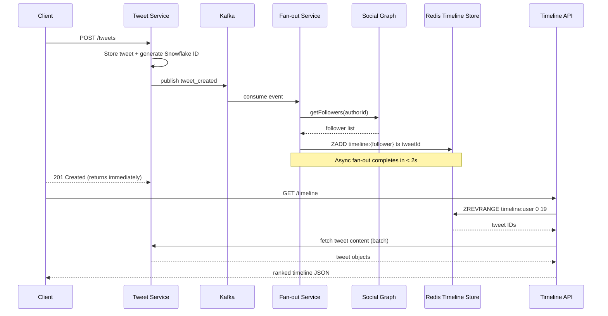

*Timeline flow sequence diagram: on the write path, the Tweet Service stores the tweet with a Snowflake ID and publishes a `tweet_created` event to Kafka; the Fan-out Service consumes the event, queries the Social Graph for the author's followers, and writes the tweet ID into each follower's Redis sorted-set timeline asynchronously; the client receives a 201 response immediately (fan-out is decoupled). On the read path, the Timeline API reads the precomputed timeline from Redis, fetches full tweet content in a batch from the Tweet Service, and returns ranked results.*

#### Tweet Storage

Tweets are stored in a **sharded MySQL cluster** (using Vitess for sharding). Each tweet has:

- `tweet_id` (64-bit Snowflake ID — includes timestamp, machine ID, sequence)
- `author_id` (FK to user)
- `text` (280 chars max)
- `created_at` timestamp
- `in_reply_to_status_id` (for replies, nullable)
- `retweet_of` (for retweets, nullable)
- `quoted_status_id` (for quote tweets, nullable)
- `media_keys` (array of media references)
- `public_metrics` (retweet count, reply count, like count, quote count)

Shards are distributed by `tweet_id % N` (hash partitioning). Each shard handles ~5K writes/sec and ~50K reads/sec. Index on `(author_id, created_at)` for user timeline queries (power user mode).

#### Hashtag Indexing

Hashtags are extracted from tweet text at ingest time (regex: `#\w+`). A secondary indexer creates an inverted index: `hashtag → [tweet_ids]`. The index is stored in Elasticsearch for full-text search and in Redis for trending (sliding window counts).

**Sharded counters**: The count of tweets per hashtag is stored as `hashtag:{tag}:{shard}` (e.g., 100 shards with random suffix), summed for total. This avoids hot-key contention on popular hashtags.

#### Trending Topics Detection

Twitter uses **Storm** (now Heron) topologies for real-time trend detection:

1. **Spout**: Reads `tweet_created` events from the message queue.
2. **Extract entities**: Identifies hashtags, mentions, URLs, and keywords.
3. **Count window**: 10-minute sliding window count per entity.
4. **Velocity calculation**: Compute `count(t) - count(t-1)` — the rate of change. Entities with high velocity are trending.
5. **Filtering**: Remove spam (pre-computed blacklist), check novelty (not already trending).
6. **Ranking**: Score = velocity × (1 - spam_score) × recency_weight. Top 10 per region.

#### Snowflake ID Generation

Tweet IDs are **Snowflake IDs** — 64-bit integers with:

- 41 bits: timestamp (ms since epoch)
- 10 bits: machine/worker ID
- 12 bits: sequence number (within same ms)

This ensures IDs are monotonically increasing (good for DB indexing) and globally unique (no coordination between datacenters). The 41-bit timestamp provides ~69 years of IDs.

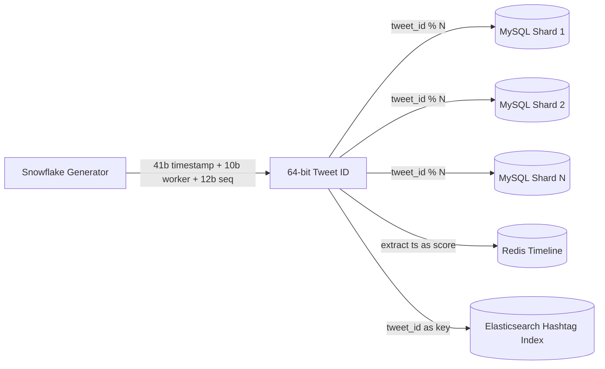

*Snowflake ID distribution: the 64-bit ID encodes a timestamp (41 bits), machine/worker ID (10 bits), and a sequence number (12 bits) ensuring global uniqueness without coordination. The ID is used as the sharding key (`tweet_id % N`) for the MySQL tweet store, the timestamp portion serves as the Redis sorted-set score for timeline ordering, and the full ID is the Elasticsearch index key for hashtag search.*

#### Feed Ranking

Twitter's home timeline uses a combination of chronological ordering and ML-based relevance scoring:

- **Recency** (time since tweet) — weight decreases over hours.
- **Social affinity** (how often you interact with this author) — if you frequently engage with Alice, her tweets rank higher.
- **Engagement prediction** (how many likes/RTs the tweet is predicted to get) — based on the author's historical engagement rate and early signals.
* **Content type** (photo tweets rank differently than text) — platform data shows certain content types drive more engagement.
- **Relationship strength** (close friends > acquaintances > strangers you barely follow) — weighted by interaction frequency and mutual connections.
- **Freshness penalty** — older tweets decay in score. A simple scoring function:

```
score = 0.30 × recency + 0.25 × affinity + 0.25 × engagement_pred + 0.10 × content_type + 0.10 × relationship_strength
```

#### Caching Strategy

1. **Tweet content cache**: Cache tweet text + user info in Redis (key = tweet_id, TTL = 1 hour). Hit rate ~95% for active tweets.
2. **Timeline cache**: Cache the top 200 tweets of the most active users in Redis. Others read from DB with caching.
3. **Timeline prefetch**: For users who open the app at 9 AM every day, pre-warm their timeline cache at 8:55 AM.
4. **Power-user tweet cache**: Cache the latest 100 tweets of power users in Redis for fast merge at read time.

---

### Replication Strategies

Twitter replicates data across multiple dimensions: within a region (for availability), across regions (for global latency), and across storage systems (for different access patterns).

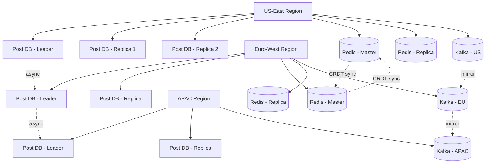

*Multi-region replication topology: within each region, the Post DB uses leader-based replication (one leader for writes, multiple replicas for reads); across regions, leaders replicate asynchronously (async DR); the Redis timeline store uses active-active CRDT-based replication across regions for last-write-wins conflict resolution; Kafka clusters mirror events across regions via MirrorMaker for replay capability.*

**Leader-based replication (Post DB):** Posts are written to a primary MySQL instance (Vitess) and replicated to read replicas within the same region. Writes go only to the leader; reads can be served from any replica. This gives strong consistency for post creation (a 201 response means the post is durably stored) while allowing read scaling.

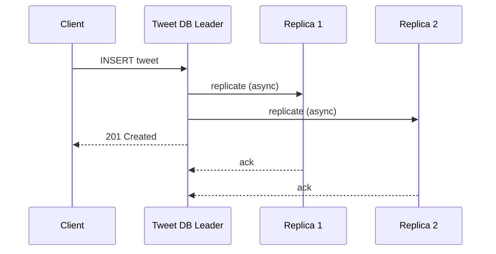

*Leader-based replication for the Tweet DB: the client writes a tweet to the leader, which asynchronously replicates to read replicas and immediately returns 201 Created. Replicas serve read traffic (timeline content fetch), accepting a small replication lag for higher read throughput.*

**Leaderless replication (Timeline Store — Redis Cluster):** The Timeline Store uses Redis Cluster with hash slots and master/replica pairs across regions. Any master can accept writes; replicas serve reads. This provides high availability — if a master fails, a replica is promoted. Timeline entries can tolerate brief staleness (eventual consistency).

**Multi-region replication:** Tweet DB is replicated synchronously within a region and asynchronously across regions. The Timeline Store (Redis) uses active-active replication across regions with last-write-wins conflict resolution. Social graph edges are replicated to all regions for low-latency reads.

**Cross-region fan-out:** When a user tweets, the fan-out service writes to the local region's Redis cluster AND publishes a cross-region event. Remote region fan-out workers consume the event and write to their local Redis clusters. This ensures followers in all regions see the tweet within seconds.

**Real-world use:** DynamoDB Global Tables for user profiles (active-active multi-region), Cassandra for engagement data (tunable consistency), Redis Cluster for timelines (master/replica with failover), Vitess for tweet storage (sharded MySQL with read replicas).

---

### Failure Detection and Membership

Twitter's services must detect failed nodes, redistribute work, and continue serving with minimal disruption.

**Gossip-based membership:** Each service instance (fan-out workers, notification servers, API gateway instances) periodically exchanges health information with a random subset of peers (gossip protocol). This spreads membership changes through the cluster in O(log N) rounds without a central coordinator.

**Health checks:**

- **Liveness probes:** HTTP `/health` endpoint checked every 2 seconds by the orchestrator (Kubernetes). If unhealthy, the pod is restarted or removed from service discovery.
- **Readiness probes:** Checks if the service can serve traffic (e.g., can connect to its database and Kafka). Not-ready pods are removed from the load balancer.
- **Business health checks:** Custom checks like "Kafka consumer lag < 10,000" or "Redis connection pool has available connections."

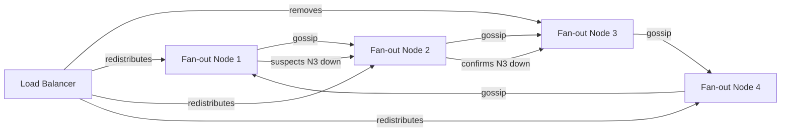

*Gossip-based failure detection: fan-out service nodes periodically exchange health state via gossip. When a node suspects a peer is down, it propagates the suspicion through the gossip network; once confirmed by multiple nodes, the load balancer removes the failed node and redistributes its Kafka partitions to healthy peers.*

**Failure detection timing for Twitter:**

| Component | Check Interval | Timeout | Action |
|---|---|---|---|
| Tweet Service | 5s | 15s | Retry write; queue locally |
| Timeline Store (Redis) | 2s | 30s | Failover to replica; serve stale |
| Notification Service | 5s | 10s | Reconnect WebSocket; buffer notifications |
| Social Graph | 3s | 15s | Route to replica; cache recent edges |
| Kafka Consumer | 10s | 30s | Trigger consumer rebalancing |
| Search/Elasticsearch | 10s | 30s | Return cached results; degrade to empty |

**Circuit breakers:** For dependencies that are failing, a circuit breaker (Resilience4j) trips after N consecutive failures and stops sending requests for a cool-down period. This prevents cascading failures — e.g., if the Social Graph Service is slow, the Fan-out Service short-circuits and queues the work for later instead of saturating with slow requests.

```java
@Service
@RequiredArgsConstructor
public class FanoutService {
    // Circuit breaker on Social Graph calls to prevent cascading failures
    private final CircuitBreaker graphCircuitBreaker = 
        CircuitBreaker.ofDefaults("social-graph");

    public List<String> getFollowers(String authorId) {
        return CircuitBreaker.decorateSupplier(graphCircuitBreaker,
            () -> graphClient.getFollowers(authorId)).get();
    }
}
```

*Spring Boot `FanoutService` with Resilience4j circuit breaker: wraps the Social Graph client call in a circuit breaker to prevent cascading failures. If the graph service degrades, the circuit opens and fan-out work is queued rather than saturating the system with slow requests. The circuit auto-recovers after the cool-down period.*

**Dead Letter Queue (DLQ):** Failed fan-out events (poison messages — e.g., a tweet with corrupt metadata) are sent to a Kafka DLQ after N retries. They are manually inspected and either fixed or dropped. This prevents a single bad event from blocking the fan-out pipeline.

---

### High Availability and Scalability

Twitter must remain available during node failures, network partitions, and regional outages while scaling to handle global traffic.

#### Multi-Region Deployment

Deploy active services in at least 3 regions (e.g., us-east, eu-west, ap-southeast). Users are routed to the nearest region via GeoDNS or a latency-based load balancer. Each region is self-sufficient for read and write operations, with asynchronous cross-region replication for durability.

- **Active-passive for Tweet DB:** Writes go to the primary region; reads can be served from any region's read replica. Cross-region replication lag is typically 1–5 seconds.
- **Active-active for Timeline Store:** Redis with CRDT-based or last-write-wins replication across regions. Users can read and write feeds from any region.
- **Active-active for Kafka:** Kafka clusters in each region mirror events via MirrorMaker. Each region's fan-out workers consume local events; cross-region events are consumed from the mirrored topic.
- **Global CDN:** Static assets (images, profile pictures, CSS, JS) are cached at edge locations worldwide via Akamai and Twitter's own CDN, reducing latency to < 50 ms for media.

#### Auto-Scaling

- **Stateless services (API Gateway, Timeline API, Notification Service):** Scale horizontally based on CPU and request latency. Kubernetes HPA adjusts replica count automatically.
- **Stateful services (Tweet DB, Redis Cluster):** Scale by adding shards or partitions. Kafka partitions scale consumer groups automatically.
- **Fan-out workers:** Scale based on Kafka consumer lag. If the `tweet_created` topic falls behind by > 10,000 messages, spin up additional fan-out workers.
- **Social Graph Service:** Scale by adding graph store shards. Power-user lookups are cached to reduce graph store load.

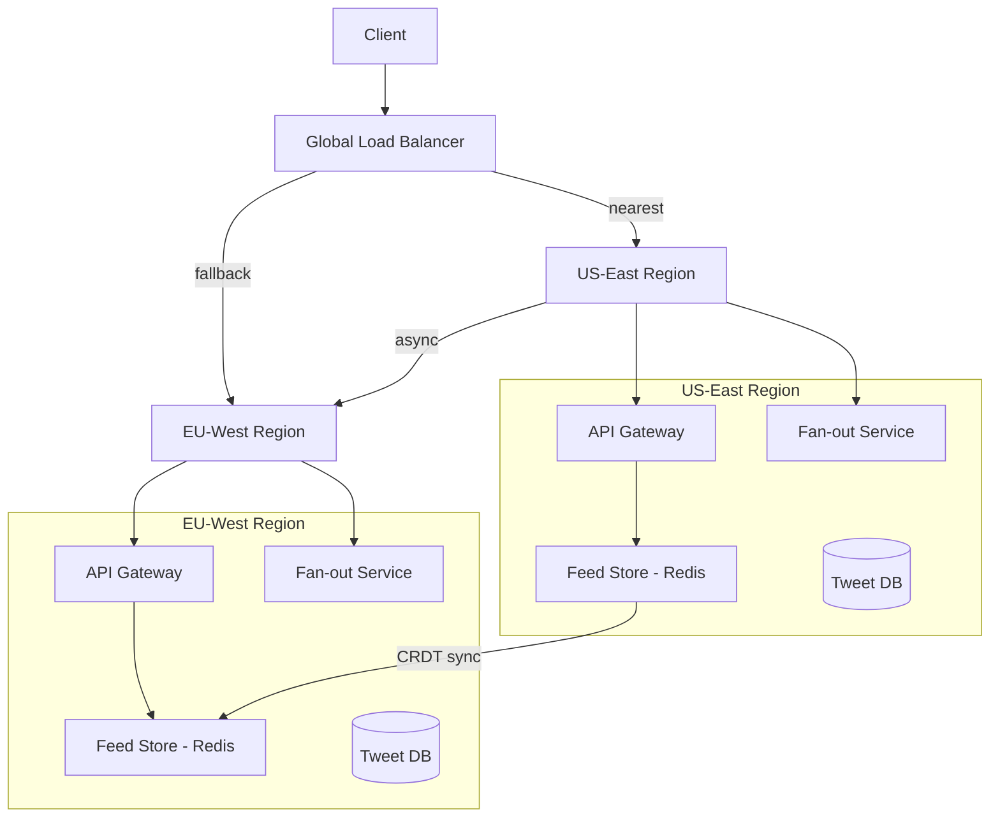

*Multi-region high availability: a global load balancer routes clients to their nearest region via GeoDNS. Each region is self-sufficient with its own API Gateway, Fan-out Service, Timeline Store, and Tweet DB. Cross-region replication (Redis CRDTs for feeds, Kafka MirrorMaker for events, async MySQL replication for tweets) keeps data synchronized. If one region fails, the load balancer routes traffic to the surviving region.*

#### Graceful Degradation

When a component fails, the system should degrade rather than crash:

- **Timeline API slow:** Return a partially populated timeline (fewer tweets than requested) with a warning header. Cache the last-known-good timeline for hot users.
- **Fan-out service down:** Tweets are still stored in the DB. The fan-out queue (Kafka) buffers events; when the service recovers, it replays from the committed offset. Followers see delayed timeline updates.
- **Search down:** Return cached trending topics from Redis; new hashtag searches return empty results with a "search is temporarily unavailable" message.
- **Notification service down:** Queue notifications in Kafka; deliver when the service recovers. Users may see delayed real-time updates.
- **Media service down:** Tweets without media still display; broken image placeholders shown for missing media.

---

### Performance and Optimization

Twitter's performance is measured by timeline read latency (< 100 ms), tweet posting latency (< 100 ms), and trend detection latency (< 60 seconds).

#### Latency Optimization

- **Timeline caching:** Cache the top 800 tweet IDs per active user in Redis sorted sets. Cold users read from DB on demand. Cache hit ratio target: 95%+ for active users.
- **Tweet content caching:** Cache tweet text + author info in Redis (key = tweet_id, TTL = 1 hour). When reading a timeline, batch-fetch all 20 tweets' content in a single Redis MGET instead of 20 individual DB queries.
- **Timeline prefetch:** For users who open the app at 9 AM daily, pre-warm their timeline cache at 8:55 AM using a scheduled job.
- **Power-user tweet cache:** Cache the latest 100 tweets of power users in Redis for fast merge at read time. This reduces the read-time merge overhead for users who follow celebrities.

#### Throughput Optimization

- **Fan-out parallelization:** Fan-out workers process Kafka partitions in parallel. Each worker handles one partition; the number of workers scales with the number of partitions (currently 1024 partitions for the `tweet_created` topic).
- **Read replicas:** Timeline content reads are served from MySQL read replicas (Vitess), multiplying database read throughput.
- **CDN for media:** 90% of Twitter traffic is media (images via pic.twitter.com). Serving from CDN edge locations drastically reduces origin load.
- **Request coalescing:** When multiple followers simultaneously request a viral tweet's content, only one DB query is issued and the result is shared across requests (single-flight pattern).

#### Caching Strategies

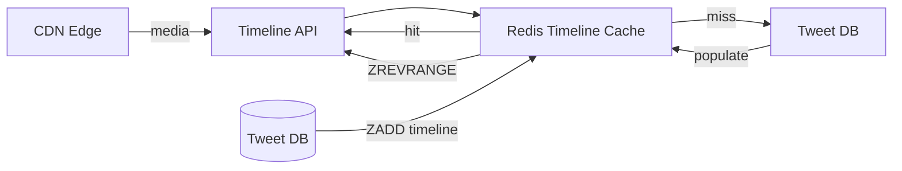

*Multi-tier caching architecture: the Timeline API checks the Redis timeline cache first; on a miss, it falls back to the Tweet DB and populates the cache. Media assets are served from CDN edge locations, removing 90% of origin traffic. The fan-out service writes to the cache asynchronously, decoupling the write path from the read path.*

#### Write Path Optimization

- **Async fan-out:** Tweet creation returns 201 Created immediately after DB write; fan-out happens asynchronously via Kafka. This keeps the tweet API latency < 50 ms.
- **Batch fan-out:** Fan-out workers pipeline Redis ZADD operations (batch 100 writes per pipeline) to reduce per-write overhead.
- **Fan-out deferral:** Power-user posts skip fan-out entirely; the Timeline API merges them at read time.
- **Fan-out throttling:** For tweets that trigger > 100K fan-out writes, throttle to 10K writes/sec to avoid overwhelming Redis.

#### Timeline Cache Warming

```java
@Service
@RequiredArgsConstructor
public class TimelineWarmupService {
    private final TimelineStore timelineStore;
    private final TweetRepository tweetRepo;
    private final RedisTemplate<String, String> redis;

    @Scheduled(fixedRate = 300000) // every 5 minutes
    public void warmActiveUserTimelines() {
        List<String> activeUsers = userRepository.findActiveUsers();
        activeUsers.parallelStream().forEach(userId -> {
            // Pre-compute top 800 tweets for active users
            Set<String> tweetIds = fanoutService.computeTimeline(userId, 800);
            redis.opsForValue().set("timeline_cache:" + userId, 
                String.join(",", tweetIds), Duration.ofMinutes(10));
        });
    }
}
```

*Spring Boot `TimelineWarmupService` bean: scheduled every 5 minutes to pre-compute timelines for active users. Uses Java's `parallelStream` for concurrent warming across users. The precomputed timeline (up to 800 tweet IDs) is cached in Redis with a 10-minute TTL, ensuring subsequent timeline reads hit the cache without recomputation.*

#### Read Path Optimization

```java
@Service
@RequiredArgsConstructor
public class TimelineReadOptimizer {
    private final RedisTemplate<String, String> redis;
    private final TweetRepository tweetRepo;

    public List<Tweet> getUserTimeline(String userId, int limit) {
        // 1. Try Redis TTL cache (warm-up result)
        String cached = redis.opsForValue().get("timeline_cache:" + userId);
        if (cached != null) {
            Set<String> ids = Set.of(cached.split(","));
            return tweetRepo.findByIds(ids);
        }

        // 2. Fallback: read from precomputed ZSET
        Set<String> ids = redis.opsForZSet()
            .reverseRange("timeline:" + userId, 0, limit * 2L);

        // 3. Batch fetch tweet content (single query)
        return tweetRepo.findByIds(ids);
    }
}
```

*Spring Boot `TimelineReadOptimizer` bean: implements a multi-tier read strategy for timeline retrieval. First checks a pre-warmed Redis cache (populated by `TimelineWarmupService`); on a miss, reads the precomputed sorted-set timeline from Redis; finally batch-loads all tweet content from the database in a single query to avoid N+1 problems. The `limit * 2` fetch ensures sufficient candidates for ranking and filtering.*

**Real-world use:** Instagram's feed uses Cassandra for precomputed feed entries with a Redis cache layer; TikTok's "For You" feed uses pre-ranking at ingest time with real-time re-ranking at read time. Twitter's timeline uses Redis sorted sets with Vitess (sharded MySQL) as the write-behind store.

---

### CAP Theorem and Consistency Trade-offs

The CAP theorem states that during a network partition, a distributed system can provide at most two of: Consistency, Availability, and Partition tolerance. Since Twitter operates over networks, partition tolerance is always required.

#### Timeline Store — AP (Availability + Partition Tolerance)

The Timeline Store (Redis) prioritizes availability: if a Redis node fails, followers' timelines are still served from replicas or fall back to chronological reconstruction from the Tweet DB. Timeline entries may be briefly stale (a post appearing 2–3 seconds late is acceptable). This trade is justified because social timelines are inherently time-ordered and users tolerate slight delays.

#### Tweet DB — CP (Consistency + Partition Tolerance)

Tweet creation requires strong consistency: if the API returns 201 Created, the tweet must exist and be retrievable. A failed write should not silently return success. The Tweet DB (Vitess) uses leader-based replication with synchronous acknowledgment from at least one replica before returning success.

#### Social Graph — AP with Bounded Staleness

Graph edges (follow/unfollow) can be eventually consistent. If user A follows B but the edge hasn't propagated to all regions, A might not see B's tweets for a few seconds. This is acceptable. However, the unfollow action must take effect immediately (or appear immediate) for privacy reasons — the system uses a "negative cache" with short TTL to handle unfollows promptly.

#### Engagement Data — Tunable Consistency

Likes, retweets, and replies use tunable consistency (Cassandra-style). A like with consistency level ONE is fast but may not be immediately visible to all readers; a like with QUORUM is slower but visible to subsequent strong reads. Twitter offers both: "fire and forget" likes (async, fast) and "confirmed" likes (sync, slower) for cases where immediate visibility matters.

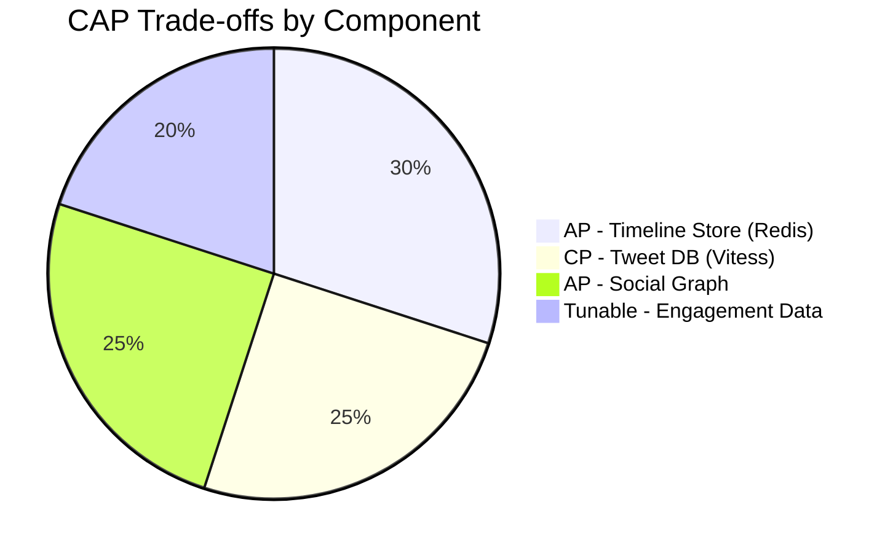

*CAP trade-offs across Twitter components: the Timeline Store and Social Graph are AP (availability-first) since brief staleness is acceptable; the Tweet DB is CP (consistency-first) since a returned 201 must mean the tweet is durable; engagement data uses tunable consistency to balance speed and visibility.*

**Interview question:** *Is Twitter strongly consistent or eventually consistent?*
**Answer:** Twitter makes a pragmatic choice: strongly consistent for writes users expect to be immediately visible (tweet creation, unfollows, privacy changes) and eventually consistent for reads where slight staleness is acceptable (timeline updates, like counts). The fan-out-on-write path ensures timeline delivery within 2–3 seconds; the fan-out-on-read path for power users provides eventual consistency within the read latency. This "strong-ish consistency" split is the key insight.

---

### Encryption and Key Management

Twitter stores highly sensitive user data — direct messages, photos, relationship graphs, location history, and behavioral profiles. Encryption must protect data at rest, in transit, and during processing.

#### Encryption at Rest

**Media and content storage:** Object storage (S3) encrypts all objects with SSE-S3 by default. User profile data in PostgreSQL and MySQL uses TDE (Transparent Data Encryption). Redis timeline store uses encryption-at-rest (Redis Enterprise) or disk-level encryption.

**Direct messages (DMs):** Twitter DMs use end-to-end encryption for sensitive conversations (introduced as "Secret DMs"). For standard DMs, messages are encrypted at rest in the database with per-conversation DEKs (Data Encryption Keys) managed by a KMS.

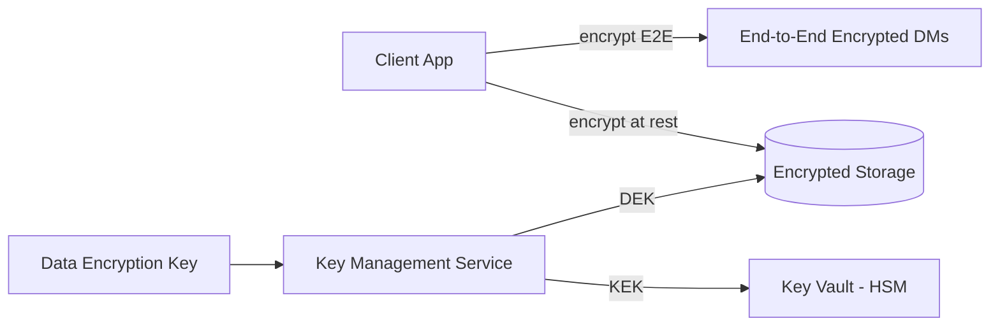

*Encryption at rest architecture: client-side end-to-end encryption protects sensitive DMs (the server never holds decryption keys); server-side encryption at rest protects stored data using DEKs managed by a KMS, with KEKs stored in an HSM-backed key vault. Per-object or per-conversation DEKs minimize the blast radius of key compromise.*

#### Encryption in Transit

All client-to-server and server-to-server traffic uses TLS 1.3 (minimum TLS 1.2). Inter-service communication within the data center uses mTLS (mutual TLS) for service-to-service authentication. Mobile SDKs pin the server certificate to prevent man-in-the-middle attacks. Twitter also supports HSTS (HTTP Strict Transport Security) with a long max-age.

#### Key Management

- **Key hierarchy:** A KEK (Key Encryption Key) in an HSM encrypts per-object or per-conversation DEKs. Rotating the KEK requires only re-encrypting the DEKs, not the data.
- **Key rotation:** KEKs rotated every 90 days; per-user DM keys rotated every 30 days (with key exchange via a Signal Protocol-like protocol for E2E DMs).
- **Multi-region KMS:** Keys are available in all deployment regions (US-East, EU-West, APAC). Cloud KMS services replicate keys automatically; on-prem components use HashiCorp Vault with integrated storage for multi-region HA.

```java
@Service
@RequiredArgsConstructor
public class MediaEncryptionService {
    @Value("${app.encryption.media-key-id}")
    private String keyId;
    private final AwsKms kmsClient;

    public EncryptedMedia encrypt(byte[] plaintext) {
        var dek = kmsClient.generateDataKey(keyId);
        var cipher = Cipher.getInstance("AES/GCM/NoPadding");
        cipher.init(Cipher.ENCRYPT_MODE,
                new SecretKeySpec(dek.plaintext(), "AES"),
                new GCMParameterSpec(128, dek.iv()));
        var ciphertext = cipher.doFinal(plaintext);
        return new EncryptedMedia(ciphertext, dek.encryptedKey(), dek.iv());
    }
}
```

*Spring Boot `MediaEncryptionService` bean: generates a per-object data encryption key (DEK) via AWS KMS, encrypts the media blob with AES-GCM (which provides both confidentiality and integrity via the authentication tag), and stores the encrypted DEK alongside the ciphertext. The KMS-managed key ID is injected via `@Value`. Only authorized users with KMS decrypt permissions can recover the DEK to decrypt the media.*

---

### Authentication and Authorization

Twitter must verify who is connecting (authentication), determine what they can do (authorization), and enforce privacy controls (who can see whose tweets). Every request to every service must carry authenticated credentials.

#### Authentication Methods

- **OAuth 2.0 + JWT:** Users authenticate via username/password, phone number, or Apple/Google SSO. The Auth Service issues a short-lived JWT (15 min) and a refresh token (7–30 days). The JWT contains the user ID, scopes, and expiry.
- **Session tokens:** For web, a server-side session token in an HttpOnly, Secure, SameSite=Strict cookie. The session store (Redis) maps token → user_id and handles revocation.
- **App-only OAuth:** For API-only access (bots, analytics), client applications authenticate with API keys and receive app-only bearer tokens with limited scopes.
- **API keys:** Third-party developers use API keys with rate limits per key. Enterprise API customers get elevated quotas.
- **MFA (Multi-Factor Authentication):** Available and encouraged for all users; required for verified accounts and advertisers. TOTP via authenticator app or SMS backup.

#### Authorization Models

- **Scope-based (OAuth 2.0 scopes):** Each token carries scopes like `tweets:read`, `tweets:write`, `users:read`, `follows:write`, `likes:write`. The API Gateway enforces scope checks before routing.
- **Role-based (RBAC):** Users have roles (`user`, `admin`, `support`). Support staff can reset passwords and access the moderation dashboard. Admins can manage platform settings and view system metrics.
- **Resource-level privacy:** Each tweet has a visibility setting (`public`, `followers_only`, `mentioned_users_only`, `custom_circle`). The Timeline API checks the viewer's relationship to the author before including the tweet. Protected account tweets require the viewer to be an approved follower.
- **Rate limiting:** Per-user and per-app rate limits are enforced at the API Gateway. Verified accounts get higher quotas; new accounts get lower limits until they build a history.

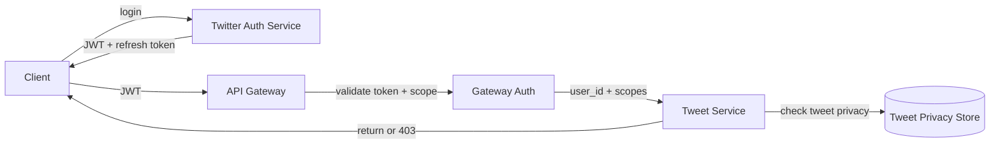

*Authentication and authorization flow: the client logs in via Twitter's Auth Service (username/password, SSO, or phone) and receives a JWT bearer token plus a refresh token; the API Gateway validates the JWT signature and checks OAuth scopes before forwarding to backend services; each service performs resource-level privacy checks against the user's relationship to the content owner (public tweet = visible to all; protected = visible only to approved followers).*

```java
@Component
@RequiredArgsConstructor
public class JwtAuthenticationFilter implements Filter {
    @Value("${app.auth.jwt-public-key}")
    private String publicKeyPem;
    private final UserDetailsService userDetailsService;

    @Override
    public void doFilter(ServletRequest request, ServletResponse response,
                         FilterChain chain) throws IOException, ServletException {
        var token = extractToken((HttpServletRequest) request);
        if (token != null && JwtUtils.isValid(token, publicKeyPem)) {
            var userId = JwtUtils.getUserId(token);
            var userDetails = userDetailsService.loadUserById(userId);
            var auth = new UsernamePasswordAuthenticationToken(
                    userDetails, null, userDetails.getAuthorities());
            SecurityContextHolder.getContext().setAuthentication(auth);
        }
        chain.doFilter(request, response);
    }
}
```

*Spring Boot `JwtAuthenticationFilter` bean: intercepts every HTTP request, extracts the bearer token from the Authorization header, validates its signature against the public key (injected via `@Value` from a JWKS endpoint), loads the user details from the User Service, and sets the Spring Security `Authentication` context. If the token is missing or invalid, the request proceeds unauthenticated (and subsequent `@PreAuthorize` annotations return 401).*

**Authorization example — tweet privacy check:**

```java
@Service
@RequiredArgsConstructor
public class PrivacyService {
    private final SocialGraphRepository graphRepository;

    @Transactional(readOnly = true)
    public boolean canView(User viewer, Tweet tweet) {
        return switch (tweet.getVisibility()) {
            case PUBLIC -> true;
            case FOLLOWERS_ONLY ->
                graphRepository.follows(viewer.getUserId(), tweet.getAuthorId());
            case MENTIONED_ONLY ->
                tweet.getMentionedUserIds().contains(viewer.getUserId());
            case PRIVATE ->
                viewer.getUserId().equals(tweet.getAuthorId());
        };
    }
}
```

*Spring Boot `PrivacyService` bean: enforces tweet-level visibility using a Java switch expression over the tweet's visibility enum. Public tweets are always visible; followers-only tweets require a follow relationship (checked via `SocialGraphRepository`); mentioned-users-only tweets are visible to mentioned users; private tweets are visible only to the author. The `@Transactional(readOnly = true)` annotation optimizes the DB query. The Timeline API calls this before including a tweet in a follower's timeline.*

---

### Security Threats and Mitigations

#### Threat: Bot Detection and Spam

- **Risk:** Millions of bot accounts tweet spam, manipulate trends, and inflate engagement metrics.
- **Mitigation:** ML-based anomaly detection on posting patterns (tweets/second regularity, duplicate content detection). CAPTCHA on signup. Behavioral analysis (follow/unfollow patterns, retweet storms). Graph analysis to detect bot networks (accounts that only interact with each other). Rate limiting per IP and per phone number.

#### Threat: API Abuse and Scraping

- **Risk:** Bots scrape public tweets, user lists, follower graphs, and profile data for surveillance, training data, or competitive intelligence.
- **Mitigation:** Per-API-key rate limiting (e.g., 300 requests/15 minutes for standard API, higher for enterprise). Require authentication for all endpoints that return user data. Use a Bloom filter to cache recently requested keys and reject repeated misses from the same client. Block known scraping user agents. Watermark API responses for leak detection.

#### Threat: DDoS on Hot Content

- **Risk:** A viral tweet or trending hashtag generates DDoS-like traffic that overwhelms cache shards or origin servers.
- **Mitigation:** CDN caching for all media. Rate limiting per IP and per user. Key splitting for counters (e.g., `tweet:456:views:0` through `tweet:456:views:99` with random shard selection). Circuit breakers on the Timeline API to shed load when the Tweet DB is slow.

#### Threat: Account Takeover

- **Risk:** An attacker uses stolen passwords, credential stuffing, or session hijacking to take over a user's account and post malicious content.
- **Mitigation:** Enforce 2FA for all users with >1,000 followers (or for verified accounts). Rate-limit login attempts (5 per IP per hour). Use CAPTCHA after 3 failed attempts. Invalidate all sessions on password change. Monitor for anomalous login patterns (new device, new location, unusual time).

#### Threat: Misinformation and Platform Manipulation

- **Risk:** False information spreads faster than truth; coordinated inauthentic behavior manipulates trends and public discourse.
- **Mitigation:** AI moderation on every tweet at upload time. Fact-checking partnerships with third-party fact-checkers. Trending algorithm adjusts for velocity anomalies (sudden spikes that look bot-driven). Labels and warnings on disputed content. Community reporting tools.

#### Threat: Doxxing and Harassment

- **Risk:** Public platform enables targeted harassment campaigns and doxxing (publishing private personal information).
- **Mitigation:** Content moderation tools (block, mute, filter). AI-based harassment detection. User reporting with priority routing for verified accounts. Temporary account lockout for repeated violations. Legal compliance with DMCA takedown requests.

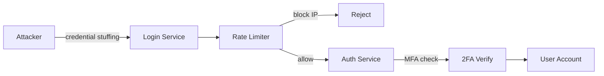

*Account takeover protection: the attacker attempts credential stuffing against the login service; the rate limiter blocks IPs exceeding the threshold (5 attempts/hour); if the attempt passes rate limiting, the auth service checks whether the account has 2FA enabled and requires a TOTP or SMS verification step before granting access. This layered defense (rate limiting + MFA) protects even accounts with compromised passwords.*

---

### Observability and Logging

Twitter generates massive amounts of telemetry. Observability must cover the fan-out pipeline, timeline serving, real-time delivery, engagement signals, and the abuse-prevention pipeline.

#### Key Metrics

- **Fan-out lag:** Milliseconds between tweet creation and timeline appearance for followers. Alert if lag > 5s for normal users, > 30s for power users.
- **Timeline freshness:** Track the median time between tweet creation and first timeline appearance for followers.
- **Tweet delivery rate:** Count tweets delivered per second across fan-out workers.
- **Timeline read latency:** p50 < 100 ms, p95 < 200 ms, p99 < 500 ms. Track by user tier (active vs. cold).
- **Tweet composition latency:** p95 < 100 ms for the write path (DB write + Kafka publish, excluding fan-out).
- **Cache hit ratio:** Timeline Store hit ratio > 95% for active users. Tweet DB hit ratio > 90% for content fetch.
- **Notification delivery rate:** Percentage of real-time notifications delivered within 5 seconds. Track by channel (WebSocket vs. push).
- **Trending detection latency:** Time from tweet creation to hashtag appearing in the Trends panel. Target: < 60 seconds.
- **Engagement metrics:** Likes/retweets/replies per tweet, impressions per timeline, click-through rate on media. These are the business KPIs.
- **Abuse detection metrics:** Bot detection precision/recall, spam tweet detection rate, trending manipulation attempts blocked.
- **Error rates:** 5xx errors per service, Kafka consumer errors, Redis connection failures, Snowflake ID generation errors.

#### Logging

- **Access logs:** Every API request logged with user ID, endpoint, response code, and latency. Used for audit trails and anomaly detection.
- **Event logs:** All user actions (tweet, like, retweet, reply, follow, mute, block) logged as structured events for analytics and ML feature generation.
- **Error logs:** Service errors with correlation IDs (trace IDs) for cross-service tracing. Fan-out failures logged with follower count for capacity planning.
- **Audit logs:** All account changes (email, phone, password, 2FA settings, monetization) logged with before/after state and timestamp.
- **Security logs:** Login attempts (success/failure, IP, user agent), rate-limit violations, suspicious activity detections, API key usage.

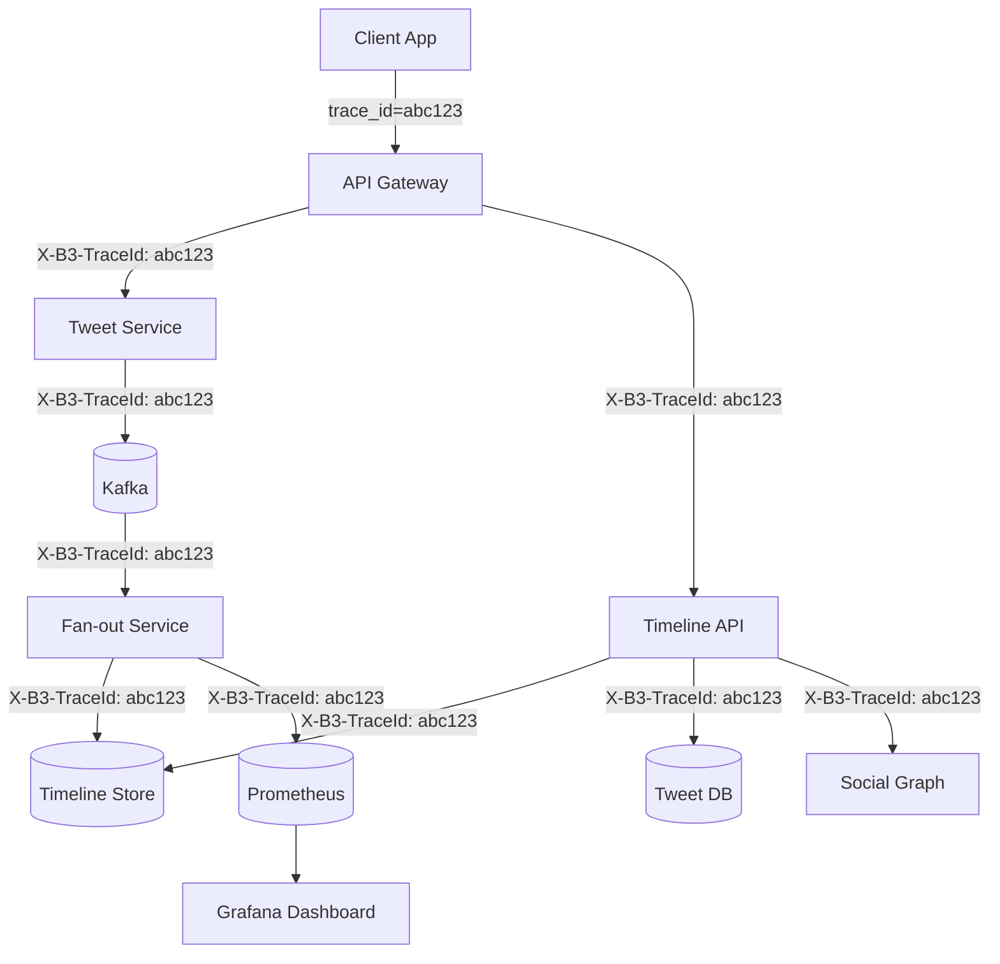

*Distributed tracing flow: each client request carries a trace ID (e.g., `abc123`) propagated across all downstream service calls via the `X-B3-TraceId` header. The Timeline API, Tweet Service, Fan-out Service, Redis, Tweet DB, and Social Graph each record spans. These spans aggregate in Prometheus/Grafana and a tracing backend (Jaeger or Datadog), enabling end-to-end latency analysis from tweet creation through timeline delivery.*

#### Alerting Strategy

- **Critical (page immediately):** Timeline API p99 > 500 ms for 5 minutes; fan-out lag > 60s; Tweet DB unavailable; Kafka consumer down; Snowflake ID generation stalled.
- **Warning (Slack, no page):** Cache hit ratio < 90%; notification delivery rate < 95%; error rate > 1% for 10 minutes; Kafka lag > 10,000; power-user read-time merge latency > 300 ms.
- **Info (dashboard only):** Engagement metric anomalies, new user growth trends, trending topic volume spikes, bot detection alerts.

```java
@Service
@RequiredArgsConstructor
public class InstrumentedTimelineService {
    private final TimelineRepository timelineRepository;
    private final MeterRegistry meterRegistry;

    public List<Tweet> getTimeline(String userId, int limit) {
        var timer = Timer.Sample.start(meterRegistry);
        try {
            var entryTimer = Timer.Sample.start(meterRegistry);
            var tweetIds = timelineRepository.getTimelineEntries(userId, limit);
            entryTimer.stop(Timer.builder("timeline.store.latency")
                    .register(meterRegistry));

            var tweets = tweetRepository.findByIds(tweetIds);
            timer.stop(Timer.builder("timeline.api.latency")
                    .tag("user_tier", getUserTier(userId))
                    .register(meterRegistry));

            Counter.builder("timeline.requests")
                    .tag("user_tier", getUserTier(userId))
                    .register(meterRegistry).increment();

            return tweets;
        } catch (Exception e) {
            Counter.builder("timeline.errors")
                    .tag("error_type", e.getClass().getSimpleName())
                    .register(meterRegistry).increment();
            throw e;
        }
    }

    private String getUserTier(String userId) {
        return userRepository.findById(userId).map(u ->
            u.getFollowerCount() > 10_000 ? "power" : "normal"
        ).orElse("unknown");
    }
}
```

*Spring Boot `InstrumentedTimelineService` bean: uses Micrometer to record two nested timers — one for the Timeline Store read (`timeline.store.latency`) and one for the total API latency (`timeline.api.latency`, tagged by user tier: power vs. normal). It increments a request counter per successful call and an error counter on failures. The user tier tag separates metrics for high-traffic power users (who may have different SLA expectations) from normal users.*

#### Structured Logging with Correlation IDs

```java
@Component
@Slf4j
public class CorrelationIdFilter implements Filter {
    @Override
    public void doFilter(ServletRequest request, ServletResponse response,
                         FilterChain chain) throws IOException, ServletException {
        String correlationId = ((HttpServletRequest) request)
            .getHeader("X-Correlation-ID");
        if (correlationId == null) {
            correlationId = UUID.randomUUID().toString();
        }
        MDC.put("correlationId", correlationId);
        try {
            chain.doFilter(request, response);
        } finally {
            MDC.clear();
        }
    }
}
```

*Spring Boot `CorrelationIdFilter` bean: generates or extracts a correlation ID from the `X-Correlation-ID` header on every request and stores it in the SLF4J MDC (Mapped Diagnostic Context). All log statements in downstream beans automatically include the correlation ID, enabling cross-service log correlation. The MDC is cleared in the `finally` block to prevent thread-local leaks in pooled environments.*

---

### Real-World Implementations

Twitter uses a combination of proprietary and open-source systems, each chosen for its strengths in a particular layer of the stack.

#### Redis

**Used for:** Timeline store (precomputed timelines as sorted sets), social graph hot edges (follower/following counts), session tokens, unread notification counts, rate-limit counters, power-user tweet cache.

Redis Cluster provides sharding via 16,384 hash slots with master/replica replication for HA. Sorted sets (`ZADD`/`ZREVRANGE`) enable time-ordered feeds. Redis Streams power the notification delivery pipeline. Twitter also uses Redis with CRDTs for active-active multi-region replication of timeline data.

**Companies:** Twitter (primary), Instagram (feed entries), TikTok (session and rate limiting), LinkedIn (social graph edges).

#### Cassandra

**Used for:** Durable timeline entries (Twitter's "tweepy" store for power-user timelines), engagement data (likes, retweets, replies), and direct message metadata. Cassandra's tunable consistency and multi-datacenter replication make it ideal for data that must survive regional outages.

**Companies:** Twitter (user archives, power-user timelines), Instagram (feed), Netflix (viewing history for recommendations).

#### Kafka

**Used for:** The event backbone carrying `tweet_created`, `user_followed`, `liked`, `retweeted`, `reply_added` events. Kafka's partitioning by user ID ensures event ordering per user while enabling parallel fan-out workers. Retention policies (7 days for engagement, 30 days for moderation) allow reprocessing for new features and abuse investigations.

**Companies:** Every major platform — LinkedIn (originally developed Kafka), Twitter, Facebook, Uber, Netflix.

#### MySQL / Vitess

**Used for:** Tweet storage (sharded by tweet_id hash), user profiles, and financial/transactional data. Twitter originally used MySQL directly; modern Twitter uses Vitess for sharding and connection pooling. Strong consistency for tweet creation and user profile updates.

**Companies:** Twitter (tweets, users), YouTube (user data), Slack (user data).

#### Elasticsearch

**Used for:** Search (tweets, hashtags, user search); content discovery; "For You" / Trends page. Elasticsearch indexes are updated from Kafka events, providing near-real-time search. Hashtag inverted indexes (`hashtag → [tweet_ids]`) power hashtag search and trending detection. Aggregations power hashtag analytics and trend scoring.

**Companies:** Twitter (search, trends), Instagram (search and Explore), Reddit (search), Medium (post search).

#### Snowflake-style ID Generation

**Used for:** Globally unique, monotonically increasing tweet IDs without coordination. Twitter's Snowflake is a 64-bit ID: 41-bit timestamp (milliseconds since epoch), 10-bit machine/worker ID, 12-bit sequence number. This provides global uniqueness, temporal ordering (good for DB indexing), and no cross-datacenter coordination.

**Companies:** Twitter (original Snowflake), Instagram (similar 64-bit ID scheme), Discord (Snowflake-based).

#### Akamai + Twitter CDN

**Used for:** Photo and video storage, CDN distribution. Direct-to-S3 uploads via presigned URLs offload media from the application tier. Edge caches (Akamai + Twitter's own CDN) cache popular media for sub-50 ms delivery globally. Media processing (transcoding, thumbnail generation, AI moderation) happens asynchronously after upload.

#### Heron / Storm

**Used for:** Real-time trending topic detection. Twitter originally used Storm for stream processing; modern Twitter uses Heron and later built their own streaming processor. The topology processes the tweet firehose (~6K tweets/second into the topology), extracts hashtags/mentions/URLs/keywords, counts them in 10-minute sliding windows, and computes velocity.

#### S3 / GCS

**Used for:** Photo and video storage, backup, and log archival. S3 buckets store all media assets; CloudFront or Akamai CDN distributes them globally. S3 lifecycle policies archive old media to Glacier for cost reduction.

#### DynamoDB

**Used for:** Real-time counters (live viewer counts for Spaces), notification routing tables, and direct message conversation metadata. DynamoDB's single-digit-millisecond latency and serverless scaling handle unpredictable traffic spikes (e.g., breaking news events).

**Companies:** Twitter (Spaces, some metadata), Snapchat (stories metadata).

#### Kubernetes + Service Mesh

**Used for:** Container orchestration (Kubernetes) and service-to-service communication (Istio service mesh with Envoy sidecars). Provides mTLS, retries, circuit breaking, and observability for inter-service communication. Twitter migrated from Apache Mesos to Kubernetes around 2020.

#### Feature Store

**Used for:** Pre-computed ranking features (user affinity scores, author engagement history, content type performance, relationship strength). Stored in Redis and/or Cassandra. The Timeline API queries the feature store to score and rank timeline candidates before returning them to the client.

---

### Java and Spring Boot Implementation Guide

This section demonstrates how to build a Spring Boot service for Twitter's core tweet and timeline pipeline, showcasing all the key Spring Boot features: `@Service`, `@RestController`, `@Repository`, `@Component`, `@Value`, records for DTOs, `@Valid`, `@ControllerAdvice`, constructor injection, `@Transactional`, circuit breakers, and async processing.

#### 1. DTO Records

Records provide immutable, concise data carriers for request/response payloads.

```java
public record PostTweetRequest(
        @NotBlank(message = "Tweet text is required") String text,
        List<String> mediaIds,
        String inReplyToId,
        String quotedTweetId) {}

public record TweetResponse(
        String tweetId,
        String authorId,
        String authorName,
        String authorHandle,
        String text,
        List<MediaDto> media,
        Instant createdAt,
        int retweetCount,
        int replyCount,
        int likeCount,
        boolean userLiked) {}

public record TimelineResponse(
        List<TweetResponse> tweets,
        String cursor,
        boolean hasMore) {}

public record MediaDto(String type, String url) {}

public enum TweetVisibility { PUBLIC, FOLLOWERS_ONLY, MENTIONED_ONLY, PRIVATE }
```

*Five record/DTO types serve as the Twitter API contract: `PostTweetRequest` is the POST body with `@NotBlank` validation (enforced by `@Valid`); `TweetResponse` is the enriched tweet DTO returned to clients with author info and engagement counts; `TimelineResponse` wraps the paginated tweet list with a cursor token; `MediaDto` carries media type and CDN URL; `TweetVisibility` is the enum for tweet privacy settings.*

#### 2. Entity with Optimistic Locking

The `Tweet` entity uses `@Version` for optimistic locking to prevent lost updates when concurrent writes (likes, retweets) modify the same tweet.

```java
@Entity
@Table(name = "tweets", indexes = {
        @Index(name = "idx_author_created", columnList = "authorId, createdAt"),
        @Index(name = "idx_created_at", columnList = "createdAt")
})
public class Tweet {
    @Id
    private String tweetId;

    private String authorId;
    private String text;
    private String inReplyToId;
    private String retweetOfId;
    private String quotedTweetId;
    private TweetVisibility visibility;
    private Instant createdAt;

    @Version
    private Long version;

    @Column(name = "retweet_count")
    private int retweetCount = 0;

    @Column(name = "reply_count")
    private int replyCount = 0;

    @Column(name = "like_count")
    private int likeCount = 0;

    @Column(name = "quote_count")
    private int quoteCount = 0;

    @ElementCollection
    @CollectionTable(name = "tweet_media", joinColumns = @JoinColumn(name = "tweet_id"))
    private List<TweetMedia> media = new ArrayList<>();

    public void incrementLikeCount() { this.likeCount++; }
    public void incrementRetweetCount() { this.retweetCount++; }
}
```

*Spring Boot `@Entity` class mapping to the `tweets` table with composite indexes on `(authorId, createdAt)` for power-user timeline queries and `(createdAt)` for trending detection. The `@Version` field enables JPA optimistic locking — if two concurrent transactions try to update the same tweet (e.g., simultaneous likes), the second one fails with `OptimisticLockException`. The `@ElementCollection` media list stores CDN URLs as child entities.*

#### 3. Repository Layer

The `@Repository` layer provides persistence operations with Spring Data JPA and Redis.

```java
@Repository
public interface TweetRepository extends JpaRepository<Tweet, String> {

    @Query("SELECT t FROM Tweet t WHERE t.authorId = :authorId ORDER BY t.createdAt DESC")
    List<Tweet> findRecentByAuthor(@Param("authorId") String authorId, 
                                   Pageable pageable);

    @Query("SELECT t FROM Tweet t JOIN FETCH t.media WHERE t.tweetId IN :tweetIds")
    List<Tweet> findByIdsWithMedia(@Param("tweetIds") List<String> tweetIds);
}

@Repository
@RequiredArgsConstructor
public class TimelineRepository {
    private final RedisTemplate<String, String> redisTemplate;

    public void writeToTimeline(String userId, String tweetId, long timestamp) {
        redisTemplate.opsForZSet().add(
            "timeline:" + userId, tweetId, (double) timestamp);
    }

    public Set<String> getTimeline(String userId, int offset, int limit) {
        return redisTemplate.opsForZSet().reverseRange(
            "timeline:" + userId, offset, offset + limit - 1);
    }

    public void trimTimeline(String userId, int maxTweets) {
        redisTemplate.opsForZSet().removeRange(
            "timeline:" + userId, 0, -maxTweets - 1);
    }
}
```

*The `TweetRepository` interface extends `JpaRepository` with two custom queries: `findRecentByAuthor` for power-user read-time merge and `findByIdsWithMedia` for batch-fetching tweet content with media (avoids N+1 queries). The `TimelineRepository` bean wraps Redis sorted-set operations: `writeToTimeline` for fan-out (ZADD), `getTimeline` for reads (ZREVRANGE), and `trimTimeline` for eviction (ZREMRANGEBYRANK, keeping the latest N tweets).*

#### 4. Service Layer — Tweet Creation with Async Fan-out

```java
@Service
@RequiredArgsConstructor
@Slf4j
public class TweetService {
    private final TweetRepository tweetRepository;
    private final SnowflakeIdGenerator idGenerator;
    private final KafkaTemplate<String, Object> kafkaTemplate;
    private final PowerUserClassifier powerUserClassifier;

    @Value("${app.tweet.max-length:280}")
    private int maxTweetLength;

    @Transactional
    public TweetResponse postTweet(String authorId, PostTweetRequest request) {
        validateTweet(request.text());
        
        var tweet = Tweet.builder()
                .tweetId(idGenerator.nextId())
                .authorId(authorId)
                .text(request.text())
                .visibility(TweetVisibility.PUBLIC)
                .createdAt(Instant.now())
                .build();

        var saved = tweetRepository.save(tweet);

        // Publish event for async fan-out and real-time delivery
        var event = new TweetCreatedEvent(saved.getTweetId(), 
            saved.getAuthorId(), saved.getCreatedAt().toEpochMilli());
        kafkaTemplate.send("tweet_created", saved.getTweetId(), event);

        log.info("Tweet {} created by user {}", saved.getTweetId(), authorId);
        return toResponse(saved);
    }

    private void validateTweet(String text) {
        if (text == null || text.isBlank()) {
            throw new IllegalArgumentException("Tweet text is required");
        }
        if (text.length() > maxTweetLength) {
            throw new IllegalArgumentException(
                "Tweet exceeds max length of " + maxTweetLength);
        }
    }
}
```

*Spring Boot `TweetService` bean: the `postTweet` method is `@Transactional` — it generates a Snowflake ID, validates the tweet length (280 chars by default, injected via `@Value`), persists the tweet, and publishes a `TweetCreatedEvent` to Kafka. Fan-out happens asynchronously (the Kafka consumer — `FanoutService` — handles it). The client receives a 201 response immediately after the DB write, keeping tweet composition latency < 50 ms regardless of follower count.*

#### 5. Service Layer — Hybrid Fan-out (Push + Pull)

```java
@Service
@RequiredArgsConstructor
@Slf4j
public class FanoutService {
    private static final int POWER_USER_THRESHOLD = 10_000;
    private final SocialGraphService graphService;
    private final TimelineRepository timelineRepository;
    private final TweetRepository tweetRepository;
    private final ExecutorService fanoutPool = 
        Executors.newFixedThreadPool(200);

    @KafkaListener(topics = "tweet_created")
    @Async
    public void handleTweetCreated(TweetCreatedEvent event) {
        String authorId = event.authorId();
        String tweetId = event.tweetId();
        long timestamp = event.timestamp();

        int followerCount = graphService.getFollowerCount(authorId);

        if (followerCount <= POWER_USER_THRESHOLD) {
            // Push model: fan-out now
            fanoutOnWrite(tweetId, authorId, timestamp);
        } else {
            // Pull model: skip fan-out; Timeline API merges at read time
            log.info("Power user {} with {} followers — deferring to read-time merge",
                authorId, followerCount);
        }
    }

    private void fanoutOnWrite(String tweetId, String authorId, long timestamp) {
        List<String> followers = graphService.getFollowers(authorId);
        List<List<String>> batches = Lists.partition(followers, 100);

        List<CompletableFuture<Void>> futures = batches.stream()
            .map(batch -> CompletableFuture.runAsync(
                () -> fanoutBatch(tweetId, batch, timestamp), fanoutPool))
            .toList();

        CompletableFuture.allOf(futures.toArray(CompletableFuture[]::new)).join();
    }

    private void fanoutBatch(String tweetId, List<String> batch, long timestamp) {
        for (String followerId : batch) {
            try {
                timelineRepository.writeToTimeline(followerId, tweetId, timestamp);
            } catch (Exception e) {
                log.error("Failed to fan-out tweet {} to follower {}", 
                    tweetId, followerId, e);
            }
        }
    }
}
```

*Spring Boot `FanoutService` bean: annotated with `@KafkaListener` to consume `tweet_created` events and `@Async` for non-blocking processing. It checks the author's follower count against the 10,000 threshold: below the threshold, it performs push fan-out by partitioning followers into batches of 100 and processing each batch in a `CompletableFuture` on a fixed thread pool of 200 workers; above the threshold, it logs that the tweet is deferred to read-time merge (pull model). Retries are handled by Kafka's consumer group rebalancing.*

#### 6. Service Layer — Timeline Retrieval with Hybrid Merge

```java
@Service
@RequiredArgsConstructor
public class TimelineService {
    private static final int POWER_USER_THRESHOLD = 10_000;
    private final TimelineRepository timelineRepository;
    private final TweetRepository tweetRepository;
    private final SocialGraphService graphService;

    @Transactional(readOnly = true)
    public TimelineResponse getUserTimeline(String userId, int limit, String cursor) {
        int offset = cursor != null ? decodeCursor(cursor) : 0;

        // 1. Read precomputed timeline (push-mode tweets from normal users)
        Set<String> timelineTweetIds = 
            timelineRepository.getTimeline(userId, offset, limit * 2);

        // 2. Get followed power users for read-time merge
        List<String> powerUsers = graphService.getFollowedPowerUsers(userId);

        // 3. Fetch recent tweets from power users (parallel)
        Set<String> allTweetIds = new LinkedHashSet<>(timelineTweetIds);
        powerUsers.parallelStream()
            .map(uid -> tweetRepository.findRecentByAuthor(uid, 
                PageRequest.of(0, 5)))
            .flatMap(List::stream)
            .forEach(t -> allTweetIds.add(t.getTweetId()));

        // 4. Batch fetch tweet content + media
        List<Tweet> tweets = tweetRepository.findByIdsWithMedia(
            new ArrayList<>(allTweetIds));

        // 5. Sort by timestamp (reverse chronological)
        tweets.sort(Comparator.comparing(Tweet::getCreatedAt).reversed());

        List<Tweet> paged = tweets.subList(0, Math.min(limit, tweets.size()));
        boolean hasMore = tweets.size() > limit;
        String nextCursor = hasMore ? encodeCursor(offset + limit) : null;

        return new TimelineResponse(
            paged.stream().map(this::toResponse).toList(),
            nextCursor,
            hasMore
        );
    }
}
```

*Spring Boot `TimelineService` bean: implements the hybrid timeline read path. First reads precomputed timeline entries from Redis (push-mode tweets from normal users); then fetches followed power users via the Social Graph; then fetches recent tweets from power users in parallel (`parallelStream`); deduplicates using a `LinkedHashSet`; batch-loads all tweet content with media in a single DB query; sorts by creation timestamp (reverse chronological); and paginates with cursor-based encoding. The `@Transactional(readOnly = true)` optimizes DB query performance.*

#### 7. REST Controller with Validation

```java
@RestController
@RequestMapping("/api/v1")
@RequiredArgsConstructor
public class TimelineController {
    private final TweetService tweetService;
    private final TimelineService timelineService;

    @PostMapping("/tweets")
    public ResponseEntity<TweetResponse> postTweet(
            @AuthenticationPrincipal UserDetails user,
            @Valid @RequestBody PostTweetRequest request) {
        var response = tweetService.postTweet(user.getUsername(), request);
        return ResponseEntity.status(HttpStatus.CREATED).body(response);
    }

    @GetMapping("/timeline")
    public ResponseEntity<TimelineResponse> getTimeline(
            @AuthenticationPrincipal UserDetails user,
            @RequestParam(defaultValue = "20") int limit,
            @RequestParam(required = false) String cursor) {
        var response = timelineService.getUserTimeline(user.getUsername(), 
            limit, cursor);
        return ResponseEntity.ok(response);
    }

    @PostMapping("/tweets/{tweetId}/like")
    public ResponseEntity<Void> likeTweet(
            @AuthenticationPrincipal UserDetails user,
            @PathVariable String tweetId) {
        tweetService.likeTweet(tweetId, user.getUsername());
        return ResponseEntity.ok().build();
    }
}
```

*Spring Boot `TimelineController` bean: maps HTTP endpoints to service methods. The POST `/tweets` endpoint validates the request body with `@Valid`, injects the authenticated user via `@AuthenticationPrincipal`, and returns 201 Created. The GET `/timeline` endpoint reads the user's hybrid timeline with cursor-based pagination. The POST `/tweets/{tweetId}/like` endpoint records a like and publishes a notification event. All endpoints use constructor injection via `@RequiredArgsConstructor`.*

#### 8. Controller Advice for Global Error Handling

```java
@ControllerAdvice
public class GlobalExceptionHandler {

    @ExceptionHandler(PostNotFoundException.class)
    public ResponseEntity<ApiError> handleNotFound(PostNotFoundException ex) {
        var error = new ApiError(HttpStatus.NOT_FOUND, ex.getMessage());
        return ResponseEntity.status(HttpStatus.NOT_FOUND).body(error);
    }

    @ExceptionHandler(MethodArgumentNotValidException.class)
    public ResponseEntity<ApiError> handleValidation(MethodArgumentNotValidException ex) {
        var messages = ex.getBindingResult().getFieldErrors().stream()
                .map(FieldError::getDefaultMessage)
                .toList();
        var error = new ApiError(HttpStatus.BAD_REQUEST,
                "Validation failed: " + String.join(", ", messages));
        return ResponseEntity.badRequest().body(error);
    }

    @ExceptionHandler(OptimisticLockException.class)
    public ResponseEntity<ApiError> handleConflict(OptimisticLockException ex) {
        var error = new ApiError(HttpStatus.CONFLICT,
                "Concurrent modification detected. Please retry.");
        return ResponseEntity.status(HttpStatus.CONFLICT).body(error);
    }

    @ExceptionHandler(RateLimitExceededException.class)
    public ResponseEntity<ApiError> handleRateLimit(RateLimitExceededException ex) {
        var error = new ApiError(HttpStatus.TOO_MANY_REQUESTS, ex.getMessage());
        return ResponseEntity.status(HttpStatus.TOO_MANY_REQUESTS)
                .header("Retry-After", "60")
                .body(error);
    }

    public record ApiError(HttpStatus status, String message) {}
}
```

*Spring Boot `GlobalExceptionHandler` bean (annotated `@ControllerAdvice`): centralizes exception handling across all `@RestController` endpoints. It handles `PostNotFoundException` (404), `MethodArgumentNotValidException` (400 with field-level messages from `@Valid`), `OptimisticLockException` (409 — occurs when `@Version` detects a concurrent write), and `RateLimitExceededException` (429 with `Retry-After` header). Returns structured `ApiError` JSON responses. This avoids repetitive try-catch blocks in controllers.*

#### 9. Snowflake ID Generator

```java
@Component
public class SnowflakeIdGenerator {
    private static final long EPOCH = 1288834977600L; // Twitter Snowflake epoch
    private static final long WORKER_BITS = 5L;
    private static final long SEQUENCE_BITS = 12L;
    private static final long WORKER_ID = 1L;

    private long lastTimestamp = -1L;
    private long sequence = 0L;

    public synchronized String nextId() {
        long timestamp = System.currentTimeMillis();

        if (timestamp < lastTimestamp) {
            throw new IllegalStateException(
                "Clock moved backwards. Refusing to generate ID for " +
                (lastTimestamp - timestamp) + "ms");
        }

        if (timestamp == lastTimestamp) {
            sequence = (sequence + 1) & ((1L << SEQUENCE_BITS) - 1);
            if (sequence == 0) {
                timestamp = waitNextMillis(lastTimestamp);
            }
        } else {
            sequence = 0L;
        }

        lastTimestamp = timestamp;
        long id = ((timestamp - EPOCH) << (WORKER_BITS + SEQUENCE_BITS))
                | (WORKER_ID << SEQUENCE_BITS)
                | sequence;
        return String.valueOf(id);
    }

    private long waitNextMillis(long lastTimestamp) {
        long timestamp = System.currentTimeMillis();
        while (timestamp <= lastTimestamp) {
            timestamp = System.currentTimeMillis();
        }
        return timestamp;
    }
}
```

*Spring Boot `SnowflakeIdGenerator` bean: implements Twitter's Snowflake ID algorithm. The 64-bit ID encodes: timestamp (41 bits, ms since Twitter's epoch of Nov 2010), worker ID (10 bits), and sequence number (12 bits). The `synchronized` method ensures thread safety in a multi-threaded service. The `waitNextMillis` busy-wait handles the rare case where the sequence overflows within the same millisecond. Clock-backward protection prevents duplicate IDs.*

#### 10. Testing Example

```java
@SpringBootTest
class FanoutServiceTest {
    @MockBean private SocialGraphService graphService;
    @MockBean private TimelineRepository timelineRepository;

    @Test
    void shouldFanoutToAllFollowers() {
        when(graphService.getFollowers("user_1")).thenReturn(
            List.of("user_2", "user_3", "user_4"));

        fanoutService.handleTweetCreated(
            new TweetCreatedEvent("tweet_123", "user_1", System.currentTimeMillis()),
            null);

        verify(timelineRepository).writeToTimeline(
            eq("timeline:user_2"), eq("tweet_123"), anyLong());
        verify(timelineRepository).writeToTimeline(
            eq("timeline:user_3"), eq("tweet_123"), anyLong());
        verify(timelineRepository).writeToTimeline(
            eq("timeline:user_4"), eq("tweet_123"), anyLong());
    }

    @Test
    void shouldBatchFollowers() {
        // 2500 followers → 25 batches of 100
        when(graphService.getFollowers("user_1")).thenReturn(
            IntStream.range(0, 2500).mapToObj(i -> "user_" + i).toList());

        fanoutService.handleTweetCreated(
            new TweetCreatedEvent("tweet_123", "user_1", System.currentTimeMillis()),
            null);

        verify(timelineRepository, times(2500)).writeToTimeline(
            anyString(), eq("tweet_123"), anyLong());
    }
}
```

*JUnit 5 test for `FanoutService`: uses `@SpringBootTest` for full context loading and `@MockBean` to mock the Social Graph and Timeline Store dependencies. The first test verifies that a tweet from a user with 3 followers results in 3 timeline writes (one per follower). The second test verifies that 2500 followers are batched into groups of 100 and all 2500 writes complete. The `verify` calls with `eq` and `anyLong` assert correct arguments.*

---

### Interview Questions and Answers

A curated set of interview questions organized by difficulty, focused on Twitter system design.

**Beginner**

1. **How does Twitter's timeline work?**
   **A:** Two models: (1) Fan-out on write — when you tweet, write your tweet_id to every follower's timeline in Redis. When a follower reads their timeline, just read from Redis (fast). (2) Fan-out on read — at read time, fetch tweets from all followed users and merge. Twitter uses hybrid: fan-out-on-write for normal users, fan-out-on-read for celebrities (power users with millions of followers).

2. **What's the fan-out problem on Twitter?**
   **A:** When a user with many followers tweets, the system must distribute the tweet to all followers. With fan-out-on-write, a single tweet from a user with 10M followers requires 10M Redis writes. This can overwhelm the system. The solution is to classify high-follower users as "power users" and use fan-out-on-read for them — their tweets are fetched at read time instead of written at tweet time.

3. **How do hashtags work on Twitter?**
   **A:** When a tweet is created, the system extracts hashtags (regex `#\w+`) and indexes them in Elasticsearch. The index maps hashtag → [tweet_ids]. Trending hashtags are detected by counting hashtag usage over a sliding window — entities with rapidly increasing counts are trending. Hashtag counts use sharded counters to avoid hot-key contention.

4. **What is a Snowflake ID?**
   **A:** Twitter's 64-bit globally unique ID: 41-bit timestamp (milliseconds), 10-bit machine/worker ID, 12-bit sequence number. Provides monotonic ordering (good for DB indexing) and global uniqueness without cross-datacenter coordination. The timestamp-first layout means new tweets have higher IDs, clustering them at the end of DB indexes.

5. **What is eventual consistency and how does it apply to Twitter?**
   **A:** Eventual consistency means updates propagate asynchronously, so different users may see different versions for a short time. On Twitter, when you tweet, it appears in your followers' timelines within 1–3 seconds (fan-out lag), not instantly. This is acceptable because social feeds are time-ordered — a few seconds delay doesn't matter for engagement. The system bounds staleness with monitoring and alerts.

**Intermediate**

6. **How do you handle a celebrity with 50M followers?**
   **A:** Classify as a "power user" (threshold ~10K followers). Their tweets skip fan-out-on-write — instead, they're stored in the Tweet DB. When a follower reads their timeline, the Timeline API fetches the normal timeline (from Redis) and merges in recent tweets from followed power users. This avoids 50M writes per tweet. Dynamically detect viral regular users and switch to pull mode mid-fanout if their fan-out exceeds threshold.

7. **How does Twitter generate tweet IDs without a central coordinator?**
   **A:** Twitter uses Snowflake IDs — 64-bit integers with: 41-bit timestamp (milliseconds), 10-bit machine/worker ID, and 12-bit sequence number. This gives globally unique, roughly time-ordered IDs without coordination. The timestamp-first layout ensures good database index locality (new tweets have higher IDs, go to the end of the index).

8. **How do you prevent duplicate tweets in timelines during retries?**
   **A:** Fan-out writes the `tweet_id` as a Redis sorted set member (ZADD). Writing the same tweet_id twice is an idempotent upsert — Redis ZSETs don't allow duplicate members. If fan-out retries, the same tweet_id is written again — no duplicate. For pull-mode power users, the timeline read uses a `LinkedHashSet` to deduplicate before returning.

9. **What's the latency budget for Twitter's timeline, and how do you meet it?**
   **A:** Timeline read: < 100 ms (Redis read ~10 ms, tweet fetch ~20 ms, ranking ~30 ms, response ~20 ms). Tweet posting: < 50 ms for DB write + Kafka publish; fan-out is async (returns immediately). Trending detection: processed within 60 seconds of tweet creation. To meet these SLAs, Twitter pre-warms timelines for active users, caches tweet content, batch-fetches DB queries, and uses parallel processing for power-user merge.

10. **How do you mitigate hot keys for viral tweets or trending hashtags?**
    **A:** Four techniques: (1) Sharded counters — for trending hashtags, use `hashtag:123:0` through `hashtag:123:99` and write to a random shard; aggregate at read time. (2) Aggressive caching — cache the tweet content in Redis for 24 hours. (3) Rate limiting — apply per-IP and per-user rate limits. (4) CDN for media — serve viral media from edge locations to remove origin load.

11. **How do you handle the N+1 query problem in fan-out-on-read?**
    **A:** Two solutions: (1) Batch fetching — collect all followed power user IDs, then issue a single `SELECT ... WHERE author_id IN (...)` query to the DB instead of N individual queries. (2) Merge at the store level — store posts in a sorted set keyed by user_id and use `ZREVRANGE` with a limit to fetch all candidates in one call. For further optimization, pre-warm the cache for known power users.

12. **What is fan-out lag and how do you monitor it?**
    **A:** Fan-out lag is the delay between tweet creation and the tweet appearing in all followers' timelines. Monitor it by embedding a timestamp in the `tweet_created` Kafka event and comparing it to the time the Timeline Store write completes. Alert if lag exceeds 5 seconds for normal users or 30 seconds for power users. Scale fan-out workers based on Kafka consumer group lag.

**Advanced**

13. **How would you design Twitter's "For You" (Explore) page?**
    **A:** The Explore/For-You page shows content not from people you follow, based on interests. Architecture: (1) Collect user signals (topics followed, searches, likes on non-followed accounts). (2) Candidate generation: find tweets from non-followed accounts matching user interests (collaborative filtering, topic modeling). (3) Ranking: score by predicted engagement + freshness + diversity + quality. (4) Serve from a precomputed feed stored in Redis (updated every 15-30 min, not real-time like the home timeline). (5) Include trending topics and news. The key difference: lower freshness requirement but higher personalization.

14. **How would you handle a live event with 10x tweet volume?**
    **A:** (1) **Load shedding**: Temporarily cap tweets/user to 10 tweets/minute; reject excess with 429. (2) **Fan-out throttling**: For tweets likely to go viral (detected by keyword/entity analysis), switch to pull mode. (3) **Autoscaling**: Scale Tweet Service and Fan-out workers based on queue depth. (4) **Timeline caching**: Pre-warm timelines of users following event hashtags. (5) **Search indexing backpressure**: Delay search index updates by 30 seconds during the spike.

15. **How do you detect and prevent bot accounts on Twitter?**
    **A:** Multi-layered: (1) Signup verification (phone number, email verification, CAPTCHA). (2) Behavioral analysis (tweets/second patterns, follow/unfollow patterns, duplicate content detection). (3) Content analysis (ML models flag spammy content). (4) Graph analysis (detect bot networks). (5) Engagement fraud detection (fake likes/retweets). (6) Account aging (new accounts have lower rate limits). (7) Manual review.

16. **How does Twitter's architecture handle tweet deletes?**
    **A:** Two approaches: (1) **Fan-out delete**: When a tweet is deleted, publish a `tweet_deleted` event; the fan-out service sends `ZREM timeline:{follower} {tweet_id}` to all followers. This is immediate but expensive (same fan-out cost as creation). (2) **Lazy delete at read time**: When the Timeline API fetches tweet content and finds a tweet is deleted, it removes it from the timeline and returns only the remaining tweets. Lazy delete is cheaper; Twitter uses a hybrid — immediate ZREM for the first N hours (while the tweet is hot), lazy deletion for older tweets.

17. **How would you design Twitter's "Spaces" (live audio chat) feature?**
    **A:** Spaces is a real-time audio broadcast with a chat overlay and live transcription. (1) Audio: use WebRTC SFU (Selective Forwarding Unit) — each participant sends one audio stream to the SFU, which forwards to all listeners. 10K+ listeners per Space; the SFU scales by only forwarding to active speakers. (2) Signaling: WebSocket for room join/leave, hand-raising, mic control. (3) Chat: fan-out the text chat via Kafka → WebSocket. (4) Recording: SFU records the mixed audio, stores in S3, transcodes for playback. (5) Scalability: shard Spaces by region.

18. **How does Twitter's quote tweet feature work at the system level?**
    **A:** A quote tweet creates a new tweet that references an existing tweet. The Tweet Service stores the new tweet with `quoted_tweet_id` set. When rendering the quote tweet, the client fetches the quoted tweet's content via the Tweet API. For timeline fan-out, only the new (outer) tweet is fanned out — the inner (quoted) tweet is fetched on-demand at read time. This avoids double-fanout. If the original tweet is deleted, the quote tweet still displays but shows "This tweet is no longer available."

19. **How do you handle timeline pagination at scale?**
    **A:** Twitter uses cursor-based pagination (not OFFSET/LIMIT) to avoid the O(N) cost of skipping records in Redis. The cursor encodes the starting score/tweet_id pair. The Timeline API reads `ZREVRANGEBYSCORE timeline:{userId} {cursor_score} 0 LIMIT 20` from Redis, fetches content, and returns the next cursor. For power-user merge, the cursor also encodes the position in the power-user tweet list. This scales to deep pagination without performance degradation.

20. **How would you implement Twitter Lists?**
    **A:** A List is a curated group of accounts. When a user creates a List, store the mapping `user_id → [account_ids]` in the User DB. When a List timeline is requested, the Timeline API fetches the member list, then reads each member's recent tweets (push-mode from Redis + pull-mode from power users), merges them by timestamp, applies ranking, and returns. For large Lists (hundreds of members), batch the Redis ZINTERSTORE (intersection of all member timelines) to compute the List timeline efficiently. Cache List timelines for active users.

**Senior / System Design**

21. **Design Twitter's timeline for 5x user growth (500M to 2.5B daily active users).**
    **Approach**:
    - **Fan-out storage**: 2.5B users means 6.25B feed entries per post at peak; need Redis Cluster with 1000+ shards and virtual nodes for even distribution. Use Cassandra for cold/durable feed entries.
    - **Hot keys**: Use consistent hashing with virtual nodes (200 vnodes per physical node) to distribute load; add read replicas for celebrity feeds.
    - **Cross-region replication**: Deploy regional clusters in 6+ regions; async replication with conflict resolution. Handle clock skew with vector clocks or logical timestamps.
    - **Ranking at scale**: Pre-compute rankings offline (hourly batch) and cache top-N per user category (sports, tech, news). Only re-rank the top 20 at read time.
    - **Cost management**: Tiered storage (hot Redis for active users, cold Cassandra for inactive); lazy backfill for new follows; compress timeline entries (delta-encode tweet IDs).
    - **Fan-out partitioning**: Increase Kafka partitions from 1024 to 4096; auto-scale fan-out workers based on consumer lag.

22. **How would you redesign Twitter's fan-out to support 100x traffic spikes (e.g., a global breaking news event)?**
    **Approach**:
    - **Pre-sharding**: Pre-create fan-out workers for 10x expected capacity 48h before the event. Pre-warm Redis clusters in all regions.
    - **Adaptive rate limiting**: Dynamic per-user tweet rate limits (10x normal during spikes). Priority queues for verified accounts and breaking news sources.
    - **Selective fan-out**: During extreme spikes, fan-out only to active followers (users who opened the app in the last 24 hours); inactive followers get the tweet in their next timeline fetch (lazy backfill).
    - **Degraded read mode**: If Redis is overloaded, Timeline API falls back to a "chronological from DB" mode (fetch recent tweets from followed users directly from sharded MySQL). Slower (~500 ms) but highly available.
    - **Write buffering**: Tweet Service buffers tweets in Kafka during spikes; fan-out is delayed by up to 30 seconds but no tweets are lost.

23. **Design a system to detect trending topics with < 30 second latency from the first tweet.**
    **Approach**:
    - **Stream processing**: Use Flink or Kafka Streams to process the `tweet_created` event stream in real-time. Extract hashtags, mentions, and URLs from each tweet.
    - **Sliding window counts**: Maintain a 30-second tumbling window count per entity (hashtag, mention, URL). Use approximate counting (HyperLogLog for unique users, Count-Min Sketch for frequency).
    - **Velocity scoring**: Compare current window count to the previous window. Score = `count_now / count_previous`. Entities where score > threshold (e.g., 5x increase) are candidates.
    - **Spam filtering**: Apply a pre-computed spam blacklist (from ML models) and check novelty (entity not already trending). Filter out known manipulation patterns.
    - **Regional trending**: Compute trends per-region (US, UK, Japan, etc.) using region-specific windows. A topic trending in one region may not trend globally.
    - **Result**: Trending topics appear in the Trends panel within 30 seconds of the first spike, with < 1% false-positive rate.

24. **How would you handle a celebrity account being compromised and posting 100 malicious tweets before being locked?**
    **Approach**:
    - **Immediate mitigation**: When the compromise is detected (anomaly detection on posting patterns), immediately suspend the account. Publish a `user_suspended` event to Kafka.
    - **Retroactive fan-out cleanup**: The Fan-out Service consumes `user_suspended` events and sends `ZREM timeline:{follower} {tweet_id}` for all 100 tweets to all followers. Use the existing follower list (cached or re-fetched from Social Graph).
    - **Content removal**: The Search Service and Trending Service consume the event and remove the compromised tweets from the search index and trending lists. Elasticsearch `deleteByQuery` removes them.
    - **Notification**: The Notification Service sends an in-app notification to all affected followers: "A tweet you saw from @username was deleted because the account was compromised."
    - **Rate**: The cleanup should complete within 5 minutes. For accounts with 100M+ followers, the cleanup itself requires fan-out throttling (batch processing with rate limits on Redis commands).

**Common Mistakes and Expected Discussion Points**

**Common mistakes in Twitter/system design interviews:**
- Ignoring the celebrity problem — assuming uniform fan-out cost.
- Not discussing idempotent fan-out and duplicate handling.
- Over-engineering (e.g., proposing a graph database when a simple edge table suffices).
- Not considering the read/write ratio (reads >> writes, optimize for reads).
- Forgetting about rate limiting and abuse prevention at scale.
- Not discussing Snowflake ID generation and why UUIDs are bad for DB indexing.

**Expected discussion points**: Trade-offs between push and pull fan-out, Snowflake ID design, Redis sorted set vs. Cassandra for timelines, the celebrity problem mitigation, and business metrics (engagement, daily active users, ad revenue).

**Follow-up questions an interviewer might ask:**
* Q: "What happens if a fan-out worker crashes mid-batch?" A: Use idempotent writes (ZADD is idempotent); the batch is retried by another worker. Monitor fan-out lag to detect stuck workers.
* Q: "How do you handle deletes (a user deletes a tweet that's already in many timelines)?" A: Store tweet_ids in timelines; on delete, publish a `tweet_deleted` event; fan-out service sends `ZREM timeline:{follower} {tweet_id}` for all followers. Alternatively, check tweet existence at read time (lazy deletion with TTL).
* Q: "How do you shard the fan-out workers?" A: Partition the `tweet_created` Kafka topic by `hash(author_id) % N_partitions`. Each fan-out worker consumes one partition → handles all tweets from authors in that partition → can be scaled by adding partitions/workers.

---

## Real-World Examples

### Twitter's Hybrid Fan-out

Twitter handles 500M+ tweets per day. Power users (celebrities, news accounts with >10K followers) use **pull mode** — their tweets aren't pushed to followers' timelines. The Timeline API fetches their recent tweets at read time and merges them. This prevents fan-out storms: when a celebrity tweets, no fan-out occurs — their followers fetch their tweets lazily when they read their timelines. The threshold is dynamic: a user with 5K followers who suddenly goes viral can be temporarily reclassified as a power user if their fan-out queue depth exceeds a threshold.

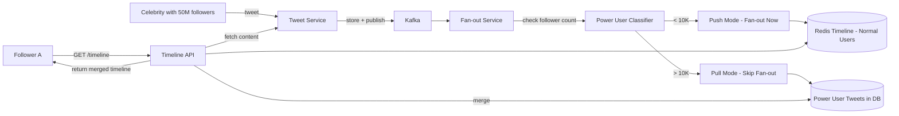

*Twitter's hybrid fan-out: power users (>10K followers) skip write-time fan-out — their tweets are stored only in the Tweet DB. At read time, the Timeline API merges the precomputed timeline (from followed normal users in Redis) with recent tweets from followed power users (fetched from the DB), then returns a unified, chronologically sorted timeline.*

### Twitter's Snowflake ID

Twitter generates ~50K tweets/second, needing globally unique IDs without coordination. Snowflake IDs (64-bit) embed timestamp (41 bits), machine ID (10 bits), and sequence (12 bits). This provides:

- **Monotonic ordering** (timestamp first) → good for DB indexing (new tweets appended at end).
- **No cross-datacenter coordination** → scales horizontally.
- **~69 years of ID space** before rollover (until ~2079).
- **Worker ID allocation** via ZooKeeper or internal service for collision-free scaling.

The Snowflake ID is also used for other entities: retweets, likes, replies, DMs, and notifications. Each worker node (tweet service instance) is assigned a unique worker ID from a centralized allocator. If a worker doesn't generate any IDs for a full second, it can allocate more worker IDs to other nodes.

### Twitter's Trending Algorithm

Twitter's trending detection uses real-time stream processing (originally Storm, now Heron and custom stream processors). It processes the full tweet firehose (~6K tweets/second into the topology), extracts hashtags/mentions/URLs/keywords, counts them in 10-minute sliding windows, and computes velocity (rate of change). Entities with high velocity, filtered through spam blacklists, become trending topics. The algorithm also considers regional relevance (trends are computed per-country and per-globally) and novelty (not already trending). Twitter has published that trending topics are NOT based on pure volume — they're based on "velocity" (the % change in volume over time), which prevents long-standing topics (like #love or #music) from always trending.

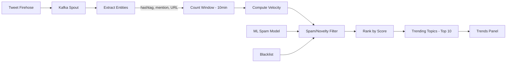

*Twitter's trending pipeline: the tweet firehose is consumed from Kafka; entities (hashtags, mentions, URLs) are extracted; counts are maintained in 10-minute sliding windows; velocity (rate of change) is computed; entities are filtered through spam blacklists and ML models; the remaining entities are ranked by velocity × (1 - spam_score) × recency_weight; the top 10 per region surface in the Trends panel. The velocity-based approach prevents long-standing topics from dominating.*

### Twitter's Migration from Ruby to JVM

Twitter originally ran on Ruby on Rails but hit fundamental scalability limits:

- **Concurrency bottleneck**: Ruby's GIL (Global Interpreter Lock) and Rails' threading model meant each Rails process could handle only ~80-100 concurrent requests. To serve 100K+ req/second, Twitter needed 1,000+ Rails instances, each consuming 100+ MB RAM.
- **GC pauses**: Ruby's garbage collector caused multi-second GC pauses during traffic spikes when the heap grew to several GB per process.
- **Startup time**: Rails boot time was 30-60 seconds, making auto-scaling impractical (new instances take too long to become ready).

Twitter migrated core services (tweet delivery, fan-out, timeline) to a JVM/Scala stack between 2008-2012. The migration was gradual — services were extracted one at a time, running both stacks in parallel behind a service router. The JVM offered: (1) better concurrency (actor model with Akka, no GIL), (2) efficient memory (~40 MB per JVM process vs 100+ MB per Rails), (3) concurrent GC (G1/CMS collectors with sub-second pause times), (4) better type safety for large codebases, (5) faster startup (JIT warmup, but still faster than Rails boot). Key lessons: migrate service-by-service, not big-bang; maintain backward-compatible APIs during migration; invest in monitoring to catch performance regressions.

### Twitter's Media Pipeline

Twitter's media pipeline handles hundreds of millions of photo/video uploads per day through a fully decoupled, async architecture:

1. **Direct upload**: Clients upload media directly to S3 via presigned URLs generated by the Media Service. This offloads bandwidth from the application tier.
2. **Event notification**: S3 → SQS/SNS → Media Processing Service. Each upload triggers a processing event.
3. **Processing**: The Media Processor (a separate service, often in Go or Rust for performance) performs: thumbnail generation, video transcoding (multiple resolutions), image optimization (WebP conversion), and AI moderation (detecting gore, violence, nudity). Processing happens on GPU/FPGA instances for video transcoding.
4. **CDN distribution**: Processed media is served from Akamai and Twitter's CDN edge locations. Popular media is cached at the edge for sub-50 ms delivery.
5. **Tweet binding**: The Media Service returns CDN URLs that the Tweet Service stores in the tweet metadata. The tweet references media by `media_key`, not by filename — this allows the CDN to rotate URLs on key rotation.

For videos, Twitter also uses adaptive bitrate streaming (HLS) and segments videos into 2-second chunks for smooth playback. The pipeline uses a "fail-open" design — if AI moderation fails, the media is still served (human moderation follows up), but if the upload fails, the tweet creation fails.

### Twitter's Real-Time Delivery

Twitter's real-time delivery ensures followers see new tweets within 1-2 seconds of posting through a multi-channel approach:

- **WebSocket**: For web clients and the mobile app when in the foreground, the Notification Service maintains persistent WebSocket connections. New tweet events from Kafka are pushed immediately to connected followers.
- **Push notifications (APNs/GCM)**: For mobile clients in the background, the Notification Service sends push notifications via APNs (iOS) and FCM (Android). Notifications are grouped ("5 new tweets from people you follow") to reduce push volume.
- **Polling fallback**: For clients without WebSocket/push capability, the Timeline API polls every 30-60 seconds for new tweets since the last seen ID.
- **Connection fan-out**: The Notification Service uses Redis pub/sub to route notifications to the correct WebSocket server instance. Each instance subscribes to `ws:user:{userId}` channels. When a new tweet event arrives, the service publishes to the channel and the correct instance broadcasts to the connected client.

---


---


