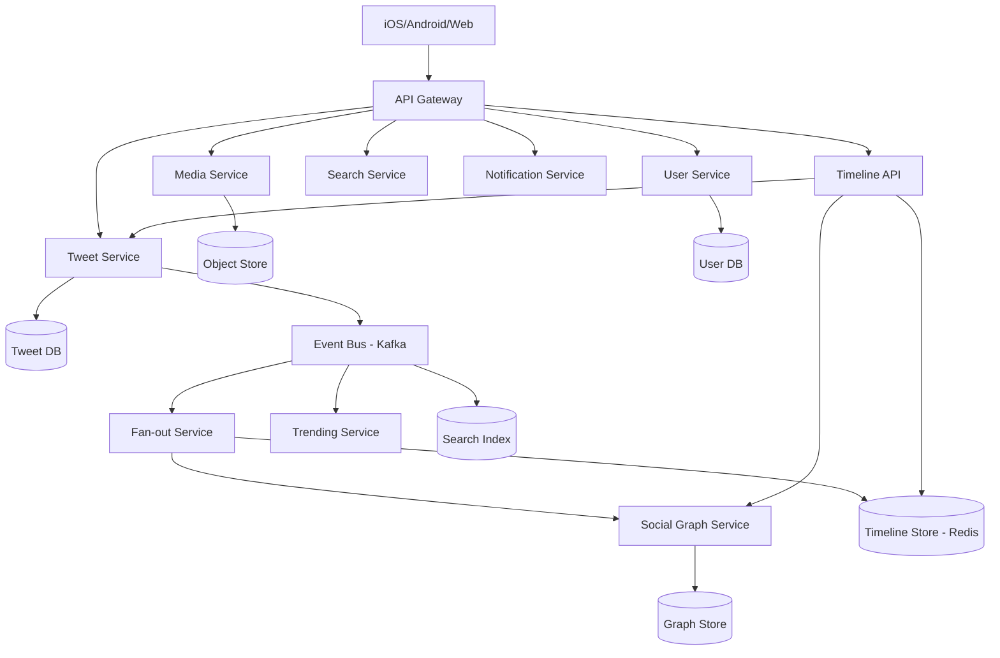
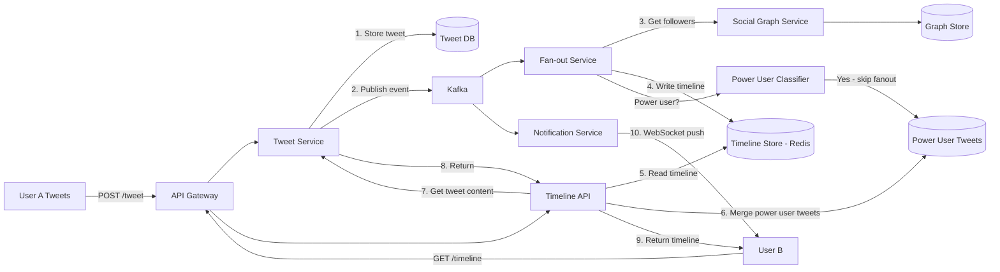

# Design Twitter

## Blogs and websites

## Medium

## Youtube

- [System Design for Twitter (Timeline, Live Updates, Tweeting) | System Design Interview Prep](https://www.youtube.com/watch?v=_QqpDpbppT8w)

---

## Theory

### What Is It?

Twitter is a microblogging and social networking platform where users post short messages (tweets, up to 280 characters), follow other users, and consume a real-time timeline of tweets from their network. Unlike general social platforms, Twitter's core value is real-time public conversation — breaking news, live events, trending topics, and public discourse. The system must handle massive write throughput (millions of tweets per minute during events), fan-out to millions of followers, and real-time delivery with low latency.

### Why Does It Exist?

Twitter exists to enable real-time public conversation at global scale. Unlike traditional media (newspapers, TV) which broadcast on fixed schedules, Twitter allows anyone to publish instantly and for others to see it immediately. The platform serves as a real-time information network — breaking news, emergency alerts, live event commentary — where speed and breadth of distribution matter more than polish.

### What Problem Does It Solve?

* **Real-time fan-out**: When a user tweets, the system must make it visible to millions of followers within seconds. The fan-out problem is acute on Twitter because power users (celebrities, news accounts) have massive follower counts.
* **Timeline generation**: A user's home timeline must merge tweets from all followed accounts in reverse-chronological order, fast and at scale.
* **High write throughput**: During live events (sports, elections, breaking news), millions of tweets are posted per minute — the write path must scale horizontally.
* **Trending topics**: Detect and surface what's being discussed globally in real-time, with spam/manipulation resistance.
* **Hashtag indexing**: Tweets with the same hashtag must be grouped and searchable.
* **Tweet storage and retrieval**: Tweets are immutable but must be served fast to millions of concurrent timeline readers.

### Important Subtopics

1. Fan-out on write vs fan-out on read vs hybrid
2. Timeline (home feed) storage and retrieval
3. Tweet storage architecture
4. Hashtag indexing and search
5. Trending topics detection
6. Real-time delivery and live updates
7. Rate limiting and spam protection

## Characteristics

| Characteristic | What it means | Why it matters | How it works |
|---|---|---|---|
| **Real-time timeline** | Followers see new tweets within seconds of posting | Twitter's value is real-time information | Fan-out service writes tweet_id to each follower's timeline |
| **Microblogging** | Short-form content (280 characters) | Encourages frequent posting; easy to consume quickly | Fixed-length text + optional media |
| **Asymmetric following** | Users can follow without mutual consent | Enables influencer/follower model | Directed edges in social graph |
| **Public by default** | Tweets are public unless protected | Enables discovery and viral content | Public search index |
| **Hashtags** | Topic-based grouping via #tag | Enables content discovery by topic | Inverted index on hashtags |
| **Trending topics** | Real-time popular discussion topics | Drives engagement and news discovery | Sliding-window count over hashtag/tweet frequency |
| **High write throughput** | Millions of tweets per minute during events | Must not lose tweets or delay delivery | Sharded tweet service, async fan-out |

## Components

| Component | Purpose | Responsibilities | Relationship | Real-world Example |
|---|---|---|---|---|
| **Tweet Service** | Create/retrieve tweets | Store tweet content, handle writes, enforce limits | Publishes to fan-out; stores in Tweet Store | Twitter Tweet Service |
| **Fan-out Service** | Distribute tweets to followers | Write tweet_id to each follower's timeline | Consumes from Event Bus; writes to Timeline Store | Twitter Fanout Service |
| **Timeline Store** | Precompute follower timelines | Fast retrieval of home timeline | Written by Fanout Service; read by Timeline API | Redis, Cassandra |
| **Social Graph Service** | Follow/unfollow relationships | Store and query follower/followee edges | Queried by Fanout Service | Twitter Relations |
| **Search Service** | Hashtag and tweet search | Index tweets, handle hashtag queries | Consumes from Event Bus | Elasticsearch, Sunfire |
| **Trending Service** | Detect trending topics | Count tweet/hashtag frequency over sliding window | Consumes from Event Bus | Twitter Storm/Heron |
| **User Service** | User profiles | Store and serve user info | Queried by all services | Twitter User Service |
| **Notification Service** | Push real-time updates | Deliver new tweets, likes, follows to users | Consumes from Event Bus; pushes via WebSocket | Twitter Push Service |
| **Media Service** | Handle photos/videos | Upload, process, serve media attachments | Stores in Object Store, CDN URLs in tweets | Twitter Media Service |
| **Event Bus** | Event streaming | Decouple services; carry tweet_created, user_followed | Used by all event-driven services | Kafka, Kestrel |

### Component Interactions

1. **Tweet posted**: Tweet Service stores tweet → publishes `tweet_created` event → Fan-out Service consumes → queries Social Graph for followers → writes `tweet_id` + timestamp to each follower's Timeline Store entry.
2. **Timeline read**: User opens app → Timeline API reads from Timeline Store → fetches full tweet content (content may be cached or fetched from Tweet Store) → applies basic ranking → returns.
3. **Trending detection**: Event Bus → Trending Service → sliding 10-minute window → count hashtags + nouns → rank by velocity → surface top trends.
4. **Real-time delivery**: Notification Service → WebSocket push to connected users.

## Patterns

### Fan-out on Write (Twitter's Primary Model)

* **What**: When a user tweets, write the tweet_id to every follower's timeline in a fast store (Redis/Cassandra).
* **Problem solved**: Home timeline reads are O(1) — just read the user's precomputed timeline. This is critical because reads >> writes on Twitter.
* **How it works**: Tweet Service writes tweet to DB + publishes event → Fan-out Service consumes → queries Social Graph Service for follower list → writes `ZADD timeline:{follower_id} {timestamp} {tweet_id}` for each follower.
* **When to use**: When follower counts are moderate (most users have < 10K followers). Twitter uses this for 99% of users.
* **When not to use**: For celebrities with millions of followers — 50M writes per tweet is too expensive.
* **Advantages**: Fast read (O(1) timeline lookup); offline users see tweet when they come back.
* **Disadvantages**: Expensive write (O(followers)); timeline storage = followers × tweets.
* **Java/Spring Boot example**:
```java
@Service
public class FanoutService {
    public void fanoutTweet(String tweetId, String authorId) {
        List<String> followers = graphService.getFollowers(authorId);
        String ts = String.valueOf(System.currentTimeMillis());
        for (String follower : followers) {
            redisTemplate.opsForZSet().add("timeline:" + follower, tweetId, ts);
        }
    }
}
```
* **Real-world example**: Twitter's primary fan-out strategy for most users.

### Fan-out on Read (Pull Model for Power Users)

* **What**: For users with massive follower counts (celebrities), don't push their tweets to followers' timelines. Instead, at read time, query their recent tweets and merge.
* **Problem solved**: Avoids fan-out storms when a celebrity tweets — no writes needed at tweet time.
* **How it works**: Tweet Service stores the tweet and tags the author as a "power user." Timeline API, when reading a user's timeline, reads the precomputed feed (from normal users) AND fetches recent tweets from followed power users, then merges by timestamp.
* **When to use**: When a small fraction of users have very large follower counts (Pareto distribution).
* **When not to use**: When all users have similar follower counts — read-time merging adds latency to every read.
* **Advantages**: Cheap tweets for power users; no write amplification.
* **Disadvantages**: Higher read latency; complex merge logic in Timeline API.
* **Real-world example**: Twitter uses pull model for verified/celebrity accounts.

### Fan-out on Write with Fan-out Throttling

* **What**: Even for regular users, if they suddenly go viral (tweet goes trending), the fan-out can spike. Use dynamic throttling — if fan-out rate exceeds threshold, switch to pull mode temporarily.
* **Problem solved**: Prevent fan-out storms from unexpected viral content.
* **How it works**: Monitor fan-out queue depth; if a tweet's fan-out exceeds N (e.g., 100K), abort fan-out-on-write and mark the tweet for read-time merge instead.
* **Real-world example**: Twitter's strategy for viral tweets from mid-tier accounts.

## Benefits

* **Real-time information**: Breaking news and live events are visible within seconds to millions of followers.
* **Public conversation**: Unlike private social networks, Twitter's public-by-default model enables discovery and discourse.
* **Hashtag-driven discovery**: Topics are organized and discoverable via hashtags, enabling content surfacing beyond the social graph.
* **Viral content potential**: Any tweet can go viral, reaching millions who don't follow the author — driving engagement and platform value.
* **Live event coverage**: Sports, concerts, news events are covered in real-time by both professional and citizen journalists.
* **Influencer economy**: Asymmetric following enables influencer/follower relationships that drive business models.

## Pros

* **Sub-second fan-out**: Tweets are typically delivered to most followers within 1–2 seconds of posting.
* **Massive scale**: Handles 500M+ tweets per day, with peaks of millions per minute during live events.
* **Global real-time**: Users worldwide see breaking news simultaneously.
* **Public API**: Rich APIs enable third-party clients, analytics, and research.
* **Search and discovery**: Full-text search across all public tweets enables information discovery.

## Cons

* **Information overload**: The firehose of tweets is overwhelming; users must curate their feeds carefully.
* **Misinformation**: False information spreads faster than truth (6x faster, studies show).
* **Echo chambers**: Algorithms can reinforce existing beliefs, limiting exposure to diverse viewpoints.
* **Harassment and abuse**: Public platform enables trolling, harassment, and coordinated harassment campaigns.
* **Rate limits**: API rate limits (300 tweets/3-hour window per user) can frustrate power users.
* **Platform manipulation**: Astroturfing, bot networks, and coordinated inauthentic behavior are persistent problems.

## Challenges

### Technical Challenges

* **Fan-out storms**: A celebrity tweet triggers millions of fan-out writes. Requires power-user classification and pull-mode fallback.
* **Timeline consistency**: A tweet may appear in some followers' timelines before others (eventual consistency). Acceptable for Twitter, but must be bounded (< 5 seconds).
* **Hot keys**: Trending hashtags or viral tweets create hot keys (e.g., the hashtag's counter or the tweet's like count). Need sharded counters.
* **Timeline storage size**: Each user's timeline grows with their follow count × tweet rate. Need eviction policies (keep last N tweets, TTL).

### Scalability Challenges

* **Write throughput**: During breaking news or live events, tweets per second can spike 10x. The Tweet Service must scale horizontally and buffer during bursts.
* **Fan-out parallelization**: Fan-out for 10M followers requires massive parallelism. Partition followers into batches and process across a worker pool.
* **Read throughput**: Timeline reads happen much more frequently than writes. Must serve 100K+ reads/second from cache.
* **Cross-region delivery**: A tweet from the US must reach followers in Asia within seconds — requires multi-region fan-out.

### Performance Challenges

* **Feed read latency**: Home timeline must load in < 100 ms. Fan-out writes must complete in < 2 seconds.
* **Tweet composition latency**: Posting a tweet (including fan-out) should return to the user within 100–200 ms, even for users with many followers. Use async fan-out (return immediately, fan-out in background).
* **Search latency**: Hashtag search must return results in < 200 ms, even for trending topics with millions of tweets.

### Reliability Challenges

* **Lost fan-out**: If the fan-out service crashes after a tweet is stored but before fan-out completes, some followers won't see the tweet. Need idempotent fan-out with replay.
* **Duplicate delivery**: Retries may cause duplicate timeline entries — use tweet_id as a set member (deduplication) in the timeline store.
* **Partial fan-out**: If fan-out times out for some followers, they'll see the tweet later. Acceptable; monitor fan-out lag.

### Maintainability Challenges

* **Fan-out worker management**: Thousands of fan-out workers consuming from a queue. Need to handle scaling, failure detection, and work redistribution.
* **Timeline store schema evolution**: As features change (e.g., adding "quoted tweet" support), the timeline entry format must evolve without downtime.
* **Ranking model changes**: Timeline ranking changes affect user experience significantly; need careful A/B testing and rollback.

### Operational Challenges

* **Monitoring fan-out lag**: Alert if the fan-out queue depth exceeds threshold or if fan-out latency > 5 seconds.
* **Celebrity account management**: Known power users must be pre-classified so their tweets use pull mode. New viral accounts must be dynamically detected.
* **Hashtag spam**: Trending hashtags can be gamed. Need real-time spam detection on hashtag usage patterns.

### Security Concerns

* **Bot detection**: Millions of bot accounts tweet spam. Need ML-based anomaly detection on posting patterns.
* **API abuse**: Scraping and rate-limit circumvention via multiple API keys. Need IP-based and behavioral rate limiting.
* **Doxxing and harassment**: Public platform enables targeted harassment campaigns. Need content moderation and user blocking.
* **Data scraping**: Public tweets can be scraped for training data or surveillance. Need rate limiting, CAPTCHA, and API access controls.

## Best Practices

* **Async fan-out**: Return success to the user immediately after storing the tweet; fan-out happens in the background. This keeps tweet composition fast regardless of follower count.
* **Power user classification**: Pre-identify users with > N followers (e.g., 10K) and use pull mode for them. Dynamically detect viral content and switch to pull mode mid-fanout.
* **Idempotent fan-out**: Tweet_id is unique; use set semantics (Redis SADD) to prevent duplicates. If fan-out retries, same tweet_id is written again — no duplicate.
* **Timeline eviction**: Each user's timeline has a max size (e.g., 800 latest tweets). Evict oldest entries. TTL of 30 days for inactive users.
* **Caching**: Cache tweet content (not just IDs) in Redis to avoid DB round-trips for hot tweets. Cache timelines for active users.
* **Hashtag sharding**: Use sharded counters for hashtag counts (e.g., `hashtag:covid:0`, `hashtag:covid:1` — sum for total).
* **Read repair**: If a timeline entry is missing tweet content (cache miss), fetch from Tweet Store and populate cache.
* **Graceful degradation**: If fan-out is behind, serve older tweets from DB; if search is down, return empty results for new queries.

## When to Use

### Appropriate

* When real-time information distribution is critical (news, live events, public discourse).
* When the follower model is asymmetric (influencers and followers).
* When content is short-form and consumable quickly.
* When public discovery (hashtags, search) is a key feature.
* When viral content and trending topics are core to the product.

### Not Appropriate

* When content is long-form (articles, books) — better served by a CMS or newsletter platform.
* When the social graph is symmetric (Facebook friends) — Twitter's asymmetric model isn't ideal.
* When privacy is the top concern (private networks) — Twitter's public-by-default model conflicts.
* When real-time delivery isn't needed (weekly digests, batched content).

### Alternatives

* **Facebook-style feed**: Symmetric friendship model with algorithmic ranking. Better for personal content.
* **LinkedIn feed**: Professional content with weak-tie recommendations.
* **Reddit**: Topic-based communities (subreddits) rather than personal followers.

### Decision Factors

* **Follower distribution**: If a small % of users have many followers (Pareto), use hybrid fan-out.
* **Read/write ratio**: Twitter reads >> writes; optimize for low-latency timeline reads.
* **Public vs. private**: Public content enables search/discovery; private content requires stronger access control.
* **Virality requirements**: If viral content distribution is key, design for broadcast (notjust social graph).

## Use Cases

### Breaking News Distribution

* **Problem**: A major news event breaks — how do millions of users learn about it within seconds?
* **Solution**: Journalists and news orgs tweet; their tweets fan out to millions of followers; trending algorithms surface the hashtag. The firehose of real-time updates keeps users informed as the story develops.
* **Why suitable**: Twitter's real-time delivery, asymmetric following, and trending topics are purpose-built for breaking news.
* **How it works**: News account tweets → fan-out service writes to millions of followers' timelines → users see tweet in timeline within 1-2 seconds → hashtag trends → non-followers discover via search/explore.
* **Trade-offs**: Speed vs. accuracy — initial reports may be wrong (retweets of misinformation); the platform must balance speed with fact-checking.

### Live Event Coverage

* **Problem**: During a sports game or award show, millions want real-time commentary and reactions.
* **Solution**: Hashtag-based conversation (#SuperBowl, #Oscars). Users tweet reactions; these fan out to followers; the hashtag creates a shared timeline of the event.
* **Why suitable**: Twitter's real-time timeline and hashtag grouping make it the natural platform for live event commentary.
* **How it works**: During the event, tweet volume spikes → fan-out service handles burst → trending detection surfaces the event hashtag → users discover the conversation via search/trends.
* **Trade-offs**: Server load during peaks; spam/bot activity spikes during popular events; moderation challenges at scale.

### Influencer Marketing

* **Problem**: Brands want to reach targeted audiences through influencers' authentic content.
* **Solution**: Brands partner with influencers who tweet about products; tweets reach the influencer's followers (who trust their recommendations). Hashtags create campaign tracking.
* **Why suitable**: Twitter's asymmetric following model enables influencer/follower relationships; real-time delivery ensures fresh content; public nature enables hashtag tracking.
* **How it works**: Influencer tweets about product (with #sponsored, campaign hashtag) → fan-out to followers → engagement (likes, RTs, comments) → brand measures success via hashtag tracking and UTM links.
* **Trade-offs**: ROI measurement is imprecise (engagement ≠ sales); influencer fraud (fake followers); platform algorithm changes can reduce organic reach.

## Architecture

Twitter uses a **microservice architecture** with the fan-out service as the critical path. The **Tweet Service** stores tweets in a sharded database; the **Fan-out Service** consumes tweet events and writes to followers' timelines in Redis/Cassandra. A **power-user classifier** determines whether to use fan-out-on-write (push) or fan-out-on-read (pull). The **Timeline API** serves timelines, merging precomputed feeds with on-demand fetches from power users.



### Architecture Structure

* **Edge layer**: CDN for static media; API Gateway for all dynamic requests; WebSocket server for real-time push.
* **Core services**: Tweet Service, Fan-out Service, Timeline API, Social Graph, Search, Trending, Notification.
* **Data layer**: Tweet DB (MySQL sharded by tweet_id), Graph Store (Redis/MySQL for follow edges), Timeline Store (Redis for active timelines, Cassandra for cold), Search Index (Elasticsearch).
* **Event backbone**: Kafka cluster with topics per event type (tweet_created, user_followed, liked).

### Communication

* **Synchronous**: Client → API → services (REST/gRPC).
* **Asynchronous**: Tweet Service → Kafka → Fan-out Service (consume tweet_created → push to timelines).
* **Real-time**: Notification Service → WebSocket/APNs/GCM for live updates.

### Data Flow

1. **Tweet posted**: Client → Tweet Service → DB write + Kafka event → Fan-out Service consumes → queries Graph Service for followers → writes to Timeline Store.
2. **Timeline read**: Client → Timeline API → reads from Timeline Store → fetches tweet content → applies ranking → returns.
3. **Trending**: Kafka → Trending Service → sliding window count → rank → cache results.

### Scaling Strategy

* **Tweet Service**: Shard by tweet_id hash; each shard handles ~5K writes/sec.
* **Fan-out**: Partition tweet_created events by author_id; fan-out workers consume partitions; each worker handles one partition's fan-out.
* **Timeline Store**: Redis cluster; shard by user_id hash; hot timelines cached; cold evicted or moved to Cassandra.
* **Graph Store**: Shard by user_id; follow edges stored in both directions; cache hot edges.

### Failure Handling

* **Fan-out failure**: Idempotent writes (ZADD by tweet_id); retry via DLQ; monitor fan-out lag.
* **Timeline inconsistency**: Acceptable (eventual consistency); alert if lag > 5 seconds.
* **Power user detection**: Monitor fan-out queue depth; if a regular user's tweet triggers excessive fan-out, switch to pull mode dynamically.
* **Event bus outage**: Buffer in Fan-out Service; replay after recovery.

## High-Level Design



**Write flow (posting a tweet)**:
1. User A tweets → API Gateway → Tweet Service.
2. Tweet Service stores tweet in Tweet DB (MySQL sharded).
3. Tweet Service publishes `tweet_created` event to Kafka.
4. Fan-out Service consumes event → checks Power User Classifier → queries Social Graph for followers.
5. For normal users: writes `tweet_id` + timestamp to each follower's timeline in Redis (ZADD).
6. For power users: stores tweet in Power User Store; Timeline API merges at read time.
7. Returns 201 Created to user within 100 ms (fan-out is async).

**Read flow (home timeline)**:
1. User B opens app → API Gateway → Timeline API.
2. Timeline API reads User B's precomputed timeline from Redis (tweet_ids sorted by timestamp).
3. For each tweet_id, fetches content from Tweet Service (or cache).
4. Merges in any power-user tweets (fetch from Power User Store).
5. Applies basic ranking (recency, engagement) → returns timeline.

**Real-time delivery**: Notification Service listens to Kafka → pushes new tweet notifications to connected users via WebSocket.

## Deep Dive

### Internal Implementation: Twitter's Fan-out Architecture

Twitter processes 500M+ tweets per day with peaks of ~10,000 tweets/second. The fan-out architecture has evolved significantly:

**Phase 1 (2008-2010)**: Pure fan-out-on-write to Redis. Timeline = `ZADD timeline:{follower_id} {timestamp} {tweet_id}`. This worked until celebrities with millions of followers caused fan-out storms.

**Phase 2 (2012+)**: Hybrid fan-out. Users with > 10K followers (verified accounts, celebrities) are classified as "power users" — their tweets skip fan-out-on-write and are stored in a separate store. Timeline API reads the normal timeline from Redis AND fetches power-user tweets at read time.

**Phase 3 (2020+)**: Fan-out on demand with lazy evaluation. Tweets are NOT immediately fanned out. Instead, the Timeline API computes the timeline at read time, pulling from a precomputed cache for normal users and fetching recent tweets for power users. The cache is populated lazily (read-through) and warmed for active users.

**Current architecture**:

```java
@Service
public class TimelineService {
    private static final int POWER_USER_THRESHOLD = 10_000;

    public List<Tweet> getUserTimeline(String userId, int limit) {
        // 1. Get precomputed timeline from Redis (normal users' tweets)
        Set<String> timelineTweetIds = timelineStore.zrange("timeline:" + userId, 0, limit * 2);
        
        // 2. Get followed power users
        List<String> powerUsers = graphService.getFollowedPowerUsers(userId);
        
        // 3. Fetch recent tweets from power users (parallel)
        List<String> powerUserTweetIds = powerUsers.parallelStream()
            .map(uid -> tweetStore.getRecentTweets(uid, limit))
            .flatMap(List::stream)
            .map(Tweet::getId)
            .collect(Collectors.toList());
        
        // 4. Merge and sort by timestamp
        Set<String> allTweetIds = new LinkedHashSet<>();
        allTweetIds.addAll(timelineTweetIds);
        allTweetIds.addAll(powerUserTweetIds);
        
        List<Tweet> tweets = tweetStore.getByIds(allTweetIds);
        tweets.sort(Comparator.comparing(Tweet::getCreatedAt).reversed());
        
        return tweets.subList(0, Math.min(limit, tweets.size()));
    }
}
```

### Tweet Storage

Tweets are stored in a **sharded MySQL cluster** (using Vitess for sharding). Each tweet has:
- tweet_id (64-bit Snowflake ID — includes timestamp, machine ID, sequence)
- author_id (FK to user)
- text (280 chars max)
- created_at timestamp
- in_reply_to_status_id (for replies, nullable)
- retweet_of (for retweets, nullable)
- quoted_status_id (for quote tweets, nullable)
- media_keys (array of media references)
- public_metrics (retweet count, reply count, like count)

Shards are distributed by `tweet_id % N` (hash partitioning). Each shard handles ~5K writes/sec and ~50K reads/sec. Index on `(author_id, created_at)` for user timeline queries (power user mode).

### Hashtag Indexing

Hashtags are extracted from tweet text at ingest time (regex: `#\w+`). A secondary indexer creates an inverted index: `hashtag → [tweet_ids]`. The index is stored in Elasticsearch for full-text search and in Redis for trending (sliding window counts).

**Sharded counters**: The count of tweets per hashtag is stored as `hashtag:{tag}:{shard}` (e.g., 100 shards with random suffix), summed for total. This avoids hot-key contention on popular hashtags.

### Trending Topics Detection

Twitter uses **Storm** (now Heron) topologies for real-time trend detection:

1. **Spout**: Reads tweet_created events from the message queue.
2. **Extract entities**: Identifies hashtags, mentions, URLs, and keywords.
3. **Count window**: 10-minute sliding window count per entity.
4. **Velocity calculation**: Compute `count(t) - count(t-1)` — the rate of change. Entities with high velocity are trending.
5. **Filtering**: Remove spam (pre-computed blacklist), check novelty (not already trending).
6. **Ranking**: Score = velocity × (1 - spam_score) × recency_weight. Top 10 per region.

### Timeline Store (Redis)

Twitter uses Redis sorted sets for timelines. Key format: `timeline:{user_id}`, score = tweet timestamp (as epoch milliseconds), value = tweet_id.

- **Write**: `ZADD timeline:{follower_id} {timestamp} {tweet_id}`
- **Read**: `ZREVRANGE timeline:{user_id} 0 {limit-1} WITHSCORES`
- **Trim**: `ZREMRANGEBYRANK timeline:{user_id} 0 -801` (keep last 800 tweets)
- **TTL**: Set a 30-day expiration on timeline keys for inactive users.

For users with very large follow counts (but below power-user threshold), Twitter uses **incremental fan-out** — fan-out in batches with delays to avoid overwhelming Redis.

### Snowflake ID Generation

Tweet IDs are **Snowflake IDs** — 64-bit integers with:
- 41 bits: timestamp (ms since epoch)
- 10 bits: machine/worker ID
- 12 bits: sequence number (within same ms)

This ensures IDs are monotonically increasing (good for DB indexing) and globally unique (no coordination between datacenters). The 41-bit timestamp provides ~69 years of IDs.

### Caching Strategy

1. **Tweet content cache**: Cache tweet text + user info in Redis (key = tweet_id, TTL = 1 hour). Hit rate ~95% for active tweets.
2. **Timeline cache**: Cache the top 200 tweets of the most active users in Redis. Others read from DB with caching.
3. **Timeline prefetch**: For users who open the app at 9 AM every day, pre-warm their timeline cache at 8:55 AM.
4. **Power-user tweet cache**: Cache the latest 100 tweets of power users in Redis for fast merge at read time.

### Observability

* **Fan-out lag**: Monitor the Kafka consumer lag for the fan-out topic. Alert if lag > 10 seconds for normal users.
* **Timeline freshness**: Track the median time between tweet creation and first timeline appearance for followers.
* **Tweet delivery rate**: Count tweets delivered per second across fan-out workers.
* **Timeline read latency**: P95 and P99 latency of the Timeline API.
* **Power user ratio**: Track % of tweets handled in pull mode vs. push mode.

## Java and Spring Boot Implementation

### Basic Java Implementation — Tweet Service

```java
@RestController
@RequestMapping("/api/v1/tweets")
@RequiredArgsConstructor
public class TweetController {
    private final TweetService tweetService;
    private final FanoutService fanoutService;

    @PostMapping
    public ResponseEntity<TweetResponse> postTweet(
            @RequestBody PostTweetRequest request,
            @AuthenticationPrincipal UserDetails user) {
        Tweet tweet = tweetService.createTweet(user.getId(), request);
        fanoutService.fanoutAsync(tweet.getId(), tweet.getAuthorId());
        return ResponseEntity.status(HttpStatus.CREATED)
                .body(TweetResponse.from(tweet));
    }
}

@Service
public class TweetService {
    private final TweetRepository tweetRepository;

    @Transactional
    public Tweet createTweet(String authorId, PostTweetRequest request) {
        Tweet tweet = Tweet.builder()
                .id(snowflakeIdGenerator.nextId())
                .authorId(authorId)
                .text(request.getText())
                .createdAt(Instant.now())
                .build();
        return tweetRepository.save(tweet);
    }
}

@Service
public class FanoutService {
    private final SocialGraphClient graphClient;
    private final TimelineStore timelineStore;
    private final ExecutorService executor = Executors.newFixedThreadPool(200);

    @Async
    public void fanoutAsync(String tweetId, String authorId) {
        List<String> followers = graphClient.getFollowers(authorId);
        List<List<String>> batches = Lists.partition(followers, 100);

        List<CompletableFuture<Void>> futures = batches.stream()
            .map(batch -> CompletableFuture.runAsync(() ->
                fanoutBatch(tweetId, batch), executor))
            .toList();

        CompletableFuture.allOf(futures.toArray(new CompletableFuture[0])).join();
    }

    private void fanoutBatch(String tweetId, List<String> followerBatch) {
        String timestamp = tweetId.substring(0, 13); // Snowflake ID starts with timestamp
        for (String followerId : followerBatch) {
            timelineStore.zadd("timeline:" + followerId, timestamp, tweetId);
        }
    }
}
```

### Production-Oriented Implementation — Hybrid Timeline

```java
@Service
@Slf4j
public class HybridTimelineService {
    private static final int POWER_USER_THRESHOLD = 10_000;

    public TimelineResult getTimeline(String userId, int limit, String cursor) {
        // 1. Read precomputed timeline (push-mode tweets)
        Set<String> pushTweetIds = timelineStore.zrevrange(
            "timeline:" + userId, cursorOffset(cursor), limit * 2L);

        // 2. Get followed power users
        List<String> powerUsers = graphService.getFollowedPowerUsers(userId);

        // 3. Fetch power user tweets (pull-mode, parallel)
        List<Tweet> pullTweets = powerUsers.parallelStream()
            .map(uid -> tweetStore.getRecent(uid, limit))
            .flatMap(List::stream)
            .sorted(Comparator.comparing(Tweet::getCreatedAt).reversed())
            .limit(limit)
            .toList();

        // 4. Merge and return
        return TimelineResult.builder()
            .pushTweets(pushTweetIds)
            .pullTweets(pullTweets)
            .hasMore(pushTweetIds.size() == limit * 2)
            .build();
    }
}
```

### Testing Example

```java
@SpringBootTest
class FanoutServiceTest {
    @MockBean private SocialGraphClient graphClient;
    @MockBean private TimelineStore timelineStore;

    @Test
    void shouldFanoutToAllFollowers() {
        when(graphClient.getFollowers("user_1")).thenReturn(
            List.of("user_2", "user_3", "user_4"));

        fanoutService.fanoutAsync("tweet_123", "user_1");

        verify(timelineStore).zadd(eq("timeline:user_2"), anyString(), eq("tweet_123"));
        verify(timelineStore).zadd(eq("timeline:user_3"), anyString(), eq("tweet_123"));
        verify(timelineStore).zadd(eq("timeline:user_4"), anyString(), eq("tweet_123"));
    }

    @Test
    void shouldBatchFollowers() {
        // 2500 followers → 25 batches of 100
        when(graphClient.getFollowers("user_1")).thenReturn(
            IntStream.range(0, 2500).mapToObj(i -> "user_" + i).toList());

        fanoutService.fanoutAsync("tweet_123", "user_1");

        verify(timelineStore, times(2500)).zadd(anyString(), anyString(), eq("tweet_123"));
    }
}
```

## Real-World Examples

### Twitter's Hybrid Fan-out

Twitter handles 500M+ tweets/day. Power users (celebrities, news accounts with >10K followers) use **pull mode** — their tweets aren't pushed to followers' timelines. The Timeline API fetches their recent tweets at read time and merges them. This prevents fan-out storms: when Elon Musk tweets, no fan-out occurs — his ~150M followers fetch his tweets lazily when they read their timelines.

### Twitter's Snowflake ID

Twitter generates ~50K tweets/second, needing globally unique IDs without coordination. Snowflake IDs (64-bit) embed timestamp (41 bits), machine ID (10 bits), and sequence (12 bits). This provides:
- Monotonic ordering (timestamp first) → good for DB indexing.
- No cross-datacenter coordination → scales horizontally.
- ~69 years of ID space before rollover.

### Twitter's Trending Algorithm

Twitter's trending detection uses Heron (successor to Storm) topologies. It processes the full tweet firehose (~6K tweets/second into the topology), extracts hashtags/mentions/keywords, counts them in 10-minute sliding windows, and computes velocity (rate of change). Entities with high velocity, filtered through spam blacklists, become trending topics. The algorithm also considers regional relevance and novelty (not already trending).

## Interview Preparation

### Beginner Questions

**Q1: How does Twitter's timeline work?**
A: Two models: (1) Fan-out on write — when you tweet, write your tweet_id to every follower's timeline in Redis. When a follower reads their timeline, just read from Redis (fast). (2) Fan-out on read — at read time, fetch tweets from all followed users and merge. Twitter uses hybrid: fan-out-on-write for normal users, fan-out-on-read for celebrities (power users with millions of followers).

**Q2: What's the fan-out problem on Twitter?**
A: When a user with many followers tweets, the system must distribute the tweet to all followers. With fan-out-on-write, a single tweet from a user with 10M followers requires 10M Redis writes. This can overwhelm the system. The solution is to classify high-follower users as "power users" and use fan-out-on-read for them — their tweets are fetched at read time instead of written at tweet time.

**Q3: How do hashtags work on Twitter?**
A: When a tweet is created, the system extracts hashtags (regex `#\w+`) and indexes them in Elasticsearch. The index maps hashtag → [tweet_ids]. Trending hashtags are detected by counting hashtag usage over a sliding window — entities with rapidly increasing counts are trending. Hashtag counts use sharded counters to avoid hot-key contention.

### Intermediate Questions

**Q4: How do you handle a celebrity with 50M followers?**
A: Classify as a "power user" (threshold ~10K followers). Their tweets skip fan-out-on-write — instead, they're stored in a power-user tweet store. When a follower reads their timeline, the Timeline API fetches the normal timeline (from Redis) and merges in recent power-user tweets. This avoids 50M writes per tweet. Dynamically detect viral regular users and switch to pull mode mid-fanout if their fan-out exceeds threshold.

**Q5: How does Twitter generate tweet IDs without a central coordinator?**
A: Twitter uses Snowflake IDs — 64-bit integers with: 41-bit timestamp (milliseconds), 10-bit machine/worker ID, and 12-bit sequence number. This gives globally unique, roughly time-ordered IDs without coordination. The timestamp-first layout ensures good database index locality (new tweets have higher IDs, go to the end of the index).

**Q6: How do you prevent duplicate tweets in timelines?**
A: Use set semantics in Redis — `SADD` (not `LPUSH`) for timeline storage, or `ZADD` with `tweet_id` as the member (Redis sets/zsets prevent duplicate members). If fan-out retries, the same tweet_id is written again — Redis upsert handles this. For pull-mode power users, the timeline read uses a SET union to deduplicate.

**Q7: What's the latency budget for Twitter's timeline?**
A: Timeline read: < 100 ms (Redis read ~10 ms, tweet fetch ~20 ms, ranking ~30 ms, response ~20 ms). Tweet posting: < 50 ms for DB write; fan-out is async (returns immediately). Trending detection: processed within 1 minute of tweet creation.

### Advanced Questions

**Q8: How would you design Twitter's "For You" (Explore) page?**
A: The Explore/For-You page shows content not from people you follow, based on interests. Architecture: (1) Collect user signals (topics followed, searches, likes on non-followed accounts). (2) Candidate generation: find tweets from non-followed accounts matching user interests (collaborative filtering, topic modeling). (3) Ranking: score by predicted engagement + freshness + diversity. (4) Serve from a precomputed feed stored in Redis (updated every 15-30 min, not real-time like the home timeline). (5) Include trending topics and news. The key difference from home timeline: lower freshness requirement (can be batched) but higher personalization requirement.

**Q9: How would you handle a live event with 10x tweet volume?**
A: (1) **Load shedding**: Temporarily cap tweets/user to 10 tweets/minute; reject excess with 429. (2) **Fan-out throttling**: For tweets that would trigger > 100K fan-out, switch to pull mode. (3) **Autoscaling**: Scale Tweet Service and Fan-out workers based on queue depth. (4) **Timeline caching**: Pre-warm timelines of users who follow event hashtags. (5) **Rate-based sampling**: For non-paying users during extreme load, sample 1% of tweets for fan-out, store the rest for later. (6) **Read degradation**: If Timeline Store is overloaded, serve stale (10-second-old) timelines instead of failing.

**Q10: How do you detect and prevent bot accounts on Twitter?**
A: Multi-layered: (1) **Signup verification**: phone number, email verification, CAPTCHA. (2) **Behavioral analysis**: tweets/second patterns (bots tweet too regularly), follow/unfollow patterns, duplicate content detection. (3) **Content analysis**: ML models flag spammy/suspicious content. (4) **Graph analysis**: detect bot networks (accounts that follow/unfollow in lockstep, or only tweet at each other). (5) **Engagement fraud**: detect fake likes/retweets (low engagement quality). (6) **Account aging**: new accounts have lower rate limits until they build a history. (7) **Manual review**: flagged accounts reviewed by trust & safety team.

### Senior-Level Questions

**Q11: Twitter migrated from Ruby on Rails to a JVM/Scala stack. Why? What was the bottleneck?**

A: Twitter grew from a startup to 500M+ users on Ruby on Rails. The bottleneck: Rails' request-response model and Ruby's GIL meant each Rails process could handle only ~80-100 concurrent requests. To serve 100K+ req/second, they'd need 1,000+ Rails instances — each consuming 100+ MB RAM. Ruby's garbage collector also caused multi-second GC pauses during traffic spikes. Twitter migrated core services (tweet delivery, timeline) to Scala/JVM, which offers: (1) Better concurrency (actor model with Akka), (2) Efficient memory usage (20-40 MB per JVM process vs 100+ MB per Rails), (3) No-stop GC (concurrent collectors), (4) Better type safety for large codebases. The migration was gradual — they extracted services piece by piece, running both stacks in parallel.

**Q12: How would you design Twitter's "Spaces" (live audio chat) feature?**
A: Spaces is a real-time audio broadcast with a chat overlay and live transcription. (1) Audio: use WebRTC SFU (Selective Forwarding Unit) — each participant sends one audio stream to the SFU, which forwards to all listeners. 10K+ listeners per Space; the SFU scales by only forwarding to active speakers. (2) Signaling: WebSocket for room join/leave, hand-raising, mic control. (3) Chat: fan-out the text chat via Kafka → WebSocket. (4) Recording: SFU records the mixed audio, stores in object store, transcodes for playback. (5) Discovery: Spaces appear in the home feed timeline. (6) Scalability: shard Spaces by region; SFU can handle 50-100 speakers + 10K+ listeners per instance. (7) Quality: adaptive bitrate, noise suppression, automatic volume leveling.

### System Design Questions (Senior)

**Q13: Design a system to handle the Super Bowl — 50x tweet volume spike for 4 hours.**

**Approach**:
- **Pre-scaled capacity**: Pre-warm Tweet Service and Fan-out workers to 5x normal capacity 24h before. Scale API Gateway to handle 500K req/s.
- **Rate limiting with tiers**: Premium users get higher tweet limits; free users get standard limits; new accounts get lower limits. Abuse detection kicks in at 100 tweets/minute.
- **Fan-out batching**: For tweets likely to go viral (detected by keyword/entity analysis pre-game), pre-classify as pull-mode to avoid fan-out storms.
- **Timeline caching**: Pre-warm timelines for users following NFL teams, sports journalists, and known Super Bowl participants.
- **Search indexing backpressure**: Delay search index updates by 30 seconds during the spike (eventual consistency acceptable).
- **Regional routing**: Route US users to US datacenters; scale those regions 10x.
- **Degraded search**: Return "search is delayed" for non-critical queries; prioritize tweet delivery over search.
- **Monitoring**: Fan-out lag, tweet delivery latency, timeline freshness — auto-alert at 2x normal thresholds.
- **Graceful shutdown**: If capacity is truly exceeded, reject non-essential writes (likes, retweets) with 429; preserve tweet creation.

**Expected discussion points**: Rate limiting fairness across user tiers, fan-out storm mitigation strategies, timeline cache warming, search indexing backpressure, cross-region scaling, and which features to degrade under load.

**Q14: Design Twitter's "Moments" or "Topics" feature — curated content collections.**

**Approach**:
- **Content ingestion**: (1) Editorial curation — curators select and order tweets. (2) Algorithmic — trending tweets on a topic grouped automatically. (3) User contributions — users can submit tweets to a topic.
- **Topic modeling**: Use NLP to cluster tweets by topic (e.g., "NFL" topic clusters tweets mentioning NFL teams/players). Store topic → tweet mapping in Elasticsearch.
- **Ranking within topic**: Score tweets by quality (author authority, engagement rate, recency) and diversity (avoid all tweets from same author).
- **Storage**: Topic collections stored as ordered tweet_id lists; updated in near-real-time. Use Redis sorted sets (score = rank) for fast reads.
- **Search index**: Topics are discoverable via search — index topic metadata (name, description, category) in Elasticsearch.
- **Personalization**: Weight topics by the user's interests (based on past engagement) for the home screen.
- **Freshness**: For breaking news topics, auto-update with the latest tweets; for curated moments, editorial control.
- **Moderation**: Curated topics have human review; algorithmic topics use ML moderation + user reporting.

### Common Mistakes and Expected Discussion Points

**Common mistakes in Twitter/system design interviews**:
- Ignoring the celebrity problem — assuming uniform fan-out cost.
- Not discussing idempotent fan-out and duplicate handling.
- Over-engineering the solution (e.g., proposing a graph database when a simple edge table suffices).
- Not considering the read/write ratio (reads >> writes, optimize for reads).
- Forgetting about rate limiting and abuse prevention at scale.

**Expected discussion points**: Trade-offs between push and pull fan-out, Snowflake ID design, Redis sorted set vs. Cassandra for timelines, the celebrity problem mitigation, and business metrics (engagement, daily active users, ad revenue).

**Follow-up questions an interviewer might ask**:
* Q: "What happens if a fan-out worker crashes mid-batch?" A: Use idempotent writes (ZADD is idempotent); the batch is retried by another worker. Monitor fan-out lag to detect stuck workers.
* Q: "How do you handle deletes (a user deletes a tweet that's already in many timelines)?" A: Store tweet_ids in timelines; on delete, publish a `tweet_deleted` event; fan-out service sends `ZREM timeline:{follower} {tweet_id}` for all followers. Alternatively, check tweet existence at read time (lazy deletion with TTL).
* Q: "How do you shard the fan-out workers?" A: Partition the tweet_created Kafka topic by `hash(author_id) % N_partitions`. Each fan-out worker consumes one partition → handles all tweets from authors in that partition → can be scaled by adding partitions/workers.
