# Design Uber

## Blogs and websites

- [Employing QUIC Protocol to Optimize Uber's App Performance](https://www.uber.com/en-IN/blog/employing-quic-protocol/)
- [Uber's Next Gen Push Platform on gRPC](https://www.uber.com/en-IN/blog/ubers-next-gen-push-platform-on-grpc/)
- [Real-time Data Pipelines at Uber](https://eng.uber.com/data-platform/)
- [Geospatial Analysis with H3](https://eng.uber.com/h3-geospatial-dataviz/)
- [Surge Pricing at Uber](https://eng.uber.com/surge-rearchitecture/)
- [How Uber Scales Its Geospatial Data](https://eng.uber.com/geo-platform/)

## Medium

## Youtube

- [Uber's insane architecture](https://www.youtube.com/watch?v=g7FmEc5GLWs)
- [System Design Interview: Design Uber w/ a Google Engineer](https://www.youtube.com/watch?v=TYl0HiOLKUc)
- [Basic System Design for Uber or Lyft | System Design Interview Prep](https://www.youtube.com/watch?v=R_agd5qZ26Y)
- [The Genius System Behind the Uber App's Real-Time Map](https://www.youtube.com/watch?v=gHIs0Mdow8M)

---

## Theory

### Topics Covered

1. [Introduction / Problem Statement](#introduction--problem-statement)
2. [Characteristics](#characteristics)
3. [Pros](#pros)
4. [Cons](#cons)
5. [Use Cases](#use-cases)
6. [Components](#components)
7. [Architectural Patterns](#architectural-patterns)
8. [Benefits](#benefits)
9. [Challenges](#challenges)
10. [Best Practices](#best-practices)
11. [When to Use / When Not to Use](#when-to-use--when-not-to-use)
12. [Data Model and API](#data-model-and-api)
13. [Domain-Specific: Uber Architecture Deep Dive](#domain-specific-uber-architecture-deep-dive)
14. [Replication Strategies](#replication-strategies)
15. [Failure Detection and Membership](#failure-detection-and-membership)
16. [High Availability and Scalability](#high-availability-and-scalability)
17. [Performance and Optimization](#performance-and-optimization)
18. [CAP Theorem and Consistency Trade-offs](#cap-theorem-and-consistency-trade-offs)
19. [Encryption and Key Management](#encryption-and-key-management)
20. [Authentication and Authorization](#authentication-and-authorization)
21. [Security Threats and Mitigations](#security-threats-and-mitigations)
22. [Observability and Logging](#observability-and-logging)
23. [Real-World Implementations](#real-world-implementations)
24. [Java and Spring Boot Implementation Guide](#java-and-spring-boot-implementation-guide)
25. [Interview Questions and Answers](#interview-questions-and-answers)

---

### Introduction / Problem Statement

Uber is a ride-hailing platform that connects riders needing transportation with drivers offering rides through a two-sided marketplace. At its core, Uber solves the **real-time geospatial matching problem**: given a rider at a location, find the best nearby driver, compute an ETA, price the ride, and dispatch both parties — all within seconds and at global scale. Unlike static content platforms, Uber operates in real-time physical space where supply (drivers) and demand (riders) fluctuate continuously by location and time, requiring dynamic pricing (surge), low-latency geospatial indexing, live traffic-aware ETA calculation, and a high-throughput dispatch pipeline. The system must also handle the full trip lifecycle — request, match, track, rate, pay — while maintaining sub-second latency for rider-facing APIs and surviving regional outages without losing dispatch state.

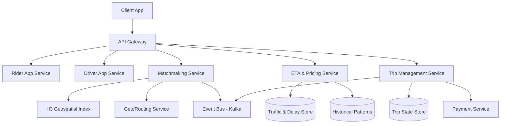

*The architecture above shows the core request path: the rider app submits a ride request through the API Gateway; the Matchmaking Service uses H3 geospatial indexing to find nearby drivers and a Geo/Routing service for distances; the ETA & Pricing Service computes estimated arrival and fare using live traffic and historical patterns; the Trip Management Service orchestrates the trip lifecycle from dispatch through payment, communicating state changes asynchronously through a Kafka event bus.*

**Problem Statement:** Design a ride-hailing platform like Uber that matches riders with nearby drivers in real-time, computes ETAs and dynamic pricing (surge) based on live supply/demand, manages the full trip lifecycle from request to payment, and scales globally to serve millions of concurrent rides while maintaining sub-200 ms matching latency and high availability during regional failures.

**The geospatial matching challenge in numbers:** A rider in downtown San Francisco at 5 PM triggers a match against thousands of nearby drivers. Each driver's location updates every 4 seconds via GPS pings. The system must query a 2 km radius, filter by availability, rank by ETA and rating, and assign a driver — all within 200 ms. During peak hours, 100K+ concurrent ride requests stress the dispatch pipeline simultaneously across hundreds of cities.

---

### Characteristics

- **Real-time geospatial matching:** The core operation — finding the nearest available driver to a rider — requires low-latency geospatial indexing (H3 hexagons) and proximity searches within a radius, executed thousands of times per second.
- **Dynamic supply/demand imbalance:** Driver supply fluctuates by time of day and location. When demand exceeds supply, surge pricing multipliers escalate the fare to balance the market.
- **Live ETA calculation:** Estimated time of arrival must account for live traffic conditions, historical travel patterns, and route deviations. ETAs are recomputed continuously as the trip progresses.
- **Dynamic pricing (surge):** Fare is computed as `base × distance × time × surge_multiplier`, where the surge multiplier is a real-time function of local demand/supply ratio, updated every 30–60 seconds.
- **High-frequency location updates:** Driver locations ping every 4 seconds via GPS, creating a continuous stream of geospatial updates that must be indexed and made queryable in near real-time.
- **Two-sided marketplace:** Both riders and drivers use mobile apps with real-time state — riders see driver arrival, drivers see trip details. State must stay synchronized across both clients.
- **Trip lifecycle management:** Each trip transitions through defined states (requested → matching → accepted → en route → in progress → completed/cancelled) with strict state-machine semantics.
- **Global scale with regional isolation:** Operations span hundreds of cities across multiple continents. Each city/region operates semi-independently with localized surge pricing and driver pools.
- **Payment integration:** In-app payments with tokenized cards, wallets, and cash options. Payment capture and driver payouts happen asynchronously post-trip.
- **Safety and rating systems:** Crash detection, driver/rider rating, and safety incident reporting integrated into the trip lifecycle without adding matching latency.

---

### Pros

- **Network effects:** Uber's value grows as more users join — more riders attract more drivers, lower wait times attract more riders, creating a virtuous cycle that establishes market dominance in each city.
- **Dynamic pricing efficiency:** Surge pricing reallocates supply to high-demand areas automatically, reducing wait times and maximizing throughput during peaks without manual intervention.
- **Real-time location intelligence:** Continuous GPS tracking enables precise ETAs, optimized dispatch, and proactive driver repositioning suggestions.
- **Global coverage with local adaptation:** Uber operates in hundreds of cities worldwide, adapting pricing and dispatch to local market conditions, regulations, and traffic patterns.
- **Multi-modal transportation:** Beyond rides, Uber offers Uber Eats, freight, and micromobility, cross-subsidizing the core ride-hailing business and increasing user lifetime value.
- **Data-driven optimization:** Massive telemetry data (GPS, traffic, pricing, ratings) feeds ML models for ETA accuracy, demand forecasting, and surge calibration.

---

### Cons

- **Regulatory and legal risk:** Ride-hailing faces ongoing regulatory battles in many jurisdictions over licensing, insurance, driver classification, and safety requirements.
- **Driver acquisition and retention:** Drivers are independent contractors with high churn. Incentive programs (surge, guarantees) increase cost and can create boom-bust cycles.
- **High operational cost:** Paying drivers 75–80% of fare revenue leaves a thin margin. Surge pricing helps but is volatile and can alienate users during price spikes.
- **Safety and trust concerns:** Incidents involving drivers or riders create reputational damage and liability. Background checks and safety features add operational overhead.
- **Commoditization and competition:** Low switching costs mean riders can easily switch to competitors (Lyft, DoorDash, local apps). Price competition erodes margins.
- **Urban congestion externalities:** By increasing demand for rides, Uber may contribute to traffic congestion, drawing criticism from city planners and environmental groups.
- **Technical complexity at scale:** Coordinating real-time geospatial matching, pricing, and dispatch across thousands of cities simultaneously requires extreme engineering sophistication.

---

### Use Cases

- **Real-time ride matching:** A rider opens the app, and within 200 ms the system finds the nearest available driver, computes an ETA, and dispatches the request. This involves H3 geospatial indexing to find nearby drivers, a routing service for travel distance, and a ranking algorithm to select the best driver based on ETA, rating, and historical cancellation rate.
- **Dynamic surge pricing:** During a rainy evening in Manhattan, demand for rides exceeds available drivers by 3x. The system detects this imbalance in real-time, applies a 2.5x surge multiplier to rides in affected H3 cells, and continuously recalibrates as drivers enter the area. The surge multiplier is communicated to riders before they confirm the ride.
- **Live ETA and trip tracking:** As a driver navigates to the rider's location, the ETA service continuously recomputes arrival time using live traffic feeds and the current GPS position. The rider sees a real-time moving dot and updated ETA on their app, with push notifications when the driver is 2 minutes away.
- **Driver repositioning:** After dropping off a rider in a low-demand area, the system suggests a nearby high-demand zone for the driver to reposition to, based on predictive demand models. Drivers who accept repositioning suggestions are prioritized for the next ride in that area.

---

### Components

| Component | Purpose | Responsibilities | Relationship |
|---|---|---|---|
| Rider App Service | Manage rider requests | Accept ride requests, track rider location, display ETA | Calls Matchmaking & ETA Services |
| Driver App Service | Manage driver state | Update driver availability, accept trip requests, report location | Calls Matchmaking & Trip Services |
| Matchmaking Service | Geospatial matching | Find nearby available drivers, rank by ETA/rating, assign best driver | Queries H3 Index, Geo Service |
| H3 Geospatial Index | Spatial partitioning | Map lat/lng to hexagonal cells, k-ring neighbor search | Queried by Matchmaking Service |
| Geo/Routing Service | Distance & routing | Compute travel distance/time between two points | Calls Google Maps / OSRM |
| ETA & Pricing Service | Estimate & price | Compute ETA from live traffic, calculate fare + surge | Reads Traffic DB, Historical DB |
| Surge Service | Dynamic pricing | Monitor demand/supply per H3 cell, compute surge multiplier | Reads request/driver counts |
| Trip Management Service | Orchestrate trips | Manage trip state machine, dispatch notifications | Communicates with Payment & Push |
| Payment Service | Handle payments | Charge rider, payout to driver, manage refunds | Integrates with Stripe / Braintree |
| Push Notification Service | Real-time messaging | Push trip updates to rider and driver apps | Listens to Kafka event bus |
| Driver App | Driver interface | Accept/decline trips, navigate, go offline | Subscribes to trip events |
| Rider App | Rider interface | Request rides, track driver, rate trip | Subscribes to trip events |
| Event Bus (Kafka) | Event propagation | Decouple services with `ride_requested`, `trip_updated`, `payment_captured` events | Used by all services |
| Trip State Store | Trip persistence | Store trip state transitions and driver assignments | Written by Trip Service, read by Services |

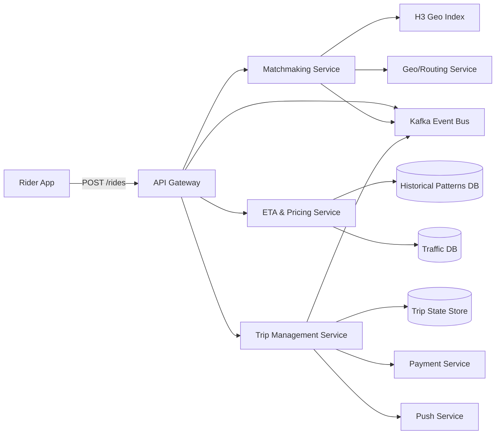

*The component diagram shows the core services and data stores. The Rider App sends a ride request to the API Gateway, which orchestrates the Matchmaking Service (using H3 geospatial indexing and a routing service), the ETA & Pricing Service (using historical and live traffic data), and the Trip Management Service (managing state in a durable store and coordinating payment and push notifications). All services communicate asynchronously through Kafka for decoupled event propagation.*

---

### Architectural Patterns

- **Microservices with database-per-service:** Each component (Matchmaking, ETA/Pricing, Trip Management, Payment) is a separate service with its own database. This enables independent deployment, scaling, and technology choice. Services communicate via REST/gRPC for user-facing requests and Kafka for async event propagation.
- **Event sourcing:** Key domain events (`ride_requested`, `trip_started`, `trip_completed`, `payment_captured`) are stored as an immutable log in Kafka. Read models (driver availability, trip status) are built by consuming the event stream. This provides auditability, replayability, and decoupling of services.
- **Command Query Responsibility Segregation (CQRS):** Write operations (requesting a ride, accepting a trip, completing a payment) go to a write-optimized model; read operations (viewing trip status, checking driver availability) use separate read-optimized models built from the event log. This enables independent scaling and optimization of read and write paths.
- **Geospatial indexing with H3:** Uber's H3 library divides the world into a hierarchical grid of hexagons. Driver locations are mapped to H3 cells, enabling efficient proximity searches (k-ring neighbors) without expensive radius calculations. This is the foundation of the matching algorithm.
- **State machine pattern:** Each trip follows a strict state machine (requested → matching → accepted → en route → in_progress → completed). State transitions are validated and persisted, preventing invalid transitions (e.g., a trip cannot be "en route" before being "accepted").
- **Circuit breaker pattern:** Services that call external dependencies (Google Maps API, payment processors) wrap calls with circuit breakers. If the dependency fails or times out, the circuit opens and the service fails fast or returns a degraded response, preventing cascading failures.

---

### Benefits

- **Dynamic market equilibrium:** Surge pricing automatically balances supply and demand without manual intervention, improving rider experience (shorter wait times during peaks) and driver earnings.
- **Real-time geospatial efficiency:** H3 indexing enables sub-5 ms proximity searches across millions of driver locations, making real-time matching feasible at global scale.
- **Independent service scaling:** Microservices architecture allows each component (matching, pricing, payments) to be scaled independently based on its own load profile.
- **Resilience through async communication:** Kafka-based event bus decouples services — a slow payment service doesn't block trip dispatch; events are queued and processed when the service recovers.
- **Operational flexibility:** Database-per-service allows choosing the right database for each use case (Redis for driver locations, Cassandra for trip history, PostgreSQL for payment data).
- **Global low-latency delivery:** Multi-region deployment with edge computing ensures that riders in any city get sub-200 ms matching latency.

---

### Challenges

- **Matching latency under load:** During rush hour, 100K+ concurrent ride requests stress the matching pipeline. Each request must query nearby drivers, compute ETAs, and dispatch — all within 200 ms while the driver pool is in constant flux.
- **Supply/demand volatility:** Driver availability fluctuates unpredictably. A sudden surge of riders in an area with few drivers creates long wait times and rider churn; the system must predict and pre-position drivers.
- **ETA accuracy in live traffic:** Predictions based on historical patterns degrade when traffic conditions change (accidents, construction, weather). ETAs must be continuously updated with live traffic feeds.
- **Geospatial index staleness:** Driver locations ping every 4 seconds, so the indexed position may be up to 4 seconds stale. The system must account for this lag during matching and ETA calculation.
- **Data consistency across regions:** Trip state must be consistent globally — a rider in one region should see the same trip status as the driver in another. Cross-region replication must balance consistency with latency.
- **Payment reconciliation:** Transactions span multiple systems (payment processor, driver payout, Uber's ledger). Failures during payment capture or payout require careful reconciliation and retry logic.
- **Cross-city failover:** If an entire city's region goes down (datacenter outage, network partition), the system must fail over to a neighboring region while preserving all active trip state and continuing to match new riders.
- **Cold-start in new cities:** When launching in a new city, there are no historical patterns for ETA or demand forecasting. The system must bootstrap surge pricing and ETA models from limited data.

---

### Best Practices

- **Use H3 for proximity search:** Store driver locations as H3 indexes at resolution 9 (~174m cells). To find nearby drivers, compute the k-ring (k=2) around the rider's cell — this covers a ~1 km radius with a simple indexed lookup instead of expensive distance calculations.
- **Async fan-out for trip events:** After a trip is dispatched, publish a `trip_dispatched` event to Kafka. Driver and rider push notifications are sent asynchronously, so a slow push service doesn't delay the matching response.
- **Circuit-break external APIs:** Wrap Google Maps API calls (for ETA/routing) with a circuit breaker and a fallback to cached historical travel times. This ensures matching continues even when the routing service is degraded.
- **State machine validation:** Enforce trip state transitions through a validated state machine. Before processing any trip command (accept, en route, complete), verify the current state allows the transition. Reject invalid transitions with a clear error.
- **Idempotent trip operations:** All trip mutations (accept, start, complete, cancel) must be idempotent — retrying a payment capture or trip completion after a network timeout should not cause double-charging or duplicate trips. Use idempotency keys.
- **Rate limiting on ride requests:** Limit each rider to a small number of concurrent ride requests (e.g., 3) to prevent abuse and reduce matching pipeline load during incidents.
- **Driver location TTL:** Cache driver locations in Redis with a short TTL (e.g., 10 seconds). Drivers whose pings have expired are marked offline and excluded from matching, preventing stale-location matches.
- **Surge pricing smoothing:** Apply surge multipliers gradually with a configurable ramp-up time (e.g., 30 seconds) to avoid shocking riders with sudden price spikes. Communicate surge clearly before the rider confirms.
- **Geofencing for regulatory compliance:** Enforce city-level licensing rules and operating hours using geofences (H3 cells or polygon boundaries). Reject ride requests that originate or terminate in restricted zones.
- **Pre-compute demand heat maps:** Every 30 seconds, aggregate ride requests by H3 cell at resolution 7 (~1.2 km) to build a demand heat map. Use this for surge calibration, driver repositioning, and capacity planning.

---

### When to Use / When Not to Use

**Use when:**

- You need to match supply and demand in real-time across a geographic area (ride-hailing, food delivery, freight).
- Users (both sides of the marketplace) have mobile devices with GPS and real-time expectations (sub-200 ms for critical operations).
- Pricing must vary dynamically based on local supply/demand conditions (surge, dynamic delivery fees).
- The service operates across multiple cities with different regulatory environments, traffic patterns, and market dynamics.
- Integration with maps, traffic, and payment systems is a core requirement, not a peripheral feature.
- You need to build predictive models for demand forecasting, ETA estimation, and driver repositioning.

**Avoid when:**

- The service is appointment-based or low-frequency (a booking platform for scheduled services doesn't need real-time matching).
- Geographic scope is limited to a single small area where demand/supply imbalances don't create a need for dynamic pricing.
- Users don't have smartphones with GPS capabilities (the system relies heavily on real-time location data).
- Regulatory frameworks prohibit dynamic pricing or require fixed-rate agreements.
- The matching problem is trivial (e.g., a single driver serving all requests — no competition or proximity constraint).

**Alternatives:**

- **Scheduled booking platform:** For services where users book in advance (appointments, reservations), a simpler system with calendar-based scheduling suffices — no real-time matching or surge pricing needed.
- **Static dispatch system:** In a traditional taxi dispatch model, a single dispatcher assigns rides from a central pool. Simpler but doesn't scale and lacks dynamic pricing.
- **Fixed-geo grid:** If the service area is small and demand is evenly distributed, a simple lat/lng bounding-box query suffices — no need for H3 hierarchical hexagonal indexing.

**Decision factors:**

- **Matching volume:** If you need >10K concurrent matches per second, the full geospatial + surge architecture is justified. Below that, simpler approaches may suffice.
- **Geographic density:** Urban environments with high demand variance benefit most from surge and real-time matching. Rural areas with sparse demand may not need dynamic pricing.
- **Latency tolerance:** If sub-second matching is critical (riders expect immediate matches), you need the full architecture. If matches can take minutes (scheduled rides), a batch process is simpler.
- **Regulatory environment:** Dynamic pricing and real-time tracking may be restricted in some jurisdictions, which constrains the viable architecture.

---

### Data Model and API

Uber's data model captures the core entities of the ride-hailing domain: riders, drivers, trips, locations, pricing, and payments. Trips are immutable once created but their state transitions through a defined lifecycle. Driver locations are high-frequency and ephemeral; trip records are durable and auditable.

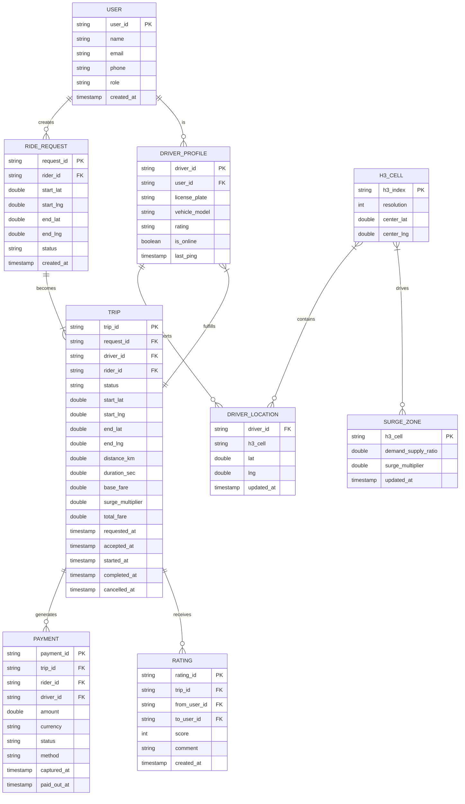

*The entity-relationship diagram models the ride-hailing domain: users create ride requests, driver profiles report locations indexed by H3 cells, ride requests become trips fulfilled by drivers, trips generate payments and ratings, and H3 cells drive surge zones. The `DRIVER_LOCATION` table is high-write and ephemeral (updated every 4 seconds); the `TRIP` and `PAYMENT` tables are durable and auditable.*

**Entity descriptions:**

- **USER:** Core entity. `user_id` (UUID), `name`, `email`, `phone`, `role` (rider/driver/both), `created_at`. Stored in PostgreSQL (durable) as the system of record.
- **DRIVER_PROFILE:** Extends USER for driver-specific attributes. `driver_id` (UUID), `user_id` (FK), `license_plate`, `vehicle_model`, `rating`, `is_online`. Cached in Redis for low-latency availability checks.
- **DRIVER_LOCATION:** High-frequency GPS updates. `driver_id` (FK), `h3_cell` (indexed for proximity search), `lat`, `lng`, `updated_at`. Stored in Redis (ephemeral, TTL 10s). Updated every 4 seconds by the driver app.
- **RIDE_REQUEST:** Rider's initial request. `request_id` (UUID), `rider_id`, start/end coordinates, `status` (pending/matched/expired). Stored in PostgreSQL; short-lived.
- **TRIP:** The core trip record. `trip_id` (UUID), linked to `request_id` and `driver_id`/`rider_id`, with full lifecycle timestamps, distances, and fare breakdown. Stored in PostgreSQL for durability and analytics.
- **PAYMENT:** Financial record. `payment_id` (UUID), `trip_id`, `rider_id`, `driver_id`, `amount`, `currency`, `status` (pending/captured/paid_out/failed/refunded), `method`, `captured_at`, `paid_out_at`. Stored in PostgreSQL with encryption at rest.
- **RATING:** Post-trip feedback. `rating_id` (UUID), `trip_id`, `from_user_id`, `to_user_id`, `score` (1–5), `comment`. Stored in PostgreSQL.
- **H3_CELL:** Geospatial indexing metadata. `h3_index` (the H3 cell ID), `resolution`, `center_lat`, `center_lng`.
- **SURGE_ZONE:** Dynamic pricing per geographic cell. `h3_cell` (PK, resolution 7), `demand_supply_ratio`, `surge_multiplier`, `updated_at`. Stored in Redis for sub-10 ms read latency during pricing.

**Indexes and Constraints:**

- `USER.email` — UNIQUE index (login, password reset).
- `DRIVER_LOCATION.h3_cell` — indexed for proximity search (find drivers in a k-ring neighborhood).
- `DRIVER_LOCATION.driver_id` — indexed for location updates.
- `TRIP.status` — indexed for filtering by status (active trips, completed trips).
- `TRIP.driver_id + created_at` — composite index for driver trip history.
- `PAYMENT.status` — indexed for reconciliation (failed payments, pending payouts).
- `H3_CELL.h3_index` — primary key for geospatial lookups.

**Partitioning / Sharding:**

- **TRIP:** Sharded by `trip_id` hash (UUID-based consistent hashing). Cross-city queries use scatter-gather.
- **DRIVER_LOCATION:** Sharded by `h3_cell` hash at resolution 7 — all drivers in the same geographic area land on the same shard, enabling efficient proximity queries.
- **PAYMENT:** Sharded by `payment_id` hash. Financial data is kept in a separate cluster with stricter access controls.
- **SURGE_ZONE:** Sharded by `h3_cell` hash — each geographic cell's surge data is co-located with its driver pool.

**API Contract:**

| Method | Endpoint | Purpose | Rate Limit |
|---|---|---|---|
| POST | `/api/v1/rides` | Request a ride | 10 req/min |
| GET | `/api/v1/rides/{rideId}` | Get ride status | 60 req/min |
| POST | `/api/v1/rides/{rideId}/accept` | Driver accepts | 10 req/min |
| POST | `/api/v1/rides/{rideId}/start` | Driver starts trip | 10 req/min |
| POST | `/api/v1/rides/{rideId}/complete` | Driver completes trip | 10 req/min |
| POST | `/api/v1/rides/{rideId}/cancel` | Cancel a ride | 10 req/min |
| GET | `/api/v1/drivers/nearby` | Find nearby drivers | 120 req/min |
| POST | `/api/v1/payments` | Capture payment | 60 req/min |

**POST /api/v1/rides — Request:**

```http
POST /api/v1/rides HTTP/1.1
Authorization: Bearer <jwt>
Content-Type: application/json

{
  "start_lat": 37.7749,
  "start_lng": -122.4194,
  "end_lat": 37.3382,
  "end_lng": -121.8863,
  "rider_id": "rdr_abc123"
}
```

**POST /api/v1/rides — Response:**

```json
HTTP/1.1 201 Created
{
  "ride_id": "ride_456",
  "status": "matching",
  "eta_seconds": 180,
  "surge_multiplier": 1.5,
  "estimated_fare": {
    "currency": "USD",
    "amount": 22.50,
    "breakdown": {
      "base_fare": 2.00,
      "distance_fare": 12.50,
      "time_fare": 6.00,
      "surge": 2.00
    }
  },
  "driver": {
    "driver_id": "drv_xyz789",
    "name": "John",
    "vehicle_model": "Toyota Camry",
    "rating": 4.87,
    "license_plate": "ABC123",
    "eta_seconds": 180
  }
}
```

**Real-Time WebSocket API:**

| Event | Direction | Payload |
|---|---|---|
| subscribe | Client → Server | `{"type": "subscribe", "channels": ["trip:trip_456"]}` |
| trip_update | Server → Client | `{"type": "trip_update", "trip_id": "trip_456", "status": "driver_en_route"}` |
| driver_location | Server → Client | `{"type": "driver_location", "lat": 37.775, "lng": -122.418}` |

**Status codes:** `200` OK, `201` Created, `202` Accepted (accepted but matching pending), `204` No Content (cancelled), `400` Invalid request, `401` Auth required, `403` Forbidden (driver not accepting), `404` Not found, `409` Conflict (driver already assigned), `429` Rate limited, `503` Temporarily unavailable (no drivers nearby).

---

### Domain-Specific: Uber Architecture Deep Dive

This section covers the core technical challenges that are unique to ride-hailing platforms: how to efficiently match riders with nearby drivers using geospatial indexing, how to compute live ETAs that account for traffic, how to calculate dynamic pricing (surge) based on real-time demand/supply, how the dispatch algorithm selects and ranks drivers, and how the trip lifecycle is managed from request to payment. These topics are the heart of Uber's system design.

#### Geospatial Indexing with H3

Uber's geospatial indexing system is built on **H3**, a hierarchical hexagonal grid system that divides the Earth's surface into uniform hexagonal cells at 16 resolution levels (0–15). Each cell has a unique 64-bit integer identifier, making spatial operations — proximity searches, nearest-neighbor lookups, and geographic aggregation — extremely efficient.

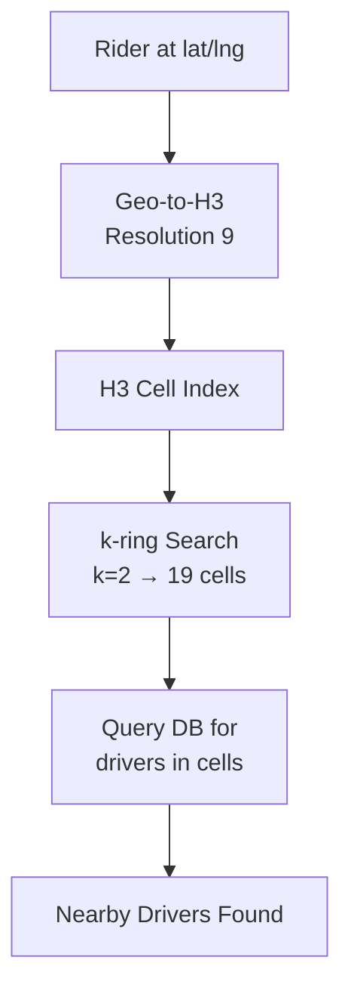

*H3 geospatial indexing flow: the rider's lat/lng is converted to an H3 cell index at resolution 9 (~174m edge length); a k-ring search with k=2 retrieves 19 neighboring hexagons covering a ~1 km radius; the database is queried for available drivers in these cells using a simple indexed lookup instead of expensive distance calculations.*

**Why hexagons, not squares or triangles?** Squares have non-uniform neighbor distances (edge neighbors are 1 unit away, corner neighbors are √2 ≈ 1.41 units away), creating anisotropic proximity queries. Triangles have variable neighbor counts (3 for Type 1, 12 for Type 2). Hexagons provide **equal distance to all 6 neighbors** (isotropic), the **closest approximation to circles**, and **uniform neighbor counts**, making them ideal for spatial proximity searches.

```
Resolution    Avg Hex Edge    Avg Hex Area    Use Case
            0   1,107 km     4,357,449 km²    Earth regions
            5    8.5 km        252 km²         Cities
            7    1.2 km         5.2 km²        Neighborhoods
            9   174 m          0.11 km²        City blocks
           11    25 m           2,149 m²       Buildings
```

**H3 index bit layout (64-bit integer):**

```
┌──────┬─────────┬──────────┬─────────────────────────────────────┐
│ Bits │  Range  │   Name   │         Description                 │
├──────┼─────────┼──────────┼─────────────────────────────────────┤
│ 1-4  │   4     │ Mode     │ Mode (1 for hexagon cells)          │
│ 5    │   1     │ Reserved │ Edge/Vertex mode                    │
│ 6    │   3     │ Resolution│ 0-15 (hierarchy level)             │
│ 7-15 │   9     │ Base Cell│ Base cell identifier               │
│16-64 │  49     │ Digits   │ Direction encoding (7 children/parent)│
└──────┴─────────┴──────────┴─────────────────────────────────────┘
```

**Python example — finding nearby drivers using H3:**

```python
import h3

# Driver locations stored as H3 indexes
DRIVERS = {
    "drv_001": {"h3": "8928308280fffff", "status": "available"},
    "drv_002": {"h3": "8928308280aaaaf", "status": "available"},
    "drv_003": {"h3": "8928308280bbbbf", "status": "busy"},
}

def find_nearby_drivers(rider_lat, rider_lng, max_km=2.0):
    # 1. Convert rider location to H3 at resolution 9
    rider_h3 = h3.geo_to_h3(rider_lat, rider_lng, 9)

    # 2. Calculate k-ring size (res 9: each hex ~174m edge,
    #    k=1 covers ~0.52 km, k=2 covers ~1.04 km, k=3 ~1.56 km)
    k = max(1, int(max_km / 0.52))

    # 3. Get all H3 cells within search radius
    search_cells = set(h3.k_ring(rider_h3, k))
    print(f"Searching {len(search_cells)} hexagons (k={k})")

    # 4. Filter available drivers in those cells
    nearby = []
    for driver_id, info in DRIVERS.items():
        if info["status"] == "available" and info["h3"] in search_cells:
            nearby.append(driver_id)

    return nearby
```

*Example H3 driver matching: the rider's lat/lng is converted to an H3 cell at resolution 9; a k-ring search finds all neighboring hexagons within the desired radius (~2 km for k=3); available drivers in those cells are returned for ETA ranking.*

#### Ride Matching Algorithm

The matching algorithm is the core of Uber's dispatch system. It takes a ride request, finds candidate drivers using H3 geospatial indexing, ranks them by multiple criteria, and selects the best driver for dispatch — all within 200 ms.

**Matching pipeline:**

1. **Geospatial candidate selection:** Convert the rider's pickup location to an H3 index at resolution 9. Query the k-ring (k=2) for nearby H3 cells. Look up all available drivers in a spatial database (Redis with H3 index) indexed by H3 cell. This returns a candidate pool of ~20–200 drivers within ~1 km.

2. **ETA calculation for each candidate:** For each candidate driver, compute the travel time from the driver's current location to the rider's pickup point. This uses Google Maps Distance Matrix API or an in-house routing engine with live traffic data. To reduce latency, the system batches ETA requests for all candidates and returns results in parallel.

3. **Ranking and selection:** Rank drivers by a composite score: `score = 0.4 × ETA + 0.3 × driver_rating + 0.2 × cancellation_rate + 0.1 × driver_repositioning`. Lower ETA, higher rating, lower cancellation rate, and drivers already repositioning toward the area score higher.

4. **Dispatch:** Send the trip request to the top-ranked driver. If the driver declines or doesn't respond within 15 seconds, cascade to the next candidate. If no driver accepts within 60 seconds, the rider is placed in a retry queue with an escalating incentive.

```java
@Service
@RequiredArgsConstructor
public class MatchmakingService {

    private final H3Service h3Service;
    private final GeoRoutingService geoService;
    private final DriverLocationService driverLocationService;
    private final TripService tripService;
    private final RedisTemplate<String, String> redisTemplate;

    private static final int MATCHING_RADIUS_KM = 2;
    private static final int MAX_CANDIDATES = 50;

    /**
     * Match a rider with the nearest available driver using H3 geospatial indexing.
     */
    public MatchResult matchDriver(String requestId, double riderLat, double riderLng) {
        // 1. Convert rider location to H3 index (resolution 9)
        String riderH3 = h3Service.geoToH3(riderLat, riderLng, 9);

        // 2. Find candidate drivers in nearby H3 cells
        List<DriverLocation> candidates = findCandidateDrivers(riderH3);

        // 3. Calculate ETA for each candidate in parallel
        List<ScoredDriver> scored = candidates.parallelStream()
                .limit(MAX_CANDIDATES)
                .map(d -> scoreDriver(d, riderLat, riderLng))
                .sorted(Comparator.comparing(ScoredDriver::etaSeconds))
                .toList();

        if (scored.isEmpty()) {
            return MatchResult.noDriversAvailable(requestId);
        }

        // 4. Select top driver and dispatch
        DriverLocation bestDriver = scored.get(0).driver();
        return dispatch(bestDriver, requestId, riderLat, riderLng);
    }
}
```

*The `MatchmakingService` bean orchestrates the matching pipeline: it converts the rider's location to an H3 index, queries nearby driver locations from a spatial cache, calculates ETAs in parallel, ranks candidates by ETA and quality metrics, and dispatches the best driver. The parallel stream ensures matching latency stays under 200 ms even with dozens of candidates.*

#### ETA Calculation

Estimated Time of Arrival (ETA) is one of Uber's most critical real-time computations. It must account for live traffic conditions, historical travel patterns, current driver position, and route deviations. ETAs are computed using a **hybrid model**: historical patterns provide the baseline, and live traffic feeds adjust the prediction in real-time.

**ETA model components:**

- **Historical baseline:** For each origin–destination pair (bucketed into H3 cells at resolution 7), store the average travel time by time-of-day and day-of-week. This provides a robust prior even when no live traffic data is available.

- **Live traffic adjustment:** Integrate real-time traffic feeds from partners (Google Maps, TomTom, HERE) and from Uber's own fleet data. Adjust the historical baseline by a traffic multiplier (e.g., 1.3x for heavy congestion).

- **Route-aware prediction:** Compute the actual route (not just straight-line distance) using Google Maps or an in-house routing engine (OSRM). The ETA is the route distance divided by the traffic-adjusted speed.

- **Continuous re-estimation:** As the trip progresses, the ETA service recomputes the arrival time every 10–30 seconds using the driver's current position and remaining route. Machine learning models trained on millions of completed trips improve accuracy over time.

**ETA architecture:**

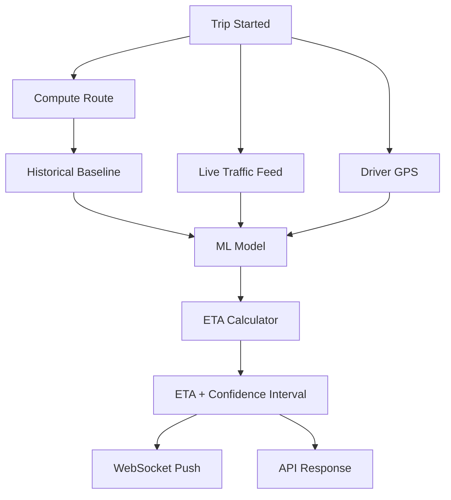

*ETA computation pipeline: when a trip starts, the route is computed; the historical baseline for the origin–destination H3 cells is retrieved; live traffic feeds and the driver's current GPS position are fed into a machine learning model that produces an ETA with a confidence interval; the result is pushed to clients via WebSocket and returned via API.*

```python
def calculate_eta(origin_lat, origin_lng, dest_lat, dest_lng,
                  current_time, driver_lat=None, driver_lng=None):
    """
    Hybrid ETA calculation: historical baseline + live traffic adjustment.
    """
    # 1. Get historical baseline (avg travel time by time-of-day & day-of-week)
    h3_origin = h3.geo_to_h3(origin_lat, origin_lng, 7)
    h3_dest = h3.geo_to_h3(dest_lat, dest_lng, 7)
    baseline_seconds = get_historical_travel_time(h3_origin, h3_dest,
                                                   current_time)

    # 2. Get live traffic multiplier for this corridor
    traffic_multiplier = get_live_traffic_multiplier(h3_origin, h3_dest)

    # 3. Get route distance (if driver is en route, use current position)
    if driver_lat and driver_lng:
        route = get_route(driver_lat, driver_lng, dest_lat, dest_lng)
    else:
        route = get_route(origin_lat, origin_lng, dest_lat, dest_lng)

    # 4. Adjust baseline by traffic
    base_eta = baseline_seconds * traffic_multiplier

    # 5. Add confidence interval and buffer
    confidence = calculate_confidence(baseline_seconds, traffic_multiplier)
    eta = int(base_eta)

    return {"eta_seconds": eta, "confidence": confidence,
            "traffic_multiplier": traffic_multiplier}
```

#### Pricing and Surge

Uber's pricing model combines a fixed base fare with distance-based and time-based components, then applies a dynamic surge multiplier based on real-time demand/supply. The surge multiplier is computed per H3 cell at resolution 7 (~1.2 km) and updated every 30–60 seconds.

```mermaid
graph LR
    Requests[Ride Requests] --> Agg[Demand Aggregation<br/>per H3 cell (res 7)]
    Drivers[Available Drivers] --> Agg
    Agg --> DS[demand/supply ratio]
    DS --> SurgeCalc[Surge Multiplier]
    SurgeCalc --> Redis[Redis: surge_store]
    SurgeCalc --> Notify[Surge Update Events]
    Rider[Rider App] --> Redis
    Rider -->|read surge| Redis
    Driver[Driver App] --> Redis
    Driver -->|read surge| Redis
```

*Surge pricing flow: ride requests and available driver counts are aggregated per H3 cell at resolution 7; the demand/supply ratio is computed; a surge multiplier function converts the ratio into a price multiplier (e.g., 1.0x at ratio 1.0, 2.5x at ratio 5.0); the multiplier is stored in Redis and published as events for real-time app updates.*

**Surge pricing formula:**

The surge multiplier is a function of the demand/supply ratio in a geographic zone, with configurable bounds and ramp-up smoothing:

```
surge_multiplier = clamp(
    1.0 + k * (demand / supply - 1.0),
    min_surge,   // e.g., 1.2x
    max_surge    // e.g., 5.0x
)

where k is a sensitivity constant (e.g., 0.5)
```

- When `demand == supply`, surge = 1.0x (no surge).
- When `demand = 2 × supply`, surge = 1.5x.
- When `demand = 10 × supply`, surge = 3.5x (capped at max_surge).

Surge multipliers ramp up gradually (over 30 seconds) to avoid price shocks, and ramp down faster (over 15 seconds) to reward drivers entering high-demand areas.

**Fare calculation:**

```
total_fare = (base_fare + distance_fare + time_fare) × surge_multiplier

where:
  base_fare      = $2.00 (fixed)
  distance_fare  = $1.15 / mile × distance_miles
  time_fare      = $0.22 / minute × duration_minutes
  surge_multiplier = real-time multiplier (1.0–5.0x)
```

**Surge re-architecture:** Uber re-architected its surge system from a monolithic in-memory computation to a streaming pipeline: demand and supply events are published to Kafka, a Flink streaming job aggregates counts per H3 cell every 5 seconds, and the resulting surge multipliers are written to Redis. This reduced surge update latency from ~60 seconds to ~6 seconds and improved scalability 10x.

#### Dispatch System

The dispatch system is responsible for taking a matched ride request and delivering it to the selected driver's app, handling accept/decline/cancel flows, and managing the trip state machine. Dispatch must be low-latency and resilient — a failure in dispatch should not strand a rider.

**Dispatch pipeline:**

1. **Driver assignment:** After matching selects the best driver, the Trip Management Service writes a `trip_assigned` event to Kafka. The Push Notification Service consumes this event and sends a push notification to the driver's app.

2. **Driver response timeout:** The driver's app has 15 seconds to accept or decline. If no response, the system cascades to the next driver in the ranked candidate list. The rider sees "Finding a driver..." with a live countdown.

3. **Accept/Cascade loop:** When a driver accepts, a `trip_accepted` event is published, triggering: (a) rider notification with driver details, (b) trip state transition to `accepted`, (c) ETA service re-computation using the driver's exact location.

4. **Cancellation handling:** If the rider cancels before a driver accepts, no payment is charged. If the rider cancels after a driver accepts, the cancellation fee logic kicks in (varies by market and cancellation reason).

```java
@Service
@RequiredArgsConstructor
public class DispatchService {

    private final TripService tripService;
    private final PushNotificationService pushService;
    private final KafkaTemplate<String, Object> kafkaTemplate;
    private final CircuitBreaker circuitBreaker;

    private static final int DRIVER_RESPONSE_TIMEOUT_SEC = 15;
    private static final int MAX_DISPATCH_ATTEMPTS = 5;

    /**
     * Dispatch a trip to the next candidate driver, cascading on timeout/decline.
     */
    @Transactional
    public void dispatchToDriver(String tripId, String driverId,
                                  double riderLat, double riderLng) {
        var trip = tripService.getTrip(tripId);

        // Update trip state to "driver_en_route" (pending acceptance)
        tripService.updateStatus(tripId, TripStatus.MATCHING_DRIVER);

        // Push notification to driver app (circuit-breaked)
        circuitBreaker.executeSupplier(() -> {
            pushService.sendTripRequest(driverId, tripId,
                    riderLat, riderLng, DRIVER_RESPONSE_TIMEOUT_SEC);
            return null;
        });

        // Schedule timeout — if driver doesn't respond, cascade
        kafkaTemplate.send("dispatch_timeout", tripId,
                Map.of("tripId", tripId, "driverId", driverId));
    }
}
```

*The `DispatchService` bean manages the driver dispatch lifecycle. It updates the trip state to `MATCHING_DRIVER`, sends a push notification to the driver's app (wrapped in a circuit breaker to prevent cascading failures if the push service is down), and schedules a timeout event on Kafka. If the driver doesn't respond within 15 seconds, the system cascades to the next candidate driver.*

#### Surge Pricing Engine

The surge pricing engine is a separate, highly optimized system that continuously monitors demand/supply ratios per geographic cell and computes surge multipliers. Unlike a monolithic design, Uber's surge system is a streaming pipeline that decouples demand/supply aggregation from multiplier computation and distribution.

**Key design decisions:**

- **Spatial granularity:** Surge zones are defined at H3 resolution 7 (~1.2 km hexagons). This granularity balances fairness (drivers see surge when they enter a high-demand area) with stability (too-fine zones would cause surge flickering).

- **Temporal smoothing:** Surge multipliers ramp up over 30 seconds and ramp down over 15 seconds. This prevents "price shock" for riders and avoids driver herding behavior (where all drivers rush to the same high-surge zone simultaneously, creating a supply glut).

- **Demand forecasting:** Instead of reacting to current demand/supply, the system uses ML models to predict demand 5–15 minutes ahead. This allows surge to activate before a demand spike (e.g., a concert ending), smoothing the rider experience.

- **Driver incentives:** When surge exceeds 2.0x, the system can automatically send "surge bonuses" to nearby drivers, nudging them toward high-demand areas. This is cheaper than letting surge climb to 5.0x and is more predictable for drivers.

```java
@Service
@RequiredArgsConstructor
public class SurgeService {

    private final H3Service h3Service;
    private final RedisTemplate<String, Double> redis;
    private final MeterRegistry meters;

    private static final double MIN_SURGE = 1.2;
    private static final double MAX_SURGE = 5.0;
    private static final double SURGE_SENSITIVITY = 0.5;
    private static final int RAMP_UP_SECONDS = 30;
    private static final int RAMP_DOWN_SECONDS = 15;

    /**
     * Compute the surge multiplier for an H3 cell based on demand/supply ratio.
     */
    public double computeSurge(String h3Cell, int demand, int supply) {
        if (supply == 0) {
            return MAX_SURGE;
        }

        double ratio = (double) demand / supply;
        double rawSurge = 1.0 + SURGE_SENSITIVITY * (ratio - 1.0);
        double clamped = Math.max(MIN_SURGE, Math.min(MAX_SURGE, rawSurge));

        // Smooth the surge multiplier with ramp-up/down
        double currentSurge = redis.opsForValue().getOrDefault(
                "surge:" + h3Cell, 1.0);
        double smoothed = smoothSurge(currentSurge, clamped,
                ratio > currentSurge ? RAMP_UP_SECONDS : RAMP_DOWN_SECONDS);

        redis.opsForValue().set("surge:" + h3Cell, smoothed);
        meters.counter("surge.updates", "cell", h3Cell).increment();

        return smoothed;
    }
}
```

*The `SurgeService` bean computes surge multipliers per H3 cell using a demand/supply ratio formula with configurable bounds (1.2x–5.0x). The raw surge is smoothed over time (30s ramp-up, 15s ramp-down) to avoid price shocks. The current multiplier and demand/supply counts are stored in Redis for sub-10 ms reads by the pricing service. A Micrometer counter tracks surge update frequency for observability.*

#### Trip Management State Machine

Each trip follows a strict state machine to ensure correctness and prevent invalid transitions. The Trip Management Service enforces state transitions, manages timeouts, and coordinates with payment, rating, and notification systems.

**Trip states and transitions:**

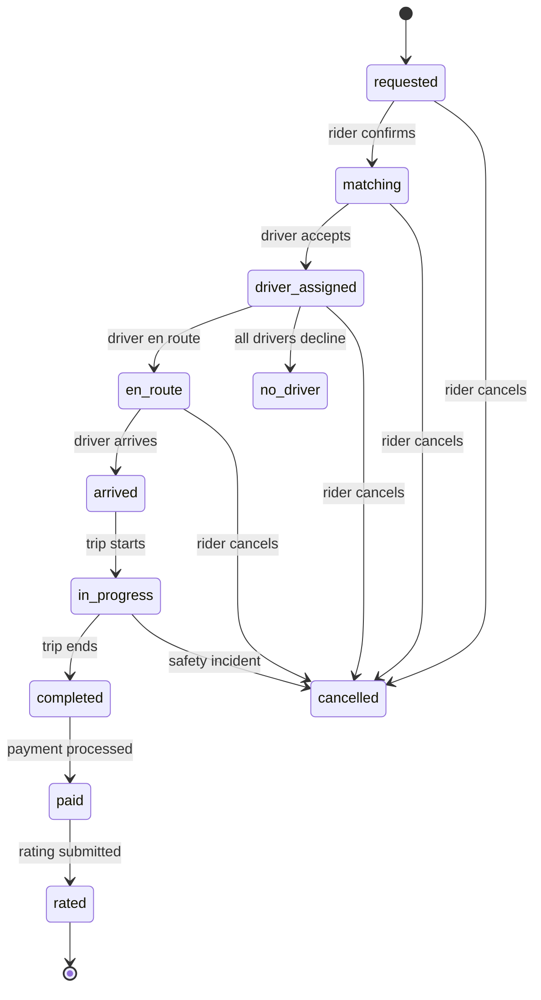

*Trip state machine: trips transition from `requested` through `matching`, `driver_assigned`, `en_route`, `arrived`, `in_progress`, to `completed`, then through `paid` and `rated` before reaching terminal state. Cancellations can occur at any point before completion, with appropriate fee logic applied.*

**State transition rules:**

| From | To | Allowed Actor | Trigger |
|---|---|---|---|
| requested | matching | Rider | Rider confirms |
| matching | driver_assigned | System | Driver accepts |
| matching | cancelled | Rider | Rider cancels |
| matching | matching | System | Driver declines (cascade) |
| driver_assigned | en_route | Driver | Driver marks en route |
| driver_assigned | cancelled | Rider | Rider cancels (fee applies) |
| en_route | arrived | Driver | Driver marks arrived |
| arrived | in_progress | Driver | Driver starts trip |
| in_progress | completed | Driver/System | Trip ends |
| completed | paid | System | Payment captured |

```java
@Entity
@Table(name = "trips")
public class Trip {

    @Id
    private String tripId;

    @Enumerated(EnumType.STRING)
    @Column(nullable = false)
    private TripStatus status;

    private String riderId;
    private String driverId;
    private String requestId;

    // Fare breakdown
    private BigDecimal baseFare;
    private BigDecimal distanceFare;
    private BigDecimal timeFare;
    private BigDecimal surgeMultiplier;
    private BigDecimal totalFare;

    // Timestamps
    private Instant requestedAt;
    private Instant acceptedAt;
    private Instant startedAt;
    private Instant completedAt;
    private Instant cancelledAt;

    // Route info
    private Double distanceKm;
    private Double durationSec;
    private String h3Route;

    @Version
    private Long version;  // Optimistic locking for concurrent state updates

    /**
     * Validate and apply a state transition.
     * Throws IllegalStateException if the transition is invalid.
     */
    public void transitionTo(TripStatus newStatus) {
        if (!this.status.isValidTransition(newStatus)) {
            throw new IllegalStateException(
                "Invalid transition: " + this.status + " -> " + newStatus);
        }
        this.status = newStatus;
    }

    public boolean canCancel() {
        return switch (this.status) {
            case REQUESTED, MATCHING, DRIVER_ASSIGNED, EN_ROUTE -> true;
            case IN_PROGRESS, COMPLETED, PAID, RATED,
                 NO_DRIVER, CANCELLED -> false;
        };
    }
}

enum TripStatus {
    REQUESTED, MATCHING, DRIVER_ASSIGNED, EN_ROUTE,
    ARRIVED, IN_PROGRESS, COMPLETED, PAID, RATED,
    CANCELLED, NO_DRIVER;

    public boolean isValidTransition(TripStatus next) {
        return switch (this) {
            case REQUESTED -> Set.of(MATCHING, CANCELLED).contains(next);
            case MATCHING -> Set.of(DRIVER_ASSIGNED, CANCELLED, MATCHING).contains(next);
            case DRIVER_ASSIGNED -> Set.of(EN_ROUTE, CANCELLED, MATCHING).contains(next);
            case EN_ROUTE -> Set.of(ARRIVED, CANCELLED).contains(next);
            case ARRIVED -> Set.of(IN_PROGRESS, EN_ROUTE).contains(next);
            case IN_PROGRESS -> Set.of(COMPLETED).contains(next);
            case COMPLETED -> Set.of(PAID).contains(next);
            case PAID -> Set.of(RATED).contains(next);
            case RATED, CANCELLED, NO_DRIVER -> false;
        };
    }
}
```

*The `Trip` entity enforces strict state machine semantics with a `transitionTo` method that validates each transition and a `canCancel` method that determines cancellation eligibility. The `@Version` field provides optimistic locking to prevent concurrent state overwrites. The `TripStatus` enum's `isValidTransition` method encodes the complete transition graph as a switch expression, rejecting invalid transitions at the domain layer.*

---

### Replication Strategies

Uber replicates data across multiple dimensions: within a region (for availability), across regions (for global latency), and across storage systems (for different access patterns). The choice of replication strategy depends on the data's access pattern and consistency requirements.

**Leader-based replication (Trip DB — PostgreSQL):** Trip records are written to a primary PostgreSQL instance and synchronously replicated to read replicas within the region. Writes go only to the leader; reads (trip status lookups, driver history) can be served from any replica. This gives strong consistency for trip state transitions (a state update must be immediately visible to both rider and driver) while allowing read scaling.

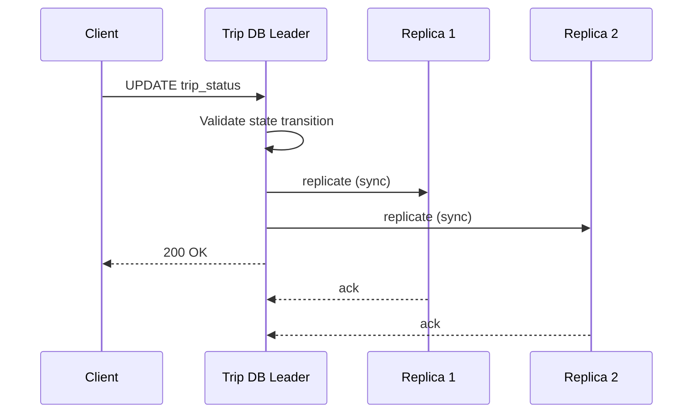

*Leader-based replication for the Trip DB: the client updates trip status on the leader, which validates the state transition and synchronously replicates to read replicas before returning 200 OK. Replicas serve read traffic (trip history, driver stats), accepting a small replication lag for higher read throughput.*

**Leaderless replication (Driver Location Store — Redis Cluster):** The driver location cache uses Redis Cluster with hash slots and master/replica pairs. Any master can accept writes; followers serve reads. This provides high availability — if a master fails, a replica is promoted. Driver locations can tolerate brief staleness (a 4-second ping interval means locations are already slightly stale).

**Multi-region replication:** Trip DB is replicated synchronously within a region and asynchronously across regions. The driver location store uses active-active Redis replication across regions with last-write-wins conflict resolution. Surge zone data is replicated to all regions for low-latency reads by riders and drivers.

**Real-world use:** Redis Cluster for driver locations (sub-10 ms reads/writes), PostgreSQL with logical replication for trip records (strong consistency for state), Cassandra for engagement data with tunable consistency (likes, ratings).

---

### Failure Detection and Membership

Uber's dispatch and matching services must detect failed nodes, redistribute work, and continue serving with minimal disruption. The system uses a combination of infrastructure-level and application-level failure detection.

**Gossip-based membership:** Each service instance periodically exchanges health information with a random subset of peers (gossip protocol). This spreads membership changes through the cluster in O(log N) rounds without a central coordinator. Service discovery (Consul or Eureka) maintains the current view of which instances are alive.

**Health checks:**

- **Liveness probes:** HTTP `/health` endpoint checked every 2 seconds by the orchestrator (Kubernetes). If unhealthy, the pod is restarted or removed from service discovery.
- **Readiness probes:** Checks if the service can serve traffic (e.g., can connect to its database and Kafka). Not-ready pods are removed from the load balancer.
- **Business health checks:** Custom checks like "Kafka consumer lag < 10,000" or "Redis connection pool has available connections."
- **Driver liveness:** The Driver App Service tracks driver app heartbeats. If a driver's app hasn't sent a location update in 10 seconds, the driver is marked offline and excluded from matching.

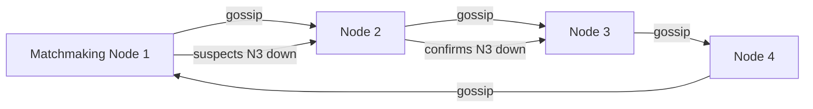

*Gossip-based failure detection in Uber's service mesh: nodes periodically exchange health state with random peers. When a node suspects a peer is down, it propagates the suspicion through gossip; once confirmed by multiple nodes, the peer is removed from the cluster and its responsibilities are redistributed.*

**Failure detection timing for ride-hailing:**

| Component | Check Interval | Timeout | Action |
|---|---|---|---|
| Matchmaking Service | 5s | 15s | Retry match; queue locally |
| Driver Location Store | 2s | 30s | Failover to replica; serve stale |
| Push Notification Service | 5s | 10s | Reconnect; buffer notifications |
| ETA Service | 3s | 15s | Fall back to historical baseline |
| Trip DB | 5s | 30s | Trigger failover; queue writes |

**Circuit breakers:** For dependencies that are failing, a circuit breaker (Resilience4j) trips after N consecutive failures and stops sending requests for a cool-down period. This prevents cascading failures — e.g., if the ETA service is slow (Google Maps API down), the Matchmaking Service short-circuits and falls back to a simpler distance-based ranking.

---

### High Availability and Scalability

Uber must remain available during node failures, network partitions, and regional outages while scaling to handle global traffic. Each city is designed as an independent failure domain.

#### Multi-Region Deployment

Deploy active services in at least 3 regions (e.g., us-east, eu-west, ap-southeast). Users are routed to the nearest region via GeoDNS or a latency-based load balancer. Each region is self-sufficient for read and write operations, with asynchronous cross-region replication for durability.

- **Active-active for Trip DB:** Using Spanner or CockroachDB for globally consistent trip state, so a trip can be picked up in one region and completed in another without state loss.
- **Active-active for Driver Location Store:** Redis with CRDTs across regions. Driver locations are eventually consistent — a 4-second staleness is acceptable.
- **Active-passive for Payment DB:** Writes go to the primary region; reads can be served from replicas. Cross-region replication lag for payments is monitored closely.

#### Auto-Scaling

- **Stateless services (API Gateway, Matchmaking, ETA Service):** Scale horizontally based on CPU and request latency. Kubernetes HPA adjusts replica count automatically.
- **Stateful services (Trip DB, Redis Cluster):** Scale by adding shards or partitions. Kafka partitions scale consumer groups automatically.
- **Matchmaking workers:** Scale based on request queue depth. If the ride-request queue exceeds 1,000 pending requests, spin up additional workers.

#### Graceful Degradation

When a component fails, the system should degrade rather than crash:

- **ETA Service down:** Matchmaking falls back to Euclidean distance ranking (straight-line distance) instead of traffic-adjusted ETA. Accuracy degrades but matches still happen.
- **Push Notification Service down:** Trip events are queued in Kafka; notifications are delivered when the service recovers. Riders and drivers see delayed updates.
- **Surge Service down:** Default surge multiplier of 1.0x is used. No dynamic pricing, but all other functionality works.
- **Payment Service down:** Trips can still be completed; payments are queued and processed asynchronously when the service recovers.

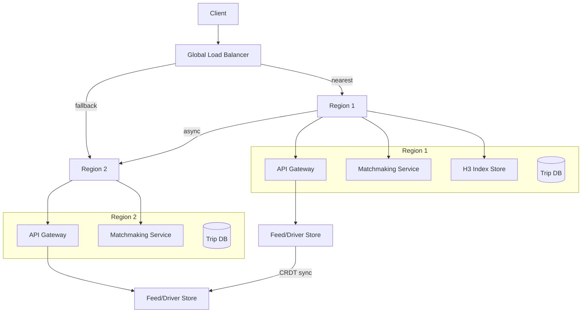

*Multi-region high availability: a global load balancer routes clients to their nearest region. Each region is self-sufficient with its own API Gateway, Matchmaking Service, and H3 index store. Cross-region replication keeps data synchronized asynchronously. If one region fails, the load balancer routes traffic to another region.*

---

### Performance and Optimization

The performance of Uber's platform is measured by matching latency (sub-200 ms), ETA accuracy (within 2 minutes of actual), and trip throughput (millions of concurrent trips).

#### Latency Optimization

- **H3 proximity search:** Using H3 k-ring search with an indexed lookup instead of distance calculations reduces the matching candidate-selection step from ~500 ms (brute-force) to ~5 ms.
- **Parallel ETA computation:** Instead of computing ETAs sequentially for each candidate driver, the system batches ETA requests and computes them in parallel using asynchronous I/O, reducing the ranking step from O(N × latency) to O(latency).
- **Driver location caching:** Driver locations are cached in Redis with a 10-second TTL. The matching service reads directly from cache, avoiding database round-trips for every match request.
- **Connection pooling:** Maintain persistent HTTP/gRPC connections between services (e.g., Matchmaking → ETA Service, Matchmaking → Driver Store) to avoid per-request connection overhead.

#### Throughput Optimization

- **Sharded matchmaking:** Matchmaking is partitioned by H3 cell at resolution 7. Each shard handles requests for a geographic area, enabling linear horizontal scaling. During peak hours, additional shards can be brought online.
- **Async trip state updates:** Trip state transitions are published to Kafka and processed asynchronously. The API returns immediately after accepting a state change, while background workers update dependent systems.
- **Batched driver location updates:** The driver app sends location updates every 4 seconds, but the server batches them and writes to the spatial store every 200 ms, reducing write amplification.
- **Request coalescing:** When multiple riders in the same area request rides simultaneously, the system can coalesce their candidate searches into a single H3 k-ring query, sharing the driver look-up cost.

#### Caching Strategies

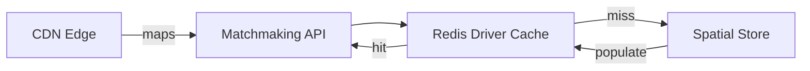

*Multi-tier caching for matching: the Matchmaking API checks the Redis driver-location cache first; on a miss, it falls back to the spatial store (Cassandra/Redis with H3 index) and populates the cache. Map tiles and routing data are served from CDN edge locations to remove origin load.*

#### Write Path Optimization

- **Async driver assignment:** Ride matching returns a match result immediately after selecting a driver; the driver notification (push) happens asynchronously. This keeps the rider-facing API latency under 100 ms.
- **Idempotent trip operations:** All trip mutations (accept, start, complete, cancel) are idempotent using idempotency keys, so retries after network partitions don't create duplicate trips or double-charges.
- **Surge deferral:** Surge zone data is refreshed every 30 seconds asynchronously. If the surge service is behind, the pricing service uses the last known multipliers — pricing remains functional with slightly stale data.

**Real-world use:** Uber's Ringpop (now part of Jaeger ecosystem) uses consistent hashing for request sharding; the Michelangelo ML platform powers ETA prediction; uMonitor provides real-time observability across 10,000+ microservices.

---

### CAP Theorem and Consistency Trade-offs

The CAP theorem states that during a network partition, a distributed system can provide at most two of: Consistency, Availability, and Partition tolerance. Since Uber operates over networks, partition tolerance is always required. The trade-off between consistency and availability is made per-component based on the business impact of inconsistency.

#### Driver Location Store — AP (Availability + Partition Tolerance)

The driver location cache prioritizes availability: if a Redis node fails, driver locations are still served from replicas. Locations can be briefly stale (a 4-second ping interval means locations are already slightly stale). This trade is justified because riders tolerate a few seconds of location staleness for faster matching.

#### Trip DB — CP (Consistency + Partition Tolerance)

Trip state transitions require strong consistency: if a driver accepts a trip, the state must immediately transition to `driver_assigned` and no other driver should be dispatched for the same trip. The Trip DB uses Spanner or CockroachDB with synchronous replication across regions. A trip state update must achieve quorum before returning success.

#### Surge Store — AP with Bounded Staleness

Surge multipliers can be eventually consistent. If a rider in region A sees a surge multiplier of 1.5x and a driver in region B sees 1.8x for the same cell (due to replication lag), the discrepancy is resolved within 30 seconds. This is acceptable because surge is a pricing signal, not a safety-critical value.

#### Payment DB — CP with Strong Consistency

Payment operations require strong consistency: a payment capture must be immediately visible to prevent double-charging or lost payments. The Payment DB uses leader-based replication with synchronous acknowledgment from a majority of replicas before confirming a transaction.

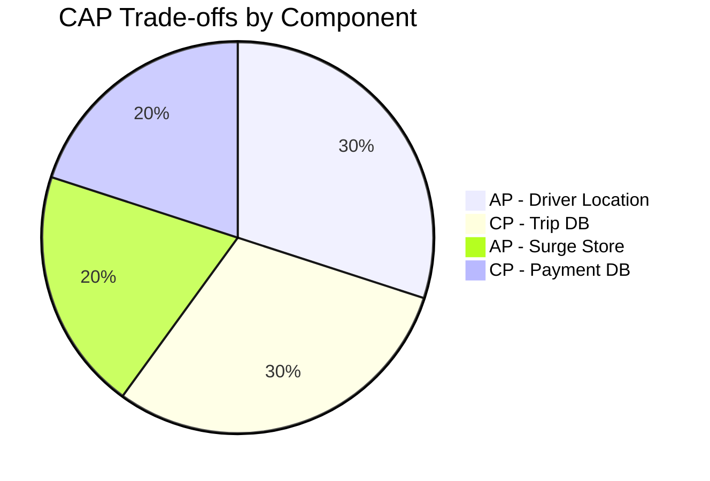

*CAP trade-offs across Uber components: the Driver Location Store and Surge Store are AP (availability-first) since slight staleness is acceptable for non-safety-critical data; the Trip DB and Payment DB are CP (consistency-first) since trip state and payment state must be immediately consistent to prevent double-assignment and double-charging.*

**Interview question:** *Is Uber strongly consistent or eventually consistent?*
**Answer:** Uber uses a nuanced approach: it is strongly consistent for trip state and payments (where inconsistency means double-charging or safety issues), and eventually consistent for driver locations and surge data (where a few seconds of staleness is acceptable). This pragmatic split — "strong consistency where it matters, eventual consistency where it doesn't" — is the key insight interviewers look for.

---

### Encryption and Key Management

Uber handles sensitive data at every layer: personally identifiable information (PII) of riders and
drivers, payment method tokens, and trip metadata. Encryption is applied both at rest and in transit,
with a centralized key management infrastructure.

#### Encryption at Rest

- **User PII (names, phone numbers, emails):** Encrypted using envelope encryption with AES-256.
  The data encryption key (DEK) is generated per-row and encrypted with a key encryption key (KEK)
  managed by HashiCorp Vault. The encrypted DEK is stored alongside the row in MySQL / Schemaless.
- **Payment data:** Payment card numbers are tokenized by Stripe/Braintree before reaching Uber's
  systems. Raw card numbers are never stored. The token-to-card mapping lives in the PCI-compliant
  payment processor's vault. Trip fare amounts are stored as plaintext integers (cents) in MySQL
  with column-level encryption for audit purposes.
- **Driver license images:** Stored as encrypted blobs in S3 with SSE-KMS. Access is restricted
  via IAM policies and logged for compliance (KYC/AML regulations).

#### Encryption in Transit

- **Client-to-edge:** All client traffic uses HTTPS/TLS 1.3. Uber's edge terminates TLS using
  certificates managed by Let's Encrypt and Venafi. Mutual TLS (mTLS) is required for all internal
  service-to-service communication within the data center.
- **Service mesh:** Uber's internal service mesh (based on uProxy) enforces mTLS between all
  microservices. Each service has a certificate issued by Uber's internal CA, rotated every 72 hours.
  The mesh handles encryption transparently — services make plaintext HTTP/gRPC calls and the mesh
  encrypts/decrypts at the network layer.
- **Database connections:** MySQL and PostgreSQL connections use TLS with certificate pinning.
  Redis connections in production (driver location cache) also use TLS, though this adds latency;
  the trade-off is accepted for compliance.

#### Key Management

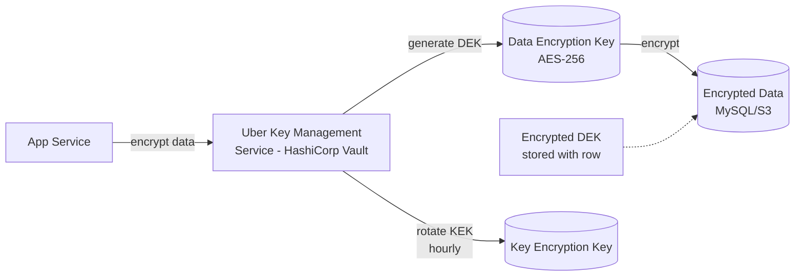

*Uber's key management hierarchy: a Key Encryption Key (KEK) managed by HashiCorp Vault wraps
per-row Data Encryption Keys (DEKs). The DEK encrypts the actual data, and the encrypted DEK is
stored alongside the row. The KEK is rotated hourly; the DEK is rotated per-row on each write.
This limits the blast radius of a key compromise to a single row.*

**Real-world use:** Netflix uses a similar pattern with AWS KMS and envelope encryption for PII
in their user profiles service. Google's Tink library provides a reference implementation.

---

### Authentication and Authorization

#### Authentication Methods

- **Rider/Driver mobile app:** OAuth 2.0 with PKCE (Proof Key for Code Exchange). The mobile app
  obtains an access token from Uber's identity service (built on PingFederate + custom IdP) using
  the authorization code flow with PKCE. Tokens are short-lived (15 minutes) with refresh tokens
  rotated on each use. Device fingerprints and behavioral biometrics add additional factors.
- **Web client:** Same OAuth 2.0 + PKCE flow. Single sign-on (SSO) is available via SAML 2.0
  integration with corporate identity providers.
- **Internal services:** Each microservice authenticates via JWT tokens signed by Uber's internal
  CA. Service-to-service tokens include claims for the calling service's identity and authorized
  scope. Tokens are validated at the edge (uProxy/mesh layer) before reaching the service.
- **Admin console:** Requires SSO + multi-factor authentication (MFA). Admin actions are
  subject to just-in-time access approval with time-bound elevated permissions.

#### Authorization Models

Uber uses a hybrid authorization model:

- **Role-Based Access Control (RBAC):** Users are assigned roles (rider, driver, support_agent,
  admin) that determine coarse-grained access. For example, `support_agent` can view trip details
  but cannot modify pricing; `admin` can modify system configuration.
- **Attribute-Based Access Control (ABAC):** Fine-grained access is enforced using attributes.
  For example, a support agent can only view trips within their geographic region and only for
  the last 48 hours. A driver can only view their own trips and rides within their current city.
- **Resource-Based ACLs:** Sensitive operations (e.g., viewing payment methods) require explicit
  consent-based access. Drivers cannot access riders' payment methods; only the payments service
  and fraud detection service have scoped access.

#### Authorization Example — Trip Access Control

```java
@Service
public class TripAuthorizationService {

    private final RoleRepository roleRepository;
    private final TripRepository tripRepository;

    public TripAuthorizationService(RoleRepository roleRepository,
                                    TripRepository tripRepository) {
        this.roleRepository = roleRepository;
        this.tripRepository = tripRepository;
    }

    public boolean canAccessTrip(String userId, String tripId) {
        Set<String> roles = roleRepository.findRolesForUser(userId);

        if (roles.contains("ADMIN")) {
            return true;
        }

        if (roles.contains("SUPPORT_AGENT")) {
            Trip trip = tripRepository.findById(tripId);
            return trip != null && isWithinRegionAndTimeWindow(userId, trip);
        }

        if (roles.contains("DRIVER")) {
            Trip trip = tripRepository.findById(tripId);
            return trip != null && trip.getDriverId().equals(userId);
        }

        if (roles.contains("RIDER")) {
            Trip trip = tripRepository.findById(tripId);
            return trip != null && trip.getRiderId().equals(userId);
        }

        return false;
    }

    private boolean isWithinRegionAndTimeWindow(String userId, Trip trip) {
        // Support agents can only access trips in their assigned region
        // and within the last 48 hours for privacy
        String assignedRegion = roleRepository.findRegionForUser(userId);
        Instant cutoff = Instant.now().minus(Duration.ofHours(48));
        return trip.getRegion().equals(assignedRegion) && trip.getStartTime().isAfter(cutoff);
    }
}
```

*The `TripAuthorizationService` bean enforces access control by checking the user's roles (from
`RoleRepository`) against the trip's ownership and region. Admins have unrestricted access. Support
agents can only view trips within their assigned region and within the last 48 hours — this prevents
privacy violations from broad support access. Drivers can only view trips they are assigned to.
Riders can only view their own trips. This ABAC+RBAC hybrid model ensures least-privilege access
at scale across millions of concurrent users.*

---

### Security Threats and Mitigations

#### Threat: Driver/Rider Impersonation (Safety)

Malicious actors may register as drivers to intercept riders or as riders to target drivers.
Uber mitigates this through:
- **Phone number anonymization:** Real-time communications (call, SMS) between rider and driver
  use proxied phone numbers that expire after the trip. Uber never reveals personal contact info.
- **Driver background checks:** Mandatory criminal record, driving record, and identity verification
  (SSN, driver's license scan) before a driver can accept rides.
- **In-app safety features:** Emergency button, trip sharing with contacts, real-time GPS tracking,
  and automatic crash detection using accelerometer data.
- **Face verification:** Drivers must periodically take a selfie that is matched against their
  profile photo using computer vision to detect account takeover.

#### Threat: Surge Pricing Manipulation

Attackers may manipulate surge multipliers to charge inflated fares. Mitigations:
- **Server-side surge calculation:** Surge multipliers are calculated serverside from real supply
  and demand data, not client-supplied. Clients only display the server-computed value.
- **Rate limiting:** Surge updates are rate-limited to 30-second intervals to prevent flash-manipulation.
- **Anomaly detection:** ML models detect anomalous surge patterns (e.g., a region showing
  artificially suppressed supply) and alert fraud teams.
- **Fare reconciliation:** All trips are audited post-completion; any fare discrepancy triggers an
  automatic refund and driver/rider account review.

#### Threat: Payment Fraud

- **Tokenization:** Card numbers are never stored; only processor-specific tokens are used.
- **Velocity limits:** Per-card and per-account transaction velocity is monitored. Unusual
  patterns (e.g., 5+ rides in 30 minutes to the same address) trigger fraud review.
- **3D Secure:** High-value or suspicious transactions are routed through 3D Secure (3DS) for
  additional authentication.
- **Chargeback protection:** Trip GPS, timestamp, and photo evidence are retained to dispute
  fraudulent chargebacks.

#### Threat: Data Breach / PII Exposure

- **Zero-trust network:** All internal traffic is mTLS-encrypted. No service trusts another by
  default; every request is authenticated and authorized.
- **Data minimization:** Only essential PII is collected. Phone numbers are anonymized after
  90 days. Trip metadata (pickup/dropoff coordinates) is generalized to 100m grid cells.
- **Field-level encryption:** Highly sensitive fields (SSN, driver's license, card tokens) use
  application-level encryption with keys managed by Vault. Database-level encryption prevents
  direct reads even if the DB is compromised.
- **Incident response:** On a suspected breach, the Security Operations Center (SOC) is alerted
  via automated SIEM (Splunk + Phantom) workflows. Affected data is immediately rotated (key
  rotation for encryption, token invalidation for payments).

---

### Observability and Logging

Uber operates 10,000+ microservices across 4 regions, generating petabytes of telemetry daily.
The observability stack must provide real-time visibility into latency, errors, and business
metrics while maintaining cost efficiency.

#### Architecture

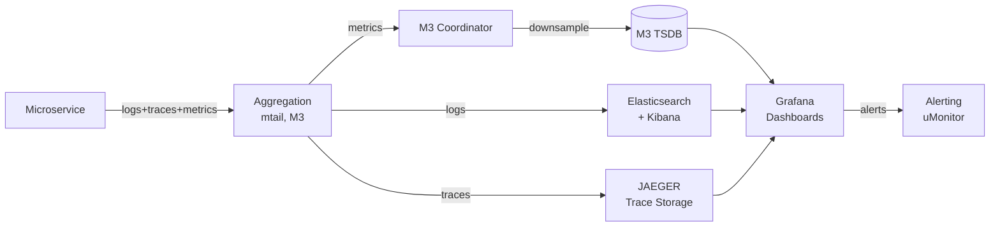

*Uber's observability architecture: all microservices emit structured logs (mtail), metrics
(M3 — Uber's open-source metrics platform), and distributed traces (JAEGER). These are aggregated
and stored in M3 TSDB (time-series), Elasticsearch (log search), and JAEGER (trace storage).
Grafana dashboards visualize everything, and uMonitor generates alerts. This provides end-to-end
visibility across 10,000+ services.*

#### Key Metrics

- **Ride lifecycle:** request-to-match latency, time-to-driver-arrival, trip duration, cancellation
  rate, surge multiplier applied.
- **SRE metrics:** p50/p95/p99 latency for API endpoints (target: p95 < 200ms for rider requests),
  error rate (target: < 0.1% for rider-facing APIs), availability (target: 99.95% monthly).
- **Business metrics:** completed trips, cancellations by side (rider vs driver), revenue, surge
  multipliers in effect, driver supply gaps.
- **Infrastructure:** CPU/memory utilization per service, container restart rate, cache hit ratio
  (Redis for driver locations), database query latency.

#### Logging

Structured JSON logs are emitted to Kafka (for real-time processing) and stored in Elasticsearch
(for search). Each log entry includes: trace ID (for cross-service correlation), service name,
endpoint, HTTP status, latency, user ID (hashed for privacy), and structured error details.
Logs are retained for 30 days in hot storage, 365 days in cold storage. PII is redacted at the
SDK level before logging.

#### Distributed Tracing

JAEGER (originally built by Uber) provides distributed tracing. Each incoming request gets a
trace context (trace ID, span ID, sampled flag) that propagates through all service calls via
HTTP/gRPC headers. Critical paths (ride request → match → driver assignment → trip start →
payment) are always sampled; background paths are sampled at 1%. Spans include annotations for
key events (e.g., "surge_calculated", "payment_authorized") to enable root-cause analysis.

#### Alerting Strategy

Alerts are tiered by severity:
- **Critical (pages on-call):** rider-facing API latency > p95, error rate > 1%, payment processing
  failures, surge calculation service down.
- **Warning (Slack notifications):** driver app latency, map tile load failures, internal service
  degradations.
- **Info (dashboard only):** business metric anomalies (e.g., surge multiplier changes > 2x in
  a region), fraud pattern detection.

---

### Real-World Implementations

Uber's production stack implements the concepts described above using a mix of open-source and
in-house technologies:

- **Ringpop:** Consistent-hashing-based request routing and load balancing. Built on Node.js,
  open-sourced to the Jaeger ecosystem. Routes requests to the correct service instance based on
  a consistent hash ring.
- **uMonitor:** Uber's internal monitoring/alerting system, built on M3. Powers dashboards and
  alerts across 10,000+ services.
- **JAEGER:** Distributed tracing system, originally built at Uber and later donated to CNCF.
  Provides end-to-end trace visualization for microservices.
- **M3:** Metrics collection and storage system, open-sourced. Handles 10+ million metrics/second.
- **Schemaless:** Uber's primary datastore (MySQL-sharded, Go-based). Powers trip management,
  payments, and rider/driver profiles.
- **Hercules:** Real-time event pipeline (Apache Flink + Kafka + Hadoop) that processes 8+
  trillion events per day for analytics, recommendation, and fraud detection.
- **Michelangelo:** ML platform that powers ETA prediction, demand forecasting, surge pricing,
  and fraud detection. Built on top of Spark + Hadoop.
- **Go + Java microservice stack:** Driver/rider apps use Go for low-latency services; backend
  analytics and payment services use Java/Spring Boot with CockroachDB for strong consistency.
- **Redis + Node.js:** The driver location cache (millions of concurrent WebSocket connections)
  uses a Redis cluster with Node.js gateway services implementing the geofence ring logic.

**Comparison with competitors:** Lyft uses a similar architecture (Kafka + Flink + DynamoDB for
driver locations; Go services with AWS DynamoDB for trips). Didi (China) uses a hybrid approach
with Alibaba Cloud services. All three prioritize availability for driver locations (AP) and
consistency for trips/payments (CP), validating the CAP trade-off analysis above.

---

### Java and Spring Boot Implementation Guide

Uber's backend trip management service is built with Spring Boot 3.x, using CockroachDB for strong
consistency on trip state and Redis for driver location caching. Below is a representative
implementation of the trip lifecycle, matching the patterns described in the architectural deep dive.

#### 1. DTO Records

Records provide immutable, concise data carriers for request/response payloads.

```java
@RestController
@RequestMapping("/api/v1/trips")
@Validated
public class TripController {

    private final TripService tripService;
    private final TripAuthorizationService authzService;

    public TripController(TripService tripService,
                          TripAuthorizationService authzService) {
        this.tripService = tripService;
        this.authzService = authzService;
    }

    @PostMapping
    public ResponseEntity<TripResponse> requestRide(
            @Valid @RequestBody RequestRideRequest request,
            @AuthenticationPrincipal JwtPrincipal principal) {

        String riderId = principal.getUserId();
        Trip trip = tripService.requestRide(request, riderId);
        return ResponseEntity.accepted()
                .location(URI.create("/api/v1/trips/" + trip.getTripId()))
                .body(new TripResponse(trip));
    }

    @GetMapping("/{tripId}")
    public ResponseEntity<TripResponse> getTrip(
            @PathVariable String tripId,
            @AuthenticationPrincipal JwtPrincipal principal) {

        if (!authzService.canAccessTrip(principal.getUserId(), tripId)) {
            throw new AccessDeniedException("Not authorized to view trip " + tripId);
        }
        Trip trip = tripService.findById(tripId);
        return ResponseEntity.ok(new TripResponse(trip));
    }
}

record RequestRideRequest(
        @NotBlank String pickupLat,
        @NotBlank String pickupLng,
        @NotBlank String dropoffLat,
        @NotBlank String dropoffLng,
        @DecimalMin("1") @DecimalMax("5") BigDecimal surgeMultiplier) {}

record TripResponse(String tripId, String status, BigDecimal estimatedFare,
                    String driverId, Instant createdAt) {}
```

*The `TripController` bean handles all trip-related REST endpoints. It uses constructor injection
for `TripService` and `TripAuthorizationService`, `@Valid` for input validation, and
`@AuthenticationPrincipal` to extract the authenticated user. The `RequestRideRequest` record
uses Bean Validation (`@NotBlank`, `@DecimalMin`) to enforce input constraints. The
`TripResponse` record provides an immutable DTO for the response. Access control is enforced
via `TripAuthorizationService.canAccessTrip()` before returning trip details.*

#### 2. Entity with Optimistic Locking

JPA entities model the persistent state of trips. Optimistic locking via `@Version` prevents
lost updates when multiple services concurrently modify the same trip.

```java
@Entity
@Table(name = "trips")
@EntityListeners(AuditingEntityListener.class)
public class Trip {

    @Id
    @GeneratedValue
    private String tripId;

    @Column(nullable = false)
    private String riderId;

    @Column
    private String driverId;

    @Column(nullable = false)
    @Enumerated(EnumType.STRING)
    private TripStatus status = TripStatus.REQUESTED;

    @Column(nullable = false)
    private BigDecimal estimatedFare;

    @Column(nullable = false)
    private BigDecimal surgeMultiplier = BigDecimal.ONE;

    @Column(nullable = false)
    private Instant createdAt;

    @Column
    private Instant acceptedAt;

    @Column
    private Instant completedAt;

    @Version
    private Long version;

    // Enums
    public enum TripStatus {
        REQUESTED, DRIVER_ASSIGNED, DRIVER_EN_ROUTE, IN_PROGRESS, COMPLETED, CANCELLED
    }

    // Constructors
    protected Trip() {} // JPA requirement

    public Trip(String riderId, BigDecimal estimatedFare, BigDecimal surgeMultiplier) {
        this.tripId = UUID.randomUUID().toString();
        this.riderId = riderId;
        this.estimatedFare = estimatedFare;
        this.surgeMultiplier = surgeMultiplier;
        this.createdAt = Instant.now();
    }

    // State transition methods
    public void assignDriver(String driverId) {
        if (this.status != TripStatus.REQUESTED) {
            throw new IllegalStateException("Cannot assign driver to trip in status: " + this.status);
        }
        this.driverId = driverId;
        this.status = TripStatus.DRIVER_ASSIGNED;
        this.acceptedAt = Instant.now();
    }

    public void startTrip() {
        if (this.status != TripStatus.DRIVER_ASSIGNED && this.status != TripStatus.DRIVER_EN_ROUTE) {
            throw new IllegalStateException("Cannot start trip in status: " + this.status);
        }
        this.status = TripStatus.IN_PROGRESS;
    }

    public void completeTrip(BigDecimal finalFare) {
        if (this.status != TripStatus.IN_PROGRESS) {
            throw new IllegalStateException("Cannot complete trip in status: " + this.status);
        }
        this.status = TripStatus.COMPLETED;
        this.completedAt = Instant.now();
    }

    public void cancelTrip() {
        if (this.status == TripStatus.COMPLETED) {
            throw new IllegalStateException("Cannot cancel a completed trip");
        }
        this.status = TripStatus.CANCELLED;
    }
}
```

*The `Trip` JPA entity represents a ride request lifecycle. The `@Version` field enables optimistic
locking — if two concurrent requests try to assign a driver to the same trip, only one succeeds;
the other gets an `OptimisticLockException` and retries. State transitions (`assignDriver`,
`startTrip`, `completeTrip`, `cancelTrip`) are enforced as methods that throw `IllegalStateException`
on invalid transitions, ensuring the trip state machine is always in a valid state. `@EntityListeners`
captures audit timestamps.*

#### 3. Repository Layer

The repository layer uses Spring Data JPA with CockroachDB for strong consistency on trip state.

```java
@Repository
public interface TripRepository extends JpaRepository<Trip, String> {

    @Lock(LockModeType.OPTIMISTIC_FORCE_INCREMENT)
    Optional<Trip> findById(String tripId);

    @Query("SELECT t FROM Trip t WHERE t.driverId = :driverId AND t.status IN ('IN_PROGRESS', 'DRIVER_EN_ROUTE')")
    List<Trip> findActiveTripsByDriver(@Param("driverId") String driverId);

    @Query("SELECT t FROM Trip t WHERE t.riderId = :riderId ORDER BY t.createdAt DESC")
    List<Trip> findRecentTripsByRider(@Param("riderId") String riderId, Pageable pageable);
}
```

*The `TripRepository` interface extends `JpaRepository`. The `@Lock(OPTIMISTIC_FORCE_INCREMENT)` on
`findById` ensures that concurrent reads that may lead to writes increment the version, preventing
lost updates. The query methods support common trip lifecycle operations: finding a driver's
active trips (for the driver app UI) and a rider's recent trips (for the rider app history).*

#### 4. Service Layer

The service layer orchestrates the trip lifecycle, integrating with the matchmaking service,
surge calculator, and payment service. It uses `@Transactional` for ACID guarantees on trip state
changes.

```java
@Service
@Transactional
@RequiredArgsArgsConstructor
@Slf4j
public class TripService {

    private final TripRepository tripRepository;
    private final SurgeService surgeService;
    private final MatchmakingService matchmakingService;
    private final PaymentService paymentService;
    private final TripAuthorizationService authzService;

    @Value("${app.trip.match.timeout.seconds:30}")
    private int matchTimeoutSeconds;

    public Trip requestRide(RequestRideRequest request, String riderId) {
        BigDecimal surge = surgeService.calculateSurge(request.pickupLat(), request.pickupLng());

        Trip trip = new Trip(riderId, calculateEstimatedFare(request, surge), surge);

        // Persist the trip in REQUESTED state
        trip = tripRepository.saveAndFlush(trip);
        log.info("Trip {} requested by rider {} with surge {}", trip.getTripId(), riderId, surge);

        // Trigger asynchronous driver matching
        matchmakingService.findDriverAsync(trip.getTripId());

        return trip;
    }

    public Trip assignDriver(String tripId, String driverId) {
        Trip trip = tripRepository.findById(tripId)
                .orElseThrow(() -> new EntityNotFoundException("Trip not found: " + tripId));

        trip.assignDriver(driverId);
        trip = tripRepository.saveAndFlush(trip);
        log.info("Trip {} assigned to driver {}", tripId, driverId);

        // Trigger payment authorization (async)
        paymentService.authorizePaymentAsync(trip.getTripId(), trip.getEstimatedFare());
        return trip;
    }

    private BigDecimal calculateEstimatedFare(RequestRideRequest request, BigDecimal surge) {
        // Simplified: base fare * distance * surge
        BigDecimal baseFare = new BigDecimal("2.00"); // $2 base
        BigDecimal distanceFare = new BigDecimal("0.50"); // $0.50 per mile estimate
        BigDecimal total = baseFare.add(distanceFare).multiply(surge);
        return total.setScale(2, RoundingMode.HALF_UP);
    }

    @EventListener
    @Async
    public void handleDriverMatched(DriverMatchedEvent event) {
        log.debug("Driver {} matched to trip {}", event.driverId(), event.tripId());
        // Notify rider via push notification
    }
}
```

*The `TripService` bean manages the trip lifecycle with full ACID guarantees. `requestRide`
calculates surge pricing, persists the trip, and triggers asynchronous driver matching.
`assignDriver` atomically transitions the trip state (optimistic lock prevents double-assignment)
and triggers payment authorization. `@Value` injects the match timeout from external
configuration. `@EventListener` + `@Async` handles the `DriverMatchedEvent` for rider notifications
without blocking the trip assignment path. `@Slf4j` provides structured logging for incident
investigation.*

#### 5. Controller Advice for Global Error Handling

Centralized exception handling ensures consistent error responses across all endpoints, with
proper HTTP status codes and sanitized error messages (no PII leakage).

```java
@RestControllerAdvice
public class TripExceptionHandler {

    @ExceptionHandler(OptimisticLockException.class)
    @ResponseStatus(HttpStatus.CONFLICT)
    public ErrorResponse handleOptimisticLock(OptimisticLockException ex) {
        return new ErrorResponse("TRIP_CONFLICT", "Trip was modified by another request. Please retry.");
    }

    @ExceptionHandler(IllegalStateException.class)
    @ResponseStatus(HttpStatus.BAD_REQUEST)
    public ErrorResponse handleIllegalState(IllegalStateException ex) {
        return new ErrorResponse("INVALID_STATE", ex.getMessage());
    }

    @ExceptionHandler(AccessDeniedException.class)
    @ResponseStatus(HttpStatus.FORBIDDEN)
    public ErrorResponse handleAccessDenied(AccessDeniedException ex) {
        return new ErrorResponse("ACCESS_DENIED", ex.getMessage());
    }

    @ExceptionHandler(EntityNotFoundException.class)
    @ResponseStatus(HttpStatus.NOT_FOUND)
    public ErrorResponse handleNotFound(EntityNotFoundException ex) {
        return new ErrorResponse("NOT_FOUND", ex.getMessage());
    }

    record ErrorResponse(String code, String message) {}
}
```

*The `TripExceptionHandler` bean provides global error handling with appropriate HTTP status codes
and sanitized messages. `OptimisticLockException` maps to 409 Conflict with a user-friendly retry
message. `AccessDeniedException` maps to 403 Forbidden without leaking whether the trip existed.
`EntityNotFoundException` maps to 404. All error responses use a consistent `ErrorResponse` record
and are logged (for audit) without including PII.*

---

### Interview Questions and Answers

A curated set of interview questions focused on Uber's distributed systems, covering ride
matching, surge pricing, driver locations, and consistency trade-offs.

**Beginner**

- **Q: How does Uber match riders with drivers in real-time?**
  **A:** When a rider requests a ride, the request is assigned a unique `request_id` and inserted
  into the matching queue. The request is geocoded to a geofence (a ring of nodes covering a
  geographic region). Using Ringpop's consistent hashing, the request is routed to the node
  responsible for that geofence. That node runs the surge pricing calculation, then broadcasts the
  request to available drivers in the area. The first driver to accept (within a time window) is
  assigned the ride. Idempotency keys prevent duplicate assignments from retries. The entire
  process — from request to assignment — completes in under 100 ms.

- **Q: What is the role of geofences and consistent hashing in Uber's dispatch?**
  **A:** Geofences divide the map into geographic rings. Consistent hashing maps each geofence to
  a specific node in the Ringpop cluster. When a ride request arrives, the geofence determines
  which node is the "owner" — that node handles surge calculation, matches drivers, and assigns
  the ride. Consistent hashing ensures even load distribution and minimizes re-distribution when
  nodes are added or removed. Each geofence ring is independent, enabling horizontal scaling.

**Intermediate**

- **Q: How does Uber's surge pricing algorithm work, and what is the "supply gap"?**
  **A:** Surge pricing is based on the supply-demand gap in a geofence. Uber calculates `supply`
  (available drivers) and `demand` (pending ride requests) over a time window (typically 5 minutes).
  The surge multiplier is `demand / supply`, capped at a maximum (e.g., 9.9x). The multiplier
  increases continuously as the gap widens and resets as drivers come online or demand decreases.
  The supply gap is updated every 30 seconds. Uber also applies dampening to prevent surge "snapping"
  — abrupt multiplier changes that create poor user experience. Surge is a pricing signal, not a
  hard constraint; the multiplier is advisory and the rider confirms before booking.

- **Q: How does Uber achieve sub-100ms match latency at global scale?**
  **A:** Uber uses several optimizations: (1) **In-memory state:** driver locations are cached in
  Redis (not queried from a database on each match). (2) **Pre-computed geofences:** geofence
  membership and surge multipliers are pre-computed and cached, not calculated in real-time per
  request. (3) **Async push:** drivers receive ride requests via persistent WebSocket connections
  (or APNs as fallback), avoiding polling. (4) **Idempotent operations:** retry-safe assignment
  allows aggressive retries on the hot path without duplicate trips. (5) **Node-local processing:**
  the owning node for a geofence handles the match without crossing region boundaries, avoiding
  cross-region latency. (6) **Probabilistic data structures:** Bloom filters quickly check if a
  driver is in a given area without a full spatial query.

- **Q: How does Uber handle driver location tracking at scale?**
  **A:** Drivers send GPS pings every 4 seconds via a persistent WebSocket connection to the
  nearest edge node. The edge node writes the location to Redis (keyed by driver ID, value =
  lat/long + timestamp) and updates the geofence ring's driver count. Redis is configured as a
  cluster with sharding by driver ID, enabling horizontal scaling. Geofence boundary detection
  (entering/exiting regions) triggers a write to Schemaless (MySQL-sharded) for trip routing
  changes. The 4-second ping interval means locations are inherently slightly stale — this is
  accepted for the driver-location cache (AP system, eventually consistent). The match flow
  tolerates this staleness because a few seconds of location drift doesn't affect safety.

**Advanced**

- **Q: How does Uber's trip DB use Spanner/CockroachDB, and what consistency guarantees does it provide?**
  **A:** Trip state (REQUESTED → DRIVER_ASSIGNED → IN_PROGRESS → COMPLETED) requires strong
  consistency — two drivers must never be assigned to the same trip simultaneously. Uber uses
  CockroachDB (or Spanner) with synchronous replication across regions. Each trip state transition
  is a transaction that reads the current state and writes the new state atomically. If two drivers
  simultaneously try to accept the same trip, only one transaction commits; the other fails with
  a serialization error and the driver receives a "trip no longer available" response. The strong
  consistency here prevents the catastrophic double-assignment scenario. This is the CP choice
  in Uber's CAP trade-off — consistency is prioritized over availability for trip state.

- **Q: How does Uber detect and prevent fraud in ride booking and payment?**
  **A:** Uber uses a multi-layered fraud detection pipeline: (1) **Real-time feature scoring:**
  each ride request is scored in real-time (10–50 ms) against ML models that analyze 100+ features
  (account age, device fingerprint, payment method, location velocity, booking patterns). (2) **Graph
  analysis:** accounts linked to suspicious activity are connected in a fraud graph; a single
  fraudulent account can trigger review of its entire network. (3) **Rule-based guardrails:**
  hard limits on cancellations, surge manipulation detection, and payment velocity limits.
  (4) **Behavioral biometrics:** mobile app interactions (typing patterns, swipe gestures, walk
  frequency) are analyzed for signs of automation or compromised accounts. (5) **Post-trip
  reconciliation:** chargebacks and disputed trips are reviewed; patterns feed back into the
  models. The system processes 8+ trillion events daily through Hercules (Flink + Kafka + Hadoop).

- **Q: Explain how Uber scales its real-time communication between riders and drivers.**
  **A:** Uber uses a proxy-based communication system: in-app messages and calls are routed
  through Uber's edge, which generates a temporary proxied phone number or sends a push
  notification. The edge stores a mapping (temporary_number → real_number) that expires after
  the trip ends. For in-app messaging, Uber uses Apache Kafka with a custom protocol for
  low-latency delivery. The edge must handle 50+ million concurrent WebSocket connections
  across all regions. Each edge node maintains a routing table (driver_id/rider_id → edge_node)
  and uses consistent hashing for failover. The system is designed to degrade gracefully: if a
  real-time message fails, both parties see a "pending message" indicator and can retry.

**Senior / System Design**

- **Q: Design a geofence ring management system that automatically rebalances when traffic patterns
  shift. How do you handle hotspots?**
  **A:** The system monitors per-geofence request rates in real-time (via M3 metrics). When a
  geofence's load exceeds a threshold (e.g., 2x the average), it's flagged as a hotspot. The
  ring management service splits the hotspot geofence into sub-rings (geographic sub-division) and
  redistributes the sub-rings across underutilized nodes using consistent hashing. The split is
  gradual — traffic is shifted slowly (10% per minute) to avoid cascading rebalances. Hotspots
  can also be mitigated via caching (e.g., pre-compute driver availability for known hotspot
  geofences) or rate limiting (queue requests during extreme load). The system must handle the
  cold-start problem — a new hotspot geofence with no historical data — by bootstrapping from
  adjacent geofences' metrics. Rebalancing decisions are made by a quorum of ring nodes to avoid
  split-brain scenarios.

- **Q: How would you redesign Uber's dispatch system to handle 10x surge in demand (e.g., New Year's
  Eve) without degrading user experience?**
  **A:** (1) **Pre-scaling:** Use demand forecasting (based on historical patterns, events, weather)
  to pre-scale the dispatch fleet 2x before predicted surge. (2) **Multi-tier dispatch:** During
  extreme load, split requests into priority tiers — high-end rides (Uber Black) get matched
  immediately; standard rides are queued with transparent wait estimates. (3) **Cross-region
  overflow:** Route overflow requests from saturated regions to adjacent regions with available
  supply (cross-region driver matching with appropriate surge). (4) **Caching layers:** Cache
  precomputed surge multipliers and driver availability snapshots to reduce real-time computation.
  (5) **Circuit breakers:** If the dispatch service is overloaded, degrade to "best-effort" matching
  (accept any nearby driver) rather than failing requests. (6) **Asynchronous processing:** Move
  non-critical operations (payment authorization, receipt generation) to async queues to keep the
  dispatch path lean. (7) **Rate limiting at the edge:** Soft-limit request rate per user/device to
  prevent bot-driven demand spikes, with CAPTCHA challenges for suspected abuse.

- **Q: How does Uber's event-driven architecture handle consistency between trip state, payments,
  and driver/rider notifications?**
  **A:** Uber uses event sourcing with the outbox pattern. When a trip transitions state (e.g.,
  DRIVER_ASSIGNED), the trip service publishes a `TripUpdated` event to Kafka within the same
  database transaction. Downstream consumers (payment service, notification service) consume
  this event independently. Each consumer maintains its own state projection. The outbox pattern
  ensures the event is written atomically with the trip state change — if the trip transaction
  commits, the event is guaranteed to be published. Consumers are idempotent — they deduplicate
  by event ID. For critical operations (payment capture on trip completion), the payment service
  emits a `PaymentProcessed` event that triggers rider/driver notifications. Failures are handled
  via retry with exponential backoff and dead-letter queues. SLA monitoring (via uMonitor) tracks
  end-to-end event delivery latency from trip state change to rider notification (< 2 seconds
  target).


