# Design UPI Payments System

## Blogs and websites

- [Designing UPI - System Design](https://www.geeksforgeeks.org/system-design/designing-upi-system-design/)
- [System Design: UPI (Unified Payment Interface)](https://dev.to/zeeshanali0704/system-design-upi-unified-payment-interface-2ng3)
- [System Design for Unified Payments Interface (UPI)](https://www.linkedin.com/pulse/system-design-unified-payments-interface-upi-nikhil-joshi-7s5kf/)
- [What is UPI? Unified Payment Interface Features and How UPI Works](https://razorpay.com/blog/what-is-upi-and-how-it-works/)

---

## Medium

- [UPI System Design](https://medium.com/career-drill/upi-system-design-f310d881b33d)
- [Technical Flow of Unified Payment Interface P2P Payments](https://medium.com/@vansh7uppal/technical-flow-of-united-payment-interface-p2p-payments-f553f49eae14)

---

## Youtube

- [System Design of UPI Payments](https://www.youtube.com/watch?v=fqySz1Me2pI)

---

## Theory

### Topics Covered

1. [Introduction / Problem Statement](#introduction--problem-statement)
2. [Characteristics](#characteristics)
3. [Pros](#pros)
4. [Cons](#cons)
5. [Use Cases](#use-cases)
6. [Components](#components)
7. [Architectural Patterns](#architectural-patterns)
8. [Benefits](#benefits)
9. [Challenges](#challenges)
10. [Best Practices](#best-practices)
11. [When to Use / When Not to Use](#when-to-use--when-not-to-use)
12. [Data Model and API](#data-model-and-api)
13. [Domain-Specific: UPI Payment Flow Deep Dive](#domain-specific-upi-payment-flow-deep-dive)
14. [Replication Strategies](#replication-strategies)
15. [Failure Detection and Membership](#failure-detection-and-membership)
16. [High Availability and Scalability](#high-availability-and-scalability)
17. [Performance and Optimization](#performance-and-optimization)
18. [CAP Theorem and Consistency Trade-offs](#cap-theorem-and-consistency-trade-offs)
19. [Encryption and Key Management](#encryption-and-key-management)
20. [Authentication and Authorization](#authentication-and-authorization)
21. [Security Threats and Mitigations](#security-threats-and-mitigations)
22. [Observability and Logging](#observability-and-logging)
23. [Real-World Implementations](#real-world-implementations)
24. [Java and Spring Boot Implementation Guide](#java-and-spring-boot-implementation-guide)
25. [Interview Questions and Answers](#interview-questions-and-answers)

---

### Introduction / Problem Statement

UPI (Unified Payments Interface) is a real-time payment system in India that enables instant bank-to-bank transfers using a Virtual Payment Address (VPA) like `username@bank`, abstracting away traditional bank details (account number, IFSC). Operated by the National Payments Corporation of India (NPCI), UPI allows users to send and receive money instantly, 24x7, with a single mobile app — no need to exchange bank account numbers or IFSC codes.

Before UPI (launched 2016), person-to-person payments in India required sharing account numbers and IFSC codes or using cash. UPI simplified this by introducing a single addressable identifier (VPA) mapped to bank accounts, enabling instant, frictionless payments. It democratized digital payments — any bank can participate, any app can integrate, and users can pay anyone with just a phone number or VPA.

**Problem Statement:** Design a UPI-like real-time payment system that enables instant bank-to-bank transfers using a VPA, supporting 10B+ transactions per month with sub-3-second end-to-end latency, 99.9%+ availability, and strong security (encrypted PIN, device binding) across 150+ participating banks and payment service providers (PSPs).

Before UPI, the payment landscape in India was fragmented: card payments required physical cards and had 2–3% fees; NEFT/RTGS were batch-processed and not available 24x7; IMPS required account number + IFSC and was primarily bank-app-only. The core challenge UPI solves is **creating a unified, interoperable, real-time payment rail** that:

- Abstracts bank details behind a simple VPA (`name@bank`)
- Settles transactions in seconds, 24x7
- Works across any bank, any app (no closed loop)
- Secures transactions with UPI PIN + device binding
- Scales to billions of transactions without infrastructure bottlenecks
- Remains resilient when individual banks or the central switch experience outages

The **transaction volume challenge** in numbers: NPCI processes 10B+ transactions per month (~3,800+ TPS at peak). A single viral event (election day, festival sale) can spike traffic 5x. The system must handle this with sub-second payment latency and zero data loss.

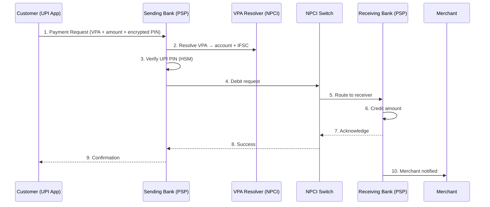

*The UPI payment flow: the customer initiates a payment from their UPI app; the sending bank resolves the VPA to bank details, verifies the encrypted UPI PIN via HSM, debits the sender, and routes the transaction through the NPCI switch to the receiving bank, which credits the beneficiary. Confirmation flows back through the chain to the customer and merchant. The entire flow typically completes in under 3 seconds.*

---

### Characteristics

A payment system's characteristics determine its reliability, security, scalability, and user experience. UPI's design choices shape how transactions are processed, secured, and settled across a vast, heterogeneous banking ecosystem.

| Characteristic | What it means | Why it matters | How it works |
|---|---|---|---|
| **Virtual Payment Address (VPA)** | A human-readable identifier (name@bank) instead of account/IFSC | Simplifies P2P; no need to share bank details | VPA resolver maps VPA → bank account + IFSC |
| **Real-time settlement** | Transactions settle within seconds, 24x7 | Better than batch systems (NEFT/RTGS) | NPCI switches transaction to receiver's bank in real-time |
| **Interoperability** | Any UPI app can send to any other UPI app/bank | Network effect; no closed-loop wallets | Standardized API between NPCI and all participating banks |
| **Multi-bank support** | 150+ banks participate; users link any UPI-enabled bank account | Broad coverage; users keep their preferred bank | Apps act as front-end; banks handle actual fund movement |
| **Secure authentication** | UPI PIN (MPIN) + device binding + mobile number | Protects against fraud even if phone is stolen | PIN is encrypted; verified by sending bank; never stored |
| **Request-to-Pay** | Merchant can request payment; payer approves via UPI app | Enables commerce use cases (e-commerce, bill pay) | UPI Collect API: merchant sends request → user approves |

**VPA (Virtual Payment Address):** The VPA is the user-facing identity in the UPI ecosystem — a string like `rahul@sbi` or `alice@oksbi` that maps to a real bank account. The VPA resolver (managed by NPCI or the issuing bank) translates the VPA to the underlying account number, IFSC code, and the beneficiary's name for display. This abstraction is critical: users never need to share or store sensitive bank details, reducing the attack surface for phishing and data leakage. VPAs can be created, changed, or deleted without re-linking the bank account, and a single account can have multiple VPAs (e.g., a personal and a business address).

**Real-time settlement:** Unlike NEFT (which runs in hourly batches) or RTGS (which operates during business hours for large-value transfers), UPI settles every transaction in real-time — typically within 2–3 seconds. The NPCI switch acts as the central clearing house: it receives a debit instruction from the sending bank, routes the credit instruction to the receiving bank, and waits for both acknowledgments before confirming success. The switch processes 10B+ transactions per month with peak throughput exceeding 3,800 TPS. Settlement between banks happens on an hourly net-settlement basis: NPCI aggregates all debits and credits between each pair of banks and settles the net difference, reducing the volume of inter-bank fund transfers.

**Interoperability:** A defining feature of UPI is that it is an open, interoperable network. Google Pay (backed by HDFC Bank) can send money to PhonePe (backed by ICICI Bank) or to a Paytm user (backed by Yes Bank) — the sender and receiver don't need to use the same app or even the same bank. This works because NPCI defines a single, standardized API specification that all 150+ participating banks implement identically. The app is merely a front-end; the bank behind the app is the actual Payment Service Provider (PSP) that connects to the NPCI switch. This is analogous to how any email provider can send mail to any other — the SMTP protocol is standardized, so Gmail can email Outlook users.

**Multi-bank support:** Over 150 banks participate in UPI, ranging from SBI (the largest bank in India with 500M+ customers) to small cooperative banks. Each bank operates its own UPI API server, which must pass NPCI's certification process. The bank's UPI infrastructure includes: a UPI API gateway (handling authentication, rate limiting, and protocol translation), a core banking integration layer (debit/credit, balance check), an HSM-backed PIN verification service, and a device-registration service. Banks scale independently — some use dedicated data centers, others run on cloud infrastructure. The app layer (Google Pay, PhonePe, Paytm) connects to whichever bank the user has linked as their primary UPI account, but a single app can support multiple linked bank accounts.

**Secure authentication:** Every UPI transaction requires two-factor authentication: (1) the UPI PIN (MPIN), a 4–6 digit secret known only to the user, and (2) device binding, which ensures the transaction originates from a registered device. The PIN is never transmitted in plaintext — the app encrypts it using the bank's RSA public key, and the bank decrypts it inside an HSM (Hardware Security Module) to verify against the stored hash. Device binding ties a device ID + SIM card to the user's bank account; transactions from unregistered devices trigger additional verification (SMS OTP or app-based approval). This dual-layer security means that even if a phone is stolen and the SIM is swapped, the attacker cannot initiate a transaction without the UPI PIN.

**Request-to-Pay:** The UPI Collect (or Request-to-Pay) API enables a merchant or payee to request money from a payer. The merchant calls `POST /upi/collect` with the payer's VPA, amount, and merchant ID; NPCI routes the request to the payer's bank, which pushes a notification to the payer's UPI app; the payer reviews and approves the payment with their UPI PIN. This flow is essential for e-commerce checkout, bill payments, and DTH recharge — any scenario where the payee initiates the monetary flow. It contrasts with the direct "Pay" flow, where the payer initiates the transfer themselves by entering the payee's VPA and amount.

---

### Pros

* **Instant**: Transactions settle in seconds, 24x7, no batch processing delays.
* **Simple**: VPA (`name@bank`) replaces account number + IFSC code.
* **Secure**: UPI PIN encryption, device binding, bank-level authentication.
* **Interoperable**: Any app can pay any bank/app — no closed loop.
* **No merchant fees**: Zero MDR (Merchant Discount Rate) on UPI.
* **Wide adoption**: 10B+ transactions/month, 250M+ users in India.

The combination of instant, free, and interoperable payments creates a powerful network effect: more users attract more merchants, which in turn attracts more users. UPI's design as a public utility — operated by the not-for-profit NPCI rather than a single commercial entity — ensures the network remains open and competitive, with over 150 competing apps built on the same rail.

---

### Cons

* **India-only**: Primarily used in India; not available internationally (different systems: FedNow, PIX, etc.).
* **Bank dependency**: Requires bank participation; if your bank doesn't support UPI, you're excluded.
* **Single point of failure**: NPCI switch downtime affects all UPI apps.
* **Transaction limits**: Per-app, per-bank, per-day limits (typically ₹2,000-5,000 per transaction, ₹50,000/day).
* **Fraud risk**: UPI PIN phishing, SIM swap attacks, social engineering.
* **Customer support**: Dispute resolution can be slow; relies on banks for chargebacks.

UPI's India-only scope is both its strength (deep local integration with bank accounts and Aadhaar) and its limitation (no global footprint). The system's reliance on a central switch means that NPCI outages — though rare — affect every UPI user simultaneously, creating a systemic risk that alternative payment rails (cards, NEFT) often serve as fallback.

---

### Use Cases

#### Peer-to-Peer Money Transfer (Google Pay / PhonePe)

* **Problem**: Quickly send money to friends and family without cash or bank visits.
* **Solution**: Open the UPI app → enter recipient VPA/mobile number + amount → enter UPI PIN → transaction completes in seconds.
* **Why suitable**: UPI's real-time settlement + VPA abstraction make it instant and simple — no need to save beneficiary details.
* **How it works**: App → sending bank → NPCI switch → receiver's bank → confirmation. Receiver gets SMS + in-app notification. Funds reflect in 2–3 seconds.
* **Trade-offs**: Requires internet (not SMS-based); PIN phishing is a fraud vector.

#### Merchant Payments (E-commerce, Retail)

* **Problem**: Accept digital payments in-store or online without card swipes or POS terminals.
* **Solution**: QR code scan (static or dynamic) → customer scans with UPI app → confirms via UPI PIN → merchant receives payment.
* **Why suitable**: Zero MDR for merchants (encourages adoption); works on any smartphone; instant settlement.
* **How it works**: Merchant generates QR with VPA + amount → customer scans → UPI app pre-fills amount → customer enters PIN → NPCI routes to merchant's bank → merchant receives confirmation.
* **Trade-offs**: Requires a smartphone for scanning (no feature-phone support for the payer); network connectivity needed for both parties.

#### Bill Payments and Auto-Pay (Mandate)

* **Problem**: Pay recurring bills (electricity, water, streaming subscriptions, mutual funds) automatically each month.
* **Solution**: Merchant registers a mandate with NPCI → customer approves the mandate once → funds are auto-debited on the due date.
* **Why suitable**: UPI 2.0 introduced mandate functionality — recurring payments without re-authentication each cycle.
* **How it works**: Merchant calls `POST /upi/mandate/register` → customer's UPI app sends approval with UPI PIN → bank sets up the recurring debit → on due date, the bank auto-debits and notifies the merchant.
* **Trade-offs**: The customer must pre-authorize; mandate revocation must propagate immediately.

---

### Components

UPI's architecture spans three layers: the NPCI layer (governance, routing, settlement), the bank layer (150+ Payment Service Providers each running a UPI API server), and the app layer (customer-facing front-ends). Each component has distinct responsibilities and failure modes.

| Component | Purpose | Responsibilities | Relationship | Real-world Example |
|---|---|---|---|---|
| **NPCI Switch** | Core transaction router | Receive transaction requests from PSPs, route to receiver's bank, handle settlement | Payment apps → NPCI; Banks → NPCI | NPCI's UPI switch |
| **Sending Bank (PSP)** | Initiate transaction from sender | Validate VPA, check balance, verify UPI PIN, debit account | Receives request from app; sends to NPCI | SBI, HDFC, ICICI |
| **Receiving Bank (PSP)** | Credit receiver's account | Receive funds from NPCI, credit receiver account | Receives from NPCI; credits customer | Any UPI-enabled bank |
| **UPI App (PSP Front-end)** | Customer-facing interface | App UI, QR scanning, contact sync, VPA management | Calls bank's UPI API | Google Pay, PhonePe, Paytm |
| **VPA Resolver** | Map VPA → bank account | Resolve `name@bank` → account number + IFSC | Called by sending bank | NPCI's VPA directory |
| **Settlement Engine** | Net settlement between banks | Aggregate inter-bank settlements (hourly/periodic) | Banks → Settlement Engine | NPCI's settlement system |
| **Fraud Detection** | Detect fraudulent transactions | Real-time monitoring of transaction patterns | Monitors NPCI switch traffic | NPCI's fraud systems |
| **UPI PIN Verification** | Secure PIN check | Encrypt PIN, send to issuer bank for verification | Bank → Bank (via NPCI) | UPI PIN verification service |

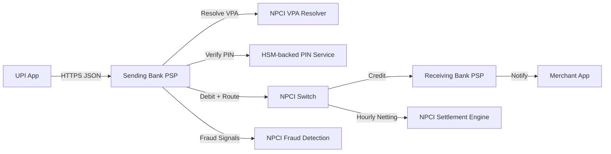

*The component architecture: the UPI app communicates with the sending bank over HTTPS/JSON; the sending bank resolves the VPA via NPCI's directory, verifies the encrypted UPI PIN in an HSM, debits the account, and sends the transaction to the NPCI switch; the NPCI switch routes the credit to the receiving bank; the settlement engine performs hourly netting between banks; and NPCI's fraud detection system monitors all traffic in real-time.*

**Component descriptions:**

- **NPCI Switch:** The central transaction router operated by NPCI. It receives debit instructions from sending banks and credit instructions to receiving banks. It enforces transaction idempotency (via unique `txnId`), routes based on the resolved bank IFSC, and coordinates the two-phase debit-then-credit flow. NPCI operates two active data centers (Mumbai and Delhi) with automatic failover. The switch is built on a high-throughput messaging platform with sub-second processing per transaction.

- **Sending Bank (PSP):** The bank backing the payer's UPI app. It validates the payment request, resolves the VPA (if not cached), verifies the UPI PIN in an HSM, checks for sufficient balance and per-day limits, and debits the sender's account. It then sends the transaction to the NPCI switch. Each bank scales independently behind an API gateway with rate limiting and connection pooling.

- **Receiving Bank (PSP):** The bank backing the payee's account. It receives the credit instruction from the NPCI switch, credits the beneficiary's account, and sends an acknowledgment back through the chain. Receiving banks must handle high write throughput during peak hours (e.g., salary days) and must be available for at least 99.5% uptime.

- **UPI App (PSP Front-end):** The customer-facing application (Google Pay, PhonePe, Paytm, or a bank's own app). It provides the UI for entering VPAs, scanning QR codes, managing linked bank accounts, and entering the UPI PIN. The app communicates with its partner bank's UPI API over HTTPS. Apps compete on UX, features, and cashback offers — the bank integration is a commodity.

- **VPA Resolver:** A directory service (operated by NPCI or the bank) that maps a VPA to the underlying account number, IFSC code, and beneficiary name. VPAs rarely change, so lookups are heavily cached (Redis) with a fallback to the durable PostgreSQL-backed directory. The resolver must be highly available — a VPA resolution failure prevents any transaction to that address.

- **Settlement Engine:** NPCI's inter-bank settlement system. It aggregates all debits and credits between each pair of banks over an hourly window and computes the net amount each bank owes or is owed. Instead of 150 × 149 = 22,350 bilateral settlements, multi-lateral netting reduces this to ~150 settlements against a central clearing account, reducing transaction volume and capital requirements by 10–50x.

- **Fraud Detection:** NPCI's real-time fraud monitoring system, which analyzes 100+ signals per transaction (velocity, geolocation, device fingerprint, behavioral patterns). Banks also run their own fraud models. Suspicious transactions are flagged for review or auto-declined. The system processes every transaction through streaming analytics (Flink/Kafka Streams) with sub-100ms decision latency.

- **UPI PIN Verification:** A bank-side service backed by an HSM (Hardware Security Module) that decrypts the RSA-encrypted PIN block (ISO 9564 format) and verifies it against the stored PIN hash. The PIN is never stored or transmitted in plaintext. Each bank operates dedicated HSM clusters to handle high-throughput PIN verification with < 10 ms latency.

---

### Architectural Patterns

UPI employs several recurring architectural patterns that define how payments are initiated, authenticated, and settled. These patterns address interoperability, security, and the diverse needs of P2P and commerce use cases.

#### Direct Pay (P2P Push)

* **What:** The payer initiates a transfer by entering the payee's VPA and amount in their UPI app, authenticating with a UPI PIN.
* **Problem solved:** Enables instant person-to-person transfers without the payee taking any action — the funds arrive automatically in the payee's account.
* **How it works:** Payer → UPI App → Sending Bank → NPCI Switch → Receiving Bank → Credit payee account → Confirmation back to payer. The sending bank verifies the VPA, checks balance and limits, verifies the UPI PIN, debits the account, and sends the transaction to NPCI.
* **When to use:** P2P transfers, in-store payments via QR scan + manual amount entry, splitting bills.
* **When not to use:** Recurring payments (use Mandate instead); merchant checkouts where the merchant controls the amount (use Collect instead).
* **Pros:** Instant; no action required from the payee; simple user flow.
* **Cons:** Sender must know/trust the recipient's VPA; no payee-side approval step.
* **Real-world example:** Google Pay's "Pay to UPI ID or mobile number."

#### Request-to-Pay (UPI Collect)

* **What:** A merchant (or payee) sends a payment request to a payer, who must approve it via their UPI app using a UPI PIN.
* **Problem solved:** Enables commerce (merchant payments, bill payments) where the payee initiates the monetary flow but the payer must explicitly approve and authenticate.
* **How it works:** Merchant calls `POST /upi/collect` with the payer's VPA, amount, and merchant ID → NPCI forwards to the payer's bank → bank sends a push notification to the payer's UPI app → payer opens the app → approves with UPI PIN → funds transferred. Two APIs are involved: `collect` (merchant → NPCI → customer approves) and `pull` (merchant → NPCI → bank pulls funds after customer consent).
* **When to use:** E-commerce checkout, bill payments, DTH recharge, any scenario where the payee controls the amount.
* **When not to use:** In-store QR payments where the customer scans and enters the amount manually (use Direct Pay instead).
* **Pros:** Customer must approve (secure); works for commerce; merchant controls the payment flow.
* **Cons:** Requires customer action (can abandon); higher friction than auto-pay; depends on the customer opening their app.
* **Real-world example:** Google Pay's "Request money," PhonePe merchant payments.

#### Mandate (Auto-Pay / Recurring)

* **What:** A one-time customer approval authorizes the bank to auto-debit a linked account on a schedule (e.g., monthly for a subscription).
* **Problem solved:** Eliminates the need for the customer to manually approve each recurring payment — useful for subscriptions, utility bills, and EMIs.
* **How it works:** Merchant registers a mandate with NPCI via `POST /upi/mandate/register` → customer's UPI app sends approval with UPI PIN → bank stores the mandate (start date, end date, frequency, max amount) → on the due date, the bank auto-debits and notifies both parties. The mandate can be revoked at any time by the customer.
* **When to use:** Subscription services, utility bills, loan EMIs, insurance premiums, mutual fund SIPs.
* **When not to use:** One-off payments (use Direct Pay); situations where the customer must review the amount each time (use Collect).
* **Pros:** Frictionless for the customer after initial setup; supports automated billing at scale.
* **Cons:** Customer must trust the merchant with recurring access; revocation must propagate immediately; disputes on auto-debited amounts require bank intervention.
* **Real-world example:** Netflix subscription via UPI AutoPay, electricity bill auto-debit.

#### Two-Factor Authentication (UPI PIN + Device Binding)

* **What:** Every UPI transaction requires (1) the UPI PIN (MPIN), a 4–6 digit secret known only to the user, and (2) device binding, which ensures the transaction originates from a registered device.
* **Problem solved:** Prevents fraud — even if a phone is stolen or a SIM is swapped, the UPI PIN protects funds.
* **How it works:** (1) App encrypts PIN using RSA with the bank's public key → (2) bank's server decrypts using HSM with private key → (3) bank verifies PIN against stored hash (not plaintext) → (4) device binding: transactions from new devices require additional verification (SMS OTP or app approval). The PIN is encrypted using ISO 9564 format and transmitted over TLS 1.3.
* **When to use:** Every UPI transaction (mandatory by NPCI).
* **When not to use:** Never — always required for any debit transaction.
* **Pros:** Strong security; PIN never leaves the app in plaintext; device binding adds protection against SIM swap attacks.
* **Cons:** User friction (enter PIN each time); PIN entry on public devices is risky; SMS OTP fallback adds latency.
* **Real-world example:** All UPI transactions in India require UPI PIN + device binding verification.

---

### Benefits

* **Financial inclusion**: Bank account is sufficient — no credit card needed for digital payments.
* **Instant peer-to-peer**: Send money to anyone instantly using just a mobile number or VPA.
* **No merchant fees**: UPI transactions are free for merchants (encourages adoption).
* **24x7 availability**: Works anytime, even on holidays.
* **Interoperable**: Pay anyone regardless of bank or app.
* **Cashback ecosystem**: Cashback incentives drive adoption.

Beyond the user-facing benefits, UPI creates system-level advantages: **reduced cash dependency** (the RBI reported a 50% reduction in cash circulation velocity since UPI's launch), **lower payment processing costs** for merchants and businesses (zero MDR vs. 2–3% for cards), and **financial data trails** that enable better credit scoring and fraud detection. The open, standardized API has also fostered a thriving fintech ecosystem — over 150 UPI apps compete on features, UX, and cashback, driving rapid innovation.

---

### Challenges

#### Technical Challenges

* **Real-time settlement**: 10B+ transactions/month must settle in < 2 seconds; requires high-throughput, low-latency switch at NPCI.
* **UPI PIN security**: PIN must be verified without exposing it; uses encrypted PIN block (ISO 9564 format) sent to issuer bank.
* **Interoperability**: 150+ banks with different tech stacks, APIs, and SLAs must all interoperate seamlessly.
* **Device binding**: Track registered devices per user; allow/deny transactions based on device fingerprinting.

#### Scalability Challenges

* **Transaction volume**: 10B+ transactions/month = 3,800+ TPS peak; need auto-scaling infrastructure at NPCI and each bank.
* **VPA resolution**: Resolve millions of VPAs in real-time; VPA directory must be globally consistent.
* **App scaling**: Google Pay, PhonePe each handle 50M+ MAU with < 1 second payment latency.

#### Performance Challenges

* **Payment latency**: End-to-end (app → bank → NPCI → bank → app) must complete in < 3 seconds for good UX.
* **PIN verification**: Bank server must verify PIN within the same transaction window (no timeout).
* **Settlement batching**: NPCI settles inter-bank positions hourly; must handle netting efficiently.

#### Reliability Challenges

* **Switch uptime**: NPCI switch must be 99.9%+ available — outage affects ALL UPI payments.
* **Bank outages**: If a bank's UPI services are down, users of that bank can't send/receive via UPI.
* **Duplicate transactions**: Network retries can cause duplicate debits — idempotency keys required.

#### Maintainability Challenges

* **API versioning**: NPCI updates UPI specification (currently v2.0); 150+ BSPs must upgrade.
* **Feature rollout**: New features (e.g., credit line, bill presentment) require coordination across banks + NPCI.
* **Error handling**: Standardized error codes across banks + NPCI; mapping to user-facing messages.

#### Operational Challenges

* **Fraud monitoring**: Detect phishing, SIM swap, and social engineering attacks in real-time.
* **Settlement reconciliation**: Daily netting between 150+ banks; resolve mismatches.
* **Customer support**: Handle disputes (wrong amount, failed reverse, merchant issues).

#### Security Concerns

* **UPI PIN phishing**: Fraudsters use UPI PIN collection websites/apps — educate users to never share PIN.
* **SIM swap attacks**: Fraudster gets victim's SIM → initiates payment → victim's bank approves (device registered).
* **Collect request spam**: Fraudsters send collect requests for ₹1 to verify active accounts → filter by banks.
* **Account takeover**: If phone is stolen, device binding + UPI PIN mitigates.
* **Obfuscated UPI flows**: Some apps use hidden/undocumented UPI APIs — NPCI crackdown ongoing.

---

### Best Practices

* **Idempotency**: Every UPI transaction uses a unique `txnId` — retrying won't create duplicate transactions.
* **PIN security**: Never store UPI PIN; always send encrypted to the bank's server; validate server-side only.
* **Timeout handling**: Set appropriate timeouts at each step (app→bank: 30s; bank→NPCI: 30s; NPCI→bank: 10s).
* **Error mapping**: Handle all NPCI error codes (00 = success, others = specific failures) → map to user-friendly messages.
* **Device registration**: Require new device approvals with additional verification (SMS OTP or video KYC for high-risk).
* **Transaction limits**: Implement per-transaction, per-day, per-app, and per-bank limits.
* **Audit logging**: Log all transaction attempts (success + failure) with full request/response for dispute resolution.

**Idempotency in practice:** Every UPI transaction carries a `txnId` (unique per payer-bank) and a `refId` (unique per merchant). The NPCI switch uses `txnId` to detect and reject duplicate submissions — if a network timeout causes the app to retry, the switch recognizes the duplicate `txnId` and returns the original response without re-debiting. Banks must also implement idempotency on their side: if a `txnId` is already present in the transaction log, the bank returns the cached result instead of processing the transaction again. This prevents double-debit scenarios that could occur during network partitions between the app, bank, and NPCI switch.

**Timeout cascading:** UPI transactions involve three hops (app → bank → NPCI → bank), each with its own timeout. The app must set a timeout longer than the bank's, which must be longer than NPCI's. If the bank times out (30s) before NPCI responds, it returns a timeout error to the app — but the transaction may still be processing at NPCI. The bank must then poll NPCI for the final status and update the transaction record. This "pending" state (where the bank doesn't yet know if the transaction succeeded) requires careful state machine design and a reconciliation job that runs every 15 minutes to close out stuck transactions.

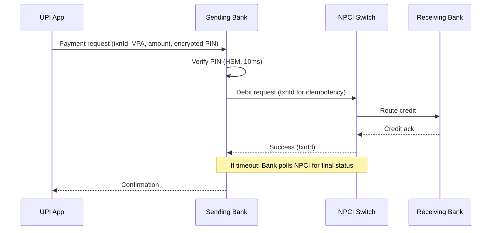

*Timeout handling and idempotency: the app sends a payment request with a unique txnId; the bank verifies the PIN in the HSM, then sends the debit request to NPCI (which uses txnId to deduplicate); if the bank times out waiting for NPCI, it polls for the final status rather than assuming failure. This ensures no double-debit and no lost confirmation.*

---

### When to Use / When Not to Use

**Use when:**

* You need real-time, low-cost, interoperable payments in India (95%+ UPI adoption among digital payers).
* You are building a fintech app, e-commerce platform, or banking product targeting Indian consumers.
* You need merchant payments with zero MDR (Merchant Discount Rate).
* You need recurring payments (subscriptions, bills) via UPI Mandate (auto-pay).
* You need P2P transfers using just a mobile number or VPA (no account/IFSC sharing).

**Avoid when:**

* Operating outside India — use local systems (FedNow in the US, PIX in Brazil, Cards globally).
* You need buyer protection/chargeback rights — UPI has limited dispute resolution compared to cards.
* Your target users don't have bank accounts or smartphones (feature phone users can't use UPI apps).
* You need payment rails for international remittances — UPI doesn't directly connect to SWIFT.

**Alternatives:**

* **Cards**: Wider international acceptance; higher fees (2-3%); slower settlement.
* **NEFT/RTGS**: Batch-based; slower; bank-only (not app-based).
* **Wallet (Paytm)**: Fast but closed-loop (within the wallet ecosystem).
* **IMPS**: Also real-time and 24x7 but requires bank details (no VPA).
* **FedNow / PIX / CBDC**: Regional real-time payment systems in other countries.

**Decision factors:**

* **Geographic availability**: India → UPI; other countries → local rails (PIX, FedNow, etc.).
* **User base**: Indian consumers → UPI (95%+ adoption); global → cards.
* **Cost**: UPI is free for merchants; cards cost 2-3% MDR.
* **Speed**: UPI is instant (2-3s); NEFT is batch (hourly); RTGS is real-time but business-hours only.
* **Chargebacks**: UPI has limited buyer protection; cards offer stronger chargeback rights.

---

### Data Model and API

UPI's data model centers on the entities involved in a payment: the sender, the receiver, the transaction itself, the VPA mapping, the device, and the settlement record. Unlike social media (where the data model is about posts and follows), UPI's model is about accounts, transactions, and audit trails — every field matters for compliance and dispute resolution.

```mermaid
erDiagram
    USER ||--o{ BANK_ACCOUNT : "owns"
    USER ||--o{ VPA : "registered_to"
    USER ||--o{ DEVICE : "uses"
    BANK_ACCOUNT }|--|| PSP : "backed_by"
    USER {
        string user_id PK
        string mobile_number
        string name
    }
    VPA {
        string vpa PK
        string user_id FK
        string bank_account_id FK
        string ifsc_code
        timestamp registered_at
    }
    BANK_ACCOUNT {
        string account_id PK
        string user_id FK
        string ifsc_code
        string account_number_encrypted
        string bank_name
        decimal balance
    }
    TRANSACTION {
        string txn_id PK
        string payer_vpa FK
        string payee_vpa FK
        string payer_account_id FK
        string payee_account_id FK
        string npci_ref_id
        decimal amount
        string currency
        string status
        string direction
        timestamp created_at
        timestamp settled_at
    }
    MERCHANT {
        string merchant_id PK
        string vpa FK
        string name
        string category_code
    }
    DEVICE {
        string device_id PK
        string user_id FK
        string device_fingerprint
        boolean is_registered
        timestamp registered_at
    }
    SETTLEMENT {
        string settlement_id PK
        string payer_bank_ifsc FK
        string payee_bank_ifsc FK
        decimal net_amount
        timestamp settled_at
    }
    USER ||--o{ TRANSACTION : "initiates"
    BANK_ACCOUNT ||--o{ TRANSACTION : "involved_in"
    PSP }|o--o{ SETTLEMENT : "settles"
```

*The entity-relationship diagram shows the core UPI data model: users own bank accounts and VPAs; a VPA maps a user to a specific bank account + IFSC; transactions link payer and payee VPAs/accounts with the NPCI reference ID and amount; merchants are payees with a merchant ID and category code; devices are registered to users for device-binding; settlements aggregate inter-bank positions.*

**Entity descriptions:**

- **USER:** Core entity. `user_id` (UUID), `mobile_number` (unique, primary contact), `name`. Stored in the bank's customer database; UPI apps never store more than the mobile number and masked name.
- **VPA:** `vpa` (PK, e.g., `rahul@sbi`), `user_id` (FK), `bank_account_id` (FK), `ifsc_code`, `registered_at`. The VPA resolver uses this mapping to translate a VPA to account + IFSC. VPAs can be updated without changing the underlying account.
- **BANK_ACCOUNT:** `account_id` (UUID), `user_id`, `ifsc_code`, `account_number` (encrypted at rest), `bank_name`, `balance`. The account number is encrypted with a bank-managed DEK stored in an HSM. Balance is checked before every debit.
- **TRANSACTION:** `txn_id` (unique per payer-bank, e.g., `txn_12345`), `payer_vpa`, `payee_vpa`, `payer_account_id`, `payee_account_id`, `npci_ref_id` (NPCI's reference), `amount`, `currency`, `status` (PENDING/SUCCESS/FAILED/REVERSED), `direction`, `created_at`, `settled_at`. The `txn_id` + `npci_ref_id` pair ensures idempotency across the bank↔NPCI boundary.
- **MERCHANT:** `merchant_id`, `vpa`, `name`, `category_code` (e.g., "5499" for miscellaneous, "5815" for digital goods). Merchants register with NPCI and receive a unique merchant ID used in Collect and Mandate flows.
- **DEVICE:** `device_id`, `user_id`, `device_fingerprint` (hash of model + OS + SIM + app signature), `is_registered`, `registered_at`. The bank uses this to enforce device binding — transactions from unregistered devices trigger additional verification.
- **SETTLEMENT:** `settlement_id`, `payer_bank_ifsc`, `payee_bank_ifsc`, `net_amount`, `settled_at`. NPCI's hourly netting engine creates one settlement record per inter-bank pair per settlement window.

**Indexes and Constraints:**

- `USER.mobile_number` — UNIQUE (primary user identifier).
- `VPA.vpa` — UNIQUE (no two users can have the same VPA).
- `TRANSACTION.txn_id` — UNIQUE (idempotency key for payer-bank).
- `TRANSACTION.npci_ref_id` — UNIQUE (NPCI's reference, used for reconciliation).
- `BANK_ACCOUNT(account_id, user_id)` — ensures the account belongs to the user (authorization check).
- `DEVICE(device_id, is_registered)` — index for fast device-binding checks.

**API Contract:**

| Method | Endpoint | Purpose | Rate Limit |
|---|---|---|---|
| POST | `/v1/upi/pay` | Direct pay (payer-initiated transfer) | 100 req/min per user |
| POST | `/v1/upi/collect` | Request-to-pay (merchant requests money) | 1000 req/min per merchant |
| POST | `/v1/upi/mandate/register` | Register a recurring mandate | 10 req/min per merchant |
| POST | `/v1/upi/mandate/execute` | Execute a scheduled mandate debit | 50 req/min per merchant |
| GET | `/v2/upi/vpa/resolve` | Resolve VPA → account + IFSC | 1000 req/min per bank |
| GET | `/v2/upi/balance` | Fetch linked account balance | 60 req/min per user |
| POST | `/v1/upi/transactions/status` | Check transaction status | 60 req/min per user |
| POST | `/v1/upi/device/register` | Register a new device | 5 req/hour per user |
| POST | `/v1/upi/pin/verify` | Verify UPI PIN (encrypted) | 100 req/min per user |
| GET | `/v1/upi/settlement/status` | Settlement status for merchant | 100 req/min per merchant |

**POST `/v1/upi/pay` — Request:**

```json
{
  "requestHeader": {
    "requester": "com.google.pay",
    "reqCode": "PAY",
    "txnId": "txn_001_abc123",
    "timestamp": "2024-06-14T10:30:00.000Z"
  },
  "payeeDetails": {
    "payeeVpa": "merchant@upi",
    "name": "Amazon Pay",
    "merchantId": "merch_987"
  },
  "payerDetails": {
    "payerVpa": "alice@oksbi",
    "accountId": "acc_123",
    "deviceId": "dev_xyz"
  },
  "amount": {
    "value": "499.00",
    "currency": "INR"
  },
  "encryptedPin": " encrypted_pin_block_base64_enc "
}
```

**POST `/v1/upi/pay` — Response:**

```json
{
  "responseHeader": {
    "responseCode": "00",
    "txnId": "txn_001_abc123",
    "refId": "ref_456",
    "timestamp": "2024-06-14T10:30:02.000Z"
  },
  "data": {
    "txnId": "txn_001_abc123",
    "refId": "ref_456",
    "status": "SUCCESS",
    "amount": {
      "value": "499.00",
      "currency": "INR"
    },
    "payerVpa": "alice@oksbi",
    "payeeVpa": "merchant@upi"
  }
}
```

**POST `/v1/upi/collect` — Request:**

```json
{
  "requestHeader": {
    "requester": "com.phonepe.merch",
    "reqCode": "COLLECT",
    "txnId": "txn_002_def456",
    "timestamp": "2024-06-14T10:30:00.000Z"
  },
  "payerDetails": {
    "payerVpa": "bob@okicici"
  },
  "payeeDetails": {
    "payeeVpa": "merchant@upi",
    "name": "Amazon Pay",
    "merchantId": "merch_987"
  },
  "amount": {
    "value": "499.00",
    "currency": "INR"
  },
  "notes": "Order #12345"
}
```

**POST `/v1/upi/collect` — Response:**

```json
{
  "responseHeader": {
    "responseCode": "00",
    "txnId": "txn_002_def456",
    "refId": "ref_789",
    "timestamp": "2024-06-14T10:30:01.000Z"
  },
  "data": {
    "txnId": "txn_002_def456",
    "refId": "ref_789",
    "status": "PENDING",
    "amount": {
      "value": "499.00",
      "currency": "INR"
    }
  }
}
```

**Status codes:** `00` Success, `01` Pending (awaiting confirmation), `02` Failed, `03` Partial success, `04` Transaction declined, `05` Invalid VPA, `06` Insufficient balance, `07` Invalid PIN, `08` Transaction not allowed to this user, `09` Unable to route (bank down), `99` Technical failure.

---


### Domain-Specific: UPI Payment Flow Deep Dive

This section covers the core technical mechanisms that are unique to UPI and real-time payment systems: how a Virtual Payment Address is resolved to a real bank account, how the NPCI switch routes and coordinates transactions across banks, how participating banks act as Payment Service Providers (PSPs), how merchant payments are processed including the Collect (request-to-pay) flow, how inter-bank settlement is computed and executed, and how real-time direct payments differ from scheduled mandate (auto-pay) payments.

#### VPA Resolution

The Virtual Payment Address (VPA) is the user-facing identifier in the UPI ecosystem. A VPA like `rahul@sbi` or `alice@oksbi` does not directly correspond to a bank account — it is mapped to one (or more) underlying accounts via a VPA resolver directory. The resolver is the glue that makes VPA-based payments possible.

* **What:** The VPA resolver translates a human-readable address (`name@bank`) into the machine-readable banking details required to move funds: the account number, IFSC code, and the beneficiary's name (for display and fraud detection).
* **Problem solved:** Users never need to share or store sensitive bank details (account number, IFSC). A VPA can be changed or deleted without re-linking the bank account, and a single bank account can have multiple VPAs (personal, business, etc.).
* **How it works:** When a user enters a payee's VPA in their UPI app, the sending bank calls `GET /v2/upi/vpa/resolve` on NPCI's VPA directory. The directory returns the target account number (encrypted), IFSC code, and beneficiary name. The bank displays these to the user for confirmation before proceeding with the debit. The resolution is cached at the bank for a short TTL (e.g., 5 minutes) because VPAs rarely change.
* **When to use:** Every payment where the payee is identified by a VPA (Direct Pay, Collect, Merchant QR). VPA resolution is also used for balance inquiries and mandate registration.
* **When not to use:** Payments directly to a bank account number + IFSC (IMPS-style), which bypass UPI entirely.
* **Caching strategy:** The VPA resolver maintains a two-tier cache: an in-process LRU cache (hot VPAs, 10K entries, 5-minute TTL) and a Redis-backed distributed cache (10M entries, 30-minute TTL). Cache misses hit the durable PostgreSQL-backed VPA directory. Cache invalidation happens on VPA registration, update, or deletion via a Kafka invalidation event.
* **Security considerations:** The VPA resolver returns the beneficiary name (for display), but the account number is only returned to the sending bank over a mutually authenticated TLS connection with NPCI. The account number is encrypted in transit and never logged. The beneficiary name serves as a phishing-mitigation check — the user confirms they're paying the right "Rahul" before entering their UPI PIN.

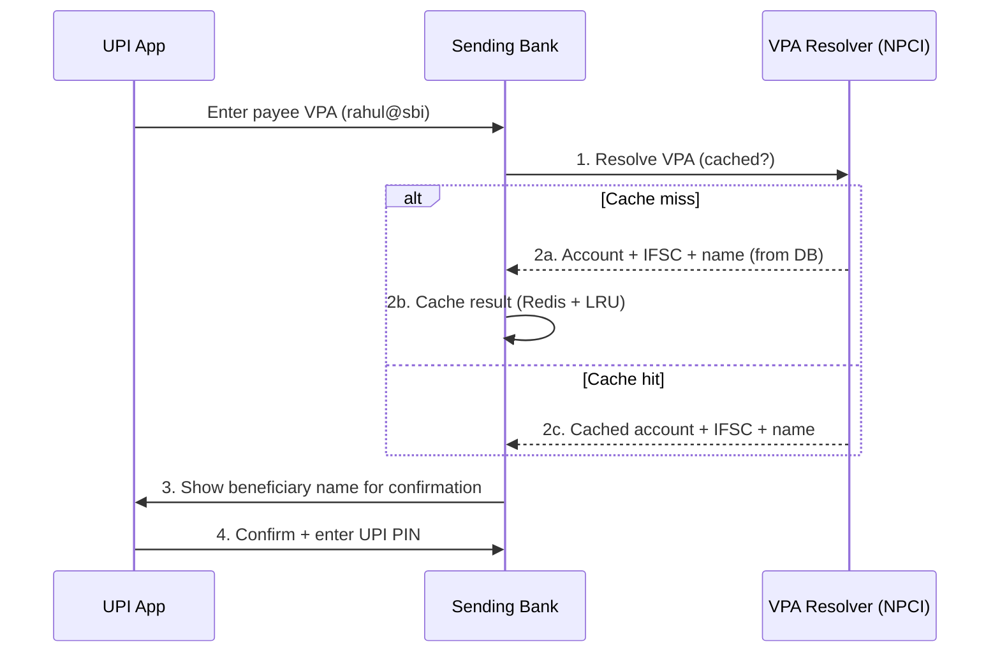

*VPA resolution flow: the user enters a payee VPA; the sending bank checks its local LRU cache and Redis cache; on a miss, it queries NPCI's durable VPA directory and caches the result; the bank displays the beneficiary name for user confirmation before PIN entry. Caching is critical — NPCI reports that 99% of VPA lookups are cache hits, reducing directory load and cutting resolution latency to < 5 ms.*

**VPA setup lifecycle:**

1. **Registration:** User → App → Bank → NPCI → registers VPA → returns success + VPA active. The bank validates that the user owns the bank account before allowing VPA creation on it.
2. **Linking:** The VPA is linked to a specific bank account (the user may have multiple accounts; they choose which one the VPA maps to).
3. **Update:** User can change the linked account without changing the VPA. A Kafka invalidation event clears caches across all banks.
4. **Deletion:** User deletes the VPA → NPCI marks it inactive → all caches invalidated → no further payments accepted to that VPA.

#### NPCI Switch

The NPCI (National Payments Corporation of India) Switch is the central transaction router for the entire UPI ecosystem. It is the single point through which every UPI transaction passes — connecting 150+ banks and 50+ PSP apps. The switch's design is critical to UPI's sub-3-second latency and 10B+/month throughput.

* **What:** The central clearing and routing engine that connects all participating banks and PSPs. It receives debit instructions from the sending bank, routes credit instructions to the receiving bank, and coordinates the two-phase debit-then-credit flow.
* **Problem solved:** Without a central switch, each bank would need bilateral agreements with every other bank (150 × 149 = 22,350 connections) to send and receive funds. The switch reduces this to 150 connections (each bank connects only to NPCI).
* **How it works:** (1) The sending bank sends a `debit` request to the switch with the resolved payee account + IFSC, the amount, the encrypted PIN verification result, and a unique `txnId`. (2) The switch validates idempotency (rejects duplicate `txnId`), checks for sufficient liquidity/bank status, and routes a `credit` instruction to the receiving bank. (3) Both banks acknowledge. (4) The switch returns a combined success/failure to the sending bank. The entire debit-then-credit is a **two-phase commit-like** flow — if the credit fails, the switch triggers a reversal to the sending bank.
* **When to use:** Every UPI transaction goes through the switch. There is no bypass.
* **When not to use:** N/A — the switch is mandatory for all UPI transactions.
* **Throughput architecture:** The NPCI switch uses an in-memory transaction grid with sub-second processing per transaction. It is built on a high-throughput messaging platform (originally a custom system, now migrating to a cloud-native architecture). The switch handles peak loads of 3,800+ TPS and is designed for 100K+ TPS capacity. Two active data centers (Mumbai and Delhi) provide failover. Each transaction is logged to a distributed log (similar to Kafka) for durability and replayability.
* **Idempotency at the switch:** The switch uses `txnId` (unique per payer-bank) to detect duplicates. If a sending bank retries a transaction due to a network timeout, the switch recognizes the duplicate `txnId` and returns the original response without re-debiting or re-crediting. This prevents double-spending in unreliable network conditions.
* **Bank status management:** The switch maintains a real-time health registry of all 150+ banks. If a bank's status is "down," the switch rejects transactions to/from that bank immediately (instead of timing out), returning error code `09` (Unable to route). This prevents transaction pile-up during bank outages and gives apps a fast fail for graceful degradation.

```mermaid
graph TD
    SW[NPCI Switch<br/>Central Router]
    B1[Banks<br/>(150+ BSPs)]
    B1 -->|debit/credit| SW
    B2[UPI Apps<br/>(50+ PSPs)]
    B2 -->|requests| B1
    SW -->|settlement| SE[NPCI Settlement<br/>Engine]
    SW -->|fraud signals| FD[NPCI Fraud<br/>Detection]
    SW -->|events log| TL[Transaction<br/>Log]
    
    style SW fill:#e1f5fe
    style SE fill:#fff3e0
    style FD fill:#fff3e0
    style TL fill:#fff3e0
```

*The NPCI Switch is the central hub: all 150+ banks connect directly to it for debit/credit instructions; 50+ UPI apps connect to their respective banks (not directly to NPCI); the switch coordinates with the Settlement Engine (hourly netting), the Fraud Detection system (real-time signal analysis), and the Transaction Log (durable audit trail).*

#### PSP (Payment Service Provider)

In the UPI ecosystem, a **Payment Service Provider (PSP)** is any entity that provides payment services to end users. This includes both banks (which run the core UPI API server and handle fund movement) and third-party payment apps (which provide the customer-facing interface but partner with a bank to access the UPI rail). Every PSP must be authorized by NPCI and pass certification testing before going live.

* **What:** A Payment Service Provider is an entity that facilitates UPI transactions — either a bank (running the UPI API server and handling fund movement) or a third-party app (providing the user interface and partnering with a bank).
* **Problem solved:** Enables a diverse ecosystem of payment apps (Google Pay, PhonePe, Paytm) that compete on UX while sharing the same underlying payment infrastructure (NPCI + banks).
* **How it works:** A third-party PSP (e.g., Google) partners with a bank (e.g., HDFC Bank) — Google handles the app experience, HDFC handles the banking backend. When a user initiates a payment, the app calls HDFC's UPI API, which performs PIN verification and debit, then sends the transaction to NPCI. The PSP never touches the funds directly — the bank does. For merchant PSPs, the merchant registers with NPCI and receives a `merchantId` used in Collect and Mandate flows.
* **When to use:** When building a UPI-integrated product — you need to partner with a certified bank PSP to access the UPI rail. You cannot connect directly to NPCI as an app.
* **When not to use:** If your use case doesn't require real-time bank-to-bank transfers (e.g., static wallets don't need UPI).
* **Bank PSP infrastructure:** Each bank's UPI API server includes: an API gateway (authentication, rate limiting, protocol validation), a core banking integration layer (debit/credit, balance check), an HSM-backed PIN verification service, a device-registration service, and a transaction event publisher (to Kafka for analytics and fraud detection). Banks must handle 1,000+ TPS during peak hours and maintain 99.5%+ uptime.
* **App PSP infrastructure:** Third-party apps (Google Pay, PhonePe) run microservices on cloud infrastructure (Google Cloud, AWS) with geo-distributed API endpoints. They maintain connection pools to their partner banks, cache VPA lookups, and implement local fraud models using ML. Apps typically handle 50M+ MAU with < 1 second payment latency.

#### Merchant Payment Flow

The merchant payment flow is how UPI enables commerce — from in-store QR code payments to e-commerce checkout. The key distinction is that in merchant flows, the payee (merchant) is a registered entity with a `merchantId`, and the payment is typically initiated as a Collect (request-to-pay) rather than a Direct Pay.

* **What:** The flow by which merchants accept UPI payments from customers, whether in-store (QR code) or online (Collect API).
* **Problem solved:** Enables cash-free commerce without card terminals or expensive POS hardware — a simple QR code suffices for in-store payments.
* **How it works (in-store QR):** Merchant displays a static QR code containing their VPA + merchant ID (or just VPA for small merchants) → customer scans with their UPI app → app shows amount (pre-filled for static QR, or merchant-entered for dynamic QR) → customer enters UPI PIN → sending bank debits → NPCI routes to merchant's bank → merchant receives funds + notification.
* **How it works (e-commerce Collect):** Merchant calls `POST /v1/upi/collect` with the customer's VPA, amount, and merchant ID → NPCI sends a collect request to the customer's bank → bank pushes notification to customer's UPI app → customer opens app, sees the payment request, enters UPI PIN → funds transferred → both parties receive confirmation.
* **Static vs. Dynamic QR:** Static QR codes embed the merchant's VPA but not the amount — the customer enters the amount. Dynamic QR codes embed both VPA and amount (generated per transaction) — the customer just confirms and enters PIN. Dynamic QR reduces input errors and enables per-transaction amounts.
* **Merchant onboarding:** Merchants register with NPCI (or with a PSP that has a sub-merchant relationship) → receive a `merchantId` → link a settlement bank account → display their VPA or QR code. Small merchants can use a PSP's sub-merchant onboarding (e.g., Paytm's merchant collection), while large merchants register directly with NPCI.
* **Refund flow:** If an item is returned, the merchant initiates a reverse transaction by calling `POST /v1/upi/refund` with the original `txnId` → NPCI routes the refund to the customer's bank → customer's account is credited → notification sent. Refunds must reference the original transaction and are subject to the same idempotency rules.

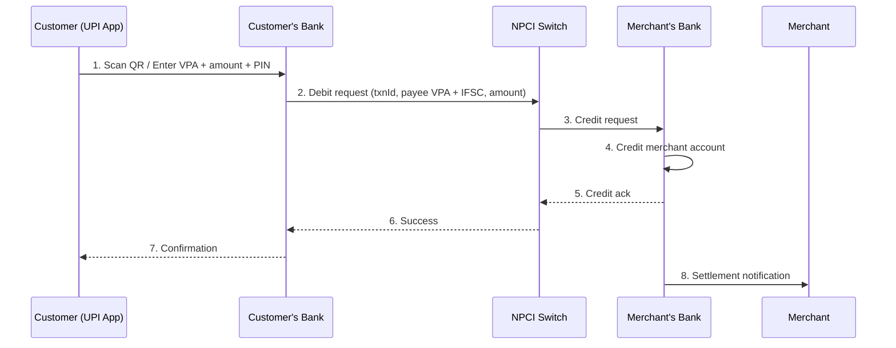

*Merchant payment flow: the customer scans a QR code or enters the merchant's VPA, confirms the amount, and enters their UPI PIN; the customer's bank debits the account and sends the transaction to NPCI; NPCI routes the credit to the merchant's bank, which credits the merchant's account and sends a settlement notification. The customer and merchant both receive confirmation.*

---

#### Settlement Flow

Settlement is how banks reconcile the net funds owed to or from each other at the end of each settlement window. Unlike the real-time transaction flow (which moves individual transactions through the switch), settlement is a batch process that aggregates all transactions between each pair of banks and computes a single net amount to transfer.

* **What:** The periodic (hourly) process by which NPCI aggregates all successful UPI transactions between each pair of banks, computes the net amount owed between them, and instructs the banks to transfer those net amounts through the real-time gross settlement (RTGS) system or the government's account transfer system.
* **Problem solved:** Without net settlement, each bank would need to send and receive millions of individual fund transfers every hour — one per transaction. Netting reduces 100M+ individual credits/debits to ~150 net transfers (one per bank pair).
* **How it works:** (1) NPCI's set collects all `SUCCESS` transactions from the current settlement window (e.g., 10:00–11:00). (2) For each bank pair (Bank A → Bank B), it sums all debits from A and credits to B. (3) If A sent more than B sent to A, A owes money; otherwise B owes A. (4) The net amount is settled via RTGS or the government's account transfer system (the "anchor" account at the RBI). (5) Each bank receives a settlement file with the list of settled transactions and the net amount to transfer.
* **When to use:** Every hour during banking hours. Banks must reconcile their own transaction logs against NPCI's settlement file.
* **When not to use:** N/A — settlement is mandatory for all participating banks.
* **Multi-lateral netting:** Instead of 150 × 149 = 22,350 bilateral settlements, NPCI uses multi-lateral netting through a central clearing account. Each bank settles only its net position against the central account — reducing the number of fund transfers from 22,350 to ~150. This reduces liquidity requirements, transaction costs, and reconciliation complexity by 10–50x.
* **Settlement finality:** Settlement is final once the central bank's account transfer is complete. Until then, the net positions are provisional. Banks must handle the case where a settlement transfer fails — they hold the disputed amount and resolve it manually. NPCI provides a 7-day dispute window for settlement mismatches.
* **Reconciliation:** Each bank runs an automated reconciliation job after each settlement window, comparing NPCI's settlement file against its own transaction log. Any mismatch (missing transaction, wrong amount) is flagged for investigation. Banks that consistently fail to reconcile face penalties and potential suspension from the UPI network.

#### Real-time vs. Mandate Payments

UPI supports two fundamentally different payment initiation models: **real-time (push)** payments, where the payer actively initiates and approves each transaction, and **mandate (scheduled/debit)** payments, where the customer pre-authorizes the bank to auto-debit on a schedule. These models have different risk profiles, user experience, and regulatory requirements.

* **Real-time payments:** The payer opens the UPI app, enters the payee's VPA, confirms the amount, and enters their UPI PIN to authorize each transaction. The transaction is processed immediately and synchronously — funds move in 2–3 seconds. The payer has a moment to review and cancel before PIN entry. Real-time payments are used for P2P transfers, in-store QR payments, and e-commerce checkouts where the payer is present.
* **Mandate payments:** The customer approves a mandate once (via the UPI app with PIN), authorizing the bank to auto-debit a linked account on a specified schedule (e.g., monthly on the 5th). No per-transaction PIN entry is required for subsequent charges. The bank stores the mandate parameters (start date, end date, frequency, max amount per transaction, max amount per cycle) and processes the auto-debit on the due date. Mandate payments are used for subscription services (Netflix, Spotify), utility bills (electricity, water), insurance premiums, and loan EMIs.
* **Risk profile — Real-time:** Low fraud risk because the payer actively approves each transaction with a UPI PIN. Chargeback disputes can be raised within 90 days. Refunds are processed as reverse real-time transactions.
* **Risk profile — Mandate:** Higher fraud risk because the payer doesn't approve each charge. The customer can revoke the mandate at any time, but if the bank processes charges after revocation (due to a propagation delay), the customer can dispute them for a full refund within 90 days. Banks implement a "grace period" (e.g., 4 hours) after revocation before stopping auto-debits.
* **Regulatory differences:** Mandate payments require explicit customer consent (recorded with a consent ID and timestamp). NPCI's mandate notification API sends a pre-debit notification to the customer's app 24 hours before the charge. Banks must provide an easy-to-find mandate management UI where customers can view, modify, or revoke all active mandates.
* **Failure handling:** If a real-time payment fails (insufficient balance), the payer simply retries. If a mandate payment fails (insufficient balance on the due date), the bank retries once after 24 hours; if it still fails, the mandate is suspended and the customer is notified. Merchants must handle failed mandate payments by retrying or notifying the customer.

#### UPI Transaction Lifecycle

The complete UPI transaction lifecycle from the customer's perspective:

1. **Mobile Number Registration**: User registers mobile number with the bank → bank links mobile number to bank account.
2. **VPA Creation**: User creates a VPA (`name@bank`) → bank verifies → NPCI registers VPA → returns success + VPA active.
3. **Device Registration**: App registers device (device ID + SIM) → bank stores → future transactions require registered device.
4. **Payment Initiation**: User scans QR or enters VPA + amount → app calls sending bank's UPI API.
5. **UPI PIN Verification**: App sends encrypted PIN (ISO 9564 format) → bank decrypts with HSM → verifies against stored PIN hash → returns status.
6. **VPA Resolution**: Bank resolves VPA → account number + IFSC + name of beneficiary → shows to user for confirmation.
7. **Transaction Processing**: Bank debits account → sends transaction to NPCI → NPCI routes to receiving bank → receiving bank credits → confirmation propagated back.

#### UPI Collect (Request-to-Pay) Flow

UPI Collect enables a merchant to request money from a customer:

1. Merchant sends collect request (vpa + amount + merchant id + transaction ref) to NPCI.
2. NPCI forwards to the customer's bank.
3. Customer's bank sends a notification to the customer's UPI app.
4. Customer approves via UPI PIN → bank processes → funds transferred.
5. Merchant receives confirmation.

This is used for e-commerce checkout, bill payments, and DTH recharge.

#### UPI PIN Encryption

UPI PIN is never sent in plaintext:

1. App encrypts PIN using RSA with the bank's public key.
2. Encrypted PIN block (ISO-0 format) sent to bank's API.
3. Bank uses HSM to decrypt with private key.
4. Bank verifies PIN against the stored hash (not stored in plaintext — only hash in HSM).

---

### Replication Strategies

UPI's data spans multiple entities — VPAs, transaction logs, settlement records, and fraud models — each with different consistency, latency, and durability requirements. Replication strategies are tailored to each data type's access pattern and criticality.

**VPA directory replication:**

The VPA directory (mapping `name@bank` → account + IFSC) is the most-read, least-written data in the UPI system. NPCI maintains the authoritative directory in PostgreSQL (active-standby across two data centers in Mumbai and Delhi). Reads are served from a multi-tier cache:

- **L1 (in-process LRU):** Hot VPAs cached in the bank's UPI API server process (10K entries, 5-minute TTL). Sub-millisecond access.
- **L2 (distributed Redis):** All resolved VPAs cached in a Redis cluster (10M entries, 30-minute TTL). < 5 ms access.
- **L3 (PostgreSQL):** Cold VPAs fall back to NPCI's PostgreSQL directory. < 10 ms for local reads, higher for cross-region.

Cache invalidation: when a VPA is registered, updated, or deleted, NPCI publishes a `vpa_updated` event to Kafka. Banks consume the event and invalidate their L1/L2 cache entries. This ensures cache coherency within 1–2 seconds of a VPA change without requiring synchronous invalidation on every write.

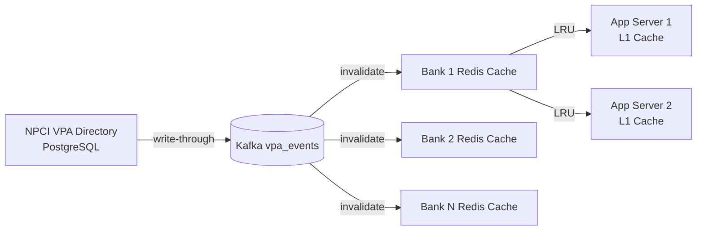

*VPA directory replication: NPCI's PostgreSQL directory is the source of truth; VPA changes are published to Kafka; each bank consumes the events to invalidate their distributed Redis cache (L2); bank app servers further cache hot VPAs in their process-local LRU cache (L1). This three-tier caching strategy reduces directory load by 99% and provides sub-millisecond resolution for 99% of lookups.*

**Transaction log replication:**

Every UPI transaction is logged durably by the sending bank and by NPCI. Banks use a write-ahead log (WAL) in PostgreSQL with synchronous replication across 2 local replicas (for durability) and asynchronous replication to a cross-region disaster recovery site. NPCI maintains a distributed transaction log (similar to Kafka) with replication factor 3 across its two active data centers and one cold DR site. The transaction log is the source of truth for reconciliation and dispute resolution — banks replay their transaction logs every 15 minutes against NPCI's records to detect mismatches.

**Settlement data replication:**

Settlement records (the hourly netting results between bank pairs) are stored in NPCI's settlement database (PostgreSQL, active-standby) and replicated to each bank's settlement data store. Banks use the settlement data for their end-of-day reconciliation. The settlement database uses snapshot isolation to ensure that each settlement window's computation is consistent. Banks download the settlement file via SFTP (encrypted) at the end of each window and import it into their accounting system.

**Cross-region replication:**

NPCI operates two active data centers (Mumbai and Delhi), each capable of handling 100% of the transaction load. Transactions are synchronously replicated between the two sites for the transaction log and settlement database, but VPA directory reads are served from the local region's cache to minimize latency. Banks replicate their UPI transaction logs to their own multi-region stores but route transactions through their nearest NPCI data center. During a regional outage, the surviving NPCI data center handles all traffic — apps detect the failure via health checks and route to the surviving site within 30 seconds.

---

### Failure Detection and Membership

UPI's distributed architecture — spanning NPCI, 150+ banks, and 50+ apps — requires robust failure detection so that when a bank or the switch goes down, transactions fail fast rather than timing out. NPCI and each PSP must detect failures, redistribute traffic, and continue serving with minimal disruption.

**Bank health monitoring:**

NPCI continuously monitors the health of all 150+ participating banks. Each bank exposes a `/health` endpoint (HTTP 200 = healthy, 503 = degraded, 503 with `circuit_open` = down). NPCI polls these endpoints every 5 seconds from both data centers. A bank is marked "down" after 3 consecutive failed health checks (15 seconds of unavailability). When a bank is marked down, the NPCI switch immediately stops routing new transactions to it and returns error code `09` (Unable to route) to sending banks — this fail-fast behavior prevents transaction pile-up.

**Health check tiers:**

| Component | Check Interval | Timeout | Action | Consecutive Failures |
|---|---|---|---|---|
| Bank UPI API | 5s | 10s | Mark bank down; reject transactions | 3 |
| Bank HSM | 3s | 5s | Reject PIN-based transactions; allow non-PIN ops | 2 |
| Bank Core Banking | 10s | 30s | Mark debit/credit unavailable | 3 |
| NPCI Switch | 2s | 5s | App routes to backup data center | 2 |
| VPA Resolver | 3s | 8s | Fall back to cached stale data | 2 |

**Gossip-based membership:**

NPCI uses a gossip protocol among its switch nodes to propagate membership and health state. Each node periodically (every 2 seconds) exchanges health information with a random subset of peers (fan-out of 3). This spreads membership changes through the cluster in O(log N) rounds without a central coordinator. When a node suspects a peer is down, it propagates the suspicion; once 2+ peers confirm, the node is removed from the cluster and its load is redistributed. This protocol is inspired by HashiCorp's Serf and Cassandra's failure detector.

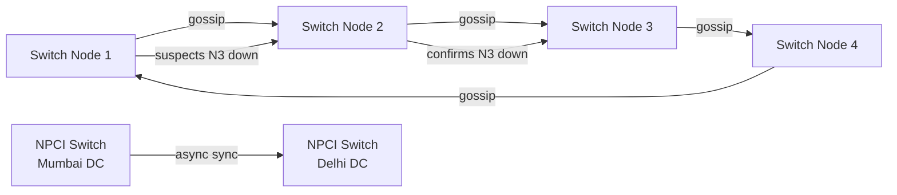

*Failure detection in the UPI switch mesh: switch nodes gossip health state every 2 seconds with a fan-out of 3; suspected failures propagate through the cluster in O(log N) rounds. The NPCI switch operates in two active data centers (Mumbai and Delhi) with asynchronous cross-DC synchronization. Apps query a load-balancer health endpoint every 30 seconds to detect data center failover.*

**Circuit breakers:**

Each PSP (bank or app) wraps its calls to the NPCI switch with a circuit breaker (e.g., Resilience4j or Hystrix). The circuit breaker tracks failures per bank — if Bank X's transactions fail at > 5% rate for 5 consecutive requests, the circuit opens and stops sending transactions to that bank for a 60-second cool-down. This prevents cascading failures — if a bank is slow, the PSP isolates the failure rather than saturating its thread pool with slow requests. After the cool-down, the circuit enters "half-open" mode — a limited number of test requests are sent; if they succeed, the circuit closes.

**Retry strategies:**

UPI transactions use a bounded retry with exponential backoff. The app retries up to 3 times with backoff (1s, 2s, 4s) before returning a failure to the user. Each retry uses the same `txnId` for idempotency — the NPCI switch deduplicates based on `txnId`, so retries don't cause double debits. For Collect (request-to-pay) flows, retries are limited to 1 (the customer must re-approve) — automatic retries would violate the customer's explicit consent requirement.

---

### High Availability and Scalability

UPI must remain available during bank outages, network partitions, and regional failures while scaling to handle 10B+ transactions per month. The system's availability model is layered: NPCI (the switch), banks (PSPs), and apps each maintain their own HA posture, and graceful degradation ensures that partial outages don't bring down the entire system.

#### Multi-Region Deployment

NPCI operates two active data centers — Mumbai (primary) and Delhi (active-active). Each data center hosts a full instance of the UPI switch, VPA directory, settlement engine, and fraud detection system. Each can handle 100% of the transaction load independently. Banks and PSPs connect to their geographically nearest data center via a global load balancer that routes based on latency (typically < 20 ms within India).

- **NPCI Switch (active-active):** Both Mumbai and Delhi data centers process live traffic simultaneously. Transaction state is synchronously replicated between the two sites for the transaction log and settlement database. VPA directory reads are served from the local region's cache to minimize latency. During a regional outage, the surviving data center handles all traffic — apps detect the failure via health checks and route to the surviving site within 30 seconds.
- **Bank-side HA:** Each bank runs its UPI API server in at least 3 availability zones (AWS ap-south-1a, 1b, 1c or Azure). Banks use a load balancer with automatic failover. If one AZ is down, the other two handle 100% of traffic. Banks also maintain a cross-region DR site for disaster recovery.
- **App-side scaling:** Third-party apps (Google Pay, PhonePe) use CDN for static assets and geo-distributed API endpoints. API servers are containerized (Kubernetes/ECS) and auto-scale based on request latency. During peak hours (evening 6–10 PM), apps spin up 3x more API server instances.
- **Global CDN:** Static assets (QR codes, app images, help content) are cached at CDN edge locations. Media (in-app tutorials) uses the same CDN. This reduces origin load by 80% and provides sub-50 ms delivery to 99% of users.

#### Auto-Scaling

- **NPCI Switch:** Built on a high-throughput messaging platform with sub-second processing per transaction. NPCI scales the switch by adding partition workers — each partition handles a subset of `txnId` hash space. During peak hours, NPCI adds 30% more partition workers automatically based on queue depth (if transaction queue > 1,000 messages, add workers).
- **Banks:** Each bank's UPI API gateway scales based on requests-per-second. Kubernetes HPA adjusts replica count when RPS > 500 per instance or latency > 200 ms. During festival sales (Diwali, Dhanteras), banks pre-scale 2x capacity.
- **Fraud Detection:** NPCI's fraud detection system uses a streaming analytics pipeline (Apache Flink on Kafka Streams). It scales consumers based on transaction arrival rate — if the Kafka consumer lag exceeds 10,000 messages, additional Flink task managers are spawned. The system processes each transaction in < 100 ms.
- **VPA Resolution:** The Redis cache cluster scales by adding shards when memory utilization > 80%. The LRU cache in each bank app server is fixed-size (10K entries) to bound memory usage.

#### Graceful Degradation

When a component fails, UPI degrades gracefully rather than failing entirely:

- **Bank down:** If a user's sending bank UPI API is unavailable, the app displays "Your bank is temporarily down — try again in a few minutes or use another linked bank account." Apps that link multiple bank accounts can offer the user an alternate bank. NPCI marks the bank as "down" and all transactions to/from that bank return error `09` (Unable to route) immediately.
- **NPCI switch down:** If the primary NPCI data center is down, apps route to the Delhi data center. If both are down (extremely rare), the app falls back to IMPS (using account + IFSC) or card payments. Apps cache a short list of alternative payment methods for this scenario.
- **VPA resolver down:** If the VPA directory is unavailable, banks fall back to their cached VPA entries (30-minute TTL). If the cache is also empty (cold VPA), the transaction fails with error `05` (Invalid VPA). Users can manually enter account number + IFSC as a fallback.
- **PIN verification slow:** If the HSM is slow (> 500 ms), the bank's PIN service can temporarily reject new PIN verification requests with a "service busy" message, preventing a queue buildup that would slow the entire transaction.
- **Merchant app down:** If the merchant's PSP is down, the Collect request to the customer's bank fails. The bank returns error `09` to the merchant app, which displays "Payment temporarily unavailable — please try again."

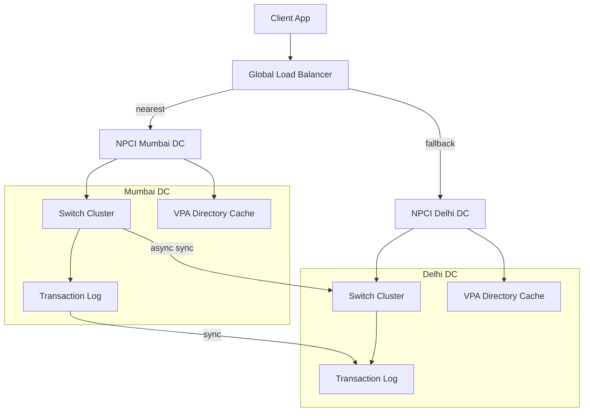

*Multi-region high availability: a global load balancer routes clients to their nearest NPCI data center (Mumbai or Delhi). Each data center is fully self-sufficient — switch cluster, VPA directory cache, and transaction log (synchronously replicated across sites). If one data center fails, the load balancer routes all traffic to the surviving site within 30 seconds. Each bank also maintains multi-AZ deployments with cross-region DR.*

---

### Performance and Optimization

UPI's performance is measured by two key metrics: **end-to-end payment latency** (app → bank → NPCI → bank → app, target < 3 seconds) and **transaction throughput** (3,800+ TPS at peak, 100K+ TPS design capacity). Every millisecond matters — a 500 ms delay at any hop degrades the user experience and increases dropout rates.

#### Latency Optimization

* **End-to-end latency budget:** The 3-second SLA breaks down as: app UI + VPA resolution (200 ms) → PIN encryption + transmission (50 ms) → bank PIN verification in HSM (10 ms) → NPCI switch routing (100 ms) → receiving bank credit (200 ms) → confirmation back to app (200 ms) → app UI update (remaining budget). Each hop has a dedicated owner (bank, NPCI, app) and is instrumented with percentiles (p50, p95, p99).
* **VPA resolution caching:** VPA lookups are cached for 5 minutes (in-process LRU) and 30 minutes (Redis). NPCI reports that 99% of VPA resolutions are cache hits, reducing the median resolution time from 8 ms (database) to 0.5 ms (cache). Cache invalidation is event-driven via Kafka — a `vpa_updated` event clears the cache within 2 seconds of a VPA change.
* **Bank API connection pooling:** Banks maintain persistent HTTPS connections to NPCI (connection pooling with keep-alive) to avoid per-request TLS handshake overhead. Each bank keeps 1,000 pooled connections to the NPCI switch — enough for 5,000 TPS with 200 ms average transaction time.
* **HSM PIN verification:** PIN verification is the most latency-critical operation (it blocks the transaction if slow). Banks use dedicated HSM clusters (Thales nShield or AWS CloudHSM) with connection pooling. Each HSM can verify 5,000 PINs/second — banks provision 20+ HSMs to handle peak load. PIN verification typically completes in < 10 ms (p99 < 50 ms).
* **In-memory state:** The NPCI switch keeps all transaction state in memory (Redis or an in-memory grid) for sub-millisecond access. Only the final state is persisted to the transaction log asynchronously. This "speed layer" pattern allows the switch to process transactions at 100K+ TPS while maintaining durability.

#### Throughput Optimization

* **Switch partitioning:** The NPCI switch partitions transactions by `txnId` hash across 1,024 partitions. Each partition is processed by a dedicated worker. The number of workers scales automatically based on queue depth — if any partition's queue exceeds 1,000 messages, a new worker is spawned. This allows linear scaling up to 100K+ TPS.
* **Bank-side batching:** Banks batch transaction log writes (100 transactions per batch) to PostgreSQL to reduce I/O overhead. The batch is committed atomically — if any transaction in the batch fails, the entire batch is retried.
* **Read replicas:** Banks serve transaction status queries from read replicas of the transaction database. The primary handles writes (debits/credits); replicas handle reads (balance inquiries, transaction status, reconciliation). This separation allows the read path to scale independently.
* **Stream processing for fraud:** NPCI's fraud detection system uses Apache Flink on a Kafka Streams pipeline. Transactions are processed in real-time — each transaction goes through 100+ fraud checks in < 100 ms. The pipeline auto-scales based on transaction arrival rate.

#### Caching Strategies

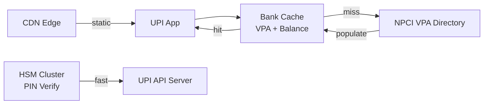

*Multi-tier caching in UPI: the app checks the bank's cache (VPA + balance); on a miss, it queries NPCI's VPA directory and populates the cache. Static assets are served from CDN edge locations. PIN verification goes through the dedicated HSM cluster. This three-tier caching strategy reduces directory load by 99%.*

#### Write Path Optimization

* **Async debit:** The bank returns a "processing" response to the app immediately after initiating the debit; the actual NPCI routing and credit happen asynchronously. The app polls for the final status. This keeps the app-facing latency low while the backend processes the transaction.
* **Idempotent debit:** Each debit request carries a unique `txnId`. The bank's database uses `txnId` as a unique constraint — if a retry arrives with the same `txnId`, the bank returns the cached result without re-debiting. This allows safe retries without double-charging.
* **Batch settlement:** Settlement entries are batched and written to the settlement database in bulk at the end of each hourly window, reducing I/O and allowing the bank to process settlements offline.

---

### CAP Theorem and Consistency Trade-offs

The CAP theorem states that during a network partition, a distributed system can provide at most two of: Consistency, Availability, and Partition tolerance. Since UPI operates over networks, partition tolerance is always required. UPI's components make different CAP trade-offs based on what correctness guarantees they need.

#### VPA Directory — AP (Availability + Partition Tolerance)

The VPA directory prioritizes availability: if the PostgreSQL directory is unavailable, banks fall back to their cached entries (Redis + in-process LRU). A VPA resolution failure prevents a payment to that address, but the system remains usable for cached VPAs. Brief staleness (a VPA that was deleted but is still cached) is acceptable — the transaction would fail at the bank level (account not found) rather than succeeding on a stale VPA. This trade is justified because VPA lookups are read-heavy and the consequences of staleness are bounded (a failed payment, not a wrong credit).

#### Transaction Processing — CP (Consistency + Partition Tolerance)

UPI transactions require strong consistency for the debit-then-credit flow: if the bank debits the sender, it must guarantee that the credit to the receiver either succeeds or is reversed. The NPCI switch enforces this as a two-phase protocol — debit first (with the sending bank), then credit (with the receiving bank). If the credit fails, the switch immediately initiates a reversal to the sending bank. A transaction cannot be in a half-state (debited but not credited) for more than 90 seconds — after that, the automatic reversal mechanism kicks in.

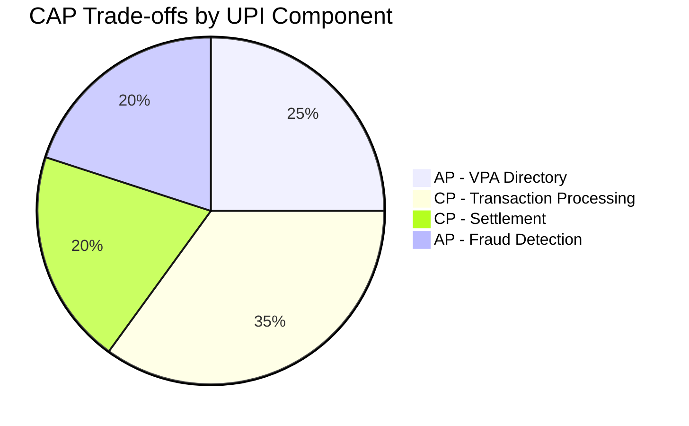

*CAP trade-offs across UPI components: the VPA directory and fraud detection system are AP (availability-first) since brief staleness or delayed detection is acceptable; transaction processing and settlement are CP (consistency-first) because a wrong debit or missing settlement is a financial loss. The split ensures that user-facing data (VPA lookups, fraud alerts) stays available while money movement remains correct.*

**Interview question:** *Is UPI strongly consistent or eventually consistent?*
**Answer:** UPI makes a nuanced choice: it is strongly consistent for the debit-then-credit transaction flow (a 201-like response means the funds have moved or a reversal is in progress — the sending bank never holds an inconsistent state where it debited but didn't route the credit). It is eventually consistent for VPA directory lookups (cache may briefly serve stale VPAs), fraud signal propagation (alerts may lag real-time by seconds), and settlement reconciliation (discrepancies are resolved in the hourly reconciliation window). This pragmatic split — "strong consistency for money movement, eventual consistency for metadata" — is the key insight interviewers look for.

#### Settlement — CP (Consistency + Partition Tolerance)

Settlement between banks must be strongly consistent: a bank that sent money must receive the correct net amount, and discrepancies must be detected and resolved. NPCI uses snapshot isolation for settlement window computations and synchronous replication between its two data centers for the settlement database. Banks reconcile against NPCI's settlement file every hour — any mismatch triggers a manual investigation. Settlement is final once the RBI's account transfer is complete, and the 7-day dispute window is the recovery mechanism for persistent mismatches.

#### Fraud Detection — AP (Availability + Partition Tolerance)

NPCI's fraud detection system is availability-first: if the real-time fraud stream is down, transactions are still processed (with post-hoc fraud analysis). A fraud-detection outage means that suspicious transactions are not blocked in real-time, but they are flagged for later review. This is acceptable because blocking legitimate transactions (false positives) during an outage would be worse than allowing some suspicious ones through for later investigation. Banks run their own independent fraud models as a backup — if NPCI's model is down, the bank's model takes over.

---

### Encryption and Key Management

A UPI payment system handles highly sensitive data: encrypted UPI PINs, bank account numbers, transaction records, and device fingerprints. Encryption must protect data at rest, in transit, and during processing — with strict controls so that no plaintext sensitive data is ever exposed outside the bank's HSM.

#### UPI PIN Encryption

The UPI PIN is the user's primary secret — a 4–6 digit number known only to the user. It is never stored or transmitted in plaintext.

```mermaid
graph LR
    App[Client App] -->|"encrypt PIN<br/>with bank's RSA public key"| Enc[Encrypted PIN Block<br/>(ISO 9564)]
    Enc --> Bank[Bank UPI API Server]
    Bank -->|"decrypt PIN block"| HSM[HSM<br/>(private key)]
    HSM -->|"verify against<br/>stored hash"| DB[(PIN Hash<br/>in HSM)]
    DB --> HSM
    HSM -->|"result"| Bank
    Bank -->|"status"| App
```

*UPI PIN encryption flow: the client app encrypts the PIN using the bank's RSA public key into an ISO 9564-format PIN block; the bank's UPI API server forwards the encrypted PIN block to an HSM, which decrypts it using the private key and verifies it against the stored PIN hash (never plaintext); the result (success/failure) is returned to the app. The PIN never exists in plaintext outside the HSM.*

**Encryption at rest:** Bank account numbers, transaction logs, and VPA mappings are encrypted at rest. Banks use database-level encryption (PostgreSQL TDE or application-level encryption) with a DEK (Data Encryption Key) managed by an HSM. The DEK is rotated every 90 days and re-encrypts only the key, not the data. Account numbers are encrypted with a per-account DEK; transaction data uses a per-shard DEK.

**Encryption in transit:** All client-to-bank and bank-to-NPCI traffic uses TLS 1.3 (minimum TLS 1.2). Inter-datacenter replication between NPCI's Mumbai and Delhi sites uses a private leased line with MACsec encryption. Bank-to-app communication requires mutual TLS (mTLS) — each bank issues a client certificate to its verified apps, and apps present the certificate on every API call. NPCI enforces certificate pinning in the UPI specification — apps must pin NPCI's public key to prevent man-in-the-middle attacks on compromised networks.

#### Key Management

```mermaid
graph TD
    HSM[HSM<br/>(Root of Trust)] -->|"generates"| KEK[KEK<br/>(Key Encryption Key)]
    KEK -->|"encrypts"| DEK[DEK<br/>(Data Encryption Key)]
    DEK -->|"encrypts"| DATA[Bank Account Numbers,<br/>Transaction Logs,<br/>VPA Mappings]
    KEK -->|"encrypts"| PEK[PEK<br/>(PIN Encryption Key)]
    PEK -->|"encrypts PINs"| PIN[Encrypted PIN Blocks]
```

*Key hierarchy: the HSM (Hardware Security Module) is the root of trust and generates the KEK (Key Encryption Key). The KEK encrypts DEKs (Data Encryption Keys) for general data at rest and PEKs (PIN Encryption Keys) for PIN blocks. DEKs are rotated every 90 days; PEKs are rotated every 30 days. The HSM enforces that DEKs and PEKs can never be exported in plaintext.*

**Key hierarchy and rotation:**

- **KEK (Key Encryption Key):** Root key stored in the HSM. Used to encrypt DEKs and PEKs. Rotated every 365 days by the HSM manufacturer. Never leaves the HSM in plaintext.
- **DEK (Data Encryption Key):** Per-dataset keys for encrypting account numbers, transaction logs, and VPA mappings. Rotated every 90 days. When rotated, only the DEK is re-encrypted with the new KEK — the data is not re-encrypted (the bank decrypts data with the old DEK and re-encrypts with the new DEK lazily as records are accessed).
- **PEK (PIN Encryption Key):** Per-bank keys used to encrypt/decrypt UPI PIN blocks. The app encrypts the PIN with the bank's RSA public key (which wraps the PEK); the bank's HSM decrypts with the PEK. Rotated every 30 days via NPCI-mandated key rotation ceremonies. Banks must coordinate PEK rotation with NPCI — a 2-hour blackout window is used to switch keys atomically.
- **KEK Rotation:** The HSM generates a new KEK and re-wraps all DEKs and PEKs. The old KEK is retained for 30 days to decrypt any data encrypted with old DEKs during the transition. The rotation is performed by a hardware security officer using dual-control (two authorized personnel required).

**Certificate management:**

Each bank and PSP holds X.509 certificates issued by a private CA (managed by NPCI or the RBI). Certificates are valid for 365 days and must be renewed 30 days before expiry. NPCI publishes a certificate revocation list (CRL) every 24 hours — banks and apps check the CRL before establishing connections. Certificate pinning is enforced for app-to-bank and bank-to-NPCI connections.

---

### Authentication and Authorization

A UPI payment system must verify who is connecting (authentication), determine what they can do (authorization), and enforce per-transaction security controls (device binding, PIN verification). Unlike social media — where authentication is about protecting user data — in UPI, authentication is about preventing unauthorized financial movement. Every layer of the stack has its own auth requirements.

#### Authentication Methods

* **UPI PIN (MPIN):** The primary authentication factor for every UPI transaction. A 4–6 digit numeric PIN encrypted by the app using the bank's RSA public key (ISO 9564 format) and verified by the bank's HSM. The PIN is never stored in plaintext — only a hash is kept inside the HSM. The app never sees the decrypted PIN. This is mandatory for all debit transactions (Direct Pay, Collect, Mandate execution) and for high-risk operations (device registration, mandate revocation).
* **Device binding:** A secondary authentication factor that ties a transaction to a registered device. The bank maintains a registry of `device_id` + `SIM serial number` + `app signature hash` per user. Transactions from unregistered devices are rejected or require additional verification (SMS OTP or app approval on the registered device). Device registration requires a one-time SMS OTP to the registered mobile number.
* **Mobile number verification:** The user's mobile number is linked to their bank account during onboarding. NPCI uses the mobile number as the primary user identifier — the bank verifies that the mobile number is registered to the account holder before allowing UPI transactions. Mobile number changes require re-verification.
* **App-to-bank authentication:** Third-party apps (Google Pay, PhonePe) authenticate to the bank's UPI API using client credentials (client ID + client secret or mutual TLS certificates). The bank verifies the app's identity and checks that the app is approved to access the user's account. NPCI maintains a registry of approved PSP-app-bank pairings.
* **MFA for admin operations:** Bank administrators who can override transactions, adjust limits, or access settlement data must use multi-factor authentication: password + hardware token + biometric. All admin operations are logged with full audit trails.

#### Authorization Models

* **Scope-based (OAuth 2.0 scopes):** Each app's access token carries scopes like `upi:pay`, `upi:collect`, `upi:mandate`, `upi:balance`. The bank's API gateway enforces scope checks before processing — an app with only `upi:pay` scope cannot initiate a Collect or Mandate. NPCI mandates scope-based access control in its certification requirements.
* **Per-user authorization:** Each bank maintains an app-consent registry — for each (user, app, scope) triple, the user must explicitly grant consent the first time the app accesses their account. The consent is stored and can be revoked at any time by the user.
* **Merchant authorization:** Merchants register with NPCI and receive a unique `merchantId`. The merchant's Collect and Mandate requests include the `merchantId`, which the bank verifies against NPCI's merchant registry. Only registered merchants can initiate Collect requests.
* **Transaction limits authorization:** Every transaction is checked against multiple limit tiers: per-transaction limit (₹2,000–5,000), per-day limit (₹50,000), per-app limit (varies), and per-bank limit (set by the bank). The bank's authorization engine checks all applicable limits before allowing the debit. Limits are configurable per user (e.g., higher limits for verified business accounts).

```mermaid
graph LR
    C[Client App] -->|"login + app credentials"| Auth[Auth Service<br/>(Bank)]
    Auth -->|"access token +<br/>scopes"| C
    C -->|"token + PIN"| API[UPI API Server]
    API -->|validate token + scope| GW[API Gateway<br/>Auth Check]
    GW -->|"user_id + scope"| B[UPI Backend]
    B --> DS[Device Store]
    B --> HSM[HSM PIN Verify]
    B -->|check limits| LM[Limit Manager]
    B -->|"authorized"| SW[NPCI Switch]
    DS -->|"registered?"| B
    HSM -->|"PIN valid?"| B
    LM -->|"within limits?"| B
```

*Authentication and authorization flow: the client app authenticates with the bank using app credentials (client secret or mTLS), receives an access token with specific scopes; the API gateway validates the token and scope; the backend then checks three authorization factors before proceeding: (1) device binding (is this a registered device?), (2) UPI PIN verification (HSM-backed, plaintext never exposed), and (3) transaction limits (per-transaction, per-day, per-app). Only if all three pass is the transaction forwarded to the NPCI switch.*

**Java example — PIN verification service:**

```java
@Service
@RequiredArgsConstructor
public class PinVerificationService {

    @Value("${app.pin.encryption.key-id}")
    private String keyId;

    private final HsmClient hsmClient;
    private final AuditLogger auditLogger;

    /**
     * Verify a UPI PIN: decrypts the ISO 9564 PIN block in the HSM and
     * compares against the stored PIN hash. The PIN is never decrypted
     * outside the HSM boundary.
     */
    public boolean verifyPin(String encryptedPinBlock, String userId) {
        auditLogger.log("PIN_VERIFY_ATTEMPT", userId);

        try {
            // Send the encrypted PIN block to the HSM for decryption + verification
            var result = hsmClient.verifyPin(
                keyId,
                encryptedPinBlock,
                userId // HSM looks up stored hash for this user
            );

            if (result.isValid()) {
                auditLogger.log("PIN_VERIFY_SUCCESS", userId);
                return true;
            } else {
                auditLogger.log("PIN_VERIFY_FAILED", userId);
                return false;
            }
        } catch (HsmException e) {
            auditLogger.log("PIN_VERIFY_ERROR", userId, e.getMessage());
            throw new PinVerificationException("HSM error", e);
        }
    }
}
```

*The `PinVerificationService` bean sends the ISO 9564 encrypted PIN block to an HSM-backed client (`HsmClient`) for verification. The HSM decrypts the PIN internally and compares it against the stored hash — the plain-text PIN never leaves the HSM boundary. Every attempt (success, failure, error) is logged via `AuditLogger` for compliance and fraud analysis. The key ID is injected via `@Value` from a secure configuration store that is rotated every 30 days by NPCI's key ceremony.*

---

### Security Threats and Mitigations

UPI's real-time nature and VPA abstraction create a unique set of security threats. Because transactions settle in seconds and are often irreversible once confirmed, the system must prevent fraud at multiple layers: the device, the app, the bank, and the NPCI switch.

#### Threat: UPI PIN Phishing

* **Risk:** Fraudsters create fake UPI apps or websites that collect users' UPI PINs, either by mimicking legitimate apps or by embedding hidden PIN-entry fields that capture keystrokes.
* **Mitigation:** Educate users to only install apps from official app stores; enforce app-signature verification (banks verify the app's APK/IPA signature hash before accepting transactions); use HSM-based PIN verification (PIN never touches the bank's application server in plaintext). NPCI also runs a public awareness campaign ("Never share your UPI PIN") and blacklists known phishing apps from the Play Store.

#### Threat: SIM Swap Attacks

* **Risk:** A fraudster obtains a victim's SIM card (via social engineering of the telecom provider) → the new SIM is registered to the victim's mobile number → the fraudster installs a UPI app on their device → the app registers the device using the victim's mobile number → transactions are approved because the device is registered to the victim's number.
* **Mitigation:** Device binding adds a second check — the fraudster's device is NOT registered to the victim's account → the bank requires additional verification (SMS OTP to the registered backup device or app-based approval on the original device). Banks also monitor for unusual patterns (new device + large amount + new SIM) and flag for manual review.

#### Threat: Collect Request Spam

* **Risk:** Fraudsters send UPI Collect requests for ₹1 to verify that a VPA/mobile number is active, then sell the verified "active account" list to other fraudsters for targeted attacks.
* **Mitigation:** Banks implement rate limiting on Collect requests per payer VPA (e.g., max 5 collect requests/hour from the same VPA); banks also use a Bloom filter to cache recently requested VPAs and reject repeated misses. NPCI's fraud system flags accounts that send > 10 unsuccesful Collect requests in a minute for review.

#### Threat: Account Takeover

* **Risk:** If a phone is stolen and the SIM swapped, or if the user's banking credentials are compromised, the attacker could attempt to access the victim's bank account and initiate transactions.
* **Mitigation:** Device binding + UPI PIN mitigates this — even with a stolen phone + SIM, the attacker needs the UPI PIN. For higher-risk actions (changing the linked account, increasing limits), banks require additional verification (SMS OTP + video KYC for changes > ₹50,000).

#### Threat: Duplicate Transactions

* **Risk:** Network retries can cause duplicate debits — if a transaction times out and the app retries, both the original and retry may be processed if the bank or switch doesn't deduplicate.
* **Mitigation:** Every UPI transaction uses a unique `txnId` (per payer-bank) and a `refId` (per merchant). The NPCI switch and each bank use `txnId` as an idempotency key — if a `txnId` is already present in the transaction log, the bank returns the cached result instead of re-processing. This is mandatory in the UPI specification and is verified during NPCI certification.

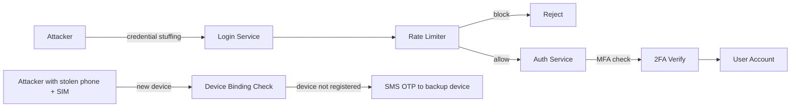

*Security defense layers: credential stuffing attacks are blocked by rate limiting; account takeovers require MFA; SIM swap attacks bypass the SIM but are caught by device binding (unregistered device triggers SMS OTP to the backup device). Each layer is independent — an attacker must defeat all layers to successfully steal funds.*

---

### Observability and Logging

UPI generates massive amounts of telemetry — 10B+ transactions per month, each with 100+ fraud signals, health checks, and audit events. Observability must cover the transaction pipeline, fraud detection, settlement, and bank/app integration points. Unlike social media (where observability tracks engagement), UPI observability tracks money movement correctness.

#### Key Metrics

- **Transaction success rate:** Percentage of transactions that reach `SUCCESS` status end-to-end. Target: 99.5%+. Alert if < 99% for 5 minutes. Tracked per bank (some banks may have lower success rates).
- **End-to-end latency:** p50 < 1s, p95 < 2.5s, p99 < 5s. Tracked per bank pair and per transaction type (Direct Pay vs. Collect vs. Mandate).
- **VPA resolution hit ratio:** > 99% cache hits. Alert if < 95% (indicates cache thrashing or new VPA storm).
- **PIN verification latency:** p50 < 10 ms, p99 < 50 ms. Alert if > 100 ms (HSM overload).
- **Fraud detection rate:** Percentage of transactions flagged by fraud models. Typical: 0.01–0.1% of transactions. Alert if > 0.5% (possible coordinated attack) or < 0.001% (model degradation).
- **Bank health:** Percentage of banks marked healthy. Alert if any bank is down for > 15 seconds.
- **Settlement reconciliation gap:** Difference between NPCI's settlement file and each bank's transaction log. Alert if > 0.001% of transactions mismatch.
- **Mandate execution success rate:** Percentage of scheduled mandates that execute successfully. Target: 85%+ (some fail due to insufficient balance).

#### Logging

* **Transaction logs:** Every transaction (success and failure) is logged with the full request/response payload, `txnId`, timestamps for each hop, and the final status. Logs are written to Kafka (for real-time processing) and to a SIEM (Splunk/ELK) for long-term storage and compliance. Retention: 7 years (RBI regulatory requirement).
* **Audit logs:** All security-relevant events — PIN verification attempts, device registrations, mandate creation/revocation, limit changes, admin actions — are logged with before/after state and the acting user/entity. Audit logs are immutable (write-once storage) and tamper-evidenced.
* **Error logs:** Service errors (NPCI API failures, bank timeouts, HSM failures) with correlation IDs for cross-service tracing. Each error is classified (transient, permanent, security) and routed to the appropriate team.
* **Fraud logs:** Every fraud signal (velocity check, geolocation anomaly, device fingerprint mismatch) is logged with its score and the final decision. Fraud logs feed into the ML model retraining pipeline.
* **Settlement logs:** Each settlement window's netting computation, the settlement file generated, and each bank's acknowledgment are logged. Settlement logs are reconciled daily and any discrepancy triggers a ticket.

#### Distributed Tracing

Trace every transaction across all services — from the UPI app through the bank's API gateway, PIN verification service, transaction service, and the NPCI switch to the receiving bank. Use OpenTelemetry with a trace context header (`traceparent`) propagated across service boundaries. Key spans to instrument: VPA resolution, PIN verification, debit processing, NPCI switch routing, credit processing, and confirmation return.

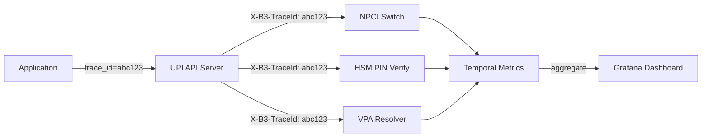

*Distributed tracing flow: each UPI transaction carries a trace ID (e.g., `abc123`) propagated across all downstream service calls. The UPI API server, HSM PIN verification service, VPA resolver, and NPCI switch each record spans. These spans aggregate in a metrics backend (Jaeger, Datadog, or Temporal Metrics) and are visualized in Grafana dashboards, enabling end-to-end latency analysis and root-cause debugging for failed transactions.*

#### Alerting Strategy

- **Critical (page immediately):** Transaction success rate < 99% for 5 minutes; NPCI switch p99 latency > 5s for 5 minutes; any bank down for > 30s; HSM failure rate > 1% for 10 minutes; settlement reconciliation gap > 0.01%.
- **Warning (Slack, no page):** VPA cache hit ratio < 95% for 15 minutes; PIN verification p99 > 100 ms for 10 minutes; fraud detection rate > 0.5% for 5 minutes; app-to-bank API error rate > 2% for 15 minutes.
- **Info (dashboard only):** Daily transaction volume trends, per-bank success rate changes, mandate execution success rate, new VPA registration rate, device registration rate.

---

### Real-World Implementations

UPI's real-world implementations showcase how a national payment infrastructure scales to serve 250M+ users and 10B+ transactions per month. Each participant — NPCI, banks, and PSP apps — makes distinct architectural choices optimized for their role in the ecosystem.

#### NPCI UPI Infrastructure

NPCI operates the UPI switch with 100+ participating banks and 150+ PSPs (payment apps). The system processes 10B+ transactions/month (3,800+ TPS peak). Key infrastructure details:

- **NPCI Data Centers:** Two primary data centers (active-active) in Mumbai and Delhi; each can handle 100% load. The switch runs on a high-throughput messaging platform with an in-memory transaction grid for sub-second processing. Both sites synchronously replicate the transaction log and settlement database; during a regional outage, the surviving site handles all traffic within 30 seconds.
- **UPI Switch:** Processes transactions by partitioning by `txnId` hash across 1,024 partitions. Each partition is handled by a dedicated worker that manages the two-phase debit-then-credit protocol. Workers scale automatically based on queue depth — if any partition's queue exceeds 1,000 messages, a new worker is spawned. The switch also maintains a real-time bank health registry: banks are polled every 5 seconds, and a bank marked "down" causes the switch to immediately reject transactions to/from it with error code `09` (Unable to route).
- **VPA Directory:** Maintains 500M+ VPAs; replicated across data centers. Uses a three-tier cache strategy — in-process LRU (10K entries, 5-min TTL), Redis distributed cache (10M entries, 30-min TTL), and PostgreSQL as the durable source of truth. Cache invalidation is event-driven via Kafka `vpa_updated` events, ensuring coherency within 2 seconds of any VPA change.
- **Settlement:** Hourly gross settlement between banks; netting engine reduces 22,350 bilateral settlements to ~150 multi-lateral net transfers against a central clearing account at the RBI. Each bank reconciles against NPCI's settlement file every hour; mismatches are flagged for investigation within 30 minutes. The settlement database uses snapshot isolation for consistent window computations.

#### Google Pay's Scale

Google Pay (GPay) in India processes 1B+ UPI transactions/month. The architecture:

- **Frontend:** React Native mobile app + Flutter for some features. Uses a service-worker pattern to prefetch VPA resolutions and render instant transaction confirmations. The app maintains a local cache of the user's linked bank accounts and recent beneficiaries for offline-ready UX.
- **Backend:** Microservices on Google Cloud (GKE); 50+ services including payment routing, fraud detection, rewards, and merchant acquisition. Services communicate via gRPC with Google's internal service mesh (Envoy-based) for mTLS, retries, and observability. Each service scales independently — the payment routing service scales based on TPS, the fraud service based on transaction arrival rate.
- **Bank integrations:** Uses each bank's UPI API; maintains persistent connections to 50+ banks. Each bank connection uses a dedicated connection pool (1,000 persistent HTTPS connections) with a circuit breaker for failover. When a bank is marked down by NPCI, GPay immediately stops routing transactions to that bank and shows the user an error with guidance to try another linked account.
- **Performance:** 99% of payments complete in < 3 seconds. Achieved through: (1) 99% VPA cache hit rate (5-minute LRU + 30-minute Redis), (2) pre-warmed HSM connections for PIN verification (< 10 ms per PIN check), (3) geo-distributed API endpoints in Mumbai, Delhi, and Bengaluru for < 20 ms routing latency.
- **Fraud detection:** Uses Google's AI infrastructure (TensorFlow) for real-time fraud detection, analyzing 100+ signals per transaction including device fingerprint, geolocation, behavioral patterns, historical transaction data, and merchant risk score. Each transaction passes through 15+ fraud models in < 100 ms; suspicious transactions are blocked or require step-up authentication.

#### PhonePe's Architecture

PhonePe (Walmart-owned) processes 6B+ UPI transactions annually. Key design decisions:

- **Micro-frontends:** App is composed of independently deployable mini-apps (Pay, Markets, Insurance, etc.). Each mini-app is a separate service with its own release cycle, communicating via a shared event bus. This allows the Pay team to deploy 50x/day without affecting the Markets team. The UPI payment flow is a shared library used by all mini-apps.
- **Event sourcing:** All payment events are stored in an event log (Kafka) for audit, replay, and real-time analytics. Each event includes the full request/response payload and is cryptographically signed for non-repudiation. The event log is the system of record — all state (user balances, transaction status, fraud decisions) is derived by replaying events.
- **Regional data centers:** Multiple AWS regions in India (Mumbai, Delhi, Bengaluru) for low latency. A global edge network routes users to the nearest region based on network latency (< 20 ms within India). Cross-region replication is asynchronous with a 2-second RPO (recovery point objective).
- **Zero MDR:** PhonePe absorbed merchant fees (controversial) to drive adoption — at peak, processed 70% of all UPI merchant transactions. The cost was offset by interchange-like fees from banks for high transaction volume and by revenue from financial services (mutual funds, insurance) cross-sold through the app.

#### Paytm's UPI Integration

Paytm (One97 Communications) integrates UPI as one of several payment rails alongside its closed-loop wallet. Key design choices:

- **Multi-rail strategy:** Paytm's app supports three payment methods: Paytm Wallet (closed-loop), UPI (real-time bank-to-bank), and cards (Visa/Mastercard). The app intelligently selects the rail based on the user's wallet balance, UPI limits, and card availability — defaulting to the cheapest method that can cover the full amount.
- **Bank partnerships:** Paytm Payments Bank (its own scheduled bank) acts as the primary PSP for Paytm's UPI transactions. For users whose primary bank is not Paytm Payments Bank, Paytm routes through partner banks (Yes Bank, Federal Bank). Each bank partnership requires a separate UPI API integration and NPCI certification.
- **Super-app architecture:** Beyond payments, Paytm's app is a mini-app ecosystem (movies, recharge, insurance, lending). UPI transactions are handled by a dedicated Payment Service that is decoupled from the rest of the app via an event bus. Payment events trigger downstream mini-app workflows (e.g., a successful mobile recharge triggers a notification in the Recharge mini-app).

---

### Java and Spring Boot Implementation Guide

This section demonstrates how to build a Spring Boot service for a UPI payment system's core transaction pipeline, showcasing all the key Spring Boot features: `@Service`, `@RestController`, `@Repository`, `@Component`, `@Value`, records for DTOs, `@Valid`, `@ControllerAdvice`, constructor injection, `BigDecimal`, `@Transactional`, `@Version`, circuit breakers, `@Async`, and `@Scheduled` for reconciliation jobs.

#### 1. DTO Records

Records provide immutable, concise data carriers for request/response payloads. They are ideal for API contracts that cross service boundaries and are inherently thread-safe.

```java
public record PayRequest(
        @NotBlank String payerAddress,
        @NotBlank String payeeAddress,
        @DecimalMin("1.00") BigDecimal amount,
        @NotBlank String encryptedPin,
        @NotBlank String txnId,
        @NotBlank String appId) {}

public record PayResponse(
        String txnId,
        String refId,
        String status,
        BigDecimal amount,
        String payerAddress,
        String payeeAddress,
        Instant timestamp) {}

public record CollectRequest(
        @NotBlank String payerAddress,
        @NotBlank String payeeAddress,
        @DecimalMin("1.00") BigDecimal amount,
        @NotBlank String merchantId,
        @NotBlank String txnId) {}

public record CollectResponse(
        String txnId,
        String refId,
        String status,
        String amount,
        Instant timestamp) {}

public record VpaDetails(
        String vpa,
        String accountNumber,
        String ifscCode,
        String beneficiaryName) {}

public record ApiError(HttpStatus status, String message) {}
```

*Six record types serve as the UPI API contract: `PayRequest` is the Direct Pay request body with `@NotBlank` and `@DecimalMin` validation annotations (enforced by `@Valid` at the controller layer); `PayResponse` returns the transaction result with status, reference ID, and timestamp; `CollectRequest` is the Request-to-Pay body with a mandatory `merchantId`; `CollectResponse` returns the pending status (Collect requires user approval); `VpaDetails` carries the resolved account + IFSC + name from the VPA resolver; `ApiError` is the structured error response used by `@ControllerAdvice`. Records are immutable, thread-safe, and ideal for API boundaries.*

#### 2. Entity with Optimistic Locking

The `UpiTransaction` entity stores every UPI transaction with `@Version` for optimistic locking, preventing lost updates when concurrent processes (the transaction service, settlement engine, and fraud system) all try to update the same transaction record.

```java
@Entity
@Table(name = "upi_transactions", indexes = {
        @Index(name = "idx_payer_created", columnList = "payerVpa, createdAt"),
        @Index(name = "idx_txn_id", columnList = "txnId")
})
public class UpiTransaction {

    @Id
    @GeneratedValue(strategy = GenerationType.UUID)
    private String id;

    @Column(name = "txn_id", nullable = false, unique = true)
    private String txnId;

    @Column(name = "ref_id")
    private String refId;

    @Column(name = "payer_vpa", nullable = false)
    private String payerVpa;

    @Column(name = "payee_vpa", nullable = false)
    private String payeeVpa;

    @Column(name = "payer_account_id")
    private String payerAccountId;

    @Column(name = "payee_account_id")
    private String payeeAccountId;

    @Column(name = "amount", nullable = false, precision = 19, scale = 2)
    private BigDecimal amount;

    @Column(name = "currency", nullable = false)
    private String currency = "INR";

    @Enumerated(EnumType.STRING)
    @Column(name = "status", nullable = false)
    private TransactionStatus status;

    @Column(name = "npci_ref_id")
    private String npciRefId;

    @Column(name = "created_at", nullable = false)
    private Instant createdAt;

    @Column(name = "settled_at")
    private Instant settledAt;

    @Version
    private Long version;

    public enum TransactionStatus {
        PENDING, SUCCESS, FAILED, REVERSED, TIMEOUT
    }
}
```

*The `UpiTransaction` entity maps to the `upi_transactions` table with a composite index on `(payerVpa, createdAt)` for timeline queries and a unique index on `txnId` for idempotency. The `@Version` field (`version`) enables JPA optimistic locking — if the settlement engine and the transaction service both try to update the same transaction concurrently, the second transaction fails with `OptimisticLockException`, preventing a lost update on the `status` field. The `amount` uses `BigDecimal` with precision 19, scale 2 (sufficient for amounts up to ₹999,999,999,999,999.99). The `status` enum uses `@Enumerated(STRING)` for readable database values.*

#### 3. Repository Layer

The `@Repository` layer provides persistence operations with Spring Data JPA, including idempotency checks and batch queries for reconciliation.

```java
@Repository
public interface UpiTransactionRepository extends JpaRepository<UpiTransaction, String> {

    /**
     * Idempotency check — if a transaction with this txnId already exists,
     * return it instead of creating a duplicate.
     */
    Optional<UpiTransaction> findByTxnId(String txnId);

    /**
     * Find all pending transactions older than the threshold (for reconciliation).
     */
    @Query("SELECT t FROM UpiTransaction t WHERE t.status = 'PENDING' " +
           "AND t.createdAt < :before ORDER BY t.createdAt")
    List<UpiTransaction> findStalePendingTransactions(
            @Param("before") Instant before, Pageable pageable);

    /**
     * Batch fetch for settlement — all successful unsettled transactions.
     */
    @Query("SELECT t FROM UpiTransaction t WHERE t.status = 'SUCCESS' " +
           "AND t.settledAt IS NULL")
    List<UpiTransaction> findUnsettledTransactions(Pageable pageable);
}
```

*The `UpiTransactionRepository` interface extends `JpaRepository` with three custom queries: `findByTxnId` for idempotency (checked before every debit to prevent double-processing), `findStalePendingTransactions` for the reconciliation job that runs every 15 minutes to close out stuck transactions, and `findUnsettledTransactions` for the settlement engine that batches hourly netting computations. The `@Param` annotation enables named parameter binding in JPQL.*

---

#### 4. Service Layer

Services encapsulate business logic, transactions, and the UPI transaction pipeline. The `UpiPaymentService` implements the full Direct Pay flow with idempotency, VPA resolution, PIN verification, balance/limit checks, debit, NPCI routing, rollback on failure, and audit logging — all within a single `@Transactional` boundary.

```java
@Service
@RequiredArgsConstructor
@Slf4j
public class UpiPaymentService {

    private final UpiTransactionRepository transactionRepository;
    private final NpciClient npciClient;
    private final AccountService accountService;
    private final PinVerificationService pinVerificationService;
    private final VpaResolver vpaResolver;
    private final AuditLogger auditLogger;
    private final CircuitBreaker npciCircuitBreaker;

    @Value("${app.txn.timeout-seconds:30}")
    private int txnTimeoutSeconds;

    @Transactional
    public PayResponse processPay(PayRequest request) {
        // 1. Idempotency check — prevent double-debit on retry
        if (transactionRepository.findByTxnId(request.txnId()).isPresent()) {
            log.info("Duplicate transaction: {}", request.txnId());
            return getPreviousResponse(request.txnId());
        }

        // 2. Resolve payee VPA → account + IFSC + beneficiary name
        VpaDetails payeeDetails = vpaResolver.resolve(request.payeeAddress());
        auditLogger.log("VPA_RESOLVED", request.txnId(), payeeDetails.vpa());

        // 3. Verify UPI PIN (HSM-backed; PIN never in plaintext)
        if (!pinVerificationService.verifyPin(request.encryptedPin(), request.payerAddress())) {
            throw new InvalidPinException("Incorrect UPI PIN");
        }

        // 4. Check balance and limits
        BankAccount senderAccount = accountService.getAccountForVpa(request.payerAddress());
        if (senderAccount.getBalance().compareTo(request.amount()) < 0) {
            throw new InsufficientBalanceException("Insufficient balance");
        }
        accountService.checkLimits(senderAccount, request.amount());

        // 5. Debit sender (with optimistic locking via @Version)
        accountService.debit(senderAccount, request.amount(), request.txnId());
        auditLogger.log("DEBIT_INITIATED", request.txnId(), request.amount());

        // 6. Send to NPCI for routing (circuit breaker protects against NPCI outages)
        NpciTransactionRequest npciRequest = NpciTransactionRequest.builder()
                .transactionId(request.txnId())
                .payerVpa(request.payerAddress())
                .payeeDetails(payeeDetails)
                .amount(request.amount())
                .build();

        NpciResponse npciResponse = npciCircuitBreaker.executeSupplier(
                () -> npciClient.processTransaction(npciRequest));

        if (!"SUCCESS".equals(npciResponse.getStatus())) {
            // Rollback debit — critical for consistency
            accountService.credit(senderAccount, request.amount(),
                    request.txnId() + "_rev");
            transactionRepository.save(UpiTransaction.builder()
                    .txnId(request.txnId())
                    .payerVpa(request.payerAddress())
                    .payeeVpa(request.payeeAddress())
                    .amount(request.amount())
                    .status(TransactionStatus.FAILED)
                    .npciRefId(npciResponse.getRefId())
                    .errorMsg(npciResponse.getErrorCode())
                    .createdAt(Instant.now())
                    .build());
            throw new PaymentFailedException(npciResponse.getErrorCode());
        }

        // 7. Record successful transaction
        transactionRepository.save(UpiTransaction.builder()
                .txnId(request.txnId())
                .refId(npciResponse.getRefId())
                .payerVpa(request.payerAddress())
                .payeeVpa(request.payeeAddress())
                .payerAccountId(senderAccount.getId())
                .payeeAccountId(payeeDetails.accountNumber())
                .amount(request.amount())
                .currency("INR")
                .status(TransactionStatus.SUCCESS)
                .npciRefId(npciResponse.getRefId())
                .createdAt(Instant.now())
                .build());

        auditLogger.log("TXN_SUCCESS", request.txnId(), npciResponse.getRefId());

        return PayResponse.builder()
                .txnId(request.txnId())
                .refId(npciResponse.getRefId())
                .status("SUCCESS")
                .amount(request.amount())
                .payerAddress(request.payerAddress())
                .payeeAddress(request.payeeAddress())
                .timestamp(Instant.now())
                .build();
    }

    /**
     * Async reconciliation job — runs every 15 minutes to close out
     * transactions stuck in PENDING state (e.g., due to network timeout
     * where the bank doesn't know if NPCI succeeded).
     */
    @Async
    @Scheduled(fixedDelay = 900_000) // 15 minutes
    public void reconcileStaleTransactions() {
        var stale = transactionRepository.findStalePendingTransactions(
                Instant.now().minusSeconds(txnTimeoutSeconds),
                PageRequest.of(0, 1000));
        for (var txn : stale) {
            var status = npciClient.getTransactionStatus(txn.getTxnId());
            if ("SUCCESS".equals(status)) {
                txn.setStatus(TransactionStatus.SUCCESS);
            } else {
                txn.setStatus(TransactionStatus.FAILED);
                accountService.credit(
                        accountService.getAccountForVpa(txn.getPayerVpa()),
                        txn.getAmount(), txn.getTxnId() + "_rev");
            }
            transactionRepository.save(txn);
        }
    }

    private PayResponse getPreviousResponse(String txnId) {
        return transactionRepository.findByTxnId(txnId)
                .map(txn -> PayResponse.builder()
                        .txnId(txn.getTxnId())
                        .refId(txn.getRefId())
                        .status(txn.getStatus().name())
                        .amount(txn.getAmount())
                        .payerAddress(txn.getPayerVpa())
                        .payeeAddress(txn.getPayeeVpa())
                        .timestamp(txn.getCreatedAt())
                        .build())
                .orElseThrow(() -> new TransactionNotFoundException(txnId));
    }
}
```

*The `UpiPaymentService` bean implements the full Direct Pay transaction lifecycle within a single `@Transactional` boundary (ensuring atomicity): (1) idempotency check via `txnId`; (2) VPA resolution with Redis caching; (3) HSM-backed PIN verification; (4) balance and limit checks; (5) debit with optimistic locking; (6) NPCI routing through a circuit breaker for fault tolerance; (7) if NPCI returns failure, the debit is rolled back and the transaction is recorded as FAILED; (8) on success, the transaction is persisted. The `@Async @Scheduled` reconciliation job runs every 15 minutes to resolve transactions stuck in PENDING state — a critical safety net for network-timeout edge cases.*

#### 5. REST Controller with Validation

The controller uses `@Valid` for request validation and constructor injection. It delegates business logic to the service layer and handles Collect requests with merchant-specific error mapping.

```java
@RestController
@RequestMapping("/api/v1/upi")
@RequiredArgsConstructor
public class UpiPaymentController {

    private final UpiPaymentService paymentService;
    private final VpaResolver vpaResolver;

    @PostMapping("/pay")
    public ResponseEntity<PayResponse> pay(
            @AuthenticationPrincipal UserDetails user,
            @Valid @RequestBody PayRequest request) {
        var response = paymentService.processPay(request);
        return ResponseEntity.ok(response);
    }

    @PostMapping("/collect")
    public ResponseEntity<PayResponse> collectPayment(
            @RequestBody CollectRequest request,
            @RequestHeader("X-APP-ID") String appId) {
        try {
            VpaDetails vpaDetails = vpaResolver.resolve(request.payeeAddress());
            PayResponse response = paymentService.processCollect(
                    request.merchantId(), vpaDetails.beneficiaryName(),
                    vpaDetails.accountNumber(), vpaDetails.ifscCode(),
                    request.amount(), request.txnId());
            return ResponseEntity.ok(response);
        } catch (VpaNotFoundException e) {
            return ResponseEntity.badRequest()
                    .body(PayResponse.error("VPA_NOT_FOUND", e.getMessage()));
        } catch (Exception e) {
            log.error("Payment failed: {}", e.getMessage(), e);
            return ResponseEntity.status(HttpStatus.INTERNAL_SERVER_ERROR)
                    .body(PayResponse.error("PAYMENT_FAILED", e.getMessage()));
        }
    }

    @GetMapping("/transactions/{txnId}")
    public ResponseEntity<PayResponse> getTransactionStatus(
            @PathVariable String txnId) {
        return paymentService.getTransactionStatus(txnId)
                .map(ResponseEntity::ok)
                .orElse(ResponseEntity.notFound().build());
    }
}
```

*The `UpiPaymentController` uses `@RestController` to combine `@Controller` and `@ResponseBody`. The `@Valid` annotation on `PayRequest` triggers bean validation (enforcing `@NotBlank` and `@DecimalMin` constraints). `@AuthenticationPrincipal` injects the authenticated user. Constructor injection via `@RequiredArgsConstructor` makes dependencies explicit and non-nullable. The POST endpoint returns `200 OK` with the response body. The Collect endpoint handles `VpaNotFoundException` with a 400 response and maps unexpected exceptions to a 500 with a structured error.*

#### 6. Controller Advice for Global Error Handling

A `@ControllerAdvice` bean centralizes exception handling across all controllers, returning structured `ApiError` responses with appropriate HTTP status codes.

```java
@ControllerAdvice
public class GlobalExceptionHandler {

    @ExceptionHandler(InvalidPinException.class)
    public ResponseEntity<ApiError> handleInvalidPin(InvalidPinException ex) {
        return ResponseEntity.badRequest()
                .body(new ApiError(HttpStatus.BAD_REQUEST, ex.getMessage()));
    }

    @ExceptionHandler(InsufficientBalanceException.class)
    public ResponseEntity<ApiError> handleInsufficientBalance(InsufficientBalanceException ex) {
        return ResponseEntity.badRequest()
                .body(new ApiError(HttpStatus.BAD_REQUEST, ex.getMessage()));
    }

    @ExceptionHandler(VpaNotFoundException.class)
    public ResponseEntity<ApiError> handleVpaNotFound(VpaNotFoundException ex) {
        return ResponseEntity.badRequest()
                .body(new ApiError(HttpStatus.BAD_REQUEST, ex.getMessage()));
    }

    @ExceptionHandler(MethodArgumentNotValidException.class)
    public ResponseEntity<ApiError> handleValidation(MethodArgumentNotValidException ex) {
        var messages = ex.getBindingResult().getFieldErrors().stream()
                .map(FieldError::getDefaultMessage)
                .toList();
        return ResponseEntity.badRequest()
                .body(new ApiError(HttpStatus.BAD_REQUEST,
                        "Validation failed: " + String.join(", ", messages)));
    }

    @ExceptionHandler(OptimisticLockException.class)
    public ResponseEntity<ApiError> handleConflict(OptimisticLockException ex) {
        return ResponseEntity.status(HttpStatus.CONFLICT)
                .body(new ApiError(HttpStatus.CONFLICT,
                        "Concurrent transaction detected. Please retry."));
    }

    @ExceptionHandler(CircuitBreakerOpenException.class)
    public ResponseEntity<ApiError> handleCircuitBreaker(CircuitBreakerOpenException ex) {
        return ResponseEntity.status(HttpStatus.SERVICE_UNAVAILABLE)
                .body(new ApiError(HttpStatus.SERVICE_UNAVAILABLE,
                        "Payment service temporarily unavailable. Please try again."));
    }
}
```

*The `GlobalExceptionHandler` bean (annotated `@ControllerAdvice`) catches exceptions thrown by any `@RestController` and returns structured `ApiError` responses. It handles `InvalidPinException` and `InsufficientBalanceException` (400 Bad Request), `VpaNotFoundException` (400), `MethodArgumentNotValidException` with field-level messages from `@Valid` (400), `OptimisticLockException` from `@Version` concurrent writes (409 Conflict), and `CircuitBreakerOpenException` when the NPCI circuit breaker is open (503 Service Unavailable). This avoids repetitive try-catch blocks in controllers.*

#### 7. PIN Verification Service

PIN verification is the most security-critical operation in UPI. The PIN must be decrypted only inside an HSM and compared against a stored hash — never in plaintext outside the HSM boundary.

```java
@Service
@RequiredArgsConstructor
public class PinVerificationService {

    @Value("${app.pin.encryption.key-id}")
    private String keyId;

    private final HsmClient hsmClient;
    private final AuditLogger auditLogger;

    /**
     * Verify a UPI PIN: sends the ISO 9564 encrypted PIN block to the HSM
     * for decryption + verification. The PIN is never decrypted outside
     * the HSM boundary. Every attempt is audit-logged for compliance.
     */
    public boolean verifyPin(String encryptedPinBlock, String userId) {
        auditLogger.log("PIN_VERIFY_ATTEMPT", userId);
        try {
            var result = hsmClient.verifyPin(
                    keyId, encryptedPinBlock, userId);
            if (result.isValid()) {
                auditLogger.log("PIN_VERIFY_SUCCESS", userId);
                return true;
            } else {
                auditLogger.log("PIN_VERIFY_FAILED", userId);
                return false;
            }
        } catch (HsmException e) {
            auditLogger.log("PIN_VERIFY_ERROR", userId, e.getMessage());
            throw new PinVerificationException("HSM error", e);
        }
    }
}
```

*The `PinVerificationService` bean sends the ISO 9564 encrypted PIN block to an HSM-backed client (`HsmClient`) for verification. The HSM decrypts the PIN internally and compares it against the stored hash — the plain-text PIN never leaves the HSM boundary. Every attempt (success, failure, error) is logged via `AuditLogger` for compliance and fraud analysis. The key ID is injected via `@Value` from a secure configuration store that is rotated every 30 days by NPCI's key ceremony.*

#### 8. VPA Resolution Service

The VPA resolver translates a human-readable address (`name@bank`) to the underlying bank account details. Resolution is cached to reduce latency and directory load — 99% of lookups are cache hits.

```java
@Service
@RequiredArgsConstructor
public class VpaResolver {

    private final NpciClient npciClient;
    private final RedisTemplate<String, String> redisTemplate;

    @Value("${app.vpa.cache-ttl-seconds:1800}")
    private int cacheTtlSeconds;

    /**
     * Resolve a VPA to bank account details, with Redis cache
     * fallback to NPCI's durable VPA directory.
     */
    public VpaDetails resolve(String vpa) {
        var cacheKey = "vpa:" + vpa;
        var cached = redisTemplate.opsForValue().get(cacheKey);
        if (cached != null) {
            return VpaDetails.fromJson(cached);
        }
        var details = npciClient.resolveVpa(vpa);
        if (details == null) {
            throw new VpaNotFoundException("VPA not found: " + vpa);
        }
        redisTemplate.opsForValue().set(
                cacheKey, details.toJson(), Duration.ofSeconds(cacheTtlSeconds));
        return details;
    }
}
```

*The `VpaResolver` bean resolves a VPA using a two-tier cache: Redis (L2, 30-minute TTL, 10M entries) with fallback to NPCI's durable directory (PostgreSQL). The `@Value` annotation injects the cache TTL. On a cache miss, the result is populated into Redis for subsequent lookups — NPCI reports 99% cache hit rate, reducing median resolution time from 8 ms (database) to 0.5 ms (cache).*

#### 9. Testing Example

The test suite validates idempotency, rollback-on-failure, and PIN verification — the three most critical correctness invariants in UPI.

```java
@SpringBootTest
class UpiPaymentServiceTest {
    @MockBean private VpaResolver vpaResolver;
    @MockBean private PinVerificationService pinVerificationService;
    @MockBean private AccountService accountService;
    @MockBean private NpciClient npciClient;
    @MockBean private AuditLogger auditLogger;
    @MockBean private CircuitBreaker npciCircuitBreaker;

    @Test
    void shouldRejectDuplicateTransaction() {
        String txnId = "txn_123";
        when(transactionRepository.findByTxnId(txnId)).thenReturn(
                Optional.of(UpiTransaction.builder().txnId(txnId)
                        .status(TransactionStatus.SUCCESS).build()));

        PayResponse response = paymentService.processPay(testPayRequest(txnId));

        assertThat(response.status()).isEqualTo("SUCCESS");
        verify(accountService, never()).debit(any(), any(), anyString());
    }

    @Test
    void shouldRollbackOnNpciFailure() {
        var request = testPayRequest("txn_789");
        when(vpaResolver.resolve(any())).thenReturn(testVpaDetails());
        when(pinVerificationService.verifyPin(any(), any())).thenReturn(true);
        when(accountService.getAccountForVpa(any())).thenReturn(testAccount(1000));
        when(npciClient.processTransaction(any())).thenReturn(
                NpciResponse.failed("BANK_DOWN"));

        assertThatThrownBy(() -> paymentService.processPay(request))
                .isInstanceOf(PaymentFailedException.class);

        // Verify debit was rolled back
        verify(accountService).credit(any(), eq(BigDecimal.valueOf(499)), anyString());
    }

    @Test
    void shouldRejectInvalidPin() {
        var request = testPayRequest("txn_pin");
        when(vpaResolver.resolve(any())).thenReturn(testVpaDetails());
        when(pinVerificationService.verifyPin(any(), any())).thenReturn(false);

        assertThatThrownBy(() -> paymentService.processPay(request))
                .isInstanceOf(InvalidPinException.class);

        verify(accountService, never()).debit(any(), any(), anyString());
    }
}
```

*The test suite validates three critical invariants: (1) idempotency — a duplicate `txnId` returns the previous response without re-debiting; (2) rollback on NPCI failure — if the NPCI switch returns a failure after the sender was debited, the debit is reversed via `accountService.credit(...)`; (3) invalid PIN — if the HSM rejects the PIN, no debit occurs. These tests use `@MockBean` for all external dependencies and Mockito's `verify` to assert that no side effects occur in error paths.*

---

### Interview Questions and Answers

A curated set of interview questions organized by difficulty, focused on UPI and real-time payment system design.

**Beginner**

1. **What is UPI and how does it work?**
   **A:** UPI (Unified Payments Interface) is India's real-time payment system operated by NPCI. Users pay using a Virtual Payment Address (VPA like `name@bank`) instead of bank details. Flow: User enters VPA + amount + UPI PIN → sending bank verifies PIN (in HSM) → debits account → sends to NPCI → routes to receiver's bank → credits account → confirms. The whole process takes seconds, works 24x7, and is interoperable across 150+ banks and apps.

2. **What is UPI PIN and how is it secured?**
   **A:** UPI PIN (MPIN) is a 4-6 digit secret known only to the user, used to authenticate each transaction. Security: (1) PIN is encrypted on the device using the bank's RSA public key (ISO 9564 format). (2) The encrypted PIN is sent to the bank's server → decrypted by HSM (Hardware Security Module) → verified against a stored hash (not plaintext). (3) PIN is never stored or transmitted in plaintext. (4) Device binding — transactions from new devices require additional verification (SMS OTP or app approval).

3. **What are the different UPI APIs?**
   **A:** UPI 2.0 defines several APIs: (1) `Pay` — customer sends money to a VPA. (2) `Collect` (UPI Collect) — merchant requests money from a customer who must approve. (3) `Get Balance` — fetch linked account balance. (4) `Get Account Details` — fetch account info by VPA. (5) `Generate OTP` — for device registration. (6) `Direct Debit/Collect` — recurring payments (NPCI auto-pay). (7) `Invoice Register` — merchant registers an invoice for later payment.

4. **What is VPA and why is it important?**
   **A:** VPA (Virtual Payment Address) is a human-readable identifier (e.g., `rahul@sbi`) that maps to a bank account. It abstracts away the account number and IFSC code, so users never need to share sensitive bank details. The VPA resolver (managed by NPCI) maps the VPA to the account number, IFSC, and beneficiary name. VPAs are cached at the bank for 5–30 minutes to reduce resolution latency and directory load.

5. **What is the difference between UPI Collect and UPI Pay?**
   **A:** UPI Pay (Direct Pay) is payer-initiated — the sender enters the payee's VPA, amount, and PIN to send money immediately. UPI Collect (Request-to-Pay) is payee-initiated — the merchant sends a collect request to the payer's bank, which notifies the payer's UPI app; the payer must approve the request with their PIN. Collect is used for e-commerce checkout, bill payments, and merchant transactions where the merchant controls the amount; Pay is used for P2P transfers and in-store QR payments where the customer enters the amount.

**Intermediate**

6. **How is UPI interoperable across banks?**
   **A:** NPCI provides a standardized UPI specification (API format, error codes, security protocols). Each bank implements the UPI API server following this spec. Apps communicate via the user's bank's UPI API. NPCI acts as the switch — routing transactions between banks and resolving VPAs. This is like how email providers interoperate via SMTP.

7. **How does UPI handle failures and refunds?**
   **A:** Every UPI transaction has a unique `txnId` (idempotency key). If the transaction fails midway (e.g., debit succeeded but credit failed), NPCI initiates a reversal: (1) Debit reversal — if the amount was debited but not credited, NPCI reverses the debit during settlement. (2) Timeout — if no response within 90 seconds, the transaction is marked failed; debit reversal is initiated. (3) Refund — merchant can initiate a refund via `POST /upi/refund` to the customer's VPA. (4) Dispute — customer raises a complaint via the app → bank investigates → NPCI mediates. The `txnId` ensures retries don't cause duplicate debits.

8. **What is UPI Mandate (auto-pay) and how does it differ from real-time payments?**
   **A:** UPI Mandate allows a merchant to auto-debit a customer's account on a schedule (e.g., monthly) after a one-time customer approval. The customer approves once with UPI PIN; subsequent charges don't require re-authentication. The bank stores mandate parameters (start/end date, frequency, max amount). On the due date, the bank auto-debits and notifies the merchant. This differs from real-time payments where the customer actively approves each transaction with a PIN. Mandate payments use `POST /upi/mandate/execute` and include a pre-debit notification 24 hours before the charge.

9. **What are the transaction limits in UPI?**
   **A:** UPI has three tiers of limits: (1) Per-transaction: ₹2,000–5,000 depending on the bank and app. (2) Per-day: ₹50,000 (across all UPI transactions from one bank account). (3) Per-app: varies by app (some apps cap at ₹20,000/day for security). The sending bank enforces all three limits before allowing the debit. Users can request limit increases for verified accounts (bank may require additional KYC).

10. **How does UPI ensure the transaction is atomic (all-or-nothing)?**
    **A:** UPI uses a two-phase protocol at the NPCI switch: (1) Debit phase — the sending bank debits the sender and sends a debit request to NPCI. (2) Credit phase — NPCI routes the credit to the receiving bank. If the credit fails (receiving bank down, invalid account), NPCI immediately triggers a reversal to the sending bank. The entire debit-then-credit is coordinated by the switch and typically completes in under 3 seconds. If the reversal also fails (e.g., sending bank is unreachable), NPCI retries the reversal every 15 minutes for up to 90 seconds. The `txnId` ensures idempotency — retries don't cause double debits.

**Advanced**

11. **How would you design a UPI-like payment system for a new country?**
    **A:** (1) **Governance**: Partner with the central bank to define standards (like NPCI in India). (2) **Directory service**: Create a VPA equivalent (e.g., `name@countrycode`) → bank mapping directory. (3) **Switch**: Build a real-time transaction switch (like NPCI) connecting all banks. (4) **Bank integration**: Each bank implements the switch's API. (5) **App ecosystem**: Allow multiple fintech apps to compete (promote innovation). (6) **PIN & security**: Define secure PIN handling (encrypted, HSM-verified). (7) **Settlement**: Hourly netting between banks; central bank backs settlement. (8) **Adoption strategy**: Start with government employees + bank employees → expand to public; incentivize merchants (zero fees).

12. **What happens if a UPI transaction succeeds on one bank but fails on another (partial failure)?**
    **A:** NPCI uses a **two-phase commit-like protocol**: (1) Debit request sent to sending bank → bank reserves/debits funds → sends response to NPCI. (2) NPCI routes credit to receiving bank → bank credits → sends response. (3) If the credit fails (receiving bank down), NPCI sends a reversal request to the sending bank → debit is reversed. (4) The customer sees "transaction failed" and funds are returned. (5) If the sending bank is unreachable for reversal, NPCI follows up with an automatic reversal within 90 seconds. (Note: this is not a true 2PC — there's a window for partial failure; UPI 2.0 added "refund on timeout" as a safeguard.)

13. **How does UPI handle fraud like SIM swap attacks?**
    **A:** (1) **Device binding**: Each UPI transaction requires the app to be registered on a specific device (SIM + device ID). SIM swap attacks trigger a device registration check — the new device (with swapped SIM) is not registered → transaction blocked. (2) **Additional verification**: For high-risk scenarios (new device, high amount), banks may require additional SMS OTP. (3) **Limit enforcement**: Per-day and per-transaction limits cap potential losses. (4) **Fraud detection**: Banks use ML to detect anomalous patterns (multiple transactions, velocity). (5) **Customer awareness**: UPI apps display warnings about sharing PIN.

**Senior / System Design**

14. **How would you scale UPI to handle 1B+ transactions/day globally?**
    **A:** (1) **Regional switches**: Build independent switch fabrics per region (Asia switch, Europe switch, US switch) — each handling regional transactions; cross-border via inter-switch protocols. (2) **Sharded directory**: VPA directory sharded by hash(name@bank) → distributed lookup (Redis cluster or CockroachDB). (3) **Bank-side scaling**: Each bank scales its UPI API behind an API gateway with rate limiting + caching; use async processing for non-critical steps. (4) **Settlement optimization**: Batch settlements every 10 minutes (instead of hourly) → reduces inter-bank communication overhead; use distributed ledger for audit trail. (5) **Caching**: Cache VPA lookups (VPAs rarely change) → Redis; cache bank health status. (6) **Fraud at scale**: Stream processing (Flink) over Kafka for real-time fraud detection; shard fraud models by region. (7) **API design**: Stateless bank APIs; connection pooling; circuit breakers. (8) **Monitoring**: Track per-bank latency, transaction success rates, settlement status; alert on anomalies.

15. **Design a UPI transaction system that processes 100K TPS with < 500ms end-to-end latency and 99.99% availability.**
    **A:** (1) **NPCI Switch**: Build the core switch as a state machine using an in-memory transaction grid (Redis Cluster with AOF persistence). Each transaction is an event; state transitions are recorded. Use event sourcing — all transactions logged to Kafka for durability and replay. (2) **VPA directory**: Store in Redis (cached) + PostgreSQL (durable) → 99.9% reads from cache; write-through on VPA registration. Cache 300M+ VPAs in a Redis cluster (100GB RAM across 50 nodes). (3) **Bank connectors**: Each bank has a connector service (stateful, maintains persistent connections). Use connection pooling (100 connections per bank). Circuit breaker per bank — if a bank is down, reject transactions to/from that bank immediately (instead of timing out). (4) **PIN verification**: HSM-backed verification; use a dedicated HSM cluster (10+ HSMs) for high throughput; PIN encryption/decryption in < 10 ms. (5) **Settlement**: Hourly net settlement; pre-compute netting positions every 10 minutes → reduce inter-bank transfer volume. Use a two-phase commit coordinator for atomicity between debit and credit. (6) **Latency optimization**: (a) In-memory state lookup (Redis) — < 1 ms. (b) Bank API call: 50-100 ms. (c) PIN verification: 10 ms. (d) NPCI switch: 5 ms. (e) Total: 60-115 ms without network overhead. (f) Co-locate with banks (same DC or peering) to reduce network RTT. (7) **Availability**: (a) NPCI switch active-active (2 data centers). (b) Each bank connector in 3 AZs. (c) Kafka with replication factor 3 for transaction log. (d) Redis with 3 replicas. (e) Circuit breakers + retry with backoff for bank API failures. (8) **Monitoring**: Per-bank latency, transaction success rate, PIN failure rate, switch throughput, settlement status. Alert on > 200 ms latency or > 0.5% failure rate.

16. **How do you handle settlement between 150+ banks efficiently?**
    **A:** (1) **Netting algorithm**: Instead of 150 × 149 = 22,350 bilateral settlements, compute net positions: `net[i][j] = gross[i][j] - gross[j][i]`. For each bank pair, only net amount is transferred → reduces transaction volume by 10-50x. (2) **Multi-lateral netting**: Even better — use a common settlement account (central clearing): all banks settle to/from the central account → 150 settlements instead of 22,350. (3) **Timing**: Settle every 10 minutes (not hourly) → reduces capital lockup. (4) **Settlement finality**: Use a blockchain or distributed ledger (e.g., R3 Corda) for immutable settlement records → prevents disputes. (5) **Reconciliation**: Each bank reconciles its records with NPCI's records → any mismatch flagged for investigation within 30 minutes. (6) **Dispute window**: 7-day window for transaction reversals; after 7 days, settlement is final. (7) **Float management**: Banks earn/lose interest on the float (inter-bank transfer delays) — optimize settlement timing for minimal float. (8) **Audit trail**: All settlements logged to Kafka → data warehouse for regulatory reporting.

---

## Real-World Examples

### NPCI's Evolution from IMPS to UPI

Before UPI (launched in 2016), India's real-time payment infrastructure was IMPS (Immediate Payment Service), which required account number + IFSC and was primarily accessible through bank apps. UPI introduced the VPA abstraction and an open API specification that allowed 150+ third-party apps to compete on user experience while sharing the same payment rail. The key evolution: NPCI moved from being a batch-oriented clearing house (NEFT batches hourly) to a real-time switch (sub-second transaction processing) by building an in-memory transaction grid and standardizing the API surface. This enabled the explosive growth of UPI apps — Google Pay went from 0 to 1B+ transactions/month in 3 years, and PhonePe reached 6B+ annual transactions.

### Google Pay's Transaction Pipeline

Google Pay processes 1B+ UPI transactions per month through a microservices architecture on Google Cloud. The transaction pipeline: (1) The app sends the payment request to GPay's routing service; (2) the routing service resolves the VPA (99% from cache), verifies the PIN via the partner bank's HSM, and debits the sender; (3) the debit is sent to NPCI's switch, which routes to the receiver's bank; (4) GPay's notification service publishes the transaction event to a Kafka topic, which triggers rewards calculation, rewards crediting, and analytics; (5) the entire pipeline completes in < 3 seconds for 99% of transactions. GPay uses gRPC with Google's service mesh for inter-service communication, CircuitBreaker for bank failover, and TensorFlow for real-time fraud detection.

### PhonePe's Micro-frontend and Event-Sourcing Architecture

PhonePe processes 6B+ UPI transactions annually using a micro-frontend architecture where each feature (Pay, Markets, Insurance, etc.) is independently deployable. All payment events are stored in an event-sourced log (Kafka) — every transaction is an immutable event signed for non-repudiation. The event log is the system of record; all state (user balances, transaction status, fraud decisions) is derived by replaying events. This architecture enabled PhonePe to deploy 50x/day without downtime and to build real-time analytics dashboards from the event stream. PhonePe's zero-MDR strategy (absorbing merchant fees) drove 70% market share at peak, offset by revenue from financial services cross-sold through the super-app.

### Paytm's Multi-Rail Payment Strategy

Paytm integrates UPI alongside its closed-loop Paytm Wallet and card payments. The app uses a "smart-rail" selector: it checks the user's wallet balance, UPI limits, and card availability, then routes the payment through the cheapest method that can cover the full amount. For UPI transactions, Paytm partners with Paytm Payments Bank (its own scheduled bank) as the primary PSP, with Yes Bank and Federal Bank as fallback partners. The multi-rail architecture allows Paytm to handle 60% of transactions via UPI (free, real-time) and 40% via wallet (closed-loop, instant) — reducing interchange fees while maintaining broad compatibility. Paytm's event-sourced payment service decouples transaction processing from mini-app workflows via Kafka.
