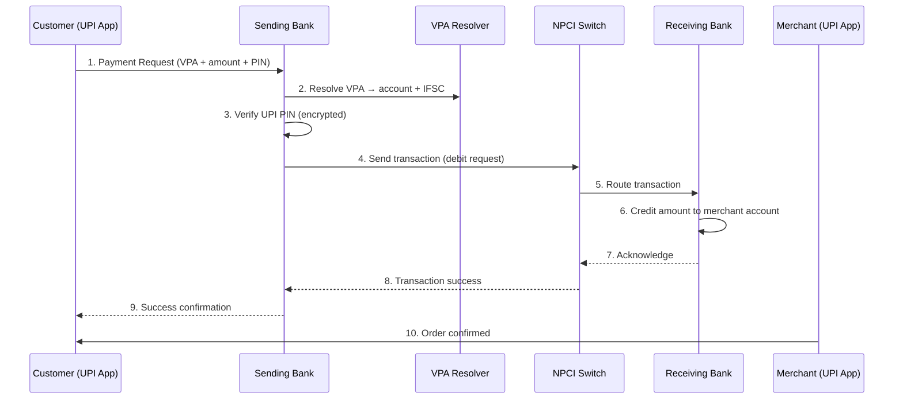
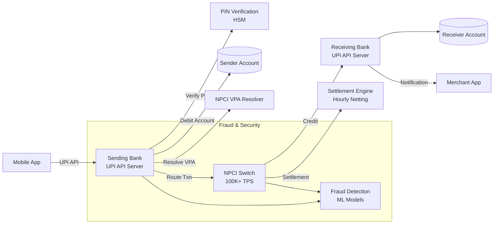

# Design UPI Payments System

## Blogs and websites

- [Designing UPI - System Design](https://www.geeksforgeeks.org/system-design/designing-upi-system-design/)
- [System Design: UPI (Unified Payment Interface)](https://dev.to/zeeshanali0704/system-design-upi-unified-payment-interface-2ng3)
- [System Design for Unified Payments Interface (UPI)](https://www.linkedin.com/pulse/system-design-unified-payments-interface-upi-nikhil-joshi-7s5kf/)
- [What is UPI? Unified Payments Interface Features and How UPI Works](https://razorpay.com/blog/what-is-upi-and-how-it-works/)

---

## Medium

- [UPI System Design](https://medium.com/career-drill/upi-system-design-f310d881b33d)
- [Technical Flow of Unified Payment Interface P2P Payments](https://medium.com/@vansh7uppal/technical-flow-of-united-payment-interface-p2p-payments-f553f49eae14)

---

## Youtube

- [System Design of UPI Payments](https://www.youtube.com/watch?v=fqySz1Me2pI)

---

## Theory

### What Is It?

UPI (Unified Payments Interface) is a real-time payment system in India that enables instant bank-to-bank transfers using a Virtual Payment Address (VPA) like `username@bank`, abstracting away traditional bank details (account number, IFSC). Operated by the National Payments Corporation of India (NPCI), UPI allows users to send and receive money instantly, 24x7, with a single mobile app — no need to exchange bank account numbers or IFSC codes.

### Why Does It Exist?

Before UPI (launched 2016), person-to-person payments in India required sharing account numbers and IFSC codes or using cash. UPI simplified this by introducing a single addressable identifier (VPA) mapped to bank accounts, enabling instant, frictionless payments. It democratized digital payments — any bank can participate, any app can integrate, and users can pay anyone with just a phone number or VPA.

### What Problem Does It Solve?

* **Complex bank details**: No need to share account number, branch code, IFSC — just a VPA (`yourname@bank`).
* **Real-time settlement**: IMTP/RTGS/NEFT were batch-based or limited — UPI is instant (seconds) and available 24x7.
* **Multiple payment rails**: UPI consolidates card payments, bank transfers, QR codes, and merchant payments under one interface.
* **Interoperability**: Any UPI app (Google Pay, PhonePe, Paytm) can pay any other UPI app or bank — no closed loop.
* **Security**: Multi-factor authentication (UPI PIN), encrypted transactions, and transaction limits.
* **Financial inclusion**: Enables digital payments for users without credit cards — bank account is enough.

### Important Subtopics

1. Virtual Payment Address (VPA) and address resolution
2. UPI transaction lifecycle (collect, request, approve, settlement)
3. NPCI as the switch (transaction routing and settlement)
4. Participating banks as Payment Service Providers (PSPs)
5. Third-party payment apps (Google Pay, PhonePe, Paytm)
6. UPI PIN and multi-factor authentication
7. Security architecture (encryption, fraud detection)
8. UPI 2.0, 2.1 features (request-to-pay, linking overdraft accounts)

### Key Concepts

- **VPA (Virtual Payment Address):**  
    A unique identifier for users in the UPI ecosystem, e.g., `username@bank`. It abstracts away sensitive bank details.

- **Bank Account Details:**  
    Traditionally, to transfer money, you need:
    - Account Number
    - Bank Name
    - Branch Code
    - IFSC Code

- **Payment Methods in India:**
    - **IMPS (Immediate Payment Service):** Real-time, 24x7, instant fund transfer.
    - **NEFT (National Electronic Funds Transfer):** Batch-processed, may take some time, uses UTR number, has amount limits.
    - **RTGS (Real Time Gross Settlement):** Real-time, for large-value transactions.
    - **UPI (Unified Payments Interface):** Real-time, instant, works 24x7, abstracts bank details using VPA.

### UPI Architecture

- **NPCI (National Payments Corporation of India):**  
    Governs and operates the UPI infrastructure. Only authorized banks can access NPCI APIs.

- **Banks:**  
    Must be authorized by RBI and NPCI to participate in UPI. They act as Payment Service Providers (PSPs).

- **Third-party Apps (PSPs):**  
    Apps like Google Pay, PhonePe, Paytm act as customer-facing interfaces but must partner with banks to access UPI.

### UPI Flow (Simplified)

1. **User initiates payment** via a UPI-enabled app using VPA.
2. **App communicates with partner bank** (PSP) to initiate the transaction.
3. **Bank interacts with NPCI** to route the transaction to the recipient's bank.
4. **NPCI validates and settles** the transaction in real-time.
5. **Confirmation** is sent back to both sender and receiver.

### Security

- UPI transactions are secured by multi-factor authentication (e.g., device binding, UPI PIN).
- Only authorized apps and banks can access the UPI APIs.

---

**Summary:**  
UPI revolutionizes payments in India by providing a unified, secure, and real-time payment interface, abstracting complex bank details and enabling seamless peer-to-peer and merchant transactions.

---

## Characteristics

| Characteristic | What it means | Why it matters | How it works |
|---|---|---|---|
| **Virtual Payment Address (VPA)** | A human-readable identifier (name@bank) instead of account/IFSC | Simplifies P2P; no need to share bank details | VPA resolver maps VPA → bank account + IFSC |
| **Real-time settlement** | Transactions settle within seconds, 24x7 | Better than batch systems (NEFT/RTGS) | NPCI switches transaction to receiver's bank in real-time |
| **Interoperability** | Any UPI app can send to any other UPI app/bank | Network effect; no closed-loop wallets | Standardized API between NPCI and all participating banks |
| **Multi-bank support** | 150+ banks participate; users link any UPI-enabled bank account | Broad coverage; users keep their preferred bank | Apps act as front-end; banks handle actual fund movement |
| **Secure authentication** | UPI PIN (MPIN) + device binding + mobile number | Protects against fraud even if phone is stolen | PIN is encrypted; verified by sending bank; never stored |
| **Request-to-Pay** | Merchant can request payment; payer approves via UPI app | Enables commerce use cases (e-commerce, bill pay) | UPI Collect API: merchant sends request → user approves |

## Components

| Component | Purpose | Responsibilities | Relationship | Real-world Example |
|---|---|---|---|---|
| **NPCI Switch** | Core transaction router | Receive transaction requests from PSPs, route to receiver's bank, handle settlement | Payment apps → NPCI; Banks → NPCI | NPCI's UPI switch |
| **Sending Bank (PSP)** | Initiate transaction from sender | Validate VPA, check balance, verify UPI PIN, debit account | Receives request from app; sends to NPCI | SBI, HDFC, ICICI |
| **Receiving Bank (PSP)** | Credit receiver's account | Receive funds from NPCI, credit receiver account | Receives from NPCI; credits customer | Any UPI-enabled bank |
| **UPI App (PSP Front-end)** | Customer-facing interface | App UI, QR scanning, contact sync, VPA management | Calls bank's UPI API | Google Pay, PhonePe, Paytm |
| **VPA Resolver** | Map VPI → bank account | Resolve `name@bank` → account number + IFSC | Called by sending bank | NPCI's VPA directory |
| **Settlement Engine** | Net settlement between banks | Aggregate inter-bank settlements (hourly/periodic) | Banks → Settlement Engine | NPCI's settlement system |
| **Fraud Detection** | Detect fraudulent transactions | Real-time monitoring of transaction patterns | Monitors NPCI switch traffic | NPCI's fraud systems |
| **UPI PIN Verification** | Secure PIN check | Encrypt PIN, send to sending bank for verification | Bank → Bank (via NPCI) | UPI PIN verification service |

## Patterns

### Request-to-Pay (UPI Collect)

* **What**: A merchant (or person) sends a payment request to a payer, who must approve it via their UPI app.
* **Problem solved**: Enables commerce (merchant payments, bill payments) where the merchant initiates the request but the customer must approve.
* **How it works**: Merchant calls `POST /upi/collect` → NPCI sends a push/notification to the payer's UPI app → payer opens app → approves with UPI PIN → funds transferred. Two APIs: `collect` (merchant → NPS, customer approves) and `pull` (merchant → NPCI → bank pulls funds).
* **When to use**: E-commerce checkout, bill payments, P2P requests.
* **When not to use**: In-store QR payments (use static QR + direct push instead).
* **Advantages**: Customer must approve (secure); works for commerce.
* **Disadvantages**: Requires customer action (can abandon); higher friction than auto-pay.
* **Real-world example**: Google Pay's "Request money", PhonePe merchant payments.

### Two-Factor Authentication (UPI PIN + Device)

* **What**: Every transaction requires (1) UPI PIN (MPIN) known only to the user, and (2) the transaction originates from a registered device.
* **Problem solved**: Prevents fraud — even if a phone is stolen or a SIM is swapped, the UPI PIN protects funds.
* **How it works**: (1) App generates a transaction request with encrypted UPI PIN → (2) sending bank's server decrypts and verifies PIN → (3) if valid, debits account and sends to NPCI → (4) NPCI routes to receiving bank. Device binding adds a layer — transactions from new devices require additional verification (SMS OTP or app approval).
* **When to use**: Every UPI transaction (mandatory by NPCI).
* **When not to use**: Never — always required.
* **Advantages**: Strong security; PIN never leaves the app in plaintext; device binding adds protection.
* **Disadvantages**: User friction (enter PIN each time); PIN entry on public devices is risky.
* **Real-world example**: All UPI transactions in India require UPI PIN verification.

## Benefits

* **Financial inclusion**: Bank account is sufficient — no credit card needed for digital payments.
* **Instant peer-to-peer**: Send money to anyone instantly using just a mobile number or VPA.
* **No merchant fees**: UPI transactions are free for merchants (encourages adoption).
* **24x7 availability**: Works anytime, even on holidays.
* **Interoperable**: Pay anyone regardless of bank or app.
* **Cashback ecosystem**: Cashback incentives drive adoption.

## Pros

* **Instant**: Transactions settle in seconds, 24x7, no batch processing delays.
* **Simple**: VPA (`name@bank`) replaces account number + IFSC code.
* **Secure**: UPI PIN encryption, device binding, bank-level authentication.
* **Interoperable**: Any app can pay any bank/app — no closed loop.
* **No merchant fees**: Zero MDR (Merchant Discount Rate) on UPI.
* **Wide adoption**: 10B+ transactions/month, 250M+ users in India.

## Cons

* **India-only**: Primarily used in India; not available internationally (different systems: FedNow, PIX, etc.).
* **Bank dependency**: Requires bank participation; if your bank doesn't support UPI, you're excluded.
* **Single point of failure**: NPCI switch downtime affects all UPI apps.
* **Transaction limits**: Per-app, per-bank, per-day limits (typically ₹2,000-5,000 per transaction, ₹50,000/day).
* **Fraud risk**: UPI PIN phishing, SIM swap attacks, social engineering.
* **Customer support**: Dispute resolution can be slow; relies on banks for chargebacks.

## Challenges

### Technical Challenges

* **Real-time settlement**: 10B+ transactions/month must settle in < 2 seconds; requires high-throughput, low-latency switch at NPCI.
* **UPI PIN security**: PIN must be verified without exposing it; uses encrypted PIN block (ISO 9564 format) sent to issuer bank.
* **Interoperability**: 150+ banks with different tech stacks, APIs, and SLAs must all interoperate seamlessly.
* **Device binding**: Track registered devices per user; allow/deny transactions based on device fingerprinting.

### Scalability Challenges

* **Transaction volume**: 10B+ transactions/month = 3,800+ TPS peak; need auto-scaling infrastructure at NPCI and each bank.
* **VPA resolution**: Resolve millions of VPAs in real-time; VPA directory must be globally consistent.
* **App scaling**: Google Pay, PhonePe each handle 50M+ MAU with < 1 second payment latency.

### Performance Challenges

* **Payment latency**: End-to-end (app → bank → NPCI → bank → app) must complete in < 3 seconds for good UX.
* **PIN verification**: Bank server must verify PIN within the same transaction window (no timeout).
* **Settlement batching**: NPCI settles inter-bank positions hourly; must handle netting efficiently.

### Reliability Challenges

* **Switch uptime**: NPCI switch must be 99.9%+ available — outage affects ALL UPI payments.
* **Bank outages**: If a bank's UPI services are down, users of that bank can't send/receive via UPI.
* **Duplicate transactions**: Network retries can cause duplicate debits — idempotency keys required.

### Maintainability Challenges

* **API versioning**: NPCI updates UPI specification (currently v2.0); 150+ BSPs must upgrade.
* **Feature rollout**: New features (e.g., credit line, bill presentment) require coordination across banks + NPCI.
* **Error handling**: Standardized error codes across banks + NPCI; mapping to user-facing messages.

### Operational Challenges

* **Fraud monitoring**: Detect phishing, SIM swap, and social engineering attacks in real-time.
* **Settlement reconciliation**: Daily netting between 150+ banks; resolve mismatches.
- **Customer support**: Handle disputes (wrong amount, failed reverse, merchant issues).

### Security Concerns

* **UPI PIN phishing**: Fraudsters use UPI PIN collection websites/apps — educate users to never share PIN.
* **SIM swap attacks**: Fraudster gets victim's SIM → initiates payment → victim's bank approves (device registered).
* **Collect request spam**: Fraudsters send collect requests for ₹1 to verify active accounts → filter by banks.
* **Account takeover**: If phone is stolen, device binding + UPI PIN mitigates.
* **Obfuscated UPI flows**: Some apps use hidden/undocumented UPI APIs — NPCI crackdown ongoing.

## Best Practices

* **Idempotency**: Every UPI transaction uses a unique `txnId` — retrying won't create duplicate transactions.
* **PIN security**: Never store UPI PIN; always send encrypted to the bank's server; validate server-side only.
* **Timeout handling**: Set appropriate timeouts at each step (app→bank: 30s; bank→NPCI: 30s; NPCI→bank: 10s).
* **Error mapping**: Handle all NPCI error codes (00 = success, others = specific failures) → map to user-friendly messages.
* **Device registration**: Require new device approvals with additional verification (SMS OTP or video KYC for high-risk).
* **Transaction limits**: Implement per-transaction, per-day, per-app, and per-bank limits.
* **Audit logging**: Log all transaction attempts (success + failure) with full request/response for dispute resolution.

## When to Use

### Appropriate

* When building mobile payment features in an Indian banking/fintech app.
* When you need real-time, low-cost, interoperable payments.
* When targeting Indian consumers (95%+ UPI adoption).
* When you need to accept payments without credit card infrastructure.

### Not Appropriate

* Outside India — use local systems (FedNow, PIX, Visa/Mastercard).
* For international remittances — UPI doesn't directly connect to SWIFT.
* When you need buyer protection/chargeback rights — UPI has limited dispute resolution.

### Alternatives

* **Cards**: Wider international acceptance; higher fees (2-3%); slower settlement.
* **NEFT/RTGS**: Batch-based; slower; bank-only (not app-based).
* **Wallet (Paytm)**: Fast but closed-loop (within the wallet ecosystem).
* **IMPS**: Also real-time and 24x7 but requires bank details (no VPA).

### Decision Factors

* **Geographic availability**: India → UPI; other countries → local rails.
* **User base**: Indian consumers → UPI; global → cards/local rails.
* **Cost**: UPI is free for merchants; cards cost 2-3%.
* **Speed**: UPI is instant; NEFT is batch (hourly).

## Use Cases

### Peer-to-Peer Money Transfer (Google Pay / PhonePe)

* **Problem**: Quickly send money to friends/family without cash or bank visits.
* **Solution**: Open app → enter VPA/amount → enter UPI PIN → transaction completes in seconds.
* **Why suitable**: UPI's real-time settlement + VPA abstraction make it instant and simple.
* **How it works**: App → sending bank → NPCI switch → receiver's bank → confirmation. Receiver gets SMS + notification. Funds reflect in 2-3 seconds.
* **Trade-offs**: Requires Internet (not SMS-based); PIN phishing is a fraud vector.

### Merchant Payments (E-commerce, Retail)

* **Problem**: Accept digital payments in-store or online without card swipes/POS.
* **Solution**: QR code scan (static or dynamic) → customer scans → confirms via UPI app → merchant receives payment.
* **Why suitable**: No fee for merchants (zero MDR on UPI); works on any phone; instant settlement.
* **How it works**: Merchant generates QR with VPA + amount → customer scans → UPI app pre-fills amount → customer enters PIN → NPCI routes to merchant's bank → merchant receives confirmation.
* **Trade-offs**: Requires smartphone (no feature phone support for scanning); network connectivity needed.

## Architecture

UPI is a **switch-based payment system** operated by NPCI. The **NPCI Switch** is the central router that connects all participating banks (Payment Service Providers). **UPI apps** (Google Pay, PhonePe) act as front-ends that call the user's bank's UPI API. The **VPA Resolver** maps VPAs to bank accounts + IFSC codes. When a transaction occurs, the flow goes: app → sending bank → NPCI → receiving bank → back to app. All banks maintain UPI PIN verification (encrypted) and device registration.



### Architecture Structure

* **NPCI Layer**: Central switch for routing; VPA resolution; settlement engine; fraud monitoring.
* **Bank Layer**: Each participating bank runs a UPI API server; handles PIN verification, balance check, debit/credit.
* **App Layer**: UPI apps (front-end UI); call bank APIs; manage device registration, QR codes.

### Communication

* **App ↔ Bank**: HTTPS + JSON (bank's UPI API); app authenticates via client credentials.
* **Bank ↔ NPCI**: ISO 8583 or proprietary protocol over secure network; synchronous transaction processing.
* **VPA Resolution**: Bank → NPCI → VPA Resolver → returns account + IFSC.

### Data Flow

1. **VPA Setup**: User → App → Bank → NPCI (register VPA) → returns success + VPA active.
2. **Payment**: User → App → Sending Bank (request with VPA + PIN) → VPA Resolver (lookup) → NPCI (debit + route) → Receiving Bank (credit) → confirmation back to App.
3. **Settlement**: NPCI net-settles inter-bank positions hourly; banks settle with NPCI daily.

### Scaling Strategy

* **NPCI**: Horizontally scaled switch cluster; load-balanced; 100K+ TPS capacity.
* **Banks**: Each bank scales independently; API gateway + rate limiting.
* **Apps**: CDN for static assets; geo-distributed API endpoints.

### Failure Handling

* **Bank down**: If the sending bank's UPI API is down, the app returns an error; retry or use another linked bank.
* **NPCI switch down**: All UPI transactions fail; emergency procedures (fallback to IMPS).
* **VPA not found**: Return error → user checks the VPA; suggest alternatives.

## High-Level Design



## Deep Dive

### UPI Transaction Lifecycle

1. **Mobile Number Registration**: User registers mobile number with the bank → bank links mobile number to bank account.
2. **VPA Creation**: User creates a VPA (`name@bank`) → bank verifies → NPCI registers VPA → returns success.
3. **Device Registration**: App registers device (device ID + SIM) → bank stores → future transactions require registered device.
4. **Payment Initiation**: User scans QR or enters VPA + amount → app calls sending bank's UPI API.
5. **UPI PIN Verification**: App sends encrypted PIN (ISO 9564 format) → bank decrypts with HSM → verifies against stored PIN hash → returns status.
6. **VPA Resolution**: Bank resolves VPA → account number + IFSC + name of beneficiary → shows to user for confirmation.
7. **Transaction Processing**: Bank debits account → sends transaction to NPCI → NPCI routes to receiving bank → receiving bank credits → confirmation propagated back.

### UPI Collect (Request-to-Pay) Flow

UPI Collect enables a merchant to request money from a customer:
1. Merchant sends collect request (vpa + amount +merchant id + transaction ref) to NPCI.
2. NPCI forwards to the customer's bank.
3. Customer's bank sends a notification to the customer's UPI app.
4. Customer approves via UPI PIN → bank processes → funds transferred.
5. Merchant receives confirmation.

This is used for e-commerce checkout, bill payments, and DTH recharge.

### UPI PIN Encryption

UPI PIN is never sent in plaintext:
1. App encrypts PIN using RSA with the bank's public key.
2. Encrypted PIN block (ISO-0 format) sent to bank's API.
3. Bank uses HSM to decrypt with private key.
4. Bank verifies PIN against the stored hash (not stored in plaintext — only hash in HSM).

## Java and Spring Boot Implementation

```java
@RestController
@RequestMapping("/api/v1/upi")
@RequiredArgsConstructor
public class UpiPaymentController {
    private final UpiPaymentService paymentService;
    private final VpaResolver vpaResolver;

    @PostMapping("/collect")
    public ResponseEntity<PaymentResponse> collectPayment(
            @RequestBody CollectRequest request,
            @RequestHeader("X-APP-ID") String appId) {

        try {
            VpaDetails vpaDetails = vpaResolver.resolve(request.getPayeeAddress());
            
            PaymentResponse response = paymentService.processCollect(
                request.getMerchantId(),
                vpaDetails.getAccountName(),
                vpaDetails.getAccountNumber(),
                vpaDetails.getIfscCode(),
                request.getAmount(),
                request.getTransactionRefId()
            );

            return ResponseEntity.ok(response);
        } catch (VpaNotFoundException e) {
            return ResponseEntity.badRequest()
                .body(PaymentResponse.error("VPA_NOT_FOUND", e.getMessage()));
        } catch (Exception e) {
            log.error("Payment failed: {}", e.getMessage(), e);
            return ResponseEntity.status(HttpStatus.INTERNAL_SERVER_ERROR)
                .body(PaymentResponse.error("PAYMENT_FAILED", e.getMessage()));
        }
    }

    @PostMapping("/pay")
    public ResponseEntity<PaymentResponse> pay(
            @RequestBody PayRequest request) {
        Validate.amount(request.getAmount());
        Validate.notNull(request.getPayerAddress(), "payerAddress required");
        
        PaymentResponse response = paymentService.processPay(
            request.getPayerAddress(),
            request.getPayeeAddress(),
            request.getAmount(),
            request.getUpiPinEncrypted(), // Encrypted PIN
            request.getTransactionRefId()
        );

        return ResponseEntity.ok(response);
    }
}

@Service
@Transactional
public class UpiPaymentService {

    public PaymentResponse processPay(String payerVpa, String payeeVpa,
                                        BigDecimal amount, String encryptedPin,
                                        String txnRefId) {
        // 1. Idempotency check
        if (isDuplicateTransaction(txnRefId)) {
            return getPreviousResponse(txnRefId);
        }

        // 2. Resolve payee VPA
        VpaDetails payeeDetails = vpaResolver.resolve(payeeVpa);
        
        // 3. Verify UPI PIN
        if (!pinService.verifyPin(encryptedPin, payerVpa)) {
            throw new InvalidPinException("Incorrect UPI PIN");
        }

        // 4. Check balance and limits
        BankAccount senderAccount = accountService.getAccountForVpa(payerVpa);
        if (senderAccount.getBalance().compareTo(amount) < 0) {
            throw new InsufficientBalanceException("Insufficient balance");
        }

        // 5. Debit sender
        accountService.debit(senderAccount, amount, txnRefId);

        // 6. Send to NPCI for routing
        NpciTransactionRequest npciRequest = NpciTransactionRequest.builder()
            .transactionId(txnRefId)
            .payerVpa(payerVpa)
            .payeeDetails(payeeDetails)
            .amount(amount)
            .build();

        NpciResponse npciResponse = npciClient.processTransaction(npciRequest);

        if (!"SUCCESS".equals(npciResponse.getStatus())) {
            // Rollback debit
            accountService.credit(senderAccount, amount, txnRefId + "_rev");
            throw new PaymentFailedException(npciResponse.getErrorCode());
        }

        // 7. Record transaction
        transactionRepository.save(Transaction.builder()
            .transactionId(txnRefId)
            .payerVpa(payerVpa)
            .payeeVpa(payeeVpa)
            .amount(amount)
            .status("SUCCESS")
            .timestamp(Instant.now())
            .build());

        return PaymentResponse.success(txnRefId, npciResponse.getRefId());
    }
}
```

### Testing Example

```java
@SpringBootTest
class UpiPaymentServiceTest {
    @MockBean private VpaResolver vpaResolver;
    @MockBean private PinService pinService;
    @MockBean private AccountService accountService;
    @MockBean private NpciClient npciClient;

    @Test
    void shouldRejectDuplicateTransaction() {
        String txnId = "txn_123";
        when(isDuplicateTransaction(txnId)).thenReturn(true);
        when(getPreviousResponse(txnId)).thenReturn(PaymentResponse.success(txnId, "ref_456"));

        PaymentResponse response = paymentService.processPay(
            "sender@bank", "receiver@bank", 
            BigDecimal.valueOf(100), "encrypted_pin", txnId);

        assertThat(response.isSuccessful()).isTrue();
        verify(accountService, never()).debit(any(), any(), any());
    }

    @Test
    void shouldRollbackOnNpciFailure() {
        when(pinService.verifyPin(any(), any())).thenReturn(true);
        when(accountService.getAccountForVpa(any())).thenReturn(testAccount(1000));
        when(npciClient.processTransaction(any())).thenReturn(
            NpciResponse.failed("BANK_DOWN"));

        assertThatThrownBy(() -> paymentService.processPay(
            "sender@bank", "receiver@bank",
            BigDecimal.valueOf(100), "encrypted_pin", "txn_789"))
            .isInstanceOf(PaymentFailedException.class);

        // Verify debit was rolled back
        verify(accountService).credit(any(), eq(BigDecimal.valueOf(100)), anyString());
    }
}
```

## Real-World Examples

### NPCI UPI Infrastructure

NPCI operates the UPI switch with 100+ participating banks and 150+ PSPs (payment apps). The system processes 10B+ transactions/month (3,800+ TPS peak). Key infrastructure details:
- **NPCI Data Centers**: Two primary data centers (active-active) in Mumbai and Delhi; each can handle 100% load.
- **UPI Switch**: Built on a high-throughput messaging platform; uses an in-memory transaction grid for sub-second processing.
- **VPA Directory**: Maintains 500M+ VPAs; replicated across data centers.
- **Settlement**: Hourly gross settlement between banks; netting engine reduces interbank transfers.

### Google Pay's Scale

Google Pay (GPay) in India processes 1B+ UPI transactions/month. The architecture:
- **Frontend**: React Native mobile app + Flutter for some features.
- **Backend**: Microservices on Google Cloud (GKE); 50+ services.
- **Bank integrations**: Uses each bank's UPI API; maintains connections to 50+ banks.
- **Performance**: 99% of payments complete in < 3 seconds.
- **Fraud detection**: Uses Google's AI infrastructure for real-time fraud detection (analyzes 100+ signals per transaction).

### PhonePe's Architecture

PhonePe (Walmart-owned) processes 6B+ UPI transactions annually. Key design decisions:
- **Micro-frontends**: App is composed of independently deployable mini-apps (Pay, Markets, Insurance, etc.).
- **Event sourcing**: All payment events stored in an event log (Kafka) for audit and replay.
- **Regional data centers**: Multiple AWS regions in India for low latency.
- **Zero MDR**: PhonePe absorbed merchant fees (controversial) to drive adoption.

## Interview Preparation

### Beginner Questions

**Q1: What is UPI and how does it work?**
A: UPI (Unified Payments Interface) is India's real-time payment system operated by NPCI. Users pay using a Virtual Payment Address (VPA like `name@bank`) instead of bank details. Flow: User enters VPA + amount + UPI PIN → sending bank verifies PIN → debits account → sends to NPCI → routes to receiver's bank → credits account → confirms. The whole process takes seconds, works 24x7, and is interoperable across 150+ banks and apps.

**Q2: What is UPI PIN and how is it secured?**
A: UPI PIN (MPIN) is a 4-6 digit secret known only to the user, used to authenticate each transaction. Security: (1) PIN is encrypted on the device using the bank's public key (RSA). (2) The encrypted PIN is sent to the bank's server → decrypted by HSM (Hardware Security Module) → verified against a stored hash (not plaintext). (3) PIN is never stored or transmitted in plaintext. (4) Device binding — transactions from new devices require additional verification.

**Q3: What are the different UPI APIs?**
A: UPI 2.0 defines several APIs: (1) `Collect` — merchant requests money from customer. (2) `Pay` — customer sends money to a VPA. (3) `Get Balance` — fetch linked account balance. (4) `Get Account Details` — fetch account info by VPA. (5) `Generate OTP` — for device registration. (6) `Direct Debit/Collect` — recurring payments (NPCI auto-pay). (7) `Invoice Register` — merchant registers an invoice for later payment.

### Intermediate Questions

**Q4: How is UPI interoperable across banks?**
A: NPCI provides a standardized UPI specification (API format, error codes, security protocols). Each bank implements the UPI API server following this spec. Apps communicate via the user's bank's UPI API. NPCI acts as the switch — routing transactions between banks and resolving VPAs. This is like how Visa/Mastercard operate between banks for card payments.

**Q5: What is VPA and how does it work?**
A: VPA (Virtual Payment Address) is a human-readable identifier (e.g., `rahul@sbi`) that maps to a bank account. The VPA resolver (managed by NPCI or the bank) maps the VPA to: bank account number, IFSC code, and account holder name. When a user pays using a VPA, the sending bank queries the resolver (via NPCI) → gets the account details → debits and initiates the transfer. This abstracts away account/IFSC details.

**Q6: How does UPI handle failures and refunds?**
A: Every UPI transaction has a unique `txnId` (idempotency). If the transaction fails midway: (1) Debit reversal — if the amount was debited but not credited to the recipient, NPCI reverses the debit during settlement. (2) Timeout — if no response within 90 seconds, the transaction is marked failed; debit reversal initiated. (3) Refund — merchant can initiate a refund transaction (pull) to the customer's VPA. (4) Dispute — customer can raise a complaint via the app → bank investigates → NPCI mediated.

### Advanced Questions

**Q7: How would you design a UPI-like payment system for a new country?**
A: (1) **Governance**: Partner with the central bank to define standards (like NPCI in India). (2) **Directory service**: Create a VPA equivalent (e.g., `name@countrycode`) → bank mapping directory. (3) **Switch**: Build a real-time transaction switch (like NPCI) connecting all banks. (4) **Bank integration**: Each bank implements the switch's API. (5) **App ecosystem**: Allow multiple fintech apps to compete (promote innovation). (6) **PIN & security**: Define secure PIN handling (encrypted, HSM-verified). (7) **Settlement**: Hourly netting between banks; central bank backs settlement. (8) **Adoption strategy**: Start with government employees + bank employees → expand to public; incentivize merchants (zero fees).

**Q8: What happens if a UPI transaction succeeds on one bank but fails on another (partial failure)?**
A: NPCI uses a **two-phase commit-like protocol**: (1) Debit request sent to sending bank → bank reserves/debits funds → sends response to NPCI. (2) NPCI routes credit to receiving bank → bank credits → sends response. (3) If the credit fails (receiving bank down), NPCI sends a reversal request to the sending bank → debit is reversed. (4) The customer sees "transaction failed" and funds are returned. (5) If the sending bank is unreachable for reversal, NPCI follows up with an automatic reversal within 90 seconds. (Note: this is not a true 2PC — there's a window for partial failure; UPI 2.0 added "refund on timeout" as a safeguard.)

**Q9: How does UPI handle fraud like SIM swap attacks?**
A: (1) **Device binding**: Each UPI transaction requires the app to be registered on a specific device (SIM + device ID). SIM swap attacks trigger a device registration check — the new device (with swapped SIM) is not registered → transaction blocked. (2) **Additional verification**: For high-risk scenarios (new device, high amount), banks may require additional SMS OTP. (3) **Limit enforcement**: Per-day and per-transaction limits cap potential losses. (4) **Fraud detection**: Banks use ML to detect anomalous patterns (multiple transactions, velocity). (5) **Customer awareness**: UPI apps display warnings about sharing PIN.

### Senior-Level Questions

**Q10: How would you scale UPI to handle 1B+ transactions/day globally?**
A: (1) **Regional switches**: Build independent switch fabrics per region (Asia switch, Europe switch, US switch) — each handling regional transactions; cross-border via inter-switch protocols. (2) **Sharded directory**: VPA directory sharded by hash(name@bank) → distributed lookup (Redis cluster or CockroachDB). (3) **Bank-side scaling**: Each bank scales its UPI API behind an API gateway with rate limiting + caching; use async processing for non-critical steps. (4) **Settlement optimization**: Batch settlements every 10 minutes (instead of hourly) → reduces inter-bank communication overhead; use distributed ledger for audit trail. (5) **Caching**: Cache VPA lookups (VPAs rarely change) → Redis; cache bank health status. (6) **Fraud at scale**: Stream processing (Flink) over Kafka for real-time fraud detection; shard fraud models by region. (7) **API design**: Stateless bank APIs; connection pooling; circuit breakers. (8) **Monitoring**: Track per-bank latency, transaction success rates, settlement status; alert on anomalies.

### System Design Questions (Senior)

**Q11: Design a UPI transaction system that processes 100K TPS with < 500ms end-to-end latency and 99.99% availability.**

**Approach**:
1. **NPCI Switch**: Build the core switch as a **state machine** using an in-memory transaction grid (Redis Cluster with AOF persistence). Each transaction is an event; state transitions are recorded. Use **event sourcing** — all transactions logged to Kafka for durability and replay.
2. **VPA directory**: Store in Redis (cached) + PostgreSQL (durable) → 99.9% reads from cache; write-through on VPA registration. Cache 300M+ VPAs in a Redis cluster (100GB RAM across 50 nodes).
3. **Bank connectors**: Each bank has a connector service (stateful, maintains persistent connections). Use connection pooling (100 connections per bank). Circuit breaker per bank — if a bank is down, reject transactions to/from that bank immediately (instead of timing out).
4. **PIN verification**: HSM-backed verification; use a dedicated HSM cluster (10+ HSMs) for high throughput; PIN encryption/decryption in < 10 ms.
5. **Settlement**: Hourly net settlement; pre-compute netting positions every 10 minutes → reduce inter-bank transfer volume. Use a **two-phase commit coordinator** for atomicity between debit and credit.
6. **Latency optimization**: (1) In-memory state lookup (Redis) — < 1 ms. (2) Bank API call: 50-100 ms. (3) PIN verification: 10 ms. (4) NPCI switch: 5 ms. (5) Total: 60-115 ms without network overhead. (6) Co-locate with banks (same DC or peering) to reduce network RTT.
7. **Availability**: (1) NPCI switch active-active (2 data centers). (2) Each bank connector in 3 AZs. (3) Kafka with replication factor 3 for transaction log. (4) Redis with 3 replicas. (5) Circuit breakers + retry with backoff for bank API failures.
8. **Monitoring**: Per-bank latency, transaction success rate, PIN failure rate, switch throughput, settlement status. Alert on > 200 ms latency or > 0.5% failure rate.

**Q12: How would you handle the settlement process between 150+ banks efficiently?**
A: (1) **Netting algorithm**: Instead of 150 × 149 = 22,350 bilateral settlements, compute net positions: `net[i][j] = gross[i][j] - gross[j][i]`. For each bank pair, only net amount is transferred → reduces transaction volume by 10-50x. (2) **Multi-lateral netting**: Even better — use a common settlement account (central clearing): all banks settle to/from the central account → 150 settlements instead of 22,350. (3) **Timing**: Settle every 10 minutes (not hourly) → reduces capital lockup. (4) **Settlement finality**: Use a blockchain or distributed ledger (e.g., R3 Corda) for immutable settlement records → prevents disputes. (5) **Reconciliation**: Each bank reconciles its records with NPCI's records → any mismatch flagged for investigation within 30 minutes. (6) **Dispute window**: 7-day window for transaction reversals; after 7 days, settlement is final. (7) **Float management**: Banks earn/lose interest on the float (inter-bank transfer delays) — optimize settlement timing for minimal float. (8) **Audit trail**: All settlements logged to Kafka → data warehouse for regulatory reporting.
