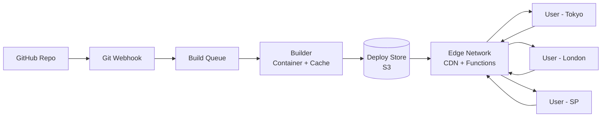

# Design a system like Vercel

## Blogs and websites

## Medium

## Youtube

- [Code along - I built Vercel in 4 Hours (System Design, AWS, Redis, S3)](https://www.youtube.com/watch?v=c8_tafixiAs)
    - [Vercel Clone Code Review - Pass or Fail? | Hindi](https://www.youtube.com/watch?v=o7O-BuZwkW0)

- [I built Vercel in 2 Hours (System Design, AWS, Docker, Redis, S3)](https://www.youtube.com/watch?v=0A_JpLYG7hM)
    - [Firse Vercel Code Review - PART 2](https://www.youtube.com/watch?v=-rCI-utuYig)

- [I Built Vercel in 2 Hours (Kafka, ClickHouse, Postgres) | Log Collection and Pipeline](https://www.youtube.com/watch?v=QPzrIp5kyho)

---

## Theory

### What Is It?

Vercel is a cloud platform for developing, building, deploying, and hosting front-end applications with serverless functions and edge computing. It provides git-first CI/CD (deploy on push), automatic SSL, global edge network for static + dynamic content, and serverless/edge functions — all managed via a simple developer experience (vercel.json config).

### Why Does It Exist?

Traditional hosting (VPS, containers) requires manual scaling, SSL management, CDN setup, and deployment orchestration. Vercel abstracts all of this into a git-push-to-deploy model — developers focus on code, not infrastructure.

### What Problem Does It Solve?

* **Global distribution**: Deploy once → serve worldwide via edge network.
• **Zero-downtime deployment**: Atomic deploys; instant rollback.
• **Serverless**: No server management; auto-scaling to zero + infinite.
• **Build caching**: Incremental builds → faster CI/CD.
• **Edge computing**: Functions run closer to users → lower latency.
• **Automatic scaling**: Scale to millions of requests; no manual intervention.

### Important Subtopics

1. Static file serving (CDN edge cache)
2. Serverless functions (Node.js, Go, Python, Ruby)
3. Edge functions (V8 isolates, sub-ms cold starts)
4. Build system (git trigger, caching, incremental)
5. Routing (dynamic, static, custom domains)
6. Deployment model (immutable, atomic, rollback)
7. Domain management (custom domains, SSL, redirects)
8. Analytics (real user monitoring, edge logs)

### Problem Statement

Design a deployment platform (like Vercel) that allows developers to deploy front-end applications with git integration, automatic SSL, global edge distribution, serverless/edge functions, zero-downtime deployments, and automatic scaling.

### Functional Requirements

- Git integration (deploy on push to branch)
- Build system (dependency install, build command, output directory)
- Deploy static files to edge CDN
- Serverless functions (API routes)
- Edge functions (middleware, sub-ms)
- Custom domains with automatic SSL
- Routing (path-based + dynamic)
- Deployment history + rollback
- Build caching (incremental)

### Non-Functional Requirements

- **Latency**: Edge: sub-ms cold start; < 10ms response for edge functions
- **Scale**: Auto-scale to millions of requests/sec; scale to zero when idle
- **Availability**: 99.9%+ (edge redundancy)
- **Deployment speed**: Build + deploy < 60s for typical app
- **Global**: Edge in 100+ regions

---

## Characteristics

| Characteristic | What it means | Why it matters | How it works |
|---|---|---|---|
| **Serverless** | No server management; scales to zero | Zero cost when idle; infinite scale | Containers + auto-scale |
| **Edge deployment** | Code runs at edge PoPs | Sub-ms latency for users | V8 isolates / WASM |
| **Atomic deploys** | Deploy is immutable (new version) | Instant rollback; no partial state | Immutable deploy objects |
| **Build caching** | Reuse previous build output | Faster CI/CD | Cache key = file hash |
| **Zero-downtime** | No downtime during deploy | Always available | Load balancer switch |
| **Git-first** | Deploy triggered by git push | Developer simplicity | Git webhook → build queue |
| **Auto SSL** | Free SSL for custom domains | Security (HTTPS) | Let's Encrypt + ACM |

## Components

| Component | Purpose | Responsibilities | Relationship | Real-world Example |
|---|---|---|---|---|
| **Git Integration** | Trigger deployment | Webhook from git providers | Client ↔ Build Queue | GitHub App |
| **Build Queue** | Manage build jobs | Queue + retry + prioritize | Git → Builder | Redis + workers |
| **Builder** | Build application | Install deps, run build, collect output | Build Queue ↔ Storage | Node.js builder |
| **Build Cache** | Speed up builds | Cache deps + output | Builder | S3/Redis |
| **Edge Network** | Serve static + functions | CDN + edge compute | Build → CDN | 100+ PoPs |
| **Edge Functions** | Run code at edge | Serverless/edge functions | CDN ↔ Client | V8 isolates |
| **Load Balancer** | Route traffic | Zero-downtime deploy | Client ↔ Edge | LB + health check |
| **Domain Manager** | Custom domains + SSL | DNS + cert provisioning | Edge + User | ACM + Route53 |
| **Deploy Store** | Store deployment artifacts | Immutable deploy versions | Builder | S3 |
| **Analytics** | Performance + usage | RUM + edge logs | Edge ↔ User | ClickHouse |

## Patterns

### Git-First Deployment

* **What**: Git push to a branch → triggers a build → deploys a new version. The deployment is immutable (each deploy gets a unique URL like `app-git--branch.vercel.app`).
* **Problem solved**: Eliminates manual deployment; every git commit = a deployable preview.
• **How it works**: (1) Git webhook on push → Vercel → fetch repo → enqueue build. (2) Builder: install deps → run `vercel build` → collect output (.next, dist). (3) Cache: node_modules + build output (key = file hash). (4) Deploy: upload artifacts → edge CDN → atomic alias switch. (5) Rollback: alias back to previous deploy (instant).
* **When to use**: Front-end apps with git workflow; CI/CD simplicity.
• **When not to use**: Stateful backends; complex multi-step deployment.
* **Advantages**: Simple; preview URLs; instant rollback; build caching.
* **Disadvantages**: Build isolation; cold starts; vendor lock-in.

## Benefits

* **Developer experience**: Push to git → live URL instantly.
• **Global scale**: 100+ edge locations → worldwide low latency.
• **Zero maintenance**: No servers, no scaling, no SSL management.
• **Zero-downtime**: Atomic deploys + instant rollback.
• **Cost efficiency**: Scale to zero; only pay for actual usage.

## Pros

* **Speed**: Build cache + edge → deploys in seconds.
• **Edge functions**: Sub-ms cold starts (V8 isolates).
• **Automatic SSL**: Free cert for custom domains.
• **Rollback**: Instant (switch alias to previous deploy).
• **Preview URLs**: Every PR = unique URL for testing.
• **Analytics**: Real-user monitoring built-in.

## Cons

* **Vendor lock-in**: Vercel-specific config (vercel.json); hard to migrate.
• **Cold starts**: Serverless functions (not edge) still have cold start latency.
• **Build limits**: Time + memory limits per build.
• **Cost**: High traffic → CDN + function costs.
• **Limited control**: No root access; opinionated build process.
• **Regional availability**: Some regions may have limited edge presence.

## Challenges

### Technical Challenges
* **Edge runtime**: V8 isolates (not full Node.js); limited APIs (no filesystem, no network sockets).
* **Build isolation**: Each build in ephemeral container; dependency caching.
• **Routing:** Static + dynamic + function routes unified into one config.

### Scalability Challenges
* **Edge PoPs**: 100+ locations; deployment propagation (active-active).
• **Function scaling**: Scale to zero + infinite; concurrent execution limits.

### Performance Challenges
* **Cold starts**: Serverless functions (Node.js) = 100ms–2s; Edge functions (V8) = < 1ms.
• **Build time**: Large monorepo → optimized build graph + caching.

### Reliability Challenges
* **Build failures**: Retry + dead-letter; notify on failure.
• **Edge propagation**: Stale cache + invalidation; CDN cache purge.
• **SSL provisioning**: Certificate issuance delays + renewal.

### Maintainability Challenges
* **Build cache invalidation**: Cache key strategy (file hash + deps lock file).
• **Edge runtime updates**: V8 version changes; API deprecation.
• **Observability**: Distributed tracing across edge + serverless.

### Security Concerns
* **Code injection**: Function sandboxing (V8 isolates).
• **Dependency vulnerabilities**: Automated scanning (npm audit).
• **DDoS protection**: Edge-level rate limiting + WAF.
• **Secret management**: Environment variables encrypted at rest.

## Best Practices

* **Edge functions**: Use for low-latency requests (auth, A/B, redirects); serverless for heavy compute.
• **Build caching**: Cache node_modules + build output; key = lockfile hash.
• **Immutable deploys**: Each deploy is immutable; rollback = switch alias.
• **Small functions**: Keep edge functions < 1MB; cold start + cache.
• **Graceful degradation**: Static fallback for function failures.
• **Monitoring**: Edge error rate + latency + function duration.

## When to Use

### Appropriate
* Front-end applications (React, Vue, Next.js, SvelteKit).
• Apps needing global low-latency (edge).
• Prototypes + rapid iteration (git-first).
• Static sites + dynamic API routes.

### Not Appropriate
* Stateful backends (databases, long-running processes).
• Complex multi-service architectures.
• When you need full OS control.

### Decision Factors
* Frontend vs backend needs; latency requirements; cost; vendor lock-in tolerance.

## Use Cases

### Global E-commerce Front-end

* **Problem**: A global e-commerce storefront needs to load instantly for users in Tokyo, London, and São Paulo, with dynamic pricing + A/B testing.
* **Solution**: Next.js app → Vercel → static pages (SSG) cached at edge → edge functions for A/B testing + geo-pricing (sub-ms). Serverless functions for cart/checkout API.
* **Why suitable**: Edge = global low latency; SSG = fast pages; edge functions = instant A/B; serverless = auto-scale checkout.
* **How it works**: (1) Git push → Vercel build → Next.js SSG export → static HTML + JSON to edge CDN. (2) Edge function: /api/ab-test → check cookie → select variant (sub-ms, no cold start). (3) Edge function: /api/geo-price → IP → currency + price (sub-ms). (4) Serverless: /api/cart → Node.js lambda → Redis + PostgreSQL. (5) Rollback: if error → instant rollback to previous deploy. (6) Custom domain + auto SSL.
* **Trade-offs**: Edge function size limit (1MB); serverless cold start for checkout; vendor lock-in.

## Architecture

```mermaid
graph TD
  subgraph "Developers"
    DEV[GitHub/GitLab]
  end
  subgraph "CI/CD"
    WH[Webhook<br/>Git Trigger]
    BQ[Build Queue<br/>Redis]
    Builder[Builder<br/>Ephemeral Container]
    Cache[(Build Cache<br/>S3)]
  end
  subgraph "Edge"
    Edge[Edge Network<br/>100+ PoPs]
    Funcs[Edge + Serverless<br/>Functions]
  end
  subgraph "Customers"
    C1[Viewer - Tokyo]
    C2[Viewer - London]
    C3[Viewer - São Paulo]
  end
  DEV --> WH
  WH --> BQ
  BQ --> Builder
  Builder --> Cache
  Builder --> Storage[(Deploy Store<br/>S3)]
  Storage --> Edge
  Cache --> Builder
  Edge --> Funcs
  Funcs --> C1
  Funcs --> C2
  Funcs --> C3
  C1 --> Edge
  C2 --> Edge
  C3 --> Edge
```

### Architecture Structure
* **CI/CD**: Git webhook → Build Queue → Build worker (ephemeral container + cache).
• **Storage**: Immutable deploy artifacts (S3).
• **Edge**: CDN + edge functions (100+ PoPs).
• **Functions**: Edge (V8 isolates) + Serverless (Node.js/Go).
* **Domains**: Custom domains + auto SSL (Let's Encrypt).

### Data Flow
1. **Deploy**: Git push → webhook → fetch repo → enqueue build.
2. **Build**: Worker → cache mount → install deps → build → output → upload to S3.
3. **Deploy**: Artifacts → edge CDN → atomic alias switch.
4. **Serve**: Viewer → DNS → edge PoP → static (cached) → or edge function (V8).

### Scaling Strategy
* **Builders**: Scale by build queue; 100+ builders.
• **Edge**: Immutable artifacts → scales to millions; auto-scale to zero.
* **Functions**: Edge (V8) → instant scale; Serverless → 1–1000 concurrent.

### Failure Handling
* **Build failure**: Retry 3x → dead-letter + notify.
• **Edge outage**: Traffic routed to next PoP; global anycast.
* **Function error**: Edge → return error; fallback to static if configured.

## High-Level Design



## Deep Dive

### Edge Functions vs Serverless

The existing Theory section covers: edge functions run at the edge (V8 isolates) for sub-ms latency; serverless functions run in centralized regions for heavier compute. Edge function size limit (1MB); no filesystem/network access. Serverless: full Node.js runtime but cold starts.

### Build Caching

The existing Theory section covers: build cache stores node_modules + build output; cache key = content hash of lockfile; incremental builds reuse cache; stale cache detection via dependency changes.

### Deployment Model

The existing Theory section covers: each deploy is immutable; new version gets unique URL; alias switches traffic atomically (zero-downtime); rollback = alias back.

## API Contract

* **API purpose**: Manage deployments, projects, domains, environment variables.

| Method | Endpoint | Description |
|---|---|---|
| POST | `/v1/projects` | Create a new project |
| POST | `/v1/projects/{id}/deployments` | Create a new deployment |
| GET | `/v1/projects/{id}/deployments` | List deployments |
| GET | `/v1/projects/{id}/deployments/{dep}` | Get deployment status |
| DELETE | `/v1/projects/{id}/deployments/{dep}` | Delete deployment |
| POST | `/v1/projects/{id}/domains` | Add custom domain |
| GET | `/v1/projects/{id}/domains/{dom}/certs` | Get SSL cert status |

**Create deployment (POST /deployments)**:
```json
{"name": "my-app", "git_branch": "main", "project_id": "proj_123"}
```
**Response**:
```json
{
  "uid": "dpl_abc123",
  "name": "my-app",
  "state": "BUILDING",
  "url": "my-app-git-main--username.vercel.app",
  "created": 1723456789
}
```

**Error responses**:
```json
{"error": {"code": "bad_request", "message": "Build timeout", "id": "dep_123"}}
{"error": {"code": "forbidden", "message": "Project not found"}}
```

**Authentication**: Bearer token (personal token or team token).

## Data Modeling

```mermaid
erDiagram
    USER ||--o{ PROJECT : "owns"
    PROJECT ||--o{ DEPLOYMENT : "has"
    DEPLOYMENT ||--o{ DOMAIN : "maps"
    PROJECT ||--o{ ENV_VAR : "has"

    USER {
      string user_id PK
      string email
      string name
    }
    PROJECT {
      string project_id PK
      string user_id FK
      string name
      string framework
      datetime created_at
    }
    DEPLOYMENT {
      string dep_id PK
      string project_id FK
      string git_branch
      string state BUILDING_READY_ERROR
      string url
      datetime created_at
      datetime ready_at
    }
    DOMAIN {
      string domain_id PK
      string project_id FK
      string name
      string ssl_status PENDING_READY_ERROR
    }
    ENV_VAR {
      string var_id PK
      string project_id FK
      string key
      string value_encrypted
    }
```

**Consistency**: Strong consistency for project/deployment metadata; eventual for edge cache.

## Java and Spring Boot Implementation

```java
@RestController
@RequestMapping("/api/v1/deployments")
@RequiredArgsConstructor
public class DeploymentController {
    private final DeploymentService deployService;

    @PostMapping
    public ResponseEntity<DeploymentResponse> createDeployment(
            @AuthenticationPrincipal UserDetails user,
            @RequestBody CreateDeploymentRequest request) {

        // Trigger build + deploy
        CompletableFuture<Deployment> future = deployService.deploy(request);
        
        // Webhook: notify user on completion
        return ResponseEntity.accepted().build();
    }

    @GetMapping("/{deploymentId}")
    public ResponseEntity<DeploymentResponse> getDeployment(
            @PathVariable String deploymentId) {
        Deployment dep = deployService.getStatus(deploymentId);
        return ResponseEntity.ok(DeploymentResponse.from(dep));
    }
}

@Service
public class DeploymentService {
    private final BuildQueue buildQueue;
    private final S3Storage s3Storage;
    private final EdgeManager edgeManager;

    public CompletableFuture<Deployment> deploy(CreateDeploymentRequest req) {
        String deployId = UUID.randomUUID().toString();
        
        // Enqueue build
        buildQueue.enqueue(new BuildJob(deployId, req.getProjectId(), req.getGitBranch()));
        
        // Listen for build completion → upload → edge deploy
        return CompletableFuture.supplyAsync(() -> {
            BuildResult result = buildQueue.waitFor(deployId);
            String buildId = s3Storage.upload(result.getArtifacts());
            edgeManager.deploy(buildId, req.getProjectId());
            return new Deployment(deployId, buildId, "READY");
        });
    }
}
```

## Real-World Examples

* **Vercel**: Next.js integration; edge network; Git-deploy; preview URLs.
• **Netlify**: Similar git-first deployment; serverless functions; edge handlers.
• **Cloudflare Pages**: Git integration; edge functions; Workers.
• **GitHub Pages + Cloudflare**: Static hosting + edge cache (DIY Vercel).

## Interview Preparation

### Beginner Questions

**Q: What is a serverless function?**
A: A function-as-a-service (FaaS) — you write a function, the platform runs it on-demand. Auto-scales to zero (no cost when idle) → infinite scale. Cold start (container init) on first invocation. Vercel + AWS Lambda + Cloudflare Workers.

**Q: What is edge computing?**
A: Running compute (functions) at the edge (PoP closest to user) instead of centralized region. Reduces latency (round-trip to user). Vercel Edge Functions (V8 isolates), Cloudflare Workers (V8), AWS Lambda@Edge.

**Q: What is a build cache?**
A: Cache of dependencies + build output from previous builds. Key = content hash of lockfile. On rebuild → if cache hit → skip install/build steps. Speeds up CI/CD from minutes to seconds.

### Intermediate Questions

**Q: How does Vercel achieve zero-downtime deployments?**
A: (1) Each deploy is immutable (unique URL). (2) Build → upload artifacts to S3. (3) Deploy → propagate to edge CDN (all PoPs). (4) Atomic alias switch (traffic → new version). (5) Rollback = alias back to previous (instant). (6) Old deploys retained (3–7 days) for rollback.

**Q: What is the difference between edge functions and serverless functions on Vercel?**
A: Edge functions: run on V8 isolates at edge PoPs; sub-ms cold start; 1MB size limit; no filesystem/network; ideal for auth, A/B, redirects. Serverless: full Node.js runtime in centralized region; 100ms–2s cold start; no size limit; for heavy compute.

**Q: How does the build cache work?**
A: (1) Cache key = hash of lockfile (package-lock.json/yarn.lock). (2) Cache stores node_modules + build output. (3) On rebuild: if lockfile unchanged → cache hit → skip install + build. (4) Cache invalidation: if dependencies change → cache miss → rebuild. (5) Cache stored in S3; shared across deploys.

### Advanced Questions

**Q: Design a git-first deployment platform (like Vercel) supporting 1M builds/day, edge functions with < 1ms cold start, and zero-downtime deploys.**

A: (1) **Git webhook**: GitHub App → webhook on push → enqueue build (200 build queue instances; Redis + Kafka). (2) **Builder**: Ephemeral Docker containers (1000 builders); mount cache (S3); install deps + cache + build → collect output. (3) **Build cache**: S3 sharded by project_id; cache key = lockfile hash + output hash; invalidation on dependency change. (4) **Deploy**: Artifacts → edge CDN (S3 → 100+ PoPs); propagate within 30s. (5) **Edge functions**: V8 isolates (QuickJS); sub-ms cold start; 1MB limit; sandboxed (no filesystem). (6) **Serverless functions**: Node.js containers in 5 regions; auto-scale to 1000/node. (7) **Atomic deploy**: Immutable version → alias switch (zero-downtime). (8) **Scale**: 1M builds/day = 12 builds/sec → 1000 builders; edge: 100+ PoPs. (9) **Monitoring**: Build time P99 < 60s; cold start P99 < 5ms (edge) / < 500ms (serverless); deploy propagation < 30s.

### Senior-Level Questions

**Q: How does Vercel handle edge function cold starts and the 1MB size limit?**

A: **V8 isolates vs Node.js cold starts**:
* Vercel Edge Functions run on V8 isolates (same engine as Chrome/QuickJS). These start in < 1ms — the V8 runtime loads once and isolates (not containers) are spun up instantly. This eliminates the Node.js cold start (100–2000ms for container init).
* **1MB limit**: Enforced because edge functions must load fast (< 1ms) at every PoP. > 1MB → bundle splitting + lazy loading. Use `export const config = { runtime: 'edge' }` in Next.js.
* **Sandboxing**: Edge functions run in V8 isolate sandbox — no filesystem access, no `net` module, limited Node.js APIs (only Web APIs: fetch, crypto, TextEncoder). This limits functionality but ensures security + isolation.
* **Size optimization**: (1) Bundle analysis → tree-shaking. (2) Split large functions into smaller routes. (3) Move heavy work to serverless (not edge). (4) Use `fetch` to external APIs instead of npm packages.
* **Trade-off**: Speed (sub-ms) vs. functionality (limited API surface). Use edge for: auth, A/B, redirects, geolocation. Use serverless for: database calls, file processing, ML inference.

### Common Mistakes

- Large edge functions (> 1MB) → build failure + slow cold start.
- No build cache → slow deployments.
• Ignoring cold starts → serverless functions appear slow.
• No monitoring → edge errors silently affect users.
- Putting heavy compute in edge functions → violates 1MB limit.
• No rollback plan → broken deploys affect all users.
• Large monorepo → slow builds; use build filtering.
• Edge function uses Node.js APIs → runtime error; use Web APIs (fetch).
- No graceful degradation → edge function error → full request failure.
- Deploy on every commit → not every change needs deployment.
• No cost monitoring → unexpected bills from function invocations.
- Static + dynamic mix → edge serving static fine; dynamic via serverless → need caching strategy.
