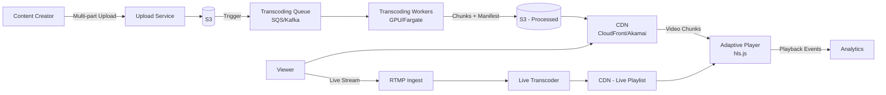
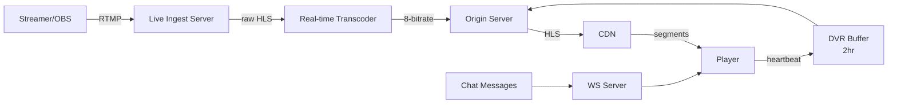

# Design a Video Streaming Platform (Youtube)

## Blogs and websites

## Medium

## Youtube

### Introduction

- [How Does Live Streaming Platform Work? (YouTube live, Twitch, TikTok Live)](https://www.youtube.com/watch?v=7AMRfNKwuYo)
- [Design a Video Streaming Protocol (HLS, DASH) | System Design](https://www.youtube.com/watch?v=v6qvrIY5Tgs)
- [How Video Streaming Works on Scale - System Design](https://www.youtube.com/watch?v=-JtjQ-OA7XE)


### Video Streaming internals

- [Netflix Doesn't Want You To Know This Architecture](https://www.youtube.com/watch?v=naQ-E1rzYv0)
- [HLS Adaptive Bitrate Streaming - System Design](https://www.youtube.com/watch?v=6JTV4PwisoQ)
  - [piyushgarg-dev/hls-streaming](https://github.com/piyushgarg-dev/hls-streaming)
- [How I Built Video Transcoding Service From Scratch | System Design](https://www.youtube.com/watch?v=wcdaIQjtWQI)


### Design Toktok

- [System Design: How TikTok serves Viral video to 1B Users ?](https://www.youtube.com/watch?v=LSPjhWBTAlY)


### Design Hotstar

- [How Hotstar Application Scaled 25 Million Concurrent Users | Performance Testing | Load Testing](https://www.youtube.com/watch?v=9b7HNzBB3OQ)
- [The CRAZIEST Livestream Architecture Ever Built](https://www.youtube.com/watch?v=Q9LC-WN9X4k)
- [How JioCinema live streams IPL to 20 million concurrent devices w/ Prachi Sharma | Ep 7](https://www.youtube.com/watch?v=36N1Bz7qW0A)
- [How Disney Hotstar Captures One Billion Emojis!](https://www.youtube.com/watch?v=UN1kW5AHid4)


### Design youtube

- [No One Can Build a Second YouTube (Why?!)](https://www.youtube.com/watch?v=xSkAzr7VyTI)
- [System Design: Design YouTube](https://www.youtube.com/watch?v=jWRW2xGMqSw)
- [Design Youtube - System Design Interview](https://www.youtube.com/watch?v=jPKTo1iGQiE)
- [System Design Interview: Design YouTube w/ a Ex-Meta Staff Engineer](https://www.youtube.com/watch?v=IUrQ5_g3XKs)
- [Master Youtube System Design](https://www.youtube.com/watch?v=WlMTxHcm4Qs)
- [Video Streaming & Sharing Service (YouTube) - System Design Interview Question](https://www.youtube.com/watch?v=XAZqmLXy4kY)
- [5: Netflix + YouTube | Systems Design Interview Questions With Ex-Google SWE](https://www.youtube.com/watch?v=43bB7oSn190)
- [YouTube High Level System Design with @harkirat1 !!](https://www.youtube.com/watch?v=l3AOubKFB1U)
- [Netflix System Design | YouTube System Design | System Design Interview Question](https://www.youtube.com/watch?v=lYoSd2WCJTo)


---

## Theory

### What Is It?

A video streaming platform (YouTube, Netflix, Twitch, Hotstar) delivers video content to millions of concurrent users by ingesting, storing, processing (transcoding/chunking), and delivering video via adaptive bitrate streaming over a CDN. It must handle petabytes of video, terabytes per second of egress, and sub-second failover for live streams.

### Why Does It Exist?

Before streaming, video was on physical media (DVDs) or downloaded files. Streaming enables instant, on-demand access to vast video libraries from any device — eliminating download wait times and physical media.

### What Problem Does It Solve?

* **Storage at scale**: Millions of videos = petabytes of storage; cost-efficient tiered storage.
* **Adaptive delivery**: Users have varying bandwidths (500 Kbps to 50 Mbps) — adaptive bitrate streams multiple versions.
* **Live streaming**: Real-time delivery of live events to millions simultaneously with < 5s latency.
* **Processing pipeline**: Uploaded videos → transcode to multiple resolutions/codecs → chunk → package (HLS/DASH) → CDN.
* **Global distribution**: Serve videos from edge locations closer to users.

### Important Subtopics

1. Video codecs (H.264, H.265/HEVC, VP9, AV1)
2. Container formats and streaming protocols (HLS, MPEG-DASH, RTMP)
3. Adaptive bitrate streaming (ABR)
4. CDN and edge caching
5. Video transcoding pipeline (FFmpeg, GPU encoding)
6. Live streaming architecture (ingestion, distribution, low latency)
7. Storage strategies (hot/warm/cold tiers)
8. Player logic (buffering, quality switching)

### Common Streaming Protocols

- **RTMP (Real-Time Messaging Protocol):** Created by Adobe, commonly used for ingesting live streams from broadcasters to servers.
- **RTSP (Real-Time Streaming Protocol):** Developed by RealNetworks, used for establishing and controlling media sessions between endpoints.
- **HLS (HTTP Live Streaming):** Developed by Apple, segments video into small chunks and uses an index file (`.m3u8`) to store metadata about available streams and resolutions.
- **MPEG-DASH (Dynamic Adaptive Streaming over HTTP):** An open standard similar to HLS, uses a manifest file (`.mpd`) to describe available content and bitrates.

### Adaptive Bitrate Streaming

- Video is transcoded into multiple resolutions and bitrates.
- Each version is split into small chunks (e.g., 2-10 seconds).
- The client downloads the index/manifest file and selects the appropriate chunk based on current network conditions, enabling smooth playback with minimal buffering.

### Video Processing

- **Transcoding:** Tools like FFmpeg are used to convert uploaded videos into multiple formats and resolutions.
- **Chunking:** Videos are divided into small segments for adaptive streaming.
- **Storage:** Chunks and manifest files are stored on CDN or object storage for efficient delivery.

### Key Concepts

- **Manifest/Index Files:** (`.m3u8` for HLS, `.mpd` for DASH) list available video qualities and chunk locations.
- **CDN (Content Delivery Network):** Distributes video chunks closer to users for low-latency streaming.
- **Player Logic:** The video player dynamically switches between different quality streams based on real-time bandwidth measurements.

---

**Summary:**  
Modern video streaming platforms like Youtube use adaptive bitrate streaming with protocols such as HLS and MPEG-DASH. Videos are transcoded, chunked, and delivered via CDN, allowing seamless playback across varying network conditions.

---

## Characteristics

| Characteristic | What it means | Why it matters | How it works |
|---|---|---|---|
| **Adaptive bitrate** | Multiple encoded versions of each video at different bitrates | Seamless playback across varying network conditions | Player switches quality based on bandwidth |
| **CDN distribution** | Content distributed at edge PoPs | Low-latency delivery to global users | Video chunks cached at 200+ edge locations |
| **Live + VOD** | Support both live streaming and on-demand video | Different use cases (sports, events) vs (movies, shows) | Different pipelines: live ingest vs file-based |
| **Multi-codec** | Videos encoded in H.264, H.265, VP9, AV1 | Bandwidth efficiency; device compatibility | Encode ladders per codec; player selects |
| **Player intelligence** | Client-side quality selection + buffering | Smooth user experience | Bandwidth probe + buffer health |
| **Global scale** | Serve 1B+ users simultaneously | Massive egress, concurrent streams | Terabit-scale CDN, 1000+ edge PoPs |

## Components

| Component | Purpose | Responsibilities | Relationship | Real-world Example |
|---|---|---|---|---|
| **Upload Service** | Ingest videos from creators | Accept uploads, metadata extraction, initial validation | Client → Object Store | YouTube upload |
| **Transcoding Pipeline** | Convert videos to multiple formats/resolutions | Encode into ABR ladders (240p–4K), package as HLS/DASH | Reads raw → writes processed chunks | FFmpeg/Furnace, MediaConvert |
| **Storage** | Store video chunks + manifests | Hot (frequently accessed), warm, cold tiers | Transcoding → Storage → CDN | S3 + Glacier |
| **CDN** | Cache video at edge locations | Cache chunks at 200+ PoPs; serve to end users | Storage → CDN → Player | Cloudflare, Akamai |
| **Origin Server** | Serve requests that miss CDN cache | Origin shield for live feeds; initial seed for new content | CDN → Origin → Storage | Nginx, S3 |
| **Player** | Video playback with adaptive switching | Parse manifest, switch quality, buffer, display | CDN → Player | hls.js, Video.js |
| **Live Ingest** | Accept live video streams | RTMP/SRT/WebRTC ingest; transcode for ABR; DVR buffer | Broadcaster → Ingest → CDN | Twitch, YouTube Live |
| **Manifest/Playlist** | Index file listing available chunks + qualities | HLS (.m3u8) or DASH (.mpd) | Storage → CDN → Player | Apple HLS |

## Patterns

### Adaptive Bitrate Streaming (HLS/DASH)

* **What**: Encode video into multiple bitrate ladders and segment into small chunks. Player dynamically selects the appropriate quality segment based on current bandwidth.
* **Problem solved**: User bandwidth varies (1 Mbps → 50 Mbps) — a single-quality video either buffers constantly or wastes bandwidth.
* **How it works**: Video → transcode to 8–10 ABR variants (240p to 4K) → segment into 2–10s chunks → generate manifest (.m3u8/.mpd) listing chunks + qualities → player downloads manifest → bandwidth probe every few seconds → switches quality → fetches next chunk.
* **When to use**: Any video streaming with varying client bandwidth.
* **When not to use**: Fixed-bandwidth environments (IPTV, captive portals).
* **Advantages**: No buffering regardless of bandwidth; optimal quality; scalable.
* **Disadvantages**: Higher storage cost (8–10× original); CDN complexity (multiple chunk versions); quality switching visible at transitions.
* **Java/Spring Boot example**:
```java
@Service
public class TranscodingJobService {
    public void createAbrLadder(String videoId, String sourcePath) {
        // Define ABR ladder
        int[] bitrates = {300, 600, 1200, 2500, 5000, 8000}; // kbps
        int[] widths = {426, 640, 960, 1280, 1920, 2560};     // px

        List<TranscodeTask> tasks = new ArrayList<>();
        for (int i = 0; i < bitrates.length; i++) {
            tasks.add(TranscodeTask.builder()
                .videoId(videoId)
                .outputPath(sourcePath + "_alt_" + bitrates[i])
                .width(widths[i])
                .bitrate(bps(bitrates[i]))
                .build());
        }
        executorService.invokeAll(tasks);
        generateManifest(videoId);
    }
}
```
* **Real-world example**: YouTube uses ~8 ABR variants; HLS for Safari/iOS, DASH for Chrome; 4–6s chunks.

## Benefits

* **Scalable delivery**: CDN distributes load across 200+ edge locations; origin handles only cache misses.
* **Quality at scale**: ABR adapts to any connection speed (2G → fiber).
* **Global reach**: Edge PoPs reduce latency to < 50 ms for 95% of users.
* **Cost efficiency**: Multi-tier storage (hot/warm/cold) reduces storage costs.

## Pros

* **Massive scale**: Serve 100M+ concurrent viewers (Super Bowl, World Cup on Twitch).
* **Adaptive quality**: No buffering for 95% of users.
* **Multi-codec**: AV1/WebM for modern browsers, H.264 fallback for legacy.
* **Live + VOD unified**: Same player pipeline for live and recorded content.
* **Global CDN**: Edge PoPs ensure low latency worldwide.

## Cons

* **Cost**: CDN egress — Netflix spends $200M+/year on CDN; storage of 8–10 versions.
* **Transcoding complexity**: GPU clusters; 1 hour video → 8 variants × 2 min processing = 16 min compute.
* **Latency**: Live latency (10–30s due to chunked encoding) vs. broadcast TV (~5s).
* **Codec licensing**: H.264/H.265 patents → licensing fees; AV1 is royalty-free.

## Challenges

### Technical Challenges

* **Video processing pipeline**: Transcoding 500+ hours/minute of video at YouTube → distributed GPU/FPGA workers.
* **Format fragmentation**: HLS vs DASH vs HLS-low-latency vs CMAF — supporting all requires complex pipeline.
* **Player complexity**: Buffer management, quality switching heuristics, DRM integration.

### Scalability Challenges

* **Concurrent streams**: 100M+ simultaneous streams → 10+ Tbps egress → CDN with 200+ PoPs.
* **Transcoding backlog**: Peak upload hours → queue depth grows → use spot instances to scale transcoding workers.
* **Storage cost**: 8 variants × 100 PB = 800 PB → tier to S3 Standard-IA/Glacier.

### Performance Challenges

* **Buffering prevention**: Player buffer < 10s; chunk download must complete before buffer drains.
* **Startup latency**: New video → first chunk must be available in < 1 second.
* **Live latency**: Sub-5s latency requires LL-HLS/CMAF or WebRTC — complex infrastructure.

### Reliability Challenges

* **CDN failure**: If a PoP is down → failover to adjacent PoP; origin as fallback.
* **Transcoding failure**: Failed jobs → retry → dead-letter; notify uploader.
* **DRM license server**: Outage → users can't play premium content → multi-region license servers.

### Maintainability Challenges

* **Codec evolution**: Migrating from H.264 → H.265 → AV1 → VP10 — requires re-transcoding archive.
* **Manifest versioning**: Adding new ABR variants → backward-compatible manifests.

### Operational Challenges

* **Monitoring**: CDN hit rate, player errors, rebuffering ratio (RBER), startup time (TTFF), 4xx/5xx per PoP.
* **Capacity planning**: Predict traffic spikes (viral videos, live events) → pre-warm CDN; provision transcoding workers.

### Security Concerns

* **Content piracy**: Use Widevine/PlayReady DRM to encrypt video; watermarking (forensic) to trace leaks.
* **DDoS**: Live streams attract DDoS → CDN absorbs + edge filtering.
* **Copyright**: Content ID system to detect + block uploaded copyrighted content.

## Best Practices

* **CDN edge caching**: Cache chunks + manifests at edge PoPs; use long TTL for VOD, short for live.
* **Multi-codec**: Encode in H.264 (baseline compatibility) + AV1 (modern); DASH for Chrome, HLS for Safari.
* **Chunk duration**: 4–6 seconds for VOD; 2 seconds for live — balances latency vs overhead.
* **Transcoding queue**: Priority queue for trending/new content; batch encode during low-traffic hours.
* **Player intelligence**: Bandwidth probe + buffer health → smart quality switching.
* **DRM**: Use CENC (Common Encryption) — same file, multiple DRM systems.
* **Storage tiers**: Hot (S3 Standard) for top 1%; warm (IA) for 7 days; cold (Glacier) for archive.
* **Live DVR**: 2-hour window for live → restart/Pause TV.

## When to Use

### Appropriate

* Serving on-demand video (movies, shows, user-generated content) to global audiences.
* Live streaming events (sports, concerts, conferences) to millions concurrently.
* Educational content (lectures, tutorials) with global distribution needs.

### Not Appropriate

* Internal/private video (no CDN needed).
* Very short videos (10s TikTok) → different optimization (preload, low-latency).
* Offline-only distribution.

### Alternatives

* **Progressive download**: MP4 file downloads → plays after partial download — no ABR, no seeking ahead of download.
* **Direct P2P**: WebRTC P2P streaming — no CDN, but peers must cooperate.
* **Video-on-demand (VoD) only**: Skip live streaming infrastructure.

### Decision Factors

* **Audience size**: Millions+ → CDN; thousands → direct S3 + CloudFront.
* **Content type**: Live → ingest + low-latency pipeline; VOD → file-based transcoding.
* **Budget**: CDN cost dominates; consider multi-CDN for failover + cost optimization.
* **Devices**: Web + mobile → standard; smart TVs → DRM + specific codecs.

## Use Cases

### YouTube-Style VOD Platform

* **Problem**: Ingest 500+ hours of video/minute; store petabytes; serve 1B+ monthly users.
* **Solution**: Upload → S3 → message queue → GPU transcoding cluster → HLS/DASH chunks → CDN → player.
* **Why suitable**: ABR adapts to any connection; CDN scales to 1B users; multi-codec supports all devices.
* **How it works**: (1) Creator uploads → S3 multipart upload. (2) SQS message triggers Lambda → FFmpeg GPU worker (Docker Fargate) → 8 ABR variants + HLS manifest + thumbnails. (3) Processed chunks → S3 + CloudFront. (4) Player (hls.js) downloads manifest → adapts quality → plays. (5) Old videos → Glacier (cold storage). (6) Live streams → RTMP ingest → real-time transcoding → HLS live playlist → CDN.
* **Trade-offs**: Storage cost (8× original); transcoding cost (GPU); CDN egress (200+ Tbps peak); quality switching artifacts.

### Twitch-Style Live Streaming

* **Problem**: Deliver live video from 10M+ broadcasters to 30M+ daily viewers with < 30s latency.
* **Solution**: RTMP ingest → WebRTC/LL-HLS transcoder → HLS/DASH → CDN → player with low-latency mode.
* **Why suitable**: Live ingest via RTMP; real-time transcoding for ABR; CDN for scale; LL-HLS for sub-5s latency.
* **How it works**: (1) Broadcaster streams via OBS (RTMP) → ingest server. (2) Transcoder (GPU) creates 240p–1080p60 ABR ladder → segments every 2s. (3) HLS playlist updated every 2 segments. (4) CDN caches 2s segments → player fetches sequentially. (5) Chat → WebSocket overlay. (6) Viewers can rewind 2 hours (DVR buffer).
* **Trade-offs**: Transcoding cost (GPU per stream); CDN cost (live = hot; no cache warmup); latency vs. cost (LL-HLS = 3–5s, standard HLS = 15–30s).

## Architecture

```mermaid
graph TD
  subgraph "Clients"
    Broadcaster[Streamer (OBS)]
    Viewer[Viewer App]
  end
  subgraph "Ingest"
    Ingest[Live Ingest<br/>RTMP/WebRTC]
  end
  subgraph "Processing"
    Transcoder[Transcoder<br/>FFmpeg/GPU]
    ManifestMan[Manifest Manager]
  end
  subgraph "Storage & CDN"
    ChunkStore[(Chunk/Storage<br/>S3/S3 Glacier)]
    CDN[CDN<br/>CloudFront/Akamai]
  end
  subgraph "Playback"
    Player[Video Player<br/>hls.js/ExoPlayer]
    Analytics[Analytics]
  end
  Broadcaster -->|RTMP/720p@60fps| Ingest
  Ingest -->|raw stream| Transcoder
  Transcoder -->|8-bitrate chunks| ChunkStore
  Transcoder -->|manifests| ManifestMan
  ManifestMan --> ChunkStore
  ChunkStore --> CDN
  CDN <-->|chunks+manifest| Player
  Player -->|events| Analytics
  Viewer -->|watch| CDN
```

### Architecture Structure

* **Upload/Ingest layer**: Accept videos from creators (multipart upload) + live streams (RTMP/WebRTC).
* **Processing layer**: Distributed transcoding (GPU/FPGA) — generate ABR ladders + HLS/DASH manifests.
* **Storage layer**: Hot tier (S3 Standard) for popular content; warm/cold tiers (IA/Glacier) for archival.
* **Delivery layer**: Multi-CDN for redundancy; edge PoPs for low-latency.
* **Player layer**: Adaptive player with quality switching, buffering, DRM.

### Communication

* **Upload**: HTTPS + multipart for VOD; RTMP/WebRTC for live.
* **Transcoding**: Queue (SQS/Kafka) → worker pool (Docker/Fargate/GPU instances).
* **Delivery**: HTTP (HLS/DASH chunks + manifest) via CDN.

### Data Flow

1. **VOD**: Creator uploads → S3 multipart → SQS message → GPU worker transcodes → writes ABR chunks + manifest to S3 → CloudFront picks up → player streams.
2. **Live**: Broadcaster → RTMP ingest → transcoder (real-time) → HLS chunks (every 2s) → CDN → player live playlist updated every 2 segments.
3. **Cleanup**: Videos < 10 views/year → Glacier; < 1 view → deleted.

### Scaling Strategy

* **Transcoding**: Auto-scaling GPU worker pool (AWS MediaConvert, custom FFmpeg on G4dn instances).
* **Storage**: S3 automatic tiering; multi-region replication for disaster recovery.
* **CDN**: Multi-CDN (Cloudflare + Akamai + Fastly) for cost + failover; 200+ PoPs.
* **Origin**: Load-balanced origin servers; cache warm for new trending videos.

### Failure Handling

* **Transcoding failure**: Retry 3x → DLQ → notify creator → manual review.
* **CDN failure**: Failover to origin; second CDN provider.
* **Player failure**: Fallback to lower resolution; retry manifest download.
* **Live ingest failure**: Save DVR buffer → replay → reconnect.

## High-Level Design



## Deep Dive

### HLS (HTTP Live Streaming)

Apple's adaptive streaming protocol:
* **Segments**: Video split into 2–10 second .ts (MPEG-2 TS) or .m4s (fMP4) chunks.
* **Manifest**: `.m3u8` playlist listing available qualities + segment URLs.
* **Master playlist**: Index of variant playlists (one per bitrate).

```
#EXTM3U
#EXT-X-VERSION:3
#EXT-X-TARGETDURATION:6
#EXT-X-MEDIA-SEQUENCE:0

#EXT-X-STREAM-INF:BANDWIDTH=300000,RESOLUTION=426x240
low.m3u8
#EXT-X-STREAM-INF:BANDWIDTH=600000,RESOLUTION=640x360
mid.m3u8
#EXT-X-STREAM-INF:BANDWIDTH=1500000,RESOLUTION=960x540
high.m3u8
```

* **Player logic**: Bandwidth probe (download 1-2 segments) → select optimal bitrate → download subsequent segments. If buffer drains → downgrade quality.
* **Low-latency HLS**: Chunked transfer encoding (CTE) → sub-5s latency.

### Live Streaming Architecture



* **Ingest**: RTMP to ingest server (Nginx + RTMP module).
* **Transcoder**: Real-time ABR transcoding (GPU) — 240p to 1080p60.
* **Origin**: Stores HLS segments + playlists; handles DVR (2-hour window).
* **CDN**: Caches segments at edge → sub-100ms delivery.
* **Player**: Downloads manifest → adapts quality → plays; shows live chat via WebSocket.

### Transcoding Pipeline

```java
@Component
public class VideoTranscodingPipeline {
    public void transcode(TranscodeJob job) {
        String input = job.getInputPath();
        
        // Define ABR ladder
        List<QualitySpec> abrLadder = List.of(
            QualitySpec.of(300, 426),    // 240p
            QualitySpec.of(600, 640),    // 360p
            QualitySpec.of(1200, 960),   // 540p
            QualitySpec.of(2500, 1280),  // 720p
            QualitySpec.of(5000, 1920),  // 1080p
            QualitySpec.of(8000, 2560)   // 1440p
        );

        // Launch parallel encoding tasks
        List<Future<String>> futures = abrLadder.stream()
            .map(spec -> executor.submit(() -> {
                String output = input + "_" + spec.getLabel() + ".m3u8";
                ffmpeg.encode(input, output, spec);
                return output;
            }))
            .toList();

        // Wait for all to complete
        List<String> manifests = futures.stream()
            .map(Future::get)
            .toList();

        // Generate master playlist
        generateMasterPlaylist(manifests);
    }
}
```

## API Contract

* **API purpose**: Manage video upload, transcoding status, stream URLs, and live streaming.

| Method | Endpoint | Description |
|---|---|---|
| POST | `/api/v1/videos/upload` | Request signed URL for upload |
| POST | `/api/v1/videos` | Register uploaded video (metadata) |
| GET | `/api/v1/videos/{id}` | Get video metadata + stream URLs |
| GET | `/api/v1/videos/{id}/playlists` | Get HLS/DASH manifest URLs |
| GET | `/api/v1/videos/{id}/status` | Get transcoding status |
| POST | `/api/v1/live/streamkey` | Get RTMP ingest URL + stream key |
| GET | `/api/v1/live/{id}/playlist` | Get live HLS playlist URL |

**Authentication**: Bearer token (JWT) for user requests; RTMP stream key for live ingest.

**Response (GET /videos/{id})**:
```json
{
  "video_id": "vid_123",
  "title": "How to Design a Video Platform",
  "duration_seconds": 3600,
  "status": "ready",
  "variants": [
    {"bitrate": 300, "resolution": "426x240", "url": "https://cdn.example.com/vid_123_low.m3u8"},
    {"bitrate": 600, "resolution": "640x360", "url": "https://cdn.example.com/vid_123_mid.m3u8"},
    {"bitrate": 2500, "resolution": "1280x720", "url": "https://cdn.example.com/vid_123_high.m3u8"}
  ],
  "thumbnail_url": "https://cdn.example.com/vid_123_thumb.jpg"
}
```

**Error responses**:
```json
{"error": "not_found", "message": "Video not found", "code": 404}
{"error": "still_processing", "message": "Video still being transcoded", "code": 409}
{"error": "rate_limited", "message": "Too many upload requests", "code": 429}
```

## Data Modeling

```mermaid
erDiagram
    USER ||--o{ VIDEO : "owns"
    VIDEO ||--o{ VARIANT : "has"
    VIDEO ||--o{ PLAYLIST : "has"
    VIDEO ||--o{ TRANSCODE_JOB : "processed by"
    PLAYLIST ||--o{ PLAYLIST_SEGMENT : "contains"

    USER {
        string user_id PK
        string username
        string email
        datetime created_at
    }
    VIDEO {
        string video_id PK
        string user_id FK
        string title
        string description
        int duration_seconds
        string status uploaded/processing/ready/failed
        datetime created_at
        datetime published_at
    }
    VARIANT {
        string variant_id PK
        string video_id FK
        int bitrate_kbps
        string resolution
        string codec
        string cdn_url
        int file_size_bytes
    }
    TRANSCODE_JOB {
        string job_id PK
        string video_id FK
        string status
        string preset
        datetime started_at
        datetime completed_at
        string error_reason
    }
```

**Partitioning**: Videos sharded by `video_id` hash; transcode jobs sharded by `video_id`; playlist segments served from CDN.

**Persistence**: Video chunks in S3 (hot) → Glacier (cold after 90 days); metadata in RDS with read replicas; manifests cached in CDN.

## Java and Spring Boot Implementation

```java
@RestController
@RequestMapping("/api/v1/videos")
@RequiredArgsConstructor
public class VideoController {
    private final VideoService videoService;

    @PostMapping
    public ResponseEntity<UploadResponse> registerVideo(
            @AuthenticationPrincipal UserDetails user,
            @RequestBody VideoMetadata metadata) {
        Video video = videoService.registerUpload(user.getId(), metadata);
        String uploadUrl = videoService.getSignedUploadUrl(video.getVideoId());
        return ResponseEntity.ok(new UploadResponse(video.getVideoId(), uploadUrl));
    }

    @GetMapping("/{id}")
    public ResponseEntity<VideoResponse> getVideo(@PathVariable String id) {
        return videoService.getById(id)
            .map(ResponseEntity::ok)
            .orElse(ResponseEntity.notFound().build());
    }
}

@Service
public class VideoService {
    private final VideoRepository videoRepo;
    private final AmazonS3 s3;
    private final RabbitTemplate rabbit;

    @Transactional
    public Video registerUpload(String userId, VideoMetadata metadata) {
        String videoId = UUID.randomUUID().toString();
        Video video = Video.builder()
            .videoId(videoId)
            .userId(userId)
            .title(metadata.getTitle())
            .description(metadata.getDescription())
            .status(VideoStatus.PROCESSING)
            .createdAt(Instant.now())
            .build();
        videoRepo.save(video);

        // Trigger transcoding pipeline
        rabbit.convertAndSend("transcode-exchange", "video.process", 
            new TranscodeRequest(videoId, metadata.getSourceBucket()));
        
        return video;
    }
}
```

## Real-World Examples

* **YouTube**: Ingests 500+ hours of video/minute; stores petabytes on Google Cloud Storage; transcodes via Furnace (GPU cluster); delivers via Google CDN (200+ PoPs); player uses hls.js. HLS + DASH; 8–10 ABR variants; 4–6s chunks; 20+ codecs. Uses AV1 for modern browsers, H.264 fallback.
* **Netflix**: Open Connect (custom CDN appliances inside ISP networks); encodes in 4K HDR + 10+ bitrates; uses DASH manifest; adaptive player (based on hls.js) with custom algorithms. Spends $200M+ annually on CDN.
* **Twitch**: RTMP ingest from 10M+ streamers; real-time transcoding (240p–1080p60); HLS segments every 2s; low-latency mode (LL-HLS); chat via WebSocket; 30M+ daily viewers.
* **Disney+**: Uses HLS + FairPlay DRM; multi-CDN (Akamai, Level 3); encodes in H.264 + HEVC for 4K HDR; CMAF for low-latency; global rollout with regional storage.

## Interview Preparation

### Beginner Questions

**Q: What is adaptive bitrate streaming?**
A: Video encoded at multiple bitrates (240p–4K) → split into 2–10s chunks → manifest lists all variants. Player measures bandwidth → selects appropriate quality chunk → adapts dynamically. Prevents buffering regardless of network speed.

**Q: What is the difference between HLS and DASH?**
A: HLS (HTTP Live Streaming) — Apple protocol; playlist is `.m3u8`; uses MPEG-2 TS segments (`.ts`) or fMP4. DASH (MPEG-DASH) — ISO open standard; manifest is `.mpd`; uses fMP4 segments. HLS is required for Safari/iOS; DASH for Chrome/Android. Modern players use both.

**Q: What's the difference between H.264 and H.265?**
A: H.264 (AVC) — older, widely supported, ~2x data for same quality. H.265 (HEVC) — 50% better compression, less bandwidth; but hardware decoding needed, patent licensing costs. H.264 baseline for compatibility; H.265 for bandwidth savings.

### Intermediate Questions

**Q: How does a video streaming CDN work?**
A: (1) Video chunks uploaded to origin storage (S3). (2) CDN edge PoPs pull content from origin → cache at edge. (3) When a user plays video → player fetches chunk from nearest edge PoP → sub-100ms latency. (4) For live → real-time transcoding → HLS segments published every 2s → CDN caches live playlist. (5) Cache invalidation: updated video → update manifest (cache bust).

**Q: How do you handle live streaming at scale?**
A: RTMP/WebRTC ingest → ingest server (Nginx RTMP + autoscaling) → real-time transcoder (GPU, 8 ABR variants × 2s chunks) → HLS live playlist → CDN → player. DVR: 2-hour window stored; viewer can seek back. Scalability: ingest sharded by stream key; transcoder auto-scales; CDN serves millions of concurrent viewers.

**Q: What are the trade-offs of video quality vs. bandwidth?**
A: Higher bitrate = better quality = more bandwidth = higher CDN cost. A 4K stream at 20 Mbps costs 5x more to deliver than 720p at 2.5 Mbps. Solution: ABR — encode at 8–10 bitrates; let player choose. Most viewers watch at 720p–1080p; < 5% at 4K.

### Advanced Questions

**Q: How would you design a system to handle 10M concurrent live viewers?**

A: (1) **Ingest**: RTMP/WebRTC ingest → 100+ ingest servers (Nginx with RTMP module), load-balanced by DNS; each stream assigned to a server. (2) **Transcoding**: Real-time GPU transcoding (240p–1080p60, 8 ABVs, 2s chunks) → 500+ GPU instances (AWS g4dn.12xlarge = 4 × A10G). (3) **Origin**: Store HLS segments + playlists in S3; serve via CloudFront; edge location for live. (4) **CDN**: Multi-CDN (Cloudflare + Akamai + Fastly) — 150M concurrent viewers across CDNs; failover if one CDN degrades. (5) **Player**: hls.js with low-latency mode (LL-HLS); 2–6s latency. (6) **DVR**: 2-hour buffer → S3; viewer can seek back. (7) **Chat overlay**: WebSocket → message service → fan-out to viewers. (8) **Monitoring**: P99 latency < 1s for chunk delivery; buffer health > 95%; CDN hit rate > 95%. (9) **Scale**: 10M viewers × 2 Mbps avg = 20 Tbps egress → 150+ CDN PoPs → 300+ Gbps per PoP peak.

**Q: How does YouTube's recommendation system relate to its streaming infrastructure?**

A: (1) **Watch-time signal**: Each view event → streaming infrastructure reports watch time → recommendation model. (2) **Feedback loop**: Recommendations drive views → streaming serves video → watch time feeds back → model updates. (3) **Infrastructure coupling**: Streaming CDN logs → real-time feature pipeline → recommendation model retraining. (4) **Cold start**: New videos → transcoded + metadata extracted → candidate generation (content-based) → if high CTR → push to more users. (5) **Quality**: Higher-quality streams (4K) → higher watch time → higher recommendation scores → virtuous cycle. (6) **Regional**: CDN performance data (buffering, startup time) feeds into ranking (poor performance → lower recommendation score).

### System Design Questions

**Q: Design a video platform like YouTube that ingests 1000 videos/minute, stores 500 PB, and serves 1B users.**

**Approach**:
- **Upload**: Client → signed S3 URL → multipart upload → S3 (raw bucket).
- **Processing**: S3 event → SQS → GPU transcoding workers (FFmpeg on AWS Batch/GPU Spot) → 8 ABR variants (240p–4K) → HLS/DASH manifests → write to processed bucket.
- **Storage**: S3 Standard (hot, top 10%) + S3 Intelligent-Tiering (warm) + S3 Glacier (archive, 90 days old). 500 PB = ~$150M/year (with Glacier tiering → ~$50M).
- **CDN**: CloudFront + multi-CDN; cache chunks at 250+ PoPs; TTL by popularity.
- **Player**: hls.js/ExoPlayer; ABR quality switching; preloading next chunk.
- **Search/Discovery**: Video metadata + ML embeddings → Elasticsearch; YouTube-style recommendation model.
- **Live**: RTMP ingest → real-time transcoder → HLS live playlist → CDN.
- **Monitoring**: Storage cost per GB, CDN hit rate, transcoding job latency, player error rate (REE), watch time per video.

### Common Mistakes

- Confusing HLS and DASH protocols — both use similar ABR principles.
- Not covering multi-codec (H.264 vs H.265 vs AV1) — each has compatibility vs. bandwidth trade-offs.
- Not discussing live vs. VOD differences (live needs real-time transcoding + DVR; VOD can be batch).
- Not addressing storage tiering — storing everything in hot tier = 10x cost.
- Not mentioning CDN edge caching → origin overload.
- Not covering low-latency streaming (LL-HLS/CMAF for sub-5s live).
- Not discussing content moderation (automated + human review for uploads).
