# Design a Video Streaming Platform (YouTube)

A video streaming platform (YouTube, Netflix, Twitch, Hotstar) delivers on-demand and live video content to millions of concurrent users by ingesting, storing, processing (transcoding/chunking), and delivering video via adaptive bitrate streaming over a CDN. It must handle petabytes of video, terabit-scale egress, and sub-second failover for live streams while keeping latency low and costs bounded.

## Blogs and websites

## Medium

## Youtube

- [How Does Live Streaming Platform Work? (YouTube live, Twitch, TikTok Live)](https://www.youtube.com/watch?v=7AMRfNKwuYo)
- [Design a Video Streaming Protocol (HLS, DASH) | System Design](https://www.youtube.com/watch?v=v6qvrIY5Tgs)
- [How Video Streaming Works on Scale - System Design](https://www.youtube.com/watch?v=-JtjQ-OA7XE)
- [Netflix Doesn't Want You To Know This Architecture](https://www.youtube.com/watch?v=naQ-E1rzYv0)
- [HLS Adaptive Bitrate Streaming - System Design](https://www.youtube.com/watch?v=6JTV4PwisoQ)
  - [piyushgarg-dev/hls-streaming](https://github.com/piyushgarg-dev/hls-streaming)
- [How I Built Video Transcoding Service From Scratch | System Design](https://www.youtube.com/watch?v=wcdaIQjtWQI)
- [System Design: How TikTok serves Viral video to 1B Users ?](https://www.youtube.com/watch?v=LSPjhWBTAlY)
- [How Hotstar Application Scaled 25 Million Concurrent Users | Performance Testing | Load Testing](https://www.youtube.com/watch?v=9b7HNzBB3OQ)
- [The CRAZIEST Livestream Architecture Ever Built](https://www.youtube.com/watch?v=Q9LC-WN9X4k)
- [How JioCinema live streams IPL to 20 million concurrent devices w/ Prachi Sharma | Ep 7](https://www.youtube.com/watch?v=36N1Bz7qW0A)
- [How Disney Hotstar Captures One Billion Emojis!](https://www.youtube.com/watch?v=UN1kW5AHid4)
- [No One Can Build a Second YouTube (Why?)](https://www.youtube.com/watch?v=xSkAzr7VyTI)
- [System Design: Design YouTube](https://www.youtube.com/watch?v=jWRW2xGMqSw)
- [Design Youtube - System Design Interview](https://www.youtube.com/watch?v=jPKTo1iGQiE)
- [System Design Interview: Design YouTube w/ a Ex-Meta Staff Engineer](https://www.youtube.com/watch?v=IUrQ5_g3XKs)
- [Master Youtube System Design](https://www.youtube.com/watch?v=WlMTxHcm4Qs)
- [Video Streaming & Sharing Service (YouTube) - System Design Interview Question](https://www.youtube.com/watch?v=XAZqmLXy4kY)
- [5: Netflix + YouTube | Systems Design Interview Questions With Ex-Google SWE](https://www.youtube.com/watch?v=43bB7oSn190)
- [YouTube High Level System Design with @harkirat1 !!](https://www.youtube.com/watch?v=l3AOubKFB1U)
- [Netflix System Design | YouTube System Design | System Design Interview Question](https://www.youtube.com/watch?v=lYoSd2WCJTo)

---

## Theory

### Topics Covered

1. [Introduction / Problem Statement](#introduction--problem-statement)
2. [Characteristics](#characteristics)
3. [Pros](#pros)
4. [Cons](#cons)
5. [Use Cases](#use-cases)
6. [Components](#components)
7. [Architectural Patterns](#architectural-patterns)
8. [Benefits](#benefits)
9. [Challenges](#challenges)
10. [Best Practices](#best-practices)
11. [When to Use / When Not to Use](#when-to-use--when-not-to-use)
12. [Data Model and API](#data-model-and-api)
13. [Video Streaming Protocols and Adaptive Bitrate](#video-streaming-protocols-and-adaptive-bitrate)
14. [Replication Strategies](#replication-strategies)
15. [Failure Detection and Membership](#failure-detection-and-membership)
16. [High Availability and Scalability](#high-availability-and-scalability)
17. [Performance and Optimization](#performance-and-optimization)
18. [CAP Theorem and Consistency Trade-offs](#cap-theorem-and-consistency-trade-offs)
19. [Encryption and Key Management](#encryption-and-key-management)
20. [Authentication and Authorization](#authentication-and-authorization)
21. [Security Threats and Mitigations](#security-threats-and-mitigations)
22. [Observability and Logging](#observability-and-logging)
23. [Real-World Implementations](#real-world-implementations)
24. [Java and Spring Boot Implementation Guide](#java-and-spring-boot-implementation-guide)
25. [Interview Questions and Answers](#interview-questions-and-answers)

---

### Introduction / Problem Statement

Before streaming, video lived on physical media (DVDs) or was downloaded in full before playback. Streaming eliminates these constraints: viewers can start watching instantly while content loads, and a single uploaded file can be delivered simultaneously to millions of viewers at the quality their connection supports. **The core problem** is turning a static video file — or a live camera feed — into a reliable, low-latency, globally-distributed, adaptive stream that plays smoothly on every device, whether the viewer is on a 4G phone in rural India or a fiber connection in Manhattan. This requires solving four intertwined challenges: (1) **transcoding** — converting one source into dozens of bitrate/codec variants; (2) **segmentation** — chopping each variant into small, cacheable chunks; (3) **packaging** — wrapping those chunks in a protocol manifest (HLS `.m3u8` or DASH `.mpd`); and (4) **delivery** — caching and serving those chunks from the edge while the player dynamically selects the right quality in real time. For on-demand video the source is a file; for live streaming the source is a real-time ingest feed and every component must operate in real time with sub-30-second end-to-end latency. The design must also handle failures gracefully — a transcoder crash, a CDN PoP outage, or a key-server blunder must degrade quality rather than break playback entirely.

**Key streaming concepts:**

- **Video codecs:** H.264 (AVC, universal baseline), H.265 (HEVC, 50% better compression), VP9 (Google, open), AV1 (Alliance for Open Media, royalty-free, 30% better than H.264). Hardware decode support varies; players negotiate via the manifest.
- **Streaming protocols:** **HLS** (HTTP Live Streaming, Apple) — segments video into 2–10s `.ts`/`.m4s` chunks with a `.m3u8` index; **MPEG-DASH** (ISO open standard) — uses an `.mpd` manifest with fMP4 segments; **RTMP** (Adobe) — used almost exclusively for live ingest (broadcaster → origin); **SRT/WebRTC** — ultra-low-latency ingest and delivery for interactive live.
- **Adaptive Bitrate Streaming (ABR):** One source is encoded into an ABR ladder (typically 240p @ 300 kbps up to 4K @ 8000 kbps — 8–10 rungs). Each rung is chunked into equal-duration segments. The player downloads a manifest, probes current bandwidth, and selects the highest-quality segment it can download before the buffer drains, switching mid-playback as conditions change.
- **CDN & edge caching:** Chunks and manifests are cached at 200–1000+ edge Points of Presence (PoPs). Edge caching offloads terabit-scale egress from the origin and reduces first-byte latency to < 50 ms for 95% of viewers.
- **Live vs. VOD:** VOD is file-based — a source file is transcoded (batch), chunked, packaged, and stored. Live is a real-time firehose — an ingest server receives a RTMP/SRT/WebRTC stream, transcodes it instantly into an ABR ladder, and publishes rolling HLS/DASH segments every 1–6 seconds so the player can follow along with a sliding window.

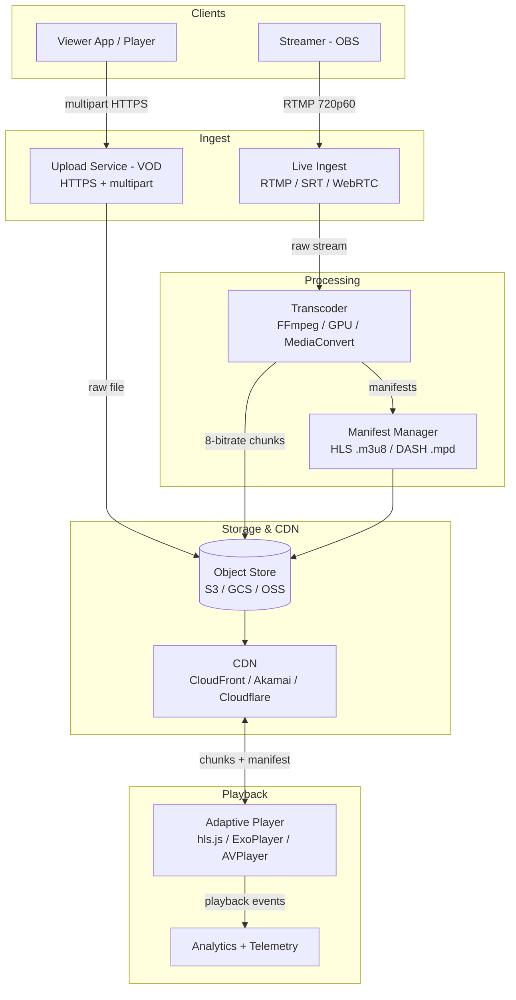

*The end-to-end topology shows two ingest paths converging on a shared transcoder: VOD uploads arrive via HTTPS multipart directly to object storage, while live streams arrive via RTMP/SRT to a live ingest layer. Both feed a distributed transcoder that produces an 8-rung adaptive bitrate ladder, segments each rung into 2-10s chunks, and generates HLS/DASH manifests. Chunks and manifests land in object storage and replicate to CDN edge PoPs. The player downloads the manifest, probes bandwidth, selects the appropriate chunk quality, and plays while streaming telemetry back to analytics.*

**Problem Statement:** Design a video streaming platform that ingests user-generated and live video content, transcodes it into multiple adaptive bitrate variants using HLS and/or MPEG-DASH, stores chunks and manifests in object storage, distributes them through a global CDN, and plays them back on any device with smooth adaptive quality switching — while meeting sub-5-second startup for on-demand content, sub-30-second latency for live, and global scale to millions of concurrent viewers.

---

### Characteristics

| Characteristic | What it means | Why it matters | How it works |
|---|---|---|---|
| **Adaptive bitrate** | A single video encoded into 8–10 bitrate ladders (240p to 4K HDR) | Seamless playback across 500 Kbps mobile to 50 Mbps fiber with no buffering | Player probes throughput every few seconds and switches ladders mid-stream |
| **CDN distribution** | Video chunks + manifests cached at 200+ edge PoPs worldwide | Sub-50 ms first-byte for 95% of viewers; terabit-scale egress offloaded from origin | Edge pulls from origin on cache miss; long TTL for VOD, short/fresh for live |
| **Live + VOD** | Same pipeline serves both file-based on-demand and real-time live streams | Different use cases (sports, events) vs. (movies, shows) with different SLAs | Live uses real-time transcoder + rolling HLS playlists; VOD uses batch transcoding + static manifests |
| **Multi-codec** | Each ladder encoded in H.264, H.265/HEVC, VP9, and AV1 | Bandwidth efficiency (AV1 saves 30% vs H.264); device/compatibility coverage | Player negotiates via manifest; H.264 fallback for legacy Safari/IE; AV1 for modern Chrome/Edge |
| **Player intelligence** | Client-side bandwidth estimation, buffer management, and quality switching | Eliminates rebuffering; maximizes quality within available bandwidth | BOLA, throughput probes, buffer-based algorithms; preloading next chunk |
| **Global scale** | Serve 1B+ monthly users and 10M+ concurrent live viewers | Drives CDN egress to 20+ Tbps; origin must never become a bottleneck | Multi-CDN (Cloudflare + Akamai + Fastly); region-sharded ingest; 1000+ PoPs |
| **Content protection** | Premium content encrypted with DRM (Widevine, PlayReady, FairPlay) | Monetization requires preventing piracy of movies, live sports, premium shows | CENC (Common Encryption) with rotating keys; forensic watermarking for leak tracing |
| **Ephemeral + durable** | Live DVR buffers (2-hour) are ephemeral; VOD libraries are durable for decades | Live viewers want to pause/rewind; archives must be preserved cost-effectively | Live segments expire via playlist sliding window; VOD tiered to Glacier/Deep Archive |

---

### Pros

- **Massive scale:** Serve 100M+ concurrent viewers (Super Bowl on Twitch, World Cup on Hotstar) via CDN edge caching — origin only handles cache misses.
- **Adaptive quality:** No buffering for 95% of users regardless of connection speed (500 Kbps → 50 Mbps), because the player independently selects each segment's quality.
- **Multi-codec support:** AV1/WebM for modern browsers, H.264 baseline for legacy compatibility; codec negotiation happens in the manifest, no client redeploys.
- **Live + VOD unified:** The same player and CDN pipeline serves real-time live and recorded on-demand content, reducing operational surface area.
- **Global reach:** Edge PoPs reduce p95 latency to < 50 ms worldwide, with per-region failover and multi-CDN redundancy.
- **Cost-tiered storage:** Hot (S3 Standard) for trending 1%, warm (IA) for 7 days, cold (Glacier) for archive — cuts storage cost 10× versus all-hot.
- **Forensic readiness:** AES-128 segment encryption + per-session forensic watermarking enables leak tracing for premium content.
- **Operational elasticity:** Transcoding workers scale with spot instances during peak ingest hours; CDN egress is absorbed at the edge, not the origin.

---

### Cons

- **CDN egress cost:** Netflix spends $200M+/year on CDN transit; video is bandwidth-dominant so CDN spend dominates total cost.
- **Transcoding complexity:** GPU/FPGA clusters; 1 hour of video × 8 variants × ~2 min compute = ~16 min of GPU per source hour; peak ingest hours saturate queues and require spot-instance elasticity.
- **Live latency:** Standard HLS adds 10–30s latency vs. broadcast TV (~5s). Sub-5s requires LL-HLS, CMAF chunked transfer, or WebRTC — each adds infrastructure complexity.
- **Codec licensing:** H.264/H.265 patent pools → licensing fees. AV1 is royalty-free but newer, with less universal hardware decode support on older devices.
- **Storage multiplier:** 8–10 encoded variants × petabytes = exabytes of storage; tiering, deduplication, and lifecycle policies are essential to keep costs sane.
- **DRM lock-in:** Widevine, PlayReady, and FairPlay each require separate key systems and certification. CENC helps unify the media file but doesn't eliminate vendor/key-system lock-in.
- **Startup latency risk:** First-frame latency must beat the player abandonment curve — if the first segment isn't available within ~1s, viewers bounce, so the transcode-to-CDN path must be faster than the human attention span.

---

### Use Cases

#### YouTube-Style VOD Platform

* **Problem:** Ingest 500+ hours of video/minute; store petabytes; serve 1B+ monthly users.
* **Solution:** Upload → S3 → message queue → GPU transcoding cluster → HLS/DASH chunks → CDN → player.
* **Why suitable:** ABR adapts to any connection; CDN scales to 1B users; multi-codec supports all devices.
* **How it works:** (1) Creator uploads → S3 multipart upload. (2) SQS message triggers Lambda → FFmpeg GPU worker (Docker Fargate) → 8 ABR variants + HLS manifest + thumbnails. (3) Processed chunks → S3 + CloudFront. (4) Player (hls.js) downloads manifest → adapts quality → plays. (5) Old videos → Glacier (cold storage). (6) Live streams → RTMP ingest → real-time transcoding → HLS live playlist → CDN.
* **Trade-offs:** Storage cost (8× original); transcoding cost (GPU); CDN egress (200+ Tbps peak); quality switching artifacts.

#### Twitch-Style Live Streaming

* **Problem:** Deliver live video from 10M+ broadcasters to 30M+ daily viewers with < 30s latency.
* **Solution:** RTMP ingest → WebRTC/LL-HLS transcoder → HLS/DASH → CDN → player with low-latency mode.
* **Why suitable:** Live ingest via RTMP; real-time transcoding for ABR; CDN for scale; LL-HLS for sub-5s latency.
* **How it works:** (1) Broadcaster streams via OBS (RTMP) → ingest server. (2) Transcoder (GPU) creates 240p–1080p60 ABR ladder → segments every 2s. (3) HLS playlist updated every 2 segments. (4) CDN caches 2s segments → player fetches sequentially. (5) Chat → WebSocket overlay. (6) Viewers can rewind 2 hours (DVR buffer).
* **Trade-offs:** Transcoding cost (GPU per stream); CDN cost (live = hot; no cache warmup); latency vs. cost (LL-HLS = 3–5s, standard HLS = 15–30s).

---

### Components

| Component | Purpose | Responsibilities | Relationship | Real-world Example |
|---|---|---|---|---|
| **Upload Service** | Ingest videos from creators | Accept uploads, metadata extraction, initial validation, issue signed URLs | Client → Object Store | YouTube upload |
| **Transcoding Pipeline** | Convert videos to multiple formats/resolutions | Encode into ABR ladders (240p–4K), package as HLS/DASH, generate thumbnails | Reads raw → writes processed chunks | FFmpeg/Furnace, MediaConvert |
| **Storage** | Store video chunks + manifests | Hot (frequently accessed), warm, cold tiers; versioning | Transcoding → Storage → CDN | S3 + Glacier |
| **CDN** | Cache video at edge locations | Cache chunks at 200+ PoPs; serve to end users; origin shielding | Storage → CDN → Player | Cloudflare, Akamai |
| **Origin Server** | Serve requests that miss CDN cache | Origin shield for live feeds; initial seed for new content; fallback | CDN → Origin → Storage | Nginx, S3 |
| **Player** | Video playback with adaptive switching | Parse manifest, switch quality, buffer, display subtitles, DRM | CDN → Player | hls.js, ExoPlayer |
| **Live Ingest** | Accept live video streams | RTMP/SRT/WebRTC ingest; real-time transcode for ABR; DVR buffer management | Broadcaster → Ingest → CDN | Twitch, YouTube Live |
| **Manifest/Playlist** | Index file listing available chunks + qualities | HLS (.m3u8) or DASH (.mpd); master + media playlists | Storage → CDN → Player | Apple HLS |
| **DRM / Packager** | Encrypt and protect premium content | CENC common encryption; key delivery; license serving | Transcoder → Packager → CDN | Widevine, PlayReady |
| **Analytics** | Collect playback telemetry | Rebuffering ratio, startup time, quality switches, errors, engagement | Player → Analytics | Conviva, Snowplow |

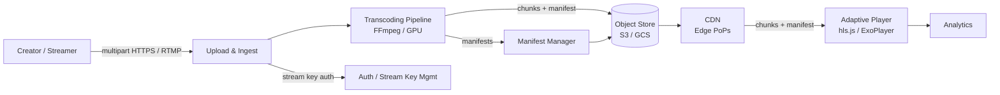

*Component interaction flow: creators upload VOD via HTTPS multipart or stream live via RTMP; both are ingested by the Upload & Ingest layer, which authenticates stream keys. The Transcoding Pipeline reads the source, produces ABR chunks and manifests, and writes them to object storage (with manifests managed by the Manifest Manager). The CDN pulls from object storage and caches at edge PoPs. The player downloads the manifest, selects quality per segment, and streams telemetry to analytics.*

---

### Architectural Patterns

#### Adaptive Bitrate Streaming (HLS/DASH)

* **What:** Encode video into multiple bitrate ladders and segment each into small chunks. The player dynamically selects the appropriate quality segment based on current bandwidth and buffer health.
* **Problem solved:** User bandwidth varies wildly (1 Mbps → 50 Mbps) — a single-quality stream either buffers constantly on slow connections or wastes bandwidth on fast ones.
* **How it works:** Video → transcode to 8–10 ABR variants (240p to 4K) → segment into 2–10s chunks → generate manifest (.m3u8/.mpd) listing all variants and segment URLs → player downloads manifest → bandwidth probe every few seconds → switches quality up or down → fetches next chunk at the chosen quality. Modern players use the BOLA (Buffer Occupancy based Lambda tuning) algorithm or a throughput-based heuristic: if the buffer is healthy and throughput is high, climb a rung; if the buffer is draining, drop a rung.
* **When to use:** Any video streaming service whose audience has heterogeneous connection speeds (the default case).
* **When not to use:** Fixed-bandwidth environments (IPTV over managed networks, captive portals on planes/trains) where a single fixed bitrate is cheaper and simpler.
* **Pros:** Near-zero rebuffering regardless of bandwidth; optimal quality per viewer; scales via CDN with no per-user origin state.
* **Cons:** 8–10× storage cost; CDN cache complexity (a chunk cache miss at every quality rung); quality-switching artifacts visible as a momentary blur at transitions if the player oscillates.
* **Java/Spring Boot example:**

```java
@Service
public class TranscodingJobService {

    private final ExecutorService executorService = Executors.newFixedThreadPool(16);

    public void createAbrLadder(String videoId, String sourcePath) {
        // Define ABR ladder: {bitrate_kbps, width_px}
        int[] bitrates = {300, 600, 1200, 2500, 5000, 8000}; // kbps
        int[] widths  = {426, 640, 960, 1280, 1920, 2560};   // px

        List<TranscodeTask> tasks = new ArrayList<>();
        for (int i = 0; i < bitrates.length; i++) {
            tasks.add(TranscodeTask.builder()
                .videoId(videoId)
                .outputPath(sourcePath + "_alt_" + bitrates[i])
                .width(widths[i])
                .bitrate(BitrateUnit.megabits(bitrates[i]))
                .build());
        }
        // Encode all rungs in parallel; wait for all to finish
        executorService.invokeAll(tasks);
        generateManifest(videoId);
    }
}
```

* **Real-world example:** YouTube encodes ~8 ABR variants per video; serves HLS on Safari/iOS and DASH on Chrome; 4–6s chunks; players re-probe bandwidth every 3–5 segments and will drop 1–2 rungs during a network dip without the user noticing.

#### Live Streaming Architecture (Real-Time Ingest + Rolling Playlists)

* **What:** A continuous broadcast pipeline that ingests a real-time stream, transcodes it to an ABR ladder, and publishes short segments to a rolling HLS/DASH playlist so viewers follow along with a sliding DVR window.
* **Problem solved:** Delivering a one-to-many live event (sports, concerts, news) to millions concurrently with bounded, predictable latency.
* **How it works:** Broadcaster → RTMP/SRT ingest server (Nginx-RTMP or Wowza) → real-time GPU transcoder → 8 ABR rungs segmented every 2–6s → origin stores rolling segments + updates playlist (EXT-X-MEDIA-SEQUENCE advances) → CDN caches → player polls playlist every segment duration → plays sequentially. DVR: origin keeps the last 2h of segments; the playlist's `#EXT-X-MAP` and sliding-window tags let the player pause/seek within the window.
* **When to use:** Sports, concerts, gaming streams, live news — any event consumed concurrently by many viewers in real time.
* **When not to use:** Interactive video (gaming, auctions) requiring sub-2s round-trip — use WebRTC instead.
* **Trade-off:** Latency vs. cost — standard HLS = 15–30s, LL-HLS/CMAF = 3–6s, WebRTC = <2s but with far higher origin infrastructure complexity.

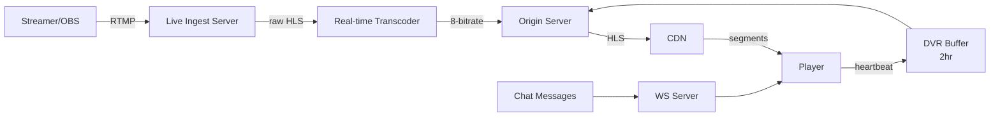

*The live pipeline: OBS pushes an RTMP stream to the ingest server, which forwards it to a real-time GPU transcoder. The transcoder emits an 8-rung ABR ladder segmented every 2s into the origin (Nginx + HLS). The origin maintains a rolling playlist and a 2-hour DVR buffer. The CDN caches segments at the edge; the player polls the live playlist each segment, selects quality, and plays. A separate WebSocket server fans out chat messages to viewers.*

---

### Benefits

- **Scalable delivery:** CDN distributes load across 200+ edge locations; origin handles only cache misses and live ingest fan-out.
- **Quality at scale:** ABR adapts to any connection speed (2G → fiber) so viewers on slow networks aren't excluded.
- **Global reach:** Edge PoPs reduce latency to < 50 ms for 95% of users; multi-CDN provides failover.
- **Cost efficiency:** Multi-tier storage (hot/warm/cold) reduces storage costs; live segments expire automatically via rolling windows.
- **Device reach:** Multi-codec support (H.264 baseline + AV1) covers legacy browsers to modern 4K smart TVs.
- **Operational elasticity:** Transcoding workers scale with spot instances during peak ingest; CDN absorbs bursty live viewership.

---

### Challenges

#### Technical Challenges

- **Video processing pipeline:** Transcoding 500+ hours of video per minute at YouTube requires a distributed GPU/FPGA worker fleet with priority queues for trending content.
- **Format fragmentation:** Supporting HLS, DASH, LL-HLS, CMAF, and HLS-CTE simultaneously requires a complex packaging pipeline and per-player-client negotiation.
- **Player complexity:** Buffer management, quality-switching heuristics (BOLA vs. throughput), DRM session lifecycle, and offline download all add client-side complexity.

#### Scalability Challenges

- **Concurrent streams:** 100M+ simultaneous streams → 10+ Tbps egress → CDN with 200+ PoPs and origin shielding must not saturate.
- **Transcoding backlog:** Peak upload hours (evenings) grow the transcode queue — solved with spot-instance worker pools that scale to zero when idle.
- **Storage cost:** 8 variants × 100 PB = 800 PB; tiered to S3 Standard-IA (warm) and S3 Glacier (cold after 90 days) to control cost.

#### Performance Challenges

- **Buffering prevention:** The player buffer must stay above a low-water mark (< 10s); chunk download must complete before the buffer drains. Preload the next segment while playing the current one.
- **Startup latency:** First-frame time (TTFF) must beat the abandonment curve — the segment for the lowest-quality rung must be available and cached at the edge within ~1 second of playback start.
- **Live latency:** Sub-5s latency requires LL-HLS/CMAF chunked transfer or WebRTC — both add significant infrastructure and synchronization complexity versus standard HLS.

#### Reliability Challenges

- **CDN failure:** If a PoP is down or degraded, fail over to the adjacent PoP; origin acts as the final fallback for both live and VOD.
- **Transcoding failure:** Failed jobs are retried 3×, then moved to a dead-letter queue; the creator is notified and the job is queued for manual review.
- **DRM license server outage:** Users can't play premium content if the license server is down — deploy multi-region license servers (Google Widevine + Microsoft PlayReady + Apple FairPlay) behind a global load balancer.

#### Maintainability Challenges

- **Codec evolution:** Migrating the archive from H.264 → H.265 → AV1 requires re-transcoding petabytes. Solution: keep the source-of-truth in object storage and transcode new codecs lazily on request or via a background re-encoding job.
- **Manifest versioning:** Adding new ABR rungs or codecs must produce backward-compatible manifests; old players must gracefully ignore unknown variant streams.

#### Operational Challenges

- **Monitoring:** CDN hit rate, player errors (4xx/5xx), rebuffering ratio (RBER), startup time (TTFF), and per-PoP latency must all be dashboards with alerts.
- **Capacity planning:** Predict traffic spikes from viral videos and live events; pre-warm CDN caches and provision transcoding workers ahead of known events.

#### Security Concerns

- **Content piracy:** Premium content is encrypted with CENC (AES-128) and protected by Widevine/PlayReady/FairPlay DRM; forensic watermarking traces leaks back to a session.
- **DDoS:** Live streams attract DDoS — the CDN absorbs volumetric attacks and applies edge filtering (AWS Shield / Cloudflare Spectrum).
- **Copyright:** A Content ID system scans uploads against a fingerprint database to detect and block copyrighted content at ingest.

---

### Best Practices

- **CDN edge caching:** Cache chunks + manifests at edge PoPs; use long TTL (24h) for VOD, short TTL with cache-invalidation for live.
- **Multi-codec encoding:** Encode H.264 (baseline compatibility) + AV1 (modern efficiency); DASH for Chrome, HLS for Safari. Negotiate in the manifest.
- **Chunk duration:** 4–6s for VOD (fewer requests, lower overhead); 2s for live (lower latency, more requests). CMAF lets both share a single fMP4.
- **Transcoding queue:** Priority queue for trending/new content; batch-encode during low-traffic hours on spot instances.
- **Player intelligence:** Bandwidth probe + buffer health → BOLA or throughput-based quality switching with hysteresis to avoid oscillation.
- **DRM:** Use CENC (Common Encryption) — same encrypted file works with Widevine, PlayReady, and FairPlay; rotate keys every 8h.
- **Storage tiers:** Hot (S3 Standard) for top 1%; warm (IA) for videos < 7 days old; cold (Glacier) for archive after 90 days of no views.
- **Live DVR:** 2-hour rolling window for live → enables restart/Pause TV; old segments deleted via playlist sliding window.
- **Pre-warming:** Prime CDN caches with the first segment of trending videos before the player requests it; for live, pre-warm edge PoPs in regions with known event viewership.
- **Manifest caching:** Serve manifests from the CDN edge with a short TTL (30–60s) so new variants propagate quickly without origin load.

---

### When to Use / When Not to Use

**Use when:**

- Serving on-demand video (movies, shows, user-generated content) to global audiences with adaptive quality.
- Live streaming events (sports, concerts, conferences) to millions concurrently.
- Educational content (lectures, tutorials) with global distribution and multi-device playback.
- Premium monetized content that requires DRM-based content protection.

**Avoid when:**

- Internal/private video with a small, known audience — a simple file server or direct S3 + CloudFront suffices; no need for ABR or CDN edge networks.
- Very short videos (e.g., 10s TikTok clips) — these benefit more from preload + low-latency optimizations than full ABR ladders.
- Offline-only distribution with no internet delivery requirement.

**Alternatives:**

- **Progressive download:** An MP4 file downloads progressively and plays from the download buffer. No ABR, no manifest, no CDN segmentation — simple but no seamless quality adaptation and seeking ahead of the download head is impossible.
- **Direct P2P:** WebRTC P2P streaming shares viewers as peers, eliminating CDN cost — but requires a critical mass of cooperative peers and breaks down for small or niche audiences.
- **Video-on-demand (VoD) only:** If live streaming isn't needed, skip the real-time ingest/transcoder entirely and use batch processing.

**Decision Factors:**

- **Audience size:** Millions+ → global CDN with multi-CDN failover; thousands → direct S3 + a single CloudFront distribution.
- **Content type:** Live → real-time ingest + low-latency pipeline; VOD → file-based batch transcoding.
- **Budget:** CDN egress dominates cost; multi-CDN provides both cost optimization (bid on cheapest transit) and failover.
- **Devices:** Web + mobile → standard HLS/DASH; smart TVs → DRM + specific codec requirements (HEVC for 4K).
- **Latency:** Interactive live (gaming, auctions) → WebRTC (<2s); broadcast-style live → LL-HLS/CMAF (3–6s); VOD → standard ABR (no real-time constraint).

---

### Data Model and API

The data model captures users, their videos, the encoded variants and playlists, and the transcoding jobs that produced them. Videos are immutable once registered; variants and playlists are derived asynchronously by the transcoder; transcode jobs track progress through the pipeline.

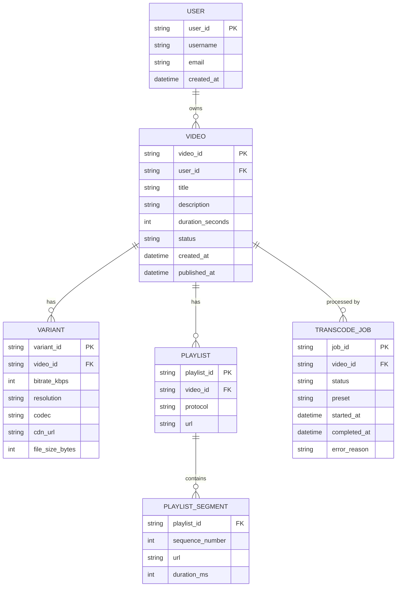

*Entity-relationship diagram of the video metadata model: a USER owns many VIDEOs; each VIDEO has multiple VARIANTs (ABR rungs), PLAYLISTs (HLS/DASH manifests), and TRANSCODE_JOBs (processing records); each PLAYLIST references PLAYLIST_SEGMENTs (the chunked media). Metadata is stored in a relational DB with read replicas; the actual media lives in object storage.*

**Indexes and Constraints:**

- `VIDEO.video_id` — primary key (UUID for even sharding).
- `VIDEO.user_id` — index for "creator's uploads" queries.
- `TRANSCODE_JOB.video_id` — index for status polling; `status` column indexed for queue dispatch.
- `PLAYLIST.video_id` — index for manifest URL lookup.
- `VARIANT.video_id` — index for variant listing.

**Partitioning / Sharding:**

- **VIDEO / VARIANT / PLAYLIST:** Sharded by `video_id` hash (consistent hashing ring). Video ID is the partitioning key because every downstream query (variants, playlists, transcode jobs) is scoped to a video.
- **TRANSCODE_JOB:** Sharded by `video_id` hash (same shard as the video) so job status and video metadata are co-located for the status poll.
- **PLAYLIST_SEGMENT:** Not stored in DB — segments live in object storage and are referenced by URL in the playlist manifest.

**Persistence:** Video chunks and manifests in S3 (hot for top 1%) → S3 Glacier (cold after 90 days); video metadata in PostgreSQL/RDS with read replicas for status and catalog queries; live transcode jobs in a fast KV store (Redis) for low-latency status polling.

**API Contract:**

| Method | Endpoint | Description |
|---|---|---|
| POST | `/api/v1/videos/upload` | Request a signed URL for multipart upload |
| POST | `/api/v1/videos` | Register an uploaded video and enqueue its transcode job |
| GET | `/api/v1/videos/{id}` | Get video metadata + stream/variant URLs |
| GET | `/api/v1/videos/{id}/playlists` | Get HLS/DASH manifest URLs |
| GET | `/api/v1/videos/{id}/status` | Get transcoding status (queued/processing/ready/failed) |
| POST | `/api/v1/live/streamkey` | Issue an RTMP ingest URL + stream key |
| GET | `/api/v1/live/{id}/playlist` | Get the live HLS playlist URL + DVR range |

**Authentication:** Bearer JWT (OAuth 2.0) for all user-facing requests; RTMP stream key (or signed JWT cookie) for live ingest.

**Response — `GET /api/v1/videos/{id}`:**
```json
{
  "video_id": "vid_123",
  "title": "How to Design a Video Platform",
  "duration_seconds": 3600,
  "status": "ready",
  "variants": [
    {"bitrate": 300,  "resolution": "426x240",  "url": "https://cdn.example.com/vid_123_300k.m3u8"},
    {"bitrate": 600,  "resolution": "640x360",  "url": "https://cdn.example.com/vid_123_600k.m3u8"},
    {"bitrate": 2500, "resolution": "1280x720", "url": "https://cdn.example.com/vid_123_2500k.m3u8"}
  ],
  "thumbnail_url": "https://cdn.example.com/vid_123_thumb.jpg"
}
```

**Error responses:**
```json
{"error": "not_found", "message": "Video not found", "code": 404}
{"error": "still_processing", "message": "Video still being transcoded", "code": 409}
{"error": "rate_limited", "message": "Too many upload requests", "code": 429}
```

---

### Video Streaming Protocols and Adaptive Bitrate

This domain-specific section covers the core technical primitives unique to video streaming: the wire protocols that carry chunks from edge to player, the adaptive bitrate algorithms that choose which rung of the ladder to download next, the segment formats and manifests that make adaptive playback possible, and the live transcoding pipeline that turns a real-time ingest feed into a playable ABR stream.

#### HLS (HTTP Live Streaming)

Apple's adaptive streaming protocol dominates iOS/Safari and is widely supported on Android and web. It works by splitting a video into small, independently-decodable segments and describing them in a playlist manifest.

* **Segments:** Video is split into 2–10 second `.ts` (MPEG-2 TS) or `.m4s` (fragmented MP4) chunks, each independently decodable.
* **Media playlist:** A `.m3u8` file listing the segments in playlist order with their durations and sequence numbers.
* **Master playlist:** A top-level `.m3u8` that indexes variant playlists (one per bitrate/resolution) so the player knows all available qualities up front.

The master playlist references each variant by bandwidth and resolution; the player picks one and then downloads that variant's media playlist to start fetching segments:

```
#EXTM3U
#EXT-X-VERSION:3
#EXT-X-TARGETDURATION:6
#EXT-X-MEDIA-SEQUENCE:0

# Media playlist for a single variant (e.g., 1500 kbps)
#EXTINF:6.0,
segment_00001.ts
#EXTINF:6.0,
segment_00002.ts
#EXTINF:6.0,
segment_00003.ts
```

A master playlist looks like this:

```
#EXTM3U
#EXT-X-STREAM-INF:BANDWIDTH=300000,RESOLUTION=426x240
low.m3u8
#EXT-X-STREAM-INF:BANDWIDTH=600000,RESOLUTION=640x360
mid.m3u8
#EXT-X-STREAM-INF:BANDWIDTH=1500000,RESOLUTION=960x540
high.m3u8
#EXT-X-STREAM-INF:BANDWIDTH=5000000,RESOLUTION=1920x1080
hd.m3u8
```

* **Player logic:** The player downloads the master playlist, measures current throughput (bandwidth probe), selects the highest variant that fits the bandwidth margin, then downloads segments sequentially. If the buffer drains or throughput drops, it downgrades; if throughput is high and the buffer is healthy, it upgrades. Hysteresis (a quality band) prevents oscillation.
* **Low-latency HLS (LL-HLS):** Standard HLS adds 2–3 segment durations of latency (12–18s at 6s segments). LL-HLS uses chunked transfer encoding (CTE) and `#EXT-X-PART` to deliver sub-segments as they are encoded, cutting latency to 3–6s without abandoning the HLS ecosystem.

#### MPEG-DASH

MPEG-DASH is the ISO-standardized open alternative to HLS. It uses an XML Media Presentation Description (`.mpd`) manifest with fragmented MP4 (`.m4s`) segments. The advantages over HLS: a single codec-agnostic manifest, explicit support for trick modes (trickplay), and tighter integration with MSE on browsers. The player logic is the same ABR principle — parse the manifest, probe bandwidth, select a representation, fetch segments — but the representation and segment metadata are richer (Per-Title, multiple adaptation sets).

```
<?xml version="1.0" encoding="UTF-8"?>
<MPD type="dynamic" ...>
  <Period>
    <AdaptationSet mimeType="video/mp4" codecs="avc1.640028">
      <Representation id="0" bandwidth="1500000" width="1280" height="720">
        <SegmentTemplate media="seg_$Number$.m4s" .../>
      </Representation>
      <Representation id="1" bandwidth="3000000" width="1920" height="1080">
        <SegmentTemplate media="seg_$Number$.m4s" .../>
      </Representation>
    </AdaptationSet>
  </Period>
</MPD>
```

#### Adaptive Bitrate Algorithms

Two families of algorithms drive quality selection:

* **Throughput-based:** The player estimates bandwidth by timing a few segment downloads, then picks the representation whose bitrate is below `bandwidth × safety_margin` (typically 0.8). Simple and effective; struggles with bursty networks.
* **Buffer-based (BOLA):** The player tracks buffer occupancy (seconds of video buffered) and maps it to a quality via a calibrated lookup table. BOLA maximizes average quality given the buffer level and is more stable under variable throughput, which is why it is the default in hls.js and Shaka Player.

Production players often combine both: use throughput for coarse selection and buffer-based control for hysteresis, plus a small reprobe window (2–3 segments) before allowing an upward switch.

#### Transcoding Pipeline

The pipeline turns one source into an 8-rung ABR ladder + manifest in a few minutes.

```java
@Component
public class VideoTranscodingPipeline {

    private final ExecutorService executor = Executors.newFixedThreadPool(16);
    private final FFmpegClient ffmpeg;
    private final ManifestGenerator manifestGenerator;

    public void transcode(TranscodeJob job) {
        String input = job.getInputPath();

        // Define the ABR ladder: 240p -> 1080p
        List<QualitySpec> abrLadder = List.of(
            QualitySpec.of(300, 426),    // 240p
            QualitySpec.of(600, 640),    // 360p
            QualitySpec.of(1200, 960),   // 540p
            QualitySpec.of(2500, 1280),  // 720p
            QualitySpec.of(5000, 1920),  // 1080p
            QualitySpec.of(8000, 2560)   // 1440p
        );

        // Encode all rungs concurrently; each writes .m4s segments + a variant playlist
        List<Future<String>> futures = abrLadder.stream()
            .map(spec -> executor.submit(() -> {
                String output = input + "_" + spec.getLabel() + ".m3u8";
                ffmpeg.encode(input, output, spec);
                return output;
            }))
            .toList();

        // Wait for every rung to finish before publishing the master playlist
        List<String> variantPlaylists = futures.stream()
            .map(f -> { try { return f.get(); } catch (Exception e) { throw new RuntimeException(e); } })
            .toList();

        manifestGenerator.generateMasterPlaylist(job.getVideoId(), variantPlaylists);
    }
}
```

#### Live Streaming Architecture

Live is the real-time cousin of VOD: there is no finished file to batch-transcode, so the transcoder runs in a continuous loop emitting 2s segments into a rolling playlist.

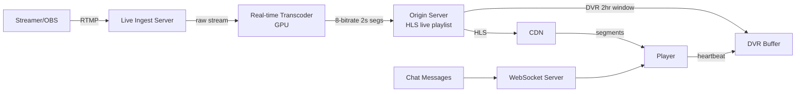

* **Ingest:** RTMP (or SRT/WebRTC) to an ingest server (Nginx-RTMP module or Wowza) that normalizes the stream. The ingest server is stateless and scales by DNS round-robin; each stream key maps to an origin shard.
* **Transcoder:** A real-time GPU encoder produces an 8-rung ABR ladder (240p–1080p60), segments every 2s, and writes segments + updates the live playlist (`EXT-X-MEDIA-SEQUENCE` advances each segment).
* **Origin:** Stores the rolling segment window (sliding — oldest deleted as newest arrives) and serves the live playlist. The 2-hour DVR window is backed by retaining the last 2h of segments.
* **CDN:** Caches the 2s segments at edge PoPs; the player polls the playlist every ~6s and downloads the next segment from the nearest edge.
* **Player + chat:** The player follows the live edge and can fall behind within the DVR window; chat is fanned out via WebSocket alongside the video.

---

### Replication Strategies

Video platforms replicate data along three axes: within a region (for availability), across regions (for global latency), and across storage tiers (for access patterns). Each layer has different consistency and latency requirements.

**Object storage replication (media):** Video chunks and manifests live in object storage (S3/GCS). S3 Cross-Region Replication (CRR) asynchronously replicates objects to a secondary region for disaster recovery; for live, each region's ingest writes to its local bucket and a cross-region mirror keeps the backup in sync. Versioning on the bucket lets a corrupted or wrongly invalidated segment be rolled back. A CDN origin-shield in front of the bucket absorbs thundering herds on cache invalidation (a viral video's manifest update would otherwise hit the bucket directly).

**CDN replication (chunks):** CDN edge PoPs independently pull and cache chunks from the origin. Cache behavior is controlled by object TTL and `Cache-Control` headers. For VOD, chunks use long TTLs (hours–days) since they are immutable. For live, segments use short TTLs (≤ 2× segment duration) so a stale edge doesn't stall the live edge. Multi-CDN means the same origin is fronted by two or three CDNs simultaneously; the player or a steering service chooses the best-performing one and fails over on degradation.

**Database replication (metadata):** Video metadata (titles, variants, transcoding status, user data) lives in a relational DB with leader-based replication: writes go to the leader, reads fan out to read replicas. Cross-region, the leader replicates asynchronously to a standby region that can be promoted within minutes. A read-only follower in each serving region handles catalog lookups so user-facing reads never cross oceans.

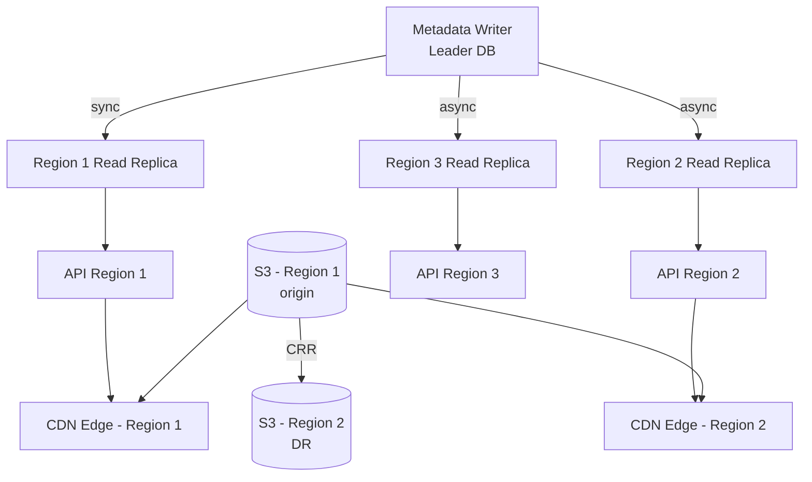

*Three-region replication: the metadata leader replicates synchronously to a regional read replica (fast local reads) and asynchronously to standby regions (disaster recovery). Object storage uses cross-region replication for DR; CDN edges in each region cache replicated chunks for sub-50 ms delivery to local viewers.*

---

### Failure Detection and Membership

A streaming platform is a federation of specialized layers — ingest, transcoder, origin, CDN, player — and a failure in any one must be detected quickly and routed around so viewers never see a stall.

**Gossip-based membership:** Stateless workers (transcoders, ingest servers, live-edge nodes) join a gossip cluster. Every few seconds each node pings a few random peers and propagates health status. This gives O(log N) failure detection without a central coordinator and scales to thousands of nodes. When a transcoder is suspected down, its in-flight jobs are re-queued (Kafka redelivery) and reassigned to healthy workers.

**Health checks and probes:**

| Component | Check Interval | Timeout | Detection Action |
|---|---|---|---|
| Live Ingest Server | 2s | 6s | Remove from DNS/LB; reassign stream key to a healthy ingest shard |
| Transcoder Worker | 5s | 30s | Re-queue in-flight segment jobs; spin up a replacement on a spot pool |
| Origin Server | 3s | 10s | Failover to the next origin in the region; CDN routes to origin-shield |
| CDN Edge | 10s | 30s | Edge self-heals by re-fetching from origin; player falls back to origin |
| DRM License Server | 5s | 15s | Fail over to a secondary license server region; cache last-used license (1h TTL) |
| Manifest Manager | 5s | 10s | Serve stale manifest from CDN cache; block cache-bust for new variants |

**Heartbeat liveness for live streams:** Each live ingest publishes a heartbeat to a coordination store (e.g., etcd/ZooKeeper) with the stream key as the key and a TTL of 10s. If the heartbeat expires, the system marks the stream offline, publishes a final `EXT-X-DISCONTINUITY` + `#EXT-X-END` to the playlist, and closes the DVR window. The player receives an `onstreamend` event and surfaces a "stream ended" UI rather than a spinning loader.

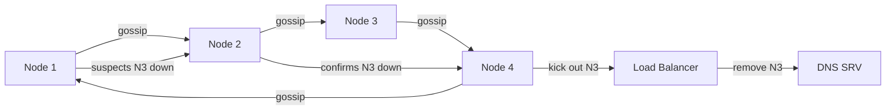

*A gossip membership ring for a live transcoding cluster: nodes exchange health state with random peers every few seconds. When N1 suspects N3 is down it propagates the suspicion; once a quorum confirms, the load balancer removes N3 from DNS SRV records and redistributes its stream keys to the remaining ingest shards. Meanwhile in-flight transcode jobs are re-queued to Kafka for replay on healthy workers.*

---

### High Availability and Scalability

Video platforms must stay up through node failures, AZ outages, and entire regional disasters while scaling to 10M+ concurrent live viewers.

#### Multi-Region Deployment

Deploy stateless serving in at least 3 regions (e.g., us-east, eu-west, ap-southeast). GeoDNS or a latency-based load balancer routes each viewer to the nearest region. Each region is self-sufficient for reads and writes, with asynchronous cross-region replication for durability.

* **Active-passive for metadata DB:** Writes go to the primary region's leader; every region has a read replica for local catalog lookups; the standby region can be promoted on failover.
* **Active-active for ingest:** Live ingest is geo-routed by stream-key hash to the region with the producer; viewers everywhere pull from their nearest CDN edge regardless of ingest region (CDN edges serve the globally-replicated origin bucket).
* **Global CDN:** Static media is cached at edge locations worldwide, reducing latency to < 50 ms for 95% of viewers and removing regional egress bottlenecks.

#### Auto-Scaling

* **Stateless services (API, player-token service, live-edge nodes):** Horizontal Pod Autoscaler (CPU + P95 latency) adjusts replica count; ingest shards scale by stream-key count.
* **Stateful services (metadata DB, transcode job queues):** Scale by adding shards/partitions; Kafka partitions scale consumer groups automatically — fan-out workers scale with partition count.
* **Transcoder workers:** Scale on the SQS/Kafka backlog and on GPU utilization. During live events, GPU spot pools can burst 10× within minutes.

#### Graceful Degradation

When a component fails, the system degrades rather than crashes:

* **Transcoder down:** VOD jobs queue in Kafka; the status API returns `processing` so the player shows a retry spinner. Live transcode falls back to a low-bitrate proxy (240p) so the stream keeps playing.
* **CDN PoP down:** The player retries the segment URL on an alternative CDN or falls back to the origin shield; a stale segment is served from the edge cache if available.
* **DRM license server down:** Cached licenses (1h TTL) keep playing; new license requests fall back to a secondary region; players retry.
* **Manifest corruption:** CDN serves the last-known-good manifest from cache with a short grace period while the origin regenerates.

```mermaid
graph TD
  C[Client] --> LB[Global Load Balancer<br/>GeoDNS + Latency]
  LB -->|nearest| R1[Region 1]
  LB -->|fallback| R2[Region 2]
  R1 -->|async| R2
  R1 --> API1[API Gateway]
  R1 --> Ingest1[Live Ingest Shards]
  R1 --> Trans1[Transcoder Pool - GPU]
  R1 --> DB1[(Metadata Leader)]
  R2 --> API2[API Gateway]
  R2 --> Ingest2[Live Ingest Shards]
  R2 --> DB2[(Metadata Standby]
  API1 --> CDN1[CDN Region 1]
  API2 --> CDN2[CDN Region 2]
  DB1 -->|async| DB2
  DB1 -->|read| API1
  DB2 -->|read| API2
```

*Active/active multi-region serving with active/passive metadata: a global load balancer routes viewers to the nearest region by latency. Each region runs its own ingest shards, GPU transcoder pool, and API gateway reading from a local metadata replica. The metadata leader in Region 1 replicates asynchronously to a warm standby in Region 2; if Region 1 fails, write traffic fails over and Region 2 is promoted. CDN edges in each region cache the globally-replicated origin bucket so viewers are always served from the nearest edge.*

---

### Performance and Optimization

Performance in video streaming is measured in two currencies: **first-frame latency** (time from play click to first pixels, target < 1s for VOD, < 5s for live) and **rebuffer ratio** (fraction of playback time spent stalled, target < 0.5%). Both are dominated by the critical path from storage to the edge player.

#### Latency Optimization

* **CDN priming / cache pre-warming:** For trending or newly-published videos, push the lowest-quality segment + the manifest to edge PoPs before any player requests them. This converts a cold-start segment fetch (1 RTT + origin pull) into an edge cache hit.
* **Segment pre-fetch:** The player downloads segment N+1 while playing segment N. The manifest lists upcoming segment URLs, so the player can issue a speculative request to the CDN edge that already served segment N.
* **Origin shield:** A single caching layer (e.g., CloudFront Origin Shield or Nginx-Varnish) sits between the CDN edges and the origin bucket. This absorbs the thundering herd on cache invalidation (a viral video's manifest update) and reduces origin load by 90%+.
* **Chunk duration tuning:** 2s chunks for live (low latency), 4–6s for VOD (fewer requests, less overhead). CMAF lets VOD and live share a single fragmented-MP4 segment format, so the same player and packager handle both.

#### Throughput Optimization

* **Multi-CDN load balancing:** A steering layer monitors per-CDN latency, error rates, and cost in real time and routes new player sessions to the best-performing CDN. During a single-CDN degradation (e.g., an undersea cable cut), traffic shifts within seconds.
* **HTTP/3 + QUIC:** Reduces connection setup and head-of-line blocking for chunk downloads, improving throughput on lossy mobile networks where HTTP/2 struggles.
* **Byte-range requests:** A single large fragmented-MP4 file can be byte-range requested for sub-segments, letting CDNs cache fewer, larger objects while still enabling sub-second granularity.

#### Caching Strategies

```mermaid
graph LR
  Player[Player] -->|first byte| Edge[CDN Edge PoP]
  Edge -->|miss| Shield[Origin Shield<br/>CloudFront / Varnish]
  Shield -->|miss| Origin[Object Store<br/>S3 / GCS]
  Origin -->|populate| Shield
  Shield -->|populate| Edge
  Edge -->|cached chunk| Player
  Manifest[Manifest (short TTL)] --> Edge
```

*Three-tier caching: the player requests a segment from the nearest CDN edge. On a cache miss the edge falls back to the origin shield (which absorbs invalidation bursts from viral videos), and the shield falls back to the origin object store. Manifests use a short TTL (60s for VOD, ≤2× segment duration for live) so new variants propagate quickly without overwhelming the origin.*

#### Write-Path Optimization (Transcoding)

* **Async transcoding:** The upload API returns the stream URL immediately after the file lands in object storage; a message queue (SQS/Kafka) triggers the transcoder. The player polls a status endpoint that reads from a fast KV store.
* **Parallel ABR rungs:** Each variant (rung) of the ladder is encoded by a separate GPU worker — 8 rungs in parallel finish in roughly the time of the slowest rung, not the sum.
* **Per-title encoding:** Rather than a fixed ladder, analyze the source's complexity and generate a custom bitrate/resolution ladder, cutting average bandwidth 15–25% without quality loss.

**Real-world reference:** Netflix's Open Connect appliances sit inside ISP networks (not just CDN edges), and their player uses a custom throughput + buffer hybrid that reprobes every 2 segments with a 0.85 bandwidth safety margin.

---

### CAP Theorem and Consistency Trade-offs

The CAP theorem states that during a network partition, a distributed system can provide at most two of: Consistency, Availability, and Partition tolerance. Because video streaming runs over the public internet, partition tolerance is non-negotiable. The design question is where to choose consistency (CP) and where to choose availability (AP).

#### Metadata DB — CP (Consistency + Partition Tolerance)

When a creator publishes a video, the upload API must return a streamable URL that is immediately consistent. A video that returns "ready" but isn't actually playable creates a broken experience. The metadata DB uses leader-based replication with synchronous acknowledgment from a quorum of replicas before returning success, so a published video's manifest and variant URLs are durable and immediately readable.

#### CDN / Object Store — AP (Availability + Partition Tolerance)

Video chunks and manifests are served from CDN edges worldwide. If an edge or region is partitioned, the player must still play — it falls back to another edge or the origin shield. The cost of this availability is **stale data**: a recently invalidated manifest (a newly-published variant) may take up to its TTL to propagate. This is acceptable because chunks are immutable once written — a viewer who has the manifest sees consistent chunks.

#### Live Playlist — AP with Bounded Staleness

The live HLS playlist changes every 2 seconds (new segment appended, oldest dropped). A viewer whose CDN edge is briefly partitioned sees a playlist that is up to ~1 segment (2s) stale — the DVR sliding window tolerates this. The player's buffer (typically 10–30s) absorbs the lag, so the perceived latency drifts by seconds, not minutes.

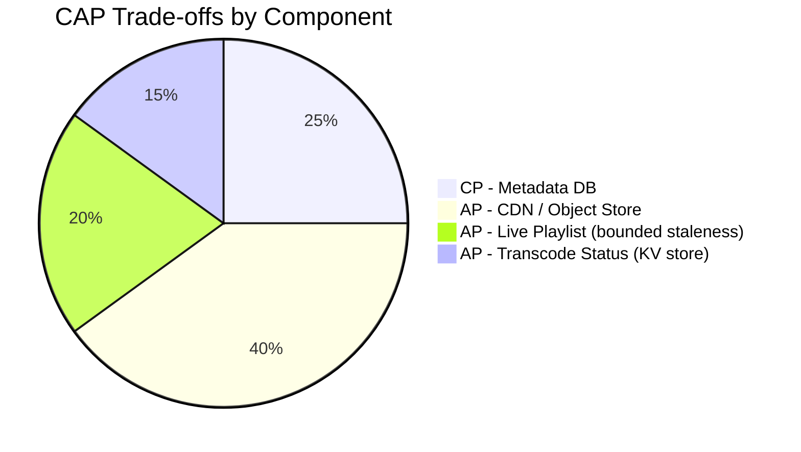

*The CAP allocation across a video platform: the Metadata DB is CP (a published video must be immediately consistent); the CDN/object store is AP (chunks are immutable and stale-but-correct is fine); the live playlist is AP with bounded staleness (a 2s-old playlist is absorbed by the player buffer); and transcode status is served from a fast KV store (AP, since the player polls anyway).*

**Interview framing:** Video platforms make a nuanced CAP choice — strong consistency is required only at the publishing boundary (publish returns ready → must be playable immediately), while everything on the read/delivery path (CDP, chunks, live playlists) is eventually consistent and availability-first. The player's own buffer is the circuit breaker that absorbs the inconsistency window.

---

### Encryption and Key Management

A video platform must protect premium content (movies, live sports, subscription shows) from piracy and interception, while still allowing legitimate playback, ad insertion, and forensic tracing of leaks. Encryption applies at three layers: the media segments, the license/key delivery path, and the management API that issues keys.

#### Encryption at Rest (Segments)

* **AES-128 CBC/CTR segment encryption:** Each HLS/DASH segment is encrypted with AES-128 using a per-title or per-segment key. The key is referenced in the manifest (`#EXT-X-KEY:METHOD=SAMPLE-AES,URI="https://license.example.com/key?id=abc"`).
* **CENC (Common Encryption):** A single encrypted media file (fMP4) works with Widevine (Android/Chrome), PlayReady (Windows/Xbox), and FairPlay (iOS/tvOS) simultaneously. The media is encrypted once with a content key; each DRM wraps that key with its own key-encryption key (KEK). This avoids storing and transcoding N separate encrypted copies.
* **Per-session keys:** For live premium sports, each viewer session gets a unique AES key derived from a session token. Even if a key is leaked and shared, it only decrypts that one session's segments.

#### Key Management

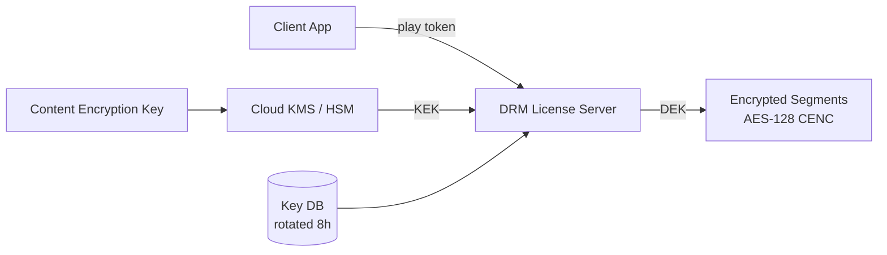

*Key management topology: the DRM License Server issues per-session content encryption keys (DEKs) to authenticated clients. DEKs are generated by a KMS backed by an HSM; the KMS's KEK wraps/unwraps DEKs. Keys are rotated every 8 hours and stored in a versioned key DB for forensic traceability.*

* **Key hierarchy:** A root KEK in an HSM encrypts per-title content encryption keys (DEKs). Rotating the KEK re-wraps only the DEKs, not the (petabytes of) media.
* **Key rotation:** Content keys rotate every 8 hours for live (per-session); for VOD, a single key per title with a 30-day TTL. Rotating keys invalidates cached licenses, so the player must re-acquire on a boundary.
* **Multi-region KMS:** Keys are available in all deployment regions via Cloud KMS (GCP) / AWS KMS / Azure Key Vault. On-prem deployments use HashiCorp Vault with integrated storage for HA.

**Java example — AES-128 segment encryption service as a Spring bean:**

```java
@Service
@RequiredArgsConstructor
public class MediaEncryptionService {

    @Value("${app.drm.content-key-id}")
    private String keyId;

    private final AwsKms kmsClient;
    private final KeyRepository keyRepository;

    /**
     * Generate a per-title content encryption key (DEK), wrap it with the KMS
     * KEK, and persist it for license-server lookup. Returns the plaintext DEK
     * for use by the transcoder packager (CENC).
     */
    @Transactional
    public ContentKey generateContentKey(String videoId) {
        var dek = kmsClient.generateDataKey(keyId); // AES-256 plaintext + ciphertext
        var keyRecord = ContentKey.builder()
            .videoId(videoId)
            .keyId(keyId)
            .encryptedDek(dek.encryptedKey())
            .keyVnu(Instant.now())
            .rotationPeriod(Duration.ofHours(8))
            .build();
        keyRepository.save(keyRecord);
        return ContentKey.builder()
            .videoId(videoId)
            .plaintextDek(dek.plaintext())
            .encryptedDek(dek.encryptedKey())
            .iv(dek.iv())
            .build();
    }

    /**
     * Decrypt a per-session DEK for a licensed player via the KMS-protected KEK.
     */
    public SecretKey unwrapKey(String keyId, byte[] encryptedDek, byte[] iv) {
        byte[] plaintext = kmsClient.decryptDataKey(keyId, encryptedDek);
        return new SecretKeySpec(plaintext, "AES");
    }
}
```

*The `MediaEncryptionService` bean generates per-title AES-256 content encryption keys (DEKs) via AWS KMS, persists the wrapped (encrypted) DEK with rotation metadata, and exposes an unwrap method for the license server. The KMS-managed KEK is injected via `@Value`. Only the license server — gated by authentication and DRM certification — can call `unwrapKey`, so even a compromised transcoder cannot produce playable premium segments.*

---

### Authentication and Authorization

Every request to a video platform must be authenticated (proving identity) and authorized (proving permission). User-facing API calls carry OAuth 2.0 JWTs; live ingest uses stream keys; premium playback uses DRM license tokens; internal service-to-service traffic uses mTLS.

#### Authentication Methods

* **OAuth 2.0 + JWT:** Users authenticate via Google/Apple/Email. The Auth Service issues a short-lived access token (JWT, 15 min) and a refresh token (7 days). The JWT carries `sub`, scopes, and expiry.
* **Session cookies:** For web playback, an `HttpOnly` + `Secure` + `SameSite=Strict` cookie maps to a server-side session in Redis, enabling immediate revocation on logout.
* **Stream keys (live ingest):** Each broadcaster gets a unique RTMP URL + a secret stream key (`rtmp://ingest.example.com/live/<key>`). The key is a signed token (HMAC of channel + expiry + nonce) validated at ingest. Compromise revokes only that key.
* **mTLS (service-to-service):** Internal microservices authenticate with certs issued by a private CA — no shared secrets over the wire.

#### Authorization Models

* **Scope-based:** Each token carries scopes: `videos:upload`, `videos:read`, `videos:play`, `live:ingest`, `analytics:read`. The API Gateway enforces scope checks.
* **RBAC:** Roles `user`, `creator`, `moderator`, `admin`. Creators can upload and view their own analytics; moderators can take down streams; admins manage platform settings.
* **Resource-level privacy:** Each video has visibility (`public`, `unlisted`, `private`, `scheduled`). Private videos return 403 unless the viewer is an authorized shared recipient (checked via a share-table).
* **DRM entitlements:** Premium playback requires a license token whose claims include the permitted playback policy (device limits, rental window, HDCP requirement).

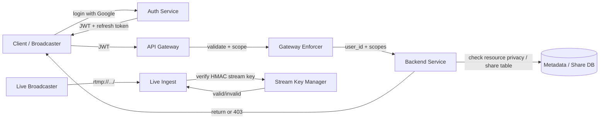

*Authentication and authorization flow: the client logs in via the Auth Service (Google SSO), receiving a JWT and refresh token. The API Gateway validates the JWT signature and checks OAuth scopes before forwarding to backend services. Each service performs resource-level privacy checks against the share/permission table, returning 403 on denial. Live broadcasters authenticate separately with a signed HMAC stream key validated at the ingest edge, preventing stream hijacking.*

**Java example — JWT validation filter and stream-key verification:**

```java
@Component
@RequiredArgsConstructor
public class JwtAuthenticationFilter implements Filter {

    @Value("${app.auth.jwt-public-key}")
    private String publicKeyPem;

    private final UserDetailsService userDetailsService;

    @Override
    public void doFilter(ServletRequest request, ServletResponse response,
                         FilterChain chain) throws IOException, ServletException {
        var token = extractToken((HttpServletRequest) request);
        if (token != null && JwtUtils.isValid(token, publicKeyPem)) {
            var userId = JwtUtils.getUserId(token);
            var scopes = JwtUtils.getScopes(token);
            var userDetails = userDetailsService.loadUserById(userId);
            var auth = new UsernamePasswordAuthenticationToken(
                    userDetails, null, userDetails.getAuthorities());
            SecurityContextHolder.getContext().setAuthentication(auth);
        }
        chain.doFilter(request, response);
    }
}
```

*The `JwtAuthenticationFilter` bean intercepts every HTTP request, extracts the bearer token, validates its signature against the public key (injected via `@Value` from a JWKS endpoint), loads the user details including scopes, and sets the Spring Security `Authentication` context. If the token is missing or invalid, the request proceeds unauthenticated — and downstream `@PreAuthorize` annotations return 401.*

```java
@Service
@RequiredArgsConstructor
public class LiveStreamAuthService {

    @Value("${app.live.streamkey-hmac-secret}")
    private String hmacSecret;

    private final StreamKeyRepository keyRepository;

    /**
     * Verify a live RTMP stream key = base64(hmac(secret, channelId:expiry:nonce)).
     * Returns true only if the key exists, is not revoked, and has not expired.
     */
    @Transactional(readOnly = true)
    public boolean verifyStreamKey(String channelId, String providedKey) {
        var expected = keyRepository.findByChannelId(channelId)
            .orElse(null);
        if (expected == null || expected.isRevoked()) {
            return false;
        }
        if (Instant.now().isAfter(expected.getExpiresAt())) {
            return false;
        }
        // Constant-time comparison to prevent timing attacks
        var computed = createHmac(hmacSecret, channelId + ":" + expected.getNonce());
        return MessageDigest.isEqual(computed, decodeBase64(providedKey));
    }

    private byte[] createHmac(String secret, String data) {
        try {
            var mac = Mac.getInstance("HmacSHA256");
            mac.init(new SecretKeySpec(secret.getBytes(StandardCharsets.UTF_8), "HmacSHA256"));
            return mac.doFinal(data.getBytes(StandardCharsets.UTF_8));
        } catch (Exception e) {
            throw new IllegalStateException("HMAC computation failed", e);
        }
    }
}
```

*The `LiveStreamAuthService` bean validates live ingest stream keys using HMAC-SHA256 compared in constant time (`MessageDigest.isEqual`) to prevent timing attacks. A key is valid only if it is registered for the channel, not revoked, and not expired. The HMAC secret is injected via `@Value`; keys are generated client-side and stored as opaque references, so a DB leak does not immediately enable stream hijacking.*

---

### Security Threats and Mitigations

#### Threat: Video Piracy / Stream Hijacking

- **Risk:** An attacker captures a premium stream (live sports, new movie) and rebroadcasts it, or hijacks a live ingest to air unauthorized content.
- **Mitigation:** AES-128 / CENC encryption + multi-DRM (Widevine/PlayReady/FairPlay) so segments are useless without a license; per-session keys for live premium events so a leaked key only decrypts one session; stream-key HMAC verification at ingest to prevent unauthorized live publishing; forensic watermarking (unique per viewer) traces leaks to the source account.

#### Threat: DDoS on Live Events

- **Risk:** A high-profile live stream attracts volumetric DDoS that overwhelms ingest or CDN origin, taking the broadcast down.
- **Mitigation:** CDN absorbs volumetric attacks (Cloudflare Spectrum / AWS Shield); ingest is geo-load-balanced and autoscales by stream-key hash; an origin shield soaks thundering herds; scrubbing is triggered automatically when traffic deviates 5σ from the baseline.

#### Threat: Copyright / Content ID Bypass

- **Risk:** Users upload copyrighted movies or sports broadcasts; the platform is liable without detection.
- **Mitigation:** Fingerprint-based Content ID (audio/video hash database like Audible Magic / YouTube's own) scans every upload at ingest; matches are blocked or monetized (ad-revenue to rights holder); human review for edge cases; repeat offenders get channel strikes.

#### Threat: Account Takeover (Creators)

- **Risk:** An attacker takes over a creator's account and deletes videos, changes the stream key, or streams harmful content.
- **Mitigation:** Mandatory 2FA for monetized/verified accounts; login anomaly detection (new device/location/time → step-up auth or soft block); all stream-key changes trigger an email + 24h propagation delay; session invalidation on password change.

#### Threat: DDoS / Scraping of Catalog

- **Risk:** Bots scrape video metadata, thumbnails, and catalog at scale to train AI models or build competing indexes.
- **Mitigation:** Per-API-key rate limiting (e.g., 1000 req/min); all catalog endpoints require authentication (no public unauthenticated metadata); a Bloom-filter of recently-served keys rejects repeated miss patterns; known scraping user agents are challenged with a JS challenge.

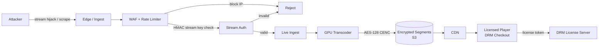

*Security ingress funnel: the edge/WAF applies rate limiting and blocks abusive IPs; live ingest verifies the HMAC stream key before accepting a broadcast; transcoded segments are AES-128 CENC encrypted at rest; the CDN delivers encrypted chunks; only a player presenting a valid DRM license token can decrypt — closing the path from attacker-in-the-middle to a viewable stream.*

---

### Observability and Logging

A streaming platform generates telemetry from every layer — ingest, transcode, storage, CDN, and the player itself — and must turn that firehose into actionable signals. The SLOs are defined by user-visible metrics: time-to-first-frame, rebuffer ratio, and error rate.

#### Key Metrics

| Metric | Tier | Target | Meaning |
|---|---|---|---|
| Time to First Frame (TTFF) | User | p95 < 1.5s (VOD), p95 < 5s (live) | How fast the first pixel appears |
| Rebuffer Ratio (RBER) | User | p95 < 0.5% | Fraction of playback spent stalled |
| Startup Failures | User | < 0.1% | Play attempts that never start |
| CDN Hit Rate | Infra | > 95% | Cache effectiveness at the edge |
| Segment Download Latency | Infra | p99 < 200ms | Edge-to-player chunk fetch time |
| Transcode Job Latency | Infra | p95 < 90s per hour of video | Time from upload to ready |
| Transcode Backlog | Infra | < 1000 queued jobs | Unprocessed VOD uploads |
| Live Edge Lag | Infra | < 10s behind realtime | How far behind real-time the playlist is |
| DRM License Latency | Infra | p99 < 300ms | Time to acquire a license |
| 5xx / Player Errors | User | < 0.5% | Broken playback sessions |

#### Logging

- **Player telemetry:** Every playback session logs start time, selected bitrate ladder, rebuffer events, quality switches, errors, and abandonment (did the user give up before N seconds). Sampled at 100% for paid/premium sessions, 10% for ad-supported.
- **Transcode logs:** Each job logs start, per-rung encode progress, completion, and any FFmpeg error. Stored with a correlation ID matching the upload request.
- **Ingest logs:** RTMP connection events, stream-key validation, bitrate/quality of the incoming signal, disconnects, and reconnections.
- **Audit logs:** Every stream-key rotation, privacy/visibility change, monetization toggle, and takedown request is logged with before/after state and the acting principal.

#### Distributed Tracing

Trace every user request across services — from the player's manifest request through the CDN, origin shield, origin object store, and back. For transcoding, trace the job from the SQS/Kafka trigger through the GPU worker to the manifest publish. Use OpenTelemetry with the `traceparent` header propagated across every hop; key spans to instrument include manifest generation, segment availability, license issuance, and transcode job dispatch.

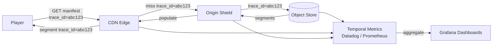

*Distributed tracing across the delivery path: the player's manifest request carries a trace ID that is propagated through the CDN edge, origin shield, and object store. Each hop records span latency to a metrics backend (Prometheus/Datadog) and visualizes p95/p99 latency and error rates in Grafana. This is the primary tool for debugging "why is my live stream buffering" by correlating edge latency, origin misses, and transcode job state.*

#### Alerting Strategy

- **Critical (page immediately):** TTFF p95 > 2s for 5 minutes (VOD) or > 8s (live); RBER p95 > 2% for 2 minutes; CDN hit rate < 80%; transcode backlog > 5000 jobs for 10 minutes; live edge lag > 30s.
- **Warning (Slack):** TTFF p95 > 1s for 15 minutes; transcode job failure rate > 5% for 10 minutes; DRM license latency p99 > 500ms; origin 5xx error rate > 1% for 10 minutes.
- **Info (dashboard):** New upload volume trends, top-10 trending videos by ingest rate, codec distribution (H.264 vs AV1 vs VP9), per-region CDN cost.

**Java example — streaming metric instrumentation with Micrometer:**

```java
@Service
@RequiredArgsConstructor
public class StreamingMetricsService {

    private final MeterRegistry meterRegistry;
    private final VideoRepository videoRepository;

    public void recordTranscodeJob(String videoId, Duration duration, boolean success) {
        Timer.builder("transcode.job.duration")
            .tag("codec", videoRepository.findCodec(videoId))
            .tag("success", String.valueOf(success))
            .register(meterRegistry)
            .record(duration);

        if (!success) {
            Counter.builder("transcode.job.failures")
                .tag("codec", videoRepository.findCodec(videoId))
                .register(meterRegistry).increment();
        }
    }

    @EventListener
    public void onPlaybackStart(PlaybackStartedEvent event) {
        Timer.builder("playback.time_to_first_frame")
            .tag("cdn", event.getCdn())
            .tag("user_tier", event.getUserTier())
            .register(meterRegistry)
            .record(event.getTimeToFirstFrame());

        Counter.builder("playback.starts")
            .tag("content_type", event.getContentType())
            .tag("user_tier", event.getUserTier())
            .register(meterRegistry).increment();
    }

    @EventListener
    public void onRebuffer(RebufferEvent event) {
        Counter.builder("playback.rebuffer.events")
            .tag("cdn", event.getCdn())
            .tag("bitrate_kbps", String.valueOf(event.getActiveBitrate()))
            .register(meterRegistry).increment();
    }
}
```

*The `StreamingMetricsService` bean records the critical streaming SLOs using Micrometer: transcode job duration (tagged by codec and success, with a separate failure counter), time-to-first-frame (tagged by CDN and user tier), playback starts, and rebuffer events (tagged by CDN and active bitrate). These timers and counters feed the Grafana dashboards whose thresholds are wired to the paging/warning alerting tiers above. The `@EventListener` pattern decouples telemetry from the request path.*

---

### Real-World Implementations

Video platforms use a mix of proprietary and open-source systems, each chosen for a specific layer of the stack. The common thread is the same end-to-end pipeline: ingest → transcode → store → CDN → player, but the scale and specialization vary enormously.

#### YouTube

Ingests 500+ hours of video per minute; stores petabytes on Google Cloud Storage; transcodes via Furnace (Google's GPU cluster) into 8–10 ABR variants spanning 240p–4K HDR across H.264, VP9, and AV1. Delivery is via Google's global CDN (200+ PoPs). The player uses hls.js on web and ExoPlayer on Android, with HLS for Safari/iOS and DASH for Chrome. 4–6s chunks; 20+ codecs; AV1 for modern browsers with H.264 fallback. Live streams use LL-HLS (sub-6s) with a 2-hour DVR window. YouTube's scale (1B+ monthly users, 20+ Tbps peak egress) is sustained by region-sharded ingest, autoscaled GPU transcoding, and multi-CDN with dynamic steering.

#### Netflix

Built Open Connect — custom CDN appliances deployed inside ISP networks (not just at IXPs), which means most Netflix traffic never touches the public internet backbone. Encodes in 4K HDR with 10+ bitrate variants; uses DASH manifests with a custom player algorithm far more sophisticated than BOLA. Spends $200M+ annually on CDN/transit. Netflix's per-title encoding analyzes each title's complexity to generate a custom bitrate ladder, cutting average bandwidth 15–25%. Chaos Monkey constantly kills transcoding workers to verify the pipeline survives node failures.

#### Twitch

RTMP ingest from 10M+ broadcasters; real-time GPU transcoding (244p to 1080p60) with 2s HLS segments; low-latency mode (LL-HLS, 3–5s). Chat is fanned out via WebSocket with per-channel message services and horizontal scaling of chat servers. 30M+ daily viewers. Twitch shards ingest by stream key hash and uses per-channel Redis pub/sub for low-latency chat fan-out. Live transcode failure falls back to a 240p proxy so the broadcast never goes dark.

#### Disney+

Uses HLS + FairPlay DRM for premium content; multi-CDN (Akamai, Level 3/Edgecast) with active-active failover. Encodes in H.264 baseline + HEVC (H.265) for 4K HDR, and CMAF (Common Media Application Format) for low-latency shared across HLS and DASH. Global rollout with regional storage and content libraries gated by geo-DRM entitlements. Disney+ encodes each title in both Dolby Vision (HDR) and SDR variants, with the player selecting based on the display's capabilities.

#### Hotstar / JioCinema (India)

Scaled to 25M concurrent users (Hotstar IPL 2019) and 20M concurrent live devices (JioCinema IPL 2023). The "CRAZIEST livestream architecture" used a sharded ingest layer, in-region GPU transcoding farms, and a custom multi-CDN director that shifts traffic between Akamai, Limelight, and CloudFront within seconds based on live PoP health. Key insight: Indian audiences skew mobile and on 4G, so the lowest rung of the ABR ladder (150–300 kbps) carries the heaviest load and must be aggressively cached at the edge.

#### Short-Form (TikTok / YouTube Shorts)

Very short videos (10–60s) are optimized differently: fully transcoded and cached at the edge before the user scrolls; the player preloads the next video while the current one plays; adaptive bitrate is less about buffering and more about bandwidth savings on mobile data plans. These use low-latency chunked segments (1–2s) and often a single combined codec rather than a full ABR ladder.

---

### Java and Spring Boot Implementation Guide

This section demonstrates a production-grade Spring Boot service for the video upload, transcode-trigger, status, and stream-URL path — showcasing `@RestController`, `@Service`, `@Repository`, `@Component`, `@Value`, `@Valid`, records for DTOs, `@AuthenticationPrincipal`, `@Transactional`, `@ControllerAdvice`, `@KafkaListener`, and constructor injection (`@RequiredArgsConstructor`).

#### 1. DTO Records

Records provide immutable, concise data carriers for the API contract, with validation annotations enforced by `@Valid`.

```java
public record VideoUploadRequest(
        @NotBlank String title,
        @NotBlank String description,
        @NotBlank String contentType,
        Long contentLength) {}

public record UploadResponse(String videoId, String uploadUrl, Instant expiresAt) {}

public record VideoResponse(
        String videoId,
        String title,
        String description,
        Long durationSeconds,
        String status,
        List<VariantDto> variants,
        String thumbnailUrl) {}

public record VariantDto(int bitrateKbps, String resolution, String codec, String url) {}

public record TranscodeStatus(String status, String jobId, Integer progress) {}
```

#### 2. Entity with Optimistic Locking

The `Video` entity uses `@Version` for optimistic locking, preventing lost updates when concurrent processes (status polls, transcode completion) modify the same row.

```java
@Entity
@Table(name = "videos", indexes = {
        @Index(name = "idx_owner_created", columnList = "ownerId, createdAt")
})
@Getter @Setter @NoArgsConstructor(access = AccessLevel.PROTECTED)
public class Video {
    @Id
    private String videoId;
    private String ownerId;
    private String title;
    private String description;
    private Long durationSeconds;
    @Enumerated(EnumType.STRING)
    private VideoStatus status;
    private String masterPlaylistUrl;
    private Instant createdAt;

    @Version
    private Long version;   // optimistic locking — concurrent writers get OptimisticLockException
}
```

#### 3. Repository Layer

```java
@Repository
public interface VideoRepository extends JpaRepository<Video, String> {
    Optional<Video> findByVideoId(String videoId);
    List<Video> findTop10ByOwnerIdOrderByCreatedAtDesc(String ownerId);
}

@Repository
public interface TranscodeJobRepository extends JpaRepository<TranscodeJob, String> {
    List<TranscodeJob> findByStatusInAndCreatedAtBefore(
            Collection<String> statuses, Instant cutoff, Pageable pageable);
}
```

#### 4. Service Layer — Upload, Status, Stream URL

```java
@Service
@RequiredArgsConstructor
@Slf4j
public class VideoService {

    private final VideoRepository videoRepository;
    private final AmazonS3 s3;
    private final KafkaTemplate<String, Object> kafkaTemplate;
    private final MeterRegistry meterRegistry;

    @Value("${app.s3.upload-bucket}")
    private String uploadBucket;

    @Value("${app.s3.upload-ttl-minutes:15}")
    private int uploadTtlMinutes;

    @Transactional
    public UploadResponse registerUpload(UserDetails user, VideoUploadRequest request) {
        String videoId = UUID.randomUUID().toString();
        var video = new Video();
        video.setVideoId(videoId);
        video.setOwnerId(user.getUsername());
        video.setTitle(request.title());
        video.setDescription(request.description());
        video.setStatus(VideoStatus.PROCESSING);
        video.setCreatedAt(Instant.now());
        videoRepository.save(video);

        // Issue a time-limited presigned multipart-upload URL
        var uploadUrl = s3.generatePresignedUrl(
                uploadBucket, videoId, Instant.now().plusSeconds(uploadTtlMinutes * 60));

        // Trigger the transcoding pipeline via Kafka (async, decoupled)
        kafkaTemplate.send("video.uploaded", videoId,
                Map.of("videoId", videoId, "ownerId", user.getUsername()));

        log.info("Registered upload videoId={}", videoId);
        return new UploadResponse(videoId, uploadUrl.toExternalForm(),
                Instant.now().plusSeconds(uploadTtlMinutes * 60));
    }

    @Transactional(readOnly = true)
    public VideoResponse getById(String videoId) {
        var video = videoRepository.findByVideoId(videoId)
                .orElseThrow(() -> new VideoNotFoundException(videoId));
        return toResponse(video);
    }

    @Transactional(readOnly = true)
    public TranscodeStatus getStatus(String videoId) {
        var video = videoRepository.findByVideoId(videoId)
                .orElseThrow(() -> new VideoNotFoundException(videoId));
        return new TranscodeStatus(
                video.getStatus().name(),
                video.getVideoId(),
                video.getStatus() == VideoStatus.READY ? 100 : 50);
    }
}
```

*The `VideoService` bean implements the VOD write path. `registerUpload` creates a `Video` row with `PROCESSING` status inside a `@Transactional` boundary, issues a time-limited S3 presigned URL (the bucket and TTL come from `@Value`), and publishes a `video.uploaded` Kafka event to trigger async transcoding — so the upload API returns immediately while the heavy work runs decoupled. `getById` and `getStatus` are `readOnly = true` for query optimization. Kafka decouples the write path from the transcode fleet, and a Micrometer meter registry is wired in for later instrumentation.*

#### 5. REST Controller with Validation

```java
@RestController
@RequestMapping("/api/v1/videos")
@RequiredArgsConstructor
public class VideoController {

    private final VideoService videoService;

    @PostMapping("/upload-url")
    public ResponseEntity<UploadResponse> requestUploadUrl(
            @AuthenticationPrincipal UserDetails user,
            @Valid @RequestBody VideoUploadRequest request) {
        var response = videoService.registerUpload(user, request);
        return ResponseEntity.ok(response);
    }

    @GetMapping("/{videoId}")
    public ResponseEntity<VideoResponse> getVideo(@PathVariable String videoId) {
        var response = videoService.getById(videoId);
        return ResponseEntity.ok(response);
    }

    @GetMapping("/{videoId}/status")
    public ResponseEntity<TranscodeStatus> getStatus(@PathVariable String videoId) {
        var status = videoService.getStatus(videoId);
        return ResponseEntity.ok(status);
    }
}
```

#### 6. Transcoding Job Listener (Kafka consumer)

The transcoder fleet is itself a Spring Boot service that consumes the `video.uploaded` event, builds the ABR ladder, writes segments + manifests, updates the video status, and publishes a `video.ready` event.

```java
@Service
@RequiredArgsConstructor
@Slf4j
public class TranscodeJobListener {

    private final VideoRepository videoRepository;
    private final KafkaTemplate<String, Object> kafkaTemplate;
    private final FfmpegTranscoder transcoder;
    private final MeterRegistry meterRegistry;

    @KafkaListener(topics = "video.uploaded", groupId = "transcoder")
    @Transactional
    public void handleUploaded(String videoId, Map<String, Object> event) {
        Timer.Sample sample = Timer.start(meterRegistry);
        var video = videoRepository.findByVideoId(videoId)
                .orElseThrow(() -> new VideoNotFoundException(videoId));

        try {
            // 1. Probe the source → decide the ABR ladder (per-title)
            var ladder = transcoder.analyze(videoId, event.get("source").toString());

            // 2. Encode each rung in parallel → HLS + DASH segments + manifests
            var variants = ladder.parallelStream()
                    .map(spec -> transcoder.encodeRungs(videoId, spec))
                    .toList();

            // 3. Publish master playlist + update status
            transcoder.publishMasterPlaylist(videoId, variants);
            video.setStatus(VideoStatus.READY);
            videoRepository.save(video);

            kafkaTemplate.send("video.ready", videoId,
                    Map.of("videoId", videoId, "variants", variants.size()));

            sample.stop(Timer.builder("transcode.job.duration")
                    .tag("success", "true")
                    .register(meterRegistry));
        } catch (Exception e) {
            video.setStatus(VideoStatus.FAILED);
            videoRepository.save(video);
            sample.stop(Timer.builder("transcode.job.duration")
                    .tag("success", "false")
                    .register(meterRegistry));
            throw e;
        }
    }
}
```

*The `TranscodeJobListener` bean is the consumer side of the pipeline. The `@KafkaListener` consumes `video.uploaded` events; `@Transactional` keeps the status update and event publish atomic. It analyzes the source (per-title), encodes each ABR rung in parallel, publishes the master playlist, flips the video status to `READY`, and emits `video.ready`. Every step is timed with Micrometer and tagged by success/failure — feeding the transcode job latency and failure-rate dashboards. On failure it marks the video `FAILED` and re-throws to trigger Kafka redelivery (DLQ after retries).*

#### 7. Global Exception Handler

```java
@ControllerAdvice
public class GlobalExceptionHandler {

    @ExceptionHandler(VideoNotFoundException.class)
    public ResponseEntity<ApiError> handleNotFound(VideoNotFoundException ex) {
        return ResponseEntity.status(HttpStatus.NOT_FOUND)
                .body(new ApiError(HttpStatus.NOT_FOUND, ex.getMessage()));
    }

    @ExceptionHandler(MethodArgumentNotValidException.class)
    public ResponseEntity<ApiError> handleValidation(MethodArgumentNotValidException ex) {
        var msgs = ex.getBindingResult().getFieldErrors().stream()
                .map(FieldError::getDefaultMessage).toList();
        return ResponseEntity.badRequest()
                .body(new ApiError(HttpStatus.BAD_REQUEST,
                        "Validation failed: " + String.join(", ", msgs)));
    }

    @ExceptionHandler(OptimisticLockException.class)
    public ResponseEntity<ApiError> handleConflict(OptimisticLockException ex) {
        return ResponseEntity.status(HttpStatus.CONFLICT)
                .body(new ApiError(HttpStatus.CONFLICT,
                        "Concurrent modification. Please retry."));
    }

    public record ApiError(HttpStatus status, String message) {}
}
```

*The `GlobalExceptionHandler` (`@ControllerAdvice`) centralizes error handling: `VideoNotFoundException` → 404, `MethodArgumentNotValidException` (from `@Valid`) → 400 with field messages, `OptimisticLockException` (from `@Version`) → 409 Conflict. This eliminates repetitive try/catch blocks in every controller method.*

---

### Interview Questions and Answers

A curated set of interview questions for video streaming platform design, organized by difficulty.

#### Beginner

1. **What is adaptive bitrate streaming?**
   **A:** A single video is encoded at multiple bitrates (240p–4K) and split into 2–10s chunks. A manifest lists all variants. The player measures current bandwidth, picks the highest-quality chunk it can download before the buffer drains, and switches quality on the fly. Result: no buffering regardless of network speed.

2. **What is the difference between HLS and DASH?**
   **A:** HLS (HTTP Live Streaming) — Apple’s protocol; manifest is an `.m3u8` playlist; traditionally uses MPEG-2 TS (`.ts`) segments (now also fMP4). DASH (MPEG-DASH) — ISO open standard; manifest is an XML `.mpd`; uses fragmented MP4 (`.m4s`) segments. HLS is required for Safari/iOS; DASH is preferred on Android/Chrome. Modern players support both.

3. **What is the difference between H.264 and H.265/HEVC?**
   **A:** H.264 (AVC) — widely supported, ~2× the data of H.265 for the same quality. H.265 (HEVC) — 50% better compression (less bandwidth) but needs hardware decode and carries patent licensing costs. H.264 is the compatibility baseline; H.265 is used where bandwidth is expensive (mobile).

4. **What is the difference between live streaming and VOD?**
   **A:** VOD is file-based: a complete file is ingested, batch-transcoded, chunked, and stored; the player seeks freely. Live is a real-time ingest firehose: an RTMP/WebRTC stream is transcoded in real time, segmented every 1–6s, and published to a rolling playlist with a sliding window; the player follows the live edge and has a DVR buffer (2h) but cannot seek beyond it.

#### Intermediate

1. **How does a video streaming CDN work?**
   **A:** Video chunks are uploaded to origin storage (S3). CDN edge PoPs pull content from the origin and cache it at the edge. When a user plays a video, the player fetches chunks from the nearest edge PoP — sub-100ms latency. For live, real-time transcoding produces HLS segments every 2s; the live playlist is cached with a short TTL so the player follows the live edge. Cache invalidation on re-encode is done by updating the manifest (cache-busting the URL or busting the CDN cache).

2. **How do you handle live streaming at scale?**
   **A:** RTMP/WebRTC ingest → autoscaled ingest servers (Nginx-RTMP) load-balanced by DNS/stream-key hash → real-time GPU transcoder (240p–1080p60, 8 ABR variants, 2s chunks) → origin (rolling HLS segments + 2h DVR) → multi-CDN → player (LL-HLS). DVR keeps the last 2h of segments; the playlist’s `EXT-X-MEDIA-SEQUENCE` slides forward. Scalability: ingest sharded by stream key; transcoder scales by GPU spot pools; CDN serves millions of concurrent viewers.

3. **How do you keep latency low for live streaming?**
   **A:** Three levers: (1) shorten the chunk duration (2s segments) — fewer chunks queued; (2) use Low-Latency HLS (chunked transfer encoding / `#EXT-X-PART`) or CMAF chunked encoding — sub-segments delivered as encoded; (3) use WebRTC for interactive (<2s) use cases. Each step trades infrastructure complexity and cost for latency — WebRTC for 2s requires a selective-forwarding unit (SFU) mesh and is far more expensive per viewer than HLS.

4. **What are the trade-offs between video quality and bandwidth cost?**
   **A:** Higher bitrate = better quality = more bandwidth = higher CDN cost. A 4K stream at 20 Mbps costs 8× more to deliver than 720p at 2.5 Mbps. ABR solves this by encoding 8–10 rungs and letting the player choose. Most viewers watch at 720p–1080p; < 5% watch at 4K, so the 4K rung carries disproportionate cost. Per-title encoding further optimizes by customizing the ladder to each video’s complexity.

5. **How does the player decide which quality to switch to?**
   **A:** The player maintains a buffer of downloaded-but-unplayed segments. It estimates throughput by timing recent downloads, applies a safety margin (e.g., 0.8× estimated bandwidth), and picks the highest representation below that. It also reads buffer occupancy — if the buffer is draining near empty, it downgrades even if bandwidth is nominally adequate (this is the BOLA approach). Hysteresis prevents rapid oscillation between adjacent rungs.

#### Advanced

1. **How would you design a system to handle 10M concurrent live viewers?**
   **A:** (1) **Ingest:** 100+ ingest servers (Nginx-RTMP) autoscaled by stream-key hash, DNS-load-balanced; each stream assigned to a shard. (2) **Transcoding:** Real-time GPU transcoding (240p–1080p60, 8 rungs, 2s chunks) on 500+ GPU instances (g4dn.12xlarge with A10G). (3) **Origin:** HLS segments + live playlists in a multi-region S3 bucket with an origin shield (CloudFront Origin Shield). (4) **CDN:** Multi-CDN (Cloudflare + Akamai + Fastly) — 150M+ concurrent viewers across CDNs; dynamic steering fails over within seconds on PoP degradation. (5) **Player:** LL-HLS with `#EXT-X-PART` for 3–6s latency; 2s segments for DVR. (6) **DVR:** 2-hour buffer in S3; playlist sliding window. (7) **Monitoring:** P99 chunk delivery < 1s; buffer health > 95%; CDN hit rate > 95%; live edge lag < 10s. (8) **Scale math:** 10M viewers × 2 Mbps avg = 20 Tbps egress → 150+ CDN PoPs → ~300 Gbps per PoP at peak.

2. **Design a video platform like YouTube: ingest 1000 videos/min, store 500 PB, serve 1B users.**
   **Approach:** Upload → presigned S3 URL (multipart) → S3 event → SQS → GPU transcoding workers (FFmpeg on AWS Batch/GPU Spot) → 8 ABR variants (240p–4K) + HLS/DASH manifests → processed bucket → CloudFront + multi-CDN. Storage: S3 Standard (hot, top 10%) + Intelligent-Tiering (warm) + Glacier (archive after 90 days). 500 PB tiered ≈ $50M/year vs. $150M all-hot. Player: hls.js/ExoPlayer with ABR + next-segment prefetch. Discovery: metadata + ML embeddings → Elasticsearch + recommendation model. Live: separate RTMP ingest → real-time transcoder → HLS live playlist. Monitoring: storage cost/GB, CDN hit rate, transcode job latency, player error rate (REE), watch time.

3. **How would you reduce end-to-end latency of a live stream to under 5 seconds?**
   **A:** (1) Use LL-HLS with chunked transfer → `#EXT-X-PART` delivers 200–400ms sub-segments. (2) Use CMAF chunked encoding so HLS and DASH share one segment set. (3) Reduce player buffer to 3s (minimum to avoid rebuffering). (4) Edge-transcode (transcode at/near the edge PoP, not a central origin) to cut the ingest→edge distance. (5) Push the manifest update immediately (no polling) via HTTP/2 server push or chunked manifest updates. Trade-off: each reduction adds complexity and cost (sub-second chunking produces 5× more HTTP requests per minute).

4. **How does YouTube's recommendation system relate to its streaming infrastructure?**
   **A:** (1) Watch-time signal: each view event → streaming infra reports watch time → recommendation model. (2) Feedback loop: recommendations drive views → streaming serves the video → watch time feeds back → model updates. (3) Infrastructure coupling: streaming CDN logs (startup time, rebuffering) → real-time feature pipeline → recommendation ranking (poor performance → lower score). (4) Cold start: new videos → transcoded + metadata extracted → candidate generation → high-CTR → pushed to more users. (5) Quality: higher-quality streams (4K) → higher watch time → higher recommendation scores → virtuous cycle.

#### System Design / Senior

1. **How would you shard the transcoding fleet to handle spiky live ingest?**
   **A:** Shard by stream-key hash → deterministic ingest shard. Each ingest shard owns a subset of live streams and forwards to the transcoder pool. The transcoder pool scales on GPU utilization and the SQS backlog (target < 1000 queued). Use spot instances with diversified instance types (g4dn, p3, g5) and a 2-minute checkpoint so an eviction mid-transcode resumes rather than restarts. For VOD, partition the `video.uploaded` Kafka topic by video_id so each transcode worker owns a partition; scale workers with partitions.

2. **How do you prevent a viral video from overwhelming your origin and CDN?**
   **A:** (1) Cache priming: push the manifest + lowest rung segments to all edge PoPs as soon as the video is ready, before any player request. (2) Origin shield: a single caching layer (CloudFront Origin Shield) absorbs the thundering herd on manifest invalidation — 90%+ of requests are served by the shield, not the origin bucket. (3) Multi-CDN steering shifts traffic away from a degrading CDN within seconds. (4) Adaptive segment caching: keep hot videos' segments warm at the edge for hours; evict cold segments by LRU.

3. **How would you design the data model for multi-region, multi-CDN video metadata?**
   **A:** Video metadata (title, variants, manifest URLs, status) is the system of record: store in a globally-replicated relational DB (leader in us-east, read replicas in each region, async cross-region for DR). Use UUIDs for video_id (even sharding) and a composite index on (owner_id, created_at). CDN URLs are generated per-region and stored as a JSON map keyed by CDN provider, so the player's steering layer can pick. Live playlist metadata (active live streams, ingest shard, DVR range) is stored in a fast KV store (Redis/etcd) with TTL for ephemeral liveness.

#### Common Mistakes

- Confusing HLS and DASH protocols — both use the same ABR principle; the difference is manifest format and segment container, not the switching algorithm.
- Not covering multi-codec (H.264 vs H.265 vs AV1) — each has compatibility vs. bandwidth trade-offs that matter at scale.
- Not discussing live vs. VOD differences (live needs real-time transcoding + DVR sliding window; VOD can be fully batched).
- Not addressing storage tiering — storing everything in the hot tier is 10× costlier than tiered archival.
- Not mentioning CDN edge caching and origin shielding → origin overload on viral videos.
- Not covering low-latency streaming (LL-HLS / CMAF / WebRTC for sub-5s live).
- Not discussing content moderation (automated + human review for uploads).
- Not modeling the transcoding pipeline as a queue (SQS/Kafka) with backpressure and retries — leads to fragile, tightly-coupled systems.
- Not considering codec licensing costs (H.264/H.265 patent pools) when choosing the encoding ladder.
